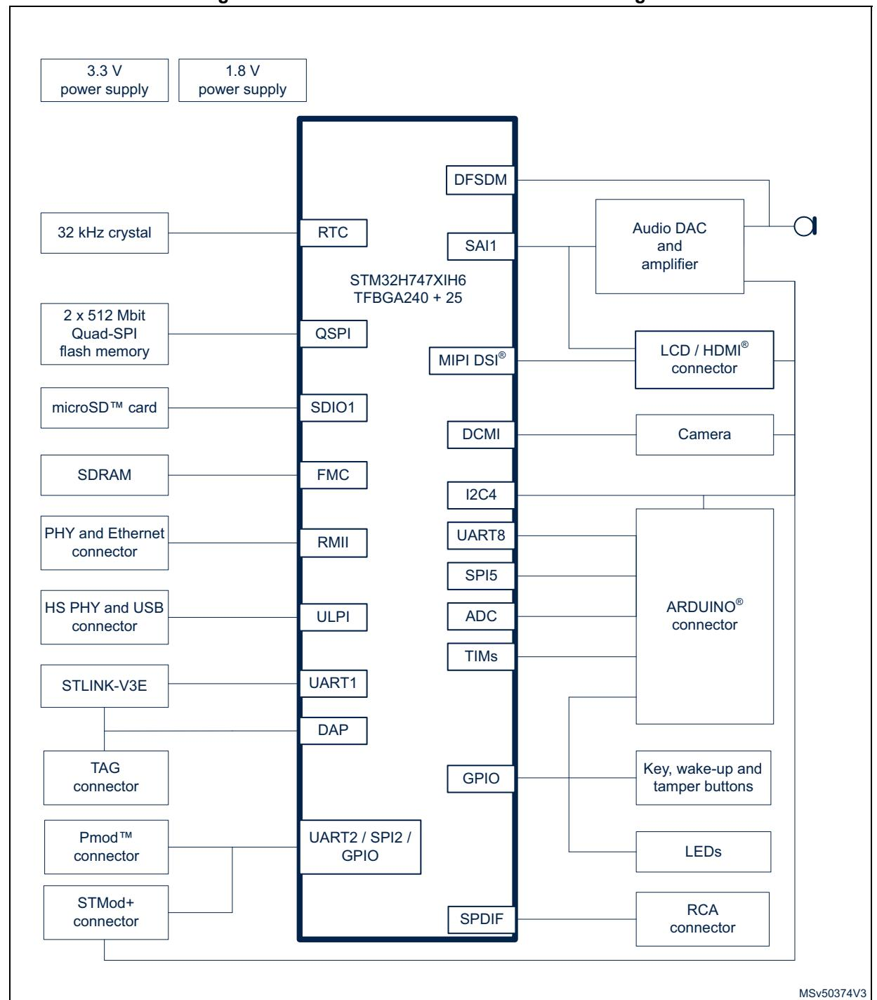
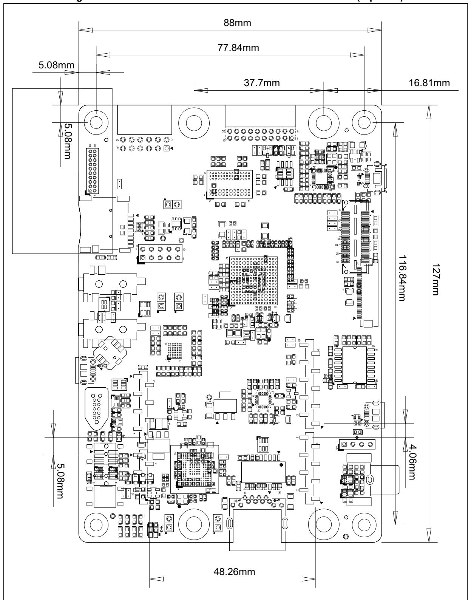

# **6 Hardware layout and configuration**

The STM32H747I-DISCO Discovery kit is designed around the STM32H747XIH6 target microcontroller in TFBGA 240+25-pin package. *[Figure](#page-0-0) 4* illustrates the connections of the STM32H747XIH6 with the peripheral components. *[Figure](#page-1-0) 5* and *[Figure](#page-2-0) 6* show the locations of the main components on the Discovery kit.

**Figure 4. STM32H747I-DISCO hardware block diagram**

MSv50375V3 microSD™ connector (CN12) USB OTG2 HS LED (LD7) 5 V power LED (LD8) Audio-in jack (CN10) Audio-out jack (CN11) STLINK-V3E overcurrent alarm LED (LD9) ARDUINO® connectors (CN8, CN9) STDC14 connector (CN13) Ethernet connector (CN7) RCA connector (CN3) STLINK-V3E USB connector (CN2) Camera module connector (P1) ARDUINO® connectors (CN5, CN6) USB OTG HS connector (CN1) USB HS overcurrent LED (LD5) STM32H747XI MCU (U6)

**Figure 5. STM32H747I-DISCO board layout (top view)**

MSv50376V3 Joystick (B3) Wake-up button (B2) Reset button (B1) 4 color LEDs (LD1to LD4) TAG connector (CN16) MEMS microphone (U21) Audio connector (CN17) Pmod™ connector (P3) STLINK-V3E COM LED (LD10) STMod+ connector (P2) DSI® LCD connector (CN15)

**Figure 6. STM32H747I-DISCO board layout (bottom view)**

*[Figure](#page-3-0) 7* provides the mechanical dimensions of the STM32H747I-DISCO Discovery board.

**Figure 7. STM32H747I-DISCO board mechanical dimensions (top view)**

# **6.1 STLINK-V3E**

The STLINK-V3E facility for the debug and programming of the STM32H747XIH6 is integrated on the STM32H747I-DISCO Discovery kit. It supports the following features:

- Self-powered through a USB connector (Micro-B)
- USB 2.0 high-speed compatible interface
- Direct firmware update support (DFU)
- SWD and serial wire viewer (SWV) communication support
- Drag-and-drop flash memory programming
- Two color LEDs: communication and power

USB connector CN2 can be used to power the STM32H747I-DISCO regardless of the STLINK-V3E facility used for debugging or programming the STM32H747XIH6. This holds also when the STLINK-V3E stand-alone tool is connected to connector CN13 or CN16 and used for debugging or programming the STM32H747XIH6. *Section [6.2: Power supply](#page-4-0)* provides more detail about powering the STM32H747I-DISCO.

Refer to *www.st.com* for details about STLINK-V3E.

### **6.1.1 Drivers and firmware upgrade**

The STLINK-V3E requires drivers to be installed on Windows®. It embeds firmware that needs regular update in order to benefit from new functionality or corrections. Refer to the *Overview of ST-LINK derivatives* technical note (TN1235) for details.

# **6.2 Power supply**

The STM32H747I-DISCO Discovery kit is designed to be powered from a 5 V DC power source. One of the following five 5 V DC power inputs can be used, upon appropriate board configuration:

- Micro-B USB receptacle CN2 of STLINK-V3E with enumeration: Up to 500 mA can be supplied to the board (JP6 jumper setting on STlk on silkscreen). Offers the enumeration feature described in *[Section 6.2.1](#page-5-0)*.
- Micro-B USB receptacle CN2 of STLINK-V3E without enumeration: Up to 500 mA can be supplied to the board directly without enumeration (JP6 jumper setting on CHgr on silkscreen).
- Micro-AB USB receptacle CN1 of the USB OTG HS interface: Marked USB OTG\_HS on the board (JP6 jumper setting on HS on silkscreen). Up to 500 mA can be supplied to the board in this way.
- 7-12V DC power from CN8 pin8: Named VIN on silkscreen, the extension connectors for ARDUINO® Uno shields (JP6 setting on external power source on silkscreen (E5V)).
- Micro-B USB receptacle CN14 for external 5V: Up to 500 mA can be supplied to the board (JP6 jumper setting on U5V on silkscreen).

The LD8 green LED turns on when the voltage on the power line marked as +5V is present. All supply lines required for the operation of the components on the STM32H747I-DISCO are derived from that +5V line.

UM2411 Rev 7 15/56

*Table [3: Power-supply related jumper and solder bridge settings](#page-7-0)* describes the settings of all jumpers related to powering the STM32H747I-DISCO and extension board. VDD\_MCU is STM32H747XIH6 digital supply voltage line. It can be connected to a fixed 3.3 V supply.

#### **6.2.1 Supplying the board through STLINK-V3E USB port**

To power the STM32H747I-DISCO in this way, the USB host (a PC) gets connected to the Micro-B USB receptacle of the STM32H747I-DISCO via a USB cable. The connection event starts the USB enumeration procedure. In its initial phase, the host USB port current supply capability is limited to 100 mA. It is enough because only the STLINK-V3E part of the STM32H747I-DISCO draws power at that time: the U10 power switch is set to the OFF position, which isolates the rest of the STM32H747I-DISCO from the power source. In the next phase of the enumeration procedure, the host PC informs the STLINK-V3E facility of its capability to supply current up to 300 mA. If the answer is positive, the STLINK-V3E sets the U10 switch to the ON position to supply power to the rest of the STM32H747I-DISCO board. If the PC USB port is not capable of supplying current up to 300 mA of, CN8 pin8 (VIN) or CN14 can be used to supply the board instead.

Should a short-circuit occur on the board, the power switch protects the USB port of the host PC against a current demand exceeding 500 mA, In such an event, the LD9 LED lights up.

The STM32H747I-DISCO board can also be supplied from a USB power source not supporting enumeration, such as a USB charger. In this particular case, the jumper JP6 must be fitted with a jumper hat as shown in *Table [3: Power-supply related jumper and](#page-7-0)  [solder bridge settings](#page-7-0)*. STLINK-V3E bypasses power regardless of enumeration procedure result and passes the power unconditionally to the board.

The LD8 green LED turns on whenever the whole board is powered.

#### **6.2.2 Using STLINK-V3E along with powering through external power**

It can happen that the board requires more than 300 mA of supply current. It cannot be supplied from the host PC connected to the STLINK-V3E USB port for debugging or programming the STM32H747XIH6. In such a case, the board can be supplied through CN8 pin8 (marked VIN on the board) or CN14.

To do this, it is important to power the board before connecting it with the host PC, which requires the following sequence to be respected:

- 1. Set jumper JP6 in the E5V or U5V position
- 2. Connect the external power source to CN8 pin8 or CN14
- 3. Check that the green LED LD8 is turned on
- 4. Connect the host PC to USB connector CN2

**Caution:** In case the board demands more than 300 mA and the host PC is connected via USB before the board is powered from CN8 pin8 or CN14, there is a risk that the following events occur (listed in reverse severity order):

- 1. The host PC is capable of supplying 300 mA (the enumeration succeeds) but it features no over-current protection on its USB port. It is damaged due to over-current.
- 2. The host PC is capable of supplying 300 mA (the enumeration succeeds) and it has a built-in over-current protection on its USB port, limiting or shutting down the power out

16/56 UM2411 Rev 7

- of its USB port when the excessive current demand from STM32H747I-DISCO is detected. This causes an operating failure of STM32H747I-DISCO.
- 3. The host PC is not capable of supplying 300 mA (the enumeration fails). The STLINK-V3E does not supply the rest of the STM32H747I-DISCO from its USB port VBUS line.

#### **6.2.3 SMPS/LDO power supply**

There are two possible solutions to provide power to MCU Vcore: SMPS or LDO. Power figures in Run mode are significantly improved when Vcore logic power is supplied by the internal DC/DC converter (SMPS). The default power supply for Vcore logic is SMPS. The user need to apply some changes to switch to the LDO power supply:

- SMPS mode (default):
  - SB2, SB11, SB19, SB46, SB48 mounted
  - SB1, SB12, SB49 removed
- LDO mode:
  - SB1, SB12, SB49 mounted
  - SB2, SB11, SB19, SB46, SB48 removed

**Caution:** A deadlock occurs if the board SMPS/LDO firmware PWR configuration does not match the hardware configuration: after the reset, the ST-LINK cannot connect the target anymore.

> The firmware PWR configuration must be set as follows in function SystemClock\_Config in file *main.c*:

- If the hardware configuration is "Direct SMPS" (default configuration): HAL\_PWREx\_ConfigSupply(PWR\_DIRECT\_SMPS\_SUPPLY);
- If the hardware configuration is "LDO": HAL\_PWREx\_ConfigSupply(PWR\_LDO\_SUPPLY);

If a deadlock occurs because of a mismatch between hardware and firmware PWR settings (SMPS/LDO), the user can recover the board by applying the following procedure:

- 1. Power off the board.
- 2. Connect pin BOOT0 to VDD using a wire (or short R192). This changes the BOOT0 pin to 1 instead of 0, thus changing the device boot address to boot address 1 and making the bootloader start in System memory. This avoids starting firmware in the user flash memory with a wrong SMPS/LDO configuration versus the hardware board configuration.
- 3. Power on the board and connect using STM32CubeProgrammer (STM32CubeProg).
- 4. Erase the user flash memory.
- 5. Power off the board and remove the short between BOOT0 and VDD.
- 6. The board is recovered and can be used normally with matching firmware PWR.

UM2411 Rev 7 17/56

*[Table](#page-7-0) 3* details jumper and solder bridge settings used for the configuration of the power supply of STM32H747I-DISCO.

**Table 3. Power-supply related jumper and solder bridge settings** 

| Jumper / Solder bridge       | Setting                       | Configuration                                                                                                                                                                      |
|------------------------------|-------------------------------|------------------------------------------------------------------------------------------------------------------------------------------------------------------------------------|
| JP6 Power source selector | STlk U5V HS E5V CHgr | Default setting. STM32H747I-DISCO is supplied through the CN2 Micro-B USB receptacle. Depend on host PC USB port's powering capability declared in the enumeration. |
|                              | STlk U5V HS E5V CHgr | STM32H747I-DISCO is supplied through the CN14 Micro-B USB receptacle.                                                                                                        |
|                              | STlk U5V HS E5V CHgr | STM32H747I-DISCO is supplied through the CN1 Micro-AB USB receptacle.                                                                                                        |
|                              | STlk U5V HS E5V CHgr | STM32H747I-DISCO is supplied through the pin 8 of CN8 (marked VIN).                                                                                                             |
|                              | STlk U5V HS E5V CHgr | STM32H747I-DISCO is supplied through the CN2 Micro-B USB receptacle. Setting for powering the board through CN2 using USB charger.                                     |
| SB16                         | SB16 ON                       | Default setting. VBAT is connected to +3V3.                                                                                                                                     |
| VBAT connection              | SB16 OFF                      | VBAT is not connected to +3V3.                                                                                                                                                     |
| SB10 VDD_USB connection   | SB10 ON                       | Default setting. VDD_USB (VDDUSB terminal of STM32H747XIH6) is connected to VDD_MCU.                                                                                      |
|                              | SB10 OFF                      | VDD_USB is not connected to VDD_MCU.                                                                                                                                               |

| Jumper / Solder bridge    | Setting | Configuration                                                                                    |
|---------------------------|---------|--------------------------------------------------------------------------------------------------|
| JP3 VDD_MCU connection | 1 2  | Default setting. VDD_MCU (VDD terminals of STM32H747XIH6) is connected to fixed +3.3 V. |
|                           | 1 2  | VDD_MCU (VDD terminals of STM32H747XIH6) is not connected to fixed +3.3 V                  |

**Table 3. Power-supply related jumper and solder bridge settings (continued)**

# **6.3 Clock references**

Two clock references (X2 and X3) are available on the STM32H747I-DISCO for the STM32H747XIH6 target microcontroller. The two other clock sources (X1 and X4) are for the peripherals:

- 24 MHz oscillator X1, for USB OTG HS PHY and camera module (daughter board)
- 25 MHz oscillator X2, for main clock generator and Ethernet PHY
- 32.768 kHz crystal X3, for embedded RTC
- 25 MHz oscillator X4, for STLINK-V3E only

The main clock can also be generated using an internal RC oscillator. The X2 reference clock must be disconnected by removing resistor R73 when the internal RC clock is used.

# **6.4 Reset source**

The general reset of the STM32H747I-DISCO board is active low. The reset sources are:

- Reset button B1
- STDC14 connector CN13 and TAG connector CN16 (reset from debug tools)
- ARDUINO® Uno shield board through connector CN8
- Embedded STLINK-V3E

# **6.5 Audio**

A codec is connected to the SAI interface of the STM32H747XIH6. It supports the TDM feature of the SAI port. The TDM feature enables the STM32H747XIH6 to simultaneously stream two independent stereo audio channels to two separate stereo analog audio outputs. The codec communicates with the STM32H747XIH6 via the I2C4 bus, which is shared with the DSI® LCD, camera module, ARDUINO® Uno connectors, and STMod+ connector.

The audio connections are:

- The analog line input is connected to the ADC of the audio codec through the blue audio jack CN10
- The analog line output is connected to the DAC of the audio codec via the green audio jack CN11
- Two external speakers can be connected to the audio codec via JP5 for the right speaker and JP2 for the left speaker
- One digital microphone is present on the STM32H747I-DISCO board

The I2C-bus addresses of the audio codec are 34h and 35h.

### 6.5.1 Digital microphone

The U21 on the STM32H747I-DISCO board is a MEMS digital omnidirectional microphone providing PDM (pulse density modulation) output. The microphone is supplied with a programmable clock generated directly by the STM32H747XIH6 or the codec.

As an option, the microphone can be connected to U12 (audio codec device). In that configuration, the audio codec also supplies the PDM clock to the microphone.

Regardless of microphone routing (STM32H747XIH6 MCU or audio codec device), the power can be supplied either by VDD or the MICBIAS1 output of the audio codec device.

Table 4 shows the settings of all solder bridges associated to the digital microphone on the board

| Solder bridge             | Setting                               | Configuration                                                                                   |
|---------------------------|---------------------------------------|-------------------------------------------------------------------------------------------------|
| SB45, SB21, SB44, SB22 | SB45, SB21 open, SB44, SB22 closed | The PDM clock for the digital microphone is provided by the codec.                              |
|                           | SB45, SB21 closed, SB44, SB22 open | Default setting. The PDM clock for the digital microphone is provided by the STM32H747XIH6 MCU. |
| SB42, SB41                | SB41 closed, SB42 open             | The power supply of the digital microphone is generated by the codec.                           |
|                           | SB41 open, SB42 closed             | Default setting. The power supply of the digital microphone is +3V3.                            |

Table 4. Digital microphone-related jumper settings

# 6.6 USB OTG HS port

The STM32H747I-DISCO supports USB OTG HS (high-speed) communication via the U4 USB PHY with the ULPI interface. USB OTG connector CN1 is of the Micro-AB type.

#### 6.6.1 STM32H747I-DISCO as USB device

The STM32H747I-DISCO board may work as USB device on CN1 in any power source configuration. If the board is supplied by an external power source from jumper JP4 set on U5V, the user must pay attention that the power source delivers a sufficient amount of current for the complete STM32H747I-DISCO board setup.

20/56 UM2411 Rev 7

When a USB host connection to the CN1 Micro-AB USB connector of STM32H747I-DISCO is detected, the STM32H747I-DISCO board starts behaving as a USB device. Depending on the powering capability of the USB host, the board can take power from the VBUS terminal of CN1. In the board schematics, the corresponding power voltage line is called HS.

Refer to *Section [6.2: Power supply on page](#page-4-0) 15* for the related jumper setting.

#### **6.6.2 STM32H747I-DISCO as USB host**

When a USB device connection to the CN1 Micro-AB USB connector is detected, the STM32H747I-DISCO board starts behaving as USB host. It sources 5 V on the VBUS terminal of CN1 Micro-AB USB connector to power the USB device. For this to happen, the STM32H747XIH6 MCU sets the U2 power switch to the ON state via the USB PHY. The LD7 green LED marked OTG\_HS indicates that the peripheral is supplied by the board. The LD5 red LED marked HS\_OC lights up if over-current is detected.

# **6.7 Ethernet**

The STM32H747I-DISCO board supports 10 Mbps / 100 Mbps Ethernet communication with the U18 PHY and the CN7 integrated RJ45 connector. The Ethernet PHY is connected to the STM32H747XIH6 MCU via the RMII interface.

The 25 MHz clock for the PHY is generated by oscillator X2. The 50 MHz clock for the STM32H747XIH6 is provided by the RMII\_REF\_CLK of the PHY.

With the default setting, the Ethernet feature is not working because of a conflict between ETH\_MDC and SAI4\_D1 of the MEMs digital microphone. *[Table](#page-10-0) 5* shows the possible settings of all solder bridges or resistor associated with the Ethernet on the board.

| Solder bridge / resistor | Setting                  | Configuration                                                                                |
|-----------------------------|--------------------------|----------------------------------------------------------------------------------------------|
| SB8, SB21                   | SB8 open, SB21 closed | Default setting. STM32H747XIH6 port PC1 is connected to MEMs. digital microphone DOUT. |
|                             | SB8 closed, SB21 open | STM32H747XIH6 port PC1 is connected to Ethernet ETH_MDC.                                  |
| SB17, R87                   | R87 closed, SB17 open | Default setting. STM32H747XIH6 port PE2 is connected to MEMs. digital microphone CLK.  |
|                             | R87 open, SB17 closed | STM32H747XIH6 port PE2 is connected to Ethernet ETH_nINT.                                 |

**Table 5. Ethernet related solder bridge and resistor settings** 

# **6.8 SDRAM**

The U7 8M x 32bit SDRAM is connected to SDRAM Bank1 of the STM32H747XIH6 FMC interface.

# **6.9 Quad-SPI flash memory**

Two 512-Mbit Quad-SPI flash memory devices are fitted on STM32H747I-DISCO in positions U3 and U14, making possible the evaluation of the STM32H747XIH6 Quad-SPI interface.

# **6.10 Virtual COM port**

The serial interface USART1 is directly available as a Virtual COM port of a PC connected to STLINK-V3E USB connector CN2. The Virtual COM port configuration is:

- 115200 bit/s
- 8-bit data
- no parity
- 1 stop bit

# **6.11 User LEDs**

Four general-purpose color LEDs (LD1, LD2, LD3, and LD4) are available as light indicators. Each LED is in light-emitting state for a low level of the corresponding port of the STM32H747XIH6 MCU.

# **6.12 Physical input devices**

The STM32H747I-DISCO board provides a number of input devices for physical human control:

- Four-way joystick controller with select key (B3)
- Wake-up / Tamper button (B2)
- Reset button (B1)