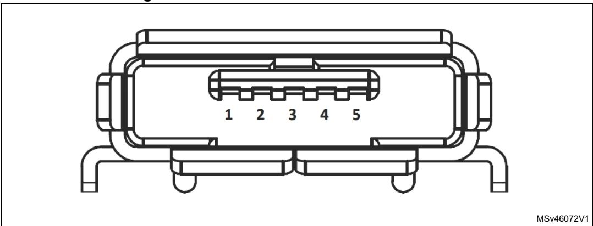
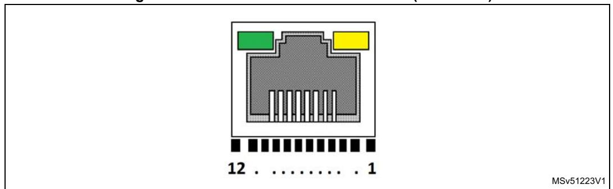
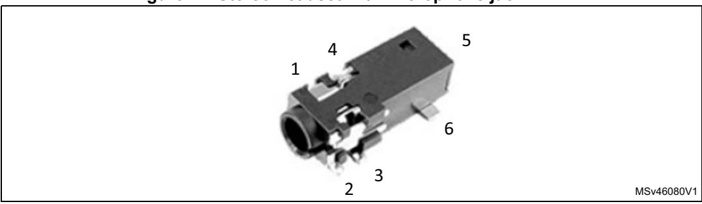
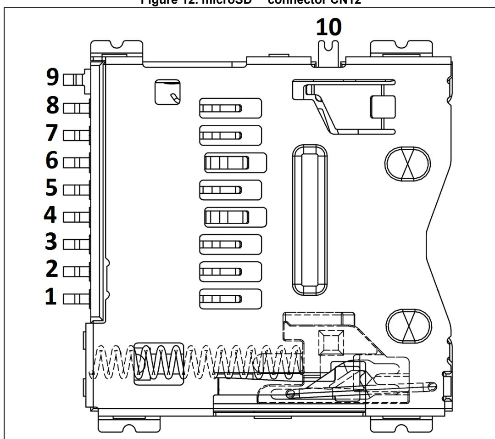
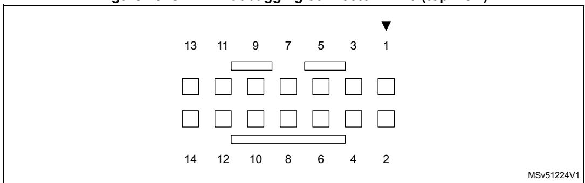
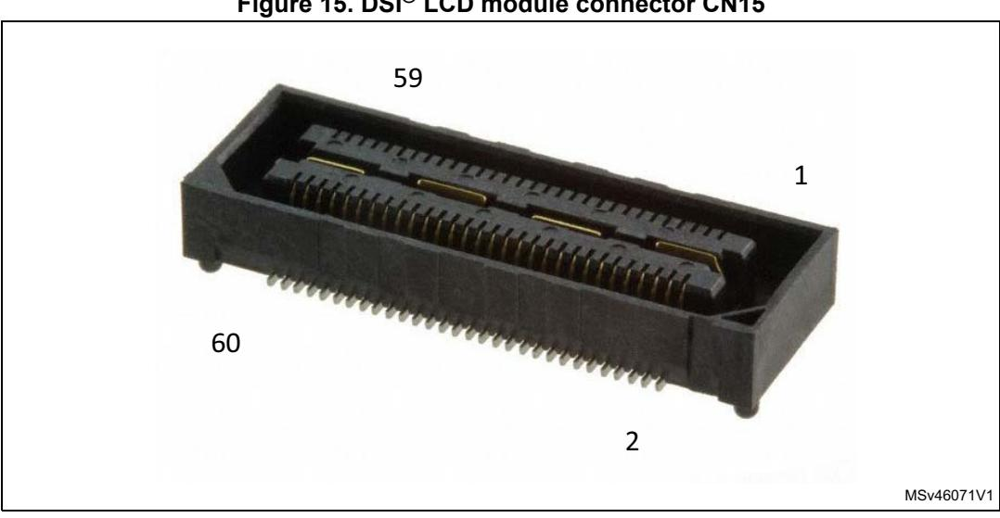
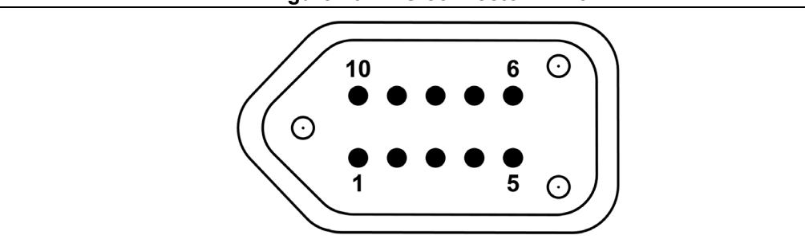
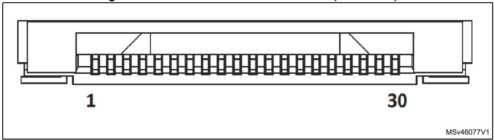
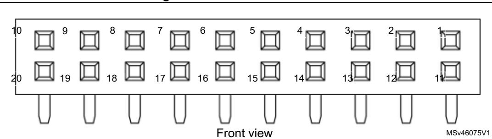
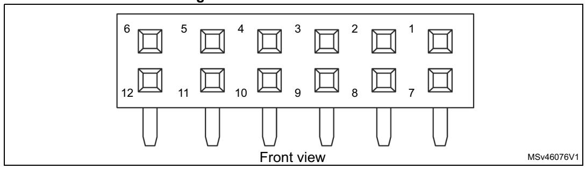

## **7 Connectors**

## **7.1 USB OTG HS Micro-AB connector CN1**

An USB OTG high speed communication link is available at USB Micro-AB receptacle connector CN1. Micro-AB receptacle enables USB Host and USB Device features.

**Figure 8. USB OTG HS Micro-AB connector CN1**

**Table 6. USB OTG HS Micro-AB connector CN1** 

| Pin number | Description | Pin number | Description |
|------------|-------------|------------|-------------|
| 1          | VBUS        | 4          | ID          |
| 2          | DM          | 5          | GND         |
| 3          | DP          | -          | -           |

## **7.2 STLINK-V3E USB Micro-B connector CN2**

USB connector CN2 is used to connect the embedded STLINK-V3E to the PC for programming and debugging software.

**Figure 9. USB Micro-B connector CN2**

**Table 7. USB Micro-B connector CN2** 

MSv46073V1

| Pin number | Description  | Pin number | Description |
|------------|--------------|------------|-------------|
| 1          | VBUS (power) | 4          | NC          |
| 2          | DM           | 5          | GND         |
| 3          | DP           | -          | -           |

## **7.3 SPDIF input RCA connector CN3**

**Table 8. SPDIF input RCA connector CN3** 

| Pin number | Description     | Pin number | Description |
|------------|-----------------|------------|-------------|
| 1          | SPDIF_RX0 (PD7) | 3          | GND         |
| 2          | GND             | 4          | GND         |

## **7.4 STLINK-V3E MCU programming header CN4**

The 4-pin STLINK-V3E MCU programming header offers a way to program and debug an MCU in an external application board using a dedicated cable connected to it.

**Table 9. STLINK-V3E MCU programming header CN4** 

| Pin number | Description  | Pin number | Description  |
|------------|--------------|------------|--------------|
| 1          | 3V3          | 3          | GND          |
| 2          | SWCLK (PA14) | 4          | SWDIO (PA13) |

*Note: The STLINK-V3E MCU programming header is not populated by default. Its use is reserved to advanced users.*

24/56 UM2411 Rev 7

# 7.5 ARDUINO® Uno V3 connectors CN5, CN6, CN8 and CN9

ARDUINO $^{\$}$  Uno V3 connectors CN5, CN6, CN8 and CN9 are female connectors compatible with ARDUINO $^{\$}$  Uno Revision 3 standard. Most of shields designed for ARDUINO $^{\$}$  Uno V3 fit to STM32H747I-DISCO board.

Table 10. ARDUINO® Uno V3 compatible connectors

| Left connectors |             |             |                     |                                            | Right connectors        |            |             |             |              |
|-----------------|-------------|-------------|---------------------|--------------------------------------------|-------------------------|------------|-------------|-------------|--------------|
| CN number    | Pin nbr. | Pin name | MCU pin          | Function                                   | Function                | MCU pin | Pin name | Pin nbr. | CN number |
|                 |             |             |                     |                                            | I2C4_SCL                | PD12       | D15         | 10          |              |
|                 |             |             |                     |                                            | I2C4_SDA                | PD13       | D14         | 9           |              |
|                 |             | -           |                     |                                            | AVDD                    | -          | AREF        | 8           |              |
|                 |             |             |                     |                                            | Ground                  | -          | GND         | 7           |              |
|                 | 1           | NC          | -                   | -                                          | SPI5_SCK                | PK0        | D13         | 6           |              |
|                 | 2           | IOREF       | -                   | 3.3 V Ref                                  | SPI5_MISO               | PJ11       | D12         | 5           | CN5          |
|                 | 3           | RESET       | NRST                | RESET                                      | TIM1_CH2N, SPI5_MOSI | PJ10       | D11         | 4           | Digital      |
| CN8 Power    | 4           | +3V3        | -                   | 3.3 V (1) input / output     | TIM1_CH1, SPI5_NSS   | PK1        | D10         | 3           |              |
|                 | 5           | +5V         | -                   | 5 V output                                 | TIM8_CH2                | PJ6        | D9          | 2           |              |
|                 | 6           | GND         | -                   | Ground                                     | -                       | PJ5        | D8          | 1           |              |
|                 | 7           | GND         | -                   | Ground                                     |                         |            | _           | •           |              |
|                 | 8           | VIN         | -                   | Power input (2)                 | -                       | PJ0        | D7          | 8           |              |
|                 | •           | -           |                     |                                            | TIM8_CH2N               | PJ7        | D6          | 7           |              |
|                 | 1           | A0          | PA4                 | ADC12_INP18                                | TIM3_CH1                | PA6        | D5          | 6           | CN6          |
|                 | 2           | A1          | PF10                | ADC3_INP6                                  | -                       | PJ4        | D4          | 5           |              |
|                 | 3           | A2          | PA0_C               | ADC12_INP0                                 | TIM13_CH1               | PF8        | D3          | 4           |              |
| CN9             | 4           | A3          | PA1_C               | ADC12_INP1                                 | -                       | PJ3        | D2          | 3           |              |
| Analog          | 5           | A4          | PC2_C or PD13 | ADC3_INP0 or I2C4_SDA (3) | UART8_TX                | PJ8        | D1          | 2           |              |
|                 | 6           | A5          | PC3_C or PD12 | ADC3_INP1 or I2C4_SCL (3) | UART8_RX                | PJ9        | D0          | 1           |              |

The +3V3 on ARD connector Pin4 of CN8 is not a power input for STM32H747I-DISCO board, to simplify power architecture.

UM2411 Rev 7 25/56

2. The external voltage applied to pin VIN on Pin8 of CN8 must be in the range 6 to 9V at 25°C ambient temperature. If a higher voltage is applied on the regulator U19, it may overheat and could be damaged.

3. By default, Pin 5 and Pin 6 of CN9 connector are connected to ADC MCU input ports PC2\_C and PC3\_C respectively, thanks to configuration of solder bridges: SB6 and SB23 closed, SB7 and SB24 opened. In case it is necessary to connect I2C interface signals on pins 5 and 6 of CN9 instead of ADC inputs, open SB6 and SB23, and close SB7 and SB24.

Before using any ARDUINO® Uno V3 shield, it is important to refer to *Section 6.2.1: Supplying the board through STLINK-V3E USB port on page 16* for a correct configuration of JP6.

**Caution:** The I/Os of the STM32 microcontroller are +3V3 compatible instead of 5 V for ARDUINO®

Uno V3.

## **7.6 Ethernet RJ45 connector CN7**

Yellow LED: Ethernet connection.

Green LED: Ethernet traffic.

| Pin number | Description | Pin number | Description   |  |  |
|------------|-------------|------------|---------------|--|--|
| 1          | TX+         | 7          | CT            |  |  |
| 2          | TX-         | 8          | CT            |  |  |
| 3          | RX+         | 9          | K, yellow LED |  |  |
| 4          | CT          | 10         | A, yellow LED |  |  |
| 5          | CT          | 11         | K, green LED  |  |  |
| 6          | RX-         | 12         | A, green LED  |  |  |

**Table 11. USB Micro-B connector CN2** 

## **7.7 Audio blue jack (Line In) connector CN10**

The 3.5 mm stereo audio blue jack input CN10 is available on the STM32H747I-DISCO Discovery board for audio line input.

## **7.8 Audio green jack (Line Out) connector CN11**

The 3.5 mm stereo audio green jack output CN11 is available on the STM32H747I-DISCO Discovery board for headphones.

**Figure 11. Stereo headset with microphone jack CN11**

**Table 12. Audio jack connector CN11 (on board)** 

| Pin number | Description | Stereo headset pinning |  |
|------------|-------------|------------------------|--|
| 1          | NC          | NA                     |  |
| 2          | NC          | NA                     |  |
| 3          | GND         | GND                    |  |
| 4          | OUT_Right   | SPK_R (33 ohm typ.)    |  |
| 5          | NC          | NA                     |  |
| 6          | OUT_Left    | SPK_L (33 ohm typ.)    |  |

## **7.9 microSD™ card connector CN12**

microSD™ cards with 4 Gbytes or more capacity are inserted in the receptacle CN12. Four data bits of the SDMMC1 interface, CLK and CMD signals of the STM32H747XIH6 are used to communicate with the microSD™ card at +3V3 only. The card insertion is detected by the PI8 GPIO: when a microSD™ card is inserted, the logic level is 0, otherwise it is 1.

**Figure 12. microSD™ connector CN12**

**Table 13. microSD™ connector CN12** 

| Pin number | Description     | Pin number | Description      |
|------------|-----------------|------------|------------------|
| 1          | SDIO1_D2 (PC10) | 6          | GND              |
| 2          | SDIO1_D3 (PC11) | 7          | SDIO1_D0 (PC8)   |
| 3          | SDIO1_CMD (PD2) | 8          | SDIO1_D1 (PC9)   |
| 4          | +3V3            | 9          | GND              |
| 5          | SDIO1_CK (PC12) | 10         | µSD_DETECT (PI8) |

## **7.10 STDC14 connector CN13**

**Figure 13. STDC14 debugging connector CN13 (top view)**

**Table 14. STDC14 debugging connector CN13** 

| Terminal | Function / MCU port | Terminal | Function / MCU port |
|----------|---------------------|----------|---------------------|
| 1        | -                   | 2        | -                   |
| 3        | VDD                 | 4        | SWDIO/TMS (PA13)    |
| 5        | GND                 | 6        | SWDCLK/TCK (PA14)   |
| 7        | GND                 | 8        | SWO/TDO (PB3)       |
| 9        | KEY                 | 10       | TDI (PA15)          |
| 11       | GND                 | 12       | RESET#              |
| 13       | VCP_RX (PA10)       | 14       | VCP_TX (PA9)        |

## **7.11 External 5 V USB Micro-B connector CN14**

USB connector CN14 is used to provide additional external 5 V power to the STM32H747I-DISCO if more power current is consumed on the board.

MSv46073V1

**Figure 14. USB Micro-B connector CN14**

**Table 15. USB Micro-B connector CN14** 

| Pin number | Description  | Pin number | Description |
|------------|--------------|------------|-------------|
| 1          | VBUS (power) | 4          | NC          |
| 2          | NC           | 5          | GND         |
| 3          | NC           | -          | -           |

# **7.12 DSI® LCD connector CN15 (MIPI®)**

The CN15 connector is designed to connect the DSI® LCD module daughterboard. The MB1166 daughterboard is available to be mounted on the STM32H747I-DISCO board. *[Table](#page-8-0) 16* shows the assignment of CN15 and STM32H747XIH6 terminals.

**Figure 15. DSI® LCD module connector CN15**

**Table 16. DSI® LCD module connector CN15** 

| Function    | Pin connection |    | CN15 pin number | Pin connection | Function |
|-------------|-------------------|----|--------------------|-------------------|----------|
| GND         | -                 | 1  | 2                  | -                 | -        |
| DSI_CK_P    | -                 | 3  | 4                  | PK7               | DSI_INT  |
| DSI_CK_N    | -                 | 5  | 6                  | -                 | GND      |
| GND         | -                 | 7  | 8                  | GND               | RFU(1)   |
| DSI_D0_P    | -                 | 9  | 10                 | GND               | RFU(1)   |
| DSI_D0_N    | -                 | 11 | 12                 | -                 | GND      |
| GND         | -                 | 13 | 14                 | GND               | RFU(1)   |
| DSI_D1_P    | -                 | 15 | 16                 | GND               | RFU(1)   |
| DSI_D1_N    | -                 | 17 | 18                 | -                 | GND      |
| GND         | -                 | 19 | 20                 | -                 | -        |
| BLVDD (5V)  | -                 | 21 | 22                 | -                 | -        |
| BLVDD (5V)  | -                 | 23 | 24                 | -                 | -        |
| -           | -                 | 25 | 26                 | -                 | -        |
| BLGND       | -                 | 27 | 28                 | -                 | -        |
| BLGND       | -                 | 29 | 30                 | -                 | -        |
| -           | -                 | 31 | 32                 | -                 | -        |
| -           | -                 | 33 | 34                 | -                 | -        |
| SCLK/MCLK   | PE5               | 35 | 36                 | -                 | 3.3 V    |
| LRCLK       | PE4               | 37 | 38                 | -                 | -        |
| I2S_DATA    | PE6               | 39 | 40                 | PD13              | I2C_SDA  |
| -           | -                 | 41 | 42                 | -                 | -        |
| -           | -                 | 43 | 44                 | PD12              | I2C_SCL  |
| CEC_CLK     | PA8               | 45 | 46                 | -                 | -        |
| CEC         | PB6               | 47 | 48                 | -                 | -        |
| DSI_TE      | PJ2               | 49 | 50                 | -                 | -        |
| -           |                   | 51 | 52                 | -                 | -        |
| DSI_BL_CTRL | PJ12              | 53 | 54                 | -                 | -        |
| -           | -                 | 55 | 56                 | -                 | -        |
| DSI_RST     | PG3               | 57 | 58                 | -                 | -        |
| -           | -                 | 59 | 60                 | -                 | 1.8 V    |

1. Reserved for future use.

## **7.13 TAG connector CN16**

The TAG connector footprint CN16 is used to connect STM32H747XIH6 microcontroller for programming or debugging the board.

**Figure 16. TAG connector CN16**

**Table 17. TAG connector CN16** 

| Pin number | Description | Pin number | Description       |
|------------|-------------|------------|-------------------|
| 1          | VDD         | 2          | SWDIO/TMS (PA13)  |
| 3          | GND         | 4          | SWDCLK/TCK (PA14) |
| 5          | GND         | 6          | SWO/TDO (PB3)     |
| 7          | NC          | 8          | TDI (PA15)        |
| 9          | TRST (PB4)  | 10         | RESET#            |

## **7.14 Audio connector CN17**

The 2x10-male-pin 1.27 mm-pitch audio connector is used for Audio MEMS daughter board extension with the DFSDM interface.

**Table 18. Audio connector CN17** 

| Terminal | Function / MCU port | Terminal | Function / MCU port |
|----------|---------------------|----------|---------------------|
| 1        | GND                 | 2        | +3V3                |
| 3        | DFSDM_CKOUT (PD3)   | 4        | DFSDM_CKOUT (PD3)   |
| 5        | DFSDM_DATIN3 (PC7)  | 6        | DFSDM_DATIN7 (PB9)  |
| 7        | DFSDM_DATIN1 (PC3)  | 8        | DFSDM_DATIN2 (PB14) |
| 9        | NC                  | 10       | DETECTn (PC6)       |
| 11       | NC                  | 12       | MEMS_LED (PJ13)     |
| 13       | NC                  | 14       | NC                  |
| 15       | NC                  | 16       | NC                  |
| 17       | NC                  | 18       | NC                  |
| 19       | +3V3                | 20       | GND                 |

## **7.15 Camera module connector P1**

An 8-bit camera module function is supported thanks to the 30-pin dedicated ZIF connector P1. The reference of the camera module to be used is STM32F4DIS-CAM. This module must be connected with caution before powering the STM32H747I-DISCO Discovery board. The camera module I²C addresses are 0x61 and 0x60. The camera module is usable by default. Care must be taken of GPIO sharing and multiplexing with other functions, in order to program the good configuration.

#### GPIO assignment and sharing:

- DCMI\_SDA and DCMI\_SCL I2C peripheral shared with Pmod™/STMOD+ connector, ARDUINO® connector, and audio DSI® LCD
- Camera module signals PA4, PC6, PC7, PB8, PB9, PD3 shared with Pmod™
- Camera module signals PC9 and PC11 shared with SDIO
- Camera module signal PA6 shared with ARDUINO®

**Figure 17. Camera module connector P1 (front view)**

**Table 19. Camera module connector P1** 

| Pin number | Description      | Pin number | Description          |  |
|------------|------------------|------------|----------------------|--|
| 1          | GND              | 16         | GND                  |  |
| 2          | NC               | 17         | DCMI_HSYNC (PA4)     |  |
| 3          | NC               | 18         | NC                   |  |
| 4          | DCMI_D0 (PC6)    | 19         | DCMI_VSYNC (PB7)     |  |
| 5          | DCMI_D1 (PC7)    | 20         | 3V3                  |  |
| 6          | DCMI_D2 (PG10)   | 21         | Camera_CLK (OSC_24M) |  |
| 7          | DCMI_D3 (PC9)    | 22         | NC                   |  |
| 8          | DCMI_D4 (PC11)   | 23         | GND                  |  |
| 9          | DCMI_D5 (PD3)    | 24         | NC                   |  |
| 10         | DCMI_D6 (PB8)    | 25         | DCMI_PWR_EN (PJ14)   |  |
| 11         | DCMI_D7 (PB9)    | 26         | RESET#               |  |
| 12         | NC               | 27         | DCMI_SDA (PD13)      |  |
| 13         | NC               | 28         | DCMI_SCL (PD12)      |  |
| 14         | GND              | 29         | GND                  |  |
| 15         | DCMI_PIXCK (PA6) | 30         | 3V3                  |  |

#### 7.16 STMod+ connector P2

34/56

The standard 20-pin STMod+ connector is available on the STM32H747I-DISCO board to increase the compatibility with external boards and modules from the microcontrollers ecosystem. By default, it is designed to support an ST dedicated fan-out board, which allows connecting different modules or board extensions from different manufacturers. The fan-out board also embeds a 3V3 regulator. For more detailed information, refer to the STMicroelectronics fan-out board user manual, and to the relevant datasheets of the associated modules.

For details about STMod+ interface, refer to the STMod+ connector interface specification.

Figure 18. STMod+ connector P2

Table 20. STMod+ connector P2

| Pin number | Description                     | Pin number | Description       |  |
|---------------|---------------------------------|---------------|-------------------|--|
| 1             | SPI2_NSS/USART2_CTS (PA11/PA0)  | 11            | INT (PC6)         |  |
| 2             | SPI2_MOSI/ USART2_TX (PC3/PD5)  | 12            | RESET (PJ13)      |  |
| 3             | SPI2_MISO/ USART2_RX (PC2/PD6)  | 13            | ADC (PA4)         |  |
| 4             | SPI2_SCK/ USART2_RTS (PA12/PD4) | 14            | PWM (PF8)         |  |
| 5             | GND                             | 15            | +5 V              |  |
| 6             | +5 V                            | 16            | GND               |  |
| 7             | I2C4_SCL (PD12)                 | 17            | DFSDM-DATA3 (PC7) |  |
| 8             | SPI2_MOSIs (PB15)               | 18            | DFSDM-CKOUT (PD3) |  |
| 9             | SPI2_MISOs (PB14)               | 19            | DFSDM-DATA7 (PB9) |  |
| 10            | I2C4_SDA (PD13)                 | 20            | DFSDM-CK7 (PB8)   |  |

This connector shares many GPIOs with other functions on the board. For more detailed information, refer to *Appendix A: STMod+ GPIO sharing and multiplexing*.

In addition, to have a quick look at STMod+ GPIO sharing and multiplexing, and to get a quick view on other Alternate functions available on its pins, refer to *Appendix A: STMod+GPIO sharing and multiplexing*.

UM2411 Rev 7

## **7.17 Pmod™ connector P3**

The standard 12-pin Pmod™ connector is available on the STM32H747I-DISCO Discovery board to support low frequency, low I/O pin count peripheral modules. The Pmod™ interface implemented on the STM32H747I-DISCO Discovery board is compatible with the Pmod™ type 2A & 4A I/O signal assignment convention.

**Figure 19. Pmod™ connector P3**

**Table 21. Pmod™ connector P3** 

| Pin number | Description                     | Pin number | Description |
|------------|---------------------------------|------------|-------------|
| 1          | SPI2_NSS/USART2_CTS (PA11/PA0)  | 7          | INT (PC6)   |
| 2          | SPI2_MOSI/ USART2_TX (PC3/PD5)  | 8          | RESET (PJ3) |
| 3          | SPI2_MISO/ USART2_RX (PC2/PD6)  | 9          | NA          |
| 4          | SPI2_SCK/ USART2_RTS (PA12/PD4) | 10         | NA          |
| 5          | GND                             | 11         | GND         |
| 6          | +3V3                            | 12         | +3V3        |

Pmod™ also shares GPIOs with other functions of the board. For more detailed information, refer to *Appendix A: STMod+ GPIO sharing and multiplexing*.