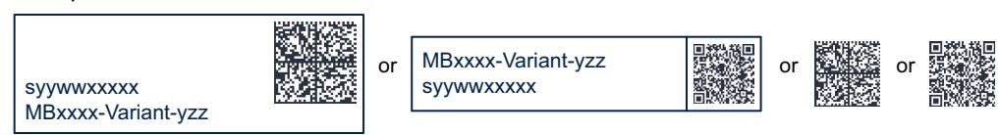

## **9 STM32H747I-DISCO Discovery kit information**

## **9.1 Product marking**

The product and each board composing the product are identified with one or several stickers. The stickers, located on the top or bottom side of each PCB, provide product information:

• Main board featuring the target device: product order code, product identification, serial number, and board reference with revision. Single-sticker example:

Product order code Product identification syywwxxxxx MBxxxx-Variant-yzz

#### Dual-sticker example:

Product order code Product identification

MBxxxx-Variant-yzz syywwxxxxx and

• Other boards if any: board reference with revision and serial number. Examples:

DT73589V1

On the main board sticker, the first line provides the product order code, and the second line the product identification.

On all board stickers, the line formatted as *"MBxxxx-Variant-yzz"* shows the board reference *"MBxxxx",* the mounting variant *"Variant"* when several exist (optional), the PCB revision *"y"*, and the assembly revision *"zz"*, for example B01. The other line shows the board serial number used for traceability.

Products and parts labeled as *"ES"* or *"E"* are not yet qualified or feature devices that are not yet qualified. STMicroelectronics disclaims any responsibility for consequences arising from their use. Under no circumstances will STMicroelectronics be liable for the customer's use of these engineering samples. Before deciding to use these engineering samples for qualification activities, contact STMicroelectronics' quality department.

*"ES"* or *"E"* marking examples of location:

- On the targeted STM32 that is soldered on the board (for an illustration of STM32 marking, refer to the STM32 datasheet *Package information* paragraph at the *www.st.com* website).
- Next to the evaluation tool ordering part number that is stuck or silk-screen printed on the board.

Some boards feature a specific STM32 device version, which allows the operation of any bundled commercial stack/library available. This STM32 device shows a *"U"* marking option at the end of the standard part number and is not available for sales.

To use the same commercial stack in their applications, the developers might need to purchase a part number specific to this stack/library. The price of those part numbers includes the stack/library royalties.

44/56 UM2411 Rev 7

# 9.2 STM32H747I-DISCO product history

Table 23. Product history

| Order code       | Product identification | Product details                                                                                 | Product change description       | Product limitations |
|------------------|------------------------|-------------------------------------------------------------------------------------------------|----------------------------------|---------------------|
| STM32H747I-DISC1 | 32H747IDISC1/          | MCU: - STM32H747XIH6 revision "V"                                                               | Initial revision. No limitation. |                     |
|                  |                        | MCU errata sheet:  - STM32H745/747xI/G and STM32H755/757xI device limitations (ES0445)          |                                  | No limitation.      |
|                  |                        | Boards:  - MB1248-H747I-D02 (main board)  - MB1280-DEFAULT-B01 (STMod+ fan-out expansion board) |                                  |                     |
|                  | DK32H747I1\$AT1        | MCU: - STM32H747XIH6 revision "V"                                                               | Main board revision changed.     | No limitation.      |
|                  |                        | MCU errata sheet:  - STM32H745/747xI/G and STM32H755/757xI device limitations (ES0445)          |                                  |                     |
|                  |                        | Boards:  - MB1248-H747I-D03 (main board)  - MB1280-DEFAULT-B01 (STMod+ fan-out expansion board) |                                  |                     |

45/56

Table 23. Product history (continued)

| Order code       | Product identification | Product details                                                                                                                                  | Product change description   | Product limitations |
|------------------|------------------------|--------------------------------------------------------------------------------------------------------------------------------------------------|------------------------------|---------------------|
| STM32H747I-DISCO | 32H747IDISCO/          | MCU: - STM32H747XIH6 revision "V"                                                                                                                | Initial revision.            |                     |
|                  |                        | MCU errata sheet:  - STM32H745/747xI/G and STM32H755/757xI device limitations (ES0445)                                                           |                              |                     |
|                  |                        | Boards:  - MB1166-DEFAULT-A03 (LCD module daughterboard)  - MB1248-H747I-D02 (main board)  - MB1280-DEFAULT-B01 (STMod+ fan-out expansion board) |                              | No limitation.      |
|                  | DK32H747I\$AT1         | MCU: - STM32H747XIH6 revision "V"                                                                                                                | Main board revision changed. |                     |
|                  |                        | MCU errata sheet:  - STM32H745/747xI/G and STM32H755/757xI device limitations (ES0445)                                                           |                              |                     |
|                  |                        | Boards:  - MB1166-DEFAULT-A03 (LCD module daughterboard)  - MB1248-H747I-D03 (main board)  - MB1280-DEFAULT-B01 (STMod+ fan-out expansion board) |                              | No limitation.      |

Table 23. Product history (continued)

| Order code       | Product identification            | Product details                                                                                                                              | Product change description                                                                                                                            | Product limitations                                                    |
|------------------|-----------------------------------|----------------------------------------------------------------------------------------------------------------------------------------------|-------------------------------------------------------------------------------------------------------------------------------------------------------|------------------------------------------------------------------------|
| STM32H747I-DISCO | DK32H747I\$AT2, DK32H747I\$AT3 | MCU: - STM32H747XIH6 revision "V"                                                                                                            | - STMod+ fan-out expansion board revision changed  - LCD module daughterboard revision changed  - Packaging: plastic blister replaced by a carton box | No demonstration software is preloaded in this product identification. |
|                  |                                   | MCU errata sheet:  - STM32H745/747xI/G and STM32H755/757xI device limitations (ES0445)                                                       |                                                                                                                                                       |                                                                        |
|                  |                                   | Boards:  - MB1166-DEFAULT-A09 (LCD module daughterboard)  - MB1248-H747I-D03 (main board)  - MB1280-3V3-C01 (STMod+ fan-out expansion board) |                                                                                                                                                       |                                                                        |
|                  | DK32H747I\$AT4                    | MCU: - STM32H747XIH6 revision "V"                                                                                                            | - Main board revision changed - LCD module daughterboard revision changed                                                                             | No limitation.                                                         |
|                  |                                   | MCU errata sheet:  - STM32H745/747xI/G and STM32H755/757xI device limitations (ES0445)                                                       |                                                                                                                                                       |                                                                        |
|                  |                                   | Boards:  - MB1166-DEFAULT-A10 (LCD module daughterboard)  - MB1248-H747I-D04 (main board)  - MB1280-3V3-C01 (STMod+ fan-out expansion board) |                                                                                                                                                       |                                                                        |

UM2411 Rev 7 47/56

### **9.3 Board revision history**

**Table 24. Board revision history** 

| Board reference                               | Board variant and revision | Board change description                                                                                                                                                                                                                        | Board limitations                                                 |
|-----------------------------------------------|-------------------------------|----------------------------------------------------------------------------------------------------------------------------------------------------------------------------------------------------------------------------------------------------|-------------------------------------------------------------------|
|                                               | DEFAULT-A03                   | Initial revision.                                                                                                                                                                                                                                  | No limitation.                                                    |
| MB1166 (LCD module                         | DEFAULT-A09                   | LCD FRIDA FRD397B25009-D-CTK is replaced by FRIDA FRD400B25025-A-CTK.                                                                                                                                                                     | No limitation.                                                    |
| daughterboard)                                | DEFAULT-A10                   | LCD FRIDA FRD400B25025-A-CTK is replaced by FRIDA FRD400B25021-B-CTQ.                                                                                                                                                                     | No limitation.                                                    |
|                                               | H474I-D02                     | Initial revision.                                                                                                                                                                                                                                  | No limitation.                                                    |
|                                               | H474I-D03                     | SB30 closed by default.                                                                                                                                                                                                                            | No limitation.                                                    |
| MB1248 (main board)                        | H474I-D04                     | – Updated several parts due to obsolescence (such as inductor and quartz) – Refer to the bill of materials for further details                                                                                                   | No limitation.                                                    |
|                                               | DEFAULT-B01                   | The Altium project is updated with the STMicroelectronics standard library.                                                                                                                                                               | The Grove connector does not support the 5 V I2C interface. |
| MB1280 (STMod+ fan-out expansion board) | 3V3-C01                       | – Updated several parts due to obsolescence (such as transistors or others) – Updated T1 and T2 wiring – Updated silkscreens, logos, and PCB mechanical size – Refer to the bill of materials for further details | No limitation.                                                    |

