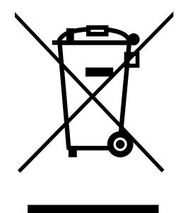

**UM2411 Product disposal**

## **13 Product disposal**

## **Disposal of this product: WEEE (Waste Electrical and Electronic Equipment)**

(Applicable in Europe)

This symbol on the product, accessories, or accompanying documents indicates that the product and its electronic accessories should not be disposed of with household waste at the end of their working life.

To prevent possible harm to the environment and human health from uncontrolled waste disposal, please separate these items from other type of waste and recycle them responsibly to the designated collection point to promote the sustainable reuse of material resources.

## Household users:

You should contact either the retailer where you buy the product or your local authority for further details of your nearest designated collection point.

## Business users:

You should contact your dealer or supplier for further information.

UM2411 Rev 7 53/56