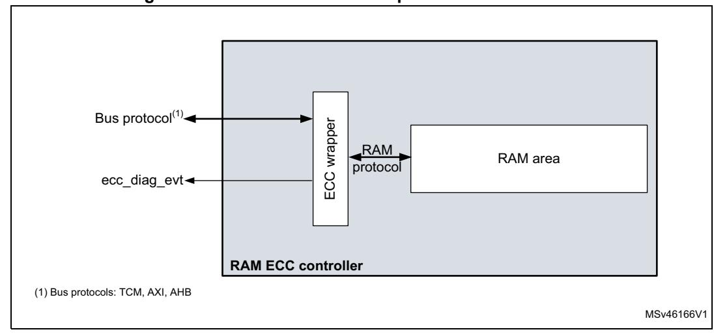
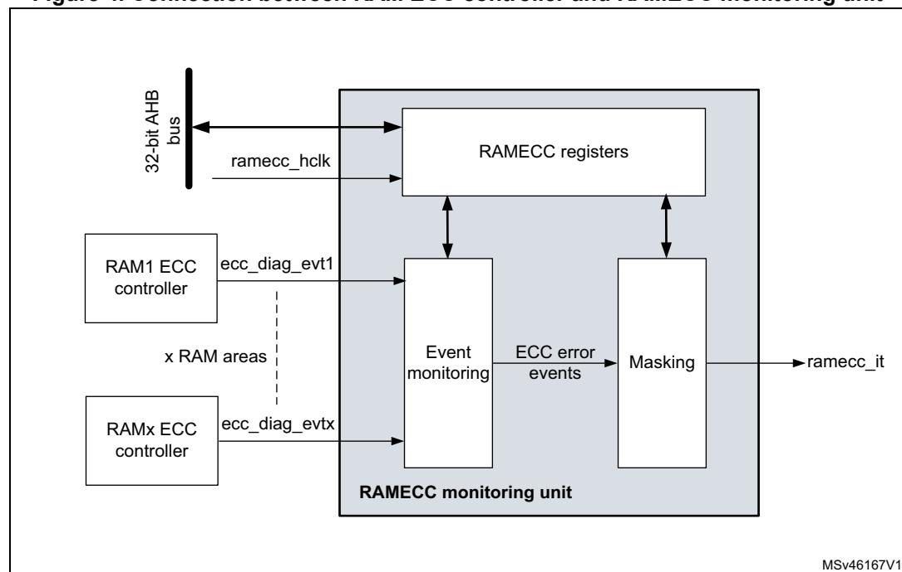

# **3 RAM ECC monitoring (RAMECC)**

# **3.1 Introduction**

The STM32H745/755 and STM32H747/757 devices feature a RAM ECC monitoring unit (RAMECC). It provides a mean for application software to verify ECC status and execute service routines when an error occurs.

*Note: For further information on STM32 RAMECC usage, refer to application note AN5342 "Error correction code (ECC) management for internal memories protection on STM32H7 Series" available from [www.st.com.](http://www.st.com)*

# **3.2 RAMECC main features**

SRAM data are protected by ECC. The ECC mechanism is based on the SECDED algorithm. It supports single- and double-error detection, as well as single-error correction:

- 7 ECC bits are added per 32-bit word.
- 8 ECC bits are added per 64-bit word for AXI-SRAM and ITCM-RAM.

RAM data word integrity is checked at each memory read access, or partial RAM word write operation. Two cycles are required to perform a partial RAM word write (read-modify-write).

The RAMECC monitoring unit includes the following features:

- RAM ECC monitoring per domain
- RAM failing address/data identification

# **3.3 RAMECC functional description**

### **3.3.1 RAMECC block diagram**

An ECC controller is associated to each RAM area. It performs the following functions:

- ECC encoding: ECC code computation and storage.
- ECC decoding: RAM data word loading and ECC code decoding to detect errors
- Error detection: single- and double-error detection
- Error correction: single-error correction.

*Note: All the RAM ECC controllers are always enabled.*

*[Figure](#page-1-0) 3* describes the implementation of RAM ECC controllers.

Figure 3. RAM ECC controller implementation schematic

A dedicated RAM ECC monitoring area is defined for each domain (see *Section 3.3.3*: *RAMECC monitor mapping*. The RAMECC allows the collection of ECC diagnostic events from each RAM ECC controller and provides a mean for the CPU to verify the ECC status.

*Figure 4* shows the connection schematic between the RAM ECC controller and the RAMECC monitoring unit.

Figure 4. Connection between RAM ECC controller and RAMECC monitoring unit

### **3.3.2 RAMECC internal signals**

*[Table 10](#page-2-1)* gives the list of the internal signals that control the RAMECC unit.

**Table 10. RAMECC internal input/output signals**

| Internal signal name | Signal type | Description                                                                         |
|----------------------|-------------|-------------------------------------------------------------------------------------|
| ramecc_hclk          | Input       | AHB clock                                                                           |
| ecc_diag_evtx        | Input       | ECC diagnostic event generated by RAMx ECC controller x                          |
| ramecc_it            | Output      | Interrupt generated by the RAMECC monitoring unit when an ECC error is detected. |

### **3.3.3 RAMECC monitor mapping**

STM32H745/755 and STM32H747/757 devices features three RAMECC monitoring units (one per domain). The inputs from the ECC controllers are mapped as described in *[Table 11](#page-2-2)*. The RAM ECC event monitoring status and configuration registers are described in *[Section 3.4: RAMECC registers](#page-3-0)*.

**Table 11. ECC controller mapping**

| RAMECC units             | Monitor number | SRAM ECC event monitoring status and configuration registers | Size in Kbytes                   | Address Offset |      |  |
|--------------------------|-------------------|-----------------------------------------------------------------|-------------------------------------|-------------------|------|--|
|                          | 1                 |                                                                 | AXI SRAM ECC monitoring unit 512 |                   |      |  |
|                          | 2                 | ITCM-RAM ECC monitoring unit                                    |                                     | 64                | 0x40 |  |
| D1 domain RAMECC unit | 3                 | DTCM-RAM ECC                                                    | D0TCM                               | 64                | 0x60 |  |
|                          | 4                 | monitoring unit                                                 | D1TCM                               | 64                | 0x80 |  |
|                          | 5                 | ETM RAM ECC monitoring unit                                     | 4                                   | 0xA0              |      |  |
|                          | 1                 | SRAM1 ECC monitoring                                            | SRAM1_0                             | 64                | 0x20 |  |
|                          | 2                 | unit                                                            | SRAM1_1                             | 64                | 0x40 |  |
| D2 domain RAMECC unit | 3                 | SRAM2 ECC monitoring                                            | SRAM2_0                             | 64                | 0x60 |  |
|                          | 4                 | unit                                                            | SRAM2_1                             | 64                | 0x80 |  |
|                          | 5                 | SRAM3 ECC monitoring unit                                       | 32                                  | 0xA0              |      |  |
| D3 domain                | 1                 | SRAM4 ECC monitoring unit                                       |                                     | 64                | 0x20 |  |
| RAMECC unit              | 2                 | Backup RAM ECC monitoring unit                                  |                                     | 4                 | 0x40 |  |

# **3.4 RAMECC registers**

RAMECC registers can be accessed only in 32-bit (word) mode. Byte and half-word formats are not allowed.

# **3.4.1 RAMECC interrupt enable register (RAMECC\_IER)**

Address offset: 0x00

Reset value: 0x0000 0000

| 31   | 30   | 29   | 28   | 27   | 26   | 25   | 24   | 23   | 22   | 21   | 20   | 19         | 18       | 17       | 16   |
|------|------|------|------|------|------|------|------|------|------|------|------|------------|----------|----------|------|
| Res. | Res. | Res. | Res. | Res. | Res. | Res. | Res. | Res. | Res. | Res. | Res. | Res.       | Res.     | Res.     | Res. |
|      |      |      |      |      |      |      |      |      |      |      |      |            |          |          |      |
| 15   | 14   | 13   | 12   | 11   | 10   | 9    | 8    | 7    | 6    | 5    | 4    | 3          | 2        | 1        | 0    |
| Res. | Res. | Res. | Res. | Res. | Res. | Res. | Res. | Res. | Res. | Res. | Res. | GECCDEBWIE | GECCDEIE | GECCSEIE | GIE  |
|      |      |      |      |      |      |      |      |      |      |      |      | rw         | rw       | rw       | rw   |

Bits 31:4 Reserved, must be kept at reset value.

### Bit 3 **GECCDEBWIE**: Global ECC double error on byte write (BW) interrupt enable

When GECCDEBWIE bit is set to 1, an interrupt is generated when an ECC double detection error occurs during a byte write operation to RAM (incomplete word write).

0: no interrupt generated when an ECC double detection error occurs on byte write

1: interrupt generated if an ECC double detection error occurs on byte write

#### Bit 2 **GECCDEIE**: Global ECC double error interrupt enable

When GECCDEIE bit is set to 1, an interrupt is generated when an ECC double detection error occurs during a read operation from RAM.

0: no interrupt generated when an ECC double detection error occurs

1: interrupt generated if an ECC double detection error occurs

### Bit 1 **GECCSEIE**: Global ECC single error interrupt enable

When GECCSEIE bit is set to 1, an interrupt is generated when an ECC single error occurs during a read operation from RAM.

0: no interrupt generated when an ECC single error occurs

1: interrupt generated when an ECC single error occurs

#### Bit 0 **GIE**: Global interrupt enable

When GIE bit is set to 1, an interrupt is generated when an enabled global ECC error (GECCDEBWIE, GECCDEIE or GECCSEIE) occurs.

0: no interrupt generated when an ECC error occurs

1: interrupt generated when an ECC error occurs

RM0399 Rev 4 149/3556

### **3.4.2 RAMECC monitor x configuration register (RAMECC\_MxCR)**

Address offset: 0x20 \* x Reset value: 0x0000 0000

x is the ECC monitoring unit number

| 31   | 30   | 29   | 28   | 27   | 26   | 25   | 24   | 23   | 22   | 21          | 20            | 19          | 18          | 17   | 16   |
|------|------|------|------|------|------|------|------|------|------|-------------|---------------|-------------|-------------|------|------|
| Res. | Res. | Res. | Res. | Res. | Res. | Res. | Res. | Res. | Res. | Res.        | Res.          | Res.        | Res.        | Res. | Res. |
| 15   | 14   | 13   | 12   | 11   | 10   | 9    | 8    | 7    | 6    | 5           | 4             | 3           | 2           | 1    | 0    |
| Res. | Res. | Res. | Res. | Res. | Res. | Res. | Res. | Res. | Res. | ECCEL EN | ECCDE BWIE | ECCDE IE | ECCSE IE | Res. | Res. |
|      |      |      |      |      |      |      |      |      |      | rw          | rw            | rw          | rw          |      |      |

Bits 31:6 Reserved, must be kept at reset value.

#### Bit 5 **ECCELEN**: ECC error latching enable

When ECCELEN bit is set to 1, if an ECC error occurs (both for single error correction or double detection) during a read operation, the context (address, data and ECC code) that generated the error are latched to their respective registers.

0: no error context preserved when an ECC error occurs

1: error context preserved when an ECC error occurs

#### Bit 4 **ECCDEBWIE:** ECC double error on byte write (BW) interrupt enable

When ECCDEBWIE bit is set to 1, monitor x generates an interrupt when an ECC double detection error occurs during a byte write operation to RAM.

0: no interrupt generated when an ECC double detection error occurs on byte write

1: interrupt generated if an ECC double detection error occurs on byte write

#### Bit 3 **ECCDEIE:** ECC double error interrupt enable

When ECCDEIE bit is set to 1, monitor x generates an interrupt when an ECC double detection error occurs during a read operation from RAM.

0: no interrupt generated when an ECC double detection error occurs

1: interrupt generated if an ECC double detection error occurs

#### Bit 2 **ECCSEIE**: ECC single error interrupt enable

When ECCSEIE bit is set to 1, monitor x generates an interrupt when an ECC single error occurs during a read operation from RAM.

0: no interrupt generated when an ECC single error occurs

1: interrupt generated when an ECC single error occurs

Bits 1:0 Reserved, must be kept at reset value.

# **3.4.3 RAMECC monitor x status register (RAMECC\_MxSR)**

Address offset: 0x24 + 0x20 \* (x - 1), (x= ECC monitoring unit number)

Reset value: 0x0000 0000

| 31   | 30   | 29   | 28   | 27   | 26   | 25   | 24   | 23   | 22   | 21   | 20   | 19   | 18         | 17   | 16    |
|------|------|------|------|------|------|------|------|------|------|------|------|------|------------|------|-------|
| Res. | Res. | Res. | Res. | Res. | Res. | Res. | Res. | Res. | Res. | Res. | Res. | Res. | Res.       | Res. | Res.  |
|      |      |      |      |      |      |      |      |      |      |      |      |      |            |      |       |
|      |      |      |      |      |      |      |      |      |      |      |      |      |            |      |       |
| 15   | 14   | 13   | 12   | 11   | 10   | 9    | 8    | 7    | 6    | 5    | 4    | 3    | 2          | 1    | 0     |
| Res. | Res. | Res. | Res. | Res. | Res. | Res. | Res. | Res. | Res. | Res. | Res. | Res. | DEBW DF | DEDF | SEDCF |

Bits 31: 3 Reserved, must be kept at reset value.

Bit 2 **DEBWDF:** ECC double error on byte write (BW) detected flag

This bit is set by hardware. It is cleared by software by writing a 0

0: no error detected 1: error detected

Bit 1 **DEDF:** ECC double error detected flag

This bit is set by hardware. It is cleared by software by writing a 0

0: no error detected 1: error detected

Bit 0 **SEDCF:** ECC single error detected and corrected flag

This bit is set by hardware. It is cleared by software by writing a 0

0: no error detected and corrected 1: error detected and corrected

### **3.4.4 RAMECC monitor x failing address register (RAMECC\_MxFAR)**

Address offset: 0x28 + 0x20 \* (x-1), (x= ECC monitoring unit number)

Reset value: 0x0000 0000

| 31 | 30          | 29 | 28 | 27 | 26 | 25 | 24 | 23 | 22 | 21 | 20 | 19 | 18 | 17 | 16 |
|----|-------------|----|----|----|----|----|----|----|----|----|----|----|----|----|----|
|    | FADD[31:16] |    |    |    |    |    |    |    |    |    |    |    |    |    |    |
| r  | r           | r  | r  | r  | r  | r  | r  | r  | r  | r  | r  | r  | r  | r  | r  |
| 15 | 14          | 13 | 12 | 11 | 10 | 9  | 8  | 7  | 6  | 5  | 4  | 3  | 2  | 1  | 0  |
|    | FADD[15:0]  |    |    |    |    |    |    |    |    |    |    |    |    |    |    |
| r  | r           | r  | r  | r  | r  | r  | r  | r  | r  | r  | r  | r  | r  | r  | r  |

Bits 31:0 **FADD[31:0]:** ECC error failing address

When an ECC error occurs the FADD bitfield contains the address that generated the ECC error.

# **3.4.5 RAMECC monitor x failing data low register (RAMECC\_MxFDRL)**

Address offset: 0x2C + 0x20 \* (x-1), (x= ECC monitoring unit number)

Reset value: 0x0000 0000

RM0399 Rev 4 151/3556

| 31            | 30 | 29 | 28 | 27 | 26 | 25 | 24 | 23           | 22 | 21 | 20 | 19 | 18 | 17 | 16 |
|---------------|----|----|----|----|----|----|----|--------------|----|----|----|----|----|----|----|
| FDATAL[31:16] |    |    |    |    |    |    |    |              |    |    |    |    |    |    |    |
| r             | r  | r  | r  | r  | r  | r  | r  | r            | r  | r  | r  | r  | r  | r  | r  |
| 15            | 14 | 13 | 12 | 11 | 10 | 9  | 8  | 7            | 6  | 5  | 4  | 3  | 2  | 1  | 0  |
|               |    |    |    |    |    |    |    | FDATAL[15:0] |    |    |    |    |    |    |    |
| r             | r  | r  | r  | r  | r  | r  | r  | r            | r  | r  | r  | r  | r  | r  | r  |

Bits 31:0 **FDATAL[31:0]:** Failing data low

When an ECC error occurs the FDATAL bitfield contains the LSB part of the data that generated the error. For 32-bit word SRAM, this bitfield contains the full memory word that generated the error.

### **3.4.6 RAMECC monitor x failing data high register (RAMECC\_MxFDRH)**

Address offset: 0x30 + 0x20 \* (x-1), (x= ECC monitoring unit number)

Reset value: 0x0000 0000

| 31 | 30            | 29 | 28 | 27 | 26 | 25 | 24 | 23           | 22 | 21 | 20 | 19 | 18 | 17 | 16 |
|----|---------------|----|----|----|----|----|----|--------------|----|----|----|----|----|----|----|
|    | FDATAH[31:16] |    |    |    |    |    |    |              |    |    |    |    |    |    |    |
| r  | r             | r  | r  | r  | r  | r  | r  | r            | r  | r  | r  | r  | r  | r  | r  |
| 15 | 14            | 13 | 12 | 11 | 10 | 9  | 8  | 7            | 6  | 5  | 4  | 3  | 2  | 1  | 0  |
|    |               |    |    |    |    |    |    | FDATAH[15:0] |    |    |    |    |    |    |    |
| r  | r             | r  | r  | r  | r  | r  | r  | r            | r  | r  | r  | r  | r  | r  | r  |

Bits 31:0 **FDATAH[31:0]:** Failing data high (64-bit memory)

When an ECC error occurs the FDATAH bitfield contains the MSB part of the data that generated the error.

*Note: This register is reserved in case of 32-bit word SRAM.*

# **3.4.7 RAMECC monitor x failing ECC error code register RAMECC\_MxFECR)**

Address offset: 0x34 + 0x20 \* (x-1), (x= ECC monitoring unit number)

Reset value: 0x0000 0000

| 31 | 30         | 29 | 28 | 27 | 26 | 25 | 24 | 23        | 22 | 21 | 20 | 19 | 18 | 17 | 16 |
|----|------------|----|----|----|----|----|----|-----------|----|----|----|----|----|----|----|
|    | FEC[31:16] |    |    |    |    |    |    |           |    |    |    |    |    |    |    |
| r  | r          | r  | r  | r  | r  | r  | r  | r         | r  | r  | r  | r  | r  | r  | r  |
| 15 | 14         | 13 | 12 | 11 | 10 | 9  | 8  | 7         | 6  | 5  | 4  | 3  | 2  | 1  | 0  |
|    |            |    |    |    |    |    |    | FEC[15:0] |    |    |    |    |    |    |    |
| r  | r          | r  | r  | r  | r  | r  | r  | r         | r  | r  | r  | r  | r  | r  | r  |

Bits 31:0 **FEC [31:0]:** Failing error code

When an ECC error occurs the FEC bitfield contains the ECC failing code that generated the error.

### **3.4.8 RAMECC register map**

**Table 12. RAMECC register map and reset values** 

|                                                       | Register               |      |            |      |      |      |      |      |      |      |      |      |      |      |      | Register size |      |           |              |      |      |      |      |      |      |      |      |         |           |            |          |          |       |
|-------------------------------------------------------|------------------------|------|------------|------|------|------|------|------|------|------|------|------|------|------|------|---------------|------|-----------|--------------|------|------|------|------|------|------|------|------|---------|-----------|------------|----------|----------|-------|
| Offset                                                | name reset value | 31   | 30         | 29   | 28   | 27   | 26   | 25   | 24   | 23   | 22   | 21   | 20   | 19   | 18   | 17            | 16   | 15        | 14           | 13   | 12   | 11   | 10   | 9    | 8    | 7    | 6    | 5       | 4         | 3          | 2        | 1        | 0     |
| 0x00                                                  | RAMECC_ IER         | Res. | Res.       | Res. | Res. | Res. | Res. | Res. | Res. | Res. | Res. | Res. | Res. | Res. | Res. | Res.          | Res. | Res.      | Res.         | Res. | Res. | Res. | Res. | Res. | Res. | Res. | Res. | Res.    | Res.      | GECCDEBWIE | GECCDEIE | GECCSEIE | GIE   |
|                                                       | Reset value            |      |            |      |      |      |      |      |      |      |      |      |      |      |      |               |      |           |              |      |      |      |      |      |      |      |      |         |           | 0          | 0        | 0        | 0     |
| 0x20 * x (x = monitoring unit number)           | RAMECC_ MxCR        | Res. | Res.       | Res. | Res. | Res. | Res. | Res. | Res. | Res. | Res. | Res. | Res. | Res. | Res. | Res.          | Res. | Res.      | Res.         | Res. | Res. | Res. | Res. | Res. | Res. | Res. | Res. | ECCELEN | ECCDEBWIE | ECCDEIE    | ECCSEIE  | Res.     | Res.  |
|                                                       | Reset value            |      |            |      |      |      |      |      |      |      |      |      |      |      |      |               |      |           |              |      |      |      |      |      |      |      |      | 0       | 0         | 0          | 0        |          |       |
| 0x24+0x20 *(x -1) (x = monitoring unit number)  | RAMECC_ MxSR        | Res. | Res.       | Res. | Res. | Res. | Res. | Res. | Res. | Res. | Res. | Res. | Res. | Res. | Res. | Res.          | Res. | Res.      | Res.         | Res. | Res. | Res. | Res. | Res. | Res. | Res. | Res. | Res.    | Res.      | Res.       | DEBWDF   | DEDF     | SEDCF |
|                                                       | Reset value            |      |            |      |      |      |      |      |      |      |      |      |      |      |      |               |      |           |              |      |      |      |      |      |      |      |      |         |           |            | 0        | 0        | 0     |
| 0x28+0x20 * (x -1) (x = monitoring                 | RAMECC_ MxFAR       |      | FADD[31:0] |      |      |      |      |      |      |      |      |      |      |      |      |               |      |           |              |      |      |      |      |      |      |      |      |         |           |            |          |          |       |
| unit number)                                          | Reset value            | 0    | 0          | 0    | 0    | 0    | 0    | 0    | 0    | 0    | 0    | 0    | 0    | 0    | 0    | 0             | 0    | 0         | 0            | 0    | 0    | 0    | 0    | 0    | 0    | 0    | 0    | 0       | 0         | 0          | 0        | 0        | 0     |
| 0x2C+0x20 * (x -1) (x = monitoring                 | RAMECC_ MxFDRL      |      |            |      |      |      |      |      |      |      |      |      |      |      |      |               |      |           | FDATAL[31:0] |      |      |      |      |      |      |      |      |         |           |            |          |          |       |
| unit number)                                          | Reset value            | 0    | 0          | 0    | 0    | 0    | 0    | 0    | 0    | 0    | 0    | 0    | 0    | 0    | 0    | 0             | 0    | 0         | 0            | 0    | 0    | 0    | 0    | 0    | 0    | 0    | 0    | 0       | 0         | 0          | 0        | 0        | 0     |
| 0x30+0x20 * (x -1) (x = monitoring unit number) | RAMECC_ MxFDRH      |      |            |      |      |      |      |      |      |      |      |      |      |      |      |               |      |           | FDATAH[31:0] |      |      |      |      |      |      |      |      |         |           |            |          |          |       |
|                                                       | Reset value            | 0    | 0          | 0    | 0    | 0    | 0    | 0    | 0    | 0    | 0    | 0    | 0    | 0    | 0    | 0             | 0    | 0         | 0            | 0    | 0    | 0    | 0    | 0    | 0    | 0    | 0    | 0       | 0         | 0          | 0        | 0        | 0     |
| 0x34+0x20 * (x -1) (x = monitoring                 | RAMECC_ MxFECR      |      |            |      |      |      |      |      |      |      |      |      |      |      |      |               |      | FEC[31:0] |              |      |      |      |      |      |      |      |      |         |           |            |          |          |       |
| unit number)                                          | Reset value            | 0    | 0          | 0    | 0    | 0    | 0    | 0    | 0    | 0    | 0    | 0    | 0    | 0    | 0    | 0             | 0    | 0         | 0            | 0    | 0    | 0    | 0    | 0    | 0    | 0    | 0    | 0       | 0         | 0          | 0        | 0        | 0     |

Refer to *Section 2.3 on page 134* for the register boundary addresses.

RM0399 Rev 4 153/3556