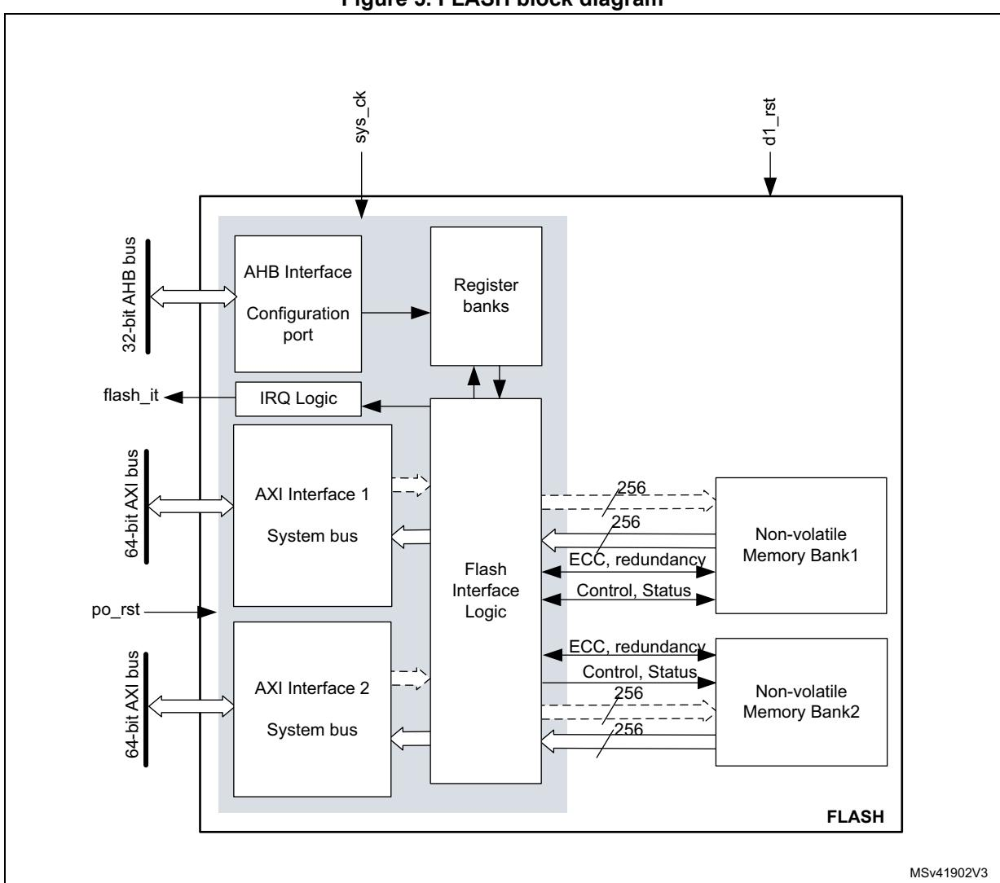
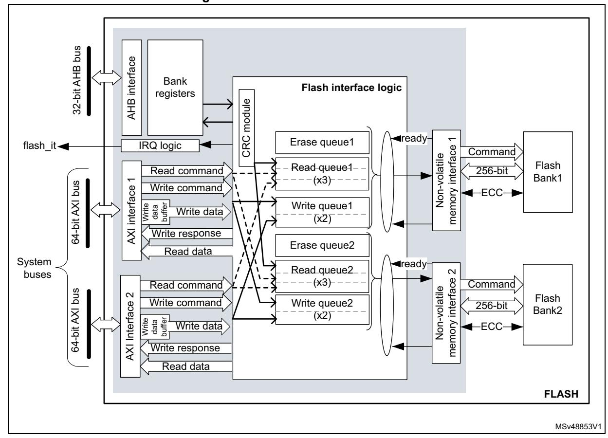
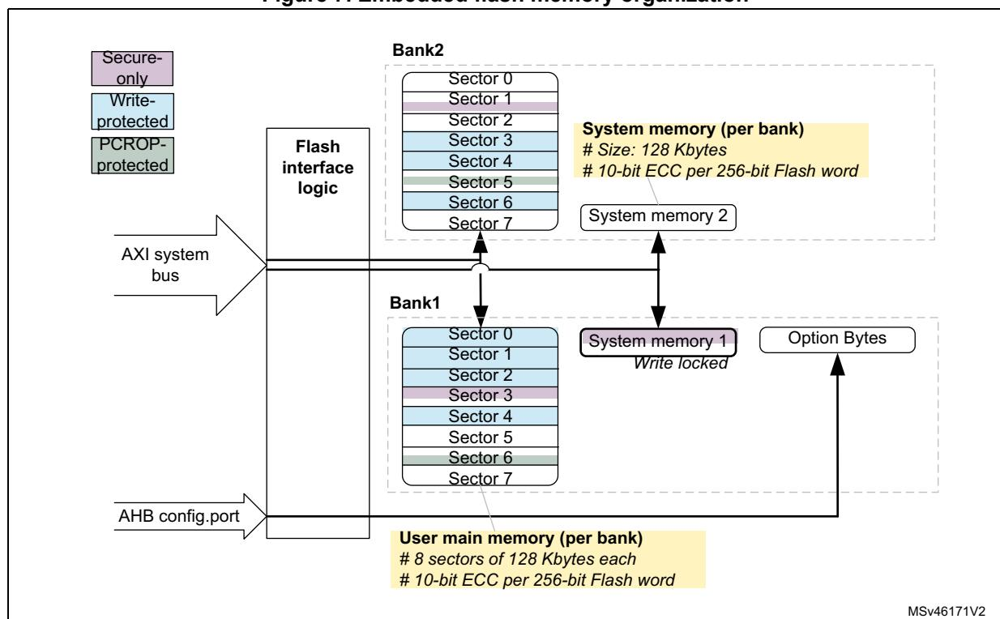
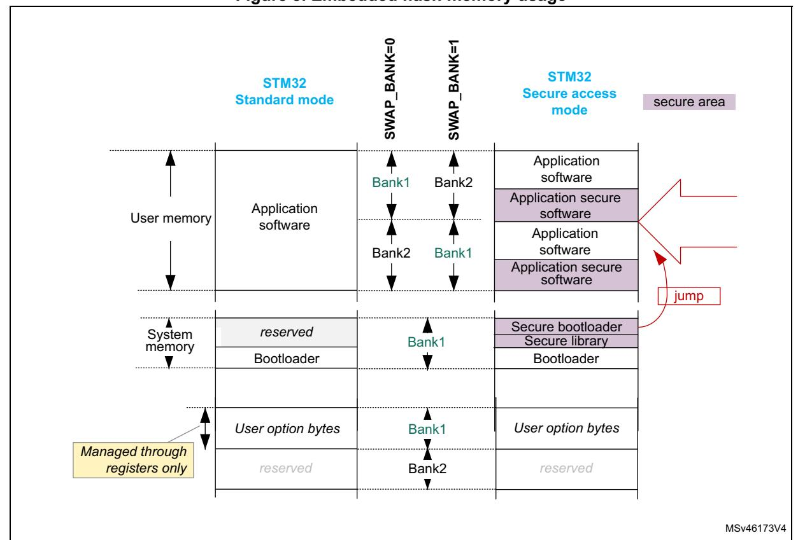
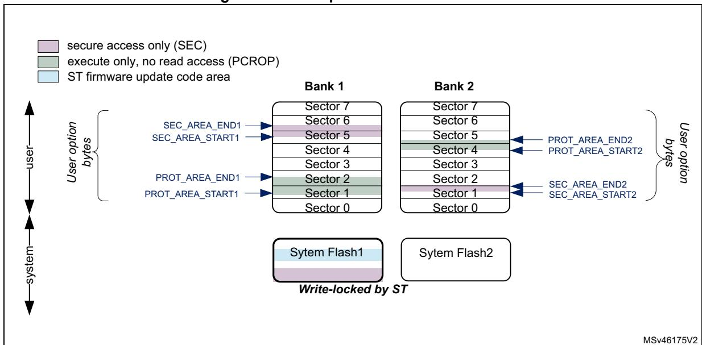
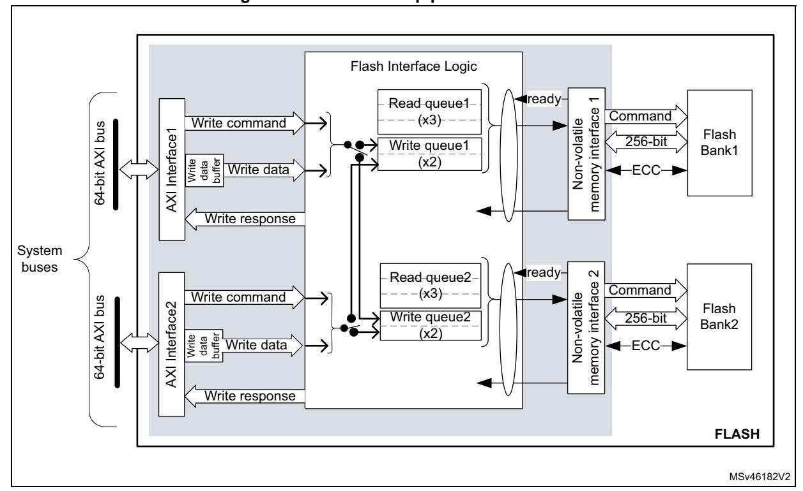
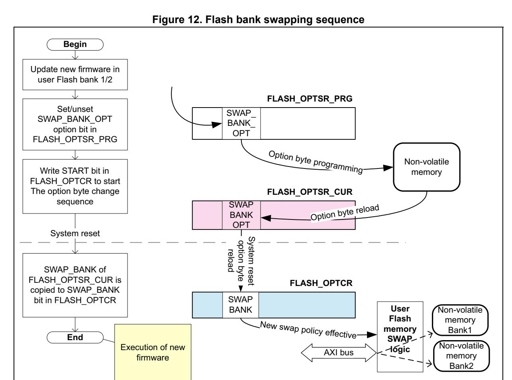
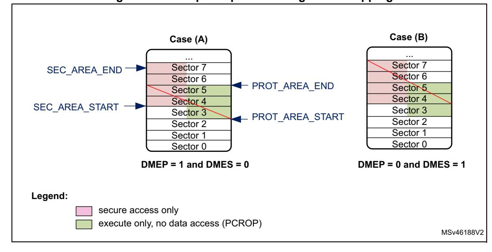
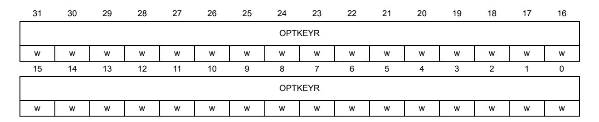

# **4 Embedded flash memory (FLASH)**

# **4.1 Introduction**

The embedded flash memory (FLASH) manages the accesses of any master to the embedded non-volatile memory, that is 2 Mbytes. It implements the read, program and erase operations, error corrections as well as various integrity and confidentiality protection mechanisms.

The embedded flash memory manages the automatic loading of non-volatile user option bytes at power-on reset, and implements the dynamic update of these options.

# **4.2 FLASH main features**

- 2 Mbytes of non-volatile memory divided into two banks of 1 Mbyte each
- flash memory read operations supporting multiple length (64 bits, 32bits, 16bits or one byte)
- Flash memory programming by 256 bits
- 128-Kbyte sector erase, bank erase and dual-bank mass erase
- Dual-bank organization supporting:
  - simultaneous operations: two read/program/erase operations executed in parallel on both banks
  - Bank swapping: the address mapping of the user flash memory of each bank can be swapped, along with the corresponding registers.
- Error Code Correction (ECC): one error detection/correction or two error detections per 256-bit flash word using 10 ECC bits
- Cyclic redundancy check (CRC) hardware module
- User configurable non-volatile option bytes
- Flash memory enhanced protections, activated by option bytes
  - Read protection (RDP), preventing unauthorized flash memory dump to safeguard sensitive application code
  - Write-protection of sectors (WRPS), available per bank (128 Kbyte sectors)
  - Two proprietary code readout protection (PCROP) areas (one per user flash bank). When enabled, this area is execute-only.
  - Two secure-only areas (one per user flash bank). When enabled this area is accessible only if the STM32 microcontroller operates in Secure access mode.
- Read and write command queues to streamline flash operations

# **4.3 FLASH functional description**

# **4.3.1 FLASH block diagram**

*[Figure 5](#page-1-0)* shows the embedded flash memory block diagram.

**Figure 5. FLASH block diagram** 

# **4.3.2 FLASH internal signals**

*[Table 13](#page-2-0)* describes a list of the useful to know internal signals available at embedded flash memory level. These signals are not available on the microcontroller pads.

| Internal signal name | Signal type | Description                                                        |  |  |  |  |
|----------------------|-------------|--------------------------------------------------------------------|--|--|--|--|
| sys_ck               | Input       | D1 domain bus clock (embedded flash memory AXI interface clock) |  |  |  |  |
| po_rst               | Input       | Power on reset                                                     |  |  |  |  |
| d1_rst               | Input       | D1 domain system reset                                             |  |  |  |  |
| flash_it             | Output      | Embedded flash memory interface interrupt request                  |  |  |  |  |

**Table 13. FLASH internal input/output signals**

## **4.3.3 FLASH architecture and integration in the system**

The embedded flash memory is a central resource for the whole microcontroller. It serves as an interface to two non-volatile memory banks, and organizes the memory in a very specific way. The embedded flash memory also proposes a set of security features to protect the assets stored in the non-volatile memory at boot time, at run-time and during firmware and configuration upgrades.

The embedded flash memory offers two 64-bit AXI slave ports for code and data accesses, plus a 32-bit AHB configuration slave port used for register bank accesses.

*Note: The application can simultaneously request a read and a write operation through each AXI interface.*

The embedded flash memory microarchitecture is shown in *[Figure 6](#page-3-0)*.

**Figure 6. Detailed FLASH architecture**

Behind the system interfaces, the embedded flash memory implements various command queues and buffers to perform flash read, write and erase operations with maximum efficiency.

Thanks to the addition of a read and write data buffer, the AXI slave port handles the following access types:

- Multiple length: 64 bits, 32 bits, 16 bits and 8 bits
- Single or burst accesses
- Write wrap burst must not cross 32-byte aligned address boundaries to target exactly one flash word

The AHB configuration slave port supports 8-bit, 16-bit and 32-bit word accesses.

The embedded flash memory is built in such a way that only one read or write operation can be executed at a time on a given bank.

# **4.3.4 Flash memory architecture and usage**

### **Flash memory architecture**

*[Figure 7](#page-4-0)* shows the non-volatile memory organization supported by the embedded flash memory.

**Figure 7. Embedded flash memory organization** 

The embedded flash non-volatile memory is composed of:

- A 2-Mbyte main memory block, organized as two banks of 1 Mbyte each. Each bank is in turn divided in eight 128-Kbyte sectors and features flash-word rows of 256 bits + 10 bits of ECC per word
- A system memory block of 256 Kbytes, divided into two 128 Kbyte banks. The system memory is ECC protected.
- A set of non-volatile option bytes loaded at reset by the embedded flash memory and accessible by the application software only through the AHB configuration register interface.

The overall flash memory architecture is summarized in *Table 14* and *Table 15*.

Table 14. Flash memory organization on STM32H745xI/747xI/755xI/757xI devices

| Flash mem    | ory area                    | Address range               | Size (bytes) | Region name              | Access interface | SNB1/2 (1)      |
|--------------|-----------------------------|-----------------------------|-----------------|--------------------------|------------------|--------------------|
|              |                             | 0x0800 0000- 0x0801 FFFF | 128 K           | Sector 0                 |                  | 0x0                |
| Bank 1       | Bank 1                      | 0x0802 0000- 0x0803 FFFF | 128 K           | Sector 1                 |                  | 0x1                |
|              |                             |                             |                 |                          |                  |                    |
| User main    |                             | 0x080E 0000- 0x080F FFFF | 128 K           | Sector 7                 | AVI porto        | 0x7                |
| memory       | Ox0810 0000- 0x0811 FFFF |                             | 128 K           | Sector 0 AXI ports       |                  | 0x0                |
|              |                             |                             | 128 K           | Sector 1                 |                  | 0x1                |
|              |                             |                             |                 |                          |                  |                    |
|              |                             |                             | 0x7             |                          |                  |                    |
| System       | Bank 1                      | 0x1FF0 0000- 0x1FF1 FFFF | 128 K           | System flash (read-only) | read-only)       |                    |
| memory       | Bank 2                      | 0x1FF4 0000- 0x1FF5 FFFF | 128 K           | System flash             | AXI ports        | N/A (2) |
| Option bytes | Bank 1                      | N/A                         | -               | User option bytes        | Registers only   | N/A                |

1. SNB1/2 contains the target sector number for an erase operation. See Section 4.3.10 for details.

2. Cannot be erased by application software.

Table 15. Flash memory organization on STM32H745xG/STM32H747xG devices

| Flash mem    | ory area | Address range               | Size (bytes) | Region name              | Access interface | SNB1/2 (1)      |
|--------------|----------|-----------------------------|-----------------|--------------------------|------------------|--------------------|
|              |          | 0x0800 0000- 0x0801 FFFF | 128 K           | Sector 0                 |                  | 0x0                |
|              | Bank 1   | 0x0802 0000- 0x0803 FFFF | 128 K           | Sector 1                 |                  | 0x1                |
|              |          |                             |                 |                          |                  |                    |
| User main    |          | 0x0806 0000- 0x0807 FFFF | 128 K           | Sector 3                 | AVI norte        | 0x3                |
| memory       | Bank 2   |                             | 128 K           | Sector 0                 | AXI ports        | 0x0                |
|              |          |                             | 128 K           | Sector 1                 |                  | 0x1                |
|              |          |                             |                 |                          |                  |                    |
|              |          |                             | 0x3             |                          |                  |                    |
| System       | Bank 1   | 0x1FF0 0000- 0x1FF1 FFFF | 128 K           | System flash (read-only) | AVI porto        | N/A (2) |
| memory       | Bank 2   | 0x1FF4 0000- 0x1FF5 FFFF | 128 K           | System flash             | AXI ports        | N/A (2) |
| Option bytes | Bank 1   | N/A                         | -               | User option bytes        | Registers only   | N/A                |

1. SNB1/2 contains the target sector number for an erase operation. See Section 4.3.10 for details.

2. Cannot be erased by application software.

### Partition usage

*Figure 8* shows how the embedded flash memory is used both by STMicroelectronics and the application software.

Figure 8. Embedded flash memory usage

User and system memories are used differently according to whether the microcontroller is configured by the application software in Standard mode or in Secure access mode. This selection is done through the SECURITY option bit (see Section 4.4.6):

- In Standard mode, the user memory contains the application code and data, while the system memory is loaded with the STM32 bootloader. When a reset occurs, the executing core jumps to the boot address configured through the BOOT pin and the BOOT CMx ADD0/1 option bytes.
- In Secure access mode, dedicated libraries can be used for secure boot. They are located in user flash and system flash memory:
  - ST libraries in system flash memory assist the application software boot with special features such as secure boot and secure firmware install (SFI).
  - Application secure libraries in user flash memory are used for secure firmware update (SFU).

In Secure access mode, the microcontroller always boots into the secure bootloader code (unique entry point). Then, if no secure services are required, this code securely jumps to the requested boot address configured through the BOOT pin and the option bytes, as shown in *[Figure 8](#page-7-0)* (see *Section 5: Secure memory management (SMM)* for details).

*Note: For more information on option byte setup for boot, refer to [Section](#page-34-0) 4.4.7.*

Additional partition usage is the following:

• The option bytes are used by STMicroelectronics and by the application software as non-volatile product options (e.g. boot address, protection configuration and reset behaviors).

*Note: For further information on STM32 bootloader flashing by STMicroelectronics, refer to application note AN2606 "STM32 microcontroller system memory boot mode" available from www.st.com.*

### **Bank swapping**

As shown in *[Figure 8](#page-7-0)*, the embedded flash memory offers a bank swapping feature that can be configured through the SWAP\_BANK bit, always available for the application. For more information please refer to *[Section 4.3.13](#page-22-0)*.

## **4.3.5 FLASH system performance enhancements**

The embedded flash memory uses read and write command queues (one per bank) in order to enhance flash operations.

# **4.3.6 FLASH data protection schemes**

*[Figure 9](#page-8-0)* gives an overview of the protection mechanisms supported by the embedded flash memory. A PCROP and a secure-only area can be defined for each bank. The properties of these protected areas are detailed in *[Section 4.5](#page-34-1)*.

**Figure 9. FLASH protection mechanisms**

# **4.3.7 Overview of FLASH operations**

### **Read operations**

The embedded flash memory can perform read operations on the whole non-volatile memory using various granularities: 64 bits, 32 bits, 16 bits or one byte. User and system flash memories are read through the AXI interface, while the option bytes are read through the register interface.

The embedded flash memory supports read-while-write operations provided the read and write operations target different banks. Similarly read-while-read operations are supported when two read operations target different banks.

To increase efficiency, the embedded flash memory implements the buffering of consecutive read requests in the same bank.

For more details on read operations, refer to *[Section 4.3.8: FLASH read operations](#page-10-0)*.

### **Program/erase operations**

The embedded flash memory supports the following program and erase operations:

- Single flash word write (256-bit granularity), with the possibility for the application to force-write a user flash word with less than 256 bits
- Single sector erase
- Bank erase (single or dual)
- Option byte update

Thanks to its dual bank architecture, the embedded flash memory can perform any of the above write or erase operation on one bank while a read or another program/erase operation is executed on the other bank.

*Note: Program and erase operations are subject to the various protection that could be set on the embedded flash memory, such as write protection and global readout protection (see next sections for details).*

> To increase efficiency, the embedded flash memory implements the buffering of consecutive write accesses in the same bank.

For more details refer to *[Section 4.3.9: FLASH program operations](#page-13-0)* and *[Section 4.3.10:](#page-17-0)  [FLASH erase operations](#page-17-0).*

### **Protection mechanisms**

The embedded flash memory supports different protection mechanisms:

- Global readout protection (RDP)
- Proprietary code readout protection (PCROP)
- Write protection
- Secure access only protection

For more details refer to *[Section 4.5: FLASH protection mechanisms.](#page-34-1)*

RM0399 Rev 4 163/3556

### **Option byte loading**

Under specific conditions, the embedded flash memory reliably loads the non-volatile option bytes stored in non-volatile memory, thus enforcing boot and security options to the whole system when the embedded flash memory becomes functional again. For more details refer to *[Section 4.4: FLASH option bytes.](#page-25-0)*

### **Bank/register swapping**

The embedded flash memory allows swapping bank 1 and bank 2 memory mapping. This feature can be used after a firmware upgrade to restart the microcontroller on the new firmware after a system reset. For more details on the feature, refer to *[Section 4.3.13: Flash](#page-22-0)  [bank and register swapping](#page-22-0).*

## **4.3.8 FLASH read operations**

### **Read operation overview**

The embedded flash memory supports, for each memory bank, the execution of one read command while two are waiting in the read command queue. Multiple read access types are also supported as defined in *[Section 4.3.3: FLASH architecture and integration in the](#page-2-1)  [system](#page-2-1)*.

The read commands to each bank are associated with a 256-bit read data buffer.

*Note: The embedded flash memory can perform single error correction and double error detection while read operations are being executed (see Section [4.3.12: Flash memory error](#page-20-0)  [protections\)](#page-20-0).* 

The AXI interface read channel operates as follows:

- When the read command queue is full, any new AXI read request stalls the bus read channel interface and consequently the master that issued that request.
- If several consecutive read accesses request data that belong to the same flash data word (256 bits), the data are read directly from the current data read buffer, without triggering additional flash read operations. This mechanism occurs each time a read access is granted. When a read access is rejected for security reasons (e.g. PCROP protected word), the corresponding read error response is issued by the embedded flash memory and no read operation to flash memory is triggered.

The Read pipeline architecture is summarized in *[Figure 10](#page-11-0)*.

For more information on bus interfaces, refer to *[Section 4.3.3: FLASH architecture and](#page-2-1)  [integration in the system](#page-2-1)*.

**Figure 10. FLASH read pipeline architecture**

# **Single read sequence**

The recommended simple read sequence is the following:

- 1. Freely perform read accesses to any AXI-mapped area.
- 2. The embedded flash memory effectively executes the read operation from the read command queue buffer as soon as the non-volatile memory is ready and the previously requested operations on this specific bank have been served.

### **Adjusting read timing constraints**

The embedded flash memory clock must be enabled and running before reading data from non-volatile memory.

To correctly read data from flash memory, the number of wait states (LATENCY) must be correctly programmed in the flash access control register (FLASH\_ACR) according to the embedded flash memory AXI interface clock frequency (sys\_ck) and the internal voltage range of the device (Vcore).

*[Table 16](#page-12-0)* shows the correspondence between the number of wait states (LATENCY), the programming delay parameter (WRHIGHFREQ), the embedded flash memory clock frequency and its supply voltage ranges.

| Number of                         | Programming           | AXI Interface clock frequency vs VCORE range |                               |                               |                               |  |  |  |
|-----------------------------------|-----------------------|----------------------------------------------|-------------------------------|-------------------------------|-------------------------------|--|--|--|
| wait states (LATENCY)          | delay (WRHIGHFREQ) | VOS3 range 0.95 V - 1.05 V                | VOS2 range 1.05 V - 1.15 V | VOS1 range 1.15 V - 1.26 V | VOS0 range 1.26 V - 1.40 V |  |  |  |
| 0 WS (1 FLASH clock cycle)  | 00                    | [0;45 MHz]                                   | [0;55 MHz]                    | [0;70 MHz]                    | [0;70 MHz]                    |  |  |  |
| 1 WS (2 FLASH clock cycles) | 01                    | ]45 MHz;90 MHz]                              | ]55 MHz;110 MHz]              | ]70 MHz;140 MHz]              | ]70 MHz;140 MHz]              |  |  |  |
| 2 WS (3                           | 01                    | ]90 MHz;135 MHz]                             | ]110 MHz;165 MHz]             | ]140 MHz;185 MHz]             | ]140 MHz;185 MHz]             |  |  |  |
| FLASH clock cycles)            | 10                    | -                                            | -                             | ]185 MHz;210 MHz]             | ]185 MHz;210 MHz]             |  |  |  |
| 3 WS (4 FLASH clock cycles) | 10                    | ]135 MHz;180 MHz]                            | ]165 MHz;225 MHz]             | ]210 MHz;225 MHz]             | ]210 MHz;225 MHz]             |  |  |  |
| 4 WS (5 FLASH clock cycles) | 10                    | ]180 MHz;225 MHz]                            | 225 MHz                       | -                             | ]225 MHz;240 MHz]             |  |  |  |

**Table 16. FLASH recommended number of wait states and programming delay(1)**

### **Adjusting system frequency**

After power-on, a default 7 wait-state latency is specified in FLASH\_ACR register, in order to accommodate AXI interface clock frequencies with a safety margin (see *[Table 16](#page-12-0)*).

When changing the AXI bus frequency, the application software must follow the below sequence in order to tune the number of wait states required to access the non-volatile memory.

To increase the embedded flash memory clock source frequency:

- 1. If necessary, program the LATENCY and WRHIGHFREQ bits to the right value in the FLASH\_ACR register, as described in *[Table](#page-12-0) 16*.
- 2. Check that the new number of wait states is taken into account by reading back the FLASH\_ACR register.
- 3. Modify the embedded flash memory clock source and/or the AXI bus clock prescaler in the RCC\_CFGR register of the reset and clock controller (RCC).
- 4. Check that the new embedded flash memory clock source and/or the new AXI bus clock prescaler value are taken in account by reading back the embedded flash memory clock source status and/or the AXI bus prescaler value in the RCC\_CFGR register of the reset and clock controller (RCC).

To decrease the embedded flash memory clock source frequency:

- 1. Modify the embedded flash memory clock source and/or the AXI bus clock prescaler in the RCC\_CFGR register of reset and clock controller (RCC).
- 2. Check that the embedded flash memory new clock source and/or the new AXI bus clock prescaler value are taken into account by reading back the embedded flash

1. Refer to the Reset and clock control section RCC section for the maximum product FACLK frequency.

- memory clock source status and/or the AXI interface prescaler value in the RCC\_CFGR register of reset and clock controller (RCC).
- 3. If necessary, program the LATENCY and WRHIGHFREQ bits to the right value in FLASH\_ACR register, as described in *[Table](#page-12-0) 16*.
- 4. Check that the new number of wait states has been taken into account by reading back the FLASH\_ACR register.

### **Error code correction (ECC)**

The embedded flash memory embeds an error correction mechanism. Single error correction and double error detection are performed for each read operation. For more details, refer to *[Section 4.3.12: Flash memory error protections](#page-20-0)*.

### **Read errors**

When the ECC mechanism is not able to correct the read operation, the embedded flash memory reports read errors as described in *[Section 4.7.7: Error correction code error](#page-49-0)  [\(SNECCERR/DBECCERR\)](#page-49-0)*.

### **Read interrupts**

See *[Section 4.8: FLASH interrupts](#page-51-0)* for details.

# **4.3.9 FLASH program operations**

# **Program operation overview**

The virgin state of each non-volatile memory bitcell is 1. The embedded flash memory supports programming operations that can change (reset) any memory bitcell to 0. However these operations do not support the return of a bit to its virgin state. In this case an erase operation of the entire sector is required.

A program operation consists in issuing write commands. The embedded flash memory supports, for each memory bank, the execution of one write command while one command is waiting in the write command queue. Since a 10-bit ECC code is associated to each 256 bit data flash word, only write operations by 256 bits are executed in the non-volatile memory.

*Note: The application can decide to write as little as 8 bits to a* 256 *flash word. In this case, a force-write mechanism to the* 256 *bits + ECC is used (see FW1/2 bit of FLASH\_CR1/2 register).*

> *System flash memory bank 1 cannot be written by the application software. System flash memory bank 2 can be written by STMicroelectronics secure firmware only.*

It is not recommended to overwrite a flash word that is not virgin. The result may lead to an inconsistent ECC code that will be systematically reported by the embedded flash memory, as described in *[Section 4.7.7: Error correction code error \(SNECCERR/DBECCERR\)](#page-49-0)*.

The AXI interface write channel operates as follows:

- A 256-bit write data buffer is associated with each AXI interface. It supports multiple write access types (64 bits, 32 bits, 16 bits and 8 bits).
- When the write queue is full, any new AXI write request stalls the bus write channel interface and consequently the master that issued that request.

The write pipeline architecture is described in *[Figure 11](#page-14-0)*.

RM0399 Rev 4 167/3556

For more information on bus interfaces, refer to Section 4.3.3; FLASH architecture and integration in the system.

Figure 11. FLASH write pipeline architecture

### Managing write protections

Before programming a user sector, the application software must check the protection of the targeted flash memory area.

The embedded flash memory checks the protection properties of the write transaction target at the output of the write queue buffer, just before the effective write operation to the nonvolatile memory:

- If a write protection violation is detected, the write operation is canceled and write protection error (WRPERR1/2) is raised in FLASH SR1/2 register.
- If the write operation is valid, the 10-bit ECC code is concatenated to the 256 bits of data and the write to non-volatile memory is effectively executed.

Note: No write protection check is performed when the embedded flash memory accepts AXI write requests.

> The write protection flag does not need to be cleared before performing a new programming operation.

### **Monitoring ongoing write operations**

The application software can use three status flags located in FLASH\_SR1/2 in order to monitor ongoing write operations. Those status are available for each bank.

- **BSY1/2**: this bit indicates that an effective write, erase or option byte change operation is ongoing to the non-volatile memory.
- **QW1/2**: this bit indicates that a write, erase or option byte change operation is pending in the write queue or command queue buffer. It remains high until the write operation is complete. It supersedes the BSY1/2 status bit.
- **WBNE1/2**: this bit indicates that the embedded flash memory is waiting for new data to complete the 256-bit write buffer. In this state the write buffer is not empty. It is reset as soon as the application software fills the write buffer, force-writes the operation using FW1/2 bit in FLASH\_CR1/2, or disables all write operations in the corresponding bank.

## **Enabling write operations**

Before programming the user flash memory in bank 1 (respectively bank 2), the application software must make sure that PG1 bit (respectively PG2) is set to 1 in FLASH\_CR1 (respectively FLASH\_CR2). If it is not the case, an unlock sequence must be used (see *[Section 4.5.1: FLASH configuration protection](#page-34-2)*) and the PG1/2 bit must be set.

When the option bytes need to be modified or a mass erase needs to be started, the application software must make sure that FLASH\_OPTCR is unlocked. If it is not the case, an unlock sequence must be used (see *[Section 4.5.1: FLASH configuration protection](#page-34-2)*).

*Note: The application software must not unlock a register that is already unlocked, otherwise this register will remain locked until next system reset.*

> If needed, the application software can update the programming delay and programming parallelism as described at the end of this section.

### **Single write sequence**

The recommended single write sequence in bank 1/2 is the following:

- 1. Unlock the FLASH\_CR1/2 register, as described in *Section [4.5.1: FLASH configuration](#page-34-2)  [protection](#page-34-2)* (only if register is not already unlocked).
- 2. Enable write operations by setting the PG1/2 bit in the FLASH\_CR1/2 register.
- 3. Check the protection of the targeted memory area.
- 4. Write one flash-word corresponding to 32-byte data starting at a 32-byte aligned address.
- 5. Check that QW1 (respectively QW2) has been raised and wait until it is reset to 0.

If step 4 is executed incrementally (e.g. byte per byte), the write buffer can become partially filled. In this case the application software can decide to force-write what is stored in the write buffer by using FW1/2 bit in FLASH\_CR1/2 register. In this particular case, the unwritten bits are automatically set to 1. If no bit in the write buffer is cleared to 0, the FW1/2 bit has no effect.

RM0399 Rev 4 169/3556

*Note: Using a force-write operation prevents the application from updating later the missing bits with a value different from 1, which is likely to lead to a permanent ECC error.*

> *Any write access requested while the PG1/2 bit is cleared to 0 is rejected. In this case, no error is generated on the bus, but the PGSERR1/2 flag is raised.*

*Clearing the programming sequence error (PGSERR) and inconsistency error (INCERR) is mandatory before attempting a write operation (see Section [4.7: FLASH error management](#page-46-0) for details).*

### **Adjusting programming timing constraints**

Program operation timing constraints depend of the embedded flash memory clock frequency, which directly impacts the performance. If timing constraints are too tight, the non-volatile memory will not operate correctly, if they are too lax, the programming speed will not be optimal.

The user must therefore trim the optimal programming delay through the WRHIGHFREQ parameter in the FLASH\_ACR register. Refer to *[Table 16](#page-12-0)* in *[Section 4.3.8: FLASH read](#page-10-0)  [operations](#page-10-0)* for the recommended programming delay depending on the embedded flash memory clock frequency.

FLASH\_ACR configuration register is common to both banks.

The application software must check that no program/erase operation is ongoing before modifying WRHIGHFREQ parameter.

**Caution:** Modifying WRHIGHFREQ while programming/erasing the flash memory might corrupt the flash memory content.

## **Adjusting programming parallelism**

The parallelism is the maximum number of bits that can be written to 0 in one shot during a write operation. The programming parallelism is also used during sector and bank erase.

There is no hardware limitation on programming parallelism. The user can select different parallelisms depending on the application requirements: the lower the parallelism, the lower the peak consumption during a programming operation, but the longer the execution time.

The parallelism is configured through the PSIZE1/2 bits in FLASH\_CR1/2 register. Two distinct values can be defined for bank 1 and 2 (refer to *[Table 17\)](#page-16-0).*

**PSIZE1/2 Parallelism** 00 8 bits (one byte) 01 16 bits 10 32 bits 11 64 bits

**Table 17. FLASH parallelism parameter** 

**Caution:** Modifying PSIZE1/2 while programming/erasing the flash memory might corrupt the flash memory content.

### **Programming errors**

When a program operation fails, an error can be reported as described in *[Section 4.7:](#page-46-0)  [FLASH error management](#page-46-0)*.

### **Programming interrupts**

See *[Section 4.8: FLASH interrupts](#page-51-0)* for details.

# **4.3.10 FLASH erase operations**

### **Erase operation overview**

The embedded flash memory can perform erase operations on 128-Kbyte user sectors, on one user flash memory bank or on two user flash memory banks (i.e. mass erase).

*Note: System flash memory cannot be erased by the application software.*

The erase operation forces all non-volatile bit cells to high state, which corresponds to the virgin state. It clears existing data and corresponding ECC, allowing a new write operation to be performed. If the application software reads back a word that has been erased, all the bits will be read at 1, without ECC error.

Erase operations are similar to read or program operations except that the commands are queued in a special buffer (a two-command deep erase queue).

Erase commands are issued through the AHB configuration interface. If the embedded flash memory receives simultaneously a write and an erase request for the same bank, both operations are accepted but the write operation is executed first.

*Note: If data cache is enabled after a flash erase operation, it is recommended to invalidate the cache by software to avoid reading old data.*

### **Erase and security**

A user sector can be erased only if it does not contain PCROP, secure-only or writeprotected data (see *[Section 4.5: FLASH protection mechanisms](#page-34-1)* for details). In other words, if the application software attempts to erase a user sector with at least one flash word that is protected, the sector erase operation is aborted and the WRPERR1/2 flag is raised in the FLASH\_SR1/2 register, as described in *[Section 4.7.2: Write protection error \(WRPERR\)](#page-46-1)*.

The embedded flash memory allows the application software to perform an erase followed by an automatic protection removal (PCROP, secure-only area and write protection), as described hereafter.

### **Enabling erase operations**

Before erasing a sector in bank 1 (respectively bank 2), the application software must make sure that FLASH\_CR1 (respectively FLASH\_CR2) is unlocked. If it is not the case, an unlock sequence must be used (see *[Section 4.5.1: FLASH configuration protection](#page-34-2)*).

*Note: The application software must not unlock a register that is already unlocked, otherwise this register will remain locked until next system reset.* 

Similar constraints apply to bank erase requests.

RM0399 Rev 4 171/3556

### **Flash sector erase sequence**

To erase a 128-Kbyte user sector, proceed as follows:

- 1. Check and clear (optional) all the error flags due to previous programming/erase operation. Refer to *Section [4.7: FLASH error management](#page-46-0)* for details.
- 2. Unlock the FLASH\_CR1/2 register, as described in *Section [4.5.1: FLASH configuration](#page-34-2)  [protection](#page-34-2)* (only if register is not already unlocked).
- 3. Set the SER1/2 bit and SNB1/2 bitfield in the corresponding FLASH\_CR1/2 register. SER1/2 indicates a sector erase operation, while SNB1/2 contains the target sector number.
- 4. Set the START1/2 bit in the FLASH\_CR1/2 register.
- 5. Wait for the QW1/2 bit to be cleared in the corresponding FLASH\_SR1/2 register.

*Note: If a bank erase is requested simultaneously to the sector erase (BER1/2 bit set), the bank erase operation supersedes the sector erase operation.*

### **Standard flash bank erase sequence**

To erase all bank sectors except for those containing secure-only and protected data, proceed as follows:

- 1. Check and clear (optional) all the error flags due to previous programming/erase operation. Refer to *Section [4.7: FLASH error management](#page-46-0)* for details.
- 2. Unlock the FLASH\_CR1/2 register, as described in *Section [4.5.1: FLASH configuration](#page-34-2)  [protection](#page-34-2)* (only if register is not already unlocked).
- 3. Set the BER1/2 bit in the FLASH\_CR1/2 register corresponding to the targeted bank.
- 4. Set the START1/2 bit in the FLASH\_CR1/2 register to start the bank erase operation. Then wait until the QW1/2 bit is cleared in the corresponding FLASH\_SR1/2 register.

*Note: BER1/2 and START1/2 bits can be set together, so above steps 3 and 4 can be merged. If a sector erase is requested simultaneously to the bank erase (SER1/2 bit set), the bank erase operation supersedes the sector erase operation.*

### **Flash bank erase with automatic protection-removal sequence**

To erase all bank sectors including those containing secure-only and protected data without performing an RDP regression (see *[Section 4.5.3](#page-37-0)*), proceed as follows:

- 1. Check and clear (optional) all the error flags due to previous programming/erase operation. Refer to *Section [4.7: FLASH error management](#page-46-0)* for details.
- 2. Unlock FLASH\_OPTCR register, as described in *Section [4.5.1: FLASH configuration](#page-34-2)  [protection](#page-34-2)* (only if register is not already unlocked).
- 3. If a PCROP-protected area exists set DMEP1/2 bit in FLASH\_PRAR\_PRG1/2 register. In addition, program the PCROP area end and start addresses so that the difference is negative, i.e. PROT\_AREA\_END1/2 < PROT\_AREA\_START1/2.
- 4. If a secure-only area exists set DMES1/2 bit in FLASH\_SCAR\_PRG1/2 register. In addition, program the secure-only area end and start addresses so that the difference is negative, i.e. SEC\_AREA\_END1/2 < SEC\_AREA\_START1/2.
- 5. Set all WRPSn1/2 bits in FLASH\_WPSN\_PRG1/2R to 1 to disable all sector write protection.
- 6. Unlock FLASH\_CR1/2 register, only if register is not already unlocked.
- 7. Set the BER1/2 bit in the FLASH\_CR1/2 register corresponding to the target bank.
- 8. Set the START1/2 bit in the FLASH\_CR1/2 register to start the bank erase with protection removal operation. Then wait until the QW1/2 bit is cleared in the corresponding FLASH\_SR1/2 register. At that point a bank erase operation has erased the whole bank including the sectors containing PCROP-protected and/or secure-only data, and an option byte change has been automatically performed so that all the protections are disabled.

*Note: BER1/2 and START1/2 bits can be set together, so above steps 8 and 9 can be merged.*

Be aware of the following warnings regarding to above sequence:

- It is not possible to perform the above sequence on one bank while modifying the protection parameters of the other bank.
- No other option bytes than the one indicated above must be changed, and no protection change must be performed in the bank that is not targeted by the bank erase with protection removal request.
- When one or both of the events above occurs, a simple bank erase occurs, no option byte change is performed and no option change error is set.

### **Flash mass erase sequence**

To erase all sectors of both banks simultaneously, excepted for those containing secureonly and protected data, the application software can set the MER bit to 1 in FLASH\_OPTCR register, as described below:

- 1. Check and clear (optional) all the error flags due to previous programming/erase operation. Refer to *Section [4.7: FLASH error management](#page-46-0)* for details.
- 2. Unlock the two FLASH\_CR1/2 registers and FLASH\_OPTCR register, as described in *Section [4.5.1: FLASH configuration protection](#page-34-2)* (only if the registers are not already unlocked).
- 3. Set the MER bit to 1 in FLASH\_OPTCR register. It automatically sets BER1, BER2, START1 and START2 to 1, thus launching a bank erase operation on both banks. Then wait until both QW1 and QW2 bits are cleared in the corresponding FLASH\_SR1/2 register.

RM0399 Rev 4 173/3556

### **Flash mass erase with automatic protection-removal sequence**

To erase all sectors of both banks simultaneously, including those containing secure-only and protected data, and without performing an RDP regression, proceed as follows:

- 1. Check and clear (optional) all the error flags due to previous programming/erase operation.
- 2. Unlock the two FLASH\_CR1/2 registers and FLASH\_OPTCR register (only if the registers are not already unlocked).
- 3. If a PCROP-protected area exists, set DMEP1/2 bit in FLASH\_PRAR\_PRG1/2 register. In addition, program the PCROP area end and start addresses so that the difference is negative. This operation must be performed for both banks.
- 4. If a secure-only area exists, set DMES1/2 bit in FLASH\_SCAR\_PRG1/2 register. In addition, program the secure-only area end and start addresses so that the difference is negative. This operation must be performed for both banks.
- 5. Set all WRPSn1/2 bits in FLASH\_WPSN\_PRG1/2R to 1 to disable all sector write protections. This operation must be performed for both banks.
- 6. Set the MER bit to 1 in FLASH\_OPTCR register, then wait until the QW1/2 bit is cleared in the corresponding FLASH\_SR1/2 register. At that point, a flash bank erase with automatic protection removal is executed on both banks. The sectors containing PCROP-protected and/or secure-only data become unprotected since an option byte change is automatically performed after the mass erase so that all the protections are disabled.

**Caution:** No other option bytes than the ones mentioned in the above sequence must be changed, otherwise a simple mass erase is executed, no option byte change is performed and no option change error is raised.

## **4.3.11 FLASH parallel operations**

As the non-volatile memory is divided into two independent banks, the embedded flash memory interface can drive different operations at the same time on each bank. For example a read, write or erase operation can be executed on bank 1 while another read, write or erase operation is executed on bank 2.

In all cases, the sequences described in *[Section 4.3.8: FLASH read operations](#page-10-0)*, *[Section 4.3.9: FLASH program operations](#page-13-0)* and *[Section 4.3.10: FLASH erase operations](#page-17-0)* apply.

## **4.3.12 Flash memory error protections**

### **Error correction codes (ECC)**

The embedded flash memory supports an error correction code (ECC) mechanism. It is based on the SECDED algorithm in order to correct single errors and detects double errors.

This mechanism uses 10 ECC bits per 256-bit flash word, and applies to user and system flash memory.

More specifically, during each read operation from a 256-bit flash word, the embedded flash memory also retrieves the 10-bit ECC information, computes the ECC of the flash word, and compares the result with the reference value. If they do not match, the corresponding ECC error is raised as described in *[Section 4.7.7: Error correction code error](#page-49-0)  [\(SNECCERR/DBECCERR\)](#page-49-0)*.

During each program operation, a 10- bit ECC code is associated to each 256-bit data flash word, and the resulting 266-bit flash word information is written in non-volatile memory.

### **Cyclic redundancy codes (CRC)**

The embedded flash memory implements a cyclic redundancy check (CRC) hardware module. This module checks the integrity of a given user flash memory area content (see *[Figure 6: Detailed FLASH architecture](#page-3-0)*).

The area processed by the CRC module can be defined either by sectors or by start/end addresses. It can also be defined as the whole bank (user flash memory area only).

*Note: Only one CRC check operation on bank 1 or 2 can be launched at a time. To avoid corruption, do not configure the CRC calculation on the one bank, while calculating the CRC on the other bank.* 

> When enabled, the CRC hardware module performs multiple reads by chunks of 4, 16, 64 or 256 consecutive flash-word (i.e. chunks of 128, 512, 2048 or 8192 bytes). These consecutive read operations are pushed by the CRC module into the required read command queue together with other AXI read requests, thus avoiding to deny AXI read commands.

CRC computation uses CRC-32 (Ethernet) polynomial 0x4C11DB7:

$$X^{32}+X^{26}+X^{23}+X^{22}+X^{16}+X^{12}+X^{11}+X^{10}+X^{8}+X^{7}+X^{5}+X^{4}+X^{2}+X+1$$

The CRC operation is concurrent with option byte change as the same hardware is used for both operations. To avoid the CRC computation from being corrupted, the application shall complete the option byte change (by reading the result of the change) before running a CRC operation, and vice-versa.

The sequence recommended to configure a CRC operation in the bank 1/2 is the following:

- 1. Unlock FLASH\_CR1/2 register, if not already unlocked.
- 2. Enable the CRC feature by setting the CRC\_EN bit in FLASH\_CR1/2.
- 3. Program the desired data size in the CRC\_BURST field of FLASH\_CRCCR1/2.
- 4. Define the user flash memory area on which the CRC has to be computed.Two solutions are possible:
  - Define the area start and end addresses by programing FLASH\_CRCSADD1/2R and FLASH\_CRCEADD1/2R, respectively,
  - or select the targeted sectors by setting the CRC\_BY\_SECT bit in FLASH\_CRCCR1/2 and by programming consecutively the target sector numbers in the CRC\_SECT field of the FLASH\_CRCCR1/2 register. Set ADD\_SECT bit after each CRC\_SECT programming.
- 5. Start the CRC operation by setting the START\_CRC bit.
- 6. Wait until the CRC\_BUSY1/2 flag is reset in FLASH\_SR1/2 register.
- 7. Retrieve the CRC result in the FLASH\_CRCDATAR register.

The CRC can be computed for a whole bank by setting the ALL\_BANK bit in the FLASH\_CRCCR1/2 register.

*Note: The application should avoid running a CRC on PCROP- or secure-only user flash memory area since it may alter the expected CRC value. A special error flag defined in Section [4.7.10: CRC read error \(CRCRDERR\)](#page-50-0) can be used to detect such a case.*

> *CRC computation does not raise standard read error flags such as RDSERR1/2, RDPERR1/2 and DBECCERR1/2. Only CRCRDERR1/2 is raised.*

RM0399 Rev 4 175/3556

# **4.3.13 Flash bank and register swapping**

### **Flash bank swapping**

The embedded flash memory bank 1 and bank 2 can be swapped in the memory map accessible through AXI interface. This feature can be used after a firmware upgrade to restart the device on the new firmware. Bank swapping is controlled by the SWAP\_BANK bit of the FLASH\_OPTCR register.

*[Table 18](#page-22-1)* shows the memory map that can be accessed from the embedded flash memory AXI slave interface, depending on the SWAP\_BANK bit configuration.

| Flash memory  | Flash memory corresponding bank |                 | Start address | End address | Size    | Region Name                     |  |
|------------------|------------------------------------|-----------------|---------------|-------------|---------|---------------------------------|--|
| area             | SWAP_ BANK=0                    | SWAP_ BANK=1 |               |             | (bytes) |                                 |  |
|                  |                                    | Bank 2          | 0x0800 0000   | 0x0801 FFFF | 128 K   | Sector 0                        |  |
|                  | Bank 1                             |                 | 0x0802 0000   | 0x0803 FFFF | 128 K   | Sector 1                        |  |
|                  |                                    |                 |               |             |         |                                 |  |
| User             |                                    |                 | 0x080E 0000   | 0x080F FFFF | 128 K   | Sector 7                        |  |
| main memory   | Bank 2                             | Bank 1          | 0x0810 0000   | 0x0811 FFFF | 128 K   | Sector 0                        |  |
|                  |                                    |                 | 0x0812 0000   | 0x0813 FFFF | 128 K   | Sector 1                        |  |
|                  |                                    |                 |               |             |         |                                 |  |
|                  |                                    |                 | 0x081E 0000   | 0x081F FFFF | 128 K   | Sector 7                        |  |
| System memory | Bank 1                             |                 | 0x1FF0 0000   | 0x1FF1 FFFF | 128 K   | System flash memory (bank 1) |  |
|                  | Bank 2                             |                 | 0x1FF4 0000   | 0x1FF5 FFFF | 128 K   | System flash memory (bank 2) |  |

**Table 18. FLASH AXI interface memory map vs swapping option**

The SWAP\_BANK bit in FLASH\_OPTCR register is loaded from the SWAP\_BANK\_OPT option bit **only after system reset or POR**.

To change the SWAP\_BANK bit (for example to apply a new firmware update), respect the sequence below:

- 1. Unlock OPTLOCK bit, if not already unlocked.
- 2. Set the new desired SWAP\_BANK\_OPT value in the FLASH\_OPTSR\_PRG register.
- 3. Start the option byte change sequence by setting the OPTSTART bit in the FLASH\_OPTCR register.
- 4. Once the option byte change has completed, FLASH\_OPTSR\_CUR contains the expected SWAP\_BANK\_OPT value, but SWAP\_BANK bit in FLASH\_OPTCR has not yet been modified and the bank swapping is not yet effective.
- 5. Force a system reset or a POR. When the reset rises up, the bank swapping is effective (SWAP\_BANK value updated in FLASH\_OPTCR) and the new firmware shall be executed.

*Note: The SWAP\_BANK bit in FLASH\_OPTCR is read-only and cannot be modified by the application software.*

> *The SWAP\_BANK\_OPT option bit in FLASH\_OPTSR\_PRG can be modified whatever the RDP level (i.e. even in level 2), thus allowing advanced firmware upgrade in any level of readout protection.*

*[Figure 12](#page-23-0)* gives an overview of the bank swapping sequence.

MSv46185V2

# **Configuration and option byte register swapping**

The embedded flash memory bank swapping option controlled by the SWAP\_BANK bit also swaps the two sets of configuration and option byte registers, as shown in *[Table 19](#page-24-0)*. One set of registers is related to bank 1 while the other is related to bank 2. Since some registers are not specific to any particular bank, they are mapped onto two different addresses so that the swapping does not affect the access to these registers.

**Table 19. Flash register map vs swapping option** 

|                    |       |                  | Register targeting bank (1) |             |            |        |             |  |
|--------------------|-------|------------------|-----------------------------|-------------|------------|--------|-------------|--|
| Address offset (1) |       | Register name    |                             | SWAP_BANK=0 |            |        | SWAP_BANK=1 |  |
| 0x000 or 0x100     |       | FLASH_ACR        |                             | N/A         |            | N/A    |             |  |
| 0x004              | 0x104 | FLASH_KEYR1      | FLASH_KEYR2                 | Bank 1      | Bank 2     | Bank 2 | Bank 1      |  |
| 0x008 or 0x108     |       | FLASH_OPTKEYR    |                             | N/A         |            | N/A    |             |  |
| 0x00C              | 0x10C | FLASH_CR1        | FLASH_CR2                   | Bank 1      | Bank 2     | Bank 2 | Bank 1      |  |
| 0x010              | 0x110 | FLASH_SR1        | FLASH_SR2                   | Bank 1      | Bank 2     | Bank 2 | Bank 1      |  |
| 0x014              | 0x114 | FLASH_CCR1       | FLASH_CCR2                  | Bank 1      | Bank 2     | Bank 2 | Bank 1      |  |
| 0x018 or 0x118     |       | FLASH_OPTCR      |                             | N/A         |            |        | N/A         |  |
| 0x01C or 0x11C     |       | FLASH_OPTSR_CUR  |                             | N/A         |            |        | N/A         |  |
| 0x020 or 0x120     |       | FLASH_OPTSR_PRG  |                             | N/A N/A  |            |        |             |  |
| 0x024 or 0x124     |       | FLASH_OPTCCR     |                             | N/A         |            |        | N/A         |  |
| 0x028              | 0x128 | FLASH_PRAR_CUR1  | FLASH_PRAR_CUR2             | Bank 1      | Bank 2     | Bank 2 | Bank 1      |  |
| 0x02C              | 0x12C | FLASH_PRAR_PRG1  | FLASH_PRAR_PRG2             | Bank 1      | Bank 2     | Bank 2 | Bank 1      |  |
| 0x030              | 0x130 | FLASH_SCAR_CUR1  | FLASH_SCAR_CUR2             | Bank 1      | Bank 2     | Bank 2 | Bank 1      |  |
| 0x034              | 0x134 | FLASH_SCAR_PRG1  | FLASH_SCAR_PRG2             | Bank 1      | Bank 2     | Bank 2 | Bank 1      |  |
| 0x038              | 0x138 | FLASH_WPSGN_CUR1 | FLASH_WPSGN_CUR2            | Bank 1      | Bank 2     | Bank 2 | Bank 1      |  |
| 0x03C              | 0x13C | FLASH_WPSGN_PRG1 | FLASH_WPSGN_PRG2            | Bank 1      | Bank 2     | Bank 2 | Bank 1      |  |
| 0x040 or 0x140     |       | FLASH_BOOT7_CUR  |                             |             | N/A N/A |        |             |  |
| 0x044 or 0x144     |       | FLASH_BOOT7_PRG  |                             | N/A N/A  |            |        |             |  |
| 0x048 or 0x148     |       | FLASH_BOOT4_CUR  |                             | N/A N/A  |            |        |             |  |
| 0x04C or 0x14C     |       | FLASH_BOOT4_PRG  |                             | N/A         |            | N/A    |             |  |
| 0x050              | 0x150 | FLASH_CRCCR1     | FLASH_CRCCR2                | Bank 1      | Bank 2     | Bank 2 | Bank 1      |  |
| 0x054              | 0x154 | FLASH_CRCSADD1R  | FLASH_CRCSADD2R             | Bank 1      | Bank 2     | Bank 2 | Bank 1      |  |
| 0x058              | 0x158 | FLASH_CRCEADD1R  | FLASH_CRCEADD2R             | Bank 1      | Bank 2     | Bank 2 | Bank 1      |  |
| 0x05C              | 0x15C |                  | FLASH_CRCDATAR              | N/A         |            |        | N/A         |  |
| 0x060              | 0x160 | FLASH_ECC_FA1R   | FLASH_ECC_FA2R              | Bank 1      | Bank 2     | Bank 2 | Bank 1      |  |

1. As shown above, some registers are not dedicated to a specific bank and can be accessed at two different addresses.

# **4.3.14 FLASH reset and clocks**

### **Reset management**

The embedded flash memory can be reset by a D1 domain reset (d1\_rst), driven by the reset and clock control (RCC). The main effects of this reset are the following:

- All registers, except for option byte registers, are cleared, including read and write latencies. If the bank swapping option is changed, it will be applied.
- Most control registers are automatically protected against write operations. To unprotect them, new unlock sequences must be used as described in *[Section 4.5.1:](#page-34-2)  [FLASH configuration protection](#page-34-2)*.

The embedded flash memory can be reset by a power-on reset (po\_rst), driven by the reset and clock control (RCC). When the reset falls, all option byte registers are reset. When the reset rises up, the option bytes are loaded, potentially applying new features. During this loading sequence, the device remains under reset and the embedded flash memory is not accessible.

The Reset signal can have a critical impact on the embedded flash memory:

- The contents of the flash memory are not guaranteed if a device reset occurs during a flash memory write or erase operation.
- If a reset occurs while the option byte modification is ongoing, the old option byte values are kept. When it occurs, a new option byte modification sequence is required to program the new values.

### **Clock management**

The embedded flash memory uses the microcontroller system clock (sys\_ck), here the AXI interface clock.

Depending on the device clock and internal supply voltage, specific read and write latency settings usually need to be set in the flash access control register (FLASH\_ACR), as explained in *[Section 4.3.8: FLASH read operations](#page-10-0)* and *[Section 4.3.9: FLASH program](#page-13-0)  [operations](#page-13-0)*.

# **4.4 FLASH option bytes**

## **4.4.1 About option bytes**

The embedded flash memory includes a set of non-volatile option bytes. They are loaded at power-on reset and can be read and modified only through configuration registers.

These option bytes are configured by the end-user depending on the application requirements. Some option bytes might have been initialized by STMicroelectronics during manufacturing stage.

This section documents:

- When option bytes are loaded
- How application software can modify them
- What is the detailed list of option bytes, together with their default factory values (i.e. before the first option byte change).

# **4.4.2 Option byte loading**

There are multiple ways of loading the option bytes into embedded flash memory:

### **1. Power-on wakeup**

When the device is first powered, the embedded flash memory automatically loads all the option bytes. During the option byte loading sequence, the device remains under reset and the embedded flash memory cannot be accessed.

### **2. Wakeup from system Standby**

When the D1 power domain, which contains the embedded flash memory, is switched from DStandby mode to DRun mode, the embedded flash memory behaves as during a power-on sequence.

#### **3. Dedicated option byte reloading by the application**

When the user application successfully modifies the option byte content through the embedded flash memory registers, the non-volatile option bytes are programmed and the embedded flash memory automatically reloads all option bytes to update the option registers.

*Note: The option bytes read sequence is enhanced thanks to a specific error correction code.*

*In case of security issue, the option bytes may be loaded with default values (see Section [4.4.3: Option byte modification](#page-26-0)).*

## **4.4.3 Option byte modification**

## **Changing user option bytes**

A user option byte change operation can be used to modify the configuration and the protection settings saved in the non-volatile option byte area of memory bank 1.

The embedded flash memory features two sets of option byte registers:

- The first register set contains the current values of the option bytes. Their names have the \_CUR extension. All "\_CUR" registers are read-only. Their values are automatically loaded from the non-volatile memory after power-on reset, wakeup from system standby or after an option byte change operation.
- The second register set allows the modification of the option bytes. Their names contain the \_PRG extension. All "\_PRG" registers can be accessed in read/write mode.

When the OPTLOCK bit in FLASH\_OPTCR register is set, modifying the \_PRG registers is not possible.

When OPTSTART bit is set to 1, the embedded flash memory checks if at least one option byte needs to be programmed by comparing the current values (\_CUR) with the new ones (\_PRG). If this is the case and all the other conditions are met (see *[Changing security option](#page-27-0)  [bytes](#page-27-0)*), the embedded flash memory launches the option byte modification in its non-volatile memory and updates the option byte registers with \_CUR extension.

If one of the condition described in *[Changing security option bytes](#page-27-0)* is not respected, the embedded flash memory sets the OPTCHANGEERR flag to 1 in the FLASH\_OPTSR\_CUR register and aborts the option byte change operation. In this case, the \_PRG registers are not overwritten by current option value. The user application can check what was wrong in their configuration.

# **Unlocking the option byte modification**

After reset, the OPTLOCK bit is set to 1 and the FLASH\_OPTCR is locked. As a result, the application software must unlock the option configuration register before attempting to change the option bytes. The FLASH\_OPTCR unlock sequence is described in *[Section 4.5.1: FLASH configuration protection](#page-34-2)*.

### **Option byte modification sequence**

To modify user option bytes, follow the sequence below:

- 1. Unlock FLASH\_OPTCR register as described in *Section [4.5.1: FLASH configuration](#page-34-2)  [protection](#page-34-2)*, unless the register is already unlocked.
- 2. Write the desired new option byte values in the corresponding option registers (FLASH\_XXX\_PRG1/2).
- 3. Set the option byte start change OPTSTART bit to 1 in the FLASH\_OPTCR register.
- 4. Wait until OPT\_BUSY bit is cleared.

*Note: If a reset or a power-down occurs while the option byte modification is ongoing, the original option byte value is kept. A new option byte modification sequence is required to program the new value.*

### **Changing security option bytes**

On top of OPTLOCK bit, there is a second level of protection for security-sensitive option byte fields. Specific rules must be followed to update them:

### • **Readout protection (RDP)**

A detailed description of RDP option bits is given in *[Section 4.5.3](#page-37-0)*. The following rules must be respected to modify these option bits:

- When RDP is set to level 2, no changes are allowed (except for the SWAP bit). As a result, if the user application attempts to reduce the RDP level, an option byte change error is raised (OPTCHANGEERR bit in FLASH\_OPTSR\_CUR register), and all the programmed changes are ignored.
- When the RDP is set to level 1, requiring a change to level 2 is always allowed. When requiring a regression to level 0, an option byte change error can occur if some of the recommendations provided in this chapter have not been followed.
- When the RDP is set to level 0, switching to level 1 or level 2 is possible without any restriction.

## • **Sector write protection (WRPSn1/2)**

These option bytes manage sector write protection in FLASH\_WPSN\_CUR1/2R registers. They can be changed without any restriction when the RDP protection level is different from level 2.

### • **PCROP area size (PROT\_AREA\_START1/2 and PROT\_AREA\_END1/2)**

These option bytes configure the size of the PCROP areas in FLASH\_PRAR\_CUR1/2 registers. They can be increased without any restriction by the Arm® Cortex®-M7 core. To remove or reduce a PCROP area, an RDP level 1 to 0 regression (see *[Section 4.5.3](#page-37-0)*) or a bank erase with protection removal (see *[Section 4.3.10](#page-17-0)*) must be

RM0399 Rev 4 181/3556

requested at the same time. DMEP must be set to 1 in either FLASH\_PRAR\_CUR1/2 or FLASH\_PRAR\_PRG1/2, otherwise an option byte change error is raised.

### • **DMEP1/2**

When this option bit is set, the content of the corresponding PCROP area is erased during a RDP level 1 to 0 regression (see *[Section 4.5.3](#page-37-0)*) or a bank erase with protection removal (see *[Section 4.3.10](#page-17-0)*). It is preserved otherwise.

There are no restrictions in setting DMEP1/2 bit. Resetting DMEP1/2 bit from 1 to 0 can only be done when an RDP level 1 to 0 regression or a bank erase with protection removal is requested at the same time.

### • **Secure access mode (SECURITY)**

The SECURITY option bit activates the secure access mode described in *[Section 4.5.5](#page-42-0)*. This option bit can be freely set by the application software if such mode is activated on the device. If at least one PCROP or secure-only area is defined as not null, the only way to deactivate the security option bit (from 1 to 0) is to perform an RDP level 1 to 0 regression, when DMEP1/2 is set to 1 in either FLASH\_PRAR\_CUR1/2 or FLASH\_PRAR\_PRG1/2 registers, and DMES1/2 is set to 1 in either FLASH\_SCAR\_CUR1/2 or FLASH\_SCAR\_PRG1/2.

If no valid secure-only area and no valid PCROP area are currently defined, the SECURITY option bit can be freely reset.

*Note: It is recommended to have both SEC\_AREA\_START> SEC\_AREA\_END and PROT\_AREA\_START> PROT\_AREA\_END programmed when deactivating the SECURITY option bit during an RDP level 1 to 0 regression.*

### • **Secure-only area size (SEC\_AREA\_START1/2 and SEC\_AREA\_END1/2)**

These option bytes configure the size of the secure-only areas in FLASH\_SCAR\_CUR1/2 registers. They can be changed without any restriction by the user secure application or by the ST secure library running on the device. For user nonsecure application, the secure-only area size can be removed by performing a bank erase with protection removal (see *[Section 4.3.10](#page-17-0)*), or an RDP level 1 to 0 regression when DMES1/2 set to 1 in either FLASH\_SCAR\_CUR1/2 or FLASH\_SCAR\_PRG1/2 (otherwise an option byte change error is raised).

## • **DMES1/2**

When this option bit is set, the content of the corresponding secure-only area is erased during an RDP level 1 to 0 regression or a bank erase with protection removal, it is preserved otherwise.

DMES1/2 bits can be set without any restriction. Resetting DMES1/2 bit from 1 to 0 can only be performed when an RDP level 1 to 0 regression or a bank erase with protection removal is requested at the same time.

# **4.4.4 Option bytes overview**

*[Table 20](#page-29-0)* lists all the user option bytes managed through the embedded flash memory registers, as well as their default values before the first option byte change (default factory value).

**Table 20. Option byte organization** 

| Register              | Bitfield                                        |              |         |      |          |                              |              |              |                     |              |                  |                  |             |                  |                  |      |
|-----------------------|-------------------------------------------------|--------------|---------|------|----------|------------------------------|--------------|--------------|---------------------|--------------|------------------|------------------|-------------|------------------|------------------|------|
|                       | 31                                              | 30           | 29      | 28   | 27       | 26                           | 25           | 24           | 23                  | 22           | 21               | 20               | 19          | 18               | 17               | 16   |
| FLASH_OPTSR[31:16]    |                                                 | OPTCHANGEERR | IO_HSLV | Res. | Res.     | Res.                         | NRST_STBY_D2 | NRST_STOP_D2 | BOOT_CM7            | BOOT_CM4     | SECURITY         |                  | ST_RAM_SIZE | WDG_FZ_SDBY I | WDG_FZ_STOP I | Res. |
| Default factory value | 0                                               | 0            | 0       | 1    | 0        | 1                            | 1            | 1            | 1                   | 1            | 0                | 0                | 0           | 1                | 1                | 0    |
|                       | 15                                              | 14           | 13      | 12   | 11       | 10                           | 9            | 8            | 7                   | 6            | 5                | 4                | 3           | 2                | 1                | 0    |
| FLASH_OPTSR[15:0]     |                                                 |              |         |      | RDP[7:0] |                              |              |              | NRST_STDY_D1        | NRST_STOP_D1 | W WDG2_S I | W WDG1_S I |             | BOR_LEV          | Res.             | Res. |
| Default factory value | 1                                               | 0            | 1       | 0    | 1        | 0                            | 1            | 0            | 1                   | 1            | 1                | 1                | 0           | 0                | 0                | 0    |
| FLASH_BOOT7[31:16]    | 31                                              | 30           | 29      | 28   | 27       | 26                           | 25           | 24           | 23                  | 22           | 21               | 20               | 19          | 18               | 17               | 16   |
| Default factory value |                                                 |              |         |      |          | BOOT_ADD1BOOT_CM7_ADD1[15:0] |              |              | 0x1FF0              |              |                  |                  |             |                  |                  |      |
|                       | 15                                              | 14           | 13      | 12   | 11       | 10                           | 9            | 8            | 7                   | 6            | 5                | 4                | 3           | 2                | 1                | 0    |
| FLASH_BOOT7[15:0]     | BOOT_ADD0BOOT_CM7_ADD0[15:0]                    |              |         |      |          |                              |              |              |                     |              |                  |                  |             |                  |                  |      |
| Default factory value |                                                 |              |         |      |          |                              |              |              | 0x0800              |              |                  |                  |             |                  |                  |      |
|                       | 31                                              | 30           | 29      | 28   | 27       | 26                           | 25           | 24           | 23                  | 22           | 21               | 20               | 19          | 18               | 17               | 16   |
| FLASH_BOOT4[31:16]    |                                                 |              |         |      |          |                              |              |              | BOOT_CM4_ADD1[15:0] |              |                  |                  |             |                  |                  |      |
| Default factory value |                                                 |              |         |      |          |                              |              |              | 0x1000              |              |                  |                  |             |                  |                  |      |
| FLASH_BOOT4[15:0]     | 15                                              | 14           | 13      | 12   | 11       | 10                           | 9            | 8            | 7                   | 6            | 5                | 4                | 3           | 2                | 1                | 0    |
|                       |                                                 |              |         |      |          |                              |              |              | BOOT_CM4_ADD0[15:0] |              |                  |                  |             |                  |                  |      |
| Default factory value | 0x0810                                          |              |         |      |          |                              |              |              |                     |              |                  |                  |             |                  |                  |      |
|                       | 31                                              | 30           | 29      | 28   | 27       | 26                           | 25           | 24           | 23                  | 22           | 21               | 20               | 19          | 18               | 17               | 16   |
| FLASH_PRAR_x1[31:16]  | DMEP1 Res. Res. Res. PROT_AREA_END1 |              |         |      |          |                              |              |              |                     |              |                  |                  |             |                  |                  |      |

RM0399 Rev 4 183/3556

**Table 20. Option byte organization (continued)**

|                       | Table 20. Option byte organization (continued) |      |      |      |                                                            |                                                |      |      |      |               |       |                  |      |      |      |      |
|-----------------------|------------------------------------------------|------|------|------|------------------------------------------------------------|------------------------------------------------|------|------|------|---------------|-------|------------------|------|------|------|------|
| Register              | Bitfield                                       |      |      |      |                                                            |                                                |      |      |      |               |       |                  |      |      |      |      |
| Default factory value | 0                                              | 0    | 0    | 0    | 0x000                                                      |                                                |      |      |      |               |       |                  |      |      |      |      |
| FLASH_PRAR_x1[15:0]   | 15                                             | 14   | 13   | 12   | 11                                                         | 10                                             | 9    | 8    | 7    | 6             | 5     | 4                | 3    | 2    | 1    | 0    |
|                       | Res.                                           | Res. | Res. | Res. | PROT_AREA_START1                                           |                                                |      |      |      |               |       |                  |      |      |      |      |
| Default factory value | 0                                              | 0    | 0    | 0    | 0x0FF                                                      |                                                |      |      |      |               |       |                  |      |      |      |      |
|                       | 31                                             | 30   | 29   | 28   | 27                                                         | 26                                             | 25   | 24   | 23   | 22            | 21    | 20               | 19   | 18   | 17   | 16   |
| FLASH_PRAR_x2[31:16]  | DMEP2                                          | Res. | Res. | Res. | PROT_AREA_END2                                             |                                                |      |      |      |               |       |                  |      |      |      |      |
| Default factory value | 0                                              | 0    | 0    | 0    |                                                            |                                                |      |      |      |               | 0x000 |                  |      |      |      |      |
|                       | 15                                             | 14   | 13   | 12   | 11                                                         | 10                                             | 9    | 8    | 7    | 6             | 5     | 4                | 3    | 2    | 1    | 0    |
| FLASH_PRAR_x2[15:0]   | Res.                                           | Res. | Res. | Res. |                                                            |                                                |      |      |      |               |       | PROT_AREA_START2 |      |      |      |      |
| Default factory value | 0                                              | 0    | 0    | 0    |                                                            |                                                |      |      |      |               | 0x0FF |                  |      |      |      |      |
|                       | 31                                             | 30   | 29   | 28   | 27                                                         | 26                                             | 25   | 24   | 23   | 22            | 21    | 20               | 19   | 18   | 17   | 16   |
| FLASH_SCAR_x1[31:16]  | DMES1                                          | Res. | Res. | Res. | SEC_AREA_END1                                              |                                                |      |      |      |               |       |                  |      |      |      |      |
| Default factory value | 0                                              | 0    | 0    | 0    |                                                            |                                                |      |      |      |               | 0x000 |                  |      |      |      |      |
|                       | 15                                             | 14   | 13   | 12   | 11 10 9 8 7 6 5 4 3 2 1 0 |                                                |      |      |      |               |       |                  |      |      |      |      |
| FLASH_SCAR_x1[15:0]   | Res.                                           | Res. | Res. | Res. | SEC_AREA_START1                                            |                                                |      |      |      |               |       |                  |      |      |      |      |
| Default factory value | 0                                              | 0    | 0    | 0    | 0x0FF                                                      |                                                |      |      |      |               |       |                  |      |      |      |      |
|                       | 31                                             | 30   | 29   | 28   | 27                                                         | 26                                             | 25   | 24   | 23   | 22            | 21    | 20               | 19   | 18   | 17   | 16   |
| FLASH_SCAR_x2[31:16]  | DMES2                                          | Res. | Res. | Res. |                                                            |                                                |      |      |      | SEC_AREA_END2 |       |                  |      |      |      |      |
| Default factory value | 0                                              | 0    | 0    | 0    |                                                            |                                                |      |      |      |               | 0x000 |                  |      |      |      |      |
|                       | 15                                             | 14   | 13   | 12   | 11                                                         | 10                                             | 9    | 8    | 7    | 6             | 5     | 4                | 3    | 2    | 1    | 0    |
| FLASH_SCAR_x2[15:0]   | Res.                                           | Res. | Res. | Res. |                                                            |                                                |      |      |      |               |       | SEC_AREA_START2  |      |      |      |      |
| Default factory value | 0                                              | 0    | 0    | 0    | 0x0FF                                                      |                                                |      |      |      |               |       |                  |      |      |      |      |
|                       | 31                                             | 30   | 29   | 28   | 27                                                         | 26                                             | 25   | 24   | 23   | 22            | 21    | 20               | 19   | 18   | 17   | 16   |
| FLASH_WPSN_x1[31:16]  | Res.                                           | Res. | Res. | Res. | Res.                                                       | Res.                                           | Res. | Res. | Res. | Res.          | Res.  | Res.             | Res. | Res. | Res. | Res. |
| Default factory value | 0                                              | 0    | 0    | 0    | 0                                                          | 0 0 0 0 0 0 0 0 0 0 |      |      |      |               |       | 0                |      |      |      |      |
|                       |                                                |      |      |      |                                                            |                                                |      |      |      |               |       |                  |      |      |      |      |

| Register              | Bitfield |      |      |      |      |      |      |      |                                      |      |      |      |      |      |      |      |
|-----------------------|----------|------|------|------|------|------|------|------|--------------------------------------|------|------|------|------|------|------|------|
|                       |          | 14   | 13   | 12   | 11   | 10   | 9    | 8    | 7                                    | 6    | 5    | 4    | 3    | 2    | 1    | 0    |
| FLASH_WPSN_x1[15:0]   | Res.     | Res. | Res. | Res. | Res. | Res. | Res. | Res. | WRPSn1[7:0]                          |      |      |      |      |      |      |      |
| Default factory value | 0        | 0    | 0    | 0    | 0    | 0    | 0    | 0    | 1 1 1 1 1 1 1 1 |      |      |      |      |      |      |      |
| FLASH_WPSN_x2[31:16]  |          | 30   | 29   | 28   | 27   | 26   | 25   | 24   | 23                                   | 22   | 21   | 20   | 19   | 18   | 17   | 16   |
|                       |          | Res. | Res. | Res. | Res. | Res. | Res. | Res. | Res.                                 | Res. | Res. | Res. | Res. | Res. | Res. | Res. |
| Default factory value | 0        | 0    | 0    | 0    | 0    | 0    | 0    | 0    | 0                                    | 0    | 0    | 0    | 0    | 0    | 0    | 0    |
|                       |          | 14   | 13   | 12   | 11   | 10   | 9    | 8    | 7                                    | 6    | 5    | 4    | 3    | 2    | 1    | 0    |
| FLASH_WPSN_x2[15:0]   | Res.     | Res. | Res. | Res. | Res. | Res. | Res. | Res. | WRPSn2[7:0]                          |      |      |      |      |      |      |      |
| Default factory value | 0        | 0    | 0    | 0    | 0    | 0    | 0    | 0    | 1 1 1 1 1 1 1 1 |      |      |      |      |      |      |      |

**Table 20. Option byte organization (continued)**

# **4.4.5 Description of user and system option bytes**

Below the list of the general-purpose option bytes that can be used by the application:

- Watchdog management
  - IWDG\_FZ\_STOP: independent watchdogs (IWDG1 and 2) counter active in Stop mode if 1 (stop counting or freeze if 0)
  - IWDG\_FZ\_SDBY: independent watchdogs (IWDG1 and 2) counter active in Standby mode if 1 (stop counting or freeze if 0)
  - IWDG1\_SW: hardware (0) or software (1) IWDG1 watchdog control selection
  - IWDG2\_SW: hardware (0) or software (1) IWDG2 watchdog control selection

*Note: If the hardware watchdog "control selection" feature is enabled (set to 0), the corresponding watchdog is automatically enabled at power-on, thus generating a reset unless the watchdog key register is written to or the down-counter is reloaded before the end-of-count is reached.*

> *Depending on the configuration of IWDG\_STOP and IWDG\_STBY options, the IWDG can continue counting (1) or not (0) when the device is in Stop or Standby mode, respectively. When the IWDG is kept running during Stop or Standby mode, it can wake up the device from these modes.*

- Reset management
  - BOR: Brownout level option, indicating the supply level threshold that activates/releases the reset (see *Section 7.5.2: Brownout reset (BOR)*)
  - NRST\_STDBY\_D1/2: generates a reset when D1 (respectively D2) domain enters DStandby mode. It is active low.
  - NRST\_STOP\_D1/2: generates a reset when D1 (respectively D2) domain enters DStop mode. It is active low.

RM0399 Rev 4 185/3556

*Note: Whenever a Standby (respectively Stop) mode entry sequence is successfully executed, the device is reset instead of entering Standby (respectively Stop) mode if NRST\_STDBY (respectively NRST\_STOP) is cleared to 0.*

- Bank swapping (see *[Section 4.3.13 on page 176](#page-22-0)*) SWAP\_BANK\_OPT: bank swapping option, set to 1 to swap user sectors and registers after boot.
- Device options
  - IO\_HSLV: I/O speed optimization at low-voltage if set to 1.

When STMicroelectronics delivers the device, the values programmed in the generalpurpose option bytes are the following:

- Watchdog management
  - IWDG1 and IWDG2 active in Standby and Stop modes (option byte value = 0x1)
  - IWDG1 and IWDG2 not automatically enabled at power-on (option byte value = 0x1)
- Reset management:
  - BOR: brownout level option (reset level) equals brownout reset threshold 0 (option byte value = 0x0)
  - A reset is not generated when D1 or D2 domain enters DStandby or DStop lowpower mode (option byte value = 0x1)
- No bank swapping (option byte value = 0x0)
- Device working in the full voltage range with I/O speed optimization at low-voltage disabled (IO\_HSLV=0)

Refer to *[Section 4.9: FLASH registers](#page-54-0)* for details.

# **4.4.6 Description of data protection option bytes**

Below the list of the option bytes that can be used to enhance data protection:

- RDP[7:0]: Readout protection level (see *[Section 4.5.3 on page 191](#page-37-0)* for details).
- WRPSn1/2: write protection option of the corresponding Bank 1 (respectively Bank 2) sector. It is active low. Refer to *[Section 4.5.4 on page 195](#page-41-0)* for details.
- PROT\_AREAx: Proprietary code readout protection (refer to *[Section 4.5.4 on page 195](#page-41-0)* for details)
  - PROT\_AREA\_START1 (respectively PROT\_AREA\_END1) contains the first (respectively last) 256-byte block of the PCROP zone in Bank 1
  - PROT\_AREA\_START2 (respectively PROT\_AREA\_END2) contains the first (respectively last) 256-byte block of the PCROP zone in Bank 2
  - DMEP1/2: when set to 1, the PCROP area in Bank 1 (respectively Bank 2) is erased during a RDP protection level regression (change from level 1 to 0) or a bank erase with protection removal.
- SEC\_AREAx: secure access only zones definition (refer to *[Section 4.5.5 on page 196](#page-42-0)* for details).
  - SEC\_AREA\_START1 (respectively SEC\_AREA\_END1) contains the first (respectively last) 256-byte block of the secure access only zone in Bank 1
  - SEC\_AREA\_START2 (respectively SEC\_AREA\_END2) contains the first (respectively last) 256-byte block of the secure access only zone in Bank 2
  - DMES1/2: when set to 1 the secure access only zone in Bank 1 (respectively Bank 2) is erased during a RDP protection level regression (change from level 1 to 0), or a bank erase with protection removal.
- SECURITY: this non-volatile option can be used by the application to manage secure access mode, as described in *[Section 4.5.5](#page-42-0)*.
- ST\_RAM\_SIZE: this non-volatile option defines the amount of DTCM RAM root secure services (RSS) can use during execution when the SECURITY bit is set. The DTCM RAM is always fully available for the application whatever the option byte configuration.

When STMicroelectronics delivers the device, the values programmed in the data protection option bytes are the following:

- RDP level 0 (option byte value = 0xAA)
- Flash bank erase operations do not impact secure-only and PCROP data areas when enabled by the application (DMES1/2=DMEP1/2=0)
- PCROP and secure-only zone protections disabled (start addresses higher than end addresses)
- Write protection enabled (all option byte bits set to 1)
- Secure access mode disabled (SECURITY option byte value = 0)
- RSS can use the DTCM RAM for executing its services (ST\_RAM\_SIZE=00)

Refer to *[Section 4.9: FLASH registers](#page-54-0)* for details.

# **4.4.7 Description of boot address option bytes**

Below the list of option bytes that can be used to configure the appropriate boot address for your application:

- Arm® Cortex®-M7 boot options
  - BOOT\_CM7: option bit to enable Arm® Cortex®-M7 boot, when set to 1.
  - BOOT\_CM7\_ADD0/1: MSB of the Arm® Cortex®-M7 boot address when the BOOT pin is low (respectively high)
- Arm® Cortex®-M4 boot options
  - BOOT\_CM4: option bit to enable Arm® Cortex®-M4 boot, when set to 1.
  - BOOT\_CM4\_ADD0/1: MSB of the Arm® Cortex®-M4 boot address when the BOOT pin is low (respectively high)

When STMicroelectronics delivers the device, the values programmed in the BOOT ADDRESS option bytes are the following:

- Arm® Cortex®-M7 boot: enabled (0x1) with the MSB of the boot address equal to 0x0800 (BOOT pin low for user flash memory) and 0x1FF0 (BOOT pin high for System flash memory)
- Arm® Cortex®-M4 boot: enabled (0x1) with the MSB of the boot address equal to 0x0810 (BOOT pin low) and 0x1000 (BOOT pin high)

Refer to *[Section 4.9: FLASH registers](#page-54-0)* for details.

# **4.5 FLASH protection mechanisms**

Since sensitive information can be stored in the flash memory, it is important to protect it against unwanted operations such as reading confidential areas, illegal programming of protected area, or illegal flash memory erasing.

The embedded flash memory implements the following protection mechanisms that can be used by end-user applications to manage the security of embedded non-volatile storage:

- Configuration protection
- Global device Readout protection (RDP)
- Write protection
- Proprietary code readout protection (PCROP)
- Secure access mode areas

This section provides a detailed description of all these security mechanisms.

# **4.5.1 FLASH configuration protection**

The embedded flash memory uses hardware mechanisms to protect the following assets against unwanted or spurious modifications (e.g. software bugs):

- Option bytes change
- Write operations
- Erase commands
- Interrupt masking

More specifically, write operations to embedded flash memory control registers (FLASH\_CR1/2 and FLASH\_OPTCR) are not allowed after reset.

The following sequence must be used to unlock FLASH\_CR1/2 register:

- 1. Program KEY1 to 0x45670123 in FLASH\_KEYR1/2 key register.
- 2. Program KEY2 to 0xCDEF89AB in FLASH\_KEYR1/2 key register.
- 3. LOCK1/2 bit is now cleared and FLASH\_CR1/2 is unlocked.

The following sequence must be used to unlock FLASH\_OPTCR register:

- 1. Program OPTKEY1 to 0x08192A3B in FLASH\_OPTKEYR option key register.
- 2. Program OPTKEY2 to 0x4C5D6E7F in FLASH\_OPTKEYR option key register.
- 3. OPTLOCK bit is now cleared and FLASH\_OPTCR register is unlocked.

Any wrong sequence locks up the corresponding register/bit until the next system reset, and generates a bus error.

The FLASH\_CR1/2 (respectively FLASH\_OPTCR) register can be locked again by software by setting the LOCK1/2 bit in FLASH\_CR1/2 register (respectively OPTLOCK bit in FLASH\_OPTCR register).

In addition the FLASH\_CR1/2 register remains locked and a bus error is generated when the following operations are executed:

- programming a third key value
- writing to a different register belonging to the same bank than FLASH\_KEYR1/2 before FLASH\_CR1/2 has been completely unlocked (KEY1 programmed but KEY2 not yet programmed)
- writing less than 32 bits to KEY1 or KEY2.

Similarly the FLASH\_OPTCR register remains locked and a bus error is generated when the following operations are executed:

- programming a third key value
- writing to a different register before FLASH\_OPTCR has been completely unlocked (OPTKEY1 programmed but OPTKEY2 not yet programmed)
- writing less than 32 bits to OPTKEY1 or OPTKEY2.

The embedded flash memory configuration registers protection is summarized in *[Table 21](#page-35-0)*.

**Register name Unlocking register Protected asset** FLASH\_ACR N/A - FLASH\_KEYR1/2 N/A - FLASH\_OPTKEYR N/A - FLASH\_CR1/2 FLASH\_KEYR1/2 Write operations Erase commands Interrupt generation masking sources FLASH\_SR1/2 N/A - FLASH\_CCR1/2 N/A - FLASH\_OPTCR FLASH\_OPTKEYR Option bytes change Mass erase

**Table 21. Flash interface register protection summary** 

Register name Unlocking register Protected asset Option bytes change. See Section 4.4.3: FLASH OPTSR PRG FLASH OPTCR Option byte modification for details. FLASH OPTCCR N/A Option bytes (PCROP). See FLASH PRAR PRG1/2 FLASH OPTCR Section 4.4.3: Option byte modification for details. Option bytes (security). See FLASH SCAR PRG1/2 FLASH OPTCR Section 4.4.3: Option byte modification FLASH WPSGN PRG1/2 FLASH OPTCR Option bytes (write protection) FLASH BOOT4 PRGR FLASH OPTCR Option bytes (boot) FLASH\_BOOT7\_PRGR FLASH CRCCR1/2 FLASH CRCSADD1/2R N/A FLASH CRCEADD1/2R FLASH CRCDATAR FLASH ECC FA1/2R N/A

Table 21. Flash interface register protection summary (continued)

## 4.5.2 Write protection

The purpose of embedded flash memory write protection is to protect the embedded flash memory against unwanted modifications of the non-volatile code and/or data.

Any 128-Kbyte flash sector can be independently write-protected or unprotected by clearing/setting the corresponding WRPSn1/2 bit in the FLASH\_WPSN\_PRG1/2R register.

A write-protected sector can neither be erased nor programmed. As a result, a bank erase cannot be performed if one sector is write-protected, unless a bank erase is executed during an RDP level 1 to 0 regression (see Section: Flash bank erase with automatic protection-removal sequence for details).

The embedded flash memory write-protection user option bits can be modified without any restriction when the RDP level is set to level 0 or level 1. When it is set to level 2, the write protection bitfield can no more be changed in the option bytes.

Note: PCROP or secure-only areas are write and erase protected.

Write protection errors are documented in Section 4.7: FLASH error management.

RM0399 Rev 4

# **4.5.3 Readout protection (RDP)**

The embedded flash memory readout protection is global as it does not apply only to the embedded flash memory, but also to the other secured regions. This is done by using dedicated security signals.

In this section *other secured regions* are defined as:

- Backup SRAM
- RTC backup registers

The global readout protection level is set by writing the values given in *[Table 22](#page-37-1)* into the readout protection (RDP) option byte (see *[Section 4.4.3: Option byte modification](#page-26-0)*).

**RDP option byte value Global readout protection level** 0xAA Level 0 0xCC Level 2 Any other value Level 1(1)

**Table 22. RDP value vs readout protection level**

## **Definitions of RDP global protection level**

### **RDP Level 0 (no protection)**

When the global read protection level 0 is set, all read/program/erase operations from/to the user flash memory are allowed (if no others protections are set). This is true whatever the boot configuration (boot from user or system flash memory, boot from RAM), and whether the debugger is connected to the device or not. Accesses to the *other secured regions* are also allowed.

### **RDP Level 1 (flash memory content protection)**

When the global read protection level 1 is set, the below properties apply:

- The flash memory content is protected against debugger and potential malicious code stored in RAM. Hence as soon as any debugger is connected or has been connected, or a boot is configured in embedded RAM (intrusion), the embedded flash memory prevents any accesses to flash memory.
- When no intrusion is detected (no boot in RAM, no boot in System flash memory and no debugger connected), all read/program/erase operations from/to the user flash memory are allowed (if no others protections are set). Accesses to the *other secured regions* are also allowed.
- When an intrusion is detected, no accesses to the user flash memory can be performed. A bus error is generated when a read access is requested to the flash

1. Default protection level when RDP option byte is erased.

memory. In addition, no accesses to *other secured regions* (read or write) can be performed.

- When performing an RDP level regression, i.e. programming the RDP protection to level 0, the user flash memory and the *other secured regions* are erased, as described in *[RDP protection transitions](#page-39-2)*.
- When booting on STM32 bootloader in standard system memory, only the identification services are available (GET\_ID\_COMMAND, GET\_VER\_COMMAND and GET\_CMD\_COMMAND).
- When booting from STMicroelectronics non-secure bootloader, only the identification services are available (GET\_ID\_COMMAND, GET\_VER\_COMMAND and GET\_CMD\_COMMAND).

### **RDP Level 2 (device protection and intrusion prevention)**

When the global read protection level 2 is set, the below rules apply:

- All debugging features are disabled.
- Like level 0, all read/write/erase operations from/to the user flash memory are allowed since the debugger and the boot from RAM and System flash memory are disabled. Accesses to the *other secured regions* are also allowed.
- Booting from RAM is no more allowed.
- The user option bits described in *[Section 4.4](#page-25-0)* can no longer be changed except for the SWAP bit.

**Caution:** Memory read protection level 2 is an irreversible operation. When level 2 is activated, the level of protection cannot be changed back to level 0 or level 1.

*Note: The JTAG port is permanently disabled when level 2 is active (acting as a JTAG fuse). As a consequence. STMicroelectronics is not able to perform analysis on defective parts on which the level 2 protection has been set.*

> *Apply a power-on reset if the global read protection level 2 is set while the debugger is still connected.*

The above RDP global protection is summarized in *[Table 23](#page-38-0)*.

**Table 23. Protection vs RDP Level(1)**

|                     |         | Inputs                |                                   | Effects                                 |                                |                           |         |
|---------------------|---------|-----------------------|-----------------------------------|-----------------------------------------|--------------------------------|---------------------------|---------|
| Boot area RDP |         | Debugger connected | User flash memory access(2) | System flash memory access (3) | Other secured regions(4) | Option Bytes access | Comment |
|                     | Level 0 | Yes(5)/No             | R/W/E                             | R                                       | R/W                            | R/W                       |         |
| User flash       | Level 1 | Yes(3)                | illegal access(6)              | R                                       | no access                      | R/W                       | -       |
| memory              | Level 1 | No                    | R/W/E                             | R                                       | R/W                            | R/W                       |         |
|                     | Level 2 | No                    | R/W/E                             | R                                       | R/W                            | R                         |         |

|                           | In      | puts                   |                                               | Effec                                              | ets                                        |                                                           |                                                     |
|---------------------------|---------|------------------------|-----------------------------------------------|----------------------------------------------------|--------------------------------------------|-----------------------------------------------------------|-----------------------------------------------------|
| Boot area              | RDP     | Debugger connected  | User flash memory access (2) | System flash memory access (3) | Other secured regions (4) | Option Bytes access                                 | Comment                                             |
| DAMor                     | Level 0 | Yes (3) /No | R/W/E                                         | R                                                  | R/W                                        | R/W                                                       | -                                                   |
| RAM or System flash | Level 1 | Yes (3) /No | illegal access (6)              | R                                                  | no access                                  | R/W                                                       | When selected, only ST basic bootloader is executed |
| memory                    | Level 2 | No                     |                                               | Not appl                                           | icable                                     | No boot from RAM or ST system flash memory in RDP level 2 |                                                     |

Table 23. Protection vs RDP Level(1) (continued)

- 1. R = read, W =write, E = erase.
- 2. PCROP (see Section 4.5.4) and secure-only access control (see Section 4.5.5) applies.
- Read accesses to secure boot and secure libraries stored in system flash bank 1 possible only from STMicroelectronics code.
- 4. The "other secured regions" are defined at the beginning of this section.
- 5. JTAG interface disabled while secure libraries are executed.
- 6. Read protection error (RDPERR) with bus error on read operations, Write protection error (WRPERR) on write/erase operations.

# **RDP** protection transitions

*Figure 13* shows how to switch from one RDP level to another. The transition is effective after successfully writing the option bytes including RDP (refer to *Section 4.4.3* for details on how to change the option bytes).

RDP Level 0
full debug, no
intrusion

RDP Level 1
full debug, intrusion
detection

RDP Level 2
no debug

RDP Level 2
no debug

RDP regression (+option modification allowed)
RDP unchanged (+option modification allowed)
RDP unchanged (+only SWAP\_BANK option modification allowed)

RDP unchanged (+only SWAP\_BANK option modification allowed)

Figure 13. RDP protection transition scheme

RM0399 Rev 4 193/3556

*[Table 24](#page-40-0)* details the RDP transitions and their effects on the product. **Table 24. RDP transition and its effects**

**RDP transition RDP option update Effect on device Level before change Level after change Debugger disconnect Option bytes change (1) Partial/Mass erase L0 L1** not 0xAA and not 0xCC No Allowed No **L2** 0xCC **Yes Not allowed** No **L1 L2** 0xCC **Yes Not allowed** No **L0** 0xAA No Allowed **Yes L0 L0** 0xAA No Allowed No **L1 L1** not 0xAA and not 0xCC

When the current RDP level is RDP level 1, requesting a new RDP level 0 can cause a full or partial erase:

- The user flash memory area of the embedded flash memory is fully or partially erased:
  - A partial sector erase occurs if PCROP (respectively secure-only) areas are preserved by the application. It happens when both DMEP1/2 bits (respectively DMES1/2 bits) are cleared to 0 in FLASH\_PRAR\_CUR1/2 and FLASH\_PRAR\_PRG1/2 (respectively FLASH\_SCAR\_CUR1/2 and FLASH\_SCAR\_PRG1/2). The sectors belonging to the preserved area(s) are not erased.
  - A full bank erase occurs when at least one DMEP1/2 bit is set to 1 in FLASH\_PRAR\_CUR1/2 or FLASH\_PRAR\_PRG1/2, and at least one DMES1/2 bit is set to 1 in FLASH\_SCAR\_CUR1/2 or FLASH\_SCAR\_PRG1/2.

*Note: Data in write protection area are not preserved during RDP regression.*

• The other secured regions are also erased (Backup SRAM and RTC backup registers)

During a level regression, if a PCROP area overlaps with a secure-only area, the embedded flash memory performs the erase operation depending on the DMES/DMEP options bits (see strike-through areas in red in *[Figure 14](#page-41-1)*). More specifically:

- When DMEP is set in FLASH\_PRAR\_CUR1/2 or FLASH\_PRAR\_PRG1/2, the PCROP area is erased (overlapped or not with secure-only area).
- When DMES is set in FLASH\_SCAR\_CUR1/2 or FLASH\_SCAR\_PRG1/2, the secureonly area is erased (overlapped or not with PCROP area).

*Note: The sector protections (PCROP, secure-only) are removed only if the protected sector boundaries are modified by the user application.*

1. Except for bank swapping option bit.

**Figure 14. Example of protected region overlapping**

### **About RDP protection errors**

Whatever the RDP level, the corresponding error flag is raised when an illegal read or write access is detected (see *[Section 4.7: FLASH error management\)](#page-46-0).*

# **4.5.4 Proprietary code readout protection (PCROP)**

The embedded flash memory allows the definition of an "executable-only" area in the user area of each flash memory bank. In this area, only instruction fetch transactions from the system, that is no data access (data or literal pool), are allowed. This protection is particularly efficient to protect third party software intellectual property.

*Note: Executable-only area usage requires the native code to be compiled accordingly using "execute-only" option.*

### **PCROP area programming**

One PCROP area can be defined in bank 1 (respectively bank 2) by setting the PROT\_AREA\_END1 and PROT\_AREA\_START1 (respectively PROT\_AREA\_END2 and PROT\_AREA\_START2) option bytes so that the END address is strictly higher than the START address. PROT\_AREA\_START and PROT\_AREA\_END are defined with a granularity of 256 bytes. This means that the actual PCROP area size (in bytes) is defined by:

[(PROT\_AREA\_END - PROT\_AREA\_START) + 1] x 256

As an example, to set a PCROP area on the first 4 Kbytes of user bank 1 (i.e. from address 0x0800 0000 to address 0x0800 0FFF, both included), the embedded flash memory must be configured as follows:

- PROT\_AREA\_START1[11:0] = 0x000
- PROT\_AREA\_END1[11:0] = 0x00F

The protected area size defined above is equal to:

[(PROT\_AREA\_END - PROT\_AREA\_START) + 1] x 256 = 16 x 256 bytes = 4 Kbytes.

RM0399 Rev 4 195/3556

The minimum execute-only PCROP area that can be set is 16 flash words (or 512 bytes). The maximum area is the whole user flash memory, configured by setting to the same value the PCROP area START and END addresses.

*Note: It is recommended to align the PCROP area size with the flash sector granularity in order to avoid access right issues.*

### **PCROP area properties**

Each valid PCROP area has the following properties:

- Arm® Cortex®-M7 debug events are ignored while executing code in this area.
- Only the Arm®Cortex®-M7 core can access it (Master ID filtering), using only instruction fetch transactions. In all other cases, accessing the PCROP area is illegal (see below).
- Illegal transactions to a PCROP area (i.e. data read or write, not fetch) are managed as below:
  - Read operations return a zero, write operations are ignored.
  - No bus error is generated but an error flag is raised (RDPERR for read, WRPERR for write).
- A valid PCROP area is erase-protected. As a result:
  - No erase operations to a sector located in this area is possible (including the sector containing the area start address and the end address)
  - No mass erase can be performed if a single valid PCROP area is defined, except during level regression or erase with protection removal.
- Only the Arm®Cortex®-M7 core can modify the PCROP area definition and DMEP1/2 bits, as explained in *[Changing user option bytes](#page-26-1)* in *[Section 4.4.3](#page-26-0)*.
- During an RDP level 1 to 0 regression where the PCROP area is not null
  - The PCROP area content is not erased if the corresponding DMEP1/2 bit are both cleared to 0 in FLASH\_PRAR\_CUR1/2 and FLASH\_PRAR\_PRG1/2 registers.
  - The PCROP area content is erased if either of the corresponding DMEP1/2 bit is set to 1 in FLASH\_PRAR\_CUR1/2 or FLASH\_PRAR\_PRG1/2 register.

For more information on PCROP protection errors, refer to *[Section 4.7: FLASH error](#page-46-0)  [management](#page-46-0)*.

## **4.5.5 Secure access mode**

The embedded flash memory allows the definition of a secure-only area in the user area of each flash memory bank. This area can be accessed only while the CPU executes secure application code. This feature is available only if the SECURITY option bit is set to 1.

Secure-only areas help isolating secure user code from application non-secure code. As an example, they can be used to protect a customer secure firmware upgrade code, a custom secure boot library or a third party secure library.

### **Secure-only area programming**

One secure-only area can be defined in bank 1 (respectively bank 2) by setting the SEC\_AREA\_END1 and SEC\_AREA\_START1 (respectively SEC\_AREA\_END2 and SEC\_AREA\_START2) option bytes so that the END address is strictly higher than the

START address. SEC\_AREA\_START and SEC\_AREA\_END are defined with a granularity of 256 bytes. This means that the actual secure-only area size (in bytes) is defined by:

[(SEC\_AREA\_END - SEC\_AREA\_START) + 1] x 256

As an example, to set a secure-only area on the first 8 Kbytes of user bank 2 (i.e. from address 0x0810 0000 to address 0x0810 1FFF, both included), the embedded flash memory must be configured as follows:

- SEC\_AREA\_START2[11:0] = 0x000
- SEC\_AREA\_END2[11:0] = 0x01F

The secure-only area size defined above is equal to:

[(SEC\_AREA\_END - SEC\_AREA\_START) + 1] x 256 = 32 x 256 bytes = 8 Kbytes.

*Note: These option bytes can be modified only by the Arm® Cortex®-M7 core running ST security library or application secure code, except during RDP level regression or erase with protection removal.*

> The minimum secure-only area that can be set is 16 flash words (or 512 bytes). The maximum area is the whole user flash memory bank, configured by setting to the same value the secure-only area START and END addresses.

*Note: It is recommended to align the secure-only area size with flash sector granularity in order to avoid access right issues.*

## **Secure access-only area properties**

- Arm® Cortex®-M7 debug events are ignored while executing code in this area.
- Only the Arm®Cortex®-M7 core executing ST secure library or user secure application can access it (Master ID filtering). In all other cases, accessing the secure-only area is illegal (see below).
- Illegal transactions to a secure-only area are managed as follows:
  - Data read transactions return zero. Data write transactions are ignored. No bus error is generated but an error flag is raised (RDSERR for read, WRPERR for write).
  - Read instruction transactions generate a bus error and the RDSERR error flag is raised.
- A valid secure-only area is erase-protected. As a result:
  - No erase operations to a sector located in this area are possible (including the sector containing the area start address and the end address), unless the application software is executed from a valid secure-only area.
  - No mass erase can be performed if a single valid secure-only area is defined, except during level regression, erase with protection removal or when the application software is executed from a valid secure-only area.
- Only the Arm®Cortex®-M7 core can modify the secure-only area definition and DMES1/2 bits, as explained in *[Changing user option bytes](#page-26-1)* in *[Section 4.4.3](#page-26-0)*.
- During an RDP level 1 to 0 regression where the secure-only area is not null:
  - the secure-only area content is not erased if the corresponding DMES1/2 bit are both cleared to 0 in FLASH\_SCAR\_CUR1/2 and FLASH\_SCAR\_PRG1/2 registers.
  - the secure-only area content is erased if either of the corresponding DMES1/2 bit is set to 1 in FLASH\_SCAR\_CUR1/2 or FLASH\_SCAR\_PRG1/2 register.

RM0399 Rev 4 197/3556

For more information on secure-only protection errors, refer to Section 4.7: FLASH error management.

# 4.6 FLASH low-power modes

### 4.6.1 Introduction

The table below summarizes the behavior of the embedded flash memory in the microcontroller low-power modes. The embedded flash memory belongs to the D1 domain.

Table 25. Effect of low-power modes on the embedded flash memory

|                        | Power mode                       | •                    | D4 domain               | Allowed if | FLASH power               |
|------------------------|----------------------------------|----------------------|-------------------------|------------|---------------------------|
| System state           | D1 domain                        | D2 domain            | D1 domain voltage range | FLASH busy | mode (in D1 domain)    |
|                        | DRun                             | DRun,                | VOS1/2/3                | Yes        | Run                       |
| Run                    | DStop                            | DStop or DStandby | SVOS3/4/5               | No         | Clock gated or Stopped |
|                        | DRun, DStandby DStop or DStandby |                      | Off                     | No         | Off                       |
| Stop                   | DStop DStop or DStandby          |                      | SVOS3/4/5               | No         | Clock gated or Stopped |
| σιορ                   | DStandby                         | DStop or DStandby | Off                     | No         | Off                       |
| Standby (1) | DStandby DStandby                |                      |                         | No         |                           |

D3 domain must always be in DStandby mode. When all clocks are stopped and both CPUs are in CStop, the VCORE domain is switched off.

When the system state changes or within a given system state, the embedded flash memory might get a different voltage supply range (VOS) according to the application. The procedure to switch the embedded flash memory into various power mode (run, clock gated, stopped, off) is described hereafter.

Note: For more information in the microcontroller power states, refer to the Power control section (PWR).

# 4.6.2 Managing the FLASH domain switching to DStop or DStandby

As explain in *Table 25*, if the embedded flash memory informs the reset and clock controller (RCC) that it is busy (i.e. BSY1/2, QW1/2, WBNE1/2 is set), the microcontroller cannot switch the D1 domain to DStop or DStandby mode.

Note: CRC\_BUSY1/2 is not taken into account.

There are two ways to release the embedded flash memory:

- Reset the WBNE1/2 busy flag in FLASH\_SR1/2 register by any of the following actions:
  - a) Complete the write buffer with missing data.
  - b) Force the write operation without filling the missing data by activating the FW1/2 bit in FLASH\_CR1/2 register. This forces all missing data "high".
  - c) Reset the PG1/2 bit in FLASH\_CR1/2 register. This disables the write buffer and consequently lead to the loss of its content.
- Poll QW1/2 busy bits in FLASH\_SR1/2 register until they are cleared. This will indicate that all recorded write, erase and option change operations are complete.

The microcontroller can then switch the domain to DStop or DStandby mode.

# **4.7 FLASH error management**

## **4.7.1 Introduction**

The embedded flash memory automatically reports when an error occurs during a read, program or erase operation. A wide range of errors are reported:

- *[Write protection error \(WRPERR\)](#page-46-1)*
- *[Programming sequence error \(PGSERR\)](#page-47-0)*
- *[Strobe error \(STRBERR\)](#page-48-0)*
- *[Inconsistency error \(INCERR\)](#page-48-1)*
- *[Operation error \(OPERR\)](#page-49-1)*
- *[Error correction code error \(SNECCERR/DBECCERR\)](#page-49-0)*
- *[Read protection error \(RDPERR\)](#page-50-1)*
- *[Read secure error \(RDSERR\)](#page-50-2)*
- *[CRC read error \(CRCRDERR\)](#page-50-0)*
- *[Option byte change error \(OPTCHANGEERR\)](#page-51-1)*

The application software can individually enable the interrupt for each error, as detailed in *[Section 4.8: FLASH interrupts](#page-51-0)*.

*Note: For some errors, the application software must clear the error flag before attempting a new operation.*

> Each bank has a dedicated set of error flags in order to identify which bank generated the error. They are available in flash Status register 1 or 2 (FLASH\_SR1/2).

# **4.7.2 Write protection error (WRPERR)**

When an illegal erase/program operation is attempted to the non-volatile memory bank 1 (respectively bank 2), the embedded flash memory sets the write protection error flag WRPERR1 (respectively WRPERR2) in FLASH\_SR1 register (respectively FLASH\_SR2).

An erase operation is rejected and flagged as illegal if it targets one of the following memory areas:

- A sector belonging to a valid PCROP area (even partially)
- A sector belonging to a valid secure-only area (even partially) except if the application software is executed from a valid secure-only area
- A sector write-locked with WRPSn

An program operation is ignored and flagged as illegal if it targets one of the following memory areas:

- The system flash memory (bank 2 only) while the device is not executing ST bootloader code
- A user flash sector belonging to a valid PCROP area while the device is not executing an ST secure library
- A user flash sector belonging to a valid secure-only area while the device is not executing user secure code or ST secure library
- A user sector write-locked with WRPSn
- The bank 1 system flash memory
- The user main flash memory when RDP level is 1 and a debugger has been detected on the device, or an Arm® Cortex® core has not booted from user flash memory.
- A reserved area

When WRPERR1/2 flag is raised, the operation is rejected and nothing is changed in the corresponding bank. If a write burst operation was ongoing, WRPERR1/2 is raised each time a flash word write operation is processed by the embedded flash memory.

*Note: WRPERR1/2 flag does not block any new erase/program operation.*

*Not resetting the write protection error flag (WRPERR1/2) does not generate a PGSERR error.*

WRPERR1/2 flag is cleared by setting CLR\_WRPERR1/2 bit to 1 in FLASH\_CCR1/2 register.

If WRPERRIE1/2 bit in FLASH\_CR1/2 register is set to 1, an interrupt is generated when WRPERR1/2 flag is raised (see *[Section 4.8: FLASH interrupts](#page-51-0)* for details).

# **4.7.3 Programming sequence error (PGSERR)**

When the programming sequence to the bank 1 (respectively bank 2) is incorrect, the embedded flash memory sets the programming sequence error flag PGSERR1 (respectively PGSERR2) in FLASH\_SR1 register (respectively FLASH\_SR2).

More specifically, PGSERR1/2 flag is set if one of below conditions is met:

- A write operation is requested but the program enable bit (PG1/2) has not been set in FLASH\_CR1/2 register prior to the request.
- The inconsistency error (INCERR1/2) has not been cleared to 0 before requesting a new write operation.

When PGSERR1/2 flag is raised, the current program operation is aborted and nothing is changed in the corresponding bank. The corresponding write data buffer is also flushed. If a write burst operation was ongoing, PGSERR1/2 is raised at the end of the burst.

*Note: When PGSERR1/2 flag is raised, there is a risk that the last write operation performed by the application has been lost because of the above protection mechanism. Hence it is recommended to generate interrupts on PGSERR and verify in the interrupt handler if the last write operation has been successful by reading back the value in the flash memory.*

> The PGSERR1/2 flag also blocks any new program operation. This means that PGSERR1 (respectively 2) must be cleared before starting a new program operation on bank 1 (respectively bank 2).

RM0399 Rev 4 201/3556

PGSERR1/2 flag is cleared by setting CLR\_PGSERR1/2 bit to 1 in FLASH\_CCR1/2 register.

If PGSERRIE1/2 bit in FLASH\_CR1/2 register is set to 1, an interrupt is generated when PGSERR1/2 flag is raised. See *[Section 4.8: FLASH interrupts](#page-51-0)* for details.

# **4.7.4 Strobe error (STRBERR)**

When the application software writes several times to the same byte in bank 1 (respectively bank 2) write buffer, the embedded flash memory sets the strobe error flag STRBERR1 (respectively STRBERR2) in FLASH\_SR1 register (respectively FLASH\_SR2).

When STRBERR1/2 flag is raised, the current program operation is not aborted and new byte data replace the old ones. The application can ignore the error, proceed with the current write operation and request new write operations. If a write burst was ongoing, STRBERR1/2 is raised at the end of the burst.

STRBERR1/2 flag is cleared by setting CLR\_STRBERR1/2 bit to 1 in FLASH\_CCR1/2 register.

If STRBERRIE1/2 bit in FLASH\_CR1/2 register is set to 1, an interrupt is generated when STRBERR1/2 flag is raised. See *[Section 4.8: FLASH interrupts](#page-51-0)* for details.

# **4.7.5 Inconsistency error (INCERR)**

When a programming inconsistency to bank 1 (respectively bank 2) is detected, the embedded flash memory sets the inconsistency error flag INCERR1 (respectively INCERR2) in register FLASH\_SR1 (respectively FLASH\_SR2).

More specifically, INCERR flag is set when one of the following conditions is met:

- A write operation is attempted before completion of the previous write operation, e.g.
  - The application software starts a write operation to fill the 256-bit write buffer, but sends a new write burst request to a different flash memory address before the buffer is full.
  - One master starts a write operation, but before the buffer is full, another master starts a new write operation to the same address or to a different address.
- A wrap burst request issued by a master overlaps two or more 256-bit flash-word addresses, i.e. wrap bursts must be done within 256-bit flash-word address boundaries.

*Note: INCERR flag must be cleared before starting a new write operation, otherwise a sequence error (PGSERR) is raised.*

> It is recommended to follow the sequence below to avoid losing data when an inconsistency error occurs:

- 1. Execute a handler routine when INCERR1 or INCERR2 flag is raised.
- 2. Stop all write requests to embedded flash memory.
- 3. Verify that the write operations that have been requested just before the INCERR event have been successful by reading back the programmed values from the memory.
- 4. Clear the corresponding INCERR1/2 bit.
- 5. Restart the write operations where they have been interrupted.

INCERR1/2 flag is cleared by setting CLR\_INCERR1/2 bit to 1 in FLASH\_CCR1/2 register.

If INCERRIE1/2 bit in FLASH\_CR1/2 register is set to 1, an interrupt is generated when INCERR1/2 flag is raised (see *[Section 4.8: FLASH interrupts](#page-51-0)* for details).

# **4.7.6 Operation error (OPERR)**

When an error occurred during a write or an erase operation to bank 1 (respectively bank 2), the embedded flash memory sets the operation error flag OPERR1 (respectively OPERR2) in FLASH\_SR1 register (respectively FLASH\_SR2). This error may be caused by an incorrect non-volatile memory behavior due to cycling issues or to a previous modify operation stopped by a system reset.

When OPERR1/2 flag is raised, the current program/erase operation is aborted.

OPERR1/2 flag is cleared by setting CLR\_OPERR1/2 bit to 1 in FLASH\_CCR1/2 register.

If OPERRIE1/2 bit in FLASH\_CR1/2 register is set to 1, an interrupt is generated when OPERR1/2 flag is raised (see *[Section 4.8: FLASH interrupts](#page-51-0)* for details).

# **4.7.7 Error correction code error (SNECCERR/DBECCERR)**

When a single error correction is detected during a read from bank 1 (respectively bank 2) the embedded flash memory sets the single error correction flag SNECCERR1 (respectively SNECCERR2) in FLASH\_SR1 register (respectively FLASH\_SR2).

When two ECC errors are detected during a read to bank 1 (respectively bank 2), the embedded flash memory sets the double error detection flag DBECCERR1 (respectively DBECCERR2) in FLASH\_SR1 register (respectively FLASH\_SR2). When SNECCERR1/2 flag is raised, the corrected read data are returned. Hence the application can ignore the error and request new read operations.

If a read burst operation was ongoing, SNECCERR1/2 or DBECCERR1/2 flag is raised each time a new data is sent back to the requester through the AXI interface.

When SNECCERR1/2 or DBECCERR1/2 flag is raised, the address of the flash word that generated the error is saved in the FLASH\_ECC\_FA1/2R register.This register is automatically cleared when the associated flag that generated the error is reset.

*Note: In case of successive single correction or double detection errors, only the address corresponding to the first error is stored in FLASH\_ECC\_FA1/2R register.*

> When DBECCERR1/2 flag is raised, a bus error is generated. In case of successive double error detections, a bus error is generated each time a new data is sent back to the requester through the AXI interface.

*Note: It is not mandatory to clear SNECCERR1/2 or DBECCERR1/2 flags before starting a new read operation.*

> SNECCERR1/2 (respectively DBECCERR1/2) flag is cleared by setting to 1 CLR\_SNECCERR1/2 bit (respectively CLR\_DBECCERR1/2 bit) in FLASH\_CCR1/2 register.

If SNECCERR1/2 (respectively DBECCERR1/2) bit in FLASH\_CR1/2 register is set to 1, an interrupt is generated when SNECCERR1/2 (respectively DBECCERR1/2) flag is raised. See *[Section 4.8: FLASH interrupts](#page-51-0)* for details.

RM0399 Rev 4 203/3556

# **4.7.8 Read protection error (RDPERR)**

When a read operation to a PCROP, a secure-only or a RDP protected area is attempted in non-volatile memory bank 1 (respectively bank 2), the embedded flash memory sets the read protection error flag RDPERR1 (respectively RDPERR2) in FLASH\_SR1 register (respectively FLASH\_SR2).

When RDPERR1/2 flag is raised, the current read operation is aborted but the application can request new read operations. If a read burst was ongoing, RDPERR1/2 is raised each time a data is sent back to the requester through the AXI interface.

*Note: A bus error is raised if a standard application attempts to execute on a secure-only or a RDP protected area.*

> RDPERR1/2 flag is cleared by setting CLR\_RDPERR1/2 bit to 1 in FLASH\_CCR1/2 register.

If RDPERRIE1/2 bit in FLASH\_CR1/2 register is set to 1, an interrupt is generated when RDPERR1/2 flag is raised (see *[Section 4.8: FLASH interrupts](#page-51-0)* for details).

# **4.7.9 Read secure error (RDSERR)**

When a read operation is attempted to a secure address in bank 1 (respectively bank 2), the embedded flash memory sets the read secure error flag RDSERR1 (respectively RDSERR2) in FLASH\_SR1 register (respectively FLASH\_SR2). For more information, refer to *[Section 4.5.5: Secure access mode](#page-42-0)*.

When RDSERR1/2 flag is raised, the current read operation is aborted and the application can request new read operations. If a read burst was ongoing, RDSERR1/2 is raised each time a data is sent back to the requester through the AXI interface.

*Note: The bus error is raised only if the illegal access is due to an instruction fetch.*

RDSERR1/2 flag is cleared by setting CLR\_RDSERR1/2 bit to 1 in FLASH\_CCR1/2 register.

If RDSERRIE1/2 bit in FLASH\_CR1/2 register is set to 1, an interrupt is generated when RDSERR1/2 flag is raised (see *[Section 4.8: FLASH interrupts](#page-51-0)* for details).

# **4.7.10 CRC read error (CRCRDERR)**

After a CRC computation in bank 1 (respectively bank 2), the embedded flash memory sets the CRC read error flag CRCRDERR1 (respectively CRCRDERR2) in FLASH\_SR1 register (respectively FLASH\_SR2) when one or more address belonging to a protected area was read by the CRC module. A protected area corresponds to a PCROP area (see *[Section 4.5.4](#page-41-0)*) or to a secure-only area (see *[Section 4.5.5](#page-42-0)*).

CRCRDERR1/2 flag is raised when CRCEND1/2 bit is set to 1 (end of CRC calculation). In this case, it is likely that the CRC result is wrong since illegal read operations to protected areas return null values.

CRCRDERR1/2 flag is cleared by setting CLR\_CRCRDERR1/2 bit to 1 in FLASH\_CCR1/2 register.

If CRCRDERRIE1/2 bit in FLASH\_CR1/2 register is set to 1, an interrupt is generated when CRCRDERR1/2 flag is raised together with CRCEND1/2 bit (see *[Section 4.8: FLASH](#page-51-0)  [interrupts](#page-51-0)* for details).

# **4.7.11 Option byte change error (OPTCHANGEERR)**

When the embedded flash memory finds an error during an option change operation, it aborts the operation and sets the option byte change error flag OPTCHANGEERR in FLASH\_OPTSR\_CUR register.

OPTCHANGEERR flag is cleared by setting CLR\_OPTCHANGEERR bit to 1 in FLASH\_OPTCCR register.

If OPTCHANGEERRIE bit in FLASH\_OPTCR register is set to 1, an interrupt is generated when OPTCHANGEERR flag is raised (see *[Section 4.8: FLASH interrupts](#page-51-0)* for details).

## **4.7.12 Miscellaneous HardFault errors**

The following events generate a bus error on the corresponding bus interface:

- On AXI system bus:
  - accesses to user flash memory while RDP is set to 1 and a illegal condition is detected (boot from system flash memory, boot from RAM, or debugger connected)
  - fetching to secure-only user flash memory without the correct access rights
- On AHB configuration bus:
  - wrong key input to FLASH\_KEYR1/2 or FLASH\_OPTKEYR

# **4.8 FLASH interrupts**

The embedded flash memory can generate a maskable interrupt to signal the following events on a given bank:

- Read and write errors (see *[Section 4.7: FLASH error management](#page-46-0))*
  - Single ECC error correction during read operation
  - Double ECC error detection during read operation
  - Write inconsistency error
  - Bad programming sequence
  - Strobe error during write operations
  - Non-volatile memory write/erase error (due to cycling issues)
  - option change operation error
- Security errors (see *[Section 4.7: FLASH error management\)](#page-46-0)*
  - Write protection error
  - Read protection error
  - Read secure error
  - CRC computation on PCROP or secure-only area error
- Miscellaneous events (described below)
  - End of programming
  - CRC computation complete

These multiple sources are combined into a single interrupt signal, **flash\_it**, which is the only interrupt signal from the embedded flash memory that drives the NVIC (nested vectored interrupt controller).

You can individually enable or disable embedded flash memory interrupt sources by changing the mask bits in the FLASH\_CR1/2 register. Setting the appropriate mask bit to 1 enables the interrupt.

*Note: Prior to writing, FLASH\_CR1/2 register must be unlocked as explained in [Section](#page-34-2) 4.5.1: [FLASH configuration protection](#page-34-2)*

> *[Table 26](#page-52-0)* gives a summary of the available embedded flash memory interrupt features. As mentioned in the table below, some flags need to be cleared before a new operation is triggered.

**Table 26. Flash interrupt request** 

| Interrupt event              |           | Event flag               | Enable control bit | Clear flag to resume operation | Bus error             |
|------------------------------|-----------|--------------------------|--------------------|--------------------------------------|--------------------------|
|                              | on bank 1 | EOP1                     | EOPIE1             |                                      |                          |
| End-of-program event         | on bank 2 | EOP2                     | EOPIE2             | N/A                                  | N/A                      |
|                              | on bank 1 | CRCEND1                  | CRCENDIE1          |                                      |                          |
| CRC complete event           | on bank 2 | CRCEND2                  | CRCENDIE2          | N/A                                  | N/A                      |
|                              | on bank 1 | WRPERR1                  | WRPERRIE1          |                                      |                          |
| Write protection error       | on bank 2 | WRPERR2                  | WRPERRIE2          | No                                   | No                       |
|                              | on bank 1 | PGSERR1                  | PGSERRIE1          |                                      |                          |
| Programming sequence error   | on bank 2 | PGSERR2                  | PGSERRIE2          | Yes(1)                               | No                       |
|                              | on bank 1 | STRBERR1                 | STRBERRIE1         |                                      |                          |
| Strobe error                 | on bank 2 | STRBERR2                 | STRBERRIE2         | No                                   | No                       |
|                              | on bank 1 | INCERR1                  | INCERRIE1          |                                      |                          |
| Inconsistency error          | on bank 2 | INCERR2                  | INCERRIE2          | Yes(1)                               | No                       |
|                              | on bank 1 | OPERR1                   | OPERRIE1           |                                      |                          |
| Operation error              | on bank 2 | OPERR2                   | OPERRIE2           | No                                   | No                       |
| ECC single error correction  | on bank 1 | SNECCERR1                | SNECCERRIE1        |                                      |                          |
| event                        | on bank 2 | SNECCERR2                | SNECCERRIE2        | No                                   | No                       |
| ECC double error detection   | on bank 1 | DBECCERR1                | DBECCERRIE1        |                                      |                          |
| event                        | on bank 2 | DBECCERR2                | DBECCERRIE2        | No                                   | Yes                      |
|                              | on bank 1 | RDPERR1                  | RDPERRIE1          |                                      |                          |
| Read protection error        | on bank 2 | RDPERR2                  | RDPERRIE2          | No                                   | Yes(2)                   |
|                              | on bank 1 | RDSERR1                  | RDSERRIE1          |                                      | No                       |
| Read secure error            | on bank 2 | RDSERR2                  | RDSERRIE2          | No                                   | (data) Yes (fetch) |
|                              | on bank 1 | CRCRDERR1                | CRCRDERRIE1        |                                      |                          |
| CRC read error               | on bank 2 | CRCRDERR2 CRCRDERRIE2 |                    | No                                   | No                       |
| Option Bytes operation error | all banks | OPTCHANGEERR             | OPTCHANGEERRIE     | No                                   | No                       |

- 1. Programming still possible on the AXI interface that did not trigger the inconsistency error, on the flash bank that does not have the flag bit raised. See *[Section 4.7.5: Inconsistency error \(INCERR\)](#page-48-1)* for details.
- 2. Bus error occurs only when accessing RDP protected area, as defined in *[Section 4.5.3: Readout protection \(RDP\)](#page-37-0)*

The status of the individual maskable interrupt sources described in *[Table 26](#page-52-0)* (except for option byte error) can be read from the FLASH\_SR1/2 register. They can be cleared by setting to 1 the adequate bit in FLASH\_CCR1/2 register.

*Note: No unlocking mechanism is required to clear an interrupt.*

### **End-of-program event**

Setting the end-of-operation interrupt enable bit (EOPIE1/2) in the FLASH\_CR1/2 register enables the generation of an interrupt at the end of an erase operation, a program operation or an option byte change on bank 1/2. The EOP1/2 bit in the FLASH\_SR1/2 register is also set when one of these events occurs.

Setting CLR\_EOP1/2 bit to 1 in FLASH\_CCR1/2 register clears EOP1/2 flag.

### **CRC end of calculation event**

Setting the CRC end-of-calculation interrupt enable bit (CRCENDIE1/2) in the FLASH\_CR1/2 register enables the generation of an interrupt at the end of a CRC operation on bank 1/2. The CRCEND1/2 bit in the FLASH\_SR1/2 register is also set when this event occurs.

Setting CLR\_CRCEND1/2 bit to 1 in FLASH\_CCR1/2 register clears CRCEND1/2 flag.

RM0399 Rev 4 207/3556

# **4.9 FLASH registers**

# **4.9.1 FLASH access control register (FLASH\_ACR)**

Address offset: 0x000 or 0x100 Reset value: 0x0000 0037

For more details, refer to *[Section 4.3.8: FLASH read operations](#page-10-0) and [Section 4.3.9: FLASH](#page-13-0)* 

*[program operations](#page-13-0)*.

| 31   | 30   | 29   | 28   | 27   | 26   | 25   | 24   | 23   | 22   | 21   | 20         | 19   | 18   | 17      | 16   |
|------|------|------|------|------|------|------|------|------|------|------|------------|------|------|---------|------|
| Res. | Res. | Res. | Res. | Res. | Res. | Res. | Res. | Res. | Res. | Res. | Res.       | Res. | Res. | Res.    | Res. |
|      |      |      |      |      |      |      |      |      |      |      |            |      |      |         |      |
| 15   | 14   | 13   | 12   | 11   | 10   | 9    | 8    | 7    | 6    | 5    | 4          | 3    | 2    | 1       | 0    |
|      |      |      |      |      |      |      |      |      |      |      |            |      |      |         |      |
| Res. | Res. | Res. | Res. | Res. | Res. | Res. | Res. | Res. | Res. |      | WRHIGHFREQ |      |      | LATENCY |      |

Bits 31:6 Reserved, must be kept at reset value.

#### Bits 5:4 **WRHIGHFREQ**: Flash signal delay

These bits are used to control the delay between non-volatile memory signals during programming operations. The application software has to program them to the correct value depending on the embedded flash memory interface frequency. Please refer to *[Table 16](#page-12-0)* for details.

*Note: No check is performed by hardware to verify that the configuration is correct.* 

#### Bits 3:0 **LATENCY**: Read latency

These bits are used to control the number of wait states used during read operations on both non-volatile memory banks. The application software has to program them to the correct value depending on the embedded flash memory interface frequency and voltage conditions.

0000: zero wait state used to read a word from non-volatile memory 0001: one wait state used to read a word from non-volatile memory 0010: two wait states used to read a word from non-volatile memory

...

0111: seven wait states used to read a word from non-volatile memory

*Note: No check is performed by hardware to verify that the configuration is correct.*

# **4.9.2 FLASH key register for bank 1 (FLASH\_KEYR1)**

Address offset: 0x004

Reset value: 0x0000 0000

FLASH\_KEYR1 is a write-only register. The following values must be programmed consecutively to unlock FLASH\_CR1 register:

1. 1st key = 0x4567 0123 2. 2nd key = 0xCDEF 89AB

| 31 | 30    | 29 | 28 | 27 | 26 | 25 | 24 | 23    | 22 | 21 | 20 | 19 | 18 | 17 | 16 |
|----|-------|----|----|----|----|----|----|-------|----|----|----|----|----|----|----|
|    | KEY1R |    |    |    |    |    |    |       |    |    |    |    |    |    |    |
| w  | w     | w  | w  | w  | w  | w  | w  | w     | w  | w  | w  | w  | w  | w  | w  |
| 15 | 14    | 13 | 12 | 11 | 10 | 9  | 8  | 7     | 6  | 5  | 4  | 3  | 2  | 1  | 0  |
|    |       |    |    |    |    |    |    | KEY1R |    |    |    |    |    |    |    |
| w  | w     | w  | w  | w  | w  | w  | w  | w     | w  | w  | w  | w  | w  | w  | w  |

Bits 31:0 **KEY1R**: Non-volatile memory bank 1 configuration access unlock key

# **4.9.3 FLASH option key register (FLASH\_OPTKEYR)**

Address offset: 0x008 or 0x108 Reset value: 0x0000 0000

FLASH\_OPTKEYR is a write-only register. The following values must be programmed consecutively to unlock FLASH\_OPTCR register:

1. 1st key = 0x0819 2A3B 2. 2nd key = 0x4C5D 6E7F

Bits 31:0 **OPTKEYR**: FLASH option bytes control access unlock key

# **4.9.4 FLASH control register for bank 1 (FLASH\_CR1)**

Address offset: 0x00C Reset value: 0x0000 0031

| 31     | 30   | 29   | 28          | 27        | 26          | 25          | 24        | 23        | 22       | 21        | 20     | 19         | 18        | 17        | 16     |
|--------|------|------|-------------|-----------|-------------|-------------|-----------|-----------|----------|-----------|--------|------------|-----------|-----------|--------|
| Res.   | Res. | Res. | CRCRDERRIE1 | CRCENDIE1 | DBECCERRIE1 | SNECCERRIE1 | RDSERRIE1 | RDPERRIE1 | OPERRIE1 | INCERRIE1 | Res.   | STRBERRIE1 | PGSERRIE1 | WRPERRIE1 | EOPIE1 |
|        |      |      | rw          | rw        | rw          | rw          | rw        | rw        | rw       | rw        |        | rw         | rw        | rw        | rw     |
| 15     | 14   | 13   | 12          | 11        | 10          | 9           | 8         | 7         | 6        | 5         | 4      | 3          | 2         | 1         | 0      |
| CRC_EN | Res. | Res. | Res.        | Res.      |             | SNB1        |           | START1    | FW1      |           | PSIZE1 | BER1       | SER1      | PG1       | LOCK1  |
| rw     |      |      |             |           | rw          | rw          | rw        | rw        | rw       | rw        | rw     | rw         | rw        | rw        | rs     |

RM0399 Rev 4 209/3556

- Bits 31:29 Reserved, must be kept at reset value.
  - Bit 28 **CRCRDERRIE1**: Bank 1 CRC read error interrupt enable bit

When CRCRDERRIE1 bit is set to 1, an interrupt is generated when a protected area (PCROP or secure-only) has been detected during the last CRC computation on bank 1. CRCRDERRIE1 can be programmed only when LOCK1 is cleared to 0.

0: no interrupt generated when a CRC read error occurs on bank 1

1: interrupt generated when a CRC read error occurs on bank 1

Bit 27 **CRCENDIE1**: Bank 1 CRC end of calculation interrupt enable bit

When CRCENDIE1 bit is set to 1, an interrupt is generated when the CRC computation has completed on bank 1. CRCENDIE1 can be programmed only when LOCK1 is cleared to 0.

0: no interrupt generated when CRC computation complete on bank 1

1: interrupt generated when CRC computation complete on bank 1

Bit 26 **DBECCERRIE1**: Bank 1 ECC double detection error interrupt enable bit

When DBECCERRIE1 bit is set to 1, an interrupt is generated when an ECC double detection error occurs during a read operation from bank 1. DBECCERRIE1 can be programmed only when LOCK1 is cleared to 0.

0: no interrupt generated when an ECC double detection error occurs on bank 1

1: interrupt generated if an ECC double detection error occurs on bank 1

Bit 25 **SNECCERRIE1**: Bank 1 ECC single correction error interrupt enable bit

When SNECCERRIE1 bit is set to 1, an interrupt is generated when an ECC single correction error occurs during a read operation from bank 1. SNECCERRIE1 can be programmed only when LOCK1 is cleared to 0.

0: no interrupt generated when an ECC single correction error occurs on bank 1

1: interrupt generated when an ECC single correction error occurs on bank 1

Bit 24 **RDSERRIE1**: Bank 1 secure error interrupt enable bit

When RDSERRIE1 bit is set to 1, an interrupt is generated when a secure error (access to a secure-only protected address) occurs during a read operation from bank 1. RDSERRIE1 can be programmed only when LOCK1 is cleared to 0.

0: no interrupt generated when a secure error occurs on bank 1

1: an interrupt is generated when a secure error occurs on bank 1

Bit 23 **RDPERRIE1**: Bank 1 read protection error interrupt enable bit

When RDPERRIE1 bit is set to 1, an interrupt is generated when a read protection error occurs (access to an address protected by PCROP or by RDP level 1) during a read operation from bank 1. RDPERRIE1 can be programmed only when LOCK1 is cleared to 0.

0: no interrupt generated when a read protection error occurs on bank 1

1: an interrupt is generated when a read protection error occurs on bank 1

Bit 22 **OPERRIE1**: Bank 1 write/erase error interrupt enable bit

When OPERRIE1 bit is set to 1, an interrupt is generated when an error is detected during a write/erase operation to bank 1. OPERRIE1 can be programmed only when LOCK1 is cleared to 0.

0: no interrupt generated when a write/erase error occurs on bank 1

1: interrupt generated when a write/erase error occurs on bank 1

Bit 21 **INCERRIE1**: Bank 1 inconsistency error interrupt enable bit

When INCERRIE1 bit is set to 1, an interrupt is generated when an inconsistency error occurs during a write operation to bank 1. INCERRIE1 can be programmed only when LOCK1 is cleared to 0.

0: no interrupt generated when a inconsistency error occurs on bank 1

1: interrupt generated when a inconsistency error occurs on bank 1.

- Bit 20 Reserved, must be kept at reset value.
- Bit 19 **STRBERRIE1**: Bank 1 strobe error interrupt enable bit

When STRBERRIE1 bit is set to 1, an interrupt is generated when a strobe error occurs (the master programs several times the same byte in the write buffer) during a write operation to bank 1. STRBERRIE1 can be programmed only when LOCK1 is cleared to 0.

0: no interrupt generated when a strobe error occurs on bank 1

1: interrupt generated when strobe error occurs on bank 1.

### Bit 18 **PGSERRIE1**: Bank 1 programming sequence error interrupt enable bit

When PGSERRIE1 bit is set to 1, an interrupt is generated when a sequence error occurs during a program operation to bank 1. PGSERRIE1 can be programmed only when LOCK1 is cleared to 0.

0: no interrupt generated when a sequence error occurs on bank 1

1: interrupt generated when sequence error occurs on bank 1.

#### Bit 17 **WRPERRIE1**: Bank 1 write protection error interrupt enable bit

When WRPERRIE1 bit is set to 1, an interrupt is generated when a protection error occurs during a program operation to bank 1. WRPERRIE1 can be programmed only when LOCK1 is cleared to 0.

0: no interrupt generated when a protection error occurs on bank 1

1: interrupt generated when a protection error occurs on bank 1.

#### Bit 16 **EOPIE1**: Bank 1 end-of-program interrupt control bit

Setting EOPIE1 bit to 1 enables the generation of an interrupt at the end of a program operation to bank 1. EOPIE1 can be programmed only when LOCK1 is cleared to 0.

0: no interrupt generated at the end of a program operation to bank 1.

1: interrupt enabled when at the end of a program operation to bank 1.

#### Bit 15 **CRC\_EN**: Bank 1 CRC control bit

Setting CRC\_EN bit to 1 enables the CRC calculation on bank 1. CRC\_EN does not start CRC calculation but enables CRC configuration through FLASH\_CRCCR1 register.

When CRC calculation is performed on bank 1, it can only be disabled by setting CRC\_EN bit to 0. Resetting CRC\_EN clears CRC configuration and resets the content of FLASH\_CRCDATAR register.

Clearing CRC\_EN to 0 sets CRCDATA to 0x0.

CRC\_EN can be programmed only when LOCK1 is cleared to 0.

- Bit 14 Reserved, must be kept at reset value.
- Bits 13:11 Reserved, must be kept at reset value.

# Bits 10:8 **SNB1**: Bank 1 sector erase selection number

These bits are used to select the target sector for a sector erase operation (they are unused otherwise). SNB1 can be programmed only when LOCK1 is cleared to 0.

000: sector 0 of bank 1 001: sector 1 of bank 1

...

111: sector 7 of bank 1

### Bit 7 **START1**: Bank 1 erase start control bit

START1 bit is used to start a sector erase or a bank erase operation. START1 can be programmed only when LOCK1 is cleared to 0.

The embedded flash memory resets START1 when the corresponding operation has been acknowledged. The user application cannot access any embedded flash memory register until the operation is acknowledged.

RM0399 Rev 4 211/3556

#### Bit 6 **FW1:** Bank 1 write forcing control bit

FW1 forces a write operation even if the write buffer is not full. In this case all bits not written are set to 1 by hardware. FW1 can be programmed only when LOCK1 is cleared to 0. The embedded flash memory resets FW1 when the corresponding operation has been acknowledged. The user application cannot access any embedded flash memory register

until the operation is acknowledged. *Note: Using a force-write operation prevents the application from updating later the missing* 

*bits with something else than 1, because it is likely that it will lead to permanent ECC error.*

Write forcing is effective only if the write buffer is not empty (in particular, FW1 does not start several write operations when the force-write operations are performed consecutively).

#### Bits 5:4 **PSIZE1**: Bank 1 program size

PSIZE1 selects the parallelism used by the non-volatile memory during write and erase operations to bank 1. PSIZE1 can be programmed only when LOCK1 is cleared to 0.

00: programming executed with byte parallelism

01: programming executed with half-word parallelism

10: programming executed with word parallelism

11: programming executed with double word parallelism

#### Bit 3 **BER1**: Bank 1 erase request

Setting BER1 bit to 1 requests a bank erase operation on bank 1 (user flash memory only). BER1 can be programmed only when LOCK1 is cleared to 0.

BER1 has a higher priority than SER1: if both are set, the embedded flash memory executes a bank erase.

0: bank erase not requested on bank 1

1: bank erase requested on bank 1

*Note: Write protection error is triggered when a bank erase is required and some sectors are protected.*

#### Bit 2 **SER1**: Bank 1 sector erase request

Setting SER1 bit to 1 requests a sector erase on bank 1. SER1 can be programmed only when LOCK1 is cleared to 0.

BER1 has a higher priority than SER1: if both bits are set, the embedded flash memory executes a bank erase.

0: sector erase not requested on bank 1

1: sector erase requested on bank 1

*Note: Write protection error is triggered when a sector erase is required on a protected sector.*

#### Bit 1 **PG1**: Bank 1 internal buffer control bit

Setting PG1 bit to 1 enables internal buffer for write operations to bank 1. This allows preparing program operations even if a sector or bank erase is ongoing.

PG1 can be programmed only when LOCK1 is cleared to 0. When PG1 is reset, the internal buffer is disabled for write operations to bank 1, and all the data stored in the buffer but not sent to the operation queue are lost.

0: Internal buffer disabled for write operations to bank 1

1: Internal buffer enabled for write operations to bank 1

#### Bit 0 **LOCK1**: Bank 1 configuration lock bit

This bit locks the FLASH\_CR1 register. The correct write sequence to FLASH\_KEYR1 register unlocks this bit. If a wrong sequence is executed, or if the unlock sequence to FLASH\_KEYR1 is performed twice, this bit remains locked until the next system reset. LOCK1 can be set by programming it to 1. When set to 1, a new unlock sequence is mandatory to unlock it. When LOCK1 changes from 0 to 1, the other bits of FLASH\_CR1 register do not change.

0: FLASH\_CR1 register unlocked

1: FLASH\_CR1 register locked

RM0399 Rev 4 213/3556

# **4.9.5 FLASH status register for bank 1 (FLASH\_SR1)**

Address offset: 0x010

Reset value: 0x0000 0000

| 31   | 30   | 29   | 28        | 27      | 26        | 25        | 24      | 23      | 22     | 21      | 20   | 19        | 18      | 17      | 16   |
|------|------|------|-----------|---------|-----------|-----------|---------|---------|--------|---------|------|-----------|---------|---------|------|
| Res. | Res. | Res. | CRCRDERR1 | CRCEND1 | DBECCERR1 | SNECCERR1 | RDSERR1 | RDPERR1 | OPERR1 | INCERR1 | Res. | STRBERR1  | PGSERR1 | WRPERR1 | EOP1 |
|      |      |      | r         | r       | r         | r         | r       | r       | r      | r       |      | r         | r       | r       | r    |
| 15   | 14   | 13   | 12        | 11      | 10        | 9         | 8       | 7       | 6      | 5       | 4    | 3         | 2       | 1       | 0    |
| Res. | Res. | Res. | Res.      | Res.    | Res.      | Res.      | Res.    | Res.    | Res.   | Res.    | Res. | CRC_BUSY1 | QW1     | WBNE1   | BSY1 |
|      |      |      |           |         |           |           |         |         |        |         |      | r         | r       | r       | r    |

Bits 31:29 Reserved, must be kept at reset value.

#### Bit 28 **CRCRDERR1**: Bank 1 CRC read error flag

CRCRDERR1 flag is raised when a word is found read protected during a CRC operation on bank 1. An interrupt is generated if CRCRDIE1 and CRCEND1 are set to 1. Writing 1 to CLR\_CRCRDERR1 bit in FLASH\_CCR1 register clears CRCRDERR1.

0: no protected area detected inside address read by CRC on bank 1

1: a protected area has been detected inside address read by CRC on bank 1. CRC result is very likely incorrect.

*Note: This flag is valid only when CRCEND1 bit is set to 1*

#### Bit 27 **CRCEND1**: Bank 1 CRC end of calculation flag

CRCEND1 bit is raised when the CRC computation has completed on bank 1. An interrupt is generated if CRCENDIE1 is set to 1. It is not necessary to reset CRCEND1 before restarting CRC computation. Writing 1 to CLR\_CRCEND1 bit in FLASH\_CCR1 register clears CRCEND1.

0: CRC computation not complete on bank 1

1: CRC computation complete on bank 1

#### Bit 26 **DBECCERR1**: Bank 1 ECC double detection error flag

DBECCERR1 flag is raised when an ECC double detection error occurs during a read operation from bank 1. An interrupt is generated if DBECCERRIE1 is set to 1. Writing 1 to CLR\_DBECCERR1 bit in FLASH\_CCR1 register clears DBECCERR1.

0: no ECC double detection error occurred on bank 1

1: ECC double detection error occurred on bank 1

#### Bit 25 **SNECCERR1**: Bank 1 single correction error flag

SNECCERR1 flag is raised when an ECC single correction error occurs during a read operation from bank 1. An interrupt is generated if SNECCERRIE1 is set to 1. Writing 1 to CLR\_SNECCERR1 bit in FLASH\_CCR1 register clears SNECCERR1.

0: no ECC single correction error occurs on bank 1

1: ECC single correction error occurs on bank 1

#### Bit 24 **RDSERR1**: Bank 1 secure error flag

RDSERR1 flag is raised when a read secure error (read access to a secure-only protected word) occurs on bank 1. An interrupt is generated if RDSERRIE1 is set to 1. Writing 1 to CLR\_RDSERR1 bit in FLASH\_CCR1 register clears RDSERR1.

0: no secure error occurs on bank 1

1: a secure error occurs on bank 1

#### Bit 23 **RDPERR1: Bank 1** read protection error flag

RDPERR1 flag is raised when an read protection error (read access to a PCROP-protected or a RDP-protected area) occurs on bank 1. An interrupt is generated if RDPERRIE1 is set to 1. Writing 1 to CLR\_RDPERR1 bit in FLASH\_CCR1 register clears RDPERR1.

0: no read protection error occurs on bank 1

1: a read protection error occurs on bank 1

#### Bit 22 **OPERR1**: Bank 1 write/erase error flag

OPERR1 flag is raised when an error occurs during a write/erase to bank 1. An interrupt is generated if OPERRIE1 is set to 1. Writing 1 to CLR\_OPERR1 bit in FLASH\_CCR1 register clears OPERR1.

0: no write/erase error occurs on bank 1

1: a write/erase error occurs on bank 1

#### Bit 21 **INCERR1:** Bank 1 inconsistency error flag

INCERR1 flag is raised when a inconsistency error occurs on bank 1. An interrupt is generated if INCERRIE1 is set to 1. Writing 1 to CLR\_INCERR1 bit in the FLASH\_CCR1 register clears INCERR1.

0: no inconsistency error occurs on bank 1

1: a inconsistency error occurs on bank 1

#### Bit 20 Reserved, must be kept at reset value.

### Bit 19 **STRBERR1:** Bank 1 strobe error flag

STRBERR1 flag is raised when a strobe error occurs on bank 1 (when the master attempts to write several times the same byte in the write buffer). An interrupt is generated if the STRBERRIE1 bit is set to 1. Writing 1 to CLR\_STRBERR1 bit in FLASH\_CCR1 register clears STRBERR1.

0: no strobe error occurs on bank 1

1: a strobe error occurs on bank 1

# Bit 18 **PGSERR1:** Bank 1 programming sequence error flag

PGSERR1 flag is raised when a sequence error occurs on bank 1. An interrupt is generated if the PGSERRIE1 bit is set to 1. Writing 1 to CLR\_PGSERR1 bit in FLASH\_CCR1 register clears PGSERR1.

0: no sequence error occurs on bank 1

1: a sequence error occurs on bank 1

#### Bit 17 **WRPERR1**: Bank 1 write protection error flag

WRPERR1 flag is raised when a protection error occurs during a program operation to bank 1. An interrupt is also generated if the WRPERRIE1 is set to 1. Writing 1 to CLR\_WRPERR1 bit in FLASH\_CCR1 register clears WRPERR1.

0: no write protection error occurs on bank 1

1: a write protection error occurs on bank 1

RM0399 Rev 4 215/3556

#### Bit 16 **EOP1**: Bank 1 end-of-program flag

EOP1 flag is set when a programming operation to bank 1 completes. An interrupt is generated if the EOPIE1 is set to 1. It is not necessary to reset EOP1 before starting a new operation. EOP1 bit is cleared by writing 1 to CLR\_EOP1 bit in FLASH\_CCR1 register.

0: no programming operation completed on bank 1

1: a programming operation completed on bank 1

#### Bits 15:4 Reserved, must be kept at reset value.

#### Bit 3 **CRC\_BUSY1**: Bank 1 CRC busy flag

CRC\_BUSY1 flag is set when a CRC calculation is ongoing on bank 1. This bit cannot be forced to 0. The user must wait until the CRC calculation has completed or disable CRC computation on bank 1.

0: no CRC calculation ongoing on bank 1

1: CRC calculation ongoing on bank 1

#### Bit 2 **QW1**: Bank 1 wait queue flag

QW1 flag is set when a write, erase or option byte change operation is pending in the command queue buffer of bank 1. It is not possible to know what type of programming operation is present in the queue.

This flag is reset by hardware when all write, erase or option byte change operations have been executed and thus removed from the waiting queue(s). This bit cannot be forced to 0. It is reset after a deterministic time if no other operations are requested.

0: no write, erase or option byte change operations waiting in the operation queues of bank 1 1: at least one write, erase or option byte change operation is waiting in the operation queue of bank 1

#### Bit 1 **WBNE1**: Bank 1 write buffer not empty flag

WBNE1 flag is set when the embedded flash memory is waiting for new data to complete the write buffer. In this state, the write buffer is not empty. WBNE1 is reset by hardware each time the write buffer is complete or the write buffer is emptied following one of the event below:

- the application software forces the write operation using FW1 bit in FLASH\_CR1
- the embedded flash memory detects an error that involves data loss
- the application software has disabled write operations in this bank

This bit cannot be forced to 0. To reset it, clear the write buffer by performing any of the above listed actions, or send the missing data.

0: write buffer of bank 1 empty or full

1: write buffer of bank 1 waiting data to complete

#### Bit 0 **BSY1**: Bank 1 busy flag

BSY1 flag is set when an effective write, erase or option byte change operation is ongoing on bank 1. It is not possible to know what type of operation is being executed.

BSY1 cannot be forced to 0. It is automatically reset by hardware every time a step in a write, erase or option byte change operation completes.

0: no programming, erase or option byte change operation being executed on bank 1

1: programming, erase or option byte change operation being executed on bank 1

# **4.9.6 FLASH clear control register for bank 1 (FLASH\_CCR1)**

Address offset: 0x014

Reset value: 0x0000 0000

| 31   | 30   | 29   | 28            | 27          | 26            | 25            | 24          | 23          | 22         | 21          | 20   | 19           | 18          | 17          | 16       |
|------|------|------|---------------|-------------|---------------|---------------|-------------|-------------|------------|-------------|------|--------------|-------------|-------------|----------|
| Res. | Res. | Res. | CLR_CRCRDERR1 | CLR_CRCEND1 | CLR_DBECCERR1 | CLR_SNECCERR1 | CLR_RDSERR1 | CLR_RDPERR1 | CLR_OPERR1 | CLR_INCERR1 | Res. | CLR_STRBERR1 | CLR_PGSERR1 | CLR_WRPERR1 | CLR_EOP1 |
|      |      |      | w             | w           | w             | w             | w           | w           | w          | w           |      | w            | w           | w           | w        |
| 15   | 14   | 13   | 12            | 11          | 10            | 9             | 8           | 7           | 6          | 5           | 4    | 3            | 2           | 1           | 0        |
| Res. | Res. | Res. | Res.          | Res.        | Res.          | Res.          | Res.        | Res.        | Res.       | Res.        | Res. | Res.         | Res.        | Res.        | Res.     |
|      |      |      |               |             |               |               |             |             |            |             |      |              |             |             |          |

Bits 31:29 Reserved, must be kept at reset value.

Bit 28 **CLR\_CRCRDERR1**: Bank 1 CRCRDERR1 flag clear bit

Setting this bit to 1 resets to 0 CRCRDERR1 flag in FLASH\_SR1 register.

Bit 27 **CLR\_CRCEND1**: Bank 1 CRCEND1 flag clear bit

Setting this bit to 1 resets to 0 CRCEND1 flag in FLASH\_SR1 register.

Bit 26 **CLR\_DBECCERR1**: Bank 1 DBECCERR1 flag clear bit

Setting this bit to 1 resets to 0 DBECCERR1 flag in FLASH\_SR1 register. If the SNECCERR1 flag of FLASH\_SR1 register is cleared to 0, FLASH\_ECC\_FA1R register is reset to 0 as well.

Bit 25 **CLR\_SNECCERR1**: Bank 1 SNECCERR1 flag clear bit

Setting this bit to 1 resets to 0 SNECCERR1 flag in FLASH\_SR1 register. If the DBECCERR1 flag of FLASH\_SR1 register is cleared to 0, FLASH\_ECC\_FA1R register is reset to 0 as well.

Bit 24 **CLR\_RDSERR1**: Bank 1 RDSERR1 flag clear bit

Setting this bit to 1 resets to 0 RDSERR1 flag in FLASH\_SR1 register.

Bit 23 **CLR\_RDPERR1**: Bank 1 RDPERR1 flag clear bit

Setting this bit to 1 resets to 0 RDPERR1 flag in FLASH\_SR1 register.

Bit 22 **CLR\_OPERR1**: Bank 1 OPERR1 flag clear bit

Setting this bit to 1 resets to 0 OPERR1 flag in FLASH\_SR1 register.

Bit 21 **CLR\_INCERR1**: Bank 1 INCERR1 flag clear bit

Setting this bit to 1 resets to 0 INCERR1 flag in FLASH\_SR1 register.

Bit 20 Reserved, must be kept at reset value.

Bit 19 **CLR\_STRBERR1**: Bank 1 STRBERR1 flag clear bit

Setting this bit to 1 resets to 0 STRBERR1 flag in FLASH\_SR1 register.

Bit 18 **CLR\_PGSERR1**: Bank 1 PGSERR1 flag clear bit

Setting this bit to 1 resets to 0 PGSERR1 flag in FLASH\_SR1 register.

RM0399 Rev 4 217/3556

Bit 17 **CLR\_WRPERR1**: Bank 1 WRPERR1 flag clear bit

Setting this bit to 1 resets to 0 WRPERR1 flag in FLASH\_SR1 register.

Bit 16 **CLR\_EOP1**: Bank 1 EOP1 flag clear bit

Setting this bit to 1 resets to 0 EOP1 flag in FLASH\_SR1 register.

Bits 15:0 Reserved, must be kept at reset value.

# **4.9.7 FLASH option control register (FLASH\_OPTCR)**

Address offset: 0x018 or 0x118 Reset value: 0xX000 0001

| 31        | 30             | 29   | 28   | 27   | 26   | 25   | 24   | 23   | 22   | 21   | 20   | 19   | 18   | 17       | 16      |
|-----------|----------------|------|------|------|------|------|------|------|------|------|------|------|------|----------|---------|
| SWAP_BANK | OPTCHANGEERRIE | Res. | Res. | Res. | Res. | Res. | Res. | Res. | Res. | Res. | Res. | Res. | Res. | Res.     | Res.    |
| r         | rw             |      |      |      |      |      |      |      |      |      |      |      |      |          |         |
| 15        | 14             | 13   | 12   | 11   | 10   | 9    | 8    | 7    | 6    | 5    | 4    | 3    | 2    | 1        | 0       |
| Res.      | Res.           | Res. | Res. | Res. | Res. | Res. | Res. | Res. | Res. | Res. | MER  | Res. | Res. | OPTSTART | OPTLOCK |
|           |                |      |      |      |      |      |      |      |      |      | w    |      |      | w        | rs      |

#### Bit 31 **SWAP\_BANK**: Bank swapping option configuration bit

SWAP\_BANK controls whether bank 1 and bank 2 are swapped or not. This bit is loaded with the SWAP\_BANK\_OPT bit of FLASH\_OPTSR\_CUR register only after reset or POR.

0: bank 1 and bank 2 not swapped

1: bank 1 and bank 2 swapped

### Bit 30 **OPTCHANGEERRIE**: Option byte change error interrupt enable bit

OPTCHANGEERRIE bit controls if an interrupt has to be generated when an error occurs during an option byte change.

0: no interrupt is generated when an error occurs during an option byte change

1: an interrupt is generated when and error occurs during an option byte change.

Bits 29:5 Reserved, must be kept at reset value.

### Bit 4 **MER**: mass erase request

Setting this bit launches a non-volatile memory bank erase on both banks (i.e. mass erase). Programming MER bit to 1 automatically sets BER1, BER2, START1 and START2 to 1. FLASH\_OPTCR, FLASH\_CR1 and FLASH\_CR2 must be unlocked prior to setting MER high.

#### Bits 3:2 Reserved, must be kept at reset value.

#### Bit 1 **OPTSTART**: Option byte start change option configuration bit

OPTSTART triggers an option byte change operation. The user can set OPTSTART only when the OPTLOCK bit is cleared to 0. The embedded flash memory resets OPTSTART when the option byte change operation has been acknowledged.

The user application cannot modify any embedded flash memory register until the option change operation has been completed.

Before setting this bit, the user has to write the required values in the FLASH\_XXX\_PRG registers. The FLASH\_XXX\_PRG registers will be locked until the option byte change operation has been executed in non-volatile memory.

It is not possible to start an option byte change operation if a CRC calculation is ongoing on bank 1 or bank 2. Trying to set OPTSTART when CRC\_BUSY1/2 of FLASH\_SR1/2 register is set has not effect; the option byte change does not start and no error is generated.

#### Bit 0 **OPTLOCK**: FLASH\_OPTCR lock option configuration bit

The OPTLOCK bit locks the FLASH\_OPTCR register as well as all \_PRG registers. The correct write sequence to FLASH\_OPTKEYR register unlocks this bit. If a wrong sequence is executed, or the unlock sequence to FLASH\_OPTKEYR is performed twice, this bit remains locked until next system reset.

It is possible to set OPTLOCK by programming it to 1. When set to 1, a new unlock sequence is mandatory to unlock it. When OPTLOCK changes from 0 to 1, the others bits of FLASH\_OPTCR register do not change.

0: FLASH\_OPTCR register unlocked

1: FLASH\_OPTCR register locked.

# **4.9.8 FLASH option status register (FLASH\_OPTSR\_CUR)**

Address offset: 0x01C or 0x11C

Reset value: 0xXXXX XXXX (see *[Table 20: Option byte organization](#page-29-0)*)

This read-only register reflects the current values of corresponding option bits.

| 31            | 30           | 29      | 28   | 27   | 26   | 25           | 24           | 23       | 22           | 21        | 20       | 19               | 18           | 17           | 16       |
|---------------|--------------|---------|------|------|------|--------------|--------------|----------|--------------|-----------|----------|------------------|--------------|--------------|----------|
| SWAP_BANK_OPT | OPTCHANGEERR | IO_HSLV | Res. | Res. | Res. | NRST_STBY_D2 | NRST_STOP_D2 | BOOT_CM7 | BOOT_CM4     | SECURITY  |          | ST_RAM_SIZE[1:0] | IWDG_FZ_SDBY | IWDG_FZ_STOP | Res.     |
| r             | r r r  |         |      |      |      |              |              | r        | r            | r         | r        | r                | r            | r            |          |
| 15            | 14           | 13      | 12   | 11   | 10   | 9            | 8            | 7        | 6            | 5         | 4        | 3                | 2            | 1            | 0        |
| RDP           |              |         |      |      |      |              |              |          | NRST_STOP_D1 | .IWDG2_SW | IWDG1_SW |                  | BOR_LEV      | Res.         | OPT_BUSY |
| r             | r            | r       | r    | r    | r    | r            | r            | r        | r            | r         | r        | r                | r            |              | r        |

#### Bit 31 **SWAP\_BANK\_OPT**: Bank swapping option status bit

SWAP\_BANK\_OPT reflects whether bank 1 and bank 2 are swapped or not. SWAP\_BANK\_OPT is loaded to SWAP\_BANK of FLASH\_OPTCR after a reset.

0: bank 1 and bank 2 not swapped

1: bank 1 and bank 2 swapped

#### Bit 30 **OPTCHANGEERR**: Option byte change error flag

OPTCHANGEERR flag indicates that an error occurred during an option byte change operation. When OPTCHANGEERR is set to 1, the option byte change operation did not successfully complete. An interrupt is generated when this flag is raised if the OPTCHANGEERRIE bit of FLASH\_OPTCR register is set to 1.

Writing 1 to CLR\_OPTCHANGEERR of register FLASH\_OPTCCR clears OPTCHANGEERR.

0: no option byte change errors occurred

1: one or more errors occurred during an option byte change operation.

#### Bit 29 **IO\_HSLV**: I/O high-speed at low-voltage status bit

This bit indicates that the product operates below 2.7 V.

0: Product working in the full voltage range, I/O speed optimization at low-voltage disabled

1: Product operating below 2.7 V, I/O speed optimization at low-voltage feature allowed

#### Bits 28:26 Reserved, must be kept at reset value.

### Bit 25 **NRST\_STBY\_D2**: D2 domain DStandby entry reset option status bit

0: a reset is generated when entering DStandby mode on D2 domain

1: no reset generated.

#### Bit 24 **NRST\_STOP\_D2**: D2 domain DStop entry reset option status bit

0: a reset is generated when entering DStop mode on D2 domain

1: no reset generated

### Bit 23 **BOOT\_CM7**: Arm® Cortex®-M7 boot option status bit

0: Arm® Cortex®-M7 boot disabled (it is clock gated)

1: Arm® Cortex®-M7 boot enabled.

### Bit 22 **BOOT\_CM4**: Arm® Cortex®-M4 boot option status bit

0: Arm® Cortex®-M4 boot disabled (it is clock gated)

1: Arm® Cortex®-M4 boot enabled.

#### Bit 21 **SECURITY**: Security enable option status bit

0: Security feature disabled

1: Security feature enabled.

#### Bits 20:19 **ST\_RAM\_SIZE[1:0]**: ST RAM size option status

00: 2 Kbytes reserved to ST code

01: 4 Kbytes reserved to ST code

10: 8 Kbytes reserved to ST code

11: 16 Kbytes reserved to ST code

*Note: This bitfield is effective only when the security is enabled (SECURITY = 1).*

#### Bit 18 **IWDG\_FZ\_SDBY**: IWDG Standby mode freeze option status bit

When set the independent watchdogs IWDG and IWDG2 are frozen in system Standby mode.

- 0: Independent watchdogs frozen in Standby mode
- 1: Independent watchdogs keep running in Standby mode.

#### Bit 17 **IWDG\_FZ\_STOP**: IWDG Stop mode freeze option status bit

When set the independent watchdogs IWDG and IWDG2 are in system Stop mode.

- 0: Independent watchdogs frozen in system Stop mode
- 1: Independent watchdogs keep running in system Stop mode.
- Bit 16 Reserved, must be kept at reset value.

#### Bits 15:8 **RDP**: Readout protection level option status byte

0xAA: global readout protection level 0

0xCC: global readout protection level 2

others values: global readout protection level 1.

#### Bit 7 **NRST\_STDY\_D1**: D1 domain DStandby entry reset option status bit

- 0: a reset is generated when entering DStandby mode on D1 domain
- 1: no reset generated when entering DStandby mode on D1 domain

#### Bit 6 **NRST\_STOP\_D1**: D1 domain DStop entry reset option status bit

- 0: a reset is generated when entering DStop mode on D1 domain
- 1: no reset generated when entering DStop mode on D1 domain.

#### Bit 5 **IWDG2\_SW**: IWDG2 control mode option status bit

- 0: IWDG2 watchdog is controlled by hardware
- 1: IWDG2 watchdog is controlled by software

#### Bit 4 **IWDG\_SW**: IWDG control mode option status bit

- 0: IWDG watchdog is controlled by hardware
- 1: IWDG watchdog is controlled by software

#### Bits 3:2 **BOR\_LEV**: Brownout level option status bit

These bits reflects the power level that generates a system reset.uuuuuuuuuuuuu

- 00: VBOR0, brownout reset threshold 0
- 01: VBOR1, brownout reset threshold 1
- 10: VBOR2, brownout reset threshold 2
- 11: VBOR3, brownout reset threshold 3

*Note: Refer to device datasheet for the values of* VBORx *VDD reset thresholds.*

- Bit 1 Reserved, must be kept at reset value.
- Bit 0 **OPT\_BUSY**: Option byte change ongoing flag

OPT\_BUSY indicates if an option byte change is ongoing. When this bit is set to 1, the embedded flash memory is performing an option change and it is not possible to modify any embedded flash memory register.

0: no option byte change ongoing

1: an option byte change ongoing and all write accesses to flash registers are blocked until the option byte change completes.

# **4.9.9 FLASH option status register (FLASH\_OPTSR\_PRG)**

Address offset: 0x020 or 0x120

Reset value: 0xXXXX XXXX (see *[Table 20: Option byte organization](#page-29-0)*)

This register is used to program values in corresponding option bits. Values after reset

reflects the current values of the corresponding option bits.

| 31            | 30   | 29      | 28   | 27   | 26   | 25           | 24           | 23       | 22           | 21        | 20       | 19               | 18           | 17           | 16   |
|---------------|------|---------|------|------|------|--------------|--------------|----------|--------------|-----------|----------|------------------|--------------|--------------|------|
| SWAP_BANK_OPT | Res. | IO_HSLV | Res. | Res. | Res. | NRST_STBY_D2 | NRST_STOP_D2 | BOOT_CM7 | BOOT_CM4     | SECURITY  |          | ST_RAM_SIZE[1:0] | IWDG_FZ_SDBY | IWDG_FZ_STOP | Res. |
| rw            |      | rw      |      |      |      | rw           | rw           | rw       | rw           | rw        | rw       | rw               | rw           | rw           |      |
| 15            | 14   | 13      | 12   | 11   | 10   | 9            | 8            | 7        | 6            | 5         | 4        | 3                | 2            | 1            | 0    |
| RDP           |      |         |      |      |      |              |              |          | NRST_STOP_D1 | .IWDG2_SW | IWDG1_SW |                  | BOR_LEV      | Res.         | Res. |
| rw            | rw   | rw      | rw   | rw   | rw   | rw           | rw           | rw       | rw           | rw        | rw       | rw               | rw           |              |      |

#### Bit 31 **SWAP\_BANK\_OPT**: Bank swapping option configuration bit

SWAP\_BANK\_OPT option bit is used to configure whether the bank 1 and bank 2 are swapped or not. This bit is loaded with the SWAP\_BANK\_OPT bit of FLASH\_OPTSR\_CUR register after a reset.

0: bank 1 and bank 2 not swapped

1: bank 1 and bank 2 swapped

*Note:*

Bit 30 Reserved, must be kept at reset value.

Bit 29 **IO\_HSLV**: I/O high-speed at low-voltage configuration bit

This bit indicates that the product operates below 2.7 V.

0: Product working in the full voltage range, I/O speed optimization at low-voltage disabled

1: Product operating below 2.7 V, I/O speed optimization at low-voltage feature allowed

Bits 28:26 Reserved, must be kept at reset value.

Bit 25 **NRST\_STBY\_D2**: D2 domain DStandby entry reset option configuration bit

0: a reset is generated when entering DStandby mode on D2 domain

1: no reset generated.

Bit 24 **NRST\_STOP\_D2**: D2 domain DStop entry reset option configuration bit

0: a reset is generated when entering DStop mode on D2 domain

1: no reset generated

Bit 23 **BOOT\_CM7**: Arm® Cortex®-M7 boot option configuration bit

0: Arm® Cortex®-M7 boot is disabled (it is clock gated)

1: Arm® Cortex®-M7 boot is enabled.

Bit 22 **BOOT\_CM4**: Arm® Cortex®-M4 boot option configuration bit

0: Arm® Cortex®-M4 boot is disabled (it is clock gated)

1: Arm® Cortex®-M4 boot is enabled.

#### Bit 21 **SECURITY**: Security enable option configuration bit

The SECURITY option bit enables the secure access mode of the device during an option byte change. The change will be taken into account at next reset (next boot sequence). Once it is enabled, the security feature can be disabled if no areas are protected by PCROP or Secure access mode. If there are secure-only or PCROP protected areas, perform a level regression (from level 1 to 0) and set all the bits to unprotect secure-only areas and PCROP areas.

- 0: Security feature disabled
- 1: Security feature enabled.

#### Bits 20:19 **ST\_RAM\_SIZE[1:0]**: ST RAM size option configuration bits

- 00: 2 Kbytes reserved to ST code
- 01: 4 Kbytes reserved to ST code
- 10: 8 Kbytes reserved to ST code
- 11: 16 Kbytes reserved to ST code

*Note: This bitfield is effective only when the security is enabled (SECURITY = 1).*

### Bit 18 **IWDG\_FZ\_SDBY**: IWDG Standby mode freeze option configuration bit

This option bit is used to freeze or not the independent watchdogs IWDG and IWDG2 in system Standby mode.

- 0: Independent watchdogs frozen in Standby mode
- 1: Independent watchdogs keep running in Standby mode.

#### Bit 17 **IWDG\_FZ\_STOP**: IWDG Stop mode freeze option configuration bit

This option bit is used to freeze or not the independent watchdogs IWDG and IWDG2 in system Stop mode.

- 0: Independent watchdogs frozen in system Stop mode
- 1: Independent watchdogs keep running in system Stop mode.
- Bit 16 Reserved, must be kept at reset value.

#### Bits 15:8 **RDP**: Readout protection level option configuration bits

RDP bits are used to change the readout protection level. This change is possible only when the current protection level is different from level 2. The possible configurations are:

0xAA: global readout protection level 0

0xCC: global readout protection level 2

others values: global readout protection level 1.

#### Bit 7 **NRST\_STDY\_D1**: D1 domain DStandby entry reset option configuration bit

- 0: a reset is generated when entering DStandby mode on D1 domain.
- 1: no reset generated when entering DStandby mode on D1 domain

#### Bit 6 **NRST\_STOP\_D1**: D1 domain DStop entry reset option configuration bit

- 0: a reset is generated when entering DStop mode on D1 domain.
- 1: no reset generated when entering DStop mode on D1 domain.

#### Bit 5 **IWDG2\_SW**: IWDG2 control mode option configuration bit

IWDG2\_SW option bit is used to select if IWDG2 independent watchdog is controlled by hardware or by software.

- 0: IWDG2 watchdog is controlled by hardware
- 1: IWDG2 watchdog is controlled by software

#### Bit 4 **IWDG\_SW**: IWDG control mode option configuration bit

IWDG\_SW option bit is used to select if IWDG independent watchdog is controlled by hardware or by software.

0: IWDG watchdog is controlled by hardware

1: IWDG watchdog is controlled by software

#### Bits 3:2 **BOR\_LEV**: Brownout level option configuration bit

These option bits are used to define the power level that generates a system reset.

00: VBOR0, brownout reset threshold 0

01: VBOR1, brownout reset threshold 1

02: VBOR2, brownout reset threshold 2

03: VBOR3, brownout reset threshold 3

*Note: Refer to device datasheet for the values of* VBORx *VDD reset thresholds.*

Bits 1:0 Reserved, must be kept at reset value.

# **4.9.10 FLASH option clear control register (FLASH\_OPTCCR)**

Address offset: 0x024 or 0x124

Reset value: 0x0000 0000

| 31   | 30               | 29   | 28   | 27   | 26   | 25   | 24   | 23   | 22   | 21   | 20   | 19   | 18   | 17   | 16   |
|------|------------------|------|------|------|------|------|------|------|------|------|------|------|------|------|------|
| Res. | CLR_OPTCHANGEERR | Res. | Res. | Res. | Res. | Res. | Res. | Res. | Res. | Res. | Res. | Res. | Res. | Res. | Res. |
|      | w                |      |      |      |      |      |      |      |      |      |      |      |      |      |      |
| 15   | 14               | 13   | 12   | 11   | 10   | 9    | 8    | 7    | 6    | 5    | 4    | 3    | 2    | 1    | 0    |
| Res. | Res.             | Res. | Res. | Res. | Res. | Res. | Res. | Res. | Res. | Res. | Res. | Res. | Res. | Res. | Res. |
|      |                  |      |      |      |      |      |      |      |      |      |      |      |      |      |      |

Bit 31 Reserved, must be kept at reset value.

#### Bit 30 **CLR\_OPTCHANGEERR**: OPTCHANGEERR reset bit

This bit is used to reset the OPTCHANGEERR flag in FLASH\_OPTSR\_CUR register. FLASH\_OPTCCR is write-only.

It is reset by programming it to 1.

Bits 29:0 Reserved, must be kept at reset value.

# **4.9.11 FLASH protection address for bank 1 (FLASH\_PRAR\_CUR1)**

Address offset: 0x028

Reset value: 0xXXXX 0XXX (see *[Table 20: Option byte organization](#page-29-0)*)

This read-only register reflects the current values of corresponding option bits.

| 31    | 30   | 29   | 28   | 27 | 26                                             | 25 | 24 | 23 | 22 | 21 | 20 | 19 | 18 | 17 | 16 |
|-------|------|------|------|----|------------------------------------------------|----|----|----|----|----|----|----|----|----|----|
| DMEP1 | Res. | Res. | Res. |    | PROT_AREA_END1                                 |    |    |    |    |    |    |    |    |    |    |
| r     |      |      |      | r  | r r r r r r r r r r |    |    |    |    |    |    |    |    |    | r  |
| 15    | 14   | 13   | 12   | 11 | 10                                             | 9  | 8  | 7  | 6  | 5  | 4  | 3  | 2  | 1  | 0  |
| Res.  | Res. | Res. | Res. |    | PROT_AREA_START1                               |    |    |    |    |    |    |    |    |    |    |
|       |      |      |      | r  | r                                              | r  | r  | r  | r  | r  | r  | r  | r  | r  | r  |

#### Bit 31 **DMEP1**: Bank 1 PCROP protected erase enable option status bit

If DMEP1 is set to 1, the PCROP protected area in bank 1 is erased when a protection level regression (change from level 1 to 0) or a bank erase with protection removal occurs.

Bits 30:28 Reserved, must be kept at reset value.

#### Bits 27:16 **PROT\_AREA\_END1**: Bank 1 PCROP area end status bits

These bits contain the last 256-byte block of the PCROP area in bank 1. If this address is equal to PROT\_AREA\_START1, the whole bank 1 is PCROP protected. If this address is lower than PROT\_AREA\_START1, no protection is set on bank 1.

Bits 15:12 Reserved, must be kept at reset value.

#### Bits 11:0 **PROT\_AREA\_START1**: Bank 1 PCROP area start status bits

These bits contain the first 256-byte block of the PCROP area in bank 1. If this address is equal to PROT\_AREA\_END1, the whole bank 1 is PCROP protected. If this address is higher than PROT\_AREA\_END1, no protection is set on bank 1.

## **4.9.12 FLASH protection address for bank 1 (FLASH\_PRAR\_PRG1)**

Address offset: 0x02C

Reset value: 0xXXXX 0XXX (see *[Table 20: Option byte organization](#page-29-0)*)

This register is used to program values in corresponding option bits.

| 31    | 30   | 29   | 28   | 27 | 26                                                       | 25 | 24 | 23 | 22 | 21 | 20 | 19 | 18 | 17 | 16 |
|-------|------|------|------|----|----------------------------------------------------------|----|----|----|----|----|----|----|----|----|----|
| DMEP1 | Res. | Res. | Res. |    | PROT_AREA_END1                                           |    |    |    |    |    |    |    |    |    |    |
| rw    |      |      |      | rw | rw rw rw rw rw rw rw rw rw rw |    |    |    |    |    |    |    |    |    | rw |
| 15    | 14   | 13   | 12   | 11 | 10                                                       | 9  | 8  | 7  | 6  | 5  | 4  | 3  | 2  | 1  | 0  |
| Res.  | Res. | Res. | Res. |    | PROT_AREA_START1                                         |    |    |    |    |    |    |    |    |    |    |
|       |      |      |      | rw | rw                                                       | rw | rw | rw | rw | rw | rw | rw | rw | rw | rw |

RM0399 Rev 4 225/3556

Bit 31 **DMEP1**: Bank 1 PCROP protected erase enable option configuration bit

If DMEP1 is set to 1, the PCROP protected area in bank 1 is erased when a protection level regression (change from level 1 to 0) or a bank erase with protection removal occurs. Only the Arm® Cortex®-M7 master can program this bit.

Bits 30:28 Reserved, must be kept at reset value.

Bits 27:16 **PROT\_AREA\_END1**: Bank 1 PCROP area end configuration bits

These bits contain the last 256-byte block of the PCROP area in bank 1.

If this address is equal to PROT\_AREA\_START1, the whole bank 1 is PCROP protected.

If this address is lower than PROT\_AREA\_START1, no protection is set on bank 1.

Only the Arm® Cortex®-M7 master can program these bits.

Bits 15:12 Reserved, must be kept at reset value.

Bits 11:0 **PROT\_AREA\_START1**: Bank 1 PCROP area start configuration bits

These bits contain the first 256-byte block of the PCROP area in bank 1.

If this address is equal to PROT\_AREA\_END1, the whole bank 1 is PCROP protected.

If this address is higher than PROT\_AREA\_END1, no protection is set on bank 1.

Only the Arm® Cortex®-M7 master can program these bits.

# **4.9.13 FLASH secure address for bank 1 (FLASH\_SCAR\_CUR1)**

Address offset: 0x030

Reset value: 0xXXXX 0XXX (see *[Table 20: Option byte organization](#page-29-0)*)

This read-only register reflects the current values of corresponding option bits.

| 31    | 30   | 29   | 28   | 27 | 26                                             | 25 | 24 | 23 | 22 | 21 | 20 | 19 | 18 | 17 | 16 |
|-------|------|------|------|----|------------------------------------------------|----|----|----|----|----|----|----|----|----|----|
| DMES1 | Res. | Res. | Res. |    | SEC_AREA_END1                                  |    |    |    |    |    |    |    |    |    |    |
| r     |      |      |      | r  | r r r r r r r r r r |    |    |    |    |    |    |    |    |    | r  |
| 15    | 14   | 13   | 12   | 11 | 10                                             | 9  | 8  | 7  | 6  | 5  | 4  | 3  | 2  | 1  | 0  |
| Res.  | Res. | Res. | Res. |    | SEC_AREA_START1                                |    |    |    |    |    |    |    |    |    |    |
|       |      |      |      | r  | r r r r r r r r r r |    |    |    |    |    |    |    |    |    | r  |

Bit 31 **DMES1**: Bank 1 secure access protected erase enable option status bit

If DMES1 is set to 1, the secure access only area in bank 1 is erased when a protection level regression (change from level 1 to 0) or a bank erase with protection removal occurs.

Bits 30:28 Reserved, must be kept at reset value.

Bits 27:16 **SEC\_AREA\_END1**: Bank 1 secure-only area end status bits

These bits contain the last 256-byte block of the secure-only area in bank 1.

If this address is equal to SEC\_AREA\_START1, the whole bank 1 is secure access only.

If this address is lower than SEC\_AREA\_START1, no protection is set on bank 1.

*Note: The non-secure flash area starts at address 0x(SEC\_AREA\_END1 + 1)00.*

Bits 15:12 Reserved, must be kept at reset value.

Bits 11:0 **SEC\_AREA\_START1**: Bank 1 secure-only area start status bits

These bits contain the first 256 bytes of block of the secure-only area in bank 1.

If this address is equal to SEC\_AREA\_END1, the whole bank 1 is secure access only.

If this address is higher than SEC\_AREA\_END1, no protection is set on bank 1.

# **4.9.14 FLASH secure address for bank 1 (FLASH\_SCAR\_PRG1)**

Address offset: 0x034

Reset value: 0xXXXX 0XXX (see *[Table 20: Option byte organization](#page-29-0)*) This register is used to program values in corresponding option bits.

| 31    | 30   | 29   | 28   | 27 | 26                                                             | 25 | 24 | 23 | 22 | 21 | 20 | 19 | 18 | 17 | 16 |
|-------|------|------|------|----|----------------------------------------------------------------|----|----|----|----|----|----|----|----|----|----|
| DMES1 | Res. | Res. | Res. |    | SEC_AREA_END1                                                  |    |    |    |    |    |    |    |    |    |    |
| rw    |      |      |      | rw | rw rw rw rw rw rw rw rw rw rw rw |    |    |    |    |    |    |    |    |    |    |
| 15    | 14   | 13   | 12   | 11 | 10                                                             | 9  | 8  | 7  | 6  | 5  | 4  | 3  | 2  | 1  | 0  |
| Res.  | Res. | Res. | Res. |    | SEC_AREA_START1                                                |    |    |    |    |    |    |    |    |    |    |
|       |      |      |      | rw | rw rw rw rw rw rw rw rw rw rw rw |    |    |    |    |    |    |    |    |    |    |

Bit 31 **DMES1**: Bank 1 secure access protected erase enable option configuration bit If DMES1 is set to 1, the secure access only area in bank 1 is erased when a protection level regression (change from level 1 to 0) or a bank erase with protection removal occurs. Only the Arm® Cortex®-M7 master can program this bit.

Bits 30:28 Reserved, must be kept at reset value.

Bits 27:16 **SEC\_AREA\_END1**: Bank 1 secure-only area end configuration bits

These bits contain the last block of 256 bytes of the secure-only area in bank 1. If this address is equal to SEC\_AREA\_START1, the whole bank 1 is secure access only. If this address is lower than SEC\_AREA\_START1, no protection is set on bank 1. Only the Arm® Cortex®-M7 master can program these bits.

Bits 15:12 Reserved, must be kept at reset value.

Bits 11:0 **SEC\_AREA\_START1**: Bank 1 secure-only area start configuration bits

These bits contain the first block of 256 bytes of the secure-only area in bank 1. If this address is equal to SEC\_AREA\_END1, the whole bank 1 is secure access only. If this address is higher than SEC\_AREA\_END1, no protection is set on bank 1. Only the Arm® Cortex®-M7 master can program these bits.

# **4.9.15 FLASH write sector protection for bank 1 (FLASH\_WPSN\_CUR1R)**

Address offset: 0x038

Reset value: 0x0000 00XX

This read-only register reflects the current values of corresponding option bits.

| 31   | 30   | 29   | 28   | 27   | 26   | 25   | 24   | 23     | 22   | 21   | 20   | 19   | 18   | 17   | 16   |  |  |
|------|------|------|------|------|------|------|------|--------|------|------|------|------|------|------|------|--|--|
| Res. | Res. | Res. | Res. | Res. | Res. | Res. | Res. | Res.   | Res. | Res. | Res. | Res. | Res. | Res. | Res. |  |  |
| 15   | 14   | 13   | 12   | 11   | 10   | 9    | 8    | 7      | 6    | 5    | 4    | 3    | 2    | 1    | 0    |  |  |
| Res. | Res. | Res. | Res. | Res. | Res. | Res. | Res. | WRPSn1 |      |      |      |      |      |      |      |  |  |
|      |      |      |      |      |      |      |      | r      | r    | r    | r    | r    | r    | r    | r    |  |  |

RM0399 Rev 4 227/3556

Bits 31:8 Reserved, must be kept at reset value.

Bits 7:0 **WRPSn1**: Bank 1 sector write protection option status byte

Each FLASH\_WPSGN\_CUR1R bit reflects the write protection status of the corresponding bank 1 sector (0: sector is write protected; 1: sector is not write protected)

# **4.9.16 FLASH write sector protection for bank 1 (FLASH\_WPSN\_PRG1R)**

Address offset: 0x03C

Reset value: 0x0000 00XX

This register is used to program values in corresponding option bits.

| 31   | 30   | 29   | 28   | 27   | 26   | 25   | 24   | 23     | 22   | 21   | 20   | 19   | 18   | 17   | 16   |  |  |
|------|------|------|------|------|------|------|------|--------|------|------|------|------|------|------|------|--|--|
| Res. | Res. | Res. | Res. | Res. | Res. | Res. | Res. | Res.   | Res. | Res. | Res. | Res. | Res. | Res. | Res. |  |  |
|      |      |      |      |      |      |      |      |        |      |      |      |      |      |      |      |  |  |
| 15   | 14   | 13   | 12   | 11   | 10   | 9    | 8    | 7      | 6    | 5    | 4    | 3    | 2    | 1    | 0    |  |  |
| Res. | Res. | Res. | Res. | Res. | Res. | Res. | Res. | WRPSn1 |      |      |      |      |      |      |      |  |  |
|      |      |      |      |      |      |      |      | rw     | rw   | rw   | rw   | rw   | rw   | rw   | rw   |  |  |

Bits 31:8 Reserved, must be kept at reset value.

Bits 7:0 **WRPSn1**: Bank 1 sector write protection option status byte

Setting each FLASH\_WPSGN\_PRG1R bit to 0 write-protects the corresponding bank 1 sector (0: sector is write protected; 1: sector is not write protected)

# **4.9.17 FLASH register boot address (for Arm**® **Cortex**®**-M7 core (FLASH\_BOOT7\_CURR)**

Address offset: 0x040 or 0x140

Reset value: 0xXXXX XXXX (see *[Table 20: Option byte organization](#page-29-0)*)

This register reflects the current values of corresponding option bits.

| 31 | 30            | 29 | 28 | 27 | 26 | 25 | 24 | 23 | 22 | 21 | 20 | 19 | 18 | 17 | 16 |
|----|---------------|----|----|----|----|----|----|----|----|----|----|----|----|----|----|
|    | BOOT_CM7_ADD1 |    |    |    |    |    |    |    |    |    |    |    |    |    |    |
| r  | r             | r  | r  | r  | r  | r  | r  | r  | r  | r  | r  | r  | r  | r  | r  |
| 15 | 14            | 13 | 12 | 11 | 10 | 9  | 8  | 7  | 6  | 5  | 4  | 3  | 2  | 1  | 0  |
|    | BOOT_CM7_ADD0 |    |    |    |    |    |    |    |    |    |    |    |    |    |    |
| r  | r             | r  | r  | r  | r  | r  | r  | r  | r  | r  | r  | r  | r  | r  | r  |

Bits 31:16 **BOOT\_CM7\_ADD1**: Arm® Cortex®-M7 boot address 1

These bits reflect the MSB of the Arm® Cortex®-M7 boot address when the BOOT pin is high.

Bits 15:0 **BOOT\_CM7\_ADD0**: Arm® Cortex®-M7 boot address 0

These bits reflect the MSB of the Arm® Cortex®-M7 boot address when the BOOT pin is low.

# **4.9.18 FLASH register boot address for Arm**® **Cortex**®**-M7 core (FLASH\_BOOT7\_PRGR)**

Address offset: 0x044 or 0x144

Reset value: 0xXXXX XXXX (see *[Table 20: Option byte organization](#page-29-0)*)

This register is used to program values in corresponding option bits.

| 31 | 30            | 29 | 28 | 27 | 26 | 25 | 24 | 23 | 22 | 21 | 20 | 19 | 18 | 17 | 16 |
|----|---------------|----|----|----|----|----|----|----|----|----|----|----|----|----|----|
|    | BOOT_CM7_ADD1 |    |    |    |    |    |    |    |    |    |    |    |    |    |    |
| rw | rw            | rw | rw | rw | rw | rw | rw | rw | rw | rw | rw | rw | rw | rw | rw |
| 15 | 14            | 13 | 12 | 11 | 10 | 9  | 8  | 7  | 6  | 5  | 4  | 3  | 2  | 1  | 0  |
|    | BOOT_CM7_ADD0 |    |    |    |    |    |    |    |    |    |    |    |    |    |    |
| rw | rw            | rw | rw | rw | rw | rw | rw | rw | rw | rw | rw | rw | rw | rw | rw |

Bits 31:16 **BOOT\_CM7\_ADD1**: Arm® Cortex®-M7 boot address 1 configuration

These bits allow configuring the MSB of the Arm® Cortex®-M7 boot address when the BOOT pin is high.

Bits 15:0 **BOOT\_CM7\_ADD0**: Arm® Cortex®-M7 boot address 0 configuration

These bits allow configuring the MSB of the Arm® Cortex®-M7 boot address when the BOOT pin is low.

# **4.9.19 FLASH register boot address for Arm**® **Cortex**®**-M4 core (FLASH\_BOOT4\_CURR)**

Address offset: 0x048 or 0x148

Reset value: 0xXXXX XXXX (see *[Table 20: Option byte organization](#page-29-0)*)

This register reflects the current values of corresponding option bits.

| 31 | 30            | 29 | 28 | 27 | 26 | 25 | 24 | 23 | 22 | 21 | 20 | 19 | 18 | 17 | 16 |
|----|---------------|----|----|----|----|----|----|----|----|----|----|----|----|----|----|
|    | BOOT_CM4_ADD1 |    |    |    |    |    |    |    |    |    |    |    |    |    |    |
| r  | r             | r  | r  | r  | r  | r  | r  | r  | r  | r  | r  | r  | r  | r  | r  |
| 15 | 14            | 13 | 12 | 11 | 10 | 9  | 8  | 7  | 6  | 5  | 4  | 3  | 2  | 1  | 0  |
|    | BOOT_CM4_ADD0 |    |    |    |    |    |    |    |    |    |    |    |    |    |    |
| r  | r             | r  | r  | r  | r  | r  | r  | r  | r  | r  | r  | r  | r  | r  | r  |

Bits 31:16 **BOOT\_CM4\_ADD1**: Arm® Cortex®-M4 boot address 1

These bits reflect the MSB of the Arm® Cortex®-M4 boot address when the BOOT pin is high.

Bits 15:0 **BOOT\_CM4\_ADD0**: Arm® Cortex®-M4 boot address 0

These bits reflect the MSB of the Arm® Cortex®-M4 boot address when the BOOT pin is low.

RM0399 Rev 4 229/3556

# **4.9.20 FLASH register boot address for Arm**® **Cortex**®**-M4 core (FLASH\_BOOT4\_PRGR)**

Address offset: 0x04C or 0x14C

Reset value: 0xXXXX XXXX (see *[Table 20: Option byte organization](#page-29-0)*) This register is used to program values in corresponding option bits.

| 31 | 30            | 29 | 28 | 27 | 26 | 25 | 24 | 23 | 22 | 21 | 20 | 19 | 18 | 17 | 16 |
|----|---------------|----|----|----|----|----|----|----|----|----|----|----|----|----|----|
|    | BOOT_CM4_ADD1 |    |    |    |    |    |    |    |    |    |    |    |    |    |    |
| rw | rw            | rw | rw | rw | rw | rw | rw | rw | rw | rw | rw | rw | rw | rw | rw |
| 15 | 14            | 13 | 12 | 11 | 10 | 9  | 8  | 7  | 6  | 5  | 4  | 3  | 2  | 1  | 0  |
|    | BOOT_CM4_ADD0 |    |    |    |    |    |    |    |    |    |    |    |    |    |    |
| rw | rw            | rw | rw | rw | rw | rw | rw | rw | rw | rw | rw | rw | rw | rw | rw |

Bits 31:16 **BOOT\_CM4\_ADD1**: Arm® Cortex®-M4 boot address 1 configuration

These bits allow configuring the MSB of the Arm® Cortex®-M4 boot address when the BOOT pin is high.

Bits 15:0 **BOOT\_CM4\_ADD0**: Arm® Cortex®-M4 boot address 0 configuration

These bits allow configuring the MSB of Arm® Cortex®-M4 boot address when the BOOT pin is low.

# **4.9.21 FLASH CRC control register for bank 1 (FLASH\_CRCCR1)**

Address offset: 0x050

Reset value: 0x001C 0000

This register can be modified only if CRC\_EN bit is set to 1 in FLASH\_CR1 register.

| 31   | 30   | 29   | 28   | 27   | 26         | 25       | 24          | 23   | 22       | 21   | 20        | 19   | 18   | 17        | 16        |
|------|------|------|------|------|------------|----------|-------------|------|----------|------|-----------|------|------|-----------|-----------|
| Res. | Res. | Res. | Res. | Res. | Res.       | Res.     | Res.        | Res. | ALL_BANK |      | CRC_BURST | Res. | Res. | CLEAN_CRC | START_CRC |
|      |      |      |      |      |            |          |             |      | w        | rw   | rw        |      |      | w         | rw        |
| 15   | 14   | 13   | 12   | 11   | 10         | 9        | 8           | 7    | 6        | 5    | 4         | 3    | 2    | 1         | 0         |
| Res. | Res. | Res. | Res. | Res. | CLEAN_SECT | ADD_SECT | CRC_BY_SECT | Res. | Res.     | Res. | Res.      | Res. |      | CRC_SECT  |           |
|      |      |      |      |      | w          | w        | rw          |      |          |      |           |      | rw   | rw        | rw        |

- Bits 31:23 Reserved, must be kept at reset value.
  - Bit 22 **ALL\_BANK**: Bank 1 CRC select bit

When ALL\_BANK is set to 1, all bank 1 user sectors are added to list of sectors on which the CRC is calculated.

Bits 21:20 **CRC\_BURST**: Bank 1 CRC burst size

CRC\_BURST bits set the size of the bursts that are generated by the CRC calculation unit.

00: every burst has a size of 4 flash words (256-bit)

01: every burst has a size of 16 flash words (256-bit)

10: every burst has a size of 64 flash words (256-bit)

11: every burst has a size of 256 flash words (256-bit)

- Bits 19:18 Reserved, must be kept at reset value.
  - Bit 17 **CLEAN\_CRC**: Bank 1 CRC clear bit

Setting CLEAN\_CRC to 1 clears the current CRC result stored in the FLASH\_CRCDATAR register.

Bit 16 **START\_CRC**: Bank 1 CRC start bit

START\_CRC bit triggers a CRC calculation on bank 1 using the current configuration. No CRC calculation can launched when an option byte change operation is ongoing because all write accesses to embedded flash memory registers are put on hold until the option byte change operation has completed.

- Bits 15:11 Reserved, must be kept at reset value.
  - Bit 10 **CLEAN\_SECT**: Bank 1 CRC sector list clear bit

Setting CLEAN\_SECT to 1 clears the list of sectors on which the CRC is calculated.

Bit 9 **ADD\_SECT**: Bank 1 CRC sector select bit

Setting ADD\_SECT to 1 adds the sector whose number is CRC\_SECT to the list of sectors on which the CRC is calculated.

Bit 8 **CRC\_BY\_SECT**: Bank 1 CRC sector mode select bit

When CRC\_BY\_SECT is set to 1, the CRC calculation is performed at sector level, on the sectors present in the list of sectors. To add a sector to this list, use ADD\_SECT and CRC\_SECT bits. To clean the list, use CLEAN\_SECT bit.

When CRC\_BY\_SECT is reset to 0, the CRC calculation is performed on all addresses between CRC\_START\_ADDR and CRC\_END\_ADDR.

- Bits 7:3 Reserved, must be kept at reset value.
- Bits 2:0 **CRC\_SECT**: Bank 1 CRC sector number

CRC\_SECT is used to select one or more user flash sectors to be added to the list of sectors on which the CRC is calculated. The CRC can be computed either between two addresses (using registers FLASH\_CRCSADD1R and FLASH\_CRCEADD1R) or on a list of sectors. If this latter option is selected, it is possible to add a sector to the list of sectors by programming the sector number in CRC\_SECT and then setting ADD\_SECT to 1.

The list of sectors can be erased either by setting CLEAN\_SECT bit or by disabling the CRC computation. CRC\_SECT can be set only when CRC\_EN of FLASH\_CR register is set to 1.

000: sector 0 of bank 1 001: sector 1 of bank 1

...

111: sector 7 of bank 1

RM0399 Rev 4 231/3556

# **4.9.22 FLASH CRC start address register for bank 1 (FLASH\_CRCSADD1R)**

Address offset: 0x054

Reset value: 0x0000 0000

| 31   | 30                   | 29   | 28   | 27   | 26   | 25   | 24   | 23   | 22   | 21   | 20   | 19 | 18 | 17                    | 16   |  |
|------|----------------------|------|------|------|------|------|------|------|------|------|------|----|----|-----------------------|------|--|
| Res. | Res.                 | Res. | Res. | Res. | Res. | Res. | Res. | Res. | Res. | Res. | Res. |    |    | CRC_START_ADDR[19:16] |      |  |
|      |                      |      |      |      |      |      |      |      |      |      |      | rw | rw | rw                    | rw   |  |
| 15   | 14                   | 13   | 12   | 11   | 10   | 9    | 8    | 7    | 6    | 5    | 4    | 3  | 2  | 1                     | 0    |  |
|      | CRC_START_ADDR[15:2] |      |      |      |      |      |      |      |      |      |      |    |    | Res.                  | Res. |  |
| rw   | rw                   | rw   | rw   | rw   | rw   | rw   | rw   | rw   | rw   | rw   | rw   | rw | rw |                       |      |  |

Bits 31:20 Reserved, must be kept at reset value.

#### Bits 19:2 **CRC\_START\_ADDR[19:2]**: CRC start address on bank 1

CRC\_START\_ADDR is used when CRC\_BY\_SECT is cleared to 0. It must be programmed to the start address of the bank 1 memory area on which the CRC calculation is performed.

Bits 1:0 Reserved, must be kept at reset value.

# **4.9.23 FLASH CRC end address register for bank 1 (FLASH\_CRCEADD1R)**

Address offset: 0x058

Reset value: 0x0000 0000

| 31   | 30                 | 29   | 28   | 27   | 26   | 25   | 24   | 23   | 22   | 21   | 20   | 19 | 18 | 17                  | 16   |
|------|--------------------|------|------|------|------|------|------|------|------|------|------|----|----|---------------------|------|
| Res. | Res.               | Res. | Res. | Res. | Res. | Res. | Res. | Res. | Res. | Res. | Res. |    |    | CRC_END_ADDR[19:16] |      |
|      |                    |      |      |      |      |      |      |      |      |      |      | rw | rw | rw                  | rw   |
| 15   | 14                 | 13   | 12   | 11   | 10   | 9    | 8    | 7    | 6    | 5    | 4    | 3  | 2  | 1                   | 0    |
|      | CRC_END_ADDR[15:2] |      |      |      |      |      |      |      |      |      |      |    |    | Res.                | Res. |
| rw   | rw                 | rw   | rw   | rw   | rw   | rw   | rw   | rw   | rw   | rw   | rw   | rw | rw |                     |      |

Bits 31:20 Reserved, must be kept at reset value.

#### Bits 19:2 **CRC\_END\_ADDR[19:2]**: CRC end address on bank 1

CRC\_END\_ADDR is used when CRC\_BY\_SECT is cleared to 0. It must be programmed to the end address of the bank 1 memory area on which the CRC calculation is performed

Bits 1:0 Reserved, must be kept at reset value.

# **4.9.24 FLASH CRC data register (FLASH\_CRCDATAR)**

Address offset: 0x05C or 0x15C

Reset value: 0x0000 0000

| 31 | 30       | 29 | 28 | 27 | 26 | 25 | 24 | 23 | 22 | 21 | 20 | 19 | 18 | 17 | 16 |
|----|----------|----|----|----|----|----|----|----|----|----|----|----|----|----|----|
|    | CRC_DATA |    |    |    |    |    |    |    |    |    |    |    |    |    |    |
| r  | r        | r  | r  | r  | r  | r  | r  | r  | r  | r  | r  | r  | r  | r  | r  |
| 15 | 14       | 13 | 12 | 11 | 10 | 9  | 8  | 7  | 6  | 5  | 4  | 3  | 2  | 1  | 0  |
|    | CRC_DATA |    |    |    |    |    |    |    |    |    |    |    |    |    |    |
| r  | r        | r  | r  | r  | r  | r  | r  | r  | r  | r  | r  | r  | r  | r  | r  |

Bits 31:0 **CRC\_DATA**: CRC result

CRC\_DATA bits contain the result of the last CRC calculation.

# **4.9.25 FLASH ECC fail address for bank 1 (FLASH\_ECC\_FA1R)**

Address offset: 0x060 Reset value: 0x0000 0000

| 31   | 30             | 29   | 28   | 27   | 26   | 25   | 24   | 23   | 22   | 21   | 20   | 19   | 18   | 17   | 16   |
|------|----------------|------|------|------|------|------|------|------|------|------|------|------|------|------|------|
| Res. | Res.           | Res. | Res. | Res. | Res. | Res. | Res. | Res. | Res. | Res. | Res. | Res. | Res. | Res. | Res. |
|      |                |      |      |      |      |      |      |      |      |      |      |      |      |      |      |
| 15   | 14             | 13   | 12   | 11   | 10   | 9    | 8    | 7    | 6    | 5    | 4    | 3    | 2    | 1    | 0    |
| Res. | FAIL_ECC_ADDR1 |      |      |      |      |      |      |      |      |      |      |      |      |      |      |
|      | r              | r    | r    | r    | r    | r    | r    | r    | r    | r    | r    | r    | r    | r    | r    |

Bits 31:15 Reserved, must be kept at reset value.

#### Bits 14:0 **FAIL\_ECC\_ADDR1**: Bank 1 ECC error address

When an ECC error occurs (both for single correction or double detection) during a read operation from bank 1, the FAIL\_ECC\_ADDR1 bitfield indicates the address that generated the error:

Fail address = FAIL\_ECC\_ADDR1 \* 32 + flash memory Bank 1 address offset FAIL\_ECC\_ADDR1 is reset when the flag error in the FLASH\_SR1 register (CLR\_SNECCERR1 or CLR\_DBECCERR1) is reset.

The embedded flash memory programs the address in this register only when no ECC error flags are set. This means that only the first address that generated an ECC error is saved. The address in FAIL\_ECC\_ADDR1 is relative to the flash memory area where the error occurred (user flash memory, system flash memory).

# **4.9.26 FLASH key register for bank 2 (FLASH\_KEYR2)**

Address offset: 0x104

Reset value: 0x0000 0000

FLASH\_KEYR2 is a write-only register. The following values must be programmed consecutively to unlock FLASH\_CR2 register and allow programming/erasing it:

1. 1st key = 0x4567 0123

2. 2nd key = 0xCDEF 89AB

RM0399 Rev 4 233/3556

| 31 | 30    | 29 | 28 | 27 | 26 | 25 | 24 | 23 | 22 | 21 | 20 | 19 | 18 | 17 | 16 |
|----|-------|----|----|----|----|----|----|----|----|----|----|----|----|----|----|
|    | KEY2R |    |    |    |    |    |    |    |    |    |    |    |    |    |    |
| w  | w     | w  | w  | w  | w  | w  | w  | w  | w  | w  | w  | w  | w  | w  | w  |
| 15 | 14    | 13 | 12 | 11 | 10 | 9  | 8  | 7  | 6  | 5  | 4  | 3  | 2  | 1  | 0  |
|    | KEY2R |    |    |    |    |    |    |    |    |    |    |    |    |    |    |
| w  | w     | w  | w  | w  | w  | w  | w  | w  | w  | w  | w  | w  | w  | w  | w  |

Bits 31:0 **KEY2R**: Bank 2 access configuration unlock key

# **4.9.27 FLASH control register for bank 2 (FLASH\_CR2)**

Address offset: 0x10C Reset value: 0x0000 0031

| 31     | 30    | 29   | 28          | 27        | 26          | 25          | 24        | 23        | 22       | 21        | 20     | 19         | 18        | 17        | 16     |
|--------|-------|------|-------------|-----------|-------------|-------------|-----------|-----------|----------|-----------|--------|------------|-----------|-----------|--------|
| Res.   | Res.  | Res. | CRCRDERRIE2 | CRCENDIE2 | DBECCERRIE2 | SNECCERRIE2 | RDSERRIE2 | RDPERRIE2 | OPERRIE2 | INCERRIE2 | Res.   | STRBERRIE2 | PGSERRIE2 | WRPERRIE2 | EOPIE2 |
|        |       |      | rw          | rw        | rw          | rw          | rw        | rw        | rw       | rw        |        | rw         | rw        | rw        | rw     |
| 15     | 14    | 13   | 12          | 11        | 10          | 9           | 8         | 7         | 6        | 5         | 4      | 3          | 2         | 1         | 0      |
| CRC_EN | SPSS2 | Res. | Res.        | Res.      |             | SNB2        |           | START2    | FW2      |           | PSIZE2 | BER2       | SER2      | PG2       | LOCK2  |
| rw     | rw    |      |             |           | rw          | rw          | rw        | rw        | rw       | rw        | rw     | rw         | rw        | rw        | rs     |

Bits 31:29 Reserved, must be kept at reset value.

#### Bit 28 **CRCRDERRIE2**: Bank 2 CRC read error interrupt enable bit

When CRCRDERRIE2 bit is set to 1, an interrupt is generated when a protected area (PCROP or secure-only) has been detected during the last CRC computation on bank 2. CRCRDERRIE2 can be programmed only when LOCK2 is cleared to 0.

0: no interrupt generated when a CRC read error occurs on bank 2

1: interrupt generated when a CRC read error occurs on bank 2

#### Bit 27 **CRCENDIE2**: Bank 2 CRC end of calculation interrupt enable bit

When CRCENDIE2 bit is set to 1, an interrupt is generated when the CRC computation has completed on bank 2. CRCENDIE2 can be programmed only when LOCK2 is cleared to 0.

- 0: no interrupt generated when CRC computation complete on bank 2
- 1: interrupt generated when CRC computation complete on bank 2

#### Bit 26 **DBECCERRIE2**: Bank 2 ECC double detection error interrupt enable bit

When DBECCERRIE2 bit is set to 1, an interrupt is generated when an ECC double detection error occurs during a read operation from bank 2. DBECCERRIE2 can be programmed only when LOCK2 is cleared to 0.

0: no interrupt generated when an ECC double detection error occurs on bank 2

1: interrupt generated if an ECC double detection error occurs on bank 2

#### Bit 25 **SNECCERRIE2**: Bank 2 ECC single correction error interrupt enable bit

When SNECCERRIE2 bit is set to 1, an interrupt is generated when an ECC single correction error occurs during a read operation from bank 2. SNECCERRIE2 can be programmed only when LOCK2 is cleared to 0.

0: no interrupt generated when an ECC single correction error occurs on bank 2

1: interrupt generated when an ECC single correction error occurs on bank 2

#### Bit 24 **RDSERRIE2**: Bank 2 secure error interrupt enable bit

When RDSERRIE2 bit is set to 1, an interrupt is generated when a secure error (access to a secure-only protected address) occurs during a read operation from bank 2. RDSERRIE2 can be programmed only when LOCK2 is cleared to 0.

0: no interrupt generated when a secure error occurs on bank 2

1: an interrupt is generated when a secure error occurs on bank 2

#### Bit 23 **RDPERRIE2**: Bank 2 read protection error interrupt enable bit

When RDPERRIE2 bit is set to 1, an interrupt is generated when a read protection error occurs (access to an address protected by PCROP or by RDP level 1) during a read operation from bank 2. RDPERRIE2 can be programmed only when LOCK2 is cleared to 0.

0: no interrupt generated when a read protection error occurs on bank 2

1: an interrupt is generated when a read protection error occurs on bank 2

#### Bit 22 **OPERRIE2**: Bank 2 write/erase error interrupt enable bit

When OPERRIE2 bit is set to 1, an interrupt is generated when an error is detected during a write/erase operation to bank 2. OPERRIE2 can be programmed only when LOCK2 is cleared to 0.

0: no interrupt generated when a write/erase error occurs on bank 2

1: interrupt generated when a write/erase error occurs on bank 2

#### Bit 21 **INCERRIE2**: Bank 2 inconsistency error interrupt enable bit

When INCERRIE2 bit is set to 1, an interrupt is generated when an inconsistency error occurs during a write operation to bank 2. INCERRIE2 can be programmed only when LOCK2 is cleared to 0.

0: no interrupt generated when a inconsistency error occurs on bank 2

1: interrupt generated when a inconsistency error occurs on bank 2.

Bit 20 Reserved, must be kept at reset value.

### Bit 19 **STRBERRIE2**: Bank 2 strobe error interrupt enable bit

When STRBERRIE2 bit is set to 1, an interrupt is generated when a strobe error occurs (the master programs several times the same byte in the write buffer) during a write operation to bank 2. STRBERRIE2 can be programmed only when LOCK2 is cleared to 0.

0: no interrupt generated when a strobe error occurs on bank 2

1: interrupt generated when strobe error occurs on bank 2.

### Bit 18 **PGSERRIE2**: Bank 2 programming sequence error interrupt enable bit

When PGSERRIE2 bit is set to 1, an interrupt is generated when a sequence error occurs during a program operation to bank 2. PGSERRIE2 can be programmed only when LOCK2 is cleared to 0.

0: no interrupt generated when a sequence error occurs on bank 2

1: interrupt generated when sequence error occurs on bank 2.

#### Bit 17 **WRPERRIE2**: Bank 2 write protection error interrupt enable bit

When WRPERRIE2 bit is set to 1, an interrupt is generated when a protection error occurs during a program operation to bank 2. WRPERRIE2 can be programmed only when LOCK2 is cleared to 0.

0: no interrupt generated when a protection error occurs on bank 2

1: interrupt generated when a protection error occurs on bank 2.

RM0399 Rev 4 235/3556

#### Bit 16 **EOPIE2**: Bank 2 end-of-program interrupt control bit

Setting EOPIE2 bit to 1 enables the generation of an interrupt at the end of a program operation to bank 2. EOPIE2 can be programmed only when LOCK2 is cleared to 0.

0: no interrupt generated at the end of a program operation to bank 2.

1: interrupt enabled when at the end of a program operation to bank 2.

### Bit 15 **CRC\_EN**: Bank 2 CRC control bit

Setting CRC\_EN bit to 1 enables the CRC calculation on bank 2. CRC\_EN does not start CRC calculation but enables CRC configuration through FLASH\_CRCCR2 register.

When CRC calculation is performed on bank 2, it can only be disabled by setting CRC\_EN bit to 0. Resetting CRC\_EN clears CRC configuration and resets the content of FLASH\_CRCDATAR register.

CRC\_EN can be programmed only when LOCK2 is cleared to 0.

#### Bit 14 **SPSS2**: Bank 2 special sector selection bit

Set this bit when accessing non-user sectors of the flash memory. This bit can be programmed only when LOCK2 is cleared to 0.

0: User sectors selection in bank 2

1: Non-user, special sectors selection in bank 2

#### Bits 13:11 Reserved, must be kept at reset value.

#### Bits 10:8 **SNB2**: Bank 2 sector erase selection number

These bits are used to select the target sector for a sector erase operation (they are unused otherwise). SNB2 can be programmed only when LOCK2 is cleared to 0.

000: sector 0 of bank 2 001: sector 1 of bank 2

...

111: sector 7 of bank 2

### Bit 7 **START2**: Bank 2 erase start control bit

START2 bit is used to start a sector erase or a bank erase operation. START2 can be programmed only when LOCK2 is cleared to 0.

The embedded flash memory resets START2 when the corresponding operation has been acknowledged. The user application cannot access any embedded flash memory register until the operation is acknowledged.

### Bit 6 **FW2**: Bank 2 write forcing control bit

FW2 forces a write operation even if the write buffer is not full. FW2 can be programmed only when LOCK2 is cleared to 0.

The embedded flash memory resets FW2 when the corresponding operation has been acknowledged. The user application cannot access any flash register until the operation is acknowledged.

Write forcing is effective only if the write buffer is not empty. In particular, FW2 does not start several write operations when the write operations are performed consecutively.

### Bits 5:4 **PSIZE2**: Bank 2 program size

PSIZE2 selects the maximum number of bits that can be written to 0 in one shot during a write operation (programming parallelism). PSIZE2 can be programmed only when LOCK2 is cleared to 0.

00: programming parallelism is byte (8 bits)

01: programming parallelism is half-word (16 bits)

10: programming parallelism is word (32 bits)

11: programming parallelism is double-word (64 bits)

#### Bit 3 **BER2**: Bank 2 erase request

Setting BER2 bit to 1 requests a bank erase operation on bank 2 (user flash memory only). BER2 can be programmed only when LOCK2 is cleared to 0.

BER2 has a higher priority than SER2: if both are set, the embedded flash memory executes a bank erase.

0: bank erase not requested on bank 2

1: bank erase requested on bank 2

*Note: Write protection error is triggered when a bank erase is required and some sectors are protected.*

#### Bit 2 **SER2**: Bank 2 sector erase request

Setting SER2 bit to 1 requests a sector erase on bank 2. SER2 can be programmed only when LOCK2 is cleared to 0.

BER2 has a higher priority than SER2: if both are set, the embedded flash memory executes a bank erase.

0: sector erase not requested on bank 2

1: sector erase requested on bank 2

*Note: Write protection error is triggered when a sector erase is required on protected sector(s).*

#### Bit 1 **PG2**: Bank 2 internal buffer control bit

Setting PG2 bit to 1 enables internal buffer for write operations to bank 2. This allows the preparation of program operations even if a sector or bank erase is ongoing.

PG2 can be programmed only when LOCK2 is cleared to 0. When PG2 is reset, the internal buffer is disabled for write operations to bank 2 and all the data stored in the buffer but not sent to the operation queue are lost.

#### Bit 0 **LOCK2**: Bank 2 configuration lock bit

This bit locks the FLASH\_CR2 register. The correct write sequence to FLASH\_KEYR2 register unlocks this bit. If a wrong sequence is executed, or the unlock sequence to FLASH\_KEYR2 is performed twice, this bit remains locked until next system reset. LOCK2 can be set by programming it to 1. When set to 1, a new unlock sequence is mandatory to unlock it. When LOCK2 changes from 0 to 1, the other bits of FLASH\_CR2 register do not change.

0: FLASH\_CR2 register unlocked

1: FLASH\_CR2 register locked

RM0399 Rev 4 237/3556

# **4.9.28 FLASH status register for bank 2 (FLASH\_SR2)**

Address offset: 0x110

Reset value: 0x0000 0000

| 31   | 30   | 29   | 28        | 27      | 26        | 25        | 24      | 23      | 22     | 21      | 20   | 19        | 18      | 17      | 16   |
|------|------|------|-----------|---------|-----------|-----------|---------|---------|--------|---------|------|-----------|---------|---------|------|
| Res. | Res. | Res. | CRCRDERR2 | CRCEND2 | DBECCERR2 | SNECCERR2 | RDSERR2 | RDPERR2 | OPERR2 | INCERR2 | Res. | STRBERR2  | PGSERR2 | WRPERR2 | EOP2 |
|      |      |      | r         | r       | r         | r         | r       | r       | r      | r       |      | r         | r       | r       | r    |
| 15   | 14   | 13   | 12        | 11      | 10        | 9         | 8       | 7       | 6      | 5       | 4    | 3         | 2       | 1       | 0    |
| Res. | Res. | Res. | Res.      | Res.    | Res.      | Res.      | Res.    | Res.    | Res.   | Res.    | Res. | CRC_BUSY2 | QW2     | WBNE2   | BSY2 |
|      |      |      |           |         |           |           |         |         |        |         |      |           |         |         |      |

Bits 31:29 Reserved, must be kept at reset value.

#### Bit 28 **CRCRDERR2**: Bank 2 CRC read error flag

CRCRDERR2 flag is raised when a word is found read protected during a CRC operation on bank 2. An interrupt is generated if CRCRDIE2 and CRCEND2 are set to 1. Writing 1 to CLR\_CRCRDERR2 bit in FLASH\_CCR2 register clears CRCRDERR2.

0: no protected area inside the address read by CRC on bank 2

1: a protected area inside the address read by CRC on bank 2. CRC result is very likely incorrect.

*Note: This flag is valid only when CRCEND2 bit is set to 1.*

#### Bit 27 **CRCEND2**: Bank 2 CRC end of calculation flag

CRCEND2 bit is raised when the CRC computation has completed on bank 2. An interrupt is generated if CRCENDIE2 is set to 1. It is not necessary to reset CRCEND2 before restarting CRC computation. Writing 1 to CLR\_CRCEND2 bit in FLASH\_CCR2 register clears CRCEND2.

0: CRC computation not complete on bank 2

1: CRC computation complete on bank 2

#### Bit 26 **DBECCERR2**: Bank 2 ECC double detection error flag

DBECCERR2 flag is raised when an ECC double detection error occurs during a read operation from bank 2. An interrupt is generated if DBECCERRIE2 is set to 1. Writing 1 to CLR\_DBECCERR2 bit in FLASH\_CCR2 register clears DBECCERR2.

0: no ECC double detection error occurs on bank 2

1: ECC double detection error occurs on bank 2

### Bit 25 **SNECCERR2**: Bank 2 single correction error flag

SNECCERR2 flag is raised when an ECC single correction error occurs during a read operation from bank 2. An interrupt is generated if SNECCERRIE2 is set to 1. Writing 1 to CLR\_SNECCERR2 bit in FLASH\_CCR2 register clears SNECCERR2.

0: no ECC single correction error occurs on bank 2

1: ECC single correction error occurs on bank 2

#### Bit 24 **RDSERR2**: Bank 2 secure error flag

RDSERR2 flag is raised when a read secure error (read access to a secure-only protected word) occurs on bank 2. An interrupt is generated if RDSERRIE2 is set to 1. Writing 1 to CLR\_RDSERR2 bit in FLASH\_CCR2 register clears RDSERR2.

0: no secure error occurs on bank 2

1: a secure error occurs on bank 2

#### Bit 23 **RDPERR2**: Bank 2 read protection error flag

RDPERR2 flag is raised when a read protection error (read access to a PCROP-protected word or a RDP-protected area) occurs on bank 2. An interrupt is generated if RDPERRIE2 is set to 1. Writing 1 to CLR\_RDPERR2 bit in FLASH\_CCR2 register clears RDPERR2.

0: no read protection error occurs on bank 2

1: a read protection error occurs on bank 2

#### Bit 22 **OPERR2**: Bank 2 write/erase error flag

OPERR2 flag is raised when an error occurs during a write/erase to bank 2. An interrupt is generated if OPERRIE2 is 1 set to 1. Writing 1 to CLR\_OPERR2 bit in FLASH\_CCR2 register clears OPERR2.

0: no write/erase error occurred on bank 2

1: a write/erase error occurred on bank 2

### Bit 21 **INCERR2**: Bank 2 inconsistency error flag

INCERR2 flag is raised when a inconsistency error occurs on bank 2. An interrupt is generated if INCERRIE2 is set to 1. Writing 1 to CLR\_INCERR2 bit in the FLASH\_CCR2 register clears INCERR2.

0: no inconsistency error occurred on bank 2

1: an inconsistency error occurred on bank 2.

#### Bit 20 Reserved, must be kept at reset value.

### Bit 19 **STRBERR2**: Bank 2 strobe error flag

STRBERR2 flag is raised when a strobe error occurs on bank 2 (when the master attempts to write several times the same byte in the write buffer). An interrupt is generated if the STRBERRIE2 bit is set to 1. Writing 1 to CLR\_STRBERR2 bit in FLASH\_CCR2 register clears STRBERR2.

0: no strobe error occurred on bank 2

1: a strobe error occurred on bank 2.

#### Bit 18 **PGSERR2**: Bank 2 programming sequence error flag

PGSERR2 flag is raised when a sequence error occurs on bank 2. An interrupt is generated if the PGSERRIE2 bit is set to 1. Writing 1 to CLR\_PGSERR2 bit in FLASH\_CCR2 register clears PGSERR2.

0: no sequence error occurred on bank 2

1: a sequence error occurred on bank 2.

#### Bit 17 **WRPERR2**: Bank 2 write protection error flag

WRPERR2 flag is raised when a protection error occurs during a program operation to bank 2. An interrupt is also generated if the WRPERRIE2 is set to 1. Writing 1 to CLR\_WRPERR2 bit in FLASH\_CCR2 register clears WRPERR2.

0: no write protection error occurred on bank 2

1: a write protection error occurred on bank 2

RM0399 Rev 4 239/3556

#### Bit 16 **EOP2**: Bank 2 end-of-program flag

EOP2 flag is set when a programming operation to bank 2 completes. An interrupt is generated if the EOPIE2 is set to 1. It is not necessary to reset EOP2 before starting a new operation. EOP2 bit is cleared by writing 1 to CLR\_EOP2 bit in FLASH\_CCR2 register.

0: no programming operation completed on bank 2

1: a programming operation completed on bank 2

#### Bits 15:4 Reserved, must be kept at reset value.

#### Bit 3 **CRC\_BUSY2**: Bank 2 CRC busy flag

CRC\_BUSY2 flag is set when a CRC calculation is ongoing on bank 2. This bit cannot be forced to 0. The user must wait until the CRC calculation has completed or disable CRC computation on bank 2.

0: no CRC calculation ongoing on bank 2

1: CRC calculation ongoing on bank 2.

#### Bit 2 **QW2**: Bank 2 wait queue flag

QW2 flag is set when a write or erase operation is pending in the command queue buffer of bank 2. It is not possible to know what type of operation is present in the queue. This flag is reset by hardware when all write/erase operations have been executed and thus removed from the waiting queue(s). This bit cannot be forced to 0. It is reset after a deterministic time if no other operations are requested.

0: no write or erase operation is waiting in the operation queues of bank 2

1: at least one write or erase operation is pending in the operation queues of bank 2

#### Bit 1 **WBNE2**: Bank 2 write buffer not empty flag

WBNE2 flag is set when embedded flash memory is waiting for new data to complete the write buffer. In this state the write buffer is not empty. WBNE2 is reset by hardware each time the write buffer is complete or the write buffer is emptied following one of the event below:

- the application software forces the write operation using FW2 bit in FLASH\_CR2
- the embedded flash memory detects an error that involves data loss
- the application software has disabled write operations in this bank

This bit cannot be forced to 0. To reset it, clear the write buffer by performing any of the above listed actions or send the missing data.

0: write buffer of bank 2 empty or full

1: write buffer of bank 2 waiting data to complete

#### Bit 0 **BSY2**: Bank 2 busy flag

BSY2 flag is set when an effective write or erase operation is ongoing to bank 2. It is not possible to know what type of operation is being executed.

BSY2 cannot be forced to 0. It is automatically reset by hardware every time a step in a write, or erase operation completes.

0: no write or erase operation is executed on bank 2

1: a write or an erase operation is being executed on bank 2.

# **4.9.29 FLASH clear control register for bank 2 (FLASH\_CCR2)**

Address offset: 0x114

Reset value: 0x0000 0000

| 31   | 30   | 29   | 28            | 27          | 26            | 25            | 24          | 23          | 22         | 21          | 20   | 19           | 18          | 17          | 16       |
|------|------|------|---------------|-------------|---------------|---------------|-------------|-------------|------------|-------------|------|--------------|-------------|-------------|----------|
| Res. | Res. | Res. | CLR_CRCRDERR2 | CLR_CRCEND2 | CLR_DBECCERR2 | CLR_SNECCERR2 | CLR_RDSERR2 | CLR_RDPERR2 | CLR_OPERR2 | CLR_INCERR2 | Res. | CLR_STRBERR2 | CLR_PGSERR2 | CLR_WRPERR2 | CLR_EOP2 |
|      |      |      | w             | w           | w             | w             | w           | w           | w          | w           |      | w            | w           | w           | w        |
| 15   | 14   | 13   | 12            | 11          | 10            | 9             | 8           | 7           | 6          | 5           | 4    | 3            | 2           | 1           | 0        |
| Res. | Res. | Res. | Res.          | Res.        | Res.          | Res.          | Res.        | Res.        | Res.       | Res.        | Res. | Res.         | Res.        | Res.        | Res.     |
|      |      |      |               |             |               |               |             |             |            |             |      |              |             |             |          |

Bits 31:29 Reserved, must be kept at reset value.

Bit 28 **CLR\_CRCRDERR2**: Bank 2 CRCRDERR2 flag clear bit

Setting this bit to 1 resets to 0 CRCRDERR2 flag in FLASH\_SR2 register.

Bit 27 **CLR\_CRCEND2**: Bank 2 CRCEND2 flag clear bit

Setting this bit to 1 resets to 0 CRCEND2 flag in FLASH\_SR2 register.

Bit 26 **CLR\_DBECCERR2**: Bank 2 DBECCERR2 flag clear bit

Setting this bit to 1 resets to 0 DBECCERR2 flag in FLASH\_SR2 register. If the SNECCERR2 flag of FLASH\_SR2 register is cleared to 0, FLASH\_ECC\_FA2R register is reset to 0 as well.

Bit 25 **CLR\_SNECCERR2**: Bank 2 SNECCERR2 flag clear bit

Setting this bit to 1 resets to 0 SNECCERR2 flag in FLASH\_SR2 register. If the DBECCERR2 flag of FLASH\_SR2 register is cleared to 0, FLASH\_ECC\_FA2R register is reset to 0 as well.

Bit 24 **CLR\_RDSERR2**: Bank 2 RDSERR2 flag clear bit

Setting this bit to 1 resets to 0 RDSERR2 flag in FLASH\_SR2 register.

Bit 23 **CLR\_RDPERR2**: Bank 2 RDPERR2 flag clear bit

Setting this bit to 1 resets to 0 RDPERR2 flag in FLASH\_SR2 register.

Bit 22 **CLR\_OPERR2**: Bank 2 OPERR2 flag clear bit

Setting this bit to 1 resets to 0 OPERR2 flag in FLASH\_SR2 register.

Bit 21 **CLR\_INCERR2**: Bank 2 INCERR2 flag clear bit

Setting this bit to 1 resets to 0 INCERR2 flag in FLASH\_SR2 register.

Bit 20 Reserved, must be kept at reset value.

Bit 19 **CLR\_STRBERR2**: Bank 2 STRBERR2 flag clear bit

Setting this bit to 1 resets to 0 STRBERR2 flag in FLASH\_SR2 register.

Bit 18 **CLR\_PGSERR2**: Bank 2 PGSERR2 flag clear bit

Setting this bit to 1 resets to 0 PGSERR2 flag in FLASH\_SR2 register.

RM0399 Rev 4 241/3556

Bit 17 **CLR\_WRPERR2**: Bank 2 WRPERR2 flag clear bit

Setting this bit to 1 resets to 0 WRPERR2 flag in FLASH\_SR2 register.

Bit 16 **CLR\_EOP2**: Bank 2 EOP2 flag clear bit

Setting this bit to 1 resets to 0 EOP2 flag in FLASH\_SR2 register.

Bits 15:0 Reserved, must be kept at reset value.

# **4.9.30 FLASH protection address for bank 2 (FLASH\_PRAR\_CUR2)**

Address offset: 0x128

Reset value: 0xXXXX 0XXX (see *[Table 20: Option byte organization](#page-29-0)*)

This read-only register reflects the current values of corresponding option bits.

| 31    | 30   | 29   | 28   | 27 | 26                                                  | 25 | 24 | 23 | 22 | 21 | 20 | 19 | 18 | 17 | 16 |
|-------|------|------|------|----|-----------------------------------------------------|----|----|----|----|----|----|----|----|----|----|
| DMEP2 | Res. | Res. | Res. |    | PROT_AREA_END2                                      |    |    |    |    |    |    |    |    |    |    |
| r     |      |      |      | r  | r r r r r r r r r r r |    |    |    |    |    |    |    |    |    |    |
| 15    | 14   | 13   | 12   | 11 | 10                                                  | 9  | 8  | 7  | 6  | 5  | 4  | 3  | 2  | 1  | 0  |
| Res.  | Res. | Res. | Res. |    | PROT_AREA_START2                                    |    |    |    |    |    |    |    |    |    |    |
|       |      |      |      | r  | r r r r r r r r r r r |    |    |    |    |    |    |    |    |    |    |

#### Bit 31 **DMEP2**: Bank 2 PCROP protected erase enable option status bit

If DMEP2 is set to 1, the PCROP protected area in bank 2 is erased when a protection level regression (change from level 1 to 0) or a bank erase with protection removal occurs.

Bits 30:28 Reserved, must be kept at reset value.

#### Bits 27:16 **PROT\_AREA\_END2**: Bank 2 PCROP area end status bits

These bits contain the last 256-byte block of the PCROP area in bank 2. If this address is equal to PROT\_AREA\_START2, the whole bank 2 is PCROP protected. If this address is lower than PROT\_AREA\_START2, no protection is set on bank 2.

Bits 15:12 Reserved, must be kept at reset value.

### Bits 11:0 **PROT\_AREA\_START2**: Bank 2 PCROP area start status bits

These bits contain the first 256-byte block of the PCROP area in bank 2. If this address is equal to PROT\_AREA\_END2, the whole bank 2 is PCROP protected. If this address is higher than PROT\_AREA\_END2, no protection is set on bank 2.

## **4.9.31 FLASH protection address for bank 2 (FLASH\_PRAR\_PRG2)**

Address offset: 0x12C

Reset value: 0xXXXX 0XXX (see *[Table 20: Option byte organization](#page-29-0)*) This register is used to program values in corresponding option bits.

| 31    | 30   | 29   | 28   | 27 | 26                                                       | 25 | 24 | 23 | 22 | 21 | 20 | 19 | 18 | 17 | 16 |
|-------|------|------|------|----|----------------------------------------------------------|----|----|----|----|----|----|----|----|----|----|
| DMEP2 | Res. | Res. | Res. |    | PROT_AREA_END2                                           |    |    |    |    |    |    |    |    |    |    |
| rw    |      |      |      | rw | rw rw rw rw rw rw rw rw rw rw |    |    |    |    |    |    |    |    |    | rw |
| 15    | 14   | 13   | 12   | 11 | 10                                                       | 9  | 8  | 7  | 6  | 5  | 4  | 3  | 2  | 1  | 0  |
| Res.  | Res. | Res. | Res. |    | PROT_AREA_START2                                         |    |    |    |    |    |    |    |    |    |    |
|       |      |      |      | rw | rw rw rw rw rw rw rw rw rw rw |    |    |    |    |    |    |    |    |    | rw |

#### Bit 31 **DMEP2**: Bank 2 PCROP protected erase enable option configuration bit

If DMEP2 is set to 1, the PCROP protected area in bank 2 is erased when a protection level regression (change from level 1 to 0) or a bank erase with protection removal occurs. Only the Arm® Cortex®-M7 master can program this bit.

Bits 30:28 Reserved, must be kept at reset value.

### Bits 27:16 **PROT\_AREA\_END2**: Bank 2 PCROP area end configuration bits

These bits contain the last 256-byte block of the PCROP area in bank 2. If this address is equal to PROT\_AREA\_START2, the whole bank 2 is PCROP protected. If this address is lower than PROT\_AREA\_START2, no protection is set on bank 2. Only the Arm® Cortex®-M7 master can program these bits.

Bits 15:12 Reserved, must be kept at reset value.

#### Bits 11:0 **PROT\_AREA\_START2**: Bank 2 PCROP area start configuration bits

These bits contain the first 256-byte block of the PCROP area in bank 2. If this address is equal to PROT\_AREA\_END2, the whole bank 2 is PCROP protected. If this address is higher than PROT\_AREA\_END2, no protection is set on bank 2. Only the Arm®Cortex®-M7 master can program these bits.

## **4.9.32 FLASH secure address for bank 2 (FLASH\_SCAR\_CUR2)**

Address offset: 0x130

Reset value: 0xXXXX 0XXX (see *[Table 20: Option byte organization](#page-29-0)*)

This read-only register reflects the current values of corresponding option bits.

| 31    | 30   | 29   | 28   | 27 | 26                                             | 25 | 24 | 23 | 22 | 21 | 20 | 19 | 18 | 17 | 16 |
|-------|------|------|------|----|------------------------------------------------|----|----|----|----|----|----|----|----|----|----|
| DMES2 | Res. | Res. | Res. |    | SEC_AREA_END2                                  |    |    |    |    |    |    |    |    |    |    |
| r     |      |      |      | r  | r                                              | r  | r  | r  | r  | r  | r  | r  | r  | r  | r  |
| 15    | 14   | 13   | 12   | 11 | 10                                             | 9  | 8  | 7  | 6  | 5  | 4  | 3  | 2  | 1  | 0  |
| Res.  | Res. | Res. | Res. |    | SEC_AREA_START2                                |    |    |    |    |    |    |    |    |    |    |
|       |      |      |      | r  | r r r r r r r r r r |    |    |    |    |    |    |    |    |    | r  |

RM0399 Rev 4 243/3556

Bit 31 **DMES2**: Bank 2 secure protected erase enable option status bit If DMES2 is set to 1, the secure protected area in bank 2 is erased when a protection level regression (change from level 1 to 0) or a bank erase with protection removal occurs.

Bits 30:28 Reserved, must be kept at reset value.

Bits 27:16 **SEC\_AREA\_END2**: Bank 2 secure-only area end status bits

These bits contain the last 256-byte block of the secure-only area in bank 2. If this address is equal to SEC\_AREA\_START2, the whole bank 2 is secure protected. If this address is lower than SEC\_AREA\_START2, no protection is set on bank 2.

Bits 15:12 Reserved, must be kept at reset value.

Bits 11:0 **SEC\_AREA\_START2**: Bank 2 secure-only area start status bits

These bits contain the first 256-byte block of the secure-only area in bank 2. If this address is equal to SEC\_AREA\_END2, the whole bank 2 is secure protected. If this address is higher than SEC\_AREA\_END2, no protection is set on bank 2.

# **4.9.33 FLASH secure address for bank 2 (FLASH\_SCAR\_PRG2)**

Address offset: 0x134

Reset value: 0xXXXX 0XXX (see *[Table 20: Option byte organization](#page-29-0)*)

This register is used to program values in corresponding option bits.

| 31    | 30   | 29   | 28   | 27 | 26                                                             | 25 | 24 | 23 | 22 | 21 | 20 | 19 | 18 | 17 | 16 |
|-------|------|------|------|----|----------------------------------------------------------------|----|----|----|----|----|----|----|----|----|----|
| DMES2 | Res. | Res. | Res. |    | SEC_AREA_END2                                                  |    |    |    |    |    |    |    |    |    |    |
| rw    |      |      |      | rw | rw                                                             | rw | rw | rw | rw | rw | rw | rw | rw | rw | rw |
| 15    | 14   | 13   | 12   | 11 | 10                                                             | 9  | 8  | 7  | 6  | 5  | 4  | 3  | 2  | 1  | 0  |
| Res.  | Res. | Res. | Res. |    | SEC_AREA_START2                                                |    |    |    |    |    |    |    |    |    |    |
|       |      |      |      | rw | rw rw rw rw rw rw rw rw rw rw rw |    |    |    |    |    |    |    |    |    |    |

Bit 31 **DMES2**: Bank 2 secure access protected erase enable option configuration bit If DMES2 is set to 1, the secure access only area in bank 2 is erased when a protection level regression (change from level 1 to 0) or a bank erase with protection removal occurs. Only the Arm®Cortex®-M7 master can program this bit.

Bits 30:28 Reserved, must be kept at reset value.

Bits 27:16 **SEC\_AREA\_END2**: Bank 2 secure-only area end configuration bits

These bits contain the last of 256 bytes block of the secure-only area in bank 2. If this address is equal to SEC\_AREA\_START2, the whole bank 2 is secure access only. If this address is lower than SEC\_AREA\_START2, no protection is set on bank 2. Only the Arm®Cortex®-M7 master can program this bit.

Bits 15:12 Reserved, must be kept at reset value.

Bits 11:0 **SEC\_AREA\_START2**: Bank 2 secure-only area start configuration bits

These bits contain the first of 256 bytes block of the secure-only area in bank 2. If this address is equal to SEC\_AREA\_END2, the whole bank 2 is secure access only. If this address is higher than SEC\_AREA\_END2, no protection is set on bank 2. Only the Arm®Cortex®-M7 master can program this bit.

# **4.9.34 FLASH write sector protection for bank 2 (FLASH\_WPSN\_CUR2R)**

Address offset: 0x138 Reset value: 0x0000 00XX

This read-only register reflects the current values of corresponding option bits.

| 31   | 30   | 29   | 28   | 27   | 26   | 25   | 24   | 23     | 22   | 21   | 20   | 19   | 18   | 17   | 16   |  |  |
|------|------|------|------|------|------|------|------|--------|------|------|------|------|------|------|------|--|--|
| Res. | Res. | Res. | Res. | Res. | Res. | Res. | Res. | Res.   | Res. | Res. | Res. | Res. | Res. | Res. | Res. |  |  |
|      |      |      |      |      |      |      |      |        |      |      |      |      |      |      |      |  |  |
| 15   | 14   | 13   | 12   | 11   | 10   | 9    | 8    | 7      | 6    | 5    | 4    | 3    | 2    | 1    | 0    |  |  |
| Res. | Res. | Res. | Res. | Res. | Res. | Res. | Res. | WRPSn2 |      |      |      |      |      |      |      |  |  |
|      |      |      |      |      |      |      |      | r      | r    | r    | r    | r    | r    | r    | r    |  |  |

Bits 31:8 Reserved, must be kept at reset value.

Bits 7:0 **WRPSn2**: Bank 2 sector write protection option status byte

Each FLASH\_WPSGN\_CUR2R bit reflects the write protection status of the corresponding bank 2 sector (0: sector is write protected; 1: sector is not write protected)

# **4.9.35 FLASH write sector protection for bank 2 (FLASH\_WPSN\_PRG2R)**

Address offset: 0x13C Reset value: 0x0000 00XX

This register is used to program values in corresponding option bits.

| 31   | 30   | 29   | 28   | 27   | 26   | 25   | 24   | 23     | 22   | 21   | 20   | 19   | 18   | 17   | 16   |  |
|------|------|------|------|------|------|------|------|--------|------|------|------|------|------|------|------|--|
| Res. | Res. | Res. | Res. | Res. | Res. | Res. | Res. | Res.   | Res. | Res. | Res. | Res. | Res. | Res. | Res. |  |
| 15   | 14   | 13   | 12   | 11   | 10   | 9    | 8    | 7      | 6    | 5    | 4    | 3    | 2    | 1    | 0    |  |
| Res. | Res. | Res. | Res. | Res. | Res. | Res. | Res. | WRPSn2 |      |      |      |      |      |      |      |  |
|      |      |      |      |      |      |      |      | r      | r    | r    | r    | r    | r    | r    | r    |  |

Bits 31:8 Reserved, must be kept at reset value.

Bits 7:0 **WRPSn2**: Bank 2 sector write protection option status byte

Setting WRPSn2 bits to 0 write protects the corresponding bank 2 sector (0: sector is write protected; 1: sector is not write protected)

RM0399 Rev 4 245/3556

# **4.9.36 FLASH CRC control register for bank 2 (FLASH\_CRCCR2)**

Address offset: 0x150

Reset value: 0x001C 0000

The values in this register can be changed only if CRC\_EN bit is set to 1 in FLASH\_CR2

register.

| 31   | 30   | 29   | 28   | 27   | 26         | 25       | 24          | 23   | 22       | 21   | 20        | 19   | 18   | 17        | 16        |
|------|------|------|------|------|------------|----------|-------------|------|----------|------|-----------|------|------|-----------|-----------|
| Res. | Res. | Res. | Res. | Res. | Res.       | Res.     | Res.        | Res. | ALL_BANK |      | CRC_BURST | Res. | Res. | CLEAN_CRC | START_CRC |
|      |      |      |      |      |            |          |             |      | w        | rw   | rw        |      |      | w         | w         |
| 15   | 14   | 13   | 12   | 11   | 10         | 9        | 8           | 7    | 6        | 5    | 4         | 3    | 2    | 1         | 0         |
| Res. | Res. | Res. | Res. | Res. | CLEAN_SECT | ADD_SECT | CRC_BY_SECT | Res. | Res.     | Res. | Res.      | Res. |      | CRC_SECT  |           |
|      |      |      |      |      | w          | w        | rw          |      |          |      |           |      | rw   | rw        | rw        |

Bits 31:23 Reserved, must be kept at reset value.

Bit 22 **ALL\_BANK**: Bank 2 CRC select bit

When ALL\_BANK is set to 1, all bank 2 user sectors are added to the list of sectors on which the CRC is calculated.

Bits 21:20 **CRC\_BURST**: Bank 2 CRC burst size

CRC\_BURST bits set the size of the bursts that are generated by the CRC calculation unit.

00: every burst has a size of 4 flash words (256-bit)

01: every burst has a size of 16 flash words (256-bit)

10: every burst has a size of 64 flash words (256-bit)

11: every burst has a size of 256 flash words (256-bit)

Bits 19:18 Reserved, must be kept at reset value.

Bit 17 **CLEAN\_CRC**: Bank 2 CRC clear bit

Setting CLEAN\_CRC to 1 clears the current CRC result stored in the FLASH\_CRCDATAR register.

Bit 16 **START\_CRC**: Bank 2 CRC start bit

START\_CRC bit triggers a CRC calculation on bank 2 using the current configuration. It is not possible to start a CRC calculation when an option byte change operation is ongoing because all write accesses to embedded flash memory registers are put on hold until the option byte change operation has completed.

Bits 15:11 Reserved, must be kept at reset value.

Bit 10 **CLEAN\_SECT**: Bank 2 CRC sector list clear bit

Setting CLEAN\_SECT to 1 clears the list of sectors on which the CRC is calculated.

Bit 9 **ADD\_SECT**: Bank 2 CRC sector select bit

Setting ADD\_SECT to 1 adds the sector whose number is CRC\_SECT to the list of sectors on which the CRC is calculated.

#### Bit 8 **CRC\_BY\_SECT**: Bank 2 CRC sector mode select bit

When CRC\_BY\_SECT is set to 1, the CRC calculation is performed at sector level, on the sectors selected by CRC\_SECT.

When CRC\_BY\_SECT is reset to 0, the CRC calculation is performed on all addresses between CRC\_START\_ADDR and CRC\_END\_ADDR.

Bits 7:3 Reserved, must be kept at reset value.

#### Bits 2:0 **CRC\_SECT**: Bank 2 CRC sector number

CRC\_SECT is used to select one or more user flash sectors to be added to the CRC calculation. The CRC can be computed either between two addresses (using registers FLASH\_CRCSADD2R and FLASH\_CRCEADD2R) or on a list of sectors. If this latter option is selected, it is possible to add a sector to the list of sectors by programming the sector number in CRC\_SECT and then setting ADD\_SECT. to 1

The list of sectors can be erased either by setting CLEAN\_SECT bit or by disabling the CRC computation. CRC\_SECT can be set only when CRC\_EN of FLASH\_CR register is set to 1.

000: sector 0 of bank 2 001: sector 1 of bank 2

...

111: sector 7 of bank 2

# **4.9.37 FLASH CRC start address register for bank 2 (FLASH\_CRCSADD2R)**

Address offset: 0x154 Reset value: 0x0000 0000

| 31   | 30   | 29   | 28   | 27   | 26   | 25   | 24                   | 23   | 22   | 21   | 20   | 19 | 18 | 17                    | 16   |
|------|------|------|------|------|------|------|----------------------|------|------|------|------|----|----|-----------------------|------|
| Res. | Res. | Res. | Res. | Res. | Res. | Res. | Res.                 | Res. | Res. | Res. | Res. |    |    | CRC_START_ADDR[19:16] |      |
|      |      |      |      |      |      |      |                      |      |      |      |      | rw | rw | rw                    | rw   |
| 15   | 14   | 13   | 12   | 11   | 10   | 9    | 8                    | 7    | 6    | 5    | 4    | 3  | 2  | 1                     | 0    |
|      |      |      |      |      |      |      | CRC_START_ADDR[15:2] |      |      |      |      |    |    | Res.                  | Res. |
| rw   | rw   | rw   | rw   | rw   | rw   | rw   | rw                   | rw   | rw   | rw   | rw   | rw | rw |                       |      |

Bits 31:20 Reserved, must be kept at reset value.

#### Bits 19:2 **CRC\_START\_ADDR[19:2]**: CRC start address on bank 2

CRC\_START\_ADDR is used when CRC\_BY\_SECT is cleared to 0. It must be programmed to the start address of the bank 2 memory area on which the CRC calculation is performed.

Bits 1:0 Reserved, must be kept at reset value.

RM0399 Rev 4 247/3556

# **4.9.38 FLASH CRC end address register for bank 2 (FLASH\_CRCEADD2R)**

Address offset: 0x158

Reset value: 0x0000 0000

| 31   | 30   | 29   | 28   | 27   | 26   | 25                 | 24   | 23   | 22   | 21   | 20   | 19 | 18 | 17                  | 16   |
|------|------|------|------|------|------|--------------------|------|------|------|------|------|----|----|---------------------|------|
| Res. | Res. | Res. | Res. | Res. | Res. | Res.               | Res. | Res. | Res. | Res. | Res. |    |    | CRC_END_ADDR[19:16] |      |
|      |      |      |      |      |      |                    |      |      |      |      |      | rw | rw | rw                  | rw   |
| 15   | 14   | 13   | 12   | 11   | 10   | 9                  | 8    | 7    | 6    | 5    | 4    | 3  | 2  | 1                   | 0    |
|      |      |      |      |      |      | CRC_END_ADDR[15:2] |      |      |      |      |      |    |    | Res.                | Res. |
| rw   | rw   | rw   | rw   | rw   | rw   | rw                 | rw   | rw   | rw   | rw   | rw   | rw | rw |                     |      |

Bits 31:20 Reserved, must be kept at reset value.

#### Bits 19:2 **CRC\_END\_ADDR[19:2]**: CRC end address on bank 2

CRC\_END\_ADDR is used when CRC\_BY\_SECT is cleared to 0. It must be programmed to the end address of the bank 2 memory area on which the CRC calculation is performed.

Bits 1:0 Reserved, must be kept at reset value.

# **4.9.39 FLASH ECC fail address for bank 2 (FLASH\_ECC\_FA2R)**

Address offset: 0x160

Reset value: 0x0000 0000

| 31   | 30   | 29   | 28   | 27   | 26   | 25   | 24   | 23             | 22   | 21   | 20   | 19   | 18   | 17   | 16   |
|------|------|------|------|------|------|------|------|----------------|------|------|------|------|------|------|------|
| Res. | Res. | Res. | Res. | Res. | Res. | Res. | Res. | Res.           | Res. | Res. | Res. | Res. | Res. | Res. | Res. |
|      |      |      |      |      |      |      |      |                |      |      |      |      |      |      |      |
| 15   | 14   | 13   | 12   | 11   | 10   | 9    | 8    | 7              | 6    | 5    | 4    | 3    | 2    | 1    | 0    |
| Res. |      |      |      |      |      |      |      | FAIL_ECC_ADDR2 |      |      |      |      |      |      |      |
|      | r    | r    | r    | r    | r    | r    | r    | r              | r    | r    | r    | r    | r    | r    | r    |

Bits 31:15 Reserved, must be kept at reset value.

### Bits 14:0 **FAIL\_ECC\_ADDR2**: Bank 2 ECC error address

When an ECC error occurs (both for single error correction or double detection) during a read operation from bank 2, the FAIL\_ECC\_ADDR2 bitfield indicates the address that generated the error:

Fail address = FAIL\_ECC\_ADDR2 \* 32 + flash memory Bank 2 address offset FAIL\_ECC\_ADDR2 is reset when the flag error in the FLASH\_SR2 register (CLR\_SNECCERR2 or CLR\_DBECCERR2) is reset.

The embedded flash memory programs the address in this register only when no ECC error flags are set. This means that only the first address that generated an ECC error is saved.

## **4.9.40 FLASH register map and reset values**

**Table 27. Register map and reset value table**

| Offset | Register name reset | 31            | 30             | 29      | 28            | 27          | 26            | 25            | 24           | 23          | 22           | 21          | 20   | 19           | 18           | 17           | 16       | 15      | 14   | 13   | 12   | 11   | 10   | 9    | 8    | 7            | 6            | 5        | 4          | 3         | 2       | 1        | 0        |
|--------|------------------------|---------------|----------------|---------|---------------|-------------|---------------|---------------|--------------|-------------|--------------|-------------|------|--------------|--------------|--------------|----------|---------|------|------|------|------|------|------|------|--------------|--------------|----------|------------|-----------|---------|----------|----------|
| 0x000  | FLASH_ACR              | Res.          | Res.           | Res.    | Res.          | Res.        | Res.          | Res.          | Res.         | Res.        | Res.         | Res.        | Res. | Res.         | Res.         | Res.         | Res.     | Res.    | Res. | Res. | Res. | Res. | Res. | Res. | Res. | Res.         | Res.         |          | WRHIGHFREQ |           | LATENCY |          |          |
|        | 0x00000037             |               |                |         |               |             |               |               |              |             |              |             |      |              |              |              |          |         |      |      |      |      |      |      |      |              |              | 1        | 1          | 0         | 1       | 1        | 1        |
|        | FLASH_KEYR1            |               |                |         |               |             |               |               |              |             |              |             |      |              |              |              |          | KEY1R   |      |      |      |      |      |      |      |              |              |          |            |           |         |          |          |
| 0x004  | 0x00000000             | 0             | 0              | 0       | 0             | 0           | 0             | 0             | 0            | 0           | 0            | 0           | 0    | 0            | 0            | 0            | 0        | 0       | 0    | 0    | 0    | 0    | 0    | 0    | 0    | 0            | 0            | 0        | 0          | 0         | 0       | 0        | 0        |
| 0x008  | FLASH_ OPTKEYR      |               |                |         |               |             |               |               |              |             |              |             |      |              |              |              |          | OPTKEYR |      |      |      |      |      |      |      |              |              |          |            |           |         |          |          |
|        | 0x00000000             | 0             | 0              | 0       | 0             | 0           | 0             | 0             | 0            | 0           | 0            | 0           | 0    | 0            | 0            | 0            | 0        | 0       | 0    | 0    | 0    | 0    | 0    | 0    | 0    | 0            | 0            | 0        | 0          | 0         | 0       | 0        | 0        |
| 0x00C  | FLASH_CR1              | Res.          | Res.           | Res.    | CRCRDERRIE1   | CRCENDIE1   | DBECCERRIE1   | SNECCERRIE1   | RDSERRIE1    | RDPERRIE1   | OPERRIE1     | INCERRIE1   | Res. | STRBERRIE1   | PGSERRIE1    | WRPERRIE1    | EOPIE1   | CRC_EN  | Res. | Res. | Res. | Res. |      | SNB1 |      | START1       | FW1          |          | PSIZE1     | BER1      | SER1    | PG1      | LOCK1    |
|        | 0x00000031             |               |                |         | 0             | 0           | 0             | 0             | 0            | 0           | 0            | 0           |      | 0            | 0            | 0            | 0        | 0       |      |      |      |      | 0    | 0    | 0    | 0            | 0            | 1        | 1          | 0         | 0       | 0        | 1        |
| 0x010  | FLASH_SR1              | Res.          | Res.           | Res.    | CRCRDERR1     | CRCEND1     | DBECCERR1     | SNECCERR1     | RDSERR1      | RDPERR1     | OPERRIE1     | INCERR1     | Res. | STRBERR1     | PGSERR1      | WRPERR1      | EOP1     | Res.    | Res. | Res. | Res. | Res. | Res. | Res. | Res. | Res.         | Res.         | Res.     | Res.       | CRC_BUSY1 | QW1     | WBNE1    | BSY1     |
|        | 0x00000000             |               |                |         | 0             | 0           | 0             | 0             | 0            | 0           | 0            | 0           |      | 0            | 0            | 0            | 0        |         |      |      |      |      |      |      |      |              |              |          |            | 0         | 0       | 0        | 0        |
| 0x014  | FLASH_CCR1             | Res.          | Res.           | Res.    | CLR_CRCRDERR1 | CLR_CRCEND1 | CLR_DBECCERR1 | CLR_SNECCERR1 | CLR_RDSERR1  | CLR_RDPERR1 | CLR_OPERRIE1 | CLR_INCERR1 | Res. | CLR_STRBERR1 | CLR_PGSERR1  | CLR_WRPERR1  | CLR_EOP1 | Res.    | Res. | Res. | Res. | Res. | Res. | Res. | Res. | Res.         | Res.         | Res.     | Res.       | Res.      | Res.    | Res.     | Res.     |
|        | 0x00000000             |               |                |         |               | 0           | 0             | 0             | 0            | 0           | 0            | 0           |      | 0            | 0            | 0            | 0        |         |      |      |      |      |      |      |      |              |              |          |            |           |         |          |          |
| 0x018  | FLASH_OPTCR            | SWAP_BANK     | OPTCHANGEERRIE | Res.    | Res.          | Res.        | Res.          | Res.          | Res.         | Res.        | Res.         | Res.        | Res. | Res.         | Res.         | Res.         | Res.     | Res.    | Res. | Res. | Res. | Res. | Res. | Res. | Res. | Res.         | Res.         | Res.     | MER        | Res.      | Res.    | OPTSTART | OPTLOCK  |
|        | 0x00000001             | 0             | 0              |         |               |             |               |               |              |             |              |             |      |              |              |              |          |         |      |      |      |      |      |      |      |              |              |          | 0          |           |         | 0        | 1        |
| 0x01C  | FLASH_OPTSR_ CUR    | SWAP_BANK_OPT | OPTCHANGEERR   | IO_HSLV | Res.          | Res.        | Res.          | NRST_STBY_D2  | NRST_STOP_D2 | BOOT_CM7    | BOOT_CM4     | SECURITY    |      | ST_RAM_SIZE  | IWDG_FZ_SDBY | IWDG_FZ_STOP | Res.     |         |      |      |      | RDP  |      |      |      | NRST_STBY_D1 | NRST_STOP_D1 | IWDG2_SW | IWDG1_SW   |           | BOR_LEV | Res.     | OPT_BUSY |
|        | 0xXXXX XXXX            | X             | X              | X       |               |             |               | X             | X            | X           | X            | X           | X    | X            | X            | X            |          | X       | X    | X    | X    | X    | X    | X    | X    | X            | X            | X        | X          | X         | X       |          | X        |

RM0399 Rev 4 249/3556

**Table 27. Register map and reset value table (continued)**

| Offset | Register name reset | 31            | 30               | 29      | 28   | 27   | 26   | 25                  | 24           | 23                   | 22       | 21       | 20   | 19          | 18           | 17           | 16   | 15   | 14   | 13   | 12   | 11   | 10   | 9    | 8    | 7                   | 6            | 5        | 4        | 3                      | 2    | 1    | 0    |
|--------|------------------------|---------------|------------------|---------|------|------|------|---------------------|--------------|----------------------|----------|----------|------|-------------|--------------|--------------|------|------|------|------|------|------|------|------|------|---------------------|--------------|----------|----------|------------------------|------|------|------|
| 0x020  | FLASH_OPTSR_ PRG    | SWAP_BANK_OPT | Res.             | IO_HSLV | Res. | Res. | Res. | NRST_STBY_D2        | NRST_STOP_D2 | BOOT_CM7             | BOOT_CM4 | SECURITY |      | ST_RAM_SIZE | IWDG_FZ_SDBY | IWDG_FZ_STOP | Res. |      |      |      | RDP  |      |      |      |      | NRST_STBY_D1        | NRST_STOP_D1 | IWDG2_SW | IWDG1_SW | BOR_LEV                |      | Res. | Res. |
|        | 0xXXXX XXXX            | X             |                  | X       |      |      |      | X                   | X            | X                    | X        | X        | X    | X           | X            | X            |      | X    | X    | X    | X    | X    | X    | X    | X    | X                   | X            | X        | X        | X                      | X    |      |      |
| 0x024  | FLASH_OPTCCR           | Res.          | CLR_OPTCHANGEERR | Res.    | Res. | Res. | Res. | Res.                | Res.         | Res.                 | Res.     | Res.     | Res. | Res.        | Res.         | Res.         | Res. | Res. | Res. | Res. | Res. | Res. | Res. | Res. | Res. | Res.                | Res.         | Res.     | Res.     | Res.                   | Res. | Res. | Res. |
|        | 0x00000000             |               | 0                |         |      |      |      |                     |              |                      |          |          |      |             |              |              |      |      |      |      |      |      |      |      |      |                     |              |          |          |                        |      |      |      |
| 0x028  | FLASH_PRAR_ CUR1    | DMEP1         | Res.             | Res.    | Res. |      |      |                     |              | PROT_AREA_END1[11:0] |          |          |      |             |              |              |      | Res. | Res. | Res. | Res. |      |      |      |      |                     |              |          |          | PROT_AREA_START1[11:0] |      |      |      |
|        | 0xXXXX 0XXX            | X             |                  |         |      | X    | X    | X                   | X            | X                    | X        | X        | X    | X           | X            | X            | X    |      |      |      |      | X    | X    | X    | X    | X                   | X            | X        | X        | X                      | X    | X    | X    |
| 0x02C  | FLASH_PRAR_ PRG1    | DMEP1         | Res.             | Res.    | Res. |      |      |                     |              | PROT_AREA_END1[11:0] |          |          |      |             |              |              |      | Res. | Res. | Res. | Res. |      |      |      |      |                     |              |          |          | PROT_AREA_START1[11:0] |      |      |      |
|        | 0xXXXX 0XXX            | X             |                  |         |      | X    | X    | X                   | X            | X                    | X        | X        | X    | X           | X            | X            | X    |      |      |      |      | X    | X    | X    | X    | X                   | X            | X        | X        | X                      | X    | X    | X    |
| 0x030  | FLASH_SCAR_ CUR1    | DMES1         | Res.             | Res.    | Res. |      |      |                     |              | SEC_AREA_END1[11:0]  |          |          |      |             |              |              |      | Res. | Res. | Res. | Res. |      |      |      |      |                     |              |          |          | SEC_AREA_START1[11:0]  |      |      |      |
|        | 0xXXXX 0XXX            | X             |                  |         |      | X    | X    | X                   | X            | X                    | X        | X        | X    | X           | X            | X            | X    |      |      |      |      | X    | X    | X    | X    | X                   | X            | X        | X        | X                      | X    | X    | X    |
| 0x034  | FLASH_SCAR_ PRG1    | DMES1         | Res.             | Res.    | Res. |      |      |                     |              | SEC_AREA_END1[11:0]  |          |          |      |             |              |              |      | Res. | Res. | Res. | Res. |      |      |      |      |                     |              |          |          | SEC_AREA_START1[11:0]  |      |      |      |
|        | 0xXXXX 0XXX            | X             |                  |         |      | X    | X    | X                   | X            | X                    | X        | X        | X    | X           | X            | X            | X    |      |      |      |      | X    | X    | X    | X    | X                   | X            | X        | X        | X                      | X    | X    | X    |
| 0x038  | FLASH_WPSN_ CUR1R   | Res.          | Res.             | Res.    | Res. | Res. | Res. | Res.                | Res.         | Res.                 | Res.     | Res.     | Res. | Res.        | Res.         | Res.         | Res. | Res. | Res. | Res. | Res. | Res. | Res. | Res. | Res. |                     |              |          |          | WRPSn1                 |      |      |      |
|        | 0x0000 00XX            |               |                  |         |      |      |      |                     |              |                      |          |          |      |             |              |              |      |      |      |      |      |      |      |      |      | X                   | X            | X        | X        | X                      | X    | X    | X    |
| 0x03C  | FLASH_WPSN_ PRG1R   | Res.          | Res.             | Res.    | Res. | Res. | Res. | Res.                | Res.         | Res.                 | Res.     | Res.     | Res. | Res.        | Res.         | Res.         | Res. | Res. | Res. | Res. | Res. | Res. | Res. | Res. | Res. |                     |              |          |          | WRPSn1                 |      |      |      |
|        | 0x0000 00XX            |               |                  |         |      |      |      |                     |              |                      |          |          |      |             |              |              |      |      |      |      |      |      |      |      |      | X                   | X            | X        | X        | X                      | X    | X    | X    |
| 0x040  | FLASH_BOOT7_ CURR   |               |                  |         |      |      |      | BOOT_CM7_ADD1[15:0] |              |                      |          |          |      |             |              |              |      |      |      |      |      |      |      |      |      | BOOT_CM7_ADD0[15:0] |              |          |          |                        |      |      |      |
|        | 0xXXXX XXXX            | X             | X                | X       | X    | X    | X    | X                   | X            | X                    | X        | X        | X    | X           | X            | X            | X    | X    | X    | X    | X    | X    | X    | X    | X    | X                   | X            | X        | X        | X                      | X    | X    | X    |
| 0x044  | FLASH_BOOT7_ PRGR   |               |                  |         |      |      |      | BOOT_CM7_ADD1[15:0] |              |                      |          |          |      |             |              |              |      |      |      |      |      |      |      |      |      | BOOT_CM7_ADD0[15:0] |              |          |          |                        |      |      |      |
|        | 0xXXXX XXXX            | X             | X                | X       | X    | X    | X    | X                   | X            | X                    | X        | X        | X    | X           | X            | X            | X    | X    | X    | X    | X    | X    | X    | X    | X    | X                   | X            | X        | X        | X                      | X    | X    | X    |
| 0x048  | FLASH_BOOT4_ CURR   |               |                  |         |      |      |      | BOOT_CM4_ADD1[15:0] |              |                      |          |          |      |             |              |              |      |      |      |      |      |      |      |      |      | BOOT_CM4_ADD0[15:0] |              |          |          |                        |      |      |      |
|        | 0xXXXX XXXX            | X             | X                | X       | X    | X    | X    | X                   | X            | X                    | X        | X        | X    | X           | X            | X            | X    | X    | X    | X    | X    | X    | X    | X    | X    | X                   | X            | X        | X        | X                      | X    | X    | X    |

**Table 27. Register map and reset value table (continued)**

| Offset | Register name reset | 31   | 30   | 29   | 28          | 27        | 26                  | 25          | 24        | 23        | 22       | 21        | 20   | 19         | 18        | 17             | 16        | 15      | 14    | 13   | 12   | 11   | 10                   | 9         | 8           | 7      | 6    | 5                    | 4    | 3         | 2       | 1        | 0     |
|--------|------------------------|------|------|------|-------------|-----------|---------------------|-------------|-----------|-----------|----------|-----------|------|------------|-----------|----------------|-----------|---------|-------|------|------|------|----------------------|-----------|-------------|--------|------|----------------------|------|-----------|---------|----------|-------|
| 0x04C  | FLASH_BOOT4_ PRGR   |      |      |      |             |           | BOOT_CM4_ADD1[15:0] |             |           |           |          |           |      |            |           |                |           |         |       |      |      |      |                      |           |             |        |      | BOOT_CM4_ADD0[15:0]  |      |           |         |          |       |
|        | 0xXXXX XXXX            | X    | X    | X    | X           | X         | X                   | X           | X         | X         | X        | X         | X    | X          | X         | X              | X         | X       | X     | X    | X    | X    | X                    | X         | X           | X      | X    | X                    | X    | X         | X       | X        | X     |
| 0x050  | FLASH_CRCCR1           | Res. | Res. | Res. | Res.        | Res.      | Res.                | Res.        | Res.      | Res.      | ALL_BANK | CRC_BURST |      | Res.       | Res.      | CLEAN_CRC      | START_CRC | Res.    | Res.  | Res. | Res. | Res. | CLEAN_SECT           | ADD_SECT  | CRC_BY_SECT | Res.   | Res. | Res.                 | Res. | Res.      |         | CRC_SECT |       |
|        | 0x001C0000             |      |      |      |             |           |                     |             |           |           | 0        | 0         | 1    |            |           | 0              | 0         |         |       |      |      |      | 0                    | 0         | 0           |        |      |                      |      |           | 0       | 0        | 0     |
| 0x054  | FLASH_ CRCSADD1R    | Res. | Res. | Res. | Res.        | Res.      | Res.                | Res.        | Res.      | Res.      | Res.     | Res.      | Res. |            |           |                |           |         |       |      |      |      | CRC_START_ADDR[31:0] |           |             |        |      |                      |      |           |         | Res.     | Res.  |
|        | 0x00000000             |      |      |      |             |           |                     |             |           |           |          |           |      | 0          | 0         | 0              | 0         | 0       | 0     | 0    | 0    | 0    | 0                    | 0         | 0           | 0      | 0    | 0                    | 0    | 0         | 0       |          |       |
| 0x058  | FLASH_ CRCEADD1R    | Res. | Res. | Res. | Res.        | Res.      | Res.                | Res.        | Res.      | Res.      | Res.     | Res.      | Res. |            |           |                |           |         |       |      |      |      | CRC_END_ADDR[31:0]   |           |             |        |      |                      |      |           |         | Res.     | Res.  |
|        | 0x00000000             |      |      |      |             |           |                     |             |           |           |          |           |      | 0          | 0         | 0              | 0         | 0       | 0     | 0    | 0    | 0    | 0                    | 0         | 0           | 0      | 0    | 0                    | 0    | 0         | 0       |          |       |
| 0x05C  | FLASH_ CRCDATAR     |      |      |      |             |           |                     |             |           |           |          |           |      |            |           | CRC_DATA[31:0] |           |         |       |      |      |      |                      |           |             |        |      |                      |      |           |         |          |       |
|        | 0x00000000             | 0    | 0    | 0    | 0           | 0         | 0                   | 0           | 0         | 0         | 0        | 0         | 0    | 0          | 0         | 0              | 0         | 0       | 0     | 0    | 0    | 0    | 0                    | 0         | 0           | 0      | 0    | 0                    | 0    | 0         | 0       | 0        | 0     |
| 0x060  | FLASH_ECC_ FA1R     | Res. | Res. | Res. | Res.        | Res.      | Res.                | Res.        | Res.      | Res.      | Res.     | Res.      | Res. | Res.       | Res.      | Res.           | Res.      | Res.    |       |      |      |      |                      |           |             |        |      | FAIL_ECC_ADDR1[14:0] |      |           |         |          |       |
|        | 0x00000000             |      |      |      |             |           |                     |             |           |           |          |           |      |            |           |                |           |         | 0     | 0    | 0    | 0    | 0                    | 0         | 0           | 0      | 0    | 0                    | 0    | 0         | 0       | 0        | 0     |
| 0x100  | FLASH_ACR              | Res. | Res. | Res. | Res.        | Res.      | Res.                | Res.        | Res.      | Res.      | Res.     | Res.      | Res. | Res.       | Res.      | Res.           | Res.      | Res.    | Res.  | Res. | Res. | Res. | Res.                 | Res.      | Res.        | Res.   | Res. | WRHIGHFREQ           |      |           | LATENCY |          |       |
|        | 0x00000037             |      |      |      |             |           |                     |             |           |           |          |           |      |            |           |                |           |         |       |      |      |      |                      |           |             |        |      | 1                    | 1    | 0         | 1       | 1        | 1     |
|        | FLASH_KEYR2            |      |      |      |             |           |                     |             |           |           |          |           |      |            |           |                |           | KEY2R   |       |      |      |      |                      |           |             |        |      |                      |      |           |         |          |       |
| 0x104  | 0x00000000             | 0    | 0    | 0    | 0           | 0         | 0                   | 0           | 0         | 0         | 0        | 0         | 0    | 0          | 0         | 0              | 0         | 0       | 0     | 0    | 0    | 0    | 0                    | 0         | 0           | 0      | 0    | 0                    | 0    | 0         | 0       | 0        | 0     |
| 0x108  | FLASH_ OPTKEYR      |      |      |      |             |           |                     |             |           |           |          |           |      |            |           |                |           | OPTKEYR |       |      |      |      |                      |           |             |        |      |                      |      |           |         |          |       |
|        | 0x00000000             | 0    | 0    | 0    | 0           | 0         | 0                   | 0           | 0         | 0         | 0        | 0         | 0    | 0          | 0         | 0              | 0         | 0       | 0     | 0    | 0    | 0    | 0                    | 0         | 0           | 0      | 0    | 0                    | 0    | 0         | 0       | 0        | 0     |
| 0x10C  | FLASH_CR2              | Res. | Res. | Res. | CRCRDERRIE2 | CRCENDIE2 | DBECCERRIE2         | SNECCERRIE2 | RDSERRIE2 | RDPERRIE2 | OPERRIE2 | INCERRIE2 | Res. | STRBERRIE2 | PGSERRIE2 | WRPERRIE2      | EOPIE2    | CRC_EN  | SPSS2 | Res. | Res. | Res. |                      | SNB2[2:0] |             | START2 | FW2  | PSIZE2               |      | BER2      | SER2    | PG2      | LOCK2 |
|        | 0x00000031             |      |      |      | 0           | 0         | 0                   | 0           | 0         | 0         | 0        | 0         |      | 0          | 0         | 0              | 0         | 0       | 0     |      |      |      | 0                    | 0         | 0           | 0      | 0    | 1                    | 1    | 0         | 0       | 0        | 1     |
| 0x110  | FLASH_SR2              | Res. | Res. | Res. | CRCRDERR2   | CRCEND2   | DBECCERR2           | SNECCERR2   | RDSERR2   | RDPERR2   | OPERR2.  | INCERR2   | Res. | STRBERR2   | PGSERR2   | WRPERR2        | EOP2      | Res.    | Res.  | Res. | Res. | Res. | Res.                 | Res.      | Res.        | Res.   | Res. | Res.                 | Res. | CRC_BUSY2 | QW2     | WBNE2    | BSY2  |
|        | 0x00000000             |      |      |      | 0           | 0         | 0                   | 0           | 0         | 0         | 0        | 0         |      | 0          | 0         | 0              | 0         |         |       |      |      |      |                      |           |             |        |      |                      |      | 0         | 0       | 0        | 0     |
|        |                        |      |      |      |             |           |                     |             |           |           |          |           |      |            |           |                |           |         |       |      |      |      |                      |           |             |        |      |                      |      |           |         |          |       |

RM0399 Rev 4 251/3556

**Table 27. Register map and reset value table (continued)**

| Offset | Register name reset | 31            | 30               | 29      | 28            | 27          | 26                                  | 25            | 24           | 23          | 22         | 21          | 20   | 19           | 18           | 17           | 16       | 15                                                     | 14   | 13   | 12   | 11   | 10   | 9    | 8    | 7            | 6                     | 5                      | 4        | 3    | 2       | 1        | 0        |
|--------|------------------------|---------------|------------------|---------|---------------|-------------|-------------------------------------|---------------|--------------|-------------|------------|-------------|------|--------------|--------------|--------------|----------|--------------------------------------------------------|------|------|------|------|------|------|------|--------------|-----------------------|------------------------|----------|------|---------|----------|----------|
| 0x114  | FLASH_CCR2             | Res.          | Res.             | Res.    | CLR_CRCRDERR2 | CLR_CRCEND2 | CLR_DBECCERR2                       | CLR_SNECCERR2 | CLR_RDSERR2  | CLR_RDPERR2 | CLR_OPERR2 | CLR_INCERR2 | Res. | CLR_STRBERR2 | CLR_PGSERR2  | CLR_WRPERR2  | CLR_EOP2 | Res.                                                   | Res. | Res. | Res. | Res. | Res. | Res. | Res. | Res.         | Res.                  | Res.                   | Res.     | Res. | Res.    | Res.     | Res.     |
|        | 0x00000000             |               |                  |         | 0             | 0           | 0                                   | 0             | 0            | 0           | 0          | 0           |      | 0            | 0            | 0            | 0        |                                                        |      |      |      |      |      |      |      |              |                       |                        |          |      |         |          |          |
| 0x118  | FLASH_OPTCR            | SWAP_BANK     | OPTCHANGEERRIE   | Res.    | Res.          | Res.        | Res.                                | Res.          | Res.         | Res.        | Res.       | Res.        | Res. | Res.         | Res.         | Res.         | Res.     | Res.                                                   | Res. | Res. | Res. | Res. | Res. | Res. | Res. | Res.         | Res.                  | Res.                   | MER      | Res. | Res.    | OPTSTART | OPTLOCK  |
|        | 0x00000001             | 0             | 0                |         |               |             |                                     |               |              |             |            |             |      |              |              |              |          |                                                        |      |      |      |      |      |      |      |              |                       |                        | 0        |      |         | 0        | 1        |
| 0x11C  | FLASH_OPTSR_ CUR    | SWAP_BANK_OPT | OPTCHANGEERR     | IO_HSLV | Res.          | Res.        | Res.                                | NRST_STBY_D2  | NRST_STOP_D2 | BOOT_CM7    | BOOT_CM4   | SECURITY    |      | ST_RAM_SIZE  | IWDG_FZ_SDBY | IWDG_FZ_STOP | Res.     |                                                        |      |      | RDP  |      |      |      |      | NRST_STBY_D1 | NRST_STOP_D1          | IWDG2_SW               | IWDG1_SW |      | BOR_LEV | Res.     | OPT_BUSY |
|        | 0xXXXX XXXX            | X             | 0                | X       |               |             |                                     | X             | X            | X           | X          | X           | X    | X            | X            | X            |          | X                                                      | X    | X    | X    | X    | X    | X    | X    | X            | X                     | X                      | X        | X    | X       |          | X        |
| 0x120  | FLASH_OPTSR_ PRG    | SWAP_BANK_OPT | Res.             | IO_HSLV | Res.          | Res.        | Res.                                | nRST_STBY_D2  | nRST_STOP_D2 | BOOT_CM7    | BOOT_CM4   | SECURITY    |      | ST_RAM_SIZE  | FZ_IWDG_SDBY | FZ_IWDG_STOP | Res.     |                                                        |      |      | RDP  |      |      |      |      | nRST_STDY    | nRST_STOP             | Res.                   | IWDG1_SW |      | BOR_LEV | Res.     | Res.     |
|        | 0xXXXX XXXX            | X             |                  | X       |               |             |                                     | X             | X            | X           | X          | X           | X    | X            | X            | X            |          | X                                                      | X    | X    | X    | X    | X    | X    | X    | X            | X                     |                        | X        | X    | X       |          |          |
| 0x124  | FLASH_OPTCCR           | Res.          | CLR_OPTCHANGEERR | Res.    | Res.          | Res.        | Res.                                | Res.          | Res.         | Res.        | Res.       | Res.        | Res. | Res.         | Res.         | Res.         | Res.     | Res.                                                   | Res. | Res. | Res. | Res. | Res. | Res. | Res. | Res.         | Res.                  | Res.                   | Res.     | Res. | Res.    | Res.     | Res.     |
|        | 0x00000000             |               | 0                |         |               |             |                                     |               |              |             |            |             |      |              |              |              |          |                                                        |      |      |      |      |      |      |      |              |                       |                        |          |      |         |          |          |
| 0x128  | FLASH_PRAR_ CUR2    | DMEP2         | Res.             | Res.    | Res.          |             | PROT_AREA_END2[11:0]                |               |              |             |            |             |      |              |              |              | Res.     | Res.                                                   | Res. | Res. |      |      |      |      |      |              |                       | PROT_AREA_START2[11:0] |          |      |         |          |          |
|        | 0xXXXX 0XXX            | X             |                  |         |               | X           | X                                   | X             | X            | X           | X          | X           | X    | X            | X            | X            | X        |                                                        |      |      |      | X    | X    | X    | X    | X            | X                     | X                      | X        | X    | X       | X        | X        |
| 0x12C  | FLASH_PRAR_ PRG2    | DMEP2         | Res.             | Res.    | Res.          |             | PROT_AREA_END2[11:0]                |               |              |             |            |             |      |              |              |              |          | Res. Res. Res. Res. PROT_AREA_START2[11:0] |      |      |      |      |      |      |      |              |                       |                        |          |      |         |          |          |
|        | 0xXXXX 0XXX            | X             |                  |         |               | X           | X                                   | X             | X            | X           | X          | X           | X    | X            | X            | X            | X        |                                                        |      |      |      | X    | X    | X    | X    | X            | X                     | X                      | X        | X    | X       | X        | X        |
| 0x130  | FLASH_SCAR_ CUR2    | DMES2         | Res.             | Res.    | Res.          |             | Res. Res. SEC_AREA_END2[11:0] |               |              |             |            |             |      |              |              |              |          | Res.                                                   | Res. |      |      |      |      |      |      |              | SEC_AREA_START2[11:0] |                        |          |      |         |          |          |
|        | 0xXXXX 0XXX            | X             |                  |         |               | X           | X                                   | X             | X            | X           | X          | X           | X    | X            | X            | X            | X        |                                                        |      |      |      | X    | X    | X    | X    | X            | X                     | X                      | X        | X    | X       | X        | X        |

**Table 27. Register map and reset value table (continued)**

| Register Offset 24 14 30 29 28 27 26 25 23 22 20 19 18 17 16 15 13 12 10 31 21 11 9 8 7 6 5 4 3 2 1 name reset DMES2 FLASH_SCAR_ Res. Res. Res. Res. Res. Res. Res. SEC_AREA_END2[11:0] SEC_AREA_START2[11:0] PRG2 0x134 0xXXXX 0XXX X X X X X X X X X X X X X X X X X X X X X X X X X FLASH_WPSN_ Res. Res. Res. Res. Res. Res. Res. Res. Res. Res. Res. Res. Res. Res. Res. Res. Res. Res. Res. Res. Res. Res. Res. Res. WRPSn2 CUR2R 0x138 0x0000 00XX X X X X X X X X FLASH_WPSN_ Res. Res. Res. Res. Res. Res. Res. Res. Res. Res. Res. Res. Res. Res. Res. Res. Res. Res. Res. Res. Res. Res. Res. Res. WRPSn2 PRG2R 0x13C 0x0000 00XX X X X X X X X X FLASH_BOOT7_ BOOT_CM7_ADD1[15:0] BOOT_CM7_ADD0[15:0] CURR 0x140 0xXXXX XXXX X X X X X X X X X X X X X X X X X X X X X X X X X X X X X X X X FLASH_BOOT7_ BOOT_CM7_ADD1[15:0] BOOT_ CM7_ADD0[15:0] PRGR 0x144 0xXXXX XXXX X X X X X X X X X X X X X X X X X X X X X X X X X X X X X X X X FLASH_BOOT4_ BOOT_CM4_ADD1[15:0] BOOT_CM4_ADD0[15:0] CURR 0x148 0xXXXX XXXX X X X X X X X X X X X X X X X X X X X X X X X X X X X X X X X X FLASH_BOOT4_ BOOT_CM4_ADD1[15:0] BOOT_CM4_ADD0[15:0] PRGR 0x14C 0xXXXX XXXX X X X X X X X X X X X X X X X X X X X X X X X X X X X X X X X X CRC_BY_SECT CLEAN_SECT CRC_BURST CLEAN_CRC START_CRC ADD_SECT CRC_SECT ALL_BANK Res. Res. Res. Res. Res. Res. Res. Res. Res. Res. Res. Res. Res. Res. Res. Res. Res. Res. Res. Res. Res. FLASH_CRCCR2 0x150 0x001C0000 0 0 1 0 0 0 0 0 0 0 0 FLASH_ Res. Res. Res. Res. Res. Res. Res. Res. Res. Res. Res. Res. Res. CRC_START_ADDR[19:2] CRCS ADD2R 0x154 0x00000000 0 0 0 0 0 0 0 0 0 0 0 0 0 0 0 0 0 0 FLASH_ Res. Res. Res. Res. Res. Res. Res. Res. Res. Res. Res. Res. Res. CRC_END_ADDR[19:2] CRCEADD2R 0x158 0x00000000 0 0 0 0 0 0 0 0 0 0 0 0 0 0 0 0 0 0 FLASH_ CRC_DATA[31:0] CRCDATAR 0x15C 0x00000000 0 0 0 0 0 0 0 0 0 0 0 0 0 0 0 0 0 0 0 0 0 0 0 0 0 0 0 0 0 0 0 0 FLASH_ECC_ Res. Res. Res. Res. Res. Res. Res. Res. Res. Res. Res. Res. Res. Res. Res. Res. FAIL_ECC_ADDR2[15:0] FA2R 0x160 0x00000000 0 0 0 0 0 0 0 0 0 0 0 0 0 0 0 0 |  |  |  |  |  |  |  |  |  |  |  |  |  |  |  |  |  |  |  |  |  |  |  |  |  |  |  |  |  |  |  |      |
|------------------------------------------------------------------------------------------------------------------------------------------------------------------------------------------------------------------------------------------------------------------------------------------------------------------------------------------------------------------------------------------------------------------------------------------------------------------------------------------------------------------------------------------------------------------------------------------------------------------------------------------------------------------------------------------------------------------------------------------------------------------------------------------------------------------------------------------------------------------------------------------------------------------------------------------------------------------------------------------------------------------------------------------------------------------------------------------------------------------------------------------------------------------------------------------------------------------------------------------------------------------------------------------------------------------------------------------------------------------------------------------------------------------------------------------------------------------------------------------------------------------------------------------------------------------------------------------------------------------------------------------------------------------------------------------------------------------------------------------------------------------------------------------------------------------------------------------------------------------------------------------------------------------------------------------------------------------------------------------------------------------------------------------------------------------------------------------------------------------------------------------------------------------------------------------------------------------------------------------------------------------------------------------------------------------------------------------------------------------------------------------------------------------------------------------------------------------------------------------------------------------------------------------------------------------------------------------------------------------------------------------------------------------------------------------------------------------------------------------------------------------------------------------------------------------------------------------------------------------------------------------------------------------------------------------------------------------------------------------------------------------------------------------------------------------------------------------------------------------------------------------------------------------------------------------------------------------------------------------------------------------------------------------------------------------------------------------------------------------------------------------------------------------------------------------------------------------------------------------------------------------------------------------------------------------------------------------------------------------------------|--|--|--|--|--|--|--|--|--|--|--|--|--|--|--|--|--|--|--|--|--|--|--|--|--|--|--|--|--|--|--|------|
|                                                                                                                                                                                                                                                                                                                                                                                                                                                                                                                                                                                                                                                                                                                                                                                                                                                                                                                                                                                                                                                                                                                                                                                                                                                                                                                                                                                                                                                                                                                                                                                                                                                                                                                                                                                                                                                                                                                                                                                                                                                                                                                                                                                                                                                                                                                                                                                                                                                                                                                                                                                                                                                                                                                                                                                                                                                                                                                                                                                                                                                                                                                                                                                                                                                                                                                                                                                                                                                                                                                                                                                                                              |  |  |  |  |  |  |  |  |  |  |  |  |  |  |  |  |  |  |  |  |  |  |  |  |  |  |  |  |  |  |  | 0    |
|                                                                                                                                                                                                                                                                                                                                                                                                                                                                                                                                                                                                                                                                                                                                                                                                                                                                                                                                                                                                                                                                                                                                                                                                                                                                                                                                                                                                                                                                                                                                                                                                                                                                                                                                                                                                                                                                                                                                                                                                                                                                                                                                                                                                                                                                                                                                                                                                                                                                                                                                                                                                                                                                                                                                                                                                                                                                                                                                                                                                                                                                                                                                                                                                                                                                                                                                                                                                                                                                                                                                                                                                                              |  |  |  |  |  |  |  |  |  |  |  |  |  |  |  |  |  |  |  |  |  |  |  |  |  |  |  |  |  |  |  |      |
|                                                                                                                                                                                                                                                                                                                                                                                                                                                                                                                                                                                                                                                                                                                                                                                                                                                                                                                                                                                                                                                                                                                                                                                                                                                                                                                                                                                                                                                                                                                                                                                                                                                                                                                                                                                                                                                                                                                                                                                                                                                                                                                                                                                                                                                                                                                                                                                                                                                                                                                                                                                                                                                                                                                                                                                                                                                                                                                                                                                                                                                                                                                                                                                                                                                                                                                                                                                                                                                                                                                                                                                                                              |  |  |  |  |  |  |  |  |  |  |  |  |  |  |  |  |  |  |  |  |  |  |  |  |  |  |  |  |  |  |  |      |
|                                                                                                                                                                                                                                                                                                                                                                                                                                                                                                                                                                                                                                                                                                                                                                                                                                                                                                                                                                                                                                                                                                                                                                                                                                                                                                                                                                                                                                                                                                                                                                                                                                                                                                                                                                                                                                                                                                                                                                                                                                                                                                                                                                                                                                                                                                                                                                                                                                                                                                                                                                                                                                                                                                                                                                                                                                                                                                                                                                                                                                                                                                                                                                                                                                                                                                                                                                                                                                                                                                                                                                                                                              |  |  |  |  |  |  |  |  |  |  |  |  |  |  |  |  |  |  |  |  |  |  |  |  |  |  |  |  |  |  |  |      |
|                                                                                                                                                                                                                                                                                                                                                                                                                                                                                                                                                                                                                                                                                                                                                                                                                                                                                                                                                                                                                                                                                                                                                                                                                                                                                                                                                                                                                                                                                                                                                                                                                                                                                                                                                                                                                                                                                                                                                                                                                                                                                                                                                                                                                                                                                                                                                                                                                                                                                                                                                                                                                                                                                                                                                                                                                                                                                                                                                                                                                                                                                                                                                                                                                                                                                                                                                                                                                                                                                                                                                                                                                              |  |  |  |  |  |  |  |  |  |  |  |  |  |  |  |  |  |  |  |  |  |  |  |  |  |  |  |  |  |  |  |      |
|                                                                                                                                                                                                                                                                                                                                                                                                                                                                                                                                                                                                                                                                                                                                                                                                                                                                                                                                                                                                                                                                                                                                                                                                                                                                                                                                                                                                                                                                                                                                                                                                                                                                                                                                                                                                                                                                                                                                                                                                                                                                                                                                                                                                                                                                                                                                                                                                                                                                                                                                                                                                                                                                                                                                                                                                                                                                                                                                                                                                                                                                                                                                                                                                                                                                                                                                                                                                                                                                                                                                                                                                                              |  |  |  |  |  |  |  |  |  |  |  |  |  |  |  |  |  |  |  |  |  |  |  |  |  |  |  |  |  |  |  |      |
|                                                                                                                                                                                                                                                                                                                                                                                                                                                                                                                                                                                                                                                                                                                                                                                                                                                                                                                                                                                                                                                                                                                                                                                                                                                                                                                                                                                                                                                                                                                                                                                                                                                                                                                                                                                                                                                                                                                                                                                                                                                                                                                                                                                                                                                                                                                                                                                                                                                                                                                                                                                                                                                                                                                                                                                                                                                                                                                                                                                                                                                                                                                                                                                                                                                                                                                                                                                                                                                                                                                                                                                                                              |  |  |  |  |  |  |  |  |  |  |  |  |  |  |  |  |  |  |  |  |  |  |  |  |  |  |  |  |  |  |  |      |
|                                                                                                                                                                                                                                                                                                                                                                                                                                                                                                                                                                                                                                                                                                                                                                                                                                                                                                                                                                                                                                                                                                                                                                                                                                                                                                                                                                                                                                                                                                                                                                                                                                                                                                                                                                                                                                                                                                                                                                                                                                                                                                                                                                                                                                                                                                                                                                                                                                                                                                                                                                                                                                                                                                                                                                                                                                                                                                                                                                                                                                                                                                                                                                                                                                                                                                                                                                                                                                                                                                                                                                                                                              |  |  |  |  |  |  |  |  |  |  |  |  |  |  |  |  |  |  |  |  |  |  |  |  |  |  |  |  |  |  |  |      |
|                                                                                                                                                                                                                                                                                                                                                                                                                                                                                                                                                                                                                                                                                                                                                                                                                                                                                                                                                                                                                                                                                                                                                                                                                                                                                                                                                                                                                                                                                                                                                                                                                                                                                                                                                                                                                                                                                                                                                                                                                                                                                                                                                                                                                                                                                                                                                                                                                                                                                                                                                                                                                                                                                                                                                                                                                                                                                                                                                                                                                                                                                                                                                                                                                                                                                                                                                                                                                                                                                                                                                                                                                              |  |  |  |  |  |  |  |  |  |  |  |  |  |  |  |  |  |  |  |  |  |  |  |  |  |  |  |  |  |  |  |      |
|                                                                                                                                                                                                                                                                                                                                                                                                                                                                                                                                                                                                                                                                                                                                                                                                                                                                                                                                                                                                                                                                                                                                                                                                                                                                                                                                                                                                                                                                                                                                                                                                                                                                                                                                                                                                                                                                                                                                                                                                                                                                                                                                                                                                                                                                                                                                                                                                                                                                                                                                                                                                                                                                                                                                                                                                                                                                                                                                                                                                                                                                                                                                                                                                                                                                                                                                                                                                                                                                                                                                                                                                                              |  |  |  |  |  |  |  |  |  |  |  |  |  |  |  |  |  |  |  |  |  |  |  |  |  |  |  |  |  |  |  |      |
|                                                                                                                                                                                                                                                                                                                                                                                                                                                                                                                                                                                                                                                                                                                                                                                                                                                                                                                                                                                                                                                                                                                                                                                                                                                                                                                                                                                                                                                                                                                                                                                                                                                                                                                                                                                                                                                                                                                                                                                                                                                                                                                                                                                                                                                                                                                                                                                                                                                                                                                                                                                                                                                                                                                                                                                                                                                                                                                                                                                                                                                                                                                                                                                                                                                                                                                                                                                                                                                                                                                                                                                                                              |  |  |  |  |  |  |  |  |  |  |  |  |  |  |  |  |  |  |  |  |  |  |  |  |  |  |  |  |  |  |  |      |
|                                                                                                                                                                                                                                                                                                                                                                                                                                                                                                                                                                                                                                                                                                                                                                                                                                                                                                                                                                                                                                                                                                                                                                                                                                                                                                                                                                                                                                                                                                                                                                                                                                                                                                                                                                                                                                                                                                                                                                                                                                                                                                                                                                                                                                                                                                                                                                                                                                                                                                                                                                                                                                                                                                                                                                                                                                                                                                                                                                                                                                                                                                                                                                                                                                                                                                                                                                                                                                                                                                                                                                                                                              |  |  |  |  |  |  |  |  |  |  |  |  |  |  |  |  |  |  |  |  |  |  |  |  |  |  |  |  |  |  |  |      |
|                                                                                                                                                                                                                                                                                                                                                                                                                                                                                                                                                                                                                                                                                                                                                                                                                                                                                                                                                                                                                                                                                                                                                                                                                                                                                                                                                                                                                                                                                                                                                                                                                                                                                                                                                                                                                                                                                                                                                                                                                                                                                                                                                                                                                                                                                                                                                                                                                                                                                                                                                                                                                                                                                                                                                                                                                                                                                                                                                                                                                                                                                                                                                                                                                                                                                                                                                                                                                                                                                                                                                                                                                              |  |  |  |  |  |  |  |  |  |  |  |  |  |  |  |  |  |  |  |  |  |  |  |  |  |  |  |  |  |  |  |      |
|                                                                                                                                                                                                                                                                                                                                                                                                                                                                                                                                                                                                                                                                                                                                                                                                                                                                                                                                                                                                                                                                                                                                                                                                                                                                                                                                                                                                                                                                                                                                                                                                                                                                                                                                                                                                                                                                                                                                                                                                                                                                                                                                                                                                                                                                                                                                                                                                                                                                                                                                                                                                                                                                                                                                                                                                                                                                                                                                                                                                                                                                                                                                                                                                                                                                                                                                                                                                                                                                                                                                                                                                                              |  |  |  |  |  |  |  |  |  |  |  |  |  |  |  |  |  |  |  |  |  |  |  |  |  |  |  |  |  |  |  |      |
|                                                                                                                                                                                                                                                                                                                                                                                                                                                                                                                                                                                                                                                                                                                                                                                                                                                                                                                                                                                                                                                                                                                                                                                                                                                                                                                                                                                                                                                                                                                                                                                                                                                                                                                                                                                                                                                                                                                                                                                                                                                                                                                                                                                                                                                                                                                                                                                                                                                                                                                                                                                                                                                                                                                                                                                                                                                                                                                                                                                                                                                                                                                                                                                                                                                                                                                                                                                                                                                                                                                                                                                                                              |  |  |  |  |  |  |  |  |  |  |  |  |  |  |  |  |  |  |  |  |  |  |  |  |  |  |  |  |  |  |  |      |
|                                                                                                                                                                                                                                                                                                                                                                                                                                                                                                                                                                                                                                                                                                                                                                                                                                                                                                                                                                                                                                                                                                                                                                                                                                                                                                                                                                                                                                                                                                                                                                                                                                                                                                                                                                                                                                                                                                                                                                                                                                                                                                                                                                                                                                                                                                                                                                                                                                                                                                                                                                                                                                                                                                                                                                                                                                                                                                                                                                                                                                                                                                                                                                                                                                                                                                                                                                                                                                                                                                                                                                                                                              |  |  |  |  |  |  |  |  |  |  |  |  |  |  |  |  |  |  |  |  |  |  |  |  |  |  |  |  |  |  |  |      |
|                                                                                                                                                                                                                                                                                                                                                                                                                                                                                                                                                                                                                                                                                                                                                                                                                                                                                                                                                                                                                                                                                                                                                                                                                                                                                                                                                                                                                                                                                                                                                                                                                                                                                                                                                                                                                                                                                                                                                                                                                                                                                                                                                                                                                                                                                                                                                                                                                                                                                                                                                                                                                                                                                                                                                                                                                                                                                                                                                                                                                                                                                                                                                                                                                                                                                                                                                                                                                                                                                                                                                                                                                              |  |  |  |  |  |  |  |  |  |  |  |  |  |  |  |  |  |  |  |  |  |  |  |  |  |  |  |  |  |  |  |      |
|                                                                                                                                                                                                                                                                                                                                                                                                                                                                                                                                                                                                                                                                                                                                                                                                                                                                                                                                                                                                                                                                                                                                                                                                                                                                                                                                                                                                                                                                                                                                                                                                                                                                                                                                                                                                                                                                                                                                                                                                                                                                                                                                                                                                                                                                                                                                                                                                                                                                                                                                                                                                                                                                                                                                                                                                                                                                                                                                                                                                                                                                                                                                                                                                                                                                                                                                                                                                                                                                                                                                                                                                                              |  |  |  |  |  |  |  |  |  |  |  |  |  |  |  |  |  |  |  |  |  |  |  |  |  |  |  |  |  |  |  | Res. |
|                                                                                                                                                                                                                                                                                                                                                                                                                                                                                                                                                                                                                                                                                                                                                                                                                                                                                                                                                                                                                                                                                                                                                                                                                                                                                                                                                                                                                                                                                                                                                                                                                                                                                                                                                                                                                                                                                                                                                                                                                                                                                                                                                                                                                                                                                                                                                                                                                                                                                                                                                                                                                                                                                                                                                                                                                                                                                                                                                                                                                                                                                                                                                                                                                                                                                                                                                                                                                                                                                                                                                                                                                              |  |  |  |  |  |  |  |  |  |  |  |  |  |  |  |  |  |  |  |  |  |  |  |  |  |  |  |  |  |  |  |      |
|                                                                                                                                                                                                                                                                                                                                                                                                                                                                                                                                                                                                                                                                                                                                                                                                                                                                                                                                                                                                                                                                                                                                                                                                                                                                                                                                                                                                                                                                                                                                                                                                                                                                                                                                                                                                                                                                                                                                                                                                                                                                                                                                                                                                                                                                                                                                                                                                                                                                                                                                                                                                                                                                                                                                                                                                                                                                                                                                                                                                                                                                                                                                                                                                                                                                                                                                                                                                                                                                                                                                                                                                                              |  |  |  |  |  |  |  |  |  |  |  |  |  |  |  |  |  |  |  |  |  |  |  |  |  |  |  |  |  |  |  | Res. |
|                                                                                                                                                                                                                                                                                                                                                                                                                                                                                                                                                                                                                                                                                                                                                                                                                                                                                                                                                                                                                                                                                                                                                                                                                                                                                                                                                                                                                                                                                                                                                                                                                                                                                                                                                                                                                                                                                                                                                                                                                                                                                                                                                                                                                                                                                                                                                                                                                                                                                                                                                                                                                                                                                                                                                                                                                                                                                                                                                                                                                                                                                                                                                                                                                                                                                                                                                                                                                                                                                                                                                                                                                              |  |  |  |  |  |  |  |  |  |  |  |  |  |  |  |  |  |  |  |  |  |  |  |  |  |  |  |  |  |  |  |      |
|                                                                                                                                                                                                                                                                                                                                                                                                                                                                                                                                                                                                                                                                                                                                                                                                                                                                                                                                                                                                                                                                                                                                                                                                                                                                                                                                                                                                                                                                                                                                                                                                                                                                                                                                                                                                                                                                                                                                                                                                                                                                                                                                                                                                                                                                                                                                                                                                                                                                                                                                                                                                                                                                                                                                                                                                                                                                                                                                                                                                                                                                                                                                                                                                                                                                                                                                                                                                                                                                                                                                                                                                                              |  |  |  |  |  |  |  |  |  |  |  |  |  |  |  |  |  |  |  |  |  |  |  |  |  |  |  |  |  |  |  |      |
|                                                                                                                                                                                                                                                                                                                                                                                                                                                                                                                                                                                                                                                                                                                                                                                                                                                                                                                                                                                                                                                                                                                                                                                                                                                                                                                                                                                                                                                                                                                                                                                                                                                                                                                                                                                                                                                                                                                                                                                                                                                                                                                                                                                                                                                                                                                                                                                                                                                                                                                                                                                                                                                                                                                                                                                                                                                                                                                                                                                                                                                                                                                                                                                                                                                                                                                                                                                                                                                                                                                                                                                                                              |  |  |  |  |  |  |  |  |  |  |  |  |  |  |  |  |  |  |  |  |  |  |  |  |  |  |  |  |  |  |  |      |
|                                                                                                                                                                                                                                                                                                                                                                                                                                                                                                                                                                                                                                                                                                                                                                                                                                                                                                                                                                                                                                                                                                                                                                                                                                                                                                                                                                                                                                                                                                                                                                                                                                                                                                                                                                                                                                                                                                                                                                                                                                                                                                                                                                                                                                                                                                                                                                                                                                                                                                                                                                                                                                                                                                                                                                                                                                                                                                                                                                                                                                                                                                                                                                                                                                                                                                                                                                                                                                                                                                                                                                                                                              |  |  |  |  |  |  |  |  |  |  |  |  |  |  |  |  |  |  |  |  |  |  |  |  |  |  |  |  |  |  |  |      |
|                                                                                                                                                                                                                                                                                                                                                                                                                                                                                                                                                                                                                                                                                                                                                                                                                                                                                                                                                                                                                                                                                                                                                                                                                                                                                                                                                                                                                                                                                                                                                                                                                                                                                                                                                                                                                                                                                                                                                                                                                                                                                                                                                                                                                                                                                                                                                                                                                                                                                                                                                                                                                                                                                                                                                                                                                                                                                                                                                                                                                                                                                                                                                                                                                                                                                                                                                                                                                                                                                                                                                                                                                              |  |  |  |  |  |  |  |  |  |  |  |  |  |  |  |  |  |  |  |  |  |  |  |  |  |  |  |  |  |  |  |      |

Refer to *Section 2.3 on page 134* for the register boundary addresses.

RM0399 Rev 4 253/3556