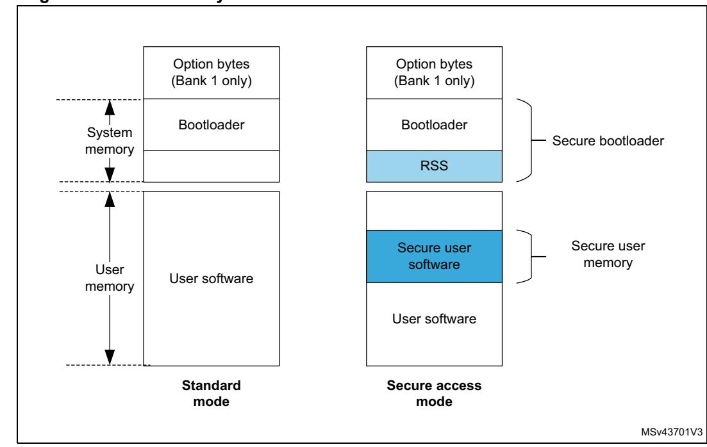
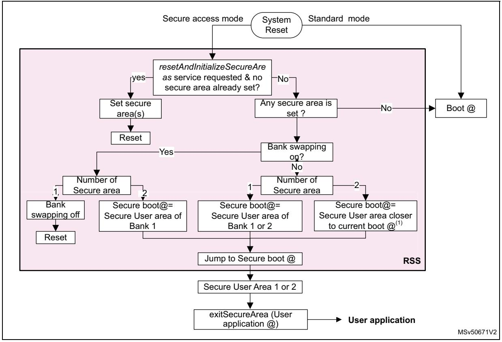
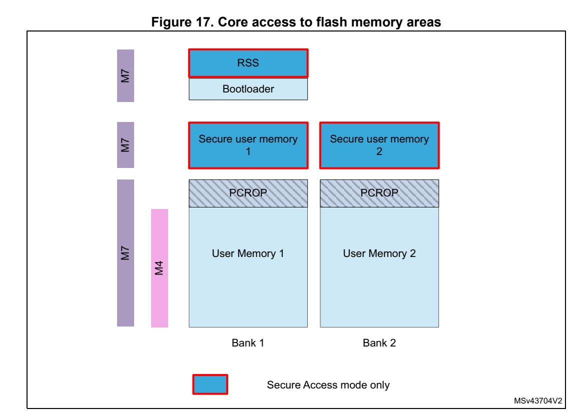

# **5 Secure memory management (SMM)**

## **5.1 Introduction**

STM32H755xI and STM32H757xI microcontrollers offer a first set of protection mechanisms, which are similar to other STM32 Series:

- Global readout device protection (RDP)
- Write protection (WRP)
- Proprietary code readout protection (PCROP)

A detailed description of these protection mechanisms is given in *Section 4: Embedded flash memory (FLASH)*.

STM32H755xI and STM32H757xI also offer an additional enhanced protection mode, the Secure access mode, that makes possible the development of user-defined secure services (e.g. secure firmware update or secure boot) and guarantees of a safe execution and protection of both code and data. This mechanism is described in details in *[Section 5.3:](#page-1-0)  [Secure access mode](#page-1-0)*, *[Section 5.4: Root secure services \(RSS\)](#page-4-0)* and *[Section 5.5: Secure](#page-5-0)  [user software](#page-5-0)*.

The secure memory management unit is contained inside the D1 domain. It is assumed that any code subject to confidentiality protection will be executed by the Cortex-M7 only.

## **5.2 Glossary**

The following terms will be used in herein:

**Table 28. List of preferred terms** 

| Term                          | Description                                                                                                                                                                      |  |  |  |  |
|-------------------------------|----------------------------------------------------------------------------------------------------------------------------------------------------------------------------------|--|--|--|--|
| Device Security Level         |                                                                                                                                                                                  |  |  |  |  |
| Standard mode                 | Device state which allows the access to the user Flash memory, the option bytes and the bootloader area.                                                                      |  |  |  |  |
| Secure access mode            | Device state which allows the access to all the memory areas of the device.                                                                                                      |  |  |  |  |
| Memory areas                  |                                                                                                                                                                                  |  |  |  |  |
| System memory                 | ST reserved memory area used to store ST ROM code.                                                                                                                               |  |  |  |  |
| User flash memory             | Flash memory area used to store user code and data.                                                                                                                              |  |  |  |  |
| Secure user memory/area(1) | This area can be configured to be accessed once after reset and be hidden for the firmware stored in the user flash memory after the code stored in this area is executed. |  |  |  |  |

254/3556 RM0399 Rev 4

| Term                          | Description                                                                                                                                                                        |  |  |  |  |
|-------------------------------|------------------------------------------------------------------------------------------------------------------------------------------------------------------------------------|--|--|--|--|
| Software services             |                                                                                                                                                                                    |  |  |  |  |
| Bootloader                    | STMicroelectronics software executed at reset which allows the download of firmware from regular communication ports.                                                           |  |  |  |  |
| Root secure services (RSS) | STMicroelectronics software which allows the access to secure services.                                                                                                            |  |  |  |  |
| Secure user software          | User software executed once after reset, which can be used to implement secure boot and secure firmware update (SFU). Secure user software is located in secure user memory. |  |  |  |  |

**Table 28. List of preferred terms (continued)**

## **5.3 Secure access mode**

Some sensitive functions require safe execution from potential malicious software attacks. Secure firmware update (SFU) software is a good example of code that requires a high level of protection since it handles secret data (such as cryptographic keys) that shall not be retrieved by other processes.

STM32H755xI and STM32H757xI microcontrollers feature secure memory areas with restricted access. They allow building secure services that will be executed prior to any user application. These secure areas, together with the software they contain, are only accessible when configuring the device in Secure access mode.

*[Figure 15](#page-2-0)* gives an overview of flash memory areas and services in Standard and Secure access modes.

1. Secure user memory/areas are also named secure-hide protected (HDP) memory/areas.

**Figure 15. Flash memory areas and services in Standard and Secure access modes**

- 1. The protected areas that can only be accessed in Secure access mode are shown in blue.
- 2. A single secure user area can be defined for each bank.

#### **5.3.1 Associated features**

The Secure access mode can be configured through option bytes. When it is set, it enables access to:

- STMicroelectronics root secure services to set secure user areas (see *[Section 5.4:](#page-4-0)  [Root secure services \(RSS\)](#page-4-0)*)
- Secure user memory which embeds secure user code and data.

This mode is only defined for the Cortex-M7 core. Cortex-M4 has no access to the option bytes involved in secure memory settings and cannot access these areas. For a summary of access rights for each core, refer to *[Section 5.6: Summary of flash protection mechanisms](#page-6-0)*.

### **5.3.2 Boot state machine**

In Secure access mode, booting is forced in the RSS whatever the boot configuration (boot pins and boot addresses). The RSS can either set a secure user memory area if one has been requested (see *[Section 5.5.2: Setting secure user memory areas](#page-5-1)*) or jump directly to the existing secure user memory. The code located in secure user memory is executed before the main user application and the bootloader. If no service is required and no secure area is defined, the RSS jumps to the boot address selected by BOOT0 pin value.

*[Figure 16](#page-3-0)* shows the boot state machine.

**Figure 16. Bootloader state machine in Secure access mode** 

1. The current boot is defined by boot address in option byte.

## **5.3.3 Secure access mode configuration**

#### **Enabling Secure access mode**

There is no restriction on how to activate Secure access mode on the device. It is configured through the SECURITY option bit in FLASH\_OPTSR\_CUR register (see *Section 4.9.8: FLASH option status register (FLASH\_OPTSR\_CUR)*).

The Secure access mode becomes active after a system reset.

#### **Disabling Secure access mode**

Disabling Secure access mode is a more sensitive task as it can only be done if no more protected code exists on the device. As a result, to come back to Standard mode, secure user memories and PCROP/execute-only areas shall be removed before clearing the SECURITY option bit in the FLASH\_OPTSR\_CUR register.

Protected areas can be removed by performing a flash mass erase (refer to *Section 4.3.10: FLASH erase operations* for more details on mass erase sequence).

## **5.4 Root secure services (RSS)**

The root secure services (RSS) are STMicroelectronics ROM code stored on the device. They are part of the security features. These firmware services are available in Secure access mode (see *Section 4.5.5: Secure access mode*.

*[Table 29](#page-4-1)* gives the addresses of the application programming interface (API) described in the following sections.

**RSS RSS API address** RSS\_getVersion 0x1FF0 9500 RSS\_exitSecureArea 0x1FF0 9514 RSS\_resetAndInitializeSecureAreas 0x1FF0 9518

**Table 29. RSS API addresses** 

## **5.4.1 Secure area setting service**

STMicroelectronics provides a service to perform the initialization of secure areas. This service can be called only once. It is executed after a system reset in Secure access mode prior to any other software stored in the device.

**Caution:** RSS software cannot be accessed (read, write, execute and debug) by the Cortex-M4 core whatever the operating mode, and when the STM32H755xI and STM32H757xI operate in Standard mode. The service can be automatically accessed with ST programming tool, STM32CubeProgrammer, or called through a direct call to the *resetAndInitializeSecureAreas* function defined below.

#### **resetAndInitializeSecureAreas**

| Prototype   | void resetAndInitializeSecureAreas(RSS_SecureArea_t area)                                                                                                                                                                                                                                                                                               |  |  |  |  |
|-------------|---------------------------------------------------------------------------------------------------------------------------------------------------------------------------------------------------------------------------------------------------------------------------------------------------------------------------------------------------------|--|--|--|--|
|             | Arguments Secure user areas start and end addresses. One or two secure user areas can be set.                                                                                                                                                                                                                                                           |  |  |  |  |
| Description | This service sets secure user area boundaries, following the values stored in the option byte registers: – SEC_AREA_START1 and SEC_AREA_END1 for bank 1 – SEC_AREA_START2 and SEC_AREA_END2 for bank 2 This service can be used only when a secure area is set for the first time. A system reset is triggered after service completion. |  |  |  |  |

#### **5.4.2 Secure area exiting service**

The RSS also provides the *exitSecureArea* service. This service must be called to jump to user application. It allows closing safely the secure user area to guarantee that its content can no more be accessed.

Contrary to the *resetAndInitializeSecureAreas* service, it does not trigger any system reset. *exitSecureArea* function is defined below:

258/3556 RM0399 Rev 4

#### **exitSecureArea**

| Prototype   | void exitSecureArea(unsigned int vectors, unsigned int jtagState)                                                                                                                                                                           |  |  |
|-------------|---------------------------------------------------------------------------------------------------------------------------------------------------------------------------------------------------------------------------------------------|--|--|
| Arguments   | Address of application vectors where to jump after exit and state of JTAG after exit: RSS_ENABLE_JTAG_AT_EXIT: JTAG enabled after exiting the secure area RSS_KEEP_JTAG_DISABLED_AT_EXIT: JTAG disabled after exiting the secure area |  |  |
| Description | This service is used to exit from secure user software and jump to user main application. There is no system reset triggered by this service                                                                                          |  |  |

## **5.5 Secure user software**

A secure user software is a trusted piece of code that is executed after device power-on or after a system reset. It allows building secure applications such as:

- code signature or integrity checking (user secure boot).
- software license checking
- secure firmware update
- secure initialization

#### **5.5.1 Access rules**

Only accessible in Secure access mode, the secure user software is stored in the secure memory areas.

Only one user secure area can be configured per bank. If two secure areas are defined, the secure software that is executed is the one closer to current boot address.

After secure user software execution, the code shall jump to the main user application and prevent access to the secure user area. This is done by calling *[exitSecureArea](#page-5-2)*s secure service with the application code address given as parameter.

Once in the application code, any access to the secure user area triggers a flash error.

#### **5.5.2 Setting secure user memory areas**

One secure area of configurable size can be set in each bank. The size of each area can be set from 512 bytes to full bank with a granularity of 256 bytes:

- Secure area in bank 1 Boundaries are configured through SEC\_AREA\_START1 and SEC\_AREA\_END1 option bits in FLASH\_SCAR\_CUR1 (see *Section 4.9.13: FLASH secure address for bank 1 (FLASH\_SCAR\_CUR1)*).
- Secure area in bank 2

Boundaries are configured through SEC\_AREA\_START2 and SEC\_AREA\_END2 option bits in FLASH\_SCAR\_CUR2 (see *Section 4.9.32: FLASH secure address for bank 2 (FLASH\_SCAR\_CUR2)*).

*Note: If the secure area start address is equal to the secure area end address, the whole bank is considered as secure protected.*

The above option bits can only be initialized through *resetAndInitializeSecureAreas* service.

RM0399 Rev 4 259/3556

If a secure area already exists, the secure user area code can update its own secure user area size or create a new one in the other bank.

## **5.6 Summary of flash protection mechanisms**

*[Figure 17](#page-6-1)* and *[Table 30](#page-7-0)* summarize the access rights of the different flash memory areas for each core, both in Secure access and Standard modes.

260/3556 RM0399 Rev 4

**Table 30. Summary of flash protected areas access rights**

| Access type  | Core       | Software Area        | Security mode | Access |
|--------------|------------|----------------------|---------------|--------|
| Execution    | Cortex®-M7 | PCROP                | Any           | ✓      |
|              |            | Secure user software | Secure access | ✓ (1)  |
|              |            | Root secure services | Secure access | ✓ (1)  |
|              | Cortex®-M4 | PCROP                | Any           | No     |
|              |            | Secure user software | Secure access | No     |
|              |            | Root secure services | Secure access | No     |
| Read access  | Cortex®-M7 | PCROP                | Any           | No     |
|              |            | Secure user software | Secure access | ✓(1)   |
|              |            | Root secure services | Secure access | ✓ (1)  |
|              | Cortex®-M4 | PCROP                | Any           | No     |
|              |            | Secure user software | Any           | No     |
|              |            | Root secure services | Any           | No     |
| Debug access | Cortex®-M7 | PCROP                | Any           | No     |
|              |            | Secure user software | Secure access | No     |
|              |            | Root secure services | Secure access | No     |
|              | Cortex®-M4 | Protected area       | Any           | No     |

1. Access rights granted after reset until code completion only.

