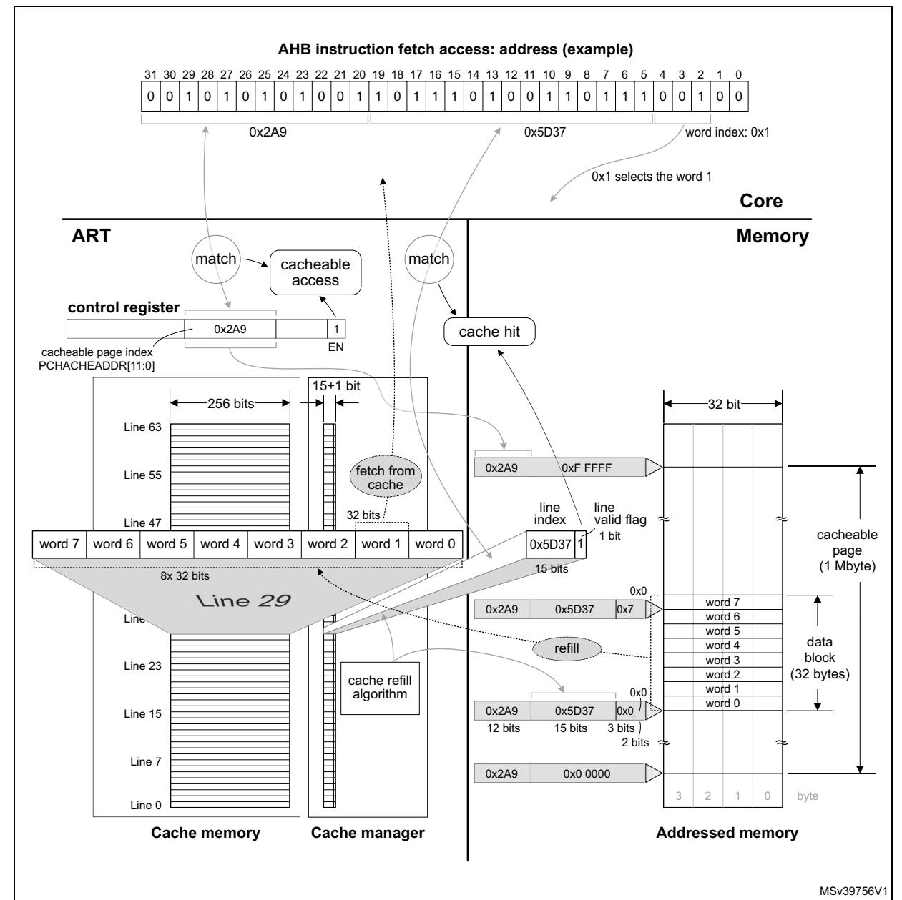

**ART accelerator RM0399**

# **6 ART accelerator**

## **6.1 Introduction**

The ART (adaptive real-time) accelerator block speeds up instruction fetch accesses of the Cortex-M4 core to D1-domain internal memories (Flash A memory, Flash B memory, AXI SRAM) and to D1-domain external memories attached via Quad-SPI controller (QUADSPI) and Flash memory controller (FMC).

The acceleration is achieved by loading selected code into an embedded cache and making it instantly available to Cortex-M4 core, thus avoiding latency due to memory wait states.

For code load, the ART accelerator uses 64-bit WRAP4 accesses via the AXI bus matrix, to fully benefit from the 64-bit wide interface of the D1-domain internal memories, the QUADSPI and the FMC.

## **6.2 ART accelerator features**

- 32-bit AHB slave port for interfacing with the D2 domain
- 32-bit AHB master port for non-cacheable memory accesses
- 64-bit AXI master port for code load from memory to cache
- 64 cache lines of 256 bits
- Fully-associative cache
- Programmable cacheable page
- Cache content consistency checker

262/3556 RM0399 Rev 4

RM0399 ART accelerator

# 6.3 ART accelerator functional description

## 6.3.1 Block diagram

Figure 18 shows the block schematic and the environment of the ART accelerator.

AHB from D2 domain ART accelerator Non-cacheable Cacheable access path access path AHB switch control Detect of write to cacheable page Cache Cache buffer non-cacheable access Cache Cache memory 64 x 256-bit refill AHB access AXI access Flash bank 1 Legend Flash bank 2 → Control 32-bit bus AXI SRAM 64-bit bus OSPI Bus multiplexer 0 FMC Slave interface 64-bit AXI bus matrix MSv39757V2

Figure 18. ART accelerator - block schematic

# 6.3.2 ART accelerator blocks and operation

Instruction fetch accesses can be qualified as cacheable or non-cacheable. For cacheable accesses, the instruction fetch follows the cacheable access path. Non-cacheable accesses are directed to the master AHB port, following the non-cacheable access path. The appropriate access path is selected with the AHB switch controlled by the cache manager.

#### Cache

The cache contains a cache memory and a cache buffer.

 $\overline{\Box}$ 

**ART accelerator RM0399**

The cache memory is organized in 64 lines of 256 bits each. Every line contains eight 32-bit segments. Each segment can contain one 32-bit or two 16-bit instruction codes.

The cache buffer is an extra line of 256 bits keeping a copy of one of cache lines (buffer source line). It allows fetching instruction code by the core while the corresponding buffer source line is in refill progress.

The ART accelerator keeps a 15-bit line index and a validity bit for each of 64 cache memory lines and for the cache buffer.

### **Cache manager**

The cache manager:

- checks whether the incoming memory instruction fetch access is cacheable
- controls the AHB switch
- for a cacheable access, checks for cache hit and allows instruction fetch from cache
- manages the cache memory line refill (instruction code load) in case of cache miss

#### **Check for cacheable access**

Upon an access occurring on the slave AHB interface, the cache manager qualifies it as cacheable or non-cacheable. For an access to be qualified as cacheable, the following conditions must all be met:

- the access is an instruction fetch (instruction code read)
- the access is of 32-bit cacheable type (AHB properties)
- the access address bits 31 through 20 (twelve MSB's) match the PCACHEADDR[11:0] field of the ART accelerator control register

Due to a pipelined architecture, the first cacheable access is handled as non-cacheable.

#### **Check for cache hit**

The cache manager checks for cache hit for every cacheable access.

For that effect, the cache manager simultaneously compares the address bits [19:5] of the pending instruction fetch access with the cache line and buffer indexes of the lines flagged as valid. Compare match indicates a cache hit. The absence of compare match indicates a cache miss.

This implementation allows the associativity of the cache memory lines with the 32-byte data blocks of the cacheable page without any interdependence, which maximizes the cache performance.

Upon a cache hit with a cache memory line:

- The instruction code fetch from the cache line occurs.
- The 256 bits of the line are instantly copied to the cache buffer.

Upon a cache hit with the cache buffer, the instruction code fetch from the cache buffer occurs.

In both cases, the bits [4:2] of the pending instruction fetch address are used as pointer to the cache line, to retrieve the instruction code from their corresponding 32-bit segment.

264/3556 RM0399 Rev 4

**RM0399 ART accelerator**

**Figure 19. Instruction fetch from cache**

### **Cache refill**

Upon a cache miss:

- A WRAP4 64-bit AXI access reaches the address of the AHB access in the target memory and fetches data directly to AHB via the cacheable access path.
- Four successive WRAP4 64-bit AXI accesses refill the cache buffer and an automatically selected cache memory line with data from the 32-byte data block of the target memory comprising the address of the AHB access.

The cache buffer allows producing cache hits as soon as it is partially refilled (upon the first cycle of the WRAP4 access completed), which further increases the system efficiency.

**ART accelerator RM0399**

When the cache memory is full upon a cache miss, a cache memory line must be evicted and replaced with new contents. The replacement policy is based on the LRU algorithm (least recently used).

*[Figure 19](#page-3-0)* illustrates an example of cache memory line refill, cache hit and instruction code fetch from the cache memory. For simplicity, the cache buffer is not represented.

### **Cache consistency**

The following cases can cause the code in the cache to get inconsistent with the code on the corresponding address of the addressed memory:

- A write access modifies a piece of data in the cacheable page of the addressed memory.
- The software modifies the cacheable page index in the ART accelerator's control register.
- A data transfer error occurs during the cache buffer and/or cache memory line refill.

The device incorporates a mechanism preventing software corruption due to the cache inconsistency. It detects the above cases and flags all the cache memory lines and the cache buffer as invalid. As a consequence, the following cacheable access results in cache miss and in subsequent cache buffer and cache line refill with new data.

# **6.4 ART accelerator registers**

### **6.4.1 ART accelerator - control register (ART\_CTR)**

Address offset: 0x0000 Reset value: 0x0000 0004

| 31              | 30   | 29   | 28   | 27   | 26   | 25   | 24   | 23   | 22   | 21   | 20   | 19               | 18   | 17   | 16 |
|-----------------|------|------|------|------|------|------|------|------|------|------|------|------------------|------|------|----|
| Res.            | Res. | Res. | Res. | Res. | Res. | Res. | Res. | Res. | Res. | Res. | Res. | PCACHEADDR[11:8] |      |      |    |
|                 |      |      |      |      |      |      |      |      |      |      |      | rw               | rw   | rw   | rw |
| 15              | 14   | 13   | 12   | 11   | 10   | 9    | 8    | 7    | 6    | 5    | 4    | 3                | 2    | 1    | 0  |
| PCACHEADDR[7:0] |      |      |      |      |      |      |      | Res. | Res. | Res. | Res. | Res.             | Res. | Res. | EN |
| rw              | rw   | rw   | rw   | rw   | rw   | rw   | rw   |      |      |      |      |                  |      |      | rw |

Bits 31:20 Reserved, must be kept at reset value.

**RM0399 ART accelerator**

#### Bits 19:8 **PCACHEADDR[11:0]**: cacheable page index

Base address of 1 Mbyte address page (cacheable page) from which the ART accelerator loads code to the cache. It can be modified with word (32-bit) access type. Other than 32-bit accesses have no effect.

*Note: At runtime, it is recommended to disable the ART by clearing the EN bit before programming PCACHEADDR, then enable the ART again. There is no instruction loss when the ART is disabled.* 

Bits 7:1 Reserved, must be kept at reset value.

Bit 0 **EN**: cache enable

When enabled, the cache memory and refill mechanism operate. When disabled, all accesses default to non-cacheable.

0x1: enable 0x0: disable

Refer to *Section 2.3 on page 134* for the register boundary addresses.

RM0399 Rev 4 267/3556