# **7 Power control (PWR)**

# **7.1 Introduction**

The Power control section (PWR) provides an overview of the supply architecture for the different power domains and of the supply configuration controller.

It also describes the features of the power supply supervisors and explains how the VCORE supply domain is configured depending on the operating modes, the selected performance (clock frequency) and the voltage scaling.

# **7.2 PWR main features**

- Power supplies and supply domains
  - Core domains (VCORE)
  - VDD domain
  - Backup domain (VSW, VBKP)
  - Analog domain (VDDA)
- System supply voltage regulation
  - SMPS step-down converter
  - Voltage regulator (LDO)
- Peripheral supply regulation
  - USB regulator
  - DSI regulator
- Power supply supervision
  - POR/PDR monitor
  - BOR monitor
  - PVD monitor
  - AVD monitor
  - VBAT thresholds
  - Temperature thresholds
- Power management
  - VBAT battery charging
  - Operating modes
  - Voltage scaling control
  - Low-power modes

# 7.3 PWR block diagram

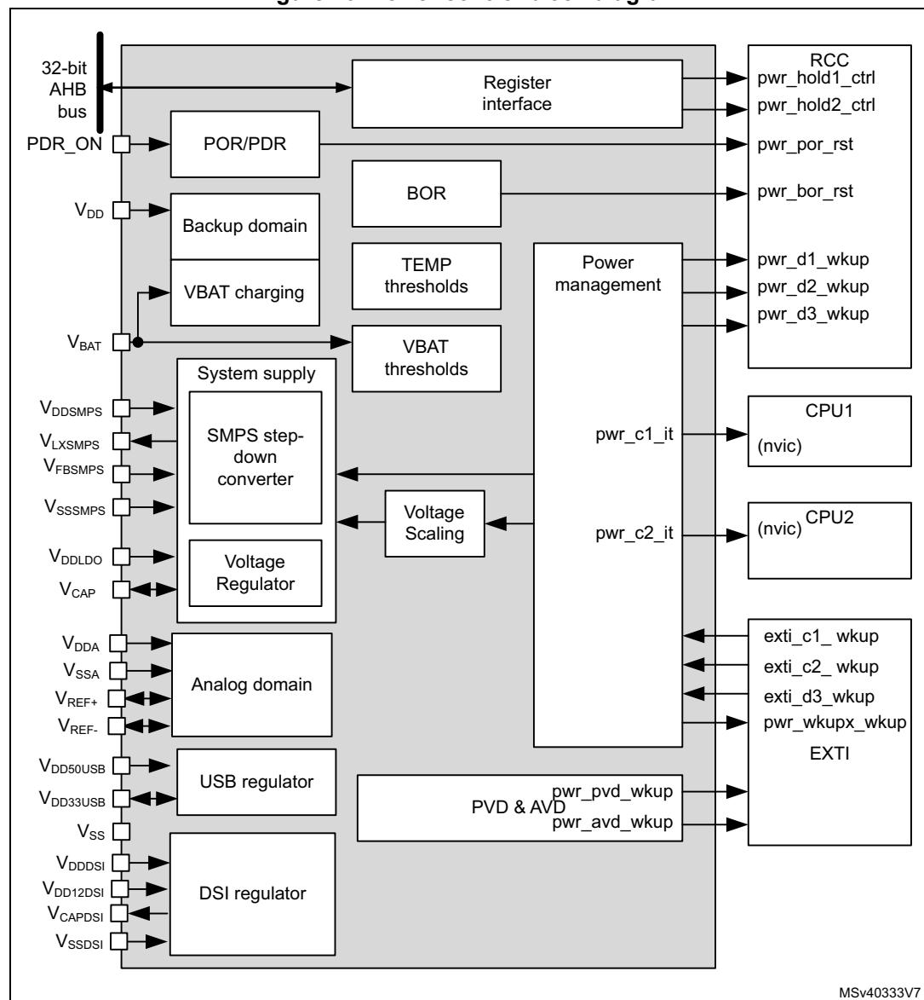

Figure 20. Power control block diagram

# **7.3.1 PWR pins and internal signals**

*[Table 31](#page-2-0)* lists the PWR inputs and output signals connected to package pins or balls, while *[Table 32](#page-3-0)* shows the internal PWR signals.

**Table 31. PWR input/output signals connected to package pins or balls** 

<span id="page-2-0"></span>

| Pin name   | Signal<br>type              | Description                                         |  |
|------------|-----------------------------|-----------------------------------------------------|--|
| VDD        | Supply<br>input             | Main I/O and VDD domain supply input                |  |
| VDDA       | Supply<br>input             | External analog power supply for analog peripherals |  |
| VREF+,VREF | Supply<br>Input/<br>Outputs | External reference voltage for ADCs and DAC         |  |
| VBAT       | Supply<br>input             | Backup battery supply input                         |  |
| VDDSMPS    | Supply<br>input             | Step-down converter supply input                    |  |
| VLXSMPS    | Supply<br>output            | Step-down converter supply output                   |  |
| VFBSMPS    | Supply<br>input             | Step-down converter feedback voltage sense          |  |
| VSSSMPS    | Supply<br>input             | Step-down converter ground                          |  |
| VDDLDO     | Supply<br>input             | Voltage regulator supply input                      |  |
| VCAP       | Supply<br>Input/<br>Outputs | Digital core domain supply                          |  |
| VDD50USB   | Supply<br>input             | USB regulator supply input                          |  |
| VDD33USB   | Supply<br>Input/<br>Outputs | USB regulator supply output                         |  |
| VDDDSI     | Supply<br>input             | DSI regulator supply input                          |  |
| VDD12DSI   | Supply<br>input             | DSI PHY supply input                                |  |
| VCAPDSI    | Supply<br>output            | DSI regulator supply output                         |  |
| VSSDSI     | Supply<br>input             | DSI regulator ground                                |  |
| VSS        | Supply<br>input             | Main ground                                         |  |

**Table 31. PWR input/output signals connected to package pins or balls (continued)**

| Pin name | Signal<br>type   | Description             |  |  |  |  |  |
|----------|------------------|-------------------------|--|--|--|--|--|
| AHB      | I/O              | AHB register interface  |  |  |  |  |  |
| PDR_ON   | Digital<br>input | Power Down Reset enable |  |  |  |  |  |

**Table 32. PWR internal input/output signals** 

<span id="page-3-0"></span>

| Signal name    | Signal<br>type    | Description                               |  |  |  |  |
|----------------|-------------------|-------------------------------------------|--|--|--|--|
| pwr_hold1_ctrl | Digital<br>output | CPU1 clock hold                           |  |  |  |  |
| pwr_hold2_ctrl | Digital<br>output | CPU2 clock hold                           |  |  |  |  |
| pwr_c1_it      | Digital<br>output | CPU2 on-hold wakeup interrupt to CPU1.    |  |  |  |  |
| pwr_c2_it      | Digital<br>output | CPU1 on-hold wakeup interrupt to CPU2.    |  |  |  |  |
| pwr_pvd_wkup   | Digital<br>output | Programmable voltage detector output      |  |  |  |  |
| pwr_avd_wkup   | Digital<br>output | Analog voltage detector output            |  |  |  |  |
| pwr_wkupx_wkup | Digital<br>output | CPU wakeup signals (x=1 to 6)             |  |  |  |  |
| pwr_por_rst    | Digital<br>output | Power-on reset                            |  |  |  |  |
| pwr_bor_rst    | Digital<br>output | Brownout reset                            |  |  |  |  |
| exti_c1_wkup   | Digital<br>input  | CPU1 wakeup request                       |  |  |  |  |
| exti_c2_wkup   | Digital<br>input  | CPU2 wakeup request                       |  |  |  |  |
| exti_d3_wkup   | Digital<br>input  | D3 domain wakeup request                  |  |  |  |  |
| pwr_d1_wkup    | Digital<br>output | D1 domain bus matrix clock wakeup request |  |  |  |  |
| pwr_d2_wkup    | Digital<br>output | D2 domain bus matrix clock wakeup request |  |  |  |  |
| pwr_d3_wkup    | Digital<br>output | D3 domain bus matrix clock wakeup request |  |  |  |  |

### 7.4 Power supplies

The device requires  $V_{DD}$  and  $V_{DDSMPS}$  power supplies as well as independent supplies for  $V_{DDLDO}$ ,  $V_{DDA}$ ,  $V_{DDUSB}$ ,  $V_{DDDSI}$ , and  $V_{CAP}$ . It also provides regulated supplies for specific functions (step-down converter, voltage regulator, USB regulator, DSI regulator).

- V<sub>DD</sub> external power supply for I/Os and system analog blocks such as reset, power management and oscillators
- V<sub>BAT</sub> optional external power supply for backup domain when V<sub>DD</sub> is not present (V<sub>BAT</sub> mode)

This power supply shall be connected to  $V_{DD}$  when no battery is used.

- V<sub>DDSMPS</sub> external power supply for step-down converter
  - This power supply shall be connected to  $V_{DD}$  when SMPS is used. Otherwise, it must be connected to GND.
- V<sub>I XSMPS</sub> step-down converter supply output
- V<sub>ERSMPS</sub> is the step-down converter sense feedback
- V<sub>SSSMPS</sub> separate step-down converter ground
- V<sub>DDLDO</sub> external power supply for voltage regulator
- V<sub>CAP</sub> digital core domain supply

This power supply is independent from all the other power supplies:

- When the voltage regulator is enabled, V<sub>CORE</sub> is delivered by the internal voltage regulator.
- When the voltage regulator is disabled, V<sub>CORE</sub> is delivered by an external power supply through V<sub>CAP</sub> pin, or by the SMPS step-down converter.
- V<sub>DDA</sub> external analog power supply for ADCs, DACs, OPAMPs, comparators and voltage reference buffers

This power supply is independent from all the other power supplies.

- V<sub>REE+</sub> external reference voltage for ADC and DAC.
  - When the voltage reference buffer is enabled, V<sub>REF+</sub> and V<sub>REF-</sub> are delivered by the internal voltage reference buffer.
  - When the voltage reference buffer is disabled, V<sub>REF+</sub> is delivered by an independent external reference supply.
- V<sub>SSA</sub> separate analog and reference voltage ground.
- V<sub>DD50USB</sub> external power supply for USB regulator.
- V<sub>DD33USB</sub> USB regulator supply output for USB interface.
  - When the USB regulator is enabled, V<sub>DD33USB</sub> is delivered by the internal USB regulator.
  - When he USB regulator is disabled, V<sub>DD33USB</sub> is delivered by an independent external supply input.
- V<sub>DDDSI</sub> external power supply for DSI regulator.
- V<sub>DD12DSI</sub> DSI PHY supply input.
- V<sub>CAPDSI</sub>: DSI regulator output (1.2 V) which must be externally connected to V<sub>DD12DSI</sub>.
- V<sub>SSDSI</sub> separate DSI ground.
- V<sub>SS</sub> common ground for all supplies except for step-down converter, analog and DSI regulator.


Note: Depending on the operating power supply range, some peripherals might be used with limited features and performance. For more details, refer to section "General operating conditions" of the device datasheets.

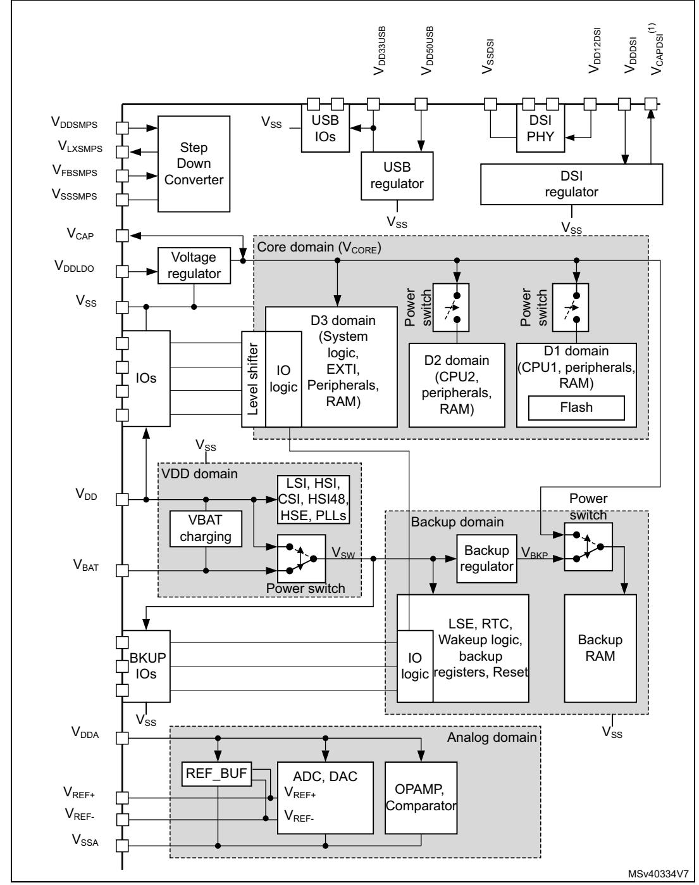

Figure 21. Power supply overview

1.  $V_{CAPDSI}$  pin must be externally connected to  $V_{DD12DSI}$  pin.

By configuring the SMPS step-down converter and voltage regulator, the supply configurations shown in *[Figure 22](#page-6-0)* are supported for the VCORE core domain and an external supply.

*Note: The SMPS step-down converter is not available on all packages.*

**Figure 22. System supply configurations**

<span id="page-6-0"></span>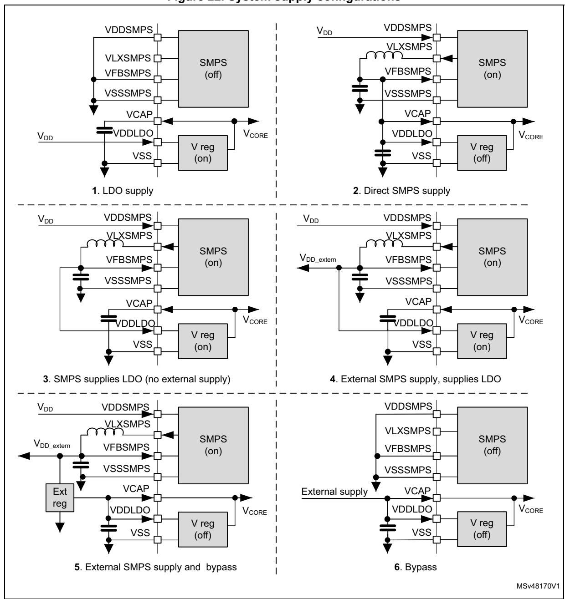

The different supply configurations are controlled through the LDOEN, SDEN, SDEXTHP, SDLEVEL and BYPASS bits in *[PWR control register 3 \(PWR\\_CR3\)](#page-61-0)* register according to *[Table 33](#page-7-0)*.

**Table 33. Supply configuration control** 

<span id="page-7-0"></span>

| ID | Supply<br>configuration                                             | SDLEVEL        | SDEXTHP | SDEN | LDOEN | BYPASS | Description                                                                                                                                                                                                                                                                                                                         |  |  |
|----|---------------------------------------------------------------------|----------------|---------|------|-------|--------|-------------------------------------------------------------------------------------------------------------------------------------------------------------------------------------------------------------------------------------------------------------------------------------------------------------------------------------|--|--|
| 0  | Default<br>configuration                                            | 00             | 0       | 1    | 1     | 0      | – VCORE Power Domains are supplied from the LDO according<br>to VOS.<br>– SMPS step-down converter enabled at 1.2V, may be used to<br>supply the LDO.                                                                                                                                                                               |  |  |
| 1  | LDO supply                                                          | x              | x       | 0    | 1     | 0      | – VCORE Power Domains are supplied from the LDO according<br>to VOS.<br>– LDO power mode (Main, LP, Off) will follow system low-power<br>modes.<br>– SMPS step-down converter disabled.                                                                                                                                             |  |  |
| 2  | Direct SMPS step<br>down converter<br>supply                        | x              | 0       | 1    | 0     | 0      | – VCORE Power Domains are supplied from SMPS step-down<br>converter according to VOS.<br>– LDO bypassed.<br>– SMPS step-down converter power mode (MR, LP, Off) will<br>follow system low-power modes.                                                                                                                              |  |  |
| 3  | SMPS step-down<br>converter supplies<br>LDO,                        | 01<br>or<br>10 | 0       | 1    | 1     | 0      | – VCORE Power Domains are supplied from the LDO according<br>to VOS<br>– LDO power mode (Main, LP, Off) will follow system low-power<br>modes.<br>– SMPS step-down converter enabled according to SDLEVEL,<br>and supplies the LDO.<br>– SMPS step-down converter power mode (MR, LP, Off) will<br>follow system low-power modes.   |  |  |
| 4  | SMPS step-down<br>converter supplies<br>External and LDO            | 01<br>or<br>10 | 1       | 1    | 1     | 0      | – VCORE Power Domains are supplied from voltage regulator<br>according to VOS<br>– LDO power mode (Main, LP, Off) will follow system low-power<br>modes.<br>– SMPS step-down converter enabled according to SDLEVEL<br>used to supply external circuits and may supply the LDO.<br>– SMPS step-down converter forced ON in MR mode. |  |  |
| 5  | SMPS step-down<br>converter supplies<br>external.<br>and LDO Bypass | 01<br>or<br>10 | 1       | 1    | 0     | 1      | – VCORE supplied from external source<br>– SMPS step-down converter enabled according to SDLEVEL<br>used to supply external circuits and may supply the external<br>source for VCORE.<br>– SMPS step-down converter forced ON in MR mode.                                                                                           |  |  |

6 SMPS step-down converter disabled and LDO Bypass xx001 – VCORE supplied from external source – SMPS step-down converter disabled and LDO bypassed, voltage monitoring still active. NA Illegal xx000 – Illegal combination, the default configuration is kept. (write data will be ignored). xxx11 x0101 00 x 1 1 0 x1100 00 1 1 0 1 **ID Supply configuration SDLEVEL SDEXTHP SDEN LDOEN BYPASS Description**

**Table 33. Supply configuration control (continued)**

### **7.4.1 System supply startup**

The system startup sequence from power-on in different supply configurations is the following (see *[Figure 23](#page-9-0)* and *[Figure 24](#page-10-0)* for LDO supply and Direct SMPS supply, respectively):

- 1. When the system is powered on, the POR monitors VDD supply. Once VDD is above the POR threshold level, the SMPS step-down converter and voltage regulator are enabled in the default supply configuration:
  - The SMPS step-down converter output level is set at 1.2 V.
  - The voltage regulator output level is set at 1.0 V in accordance with the VOS3 level configured in *[PWR D3 domain control register \(PWR\\_D3CR\)](#page-67-0)*.
- 2. The system is kept in reset mode as long as VCORE is not ok.
- 3. Once VCORE is ok, the system is taken out of reset and the HSI oscillator is enabled.
- 4. Once the oscillator is stable, the system is initialized: Flash memory and option bytes are loaded and the CPU starts in limited run mode (Run\*).
- 5. The software shall then initialize the system including supply configuration programming in *[PWR control register 3 \(PWR\\_CR3\)](#page-61-0)*. Once the supply configuration has been configured, the ACTVOSRDY bit in *[PWR control status register 1](#page-59-0)  [\(PWR\\_CSR1\)](#page-59-0)* shall be checked to guarantee valid voltage levels:
  - a) As long as ACTVOSRDY indicates that voltage levels are invalid, the system is in Run\* mode, write accesses to the RAMs are not permitted and VOS shall not be changed.
  - b) Once ACTVOSRDY indicates that voltage levels are valid, the system is in normal Run mode, write accesses to RAMs are allowed and VOS can be changed.

### V<sub>CORE</sub> supplied from the voltage regulator (LDO)

When  $V_{CORE}$  is supplied from the voltage regulator (LDO), the  $V_{CORE}$  voltage settles directly at VOS3 level. However the SMPS step-down converter  $V_{LXSMPS}$  output voltage is set at 1.2 V. ACTVOSRDY bit in *PWR control status register 1 (PWR\_CSR1)* indicates that the voltage levels are invalid.

The software has to program the supply configuration in *PWR control register 3* (*PWR\_CR3*). In addition, the V<sub>LXSMPS</sub> voltage level shall reach the programmed SDLEVEL so that ACTVOSRDY indicates valid voltage levels (see *Figure 23*).

<span id="page-9-0"></span>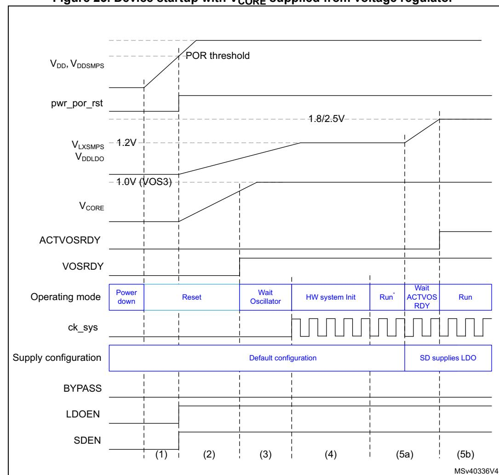

Figure 23. Device startup with V<sub>CORE</sub> supplied from voltage regulator

- 1. In Run\* mode, write operations to RAM are not allowed.
- 2. Write operations to RAM are allowed and VOS can be changed only when ACTVOSRDY is valid.

277/3556

### V<sub>CORE</sub> directly supplied from the SMPS step-down converter

When  $V_{CORE}$  is directly supplied from the SMPS step-down converter, the  $V_{CORE}$  voltage first settles at the SMPS step-down converter default level (1.2 V). Due to a too high supply compared to the VOS3 level, the ACTVOSRDY bit in *PWR control status register 1* (*PWR\_CSR1*) indicates invalid voltage levels.  $V_{CORE}$  settles at 1.0 V (VOS3 level) and ACTVODSRDY indicates valid voltage levels only when the supply configuration has been programmed in *PWR control register 3* (*PWR\_CR3*) (see *Figure 24*).

<span id="page-10-0"></span>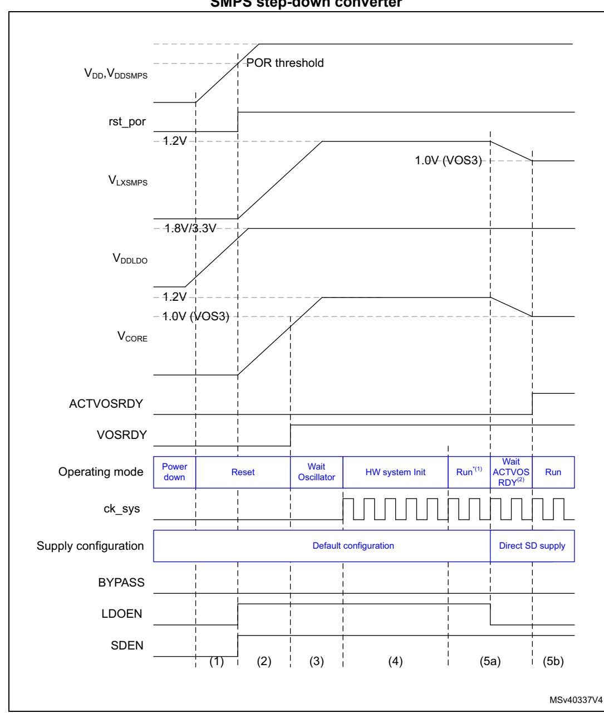

Figure 24. Device startup with V<sub>CORE</sub> supplied directly from SMPS step-down converter

- 1. In Run\* mode, write operations to RAM are not allowed.
- 2. Write operations to RAM are allowed and VOS can be changed only when ACTVOSRDY is valid.

77/

When exiting from Standby mode, the supply configuration is known by the system since the PWR control register 3 ( $PWR\_CR3$ ) register content is retained. However the software shall still wait for the ACTVOSRDY bit to be set in PWR control status register 1 ( $PWR\_CSR1$ ) to indicate  $V_{CORE}$  voltage levels are valid, before performing write accesses to RAM or changing VOS.

### V<sub>CORE</sub> supplied in Bypass mode (LDO and SMPS OFF)

For packages where VDDLDO is internally connected to VDD, when  $V_{CORE}$  is supplied in Bypass mode (LDO OFF), the  $V_{CORE}$  voltage must first settle at a default level higher than 1.1 V. Due to the LDO default state after power-up (enabled by default), the external  $V_{CORE}$  voltage must remain higher than 1.1 V until the LDO is disabled by software.

When the LDO is disabled, the external  $V_{CORE}$  voltage can be adjusted according to the user application needs (refer to section *General operating conditions* of the datasheet for details on  $V_{CORE}$  level versus the maximum operating frequency).

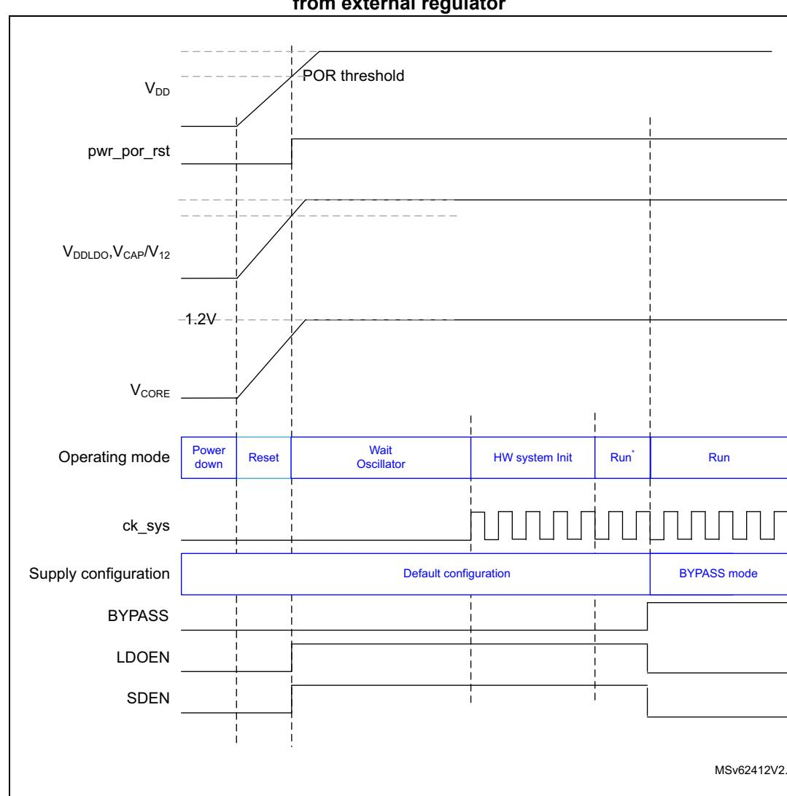

Figure 25. Device startup with V<sub>CORE</sub> supplied in Bypass mode from external regulator

#### 7.4.2 Core domain

The  $V_{CORE}$  core domain supply can be provided by the SMPS step-down converter, voltage regulator or by an external supply ( $V_{CAP}$ ).  $V_{CORE}$  supplies all the digital circuitries except for the backup domain and the Standby circuitry. The  $V_{CORE}$  domain is split into 3 sections:

- D1 domain containing the CPU (Cortex®-M7), Flash memory and peripherals.
- D2 domain containing peripherals and a Cortex<sup>®</sup>-M4 CPU.
- D3 domain containing the system control, I/O logic and low-power peripherals.

When a system reset occurs, the voltage regulator is enabled and supplies V<sub>CORE</sub>. The SMPS step-down converter is also enabled to deliver 1.2 V. This allows the system to start up in any supply configurations (see *Figure 22*).

After a system reset, the software shall configure the used supply configuration in *PWR* control register 3 (*PWR\_CR3*) register before changing VOS in *PWR\_D3* domain control register (*PWR\_D3CR*) or the RCC ck\_sys frequency. The different system supply configurations are controlled as shown in *Table 33*.

Note: The SMPS step-down converter is not available on all packages.

#### Voltage regulator

The embedded voltage regulator (LDO) requires external capacitors to be connected to  $V_{\text{CAP}}$  pins.

The voltage regulator provides three different operating modes: Main (MR), Low-power (LP) or Off. These modes will be used depending on the system operating modes (Run, Stop and Standby).

Run mode

The LDO regulator is in Main mode and provides full power to the  $V_{CORE}$  domain (core, memories and digital peripherals). The regulator output voltage can be scaled by software to different voltage levels (VOS0<sup>(a)</sup>, VOS1, VOS2, and VOS3) that are configured through VOS bits in *PWR D3 domain control register (PWR\_D3CR)*. The VOS voltage scaling allows optimizing the power consumption when the system is clocked below the maximum frequency. By default VOS3 is selected after system reset. VOS can be changed on-the-fly to adapt to the required system performance.

Stop mode

The voltage regulator supplies the V<sub>CORE</sub> domain to retain the content of registers and internal memories.

The regulator can be kept in Main mode to allow fast exit from Stop mode, or can be set in LP mode to obtain a lower V<sub>CORE</sub> supply level and extend the exit-from-Stop latency. The regulator mode is selected through the SVOS and LPDS bits in *PWR control register 1 (PWR\_CR1)*. Main mode and LP mode are allowed if SVOS3 voltage scaling is selected, while only LP mode is possible for SVOS4 and SVOS5 scaling. Due to a

280/3556 RM0399 Rev 4

\_

a. VOS0 corresponds to V<sub>CORE</sub> boost allowing to reach the system maximum frequency (refer to Section: VOS0 activation/deactivation sequence)

lower voltage level for SVOS4 and SVOS5 scaling, the Stop mode consumption can be further reduced.

Standby mode

The voltage regulator is OFF and the  $V_{CORE}$  domains are powered down. The content of the registers and memories is lost except for the Standby circuitry and the backup domain.

Note: For more details, refer to the voltage regulator section in the datasheets.

#### SMPS step-down converter regulator

The SMPS step-down converter requires an external coil to be connected between the dedicated  $V_{LXSMPS}$  pin and, via a capacitor, to  $V_{SS}$ .

The SMPS step-down converter can be used in internal supply mode or external supply mode. The internal supply mode is used to directly supply the  $V_{CORE}$  domain, while the external supply mode is used to generate an intermediate supply level ( $V_{DD\_extern}$  at 1.8 or 2.5 V) which can supply the voltage regulator and optionally an external circuitry.

The SMPS step-down converter works in three different power modes: Main (MR), Low-power (LP) or Off.

When the SMPS step-down converter is used in internal supply mode, the converter operating modes depend on the system modes (Run, Stop, Standby) and are configured through the associated VOS and SVOS levels:

#### Run mode

The SMPS step-down converter operates in MR mode and provides full power to the  $V_{CORE}$  domain (core, memories and digital peripherals). The regulator output voltage can be scaled by software to different voltage levels (VOS0, VOS1, VOS2, and VOS3) that are configured through VOS bits in *PWR D3 domain control register* (*PWR\_D3CR*). The VOS voltage scaling allows optimizing the power consumption when the system is clocked below the maximum frequency. By default VOS3 is selected after system reset. VOS can be changed on-the-fly to adapt to the required system performance.

#### Stop mode

The SMPS step-down converter supplies the  $V_{CORE}$  domain to retain the content of registers and internal memories. The regulator can be kept in MR mode to allow fast exit from Stop mode, or can be set in LP mode to achieve a lower  $V_{CORE}$  supply level and extend the exit-from-Stop latency. The regulator mode is selected through the SVOS and LPDS bits in *PWR control register 1 (PWR\_CR1)*. MR mode or LP mode are allowed if SVOS3 voltage scaling is selected, while only LP mode is possible for SVOS4 and SVOS5 scaling. Due to a lower voltage level for SVOS4 and SVOS5 scaling, the Stop mode consumption can be further reduced.

#### Standby mode

The SMPS step-down converter is OFF and the  $V_{CORE}$  domains are powered down. The content of the registers and memories are lost except for the Standby circuitry and the backup domain.

When the SMPS step-down converter supplies an external circuitry by generating an intermediate voltage level, the converter is forced ON and operates in MR mode. The intermediate voltage level is selected through SDLEVEL bits in *PWR control register 3* (*PWR\_CR3*). V<sub>DD\_extern</sub> is supplied at all times with full power whatever the system modes (Run, Stop, Standby).


RM0399 Rev 4 281/3556

Note: The SMPS step-down converter is not available on all packages.

### 7.4.3 PWR external supply

When  $V_{CORE}$  is supplied from an external source, different operating modes can be used depending on the system operating modes (Run, Stop or Standby):

In Run mode

The external source supplies full power to the  $V_{CORE}$  domain (core, memories and digital peripherals). The external source output voltage is scalable through different voltage levels (VOS0, VOS1, VOS2 and VOS3). The externally applied voltage level shall be reflected in the VOS bits of PWR\_D3CR register. The RAMs shall only be accessed for write operations when the external applied voltage level matches VOS settings.

In Stop mode

The external source supplies  $V_{CORE}$  domain to retain the content of registers and internal memories. The regulator can select a lower  $V_{CORE}$  supply level to reduce the consumption in Stop mode.

In Standby mode

The external source shall be switched OFF and the V<sub>CORE</sub> domains powered down. The content of registers and memories is lost except for the Standby circuitry and the backup domain. The external source shall be switched ON when exiting Standby mode.

#### <span id="page-14-0"></span>7.4.4 Backup domain

To retain the content of the backup domain (RTC, backup registers and backup RAM) when  $V_{DD}$  is turned off,  $V_{BAT}$  pin can be connected to an optional standby voltage which is supplied from a battery or from an another source.

The switching to  $V_{BAT}$  is controlled by the power-down reset embedded in the Reset block that monitors the  $V_{DD}$  supply.

#### Warning:

During  $t_{RSTTEMPO}$  (temporization at  $V_{DD}$  startup) or after a PDR is detected, the power switch between  $V_{BAT}$  and  $V_{DD}$  remains connected to  $V_{BAT}$ .

During the a startup phase, if  $V_{DD}$  is established in less than  $t_{RSTTEMPO}$  (see the datasheet for the value of  $t_{RSTTEMPO}$ ) and  $V_{DD} > V_{BAT} + 0.6$  V, a current may be injected into  $V_{BAT}$  through an internal diode connected between  $V_{DD}$  and the power switch  $(V_{BAT})$ .

If the power supply/battery connected to the  $V_{BAT}$  pin cannot support this current injection, it is strongly recommended to connect an external low-drop diode between this power supply and the  $V_{BAT}$  pin.

When the VDD supply is present, the backup domain is supplied from VDD. This allows saving VBAT power supply battery life time.

If no external battery is used in the application, it is recommended to connect VBAT to VDD supply and to add a 100 nF ceramic decoupling capacitor on the VBAT pin.

When the VDD supply is present and higher than the PDR threshold, the backup domain is supplied by VDD and the following functions are available:

- PC14 and PC15 can be used either as GPIO or as LSE pins.
- PC13 can be used either as GPIO or as RTC\_AF1 or RTC\_TAMP1 pin assuming they have been configured by the RTC.
- PI8/RTC\_TAMP2 and PC1/RTC\_TAMP3 when they are configured by the RTC as tamper pins.

*Note: Since the switch only sinks a limited amount of current, the use of PC13 to PC15 and PI8 GPIOs is restricted: only one I/O can be used as an output at a time, at a speed limited to 2 MHz with a maximum load of 30 pF. These I/Os must not be used as current sources (e.g. to drive an LED).* 

> In VBAT mode, when the VDD supply is absent and a supply is present on VBAT, the backup domain is supplied by VBAT and the following functions are available:

- PC14 and PC15 can be used as LSE pins only.
- PC13 can be used as RTC\_AF1 or RTC\_TAMP1 pin assuming they have been configured by the RTC.
- PI8/RTC\_TAMP2 and PC1/RTC\_TAMP3 when they are configured by the RTC as tamper pins.

#### **Accessing the backup domain**

After reset, the backup domain (RTC registers and RTC backup registers) is protected against possible unwanted write accesses. To enable access to the backup domain, set the DBP bit in the *[PWR control register 1 \(PWR\\_CR1\)](#page-57-0)*.

For more detail on RTC and backup RAM access, refer to *Section 9: Reset and Clock Control (RCC)*.

### **Backup RAM**

The backup domain includes 4 Kbytes of backup RAM accessible in 32-bit, 16-bit or 8-bit data mode. The backup RAM is supplied from the Backup regulator in the backup domain. When the Backup regulator is enabled through BREN bit in *[PWR control register 2](#page-60-0)  [\(PWR\\_CR2\)](#page-60-0)*, the backup RAM content is retained even in Standby and/or VBAT mode (it can be considered as an internal EEPROM if VBAT is always present.)

The Backup regulator can be ON or OFF depending whether the application needs the backup RAM function in Standby or VBAT modes.

The backup RAM is not mass erased by an tamper event, instead it is read protected to prevent confidential data, such as cryptographic private key, from being accessed. To re-


RM0399 Rev 4 283/3556

gain access to the backup RAM after a tamper event, the memory area needs to be first erased. The backup RAM can be erased:

- through the Flash interface when a protection level change from level 1 to level 0 is requested (refer to the description of Read protection (RDP) in the Flash programming manual).
- After a tamper event, by performing a dummy write with zero as data to the backup RAM.

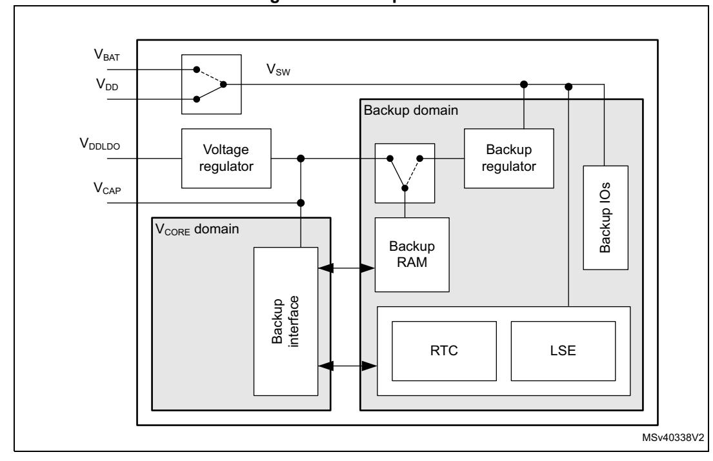

**Figure 26. Backup domain**

# **7.4.5 VBAT battery charging**

When VDD is present, the external battery connected to VBAT can be charged through an internal resistance.

VBAT charging can be performed either through a 5 k Ω resistor or through a 1.5 k Ω resistor, depending on the VBRS bit value in *[PWR control register 3 \(PWR\\_CR3\)](#page-61-0)*.

The battery charging is enabled by setting the VBE bit in *[PWR control register 3](#page-61-0)  [\(PWR\\_CR3\)](#page-61-0)*. It is automatically disabled in VBAT mode.

### **7.4.6 Analog supply**

### **Separate VDDA analog supply**

The analog supply domain is powered by dedicated VDDA and VSSA pads that allow the supply to be filtered and shielded from noise on the PCB, thus improving ADC and DAC conversion accuracy:

- The analog supply voltage input is available on a separate VDDA pin.
- An isolated supply ground connection is provided on VSSA pin.

### Analog reference voltage V<sub>REF+</sub>/V<sub>REF-</sub>

To achieve better accuracy low-voltage signals, the ADC and DAC also have a separate reference voltage, available on  $V_{REF+}$  pin. The user can connect a separate external reference voltage on  $V_{REF+}$ .

The  $V_{REF+}$  controls the highest voltage, represented by the full scale value, the lower voltage reference ( $V_{REF-}$ ) being connected to  $V_{SSA}$ .

When enabled by ENVR bit in the VREFBUF control and status register (see *Section 28: Voltage reference buffer (VREFBUF)*), V<sub>REF+</sub> is provided from the internal voltage reference buffer. The internal voltage reference buffer can also deliver a reference voltage to external components through V<sub>REF+</sub>/V<sub>REF-</sub> pins.

When the internal voltage reference buffer is disabled by ENVR, V<sub>REF+</sub> is delivered by an independent external reference supply voltage.

### 7.4.7 USB regulator

The USB transceivers are supplied from a dedicated  $V_{DD33USB}$  supply that can be provided either by the integrated USB regulator, or by an external USB supply.

When enabled by USBREGEN bit in *PWR control register 3 (PWR\_CR3)*, the  $V_{DD33USB}$  is provided from the USB regulator. Before using  $V_{DD33USB}$ , check that it is available by monitoring USB33RDY bit in *PWR control register 3 (PWR\_CR3)*. The  $V_{DD33USB}$  supply level detector shall be enabled through USB33DEN bit in PWR\_CR3 register.

When the USB regulator is disabled through USBREGEN bit,  $V_{DD33USB}$  can be provided from an external supply. In this case  $V_{DD33USB}$  and  $V_{DD50USB}$  shall be connected together. The  $V_{DD33USB}$  supply level detector must be enabled through USB33DEN bit in PWR\_CR3 register before using the USB transceivers.

For more information on the USB regulator (see Section 60: USB on-the-go high-speed (OTG\_HS)).

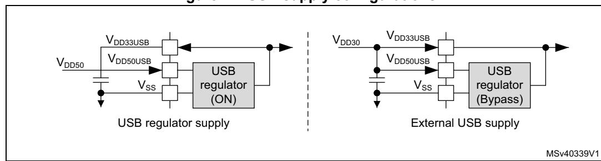

Figure 27. USB supply configurations

### 7.4.8 DSI regulator

The DSI interface is supplied from a dedicated  $V_{DD12DSI}$  supply that can be provided either by the integrated DSI regulator or by an external DSI supply.

When enabled through REGEN bit in *Section 34.16.11: DSI Wrapper regulator and PLL control register (DSI\_WRPCR)*, V<sub>DD12DSI</sub> is delivered by the DSI regulator.

When the DSI regulator is disabled (REGEN =  $^{\circ}0^{\circ}$ ),  $V_{DD12DSI}$  can be delivered by an external supply.

**4** 

RM0399 Rev 4 285/3556

For more information on the DSI regulator (see Section 34: DSI Host (DSI)).

If the DSI is not used at all:

- V<sub>DDDSI</sub> pin must be connected to global VDD
- V<sub>CAPDSI</sub> pin must be connected externally to V<sub>DD12DSI</sub> when both V<sub>CAPDSI</sub> and V<sub>DD12DSI</sub> pins are available. The external capacitor is no more needed. When V<sub>DD12DSI</sub> pin is not available, the V<sub>CAPDSI</sub> pin can be left floating.
- V<sub>SSDSI</sub> pin must be grounded.

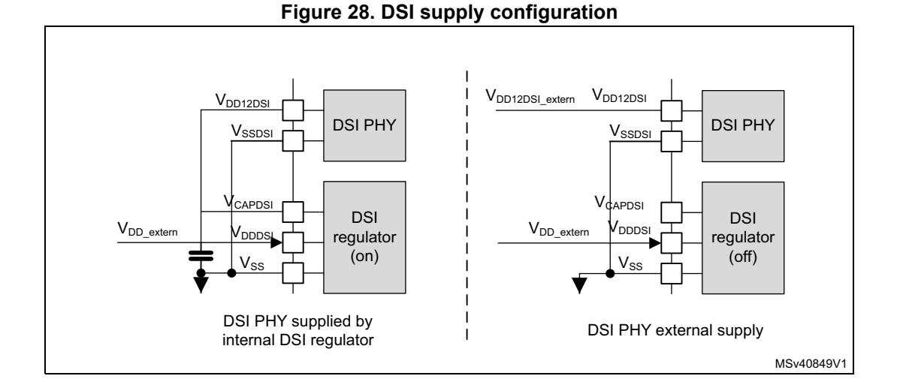

# 7.5 Power supply supervision

Power supply level monitoring is available on the following supplies:

- V<sub>DD</sub> (V<sub>DDSMPS</sub>) via POR/PDR (see Section 7.5.1), BOR (see Section 7.5.2) and PVD monitor (see Section 7.5.3)
- V<sub>DDA</sub> via AVD monitor (see Section 7.5.4)
- V<sub>BAT</sub> via VBAT threshold (see Section 7.5.5)
- V<sub>SW</sub> via rst\_vsw, which keeps V<sub>SW</sub> domain in Reset mode as long as the level is not OK.
- V<sub>BKP</sub> via a BRRDY bit in *PWR control register 2 (PWR\_CR2*).
- V<sub>ERSMPS</sub> via a SDEXTRDY bit in *PWR control register 3 (PWR CR3*).
- V<sub>DD33USB</sub> via USBRDY bit in PWR control register 3 (PWR\_CR3).
- V<sub>CAPDSI</sub> via a RRS in the DSI block in Section 34.16.11: DSI Wrapper regulator and PLL control register (DSI\_WRPCR).

### <span id="page-19-0"></span>7.5.1 Power-on reset (POR)/power-down reset (PDR)

The system has an integrated POR/PDR circuitry that ensures proper startup operation.

The system remains in Reset mode when  $V_{DD}$  is below a specified  $V_{POR}$  threshold, without the need for an external reset circuit. Once the  $V_{DD}$  supply level is above the  $V_{POR}$  threshold, the system is taken out of reset (see *Figure 29*). For more details concerning the power-on/power-down reset threshold, refer to the electrical characteristics section of the datasheets.

The PDR can be enabled/disabled by the device PDR\_ON input pin.

<span id="page-19-2"></span>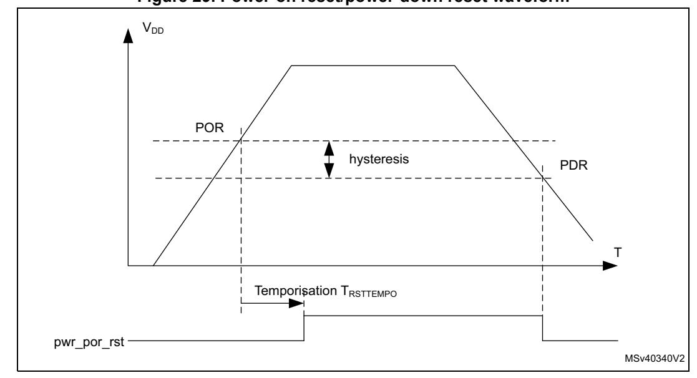

Figure 29. Power-on reset/power-down reset waveform

1. For thresholds and hysteresis values, please refer to the datasheets.

### <span id="page-19-1"></span>7.5.2 Brownout reset (BOR)

During power-on, the Brownout reset (BOR) keeps the system under reset until the  $V_{DD}$  supply voltage reaches the specified  $V_{BOR}$  threshold.

The  $V_{BOR}$  threshold is configured through system option bytes. By default, BOR is OFF. The following programmable  $V_{BOR}$  thresholds can be selected:

- BOR OFF (V<sub>BOR0</sub>)
- BOR Level 1 (V<sub>BOR1</sub>)
- BOR Level 2 (V<sub>BOR2</sub>)
- BOR Level 3 (V<sub>BOR3</sub>)

For more details on the brown-out reset thresholds, refer to the section "Electrical characteristics" of the product datasheets.

A system reset is generated when the BOR is enabled and  $V_{DD}$  supply voltage drops below the selected  $V_{BOR}$  threshold.

BOR can be disabled by programming the system option bytes. To disable the BOR function,  $V_{DD}$  must have been higher than  $V_{BOR0}$  to start the system option byte

programming sequence. The power-down is then monitored by the PDR (see *Section 7.5.1*).

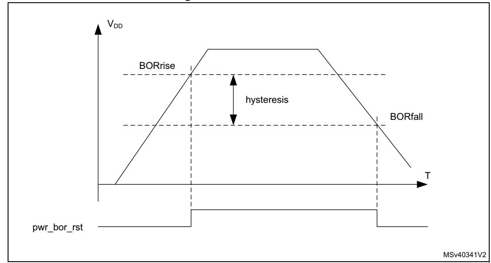

Figure 30. BOR thresholds

1. For thresholds and hysteresis values, please refer to the datasheets.

### <span id="page-20-0"></span>7.5.3 Programmable voltage detector (PVD)

The PVD can be used to monitor the  $V_{DD}$  power supply by comparing it to a threshold selected by the PLS[2:0] bits in the *PWR control register 1 (PWR\_CR1)*. The PVD can also be used to monitor a voltage level on the PVD\_IN pin. In this case PVD\_IN voltage is compared to the internal  $V_{RFFINT}$  level.

The PVD is enabled by setting the PVDE bit in PWR control register 1 (PWR\_CR1).

A PVDO flag is available in the *PWR control status register 1 (PWR\_CSR1)* to indicate if  $V_{DD}$  or PVD\_IN voltage is higher or lower than the PVD threshold. This event is internally connected to the EXTI and can generate an interrupt, assuming it has been enabled through the EXTI registers. The PVDO output interrupt can be generated when  $V_{DD}$  or PVD\_IN voltage drops below the PVD threshold and/or when  $V_{DD}$  or PVD\_IN voltage rises above the PVD threshold depending on EXTI rising/falling edge configuration. As an example the service routine could perform emergency shutdown tasks.

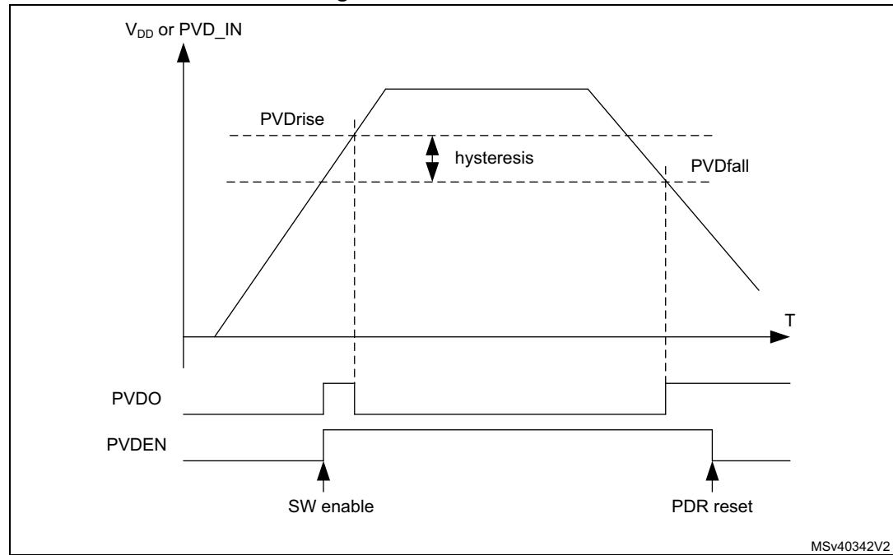

**Figure 31. PVD thresholds**

1. For thresholds and hysteresis values, please refer to the datasheets.

### <span id="page-22-0"></span>**7.5.4 Analog voltage detector (AVD)**

The AVD can be used to monitor the VDDA supply by comparing it to a threshold selected by the ALS[1:0] bits in the *[PWR control register 1 \(PWR\\_CR1\)](#page-57-0)*.

The AVD is enabled by setting the AVDEN bit in *[PWR control register 1 \(PWR\\_CR1\)](#page-57-0)*.

An AVDO flag is available in the *[PWR control status register 1 \(PWR\\_CSR1\)](#page-59-0)* to indicate whether VDDA is higher or lower than the AVD threshold. This event is internally connected to the EXTI and can generate an interrupt if enabled through the EXTI registers. The AVDO interrupt can be generated when VDDA drops below the AVD threshold and/or when VDDA rises above the AVD threshold depending on EXTI rising/falling edge configuration. As an example the service routine could indicate when the VDDA supply drops below a minimum level.

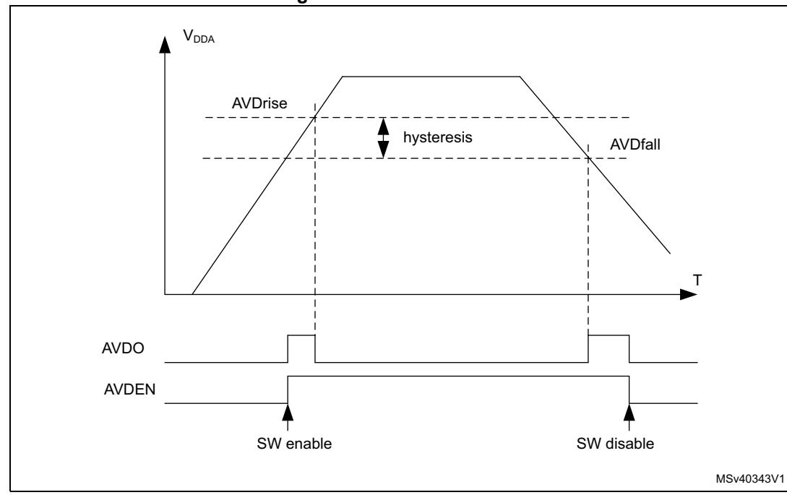

**Figure 32. AVD thresholds**

1. For thresholds and hysteresis values, please refer to the datasheets.

### <span id="page-23-0"></span>7.5.5 Battery voltage thresholds

The battery voltage supply monitors the backup domain  $V_{SW}$  level. Vsw is monitored by comparing it with two threshold levels:  $V_{BAThigh}$  and  $V_{BATlow}$ . VBATH and VBATL flags in the *PWR control register 2 (PWR\_CR2)*, indicate if  $V_{SW}$  is higher or lower than the threshold.

The  $V_{BAT}$  supply monitoring can be enabled/disabled via MONEN bit in *PWR control register 2 (PWR\_CR2)*. When it is enabled, the battery voltage thresholds increase power consumption. As an example the  $V_{SW}$  levels monitoring could be used to trigger a tamper event for an over or under voltage of the RTC power supply domain (available in VBAT mode).

VBATH and VBATL are connected to RTC tamper signals (see *Section 49: Real-time clock (RTC)*).

Note: Battery voltage monitoring is only available when the backup regulator is enabled (BREN bit set in PWR control register 2 (PWR CR2)).

When the device does not operate in VBAT mode, the battery voltage monitoring checks  $V_{DD}$  level. When  $V_{DD}$  is available,  $V_{SW}$  is connected to  $V_{DD}$  through the internal power switch (see Section 7.4.4: Backup domain).

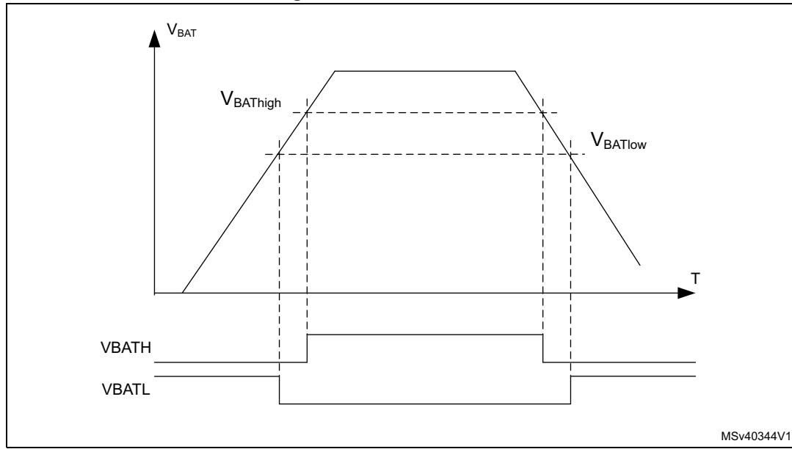

Figure 33. VBAT thresholds

1. For thresholds and hysteresis values, please refer to the datasheets.

### 7.5.6 Temperature thresholds

The junction temperature can be monitored by comparing it with two threshold levels, TEMP<sub>high</sub> and TEMP<sub>low</sub>. TEMPH and TEMPL flags, in the *PWR control register 2* (*PWR\_CR2*), indicate whether the device temperature is higher or lower than the threshold. The temperature monitoring can be enabled/disabled via MONEN bit in *PWR control register 2* (*PWR\_CR2*). When enabled, the temperature thresholds increase power consumption. As an example the levels could be used to trigger a routine to perform temperature control tasks.

The temperature thresholds are available only when the backup regulator is enabled (BREN bit set in the PWR CR2 register).

TEMPH and TEMPL wakeup interrupts are available on the RTC tamper signals (see Section 49: Real-time clock (RTC)).

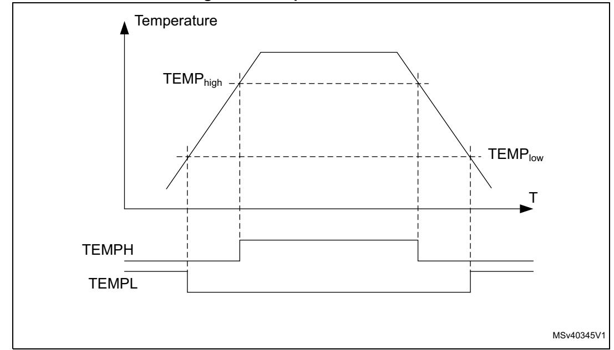

Figure 34. Temperature thresholds

1. For thresholds and hysteresis values, please refer to the datasheets.

# 7.5.7 V<sub>CORE</sub> maximum voltage level detector

 $V_{CORE}$  is protected against too high voltages in the direct SMPS step-down converter supply configuration.  $V_{CORE}$  overvoltage protection is enabled at startup by hardware once the SMPS step-down converter configuration has been programmed into *PWR control register 3 (PWR\_CR3*):

- V<sub>CORE</sub> voltage level stays within range:
  - ACTVOSRDY bit in PWR control status register 1 (PWR\_CSR1) indicate valid voltage levels.
  - The system operates normally and V<sub>CORE</sub> overvoltage protection is disabled.
- V<sub>CORE</sub> overvoltage (due to a wrongly programmed SMPS step-down converter configuration):

- The hardware forces the SMPS step-down converter voltage level to 1.0 V.
- The ACTVOSRDY goes on indicating invalid voltage levels. In this case the software shall be corrected and re-loaded to program a correct SMPS step-down converter configuration that matches the application supply connections. The system shall then be power cycled.

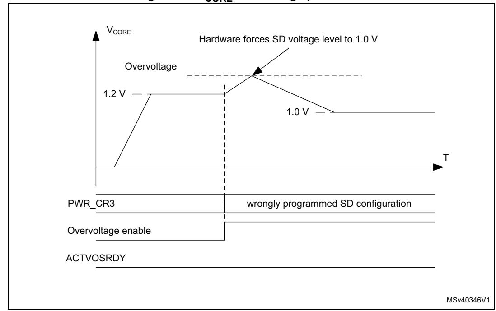

**Figure 35. VCORE overvoltage protection**

# **7.6 Power management**

The power management block controls the VCORE supply in accordance with the system operation modes (see *[Section 7.6.1](#page-26-0)*).

The VCORE domain is split into the following power domains.

- D1 domain containing some peripherals and the Cortex®-M7 Core (CPU1).
- D2 domain containing a large part of the peripherals and a Cortex®-M4 core (CPU2).
- D3 domain containing some peripherals and the system control.

The D1, D2 and system D3 power domains can operate in one of the following operating modes:

- DRun/Run/Run\* (power ON, clock ON)
- DStop/Stop (power ON, clock OFF)
- DStandby/Standby (Power OFF, clock OFF).

The operating modes for D1 domain and D2 domain are independent. However system D3 domain power modes depend on D1 and D2 domain modes:

- For system D3 domain to operate in Stop mode, both D1 and D2 domains must be in DStop or DStandby mode.
- For system D3 domain to operate in Standby mode, both D1 and D2 domains must be in DStandby too.

D1, D2 and system D3 domains are supplied from a single regulator at a common  $V_{CORE}$  level. The  $V_{CORE}$  supply level follows the system operating mode (Run, Stop, Standby). The D1 domain and/or D2 domain supply can be powered down individually when the domains are in DStandby mode.

The following voltage scaling features allow controlling the power with respect to the required system performance (see *Section 7.6.2: Voltage scaling*):

- To obtain a given system performance, the corresponding voltage scaling shall be set in accordance with the system clock frequency. To do this, configure the VOS bits to the Run mode voltage scaling.
- To obtain the best trade-off between power consumption and exit-from-Stop mode latency, configure the SVOS bits to Stop mode voltage scaling.

### <span id="page-26-0"></span>7.6.1 Operating modes

Several system operating modes are available to tune the system according to the performance required, i.e. when the CPU(s) do not need to execute code and are waiting for an external event. It is up to the user to select the operating mode that gives the best compromise between low power consumption, short startup time and available wakeup sources.

The operating modes allow controlling the clock distribution to the different system blocks and powering them. The system operating mode is driven by CPU1 subsystem, CPU2 subsystem and system D3 autonomous wakeup. A CPU subsystem can include multiple domains depending on its peripheral allocation (see *Section 9.5.11: Peripheral clock gating control*).

The following operating modes are available for the different system blocks (see *Table 34*):

- CPU subsystem modes:
  - CRun

CPU and CPU subsystem peripheral allocated via RCC PERxEN bits are clocked.

– CSleep:

The CPU clocks is stalled and the CPU subsystem allocated peripheral(s) clock operate according to RCC PERxLPEN.

– CStop:

CPU and CPU subsystem peripheral clocks are stalled.

- D1 domain and D2 domain modes:
  - DRun

The domain bus matrix is clocked:

- The domain CPU subsystem  $^{\rm (a)}$  is in CRun or CSleep mode, or

- the other domain CPU subsystem(a) having an allocated peripheral in the domain is in CRun or CSleep mode.

#### **– DStop**

The domain bus matrix clock is stalled:

- The domain CPU subsystem is in CStop mode and
- The other domain CPU subsystem has no peripheral allocated in the domain. or the other domain CPU subsystem having an allocated peripheral in the domain is also in CStop mode and
- At least one PDDS\_Dn(b) bit for the domain select DStop.

#### **– DStandby**

The domain is powered down:

- The domain CPU subsystem is in CStop mode and
- The other domain CPU subsystem has no peripheral allocated in the domain or the other domain CPU subsystem having an allocated peripheral in the domain is also in CStop mode and
- All PDDS\_D[n\(b\)](#page-27-0) bits for the domain select DStandby mode.
- System /D3 domain modes

#### **– Run/Run\***

The system clock and D3 domain bus matrix clock are running:

- A CPU subsystem is in CRun or CSleep mode or
- A wakeup signal is active. (i.e. System D3 autonomous mode)

The Run\* mode is entered after a POR reset and a wakeup from Standby. In Run\* mode, the performance is limited and the system supply configuration shall be programmed in *[PWR control register 3 \(PWR\\_CR3\)](#page-61-0)*. The system enters Run mode only when the ACTVOSRDY bit in *[PWR control status register 1](#page-59-0)  [\(PWR\\_CSR1\)](#page-59-0)* is set to 1.

#### **– Stop**

The system clock and D3 domain bus matrix clock is stalled:

- both CPU subsystems are in CStop mode.
- and
- all wakeup signals are inactive.
- and
- At least one PDDS\_Dn[\(b\)](#page-27-0) bit for any domain select Stop mode.

#### **– Standby**

The system is powered down:

- both CPU subsystems are in CStop mode and
- all wakeup signals are inactive.

b. The PDDS\_Dn bits belong to *[PWR CPU1 control register \(PWR\\_CPU1CR\)](#page-63-0)* and *[PWR CPU2 control](#page-65-0)  [register \(PWR\\_CPU2CR\)](#page-65-0)*.


RM0399 Rev 4 295/3556

a. The domain CPU subsystem, for example CPU1 subsystem for D1 domain.

<span id="page-27-0"></span>a. The other domain CPU subsystem, for example CPU1 subsystem for D2 domain.

and

- All PDDS\_D[n\(b\)](#page-27-0) bits for all domains select Standby mode.

In Run mode, power consumption can be reduced by one of the following means:

- Lowering the system performance by slowing down the system clocks and reducing the VCORE supply level through VOS voltage scaling bits.
- Gating the clocks to the APBx and AHBx peripherals when they are not used, through PERxEN bits.

**Table 34. Low-power mode summary** 

<span id="page-28-0"></span>

| System     | Domain      | CPU    | Entry                                                                                                                                                       | Wakeup                                                                                                                                                                                   | Sys-oscillator  | System clk | Domain bus matrix clk | Peripheral clk | CPU clk | Voltage regulator | Domain supply |
|------------|-------------|--------|-------------------------------------------------------------------------------------------------------------------------------------------------------------|------------------------------------------------------------------------------------------------------------------------------------------------------------------------------------------|-----------------|------------|-----------------------|----------------|---------|-------------------|---------------|
|            |             | CRun   | -                                                                                                                                                           | -                                                                                                                                                                                        |                 |            |                       | ON             | ON      |                   |               |
| Run        | DRun(1)     | CSleep | WFI or return<br>from ISR or<br>WFE                                                                                                                         | Any interrupt or event                                                                                                                                                                   | ON<br>ON/OFF(7) | ON         | ON                    | ON/OFF(2)      | OFF     | ON                | ON            |
|            |             |        | SLEEPDEEP bit<br>+ WFI or return<br>from ISR or<br>WFE                                                                                                      | Any EXTI interrupt or<br>event                                                                                                                                                           |                 |            |                       | ON/OFF(3)      |         |                   |               |
|            | DStop(4)    |        | SLEEPDEEP bit<br>+ WFI or return<br>from ISR or<br>WFE<br>SLEEPDEEP bit<br>+ WFI or return<br>from ISR or<br>CStop<br>WFE or Wakeup<br>source<br>cleared(6) |                                                                                                                                                                                          |                 |            |                       |                |         |                   |               |
|            | DStandby(4) |        |                                                                                                                                                             |                                                                                                                                                                                          |                 |            |                       |                |         |                   | OFF           |
|            | DStop(4)    |        |                                                                                                                                                             |                                                                                                                                                                                          |                 |            |                       |                |         |                   | ON            |
| Stop(5)    | DStandby(4) |        |                                                                                                                                                             |                                                                                                                                                                                          |                 |            | OFF                   |                |         |                   |               |
| Standby(8) | DStandby(4) |        | All PDDS_Dn bit<br>+ SLEEPDEEP<br>bit + WFI or<br>return from ISR<br>or WFE<br>or Wakeup<br>source<br>cleared(6)                                            | WKUP pins rising or<br>falling edge, RTC alarm<br>(Alarm A or Alarm B),<br>RTC Wakeup event, RTC<br>tamper events, RTC time<br>stamp event, external<br>reset in NRST pin, IWDG<br>reset | OFF             | OFF        |                       | OFF            |         | OFF               | OFF           |

- 1. At least one CPU subsystem that has an allocated peripheral in the domain is in CRun or CSleep.
- 2. The CPU subsystem peripherals that have a PERxLPEN bit will operate accordingly.
- 3. The CPU subsystem peripherals that have a PERxAMEN bit will operate accordingly.
- <span id="page-28-1"></span>4. All CPU subsystems that have an allocated peripheral in the domain need to be in CStop.
- 5. All domains need to be in DStop Or DStandby.
- <span id="page-28-2"></span>6. When both CPUs are in CStop and D3 domain in autonomous mode, the last EXTI Wakeup source is cleared.

- 7. When the system oscillator HSI or CSI is used, the state is controlled by HSIKERON and CSIKERON, otherwise the system oscillator is OFF.
- 8. All domains are in DStandby mode.

### <span id="page-29-1"></span>**7.6.2 Voltage scaling**

The D1, D2, and D3 domains are supplied from a single voltage regulator supporting voltage scaling with the following features:

- Run mode voltage scaling
  - VOS0: Scale 0 (VCORE boost)
  - VOS1: Scale 1 – VOS2: Scale 2
  - VOS3: Scale 3
- Stop mode voltage scaling
  - SVOS3: Scale 3 – LP-SVOS4: Scale 4 – LP-SVOS5: Scale 5

For more details on voltage scaling values, refer to the product datasheets.

After reset, the system starts on the lowest Run mode voltage scaling (VOS3). The voltage scaling can then be changed on-the-fly by software by programming VOS bits in *[PWR D3](#page-67-0)  [domain control register \(PWR\\_D3CR\)](#page-67-0)* according to the required system performance. When exiting from Stop mode or Standby mode, the Run mode voltage scaling is reset to the default VOS3 value.

Before entering Stop mode, the software can preselect the SVOS level in *[PWR control](#page-57-0)  [register 1 \(PWR\\_CR1\)](#page-57-0)*. The Stop mode voltage scaling for SVOS4 and SVOS5 also sets the voltage regulator in Low-power (LP) mode to further reduce power consumption. When preselecting SVOS3, the use of the voltage regulator low-power mode (LP) can be selected by LPDS register bit.

#### <span id="page-29-0"></span>**VOS0 activation/deactivation sequence**

The system maximum frequency can be reached by boosting the voltage scaling level to VOS0. This is done through the ODEN bit in the SYSCFG\_PWRCR register.

The sequence to activate the VOS0 is the following:

- 1. Ensure that the system voltage scaling is set to VOS1 by checking the VOS bits in PWR D3 domain control register (*[PWR D3 domain control register \(PWR\\_D3CR\)](#page-67-0)*)
- 2. Enable the SYSCFG clock in the RCC by setting the SYSCFGEN bit in the RCC\_APB4ENR register.
- 3. Enable the ODEN bit in the SYSCFG\_PWRCR register.
- 4. Wait for VOSRDY to be set.

Once the VCORE supply has reached the required level, the system frequency can be increased. *[Figure 36](#page-30-0)* shows the recommended sequence for switching VCORE from VOS1 to VOS0 sequence.

The sequence to deactivate the VOS0 is the following:


- 1. Ensure that the system frequency was decreased.
- 2. Ensure that the SYSCFG clock is enabled in the RCC by setting the SYSCFGEN bit set in the RCC\_APB4ENR register.
- 3. Reset the ODEN bit in the SYSCFG\_PWRCR register to disable VOS0. Once VOS0 is disabled, the voltage scaling can be reduced further by configuring VOS bits in PWR D3 domain control register (PWR\_D3CR) according to the required system

performance.

*Note: VOS0 can be enabled only when VOS1 is programmed in PWR D3 domain control register (PWR\_D3CR) VOS bits. VOS0 deactivation must be managed by software before the system enters low-power mode.*

<span id="page-30-0"></span>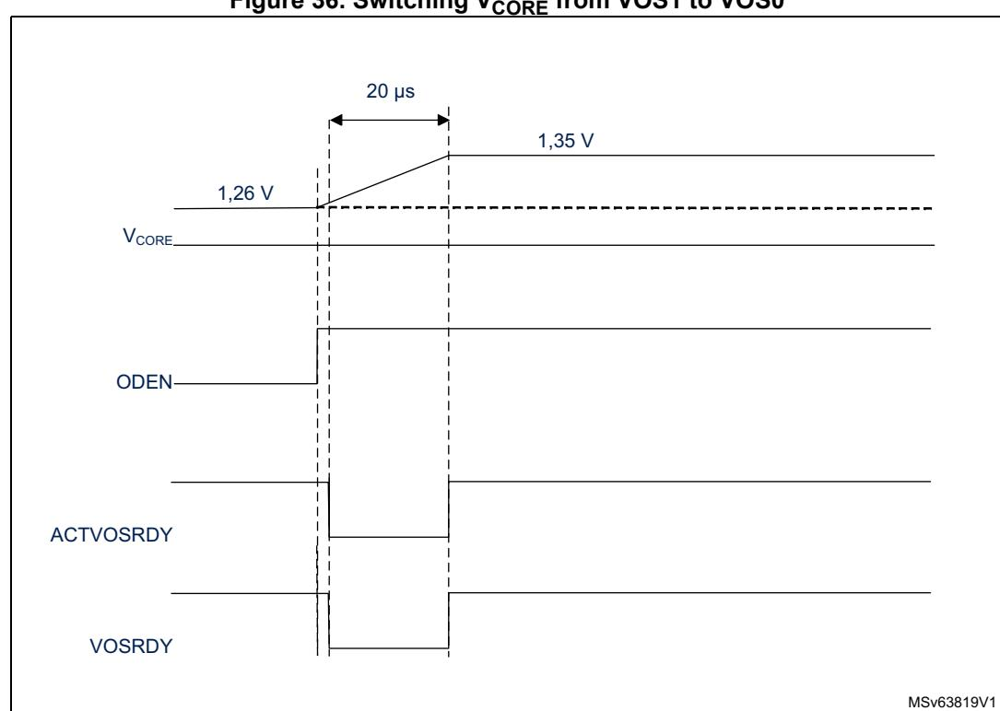

**Figure 36. Switching VCORE from VOS1 to VOS0**

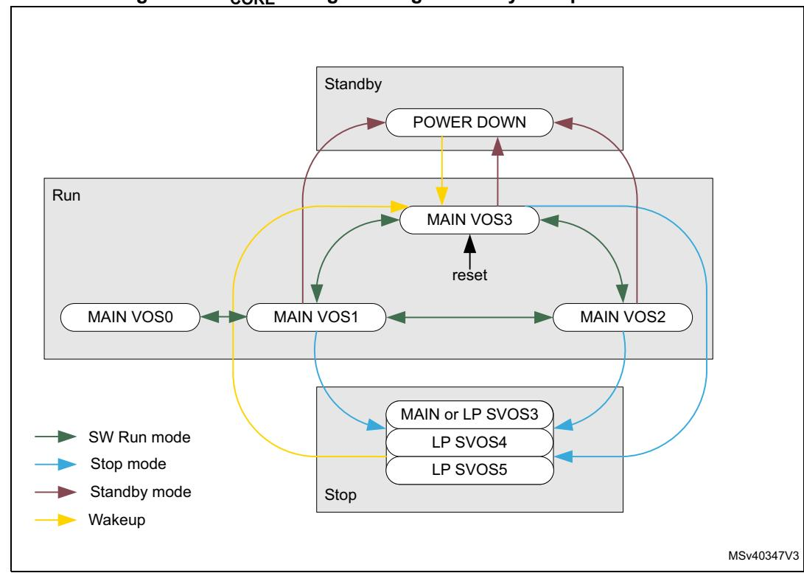

**Figure 37. VCORE voltage scaling versus system power modes** 

### **7.6.3 Power control modes**

The power control block handles the VCORE supply for system Run, Stop and Standby modes.

The system operating mode depends on the CPU subsystem modes (CRun, CSleep, CStop), on the domain modes (DRun, DStop, DStandby), and on the system D3 autonomous wakeup:

- In Run mode, VCORE is defined by the VOS voltage scaling. At least one CPU subsystem is in CRun or CSleep or an EXTI wakeup is active.
- In Stop mode, VCORE is defined by the SVOS voltage scaling. The CPU subsystems are in CStop mode and all EXTI wakeups are inactive. The D1 domain and D2 domain are either in DStop or DStandby mode.
- In Standby mode, VCORE supply is switched off. The CPU subsystems are in CStop mode and all EXTI wakeups are inactive. The D1 domain and D2 domain are both in DStandby mode.

The domain operating mode can depend on both CPU subsystems when peripherals are allocated in the corresponding domain. The domain mode selection between DStop and DStandby is configured via domain dedicated PDDS\_Dn bits in *[PWR CPU1 control register](#page-63-0)  [\(PWR\\_CPU1CR\)](#page-63-0)* and *[PWR CPU2 control register \(PWR\\_CPU2CR\)](#page-65-0)*. Each CPU can choose to keep a domain in DStop, or allow a domain to enter DStandby. A domain enters DStandby only when both CPUs have allowed it.

If a domain is in DStandby mode, the corresponding power is switched off.


RM0399 Rev 4 299/3556

All the domains can configure the system mode (Stop or Standby) through PDDS\_Dn bits in *PWR CPU1 control register (PWR\_CPU1CR)* and *PWR CPU2 control register (PWR\_CPU2CR)*. The system enters Standby only when all PDDS\_Dn bits for all domains have allowed it.

Table 35. PDDS\_Dn low-power mode control

| PWF              | R_CPU1  | ICR     | PWF     | R_CPU2      | 2CR     |                      |                      |             |  |  |
|------------------|---------|---------|---------|-------------|---------|----------------------|----------------------|-------------|--|--|
| PDDS_D1          | PDDS_D2 | PDDS_D3 | PDDS_D1 | PDDS_D2     | PDDS_D3 | D1 mode              | D1 mode D2 mode      |             |  |  |
| 0                |         |         | Х       |             |         | DStop                | any                  | Run or Stop |  |  |
| Х                | Х       |         | 0       | x<br>x<br>0 |         | DStop                | any                  | Run or Stop |  |  |
| 1                |         | .,      | 1       |             | .,      | DStandby             | any                  | any         |  |  |
|                  | 0       | Х       |         |             | Х       | any                  | DStop                | Run or Stop |  |  |
| х                | Х       |         | х       |             |         | any                  | DStop                | Run or Stop |  |  |
|                  | 1       |         |         | 1           |         | any                  | DStandby             | any         |  |  |
| at least one = 0 |         |         |         |             |         | DStop or<br>DStandby | DStop or<br>DStandby | Stop        |  |  |
| 1                | 1       | 1       | 1       | 1           | 1       | DStandby             | DStandby             | Standby     |  |  |

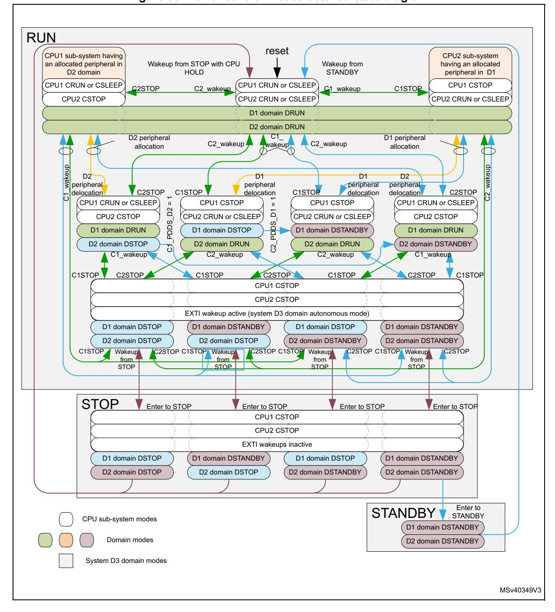

Figure 38. Power control modes detailed state diagram

After a system reset, both CPUs are in CRun mode.

Power control state transitions are initiated by the following events:

- CPU going to CStop mode (state transitions in Run mode are marked in green and red)
  - Green transitions: CPU wakes up as from CSleep.
  - Red transitions: CPU wakes up with domain reset. The SBF\_Dn is set.
- Allocating or de-locating a peripheral in a domain (state transitions in Run mode are marked in orange and red)
  - Orange transitions: the domain wakes up from DStop
  - Red transitions: the domain wakes up from DStandby. The SBF\_Dn is set.
- The system enters or exits from Stop mode (state transitions marked in blue)
  - Blue transitions the system wakes up from Stop mode. The STOPF is set.
- The system enters or exits from Standby mode (state transitions in Stop and Standby mode are marked in red).
  - When exiting from Standby mode, the SBF is set.

When a domain exits from DStandby, the domain CPU and peripherals are reset, while the domain SBF\_Dn bit is set (state transitions causing a CPU reset are marked in red).

*[Table 36](#page-34-0)* shows the flags that indicate from which mode the domain/system exits. Each CPU has its own set of flags which can be read from *[PWR CPU1 control register](#page-63-0)  [\(PWR\\_CPU1CR\)](#page-63-0)* and *[PWR CPU2 control register \(PWR\\_CPU2CR\)](#page-65-0)*.

<span id="page-34-0"></span>**System mode D1 domain mode D2 domain mode SBF\_D1 SBF\_D2 SBF STOPF Comment** Run DRun or DStop DRun or DStop 0 0 0 0 D1, D2 and system contents retained Run DStandby DRun or DStop 1 0 0 0 D1 contents lost, D2 and system contents retained Run DRun or DStop DStandby 0 1 0 0 D2 contents lost, D1 and system contents retained Run DStandby DStandby 1 1 0 0 D1 and D2 contents lost, system contents retained Stop DStop DStop 0 0 0 1 D1, D2 and system contents retained, clock system reset. Stop DStandby DStop 1 0 0 1 D1 contents lost, D2 and system contents retained, clock system reset Stop DStop DStandby 0 1 0 1 D2 contents lost, D1 and system contents retained, clock system reset Stop DStandby DStandby 1 1 0 1 D1 and D2 contents lost, system contents retained, clock system reset Standby DStandby DStandby 0(1) 0(1) 1 0 D1, D2 and system contents lost

**Table 36. Low-power exit mode flags** 

<span id="page-34-1"></span><sup>1.</sup> When returning from Standby, the SBF\_D1 and SBF\_D2 reflect the reset value.

### **7.6.4 Power management examples**

- *[Figure 39](#page-36-0)* shows VCORE voltage scaling behavior in Run mode.
- *[Figure 40](#page-37-0)* shows VCORE voltage scaling behavior in Stop mode.
- *[Figure 41](#page-39-0)* shows VCORE voltage regulator and voltage scaling behavior in Standby mode.
- *[Figure 42](#page-41-0)* shows VCORE voltage scaling behavior in Run mode with D1 and D2 domains are in DStandby mode

# **Example of VCORE voltage scaling behavior in Run mode**

*[Figure 39](#page-36-0)* illustrates the following system operation sequence example:

- 1. After reset, the system starts from HSI with VOS3.
- 2. The system performance is first increased to a medium-speed clock from the PLL with voltage scaling VOS2. To do this:
  - a) Program the voltage scaling to VOS2.
  - b) Once the VCORE supply has reached the required level indicated by VOSRDY, increase the clock frequency by enabling the PLL.
  - c) Once the PLL is locked, switch the system clock.
- 3. The system performance is then increased to high-speed clock from the PLL with voltage scaling VOS1. To do this:
  - a) Program the voltage scaling to VOS1.
  - b) Once the VCORE supply has reached the required level indicated by VOSRDY, increase the clock frequency.
- 4. The system performance is then reduced to a medium-speed clock with voltage scaling VOS2. To do this:
  - a) First decrease the system frequency.
  - b) Then decrease the voltage scaling to VOS2.
- 5. The next step is to reduce the system performance to HSI clock with voltage scaling VOS3. To do this:
  - a) Switch the clock to HSI.
  - b) Disable the PLL.
  - c) Decrease the voltage scaling to VOS3.
- 6. The system performance can then be increased to high-speed clock from the PLL. To do this:
  - a) Program the voltage scaling to VOS1.
  - b) Once the VCORE supply has reached the required level indicated by VOSRDY, increase the clock frequency by enabling the PLL.
  - c) Once the PLL is locked, switch the system clock.

When the system performance (clock frequency) is changed, VOS shall be set accordingly. otherwise the system might be unreliable.

<span id="page-36-0"></span>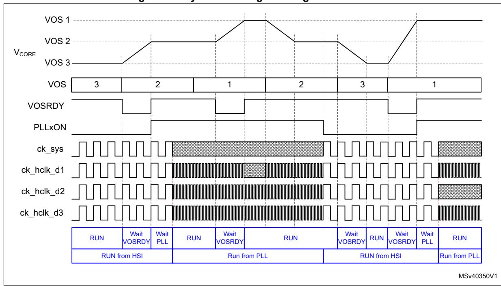

Figure 39. Dynamic voltage scaling in Run mode

1. The status of the register bits at each step is shown in blue.

### Example of V<sub>CORE</sub> voltage scaling behavior in Stop mode

Figure 40 illustrates the following system operation sequence example:

- 1. The system is running from the PLL in high-performance mode (VOS1 voltage scaling).
- CPU1 subsystem first enters CStop and D1 domain DStop mode. D1 system clock is stopped. The system still provides the high-performance system clock, hence the voltage scaling shall stay at VOS1 level.
- 3. In a second step, CPU2 subsystem enters CStop mode, D2 domain enters DStop mode and the system enters Stop mode. The system clock is stopped and the hardware lowers the voltage scaling to the software preselected SVOS4 level.
- 4. CPU2 subsystem is then woken up. The system exits from Stop mode, the D2 domain exits from DStop mode and the CPU2 subsystem exits from CStop mode. The hardware then sets the voltage scaling to VOS3 level and waits for the requested supply level to be reached before enabling the HSI clock. Once the HSI clock is stable, the system clock and the D2 system clock are enabled.
- The CPU1 subsystem is then woken up and exits from CStop mode. The D1 system clock is enabled.
- 6. The system performance is then increased. To do this:
  - a) The software first sets the voltage scaling to VOS1.
  - b) Once the V<sub>CORE</sub> supply has reached the required level indicated by VOSRDY, the clock frequency can be increased by enabling the PLL.
  - c) Once the PLL is locked, the system clock can be switched.

<span id="page-37-0"></span>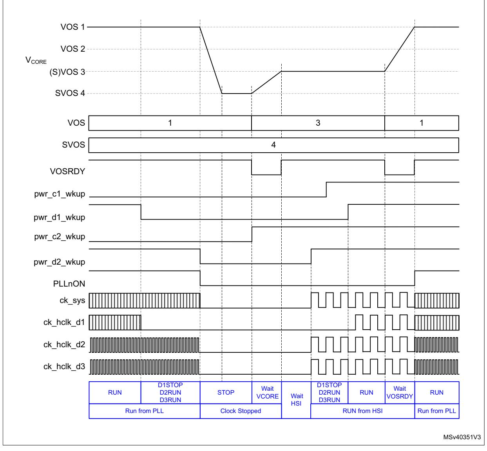

Figure 40. Dynamic voltage scaling behavior with D1, D2 and system in Stop mode

1. The status of the register bits at each step is shown in blue.

### **Example of VCORE voltage regulator and voltage scaling behavior in Standby mode**

*[Figure 41](#page-39-0)* illustrates the following system operation sequence example:

- 1. The system is running from the PLL in high-performance mode (VOS1 voltage scaling).
- 2. CPU2 subsystem first enters CStop mode and D2 domain enters DStandby mode.The D2 domain bus matrix clock is stopped and the power is switched off. The system performance is unchanged hence the voltage scaling does not change.
- 3. CPU1 subsystem then enters to CStop mode, D1 enters DStandby mode and the system enters Standby mode. The system clock is stopped and the voltage regulator switched off.
- 4. The system is then woken up by a wakeup source. The system exits from Standby mode. The hardware sets the voltage scaling to the default VOS3 level and waits for the requested supply level to be reached before enabling the default HSI oscillator. Once the HSI clock is stable, the system clock, D1 subsystem clock, and D2 subsystem clock are enabled. The software shall then check the ACTVOSRDY is valid before changing the system performance.
- 5. In a next step, increase the system performance. To do this:
  - a) The software first increases the voltage scaling to VOS1 level/
  - b) Before enabling the PLL, it waits for the requested supply level to be reached by monitoring VOSRDY bit.
  - c) Once the PLL is locked, the system clock can be switched.
- 6. The CPU2 completes processing and sets CPU2 subsystem in CStop mode and D2 domain in DStandby mode. The D2 domain bus matrix clock is stopped and its supply switched off.

<span id="page-39-0"></span>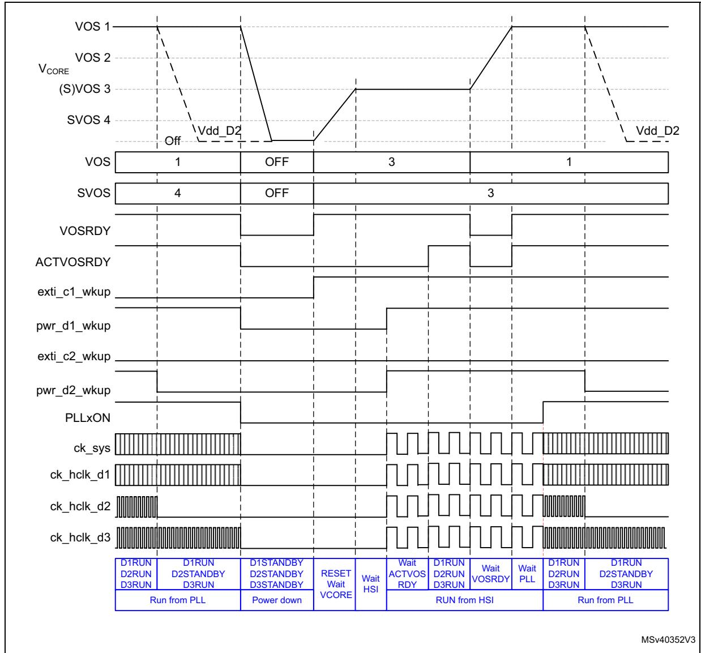

Figure 41. Dynamic Voltage Scaling D1, D2, system Standby mode

1. The status of the register bits at each step is shown in blue.

# Example of V<sub>CORE</sub> voltage scaling behavior in Run mode with D1 and D2 domains in DStandby mode

Figure 42 illustrates the following system operation sequence example:

- 1. The system is running from the PLL with system in high performance mode (VOS1 voltage scaling).
- 2. CPU1 subsystem first enters CStop mode and the D1 domain enters to DStandby mode. The D1 domain bus matrix clock is stopped and its power switched off. The system performance is unchanged hence the voltage scaling does not change.
- 3. CPU2 subsystem then enters CStop mode and the D2 domain enters DStandby mode. The D2 domain bus matrix clock is stopped and its power switched off. At the same

- time the system enters Stop mode. The system clock is stopped and the hardware lowers the voltage scaling to the software preselected SVOS4 level.
- 4. The system is then woken up by a D3 autonomous mode wakeup event. The system exits from Stop mode. The hardware sets the voltage scaling to the default VOS3 level and waits for the requested supply level to be reached before enabling the HSI clock. Once the HSI clock is stable, the system clock is enabled. The system is running in D3 autonomous mode.
- 5. The D3 autonomous mode wakeup source is then cleared, causing the system to enter Stop mode. The system clock is stopped and the voltage scaling is lowered to the software preselected SVOS4 level.
- 6. CPU1 subsystem is then woken up. The system exits from Stop mode, the D1 domain exits from DStandby mode and CPU1 subsystem exits from CStop mode. The hardware sets the voltage scaling to the default VOS3 level and waits for the requested supply level to be reached before enabling the default HSI oscillator. Once the HSI clock is stable, the system clock and the D1 subsystem clock are enabled.

<span id="page-41-0"></span>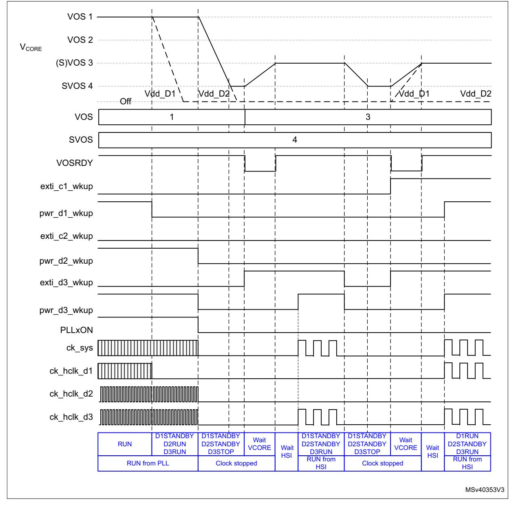

Figure 42. Dynamic voltage scaling behavior with D1 and D2 in DStandby mode and D3 in autonomous mode

1. The status of the register bits at each step is shown in blue.

# **7.7 Low-power modes**

Several low-power modes are available to save power when the CPU(s) do not need to execute code (i.e. when waiting for an external event). It is up to the user application to select the mode that gives the best compromise between low power consumption, short startup time and available wakeup sources:

- Slowing down system clocks (see *Section 9.5.6: System clock (sys\_ck)*)
- Controlling individual peripheral clocks (see *Section 9.5.11: Peripheral clock gating control*)
- Low-power modes
  - CSleep (CPU clock stopped)
  - CStop (CPU subsystem clock stopped)
  - DStop (Domain bus matrix clock stopped)
  - Stop (System clock stopped)
  - DStandby (Domain powered down)
  - Standby (System powered down)

### **7.7.1 Slowing down system clocks**

In Run mode, the speed of the system clock ck\_sys can be reduced. For more details refer to *Section 9.5.6: System clock (sys\_ck)*.

### **7.7.2 Controlling peripheral clocks**

In Run mode, the HCLKx and PCLKx for individual peripherals can be stopped by configuring at any time PERxEN bit in RCC\_C1\_xxxxENR, RCC\_C2\_xxxxENR or RCC\_DnxxxxENR to reduce power consumption.

To reduce power consumption in CSleep mode, the individual peripheral clocks can be disabled by configuring PERxLPEN bit in RCC\_C1\_xxxxLPENR, RCC\_C2\_xxxxLPENR or RCC\_DnxxxxLPENR. For the peripherals still receiving a clock in CSleep mode, their clock can be slowed down before entering CSleep mode.

### <span id="page-42-0"></span>**7.7.3 Entering low-power modes**

CPU subsystem CSleep and CStop low-power modes are entered by the MCU when executing the WFI (Wait For Interrupt) or WFE (Wait for Event) instructions, or when the SLEEPONEXIT bit in the Cortex®-M System Control register is set on Return from ISR.

A domain can enter DStop or DStandby low-power mode when the CPU subsystem(s) that have an allocated peripheral in the domain enters CStop mode, or when the other domain CPU deallocates its last peripheral and the domain CPU subsystem is in CStop mode.

The system can enter Stop or Standby low-power mode when all EXTI wakeup sources are cleared and the other domains are in DStop or DStandby mode.

### <span id="page-43-0"></span>**7.7.4 Exiting from low-power modes**

The CPU subsystem exits from CSleep mode through any interrupt or event depending on how the low-power mode was entered:

- If the WFI instruction or Return from ISR was used to enter to low-power mode, any peripheral interrupt acknowledged by the NVIC can wake up the system.
- If the WFE instruction is used to enter to low-power mode, the CPU exits from lowpower mode as soon as an event occurs. The wakeup event can be generated either by:
  - An NVIC IRQ interrupt.

**When SEVONPEND = 0** in the Cortex®-M4 System Control register, the interrupt must be enabled in the peripheral control register and in the NVIC.

When the MCU resumes from WFE, the peripheral interrupt pending bit and the NVIC peripheral IRQ channel pending bit in the NVIC interrupt clear pending register have to be cleared. Only NVIC interrupts with sufficient priority will wakeup and interrupt the MCU.

**When SEVONPEND = 1** in the Cortex®-M4 System Control register, the interrupt must be enabled in the peripheral control register and optionally in the NVIC. When the MCU resumes from WFE, the peripheral interrupt pending bit and, when enabled, the NVIC peripheral IRQ channel pending bit (in the NVIC interrupt clear pending register) have to be cleared.

All NVIC interrupts will wakeup the MCU, even the disabled ones.

Only enabled NVIC interrupts with sufficient priority will wakeup and interrupt the MCU.

– An event

An EXTI line must be configured in event mode. When the CPU resumes from WFE, it is not necessary to clear the EXTI peripheral interrupt pending bit or the NVIC IRQ channel pending bit as the pending bits corresponding to the event line is not set. It might be necessary to clear the interrupt flag in the peripheral.

The CPU subsystem exits from CStop, DStop and Stop modes by enabling an EXTI interrupt or event depending on how the low-power mode was entered (see above).

The system can wake up from Stop mode by enabling an EXTI wakeup, without waking up a CPU subsystem. In this case the system will operate in D3 autonomous mode.

The CPU subsystem exits from DStandby mode by enabling an EXTI interrupt or event, regardless on how DStandby mode was entered. Program execution restarts from CPU local reset (such as a reset vector fetched from System configuration block (SYSCFG).

A domain can exit from DStop or DStandby mode when the other domain CPU allocates a first peripheral in the domain. In this case the CPU in the domain is not woken up.

The CPU subsystem exits from Standby mode by enabling an external reset (NRST pin), an IWDG reset, a rising edge on one of the enabled WKUPx pins or a RTC event. Program execution restarts in the same way as after a system reset (such as boot pin sampling, option bytes loading or reset vector fetched).


RM0399 Rev 4 311/3556

### **7.7.5 CSleep mode**

The CSleep mode applies only to the CPU subsystem. In CSleep mode, the CPU clock is stopped. The CPU subsystem peripheral clocks operate according to the values of PERxLPEN bits in RCC\_C1\_xxxxENR, RCC\_C2\_xxxxENR or RCC\_DnxxxxENR.

#### **Entering CSleep mode**

The CSleep mode is entered according to *[Section 7.7.3: Entering low-power modes](#page-42-0)*, when the SLEEPDEEP bit in the Cortex®-M System Control register is cleared.

Refer to *[Table 37](#page-44-0)* for details on how to enter to CSleep mode.

### **Exiting from CSleep mode**

The CSleep mode is exited according to *[Section 7.7.4: Exiting from low-power modes](#page-43-0)*.

Refer to *[Table 37](#page-44-0)* for more details on how to exit from CSleep mode.

<span id="page-44-0"></span>

| CSleep mode<br>Description |                                                                                                                                                                                                                                                                                                                                                                                                                                                                                   |  |  |  |
|----------------------------|-----------------------------------------------------------------------------------------------------------------------------------------------------------------------------------------------------------------------------------------------------------------------------------------------------------------------------------------------------------------------------------------------------------------------------------------------------------------------------------|--|--|--|
|                            | WFI (Wait for Interrupt) or WFE (Wait for Event) while:<br>– SLEEPDEEP = 0 (Refer to the Cortex®-M System Control register.)<br>– CPU NVIC interrupts and events cleared.                                                                                                                                                                                                                                                                                                         |  |  |  |
| Mode entry                 | On return from ISR while:<br>– SLEEPDEEP = 0 and<br>– SLEEPONEXIT = 1 (refer to the Cortex®-M System Control register.)<br>– CPU NVIC interrupts and events cleared.                                                                                                                                                                                                                                                                                                              |  |  |  |
| Mode exit                  | If WFI or return from ISR was used for entry:<br>– Any Interrupt enabled in NVIC: Refer to Table 149: NVIC1 (CPU1) and<br>NVIC2 (CPU2)<br>If WFE was used for entry and SEVONPEND = 0:<br>– Any event: Refer to Section 21.5.3: EXTI CPU wakeup procedure<br>If WFE was used for entry and SEVONPEND = 1:<br>– Any Interrupt even when disabled in NVIC: refer to Table 149: NVIC1<br>(CPU1) and NVIC2 (CPU2) or any event: refer to Section 21.5.3: EXTI<br>CPU wakeup procedure |  |  |  |
| Wakeup latency             | None                                                                                                                                                                                                                                                                                                                                                                                                                                                                              |  |  |  |

**Table 37. CSleep mode**

### **7.7.6 CStop mode**

The CStop mode applies only to the CPU subsystem. In CStop mode, the CPU clock is stopped. Most CPU subsystem peripheral clocks are stopped too and only the CPU subsystem peripherals having a PERxAMEN bit operate accordingly.

In CStop mode, CPU subsystem peripherals having a kernel clock request can still request their kernel clock. For the peripheral having a PERxAMEN bit, this bit shall be set to be able to request the kernel clock.

### **Entering CStop mode**

The CStop mode is entered according to *[Section 7.7.3: Entering low-power modes](#page-42-0)*, when the SLEEPDEEP bit in the Cortex®-M System Control register is set.

Refer to *[Table 38](#page-45-0)* for details on how to enter to CStop mode.

#### **Exiting from CStop mode**

The CStop mode is exited according to *[Section 7.7.4: Exiting from low-power modes](#page-43-0)*.

Refer to *[Table 38](#page-45-0)* for more details on how to exit from CStop mode.

**Table 38. CStop mode**

<span id="page-45-0"></span>

| CStop mode     | Description                                                                                                                                                                                                                                                                                                                                                                                                                                                                                                                                                                                                                                                                                                                                                                  |  |  |
|----------------|------------------------------------------------------------------------------------------------------------------------------------------------------------------------------------------------------------------------------------------------------------------------------------------------------------------------------------------------------------------------------------------------------------------------------------------------------------------------------------------------------------------------------------------------------------------------------------------------------------------------------------------------------------------------------------------------------------------------------------------------------------------------------|--|--|
|                | WFI (Wait for Interrupt) or WFE (Wait for Event) while:<br>– SLEEPDEEP = 1 (Refer to the Cortex®-M System Control register.)<br>– CPU NVIC interrupts and events cleared.<br>– All CPU EXTI Wakeup sources are cleared.                                                                                                                                                                                                                                                                                                                                                                                                                                                                                                                                                      |  |  |
| Mode entry     | On return from ISR while:<br>– SLEEPDEEP = 1 and<br>– SLEEPONEXIT = 1 (Refer to the Cortex®-M System Control register.)<br>– CPU NVIC interrupts and events cleared.<br>– All CPU EXTI Wakeup sources are cleared.                                                                                                                                                                                                                                                                                                                                                                                                                                                                                                                                                           |  |  |
| Mode exit      | If WFI or return from ISR was used for entry:<br>– EXTI Interrupt enabled in NVIC: refer to Table 149: NVIC1 (CPU1) and<br>NVIC2 (CPU2), for peripheral which are not stopped or powered down.<br>If WFE was used for entry and SEVONPEND = 0:<br>– EXTI event: refer to Section 21.5.3: EXTI CPU wakeup procedure, for<br>peripheral which are not stopped or powered down.<br>If WFE was used for entry and SEVONPEND = 1:<br>– EXTI Interrupt even when disabled in NVIC: refer to Table 149: NVIC1<br>(CPU1) and NVIC2 (CPU2) or EXTI event: refer to Section 21.5.3: EXTI<br>CPU wakeup procedure, for peripheral which are not stopped or<br>powered down.<br>Note:<br>When CPU1 sends a SEV event to wakeup CPU2, the event<br>duration is equal to 512 clock cycles. |  |  |
| Wakeup latency | EXTI and RCC wakeup synchronization (see Section 9.4.7: Power-on and<br>wakeup sequences)                                                                                                                                                                                                                                                                                                                                                                                                                                                                                                                                                                                                                                                                                    |  |  |

### **7.7.7 DStop mode**

D1 domain and/or D2 domain enters DStop mode only when all CPU subsystems having peripherals allocated in the domain are in CStop mode (see *[Table 39](#page-46-0)*). In DStop mode the domain bus matrix clock is stopped.

The Flash memory can enter low-power Stop mode when it is enabled through FLPS in PWR\_CR1 register. This allows a trade-off between domain DStop restart time and low power consumption.


**Table 39. DStop mode overview** 

<span id="page-46-0"></span>

| Peripheral allocation                                                                     | CPU1              | CPU2              | D1<br>domain | D2<br>domain | Comment                                      |
|-------------------------------------------------------------------------------------------|-------------------|-------------------|--------------|--------------|----------------------------------------------|
| CPU1 subsystem no peripheral<br>allocated in D2 domain.                                   | CStop             | CRun or<br>CSleep | DStop        | DRun         |                                              |
| and<br>CPU2 subsystem no peripheral                                                       | CRun or<br>CSleep | CStop             | DRun         | DStop        |                                              |
| allocated in D1 domain.                                                                   | CStop             | CStop             | DStop        | DStop        |                                              |
| CPU1 subsystem peripheral                                                                 | CStop             | CRun or<br>CSleep | DStop        | DRun         |                                              |
| allocated in D2 domain.<br>and<br>CPU2 subsystem no peripheral<br>allocated in D1 domain. | CRun or<br>CSleep | CStop             | DRun         | DRun         | CPU1 subsystem,<br>keep D2 domain<br>active. |
|                                                                                           | CStop             | CStop             | DStop        | DStop        |                                              |
| CPU1 subsystem no peripheral<br>allocated in D2 domain.                                   | CStop             | CRun or<br>CSleep | DRun         | DRun         | CPU2 subsystem,<br>keep D1 domain<br>active. |
| and<br>CPU2 subsystem peripheral<br>allocated in D1 domain.                               | CRun or<br>CSleep | CStop             | DRun         | DStop        |                                              |
|                                                                                           | CStop             | CStop             | DStop        | DStop        |                                              |
| CPU1 subsystem peripheral<br>allocated in D2 domain.                                      | CStop             | CRun or<br>CSleep | DRun         | DRun         | CPU2 subsystem,<br>keep D1 domain<br>active. |
| and<br>CPU2 subsystem peripheral<br>allocated in D1 domain.                               | CRun or<br>CSleep | CStop             | DRun         | DRun         | CPU1 subsystem,<br>keep D2 domain<br>active. |
|                                                                                           | CStop             | CStop             | DStop        | DStop        |                                              |

In DStop mode domain peripherals using the LSI or LSE clock and peripherals having a kernel clock request are still able to operate.

#### **Entering DStop mode**

The DStop mode is entered according to *[Section 7.7.3: Entering low-power modes](#page-42-0)*, when at least one PDDS\_Dn bit in *[PWR CPU1 control register \(PWR\\_CPU1CR\)](#page-63-0)* or *[PWR CPU2](#page-65-0)  [control register \(PWR\\_CPU2CR\)](#page-65-0)* for the domain select Stop.

Refer to *[Table 40](#page-47-0)* for details on how to enter DStop mode.

If Flash memory programming is ongoing, the DStop mode entry is delayed until the memory access is finished.

If an access to the domain bus matrix is ongoing, the DStop mode entry is delayed until the domain bus matrix access is complete.

#### **Exiting from DStop mode**

The DStop mode is exited according to *[Section 7.7.4: Exiting from low-power modes](#page-43-0)*.

Refer to *[Table 40](#page-47-0)* for more details on how to exit from DStop mode.

When exiting from DStop mode, the CPU subsystem clocks, domain(s) bus matrix clocks and voltage scaling depend on the system mode.

- When the system did not enter Stop mode, the CPU subsystem clocks, domain(s) bus matrix clocks and voltage scaling values are the same as when entering DStop mode, except if they have been changed by the other CPU.
- When the system has entered Stop mode, the CPU subsystem clocks, domain(s) bus matrix clocks and voltage scaling are reset.

<span id="page-47-0"></span>

| DStop mode     | Description                                                                                                                                  |  |  |
|----------------|----------------------------------------------------------------------------------------------------------------------------------------------|--|--|
|                | – The domain CPU subsystem enters CStop and the other domain CPU<br>subsystem has no peripheral allocated in the domain or is also in CStop. |  |  |
| Mode entry     | – The other domain CPU subsystem has an allocated peripheral and<br>enters to CStop and the Domain CPU subsystem is in CStop.                |  |  |
|                | – The other domain CPU subsystem deallocated its last peripheral in the<br>domain and the Domain CPU subsystem is in CStop.                  |  |  |
|                | – At least one PDDS_Dn bit for the domain selects Stop mode.                                                                                 |  |  |
|                | – The domain CPU subsystem exits from CStop mode (see Table 38)                                                                              |  |  |
| Mode exit      | – The other domain CPU subsystem has an allocated peripheral in the<br>domain and exits from CStop mode (see Table 38)                       |  |  |
|                | – The other domain CPU subsystem allocates a first peripheral in the<br>domain.                                                              |  |  |
| Wakeup latency | EXTI and RCC wakeup synchronization (see Section 9.4.7: Power-on and<br>wakeup sequences).                                                   |  |  |

**Table 40. DStop mode**

### **7.7.8 Stop mode**

The system D3 domain enters Stop mode only when all CPU subsystems are in CStop mode, the EXTI wakeup sources are inactive and at least one PDDS\_Dn bit in *[PWR CPU1](#page-63-0)  [control register \(PWR\\_CPU1CR\)](#page-63-0)* or *[PWR CPU2 control register \(PWR\\_CPU2CR\)](#page-65-0)* for any domain request Stop. In Stop mode, the system clock including a PLL and the D3 domain bus matrix clocks are stopped. When HSI or CSI is selected, the system oscillator operates according to the HSIKERON and CSIKERON bits in RCC\_CR register. Other system oscillator sources are stopped.

In system D3 domain Stop mode, D1 domain and D2 domain are either in DStop and/or DStandby mode.

In Stop mode, the domain peripherals that use the LSI or LSE clock, and the peripherals that have a kernel clock request to select HSI or CSI as source, are still able to operate.

In system Stop mode, the following features can be selected to remain active by programming individual control bits:

• Independent watchdog (IWDG)


The IWDG is started by writing to its Key register or by hardware option. Once started it cannot be stopped except by a Reset (see *Section 48.3.3: Window option* in *Section 48: Independent watchdog (IWDG)*.

• Real-time clock (RTC)

This is configured via the RTCEN bit in the *RCC Backup domain control register (RCC\_BDCR)*.

- Internal RC oscillator (LSI RC)
  - This is configured via the LSION bit in the *RCC clock control and status register (RCC\_CSR)*.
- External 32.768 kHz oscillator (LSE OSC) This is configured via the LSEON bit in the *RCC Backup domain control register (RCC\_BDCR)*.
- Peripherals capable of running on the LSI or LSE clock.
- Peripherals having a kernel clock request.
- Internal RC oscillators (HSI and CSI)
  - This is configured via the HSIKERON and CSIKERON bits in the *RCC clock control and status register (RCC\_CSR)*.
- The ADC or DAC can also consume power during Stop mode, unless they are disabled before entering this mode. To disable them, the ADON bit in the ADC\_CR2 register and the ENx bit in the DAC\_CR register must both be written to 0.

The selected SVOS4 and SVOS5 levels add an additional startup delay when exiting from system Stop mode (see *[Table 41](#page-48-0)*).

<span id="page-48-0"></span>

| SVOS              | LPDS | Stop mode<br>Voltage regulator<br>operation | Wake-up Latency                                                                                                     |
|-------------------|------|---------------------------------------------|---------------------------------------------------------------------------------------------------------------------|
| SVOS3             | 0    | Main                                        | No additional wakeup time.                                                                                          |
|                   | 1    | LP                                          | Voltage Regulator wakeup time from LP mode.                                                                         |
| SVOS4 or<br>SVOS5 | x    | LP                                          | Voltage Regulator wakeup time from LP mode + voltage<br>level wakeup time for SVOS4 or SVOS5 level to VOS3<br>level |

**Table 41. Stop mode operation**

#### **Entering Stop mode**

The Stop mode is entered according to *[Section 7.7.3: Entering low-power modes](#page-42-0)*, when at least one PDDS\_Dn bit n *[PWR CPU1 control register \(PWR\\_CPU1CR\)](#page-63-0)* or *[PWR CPU2](#page-65-0)  [control register \(PWR\\_CPU2CR\)](#page-65-0)* for any domain request Stop.

Refer to *[Table 44](#page-51-0)* for details on how to enter Stop mode.

If Flash memory programming is ongoing, the Stop mode entry is delayed until the memory access is finished.

If an access to a bus matrix (AXI, AHB or APB) is ongoing, the Stop mode entry is delayed until the bus matrix access is finished.

To allow peripherals having a kernel clock request to operate in Stop mode, the system must use SVOS3 level.

*Note: Use a DSB instruction to ensure that outstanding memory transactions complete before entering stop mode.*

*Before entering Stop mode, the software must ensure that VOS0 s not active.*

#### **Exiting from Stop mode**

The Stop mode is exited according to *[Section 7.7.4: Exiting from low-power modes](#page-43-0)*.

Refer to *[Table 44](#page-51-0)* for more details on how to exit from Stop mode.

When exiting from Stop mode, the system clock, D3 domain bus matrix clocks and voltage scaling are reset.

A CPU hold mechanism is used to allow the system to be re-initialized by a "master" CPU. The "master" CPU can be woken up by its own wakeup sources and by the "slave" CPU wakeup sources. The "slave" CPU is kept on hold until it is released by the "master" CPU. The hold mechanism is controlled by HOLDn register bits. When the "slave" CPU is on hold, the "slave" CPU subsystem clocks are stalled until they are released by the "master" CPU.

A "slave" CPU will only be put on hold when exiting from Stop mode and the "slave" CPU associated HOLDn bit is set. The "slave" CPU remains on hold until the "master' CPU clears the HOLDn bit (i.e. after system re-initialization). When a wakeup event is issued for the "slave" CPU that is on hold, the "master" CPU is woken up and receives a HOLDnF interrupt.

*Note: For correct operation, it is mandatory that the "master" CPU clears the "slave" CPU HOLDn bit each time it exits from CStop mode.*

> System D3 autonomous mode wakeup from Stop does not support the hold mechanism, hence there is no re-initialization and the system runs from the HSI or CSI clock.

**HOLD1 HOLD2 Comment** 0 0 Hold mechanism disabled, each CPU is only woken up from Stop mode by its own wakeup source. 0 1 CPU1 is "master" and is woken up from Stop mode by its own wakeup sources and on a CPU2 wakeup sources through PWR\_CPU1CR.HOLD2F interrupt. When a CPU2 wakeup source event occurs, the CPU2 needs to be released from hold by CPU1 (i.e. after system re-initialization.) 1 0 CPU2 is "master" and is woken up from Stop mode by its own wakeup sources and on a CPU1 wakeup sources through PWR\_CPU2CR.HOLD1F interrupt. When a CPU1 wakeup sources event occurs, the CPU1 need to be released from hold by CPU2 (i.e. after system re-initialization.) 1 1 Hold mechanism disabled, each CPU is only woken up from Stop mode by its own wakeup source.

**Table 42. Stop mode hold control**

*[Figure 43](#page-50-0)* shows the Stop mode hold mechanism state diagram.


<span id="page-50-0"></span>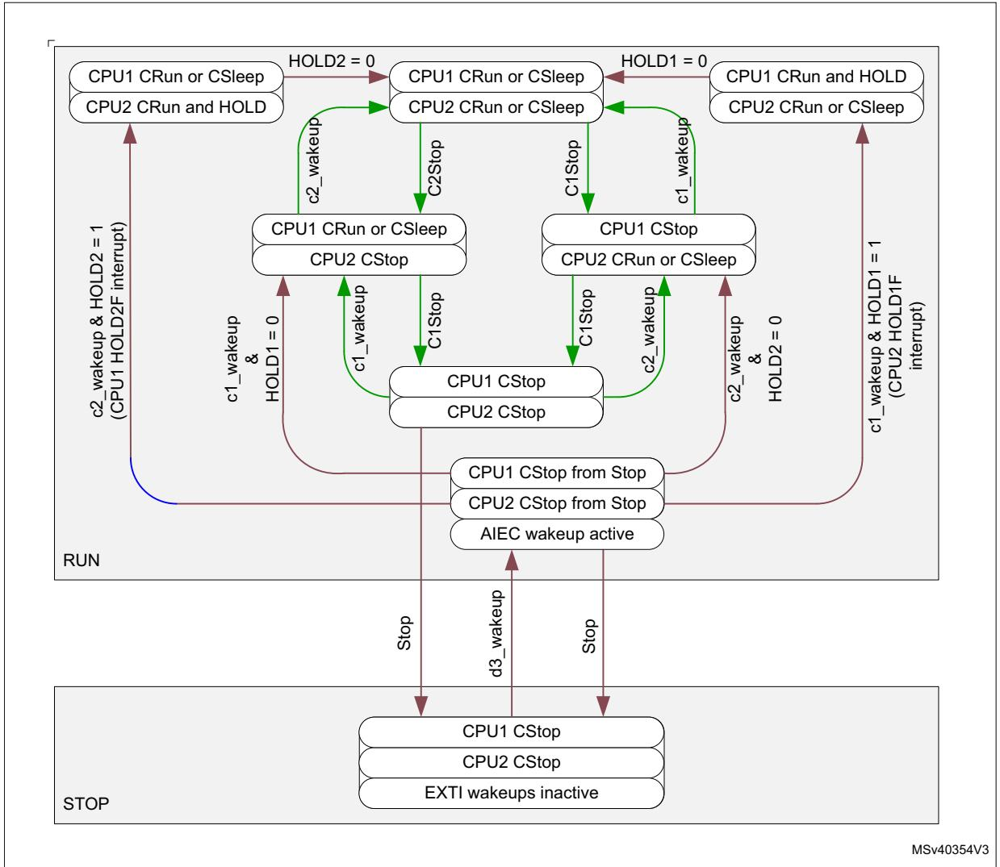

Figure 43. Stop mode hold mechanism state diagram

STOPF and HOLD1F and HOLD2F status flags in *PWR CPU1 control register* (*PWR\_CPU1CR*) and *PWR CPU2 control register* (*PWR\_CPU2CR*) indicate that the system has exited from Stop mode (see *Table 43*). Each CPU has its own set of flag.

The Hold procedure for the "master" CPU is the following:

- Before entering CStop mode, the "master" CPU sets the HOLDn bit of the "slave" CPU.
- When exiting from CStop mode, the "master" CPU re-initializes the system and clears the HOLDn bit of the "slave" CPU. The "master" CPU can be woken up either by:

- a "master" CPU wakeup event with associate interrupt or event.
- or a "slave" CPU wakeup event through a "master" CPU HOLDnF interrupt.

The HOLDn bits only take effect when it is set and the system exits from Stop mode. The associated CPU is kept on hold when the MCU exits from Stop mode and until the HOLDn bit is cleared (see state transitions in blue in *[Figure 43](#page-50-0)*).

When the system does not enter Stop mode, the system configuration is kept and the CPU is not on hold. In this case, the HOLDn bit has no effect (see state transitions in green in *[Figure 43](#page-50-0)*). Refer also to *[Table 43](#page-51-1)* for a detailed description of the hold mechanism.

**Table 43. Wakeup hold behavior and associated flags(1)**

<span id="page-51-1"></span>

| System                 | HOLD1 | HOLD2 | HOLD1F | HOLD2F | STOPF | Behavior                                                                                                                               |  |  |  |  |  |  |  |  |  |  |  |   |   |   |   |                                                                                                   |   |
|------------------------|-------|-------|--------|--------|-------|----------------------------------------------------------------------------------------------------------------------------------------|--|--|--|--|--|--|--|--|--|--|--|---|---|---|---|---------------------------------------------------------------------------------------------------|---|
| Exit from<br>Stop mode | 1     |       | x      | 0      | 1     | CPU2 woken up from CStop mode with CPU2 wakeup event.                                                                                  |  |  |  |  |  |  |  |  |  |  |  |   |   |   |   |                                                                                                   |   |
|                        |       | 0     | 1      | 0      | 1     | CPU2 and CPU1 woken up from CStop mode with CPU1 wakeup event.<br>CPU1 in hold until released by CPU2. CPU2 receives HOLD1F interrupt. |  |  |  |  |  |  |  |  |  |  |  |   |   |   |   |                                                                                                   |   |
|                        |       |       |        |        |       |                                                                                                                                        |  |  |  |  |  |  |  |  |  |  |  |   |   |   |   |                                                                                                   | x |
| Run mode               | x     |       |        |        |       |                                                                                                                                        |  |  |  |  |  |  |  |  |  |  |  | 0 | 0 | 0 | 0 | CPU2 is only woken up from CStop mode with CPU2 wakeup event. The<br>system has not been in Stop. |   |
|                        |       |       | 0      | 0      | 0     | CPU1 woken up from CStop mode with CPU1 wakeup event. The system<br>has not been in Stop.                                              |  |  |  |  |  |  |  |  |  |  |  |   |   |   |   |                                                                                                   |   |

<sup>1.</sup> CPU2 is "master" and CPU1 is "Slave" (the reversed table applies when CPU1 is "master" and CPU2 is "slave").

**Table 44. Stop mode**

<span id="page-51-0"></span>

| Stop mode                        | Description                                                                                                                                                      |  |  |
|----------------------------------|------------------------------------------------------------------------------------------------------------------------------------------------------------------|--|--|
| Mode entry                       | – When CPU1 and CPU2 are in CStop mode and there is no active EXTI Wakeup source<br>and Run_D3 = 0.<br>– At least one PDDS_Dn bit for any domain select Stop.    |  |  |
| Mode exit<br>– On a EXTI Wakeup. |                                                                                                                                                                  |  |  |
| Wakeup latency                   | System oscillator startup (when disabled).<br>+ EXTI and RCC wakeup synchronization.<br>+ Voltage Scaling refer to Table 41 (see Section 7.6.2: Voltage scaling) |  |  |

#### **I/O states in Stop mode**

I/O pin configuration remain unchanged in Stop mode.


# **7.7.9 DStandby mode**

Like DStop mode, DStandby mode is based on CPU subsystems CStop mode. However the domain VCORE supply is powered off. A domain enters DStandby mode only when all CPU subsystems that have peripherals allocated in the domain are in CStop mode and all PDDS\_Dn bits in *[PWR CPU1 control register \(PWR\\_CPU1CR\)](#page-63-0)* and *[PWR CPU2 control](#page-65-0)  [register \(PWR\\_CPU2CR\)](#page-65-0)* for the domain are configured accordingly. In DStandby mode, the domain is powered down and the domain RAM and register contents are lost.

#### **Entering DStandby mode**

The DStandby mode is entered according to *[Section 7.7.3: Entering low-power modes](#page-42-0)*, when all PDDS\_Dn bits in *[PWR CPU1 control register \(PWR\\_CPU1CR\)](#page-63-0)* and *[PWR CPU2](#page-65-0)  [control register \(PWR\\_CPU2CR\)](#page-65-0)* for the Dn domain select Standby mode.

Refer to *[Table 45](#page-53-0)* for details on how to enter DStandby mode.

If Flash memory programming is ongoing, the DStandby mode entry is delayed until the memory access is finished.

If an access to the domain bus matrix is ongoing, the DStandby mode entry is delayed until the domain bus matrix access is finished.

*Note: When the other domain CPU PDDS\_Dn bit selects Stop mode, the Dn domain remains in DStop. When the other domain CPU sets the PDDS\_Dn bit to select Standby mode, the Dn domain will enter DStandby mode (the other domain CPU has no allocated peripherals in the Dn domain).*

#### **Exiting from DStandby mode**

The DStandby mode is exited according to *[Section 7.7.4: Exiting from low-power modes](#page-43-0)*.

Refer to *[Table 45](#page-53-0)* for more details on how to exit from DStandby mode.

*Note: When a domain is in DStandby mode and the other domain CPU sets the domain PDDS\_Dn bit to select Stop mode, the domain remains in DStandby mode. The domain will only exit DStandby when the other domain CPU allocates a peripheral in the domain.*

> When exiting from DStandby mode, the domain CPU and peripherals are reset. However the state of the CPU subsystem clocks, domain(s) bus matrix clocks and voltage scaling depends on the system mode:

- When the system did not enter Stop mode, the CPU subsystem clocks, domain(s) bus matrix clocks and voltage scaling are the same as when entering DStandby mode, except if they have been modified by the other CPU.
- When the system has entered Stop or Standby mode, the CPU subsystem clocks, domain(s) bus matrix clocks and voltage scaling are reset.

When a domain exits from DStandby mode due to the other domain CPU subsystem (i.e when allocating a first peripheral or when the other domain CPU subsystem having peripherals allocated in the domain exits from CStop mode), the other domain CPU shall verify that the domain has exited from DStandby mode. To ensure correct operation, it is recommended to follow the sequence below:

- 1. First check that the domain bus matrix clock is available. The domain bus matrix clock state can be checked in RCC\_CR register:
  - When RCC DnCKRDY = 0, the domain bus matrix clock is stalled.
  - If RCC DnCKRDY = 1, the domain bus matrix clock is enabled.
- 2. Then wait till that the domain has exited from DStandby mode. To do this, check the SBF\_Dn flag in *[PWR CPU1 control register \(PWR\\_CPU1CR\)](#page-63-0)* and *[PWR CPU2 control](#page-65-0)  [register \(PWR\\_CPU2CR\)](#page-65-0)*. The domain is powered and can be accessed only when SBF\_Dn is cleared. Below an example of code:

```
Loop
write PWR SBF_Dn = 0 ; try to clear bit.
read PWR SBF_Dn
While 1 ==> loop
```

**Table 45. DStandby mode**

<span id="page-53-0"></span>

| DStandby mode  | Description                                                                                                                                                                                                                                                                                                                                                                                                                                                                                                                                           |  |
|----------------|-------------------------------------------------------------------------------------------------------------------------------------------------------------------------------------------------------------------------------------------------------------------------------------------------------------------------------------------------------------------------------------------------------------------------------------------------------------------------------------------------------------------------------------------------------|--|
| Mode entry     | – The domain CPU subsystem enters CStop and the other domain CPU<br>subsystem has no peripheral allocated in the domain or is also in CStop.<br>– The other domain CPU subsystem has an allocated peripheral and<br>enters CStop and the Domain CPU subsystem is in CStop.<br>– The other domain CPU subsystem deallocated its last peripheral in the<br>domain and the Domain CPU subsystem is in CStop.<br>– All PDDS_Dn bits for the domain select Standby mode.<br>– All WKUPF bits in Power Control/Status register (PWR_WKUPFR) are<br>cleared. |  |
| Mode exit      | – The domain CPU subsystem exits from CStop mode (see Table 38)<br>– The other domain CPU subsystem has an allocated peripheral in the<br>domain and exits from CStop mode (see Table 38)<br>– The other domain CPU subsystem allocates a first peripheral in the<br>domain.                                                                                                                                                                                                                                                                          |  |
| Wakeup latency | EXTI and RCC wakeup synchronization.<br>+ Domain power up and reset.<br>(see Section 9.4.7: Power-on and wakeup sequences)                                                                                                                                                                                                                                                                                                                                                                                                                            |  |


### **7.7.10 Standby mode**

The Standby mode allows achieving the lowest power consumption. Like Stop mode, it is based on CPU subsystems CStop mode. However the VCORE supply regulator is powered off.

The system D3 domain enters Standby mode only when the D1 and D2 domain are in DStandby. When the system D3 domain enters Standby mode, the voltage regulator is disabled. The complete VCORE domain is consequently powered off. The PLLs, HSI oscillator, CSI oscillator, HSI48 and the HSE oscillator are also switched off. SRAM and register contents are lost except for backup domain registers (RTC registers, RTC backup register and backup RAM), and Standby circuitry (see *[Section 7.4.4: Backup domain](#page-14-0)*).

In system Standby mode, the following features can be selected by programming individual control bits:

- Independent watchdog (IWDG)
  - The IWDG is started by programming its Key register or by hardware option. Once started, it cannot be stopped except by a reset (see *Section 48.3.3: Window option* in *Section 48: Independent watchdog (IWDG)*.
- Real-time clock (RTC)
  - This is configured via the RTCEN bit in the backup domain control register (RCC\_BDCR).
- Internal RC oscillator (LSI RC)
  - This is configured by the LSION bit in the Control/status register (RCC\_CSR).
- External 32.768 kHz oscillator (LSE OSC) This is configured by the LSEON bit in the backup domain control register (RCC\_BDCR).

#### **Entering Standby mode**

The Standby mode is entered according to *[Section 7.7.3: Entering low-power modes](#page-42-0)*, when all PDDS\_Dn bits in *[PWR CPU1 control register \(PWR\\_CPU1CR\)](#page-63-0)* and *[PWR CPU2 control](#page-65-0)  [register \(PWR\\_CPU2CR\)](#page-65-0)* for all domains request Standby.

Refer to *[Table 47](#page-55-0)* for more details on how to enter to Standby mode.

*Note: Before entering Standby mode, the software must ensure that VOS0 is not active.*

### **Exiting from Standby mode**

The Standby mode is exited according to *[Section 7.7.4: Exiting from low-power modes](#page-43-0)*.

Refer to *[Table 47](#page-55-0)* for more details on how to exit from Standby mode.

The system exits from Standby mode when an external Reset (NRST pin), an IWDG Reset, a WKUP pin event, a RTC alarm, a tamper event, or a time stamp event is detected. All registers are reset after waking up from Standby except for power control and status registers (*[PWR control register 2 \(PWR\\_CR2\)](#page-60-0)*, *[PWR control register 3 \(PWR\\_CR3\)](#page-61-0)*), SBF bit in *[PWR CPU1 control register \(PWR\\_CPU1CR\)](#page-63-0)* and *[PWR CPU2 control register](#page-65-0)  [\(PWR\\_CPU2CR\)](#page-65-0)*, *[PWR wakeup flag register \(PWR\\_WKUPFR\)](#page-68-0)*, and *[PWR wakeup enable](#page-69-0)  [and polarity register \(PWR\\_WKUPEPR\)](#page-69-0)*.

After waking up from Standby mode, the program execution restarts in the same way as after a system reset (boot option sampling, boot vector reset fetched, etc.). The SBF status flags in *[PWR CPU1 control register \(PWR\\_CPU1CR\)](#page-63-0)* and *[PWR CPU2 control register](#page-65-0)* 


*[\(PWR\\_CPU2CR\)](#page-65-0)* registers indicate from which mode the system has exited (see *[Table 46](#page-55-1)*). Each CPU has its own SBF flags.

The system will boot according to the option bytes CM7B and CM4B (see *Section 2.6: Boot configuration*).

**Table 46. Standby and Stop flags**

<span id="page-55-1"></span>

| SBF_D2 | SBF_D1 | SBF | STOPF | Description                                                                |  |
|--------|--------|-----|-------|----------------------------------------------------------------------------|--|
| 0      | 1      | 0   | 0     | D1 domain exits from DStandby while system stayed in Run                   |  |
| 0      | 1      | 0   | 1     | D1 domain exits from DStandby, while system has been in or exits from Stop |  |
| 1      | 0      | 0   | 0     | D2 domain exits from DStandby while system stayed in Run                   |  |
| 1      | 0      | 0   | 1     | D2 domain exits from DStandby while system has been in or exits from Stop  |  |
| 0      | 0      | 0   | 1     | System has been in or exits from Stop                                      |  |
| 0(1)   | 0(1)   | 1   | 0     | System exits from Standby                                                  |  |

<sup>1.</sup> When exiting from Standby the SBF\_D1 and SBF\_D2 reflect the reset value

**Table 47. Standby mode**

<span id="page-55-0"></span>

| Standby mode                                                           | Description                                                                                                                                                                                                                                                     |
|------------------------------------------------------------------------|-----------------------------------------------------------------------------------------------------------------------------------------------------------------------------------------------------------------------------------------------------------------|
| Mode entry                                                             | – The CPU1 subsystem and CPU2 subsystem are in CStop mode, and<br>there is no active EXTI Wakeup source and RUN_D3 = 0.<br>– All PDDS_Dn bits for all domains select Standby.<br>– All WKUPF bits in Power Control/Status register (PWR_WKUPFR) are<br>cleared. |
| Mode exit                                                              | – WKUP pins rising or falling edge, RTC alarm (Alarm A and Alarm B),<br>RTC wakeup, tamper event, time stamp event, external reset in NRST<br>pin, IWDG reset.                                                                                                  |
| Wakeup latency<br>System reset phase (see Section 9.4.2: System reset) |                                                                                                                                                                                                                                                                 |

#### **I/O states in Standby mode**

In Standby mode, all I/O pins are high impedance without pull, except for:

- Reset pad (still available)
- RTC\_AF1 pin if configured for tamper, time stamp, RTC Alarm out, or RTC clock calibration out
- WKUP pins (if enabled). The WKUP pin pull configuration can be defined through WKUPPUPD register bits in *[PWR wakeup enable and polarity register](#page-69-0)  [\(PWR\\_WKUPEPR\)](#page-69-0)*.


### **7.7.11 Monitoring low-power modes**

The devices feature state monitoring pins to monitor the CPU and Domain state transition to low-power mode (refer to *[Table 48](#page-56-0)* for the list of pins and their description). The GPIO pin corresponding to each monitoring signal has to be programmed in alternate function mode.

This feature is not available in Standby mode since these I/O pins are switched to high impedance.

<span id="page-56-0"></span>

| Power state monitoring pins | Description                          |  |  |  |
|-----------------------------|--------------------------------------|--|--|--|
| CxSLEEP                     | Sleeping CPU (Cx, x= 1 or 2) state   |  |  |  |
| CxDSLEEP                    | Deepsleep CPU (Cx, x= 1 or 2) state  |  |  |  |
| DxPWREN                     | Domain (Dx, x= 1 or 2) power enabled |  |  |  |

**Table 48. Low-power modes monitoring pin overview**

The values of the monitoring pins reflect the state of the CPUs and domains. Refer to *[Table 49](#page-56-1)*. for the GPIO state depending on CPU and domain state.

| Table 49. GPIO state according to CPU and domain state |  |  |
|--------------------------------------------------------|--|--|
|--------------------------------------------------------|--|--|

<span id="page-56-1"></span>

| Domain  |         | CPUx     | CPUx power                | Domainx power<br>state |  |  |
|---------|---------|----------|---------------------------|------------------------|--|--|
| DxPWREN | CxSLEEP | CxDSLEEP | state                     |                        |  |  |
| 1       | 0       | 0        | CPUx in Run<br>mode       |                        |  |  |
| 1       | 1       | 0        | CPUx in Sleep<br>mode     | DRun mode              |  |  |
| 1       | 0       | 1        | CPUx in Run<br>mode       |                        |  |  |
| 1       | 1       |          | CPUx in<br>Deepsleep mode | DRun(1), DStop<br>mode |  |  |
| 0       | -       |          | -(2)                      | DStandby mode          |  |  |

<sup>1.</sup> The domain might be in Run mode if a peripheral is allocated to the other CPU.

<sup>2.</sup> The full domain is in power off state and the CPU is powered off.

# **7.8 PWR registers**

The PWR registers can be accessed in word, half-word and byte format, unless otherwise specified.

### <span id="page-57-0"></span>**7.8.1 PWR control register 1 (PWR\_CR1)**

Address offset: 0x000

Reset value: 0xF000 C000

| 31   | 30   | 29   | 28   | 27   | 26   | 25   | 24   | 23   | 22   | 21   | 20   | 19   | 18   | 17   | 16    |
|------|------|------|------|------|------|------|------|------|------|------|------|------|------|------|-------|
| Res. | Res. | Res. | Res. | Res. | Res. | Res. | Res. | Res. | Res. | Res. | Res. | Res. |      | ALS  | AVDEN |
|      |      |      |      |      |      |      |      |      |      |      |      |      | rw   | rw   | rw    |
| 15   | 14   | 13   | 12   | 11   | 10   | 9    | 8    | 7    | 6    | 5    | 4    | 3    | 2    | 1    | 0     |
|      | SVOS | Res. | Res. | Res. | Res. | FLPS | DBP  |      | PLS  |      | PVDE | Res. | Res. | Res. | LPDS  |
| rw   | rw   |      |      |      |      | rw   | rw   | rw   | rw   | rw   | rw   |      |      |      | rw    |

Bits 31:19 Reserved, must be kept at reset value

#### Bits 18:17 **ALS:** Analog voltage detector level selection

These bits select the voltage threshold detected by the AVD.

00: 1.7 V 01: 2.1 V 10: 2.5 V 11: 2.8 V

Bit 16 **AVDEN:** Peripheral voltage monitor on VDDA enable

0: Peripheral voltage monitor on VDDA disabled.

1: Peripheral voltage monitor on VDDA enabled

#### Bits 15:14 **SVOS:** System Stop mode voltage scaling selection

These bits control the VCORE voltage level in system Stop mode, to obtain the best trade-off between power consumption and performance.

00: Reserved 01: SVOS5 Scale 5 10: SVOS4 Scale 4

11: SVOS3 Scale 3 (default)

#### Bits 13:10 Reserved, must be kept at reset value

#### Bit 9 **FLPS:** Flash low-power mode in DStop mode

This bit allows to obtain the best trade-off between low-power consumption and restart time when exiting from DStop mode.

When it is set, the Flash memory enters low-power mode when D1 domain is in DStop mode.

- 0: Flash memory remains in normal mode when D1 domain enters DStop (quick restart time).
- 1: Flash memory enters low-power mode when D1 domain enters DStop mode (low-power consumption).

#### Bit 8 **DBP:** Disable backup domain write protection

In reset state, the RCC\_BDCR register, the RTC registers (including the backup registers), BREN and MONEN bits in PWR\_CR2 register, are protected against parasitic write access. This bit must be set to enable write access to these registers.

0: Access to RTC, RTC Backup registers and backup SRAM disabled

1: Access to RTC, RTC Backup registers and backup SRAM enabled

#### Bits 7:5 **PLS:** Programmable voltage detector level selection

These bits select the voltage threshold detected by the PVD.

000: 1.95 V 001: 2.1 V 010: 2.25 V 011: 2.4 V 100: 2.55 V

101: 2.7 V

110: 2.85 V

111: External voltage level on PVD\_IN pin, compared to internal VREFINT level.

*Note: Refer to Section "Electrical characteristics" of the product datasheet for more details.*

#### Bit 4 **PVDE:** Programmable voltage detector enable

- 0: Programmable voltage detector disabled.
- 1: Programmable voltage detector enabled

#### Bits 3:1 Reserved, must be kept at reset value

- Bit 0 **LPDS:** Low-power Deepsleep with SVOS3 (SVOS4 and SVOS5 always use low-power, regardless of the setting of this bit)
  - 0: Voltage regulator or SMPS step-down converter in Main mode (MR) when SVOS3 is selected for Stop mode
  - 1: Voltage regulator or SMPS step-down converter in Low-power mode (LPR) when SVOS3 is selected for Stop mode

# <span id="page-59-0"></span>**7.8.2 PWR control status register 1 (PWR\_CSR1)**

Address offset: 0x004

Reset value: 0x0000 4000.

| 31   | 30     | 29            | 28   | 27   | 26   | 25   | 24   | 23   | 22   | 21   | 20   | 19   | 18   | 17   | 16   |
|------|--------|---------------|------|------|------|------|------|------|------|------|------|------|------|------|------|
| Res. | Res.   | Res.          | Res. | Res. | Res. | Res. | Res. | Res. | Res. | Res. | Res. | Res. | Res. | Res. | AVDO |
|      |        |               |      |      |      |      |      |      |      |      |      |      |      |      | r    |
| 15   | 14     | 13            | 12   | 11   | 10   | 9    | 8    | 7    | 6    | 5    | 4    | 3    | 2    | 1    | 0    |
|      | ACTVOS | ACTVOS<br>RDY | Res. | Res. | Res. | Res. | Res. | Res. | Res. | Res. | PVDO | Res. | Res. | Res. | Res. |
|      | r      | r             |      |      |      |      |      |      |      |      | r    |      |      |      |      |

Bits 31:17 Reserved, must be kept at reset value

Bit 16 **AVDO**: Analog voltage detector output on VDDA

This bit is set and cleared by hardware. It is valid only if AVD on VDDA is enabled by the AVDEN bit.

- 0: VDDA is equal or higher than the AVD threshold selected with the ALS[2:0] bits.
- 1: VDDA is lower than the AVD threshold selected with the ALS[2:0] bits

*Note: Since the AVD is disabled in Standby mode, this bit is equal to 0 after Standby or reset until the AVDEN bit is set.*

Bits 15:14 **ACTVOS**: VOS currently applied for VCORE voltage scaling selection.

These bits reflect the last VOS value applied to the PMU.

Bit 13 **ACTVOSRDY:** Voltage levels ready bit for currently used VOS and SDLEVEL

This bit is set to 1 by hardware when the voltage regulator and the SMPS step-down converter are both disabled and Bypass mode is selected in PWR control register 3 (PWR\_CR3).

- 0: Voltage level invalid, above or below current VOS and SDLEVEL selected levels.
- 1: Voltage level valid, at current VOS and SDLEVEL selected levels.
- Bits 12:5 Reserved, must be kept at reset value
  - Bit 4 **PVDO**: Programmable voltage detect output

This bit is set and cleared by hardware. It is valid only if the PVD has been enabled by the PVDE bit.

- 0: VDD or PVD\_IN voltage is equal or higher than the PVD threshold selected through the PLS[2:0] bits.
- 1: VDD or PVD\_IN voltage is lower than the PVD threshold selected through the PLS[2:0] bits.

*Note: since the PVD is disabled in Standby mode, this bit is equal to 0 after Standby or reset until the PVDE bit is set.*

Bits 3:0 Reserved, must be kept at reset value


### <span id="page-60-0"></span>**7.8.3 PWR control register 2 (PWR\_CR2)**

Address offset: 0x008

Reset value: 0x0000 0000

This register is not reset by wakeup from Standby mode, RESET signal and VDD POR. It is only reset by VSW POR and VSWRST reset.

This register shall not be accessed when VSWRST bit in RCC\_BDCR register resets the VSW domain.

After reset, PWR\_CR2 register is write-protected. Prior to modifying its content, the DBP bit in PWR\_CR1 register must be set to disable the write protection.

| 31   | 30   | 29   | 28   | 27   | 26   | 25   | 24   | 23   | 22                | 21   | 20    | 19   | 18   | 17   | 16    |
|------|------|------|------|------|------|------|------|------|-------------------|------|-------|------|------|------|-------|
| Res. | Res. | Res. | Res. | Res. | Res. | Res. | Res. |      | TEMPH TEMPL VBATH |      | VBATL | Res. | Res. | Res. | BRRDY |
|      |      |      |      |      |      |      |      | r    | r                 | r    | r     |      |      |      | r     |
|      |      |      |      |      |      |      |      |      |                   |      |       |      |      |      |       |
| 15   | 14   | 13   | 12   | 11   | 10   | 9    | 8    | 7    | 6                 | 5    | 4     | 3    | 2    | 1    | 0     |
| Res. | Res. | Res. | Res. | Res. | Res. | Res. | Res. | Res. | Res.              | Res. | MONEN | Res. | Res. | Res. | BREN  |

- Bits 31:24 Reserved, must be kept at reset value
  - Bit 23 **TEMPH**: Temperature level monitoring versus high threshold
    - 0: Temperature below high threshold level.
    - 1: Temperature equal or above high threshold level.
  - Bit 22 **TEMPL**: Temperature level monitoring versus low threshold
    - 0: Temperature above low threshold level.
      - 1: Temperature equal or below low threshold level.
  - Bit 21 **VBATH**: VBAT level monitoring versus high threshold
    - 0: VBAT level below high threshold level.
    - 1: VBAT level equal or above high threshold level.
  - Bit 20 **VBATL**: VBAT level monitoring versus low threshold
    - 0: VBAT level above low threshold level.
    - 1: VBAT level equal or below low threshold level.
- Bits 19:17 Reserved, must be kept at reset value
  - Bit 16 **BRRDY**: Backup regulator ready

This bit is set by hardware to indicate that the Backup regulator is ready.

- 0: Backup regulator not ready.
- 1: Backup regulator ready.
- Bits 15:5 Reserved, must be kept at reset value

Bit 4 **MONEN:** VBAT and temperature monitoring enable

When set, the VBAT supply and temperature monitoring is enabled.

0: VBAT and temperature monitoring disabled.

1: VBAT and temperature monitoring enabled.

*Note:* VBAT *and temperature monitoring are only available when the backup regulator is enabled (BREN bit set to 1).*

#### Bits 3:1 Reserved, must be kept at reset value

#### Bit 0 **BREN:** Backup regulator enable

When set, the Backup regulator (used to maintain the backup RAM content in Standby and VBAT modes) is enabled.

If BREN is reset, the backup regulator is switched off. The backup RAM can still be used in Run and Stop modes. However, its content will be lost in Standby and VBAT modes. If BREN is set, the application must wait till the Backup Regulator Ready flag (BRRDY) is set to indicate that the data written into the SRAM will be maintained in Standby and VBAT

0: Backup regulator disabled.

1: Backup regulator enabled.

### <span id="page-61-0"></span>**7.8.4 PWR control register 3 (PWR\_CR3)**

Address offset: 0x00C

modes.

Reset value: 0x0000 0006 (reset only by POR only, not reset by wakeup from Standby mode and RESET pad).

The lower byte of this register is written once after POR and shall be written before changing VOS level or ck\_sys clock frequency. No limitation applies to the upper bytes.

Programming data corresponding to an invalid combination of SDLEVEL, SDEXTHP, SDEN, LDOEN and BYPASS bits (see *[Table 33](#page-7-0)*) will be ignored: data will not be written, the written-once mechanism will lock the register and any further write access will be ignored. The default supply configuration will be kept and the ACTVOSRDY bit in *[PWR control status](#page-59-0)  [register 1 \(PWR\\_CSR1\)](#page-59-0)* will go on indicating invalid voltage levels. The system shall be power cycled before writing a new value.

| 31   | 30   | 29   | 28   | 27   | 26       | 25       | 24       | 23   | 22   | 21   | 20      | 19          | 18   | 17    | 16       |
|------|------|------|------|------|----------|----------|----------|------|------|------|---------|-------------|------|-------|----------|
| Res. | Res. | Res. | Res. | Res. | USB33RDY | USBREGEN | USB33DEN | Res. | Res. | Res. | Res.    | Res.        | Res. | Res.  | SDEXTRDY |
|      |      |      |      |      | r        | rw       | rw       |      |      |      |         |             |      |       | r        |
| 15   | 14   | 13   | 12   | 11   | 10       | 9        | 8        | 7    | 6    | 5    | 4       | 3           | 2    | 1     | 0        |
| Res. | Res. | Res. | Res. | Res. | Res.     | VBRS     | VBE      | Res. | Res. |      | SDLEVEL | SDEXTH<br>P | SDEN | LDOEN | BYPASS   |
|      |      |      |      |      |          | rw       | rw       |      |      | rw   | rw      | rw          | rw   | rw    | rw       |

Bits 31:27 Reserved, must be kept at reset value

Bit 26 **USB33RDY**: USB supply ready.

0: USB33 supply not ready.

1: USB33 supply ready.


RM0399 Rev 4 329/3556

- Bit 25 **USBREGEN**: USB regulator enable.
  - 0: USB regulator disabled.
  - 1: USB regulator enabled.
- Bit 24 **USB33DEN**: VDD33USB voltage level detector enable.
  - 0: VDD33USB voltage level detector disabled.
  - 1: VDD33USB voltage level detector enabled.
- Bits 23:17 Reserved, must be kept at reset value
  - Bit 16 **SDEXTRDY**: SMPS step-down converter external supply ready

This bit is set by hardware to indicate that the external supply from the SMPS step-down converter is ready.

- 0: External supply not ready.
- 1: External supply ready.
- Bits 15:10 Reserved, must be kept at reset value
  - Bit 9 **VBRS**: VBAT charging resistor selection
    - 0: Charge VBAT through a 5 k Ω resistor.
      - 1: Charge VBAT through a 1.5 k Ω resistor.
  - Bit 8 **VBE**: VBAT charging enable
    - 0: VBAT battery charging disabled.
    - 1: VBAT battery charging enabled.
  - Bits 7:6 Reserved, must be kept at reset value
  - Bits 5:4 **SDLEVEL**(1): SMPS step-down converter voltage output level selection

This bit is used when both the LDO and SMPS step-down converter are enabled with SDEN and LDOEN enabled or when SDEXTHP is enabled. In this case SDLEVEL has to be written with a value different than 00 at system startup.

00: Reset value

01: 1.8 V

10 and 11: 2.5 V

- Bit 3 **SDEXTHP**[\(1\):](#page-62-0) SMPS step-down converter forced ON and in High Power MR mode.
  - 0: SMPS step-down converter in normal operating mode.
  - 1: SMPS step-down converter forced ON and in MR mode.
- Bit 2 **SDEN**[\(1\)](#page-62-0)(2): SMPS step-down converter enable
  - 0: SMPS step-down converter disabled
  - 1: SMPS step-down converter enabled. (Default)
- Bit 1 **LDOEN**[\(1\):](#page-62-0) Low drop-out regulator enable
  - 0: Low drop-out regulator disabled.
  - 1: Low drop-out regulator enabled (default)
- Bit 0 **BYPASS**[\(1\):](#page-62-0) Power management unit bypass
  - 0: Power management unit normal operation.
  - 1: Power management unit bypassed, voltage monitoring still active.
- <span id="page-62-0"></span>1. Illegal combinations of SDLEVEL, SDEXTHP, SDEN, LDOEN and BYPASS are described in *[Table 33](#page-7-0)*.
- 2. The SMPS step-down converter is not available on all packages.In this case, the SMPS step-down converter is disabled.


### <span id="page-63-0"></span>**7.8.5 PWR CPU1 control register (PWR\_CPU1CR)**

This register allows controlling CPU1 power.

Address offset: 0x010 Reset value: 0x0000 0000

| 31   | 30   | 29   | 28   | 27     | 26    | 25   | 24     | 23     | 22   | 21    | 20     | 19   | 18      | 17      | 16      |
|------|------|------|------|--------|-------|------|--------|--------|------|-------|--------|------|---------|---------|---------|
| Res. | Res. | Res. | Res. | Res.   | Res.  | Res. | Res.   | Res.   | Res. | Res.  | Res.   | Res. | Res.    | Res.    | Res.    |
|      |      |      |      |        |       |      |        |        |      |       |        |      |         |         |         |
| 15   | 14   | 13   | 12   | 11     | 10    | 9    | 8      | 7      | 6    | 5     | 4      | 3    | 2       | 1       | 0       |
| Res. | Res. | Res. | Res. | RUN_D3 | HOLD2 | CSSF | SBF_D2 | SBF_D1 | SBF  | STOPF | HOLD2F | Res. | PDDS_D3 | PDDS_D2 | PDDS_D1 |
|      |      |      |      | rw     | rw    | rw   | r      | r      | r    | r     | r      |      | rw      | rw      | rw      |

Bits 31:12 Reserved, must be kept at reset value

- Bit 11 **RUN\_D3:** Keep system D3 domain in Run mode regardless of the CPU subsystems modes
  - 0: D3 domain follows CPU subsystems modes.
  - 1: D3 domain remains in Run mode regardless of CPU subsystems modes.
- Bit 10 **HOLD2:** Hold the CPU2 and allocated peripherals when exiting from Stop mode.
  - 0: CPU2 and allocated peripherals are not affected, and start running when woken up from Stop mode.
  - 1: CPU2 and allocated peripherals are on hold when woken up from Stop mode. Writing this bit to 0 will release the CPU2 and allocated peripherals.
- Bit 9 **CSSF:** Clear D1 domain CPU1 Standby, Stop and HOLD flags (always read as 0)

This bit is cleared to 0 by hardware.

- 0: No effect.
- 1: D1 domain CPU1 flags (HOLD2F, STOPF, SBF, SBF\_D1, and SBF\_D2) are cleared.
- Bit 8 **SBF\_D2:** D2 domain DStandby flag

This bit is set by hardware and cleared by any system reset or by setting the CPU1 CSSF bit. Once set, this bit can be cleared only when the D2 domain is no longer in DStandby mode.

- 0: D2 domain has not been in DStandby mode
- 1: D2 domain has been in DStandby mode.
- Bit 7 **SBF\_D1:** D1 domain DStandby flag

This bit is set by hardware and cleared by any system reset or by setting the CPU1 CSSF bit. Once set, this bit can be cleared only when the D1 domain is no longer in DStandby mode.

- 0: D1 domain has not been in DStandby mode
- 1: D1 domain has been in DStandby mode.
- Bit 6 **SBF:** System Standby flag

This bit is set by hardware and cleared only by a POR (Power-on Reset) or by setting the CPU1 CSSF bit

- 0: System has not been in Standby mode
- 1: System has been in Standby mode

#### Bit 5 **STOPF:** STOP flag

This bit is set by hardware and cleared only by any reset or by setting the CPU1 CSSF bit.

- 0: System has not been in Stop mode
- 1: System has been in Stop mode
- Bit 4 **HOLD2F:** CPU2 on hold wakeup flag.

This flag also generates a CPU1 interrupt. CPU1 has been woken up from a CPU2 wakeup source with CPU2 on hold. This flag is set by hardware and cleared only by a system reset or by setting the CPU1 CSSF bit.

- 0: No CPU2 system wake up with hold.
- 1: CPU2 system wake up with hold.
- Bit 3 Reserved, must be kept at reset value
- Bit 2 **PDDS\_D3:** System D3 domain Power Down Deepsleep.

This bit allows CPU1 to define the Deepsleep mode for System D3 domain.

- 0: Keep Stop mode when D3 domain enters Deepsleep.
- 1: Allow Standby mode when D3 domain enters Deepsleep.
- Bit 1 **PDDS\_D2:** D2 domain Power Down Deepsleep.

This bit allows CPU1 to define the Deepsleep mode for D2 domain.

- 0: Keep DStop mode when D2 domain enters Deepsleep.
- 1: Allow DStandby mode when D2 domain enters Deepsleep.
- Bit 0 **PDDS\_D1:** D1 domain Power Down Deepsleep selection.

This bit allows CPU1 to define the Deepsleep mode for D1 domain.

- 0: Keep DStop mode when D1 domain enters Deepsleep.
- 1: Allow DStandby mode when D1 domain enters Deepsleep.

# <span id="page-65-0"></span>**7.8.6 PWR CPU2 control register (PWR\_CPU2CR)**

This register allows controlling CPU2 power.

Address offset: 0x014 Reset value: 0x0000 0000

| 31   | 30   | 29   | 28   | 27     | 26    | 25   | 24     | 23     | 22   | 21    | 20     | 19   | 18      | 17      | 16      |
|------|------|------|------|--------|-------|------|--------|--------|------|-------|--------|------|---------|---------|---------|
| Res. | Res. | Res. | Res. | Res.   | Res.  | Res. | Res.   | Res.   | Res. | Res.  | Res.   | Res. | Res.    | Res.    | Res.    |
|      |      |      |      |        |       |      |        |        |      |       |        |      |         |         |         |
| 15   | 14   | 13   | 12   | 11     | 10    | 9    | 8      | 7      | 6    | 5     | 4      | 3    | 2       | 1       | 0       |
| Res. | Res. | Res. | Res. | RUN_D3 | HOLD1 | CSSF | SBF_D2 | SBF_D1 | SBF  | STOPF | HOLD1F | Res. | PDDS_D3 | PDDS_D2 | PDDS_D1 |
|      |      |      |      | rw     | rw    | rw   | r      | r      | r    | r     | r      |      | rw      | rw      | rw      |

#### Bits 31:12 Reserved, must be kept at reset value

- Bit 11 **RUN\_D3:** Keep D3 domain in Run mode regardless of the other CPU subsystems modes.
  - 0: D3 domain follows the CPU subsystems modes.
  - 1: D3 domain remains in Run mode regardless of the CPU subsystems modes.
- Bit 10 **HOLD1:** Hold the CPU1 and allocated peripherals when exiting from Stop mode.
  - 0: CPU1 and allocated peripherals are not affected, and start running when woken up from Stop mode.
  - 1: CPU1 and allocated peripherals are on hold when woken up from Stop mode. Writing this bit to 0 will release the CPU1 and allocated peripherals.
  - Bit 9 **CSSF:** Clear D2 domain CPU2 Standby, Stop and HOLD flags (always read as 0)

This bit is cleared to 0 by hardware.

- 0: No effect.
- 1: D2 domain CPU2 flags (HOLD1F, STOPF, SBF, SBF\_D1, and SBF\_D2) cleared.

#### Bit 8 **SBF\_D2:** D2 domain DStandby flag

This bit is set by hardware and cleared by any system Reset or by setting the CPU2 CSSF bit. Once set, it can be cleared only when the D2 domain is no longer in DStandby mode.

- 0: D2 domain has not been in DStandby mode.
- 1: D2 domain has been in DStandby mode.

#### Bit 7 **SBF\_D1:** D1 domain DStandby flag

This bit is set by hardware and cleared by any Reset or by setting the CPU2 CSSF bit. Once set, this bit can be cleared only when the D1 domain is no longer in DStandby mode.

- 0: D2 domain has not been in DStandby mode
- 1: D2 domain has been in DStandby mode.

#### Bit 6 **SBF:** System Standby flag

This bit is set by hardware and cleared only by a POR (Power-on Reset) or by setting the CPU2 CSSF bit.

- 0: System has not been in Standby mode.
- 1: System has been in Standby mode.

#### Bit 5 **STOPF:** Stop Flag

This bit is set by hardware and cleared only by any reset or by setting the CPU2 CSSF bit.

- 0: System has not been in Stop mode.
- 1: System has been in Stop mode.


#### Bit 4 **HOLD1F:** CPU1 in hold wakeup flag.

This flag also generates a CPU2 interrupt.

CPU2 has been woken up from a CPU1 wakeup source with CPU1 on hold. This flag is set by hardware and cleared only by a system reset or by setting the CPU2 CSSF bit.

0: No CPU1 system wake up with hold.

1: CPU1 system wake up with hold.

#### Bit 3 Reserved, must be kept at reset value

#### Bit 2 **PDDS\_D3:** System D3 domain Power Down Deepsleep.

This bit allows CPU2 to define the Deepsleep mode for System D3 domain.

0: Keep Stop mode when D3 domain enters Deepsleep.

1: Allow Standby mode when D3 domain enters Deepsleep.

#### Bit 1 **PDDS\_D2:** D2 domain Power Down Deepsleep.

This bit allows CPU2 to define the Deepsleep mode for D2 domain.

0: Keep DStop mode when D2 domain enters Deepsleep.

1: Allow DStandby mode when D2 domain enters Deepsleep.

#### Bit 0 **PDDS\_D1:** D1 domain Power Down Deepsleep selection.

This bit allows CPU2 to define the Deepsleep mode for D1 domain.

0: Keep DStop mode when D1 domain enters to Deepsleep.

1: Allow DStandby mode when D1 domain enters to Deepsleep.

### <span id="page-67-0"></span>**7.8.7 PWR D3 domain control register (PWR\_D3CR)**

This register allows controlling D3 domain power.

Address offset: 0x018

Reset value: 0x0000 4000 (Following reset VOSRDY will be read 1 by software).

| 31   | 30   | 29     | 28   | 27   | 26   | 25   | 24   | 23   | 22   | 21   | 20   | 19   | 18   | 17   | 16   |
|------|------|--------|------|------|------|------|------|------|------|------|------|------|------|------|------|
| Res. | Res. | Res.   | Res. | Res. | Res. | Res. | Res. | Res. | Res. | Res. | Res. | Res. | Res. | Res. | Res. |
|      |      |        |      |      |      |      |      |      |      |      |      |      |      |      |      |
|      |      |        |      |      |      |      |      |      |      |      |      |      |      |      |      |
| 15   | 14   | 13     | 12   | 11   | 10   | 9    | 8    | 7    | 6    | 5    | 4    | 3    | 2    | 1    | 0    |
|      | VOS  | VOSRDY | Res. | Res. | Res. | Res. | Res. | Res. | Res. | Res. | Res. | Res. | Res. | Res. | Res. |

Bits 31:16 Reserved, must be kept at reset value

Bits 15:14 **VOS:** Voltage scaling selection according to performance

These bits control the VCORE voltage level and allow to obtains the best trade-off between power consumption and performance:

- When increasing the performance, the voltage scaling shall be changed before increasing the system frequency.
- When decreasing performance, the system frequency shall first be decreased before changing the voltage scaling.

00: Reserved (Scale 3 selected).

01: Scale 3 (default)

10: Scale 2

11: Scale 1

Bit 13 **VOSRDY:** VOS Ready bit for VCORE voltage scaling output selection.

This bit is set to 1 by hardware when Bypass mode is selected in PWR control register 3 (PWR\_CR3).

0: Not ready, voltage level below VOS selected level.

1: Ready, voltage level at or above VOS selected level.

Bits 12:0 Reserved, must be kept at reset value

# <span id="page-68-1"></span>**7.8.8 PWR wakeup clear register (PWR\_WKUPCR)**

Address offset: 0x020

Reset value: 0x0000 0000 (reset only by system reset, not reset by wakeup from Standby

mode)

5 wait states are required when writing this register (when clearing a WKUPF bit in PWR\_WKUPFR, the AHB write access will complete after the WKUPF has been cleared).

| 31   | 30   | 29   | 28   | 27   | 26   | 25   | 24   | 23   | 22   | 21     | 20     | 19     | 18     | 17     | 16     |
|------|------|------|------|------|------|------|------|------|------|--------|--------|--------|--------|--------|--------|
| Res. | Res. | Res. | Res. | Res. | Res. | Res. | Res. | Res. | Res. | Res.   | Res.   | Res.   | Res.   | Res.   | Res.   |
|      |      |      |      |      |      |      |      |      |      |        |        |        |        |        |        |
| 15   | 14   | 13   | 12   | 11   | 10   | 9    | 8    | 7    | 6    | 5      | 4      | 3      | 2      | 1      | 0      |
| Res. | Res. | Res. | Res. | Res. | Res. | Res. | Res. | Res. | Res. | WKUPC6 | WKUPC5 | WKUPC4 | WKUPC3 | WKUPC2 | WKUPC1 |
|      |      |      |      |      |      |      |      |      |      | rc_w1  | rc_w1  | rc_w1  | rc_w1  | rc_w1  | rc_w1  |

Bits 31:6 Reserved, always read as 0.

Bits 5:0 **WKUPCn:** Clear Wakeup pin flag for WKUPn.

These bits are always read as 0.

0: No effect

1: Writing 1 clears the WKUPFn Wakeup pin flag (bit is cleared to 0 by hardware)

### <span id="page-68-0"></span>**7.8.9 PWR wakeup flag register (PWR\_WKUPFR)**

Address offset: 0x024

Reset value: 0x0000 0000 (reset only by system reset, not reset by wakeup from Standby mode)

| 31   | 30   | 29   | 28   | 27   | 26   | 25   | 24   | 23   | 22   | 21     | 20     | 19     | 18     | 17     | 16     |
|------|------|------|------|------|------|------|------|------|------|--------|--------|--------|--------|--------|--------|
| Res. | Res. | Res. | Res. | Res. | Res. | Res. | Res. | Res. | Res. | Res.   | Res.   | Res.   | Res.   | Res.   | Res.   |
|      |      |      |      |      |      |      |      |      |      |        |        |        |        |        |        |
| 15   | 14   | 13   | 12   | 11   | 10   | 9    | 8    | 7    | 6    | 5      | 4      | 3      | 2      | 1      | 0      |
| Res. | Res. | Res. | Res. | Res. | Res. | Res. | Res. | Res. | Res. | WKUPF6 | WKUPF5 | WKUPF4 | WKUPF3 | WKUPF2 | WKUPF1 |
|      |      |      |      |      |      |      |      |      |      | r      | r      | r      | r      | r      | r      |

Bits 31:6 Reserved, must be kept at reset value

Bits 5:0 **WKUPn:** Wakeup pin WKUPn flag.

This bit is set by hardware and cleared only by a Reset pin or by setting the WKUPCn bit in the *[PWR wakeup clear register \(PWR\\_WKUPCR\)](#page-68-1)*.

0: No wakeup event occurred

1: A wakeup event was received from WKUPn pin

### <span id="page-69-0"></span>**7.8.10 PWR wakeup enable and polarity register (PWR\_WKUPEPR)**

Address offset: 0x028

Reset value: 0x0000 0000 (reset only by system reset, not reset by wakeup from Standby

mode)

| 31   | 30   | 29     | 28     | 27       | 26        | 25       | 24        | 23   | 22        | 21      | 20        | 19      | 18        | 17      | 16        |
|------|------|--------|--------|----------|-----------|----------|-----------|------|-----------|---------|-----------|---------|-----------|---------|-----------|
| Res. | Res. | Res.   | Res.   |          | WKUPPUPD6 |          | WKUPPUPD5 |      | WKUPPUPD4 |         | WKUPPUPD3 |         | WKUPPUPD2 |         | WKUPPUPD1 |
|      |      |        |        | rw       | rw        | rw<br>rw |           | rw   | rw        | rw      | rw        | rw      | rw        | rw      | rw        |
| 15   | 14   | 13     | 12     | 11       | 10        | 9        | 8         | 7    | 6         | 5       | 4         | 3       | 2         | 1       | 0         |
| Res. | Res. | WKUPP6 | WKUPP5 | WKUPP4   | WKUPP3    | WKUPP2   | WKUPP1    | Res. | Res.      | WKUPEN6 | WKUPEN5   | WKUPEN4 | WKUPEN3   | WKUPEN2 | WKUPEN1   |
|      |      | rw     | rw     | rw<br>rw |           | rw<br>rw |           |      |           | rw      | rw        | rw      | rw        | rw      | rw        |

Bits 31:28 Reserved, must be kept at reset value

Bits 27:16 **WKUPPUPD[truncate(n/2)-7)**: Wakeup pin pull configuration for WKUP(truncate(n/2)-7)

These bits define the I/O pad pull configuration used when WKUPEN(truncate(n/2)-7) = 1. The associated GPIO port pull configuration shall be set to the same value or to '00'.

The Wakeup pin pull configuration is kept in Standby mode.

00: No pull-up

01: Pull-up

10: Pull-down

11: Reserved

Bits 15:14 Reserved, must be kept at reset value

Bits 13:8 **WKUPPn-7**: Wakeup pin polarity bit for WKUPn-7

These bits define the polarity used for event detection on WKUPn-7 external wakeup pin.

0: Detection on high level (rising edge)

1: Detection on low level (falling edge)

Bits 7:6 Reserved, must be kept at reset value

Bits 5:0 **WKUPENn**: Enable Wakeup Pin WKUPn

Each bit is set and cleared by software.

0: An event on WKUPn pin does not wakeup the system from Standby mode.

1: A rising or falling edge on WKUPn pin wakes-up the system from Standby mode.

*Note: An additional wakeup event is detected if WKUPn pin is enabled (by setting the WKUPENn bit) when WKUPn pin level is already high when WKUPPn selects rising edge, or low when WKUPPn selects falling edge.*

### **7.8.11 PWR register map**

**Table 50. Power control register map and reset values** 

| Offset | Register                   | 31 | 30 | 29       | 28       | 27 | 26             | 25             | 24       | 23             | 22         | 21             | 20       | 19             | 18             | 17             | 16         | 15         | 14 | 13          | 12          | 11          | 10          | 9           | 8           | 7      | 6        | 5            | 4            | 3            | 2             | 1            | 0            |
|--------|----------------------------|----|----|----------|----------|----|----------------|----------------|----------|----------------|------------|----------------|----------|----------------|----------------|----------------|------------|------------|----|-------------|-------------|-------------|-------------|-------------|-------------|--------|----------|--------------|--------------|--------------|---------------|--------------|--------------|
| 0x000  | PWR_CR1                    |    |    |          |          |    |                | Reserved       |          |                |            |                |          |                | ALS            |                |            | AVDEN SVOS |    |             | Reserved    |             |             | FLPS        | DBP         |        | PLS      |              |              |              | PVDE Reserved |              | LPDS         |
|        | Reset value                |    |    |          |          |    |                |                |          |                |            |                |          |                | 0              | 0              | 0          | 1          | 1  |             |             |             |             | 0           | 0           | 0      | 0        | 0            | 0            |              |               |              | 0            |
| 0x004  | PWR_CSR1                   |    |    |          |          |    |                |                | Reserved |                |            |                |          | AVDO           |                |                |            | ACTVOS     |    | ACTVOSRDY   |             |             |             |             | Reserved    |        |          |              | PVDO         |              | Reserved      |              |              |
|        | Reset value                |    |    |          |          |    |                |                |          |                |            |                |          |                |                |                | 0          | 0          | 1  | 0           |             |             |             |             |             |        |          |              | 0            |              |               |              |              |
| 0x008  | PWR_CR2<br>Reset value     |    |    |          | Reserved |    |                |                |          | TEMPH<br>0     | TEMPL<br>0 | VBATH<br>0     | 0        |                | VBATL Reserved |                | BRRDY<br>0 |            |    |             |             |             | Reserved    |             |             |        |          |              | MONEN<br>0   |              | Reserved      |              | BREN<br>0    |
| 0x00C  | PWR_CR3                    |    |    | Reserved |          |    | USB33RDY       | USBREGEN       | USB33DEN | Reserved       | Reserved   | Reserved       | Reserved | Reserved       | Reserved       | Reserved       | SDEXTRDY   |            |    |             | Reserved    |             |             | VBRS        | VBE         |        | Reserved |              | SDLEVEL      | SDEXTHP      | SDEN          | LDOEN        | BYPASS       |
|        | Reset value                |    |    |          |          |    | 0              | 0              | 0        |                |            |                |          |                |                |                | 0          |            |    |             |             |             |             | 0           | 0           | 0      | 0        | 0            | 0            | 0            | 1             | 1            | 0            |
| 0x010  | PWR_CPU1CR                 |    |    |          |          |    |                |                |          |                |            | Reserved       |          |                |                |                |            |            |    |             |             | RUN_D3      | HOLD2       | CSSF        | SBF_D2      | SBF_D1 | SBF      | STOPF        | HOLD2F       | res.         | PDDS_D3       | PDDS_D2      | PDDS_D1      |
|        | Reset value                |    |    |          |          |    |                |                |          |                |            |                |          |                |                |                |            |            |    |             |             | 0           | 0           | 0           | 0           | 0      | 0        | 0            | 0            | 0            | 0             | 0            | 0            |
| 0x014  | PWR_CPU2CR                 |    |    |          |          |    |                |                |          |                |            | Reserved       |          |                |                |                |            |            |    |             |             | RUN_D3      | HOLD1       | CSSF        | SBF_D2      | SBF_D1 | SBF      | STOPF        | HOLD1F       | res.         | PDDS_D3       | PDDS_D2      | PDDS_D1      |
|        | Reset value                |    |    |          |          |    |                |                |          |                |            |                |          |                |                |                |            |            |    |             |             | 0           | 0           | 0           | 0           | 0      | 0        | 0            | 0            |              | 0             | 0            | 0            |
| 0x018  | PWR_D3CR                   |    |    |          |          |    |                |                |          | Reserved       |            |                |          |                |                |                |            | VOS        |    | VOSRDY      |             |             |             |             |             |        | Reserved |              |              |              |               |              |              |
| 0x020  | Reset value<br>PWR_WKUPCR  |    |    |          |          |    |                |                |          |                |            |                |          |                | Reserved       |                |            | 0          | 1  | 0           |             |             |             |             |             |        |          | WKUPC6       | WKUPC5       | WKUPC4       | WKUPC3        | WKUPC2       | WKUPC1       |
|        | Reset value                |    |    |          |          |    |                |                |          |                |            |                |          |                |                |                |            |            |    |             |             |             |             |             |             |        |          | 0            | 0            | 0            | 0             | 0            | 0            |
| 0x024  | PWR_WKUPFR                 |    |    |          |          |    |                |                |          |                |            |                |          |                | Reserved       |                |            |            |    |             |             |             |             |             |             |        |          | WKUPF6       | WKUPF5       | WKUPF4       | WKUPF3        | WKUPF2       | WKUPF1       |
|        | Reset value                |    |    |          |          |    |                |                |          |                |            |                |          |                |                |                |            |            |    |             |             |             |             |             |             |        |          | 0            | 0            | 0            | 0             | 0            | 0            |
| 0x028  | PWR_WKUPEPR<br>Reset value |    |    | Reserved |          | 0  | WKUPPUPD6<br>0 | WKUPPUPD5<br>0 | 0        | WKUPPUPD4<br>0 | 0          | WKUPPUPD3<br>0 | 0        | WKUPPUPD2<br>0 | 0              | WKUPPUPD1<br>0 | 0          | res.       |    | WKUPP6<br>0 | WKUPP5<br>0 | WKUPP4<br>0 | WKUPP3<br>0 | WKUPP2<br>0 | WKUPP1<br>0 |        | res.     | WKUPEN6<br>0 | WKUPEN5<br>0 | WKUPEN4<br>0 | WKUPEN3<br>0  | WKUPEN2<br>0 | WKUPEN1<br>0 |
|        |                            |    |    |          |          |    |                |                |          |                |            |                |          |                |                |                |            |            |    |             |             |             |             |             |             |        |          |              |              |              |               |              |              |

Refer to *Section 2.3 on page 134* for the register boundary addresses.