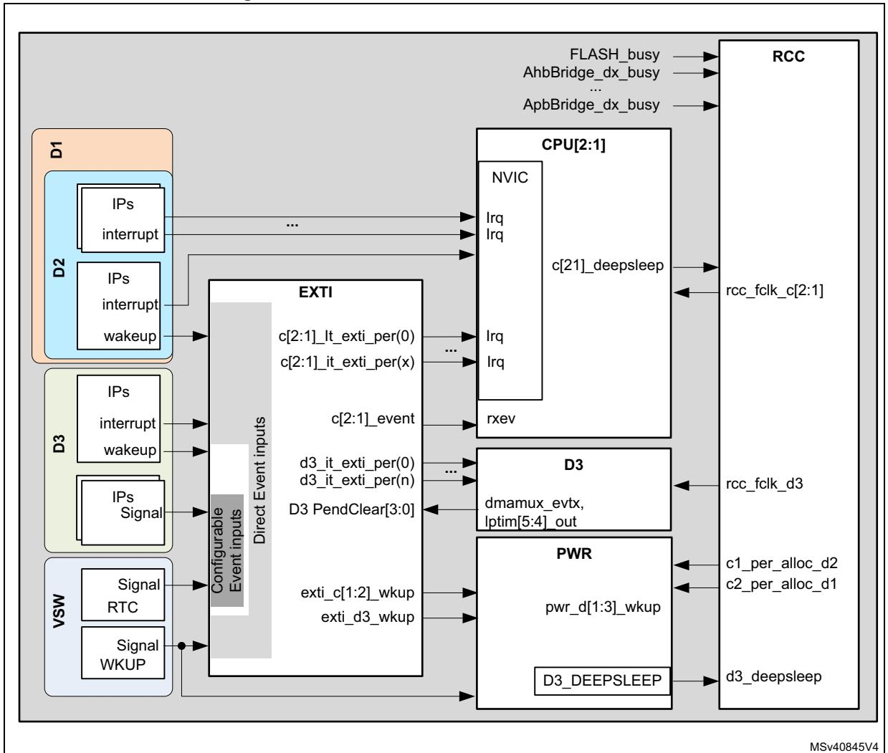
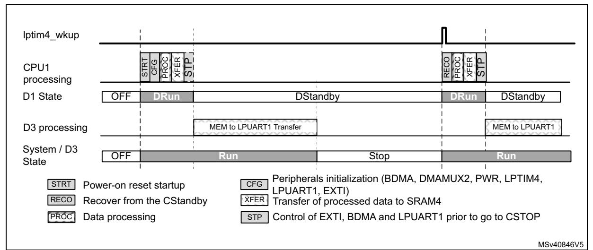
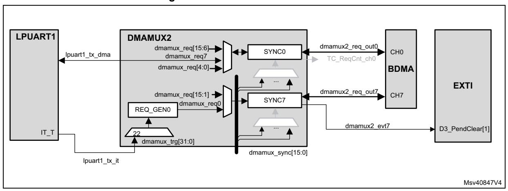
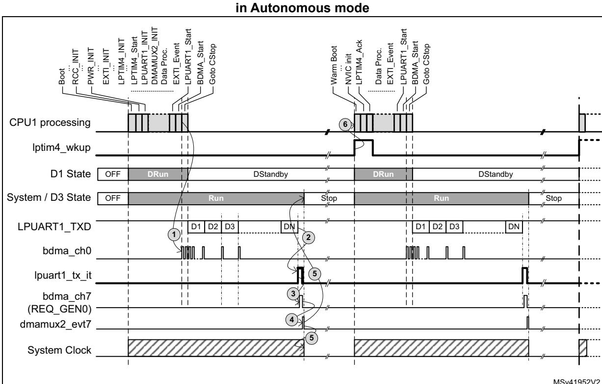

# **8 Low-power D3 domain application example**

This section describes, through an example, how to use the D3 domain to implement lowpower applications.

# **8.1 Introduction**

The first part of the description explains how the EXTI, RCC and PWR blocks interact with each other and with the other system blocks. A detailed explanation on how the DMAMUX2 can be used to free the CPUs is also provided.

The second part explains how to use the Autonomous mode to perform simple data transfers through an example of LPUART1 transmission.

Register programming is detailed only for the blocks related to the Autonomous mode.

# **8.2 EXTI, RCC and PWR interconnections**

*[Figure 44](#page-1-0)* shows the main EXTI, RCC and PWR interconnections.

**Figure 44. EXTI, RCC and PWR interconnections** 

## **8.2.1 Interrupts and wakeup**

Three kinds of signals are exchanged between the peripherals. They can be used to wake up the system from Stop mode:

#### • **Wakeup events** (or asynchronous interrupts)

Some peripherals can generate interrupt events, even if their bus interface clock is not present. These interrupt events are called wakeup events (or asynchronous interrupts). Example: i2c1\_wkup, usart1\_wkup and lptim1\_wkup.

#### • **Signals**

Some peripherals generate a pulse instead of an interrupt signal. These pulses are called signals.

Examples: lptim2\_out and lptim3\_out.

#### • **Interrupts**

Contrary to signals, the interrupts should be cleared by a CPU or any other bus master, either by clearing the corresponding event bit in the peripheral register or by updating the FIFO interrupt level.

All the interrupts associated to system peripherals are directly connected to the NVIC of both CPUs, except for the peripherals which are able to wake up the system from Stop mode or a CPU from CStop. In this latter case, the interrupts, signals or wakeup events are connected to the NVIC via the EXTI.

Example: spi1\_it, tim1\_brk\_it and tim1\_upd\_it.

The interrupt and wakeup sources that require to be cleared in the peripheral itself are connected to EXTI Direct Event inputs. The EXTI does not manage any CPU status pending bit.

The peripherals signals are connected to EXTI Configurable Event inputs. These EXTI inputs provide a CPU status pending bit which needs to be cleared by the application.

## **8.2.2 Block interactions**

## **Interaction between EXTI and PWR blocks**

The EXTI delivers wakeup requests signals (**exti\_c[2:1]\_wkup**, **exti\_d3\_wkup**) to the PWR controller. These signals are activated according to the state of the interrupts, signals or wakeup events connected to the EXTI. These wakeup requests are used by the PWR controller to supply the domain who needs to handle the activated wakeup event generated by the peripherals.

## **Interaction between PWR and RCC blocks**

The PWR block controls the VCORE supply according to the system operating mode, driven by CPU1 and CPU2 sub-system mode (CRun, CSleep or CStop). The PWR block also controls the power switches (ePODs) that delivers VCORE supply to D1 and D2 domains.

The RCC block controls the clock generation in accordance with the system operating mode. It is also responsible for reset generation.

RM0399 Rev 4 341/3556

To synchronize the system mode transitions, the RCC block is tightly coupled with the PWR controller:

- The RCC informs the PWR controller when peripherals located in the Dx domain are allocated by CPUy (**c1\_per\_alloc\_d2**, **c2\_per\_alloc\_d1**).
- The RCC also warns the PWR block when a domain clock is activated/deactivated. These signals are used in case of domain transition from DRun to DStop or DStandby. In this case, the PWR controller waits until the domain clock has been gated, before switching down this domain.
- Similarly, the PWR controller informs the RCC about the VCORE supply status of each domain (**pwr\_d[1:3]\_wkup**). This information is used by the RCC when a domain transition from DStop or DStandby to DRun occurs.

## **Interaction between EXTI and D3 domain**

All the wakeup event inputs received by the EXTI from the peripherals located in D3 domain are forwarded back to the D3 domain after system clock re-synchronization. These events are used by the D3 domain to perform autonomous operations without activating a CPU.

The EXTI **D3\_PenClear[3:0]** inputs received from the D3 domain are used to acknowledge the ongoing wakeup requests generated by peripherals located in the D3 domain. The **D3\_PenClear[3:0]** inputs allow switching the system D3 domain from Run to Stop mode.

## **8.2.3 Role of DMAMUX2 in D3 domain**

The DMAMUX2 implemented in the D3 domain allows chaining BDMA transfers. BDMA requests are synchronized thanks to trigger events (**dmamux2\_evtx**) which can be generated when the expected amount of data has been transferred.

These events can also trigger DMAMUX2 request generators (REQ\_GEN[3:0]), and thus chain several BDMA transfers. In fact REQ\_GEN[3:0] can be triggered indirectly by all the wakeup events generated by all D3 domain peripherals.

Like LPTIM5 and LPTIM4 outputs, dmamux2\_evt7 and dmamux2\_evt6 events are connected to the EXTI. They can be used to switch the D3 domain from DRun to DStop mode when the task requested by the wakeup event is complete.

# **8.3 Low-power application example based on LPUART1 transmission**

This section illustrates, through an example, the benefit of the D3 domain usage on power consumption. To help the user program the device, only the key register settings are given herein.

Refer to Sections *Reset and clock control (RCC)* and *Power control (PWR)* for additional details.

## **8.3.1 Memory retention**

The D3 domain features 64 Kbytes of SRAM (SRAM4), which can be used to retain data while the D1 and D2 domains enter DStandby mode.

This feature can be used in several use-cases:

- to retain the application code in order to recover properly from DStandby
- to retain the data from/to a sensor when the CPUs enter CStop with D1 or D2 domain in DStandby) between two consecutive operations.

*Note: SRAM4 remains available as long as the system is not in Standby mode.*

*If the system is in Standby mode, it is still possible to use the BKUP\_SRAM. However, its size is limited to 4 Kbytes.*

## **8.3.2 Memory-to-peripheral transfer using LPUART1 interface**

#### **Example description**

To simplify the use-case description, CPU2 is not used. However, this is not a hardware restriction.

*[Figure 45](#page-5-0)* shows the proposed implementation. At a regular time interval given by LPTIM4, CPU1 wakes up from CStop mode (which domain is in DStandby). When CPU1 is in Run mode, it prepares the data to be transmitted via LPUART1, transfers them to SRAM4, and goes back to CStop. The D3 domain is configured to perform data transfers via LPUART1 and go back to Stop mode when the transfer is complete.

The LPTIM4 interface is used to wake up the system from Standby at regular time intervals. CPU1 must then perform the following operations:

- 1. Recover the application from the system Standby mode (RECO).
- 2. Process the new data to be sent via LPUART1 (PROC).
- 3. Transfer the data into SRAM4 (XFER).
- 4. Configure the DMAMUX2, the BDMA, the LPUART1, and the RCC (CFG).
- 5. Configure the EXTI (CFG).
- 6. Configure the PWR block to allow the D1 domain to go to DStandby mode (STP).
- 7. Set CPU1 to Stop mode.

The D3 domain executes the following tasks in Autonomous mode:

- 1. Transfer the data from SRAM4 to LPUART1, using BDMA.
- 2. When the LPUART1 interface indicates that the last byte has been transferred, the D3 domain is switched to Stop mode.

RM0399 Rev 4 343/3556

Figure 45. Timing diagram of SRAM4-to-LPUART1 transfer with BDMA and D3 domain in Autonomous mode

Note:

In the above example described in this section, the D3 domain cannot be kept in Run mode when D1 and D2 domains are in DStop/DStandby by using the RUN\_D3 bit of PWR\_CPU1CR/PWR\_CPU2CR registers. RUN\_D3 will force the D3 domain to Run mode, but it will not be able to go back to Stop on its own.

If the application needs to toggle the D3 domain between Stop and Run modes, then the Run mode must be triggered by a wakeup event so that the D3 domain can clear this event is needed.

#### **RCC** programming

In this example, CPU1 sub-system also includes the peripherals of D3 domain that are used for the data transfer, that is BDMA, DMAMUX2, LPUART1 and LPTIM4. These peripherals must be programmed in Autonomous mode, in order to operate even when CPU1 is in CStop mode.

SRAM4 is implicitly allocated to both CPUs.

LPUART1 can use its own APB clock as kernel clock. Since the system will not enter Stop mode before LPUART1 has completed data transfer, PLLx can be used to provide clocks to the peripherals.

#### **PWR** programming

In this example, the PWR block must be programmed in order to:

- prevent system D3 domain to enter Standby mode when the data transfer is complete,
- allow the D1 domain to enter DStandby,
- define the working voltage according to system modes.

Note:

D3 domain could enter Standby as well, but in this case the LPTIM4 could not be used to wake up the system and the AWU should be used instead. In addition, everything must be reprogrammed when the system wakes up.

#### **EXTI programming**

The EXTI block must be configured to provide the following services:

- Keep D3 domain running when D1 domain is in DStandby. This will be done by a software event.
- Set the device to Stop mode when the data transfer via LPUART1 is complete.
- Wake up the product from Stop when LPTIM4 time interval has elapsed.

The EXTI block is configured once before performing the first data transfer. For incoming data transfers, the programmed configuration remains unchanged; only some events need to be triggered or acknowledged.

*Note: CPU1 uses the event input number 0 to generate a software event. LPTIM4 wakeup signal is connected to event input number 52 (direct event input).* 

> *All other event inputs must be disabled: EXTI\_RTSRx\_TRy = '0' and EXTI\_FTSRx\_TRy = '0'.*

To generate a wakeup event for D3 domain, CPU1 must write SWIER0 bit of EXTI\_SWIER1 to '1'.

#### **BDMA and DMAMUX2 programming**

Two BDMA channels are required to execute data transfers via LPUART1.

- A BDMA channel, such as channel 0, is used to transfer data from SRAM4 to LPUART1, using the TXE flag.
- The second BDMA channel role is to switch the D3 domain to Stop mode. For that purpose, DMAMUX2 request generator channel 0 (REQ\_GEN0) and DMAMUX2 channel 7 synchronization block (SYNC7) are used in conjunction with BDMA channel 7.

BDMA channel 0 does not use DMAMUX2 trigger capabilities. Refer to *[Table 51](#page-7-0)* for initialization details.

BDMA channel 7 uses REQ\_GEN0 to generate BDMA requests. The generation of BDMA requests is triggered by the LPUART1 transmit interrupt (**lpuart1\_tx\_it**). The LPUART1 interface generates lpuart1\_tx\_it interrupt when the transmit complete event is detected. The BDMA then clears the pending interrupt by performing a write operation to the LPUART1.

The SYNC7 block is programmed in Free-running mode. It generates a pulse on its **dmamux2\_evt7** output when the BDMA request generated by the REQ\_GEN0 is complete. **dmamux2\_evt7** signal is used by the EXTI to switch back the D3 domain to Stop mode.

*[Figure 46](#page-7-1)* shows the active signal paths via DMAMUX2. The grayed blocks represent the unused paths.

RM0399 Rev 4 345/3556

**Figure 46. BDMA and DMAMUX2 interconnection** 

*[Table 51](#page-7-0)* explain how to program BDMA and DMAMUX2 key functions. The way errors are handled is not described.

**Table 51. BDMA and DMAMUX2 initialization sequence (DMAMUX2\_INIT)** 

| Peripherals         | Register content                                                                                                                 | Related actions                                                                                                                                                        |
|---------------------|----------------------------------------------------------------------------------------------------------------------------------|------------------------------------------------------------------------------------------------------------------------------------------------------------------------|
| DMAMUX2 SYNC0    | DMAREQ_ID of DMAMUX2_C0CR = '10' SE of DMAMUX2_C0CR = '0' EGE of DMAMUX2_C0CR = '0' NBREQ of DMAMUX2_C0CR = '0'         | Selects LPUART_TX BDMA request. Disables block synchronization. No event generation. Generates an event every BDMA transfer (Free-running mode).           |
| DMAMUX2 SYNC7    | DMAREQ_ID of DMAMUX2_C7CR = '0' SE of DMAMUX2_C7CR = '0' EGE of DMAMUX2_C7CR = '1' NBREQ of DMAMUX2_C7CR = '0'          | Selects of REQ_GEN0 as BDMA request. Disables block synchronization. Enables event generation. Generates an event every BDMA transfer (Free-running mode). |
| DMAMUX2 REQ_GEN0 | SIG_ID of DMAMUX2_RG0CR = '0d24' GPOL of DMAMUX2_RG0CR = '0b01' GNBREQ of DMAMUX2_RG0CR = '0' GE of DMAMUX2_RG0CR = '1' | Selects LPUART TX interrupt as trigger. Trigger on rising edge of the event. Generates only one BDMA request. Enables generator.                              |

**Table 51. BDMA and DMAMUX2 initialization sequence (DMAMUX2\_INIT) (continued)**

| Peripherals   | Register content                  | Related actions                                                                                               |
|---------------|-----------------------------------|---------------------------------------------------------------------------------------------------------------|
| BDMA - CH0 | NDT bits of BDMA_CNDTR0 = DatNber | Number of data to transfer.                                                                                   |
|               | PA of BDMA_CPAR0 = &LPUART1_TDR   | Address of LPUART1_TDR.                                                                                       |
|               | MA of BDMA_CMAR0 = &DatBuff       | Address of memory buffer of SRAM4.                                                                            |
|               | DIR of BDMA_CCR0 = '1'            | Read from memory.                                                                                             |
|               | CIRC of BDMA_CCR0 = '0'           | Circular mode disabled.                                                                                       |
|               | PINC of BDMA_CCR0 = '0'           | Peripheral increment disabled.                                                                                |
|               | MINC of BDMA_CCR0 = '1'           | Memory increment enabled.                                                                                     |
|               | PSIZE of BDMA_CCR0 = '0'          | Peripheral size = 8 bits.                                                                                     |
|               | MSIZE of BDMA_CCR0 = '1'          | Memory size = 8 bits.                                                                                         |
|               | MEM2MEM of BDMA_CCR0 = '0'        | Memory to memory disabled.                                                                                    |
| BDMA - CH7 | NDT bits of BDMA_CNDTR7 = '1'     | Only one data transferred.                                                                                    |
|               | PA of BDMA_CPAR7 = &LPUART1_ICR   | Address of LPUART1_ICR (Interrupt Flag Clear Reg.).                                                           |
|               | MA of BDMA_CMAR7 = &DatClrTC      | Address of a variable located into SRAM4. This variable must contain 0x0040 in order to clear the TC flag. |
|               | DIR of BDMA_CCR7 = '1'            | Read from memory.                                                                                             |
|               | CIRC of BDMA_CCR7 = '0'           | Circular mode disabled.                                                                                       |
|               | PINC of BDMA_CCR7 = '0'           | Peripheral increment disabled.                                                                                |
|               | MINC of BDMA_CCR7 = '1'           | Memory increment disabled.                                                                                    |
|               | PSIZE of BDMA_CCR7 = 2            | Peripheral size = 32 bits.                                                                                    |
|               | MSIZE of BDMA_CCR7 = 2            | Memory size = 32 bits.                                                                                        |
|               | MEM2MEM of BDMA_CCR7 = '0'        | Memory to memory disabled.                                                                                    |

## **LPTIM4 programming**

When LPTIM4 wakeup event occurs, CPU1 reboots and D3 domain mode is also set to Run mode.

An interrupt issued by LPTIM4 is pending on CPU1 NVIC. LPTIM4 interrupt handler must acknowledge this LPTIM4 interrupt by writing ARRMCF bit in LPTIM4\_ICR register to '1' (LPTIM4\_Ack).

#### **LPUART programming**

In the use-case described herein, the capability of the LPUART1 to request the kernel clock according to some events is not used.

LPUART1 is programmed so that is generates a BDMA request when its TX-FIFO is not full.

LPUART1 also generates an interrupt when the TX-FIFO and its transmit shift register are empty. This interrupt is used to switch the D3 domain to Stop mode.

*[Table 52](#page-9-0)* gives the key settings concerning the handling of Stop mode for LPUART1.

| Register content            | Related actions                                                                                    |
|-----------------------------|----------------------------------------------------------------------------------------------------|
| FIFOEN of LPUART1_CR1 = '1' | Enables FIFO. BDMA will then use TXFNF (TXFIFO Not Full) flag for generating the BDMA requests. |
| TCIE of LPUART1_CR1 = '0'   | Disables interrupt when the transmit buffer is empty.                                              |
| UE of LPUART1_CR1 = '1'     | Enables BDMA.                                                                                      |
| TE of LPUART1_CR1 = '1'     | Enables the LPUART1.                                                                               |
| TXE of LPUART1_CR1 = '1'    | Enables transmission.                                                                              |
| DMAT of LPUART1_CR3 = '1'   | Enables the BDMA mode for transmission.                                                            |

Respect the sequence described in *[Table 53](#page-9-1)* to enable LPUART1.

**Table 53. LPUART1 start programming (LPUART1\_Start)**

| Register content          | Related actions                                                                                                |
|---------------------------|----------------------------------------------------------------------------------------------------------------|
| TCCF of LPUART1_ICR = '1' | Clears the TC flag, to avoid immediate interrupt generation, which would clear the D3_PendClear[1] in EXTI. |
| TCIE of LPUART1_CR1 = '1' | Enables interrupt when the transmit buffer is empty.                                                           |

## **8.3.3 Overall description of the low-power application example based on LPUART1 transmission**

After a Power-on reset, CPU1 perform the following operations:

- 1. Boot sequence (not described here).
- 2. Full initialization of RCC, PWR, EXTI, LPUART1, GPIOs, LPTIM4, DMAMUX2, BDMA and NVIC.
  - Only the relevant steps of RCC, EXTI, PWR, LPUART1, BDMA and DMAMUX2 initialization related to the Autonomous mode are described herein. Refer to the previous sections for additional details.
- 3. CPU1 processes the data to be transferred and copies them to SRAM4.
- 4. CPU1 generates a wakeup event (EXTI\_Event) to maintain D3 in Run mode when D1 enters DStandby.
- 5. CPU1 enables the BDMA to start LPUART transmission and goes to Stop mode. As it is allowed to do so, D1 domain enters DStandby while D3 remains in Run mode. The data stored in SRAM4 are retained while the D1 domain is in DStandby mode.
- 6. As soon as the BDMA is enabled, it serves the request from LPUART1 in order to fill its TX-FIFO. In parallel, serial data transmission can start.
- 7. When the expected amount of data has been transmitted (NDT bits of BDMA\_CNDTR0 set to 0), the BDMA no longer provides data to the LPUART1. The LPUART1 generates an interrupt when the TX-FIFO and the transmit buffer are empty.
- 8. This interrupt triggers DMAMUX2 REQ\_GEN0, thus activating a data transfer via BDMA channel 7 (BDMA\_Ch7). This transfer clears LPUART1 TC flag, and the **lpuart1\_tx\_it** is reset to '0'.
- 9. The end of this transfer triggers a dmamux2\_evt7 signal which is used to clear the wakeup request generated by CPU1.
- 10. As a consequence, the D3 domain (i.e. the system) enters Stop mode and the system clock is gated. LPTIM4 still operates since it uses **ck\_lsi** clock.

- 11. LPTIM4 **Iptim4\_wkup** interrupt wakes up the system. The device exits from Stop mode with the HSI clock. CPU1 must restore the proper clock configuration during the warm re-boot sequence and perform the following tasks:
  - a) Acknowledge LPTIM4 wakeup interrupt,
  - b) Process the next data block and transfers them to SRAM4,
  - c) Generate again a wakeup event for D3 domain,
  - d) Start the BDMA.
  - e) Go back to CStop mode.

Note: CPU1 does not need to initialize BDMA, DMAMUX2 and LPUART1 again.

Figure 47. Timing diagram of LPUART1 transmission with D3 domain in Autonomous mode

## 8.3.4 Alternate implementations

More power efficient implementations are also possible. As an example the system clock can be stopped once the data have been transferred to LPUART1 TX-FIFO, instead of remaining activated during the whole transmission as in the example presented above. In this case, the LPUART1 must use ck\_hsi or ck\_csi as kernel clock when the system switches from Run to Stop mode. LPUART1 must be programmed to wake up D3 domain when its TX-FIFO in almost empty. This asynchronous interrupt can be used as trigger by the REQ\_GENx of the DMAMUX2, which will perform a given number (e.g. 14) of data transfers to LPUART1\_TDR and then switch back the D3 domain to Stop mode. This implementation is possible because the LPUART1 can request the kernel clock as long as the TX-FIFO and transmit buffer are not empty.

RM0399 Rev 4 349/3556

# **8.4 Other low-power applications**

Other peripherals located in D3 domain, such as I2C4, SPI6, SAI4 or ADC3, can be used to implement low-power applications.