# **9 Reset and Clock Control (RCC)**

The RCC block manages the clock and reset generation for the whole microcontroller, which embeds two CPUs: an Arm® Cortex®-M7 and an Arm® Cortex®-M4, called CPU1 and CPU2, respectively.

The RCC block is located in the D3 domain (refer to *Section 7: Power control (PWR)* for a detailed description).

The operating modes this section refers to are defined in *Section 7.6.1: Operating modes* of the PWR block.

# **9.1 RCC main features**

# **Reset block**

- Generation of local and system reset
- Bidirectional pin reset allowing to reset the microcontroller or external devices
- Hold Boot function
- WWDG reset supported

# **Clock generation block**

- Generation and dispatching of clocks for the complete device
- 3 separate PLLs using integer or fractional ratios
- Possibility to change the PLL fractional ratios on-the-fly
- Smart clock gating to reduce power dissipation
- 2 external oscillators:
  - High-speed external oscillator (HSE) supporting a wide range of crystals from 4 to 48 MHz frequency
  - Low-speed external oscillator (LSE) for the 32 kHz crystals
- 4 internal oscillators
  - High-speed internal oscillator (HSI)
  - 48 MHz RC oscillator (HSI48)
  - Low-power Internal oscillator (CSI)
  - Low-speed internal oscillator (LSI)
- Buffered clock outputs for external devices
- Generation of two types of interrupts lines:
  - Dedicated interrupt lines for clock security management
  - One general interrupt line for other events
- Clock generation handling in Stop and Standby mode
- D3 domain Autonomous mode

# 9.2 RCC block diagram

Figure 48 shows the RCC block diagram.

<span id="page-1-0"></span>RCC (D3) to all circuit nreset (system reset) NRST blocks rcc\_sft1\_rst pwr\_bor\_rst rcc\_sft2\_rst -System pwr por rst Reset iwdg1\_out\_rst pwr dx wkup IWDGx Control PWR iwda2 out rst wwdg1\_out\_rst rcc nwd dx rea **WWDGx** wwdg2\_out\_rst pwr\_hold[2:1]\_ c1\_sleep Core CPU1 Reset Clock Manager c1\_deepsleep (CMU) Control sleep CPU2 c2\_deepsleep per1\_ker\_ckred VSW PER1 OSC32 IN LSE /CSS To RTC/ OSC32 OUT PERx To cores and busses TIM1,8, VDD System 15, 16, 17 rcc bus ck Ćlock rcc\_c[2:1]\_ck OSC\_IN HSE / rcc\_fclk\_c[2:1] (SCGU) OSC\_OUT [ CRS HSI48 To peripherals LSI rcc\_perx\_ker\_ck rcc\_perx\_bus\_ck HSI Kernel clock AHB Bus CSI ETH MII TX CLK Selection ETH\_MII\_RX\_CLK
ETH\_RMII\_REF\_CLK
USB\_PHY1 (PKSU) L IS CKIN Register Interface and Control rcc\_hsecss\_i EXTI MCO1 rcc\_lsecss\_i MCO2 MSv37848V6

Figure 48. RCC Block diagram

# 9.3 RCC pins and internal signals

Table 54 lists the RCC inputs and output signals connected to package pins or balls.

Table 54. RCC input/output signals connected to package pins or balls

<span id="page-1-1"></span>

| Signal name | Signal type          | Description                                                    |
|-------------|----------------------|----------------------------------------------------------------|
| NRST        | Digital input/output | System reset, can be used to provide reset to external devices |
| OSC32_IN    | Digital input        | 32 kHz oscillator input                                        |
| OSC32_OUT   | Digital output       | 32 kHz oscillator output                                       |
| OSC_IN      | Digital input        | System oscillator input                                        |

**Table 54. RCC input/output signals connected to package pins or balls (continued)**

| Signal name      | Signal type       | Description                                                                          |
|------------------|-------------------|--------------------------------------------------------------------------------------|
| OSC_OUT          | Digital<br>output | System oscillator output                                                             |
| MCO1             | Digital<br>output | Output clock 1 for external devices                                                  |
| MCO2             | Digital<br>output | Output clock 2 for external devices                                                  |
| I2S_CKIN         | Digital input     | External kernel clock input for digital audio interfaces: SPI/I2S, SAI, and<br>DFSDM |
| ETH_MII_TX_CLK   | Digital input     | External TX clock provided by the Ethernet MII interface                             |
| ETH_MII_RX_CLK   | Digital input     | External RX clock provided by the Ethernet MII interface                             |
| ETH_RMII_REF_CLK | Digital input     | External reference clock provided by the Ethernet RMII interface                     |
| USB_PHY1         | Digital input     | USB clock input provided by the external USB PHY (OTG_HS_ULPI_CK)                    |

The RCC exchanges a lot of internal signals with all components of the product, for that reason, the *[Table 54](#page-1-1)* only shows the most significant internal signals.

**Table 55. RCC iInternal input/output signals** 

| Signal name        | Signal type             | Description                                                                                                                                 |
|--------------------|-------------------------|---------------------------------------------------------------------------------------------------------------------------------------------|
| rcc_it             | Digital output          | General interrupt request line                                                                                                              |
| rcc_hsecss_it      | Digital output          | HSE clock security failure interrupt                                                                                                        |
| rcc_lsecss_it      | Digital output          | LSE clock security failure interrupt                                                                                                        |
| rcc_ckfail_evt     | Digital output          | Event indicating that a HSE clock security failure is detected. This signal<br>is connected to TIMERS                                       |
| nreset             | Digital<br>input/output | System reset                                                                                                                                |
| iwdg[2:1]_out_rst  | Digital input           | Reset line driven by the IWDG1 and IWDG2, indicating that a timeout<br>occurred.                                                            |
| wwdg[2:1]_out_rst  | Digital input           | Reset line driven by the WWDG1 and WWDG2, indicating that a timeout<br>occurred.                                                            |
| pwr_bor_rst        | Digital input           | Brownout reset generated by the PWR block                                                                                                   |
| pwr_por_rst        | Digital input           | Power-on reset generated by the PWR block                                                                                                   |
| pwr_vsw_rst        | Digital input           | Power-on reset of the VSW domain generated by the PWR block                                                                                 |
| rcc_perx_rst       | Digital output          | Reset generated by the RCC for the peripherals.                                                                                             |
| pwr_d[3:1]_wkup    | Digital input           | Wake-up domain request generated by the PWR. Generally used to<br>restore the clocks a domain when this domain exits from DStop             |
| rcc_pwd_d[3:1]_req | Digital output          | Low-Power request generated by the RCC. Generally used to ask to the<br>PWR to set a domain into low-power mode, when a domain is in DStop. |
| pwr_hold[2:1]_ctrl | Digital input           | Signals generated by the PWR, in order to set one processor into CStop<br>when exiting from system Stop mode.                               |


| Signal name      | Signal type    | Description                                                                                         |  |  |  |  |  |
|------------------|----------------|-----------------------------------------------------------------------------------------------------|--|--|--|--|--|
| c[2:1]_sleep     | Digital input  | Signal generated by CPU1 or CPU2, indicating if the corresponding CPU                               |  |  |  |  |  |
| c[2:1]_deepsleep | Digital input  | is in CRun, CSleep or CStop.                                                                        |  |  |  |  |  |
| perx_ker_ckreq   | Digital input  | Signal generated by some peripherals in order to request the activation of<br>their kernel clock.   |  |  |  |  |  |
| rcc_perx_ker_ck  | Digital output | Kernel clock signals generated by the RCC, for some peripherals.                                    |  |  |  |  |  |
| rcc_perx_bus_ck  | Digital output | Bus interface clock signals generated by the RCC for peripherals.                                   |  |  |  |  |  |
| rcc_bus_ck       | Digital output | Clocks for APB (rcc_apb_ck), AHB (rcc_ahb_ck) and AXI (rcc_axi_ck)<br>bridges generated by the RCC. |  |  |  |  |  |
| rcc_c[2:1]_ck    | Digital output | CPU1 and CPU2 clocks generated by the RCC.                                                          |  |  |  |  |  |
| rcc_fclk_c[2:1]  | Digital output |                                                                                                     |  |  |  |  |  |

**Table 55. RCC iInternal input/output signals (continued) (continued)**

# **9.4 RCC reset block functional description**

Several sources can generate a reset:

- An external device via NRST pin
- A failure on the supply voltage applied to VDD
- A watchdog timeout
- A software command

The reset scope depends on the source that generates the reset. Three reset categories exist:

- Power-on/off reset
- System reset
- Local resets

# **9.4.1 Power-on/off reset**

The power-on/off reset (**pwr\_por\_rst**) is generated by the power controller block (PWR). It is activated when the input voltage (VDD) is below a threshold level. This is the most complete reset since it resets the whole circuit, except for the backup domain. The poweron/off reset function can be disabled through PDR\_ON pin (see *Section 7.5: Power supply supervision*).

Refer to *[Table 56: Reset distribution summary](#page-5-0)* for details.


# <span id="page-4-0"></span>**9.4.2 System reset**

A system reset (**nreset)** resets all registers to their reset values unless otherwise specified in the register description.

A system reset can be generated from one of the following sources:

- A reset from NRST pin (external reset)
- A reset from the power-on/off reset block (**pwr\_por\_rst**)
- A reset from the brownout reset block (**pwr\_bor\_rst**) Refer to *Section 7.5.2: Brownout reset (BOR)* for a detailed description of the BOR function.
- A reset from the independent watchdogs (**iwdg[2:1]\_out\_rst**)
- A software reset from the Cortex®-M4 core It is generated via the SYSRESETREQ signal issued by the Cortex®-M4 core. This signal is also named SFT2RESET in this document.
- A software reset from the Cortex®-M7 core It is generated via the SYSRESETREQ signal issued by the Cortex®-M7 core. This signal is also named SFT1RESET in this document.
- A reset from the window watchdogs (**wwdg[2:1]\_out\_rst**)
- A reset from the low-power mode security reset, depending on option byte configuration (**lpwr[2:1]\_rst**)

*Note: The SYSRESETREQ bit in Cortex*®*-M7 Application Interrupt and Reset Control Register must be set to force a software reset on the device. Refer to the Cortex*®*-M7 with FPU technical reference manual for more details (see* http://infocenter.arm.com*).*

> As shown in *[Figure 49](#page-5-1)*, some internal sources (such as **pwr\_por\_rst**, **pwr\_bor\_rst**, **iwdg[2:1]\_out\_rst**) perform a system reset of the circuit, which is also propagated to the NRST pin to reset the connected external devices. The pulse generator guarantees a minimum reset pulse duration of 20 μs for each internal reset source. In case of an external reset, the reset pulse is generated while the NRST pin is asserted Low.

*Note: It is not recommended to let the NRST pin unconnected. When it is not used, connect this pin to ground via a* 10 to 100 nF*capacitor (CR in [Figure](#page-5-1) 49*).


RM0399 Rev 4 355/3556

<span id="page-5-1"></span>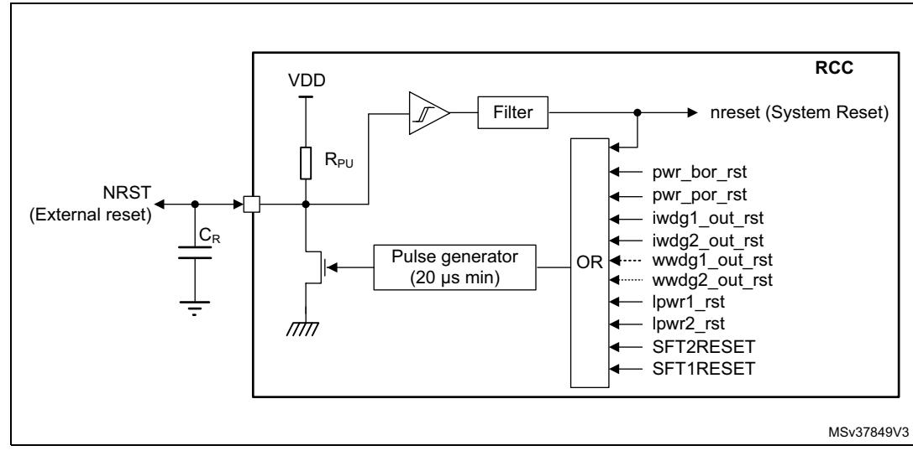

**Figure 49. System reset circuit**

# **9.4.3 Local resets**

# **Domain reset**

Some resets also dependent on the domain status. For example, when D1 domain exits from DStandby, it is reset (**d1\_rst**). The same mechanism applies to D2.

When the system exits from Standby mode, an **stby\_rst** reset is applied. The **stby\_rst**  signal generates a reset of the complete VCORE domain as long the VCORE voltage provided by the internal regulator is not valid.

*[Table 56](#page-5-0)* gives a detailed overview of reset sources and scopes.

<span id="page-5-0"></span>**Reset source Reset name D1 CPU D1 Interconnect D1 Peripherals D1 Debug D1 WWDG1 D2 CPU D2 Interconnect D2 Peripherals D2 Debug D2 WWDG2 D3 Peripherals IWDG1 IWDG2 FLASH RTC domain Backup RAM System Supply NRST pin Comments** Pin NRST x x x - x x x x - x x x x ----x – Resets D1 and D2 domains, and all their peripherals – Resets D3 domain peripherals – Resets VDD domain: IWDG[2:1], LDO... – Debug features, Flash memory, RTC and backup RAM are not reset

**Table 56. Reset distribution summary** 


**Table 56. Reset distribution summary (continued)**

| Reset<br>source | Reset name             | D1 CPU                                                                  | D1 Interconnect | D1 Peripherals | D1 Debug | WDG1<br>W<br>D1 | D2 CPU                                                                                                                                                                                                                          | D2 Interconnect | D2 Peripherals | D2 Debug | WDG2<br>W<br>D2 | D3 Peripherals | WDG1<br>I | WDG2<br>I | FLASH | RTC domain | Backup RAM | System Supply | NRST pin | Comments                                                                                                                                                                                               |  |  |  |  |  |  |
|-----------------|------------------------|-------------------------------------------------------------------------|-----------------|----------------|----------|-----------------|---------------------------------------------------------------------------------------------------------------------------------------------------------------------------------------------------------------------------------|-----------------|----------------|----------|-----------------|----------------|-----------|-----------|-------|------------|------------|---------------|----------|--------------------------------------------------------------------------------------------------------------------------------------------------------------------------------------------------------|--|--|--|--|--|--|
|                 | pwr_bor_rst            | x                                                                       | x               | x              | -        | x               | x                                                                                                                                                                                                                               | x               | x              | -        | x               | x              | x         | x         | -     | -          | -          | -             | x        | – Same as pin reset. The pin is                                                                                                                                                                        |  |  |  |  |  |  |
|                 |                        |                                                                         |                 |                |          |                 |                                                                                                                                                                                                                                 |                 |                |          |                 |                |           |           |       |            |            |               |          | asserted as well.                                                                                                                                                                                      |  |  |  |  |  |  |
| PWR             | pwr_por_rst            | x                                                                       | x               | x              | x        | x               | x                                                                                                                                                                                                                               | x               | x              | x        | x               | x              | x         | x         | x     | -          | -          | x             | x        | – Same as pwr_bor_rst reset, plus:<br>Reset of the Flash memory digital<br>block (including the option byte<br>loading).<br>Reset of the debug block                                                   |  |  |  |  |  |  |
|                 | lpwr2_rst<br>lpwr1_rst | x                                                                       | x               | x              | -        | x               | x                                                                                                                                                                                                                               | x               | x              | -        | x               | x              | x         | x         | -     | -          | -          | -             | x        | – The low-power mode security reset<br>has the same scope than<br>pwr_por_rst. Refer to Section 9.4.5:<br>Low-power mode security reset<br>(lpwr[2:1]_rst) for additional<br>information.              |  |  |  |  |  |  |
|                 | BDRST                  | -                                                                       | -               | -              | -        | -               | -                                                                                                                                                                                                                               | -               | -              | -        | -               | -              | -         | -         | -     | x          | -          | -             | -        | – The backup domain reset can be<br>triggered by software. Refer to<br>Section 9.4.6: Backup domain reset<br>for additional information                                                                |  |  |  |  |  |  |
|                 | d1_rst                 | x                                                                       | x               | x              | x        | x               | -                                                                                                                                                                                                                               | -               | -              | -        | -               | -              | -         | -         | -     | -          | -          | -             | -        | – Resets D1 domain, and all its<br>peripherals, when the domain exits<br>DStandby mode.                                                                                                                |  |  |  |  |  |  |
| RCC             | d2_rst                 | -                                                                       | -               | -              | -        | -               | x                                                                                                                                                                                                                               | x               | x              | x        | x               | -              | -         | -         | -     | -          | -          | -             | -        | – Resets D2 domain, and all its<br>peripherals, when the domain exits<br>DStandby mode.                                                                                                                |  |  |  |  |  |  |
|                 | stby_rst               | x<br>x<br>x<br>x<br>x<br>x<br>x<br>x<br>x<br>x<br>x<br>-<br>-<br>-<br>- |                 | -              | -        | -               | – When the device exits Standby<br>mode, a reset of the complete<br>VCORE domain is performed as long<br>the VCORE voltage is not valid. The<br>VCORE is supplied by the internal<br>regulator.<br>NRST signal is not asserted. |                 |                |          |                 |                |           |           |       |            |            |               |          |                                                                                                                                                                                                        |  |  |  |  |  |  |
| CPU1            | SFT1RESET              | x                                                                       | x               | x              | -        | x               | x                                                                                                                                                                                                                               | x               | x              | -        | x               | x              | x         | x         | -     | -          | -          | -             | x        | – This reset is generated by software<br>when writing SYSRESETREQ bit<br>located into AIRCR register of the<br>Cortex®-M7 core.                                                                        |  |  |  |  |  |  |
| CPU2            | SFT2RESET              | x                                                                       | x               | x              | -        | x               | x                                                                                                                                                                                                                               | x               | x              | -        | x               | x              | x         | x         | -     | -          | -          | -             | x        | – Same scope as pwr_bor_rst reset.<br>– This reset is generated by software<br>when writing SYSRESETREQ bit<br>located into AIRCR register of the<br>Cortex®-M4.<br>– Same scope as pwr_bor_rst reset. |  |  |  |  |  |  |


Backup domain pwr\_vsw\_rst - - - - - - - - - - - - - - x - - - – This reset is generated by the backup domain when the VSW supply voltage is outside the operating range. IWDG1 IWDG2 iwdg1\_out\_rst iwdg2\_out\_rst xxx- xxxx- xxxx - - - - x – Same as **pwr\_bor\_rst** reset. WWDG1 wwdg1\_out\_rst xxx- xxxx- xxxx - - - - x – Same as **pwr\_bor\_rst** reset. WWDG2 wwdg2\_out\_rst xxx- xxxx- xxxx - - - - x – Same as **pwr\_bor\_rst** reset. **Reset source Reset name D1 CPU D1 Interconnect D1 Peripherals D1 Debug D1 WWDG1 D2 CPU D2 Interconnect D2 Peripherals D2 Debug D2 WWDG2 D3 Peripherals IWDG1 IWDG2 FLASH RTC domain Backup RAM System Supply NRST pin Comments**

**Table 56. Reset distribution summary (continued)**

# <span id="page-7-0"></span>**9.4.4 Reset source identification**

Each CPU can identify the reset source by checking the reset flags in the RCC\_C1\_RSR and RCC\_C2\_RSR registers:

- CPU1 can check the reset source by reading either RCC\_RSR or RCC\_C1\_RSR registers.
- CPU2 can check the reset the source by reading either RCC\_RSR or RCC\_C2\_RSR registers.

Each CPU can reset the flags of its own register by setting RMVF bit without interfering with the other CPU (refer to *[RCC reset status register \(RCC\\_RSR\)](#page-130-0)* for a detailed description).

*[Table 57](#page-8-1)* shows how the status bits of RCC\_RSR register behaves, according to the situation that generated the reset. For example when an IWDG1 timeout occurs (line #10), if the CPU is reading the RCC\_RSR register during the boot phase, both PINRSTF and IWDG1RSTF bits are set, indicating that the IWDG1 also generated a pin reset.


<span id="page-8-1"></span>

| #  | Situations Generating a Reset                                                | WR2RSTF<br>LP | WR1RSTF<br>LP | WDG2RSTF<br>W | WDG1RSTF<br>W | WDG2RSTF<br>I | WDG1RSTF<br>I | SFT2RSTF | SFT1RSTF | PORRSTF | PINRSTF | BORRSTF | D2RSTF | D1RSTF |
|----|------------------------------------------------------------------------------|---------------|---------------|---------------|---------------|---------------|---------------|----------|----------|---------|---------|---------|--------|--------|
| 1  | Power-on reset (pwr_por_rst)                                                 | 0             | 0             | 0             | 0             | 0             | 0             | 0        | 0        | 1       | 1       | 1       | 1      | 1      |
| 2  | Pin reset (NRST)                                                             | 0             | 0             | 0             | 0             | 0             | 0             | 0        | 0        | 0       | 1       | 0       | 0      | 0      |
| 3  | Brownout reset (pwr_bor_rst)                                                 | 0             | 0             | 0             | 0             | 0             | 0             | 0        | 0        | 0       | 1       | 1       | 0      | 0      |
| 4  | System reset generated by CPU1<br>(STF1RESET)                                | 0             | 0             | 0             | 0             | 0             | 0             | 0        | 1        | 0       | 1       | 0       | 0      | 0      |
| 5  | System reset generated by CPU2<br>(STF2RESET)                                | 0             | 0             | 0             | 0             | 0             | 0             | 1        | 0        | 0       | 1       | 0       | 0      | 0      |
| 6  | WWDG1 reset (wwdg1_out_rst)                                                  | 0             | 0             | 0             | 1             | 0             | 0             | 0        | 0        | 0       | 1       | 0       | 0      | 0      |
| 7  | WWDG2 reset (wwdg2_out_rst)                                                  | 0             | 0             | 1             | 0             | 0             | 0             | 0        | 0        | 0       | 1       | 0       | 0      | 0      |
| 8  | IWDG1 reset (iwdg1_out_rst)                                                  | 0             | 0             | 0             | 0             | 0             | 1             | 0        | 0        | 0       | 1       | 0       | 0      | 0      |
| 9  | IWDG2 reset (iwdg2_out_rst)                                                  | 0             | 0             | 0             | 0             | 1             | 0             | 0        | 0        | 0       | 1       | 0       | 0      | 0      |
| 10 | D1 exits DStandby mode                                                       | 0             | 0             | 0             | 0             | 0             | 0             | 0        | 0        | 0       | 0       | 0       | 0      | 1      |
| 11 | D2 exits DStandby mode                                                       | 0             | 0             | 0             | 0             | 0             | 0             | 0        | 0        | 0       | 0       | 0       | 1      | 0      |
| 12 | D1 erroneously enters DStandby mode or<br>CPU1 erroneously enters CStop mode | 0             | 1             | 0             | 0             | 0             | 0             | 0        | 0        | 0       | 1       | 0       | 0      | 0      |
| 13 | D2 erroneously enters DStandby mode or<br>CPU2 erroneously enters CStop mode | 1             | 0             | 0             | 0             | 0             | 0             | 0        | 0        | 0       | 1       | 0       | 0      | 0      |

**Table 57. Reset source identification (RCC\_RSR)(1)**

# <span id="page-8-0"></span>**9.4.5 Low-power mode security reset (lpwr[2:1]\_rst)**

To prevent critical applications from mistakenly enter a low-power mode, two low-power mode security resets are available. When enabled through nRST\_STOP\_C[2:1] option bytes, a system reset is generated if the following conditions are met:

- CPU1 and/or CPU2 accidentally enters CStop mode This type of reset is enabled by resetting nRST\_STOP\_C[2:1] user option bytes. In this case, whenever a CPU1/2 CStop mode entry sequence is successfully executed, a system reset is generated.
- D1 domain and/or D2 accidentally enters DStandby mode This type of reset is enabled by resetting nRST\_STDBY\_D[2:1] user option bytes. In this case, whenever a domain D1 or D2 DStandby mode entry sequence is successfully executed, a system reset is generated.

LPWR[2:1]RSTF bits in *[RCC reset status register \(RCC\\_RSR\)](#page-130-0)* indicate that a low-power mode security reset occurred (see line #14 and #15 in *[Table 57](#page-8-1)*).


RM0399 Rev 4 359/3556

<sup>1.</sup> Grayed cells highlight the register bits that are set.

**Ipwr1\_rst** is activated when a low-power mode security reset due to D1 or CPU1 occurred, while **Ipwr2\_rst** is activated when a low-power mode security reset due to D2 or CPU2 occurred.

Refer to Section 4.4: FLASH option bytes for additional information.

# <span id="page-9-0"></span>9.4.6 Backup domain reset

A backup domain reset is generated when one of the following events occurs:

- A software reset, triggered by setting BDRST bit in the RCC Backup domain control register (RCC\_BDCR). All RTC registers and the RCC\_BDCR register are reset to their default values. The backup RAM is not affected.
- V<sub>SW</sub> voltage is outside the operating range. All RTC registers and the RCC\_BDCR register are reset to their default values. In this case the content of the backup RAM is no longer valid.

There are two ways to reset the backup RAM:

- through the Flash memory interface by requesting a protection level change from 1 to 0
- when a tamper event occurs.

Refer to Section 7.4.4: Backup domain section of PWR block for additional information.

# 9.4.7 Power-on and wakeup sequences

For detailed diagrams refer to Section 7.4.1: System supply startup in the PWR section.

The time interval between the event which exits the product from a low-power and the moment where the CPUs are able to execute code, depends on the system state and on its configuration. *Figure 50* shows the most usual examples.

### Power-on wakeup sequence

The power-on wakeup sequence shown in *Figure 50* gives the most significant phases of the power-on sequence. It is the longest sequence since the circuit was not powered. Note that this sequence remains unchanged, whatever  $V_{BAT}$  was present or not.

# **Boot from pin reset**

When a pin reset occurs, V<sub>DD</sub> is still present. As a results:

- The regulator settling time is faster since the reference voltage is already stable.
- The HSI restart delay may be needed if the HSI was not enabled when the NRST occurred, otherwise this restart delay phase is skipped.
- The Flash memory power recovery delay can also be skipped if the Flash memory was enabled when the NRST occurred.

Note:

The boot sequence is similar for pwr\_bor\_rst, lpwrx\_rst, STFxRESET, iwdgx\_out\_rst and wwdgx\_out\_rst .

# **Boot from system Standby**

When waking up from system Standby, the reference voltage is stable since  $V_{DD}$  has not been removed. As a result, the regulator settling time is fast. Since  $V_{CORE}$  was not present, the restart delay for the HSI, the Flash memory power recovery and the option byte reloading cannot be skipped.


# **Restart from system Stop**

When restarting from system Stop, VDD is still present. As a result, the sequence is mainly composed of two steps:

- 1. Regulator settling time to reach VOS3 (default voltage)
- 2. HSI/CSI restart delay. This step can be skipped if HSIKERON or CSIKERON bit, in *[RCC source control register \(RCC\\_CR\)](#page-64-0)* is set to '1'.

# **Boot from domain DStandby**

The boot sequence of a domain from domain DStandby is mainly composed of two steps:

- 1. The power switch settling time (the regulator is already activated).
- 2. The Flash memory power recovery, if the domain which exits from DStandby is D1, otherwise this step is skipped.

# **Restart from domain DStop**

The restart sequence of a domain from domain DStop is mainly composed of the handshake between the RCC, EXTI and PWR blocks.


RM0399 Rev 4 361/3556

<span id="page-11-0"></span>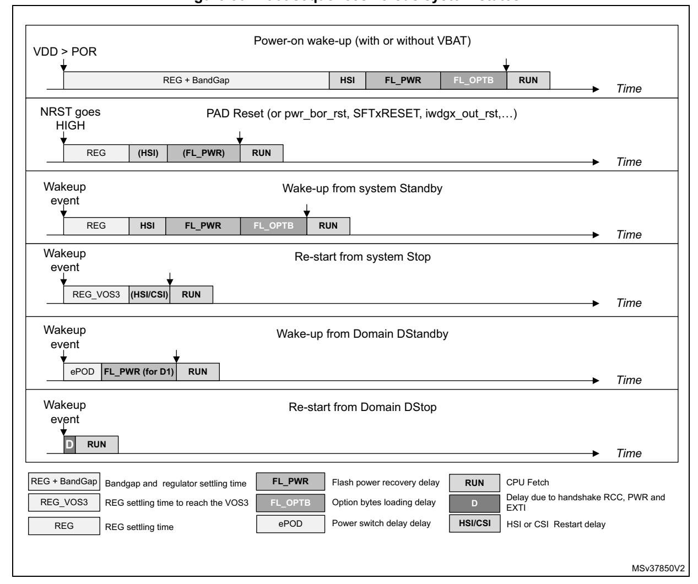

Figure 50. Boot sequences versus system states

# **Hold boot function**

It is possible to put one of the two CPUs on hold after a system reset or when the device exits from Standby. This function is controlled by two option bytes, BCM4 and BCM7, and two bits, BOOT\_C1 and BOOT\_C2, located in the RCC global control register (RCC\_GCR):

- When BCM4 or BCM7 option byte is set to '1', the corresponding CPU is allowed to boot after a system reset or when the device exits from Standby.
- When BCM4 or BCM7 option byte is set to '0', the corresponding CPU is not allowed to boot, and remains on hold as long as the corresponding BOOT\_Cx bit is set to '0'.
- CPUx will be allowed to boot when BOOT\_Cx is set to '1'. A protection mechanism insures that at least one of the 2 CPUs will boot (see *Table 58*).

The hold boot function is provided in order to support configurations where one CPU is master of the system and shall complete the initialization of the whole *device* (system clock, voltage scaling...) before activating the second CPU.

Note: After a system reset or system Standby, the BOOT\_C1 and BOOT\_C2 bits are set to '0'.


**Table 58. Boot enable Function (1)**

<span id="page-12-0"></span>

| BCM7 | BCM4 | BOOT_C1 | BOOT_C2 |   | CPU1<br>State | CPU2<br>State | Comments                                                                                                                  |
|------|------|---------|---------|---|---------------|---------------|---------------------------------------------------------------------------------------------------------------------------|
| 0    | 1    | 0       | X       | → | HOLD          | ENABLED       | After a system reset or System Standby,<br>CPU2 will boot and CPU1 will remain on<br>hold until CPU2 sets BOOT_C1 to '1'  |
|      |      | 1       | X       | → | ENABLED       | ENABLED       | When CPU2 writes BOOT_C1 to '1', CPU1<br>will boot as well                                                                |
| X    | 0    | X       | 0       | → | ENABLED       | HOLD          | After a system reset or System Standby,<br>CPU1 will boot, and CPU2 will remain on<br>hold until CPU1 sets BOOT_C2 to '1' |
|      |      | X       | 1       | → | ENABLED       | ENABLED       | When CPU1 writes BOOT_C2 to '1', CPU2<br>will boot as well                                                                |
| 1    | 1    | X       | X       | → | ENABLED       | ENABLED       | After a system reset or System Standby,<br>CPU1 and CPU2 will boot.                                                       |

<sup>1.</sup> Setting both BCM4 and BCM7 bits to '0' forces the boot from CPU1.


# **9.5 RCC clock block functional description**

The RCC provides a wide choice of clock generators:

- HSI (High-speed internal oscillator) clock: ~ 8, 16, 32 or 64 MHz
- HSE (High-speed external oscillator) clock: 4 to 48 MHz
- LSE (Low-speed external oscillator) clock: 32 kHz
- LSI (Low-speed internal oscillator) clock: ~ 32 kHz
- CSI (Low-power internal oscillator) clock: ~4 MHz
- HSI48 (High-speed 48 MHz internal oscillator) clock: ~48 MHz

It offers a high flexibility for the application to select the appropriate clock for CPUs and peripherals, in particular for peripherals that require a specific clock such as Ethernet, USB OTG-FS and HS, SPI/I2S, SAI and SDMMC.

To optimize the power consumption, each clock source can be switched ON or OFF independently.

The RCC provides up to 3 PLLs; each of them can be configured with integer or fractional ratios.

As shown in the *[Figure 51](#page-14-0)*, the RCC offers 2 clock outputs (MCO1 and MCO2), with a great flexibility on the clock selection and frequency adjustment.

The SCGU block (System Clock Generation Unit) contains several prescalers used to configure the CPU and bus matrix clock frequencies.

The PKSU block (Peripheral Kernel clock Selection Unit) provides several dynamic switches allowing a large choice of kernel clock distribution to peripherals.

The PKEU (Peripheral Kernel clock Enable Unit) and SCEU (System Clock Enable Unit) blocks perform the peripheral kernel clock gating, and the bus interface/cores/bus matrix clock gating, respectively.

<span id="page-14-0"></span>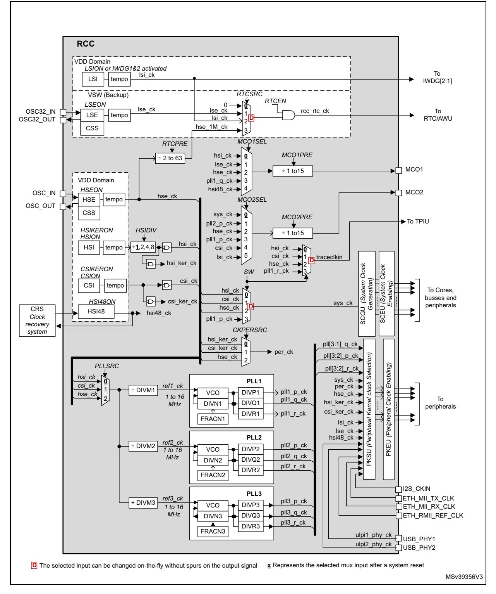

**Figure 51. Top-level clock tree** 


# <span id="page-15-2"></span>**9.5.1 Clock naming convention**

The RCC provides clocks to the complete circuit. To avoid misunderstanding, the following terms are used in this document:

• Peripheral clocks

The peripheral clocks are the clocks provided by the RCC to the peripherals. Two kinds of clock are available:

- The bus interface clocks
- The kernel clocks

A peripheral receives from the RCC a bus interface clock in order to access its registers, and thus control the peripheral operation. This clock is generally the AHB, APB or AXI clock depending on which bus the peripheral is connected to. Some peripherals only need a bus interface clock (e.g. RNG, TIMx).

Some peripherals also require a dedicated clock to handle the interface function. This clock is named "kernel clock". As an example, peripherals such as SAI have to generate specific and accurate master clock frequencies, which require dedicated kernel clock frequencies. Another advantage of decoupling the bus interface clock from the specific interface needs, is that the bus clock can be changed without reprogramming the peripheral.

• CPU clocks

The CPU clock is the clock provided to the CPUs. It is derived from the system clock (**sys\_ck**).

• Bus matrix clocks

The bus matrix clocks are the clocks provided to the different bridges (APB, AHB or AXI). These clocks are derived from the system clock (**sys\_ck**).

# **9.5.2 Oscillators description**

# <span id="page-15-1"></span>**HSE oscillator**

The HSE block can generate a clock from two possible sources:

- External crystal/ceramic resonator
- External clock source

**Figure 52. HSE/LSE clock source**

<span id="page-15-0"></span>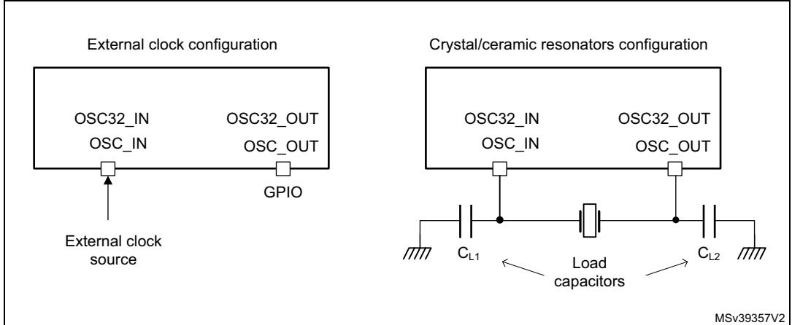

# **External clock source (HSE bypass)**

In this mode, an external clock source must be provided to OSC\_IN pin. This mode is selected by setting the HSEBYP and HSEON bits of the *[RCC source control register](#page-64-0)  [\(RCC\\_CR\)](#page-64-0)* to '1'. The external clock source (square, sinus or triangle) with ~50% duty cycle has to drive the OSC\_IN pin.

# **External crystal/ceramic resonator**

The oscillator is enabled by setting the HSEBYP bit to '0' and HSEON bit to '1'.

The HSE can be used when the product requires a very accurate high-speed clock.

The associated hardware configuration is shown in *[Figure 52](#page-15-0)*: the resonator and the load capacitors have to be placed as close as possible to the oscillator pins in order to minimize output distortion and startup stabilization time. The loading capacitance values must be adjusted according to the selected crystal or ceramic resonator. Refer to the electrical characteristics section of the datasheet for more details.

The HSERDY flag of the *[RCC source control register \(RCC\\_CR\)](#page-64-0)*, indicates whether the HSE oscillator is stable or not. At startup, the **hse\_ck** clock is not released until this bit is set by hardware. An interrupt can be generated if enabled in the *[RCC clock source interrupt](#page-101-0)  [enable register \(RCC\\_CIER\)](#page-101-0)*.

The HSE can be switched ON and OFF through the HSEON bit. Note that the HSE cannot be switched OFF if one of the two conditions is met:

- The HSE is used directly (via software mux) as system clock
- The HSE is selected as reference clock for PLL1, with PLL1 enabled and selected to provide the system clock (via software mux).

In that case the hardware does not allow programming the HSEON bit to '0'.

The HSE is automatically disabled by hardware, when the system enters Stop or Standby mode (refer to *[Section 9.5.7: Handling clock generators in Stop and Standby mode](#page-28-0)* for additional information).

In addition, the HSE clock can be driven to the MCO1 and MCO2 outputs and used as clock source for other application components.

# **LSE oscillator**

The LSE block can generate a clock from two possible sources:

- External crystal/ceramic resonator
- External user clock

### **External clock source (LSE bypass)**

In this mode, an external clock source must be provided to OSC32\_IN pin. The input clock can have a frequency up to 1 MHz. This mode is selected by setting the LSEBYP and LSEON bits of *[RCC Backup domain control register \(RCC\\_BDCR\)](#page-107-0)* to '1'. The external clock signal (square, sinus or triangle) with ~50% duty cycle has to drive the OSC32\_IN pin.


RM0399 Rev 4 367/3556

# **External crystal/ceramic resonator (LSE crystal)**

The LSE clock is generated from a 32.768 kHz crystal or ceramic resonator. It has the advantage to provide a low-power highly accurate clock source to the real-time clock (RTC) for clock/calendar or other timing functions.

The LSERDY flag of the *[RCC Backup domain control register \(RCC\\_BDCR\)](#page-107-0)* indicates whether the LSE crystal is stable or not. At startup, the LSE crystal output clock signal is not released until this bit is set by hardware. An interrupt can be generated if enabled in the *[RCC clock source interrupt enable register \(RCC\\_CIER\)](#page-101-0)*.

The LSE oscillator is switched ON and OFF using the LSEON bit. The LSE remains enabled when the system enters Stop or Standby mode.

In addition, the LSE clock can be driven to the MCO1 output and used as clock source for other application components.

The LSE also offers a programmable driving capability (LSEDRV[1:0]) that can be used to modulate the amplifier driving capability. The driving capability cannot be changed when the LSE oscillator is ON.

# <span id="page-17-0"></span>**HSI oscillator**

The HSI block provides the default clock to the product.

The HSI is a high-speed internal RC oscillator which can be used directly as system clock, peripheral clock, or as PLL input. A predivider allows the application to select an HSI output frequency of 8, 16, 32 or 64 MHz. This predivider is controlled by the HSIDIV.

The HSI advantages are the following:

- Low-cost clock source since no external crystal is required
- Faster startup time than HSE (a few microseconds)

The HSI frequency, even with frequency calibration, is less accurate than an external crystal oscillator or ceramic resonator.

The HSI can be switched ON and OFF using the HSION bit. Note that the HSI cannot be switched OFF if one of the two conditions is met:

- The HSI is used directly (via software mux) as system clock
- The HSI is selected as reference clock for PLL1, with PLL1 enabled and selected to provide the system clock (via software mux).

In that case the hardware does not allow programming the HSION bit to '0'.

Note that the HSIDIV cannot be changed if the HSI is selected as reference clock for at least one enabled PLL (PLLxON bit set to '1'). In that case the hardware does not update the HSIDIV with the new value. However it is possible to change the HSIDIV if the HSI is used directly as system clock.

The HSIRDY flag indicates if the HSI is stable or not. At startup, the HSI output clock is not released until this bit is set by hardware.

The HSI clock can also be used as a backup source (auxiliary clock) if the HSE fails (refer to *[Section : CSS on HSE](#page-20-0)*). The HSI can be disabled or not when the system enters Stop mode, please refer to *[Section 9.5.7: Handling clock generators in Stop and Standby mode](#page-28-0)* for additional information.

In addition, the HSI clock can be driven to the MCO1 output and used as clock source for other application components.


Care must be taken when the HSI is used as kernel clock for communication peripherals, the application must take into account the following parameters:

- the time interval between the moment where the peripheral generates a kernel clock request and the moment where the clock is really available,
- the frequency accuracy.

*Note: The HSI can remain enabled when the system is in Stop mode (see [Section](#page-28-0) 9.5.7 for additional information).*

> *HSION, HSIRDY and HSIDIV bits are located in the [RCC source control register](#page-64-0)  [\(RCC\\_CR\)](#page-64-0).*

### **HSI calibration**

RC oscillator frequencies can vary from one chip to another due to manufacturing process variations. That is why each device is factory calibrated by STMicroelectronics to improve accuracy (refer to the product datasheet for more information).

After a power-on reset, the factory calibration value is loaded in the HSICAL[11:0] bits.

If the application is subject to voltage or temperature variations, this may affect the RC oscillator frequency. The user application can trim the HSI frequency using the HSITRIM[6:0] bits.

*Note: HSICAL[11:0] and HSITRIM[6:0] bits are located in the [RCC HSI configuration register](#page-68-0)  [\(RCC\\_HSICFGR\).](#page-68-0)*

# <span id="page-18-0"></span>**CSI oscillator**

The CSI is a low-power RC oscillator which can be used directly as system clock, peripheral clock, or PLL input.

The CSI advantages are the following:

- Low-cost clock source since no external crystal is required
- Faster startup time than HSE (a few microseconds)
- Very low-power consumption,

The CSI provides a clock frequency of about 4 MHz, while the HSI is able to provide a clock up to 64 MHz.

CSI frequency, even with frequency calibration, is less accurate than an external crystal oscillator or ceramic resonator.

The CSI can be switched ON and OFF through the CSION bit. The CSIRDY flag indicates whether the CSI is stable or not. At startup, the CSI output clock is not released until this bit is set by hardware.

The CSI cannot be switched OFF if one of the two conditions is met:

- The CSI is used directly (via software mux) as system clock
- The CSI is selected as reference clock for PLL1, with PLL1 enabled and selected to provide the system clock (via software mux).

In that case the hardware does not allow programming the CSION bit to '0'.

The CSI can be disabled or not when the system enters Stop mode (refer to *[Section 9.5.7:](#page-28-0)  [Handling clock generators in Stop and Standby mode](#page-28-0)* for additional information).

In addition, the CSI clock can be driven to the MCO2 output and used as clock source for other application components.


RM0399 Rev 4 369/3556

Even if the CSI settling time is faster than the HSI, care must be taken when the CSI is used as kernel clock for communication peripherals: the application has to take into account the following parameters:

- the time interval between the moment where the peripheral generates a kernel clock request and the moment where the clock is really available,
- the frequency precision.

*Note: CSION and CSIRDY bits are located in the [RCC source control register \(RCC\\_CR\)](#page-64-0).*

# **CSI calibration**

RC oscillator frequencies can vary from one chip to another due to manufacturing process variations, this is why each device is factory calibrated by STMicroelectronics to improve accuracy (refer to the product datasheet for more information).

After reset, the factory calibration value is loaded in the CSICAL[9:0] bits.

If the application is subject to voltage or temperature variations, this may affect the RC oscillator frequency. The user application can trim the CSI frequency using the CSITRIM[5:0] bits.

*Note: CSICAL[9:0] and CSITRIM[5:0] bits are located into the [RCC CSI configuration register](#page-70-0)  [\(RCC\\_CSICFGR\)](#page-70-0)*

# **HSI48 oscillator**

The HSI48 is an RC oscillator that delivers a 48 MHz clock that can be used directly as kernel clock for some peripherals.

The internal HSI48 oscillator mainly aims at providing a high precision clock to the USB peripheral by means of a special Clock Recovery System (CRS) circuitry, which could use the USB SOF signal, the LSE, or an external signal, to automatically adjust the oscillator frequency on-the-fly, in very small granularity.

The HSI48 oscillator is disabled as soon as the system enters Stop or Standby mode. When the CRS is not used, this oscillator is free running and thus subject to manufacturing process variations. That is why each device is factory calibrated by STMicroelectronics to achieve an accuracy of ACCHSI48 (refer to the product datasheet of the for more information).

For more details on how to configure and use the CRS, please refer to *Section 10: Clock recovery system (CRS)*.

The HSI48RDY flag indicates whether the HSI48 oscillator is stable or not. At startup, the HSI48 output clock is not released until this bit is set by hardware.

The HSI48 can be switched ON and OFF using the HSI48ON bit.

The HSI48 clock can also be driven to the MCO1 multiplexer and used as clock source for other application components.

*Note: HSI48ON and HSI48RDY bits are located in the [RCC source control register \(RCC\\_CR\).](#page-64-0)*

# **LSI oscillator**

The LSI acts as a low-power clock source that can be kept running when the system is in Stop or Standby mode for the independent watchdog (IWDG) and Auto-Wakeup Unit (AWU). The clock frequency is around 32 kHz. For more details, refer to the electrical characteristics section of the datasheet.

The LSI can be switched ON and OFF using the LSION bit. The LSIRDY flag indicates whether the LSI oscillator is stable or not. If an independent watchdog is started either by hardware or software, the LSI is forced ON and cannot be disabled.

The LSI remains enabled when the system enters Stop or Standby mode (refer to *[Section 9.5.7: Handling clock generators in Stop and Standby mode](#page-28-0)* for additional information).

At LSI startup, the clock is not provided until the hardware sets the LSIRDY bit. An interrupt can be generated if enabled in the *[RCC clock source interrupt enable register \(RCC\\_CIER\)](#page-101-0)*.

In addition, the LSI clock can be driven to the MCO2 output and used as a clock source for other application components.

*Note: Bits LSION and LSIRDY are located into the [RCC clock control and status register](#page-109-0)  [\(RCC\\_CSR\).](#page-109-0)*

# **9.5.3 Clock Security System (CSS)**

# <span id="page-20-0"></span>**CSS on HSE**

The clock security system can be enabled by software via the HSECSSON bit. The HSECSSON bit can be enabled even when the HSEON is set to '0'.

The CSS on HSE is enabled by the hardware when the HSE is enabled and ready, and HSECSSON set to '1'.

The CSS on HSE is disabled when the HSE is disabled. As a result, this function does not work when the system is in Stop mode.

It is not possible to clear directly the HSECSSON bit by software.

The HSECSSON bit is cleared by hardware when a system reset occurs or when the system enters Standby mode (see *[Section 9.4.2: System reset](#page-4-0)*).

If a failure is detected on the HSE clock, the system automatically switches to the HSI in order to provide a safe clock. The HSE is then automatically disabled, a clock failure event is sent to the break inputs of advanced-control timers (TIM1, TIM8, TIM15, TIM16, and TIM17), and an interrupt is generated to inform the software about the failure (CSS interrupt: *rcc\_hsecss\_it*), thus allowing the MCU to perform rescue operations. If the HSE output was used as clock source for PLLs when the failure occurred, the PLLs are also disabled.

If an HSE clock failure occurs when the CSS is enabled, the CSS generates an interrupt which causes the automatic generation of an NMI. The HSECSSF flag in *[RCC clock source](#page-103-0)  [interrupt flag register \(RCC\\_CIFR\)](#page-103-0)* is set to '1' to allow the application to identify the failure source. The NMI routine is executed indefinitely until the HSECSSF bit is cleared. As a consequence, the application has to clear the HSECSSF flag in the NMI ISR by setting the HSECSSC bit in the *[RCC clock source interrupt clear register \(RCC\\_CICR\)](#page-105-0)*.


RM0399 Rev 4 371/3556

# **CSS on LSE**

A clock security system on the LSE oscillator can be enabled by software by programming the LSECSSON bit in the *[RCC Backup domain control register \(RCC\\_BDCR\)](#page-107-0)*.

This bit can be disabled only by hardware when the following conditions are met:

- after a pwr\_vsw\_rst (VSW software reset)
- or after a failure detection on LSE.

LSECSSON bit must be written after the LSE is enabled (LSEON bit set by software) and ready (LSERDY set by hardware), and after the RTC clock has been selected through the RTCSEL bit.

The CSS on LSE works in all modes (Run, Stop and Standby) except VBAT.

If an LSE failure is detected, the LSE clock is no more delivered to the RTC but the value of RTCSEL, LSECSSON and LSEON bits are not changed by the hardware.

A wakeup is generated in Standby mode. In other modes an interrupt (**rcc\_lsecss\_it**) can be sent to wake up the software. The software must then disable the LSECSSON bit, stop the defective LSE (clear LSEON bit), and can change the RTC clock source (no clock or LSI or HSE) through RTCSEL bits, or take any required action to secure the application.

# **9.5.4 Clock output generation (MCO1/MCO2)**

Two micro-controller clock output (MCO) pins, MCO1 and MCO2, are available. A clock source can be selected for each output.The selected clock can be divided thanks to configurable prescaler (refer to *[Figure 51](#page-14-0)* for additional information on signal selection).

MCO1 and MCO2 outputs are controlled via MCO1PRE[3:0], MCO1SEL[2:0], MCO2PRE[3:0] and MCO2SEL[2:0] located in the *[RCC clock configuration register](#page-71-0)  [\(RCC\\_CFGR\)](#page-71-0)*.

The GPIO port corresponding to each MCO pin, has to be programmed in alternate function mode.

The clock provided to the MCOs outputs must not exceed the maximum pin speed (refer to the product datasheet for information on the supported pin speed).

# **9.5.5 PLL description**

The RCC features three PLLs:

- A main PLL, PLL1, which is generally used to provide clocks to the CPUs and to some peripherals.
- Two dedicated PLLs, PLL2 and PLL3, which are used to generate the kernel clock for peripherals.

The PLLs integrated into the RCC are completely independent. They offer the following features:

- Two embedded VCOs:
  - A wide-range VCO (VCOH)
  - A low-frequency VCO (VCOL)
- Input frequency range:
  - 1 to 2 MHz when VCOL is used
  - 2 to 16 MHz when VCOH is used
- Capability to work either in integer or Fractional mode
- 13-bit Sigma-Delta modulator, allowing to fine-tune the VCO frequency by steps of 11 to 0.3 ppm.
- The Sigma-Delta modulator can be updated on-the-fly, without generating frequency overshoots on PLLs outputs.
- Each PLL offer 3 outputs with post-dividers

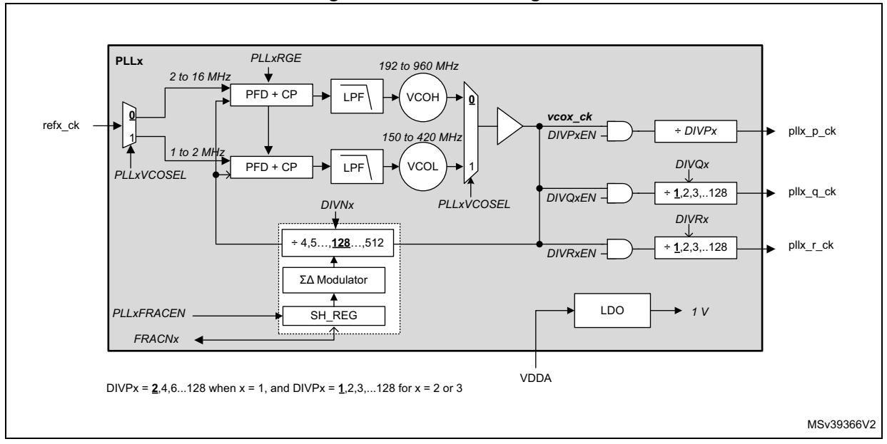

**Figure 53. PLL block diagram**

The PLLs are controlled via RCC\_PLLxDIVR, RCC\_PLLxFRACR, RCC\_PLLCFGR and RCC\_CR registers.

The frequency of the reference clock provided to the PLLs (**refx\_ck**) must range from 1 to 16 MHz. The user application has to program properly the DIVMx dividers of the *[RCC PLLs](#page-78-0)  [clock source selection register \(RCC\\_PLLCKSELR\)](#page-78-0)* in order to match this condition. In addition, the PLLxRGE of the *[RCC PLL configuration register \(RCC\\_PLLCFGR\)](#page-80-0)* field must be set according to the reference input frequency to guarantee an optimal performance of the PLL.

The user application can then configure the proper VCO: if the frequency of the reference clock is lower or equal to 2 MHz, then VCOL must be selected, otherwise VCOH must be chosen. To reduce the power consumption, it is recommended to configure the VCO output to the lowest frequency.

RM0399 Rev 4 373/3556

DIVNx loop divider has to be programmed to achieve the expected frequency at VCO output. In addition, the VCO output range must be respected.

The PLLs operate in integer mode when the value of SH\_REG (FRACNx shadow register) is set to '0'. The SH\_REG is updated with the FRACNx value when PLLxFRACEN bit goes from '0' to '1'. The Sigma-Delta modulator is designed in order to minimize the jitter impact while allowing very small frequency steps.

The PLLs can be enabled by setting PLLxON to '1'. The bits PLLxRDY indicate that the PLL is ready (i.e. locked).

Note:

Before enabling the PLLs, make sure that the reference frequency (**refx\_ck**) provided to the PLL is stable, so the hardware does not allow changing DIVMx when the PLLx is ON and it is also not possible to change PLLSRC when one of the PLL is ON.

The hardware prevents writing PLL1ON to '0' if the PLL1 is currently used to deliver the system clock. There are other hardware protections on the clock generators (refer to sections HSE oscillator, HSI oscillator and CSI oscillator).

The following PLL parameters cannot be changed once the PLL is enabled: DIVNx, PLLxRGE, PLLxVCOSEL, DIVPx, DIVQx, DIVRx, DIVPxEN, DIVQxEN and DIVRxEN.

To insure an optimal behavior of the PLL when one of the post-divider (DIVP, DIVQ or DIVR) is not used, the application shall set the enable bit (DIVyEN) as well as the corresponding post-divider bits (DIVP, DIVQ or DIVR) to '0'.

If the above rules are not respected, the PLL output frequency is not guaranteed.

# **Output frequency computation**

When the PLL is configured in integer mode (SH\_REG = '0'), the VCO frequency (F<sub>VCO</sub>) is given by the following expression:

$$F_{VCO} = F_{REF\_CK} \times DIVN$$

$$F_{PLL\_y\_CK} = (F_{VCO}/(DIVy + 1))$$
 with y = P, Q or R

When the PLL is configured in fractional mode (SH\_REG different from '0'), the DIVN divider must be initialized before enabling the PLLs. However, it is possible to change the value of FRACNx on-the-fly without disturbing the PLL output.

This feature can be used either to generate a specific frequency from any crystal value with a good accuracy, or to fine-tune the frequency on-the-fly.

For each PLL, the VCO frequency is given by the following formula:

$$F_{VCO} = F_{ref\_ck} \times \left( DIVN + \frac{FRACN}{2^{(13)}} \right)$$

Note: For PLL1. DIVP can only take odd values.

577

The PLLs are disabled by hardware when:

- The system enters Stop or Standby mode.
- An HSE failure occurs when HSE or PLL (clocked by HSE) are used as system clock.

# <span id="page-24-0"></span>**PLL initialization phase**

*[Figure 54](#page-25-0)* shows the recommended PLL initialization sequence in integer and fractional mode. The PLLx are supposed to be disabled at the start of the initialization sequence:

- 1. Initialize the PLLs registers according to the required frequency.
  - Set PLLxFRACEN of *[RCC PLL configuration register \(RCC\\_PLLCFGR\)](#page-80-0)* to '0' for integer mode.
  - For fractional mode, set FRACN to the required initial value (FracInitValue) and then set PLLxFRACEN to '1'.
- 2. Once the PLLxON bit is set to '1', the user application has to wait until PLLxRDY bit is set to '1'. If the PLLx is in fractional mode, the PLLxFRACEN bit must not be set back to '0' as long as PLLxRDY = '0'.
- 3. Once the PLLxRDY bit is set to '1', the PLLx is ready to be used.
- 4. If the application intends to tune the PLLx frequency on-the-fly (possible only in fractional mode), then:
  - a) PLLxFRACEN must be set to '0', When PLLxFRACEN = '0', the Sigma-Delta modulator is still operating with the value latched into SH\_REG. Application must wait for 3 refx\_ck clock periods (PLLxFRACEN bit propagation delay)
  - b) A new value must be uploaded into PLLxFRACR (FracValue(n)).
  - c) PLLxFRACEN must be set to '1', in order to latch the content of PLLxFRACR into its shadow register. The new value is considered after 3 clock periods of refx\_ck (PLLxFRACEN bit propagation delay)

*Note: When the PLLxRDY goes to '1', it means that the difference between the PLLx output frequency and the target value is lower than* ±*2%.*

RM0399 Rev 4 375/3556

<span id="page-25-0"></span>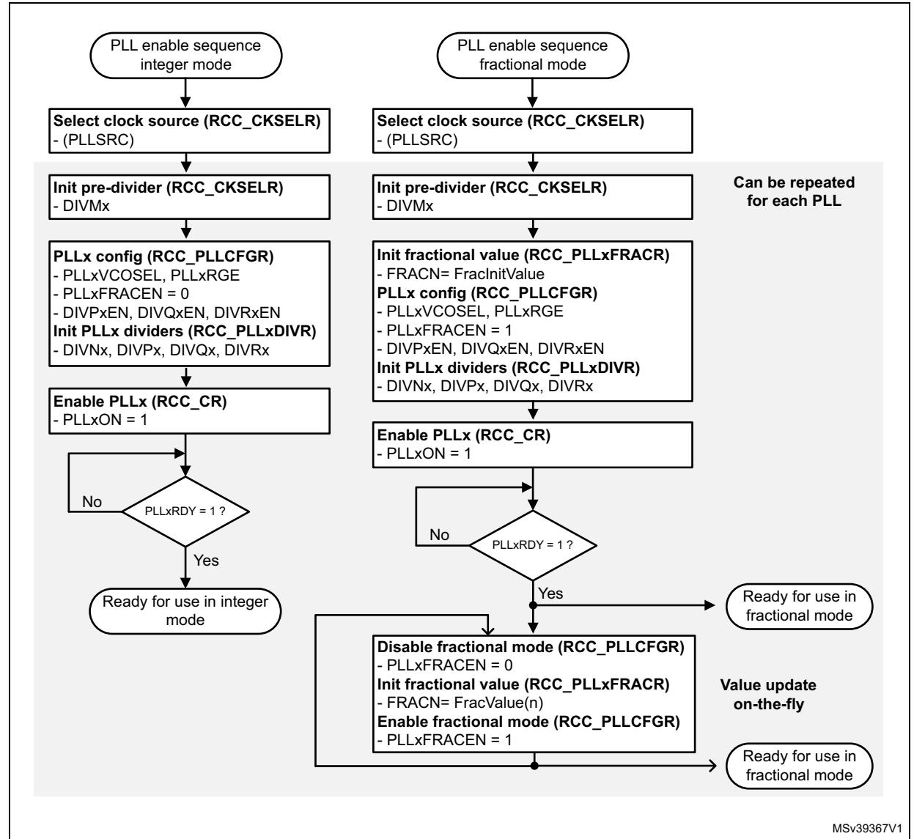

**Figure 54. PLLs Initialization Flowchart**


# **9.5.6 System clock (sys\_ck)**

# **System clock selection**

After a system reset, the HSI is selected as system clock and all PLLs are switched OFF. When a clock source is used for the system clock, it is not possible for the software to disable the selected source via the xxxON bits.

Of course, the system clock can be stopped by the hardware when the System enters Stop or Standby mode.

When the system is running, the user application can select the system clock (**sys\_ck**) among the 4 following sources:

- HSE
- HSI
- CSI
- or pll1\_p\_ck

This function is controlled by programming the *[RCC clock configuration register](#page-71-0)  [\(RCC\\_CFGR\)](#page-71-0)*. A switch from one clock source to another occurs only if the target clock source is ready (clock stable after startup delay or PLL locked). If a clock source that is not yet ready is selected, the switch occurs when the clock source is ready. The SWS status bits in the *[RCC clock configuration register \(RCC\\_CFGR\)](#page-71-0)* indicate which clock is currently used as system clock. The other status bits in the RCC\_CR register indicate which clock(s) is (are) ready.

# **System clock generation**

*[Figure 55](#page-27-0)* shows a simplified view of the clock distribution for the CPUs and busses. All the dividers shown in the block diagram can be changed on-the-fly without generating timing violations. This feature is a very simply solution to adapt the busses frequencies to the application needs, thus optimizing the power consumption.

The D1CPRE divider can be used to adjust CPU1 clock. However this also impacts the clock frequency of all bus matrix, CPU2, and HRTIM.

In the same way, HPRE divider can be used to adjust the clock for D1 domain bus matrix, but this also impacts the clock frequency of bus matrix of D2 and D3 domains, and CPU2.

In addition the CPU clock frequency can be equal to the bus matrix clock frequency, but the maximum frequency for the bus matrix is limited to 200 MHz.

Most of the prescalers are controlled via RCC\_D1CFGR, RCC\_D2CFGR and RCC\_D3CFGR registers.

RM0399 Rev 4 377/3556

<span id="page-27-0"></span>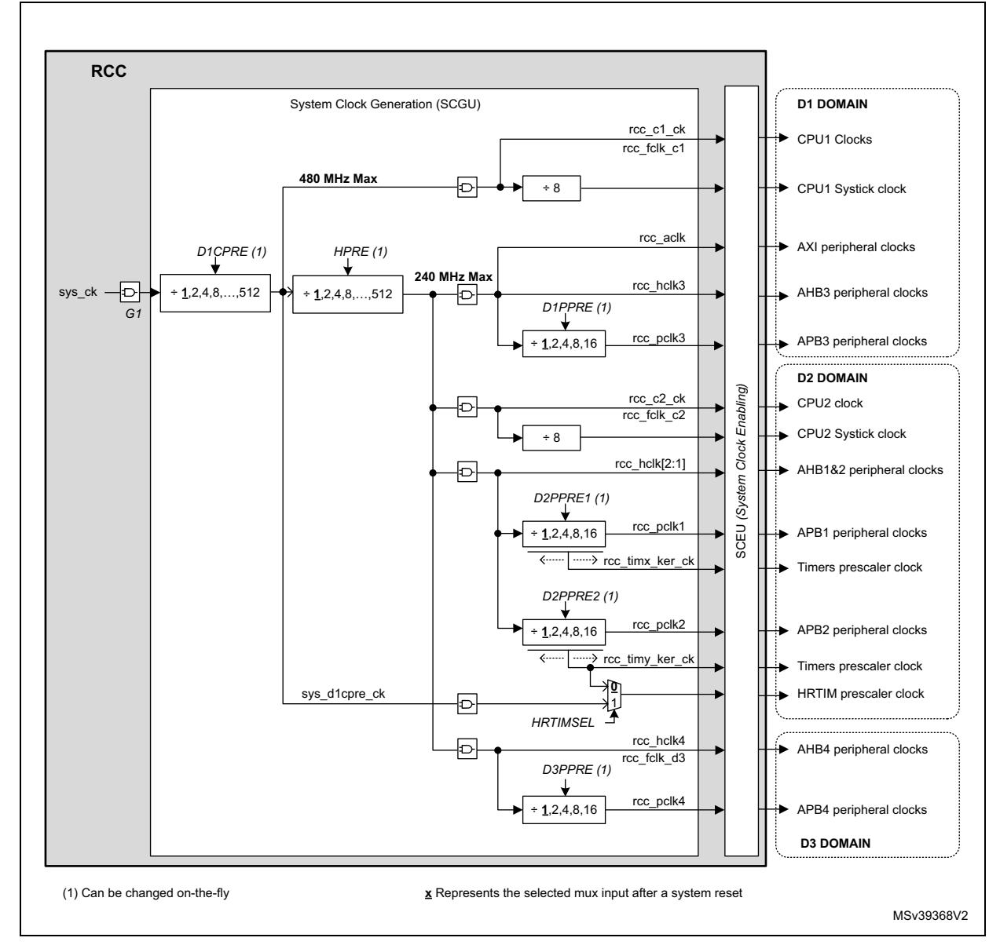

**Figure 55. Core and bus clock generation**

This block also provides the clock for the timers (**rcc\_timx\_ker\_ck and rcc\_timy\_ker\_ck**). The frequency of the timers clock depends on the APB prescaler corresponding to the bus to which the timer is connected, and on TIMPRE bit. *[Table 59](#page-28-1)* shows how to select the timer clock frequency.

<span id="page-28-1"></span>

| D2PPRE1 (1)<br>D2PPRE2 | TIMPRE<br>(2) |   | Frcc_timx_ker_ck<br>Frcc_timy_ker_ck | Frcc_pclk1<br>Frcc_pclk2 | Comments                                                 |  |  |  |  |  |  |  |
|------------------------|---------------|---|--------------------------------------|--------------------------|----------------------------------------------------------|--|--|--|--|--|--|--|
| 0xx                    | 0             | → | Frcc_hclk1                           | Frcc_hclk1               | The timer clock is equal to the bus clock.               |  |  |  |  |  |  |  |
| 100                    | 0             | → | Frcc_hclk1                           | Frcc_hclk1 / 2           |                                                          |  |  |  |  |  |  |  |
| 101                    | 0             | → | Frcc_hclk1 / 2                       | Frcc_hclk1 / 4           | The timer clock is twice as fast as the bus              |  |  |  |  |  |  |  |
| 110                    | 0<br>→        |   | Frcc_hclk1 / 4                       | Frcc_hclk1 / 8           | clock.                                                   |  |  |  |  |  |  |  |
| 111                    | 0             | → | Frcc_hclk1 / 8                       | Frcc_hclk1 / 16          |                                                          |  |  |  |  |  |  |  |
| 0xx                    | 1             | → | Frcc_hclk1                           | Frcc_hclk1               | The timer clock is equal to the bus clock.               |  |  |  |  |  |  |  |
| 100                    | 1             | → | Frcc_hclk1                           | Frcc_hclk1 / 2           | The timer clock is twice as fast as the bus<br>clock.    |  |  |  |  |  |  |  |
| 101                    | 1             | → | Frcc_hclk1                           | Frcc_hclk1 / 4           |                                                          |  |  |  |  |  |  |  |
| 110                    | 1             | → | Frcc_hclk1 / 2                       | Frcc_hclk1 / 8           | The timer clock is 4 times faster than the bus<br>clock. |  |  |  |  |  |  |  |
| 111                    | 1             | → | Frcc_hclk1 / 4                       | Frcc_hclk1 / 16          |                                                          |  |  |  |  |  |  |  |

**Table 59. Ratio between clock timer and pclk**

# <span id="page-28-0"></span>**9.5.7 Handling clock generators in Stop and Standby mode**

When the whole system enters Stop mode, all the clocks (system and kernel clocks) are stopped as well as the following clock sources:

- CSI, HSI (depending on HSIKERON, and CSIKERON bits)
- HSE
- PLL1, PLL2 and PLL3
- HSI48

The content of the RCC registers is not altered except for PLL1ON, PLL2ON, PLL3ON HSEON and HSI48ON which are set to '0'.

# **Exiting Stop mode**

When the microcontroller exits system Stop mode via a wake-up event, the application can select which oscillator (HSI and/or CSI) will be used to restart. The STOPWUCK bit selects the oscillator used as system clock. The STOPKERWUCK bit selects the oscillator used as kernel clock for peripherals. The STOPKERWUCK bit is useful if after a system Stop a peripheral needs a kernel clock generated by an oscillator different from the one used for the system clock.

All these bits belong to the *[RCC clock configuration register \(RCC\\_CFGR\)](#page-71-0)*. *[Table 60](#page-29-0)* gives a detailed description of their behavior.


<sup>1.</sup> D2PPRE1 and D2PPRE2 belong to *[RCC domain 2 clock configuration register \(RCC\\_D2CFGR\)](#page-76-0)*.

<sup>2.</sup> TIMPRE belongs to *[RCC clock configuration register \(RCC\\_CFGR\)](#page-71-0)*.

<span id="page-29-0"></span>Distributed clocks when System Activated exits Stop mode oscillator when the STOPWUCK **STOPKERWUCK** system exits Stop Kernel Clock **System Clock** mode 0 HSI HSI 0 HSI 1 HSI and/or CSI HSI and CSI 0 1 CSI CSI 1 CSI

Table 60. STOPWUCK and STOPKERWUCK description

# **During Stop mode**

There are two specific cases where the HSI or CSI can be enabled during system Stop mode:

- When a dedicated peripheral requests the kernel clock:
   In this case the peripheral will receive the HSI or CSI according to the kernel clock source selected for this peripheral (via PERxSRC).
- When the bits HSIKERON or CSIKERON are set:
   In this case the HSI and CSI are kept running during Stop mode but the outputs are gated. In that way, the clock will be available immediately when the system exits Stop mode or when a peripheral requests the kernel clock (see *Table 61* for details).

HSIKERON and CSIKERON bits belong to *RCC source control register (RCC\_CR)*. *Table 61* gives a detailed description of their behavior.

<span id="page-29-1"></span> $\begin{array}{c|ccccccccccccccccccccccccccccccccccc$ 

Table 61. HSIKERON and CSIKERON behavior

When the microcontroller exists system Standby mode, the HSI is selected as system and kernel clock, the RCC registers are reset to their initial values except for the RCC\_RSR and RCC\_BDCR registers.

Note as well that the HSI and CSI outputs provide two clock paths (see *Figure 51*):

- one path for the system clock (hsi\_ck or csi\_ck)
- one path for the peripheral kernel clock (hsi ker ck or csi ker ck).

When a peripheral requests the kernel clock in system Stop mode, only the path providing the **hsi\_ker\_ck** or **csi\_ker\_ck** is activated.

### Caution:

It is not guaranteed that a CPU will get automatically the same clock frequencies when leaving CStop mode: this mainly depends on the System state. For example CPU2 can switch from time to time from CRun to CStop mode. If the system does not go to Stop or Standby mode, then the system clock is not stopped and CPU2 will operate from it when


t<sub>su(HSI)</sub> and t<sub>su(CSI)</sub> are the startup times of the HSI and CSI oscillators (see refer to the product datasheet for the values of these parameters).

leaving CStop mode. However, if the system enters Stop while CPU2 is in CStop mode, then CPU2 will operate from HSI or CSI when it left the CStop mode.

# **9.5.8 Kernel clock selection**

Some peripherals are designed to work with two different clock domains that operate asynchronously:

- a clock domain synchronous with the register and bus interface (**ckg\_bus\_perx** clock)
- and a clock domain generally synchronous with the peripheral (kernel clock).

The benefit of having peripherals supporting these two clock domains is that the user application has more freedom to choose optimized clock frequency for the CPUs, bus matrix and for the kernel part of the peripheral.

As a consequence, the user application can change the bus frequency without reprogramming the peripherals. As an example an on-going transfer with UART will not be disturbed if its APB clock is changed on-the-fly.

*[Table 62](#page-31-0)* shows the kernel clock that the RCC can deliver to the peripherals. Each row of *[Table 62](#page-31-0)* represents a MUX and the peripherals connected to its output. The columns starting from number 4 represent the clock sources. Column 3 gives the maximum allowed frequency at each MUX output. It is up to the user to respect these requirements.


Reset and Clock Control (RCC)

Table 62. Kernel clock distribution overview

<span id="page-31-0"></span>

|                 | Maximum allowed frequency [MHz] |                    |                    |                    |                    |        |           | Clock Sources |           |           |           |           |           |        |                |        |            |                  |          |        |        |                       |          |            |          |          |
|-----------------|---------------------------------|--------------------|--------------------|--------------------|--------------------|--------|-----------|---------------|-----------|-----------|-----------|-----------|-----------|--------|----------------|--------|------------|------------------|----------|--------|--------|-----------------------|----------|------------|----------|----------|
| Peripherals     | Clock mux control bits          | VOS0               | VOS1               | VOS2               | VOS3               | Domain | pll1_q_ck | pll2_p_ck     | pll2_q_ck | pll2_r_ck | pll3_p_ck | pll3_q_ck | pll3_r_ck | sys_ck | bus clocks (1) | hse_ck | hsi_ker_ck | csi_ker_ck       | hsi48_ck | lse_ck | lsi_ck | per_ck <sup>(2)</sup> | I2S_CKIN | dsi_phy_ck | USB_PHY1 | Disabled |
| DSI             | DSISEL                          | 133 <sup>(3)</sup> | 133 <sup>(3)</sup> | 100 <sup>(3)</sup> | 66 <sup>(3)</sup>  |        |           |               | 1         |           |           |           |           |        |                |        |            |                  |          |        |        |                       |          | 0          |          |          |
| LTDC            | -                               | 150                | 150                | 75                 | 50                 |        |           |               |           |           |           |           | х         |        |                |        |            |                  |          |        |        |                       |          |            |          |          |
| FMC             | FMCSEL                          | 300                | 250                | 200                | 133                | D1     | 1         |               |           | 2         |           |           |           |        | <u>0</u>       |        |            |                  |          |        |        | 3                     |          |            |          |          |
| QUADSPI         | QSPISEL                         | 250                | 200                | 150                | 100                |        | 1         |               |           | 2         |           |           |           |        | <u>0</u>       |        |            |                  |          |        |        | 3                     |          |            |          |          |
| SDMMC1          | SDMMCSEL                        | 250 <sup>(5)</sup> | 200 <sup>(5)</sup> | 150 <sup>(5)</sup> | 100 <sup>(5)</sup> |        | 0         |               |           | 1         |           |           |           |        |                |        |            |                  |          |        |        |                       |          |            |          |          |
| SDMMC2          | SUMINICSEL                      | 250                | 200                | 150                | 100                |        | <u>0</u>  |               |           | 1         |           |           |           |        |                |        |            |                  |          |        |        |                       |          |            |          |          |
| DFSDM1 Aclk     | SAI1SEL                         | 250                | 200                | 150                | 100                |        | <u>0</u>  | 1             |           |           | 2         |           |           |        |                |        |            |                  |          |        |        | 4                     | 3        |            |          |          |
| DFSDM1 clk      | DFSDM1SEL                       | 250                | 200                | 150                | 100                |        |           |               |           |           |           |           |           | 1      | <u>0</u>       |        |            |                  |          |        |        |                       |          |            |          |          |
| FDCAN           | FDCANSEL                        | 125                | 100                | 75                 | 50                 |        | 1         |               | 2         |           |           |           |           |        |                | 0      |            |                  |          |        |        |                       |          |            |          |          |
| HDMI-CEC        | CECSEL                          | 66                 | 66                 | 66                 | 33                 |        |           |               |           |           |           |           |           |        |                |        |            | 2 <sup>(4)</sup> |          | 0      | 1      |                       |          |            |          |          |
| I2C1,2,3        | I2C123SEL                       | 125                | 100                | 75                 | 50                 |        |           |               |           |           |           |           | 1         |        | <u>0</u>       |        | 2          | 3                |          |        |        |                       |          |            |          |          |
| LPTIM1          | LPTIM1SEL                       | 125                | 100                | 75                 | 50                 |        |           | 1             |           |           |           |           | 2         |        | <u>0</u>       |        |            |                  |          | 3      | 4      | 5                     |          |            |          |          |
| TIM[8:1][17:12] | -                               | 240                | 200                | 150                | 100                | D2     |           |               |           |           |           |           |           |        | х              |        |            |                  |          |        |        |                       |          |            |          |          |
| HRTIM           | -                               | 480                | 400                | 300                | 200                |        |           |               |           |           |           |           |           |        | х              |        |            |                  |          |        |        |                       |          |            |          |          |
| RNG             | RNGSEL                          | 250                | 200                | 150                | 100                |        | 1         |               |           |           |           |           |           |        |                |        |            |                  | <u>0</u> | 2      | 3      |                       |          |            |          |          |
| SAI1            | SAI1SEL                         | 150                | 150                | 113                | 75                 |        | <u>0</u>  | 1             |           |           | 2         |           |           |        |                |        |            |                  |          |        |        | 4                     | 3        |            |          |          |
| SAI2            | CAISSEI                         | 150                | 150                | 113                | 75                 |        | 0         | 1             |           |           | 2         |           |           |        |                |        |            |                  |          |        |        | 4                     | 2        |            |          |          |
| SAI3            | SAI23SEL                        | 150                | 150                | 113                | 75                 |        | <u>0</u>  | 1             |           |           | 2         |           |           |        |                |        |            |                  |          |        |        | 4                     | 3        |            |          |          |
| SPDIFRX         | SPDIFSEL                        | 250                | 200                | 150                | 100                |        | <u>0</u>  |               |           | 1         |           |           | 2         |        |                |        | 3          |                  |          |        |        |                       |          |            |          |          |
| SPI(I2S)1,2,3   | SPI123SEL                       | 200                | 200                | 150                | 100                |        | <u>0</u>  | 1             |           |           | 2         |           |           |        |                |        |            |                  |          |        |        | 4                     | 3        |            |          |          |

| Z |
|---|
| ⋜ |
| 9 |
| 8 |
| Ö |
| Z |
|   |

# <span id="page-32-0"></span>Table 62. Kernel clock distribution overview (continued)

|                         | Maximum allowed frequency [MHz] Clock Sources |                    |                    |                   |                   |        |           |           |           | ock Sources |           |           |           |        |                |        |            |            |          |        |        |                       |          |            |          |          |
|-------------------------|-----------------------------------------------|--------------------|--------------------|-------------------|-------------------|--------|-----------|-----------|-----------|-------------|-----------|-----------|-----------|--------|----------------|--------|------------|------------|----------|--------|--------|-----------------------|----------|------------|----------|----------|
| Peripherals             | Clock mux<br>control bits                     | VOS0               | VOS1               | VOS2              | VOS3              | Domain | pll1_q_ck | pll2_p_ck | pll2_q_ck | pll2_r_ck   | pll3_p_ck | pll3_q_ck | pll3_r_ck | sys_ck | bus clocks (1) | hse_ck | hsi_ker_ck | csi_ker_ck | hsi48_ck | lse_ck | lsi_ck | per_ck <sup>(2)</sup> | I2S_CKIN | dsi_phy_ck | USB_PHY1 | Disabled |
| SPI4,5                  | SPI45SEL                                      | 125                | 100                | 75                | 50                |        |           |           | 1         |             |           | 2         |           |        | <u>0</u>       | 5      | 3          | 4          |          |        |        |                       |          |            |          |          |
| SWPMI                   | SWPSEL                                        | 125                | 100                | 75                | 50                |        |           |           |           |             |           |           |           |        | <u>0</u>       |        | 1          |            |          |        |        |                       |          |            |          |          |
| USART1,6                | USART16SEL                                    | 125                | 100                | 75                | 50                |        |           |           | 1         |             |           | 2         |           |        | <u>0</u>       |        | 3          | 4          |          | 5      |        |                       |          |            |          |          |
| USART2,3<br>UART4,5,7,8 | USART234578SEL                                | 125                | 100                | 75                | 50                | D2     |           |           | 1         |             |           | 2         |           |        | <u>0</u>       |        | 3          | 4          |          | 5      |        |                       |          |            |          |          |
| USB1OTG<br>USB2OTG      | USBSEL                                        | 66                 | 66                 | 66                | 63                |        | 1         |           |           |             |           | 2         |           |        |                |        |            |            | 3        |        |        |                       |          |            |          | <u>0</u> |
| USB1ULPI                | -                                             | 60                 | 60                 | 60                | 60                |        |           |           |           |             |           |           |           |        |                |        |            |            |          |        |        |                       |          |            | Х        |          |
| ADC1,2, 3               | ADCSEL                                        | 160 <sup>(5)</sup> | 160 <sup>(5)</sup> | 60 <sup>(5)</sup> | 40 <sup>(5)</sup> |        |           | <u>0</u>  |           |             |           |           | 1         |        |                |        |            |            |          |        |        | 2                     |          |            |          |          |
| I2C4                    | I2C4SEL                                       | 125                | 100                | 75                | 50                |        |           |           |           |             |           |           | 1         |        | <u>0</u>       |        | 2          | 3          |          |        |        |                       |          |            |          |          |
| LPTIM2                  | LPTIM2SEL                                     | 125                | 100                | 75                | 50                |        |           | 1         |           |             |           |           | 2         |        | <u>0</u>       |        |            |            |          | 3      | 4      | 5                     |          |            |          |          |
| LPTIM3,4,5              | LPTIM345SEL                                   | 125                | 100                | 75                | 50                |        |           | 1         |           |             |           |           | 2         |        | <u>0</u>       |        |            |            |          | 3      | 4      | 5                     |          |            |          |          |
| LPUART1                 | LPUART1SEL                                    | 125                | 100                | 75                | 50                | D3     |           |           | 1         |             |           | 2         |           |        | <u>0</u>       |        | 3          | 4          |          | 5      |        |                       |          |            |          |          |
| SAI4_A                  | SAI4ASEL                                      | 150                | 150                | 75                | 75                |        | <u>0</u>  | 1         |           |             | 2         |           |           |        |                |        |            |            |          |        |        | 4                     | 3        |            |          |          |
| SAI4_B                  | SAI4BSEL                                      | 150                | 150                | 75                | 75                |        | <u>0</u>  | 1         |           |             | 2         |           |           |        |                |        |            |            |          |        |        | 4                     | 3        |            |          |          |
| SPI6                    | SPI6SEL                                       | 125                | 100                | 75                | 50                |        |           |           | 1         |             |           | 2         |           |        | <u>0</u>       | 5      | 3          | 4          |          |        |        |                       |          |            |          |          |
| RTC/AWU <sup>(6)</sup>  | RTCSEL                                        | 1                  | 1                  | 1                 | -                 | VSW    |           |           |           |             |           |           |           |        |                | 3      |            |            |          | 1      | 2      |                       |          |            |          | <u>0</u> |

- 1. The bus clocks are the bus interface clocks to which the peripherals are connected, it can be APB, AHB or AXI clocks.
- 2. The per\_ck clock could be hse\_ck, hsi\_ker\_ck or csi\_ker\_ck according to CKPERSEL selection.
- 3. For byte lane clock frequency (F<sub>blclk ck</sub>).
- 4. Clock CSI divided by 122.
- 5. With a duty cycle close to 50%, meaning that DIV[P/Q/R]x values shall be even. For SDMMCx, the duty cycle shall be 50% when supporting DDR.
- 6. The RTC is not functional in  $V_{BAT}$  mode when the clock source is  $lsi\_ck$  or  $hse\_ck$ .

*[Figure 56](#page-34-0)* to *[Figure 65](#page-41-0)* provide a more detailed description of kernel clock distribution. To simplify the drawings, the bus interface clocks (pclk, hclk) are not represented, even if they are gated with enable signals. Refer to *[Section 9.5.11: Peripheral clock gating control](#page-52-0)* for more details.

To reduce the amount of switches, some peripherals share the same kernel clock source. Nevertheless, all peripherals have their dedicated enable signal.

# **Peripherals dedicated to audio applications**

The audio peripherals generally need specific accurate frequencies, except for SPDIFRX. As shown in *[Figure 56](#page-34-0)*, the kernel clock of the SAIs or SPI(I2S)s can be generated by:

- The PLL1 when the amount of active PLLs has to be reduced
- The PLL2 or 3 for optimal flexibility in frequency generation
- HSE, HSI or CSI for use-cases where the current consumption is critical
- I2S\_CKIN when an external clock reference need to be used.

*Note: The SPDIFRX does not require a specific frequency, but only a kernel clock frequency high enough to make the peripheral work properly. Refer to the SPDIFRX description for more details.*

> *DFSDM1 can use the same clock as SAI1A. This is useful when DFSDM1 is used for audio applications.*

*To improve the flexibility, SAI4 can use different clock for each sub-block.*

*The SPI/I2S1, 2, and 3 share the same kernel clock source (see [Figure 57](#page-35-0)*)*.*

<span id="page-34-0"></span>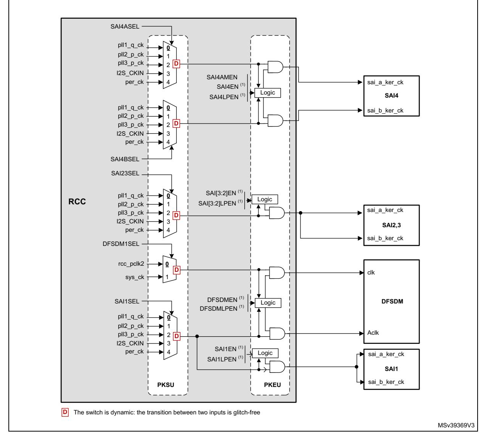

**Figure 56. Kernel clock distribution for SAIs and DFSDM1** 

- 1. There is one enable bit and one low-power enable bit from each CPU. **X** represents the selected MUX input after a system reset.
- 2. This figure does not show the connection of the bus interface clock to the peripherals. For details on each enable cell, please refer to *[Section 9.5.11: Peripheral clock gating control](#page-52-0)*.

# **Peripherals dedicated to control and data transfer**

Peripherals such as SPIs, I2Cs, UARTs do not need a specific kernel clock frequency but a clock fast enough to generate the correct baud rate, or the required bit clock on the serial interface. For that purpose the source can be selected among:

- PLL1 when the amount of active PLLs has to be reduced
- PLL2 or PLL3 if better flexibility is required. As an example, this solution allows changing the frequency bus via PLL1 without affecting the speed of some serial interfaces.
- HSI or CSI for low-power use-cases or when the peripheral has to quickly wake up from Stop mode (i.e. UART, I2C...).

RM0399 Rev 4 385/3556

*Note: UARTs also need the LSE clock when high baud rates are not required.*

<span id="page-35-0"></span>

**Figure 57. Kernel clock distribution for SPIs and SPI/I2S** 


<sup>1.</sup> There is one enable bit and one low-power enable bit from each CPU. **X** represents the selected MUX input after a system reset.

<sup>2.</sup> This figure does not show the connection of the bus interface clock to the peripheral. For details on each enable cell, please refer to *[Section 9.5.11: Peripheral clock gating control](#page-52-0)*.

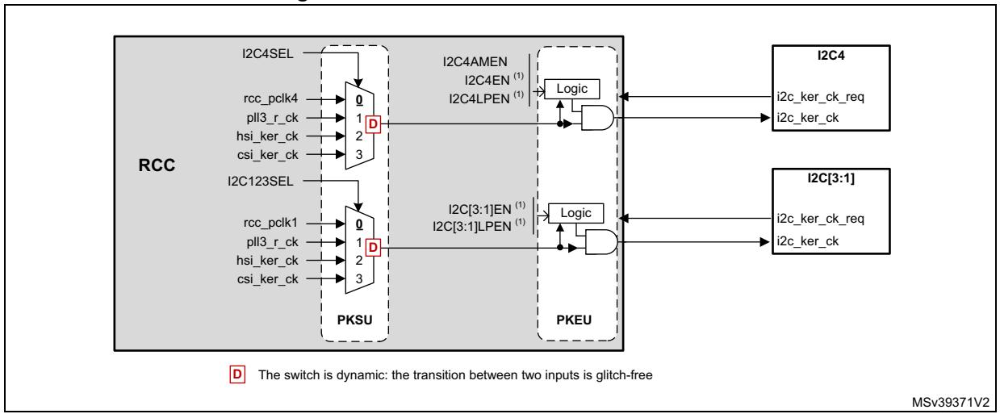

Figure 58. Kernel clock distribution for I2Cs

- There is one enable bit and one low-power enable bit from each CPU. X represents the selected MUX input after a system reset.
- This figure does not show the connection of the bus interface clock to the peripheral, for details on each enable cell, refer to Section 9.5.11: Peripheral clock gating control.

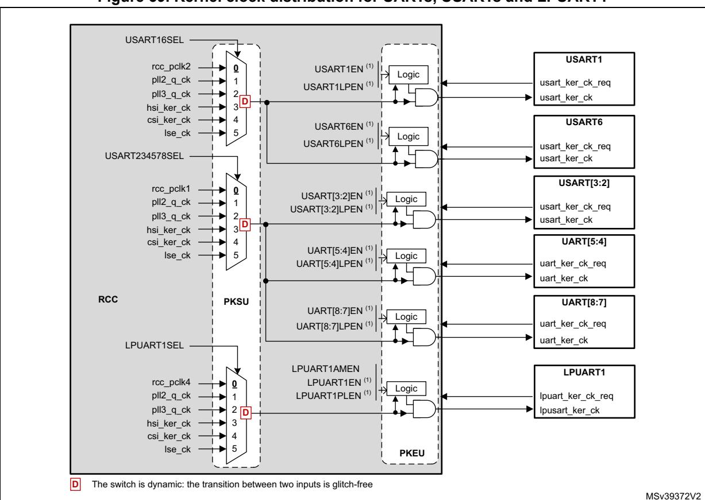

Figure 59. Kernel clock distribution for UARTs, USARTs and LPUART1

- There is one enable bit and one low-power enable bit from each CPU. X represents the selected MUX input after a system reset.
- 2. This figure does not show the connection of the bus interface clock to the peripheral, for details on each enable cell, refer to

5

RM0399 Rev 4 387/3556

### *[Section 9.5.11: Peripheral clock gating control](#page-52-0)*.

The DSI block has its own PLL which operates directly from the **hse\_ck.** 

**Figure 60. Kernel clock distribution for DSI and LTDC**

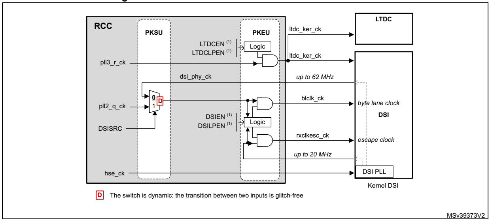

- 1. There is one enable bit and one low-power enable bit from each CPU. **X** represents the selected MUX input after a system reset.
- 2. This figure does not show the connection of the bus interface clock to the peripheral. For details on each enable cell, please refer to *[Section 9.5.11: Peripheral clock gating control](#page-52-0)*.

The FMC, QUADSPI and SDMMC1/2 can also use a clock different from the bus interface clock for more flexibility.

MSv39374V3 **RCC** QSPIEN (1) rcc\_hclk3 **0** 1 2 3 QSPISRC pll1\_q\_ck pll2\_r\_ck Logic QSPILPEN (1) per\_ck FMCEN (1) rcc\_hclk3 **0** 1 2 3 FMCSRC pll1\_q\_ck pll2\_r\_ck Logic FMCLPEN (1) per\_ck SDMMC[2:1]EN SDMMCSRC (1) pll1\_q\_ck pll2\_r\_ck Logic SDMMC[2:1]LPEN (1) 1 **PKSU PKEU D D D** The switch is dynamic: the transition between two inputs is glitch-free **SDMMC1,2** sdmmc\_ker\_ck **QUADSPI** quadspi\_ker\_ck **FMC** fmc\_ker\_ck

**Figure 61. Kernel clock distribution for SDMMC, QUADSPI and FMC** 

- 1. There is one enable bit and one low-power enable bit from each CPU. **X** represents the selected MUX input after a system reset.
- 2. This figure does not show the connection of the bus interface clock to the peripheral. For details on each enable cell, please

refer to *[Section 9.5.11: Peripheral clock gating control](#page-52-0)*.

*[Figure 62](#page-38-0)* shows the clock distribution for the USB blocks. The USB1ULPI blocks receive its clock from the external PHY.

The USBxOTG blocks receive the clock for USB communications which can be selected among different sources thanks to the MUX controlled by USBSEL.

<span id="page-38-0"></span>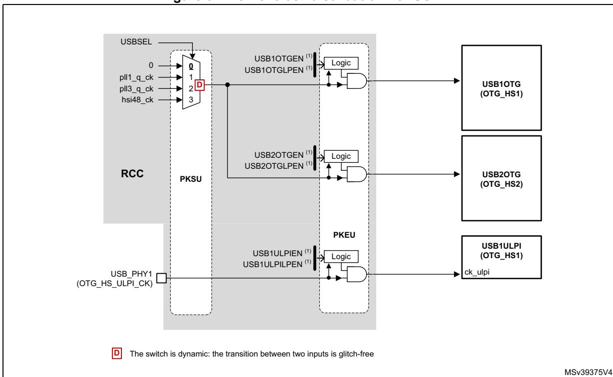

**Figure 62. Kernel clock distribution For USB [\(2\)](#page-38-1)**

- 1. There is one enable bit and one low-power enable bit from each CPU. **X** represents the selected MUX input after a system reset.
- <span id="page-38-1"></span>2. This figure does not show the connection of the bus interface clock to the peripheral. For details on each enable cell, please refer to *[Section 9.5.11: Peripheral clock gating control](#page-52-0)*.

The Ethernet transmit and receive clocks shall be provided from an external Ethernet PHY. The clock selection for the RX and TX path is controlled via the SYSCFG block.

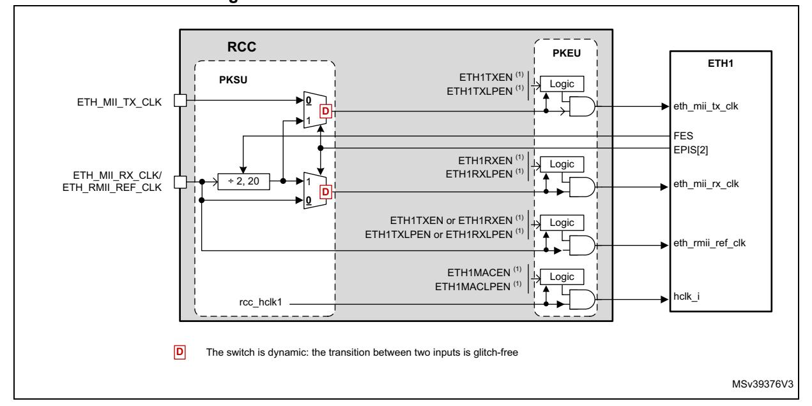

**Figure 63. Kernel clock distribution for Ethernet** 

- 1. There is one enable bit and one low-power enable bit from each CPU. **X** represents the selected MUX input after a system reset.
- 2. This figure does not show the connection of the bus interface clock to the peripheral. For details on each enable cell, please refer to *[Section 9.5.11: Peripheral clock gating control](#page-52-0)*.


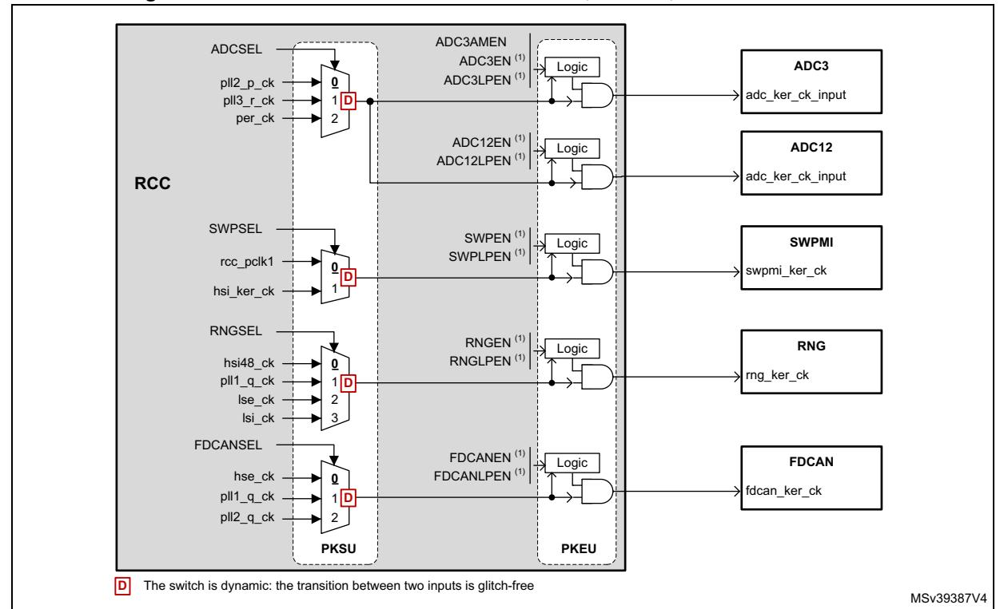

Figure 64. Kernel clock distribution For ADCs, SWPMI, RNG and FDCAN (2)

- There is one enable bit and one low-power enable bit from each CPU. X represents the selected MUX input after a system reset.
- <span id="page-40-0"></span>2. This figure does not show the connection of the bus interface clock to the peripheral. For details on each enable cell, please refer to Section 9.5.11: Peripheral clock gating control.

RM0399 Rev 4

<span id="page-41-0"></span>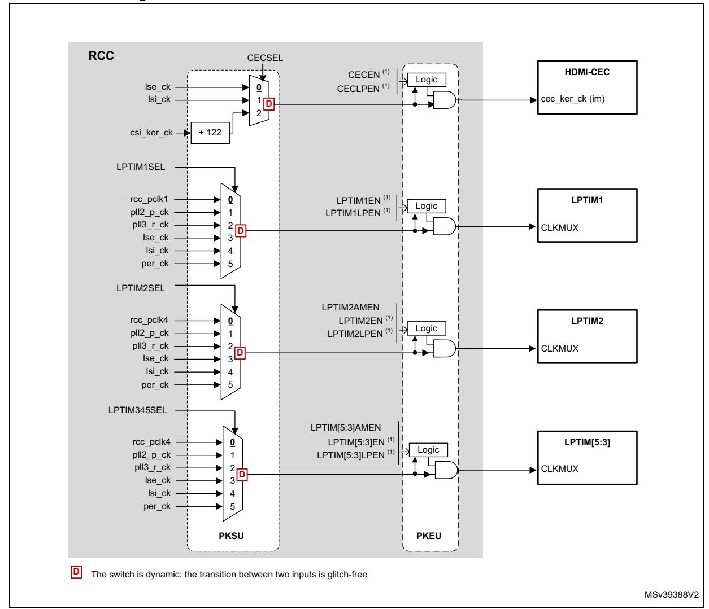

**Figure 65. Kernel clock distribution for LPTIMs and HDMI-CEC [\(2\)](#page-41-1)**

- 1. There is one enable bit and one low-power enable bit from each CPU. **X** represents the selected MUX input after a system reset
- <span id="page-41-1"></span>2. This fig[ure does not show the connection of the bus inte](#page-52-0)rface clock to the peripheral. For details on each enable cell, please refer to *Section 9.5.11: Peripheral clock gating control*.

# **RTC/AWU clock**

The **rtc\_ck** clock source can be:

- the **hse\_1M\_ck** (**hse\_ck** divided by a programmable prescaler)
- the **lse\_ck**
- or the **lsi\_ck** clock

The source clock is selected by programming the RTCSEL[1:0] bits in the *[RCC Backup](#page-107-0)  [domain control register \(RCC\\_BDCR\)](#page-107-0)* and the RTCPRE[5:0] bits in the *[RCC clock](#page-71-0)  [configuration register \(RCC\\_CFGR\)](#page-71-0)*.

This selection cannot be modified without resetting the Backup domain.


If the LSE is selected as RTC clock, the RTC will work normally even if the backup or the VDD supply disappears.

The LSE clock is in the Backup domain, whereas the other oscillators are not. As a consequence:

- If LSE is selected as RTC clock, the RTC continues working even if the VDD supply is switched OFF, provided the VBAT supply is maintained.
- If LSI is selected as the RTC clock, the AWU state is not guaranteed if the VDD supply is powered off.
- If the HSE clock is used as RTC clock, the RTC state is not guaranteed if the VDD supply is powered off or if the VCORE supply is powered off.

The **rtc\_ck** clock is enabled through RTCEN bit located in the *[RCC Backup domain control](#page-107-0)  [register \(RCC\\_BDCR\)](#page-107-0)*.

The RTC bus interface clock (APB clock) is enabled through RTCAPBEN and RTCAPBLPEN bits located in RCC\_APB4ENR/LPENR registers.

*Note: To read the RTC calendar register when the APB clock frequency is less than seven times the RTC clock frequency (FAPB < 7 x FRTCLCK), the software must read the calendar time and date registers twice. The data are correct if the second read access to RTC\_TR gives the same result than the first one. Otherwise a third read access must be performed.*

# **Watchdog clocks**

The RCC provides the clock for the four watchdog blocks available on the circuit. The two independent watchdogs (IWDG1 and IWDG2) are connected to the LSI. The two window watchdogs (WWDG1 and WWDG2) are connected to the APB clock.

If an independent watchdog is started by either hardware option or software access, the LSI is forced ON and cannot be disabled. After the LSI oscillator setup delay, the clock is provided to the IWDGs.

**Caution:** Before enabling WWDG1/WWDG2, the application must set the WW1RSC/WW2RSC bit to '1'. If the WW1RSC/WW2RSC remains at '0' when the WWDG1/2 is enabled, the WWDG1/2 behavior is not guaranteed. The WW1RSC and WW2RSC bits are located in *[RCC global control register \(RCC\\_GCR\)](#page-126-0)*.

# **Clock frequency measurement using TIMx**

Most of the clock source generator frequencies can be measured by means of the input capture of TIMx.

• Calibrating the HSI or CSI with the LSE

The primary purpose of having the LSE connected to a TIMx input capture is to be able to accurately measure the HSI or CSI. This requires to use the HSI or CSI as system clock source either directly or via PLL1. The number of system clock counts between consecutive edges of the LSE signal gives a measurement of the internal clock period. Taking advantage of the high precision of LSE crystals (typically a few tens of ppm) we can determine the internal clock frequency with the same resolution, and trim the


RM0399 Rev 4 393/3556

source to compensate for manufacturing-process and/or temperature- and voltagerelated frequency deviations.

The basic concept consists in providing a relative measurement (e.g. HSI/LSE ratio): the precision is therefore tightly linked to the ratio between the two clock sources. The greater the ratio is, the more accurate the measurement is.

The HSI and CSI oscillators have dedicated user-accessible calibration bits for this purpose (see *[RCC HSI configuration register \(RCC\\_HSICFGR\)](#page-68-0)* and *[RCC CSI](#page-70-0)  [configuration register \(RCC\\_CSICFGR\)](#page-70-0)*).

When the HSI or CSI are used via the PLLx, the system clock can also be fine-tuned by using the fractional divider of the PLLs.

• Calibrating the LSI with the HSI

The LSI frequency can also be measured: this is useful for applications that do not have a crystal. The ultralow power LSI oscillator has a large manufacturing process deviation. By measuring it versus the HSI clock source, it is possible to determine its frequency with the precision of the HSI. The measured value can be used to have more accurate RTC time base timeouts (when LSI is used as the RTC clock source) and/or an IWDG timeout with an acceptable accuracy.

# **9.5.9 General clock concept overview**

The RCC handles the distribution of the CPUs, bus interface and peripheral clocks for the system (D1, D2 and D3 domains), according to the operating mode of each function (refer to *[Section 9.5.1: Clock naming convention](#page-15-2)* for details on clock definitions).

For each peripheral, the application can control the activation/deactivation of its kernel and bus interface clock. Prior to use a peripheral, the CPU has to enable it (by setting PERxEN to '1'), and define if this peripheral remains active in CSleep mode (by setting PERxLPEN to '1'). This is called 'allocation' of a peripheral to a CPU (refer to *[Section 9.5.10: Peripheral](#page-49-0)  [allocation](#page-49-0)* for more details).

The peripheral allocation is used by the RCC to automatically control the clock gating according to the CPU and domain modes, and by the PWR to control the supply voltages of D1, D2 and D3 domains. For example if CPU1 enables a peripheral and decides that the kernel clock of this peripheral shall be gated when it goes to CSleep, then CPU2 state has no effect on the clock gating of this peripheral, but the clock gating will obey to CPU1 state. This is true if CPU2 did not allocate this peripheral as well.

Each CPU has dedicated registers where it can allocate individually the peripherals it intends to use in the application.

*[Figure 66](#page-45-0)* gives an example of peripheral allocation:

- CPU1 enabled SDMMC1, SPI5 and SRAM1. AXISRAM, ITCM, DTCM1, DTCM2 and SRAM4 are implicitly allocated to CPU1. The group composed of CPU1, bus matrix 1/2/3 and allocated peripherals makes up sub-system 1 (CPU1\_SS).
- The CPU2 enabled DMA1, I2C2, SAI1, FLASH, ART, I2C4, SAI4. Note that SRAM1, SRAM2, SRAM3 and SRAM4 are implicitly allocated to CPU2. The group composed by the CPU2, bus matrix 1,2 and 3 and peripherals allocated makes up sub-system 2 (CPU2\_SS).

*Note: SRAM4, IWGD1, IWGD2 and RCC are common resources and are implicitly allocated to both CPU1 and CPU2.* 

> *Some memories are implicitly allocated to a given CPU (see [Figure](#page-45-0) 66). Refer to [Section](#page-47-0) : [Memory handling](#page-47-0) for more details.*

RM0399 Rev 4 395/3556

<span id="page-45-0"></span>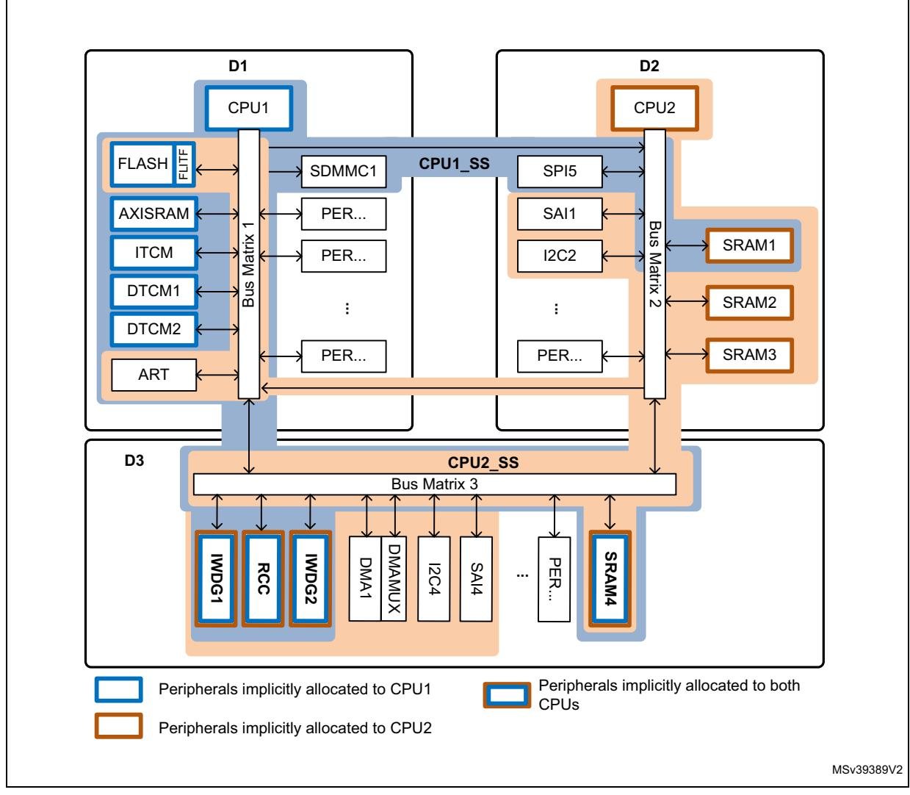

Figure 66. Peripheral allocation example

1. CPU1\_SS and CPU2\_SS can be spread over the three power domains.

When CPU1 enters CStop mode, the RCC automatically disables the bus interface and kernel clocks of all the peripherals of the CPU1\_SS as well as the CPU clock. If CPU2 is always in CRun mode, then the bus matrix 1 is still clocked as well as the CPU2\_SS allocated peripherals (ART, FLASH) which are physically connected to this bus matrix. The PLLs, if enabled, are not disabled by the RCC since CPU2 and D3 are still running.

Then, if CPU2 enters CStop mode, the bus matrix 1 is no longer clocked, and the D1 domain can enter DStop as well. In this scenario, D2 domain will also enter DStop mode. D1 and D2 domains will enter DStandby mode if they are allowed to.

A wakeup event will be able to exit D1 and D2 domain from DStandby or DStop mode.


Two additional functions are available to reduce power consumption:

- D3 domain can be kept in DRun mode while CPU1 and CPU2 are in CStop mode and D1 and D2 domains are in DStop or DStandby mode. This is done by setting RUN\_D3 bit in PWR\_D1CR or PWR\_D2CR registers:
  - If RUN\_D3 of PWR\_CPU1CR or PWR\_CPU2CR is set to '1', then D3 is maintained in DRun mode, independently from CPU1 and CPU2 modes (see *PWR CPU1 control register (PWR\_CPU1CR)* and *PWR CPU2 control register (PWR\_CPU2CR)*).
  - If RUN\_D3 of PWR\_CPU1CR and RUN\_D3 of PWR\_CPU2CR are set to '0', then D3 domain enters DStop or DStandby mode when both CPU1 and CPU2 enter CStop mode (see *[Table 63](#page-48-0)*).
- More autonomy can be given to some peripherals located into D3 domain (refer to *[Section : D3 domain Autonomous mode](#page-46-0)* for details).

# <span id="page-46-0"></span>**D3 domain Autonomous mode**

The Autonomous mode allows to deliver the peripheral clocks to peripherals located in D3, even if the CPU to which they are allocated is in CStop mode. When a peripheral has its autonomous bit enabled, it receives its peripheral clocks according to D3 domain state, if the CPU to which it is allocated is in CStop mode:

- If the D3 domain is in DRun mode, peripherals with Autonomous mode activated receive their peripheral clocks,
- If the D3 domain is in DStop mode, no peripheral clock is provided.

The Autonomous mode does not prevent the D3 domain to enter DStop or DStandby mode.

The autonomous bits are located in *[RCC D3 Autonomous mode register \(RCC\\_D3AMR\)](#page-127-0)*.

For example, CPU1 and CPU2 can enter CStop mode, while the SAI4 is filling the SRAM4 with data received from an external device via DMA1. When the amount of received data is reached, the CPU2 can be activated by a wakeup event. This can be done by setting the SAI4, the DMA1, and SRAM4 in Autonomous mode, while keeping D3 in DRun mode (RUN\_D3 set to '1'). In this example, the RCC does not switch off the PLLs as the D3 domain is always in DRun mode.

It is possible to go a step further with power consumption reduction by combining the Autonomous mode with the capability of some peripherals (UARTs, I2Cs) to request the kernel clock on their own, without waking-up the CPUs. For example, if the system is expecting messages via I2C4, the whole system can be put in Stop mode. When the I2C4 peripheral detects a START bit, it will generate a "kernel clock request". This request enables the HSI or CSI, and a kernel clock is provided only to the requester (in our example the I2C4). The I2C4 then decodes the incoming message. Several cases are then possible:

- If the device address of the message does not match, then I2C4 releases its "kernel clock request" until a new START condition is detected.
- If the device address of the incoming message matches, it has to be stored into D3 local memory. I2C4 is able to generate a wakeup event on address match to switch the D3 domain to DRun mode. The message is then transferred into memory via DMA1, and the D3 domain go back to DStop mode without any CPU activation.
- If the device address of the incoming message matches and the peripheral is setup to wake up the CPU, then I2C4 generates a wakeup event to activate CPU1\_SS and CPU2\_SS.


RM0399 Rev 4 397/3556

Please refer to the description of EXTI block in order see which peripheral is able to perform a wake-up event to which domain.

# <span id="page-47-0"></span>**Memory handling**

Both CPUs can access all the memory areas available in the product:

- AXISRAM, ITCM, DTCM1, DTCM2 and FLASH,
- SRAM1, SRAM2 and SRAM3,
- SRAM4 and BKPRAM.

As shown in *[Figure 66](#page-45-0)*, FLASH, AXISRAM, ITCM, DTCM1 and DTCM2 are implicitly allocated to CPU1. As a result, there is no enable bit allowing CPU1 to allocate these memories.

In the same way, SRAM1, SRAM2 and SRAM3 are implicitly allocated to CPU2, and CPU2 does not need enable bits to allocate them.

The SRAM4 does not need enable bit at all since D3 domain cannot be in DStop or DStandby mode when one of the CPU is running.

The BKPRAM has a dedicated enable bit for each CPU in order to gate the bus interface clock. The CPUs needs to enable the BKPRAM prior to use it.

When CPU1 wants to access a memory area located into D2 domain, the memory must be enabled via *[RCC AHB2 clock register \(RCC\\_AHB2ENR\)](#page-138-0)*. Enabling the memory insures that this memory will still be operating even if CPU2 enters CStop mode.

The same mechanism exists when CPU2 wants to use a memory located into D1 domain.

*Note: When a domain is in DRun mode, the memories located into this domain operate for both CPUs, even if memory enable bits are not set (except for the BKPRAM). The memory enable bits prevent the domain where the memory is located to enter DStop mode.*

> *The memory interface clocks (Flash and RAM interfaces) can be stopped by software during CSleep mode (via DxSRAMyLPEN bits).*

Refer to *[Peripheral clock gating control](#page-52-0)* and *[CPU and bus matrix clock gating control](#page-58-0)* sections for details on clock enabling.

# **System states overview**

*[Table 63](#page-48-0)* gives an overview of the system states with respect to CPU1, CPU2 and D3 states.

- The system remains in Run mode as long as D3 is in DRun mode. Several sub-states of system Run exist that are not detailed here (refer *Power control (PWR)* for more information).
- D3 can run while D1 and D2 are in DStop/DStandby mode thanks to RUN\_D3 bits of PWR\_CPU[2:1]CR registers or when D3 is in Autonomous mode.
- The system remains in Stop mode as long as D3 is in DStop mode. This means implicitly that D1 and D2 are in DStop or DStandby. As soon as D1 or D2 exits DStop or DStandby, D3 switches to DRun mode.
- The system remains in Standby mode as long as D1, D2 and D3 are in DStandby.
- Domain states versus CPU states:
  - When a domain is in DRun mode, it means that its bus matrix is clocked. The CPU of the domain (if any) can be in CRun, CSleep or CStop mode.
  - When a domain is in DStop mode, it means that its bus matrix is no longer clocked. The CPU of the domain (if any) is in CStop mode.
  - When a domain is in DStandby mode, it means that the domain including its CPU are powered down.

**Table 63. System states overview**

<span id="page-48-0"></span>

| System State | D1 State            | D2 State            | D3 State |
|--------------|---------------------|---------------------|----------|
| Run          | DRun/DStop/DStandby | DRun/DStop/DStandby | DRun     |
| Stop         | DStop/DStandby      | DStop/ DStandby     | DStop    |
| Standby      | DStandby            | DStandby            | DStandby |

# <span id="page-49-0"></span>**9.5.10 Peripheral allocation**

Each CPU can allocate a peripheral and hence control its kernel and bus interface clock. Each CPU has dedicated registers in order to perform this peripheral allocation. A peripheral is allocated when its PERxEN bit is set to '1' by the CPU1 and/or CPU2.

CPU1 can allocate a peripheral for itself by setting the dedicated PERxEN bit in:

- RCC\_DnxxxxENR registers or
- RCC\_C1\_DnxxxxENR registers.

CPU1 can also allocate a peripheral for CPU2 by setting the dedicated PERxEN bit in registers RCC\_C2\_DnxxxxENR.

In the same way, CPU2 can allocate a peripheral for itself by setting the dedicated PERxEN bit in:

- RCC\_DnxxxxENR registers or
- RCC\_C2\_DnxxxxENR registers.

CPU2 can also allocate a peripheral for CPU1 by setting the dedicated PERxEN bit in registers RCC\_C1\_DnxxxxENR.

A similar mechanism is implemented to control the peripheral clocks when the CPUs are in CSleep mode (PERxLPEN bits).

Refer to *[Section 9.7.1: Register mapping overview](#page-63-0)* for additional information.

*Note: When CPU1 or CPU2 access RCC\_DnxxxxxENR registers, the hardware detects which CPU did the access (core\_id) in order to allocate the peripheral to the right CPU.*

> The peripheral allocation bits (PERxEN bits) are used by the hardware to provide the kernel and bus interface clocks to the peripherals. However they are also used to link peripherals to a CPU (CPU sub-system). In this way, the hardware is able to safely gate the peripheral clocks and bus matrix clocks according to CPU states. The PWR block also uses this information to control properly the domain states.

# <span id="page-49-1"></span>**Clock switches and gating**

• Clock switching delays

The input selected by the kernel clock switches can be changed dynamically without generating spurs or timing violation. As a consequence, switching from the original to the new input can only be performed if a clock is present on both inputs. If it not the case, no clock will be provided to the peripheral. To recover from this situation, the user has to provide a valid clock to both inputs.

During the transition from one input to another, the kernel clock provided to the peripheral will be gated, in the worst case, during 2 clock cycles of the previously selected clock and 2 clock cycles of the new selected clock. As shown in *[Figure 67](#page-50-0)*, both input clocks shall be present during transition time.


<span id="page-50-0"></span>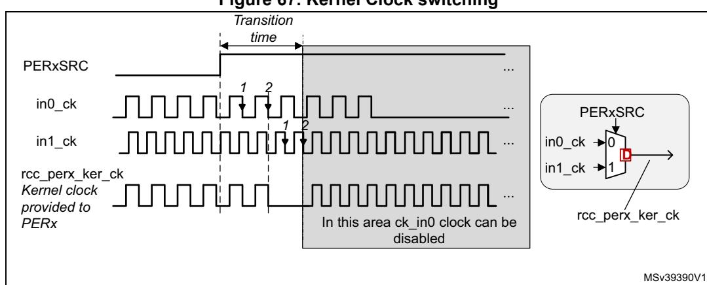

**Figure 67. Kernel Clock switching**

# • Clock enabling delays

In the same way, the clock gating logic synchronizes the enable command (coming generally from a kernel clock request or PERxEN bits) with the selected clock, in order to avoid generation of spurs.

- A maximum delay of two periods of the enabled clock may occur between the enable command and the first rising edge of the clock. The enable command can be the rising edge of the PERxEN bits of RCC\_xxxxENR registers, or a kernel clock request asserted by a peripheral.
- A maximum delay of 1.5 periods of the disabled clock may occur between the disable command and the last falling edge of the clock. The disable command can be the falling edge of the PERxEN bits of RCC\_xxxxENR registers, or a kernel clock request released by a peripheral.

*Note: Both the kernel clock and the bus interface clock are affected by this re-synchronization delay.* 

> In addition, the clock enabling delay may strongly increase if the application is enabling for the first time a peripheral which is not located in the same domain. This is due to the fact that the domain where the peripheral is located could be in DStop or DStandby mode. The domain must be switched to DRun mode before the application can use this peripheral.

> As an example, if CPU1 enables a peripheral located in the D2 domain while the D2 domain is in DStop/DStandby mode, then the power controller (PWR) has first to provide a supply voltage to D2, then the RCC has to wait for an acknowledge from the

PWR before enabling the clocks of the D2 domain. To handle properly this situation the RCC and the PWR blocks feature four flags:

- D1CKRDY/D2CKRDY located in *[RCC source control register \(RCC\\_CR\)](#page-64-0)*
- SBF\_D1and SBF\_D2 located in *PWR CPU1 control register (PWR\_CPU1CR)* and *PWR CPU2 control register (PWR\_CPU2CR)*, respectively.

The following sequence can be followed to avoid this issue:

- a) Enable the peripheral clocks (i.e. allocate the peripheral) by writing the corresponding PERxEN bit to '1' in the RCC\_xxxxENR register,
- b) Read back the RCC\_xxxxENR register to make sure that the previous write operation is not pending into a write buffer.
- c) If the peripheral is located in a different domain, perform the two next steps: Read DxCKRDY until it is set to '1'.
  - Write SBF\_Dx to zero and read-back the value, in order to check if the domain where the peripheral is located is still in DStandby. If the corresponding bit is read at '1', it means that the domain is still in DStandby. Repeat this operation until SBF\_Dx is equal to '0', then continue the other steps.
- d) Perform a dummy read operation into a register of the enabled peripheral. This operation will take at least 2 clock cycles, which is equal to the max delay of the enable command.
- e) The peripheral can then be used.

*Note: When the bus interface clock is not active, read or write accesses to the peripheral registers are not supported. A read access will return invalid data. A write access will be ignored and will not create any bus errors.*


# <span id="page-52-0"></span>**9.5.11 Peripheral clock gating control**

As mentioned previously, each peripheral requires a bus interface clock, named **rcc\_perx\_bus\_ck** (for peripheral 'x'). This clock can be an APB, AHB or AXI clock, according to which bus the peripheral is connected.

The clocks used as bus interface for peripherals located in D1 domain, could be **rcc\_aclk**, **rcc\_hclk3** or **rcc\_pclk3**, depending on the bus connected to each peripheral. For simplicity sake, these clocks are named **rcc\_bus\_d1\_ck**.

In the same way, the signal named **rcc\_bus\_d2\_ck** represents **rcc\_hclk1, rcc\_hclk2**, **rcc\_pclk1** or **rcc\_pclk2**, depending on the bus connected to each peripheral of D2 domain.

Similarly, the signal **rcc\_bus\_d3\_ck** represents **rcc\_hclk4** or **rcc\_pclk4** for peripherals located in D3.

Some peripherals (SAI, UART...) also require a dedicated clock for their communication interface. This clock is generally asynchronous with respect to the bus interface clock. It is named kernel clock (**perx\_ker\_ckreq**). Both clocks can be gated according to several conditions detailed hereafter.

As shown in *[Figure 68](#page-53-0)*, enabling the kernel and bus interface clocks of each peripheral depends on several input signals:

- C1\_PERxEN and C1\_PERxLPEN bits C1\_PERxEN represents the peripheral enable (allocation) bit for CPU1. CPU1 can write these bits to '1' via RCC\_C1\_xxxxENR or RCC\_DnxxxxENR registers.
- C2\_PERxEN and C2\_PERxLPEN bits C2\_PERxEN represents the peripheral enable (allocation) bit for CPU2. The CPU2 can write these bits to '1' via RCC\_C2\_xxxxENR or RCC\_DnxxxxENR registers.
- PERxAMEN bits

The PERxAMEN bits are belong to *[RCC D3 Autonomous mode register](#page-127-0)  [\(RCC\\_D3AMR\)](#page-127-0)*.

- CPU1 state (**c1\_sleep** and **c1\_deepsleep** signals)
- CPU2 state (**c2\_sleep** and **c2\_deepsleep** signals)
- D3 domain state (**d3\_deepsleep** signal)
- The kernel clock request (**perx\_ker\_ckreq**) of the peripheral itself, when the feature is available.

Refer to *[Section 9.5.10: Peripheral allocation](#page-49-0)* for more details.


RM0399 Rev 4 403/3556

<span id="page-53-0"></span>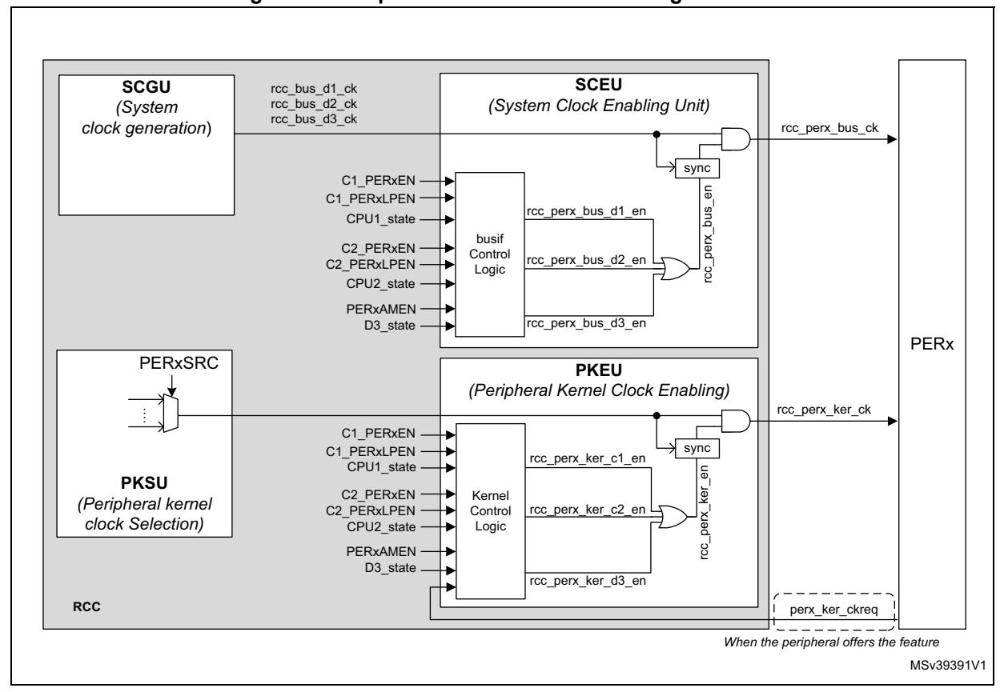

**Figure 68. Peripheral kernel clock enable logic details**


*Table 64* gives a detailed description of the enabling logic of the peripheral clocks for peripherals located in D1 or D2 domain and allocated by CPU1. A similar logic applies to CPU2.

Table 64. Peripheral clock enabling for D1 and D2 peripherals

<span id="page-54-0"></span>

| C1_PERXEN | C1_PERXLPEN | PERXSRC                                                     | perx_ker_ckreq | CPU1<br>State |               | rcc_perx_ker_c1_en | rcc_perx_bus_d1_en | Comments                                                                                                                                                                                                    |       |   |                                                                                                                                                                                          |
|-----------|-------------|-------------------------------------------------------------|----------------|---------------|---------------|--------------------|--------------------|-------------------------------------------------------------------------------------------------------------------------------------------------------------------------------------------------------------|-------|---|------------------------------------------------------------------------------------------------------------------------------------------------------------------------------------------|
| 0         | Х           | Х                                                           | Х              | Х             | $\rightarrow$ | 0                  | 0                  | No clock provided to the peripheral, because PERxEN='0'                                                                                                                                                     |       |   |                                                                                                                                                                                          |
| 1         | X           | Х                                                           | Х              | CRun          | $\rightarrow$ | 1                  | 1                  | Kernel and bus interface clocks are provided to the peripheral, because the CPU1 is in CRun, and PERxEN='1'                                                                                                 |       |   |                                                                                                                                                                                          |
| 1         | 0           | Х                                                           | Х              | CClass        | $\rightarrow$ | 0 0                |                    | No clock provided to the peripheral, because the CPU1 is in CSleep, and PERxLPEN='0'                                                                                                                        |       |   |                                                                                                                                                                                          |
| 1         | 1           | Х                                                           | Х              | CSleep -      |               | 1                  | 1                  | Kernel and bus interface clocks are provided to the peripheral, because CPU1 is in CSleep, and PERxLPEN='1'                                                                                                 |       |   |                                                                                                                                                                                          |
| 1         | 0           | Х                                                           | Х              | $\rightarrow$ |               | 0                  | 0                  | No clock provided to the peripheral because the PERxLPEN bit is set to '0'.                                                                                                                                 |       |   |                                                                                                                                                                                          |
| 1         | 1           | no lsi_ck and no lse_ck and no hsi_ker_ck and no csi_ker_ck | х              |               | <b>→</b>      | → 0 0 CSto         |                    | No clock provided to the peripheral because CPU1 is in CStop and Ise_ck or Isi_ck or hsi_ker_ck or csi_ker_ck are not selected.                                                                             |       |   |                                                                                                                                                                                          |
| 1         | 1           | lsi_ck or<br>lse_ck                                         | Х              | - CStop       |               |                    | CStop →            |                                                                                                                                                                                                             | 1 (1) | 0 | Kernel clock is provided to the peripheral because PERxEN = PERxLPEN='1' and <b>lsi_ck</b> or <b>lse_ck</b> are selected.  The bus interface clock is no provided as the CPU is in CStop |
| 1         | 1           | hsi_ker_ck or<br>csi_ker_ck                                 | 1              |               | $\rightarrow$ | 1                  | 0                  | Kernel clock is provided to the peripheral because  req_ker_perx = '1', and PERxEN = PERxLPEN='1' and hsi_ker_ck or csi_ker_ck are selected.  The bus interface clock is no provided as the CPU is in CStop |       |   |                                                                                                                                                                                          |
| 1         | 1           | hsi_ker_ck or<br>csi_ker_ck                                 | 0              |               | $\rightarrow$ | 0                  | 0                  | No clock provided to the peripheral because CPU1 is in CStop, and no kernel clock request pending                                                                                                           |       |   |                                                                                                                                                                                          |

<sup>1.</sup> For RNG block, the kernel clock is not delivered if the CPU to which it is allocated is in CStop mode, even if the clock selected is lsi\_ck or lse\_ck.


As a summary, we can state that the kernel clock is provided to the peripherals located on domains D1 and D2 when the following conditions are met:

- 1. The CPU to which the peripheral is allocated is in CRun mode.
- 2. The CPU to which the peripheral is allocated is in CSleep mode and PERxLPEN = '1'.
- The CPU to which the peripheral is allocated is in CStop mode, with PERxLPEN = '1', the peripheral generates a kernel clock request, and the selected clock is hsi\_ker\_ck or csi\_ker\_ck.
- 4. The CPU to which the peripheral is allocated is in CStop mode, with PERxLPEN = '1', and the kernel source clock of the peripheral is **lse\_ck** or **lsi\_ck**.

The bus interface clock will be provided to the peripherals only when conditions 1 or 2 are met.

*Table 65* gives a detailed description of the enabling logic of the kernel clock for all peripherals located in D3 and allocated by CPU1. A similar logic applies to CPU2.

Table 65. Peripheral clock enabling for D3 peripherals (1)

<span id="page-55-0"></span>

|           | Table 66.1 empheral clock emabling for 26 pempherals |          |                                 |                |            |          |     |                    |                    |                                                                                                                                                                                                  |  |  |  |
|-----------|------------------------------------------------------|----------|---------------------------------|----------------|------------|----------|-----|--------------------|--------------------|--------------------------------------------------------------------------------------------------------------------------------------------------------------------------------------------------|--|--|--|
| C1_PERxEN | C1_PERxLPEN                                          | PERXAMEN | PERxSRC                         | perx_ker_ckreq | CPU1 State | D3 State |     | rcc_perx_ker_d3_en | rcc_perx_bus_d3_en | Comments                                                                                                                                                                                         |  |  |  |
| 0         | Х                                                    | Х        | Х                               | Х              | Any        | Any      | = > | 0                  | 0                  | No clock provided to the peripheral, as C1_PERxEN='0'                                                                                                                                            |  |  |  |
| 1         | х                                                    | х        | Х                               | х              | CRun       |          | = > | 1                  | 1                  | Kernel and bus interface clocks are provided to the peripheral, because the CPU1 is in CRun, and C1_PERxEN='1'                                                                                   |  |  |  |
| 1         | 0                                                    | х        | Х                               | х              | CClass     |          | = > | 0                  | 0                  | No clock provided to the peripheral, because the CPU1 is in CSleep, and C1_PERxLPEN='0'                                                                                                          |  |  |  |
| 1         | 1                                                    | х        | Х                               | х              | CSleep     |          | = > | 1                  | 1                  | Kernel and bus interface clocks are provided to the peripheral, because the CPU1 is in CSleep, and C1_PERxLPEN='1'                                                                               |  |  |  |
| 1         | х                                                    | 0        | ×                               | X              |            | DRun     | = > | 0                  | 0                  | As the CPU1 is in CStop, and C1_PERxEN='1', then the kernel clock gating depends on D3 state and PERxAMEN bits.  No clock provided to the peripheral because PERxAMEN = '0'.                     |  |  |  |
| 1         | x                                                    | 1        | Х                               | X              | CStop      |          | = ^ | 1                  | 1                  | The kernel and bus interface clocks are provided because even if the CPU to which the peripheral is allocated is in CStop mode, D3 is in DRun mode, with C1_PERxEN and PERxAMEN bits set to '1'. |  |  |  |
| 1         | х                                                    | 1        | not lse_ck<br>and<br>not lsi_ck | 0              |            | DStop    | = > | 0                  | 0                  | No clock provided to the peripheral, because D3 is in DStop, req_ker_perx = '0', and lse_ck or lsi_ck are not selected.                                                                          |  |  |  |


| C1_PERxEN | C1_PERxLPEN | PERxAMEN | PERxSRC                                                                              | perx_ker_ckreq | CPU1 State | D3 State |   | rcc_perx_ker_d3_en | rcc_perx_bus_d3_en | Comments                                                                                                                                                                                                              |
|-----------|-------------|----------|--------------------------------------------------------------------------------------|----------------|------------|----------|---|--------------------|--------------------|-----------------------------------------------------------------------------------------------------------------------------------------------------------------------------------------------------------------------|
| 1         | X           | 1        | not<br>hsi_ker_ck<br>and not<br>csi_ker_ck<br>and<br>not lse_ck<br>and<br>not lsi_ck | 1              |            |          | → | 0                  | 0                  | No clock provided to the peripheral, because<br>even if req_ker_perx = '0', lse_ck or lsi_ck or<br>hsi_ker_ck or csi_ker_ck are not selected.                                                                         |
| 1         | X           | 1        | hsi_ker_ck<br>or<br>csi_ker_ck                                                       | 1              | CStop      | DStop    | → | 1                  | 0                  | Kernel clock is provided to the peripheral<br>because req_ker_perx = '1', and C1_PERxEN<br>= PERxAMEN='1', and the selected clock is<br>hsi_ker_ck or csi_ker_ck.<br>The bus interface clock is not provided as D3 is |

**Table 65. Peripheral clock enabling for D3 peripherals (1) (continued)**

As a summary, we can state that the kernel clock is provided to the peripherals of D3 if the following conditions are met:

in DStop.

STOP.

in DSTOP.

Kernel clock is provided to the peripheral because C1\_PERxEN = PERxAMEN='1' and **lse\_ck** or **lsi\_ck** are selected, while D3 is in

The bus interface clock is not provided as D3 is

1. The CPU to which the peripheral is allocated is in CRun mode.

X → 1 0

- 2. The CPU to which the peripheral is allocated is in CSleep mode and PERxLPEN = '1'.
- 3. The CPU to which the peripheral is allocated is in CStop mode and D3 domain is in DRun mode with PERxAMEN = '1'.
- 4. The CPU to which the peripheral is allocated is in CStop mode, D3 domain is in DStop mode with PERxAMEN = '1', the peripheral is generating a kernel clock request and the kernel clock source is **hsi\_ker\_ck** or **csi\_ker\_ck**.
- 5. The CPU to which the peripheral is allocated is in CStop mode, D3 domain is in DStop mode with PERxAMEN = '1', and the kernel clock source of the peripheral is **lse\_ck** or **lsi\_ck**.

The bus interface clock will be provided to the peripherals only when condition 1, 2 or 3 is met.


1X1

lse\_ck or lsi\_ck

RM0399 Rev 4 407/3556

<sup>1.</sup> The above table is given for the peripherals allocated by CPU1. A similar truth table is applicable in the case of peripherals allocated by CPU2.

*Note: When they are set to '1', the autonomous bits indicate that the associated peripheral will receive a kernel clock according to D3 state, and not according to the mode of the CPU to which it is allocated.* 

> *Only I2C, U(S)ART and LPUART peripherals are able to request the kernel clock. This feature gives to the peripheral the capability to transfer data with an optimal power consumption.*

*The autonomous bits dedicated to some peripherals located in D3 domain allow the data transfer with external devices without activating the CPUs.*

*In order for the LPTIMER to operate with lse\_ck or lsi\_ck when the circuit is in Stop mode, the user application has to select the lsi\_ck or lse\_ck input via LPTIMxSEL fields, and set bit LPTIMxAMEN and LPTIMxLPEN to '1'.*


# <span id="page-58-0"></span>**9.5.12 CPU and bus matrix clock gating control**

For each domain it is possible to control the activation/deactivation of the CPU clock and bus matrix clock.

- The clock of each CPU is controlled by the **c[2:1]\_sleep** signal.
- The domain bus clock is controlled by the CPU Deepsleep signal and by the other CPU Deepsleep signal when it has allocated peripheral(s).

For information about convention naming, refer to *[Section 9.5.11: Peripheral clock gating](#page-52-0)  [control](#page-52-0)*.

**Table 66. Domain bus clock enabling for D1 peripherals**

| c2_per_alloc_d1<br>(1) | CPU1<br>CPU2<br>State<br>State |        |    | rcc_c1_ck | rcc_bus_d1_ck | Comments                                                                                                                               |  |  |  |  |
|------------------------|--------------------------------|--------|----|-----------|---------------|----------------------------------------------------------------------------------------------------------------------------------------|--|--|--|--|
| X                      | CRun                           | X      | => | enabled   | enabled       | CPU and bus matrix clock are provided to D1,<br>because CPU1 is in CRun.                                                               |  |  |  |  |
| X                      | CSleep                         | X      | => | disabled  | enabled       | D1 bus matrix and CPU clocks are stopped<br>because CPU1 is in CSleep.                                                                 |  |  |  |  |
| 0                      | CStop                          | X      | => | disabled  | disabled      | No clock provided to D1, because there is no<br>peripheral located on D1 enabled via<br>RCC_C2_xxxENR registers.                       |  |  |  |  |
| 1                      | CStop                          | CRun   | => |           |               | Bus matrix clock provided to D1, CPU clock                                                                                             |  |  |  |  |
| 1                      | CStop                          | CSleep | => | disabled  | enabled       | stopped, because at least one peripheral<br>located on D1 is enabled via<br>RCC_C2_xxxENR registers, and CPU2 is not<br>in CStop mode. |  |  |  |  |
| X                      | CStop                          | CStop  | => | disabled  | disabled      | No clock provided to D1, because CPU2 is in<br>CStop.                                                                                  |  |  |  |  |

<sup>1.</sup> c2\_per\_alloc\_d1 represents a logic OR of all RCC\_C2\_xxxENR.PERxEN bits, for peripherals located in D1 domain.

Table 67 shows the conditions which enable or disable the bus matrix clock on D3.

Table 67. Domain bus clock enabling for D3 peripherals

<span id="page-59-0"></span>

| PWR_D1CR.RUN_D3 | PWR_D2CR.RUN_D3 | D3<br>State | CPU1<br>State | CPU2<br>State |    | rcc_bus_d3_ck | Comments                                                                                                                                |  |  |  |  |
|-----------------|-----------------|-------------|---------------|---------------|----|---------------|-----------------------------------------------------------------------------------------------------------------------------------------|--|--|--|--|
| Х               | Х               | DRun        | CRun          | Х             |    |               |                                                                                                                                         |  |  |  |  |
| Х               | Х               | DRun        | X             | CRun          | => | enabled       | When CPU1 or CPU2 are not in CStop mode, D3 domain is in DRun and the bus matrix clock is                                               |  |  |  |  |
| Х               | Χ               | DRun        | CSleep        | X             |    |               | enabled.                                                                                                                                |  |  |  |  |
| Х               | Х               | DRun        | Х             | CSleep        |    |               |                                                                                                                                         |  |  |  |  |
| 0               | 0               | DStop       | CStop         | CStop         | => | disabled      | When there is no request to run D3, and both CPU are in CStop mode then the bus matrix clock is disabled.                               |  |  |  |  |
| 0               | 0               | DRun        | CStop         | CStop         | =^ | enabled       | When both CPUs are is CStop mode, if there is a request to run D3 via an enabled wake-up request, then the bus matrix clock is enabled. |  |  |  |  |
| 1               | Χ               | DRun        | Х             | Х             |    |               | When bits D1CR.RUN_D3 or D2CR, RUN_D3 are set                                                                                           |  |  |  |  |
| Х               | 1               | DRun        | Х             | Х             | => | enabled       | to '1', then the bus matrix clock is enabled, independently to other conditions.                                                        |  |  |  |  |

Note:

When all peripherals connected to a same APB bus are disabled, the APB clock bridge is automatically gated as well to reduce the power consumption.

As shown in the *Figure 69*, the enabling of the core and bus clock of each domain depends on several input signals:

- c1\_sleep and c1\_deepsleep signals from CPU1,
- c2\_sleep and c2\_deepsleep signals from CPU2,
- d3 sleepdeep signal,
- RCC C2 xxxxENR.PERxEN bits of peripherals located on D1 domain
- RCC\_C1\_xxxxENR.PERxEN bits of peripherals located on D2 domain


<span id="page-60-0"></span>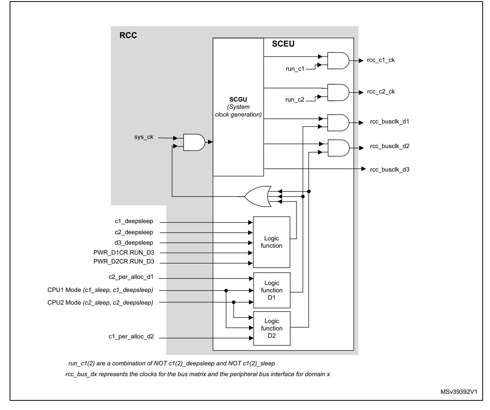

**Figure 69. Bus clock enable logic**

- When a CPU is in CRun mode, the corresponding CPU clock and bus clocks are provided to the domain.
- When a CPU is in CSleep mode, the corresponding bus clocks are provided to the domain, and the CPU clock is stopped.
- When CPU1 is in CStop mode and the other CPU has no peripherals allocated in the D1 domain, the CPU and bus matrix clocks of the D1 domain are stopped. In the same way, when CPU2 is in CStop mode and the other CPU has no peripherals allocated in the D2 domain, CPU2 and bus matrix clocks of the D2 domain are stopped.
- When CPU1 is in CStop mode and the other CPU has allocated peripherals on D1 domain, and is in CRun or CSleep, the corresponding bus matrix clock is provided to the D1 domain, and the CPU1 clock is stopped. In the same way, when CPU2 is in CStop mode and the other CPU has allocated peripherals on D2 domain, and is in

RM0399 Rev 4 411/3556

- CRun or CSleep, the corresponding bus matrix clock is provided to the D2 domain, and the CPU2 clock is stopped.
- When CPU1 and CPU2 are in CStop mode, the bus matrix and the CPU clocks on both domains are stopped.
- Whenever CPU1 or CPU2 are in CRun or CSleep mode, the D3 domain bus matrix clock is running.
- When both CPU1 and CPU2 are in CStop mode, the D3 domain bus matrix clock is stopped, if RUN\_D3 bits are set to '0', and d3\_deepsleep = '1'.
- Whenever one of the two RUN\_D3 bits is set the D3 domain bus clock is running.
- Whenever the d3\_deepsleep signal is inactive (0), the D3 domain bus clock is running.

# 9.6 RCC Interrupts

The RCC provides 3 interrupt lines:

- rcc\_it: a general interrupt line, providing events when the PLLs are ready, or when the
  oscillators are ready.
- rcc\_hsecss\_it: an interrupt line dedicated to the failure detection of the HSE Clock Security System.
- rcc\_lsecss\_it: an interrupt line dedicated to the failure detection of the LSE Clock Security System.

The interrupt enable is controlled via *RCC clock source interrupt enable register* (*RCC\_CIER*), except for the HSE CSS failure. When the HSE CSS feature is enabled, it not possible to mask the interrupt generation.

The interrupt flags can be checked via RCC clock source interrupt flag register (RCC\_CIFR), and those flags can be cleared via RCC clock source interrupt clear register (RCC\_CICR).

Note:

The interrupt flags are not relevant if the corresponding interrupt enable bit is not set.

Table 68 gives a summary of the interrupt sources, and the way to control them.

<span id="page-62-0"></span>Interrupt Interrupt Action to clear Description **Interrupt Line** enable Source interrupt LSIRDYF LSI ready LSIRDYIE Set LSIRDYC to '1' **LSERDYF** LSE ready **LSERDYIE** Set LSERDYC to '1' **HSIDRYF HSIDRYIF** Set HSIRDYC to '1' HSI ready **HSERDYF** HSE ready **HSERDYIE** Set HSERDYC to '1' **CSIRDYF CSIRDYIE** Set CSIRDYC to '1' CSI ready rcc\_it Set HSI48RDYC to HSI48RDYF HSI48RDYIE HSI48 ready PLL1RDYF PLL1RDYIE Set PLL1RDYC to '1' PLL1 ready PLI 2RDYF PLL2 ready PLL2RDYIE Set PLL2RDYC to '1' PLL3RDYF PLL3RDYIE Set PLL3RDYC to '1' PLL3 ready **LSECSSF** LSECSSFIE (1) LSE Clock security system failure Set LSECSSC to '1' rcc Isecss it **HSECSSF** HSE Clock security system failure Set HSECSSC to '1' rcc hsecss it

Table 68. Interrupt sources and control

4

RM0399 Rev 4

413/3556

<sup>1.</sup> The security system feature must also be enabled (LSECSSON = '1'), in order to generate interrupts.

<sup>2.</sup> It is not possible to mask this interrupt when the security system feature is enabled (HSECSSON = '1').

# **9.7 RCC registers**

# <span id="page-63-0"></span>**9.7.1 Register mapping overview**

The RCC register map is divided into 4 sections.

- Common registers accessible by both cores and by any other master.
- Registers mapped at the same address:
  - When accessed by CPU1, CPU1 register bank is accessed.
  - When accessed by CPU2, CPU2 register bank is accessed.
- CPU1 register bank containing the peripheral enable bits (PERxEN), the peripheral low-power enable bits (PERxLPEN) and reset flag status bits for peripheral allocation to CPU1
- CPU2 register bank containing the peripheral enable bits (PERxEN), the peripheral low-power enable bits (PERxLPEN) and reset flag status bits for peripheral allocation to CPU2.

*Note: Any master can access the Common register bank, CPU1 register bank and CPU2 register bank. However, the "same address bank" can only be accessed by CPU1 or CPU2.*

*[Figure 70](#page-63-1)* shows the RCC mapping overview.

<span id="page-63-1"></span>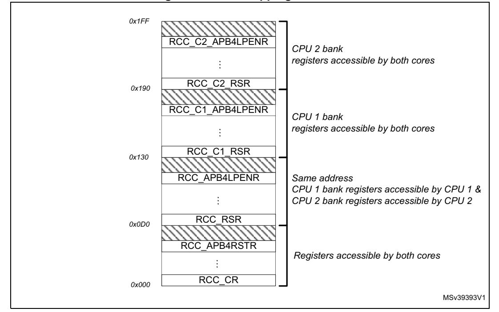

**Figure 70. RCC mapping overview**

# <span id="page-64-0"></span>**9.7.2 RCC source control register (RCC\_CR)**

Address offset: 0x000 Reset value: 0x0000 0001

| 31      | 30      | 29       | 28      | 27      | 26     | 25       | 24     | 23    | 22   | 21      | 20   | 19          | 18     | 17       | 16    |
|---------|---------|----------|---------|---------|--------|----------|--------|-------|------|---------|------|-------------|--------|----------|-------|
| Res.    | Res.    | PLL3RDY  | PLL3ON  | PLL2RDY | PLL2ON | PLL1RDY  | PLL1ON | Res.  | Res. | Res.    | Res. | HSECSSON    | HSEBYP | HSERDY   | HSEON |
|         |         | r        | rw      | r       | rw     | r        | rw     |       |      |         |      | rs          | rw     | r        | rw    |
| 15      | 14      | 13       | 12      | 11      | 10     | 9        | 8      | 7     | 6    | 5       | 4    | 3           | 2      | 1        | 0     |
| D2CKRDY | D1CKRDY | HSI48RDY | HSI48ON | Res.    | Res.   | CSIKERON | CSIRDY | CSION | Res. | HSIDIVF |      | HSIDIV[1:0] | HSIRDY | HSIKERON | HSION |
| r       | r       | r        | rw      |         |        | rw       | r      | rw    |      | r       | rw   | rw          | r      | rw       | rw    |

Bits 31:30 Reserved, must be kept at reset value.

# Bit 29 **PLL3RDY**: PLL3 clock ready flag

Set by hardware to indicate that the PLL3 is locked.

0: PLL3 unlocked (default after reset)

1: PLL3 locked

# Bit 28 **PLL3ON**: PLL3 enable

Set and cleared by software to enable PLL3.

Cleared by hardware when entering Stop or Standby mode.

0: PLL3 OFF (default after reset)

1: PLL3 ON

#### Bit 27 **PLL2RDY**: PLL2 clock ready flag

Set by hardware to indicate that the PLL2 is locked.

0: PLL2 unlocked (default after reset)

1: PLL2 locked

# Bit 26 **PLL2ON**: PLL2 enable

Set and cleared by software to enable PLL2.

Cleared by hardware when entering Stop or Standby mode.

0: PLL2 OFF (default after reset)

1: PLL2 ON

# Bit 25 **PLL1RDY**: PLL1 clock ready flag

Set by hardware to indicate that the PLL1 is locked.

0: PLL1 unlocked (default after reset)

1: PLL1 locked

# Bit 24 **PLL1ON**: PLL1 enable

Set and cleared by software to enable PLL1.

Cleared by hardware when entering Stop or Standby mode. Note that the hardware prevents writing this bit to '0', if the PLL1 output is used as the system clock.

0: PLL1 OFF (default after reset)

1: PLL1 ON

Bits 23:20 Reserved, must be kept at reset value.


RM0399 Rev 4 415/3556

#### Bit 19 **HSECSSON**: HSE Clock Security System enable

Set by software to enable Clock Security System on HSE.

This bit is "set only" (disabled by a system reset or when the system enters in Standby mode).

When HSECSSON is set, the clock detector is enabled by hardware when the HSE is ready and disabled by hardware if an oscillator failure is detected.

0: Clock Security System on HSE OFF (Clock detector OFF) (default after reset)

1: Clock Security System on HSE ON (Clock detector ON if the HSE oscillator is stable, OFF if not).

#### Bit 18 **HSEBYP**: HSE clock bypass

Set and cleared by software to bypass the oscillator with an external clock. The external clock must be enabled with the HSEON bit, to be used by the device.

The HSEBYP bit can be written only if the HSE oscillator is disabled.

0: HSE oscillator not bypassed (default after reset)

1: HSE oscillator bypassed with an external clock

### Bit 17 **HSERDY**: HSE clock ready flag

Set by hardware to indicate that the HSE oscillator is stable.

0: HSE clock is not ready (default after reset)

1: HSE clock is ready

#### Bit 16 **HSEON**: HSE clock enable

Set and cleared by software.

Cleared by hardware to stop the HSE when entering Stop or Standby mode.

This bit cannot be cleared if the HSE is used directly (via SW mux) as system clock or if the HSE is selected as reference clock for PLL1 with PLL1 enabled (PLL1ON bit set to '1').

0: HSE is OFF (default after reset)

1: HSE is ON

### Bit 15 **D2CKRDY**: D2 domain clocks ready flag

Set by hardware to indicate that the D2 domain clocks (CPU, bus and peripheral) are available.

0: D2 domain clocks are not available (default after reset)

1: D2 domain clocks are available

# Bit 14 **D1CKRDY**: D1 domain clocks ready flag

Set by hardware to indicate that the D1 domain clocks (CPU, bus and peripheral) are available.

0: D1 domain clocks are not available (default after reset)

1: D1 domain clocks are available

# Bit 13 **HSI48RDY**: HSI48 clock ready flag

Set by hardware to indicate that the HSI48 oscillator is stable.

0: HSI48 clock is not ready (default after reset)

1: HSI48 clock is ready

#### Bit 12 **HSI48ON**: HSI48 clock enable

Set by software and cleared by software or by the hardware when the system enters to Stop or Standby mode.

0: HSI48 is OFF (default after reset)

1: HSI48 is ON

Bits 11:10 Reserved, must be kept at reset value.

### Bit 9 **CSIKERON**: CSI clock enable in Stop mode

Set and reset by software to force the CSI to ON, even in Stop mode, in order to be quickly available as kernel clock for some peripherals. This bit has no effect on the value of CSION.

0: no effect on CSI (default after reset)

1: CSI is forced to ON even in Stop mode

#### Bit 8 **CSIRDY**: CSI clock ready flag

Set by hardware to indicate that the CSI oscillator is stable. This bit is activated only if the RC is enabled by CSION (it is not activated if the CSI is enabled by CSIKERON or by a peripheral request).

0: CSI clock is not ready (default after reset)

1: CSI clock is ready

### Bit 7 **CSION**: CSI clock enable

Set and reset by software to enable/disable CSI clock for system and/or peripheral. Set by hardware to force the CSI to ON when the system leaves Stop mode, if STOPWUCK = '1' or STOPKERWUCK = '1'.

This bit cannot be cleared if the CSI is used directly (via SW mux) as system clock or if the CSI is selected as reference clock for PLL1 with PLL1 enabled (PLL1ON bit set to '1').

0: CSI is OFF (default after reset)

1: CSI is ON

Bit 6 Reserved, must be kept at reset value.

# Bit 5 **HSIDIVF**: HSI divider flag

Set and reset by hardware.

As a write operation to HSIDIV has not an immediate effect on the frequency, this flag indicates the current status of the HSI divider. HSIDIVF will go immediately to '0' when HSIDIV value is changed, and will be set back to '1' when the output frequency matches the value programmed into HSIDIV.

0: new division ratio not yet propagated to **hsi(\_ker)\_ck** (default after reset)

1: **hsi(\_ker)\_ck** clock frequency reflects the new HSIDIV value

#### Bits 4:3 **HSIDIV[1:0]**: HSI clock divider

Set and reset by software.

These bits allow selecting a division ratio in order to configure the wanted HSI clock frequency. The HSIDIV cannot be changed if the HSI is selected as reference clock for at least one enabled PLL (PLLxON bit set to '1'). In that case, the new HSIDIV value is ignored.

00: Division by 1, **hsi(\_ker)\_ck** = 64 MHz (default after reset)

01: Division by 2, **hsi(\_ker)\_ck** = 32 MHz

10: Division by 4, **hsi(\_ker)\_ck** = 16 MHz

11: Division by 8, **hsi(\_ker)\_ck** = 8 MHz

RM0399 Rev 4 417/3556

### Bit 2 **HSIRDY**: HSI clock ready flag

Set by hardware to indicate that the HSI oscillator is stable.

0: HSI clock is not ready (default after reset)

1: HSI clock is ready

#### Bit 1 **HSIKERON**: High Speed Internal clock enable in Stop mode

Set and reset by software to force the HSI to ON, even in Stop mode, in order to be quickly available as kernel clock for peripherals. This bit has no effect on the value of HSION.

0: no effect on HSI (default after reset)

1: HSI is forced to ON even in Stop mode

# Bit 0 **HSION**: High Speed Internal clock enable

Set and cleared by software.

Set by hardware to force the HSI to ON when the product leaves Stop mode, if STOPWUCK = '0' or STOPKERWUCK = '0'.

Set by hardware to force the HSI to ON when the product leaves Standby mode or in case of a failure of the HSE which is used as the system clock source.

This bit cannot be cleared if the HSI is used directly (via SW mux) as system clock or if the HSI is selected as reference clock for PLL1 with PLL1 enabled (PLL1ON bit set to '1').

0: HSI is OFF

1: HSI is ON (default after reset)


# <span id="page-68-0"></span>**9.7.3 RCC HSI configuration register (RCC\_HSICFGR)**

Address offset: 0x004

Reset value: 0x4000 0xxx

| 31   | 30   | 29   | 28   | 27           | 26 | 25 | 24 | 23   | 22   | 21           | 20   | 19   | 18   | 17   | 16   |
|------|------|------|------|--------------|----|----|----|------|------|--------------|------|------|------|------|------|
| Res. |      |      |      | HSITRIM[6:0] |    |    |    | Res. | Res. | Res.         | Res. | Res. | Res. | Res. | Res. |
|      | rw   | rw   | rw   | rw           | rw | rw | rw |      |      |              |      |      |      |      |      |
| 15   |      |      |      |              |    |    |    |      |      |              |      |      |      |      |      |
|      | 14   | 13   | 12   | 11           | 10 | 9  | 8  | 7    | 6    | 5            | 4    | 3    | 2    | 1    | 0    |
| Res. | Res. | Res. | Res. |              |    |    |    |      |      | HSICAL[11:0] |      |      |      |      |      |

Bit 31 Reserved, must be kept at reset value.

# Bits 30:24 **HSITRIM[6:0]**: HSI clock trimming

Set by software to adjust calibration.

HSITRIM field is added to the engineering Option Bytes loaded during reset phase

(FLASH\_HSI\_opt) in order to form the calibration trimming value.

HSICAL = HSITRIM + FLASH\_HSI\_opt.

*Note: The reset value of the field is 0x40.*

### Bits 23:12 Reserved, must be kept at reset value.

Bits 11:0 **HSICAL[11:0]**: HSI clock calibration

Set by hardware by option byte loading during system reset **nreset**.

Adjusted by software through trimming bits HSITRIM.

This field represents the sum of engineering Option Byte calibration value and HSITRIM bits value.

# **9.7.4 RCC clock recovery RC register (RCC\_CRRCR)**

Address offset: 0x008 Reset value: 0x0000 0xxx

| 31   | 30   | 29   | 28   | 27   | 26   | 25   | 24   | 23   | 22   | 21   | 20            | 19   | 18   | 17   | 16   |
|------|------|------|------|------|------|------|------|------|------|------|---------------|------|------|------|------|
| Res. | Res. | Res. | Res. | Res. | Res. | Res. | Res. | Res. | Res. | Res. | Res.          | Res. | Res. | Res. | Res. |
|      |      |      |      |      |      |      |      |      |      |      |               |      |      |      |      |
| 15   | 14   | 13   | 12   | 11   | 10   | 9    | 8    | 7    | 6    | 5    | 4             | 3    | 2    | 1    | 0    |
| Res. | Res. | Res. | Res. | Res. | Res. |      |      |      |      |      | HSI48CAL[9:0] |      |      |      |      |
|      |      |      |      |      |      | r    | r    | r    | r    | r    | r             | r    | r    | r    | r    |

Bits 31:10 Reserved, must be kept at reset value.

Bits 9:0 **HSI48CAL[9:0]**: Internal RC 48 MHz clock calibration Set by hardware by option byte loading during system reset **nreset**. Read-only.

# <span id="page-70-0"></span>**9.7.5 RCC CSI configuration register (RCC\_CSICFGR)**

Address offset: 0x00C

Reset value: 0x2000 00xx

| 31   | 30   | 29   | 28   | 27   | 26           | 25 | 24 | 23   | 22   | 21   | 20          | 19   | 18   | 17   | 16   |
|------|------|------|------|------|--------------|----|----|------|------|------|-------------|------|------|------|------|
| Res. | Res. |      |      |      | CSITRIM[5:0] |    |    | Res. | Res. | Res. | Res.        | Res. | Res. | Res. | Res. |
|      |      | rw   | rw   | rw   | rw           | rw | rw |      |      |      |             |      |      |      |      |
| 15   | 14   | 13   | 12   | 11   | 10           | 9  | 8  | 7    | 6    | 5    | 4           | 3    | 2    | 1    | 0    |
| Res. | Res. | Res. | Res. | Res. | Res.         |    |    |      |      |      | CSICAL[9:0] |      |      |      |      |
|      |      |      |      |      |              | r  | r  | r    | r    | r    | r           | r    | r    | r    | r    |

Bits 31:30 Reserved, must be kept at reset value.

# Bits 29:24 **CSITRIM[5:0]**: CSI clock trimming

Set by software to adjust calibration.

CSITRIM bitfield is added to the engineering option bytes loaded during the reset phase (FLASH\_CSI\_opt) in order to build the calibration trimming value.

CSICAL = CSITRIM + FLASH\_CSI\_opt.

*Note: The reset value of this bitfield is 0x10.*

Bits 23:8 Reserved, must be kept at reset value.

# Bits 9:0 **CSICAL[9:0]**: CSI clock calibration

Set by hardware by option byte loading during system reset **nreset**.

Adjusted by software through trimming bits CSITRIM.

This bitfield represents the sum of the engineering option byte calibration value and CSITRIM value.

# <span id="page-71-0"></span>**9.7.6 RCC clock configuration register (RCC\_CFGR)**

Address offset: 0x010 Reset value: 0x0000 0000

| 31     | 30           | 29 | 28           | 27 | 26          | 25 | 24 | 23           | 22       | 21 | 20       | 19            | 18 | 17      | 16   |
|--------|--------------|----|--------------|----|-------------|----|----|--------------|----------|----|----------|---------------|----|---------|------|
|        | MCO2SEL[2:0] |    | MCO2PRE[3:0] |    |             |    |    | MCO1SEL[2:0] |          |    |          | MCO11PRE[3:0] |    | Res.    | Res. |
| rw     | rw           | rw | rw           | rw | rw          | rw | rw | rw           | rw       | rw | rw       | rw            | rw |         |      |
| 15     | 14           | 13 | 12           | 11 | 10          | 9  | 8  | 7            | 6        | 5  | 4        | 3             | 2  | 1       | 0    |
| TIMPRE | HRTIMSEL     |    |              |    | RTCPRE[5:0] |    |    | STOPKERWUCK  | STOPWUCK |    | SWS[2:0] |               |    | SW[2:0] |      |
| rw     | rw           | rw | rw           | rw | rw          | rw | rw | rw           | rw       | rw | rw       | rw            | rw | rw      | rw   |

#### Bits 31:29 **MCO2SEL[2:0]**: Micro-controller clock output 2

Set and cleared by software. Clock source selection may generate glitches on MCO2.

It is highly recommended to configure these bits only after reset, before enabling the external oscillators and the PLLs.

000: System clock selected (**sys\_ck**) (default after reset)

001: PLL2 oscillator clock selected (**pll2\_p\_ck**)

010: HSE clock selected (**hse\_ck**)

011: PLL1 clock selected (**pll1\_p\_ck**)

100: CSI clock selected (**csi\_ck**)

101:LSI clock selected (**lsi\_ck**)

others: reserved

#### Bits 28:25 **MCO2PRE[3:0]**: MCO2 prescaler

Set and cleared by software to configure the prescaler of the MCO2. Modification of this prescaler may generate glitches on MCO2. It is highly recommended to change this prescaler only after reset, before enabling the external oscillators and the PLLs.

0000: prescaler disabled (default after reset)

0001: division by 1 (bypass)

0010: division by 2 0011: division by 3 0100: division by 4

...

1111: division by 15

# Bits 24:22 **MCO1SEL[2:0]**: Micro-controller clock output 1

Set and cleared by software. Clock source selection may generate glitches on MCO1.

It is highly recommended to configure these bits only after reset, before enabling the external oscillators and the PLLs.

000: HSI clock selected (**hsi\_ck**) (default after reset)

001: LSE oscillator clock selected (**lse\_ck**)

010: HSE clock selected (**hse\_ck**)

011: PLL1 clock selected (**pll1\_q\_ck**)

100: HSI48 clock selected (**hsi48\_ck**)

others: reserved

### Bits 21:18 **MCO1PRE[3:0]**: MCO1 prescaler

Set and cleared by software to configure the prescaler of the MCO1. Modification of this prescaler may generate glitches on MCO1. It is highly recommended to change this prescaler only after reset, before enabling the external oscillators and the PLLs.

0000: prescaler disabled (default after reset)

0001: division by 1 (bypass)

0010: division by 2 0011: division by 3 0100: division by 4

...

1111: division by 15

### Bits 17:16 Reserved, must be kept at reset value.

### Bit 15 **TIMPRE**: Timers clocks prescaler selection

This bit is set and reset by software to control the clock frequency of all the timers connected to APB1 and APB2 domains.

0: The Timers kernel clock is equal to **rcc\_hclk1** if D2PPREx is corresponding to division by 1 or 2, else it is equal to 2 x **Frcc\_pclkx\_d2** (default after reset)

1: The Timers kernel clock is equal to **rcc\_hclk1** if D2PPREx is corresponding to division by 1, 2 or

4, else it is equal to 4 x **Frcc\_pclkx\_d2**

Please refer to *[Table 59: Ratio between clock timer and pclk](#page-28-1)*

# Bit 14 **HRTIMSEL**: High Resolution Timer clock prescaler selection

This bit is set and reset by software to control the clock frequency of high resolution the timer (HRTIM).

0: The HRTIM prescaler clock source is the same as other timers. (default after reset)

1: The HRTIM prescaler clock source is the CPU1 clock (**rcc\_c1\_ck**).

#### Bits 13:8 **RTCPRE[5:0]**: HSE division factor for RTC clock

Set and cleared by software to divide the HSE to generate a clock for RTC.

Caution: The software has to set these bits correctly to ensure that the clock supplied to the RTC is lower than 1 MHz. These bits must be configured if needed before selecting the RTC clock source.

000000: no clock (default after reset)

000001: no clock 000010: HSE/2 000011: HSE/3 000100: HSE/4

...

111110: HSE/62 111111: HSE/63

### Bit 7 **STOPKERWUCK**: Kernel clock selection after a wake up from system Stop

Set and reset by software to select the Kernel wakeup clock from system Stop.

0: The HSI is selected as wake up clock from system Stop (default after reset)

1: The CSI is selected as wake up clock from system Stop

See *[Section 9.5.7: Handling clock generators in Stop and Standby mode](#page-28-0)* for details.

RM0399 Rev 4 423/3556

#### Bit 6 **STOPWUCK**: System clock selection after a wake up from system Stop

Set and reset by software to select the system wakeup clock from system Stop.

The selected clock is also used as emergency clock for the Clock Security System on HSE.

0: The HSI is selected as wake up clock from system Stop (default after reset)

1: The CSI is selected as wake up clock from system Stop

See *[Section 9.5.7: Handling clock generators in Stop and Standby mode](#page-28-0)* for details.

**Caution:** STOPWUCK must not be modified when the Clock Security System is enabled (by HSECSSON bit) and the system clock is HSE (SWS="10") or a switch on HSE is requested (SW="10").

#### Bits 5:3 **SWS[2:0]**: System clock switch status

Set and reset by hardware to indicate which clock source is used as system clock.

000: HSI used as system clock (**hsi\_ck**) (default after reset)

001: CSI used as system clock (**csi\_ck**)

010: HSE used as system clock (**hse\_ck**)

011: PLL1 used as system clock (**pll1\_p\_ck**)

others: Reserved

#### Bits 2:0 **SW[2:0]**: System clock switch

Set and reset by software to select system clock source (**sys\_ck**).

Set by hardware in order to:

- force the selection of the HSI or CSI (depending on STOPWUCK selection) when leaving a system Stop mode
- force the selection of the HSI in case of failure of the HSE when used directly or indirectly as system clock.

000: HSI selected as system clock (**hsi\_ck**) (default after reset)

001: CSI selected as system clock (**csi\_ck**)

010: HSE selected as system clock (**hse\_ck**)

011: PLL1 selected as system clock (**pll1\_p\_ck**)

others: Reserved

# **9.7.7 RCC domain 1 clock configuration register (RCC\_D1CFGR)**

Address offset: 0x018 Reset value: 0x0000 0000

| 31   | 30   | 29   | 28   | 27   | 26   | 25          | 24   | 23   | 22   | 21          | 20   | 19   | 18   | 17        | 16   |
|------|------|------|------|------|------|-------------|------|------|------|-------------|------|------|------|-----------|------|
| Res. | Res. | Res. | Res. | Res. | Res. | Res.        | Res. | Res. | Res. | Res.        | Res. | Res. | Res. | Res.      | Res. |
|      |      |      |      |      |      |             |      |      |      |             |      |      |      |           |      |
|      |      |      |      |      |      |             |      |      |      |             |      |      |      |           |      |
| 15   | 14   | 13   | 12   | 11   | 10   | 9           | 8    | 7    | 6    | 5           | 4    | 3    | 2    | 1         | 0    |
| Res. | Res. | Res. | Res. |      |      | D1CPRE[3:0] |      | Res. |      | D1PPRE[2:0] |      |      |      | HPRE[3:0] |      |

Bits 31:12 Reserved, must be kept at reset value.

#### Bits 11:8 **D1CPRE[3:0]**: D1 domain Core prescaler

Set and reset by software to control D1 domain CPU clock division factor.

Changing this division ratio has an impact on the frequency of CPU1 clock, all bus matrix clocks and CPU2 clock.

The clocks are divided by the new prescaler factor. This factor ranges from 1 to 16 periods of the slowest APB clock among **rcc\_pclk[4:1]** after D1CPRE update. The application can check if the new division factor is taken into account by reading back this register.

0xxx: **sys\_ck** not divided (default after reset)

1000: **sys\_ck** divided by 2 1001: **sys\_ck** divided by 4 1010: **sys\_ck** divided by 8 1011: **sys\_ck** divided by 16 1100: **sys\_ck** divided by 64 1101: **sys\_ck** divided by 128 1110: **sys\_ck** divided by 256 1111: **sys\_ck** divided by 512

RM0399 Rev 4 425/3556

Bit 7 Reserved, must be kept at reset value.

# Bits 6:4 **D1PPRE[2:0]**: D1 domain APB3 prescaler

Set and reset by software to control the division factor of **rcc\_pclk3**.

The clock is divided by the new prescaler factor from 1 to 16 cycles of **rcc\_hclk3** after D1PPRE write.

```
0xx: rcc_pclk3 = rcc_hclk3 (default after reset)
100: rcc_pclk3 = rcc_hclk3 / 2 
101: rcc_pclk3 = rcc_hclk3 / 4 
110: rcc_pclk3 = rcc_hclk3 / 8 
111: rcc_pclk3 = rcc_hclk3 / 16
```

#### Bits 3:0 **HPRE[3:0]**: D1 domain AHB prescaler

Set and reset by software to control the division factor of **rcc\_hclk3** and **rcc\_aclk**. Changing this division ratio has an impact on the frequency of all bus matrix clocks and CPU2 clock.

```
0xxx: rcc_hclk3 = sys_d1cpre_ck (default after reset)
1000: rcc_hclk3 = sys_d1cpre_ck / 2
1001: rcc_hclk3 = sys_d1cpre_ck / 4
1010: rcc_hclk3 = sys_d1cpre_ck / 8
1011: rcc_hclk3 = sys_d1cpre_ck / 16
1100: rcc_hclk3 = sys_d1cpre_ck / 64
1101: rcc_hclk3 = sys_d1cpre_ck / 128
1110: rcc_hclk3 = sys_d1cpre_ck / 256
1111: rcc_hclk3 = sys_d1cpre_ck / 512
```

*Note: The clocks are divided by the new prescaler factor from1 to 16 periods of the slowest APB clock among rcc\_pclk[4:1] after HPRE update.* 

*Note: Note also that rcc\_hclk3 = rcc\_aclk.*

**Caution:** Care must be taken when using the voltage scaling. Due to the propagation delay of the new division factor, after a prescaler factor change and before lowering the VCORE voltage, this register must be read in order to check that the new prescaler value has been taken into account.

> Depending on the clock source frequency and the voltage range, the software application has to program a correct value in HPRE to make sure that the system frequency does not exceed the maximum frequency.

# <span id="page-76-0"></span>**9.7.8 RCC domain 2 clock configuration register (RCC\_D2CFGR)**

Address offset: 0x01C Reset value: 0x0000 0000

| 31   | 30   | 29   | 28   | 27   | 26   | 25           | 24   | 23   | 22   | 21           | 20   | 19   | 18   | 17   | 16   |
|------|------|------|------|------|------|--------------|------|------|------|--------------|------|------|------|------|------|
| Res. | Res. | Res. | Res. | Res. | Res. | Res.         | Res. | Res. | Res. | Res.         | Res. | Res. | Res. | Res. | Res. |
|      |      |      |      |      |      |              |      |      |      |              |      |      |      |      |      |
|      |      |      |      |      |      |              |      |      |      |              |      |      |      |      |      |
| 15   | 14   | 13   | 12   | 11   | 10   | 9            | 8    | 7    | 6    | 5            | 4    | 3    | 2    | 1    | 0    |
| Res. | Res. | Res. | Res. | Res. |      | D2PPRE2[2:0] |      | Res. |      | D2PPRE1[2:0] |      | Res. | Res. | Res. | Res. |

Bits 31:11 Reserved, must be kept at reset value.

#### Bits 10:8 **D2PPRE2[2:0]**: D2 domain APB2 prescaler

Set and reset by software to control D2 domain APB2 clock division factor.

The clock is divided by the new prescaler factor from 1 to 16 cycles of **rcc\_hclk1** after D2PPRE2 write.

```
0xx: rcc_pclk2 = rcc_hclk1 (default after reset)
100: rcc_pclk2 = rcc_hclk1 / 2
```

101: **rcc\_pclk2** = **rcc\_hclk1** / 4 110: **rcc\_pclk2** = **rcc\_hclk1** / 8

111: **rcc\_pclk2** = **rcc\_hclk1** / 16

Bit 7 Reserved, must be kept at reset value.

# Bits 6:4 **D2PPRE1[2:0]**: D2 domain APB1 prescaler

Set and reset by software to control D2 domain APB1 clock division factor.

The clock is divided by the new prescaler factor from 1 to 16 cycles of **rcc\_hclk1** after D2PPRE1 write.

0xx: **rcc\_pclk1** = **rcc\_hclk1** (default after reset)

100: **rcc\_pclk1** = **rcc\_hclk1** / 2 101: **rcc\_pclk1** = **rcc\_hclk1** / 4

110: **rcc\_pclk1** = **rcc\_hclk1** / 8

111: **rcc\_pclk1** = **rcc\_hclk1** / 16

Bits 3:0 Reserved, must be kept at reset value.

RM0399 Rev 4 427/3556

# **9.7.9 RCC domain 3 clock configuration register (RCC\_D3CFGR)**

Address offset: 0x020 Reset value: 0x0000 0000

| 31   | 30   | 29   | 28   | 27   | 26   | 25   | 24   | 23   | 22   | 21          | 20   | 19   | 18   | 17   | 16   |
|------|------|------|------|------|------|------|------|------|------|-------------|------|------|------|------|------|
| Res. | Res. | Res. | Res. | Res. | Res. | Res. | Res. | Res. | Res. | Res.        | Res. | Res. | Res. | Res. | Res. |
|      |      |      |      |      |      |      |      |      |      |             |      |      |      |      |      |
|      |      |      |      |      |      |      |      |      |      |             |      |      |      |      |      |
| 15   | 14   | 13   | 12   | 11   | 10   | 9    | 8    | 7    | 6    | 5           | 4    | 3    | 2    | 1    | 0    |
| Res. | Res. | Res. | Res. | Res. | Res. | Res. | Res. | Res. |      | D3PPRE[2:0] |      | Res. |      |      |      |

Bits 31:7 Reserved, must be kept at reset value.

#### Bits 6:4 **D3PPRE[2:0]**: D3 domain APB4 prescaler

Set and reset by software to control D3 domain APB4 clock division factor.

The clock is divided by the new prescaler factor from 1 to 16 cycles of **rcc\_hclk4** after D3PPRE write.

0xx: **rcc\_pclk4** = **rcc\_hclk4** (default after reset)

100: **rcc\_pclk4** = **rcc\_hclk4** / 2

101: **rcc\_pclk4** = **rcc\_hclk4** / 4

110: **rcc\_pclk4** = **rcc\_hclk4** / 8

111: **rcc\_pclk4** = **rcc\_hclk4** / 16

Bits 3:0 Reserved, must be kept at reset value.

# <span id="page-78-0"></span>**9.7.10 RCC PLLs clock source selection register (RCC\_PLLCKSELR)**

Address offset: 0x028 Reset value: 0x0202 0200

| 31   | 30   | 29         | 28   | 27   | 26   | 25 | 24                         | 23         | 22 | 21   | 20   | 19 | 18         | 17 | 16          |
|------|------|------------|------|------|------|----|----------------------------|------------|----|------|------|----|------------|----|-------------|
| Res. | Res. | Res.       | Res. | Res. | Res. |    |                            | DIVM3[5:0] |    | Res. | Res. |    | DIVM2[5:4] |    |             |
|      |      |            |      |      |      | rw | rw<br>rw<br>rw<br>rw<br>rw |            |    |      |      |    |            | rw | rw          |
| 15   | 14   | 13         | 12   | 11   | 10   | 9  | 8                          | 7          | 6  | 5    | 4    | 3  | 2          | 1  | 0           |
|      |      | DIVM2[3:0] |      | Res. | Res. |    | DIVM1[5:0]                 |            |    |      |      |    | Res.       |    | PLLSRC[1:0] |
| rw   | rw   | rw         | rw   |      |      | rw | rw                         | rw         | rw | rw   | rw   |    |            | rw | rw          |

Bits 31:26 Reserved, must be kept at reset value.

#### Bits 25:20 **DIVM3[5:0]:** Prescaler for PLL3

Set and cleared by software to configure the prescaler of the PLL3.

The hardware does not allow any modification of this prescaler when PLL3 is enabled (PLL3ON = '1').

In order to save power when PLL3 is not used, the value of DIVM3 must be set to '0'.

000000: prescaler disabled

000001: division by 1 (bypass)

000010: division by 2 000011: division by 3

...

100000: division by 32 (default after reset)

...

111111: division by 63

Bits 19:18 Reserved, must be kept at reset value.

# Bits 17:12 **DIVM2[5:0]**: Prescaler for PLL2

Set and cleared by software to configure the prescaler of the PLL2.

The hardware does not allow any modification of this prescaler when PLL2 is enabled (PLL2ON = '1').

In order to save power when PLL2 is not used, the value of DIVM2 must be set to '0'.

000000: prescaler disabled 000001: division by 1 (bypass)

000010: division by 2 000011: division by 3

...

100000: division by 32 (default after reset)

...

111111: division by 63

Bits 11:10 Reserved, must be kept at reset value.

RM0399 Rev 4 429/3556

### Bits 9:4 **DIVM1[5:0]**: Prescaler for PLL1

Set and cleared by software to configure the prescaler of the PLL1.

The hardware does not allow any modification of this prescaler when PLL1 is enabled (PLL1ON = '1').

In order to save power when PLL1 is not used, the value of DIVM1 must be set to '0'.

000000: prescaler disabled 000001: division by 1 (bypass)

000010: division by 2 000011: division by 3

...

100000: division by 32 (default after reset)

...

111111: division by 63

#### Bits 3:2 Reserved, must be kept at reset value.

# Bits 1:0 **PLLSRC[1:0]:** DIVMx and PLLs clock source selection

Set and reset by software to select the PLL clock source.

These bits can be written only when all PLLs are disabled.

In order to save power, when no PLL is used, the value of PLLSRC must be set to '11'.

00: HSI selected as PLL clock (**hsi\_ck**) (default after reset)

01: CSI selected as PLL clock (**csi\_ck**)

10: HSE selected as PLL clock (**hse\_ck**)

11: No clock send to DIVMx divider and PLLs

# <span id="page-80-0"></span>**9.7.11 RCC PLL configuration register (RCC\_PLLCFGR)**

Address offset: 0x02C

Reset value: 0x01FF 0000

| 31   | 30   | 29   | 28   | 27   | 26            | 25         | 24         | 23      | 22                                                         | 21      | 20      | 19         | 18         | 17      | 16      |
|------|------|------|------|------|---------------|------------|------------|---------|------------------------------------------------------------|---------|---------|------------|------------|---------|---------|
| Res. | Res. | Res. | Res. | Res. | Res.          | Res.       | DIVR3EN    | DIVQ3EN | DIVP3EN                                                    | DIVR2EN | DIVQ2EN | DIVP2EN    | DIVR1EN    | DIVQ1EN | DIVP1EN |
|      |      |      |      |      |               |            | rw         | rw      | rw                                                         | rw      | rw      | rw         | rw         | rw      | rw      |
| 15   | 14   | 13   | 12   | 11   | 10            | 9          | 8          | 7       | 6                                                          | 5       | 4       | 3          | 2          | 1       | 0       |
| Res. | Res. | Res. | Res. |      | PLL3RGE[[1:0] | PLL3VCOSEL | PLL3FRACEN |         | PLL2VCOSEL<br>PLL2FRACEN<br>PLL2RGE[[1:0]<br>PLL1RGE[[1:0] |         |         | PLL1VCOSEL | PLL1FRACEN |         |         |
|      |      |      |      | rw   | rw            | rw         | rw         | rw      | rw                                                         | rw      | rw      | rw         | rw         | rw      | rw      |

Bits 31:25 Reserved, must be kept at reset value.

#### Bit 24 **DIVR3EN**: PLL3 DIVR divider output enable

Set and reset by software to enable the **pll3\_r\_ck** output of the PLL3.

To save power, DIVR3EN and DIVR3 bits must be set to '0' when the **pll3\_r\_ck** is not used.

This bit can be written only when the PLL3 is disabled (PLL3ON = '0' and PLL3RDY = '0').

0: **pll3\_r\_ck** output is disabled

1: **pll3\_r\_ck** output is enabled (default after reset)

#### Bit 23 **DIVQ3EN**: PLL3 DIVQ divider output enable

Set and reset by software to enable the **pll3\_q\_ck** output of the PLL3.

To save power, DIVR3EN and DIVR3 bits must be set to '0' when the **pll3\_r\_ck** is not used.

This bit can be written only when the PLL3 is disabled (PLL3ON = '0' and PLL3RDY = '0').

0: **pll3\_q\_ck** output is disabled

1: **pll3\_q\_ck** output is enabled (default after reset)

#### Bit 22 **DIVP3EN**: PLL3 DIVP divider output enable

Set and reset by software to enable the **pll3\_p\_ck** output of the PLL3.

This bit can be written only when the PLL3 is disabled (PLL3ON = '0' and PLL3RDY = '0').

To save power, DIVR3EN and DIVR3 bits must be set to '0' when the **pll3\_r\_ck** is not used.

0: **pll3\_p\_ck** output is disabled

1: **pll3\_p\_ck** output is enabled (default after reset)

# Bit 21 **DIVR2EN**: PLL2 DIVR divider output enable

Set and reset by software to enable the **pll2\_r\_ck** output of the PLL2.

To save power, DIVR3EN and DIVR3 bits must be set to '0' when the **pll3\_r\_ck** is not used.

This bit can be written only when the PLL2 is disabled (PLL2ON = '0' and PLL2RDY = '0').

0: **pll2\_r\_ck** output is disabled

1: **pll2\_r\_ck** output is enabled (default after reset)

# Bit 20 **DIVQ2EN**: PLL2 DIVQ divider output enable

Set and reset by software to enable the **pll2\_q\_ck** output of the PLL2.

To save power, DIVR3EN and DIVR3 bits must be set to '0' when the **pll3\_r\_ck** is not used.

This bit can be written only when the PLL2 is disabled (PLL2ON = '0' and PLL2RDY = '0').

0: **pll2\_q\_ck** output is disabled

1: **pll2\_q\_ck** output is enabled (default after reset)


RM0399 Rev 4 431/3556

#### Bit 19 **DIVP2EN**: PLL2 DIVP divider output enable

Set and reset by software to enable the **pll2\_p\_ck** output of the PLL2.

This bit can be written only when the PLL2 is disabled (PLL2ON = '0' and PLL2RDY = '0').

To save power, DIVR3EN and DIVR3 bits must be set to '0' when the **pll3\_r\_ck** is not used.

0: **pll2\_p\_ck** output is disabled

1: **pll2\_p\_ck** output is enabled (default after reset)

### Bit 18 **DIVR1EN**: PLL1 DIVR divider output enable

Set and reset by software to enable the **pll1\_r\_ck** output of the PLL1.

To save power, DIVR3EN and DIVR3 bits must be set to '0' when the **pll3\_r\_ck** is not used.

This bit can be written only when the PLL1 is disabled (PLL1ON = '0' and PLL1RDY = '0').

0: **pll1\_r\_ck** output is disabled

1: **pll1\_r\_ck** output is enabled (default after reset)

### Bit 17 **DIVQ1EN**: PLL1 DIVQ divider output enable

Set and reset by software to enable the **pll1\_q\_ck** output of the PLL1.

In order to save power, when the **pll1\_q\_ck** output of the PLL1 is not used, the **pll1\_q\_ck** must be disabled.

This bit can be written only when the PLL1 is disabled (PLL1ON = '0' and PLL1RDY = '0').

0: **pll1\_q\_ck** output is disabled

1: **pll1\_q\_ck** output is enabled (default after reset)

### Bit 16 **DIVP1EN**: PLL1 DIVP divider output enable

Set and reset by software to enable the **pll1\_p\_ck** output of the PLL1.

This bit can be written only when the PLL1 is disabled (PLL1ON = '0' and PLL1RDY = '0').

In order to save power, when the **pll1\_p\_ck** output of the PLL1 is not used, the **pll1\_p\_ck** must be disabled.

0: **pll1\_p\_ck** output is disabled

1: **pll1\_p\_ck** output is enabled (default after reset)

# Bits 15:12 Reserved, must be kept at reset value.

# Bits 11:10 **PLL3RGE[1:0]**: PLL3 input frequency range

Set and reset by software to select the proper reference frequency range used for PLL3.

These bits must be written before enabling the PLL3.

00: The PLL3 input (**ref3\_ck**) clock range frequency is between 1 and 2 MHz (default after reset)

01: The PLL3 input (**ref3\_ck**) clock range frequency is between 2 and 4 MHz

10: The PLL3 input (**ref3\_ck**) clock range frequency is between 4 and 8 MHz

11: The PLL3 input (**ref3\_ck**) clock range frequency is between 8 and 16 MHz

# Bit 9 **PLL3VCOSEL**: PLL3 VCO selection

Set and reset by software to select the proper VCO frequency range used for PLL3.

This bit must be written before enabling the PLL3.

0: Wide VCO range:192 to 960 Hz (default after reset)

1: Medium VCO range:150 to 420 MHz

#### Bit 8 **PLL3FRACEN**: PLL3 fractional latch enable

Set and reset by software to latch the content of FRACN3 into the Sigma-Delta modulator.

In order to latch the FRACN3 value into the Sigma-Delta modulator, PLL3FRACEN must be set to '0', then set to '1': the transition 0 to 1 transfers the content of FRACN3 into the modulator. Please refer to *[Section : PLL initialization phase](#page-24-0)* for additional information.


### Bits 7:6 **PLL2RGE[1:0]**: PLL2 input frequency range

Set and reset by software to select the proper reference frequency range used for PLL2.

These bits must be written before enabling the PLL2.

00: The PLL2 input (**ref2\_ck**) clock range frequency is between 1 and 2 MHz (default after reset)

01: The PLL2 input (**ref2\_ck**) clock range frequency is between 2 and 4 MHz

10: The PLL2 input (**ref2\_ck**) clock range frequency is between 4 and 8 MHz

11: The PLL2 input (**ref2\_ck**) clock range frequency is between 8 and 16 MHz

# Bit 5 **PLL2VCOSEL**: PLL2 VCO selection

Set and reset by software to select the proper VCO frequency range used for PLL2.

This bit must be written before enabling the PLL2.

0: Wide VCO range:192 to 960 MHz (default after reset)

1: Medium VCO range:150 to 420 MHz

#### Bit 4 **PLL2FRACEN**: PLL2 fractional latch enable

Set and reset by software to latch the content of FRACN2 into the Sigma-Delta modulator.

In order to latch the FRACN2 value into the Sigma-Delta modulator, PLL2FRACEN must be set to '0', then set to '1': the transition 0 to 1 transfers the content of FRACN2 into the modulator. Please refer to *[Section : PLL initialization phase](#page-24-0)* for additional information.

### Bits 3:2 **PLL1RGE[1:0]**: PLL1 input frequency range

Set and reset by software to select the proper reference frequency range used for PLL1.

This bit must be written before enabling the PLL1.

00: The PLL1 input (**ref1\_ck**) clock range frequency is between 1 and 2 MHz (default after reset)

01: The PLL1 input (**ref1\_ck**) clock range frequency is between 2 and 4 MHz

10: The PLL1 input (**ref1\_ck**) clock range frequency is between 4 and 8 MHz

11: The PLL1 input (**ref1\_ck**) clock range frequency is between 8 and 16 MHz

#### Bit 1 **PLL1VCOSEL**: PLL1 VCO selection

Set and reset by software to select the proper VCO frequency range used for PLL1.

These bits must be written before enabling the PLL1.

0: Wide VCO range: 192 to 960 MHz (default after reset)

1: Medium VCO range: 150 to 420 MHz

### Bit 0 **PLL1FRACEN**: PLL1 fractional latch enable

Set and reset by software to latch the content of FRACN1 into the Sigma-Delta modulator. In order to latch the FRACN1 value into the Sigma-Delta modulator, PLL1FRACEN must be set to '0', then set to '1': the transition 0 to 1 transfers the content of FRACN1 into the modulator. Please refer to *[Section : PLL initialization phase](#page-24-0)* for additional information.


# **9.7.12 RCC PLL1 dividers configuration register (RCC\_PLL1DIVR)**

Address offset: 0x030

Reset value: 0x0101 0280

| 31   | 30         | 29 | 28 | 27         | 26 | 25 | 24 | 23   | 22 | 21 | 20         | 19         | 18 | 17 | 16 |
|------|------------|----|----|------------|----|----|----|------|----|----|------------|------------|----|----|----|
| Res. |            |    |    | DIVR1[6:0] |    |    |    | Res. |    |    |            | DIVQ1[6:0] |    |    |    |
|      | rw         | rw | rw | rw         | rw | rw | rw |      | rw | rw | rw         | rw         | rw | rw | rw |
| 15   | 14         | 13 | 12 | 11         | 10 | 9  | 8  | 7    | 6  | 5  | 4          | 3          | 2  | 1  | 0  |
|      | DIVP1[6:0] |    |    |            |    |    |    |      |    |    | DIVN1[8:0] |            |    |    |    |
| rw   | rw         | rw | rw | rw         | rw | rw | rw | rw   | rw | rw | rw         | rw         | rw | rw | rw |

Bit 31 Reserved, must be kept at reset value.

Bits 30:24 **DIVR1[6:0]**: PLL1 DIVR division factor

Set and reset by software to control the frequency of the **pll1\_r\_ck** clock.

These bits can be written only when the PLL1 is disabled (PLL1ON = '0' and PLL1RDY = '0').

0000000: not allowed

0000001: **pll1\_r\_ck** = **vco1\_ck** / 2 (default after reset)

0000010: **pll1\_r\_ck** = **vco1\_ck** / 3 0000011: **pll1\_r\_ck** = **vco1\_ck** / 4

...

1111111: **pll1\_r\_ck** = **vco1\_ck** / 128

Bit 23 Reserved, must be kept at reset value.

```
Bits 22:16 DIVQ1[6:0]: PLL1 DIVQ division factor
             Set and reset by software to control the frequency of the pll1_q_ck clock.
             These bits can be written only when the PLL1 is disabled (PLL1ON = '0' and PLL1RDY = '0').
             0000000: pll1_q_ck = vco1_ck
             0000001: pll1_q_ck = vco1_ck / 2 (default after reset)
             0000010: pll1_q_ck = vco1_ck / 3
             0000011: pll1_q_ck = vco1_ck / 4
             ...
             1111111: pll1_q_ck = vco1_ck / 128
 Bits 15:9 DIVP1[6:0]: PLL1 DIVP division factor
             Set and reset by software to control the frequency of the pll1_p_ck clock.
             These bits can be written only when the PLL1 is disabled (PLL1ON = '0' and PLL1RDY = '0').
             Note that odd division factors are not allowed.
             0000000: pll1_p_ck = vco1_ck
             0000001: pll1_p_ck = vco1_ck / 2 (default after reset)
             0000010: Not allowed
             0000011: pll1_p_ck = vco1_ck / 4
             ...
             1111111: pll1_p_ck = vco1_ck / 128
  Bits 8:0 DIVN1[8:0]: Multiplication factor for PLL1 VCO
             Set and reset by software to control the multiplication factor of the VCO.
             These bits can be written only when the PLL is disabled (PLL1ON = '0' and PLL1RDY = '0').
             0x003: DIVN1 = 4 
             0x004: DIVN1 = 5 
             0x005: DIVN1 = 6 
             ...
             0x080: DIVN1 = 129 (default after reset)
             ...
             0x1FF: DIVN1 = 512
             Others: wrong configurations
           Caution: The software has to set correctly these bits to insure that the VCO output frequency is 
                     between its valid frequency range, which is:
                – 192 to 960 MHz if PLL1VCOSEL = '0'
                – 150 to 420 MHz if PLL1VCOSEL = '1'
                –
             VCO output frequency = Fref1_ck x DIVN1, when fractional value 0 has been loaded into FRACN1, 
             with:
```

- DIVN1 between 4 and 512
- The input frequency Fref1\_ck between 1MHz and 16 MHz

# **9.7.13 RCC PLL1 fractional divider register (RCC\_PLL1FRACR)**

Address offset: 0x034

Reset value: 0x0000 0000

| 31   | 30   | 29   | 28   | 27   | 26   | 25           | 24   | 23   | 22   | 21   | 20   | 19   | 18   | 17   | 16   |
|------|------|------|------|------|------|--------------|------|------|------|------|------|------|------|------|------|
| Res. | Res. | Res. | Res. | Res. | Res. | Res.         | Res. | Res. | Res. | Res. | Res. | Res. | Res. | Res. | Res. |
|      |      |      |      |      |      |              |      |      |      |      |      |      |      |      |      |
|      |      |      |      |      |      |              |      |      |      |      |      |      |      |      |      |
| 15   | 14   | 13   | 12   | 11   | 10   | 9            | 8    | 7    | 6    | 5    | 4    | 3    | 2    | 1    | 0    |
|      |      |      |      |      |      | FRACN1[12:0] |      |      |      |      |      |      | Res. | Res. | Res. |

Bits 31:16 Reserved, must be kept at reset value.

Bits 15:3 **FRACN1[12:0]**: Fractional part of the multiplication factor for PLL1 VCO

Set and reset by software to control the fractional part of the multiplication factor of the VCO. These bits can be written at any time, allowing dynamic fine-tuning of the PLL1 VCO.

**Caution:** The software has to set correctly these bits to insure that the VCO output frequency is between its valid frequency range, which is:

- 192 to 960 MHz if PLL1VCOSEL = '0'
- 150 to 420 MHz if PLL1VCOSEL = '1'

VCO output frequency = Fref1\_ck x (DIVN1 + (FRACN1 / 213)), with

- DIVN1 shall be between 4 and 512
- FRACN1 can be between 0 and 213- 1
- The input frequency Fref1\_ck shall be between 1 and 16 MHz.

To change the FRACN value on-the-fly even if the PLL is enabled, the application has to proceed as follow:

- set the bit PLL1FRACEN to '0',
- wait for 3 ref1\_ck periods
- write the new fractional value into FRACN1,
- set the bit PLL1FRACEN to '1'.

where ref1\_ck, ref2\_ck, or ref3\_ck are used depending on FRACNx bit index

Bits 2:0 Reserved, must be kept at reset value.

# **9.7.14 RCC PLL2 dividers configuration register (RCC\_PLL2DIVR)**

Address offset: 0x038 Reset value: 0x0101 0280

| 31   | 30         | 29 | 28 | 27 | 26 | 25 | 24 | 23 | 22 | 21 | 20         | 19         | 18 | 17 | 16 |
|------|------------|----|----|----|----|----|----|----|----|----|------------|------------|----|----|----|
| Res. | DIVR2[6:0] |    |    |    |    |    |    |    |    |    |            | DIVQ2[6:0] |    |    |    |
|      | rw         | rw | rw | rw | rw | rw | rw |    | rw | rw | rw         | rw         | rw | rw | rw |
| 15   | 14         | 13 | 12 | 11 | 10 | 9  | 8  | 7  | 6  | 5  | 4          | 3          | 2  | 1  | 0  |
|      | DIVP2[6:0] |    |    |    |    |    |    |    |    |    | DIVN2[8:0] |            |    |    |    |
| rw   | rw         | rw | rw | rw | rw | rw | rw | rw | rw | rw | rw         | rw         | rw | rw | rw |

Bit 31 Reserved, must be kept at reset value.

Bits 30:24 **DIVR2[6:0]**: PLL2 DIVR division factor

Set and reset by software to control the frequency of the **pll2\_r\_ck** clock.

These bits can be written only when the PLL2 is disabled (PLL2ON = '0' and PLL2RDY = '0').

0000000: **pll2\_r\_ck** = **vco2\_ck**

0000001: **pll2\_r\_ck** = **vco2\_ck** / 2 (default after reset)

0000010: **pll2\_r\_ck** = **vco2\_ck** / 3 0000011: **pll2\_r\_ck** = **vco2\_ck** / 4

...

1111111: **pll2\_r\_ck** = **vco2\_ck** / 128

Bit 23 Reserved, must be kept at reset value.

```
Bits 22:16 DIVQ2[6:0]: PLL2 DIVQ division factor
             Set and reset by software to control the frequency of the pll2_q_ck clock.
             These bits can be written only when the PLL2 is disabled (PLL2ON = '0' and PLL2RDY = '0').
             0000000: pll2_q_ck = vco2_ck
             0000001: pll2_q_ck = vco2_ck / 2 (default after reset)
             0000010: pll2_q_ck = vco2_ck / 3
             0000011: pll2_q_ck = vco2_ck / 4
             ...
             1111111: pll2_q_ck = vco2_ck / 128
```

Bits 15:9 **DIVP2[6:0]**: PLL2 DIVP division factor

Set and reset by software to control the frequency of the **pll2\_p\_ck** clock.

These bits can be written only when the PLL2 is disabled (PLL2ON = '0' and PLL2RDY = '0').

```
0000000: pll2_p_ck = vco2_ck
0000001: pll2_p_ck = vco2_ck / 2 (default after reset)
0000010: pll2_p_ck = vco2_ck / 3
0000011: pll2_p_ck = vco2_ck / 4
...
1111111: pll2_p_ck = vco2_ck / 128
```

Bits 8:0 **DIVN2[8:0]**: Multiplication factor for PLL2 VCO

Set and reset by software to control the multiplication factor of the VCO.

These bits can be written only when the PLL is disabled (PLL2ON = '0' and PLL2RDY = '0').

**Caution:** The software has to set correctly these bits to insure that the VCO output frequency is between its valid frequency range, which is:

- 192 to 960 MHz if PLL2VCOSEL = '0'
- 150 to 420 MHz if PLL2VCOSEL = '1'

VCO output frequency = Fref2\_ck x DIVN2, when fractional value 0 has been loaded into FRACN2, with

- DIVN2 between 4 and 512
- The input frequency Fref2\_ck between 1MHz and 16MHz

```
0x003: DIVN2 = 4 
0x004: DIVN2 = 5 
0x005: DIVN2 = 6 
... 
0x080: DIVN2 = 129 (default after reset)
...
0x1FF: DIVN2 = 512
Others: wrong configurations
```

# **9.7.15 RCC PLL2 fractional divider register (RCC\_PLL2FRACR)**

Address offset: 0x03C

Reset value: 0x0000 0000

| 31   | 30   | 29   | 28   | 27   | 26   | 25           | 24   | 23   | 22   | 21   | 20   | 19   | 18   | 17   | 16   |
|------|------|------|------|------|------|--------------|------|------|------|------|------|------|------|------|------|
| Res. | Res. | Res. | Res. | Res. | Res. | Res.         | Res. | Res. | Res. | Res. | Res. | Res. | Res. | Res. | Res. |
|      |      |      |      |      |      |              |      |      |      |      |      |      |      |      |      |
|      |      |      |      |      |      |              |      |      |      |      |      |      |      |      |      |
| 15   | 14   | 13   | 12   | 11   | 10   | 9            | 8    | 7    | 6    | 5    | 4    | 3    | 2    | 1    | 0    |
|      |      |      |      |      |      | FRACN2[12:0] |      |      |      |      |      |      | Res. | Res. | Res. |

Bits 31:16 Reserved, must be kept at reset value.

Bits 15:3 **FRACN2[12:0]**: Fractional part of the multiplication factor for PLL2 VCO

Set and reset by software to control the fractional part of the multiplication factor of the VCO. These bits can be written at any time, allowing dynamic fine-tuning of the PLL2 VCO.

**Caution:** The software has to set correctly these bits to insure that the VCO output frequency is between its valid frequency range, which is:

- 192 to 960 MHz if PLL2VCOSEL = '0'
- 150 to 420 MHz if PLL2VCOSEL = '1'

VCO output frequency = Fref2\_ck x (DIVN2 + (FRACN2 / 213)), with

- DIVN2 shall be between 4 and 512
- FRACN2 can be between 0 and 213 1
- The input frequency Fref2\_ck shall be between 1 and 16 MHz

In order to change the FRACN value on-the-fly even if the PLL is enabled, the application has to proceed as follow:

- set the bit PLL2FRACEN to '0',
- write the new fractional value into FRACN2,
- set the bit PLL2FRACEN to '1'.

Bits 2:0 Reserved, must be kept at reset value.

RM0399 Rev 4 439/3556

# **9.7.16 RCC PLL3 dividers configuration register (RCC\_PLL3DIVR)**

Address offset: 0x040 Reset value: 0x0101 0280

| 31   | 30         | 29 | 28         | 27 | 26 | 25 | 24 | 23 | 22 | 21 | 20         | 19         | 18 | 17 | 16 |
|------|------------|----|------------|----|----|----|----|----|----|----|------------|------------|----|----|----|
| Res. | DIVR3[6:0] |    |            |    |    |    |    |    |    |    |            | DIVQ3[6:0] |    |    |    |
|      | rw         | rw | rw         | rw | rw | rw | rw |    | rw | rw | rw         | rw         | rw | rw | rw |
| 15   | 14         | 13 | 12         | 11 | 10 | 9  | 8  | 7  | 6  | 5  | 4          | 3          | 2  | 1  | 0  |
|      |            |    | DIVP3[6:0] |    |    |    |    |    |    |    | DIVN3[8:0] |            |    |    |    |
| rw   | rw         | rw | rw         | rw | rw | rw | rw | rw | rw | rw | rw         | rw         | rw | rw | rw |

Bit 31 Reserved, must be kept at reset value.

Bits 30:24 **DIVR3[6:0]**: PLL3 DIVR division factor

Set and reset by software to control the frequency of the **pll3\_r\_ck** clock.

These bits can be written only when the PLL3 is disabled (PLL3ON = '0' and PLL3RDY = '0').

0000000: **pll3\_r\_ck** = **vco3\_ck**

0000001: **pll3\_r\_ck** = **vco3\_ck** / 2 (default after reset)

0000010: **pll3\_r\_ck** = **vco3\_ck** / 3 0000011: **pll3\_r\_ck** = **vco3\_ck** / 4

...

1111111: **pll3\_r\_ck** = **vco3\_ck** / 128

Bit 23 Reserved, must be kept at reset value.

```
Bits 22:16 DIVQ3[6:0]: PLL3 DIVQ division factor
             Set and reset by software to control the frequency of the pll3_q_ck clock.
             These bits can be written only when the PLL3 is disabled (PLL3ON = '0' and PLL3RDY = '0').
```

0000000: **pll3\_q\_ck** = **vco3\_ck** 0000001: **pll3\_q\_ck** = **vco3\_ck** / 2 (default after reset) 0000010: **pll3\_q\_ck** = **vco3\_ck** / 3

0000011: **pll3\_q\_ck** = **vco3\_ck** / 4

...

1111111: **pll3\_q\_ck** = **vco3\_ck** / 128

Bits 15:9 **DIVP3[6:0]**: PLL3 DIVP division factor

Set and reset by software to control the frequency of the **pll3\_p\_ck** clock.

These bits can be written only when the PLL3 is disabled (PLL3ON = '0' and PLL3RDY = '0').

```
0000000: pll3_p_ck = vco3_ck
0000001: pll3_p_ck = vco3_ck / 2 (default after reset)
0000010: pll3_p_ck = vco3_ck / 3
0000011: pll3_p_ck = vco3_ck / 4
...
1111111: pll3_p_ck = vco3_ck / 128
```

# Bits 8:0 **DIVN3[7:0]**: Multiplication factor for PLL3 VCO

Set and reset by software to control the multiplication factor of the VCO.

These bits can be written only when the PLL is disabled (PLL3ON = '0' and PLL3RDY = '0').

**Caution:** The software has to set correctly these bits to insure that the VCO output frequency is between its valid frequency range, which is:

- 192 to 960 MHz if PLL3VCOSEL = '0'
- 150 to 420 MHz if PLL3VCOSEL = '1'

VCO output frequency = Fref3\_ck x DIVN3, when fractional value 0 has been loaded into FRACN3, with

- DIVN3 between 4 and 512
- The input frequency Fref3\_ck between 1MHz and 16MHz

```
0x003: DIVN3 = 4 
0x004: DIVN3 = 5 
0x005: DIVN3 = 6 
...
0x080: DIVN3 = 129 (default after reset)
```

0x1FF: DIVN3 = 512

...

Others: wrong configurations

RM0399 Rev 4 441/3556

# **9.7.17 RCC PLL3 fractional divider register (RCC\_PLL3FRACR)**

Address offset: 0x044

Reset value: 0x0000 0000

| 31   | 30   | 29   | 28   | 27   | 26   | 25           | 24   | 23   | 22   | 21   | 20   | 19   | 18   | 17   | 16   |
|------|------|------|------|------|------|--------------|------|------|------|------|------|------|------|------|------|
| Res. | Res. | Res. | Res. | Res. | Res. | Res.         | Res. | Res. | Res. | Res. | Res. | Res. | Res. | Res. | Res. |
|      |      |      |      |      |      |              |      |      |      |      |      |      |      |      |      |
|      |      |      |      |      |      |              |      |      |      |      |      |      |      |      |      |
| 15   | 14   | 13   | 12   | 11   | 10   | 9            | 8    | 7    | 6    | 5    | 4    | 3    | 2    | 1    | 0    |
|      |      |      |      |      |      | FRACN3[12:0] |      |      |      |      |      |      | Res. | Res. | Res. |

Bits 31:16 Reserved, must be kept at reset value.

Bits 15:3 **FRACN3[12:0]**: Fractional part of the multiplication factor for PLL3 VCO

Set and reset by software to control the fractional part of the multiplication factor of the VCO. These bits can be written at any time, allowing dynamic fine-tuning of the PLL3 VCO.

**Caution:** The software has to set correctly these bits to insure that the VCO output frequency is between its valid frequency range, which is:

- 192 to 960 MHz if PLL3VCOSEL = '0'
- 150 to 420 MHz if PLL3VCOSEL = '1'

VCO output frequency = Fref3\_ck x (DIVN3 + (FRACN3 / 213)), with

- DIVN3 shall be between 4 and 512
- FRACN3 can be between 0 and 213 1
- The input frequency Fref3\_ck shall be between 1 and 16 MHz

In order to change the FRACN value on-the-fly even if the PLL is enabled, the application has to proceed as follow:

- set the bit PLL1FRACEN to '0',
- write the new fractional value into FRACN1,
- set the bit PLL1FRACEN to '1'.

Bits 2:0 Reserved, must be kept at reset value.

# **9.7.18 RCC domain 1 kernel clock configuration register (RCC\_D1CCIPR)**

Address offset: 0x04C Reset value: 0x0000 0000

| 31   | 30   | 29   | 28                | 27   | 26   | 25   | 24         | 23   | 22   | 21               | 20   | 19   | 18   | 17   | 16              |
|------|------|------|-------------------|------|------|------|------------|------|------|------------------|------|------|------|------|-----------------|
| Res. | Res. |      | CKPERSEL[1:0] (1) | Res. | Res. | Res. | Res.       | Res. | Res. | Res.             | Res. | Res. | Res. | Res. | SDMMCSEL (1)    |
|      |      |      | rw                |      |      |      |            |      |      |                  |      |      |      |      | rw              |
| 15   | 14   | 13   | 12                | 11   | 10   | 9    | 8          | 7    | 6    | 5                | 4    | 3    | 2    | 1    | 0               |
| Res. | Res. | Res. | Res.              | Res. | Res. | Res. | DSISEL (1) | Res. | Res. | QSPISEL[1:0] (1) |      | Res. | Res. |      | FMCSEL[1:0] (1) |
|      |      |      |                   |      |      |      | rw         |      |      |                  | rw   |      |      | rw   | rw              |

<span id="page-92-0"></span><sup>1.</sup> Changing the clock source on-the-fly is allowed and will not generate any timing violation. However the user has to make use that both the previous and the new clock sources are present during the switching, and during the whole transition time. Please refer to *[Section : Clock switches and gating](#page-49-1)*.

Bits 31:30 Reserved, must be kept at reset value.

### Bits 29:28 **CKPERSEL[1:0]**: **per\_ck** clock source selection

- 00: **hsi\_ker\_ck** clock selected as **per\_ck** clock (default after reset)
- 01: **csi\_ker\_ck** clock selected as **per\_ck** clock
- 10: **hse\_ck** clock selected as **per\_ck** clock
- 11: reserved, the **per\_ck** clock is disabled

Bits 27:17 Reserved, must be kept at reset value.

#### Bit 16 **SDMMCSEL**: SDMMC kernel clock source selection

- 0: **pll1\_q\_ck** clock is selected as kernel peripheral clock (default after reset)
- 1: **pll2\_r\_ck** clock is selected as kernel peripheral clock
- Bits 15:9 Reserved, must be kept at reset value.
  - Bit 8 **DSISEL**: DSI kernel clock source selection
    - 0: DSI clock from PHY is selected as DSI byte lane clock (default after reset)
    - 1: **pll2\_q\_ck** clock is selected as DSI byte lane clock
- Bits 7:6 Reserved, must be kept at reset value.
- Bits 5:4 **QSPISEL[1:0]**: QUADSPI kernel clock source selection
  - 00: **rcc\_hclk3** clock selected as kernel peripheral clock (default after reset)
  - 01: **pll1\_q\_ck** clock selected as kernel peripheral clock
  - 10: **pll2\_r\_ck** clock selected as kernel peripheral clock
  - 11: **per\_ck** clock selected as kernel peripheral clock
- Bits 3:2 Reserved, must be kept at reset value.
- Bits 1:0 **FMCSEL[1:0]**: FMC kernel clock source selection
  - 00: **rcc\_hclk3** clock selected as kernel peripheral clock (default after reset)
  - 01: **pll1\_q\_ck** clock selected as kernel peripheral clock
  - 10: **pll2\_r\_ck** clock selected as kernel peripheral clock
  - 11: **per\_ck** clock selected as kernel peripheral clock


RM0399 Rev 4 443/3556

# **9.7.19 RCC domain 2 kernel clock configuration register (RCC\_D2CCIP1R)**

Address offset: 0x050 Reset value: 0x0000 0000

| 31         | 30   | 29                 | 28                | 27   | 26   | 25   | 24            | 23                | 22   | 21   | 20                   | 19   | 18                | 17               | 16 |
|------------|------|--------------------|-------------------|------|------|------|---------------|-------------------|------|------|----------------------|------|-------------------|------------------|----|
| SWPSEL (1) | Res. |                    | FDCANSEL[1:0] (1) | Res. | Res. | Res. | DFSDM1SEL (1) | Res.              | Res. |      | SPDIFSEL[1:0]<br>(1) | Res. | SPI45SEL[2:0] (1) |                  |    |
| rw         |      | rw                 | rw                |      |      |      | rw            |                   |      | rw   | rw                   |      | rw                | rw               | rw |
| 15         | 14   | 13                 | 12                | 11   | 10   | 9    | 8             | 7                 | 6    | 5    | 4                    | 3    | 2                 | 1                | 0  |
| Res.       |      | SPI123SEL[2:0] (1) |                   | Res. | Res. | Res. |               | SAI23SEL[2:0] (1) |      | Res. | Res.                 | Res. |                   | SAI1SEL[2:0] (1) |    |
|            | rw   | rw                 | rw                |      |      |      | rw            | rw                | rw   |      |                      |      | rw                | rw               | rw |

<span id="page-93-0"></span><sup>1.</sup> Changing the clock source on-the-fly is allowed and will not generate any timing violation. However the user has to make sure that both the previous and the new clock sources are present during the switching, and for the whole transition time. Please refer to *[Section : Clock switches and gating](#page-49-1)*.

Bit 31 **SWPSEL**: SWPMI kernel clock source selection

Set and reset by software.

0: **pclk** is selected as SWPMI kernel clock (default after reset)

1: **hsi\_ker\_ck** clock is selected as SWPMI kernel clock

Bit 30 Reserved, must be kept at reset value.

Bits 29:28 **FDCANSEL**: FDCAN kernel clock source selection

Set and reset by software.

00: **hse\_ck** clock is selected as FDCAN kernel clock (default after reset)

01: **pll1\_q\_ck** clock is selected as FDCAN kernel clock

10: **pll2\_q\_ck** clock is selected as FDCAN kernel clock

11: reserved, the kernel clock is disabled

Bits 27:25 Reserved, must be kept at reset value.

Bit 24 **DFSDM1SEL**: DFSDM1 kernel **Clk** clock source selection

Set and reset by software.

*Note: the DFSDM1 Aclk Clock Source Selection is done by SAI1SEL.*

0: **rcc\_pclk2** is selected as DFSDM1 Clk kernel clock (default after reset)

1: **sys\_ck** clock is selected as DFSDM1 Clk kernel clock

Bits 23:22 Reserved, must be kept at reset value.

Bits 21:20 **SPDIFSEL[1:0]**: SPDIFRX kernel clock source selection

00: **pll1\_q\_ck** clock selected as SPDIFRX kernel clock (default after reset)

01: **pll2\_r\_ck** clock selected as SPDIFRX kernel clock

10: **pll3\_r\_ck** clock selected as SPDIFRX kernel clock

11: **hsi\_ker\_ck** clock selected as SPDIFRX kernel clock

Bit 19 Reserved, must be kept at reset value.

#### Bits 18:16 **SPI45SEL[2:0]**: SPI4 and 5 kernel clock source selection

Set and reset by software.

000: APB clock is selected as kernel clock (default after reset)

001: **pll2\_q\_ck** clock is selected as kernel clock

010: **pll3\_q\_ck** clock is selected as kernel clock

011: **hsi\_ker\_ck** clock is selected as kernel clock

100: **csi\_ker\_ck** clock is selected as kernel clock

101: **hse\_ck** clock is selected as kernel clock

others: reserved, the kernel clock is disabled

Bit 15 Reserved, must be kept at reset value.

### Bits 14:12 **SPI123SEL[2:0]**: SPI/I2S1,2 and 3 kernel clock source selection

Set and reset by software.

**Caution:** If the selected clock is the external clock and this clock is stopped, it will not be possible to switch to another clock. Refer to *[Section : Clock switches and gating](#page-49-1)* for additional information.

000: **pll1\_q\_ck** clock selected as SPI/I2S1,2 and 3 kernel clock (default after reset)

001: **pll2\_p\_ck** clock selected as SPI/I2S1,2 and 3 kernel clock

010: **pll3\_p\_ck** clock selected as SPI/I2S1,2 and 3 kernel clock

011: I2S\_CKIN clock selected as SPI/I2S1,2 and 3 kernel clock

100: **per\_ck** clock selected as SPI/I2S1,2 and 3 kernel clock

others: reserved, the kernel clock is disabled

*Note: I2S\_CKIN is an external clock taken from a pin.*

Bits 11:9 Reserved, must be kept at reset value.


RM0399 Rev 4 445/3556

#### Bits 8:6 **SAI23SEL[2:0]**: SAI2 and SAI3 kernel clock source selection

Set and reset by software.

**Caution:** If the selected clock is the external clock and this clock is stopped, it will not be possible to switch to another clock. Refer to *[Section : Clock switches and gating](#page-49-1)* for additional information.

000: **pll1\_q\_ck** clock selected as SAI2 and SAI3 kernel clock (default after reset)

001: **pll2\_p\_ck** clock selected as SAI2 and SAI3 kernel clock

010: **pll3\_p\_ck** clock selected as SAI2 and SAI3 kernel clock

011: I2S\_CKIN clock selected as SAI2 and SAI3 kernel clock

100: **per\_ck** clock selected as SAI2 and SAI3 kernel clock

others: reserved, the kernel clock is disabled

*Note: I2S\_CKIN is an external clock taken from a pin.*

Bits 5:3 Reserved, must be kept at reset value.

### Bits 2:0 **SAI1SEL[2:0]**: SAI1 and DFSDM1 kernel **Aclk** clock source selection

Set and reset by software.

**Caution:** If the selected clock is the external clock and this clock is stopped, it will not be possible to switch to another clock. Refer to *[Section : Clock switches and gating](#page-49-1)* for additional information.

*Note: DFSDM1 Clock Source Selection is done by DFSDM1SEL.*

000: **pll1\_q\_ck** clock selected as SAI1 and DFSDM1 **Aclk** kernel clock (default after reset)

001: **pll2\_p\_ck** clock selected as SAI1 and DFSDM1 **Aclk** kernel clock

010: **pll3\_p\_ck** clock selected as SAI1 and DFSDM1 **Aclk** kernel clock

011: I2S\_CKIN clock selected as SAI1 and DFSDM1 **Aclk** kernel clock

100: **per\_ck** clock selected as SAI1 and DFSDM1 **Aclk** kernel clock

others: reserved, the kernel clock is disabled

*Note: I2S\_CKIN is an external clock taken from a pin.* 


# **9.7.20 RCC domain 2 kernel clock configuration register (RCC\_D2CCIP2R)**

Address offset: 0x054 Reset value: 0x0000 0000

| 31   | 30                 | 29                    | 28 | 27   | 26   | 25   | 24              | 23   | 22              | 21 | 20                  | 19   | 18   | 17                      | 16   |
|------|--------------------|-----------------------|----|------|------|------|-----------------|------|-----------------|----|---------------------|------|------|-------------------------|------|
| Res. | LPTIM1SEL[2:0] (1) |                       |    | Res. | Res. | Res. | Res.            |      | CECSEL[1:0] (1) |    | USBSEL[1:0] (1)     | Res. | Res. | Res.                    | Res. |
|      | rw                 | rw                    | rw |      |      |      |                 | rw   | rw              | rw | rw                  |      |      |                         |      |
| 15   | 14                 | 13                    | 12 | 11   | 10   | 9    | 8               | 7    | 6               | 5  | 4                   | 3    | 2    | 1                       | 0    |
| Res. | Res.               | I2C123SEL[1:0]<br>(1) |    | Res. | Res. |      | RNGSEL[1:0] (1) | Res. | Res.            |    | USART16SEL[2:0] (1) |      |      | USART234578SEL[2:0] (1) |      |
|      |                    | rw                    | rw |      |      | rw   | rw              |      |                 | rw | rw                  | rw   | rw   | rw                      | rw   |

<span id="page-96-0"></span><sup>1.</sup> Changing the clock source on-the-fly is allowed and will not generate any timing violation. However the user has to make sure that both the previous and the new clock sources are present during the switching, and for the whole transition time. Please refer to *[Section : Clock switches and gating](#page-49-1)*.

Bit 31 Reserved, must be kept at reset value.

Bits 30:28 **LPTIM1SEL[2:0]**: LPTIM1 kernel clock source selection

Set and reset by software.

000: **rcc\_pclk1** clock selected as kernel peripheral clock (default after reset)

001: **pll2\_p\_ck** clock selected as kernel peripheral clock

010: **pll3\_r\_ck** clock selected as kernel peripheral clock

011: **lse\_ck** clock selected as kernel peripheral clock

100: **lsi\_ck** clock selected as kernel peripheral clock

101: **per\_ck** clock selected as kernel peripheral clock

others: reserved, the kernel clock is disabled

Bits 27:24 Reserved, must be kept at reset value.

Bits 23:22 **CECSEL[1:0]**: HDMI-CEC kernel clock source selection

Set and reset by software.

00: **lse\_ck** clock is selected as kernel clock (default after reset)

01: **lsi\_ck** clock is selected as kernel clock

10: **csi\_ker\_ck** divided by 122 is selected as kernel clock

11: reserved, the kernel clock is disabled

Bits 21:20 **USBSEL[1:0]**: USBOTG 1 and 2 kernel clock source selection

Set and reset by software.

00: Disable the kernel clock (default after reset)

01: **pll1\_q\_ck** clock is selected as kernel clock

10: **pll3\_q\_ck** clock is selected as kernel clock

11: **hsi48\_ck** clock is selected as kernel clock

Bits 19:14 Reserved, must be kept at reset value.

Bits 13:12 **I2C123SEL[1:0]**: I2C1,2,3 kernel clock source selection

Set and reset by software.

00: **rcc\_pclk1** clock is selected as kernel clock (default after reset)

01: **pll3\_r\_ck** clock is selected as kernel clock

10: **hsi\_ker\_ck** clock is selected as kernel clock

11: **csi\_ker\_ck** clock is selected as kernel clock

Bits 11:10 Reserved, must be kept at reset value.


RM0399 Rev 4 447/3556

### Bits 9:8 **RNGSEL[1:0]**: RNG kernel clock source selection

Set and reset by software.

- 00: **hsi48\_ck** clock is selected as kernel clock (default after reset)
- 01: **pll1\_q\_ck** clock is selected as kernel clock
- 10: **lse\_ck** clock is selected as kernel clock
- 11: **lsi\_ck** clock is selected as kernel clock
- Bits 7:6 Reserved, must be kept at reset value.

### Bits 5:3 **USART16SEL[2:0]**: USART1 and 6 kernel clock source selection

Set and reset by software.

000: **rcc\_pclk2** clock is selected as kernel clock (default after reset)

001: **pll2\_q\_ck** clock is selected as kernel clock

010: **pll3\_q\_ck** clock is selected as kernel clock

011: **hsi\_ker\_ck** clock is selected as kernel clock

100: **csi\_ker\_ck** clock is selected as kernel clock

101: **lse\_ck** clock is selected as kernel clock

others: reserved, the kernel clock is disabled

# Bits 2:0 **USART234578SEL[2:0]**: USART2/3, UART4,5, 7/8 (APB1) kernel clock source selection

Set and reset by software.

000: **rcc\_pclk1** clock is selected as kernel clock (default after reset)

001: **pll2\_q\_ck** clock is selected as kernel clock

010: **pll3\_q\_ck** clock is selected as kernel clock

011: **hsi\_ker\_ck** clock is selected as kernel clock

100: **csi\_ker\_ck** clock is selected as kernel clock

101: **lse\_ck** clock is selected as kernel clock

others: reserved, the kernel clock is disabled

# **9.7.21 RCC domain 3 kernel clock configuration register (RCC\_D3CCIPR)**

Address offset: 0x058 Reset value: 0x0000 0000

| 31   | 30                   | 29 | 28   | 27                 | 26 | 25                | 24               | 23   | 22   | 21   | 20   | 19   | 18              | 17                  | 16 |
|------|----------------------|----|------|--------------------|----|-------------------|------------------|------|------|------|------|------|-----------------|---------------------|----|
| Res. | SPI6SEL[2:0] (1)     |    | Res. | SAI4BSEL[2:0] (1)  |    | SAI4ASEL[2:0] (1) |                  |      | Res. | Res. | Res. |      | ADCSEL[1:0] (1) |                     |    |
|      | rw                   | rw | rw   |                    | rw | rw                | rw               | rw   | rw   | rw   |      |      |                 | rw                  | rw |
| 15   | 14                   | 13 | 12   | 11                 | rw | rw                | rw               | 7    | 6    | 5    | 4    | 3    | 2               | 1                   | 0  |
|      | LPTIM345SEL[2:0] (1) |    |      | LPTIM2SEL[2:0] (1) |    |                   | I2C4SEL[1:0] (1) | Res. | Res. | Res. | Res. | Res. |                 | LPUART1SEL[2:0] (1) |    |
| rw   | rw                   | rw | rw   | rw                 | rw | rw                | rw               |      |      |      |      |      | rw              | rw                  | rw |

<span id="page-98-0"></span><sup>1.</sup> Changing the clock source on-the-fly is allowed, and will not generate any timing violation. However the user has to make sure that both the previous and the new clock sources are present during the switching, and for the whole transition time. Please refer to *[Section : Clock switches and gating](#page-49-1)*.

Bit 31 Reserved, must be kept at reset value.

Bits 30:28 **SPI6SEL[2:0]**: SPI6 kernel clock source selection

Set and reset by software.

000: **rcc\_pclk4** clock selected as kernel peripheral clock (default after reset)

001: **pll2\_q\_ck** clock selected as kernel peripheral clock

010: **pll3\_q\_ck** clock selected as kernel peripheral clock

011: **hsi\_ker\_ck** clock selected as kernel peripheral clock

100: **csi\_ker\_ck** clock selected as kernel peripheral clock

101: **hse\_ck** clock selected as kernel peripheral clock

others: reserved, the kernel clock is disabled

Bit 27 Reserved, must be kept at reset value.

Bits 26:24 **SAI4BSEL[2:0]**: Sub-Block B of SAI4 kernel clock source selection

Set and reset by software.

**Caution:** If the selected clock is the external clock and this clock is stopped, it will not be possible to switch to another clock. Refer to *[Section : Clock switches and gating](#page-49-1)* for additional information.

000: **pll1\_q\_ck** clock selected as kernel peripheral clock (default after reset)

001: **pll2\_p\_ck** clock selected as kernel peripheral clock

010: **pll3\_p\_ck** clock selected as kernel peripheral clock

011: I2S\_CKIN clock selected as kernel peripheral clock

100: **per\_ck** clock selected as kernel peripheral clock

others: reserved, the kernel clock is disabled

*Note: I2S\_CKIN is an external clock taken from a pin.*

RM0399 Rev 4 449/3556

Bits 23:21 **SAI4ASEL[2:0]**: Sub-Block A of SAI4 kernel clock source selection

Set and reset by software.

**Caution:** If the selected clock is the external clock and this clock is stopped, it will not be possible to switch to another clock. Refer to *[Section : Clock switches and gating](#page-49-1)* for additional information.

000: **pll1\_q\_ck** clock selected as kernel peripheral clock (default after reset)

001: **pll2\_p\_ck** clock selected as kernel peripheral clock

010: **pll3\_p\_ck** clock selected as kernel peripheral clock

011: I2S\_CKIN clock selected as kernel peripheral clock

100: **per\_ck** clock selected as kernel peripheral clock

others: reserved, the kernel clock is disabled

*Note: I2S\_CKIN is an external clock taken from a pin.*

Bits 20:18 Reserved, must be kept at reset value.

Bits 17:16 **ADCSEL[1:0]**: SAR ADC kernel clock source selection

Set and reset by software.

00: **pll2\_p\_ck** clock selected as kernel peripheral clock (default after reset)

01: **pll3\_r\_ck** clock selected as kernel peripheral clock

10: **per\_ck** clock selected as kernel peripheral clock

others: reserved, the kernel clock is disabled

Bits 15:13 **LPTIM345SEL[2:0]**: LPTIM3,4,5 kernel clock source selection

Set and reset by software.

000: **rcc\_pclk4** clock selected as kernel peripheral clock (default after reset)

001: **pll2\_p\_ck** clock selected as kernel peripheral clock

010: **pll3\_r\_ck** clock selected as kernel peripheral clock

011: **lse\_ck** clock selected as kernel peripheral clock

100: **lsi\_ck** clock selected as kernel peripheral clock

101: **per\_ck** clock selected as kernel peripheral clock

others: reserved, the kernel clock is disabled

Bits 12:10 **LPTIM2SEL[2:0]**: LPTIM2 kernel clock source selection

Set and reset by software.

000: **rcc\_pclk4** clock selected as kernel peripheral clock (default after reset)

001: **pll2\_p\_ck** clock selected as kernel peripheral clock

010: **pll3\_r\_ck** clock selected as kernel peripheral clock

011: **lse\_ck** clock selected as kernel peripheral clock

100: **lsi\_ck** clock selected as kernel peripheral clock

101: **per\_ck** clock selected as kernel peripheral clock

others: reserved, the kernel clock is disabled


Bits 9:8 **I2C4SEL[1:0]**: I2C4 kernel clock source selection

Set and reset by software.

00: **rcc\_pclk4** clock selected as kernel peripheral clock (default after reset)

01: **pll3\_r\_ck** clock selected as kernel peripheral clock

10: **hsi\_ker\_ck** clock selected as kernel peripheral clock

11: **csi\_ker\_ck** clock selected as kernel peripheral clock

Bits 7:3 Reserved, must be kept at reset value.

Bits 2:0 **LPUART1SEL[2:0]**: LPUART1 kernel clock source selection

Set and reset by software.

000: **rcc\_pclk\_d3** clock is selected as kernel peripheral clock (default after reset)

001: **pll2\_q\_ck** clock is selected as kernel peripheral clock

010: **pll3\_q\_ck** clock is selected as kernel peripheral clock

011: **hsi\_ker\_ck** clock is selected as kernel peripheral clock

100: **csi\_ker\_ck** clock is selected as kernel peripheral clock

101: **lse\_ck** clock is selected as kernel peripheral clock

others: reserved, the kernel clock is disabled


RM0399 Rev 4 451/3556

# <span id="page-101-0"></span>**9.7.22 RCC clock source interrupt enable register (RCC\_CIER)**

Address offset: 0x060

Reset value: 0x0000 0000

| 31   | 30   | 29   | 28   | 27   | 26   | 25       | 24        | 23        | 22        | 21         | 20       | 19       | 18       | 17       | 16       |
|------|------|------|------|------|------|----------|-----------|-----------|-----------|------------|----------|----------|----------|----------|----------|
| Res. | Res. | Res. | Res. | Res. | Res. | Res.     | Res.      | Res.      | Res.      | Res.       | Res.     | Res.     | Res.     | Res.     | Res.     |
|      |      |      |      |      |      |          |           |           |           |            |          |          |          |          |          |
| 15   | 14   | 13   | 12   | 11   | 10   | 9        | 8         | 7         | 6         | 5          | 4        | 3        | 2        | 1        | 0        |
| Res. | Res. | Res. | Res. | Res. | Res. | LSECSSIE | PLL3RDYIE | PLL2RDYIE | PLL1RDYIE | HSI48RDYIE | CSIRDYIE | HSERDYIE | HSIRDYIE | LSERDYIE | LSIRDYIE |
|      |      |      |      |      |      | rw       | rw        | rw        | rw        | rw         | rw       | rw       | rw       | rw       | rw       |

Bits 31:10 Reserved, must be kept at reset value.

### Bit 9 LSECSSIE: LSE clock security system Interrupt Enable

Set and reset by software to enable/disable interrupt caused by the Clock Security System on external 32 kHz oscillator.

0: LSE CSS interrupt disabled (default after reset)

1: LSE CSS interrupt enabled

# Bit 8 **PLL3RDYIE**: PLL3 ready Interrupt Enable

Set and reset by software to enable/disable interrupt caused by PLL3 lock.

0: PLL3 lock interrupt disabled (default after reset)

1: PLL3 lock interrupt enabled

# Bit 7 **PLL2RDYIE**: PLL2 ready Interrupt Enable

Set and reset by software to enable/disable interrupt caused by PLL2 lock.

0: PLL2 lock interrupt disabled (default after reset)

1: PLL2 lock interrupt enabled

#### Bit 6 **PLL1RDYIE**: PLL1 ready Interrupt Enable

Set and reset by software to enable/disable interrupt caused by PLL1 lock.

0: PLL1 lock interrupt disabled (default after reset)

1: PLL1 lock interrupt enabled

# Bit 5 **HSI48RDYIE**: HSI48 ready Interrupt Enable

Set and reset by software to enable/disable interrupt caused by the HSI48 oscillator stabilization.

0: HSI48 ready interrupt disabled (default after reset)

1: HSI48 ready interrupt enabled

### Bit 4 **CSIRDYIE**: CSI ready Interrupt Enable

Set and reset by software to enable/disable interrupt caused by the CSI oscillator stabilization.

0: CSI ready interrupt disabled (default after reset)

1: CSI ready interrupt enabled

### Bit 3 **HSERDYIE**: HSE ready Interrupt Enable

Set and reset by software to enable/disable interrupt caused by the HSE oscillator stabilization.

0: HSE ready interrupt disabled (default after reset)

1: HSE ready interrupt enabled


# Bit 2 **HSIRDYIE**: HSI ready Interrupt Enable

Set and reset by software to enable/disable interrupt caused by the HSI oscillator stabilization.

0: HSI ready interrupt disabled (default after reset)

1: HSI ready interrupt enabled

### Bit 1 **LSERDYIE**: LSE ready Interrupt Enable

Set and reset by software to enable/disable interrupt caused by the LSE oscillator stabilization.

0: LSE ready interrupt disabled (default after reset)

1: LSE ready interrupt enabled

#### Bit 0 **LSIRDYIE**: LSI ready Interrupt Enable

Set and reset by software to enable/disable interrupt caused by the LSI oscillator stabilization.

0: LSI ready interrupt disabled (default after reset)

1: LSI ready interrupt enabled


RM0399 Rev 4 453/3556

# <span id="page-103-0"></span>**9.7.23 RCC clock source interrupt flag register (RCC\_CIFR)**

Address offset: 0x64

Reset value: 0x0000 0000

| 31   | 30   | 29   | 28   | 27   | 26      | 25      | 24       | 23       | 22       | 21        | 20      | 19      | 18      | 17      | 16      |
|------|------|------|------|------|---------|---------|----------|----------|----------|-----------|---------|---------|---------|---------|---------|
| Res. | Res. | Res. | Res. | Res. | Res.    | Res.    | Res.     | Res.     | Res.     | Res.      | Res.    | Res.    | Res.    | Res.    | Res.    |
|      |      |      |      |      |         |         |          |          |          |           |         |         |         |         |         |
| 15   | 14   | 13   | 12   | 11   | 10      | 9       | 8        | 7        | 6        | 5         | 4       | 3       | 2       | 1       | 0       |
| Res. | Res. | Res. | Res. | Res. | HSECSSF | LSECSSF | PLL3RDYF | PLL2RDYF | PLL1RDYF | HSI48RDYF | CSIRDYF | HSERDYF | HSIRDYF | LSERDYF | LSIRDYF |
|      |      |      |      |      | r       | r       | r        | r        | r        | r         | r       | r       | r       | r       | r       |

Bits 31:11 Reserved, must be kept at reset value.

### Bit 10 **HSECSSF**: HSE clock security system Interrupt Flag

Reset by software by writing HSECSSC bit.

Set by hardware in case of HSE clock failure.

0: No clock security interrupt caused by HSE clock failure (default after reset)

1: Clock security interrupt caused by HSE clock failure

### Bit 9 **LSECSSF**: LSE clock security system Interrupt Flag

Reset by software by writing LSECSSC bit.

Set by hardware when a failure is detected on the external 32 kHz oscillator and LSECSSIE is set.

0: No failure detected on the external 32 kHz oscillator (default after reset)

1: A failure is detected on the external 32 kHz oscillator

### Bit 8 **PLL3RDYF**: PLL3 ready Interrupt Flag

Reset by software by writing PLL3RDYC bit.

Set by hardware when the PLL3 locks and PLL3RDYIE is set.

0: No clock ready interrupt caused by PLL3 lock (default after reset)

1: Clock ready interrupt caused by PLL3 lock

#### Bit 7 **PLL2RDYF**: PLL2 ready Interrupt Flag

Reset by software by writing PLL2RDYC bit.

Set by hardware when the PLL2 locks and PLL2RDYIE is set.

0: No clock ready interrupt caused by PLL2 lock (default after reset)

1: Clock ready interrupt caused by PLL2 lock

#### Bit 6 **PLL1RDYF**: PLL1 ready Interrupt Flag

Reset by software by writing PLL1RDYC bit.

Set by hardware when the PLL1 locks and PLL1RDYIE is set.

0: No clock ready interrupt caused by PLL1 lock (default after reset)

1: Clock ready interrupt caused by PLL1 lock

#### Bit 5 **HSI48RDYF**: HSI48 ready Interrupt Flag

Reset by software by writing HSI48RDYC bit.

Set by hardware when the HSI48 clock becomes stable and HSI48RDYIE is set.

0: No clock ready interrupt caused by the HSI48 oscillator (default after reset)

1: Clock ready interrupt caused by the HSI48 oscillator


#### Bit 4 **CSIRDYF**: CSI ready Interrupt Flag

Reset by software by writing CSIRDYC bit.

Set by hardware when the CSI clock becomes stable and CSIRDYIE is set.

- 0: No clock ready interrupt caused by the CSI (default after reset)
- 1: Clock ready interrupt caused by the CSI

#### Bit 3 **HSERDYF**: HSE ready Interrupt Flag

Reset by software by writing HSERDYC bit.

Set by hardware when the HSE clock becomes stable and HSERDYIE is set.

- 0: No clock ready interrupt caused by the HSE (default after reset)
- 1: Clock ready interrupt caused by the HSE

# Bit 2 **HSIRDYF**: HSI ready Interrupt Flag

Reset by software by writing HSIRDYC bit.

Set by hardware when the HSI clock becomes stable and HSIRDYIE is set.

- 0: No clock ready interrupt caused by the HSI (default after reset)
- 1: Clock ready interrupt caused by the HSI

#### Bit 1 **LSERDYF**: LSE ready Interrupt Flag

Reset by software by writing LSERDYC bit.

Set by hardware when the LSE clock becomes stable and LSERDYIE is set.

- 0: No clock ready interrupt caused by the LSE (default after reset)
- 1: Clock ready interrupt caused by the LSE

# Bit 0 **LSIRDYF**: LSI ready Interrupt Flag

Reset by software by writing LSIRDYC bit.

Set by hardware when the LSI clock becomes stable and LSIRDYIE is set.

- 0: No clock ready interrupt caused by the LSI (default after reset)
- 1: Clock ready interrupt caused by the LSI

# <span id="page-105-0"></span>**9.7.24 RCC clock source interrupt clear register (RCC\_CICR)**

Address offset: 0x68

Reset value: 0x0000 0000

| 31   | 30   | 29   | 28   | 27   | 26      | 25      | 24       | 23       | 22       | 21        | 20      | 19      | 18      | 17      | 16      |
|------|------|------|------|------|---------|---------|----------|----------|----------|-----------|---------|---------|---------|---------|---------|
| Res. | Res. | Res. | Res. | Res. | Res.    | Res.    | Res.     | Res.     | Res.     | Res.      | Res.    | Res.    | Res.    | Res.    | Res.    |
|      |      |      |      |      |         |         |          |          |          |           |         |         |         |         |         |
| 15   | 14   | 13   | 12   | 11   | 10      | 9       | 8        | 7        | 6        | 5         | 4       | 3       | 2       | 1       | 0       |
| Res. | Res. | Res. | Res. | Res. | HSECSSC | LSECSSC | PLL3RDYC | PLL2RDYC | PLL1RDYC | HSI48RDYC | CSIRDYC | HSERDYC | HSIRDYC | LSERDYC | LSIRDYC |
|      |      |      |      |      | rc_w1   | rc_w1   | rc_w1    | rc_w1    | rc_w1    | rc_w1     | rc_w1   | rc_w1   | rc_w1   | rc_w1   | rc_w1   |

Bits 31:11 Reserved, must be kept at reset value.

Bit 10 **HSECSSC**: HSE clock security system Interrupt Clear

Set by software to clear HSECSSF.

Reset by hardware when clear done.

0: HSECSSF no effect (default after reset)

1: HSECSSF cleared

Bit 9 **LSECSSC**: LSE clock security system Interrupt Clear

Set by software to clear LSECSSF.

Reset by hardware when clear done.

0: LSECSSF no effect (default after reset)

1: LSECSSF cleared

Bit 8 **PLL3RDYC**: PLL3 ready Interrupt Clear

Set by software to clear PLL3RDYF.

Reset by hardware when clear done.

0: PLL3RDYF no effect (default after reset)

1: PLL3RDYF cleared

Bit 7 **PLL2RDYC**: PLL2 ready Interrupt Clear

Set by software to clear PLL2RDYF.

Reset by hardware when clear done.

0: PLL2RDYF no effect (default after reset)

1: PLL2RDYF cleared

Bit 6 **PLL1RDYC**: PLL1 ready Interrupt Clear

Set by software to clear PLL1RDYF.

Reset by hardware when clear done.

0: PLL1RDYF no effect (default after reset)

1: PLL1RDYF cleared

Bit 5 **HSI48RDYC**: HSI48 ready Interrupt Clear

Set by software to clear HSI48RDYF.

Reset by hardware when clear done.

0: HSI48RDYF no effect (default after reset)

1: HSI48RDYF cleared

### Bit 4 **CSIRDYC**: CSI ready Interrupt Clear

Set by software to clear CSIRDYF.

Reset by hardware when clear done.

0: CSIRDYF no effect (default after reset)

1: CSIRDYF cleared

#### Bit 3 **HSERDYC**: HSE ready Interrupt Clear

Set by software to clear HSERDYF.

Reset by hardware when clear done.

0: HSERDYF no effect (default after reset)

1: HSERDYF cleared

#### Bit 2 **HSIRDYC**: HSI ready Interrupt Clear

Set by software to clear HSIRDYF.

Reset by hardware when clear done.

0: HSIRDYF no effect (default after reset)

1: HSIRDYF cleared

#### Bit 1 **LSERDYC**: LSE ready Interrupt Clear

Set by software to clear LSERDYF.

Reset by hardware when clear done.

0: LSERDYF no effect (default after reset)

1: LSERDYF cleared

# Bit 0 **LSIRDYC**: LSI ready Interrupt Clear

Set by software to clear LSIRDYF.

Reset by hardware when clear done.

0: LSIRDYF no effect (default after reset)

1: LSIRDYF cleared

# <span id="page-107-0"></span>**9.7.25 RCC Backup domain control register (RCC\_BDCR)**

Address offset: 0x070

Reset value: 0x0000 0000, reset by Backup domain reset.

Access: 0 ≤ wait state ≤ 7, word, half-word and byte access. Wait states are inserted in case of successive accesses to this register.

After a system reset, the RCC\_BDCR register is write-protected. To modify this register, the DBP bit in the *PWR CPU1 control register (PWR\_CPU1CR)* has to be set to '1'.

RCC\_BDCR bits are only reset after a backup domain reset (see *[Section 9.4.6: Backup](#page-9-0)  [domain reset](#page-9-0)*). Any other internal or external reset will not have any effect on these bits.

| 31    | 30   | 29   | 28   | 27   | 26   | 25          | 24   | 23   | 22      | 21       | 20   | 19          | 18     | 17     | 16    |
|-------|------|------|------|------|------|-------------|------|------|---------|----------|------|-------------|--------|--------|-------|
| Res.  | Res. | Res. | Res. | Res. | Res. | Res.        | Res. | Res. | Res.    | Res.     | Res. | Res.        | Res.   | Res.   | BDRST |
|       |      |      |      |      |      |             |      |      |         |          |      |             |        |        | rw    |
| 15    | 14   | 13   | 12   | 11   | 10   | 9           | 8    | 7    | 6       | 5        | 4    | 3           | 2      | 1      | 0     |
| RTCEN | Res. | Res. | Res. | Res. | Res. | RTCSEL[1:0] |      | Res. | LSECSSD | LSECSSON |      | LSEDRV[1:0] | LSEBYP | LSERDY | LSEON |
| rw    |      |      |      |      |      | rwo         | rwo  |      | r       | rs       | rw   | rw          | rw     | r      | rw    |

Bits 31:17 Reserved, must be kept at reset value.

Bit 16 **BDRST**: Backup domain software reset

Set and reset by software.

0: Reset not activated (default after backup domain reset)

1: Resets the entire VSW domain

Bit 15 **RTCEN**: RTC clock enable

Set and reset by software.

0: **rtc\_ck** clock is disabled (default after backup domain reset)

1: **rtc\_ck** clock enabled

Bits 14:10 Reserved, must be kept at reset value.

### Bits 9:8 **RTCSEL[1:0]**:RTC clock source selection

Set by software to select the clock source for the RTC. These bits can be written only one time (except in case of failure detection on LSE). These bits must be written before LSECSSON is enabled. The BDRST bit can be used to reset them, then it can be written one time again.

If HSE is selected as RTC clock: this clock is lost when the system is in Stop mode or in case of a pin reset (NRST).

00: No clock (default after backup domain reset)

01: LSE clock used as RTC clock

10: LSI clock used as RTC clock

11: HSE clock divided by RTCPRE value is used as RTC clock

Bit 7 Reserved, must be kept at reset value.

### Bit 6 **LSECSSD**: LSE clock security system failure detection

Set by hardware to indicate when a failure has been detected by the Clock Security System on the external 32 kHz oscillator.

- 0: No failure detected on 32 kHz oscillator (default after backup domain reset)
- 1: Failure detected on 32 kHz oscillator

### Bit 5 **LSECSSON**: LSE clock security system enable

Set by software to enable the Clock Security System on 32 kHz oscillator.

LSECSSON must be enabled after LSE is enabled (LSEON enabled) and ready (LSERDY set by hardware), and after RTCSEL is selected.

Once enabled this bit cannot be disabled, except after a LSE failure detection (LSECSSD = '1'). In that case the software **must** disable LSECSSON.

- 0: Clock Security System on 32 kHz oscillator OFF (default after backup domain reset)
- 1: Clock Security System on 32 kHz oscillator ON

#### Bits 4:3 **LSEDRV[1:0]**: LSE oscillator driving capability

Set by software to select the driving capability of the LSE oscillator.

- 00: Lowest drive (default after backup domain reset)
- 01: Medium low drive
- 10: Medium high drive
- 11: Highest drive

*Note: The driving capability cannot be changed after LSEON has been set to 1.*

#### Bit 2 **LSEBYP**: LSE oscillator bypass

Set and reset by software to bypass oscillator in debug mode. This bit must not be written when the LSE is enabled (by LSEON) or ready (LSERDY = '1')

- 0: LSE oscillator not bypassed (default after backup domain reset)
- 1: LSE oscillator bypassed

# Bit 1 **LSERDY**: LSE oscillator ready

Set and reset by hardware to indicate when the LSE is stable. This bit needs 6 cycles of **lse\_ck** clock to fall down after LSEON has been set to '0'.

- 0: LSE oscillator not ready (default after backup domain reset)
- 1: LSE oscillator ready

### Bit 0 **LSEON**: LSE oscillator enabled

Set and reset by software.

- 0: LSE oscillator OFF (default after backup domain reset)
- 1: LSE oscillator ON


RM0399 Rev 4 459/3556

# <span id="page-109-0"></span>**9.7.26 RCC clock control and status register (RCC\_CSR)**

Address offset: 0x074

Reset value: 0x0000 0000

Access: 0 ≤ wait state ≤ 7, word, half-word and byte access

Wait states are inserted in case of successive accesses to this register.

| 31   | 30   | 29   | 28   | 27   | 26   | 25   | 24   | 23   | 22   | 21   | 20   | 19   | 18   | 17     | 16    |
|------|------|------|------|------|------|------|------|------|------|------|------|------|------|--------|-------|
| Res. | Res. | Res. | Res. | Res. | Res. | Res. | Res. | Res. | Res. | Res. | Res. | Res. | Res. | Res.   | Res.  |
|      |      |      |      |      |      |      |      |      |      |      |      |      |      |        |       |
| 15   | 14   | 13   | 12   | 11   | 10   | 9    | 8    | 7    | 6    | 5    | 4    | 3    | 2    | 1      | 0     |
| Res. | Res. | Res. | Res. | Res. | Res. | Res. | Res. | Res. | Res. | Res. | Res. | Res. | Res. | LSIRDY | LSION |
|      |      |      |      |      |      |      |      |      |      |      |      |      |      | r      | rw    |

Bits 31:2 Reserved, must be kept at reset value.

### Bit 1 **LSIRDY**: LSI oscillator ready

Set and reset by hardware to indicate when the Low Speed Internal RC oscillator is stable.

This bit needs 3 cycles of **lsi\_ck** clock to fall down after LSION has been set to '0'.

This bit can be set even when LSION is not enabled if there is a request for LSI clock by the Clock Security System on LSE or by the Low Speed Watchdog or by the RTC.

0: LSI clock is not ready (default after reset)

1: LSI clock is ready

### Bit 0 **LSION**: LSI oscillator enable

Set and reset by software.

0: LSI is OFF (default after reset)

1: LSI is ON

# **9.7.27 RCC AHB3 reset register (RCC\_AHB3RSTR)**

Address offset: 0x07C

Reset value: 0x0000 0000

| 31   | 30      | 29   | 28     | 27   | 26   | 25   | 24   | 23   | 22   | 21        | 20       | 19   | 18   | 17   | 16        |
|------|---------|------|--------|------|------|------|------|------|------|-----------|----------|------|------|------|-----------|
| Res. | Res.    | Res. | Res.   | Res. | Res. | Res. | Res. | Res. | Res. | Res.      | Res.     | Res. | Res. | Res. | SDMMC1RST |
|      |         |      |        |      |      |      |      |      |      |           |          |      |      |      | rw        |
| 15   | 14      | 13   | 12     | 11   | 10   | 9    | 8    | 7    | 6    | 5         | 4        | 3    | 2    | 1    | 0         |
| Res. | QSPIRST | Res. | FMCRST | Res. | Res. | Res. | Res. | Res. | Res. | JPGDECRST | DMA2DRST | Res. | Res. | Res. | MDMARST   |
|      | rw      |      | rw     |      |      |      |      |      |      | rw        | rw       |      |      |      | rw        |

Bits 31:17 Reserved, must be kept at reset value.

Bit 16 **SDMMC1RST**: SDMMC1 and SDMMC1 delay block reset

Set and reset by software.

0: does not reset SDMMC1 and SDMMC1 Delay block (default after reset)

1: resets SDMMC1 and SDMMC1 Delay block

*Note: When the master is reset, all the slaves for which an access from this master is ongoing must be reset as well.*

Bit 15 Reserved, must be kept at reset value.

Bit 14 **QSPIRST**: QUADSPI and QUADSPI delay block reset

Set and reset by software.

0: does not reset QUADSPI and QUADSPI Delay block (default after reset)

1: resets QUADSPI and QUADSPI Delay block

Bit 13 Reserved, must be kept at reset value.

Bit 12 **FMCRST**: FMC block reset

Set and reset by software.

0: does not reset FMC block (default after reset)

1: resets FMC block

Bits 11:6 Reserved, must be kept at reset value.

Bit 5 **JPGDECRST**: JPGDEC block reset

Set and reset by software.

0: does not reset JPGDEC block (default after reset)

1: resets JPGDEC block

### Bit 4 **DMA2DRST**: DMA2D block reset

Set and reset by software.

0: does not reset DMA2D block (default after reset)

1: resets DMA2D block

*Note: When the master is reset, all the slaves for which an access from this master is ongoing must be reset as well.*

Bits 3:1 Reserved, must be kept at reset value.

# Bit 0 **MDMARST**: MDMA block reset

Set and reset by software.

0: does not reset MDMA block (default after reset)

1: resets MDMA block

*Note: When the master is reset, all the slaves for which an access from this master is ongoing must be reset as well.*


# **9.7.28 RCC AHB1 peripheral reset register(RCC\_AHB1RSTR)**

Address offset: 0x080

Reset value: 0x0000 0000

| 31         | 30     | 29   | 28   | 27         | 26   | 25         | 24   | 23   | 22   | 21       | 20   | 19   | 18   | 17      | 16      |
|------------|--------|------|------|------------|------|------------|------|------|------|----------|------|------|------|---------|---------|
| Res.       | Res.   | Res. | Res. | USB2OTGRST | Res. | USB1OTGRST | Res. | Res. | Res. | Res.     | Res. | Res. | Res. | Res.    | Res.    |
|            |        |      |      | rw         |      | rw         |      |      |      |          |      |      |      |         |         |
| 15         | 14     | 13   | 12   | 11         | 10   | 9          | 8    | 7    | 6    | 5        | 4    | 3    | 2    | 1       | 0       |
| ETH1MACRST | ARTRST | Res. | Res. | Res.       | Res. | Res.       | Res. | Res. | Res. | ADC12RST | Res. | Res. | Res. | DMA2RST | DMA1RST |
| rw         | rw     |      |      |            |      |            |      |      |      | rw       |      |      |      | rw      | rw      |

Bits 31:28 Reserved, must be kept at reset value.

Bit 27 **USB2OTGRST**: USB2OTG (OTG\_HS2) block reset

Set and reset by software.

0: does not reset USB2OTG block (default after reset)

1: resets USB2OTG block

Bit 26 Reserved, must be kept at reset value.

Bit 25 **USB1OTGRST**: USB1OTG (OTG\_HS1) block reset

Set and reset by software.

0: does not reset USB1OTG block (default after reset)

1: resets USB1OTG block

Bits 24:16 Reserved, must be kept at reset value.

Bit 15 **ETH1MACRST**: ETH1MAC block reset

Set and reset by software.

0: does not reset ETH1MAC block (default after reset)

1: resets ETH1MAC block

Bit 14 **ARTRST**: ART block reset

Set and reset by software.

0: does not reset ART block (default after reset)

1: resets ART block

*Note: Do not set this bit while executing from a memory on which the ART is configured to fetch instructions.*

Bits 13:6 Reserved, must be kept at reset value.

Bit 5 **ADC12RST**: ADC1and 2 block reset

Set and reset by software.

0: does not reset ADC1 and 2 block (default after reset)

1: resets ADC1and 2 block

RM0399 Rev 4 463/3556

Bits 4:2 Reserved, must be kept at reset value.

Bit 1 **DMA2RST**: DMA2 block reset

Set and reset by software.

0: does not reset DMA2 block (default after reset)

1: resets DMA2 block

Bit 0 **DMA1RST**: DMA1 block reset

Set and reset by software.

0: does not reset DMA1 block (default after reset)

1: resets DMA1 block

# **9.7.29 RCC AHB2 peripheral reset register (RCC\_AHB2RSTR)**

Address offset: 0x084

Reset value: 0x0000 0000

| 31   | 30   | 29   | 28   | 27   | 26   | 25        | 24   | 23   | 22     | 21      | 20       | 19   | 18   | 17   | 16        |
|------|------|------|------|------|------|-----------|------|------|--------|---------|----------|------|------|------|-----------|
| Res. | Res. | Res. | Res. | Res. | Res. | Res.      | Res. | Res. | Res.   | Res.    | Res.     | Res. | Res. | Res. | Res.      |
| 15   | 14   | 13   | 12   | 11   | 10   | 9         | 8    | 7    | 6      | 5       | 4        | 3    | 2    | 1    | 0         |
| Res. | Res. | Res. | Res. | Res. | Res. | SDMMC2RST | Res. | Res. | RNGRST | HASHRST | CRYPTRST | Res. | Res. | Res. | CAMITFRST |
|      |      |      |      |      |      | rw        |      |      | rw     | rw      | rw       |      |      |      | rw        |

Bits 31:10 Reserved, must be kept at reset value.

Bit 9 **SDMMC2RST**: SDMMC2 and SDMMC2 Delay block reset

Set and reset by software.

0: does not reset SDMMC2 and SDMMC2 Delay block (default after reset)

1: resets SDMMC2 and SDMMC2 Delay block

Bits 8:7 Reserved, must be kept at reset value.

Bit 6 **RNGRST**: Random Number Generator block reset

Set and reset by software.

0: does not reset RNG block (default after reset)

1: resets RNG block

Bit 5 **HASHRST**: Hash block reset

Set and reset by software.

0: does not reset hash block (default after reset)

1: resets hash block

Bit 4 **CRYPTRST**: Cryptography block reset

Set and reset by software.

0: does not reset cryptography block (default after reset)

1: resets cryptography block

Bits 3:1 Reserved, must be kept at reset value.

Bit 0 **CAMITFRST**: CAMITF block reset

Set and reset by software.

0: does not reset the CAMITF block (default after reset)

1: resets the CAMITF block

# **9.7.30 RCC AHB4 peripheral reset register (RCC\_AHB4RSTR)**

Address offset: 0x088

Reset value: 0x0000 0000

| 31   | 30   | 29   | 28   | 27   | 26       | 25       | 24       | 23       | 22       | 21       | 20       | 19       | 18       | 17       | 16       |
|------|------|------|------|------|----------|----------|----------|----------|----------|----------|----------|----------|----------|----------|----------|
| Res. | Res. | Res. | Res. | Res. | Res.     | HSEMRST  | ADC3RST  | Res.     | Res.     | BDMARST  | Res.     | CRCRST   | Res.     | Res.     | Res.     |
|      |      |      |      |      |          | rw       | rw       |          |          | rw       |          | rw       |          |          |          |
| 15   | 14   | 13   | 12   | 11   | 10       | 9        | 8        | 7        | 6        | 5        | 4        | 3        | 2        | 1        | 0        |
| Res. | Res. | Res. | Res. | Res. | GPIOKRST | GPIOJRST | GPIOIRST | GPIOHRST | GPIOGRST | GPIOFRST | GPIOERST | GPIODRST | GPIOCRST | GPIOBRST | GPIOARST |
|      |      |      |      |      | rw       | rw       | rw       | rw       | rw       | rw       | rw       | rw       | rw       | rw       | rw       |

Bits 31:26 Reserved, must be kept at reset value.

Bit 25 **HSEMRST**: HSEM block reset

Set and reset by software.

0: does not reset the HSEM block (default after reset)

1: resets the HSEM block

Bit 24 **ADC3RST**: ADC3 block reset

Set and reset by software.

0: does not reset the ADC3 block (default after reset)

1: resets the ADC3 block

Bits 23:22 Reserved, must be kept at reset value.

Bit 21 **BDMARST**: BDMA block reset

Set and reset by software.

0: does not reset the BDMA block (default after reset)

1: resets the BDMA block

Bit 20 Reserved, must be kept at reset value.

Bit 19 **CRCRST**: CRC block reset

Set and reset by software.

0: does not reset the CRC block (default after reset)

1: resets the CRC block

Bits 18:11 Reserved, must be kept at reset value.

Bit 10 **GPIOKRST**: GPIOK block reset

Set and reset by software.

0: does not reset the GPIOK block (default after reset)

1: resets the GPIOK block

Bit 9 **GPIOJRST**: GPIOJ block reset

Set and reset by software.

0: does not reset the GPIOJ block (default after reset)

1: resets the GPIOJ block


### Bit 8 **GPIOIRST**: GPIOI block reset

Set and reset by software.

0: does not reset the GPIOI block (default after reset)

1: resets the GPIOI block

# Bit 7 **GPIOHRST**: GPIOH block reset

Set and reset by software.

0: does not reset the GPIOH block (default after reset)

1: resets the GPIOH block

# Bit 6 **GPIOGRST**: GPIOG block reset

Set and reset by software.

0: does not reset the GPIOG block (default after reset)

1: resets the GPIOG block

#### Bit 5 **GPIOFRST**: GPIOF block reset

Set and reset by software.

0: does not reset the GPIOF block (default after reset)

1: resets the GPIOF block

# Bit 4 **GPIOERST**: GPIOE block reset

Set and reset by software.

0: does not reset the GPIOE block (default after reset)

1: resets the GPIOE block

### Bit 3 **GPIODRST**: GPIOD block reset

Set and reset by software.

0: does not reset the GPIOD block (default after reset)

1: resets the GPIOD block

# Bit 2 **GPIOCRST**: GPIOC block reset

Set and reset by software.

0: does not reset the GPIOC block (default after reset)

1: resets the GPIOC block

# Bit 1 **GPIOBRST**: GPIOB block reset

Set and reset by software.

0: does not reset the GPIOB block (default after reset)

1: resets the GPIOB block

### Bit 0 **GPIOARST**: GPIOA block reset

Set and reset by software.

0: does not reset the GPIOA block (default after reset)

1: resets the GPIOA block


# **9.7.31 RCC APB3 peripheral reset register (RCC\_APB3RSTR)**

Address offset: 0x08C

Reset value: 0x0000 0000

| 31   | 30   | 29   | 28   | 27   | 26   | 25   | 24   | 23   | 22   | 21   | 20     | 19      | 18   | 17   | 16   |
|------|------|------|------|------|------|------|------|------|------|------|--------|---------|------|------|------|
| Res. | Res. | Res. | Res. | Res. | Res. | Res. | Res. | Res. | Res. | Res. | Res.   | Res.    | Res. | Res. | Res. |
| 15   | 14   | 13   | 12   | 11   | 10   | 9    | 8    | 7    | 6    | 5    | 4      | 3       | 2    | 1    | 0    |
| Res. | Res. | Res. | Res. | Res. | Res. | Res. | Res. | Res. | Res. | Res. | DSIRST | LTDCRST | Res. | Res. | Res. |
|      |      |      |      |      |      |      |      |      |      |      | rw     | rw      |      |      |      |

Bits 31:5 Reserved, must be kept at reset value.

Bit 4 **DSIRST**: DSI block reset

Set and reset by software.

0: does not reset the DSI block (default after reset)

1: resets the DSI block

Bit 3 **LTDCRST**: LTDC block reset

Set and reset by software.

0: does not reset the LTDC block (default after reset)

1: resets the LTDC block

Bits 2:0 Reserved, must be kept at reset value.

# **9.7.32 RCC APB1 peripheral reset register (RCC\_APB1LRSTR)**

Address offset: 0x090

Reset value: 0x0000 0000

| 31       | 30       | 29       | 28   | 27     | 26   | 25        | 24       | 23       | 22       | 21      | 20       | 19       | 18        | 17        | 16         |
|----------|----------|----------|------|--------|------|-----------|----------|----------|----------|---------|----------|----------|-----------|-----------|------------|
| UART8RST | UART7RST | DAC12RST | Res. | CECRST | Res. | Res.      | Res.     | I2C3RST  | I2C2RST  | I2C1RST | UART5RST | UART4RST | USART3RST | USART2RST | SPDIFRXRST |
| rw       | rw       | rw       |      | rw     |      |           |          | rw       | rw       | rw      | rw       | rw       | rw        | rw        | rw         |
| 15       | 14       | 13       | 12   | 11     | 10   | 9         | 8        | 7        | 6        | 5       | 4        | 3        | 2         | 1         | 0          |
| SPI3RST  | SPI2RST  | Res.     | Res. | Res.   | Res. | LPTIM1RST | TIM14RST | TIM13RST | TIM12RST | TIM7RST | TIM6RST  | TIM5RST  | TIM4RST   | TIM3RST   | TIM2RST    |
| rw       | rw       |          |      |        |      | rw        | rw       | rw       | rw       | rw      | rw       | rw       | rw        | rw        | rw         |

# Bit 31 **UART8RST**: UART8 block reset

Set and reset by software.

0: does not reset the UART8 block (default after reset)

1: resets the UART8 block

### Bit 30 **UART7RST**: UART7 block reset

Set and reset by software.

0: does not reset the UART7 block (default after reset)

1: resets the UART7 block

# Bit 29 **DAC12RST**: DAC1 and 2 Blocks Reset

Set and reset by software.

0: does not reset the DAC1 and 2 blocks (default after reset)

1: resets the DAC1and 2 blocks

Bit 28 Reserved, must be kept at reset value.

#### Bit 27 **CECRST**: HDMI-CEC block reset

Set and reset by software.

0: does not reset the HDMI-CEC block (default after reset)

1: resets the HDMI-CEC block

# Bits 26:24 Reserved, must be kept at reset value.

# Bit 23 **I2C3RST**: I2C3 block reset

Set and reset by software.

0: does not reset the I2C3 block (default after reset)

1: resets the I2C3 block

# Bit 22 **I2C2RST**: I2C2 block reset

Set and reset by software.

0: does not reset the I2C2 block (default after reset)

1: resets the I2C2 block

RM0399 Rev 4 469/3556

# Bit 21 **I2C1RST**: I2C1 block reset

Set and reset by software.

0: does not reset the I2C1 block (default after reset)

1: resets the I2C1 block

#### Bit 20 **UART5RST**: UART5 block reset

Set and reset by software.

0: does not reset the UART5 block (default after reset)

1: resets the UART5 block

#### Bit 19 **UART4RST**: UART4 block reset

Set and reset by software.

0: does not reset the UART4 block (default after reset)

1: resets the UART4 block

#### Bit 18 **USART3RST**: USART3 block reset

Set and reset by software.

0: does not reset the USART3 block (default after reset)

1: resets the USART3 block

# Bit 17 **USART2RST**: USART2 block reset

Set and reset by software.

0: does not reset the USART2 block (default after reset)

1: resets the USART2 block

# Bit 16 **SPDIFRXRST**: SPDIFRX block reset

Set and reset by software.

0: does not reset the SPDIFRX block (default after reset)

1: resets the SPDIFRX block

# Bit 15 **SPI3RST**: SPI3 block reset

Set and reset by software.

0: does not reset the SPI3 block (default after reset)

1: resets the SPI3 block

# Bit 14 **SPI2RST**: SPI2 block reset

Set and reset by software.

0: does not reset the SPI2 block (default after reset)

1: resets the SPI2 block

### Bits 13:10 Reserved, must be kept at reset value.

# Bit 9 **LPTIM1RST**: LPTIM1 block reset

Set and reset by software.

0: does not reset the LPTIM1 block (default after reset)

1: resets the LPTIM1 block

### Bit 8 **TIM14RST**: TIM14 block reset

Set and reset by software.

0: does not reset the TIM14 block (default after reset)

1: resets the TIM14 block

### Bit 7 **TIM13RST**: TIM13 block reset

Set and reset by software.

0: does not reset the TIM13 block (default after reset)

1: resets the TIM13 block


### Bit 6 **TIM12RST**: TIM12 block reset

Set and reset by software.

0: does not reset the TIM12 block (default after reset)

1: resets the TIM12 block

# Bit 5 **TIM7RST**: TIM7 block reset

Set and reset by software.

0: does not reset the TIM7 block (default after reset)

1: resets the TIM7 block

# Bit 4 **TIM6RST**: TIM6 block reset

Set and reset by software.

0: does not reset the TIM6 block (default after reset)

1: resets the TIM6 block

# Bit 3 **TIM5RST**: TIM5 block reset

Set and reset by software.

0: does not reset the TIM5 block (default after reset)

1: resets the TIM5 block

# Bit 2 **TIM4RST**: TIM4 block reset

Set and reset by software.

0: does not reset the TIM4 block (default after reset)

1: resets the TIM4 block

### Bit 1 **TIM3RST**: TIM3 block reset

Set and reset by software.

0: does not reset the TIM3 block (default after reset)

1: resets the TIM3 block

# Bit 0 **TIM2RST**: TIM2 block reset

Set and reset by software.

0: does not reset the TIM2 block (default after reset)

1: resets the TIM2 block


RM0399 Rev 4 471/3556

# **9.7.33 RCC APB1 peripheral reset register (RCC\_APB1HRSTR)**

Address offset: 0x094

Reset value: 0x0000 0000

| 31   | 30   | 29   | 28   | 27   | 26   | 25   | 24       | 23   | 22   | 21       | 20       | 19   | 18     | 17     | 16   |
|------|------|------|------|------|------|------|----------|------|------|----------|----------|------|--------|--------|------|
| Res. | Res. | Res. | Res. | Res. | Res. | Res. | Res.     | Res. | Res. | Res.     | Res.     | Res. | Res.   | Res.   | Res. |
|      |      |      |      |      |      |      |          |      |      |          |          |      |        |        |      |
| 15   | 14   | 13   | 12   | 11   | 10   | 9    | 8        | 7    | 6    | 5        | 4        | 3    | 2      | 1      | 0    |
| Res. | Res. | Res. | Res. | Res. | Res. | Res. | FDCANRST | Res. | Res. | MDIOSRST | OPAMPRST | Res. | SWPRST | CRSRST | Res. |
|      |      |      |      |      |      |      | rw       |      |      | rw       | rw       |      | rw     | rw     |      |

Bits 31:9 Reserved, must be kept at reset value.

Bit 8 **FDCANRST**: FDCAN block reset

Set and reset by software.

0: does not reset the FDCAN block (default after reset)

1: resets the FDCAN block

Bits 7:6 Reserved, must be kept at reset value.

Bit 5 **MDIOSRST**: MDIOS block reset

Set and reset by software.

0: does not reset the MDIOS block (default after reset)

1: resets the MDIOS block

Bit 4 **OPAMPRST**: OPAMP block reset

Set and reset by software.

0: does not reset the OPAMP block (default after reset)

1: resets the OPAMP block

Bit 3 Reserved, must be kept at reset value.

Bit 2 **SWPRST**: SWPMI block reset

Set and reset by software.

0: does not reset the SWPMI block (default after reset)

1: resets the SWPMI block

Bit 1 **CRSRST**: Clock Recovery System reset

Set and reset by software.

0: does not reset CRS (default after reset)

1: resets CRS

Bit 0 Reserved, must be kept at reset value.

# **9.7.34 RCC APB2 peripheral reset register (RCC\_APB2RSTR)**

Address offset: 0x098

Reset value: 0x0000 0000

| 31   | 30   | 29       | 28        | 27   | 26   | 25   | 24      | 23      | 22      | 21        | 20        | 19   | 18       | 17       | 16       |
|------|------|----------|-----------|------|------|------|---------|---------|---------|-----------|-----------|------|----------|----------|----------|
| Res. | Res. | HRTIMRST | DFSDM1RST | Res. | Res. | Res. | SAI3RST | SAI2RST | SAI1RST | Res.      | SPI5RST   | Res. | TIM17RST | TIM16RST | TIM15RST |
|      |      | rw       | rw        |      |      |      | rw      | rw      | rw      |           | rw        |      | rw       | rw       | rw       |
|      |      |          |           |      |      |      |         |         |         |           |           |      |          |          |          |
| 15   | 14   | 13       | 12        | 11   | 10   | 9    | 8       | 7       | 6       | 5         | 4         | 3    | 2        | 1        | 0        |
| Res. | Res. | SPI4RST  | SPI1RST   | Res. | Res. | Res. | Res.    | Res.    | Res.    | USART6RST | USART1RST | Res. | Res.     | TIM8RST  | TIM1RST  |

Bits 31:30 Reserved, must be kept at reset value.

Bit 29 **HRTIMRST**: HRTIM block reset

Set and reset by software.

0: does not reset the HRTIM block (default after reset)

1: resets the HRTIM block

Bit 28 **DFSDM1RST**: DFSDM1 block reset

Set and reset by software.

0: does not reset DFSDM1 block (default after reset)

1: resets DFSDM1 block

Bits 27:25 Reserved, must be kept at reset value.

Bit 24 **SAI3RST**: SAI3 block reset

Set and reset by software.

0: does not reset the SAI3 block (default after reset)

1: resets the SAI3 block

Bit 23 **SAI2RST**: SAI2 block reset

Set and reset by software.

0: does not reset the SAI2 block (default after reset)

1: resets the SAI2 block

Bit 22 **SAI1RST**: SAI1 block reset

Set and reset by software.

0: does not reset the SAI1 (default after reset)

1: resets the SAI1

Bit 21 Reserved, must be kept at reset value.

Bit 20 **SPI5RST**: SPI5 block reset

Set and reset by software.

0: does not reset the SPI5 block (default after reset)

1: resets the SPI5 block

Bit 19 Reserved, must be kept at reset value.


RM0399 Rev 4 473/3556

### Bit 18 **TIM17RST**: TIM17 block reset

Set and reset by software.

0: does not reset the TIM17 block (default after reset)

1: resets the TIM17 block

### Bit 17 **TIM16RST**: TIM16 block reset

Set and reset by software.

0: does not reset the TIM16 block (default after reset)

1: resets the TIM16 block

#### Bit 16 **TIM15RST**: TIM15 block reset

Set and reset by software.

0: does not reset the TIM15 block (default after reset)

1: resets the TIM15 block

#### Bits 15:14 Reserved, must be kept at reset value.

# Bit 13 **SPI4RST**: SPI4 block reset

Set and reset by software.

0: does not reset the SPI4 block (default after reset)

1: resets the SPI4 block

#### Bit 12 **SPI1RST**: SPI1 block reset

Set and reset by software.

0: does not reset the SPI1 block (default after reset)

1: resets the SPI1 block

#### Bits 11:6 Reserved, must be kept at reset value.

### Bit 5 **USART6RST**: USART6 block reset

Set and reset by software.

0: does not reset the USART6 block (default after reset)

1: resets the USART6 block

### Bit 4 **USART1RST**: USART1 block reset

Set and reset by software.

0: does not reset the USART1 block (default after reset)

1: resets the USART1 block

### Bits 3:2 Reserved, must be kept at reset value.

# Bit 1 **TIM8RST**: TIM8 block reset

Set and reset by software.

0: does not reset the TIM8 block (default after reset)

1: resets the TIM8 block

### Bit 0 **TIM1RST**: TIM1 block reset

Set and reset by software.

0: does not reset the TIM1 block (default after reset)

1: resets the TIM1 block


# **9.7.35 RCC APB4 peripheral reset register (RCC\_APB4RSTR)**

Address offset: 0x09C

Reset value: 0x0000 0000

| 31      | 30        | 29   | 28        | 27        | 26        | 25        | 24   | 23      | 22   | 21      | 20   | 19         | 18   | 17        | 16   |
|---------|-----------|------|-----------|-----------|-----------|-----------|------|---------|------|---------|------|------------|------|-----------|------|
| Res.    | Res.      | Res. | Res.      | Res.      | Res.      | Res.      | Res. | Res.    | Res. | SAI4RST | Res. | Res.       | Res. | Res.      | Res. |
|         |           |      |           |           |           |           |      |         |      | rw      |      |            |      |           |      |
| 15      | 14        | 13   | 12        | 11        | 10        | 9         | 8    | 7       | 6    | 5       | 4    | 3          | 2    | 1         | 0    |
| VREFRST | COMP12RST | Res. | LPTIM5RST | LPTIM4RST | LPTIM3RST | LPTIM2RST | Res. | I2C4RST | Res. | SPI6RST | Res. | LPUART1RST | Res. | SYSCFGRST | Res. |
| rw      | rw        |      | rw        | rw        | rw        | rw        |      | rw      |      | rw      |      | rw         |      | rw        |      |

Bits 31:26 Reserved, must be kept at reset value.

Bits 25:22 Reserved, must be kept at reset value.

Bit 21 **SAI4RST**: SAI4 block reset

Set and reset by software.

0: does not reset the SAI4 block (default after reset)

1: resets the SAI4 block

Bits 20:16 Reserved, must be kept at reset value.

Bit 15 **VREFRST**: VREFBUF block reset

Set and reset by software.

0: does not reset the VREFBUF block (default after reset)

1: resets the VREFBUF block

Bit 14 **COMP12RST**: COMP12 Blocks Reset

Set and reset by software.

0: does not reset the COMP1 and 2 blocks (default after reset)

1: resets the COMP1 and 2 blocks

Bit 13 Reserved, must be kept at reset value.

Bit 12 **LPTIM5RST**: LPTIM5 block reset

Set and reset by software.

0: does not reset the LPTIM5 block (default after reset)

1: resets the LPTIM5 block

Bit 11 **LPTIM4RST**: LPTIM4 block reset

Set and reset by software.

0: does not reset the LPTIM4 block (default after reset)

1: resets the LPTIM4 block

Bit 10 **LPTIM3RST**: LPTIM3 block reset

Set and reset by software.

0: does not reset the LPTIM3 block (default after reset)

1: resets the LPTIM3 block


RM0399 Rev 4 475/3556

### Bit 9 **LPTIM2RST**: LPTIM2 block reset

Set and reset by software.

0: does not reset the LPTIM2 block (default after reset)

1: resets the LPTIM2 block

Bit 8 Reserved, must be kept at reset value.

### Bit 7 **I2C4RST**: I2C4 block reset

Set and reset by software.

0: does not reset the I2C4 block (default after reset)

1: resets the I2C4 block

Bit 6 Reserved, must be kept at reset value.

### Bit 5 **SPI6RST**: SPI6 block reset

Set and reset by software.

0: does not reset the SPI6 block (default after reset)

1: resets the SPI6 block

Bit 4 Reserved, must be kept at reset value.

# Bit 3 **LPUART1RST**: LPUART1 block reset

Set and reset by software.

0: does not reset the LPUART1 block (default after reset)

1: resets the LPUART1 block

Bit 2 Reserved, must be kept at reset value.

# Bit 1 **SYSCFGRST**: SYSCFG block reset

Set and reset by software.

0: does not reset the SYSCFG block (default after reset)

1: resets the SYSCFG block

Bit 0 Reserved, must be kept at reset value.

# <span id="page-126-0"></span>**9.7.36 RCC global control register (RCC\_GCR)**

Address offset: 0x0A0

Reset value: 0x0000 0000

| 31   | 30   | 29   | 28   | 27   | 26   | 25   | 24   | 23   | 22   | 21   | 20   | 19      | 18      | 17     | 16     |
|------|------|------|------|------|------|------|------|------|------|------|------|---------|---------|--------|--------|
| Res. | Res. | Res. | Res. | Res. | Res. | Res. | Res. | Res. | Res. | Res. | Res. | Res.    | Res.    | Res.   | Res.   |
| 15   | 14   | 13   | 12   | 11   | 10   | 9    | 8    | 7    | 6    | 5    | 4    | 3       | 2       | 1      | 0      |
| Res. | Res. | Res. | Res. | Res. | Res. | Res. | Res. | Res. | Res. | Res. | Res. | BOOT_C2 | BOOT_C1 | WW2RSC | WW1RSC |
|      |      |      |      |      |      |      |      |      |      |      |      | rw1     | rw1     | rw1    | rw1    |

Bits 31:4 Reserved, must be kept at reset value.

### Bit 3 **BOOT\_C2**: Allows CPU2 to boot

This bit can be set by software but is cleared by hardware after a system reset or Standby.

0: The CPU2 will not boot if the option byte BCM4 is set to '0'. (default after reset)

1: The CPU2 will boot independently of BCM4 value.

# Bit 2 **BOOT\_C1**: Allows CPU1 to boot

This bit can be set by software but is cleared by hardware after a system reset or Standby.

0: The CPU1 will not boot if the option byte BCM7 is set to '0' and BCM4 is set to '1'. (default after reset)

1: The CPU1 will boot independently of BCM7 value.

# Bit 1 **WW2RSC**: WWDG2 reset scope control

This bit can be set by software but is cleared by hardware during a system reset

0: The WWDG2 generates a reset of CPU2, when a timeout occurs. (default after reset)

1: The WWDG2 generates a system reset, when a timeout occurs.

#### Bit 0 **WW1RSC**: WWDG1 reset scope control

This bit can be set by software but is cleared by hardware during a system reset

0: The WWDG1 generates a reset of CPU1, when a timeout occurs. (default after reset)

1: The WWDG1 generates a system reset, when a timeout occurs.

RM0399 Rev 4 477/3556

# <span id="page-127-0"></span>**9.7.37 RCC D3 Autonomous mode register (RCC\_D3AMR)**

The Autonomous mode allows providing the peripheral clocks to peripherals located in D3, even if the CPU to which they are allocated is in CStop mode. When a peripheral has its autonomous bit enabled, it receives its peripheral clocks according to D3 domain state, if the CPU to which it is allocated is in CStop mode.

Address offset: 0x0A8 Reset value: 0x0000 0000

| 31       | 30         | 29        | 28         | 27         | 26         | 25         | 24       | 23       | 22   | 21       | 20   | 19          | 18   | 17   | 16       |
|----------|------------|-----------|------------|------------|------------|------------|----------|----------|------|----------|------|-------------|------|------|----------|
| Res.     | Res.       | SRAM4AMEN | BKPRAMAMEN | Res.       | Res.       | Res.       | ADC3AMEN | Res.     | Res. | SAI4AMEN | Res. | CRCAMEN     | Res. | Res. | RTCAMEN  |
|          |            | rw        | rw         |            |            |            | rw       |          |      | rw       |      | rw          |      |      | rw       |
| 15       | 14         | 13        | 12         | 11         | 10         | 9          | 8        | 7        | 6    | 5        | 4    | 3           | 2    | 1    | 0        |
| VREFAMEN | COMP12AMEN | Res.      | LPTIM5AMEN | LPTIM4AMEN | LPTIM3AMEN | LPTIM2AMEN | Res.     | I2C4AMEN | Res. | SPI6AMEN | Res. | LPUART1AMEN | Res. | Res. | BDMAAMEN |
| rw       | rw         |           | rw         | rw         | rw         | rw         |          | rw       |      | rw       |      | rw          |      |      | rw       |

Bits 31:30 Reserved, must be kept at reset value.

### Bit 29 **SRAM4AMEN**: SRAM4 Autonomous mode enable

Set and reset by software.

0: SRAM4 clock is disabled when both CPUs are in CStop (default after reset)

1: SRAM4 peripheral bus clock enabled when D3 domain is in DRun.

Refer to *[Section 9.5.11: Peripheral clock gating control](#page-52-0)* for additional information

### Bit 28 **BKPRAMAMEN**: Backup RAM Autonomous mode enable

Set and reset by software.

0: Backup RAM clock is disabled when the CPU to which it is allocated is in CStop (default after reset)

1: Backup RAM clock enabling is controlled by D3 domain state.

Refer to *[Section 9.5.11: Peripheral clock gating control](#page-52-0)* for additional information

Bits 27:25 Reserved, must be kept at reset value.

### Bit 24 **ADC3AMEN**: ADC3 Autonomous mode enable

Set and reset by software.

0: ADC3 peripheral clocks are disabled when the CPU to which it is allocated is in CStop (default after reset)

1: ADC3 peripheral clocks enabled when D3 domain is in DRun.

Refer to *[Section 9.5.11: Peripheral clock gating control](#page-52-0)* for additional information

Bits 23:22 Reserved, must be kept at reset value.

# Bit 21 **SAI4AMEN**: SAI4 Autonomous mode enable

Set and reset by software.

0: SAI4 peripheral clocks are disabled when the CPU to which it is allocated is in CStop (default after reset)

1: SAI4 peripheral clocks enabled when D3 domain is in DRun.

Refer to *[Section 9.5.11: Peripheral clock gating control](#page-52-0)* for additional information


Bit 20 Reserved, must be kept at reset value.

# Bit 19 **CRCAMEN**: CRC Autonomous mode enable

Set and reset by software.

0: CRC peripheral clocks are disabled when the CPU to which it is allocated is in CStop (default after reset)

1: CRC peripheral clocks enabled when D3 domain is in DRun.

Refer to *[Section 9.5.11: Peripheral clock gating control](#page-52-0)* for additional information

### Bits 18:17 Reserved, must be kept at reset value.

#### Bit 16 **RTCAMEN**: RTC Autonomous mode enable

Set and reset by software.

0: RTC peripheral clocks are disabled when the CPU to which it is allocated is in CStop (default after reset)

1: RTC peripheral clocks enabled when D3 domain is in DRun.

Refer to *[Section 9.5.11: Peripheral clock gating control](#page-52-0)* for additional information

#### Bit 15 **VREFAMEN**: VREF Autonomous mode enable

Set and reset by software.

0: VREF peripheral clocks are disabled when the CPU to which it is allocated is in CStop (default after reset)

1: VREF peripheral clocks enabled when D3 domain is in DRun.

Refer to *[Section 9.5.11: Peripheral clock gating control](#page-52-0)* for additional information

### Bit 14 **COMP12AMEN**: COMP12 Autonomous mode enable

Set and reset by software.

0: COMP12 peripheral clocks are disabled when the CPU to which it is allocated is in CStop (default after reset)

1: COMP12 peripheral clocks enabled when D3 domain is in DRun.

Refer to *[Section 9.5.11: Peripheral clock gating control](#page-52-0)* for additional information

Bit 13 Reserved, must be kept at reset value.

### Bit 12 **LPTIM5AMEN**: LPTIM5 Autonomous mode enable

Set and reset by software.

0: LPTIM5 peripheral clocks are disabled when the CPU to which it is allocated is in CStop (default after reset)

1: LPTIM5 peripheral clocks enabled when D3 domain is in DRun**.**

Refer to *[Section 9.5.11: Peripheral clock gating control](#page-52-0)* for additional information

#### Bit 11 **LPTIM4AMEN**: LPTIM4 Autonomous mode enable

Set and reset by software.

0: LPTIM4 peripheral clocks are disabled when the CPU to which it is allocated is in CStop (default after reset)

1: LPTIM4 peripheral clocks enabled when D3 domain is in DRun**.**

Refer to *[Section 9.5.11: Peripheral clock gating control](#page-52-0)* for additional information

# Bit 10 **LPTIM3AMEN**: LPTIM3 Autonomous mode enable

Set and reset by software.

0: LPTIM3 peripheral clocks are disabled when the CPU to which it is allocated is in CStop (default after reset)

1: LPTIM3 peripheral clocks enabled when D3 domain is in DRun**.**

Refer to *[Section 9.5.11: Peripheral clock gating control](#page-52-0)* for additional information


### Bit 9 **LPTIM2AMEN**: LPTIM2 Autonomous mode enable

Set and reset by software.

0: LPTIM2 peripheral clocks are disabled when the CPU to which it is allocated is in CStop (default after reset)

1: LPTIM2 peripheral clocks enabled when D3 domain is in DRun**.**

Refer to *[Section 9.5.11: Peripheral clock gating control](#page-52-0)* for additional information

Bit 8 Reserved, must be kept at reset value.

# Bit 7 **I2C4AMEN**: I2C4 Autonomous mode enable

Set and reset by software.

0: I2C4 peripheral clocks are disabled when the CPU to which it is allocated is in CStop (default after reset)

1: I2C4 peripheral clocks enabled when D3 domain is in DRun.

Refer to *[Section 9.5.11: Peripheral clock gating control](#page-52-0)* for additional information

- Bit 6 Reserved, must be kept at reset value.
- Bit 5 **SPI6AMEN**: SPI6 Autonomous mode enable

Set and reset by software.

0: SPI6 peripheral clocks are disabled when the CPU to which it is allocated is in CStop (default after reset)

1: SPI6 peripheral clocks enabled when D3 domain is in DRun.

Refer to *[Section 9.5.11: Peripheral clock gating control](#page-52-0)* for additional information

- Bit 4 Reserved, must be kept at reset value.
- Bit 3 **LPUART1AMEN**: LPUART1 Autonomous mode enable

Set and reset by software.

0: LPUART1 peripheral clocks are disabled when the CPU to which it is allocated is in CStop (default after reset)

1: LPUART1 peripheral clocks enabled when D3 domain is in DRun.

Refer to *[Section 9.5.11: Peripheral clock gating control](#page-52-0)* for additional information

- Bits 2:1 Reserved, must be kept at reset value.
  - Bit 0 **BDMAAMEN**: BDMA and DMAMUX Autonomous mode enable

Set and reset by software.

0: BDMA and DMAMUX peripheral clocks are disabled when the CPU to which it is allocated is in CStop (default after reset)

1: BDMA and DMAMUX peripheral clocks enabled when D3 domain is in DRun.

Refer to *[Section 9.5.11: Peripheral clock gating control](#page-52-0)* for additional information


# <span id="page-130-0"></span>**9.7.38 RCC reset status register (RCC\_RSR)**

Each CPU has dedicated flags in order to check the reset status of the circuit. Please refer to *[Section 9.4.4: Reset source identification](#page-7-0)* for additional information.

**Table 69. RCC\_RSR address offset and reset value**

| Register Name | Address Offset | Reset Value     |
|---------------|----------------|-----------------|
| RCC_RSR       | 0x0D0          |                 |
| RCC_C1_RSR    | 0x130          | 0x00FE 0000 (1) |
| RCC_C2_RSR    | 0x190          |                 |

<sup>1.</sup> Reset by power-on reset only

Access: 0 ≤ wait state ≤ 7, word, half-word and byte access. Wait states are inserted in case of successive accesses to this register.

| 31        | 30        | 29        | 28        | 27        | 26        | 25       | 24       | 23      | 22      | 21      | 20     | 19     | 18     | 17     | 16   |
|-----------|-----------|-----------|-----------|-----------|-----------|----------|----------|---------|---------|---------|--------|--------|--------|--------|------|
| LPWR2RSTF | LPWR1RSTF | WWDG2RSTF | WWDG1RSTF | IWDG2RSTF | IWDG1RSTF | SFT2RSTF | SFT1RSTF | PORRSTF | PINRSTF | BORRSTF | D2RSTF | D1RSTF | C2RSTF | C1RSTF | RMVF |
| r         | r         | r         | r         | r         | r         | r        | r        | r       | r       | r       | r      | r      | r      | r      | rw   |
| 15        | 14        | 13        | 12        | 11        | 10        | 9        | 8        | 7       | 6       | 5       | 4      | 3      | 2      | 1      | 0    |
| Res.      | Res.      | Res.      | Res.      | Res.      | Res.      | Res.     | Res.     | Res.    | Res.    | Res.    | Res.   | Res.   | Res.   | Res.   | Res. |
|           |           |           |           |           |           |          |          |         |         |         |        |        |        |        |      |

# Bit 31 **LPWR2RSTF**: Reset due to illegal D2 DStandby or CPU2 CStop flag (1)

Reset by software by writing the RMVF bit.

Set by hardware when D2 domain goes erroneously in DStandby or when CPU2 goes erroneously in CStop.

- 0: No illegal reset occurred (default after power-on reset)
- 1: Illegal D2 DStandby or CPU2 CStop reset occurred

# Bit 30 **LPWR1RSTF**: Reset due to illegal D1 DStandby or CPU1 CStop flag [\(1\)](#page-132-0)

Reset by software by writing the RMVF bit.

Set by hardware when D1 domain goes erroneously in DStandby or when CPU1 goes erroneously in CStop.

- 0: No illegal reset occurred (default after power-on reset)
- 1: Illegal D1 DStandby or CPU1 CStop reset occurred

# Bit 29 **WWDG2RSTF**: Window Watchdog reset flag [\(1\)](#page-132-0)

Reset by software by writing the RMVF bit.

Set by hardware when a window watchdog reset occurs.

- 0: No window watchdog reset occurred from WWDG2 (default after power-on reset)
- 1: window watchdog reset occurred from WWDG2

# Bit 28 **WWDG1RSTF**: Window Watchdog reset flag [\(1\)](#page-132-0)

Reset by software by writing the RMVF bit.

Set by hardware when a window watchdog reset occurs.

- 0: No window watchdog reset occurred from WWDG1 (default after power-on reset)
- 1: window watchdog reset occurred from WWDG1


RM0399 Rev 4 481/3556

# Bit 27 **IWDG2RSTF**: CPU2 Independent Watchdog reset flag [\(1\)](#page-132-0)

Reset by software by writing the RMVF bit.

Set by hardware when a CPU2 independent watchdog reset occurs.

0: No CPU2 independent watchdog reset occurred (default after power-on reset)

1: CPU2 independent watchdog reset occurred

# Bit 26 **IWDG1RSTF**: CPU1 Independent Watchdog reset flag [\(1\)](#page-132-0)

Reset by software by writing the RMVF bit.

Set by hardware when a CPU1 independent watchdog reset occurs.

0: No CPU1 independent watchdog reset occurred (default after power-on reset)

1: CPU1 independent watchdog reset occurred

# Bit 25 **SFT2RSTF**: System reset from CPU2 reset flag [\(1\)](#page-132-0)

Reset by software by writing the RMVF bit.

Set by hardware when the system reset is due to CPU2.The CPU2 can generate a system reset by writing SYSRESETREQ bit of AIRCR register of the CM4.

0: No CPU2 software reset occurred (default after power-on reset)

1: A system reset has been generated by the CPU2

# Bit 24 **SFT1RSTF**: System reset from CPU1 reset flag [\(1\)](#page-132-0)

Reset by software by writing the RMVF bit.

Set by hardware when the system reset is due to CPU1.The CPU1 can generate a system reset by writing SYSRESETREQ bit of AIRCR register of the CM7.

0: No CPU1 software reset occurred (default after power-on reset)

1: A system reset has been generated by the CPU1

# Bit 23 **PORRSTF**: POR/PDR reset flag [\(1\)](#page-132-0)

Reset by software by writing the RMVF bit.

Set by hardware when a POR/PDR reset occurs.

0: No POR/PDR reset occurred

1: POR/PDR reset occurred (default after power-on reset)

# Bit 22 **PINRSTF**: Pin reset flag (NRST) [\(1\)](#page-132-0)

Reset by software by writing the RMVF bit.

Set by hardware when a reset from pin occurs.

0: No reset from pin occurred

1: Reset from pin occurred (default after power-on reset)

# Bit 21 **BORRSTF**: BOR reset flag [\(1\)](#page-132-0)

Reset by software by writing the RMVF bit.

Set by hardware when a BOR reset occurs (**pwr\_bor\_rst**).

0: No BOR reset occurred

1: BOR reset occurred (default after power-on reset)

# Bit 20 **D2RSTF**: D2 domain power switch reset flag [\(1\)](#page-132-0)

Reset by software by writing the RMVF bit.

Set by hardware when a D2 domain exits from DStandby or after of power-on reset. Refer to *[Table 57](#page-8-1)* for details.

0: No D2 domain power switch reset occurred

1: A D2 domain power switch (ePOD2) reset occurred (default after power-on reset)


Bit 19 **D1RSTF**: D1 domain power switch reset flag [\(1\)](#page-132-0)

Reset by software by writing the RMVF bit.

Set by hardware when a D1 domain exits from DStandby or after of power-on reset. Refer to *[Table 57](#page-8-1)* for details.

0: No D1 domain power switch reset occurred

1: A D1 domain power switch (ePOD1) reset occurred (default after power-on reset)

Bit 18 **C2RSTF**: CPU2 reset flag [\(1\)](#page-132-0)

Reset by software by writing the RMVF bit.

Set by hardware every time a CPU2 reset occurs.

0: No CPU2 reset occurred

1: A CPU2 reset occurred (default after power-on reset)

Bit 17 **C1RSTF**: CPU1 reset flag [\(1\)](#page-132-0)

Reset by software by writing the RMVF bit.

Set by hardware every time a CPU1 reset occurs.

0: No CPU1 reset occurred

1: A CPU1 reset occurred (default after power-on reset)

Bit 16 **RMVF**: Remove reset flag

Set and reset by software to reset the value of the reset flags.

0: Reset of the reset flags not activated (default after power-on reset)

1: Reset the value of the reset flags

Bits 15:0 Reserved, must be kept at reset value.

<span id="page-132-0"></span>1. Refer to *[Table 57: Reset source identification \(RCC\\_RSR\)](#page-8-1)* for details on flag behavior.


# **9.7.39 RCC AHB3 clock register (RCC\_AHB3ENR)**

A peripheral can be allocated (enabled) by one or both CPUs. Please refer to *[Section 9.5.10: Peripheral allocation](#page-49-0)* for more information on peripheral allocation.

**Table 70. RCC\_AHB3ENR address offset and reset value**

| Register Name  | Address Offset | Reset Value |
|----------------|----------------|-------------|
| RCC_AHB3ENR    | 0x0D4          |             |
| RCC_C1_AHB3ENR | 0x134          | 0x0000 0000 |
| RCC_C2_AHB3ENR | 0x194          |             |

| 31            | 30         | 29          | 28          | 27   | 26   | 25   | 24          | 23   | 22   | 21       | 20      | 19   | 18   | 17   | 16       |
|---------------|------------|-------------|-------------|------|------|------|-------------|------|------|----------|---------|------|------|------|----------|
| AXISRAMEN (1) | ITCMEN (1) | DTCM2EN (1) | DTCM1EN (1) | Res. | Res. | Res. | Res.        | Res. | Res. | Res.     | Res.    | Res. | Res. | Res. | SDMMC1EN |
| rw            | rw         | rw          | rw          |      |      |      |             |      |      |          |         |      |      |      | rw       |
| 15            | 14         | 13          | 12          | 11   | 10   | 9    | 8           | 7    | 6    | 5        | 4       | 3    | 2    | 1    | 0        |
| Res.          | QSPIEN     | Res.        | FMCEN       | Res. | Res. | Res. | FLITFEN (1) | Res. | Res. | JPGDECEN | DMA2DEN | Res. | Res. | Res. | MDMAEN   |
|               | rw         |             | rw          |      |      |      | rw          |      |      | rw       | rw      |      |      |      | rw       |

<span id="page-133-0"></span><sup>1.</sup> This location is 'Reserved' for register RCC\_C1\_AHB3ENR register.

### Bit 31 **AXISRAMEN**: AXISRAM block enable

Set and reset by software.

When set, this bit indicates that the AXISRAM is allocated by the CPU2. It causes the D1 domain to take into account also the CPU2 operation modes, i.e. keeping D1 domain in DRun when CPU2 is in CRun.

0: AXISRAM not allocated by CPU2.

AXISRAM follows the D1 domain modes. (default after reset)

1: AXISRAM allocated by CPU2.

AXISRAM and D1 domain take also the CPU2 operating modes into account.

### Bit 30 **ITCM1EN**: D1 ITCM block enable

Set and reset by software.

When set, this bit indicates that the ITCM is allocated by the CPU2. It causes the D1 domain to take into account also the CPU2 operation modes, i.e. keeping D1 domain in DRun when CPU2 is in CRun.

0: ITCM not allocated by CPU2.

ITCM follows the D1 domain modes. (default after reset)

1: ITCM allocated by CPU2.

ITCM and D1 domain take also the CPU2 operating modes into account.

### Bit 29 **DTCM2EN**: D1 DTCM2 block enable

Set and reset by software.

When set, this bit indicates that the DTCM2 is allocated by the CPU2. It causes the D1 domain to take into account also the CPU2 operation modes, i.e. keeping D1 domain in DRun when CPU2 is in CRun.

0: DTCM2 not allocated by CPU2.

DTCM2 follows the D1 domain modes. (default after reset)

1: DTCM2 allocated by CPU2.

DTCM2 and D1 domain take also the CPU2 operating modes into account.

#### Bit 28 **DTCM1EN**: D1 DTCM1 block enable

Set and reset by software.

When set, this bit indicates that the DTCM1 is allocated by the CPU2. It causes the D1 domain to take into account also the CPU2 operation modes, i.e. keeping D1 domain in DRun when CPU2 is in CRun.

0: DTCM1 not allocated by CPU2.

DTCM1 follows the D1 domain modes. (default after reset)

1: DTCM1 allocated by CPU2.

DTCM1 and D1 domain take also the CPU2 operating modes into account.

#### Bits 27:17 Reserved, must be kept at reset value.

### Bit 16 **SDMMC1EN**: SDMMC1 and SDMMC1 Delay Clock Enable

Set and reset by software.

0: SDMMC1 and SDMMC1 Delay clock disabled (default after reset)

1: SDMMC1 and SDMMC1 Delay clock enabled

### Bit 15 Reserved, must be kept at reset value.

# Bit 14 **QSPIEN**: QUADSPI and QUADSPI Delay Clock Enable

Set and reset by software.

0: QUADSPI and QUADSPI Delay clock disabled (default after reset)

1: QUADSPI and QUADSPI Delay clock enabled

Bit 13 Reserved, must be kept at reset value.


RM0399 Rev 4 485/3556

### Bit 12 **FMCEN**: FMC Peripheral Clocks Enable

Set and reset by software.

0: FMC peripheral clocks disabled (default after reset)

1: FMC peripheral clocks enabled

The peripheral clocks of the FMC are: the kernel clock selected by FMCSEL and provided to fmc\_ker\_ck input, and the **rcc\_hclk3** bus interface clock.

#### Bits 11:9 Reserved, must be kept at reset value.

### Bit 8 **FLITFEN**: D1 FLASH Interface Enable

Set and reset by software.

When set, this bit indicates that the D1 FLASH block is allocated by one or both CPUs. It causes the D1 domain to take into account also the CPU2 operation modes, i.e. keeping D1 domain in DRun when CPU2 is in CRun.

0: D1 FLASH Interface not allocated by CPU2.

D1 FLASH Interface follows the D1 domain modes.(default after reset)

1: D1 FLASH Interface allocated by CPU2.

D1 FLASH Interface and D1 domain take also the CPU2 operating modes into account.

#### Bits 7:6 Reserved, must be kept at reset value.

### Bit 5 **JPGDECEN**: JPGDEC Peripheral Clock Enable

Set and reset by software.

0: JPGDEC peripheral clock disabled (default after reset)

1: JPGDEC peripheral clock enabled

#### Bit 4 **DMA2DEN**: DMA2D Peripheral Clock Enable

Set and reset by software.

0: DMA2D peripheral clock disabled (default after reset)

1: DMA2D peripheral clock enabled

# Bits 3:1 Reserved, must be kept at reset value.

### Bit 0 **MDMAEN**: MDMA Peripheral Clock Enable

Set and reset by software.

0: MDMA peripheral clock disabled (default after reset)

1: MDMA peripheral clock enabled

# **9.7.40 RCC AHB1 clock register (RCC\_AHB1ENR)**

A peripheral can be allocated (enabled) by one or both CPUs. Please refer to *[Section 9.5.10: Peripheral allocation](#page-49-0)* in order to get more information on peripheral allocation.

**Table 71. RCC\_AHB1ENR address offset and reset value**

| Register Name  | Address Offset | Reset Value |  |  |  |
|----------------|----------------|-------------|--|--|--|
| RCC_AHB1ENR    | 0x0D8          |             |  |  |  |
| RCC_C1_AHB1ENR | 0x138          | 0x0000 0000 |  |  |  |
| RCC_C2_AHB1ENR | 0x198          |             |  |  |  |

| 31        | 30    | 29   | 28              | 27          | 26              | 25          | 24   | 23   | 22   | 21      | 20   | 19   | 18   | 17       | 16       |
|-----------|-------|------|-----------------|-------------|-----------------|-------------|------|------|------|---------|------|------|------|----------|----------|
| Res.      | Res.  | Res. | USB2OTGHSULPIEN | USB2OTGHSEN | USB1OTGHSULPIEN | USB1OTGHSEN | Res. | Res. | Res. | Res.    | Res. | Res. | Res. | ETH1RXEN | ETH1TXEN |
|           |       |      | rw              | rw          | rw              | rw          |      |      |      |         |      |      |      | rw       | rw       |
| 15        | 14    |      |                 |             |                 |             |      |      |      |         |      |      |      |          |          |
|           |       | 13   | 12              | 11          | 10              | 9           | 8    | 7    | 6    | 5       | 4    | 3    | 2    | 1        | 0        |
| ETH1MACEN | ARTEN | Res. | Res.            | Res.        | Res.            | Res.        | Res. | Res. | Res. | ADC12EN | Res. | Res. | Res. | DMA2EN   | DMA1EN   |

Bits 31:29 Reserved, must be kept at reset value.

### Bit 28 **USB2OTGHSULPIEN**: Enable USB\_PHY2 clocks

Set and reset by software.

0: USB2ULPI PHY clocks disabled (default after reset)

1: USB2ULPI PHY clocks enabled

# Bit 27 **USB2OTGHSEN**: Enable of USB2OTG (OTG\_HS2) peripheral clocks

Set and reset by software.

0: USB2OTG peripheral clocks disabled (default after reset)

1: USB2OTG peripheral clocks enabled

The peripheral clocks of the USB2OTG are: the kernel clock selected by USBSEL and the **rcc\_hclk1** bus interface clock.

#### Bit 26 **USB1OTGHSULPIEN**: Enable of USB\_PHY1 clocks

Set and reset by software.

0: USB1ULPI PHY clocks disabled (default after reset)

1: USB1ULPI PHY clocks enabled

RM0399 Rev 4 487/3556

### Bit 25 **USB1OTGHSEN**: Enable of USB1OTG (OTG\_HS1) peripheral clocks

Set and reset by software.

0: USB1OTG peripheral clocks disabled (default after reset)

1: USB1OTG peripheral clocks enabled

The peripheral clocks of the USB1OTG are: the kernel clock selected by USBSEL and the **rcc\_hclk1** bus interface clock.

### Bits 24:18 Reserved, must be kept at reset value.

# Bit 17 **ETH1RXEN**: Enable of Ethernet reception clock

Set and reset by software.

- 0: Ethernet Reception clock disabled (default after reset)
- 1: Ethernet Reception clock enabled

#### Bit 16 **ETH1TXEN**: Enable of Ethernet transmission clock

Set and reset by software.

- 0: Ethernet Transmission clock disabled (default after reset)
- 1: Ethernet Transmission clock enabled

### Bit 15 **ETH1MACEN**: Enable of Ethernet MAC bus interface clock

Set and reset by software.

- 0: Ethernet MAC bus interface clock disabled (default after reset)
- 1: Ethernet MAC bus interface clock enabled

#### Bit 14 **ARTEN**: ART Clock enable

Set and reset by software.

- 0: ART clock disabled (default after reset)
- 1: ART clock enabled
- Bits 13:6 Reserved, must be kept at reset value.
  - Bit 5 **ADC12EN**: Enable of ADC1/2 peripheral clocks

Set and reset by software.

0: ADC1 and 2 peripheral clocks disabled (default after reset)

1: ADC1 and 2 peripheral clocks enabled

The peripheral clocks of the ADC1 and 2 are: the kernel clock selected by ADCSEL and provided to adc\_ker\_ck\_input, and the **rcc\_hclk1** bus interface clock.

### Bits 4:2 Reserved, must be kept at reset value.

#### Bit 1 **DMA2EN**: DMA2 clock enable

Set and reset by software.

- 0: DMA2 clock disabled (default after reset)
- 1: DMA2 clock enabled

# Bit 0 **DMA1EN**: DMA1 clock enable

Set and reset by software.

- 0: DMA1 clock disabled (default after reset)
- 1: DMA1 clock enabled


# <span id="page-138-0"></span>**9.7.41 RCC AHB2 clock register (RCC\_AHB2ENR)**

A peripheral can be allocated (enabled) by one or both CPUs. Please refer to *[Section 9.5.10: Peripheral allocation](#page-49-0)* in order to get more information on peripheral allocation.

**Table 72. RCC\_AHB2ENR address offset and reset value**

| Register Name  | Address Offset | Reset Value |
|----------------|----------------|-------------|
| RCC_AHB2ENR    | 0x0DC          |             |
| RCC_C1_AHB2ENR | 0x13C          | 0x0000 0000 |
| RCC_C2_AHB2ENR | 0x19C          |             |

| 31          | 30          | 29          | 28   | 27   | 26   | 25       | 24   | 23   | 22    | 21     | 20      | 19   | 18   | 17   | 16     |
|-------------|-------------|-------------|------|------|------|----------|------|------|-------|--------|---------|------|------|------|--------|
| SRAM3EN (1) | SRAM2EN (1) | SRAM1EN (1) | Res. | Res. | Res. | Res.     | Res. | Res. | Res.  | Res.   | Res.    | Res. | Res. | Res. | Res.   |
| rw          | rw          | rw          |      |      |      |          |      |      |       |        |         |      |      |      |        |
|             |             |             |      |      |      |          |      |      |       |        |         |      |      |      |        |
| 15          | 14          | 13          | 12   | 11   | 10   | 9        | 8    | 7    | 6     | 5      | 4       | 3    | 2    | 1    | 0      |
| Res.        | Res.        | Res.        | Res. | Res. | Res. | SDMMC2EN | Res. | Res. | RNGEN | HASHEN | CRYPTEN | Res. | Res. | Res. | DCMIEN |

<span id="page-138-1"></span><sup>1.</sup> This location is 'Reserved' for register RCC\_C2\_AHB2ENR register.

### Bit 31 **SRAM3EN**: SRAM3 block enable

Set and reset by software.

When set, this bit indicates that the SRAM3 is allocated by the CPU1. It causes the D2 domain to take into account also the CPU1 operation modes, i.e. keeping D2 domain in DRun when CPU1 is in CRun.

0: SRAM3 not allocated by CPU1.

SRAM3 follows the D2 domain modes. (default after reset)

1: SRAM3 allocated by CPU1.

SRAM3SRAM3 and D2 domain take also the CPU1 operating modes into account.

### Bit 30 **SRAM2EN**: SRAM2 block enable

Set and reset by software.

When set, this bit indicates that the SRAM2 is allocated by the CPU1. It causes the D2 domain to take into account also the CPU1 operation modes, i.e. keeping D2 domain in DRun when CPU1 is in CRun.

0: SRAM2 not allocated by CPU1.

SRAM2 follows the D2 domain modes. (default after reset)

1: SRAM2 allocated by CPU1.

SRAM2 and D2 domain take also the CPU1 operating modes into account.

### Bit 29 **SRAM1EN**: SRAM1 block enable

Set and reset by software.

When set, this bit indicates that the SRAM1 is allocated by the CPU1. It causes the D2 domain to take into account also the CPU1 operation modes, i.e. keeping D2 domain in DRun when CPU1 is in CRun.

0: SRAM1 not allocated by CPU1.

SRAM1 follows the D2 domain modes. (default after reset)

1: SRAM1 allocated by CPU1.

SRAM1 and D2 domain take also the CPU1 operating modes into account.

### Bits 28:10 Reserved, must be kept at reset value.

#### Bit 9 **SDMMC2EN**: SDMMC2 and SDMMC2 delay clock enable

Set and reset by software.

0: SDMMC2 and SDMMC2 Delay clock disabled (default after reset)

1: SDMMC2 and SDMMC2 Delay clock enabled

# Bits 8:7 Reserved, must be kept at reset value.

# Bit 6 **RNGEN**: RNG peripheral clocks enable

Set and reset by software.

0: RNG peripheral clocks disabled (default after reset)

1: RNG peripheral clocks enabled:

The peripheral clocks of the RNG are: the kernel clock selected by RNGSEL and provided to **rng\_ker\_ck** input, and the **rcc\_hclk2** bus interface clock.

#### Bit 5 **HASHEN**: HASH peripheral clock enable

Set and reset by software.

0: HASH peripheral clock disabled (default after reset)

1: HASH peripheral clock enabled


Bit 4 **CRYPTEN**: CRYPT peripheral clock enable

Set and reset by software.

0: CRYPT peripheral clock disabled (default after reset)

1: CRYPT peripheral clock enabled

Bits 3:1 Reserved, must be kept at reset value.

Bit 0 **DCMIEN**: DCMI peripheral clock enable

Set and reset by software.

0: DCMI peripheral clock disabled (default after reset)

1: DCMI peripheral clock enabled

# **9.7.42 RCC AHB4 clock register (RCC\_AHB4ENR)**

*A peripheral can be allocated (enabled) by one or both CPUs. Please refer to [Section 9.5.10: Peripheral allocation](#page-49-0) in order to get more information on peripheral allocation.*

**Table 73. RCC\_AHB4ENR address offset and reset value**

| Register Name  | Address Offset | Reset Value |  |  |  |  |
|----------------|----------------|-------------|--|--|--|--|
| RCC_AHB4ENR    | 0x0E0          |             |  |  |  |  |
| RCC_C1_AHB4ENR | 0x140          | 0x0000 0000 |  |  |  |  |
| RCC_C2_AHB4ENR | 0x1A0          |             |  |  |  |  |

| 31   | 30   | 29   | 28       | 27   | 26      | 25      | 24      | 23      | 22      | 21      | 20      | 19      | 18      | 17      | 16      |
|------|------|------|----------|------|---------|---------|---------|---------|---------|---------|---------|---------|---------|---------|---------|
| Res. | Res. | Res. | BKPRAMEN | Res. | Res.    | HSEMEN  | ADC3EN  | Res.    | Res.    | BDMAEN  | Res.    | CRCEN   | Res.    | Res.    | Res.    |
|      |      |      | rw       |      |         | rw      | rw      |         |         | rw      |         | rw      |         |         |         |
| 15   | 14   | 13   | 12       | 11   | 10      | 9       | 8       | 7       | 6       | 5       | 4       | 3       | 2       | 1       | 0       |
| Res. | Res. | Res. | Res.     | Res. | GPIOKEN | GPIOJEN | GPIOIEN | GPIOHEN | GPIOGEN | GPIOFEN | GPIOEEN | GPIODEN | GPIOCEN | GPIOBEN | GPIOAEN |
|      |      |      |          |      | rw      | rw      | rw      | rw      | rw      | rw      | rw      | rw      | rw      | rw      | rw      |

Bits 31:29 Reserved, must be kept at reset value.

Bit 28 **BKPRAMEN**: Backup RAM Clock Enable

Set and reset by software.

0: Backup RAM clock disabled (default after reset)

1: Backup RAM clock enabled

Bits 27:26 Reserved, must be kept at reset value.

Bit 25 **HSEMEN**: HSEM peripheral clock enable

Set and reset by software.

0: HSEM peripheral clock disabled (default after reset)

1: HSEM peripheral clock enabled

Bit 24 **ADC3EN**: ADC3 Peripheral Clocks Enable

Set and reset by software.

0: ADC3 peripheral clocks disabled (default after reset)

1: ADC3 peripheral clocks enabled

The peripheral clocks of the ADC3 are: the kernel clock selected by ADCSEL and provided to adc\_ker\_ck\_input, and the **rcc\_hclk4** bus interface clock.

Bits 23:22 Reserved, must be kept at reset value.

Bit 21 **BDMAEN**: BDMA and DMAMUX2 Clock Enable

Set and reset by software.

0: BDMA and DMAMUX2 clock disabled (default after reset)

1: BDMA and DMAMUX2 clock enabled

Bit 20 Reserved, must be kept at reset value.


#### Bit 19 **CRCEN**: CRC peripheral clock enable

Set and reset by software.

0: CRC peripheral clock disabled (default after reset)

1: CRC peripheral clock enabled

### Bits 18:11 Reserved, must be kept at reset value.

#### Bit 10 **GPIOKEN**: GPIOK peripheral clock enable

Set and reset by software.

0: GPIOK peripheral clock disabled (default after reset)

1: GPIOK peripheral clock enabled

### Bit 9 **GPIOJEN**: GPIOJ peripheral clock enable

Set and reset by software.

0: GPIOJ peripheral clock disabled (default after reset)

1: GPIOJ peripheral clock enabled

### Bit 8 **GPIOIEN**: GPIOI peripheral clock enable

Set and reset by software.

0: GPIOI peripheral clock disabled (default after reset)

1: GPIOI peripheral clock enabled

#### Bit 7 **GPIOHEN**: GPIOH peripheral clock enable

Set and reset by software.

0: GPIOH peripheral clock disabled (default after reset)

1: GPIOH peripheral clock enabled

#### Bit 6 **GPIOGEN**: GPIOG peripheral clock enable

Set and reset by software.

0: GPIOG peripheral clock disabled (default after reset)

1: GPIOG peripheral clock enabled

# Bit 5 **GPIOFEN**: GPIOF peripheral clock enable

Set and reset by software.

0: GPIOF peripheral clock disabled (default after reset)

1: GPIOF peripheral clock enabled

#### Bit 4 **GPIOEEN**: GPIOE peripheral clock enable

Set and reset by software.

0: GPIOE peripheral clock disabled (default after reset)

1: GPIOE peripheral clock enabled

# Bit 3 **GPIODEN**: GPIOD peripheral clock enable

Set and reset by software.

0: GPIOD peripheral clock disabled (default after reset)

1: GPIOD peripheral clock enabled

Bit 2 **GPIOCEN**: GPIOC peripheral clock enable

Set and reset by software.

0: GPIOC peripheral clock disabled (default after reset)

1: GPIOC peripheral clock enabled

Bit 1 **GPIOBEN**: GPIOB peripheral clock enable

Set and reset by software.

0: GPIOB peripheral clock disabled (default after reset)

1: GPIOB peripheral clock enabled

Bit 0 **GPIOAEN**: GPIOA peripheral clock enable

Set and reset by software.

0: GPIOA peripheral clock disabled (default after reset)

1: GPIOA peripheral clock enabled

# **9.7.43 RCC APB3 clock register (RCC\_APB3ENR)**

A peripheral can be allocated (enabled) by one or both CPUs. Please refer to *[Section 9.5.10: Peripheral allocation](#page-49-0)* in order to get more information on peripheral allocation.

**Table 74. RCC\_APB3ENR address offset and reset value**

| Register Name  | Address Offset | Reset Value |  |  |  |  |
|----------------|----------------|-------------|--|--|--|--|
| RCC_APB3ENR    | 0x0E4          |             |  |  |  |  |
| RCC_C1_APB3ENR | 0x144          | 0x0000 0000 |  |  |  |  |
| RCC_C2_APB3ENR | 0x1A4          |             |  |  |  |  |

| 31   | 30   | 29   | 28   | 27   | 26   | 25   | 24   | 23   | 22      | 21   | 20    | 19     | 18   | 17   | 16   |
|------|------|------|------|------|------|------|------|------|---------|------|-------|--------|------|------|------|
| Res. | Res. | Res. | Res. | Res. | Res. | Res. | Res. | Res. | Res.    | Res. | Res.  | Res.   | Res. | Res. | Res. |
|      |      |      |      |      |      |      |      |      |         |      |       |        |      |      |      |
| 15   | 14   | 13   | 12   | 11   | 10   | 9    | 8    | 7    | 6       | 5    | 4     | 3      | 2    | 1    | 0    |
| Res. | Res. | Res. | Res. | Res. | Res. | Res. | Res. | Res. | WWDG1EN | Res. | DSIEN | LTDCEN | Res. | Res. | Res. |
|      |      |      |      |      |      |      |      |      | rs      |      | rw    | rw     |      |      |      |

Bits 31:7 Reserved, must be kept at reset value.

#### Bit 6 **WWDG1EN**: WWDG1 Clock Enable

Set by software, and reset by hardware when a system reset occurs. In order to work properly, before enabling the WWDG1, the bit WW1RSC must be set to '1'.

0: WWDG1 peripheral clock disable (default after reset)

1: WWDG1 peripheral clock enabled

There is no protection to prevent the CPU2 to set the bit WWDG1EN to '1'.

It is not recommended to enable the WWDG1 clock for CPU2 operating modes in RCC\_C2\_APB3ENR register.

Bit 5 Reserved, must be kept at reset value.

# Bit 4 **DSIEN**: DSI Peripheral Clocks Enable

Set and reset by software.

0: DSI peripheral clocks disabled (default after reset)

1: DSI peripheral clocks enabled

# Bit 3 **LTDCEN**: LTDC peripheral clock enable

Provides the pixel clock (**ltdc\_ker\_ck**) to both DSI and LTDC

Set and reset by software.

0: LTDC peripheral clock disabled (default after reset)

1: LTDC peripheral clock provided to both DSI and LTDC blocks

Bits 2:0 Reserved, must be kept at reset value.


# **9.7.44 RCC APB1 clock register (RCC\_APB1LENR)**

A peripheral can be allocated (enabled) by one or both CPUs. Please refer to *[Section 9.5.10: Peripheral allocation](#page-49-0)* in order to get more information on peripheral allocation.

**Table 75. RCC\_APB1ENR address offset and reset value**

| Register Name   | Address Offset | Reset Value |  |  |  |
|-----------------|----------------|-------------|--|--|--|
| RCC_APB1LENR    | 0x0E8          |             |  |  |  |
| RCC_C1_APB1LENR | 0x148          | 0x0000 0000 |  |  |  |
| RCC_C2_APB1LENR | 0x1A8          |             |  |  |  |

| 31      | 30      | 29      | 28   | 27      | 26   | 25       | 24      | 23      | 22      | 21     | 20      | 19      | 18       | 17       | 16        |
|---------|---------|---------|------|---------|------|----------|---------|---------|---------|--------|---------|---------|----------|----------|-----------|
| UART8EN | UART7EN | DAC12EN | Res. | CECEN   | Res. | Res.     | Res.    | I2C3EN  | I2C2EN  | I2C1EN | UART5EN | UART4EN | USART3EN | USART2EN | SPDIFRXEN |
| rw      | rw      | rw      |      | rw      |      |          |         | rw      | rw      | rw     | rw      | rw      | rw       | rw       | rw        |
| 15      | 14      | 13      | 12   | 11      | 10   | 9        | 8       | 7       | 6       | 5      | 4       | 3       | 2        | 1        | 0         |
| SPI3EN  | SPI2EN  | Res.    | Res. | WWDG2EN | Res. | LPTIM1EN | TIM14EN | TIM13EN | TIM12EN | TIM7EN | TIM6EN  | TIM5EN  | TIM4EN   | TIM3EN   | TIM2EN    |
| rw      | rw      |         |      | rs      |      | rw       | rw      | rw      | rw      | rw     | rw      | rw      | rw       | rw       | rw        |

### Bit 31 **UART8EN**: UART8 Peripheral Clocks Enable

Set and reset by software.

0: UART8 peripheral clocks disable (default after reset)

1: UART8 peripheral clocks enabled

The peripheral clocks of the UART8 are: the kernel clock selected by USART234578SEL and provided to **usart\_ker\_ck** input, and the **pclk1d2** bus interface clock.

### Bit 30 **UART7EN**: UART7 Peripheral Clocks Enable

Set and reset by software.

0: UART7 peripheral clocks disable (default after reset)

1: UART7 peripheral clocks enabled

The peripheral clocks of the UART7 are: the kernel clock selected by USART234578SEL and provided to **usart\_ker\_ck** input, and the **pclk1d2** bus interface clock.

# Bit 29 **DAC12EN**: DAC1 and 2 peripheral clock enable

Set and reset by software.

0: DAC1 and 2 peripheral clock disable (default after reset)

1: DAC1 and 2 peripheral clock enabled

Bit 28 Reserved, must be kept at reset value.

### Bit 27 **CECEN**: HDMI-CEC peripheral clock enable

Set and reset by software.

0: HDMI-CEC peripheral clock disable (default after reset)

1: HDMI-CEC peripheral clock enabled

The peripheral clocks of the HDMI-CEC are: the kernel clock selected by CECSEL and provided to **cec\_ker\_ck** input, and the **pclk1d2** bus interface clock.


#### Bits 26:24 Reserved, must be kept at reset value.

### Bit 23 **I2C3EN**: I2C3 Peripheral Clocks Enable

Set and reset by software.

0: I2C3 peripheral clocks disable (default after reset)

1: I2C3 peripheral clocks enabled

The peripheral clocks of the I2C3 are: the kernel clock selected by I2C123SEL and provided to **i2c\_ker\_ck** input, and the **pclk1d2** bus interface clock.

# Bit 22 **I2C2EN**: I2C2 Peripheral Clocks Enable

Set and reset by software.

0: I2C2 peripheral clocks disable (default after reset)

1: I2C2 peripheral clocks enabled

The peripheral clocks of the I2C2 are: the kernel clock selected by I2C123SEL and provided to **i2c\_ker\_ck** input, and the **pclk1d2** bus interface clock.

### Bit 21 **I2C1EN**: I2C1 Peripheral Clocks Enable

Set and reset by software.

0: I2C1 peripheral clocks disable (default after reset)

1: I2C1 peripheral clocks enabled

The peripheral clocks of the I2C1 are: the kernel clock selected by I2C123SEL and provided to **i2c\_ker\_ck** input, and the **pclk1d2** bus interface clock.

### Bit 20 **UART5EN**: UART5 Peripheral Clocks Enable

Set and reset by software.

0: UART5 peripheral clocks disable (default after reset)

1: UART5 peripheral clocks enabled

The peripheral clocks of the UART5 are: the kernel clock selected by USART234578SEL and provided to **uart\_ker\_ck** input, and the **pclk1d2** bus interface clock.

### Bit 19 **UART4EN**: UART4 Peripheral Clocks Enable

Set and reset by software.

0: UART4 peripheral clocks disable (default after reset)

1: UART4 peripheral clocks enabled

The peripheral clocks of the UART4 are: the kernel clock selected by USART234578SEL and provided to **uart\_ker\_ck** input, and the **pclk1d2** bus interface clock.

#### Bit 18 **USART3EN**: USART3 Peripheral Clocks Enable

Set and reset by software.

0: USART3 peripheral clocks disable (default after reset)

1: USART3 peripheral clocks enabled

The peripheral clocks of the USART3 are: the kernel clock selected by USART234578SEL and provided to **uart\_ker\_ck** input, and the **pclk1d2** bus interface clock.

# Bit 17 **USART2EN**: USART2 Peripheral Clocks Enable

Set and reset by software.

0: USART2 peripheral clocks disable (default after reset)

1: USART2 peripheral clocks enabled

The peripheral clocks of the USART2 are: the kernel clock selected by USART234578SEL and provided to **usart\_ker\_ck** input, and the **pclk1d2** bus interface clock.


#### Bit 16 **SPDIFRXEN**: SPDIFRX Peripheral Clocks Enable

Set and reset by software.

0: SPDIFRX peripheral clocks disable (default after reset)

1: SPDIFRX peripheral clocks enabled

The peripheral clocks of the SPDIFRX are: the kernel clock selected by SPDIFSEL and provided to SPDIF\_CLK input, and the **pclk1d2** bus interface clock.

### Bit 15 **SPI3EN**: SPI3 Peripheral Clocks Enable

Set and reset by software.

0: SPI3 peripheral clocks disable (default after reset)

1: SPI3 peripheral clocks enabled

The peripheral clocks of the SPI3 are: the kernel clock selected by I2S123SRC and provided to **spi\_ker\_ck** input, and the **pclk1d2** bus interface clock.

#### Bit 14 **SPI2EN**: SPI2 Peripheral Clocks Enable

Set and reset by software.

0: SPI2 peripheral clocks disable (default after reset)

1: SPI2 peripheral clocks enabled

The peripheral clocks of the SPI2 are: the kernel clock selected by I2S123SRC and provided to **spi\_ker\_ck** input, and the **pclk1d2** bus interface clock.

#### Bits 13:12 Reserved, must be kept at reset value.

### Bit 11 **WWDG2EN**: WWDG2 peripheral clock enable

Set by software, and reset by hardware when a system reset occurs

0: WWDG2 peripheral clock disabled (default after reset)

1: WWDG2 peripheral clock enabled

There is no protection to prevent the CPU1 to set the bit WWDG2EN to '1'.

It is not recommended to enable the WWDG2 clock for CPU1 operating modes in

RCC\_C1\_APB3ENR register.

# Bit 10 Reserved, must be kept at reset value.

# Bit 9 **LPTIM1EN**: LPTIM1 Peripheral Clocks Enable

Set and reset by software.

0: LPTIM1 peripheral clocks disable (default after reset)

1: LPTIM1 peripheral clocks enabled

The peripheral clocks of the LPTIM1 are: the kernel clock selected by LPTIM1SEL and provided to **lptim\_ker\_ck** input, and the **pclk1d2** bus interface clock.

#### Bit 8 **TIM14EN**: TIM14 peripheral clock enable

Set and reset by software.

0: TIM14 peripheral clock disable (default after reset)

1: TIM14 peripheral clock enabled

# Bit 7 **TIM13EN**: TIM13 peripheral clock enable

Set and reset by software.

0: TIM13 peripheral clock disable (default after reset)

1: TIM13 peripheral clock enabled

# Bit 6 **TIM12EN**: TIM12 peripheral clock enable

Set and reset by software.

0: TIM12 peripheral clock disable (default after reset)

1: TIM12 peripheral clock enabled


#### Bit 5 **TIM7EN**: TIM7 peripheral clock enable

Set and reset by software.

- 0: TIM7 peripheral clock disable (default after reset)
- 1: TIM7 peripheral clock enabled

### Bit 4 **TIM6EN**: TIM6 peripheral clock enable

Set and reset by software.

- 0: TIM6 peripheral clock disable (default after reset)
- 1: TIM6 peripheral clock enabled

#### Bit 3 **TIM5EN**: TIM5 peripheral clock enable

Set and reset by software.

- 0: TIM5 peripheral clock disable (default after reset)
- 1: TIM5 peripheral clock enabled

#### Bit 2 **TIM4EN**: TIM4 peripheral clock enable

Set and reset by software.

- 0: TIM4 peripheral clock disable (default after reset)
- 1: TIM4 peripheral clock enabled

#### Bit 1 **TIM3EN**: TIM3 peripheral clock enable

Set and reset by software.

- 0: TIM3 peripheral clock disable (default after reset)
- 1: TIM3 peripheral clock enabled

# Bit 0 **TIM2EN**: TIM2 peripheral clock enable

Set and reset by software.

- 0: TIM2 peripheral clock disable (default after reset)
- 1: TIM2 peripheral clock enabled

# **9.7.45 RCC APB1 clock register (RCC\_APB1HENR)**

A peripheral can be allocated (enabled) by one or both CPUs. Please refer to *[Section 9.5.10: Peripheral allocation](#page-49-0)* in order to get more information on peripheral allocation.

**Table 76. RCC\_APB1ENR address offset and reset value**

| Register Name   | Address Offset | Reset Value |
|-----------------|----------------|-------------|
| RCC_APB1HENR    | 0x0EC          |             |
| RCC_C1_APB1HENR | 0x14C          | 0x0000 0000 |
| RCC_C2_APB1HENR | 0x1AC          |             |

| 31   | 30   | 29   | 28   | 27   | 26   | 25   | 24      | 23   | 22   | 21      | 20      | 19   | 18    | 17    | 16   |
|------|------|------|------|------|------|------|---------|------|------|---------|---------|------|-------|-------|------|
| Res. | Res. | Res. | Res. | Res. | Res. | Res. | Res.    | Res. | Res. | Res.    | Res.    | Res. | Res.  | Res.  | Res. |
|      |      |      |      |      |      |      |         |      |      |         |         |      |       |       |      |
| 15   | 14   | 13   | 12   | 11   | 10   | 9    | 8       | 7    | 6    | 5       | 4       | 3    | 2     | 1     | 0    |
| Res. | Res. | Res. | Res. | Res. | Res. | Res. | FDCANEN | Res. | Res. | MDIOSEN | OPAMPEN | Res. | SWPEN | CRSEN | Res. |
|      |      |      |      |      |      |      | rw      |      |      | rw      | rw      |      | rw    | rw    |      |

Bits 31:9 Reserved, must be kept at reset value.

Bit 8 **FDCANEN**: FDCAN Peripheral Clocks Enable

Set and reset by software.

0: FDCAN peripheral clocks disable (default after reset)

1: FDCAN peripheral clocks enabled:

The peripheral clocks of the FDCAN are: the kernel clock selected by FDCANSEL and provided to **rcc\_fdcan\_ker\_ck** input, and the **pclk1d2** bus interface clock.

- Bits 7:6 Reserved, must be kept at reset value.
  - Bit 5 **MDIOSEN**: MDIOS peripheral clock enable

Set and reset by software.

0: MDIOS peripheral clock disable (default after reset)

1: MDIOS peripheral clock enabled

Bit 4 **OPAMPEN**: OPAMP peripheral clock enable

Set and reset by software.

0: OPAMP peripheral clock disable (default after reset)

1: OPAMP peripheral clock enabled

Bit 3 Reserved, must be kept at reset value.


Bit 2 **SWPEN**: SWPMI Peripheral Clocks Enable

Set and reset by software.

0: SWPMI peripheral clocks disable (default after reset)

1: SWPMI peripheral clocks enabled:

The peripheral clocks of the SWPMI are: the kernel clock selected by SWPSEL and provided to **swpmi\_ker\_ck** input, and the **pclk1d2** bus interface clock.

Bit 1 **CRSEN**: Clock Recovery System peripheral clock enable

Set and reset by software.

0: CRS peripheral clock disable (default after reset)

1: CRS peripheral clock enabled

Bit 0 Reserved, must be kept at reset value.


# **9.7.46 RCC APB2 clock register (RCC\_APB2ENR)**

A peripheral can be allocated (enabled) by one or both CPUs. Please refer to *[Section 9.5.10: Peripheral allocation](#page-49-0)* in order to get more information on peripheral allocation.

**Table 77. RCC\_APB2ENR address offset and reset value**

| Register Name  | Address Offset | Reset Value |
|----------------|----------------|-------------|
| RCC_APB2ENR    | 0x0F0          |             |
| RCC_C1_APB2ENR | 0x150          | 0x0000 0000 |
| RCC_C2_APB2ENR | 0x1B0          |             |

| 31   | 30   | 29      | 28       | 27   | 26   | 25   | 24     | 23     | 22     | 21       | 20       | 19   | 18      | 17      | 16      |
|------|------|---------|----------|------|------|------|--------|--------|--------|----------|----------|------|---------|---------|---------|
| Res. | Res. | HRTIMEN | DFSDM1EN | Res. | Res. | Res. | SAI3EN | SAI2EN | SAI1EN | Res.     | SPI5EN   | Res. | TIM17EN | TIM16EN | TIM15EN |
|      |      | rw      | rw       |      |      |      | rw     | rw     | rw     |          | rw       |      | rw      | rw      | rw      |
|      |      |         |          |      |      |      |        |        |        |          |          |      |         |         |         |
| 15   | 14   | 13      | 12       | 11   | 10   | 9    | 8      | 7      | 6      | 5        | 4        | 3    | 2       | 1       | 0       |
| Res. | Res. | SPI4EN  | SPI1EN   | Res. | Res. | Res. | Res.   | Res.   | Res.   | USART6EN | USART1EN | Res. | Res.    | TIM8EN  | TIM1EN  |

Bits 31:30 Reserved, must be kept at reset value.

Bit 29 **HRTIMEN**: HRTIM peripheral clock enable

Set and reset by software.

0: HRTIM peripheral clock disabled (default after reset)

1: HRTIM peripheral clock enabled

Bit 28 **DFSDM1EN**: DFSDM1 Peripheral Clocks Enable

Set and reset by software.

0: DFSDM1 peripheral clocks disabled (default after reset)

1: DFSDM1 peripheral clocks enabled

DFSDM1 peripheral clocks are: the kernel clocks selected by SAI1SEL and DFSDM1SEL and provided to **Aclk** and **clk** inputs respectively, and the **rcc\_pclk2** bus interface clock.

Bits 27:25 Reserved, must be kept at reset value.

Bit 24 **SAI3EN**: SAI3 Peripheral Clocks Enable

Set and reset by software.

0: SAI3 peripheral clocks disabled (default after reset)

1: SAI3 peripheral clocks enabled

The peripheral clocks of the SAI3 are: the kernel clock selected by SAI23SEL and provided to **sai\_a\_ker\_ck** and **sai\_b\_ker\_ck** inputs, and the **rcc\_pclk2** bus interface clock.


#### Bit 23 **SAI2EN**: SAI2 Peripheral Clocks Enable

Set and reset by software.

0: SAI2 peripheral clocks disabled (default after reset)

1: SAI2 peripheral clocks enabled

The peripheral clocks of the SAI2 are: the kernel clock selected by SAI23SEL and provided to **sai\_a\_ker\_ck** and **sai\_b\_ker\_ck** inputs, and the **rcc\_pclk2** bus interface clock.

### Bit 22 **SAI1EN**: SAI1 Peripheral Clocks Enable

Set and reset by software.

0: SAI1 peripheral clocks disabled (default after reset)

1: SAI1 peripheral clocks enabled:

The peripheral clocks of the SAI1 are: the kernel clock selected by SAI1SEL and provided to **sai\_a\_ker\_ck** and **sai\_b\_ker\_ck** inputs, and the **rcc\_pclk2** bus interface clock.

Bit 21 Reserved, must be kept at reset value.

# Bit 20 **SPI5EN**: SPI5 Peripheral Clocks Enable

Set and reset by software.

0: SPI5 peripheral clocks disabled (default after reset)

1: SPI5 peripheral clocks enabled:

The peripheral clocks of the SPI5 are: the kernel clock selected by SPI45SEL and provided to **spi\_ker\_ck** input, and the **rcc\_pclk2** bus interface clock.

Bit 19 Reserved, must be kept at reset value.

# Bit 18 **TIM17EN**: TIM17 peripheral clock enable

Set and reset by software.

0: TIM17 peripheral clock disabled (default after reset)

1: TIM17 peripheral clock enabled

#### Bit 17 **TIM16EN**: TIM16 peripheral clock enable

Set and reset by software.

0: TIM16 peripheral clock disabled (default after reset)

1: TIM16 peripheral clock enabled

### Bit 16 **TIM15EN**: TIM15 peripheral clock enable

Set and reset by software.

0: TIM15 peripheral clock disabled (default after reset)

1: TIM15 peripheral clock enabled

### Bits 15:14 Reserved, must be kept at reset value.

# Bit 13 **SPI4EN**: SPI4 Peripheral Clocks Enable

Set and reset by software.

0: SPI4 peripheral clocks disabled (default after reset)

1: SPI4 peripheral clocks enabled:

The peripheral clocks of the SPI4 are: the kernel clock selected by SPI45SEL and provided to **spi\_ker\_ck** input, and the **rcc\_pclk2** bus interface clock.

### Bit 12 **SPI1EN**: SPI1 Peripheral Clocks Enable

Set and reset by software.

0: SPI1 peripheral clocks disabled (default after reset)

1: SPI1 peripheral clocks enabled:

The peripheral clocks of the SPI1 are: the kernel clock selected by I2S123SRC and provided to **spi\_ker\_ck** input, and the **rcc\_pclk2** bus interface clock.

Bits 11:6 Reserved, must be kept at reset value.


RM0399 Rev 4 503/3556

#### Bit 5 **USART6EN**: USART6 Peripheral Clocks Enable

Set and reset by software.

0: USART6 peripheral clocks disabled (default after reset)

1: USART6 peripheral clocks enabled:

The peripheral clocks of the USART6 are: the kernel clock selected by USART16SEL and provided to **usart\_ker\_ck** input, and the **rcc\_pclk2** bus interface clock.

### Bit 4 **USART1EN**: USART1 Peripheral Clocks Enable

Set and reset by software.

0: USART1 peripheral clocks disabled (default after reset)

1: USART1 peripheral clocks enabled:

The peripheral clocks of the USART1 are: the kernel clock selected by USART16SEL and provided to **usart\_ker\_ck** input, and the **rcc\_pclk2** bus interface clock.

#### Bits 3:2 Reserved, must be kept at reset value.

### Bit 1 **TIM8EN**: TIM8 peripheral clock enable

Set and reset by software.

0: TIM8 peripheral clock disabled (default after reset)

1: TIM8 peripheral clock enabled

### Bit 0 **TIM1EN**: TIM1 peripheral clock enable

Set and reset by software.

0: TIM1 peripheral clock disabled (default after reset)

1: TIM1 peripheral clock enabled


# **9.7.47 RCC APB4 clock register (RCC\_APB4ENR)**

A peripheral can be allocated (enabled) by one or both CPUs. Please refer to *[Section 9.5.10: Peripheral allocation](#page-49-0)* in order to get more information on peripheral allocation.

**Table 78. RCC\_APB4ENR address offset and reset value**

| Register Name  | Address Offset | Reset Value |
|----------------|----------------|-------------|
| RCC_APB4ENR    | 0x0F4          |             |
| RCC_C1_APB4ENR | 0x154          | 0x0001 0000 |
| RCC_C2_APB4ENR | 0x1B4          |             |

| 31     | 30       | 29   | 28       | 27       | 26       | 25       | 24   | 23     | 22   | 21     | 20   | 19        | 18   | 17       | 16       |
|--------|----------|------|----------|----------|----------|----------|------|--------|------|--------|------|-----------|------|----------|----------|
| Res.   | Res.     | Res. | Res.     | Res.     | Res.     | Res.     | Res. | Res.   | Res. | SAI4EN | Res. | Res.      | Res. | Res.     | RTCAPBEN |
|        |          |      |          |          |          |          |      |        |      | rw     |      |           |      |          | rw       |
| 15     | 14       | 13   | 12       | 11       | 10       | 9        | 8    | 7      | 6    | 5      | 4    | 3         | 2    | 1        | 0        |
| VREFEN | COMP12EN | Res. | LPTIM5EN | LPTIM4EN | LPTIM3EN | LPTIM2EN | Res. | I2C4EN | Res. | SPI6EN | Res. | LPUART1EN | Res. | SYSCFGEN | Res.     |
| rw     | rw       |      | rw       | rw       | rw       | rw       |      | rw     |      | rw     |      | rw        |      | rw       |          |

Bits 31:26 Reserved, must be kept at reset value.

Bits 25:22 Reserved, must be kept at reset value.

Bit 21 **SAI4EN**: SAI4 Peripheral Clocks Enable

Set and reset by software.

0: SAI4 peripheral clocks disabled (default after reset)

1: SAI4 peripheral clocks enabled

The peripheral clocks of the SAI4 are: the kernel clocks selected by SAI4ASEL and SAI4BSEL, and provided to **sai\_a\_ker\_ck** and **sai\_b\_ker\_ck** inputs respectively, and the **pclk1d3** bus interface clock.

Bits 20:17 Reserved, must be kept at reset value.

# Bit 16 **RTCAPBEN**: RTC APB Clock Enable

Set and reset by software.

- 0: The register clock interface of the RTC (APB) is disabled
- 1: The register clock interface of the RTC (APB) is enabled (default after reset)

#### Bit 15 **VREFEN**: VREFBUF peripheral clock enable

Set and reset by software.

- 0: VREFBUF peripheral clock disabled (default after reset)
- 1: VREFBUF peripheral clock enabled

# Bit 14 **COMP12EN**: COMP1/2 peripheral clock enable

Set and reset by software.

- 0: COMP1/2 peripheral clock disabled (default after reset)
- 1: COMP1/2 peripheral clock enabled


RM0399 Rev 4 505/3556

Bit 13 Reserved, must be kept at reset value.

### Bit 12 **LPTIM5EN**: LPTIM5 Peripheral Clocks Enable

Set and reset by software.

0: LPTIM5 peripheral clocks disabled (default after reset)

1: LPTIM5 peripheral clocks enabled

The peripheral clocks of the LPTIM5 are: the kernel clock selected by LPTIM345SEL and provided to **lptim\_ker\_ck** input, and the **pclk1d3** bus interface clock.

# Bit 11 **LPTIM4EN**: LPTIM4 Peripheral Clocks Enable

Set and reset by software.

0: LPTIM4 peripheral clocks disabled (default after reset)

1: LPTIM4 peripheral clocks enabled

The peripheral clocks of the LPTIM4 are: the kernel clock selected by LPTIM345SEL and provided to **lptim\_ker\_ck** input, and the **pclk1d3** bus interface clock.

### Bit 10 **LPTIM3EN**: LPTIM3 Peripheral Clocks Enable

Set and reset by software.

0: LPTIM3 peripheral clocks disabled (default after reset)

1: LPTIM3 peripheral clocks enabled

The peripheral clocks of the LPTIM3 are: the kernel clock selected by LPTIM345SEL and provided to **lptim\_ker\_ck** input, and the **pclk1d3** bus interface clock.

### Bit 9 **LPTIM2EN**: LPTIM2 Peripheral Clocks Enable

Set and reset by software.

0: LPTIM2 peripheral clocks disabled (default after reset)

1: LPTIM2 peripheral clocks enabled

The peripheral clocks of the LPTIM2 are: the kernel clock selected by LPTIM2SEL and provided to **lptim\_ker\_ck** input, and the **pclk1d3** bus interface clock.

Bit 8 Reserved, must be kept at reset value.

# Bit 7 **I2C4EN**: I2C4 Peripheral Clocks Enable

Set and reset by software.

0: I2C4 peripheral clocks disabled (default after reset)

1: I2C4 peripheral clocks enabled

The peripheral clocks of the I2C4 are: the kernel clock selected by I2C4SEL and provided to **i2c\_ker\_ck** input, and the **pclk1d3** bus interface clock.

Bit 6 Reserved, must be kept at reset value.

# Bit 5 **SPI6EN**: SPI6 Peripheral Clocks Enable

Set and reset by software.

0: SPI6 peripheral clocks disabled (default after reset)

1: SPI6 peripheral clocks enabled

The peripheral clocks of the SPI6 are: the kernel clock selected by SPI6SEL and provided to **spi\_ker\_ck** input, and the **pclk1d3** bus interface clock.

Bit 4 Reserved, must be kept at reset value.

#### Bit 3 **LPUART1EN**: LPUART1 Peripheral Clocks Enable

Set and reset by software.

0: LPUART1 peripheral clocks disabled (default after reset)

1: LPUART1 peripheral clocks enabled

The peripheral clocks of the LPUART1 are: the kernel clock selected by LPUART1SEL and provided to **lpuart\_ker\_ck** input, and the **pclk1d3** bus interface clock.


- Bit 2 Reserved, must be kept at reset value.
- Bit 1 **SYSCFGEN**: SYSCFG peripheral clock enable

Set and reset by software.

- 0: SYSCFG peripheral clock disabled (default after reset)
- 1: SYSCFG peripheral clock enabled
- Bit 0 Reserved, must be kept at reset value.

# **9.7.48 RCC AHB3 Sleep clock register (RCC\_AHB3LPENR)**

Peripheral clocks can be enabled during CPU sleep mode by one or both CPUs. Please refer to *[Section 9.5.10: Peripheral allocation](#page-49-0)* in order to get more information on peripheral allocation.

**Table 79. RCC\_AHB3LPENR address offset and reset value**

| Register Name    | Address Offset | Reset Value |
|------------------|----------------|-------------|
| RCC_AHB3LPENR    | 0x0FC          |             |
| RCC_C1_AHB3LPENR | 0x15C          | 0xF001 5131 |
| RCC_C2_AHB3LPENR | 0x1BC          |             |

| 31          | 30       | 29        | 28        | 27   | 26   | 25   | 24        | 23   | 22   | 21         | 20        | 19   | 18   | 17   | 16         |
|-------------|----------|-----------|-----------|------|------|------|-----------|------|------|------------|-----------|------|------|------|------------|
| AXISRAMLPEN | ITCMLPEN | DTCM2LPEN | DTCM1LPEN | Res. | Res. | Res. | Res.      | Res. | Res. | Res.       | Res.      | Res. | Res. | Res. | SDMMC1LPEN |
| rw          | rw       | rw        | rw        |      |      |      |           |      |      |            |           |      |      |      | rw         |
| 15          | 14       | 13        | 12        | 11   | 10   | 9    | 8         | 7    | 6    | 5          | 4         | 3    | 2    | 1    | 0          |
| Res.        | QSPILPEN | Res.      | FMCLPEN   | Res. | Res. | Res. | FLITFLPEN | Res. | Res. | JPGDECLPEN | DMA2DLPEN | Res. | Res. | Res. | MDMALPEN   |
|             | rw       |           | rw        |      |      |      | rw        |      |      | rw         | rw        |      |      |      | rw         |

# Bit 31 **AXISRAMLPEN**: AXISRAM Block Clock Enable During CSleep mode

Set and reset by software.

- 0: AXISRAM interface clock disabled during CSleep mode
- 1: AXISRAM interface clock enabled during CSleep mode (default after reset)

#### Bit 30 **ITCMLPEN**: D1ITCM Block Clock Enable During CSleep mode

Set and reset by software.

- 0: D1 ITCM interface clock disabled during CSleep mode
- 1: D1 ITCM interface clock enabled during CSleep mode (default after reset)

# Bit 29 **DTCM2LPEN**: D1 DTCM2 Block Clock Enable During CSleep mode

Set and reset by software.

- 0: D1 DTCM2 interface clock disabled during CSleep mode
- 1: D1 DTCM2 interface clock enabled during CSleep mode (default after reset)

### Bit 28 **D1DTCM1LPEN**: D1DTCM1 Block Clock Enable During CSleep mode

Set and reset by software.

- 0: D1DTCM1 interface clock disabled during CSleep mode
- 1: D1DTCM1 interface clock enabled during CSleep mode (default after reset)
- Bits 27:17 Reserved, must be kept at reset value.

# Bit 16 **SDMMC1LPEN**: SDMMC1 and SDMMC1 Delay Clock Enable During CSleep Mode Set and reset by software.

- 0: SDMMC1 and SDMMC1 Delay clock disabled during CSleep mode
- 1: SDMMC1 and SDMMC1 Delay clock enabled during CSleep mode (default after reset)


- Bit 15 Reserved, must be kept at reset value.
- Bit 14 **QSPILPEN**: QUADSPI and QUADSPI Delay Clock Enable During CSleep Mode

Set and reset by software.

- 0: QUADSPI and QUADSPI Delay clock disabled during CSleep mode
- 1: QUADSPI and QUADSPI Delay clock enabled during CSleep mode (default after reset)
- Bit 13 Reserved, must be kept at reset value.
- Bit 12 **FMCLPEN**: FMC Peripheral Clocks Enable During CSleep Mode

Set and reset by software.

- 0: FMC peripheral clocks disabled during CSleep mode
- 1: FMC peripheral clocks enabled during CSleep mode (default after reset):

The peripheral clocks of the FMC are: the kernel clock selected by FMCSEL and provided to fmc\_ker\_ck input, and the **rcc\_hclk3** bus interface clock.

- Bits 11:9 Reserved, must be kept at reset value.
  - Bit 8 **FLITFLPEN**: FLITF Clock Enable During CSleep Mode

Set and reset by software.

- 0: FLITF clock disabled during CSleep mode
- 1: FLITF clock enabled during CSleep mode (default after reset)
- Bits 7:6 Reserved, must be kept at reset value.
  - Bit 5 **JPGDECLPEN**: JPGDEC Clock Enable During CSleep Mode

Set and reset by software.

- 0: JPGDEC peripheral clock disabled during CSleep mode
- 1: JPGDEC peripheral clock enabled during CSleep mode (default after reset)
- Bit 4 **DMA2DLPEN**: DMA2D Clock Enable During CSleep Mode

Set and reset by software.

- 0: DMA2D peripheral clock disabled during CSleep mode
- 1: DMA2D peripheral clock enabled during CSleep mode (default after reset)
- Bits 3:1 Reserved, must be kept at reset value.
  - Bit 0 **MDMALPEN**: MDMA Clock Enable During CSleep Mode

Set and reset by software.

- 0: MDMA peripheral clock disabled during CSleep mode
- 1: MDMA peripheral clock enabled during CSleep mode (default after reset)


# **9.7.49 RCC AHB1 Sleep clock register (RCC\_AHB1LPENR)**

Peripheral clocks can be enabled during CPU CSleep mode by one or both CPUs. Please refer to *[Section 9.5.10: Peripheral allocation](#page-49-0)* in order to get more information on peripheral allocation.

**Table 80. RCC\_AHB1LPENR address offset and reset value**

| Register Name    | Address Offset | Reset Value |
|------------------|----------------|-------------|
| RCC_AHB1LPENR    | 0x100          |             |
| RCC_C1_AHB1LPENR | 0x160          | 0x1E03 C023 |
| RCC_C2_AHB1LPENR | 0x1C0          |             |

| 31          | 30      | 29   | 28                | 27            | 26                | 25          | 24   | 23   | 22   | 21        | 20   | 19   | 18   | 17         | 16         |
|-------------|---------|------|-------------------|---------------|-------------------|-------------|------|------|------|-----------|------|------|------|------------|------------|
| Res.        | Res.    | Res. | USB2OTGHSULPILPEN | USB2OTGHSLPEN | USB1OTGHSULPILPEN | USB1OTGLPEN | Res. | Res. | Res. | Res.      | Res. | Res. | Res. | ETH1RXLPEN | ETH1TXLPEN |
|             |         |      | rw                | rw            | rw                | rw          |      |      |      |           |      |      |      | rw         | rw         |
|             |         |      |                   |               |                   |             |      |      |      |           |      |      |      |            |            |
| 15          | 14      | 13   | 12                | 11            | 10                | 9           | 8    | 7    | 6    | 5         | 4    | 3    | 2    | 1          | 0          |
| ETH1MACLPEN | ARTLPEN | Res. | Res.              | Res.          | Res.              | Res.        | Res. | Res. | Res. | ADC12LPEN | Res. | Res. | Res. | DMA2LPEN   | DMA1LPEN   |

Bits 31:29 Reserved, must be kept at reset value.

Bit 28 **USB2OTGHSULPILPEN**: USB\_PHY2 clock enable during CSleep mode

Set and reset by software.

0: USB\_PHY2 peripheral clock disabled during CSleep mode

1: USB\_PHY2 peripheral clock enabled during CSleep mode (default after reset)

*Note: If the application enters Sleep mode, this bit must be cleared to avoid USB communication failure.*

Bit 27 **USB2OTGHSLPEN**: USB2OTG (OTG\_HS2) peripheral clock enable during CSleep mode

Set and reset by software.

0: USB2OTG peripheral clocks disabled during CSleep mode

1: USB2OTG peripheral clocks enabled during CSleep mode (default after reset)

The peripheral clocks of the USB2OTG are: the kernel clock selected by USBSEL and the **rcc\_hclk1** bus interface clock.

Bit 26 **USB1OTGHSULPILPEN**: USB\_PHY1 clock enable during CSleep mode

Set and reset by software.

0: USB\_PHY1 peripheral clock disabled during CSleep mode

1: USB\_PHY1 peripheral clock enabled during CSleep mode (default after reset)


Bit 25 **USB1OTGHSLPEN**: USB1OTG (OTG\_HS1) peripheral clock enable during CSleep mode

Set and reset by software.

0: USB1OTG peripheral clock disabled during CSleep mode

1: USB1OTG peripheral clock enabled during CSleep mode (default after reset)

The peripheral clocks of the USB1OTG are: the kernel clock selected by USBSEL and the **rcc\_hclk1** bus interface clock.

- Bits 24:18 Reserved, must be kept at reset value.
  - Bit 17 **ETH1RXLPEN**: Ethernet Reception Clock Enable During CSleep Mode

Set and reset by software.

- 0: Ethernet Reception clock disabled during CSleep mode
- 1: Ethernet Reception clock enabled during CSleep mode (default after reset)
- Bit 16 **ETH1TXLPEN**: Ethernet Transmission Clock Enable During CSleep Mode

Set and reset by software.

- 0: Ethernet Transmission clock disabled during CSleep mode
- 1: Ethernet Transmission clock enabled during CSleep mode (default after reset)
- Bit 15 **ETH1MACLPEN**: Ethernet MAC bus interface Clock Enable During CSleep Mode

Set and reset by software.

- 0: Ethernet MAC bus interface clock disabled during CSleep mode
- 1: Ethernet MAC bus interface clock enabled during CSleep mode (default after reset)
- Bit 14 **ARTLPEN**: ART Clock Enable During CSleep Mode

Set and reset by software.

- 0: ART clock disabled during CSleep mode
- 1: ART clock enabled during CSleep mode (default after reset)
- Bits 13:6 Reserved, must be kept at reset value.
  - Bit 5 **ADC12LPEN**: ADC1/2 Peripheral Clocks Enable During CSleep Mode

Set and reset by software.

- 0: ADC1/2 peripheral clocks disabled during CSleep mode
- 1: ADC1/2 peripheral clocks enabled during CSleep mode (default after reset)

The peripheral clocks of the ADC1 and 2 are: the kernel clock selected by ADCSEL and provided to adc\_ker\_ck\_input, and the **rcc\_hclk1** bus interface clock.

- Bits 4:2 Reserved, must be kept at reset value.
  - Bit 1 **DMA2LPEN**: DMA2 Clock Enable During CSleep Mode

Set and reset by software.

- 0: DMA2 clock disabled during CSleep mode
- 1: DMA2 clock enabled during CSleep mode (default after reset)
- Bit 0 **DMA1LPEN**: DMA1 Clock Enable During CSleep Mode

Set and reset by software.

- 0: DMA1 clock disabled during CSleep mode
- 1: DMA1 clock enabled during CSleep mode (default after reset)


RM0399 Rev 4 511/3556

# **9.7.50 RCC AHB2 Sleep clock register (RCC\_AHB2LPENR)**

Peripheral clocks can be enabled during CPU CSleep mode by one or both CPUs. Please refer to *[Section 9.5.10: Peripheral allocation](#page-49-0)* in order to get more information on peripheral allocation.

**Table 81. RCC\_AHB2LPENR address offset and reset value**

| Register Name    | Address Offset | Reset Value |
|------------------|----------------|-------------|
| RCC_AHB2LPENR    | 0x104          |             |
| RCC_C1_AHB2LPENR | 0x164          | 0xE000 0271 |
| RCC_C2_AHB2LPENR | 0x1C4          |             |

| 31        | 30        | 29        | 28   | 27   | 26   | 25         | 24   | 23   | 22      | 21       | 20        | 19   | 18   | 17   | 16         |
|-----------|-----------|-----------|------|------|------|------------|------|------|---------|----------|-----------|------|------|------|------------|
| SRAM3LPEN | SRAM2LPEN | SRAM1LPEN | Res. | Res. | Res. | Res.       | Res. | Res. | Res.    | Res.     | Res.      | Res. | Res. | Res. | Res.       |
| rw        | rw        | rw        |      |      |      |            |      |      |         |          |           |      |      |      |            |
| 15        | 14        | 13        | 12   | 11   | 10   | 9          | 8    | 7    | 6       | 5        | 4         | 3    | 2    | 1    | 0          |
| Res.      | Res.      | Res.      | Res. | Res. | Res. | SDMMC2LPEN | Res. | Res. | RNGLPEN | HASHLPEN | CRYPTLPEN | Res. | Res. | Res. | CAMITFLPEN |
|           |           |           |      |      |      | rw         |      |      | rw      | rw       | rw        |      |      |      | rw         |

#### Bit 31 **SRAM3LPEN**: SRAM3 Clock Enable During CSleep Mode

Set and reset by software.

- 0: SRAM3 clock disabled during CSleep mode
- 1: SRAM3 clock enabled during CSleep mode (default after reset)

# Bit 30 **SRAM2LPEN**: SRAM2 Clock Enable During CSleep Mode

Set and reset by software.

- 0: SRAM2 clock disabled during CSleep mode
- 1: SRAM2 clock enabled during CSleep mode (default after reset)

#### Bit 29 **SRAM1LPEN**: SRAM1 Clock Enable During CSleep Mode

Set and reset by software.

- 0: SRAM1 clock disabled during CSleep mode
- 1: SRAM1 clock enabled during CSleep mode (default after reset)

### Bits 28:10 Reserved, must be kept at reset value.

# Bit 9 **SDMMC2LPEN**: SDMMC2 and SDMMC2 Delay Clock Enable During CSleep Mode

Set and reset by software.

- 0: SDMMC2 and SDMMC2 Delay clock disabled during CSleep mode
- 1: SDMMC2 and SDMMC2 Delay clock enabled during CSleep mode (default after reset)

Bits 8:7 Reserved, must be kept at reset value.


Bit 6 **RNGLPEN**: RNG peripheral clock enable during CSleep mode

Set and reset by software.

0: RNG peripheral clocks disabled during CSleep mode

1: RNG peripheral clock enabled during CSleep mode (default after reset)

The peripheral clocks of the RNG are: the kernel clock selected by RNGSEL and provided to **rng\_ker\_ck** input, and the **rcc\_hclk2** bus interface clock.

Bit 5 **HASHLPEN**: HASH peripheral clock enable during CSleep mode

Set and reset by software.

0: HASH peripheral clock disabled during CSleep mode

1: HASH peripheral clock enabled during CSleep mode (default after reset)

Bit 4 **CRYPTLPEN**: CRYPT peripheral clock enable during CSleep mode

Set and reset by software.

0: CRYPT peripheral clock disabled during CSleep mode

1: CRYPT peripheral clock enabled during CSleep mode (default after reset)

Bits 3:1 Reserved, must be kept at reset value.

Bit 0 **DCMILPEN**: DCMI peripheral clock enable during CSleep mode

Set and reset by software.

0: DCMI peripheral clock disabled during CSleep mode

1: DCMI peripheral clock enabled during CSleep mode (default after reset)


RM0399 Rev 4 513/3556

# **9.7.51 RCC AHB4 Sleep clock register (RCC\_AHB4LPENR)**

Peripheral clocks can be enabled during CPU CSleep mode by one or both CPUs. Please refer to *[Section 9.5.10: Peripheral allocation](#page-49-0)* in order to get more information on peripheral allocation.

**Table 82. RCC\_AHB4LPENR address offset and reset value**

| Register Name    | Address Offset | Reset Value |
|------------------|----------------|-------------|
| RCC_AHB4LPENR    | 0x108          |             |
| RCC_C1_AHB4LPENR | 0x168          | 0x3128 07FF |
| RCC_C2_AHB4LPENR | 0x1C8          |             |

| 31   | 30   | 29        | 28         | 27   | 26        | 25        | 24        | 23        | 22        | 21        | 20        | 19        | 18        | 17        | 16        |
|------|------|-----------|------------|------|-----------|-----------|-----------|-----------|-----------|-----------|-----------|-----------|-----------|-----------|-----------|
| Res. | Res. | SRAM4LPEN | BKPRAMLPEN | Res. | Res.      | Res.      | ADC3LPEN  | Res.      | Res.      | BDMALPEN  | Res.      | CRCLPEN   | Res.      | Res.      | Res.      |
|      |      | rw        | rw         |      |           |           | rw        |           |           | rw        |           | rw        |           |           |           |
| 15   | 14   | 13        | 12         | 11   | 10        | 9         | 8         | 7         | 6         | 5         | 4         | 3         | 2         | 1         | 0         |
| Res. | Res. | Res.      | Res.       | Res. | GPIOKLPEN | GPIOJLPEN | GPIOILPEN | GPIOHLPEN | GPIOGLPEN | GPIOFLPEN | GPIOELPEN | GPIODLPEN | GPIOCLPEN | GPIOBLPEN | GPIOALPEN |
|      |      |           |            |      | rw        | rw        | rw        | rw        | rw        | rw        | rw        | rw        | rw        | rw        | rw        |

Bits 31:30 Reserved, must be kept at reset value.

Bit 29 **SRAM4LPEN**: SRAM4 Clock Enable During CSleep Mode

Set and reset by software.

- 0: SRAM4 clock disabled during CSleep mode
- 1: SRAM4 clock enabled during CSleep mode (default after reset)

Bit 28 **BKPRAMLPEN**: Backup RAM Clock Enable During CSleep Mode

Set and reset by software.

- 0: Backup RAM clock disabled during CSleep mode
- 1: Backup RAM clock enabled during CSleep mode (default after reset)

Bits 27:25 Reserved, must be kept at reset value.

Bit 24 **ADC3LPEN**: ADC3 Peripheral Clocks Enable During CSleep Mode

Set and reset by software.

- 0: ADC3 peripheral clocks disabled during CSleep mode
- 1: ADC3 peripheral clocks enabled during CSleep mode (default after reset)

The peripheral clocks of the ADC3 are: the kernel clock selected by ADCSEL and provided to adc\_ker\_ck\_input, and the **rcc\_hclk4** bus interface clock.

Bits 23:22 Reserved, must be kept at reset value.

Bit 21 **BDMALPEN**: BDMA Clock Enable During CSleep Mode

Set and reset by software.

- 0: BDMA clock disabled during CSleep mode
- 1: BDMA clock enabled during CSleep mode (default after reset)


- Bit 20 Reserved, must be kept at reset value.
- Bit 19 **CRCLPEN**: CRC peripheral clock enable during CSleep mode

Set and reset by software.

- 0: CRC peripheral clock disabled during CSleep mode
- 1: CRC peripheral clock enabled during CSleep mode (default after reset)
- Bits 18:11 Reserved, must be kept at reset value.
  - Bit 10 **GPIOKLPEN**: GPIOK peripheral clock enable during CSleep mode

Set and reset by software.

- 0: GPIOK peripheral clock disabled during CSleep mode
- 1: GPIOK peripheral clock enabled during CSleep mode (default after reset)
- Bit 9 **GPIOJLPEN**: GPIOJ peripheral clock enable during CSleep mode

Set and reset by software.

- 0: GPIOJ peripheral clock disabled during CSleep mode
- 1: GPIOJ peripheral clock enabled during CSleep mode (default after reset)
- Bit 8 **GPIOILPEN**: GPIOI peripheral clock enable during CSleep mode

Set and reset by software.

- 0: GPIOI peripheral clock disabled during CSleep mode
- 1: GPIOI peripheral clock enabled during CSleep mode (default after reset)
- Bit 7 **GPIOHLPEN**: GPIOH peripheral clock enable during CSleep mode

Set and reset by software.

- 0: GPIOH peripheral clock disabled during CSleep mode
- 1: GPIOH peripheral clock enabled during CSleep mode (default after reset)
- Bit 6 **GPIOGLPEN**: GPIOG peripheral clock enable during CSleep mode

Set and reset by software.

- 0: GPIOG peripheral clock disabled during CSleep mode
- 1: GPIOG peripheral clock enabled during CSleep mode (default after reset)
- Bit 5 **GPIOFLPEN**: GPIOF peripheral clock enable during CSleep mode

Set and reset by software.

- 0: GPIOF peripheral clock disabled during CSleep mode
- 1: GPIOF peripheral clock enabled during CSleep mode (default after reset)
- Bit 4 **GPIOELPEN**: GPIOE peripheral clock enable during CSleep mode

Set and reset by software.

- 0: GPIOE peripheral clock disabled during CSleep mode
- 1: GPIOE peripheral clock enabled during CSleep mode (default after reset)
- Bit 3 **GPIODLPEN**: GPIOD peripheral clock enable during CSleep mode

Set and reset by software.

- 0: GPIOD peripheral clock disabled during CSleep mode
- 1: GPIOD peripheral clock enabled during CSleep mode (default after reset)


Bit 2 **GPIOCLPEN**: GPIOC peripheral clock enable during CSleep mode

Set and reset by software.

- 0: GPIOC peripheral clock disabled during CSleep mode
- 1: GPIOC peripheral clock enabled during CSleep mode (default after reset)
- Bit 1 **GPIOBLPEN**: GPIOB peripheral clock enable during CSleep mode

Set and reset by software.

- 0: GPIOB peripheral clock disabled during CSleep mode
- 1: GPIOB peripheral clock enabled during CSleep mode (default after reset)
- Bit 0 **GPIOALPEN**: GPIOA peripheral clock enable during CSleep mode

Set and reset by software.

- 0: GPIOA peripheral clock disabled during CSleep mode
- 1: GPIOA peripheral clock enabled during CSleep mode (default after reset)

# **9.7.52 RCC APB3 Sleep clock register (RCC\_APB3LPENR)**

Peripheral clocks can be enabled during CPU CSleep mode by one or both CPUs. Please refer to *[Section 9.5.10: Peripheral allocation](#page-49-0)* in order to get more information on peripheral allocation.

**Table 83. RCC\_APB3LPENR address offset and reset value**

| Register Name    | Address Offset | Reset Value |
|------------------|----------------|-------------|
| RCC_APB3LPENR    | 0x10C          |             |
| RCC_C1_APB3LPENR | 0x16C          | 0x0000 0058 |
| RCC_C2_APB3LPENR | 0x1CC          |             |

| 31   | 30   | 29   | 28   | 27   | 26   | 25   | 24   | 23   | 22        | 21   | 20      | 19       | 18   | 17   | 16   |
|------|------|------|------|------|------|------|------|------|-----------|------|---------|----------|------|------|------|
| Res. | Res. | Res. | Res. | Res. | Res. | Res. | Res. | Res. | Res.      | Res. | Res.    | Res.     | Res. | Res. | Res. |
|      |      |      |      |      |      |      |      |      |           |      |         |          |      |      |      |
| 15   | 14   | 13   | 12   | 11   | 10   | 9    | 8    | 7    | 6         | 5    | 4       | 3        | 2    | 1    | 0    |
| Res. | Res. | Res. | Res. | Res. | Res. | Res. | Res. | Res. | WWDG1LPEN | Res. | DSILPEN | LTDCLPEN | Res. | Res. | Res. |
|      |      |      |      |      |      |      |      |      | rw        |      | rw      | rw       |      |      |      |

Bits 31:5 Reserved, must be kept at reset value.

Bit 6 **WWDG1LPEN**: WWDG1 Clock Enable During CSleep Mode

Set and reset by software.

0: WWDG1 clock disable during CSleep mode

1: WWDG1 clock enabled during CSleep mode (default after reset)

When accessing this bit via RCC\_APB3LPENR, only the CPU1 is allowed to control the low-power clock for WWDG1.

There is no protection to prevent the CPU2 to set the bit WWDG1LPEN to '1'.

It is not recommended to enable the WWDG1 clock for CPU2 operating modes in RCC\_C2\_APB3LPENR register.

Bit 4 **DSILPEN**: DSI peripheral clock enable during CSleep mode

Set and reset by software.

0: DSI clock disabled during CSleep mode

1: DSI clock enabled during CSleep mode (default after reset)

Bit 3 **LTDCLPEN**: LTDC peripheral clock enable during CSleep mode

Provides the pixel clock (**ltdc\_ker\_ck**) to both DSI and LTDC

Set and reset by software.

0: LTDC clock disabled during CSleep mode

1: LTDC clock provided to DSI and LTDC during CSleep mode (default after reset)

Bits 2:0 Reserved, must be kept at reset value.


# **9.7.53 RCC APB1 Low Sleep clock register (RCC\_APB1LLPENR)**

Peripheral clocks can be enabled during CPU CSleep mode by one or both CPUs. Please refer to *[Section 9.5.10: Peripheral allocation](#page-49-0)* in order to get more information on peripheral allocation.

**Table 84. RCC\_APB1LLPENR address offset and reset value**

| Register Name     | Address Offset | Reset Value |
|-------------------|----------------|-------------|
| RCC_APB1LLPENR    | 0x110          |             |
| RCC_C1_APB1LLPENR | 0x170          | 0xE8FF CBFF |
| RCC_C2_APB1LLPENR | 0x1D0          |             |

| 31        | 30        | 29        | 28   | 27        | 26   | 25         | 24        | 23        | 22        | 21       | 20        | 19        | 18         | 17         | 16          |
|-----------|-----------|-----------|------|-----------|------|------------|-----------|-----------|-----------|----------|-----------|-----------|------------|------------|-------------|
| UART8LPEN | UART7LPEN | DAC12LPEN | Res. | CECLPEN   | Res. | Res.       | Res.      | I2C3LPEN  | I2C2LPEN  | I2C1LPEN | UART5LPEN | UART4LPEN | USART3LPEN | USART2LPEN | SPDIFRXLPEN |
| rw        | rw        | rw        |      | rw        |      |            |           | rw        | rw        | rw       | rw        | rw        | rw         | rw         | rw          |
| 15        | 14        | 13        | 12   | 11        | 10   | 9          | 8         | 7         | 6         | 5        | 4         | 3         | 2          | 1          | 0           |
| SPI3LPEN  | SPI2LPEN  | Res.      | Res. | WWDG2LPEN | Res. | LPTIM1LPEN | TIM14LPEN | TIM13LPEN | TIM12LPEN | TIM7LPEN | TIM6LPEN  | TIM5LPEN  | TIM4LPEN   | TIM3LPEN   | TIM2LPEN    |
| rw        | rw        |           |      | rw        |      | rw         | rw        | rw        | rw        | rw       | rw        | rw        | rw         | rw         | rw          |

#### Bit 31 **UART8LPEN**: UART8 Peripheral Clocks Enable During CSleep Mode

Set and reset by software.

- 0: UART8 peripheral clocks disabled during CSleep mode
- 1: UART8 peripheral clocks enabled during CSleep mode (default after reset):

The peripheral clocks of the UART8 are: the kernel clock selected by USART234578SEL and provided to usart\_ker\_ck input, and the **pclk1d2** bus interface clock.

# Bit 30 **UART7LPEN**: UART7 Peripheral Clocks Enable During CSleep Mode

Set and reset by software.

- 0: UART7 peripheral clocks disabled during CSleep mode
- 1: UART7 peripheral clocks enabled during CSleep mode (default after reset):

The peripheral clocks of the UART7 are: the kernel clock selected by USART234578SEL and provided to usart\_ker\_ck input, and the **pclk1d2** bus interface clock.

### Bit 29 **DAC12LPEN**: DAC1/2 peripheral clock enable during CSleep mode

Set and reset by software.

- 0: DAC1/2 peripheral clock disabled during CSleep mode
- 1: DAC1/2 peripheral clock enabled during CSleep mode (default after reset)

Bit 28 Reserved, must be kept at reset value.


### Bit 27 **CECLPEN**: HDMI-CEC Peripheral Clocks Enable During CSleep Mode

Set and reset by software.

0: HDMI-CEC peripheral clocks disabled during CSleep mode

1: HDMI-CEC peripheral clocks enabled during CSleep mode (default after reset)

The peripheral clocks of the HDMI-CEC are: the kernel clock selected by CECSEL and provided to **cec\_ker\_ck** input, and the **pclk1d2** bus interface clock.

### Bits 26:24 Reserved, must be kept at reset value.

# Bit 23 **I2C3LPEN**: I2C3 Peripheral Clocks Enable During CSleep Mode

Set and reset by software.

0: I2C3 peripheral clocks disabled during CSleep mode

1: I2C3 peripheral clocks enabled during CSleep mode (default after reset):

The peripheral clocks of the I2C3 are: the kernel clock selected by I2C123SEL and provided to **i2c\_ker\_ck** input, and the **pclk1d2** bus interface clock.

# Bit 22 **I2C2LPEN**: I2C2 Peripheral Clocks Enable During CSleep Mode

Set and reset by software.

0: I2C2 peripheral clocks disabled during CSleep mode

1: I2C2 peripheral clocks enabled during CSleep mode (default after reset):

The peripheral clocks of the I2C2 are: the kernel clock selected by I2C123SEL and provided to **i2c\_ker\_ck** input, and the **pclk1d2** bus interface clock.

### Bit 21 **I2C1LPEN**: I2C1 Peripheral Clocks Enable During CSleep Mode

Set and reset by software.

0: I2C1 peripheral clocks disabled during CSleep mode

1: I2C1 peripheral clocks enabled during CSleep mode (default after reset):

The peripheral clocks of the I2C1 are: the kernel clock selected by I2C123SEL and provided to **i2c\_ker\_ck** input, and the **pclk1d2** bus interface clock.

### Bit 20 **UART5LPEN**: UART5 Peripheral Clocks Enable During CSleep Mode

Set and reset by software.

0: UART5 peripheral clocks disabled during CSleep mode

1: UART5 peripheral clocks enabled during CSleep mode (default after reset)

The peripheral clocks of the UART5 are: the kernel clock selected by USART234578SEL and provided to **uart\_ker\_ck** input, and the **pclk1d2** bus interface clock.

### Bit 19 **UART4LPEN**: UART4 Peripheral Clocks Enable During CSleep Mode

Set and reset by software.

0: UART4 peripheral clocks disabled during CSleep mode

1: UART4 peripheral clocks enabled during CSleep mode (default after reset)

The peripheral clocks of the UART4 are: the kernel clock selected by USART234578SEL and provided to **uart\_ker\_ck** input, and the **pclk1d2** bus interface clock.

# Bit 18 **USART3LPEN**: USART3 Peripheral Clocks Enable During CSleep Mode

Set and reset by software.

0: USART3 peripheral clocks disabled during CSleep mode

1: USART3 peripheral clocks enabled during CSleep mode (default after reset):

The peripheral clocks of the USART3 are: the kernel clock selected by USART234578SEL and provided to **usart\_ker\_ck** input, and the **pclk1d2** bus interface clock.


#### Bit 17 **USART2LPEN**: USART2 Peripheral Clocks Enable During CSleep Mode

Set and reset by software.

0: USART2 peripheral clocks disabled during CSleep mode

1: USART2 peripheral clocks enabled during CSleep mode (default after reset)

The peripheral clocks of the USART2 are: the kernel clock selected by USART234578SEL and provided to **usart\_ker\_ck** input, and the **pclk1d2** bus interface clock.

### Bit 16 **SPDIFRXLPEN**: SPDIFRX Peripheral Clocks Enable During CSleep Mode

Set and reset by software.

0: SPDIFRX peripheral clocks disabled during CSleep mode

1: SPDIFRX peripheral clocks enabled during CSleep mode (default after reset)

The peripheral clocks of the SPDIFRX are: the kernel clock selected by SPDIFSEL and provided to **spdifrx\_ker\_ck** input, and the **pclk1d2** bus interface clock.

### Bit 15 **SPI3LPEN**: SPI3 Peripheral Clocks Enable During CSleep Mode

Set and reset by software.

0: SPI3 peripheral clocks disabled during CSleep mode

1: SPI3 peripheral clocks enabled during CSleep mode (default after reset)

The peripheral clocks of the SPI3 are: the kernel clock selected by I2S123SRC and provided to **spi\_ker\_ck** input, and the **pclk1d2** bus interface clock.

#### Bit 14 **SPI2LPEN**: SPI2 Peripheral Clocks Enable During CSleep Mode

Set and reset by software.

0: SPI2 peripheral clocks disabled during CSleep mode

1: SPI2 peripheral clocks enabled during CSleep mode (default after reset)

The peripheral clocks of the SPI2 are: the kernel clock selected by I2S123SRC and provided to **spi\_ker\_ck** input, and the **pclk1d2** bus interface clock.

#### Bits 13:10 Reserved, must be kept at reset value.

### Bit 11 **WWDG2LPEN**: WWDG2 Clock Enable During CSleep Mode

Set and reset by software.

0: WWDG2 clock disabled during CSleep mode

1: WWDG2 clock enabled during CSleep mode (default after reset)

When accessing this bit via RCC\_APB1LLPENR register address, only the CPU2 is allowed to control the low-power clock for WWDG2.

There is no protection to prevent the CPU1 to set the WWDG2LPEN bit to '1'.

It is not recommended to enable the WWDG2 clock for CPU1 operating modes in RCC\_C1\_APB3LPENR register.

# Bit 10 Reserved, must be kept at reset value.

# Bit 9 **LPTIM1LPEN**: LPTIM1 Peripheral Clocks Enable During CSleep Mode

Set and reset by software.

0: LPTIM1 peripheral clocks disabled during CSleep mode

1: LPTIM1 peripheral clocks enabled during CSleep mode (default after reset)

The peripheral clocks of the LPTIM1 are: the kernel clock selected by LPTIM1SEL and provided to **lptim\_ker\_ck** input, and the **pclk1d2** bus interface clock.

# Bit 8 **TIM14LPEN**: TIM14 peripheral clock enable during CSleep mode

Set and reset by software.

0: TIM14 peripheral clock disabled during CSleep mode

1: TIM14 peripheral clock enabled during CSleep mode (default after reset)


Bit 7 **TIM13LPEN**: TIM13 peripheral clock enable during CSleep mode

Set and reset by software.

- 0: TIM13 peripheral clock disabled during CSleep mode
- 1: TIM13 peripheral clock enabled during CSleep mode (default after reset)
- Bit 6 **TIM12LPEN**: TIM12 peripheral clock enable during CSleep mode

Set and reset by software.

- 0: TIM12 peripheral clock disabled during CSleep mode
- 1: TIM12 peripheral clock enabled during CSleep mode (default after reset)
- Bit 5 **TIM7LPEN**: TIM7 peripheral clock enable during CSleep mode

Set and reset by software.

- 0: TIM7 peripheral clock disabled during CSleep mode
- 1: TIM7 peripheral clock enabled during CSleep mode (default after reset)
- Bit 4 **TIM6LPEN**: TIM6 peripheral clock enable during CSleep mode

Set and reset by software.

- 0: TIM6 peripheral clock disabled during CSleep mode
- 1: TIM6 peripheral clock enabled during CSleep mode (default after reset)
- Bit 3 **TIM5LPEN**: TIM5 peripheral clock enable during CSleep mode

Set and reset by software.

- 0: TIM5 peripheral clock disabled during CSleep mode
- 1: TIM5 peripheral clock enabled during CSleep mode (default after reset)
- Bit 2 **TIM4LPEN**: TIM4 peripheral clock enable during CSleep mode

Set and reset by software.

- 0: TIM4 peripheral clock disabled during CSleep mode
- 1: TIM4 peripheral clock enabled during CSleep mode (default after reset)
- Bit 1 **TIM3LPEN**: TIM3 peripheral clock enable during CSleep mode

Set and reset by software.

- 0: TIM3 peripheral clock disabled during CSleep mode
- 1: TIM3 peripheral clock enabled during CSleep mode (default after reset)
- Bit 0 **TIM2LPEN**: TIM2 peripheral clock enable during CSleep mode

Set and reset by software.

- 0: TIM2 peripheral clock disabled during CSleep mode
- 1: TIM2 peripheral clock enabled during CSleep mode (default after reset)


# **9.7.54 RCC APB1 High Sleep clock register (RCC\_APB1HLPENR)**

Peripheral clocks can be enabled during CPU CSleep mode by one or both CPUs. Please refer to *[Section 9.5.10: Peripheral allocation](#page-49-0)* in order to get more information on peripheral allocation.

**Table 85. RCC\_APB1HLPENR address offset and reset value**

| Register Name     | Address Offset | Reset Value |  |  |  |  |
|-------------------|----------------|-------------|--|--|--|--|
| RCC_APB1HLPENR    | 0x114          |             |  |  |  |  |
| RCC_C1_APB1HLPENR | 0x174          | 0x0000 0136 |  |  |  |  |
| RCC_C2_APB1HLPENR | 0x1D4          |             |  |  |  |  |

| 31   | 30   | 29   | 28   | 27   | 26   | 25   | 24        | 23   | 22   | 21        | 20        | 19   | 18      | 17      | 16   |
|------|------|------|------|------|------|------|-----------|------|------|-----------|-----------|------|---------|---------|------|
| Res. | Res. | Res. | Res. | Res. | Res. | Res. | Res.      | Res. | Res. | Res.      | Res.      | Res. | Res.    | Res.    | Res. |
|      |      |      |      |      |      |      |           |      |      |           |           |      |         |         |      |
| 15   | 14   | 13   | 12   | 11   | 10   | 9    | 8         | 7    | 6    | 5         | 4         | 3    | 2       | 1       | 0    |
| Res. | Res. | Res. | Res. | Res. | Res. | Res. | FDCANLPEN | Res. | Res. | MDIOSLPEN | OPAMPLPEN | Res. | SWPLPEN | CRSLPEN | Res. |
|      |      |      |      |      |      |      | rw        |      |      | rw        | rw        |      | rw      | rw      |      |

Bits 31:9 Reserved, must be kept at reset value.

Bit 8 **FDCANLPEN**: FDCAN Peripheral Clocks Enable During CSleep Mode

Set and reset by software.

- 0: FDCAN peripheral clocks disabled during CSleep mode
- 1: FDCAN peripheral clocks enabled during CSleep mode (default after reset)

The peripheral clocks of the FDCAN are: the kernel clock selected by FDCANSEL and provided to **fdcan\_ker\_ck** input, and the **pclk1d2** bus interface clock.

- Bits 7:6 Reserved, must be kept at reset value.
  - Bit 5 **MDIOSLPEN**: MDIOS peripheral clock enable during CSleep mode

Set and reset by software.

- 0: MDIOS peripheral clock disabled during CSleep mode
- 1: MDIOS peripheral clock enabled during CSleep mode (default after reset)
- Bit 4 **OPAMPLPEN**: OPAMP peripheral clock enable during CSleep mode

Set and reset by software.

- 0: OPAMP peripheral clock disabled during CSleep mode
- 1: OPAMP peripheral clock enabled during CSleep mode (default after reset)
- Bit 3 Reserved, must be kept at reset value.

Bit 2 **SWPLPEN**: SWPMI Peripheral Clocks Enable During CSleep Mode

Set and reset by software.

- 0: SWPMI peripheral clocks disabled during CSleep mode
- 1: SWPMI peripheral clocks enabled during CSleep mode (default after reset)

The peripheral clocks of the SWPMI are: the kernel clock selected by SWPSEL and provided to **swpmi\_ker\_ck** input, and the **pclk1d2** bus interface clock.

Bit 1 **CRSLPEN**: Clock Recovery System peripheral clock enable during CSleep mode

Set and reset by software.

- 0: CRS peripheral clock disabled during CSleep mode
- 1: CRS peripheral clock enabled during CSleep mode (default after reset)
- Bit 0 Reserved, must be kept at reset value.


# **9.7.55 RCC APB2 Sleep clock register (RCC\_APB2LPENR)**

Peripheral clocks can be enabled during CPU CSleep mode by one or both CPUs. Please refer to *[Section 9.5.10: Peripheral allocation](#page-49-0)* in order to get more information on peripheral allocation.

**Table 86. RCC\_APB2LPENR address offset and reset value**

| Register Name    | Address Offset | Reset Value |  |  |  |  |
|------------------|----------------|-------------|--|--|--|--|
| RCC_APB2LPENR    | 0x118          |             |  |  |  |  |
| RCC_C1_APB2LPENR | 0x178          | 0x31D7 3033 |  |  |  |  |
| RCC_C2_APB2LPENR | 0x1D8          |             |  |  |  |  |

| 31   | 30   | 29        | 28         | 27   | 26   | 25   | 24       | 23       | 22       | 21         | 20         | 19   | 18        | 17        | 16        |
|------|------|-----------|------------|------|------|------|----------|----------|----------|------------|------------|------|-----------|-----------|-----------|
| Res. | Res. | HRTIMLPEN | DFSDM1LPEN | Res. | Res. | Res. | SAI3LPEN | SAI2LPEN | SAI1LPEN | Res.       | SPI5LPEN   | Res. | TIM17LPEN | TIM16LPEN | TIM15LPEN |
|      |      | rw        | rw         |      |      |      | rw       | rw       | rw       |            | rw         |      | rw        | rw        | rw        |
| 15   | 14   | 13        | 12         | 11   | 10   | 9    | 8        | 7        | 6        | 5          | 4          | 3    | 2         | 1         | 0         |
| Res. | Res. | SPI4LPEN  | SPI1LPEN   | Res. | Res. | Res. | Res.     | Res.     | Res.     | USART6LPEN | USART1LPEN | Res. | Res.      | TIM8LPEN  | TIM1LPEN  |
|      |      | rw        | rw         |      |      |      |          |          |          | rw         | rw         |      |           | rw        | rw        |

Bits 31:30 Reserved, must be kept at reset value.

Bit 29 **HRTIMLPEN**: HRTIM peripheral clock enable during CSleep mode

Set and reset by software.

0: HRTIM peripheral clock disabled during CSleep mode

1: HRTIM peripheral clock enabled during CSleep mode (default after reset)

Bit 28 **DFSDM1LPEN**: DFSDM1 Peripheral Clocks Enable During CSleep Mode

Set and reset by software.

0: DFSDM1 peripheral clocks disabled during CSleep mode

1: DFSDM1 peripheral clocks enabled during CSleep mode (default after reset)

DFSDM1 peripheral clocks are: the kernel clocks selected by SAI1SEL and DFSDM1SEL and provided to **Aclk** and **clk** inputs respectively, and the **rcc\_pclk2** bus interface clock.

Bits 27:25 Reserved, must be kept at reset value.

Bit 24 **SAI3LPEN**: SAI3 Peripheral Clocks Enable During CSleep Mode

Set and reset by software.

0: SAI3 peripheral clocks disabled during CSleep mode

1: SAI3 peripheral clocks enabled during CSleep mode (default after reset)

The peripheral clocks of the SAI3 are: the kernel clock selected by SAI23SEL and provided to **sai\_a\_ker\_ck** and **sai\_b\_ker\_ck** inputs, and the **rcc\_pclk2** bus interface clock.


Bit 23 **SAI2LPEN**: SAI2 Peripheral Clocks Enable During CSleep Mode

Set and reset by software.

0: SAI2 peripheral clocks disabled during CSleep mode

1: SAI2 peripheral clocks enabled during CSleep mode (default after reset)

The peripheral clocks of the SAI2 are: the kernel clock selected by SAI23SEL and provided to **sai\_a\_ker\_ck** and **sai\_b\_ker\_ck** inputs, and the **rcc\_pclk2** bus interface clock.

Bit 22 **SAI1LPEN**: SAI1 Peripheral Clocks Enable During CSleep Mode

Set and reset by software.

0: SAI1 peripheral clocks disabled during CSleep mode

1: SAI1 peripheral clocks enabled during CSleep mode (default after reset)

The peripheral clocks of the SAI1 are: the kernel clock selected by SAI1SEL and provided to **sai\_a\_ker\_ck** and **sai\_b\_ker\_ck** inputs, and the **rcc\_pclk2** bus interface clock.

Bit 21 Reserved, must be kept at reset value.

Bit 20 **SPI5LPEN**: SPI5 Peripheral Clocks Enable During CSleep Mode

Set and reset by software.

0: SPI5 peripheral clocks disabled during CSleep mode

1: SPI5 peripheral clocks enabled during CSleep mode (default after reset)

The peripheral clocks of the SPI5 are: the kernel clock selected by SPI45SEL and provided to **spi\_ker\_ck** input, and the **rcc\_pclk2** bus interface clock.

Bit 19 Reserved, must be kept at reset value.

Bit 18 **TIM17LPEN**: TIM17 peripheral clock enable during CSleep mode

Set and reset by software.

0: TIM17 peripheral clock disabled during CSleep mode

1: TIM17 peripheral clock enabled during CSleep mode (default after reset)

Bit 17 **TIM16LPEN**: TIM16 peripheral clock enable during CSleep mode

Set and reset by software.

0: TIM16 peripheral clock disabled during CSleep mode

1: TIM16 peripheral clock enabled during CSleep mode (default after reset)

Bit 16 **TIM15LPEN**: TIM15 peripheral clock enable during CSleep mode

Set and reset by software.

0: TIM15 peripheral clock disabled during CSleep mode

1: TIM15 peripheral clock enabled during CSleep mode (default after reset)

Bits 15:14 Reserved, must be kept at reset value.

Bit 13 **SPI4LPEN**: SPI4 Peripheral Clocks Enable During CSleep Mode

Set and reset by software.

0: SPI4 peripheral clocks disabled during CSleep mode

1: SPI4 peripheral clocks enabled during CSleep mode (default after reset)

The peripheral clocks of the SPI4 are: the kernel clock selected by SPI45SEL and provided to **spi\_ker\_ck** input, and the **rcc\_pclk2** bus interface clock.

Bit 12 **SPI1LPEN**: SPI1 Peripheral Clocks Enable During CSleep Mode

Set and reset by software.

0: SPI1 peripheral clocks disabled during CSleep mode

1: SPI1 peripheral clocks enabled during CSleep mode (default after reset)

The peripheral clocks of the SPI1 are: the kernel clock selected by I2S123SRC and provided to **spi\_ker\_ck** input, and the **rcc\_pclk2** bus interface clock.

Bits 11:6 Reserved, must be kept at reset value.


RM0399 Rev 4 525/3556

Bit 5 **USART6LPEN**: USART6 Peripheral Clocks Enable During CSleep Mode

Set and reset by software.

0: USART6 peripheral clocks disabled during CSleep mode

1: USART6 peripheral clocks enabled during CSleep mode (default after reset)

The peripheral clocks of the USART6 are: the kernel clock selected by USART16SEL and provided to **usart\_ker\_ck** input, and the **rcc\_pclk2** bus interface clock.

Bit 4 **USART1LPEN**: USART1 Peripheral Clocks Enable During CSleep Mode

Set and reset by software.

0: USART1 peripheral clocks disabled during CSleep mode

1: USART1 peripheral clocks enabled during CSleep mode (default after reset)

The peripheral clocks of the USART1 are: the kernel clock selected by USART16SEL and provided to **usart\_ker\_ck** inputs, and the **rcc\_pclk2** bus interface clock.

- Bits 3:2 Reserved, must be kept at reset value.
  - Bit 1 **TIM8LPEN**: TIM8 peripheral clock enable during CSleep mode

Set and reset by software.

0: TIM8 peripheral clock disabled during CSleep mode

1: TIM8 peripheral clock enabled during CSleep mode (default after reset)

Bit 0 **TIM1LPEN**: TIM1 peripheral clock enable during CSleep mode

Set and reset by software.

0: TIM1 peripheral clock disabled during CSleep mode

1: TIM1 peripheral clock enabled during CSleep mode (default after reset)

# **9.7.56 RCC APB4 Sleep clock register (RCC\_APB4LPENR)**

RCC\_C2\_APB4LPENR 0x1DC

Peripheral clocks can be enabled during CPU CSleep mode by one or both CPUs. Please refer to *[Section 9.5.10: Peripheral allocation](#page-49-0)* in order to get more information on peripheral allocation.

**Register Name Address Offset Reset Value** RCC\_APB4LPENR 0x11C RCC\_C1\_APB4LPENR 0x17C 0x0421 DEAA

**Table 87. RCC\_APB4LPENR address offset and reset value**

| 31       | 30         | 29   | 28         | 27         | 26         | 25         | 24   | 23       | 22   | 21       | 20   | 19          | 18   | 17         | 16         |
|----------|------------|------|------------|------------|------------|------------|------|----------|------|----------|------|-------------|------|------------|------------|
| Res.     | Res.       | Res. | Res.       | Res.       | Res.       | Res.       | Res. | Res.     | Res. | SAI4LPEN | Res. | Res.        | Res. | Res.       | RTCAPBLPEN |
|          |            |      |            |            |            |            |      |          |      | rw       |      |             |      |            | rw         |
| 15       | 14         | 13   | 12         | 11         | 10         | 9          | 8    | 7        | 6    | 5        | 4    | 3           | 2    | 1          | 0          |
| VREFLPEN | COMP12LPEN | Res. | LPTIM5LPEN | LPTIM4LPEN | LPTIM3LPEN | LPTIM2LPEN | Res. | I2C4LPEN | Res. | SPI6LPEN | Res. | LPUART1LPEN | Res. | SYSCFGLPEN | Res.       |
| rw       | rw         |      | rw         | rw         | rw         | rw         |      | rw       |      | rw       |      | rw          |      | rw         |            |

- Bits 31:26 Reserved, must be kept at reset value.
- Bits 25:22 Reserved, must be kept at reset value.
  - Bit 21 **SAI4LPEN**: SAI4 Peripheral Clocks Enable During CSleep Mode

Set and reset by software.

- 0: SAI4 peripheral clocks disabled during CSleep mode
- 1: SAI4 peripheral clocks enabled during CSleep mode (default after reset)

The peripheral clocks of the SAI4 are: the kernel clocks selected by SAI4ASEL and SAI4BSEL, and provided to **sai\_a\_ker\_ck** and **sai\_b\_ker\_ck** inputs respectively, and the **pclk1d3** bus interface clock.

- Bits 20:17 Reserved, must be kept at reset value.
  - Bit 16 **RTCAPBLPEN**: RTC APB Clock Enable During CSleep Mode

Set and reset by software.

- 0: The register clock interface of the RTC (APB) is disabled during CSleep mode
- 1: The register clock interface of the RTC (APB) is enabled during CSleep mode (default after reset)
- Bit 15 **VREFLPEN**: VREF peripheral clock enable during CSleep mode

Set and reset by software.

- 0: VREF peripheral clock disabled during CSleep mode
- 1: VREF peripheral clock enabled during CSleep mode (default after reset)

RM0399 Rev 4 527/3556

Bit 14 **COMP12LPEN**: COMP1/2 peripheral clock enable during CSleep mode

Set and reset by software.

0: COMP1/2 peripheral clock disabled during CSleep mode

1: COMP1/2 peripheral clock enabled during CSleep mode (default after reset)

Bit 13 Reserved, must be kept at reset value.

Bit 12 **LPTIM5LPEN**: LPTIM5 Peripheral Clocks Enable During CSleep Mode

Set and reset by software.

0: LPTIM5 peripheral clocks disabled during CSleep mode

1: LPTIM5 peripheral clocks enabled during CSleep mode (default after reset)

The peripheral clocks of the LPTIM5 are: the kernel clock selected by LPTIM345SEL and provided to **lptim\_ker\_ck** input, and the **pclk1d3** bus interface clock.

Bit 11 **LPTIM4LPEN**: LPTIM4 Peripheral Clocks Enable During CSleep Mode

Set and reset by software.

0: LPTIM4 peripheral clocks disabled during CSleep mode

1: LPTIM4 peripheral clocks enabled during CSleep mode (default after reset)

The peripheral clocks of the LPTIM4 are: the kernel clock selected by LPTIM345SEL and provided to **lptim\_ker\_ck** input, and the **pclk1d3** bus interface clock.

Bit 10 **LPTIM3LPEN**: LPTIM3 Peripheral Clocks Enable During CSleep Mode

Set and reset by software.

0: LPTIM3 peripheral clocks disabled during CSleep mode

1: LPTIM3 peripheral clocks enabled during CSleep mode (default after reset)

The peripheral clocks of the LPTIM3 are: the kernel clock selected by LPTIM345SEL and provided to **lptim\_ker\_ck** input, and the **pclk1d3** bus interface clock.

Bit 9 **LPTIM2LPEN**: LPTIM2 Peripheral Clocks Enable During CSleep Mode

Set and reset by software.

0: LPTIM2 peripheral clocks disabled during CSleep mode

1: LPTIM2 peripheral clocks enabled during CSleep mode (default after reset)

The peripheral clocks of the LPTIM5 are: the kernel clock selected by LPTIM2SEL and provided to **lptim\_ker\_ck** input, and the **pclk1d3** bus interface clock.

Bit 8 Reserved, must be kept at reset value.

Bit 7 **I2C4LPEN**: I2C4 Peripheral Clocks Enable During CSleep Mode

Set and reset by software.

0: I2C4 peripheral clocks disabled during CSleep mode

1: I2C4 peripheral clocks enabled during CSleep mode (default after reset)

The peripheral clocks of the I2C4 are: the kernel clock selected by I2C4SEL and provided to **i2c\_ker\_ck** input, and the **pclk1d3** bus interface clock.

Bit 6 Reserved, must be kept at reset value.

Bit 5 **SPI6LPEN**: SPI6 Peripheral Clocks Enable During CSleep Mode

Set and reset by software.

0: SPI6 peripheral clocks disabled during CSleep mode

1: SPI6 peripheral clocks enabled during CSleep mode (default after reset)

The peripheral clocks of the SPI6 are: the kernel clock selected by SPI6SEL and provided to **spi\_ker\_ck** input, and the **pclk1d3** bus interface clock.

Bit 4 Reserved, must be kept at reset value.

Bit 3 **LPUART1LPEN**: LPUART1 Peripheral Clocks Enable During CSleep Mode

Set and reset by software.

0: LPUART1 peripheral clocks disabled during CSleep mode

1: LPUART1 peripheral clocks enabled during CSleep mode (default after reset)

The peripheral clocks of the LPUART1 are: the kernel clock selected by LPUART1SEL and provided to **lpuart\_ker\_ck** input, and the **pclk1d3** bus interface clock.

- Bit 2 Reserved, must be kept at reset value.
- Bit 1 **SYSCFGLPEN**: SYSCFG peripheral clock enable during CSleep mode

Set and reset by software.

- 0: SYSCFG peripheral clock disabled during CSleep mode
- 1: SYSCFG peripheral clock enabled during CSleep mode (default after reset)
- Bit 0 Reserved, must be kept at reset value.


# **9.8 RCC register map**

**Table 88. RCC register map and reset values** 

|        |                           |      |              |         |              |              |        |         |        |              |      |      |              |          |        | Table 88. RCC register map and reset values |       |            |          |          |         |             |             |                   |        |             |          |                   |               |      |                         |             |       |
|--------|---------------------------|------|--------------|---------|--------------|--------------|--------|---------|--------|--------------|------|------|--------------|----------|--------|---------------------------------------------|-------|------------|----------|----------|---------|-------------|-------------|-------------------|--------|-------------|----------|-------------------|---------------|------|-------------------------|-------------|-------|
| Offset | Register name             | 31   | 30           | 29      | 28           | 27           | 26     | 25      | 24     | 23           | 22   | 21   | 20           | 19       | 18     | 17                                          | 16    | 15         | 14       | 13       | 12      | 11          | 10          | 9                 | 8      | 7           | 6        | 5                 | 4             | 3    | 2                       | 1           | 0     |
| 0x000  | RCC_CR                    | Res. | Res.ì        | PLL3RDY | PLL3ON       | PLL2RDY      | PLL2ON | PLL1RDY | PLL1ON | Res.         | Res. | Res. | Res.         | HSECSSON | HSEBYP | HSERDY                                      | HSEON | D2CKRDY    | D1CKRDY  | HSI48RDY | HSI48ON | Res.        | Res.        | CSIKERON          | CSIRDY | CSION       | Res.     | HSIDIVF           | HSIDIV[1:0]   |      | HSIRDY                  | HSIKERON    | HSION |
|        | Reset value               |      |              | 0       | 0            | 0            | 0      | 0       | 0      |              |      |      |              | 0        | 0      | 0                                           | 0     | 0          | 0        | 0        | 0       |             |             | 0                 | 0      | 0           |          | 0                 | 0             | 0    | 0                       | 0           | 1     |
| 0x004  | RCC_HSICFGR               | Res. |              |         | HSITRIM[6:0] |              |        |         | Res.   | Res.         | Res. | Res. | Res.         | Res.     | Res.   | Res.                                        | Res.  | Res.       | Res.     | Res.     | Res.    |             |             |                   |        |             |          |                   | HSICAL[11:0]  |      |                         |             |       |
|        | Reset value               |      | 1            | 0       | 0            | 0            | 0      | 0       |        |              |      |      |              |          |        |                                             |       |            |          |          |         |             |             |                   |        |             |          |                   |               |      | X X X X X X X X X X X X |             |       |
| 0x008  | RCC_CRRCR                 | Res. | Res.         | Res.    | Res.         | Res.         | Res.   | Res.    | Res.   | Res.         | Res. | Res. | Res.         | Res.     | Res.   | Res.                                        | Res.  | Res.       | Res.     | Res.     | Res.    | Res.        | Res.        |                   |        |             |          |                   | HSI48CAL[9:0] |      |                         |             |       |
|        | Reset value               |      |              |         |              |              |        |         |        |              |      |      |              |          |        |                                             |       |            |          |          |         |             |             |                   |        |             |          |                   |               |      | XXXXXXXXXX              |             |       |
| 0x00C  | RCC_CSICFGR               | Res. | Res.         |         | CSITRIM[5:0] |              |        |         |        | Res.         | Res. | Res. | Res.         | Res.     | Res.   | Res.                                        | Res.  | Res.       | Res.     | Res.     | Res.    | Res.        | Res.        |                   |        |             |          |                   | CSICAL[9:0]   |      |                         |             |       |
|        | Reset value               |      |              | 1       | 0            | 0            | 0      | 0       | 0      |              |      |      |              |          |        |                                             |       |            |          |          |         |             |             |                   |        |             |          |                   |               |      | X X X X X X X X         |             |       |
| 0x010  | RCC_CFGR                  |      | MCO2SEL[2:0] |         |              | MCO2PRE[3:0] |        |         |        | MCO1SEL[2:0] |      |      | MCO1PRE[3:0] |          |        | Res.                                        | Res.  | TIMPRE     | HRTIMSEL |          |         | RTCPRE[5:0] |             |                   |        | STOPKERWUCK | STOPWUCK |                   | SWS[2:0]      |      |                         | SW[2:0]     |       |
|        | Reset value               | 0    | 0            | 0       | 0            | 0            | 0      | 0       | 0      | 0            | 0    | 0    | 0            | 0        | 0      |                                             |       | 0          | 0        | 0        | 0       | 0           | 0           | 0                 | 0      | 0           | 0        | 0                 | 0             | 0    | 0                       | 0           | 0     |
| 0x014  | reserved                  |      |              |         |              |              |        |         |        |              |      |      |              |          |        |                                             |       | Reserved   |          |          |         |             |             |                   |        |             |          |                   |               |      |                         |             |       |
| 0x018  | RCC_D1CFGR                | Res. | Res.         | Res.    | Res.         | Res.         | Res.   | Res.    | Res.   | Res.         | Res. | Res. | Res.         | Res.     | Res.   | Res.                                        | Res.  | Res.       | Res.     | Res.     | Res.    |             | D1CPRE[3:0] |                   |        | Reserved    |          | D1PPRE[2:0]       |               |      | HPRE[3:0]               |             |       |
|        | Reset value               |      |              |         |              |              |        |         |        |              |      |      |              |          |        |                                             |       |            |          |          |         | 0           | 0           | 0                 | 0      | 0           | 0        | 0                 | 0             | 0    | 0                       | 0           | 0     |
| 0x01C  | RCC_D2CFGR<br>Reset value | Res. | Res.         | Res.    | Res.         | Res.         | Res.   | Res.    | Res.   | Res.         | Res. | Res. | Res.         | Res.     | Res.   | Res.                                        | Res.  | Res.       | Res.     | Res.     | Res.    | Res.        | 0           | D2PPRE2[2:0]<br>0 | 0      | Res.        | 0        | D2PPRE1[2:0]<br>0 | 0             | Res. | Res.                    | Res.        | Res.  |
| 0x020  | RCC_D3CFGR                | Res. | Res.         | Res.    | Res.         | Res.         | Res.   | Res.    | Res.   | Res.         | Res. | Res. | Res.         | Res.     | Res.   | Res.                                        | Res.  | Res.       | Res.     | Res.     | Res.    | Res.        | Res.        | Res.              | Res.   | Res.        |          | D3PPRE[2:0]       |               | Res. | Res.                    | Res.        | Res.  |
| 0x024  | Reset value<br>reserved   |      |              |         |              |              |        |         |        |              |      |      |              |          |        |                                             |       | Reserved   |          |          |         |             |             |                   |        |             | 0        | 0                 | 0             |      |                         |             |       |
| 0x028  | RCC_<br>PLLCKSELR         | Res. | Res.         | Res.    | Res.         | Res.         | Res.   |         |        | DIVM3[5:0]   |      |      |              | Res.     | Res.   |                                             |       | DIVM2[5:0] |          |          |         | Res.        | Res.        |                   |        | DIVM1[5:0]  |          |                   |               | Res. | Res.                    | PLLSRC[1:0] |       |
|        | Reset value               |      |              |         |              |              |        | 1       | 0      | 0            | 0    | 0    | 0            |          |        | 1                                           | 0     | 0          | 0        | 0        | 0       |             |             | 1                 | 0      | 0           | 0        | 0                 | 0             |      |                         | 0           | 0     |

**Table 88. RCC register map and reset values (continued)**

| Offset | Register name | 31     | 30   | 29             | 28         | 27   | 26   | 25   | 24        | 23          | 22      | 21            | 20      | 19         | 18      | 17            | 16       | 15       | 14   | 13             | 12   | 11           | 10   | 9            | 8          | 7             | 6            | 5          | 4               | 3            | 2    | 1                   | 0          |
|--------|---------------|--------|------|----------------|------------|------|------|------|-----------|-------------|---------|---------------|---------|------------|---------|---------------|----------|----------|------|----------------|------|--------------|------|--------------|------------|---------------|--------------|------------|-----------------|--------------|------|---------------------|------------|
| 0x02C  | RCC_PLLCFGR   | Res.   | Res. | Res.           | Res.       | Res. | Res. | Res. | DIVR3EN   | DIVQ3EN     | DIVP3EN | DIVR2EN       | DIVQ2EN | DIVP2EN    | DIVR1EN | DIVQ1EN       | DIVP1EN  | Res.     | Res. | Res.           | Res. | PLL3RGE[1:0] |      | PLL3VCOSEL   | PLL3FRACEN |               | PLL2RGE[1:0] | PLL2VCOSEL | PLL2FRACEN      | PLL1RGE[1:0] |      | PLL1VCOSEL          | PLL1FRACEN |
|        | Reset value   |        |      |                |            |      |      |      | 1         | 1           | 1       | 1             | 1       | 1          | 1       | 1             | 1        |          |      |                |      | 0            | 0    | 0            | 0          | 0             | 0            | 0          | 0               | 0            | 0    | 0                   | 0          |
| 0x030  | RCC_PLL1DIVR  | Res.   |      |                | DIVR1[6:0] |      |      |      |           | Res.        |         |               |         | DIVQ1[6:0] |         |               |          |          |      | DIVP1[6:0]     |      |              |      |              |            |               |              |            | DIVN1[8:0]      |              |      |                     |            |
|        | Reset value   |        | 0    | 0              | 0          | 0    | 0    | 0    | 1         |             | 0       | 0             | 0       | 0          | 0       | 0             | 1        | 0        | 0    | 0              | 0    | 0            | 0    | 1            | 0          | 1             | 0            | 0          | 0               | 0            | 0    | 0                   | 0          |
| 0x034  | RCC_PLL1FRACR | Res.   | Res. | Res.           | Res.       | Res. | Res. | Res. | Res.      | Res.        | Res.    | Res.          | Res.    | Res.       | Res.    | Res.          | Res.     |          |      |                |      |              |      | FRACN1[12:0] |            |               |              |            |                 |              | Res. | Res.                | Res.       |
|        | Reset value   |        |      |                |            |      |      |      |           |             |         |               |         |            |         |               |          | 0        | 0    | 0              | 0    | 0            | 0    | 0            | 0          | 0             | 0            | 0          | 0               | 0            |      |                     |            |
| 0x038  | RCC_PLL2DIVR  | Res.   |      |                | DIVR2[6:0] |      |      |      |           | Res.        |         |               |         | DIVQ2[6:0] |         |               |          |          |      | DIVP2[6:0]     |      |              |      |              |            |               |              |            | DIVN2[8:0]      |              |      |                     |            |
|        | Reset value   |        | 0    | 0              | 0          | 0    | 0    | 0    | 1         |             | 0       | 0             | 0       | 0          | 0       | 0             | 1        | 0        | 0    | 0              | 0    | 0            | 0    | 1            | 0          | 1             | 0            | 0          | 0               | 0            | 0    | 0                   | 0          |
| 0x03C  | RCC_PLL2FRACR | Res.   | Res. | Res.           | Res.       | Res. | Res. | Res. | Res.      | Res.        | Res.    | Res.          | Res.    | Res.       | Res.    | Res.          | Res.     |          |      |                |      |              |      | FRACN2[12:0] |            |               |              |            |                 |              | Res. | Res.                | Res.       |
|        | Reset value   |        |      |                |            |      |      |      |           |             |         |               |         |            |         |               |          | 0        | 0    | 0              | 0    | 0            | 0    | 0            | 0          | 0             | 0            | 0          | 0               | 0            |      |                     |            |
| 0x040  | RCC_PLL3DIVR  | Res.   |      |                | DIVR3[6:0] |      |      |      |           | Res.        |         |               |         | DIVQ3[6:0] |         |               |          |          |      | DIVP3[6:0]     |      |              |      |              |            |               |              |            | DIVN3[8:0]      |              |      |                     |            |
|        | Reset value   |        | 0    | 0              | 0          | 0    | 0    | 0    | 1         |             | 0       | 0             | 0       | 0          | 0       | 0             | 1        | 0        | 0    | 0              | 0    | 0            | 0    | 1            | 0          | 1             | 0            | 0          | 0               | 0            | 0    | 0                   | 0          |
| 0x044  | RCC_PLL3FRACR | Res.   | Res. | Res.           | Res.       | Res. | Res. | Res. | Res.      | Res.        | Res.    | Res.          | Res.    | Res.       | Res.    | Res.          | Res.     |          |      |                |      |              |      | FRACN3[12:0] |            |               |              |            |                 |              | Res. | Res.                | Res.       |
|        | Reset value   |        |      |                |            |      |      |      |           |             |         |               |         |            |         |               |          | 0        | 0    | 0              | 0    | 0            | 0    | 0            | 0          | 0             | 0            | 0          | 0               | 0            |      |                     |            |
| 0x048  | reserved      |        |      |                |            |      |      |      |           |             |         |               |         |            |         |               |          | Reserved |      |                |      |              |      |              |            |               |              |            |                 |              |      |                     |            |
| 0x04C  | RCC_D1CCIPR   | Res.   | Res. | CKPERSEL[1:0]  |            | Res. | Res. | Res. | Res.      | Res.        | Res.    | Res.          | Res.    | Res.       | Res.    | Res.          | SDMMCSEL | Res.     | Res. | Res.           | Res. | Res.         | Res. | Res.         | DSISEL     | Res.          | Res.         |            | QSPISEL[1:0]    | Res.         | Res. | FMCSEL[1:0]         |            |
|        | Reset value   |        |      | 0              | 0          |      |      |      |           |             |         |               |         |            |         |               | 0        |          |      |                |      |              |      |              | 0          |               |              | 0          | 0               |              |      | 0                   | 0          |
| 0x050  | RCC_D2CCIP1R  | SWPSEL | Res. | FDCANSEL[1:0]  |            | Res. | Res. | Res. | DFSDM1SEL | Res.        | Res.    | SPDIFSEL[1:0] |         | Res.       |         | SPI45SEL[2:0] |          | Res.     |      | SPI123SEL[2:0] |      | Res.         | Res. | Res.         |            | SAI23SEL[2:0] |              | Res.       | Res.            | Res.         |      | SAI1SEL[2:0]        |            |
|        | Reset value   | 0      |      | 0              | 0          |      |      |      | 0         |             |         | 0             | 0       |            | 0       | 0             | 0        |          | 0    | 0              | 0    |              |      |              | 0          | 0             | 0            |            |                 |              | 0    | 0                   | 0          |
| 0x054  | RCC_D2CCIP2R  | Res.   |      | LPTIM1SEL[2:0] |            | Res. | Res. | Res. | Res.      | CECSEL[1:0] |         | USBSEL[1:0]   |         | Res.       | Res.    | Res.          | Res.     | Res.     | Res. | I2C123SEL[1:0] |      | Res.         | Res. | RNGSEL[1:0]  |            | Res.          | Res.         |            | USART16SEL[2:0] |              |      | USART234578SEL[2:0] |            |
|        | Reset value   |        | 0    | 0              | 0          |      |      |      |           | 0           | 0       | 0             | 0       |            |         |               |          |          |      | 0              | 0    |              |      | 0            | 0          |               |              | 0          | 0               | 0            | 0    | 0                   | 0          |
|        |               |        |      |                |            |      |      |      |           |             |         |               |         |            |         |               |          |          |      |                |      |              |      |              |            |               |              |            |                 |              |      |                     |            |


RM0399 Rev 4 531/3556

**Table 88. RCC register map and reset values (continued)**

| Offset         | Register name                                  | 31   | 30   | 29           | 28   | 27              | 26   | 25              | 24   | 23   | 22            | 21   | 20   | 19   | 18   | 17   | 16          | 15                | 14               | 13   | 12        | 11             | 10           | 9             | 8              | 7              | 6              | 5                  | 4             | 3             | 2             | 1                | 0                 |
|----------------|------------------------------------------------|------|------|--------------|------|-----------------|------|-----------------|------|------|---------------|------|------|------|------|------|-------------|-------------------|------------------|------|-----------|----------------|--------------|---------------|----------------|----------------|----------------|--------------------|---------------|---------------|---------------|------------------|-------------------|
| 0x058          | RCC_D3CCIPR                                    | Res. |      | SPI6SEL[2:0] |      | Res.            |      | SAI4BSEL[2:0]   |      |      | SAI4ASEL[2:0] |      | Res. | Res. | Res. |      | ADCSEL[1;0] |                   | LPTIM345SEL[2:0] |      |           | LPTIM2SEL[2:0] |              | I2C4SEL[1:0]  |                | Res.           | Res.           | Res.               | Res.          | Res.          |               | LPUART1SEL[2:0]  |                   |
| 0x05C          | Reset value<br>reserved                        |      | 0    | 0            | 0    |                 | 0    | 0               | 0    | 0    | 0             | 0    |      |      |      | 0    | 0           | 0<br>Reserved     | 0                | 0    | 0         | 0              | 0            | 0             | 0              |                |                |                    |               |               | 0             | 0                | 0                 |
| 0x060          | RCC_CIER<br>Reset value                        | Res. | Res. | Res.         | Res. | Res.            | Res. | Res.            | Res. | Res. | Res.          | Res. | Res. | Res. | Res. | Res. | Res.        | Res.              | Res.             | Res. | Res.      | Res.           | Res.         | LSECSSIE<br>0 | PLL3RDYIE<br>0 | PLL2RDYIE<br>0 | PLL1RDYIE<br>0 | HSI48RDYIE<br>0    | CSIRDYIE<br>0 | HSERDYIE<br>0 | HSIRDYIE<br>0 | LSERDYIE<br>0    | LSIRDYIE<br>0     |
| 0x064          | RCC_CIFR<br>Reset value                        | Res. | Res. | Res.         | Res. | Res.            | Res. | Res.            | Res. | Res. | Res.          | Res. | Res. | Res. | Res. | Res. | Res.        | Res.              | Res.             | Res. | Res.      | Res.           | HSECSSF<br>0 | LSECSSF<br>0  | PLL3RDYF<br>0  | PLL2RDYF<br>0  | PLL1RDYF<br>0  | HSI48RDYF<br>0     | CSIRDYF<br>0  | HSERDYF<br>0  | HSIRDYF<br>0  | LSERDYF<br>0     | LSIRDYF<br>0      |
| 0x068          | RCC_CICR<br>Reset value                        | Res. | Res. | Res.         | Res. | Res.            | Res. | Res.            | Res. | Res. | Res.          | Res. | Res. | Res. | Res. | Res. | Res.        | Res.              | Res.             | Res. | Res.      | Res.           | HSECSSC<br>0 | LSECSSC<br>0  | PLL3RDYC<br>0  | PLL2RDYC<br>0  | PLL1RDYC<br>0  | HSI48RDYC<br>0     | CSIRDYC<br>0  | HSERDYC<br>0  | HSIRDYC<br>0  | LSERDYC<br>0     | LSIRDYC<br>0      |
| 0x06C<br>0x070 | reserved<br>RCC_BDCR                           | Res. | Res. | Res.         | Res. | Res.            | Res. | Res.            | Res. | Res. | Res.          | Res. | Res. | Res. | Res. | Res. | BDRST       | Reserved<br>RTCEN | Res.             | Res. | Res.      | Res.           | Res.         | RTCSEL[1:0]   |                | Res.           | LSECSSD        | LSECSSON           |               | LSEDRV[1:0]   | LSEBYP        | LSERDY           | LSEON             |
| 0x074          | Reset value<br>RCC_CSR<br>Reset value          | Res. | Res. | Res.         | Res. | Res.            | Res. | Res.            | Res. | Res. | Res.          | Res. | Res. | Res. | Res. | Res. | 0<br>Res.   | 0<br>Res.         | Res.             | Res. | Res.      | Res.           | Res.         | 0<br>Res.     | 0<br>Res.      | Res.           | 0<br>Res.      | 0<br>Res.          | 0<br>Res.     | 0<br>Res.     | 0<br>Res.     | 0<br>LSIRDY<br>0 | 0<br>LSION<br>0   |
| 0x078<br>0x07C | reserved<br>RCC_<br>AHB3RSTR                   | Res. | Res. | Res.         | Res. | Res.            | Res. | Res.            | Res. | Res. | Res.          | Res. | Res. | Res. | Res. | Res. | SDMMC1RST   | Reserved<br>Res.  | QSPIRST          | Res. | FMCRST    | Res.           | Res.         | Res.          | Res.           | Res.           | Res.           | JPGDECRST          | DMA2DRST      | Res.          | Res.          | Res.             | MDMARST           |
| 0x080          | Reset value<br>RCC_<br>AHB1RSTR<br>Reset value | Res. | Res. | Res.         | Res. | USB2OTGRST<br>0 | Res. | USB1OTGRST<br>0 | Res. | Res. | Res.          | Res. | Res. | Res. | Res. | Res. | 0<br>Res.   | ETH1MACRST<br>0   | 0<br>ARTRST<br>0 | Res. | 0<br>Res. | Res.           | Res.         | Res.          | Res.           | Res.           | Res.           | 0<br>ADC12RST<br>0 | 0<br>Res.     | Res.          | Res.          | DMA2RST<br>0     | 0<br>DMA1RST<br>0 |
|                |                                                |      |      |              |      |                 |      |                 |      |      |               |      |      |      |      |      |             |                   |                  |      |           |                |              |               |                |                |                |                    |               |               |               |                  |                   |


**Table 88. RCC register map and reset values (continued)**

| Offset | Register name                    | 31       | 30       | 29       | 28        | 27     | 26   | 25        | 24        | 23      | 22      | 21        | 20       | 19        | 18        | 17        | 16         | 15       | 14        | 13      | 12        | 11        | 10        | 9             | 8             | 7         | 6             | 5             | 4             | 3            | 2            | 1           | 0             |
|--------|----------------------------------|----------|----------|----------|-----------|--------|------|-----------|-----------|---------|---------|-----------|----------|-----------|-----------|-----------|------------|----------|-----------|---------|-----------|-----------|-----------|---------------|---------------|-----------|---------------|---------------|---------------|--------------|--------------|-------------|---------------|
| 0x084  | RCC_<br>AHB2RSTR                 | Res.     | Res.     | Res.     | Res.      | Res.   | Res. | Res.      | Res.      | Res.    | Res.    | Res.      | Res.     | Res.      | Res.      | Res.      | Res.       | Res.     | Res.      | Res.    | Res.      | Res.      | Res.      | SDMMC2RST     | Res.          | Res.      | RNGRST        | HASHRST       | CRYPTRST      | Res.         | Res.         | Res.        | CAMITFRST     |
| 0x088  | Reset value<br>RCC_<br>AHB4RSTR  | Res.     | Res.     | Res.     | Res.      | Res.   | Res. | HSEMRST   | ADC3RST   | Res.    | Res.    | BDMARST   | Res.     | CRCRST    | Res.      | Res.      | Res.       | Res.     | Res.      | Res.    | Res.      | Res.      | GPIOKRST  | 0<br>GPIOJRST | GPIOIRST      | GPIOHRST  | 0<br>GPIOGRST | 0<br>GPIOFRST | 0<br>GPIOERST | GPIODRST     | GPIOCRST     | GPIOBRST    | 0<br>GPIOARST |
| 0x08C  | Reset value<br>RCC_<br>APB3RSTR  | Res.     | Res.     | Res.     | Res.      | Res.   | Res. | 0<br>Res. | 0<br>Res. | Res.    | Res.    | 0<br>Res. | Res.     | 0<br>Res. | Res.      | Res.      | Res.       | Res.     | Res.      | Res.    | Res.      | Res.      | 0<br>Res. | 0<br>Res.     | 0<br>Res.     | 0<br>Res. | 0<br>Res.     | 0<br>Res.     | 0<br>DSIRST   | 0<br>LTDCRST | 0<br>Res.    | 0<br>Res.   | 0<br>Res.     |
| 0x090  | Reset value<br>RCC_<br>APB1LRSTR | UART8RST | UART7RST | DAC12RST | Res.      | CECRST | Res. | Res.      | Res.      | I2C3RST | I2C2RST | I2C1RST   | UART5RST | UART4RST  | USART3RST | USART2RST | SPDIFRXRST | SPI3RST  | SPI2RST   | Res.    | Res.      | Res.      | Res.      | LPTIM1RST     | TIM14RST      | TIM13RST  | TIM12RST      | TIM7RST       | 0<br>TIM6RST  | 0<br>TIM5RST | TIM4RST      | TIM3RST     | TIM2RST       |
|        | Reset value                      | 0        | 0        | 0        |           | 0      |      |           |           | 0       | 0       | 0         | 0        | 0         | 0         | 0         | 0          | 0        | 0         |         |           |           |           | 0             | 0             | 0         | 0             | 0             | 0             | 0            | 0            | 0           | 0             |
| 0x094  | RCC_<br>APB1HRSTR<br>Reset value | Res.     | Res.     | Res.     | Res.      | Res.   | Res. | Res.      | Res.      | Res.    | Res.    | Res.      | Res.     | Res.      | Res.      | Res.      | Res.       | Res.     | Res.      | Res.    | Res.      | Res.      | Res.      | Res.          | FDCANRST<br>0 | Res.      | Res.          | MDIOSRST<br>0 | OPAMPRST<br>0 | Res.         | RST<br>0     | CRSRST<br>0 | Res.          |
| 0x098  | RCC_<br>APB2RSTR                 | Res.     | Res.     | HRTIMRST | DFSDM1RST | Res.   | Res. | Res.      | SAI3RST   | SAI2RST | SAI1RST | Res.      | SPI5RST  | Res.      | TIM17RST  | TIM16RST  | TIM15RST   | Res.     | Res.      | SPI4RST | SPI1RST   | Res.      | Res.      | Res.          | Res.          | Res.      | Res.          | USART6RST     | USART1RST     | Res.         | Res.         | TIM8RST     | TIM1RST       |
|        | Reset value                      |          |          | 0        | 0         |        |      |           | 0         | 0       | 0       |           | 0        |           | 0         | 0         | 0          |          |           | 0       | 0         |           |           |               |               |           |               | 0             | 0             |              |              | 0           | 0             |
| 0x09C  | RCC_<br>APB4RSTR                 | Res.     | Res.     | Res.     | Res.      | Res.   | Res. | Res.      | Res.      | Res.    | Res.    | SAI4RST   | Res.     | Res.      | Res.      | Res.      | Res.       | VREFRST  | COMP12RST | Res.    | LPTIM5RST | LPTIM4RST | LPTIM3RST | LPTIM2RST     | Res.          | I2C4RST   | Res.          | SPI6RST       | Res.          | LPUART1RST   | Res.         | SYSCFGRST   | Res.          |
|        | Reset value                      |          |          |          |           |        |      |           |           |         |         | 0         |          |           |           |           |            | 0        | 0         |         | 0         | 0         | 0         | 0             |               | 0         |               | 0             |               | 0            |              | 0           |               |
| 0x0A0  | RCC_GCR<br>Reset value           | Res.     | Res.     | Res.     | Res.      | Res.   | Res. | Res.      | Res.      | Res.    | Res.    | Res.      | Res.     | Res.      | Res.      | Res.      | Res.       | Res.     | Res.      | Res.    | Res.      | Res.      | Res.      | Res.          | Res.          | Res.      | Res.          | Res.          | Res.          | BOOT_C2<br>0 | BOOT_C1<br>0 | WW2RSC<br>0 | WW1RSC<br>0   |
| 0x0A4  | reserved                         |          |          |          |           |        |      |           |           |         |         |           |          |           |           |           |            | Reserved |           |         |           |           |           |               |               |           |               |               |               |              |              |             |               |


RM0399 Rev 4 533/3556

**Table 88. RCC register map and reset values (continued)**

| Offset               | Register name                  | 31        | 30        | 29        | 28         | 27               | 26                   | 25               | 24       | 23      | 22      | 21       | 20     | 19      | 18                   | 17            | 16            | 15             | 14         | 13   | 12         | 11         | 10         | 9          | 8       | 7        | 6       | 5            | 4       | 3           | 2       | 1           | 0           |
|----------------------|--------------------------------|-----------|-----------|-----------|------------|------------------|----------------------|------------------|----------|---------|---------|----------|--------|---------|----------------------|---------------|---------------|----------------|------------|------|------------|------------|------------|------------|---------|----------|---------|--------------|---------|-------------|---------|-------------|-------------|
| 0x0A8                | RCC_D3AMR                      | Res.      |           | SRAM4AMEN | BKPRAMAMEN | Res.             | Res.                 | Res.             | ADC3AMEN | Res.    | Res.    | SAI4AMEN | Res.   | CRCAMEN | Res.                 | Res.          | RTCAMEN       | VREFAMEN       | COMP12AMEN | Res. | LPTIM5AMEN | LPTIM4AMEN | LPTIM3AMEN | LPTIM2AMEN | Res.    | I2C4AMEN | Res.    | SPI6AMEN     | Res.    | LPUART1AMEN | Res.    | Res.        | BDMAAMEN    |
|                      | Reset value                    |           |           | 0         | 0          |                  |                      |                  | 0        |         |         | 0        |        | 0       |                      |               | 0             | 0              | 0          |      | 0          | 0          | 0          | 0          |         | 0        |         | 0            |         | 0           |         |             | 0           |
| 0x0AC<br>to<br>0x0CC | reserved                       |           |           |           |            |                  |                      |                  |          |         |         |          |        |         |                      |               | Reserved      |                |            |      |            |            |            |            |         |          |         |              |         |             |         |             |             |
| 0x0D0                | RCC_RSR                        | LPWR2RSTF | LPWR1RSTF | WWDG2RSTF | WWDG1RSTF  | IWDG2RSTF        | IWDG1RSTF            | SFT2RSTF         | SFT1RSTF | PORRSTF | PINRSTF | BORRSTF  | D2RSTF | D1RSTF  | C2RSTF               | C1RSTF        | RMVF          | Res.           | Res.       | Res. | Res.       | Res.       | Res.       | Res.       | Res.    | Res.     | Res.    | Res.         | Res.    | Res.        | Res.    | Res.        | Res.        |
|                      | Reset value                    | 0         | 0         | 0         | 0          | 0                | 0                    | 0                | 0        | 1       | 1       | 1        | 1      | 1       | 1                    | 1             | 0             |                |            |      |            |            |            |            |         |          |         |              |         |             |         |             |             |
| 0x0D4                | RCC_<br>AHB3ENR                | AXISRAMEN | ITCMEN    | DTCM2EN   | DTCM1EN    | Res.             | Res.                 | Res.             | Res.     | Res.    | Res.    | Res.     | Res.   | Res.    | Res.                 | Res.          | SDMMC1EN      | Res.           | QSPIEN     | Res. | FMCEN      | Res.       | Res.       | Res.       | FLITFEN | Res.     | Res.    | JPGDECEN     | DMA2DEN | Res.        | Res.    | Res.        | MDMAEN      |
|                      | Reset value                    | 0         | 0         | 0         | 0          |                  |                      |                  |          |         |         |          |        |         |                      |               | 0             |                | 0          |      | 0          |            |            |            | 0       |          |         | 0            | 0       |             |         |             | 0           |
| 0x0D8                | RCC_<br>AHB1ENR<br>Reset value | Res.      | Res.      | Res.      | Res.       | USB2OTGHSEN<br>0 | USB1OTGHSULPIEN<br>0 | USB1OTGHSEN<br>0 | Res.     | Res.    | Res.    | Res.     | Res.   | Res.    | USB2OTGHSULPIEN<br>0 | ETH1RXEN<br>0 | ETH1TXEN<br>0 | ETH1MACEN<br>0 | ARTEN<br>0 | Res. | Res.       | Res.       | Res.       | Res.       | Res.    | Res.     | Res.    | ADC12EN<br>0 | Res.    | Res.        | Res.    | DMA2EN<br>0 | DMA1EN<br>0 |
| 0x0DC                | RCC_<br>AHB2ENR                | SRAM3EN   | SRAM2EN   | SRAM1EN   | Res.       | Res.             | Res.                 | Res.             | Res.     | Res.    | Res.    | Res.     | Res.   | Res.    | Res.                 | Res.          | Res.          | Res.           | Res.       | Res. | Res.       | Res.       | Res.       | SDMMC2EN   | Res.    | Res.     | RNGEN   | HASHEN       | CRYPTEN | Res.        | Res.    | Res.        | DCMIEN      |
|                      | Reset value                    | 0         | 0         | 0         |            |                  |                      |                  |          |         |         |          |        |         |                      |               |               |                |            |      |            |            |            | 0          |         |          | 0       | 0            | 0       |             |         |             | 0           |
| 0x0E0                | RCC_<br>AHB4ENR                | Res.      | Res.      | Res.      | BKPRAMEN   | Res.             | Res.                 | HSEMEN           | ADC3EN   | Res.    | Res.    | BDMAEN   | Res.   | CRCEN   | Res.                 | Res.          | Res.          | Res.           | Res.       | Res. | Res.       | Res.       | GPIOKEN    | GPIOJEN    | GPIOIEN | GPIOHEN  | GPIOGEN | GPIOFEN      | GPIOEEN | GPIODEN     | GPIOCEN | GPIOBEN     | GPIOAEN     |
|                      | Reset value                    |           |           |           | 0          |                  |                      | 0                | 0        |         |         | 0        |        | 0       |                      |               |               |                |            |      |            |            | 0          | 0          | 0       | 0        | 0       | 0            | 0       | 0           | 0       | 0           | 0           |
| 0x0E4                | RCC_<br>APB3ENR                | Res.      | Res.      | Res.      | Res.       | Res.             | Res.                 | Res.             | Res.     | Res.    | Res.    | Res.     | Res.   | Res.    | Res.                 | Res.          | Res.          | Res.           | Res.       | Res. | Res.       | Res.       | Res.       | Res.       | Res.    | Res.     | WWDG1EN | Res.         | DSIEN   | LTDCEN      | Res.    | Res.        | Res.        |
|                      | Reset value                    |           |           |           |            |                  |                      |                  |          |         |         |          |        |         |                      |               |               |                |            |      |            |            |            |            |         |          | 0       |              | 0       | 0           |         |             |             |


**Table 88. RCC register map and reset values (continued)**

| Offset | Register name                                  | 31          | 30        | 29        | 28                | 27            | 26                | 25            | 24        | 23        | 22        | 21        | 20        | 19        | 18        | 17         | 16            | 15            | 14        | 13        | 12            | 11        | 10       | 9          | 8                 | 7         | 6         | 5                 | 4                 | 3         | 2               | 1               | 0          |
|--------|------------------------------------------------|-------------|-----------|-----------|-------------------|---------------|-------------------|---------------|-----------|-----------|-----------|-----------|-----------|-----------|-----------|------------|---------------|---------------|-----------|-----------|---------------|-----------|----------|------------|-------------------|-----------|-----------|-------------------|-------------------|-----------|-----------------|-----------------|------------|
| 0x0E8  | RCC_<br>APB1LENR                               | UART8EN     | UART7EN   | DAC12EN   | Res.              | CECEN         | Res.              | Res.          | Res.      | I2C3EN    | I2C2EN    | I2C1EN    | UART5EN   | UART4EN   | USART3EN  | USART2EN   | SPDIFRXEN     | SPI3EN        | SPI2EN    | Res.      | Res.          | WWDG2EN   | Res.     | LPTIM1EN   | TIM14EN           | TIM13EN   | TIM12EN   | TIM7EN            | TIM6EN            | TIM5EN    | TIM4EN          | TIM3EN          | TIM2EN     |
| 0x0EC  | Reset value<br>RCC_<br>APB1HENR<br>Reset value | 0<br>Res.   | 0<br>Res. | 0<br>Res. | Res.              | 0<br>Res.     | Res.              | Res.          | Res.      | 0<br>Res. | 0<br>Res. | 0<br>Res. | 0<br>Res. | 0<br>Res. | 0<br>Res. | 0<br>Res.  | 0<br>Res.     | 0<br>Res.     | 0<br>Res. | Res.      | Res.          | 0<br>Res. | Res.     | 0<br>Res.  | 0<br>FDCANEN<br>0 | 0<br>Res. | 0<br>Res. | 0<br>MDIOSEN<br>0 | 0<br>OPAMPEN<br>0 | 0<br>Res. | 0<br>SWPEN<br>0 | 0<br>CRSEN<br>0 | 0<br>Res.  |
| 0x0F0  | RCC_<br>APB2ENR                                | Res.        | Res.      | HRTIMEN   | DFSDM1EN          | Res.          | Res.              | Res.          | SAI3EN    | SAI2EN    | SAI1EN    | Res.      | SPI5EN    | Res.      | TIM17EN   | TIM16EN    | TIM15EN       | Res.          | Res.      | SPI4EN    | SPI1EN        | Res.      | Res.     | Res.       | Res.              | Res.      | Res.      | USART6EN          | USART1EN          | Res.      | Res.            | TIM8EN          | TIM1EN     |
| 0x0F4  | Reset value<br>RCC_<br>APB4ENR                 | Res.        | Res.      | 0<br>Res. | 0<br>Res.         | Res.          | Res.              | Res.          | 0<br>Res. | 0<br>Res. | 0<br>Res. | SAI4EN    | 0<br>Res. | Res.      | 0<br>Res. | 0<br>Res.  | 0<br>RTCAPBEN | VREFEN        | COMP12EN  | 0<br>Res. | 0<br>LPTIM5EN | LPTIM4EN  | LPTIM3EN | LPTIM2EN   | Res.              | I2C4EN    | Reserved  | 0<br>SPI6EN       | 0<br>Res.         | LPUART1EN | Res.            | 0<br>SYSCFGEN   | 0<br>Res.  |
| 0x0F8  | Reset value<br>reserved                        |             |           |           |                   |               |                   |               |           |           |           | 0         |           |           |           |            | 1             | 0<br>Reserved | 0         |           | 0             | 0         | 0        | 0          |                   | 0         | 0         | 0                 |                   | 0         |                 | 0               |            |
| 0x0FC  | RCC_<br>AHB3LPENR                              | AXISRAMLPEN | ITCMLPEN  | DTCM2LPEN | DTCM1LPEN         | Res.          | Res.              | Res.          | Res.      | Res.      | Res.      | Res.      | Res.      | Res.      | Res.      | Res.       | SDMMC1LPEN    | Res.          | QSPILPEN  | Res.      | FMCLPEN       | Res.      | Res.     | Res.       | FLITFLPEN         | Res.      | Res.      | JPGDECLPEN        | DMA2DLPEN         | Res.      | Res.            | Res.            | MDMALPEN   |
|        | Reset value                                    | 1           | 1         | 1         | 1                 |               |                   |               |           |           |           |           |           |           |           |            | 1             |               | 1         |           | 1             |           |          |            | 1                 |           |           | 1                 | 1                 |           |                 |                 | 1          |
| 0x100  | RCC_<br>AHB1LPENR                              | Res.        | Res.      | Res.      | USB2OTGHSULPILPEN | USB2OTGHSLPEN | USB1OTGHSULPILPEN | USB1OTGHSLPEN | Res.      | Res.      | Res.      | Res.      | Res.      | Res.      | Res.      | ETH1RXLPEN | ETH1TXLPEN    | ETH1MACLPEN   | ARTLPEN   | Res.      | Res.          | Res.      | Res.     | Res.       | Res.              | Res.      | Res.      | ADC12LPEN         | Res.              | Res.      | Res.            | DMA2LPEN        | DMA1LPEN   |
|        | Reset value                                    |             |           |           | 1                 | 1             | 1                 | 1             |           |           |           |           |           |           |           | 1          | 1             | 1             | 1         |           |               |           |          |            |                   |           |           | 1                 |                   |           |                 | 1               | 1          |
| 0x104  | RCC_<br>AHB2LPENR                              | SRAM3LPEN   | SRAM2LPEN | SRAM1LPEN | Res.              | Res.          | Res.              | Res.          | Res.      | Res.      | Res.      | Res.      | Res.      | Res.      | Res.      | Res.       | Res.          | Res.          | Res.      | Res.      | Res.          | Res.      | Res.     | SDMMC2LPEN | Res.              | Res.      | RNGLPEN   | HASHLPEN          | CRYPTLPEN         | Res.      | Res.            | Res.            | CAMITFLPEN |
|        | Reset value                                    | 1           | 1         | 1         |                   |               |                   |               |           |           |           |           |           |           |           |            |               |               |           |           |               |           |          | 1          |                   |           | 1         | 1                 | 1                 |           |                 |                 | 1          |


RM0399 Rev 4 535/3556

**Table 88. RCC register map and reset values (continued)**

| Offset         | Register name                                    | 31        | 30        | 29             | 28              | 27        | 26        | 25       | 24            | 23            | 22            | 21            | 20            | 19           | 18             | 17             | 16             | 15        | 14         | 13            | 12            | 11         | 10             | 9              | 8                   | 7              | 6              | 5                   | 4                   | 3              | 2                 | 1                 | 0              |
|----------------|--------------------------------------------------|-----------|-----------|----------------|-----------------|-----------|-----------|----------|---------------|---------------|---------------|---------------|---------------|--------------|----------------|----------------|----------------|-----------|------------|---------------|---------------|------------|----------------|----------------|---------------------|----------------|----------------|---------------------|---------------------|----------------|-------------------|-------------------|----------------|
| 0x108          | RCC_<br>AHB4LPENR<br>Reset value                 | Res.      | Res.      | SRAM4LPEN<br>1 | BKPRAMLPEN<br>1 | Res.      | Res.      | Res.     | ADC3LPEN<br>1 | Res.          | Res.          | BDMALPEN<br>1 | Res.          | CRCLPEN<br>1 | Res.           | Res.           | Res.           | Res.      | Res.       | Res.          | Res.          | Res.       | GPIOKLPEN<br>1 | GPIOJLPEN<br>1 | GPIOILPEN<br>1      | GPIOHLPEN<br>1 | GPIOGLPEN<br>1 | GPIOFLPEN<br>1      | GPIOELPEN<br>1      | GPIODLPEN<br>1 | GPIOCLPEN<br>1    | GPIOBLPEN<br>1    | GPIOALPEN<br>1 |
| 0x10C          | RCC_<br>APB3LPENR<br>Reset value                 | Res.      | Res.      | Res.           | Res.            | Res.      | Res.      | Res.     | Res.          | Res.          | Res.          | Res.          | Res.          | Res.         | Res.           | Res.           | Res.           | Res.      | Res.       | Res.          | Res.          | Res.       | Res.           | Res.           | Res.                | Res.           | WWDG1LPEN<br>1 | Res.                | DSILPEN<br>1        | LTDCLPEN<br>1  | Res.              | Res.              | Res.           |
| 0x110          | RCC_<br>APB1LLPENR                               | UART8LPEN | UART7LPEN | DAC12LPEN      | Res.            | CECLPEN   | Res.      | Res.     | Res.          | I2C3LPEN      | I2C2LPEN      | I2C1LPEN      | UART5LPEN     | UART4LPEN    | USART3LPEN     | USART2LPEN     | SPDIFRXLPEN    | SPI3LPEN  | SPI2LPEN   | Res.          | Res.          | WWDG2LPEN  | Res.           | LPTIM1LPEN     | TIM14LPEN           | TIM13LPEN      | TIM12LPEN      | TIM7LPEN            | TIM6LPEN            | TIM5LPEN       | TIM4LPEN          | TIM3LPEN          | TIM2LPEN       |
| 0x114          | Reset value<br>RCC_<br>APB1HLPENR<br>Reset value | 1<br>Res. | 1<br>Res. | 1<br>Res.      | Res.            | 1<br>Res. | Res.      | Res.     | Res.          | 1<br>Res.     | 1<br>Res.     | 1<br>Res.     | 1<br>Res.     | 1<br>Res.    | 1<br>Res.      | 1<br>Res.      | 1<br>Res.      | 1<br>Res. | 1<br>Res.  | Res.          | Res.          | 1<br>Res.  | Res.           | 1<br>Res.      | 1<br>FDCANLPEN<br>1 | 1<br>Res.      | 1<br>Res.      | 1<br>MDIOSLPEN<br>1 | 1<br>OPAMPLPEN<br>1 | 1<br>Res.      | 1<br>SWPLPEN<br>1 | 1<br>CRSLPEN<br>1 | 1<br>Res.      |
| 0x118          | RCC_<br>APB2LPENR<br>Reset value                 | Res.      | Res.      | HRTIMLPEN<br>1 | DFSDM1LPEN<br>1 | Res.      | Res.      | Res.     | SAI3LPEN<br>1 | SAI2LPEN<br>1 | SAI1LPEN<br>1 | Res.          | SPI5LPEN<br>1 | Res.         | TIM17LPEN<br>1 | TIM16LPEN<br>1 | TIM15LPEN<br>1 | Res.      | Res.       | SPI4LPEN<br>1 | SPI1LPEN<br>1 | Res.       | Res.           | Res.           | Res.                | Res.           | Res.           | USART6LPEN<br>1     | USART1LPEN<br>1     | Res.           | Res.              | TIM8LPEN<br>1     | TIM1LPEN<br>1  |
| 0x11C          | RCC_<br>APB4LPENR                                | Res.      | Res.      | Res.           | Res.            | Res.      | Res.      | Res.     | Res.          | Res.          | Res.          | SAI4LPEN      | Res.          | Res.         | Res.           | Res.           | RTCAPBLPEN     | VREFLPEN  | COMP12LPEN | Res.          | LPTIM5LPEN    | LPTIM4LPEN | LPTIM3LPEN     | LPTIM2LPEN     | Res.                | I2C4LPEN       | Res.           | SPI6LPEN            | Res.                | LPUART1LPEN    | Res.              | SYSCFGLPEN        | Res.           |
| 0x120<br>to    | Reset value<br>reserved                          |           |           |                |                 |           |           |          |               |               |               | 1             |               |              |                |                | 1<br>Reserved  | 1         | 1          |               | 1             | 1          | 1              | 1              |                     | 1              |                | 1                   |                     | 1              |                   | 1                 |                |
| 0x12C<br>0x130 | RCC_C1_RSR                                       | LPWR2RSTF | LPWR1RSTF | WWDG2RSTF      | WWDG1RSTF       | IWDG2RSTF | IWDG1RSTF | SFT2RSTF | SFT1RSTF      | PORRSTF       | PINRSTF       | BORRSTF       | D2RSTF        | D1RSTF       | C2RSTF         | C1RSTF         | RMVF           | Res.      | Res.       | Res.          | Res.          | Res.       | Res.           | Res.           | Res.                | Res.           | Res.           | Res.                | Res.                | Res.           | Res.              | Res.              | Res.           |
|                | Reset value                                      | 0         | 0         | 0              | 0               | 0         | 0         | 0        | 0             | 1             | 1             | 1             | 1             | 1            | 1              | 1              | 0              |           |            |               |               |            |                |                |                     |                |                |                     |                     |                |                   |                   |                |


**Table 88. RCC register map and reset values (continued)**

| Offset | Register name       | 31      | 30      | 29      | 28       | 27          | 26              | 25          | 24     | 23     | 22     | 21     | 20      | 19      | 18       | 17       | 16        | 15        | 14     | 13     | 12     | 11      | 10      | 9        | 8       | 7       | 6       | 5        | 4        | 3       | 2       | 1       | 0       |
|--------|---------------------|---------|---------|---------|----------|-------------|-----------------|-------------|--------|--------|--------|--------|---------|---------|----------|----------|-----------|-----------|--------|--------|--------|---------|---------|----------|---------|---------|---------|----------|----------|---------|---------|---------|---------|
|        |                     |         |         |         |          |             |                 |             |        |        |        |        |         |         |          |          |           |           |        |        |        |         |         |          |         |         |         |          |          |         |         |         |         |
| 0x134  | RCC_C1_<br>AHB3ENR  | Res.    | Res.    | Res.    | Res.     | Res.        | Res.            | Res.        | Res.   | Res.   | Res.   | Res.   | Res.    | Res.    | Res.     | Res.     | SDMMC1EN  | Res.      | QSPIEN | Res.   | FMCEN  | Res.    | Res.    | Res.     | Res.    | Res.    | Res.    | JPGDECEN | DMA2DEN  | Res.    | Res.    | Res.    | MDMAEN  |
|        | Reset value         |         |         |         |          |             |                 |             |        |        |        |        |         |         |          |          | 0         |           | 0      |        | 0      |         |         |          |         |         |         | 0        | 0        |         |         |         | 0       |
| 0x138  | RCC_C1_<br>AHB1ENR  | Res.    | Res.    | Res.    | Res.     | USB2OTGHSEN | USB1OTGHSULPIEN | USB1OTGHSEN | Res.   | Res.   | Res.   | Res.   | Res.    | Res.    | Res.     | ETH1RXEN | ETH1TXEN  | ETH1MACEN | ARTEN  | Res.   | Res.   | Res.    | Res.    | Res.     | Res.    | Res.    | Res.    | ADC12EN  | Res.     | Res.    | Res.    | DMA2EN  | DMA1EN  |
|        | Reset value         |         |         |         |          | 0           | 0               | 0           |        |        |        |        |         |         |          | 0        | 0         | 0         | 0      |        |        |         |         |          |         |         |         | 0        |          |         |         | 0       | 0       |
| 0x13C  | RCC_C1_<br>AHB2ENR  | SRAM3EN | SRAM2EN | SRAM1EN | Res.     | Res.        | Res.            | Res.        | Res.   | Res.   | Res.   | Res.   | Res.    | Res.    | Res.     | Res.     | Res.      | Res.      | Res.   | Res.   | Res.   | Res.    | Res.    | SDMMC2EN | Res.    | Res.    | RNGEN   | HASHEN   | CRYPTEN  | Res.    | Res.    | Res.    | DCMIEN  |
|        | Reset value         | 0       | 0       | 0       |          |             |                 |             |        |        |        |        |         |         |          |          |           |           |        |        |        |         |         | 0        |         |         | 0       | 0        | 0        |         |         |         | 0       |
| 0x140  | RCC_C1_<br>AHB4ENR  | Res.    | Res.    | Res.    | BKPRAMEN | Res.        | Res.            | HSEMEN      | ADC3EN | Res.   | Res.   | BDMAEN | Res.    | CRCEN   | Res.     | Res.     | Res.      | Res.      | Res.   | Res.   | Res.   | Res.    | GPIOKEN | GPIOJEN  | GPIOIEN | GPIOHEN | GPIOGEN | GPIOFEN  | GPIOEEN  | GPIODEN | GPIOCEN | GPIOBEN | GPIOAEN |
|        | Reset value         |         |         |         | 0        |             |                 | 0           | 0      |        |        | 0      |         | 0       |          |          |           |           |        |        |        |         | 0       | 0        | 0       | 0       | 0       | 0        | 0        | 0       | 0       | 0       | 0       |
| 0x144  | RCC_C1_<br>APB3ENR  | Res.    | Res.    | Res.    | Res.     | Res.        | Res.            | Res.        | Res.   | Res.   | Res.   | Res.   | Res.    | Res.    | Res.     | Res.     | Res.      | Res.      | Res.   | Res.   | Res.   | Res.    | Res.    | Res.     | Res.    | Res.    | WWDG1EN | Res.     | DSIEN    | LTDCEN  | Res.    | Res.    | Res.    |
|        | Reset value         |         |         |         |          |             |                 |             |        |        |        |        |         |         |          |          |           |           |        |        |        |         |         |          |         |         | 0       |          | 0        | 0       |         |         |         |
| 0x148  | RCC_C1_<br>APB1LENR | UART8EN | UART7EN | DAC12EN | Res.     | HDMICECEN   | Res.            | Res.        | Res.   | I2C3EN | I2C2EN | I2C1EN | UART5EN | UART4EN | USART3EN | USART2EN | SPDIFRXEN | SPI3EN    | SPI2EN | Res.   | Res.   | WWDG2EN | Res.    | LPTIM1EN | TIM14EN | TIM13EN | TIM12EN | TIM7EN   | TIM6EN   | TIM5EN  | TIM4EN  | TIM3EN  | TIM2EN  |
|        | Reset value         | 0       | 0       | 0       |          | 0           |                 |             |        | 0      | 0      | 0      | 0       | 0       | 0        | 0        | 0         | 0         | 0      |        |        | 0       |         | 0        | 0       | 0       | 0       | 0        | 0        | 0       | 0       | 0       | 0       |
| 0x14C  | RCC_C1_<br>APB1HENR | Res.    | Res.    | Res.    | Res.     | Res.        | Res.            | Res.        | Res.   | Res.   | Res.   | Res.   | Res.    | Res.    | Res.     | Res.     | Res.      | Res.      | Res.   | Res.   | Res.   | Res.    | Res.    | Res.     | FDCANEN | Res.    | Res.    | MDIOSEN  | OPAMPEN  | Res.    | SWPEN   | CRSEN   | Res.    |
|        | Reset value         |         |         |         |          |             |                 |             |        |        |        |        |         |         |          |          |           |           |        |        |        |         |         |          | 0       |         |         | 0        | 0        |         | 0       | 0       |         |
| 0x150  | RCC_C1_<br>APB2ENR  | Res.    | Res.    | HRTIMEN | DFSDM1EN | Res.        | Res.            | Res.        | SAI3EN | SAI2EN | SAI1EN | Res.   | SPI5EN  | Res.    | TIM17EN  | TIM16EN  | TIM15EN   | Res.      | Res.   | SPI4EN | SPI1EN | Res.    | Res.    | Res.     | Res.    | Res.    | Res.    | USART6EN | USART1EN | Res.    | Res.    | TIM8EN  | TIM1EN  |
|        | Reset value         |         |         | 0       | 0        |             |                 |             | 0      | 0      | 0      |        | 0       |         | 0        | 0        | 0         |           |        | 0      | 0      |         |         |          |         |         |         | 0        | 0        |         |         | 0       | 0       |


RM0399 Rev 4 537/3556

**Table 88. RCC register map and reset values (continued)**

| Offset | Register name                       | 31               | 30            | 29             | 28             | 27            | 26                | 25            | 24       | 23       | 22       | 21       | 20        | 19        | 18         | 17         | 16              | 15            | 14            | 13   | 12           | 11        | 10        | 9          | 8              | 7         | 6         | 5               | 4              | 3         | 2         | 1         | 0             |
|--------|-------------------------------------|------------------|---------------|----------------|----------------|---------------|-------------------|---------------|----------|----------|----------|----------|-----------|-----------|------------|------------|-----------------|---------------|---------------|------|--------------|-----------|-----------|------------|----------------|-----------|-----------|-----------------|----------------|-----------|-----------|-----------|---------------|
|        |                                     |                  |               |                |                |               |                   |               |          |          |          |          |           |           |            |            |                 |               |               |      |              |           |           |            |                |           |           |                 |                |           |           |           |               |
| 0x154  | RCC_C1_<br>APB4ENR                  | Res.             | Res.          | Res.           | Res.           | Res.          | Res.              | Res.          | Res.     | Res.     | Res.     | SAI4EN   | Res.      | Res.      | Res.       | Res.       | RTCAPBEN        | VREFEN        | COMP12EN      | Res. | LPTIM5EN     | LPTIM4EN  | LPTIM3EN  | LPTIM2EN   | Res.           | I2C4EN    | Res.      | SPI6EN          | Res.           | LPUART1EN | Res.      | SYSCFGEN  | Res.          |
| 0x158  | Reset value<br>reserved             |                  |               |                |                |               |                   |               |          |          |          | 0        |           |           |            |            | 1               | 0<br>Reserved | 0             |      | 0            | 0         | 0         | 0          |                | 0         |           | 0               |                | 0         |           | 0         |               |
| 0x15C  | RCC_C1_<br>AHB3LPENR<br>Reset value | AXISRAMLPEN<br>1 | ITCMLPEN<br>1 | DTCM2LPEN<br>1 | DTCM1LPEN<br>1 | Res.          | Res.              | Res.          | Res.     | Res.     | Res.     | Res.     | Res.      | Res.      | Res.       | Res.       | SDMMC1LPEN<br>1 | Res.          | QSPILPEN<br>1 | Res. | FMCLPEN<br>1 | Res.      | Res.      | Res.       | FLITFLPEN<br>1 | Res.      | Res.      | JPGDECLPEN<br>1 | DMA2DLPEN<br>1 | Res.      | Res.      | Res.      | MDMALPEN<br>1 |
|        |                                     |                  |               |                |                |               |                   |               |          |          |          |          |           |           |            |            |                 |               |               |      |              |           |           |            |                |           |           |                 |                |           |           |           |               |
| 0x160  | RCC_C1_<br>AHB1LPENR                | Res.             | Res.          | Res.           | Res.           | USB2OTGHSLPEN | USB1OTGHSULPILPEN | USB1OTGHSLPEN | Res.     | Res.     | Res.     | Res.     | Res.      | Res.      | Res.       | ETH1RXLPEN | ETH1TXLPEN      | ETH1MACLPEN   | ARTLPEN       | Res. | Res.         | Res.      | Res.      | Res.       | Res.           | Res.      | Res.      | ADC12LPEN       | Res.           | Res.      | Res.      | DMA2LPEN  | DMA1LPEN      |
|        | Reset value                         |                  |               |                |                | 1             | 1                 | 1             |          |          |          |          |           |           |            | 1          | 1               | 1             | 1             |      |              |           |           |            |                |           |           | 1               |                |           |           | 1         | 1             |
| 0x164  | RCC_C1_<br>AHB2LPENR                | SRAM3LPEN        | SRAM2LPEN     | SRAM1LPEN      | Res.           | Res.          | Res.              | Res.          | Res.     | Res.     | Res.     | Res.     | Res.      | Res.      | Res.       | Res.       | Res.            | Res.          | Res.          | Res. | Res.         | Res.      | Res.      | SDMMC2LPEN | Res.           | Res.      | RNGLPEN   | HASHLPEN        | CRYPTLPEN      | Res.      | Res.      | Res.      | CAMITFLPEN    |
|        | Reset value                         | 1                | 1             | 1              |                |               |                   |               |          |          |          |          |           |           |            |            |                 |               |               |      |              |           |           | 1          |                |           | 1         | 1               | 1              |           |           |           | 1             |
| 0x168  | RCC_C1_<br>AHB4LPENR                | Res.             | Res.          | SRAM4LPEN      | BKPRAMLPEN     | Res.          | Res.              | Res.          | ADC3LPEN | Res.     | Res.     | DMA1LPEN | Res.      | CRCLPEN   | Res.       | Res.       | Res.            | Res.          | Res.          | Res. | Res.         | Res.      | GPIOKLPEN | GPIOJLPEN  | GPIOILPEN      | GPIOHLPEN | GPIOGLPEN | GPIOFLPEN       | GPIOELPEN      | GPIODLPEN | GPIOCLPEN | GPIOBLPEN | GPIOALPEN     |
|        | Reset value                         |                  |               | 1              | 1              |               |                   |               | 1        |          |          | 1        |           | 1         |            |            |                 |               |               |      |              |           | 1         | 1          | 1              | 1         | 1         | 1               | 1              | 1         | 1         | 1         | 1             |
| 0x16C  | RCC_C1_<br>APB3LPENR                | Res.             | Res.          | Res.           | Res.           | Res.          | Res.              | Res.          | Res.     | Res.     | Res.     | Res.     | Res.      | Res.      | Res.       | Res.       | Res.            | Res.          | Res.          | Res. | Res.         | Res.      | Res.      | Res.       | Res.           | Res.      | WWDG1LPEN | Res.            | DSILPEN        | LTDCLPEN  | Res.      | Res.      | Res.          |
|        | Reset value                         |                  |               |                |                |               |                   |               |          |          |          |          |           |           |            |            |                 |               |               |      |              |           |           |            |                |           | 1         |                 | 1              | 1         |           |           |               |
| 0x170  | RCC_C1_<br>APB1LLPENR               | UART8LPEN        | UART7LPEN     | DAC12LPEN      | Res.           | CECLPEN       | Res.              | Res.          | Res.     | I2C3LPEN | I2C2LPEN | I2C1LPEN | UART5LPEN | UART4LPEN | USART3LPEN | USART2LPEN | SPDIFRXLPEN     | SPI3LPEN      | SPI2LPEN      | Res. | Res.         | WWDG2LPEN | Res.      | LPTIM1LPEN | TIM14LPEN      | TIM13LPEN | TIM12LPEN | TIM7LPEN        | TIM6LPEN       | TIM5LPEN  | TIM4LPEN  | TIM3LPEN  | TIM2LPEN      |
|        | Reset value                         | 1                | 1             | 1              |                | 1             |                   |               |          | 1        | 1        | 1        | 1         | 1         | 1          | 1          | 1               | 1             | 1             |      |              | 1         |           | 1          | 1              | 1         | 1         | 1               | 1              | 1         | 1         | 1         | 1             |


**Table 88. RCC register map and reset values (continued)**

| Offset         | Register name                        | 31        | 30        | 29        | 28         | 27          | 26              | 25          | 24        | 23        | 22        | 21       | 20        | 19     | 18        | 17        | 16              | 15        | 14         | 13        | 12              | 11         | 10         | 9          | 8              | 7        | 6     | 5              | 4              | 3           | 2            | 1               | 0         |
|----------------|--------------------------------------|-----------|-----------|-----------|------------|-------------|-----------------|-------------|-----------|-----------|-----------|----------|-----------|--------|-----------|-----------|-----------------|-----------|------------|-----------|-----------------|------------|------------|------------|----------------|----------|-------|----------------|----------------|-------------|--------------|-----------------|-----------|
| 0x174          | RCC_C1_<br>APB1HLPENR<br>Reset value | Res.      | Res.      | Res.      | Res.       | Res.        | Res.            | Res.        | Res.      | Res.      | Res.      | Res.     | Res.      | Res.   | Res.      | Res.      | Res.            | Res.      | Res.       | Res.      | Res.            | Res.       | Res.       | Res.       | FDCANLPEN<br>1 | Res.     | Res.  | MDIOSLPEN<br>1 | OPAMPLPEN<br>1 | Res.        | SWPLPEN<br>1 | CRSLPEN<br>1    | Res.      |
| 0x178          | RCC_C1_<br>APB2LPENR                 | Res.      | Res.      | HRTIMLPEN | DFSDM1LPEN | Res.        | Res.            | Res.        | SA3LPEN   | SAI2LPEN  | SAI1LPEN  | Res.     | SPI5LPEN  | Res.   | TIM17LPEN | TIM16LPEN | TIM15LPEN       | Res.      | Res.       | SPI4LPEN  | SPI1LPEN        | Res.       | Res.       | Res.       | Res.           | Res.     | Res.  | USART6LPEN     | USART1LPEN     | Res.        | Res.         | TIM8LPEN        | TIM1LPEN  |
| 0x17C          | Reset value<br>RCC_C1_<br>APB4LPENR  | Res.      | Res.      | 1<br>Res. | 1<br>Res.  | Res.        | Res.            | Res.        | 1<br>Res. | 1<br>Res. | 1<br>Res. | SAI4LPEN | 1<br>Res. | Res.   | 1<br>Res. | 1<br>Res. | 1<br>RTCAPBLPEN | VREFLPEN  | COMP12LPEN | 1<br>Res. | 1<br>LPTIM5LPEN | LPTIM4LPEN | LPTIM3LPEN | LPTIM2LPEN | Res.           | I2C4LPEN | Res.  | 1<br>SPI6LPEN  | 1<br>Res.      | LPUART1LPEN | Res.         | 1<br>SYSCFGLPEN | 1<br>Res. |
|                | Reset value                          |           |           |           |            |             |                 |             |           |           |           | 1        |           |        |           |           | 1               | 1         | 1          |           | 1               | 1          | 1          | 1          |                | 1        |       | 1              |                | 1           |              | 1               |           |
| 0x180 -        | reserved                             |           |           |           |            |             |                 |             |           |           |           |          |           |        |           |           |                 | Reserved  |            |           |                 |            |            |            |                |          |       |                |                |             |              |                 |           |
| 0x18C<br>0x190 | RCC_C2_RSR                           | LPWR2RSTF | LPWR1RSTF | WWDG2RSTF | WWDG1RSTF  | IWDG2RSTF   | IWDG1RSTF       | SFT2RSTF    | SFT1RSTF  | PORRSTF   | PINRSTF   | BORRSTF  | D2RSTF    | D1RSTF | C2RSTF    | C1RSTF    | RMVF            | Res.      | Res.       | Res.      | Res.            | Res.       | Res.       | Res.       | Res.           | Res.     | Res.  | Res.           | Res.           | Res.        | Res.         | Res.            | Res.      |
|                | Reset value                          | 0         | 0         | 0         | 0          | 0           | 0               | 0           | 0         | 1         | 1         | 1        | 1         | 1      | 1         | 1         | 0               |           |            |           |                 |            |            |            |                |          |       |                |                |             |              |                 |           |
| 0x194          | RCC_C2_AHB3EN<br>R                   | AXISRAMEN | ITCMEN    | DTCM2EN   | DTCM1EN    | Res.        | Res.            | Res.        | Res.      | Res.      | Res.      | Res.     | Res.      | Res.   | Res.      | Res.      | SDMMC1EN        | Res.      | QSPIEN     | Res.      | FMCEN           | Res.       | Res.       | Res.       | FLITFEN        | Res.     | Res.  | JPGDECEN       | DMA2DEN        | Res.        | Res.         | Res.            | MDMAEN    |
|                | Reset value                          | 0         | 0         | 0         | 0          |             |                 |             |           |           |           |          |           |        |           |           | 0               |           | 0          |           | 0               |            |            |            | 0              |          |       | 0              | 0              |             |              |                 | 0         |
| 0x198          | RCC_C2_AHB1EN<br>R                   | Res.      | Res.      | Res.      | Res.       | USB2OTGHSEN | USB1OTGHSULPIEN | USB1OTGHSEN | Res.      | Res.      | Res.      | Res.     | Res.      | Res.   | Res.      | ETH1RXEN  | ETH1TXEN        | ETH1MACEN | ARTEN      | Res.      | Res.            | Res.       | Res.       | Res.       | Res.           | Res.     | Res.  | ADC12EN        | Res.           | Res.        | Res.         | DMA2EN          | DMA1EN    |
|                | Reset value                          |           |           |           |            | 0           | 0               | 0           |           |           |           |          |           |        |           | 0         | 0               | 0         | 0          |           |                 |            |            |            |                |          |       | 0              |                |             |              | 0               | 0         |
| 0x19C          | RCC_C2_AHB2EN<br>R                   | Res.      | Res.      | Res.      | Res.       | Res.        | Res.            | Res.        | Res.      | Res.      | Res.      | Res.     | Res.      | Res.   | Res.      | Res.      | Res.            | Res.      | Res.       | Res.      | Res.            | Res.       | Res.       | SDMMC2EN   | Res.           | Res.     | RNGEN | HASHEN         | CRYPTEN        | Res.        | Res.         | Res.            | DCMIEN    |
|                | Reset value                          |           |           |           |            |             |                 |             |           |           |           |          |           |        |           |           |                 |           |            |           |                 |            |            | 0          |                |          | 0     | 0              | 0              |             |              |                 | 0         |


RM0399 Rev 4 539/3556

**Table 88. RCC register map and reset values (continued)**

| Offset         | Register name                                     | 31          | 30        | 29           | 28            | 27            | 26                | 25            | 24          | 23          | 22          | 21          | 20          | 19         | 18           | 17           | 16              | 15               | 14            | 13          | 12            | 11            | 10            | 9             | 8                 | 7            | 6            | 5                 | 4                 | 3              | 2               | 1               | 0             |
|----------------|---------------------------------------------------|-------------|-----------|--------------|---------------|---------------|-------------------|---------------|-------------|-------------|-------------|-------------|-------------|------------|--------------|--------------|-----------------|------------------|---------------|-------------|---------------|---------------|---------------|---------------|-------------------|--------------|--------------|-------------------|-------------------|----------------|-----------------|-----------------|---------------|
| 0x1A0          | RCC_C2_AHB4EN<br>R<br>Reset value                 | Res.        | Res.      | Res.         | BKPRAMEN<br>0 | Res.          | Res.              | HSEMEN<br>0   | ADC3EN<br>0 | Res.        | Res.        | DMA1EN<br>0 | Res.        | CRCEN<br>0 | Res.         | Res.         | Res.            | Res.             | Res.          | Res.        | Res.          | Res.          | GPIOKEN<br>0  | GPIOJEN<br>0  | GPIOIEN<br>0      | GPIOHEN<br>0 | GPIOGEN<br>0 | GPIOFEN<br>0      | GPIOEEN<br>0      | GPIODEN<br>0   | GPIOCEN<br>0    | GPIOBEN<br>0    | GPIOAEN<br>0  |
| 0x1A4          | RCC_C2_APB3EN<br>R<br>Reset value                 | Res.        | Res.      | Res.         | Res.          | Res.          | Res.              | Res.          | Res.        | Res.        | Res.        | Res.        | Res.        | Res.       | Res.         | Res.         | Res.            | Res.             | Res.          | Res.        | Res.          | Res.          | Res.          | Res.          | Res.              | Res.         | WWDG1EN<br>0 | Res.              | DSIEN<br>0        | LTDCEN<br>0    | Res.            | Res.            | Res.          |
| 0x1A8          | RCC_C2_<br>APB1LENR                               | UART8EN     | UART7EN   | DAC12EN      | Res.          | HDMICECEN     | Res.              | Res.          | Res.        | I2C3EN      | I2C2EN      | I2C1EN      | UART5EN     | UART4EN    | USART3EN     | USART2EN     | SPDIFRXEN       | SPI3EN           | SPI2EN        | Res.        | Res.          | WWDG2EN       | Res.          | LPTIM1EN      | TIM14EN           | TIM13EN      | TIM12EN      | TIM7EN            | TIM6EN            | TIM5EN         | TIM4EN          | TIM3EN          | TIM2EN        |
| 0x1AC          | Reset value<br>RCC_C2_<br>APB1HENR<br>Reset value | 0<br>Res.   | 0<br>Res. | 0<br>Res.    | Res.          | 0<br>Res.     | Res.              | Res.          | Res.        | 0<br>Res.   | 0<br>Res.   | 0<br>Res.   | 0<br>Res.   | 0<br>Res.  | 0<br>Res.    | 0<br>Res.    | 0<br>Res.       | 0<br>Res.        | 0<br>Res.     | Res.        | Res.          | 0<br>Res.     | Res.          | 0<br>Res.     | 0<br>FDCANEN<br>0 | 0<br>Res.    | 0<br>Res.    | 0<br>MDIOSEN<br>0 | 0<br>OPAMPEN<br>0 | 0<br>Res.      | 0<br>SWPEN<br>0 | 0<br>CRSEN<br>0 | 0<br>Res.     |
| 0x1B0          | RCC_C2_APB2EN<br>R<br>Reset value                 | Res.        | Res.      | HRTIMEN<br>0 | DFSDM1EN<br>0 | Res.          | Res.              | Res.          | SAI3EN<br>0 | SAI2EN<br>0 | SAI1EN<br>0 | Res.        | SPI5EN<br>0 | Res.       | TIM17EN<br>0 | TIM16EN<br>0 | TIM15EN<br>0    | Res.             | Res.          | SPI4EN<br>0 | SPI1EN<br>0   | Res.          | Res.          | Res.          | Res.              | Res.         | Res.         | USART6EN<br>0     | USART1EN<br>0     | Res.           | Res.            | TIM8EN<br>0     | TIM1EN<br>0   |
| 0x1B4          | RCC_C2_APB4EN<br>R<br>Reset value                 | Res.        | Res.      | Res.         | Res.          | Res.          | Res.              | Res.          | Res.        | Res.        | Res.        | SAI4EN<br>0 | Res.        | Res.       | Res.         | Res.         | RTCAPBEN<br>1   | VREFEN<br>0      | COMP12EN<br>0 | Res.        | LPTIM5EN<br>0 | LPTIM4EN<br>0 | LPTIM3EN<br>0 | LPTIM2EN<br>0 | Res.              | I2C4EN<br>0  | Res.         | SPI6EN<br>0       | Res.              | LPUART1EN<br>0 | Res.            | SYSCFGEN<br>0   | Res.          |
| 0x1B8<br>0x1BC | reserved<br>RCC_C2_<br>AHB3LPENR                  | AXISRAMLPEN | ITCMLPEN  | DTCM2LPEN    | Res.          | Res.          | Res.              | Res.          | Res.        | Res.        | Res.        | Res.        | Res.        | Res.       | Res.         | Res.         | SDMMC1LPEN      | Reserved<br>Res. | QSPILPEN      | Res.        | FMCLPEN       | Res.          | Res.          | Res.          | FLITFLPEN         | Res.         | Res.         | JPGDECLPEN        | DMA2DLPEN         | Res.           | Res.            | Res.            | MDMALPEN      |
| 0x1C0          | Reset value<br>RCC_C2_<br>AHB1LPENR               | 1<br>Res.   | 1<br>Res. | 1<br>Res.    | Res.          | USB2OTGHSLPEN | USB1OTGHSULPILPEN | USB1OTGHSLPEN | Res.        | Res.        | Res.        | Res.        | Res.        | Res.       | Res.         | ETH1RXLPEN   | 1<br>ETH1TXLPEN | ETH1MACLPEN      | 1<br>ARTLPEN  | Res.        | 1<br>Res.     | Res.          | Res.          | Res.          | 1<br>Res.         | Res.         | Res.         | 1<br>ADC12LPEN    | 1<br>Res.         | Res.           | Res.            | DMA2LPEN        | 1<br>DMA1LPEN |
|                | Reset value                                       |             |           |              | 1             | 1             | 1                 | 1             |             |             |             |             |             |            |              | 1            | 1               | 1                | 1             |             |               |               |               |               |                   |              |              | 1                 |                   |                |                 | 1               | 1             |


**Table 88. RCC register map and reset values (continued)**

| Register name                        |                                           |           |           |            | 27      | 26   | 25   | 24       | 23       | 22       | 21       |           | 19        | 18         | 17         | 16          | 15       | 14         | 13            | 12         | 11         | 10         | 9          | 8         | 7         | 6         |                | 4           | 3           | 2         | 1          | 0           |
|--------------------------------------|-------------------------------------------|-----------|-----------|------------|---------|------|------|----------|----------|----------|----------|-----------|-----------|------------|------------|-------------|----------|------------|---------------|------------|------------|------------|------------|-----------|-----------|-----------|----------------|-------------|-------------|-----------|------------|-------------|
| RCC_C2_<br>AHB2LPENR                 | SRAM3LPEN                                 | SRAM2LPEN | SRAM1LPEN | Res.       | Res.    | Res. | Res. | Res.     | Res.     | Res.     | Res.     | Res.      | Res.      | Res.       | Res.       | Res.        | Res.     | Res.       | Res.          | Res.       | Res.       | Res.       | SDMMC2LPEN | Res.      | Res.      | RNGLPEN   | HASHLPEN       | CRYPTLPEN   | Res.        | Res.      | Res.       | CAMITFLPEN  |
| Reset value                          | 1                                         | 1         | 1         |            |         |      |      |          |          |          |          |           |           |            |            |             |          |            |               |            |            |            | 1          |           |           | 1         | 1              | 1           |             |           |            | 1           |
| RCC_C2_<br>AHB4LPENR                 | Res.                                      | Res.      | SRAM4LPEN | BKPRAMLPEN | Res.    | Res. | Res. | ADC3LPEN | Res.     | Res.     | DMA1LPEN | Res.      | CRCLPEN   | Res.       | Res.       | Res.        | Res.     | Res.       | Res.          | Res.       | Res.       | GPIOKLPEN  | GPIOJLPEN  | GPIOILPEN | GPIOHLPEN | GPIOGLPEN | GPIOFLPEN      | GPIOELPEN   | GPIODLPEN   | GPIOCLPEN | GPIOBLPEN  | GPIOALPEN   |
|                                      |                                           |           |           |            |         |      |      |          |          |          |          |           |           |            |            |             |          |            |               |            |            |            |            |           |           |           |                |             |             |           |            | 1           |
| RCC_C2_<br>APB3LPENR                 | Res.                                      | Res.      | Res.      | Res.       | Res.    | Res. | Res. | Res.     | Res.     | Res.     | Res.     | Res.      | Res.      | Res.       | Res.       | Res.        | Res.     | Res.       | Res.          | Res.       | Res.       | Res.       | Res.       | Res.      | Res.      |           | Res.           | DSILPEN     | LTDCLPEN    | Res.      | Res.       | Res.        |
| Reset value                          |                                           |           |           |            |         |      |      |          |          |          |          |           |           |            |            |             |          |            |               |            |            |            |            |           |           | 1         |                | 1           | 1           |           |            |             |
| RCC_C2_<br>APB1LLPENR                | UART8LPEN                                 | UART7LPEN | DAC12LPEN | Res.       | CECLPEN | Res. | Res. | Res.     | I2C3LPEN | I2C2LPEN | I2C1LPEN | UART5LPEN | UART4LPEN | USART3LPEN | USART2LPEN | SPDIFRXLPEN | SPI3LPEN | SPI2LPEN   | Res.          | Res.       | WWDG2LPEN  | Res.       | LPTIM1LPEN | TIM14LPEN | TIM13LPEN | TIM12LPEN | TIM7LPEN       | TIM6LPEN    | TIM5LPEN    | TIM4LPEN  | TIM3LPEN   | TIM2LPEN    |
| Reset value                          | 1                                         | 1         | 1         |            | 1       |      |      |          | 1        | 1        | 1        | 1         | 1         | 1          | 1          | 1           | 1        | 1          |               |            | 1          |            | 1          | 1         | 1         | 1         | 1              | 1           | 1           | 1         | 1          | 1           |
| RCC_C2_<br>APB1HLPENR<br>Reset value | Res.                                      | Res.      | Res.      | Res.       | Res.    | Res. | Res. | Res.     | Res.     | Res.     | Res.     | Res.      | Res.      | Res.       | Res.       | Res.        | Res.     | Res.       | Res.          | Res.       | Res.       | Res.       | Res.       | FDCANLPEN | Res.      | Res.      | MDIOSLPEN      | OPAMPLPEN   | Res.        | SWPLPEN   | CRSLPEN    | Res.        |
| RCC_C2_<br>APB2LPENR                 | Res.                                      | Res.      | HRTIMLPEN | DFSDM1LPEN | Res.    | Res. | Res. | SAI3LPEN | SAI2LPEN | SAI1LPEN | Res.     | SPI5LPEN  | Res.      | TIM17LPEN  | TIM16LPEN  | TIM15LPEN   | Res.     | Res.       | SPI4LPEN      | SPI1LPEN   | Res.       | Res.       | Res.       | Res.      | Res.      | Res.      | USART6LPEN     | USART1LPEN  | Res.        | Res.      | TIM8LPEN   | TIM1LPEN    |
|                                      |                                           |           | 1         | 1          |         |      |      | 1        | 1        | 1        |          | 1         |           | 1          | 1          | 1           |          |            | 1             | 1          |            |            |            |           |           |           | 1              | 1           |             |           | 1          | 1           |
| RCC_C2_<br>APB4LPENR                 | Res.                                      | Res.      | Res.      | Res.       | Res.    | Res. | Res. | Res.     | Res.     | Res.     | SAI4LPEN | Res.      | Res.      | Res.       | Res.       | RTCAPBLPEN  | VREFLPEN | COMP12LPEN | Res.          | LPTIM5LPEN | LPTIM4LPEN | LPTIM3LPEN | LPTIM2LPEN | Res.      | I2C4LPEN  | Res.      | SPI6LPEN       | Res.        | LPUART1LPEN | Res.      | SYSCFGLPEN | Res.        |
| reserved                             |                                           |           |           |            |         |      |      |          |          |          |          |           |           |            |            |             |          |            |               |            |            |            |            |           |           |           |                |             |             |           |            |             |
|                                      | Reset value<br>Reset value<br>Reset value |           | 31        | 30<br>1    | 29<br>1 | 28   |      |          | 1        |          |          | 1<br>1    |           | 20<br>1    |            |             | 1        | 1          | 1<br>Reserved |            | 1          | 1          | 1<br>1     | 1<br>1    | 1<br>1    | 1<br>1    | 1<br>WWDG1LPEN | 1<br>1<br>1 | 5<br>1<br>1 | 1<br>1    | 1<br>1     | 1<br>1<br>1 |

Refer to *Section 2.3 on page 134* for the register boundary addresses.


RM0399 Rev 4 541/3556