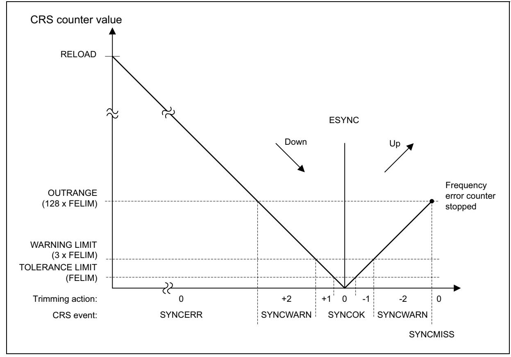
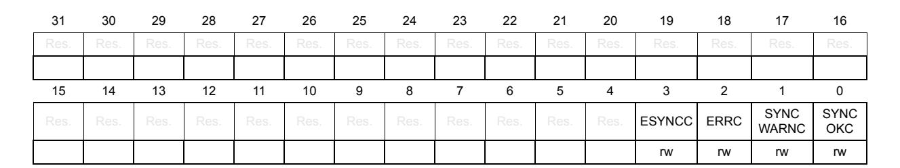

# **10 Clock recovery system (CRS)**

## **10.1 Introduction**

The clock recovery system (CRS) is an advanced digital controller acting on the internal fine-granularity trimmable RC oscillator HSI48. The CRS provides powerful means to evaluate the oscillator output frequency, based on comparison with a selectable synchronization signal. The CRS is capable of automatic trimming adjustments based on the measured frequency error value, while keeping the possibility of a manual trimming.

The CRS is ideally suited to provide a precise clock to the USB peripheral. In this case, the synchronization signal can be derived from the start-of-frame (SOF) packet signalization on the USB bus, sent by a USB host at 1 ms intervals.

The synchronization signal can also be derived from the LSE oscillator output, or generated by user software.

## **10.2 CRS main features**

- Selectable synchronization source with programmable prescaler and polarity:
  - External pin
  - USB2 SOF packet reception
  - LSE oscillator output
  - USB1 SOF packet reception
- Possibility to generate synchronization pulses by software
- Automatic oscillator trimming capability with no need of CPU action
- Manual control option for faster startup convergence
- 16-bit frequency error counter with automatic error value capture and reload
- Programmable limit for automatic frequency error value evaluation and status reporting
- Maskable interrupts/events:
  - Expected synchronization (ESYNC)
  - Synchronization OK (SYNCOK)
  - Synchronization warning (SYNCWARN)
  - Synchronization or trimming error (ERR)

## **10.3 CRS implementation**

**Table 89. CRS features**

| Feature    | CRS1   |
|------------|--------|
| TRIM width | 6 bits |

542/3556 RM0399 Rev 4

## **10.4 CRS functional description**

### **10.4.1 CRS block diagram**

**Figure 71. CRS block diagram** MSv40736V6 **CRS** RCC OTG\_HS1 OTG\_HS2 SYNCSRC OSC32\_IN OSC32\_OUT OTG\_FS\_DP OTG\_FS\_DM SYNC divider (/1, /2, /4,…,/128) SWSYNC RELOAD SYNC 16-bit counter FECAP HSI48 FELIM TRIM FEDIR To OTG\_HS1 and OTG\_HS2 LSE OTG\_HS\_DP OTG\_HS\_DM crs\_it 32-bit AHB bus crs\_pclk hsi48\_ck crs\_trim[0:5] crs\_sync1 crs\_sync2 crs\_sync3 SYNC crs\_sync0

# **10.5 CRS internal signals**

*[Table 90](#page-1-0)* gives the list of CRS internal signals.

**Table 90. CRS internal input/output signals** 

| Signal name | Signal type    | Description            |  |  |  |  |  |  |
|-------------|----------------|------------------------|--|--|--|--|--|--|
| crs_it      | Digital output | CRS interrupt          |  |  |  |  |  |  |
| crs_pclk    | Digital input  | AHB bus clock          |  |  |  |  |  |  |
| hsi48_ck    | Digital input  | HSI48 oscillator clock |  |  |  |  |  |  |

| Signal name                                      | Signal type    | Description                                                            |  |  |  |  |  |  |  |
|--------------------------------------------------|----------------|------------------------------------------------------------------------|--|--|--|--|--|--|--|
| crs_trim[0:5]                                    | Digital output | HSI48 oscillator smooth trimming value                                 |  |  |  |  |  |  |  |
| crs_sync0 crs_sync1 crs_sync2 crs_sync3 | Digital input  | SYNC signal source selection (SYNC, or OTG_HS1, or LSE, or OTG_HS2) |  |  |  |  |  |  |  |

**Table 90. CRS internal input/output signals (continued)**

### **10.5.1 Synchronization input**

The CRS synchronization (SYNC) source, selectable through the CRS\_CFGR register, can be the signal from an external signal (SYNC), the LSE clock, the OTG HS1 SOF signal, or the OTG HS2 SOF signal. This source signal also has a configurable polarity and can then be divided by a programmable binary prescaler to obtain a synchronization signal in a suitable frequency range (usually around 1 kHz).

For more information on the CRS synchronization source configuration, refer to *[Section 10.8.2](#page-7-0)*.

It is also possible to generate a synchronization event by software, by setting the SWSYNC bit in the CRS\_CR register.

### **10.5.2 Frequency error measurement**

The frequency error counter is a 16-bit down/up counter, reloaded with the RELOAD value on each SYNC event. It starts counting down until it reaches the 0 value, where the ESYNC (expected synchronization) event is generated. Then it starts counting up to the OUTRANGE limit, where it eventually stops (if no SYNC event is received), and generates a SYNCMISS event. The OUTRANGE limit is defined as the frequency error limit (FELIM field of the CRS\_CFGR register) multiplied by 128.

When the SYNC event is detected, the actual value of the frequency error counter and its counting direction are stored in the FECAP (frequency error capture) field and in the FEDIR (frequency error direction) bit of the CRS\_ISR register. When the SYNC event is detected during the down-counting phase (before reaching the 0 value), it means that the actual frequency is lower than the target (the TRIM value must be incremented). When it is detected during the up-counting phase, it means that the actual frequency is higher (the TRIM value must be decremented).

**Figure 72. CRS counter behavior**

### **10.5.3 Frequency error evaluation and automatic trimming**

The measured frequency error is evaluated by comparing its value with a set of limits:

- TOLERANCE LIMIT, given directly in the FELIM field of the CRS\_CFGR register
- WARNING LIMIT, defined as 3 × FELIM value
- OUTRANGE (error limit), defined as 128 × FELIM value

The result of this comparison is used to generate the status indication and also to control the automatic trimming which is enabled by setting the AUTOTRIMEN bit in the CRS\_CR register:

- When the frequency error is below the tolerance limit, it means that the actual trimming value in the TRIM field is the optimal one, hence no trimming action is needed.
  - SYNCOK status indicated
  - TRIM value not changed in AUTOTRIM mode
- When the frequency error is below the warning limit but above or equal to the tolerance limit, it means that some trimming action is necessary but that adjustment by one trimming step is enough to reach the optimal TRIM value.
  - SYNCOK status indicated
  - TRIM value adjusted by one trimming step in AUTOTRIM mode

- When the frequency error is above or equal to the warning limit but below the error limit, a stronger trimming action is necessary, and there is a risk that the optimal TRIM value is not reached for the next period.
  - SYNCWARN status indicated
  - TRIM value adjusted by two trimming steps in AUTOTRIM mode
- When the frequency error is above or equal to the error limit, the frequency is out of the trimming range. This can also happen when the SYNC input is not clean, or when some SYNC pulse is missing (for example when one USB SOF is corrupted).
  - SYNCERR or SYNCMISS status indicated
  - TRIM value not changed in AUTOTRIM mode

*Note: If the actual value of the TRIM field is close to its limits and the automatic trimming can force it to overflow or underflow, the TRIM value is set to the limit, and the TRIMOVF status is indicated.*

> *In AUTOTRIM mode (AUTOTRIMEN bit set in the CRS\_CR register) the TRIM field of CRS\_CR is adjusted by hardware and is read-only.*

### **10.5.4 CRS initialization and configuration**

### **RELOAD value**

The RELOAD value must be selected according to the ratio between the target frequency and the frequency of the synchronization source after prescaling. This value is decreased by 1, to reach the expected synchronization on the 0 value. The formula is the following:

RELOAD = (fTARGET / fSYNC) - 1

The reset value of the RELOAD field corresponds to a target frequency of 48 MHz and a synchronization signal frequency of 1 kHz (SOF signal from USB).

### **FELIM value**

The selection of the FELIM value is closely coupled with the HSI48 oscillator characteristics and its typical trimming step size. The optimal value corresponds to half of the trimming step size, expressed as a number of oscillator clock ticks. The following formula can be used:

FELIM = (fTARGET / fSYNC) \* STEP[%] / 100% / 2

The result must be always rounded up to the nearest integer value to obtain the best trimming response. If frequent trimming actions are not needed in the application, the hysteresis can be increased by slightly increasing the FELIM value.

The reset value of the FELIM field corresponds to (fTARGET / fSYNC) = 48000, and to a typical trimming step size of 0.14%.

*Note: The trimming step size depends upon the product, check the datasheet for accurate setting.*

**Caution:** There is no hardware protection from a wrong configuration of the RELOAD and FELIM fields, this can lead to an erratic trimming response. The expected operational mode requires proper setup of the RELOAD value (according to the synchronization source frequency), which is also greater than 128 \* FELIM value (OUTRANGE limit).

## **10.6 CRS low-power modes**

**Table 91. Effect of low-power modes on CRS**

| Mode    | Description                                                                                                               |
|---------|---------------------------------------------------------------------------------------------------------------------------|
| Sleep   | No effect. CRS interrupts cause the device to exit the Sleep mode.                                                        |
| Stop    | CRS registers are frozen. The CRS stops operating until the Stop mode is exited and the HSI48 oscillator is restarted. |
| Standby | The CRS peripheral is powered down and must be reinitialized after exiting Standby mode.                                  |

## **10.7 CRS interrupts**

**Table 92. Interrupt control bits** 

| Interrupt event                                                   | Event flag | Enable control bit | Clear flag bit |  |  |
|-------------------------------------------------------------------|------------|-----------------------|-------------------|--|--|
| Expected synchronization                                          | ESYNCF     | ESYNCIE               | ESYNCC            |  |  |
| Synchronization OK                                                | SYNCOKF    | SYNCOKIE              | SYNCOKC           |  |  |
| Synchronization warning                                           | SYNCWARNF  | SYNCWARNIE            | SYNCWARNC         |  |  |
| Synchronization or trimming error (TRIMOVF, SYNCMISS, SYNCERR) | ERRF       | ERRIE                 | ERRC              |  |  |

#### 10.8 **CRS** registers

Refer to Section 1.2 on page 106 for a list of abbreviations used in register descriptions.

The peripheral registers can be accessed only by words (32-bit).

#### 10.8.1 CRS control register (CRS CR)

Address offset: 0x00

Reset value: 0x0000 2000

Reset value: 0x0000 4000 (products supporting 7-bit TRIM width)

| 31   | 30   | 29        | 28   | 27   | 26   | 25   | 24         | 23             | 22   | 21   | 20          | 19    | 18             | 17           | 16   |
|------|------|-----------|------|------|------|------|------------|----------------|------|------|-------------|-------|----------------|--------------|------|
| Res. | Res. | Res.      | Res. | Res. | Res. | Res. | Res.       | Res.           | Res. | Res. | Res.        | Res.  | Res.           | Res.         | Res. |
|      |      |           |      |      |      |      |            |                |      |      |             |       |                |              |      |
| 15   | 14   | 13        | 12   | 11   | 10   | 9    | 8          | 7              | 6    | 5    | 4           | 3     | 2              | 1            | 0    |
| Res. | Res. | TRIM[5:0] |      |      |      |      | SW SYNC | AUTO TRIMEN | CEN  | Res. | ESYNCI E | ERRIE | SYNC WARNIE | SYNC OKIE |      |
|      |      | rw        | rw   | rw   | rw   | rw   | rw         | rt_w1          | rw   | rw   |             | rw    | rw             | rw           | rw   |

Bits 31:14 Reserved, must be kept at reset value.

#### Bits 13:8 TRIM[5:0]: HSI48 oscillator smooth trimming

These bits provide a user-programmable trimming value to the HSI48 oscillator. They can be programmed to adjust to variations in voltage and temperature that influence the oscillator frequency.

The default value is 32, corresponding to the middle of the trimming interval. The trimming step is specified in the product datasheet. A higher TRIM value corresponds to a higher output frequency.

When the AUTOTRIMEN bit is set, this field is controlled by hardware and is read-only.

### Bit 7 SWSYNC: Generate software SYNC event

This bit is set by software in order to generate a software SYNC event. It is automatically cleared by hardware.

- 0: No action
- 1: A software SYNC event is generated.

#### Bit 6 AUTOTRIMEN: Automatic trimming enable

This bit enables the automatic hardware adjustment of TRIM bits according to the measured frequency error between two SYNC events. If this bit is set, the TRIM bits are read-only. The TRIM value can be adjusted by hardware by one or two steps at a time, depending on the measured frequency error value. Refer to Section 10.5.3 for more details.

- 0: Automatic trimming disabled, TRIM bits can be adjusted by the user.
- 1: Automatic trimming enabled, TRIM bits are read-only and under hardware control.

#### Bit 5 **CEN**: Frequency error counter enable

This bit enables the oscillator clock for the frequency error counter.

- 0: Frequency error counter disabled
- 1: Frequency error counter enabled

When this bit is set, the CRS CFGR register is write-protected and cannot be modified.

Bit 4 Reserved, must be kept at reset value.

548/3556 RM0399 Rev 4

#### Bit 3 **ESYNCIE**: Expected SYNC interrupt enable

- 0: Expected SYNC (ESYNCF) interrupt disabled
- 1: Expected SYNC (ESYNCF) interrupt enabled

#### Bit 2 **ERRIE**: Synchronization or trimming error interrupt enable

- 0: Synchronization or trimming error (ERRF) interrupt disabled
- 1: Synchronization or trimming error (ERRF) interrupt enabled

#### Bit 1 **SYNCWARNIE**: SYNC warning interrupt enable

- 0: SYNC warning (SYNCWARNF) interrupt disabled
- 1: SYNC warning (SYNCWARNF) interrupt enabled

#### Bit 0 **SYNCOKIE**: SYNC event OK interrupt enable

- 0: SYNC event OK (SYNCOKF) interrupt disabled
- 1: SYNC event OK (SYNCOKF) interrupt enabled

### **10.8.2 CRS configuration register (CRS\_CFGR)**

This register can be written only when the frequency error counter is disabled (CEN bit is cleared in CRS\_CR). When the counter is enabled, this register is write-protected.

Address offset: 0x04

Reset value: 0x2022 BB7F

| 31      | 30           | 29 | 28           | 27   | 26 | 25           | 24 | 23 | 22 | 21 | 20 | 19 | 18 | 17 | 16 |
|---------|--------------|----|--------------|------|----|--------------|----|----|----|----|----|----|----|----|----|
| SYNCPOL | Res.         |    | SYNCSRC[1:0] | Res. |    | SYNCDIV[2:0] |    |    |    |    |    |    |    |    |    |
| rw      |              | rw | rw           |      | rw | rw           | rw | rw | rw | rw | rw | rw | rw | rw | rw |
| 15      | 14           | 13 | 12           | 11   | 10 | 9            | 8  | 7  | 6  | 5  | 4  | 3  | 2  | 1  | 0  |
|         | RELOAD[15:0] |    |              |      |    |              |    |    |    |    |    |    |    |    |    |
| rw      | rw           | rw | rw           | rw   | rw | rw           | rw | rw | rw | rw | rw | rw | rw | rw | rw |

#### Bit 31 **SYNCPOL**: SYNC polarity selection

This bit is set and cleared by software to select the input polarity for the SYNC signal source.

- 0: SYNC active on rising edge (default)
- 1: SYNC active on falling edge
- Bit 30 Reserved, must be kept at reset value.

### Bits 29:28 **SYNCSRC[1:0]**: SYNC signal source selection

These bits are set and cleared by software to select the SYNC signal source.

- 00: CRS\_SYNC pin selected as SYNC signal source
- 01: LSE selected as SYNC signal source
- 10: OTG HS1 SOF selected as SYNC signal source (default)
- 11: OTG HS2 SOF selected as SYNC signal source

*Note: When using USB LPM (Link Power Management) and the device is in Sleep mode, the periodic USB SOF will not be generated by the host. No SYNC signal will therefore be provided to the CRS to calibrate the HSI48 oscillator on the run. To guarantee the required clock precision after waking up from Sleep mode, the LSE clock or the SYNC pin must be used as SYNC signal.* 

Bit 27 Reserved, must be kept at reset value.

RM0399 Rev 4 549/3556

#### Bits 26:24 SYNCDIV[2:0]: SYNC divider

These bits are set and cleared by software to control the division factor of the SYNC signal.

000: SYNC not divided (default)

001: SYNC divided by 2

010: SYNC divided by 4

011: SYNC divided by 8 100: SYNC divided by 16

100. OTNO divided by 10

101: SYNC divided by 32

110: SYNC divided by 64 111: SYNC divided by 128

TTT. OTTTO dividod by 120

#### Bits 23:16 FELIM[7:0]: Frequency error limit

FELIM contains the value to be used to evaluate the captured frequency error value latched in the FECAP[15:0] bits of the CRS\_ISR register. Refer to Section 10.5.3 for more details about FECAP evaluation.

#### Bits 15:0 RELOAD[15:0]: Counter reload value

RELOAD is the value to be loaded in the frequency error counter with each SYNC event. Refer to Section 10.5.2 for more details about counter behavior.

### 10.8.3 CRS interrupt and status register (CRS\_ISR)

Address offset: 0x08

Reset value: 0x0000 0000

| 31    | 30          | 29   | 28   | 27   | 26          | 25           | 24          | 23   | 22   | 21   | 20   | 19     | 18   | 17            | 16          |
|-------|-------------|------|------|------|-------------|--------------|-------------|------|------|------|------|--------|------|---------------|-------------|
|       | FECAP[15:0] |      |      |      |             |              |             |      |      |      |      |        |      |               |             |
| r     | r           | r    | r    | r    | r           | r            | r           | r    | r    | r    | r    | r      | r    | r             | r           |
| 15    | 14          | 13   | 12   | 11   | 10          | 9            | . 8         | 7    | 6    | 5    | 4    | 3      | 2    | . 1           | 0           |
| FEDIR | Res.        | Res. | Res. | Res. | TRIM OVF | SYNC MISS | SYNC ERR | Res. | Res. | Res. | Res. | ESYNCF | ERRF | SYNC WARNF | SYNC OKF |
| r     |             |      |      |      | r           | r            | r           |      |      |      |      | r      | r    | r             | r           |

#### Bits 31:16 FECAP[15:0]: Frequency error capture

FECAP is the frequency error counter value latched in the time of the last SYNC event. Refer to *Section 10.5.3* for more details about FECAP usage.

#### Bit 15 **FEDIR**: Frequency error direction

FEDIR is the counting direction of the frequency error counter latched in the time of the last SYNC event. It shows whether the actual frequency is below or above the target.

- 0: Up-counting direction, the actual frequency is above the target
- 1: Down-counting direction, the actual frequency is below the target

#### Bits 14:11 Reserved, must be kept at reset value.

### Bit 10 **TRIMOVF**: Trimming overflow or underflow

This flag is set by hardware when the automatic trimming tries to over- or under-flow the TRIM value. An interrupt is generated if the ERRIE bit is set in the CRS\_CR register. It is cleared by software by setting the ERRC bit in the CRS\_ICR register.

- 0: No trimming error signaled
- 1: Trimming error signaled

550/3556 RM0399 Rev 4

#### Bit 9 **SYNCMISS**: SYNC missed

This flag is set by hardware when the frequency error counter reaches value FELIM \* 128 and no SYNC is detected, meaning either that a SYNC pulse was missed, or the frequency error is too big (internal frequency too high) to be compensated by adjusting the TRIM value, hence some other action must be taken. At this point, the frequency error counter is stopped (waiting for a next SYNC), and an interrupt is generated if the ERRIE bit is set in the CRS\_CR register. It is cleared by software by setting the ERRC bit in the CRS\_ICR register.

0: No SYNC missed error signaled

1: SYNC missed error signaled

#### Bit 8 **SYNCERR**: SYNC error

This flag is set by hardware when the SYNC pulse arrives before the ESYNC event and the measured frequency error is greater than or equal to FELIM \* 128. This means that the frequency error is too big (internal frequency too low) to be compensated by adjusting the TRIM value, and that some other action has to be taken. An interrupt is generated if the ERRIE bit is set in the CRS\_CR register. It is cleared by software by setting the ERRC bit in the CRS\_ICR register.

0: No SYNC error signaled

1: SYNC error signaled

#### Bits 7:4 Reserved, must be kept at reset value.

#### Bit 3 **ESYNCF**: Expected SYNC flag

This flag is set by hardware when the frequency error counter reached a zero value. An interrupt is generated if the ESYNCIE bit is set in the CRS\_CR register. It is cleared by software by setting the ESYNCC bit in the CRS\_ICR register.

0: No expected SYNC signaled

1: Expected SYNC signaled

#### Bit 2 **ERRF**: Error flag

This flag is set by hardware in case of any synchronization or trimming error. It is the logical OR of the TRIMOVF, SYNCMISS and SYNCERR bits. An interrupt is generated if the ERRIE bit is set in the CRS\_CR register. It is cleared by software in reaction to setting the ERRC bit in the CRS\_ICR register, which clears the TRIMOVF, SYNCMISS and SYNCERR bits.

0: No synchronization or trimming error signaled

1: Synchronization or trimming error signaled

#### Bit 1 **SYNCWARNF**: SYNC warning flag

This flag is set by hardware when the measured frequency error is greater than or equal to FELIM \* 3, but smaller than FELIM \* 128. This means that to compensate the frequency error, the TRIM value must be adjusted by two steps or more. An interrupt is generated if the SYNCWARNIE bit is set in the CRS\_CR register. It is cleared by software by setting the SYNCWARNC bit in the CRS\_ICR register.

0: No SYNC warning signaled

1: SYNC warning signaled

#### Bit 0 **SYNCOKF**: SYNC event OK flag

This flag is set by hardware when the measured frequency error is smaller than FELIM \* 3. This means that either no adjustment of the TRIM value is needed or that an adjustment by one trimming step is enough to compensate the frequency error. An interrupt is generated if the SYNCOKIE bit is set in the CRS\_CR register. It is cleared by software by setting the SYNCOKC bit in the CRS\_ICR register.

0: No SYNC event OK signaled

1: SYNC event OK signaled

### **10.8.4 CRS interrupt flag clear register (CRS\_ICR)**

RM0399 Rev 4 551/3556

Address offset: 0x0C

Reset value: 0x0000 0000

Bits 31:4 Reserved, must be kept at reset value.

Bit 3 ESYNCC: Expected SYNC clear flag

Writing 1 to this bit clears the ESYNCF flag in the CRS ISR register.

Bit 2 ERRC: Error clear flag

Writing 1 to this bit clears TRIMOVF, SYNCMISS and SYNCERR bits and consequently also the ERRF flag in the CRS\_ISR register.

Bit 1 **SYNCWARNC**: SYNC warning clear flag

Writing 1 to this bit clears the SYNCWARNF flag in the CRS\_ISR register.

Bit 0 SYNCOKC: SYNC event OK clear flag

Writing 1 to this bit clears the SYNCOKF flag in the CRS\_ISR register.

### 10.8.5 CRS register map

Table 93. CRS register map and reset values

| Offset | Register    | 31              | 30   | 29   | 28              | 27   | 26   | 25                  | 24   | 23   | 22   | 21   | 20   | 19      | 18       | 17      | 16   | 15   | 14   | 13   | 12        | 11   | 10        | 6       | 8    | 7      | 9          | 5    | 4    | 3       | 2     | -          | 0        |
|--------|-------------|-----------------|------|------|-----------------|------|------|---------------------|------|------|------|------|------|---------|----------|---------|------|------|------|------|-----------|------|-----------|---------|------|--------|------------|------|------|---------|-------|------------|----------|
| 0x00   | CRS_CR      | Res.            | Res. | Res. | Res.            | Res. | Res. | Res.                | Res. | Res. | Res. | Res. | Res. | Res.    | Res.     | Res.    | Res. | Res. | Res. |      | TRIM[5:0] |      |           |         |      | SWSYNC | AUTOTRIMEN | CEN  | Res. | ESYNCIE | ERRIE | SYNCWARNIE | SYNCOKIE |
|        | Reset value |                 |      |      |                 |      |      |                     |      |      |      |      |      |         |          |         |      |      |      | 1    | 0         | 0    | 0         | 0       | 0    | 0      | 0          | 0    | 0    | 0       | 0     | 0          | 0        |
| 0x04   | CRS_CFGR    | SYNCPOL Res. |      |      | NC RC :0] | Res. |      | YNO DIV [2:0] | ,    |      |      | F    | ELII | M[7:    | 0]       |         |      |      |      |      |           |      |           | REI     | _OA  | .D[1   | 5:0]       |      |      |         |       |            |          |
|        | Reset value | 0               |      | 1    | 0               |      | 0    | 0                   | 0    | 0    | 0    | 1    | 0    | 0       | 0        | 1       | 0    | 1    | 0    | 1    | 1         | 1    | 0         | 1       | 1    | 0      | 1          | 1    | 1    | 1       | 1     | 1          | 1        |
| 0x08   | CRS_ISR     | FECAP[15:0]     |      |      |                 |      |      |                     |      |      |      |      |      | TRIMOVF | SYNCMISS | SYNCERR | Res. | Res. | Res. | Res. | ESYNCF    | ERRF | SYNCWARNF | SYNCOKF |      |        |            |      |      |         |       |            |          |
|        | Reset value | 0               | 0    | 0    | 0               | 0    | 0    | 0                   | 0    | 0    | 0    | 0    | 0    | 0       | 0        | 0       | 0    | 0    |      |      |           |      | 0         | 0       | 0    |        |            |      |      | 0       | 0     | 0          | 0        |
| 0x0C   | CRS_ICR     | Res.            | Res. | Res. | Res.            | Res. | Res. | Res.                | Res. | Res. | Res. | Res. | Res. | Res.    | Res.     | Res.    | Res. | Res. | Res. | Res. | Res.      | Res. | Res.      | Res.    | Res. | Res.   | Res.       | Res. | Res. | ESYNCC  | ERRC  | SYNCWARNC  | SYNCOKC  |
|        | Reset value |                 |      |      |                 |      |      |                     |      |      |      |      |      |         |          |         |      |      |      |      |           |      |           |         |      |        |            |      |      | 0       | 0     | 0          | 0        |

552/3556 RM0399 Rev 4

Refer to *Section 2.3 on page 134* for the register boundary addresses.