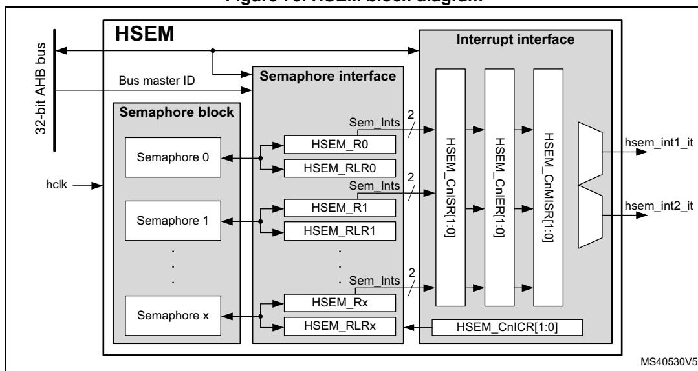
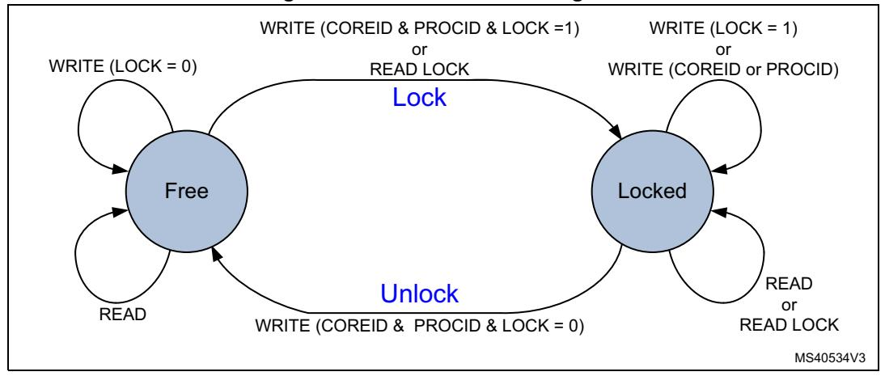
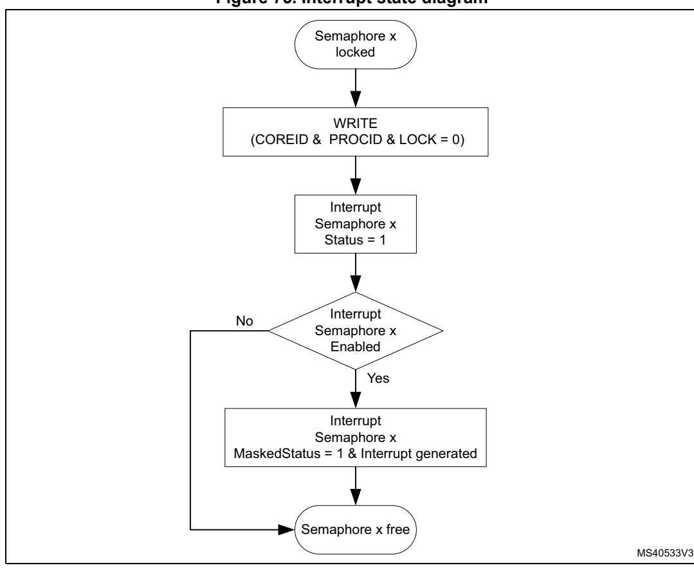

# **11 Hardware semaphore (HSEM)**

# **11.1 Introduction**

The hardware semaphore block provides 32 (32-bit) register based semaphores.

The semaphores can be used to ensure synchronization between different processes running between different cores. The HSEM provides a non-blocking mechanism to lock semaphores in an atomic way. The following functions are provided:

- Semaphore lock, in two ways:
  - 2-step lock: by writing COREID and PROCID to the semaphore, followed by a read check
  - 1-step lock: by reading the COREID from the semaphore
- Interrupt generation when a semaphore is unlocked
  - Each semaphore may generate an interrupt on one of the interrupt lines
- Semaphore clear protection
  - A semaphore is only unlocked when COREID and PROCID match
- Global semaphore clear per COREID

# **11.2 Main features**

The HSEM includes the following features:

- 32 (32-bit) semaphores
- 8-bit PROCID
- 4-bit COREID
- One interrupt line per processor
- Lock indication

# **11.3 Functional description**

### **11.3.1 HSEM block diagram**

As shown in *[Figure 73](#page-1-0)*, the HSEM is based on three sub-blocks:

- the semaphore block containing the semaphore status and IDs
- the semaphore interface block providing AHB access to the semaphore via the HSEM\_Rx and HSEM\_RLRx registers
- the interrupt interface block providing control for the interrupts via HSEM\_CnISR, HSEM\_CnIER, HSEM\_CnMISR, and HSEM\_CnICR registers.

**Figure 73. HSEM block diagram**

## **11.3.2 HSEM internal signals**

**Table 94. HSEM internal input/output signals** 

| Signal name  | Signal type          | Description                   |  |  |  |  |
|--------------|----------------------|-------------------------------|--|--|--|--|
| AHB bus      | Digital input/output | AHB register access bus       |  |  |  |  |
| BusMasterID  | Digital input        | AHB bus master ID             |  |  |  |  |
| hsem_intn_it | Digital output       | Interrupt n line (n = 1 to 2) |  |  |  |  |

### **11.3.3 HSEM lock procedures**

There are two lock procedures, namely 2-step (write) lock and 1-step (read) lock. The two procedures can be used concurrently.

The semaphore is free when its LOCK bit is 0. In this case, the COREID and PROCID are also 0. When the LOCK bit is 1, the semaphore is locked and the COREID indicates which AHB bus master ID has locked it. The PROCID indicates which process of that AHB bus master ID has locked the semaphore.

When write locking a semaphore, the written COREID must match the AHB bus master ID , and the PROCID is written by the AHB bus master software process taking the lock.

When read locking the semaphore, the COREID is taken from the AHB bus master ID, and the PROCID is forced to 0 by hardware. There is no PROCID available with read lock.

**Figure 74. Procedure state diagram** 

### **2-step (write) lock procedure**

The 2-step lock procedure consists in a write to lock the semaphore, followed by a read to check if the lock has been successful, carried out from the HSEM\_Rx register.

- Write semaphore with PROCID and COREID, and LOCK = 1. The COREID data written by software must match the AHB bus master information, that is, a AHB bus master ID = 1writes data COREID = 1.
  - Lock is put in place when the semaphore is free at write time.
- Read-back the semaphore The software checks the lock status, if PROCID and COREID match the written data, then the lock is confirmed.
- Else retry (the semaphore has been locked by another process, AHB bus master ID).

A semaphore can only be locked when it is free.

A semaphore can be locked when the PROCID = 0.

Consecutive write attempts with LOCK = 1 to a locked semaphore are ignored.

556/3556 RM0399 Rev 4

### **1-step (read) lock procedure**

The 1-step procedure consists in a read to lock and check the semaphore in a single step, carried out from the HSEM\_RLRx register.

- Read lock semaphore with the AHB bus master COREID.
- If read COREID matches and PROCID = 0, then lock is put in place. If COREID matches and PROCID is not 0, this means that another process from the same COREID has locked the semaphore with a 2-step (write) procedure.
- Else retry (the semaphore has been locked by another process, AHB bus master ID).

A semaphore can only be locked when it is free. When read locking a free semaphore, PROCID is 0. Read locking a locked semaphore returns the COREID and PROCID that locked it. All read locks, including the first one that locks the semaphore, return the COREID that locks or locked the semaphore.

*Note: The 1-step procedure must not be used when running multiple processes of the same AHB bus master ID. All processes using the same semaphore read the same status. When only one process locks the semaphore, each process of that AHB bus master ID reads the semaphore as locked by itself with the COREID.*

### **11.3.4 HSEM write/read/read lock register address**

For each semaphore, two AHB register addresses are provided, separated in two banks of 32-bit semaphore registers, spaced by a 0x80 address offset.

In the first register address bank the semaphore can be written (locked/unlocked) and read through the HSEM\_Rx registers.

In the second register address bank the semaphore can be read (locked) through the HSEM\_RLRx registers.

### **11.3.5 HSEM unlock procedures**

Unlocking a semaphore is a protected process, to prevent accidental clearing by a AHB bus master ID or by a process not having the semaphore lock right. The procedure consists in writing to the semaphore HSEM\_Rx register with the corresponding COREID and PROCID and LOCK = 0. When unlocked the semaphore, the COREID, and the PROCID are all 0.

When unlocked, an interrupt may be generated to signal the event. To this end, the semaphore interrupt must be enabled.

The unlock procedure consists in a write to the semaphore HSEM\_Rx register with matching COREID regardless on how the semaphore has been locked (1- or 2-step).

- Write semaphore with PROCID, COREID, and LOCK = 0
- If the written data matches the semaphore PROCID and COREID and the AHB bus master ID , the semaphore is unlocked and an interrupt may be generated when enabled, else write is ignored, semaphore remains locked and no interrupt is generated (the semaphore is locked by another process, AHB bus master ID or the written data does not match the AHB bus master signaling).

*Note: Different processes of the same AHB bus master ID can write any PROCID value. Preventing other processes of the same AHB bus master ID from unlocking a semaphore must be ensured by software, handling the PROCID correctly.*

RM0399 Rev 4 557/3556

### **11.3.6 HSEM COREID semaphore clear**

All semaphores locked by a COREID can be unlocked at once by using the HSEM\_CR register. Write COREID and correct KEY value in HSEM\_CR. All locked semaphores with a matching COREID are unlocked, and may generate an interrupt when enabled.

*Note: This procedure may be used in case of an incorrect functioning AHB bus master ID, where another AHB bus master can unlock the locked semaphores by writing the COREID of the incorrect functioning processor into the HSEM\_CR register with the correct KEY value. This unlocks all locked semaphores with a matching COREID.*

> An interrupt may be generated for the unlocked semaphore(s). To this end, the semaphore interrupt must be enabled in the HSEM\_CnIER registers.

### **11.3.7 HSEM interrupts**

An interrupt line hsem\_intn\_it per processor allows each semaphore to generate an interrupt.

An interrupt line provides the following features per semaphore:

- interrupt enable
- interrupt clear
- interrupt status
- masked interrupt status

With the interrupt enable (HSEM\_CnIER) the semaphores affecting the interrupt line can be enabled. Disabled (masked) semaphore interrupts do not set the masked interrupt status MISF for that semaphore, and do not generate an interrupt on the interrupt line.

The interrupt clear (HSEM\_CnICR) clears the interrupt status ISF and masked interrupt status MISF of the associated semaphore for the interrupt line.

The interrupt status (HSEM\_CnISR) mirrors the semaphore interrupt status ISF before the enable.

The masked interrupt status (HSEM\_CnMISR) only mirrors the semaphore enabled interrupt status MISF on the interrupt line. All masked interrupt status MISF of the enabled semaphores need to be cleared to clear the interrupt line.

**Figure 75. Interrupt state diagram** 

The procedure to get an interrupt when a semaphore becomes free is described hereafter.

### **Try to lock semaphore x**

- If the semaphore lock is obtained, no interrupt is needed.
- If the semaphore lock fails:
- Clear pending semaphore x interrupt status for the interrupt line in HSEM\_CnICR. Re-try to lock the semaphore x again:
  - If the semaphore lock is obtained, no interrupt is needed (semaphore has been freed between first try to lock and clear semaphore interrupt status).
  - If the semaphore lock fails, enable the semaphore x interrupt in HSEM\_CnIER.

### **On semaphore x free interrupt, try to lock semaphore x**

- If the semaphore lock is obtained: Disable the semaphore x interrupt in HSEM\_CnIER. Clear pending semaphore x interrupt status in HSEM\_CnICR.
- If the semaphore x lock fails: Clear pending semaphore x interrupt status in HSEM\_CnICR. Try again to lock the semaphore x:
  - If the semaphore lock is obtained (semaphore has been freed between first try to lock and semaphore interrupt status clear), disable the semaphore interrupt in HSEM\_CnIER.

RM0399 Rev 4 559/3556

– If the semaphore lock fails, wait for semaphore free interrupt.

*Note: An interrupt does not lock the semaphore. After an interrupt, either the AHB bus master or the process must still perform the lock procedure to lock the semaphore.*

> It is possible to have multiple AHB bus masters informed by the semaphore free interrupts. Each AHB bus master gets its interrupt, and the first one to react locks the semaphore.

### **11.3.8 AHB bus master ID verification**

The HSEM allows only authorized AHB bus master IDs to lock and unlock semaphores.

- The AHB bus master 2-step lock write access to the semaphore HSEM\_Rx register is checked against the valid bus master IDs.
  - Accesses from unauthorized AHB bus master IDs are discarded and do not lock the semaphore.
- The AHB bus master 1-step lock read access from the semaphore HSEM\_RLRx register is checked against the valid bus master IDs.
  - An unauthorized AHB bus master ID read from HSEM\_RLRx returns all 0.
- The semaphore unlock write access to the HSEM\_CR register is checked against the valid bus master IDs. Only the valid bus master IDs can write to the HSEM\_CR register and unlock any of the COREID semaphores.
  - Accesses from unauthorized AHB bus master IDs are discarded and do not clear the COREID semaphores.

*[Table 95](#page-6-0)* details the relation between bus master/processor and COREID.

**Table 95. Authorized AHB bus master IDs**

| Bus master 0 (processor1) | Bus master 1 (processor2) |
|---------------------------|---------------------------|
| COREID = 3                | COREID = 1                |

*Note: Accesses from unauthorized AHB bus master IDs to other registers are granted.*

# **11.4 HSEM registers**

Registers must be accessed using word format. Byte and half-word accesses are ignored and have no effect on the semaphores, they generate a bus error.

# **11.4.1 HSEM register semaphore x (HSEM\_Rx)**

Address offset: 0x000 + 0x4 \* x (x = 0 to 31)

Reset value: 0x0000 0000

The HSEM\_Rx must be used to perform a 2-step write lock, read back, and for unlocking a semaphore. Only write accesses with authorized AHB bus master IDs are granted. Write accesses with unauthorized AHB bus master IDs are discarded.

| 31   | 30   | 29   | 28   | 27   | 26   | 25          | 24   | 23   | 22   | 21   | 20   | 19          | 18   | 17   | 16   |
|------|------|------|------|------|------|-------------|------|------|------|------|------|-------------|------|------|------|
| LOCK | Res. | Res. | Res. | Res. | Res. | Res.        | Res. | Res. | Res. | Res. | Res. | Res.        | Res. | Res. | Res. |
| rw   |      |      |      |      |      |             |      |      |      |      |      |             |      |      |      |
|      |      |      |      |      |      |             |      |      |      |      |      |             |      |      |      |
| 15   | 14   | 13   | 12   | 11   | 10   | 9           | 8    | 7    | 6    | 5    | 4    | 3           | 2    | 1    | 0    |
| Res. | Res. | Res. | Res. |      |      | COREID[3:0] |      |      |      |      |      | PROCID[7:0] |      |      |      |

#### Bit 31 **LOCK:** Lock indication

This bit can be written and read by software.

- 0: On write free semaphore (only when COREID and PROCID match), on read semaphore is free.
- 1: On write try to lock semaphore, on read semaphore is locked.
- Bits 30:13 Reserved, must be kept at reset value.
  - Bit 12 Reserved, must be kept at reset value.

#### Bits 11:8 **COREID[3:0]:** Semaphore COREID

Written by software

- When the semaphore is free and the LOCK bit is at the same time written to 1 and the COREID matches the AHB bus master ID.
- When the semaphore is unlocked (LOCK written to 0 and AHB bus master ID matched COREID, the COREID is cleared to 0.
- When the semaphore is unlocked (LOCK bit written to 0 or AHB bus master ID does not match COREID, the COREID is not affected.
- Write when LOCK bit is already 1 (semaphore locked), the COREID is not affected.
- An authorized read returns the stored COREID value.

#### Bits 7:0 **PROCID[7:0]:** Semaphore PROCID

Written by software

- -When the semaphore is free and the LOCK is written to 1, and the COREID matches the AHB bus master ID, PROCID is set to the written data.
- When the semaphore is unlocked, LOCK written to 0 and AHB bus master ID matched COREID, the PROCID is cleared to 0.
- When the semaphore is unlocked, LOCK bit written to 0 and AHB bus master ID does not match COREID, the PROCID is not affected.
- Write when LOCK bit is already 1 (semaphore locked), the PROCID is not affected.
- An authorized read returns the stored PROCID value.

### **11.4.2 HSEM read lock register semaphore x (HSEM\_RLRx)**

Address offset: 0x080 + 0x4 \* x (x = 0 to 31)

Reset value: 0x0000 0000

Accesses the same physical bits as HSEM\_Rx. The HSEM\_RLRx must be used to perform a 1-step read lock. Only read accesses with authorized AHB bus master IDs are granted. Read accesses with unauthorized AHB bus master IDs are discarded and return 0.

| 31   | 30   | 29   | 28   | 27   | 26   | 25          | 24   | 23   | 22   | 21   | 20   | 19          | 18   | 17   | 16   |
|------|------|------|------|------|------|-------------|------|------|------|------|------|-------------|------|------|------|
| LOCK | Res. | Res. | Res. | Res. | Res. | Res.        | Res. | Res. | Res. | Res. | Res. | Res.        | Res. | Res. | Res. |
| r    |      |      |      |      |      |             |      |      |      |      |      |             |      |      |      |
|      |      |      |      |      |      |             |      |      |      |      |      |             |      |      |      |
| 15   | 14   | 13   | 12   | 11   | 10   | 9           | 8    | 7    | 6    | 5    | 4    | 3           | 2    | 1    | 0    |
| Res. | Res. | Res. | Res. |      |      | COREID[3:0] |      |      |      |      |      | PROCID[7:0] |      |      |      |

#### Bit 31 **LOCK:** Lock indication

This bit is read only by software at this address.

- When the semaphore is free:

A read with a valid AHB bus master ID locks the semaphore and returns 1.

- When the semaphore is locked:

A read with a valid AHB bus master ID returns 1 (the COREID and PROCID reflect the already locked semaphore information).

Bits 30:13 Reserved, must be kept at reset value.

Bit 12 Reserved, must be kept at reset value.

#### Bits 11:8 **COREID[3:0]:** Semaphore COREID

This field is read only by software at this address.

On a read, when the semaphore is free, the hardware sets the COREID to the AHB bus master ID reading the semaphore. The COREID of the AHB bus master locking the semaphore is read.

On a read when the semaphore is locked, this field returns the COREID of the AHB bus master that has locked the semaphore.

#### Bits 7:0 **PROCID[7:0]:** Semaphore processor ID

This field is read only by software at this address.

- On a read when the semaphore is free:

A read with a valid AHB bus master ID locks the semaphore and hardware sets the PROCID to 0.

- When the semaphore is locked:

A read with a valid AHB bus master ID returns the PROCID of the AHB bus master that has locked the semaphore.

### **11.4.3 HSEM interrupt enable register (HSEM\_CnIER)**

Address offset: 0x100 + 0x010 \* (n - 1), (n = 1 to 2)

Reset value: 0x0000 0000

| 31         | 30 | 29 | 28 | 27 | 26 | 25 | 24 | 23        | 22 | 21 | 20 | 19 | 18 | 17 | 16 |
|------------|----|----|----|----|----|----|----|-----------|----|----|----|----|----|----|----|
| ISE[31:16] |    |    |    |    |    |    |    |           |    |    |    |    |    |    |    |
| rw         | rw | rw | rw | rw | rw | rw | rw | rw        | rw | rw | rw | rw | rw | rw | rw |
| 15         | 14 | 13 | 12 | 11 | 10 | 9  | 8  | 7         | 6  | 5  | 4  | 3  | 2  | 1  | 0  |
|            |    |    |    |    |    |    |    | ISE[15:0] |    |    |    |    |    |    |    |
| rw         | rw | rw | rw | rw | rw | rw | rw | rw        | rw | rw | rw | rw | rw | rw | rw |

Bits 31:0 **ISE[31:0]:** Interrupt(n) semaphore x enable bit (x = 0 to 31)

This bit is read and written by software.

0: Interrupt(n) generation for semaphore x disabled (masked)

1: Interrupt(n) generation for semaphore x enabled (not masked)

# **11.4.4 HSEM interrupt clear register (HSEM\_CnICR)**

Address offset: 0x104 + 0x010 \* (n - 1), (n = 1 to 2)

Reset value: 0x0000 0000

| 31    | 30         | 29    | 28    | 27    | 26    | 25    | 24    | 23    | 22    | 21    | 20    | 19    | 18    | 17    | 16    |
|-------|------------|-------|-------|-------|-------|-------|-------|-------|-------|-------|-------|-------|-------|-------|-------|
|       | ISC[31:16] |       |       |       |       |       |       |       |       |       |       |       |       |       |       |
| rc_w1 | rc_w1      | rc_w1 | rc_w1 | rc_w1 | rc_w1 | rc_w1 | rc_w1 | rc_w1 | rc_w1 | rc_w1 | rc_w1 | rc_w1 | rc_w1 | rc_w1 | rc_w1 |
| 15    | 14         | 13    | 12    | 11    | 10    | 9     | 8     | 7     | 6     | 5     | 4     | 3     | 2     | 1     | 0     |
|       | ISC[15:0]  |       |       |       |       |       |       |       |       |       |       |       |       |       |       |
| rc_w1 | rc_w1      | rc_w1 | rc_w1 | rc_w1 | rc_w1 | rc_w1 | rc_w1 | rc_w1 | rc_w1 | rc_w1 | rc_w1 | rc_w1 | rc_w1 | rc_w1 | rc_w1 |

Bits 31:0 **ISC[31:0]:** Interrupt(n) semaphore x clear bit (x = 0 to 31)

This bit is written by software, and is always read 0.

0: Interrupt(n) semaphore x status ISFx and masked status MISFx not affected.

1: Interrupt(n) semaphore x status ISFx and masked status MISFx cleared.

# **11.4.5 HSEM interrupt status register (HSEM\_CnISR)**

Address offset: 0x108 + 0x010 \* (n - 1), (n = 1 to 2)

Reset value: 0x0000 0000

| 31 | 30         | 29 | 28 | 27 | 26 | 25 | 24 | 23        | 22 | 21 | 20 | 19 | 18 | 17 | 16 |
|----|------------|----|----|----|----|----|----|-----------|----|----|----|----|----|----|----|
|    | ISF[31:16] |    |    |    |    |    |    |           |    |    |    |    |    |    |    |
| r  | r          | r  | r  | r  | r  | r  | r  | r         | r  | r  | r  | r  | r  | r  | r  |
| 15 | 14         | 13 | 12 | 11 | 10 | 9  | 8  | 7         | 6  | 5  | 4  | 3  | 2  | 1  | 0  |
|    |            |    |    |    |    |    |    | ISF[15:0] |    |    |    |    |    |    |    |
| r  | r          | r  | r  | r  | r  | r  | r  | r         | r  | r  | r  | r  | r  | r  | r  |

RM0399 Rev 4 563/3556

Bits 31:0 **ISF[31:0]:** Interrupt semaphore x status bit before enable (mask) (x = 0 to 31)

This bit is set by hardware, and reset only by software. This bit is cleared by software writing the corresponding HSEM\_CnICR bit.

0: Interrupt semaphore x status, no interrupt pending

1: Interrupt semaphore x status, interrupt pending

### **11.4.6 HSEM interrupt status register (HSEM\_CnMISR)**

Address offset: 0x10C + 0x010 \* (n - 1), (n = 1 to 2)

Reset value: 0x0000 0000

| 31 | 30          | 29 | 28 | 27 | 26 | 25 | 24 | 23         | 22 | 21 | 20 | 19 | 18 | 17 | 16 |
|----|-------------|----|----|----|----|----|----|------------|----|----|----|----|----|----|----|
|    | MISF[31:16] |    |    |    |    |    |    |            |    |    |    |    |    |    |    |
| r  | r           | r  | r  | r  | r  | r  | r  | r          | r  | r  | r  | r  | r  | r  | r  |
| 15 | 14          | 13 | 12 | 11 | 10 | 9  | 8  | 7          | 6  | 5  | 4  | 3  | 2  | 1  | 0  |
|    |             |    |    |    |    |    |    | MISF[15:0] |    |    |    |    |    |    |    |
| r  | r           | r  | r  | r  | r  | r  | r  | r          | r  | r  | r  | r  | r  | r  | r  |

Bits 31:0 **MISF[31:0]:** Masked interrupt(n) semaphore x status bit after enable (mask) (x = 0 to 31)

This bit is set by hardware and read only by software. This bit is cleared by software writing the corresponding HSEM\_CnICR bit. This bit is read as 0 when semaphore x status is masked in HSEM\_CnIER bit x.

0: interrupt(n) semaphore x status after masking not pending

1: interrupt(n) semaphore x status after masking pending

# **11.4.7 HSEM clear register (HSEM\_CR)**

Address offset: 0x140

Reset value: 0x0000 0000

Only write accesses with authorized AHB bus master IDs are granted. Write accesses with unauthorized AHB bus master IDs are discarded.

| 31        | 30   | 29   | 28   | 27 | 26 | 25          | 24 | 23   | 22   | 21   | 20   | 19   | 18   | 17   | 16   |
|-----------|------|------|------|----|----|-------------|----|------|------|------|------|------|------|------|------|
| KEY[15:0] |      |      |      |    |    |             |    |      |      |      |      |      |      |      |      |
| w         | w    | w    | w    | w  | w  | w           |    | w    | w    | w    | w    | w    | w    | w    | w    |
| 15        | 14   | 13   | 12   | 11 | 10 | 9           |    | 7    | 6    | 5    | 4    | 3    | 2    | 1    | 0    |
| Res.      | Res. | Res. | Res. |    |    | COREID[3:0] |    | Res. | Res. | Res. | Res. | Res. | Res. | Res. | Res. |
|           |      |      |      | w  | w  | w           | w  |      |      |      |      |      |      |      |      |

Bits 31:16 **KEY[15:0]:** Semaphore clear key

This field can be written by software and is always read 0.

If this key value does not match HSEM\_KEYR.KEY, semaphores are not affected.

If this key value matches HSEM\_KEYR.KEY, all semaphores matching the COREID are cleared to the free state.

Bits 15:13 Reserved, must be kept at reset value.

Bit 12 Reserved, must be kept at reset value.

564/3556 RM0399 Rev 4

#### Bits 11:8 **COREID[3:0]:** COREID of semaphores to be cleared

This field can be written by software and is always read 0.

This field indicates the COREID for which the semaphores are cleared when writing the HSEM\_CR.

Bits 7:0 Reserved, must be kept at reset value.

# **11.4.8 HSEM clear semaphore key register (HSEM\_KEYR)**

Address offset: 0x144

Reset value: 0x0000 0000

| 31   | 30        | 29   | 28   | 27   | 26   | 25   | 24   | 23   | 22   | 21   | 20   | 19   | 18   | 17   | 16   |
|------|-----------|------|------|------|------|------|------|------|------|------|------|------|------|------|------|
|      | KEY[15:0] |      |      |      |      |      |      |      |      |      |      |      |      |      |      |
| rw   | rw        | rw   | rw   | rw   | rw   | rw   | rw   | rw   | rw   | rw   | rw   | rw   | rw   | rw   | rw   |
| 15   | 14        | 13   | 12   | 11   | 10   | 9    | 8    | 7    | 6    | 5    | 4    | 3    | 2    | 1    | 0    |
| Res. | Res.      | Res. | Res. | Res. | Res. | Res. | Res. | Res. | Res. | Res. | Res. | Res. | Res. | Res. | Res. |
|      |           |      |      |      |      |      |      |      |      |      |      |      |      |      |      |

Bits 31:16 **KEY[15:0]:** Semaphore clear key

This field can be written and read by software.

Key value to match when clearing semaphores.

Bits 15:0 Reserved, must be kept at reset value.

### **11.4.9 HSEM register map**

**Table 96. HSEM register map and reset values** 

|       | Offset Register name | 31   | 30   | 29   | 28   | 27   | 26   | 25   | 24   | 23   | 22   | 21   | 20   | 19   | 18   | 17   | 16         | 15   | 14   | 13   | 12   | 11 | 10 9         | 8 | 7 | 6 | 5 | 4      | 3 2      | 1 | 0 |
|-------|----------------------|------|------|------|------|------|------|------|------|------|------|------|------|------|------|------|------------|------|------|------|------|----|-----------------|---|---|---|---|--------|-------------|---|---|
| 0x000 | HSEM_R0              | LOCK | Res. | Res. | Res. | Res. | Res. | Res. | Res. | Res. | Res. | Res. | Res. | Res. | Res. | Res. | Res.       | Res. | Res. | Res. | Res. |    | COREID [3:0] |   |   |   |   |        | PROCID[7:0] |   |   |
|       | Reset value          | 0    |      |      |      |      |      |      |      |      |      |      |      |      |      |      |            |      |      |      |      | 0  | 0 0          | 0 | 0 | 0 | 0 | 0      | 0 0      | 0 | 0 |
| 0x004 | HSEM_R1              | LOCK | Res. | Res. | Res. | Res. | Res. | Res. | Res. | Res. | Res. | Res. | Res. | Res. | Res. | Res. | Res.       | Res. | Res. | Res. | Res. |    | COREID [3:0] |   |   |   |   |        | PROCID[7:0] |   |   |
|       | Reset value          | 0    |      |      |      |      |      |      |      |      |      |      |      |      |      |      |            |      |      |      |      | 0  | 0 0          | 0 | 0 | 0 | 0 | 0      | 0 0      | 0 | 0 |
|       |                      |      |      |      |      |      |      |      |      |      |      |      |      |      |      |      |            |      |      |      |      |    |                 |   |   |   |   |        |             |   |   |
| 0x07C | HSEM_R31             | LOCK | Res. | Res. | Res. | Res. | Res. | Res. | Res. | Res. | Res. | Res. | Res. | Res. | Res. | Res. | Res.       | Res. | Res. | Res. | Res. |    | COREID [3:0] |   |   |   |   |        | PROCID[7:0] |   |   |
|       | Reset value          | 0    |      |      |      |      |      |      |      |      |      |      |      |      |      |      |            |      |      |      |      | 0  | 0 0          | 0 | 0 | 0 | 0 | 0      | 0 0      | 0 | 0 |
| 0x080 | HSEM_RLR0            | LOCK | Res. | Res. | Res. | Res. | Res. | Res. | Res. | Res. | Res. | Res. | Res. | Res. | Res. | Res. | Res.       | Res. | Res. | Res. | Res. |    | COREID [3:0] |   |   |   |   | PROCID |             |   |   |
|       | Reset value          | 0    |      |      |      |      |      |      |      |      |      |      |      |      |      |      |            |      |      |      |      | 0  | 0 0          | 0 | 0 | 0 | 0 | 0      | 0 0      | 0 | 0 |
| 0x084 | HSEM_RLR1            | LOCK | Res. | Res. | Res. | Res. | Res. | Res. | Res. | Res. | Res. | Res. | Res. | Res. | Res. | Res. | Res.       | Res. | Res. | Res. | Res. |    | COREID [3:0] |   |   |   |   |        | PROCID[7:0] |   |   |
|       | Reset value          | 0    |      |      |      |      |      |      |      |      |      |      |      |      |      |      |            |      |      |      |      | 0  | 0 0          | 0 | 0 | 0 | 0 | 0      | 0 0      | 0 | 0 |
|       |                      |      |      |      |      |      |      |      |      |      |      |      |      |      |      |      |            |      |      |      |      |    |                 |   |   |   |   |        |             |   |   |
| 0x0FC | HSEM_RLR31           | LOCK | Res. | Res. | Res. | Res. | Res. | Res. | Res. | Res. | Res. | Res. | Res. | Res. | Res. | Res. | Res.       | Res. | Res. | Res. | Res. |    | COREID [3:0] |   |   |   |   |        | PROCID[7:0] |   |   |
|       | Reset value          | 0    |      |      |      |      |      |      |      |      |      |      |      |      |      |      |            |      |      |      |      | 0  | 0 0          | 0 | 0 | 0 | 0 | 0      | 0 0      | 0 | 0 |
| 0x100 | HSEM_C1IER           |      |      |      |      |      |      |      |      |      |      |      |      |      |      |      | ISE[31:0]  |      |      |      |      |    |                 |   |   |   |   |        |             |   |   |
|       | Reset value          | 0    | 0    | 0    | 0    | 0    | 0    | 0    | 0    | 0    | 0    | 0    | 0    | 0    | 0    | 0    | 0          | 0    | 0    | 0    | 0    | 0  | 0 0          | 0 | 0 | 0 | 0 | 0      | 0 0      | 0 | 0 |
| 0x104 | HSEM_C1ICR           |      |      |      |      |      |      |      |      |      |      |      |      |      |      |      | ISC[31:0]  |      |      |      |      |    |                 |   |   |   |   |        |             |   |   |
|       | Reset value          | 0    | 0    | 0    | 0    | 0    | 0    | 0    | 0    | 0    | 0    | 0    | 0    | 0    | 0    | 0    | 0          | 0    | 0    | 0    | 0    | 0  | 0 0          | 0 | 0 | 0 | 0 | 0      | 0 0      | 0 | 0 |
| 0x108 | HSEM_C1ISR           |      |      |      |      |      |      |      |      |      |      |      |      |      |      |      | ISF[31:0]  |      |      |      |      |    |                 |   |   |   |   |        |             |   |   |
|       | Reset value          | 0    | 0    | 0    | 0    | 0    | 0    | 0    | 0    | 0    | 0    | 0    | 0    | 0    | 0    | 0    | 0          | 0    | 0    | 0    | 0    | 0  | 0 0          | 0 | 0 | 0 | 0 | 0      | 0 0      | 0 | 0 |
| 0x10C | HSEM_C1MISR          |      |      |      |      |      |      |      |      |      |      |      |      |      |      |      | MISF[31:0] |      |      |      |      |    |                 |   |   |   |   |        |             |   |   |
|       | Reset value          | 0    | 0    | 0    | 0    | 0    | 0    | 0    | 0    | 0    | 0    | 0    | 0    | 0    | 0    | 0    | 0          | 0    | 0    | 0    | 0    | 0  | 0 0          | 0 | 0 | 0 | 0 | 0      | 0 0      | 0 | 0 |
| 0x110 | HSEM_C2IER           |      |      |      |      |      |      |      |      |      |      |      |      |      |      |      | ISE[31:0]  |      |      |      |      |    |                 |   |   |   |   |        |             |   |   |
|       | Reset value          | 0    | 0    | 0    | 0    | 0    | 0    | 0    | 0    | 0    | 0    | 0    | 0    | 0    | 0    | 0    | 0          | 0    | 0    | 0    | 0    | 0  | 0 0          | 0 | 0 | 0 | 0 | 0      | 0 0      | 0 | 0 |
| 0x114 | HSEM_C2ICR           |      |      |      |      |      |      |      |      |      |      |      |      |      |      |      | ISC[31:0]  |      |      |      |      |    |                 |   |   |   |   |        |             |   |   |
|       | Reset value          | 0    | 0    | 0    | 0    | 0    | 0    | 0    | 0    | 0    | 0    | 0    | 0    | 0    | 0    | 0    | 0          | 0    | 0    | 0    | 0    | 0  | 0 0          | 0 | 0 | 0 | 0 | 0      | 0 0      | 0 | 0 |
| 0x118 | HSEM_C2ISR           |      |      |      |      |      |      |      |      |      |      |      |      |      |      |      | ISF[31:0]  |      |      |      |      |    |                 |   |   |   |   |        |             |   |   |
|       | Reset value          | 0    | 0    | 0    | 0    | 0    | 0    | 0    | 0    | 0    | 0    | 0    | 0    | 0    | 0    | 0    | 0          | 0    | 0    | 0    | 0    | 0  | 0 0          | 0 | 0 | 0 | 0 | 0      | 0 0      | 0 | 0 |
|       |                      |      |      |      |      |      |      |      |      |      |      |      |      |      |      |      |            |      |      |      |      |    |                 |   |   |   |   |        |             |   |   |

566/3556 RM0399 Rev 4

**Table 96. HSEM register map and reset values (continued)**

|       | Offset Register name | 31 | 30         | 29 | 28 | 27 | 26 | 25        | 24 | 23 | 22 | 21 | 20 | 19 | 18   | 17   | 16   | 15   | 14   | 13   | 12          | 11   | 10   | 9    | 8    | 7    | 6    | 5    | 4    | 3    | 2    | 1    | 0    |
|-------|----------------------|----|------------|----|----|----|----|-----------|----|----|----|----|----|----|------|------|------|------|------|------|-------------|------|------|------|------|------|------|------|------|------|------|------|------|
| 0x11C | HSEM_C2MISR          |    | MISF[31:0] |    |    |    |    |           |    |    |    |    |    |    |      |      |      |      |      |      |             |      |      |      |      |      |      |      |      |      |      |      |      |
|       | Reset value          | 0  | 0          | 0  | 0  | 0  | 0  | 0         | 0  | 0  | 0  | 0  | 0  | 0  | 0    | 0    | 0    | 0    | 0    | 0    | 0           | 0    | 0    | 0    | 0    | 0    | 0    | 0    | 0    | 0    | 0    | 0    | 0    |
| 0x140 | HSEM_CR              |    |            |    |    |    |    | KEY[15:0] |    |    |    |    |    |    | Res. | Res. | Res. | Res. |      |      | COREID[3:0] |      | Res. | Res. | Res. | Res. | Res. | Res. | Res. | Res. |      |      |      |
|       | Reset value          | 0  | 0          | 0  | 0  | 0  | 0  | 0         | 0  | 0  | 0  | 0  | 0  | 0  | 0    | 0    | 0    |      |      |      |             | 0    | 0    | 0    | 0    |      |      |      |      |      |      |      |      |
| 0x144 | HSEM_KEYR            |    | KEY[15:0]  |    |    |    |    |           |    |    |    |    |    |    |      |      |      | Res. | Res. | Res. | Res.        | Res. | Res. | Res. | Res. | Res. | Res. | Res. | Res. | Res. | Res. | Res. | Res. |
|       | Reset value          | 0  | 0          | 0  | 0  | 0  | 0  | 0         | 0  | 0  | 0  | 0  | 0  | 0  | 0    | 0    | 0    |      |      |      |             |      |      |      |      |      |      |      |      |      |      |      |      |

Refer to *Section 2.3 on page 134* for the register boundary addresses.

RM0399 Rev 4 567/3556