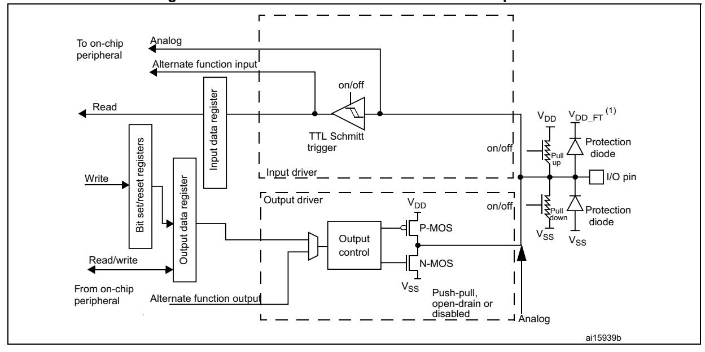
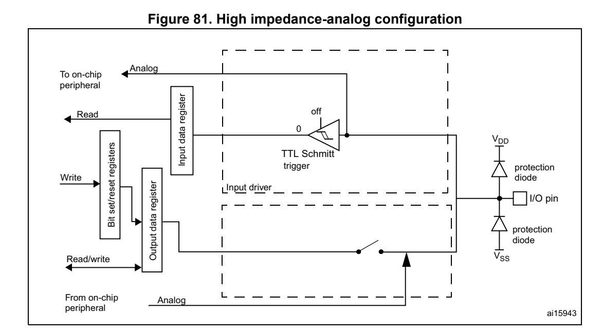
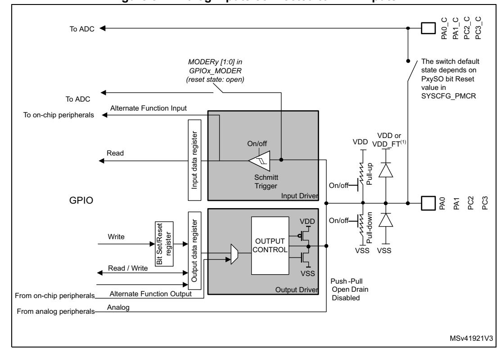

# **12 General-purpose I/Os (GPIO)**

# **12.1 Introduction**

Each general-purpose I/O port has four 32-bit configuration registers (GPIOx\_MODER, GPIOx\_OTYPER, GPIOx\_OSPEEDR and GPIOx\_PUPDR), two 32-bit data registers (GPIOx\_IDR and GPIOx\_ODR) and a 32-bit set/reset register (GPIOx\_BSRR). In addition all GPIOs have a 32-bit locking register (GPIOx\_LCKR) and two 32-bit alternate function selection registers (GPIOx\_AFRH and GPIOx\_AFRL).

# **12.2 GPIO main features**

- Output states: push-pull or open drain + pull-up/down
- Output data from output data register (GPIOx\_ODR) or peripheral (alternate function output)
- Speed selection for each I/O
- Input states: floating, pull-up/down, analog
- Input data to input data register (GPIOx\_IDR) or peripheral (alternate function input)
- Bit set and reset register (GPIOx\_ BSRR) for bitwise write access to GPIOx\_ODR
- Locking mechanism (GPIOx\_LCKR) provided to freeze the I/O port configurations
- Analog function
- Alternate function selection registers
- Fast toggle capable of changing every two clock cycles
- Highly flexible pin multiplexing allows the use of I/O pins as GPIOs or as one of several peripheral functions

# **12.3 GPIO functional description**

Subject to the specific hardware characteristics of each I/O port listed in the datasheet, each port bit of the general-purpose I/O (GPIO) ports can be individually configured by software in several modes:

- Input floating
- Input pull-up
- Input-pull-down
- Analog
- Output open-drain with pull-up or pull-down capability
- Output push-pull with pull-up or pull-down capability
- Alternate function push-pull with pull-up or pull-down capability
- Alternate function open-drain with pull-up or pull-down capability

Each I/O port bit is freely programmable, however the I/O port registers have to be accessed as 32-bit words, half-words or bytes. The purpose of the GPIOx\_BSRR register is to allow atomic read/modify accesses to any of the GPIOx\_ODR registers. In this way, there is no risk of an IRQ occurring between the read and the modify access.

*[Figure 76](#page-1-0)* and *[Figure 77](#page-1-1)* show the basic structures of a standard and a 5-Volt tolerant I/O port bit, respectively. *[Table 97](#page-2-0)* gives the possible port bit configurations.

Alternate function output Alternate function input Push-pull, open-drain or disabled Input data register Output data register Read/write From on-chip peripheral To on-chip peripheral Output control Analog on/off Pull Pull down on/off I/O pin VDD VDD VSS VSS trigger VSS VDD Protection diode Protection diode on/off Input driver Output driver up P-MOS N-MOS Read Bit set/reset registers Write Analog ai15938

**Figure 76. Basic structure of an I/O port bit** 

1. VDD\_FT is a potential specific to 5-Volt tolerant I/Os and different from VDD.

Table 97. Port bit configuration table(1)

| MODE(i) [1:0] | OTYPER(i) | OSP | EED(i) I:0] | PUF | PD(i) :0] | I/O co         | nfiguration  |  |
|------------------|-----------|-----|----------------|-----|--------------|----------------|--------------|--|
|                  | 0         |     |                | 0   | 0            | GP output      | PP           |  |
|                  | 0         |     |                | 0   | 1            | GP output      | PP + PU      |  |
|                  | 0         |     |                | 1   | 0            | GP output      | PP + PD      |  |
| 01               | 0         | SP  | EED            | 1   | 1            | Reserved       |              |  |
| 01               | 1         | [′  | 1:0]           | 0   | 0            | GP output      | OD           |  |
|                  | 1         |     |                | 0   | 1            | GP output      | OD + PU      |  |
|                  | 1         |     |                | 1   | 0            | GP output      | OD + PD      |  |
|                  | 1         |     |                | 1   | 1            | Reserved (GP   | output OD)   |  |
|                  | 0         |     |                | 0   | 0            | AF             | PP           |  |
|                  | 0         |     |                | 0   | 1            | AF             | PP + PU      |  |
|                  | 0         |     |                | 1   | 0            | AF             | PP + PD      |  |
| 10               | 0         | SP  | EED            | 1   | 1            | Reserved       |              |  |
| 10               | 1         | [′  | 1:0]           | 0   | 0            | AF             | OD           |  |
|                  | 1         |     |                | 0   | 1            | AF             | OD + PU      |  |
|                  | 1         |     |                | 1   | 0            | AF             | OD + PD      |  |
|                  | 1         |     |                | 1   | 1            | Reserved       |              |  |
|                  | Х         | Х   | Х              | 0   | 0            | Input          | Floating     |  |
| 00               | Х         | х   | Х              | 0   | 1            | Input          | PU           |  |
| 00               | Х         | х   | Х              | 1   | 0            | Input          | PD           |  |
|                  | Х         | Х   | Х              | 1   | 1            | Reserved (inpu | it floating) |  |
|                  | Х         | Х   | Х              | 0   | 0            | Input/output   | Analog       |  |
| 11               | Х         | х   | Х              | 0   | 1            |                | •            |  |
| 11               | Х         | Х   | Х              | 1   | 0            | Reserved       |              |  |
|                  | Х         | х   | х              | 1   | 1            |                |              |  |

GP = general-purpose, PP = push-pull, PU = pull-up, PD = pull-down, OD = open-drain, AF = alternate function.

#### **12.3.1 General-purpose I/O (GPIO)**

During and just after reset, the alternate functions are not active and most of the I/O ports are configured in analog mode.

The debug pins are in AF pull-up/pull-down after reset:

- PA15: JTDI in pull-up
- PA14: JTCK/SWCLK in pull-down
- PA13: JTMS/SWDAT in pull-up
- PB4: NJTRST in pull-up
- PB3: JTDO in floating state

When the pin is configured as output, the value written to the output data register (GPIOx\_ODR) is output on the I/O pin. It is possible to use the output driver in push-pull mode or open-drain mode (only the low level is driven, high level is HI-Z).

The input data register (GPIOx\_IDR) captures the data present on the I/O pin at every AHB clock cycle.

All GPIO pins have weak internal pull-up and pull-down resistors, which can be activated or not depending on the value in the GPIOx\_PUPDR register.

#### **12.3.2 I/O pin alternate function multiplexer and mapping**

The device I/O pins are connected to on-board peripherals/modules through a multiplexer that allows only one peripheral alternate function (AF) connected to an I/O pin at a time. In this way, there can be no conflict between peripherals available on the same I/O pin.

Each I/O pin has a multiplexer with up to sixteen alternate function inputs (AF0 to AF15) that can be configured through the GPIOx\_AFRL (for pin 0 to 7) and GPIOx\_AFRH (for pin 8 to 15) registers:

- After reset the multiplexer selection is alternate function 0 (AF0). The I/Os are configured in alternate function mode through GPIOx\_MODER register.
- The specific alternate function assignments for each pin are detailed in the device datasheet.
- Cortex-M7 with FPU EVENTOUT is mapped on AF15

In addition to this flexible I/O multiplexing architecture, each peripheral has alternate functions mapped onto different I/O pins to optimize the number of peripherals available in smaller packages.

To use an I/O in a given configuration, the user has to proceed as follows:

- **Debug function:** after each device reset these pins are assigned as alternate function pins immediately usable by the debugger host
- **System function:** MCOx pins have to be configured in alternate function mode.
- **GPIO:** configure the desired I/O as output, input or analog in the GPIOx\_MODER register.
- **Peripheral alternate function:**
  - Connect the I/O to the desired AFx in one of the GPIOx\_AFRL or GPIOx\_AFRH register.
  - Select the type, pull-up/pull-down and output speed via the GPIOx\_OTYPER, GPIOx\_PUPDR and GPIOx\_OSPEEDER registers, respectively.

RM0399 Rev 4 571/3556

– Configure the desired I/O as an alternate function in the GPIOx\_MODER register.

#### • **Additional functions:**

- For the ADC and DAC, configure the desired I/O in analog mode in the GPIOx\_MODER register and configure the required function in the ADC and DAC registers.
- For the additional functions like RTC\_OUT, RTC\_TS, RTC\_TAMPx, WKUPx and oscillators, configure the required function in the related RTC, PWR and RCC registers. These functions have priority over the configuration in the standard GPIO registers. For details about I/O control by the RTC, refer to *Section 49.3: RTC functional description on page 2057*.

#### • EVENTOUT

– Configure the I/O pin used to output the core EVENTOUT signal by connecting it to AF15.

Refer to the "Alternate function mapping" table in the device datasheet for the detailed mapping of the alternate function I/O pins.

## **12.3.3 I/O port control registers**

Each of the GPIO ports has four 32-bit memory-mapped control registers (GPIOx\_MODER, GPIOx\_OTYPER, GPIOx\_OSPEEDR, GPIOx\_PUPDR) to configure up to 16 I/Os. The GPIOx\_MODER register is used to select the I/O mode (input, output, AF, analog). The GPIOx\_OTYPER and GPIOx\_OSPEEDR registers are used to select the output type (pushpull or open-drain) and speed. The GPIOx\_PUPDR register is used to select the pullup/pull-down whatever the I/O direction.

## **12.3.4 I/O port data registers**

Each GPIO has two 16-bit memory-mapped data registers: input and output data registers (GPIOx\_IDR and GPIOx\_ODR). GPIOx\_ODR stores the data to be output, it is read/write accessible. The data input through the I/O are stored into the input data register (GPIOx\_IDR), a read-only register.

See *[Section 12.4.5: GPIO port input data register \(GPIOx\\_IDR\) \(x = A to K\)](#page-12-0)* and *[Section 12.4.6: GPIO port output data register \(GPIOx\\_ODR\) \(x = A to K\)](#page-12-1)* for the register descriptions.

#### **12.3.5 I/O data bitwise handling**

The bit set reset register (GPIOx\_BSRR) is a 32-bit register which allows the application to set and reset each individual bit in the output data register (GPIOx\_ODR). The bit set reset register has twice the size of GPIOx\_ODR.

To each bit in GPIOx\_ODR, correspond two control bits in GPIOx\_BSRR: BS(i) and BR(i). When written to 1, bit BS(i) **sets** the corresponding ODR(i) bit. When written to 1, bit BR(i) **resets** the ODR(i) corresponding bit.

Writing any bit to 0 in GPIOx\_BSRR does not have any effect on the corresponding bit in GPIOx\_ODR. If there is an attempt to both set and reset a bit in GPIOx\_BSRR, the set action takes priority.

Using the GPIOx\_BSRR register to change the values of individual bits in GPIOx\_ODR is a "one-shot" effect that does not lock the GPIOx\_ODR bits. The GPIOx\_ODR bits can always

be accessed directly. The GPIOx\_BSRR register provides a way of performing atomic bitwise handling.

There is no need for the software to disable interrupts when programming the GPIOx\_ODR at bit level: it is possible to modify one or more bits in a single atomic AHB write access.

#### **12.3.6 GPIO locking mechanism**

It is possible to freeze the GPIO control registers by applying a specific write sequence to the GPIOx\_LCKR register. The frozen registers are GPIOx\_MODER, GPIOx\_OTYPER, GPIOx\_OSPEEDR, GPIOx\_PUPDR, GPIOx\_AFRL and GPIOx\_AFRH.

To write the GPIOx\_LCKR register, a specific write / read sequence has to be applied. When the right LOCK sequence is applied to bit 16 in this register, the value of LCKR[15:0] is used to lock the configuration of the I/Os (during the write sequence the LCKR[15:0] value must be the same). When the LOCK sequence has been applied to a port bit, the value of the port bit can no longer be modified until the next MCU reset or peripheral reset. Each GPIOx\_LCKR bit freezes the corresponding bit in the control registers (GPIOx\_MODER, GPIOx\_OTYPER, GPIOx\_OSPEEDR, GPIOx\_PUPDR, GPIOx\_AFRL and GPIOx\_AFRH.

The LOCK sequence (refer to *[Section 12.4.8: GPIO port configuration lock register](#page-13-0)  [\(GPIOx\\_LCKR\) \(x = A to K\)](#page-13-0)*) can only be performed using a word (32-bit long) access to the GPIOx\_LCKR register due to the fact that GPIOx\_LCKR bit 16 has to be set at the same time as the [15:0] bits.

For more details refer to LCKR register description in *[Section 12.4.8: GPIO port](#page-13-0)  [configuration lock register \(GPIOx\\_LCKR\) \(x = A to K\)](#page-13-0)*.

#### **12.3.7 I/O alternate function input/output**

Two registers are provided to select one of the alternate function inputs/outputs available for each I/O. With these registers, the user can connect an alternate function to some other pin as required by the application.

This means that a number of possible peripheral functions are multiplexed on each GPIO using the GPIOx\_AFRL and GPIOx\_AFRH alternate function registers. The application can thus select any one of the possible functions for each I/O. The AF selection signal being common to the alternate function input and alternate function output, a single channel is selected for the alternate function input/output of a given I/O.

To know which functions are multiplexed on each GPIO pin refer to the device datasheet.

## **12.3.8 External interrupt/wake-up lines**

All ports have external interrupt capability. To use external interrupt lines, the port must not be configured in analog mode.

Refer to *Section 21: Extended interrupt and event controller (EXTI)* and to *Section 21.3: EXTI functional description.*

#### **12.3.9 Input configuration**

When the I/O port is programmed as input:

- The output buffer is disabled
- The Schmitt trigger input is activated
- The pull-up and pull-down resistors are activated depending on the value in the GPIOx\_PUPDR register
- The data present on the I/O pin are sampled into the input data register every AHB clock cycle
- A read access to the input data register provides the I/O state

*[Figure 78](#page-6-0)* shows the input configuration of the I/O port bit.

on/off pull pull on/off I/O pin VDD VSS TTL Schmitt trigger VSS VDD protection diode protection diode on input driver output driver down up Input data register Read/write Output data register Read Bit set/reset registers Write ai15940b

**Figure 78. Input floating / pull up / pull down configurations** 

# **12.3.10 Output configuration**

When the I/O port is programmed as output:

- The output buffer is enabled:
  - Open drain mode: a "0" in the output register activates the N-MOS whereas a "1" in the output register leaves the port in Hi-Z (the P-MOS is never activated)
  - Push-pull mode: a "0" in the output register activates the N-MOS whereas a "1" in the output register activates the P-MOS
- The Schmitt trigger input is activated
- The pull-up and pull-down resistors are activated depending on the value in the GPIOx\_PUPDR register
- The data present on the I/O pin are sampled into the input data register every AHB clock cycle
- A read access to the input data register gets the I/O state
- A read access to the output data register gets the last written value

Figure 79. Output configuration Input data register Read  $V_{DD}$ TTL Schmitt set/reset registers trigger protection Write Input driver diode Output data register Output driver  $V_{DD}$ on/off Bit P-MOS Output diode ad/write control N-MOS Push-pull or  $V_{SS}$ Open-drain ai15941b

Figure 79 shows the output configuration of the I/O port bit.

#### 12.3.11 I/O compensation cell

This cell is used to control the I/O commutation slew rate  $(t_{fall} / t_{rise})$  to reduce the I/O noise on power supply.

The cell is split into two blocks:

- The first block provides an optimal code for the current PVT. The code stored in this block can be read when the READY flag of the SYSCFG CCSR is set.
- The second block controls the I/O slew rate. The user selects the code to be applied and programs it by software.

The I/O compensation cell features 2 voltage ranges: 1.62 to 2.0 V and 2.7 to 3.6 V.

#### 12.3.12 Alternate function configuration

When the I/O port is programmed as alternate function:

- The output buffer can be configured in open-drain or push-pull mode
- The output buffer is driven by the signals coming from the peripheral (transmitter enable and data)
- The Schmitt trigger input is activated
- The weak pull-up and pull-down resistors are activated or not depending on the value in the GPIOx PUPDR register
- The data present on the I/O pin are sampled into the input data register every AHB clock cycle
- A read access to the input data register gets the I/O state

Alternate function input To on-chip peripheral register Input data trigger protection diode \_Input driver Write register I/O pin set/reset Output driver protection Output data Ħ . diode Output  $\bar{V}_{SS}$ control Read/write push-pull or  $V_{SS}$ open-drain From on-chip Alternate function output peripheral ai15942b

Figure 80 shows the alternate function configuration of the I/O port bit.

### Figure 80. Alternate function configuration

# 12.3.13 Analog configuration

When the I/O port is programmed as analog configuration:

- The output buffer is disabled
- The Schmitt trigger input is deactivated, providing zero consumption for every analog value of the I/O pin. The output of the Schmitt trigger is forced to a constant value (0).
- The weak pull-up and pull-down resistors are disabled by hardware
- Read access to the input data register gets the value "0"

Figure 81 shows the high-impedance, analog-input configuration of the I/O port bits.

Some pins/balls are directly connected to PA0\_C, PA1\_C, PC2\_C and PC3\_C ADC analog inputs (see *Figure 82*): there is a direct path between Pxy\_C and Pxy pins/balls, through an analog switch (refer to *Section 13.3.1: SYSCFG peripheral mode configuration register (SYSCFG PMCR)*) for details on how to configure analog switches).

Figure 82. Analog inputs connected to ADC inputs

1. VDD FT is a potential specific to 5V tolerant I/Os. It is distinct from VDD.

#### 12.3.14 Using the HSE or LSE oscillator pins as GPIOs

When the HSE or LSE oscillator is switched OFF (default state after reset), the related oscillator pins can be used as normal GPIOs.

When the HSE or LSE oscillator is switched ON (by setting the HSEON or LSEON bit in the RCC\_CSR register) the oscillator takes control of its associated pins and the GPIO configuration of these pins has no effect.

When the oscillator is configured in a user external clock mode, only the OSC\_IN or OSC32\_IN pin is reserved for clock input and the OSC\_OUT or OSC32\_OUT pin can still be used as normal GPIO.

#### 12.3.15 Using the GPIO pins in the backup supply domain

The PC13/PC14/PC15/PI8 GPIO functionality is lost when the core supply domain is powered off (when the device enters Standby mode). In this case, if their GPIO configuration is not bypassed by the RTC configuration, these pins are set in an analog input mode.

# **12.4 GPIO registers**

For a summary of register bits, register address offsets and reset values, refer to *[Table 98](#page-16-0)*.

The peripheral registers can be written in word, half word or byte mode.

# **12.4.1 GPIO port mode register (GPIOx\_MODER) (x =A to K)**

Address offset:0x00

Reset value: 0xABFF FFFF for port A Reset value: 0xFFFF FEBF for port B Reset value: 0xFFFF FFFF for other ports

| 31 | 30                           | 29 | 28          | 27           | 26           | 25 | 24          | 23           | 22           | 21 | 20          | 19 | 18          | 17 | 16          |
|----|------------------------------|----|-------------|--------------|--------------|----|-------------|--------------|--------------|----|-------------|----|-------------|----|-------------|
|    | MODER15[1:0] MODER14[1:0] |    |             | MODER13[1:0] | MODER12[1:0] |    |             | MODER11[1:0] | MODER10[1:0] |    | MODER9[1:0] |    | MODER8[1:0] |    |             |
| rw | rw                           | rw | rw          | rw           | rw           | rw | rw          | rw           | rw           | rw | rw          | rw | rw          | rw | rw          |
| 15 | 14                           | 13 | 12          | 11           | 10           | 9  | 8           | 7            | 6            | 5  | 4           | 3  | 2           | 1  | 0           |
|    | MODER7[1:0]                  |    | MODER6[1:0] |              | MODER5[1:0]  |    | MODER4[1:0] |              | MODER3[1:0]  |    | MODER2[1:0] |    | MODER1[1:0] |    | MODER0[1:0] |
| rw | rw                           | rw | rw          | rw           | rw           | rw | rw          | rw           | rw           | rw | rw          | rw | rw          | rw | rw          |

Bits 31:0 **MODER[15:0][1:0]:** Port x configuration I/O pin y (y = 15 to 0)

These bits are written by software to configure the I/O mode.

00: Input mode

01: General purpose output mode

10: Alternate function mode

11: Analog mode (reset state)

# **12.4.2 GPIO port output type register (GPIOx\_OTYPER) (x = A to K)**

Address offset: 0x04

Reset value: 0x0000 0000

| 31   | 30   | 29   | 28   | 27   | 26   | 25   | 24   | 23   | 22   | 21   | 20   | 19   | 18   | 17   | 16   |
|------|------|------|------|------|------|------|------|------|------|------|------|------|------|------|------|
| Res. | Res. | Res. | Res. | Res. | Res. | Res. | Res. | Res. | Res. | Res. | Res. | Res. | Res. | Res. | Res. |
|      |      |      |      |      |      |      |      |      |      |      |      |      |      |      |      |
|      |      |      |      |      |      |      |      |      |      |      |      |      |      |      |      |
| 15   | 14   | 13   | 12   | 11   | 10   | 9    | 8    | 7    | 6    | 5    | 4    | 3    | 2    | 1    | 0    |
| OT15 | OT14 | OT13 | OT12 | OT11 | OT10 | OT9  | OT8  | OT7  | OT6  | OT5  | OT4  | OT3  | OT2  | OT1  | OT0  |

Bits 31:16 Reserved, must be kept at reset value.

Bits 15:0 **OT[15:0]:** Port x configuration I/O pin y (y = 15 to 0)

These bits are written by software to configure the I/O output type.

0: Output push-pull (reset state)

1: Output open-drain

# **12.4.3 GPIO port output speed register (GPIOx\_OSPEEDR) (x = A to K)**

Address offset: 0x08

Reset value: 0x0C00 0000 (for port A) Reset value: 0x0000 00C0 (for port B) Reset value: 0x0000 0000 (for other ports)

| 31 | 30                 | 29 | 28                                                          | 27 | 26                 | 25                | 24                 | 23 | 22                 | 21 | 20                 | 19 | 18                | 17 | 16                |  |
|----|--------------------|----|-------------------------------------------------------------|----|--------------------|-------------------|--------------------|----|--------------------|----|--------------------|----|-------------------|----|-------------------|--|
|    | OSPEEDR15 [1:0] |    | OSPEEDR14 [1:0]                                          |    | OSPEEDR13 [1:0] |                   | OSPEEDR12 [1:0] |    | OSPEEDR11 [1:0] |    | OSPEEDR10 [1:0] |    | OSPEEDR9 [1:0] |    | OSPEEDR8 [1:0] |  |
| rw | rw                 | rw | rw                                                          | rw | rw                 | rw                | rw                 | rw | rw                 | rw | rw                 | rw | rw                | rw | rw                |  |
| 15 | 14                 | 13 | 12                                                          | 11 | 10                 | 9                 | 8                  | 7  | 6                  | 5  | 4                  | 3  | 2                 | 1  | 0                 |  |
|    | OSPEEDR7 [1:0]  |    | OSPEEDR6 OSPEEDR5 OSPEEDR4 [1:0] [1:0] [1:0] |    |                    | OSPEEDR3 [1:0] |                    |    | OSPEEDR2 [1:0]  |    | OSPEEDR1 [1:0]  |    | OSPEEDR0 [1:0] |    |                   |  |
| rw | rw                 | rw | rw                                                          | rw | rw                 | rw                | rw                 | rw | rw                 | rw | rw                 | rw | rw                | rw | rw                |  |

Bits 31:0 **OSPEEDR[15:0][1:0]**: Port x configuration I/O pin y (y = 15 to 0)

These bits are written by software to configure the I/O output speed.

00: Low speed 01: Medium speed 10: High speed

11: Very high speed

*Note: Refer to the product datasheets for the values of OSPEEDRy bits versus VDD range and external load.*

# **12.4.4 GPIO port pull-up/pull-down register (GPIOx\_PUPDR) (x = A to K)**

Address offset: 0x0C

Reset value: 0x6400 0000 (for port A) Reset value: 0x0000 0100 (for port B) Reset value: 0x0000 0000 (for other ports)

| 31           | 30                           | 29 | 28          | 27           | 26 | 25           | 24          | 23           | 22          | 21 | 20          | 19 | 18          | 17 | 16          |
|--------------|------------------------------|----|-------------|--------------|----|--------------|-------------|--------------|-------------|----|-------------|----|-------------|----|-------------|
| PUPDR15[1:0] | PUPDR14[1:0] PUPDR13[1:0] |    |             | PUPDR12[1:0] |    | PUPDR11[1:0] |             | PUPDR10[1:0] | PUPDR9[1:0] |    | PUPDR8[1:0] |    |             |    |             |
| rw           | rw                           | rw | rw          | rw           | rw | rw           | rw          | rw           | rw          | rw | rw          | rw | rw          | rw | rw          |
| 15           | 14                           | 13 | 12          | 11           | 10 | 9            | 8           | 7            | 6           | 5  | 4           | 3  | 2           | 1  | 0           |
|              | PUPDR7[1:0]                  |    | PUPDR6[1:0] | PUPDR5[1:0]  |    |              | PUPDR4[1:0] |              | PUPDR3[1:0] |    | PUPDR2[1:0] |    | PUPDR1[1:0] |    | PUPDR0[1:0] |
| rw           | rw                           | rw | rw          | rw           | rw | rw           | rw          | rw           | rw          | rw | rw          | rw | rw          | rw | rw          |

Bits 31:0 **PUPDR[15:0][1:0]:** Port x configuration I/O pin y (y = 15 to 0)

These bits are written by software to configure the I/O pull-up or pull-down

00: No pull-up, pull-down

01: Pull-up 10: Pull-down 11: Reserved

RM0399 Rev 4 579/3556

# **12.4.5 GPIO port input data register (GPIOx\_IDR) (x = A to K)**

Address offset: 0x10

Reset value: 0x0000 XXXX

| 31    | 30    | 29    | 28    | 27    | 26    | 25   | 24   | 23   | 22   | 21   | 20   | 19   | 18   | 17   | 16   |
|-------|-------|-------|-------|-------|-------|------|------|------|------|------|------|------|------|------|------|
| Res.  | Res.  | Res.  | Res.  | Res.  | Res.  | Res. | Res. | Res. | Res. | Res. | Res. | Res. | Res. | Res. | Res. |
|       |       |       |       |       |       |      |      |      |      |      |      |      |      |      |      |
|       |       |       |       |       |       |      |      |      |      |      |      |      |      |      |      |
| 15    | 14    | 13    | 12    | 11    | 10    | 9    | 8    | 7    | 6    | 5    | 4    | 3    | 2    | 1    | 0    |
| IDR15 | IDR14 | IDR13 | IDR12 | IDR11 | IDR10 | IDR9 | IDR8 | IDR7 | IDR6 | IDR5 | IDR4 | IDR3 | IDR2 | IDR1 | IDR0 |

Bits 31:16 Reserved, must be kept at reset value.

Bits 15:0 **IDR[15:0]:** Port x input data I/O pin y (y = 15 to 0)

These bits are read-only. They contain the input value of the corresponding I/O port.

# **12.4.6 GPIO port output data register (GPIOx\_ODR) (x = A to K)**

Address offset: 0x14

Reset value: 0x0000 0000

| 31    | 30    | 29    | 28    | 27    | 26    | 25   | 24   | 23   | 22   | 21   | 20   | 19   | 18   | 17   | 16   |
|-------|-------|-------|-------|-------|-------|------|------|------|------|------|------|------|------|------|------|
| Res.  | Res.  | Res.  | Res.  | Res.  | Res.  | Res. | Res. | Res. | Res. | Res. | Res. | Res. | Res. | Res. | Res. |
|       |       |       |       |       |       |      |      |      |      |      |      |      |      |      |      |
|       |       |       |       |       |       |      |      |      |      |      |      |      |      |      |      |
| 15    | 14    | 13    | 12    | 11    | 10    | 9    | 8    | 7    | 6    | 5    | 4    | 3    | 2    | 1    | 0    |
| ODR15 | ODR14 | ODR13 | ODR12 | ODR11 | ODR10 | ODR9 | ODR8 | ODR7 | ODR6 | ODR5 | ODR4 | ODR3 | ODR2 | ODR1 | ODR0 |

Bits 31:16 Reserved, must be kept at reset value.

Bits 15:0 **ODR[15:0]:** Port output data I/O pin y (y = 15 to 0)

These bits can be read and written by software.

*Note: For atomic bit set/reset, the ODR bits can be individually set and/or reset by writing to the GPIOx\_BSRR register (x = A..F).*

# **12.4.7 GPIO port bit set/reset register (GPIOx\_BSRR) (x = A to K)**

Address offset: 0x18

Reset value: 0x0000 0000

| 31   | 30   | 29   | 28   | 27   | 26   | 25  | 24  | 23  | 22  | 21  | 20  | 19  | 18  | 17  | 16  |
|------|------|------|------|------|------|-----|-----|-----|-----|-----|-----|-----|-----|-----|-----|
| BR15 | BR14 | BR13 | BR12 | BR11 | BR10 | BR9 | BR8 | BR7 | BR6 | BR5 | BR4 | BR3 | BR2 | BR1 | BR0 |
| w    | w    | w    | w    | w    | w    | w   | w   | w   | w   | w   | w   | w   | w   | w   | w   |
|      |      |      |      |      |      |     |     |     |     |     |     |     |     |     |     |
| 15   | 14   | 13   | 12   | 11   | 10   | 9   | 8   | 7   | 6   | 5   | 4   | 3   | 2   | 1   | 0   |
| BS15 | BS14 | BS13 | BS12 | BS11 | BS10 | BS9 | BS8 | BS7 | BS6 | BS5 | BS4 | BS3 | BS2 | BS1 | BS0 |

Bits 31:16 **BR[15:0]:** Port x reset I/O pin y (y = 15 to 0)

These bits are write-only. A read to these bits returns the value 0x0000.

0: No action on the corresponding ODRx bit

1: Resets the corresponding ODRx bit

*Note: If both BSx and BRx are set, BSx has priority.*

Bits 15:0 **BS[15:0]:** Port x set I/O pin y (y = 15 to 0)

These bits are write-only. A read to these bits returns the value 0x0000.

0: No action on the corresponding ODRx bit

1: Sets the corresponding ODRx bit

# **12.4.8 GPIO port configuration lock register (GPIOx\_LCKR) (x = A to K)**

This register is used to lock the configuration of the port bits when a correct write sequence is applied to bit 16 (LCKK). The value of bits [15:0] is used to lock the configuration of the GPIO. During the write sequence, the value of LCKR[15:0] must not change. When the LOCK sequence has been applied on a port bit, the value of this port bit can no longer be modified until the next MCU reset or peripheral reset.

*Note: A specific write sequence is used to write to the GPIOx\_LCKR register. Only word access (32-bit long) is allowed during this locking sequence.*

> Each lock bit freezes a specific configuration register (control and alternate function registers).

Address offset: 0x1C

Reset value: 0x0000 0000

| 31    | 30    | 29    | 28    | 27    | 26    | 25   | 24   | 23   | 22   | 21   | 20   | 19   | 18   | 17   | 16   |
|-------|-------|-------|-------|-------|-------|------|------|------|------|------|------|------|------|------|------|
| Res.  | Res.  | Res.  | Res.  | Res.  | Res.  | Res. | Res. | Res. | Res. | Res. | Res. | Res. | Res. | Res. | LCKK |
|       |       |       |       |       |       |      |      |      |      |      |      |      |      |      | rw   |
| 15    | 14    | 13    | 12    | 11    | 10    | 9    | 8    | 7    | 6    | 5    | 4    | 3    | 2    | 1    | 0    |
|       |       |       |       |       |       |      |      |      |      |      |      |      |      |      |      |
| LCK15 | LCK14 | LCK13 | LCK12 | LCK11 | LCK10 | LCK9 | LCK8 | LCK7 | LCK6 | LCK5 | LCK4 | LCK3 | LCK2 | LCK1 | LCK0 |

RM0399 Rev 4 581/3556

Bits 31:17 Reserved, must be kept at reset value.

Bit 16 **LCKK:** Lock key

This bit can be read any time. It can only be modified using the lock key write sequence.

0: Port configuration lock key not active

1: Port configuration lock key active. The GPIOx\_LCKR register is locked until the next MCU reset or peripheral reset.

LOCK key write sequence:

WR LCKR[16] = 1 + LCKR[15:0]

WR LCKR[16] = 0 + LCKR[15:0]

WR LCKR[16] = 1 + LCKR[15:0]

RD LCKR

RD LCKR[16] = 1 (this read operation is optional but it confirms that the lock is active)

*Note: During the LOCK key write sequence, the value of LCK[15:0] must not change.*

*Any error in the lock sequence aborts the lock.*

*After the first lock sequence on any bit of the port, any read access on the LCKK bit returns 1 until the next MCU reset or peripheral reset.*

Bits 15:0 **LCK[15:0]:** Port x lock I/O pin y (y = 15 to 0)

These bits are read/write but can only be written when the LCKK bit is 0.

0: Port configuration not locked

1: Port configuration locked

# **12.4.9 GPIO alternate function low register (GPIOx\_AFRL) (x = A to K)**

Address offset: 0x20

Reset value: 0x0000 0000

| 31 | 30                         | 29        | 28 | 27 | 26        | 25        | 24 | 23 | 22 | 21        | 20 | 19        | 18 | 17        | 16 |  |
|----|----------------------------|-----------|----|----|-----------|-----------|----|----|----|-----------|----|-----------|----|-----------|----|--|
|    |                            | AFR7[3:0] |    |    | AFR6[3:0] |           |    |    |    | AFR5[3:0] |    | AFR4[3:0] |    |           |    |  |
| rw | rw rw rw rw       |           |    |    |           | rw        | rw | rw | rw | rw        | rw | rw        | rw | rw        | rw |  |
| 15 | 14                         | 13        | 12 | 11 | 10        | 9         | 8  | 7  | 6  | 5         | 4  | 3         | 2  | 1         | 0  |  |
|    | AFR3[3:0]                  |           |    |    |           | AFR2[3:0] |    |    |    | AFR1[3:0] |    |           |    | AFR0[3:0] |    |  |
| rw | rw rw rw rw rw |           |    |    |           | rw        | rw | rw | rw | rw        | rw | rw        | rw | rw        | rw |  |

#### Bits 31:0 **AFR[7:0][3:0]:** Alternate function selection for port x I/O pin y (y = 7 to 0)

These bits are written by software to configure alternate function I/Os.

0000: AF0

0001: AF1

0010: AF2

0011: AF3

0100: AF4

0101: AF5

0110: AF6

0111: AF7

1000: AF8

1001: AF9

1010: AF10

1011: AF11

1100: AF12

1101: AF13

1110: AF14

1111: AF15

# **12.4.10 GPIO alternate function high register (GPIOx\_AFRH) (x = A to J)**

Address offset: 0x24

Reset value: 0x0000 0000

| 31 | 30 | 29         | 28 | 27 | 26         | 25 | 24 | 23 | 22 | 21         | 20 | 19         | 18 | 17 | 16 |  |
|----|----|------------|----|----|------------|----|----|----|----|------------|----|------------|----|----|----|--|
|    |    | AFR15[3:0] |    |    | AFR14[3:0] |    |    |    |    | AFR13[3:0] |    | AFR12[3:0] |    |    |    |  |
| rw | rw | rw         | rw | rw | rw         | rw | rw | rw | rw | rw         | rw | rw         | rw | rw | rw |  |
| 15 | 14 | 13         | 12 | 11 | 10         | 9  | 8  | 7  | 6  | 5          | 4  | 3          | 2  | 1  | 0  |  |
|    |    | AFR11[3:0] |    |    | AFR10[3:0] |    |    |    |    | AFR9[3:0]  |    | AFR8[3:0]  |    |    |    |  |
| rw | rw | rw         | rw | rw | rw         | rw | rw | rw | rw | rw         | rw | rw         | rw | rw | rw |  |

Bits 31:0 **AFR[15:8][3:0]:** Alternate function selection for port x I/O pin y (y = 15 to 8)

These bits are written by software to configure alternate function I/Os.

0000: AF0

0001: AF1

0010: AF2

0011: AF3

0100: AF4

0101: AF5

0110: AF6

0111: AF7

1000: AF8

1001: AF9

1010: AF10

1011: AF11 1100: AF12

1101: AF13

1110: AF14

1111: AF15

# **12.4.11 GPIO register map**

The following table gives the GPIO register map and reset values.

**Table 98. GPIO register map and reset values** 

|      | Offset Register name               | 30 31       | 29 28       | 27 26       | 25 24       | 23 22       | 20 21       | 19 18      | 17 16      | 15 14      | 13 12      | 10 11      | 9 8        | 6 7        | 5 4        | 3 2        | 0 1        |
|------|------------------------------------|----------------|----------------|----------------|----------------|----------------|----------------|---------------|---------------|---------------|---------------|---------------|---------------|---------------|---------------|---------------|---------------|
| 0x00 | GPIOA_MODER                        | MODER15[1:0]   | MODER14[1:0]   | MODER13[1:0]   | MODER12[1:0]   | MODER11[1:0]   | MODER10[1:0]   | MODER9[1:0]   | MODER8[1:0]   | MODER7[1:0]   | MODER6[1:0]   | MODER5[1:0]   | MODER4[1:0]   | MODER3[1:0]   | MODER2[1:0]   | MODER1[1:0]   | MODER0[1:0]   |
|      | Reset value                        | 1 0         | 1 0         | 1 0         | 1 1         | 1 1         | 1 1         | 1 1        | 1 1        | 1 1        | 1 1        | 1 1        | 1 1        | 1 1        | 1 1        | 1 1        | 1 1        |
| 0x00 | GPIOB_MODER                        | MODER15[1:0]   | MODER14[1:0]   | MODER13[1:0]   | MODER12[1:0]   | MODER11[1:0]   | MODER10[1:0]   | MODER9[1:0]   | MODER8[1:0]   | MODER7[1:0]   | MODER6[1:0]   | MODER5[1:0]   | MODER4[1:0]   | MODER3[1:0]   | MODER2[1:0]   | MODER1[1:0]   | MODER0[1:0]   |
|      | Reset value                        | 1 1         | 1 1         | 1 1         | 1 1         | 1 1         | 1 1         | 1 1        | 1 1        | 1 1        | 1 1        | 1 1        | 1 0        | 1 0        | 1 1        | 1 1        | 1 1        |
| 0x00 | GPIOx_MODER (where x = CK)      | MODER15[1:0]   | MODER14[1:0]   | MODER13[1:0]   | MODER12[1:0]   | MODER11[1:0]   | MODER10[1:0]   | MODER9[1:0]   | MODER8[1:0]   | MODER7[1:0]   | MODER6[1:0]   | MODER5[1:0]   | MODER4[1:0]   | MODER3[1:0]   | MODER2[1:0]   | MODER[1:0]    | MODER0[1:0]   |
|      | Reset value                        | 1 1         | 1 1         | 1 1         | 1 1         | 1 1         | 1 1         | 1 1        | 1 1        | 1 1        | 1 1        | 1 1        | 1 1        | 1 1        | 1 1        | 1 1        | 1 1        |
| 0x04 | GPIOx_OTYPER (where x = A to K) | Res. Res.   | Res. Res.   | Res. Res.   | Res. Res.   | Res. Res.   | Res. Res.   | Res. Res.  | Res. Res.  | OT15 OT14  | OT13 OT12  | OT10 OT11  | OT9 OT8    | OT7 OT6    | OT5 OT4    | OT3 OT2    | OT0 OT1    |
|      | Reset value                        |                |                |                |                |                |                |               |               | 0 0        | 0 0        | 0 0        | 0 0        | 0 0        | 0 0        | 0 0        | 0 0        |
| 0x08 | GPIOA_OSPEEDR                      | OSPEEDR15[1:0] | OSPEEDR14[1:0] | OSPEEDR13[1:0] | OSPEEDR12[1:0] | OSPEEDR11[1:0] | OSPEEDR10[1:0] | OSPEEDR9[1:0] | OSPEEDR8[1:0] | OSPEEDR7[1:0] | OSPEEDR6[1:0] | OSPEEDR5[1:0] | OSPEEDR4[1:0] | OSPEEDR3[1:0] | OSPEEDR2[1:0] | OSPEEDR1[1:0] | OSPEEDR0[1:0] |
|      | Reset value                        | 0 0         | 0 0         | 1 1         | 0 0         | 0 0         | 0 0         | 0 0        | 0 0        | 0 0        | 0 0        | 0 0        | 0 0        | 0 0        | 0 0        | 0 0        | 0 0        |
| 0x08 | GPIOB_OSPEEDR                      | OSPEEDR15[1:0] | OSPEEDR14[1:0] | OSPEEDR13[1:0] | OSPEEDR12[1:0] | OSPEEDR11[1:0] | OSPEEDR10[1:0] | OSPEEDR9[1:0] | OSPEEDR8[1:0] | OSPEEDR7[1:0] | OSPEEDR6[1:0] | OSPEEDR5[1:0] | OSPEEDR4[1:0] | OSPEEDR3[1:0] | OSPEEDR2[1:0] | OSPEEDR1[1:0] | OSPEEDR0[1:0] |
|      | Reset value                        | 0 0         | 0 0         | 0 0         | 0 0         | 0 0         | 0 0         | 0 0        | 0 0        | 0 0        | 0 0        | 0 0        | 0 0        | 1 1        | 0 0        | 0 0        | 0 0        |
| 0x08 | GPIOx_OSPEEDR (where x = CK)    | OSPEEDR15[1:0] | OSPEEDR14[1:0] | OSPEEDR13[1:0] | OSPEEDR12[1:0] | OSPEEDR11[1:0] | OSPEEDR10[1:0] | OSPEEDR9[1:0] | OSPEEDR8[1:0] | OSPEEDR7[1:0] | OSPEEDR6[1:0] | OSPEEDR5[1:0] | OSPEEDR4[1:0] | OSPEEDR3[1:0] | OSPEEDR2[1:0] | OSPEEDR1[1:0] | OSPEEDR0[1:0] |
|      | Reset value                        | 0 0         | 0 0         | 0 0         | 0 0         | 0 0         | 0 0         | 0 0        | 0 0        | 0 0        | 0 0        | 0 0        | 0 0        | 0 0        | 0 0        | 0 0        | 0 0        |
| 0x0C | GPIOA_PUPDR                        | PUPDR15[1:0]   | PUPDR14[1:0]   | PUPDR13[1:0]   | PUPDR12[1:0]   | PUPDR11[1:0]   | PUPDR10[1:0]   | PUPDR9[1:0]   | PUPDR8[1:0]   | PUPDR7[1:0]   | PUPDR6[1:0]   | PUPDR5[1:0]   | PUPDR4[1:0]   | PUPDR3[1:0]   | PUPDR2[1:0]   | PUPDR1[1:0]   | PUPDR0[1:0]   |
|      | Reset value                        | 0 1         | 1 0         | 0 1         | 0 0         | 0 0         | 0 0         | 0 0        | 0 0        | 0 0        | 0 0        | 0 0        | 0 0        | 0 0        | 0 0        | 0 0        | 0 0        |

**Table 98. GPIO register map and reset values (continued)**

|      | Offset Register name             | 31           | 30           | 29         | 28           | 27         | 26           | 25   | 24           | 23        | 22           | 21   | 20           | 19        | 18          | 17   | 16          | 15    | 14          | 13    | 12          | 11    | 10          | 9    | 8           | 7    | 6           | 5         | 4           | 3    | 2           | 1    | 0           |  |
|------|----------------------------------|--------------|--------------|------------|--------------|------------|--------------|------|--------------|-----------|--------------|------|--------------|-----------|-------------|------|-------------|-------|-------------|-------|-------------|-------|-------------|------|-------------|------|-------------|-----------|-------------|------|-------------|------|-------------|--|
| 0x0C | GPIOB_PUPDR                      | PUPDR15[1:0] |              |            | PUPDR14[1:0] |            | PUPDR13[1:0] |      | PUPDR12[1:0] |           | PUPDR11[1:0] |      | PUPDR10[1:0] |           | PUPDR9[1:0] |      | PUPDR8[1:0] |       | PUPDR7[1:0] |       | PUPDR6[1:0] |       | PUPDR5[1:0] |      | PUPDR4[1:0] |      | PUPDR3[1:0] |           | PUPDR2[1:0] |      | PUPDR1[1:0] |      | PUPDR0[1:0] |  |
|      | Reset value                      | 0            | 0            | 0          | 0            | 0          | 0            | 0    | 0            | 0         | 0            | 0    | 0            | 0         | 0           | 0    | 0           | 0     | 0           | 0     | 0           | 0     | 0           | 0    | 1           | 0    | 0           | 0         | 0           | 0    | 0           | 0    | 0           |  |
| 0x0C | GPIOx_PUPDR (where x = CK)    |              | PUPDR15[1:0] |            | PUPDR14[1:0] |            | PUPDR13[1:0] |      | PUPDR12[1:0] |           | PUPDR11[1:0] |      | PUPDR10[1:0] |           | PUPDR9[1:0] |      | PUPDR8[1:0] |       | PUPDR7[1:0] |       | PUPDR6[1:0] |       | PUPDR5[1:0] |      | PUPDR4[1:0] |      | PUPDR3[1:0] |           | PUPDR2[1:0] |      | PUPDR1[1:0] |      | PUPDR0[1:0] |  |
|      | Reset value                      | 0            | 0            | 0          | 0            | 0          | 0            | 0    | 0            | 0         | 0            | 0    | 0            | 0         | 0           | 0    | 0           | 0     | 0           | 0     | 0           | 0     | 0           | 0    | 0           | 0    | 0           | 0         | 0           | 0    | 0           | 0    | 0           |  |
| 0x10 | GPIOx_IDR (where x = AI/J/K)  | Res.         | Res.         | Res.       | Res.         | Res.       | Res.         | Res. | Res.         | Res.      | Res.         | Res. | Res.         | Res.      | Res.        | Res. | Res.        | IDR15 | IDR14       | IDR13 | IDR12       | IDR11 | IDR10       | IDR9 | IDR8        | IDR7 | IDR6        | IDR5      | IDR4        | IDR3 | IDR2        | IDR1 | IDR0        |  |
|      | Reset value                      |              |              |            |              |            |              |      |              |           |              |      |              |           |             |      |             | x     | x           | x     | x           | x     | x           | x    | x           | x    | x           | x         | x           | x    | x           | x    | x           |  |
| 0x14 | GPIOx_ODR (where x = A to K)  | Res.         | Res.         | Res.       | Res.         | Res.       | Res.         | Res. | Res.         | Res.      | Res.         | Res. | Res.         | Res.      | Res.        | Res. | Res.        | ODR15 | ODR14       | ODR13 | ODR12       | ODR11 | ODR10       | ODR9 | ODR8        | ODR7 | ODR6        | ODR5      | ODR4        | ODR3 | ODR2        | ODR1 | ODR0        |  |
|      | Reset value                      |              |              |            |              |            |              |      |              |           |              |      |              |           |             |      |             | 0     | 0           | 0     | 0           | 0     | 0           | 0    | 0           | 0    | 0           | 0         | 0           | 0    | 0           | 0    | 0           |  |
| 0x18 | GPIOx_BSRR (where x = AI/J/K) | BR15         | BR14         | BR13       | BR12         | BR11       | BR10         | BR9  | BR8          | BR7       | BR6          | BR5  | BR4          | BR3       | BR2         | BR1  | BR0         | BS15  | BS14        | BS13  | BS12        | BS11  | BS10        | BS9  | BS8         | BS7  | BS6         | BS5       | BS4         | BS3  | BS2         | BS1  | BS0         |  |
|      | Reset value                      | 0            | 0            | 0          | 0            | 0          | 0            | 0    | 0            | 0         | 0            | 0    | 0            | 0         | 0           | 0    | 0           | 0     | 0           | 0     | 0           | 0     | 0           | 0    | 0           | 0    | 0           | 0         | 0           | 0    | 0           | 0    | 0           |  |
| 0x1C | GPIOx_LCKR (where x = A to K) | Res.         | Res.         | Res.       | Res.         | Res.       | Res.         | Res. | Res.         | Res.      | Res.         | Res. | Res.         | Res.      | Res.        | Res. | LCKK        | LCK15 | LCK14       | LCK13 | LCK12       | LCK11 | LCK10       | LCK9 | LCK8        | LCK7 | LCK6        | LCK5      | LCK4        | LCK3 | LCK2        | LCK1 | LCK0        |  |
|      | Reset value                      |              |              |            |              |            |              |      |              |           |              |      |              |           |             |      | 0           | 0     | 0           | 0     | 0           | 0     | 0           | 0    | 0           | 0    | 0           | 0         | 0           | 0    | 0           | 0    | 0           |  |
| 0x20 | GPIOx_AFRL (where x = A to K) | AFR7[3:0]    |              |            |              | AFR6[3:0]  |              |      |              | AFR5[3:0] |              |      |              | AFR4[3:0] |             |      | AFR3[3:0]   |       |             |       | AFR2[3:0]   |       |             |      | AFR1[3:0]   |      |             | AFR0[3:0] |             |      |             |      |             |  |
|      | Reset value                      | 0            | 0            | 0          | 0            | 0          | 0            | 0    | 0            | 0         | 0            | 0    | 0            | 0         | 0           | 0    | 0           | 0     | 0           | 0     | 0           | 0     | 0           | 0    | 0           | 0    | 0           | 0         | 0           | 0    | 0           | 0    | 0           |  |
| 0x24 | GPIOx_AFRH (where x = A to K) |              |              | AFR15[3:0] |              | AFR14[3:0] |              |      |              |           |              |      | AFR13[3:0]   |           | AFR12[3:0]  |      |             |       |             |       | AFR11[3:0]  |       |             |      | AFR10[3:0]  |      |             |           | AFR9[3:0]   |      | AFR8[3:0]   |      |             |  |
|      | Reset value                      | 0            | 0            | 0          | 0            | 0          | 0            | 0    | 0            | 0         | 0            | 0    | 0            | 0         | 0           | 0    | 0           | 0     | 0           | 0     | 0           | 0     | 0           | 0    | 0           | 0    | 0           | 0         | 0           | 0    | 0           | 0    | 0           |  |

Refer to *Section 2.3 on page 134* for the register boundary addresses.

RM0399 Rev 4 585/3556