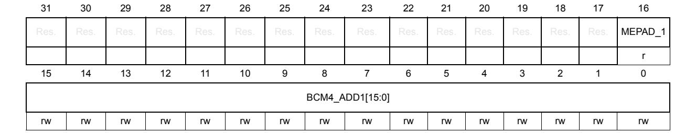

# **13 System configuration controller (SYSCFG)**

# **13.1 Introduction**

The devices feature a set of configuration registers. The objectives of this section is to describe in details the system configuration controller.

# **13.2 SYSCFG main features**

The system configuration controller main functions are the following:

- Analog switch configuration management
- I2C Fm+ configuration
- Selection of the Ethernet PHY interface.
- Management of the external interrupt line connection to the GPIOs
- Management of the I/O compensation cell
- Getting readout protection and Flash memory bank swap informations
- Management of boot sequences and boot addresses
- Management BOR reset level
- Management of Flash memory secured and protected sector status
- Management Flash memory write protections status
- Management of DTCM secured section status
- Management of independent watchdog behavior (hardware or software / freeze)
- Reset generation in Stop and Standby mode
- Secure mode enabling/disabling status.

# **13.3 SYSCFG registers**

# **13.3.1 SYSCFG peripheral mode configuration register (SYSCFG\_PMCR)**

Address offset: 0x04

Reset value: 0x0X00 0000

*Note: SYSCFG\_PMCR reset value depends on the package.*

*'X' corresponds to PC3, PC2, PA1 and PA0 Switch Open bit reset value (PXnSO). PXnSO reset value is 0 when the corresponding PXn\_C pin is available on the package but PXn is not. Otherwise, it is 1.*

| 31   | 30   | 29   | 28   | 27 | 26          | 25    | 24    | 23 | 22        | 21 | 20   | 19   | 18   | 17   | 16   |
|------|------|------|------|----|-------------|-------|-------|----|-----------|----|------|------|------|------|------|
| Res. | Res. | Res. | Res. |    | PC3SO PC2SO | PA1SO | PA0SO |    | EPIS[2:0] |    | Res. | Res. | Res. | Res. | Res. |
|      |      |      |      | rw | rw          | rw    | rw    | rw | rw        | rw |      |      |      |      |      |

| 15   | 14   | 13   | 12   | 11   | 10   | 9               | 8      | 7          | 6          | 5          | 4          | 3           | 2           | 1           | 0           |
|------|------|------|------|------|------|-----------------|--------|------------|------------|------------|------------|-------------|-------------|-------------|-------------|
| Res. | Res. | Res. | Res. | Res. | Res. | BOOSTV DDSEL | BOOSTE | PB9 FMP | PB8 FMP | PB7 FMP | PB6 FMP | I2C4 FMP | I2C3 FMP | I2C2 FMP | I2C1 FMP |
|      |      |      |      |      |      | rw              | rw     | rw         | rw         | rw         | rw         | rw          | rw          | rw          | rw          |

Bits 31:28 Reserved, must be kept at reset value.

#### Bit 27 PC3SO: PC3 Switch Open

This bit controls the analog switch between PC3 and PC3\_C (dual pad)

0: Analog switch closed (pads are connected through the analog switch)

1: Analog switch open (2 separated pads)

### Bit 26 PC2SO: PC2 Switch Open

This bit controls the analog switch between PC2 and PC2 C (dual pad)

0: Analog switch closed (pads are connected through the analog switch)

1: Analog switch open (2 separated pads)

### Bit 25 PA1SO: PA1 Switch Open

This bit controls the analog switch between PA1 and PA1 C (dual pad)

0: Analog switch closed (pads are connected through the analog switch)

1: Analog switch open (2 separated pads)

### Bit 24 PA0SO: PA0 Switch Open

This bit controls the analog switch between PA0 and PA0 C (dual pad)

0: Analog switch closed (pads are connected through the analog switch)

1: Analog switch open (2 separated pads)

### Bits 23:21 EPIS[2:0]: Ethernet PHY Interface Selection

These bits select the Ethernet PHY interface.

000: MII

001: Reserved

010: Reserved

011: Reserved

100: RMII

101: Reserved

110: Reserved

111: Reserved

### Bits 20:10 Reserved, must be kept at reset value.

### Bit 9 **BOOSTVDDSEL**: Analog switch supply voltage selection (VDD/VDDA/booster)

To avoid current consumption due to booster activation when  $V_{DDA} < 2.7 \ V$  and  $V_{DD} > 2.7 \ V$ ,  $V_{DD}$  can be selected as supply voltage for analog switches. In this case, the BOOSTE bit should be cleared to avoid unwanted power consumption. When both  $V_{DD} < 2.7 \ V$  and  $V_{DDA} < 2.7 \ V$ , the booster is still needed to obtain full AC performances from I/O analog switches.

0:  $V_{DDA}$  selected as analog switch supply voltage (when BOOSTE bit is cleared)

1: VDD selected as analog switch supply voltage

RM0399 Rev 4 587/3556

#### Bit 8 **BOOSTE**: Booster Enable

This bit enables the booster to reduce the total harmonic distortion of the analog switch when the supply voltage is lower than 2.7 V.

Activating the booster allows to guaranty the analog switch AC performance when the supply voltage is below 2.7 V: in this case, the analog switch performance is the same on the full voltage range.

0: Booster disabled

1: Booster enabled

#### Bit 7 **PB9FMP**: PB(9) Fm+

This bit enables I2C Fm+ on PB(9).

0: Fm+ disabled

1: Fm+ enabled

#### Bit 6 **PB8FMP**: PB(8) Fm+

This bit enables I2C Fm+ on PB(8).

0: Fm+ disabled

1: Fm+ enabled

### Bit 5 **PB7FMP**: PB(7) Fm+

this bit enables I2C Fm+ on PB(7).

0: Fm+ disabled

1: Fm+ enabled

### Bit 4 **PB6FMP**: PB(6) Fm+

This bit enables I2C Fm+ on PB(6).

0: Fm+ disabled

1: Fm+ enabled

#### Bit 3 **I2C4FMP**: I2C4 Fm+

This bit enables Fm+ on I2C4.

0: Fm+ disabled

1: Fm+ enabled

#### Bit 2 **I2C3FMP**: I2C3 Fm+

This bit enables Fm+ on I2C3.

0: Fm+ disabled

1: Fm+ enabled

### Bit 1 **I2C2FMP**: I2C2 Fm+

This bit enables Fm+ on I2C2.

0: Fm+ disabled

1: Fm+ enabled

#### Bit 0 **I2C1FMP**: I2C1 Fm+

This bit enables Fm+ on I2C1.

0: Fm+ disabled

1: Fm+ enabled

# **13.3.2 SYSCFG external interrupt configuration register 1 (SYSCFG\_EXTICR1)**

Address offset: 0x08

Reset value: 0x0000 0000

| 31   | 30   | 29         | 28   | 27   | 26         | 25   | 24   | 23   | 22         | 21   | 20   | 19   | 18         | 17   | 16   |  |
|------|------|------------|------|------|------------|------|------|------|------------|------|------|------|------------|------|------|--|
| Res. | Res. | Res.       | Res. | Res. | Res.       | Res. | Res. | Res. | Res.       | Res. | Res. | Res. | Res.       | Res. | Res. |  |
|      |      |            |      |      |            |      |      |      |            |      |      |      |            |      |      |  |
| 15   | 14   | 13         | 12   | 11   | 10         | 9    | 8    | 7    | 6          | 5    | 4    | 3    | 2          | 1    | 0    |  |
|      |      | EXTI3[3:0] |      |      | EXTI2[3:0] |      |      |      | EXTI1[3:0] |      |      |      | EXTI0[3:0] |      |      |  |
|      |      |            |      |      |            |      |      |      |            |      |      |      |            |      |      |  |

Bits 31:16 Reserved, must be kept at reset value.

Bits 15:0 **EXTIx[3:0]**: EXTI x configuration (x = 0 to 3)

These bits are written by software to select the source input for the EXTI input for external interrupt / event detection.

0000: PA[x] pin 0001: PB[x] pin 0010: PC[x] pin 0011: PD[x] pin

0100: PE[x] pin

0101: PF[x] pin 0110: PG[x] pin

0111: PH[x] pin

1000: PI[x] pin 1001: PJ[x] pin

1010: PK[x] pin

Other configurations: reserved

# **13.3.3 SYSCFG external interrupt configuration register 2 (SYSCFG\_EXTICR2)**

Address offset: 0x0C

Reset value: 0x0000 0000

| 31   | 30   | 29         | 28   | 27   | 26         | 25   | 24   | 23   | 22         | 21   | 20   | 19   | 18         | 17   | 16   |  |
|------|------|------------|------|------|------------|------|------|------|------------|------|------|------|------------|------|------|--|
| Res. | Res. | Res.       | Res. | Res. | Res.       | Res. | Res. | Res. | Res.       | Res. | Res. | Res. | Res.       | Res. | Res. |  |
|      |      |            |      |      |            |      |      |      |            |      |      |      |            |      |      |  |
| 15   | 14   | 13         | 12   | 11   | 10         | 9    | 8    | 7    | 6          | 5    | 4    | 3    | 2          | 1    | 0    |  |
|      |      | EXTI7[3:0] |      |      | EXTI6[3:0] |      |      |      | EXTI5[3:0] |      |      |      | EXTI4[3:0] |      |      |  |
| rw   | rw   | rw         | rw   | rw   | rw         | rw   | rw   | rw   | rw         | rw   | rw   | rw   | rw         | rw   | rw   |  |

RM0399 Rev 4 589/3556

Bits 31:16 Reserved, must be kept at reset value.

#### Bits 15:0 **EXTIx[3:0]**: EXTI x configuration (x = 4 to 7)

These bits are written by software to select the source input for the EXTI input for external interrupt / event detection.

0000: PA[x] pin 0001: PB[x] pin 0010: PC[x] pin 0011: PD[x] pin 0100: PE[x] pin 0101: PF[x] pin 0110: PG[x] pin 0111: PH[x] pin 1000: PI[x] pin 1001: PJ[x] pin

1010: PK[x] pin

Other configurations: reserved

# **13.3.4 SYSCFG external interrupt configuration register 3 (SYSCFG\_EXTICR3)**

Address offset: 0x10

Reset value: 0x0000 0000

| 31   | 30   | 29          | 28   | 27          | 26   | 25   | 24   | 23   | 22         | 21   | 20   | 19   | 18   | 17         | 16   |
|------|------|-------------|------|-------------|------|------|------|------|------------|------|------|------|------|------------|------|
| Res. | Res. | Res.        | Res. | Res.        | Res. | Res. | Res. | Res. | Res.       | Res. | Res. | Res. | Res. | Res.       | Res. |
|      |      |             |      |             |      |      |      |      |            |      |      |      |      |            |      |
| 15   | 14   | 13          | 12   | 11          | 10   | 9    | 8    | 7    | 6          | 5    | 4    | 3    | 2    | 1          | 0    |
|      |      |             |      | EXTI10[3:0] |      |      |      |      |            |      |      |      |      |            |      |
|      |      | EXTI11[3:0] |      |             |      |      |      |      | EXTI9[3:0] |      |      |      |      | EXTI8[3:0] |      |

Bits 31:16 Reserved, must be kept at reset value.

#### Bits 15:0 **EXTIx[3:0]**: EXTI x configuration (x = 8 to 11)

These bits are written by software to select the source input for the EXTI input for external interrupt / event detection.

0000: PA[x] pin 0001: PB[x] pin 0010: PC[x] pin 0011: PD[x] pin 0100: PE[x] pin 0101: PF[x] pin 0110: PG[x] pin 0111: PH[x] pin 1000: PI[x] pin 1001: PJ[x] pin 1010: PK[x] pin

Other configurations: reserved *Note: PK[11:8] are not used*

RM0399 Rev 4 591/3556

# **13.3.5 SYSCFG external interrupt configuration register 4 (SYSCFG\_EXTICR4)**

Address offset: 0x14

Reset value: 0x0000 0000

| 31   | 30   | 29          | 28   | 27   | 26   | 25          | 24   | 23   | 22   | 21          | 20   | 19   | 18   | 17          | 16   |
|------|------|-------------|------|------|------|-------------|------|------|------|-------------|------|------|------|-------------|------|
| Res. | Res. | Res.        | Res. | Res. | Res. | Res.        | Res. | Res. | Res. | Res.        | Res. | Res. | Res. | Res.        | Res. |
|      |      |             |      |      |      |             |      |      |      |             |      |      |      |             |      |
| 15   | 14   |             | 12   | 11   | 10   | 9           | 8    |      |      | 5           | 4    | 3    | 2    | 1           | 0    |
|      |      | 13          |      |      |      |             |      | 7    | 6    |             |      |      |      |             |      |
|      |      | EXTI15[3:0] |      |      |      | EXTI14[3:0] |      |      |      | EXTI13[3:0] |      |      |      | EXTI12[3:0] |      |

Bits 31:16 Reserved, must be kept at reset value.

Bits 15:0 **EXTIx[3:0]**: EXTI x configuration (x = 12 to 15)

These bits are written by software to select the source input for the EXTI input for external interrupt / event detection.

0000: PA[x] pin

0001: PB[x] pin

0010: PC[x] pin

0011: PD[x] pin

0100: PE[x] pin

0101: PF[x] pin 0110: PG[x] pin

0111: PH[x] pin

1000: PI[x] pin

1001: PJ[x] pin

1010: PK[x] pin

Other configurations: reserved

*Note: PK[15:12] are not used.*

### **13.3.6 SYSCFG configuration register (SYSCFG\_CFGR)**

Address offset: 0x18

Reset value: 0x0000 0000

| 31        | 30    | 29    | 28     | 27     | 26     | 25     | 24   | 23      | 22   | 21   | 20   | 19     | 18   | 17   | 16   |
|-----------|-------|-------|--------|--------|--------|--------|------|---------|------|------|------|--------|------|------|------|
| Res.      | Res.  | Res.  | Res.   | Res.   | Res.   | Res.   | Res. | Res.    | Res. | Res. | Res. | Res.   | Res. | Res. | Res. |
|           |       |       |        |        |        |        |      |         |      |      |      |        |      |      |      |
| 15        | 14    | 13    | 12     | 11     | 10     | 9      | 8    | 7       | 6    | 5    | 4    | 3      | 2    | 1    | 0    |
| AXI SRAML | ITCML | DTCML | SRAM1L | SRAM2L | SRAM3L | SRAM4L | Res. | BK RAML | CM7L | Res. | Res. | FLASHL | PVDL | Res. | CM4L |
| rs        | rs    | rs    | rs     | rs     | rs     | rs     |      | rs      | rs   |      |      | rs     | rs   |      | rs   |

Bits 31:16 Reserved, must be kept at reset value.

### Bit 15 **AXISRAML**: D1 AXI-SRAM double ECC error lock bit

This bit is set by software and cleared only by a system reset. It can be used to enable and lock the AXI-SRAM double ECC error flag connection to TIM1/8/15/16/17 and HRTIMER Break inputs.

0: AXI-SRAM double ECC error flag disconnected from TIM1/8/15/16/17/HRTIMER Break inputs

1: AXI-SRAM double ECC error flag connected to TIM1/8/15/16/17/HRTIMER Break inputs.

#### Bit 14 **ITCML**: D1 ITCM double ECC error lock bit

This bit is set by software and cleared only by a system reset. It can be used to enable and lock the ITCM double ECC error flag connection to TIM1/8/15/16/17 and HRTIMER Break inputs.

0: ITCM double ECC error flag disconnected from TIM1/8/15/16/17/HRTIMER Break inputs

1: ITCM double ECC error flag connected to TIM1/8/15/16/17/HRTIMER Break inputs

### Bit 13 **DTCML**: D1 DTCM double ECC error lock bit

This bit is set by software and cleared only by a system reset. It can be used to enable and lock the DTCM double ECC error flag connection to TIM1/8/15/16/17 and HRTIMER Break inputs.

0: DTCM double ECC error flag disconnected from TIM1/8/15/16/17/HRTIMER Break inputs

1: DTCM double ECC error flag connected to TIM1/8/15/16/17/HRTIMER Break inputs

#### Bit 12 **SRAM1L**: D2 SRAM1 double ECC error lock bit

This bit is set by software and cleared only by a system reset. It can be used to enable and lock the D2 SRAM1 double ECC error flag connection to TIM1/8/15/16/17 and HRTIMER Break inputs.

0: D2 SRAM1 double ECC error flag disconnected from TIM1/8/15/16/17/HRTIMER Break inputs

1: D2 SRAM1 double ECC error flag connected to TIM1/8/15/16/17/HRTIMER Break inputs

RM0399 Rev 4 593/3556

#### Bit 11 **SRAM2L**: D2 SRAM2 double ECC error lock bit

This bit is set by software and cleared only by a system reset. It can be used to enable and lock the D2 SRAM2 double ECC error flag connection to TIM1/8/15/16/17 and HRTIMER Break inputs.

- 0: D2 SRAM2 double ECC error flag disconnected from TIM1/8/15/16/17/HRTIMER Break inputs
- 1: D2 SRAM2 double ECC error flag connected to TIM1/8/15/16/17/HRTIMER Break inputs

### Bit 10 **SRAM3L**: D2 SRAM3 double ECC error lock bit

This bit is set by software and cleared only by a system reset. It can be used to enable and lock the D2 SRAM3 double ECC error flag connection to TIM1/8/15/16/17 and HRTIMER Break inputs.

- 0: D2 SRAM3 double ECC error flag disconnected from TIM1/8/15/16/17/HRTIMER Break inputs
- 1: D2 SRAM3 double ECC error flag connected to TIM1/8/15/16/17/HRTIMER Break inputs

### Bit 9 **SRAM4L**: D3 SRAM4 double ECC error lock bit

This bit is set by software and cleared only by a system reset. It can be used to enable and lock the D3 SRAM4 double ECC error flag connection to TIM1/8/15/16/17 and HRTIMER Break inputs.

- 0: D3 SRAM4 double ECC error flag disconnected from TIM1/8/15/16/17/HRTIMER Break inputs
- 1: D3 SRAM4 double ECC error flag connected to TIM1/8/15/16/17/HRTIMER Break inputs
- Bit 8 Reserved, must be kept at reset value.

### Bit 7 **BKRAML**: Backup SRAM double ECC error lock bit

This bit is set by software and cleared only by a system reset. It can be used to enable and lock the Backup SRAM double ECC error flag connection to TIM1/8/15/16/17 and HRTIMER Break inputs.

- 0: Backup SRAM double ECC error flag disconnected from TIM1/8/15/16/17/HRTIMER Break inputs
- 1: Backup SRAM double ECC error flag connected to TIM1/8/15/16/17/HRTIMER Break inputs

### Bit 6 **CM7L**: Arm® Cortex®-M7 LOCKUP (HardFault) output enable bit

This bit is set by software and cleared only by a system reset. It can be used to enable and lock the connection of the Arm® Cortex®-M7 LOCKUP (HardFault) output to TIM1/8/15/16/17 and HRTIMER Break inputs.

- 0: Arm® Cortex®-M7 LOCKUP output disconnected from TIM1/8/15/16/17/HRTIMER Break inputs
- 1: Arm® Cortex®-M7 LOCKUP output connected to TIM1/8/15/16/17/HRTIMER Break inputs
- Bits 5:4 Reserved, must be kept at reset value.

### Bit 3 **FLASHL**: FLASH double ECC error lock bit

This bit is set by software and cleared only by a system reset. It can be used to enable and lock the FLASH double ECC error flag connection to TIM1/8/15/16/17 and HRTIMER Break inputs.

- 0: FLASH double ECC error flag disconnected from TIM1/8/15/16/17/HRTIMER Break inputs
- 1: FLASH double ECC error flag connected to TIM1/8/15/16/17/HRTIMER Break inputs

Bit 2 **PVDL**: PVD lock enable bit

This bit is set by software and cleared only by a system reset. It can be used to enable and lock the PVD connection to TIM1/8/15/16/17 and HRTIMER Break inputs, as well as the PVDE and PLS[2:0] in the PWR\_CR1 register.

- 0: PVD signal disconnected from TIM1/8/15/16/17/HRTIMER Break inputs
- 1: PVD signal connected to TIM1/8/15/16/17/HRTIMER Break inputs
- Bit 1 Reserved, must be kept at reset value.
- Bit 0 **CM4L**: Arm® Cortex®-M4 LOCKUP (Hardfault) output enable bit

This bit is set by software and cleared only by a system reset. It can be used to enable and lock the connection of Arm® Cortex®-M4 LOCKUP (Hardfault) output to TIM1/8/15/16/17 and HRTIMER Break inputs.

- 0: Arm® Cortex®-M4 LOCKUP output disconnected from TIM1/8/15/16/17/HRTIMER Break inputs
- 1: Arm® Cortex®-M4 LOCKUP output connected to TIM1/8/15/16/17/HRTIMER Break inputs

RM0399 Rev 4 595/3556

# **13.3.7 SYSCFG compensation cell control/status register (SYSCFG\_CCCSR)**

Address offset: 0x20

Reset value: 0x0000 0000

Refer to *Section 12.3.11: I/O compensation cell* for a detailed description of I/O

compensation mechanism.

| 31   | 30   | 29   | 28   | 27   | 26   | 25   | 24    | 23   | 22   | 21   | 20   | 19   | 18   | 17   | 16   |
|------|------|------|------|------|------|------|-------|------|------|------|------|------|------|------|------|
| Res. | Res. | Res. | Res. | Res. | Res. | Res. | Res.  | Res. | Res. | Res. | Res. | Res. | Res. | Res. | HSLV |
|      |      |      |      |      |      |      |       |      |      |      |      |      |      |      | rw   |
| 15   | 14   | 13   | 12   | 11   | 10   | 9    | 8     | 7    | 6    | 5    | 4    | 3    | 2    | 1    | 0    |
| Res. | Res. | Res. | Res. | Res. | Res. | Res. | READY | Res. | Res. | Res. | Res. | Res. | Res. | CS   | EN   |
|      |      |      |      |      |      |      | r     |      |      |      |      |      |      | rw   | rw   |

Bits 31:17 Reserved, must be kept at reset value.

### Bit 16 **HSLV:** High-speed at low-voltage

This bit is written by software to optimize the I/O speed when the product voltage is low.

This bit is active only if IO\_HSLV user option bit is set. It must be used only if the product supply voltage is below 2.7 V. Setting this bit when VDD is higher than 2.7 V might be destructive.

0: No I/O speed optimization

1: I/O speed optimization

Bits 15:9 Reserved, must be kept at reset value.

#### Bit 8 **READY:** Compensation cell ready flag

This bit provides the status of the compensation cell.

0: I/O compensation cell not ready

1: I/O compensation cell ready

*Note: The CSI clock is required for the compensation cell to work properly. The compensation cell ready bit (*READY) *is not set if the CSI clock is not enabled.*

Bits 7:2 Reserved, must be kept at reset value.

### Bit 1 **CS:** Code selection

This bit selects the code to be applied for the I/O compensation cell.

0: Code from the cell (available in the SYSCFG\_CCVR)

1: Code from the SYSCFG compensation cell code register (SYSCFG\_CCCR)

#### Bit 0 **EN:** Enable

This bit enables the I/O compensation cell.

0: I/O compensation cell disabled

1: I/O compensation cell enabled

### **13.3.8 SYSCFG compensation cell value register (SYSCFG\_CCVR)**

Address offset: 0x24

Reset value: 0x0000 0000

| 31   | 30   | 29   | 28   | 27   | 26   | 25   | 24   | 23   | 22       | 21   | 20   | 19   | 18   | 17       | 16   |
|------|------|------|------|------|------|------|------|------|----------|------|------|------|------|----------|------|
| Res. | Res. | Res. | Res. | Res. | Res. | Res. | Res. | Res. | Res.     | Res. | Res. | Res. | Res. | Res.     | Res. |
|      |      |      |      |      |      |      |      |      |          |      |      |      |      |          |      |
| 15   | 14   | 13   | 12   | 11   | 10   | 9    | 8    | 7    | 6        | 5    | 4    | 3    | 2    | 1        | 0    |
| Res. | Res. | Res. | Res. | Res. | Res. | Res. | Res. |      | PCV[3:0] |      |      |      |      | NCV[3:0] |      |
|      |      |      |      |      |      |      |      | r    | r        | r    | r    | r    | r    | r        | r    |

Bits 31:8 Reserved, must be kept at reset value.

#### Bits 7:4 **PCV[3:0]:** PMOS compensation value

This value is provided by the cell and can be used by the CPU to compute an I/O compensation cell code for PMOS transistors. This code is applied to the I/O compensation cell when the CS bit of the SYSCFG\_CCCSR is reset.

### Bits 3:0 **NCV[3:0]:** NMOS compensation value

This value is provided by the cell and can be used by the CPU to compute an I/O compensation cell code for NMOS transistors. This code is applied to the I/O compensation cell when the CS bit of the SYSCFG\_CCCSR is reset.

### **13.3.9 SYSCFG compensation cell code register (SYSCFG\_CCCR)**

Address offset: 0x28

Reset value: 0x0000 0000

| 31   | 30   | 29   | 28   | 27   | 26   | 25   | 24   | 23       | 22   | 21   | 20   | 19   | 18   | 17       | 16   |
|------|------|------|------|------|------|------|------|----------|------|------|------|------|------|----------|------|
| Res. | Res. | Res. | Res. | Res. | Res. | Res. | Res. | Res.     | Res. | Res. | Res. | Res. | Res. | Res.     | Res. |
|      |      |      |      |      |      |      |      |          |      |      |      |      |      |          |      |
| 15   | 14   | 13   | 12   | 11   | 10   | 9    | 8    | 7        | 6    | 5    | 4    | 3    | 2    | 1        | 0    |
| Res. | Res. | Res. | Res. | Res. | Res. | Res. | Res. | PCC[3:0] |      |      |      |      |      | NCC[3:0] |      |
|      |      |      |      |      |      |      |      | rw       | rw   | rw   | rw   | rw   | rw   | rw       | rw   |

Bits 31:8 Reserved, must be kept at reset value.

### Bits 7:4 **PCC[3:0]:** PMOS compensation code

These bits are written by software to define an I/O compensation cell code for PMOS transistors. This code is applied to the I/O compensation cell when the CS bit of the SYSCFG\_CCCSR is set.

### Bits 3:0 **NCC[3:0]:** NMOS compensation code

These bits are written by software to define an I/O compensation cell code for NMOS transistors. This code is applied to the I/O compensation cell when the CS bit of the SYSCFG\_CCCSR is set.

RM0399 Rev 4 597/3556

### **13.3.10 SYSCFG power control register (SYSCFG\_PWRCR)**

Address Offset: 0x2C

Reset Value: 0x0000 0000

| 31   | 30   | 29   | 28   | 27   | 26   | 25   | 24   | 23   | 22   | 21   | 20   | 19   | 18   | 17   | 16   |
|------|------|------|------|------|------|------|------|------|------|------|------|------|------|------|------|
| Res. | Res. | Res. | Res. | Res. | Res. | Res. | Res. | Res. | Res. | Res. | Res. | Res. | Res. | Res. | Res. |
|      |      |      |      |      |      |      |      |      |      |      |      |      |      |      |      |
| 15   | 14   | 13   | 12   | 11   | 10   | 9    | 8    | 7    | 6    | 5    | 4    | 3    | 2    | 1    | 0    |
| Res. | Res. | Res. | Res. | Res. | Res. | Res. | Res. | Res. | Res. | Res. | Res. | Res. | Res. | Res. | ODEN |
|      |      |      |      |      |      |      |      |      |      |      |      |      |      |      | rw   |

Bits 31:1 Reserved, must be kept at reset value.

Bit 0 **ODEN**: Overdrive enable, this bit allows to activate the LDO regulator overdrive mode. This bit must be written only in VOS1 voltage scaling mode.

0: Overdrive mode disabled

1: Overdrive mode enabled (the LDO generates VOS0 for VCORE)

*Note: VOS0 must be activated only in VOS1 mode. It must be disabled by software before entering low-power mode (execution of WFE/WFI instruction).*

# **13.3.11 SYSCFG system register (SYSCFG\_SR0)**

Address offset: 0x100

Reset value: 0x0000 0001

| 31   | 30   | 29   | 28   | 27   | 26   | 25   | 24   | 23   | 22   | 21   | 20   | 19   | 18   | 17   | 16             |
|------|------|------|------|------|------|------|------|------|------|------|------|------|------|------|----------------|
| Res. | Res. | Res. | Res. | Res. | Res. | Res. | Res. | Res. | Res. | Res. | Res. | Res. | Res. | Res. | CM4 PRESENT |
|      |      |      |      |      |      |      |      |      |      |      |      |      |      |      | r              |
| 15   | 14   | 13   | 12   | 11   | 10   | 9    | 8    | 7    | 6    | 5    | 4    | 3    | 2    | 1    | 0              |
| Res. | Res. | Res. | Res. | Res. | Res. | Res. | Res. | Res. | Res. | Res. | Res. | Res. | Res. | Res. | Res.           |
|      |      |      |      |      |      |      |      |      |      |      |      |      |      |      |                |

Bits 31:17 Reserved, must be kept at reset value.

Bit 16 **CM4PRESENT:** Arm® Cortex® -M4 core

This bit indicates that the Arm® Cortex® -M4 core is present.

0: Arm® Cortex® -M4 core not present 1: Arm® Cortex® -M4 core present

Bits 15:0 Reserved, must be kept at reset value.

### **13.3.12 SYSCFG package register (SYSCFG\_PKGR)**

Address offset: 0x124

Reset value: 0x0000 000X

| 31   | 30   | 29   | 28   | 27   | 26   | 25   | 24   | 23   | 22   | 21   | 20   | 19      | 18   | 17   | 16   |
|------|------|------|------|------|------|------|------|------|------|------|------|---------|------|------|------|
| Res. | Res. | Res. | Res. | Res. | Res. | Res. | Res. | Res. | Res. | Res. | Res. | Res.    | Res. | Res. | Res. |
|      |      |      |      |      |      |      |      |      |      |      |      |         |      |      |      |
| 15   | 14   | 13   | 12   | 11   | 10   | 9    | 8    | 7    | 6    | 5    | 4    | 3       | 2    | 1    | 0    |
| Res. | Res. | Res. | Res. | Res. | Res. | Res. | Res. | Res. | Res. | Res. | Res. | PKG[3:0 |      |      |      |
|      |      |      |      |      |      |      |      |      |      |      |      | r       | r    | r    | r    |

Bits 31:4 Reserved, must be kept at reset value.

Bits 3:0 **PKG[3:0]:** Package

These bits indicate the device package. 0010: UFBGA169/LQFP176 (STM32H7x7)

0011: LQFP144 (STM32H7x5) 0110: LQFP176 (STM32H7x5) 0111: UFBGA176 (STM32H7x5) 1001: LQFP208 (STM32H7x7) 1010: LQFP208 (STM32H7x5) Other configurations: all pads enabled

### **13.3.13 SYSCFG user register 0 (SYSCFG\_UR0)**

Address offset: 0x300

Reset value: 0x00XX 000X

| 31   | 30   | 29   | 28   | 27   | 26   | 25   | 24   | 23       | 22   | 21   | 20   | 19   | 18   | 17   | 16  |  |
|------|------|------|------|------|------|------|------|----------|------|------|------|------|------|------|-----|--|
| Res. | Res. | Res. | Res. | Res. | Res. | Res. | Res. | RDP[7:0] |      |      |      |      |      |      |     |  |
|      |      |      |      |      |      |      |      | r        | r    | r    | r    | r    | r    | r    | r   |  |
| 15   | 14   | 13   | 12   | 11   | 10   | 9    | 8    | 7        | 6    | 5    | 4    | 3    | 2    | 1    | 0   |  |
| Res. | Res. | Res. | Res. | Res. | Res. | Res. | Res. | Res.     | Res. | Res. | Res. | Res. | Res. | Res. | BKS |  |
|      |      |      |      |      |      |      |      |          |      |      |      |      |      |      | r   |  |

Bits 31:24 Reserved, must be kept at reset value.

### Bits 23:16 **RDP[7:0]:** Readout protection

These bits indicate the readout protection level.

0xAA: Level 0 (no protection)

0xCC: Level 2 (Flash memory readout protected, full debug features, boot from SRAM

and boundary scan disabled)

Other configurations: Level 1 (Flash memory readout protected, limited debug

features and boundary scan enabled)

Bits 15:1 Reserved, must be kept at reset value.

### Bit 0 **BKS:** Bank Swap

This bit indicates Flash memory bank mapping.

0: Flash memory bank addresses are inverted

1: Flash memory banks are mapped to their original addresses

### **13.3.14 SYSCFG user register 1 (SYSCFG\_UR1)**

Address offset: 0x304

Reset value: 0x000X 000X

| 31   | 30   | 29   | 28   | 27   | 26   | 25   | 24   | 23   | 22   | 21   | 20   | 19   | 18   | 17   | 16   |
|------|------|------|------|------|------|------|------|------|------|------|------|------|------|------|------|
| Res. | Res. | Res. | Res. | Res. | Res. | Res. | Res. | Res. | Res. | Res. | Res. | Res. | Res. | Res. | BCM7 |
|      |      |      |      |      |      |      |      |      |      |      |      |      |      |      | rw   |
| 15   | 14   | 13   | 12   | 11   | 10   | 9    | 8    | 7    | 6    | 5    | 4    | 3    | 2    | 1    | 0    |
| Res. | Res. | Res. | Res. | Res. | Res. | Res. | Res. | Res. | Res. | Res. | Res. | Res. | Res. | Res. | BCM4 |
|      |      |      |      |      |      |      |      |      |      |      |      |      |      |      | rw   |

Bits 31:17 Reserved, must be kept at reset value.

Bit 16 **BCM7:** Boot Cortex-M7

This bit enables Cortex-M7 core boot. 0: Cortex-M7 core is clock gated 1: Cortex-M7 core boot is enabled

Bits 15:1 Reserved, must be kept at reset value.

Bit 0 **BCM4:** Boot Cortex-M4

This bit enables Cortex-M4 core boot. 0: Cortex-M4 core is clock gated 1: Cortex-M4 core boot is enabled

# **13.3.15 SYSCFG user register 2 (SYSCFG\_UR2)**

Address offset: 0x308

Reset value: 0xXXXX 000X

| 31   | 30   | 29   | 28   | 27   | 26   | 25   | 24   | 23              | 22   | 21   | 20   | 19   | 18   | 17        | 16 |
|------|------|------|------|------|------|------|------|-----------------|------|------|------|------|------|-----------|----|
|      |      |      |      |      |      |      |      | BCM7_ADD0[15:0] |      |      |      |      |      |           |    |
| rw   | rw   | rw   | rw   | rw   | rw   | rw   | rw   | rw              | rw   | rw   | rw   | rw   | rw   | rw        | rw |
| 15   | 14   | 13   | 12   | 11   | 10   | 9    | 8    | 7               | 6    | 5    | 4    | 3    | 2    | 1         | 0  |
| Res. | Res. | Res. | Res. | Res. | Res. | Res. | Res. | Res.            | Res. | Res. | Res. | Res. | Res. | BORH[1:0] |    |
|      |      |      |      |      |      |      |      |                 |      |      |      |      |      | r         | r  |

Bits 31:16 BCM7**\_ADD0[15:0]:** Cortex-M7 Boot Address 0

These bits define the MSB of the Cortex-M7 core boot address when BOOT pin is low.

Bits 15:2 Reserved, must be kept at reset value.

Bits 1:0 **BORH[1:0]:** BOR\_LVL Brownout Reset Threshold Level

These bits indicate the Brownout reset high level.

0x11: BOR Level 3 0x10: BOR Level 2 0x01: BOR Level 1 0x00: BOR OFF (Level 0)

RM0399 Rev 4 601/3556

### **13.3.16 SYSCFG user register 3 (SYSCFG\_UR3)**

Address offset: 0x30C

Reset value: 0xXXXX XXXX

| 31 | 30              | 29 | 28 | 27 | 26 | 25 | 24 | 23 | 22 | 21 | 20 | 19 | 18 | 17 | 16 |
|----|-----------------|----|----|----|----|----|----|----|----|----|----|----|----|----|----|
|    | BCM7_ADD1[15:0] |    |    |    |    |    |    |    |    |    |    |    |    |    |    |
| rw | rw              | rw | rw | rw | rw | rw | rw | rw | rw | rw | rw | rw | rw | rw | rw |
| 15 | 14              | 13 | 12 | 11 | 10 | 9  | 8  | 7  | 6  | 5  | 4  | 3  | 2  | 1  | 0  |
|    | BCM4_ADD0[15:0] |    |    |    |    |    |    |    |    |    |    |    |    |    |    |
| rw | rw              | rw | rw | rw | rw | rw | rw | rw | rw | rw | rw | rw | rw | rw | rw |

### Bits 31:16 **BCM7\_ADD1[15:0]:** Cortex-M7 Boot Address 1

These bits define the MSB of the Cortex-M7 core boot address when BOOT pin is high.

Bits 15:0 **BCM4\_ADD1[15:0]:** Boot Cortex-M4 Address 0

These bits define the MSB of the Cortex-M4 core boot address when BOOT pin is high.

# **13.3.17 SYSCFG user register 4 (SYSCFG\_UR4)**

Address offset: 0x310

Reset value: 0x000X XXXX

Bits 31:17 Reserved, must be kept at reset value.

Bit 16 **MEPAD\_1:** Mass Erase Protected Area Disabled for bank 1

This bit indicates if the flash protected area (Bank 1) is affected by a mass erase.

- 0: When a mass erase occurs the protected area is erased
- 1: When a mass erase occurs the protected area is not erased

#### Bits 15:0 **BCM4\_ADD0[15:0]:** Boot Cortex-M4 Address 1

These bits define the MSB of the Cortex-M4 core boot address when BOOT pin is low.

### **13.3.18 SYSCFG user register 5 (SYSCFG\_UR5)**

Address offset: 0x314

Reset value: 0x00XX 000X

| 31   | 30   | 29   | 28   | 27   | 26   | 25   | 24   | 23          | 22   | 21   | 20   | 19   | 18   | 17   | 16      |  |  |
|------|------|------|------|------|------|------|------|-------------|------|------|------|------|------|------|---------|--|--|
| Res. | Res. | Res. | Res. | Res. | Res. | Res. | Res. | WRPS_1[7:0] |      |      |      |      |      |      |         |  |  |
|      |      |      |      |      |      |      |      | r           | r    | r    | r    | r    | r    | r    | r       |  |  |
| 15   | 14   | 13   | 12   | 11   | 10   | 9    | 8    | 7           | 6    | 5    | 4    | 3    | 2    | 1    | 0       |  |  |
| Res. | Res. | Res. | Res. | Res. | Res. | Res. | Res. | Res.        | Res. | Res. | Res. | Res. | Res. | Res. | MESAD_1 |  |  |
|      |      |      |      |      |      |      |      |             |      |      |      |      |      |      | r       |  |  |

Bits 31:24 Reserved, must be kept at reset value.

Bits 23:16 **WRPN\_1[7:0]:** Write protection for flash bank 1

WRPN[i] bit indicates if the sector i of the Flash memory bank 1 is protected.

- 0: Write protection is active on sector i
- 1: Write protection is not active on sector i

Bits 15:1 Reserved, must be kept at reset value.

Bit 0 **MESAD\_1:** Mass erase secured area disabled for bank 1

This bit indicates if the flash secured area (bank 1) is affected by a mass erase.

- 0: When a mass erase occurs the secured area is erased
- 1: When a mass erase occurs the secured area is not erased

# **13.3.19 SYSCFG user register 6 (SYSCFG\_UR6)**

Address offset: 0x318

Reset value: 0x0XXX 0XXX

| 31   | 30   | 29   | 28   | 27 | 26             | 25 | 24 | 23 | 22 | 21 | 20 | 19 | 18 | 17 | 16 |
|------|------|------|------|----|----------------|----|----|----|----|----|----|----|----|----|----|
| Res. | Res. | Res. | Res. |    | PA_END_1[11:0] |    |    |    |    |    |    |    |    |    |    |
|      |      |      |      | r  | r              | r  | r  | r  | r  | r  | r  | r  | r  | r  | r  |
| 15   | 14   | 13   | 12   | 11 | 10             | 9  | 8  | 7  | 6  | 5  | 4  | 3  | 2  | 1  | 0  |
| Res. | Res. | Res. | Res. |    | PA_BEG_1[11:0] |    |    |    |    |    |    |    |    |    |    |
|      |      |      |      | r  | r              | r  | r  | r  | r  | r  | r  | r  | r  | r  | r  |

- Bits 31:28 Reserved, must be kept at reset value.
- Bits 23:16 **PA\_END\_1[11:0]:** Protected area end address for bank 1 End address for bank 1 protected area.

Bits 15:12 Reserved, must be kept at reset value.

Bits 11:0 **PA\_BEG\_1[11:0]:** Protected area start address for bank 1 Start address for bank 1 protected area.

RM0399 Rev 4 603/3556

### **13.3.20 SYSCFG user register 7 (SYSCFG\_UR7)**

Address offset: 0x31C

Reset value: 0x0XXX 0XXX

| 31   | 30   | 29   | 28   | 27 | 26             | 25 | 24 | 23 | 22 | 21 | 20 | 19 | 18 | 17 | 16 |  |
|------|------|------|------|----|----------------|----|----|----|----|----|----|----|----|----|----|--|
| Res. | Res. | Res. | Res. |    | SA_END_1[11:0] |    |    |    |    |    |    |    |    |    |    |  |
|      |      |      |      | r  | r              | r  | r  | r  | r  | r  | r  | r  | r  | r  | r  |  |
| 15   | 14   | 13   | 12   | 11 | 10             | 9  | 8  | 7  | 6  | 5  | 4  | 3  | 2  | 1  | 0  |  |
| Res. | Res. | Res. | Res. |    | SA_BEG_1[11:0] |    |    |    |    |    |    |    |    |    |    |  |
|      |      |      |      | r  | r              | r  | r  | r  | r  | r  | r  | r  | r  | r  | r  |  |

Bits 31:28 Reserved, must be kept at reset value.

Bits 23:16 **SA\_END\_1[11:0]:** Secured area end address for bank 1

End address for bank 1 secured area.

Bits 15:12 Reserved, must be kept at reset value.

Bits 11:0 **SA\_BEG\_1[11:0]:** Secured area start address for bank 1 Start address for bank 1 secured area.

### **13.3.21 SYSCFG user register 8 (SYSCFG\_UR8)**

Address offset: 0x320

Reset value: 0x000X 000X

| 31   | 30   | 29   | 28   | 27   | 26   | 25   | 24   | 23   | 22   | 21   | 20   | 19   | 18   | 17   | 16      |
|------|------|------|------|------|------|------|------|------|------|------|------|------|------|------|---------|
| Res. | Res. | Res. | Res. | Res. | Res. | Res. | Res. | Res. | Res. | Res. | Res. | Res. | Res. | Res. | MESAD_2 |
|      |      |      |      |      |      |      |      |      |      |      |      |      |      |      | r       |
|      |      |      |      |      |      |      |      |      |      |      |      |      |      |      |         |
| 15   | 14   | 13   | 12   | 11   | 10   | 9    | 8    | 7    | 6    | 5    | 4    | 3    | 2    | 1    | 0       |
| Res. | Res. | Res. | Res. | Res. | Res. | Res. | Res. | Res. | Res. | Res. | Res. | Res. | Res. | Res. | MEPAD_2 |

Bits 31:17 Reserved, must be kept at reset value.

Bit 16 **MESAD\_2:** Mass erase secured area disabled for bank 2

This bit indicates if the Flash memory secured area (Bank 2) is affected by a mass erase.

- 0: When a mass erase occurs the secured area is erased
- 1: When a mass erase occurs the secured area is not erased

Bits 15:1 Reserved, must be kept at reset value.

Bit 0 **MEPAD\_2:** Mass erase protected area disabled for bank 2

This bit indicates if the Flash memory protected area (Bank 2) is affected by a mass erase.

- 0: When a mass erase occurs the protected area is erased
- 1: When a mass erase occurs the protected area is not erased

### **13.3.22 SYSCFG user register 9 (SYSCFG\_UR9)**

Address offset: 0x324

Reset value: 0x0XXX 00XX

| 31   | 30   | 29   | 28   | 27   | 26             | 25   | 24   | 23          | 22 | 21 | 20 | 19 | 18 | 17 | 16 |  |  |
|------|------|------|------|------|----------------|------|------|-------------|----|----|----|----|----|----|----|--|--|
| Res. | Res. | Res. | Res. |      | PA_BEG_2[11:0] |      |      |             |    |    |    |    |    |    |    |  |  |
|      |      |      |      | r    | r              | r    | r    | r           | r  | r  | r  | r  | r  | r  | r  |  |  |
| 15   | 14   | 13   | 12   | 11   | 10             | 9    | 8    | 7           | 6  | 5  | 4  | 3  | 2  | 1  | 0  |  |  |
| Res. | Res. | Res. | Res. | Res. | Res.           | Res. | Res. | WRPS_2[7:0] |    |    |    |    |    |    |    |  |  |
|      |      |      |      |      |                |      |      | r           | r  | r  | r  | r  | r  | r  | r  |  |  |

Bits 31:28 Reserved, must be kept at reset value.

Bits 27:16 **PA\_BEG\_2[11:0]:** Protected area start address for bank 2 Start address for bank 2 protected area.

Bits 15:8 Reserved, must be kept at reset value.

Bits 7:0 **WRPN\_2[7:0]:** Write protection for flash bank 2

WRPN[i] bit indicates if the sector i of the Flash memory bank 2 is protected.

0: Write protection is active on sector i 1: Write protection is not active on sector i

# **13.3.23 SYSCFG user register 10 (SYSCFG\_UR10)**

Address offset: 0x328

Reset value: 0x0XXX 0XXX

| 31   | 30   | 29   | 28   | 27 | 26             | 25 | 24 | 23 | 22 | 21 | 20 | 19 | 18 | 17 | 16 |  |
|------|------|------|------|----|----------------|----|----|----|----|----|----|----|----|----|----|--|
| Res. | Res. | Res. | Res. |    | SA_BEG_2[11:0] |    |    |    |    |    |    |    |    |    |    |  |
|      |      |      |      | r  | r              | r  | r  | r  | r  | r  | r  | r  | r  | r  | r  |  |
| 15   | 14   | 13   | 12   | 11 | 10             | 9  | 8  | 7  | 6  | 5  | 4  | 3  | 2  | 1  | 0  |  |
| Res. | Res. | Res. | Res. |    | PA_END_2[11:0] |    |    |    |    |    |    |    |    |    |    |  |
|      |      |      |      | r  | r              | r  | r  | r  | r  | r  | r  | r  | r  | r  | r  |  |

Bits 31:28 Reserved, must be kept at reset value.

Bits 27:16 **SA\_BEG\_2[11:0]:** Secured area start address for bank 2 Start address for bank 2 secured area.

Bits 15:12 Reserved, must be kept at reset value.

Bits 11:0 **PA\_END\_2[11:0]:** Protected area end address for bank 2 End address for bank 2 protected area.

RM0399 Rev 4 605/3556

### **13.3.24 SYSCFG user register 11 (SYSCFG\_UR11)**

Address offset: 0x32C

Reset value: 0x000X 0XXX

| 31   | 30   | 29   | 28   | 27   | 26             | 25   | 24   | 23   | 22   | 21   | 20   | 19   | 18   | 17   | 16     |
|------|------|------|------|------|----------------|------|------|------|------|------|------|------|------|------|--------|
| Res. | Res. | Res. | Res. | Res. | Res.           | Res. | Res. | Res. | Res. | Res. | Res. | Res. | Res. | Res. | IWDG1M |
|      |      |      |      |      |                |      |      |      |      |      |      |      |      |      | r      |
| 15   | 14   | 13   | 12   | 11   | 10             | 9    | 8    | 7    | 6    | 5    | 4    | 3    | 2    | 1    | 0      |
| Res. | Res. | Res. | Res. |      | SA_END_2[11:0] |      |      |      |      |      |      |      |      |      |        |
|      |      |      |      | r    | r              | r    | r    | r    | r    | r    | r    | r    | r    | r    | r      |

Bits 31:17 Reserved, must be kept at reset value.

Bit 16 **IWDG1M:** Independent Watchdog 1 mode

This bit indicates the control mode of the Independent Watchdog 1 (IWDG1).

0: IWDG1 controlled by hardware

1: IWDG1 controlled by software

Bits 15:12 Reserved, must be kept at reset value.

Bits 11:0 **SA\_END\_2[11:0]:** Secured area end address for bank 2

End address for bank 2 secured area.

### **13.3.25 SYSCFG user register 12 (SYSCFG\_UR12)**

Address offset: 0x330

Reset value: 0x000X 000X

| 31   | 30   | 29   | 28   | 27   | 26   | 25   | 24   | 23   | 22   | 21   | 20   | 19   | 18   | 17   | 16     |
|------|------|------|------|------|------|------|------|------|------|------|------|------|------|------|--------|
| Res. | Res. | Res. | Res. | Res. | Res. | Res. | Res. | Res. | Res. | Res. | Res. | Res. | Res. | Res. | SECURE |
|      |      |      |      |      |      |      |      |      |      |      |      |      |      |      | r      |
| 15   | 14   | 13   | 12   | 11   | 10   | 9    | 8    | 7    | 6    | 5    | 4    | 3    | 2    | 1    | 0      |
| Res. | Res. | Res. | Res. | Res. | Res. | Res. | Res. | Res. | Res. | Res. | Res. | Res. | Res. | Res. | IWDG2M |
|      |      |      |      |      |      |      |      |      |      |      |      |      |      |      | r      |

Bits 31:17 Reserved, must be kept at reset value.

Bit 16 **SECURE:** Secure mode

This bit indicates the Secure mode status.

0: Secure mode disabled

1: Secure mode enabled

Bits 15:1 Reserved, must be kept at reset value.

Bit 0 **IWDG2M:** Independent Watchdog 2 mode

This bit indicates the control mode of the Independent Watchdog 2 (IWDG2).

0: IWDG2 controlled by hardware

1: IWDG2 controlled by software

### **13.3.26 SYSCFG user register 13 (SYSCFG\_UR13)**

Address offset: 0x334

Reset value: 0x000X 000X

| 31   | 30   | 29   | 28   | 27   | 26   | 25   | 24   | 23   | 22   | 21   | 20   | 19   | 18   | 17        | 16      |
|------|------|------|------|------|------|------|------|------|------|------|------|------|------|-----------|---------|
| Res. | Res. | Res. | Res. | Res. | Res. | Res. | Res. | Res. | Res. | Res. | Res. | Res. | Res. | Res.      | D1SBRST |
|      |      |      |      |      |      |      |      |      |      |      |      |      |      |           | rw      |
| 15   | 14   | 13   | 12   | 11   | 10   | 9    | 8    | 7    | 6    | 5    | 4    | 3    | 2    | 1         | 0       |
| Res. | Res. | Res. | Res. | Res. | Res. | Res. | Res. | Res. | Res. | Res. | Res. | Res. | Res. | SDRS[1:0] |         |
|      |      |      |      |      |      |      |      |      |      |      |      |      |      |           |         |

Bits 31:17 Reserved, must be kept at reset value.

### Bit 16 **D1SBRST:** D1 Standby reset

This bit indicates if a reset is generated when D1 domain enters DStandby mode.

0: A reset is generated by entering D1 Standby mode

1: D1 Standby mode is entered without reset generation

Bits 15:2 Reserved, must be kept at reset value.

#### Bits 1:0 **SDRS[1:0]:** Secured DTCM RAM Size

These bits indicates the size of the secured DTCM RAM.

00: 2 Kbytes 01: 4 Kbytes 10: 8 Kbytes

11: 16 Kbytes

# **13.3.27 SYSCFG user register 14 (SYSCFG\_UR14)**

Address offset: 0x338

Reset value: 0x000X 000X

| 31   | 30   | 29   | 28   | 27   | 26   | 25   | 24   | 23   | 22   | 21   | 20   | 19   | 18   | 17   | 16       |
|------|------|------|------|------|------|------|------|------|------|------|------|------|------|------|----------|
| Res. | Res. | Res. | Res. | Res. | Res. | Res. | Res. | Res. | Res. | Res. | Res. | Res. | Res. | Res. | D2SBRST  |
|      |      |      |      |      |      |      |      |      |      |      |      |      |      |      | rw       |
| 15   | 14   | 13   | 12   | 11   | 10   | 9    | 8    | 7    | 6    | 5    | 4    | 3    | 2    | 1    | 0        |
| Res. | Res. | Res. | Res. | Res. | Res. | Res. | Res. | Res. | Res. | Res. | Res. | Res. | Res. | Res. | D1STPRST |
|      |      |      |      |      |      |      |      |      |      |      |      |      |      |      | rw       |

Bits 31:17 Reserved, must be kept at reset value.

### Bit 16 **D2SBRST:** D2 Standby Reset

This bit indicates if a reset is generated when D2 domain enters DStandby mode.

0: A reset is generated by entering D2 Standby mode

1: D2 Standby mode is entered without reset generation

Bits 15:1 Reserved, must be kept at reset value.

#### Bit 0 **D1STPRST:** D1 Stop Reset

This bit indicates if a reset is generated when D1 domain enters in DStop mode.

0: A reset is generated entering D1 Stop mode

1: D1 Stop mode is entered without reset generation

### **13.3.28 SYSCFG user register 15 (SYSCFG\_UR15)**

Address offset: 0x33C

Reset value: 0x000X 000X

| 31   | 30   | 29   | 28   | 27   | 26   | 25   | 24   | 23   | 22   | 21   | 20   | 19   | 18   | 17   | 16            |
|------|------|------|------|------|------|------|------|------|------|------|------|------|------|------|---------------|
| Res. | Res. | Res. | Res. | Res. | Res. | Res. | Res. | Res. | Res. | Res. | Res. | Res. | Res. | Res. | FZIWDGS TB |
|      |      |      |      |      |      |      |      |      |      |      |      |      |      |      | r             |
|      |      |      |      |      |      |      |      |      |      |      |      |      |      |      |               |
| 15   | 14   | 13   | 12   | 11   | 10   | 9    | 8    | 7    | 6    | 5    | 4    | 3    | 2    | 1    | 0             |
| Res. | Res. | Res. | Res. | Res. | Res. | Res. | Res. | Res. | Res. | Res. | Res. | Res. | Res. | Res. | D2STP RST  |

Bits 31:17 Reserved, must be kept at reset value.

Bit 16 **FZIWDGSTB:** Freeze independent watchdogs in Standby mode

This bit indicates if the independent watchdogs are frozen in Standby mode.

- 0: Independent Watchdogs frozen in Standby mode
- 1: Independent Watchdogs running in Standby mode
- Bits 15:1 Reserved, must be kept at reset value.
  - Bit 0 **D2STPRST:** D2 Stop Reset

This bit indicates if a reset is generated when D2 domain enters in DStop mode.

- 0: A reset is generated entering D2 Stop mode
- 1: D2 Stop mode is entered without reset generation

### **13.3.29 SYSCFG user register 16 (SYSCFG\_UR16)**

Address offset: 0x340

Reset value: 0x000X 000X

| 31   | 30   | 29   | 28   | 27   | 26   | 25   | 24   | 23   | 22   | 21   | 20   | 19   | 18   | 17   | 16            |
|------|------|------|------|------|------|------|------|------|------|------|------|------|------|------|---------------|
| Res. | Res. | Res. | Res. | Res. | Res. | Res. | Res. | Res. | Res. | Res. | Res. | Res. | Res. | Res. | PKP           |
|      |      |      |      |      |      |      |      |      |      |      |      |      |      |      | r             |
| 15   | 14   | 13   | 12   | 11   | 10   | 9    | 8    | 7    | 6    | 5    | 4    | 3    | 2    | 1    | 0             |
| Res. | Res. | Res. | Res. | Res. | Res. | Res. | Res. | Res. | Res. | Res. | Res. | Res. | Res. | Res. | FZIWDG STP |
|      |      |      |      |      |      |      |      |      |      |      |      |      |      |      | r             |

Bits 31:17 Reserved, must be kept at reset value.

Bit 16 **PKP:** Private key programmed

This bit indicates if the device private key is programmed.

0: Private key not programmed

1: Private key programmed

Bits 15:1 Reserved, must be kept at reset value.

Bit 0 **FZIWDGSTP:** Freeze independent watchdogs in Stop mode

This bit indicates if the independent watchdogs are frozen in Stop mode.

0: Independent Watchdogs frozen in Stop mode

1: Independent Watchdogs running in Stop mode

### **13.3.30 SYSCFG user register 17 (SYSCFG\_UR17)**

Address offset: 0x344

Reset value: 0x0000 000X

| 31   | 30   | 29   | 28   | 27   | 26   | 25   | 24   | 23   | 22   | 21   | 20   | 19   | 18   | 17   | 16      |
|------|------|------|------|------|------|------|------|------|------|------|------|------|------|------|---------|
| Res. | Res. | Res. | Res. | Res. | Res. | Res. | Res. | Res. | Res. | Res. | Res. | Res. | Res. | Res. | Res.    |
|      |      |      |      |      |      |      |      |      |      |      |      |      |      |      |         |
| 15   | 14   | 13   | 12   | 11   | 10   | 9    | 8    | 7    | 6    | 5    | 4    | 3    | 2    | 1    | 0       |
| Res. | Res. | Res. | Res. | Res. | Res. | Res. | Res. | Res. | Res. | Res. | Res. | Res. | Res. | Res. | IO_HSLV |
|      |      |      |      |      |      |      |      |      |      |      |      |      |      |      | r       |

Bits 31:1 Reserved, must be kept at reset value.

Bit 0 **IO\_HSLV:** I/O high speed / low voltage

This bit indicates that the IOHSLV option bit is set.

0: Product is working on the full voltage range

1: Product is working below 2.7 V

### **13.3.31 SYSCFG register maps**

The following table gives the SYSCFG register map and the reset values.

**Table 99. SYSCFG register map and reset values** 

|        | Offset Register name   | 31   | 30   | 29   | 28   | 27    | 26    | 25    | 24    | 23   | 22        | 21   | 20   | 19   | 18   | 17   | 16         | 15       | 14    | 13                                                   | 12     | 11     | 10     | 9           | 8      | 7      | 6      | 5          | 4      | 3       | 2          | 1       | 0       |
|--------|------------------------|------|------|------|------|-------|-------|-------|-------|------|-----------|------|------|------|------|------|------------|----------|-------|------------------------------------------------------|--------|--------|--------|-------------|--------|--------|--------|------------|--------|---------|------------|---------|---------|
|        |                        |      |      |      |      |       |       |       |       |      |           |      |      |      |      |      |            |          |       |                                                      |        |        |        |             |        |        |        |            |        |         |            |         |         |
| 0x00   | Reserved               |      |      |      |      |       |       |       |       |      |           |      |      |      |      |      | Reserved   |          |       |                                                      |        |        |        |             |        |        |        |            |        |         |            |         |         |
| 0x04   | SYSCFG_PMCR            | Res. | Res. | Res. | Res. | PC3SO | PC2SO | PA1SO | PA0SO |      | EPIS[2:0] |      | Res. | Res. | Res. | Res. | Res.       | Res.     | Res.  | Res.                                                 | Res.   | Res.   | Res.   | BOOSTVDDSEL | BOOSTE | PB9FMP | PB8FMP | PB7FMP     | PB6FMP | I2C4FMP | I2C3FMP    | I2C2FMP | I2C1FMP |
|        | Reset value            |      |      |      |      | X     | X     | 1     | 1     | 0    | 0         | 0    |      |      |      |      |            |          |       |                                                      |        |        |        | 0           | 0      | 0      | 0      | 0          | 0      | 0       | 0          | 0       | 0       |
|        | SYSCFG_                | Res. | Res. | Res. | Res. | Res.  | Res.  | Res.  | Res.  | Res. | Res.      | Res. | Res. | Res. | Res. | Res. | Res.       |          |       | EXTI3[3:0]                                           |        |        |        | EXTI2[3:0]  |        |        |        | EXTI1[3:0] |        |         | EXTI0[3:0] |         |         |
| 0x08   | EXTICR1 Reset value |      |      |      |      |       |       |       |       |      |           |      |      |      |      |      |            | 0        | 0     | 0                                                    | 0      | 0      | 0      | 0           | 0      | 0      | 0      | 0          | 0      | 0       | 0          | 0       | 0       |
|        | SYSCFG_                | Res. | Res. | Res. | Res. | Res.  | Res.  | Res.  | Res.  | Res. | Res.      | Res. | Res. | Res. | Res. | Res. | Res.       |          |       | EXTI7[3:0]                                           |        |        |        | EXTI6[3:0]  |        |        |        | EXTI5[3:0] |        |         | EXTI4[3:0] |         |         |
| 0x0C   | EXTICR2 Reset value |      |      |      |      |       |       |       |       |      |           |      |      |      |      |      |            | 0        | 0     | 0                                                    | 0      | 0      | 0      | 0           | 0      | 0      | 0      | 0          | 0      | 0       | 0          | 0       | 0       |
|        | SYSCFG_                |      |      |      |      |       |       |       |       |      |           |      |      |      |      |      |            |          |       |                                                      |        |        |        |             |        |        |        |            |        |         |            |         |         |
| 0x10   | EXTICR3                | Res. | Res. | Res. | Res. | Res.  | Res.  | Res.  | Res.  | Res. | Res.      | Res. | Res. | Res. | Res. | Res. | Res.       |          |       | EXTI11[3:0] EXTI10[3:0] EXTI9[3:0]                   |        |        |        |             |        |        |        |            |        |         | EXTI8[3:0] |         |         |
|        | Reset value SYSCFG_ |      |      |      |      |       |       |       |       |      |           |      |      |      |      |      |            | 0        | 0     | 0                                                    | 0      | 0      | 0      | 0           | 0      | 0      | 0      | 0          | 0      | 0       | 0          | 0       | 0       |
| 0x14   | EXTICR4                | Res. | Res. | Res. | Res. | Res.  | Res.  | Res.  | Res.  | Res. | Res.      | Res. | Res. | Res. | Res. | Res. |            |          |       | Res. EXTI15[3:0] EXTI14[3:0] EXTI13[3:0] EXTI12[3:0] |        |        |        |             |        |        |        |            |        |         |            |         |         |
|        | Reset value            |      |      |      |      |       |       |       |       |      |           |      |      |      |      |      |            | 0        | 0     | 0                                                    | 0      | 0      | 0      | 0           | 0      | 0      | 0      | 0          | 0      | 0       | 0          | 0       | 0       |
| 0x18   | SYSCFG_CFGR            | Res. | Res. | Res. | Res. | Res.  | Res.  | Res.  | Res.  | Res. | Res.      | Res. | Res. | Res. | Res. | Res. | Res.       | AXISRAML | ITCML | DTCML                                                | SRAM1L | SRAM2L | SRAM3L | SRAM4L      | Res.   | BKRAML | CM7L   | Res.       | Res.   | FLASHL  | PVDL       | Res.    | CM4L    |
|        | Reset value            |      |      |      |      |       |       |       |       |      |           |      |      |      |      |      |            | 0        | 0     | 0                                                    | 0      | 0      | 0      | 0           |        | 0      | 0      |            |        | 0       | 0          |         | 0       |
| 0x20   | SYSCFG_CCSR            | Res. | Res. | Res. | Res. | Res.  | Res.  | Res.  | Res.  | Res. | Res.      | Res. | Res. | Res. | Res. | Res. | HSLV       | Res.     | Res.  | Res.                                                 | Res.   | Res.   | Res.   | Res.        | Res.   | READY  | Res.   | Res.       | Res.   | Res.    | Res.       | CS      | EN      |
|        | Reset value            |      |      |      |      |       |       |       |       |      |           |      |      |      |      |      | 0          |          |       |                                                      |        |        |        |             |        | 0      |        |            |        |         |            | 0       | 0       |
| 0x24   | SYSCFG_CCVR            | Res. | Res. | Res. | Res. | Res.  | Res.  | Res.  | Res.  | Res. | Res.      | Res. | Res. | Res. | Res. | Res. | Res.       | Res.     | Res.  | Res.                                                 | Res.   | Res.   | Res.   | Res.        | Res.   |        |        | PCV[3:0]   |        |         | NCV[3:0]   |         |         |
|        | Reset value            |      |      |      |      |       |       |       |       |      |           |      |      |      |      |      |            |          |       |                                                      |        |        |        |             |        | 0      | 0      | 0          | 0      | 0       | 0          | 0       | 0       |
|        | SYSCFG_CCCR            | Res. | Res. | Res. | Res. | Res.  | Res.  | Res.  | Res.  | Res. | Res.      | Res. | Res. | Res. | Res. | Res. | Res.       | Res.     | Res.  | Res.                                                 | Res.   | Res.   | Res.   | Res.        | Res.   |        |        | PCC[3:0]   |        |         | NCC[3:0]   |         |         |
| 0x28   | Reset value            |      |      |      |      |       |       |       |       |      |           |      |      |      |      |      |            |          |       |                                                      |        |        |        |             |        | 0      | 0      | 0          | 0      | 0       | 0          | 0       | 0       |
| 0x2C   | SYSCFG_CCCR            | Res. | Res. | Res. | Res. | Res.  | Res.  | Res.  | Res.  | Res. | Res.      | Res. | Res. | Res. | Res. | Res. | Res.       | Res.     | Res.  | Res.                                                 | Res.   | Res.   | Res.   | Res.        | Res.   | Res.   | Res.   | Res.       | Res.   | Res.    | Res.       | Res.    | ODEN    |
|        | Reset value            |      |      |      |      |       |       |       |       |      |           |      |      |      |      |      |            |          |       |                                                      |        |        |        |             |        |        |        |            |        |         |            |         | 0       |
| 0x30 - | Reserved               | Res. | Res. | Res. | Res. | Res.  | Res.  | Res.  | Res.  | Res. | Res.      | Res. | Res. | Res. | Res. | Res. | Res.       | Res.     | Res.  | Res.                                                 | Res.   | Res.   | Res.   | Res.        | Res.   | Res.   | Res.   | Res.       | Res.   | Res.    | Res.       | Res.    | Res.    |
| 0x0FC  | Reset value            |      |      |      |      |       |       |       |       |      |           |      |      |      |      |      |            |          |       |                                                      |        |        |        |             |        |        |        |            |        |         |            |         |         |
| 0x100  | SYSCFG_SR0             | Res. | Res. | Res. | Res. | Res.  | Res.  | Res.  | Res.  | Res. | Res.      | Res. | Res. | Res. | Res. | Res. | CM4PRESENT | Res.     | Res.  | Res.                                                 | Res.   | Res.   | Res.   | Res.        | Res.   | Res.   | Res.   | Res.       | Res.   | Res.    | Res.       | Res.    | Res.    |
|        | Reset value            |      |      |      |      |       |       |       |       |      |           |      |      |      |      |      | 0          |          |       |                                                      |        |        |        |             |        |        |        |            |        |         |            |         |         |

RM0399 Rev 4 611/3556

**Table 99. SYSCFG register map and reset values (continued)** 

|                  |                           |      |      | Table 99. SYSCFG register map and reset values (continued) |      |      |      |                 |      |      |                |      |          |      |             |      |         |                 |      |      |      |      |      |      |      |      |                 |      |      |             |           |           |           |  |  |
|------------------|---------------------------|------|------|------------------------------------------------------------|------|------|------|-----------------|------|------|----------------|------|----------|------|-------------|------|---------|-----------------|------|------|------|------|------|------|------|------|-----------------|------|------|-------------|-----------|-----------|-----------|--|--|
|                  | Offset Register name      | 31   | 30   | 29                                                         | 28   | 27   | 26   | 25              | 24   | 23   | 22             | 21   | 20       | 19   | 18          | 17   | 16      | 15              | 14   | 13   | 12   | 11   | 10   | 9    | 8    | 7    | 6               | 5    | 4    | 3           | 2         | 1         | 0         |  |  |
| 0x104 - 0x120 | Reserved Reset value   | Res. | Res. | Res.                                                       | Res. | Res. | Res. | Res.            | Res. | Res. | Res.           | Res. | Res.     | Res. | Res.        | Res. | Res.    | Res.            | Res. | Res. | Res. | Res. | Res. | Res. | Res. | Res. | Res.            | Res. | Res. | Res.        | Res.      | Res.      | Res.      |  |  |
| 0x124            | SYSCFG_PKGR               | Res. | Res. | Res.                                                       | Res. | Res. | Res. | Res.            | Res. | Res. | Res.           | Res. | Res.     | Res. | Res.        | Res. | Res.    | Res.            | Res. | Res. | Res. | Res. | Res. | Res. | Res. | Res. | Res.            | Res. | Res. |             | PKG[3:0]  |           |           |  |  |
| 0x128 - 0x2FC | Reset value Reserved   | Res. | Res. | Res.                                                       | Res. | Res. | Res. | Res.            | Res. | Res. | Res.           | Res. | Res.     | Res. | Res.        | Res. | Res.    | Res.            | Res. | Res. | Res. | Res. | Res. | Res. | Res. | Res. | Res.            | Res. | Res. | X Res.   | X Res. | X Res. | X Res. |  |  |
|                  | Reset value SYSCFG_UR0 | Res. | Res. | Res.                                                       | Res. | Res. | Res. | Res.            | Res. |      |                |      | RDP[7:0] |      |             |      |         | Res.            | Res. | Res. | Res. | Res. | Res. | Res. | Res. | Res. | Res.            | Res. | Res. | Res.        | Res.      | Res.      | BKS       |  |  |
| 0x300            | Reset value               |      |      |                                                            |      |      |      |                 |      | x    | x              | x    | x        | x    | x           | x    | x       |                 |      |      |      |      |      |      |      |      |                 |      |      |             |           |           | x         |  |  |
| 0x304            | SYSCFG_UR1                | Res. | Res. | Res.                                                       | Res. | Res. | Res. | Res.            | Res. | Res. | Res.           | Res. | Res.     | Res. | Res.        | Res. | BCM7    | Res.            | Res. | Res. | Res. | Res. | Res. | Res. | Res. | Res. | Res.            | Res. | Res. | Res.        | Res.      | Res.      | BCM4      |  |  |
|                  | Reset value               |      |      |                                                            |      |      |      |                 |      |      |                |      |          |      |             |      | X       |                 |      |      |      |      |      |      |      |      |                 |      |      |             |           |           | X         |  |  |
| 0x308            | SYSCFG_UR2                |      |      |                                                            |      |      |      | BCM7_ADD0[15:0] |      |      |                |      |          |      |             |      |         | Res.            | Res. | Res. | Res. | Res. | Res. | Res. | Res. | Res. | Res.            | Res. | Res. | Res.        | Res.      |           | BORH[1:0] |  |  |
|                  | Reset value               | X    | X    | X                                                          | X    | X    | X    | X               | X    | X    | X              | X    | X        | X    | X           | X    | X       |                 |      |      |      |      |      |      |      |      |                 |      |      |             |           | X         | X         |  |  |
| 0x30C            | SYSCFG_UR3                |      |      |                                                            |      |      |      | BCM7_ADD1[15:0] |      |      |                |      |          |      |             |      |         |                 |      |      |      |      |      |      |      |      | BCM4_ADD0[15:0] |      |      |             |           |           |           |  |  |
|                  | Reset value               | X    | X    | X                                                          | X    | X    | X    | X               | X    | X    | X              | X    | X        | X    | X           | X    | X       | x               | x    | x    | x    | x    | x    | x    | x    | x    | x               | x    | x    | x           | x         | x         | x         |  |  |
| 0x310            | SYSCFG_UR4                | Res. | Res. | Res.                                                       | Res. | Res. | Res. | Res.            | Res. | Res. | Res.           | Res. | Res.     | Res. | Res.        | Res. | MEPAD_1 | BCM4_ADD1[15:0] |      |      |      |      |      |      |      |      |                 |      |      |             |           |           |           |  |  |
|                  | Reset value               |      |      |                                                            |      |      |      |                 |      |      |                |      |          |      |             |      |         | X X X           |      | X    | X    | X    | X    | X    | X    | X    | X               | X    | X    | X           | X         | X         | X         |  |  |
| 0x314            | SYSCFG_UR5                | Res. | Res. | Res.                                                       | Res. | Res. | Res. | Res.            | Res. |      |                |      |          |      | WRPN_1[7:0] |      |         | Res.            | Res. | Res. | Res. | Res. | Res. | Res. | Res. | Res. | Res.            | Res. | Res. | Res.        | Res.      | Res.      | MESAD_1   |  |  |
|                  | Reset value               |      |      |                                                            |      |      |      |                 |      | X    | X              | X    | X        | X    | X           | X    | X       |                 |      |      |      |      |      |      |      |      |                 |      |      |             |           |           | X         |  |  |
| 0x318            | SYSCFG_UR6                | Res. | Res. | Res.                                                       | Res. |      |      |                 |      |      | PA_END_1[11:0] |      |          |      |             |      |         | Res.            | Res. | Res. | Res. |      |      |      |      |      | PA_BEG_1[11:0]  |      |      |             |           |           |           |  |  |
|                  | Reset value               |      |      |                                                            |      | X    | X    | X               | X    | X    | X              | X    | X        | X    | X           | X    | X       |                 |      |      |      | X    | X    | X    | X    | X    | X               | X    | X    | X           | X         | X         | X         |  |  |
| 0x31C            | SYSCFG_UR7                | Res. | Res. | Res.                                                       | Res. |      |      |                 |      |      | SA_END_1[11:0] |      |          |      |             |      |         | Res.            | Res. | Res. | Res. |      |      |      |      |      | SA_BEG_1[11:0]  |      |      |             |           |           |           |  |  |
|                  | Reset value               |      |      |                                                            |      | X    | X    | X               | X    | X    | X              | X    | X        | X    | X           | X    | X       |                 |      |      |      | X    | X    | X    | X    | X    | X               | X    | X    | X           | X         | X         | X         |  |  |
| 0x320            | SYSCFG_UR8                | Res. | Res. | Res.                                                       | Res. | Res. | Res. | Res.            | Res. | Res. | Res.           | Res. | Res.     | Res. | Res.        | Res. | MESAD_2 | Res.            | Res. | Res. | Res. | Res. | Res. | Res. | Res. | Res. | Res.            | Res. | Res. | Res.        | Res.      | Res.      | MEPAD_2   |  |  |
|                  | Reset value               |      |      |                                                            |      |      |      |                 |      |      |                |      |          |      |             |      | x       |                 |      |      |      |      |      |      |      |      |                 |      |      |             |           |           | x         |  |  |
| 0x324            | SYSCFG_UR9                | Res. | Res. | Res.                                                       | Res. |      |      |                 |      |      | PA_END_2[11:0] |      |          |      |             |      |         | Res.            | Res. | Res. | Res. | Res. | Res. | Res. | Res. |      |                 |      |      | WRPN_2[7:0] |           |           |           |  |  |
|                  | Reset value               |      |      |                                                            |      | X    | X    | X               | X    | X    | X              | X    | X        | X    | X           | X    | X       |                 |      |      |      |      |      |      |      | X    | X               | X    | X    | X           | X         | X         | X         |  |  |
| 0x328            | SYSCFG_UR10               | Res. | Res. | Res.                                                       | Res. |      |      |                 |      |      | SA_BEG_2[11:0] |      |          |      |             |      |         | Res.            | Res. | Res. | Res. |      |      |      |      |      | PA_END_2[11:0]  |      |      |             |           |           |           |  |  |
|                  | Reset value               |      |      |                                                            |      | X    | X    | X               | X    | X    | X              | X    | X        | X    | X           | X    | X       |                 |      |      |      | X    | X    | X    | X    | X    | X               | X    | X    | X           | X         | X         | X         |  |  |

**Table 99. SYSCFG register map and reset values (continued)** 

|       | Offset Register name | 31   | 30   | 29   | 28   | 27   | 26   | 25   | 24   | 23   | 22   | 21   | 20   | 19   | 18   | 17   | 16        | 15   | 14   | 13   | 12   | 11   | 10   | 9    | 8    | 7    | 6              | 5    | 4    | 3    | 2    | 1         | 0        |
|-------|----------------------|------|------|------|------|------|------|------|------|------|------|------|------|------|------|------|-----------|------|------|------|------|------|------|------|------|------|----------------|------|------|------|------|-----------|----------|
| 0x32C | SYSCFG_UR11          | Res. | Res. | Res. | Res. | Res. | Res. | Res. | Res. | Res. | Res. | Res. | Res. | Res. | Res. | Res. | IWDG1M    | Res. | Res. | Res. | Res. |      |      |      |      |      | SA_END_2[11:0] |      |      |      |      |           |          |
|       | Reset value          |      |      |      |      |      |      |      |      |      |      |      |      |      |      |      | X         |      |      |      |      | X    | X    | X    | X    | X    | X              | X    | X    | X    | X    | X         | X        |
| 0x330 | SYSCFG_UR12          | Res. | Res. | Res. | Res. | Res. | Res. | Res. | Res. | Res. | Res. | Res. | Res. | Res. | Res. | Res. | SECURE    | RES. | RES. | RES. | RES. | RES. | RES. | RES. | RES. | RES. | RES.           | RES. | RES. | RES. | RES. | RES.      | IWDG2M.  |
|       | Reset value          |      |      |      |      |      |      |      |      |      |      |      |      |      |      |      | X         |      |      |      |      |      |      |      |      |      |                |      |      |      |      |           | X        |
| 0x334 | SYSCFG_UR13          | Res. | Res. | Res. | Res. | Res. | Res. | Res. | Res. | Res. | Res. | Res. | Res. | Res. | Res. | Res. | D1SBRST   | Res. | Res. | Res. | Res. | Res. | Res. | Res. | Res. | Res. | Res.           | Res. | Res. | Res. | Res. | SDRS[1:0] |          |
|       | Reset value          |      |      |      |      |      |      |      |      |      |      |      |      |      |      |      | X         |      |      |      |      |      |      |      |      |      |                |      |      |      |      | X         | X        |
| 0x338 | SYSCFG_UR14          | Res. | Res. | Res. | Res. | Res. | Res. | Res. | Res. | Res. | Res. | Res. | Res. | Res. | Res. | Res. | D2SBRST   | RES. | RES. | RES. | RES. | RES. | RES. | RES. | RES. | RES. | RES.           | RES. | RES. | RES. | RES. | RES.      | D1STPRST |
|       | Reset value          |      |      |      |      |      |      |      |      |      |      |      |      |      |      |      | X         |      |      |      |      |      |      |      |      |      |                |      |      |      |      |           | X        |
| 0x33C | SYSCFG_UR15          | Res. | Res. | Res. | Res. | Res. | Res. | Res. | Res. | Res. | Res. | Res. | Res. | Res. | Res. | Res. | FZIWDGSTB | RES. | RES. | RES. | RES. | RES. | RES. | RES. | RES. | RES. | RES.           | RES. | RES. | RES. | RES. | RES.      | D2STPRST |
|       | Reset value          |      |      |      |      |      |      |      |      |      |      |      |      |      |      |      | X         |      |      |      |      |      |      |      |      |      |                |      |      |      |      |           | X        |
| 0x340 | SYSCFG_UR16          | Res. | Res. | Res. | Res. | Res. | Res. | Res. | Res. | Res. | Res. | Res. | Res. | Res. | Res. | Res. | PKP       | RES. | RES. | RES. | RES. | RES. | RES. | RES. | RES. | RES. | RES.           | RES. | RES. | RES. | RES. | RES.      | FZIWDGST |
|       | Reset value          |      |      |      |      |      |      |      |      |      |      |      |      |      |      |      | X         |      |      |      |      |      |      |      |      |      |                |      |      |      |      |           | X        |
| 0x344 | SYSCFG_UR17          | Res. | Res. | Res. | Res. | Res. | Res. | Res. | Res. | Res. | Res. | Res. | Res. | Res. | Res. | Res. | RES.      | RES. | RES. | RES. | RES. | RES. | RES. | RES. | RES. | RES. | RES.           | RES. | RES. | RES. | RES. | RES.      | IO_HSLV  |
|       | Reset value          |      |      |      |      |      |      |      |      |      |      |      |      |      |      |      |           |      |      |      |      |      |      |      |      |      |                |      |      |      |      |           | X        |

Refer to *Section 2.3 on page 134* for the register boundary addresses.

