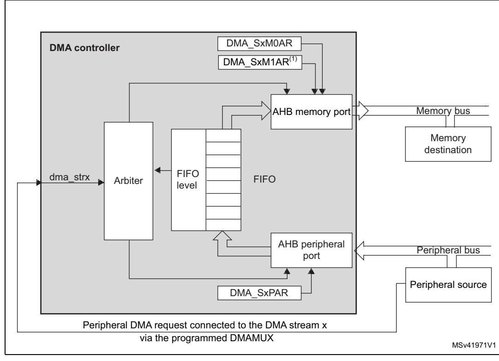
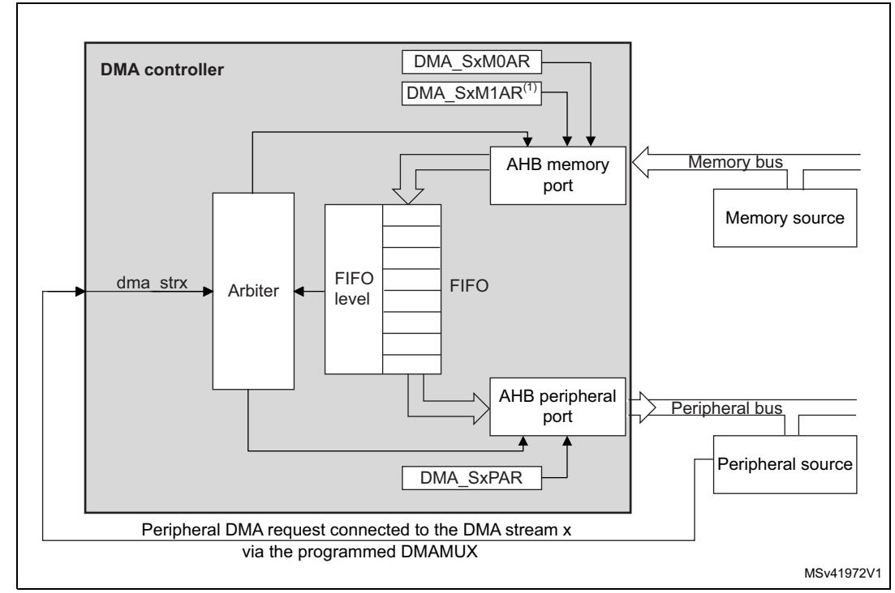
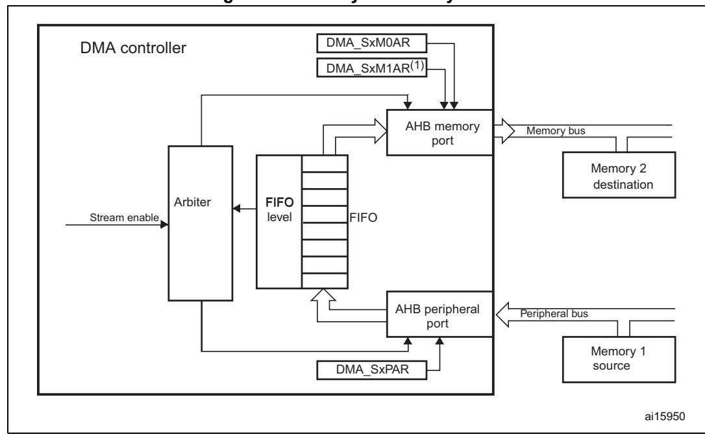
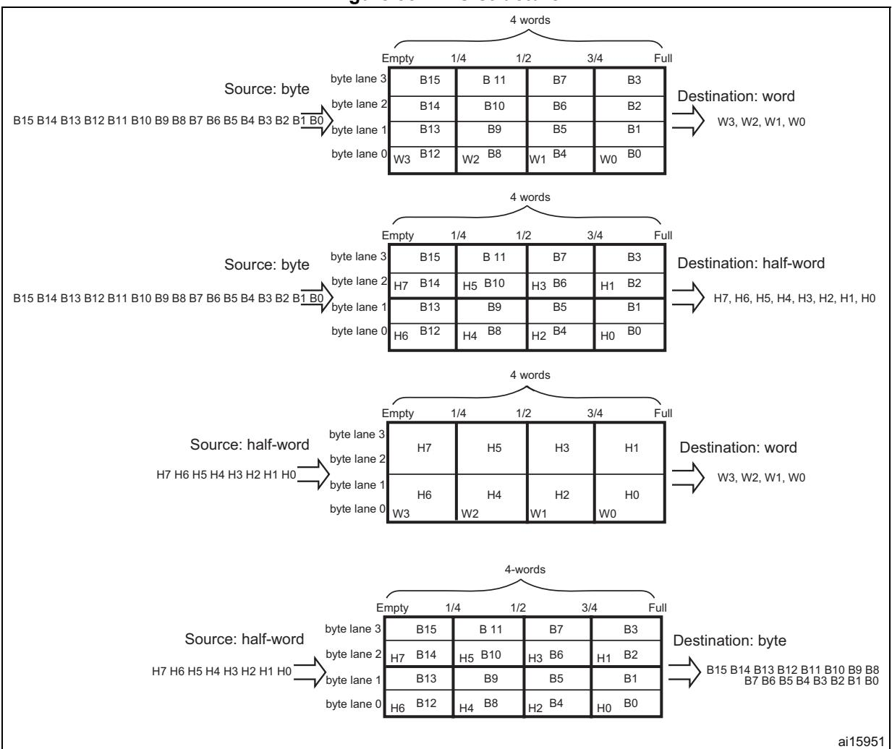

# **16 Direct memory access controller (DMA)**

# **16.1 DMA introduction**

Direct memory access (DMA) is used in order to provide high-speed data transfer between peripherals and memory and between memory and memory. Data can be quickly moved by DMA without any CPU action. This keeps CPU resources free for other operations.

The DMA controller combines a powerful dual AHB master bus architecture with independent FIFO to optimize the bandwidth of the system, based on a complex bus matrix architecture.

The two DMA controllers (DMA1, DMA2) have 8 streams each, dedicated to managing memory access requests from one or more peripherals.

Each DMA stream is driven by one DMAMUX1 output channel (request). Any DMAMUX1 output request can be individually programmed in order to select the DMA request source signal, from any of the 115 available request input signals.

Refer to the *Section 18.3: DMAMUX implementation* for more information about the DMA requests and streams mapping.

Each DMA controller has an arbiter for handling the priority between DMA requests.

# **16.2 DMA main features**

The main DMA features are:

- Dual AHB master bus architecture, one dedicated to memory accesses and one dedicated to peripheral accesses
- AHB slave programming interface supporting only 32-bit accesses
- 8 streams for each DMA controller, up to 115 channels (requests) per stream
- Four-word depth 32 first-in, first-out memory buffers (FIFOs) per stream, that can be used in FIFO mode or direct mode:
  - FIFO mode: with threshold level software selectable between 1/4, 1/2 or 3/4 of the FIFO size
  - Direct mode: each DMA request immediately initiates a transfer from/to the memory. When it is configured in direct mode (FIFO disabled), to transfer data in memory-to-peripheral mode, the DMA preloads only one data from the memory to the internal FIFO to ensure an immediate data transfer as soon as a DMA request is triggered by a peripheral.
- Each stream can be configured to be:
  - a regular channel that supports peripheral-to-memory, memory-to-peripheral and memory-to-memory transfers
  - a double buffer channel that also supports double buffering on the memory side
- Priorities between DMA stream requests are software-programmable (four levels consisting of very high, high, medium, low) or hardware in case of equality (for example, request 0 has priority over request 1)
- Each stream also supports software trigger for memory-to-memory transfers

- Each stream request can be selected among up to 115 possible channel requests. This selection is software-configurable by the DMAMUX1 and allows 107 peripherals to initiate DMA requests
- The number of data items to be transferred can be managed either by the DMA controller or by the peripheral:
  - DMA flow controller: the number of data items to be transferred is softwareprogrammable from 1 to 65535
  - Peripheral flow controller: the number of data items to be transferred is unknown and controlled by the source or the destination peripheral that signals the end of the transfer by hardware
- Independent source and destination transfer width (byte, half-word, word): when the data widths of the source and destination are not equal, the DMA automatically packs/unpacks the necessary transfers to optimize the bandwidth. This feature is only available in FIFO mode
- Incrementing or non-incrementing addressing for source and destination
- Supports incremental burst transfers of 4, 8 or 16 beats. The size of the burst is software-configurable, usually equal to half the FIFO size of the peripheral
- Each stream supports circular buffer management
- 5 event flags (DMA half transfer, DMA transfer complete, DMA transfer error, DMA FIFO error, direct mode error) logically ORed together in a single interrupt request for each stream

RM0399 Rev 4 675/3556

# **16.3 DMA functional description**

### **16.3.1 DMA block diagram**

The figure below shows the block diagram of a DMA.

MSv39748V3 AHB master dma\_str0 DMA controller Arbiter dma\_str1 dma\_str2 dma\_str3 dma\_str4 dma\_str5 dma\_str6 dma\_str7 Arbitrer AHB slave programming interface FIFO Memory port Peripheral port Programming port AHB master STREAM 0 STREAM 1 STREAM 2 STREAM 3 STREAM 4 STREAM 5 STREAM 6 STREAM 7 STREAM 0 STREAM 1 STREAM 2 STREAM 3 STREAM 4 STREAM 5 STREAM 6 STREAM 7 From DMAMUX1 FIFO FIFO FIFO FIFO FIFO FIFO FIFO dma\_it[0:7] dma\_hclkAHB dma\_tcif[0:7] To NVIC To MDMA

**Figure 84. DMA block diagram** 

## **16.3.2 DMA internal signals**

The table below shows the internal DMA signals.

| Signal name   | Signal type Description |                                    |  |
|---------------|----------------------------|------------------------------------|--|
| dma_hclk      | Digital input              | DMA AHB clock                      |  |
| dma_it[0:7]   | Digital outputs            | DMA stream [0:7] global interrupts |  |
| dma_tcif[0:7] | Digital outputs            | MDMA triggers                      |  |
| dma_str[0:7]  | Digital input              | DMA stream [0:7] requests          |  |

**Table 111. DMA internal input/output signals** 

### **16.3.3 DMA overview**

The DMA controller performs direct memory transfer: as an AHB master, the DMA controller can take the control of the AHB bus matrix to initiate AHB transactions.

The DMA controller carries out the following transactions:

- peripheral-to-memory
- memory-to-peripheral
- memory-to-memory

The DMA controller provides two AHB master ports: the AHB memory port, intended to be connected to memories and the AHB peripheral port, intended to be connected to peripherals. However, to allow memory-to-memory transfers, the AHB peripheral port must also have access to the memories.

The AHB slave port is used to program the DMA controller (it supports only 32-bit accesses).

### **16.3.4 DMA transactions**

A DMA transaction consists of a sequence of a given number of data transfers. The number of data items to be transferred and their width (8-bit, 16-bit or 32-bit) are softwareprogrammable.

Each DMA transfer consists of three operations:

- a loading from the peripheral data register or a location in memory, addressed through the DMA\_SxPAR or DMA\_SxM0AR register
- a storage of the data loaded to the peripheral data register or a location in memory addressed through the DMA\_SxPAR or DMA\_SxM0AR register
- a post-decrement of the DMA\_SxNDTR register, containing the number of transactions that still have to be performed

After an event, the peripheral sends a request signal to the DMA controller. The DMA controller serves the request depending on the channel priorities. As soon as the DMA controller accesses the peripheral, an Acknowledge signal is sent to the peripheral by the DMA controller. The peripheral releases its request as soon as it gets the Acknowledge signal from the DMA controller. Once the request has been deasserted by the peripheral, the DMA controller releases the Acknowledge signal. If there are more requests, the peripheral can initiate the next transaction.

## **16.3.5 DMA request mapping**

The DMA request mapping from peripherals to DMA streams is described in *Section 18.3: DMAMUX implementation*.

## **16.3.6 Arbiter**

An arbiter manages the 8 DMA stream requests based on their priority for each of the two AHB master ports (memory and peripheral ports) and launches the peripheral/memory access sequences.

Priorities are managed in two stages:

- Software: each stream priority can be configured in the DMA\_SxCR register. There are four levels:
  - Very high priority
  - High priority
  - Medium priority
  - Low priority
- Hardware: If two requests have the same software priority level, the stream with the lower number takes priority over the stream with the higher number. For example, stream 2 takes priority over stream 4.

### **16.3.7 DMA streams**

Each of the eight DMA controller streams provides a unidirectional transfer link between a source and a destination.

Each stream can be configured to perform:

- Regular type transactions: memory-to-peripherals, peripherals-to-memory or memoryto-memory transfers
- Double-buffer type transactions: double buffer transfers using two memory pointers for the memory (while the DMA is reading/writing from/to a buffer, the application can write/read to/from the other buffer).

The amount of data to be transferred (up to 65535) is programmable and related to the source width of the peripheral that requests the DMA transfer connected to the peripheral AHB port. The register that contains the amount of data items to be transferred is decremented after each transaction.

## **16.3.8 Source, destination and transfer modes**

Both source and destination transfers can address peripherals and memories in the entire 4-Gbyte area, at addresses comprised between 0x0000 0000 and 0xFFFF FFFF.

The direction is configured using the DIR[1:0] bits in the DMA\_SxCR register and offers three possibilities: memory-to-peripheral, peripheral-to-memory or memory-to-memory transfers.

The table below describes the corresponding source and destination addresses.

**Bits DIR[1:0] of the DMA\_SxCR register Direction Source address Destination address** 00 Peripheral-to-memory DMA\_SxPAR DMA\_SxM0AR 01 Memory-to-peripheral DMA\_SxM0AR DMA\_SxPAR

**Table 112. Source and destination address** 

| Bits DIR[1:0] of the Direction DMA_SxCR register |                  | Source address | Destination address |
|--------------------------------------------------------|------------------|----------------|---------------------|
| 10                                                     | Memory-to-memory | DMA_SxPAR      | DMA_SxM0AR          |
| 11                                                     | Reserved         | -              | -                   |

**Table 112. Source and destination address (continued)**

When the data width (programmed in the PSIZE or MSIZE bits in the DMA\_SxCR register) is a half-word or a word, respectively, the peripheral or memory address written into the DMA\_SxPAR or DMA\_SxM0AR/M1AR registers has to be aligned on a word or half-word address boundary, respectively.

### **Peripheral-to-memory mode**

*[Figure 85](#page-6-0)* describes this mode.

When this mode is enabled (by setting the bit EN in the DMA\_SxCR register), each time a peripheral request occurs, the stream initiates a transfer from the source to fill the FIFO.

When the threshold level of the FIFO is reached, the contents of the FIFO are drained and stored into the destination.

The transfer stops once the DMA\_SxNDTR register reaches zero, when the peripheral requests the end of transfers (in case of a peripheral flow controller) or when the EN bit in the DMA\_SxCR register is cleared by software.

In direct mode (when the DMDIS value in the DMA\_SxFCR register is 0), the threshold level of the FIFO is not used: after each single data transfer from the peripheral to the FIFO, the corresponding data are immediately drained and stored into the destination.

The stream has access to the AHB source or destination port only if the arbitration of the corresponding stream is won. This arbitration is performed using the priority defined for each stream using the PL[1:0] bits in the DMA\_SxCR register.

**Figure 85. Peripheral-to-memory mode** 

1. For double-buffer mode.

### **Memory-to-peripheral mode**

*[Figure 86](#page-7-0)* describes this mode.

When this mode is enabled (by setting the EN bit in the DMA\_SxCR register), the stream immediately initiates transfers from the source to entirely fill the FIFO.

Each time a peripheral request occurs, the contents of the FIFO are drained and stored into the destination. When the level of the FIFO is lower than or equal to the predefined threshold level, the FIFO is fully reloaded with data from the memory.

The transfer stops once the DMA\_SxNDTR register reaches zero, when the peripheral requests the end of transfers (in case of a peripheral flow controller) or when the EN bit in the DMA\_SxCR register is cleared by software.

In direct mode (when the DMDIS value in the DMA\_SxFCR register is 0), the threshold level of the FIFO is not used. Once the stream is enabled, the DMA preloads the first data to transfer into an internal FIFO. As soon as the peripheral requests a data transfer, the DMA transfers the preloaded value into the configured destination. It then reloads again the empty internal FIFO with the next data to be transfer. The preloaded data size corresponds to the value of the PSIZE bitfield in the DMA\_SxCR register.

The stream has access to the AHB source or destination port only if the arbitration of the corresponding stream is won. This arbitration is performed using the priority defined for each stream using the PL[1:0] bits in the DMA\_SxCR register.

Figure 86. Memory-to-peripheral mode

1. For double-buffer mode.

### Memory-to-memory mode

The DMA channels can also work without being triggered by a request from a peripheral. This is the memory-to-memory mode, described in *Figure 87*.

When the stream is enabled by setting the Enable bit (EN) in the DMA\_SxCR register, the stream immediately starts to fill the FIFO up to the threshold level. When the threshold level is reached, the FIFO contents are drained and stored into the destination.

The transfer stops once the DMA\_SxNDTR register reaches zero or when the EN bit in the DMA\_SxCR register is cleared by software.

The stream has access to the AHB source or destination port only if the arbitration of the corresponding stream is won. This arbitration is performed using the priority defined for each stream using the PL[1:0] bits in the DMA\_SxCR register.

Note: When memory-to-memory mode is used, the circular and direct modes are not allowed.

4

Figure 87. Memory-to-memory mode

1. For double-buffer mode.

#### 16.3.9 Pointer incrementation

Peripheral and memory pointers can optionally be automatically post-incremented or kept constant after each transfer depending on the PINC and MINC bits in the DMA\_SxCR register.

Disabling the increment mode is useful when the peripheral source or destination data is accessed through a single register.

If the increment mode is enabled, the address of the next transfer is the address of the previous one incremented by 1 (for bytes), 2 (for half-words) or 4 (for words) depending on the data width programmed in the PSIZE or MSIZE bits in the DMA SxCR register.

In order to optimize the packing operation, it is possible to fix the increment offset size for the peripheral address whatever the size of the data transferred on the AHB peripheral port. The PINCOS bit in the DMA\_SxCR register is used to align the increment offset size with the data size on the peripheral AHB port, or on a 32-bit address (the address is then incremented by 4). The PINCOS bit has an impact on the AHB peripheral port only.

If the PINCOS bit is set, the address of the following transfer is the address of the previous one incremented by 4 (automatically aligned on a 32-bit address), whatever the PSIZE value. The AHB memory port, however, is not impacted by this operation.

## **16.3.10 Circular mode**

The circular mode is available to handle circular buffers and continuous data flows (e.g. ADC scan mode). This feature can be enabled using the CIRC bit in the DMA\_SxCR register.

When the circular mode is activated, the number of data items to be transferred is automatically reloaded with the initial value programmed during the stream configuration phase, and the DMA requests continue to be served.

*Note: In the circular mode, it is mandatory to respect the following rule in case of a burst mode configured for memory:*

- *DMA\_SxNDTR = Multiple of ((Mburst beat) × (Msize)/(Psize)), where:*
- *(Mburst beat) = 4, 8 or 16 (depending on the MBURST bits in the DMA\_SxCR register)*
- *((Msize)/(Psize)) = 1, 2, 4, 1/2 or 1/4 (Msize and Psize represent the MSIZE and PSIZE bits in the DMA\_SxCR register. They are byte dependent)*
- *DMA\_SxNDTR = Number of data items to transfer on the AHB peripheral port*

*For example: Mburst beat = 8 (INCR8), MSIZE = 00 (byte) and PSIZE = 01 (half-word), in this case: DMA\_SxNDTR must be a multiple of (8 × 1/2 = 4).*

*If this formula is not respected, the DMA behavior and data integrity are not guaranteed. NDTR must also be a multiple of the Peripheral burst size multiplied by the peripheral data size, otherwise this could result in a bad DMA behavior.*

### **16.3.11 Double-buffer mode**

This mode is available for all the DMA1 and DMA2 streams.

The double-buffer mode is enabled by setting the DBM bit in the DMA\_SxCR register.

A double-buffer stream works as a regular (single buffer) stream with the difference that it has two memory pointers. When the double-buffer mode is enabled, the circular mode is automatically enabled (CIRC bit in DMA\_SxCR is not relevant) and at each end of transaction, the memory pointers are swapped.

In this mode, the DMA controller swaps from one memory target to another at each end of transaction. This allows the software to process one memory area while the second memory area is being filled/used by the DMA transfer. The double-buffer stream can work in both directions (the memory can be either the source or the destination) as described in *[Table 113: Source and destination address registers in double-buffer mode \(DBM = 1\)](#page-10-0)*.

*Note: In double-buffer mode, it is possible to update the base address for the AHB memory port on-the-fly (*DMA\_SxM0AR or DMA\_SxM1AR*) when the stream is enabled, by respecting the following conditions:*

- • *When the CT bit is 0 in the DMA\_SxCR register, the DMA\_SxM1AR register can be written. Attempting to write to this register while CT = 1 sets an error flag (TEIF) and the stream is automatically disabled.*
- • *When the CT bit is 1 in the DMA\_SxCR register, the DMA\_SxM0AR register can be written. Attempting to write to this register while CT = 0, sets an error flag (TEIF) and the stream is automatically disabled.*

*To avoid any error condition, it is advised to change the base address as soon as the TCIF flag is asserted because, at this point, the targeted memory must have changed from* 

RM0399 Rev 4 683/3556

*memory 0 to 1 (or from 1 to 0) depending on the value of CT in the DMA\_SxCR register in accordance with one of the two above conditions.*

*For all the other modes (except the double-buffer mode), the memory address registers are write-protected as soon as the stream is enabled.*

|  | Table 113. Source and destination address registers in double-buffer mode (DBM = 1) |
|--|-------------------------------------------------------------------------------------|
|  |                                                                                     |

| Bits DIR[1:0] of the DMA_SxCR register | Direction            | Source address          | Destination address     |  |  |
|-------------------------------------------|----------------------|-------------------------|-------------------------|--|--|
| 00                                        | Peripheral-to-memory | DMA_SxPAR               | DMA_SxM0AR / DMA_SxM1AR |  |  |
| 01                                        | Memory-to-peripheral | DMA_SxM0AR / DMA_SxM1AR | DMA_SxPAR               |  |  |
| 10                                        | Not allowed(1)       |                         |                         |  |  |
| 11                                        | Reserved             | -                       | -                       |  |  |

1. When the double-buffer mode is enabled, the circular mode is automatically enabled. Since the memory-to-memory mode is not compatible with the circular mode, when the double-buffer mode is enabled, it is not allowed to configure the memory-to-memory mode.

## **16.3.12 Programmable data width, packing/unpacking, endianness**

The number of data items to be transferred has to be programmed into DMA\_SxNDTR (number of data items to transfer bit, NDT) before enabling the stream (except when the flow controller is the peripheral, PFCTRL bit in DMA\_SxCR is set).

When using the internal FIFO, the data widths of the source and destination data are programmable through the PSIZE and MSIZE bits in the DMA\_SxCR register (can be 8-, 16- or 32-bit).

When PSIZE and MSIZE are not equal:

- The data width of the number of data items to transfer, configured in the DMA\_SxNDTR register is equal to the width of the peripheral bus (configured by the PSIZE bits in the DMA\_SxCR register). For instance, in case of peripheral-to-memory, memory-toperipheral or memory-to-memory transfers and if the PSIZE[1:0] bits are configured for half-word, the number of bytes to be transferred is equal to 2 × NDT.
- The DMA controller only copes with little-endian addressing for both source and destination. This is described in *[Table 114: Packing/unpacking and endian behavior \(bit](#page-11-0)  [PINC = MINC = 1\)](#page-11-0)*.

This packing/unpacking procedure may present a risk of data corruption when the operation is interrupted before the data are completely packed/unpacked. So, to ensure data coherence, the stream may be configured to generate burst transfers: in this case, each group of transfers belonging to a burst are indivisible (refer to *[Section 16.3.13: Single and](#page-11-1)  [burst transfers](#page-11-1)*).

In direct mode (DMDIS = 0 in the DMA\_SxFCR register), the packing/unpacking of data is not possible. In this case, it is not allowed to have different source and destination transfer data widths: both are equal and defined by the PSIZE bits in the DMA\_SxCR register. MSIZE bits are not relevant.

| АНВ                     | B AHB Number Memory Memory port Peripher | Porinhoral                    | Peripheral port address / byte lane |                                                                  |                                  |                                                                  |                                                                  |
|-------------------------|------------------------------------------|-------------------------------|-------------------------------------|------------------------------------------------------------------|----------------------------------|------------------------------------------------------------------|------------------------------------------------------------------|
| memory port width | peripheral port width              | items to transfer (NDT) | transfer number                  | address / byte lane                                           | Peripheral transfer number | PINCOS = 1                                                       | PINCOS = 0                                                       |
| 8                       | 8                                        | 4                             | 1 2 3 4                    | 0x0 / B0[7:0] 0x1 / B1[7:0] 0x2 / B2[7:0] 0x3 / B3[7:0] | 1 2 3 4                 | 0x0 / B0[7:0] 0x4 / B1[7:0] 0x8 / B2[7:0] 0xC / B3[7:0] | 0x0 / B0[7:0] 0x1 / B1[7:0] 0x2 / B2[7:0] 0x3 / B3[7:0] |
| 8                       | 16                                       | 2                             | 1 2 3 4                    | 0x0 / B0[7:0] 0x1 / B1[7:0] 0x2 / B2[7:0] 0x3 / B3[7:0] | 1 2                              | 0x0 / B1 B0[15:0] 0x4 / B3 B2[15:0]                           | 0x0 / B1 B0[15:0] 0x2 / B3 B2[15:0]                           |
| 8                       | 32                                       | 1                             | 1 2 3 4                    | 0x0 / B0[7:0] 0x1 / B1[7:0] 0x2 / B2[7:0] 0x3 / B3[7:0] | 1                                | 0x0 / B3 B2 B1 B0[31:0]                                       | 0x0 / B3 B2 B1 B0[31:0]                                       |
| 16                      | 8                                        | 4                             | 1 2                              | 0x0 / B1 B0[15:0] 0x2 / B3 B2[15:0]                           | 1 2 3 4                 | 0x0 / B0[7:0] 0x4 / B1[7:0] 0x8 / B2[7:0] 0xC / B3[7:0] | 0x0 / B0[7:0] 0x1 / B1[7:0] 0x2 / B2[7:0] 0x3 / B3[7:0] |
| 16                      | 16                                       | 2                             | 1 2                              | 0x0 / B1 B0[15:0] 0x2 / B1 B0[15:0]                           | 1 2                           | 0x0 / B1 B0[15:0] 0x4 / B3 B2[15:0]                           | 0x0 / B1 B0[15:0] 0x2 / B3 B2[15:0]                           |
| 16                      | 32                                       | 1                             | 1 2                              | 0x0 / B1 B0[15:0] 0x2 / B3 B2[15:0]                           | 1                                | 0x0 / B3 B2 B1 B0[31:0]                                       | 0x0 / B3 B2 B1 B0[31:0]                                       |
| 32                      | 8                                        | 4                             | 1                                   | 0x0 / B3 B2 B1 B0[31:0]                                          | 1 2 3 4                 | 0x0 / B0[7:0] 0x4 / B1[7:0] 0x8 / B2[7:0] 0xC / B3[7:0] | 0x0 / B0[7:0] 0x1 / B1[7:0] 0x2 / B2[7:0] 0x3 / B3[7:0] |
| 32                      | 16                                       | 2                             | 1                                   | 0x0 /B3 B2 B1 B0[31:0]                                           | 1 2                           | 0x0 / B1 B0[15:0] 0x4 / B3 B2[15:0]                           | 0x0 / B1 B0[15:0] 0x2 / B3 B2[15:0]                           |
| 32                      | 32                                       | 1                             | 1                                   | 0x0 /B3 B2 B1 B0 [31:0]                                          | 1                                | 0x0 / B3 B2 B1 B0 [31:0]                                      | 0x0 / B3 B2 B1 B0[31:0]                                       |

Table 114. Packing/unpacking and endian behavior (bit PINC = MINC = 1)

Note:

Peripheral port may be the source or the destination (it can also be the memory source in the case of memory-to-memory transfer).

PSIZE, MSIZE and NDT[15:0] must be configured so as to ensure that the last transfer is not incomplete. This can occur when the data width of the peripheral port (PSIZE bits) is lower than the data width of the memory port (MSIZE bits). This constraint is summarized in the table below.

 PSIZE[1:0] of DMA\_SxCR
 MSIZE[1:0] of DMA\_SxCR
 NDT[15:0] of DMA\_SxNDTR

 00 (8-bit)
 01 (16-bit)
 Must be a multiple of 2.

 00 (8-bit)
 10 (32-bit)
 Must be a multiple of 4.

 01 (16-bit)
 10 (32-bit)
 Must be a multiple of 2.

Table 115. Restriction on NDT versus PSIZE and MSIZE

# 16.3.13 Single and burst transfers

The DMA controller can generate single transfers or incremental burst transfers of 4, 8 or 16 beats.

685/3556

The size of the burst is configured by software independently for the two AHB ports by using the MBURST[1:0] and PBURST[1:0] bits in the DMA\_SxCR register.

The burst size indicates the number of beats in the burst, not the number of bytes transferred.

To ensure data coherence, each group of transfers that form a burst are indivisible: AHB transfers are locked and the arbiter of the AHB bus matrix does not degrant the DMA master during the sequence of the burst transfer.

Depending on the single or burst configuration, each DMA request initiates a different number of transfers on the AHB peripheral port:

- When the AHB peripheral port is configured for single transfers, each DMA request generates a data transfer of a byte, half-word or word depending on the PSIZE[1:0] bits in the DMA\_SxCR register
- When the AHB peripheral port is configured for burst transfers, each DMA request generates 4,8 or 16 beats of byte, half word or word transfers depending on the PBURST[1:0] and PSIZE[1:0] bits in the DMA\_SxCR register.

The same as above has to be considered for the AHB memory port considering the MBURST and MSIZE bits.

In direct mode, the stream can only generate single transfers and the MBURST[1:0] and PBURST[1:0] bits are forced by hardware.

The address pointers (DMA\_SxPAR or DMA\_SxM0AR registers) must be chosen so as to ensure that all transfers within a burst block are aligned on the address boundary equal to the size of the transfer.

The burst configuration has to be selected in order to respect the AHB protocol, where bursts **must not** cross the 1 Kbyte address boundary because the minimum address space that can be allocated to a single slave is 1 Kbyte. This means that the 1-Kbyte address boundary **must not** be crossed by a burst block transfer, otherwise an AHB error is generated, that is not reported by the DMA registers.

## **16.3.14 FIFO**

### **FIFO structure**

The FIFO is used to temporarily store data coming from the source before transmitting them to the destination.

Each stream has an independent 4-word FIFO and the threshold level is softwareconfigurable between 1/4, 1/2, 3/4 or full.

To enable the use of the FIFO threshold level, the direct mode must be disabled by setting the DMDIS bit in the DMA\_SxFCR register.

The structure of the FIFO differs depending on the source and destination data widths, and is described in the figure below.

Figure 88. FIFO structure

### **FIFO threshold and burst configuration**

Caution is required when choosing the FIFO threshold (bits FTH[1:0] of the DMA\_SxFCR register) and the size of the memory burst (MBURST[1:0] of the DMA\_SxCR register): The content pointed by the FIFO threshold must exactly match an integer number of memory burst transfers. If this is not in the case, a FIFO error (flag FEIFx of the DMA\_HISR or DMA\_LISR register) is generated when the stream is enabled, then the stream is automatically disabled. The allowed and forbidden configurations are described in the table below. The forbidden configurations are highlighted in gray in the table.

| MSIZE     | FIFO level | MBURST = INCR4      | MBURST = INCR8                  | MBURST = INCR16     |  |
|-----------|------------|---------------------|---------------------------------|---------------------|--|
|           | 1/4        | 1 burst of 4 beats  | Forbidden                       |                     |  |
|           | 1/2        | 2 bursts of 4 beats | 1 burst of 8 beats Forbidden |                     |  |
| Byte      | 3/4        | 3 bursts of 4 beats | Forbidden                       |                     |  |
|           | Full       | 4 bursts of 4 beats | 2 bursts of 8 beats             | 1 burst of 16 beats |  |
| Half-word | 1/4        | Forbidden           |                                 |                     |  |
|           | 1/2        | 1 burst of 4 beats  | Forbidden                       |                     |  |
|           | 3/4        | Forbidden           |                                 |                     |  |
|           | Full       | 2 bursts of 4 beats | 1 burst of 8 beats              |                     |  |
|           | 1/4        |                     |                                 | Forbidden           |  |
| Word      | 1/2        | Forbidden           | Forbidden                       |                     |  |
|           | 3/4        |                     |                                 |                     |  |
|           | Full       | 1 burst of 4 beats  |                                 |                     |  |

**Table 116. FIFO threshold configurations** 

In all cases, the burst size multiplied by the data size must not exceed the FIFO size (data size can be: 1 (byte), 2 (half-word) or 4 (word)).

Incomplete burst transfer at the end of a DMA transfer may happen if one of the following conditions occurs:

- For the AHB peripheral port configuration: the total number of data items (set in the DMA\_SxNDTR register) is not a multiple of the burst size multiplied by the data size.
- For the AHB memory port configuration: the number of remaining data items in the FIFO to be transferred to the memory is not a multiple of the burst size multiplied by the data size.

In such cases, the remaining data to be transferred is managed in single mode by the DMA, even if a burst transaction is requested during the DMA stream configuration.

*Note: When burst transfers are requested on the peripheral AHB port and the FIFO is used (DMDIS = 1 in the DMA\_SxCR register), it is mandatory to respect the following rule to avoid permanent underrun or overrun conditions, depending on the DMA stream direction:*

> *If (PBURST × PSIZE) = FIFO\_SIZE (4 words), FIFO\_Threshold = 3/4 is forbidden with PSIZE = 1, 2 or 4 and PBURST = 4, 8 or 16.*

*This rule ensures that enough FIFO space at a time is free to serve the request from the peripheral.*

### **FIFO flush**

The FIFO can be flushed when the stream is disabled by resetting the EN bit in the DMA\_SxCR register and when the stream is configured to manage peripheral-to-memory or memory-to-memory transfers. If some data are still present in the FIFO when the stream is disabled, the DMA controller continues transferring the remaining data to the destination (even though stream is effectively disabled). When this flush is completed, the transfer complete status bit (TCIFx) in the DMA\_LISR or DMA\_HISR register is set.

The remaining data counter DMA\_SxNDTR keeps the value in this case to indicate how many data items are currently available in the destination memory.

Note that during the FIFO flush operation, if the number of remaining data items in the FIFO to be transferred to memory (in bytes) is less than the memory data width (for example 2 bytes in FIFO while MSIZE is configured to word), data is sent with the data width set in the MSIZE bit in the DMA\_SxCR register. This means that memory is written with an undesired value. The software may read the DMA\_SxNDTR register to determine the memory area that contains the good data (start address and last address).

If the number of remaining data items in the FIFO is lower than a burst size (if the MBURST bits in DMA\_SxCR register are set to configure the stream to manage burst on the AHB memory port), single transactions are generated to complete the FIFO flush.

## **Direct mode**

By default, the FIFO operates in direct mode (DMDIS bit in the DMA\_SxFCR is reset) and the FIFO threshold level is not used. This mode is useful when the system requires an immediate and single transfer to or from the memory after each DMA request.

When the DMA is configured in direct mode (FIFO disabled), to transfer data in memory-toperipheral mode, the DMA preloads one data from the memory to the internal FIFO to ensure an immediate data transfer as soon as a DMA request is triggered by a peripheral.

To avoid saturating the FIFO, it is recommended to configure the corresponding stream with a high priority.

This mode is restricted to transfers where:

- the source and destination transfer widths are equal and both defined by the PSIZE[1:0] bits in DMA\_SxCR (MSIZE[1:0] bits are not relevant)
- burst transfers are not possible (PBURST[1:0] and MBURST[1:0] bits in DMA\_SxCR are don't care)

Direct mode must not be used when implementing memory-to-memory transfers.

## **16.3.15 DMA transfer completion**

Different events can generate an end of transfer by setting the TCIFx bit in the DMA\_LISR or DMA\_HISR status register:

- In DMA flow controller mode:
  - The DMA\_SxNDTR counter has reached zero in the memory-to-peripheral mode.
  - The stream is disabled before the end of transfer (by clearing the EN bit in the DMA\_SxCR register) and (when transfers are peripheral-to-memory or memory-

RM0399 Rev 4 689/3556

to-memory) all the remaining data have been flushed from the FIFO into the memory.

- In Peripheral flow controller mode:
  - The last external burst or single request has been generated from the peripheral and (when the DMA is operating in peripheral-to-memory mode) the remaining data have been transferred from the FIFO into the memory
  - The stream is disabled by software, and (when the DMA is operating in peripheralto-memory mode) the remaining data have been transferred from the FIFO into the memory

*Note: The transfer completion is dependent on the remaining data in FIFO to be transferred into memory only in the case of peripheral-to-memory mode. This condition is not applicable in memory-to-peripheral mode.*

> If the stream is configured in non-circular mode, after the end of the transfer (that is when the number of data to be transferred reaches zero), the DMA is stopped (EN bit in DMA\_SxCR register is cleared by Hardware) and no DMA request is served unless the software reprograms the stream and re-enables it (by setting the EN bit in the DMA\_SxCR register).

### **16.3.16 DMA transfer suspension**

At any time, a DMA transfer can be suspended to be restarted later on or to be definitively disabled before the end of the DMA transfer.

There are two cases:

- The stream disables the transfer with no later-on restart from the point where it was stopped. There is no particular action to do, except to clear the EN bit in the DMA\_SxCR register to disable the stream. The stream may take time to be disabled (ongoing transfer is completed first). The transfer complete interrupt flag (TCIF in the DMA\_LISR or DMA\_HISR register) is set in order to indicate the end of transfer. The value of the EN bit in DMA\_SxCR is now 0 to confirm the stream interruption. The DMA\_SxNDTR register contains the number of remaining data items at the moment when the stream was stopped so that the software can determine how many data items have been transferred before the stream was interrupted.
- The stream suspends the transfer before the number of remaining data items to be transferred in the DMA\_SxNDTR register reaches 0. The aim is to restart the transfer later by re-enabling the stream. In order to restart from the point where the transfer was stopped, the software has to read the DMA\_SxNDTR register after disabling the stream by writing the EN bit in DMA\_SxCR register (and then checking that it is at 0) to know the number of data items already collected. Then:
  - The peripheral and/or memory addresses have to be updated in order to adjust the address pointers
  - The SxNDTR register has to be updated with the remaining number of data items to be transferred (the value read when the stream was disabled)
  - The stream may then be re-enabled to restart the transfer from the point it was stopped

*Note: A transfer complete interrupt flag (TCIF in DMA\_LISR or DMA\_HISR) is set to indicate the end of transfer due to the stream interruption.*

## **16.3.17 Flow controller**

The entity that controls the number of data to be transferred is known as the flow controller. This flow controller is configured independently for each stream using the PFCTRL bit in the DMA\_SxCR register.

The flow controller can be:

- The DMA controller: in this case, the number of data items to be transferred is programmed by software into the DMA\_SxNDTR register before the DMA stream is enabled.
- The peripheral source or destination: this is the case when the number of data items to be transferred is unknown. The peripheral indicates by hardware to the DMA controller when the last data are being transferred. This feature is only supported for peripherals that are able to signal the end of the transfer.

When the peripheral flow controller is used for a given stream, the value written into the DMA\_SxNDTR has no effect on the DMA transfer. Actually, whatever the value written, it is forced by hardware to 0xFFFF as soon as the stream is enabled, to respect the following schemes:

- Anticipated stream interruption: EN bit in DMA\_SxCR register is reset to 0 by the software to stop the stream before the last data hardware signal (single or burst) is sent by the peripheral. In such a case, the stream is switched off and the FIFO flush is triggered in the case of a peripheral-to-memory DMA transfer. The TCIFx flag of the corresponding stream is set in the status register to indicate the DMA completion. To know the number of data items transferred during the DMA transfer, read the DMA\_SxNDTR register and apply the following formula:
  - Number\_of\_data\_transferred = 0xFFFF DMA\_SxNDTR
- Normal stream interruption due to the reception of a last data hardware signal: the stream is automatically interrupted when the peripheral requests the last transfer (single or burst) and when this transfer is complete. the TCIFx flag of the corresponding stream is set in the status register to indicate the DMA transfer completion. To know the number of data items transferred, read the DMA\_SxNDTR register and apply the same formula as above.
- The DMA\_SxNDTR register reaches 0: the TCIFx flag of the corresponding stream is set in the status register to indicate the forced DMA transfer completion. The stream is automatically switched off even though the last data hardware signal (single or burst) has not been yet asserted. The already transferred data is not lost. This means that a maximum of 65535 data items can be managed by the DMA in a single transaction, even in peripheral flow control mode.

*Note: When configured in memory-to-memory mode, the DMA is always the flow controller and the PFCTRL bit is forced to 0 by hardware.*

*The circular mode is forbidden in the peripheral flow controller mode.*

RM0399 Rev 4 691/3556

### 16.3.18 Summary of the possible DMA configurations

The table below summarizes the different possible DMA configurations. The forbidden configurations are highlighted in gray in the table.

| DMA transfer mode        | Source          | Destination     | Flow controller | Circular mode | Transfer type | Direct mode | Double- buffer mode |  |
|--------------------------|-----------------|-----------------|-----------------|------------------|------------------|----------------|------------------------|--|
|                          |                 |                 | DMA             | Possible         | single           | Possible       | Possible               |  |
| Peripheral-to- memory | AHB             | AHB             | DIVIA           | i ossible        | burst            | Forbidden      | i ussible              |  |
|                          | peripheral port | memory port     | Peripheral      | Forbidden        | single           | Possible       | Forbidden              |  |
|                          |                 |                 | renpherai       | roibiddeii       | burst            | Forbidden      | roibiddell             |  |
|                          | AHB memory port |                 | DMA             | Possible         | single           | Possible       | Possible               |  |
| Memory-to-               |                 | АНВ             | DIVIA           | Possible         | burst            | Forbidden      | Pussible               |  |
| peripheral               |                 | peripheral port | Dorinhard       | Forbidden        | single           | Possible       | Forbiddon              |  |
|                          |                 |                 | Peripheral      | roibiddell       | burst            | Forbidden      | Forbidden              |  |
| Memory-to-               | AHB             | AHB             | DMA only        | Forbidden        | single           | Forbidden      | Earbiddon              |  |
| memory                   | peripheral port | memory port     | DIVIA OTIIY     | Forbidden        | burst            | roibiddell     | Forbidden              |  |

**Table 117. Possible DMA configurations** 

### 16.3.19 Stream configuration procedure

The following sequence must be followed to configure a DMA stream x (where x is the stream number):

- 1. If the stream is enabled, disable it by resetting the EN bit in the DMA\_SxCR register, then read this bit in order to confirm that there is no ongoing stream operation. Writing this bit to 0 is not immediately effective since it is actually written to 0 once all the current transfers are finished. When the EN bit is read as 0, this means that the stream is ready to be configured. It is therefore necessary to wait for the EN bit to be cleared before starting any stream configuration. All the stream dedicated bits set in the status register (DMA\_LISR and DMA\_HISR) from the previous data block DMA transfer must be cleared before the stream can be re-enabled.
- 2. Set the peripheral port register address in the DMA\_SxPAR register. The data is moved from/ to this address to/ from the peripheral port after the peripheral event.
- 3. Set the memory address in the DMA\_SxMA0R register (and in the DMA\_SxMA1R register in the case of a double-buffer mode). The data is written to or read from this memory after the peripheral event.
- 4. Configure the total number of data items to be transferred in the DMA\_SxNDTR register. After each peripheral event or each beat of the burst, this value is decremented.
- 5. Use DMAMUX1 to route a DMA request line to the DMA channel.
- 6. If the peripheral is intended to be the flow controller and if it supports this feature, set the PFCTRL bit in the DMA SxCR register.
- 7. Configure the stream priority using the PL[1:0] bits in the DMA\_SxCR register.
- 8. Configure the FIFO usage (enable or disable, threshold in transmission and reception)

- 9. Configure the data transfer direction, peripheral and memory incremented/fixed mode, single or burst transactions, peripheral and memory data widths, circular mode, double-buffer mode and interrupts after half and/or full transfer, and/or errors in the DMA\_SxCR register.
- 10. Activate the stream by setting the EN bit in the DMA\_SxCR register.

As soon as the stream is enabled, it can serve any DMA request from the peripheral connected to the stream.

Once half the data have been transferred on the AHB destination port, the half-transfer flag (HTIF) is set and an interrupt is generated if the half-transfer interrupt enable bit (HTIE) is set. At the end of the transfer, the transfer complete flag (TCIF) is set and an interrupt is generated if the transfer complete interrupt enable bit (TCIE) is set.

**Warning: To switch off a peripheral connected to a DMA stream request, it is mandatory to, first, switch off the DMA stream to which the peripheral is connected, then to wait for EN bit = 0. Only then can the peripheral be safely disabled.**

### **16.3.20 Error management**

The DMA controller can detect the following errors:

- **Transfer error**: the transfer error interrupt flag (TEIFx) is set when:
  - a bus error occurs during a DMA read or a write access
  - a write access is requested by software on a memory address register in double-buffer mode whereas the stream is enabled and the current target memory is the one impacted by the write into the memory address register (refer to *[Section 16.3.11: Double-buffer mode](#page-9-0)*)
- **FIFO error**: the FIFO error interrupt flag (FEIFx) is set if:
  - a FIFO underrun condition is detected
  - a FIFO overrun condition is detected (no detection in memory-to-memory mode because requests and transfers are internally managed by the DMA)
  - the stream is enabled while the FIFO threshold level is not compatible with the size of the memory burst (refer to *[Table 116: FIFO threshold configurations](#page-14-0)*)
- **Direct mode error**: the direct mode error interrupt flag (DMEIFx) can only be set in the peripheral-to-memory mode while operating in direct mode and when the MINC bit in the DMA\_SxCR register is cleared. This flag is set when a DMA request occurs while the previous data have not yet been fully transferred into the memory (because the memory bus was not granted). In this case, the flag indicates that two data items were be transferred successively to the same destination address, which could be an issue if the destination is not able to manage this situation

In direct mode, the FIFO error flag can also be set under the following conditions:

- In the peripheral-to-memory mode, the FIFO can be saturated (overrun) if the memory bus is not granted for several peripheral requests.
- In the memory-to-peripheral mode, an underrun condition may occur if the memory bus has not been granted before a peripheral request occurs.

If the TEIFx or the FEIFx flag is set due to incompatibility between burst size and FIFO threshold level, the faulty stream is automatically disabled through a hardware clear of its EN bit in the corresponding stream configuration register (DMA\_SxCR).

If the DMEIFx or the FEIFx flag is set due to an overrun or underrun condition, the faulty stream is not automatically disabled and it is up to the software to disable or not the stream by resetting the EN bit in the DMA\_SxCR register. This is because there is no data loss when this kind of errors occur.

When the stream's error interrupt flag (TEIF, FEIF, DMEIF) in the DMA\_LISR or DMA\_HISR register is set, an interrupt is generated if the corresponding interrupt enable bit (TEIE, FEIE, DMIE) in the DMA\_SxCR or DMA\_SxFCR register is set.

*Note: When a FIFO overrun or underrun condition occurs, the data is not lost because the peripheral request is not acknowledged by the stream until the overrun or underrun condition is cleared. If this acknowledge takes too much time, the peripheral itself may detect an overrun or underrun condition of its internal buffer and data might be lost.*

# **16.4 DMA interrupts**

For each DMA stream, an interrupt can be produced on the following events:

- Half-transfer reached
- Transfer complete
- Transfer error
- FIFO error (overrun, underrun or FIFO level error)
- Direct mode error

Separate interrupt enable control bits are available for flexibility as shown in the table below.

**Interrupt event Event flag Enable control bit** Half-transfer HTIF HTIE Transfer complete TCIF TCIE Transfer error TEIF TEIE FIFO overrun/underrun FEIF FEIE Direct mode error DMEIF DMEIE

**Table 118. DMA interrupt requests** 

*Note: Before setting an enable control bit EN = 1, the corresponding event flag must be cleared, otherwise an interrupt is immediately generated.*

## 16.5 DMA registers

The DMA registers have to be accessed by words (32 bits).

### 16.5.1 DMA low interrupt status register (DMA\_LISR)

Address offset: 0x000

Reset value: 0x0000 0000

| 31         | 30         | 29         | 28         | 27          | 26          | 25         | 24              | 23        | 22         | 21         | 20         | 19         | 18              | 17        | 16         |
|------------|------------|------------|------------|-------------|-------------|------------|-----------------|-----------|------------|------------|------------|------------|-----------------|-----------|------------|
| Res.       | Res.       | Res.       | Res.       | TCIF3       | HTIF3       | TEIF3      | DMEIF 3      | Res.      | FEIF3      | TCIF2      | HTIF2      | TEIF2      | DMEIF 2      | Res.      | FEIF2      |
|            |            |            |            | r           | r           | r          | r               |           | r          | r          | r          | r          | r               |           | r          |
|            |            |            |            |             |             |            |                 |           |            |            |            |            |                 |           |            |
| 15         | 14         | 13         | 12         | 11          | 10          | 9          | 8               | 7         | 6          | 5          | 4          | 3          | 2               | 1         | 0          |
| 15 Res. | 14 Res. | 13 Res. | 12 Res. | 11 TCIF1 | 10 HTIF1 | 9 TEIF1 | 8 DMEIF 1 | 7 Res. | 6 FEIF1 | 5 TCIF0 | 4 HTIF0 | 3 TEIF0 | 2 DMEIF 0 | 1 Res. | 0 FEIF0 |

Bits 31:28, 15:12 Reserved, must be kept at reset value.

Bits 27, 21, 11, 5 **TCIF[3:0]**: Stream x transfer complete interrupt flag (x = 3 to 0)

This bit is set by hardware. It is cleared by software writing 1 to the corresponding bit in DMA\_LIFCR register.

0: No transfer complete event on stream x

1: A transfer complete event occurred on stream x.

Bits 26, 20, 10, 4 HTIF[3:0]: Stream x half transfer interrupt flag (x = 3 to 0)

This bit is set by hardware. It is cleared by software writing 1 to the corresponding bit in DMA\_LIFCR register.

0: No half transfer event on stream x

1: An half transfer event occurred on stream x.

Bits 25, 19, 9, 3 **TEIF[3:0]**: Stream x transfer error interrupt flag (x = 3 to 0)

This bit is set by hardware. It is cleared by software writing 1 to the corresponding bit in DMA\_LIFCR register.

0: No transfer error on stream x

1: A transfer error occurred on stream x.

Bits 24, 18, 8, 2 **DMEIF[3:0]**: Stream x direct mode error interrupt flag (x = 3 to 0)

This bit is set by hardware. It is cleared by software writing 1 to the corresponding bit in DMA\_LIFCR register.

0: No direct mode error on stream x

1: A direct mode error occurred on stream x.

Bits 23, 17, 7, 1 Reserved, must be kept at reset value.

Bits 22, 16, 6, 0 **FEIF[3:0]**: Stream x FIFO error interrupt flag (x = 3 to 0)

This bit is set by hardware. It is cleared by software writing 1 to the corresponding bit in DMA\_LIFCR register.

0: No FIFO error event on stream x

1: A FIFO error event occurred on stream x.

RM0399 Rev 4 695/3556

#### 16.5.2 DMA high interrupt status register (DMA HISR)

Address offset: 0x004

Reset value: 0x0000 0000

| 31   | 30   | 29   | 28   | 27    | 26    | 25    | 24         | 23   | 22    | 21    | 20    | 19    | 18         | 17   | 16    |
|------|------|------|------|-------|-------|-------|------------|------|-------|-------|-------|-------|------------|------|-------|
| Res. | Res. | Res. | Res. | TCIF7 | HTIF7 | TEIF7 | DMEIF 7 | Res. | FEIF7 | TCIF6 | HTIF6 | TEIF6 | DMEIF 6 | Res. | FEIF6 |
|      |      |      |      | r     | r     | r     | r          |      | r     | r     | r     | r     | r          |      | r     |
| 15   | 14   | 13   | 12   | 11    | 10    | 9     | 8          | 7    | 6     | 5     | 4     | 3     | 2          | 1    | 0     |
| Res. | Res. | Res. | Res. | TCIF5 | HTIF5 | TEIF5 | DMEIF 5 | Res. | FEIF5 | TCIF4 | HTIF4 | TEIF4 | DMEIF 4 | Res. | FEIF4 |
|      |      |      |      | r     | r     | r     | r          |      | r     | r     | r     | r     | r          |      | r     |

Bits 31:28, 15:12 Reserved, must be kept at reset value.

Bits 27, 21, 11, 5 **TCIF[7:4]**: Stream x transfer complete interrupt flag (x = 7 to 4)

This bit is set by hardware. It is cleared by software writing 1 to the corresponding bit in DMA\_HIFCR register.

0: No transfer complete event on stream x

1: A transfer complete event occurred on stream x.

Bits 26, 20, 10, 4 HTIF[7:4]: Stream x half transfer interrupt flag (x = 7 to 4)

This bit is set by hardware. It is cleared by software writing 1 to the corresponding bit in DMA HIFCR register.

0: No half transfer event on stream x

1: An half transfer event occurred on stream x.

Bits 25, 19, 9, 3 **TEIF[7:4]**: Stream x transfer error interrupt flag (x = 7 to 4)

This bit is set by hardware. It is cleared by software writing 1 to the corresponding bit in DMA HIFCR register.

0: No transfer error on stream x

1: A transfer error occurred on stream x.

Bits 24, 18, 8, 2 **DMEIF[7:4]**: Stream x direct mode error interrupt flag (x = 7 to 4)

This bit is set by hardware. It is cleared by software writing 1 to the corresponding bit in DMA HIFCR register.

0: No direct mode error on stream x

1: A direct mode error occurred on stream x.

Bits 23, 17, 7, 1 Reserved, must be kept at reset value.

Bits 22, 16, 6, 0 **FEIF[7:4]**: Stream x FIFO error interrupt flag (x = 7 to 4)

This bit is set by hardware. It is cleared by software writing 1 to the corresponding bit in DMA HIFCR register.

0: No FIFO error event on stream x

1: A FIFO error event occurred on stream x

### 16.5.3 DMA low interrupt flag clear register (DMA\_LIFCR)

Address offset: 0x008 Reset value: 0x0000 0000

| 31   | 30   | 29   | 28   | 27     | 26     | 25     | 24          | 23   | 22     | 21     | 20     | 19     | 18          | 17   | 16     |
|------|------|------|------|--------|--------|--------|-------------|------|--------|--------|--------|--------|-------------|------|--------|
| Res. | Res. | Res. | Res. | CTCIF3 | CHTIF3 | CTEIF3 | CDMEI F3 | Res. | CFEIF3 | CTCIF2 | CHTIF2 | CTEIF2 | CDMEI F2 | Res. | CFEIF2 |
|      |      |      |      | w      | w      | w      | w           |      | w      | w      | w      | w      | w           |      | w      |
| 15   | 14   | 13   | 12   | 11     | 10     | 9      | 8           | 7    | 6      | 5      | 4      | 3      | 2           | 1    | 0      |
| Res. | Res. | Res. | Res. | CTCIF1 | CHTIF1 | CTEIF1 | CDMEI F1 | Res. | CFEIF1 | CTCIF0 | CHTIF0 | CTEIF0 | CDMEI F0 | Res. | CFEIF0 |
|      |      |      |      | W      | W      | W      | W           |      | W      | W      | W      | W      | W           |      | w      |

Bits 31:28, 15:12 Reserved, must be kept at reset value.

Bits 27, 21, 11, 5 **CTCIF[3:0]**: Stream x clear transfer complete interrupt flag (x = 3 to 0)

Writing 1 to this bit clears the corresponding TCIFx flag in the DMA\_LISR register.

Bits 26, 20, 10, 4 **CHTIF[3:0]**: Stream x clear half transfer interrupt flag (x = 3 to 0)

Writing 1 to this bit clears the corresponding HTIFx flag in the DMA\_LISR register

Bits 25, 19, 9, 3 **CTEIF[3:0]**: Stream x clear transfer error interrupt flag (x = 3 to 0) Writing 1 to this bit clears the corresponding TEIFx flag in the DMA LISR register.

Bits 24, 18, 8, 2 **CDMEIF[3:0]**: Stream x clear direct mode error interrupt flag (x = 3 to 0)

Writing 1 to this bit clears the corresponding DMEIFx flag in the DMA\_LISR register.

Bits 23, 17, 7, 1 Reserved, must be kept at reset value.

Bits 22, 16, 6, 0 **CFEIF[3:0]**: Stream x clear FIFO error interrupt flag (x = 3 to 0)

Writing 1 to this bit clears the corresponding CFEIFx flag in the DMA\_LISR register.

# 16.5.4 DMA high interrupt flag clear register (DMA\_HIFCR)

Address offset: 0x00C Reset value: 0x0000 0000

| 31   | 30   | 29   | 28   | 27     | 26     | 25     | 24          | 23   | 22     | 21     | 20     | 19     | 18          | 17   | 16     |
|------|------|------|------|--------|--------|--------|-------------|------|--------|--------|--------|--------|-------------|------|--------|
| Res. | Res. | Res. | Res. | CTCIF7 | CHTIF7 | CTEIF7 | CDMEI F7 | Res. | CFEIF7 | CTCIF6 | CHTIF6 | CTEIF6 | CDMEI F6 | Res. | CFEIF6 |
|      |      |      |      | w      | w      | w      | w           |      | w      | w      | w      | w      | w           |      | w      |
| 15   | 14   | 13   | 12   | 11     | 10     | 9      | 8           | 7    | 6      | 5      | 4      | 3      | 2           | 1    | 0      |
| Res. | Res. | Res. | Res. | CTCIF5 | CHTIF5 | CTEIF5 | CDMEI F5 | Res. | CFEIF5 | CTCIF4 | CHTIF4 | CTEIF4 | CDMEI F4 | Res. | CFEIF4 |
|      |      |      |      | w      | W      | W      | W           |      | W      | W      | W      | W      | W           |      | w      |

Bits 31:28, 15:12 Reserved, must be kept at reset value.

Bits 27, 21, 11, 5 **CTCIF[7:4]**: Stream x clear transfer complete interrupt flag (x = 7 to 4)

Writing 1 to this bit clears the corresponding TCIFx flag in the DMA\_HISR register.

Bits 26, 20, 10, 4 **CHTIF[7:4]**: Stream x clear half transfer interrupt flag (x = 7 to 4)

Writing 1 to this bit clears the corresponding HTIFx flag in the DMA HISR register.

RM0399 Rev 4 697/3556

Bits 25, 19, 9, 3 CTEIF[7:4]: Stream x clear transfer error interrupt flag (x = 7 to 4)

Writing 1 to this bit clears the corresponding TEIFx flag in the DMA\_HISR register.

Bits 24, 18, 8, 2 CDMEIF[7:4]: Stream x clear direct mode error interrupt flag (x = 7 to 4)

Writing 1 to this bit clears the corresponding DMEIFx flag in the DMA\_HISR register.

Bits 23, 17, 7, 1 Reserved, must be kept at reset value.

Bits 22, 16, 6, 0 **CFEIF[7:4]**: Stream x clear FIFO error interrupt flag (x = 7 to 4)

Writing 1 to this bit clears the corresponding CFEIFx flag in the DMA HISR register.

## 16.5.5 DMA stream x configuration register (DMA SxCR)

This register is used to configure the concerned stream.

Address offset: 0x010 + 0x18 \* x, (x = 0 to 7)

Reset value: 0x0000 0000

| 31         | 30         | 29   | 28    | 27     | 26   | 25   | 24          | 23  | 22          | 21         | 20         | 19   | 18   | 17    | 16   |
|------------|------------|------|-------|--------|------|------|-------------|-----|-------------|------------|------------|------|------|-------|------|
| Res.       | Res.       | Res. | Res.  | Res.   | Res. | Res. | MBURST[1:0] |     | PBURST[1:0] |            | TRBUF F | СТ   | DBM  | PL[   | 1:0] |
|            |            |      |       |        |      |      | rw          | rw  | rw          | rw         | rw         | rw   | rw   | rw    | rw   |
| 15         | 14         | 13   | 12    | 11     | 10   | 9    | 8           | 7   | 6           | 5          | 4          | 3    | 2    | 1     | 0    |
| PINC OS | MSIZE[1:0] |      | PSIZI | Ε[1:0] | MINC | PINC | CIRC        | DIR | [1:0]       | PF CTRL | TCIE       | HTIE | TEIE | DMEIE | EN   |
| rw         | rw         | rw   | rw    | rw     | rw   | rw   | rw          | rw  | rw          | rw         | rw         | rw   | rw   | rw    | rw   |

Bits 31:25 Reserved, must be kept at reset value.

Bits 24:23 MBURST[1:0]: Memory burst transfer configuration

These bits are set and cleared by software.

00: Single transfer

01: INCR4 (incremental burst of 4 beats)

10: INCR8 (incremental burst of 8 beats)

11: INCR16 (incremental burst of 16 beats)

These bits are protected and can be written only if EN = 0.

In direct mode, these bits are forced to 0x0 by hardware as soon as bit EN = 1.

#### Bits 22:21 PBURST[1:0]: Peripheral burst transfer configuration

These bits are set and cleared by software.

00: Single transfer

01: INCR4 (incremental burst of 4 beats)

10: INCR8 (incremental burst of 8 beats)

11: INCR16 (incremental burst of 16 beats)

These bits are protected and can be written only if EN = 0.

In direct mode, these bits are forced to 0x0 by hardware.

### Bit 20 TRBUFF: Enable the DMA to handle bufferable transfers

0: Bufferable transfers not enabled

1: Bufferable transfers enabled

Note: This bit must be set to 1 if the DMA stream manages UART/USART/LPUART transfers.

#### Bit 19 **CT**: Current target (only in double-buffer mode)

This bit is set and cleared by hardware. It can also be written by software.

0: Current target memory is memory 0 (addressed by the DMA\_SxM0AR pointer).

1: Current target memory is memory 1 (addressed by the DMA\_SxM1AR pointer).

This bit can be written only if EN = 0 to indicate the target memory area of the first transfer. Once the stream is enabled, this bit operates as a status flag indicating which memory area

is the current target.

#### Bit 18 **DBM**: Double-buffer mode

This bit is set and cleared by software.

0: No buffer switching at the end of transfer

1: Memory target switched at the end of the DMA transfer

This bit is protected and can be written only if EN = 0.

#### Bits 17:16 **PL[1:0]**: priority level

These bits are set and cleared by software.

00: Low

01: Medium

10: High

11: Very high

These bits are protected and can be written only if EN = 0.

#### Bit 15 **PINCOS**: Peripheral increment offset size

This bit is set and cleared by software

0: The offset size for the peripheral address calculation is linked to the PSIZE.

1: The offset size for the peripheral address calculation is fixed to 4 (32-bit alignment).

This bit has no meaning if bit PINC = 0.

This bit is protected and can be written only if EN = 0.

This bit is forced low by hardware when the stream is enabled (EN = 1) if the direct mode is selected or if PBURST are different from 00.

#### Bits 14:13 **MSIZE[1:0]**: Memory data size

These bits are set and cleared by software.

00: Byte (8-bit)

01: Half-word (16-bit)

10: Word (32-bit)

11: Reserved

These bits are protected and can be written only if EN = 0.

In direct mode, MSIZE is forced by hardware to the same value as PSIZE as soon as EN = 1.

#### Bits 12:11 **PSIZE[1:0]**: Peripheral data size

These bits are set and cleared by software.

00: Byte (8-bit)

01: Half-word (16-bit)

10: Word (32-bit)

11: Reserved

These bits are protected and can be written only if EN = 0.

#### Bit 10 **MINC**: Memory increment mode

This bit is set and cleared by software.

0: Memory address pointer fixed

1: Memory address pointer incremented after each data transfer (increment is done according to MSIZE)

This bit is protected and can be written only if EN = 0.

RM0399 Rev 4 699/3556

#### Bit 9 **PINC**: Peripheral increment mode

This bit is set and cleared by software.

- 0: Peripheral address pointer fixed
- 1: Peripheral address pointer incremented after each data transfer (increment done according to PSIZE)

This bit is protected and can be written only if EN = 0.

#### Bit 8 **CIRC**: Circular mode

This bit is set and cleared by software and can be cleared by hardware.

- 0: Circular mode disabled
- 1: Circular mode enabled

When the peripheral is the flow controller (bit PFCTRL = 1), and the stream is enabled (EN = 1), then this bit is automatically forced by hardware to 0.

It is automatically forced by hardware to 1 if the DBM bit is set, as soon as the stream is enabled (EN = 1).

#### Bits 7:6 **DIR[1:0]**: Data transfer direction

These bits are set and cleared by software.

- 00: Peripheral-to-memory
- 01: Memory-to-peripheral
- 10: Memory-to-memory
- 11: Reserved

These bits are protected and can be written only if EN = 0.

#### Bit 5 **PFCTRL**: Peripheral flow controller

This bit is set and cleared by software.

- 0: DMA is the flow controller.
- 1: The peripheral is the flow controller.

This bit is protected and can be written only if EN = 0.

When the memory-to-memory mode is selected (bits DIR[1:0] = 10), then this bit is automatically forced to 0 by hardware.

#### Bit 4 **TCIE**: Transfer complete interrupt enable

This bit is set and cleared by software.

- 0: TC interrupt disabled
- 1: TC interrupt enabled

#### Bit 3 **HTIE**: Half transfer interrupt enable

This bit is set and cleared by software.

- 0: HT interrupt disabled
- 1: HT interrupt enabled

#### Bit 2 **TEIE**: Transfer error interrupt enable

This bit is set and cleared by software.

- 0: TE interrupt disabled
- 1: TE interrupt enabled

#### Bit 1 **DMEIE**: Direct mode error interrupt enable

This bit is set and cleared by software.

- 0: DME interrupt disabled
- 1: DME interrupt enabled

Bit 0 **EN**: Stream enable/flag stream ready when read low

This bit is set and cleared by software.

- 0: Stream disabled
- 1: Stream enabled

This bit is cleared by hardware:

- on a DMA end of transfer (stream ready to be configured)
- if a transfer error occurs on the AHB master buses
- when the FIFO threshold on memory AHB port is not compatible with the burst size When this bit is read as 0, the software is allowed to program the configuration and FIFO bits registers. It is forbidden to write these registers when the EN bit is read as 1.

*Note: Before setting EN bit to 1 to start a new transfer, the event flags corresponding to the stream in DMA\_LISR or DMA\_HISR register must be cleared.* 

## **16.5.6 DMA stream x number of data register (DMA\_SxNDTR)**

Address offset: 0x014 + 0x18 \* x, (x = 0 to 7)

Reset value: 0x0000 0000

| 31   | 30   | 29   | 28   | 27   | 26   | 25   | 24   | 23        | 22   | 21   | 20   | 19   | 18   | 17   | 16   |
|------|------|------|------|------|------|------|------|-----------|------|------|------|------|------|------|------|
| Res. | Res. | Res. | Res. | Res. | Res. | Res. | Res. | Res.      | Res. | Res. | Res. | Res. | Res. | Res. | Res. |
|      |      |      |      |      |      |      |      |           |      |      |      |      |      |      |      |
| 15   | 14   | 13   | 12   | 11   | 10   | 9    | 8    | 7         | 6    | 5    | 4    | 3    | 2    | 1    | 0    |
|      |      |      |      |      |      |      |      | NDT[15:0] |      |      |      |      |      |      |      |
| rw   | rw   | rw   | rw   | rw   | rw   | rw   | rw   | rw        | rw   | rw   | rw   | rw   | rw   | rw   | rw   |

Bits 31:16 Reserved, must be kept at reset value.

Bits 15:0 **NDT[15:0]**: Number of data items to transfer (0 up to 65535)

This bitfield can be written only when the stream is disabled. When the stream is enabled, this bitfield is read-only, indicating the remaining data items to be transmitted. This bitfield decrements after each DMA transfer.

Once the transfer is completed, this bitfield can either stay at zero (when the stream is in normal mode), or be reloaded automatically with the previously programmed value in the following cases:

- when the stream is configured in circular mode
- when the stream is enabled again by setting EN bit to 1

If the value of this bitfield is zero, no transaction can be served even if the stream is enabled.

# **16.5.7 DMA stream x peripheral address register (DMA\_SxPAR)**

Address offset: 0x018 + 0x18 \* x, (x = 0 to 7)

Reset value: 0x0000 0000

| 31 | 30 | 29 | 28 | 27 | 26 | 25 | 24 | 23         | 22 | 21 | 20 | 19 | 18 | 17 | 16 |
|----|----|----|----|----|----|----|----|------------|----|----|----|----|----|----|----|
|    |    |    |    |    |    |    |    | PAR[31:16] |    |    |    |    |    |    |    |
| rw | rw | rw | rw | rw | rw | rw | rw | rw         | rw | rw | rw | rw | rw | rw | rw |
| 15 | 14 | 13 | 12 | 11 | 10 | 9  | 8  | 7          | 6  | 5  | 4  | 3  | 2  | 1  | 0  |
|    |    |    |    |    |    |    |    | PAR[15:0]  |    |    |    |    |    |    |    |
| rw | rw | rw | rw | rw | rw | rw | rw | rw         | rw | rw | rw | rw | rw | rw | rw |

RM0399 Rev 4 701/3556

#### Bits 31:0 **PAR[31:0]**: Peripheral address

Base address of the peripheral data register from/to which the data is read/written. These bits are write-protected and can be written only when bit EN = 0 in DMA\_SxCR.

## **16.5.8 DMA stream x memory 0 address register (DMA\_SxM0AR)**

Address offset: 0x01C + 0x18 \* x, (x = 0 to 7)

Reset value: 0x0000 0000

| 31 | 30 | 29 | 28 | 27 | 26 | 25 | 24 | 23         | 22 | 21 | 20 | 19 | 18 | 17 | 16 |
|----|----|----|----|----|----|----|----|------------|----|----|----|----|----|----|----|
|    |    |    |    |    |    |    |    | M0A[31:16] |    |    |    |    |    |    |    |
| rw | rw | rw | rw | rw | rw | rw | rw | rw         | rw | rw | rw | rw | rw | rw | rw |
| 15 | 14 | 13 | 12 | 11 | 10 | 9  | 8  | 7          | 6  | 5  | 4  | 3  | 2  | 1  | 0  |
|    |    |    |    |    |    |    |    | M0A[15:0]  |    |    |    |    |    |    |    |
| rw | rw | rw | rw | rw | rw | rw | rw | rw         | rw | rw | rw | rw | rw | rw | rw |

Bits 31:0 **M0A[31:0]**: Memory 0 address

Base address of memory area 0 from/to which the data is read/written.

These bits are write-protected. They can be written only if:

- the stream is disabled (EN = 0 in DMA\_SxCR) or
- the stream is enabled (EN = 1 in DMA\_SxCR) and CT = 1 in DMA\_SxCR (in double-buffer mode).

## **16.5.9 DMA stream x memory 1 address register (DMA\_SxM1AR)**

Address offset: 0x020 + 0x18 \* x, (x = 0 to 7)

Reset value: 0x0000 0000

| 31 | 30 | 29 | 28 | 27 | 26 | 25 | 24 | 23         | 22 | 21 | 20 | 19 | 18 | 17 | 16 |
|----|----|----|----|----|----|----|----|------------|----|----|----|----|----|----|----|
|    |    |    |    |    |    |    |    | M1A[31:16] |    |    |    |    |    |    |    |
| rw | rw | rw | rw | rw | rw | rw | rw | rw         | rw | rw | rw | rw | rw | rw | rw |
| 15 | 14 | 13 | 12 | 11 | 10 | 9  | 8  | 7          | 6  | 5  | 4  | 3  | 2  | 1  | 0  |
|    |    |    |    |    |    |    |    | M1A[15:0]  |    |    |    |    |    |    |    |
| rw | rw | rw | rw | rw | rw | rw | rw | rw         | rw | rw | rw | rw | rw | rw | rw |

Bits 31:0 **M1A[31:0]**: Memory 1 address (used in case of double-buffer mode)

Base address of memory area 1 from/to which the data is read/written.

This bitfield is used only for the double-buffer mode.

These bits are write-protected. They can be written only if:

- the stream is disabled (EN = 0 in DMA\_SxCR) or
- the stream is enabled (EN = 1 in DMA\_SxCR) and bit CT = 0 in DMA\_SxCR .

### **16.5.10 DMA stream x FIFO control register (DMA\_SxFCR)**

Address offset: 0x024 + 0x18 \* x, (x = 0 to 7)

Reset value: 0x0000 0021

| 31   | 30   | 29   | 28   | 27   | 26   | 25   | 24   | 23   | 22   | 21   | 20      | 19   | 18    | 17   | 16       |
|------|------|------|------|------|------|------|------|------|------|------|---------|------|-------|------|----------|
| Res. | Res. | Res. | Res. | Res. | Res. | Res. | Res. | Res. | Res. | Res. | Res.    | Res. | Res.  | Res. | Res.     |
|      |      |      |      |      |      |      |      |      |      |      |         |      |       |      |          |
|      |      |      |      |      |      |      |      |      |      |      |         |      |       |      |          |
| 15   | 14   | 13   | 12   | 11   | 10   | 9    | 8    | 7    | 6    | 5    | 4       | 3    | 2     | 1    | 0        |
| Res. | Res. | Res. | Res. | Res. | Res. | Res. | Res. | FEIE | Res. |      | FS[2:0] |      | DMDIS |      | FTH[1:0] |

Bits 31:8 Reserved, must be kept at reset value.

Bit 7 **FEIE**: FIFO error interrupt enable

This bit is set and cleared by software.

0: FE interrupt disabled

1: FE interrupt enabled

Bit 6 Reserved, must be kept at reset value.

Bits 5:3 **FS[2:0]**: FIFO status

These bits are read-only.

000: 0 < fifo\_level < 1/4

001: 1/4 ≤ fifo\_level < 1/2

010: 1/2 ≤ fifo\_level < 3/4

011: 3/4 ≤ fifo\_level < full

100: FIFO is empty.

101: FIFO is full.

Others: Reserved (no meaning)

These bits are not relevant in the direct mode (DMDIS = 0).

#### Bit 2 **DMDIS**: Direct mode disable

This bit is set and cleared by software. It can be set by hardware.

0: Direct mode enabled

1: Direct mode disabled

This bit is protected and can be written only if EN = 0.

This bit is set by hardware if the memory-to-memory mode is selected (DIR = 10 in DMA\_SxCR), and EN = 1 in DMA\_SxCR because the direct mode is not allowed in the memory-to-memory configuration.

#### Bits 1:0 **FTH[1:0]**: FIFO threshold selection

These bits are set and cleared by software.

00: 1/4 full FIFO

01: 1/2 full FIFO

10: 3/4 full FIFO

11: Full FIFO

These bits are not used in the direct mode when the DMIS = 0.

These bits are protected and can be written only if EN = 0.

### **16.5.11 DMA register map**

**Table 119. DMA register map and reset values** 

| Register Offset 30 29 28 27 26 25 24 23 22 20 19 18 17 16 15 14 13 12 10 31 21 11 9 8 7 6 5 name                                                                            | 4 3 2 0 1                        |
|--------------------------------------------------------------------------------------------------------------------------------------------------------------------------------------------------------------------------------------------------------------------|----------------------------------------------|
| DMEIF3 DMEIF2 DMEIF1 TCIF3 HTIF3 TEIF3 FEIF3 TCIF2 HTIF2 TEIF2 FEIF2 TCIF0 TCIF1 HTIF1 TEIF1 FEIF1 Res. Res. Res. Res. Res. Res. Res. Res. Res. Res. Res. DMA_LISR 0x000       | DMEIF0 HTIF0 TEIF0 FEIF0 Res.    |
| Reset value 0 0 0 0 0 0 0 0 0 0 0 0 0 0 0 0                                                                                                                                                                        | 0 0 0 0                             |
| DMEIF7 DMEIF6 DMEIF5 TCIF7 HTIF7 TEIF7 FEIF7 TCIF6 HTIF6 TEIF6 FEIF6 TCIF5 HTIF5 TEIF5 FEIF5 TCIF4 Res Res Res Res Res Res Res Res Res Res Res DMA_HISR 0x004                  | DMEIF4 HTIF4 TEIF4 FEIF4 Res     |
| Reset value 0 0 0 0 0 0 0 0 0 0 0 0 0 0 0 0                                                                                                                                                                        | 0 0 0 0                             |
| CDMEIF3 CDMEIF2 CDMEIF1 CTCIF3 CHTIF3 CTCIF2 CHTIF2 CTCIF0 CFEIF3 CTEIF2 CFEIF2 CTCIF1 CHTIF1 CTEIF1 CFEIF1 TEIF3 Res Res Res Res Res Res Res Res Res Res Res DMA_LIFCR 0x008  | CDMEIF0 CHTIF0 CTEIF0 CFEIF0 Res |
| Reset value 0 0 0 0 0 0 0 0 0 0 0 0 0 0 0 0                                                                                                                                                                        | 0 0 0 0                             |
| CDMEIF7 CDMEIF6 CDMEIF5 CTCIF7 CHTIF7 CTCIF6 CHTIF6 CTCIF5 CHTIF5 CTEIF5 CFEIF5 CTCIF4 CTEIF7 CFEIF7 CTEIF6 CFEIF6 Res Res Res Res Res Res Res Res Res Res Res DMA_HIFCR 0x00C | CDMEIF4 CHTIF4 CTEIF4 CFEIF4 Res |
| Reset value 0 0 0 0 0 0 0 0 0 0 0 0 0 0 0 0                                                                                                                                                                        | 0 0 0 0                             |
| MSIZE[1:0] PSIZE[1:0] MBURST PBURST TRBUFF PFCTRL PINCOS DIR[1:0] PL[1:0] [1:0] [1:0] MINC CIRC PINC DBM Res Res Res Res Res Res Res CT DMA_S0CR 0x010                                     | DMEIE TCIE HTIE TEIE EN          |
| Reset value 0 0 0 0 0 0 0 0 0 0 0 0 0 0 0 0 0 0 0 0                                                                                                                                                    | 0 0 0 0 0                        |
| Res Res Res Res Res Res Res Res Res Res Res Res Res Res Res Res DMA_S0NDTR NDT[15:0] 0x014                                                                                                                   |                                              |
| Reset value 0 0 0 0 0 0 0 0 0 0 0                                                                                                                                                                                                 | 0 0 0 0 0                        |
| DMA_S0PAR PA[31:0] 0x018                                                                                                                                                                                                                                     |                                              |
| Reset value 0 0 0 0 0 0 0 0 0 0 0 0 0 0 0 0 0 0 0 0 0 0 0 0 0 0 0                                                                                                                 | 0 0 0 0 0                        |
| DMA_S0M0AR M0A[31:0] 0x01C                                                                                                                                                                                                                                   |                                              |
| Reset value 0 0 0 0 0 0 0 0 0 0 0 0 0 0 0 0 0 0 0 0 0 0 0 0 0 0 0                                                                                                                 | 0 0 0 0 0                        |
| DMA_S0M1AR M1A[31:0] 0x020                                                                                                                                                                                                                                   |                                              |
| Reset value 0 0 0 0 0 0 0 0 0 0 0 0 0 0 0 0 0 0 0 0 0 0 0 0 0 0 0                                                                                                                 | 0 0 0 0 0                        |
| FEIE Res Res Res Res Res Res Res Res Res Res Res Res Res Res Res Res Res Res Res Res Res Res Res Res Res DMA_S0FCR 0x024                                                          | FTH[1:0] DMDIS FS[2:0]                 |
| Reset value 0 1                                                                                                                                                                                                                                              | 0 0 0 0 1                        |
|                                                                                                                                                                                                                                                                    |                                              |
| MBURST[1:0] PBURST[1:0] MSIZE[1:0] PSIZE[1:0] TRBUFF PINCOS PFCTRL DIR[1:0] PL[1:0] MINC CIRC PINC DBM Res Res Res Res Res Res Res CT DMA_S1CR 0x028                                             | DMEIE TCIE HTIE TEIE EN          |
| Reset value 0 0 0 0 0 0 0 0 0 0 0 0 0 0 0 0 0 0 0 0                                                                                                                                                    | 0 0 0 0 0                        |
| Res Res Res Res Res Res Res Res Res Res Res Res Res Res Res Res DMA_S1NDTR NDT[15:0] 0x02C                                                                                                                   |                                              |
| Reset value 0 0 0 0 0 0 0 0 0 0 0                                                                                                                                                                                                 | 0 0 0 0 0                        |
| DMA_S1PAR PA[31:0] 0x030                                                                                                                                                                                                                                     |                                              |

**Table 119. DMA register map and reset values (continued)**

|        |                  |     |     |     |     |     |     |     |        |             |        |             |        |     |     |     |           |          |     |            |     | 26 25 24 16 15 14 30 29 28 27 23 22 20 19 18 17 13 12 10 31 21 11 9 8 7 6 5 4 3 |      |      |           |      |          |        |         |      |       |       |          |  |  |
|--------|------------------|-----|-----|-----|-----|-----|-----|-----|--------|-------------|--------|-------------|--------|-----|-----|-----|-----------|----------|-----|------------|-----|---------------------------------------------------------------------------------------------------------------------------------------------------------------------|------|------|-----------|------|----------|--------|---------|------|-------|-------|----------|--|--|
| Offset | Register name |     |     |     |     |     |     |     |        |             |        |             |        |     |     |     |           |          |     |            |     |                                                                                                                                                                     |      |      |           |      |          |        |         |      | 2     | 1     | 0        |  |  |
| 0x034  | DMA_S1M0AR       |     |     |     |     |     |     |     |        |             |        |             |        |     |     |     | M0A[31:0] |          |     |            |     |                                                                                                                                                                     |      |      |           |      |          |        |         |      |       |       |          |  |  |
|        | Reset value      | 0   | 0   | 0   | 0   | 0   | 0   | 0   | 0      | 0           | 0      | 0           | 0      | 0   | 0   | 0   | 0         | 0        | 0   | 0          | 0   | 0                                                                                                                                                                   | 0    | 0    | 0         | 0    | 0        | 0      | 0       | 0    | 0     | 0     | 0        |  |  |
| 0x038  | DMA_S1M1AR       |     |     |     |     |     |     |     |        |             |        |             |        |     |     |     | M1A[31:0] |          |     |            |     |                                                                                                                                                                     |      |      |           |      |          |        |         |      |       |       |          |  |  |
|        | Reset value      | 0   | 0   | 0   | 0   | 0   | 0   | 0   | 0      | 0           | 0      | 0           | 0      | 0   | 0   | 0   | 0         | 0        | 0   | 0          | 0   | 0                                                                                                                                                                   | 0    | 0    | 0         | 0    | 0        | 0      | 0       | 0    | 0     | 0     | 0        |  |  |
| 0x03C  | DMA_S1FCR        | Res | Res | Res | Res | Res | Res | Res | Res    | Res         | Res    | Res         | Res    | Res | Res | Res | Res       | Res      | Res | Res        | Res | Res                                                                                                                                                                 | Res  | Res  | Res       | FEIE | Res      |        | FS[2:0] |      | DMDIS |       | FTH[1:0] |  |  |
|        | Reset value      |     |     |     |     |     |     |     |        |             |        |             |        |     |     |     |           |          |     |            |     |                                                                                                                                                                     |      |      |           | 0    |          | 1      | 0       | 0    | 0     | 0     | 1        |  |  |
| 0x040  | DMA_S2CR         | Res | Res | Res | Res | Res | Res | Res |        | MBURST[1:0] |        | PBURST[1:0] | TRBUFF | CT  | DBM |     | PL[1:0]   | PINCOS   |     | MSIZE[1:0] |     | PSIZE[1:0]                                                                                                                                                          | MINC | PINC | CIRC      |      | DIR[1:0] | PFCTRL | TCIE    | HTIE | TEIE  | DMEIE | EN       |  |  |
|        | Reset value      |     |     |     |     |     |     |     | 0      | 0           | 0      | 0           | 0      | 0   | 0   | 0   | 0         | 0        | 0   | 0          | 0   | 0                                                                                                                                                                   | 0    | 0    | 0         | 0    | 0        | 0      | 0       | 0    | 0     | 0     | 0        |  |  |
| 0x044  | DMA_S2NDTR       | Res | Res | Res | Res | Res | Res | Res | Res    | Res         | Res    | Res         | Res    | Res | Res | Res | Res       |          |     |            |     |                                                                                                                                                                     |      |      | NDT[15:0] |      |          |        |         |      |       |       |          |  |  |
|        | Reset value      |     |     |     |     |     |     |     |        |             |        |             |        |     |     |     |           | 0        | 0   | 0          | 0   | 0                                                                                                                                                                   | 0    | 0    | 0         | 0    | 0        | 0      | 0       | 0    | 0     | 0     | 0        |  |  |
| 0x048  | DMA_S2PAR        |     |     |     |     |     |     |     |        |             |        |             |        |     |     |     |           | PA[31:0] |     |            |     |                                                                                                                                                                     |      |      |           |      |          |        |         |      |       |       |          |  |  |
|        | Reset value      | 0   | 0   | 0   | 0   | 0   | 0   | 0   | 0      | 0           | 0      | 0           | 0      | 0   | 0   | 0   | 0         | 0        | 0   | 0          | 0   | 0                                                                                                                                                                   | 0    | 0    | 0         | 0    | 0        | 0      | 0       | 0    | 0     | 0     | 0        |  |  |
| 0x04C  | DMA_S2M0AR       |     |     |     |     |     |     |     |        |             |        |             |        |     |     |     | M0A[31:0] |          |     |            |     |                                                                                                                                                                     |      |      |           |      |          |        |         |      |       |       |          |  |  |
|        | Reset value      | 0   | 0   | 0   | 0   | 0   | 0   | 0   | 0      | 0           | 0      | 0           | 0      | 0   | 0   | 0   | 0         | 0        | 0   | 0          | 0   | 0                                                                                                                                                                   | 0    | 0    | 0         | 0    | 0        | 0      | 0       | 0    | 0     | 0     | 0        |  |  |
| 0x050  | DMA_S2M1AR       |     |     |     |     |     |     |     |        |             |        |             |        |     |     |     | M1A[31:0] |          |     |            |     |                                                                                                                                                                     |      |      |           |      |          |        |         |      |       |       |          |  |  |
|        | Reset value      | 0   | 0   | 0   | 0   | 0   | 0   | 0   | 0      | 0           | 0      | 0           | 0      | 0   | 0   | 0   | 0         | 0        | 0   | 0          | 0   | 0                                                                                                                                                                   | 0    | 0    | 0         | 0    | 0        | 0      | 0       | 0    | 0     | 0     | 0        |  |  |
| 0x054  | DMA_S2FCR        | Res | Res | Res | Res | Res | Res | Res | Res    | Res         | Res    | Res         | Res    | Res | Res | Res | Res       | Res      | Res | Res        | Res | Res                                                                                                                                                                 | Res  | Res  | Res       | FEIE | Res      |        | FS[2:0] |      | DMDIS |       | FTH[1:0] |  |  |
|        | Reset value      |     |     |     |     |     |     |     |        |             |        |             |        |     |     |     |           |          |     |            |     |                                                                                                                                                                     |      |      |           | 0    |          | 1      | 0       | 0    | 0     | 0     | 1        |  |  |
| 0x058  | DMA_S3CR         | Res | Res | Res | Res | Res | Res | Res | MBURST | [1:0]       | PBURST | [1:0]       | TRBUFF | CT  | DBM |     | PL[1:0]   | PINCOS   |     | MSIZE[1:0] |     | PSIZE[1:0]                                                                                                                                                          | MINC | PINC | CIRC      |      | DIR[1:0] | PFCTRL | TCIE    | HTIE | TEIE  | DMEIE | EN       |  |  |
|        | Reset value      |     |     |     |     |     |     |     | 0      | 0           | 0      | 0           | 0      | 0   | 0   | 0   | 0         | 0        | 0   | 0          | 0   | 0                                                                                                                                                                   | 0    | 0    | 0         | 0    | 0        | 0      | 0       | 0    | 0     | 0     | 0        |  |  |
| 0x05C  | DMA_S3NDTR       | Res | Res | Res | Res | Res | Res | Res | Res    | Res         | Res    | Res         | Res    | Res | Res | Res | Res       |          |     |            |     |                                                                                                                                                                     |      |      | NDT[15:0] |      |          |        |         |      |       |       |          |  |  |
|        | Reset value      |     |     |     |     |     |     |     |        |             |        |             |        |     |     |     |           | 0        | 0   | 0          | 0   | 0                                                                                                                                                                   | 0    | 0    | 0         | 0    | 0        | 0      | 0       | 0    | 0     | 0     | 0        |  |  |
| 0x060  | DMA_S3PAR        |     |     |     |     |     |     |     |        |             |        |             |        |     |     |     |           | PA[31:0] |     |            |     |                                                                                                                                                                     |      |      |           |      |          |        |         |      |       |       |          |  |  |
|        | Reset value      | 0   | 0   | 0   | 0   | 0   | 0   | 0   | 0      | 0           | 0      | 0           | 0      | 0   | 0   | 0   | 0         | 0        | 0   | 0          | 0   | 0                                                                                                                                                                   | 0    | 0    | 0         | 0    | 0        | 0      | 0       | 0    | 0     | 0     | 0        |  |  |
| 0x064  | DMA_S3M0AR       |     |     |     |     |     |     |     |        |             |        |             |        |     |     |     | M0A[31:0] |          |     |            |     |                                                                                                                                                                     |      |      |           |      |          |        |         |      |       |       |          |  |  |
|        | Reset value      | 0   | 0   | 0   | 0   | 0   | 0   | 0   | 0      | 0           | 0      | 0           | 0      | 0   | 0   | 0   | 0         | 0        | 0   | 0          | 0   | 0                                                                                                                                                                   | 0    | 0    | 0         | 0    | 0        | 0      | 0       | 0    | 0     | 0     | 0        |  |  |
| 0x068  | DMA_S3M1AR       |     |     |     |     |     |     |     |        |             |        |             |        |     |     |     | M1A[31:0] |          |     |            |     |                                                                                                                                                                     |      |      |           |      |          |        |         |      |       |       |          |  |  |
|        | Reset value      | 0   | 0   | 0   | 0   | 0   | 0   | 0   | 0      | 0           | 0      | 0           | 0      | 0   | 0   | 0   | 0         | 0        | 0   | 0          | 0   | 0                                                                                                                                                                   | 0    | 0    | 0         | 0    | 0        | 0      | 0       | 0    | 0     | 0     | 0        |  |  |
|        |                  |     |     |     |     |     |     |     |        |             |        |             |        |     |     |     |           |          |     |            |     |                                                                                                                                                                     |      |      |           |      |          |        |         |      |       |       |          |  |  |

RM0399 Rev 4 705/3556

**Table 119. DMA register map and reset values (continued)**

| Offset | Register name | 31                                                                                                                        | 30   | 29   | 28   | 27   | 26   | 25   | 24     | 23    | 22     | 21    | 20     | 19  | 18  | 17  | 16      | 15        | 14          | 13         | 12     | 11         | 10   | 9    | 8         | 7    | 6        | 5      | 4       | 3    | 2     | 1     | 0        |
|--------|------------------|---------------------------------------------------------------------------------------------------------------------------|------|------|------|------|------|------|--------|-------|--------|-------|--------|-----|-----|-----|---------|-----------|-------------|------------|--------|------------|------|------|-----------|------|----------|--------|---------|------|-------|-------|----------|
| 0x06C  | DMA_S3FCR        | Res                                                                                                                       | Res  | Res  | Res  | Res  | Res  | Res  | Res    | Res   | Res    | Res   | Res    | Res | Res | Res | Res     | Res       | Res         | Res        | Res    | Res        | Res  | Res  | Res       | FEIE | Res      |        | FS[2:0] |      | DMDIS |       | FTH[1:0] |
|        | Reset value      |                                                                                                                           |      |      |      |      |      |      |        |       |        |       |        |     |     |     |         |           |             |            |        |            |      |      |           | 0    |          | 1      | 0       | 0    | 0     | 0     | 1        |
| 0x070  | DMA_S4CR         | Res.                                                                                                                      | Res. | Res. | Res. | Res. | Res. | Res. | MBURST | [1:0] | PBURST | [1:0] | TRBUFF | CT  | DBM |     | PL[1:0] | PINCOS    |             | MSIZE[1:0] |        | PSIZE[1:0] | MINC | PINC | CIRC      |      | DIR[1:0] | PFCTRL | TCIE    | HTIE | TEIE  | DMEIE | EN       |
|        | Reset value      |                                                                                                                           |      |      |      |      |      |      | 0      | 0     | 0      | 0     | 0      | 0   | 0   | 0   | 0       | 0         | 0           | 0          | 0      | 0          | 0    | 0    | 0         | 0    | 0        | 0      | 0       | 0    | 0     | 0     | 0        |
| 0x074  | DMA_S4NDTR       | Res                                                                                                                       | Res  | Res  | Res  | Res  | Res  | Res  | Res    | Res   | Res    | Res   | Res    | Res | Res | Res | Res     |           |             |            |        |            |      |      | NDT[15:0] |      |          |        |         |      |       |       |          |
|        | Reset value      |                                                                                                                           |      |      |      |      |      |      |        |       |        |       |        |     |     |     |         | 0         | 0           | 0          | 0      | 0          | 0    | 0    | 0         | 0    | 0        | 0      | 0       | 0    | 0     | 0     | 0        |
| 0x078  | DMA_S4PAR        |                                                                                                                           |      |      |      |      |      |      |        |       |        |       |        |     |     |     |         | PA[31:0]  |             |            |        |            |      |      |           |      |          |        |         |      |       |       |          |
|        | Reset value      | 0                                                                                                                         | 0    | 0    | 0    | 0    | 0    | 0    | 0      | 0     | 0      | 0     | 0      | 0   | 0   | 0   | 0       | 0         | 0           | 0          | 0      | 0          | 0    | 0    | 0         | 0    | 0        | 0      | 0       | 0    | 0     | 0     | 0        |
| 0x07C  | DMA_S4M0AR       |                                                                                                                           |      |      |      |      |      |      |        |       |        |       |        |     |     |     |         | M0A[31:0] |             |            |        |            |      |      |           |      |          |        |         |      |       |       |          |
|        | Reset value      | 0                                                                                                                         | 0    | 0    | 0    | 0    | 0    | 0    | 0      | 0     | 0      | 0     | 0      | 0   | 0   | 0   | 0       |           | 0 0 0 |            | 0 0 |            | 0    | 0    | 0         | 0    | 0        | 0      | 0       | 0    | 0     | 0     | 0        |
| 0x080  | DMA_S4M1AR       |                                                                                                                           |      |      |      |      |      |      |        |       |        |       |        |     |     |     |         | M1A[31:0] |             |            |        |            |      |      |           |      |          |        |         |      |       |       |          |
|        | Reset value      | 0                                                                                                                         | 0    | 0    | 0    | 0    | 0    | 0    | 0      | 0     | 0      | 0     | 0      | 0   | 0   | 0   | 0       | 0         | 0           | 0          | 0      | 0          | 0    | 0    | 0         | 0    | 0        | 0      | 0       | 0    | 0     | 0     | 0        |
| 0x084  | DMA_S4FCR        | Res                                                                                                                       | Res  | Res  | Res  | Res  | Res  | Res  | Res    | Res   | Res    | Res   | Res    | Res | Res | Res | Res     | Res       | Res         | Res        | Res    | Res        | Res  | Res  | Res       | FEIE | Res      |        | FS[2:0] |      | DMDIS |       | FTH[1:0] |
|        | Reset value      |                                                                                                                           |      |      |      |      |      |      |        |       |        |       |        |     |     |     |         |           |             |            |        |            |      |      |           | 0    |          | 1      | 0       | 0    | 0     | 0     | 1        |
| 0x088  | DMA_S5CR         | Res                                                                                                                       | Res  | Res  | Res  | Res  | Res  | Res  | MBURST | [1:0] | PBURST | [1:0] | TRBUFF | CT  | DBM |     | PL[1:0] | PINCOS    |             | MSIZE[1:0] |        | PSIZE[1:0] | MINC | PINC | CIRC      |      | DIR[1:0] | PFCTRL | TCIE    | HTIE | TEIE  | DMEIE | EN       |
|        | Reset value      |                                                                                                                           |      |      |      |      |      |      | 0      | 0     | 0      | 0     | 0      | 0   | 0   | 0   | 0       | 0         | 0           | 0          | 0      | 0          | 0    | 0    | 0         | 0    | 0        | 0      | 0       | 0    | 0     | 0     | 0        |
| 0x08C  | DMA_S5NDTR       | Res Res Res Res Res Res Res Res Res Res Res Res Res Res Res Res NDT[15:0] |      |      |      |      |      |      |        |       |        |       |        |     |     |     |         |           |             |            |        |            |      |      |           |      |          |        |         |      |       |       |          |
|        | Reset value      |                                                                                                                           |      |      |      |      |      |      |        |       |        |       |        |     |     |     |         | 0         | 0           | 0          | 0      | 0          | 0    | 0    | 0         | 0    | 0        | 0      | 0       | 0    | 0     | 0     | 0        |
| 0x090  | DMA_S5PAR        |                                                                                                                           |      |      |      |      |      |      |        |       |        |       |        |     |     |     |         | PA[31:0]  |             |            |        |            |      |      |           |      |          |        |         |      |       |       |          |
|        | Reset value      | 0                                                                                                                         | 0    | 0    | 0    | 0    | 0    | 0    | 0      | 0     | 0      | 0     | 0      | 0   | 0   | 0   | 0       | 0         | 0           | 0          | 0      | 0          | 0    | 0    | 0         | 0    | 0        | 0      | 0       | 0    | 0     | 0     | 0        |
| 0x094  | DMA_S5M0AR       |                                                                                                                           |      |      |      |      |      |      |        |       |        |       |        |     |     |     |         | M0A[31:0] |             |            |        |            |      |      |           |      |          |        |         |      |       |       |          |
|        | Reset value      | 0                                                                                                                         | 0    | 0    | 0    | 0    | 0    | 0    | 0      | 0     | 0      | 0     | 0      | 0   | 0   | 0   | 0       | 0         | 0           | 0          | 0      | 0          | 0    | 0    | 0         | 0    | 0        | 0      | 0       | 0    | 0     | 0     | 0        |
| 0x098  | DMA_S5M1AR       |                                                                                                                           |      |      |      |      |      |      |        |       |        |       |        |     |     |     |         | M1A[31:0] |             |            |        |            |      |      |           |      |          |        |         |      |       |       |          |
|        | Reset value      | 0                                                                                                                         | 0    | 0    | 0    | 0    | 0    | 0    | 0      | 0     | 0      | 0     | 0      | 0   | 0   | 0   | 0       | 0         | 0           | 0          | 0      | 0          | 0    | 0    | 0         | 0    | 0        | 0      | 0       | 0    | 0     | 0     | 0        |
| 0x09C  | DMA_S5FCR        | Res                                                                                                                       | Res  | Res  | Res  | Res  | Res  | Res  | Res    | Res   | Res    | Res   | Res    | Res | Res | Res | Res     | Res       | Res         | Res        | Res    | Res        | Res  | Res  | Res       | FEIE | Res      |        | FS[2:0] |      | DMDIS |       | FTH[1:0] |
|        | Reset value      |                                                                                                                           |      |      |      |      |      |      |        |       |        |       |        |     |     |     |         |           |             |            |        |            |      |      |           | 0    |          | 1      | 0       | 0    | 0     | 0     | 1        |
| 0x0A0  | DMA_S6CR         | Res                                                                                                                       | Res  | Res  | Res  | Res  | Res  | Res  | MBURST | [1:0] | PBURST | [1:0] | TRBUFF | CT  | DBM |     | PL[1:0] | PINCOS    |             | MSIZE[1:0] |        | PSIZE[1:0] | MINC | PINC | CIRC      |      | DIR[1:0] | PFCTRL | TCIE    | HTIE | TEIE  | DMEIE | EN       |
|        | Reset value      |                                                                                                                           |      |      |      |      |      |      | 0      | 0     | 0      | 0     | 0      | 0   | 0   | 0   | 0       | 0         | 0           | 0          | 0      | 0          | 0    | 0    | 0         | 0    | 0        | 0      | 0       | 0    | 0     | 0     | 0        |

**Table 119. DMA register map and reset values (continued)**

| Offset | Register name | 31  | 30  | 29  | 28  | 27  | 26  | 25  | 24     | 23    | 22     | 21    | 20     | 19  | 18  | 17  | 16        | 15     | 14  | 13         | 12  | 11         | 10   | 9    | 8         | 7    | 6        | 5      | 4       | 3    | 2     | 1        | 0  |
|--------|------------------|-----|-----|-----|-----|-----|-----|-----|--------|-------|--------|-------|--------|-----|-----|-----|-----------|--------|-----|------------|-----|------------|------|------|-----------|------|----------|--------|---------|------|-------|----------|----|
| 0x0A4  | DMA_S6NDTR       | Res | Res | Res | Res | Res | Res | Res | Res    | Res   | Res    | Res   | Res    | Res | Res | Res | Res       |        |     |            |     |            |      |      | NDT[15:0] |      |          |        |         |      |       |          |    |
|        | Reset value      |     |     |     |     |     |     |     |        |       |        |       |        |     |     |     |           | 0      | 0   | 0          | 0   | 0          | 0    | 0    | 0         | 0    | 0        | 0      | 0       | 0    | 0     | 0        | 0  |
| 0x0A8  | DMA_S6PAR        |     |     |     |     |     |     |     |        |       |        |       |        |     |     |     | PA[31:0]  |        |     |            |     |            |      |      |           |      |          |        |         |      |       |          |    |
|        | Reset value      | 0   | 0   | 0   | 0   | 0   | 0   | 0   | 0      | 0     | 0      | 0     | 0      | 0   | 0   | 0   | 0         | 0      | 0   | 0          | 0   | 0          | 0    | 0    | 0         | 0    | 0        | 0      | 0       | 0    | 0     | 0        | 0  |
| 0x0AC  | DMA_S6M0AR       |     |     |     |     |     |     |     |        |       |        |       |        |     |     |     | M0A[31:0] |        |     |            |     |            |      |      |           |      |          |        |         |      |       |          |    |
|        | Reset value      | 0   | 0   | 0   | 0   | 0   | 0   | 0   | 0      | 0     | 0      | 0     | 0      | 0   | 0   | 0   | 0         | 0      | 0   | 0          | 0   | 0          | 0    | 0    | 0         | 0    | 0        | 0      | 0       | 0    | 0     | 0        | 0  |
| 0x0B0  | DMA_S6M1AR       |     |     |     |     |     |     |     |        |       |        |       |        |     |     |     | M1A[31:0] |        |     |            |     |            |      |      |           |      |          |        |         |      |       |          |    |
|        | Reset value      | 0   | 0   | 0   | 0   | 0   | 0   | 0   | 0      | 0     | 0      | 0     | 0      | 0   | 0   | 0   | 0         | 0      | 0   | 0          | 0   | 0          | 0    | 0    | 0         | 0    | 0        | 0      | 0       | 0    | 0     | 0        | 0  |
| 0x0B4  | DMA_S6FCR        | Res | Res | Res | Res | Res | Res | Res | Res    | Res   | Res    | Res   | Res    | Res | Res | Res | Res       | Res    | Res | Res        | Res | Res        | Res  | Res  | Res       | FEIE | Res      |        | FS[2:0] |      | DMDIS | FTH[1:0] |    |
|        | Reset value      |     |     |     |     |     |     |     |        |       |        |       |        |     |     |     |           |        |     |            |     |            |      |      |           | 0    |          | 1      | 0       | 0    | 0     | 0        | 1  |
| 0x0B8  | DMA_S7CR         | Res | Res | Res | Res | Res | Res | Res | MBURST | [1:0] | PBURST | [1:0] | TRBUFF | CT  | DBM |     | PL[1:0]   | PINCOS |     | MSIZE[1:0] |     | PSIZE[1:0] | MINC | PINC | CIRC      |      | DIR[1:0] | PFCTRL | TCIE    | HTIE | TEIE  | DMEIE    | EN |
|        | Reset value      |     |     |     |     |     |     |     | 0      | 0     | 0      | 0     | 0      | 0   | 0   | 0   | 0         | 0      | 0   | 0          | 0   | 0          | 0    | 0    | 0         | 0    | 0        | 0      | 0       | 0    | 0     | 0        | 0  |
| 0x0BC  | DMA_S7NDTR       | Res | Res | Res | Res | Res | Res | Res | Res    | Res   | Res    | Res   | Res    | Res | Res | Res | Res       |        |     |            |     |            |      |      | NDT[15:0] |      |          |        |         |      |       |          |    |
|        | Reset value      |     |     |     |     |     |     |     |        |       |        |       |        |     |     |     |           | 0      | 0   | 0          | 0   | 0          | 0    | 0    | 0         | 0    | 0        | 0      | 0       | 0    | 0     | 0        | 0  |
| 0x0C0  | DMA_S7PAR        |     |     |     |     |     |     |     |        |       |        |       |        |     |     |     | PA[31:0]  |        |     |            |     |            |      |      |           |      |          |        |         |      |       |          |    |
|        | Reset value      | 0   | 0   | 0   | 0   | 0   | 0   | 0   | 0      | 0     | 0      | 0     | 0      | 0   | 0   | 0   | 0         | 0      | 0   | 0          | 0   | 0          | 0    | 0    | 0         | 0    | 0        | 0      | 0       | 0    | 0     | 0        | 0  |
| 0x0C4  | DMA_S7M0AR       |     |     |     |     |     |     |     |        |       |        |       |        |     |     |     | M0A[31:0] |        |     |            |     |            |      |      |           |      |          |        |         |      |       |          |    |
|        | Reset value      | 0   | 0   | 0   | 0   | 0   | 0   | 0   | 0      | 0     | 0      | 0     | 0      | 0   | 0   | 0   | 0         | 0      | 0   | 0          | 0   | 0          | 0    | 0    | 0         | 0    | 0        | 0      | 0       | 0    | 0     | 0        | 0  |
| 0x0C8  | DMA_S7M1AR       |     |     |     |     |     |     |     |        |       |        |       |        |     |     |     | M1A[31:0] |        |     |            |     |            |      |      |           |      |          |        |         |      |       |          |    |
|        | Reset value      | 0   | 0   | 0   | 0   | 0   | 0   | 0   | 0      | 0     | 0      | 0     | 0      | 0   | 0   | 0   | 0         | 0      | 0   | 0          | 0   | 0          | 0    | 0    | 0         | 0    | 0        | 0      | 0       | 0    | 0     | 0        | 0  |
| 0x0CC  | DMA_S7FCR        | Res | Res | Res | Res | Res | Res | Res | Res    | Res   | Res    | Res   | Res    | Res | Res | Res | Res       | Res    | Res | Res        | Res | Res        | Res  | Res  | Res       | FEIE | Res      |        | FS[2:0] |      | DMDIS | FTH[1:0] |    |
|        | Reset value      |     |     |     |     |     |     |     |        |       |        |       |        |     |     |     |           |        |     |            |     |            |      |      |           | 0    |          | 1      | 0       | 0    | 0     | 0        | 1  |

Refer to *Section 2.3* for the register boundary addresses.

RM0399 Rev 4 707/3556