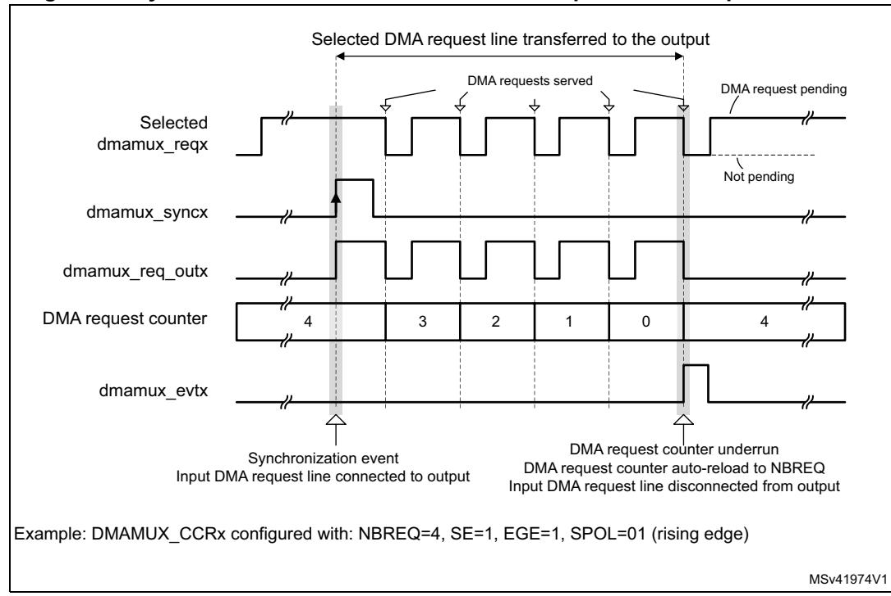
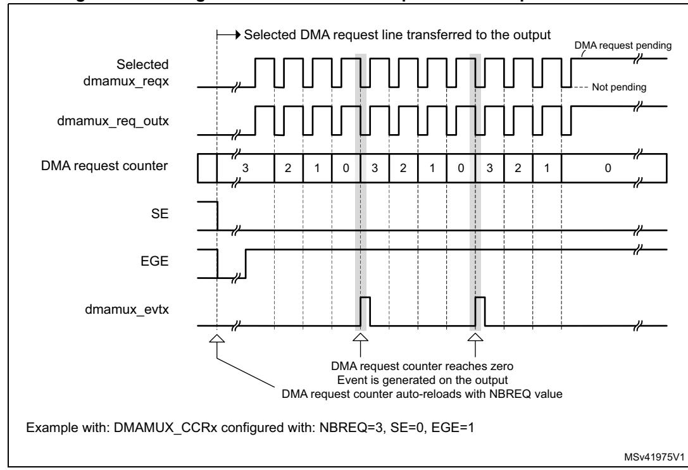

# **18 DMA request multiplexer (DMAMUX)**

# **18.1 Introduction**

A peripheral indicates a request for DMA transfer by setting its DMA request signal. The DMA request is pending until served by the DMA controller that generates a DMA acknowledge signal, and the corresponding DMA request signal is deasserted.

In this document, the set of control signals required for the DMA request/acknowledge protocol is not explicitly shown or described, and it is referred to as DMA request line.

The DMAMUX request multiplexer enables routing a DMA request line between the peripherals and the DMA controllers of the product. The routing function is ensured by a programmable multi-channel DMA request line multiplexer. Each channel selects a unique DMA request line, unconditionally or synchronously with events from its DMAMUX synchronization inputs. The DMAMUX may also be used as a DMA request generator from programmable events on its input trigger signals.

The number of DMAMUX instances and their main characteristics are specified in *[Section 18.3.1](#page-1-0)*.

The assignment of DMAMUX request multiplexer inputs to the DMA request lines from peripherals and to the DMAMUX request generator outputs, the assignment of DMAMUX request multiplexer outputs to DMA controller channels, and the assignment of DMAMUX synchronizations and trigger inputs to internal and external signals depend upon product implementation. They are detailed in *[Section 18.3.2](#page-1-1)*.

RM0399 Rev 4 731/3556

# **18.2 DMAMUX main features**

- Up to 16-channel programmable DMA request line multiplexer output
- Up to 8-channel DMA request generator
- Up to 32 trigger inputs to DMA request generator
- Up to 16 synchronization inputs
- Per DMA request generator channel:
  - DMA request trigger input selector
  - DMA request counter
  - Event overrun flag for selected DMA request trigger input
- Per DMA request line multiplexer channel output:
  - Up to 107 input DMA request lines from peripherals
  - One DMA request line output
  - Synchronization input selector
  - DMA request counter
  - Event overrun flag for selected synchronization input
  - One event output, for DMA request chaining

# **18.3 DMAMUX implementation**

### **18.3.1 DMAMUX1 and DMAMUX2 instantiation**

The product integrates two instances of DMA request multiplexer:

- DMAMUX1 for DMA1 and DMA2 (D2 domain)
- DMAMUX2 for BDMA (D3 domain)

DMAMUX1 and DMAMUX2are instantiated with the hardware configuration parameters listed in the following table.

**Table 125. DMAMUX1 and DMAMUX2 instantiation** 

| Feature                                     | DMAMUX1 | DMAMUX2 |
|---------------------------------------------|---------|---------|
| Number of DMAMUX output request channels    | 16      | 8       |
| Number of DMAMUX request generator channels | 8       | 8       |
| Number of DMAMUX request trigger inputs     | 8       | 32      |
| Number of DMAMUX synchronization inputs     | 8       | 16      |
| Number of DMAMUX peripheral request inputs  | 107     | 12      |

### **18.3.2 DMAMUX1 mapping**

The mapping of resources to DMAMUX1 is hardwired.

DMAMUX1 is used with DMA1 and DMA2 in D2 domain

- DMAMUX1 channels 0 to 7 are connected to DMA1 channels 0 to 7
- DMAMUX1 channels 8 to 15 are connected to DMA2 channels 0 to 7

**Table 126. DMAMUX1: assignment of multiplexer inputs to resources** 

| DMA request MUX input | Resource         | DMA request MUX input | Resource      | DMA request MUX input | Resource         |
|-----------------------------|------------------|-----------------------------|---------------|-----------------------------|------------------|
| 1                           | dmamux1_req_gen0 | 44                          | usart2_tx_dma | 87                          | sai1a_dma        |
| 2                           | dmamux1_req_gen1 | 45                          | usart3_rx_dma | 88                          | sai1b_dma        |
| 3                           | dmamux1_req_gen2 | 46                          | usart3_tx_dma | 89                          | sai2a_dma        |
| 4                           | dmamux1_req_gen3 | 47                          | TIM8_CH1      | 90                          | sai2b_dma        |
| 5                           | dmamux1_req_gen4 | 48                          | TIM8_CH2      | 91                          | swpmi_rx_dma     |
| 6                           | dmamux1_req_gen5 | 49                          | TIM8_CH3      | 92                          | swpmi_tx_dma     |
| 7                           | dmamux1_req_gen6 | 50                          | TIM8_CH4      | 93                          | spdifrx_dat_dma  |
| 8                           | dmamux1_req_gen7 | 51                          | TIM8_UP       | 94                          | spdifrx_ctrl_dma |
| 9                           | adc1_dma         | 52                          | TIM8_TRIG     | 95                          | HR_REQ(1)        |
| 10                          | adc2_dma         | 53                          | TIM8_COM      | 96                          | HR_REQ(2)        |
| 11                          | TIM1_CH1         | 54                          | Reserved      | 97                          | HR_REQ(3)        |
| 12                          | TIM1_CH2         | 55                          | TIM5_CH1      | 98                          | HR_REQ(4)        |
| 13                          | TIM1_CH3         | 56                          | TIM5_CH2      | 99                          | HR_REQ(5)        |
| 14                          | TIM1_CH4         | 57                          | TIM5_CH3      | 100                         | HR_REQ(6)        |
| 15                          | TIM1_UP          | 58                          | TIM5_CH4      | 101                         | dfsdm1_dma0      |
| 16                          | TIM1_TRIG        | 59                          | TIM5_UP       | 102                         | dfsdm1_dma1      |
| 17                          | TIM1_COM         | 60                          | TIM5_TRIG     | 103                         | dfsdm1_dma2      |
| 18                          | TIM2_CH1         | 61                          | spi3_rx_dma   | 104                         | dfsdm1_dma3      |
| 19                          | TIM2_CH2         | 62                          | spi3_tx_dma   | 105                         | TIM15_CH1        |
| 20                          | TIM2_CH3         | 63                          | uart4_rx_dma  | 106                         | TIM15_UP         |
| 21                          | TIM2_CH4         | 64                          | uart4_tx_dma  | 107                         | TIM15_TRIG       |
| 22                          | TIM2_UP          | 65                          | uart5_rx_dma  | 108                         | TIM15_COM        |
| 23                          | TIM3_CH1         | 66                          | uart5_tx_dma  | 109                         | TIM16_CH1        |
| 24                          | TIM3_CH2         | 67                          | dac_ch1_dma   | 110                         | TIM16_UP         |
| 25                          | TIM3_CH3         | 68                          | dac_ch2_dma   | 111                         | TIM17_CH1        |
| 26                          | TIM3_CH4         | 69                          | TIM6_UP       | 112                         | TIM17_UP         |
| 27                          | TIM3_UP          | 70                          | TIM7_UP       | 113                         | sai3_a_dma       |
| 28                          | TIM3_TRIG        | 71                          | usart6_rx_dma | 114                         | sai3_b_dma       |
| 29                          | TIM4_CH1         | 72                          | usart6_tx_dma | 115                         | adc3_dma         |
| 30                          | TIM4_CH2         | 73                          | i2c3_rx_dma   | 116                         | Reserved         |
| 31                          | TIM4_CH3         | 74                          | i2c3_tx_dma   | 117                         | Reserved         |
| 32                          | TIM4_UP          | 75                          | dcmi_dma      | 118                         | Reserved         |
| 33                          | i2c1_rx_dma      | 76                          | cryp_in_dma   | 119                         | Reserved         |
| 34                          | i2c1_tx_dma      | 77                          | cryp_out_dma  | 120                         | Reserved         |
| 35                          | i2c2_rx_dma      | 78                          | hash_in_dma   | 121                         | Reserved         |
| 36                          | i2c2_tx_dma      | 79                          | uart7_rx_dma  | 122                         | Reserved         |

**Table 126. DMAMUX1: assignment of multiplexer inputs to resources (continued)**

| DMA request MUX input | Resource      | DMA request MUX input | Resource     | DMA request MUX input | Resource |
|-----------------------------|---------------|-----------------------------|--------------|-----------------------------|----------|
| 37                          | spi1_rx_dma   | 80                          | uart7_tx_dma | 123                         | Reserved |
| 38                          | spi1_tx_dma   | 81                          | uart8_rx_dma | 124                         | Reserved |
| 39                          | spi2_rx_dma   | 82                          | uart8_tx_dma | 125                         | Reserved |
| 40                          | spi2_tx_dma   | 83                          | spi4_rx_dma  | 126                         | Reserved |
| 41                          | usart1_rx_dma | 84                          | spi4_tx_dma  | 127                         | Reserved |
| 42                          | usart1_tx_dma | 85                          | spi5_rx_dma  | -                           | -        |
| 43                          | usart2_rx_dma | 86                          | spi5_tx_dma  | -                           | -        |

**Table 127. DMAMUX1: assignment of multiplexer inputs to resources** 

| DMA request MUX input | Resource         | DMA request MUX input | Resource      | DMA request MUX input | Resource         |
|-----------------------------|------------------|-----------------------------|---------------|-----------------------------|------------------|
| 1                           | dmamux1_req_gen0 | 44                          | usart2_tx_dma | 87                          | sai1a_dma        |
| 2                           | dmamux1_req_gen1 | 45                          | usart3_rx_dma | 88                          | sai1b_dma        |
| 3                           | dmamux1_req_gen2 | 46                          | usart3_tx_dma | 89                          | sai2a_dma        |
| 4                           | dmamux1_req_gen3 | 47                          | TIM8_CH1      | 90                          | sai2b_dma        |
| 5                           | dmamux1_req_gen4 | 48                          | TIM8_CH2      | 91                          | swpmi_rx_dma     |
| 6                           | dmamux1_req_gen5 | 49                          | TIM8_CH3      | 92                          | swpmi_tx_dma     |
| 7                           | dmamux1_req_gen6 | 50                          | TIM8_CH4      | 93                          | spdifrx_dat_dma  |
| 8                           | dmamux1_req_gen7 | 51                          | TIM8_UP       | 94                          | spdifrx_ctrl_dma |
| 9                           | adc1_dma         | 52                          | TIM8_TRIG     | 95                          | HR_REQ(1)        |
| 10                          | adc2_dma         | 53                          | TIM8_COM      | 96                          | HR_REQ(2)        |
| 11                          | TIM1_CH1         | 54                          | Reserved      | 97                          | HR_REQ(3)        |
| 12                          | TIM1_CH2         | 55                          | TIM5_CH1      | 98                          | HR_REQ(4)        |
| 13                          | TIM1_CH3         | 56                          | TIM5_CH2      | 99                          | HR_REQ(5)        |
| 14                          | TIM1_CH4         | 57                          | TIM5_CH3      | 100                         | HR_REQ(6)        |
| 15                          | TIM1_UP          | 58                          | TIM5_CH4      | 101                         | dfsdm1_dma0      |
| 16                          | TIM1_TRIG        | 59                          | TIM5_UP       | 102                         | dfsdm1_dma1      |
| 17                          | TIM1_COM         | 60                          | TIM5_TRIG     | 103                         | dfsdm1_dma2      |
| 18                          | TIM2_CH1         | 61                          | spi3_rx_dma   | 104                         | dfsdm1_dma3      |
| 19                          | TIM2_CH2         | 62                          | spi3_tx_dma   | 105                         | TIM15_CH1        |
| 20                          | TIM2_CH3         | 63                          | uart4_rx_dma  | 106                         | TIM15_UP         |
| 21                          | TIM2_CH4         | 64                          | uart4_tx_dma  | 107                         | TIM15_TRIG       |
| 22                          | TIM2_UP          | 65                          | uart5_rx_dma  | 108                         | TIM15_COM        |
| 23                          | TIM3_CH1         | 66                          | uart5_tx_dma  | 109                         | TIM16_CH1        |
| 24                          | TIM3_CH2         | 67                          | dac_ch1_dma   | 110                         | TIM16_UP         |
| 25                          | TIM3_CH3         | 68                          | dac_ch2_dma   | 111                         | TIM17_CH1        |

**Table 127. DMAMUX1: assignment of multiplexer inputs to resources (continued)**

| DMA request MUX input | Resource      | DMA request MUX input | Resource      | DMA request MUX input | Resource   |
|-----------------------------|---------------|-----------------------------|---------------|-----------------------------|------------|
| 26                          | TIM3_CH4      | 69                          | TIM6_UP       | 112                         | TIM17_UP   |
| 27                          | TIM3_UP       | 70                          | TIM7_UP       | 113                         | sai3_a_dma |
| 28                          | TIM3_TRIG     | 71                          | usart6_rx_dma | 114                         | sai3_b_dma |
| 29                          | TIM4_CH1      | 72                          | usart6_tx_dma | 115                         | adc3_dma   |
| 30                          | TIM4_CH2      | 73                          | i2c3_rx_dma   | 116                         | Reserved   |
| 31                          | TIM4_CH3      | 74                          | i2c3_tx_dma   | 117                         | Reserved   |
| 32                          | TIM4_UP       | 75                          | dcmi_dma      | 118                         | Reserved   |
| 33                          | i2c1_rx_dma   | 76                          | cryp_in_dma   | 119                         | Reserved   |
| 34                          | i2c1_tx_dma   | 77                          | cryp_out_dma  | 120                         | Reserved   |
| 35                          | i2c2_rx_dma   | 78                          | hash_in_dma   | 121                         | Reserved   |
| 36                          | i2c2_tx_dma   | 79                          | uart7_rx_dma  | 122                         | Reserved   |
| 37                          | spi1_rx_dma   | 80                          | uart7_tx_dma  | 123                         | Reserved   |
| 38                          | spi1_tx_dma   | 81                          | uart8_rx_dma  | 124                         | Reserved   |
| 39                          | spi2_rx_dma   | 82                          | uart8_tx_dma  | 125                         | Reserved   |
| 40                          | spi2_tx_dma   | 83                          | spi4_rx_dma   | 126                         | Reserved   |
| 41                          | usart1_rx_dma | 84                          | spi4_tx_dma   | 127                         | Reserved   |
| 42                          | usart1_tx_dma | 85                          | spi5_rx_dma   | -                           | -          |
| 43                          | usart2_rx_dma | 86                          | spi5_tx_dma   | -                           | -          |

**Table 128. DMAMUX1: assignment of trigger inputs to resources** 

| Trigger input | Resource     | Trigger input | Resource   |  |  |
|---------------|--------------|---------------|------------|--|--|
| 0             | dmamux1_evt0 | 4             | lptim2_out |  |  |
| 1             | dmamux1_evt1 | 5             | lptim3_out |  |  |
| 2             | dmamux1_evt2 | 6             | extit0     |  |  |
| 3             | lptim1_out   | 7             | TIM12_TRGO |  |  |

**Table 129. DMAMUX1: assignment of synchronization inputs to resources** 

| Sync. input | Resource     | Sync. input | Resource   |  |
|-------------|--------------|-------------|------------|--|
| 0           | dmamux1_evt0 | 4           | lptim2_out |  |
| 1           | dmamux1_evt1 | 5           | lptim3_out |  |
| 2           | dmamux1_evt2 | 6           | extit0     |  |
| 3           | lptim1_out   | 7           | TIM12_TRGO |  |

### **18.3.3 DMAMUX2 mapping**

DMAMUX2 channels 0 to 7 are connected to BDMA channels 0 to 7.

RM0399 Rev 4 735/3556

Table 130. DMAMUX2: assignment of multiplexer inputs to resources

| DMA request MUX input | Resource         | DMA request MUX input | Resource |  |
|--------------------------|------------------|--------------------------|----------|--|
| 1                        | dmamux2_req_gen0 | 17                       | adc3_dma |  |
| 2                        | dmamux2_req_gen1 | 18                       | Reserved |  |
| 3                        | dmamux2_req_gen2 | 19                       | Reserved |  |
| 4                        | dmamux2_req_gen3 | 20                       | Reserved |  |
| 5                        | dmamux2_req_gen4 | 21                       | Reserved |  |
| 6                        | dmamux2_req_gen5 | 22                       | Reserved |  |
| 7                        | dmamux2_req_gen6 | 23                       | Reserved |  |
| 8                        | dmamux2_req_gen7 | 24                       | Reserved |  |
| 9                        | lpuart1_rx_dma   | 25                       | Reserved |  |
| 10                       | lpuart1_tx_dma   | 26                       | Reserved |  |
| 11                       | spi6_rx_dma      | 27                       | Reserved |  |
| 12                       | spi6_tx_dma      | 28                       | Reserved |  |
| 13                       | i2c4_rx_dma      | 29                       | Reserved |  |
| 14                       | i2c4_tx_dma      | 30                       | Reserved |  |
| 15                       | sai4_a_dma       | 31                       | Reserved |  |
| 16                       | sai4_b_dma       | 32                       | Reserved |  |

Table 131. DMAMUX2: assignment of trigger inputs to resources

| Trigger input | Resource       | Trigger input | Resource         |  |
|---------------|----------------|---------------|------------------|--|
| 0             | dmamux2_evt0   | 16            | spi6_wkup        |  |
| 1             | dmamux2_evt1   | 17            | Comp1_out        |  |
| 2             | dmamux2_evt2   | 18            | Comp2_out        |  |
| 3             | dmamux2_evt3   | 19            | RTC_wkup         |  |
| 4             | dmamux2_evt4   | 20            | Syscfg_exti0_mux |  |
| 5             | dmamux2_evt5   | 21            | Syscfg_exti2_mux |  |
| 6             | dmamux2_evt6   | 22            | I2c4_event_it    |  |
| 7             | lpuart_rx_wkup | 23            | spi6_it          |  |
| 8             | lpuart_tx_wkup | 24            | Lpuart1_it_T     |  |
| 9             | lptim2_wkup    | 25            | Lpuart1_it_R     |  |
| 10            | lptim2_out     | 26            | adc3_it          |  |
| 11            | lptim3_wkup    | 27            | adc3_awd1        |  |
| 12            | lptim3_out     | 28            | bdma_ch0_it      |  |
| 13            | Lptim4_ait     | 29            | bdma_ch1_it      |  |
| 14            | Lptim5_ait     | 30            | Reserved         |  |
| 15            | I2c4_wkup      | 31            | Reserved         |  |

**Table 132. DMAMUX2: assignment of synchronization inputs to resources** 

| Sync input | Resource         | Sync input | Resource |  |
|------------|------------------|------------|----------|--|
| 0          | dmamux2_evt0     | 16         | Reserved |  |
| 1          | dmamux2_evt1     | 17         | Reserved |  |
| 2          | dmamux2_evt2     | 18         | Reserved |  |
| 3          | dmamux2_evt3     | 19         | Reserved |  |
| 4          | dmamux2_evt4     | 20         | Reserved |  |
| 5          | dmamux2_evt5     | 21         | Reserved |  |
| 6          | lpuart1_rx_wkup  | 22         | Reserved |  |
| 7          | lpuart1_tx_wkup  | 23         | Reserved |  |
| 8          | Lptim2_out       | 24         | Reserved |  |
| 9          | Lptim3_out       | 25         | Reserved |  |
| 10         | I2c4_wkup        | 26         | Reserved |  |
| 11         | spi6_wkup        | 27         | Reserved |  |
| 12         | Comp1_out        | 28         | Reserved |  |
| 13         | RTC_wkup         | 29         | Reserved |  |
| 14         | Syscfg_exti0_mux | 30         | Reserved |  |
| 15         | Syscfg_exti2_mux | 31         | Reserved |  |

RM0399 Rev 4 737/3556

#### 18.4 **DMAMUX** functional description

#### 18.4.1 **DMAMUX** block diagram

Figure 90 shows the DMAMUX block diagram.

32-bit AHB bus dmamux\_hclk **DMAMUX** Request multiplexer AHB slave interface DMAMUX\_CmCR Channel 1 Channel 0 DMA requests DMAMUX COCF from peripherals: dmamux\_req\_inx Channel select 0 Ctrl **DMA** requests to DMA controllers: Request generator dmamux reg outx Channel n Sync denx DMA channels events: red dmamux evtx Channel 1 Channel 0 DMAMUX RGC0CR Interrupt interface Trigger inputs: Interrupt: Synchronization inputs: dmamux\_ovr\_it dmamux trgx dmamux syncx

Figure 90. DMAMUX block diagram

DMAMUX features two main sub-blocks: the request line multiplexer and the request line generator.

The implementation assigns:

- DMAMUX request multiplexer sub-block inputs (dmamux\_reqx) from peripherals (dmamux reg inx) and from channels of the DMAMUX request generator sub-block (dmamux req genx)
- DMAMUX request outputs to channels of DMA controllers (dmamux req outx)
- Internal or external signals to DMA request trigger inputs (dmamux trgx)
- Internal or external signals to synchronization inputs (dmamux syncx)

RM0399 Rev 4 738/3556

### **18.4.2 DMAMUX signals**

*[Table 133](#page-8-0)* lists the DMAMUX signals.

**Table 133. DMAMUX signals** 

| Signal name                                                            | Description                                                                                              |  |  |
|------------------------------------------------------------------------|----------------------------------------------------------------------------------------------------------|--|--|
| dmamux_hclk                                                            | DMAMUX AHB clock                                                                                         |  |  |
| dmamux_req_inx                                                         | DMAMUX DMA request line inputs from peripherals                                                          |  |  |
| dmamux_trgx                                                            | DMAMUX DMA request triggers inputs (to request generator sub-block)                                      |  |  |
| dmamux_req_genx DMAMUX request generator sub-block channels outputs |                                                                                                          |  |  |
| dmamux_reqx                                                            | DMAMUX request multiplexer sub-block inputs (from peripheral requests and request generator channels) |  |  |
| dmamux_syncx                                                           | DMAMUX synchronization inputs (to request multiplexer sub-block)                                         |  |  |
| dmamux_req_outx                                                        | DMAMUX requests outputs (to DMA controllers)                                                             |  |  |
| dmamux_evtx                                                            | DMAMUX events outputs                                                                                    |  |  |
| dmamux_ovr_it                                                          | DMAMUX overrun interrupts                                                                                |  |  |

### **18.4.3 DMAMUX channels**

A DMAMUX channel is a request multiplexer channel that can include, depending upon the selected input of the request multiplexer, an additional DMAMUX request generator channel.

A DMAMUX request multiplexer channel is connected and dedicated to a single channel of DMA controller(s).

### **Channel configuration procedure**

Follow the sequence below to configure a DMAMUX x channel and the related DMA channel y:

- 1. Set and configure completely the DMA channel y, except enabling the channel y.
- 2. Set and configure completely the related DMAMUX y channel.
- 3. Last, activate the DMA channel y by setting the EN bit in the DMA y channel register.

### **18.4.4 DMAMUX request line multiplexer**

The DMAMUX request multiplexer with its multiple channels ensures the actual routing of DMA request/acknowledge control signals, named DMA request lines.

Each DMA request line is connected in parallel to all the channels of the DMAMUX request line multiplexer.

A DMA request is sourced either from the peripherals, or from the DMAMUX request generator.

The DMAMUX request line multiplexer channel x selects the DMA request line number as configured by the DMAREQ\_ID field in the DMAMUX\_CxCR register.

*Note: The null value in the field DMAREQ\_ID corresponds to no DMA request line selected.*

RM0399 Rev 4 739/3556

**Caution:** A same non-null DMAREQ\_ID cannot be programmed to different x and y DMAMUX request multiplexer channels (via DMAMUX\_CxCR and DMAMUX\_CyCR), except when the application guarantees that the two connected DMA channels are not simultaneously active.

> On top of the DMA request selection, the synchronization mode and/or the event generation may be configured and enabled, if required.

### **Synchronization mode and channel event generation**

Each DMAMUX request line multiplexer channel x can be individually synchronized by setting the synchronization enable (SE) bit in the DMAMUX\_CxCR register.

DMAMUX has multiple synchronization inputs. The synchronization inputs are connected in parallel to all the channels of the request multiplexer.

The synchronization input is selected via the SYNC\_ID field in the DMAMUX\_CxCR register of a given channel x.

When a channel is in this synchronization mode, the selected input DMA request line is propagated to the multiplexer channel output, once a programmable rising/falling edge is detected on the selected input synchronization signal, via the SPOL[1:0] field of the DMAMUX\_CxCR register.

Additionally, internally to the DMAMUX request multiplexer, there is a programmable DMA request counter, which can be used for the channel request output generation, and for an event generation. An event generation on the channel x output is enabled through the EGE bit (event generation enable) of the DMAMUX\_CxCR register.

As shown in *[Figure 92](#page-10-0)*, upon the detected edge of the synchronization input, the pending selected input DMA request line is connected to the DMAMUX multiplexer channel x output.

*Note: If a synchronization event occurs while there is no pending selected input DMA request line, it is discarded. The following asserted input request lines is not connected to the DMAMUX multiplexer channel output until a synchronization event occurs again.*

> From this point on, each time the connected DMAMUX request is served by the DMA controller (a served request is deasserted), the DMAMUX request counter is decremented. At its underrun, the DMA request counter is automatically loaded with the value in the NBREQ field of the DMAMUX\_CxCR register and the input DMA request line is disconnected from the multiplexer channel x output.

> Thus, the number of DMA requests transferred to the multiplexer channel x output following a detected synchronization event, is equal to the value in the NBREQ field, plus one.

*Note: The NBREQ field value can be written by software only when both synchronization enable bit (SE) and event generation enable bit (EGE) of the corresponding multiplexer channel x are disabled.*

**Figure 91. Synchronization mode of the DMAMUX request line multiplexer channel**

If EGE is enabled, the multiplexer channel generates a channel event, as a pulse of one AHB clock cycle, when its DMA request counter is automatically reloaded with the value of the programmed NBREQ field, as shown in *[Figure 91](#page-10-1)* and *[Figure 92](#page-10-0)*.

RM0399 Rev 4 741/3556

*Note: If EGE is enabled and NBREQ = 0, an event is generated after each served DMA request.*

*Note: A synchronization event (edge) is detected if the state following the edge remains stable for more than two AHB clock cycles.*

> *Upon writing into DMAMUX\_CxCR register, the synchronization events are masked during three AHB clock cycles.*

### **Synchronization overrun and interrupt**

If a new synchronization event occurs before the request counter underrun (the internal request counter programmed via the NBREQ field of the DMAMUX\_CxCR register), the synchronization overrun flag bit SOFx is set in the DMAMUX\_CSR register.

*Note: The request multiplexer channel x synchronization must be disabled* 

*(DMAMUX\_CxCR.SE = 0) when the use of the related channel of the DMA controller is completed. Else, upon a new detected synchronization event, there is a synchronization overrun due to the absence of a DMA acknowledge (that is, no served request) received from the DMA controller.*

The overrun flag SOFx is reset by setting the associated clear synchronization overrun flag bit CSOFx in the DMAMUX\_CFR register.

Setting the synchronization overrun flag generates an interrupt if the synchronization overrun interrupt enable bit SOIE is set in the DMAMUX\_CxCR register.

### **18.4.5 DMAMUX request generator**

The DMAMUX request generator produces DMA requests following trigger events on its DMA request trigger inputs.

The DMAMUX request generator has multiple channels. DMA request trigger inputs are connected in parallel to all channels.

The outputs of DMAMUX request generator channels are inputs to the DMAMUX request line multiplexer.

Each DMAMUX request generator channel x has an enable bit GE (generator enable) in the corresponding DMAMUX\_RGxCR register.

The DMA request trigger input for the DMAMUX request generator channel x is selected through the SIG\_ID (trigger signal ID) field in the corresponding DMAMUX\_RGxCR register.

Trigger events on a DMA request trigger input can be rising edge, falling edge or either edge. The active edge is selected through the GPOL (generator polarity) field in the corresponding DMAMUX\_RGxCR register.

Upon the trigger event, the corresponding generator channel starts generating DMA requests on its output. Each time the DMAMUX generated request is served by the connected DMA controller (a served request is deasserted), a built-in (inside the DMAMUX request generator) DMA request counter is decremented. At its underrun, the request generator channel stops generating DMA requests and the DMA request counter is automatically reloaded to its programmed value upon the next trigger event.

Thus, the number of DMA requests generated after the trigger event is GNBREQ + 1.

*Note: The GNBREQ field value can be written by software only when the enable GE bit of the corresponding generator channel x is disabled.*

*There is no hardware write protection.*

*A trigger event (edge) is detected if the state following the edge remains stable for more than two AHB clock cycles.*

*Upon writing into DMAMUX\_RGxCR register, the trigger events are masked during three AHB clock cycles.*

### **Trigger overrun and interrupt**

If a new DMA request trigger event occurs before the DMAMUX request generator counter underrun (the internal counter programmed via the GNBREQ field of the DMAMUX\_RGxCR register), and if the request generator channel x was enabled via GE, then the request trigger event overrun flag bit OFx is asserted by the hardware in the DMAMUX\_RGSR register.

*Note: The request generator channel x must be disabled (DMAMUX\_RGxCR.GE = 0) when the usage of the related channel of the DMA controller is completed. Else, upon a new detected trigger event, there is a trigger overrun due to the absence of an acknowledge (that is, no served request) received from the DMA.*

> The overrun flag OFx is reset by setting the associated clear overrun flag bit COFx in the DMAMUX\_RGCFR register.

Setting the DMAMUX request trigger overrun flag generates an interrupt if the DMA request trigger event overrun interrupt enable bit OIE is set in the DMAMUX\_RGxCR register.

# **18.5 DMAMUX interrupts**

An interrupt can be generated upon:

- a synchronization event overrun in each DMA request line multiplexer channel
- a trigger event overrun in each DMA request generator channel

For each case, per-channel in.dividual interrupt enable, status, and clear flag register bits are available.

**Table 134. DMAMUX interrupts** 

| Interrupt signal | Interrupt event                                                                         | Event flag | Clear bit | Enable bit |
|------------------|-----------------------------------------------------------------------------------------|------------|-----------|------------|
| dmamuxovr_it     | Synchronization event overrun on channel x of the DMAMUX request line multiplexer | SOFx       | CSOFx     | SOIE       |
|                  | Trigger event overrun on channel x of the DMAMUX request generator                | OFx        | COFx      | OIE        |

RM0399 Rev 4 743/3556

# **18.6 DMAMUX registers**

Refer to the table containing register boundary addresses for the DMAMUX1 and DMAMUX2 base address.

DMAMUX registers may be accessed per byte (8-bit), half-word (16-bit), or word (32-bit). The address must be aligned with the data size.

# **18.6.1 DMAMUX1 request line multiplexer channel x configuration register (DMAMUX1\_CxCR)**

Address offset: 0x000 + 0x04 \* x (x = 0 to 15)

Reset value: 0x0000 0000

| 31   | 30   | 29   | 28   | 27   | 26   | 25           | 24   | 23   | 22 | 21         | 20 | 19             | 18 | 17 | 16 |
|------|------|------|------|------|------|--------------|------|------|----|------------|----|----------------|----|----|----|
| Res. | Res. | Res. | Res. | Res. |      | SYNC_ID[2:0] |      |      |    | NBREQ[4:0] |    | SPOL[1:0]      |    | SE |    |
|      |      |      |      |      | rw   | rw           | rw   | rw   | rw | rw         | rw | rw             | rw | rw | rw |
|      |      |      |      |      |      |              |      |      |    |            |    |                |    |    |    |
| 15   | 14   | 13   | 12   | 11   | 10   | 9            | 8    | 7    | 6  | 5          | 4  | 3              | 2  | 1  | 0  |
| Res. | Res. | Res. | Res. | Res. | Res. | EGE          | SOIE | Res. |    |            |    | DMAREQ_ID[6:0] |    |    |    |

Bits 31:27 Reserved, must be kept at reset value.

### Bits 26:24 **SYNC\_ID[2:0]**: Synchronization identification

Selects the synchronization input (see *[Table 129: DMAMUX1: assignment of synchronization](#page-4-0)  [inputs to resources](#page-4-0)* and *[Table 132: DMAMUX2: assignment of synchronization inputs to](#page-6-0)  [resources](#page-6-0)*).

#### Bits 23:19 **NBREQ[4:0]**: Number of DMA requests minus 1 to forward

Defines the number of DMA requests to forward to the DMA controller after a synchronization event, and/or the number of DMA requests before an output event is generated.

This field must only be written when both SE and EGE bits are low.

### Bits 18:17 **SPOL[1:0]**: Synchronization polarity

Defines the edge polarity of the selected synchronization input:

00: No event (no synchronization, no detection).

01: Rising edge

10: Falling edge

11: Rising and falling edges

Bit 16 **SE**: Synchronization enable

0: Synchronization disabled

1: Synchronization enabled

Bits 15:10 Reserved, must be kept at reset value.

Bit 9 **EGE**: Event generation enable

0: Event generation disabled

1: Event generation enabled

Bit 8 **SOIE**: Synchronization overrun interrupt enable

0: Interrupt disabled

1: Interrupt enabled

Bit 7 Reserved, must be kept at reset value.

#### Bits 6:0 **DMAREQ\_ID[6:0]**: DMA request identification

Selects the input DMA request. See the DMAMUX table about assignments of multiplexer inputs to resources.

## **18.6.2 DMAMUX2 request line multiplexer channel x configuration register (DMAMUX2\_CxCR)**

Address offset: 0x000 + 0x04 \* x, where x = 0 to 7

Reset value: 0x0000 0000

| 31   | 30   | 29   | 28   | 27   | 26           | 25  | 24   | 23   | 22   | 21         | 20             | 19 | 18 | 17 | 16 |  |
|------|------|------|------|------|--------------|-----|------|------|------|------------|----------------|----|----|----|----|--|
| Res. | Res. | Res. |      |      | SYNC_ID[4:0] |     |      |      |      | NBREQ[4:0] | SPOL[1:0]      | SE |    |    |    |  |
|      |      |      | rw   | rw   | rw           | rw  | rw   | rw   | rw   | rw         | rw             | rw | rw |    | rw |  |
| 15   | 14   | 13   | 12   | 11   | 10           | 9   | 8    | 7    | 6    | 5          | 4              | 3  | 2  | 1  | 0  |  |
| Res. | Res. | Res. | Res. | Res. | Res.         | EGE | SOIE | Res. | Res. | Res.       | DMAREQ_ID[4:0] |    |    |    |    |  |
|      |      |      |      |      |              | rw  | rw   |      |      |            | rw             | rw | rw | rw | rw |  |

Bits 31:29 Reserved, must be kept at reset value.

#### Bits 28:24 **SYNC\_ID[4:0]**: Synchronization identification

Selects the synchronization input (see *[Table 131: DMAMUX2: assignment of trigger inputs to](#page-5-0)  [resources](#page-5-0)*)

#### Bits 23:19 **NBREQ[4:0]**: Number of DMA requests minus 1 to forward

Defines the number of DMA requests to forward to the DMA controller after a synchronization event, and/or the number of DMA requests before an output event is generated.

This field shall only be written when both SE and EGE bits are low.

#### Bits 18:17 **SPOL[1:0]**: Synchronization polarity

Defines the edge polarity of the selected synchronization input:

00: no event (no synchronization, no detection).

01: rising edge

10: falling edge

11: rising and falling edges

Bit 16 **SE**: Synchronization enable

0: synchronization disabled

1: synchronization enabled

Bits 15:10 Reserved, must be kept at reset value.

Bit 9 **EGE**: Event generation enable

0: event generation disabled

1: event generation enabled

Bit 8 **SOIE**: Synchronization overrun interrupt enable

0: interrupt disabled

1: interrupt enabled

Bits 7:5 Reserved, must be kept at reset value.

#### Bits 4:0 **DMAREQ\_ID[4:0]**: DMA request identification

Selects the input DMA request. (see the DMAMUX table about assignments of multiplexer inputs to resources).

RM0399 Rev 4 745/3556

### **18.6.3 DMAMUX1 request line multiplexer interrupt channel status register (DMAMUX1\_CSR)**

Address offset: 0x080

Reset value: 0x0000 0000

| 31    | 30    | 29    | 28    | 27    | 26    | 25   | 24   | 23   | 22   | 21   | 20   | 19   | 18   | 17   | 16   |
|-------|-------|-------|-------|-------|-------|------|------|------|------|------|------|------|------|------|------|
| Res.  | Res.  | Res.  | Res.  | Res.  | Res.  | Res. | Res. | Res. | Res. | Res. | Res. | Res. | Res. | Res. | Res. |
| 15    | 14    | 13    | 12    | 11    | 10    | 9    | 8    | 7    | 6    | 5    | 4    | 3    | 2    | 1    | 0    |
| SOF15 | SOF14 | SOF13 | SOF12 | SOF11 |       |      |      |      | SOF  | SOF  |      |      |      |      |      |
|       |       |       |       |       | SOF10 | SOF9 | SOF8 | SOF7 | 6    | 5    | SOF4 | SOF3 | SOF2 | SOF1 | SOF0 |

Bits 31:16 Reserved, must be kept at reset value.

Bits 15:0 **SOF[15:0]**: Synchronization overrun event flag

The flag is set when a synchronization event occurs on a DMA request line multiplexer channel x, while the DMA request counter value is lower than NBREQ.

The flag is cleared by writing 1 to the corresponding CSOFx bit in DMAMUX\_CFR register. For DMAMUX2 bits 15:8 are reserved, keep them at reset value.

## **18.6.4 DMAMUX2 request line multiplexer interrupt channel status register (DMAMUX2\_CSR)**

Address offset: 0x080

Reset value: 0x0000 0000

| 31   | 30   | 29   | 28   | 27   | 26   | 25   | 24   | 23   | 22   | 21   | 20   | 19   | 18   | 17   | 16   |
|------|------|------|------|------|------|------|------|------|------|------|------|------|------|------|------|
| Res. | Res. | Res. | Res. | Res. | Res. | Res. | Res. | Res. | Res. | Res. | Res. | Res. | Res. | Res. | Res. |
|      |      |      |      |      |      |      |      |      |      |      |      |      |      |      |      |
| 15   | 14   | 13   | 12   | 11   | 10   | 9    | 8    | 7    | 6    | 5    | 4    | 3    | 2    | 1    | 0    |
| Res. | Res. | Res. | Res. | Res. | Res. | Res. | Res. | SOF7 | SOF6 | SOF5 | SOF4 | SOF3 | SOF2 | SOF1 | SOF0 |
|      |      |      |      |      |      |      |      | r    | r    | r    | r    | r    | r    | r    | r    |

Bits 31:8 Reserved, must be kept at reset value.

Bits 7:0 **SOF[7:0]**: Synchronization overrun event flag

The flag is set when a new synchronization event occurs on a DMA request line multiplexer channel x before the request counter underrun (the internal request counter programmed via the NBREQ field of the DMAMUX\_CxCR register).

The flag is cleared by writing 1 to the corresponding CSOFx bit in DMAMUX2\_CFR register.

# **18.6.5 DMAMUX1 request line multiplexer interrupt clear flag register (DMAMUX1\_CFR)**

Address offset: 0x084

Reset value: 0x0000 0000

| 31         | 30         | 29         | 28         | 27         | 26         | 25        | 24        | 23        | 22        | 21        | 20        | 19        | 18        | 17        | 16        |
|------------|------------|------------|------------|------------|------------|-----------|-----------|-----------|-----------|-----------|-----------|-----------|-----------|-----------|-----------|
| Res.       | Res.       | Res.       | Res.       | Res.       | Res.       | Res.      | Res.      | Res.      | Res.      | Res.      | Res.      | Res.      | Res.      | Res.      | Res.      |
|            |            |            |            |            |            |           |           |           |           |           |           |           |           |           |           |
| 15         | 14         | 13         | 12         | 11         | 10         | 9         | 8         | 7         | 6         | 5         | 4         | 3         | 2         | 1         | 0         |
| CSOF 15 | CSOF 14 | CSOF 13 | CSOF 12 | CSOF 11 | CSOF 10 | CSOF 9 | CSOF 8 | CSOF 7 | CSOF 6 | CSOF 5 | CSOF 4 | CSOF 3 | CSOF 2 | CSOF 1 | CSOF 0 |
|            |            |            |            |            |            |           |           |           |           |           |           |           |           |           |           |

Bits 31:16 Reserved, must be kept at reset value.

Bits 15:0 **CSOF[15:0]**: Clear synchronization overrun event flag

Writing 1 in each bit clears the corresponding overrun flag SOFx in the DMAMUX\_CSR register.

# **18.6.6 DMAMUX2 request line multiplexer interrupt clear flag register (DMAMUX2\_CFR)**

Address offset: 0x084

Reset value: 0x0000 0000

| 31   | 30   | 29   | 28   | 27   | 26   | 25   | 24   | 23   | 22   | 21   | 20   | 19   | 18   | 17                                              | 16   |
|------|------|------|------|------|------|------|------|------|------|------|------|------|------|-------------------------------------------------|------|
| Res. | Res. | Res. | Res. | Res. | Res. | Res. | Res. | Res. | Res. | Res. | Res. | Res. | Res. | Res.                                            | Res. |
|      |      |      |      |      |      |      |      |      |      |      |      |      |      |                                                 |      |
|      |      |      |      |      |      |      |      |      |      |      |      |      |      |                                                 |      |
| 15   | 14   | 13   | 12   | 11   | 10   | 9    | 8    | 7    | 6    | 5    | 4    | 3    | 2    | 1                                               | 0    |
| Res. | Res. | Res. | Res. | Res. | Res. | Res. | Res. |      |      |      |      |      |      | CSOF6 CSOF6 CSOF5 CSOF4 CSOF3 CSOF2 CSOF1 CSOF0 |      |

Bits 31:8 Reserved, must be kept at reset value.

Bits 7:0 **CSOF[7:0]**: Clear synchronization overrun event flag

Writing 1 in each bit clears the corresponding overrun flag SOFx in the DMAMUX2\_CSR register.

RM0399 Rev 4 747/3556

## **18.6.7 DMAMUX1 request generator channel x configuration register (DMAMUX1\_RGxCR)**

Address offset: 0x100 + 0x04 \* x (x = 0 to 7)

Reset value: 0x0000 0000

| 31   | 30   | 29   | 28   | 27   | 26   | 25   | 24   | 23   | 22   | 21          | 20   | 19   | 18 | 17          | 16 |
|------|------|------|------|------|------|------|------|------|------|-------------|------|------|----|-------------|----|
| Res. | Res. | Res. | Res. | Res. | Res. | Res. | Res. |      |      | GNBREQ[4:0] |      |      |    | GPOL[1:0]   | GE |
|      |      |      |      |      |      |      |      | rw   | rw   | rw          | rw   | rw   | rw | rw          | rw |
| 15   | 14   | 13   | 12   | 11   | 10   | 9    | 8    | 7    | 6    | 5           | 4    | 3    | 2  | 1           | 0  |
| Res. | Res. | Res. | Res. | Res. | Res. | Res. | OIE  | Res. | Res. | Res.        | Res. | Res. |    | SIG_ID[2:0] |    |
|      |      |      |      |      |      |      | rw   |      |      |             |      |      | rw | rw          | rw |

Bits 31:24 Reserved, must be kept at reset value.

Bits 23:19 **GNBREQ[4:0]**: Number of DMA requests to be generated (minus 1)

Defines the number of DMA requests to be generated after a trigger event. The actual number of generated DMA requests is GNBREQ +1.

*Note: This field must be written only when GE bit is disabled.*

Bits 18:17 **GPOL[1:0]**: DMA request generator trigger polarity

Defines the edge polarity of the selected trigger input

00: No event, i.e. no trigger detection nor generation.

01: Rising edge 10: Falling edge

11: Rising and falling edges

Bit 16 **GE**: DMA request generator channel x enable

0: DMA request generator channel x disabled

1: DMA request generator channel x enabled

Bits 15:9 Reserved, must be kept at reset value.

Bit 8 **OIE**: Trigger overrun interrupt enable

0: Interrupt on a trigger overrun event occurrence is disabled

1: Interrupt on a trigger overrun event occurrence is enabled

Bits 7:3 Reserved, must be kept at reset value.

Bits 2:0 **SIG\_ID[2:0]**: Signal identification

Selects the DMA request trigger input used for the channel x of the DMA request generator

## **18.6.8 DMAMUX2 request generator channel x configuration register (DMAMUX2\_RGxCR)**

Address offset: 0x100 + 0x04 \* x (x = 0 to 7)

Reset value: 0x0000 0000

| 31   | 30   | 29   | 28   | 27   | 26   | 25   | 24   | 23   | 22   | 21          | 20 | 19 | 18          | 17        | 16 |
|------|------|------|------|------|------|------|------|------|------|-------------|----|----|-------------|-----------|----|
| Res. | Res. | Res. | Res. | Res. | Res. | Res. | Res. |      |      | GNBREQ[4:0] |    |    |             | GPOL[1:0] | GE |
|      |      |      |      |      |      |      |      | rw   | rw   | rw          | rw | rw | rw          | rw        | rw |
|      |      |      |      |      |      |      |      |      |      |             |    |    |             |           |    |
| 15   | 14   | 13   | 12   | 11   | 10   | 9    | 8    | 7    | 6    | 5           | 4  | 3  | 2           | 1         | 0  |
| Res. | Res. | Res. | Res. | Res. | Res. | Res. | OIE  | Res. | Res. | Res.        |    |    | SIG_ID[4:0] |           |    |

Bits 31:24 Reserved, must be kept at reset value.

Bits 23:19 **GNBREQ[4:0]**: Number of DMA requests to be generated (minus 1)

Defines the number of DMA requests to be generated after a trigger event. The actual number of generated DMA requests is GNBREQ+1.

*Note: This field shall only be written when GE bit is disabled.*

Bits 18:17 **GPOL[1:0]**: DMA request generator trigger polarity

Defines the edge polarity of the selected trigger input

00: no event. I.e. none trigger detection nor generation.

01: rising edge

10: falling edge

11: rising and falling edge

Bit 16 **GE**: DMA request generator channel x enable

0: DMA request generator channel x disabled

1: DMA request generator channel x enabled

Bits 15:9 Reserved, must be kept at reset value.

Bit 8 **OIE**: Trigger overrun interrupt enable

0: interrupt on a trigger overrun event occurrence is disabled

1: interrupt on a trigger overrun event occurrence is enabled

Bits 7:5 Reserved, must be kept at reset value.

Bits 4:0 **SIG\_ID[4:0]**: Signal identification

Selects the DMA request trigger input used for the channel x of the DMA request generator

# **18.6.9 DMAMUX1 request generator interrupt status register (DMAMUX1\_RGSR)**

Address offset: 0x140

Reset value: 0x0000 0000

| 31   | 30   | 29   | 28   | 27   | 26   | 25   | 24   | 23   | 22   | 21   | 20   | 19   | 18   | 17   | 16   |
|------|------|------|------|------|------|------|------|------|------|------|------|------|------|------|------|
| Res. | Res. | Res. | Res. | Res. | Res. | Res. | Res. | Res. | Res. | Res. | Res. | Res. | Res. | Res. | Res. |
|      |      |      |      |      |      |      |      |      |      |      |      |      |      |      |      |
| 15   | 14   | 13   | 12   | 11   | 10   | 9    | 8    | 7    | 6    | 5    | 4    | 3    | 2    | 1    | 0    |
| Res. | Res. | Res. | Res. | Res. | Res. | Res. | Res. | OF7  | OF6  | OF5  | OF4  | OF3  | OF2  | OF1  | OF0  |
|      |      |      |      |      |      |      |      | r    | r    | r    | r    | r    | r    | r    | r    |

RM0399 Rev 4 749/3556

Bits 31:8 Reserved, must be kept at reset value.

Bits 7:0 **OF[7:0]**: Trigger overrun event flag

The flag is set when a new trigger event occurs on DMA request generator channel x, before the request counter underrun (the internal request counter programmed via the GNBREQ field of the DMAMUX\_RGxCR register).

The flag is cleared by writing 1 to the corresponding COFx bit in the DMAMUX\_RGCFR register.

# **18.6.10 DMAMUX2 request generator interrupt status register (DMAMUX2\_RGSR)**

Address offset: 0x140 Reset value: 0x0000 0000

| 31   | 30   | 29   | 28   | 27   | 26   | 25   | 24   | 23   | 22   | 21   | 20   | 19   | 18   | 17   | 16   |
|------|------|------|------|------|------|------|------|------|------|------|------|------|------|------|------|
| Res. | Res. | Res. | Res. | Res. | Res. | Res. | Res. | Res. | Res. | Res. | Res. | Res. | Res. | Res. | Res. |
|      |      |      |      |      |      |      |      |      |      |      |      |      |      |      |      |
| 15   | 14   | 13   | 12   | 11   | 10   | 9    | 8    | 7    | 6    | 5    | 4    | 3    | 2    | 1    | 0    |
| Res. | Res. | Res. | Res. | Res. | Res. | Res. | Res. | OF7  | OF6  | OF5  | OF4  | OF3  | OF2  | OF1  | OF0  |
|      |      |      |      |      |      |      |      | r    | r    | r    | r    | r    | r    | r    | r    |

Bits 31:8 Reserved, must be kept at reset value.

Bits 7:0 **OF[7:0]**: Trigger overrun event flag

The flag is set when a new trigger event occurs on DMA request generator channel x. The flag is cleared by writing 1 to the corresponding COFx bit in the DMAMUX2\_RGCFR register.

# **18.6.11 DMAMUX1 request generator interrupt clear flag register (DMAMUX1\_RGCFR)**

Address offset: 0x144 Reset value: 0x0000 0000

| 31   | 30   | 29   | 28   | 27   | 26   | 25   | 24   | 23   | 22   | 21   | 20   | 19   | 18   | 17   | 16   |
|------|------|------|------|------|------|------|------|------|------|------|------|------|------|------|------|
| Res. | Res. | Res. | Res. | Res. | Res. | Res. | Res. | Res. | Res. | Res. | Res. | Res. | Res. | Res. | Res. |
|      |      |      |      |      |      |      |      |      |      |      |      |      |      |      |      |
|      |      |      |      |      |      |      |      |      |      |      |      |      |      |      |      |
| 15   | 14   | 13   | 12   | 11   | 10   | 9    | 8    | 7    | 6    | 5    | 4    | 3    | 2    | 1    | 0    |
| Res. | Res. | Res. | Res. | Res. | Res. | Res. | Res. | COF7 | COF6 | COF5 | COF4 | COF3 | COF2 | COF1 | COF0 |

Bits 31:8 Reserved, must be kept at reset value.

Bits 7:0 **COF[7:0]**: Clear trigger overrun event flag

Writing 1 in each bit clears the corresponding overrun flag OFx in the DMAMUX\_RGSR register.

# **18.6.12 DMAMUX2 request generator interrupt clear flag register (DMAMUX2\_RGCFR)**

Address offset: 0x144

Reset value: 0x0000 0000

| 31   | 30   | 29   | 28   | 27   | 26   | 25   | 24   | 23   | 22   | 21   | 20   | 19   | 18   | 17   | 16   |
|------|------|------|------|------|------|------|------|------|------|------|------|------|------|------|------|
| Res. | Res. | Res. | Res. | Res. | Res. | Res. | Res. | Res. | Res. | Res. | Res. | Res. | Res. | Res. | Res. |
|      |      |      |      |      |      |      |      |      |      |      |      |      |      |      |      |
|      |      |      |      |      |      |      |      |      |      |      |      |      |      |      |      |
| 15   | 14   | 13   | 12   | 11   | 10   | 9    | 8    | 7    | 6    | 5    | 4    | 3    | 2    | 1    | 0    |
| Res. | Res. | Res. | Res. | Res. | Res. | Res. | Res. | COF7 | COF6 | COF5 | COF4 | COF3 | COF2 | COF1 | COF0 |

Bits 31:8 Reserved, must be kept at reset value.

Bits 7:0 **COF[7:0]**: Clear trigger overrun event flag

Writing 1 in each bit clears the corresponding overrun flag OFx in the DMAMUX2\_RGSR register.

RM0399 Rev 4 751/3556

### **18.6.13 DMAMUX register map**

The following table summarizes the DMAMUX registers and reset values. Refer to the register boundary address table for the DMAMUX register base address.

**Table 135. DMAMUX register map and reset values** 

| Offset           | Register name     | 31   | 30   | 29   | 28   | 27   | 26   | 25                   | 24   | 23   | 22   | 21   | 20         | 19   | 18   | 17    | 16   | 15   | 14   | 13   | 12   | 11   | 10   | 9    | 8    | 7    | 6    | 5              | 4    | 3    | 2 1       | 0    |
|------------------|-------------------|------|------|------|------|------|------|----------------------|------|------|------|------|------------|------|------|-------|------|------|------|------|------|------|------|------|------|------|------|----------------|------|------|--------------|------|
| 0x000            | DMAMUX_C0CR(1)(2) | Res. | Res. | Res. | Res. |      |      | Res.SYNC_ID [2:0] |      |      |      |      | NBREQ[4:0] |      | SPOL | [1:0] | SE   | Res. | Res. | Res. | Res. | Res. | Res. | EGE  | SOIE | Res. |      | DMAREQ_ID[6:0] |      |      |              |      |
|                  | Reset value       |      |      |      |      |      | 0    | 0                    | 0    | 0    | 0    | 0    | 0          | 0    | 0    | 0     | 0    |      |      |      |      |      |      | 0    | 0    |      | 0    | 0              | 0    | 0    | 0 0       | 0    |
| 0x004            | DMAMUX_C1CR(1)    | Res. | Res. | Res. | Res. |      |      | Res.SYNC_ID [2:0] |      |      |      |      | NBREQ[4:0] |      | SPOL | [1:0] | SE   | Res. | Res. | Res. | Res. | Res. | Res. | EGE  | SOIE | Res. |      | DMAREQ_ID[6:0] |      |      |              |      |
|                  | Reset value       |      |      |      |      |      | 0    | 0                    | 0    | 0    | 0    | 0    | 0          | 0    | 0    | 0     | 0    |      |      |      |      |      |      | 0    | 0    |      | 0    | 0              | 0    | 0    | 0 0       | 0    |
| 0x008            | DMAMUX_C2CR(1)    | Res. | Res. | Res. | Res. |      |      | Res.SYNC_ID [2:0] |      |      |      |      | NBREQ[4:0] |      | SPOL | [1:0] | SE   | Res. | Res. | Res. | Res. | Res. | Res. | EGE  | SOIE | Res. |      | DMAREQ_ID[6:0] |      |      |              |      |
|                  | Reset value       |      |      |      |      |      | 0    | 0                    | 0    | 0    | 0    | 0    | 0          | 0    | 0    | 0     | 0    |      |      |      |      |      |      | 0    | 0    |      | 0    | 0              | 0    | 0    | 0 0       | 0    |
| 0x00C            | DMAMUX_C3CR(1)    | Res. | Res. | Res. | Res. |      |      | Res.SYNC_ID [2:0] |      |      |      |      | NBREQ[4:0] |      | SPOL | [1:0] | SE   | Res. | Res. | Res. | Res. | Res. | Res. | EGE  | SOIE | Res. |      | DMAREQ_ID[6:0] |      |      |              |      |
|                  | Reset value       |      |      |      |      |      | 0    | 0                    | 0    | 0    | 0    | 0    | 0          | 0    | 0    | 0     | 0    |      |      |      |      |      |      | 0    | 0    |      | 0    | 0              | 0    | 0    | 0 0       | 0    |
| 0x010            | DMAMUX_C4CR(1)    | Res. | Res. | Res. | Res. |      |      | Res.SYNC_ID [2:0] |      |      |      |      | NBREQ[4:0] |      | SPOL | [1:0] | SE   | Res. | Res. | Res. | Res. | Res. | Res. | EGE  | SOIE | Res. |      | DMAREQ_ID[6:0] |      |      |              |      |
|                  | Reset value       |      |      |      |      |      | 0    | 0                    | 0    | 0    | 0    | 0    | 0          | 0    | 0    | 0     | 0    |      |      |      |      |      |      | 0    | 0    |      | 0    | 0              | 0    | 0    | 0 0       | 0    |
| 0x014            | DMAMUX_C5CR(1)    | Res. | Res. | Res. | Res. |      |      | Res.SYNC_ID [2:0] |      |      |      |      | NBREQ[4:0] |      | SPOL | [1:0] | SE   | Res. | Res. | Res. | Res. | Res. | Res. | EGE  | SOIE | Res. |      | DMAREQ_ID[6:0] |      |      |              |      |
|                  | Reset value       |      |      |      |      |      | 0    | 0                    | 0    | 0    | 0    | 0    | 0          | 0    | 0    | 0     | 0    |      |      |      |      |      |      | 0    | 0    |      | 0    | 0              | 0    | 0    | 0 0       | 0    |
| 0x018            | DMAMUX_C6CR(1)    | Res. | Res. | Res. | Res. |      |      | Res.SYNC_ID [2:0] |      |      |      |      | NBREQ[4:0] |      | SPOL | [1:0] | SE   | Res. | Res. | Res. | Res. | Res. | Res. | EGE  | SOIE | Res. |      | DMAREQ_ID[6:0] |      |      |              |      |
|                  | Reset value       |      |      |      |      |      | 0    | 0                    | 0    | 0    | 0    | 0    | 0          | 0    | 0    | 0     | 0    |      |      |      |      |      |      | 0    | 0    |      | 0    | 0              | 0    | 0    | 0 0       | 0    |
| 0x01C            | DMAMUX_C7CR(1)    | Res. | Res. | Res. | Res. |      |      | Res.SYNC_ID [2:0] |      |      |      |      | NBREQ[4:0] |      | SPOL | [1:0] | SE   | Res. | Res. | Res. | Res. | Res. | Res. | EGE  | SOIE | Res. |      | DMAREQ_ID[6:0] |      |      |              |      |
|                  | Reset value       |      |      |      |      |      | 0    | 0                    | 0    | 0    | 0    | 0    | 0          | 0    | 0    | 0     | 0    |      |      |      |      |      |      | 0    | 0    |      | 0    | 0              | 0    | 0    | 0 0       | 0    |
| 0x020            | DMAMUX_C8CR(3)    | Res. | Res. | Res. | Res. |      |      | Res.SYNC_ID [2:0] |      |      |      |      | NBREQ[4:0] |      | SPOL | [1:0] | SE   | Res. | Res. | Res. | Res. | Res. | Res. | EGE  | SOIE | Res. |      | DMAREQ_ID[6:0] |      |      |              |      |
|                  | Reset value       |      |      |      |      |      | 0    | 0                    | 0    | 0    | 0    | 0    | 0          | 0    | 0    | 0     | 0    |      |      |      |      |      |      | 0    | 0    |      | 0    | 0              | 0    | 0    | 0 0       | 0    |
| 0x024            | DMAMUX_C9CR(4)    | Res. | Res. | Res. | Res. |      |      | Res.SYNC_ID [2:0] |      |      |      |      | NBREQ[4:0] |      | SPOL | [1:0] | SE   | Res. | Res. | Res. | Res. | Res. | Res. | EGE  | SOIE | Res. |      | DMAREQ_ID[6:0] |      |      |              |      |
|                  | Reset value       |      |      |      |      |      | 0    | 0                    | 0    | 0    | 0    | 0    | 0          | 0    | 0    | 0     | 0    |      |      |      |      |      |      | 0    | 0    |      | 0    | 0              | 0    | 0    | 0 0       | 0    |
| 0x028            | DMAMUX_C10CR(3)   | Res. | Res. | Res. | Res. |      |      | Res.SYNC_ID [2:0] |      |      |      |      | NBREQ[4:0] |      | SPOL | [1:0] | SE   | Res. | Res. | Res. | Res. | Res. | Res. | EGE  | SOIE | Res. |      | DMAREQ_ID[6:0] |      |      |              |      |
|                  | Reset value       |      |      |      |      |      | 0    | 0                    | 0    | 0    | 0    | 0    | 0          | 0    | 0    | 0     | 0    |      |      |      |      |      |      | 0    | 0    |      | 0    | 0              | 0    | 0    | 0 0       | 0    |
| 0x02C            | DMAMUX_C11CR(3)   | Res. | Res. | Res. | Res. |      |      | Res.SYNC_ID [2:0] |      |      |      |      | NBREQ[4:0] |      | SPOL | [1:0] | SE   | Res. | Res. | Res. | Res. | Res. | Res. | EGE  | SOIE | Res. |      | DMAREQ_ID[6:0] |      |      |              |      |
|                  | Reset value       |      |      |      |      |      | 0    | 0                    | 0    | 0    | 0    | 0    | 0          | 0    | 0    | 0     | 0    |      |      |      |      |      |      | 0    | 0    |      | 0    | 0              | 0    | 0    | 0 0       | 0    |
| 0x030            | DMAMUX_C12CR(3)   | Res. | Res. | Res. | Res. |      |      | Res.SYNC_ID [2:0] |      |      |      |      | NBREQ[4:0] |      | SPOL | [1:0] | SE   | Res. | Res. | Res. | Res. | Res. | Res. | EGE  | SOIE | Res. |      | DMAREQ_ID[6:0] |      |      |              |      |
|                  | Reset value       |      |      |      |      |      | 0    | 0                    | 0    | 0    | 0    | 0    | 0          | 0    | 0    | 0     | 0    |      |      |      |      |      |      | 0    | 0    |      | 0    | 0              | 0    | 0    | 0 0       | 0    |
| 0x034            | DMAMUX_C13CR(3)   | Res. | Res. | Res. | Res. |      |      | Res.SYNC_ID [2:0] |      |      |      |      | NBREQ[4:0] |      | SPOL | [1:0] | SE   | Res. | Res. | Res. | Res. | Res. | Res. | EGE  | SOIE | Res. |      | DMAREQ_ID[6:0] |      |      |              |      |
|                  | Reset value       |      |      |      |      |      | 0    | 0                    | 0    | 0    | 0    | 0    | 0          | 0    | 0    | 0     | 0    |      |      |      |      |      |      | 0    | 0    |      | 0    | 0              | 0    | 0    | 0 0       | 0    |
| 0x038            | DMAMUX_C14CR(3)   | Res. | Res. | Res. | Res. |      |      | Res.SYNC_ID [2:0] |      |      |      |      | NBREQ[4:0] |      | SPOL | [1:0] | SE   | Res. | Res. | Res. | Res. | Res. | Res. | EGE  | SOIE | Res. |      | DMAREQ_ID[6:0] |      |      |              |      |
|                  | Reset value       |      |      |      |      |      | 0    | 0                    | 0    | 0    | 0    | 0    | 0          | 0    | 0    | 0     | 0    |      |      |      |      |      |      | 0    | 0    |      | 0    | 0              | 0    | 0    | 0 0       | 0    |
| 0x03C            | DMAMUX_C15CR(3)   | Res. | Res. | Res. | Res. |      |      | Res.SYNC_ID [2:0] |      |      |      |      | NBREQ[4:0] |      | SPOL | [1:0] | SE   | Res. | Res. | Res. | Res. | Res. | Res. | EGE  | SOIE | Res. |      | DMAREQ_ID[6:0] |      |      |              |      |
|                  | Reset value       |      |      |      |      |      | 0    | 0                    | 0    | 0    | 0    | 0    | 0          | 0    | 0    | 0     | 0    |      |      |      |      |      |      | 0    | 0    |      | 0    | 0              | 0    | 0    | 0 0       | 0    |
| 0x040 - 0x07C | Reserved          | Res. | Res. | Res. | Res. | Res. | Res. | Res.                 | Res. | Res. | Res. | Res. | Res.       | Res. | Res. | Res.  | Res. | Res. | Res. | Res. | Res. | Res. | Res. | Res. | Res. | Res. | Res. | Res.           | Res. | Res. | Res. Res. | Res. |

| Offset           | Register name   | 31   | 30   | 29   | 28   | 27   | 26   | 25   | 24   | 23          | 22          | 21          | 20          | 19   | 18   | 17    | 16   | 15     | 14     | 13     | 12     | 11     | 10     | 9     | 8     | 7     | 6     | 5     | 4     | 3     | 2     | 1               | 0     |  |
|------------------|-----------------|------|------|------|------|------|------|------|------|-------------|-------------|-------------|-------------|------|------|-------|------|--------|--------|--------|--------|--------|--------|-------|-------|-------|-------|-------|-------|-------|-------|-----------------|-------|--|
| 0x080            | DMAMUX_CSR(4)   | Res. | Res. | Res. | Res. | Res. | Res. | Res. | Res. | Res.        | Res.        | Res.        | Res.        | Res. | Res. | Res.  | Res. | SOF15  | SOF14  | SOF13  | SOF12  | SOF11  | SOF10  | SOF9  | SOF8  | SOF7  | SOF6  | SOF5  | SOF4  | SOF3  | SOF2  | SOF1            | SOF0  |  |
|                  | Reset value     |      |      |      |      |      |      |      |      |             |             |             |             |      |      |       |      | 0      | 0      | 0      | 0      | 0      | 0      | 0     | 0     | 0     | 0     | 0     | 0     | 0     | 0     | 0               | 0     |  |
| 0x084            | DMAMUX_CFR(4)   | Res. | Res. | Res. | Res. | Res. | Res. | Res. | Res. | Res.        | Res.        | Res.        | Res.        | Res. | Res. | Res.  | Res. | CSOF15 | CSOF14 | CSOF13 | CSOF12 | CSOF11 | CSOF10 | CSOF9 | CSOF8 | CSOF7 | CSOF6 | CSOF5 | CSOF4 | CSOF3 | CSOF2 | CSOF1           | CSOF0 |  |
|                  | Reset value     |      |      |      |      |      |      |      |      |             |             |             |             |      |      |       |      | 0      | 0      | 0      | 0      | 0      | 0      | 0     | 0     | 0     | 0     | 0     | 0     | 0     | 0     | 0               | 0     |  |
| 0x088 - 0x0FC | Reserved        | Res. | Res. | Res. | Res. | Res. | Res. | Res. | Res. | Res.        | Res.        | Res.        | Res.        | Res. | Res. | Res.  | Res. | Res.   | Res.   | Res.   | Res.   | Res.   | Res.   | Res.  | Res.  | Res.  | Res.  | Res.  | Res.  | Res.  | Res.  | Res.            | Res.  |  |
| 0x100            | DMAMUX_RG0CR(5) | Res. | Res. | Res. | Res. | Res. | Res. | Res. | Res. | GNBREQ[4:0] |             |             |             |      | GPOL | [1:0] | GE   | Res.   | Res.   | Res.   | Res.   | Res.   | Res.   | Res.  | OIE   | Res.  | Res.  | Res.  | Res.  | Res.  |       | SIG_ID [2:0] |       |  |
|                  | Reset value     |      |      |      |      |      |      |      |      | 0           | 0           | 0           | 0           | 0    | 0    | 0     | 0    |        |        |        |        |        |        |       | 0     |       |       |       |       |       | 0     | 0               | 0     |  |
| 0x104            | DMAMUX_RG1CR    | Res. | Res. | Res. | Res. | Res. | Res. | Res. | Res. |             | GNBREQ[4:0] |             |             |      | GPOL | [1:0] | GE   | Res.   | Res.   | Res.   | Res.   | Res.   | Res.   | Res.  | OIE   | Res.  | Res.  | Res.  | Res.  | Res.  |       | SIG_ID [2:0] |       |  |
|                  | Reset value     |      |      |      |      |      |      |      |      | 0           | 0           | 0           | 0           | 0    | 0    | 0     | 0    |        |        |        |        |        |        |       | 0     |       |       |       |       |       | 0     | 0               | 0     |  |
| 0x108            | DMAMUX_RG2CR    | Res. | Res. | Res. | Res. | Res. | Res. | Res. | Res. |             |             | GNBREQ[4:0] |             |      | GPOL | [1:0] | GE   | Res.   | Res.   | Res.   | Res.   | Res.   | Res.   | Res.  | OIE   | Res.  | Res.  | Res.  | Res.  | Res.  |       | SIG_ID [2:0] |       |  |
|                  | Reset value     |      |      |      |      |      |      |      |      | 0           | 0           | 0           | 0           | 0    | 0    | 0     | 0    |        |        |        |        |        |        |       | 0     |       |       |       |       |       | 0     | 0               | 0     |  |
| 0x10C            | DMAMUX_RG3CR    | Res. | Res. | Res. | Res. | Res. | Res. | Res. | Res. |             |             |             | GNBREQ[4:0] |      |      | [1:0] | GE   | Res.   | Res.   | Res.   | Res.   | Res.   | Res.   | Res.  | OIE   | Res.  | Res.  | Res.  | Res.  | Res.  |       | SIG_ID [2:0] |       |  |
|                  | Reset value     |      |      |      |      |      |      |      |      | 0           | 0           | 0           | 0           | 0    | 0    | 0     | 0    |        |        |        |        |        |        |       | 0     |       |       |       |       |       | 0     | 0               | 0     |  |
| 0x140            | DMAMUX_RGSR     | Res. | Res. | Res. | Res. | Res. | Res. | Res. | Res. | Res.        | Res.        | Res.        | Res.        | Res. | Res. | Res.  | Res. | OF15   | OF14   | OF13   | OF12   | OF11   | OF10   | OF9   | OF8   | OF7   | OF6   | OF5   | OF4   | OF3   | OF2   | OF1             | OF0   |  |
|                  | Reset value     |      |      |      |      |      |      |      |      |             |             |             |             |      |      |       |      | 0      | 0      | 0      | 0      | 0      | 0      | 0     | 0     | 0     | 0     | 0     | 0     | 0     | 0     | 0               | 0     |  |
| 0x144            | DMAMUX_RGCFR    | Res. | Res. | Res. | Res. | Res. | Res. | Res. | Res. | Res.        | Res.        | Res.        | Res.        | Res. | Res. | Res.  | Res. | COF15  | COF14  | COF13  | COF12  | COF11  | COF10  | COF9  | COF8  | COF7  | COF6  | COF5  | COF4  | COF3  | COF2  | COF1            | COF0  |  |
|                  | Reset value     |      |      |      |      |      |      |      |      |             |             |             |             |      |      |       |      | 0      | 0      | 0      | 0      | 0      | 0      | 0     | 0     | 0     | 0     | 0     | 0     | 0     | 0     | 0               | 0     |  |
| 0x140            | DMAMUX_RGSR     | Res. | Res. | Res. | Res. | Res. | Res. | Res. | Res. | Res.        | Res.        | Res.        | Res.        | Res. | Res. | Res.  | Res. | Res.   | Res.   | Res.   | Res.   | Res.   | Res.   | Res.  | Res.  | OF7   | OF6   | OF5   | OF4   | OF3   | OF2   | OF1             | OF0   |  |
|                  | Reset value     |      |      |      |      |      |      |      |      |             |             |             |             |      |      |       |      |        |        |        |        |        |        |       |       | 0     | 0     | 0     | 0     | 0     | 0     | 0               | 0     |  |
| 0x144            | DMAMUX_RGCFR    | Res. | Res. | Res. | Res. | Res. | Res. | Res. | Res. | Res.        | Res.        | Res.        | Res.        | Res. | Res. | Res.  | Res. | Res.   | Res.   | Res.   | Res.   | Res.   | Res.   | Res.  | Res.  | COF7  | COF6  | COF5  | COF4  | COF3  | COF2  | COF1            | COF0  |  |
|                  | Reset value     |      |      |      |      |      |      |      |      |             |             |             |             |      |      |       |      |        |        |        |        |        |        |       |       | 0     | 0     | 0     | 0     | 0     | 0     | 0               | 0     |  |
| 0x148 - 0x3FC | Reserved        | Res. | Res. | Res. | Res. | Res. | Res. | Res. | Res. | Res.        | Res.        | Res.        | Res.        | Res. | Res. | Res.  | Res. | Res.   | Res.   | Res.   | Res.   | Res.   | Res.   | Res.  | Res.  | Res.  | Res.  | Res.  | Res.  | Res.  | Res.  | Res.            | Res.  |  |

**Table 135. DMAMUX register map and reset values (continued)**

- 1. For DMAMUX2 bits 6:5 are reserved.
- 2. For DMAMUX2 bits 28:24 correspond to SYNC\_ID[4:0].
- 3. Only applies to DMAMUX1. For DMAMUX2 the word is reserved.
- 4. For DMAMUX2 bits 15:8 are reserved.
- 5. Valid for DMAMUX1. For DMAMUX2 bits 4:0 are for SIG\_ID[4:0].

Refer to *Section 2.3 on page 134* for the register boundary addresses.

