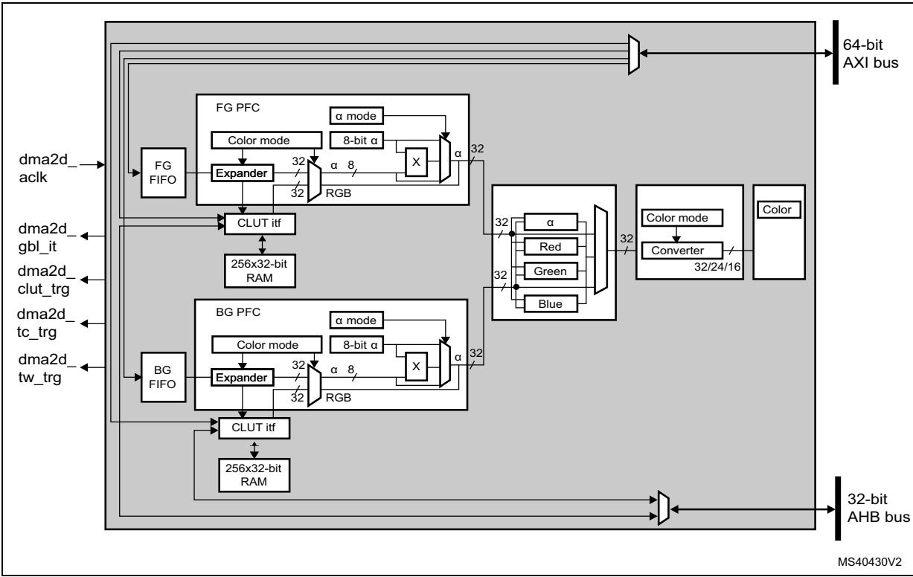
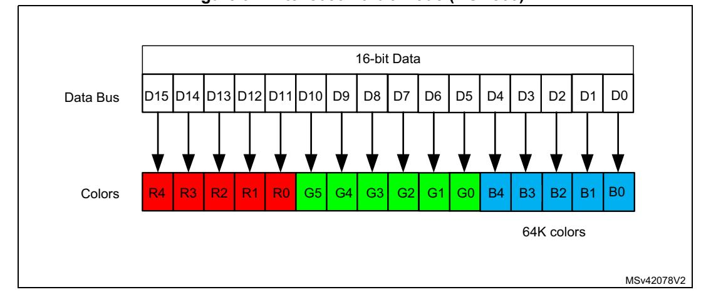
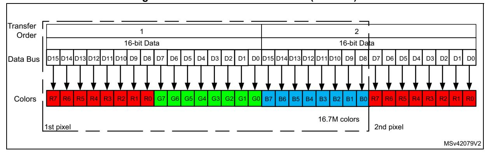

# **19 Chrom-ART Accelerator controller (DMA2D)**

# **19.1 DMA2D introduction**

The Chrom-ART Accelerator (DMA2D) is a specialized DMA dedicated to image manipulation. It can perform the following operations:

- Filling a part or the whole of a destination image with a specific color
- Copying a part or the whole of a source image into a part or the whole of a destination image
- Copying a part or the whole of a source image into a part or the whole of a destination image with a pixel format conversion
- Blending a part and/or two complete source images with different pixel format and copy the result into a part or the whole of a destination image with a different color format

All the classical color coding schemes are supported from 4-bit up to 32-bit per pixel with indexed or direct color mode, including block based YCbCr to handle JPEG decoder output. The DMA2D has its own dedicated memories for CLUTs (color look-up tables).

# **19.2 DMA2D main features**

The main DMA2D features are:

- Single AXI master bus architecture
- AHB slave programming interface supporting 8-,16-,32-bit accesses (except for CLUT accesses which are 32-bit)
- User-programmable working area size
- User-programmable offset for sources and destination areas expressed in pixels or bytes
- User-programmable sources and destination addresses on the whole memory space
- Up to two sources with blending operation
- Alpha value that can be modified (source value, fixed value, or modulated value)
- User programmable source and destination color format
- Up to 12 color formats supported from 4-bit up to 32-bit per pixel with indirect or direct color coding
- Block based (8x8) YCbCr support with 4:4:4, 4:2:2 and 4:2:0 chroma sub-sampling factors
- 2 internal memories for CLUT storage in indirect color mode
- Automatic CLUT loading or CLUT programming via the CPU
- User programmable CLUT size
- Internal timer to control AXI bandwidth
- 6 operating modes: register-to-memory, memory-to-memory, memory-to-memory with pixel format conversion, memory-to-memory with pixel format conversion and blending, memory-to memory with pixel format conversion, blending and fixed color foreground, and memory-to memory with pixel format conversion, blending and fixed color background.
- Area filling with a fixed color

- Copy from an area to another
- Copy with pixel format conversion between source and destination images
- Copy from two sources with independent color format and blending
- Output buffer byte swapping to support refresh of displays through parallel interface
- Abort and suspend of DMA2D operations
- Watermark interrupt on a user programmable destination line
- Interrupt generation on bus error or access conflict
- Interrupt generation on process completion

# **19.3 DMA2D functional description**

### **19.3.1 General description**

The DMA2D controller performs direct memory transfer. As an AXI master, it can take the control of the AXI bus matrix to initiate AXI transactions.

The DMA2D can operate in the following modes:

- Register-to-memory
- Memory-to-memory
- Memory-to-memory with pixel format conversion
- Memory-to-memory with pixel format conversion and blending
- Memory-to-memory with pixel format conversion, blending and fixed color foreground
- Memory-to-memory with pixel format conversion, blending and fixed color background

The AHB slave port is used to program the DMA2D controller.

The block diagram of the DMA2D is shown in *[Figure 93](#page-2-0)*.

**Figure 93. DMA2D block diagram** 

# **19.3.2 DMA2D internal signals**

The table below lists the DMA2D internal signals.

**Signal name Signal type Description** dma2d\_aclk Input 64-bit AXI bus clock dma2d\_gbl\_it Output DMA2D global interrupt dma2d\_clut\_trg Output CLUT transfer complete (to MDMA) dma2d\_tc\_trg Output Transfer complete (to MDMA) dma2d\_tw\_trg Output Transfer watermark (to MDMA)

**Table 136. DMA2D internal input/output signals** 

# **19.3.3 DMA2D control**

The DMA2D controller is configured through DMA2D\_CR. The user application can perform the following operations:

- Select the operating mode.
- Enable/disable the DMA2D interrupt.
- Start/suspend/abort ongoing data transfers.

# **19.3.4 DMA2D foreground and background FIFOs**

The DMA2D foreground (FG) FG FIFO and background (BG) FIFO fetch the input data to be copied and/or processed.

The FIFOs fetch the pixels according to the color format defined in their respective pixel format converter (PFC).

They are programmed through the following control registers:

- DMA2D foreground memory address register (DMA2D\_FGMAR)
- DMA2D foreground offset register (DMA2D\_FGOR)
- DMA2D background memory address register (DMA2D\_BGMAR)
- DMA2D background offset register (DMA2D\_BGBOR)
- DMA2D number of lines register (number of lines and pixel per lines) (DMA2D\_NLR)

When the DMA2D operates in register-to-memory mode, none of the FIFOs is activated.

When the DMA2D operates in memory-to-memory mode (no pixel format conversion nor blending operation), only the FG FIFO is activated, and acts as a buffer.

When the DMA2D operates in memory-to-memory operation with pixel format conversion (no blending operation), the BG FIFO is not activated.

### **19.3.5 DMA2D foreground and background PFC**

DMA2D foreground pixel format converter (PFC) and background pixel format converter perform the pixel format conversion to generate a 32-bit per pixel value. The PFC can also modify the alpha channel.

The first PFC stage converts the color format. The original color format of the foreground and background pixels are configured through CM[3:0] in DMA2D\_FGPFCCR and DMA2D\_BGPFCCR, respectively.

The supported input formats are given in the table below.

**Table 137. Supported color mode in input** 

| CM[3:0] | Color mode                  |  |  |
|---------|-----------------------------|--|--|
| 0000    | ARGB8888                    |  |  |
| 0001    | RGB888                      |  |  |
| 0010    | RGB565                      |  |  |
| 0011    | ARGB1555                    |  |  |
| 0100    | ARGB4444                    |  |  |
| 0101    | L8                          |  |  |
| 0110    | AL44                        |  |  |
| 0111    | AL88                        |  |  |
| 1000    | L4                          |  |  |
| 1001    | A8                          |  |  |
| 1010    | A4                          |  |  |
| 1011    | YCbCr (only for foreground) |  |  |

The color format are coded as follows:

- Alpha value field: transparency 0xFF value corresponds to an opaque pixel and 0x00 to a transparent one.
- R field for Red
- G field for Green
- B field for Blue
- L field: luminance

This field is the index to a CLUT to retrieve the three/four RGB/ARGB components.

If the original format was direct color mode (ARGB/RGB), the extension to 8-bit per channel is performed by copying the MSBs into the LSBs. This ensures a perfect linearity of the conversion.

If the original format does not include an alpha channel, the alpha value is automatically set to 0xFF (opaque).

If the original format is indirect color mode (L/AL), a CLUT is required, and each pixel format converter is associated with a 256 entry 32-bit CLUT.

For the specific alpha mode A4 and A8, no color information is stored nor indexed. The color to be used for the image generation is fixed and defined in DMA2D\_FGCOLR for foreground pixels, and in DMA2D\_BGCOLR for background pixels.

The order of the fields in the system memory is defined in the table below.

**Color mode @ + 3 @ + 2 @ + 1 @ + 0** ARGB8888 A0[7:0] R0[7:0] G0[7:0] B0[7:0] RGB888 B1[7:0] R0[7:0] G0[7:0] B0[7:0] G2[7:0] B2[7:0] R1[7:0] G1[7:0] R3[7:0] G3[7:0] B3[7:0] R2[7:0] RGB565 R1[4:0]G1[5:3] G1[2:0]B1[4:0] R0[4:0]G0[5:3] G0[2:0]B0[4:0] ARGB1555 A1[0]R1[4:0]G1[4:3] G1[2:0]B1[4:0] A0[0]R0[4:0]G0[4:3] G0[2:0]B0[4:0] ARGB4444 A1[3:0]R1[3:0] G1[3:0]B1[3:0] A0[3:0]R0[3:0] G0[3:0]B0[3:0] L8 L3[7:0] L2[7:0] L1[7:0] L0[7:0] AL44 A3[3:0]L3[3:0] A2[3:0]L2[3:0] A1[3:0]L1[3:0] A0[3:0]L0[3:0] AL88 A1[7:0] L1[7:0] A0[7:0] L0[7:0] L4 L7[3:0]L6[3:0] L5[3:0]L4[3:0] L3[3:0]L2[3:0] L1[3:0]L0[3:0] A8 A3[7:0] A2[7:0] A1[7:0] A0[7:0] A4 A7[3:0]A6[3:0] A5[3:0]A4[3:0] A3[3:0]A2[3:0] A1[3:0]A0[3:0]

**Table 138. Data order in memory** 

The 24-bit RGB888 aligned on 32-bit is supported through the ARGB8888 mode.

Once the 32-bit value is generated, the alpha channel can be modified according to AM[1:0] in DMA2D\_FGPFCCR or DMA2D\_BGPFCCR, as shown in *[Table 139](#page-5-0)*.

One of the following happens for the alpha channel:

- It is kept as it is (no modification).
- It is replaced by ALPHA[7:0] value i nDMA2D\_FGPFCCR/DMA2D\_BGPFCCR.
- It is replaced by the original alpha value multiplied by ALPHA[7:0] in DMA2D\_FGPFCCR/DMA2D\_BGPFCCR divided by 255.

**Table 139. Alpha mode configuration**

| AM[1:0] | Alpha mode                                                                |  |
|---------|---------------------------------------------------------------------------|--|
| 00      | No modification                                                           |  |
| 01      | Replaced by value in DMA2D_xxPFCCR                                        |  |
| 10      | Replaced by original value multiplied by the value in DMA2D_xxPFCCR / 255 |  |
| 11      | Reserved                                                                  |  |

*Note: To support the alternate format, the incoming alpha value can be inverted setting AI in DMA2D\_FGPFCCR or DMA2D\_BGPFCCR. This applies also to the Alpha value stored in the DMA2D\_FGPFCCR or DMA2D\_BGPFCCR, and in the CLUT.*

> *The R and B fields can also be swapped setting RBS in DMA2D\_FGPFCCR or DMA2D\_BGPFCCR. This applies also to the RGB order used in the CLUT, and in DMA2D\_FGCOLR or DMA2D\_BGCOLR.*

# **19.3.6 DMA2D foreground and background CLUT interface**

The CLUT interface manages the CLUT memory access and the automatic loading of the CLUT.

Three kinds of accesses are possible:

- CLUT read by the PFC during pixel format conversion operation
- CLUT accessed through the AHB slave port when the CPU is reading or writing data into the CLUT
- CLUT written through the AXI master port when an automatic loading of the CLUT is performed

The CLUT memory loading can be done in two different ways:

• Automatic loading

The following sequence must be followed to load the CLUT:

- a) Program the CLUT address into DMA2D\_FGCMAR (foreground CLUT) or DMA2D\_BGCMAR (background CLUT).
- b) Program the CLUT size with CS[7:0] field in DMA2D\_FGPFCCR (foreground CLUT), or DMA2D\_BGPFCCR (background CLUT).
- c) Set START in DMA2D\_FGPFCCR (foreground CLUT) or DMA2D\_BGPFCCR (background CLUT) to start the transfer. During this automatic loading process, the CLUT is not accessible by the CPU. If a conflict occurs, a CLUT access error interrupt is raised assuming CAEIE = 1 in DMA2D\_CR.
- Manual loading

The application has to program the CLUT manually through the DMA2D AHB slave port to which the local CLUT memory is mapped.The foreground CLUT (FGCLUT)

RM0399 Rev 4 759/3556

is located at address offset 0x0400 and the background CLUT (BGCLUT) at address offset 0x0800.

The CLUT format can be 24 or 32 bits. It is configured through CCM in DMA2D\_FGPFCCR (foreground CLUT) or DMA2D\_BGPFCCR (background CLUT) as shown in table below.

**Table 140. Supported CLUT color mode** 

| CCM | CLUT color mode |  |
|-----|-----------------|--|
| 0   | 32-bit ARGB8888 |  |
| 1   | 24-bit RGB888   |  |

The way the CLUT data are organized in the system memory is specified in the table below.

**Table 141. CLUT data order in memory** 

| CLUT Color mode | @ + 3   | @ + 2   | @ + 1   | @ + 0   |
|-----------------|---------|---------|---------|---------|
| ARGB8888        | A0[7:0] | R0[7:0] | G0[7:0] | B0[7:0] |
| RGB888          | B1[7:0] | R0[7:0] | G0[7:0] | B0[7:0] |
|                 | G2[7:0] | B2[7:0] | R1[7:0] | G1[7:0] |
|                 | R3[7:0] | G3[7:0] | B3[7:0] | R2[7:0] |

### **19.3.7 DMA2D blender**

The DMA2D blender blends the source pixels by pair to compute the resulting pixel.

The blending is performed according to the following equation:

with 
$$\alpha_{\text{Mult}} = \frac{\alpha_{\text{FG}} \cdot \alpha_{\text{BG}}}{255}$$

$$\alpha_{OUT} = \alpha_{FG} + \alpha_{BG} - \alpha_{Mult}$$

$$C_{OUT} = \frac{C_{FG}.\alpha_{FG} + C_{BG}.\alpha_{BG} - C_{BG}.\alpha_{Mult}}{\alpha_{OUT}} \qquad \text{with C = R or G or B}$$

*Division is rounded to the nearest lower integer*

No configuration register is required by the blender. The blender use depends on the DMA2D operating mode defined by MODE[2:0] in DMA2D\_CR.

### **19.3.8 DMA2D output PFC**

The output PFC performs the pixel format conversion from 32 bits to the output format defined by CM[2:0] in DMA2D\_OPFCCR.

Supported output formats are given in the table below

**Table 142. Supported color mode in output** 

| CM[2:0] | Color mode |
|---------|------------|
| 000     | ARGB8888   |
| 001     | RGB888     |
| 010     | RGB565     |
| 011     | ARGB1555   |
| 100     | ARGB4444   |

*Note: To support the alternate format, the calculated alpha value can be inverted setting AI bit in DMA2D\_OPFCCR. This applies also to the Alpha value used in DMA2D\_OCOLR.*

> *The R and B fields can also be swapped setting RBS in DMA2D\_OPFCCR. This applies also to the RGB order used in DMA2D\_OCOLR.*

# **19.3.9 DMA2D output FIFO**

The output FIFO programs the pixels according to the color format defined in the output PFC.

The destination area is defined through the following registers:

- DMA2D output memory address register (DMA2D\_OMAR)
- DMA2D output offset register (DMA2D\_OOR**)**
- DMA2D number of lines register (number of lines and pixel per lines) (DMA2D\_NLR**)**

If the DMA2D operates in register-to-memory mode, the configured output rectangle is filled by the color specified in DMA2D\_OCOLR which contains a fixed 32-, 24-, or 16-bit value. The format is selected by CM[2:0] in DMA2D\_OPFCCR.

The data are stored into the memory in the order defined in the table below.

**Table 143. Data order in memory** 

| Color mode | @ + 3               | @ + 2          | @ + 1               | @ + 0          |
|------------|---------------------|----------------|---------------------|----------------|
| ARGB8888   | A0[7:0]             | R0[7:0]        | G0[7:0]             | B0[7:0]        |
| RGB888     | B1[7:0]             | R0[7:0]        | G0[7:0]             | B0[7:0]        |
|            | G2[7:0]             | B2[7:0]        | R1[7:0]             | G1[7:0]        |
|            | R3[7:0]             | G3[7:0]        | B3[7:0]             | R2[7:0]        |
| RGB565     | R1[4:0]G1[5:3]      | G1[2:0]B1[4:0] | R0[4:0]G0[5:3]      | G0[2:0]B0[4:0] |
| ARGB1555   | A1[0]R1[4:0]G1[4:3] | G1[2:0]B1[4:0] | A0[0]R0[4:0]G0[4:3] | G0[2:0]B0[4:0] |
| ARGB4444   | A1[3:0]R1[3:0]      | G1[3:0]B1[3:0] | A0[3:0]R0[3:0]      | G0[3:0]B0[3:0] |

The RGB888 aligned on 32 bits is supported through the ARGB8888 mode.

# **19.3.10 DMA2D output FIFO byte reordering**

The output FIFO bytes can be reordered to support display frame buffer update through a parallel interface (F(S)MC) directly from the DMA2D.

The reordering of bytes can be done using:

- RBS bit to swap red and blue component
- SB bit to swap byte two by two in the output FIFO

When the byte swapping is activated (SB = 1 in DMA2D\_OPFCR), the number of pixel per line (PL field in DMA2D\_NLR) must be even, and the output memory address (MA field in DMA2D\_OMAR) must be even. The output line offset computed in bytes (resulting from LOM field in DMA2D\_CR and LO field in DMA2D\_OOR values) must also be even. If not a configuration error is detected.

| Color Mode | @ + 3          | @ + 2          | @ + 1          | @ + 0          |
|------------|----------------|----------------|----------------|----------------|
|            | B1[7:0]        | R0[7:0]        | G0[7:0]        | B0[7:0]        |
| RGB888     | G2[7:0]        | B2[7:0]        | R1[7:0]        | G1[7:0]        |
|            | R3[7:0]        | G3[7:0]        | B3[7:0]        | R2[7:0]        |
| RGB565     | R1[4:0]G1[5:3] | G1[2:0]B1[4:0] | R0[4:0]G0[5:3] | G0[2:0]B0[4:0] |

**Table 144. Standard data order in memory** 

### **16-bit mode (RGB565)**

This mode is supported without byte reordering by the DMA2D.

**Figure 94. Intel 8080 16-bit mode (RGB565)**

### **18/24-bit mode (RGB888)**

This mode needs data reordering:

- 1. The red and the blue have to be swapped (setting the RBS bit).
- 2. MSB and the LSB bytes of an half-word must be swapped (setting SB bit).

Figure 95. Intel 8080 18/24-bit mode (RGB888)

Table 145. Output FIFO byte reordering steps

| Steps                                           | @+3                  | @+2                  | @+1                  | @+0                  |
|-------------------------------------------------|----------------------|----------------------|----------------------|----------------------|
|                                                 | B 1 [7:0] | R 0 [7:0] | G 0 [7:0] | B 0 [7:0] |
| Original data ordering                          | G 2 [7:0] | B 2 [7:0] | R 1 [7:0] | G 1 [7:0] |
|                                                 | R 3 [7:0] | G 3 [7:0] | B 3 [7:0] | R 2 [7:0] |
|                                                 | Setting t            | he RBS bit           |                      |                      |
|                                                 | R 1 [7:0] | B 0 [7:0] | G 0 [7:0] | R 0 [7:0] |
| Data ordering after Red and Blue swap (RBS set) | G 2 [7:0] | R 2 [7:0] | B 1 [7:0] | G 1 [7:0] |
|                                                 | B 3 [7:0] | G 3 [7:0] | R 3 [7:0] | B 2 [7:0] |
|                                                 | Setting              | the SB bit           |                      |                      |
|                                                 | B 0 [7:0] | R 1 [7:0] | R 0 [7:0] | G 0 [7:0] |
| Data ordering after byte swapping (SB set)      | R 2 [7:0] | G 2 [7:0] | G 1 [7:0] | B 1 [7:0] |
| (= 234)                                         | G 3 [7:0] | B 3 [7:0] | B 2 [7:0] | R 3 [7:0] |

# 19.3.11 DMA2D AXI master port timer

An 8-bit timer is embedded into the AXI master port to provide an optional limitation of the bandwidth on the crossbar. This timer is clocked by the AXI clock and counts a dead time between two consecutive accesses. This limits the bandwidth usage.

The timer enabling and dead time value are configured through DMA2D AMPTCR.

### 19.3.12 DMA2D transactions

DMA2D transactions consist of a sequence of a given number of data transfers. Number of data and width can be programmed by software.

Each DMA2D data transfer is composed of up to four steps:

- 1. Data loading from the memory location pointed by DMA2D\_FGMAR and pixel format conversion as defined in DMA2D\_FGCR
- 2. Data loading from a memory location pointed by DMA2D\_BGMAR and pixel format conversion as defined in DMA2D\_BGCR

4

- 3. Blending of all retrieved pixels according to the alpha channels resulting of PFC operation on alpha values
- 4. Pixel format conversion of resulting pixels according to DMA2D\_OCR and programming of data to the memory location addressed through DMA2D\_OMAR

### **19.3.13 DMA2D configuration**

Both source and destination data transfers can target peripherals and memories in the whole 4-Gbyte memory area, at addresses ranging between 0x0000 0000 and 0xFFFF FFFF.

The DMA2D can operate in any of the following modes selected through MODE[2:0] in DMA2D\_CR:

- Register-to-memory
- Memory-to-memory
- Memory-to-memory with PFC
- Memory-to-memory with PFC and blending
- Memory-to-memory with PFC, blending and fixed FG color
- Memory-to-memory with PFC, blending and fixed BG color

## **Register-to-memory**

The register-to-memory mode is used to fill a user defined area with a predefined color. The color format is set in DMA2D\_OPFCCR.

The DMA2D does not perform any data fetching from any source. It just writes the color defined in DMA2D\_OCOLR to the area located at the address pointed by DMA2D\_OMAR and defined in DMA2D\_NLR and DMA2D\_OOR.

### **Memory-to-memory**

In memory-to-memory mode, the DMA2D does not perform any graphical data transformation. The foreground input FIFO acts as a buffer, and data are transferred from the source memory location defined in DMA2D\_FGMAR, to the destination memory location pointed by DMA2D\_OMAR.

The color mode programmed by CM[3:0] in DMA2D\_FGPFCCR defines the number of bits per pixel for both input and output.

The size of the area to be transferred is defined by DMA2D\_NLR and DMA2D\_FGOR for the source, and by DMA2D\_NLR and DMA2D\_OOR for the destination.

### **Memory-to-memory with PFC**

In this mode, the DMA2D performs a pixel format conversion of the source data, and stores them in the destination memory location.

The size of the areas to be transferred are defined by DMA2D\_NLR and DMA2D\_FGOR for the source, and by DMA2D\_NLR and DMA2D\_OOR for the destination.

Data are fetched from the location defined in DMA2D\_FGMAR, and processed by the foreground PFC. The original pixel format is configured through DMA2D\_FGPFCCR.

If the original pixel format is direct-color mode, the color channels are all expanded to 8 bits.

If the pixel format is indirect color mode, the associated CLUT has to be loaded into the CLUT memory.

The CLUT loading can be done automatically by following the sequence below:

- 1. Set the CLUT address into DMA2D\_FGCMAR.
- 2. Set the CLUT size with CS[7:0] in DMA2D\_FGPFCCR.
- 3. Set the CLUT format (24 or 32 bits) with CCM in DMA2D\_FGPFCCR.
- 4. Start the CLUT loading by setting START in DMA2D\_FGPFCCR.

Once the CLUT loading is complete, CTCIF flag in DMA2D\_IFR is raised, and an interrupt is generated if CTCIE is set in DMA2D\_CR. The automatic CLUT loading process cannot work in parallel with classical DMA2D transfers.

The CLUT can also be filled by the CPU or by any other master through the AHB port. The access to the CLUT is not possible when a DMA2D transfer is ongoing, and uses the CLUT (indirect color format).

In parallel to the color conversion process, the alpha value can be added or changed depending on the value programmed in DMA2D\_FGPFCCR. If the original image does not have an alpha channel, a default alpha value of 0xFF is automatically added to obtain a fully opaque pixel.

The alpha value is modified as follows according to AM[1:0] in DMA2D\_FGPFCCR:

- It is unchanged.
- It is replaced by ALPHA[7:0] value in DMA2D\_FGPFCCR.
- It is replaced by the original value multiplied by ALPHA[7:0] value in DMA2D\_FGPFCCR divided by 255.

The resulting 32-bit data are encoded by the output PFC into the format specified by CM[2:0] in DMA2D\_OPFCCR. The output pixel format cannot be the indirect mode since no CLUT generation process is supported.

Processed data are written into destination memory location pointed by DMA2D\_OMAR.

### **Memory-to-memory with PFC and blending**

In this mode, two sources are fetched in the foreground and background FIFOs from the memory locations defined by DMA2D\_FGMAR and DMA2D\_BGMAR respectively.

The two pixel format converters have to be configured as described in memory-to-memory mode. Their configurations can be different as each pixel format converter is independent and has its own CLUT memory.

RM0399 Rev 4 765/3556

Once each pixel has been converted into 32 bits by its respective PFC, all pixels are blended according to the equation below:

with 
$$\alpha_{Mult} = \frac{\alpha_{FG} \cdot \alpha_{BG}}{255}$$

$$\alpha_{OUT} = \alpha_{FG} + \alpha_{BG} - \alpha_{Mult}$$

$$C_{OUT} = \frac{C_{FG} \cdot \alpha_{FG} + C_{BG} \cdot \alpha_{BG} - C_{BG} \cdot \alpha_{Mult}}{\alpha_{OUT}}$$
 with C = R or G or B

*Division are rounded to the nearest lower integer*

The resulting 32-bit pixel value is encoded by the output PFC according to the specified output format, and data are written into the destination memory location pointed by DMA2D\_OMAR.

### **Memory-to-memory with PFC, blending and fixed color FG**

In this mode, only one source is fetched in the background FIFO from the memory location defined by DMA2D\_BGMAR.

The value of the foreground color is given by DMA2D\_FGCOLR, and the alpha value is set to 0xFF (opaque).

The alpha value can be replaced or modified according to AM[1:0] and ALPHA[7:0] in DMA2D\_FGPFCCR.

The two pixel format converters have to be configured as described in memory-to-memory mode. Their configurations can be different as each pixel format converter is independent and has its own CLUT memory

Once each pixel has been converted into 32 bits by its respective PFC, all pixels are blended together. The resulting 32-bit pixel value is encoded by the output PFC according to the specified output format. Data are written into the destination memory location pointed by DMA2D\_OMAR.

### **Memory-to-memory with PFC, blending and fixed color BG**

In this mode, only open source is fetched in the foreground FIFO from the memory location defined by DMA2D\_FGMAR.

The value of the background color is given by DMA2D\_BGCOLR, and the alpha value is set to 0xFF (opaque).

The alpha value can be replaced or modified according to AM[1:0] and ALPHA[7:0] in DMA2D\_BGPFCCR.

The two pixel format converters have to be configured as described in memory-to-memory mode. Their configurations can be different as each pixel format converter is independent and has its own CLUT memory

Once each pixel has been converted into 32 bits by their respective PFCs, all pixels are blended together. The resulting 32-bit pixel value is encoded by the output PFC according to the specified output format. Data are written into the destination memory location pointed by DMA2D\_OMAR.

### **Configuration error detection**

The DMA2D checks that the configuration is correct before any transfer. The configuration error interrupt flag is set by hardware when a wrong configuration is detected when a new transfer/automatic loading starts. An interrupt is then generated if CEIE = 1 in DMA2D\_CR.

The wrong configurations that can be detected are listed below:

- Foreground CLUT automatic loading: MA bits in DMA2D\_FGCMAR are not aligned with CCM in DMA2D\_FGPFCCR.
- Background CLUT automatic loading: MA bits in DMA2D\_BGCMAR are not aligned with CCM in DMA2D\_BGPFCCR.
- Memory transfer (except in register-to-memory and memory-to-memory with blending and fixed color FG): MA bits in DMA2D\_FGMAR are not aligned with CM in DMA2D\_FGPFCCR.
- Memory transfer (except in register-to-memory and memory-to-memory with blending and fixed color FG): CM bits in DMA2D\_FGPFCCR are invalid.
- Memory transfer (except in register-to-memory and memory-to-memory with blending and fixed color FG): PL bits in DMA2D\_NLR are odd while CM is DMA2D\_FGPFCCR is A4 or L4.
- Memory transfer (except in register-to-memory and memory-to-memory with blending and fixed color FG): LO bits in DMA2D\_FGOR are odd while CM in DMA2D\_FGPFCCR is A4 or L4, and LOM in DMA2D\_CR is pixel mode.
- Memory transfer (only in blending mode, except in memory-to-memory with blending and fixed color FG): MA bits in DMA2D\_BGMAR are not aligned with the CM in DMA2D\_BGPFCCR
- Memory transfer (only in blending and blending with fixed color FG): CM bits in DMA2D\_BGPFCCR are invalid.
- Memory transfer (only in blending and blending with fixed color FG mode): PL bits in DMA2D\_NLR odd while CM inDMA2D\_BGPFCCR is A4 or L4.
- Memory transfer (only in blending and blending with fixed color FG): LO bits in DMA2D\_BGOR are odd while CM inDMA2D\_BGPFCCR is A4 or L4, and LOM in DMA2D\_CR is pixel mode.
- Memory transfer (except in memory-to-memory): MA bits in DMA2D\_OMAR are not aligned with CM in DMA2D\_OPFCCR.
- Memory transfer (except in memory-to-memory): CM bits in DMA2D\_OPFCCR are invalid.
- Memory transfer with byte swapping: PL bits in DMA2D\_NLR are odd, or MA bits in DMA2D\_OMAR are odd, or LO in bytes (resulting from LOM in DMA2D\_CR and LO in DMA2D\_OOR) are odd while SB = 1 in DMA2D\_OPFCCR.
- Memory transfer: NL bits in DMA2D\_NLR are all zeros.
- Memory transfer: PL bits in DMA2D\_NLR are all zeros.
- Memory transfer: MODE bits in DMA2D\_CR are invalid.
- YCbCr format: when a CLUT loading starts setting START in DMA2D\_FGPFCCR
- YCbCr format: when memory-to-memory mode is selected
- YCbCr format: when YCbCR4:4:4 is selected, and the sum of number of pixel (PL) and line offset LO is not a multiple of 8 pixels
- YCbCr format: when YCbCr4:2:2 or YCbCr4:2:0 is selected, and the sum of number of pixel (PL) and line offset LO is not a multiple of 16 pixels

RM0399 Rev 4 767/3556

# **19.3.14 YCbCr support**

The DMA2D foreground plane can support 8x8 block-based YCbCr as output by the JPEG decoder with different chroma subsampling factors.

The memory organization follows the standard JFIF rules:

- Each of the three color components must be coded on 8-bit.
- Each component must be arranged by blocks of 8x8 (64 bytes) called MCU.

Depending of the chroma subsampling factor, the MCU must be arranged in the memory as described in the table below.

| Sub-sampling | @  | @ + 64 | @ + 128 | @+192 | @+256  | @ + 320 |
|--------------|----|--------|---------|-------|--------|---------|
| 4:4:4        | Y1 | Cb1    | Cr1     | Y2    | Cb2    | Cr2     |
| 4:2:2        | Y1 | Y2     | Cb12    | Cr12  | Y3     | Y4      |
| 4:2:0        | Y1 | Y2     | Y3      | Y4    | Cb1234 | Cr1234  |

**Table 146. MCU order in memory** 

The chroma subsampling factor is configured through CSS in DMA2D\_FGPFCCR.

Once the DMA2D has started with the foreground configured in YCbCr color mode, the first two chroma MCUs are loaded in the foreground CLUT. Once the chroma MCUs are loaded, the DMA2D performs the loading of the Y MCU as for a classical color mode.

# **19.3.15 DMA2D transfer control (start, suspend, abort, and completion)**

Once the DMA2D is configured, the transfer can be launched by setting START in DMA2D\_CR. Once the transfer is completed, START is automatically reset, and TCIF flag is raised in DMA2D\_ISR. An interrupt can be generated if TCIE is set in DMA2D\_CR.

The user application can suspend the DMA2D at any time by setting SUSP in DMA2D\_CR. The transaction can be aborted by setting ABORT i nDMA2D\_CR, or can be restarted by resetting SUSP in DMA2D\_CR.

The user application can abort at any time an ongoing transaction by setting ABORT in DMA2D\_CR. In this case, the TCIF flag is not raised.

Automatic CLUT transfers can also be aborted or suspended by using their own START bits in DMA2D\_FGPFCCR and DMA2D\_BGPFCCR.

### **19.3.16 Watermark**

A watermark can be programmed to generate an interrupt when the last pixel of a given line has been written to the destination memory area.

The line number is defined in LW[15:0] in DMA2D\_LWR.

When the last pixel of this line has been transferred, TWIF flag is raised in DMA2D\_ISR, and an interrupt is generated if TWIE is set in DMA2D\_CR.

### **19.3.17 Error management**

Two kind of errors can be triggered:

• AXI master port errors signaled by TEIF flag in DMA2D\_ISR

• Conflicts caused by CLUT access (CPU trying to access the CLUT while a CLUT loading or a DMA2D transfer is ongoing) signaled by CAEIF flag in DMA2D\_ISR

Both flags are associated to their own interrupt enable flag in DMA2D\_CR to generate an interrupt if need be (TEIE and CAEIE).

### **19.3.18 AXI dead time**

To limit the AXI bandwidth use, a dead time between two consecutive AXI accesses can be programmed. This feature can be enabled by setting EN in DMA2D\_AMTCR.

The dead-time value is stored in DT[7:0] in DMA2D\_AMTCR. This value represents the guaranteed minimum number of cycles between two consecutive transactions on AXI bus.

The update of the dead-time value while the DMA2D is running is taken into account for the next AXI transfer.

# **19.4 DMA2D interrupts**

An interrupt can be generated on the following events:

- Configuration error
- CLUT transfer complete
- CLUT access error
- Transfer watermark reached
- Transfer complete
- Transfer error

Separate interrupt enable bits are available for flexibility.

**Table 147. DMA2D interrupt requests** 

| Interrupt event        | Event flag | Enable control bit |
|------------------------|------------|--------------------|
| Configuration error    | CEIF       | CEIE               |
| CLUT transfer complete | CTCIF      | CTCIE              |
| CLUT access error      | CAEIF      | CAEIE              |
| Transfer watermark     | TWF        | TWIE               |
| Transfer complete      | TCIF       | TCIE               |
| Transfer error         | TEIF       | TEIE               |

# **19.5 DMA2D registers**

# **19.5.1 DMA2D control register (DMA2D\_CR)**

Address offset: 0x000

Reset value: 0x0000 0000

| 31   | 30   | 29   | 28    | 27    | 26   | 25   | 24   | 23   | 22   | 21   | 20   | 19   | 18    | 17        | 16    |
|------|------|------|-------|-------|------|------|------|------|------|------|------|------|-------|-----------|-------|
| Res. | Res. | Res. | Res.  | Res.  | Res. | Res. | Res. | Res. | Res. | Res. | Res. | Res. |       | MODE[2:0] |       |
|      |      |      |       |       |      |      |      |      |      |      |      |      | rw    | rw        | rw    |
|      |      |      |       |       |      |      |      |      |      |      |      |      |       |           |       |
| 15   | 14   | 13   | 12    | 11    | 10   | 9    | 8    | 7    | 6    | 5    | 4    | 3    | 2     | 1         | 0     |
| Res. | Res. | CEIE | CTCIE | CAEIE | TWIE | TCIE | TEIE | Res. | LOM  | Res. | Res. | Res. | ABORT | SUSP      | START |

Bits 31:19 Reserved, must be kept at reset value.

### Bits 18:16 **MODE[2:0]**: DMA2D mode

This bit is set and cleared by software. It cannot be modified while a transfer is ongoing.

000: Memory-to-memory (FG fetch only)

001: Memory-to-memory with PFC (FG fetch only with FG PFC active)

010: Memory-to-memory with blending (FG and BG fetch with PFC and blending)

011: Register-to-memory (no FG nor BG, only output stage active)

100: Memory-to-memory with blending and fixed color FG (BG fetch only with FG and BG PFC active)

101: Memory-to-memory with blending and fixed color BG (FG fetch only with FG and BG PFC active)

Others: Reserved

#### Bits 15:14 Reserved, must be kept at reset value.

Bit 13 **CEIE**: Configuration error (CE) interrupt enable

This bit is set and cleared by software.

0: CE interrupt disabled

1: CE interrupt enabled

Bit 12 **CTCIE**: CLUT transfer complete (CTC) interrupt enable

This bit is set and cleared by software.

0: CTC interrupt disabled

1: CTC interrupt enabled

Bit 11 **CAEIE**: CLUT access error (CAE) interrupt enable

This bit is set and cleared by software.

0: CAE interrupt disabled

1: CAE interrupt enabled

Bit 10 **TWIE**: Transfer watermark (TW) interrupt enable

This bit is set and cleared by software.

0: TW interrupt disabled

1: TW interrupt enabled

Bit 9 **TCIE**: Transfer complete (TC) interrupt enable

This bit is set and cleared by software.

0: TC interrupt disabled

1: TC interrupt enabled

### Bit 8 **TEIE**: Transfer error (TE) interrupt enable

This bit is set and cleared by software.

0: TE interrupt disabled

1: TE interrupt enabled

#### Bit 7 Reserved, must be kept at reset value.

### Bit 6 **LOM**: Line offset mode

This bit configures how the line offset is expressed (pixels or bytes) for the foreground, background and output.

This bit is set and cleared by software. It can not be modified while a transfer is ongoing.

0: Line offsets expressed in pixels

1: Line offsets expressed in bytes

### Bits 5:3 Reserved, must be kept at reset value.

### Bit 2 **ABORT**: Abort

This bit can be used to abort the current transfer. This bit is set by software, and is automatically reset by hardware when START = 0.

0: No transfer abort requested

1: Transfer abort requested

### Bit 1 **SUSP**: Suspend

This bit can be used to suspend the current transfer. This bit is set and reset by software. It is automatically reset by hardware when START = 0.

0: Transfer not suspended

1: Transfer suspended

#### Bit 0 **START**: Start

This bit can be used to launch the DMA2D according to parameters loaded in the various configuration registers. This bit is automatically reset by the following events:

- at the end of the transfer
- when the data transfer is aborted by the user by setting ABORT in this register
- when a data transfer error occurs
- when the data transfer has not started due to a configuration error, or another transfer operation already ongoing (automatic CLUT loading)

# **19.5.2 DMA2D interrupt status register (DMA2D\_ISR)**

Address offset: 0x004

Reset value: 0x0000 0000

| 31   | 30   | 29   | 28   | 27   | 26   | 25   | 24   | 23   | 22   | 21   | 20    | 19    | 18   | 17   | 16   |
|------|------|------|------|------|------|------|------|------|------|------|-------|-------|------|------|------|
| Res. | Res. | Res. | Res. | Res. | Res. | Res. | Res. | Res. | Res. | Res. | Res.  | Res.  | Res. | Res. | Res. |
|      |      |      |      |      |      |      |      |      |      |      |       |       |      |      |      |
|      |      |      |      |      |      |      |      |      |      |      |       |       |      |      |      |
| 15   | 14   | 13   | 12   | 11   | 10   | 9    | 8    | 7    | 6    | 5    | 4     | 3     | 2    | 1    | 0    |
| Res. | Res. | Res. | Res. | Res. | Res. | Res. | Res. | Res. | Res. | CEIF | CTCIF | CAEIF | TWIF | TCIF | TEIF |

RM0399 Rev 4 771/3556

Bits 31:6 Reserved, must be kept at reset value.

Bit 5 **CEIF**: Configuration error interrupt flag

This bit is set when START is set in DMA2D\_CR, DMA2DFGPFCCR or DMA2D\_BGPFCCR, and a wrong configuration has been programmed.

Bit 4 **CTCIF**: CLUT transfer complete interrupt flag

This bit is set when the CLUT copy from a system memory area to the internal DMA2D memory is complete.

Bit 3 **CAEIF**: CLUT access error interrupt flag

This bit is set when the CPU accesses the CLUT while the CLUT is being automatically copied from a system memory to the internal DMA2D.

Bit 2 **TWIF**: Transfer watermark interrupt flag

This bit is set when the last pixel of the watermarked line has been transferred.

Bit 1 **TCIF**: Transfer complete interrupt flag

This bit is set when a DMA2D transfer operation is complete (data transfer only).

Bit 0 **TEIF**: Transfer error interrupt flag

This bit is set when an error occurs during a DMA transfer (data transfer or automatic CLUT loading).

# **19.5.3 DMA2D interrupt flag clear register (DMA2D\_IFCR)**

Address offset: 0x008

Reset value: 0x0000 0000

| 31   | 30   | 29   | 28   | 27   | 26   | 25   | 24   | 23   | 22   | 21    | 20         | 19         | 18    | 17    | 16    |
|------|------|------|------|------|------|------|------|------|------|-------|------------|------------|-------|-------|-------|
| Res. | Res. | Res. | Res. | Res. | Res. | Res. | Res. | Res. | Res. | Res.  | Res.       | Res.       | Res.  | Res.  | Res.  |
|      |      |      |      |      |      |      |      |      |      |       |            |            |       |       |       |
| 15   | 14   | 13   | 12   | 11   | 10   | 9    | 8    | 7    | 6    | 5     | 4          | 3          | 2     | 1     | 0     |
| Res. | Res. | Res. | Res. | Res. | Res. | Res. | Res. | Res. | Res. | CCEIF | CCTCI F | CAECI F | CTWIF | CTCIF | CTEIF |
|      |      |      |      |      |      |      |      |      |      | rc_w1 | rc_w1      | rc_w1      | rc_w1 | rc_w1 | rc_w1 |

Bits 31:6 Reserved, must be kept at reset value.

Bit 5 **CCEIF**: Clear configuration error interrupt flag

Programming this bit to 1 clears the CEIF flag in DMA2D\_ISR.

Bit 4 **CCTCIF**: Clear CLUT transfer complete interrupt flag

Programming this bit to 1 clears the CTCIF flag in DMA2D\_ISR.

Bit 3 **CAECIF**: Clear CLUT access error interrupt flag

Programming this bit to 1 clears the CAEIF flag in DMA2D\_ISR.

Bit 2 **CTWIF**: Clear transfer watermark interrupt flag

Programming this bit to 1 clears the TWIF flag in DMA2D\_ISR.

Bit 1 **CTCIF**: Clear transfer complete interrupt flag

Programming this bit to 1 clears the TCIF flag in DMA2D\_ISR.

Bit 0 **CTEIF**: Clear transfer error interrupt flag

Programming this bit to 1 clears the TEIF flag in DMA2D\_ISR.

# **19.5.4 DMA2D foreground memory address register (DMA2D\_FGMAR)**

Address offset: 0x00C

Reset value: 0x0000 0000

This register can only be written when data transfers are disabled. Once the data transfer

started, this register is read-only.

| 31 | 30        | 29 | 28 | 27 | 26 | 25 | 24 | 23       | 22 | 21 | 20 | 19 | 18 | 17 | 16 |
|----|-----------|----|----|----|----|----|----|----------|----|----|----|----|----|----|----|
|    | MA[31:16] |    |    |    |    |    |    |          |    |    |    |    |    |    |    |
| rw | rw        | rw | rw | rw | rw | rw | rw | rw       | rw | rw | rw | rw | rw | rw | rw |
| 15 | 14        | 13 | 12 | 11 | 10 | 9  | 8  | 7        | 6  | 5  | 4  | 3  | 2  | 1  | 0  |
|    |           |    |    |    |    |    |    | MA[15:0] |    |    |    |    |    |    |    |
| rw | rw        | rw | rw | rw | rw | rw | rw | rw       | rw | rw | rw | rw | rw | rw | rw |

Bits 31:0 **MA[31:0]**: Memory address, address of the data used for the foreground image

The address alignment must match the image format selected: a 32-bit per pixel format must be 32-bit aligned, a 16-bit per pixel format must be 16-bit aligned, and a 4-bit per pixel format must be 8-bit aligned.

# **19.5.5 DMA2D foreground offset register (DMA2D\_FGOR)**

Address offset: 0x010

Reset value: 0x0000 0000

This register can only be written when data transfers are disabled. Once the data transfer started, this register is read-only.

| 31   | 30   | 29   | 28   | 27   | 26   | 25   | 24   | 23       | 22   | 21   | 20   | 19   | 18   | 17   | 16   |
|------|------|------|------|------|------|------|------|----------|------|------|------|------|------|------|------|
| Res. | Res. | Res. | Res. | Res. | Res. | Res. | Res. | Res.     | Res. | Res. | Res. | Res. | Res. | Res. | Res. |
|      |      |      |      |      |      |      |      |          |      |      |      |      |      |      |      |
|      |      |      |      |      |      |      |      |          |      |      |      |      |      |      |      |
| 15   | 14   | 13   | 12   | 11   | 10   | 9    | 8    | 7        | 6    | 5    | 4    | 3    | 2    | 1    | 0    |
|      |      |      |      |      |      |      |      | LO[15:0] |      |      |      |      |      |      |      |

Bits 31:16 Reserved, must be kept at reset value.

Bits 15:0 **LO[15:0]**: Line offset

This field gives the line offset used for the foreground image, expressed:

- in pixels when LOM = 0 in DMA2D\_CR. Only LO[13:0] bits are considered, LO[15:14] bits are ignored.
- in bytes when LOM = 1

This value is used for the address generation. It is added at the end of each line to determine the starting address of the next line.

If the image format is 4-bit per pixel, the line offset must be even.

RM0399 Rev 4 773/3556

# **19.5.6 DMA2D background memory address register (DMA2D\_BGMAR)**

Address offset: 0x014

Reset value: 0x0000 0000

This register can only be written when data transfers are disabled. Once the data transfer

started, this register is read-only.

| 31 | 30        | 29 | 28 | 27 | 26 | 25 | 24 | 23       | 22 | 21 | 20 | 19 | 18 | 17 | 16 |
|----|-----------|----|----|----|----|----|----|----------|----|----|----|----|----|----|----|
|    | MA[31:16] |    |    |    |    |    |    |          |    |    |    |    |    |    |    |
| rw | rw        | rw | rw | rw | rw | rw | rw | rw       | rw | rw | rw | rw | rw | rw | rw |
| 15 | 14        | 13 | 12 | 11 | 10 | 9  | 8  | 7        | 6  | 5  | 4  | 3  | 2  | 1  | 0  |
|    |           |    |    |    |    |    |    | MA[15:0] |    |    |    |    |    |    |    |
| rw | rw        | rw | rw | rw | rw | rw | rw | rw       | rw | rw | rw | rw | rw | rw | rw |

Bits 31:0 **MA[31:0]**: Memory address, address of the data used for the background image

The address alignment must match the image format selected: a 32-bit per pixel format must be 32-bit aligned, a 16-bit per pixel format must be 16-bit aligned and a 4-bit per pixel format must be 8-bit aligned.

# **19.5.7 DMA2D background offset register (DMA2D\_BGOR)**

Address offset: 0x018

Reset value: 0x0000 0000

This register can only be written when data transfers are disabled. Once the data transfer started, this register is read-only.

| 31   | 30   | 29   | 28   | 27   | 26   | 25   | 24   | 23       | 22   | 21   | 20   | 19   | 18   | 17   | 16   |
|------|------|------|------|------|------|------|------|----------|------|------|------|------|------|------|------|
| Res. | Res. | Res. | Res. | Res. | Res. | Res. | Res. | Res.     | Res. | Res. | Res. | Res. | Res. | Res. | Res. |
|      |      |      |      |      |      |      |      |          |      |      |      |      |      |      |      |
|      |      |      |      |      |      |      |      |          |      |      |      |      |      |      |      |
| 15   | 14   | 13   | 12   | 11   | 10   | 9    | 8    | 7        | 6    | 5    | 4    | 3    | 2    | 1    | 0    |
|      |      |      |      |      |      |      |      | LO[15:0] |      |      |      |      |      |      |      |

Bits 31:16 Reserved, must be kept at reset value.

Bits 15:0 **LO[15:0]**: Line offset

This field gives the line offset used for the background image, expressed:

- in pixels when LOM = 0 in DMA2D\_CR. Only LO[13:0] bits are considered, LO[15:14] bits are ignored.
- in bytes when LOM = 1

This value is used for the address generation. It is added at the end of each line to determine the starting address of the next line.

If the image format is 4-bit per pixel, the line offset must be even.

# **19.5.8 DMA2D foreground PFC control register (DMA2D\_FGPFCCR)**

Address offset: 0x01C

Reset value: 0x0000 0000

This register can only be written when data transfers are disabled. Once the data transfer

started, this register is read-only.

| 31 | 30         | 29 | 28 | 27 | 26 | 25 | 24 | 23   | 22   | 21    | 20  | 19      | 18       | 17 | 16      |
|----|------------|----|----|----|----|----|----|------|------|-------|-----|---------|----------|----|---------|
|    | ALPHA[7:0] |    |    |    |    |    |    | Res. | Res. | RBS   | AI  |         | CSS[1:0] |    | AM[1:0] |
| rw | rw         | rw | rw | rw | rw | rw | rw |      |      | rw    | rw  | rw      | rw       | rw | rw      |
| 15 | 14         | 13 | 12 | 11 | 10 | 9  | 8  | 7    | 6    | 5     | 4   | 3       | 2        | 1  | 0       |
|    | CS[7:0]    |    |    |    |    |    |    |      | Res. | START | CCM | CM[3:0] |          |    |         |
| rw | rw         | rw | rw | rw | rw | rw | rw |      |      | rc_w1 | rw  | rw      | rw       | rw | rw      |

#### Bits 31:24 **ALPHA[7:0]**: Alpha value

These bits define a fixed alpha channel value which can replace the original alpha value, or be multiplied by the original alpha value, according to the alpha mode selected through AM[1:0] in this register.

### Bits 23:22 Reserved, must be kept at reset value.

### Bit 21 **RBS**: Red/Blue swap

This bit allows to swap Red and Blue to support BGR or ABGR color formats.

0: Regular mode (RGB or ARGB)

1: Swap mode (BGR or ABGR)

### Bit 20 **AI**: Alpha inverted

This bit inverts the alpha value.

0: Regular alpha

1: Inverted alpha

### Bits 19:18 **CSS[1:0]**: Chroma subsampling

These bits define the chroma subsampling mode for YCbCr color mode.

00: 4:4:4 (no chroma subsampling)

01: 4:2:2 10: 4:2:0

Others: Reserved

# Bits 17:16 **AM[1:0]**: Alpha mode

These bits select the alpha channel value to be used for the foreground image.

00: No modification of the foreground image alpha channel value

01: Replace original foreground image alpha channel value by ALPHA[7: 0]

10: Replace original foreground image alpha channel value by ALPHA[7:0] multiplied with original alpha channel value

Others: Reserved

### Bits 15:8 **CS[7:0]**: CLUT size

These bits define the size of the CLUT used for the foreground image.

The number of CLUT entries is equal to CS[7:0] + 1.

Bits 7:6 Reserved, must be kept at reset value.

### Bit 5 **START**: Start

This bit can be set to start the automatic loading of the CLUT. It is automatically reset:

- at the end of the transfer
- when the transfer is aborted by the user by setting ABORT in DMA2D\_CR
- when a transfer error occurs
- when the transfer has not started due to a configuration error or another transfer operation already ongoing (data transfer or automatic background CLUT transfer)

### Bit 4 **CCM**: CLUT color mode

This bit defines the color format of the CLUT.

0: ARGB8888

1: RGB888

#### Bits 3:0 **CM[3:0]**: Color mode

These bits defines the color format of the foreground image.

0000: ARGB8888 0001: RGB888 0010: RGB565 0011: ARGB1555 0100: ARGB4444

0101: L8 0110: AL44 0111: AL88 1000: L4 1001: A8 1010: A4 1011: YCbCr Others: Reserved

### **19.5.9 DMA2D foreground color register (DMA2D\_FGCOLR)**

Address offset: 0x020 Reset value: 0x0000 0000

This register can only be written when data transfers are disabled. Once the data transfer started, this register is read-only.

| 31   | 30   | 29   | 28   | 27         | 26   | 25   | 24   | 23 | 22 | 21 | 20 | 19        | 18 | 17 | 16 |  |
|------|------|------|------|------------|------|------|------|----|----|----|----|-----------|----|----|----|--|
| Res. | Res. | Res. | Res. | Res.       | Res. | Res. | Res. |    |    |    |    | RED[7:0]  |    |    |    |  |
|      |      |      |      |            |      |      |      | rw | rw | rw | rw | rw        | rw | rw | rw |  |
| 15   | 14   | 13   | 12   | 11         | 10   | 9    | 8    | 7  | 6  | 5  | 4  | 3         | 2  | 1  | 0  |  |
|      |      |      |      | GREEN[7:0] |      |      |      |    |    |    |    | BLUE[7:0] |    |    |    |  |
| rw   | rw   | rw   | rw   | rw         | rw   | rw   | rw   | rw | rw | rw | rw | rw        | rw | rw | rw |  |

Bits 31:24 Reserved, must be kept at reset value.

Bits 23:16 **RED[7:0]**: Red value for the A4 or A8 mode of the foreground image

Used also for fixed color FG in memory-to-memory mode with blending and fixed color FG (BG fetch only with FG and BG PFC active).

Bits 15:8 **GREEN[7:0]**: Green value for the A4 or A8 mode of the foreground image

Used also for fixed color FG in memory-to-memory mode with blending and fixed color FG (BG fetch only with FG and BG PFC active).

### Bits 7:0 **BLUE[7:0]**: Blue value for the A4 or A8 mode of the foreground image

Used also for fixed color FG in memory-to-memory mode with blending and fixed color FG (BG fetch only with FG and BG PFC active).

# **19.5.10 DMA2D background PFC control register (DMA2D\_BGPFCCR)**

Address offset: 0x024

Reset value: 0x0000 0000

This register can only be written when data transfers are disabled. Once the data transfer started, this register is read-only.

| 31         | 30 | 29 | 28 | 27      | 26 | 25 | 24 | 23   | 22   | 21    | 20  | 19      | 18   | 17 | 16      |
|------------|----|----|----|---------|----|----|----|------|------|-------|-----|---------|------|----|---------|
| ALPHA[7:0] |    |    |    |         |    |    |    | Res. | Res. | RBS   | AI  | Res.    | Res. |    | AM[1:0] |
| rw         | rw | rw | rw | rw      | rw | rw | rw |      |      | rw    | rw  |         |      | rw | rw      |
| 15         | 14 | 13 | 12 | 11      | 10 | 9  | 8  | 7    | 6    | 5     | 4   | 3       | 2    | 1  | 0       |
|            |    |    |    | CS[7:0] |    |    |    | Res. | Res. | START | CCM | CM[3:0] |      |    |         |
| rw         | rw | rw | rw | rw      | rw | rw | rw |      |      | rc_w1 | rw  | rw      | rw   | rw | rw      |

### Bits 31:24 **ALPHA[7:0]**: Alpha value

These bits define a fixed alpha channel value which can replace the original alpha value, or be multiplied with the original alpha value according to the alpha mode selected with AM[1:0].

Bits 23:22 Reserved, must be kept at reset value.

### Bit 21 **RBS**: Red/Blue swap

This bit allows to swap Red and Blue to support BGR or ABGR color formats.

- 0: Regular mode (RGB or ARGB)
- 1: Swap mode (BGR or ABGR)

### Bit 20 **AI**: Alpha Inverted

This bit inverts the alpha value.

- 0: Regular alpha
- 1: Inverted alpha

Bits 19:18 Reserved, must be kept at reset value.

#### Bits 17:16 **AM[1:0]**: Alpha mode

These bits define which alpha channel value to be used for the background image.

- 00: No modification of the foreground image alpha channel value
- 01: Replace original background image alpha channel value by ALPHA[7: 0]
- 10: Replace original background image alpha channel value by ALPHA[7:0] multiplied with original alpha channel value

Others: Reserved

#### Bits 15:8 **CS[7:0]**: CLUT size

These bits define the size of the CLUT used for the BG.

The number of CLUT entries is equal to CS[7:0] + 1.

Bits 7:6 Reserved, must be kept at reset value.

RM0399 Rev 4 777/3556

### Bit 5 **START**: Start

This bit is set to start the automatic loading of the CLUT. This bit is automatically reset:

- at the end of the transfer
- when the transfer is aborted by the user by setting ABORT bit in DMA2D\_CR
- when a transfer error occurs
- when the transfer has not started due to a configuration error or another transfer operation already on going (data transfer or automatic background CLUT transfer)

### Bit 4 **CCM**: CLUT color mode

These bits define the color format of the CLUT.

0: ARGB8888

1: RGB888

#### Bits 3:0 **CM[3:0]**: Color mode

These bits define the color format of the foreground image.

0000: ARGB8888 0001: RGB888 0010: RGB565 0011: ARGB1555 0100: ARGB4444

0101: L8 0110: AL44 0111: AL88 1000: L4 1001: A8 1010: A4

Others: Reserved

# **19.5.11 DMA2D background color register (DMA2D\_BGCOLR)**

Address offset: 0x028

Reset value: 0x0000 0000

This register can only be written when data transfers are disabled. Once the data transfer started, this register is read-only.

| 31   | 30   | 29   | 28   | 27         | 26   | 25   | 24   | 23        | 22 | 21 | 20 | 19       | 18 | 17 | 16 |
|------|------|------|------|------------|------|------|------|-----------|----|----|----|----------|----|----|----|
| Res. | Res. | Res. | Res. | Res.       | Res. | Res. | Res. |           |    |    |    | RED[7:0] |    |    |    |
|      |      |      |      |            |      |      |      | rw        | rw | rw | rw | rw       | rw | rw | rw |
| 15   | 14   | 13   | 12   | 11         | 10   | 9    | 8    | 7         | 6  | 5  | 4  | 3        | 2  | 1  | 0  |
|      |      |      |      | GREEN[7:0] |      |      |      | BLUE[7:0] |    |    |    |          |    |    |    |
| rw   | rw   | rw   | rw   | rw         | rw   | rw   | rw   | rw        | rw | rw | rw | rw       | rw | rw | rw |

Bits 31:24 Reserved, must be kept at reset value.

### Bits 23:16 **RED[7:0]**: Red value for the A4 or A8 mode of the background

Used also for fixed color BG in memory-to-memory mode with blending and fixed color BG (FG fetch only with FG and BG PFC active).

#### Bits 15:8 **GREEN[7:0]**: Green value for the A4 or A8 mode of the background

Used also for fixed color BG in memory-to-memory mode with blending and fixed color BG (FG fetch only with FG and BG PFC active).

Bits 7:0 **BLUE[7:0]**: Blue value for the A4 or A8 mode of the background

Used also for fixed color BG in memory-to-memory mode with blending and fixed color BG (FG fetch only with FG and BG PFC active).

# **19.5.12 DMA2D foreground CLUT memory address register (DMA2D\_FGCMAR)**

Address offset: 0x02C

Reset value: 0x0000 0000

This register can only be written when data transfers are disabled. Once the data transfer started, this register is read-only.

| 31 | 30 | 29 | 28 | 27 | 26 | 25 | 24 | 23        | 22 | 21 | 20 | 19 | 18 | 17 | 16 |
|----|----|----|----|----|----|----|----|-----------|----|----|----|----|----|----|----|
|    |    |    |    |    |    |    |    | MA[31:16] |    |    |    |    |    |    |    |
| rw | rw | rw | rw | rw | rw | rw | rw | rw        | rw | rw | rw | rw | rw | rw | rw |
| 15 | 14 | 13 | 12 | 11 | 10 | 9  | 8  | 7         | 6  | 5  | 4  | 3  | 2  | 1  | 0  |
|    |    |    |    |    |    |    |    | MA[15:0]  |    |    |    |    |    |    |    |
| rw | rw | rw | rw | rw | rw | rw | rw | rw        | rw | rw | rw | rw | rw | rw | rw |

Bits 31:0 **MA[31:0]**: Memory address

Address of the data used for the CLUT address dedicated to the foreground image. If the foreground CLUT format is 32-bit, the address must be 32-bit aligned.

# **19.5.13 DMA2D background CLUT memory address register (DMA2D\_BGCMAR)**

Address offset: 0x030

Reset value: 0x0000 0000

This register can only be written when transfers are disabled. Once the CLUT transfer started, this register is read-only.

| 31 | 30 | 29 | 28 | 27 | 26 | 25 | 24 | 23        | 22 | 21 | 20 | 19 | 18 | 17 | 16 |
|----|----|----|----|----|----|----|----|-----------|----|----|----|----|----|----|----|
|    |    |    |    |    |    |    |    | MA[31:16] |    |    |    |    |    |    |    |
| rw | rw | rw | rw | rw | rw | rw | rw | rw        | rw | rw | rw | rw | rw | rw | rw |
| 15 | 14 | 13 | 12 | 11 | 10 | 9  | 8  | 7         | 6  | 5  | 4  | 3  | 2  | 1  | 0  |
|    |    |    |    |    |    |    |    | MA[15:0]  |    |    |    |    |    |    |    |
| rw | rw | rw | rw | rw | rw | rw | rw | rw        | rw | rw | rw | rw | rw | rw | rw |

Bits 31:0 **MA[31:0]**: Memory address

Address of the data used for the CLUT address dedicated to the background image. If the background CLUT format is 32-bit, the address must be 32-bit aligned.

RM0399 Rev 4 779/3556

# **19.5.14 DMA2D output PFC control register (DMA2D\_OPFCCR)**

Address offset: 0x034

Reset value: 0x0000 0000

This register can only be written when transfers are disabled. Once the CLUT transfer

started, this register is read-only.

| 31   | 30   | 29   | 28   | 27   | 26   | 25   | 24   | 23   | 22   | 21   | 20   | 19   | 18   | 17      | 16   |
|------|------|------|------|------|------|------|------|------|------|------|------|------|------|---------|------|
| Res. | Res. | Res. | Res. | Res. | Res. | Res. | Res. | Res. | Res. | RBS  | AI   | Res. | Res. | Res.    | Res. |
|      |      |      |      |      |      |      |      |      |      | rw   | rw   |      |      |         |      |
|      |      |      |      |      |      |      |      |      |      |      |      |      |      |         |      |
| 15   | 14   | 13   | 12   | 11   | 10   | 9    | 8    | 7    | 6    | 5    | 4    | 3    | 2    | 1       | 0    |
| Res. | Res. | Res. | Res. | Res. | Res. | Res. | SB   | Res. | Res. | Res. | Res. | Res. |      | CM[2:0] |      |

Bits 31:22 Reserved, must be kept at reset value.

### Bit 21 **RBS**: Red/Blue swap

This bit allows to swap Red and Blue to support BGR or ABGR color formats.

0: Regular mode (RGB or ARGB)

1: Swap mode (BGR or ABGR)

#### Bit 20 **AI**: Alpha Inverted

This bit inverts the alpha value.

0: Regular alpha

1: Inverted alpha

Bits 19:9 Reserved, must be kept at reset value.

### Bit 8 **SB**: Swap bytes

When this bit is set, the bytes in the output FIFO are swapped two by two. The number of pixels per line (PL) must be even, and the output memory address (OMAR) must be even.

0: Bytes in regular order in the output FIFO

1: Bytes swapped two by two in the output FIFO

### Bits 7:3 Reserved, must be kept at reset value.

### Bits 2:0 **CM[2:0]**: Color mode

These bits define the color format of the output image.

000: ARGB8888 001: RGB888 010: RGB565 011: ARGB1555 100: ARGB4444 Others: Reserved

# **19.5.15 DMA2D output color register (DMA2D\_OCOLR)**

Address offset: 0x038

Reset value: 0x0000 0000

The same register is used to show the color values, with different formats depending on the

color mode.

This register can only be written when transfers are disabled. Once the CLUT transfer

started, this register is read-only.

ARGB8888 or RGB888 color mode

| 31 | 30         | 29 | 28 | 27 | 26 | 25 | 24 | 23 | 22        | 21 | 20 | 19 | 18 | 17 | 16 |  |  |
|----|------------|----|----|----|----|----|----|----|-----------|----|----|----|----|----|----|--|--|
|    | ALPHA[7:0] |    |    |    |    |    |    |    | RED[7:0]  |    |    |    |    |    |    |  |  |
| rw | rw         | rw | rw | rw | rw | rw | rw | rw | rw        | rw | rw | rw | rw | rw | rw |  |  |
| 15 | 14         | 13 | 12 | 11 | 10 | 9  | 8  | 7  | 6         | 5  | 4  | 3  | 2  | 1  | 0  |  |  |
|    | GREEN[7:0] |    |    |    |    |    |    |    | BLUE[7:0] |    |    |    |    |    |    |  |  |
| rw | rw         | rw | rw | rw | rw | rw | rw | rw | rw        | rw | rw | rw | rw | rw | rw |  |  |

Bits 31:24 **ALPHA[7:0]**: Alpha channel value of the output color in ARGB8888 mode (otherwise reserved)

Bits 23:16 **RED[7:0]**: Red value of the output image in ARGB8888 or RGB888 mode

Bits 15:8 **GREEN[7:0]**: Green value of the output image in ARGB8888 or RGB888

Bits 7:0 **BLUE[7:0]**: Blue value of the output image in ARGB8888 or RGB888

# **19.5.16 DMA2D output color register [alternate] (DMA2D\_OCOLR)**

Address offset: 0x038

Reset value: 0x0000 0000

The same register is used to show the color values, with different formats depending on the

color mode.

This register can only be written when transfers are disabled. Once the CLUT transfer started, this register is read-only.

RGB565 color mode

| 31   | 30   | 29       | 28   | 27   | 26   | 25   | 24   | 23         | 22   | 21   | 20   | 19   | 18        | 17   | 16   |
|------|------|----------|------|------|------|------|------|------------|------|------|------|------|-----------|------|------|
| Res. | Res. | Res.     | Res. | Res. | Res. | Res. | Res. | Res.       | Res. | Res. | Res. | Res. | Res.      | Res. | Res. |
|      |      |          |      |      |      |      |      |            |      |      |      |      |           |      |      |
|      |      |          |      |      |      |      |      |            |      |      |      |      |           |      |      |
| 15   | 14   | 13       | 12   | 11   | 10   | 9    | 8    | 7          | 6    | 5    | 4    | 3    | 2         | 1    | 0    |
|      |      | RED[4:0] |      |      |      |      |      | GREEN[5:0] |      |      |      |      | BLUE[4:0] |      |      |

Bits 31:16 Reserved, must be kept at reset value.

Bits 15:11 **RED[4:0]**: Red value of the output image in RGB565 mode

Bits 10:5 **GREEN[5:0]**: Green value of the output image in RGB565 mode

Bits 4:0 **BLUE[4:0]**: Blue value of the output image in RGB565 mode

RM0399 Rev 4 781/3556

# **19.5.17 DMA2D output color register [alternate] (DMA2D\_OCOLR)**

Address offset: 0x038

Reset value: 0x0000 0000

The same register is used to show the color values, with different formats depending on the

color mode.

This register can only be written when transfers are disabled. Once the CLUT transfer

started, this register is read-only.

ARGB1555 color mode

| 31   | 30       | 29   | 28   | 27   | 26   | 25         | 24   | 23   | 22   | 21   | 20        | 19   | 18   | 17   | 16   |
|------|----------|------|------|------|------|------------|------|------|------|------|-----------|------|------|------|------|
| Res. | Res.     | Res. | Res. | Res. | Res. | Res.       | Res. | Res. | Res. | Res. | Res.      | Res. | Res. | Res. | Res. |
|      |          |      |      |      |      |            |      |      |      |      |           |      |      |      |      |
| 15   | 14       | 13   | 12   | 11   | 10   | 9          | 8    | 7    | 6    | 5    | 4         | 3    | 2    | 1    | 0    |
| A    | RED[4:0] |      |      |      |      | GREEN[4:0] |      |      |      |      | BLUE[4:0] |      |      |      |      |
| rw   | rw       | rw   | rw   | rw   | rw   | rw         | rw   | rw   | rw   | rw   | rw        | rw   | rw   | rw   | rw   |

Bits 31:16 Reserved, must be kept at reset value.

Bit 15 **A**: Alpha channel value of the output color in ARGB1555 mode

Bits 14:10 **RED[4:0]**: Red value of the output image in ARGB1555 mode

Bits 9:5 **GREEN[4:0]**: Green value of the output image in ARGB1555 mode

Bits 4:0 **BLUE[4:0]**: Blue value of the output image in ARGB1555 mode

# **19.5.18 DMA2D output color register [alternate] (DMA2D\_OCOLR)**

Address offset: 0x038

Reset value: 0x0000 0000

The same register is used to show the color values, with different formats depending on the color mode.

This register can only be written when transfers are disabled. Once the CLUT transfer started, this register is read-only.

ARGB4444 color mode

| 31   | 30                     | 29   | 28   | 27   | 26   | 25   | 24   | 23   | 22         | 21   | 20   | 19   | 18        | 17   | 16   |
|------|------------------------|------|------|------|------|------|------|------|------------|------|------|------|-----------|------|------|
| Res. | Res.                   | Res. | Res. | Res. | Res. | Res. | Res. | Res. | Res.       | Res. | Res. | Res. | Res.      | Res. | Res. |
|      |                        |      |      |      |      |      |      |      |            |      |      |      |           |      |      |
| 15   | 14                     | 13   | 12   | 11   | 10   | 9    | 8    | 7    | 6          | 5    | 4    | 3    | 2         | 1    | 0    |
|      | ALPHA[3:0] RED[3:0] |      |      |      |      |      |      |      | GREEN[3:0] |      |      |      | BLUE[3:0] |      |      |
| rw   | rw                     | rw   | rw   | rw   | rw   | rw   | rw   | rw   | rw         | rw   | rw   | rw   | rw        | rw   | rw   |

Bits 31:16 Reserved, must be kept at reset value.

Bits 15:12 **ALPHA[3:0]**: Alpha channel of the output color value in ARGB4444

Bits 11:8 **RED[3:0]**: Red value of the output image in ARGB4444 mode

Bits 7:4 **GREEN[3:0]**: Green value of the output image in ARGB4444 mode

Bits 3:0 **BLUE[3:0]**: Blue value of the output image in ARGB4444 mode

# **19.5.19 DMA2D output memory address register (DMA2D\_OMAR)**

Address offset: 0x03C

Reset value: 0x0000 0000

This register can only be written when transfers are disabled. Once the CLUT transfer

started, this register is read-only.

| 31 | 30        | 29 | 28 | 27 | 26 | 25 | 24 | 23 | 22 | 21 | 20 | 19 | 18 | 17 | 16 |
|----|-----------|----|----|----|----|----|----|----|----|----|----|----|----|----|----|
|    | MA[31:16] |    |    |    |    |    |    |    |    |    |    |    |    |    |    |
| rw | rw        | rw | rw | rw | rw | rw | rw | rw | rw | rw | rw | rw | rw | rw | rw |
| 15 | 14        | 13 | 12 | 11 | 10 | 9  | 8  | 7  | 6  | 5  | 4  | 3  | 2  | 1  | 0  |
|    | MA[15:0]  |    |    |    |    |    |    |    |    |    |    |    |    |    |    |
| rw | rw        | rw | rw | rw | rw | rw | rw | rw | rw | rw | rw | rw | rw | rw | rw |

Bits 31:0 **MA[31:0]**: Memory address

Address of the data used for the output FIFO.

The address alignment must match the image format selected: a 32-bit per pixel format must be 32-bit aligned and a 16-bit per pixel format must be 16-bit aligned.

# **19.5.20 DMA2D output offset register (DMA2D\_OOR)**

Address offset: 0x040

Reset value: 0x0000 0000

This register can only be written when transfers are disabled. Once the CLUT transfer started, this register is read-only.

| 31   | 30       | 29   | 28   | 27   | 26   | 25   | 24   | 23   | 22   | 21   | 20   | 19   | 18   | 17   | 16   |
|------|----------|------|------|------|------|------|------|------|------|------|------|------|------|------|------|
| Res. | Res.     | Res. | Res. | Res. | Res. | Res. | Res. | Res. | Res. | Res. | Res. | Res. | Res. | Res. | Res. |
|      |          |      |      |      |      |      |      |      |      |      |      |      |      |      |      |
| 15   | 14       | 13   | 12   | 11   | 10   | 9    | 8    | 7    | 6    | 5    | 4    | 3    | 2    | 1    | 0    |
|      | LO[15:0] |      |      |      |      |      |      |      |      |      |      |      |      |      |      |
| rw   | rw       | rw   | rw   | rw   | rw   | rw   | rw   | rw   | rw   | rw   | rw   | rw   | rw   | rw   | rw   |

Bits 31:16 Reserved, must be kept at reset value.

### Bits 15:0 **LO[15:0]**: Line offset

This field gives the line offset used for the output, expressed:

- in pixels when LOM = 0 in DMA2D\_CR. Only LO[13:0] bits are considered, LO[15:14] bits are ignored.
- in bytes when LOM = 1

This value is used for the address generation. It is added at the end of each line to determine the starting address of the next line.

RM0399 Rev 4 783/3556

# **19.5.21 DMA2D number of line register (DMA2D\_NLR)**

Address offset: 0x044

Reset value: 0x0000 0000

This register can only be written when transfers are disabled. Once the CLUT transfer

started, this register is read-only.

| 31   | 30   | 29       | 28 | 27 | 26 | 25 | 24 | 23       | 22 | 21 | 20 | 19 | 18 | 17 | 16 |  |
|------|------|----------|----|----|----|----|----|----------|----|----|----|----|----|----|----|--|
| Res. | Res. | PL[13:0] |    |    |    |    |    |          |    |    |    |    |    |    |    |  |
|      |      | rw       | rw | rw | rw | rw | rw | rw       | rw | rw | rw | rw | rw | rw | rw |  |
| 15   | 14   | 13       | 12 | 11 | 10 | 9  | 8  | 7        | 6  | 5  | 4  | 3  | 2  | 1  | 0  |  |
|      |      |          |    |    |    |    |    | NL[15:0] |    |    |    |    |    |    |    |  |
| rw   | rw   | rw       | rw | rw | rw | rw | rw | rw       | rw | rw | rw | rw | rw | rw | rw |  |

Bits 31:30 Reserved, must be kept at reset value.

Bits 29:16 **PL[13:0]**: Pixel per lines per lines of the area to be transferred

If any of the input image format is 4-bit per pixel, pixel per lines must be even.

Bits 15:0 **NL[15:0]**: Number of lines of the area to be transferred.

# **19.5.22 DMA2D line watermark register (DMA2D\_LWR)**

Address offset: 0x048

Reset value: 0x0000 0000

This register can only be written when transfers are disabled. Once the CLUT transfer

started, this register is read-only.

| 31   | 30   | 29   | 28   | 27   | 26   | 25   | 24   | 23       | 22   | 21   | 20   | 19   | 18   | 17   | 16   |
|------|------|------|------|------|------|------|------|----------|------|------|------|------|------|------|------|
| Res. | Res. | Res. | Res. | Res. | Res. | Res. | Res. | Res.     | Res. | Res. | Res. | Res. | Res. | Res. | Res. |
|      |      |      |      |      |      |      |      |          |      |      |      |      |      |      |      |
| 15   | 14   | 13   | 12   | 11   | 10   | 9    | 8    | 7        | 6    | 5    | 4    | 3    | 2    | 1    | 0    |
|      |      |      |      |      |      |      |      | LW[15:0] |      |      |      |      |      |      |      |
| rw   | rw   | rw   | rw   | rw   | rw   | rw   | rw   | rw       | rw   | rw   | rw   | rw   | rw   | rw   | rw   |

Bits 31:16 Reserved, must be kept at reset value.

Bits 15:0 **LW[15:0]**: Line watermark for interrupt generation

An interrupt is raised when the last pixel of the watermarked line has been transferred.

# **19.5.23 DMA2D AXI master timer configuration register (DMA2D\_AMTCR)**

Address offset: 0x04C

Reset value: 0x0000 0000

| 31   | 30   | 29   | 28   | 27      | 26   | 25   | 24   | 23   | 22   | 21   | 20   | 19   | 18   | 17   | 16   |
|------|------|------|------|---------|------|------|------|------|------|------|------|------|------|------|------|
| Res. | Res. | Res. | Res. | Res.    | Res. | Res. | Res. | Res. | Res. | Res. | Res. | Res. | Res. | Res. | Res. |
|      |      |      |      |         |      |      |      |      |      |      |      |      |      |      |      |
|      |      |      |      |         |      |      |      |      |      |      |      |      |      |      |      |
| 15   | 14   | 13   | 12   | 11      | 10   | 9    | 8    | 7    | 6    | 5    | 4    | 3    | 2    | 1    | 0    |
|      |      |      |      | DT[7:0] |      |      |      | Res. | Res. | Res. | Res. | Res. | Res. | Res. | EN   |

Bits 31:16 Reserved, must be kept at reset value.

#### Bits 15:8 **DT[7:0]**: Dead time

Dead time value in the AXI clock cycle inserted between two consecutive accesses on the AXI master port. These bits represent the minimum guaranteed number of cycles between two consecutive AXI accesses.

Bits 7:1 Reserved, must be kept at reset value.

Bit 0 **EN**: Dead-time functionality enable

### **19.5.24 DMA2D foreground CLUT (DMA2D\_FGCLUTx)**

Address offset: 0x400 + 0x4 \* x, (x = 0 to 255)

Reset value: 0xXXXX XXXX

| 31 | 30 | 29 | 28             | 27         | 26 | 25 | 24        | 23 | 22 | 21 | 20 | 19 | 18 | 17 | 16 |  |  |
|----|----|----|----------------|------------|----|----|-----------|----|----|----|----|----|----|----|----|--|--|
|    |    |    |                | ALPHA[7:0] |    |    | RED[7:0]  |    |    |    |    |    |    |    |    |  |  |
| rw | rw | rw | rw rw rw |            | rw | rw | rw        | rw | rw | rw | rw | rw | rw | rw |    |  |  |
| 15 | 14 | 13 | 12             | 11         | 10 | 9  | 8         | 7  | 6  | 5  | 4  | 3  | 2  | 1  | 0  |  |  |
|    |    |    |                | GREEN[7:0] |    |    | BLUE[7:0] |    |    |    |    |    |    |    |    |  |  |
| rw | rw | rw | rw             | rw         | rw | rw | rw        | rw | rw | rw | rw | rw | rw | rw | rw |  |  |

### Bits 31:24 **ALPHA[7:0]**: Alpha

Alpha value for index {x} for the foreground

Bits 23:16 **RED[7:0]**: Red

Red value for index {x} for the foreground

Bits 15:8 **GREEN[7:0]**: Green

Green value for index {x} for the foreground

Bits 7:0 **BLUE[7:0]**: Blue

Blue value for index {x} for the foreground

RM0399 Rev 4 785/3556

# **19.5.25 DMA2D background CLUT (DMA2D\_BGCLUTx)**

Address offset: 0x800 + 0x4 \* x, (x = 0 to 255)

Reset value: 0xXXXX XXXX

| 31         | 30 | 29 | 28             | 27 | 26 | 25 | 24        | 23       | 22       | 21 | 20 | 19 | 18 | 17 | 16 |  |  |  |  |  |
|------------|----|----|----------------|----|----|----|-----------|----------|----------|----|----|----|----|----|----|--|--|--|--|--|
| ALPHA[7:0] |    |    |                |    |    |    |           |          | RED[7:0] |    |    |    |    |    |    |  |  |  |  |  |
| rw         | rw | rw | rw rw rw |    | rw | rw | rw        | rw rw |          | rw | rw | rw | rw | rw |    |  |  |  |  |  |
| 15         | 14 | 13 | 12             | 11 | 10 | 9  | 8         | 7        | 6        | 5  | 4  | 3  | 2  | 1  | 0  |  |  |  |  |  |
|            |    |    | GREEN[7:0]     |    |    |    | BLUE[7:0] |          |          |    |    |    |    |    |    |  |  |  |  |  |
| rw         | rw | rw | rw             | rw | rw | rw | rw        | rw       | rw       | rw | rw | rw | rw | rw | rw |  |  |  |  |  |

Bits 31:24 **ALPHA[7:0]**:Alpha

Alpha value for index {x} for the background

Bits 23:16 **RED[7:0]**: Red

Red value for index {x} for the background

Bits 15:8 **GREEN[7:0]**: Green

Green value for index {x} for the background

Bits 7:0 **BLUE[7:0]**: Blue

Blue value for index {x} for the background

# **19.5.26 DMA2D register map**

**Table 148. DMA2D register map and reset values** 

|       | Offset Register name | 31   | 30       | 29   | 28         | 27   | 26   | 25   | 24   | 23   | 22   | 21   | 20   | 19       | 18   | 17        | 16       | 15   | 14   | 13   | 12    | 11      | 10   | 9    | 8        | 7    | 6    | 5     | 4      | 3      | 2       | 1     | 0     |
|-------|----------------------|------|----------|------|------------|------|------|------|------|------|------|------|------|----------|------|-----------|----------|------|------|------|-------|---------|------|------|----------|------|------|-------|--------|--------|---------|-------|-------|
| 0x000 | DMA2D_CR             | Res. | Res.     | Res. | Res.       | Res. | Res. | Res. | Res. | Res. | Res. | Res. | Res. | Res.     |      | MODE[2:0] |          | Res. | Res. | CEIE | CTCIE | CAEIE   | TWIE | TCIE | TEIE     | Res. | LOM  | Res.  | Res.   | Res.   | ABORT   | SUSP  | START |
|       | Reset value          |      |          |      |            |      |      |      |      |      |      |      |      |          | 0    | 0         | 0        |      |      | 0    | 0     | 0       | 0    | 0    | 0        |      | 0    |       |        |        | 0       | 0     | 0     |
| 0x004 | DMA2D_ISR            | Res. | Res.     | Res. | Res.       | Res. | Res. | Res. | Res. | Res. | Res. | Res. | Res. | Res.     | Res. | Res.      | Res.     | Res. | Res. | Res. | Res.  | Res.    | Res. | Res. | Res.     | Res. | Res. | CEIF  | CTCIF  | CAEIF  | TWIF    | TCIF  | TEIF  |
|       | Reset value          |      |          |      |            |      |      |      |      |      |      |      |      |          |      |           |          |      |      |      |       |         |      |      |          |      |      | 0     | 0      | 0      | 0       | 0     | 0     |
| 0x008 | DMA2D_IFCR           | Res. | Res.     | Res. | Res.       | Res. | Res. | Res. | Res. | Res. | Res. | Res. | Res. | Res.     | Res. | Res.      | Res.     | Res. | Res. | Res. | Res.  | Res.    | Res. | Res. | Res.     | Res. | Res. | CCEIF | CCTCIF | CAECIF | CTWIF   | CTCIF | CTEIF |
|       | Reset value          |      |          |      |            |      |      |      |      |      |      |      |      |          |      |           |          |      |      |      |       |         |      |      |          |      |      | 0     | 0      | 0      | 0       | 0     | 0     |
|       | DMA2D_FGMAR          |      | MA[31:0] |      |            |      |      |      |      |      |      |      |      |          |      |           |          |      |      |      |       |         |      |      |          |      |      |       |        |        |         |       |       |
| 0x00C | Reset value          | 0    | 0        | 0    | 0          | 0    | 0    | 0    | 0    | 0    | 0    | 0    | 0    | 0        | 0    | 0         | 0        | 0    | 0    | 0    | 0     | 0       | 0    | 0    | 0        | 0    | 0    | 0     | 0      | 0      | 0       | 0     | 0     |
| 0x010 | DMA2D_FGOR           | Res. | Res.     | Res. | Res.       | Res. | Res. | Res. | Res. | Res. | Res. | Res. | Res. | Res.     | Res. | Res.      | Res.     |      |      |      |       |         |      |      | LO[15:0] |      |      |       |        |        |         |       |       |
|       | Reset value          |      |          |      |            |      |      |      |      |      |      |      |      |          |      |           |          | 0    | 0    | 0    | 0     | 0       | 0    | 0    | 0        | 0    | 0    | 0     | 0      | 0      | 0       | 0     | 0     |
|       | DMA2D_BGMAR          |      |          |      |            |      |      |      |      |      |      |      |      |          |      |           | MA[31:0] |      |      |      |       |         |      |      |          |      |      |       |        |        |         |       |       |
| 0x014 | Reset value          | 0    | 0        | 0    | 0          | 0    | 0    | 0    | 0    | 0    | 0    | 0    | 0    | 0        | 0    | 0         | 0        | 0    | 0    | 0    | 0     | 0       | 0    | 0    | 0        | 0    | 0    | 0     | 0      | 0      | 0       | 0     | 0     |
| 0x018 | DMA2D_BGOR           | Res. | Res.     | Res. | Res.       | Res. | Res. | Res. | Res. | Res. | Res. | Res. | Res. | Res.     | Res. | Res.      | Res.     |      |      |      |       |         |      |      | LO[15:0] |      |      |       |        |        |         |       |       |
|       | Reset value          |      |          |      |            |      |      |      |      |      |      |      |      |          |      |           |          | 0    | 0    | 0    | 0     | 0       | 0    | 0    | 0        | 0    | 0    | 0     | 0      | 0      | 0       | 0     | 0     |
| 0x01C | DMA2D_FGPFCCR        |      |          |      | ALPHA[7:0] |      |      |      |      | Res. | Res. | RBS  | AI   | CSS[1:0] |      | AM[1:0]   |          |      |      |      |       | CS[7:0] |      |      |          | Res. | Res. | START | CCM    |        | CM[3:0] |       |       |
|       | Reset value          | 0    | 0        | 0    | 0          | 0    | 0    | 0    | 0    |      |      | 0    | 0    | 0        | 0    | 0         | 0        | 0    | 0    | 0    | 0     | 0       | 0    | 0    | 0        |      |      | 0     | 0      | 0      | 0       | 0     | 0     |

**Table 148. DMA2D register map and reset values (continued)**

|                           | Offset Register name                            | 31   | 30   | 29   | 28       | 27                                   | 26         | 25   | 24   | 23       | 22       | 21   | 20   | 19       | 18         | 17         | 16   | 15                          | 14         | 13   | 12         | 11        | 10   | 9    | 8         | 7              | 6         | 5    | 4         | 3         | 2  | 1       | 0 |
|---------------------------|-------------------------------------------------|------|------|------|----------|--------------------------------------|------------|------|------|----------|----------|------|------|----------|------------|------------|------|-----------------------------|------------|------|------------|-----------|------|------|-----------|----------------|-----------|------|-----------|-----------|----|---------|---|
| 0x020                     | DMA2D_FGCOLR                                    | Res. | Res. | Res. | Res.     | Res.                                 | Res.       | Res. | Res. |          |          |      |      | RED[7:0] |            |            |      | GREEN[7:0]                  |            |      |            |           |      |      |           |                |           |      | BLUE[7:0] |           |    |         |   |
|                           | Reset value                                     |      |      |      |          |                                      |            |      |      | 0        | 0        | 0    | 0    | 0        | 0          | 0          | 0    | 0                           | 0          | 0    | 0          | 0         | 0    | 0    | 0         | 0              | 0         | 0    | 0         | 0         | 0  | 0       | 0 |
| 0x024                     | DMA2D_BGPFCCR                                   |      |      |      |          |                                      | ALPHA[7:0] |      |      | Res.     | Res.     | RBS  | AI   | Res.     | Res.       | AM[1:0]    |      | CS[7:0]                     |            |      |            |           | Res. | Res. | START     | CCM CM[3:0] |           |      |           |           |    |         |   |
|                           | Reset value                                     | 0    | 0    | 0    | 0        | 0                                    | 0          | 0    | 0    |          |          | 0    | 0    |          |            | 0          | 0    | 0                           | 0          | 0    | 0          | 0         | 0    | 0    | 0         |                |           | 0    | 0         | 0         | 0  | 0       | 0 |
| 0x028                     | DMA2D_BGCOLR                                    | Res. | Res. | Res. |          | Res. Res. Res. Res. Res. |            |      |      |          | RED[7:0] |      |      |          | GREEN[7:0] |            |      |                             |            |      |            |           |      |      | BLUE[7:0] |                |           |      |           |           |    |         |   |
|                           | Reset value                                     |      |      |      |          |                                      |            |      |      | 0        | 0        | 0    | 0    | 0        | 0          | 0          | 0    | 0                           | 0          | 0    | 0          | 0         | 0    | 0    | 0         | 0              | 0         | 0    | 0         | 0         | 0  | 0       | 0 |
| 0x02C                     | DMA2D_FGCMAR                                    |      |      |      |          |                                      |            |      |      |          |          |      |      |          |            |            |      | MA[31:0]                    |            |      |            |           |      |      |           |                |           |      |           |           |    |         |   |
|                           | Reset value                                     | 0    | 0    | 0    | 0        | 0                                    | 0          | 0    | 0    | 0        | 0        | 0    | 0    | 0        | 0          | 0          | 0    | 0                           | 0          | 0    | 0          | 0         | 0    | 0    | 0         | 0              | 0         | 0    | 0         | 0         | 0  | 0       | 0 |
| 0x030                     | DMA2D_BGCMAR                                    |      |      |      |          |                                      |            |      |      |          |          |      |      |          |            |            |      | MA[31:0]                    |            |      |            |           |      |      |           |                |           |      |           |           |    |         |   |
|                           | Reset value                                     | 0    | 0    | 0    | 0        | 0                                    | 0          | 0    | 0    | 0        | 0        | 0    | 0    | 0        | 0          | 0          | 0    | 0                           | 0          | 0    | 0          | 0         | 0    | 0    | 0         | 0              | 0         | 0    | 0         | 0         | 0  | 0       | 0 |
| 0x034                     | DMA2D_OPFCCR                                    | Res. | Res. | Res. | Res.     | Res.                                 | Res.       | Res. | Res. | Res.     | Res.     | RBS  | AI   | Res.     | Res.       | Res.       | Res. | Res.                        | Res.       | Res. | Res.       | Res.      | Res. | Res. | SB        | Res.           | Res.      | Res. | Res.      | Res.      |    | CM[2:0] |   |
|                           | Reset value                                     |      |      |      |          |                                      |            |      |      |          |          | 0    | 0    |          |            |            |      |                             |            |      |            |           |      |      | 0         |                |           |      |           |           | 0  | 0       | 0 |
| 0x038                     | DMA2D_OCOLR ARGB8888 or RGB888 color mode |      |      |      |          | ALPHA[7:0]                           |            |      |      | RED[7:0] |          |      |      |          |            | GREEN[7:0] |      |                             |            |      |            | BLUE[7:0] |      |      |           |                |           |      |           |           |    |         |   |
|                           | Reset value                                     | 0    | 0    | 0    | 0        | 0                                    | 0          | 0    | 0    | 0        | 0        | 0    | 0    | 0        | 0          | 0          | 0    | 0                           | 0          | 0    | 0          | 0         | 0    | 0    | 0         | 0              | 0         | 0    | 0         | 0         | 0  | 0       | 0 |
| 0x038                     | DMA2D_OCOLR RGB565 color mode                | Res. | Res. | Res. | Res.     | Res.                                 | Res.       | Res. | Res. | Res.     | Res.     | Res. | Res. | Res.     | Res.       | Res.       | Res. | RED[4:0] GREEN[6:0]      |            |      |            |           |      |      |           |                |           |      | BLUE[4:0] |           |    |         |   |
|                           | Reset value                                     |      |      |      |          |                                      |            |      |      |          |          |      |      |          |            |            |      | 0                           | 0          | 0    | 0          | 0         | 0    | 0    | 0         | 0              | 0         | 0    | 0         | 0         | 0  | 0       | 0 |
| 0x038                     | DMA2D_OCOLR ARGB1555 color mode           | Res. | Res. | Res. | Res.     | Res.                                 | Res.       | Res. | Res. | Res.     | Res.     | Res. | Res. | Res.     | Res.       | Res.       | Res. | A RED[4:0] GREEN[4:0] |            |      |            |           |      |      |           |                | BLUE[4:0] |      |           |           |    |         |   |
|                           | Reset value                                     |      |      |      |          |                                      |            |      |      |          |          |      |      |          |            |            |      | 0                           | 0          | 0    | 0          | 0         | 0    | 0    | 0         | 0              | 0         | 0    | 0         | 0         | 0  | 0       | 0 |
| 0x038                     | DMA2D_OCOLR ARGB4444 color mode           | Res. | Res. | Res. | Res.     | Res.                                 | Res.       | Res. | Res. | Res.     | Res.     | Res. | Res. | Res.     | Res.       | Res.       | Res. | ALPHA[3:0] RED[3:0]      |            |      |            |           |      |      |           | GREEN[3:0]     | BLUE[3:0] |      |           |           |    |         |   |
|                           | Reset value                                     |      |      |      |          |                                      |            |      |      |          |          |      |      |          |            |            |      | 0                           | 0          | 0    | 0          | 0         | 0    | 0    | 0         | 0              | 0         | 0    | 0         | 0         | 0  | 0       | 0 |
| 0x03C                     | DMA2D_OMAR                                      |      |      |      | MA[31:0] |                                      |            |      |      |          |          |      |      |          |            |            |      |                             |            |      |            |           |      |      |           |                |           |      |           |           |    |         |   |
|                           | Reset value                                     | 0    | 0    | 0    | 0        | 0                                    | 0          | 0    | 0    | 0        | 0        | 0    | 0    | 0        | 0          | 0          | 0    | 0                           | 0          | 0    | 0          | 0         | 0    | 0    | 0         | 0              | 0         | 0    | 0         | 0         | 0  | 0       | 0 |
| 0x040                     | DMA2D_OOR                                       | Res. | Res. | Res. | Res.     | Res.                                 | Res.       | Res. | Res. | Res.     | Res.     | Res. | Res. | Res.     | Res.       | Res.       | Res. |                             | LO[15:0]   |      |            |           |      |      |           |                |           |      |           |           |    |         |   |
|                           | Reset value                                     |      |      |      |          |                                      |            |      |      |          |          |      |      |          |            |            |      | 0                           | 0          | 0    | 0          | 0         | 0    | 0    | 0         | 0              | 0         | 0    | 0         | 0         | 0  | 0       | 0 |
| 0x044                     | DMA2D_NLR                                       | Res. | Res. |      |          |                                      |            |      |      | PL[13:0] |          |      |      |          |            |            |      | NL[15:0]                    |            |      |            |           |      |      |           |                |           |      |           |           |    |         |   |
|                           | Reset value                                     |      |      | 0    | 0        | 0                                    | 0          | 0    | 0    | 0        | 0        | 0    | 0    | 0        | 0          | 0          | 0    | 0                           | 0          | 0    | 0          | 0         | 0    | 0    | 0         | 0              | 0         | 0    | 0         | 0         | 0  | 0       | 0 |
| 0x048                     | DMA2D_LWR                                       | Res. | Res. | Res. | Res.     | Res.                                 | Res.       | Res. | Res. | Res.     | Res.     | Res. | Res. | Res.     | Res.       | Res.       | Res. |                             |            |      |            |           |      |      |           | LW[15:0]       |           |      |           |           |    |         |   |
|                           | Reset value                                     |      |      |      |          |                                      |            |      |      |          |          |      |      |          |            |            |      | 0                           | 0          | 0    | 0          | 0         | 0    | 0    | 0         | 0              | 0         | 0    | 0         | 0         | 0  | 0       | 0 |
| 0x04C                     | DMA2D_AMTCR                                     | Res. | Res. | Res. | Res.     | Res.                                 | Res.       | Res. | Res. | Res.     | Res.     | Res. | Res. | Res.     | Res.       | Res.       | Res. | DT[7:0]                     |            |      |            |           |      | Res. | Res.      | Res.           | Res.      | Res. | Res.      | Res.      | EN |         |   |
|                           | Reset value                                     |      |      |      |          |                                      |            |      |      |          |          |      |      |          |            |            |      | 0                           | 0          | 0    | 0          | 0         | 0    | 0    | 0         |                |           |      |           |           |    |         | 0 |
| 0x050- 0x3FC           | Reserved                                        |      |      |      |          |                                      |            |      |      |          |          |      |      |          |            |            |      | Reserved                    |            |      |            |           |      |      |           |                |           |      |           |           |    |         |   |
| 0x400 +                   | DMA2D_FGCLUTx                                   |      |      |      |          | ALPHA[7:0]                           |            |      |      |          |          |      |      | RED[7:0] |            |            |      |                             |            |      | GREEN[7:0] |           |      |      |           |                |           |      |           | BLUE[7:0] |    |         |   |
| 0x4*x, (x=0 to 255) | Reset value                                     | X    | X    | X    | X        | X                                    | X          | X    | X    | X        | X        | X    | X    | X        | X          | X          | X    | X                           | X          | X    | X          | X         | X    | X    | X         | X              | X         | X    | X         | X         | X  | X       | X |
| 0x800 +                   | DMA2D_BGCLUTx                                   |      |      |      |          | ALPHA[7:0]                           |            |      |      |          |          |      |      | RED[7:0] |            |            |      |                             | GREEN[7:0] |      |            |           |      |      |           |                |           |      |           | BLUE[7:0] |    |         |   |
| 0x4*x, (x=0 to 255) | Reset value                                     | X    | X    | X    | X        | X                                    | X          | X    | X    | X        | X        | X    | X    | X        | X          | X          | X    | X                           | X          | X    | X          | X         | X    | X    | X         | X              | X         | X    | X         | X         | X  | X       | X |
|                           |                                                 |      |      |      |          |                                      |            |      |      |          |          |      |      |          |            |            |      |                             |            |      |            |           |      |      |           |                |           |      |           |           |    |         |   |

Refer to *Section 2.3* for the register boundary addresses.

RM0399 Rev 4 787/3556