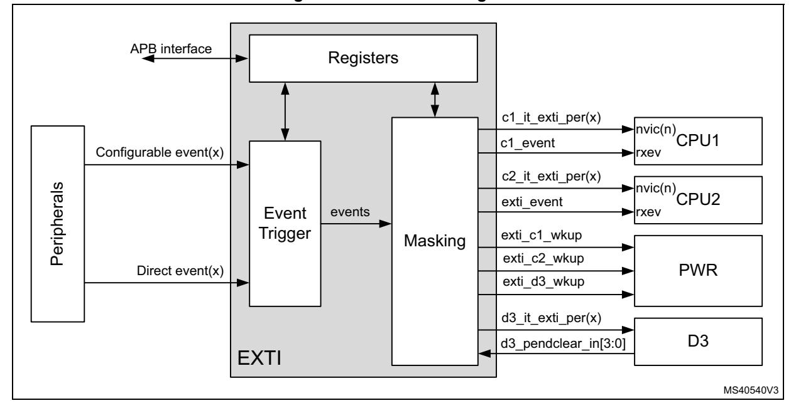
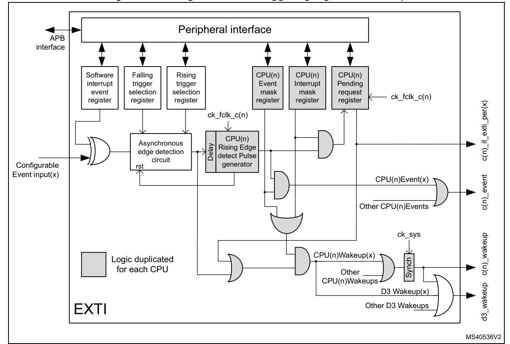
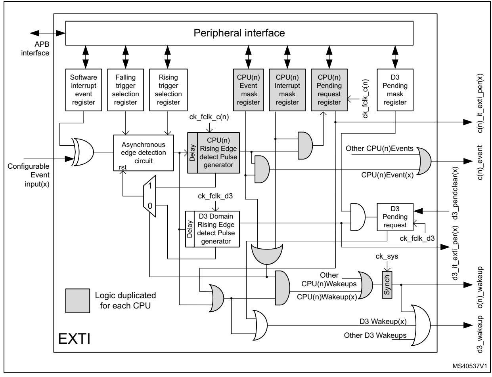
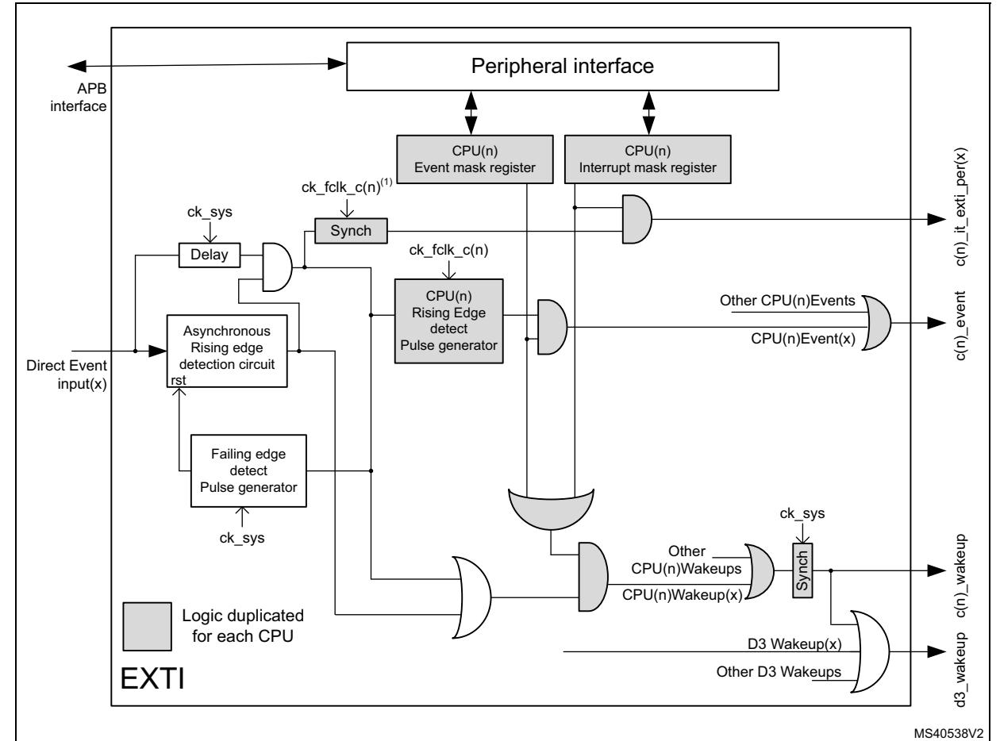
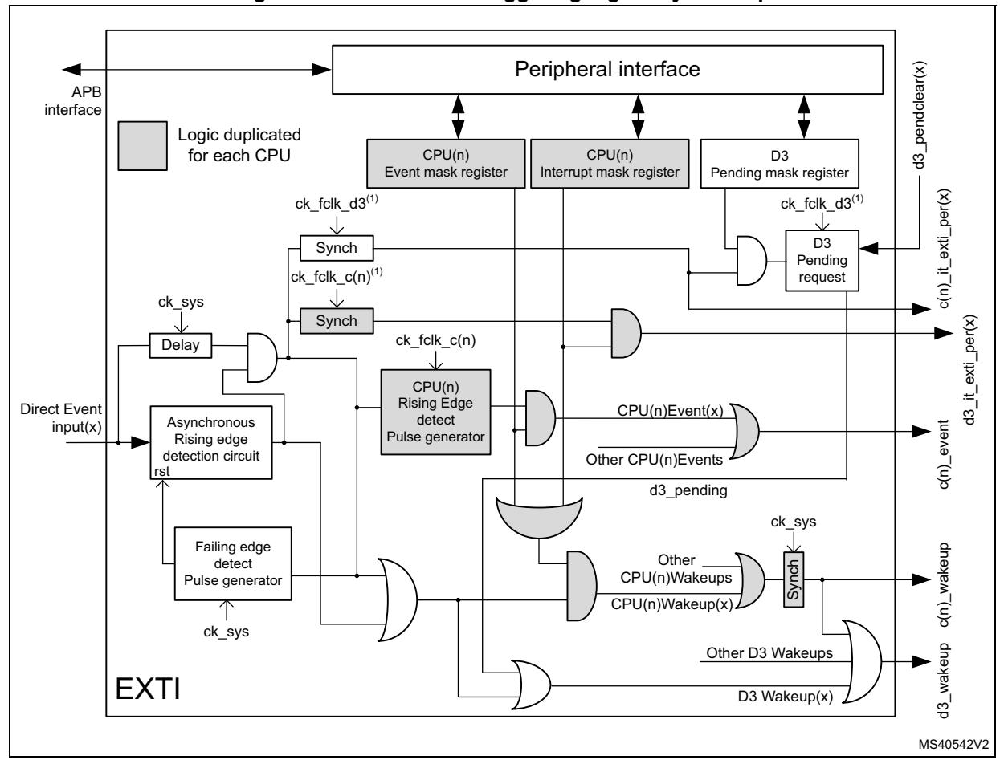
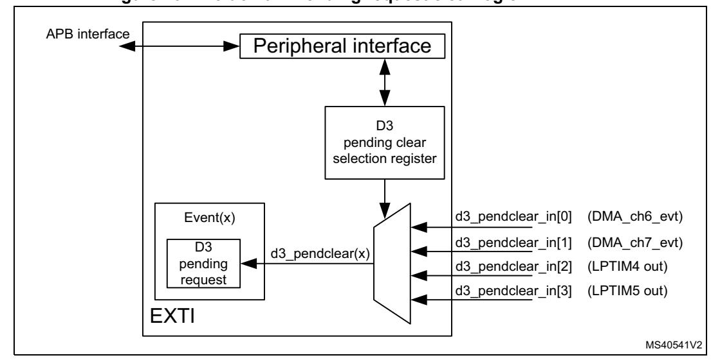

# **21 Extended interrupt and event controller (EXTI)**

The Extended Interrupt and event controller (EXTI) manages wakeup through configurable and direct event inputs. It provides wakeup requests to the Power Control, and generates interrupt requests to the CPU NVIC and to the D3 domain DMAMUX2, and events to the CPU event input.

The EXTI wakeup requests allow the system to be woken up from Stop mode, and the CPU to be woken up from CStop mode.

Both the interrupt request and event request generation can also be used in Run modes.

# **21.1 EXTI main features**

The EXTI main features are the following:

- All Event inputs allow a CPU to wakeup and to generate a CPU interrupt and/or CPU event
- Some Event inputs allow the user to wakeup the D3 domain for autonomous Run mode and generate an interrupt to the D3 domain, i.e. the DMAMUX2

The asynchronous event inputs are classified in 2 groups:

- Configurable events (signals from I/Os or peripherals able to generate a pulse), they have the following features:
  - Selectable active trigger edge
  - Interrupt pending status register bit
  - Individual Interrupt and Event generation mask
  - SW trigger possibility
  - Configurable System D3 domain wakeup events have a D3 Pending mask and status register and may have a D3 interrupt signal.
- Direct events (interrupt and wakeup sources from other peripherals, requiring to be cleared in the peripheral), they feature
  - Fixed rising edge active trigger
  - No interrupt pending status register bit in the EXTI (the interrupt pending status is provided by the peripheral generating the event)
  - Individual Interrupt and Event generation mask
  - No SW trigger possibility
  - Direct system D3 domain wakeup events have a D3 Pending mask and status register and may have a D3 interrupt signal

# **21.2 EXTI block diagram**

As shown in *[Figure 96](#page-1-0)*, the EXTI consists of a Register block accessed via an APB interface, an Event input Trigger block, and a Masking block.

The Register block contains all EXTI registers.

The Event input trigger block provides Event input edge triggering logic.

RM0399 Rev 4 797/3556

The Masking block provides the Event input distribution to the different wakeup, interrupt and event outputs, and their masking.

**Figure 96. EXTI block diagram** 

#### **21.2.1 EXTI connections between peripherals, CPU, and D3 domain**

The peripherals able to generate wakeup events when the system is in Stop mode or a CPU is in CStop mode are connected to an EXTI Configurable event input or Direct Event input:

- Peripheral signals that generate a pulse are connected to an EXTI Configurable Event input. For these events the EXTI provides a CPU status pending bit that has to be cleared.
- Peripheral Interrupt and Wakeup sources that have to be cleared in the peripheral are connected to an EXTI Direct Event input. There is no CPU status pending bit within the EXTI. The Interrupt or Wakeup is cleared by the CPU in the peripheral.

The Event inputs able to wakeup D3 for autonomous Run mode are provided with a D3 domain pending request function, that has to be cleared. This clearing request is taken care of by the signal selected by the Pending clear selection.

The CPU(n) interrupts are connected to their respective CPU(n) NVIC, and, similarly, the CPU(n) event is connected to the CPU(n) rxev input.

The EXTI Wakeup signals are connected to the PWR block, and are used to wakeup the D3 domain and/or the CPU(n).

The D3 domain interrupts allow the system to trigger events for D3 domain autonomous Run mode operation.

# **21.3 EXTI functional description**

Depending on the EXTI Event input type and wakeup target(s), different logic implementations are used. The applicable features are controlled from register bits:

- Active trigger edge enable, by *[EXTI rising trigger selection register \(EXTI\\_RTSR1\)](#page-15-0)*, *[EXTI rising trigger selection register \(EXTI\\_RTSR2\)](#page-18-0)*, *[EXTI rising trigger selection](#page-22-0)  [register \(EXTI\\_RTSR3\)](#page-22-0)*, and *[EXTI falling trigger selection register \(EXTI\\_FTSR1\)](#page-15-1)*, *[EXTI falling trigger selection register \(EXTI\\_FTSR2\)](#page-19-0)*, *[EXTI falling trigger selection](#page-22-1)  [register \(EXTI\\_FTSR3\)](#page-22-1)*
- Software trigger, by *[EXTI software interrupt event register \(EXTI\\_SWIER1\)](#page-16-0)*, *[EXTI](#page-19-1)  [software interrupt event register \(EXTI\\_SWIER2\)](#page-19-1)*, *[EXTI software interrupt event](#page-23-0)  [register \(EXTI\\_SWIER3\)](#page-23-0)*
- CPU Interrupt enable, by *[EXTI interrupt mask register \(EXTI\\_CnIMR1\)](#page-25-0)*, *[EXTI interrupt](#page-26-0)  [mask register \(EXTI\\_CnIMR2\)](#page-26-0)*, *[EXTI interrupt mask register \(EXTI\\_CnIMR3\)](#page-28-0)*
- CPU Event enable, by *[EXTI event mask register \(EXTI\\_CnEMR1\)](#page-25-1)*, *[EXTI event mask](#page-27-0)  [register \(EXTI\\_CnEMR2\)](#page-27-0)*, *[EXTI event mask register \(EXTI\\_CnEMR3\)](#page-29-0)*
- D3 domain wakeup pending, by *[EXTI D3 pending mask register \(EXTI\\_D3PMR1\)](#page-16-1)*, *[EXTI D3 pending mask register \(EXTI\\_D3PMR2\)](#page-20-0)*, *[EXTI D3 pending mask register](#page-23-1)  [\(EXTI\\_D3PMR3\)](#page-23-1)*

**Table 150. EXTI Event input configurations and register control(1)**

| Event input type | Wakeup target(s) | Logic implementation                          | EXTI_RTSR | EXTI_FTSR | WIER EXTI_S | EXTI_CnIMR | EXTI_CnEMR | EXTI_D3PMR |
|---------------------|---------------------|--------------------------------------------------|-----------|-----------|----------------|------------|------------|------------|
| Configurable        | CPU(n)(2)           | Configurable event input, CPU wakeup logic | X         | X         | X              | X          | X          | -          |
|                     | Any(3)              | Configurable event input, Any wakeup logic |           |           |                |            |            | X          |
| Direct              | CPU(n)(2)           | Direct event input, CPU wakeup logic       | -         | -         | -              | X          | X          | -          |
|                     | Any(3)              | Direct event input, Any wakeup logic       |           |           |                |            |            | X          |

- 1. X indicates that functionality is available.
- 2. Waking-up CPU1 and/or CPU2.
- 3. Waking-up D3 domain for autonomous Run mode, and/or CPU1, and/or CPU2.

RM0399 Rev 4 799/3556

#### 21.3.1 EXTI Configurable event input CPU wakeup

*Figure 98* is a detailed representation of the logic associated with Configurable Event inputs which will always wake up a CPU(n).

Figure 97. Configurable event triggering logic CPU wakeup

The Software interrupt event register allows the system to trigger Configurable events by software, writing the EXTI software interrupt event register (EXTI\_SWIER1), the EXTI software interrupt event register (EXTI\_SWIER2), or the EXTI software interrupt event register (EXTI\_SWIER3) register bit.

The rising edge EXTI rising trigger selection register (EXTI\_RTSR1), EXTI rising trigger selection register (EXTI\_RTSR2), EXTI rising trigger selection register (EXTI\_RTSR3), and falling edge EXTI falling trigger selection register (EXTI\_FTSR1), EXTI falling trigger selection register (EXTI\_FTSR3) selection registers allow the system to enable and select the Configurable event active trigger edge or both edges.

Each CPU has its dedicated interrupt mask register, namely *EXTI interrupt mask register* (*EXTI\_CnIMR1*) and *EXTI interrupt mask register* (*EXTI\_CnIMR2*), *EXTI interrupt mask register* (*EXTI\_CnIMR2*), and *EXTI pending register* (*EXTI\_CnPR1*), *EXTI pending register* (*EXTI\_CnPR2*), *EXTI pending register* (*EXTI\_CnPR3*) for Configurable events pending request registers. The CPU pending register will only be set for an unmasked CPU(n) interrupt. Each event provides a individual CPU(n) interrupt to the CPU(n) NVIC. The Configurable events interrupts need to be acknowledged by software in the EXTI\_CnPR register.

Each CPU has dedicated event mask registers, i.e. *[EXTI event mask register](#page-25-1)  [\(EXTI\\_CnEMR1\)](#page-25-1)*, *[EXTI event mask register \(EXTI\\_CnEMR2\)](#page-27-0)*, and *[EXTI event mask](#page-29-0)  [register \(EXTI\\_CnEMR3\)](#page-29-0)*. The enabled event then generates an event on a CPU. All events for a CPU are OR-ed together into a single CPU CPU(n) event signal. The CPU Pending register (EXTI\_CnPR) will not be set for an unmasked CPU event.

When a CPU(n) interrupt or CPU(n) event is enabled, the Asynchronous edge detection circuit is reset by the clocked Delay and Rising edge detect pulse generator. This guarantees that the CPU(n) clock is woken up before the Asynchronous edge detection circuit is reset.

*Note: A detected Configurable event, enabled by CPU(n), is only cleared when CPU(n) wakes up. When the CPU(n) is kept in hold (see Section 7: Power control (PWR)), the detected Configurable event will not be cleared and the system will be kept in Run mode. To clear the detected Configurable event the other CPU shall release the CPU(n) from hold.*

#### **21.3.2 EXTI configurable event input Any wakeup**

*[Figure 98](#page-5-0)* is a detailed representation of the logic associated with Configurable Event inputs that can wakeup D3 domain for autonomous Run mode and/or CPU(n) ("Any" target). It provides the same functionality as the Configurable event input CPU wakeup, with additional functionality to wake up the D3 domain independently.

When all CPU(n) interrupts and CPU(n) events are disabled, the Asynchronous edge detection circuit is reset by the D3 domain clocked Delay and Rising edge detect pulse generator. This guarantees that the D3 domain clock is woken up before the Asynchronous edge detection circuit is reset.

| EXTI_C1IMR       | EXTI_C1EMR | EXTI_C2IMR       | EXTI_C2EMR | Asynchronous Edge detector reset by                                                                             |  |  |  |
|------------------|------------|------------------|------------|-----------------------------------------------------------------------------------------------------------------|--|--|--|
| Both = 0         |            | Both = 0         |            | D3 domain clock rising edge detect pulse generator                                                              |  |  |  |
| At least one = 1 |            | Both = 0         |            | CPU1 clock rising edge detect pulse generator                                                                   |  |  |  |
| Both = 0         |            | At least one = 1 |            | CPU2 clock rising edge detect pulse generator                                                                   |  |  |  |
| At least one = 1 |            | At least one = 1 |            | CPU1 clock rising edge detect pulse generator OR-ed(1) with CPU2 clock rising edge detect pulse generator |  |  |  |

**Table 151. Configurable Event input Asynchronous Edge detector reset**

RM0399 Rev 4 801/3556

1. The first rising edge detect pulse generator will reset the Asynchronous Edge detection circuit. A new Configurable Event input edge for both CPUs will only be detected after the last rising edge detect pulse generator has completed. A Configurable Event input edge arriving between the detection of the first and the last rising edge detect pulse generator detection will only signal a new event to the first CPU.

Figure 98. Configurable event triggering logic Any wakeup

The event triggering logic for "Any" target has additional D3 Pending mask register *EXTI D3* pending mask register (*EXTI\_D3PMR1*), *EXTI D3* pending mask register (*EXTI\_D3PMR2*), *EXTI D3* pending mask register (*EXTI\_D3PMR3*) and D3 Pending request logic. The D3 Pending request logic will only be set for unmasked D3 Pending events. The D3 Pending request logic keeps the D3 domain in Run mode until the D3 Pending request logic is cleared by the selected D3 domain pendclear source.

#### 21.3.3 EXTI direct event input CPU wakeup

Figure 99 is a detailed representation of the logic associated with Direct Event inputs waking up a CPU(n).

Direct events only provide CPU(n) interrupt enable and CPU(n) event enable functionality.

Note:

Direct events are cleared in the peripheral generating the event. When a Direct event input enabled by CPU(n) is cleared by the other CPU before the CPU(n) clock is running, (i.e. when CPU(n) is kept in hold, see Section 7: Power control (PWR)), the CPU(n) will no longer receive neither a CPU(n) interrupt nor a CPU(n) event, and will not wakeup. However the system will stay in Run mode, generating the CPU(n) clock. For this reason CPU(n) Direct events shall not be cleared by the other CPU.

**Figure 99. Direct event triggering logic CPU Wakeup**

1. The CPU(n) interrupt for asynchronous Direct Event inputs (peripheral Wakeup signals) is synchronized with the CPU(n) clock. The synchronous Direct Event inputs (peripheral interrupt signals), after the asynchronous edge detection, are directly sent to the CPU(n) interrupt without resynchronization.

RM0399 Rev 4 803/3556

#### **21.3.4 EXTI direct event input Any wakeup**

*[Figure 100](#page-7-0)* is a detailed representation of the logic associated with Direct Event inputs waking up D3 domain for autonomous Run mode and/or CPU(n), ("Any" target). It provides the same functionality as the Direct event input CPU wakeup, plus additional functionality to wakeup the D3 domain independently.

**Figure 100. Direct event triggering logic Any Wakeup**

1. The CPU(n) interrupt and D3 domain interrupt for asynchronous Direct Event inputs (peripheral Wakeup signals) are synchronized, respectively, with the CPU(n) clock and the D3 domain clock. The synchronous Direct Event inputs (peripheral interrupt signals), after the asynchronous edge detection, are directly sent to the CPU(n) interrupt and the D3 domain interrupt without resynchronization in the EXTI.

#### **21.3.5 EXTI D3 pending request clear selection**

Event inputs able to wake up D3 domain for autonomous Run mode have D3 Pending request logic that can be cleared by the selected D3 pendclear source. For each D3 Pending request a D3 domain pendclear source can be selected from four different inputs.

*[Figure 101](#page-8-0)* is a detailed representation of the logic selecting the D3 pendclear source.

**Figure 101. D3 domain Pending request clear logic**

The D3 Pending request clear selection registers *[EXTI D3 pending clear selection register](#page-17-0)  [low \(EXTI\\_D3PCR1L\)](#page-17-0)*, *[EXTI D3 pending clear selection register high \(EXTI\\_D3PCR1H\)](#page-17-1)*, *[EXTI D3 pending clear selection register low \(EXTI\\_D3PCR2L\)](#page-21-0)*, *[EXTI D3 pending clear](#page-21-1)  [selection register high \(EXTI\\_D3PCR2H\)](#page-21-1)*, *[EXTI D3 pending clear selection register low](#page-24-0)  [\(EXTI\\_D3PCR3L\)](#page-24-0)* and *[EXTI D3 pending clear selection register high \(EXTI\\_D3PCR3H\)](#page-24-1)* allow the system to select the source to reset the D3 Pending request.

# **21.4 EXTI event input mapping**

For the sixteen GPIO Event inputs the associated IOPORT pin has to be selected in the SYSCFG register SYSCFG\_EXTICRn. The same pin from each IOPORT maps to the corresponding EXTI Event input.

The wakeup capabilities of each Event input are detailed in *[Table 152](#page-9-0)*. An Event input can either wake up CPU1, CPU2 or both, and in the case of "Any" can also wake up D3 domain for autonomous Run mode.

The EXTI Event inputs with a connection to the CPU NVIC are indicated in the *Connection to NVIC* column. For the EXTI events not having a connection to the NVIC, the peripheral interrupt is directly connected to the NVIC in parallel with the connection to the EXTI.

All EXTI Event inputs are OR-ed together and connected to the CPU event input (rxev).

**Table 152. EXTI Event input mapping** 

| Event input | Source                                      | Event input type       | Wakeup target(s) | Connection to NVIC |  |
|-------------|---------------------------------------------|------------------------|------------------|--------------------|--|
| 0 - 15      | EXTI[15:0]                                  | Configurable           | Any              | Yes                |  |
| 16          | PVD and AVD(1)                              | Configurable           | CPU1 or CPU2     | Yes                |  |
| 17          | RTC alarms                                  | Configurable           | CPU1 or CPU2     | Yes                |  |
| 18          | RTC tamper, RTC timestamp, RCC LSECSS(2) | Configurable           | CPU1 or CPU2     | Yes                |  |
| 19          | RTC wakeup timer                            | Configurable           | Any              | Yes                |  |
| 20          | COMP1                                       | Configurable           | Any              | Yes                |  |
| 21          | COMP2                                       | Configurable           | Any              | Yes                |  |
| 22          | I2C1 wakeup                                 | Direct                 | CPU1 or CPU2     | Yes                |  |
| 23          | I2C2 wakeup                                 | Direct                 | CPU1 or CPU2     | Yes                |  |
| 24          | I2C3 wakeup                                 | Direct                 | CPU1 or CPU2     | Yes                |  |
| 25          | I2C4 wakeup                                 | Direct                 | Any              | Yes                |  |
| 26          | USART1 wakeup                               | Direct                 | CPU1 or CPU2     | Yes                |  |
| 27          | USART2 wakeup                               | Direct                 | CPU1 or CPU2     | Yes                |  |
| 28          | USART3 wakeup                               | Direct                 | CPU1 or CPU2     | Yes                |  |
| 29          | USART6 wakeup                               | Direct                 | CPU1 or CPU2     | Yes                |  |
| 30          | UART4 wakeup                                | Direct                 | CPU1 or CPU2     | Yes                |  |
| 31          | UART5 wakeup                                | Direct                 | CPU1 or CPU2     | Yes                |  |
| 32          | UART7 wakeup                                | Direct                 | CPU1 or CPU2     | Yes                |  |
| 33          | UART8 wakeup                                | Direct                 | CPU1 or CPU2     | Yes                |  |
| 34          | LPUART1 RX wakeup                           | Direct                 | Any              | Yes                |  |
| 35          | LPUART1 TX wakeup                           | Direct                 | Any              | Yes                |  |
| 36          | SPI1 wakeup                                 | Direct                 | CPU1 or CPU2     | Yes                |  |
| 37          | SPI2 wakeup                                 | Direct CPU1 or CPU2 |                  | Yes                |  |
| 38          | SPI3 wakeup                                 | Direct                 | CPU1 or CPU2     | Yes                |  |
| 39          | SPI4 wakeup                                 | Direct                 | CPU1 or CPU2     | Yes                |  |
| 40          | SPI5 wakeup                                 | Direct                 | CPU1 or CPU2     | Yes                |  |
| 41          | SPI6 wakeup                                 | Direct                 | Any              | Yes                |  |
| 42          | MDIO wakeup                                 | Direct                 | CPU1 or CPU2     | Yes                |  |
| 43          | USB1 wakeup                                 | Direct                 | CPU1 or CPU2     | Yes                |  |
| 44          | USB2 wakeup                                 | Direct                 | CPU1 or CPU2     | Yes                |  |
| 45          | Reserved                                    | -                      | -                | -                  |  |
| 46          | DSI wakeup                                  | Direct                 | CPU1 or CPU2     | Yes                |  |
| 47          | LPTIM1 wakeup                               | Direct                 | CPU1 or CPU2     | Yes                |  |
| 48          | LPTIM2 wakeup                               | Direct                 | Any              | Yes                |  |

**Table 152. EXTI Event input mapping (continued)**

| Event input | Source                    | Event input type | Wakeup target(s) | Connection to NVIC |  |
|-------------|---------------------------|------------------|------------------|--------------------|--|
| 49          | LPTIM2 output             | Configurable     | Any              | No(3)              |  |
| 50          | LPTIM3 wakeup             | Direct           | Any              | Yes                |  |
| 51          | LPTIM3 output             | Configurable     | Any              | No(3)              |  |
| 52          | LPTIM4 wakeup             | Direct           | Any              | Yes                |  |
| 53          | LPTIM5 wakeup             | Direct           | Any              | Yes                |  |
| 54          | SWPMI wakeup              | Direct           | CPU1 or CPU2     | Yes                |  |
| 55(4)       | WKUP1                     | Direct           | CPU1 or CPU2     | Yes                |  |
| 56(4)       | WKUP2                     | Direct           | CPU1 or CPU2     | Yes                |  |
| 57(4)       | WKUP3                     | Direct           | CPU1 or CPU2     | Yes                |  |
| 58(4)       | WKUP4                     | Direct           | CPU1 or CPU2     | Yes                |  |
| 59(4)       | WKUP5                     | Direct           | CPU1 or CPU2     | Yes                |  |
| 60(4)       | WKUP6                     | Direct           | CPU1 or CPU2     | Yes                |  |
| 61          | RCC interrupt             | Direct           | CPU1 or CPU2     | No(5)              |  |
| 62          | I2C4 Event interrupt      | Direct           | CPU1 or CPU2     | No(5)              |  |
| 63          | I2C4 Error interrupt      | Direct           | CPU1 or CPU2     | No(5)              |  |
| 64          | LPUART1 global Interrupt  | Direct           | CPU1 or CPU2     | No(5)              |  |
| 65          | SPI6 interrupt            | Direct           | CPU1 or CPU2     | No(5)              |  |
| 66          | BDMA CH0 interrupt        | Direct           | CPU1 or CPU2     | No(5)              |  |
| 67          | BDMA CH1 interrupt        | Direct           | CPU1 or CPU2     | No(5)              |  |
| 68          | BDMA CH2 interrupt        | Direct           | CPU1 or CPU2     | No(5)              |  |
| 69          | BDMA CH3 interrupt        | Direct           | CPU1 or CPU2     | No(5)              |  |
| 70          | BDMA CH4 interrupt        | Direct           | CPU1 or CPU2     | No(5)              |  |
| 71          | BDMA CH5 interrupt        | Direct           | CPU1 or CPU2     | No(5)              |  |
| 72          | BDMA CH6 interrupt        | Direct           | CPU1 or CPU2     | No(5)              |  |
| 73          | BDMA CH7 interrupt        | Direct           | CPU1 or CPU2     | No(5)              |  |
| 74          | DMAMUX2 interrupt         | Direct           | CPU1 or CPU2     | No(5)              |  |
| 75          | ADC3 interrupt            | Direct           | CPU1 or CPU2     | No(5)              |  |
| 76          | SAI4 interrupt            | Direct           | CPU1 or CPU2     | No(5)              |  |
| 77          | HSEM0 interrupt           | Direct           | CPU1 only        | No(5)              |  |
| 78          | HSEM1 interrupt           | Direct           | CPU2 only        | No(5)              |  |
| 79          | CortexM4 SEV interrupt    | Direct           | CPU1 only        | No(3)              |  |
| 80          | CortexM7 SEV interrupt(6) | Direct           | CPU2 only        | No(3)              |  |
| 81          | Reserved                  | -                | -                | -                  |  |
| 82          | WWDG1 reset               | Configurable     | CPU2 only        | Yes                |  |
| 83          | Reserved                  | -                | -                | -                  |  |

| Event input | Source           | Event input type | Wakeup target(s) | Connection to NVIC |
|-------------|------------------|------------------|------------------|--------------------|
| 84          | WWDG2 reset      | Configurable     | CPU1 only        | Yes                |
| 85          | HDMI-CEC wakeup  | Configurable     | CPU1 or CPU2     | Yes                |
| 86          | ETHERNET wakeup  | Configurable     | CPU1 or CPU2     | Yes                |
| 87          | HSECSS interrupt | Direct           | CPU1 or CPU2     | No (5)  |
| 88          | Reserved         | -                | -                | -                  |

Table 152. EXTI Event input mapping (continued)

- 1. PVD and AVD signals are OR-ed together on the same EXTI event input.
- 2. RTC Tamper, RTC timestamp and RCC LSECSS signals are OR-ed together on the same EXTI event input.
- 3. Not available on CPU NVIC, to be used for system wakeup only or CPU event input (rxev).
- 4. Signals of WKUP1 to WKUP6 correspond to WKUPn pin+1.
- 5. Available on CPU NVIC directly from the peripheral
- 6. Event duration is equal to 512 clock cycles.

#### 21.5 EXTI functional behavior

The Direct event inputs are enabled in the respective peripheral generating the event. The Configurable events are enabled by enabling at least one of the trigger edges.

When in Stop mode an event will always wake up the D3 domain. In system Run and Stop modes an event will always generate an associated D3 domain interrupt. An event will only wake up a CPU when the event associated CPU interrupt is unmasked and/or the CPU event is unmasked.

| CPU(n)                                        |                                           | Configurable                             | CPU(n)    |        |        |                                            |
|-----------------------------------------------|-------------------------------------------|------------------------------------------|-----------|--------|--------|--------------------------------------------|
| Interrupt enable MRx bits of EXTI_CnIMR | Event enable MRx bits of EXTI_CnEMR | event inputs PRx bits of EXTI_CnPR | Interrupt | Event  | Wakeup | D3 domain wakeup                        |
| 0                                             | 0                                         | No                                       | Masked    | Masked | Masked | Yes (1) / Masked (2) |
| 0                                             | 1                                         | No                                       | Masked    | Yes    | Yes    | Yes                                        |
| 1                                             | 0                                         | Status latched                           | Yes       | Masked | Yes    | Yes                                        |
| 1                                             | 1                                         | Status latched                           | Yes       | Yes    | Yes    | Yes                                        |

Table 153. Masking functionality

- 1. Only for Event inputs that allow the system to wakeup D3 domain for autonomous Run mode (Any target).
- 2. For Event inputs that will always wake up CPU(n).

For Configurable event inputs, when the enabled edge(s) occur on the event input, an event request is generated. When the associated CPU(n) interrupt is unmasked, the corresponding pending PRx bit in EXTI\_CnPR is set and the CPU(n) interrupt signal is activated. EXTI\_CnPR PRx pending bit shall be cleared by software writing it to '1'. This will clear the CPU(n) interrupt.

For Direct event inputs, when enabled in the associated peripheral, an event request is generated on the rising edge only. There is no corresponding CPU(n) pending bit. When the

associated CPU(n) interrupt is unmasked the corresponding CPU(n) interrupt signal is activated.

The CPU(n) event has to be unmasked to generate an event. When the enabled edge(s) occur on the Event input a CPU(n) event pulse is generated. There is no CPU(n) Event pending bit.

Both a CPU(n) interrupt and a CPU(n) event may be enabled on the same Event input. They will both trigger the same Event input condition(s).

For the Configurable Event inputs an event input request can be generated by software when writing a '1' in the software interrupt/event register EXTI\_SWIER.

Whenever an Event input is enabled and a CPU(n) interrupt and/or CPU(n) event is unmasked, the Event input will also generate a D3 domain wakeup next to the CPU(n) wakeup.

Some Event inputs are able to wakeup the D3 domain autonomous Run mode, in this case the CPU(n) interrupt and CPU(n) event are masked, preventing the CPU(n) to be woken up. Two D3 domain autonomous Run mode wakeup mechanisms are supported:

- D3 domain wakeup without pending (EXTI\_D3PMR = 0)
  - On a Configurable Event input this mechanism will wake up D3 domain and clear the D3 domain wakeup signal automatically after the Delay + Rising Edge detect Pulse generator.
  - On a Direct Event input this mechanism will wake up D3 domain and clear the D3 domain wakeup signal after the Direct Event input signal is cleared.
- D3 domain wakeup with pending (EXTI\_D3PMR = 1)
  - On a Configurable Event input this mechanism will wake up D3 domain and clear the D3 domain wakeup signal after the Delay + Rising Edge detect Pulse generator and when the D3 Pending request is cleared.
  - On a Direct Event input this mechanism will wake up D3 domain and clear the D3 domain wakeup signal after the Direct Event input signal is cleared and when the D3 Pending request is cleared.

#### **21.5.1 EXTI CPU interrupt procedure**

- Unmask the Event input interrupt by setting the corresponding mask bits in the EXTI\_CnIMR register.
- For Configurable Event inputs, enable the event input by setting either one or both the corresponding trigger edge enable bits in EXTI\_RTSR and EXTI\_FTSR registers.
- Enable the associated interrupt source in the CPU(n) NVIC or use the SEVONPEND, so that an interrupt coming from the CPU(n) interrupt signal is detectable by the CPU after a WFI/WFE instruction.
  - For Configurable event inputs the associated EXTI pending bit needs to be cleared.

#### **21.5.2 EXTI CPU event procedure**

- Unmask the Event input by setting the corresponding mask bits of the EXTI\_CnEMR register.
- For Configurable Event inputs, enable the event input by setting either one or both the corresponding trigger edge enable bits in EXTI\_RTSR and EXTI\_FTSR registers.
- The CPU(n) event signal is detected by the CPU after a WFE instruction.
  - For Configurable event inputs there is no EXTI pending bit to clear.

### **21.5.3 EXTI CPU wakeup procedure**

- Unmask the Event input by setting at least one of the corresponding mask bits in the EXTI\_CnIMR and/or EXTI\_CnEMR registers. The CPU(n) wakeup is generated at the same time as the unmasked CPU(n) interrupt and/or CPU(n) event.
- For Configurable Event inputs, enable the event input by setting either one or both the corresponding trigger edge enable bits in EXTI\_RTSR and EXTI\_FTSR registers.
- Direct Events will automatically generate a CPU(n) wakeup.

## **21.5.4 EXTI D3 domain wakeup for autonomous Run mode procedure**

- Mask the Event input for waking up the CPU(n), by clearing both the corresponding mask bits in the EXTI\_CnIMR and/or EXTI\_CnEMR registers.
- For Configurable Event inputs, enable the event input by setting either one or both the corresponding trigger edge enable bits in EXTI\_RTSR and EXTI\_FTSR registers.
- Direct Events will automatically generate a D3 domain wakeup.
- Select the D3 domain wakeup mechanism in EXTI\_D3PMR.
  - When D3 domain wakeup without pending (EXTI\_PMR = 0) is selected, the Wakeup will be cleared automatically following the clearing of the Event input.
  - When D3 domain wakeup with pending (EXTI\_PMR = 1) is selected the Wakeup needs to be cleared by a selected D3 domain pendclear source. A pending D3 domain wakeup signal can also be cleared by FW clearing the associated EXTI\_D3PMR register bit.
- After the D3 domain wakeup a D3 domain interrupt is generated.
  - Configurable Event inputs will generate a pulse on D3 domain interrupt.
  - Direct Event inputs will activate the D3 domain interrupt until the event input is cleared in the peripheral.

#### **21.5.5 EXTI software interrupt/event trigger procedure**

Any of the Configurable Event inputs can be triggered from the software interrupt/event register (the associated CPU(n) interrupt and/or CPU(n) event shall be enabled by their respective procedure).

- Enable the Event input by setting at least one of the corresponding edge trigger bits in the EXTI\_RTSR and/or EXTI\_FTSR registers.
- Unmask the software interrupt/event trigger by setting at least one of the corresponding mask bits in the EXTI\_CnIMR and/or EXTI\_CnEMR registers.
- Trigger the software interrupt/event by writing "1" to the corresponding bit in the EXTI\_SWIER register.
- The Event input may be disabled by clearing the EXTI\_RTSR and EXTI\_FTSR register bits.

*Note: An edge on the Configurable event input will also trigger an interrupt/event.*

A software trigger can be used to set the D3 Pending request logic, keeping the D3 domain in Run until the D3 Pending request logic is cleared*.*

RM0399 Rev 4 811/3556

# **21.6 EXTI registers**

Every register can only be accessed with 32-bit (word). A byte or half-word cannot be read or written.

# **21.6.1 EXTI rising trigger selection register (EXTI\_RTSR1)**

Address offset: 0x00 Reset value: 0x0000 0000

| 31   | 30   | 29   | 28   | 27   | 26   | 25   | 24   | 23   | 22   | 21   | 20   | 19   | 18   | 17   | 16   |
|------|------|------|------|------|------|------|------|------|------|------|------|------|------|------|------|
| Res. | Res. | Res. | Res. | Res. | Res. | Res. | Res. | Res. | Res. | TR21 | TR20 | TR19 | TR18 | TR17 | TR16 |
|      |      |      |      |      |      |      |      |      |      | rw   | rw   | rw   | rw   | rw   | rw   |
| 15   |      |      |      |      |      |      |      |      |      |      |      |      |      |      |      |
|      | 14   | 13   | 12   | 11   | 10   | 9    | 8    | 7    | 6    | 5    | 4    | 3    | 2    | 1    | 0    |
| TR15 | TR14 | TR13 | TR12 | TR11 | TR10 | TR9  | TR8  | TR7  | TR6  | TR5  | TR4  | TR3  | TR2  | TR1  | TR0  |

Bits 31:22 Reserved, must be kept at reset value.

Bits 21:0 **TRx:** Rising trigger event configuration bit of Configurable Event input x.(1)

- 0: Rising trigger disabled (for Event and Interrupt) for input line
- 1: Rising trigger enabled (for Event and Interrupt) for input line
- 1. The Configurable event inputs are edge triggered, no glitch must be generated on these inputs. If a rising edge on the Configurable event input occurs during writing of the register, the associated pending bit will not be set. Rising and falling edge triggers can be set for the same Configurable Event input. In this case, both edges generate a trigger.

#### **21.6.2 EXTI falling trigger selection register (EXTI\_FTSR1)**

Address offset: 0x04 Reset value: 0x0000 0000

| 31   | 30   | 29   | 28   | 27   | 26   | 25   | 24   | 23   | 22   | 21   | 20   | 19   | 18   | 17   | 16   |
|------|------|------|------|------|------|------|------|------|------|------|------|------|------|------|------|
| Res. | Res. | Res. | Res. | Res. | Res. | Res. | Res. | Res. | Res. | TR21 | TR20 | TR19 | TR18 | TR17 | TR16 |
|      |      |      |      |      |      |      |      |      |      | rw   | rw   | rw   | rw   | rw   | rw   |
|      |      |      |      |      |      |      |      |      |      |      |      |      |      |      |      |
| 15   | 14   | 13   | 12   | 11   | 10   | 9    | 8    | 7    | 6    | 5    | 4    | 3    | 2    | 1    | 0    |
| TR15 | TR14 | TR13 | TR12 | TR11 | TR10 | TR9  | TR8  | TR7  | TR6  | TR5  | TR4  | TR3  | TR2  | TR1  | TR0  |

Bits 31:22 Reserved, must be kept at reset value.

Bits 21:0 **TRx:** Falling trigger event configuration bit of Configurable Event input x.(1)

- 0: Falling trigger disabled (for Event and Interrupt) for input line
- 1: Falling trigger enabled (for Event and Interrupt) for input line.
- 1. The Configurable event inputs are edge triggered, no glitch must be generated on these inputs. If a falling edge on the Configurable event input occurs during writing of the register, the associated pending bit will not be set.

Rising and falling edge triggers can be set for the same Configurable Event input. In this case, both edges generate a trigger.

#### **21.6.3 EXTI software interrupt event register (EXTI\_SWIER1)**

Address offset: 0x08 Reset value: 0x0000 0000

| 31          | 30          | 29          | 28          | 27          | 26          | 25         | 24         | 23         | 22         | 21          | 20          | 19          | 18          | 17          | 16          |
|-------------|-------------|-------------|-------------|-------------|-------------|------------|------------|------------|------------|-------------|-------------|-------------|-------------|-------------|-------------|
| Res.        | Res.        | Res.        | Res.        | Res.        | Res.        | Res.       | Res.       | Res.       | Res.       | SWIER 21 | SWIER 20 | SWIER 19 | SWIER 18 | SWIER 17 | SWIER 16 |
|             |             |             |             |             |             |            |            |            |            | rw          | rw          | rw          | rw          | rw          | rw          |
| 15          |             |             |             |             |             |            |            |            |            |             |             |             |             |             |             |
|             | 14          | 13          | 12          | 11          | 10          | 9          | 8          | 7          | 6          | 5           | 4           | 3           | 2           | 1           | 0           |
| SWIER 15 | SWIER 14 | SWIER 13 | SWIER 12 | SWIER 11 | SWIER 10 | SWIER 9 | SWIER 8 | SWIER 7 | SWIER 6 | SWIER 5  | SWIER 4  | SWIER 3  | SWIER 2  | SWIER 1  | SWIER 0  |

Bits 31:22 Reserved, must be kept at reset value.

Bits 21:0 **SWIERx:** Software interrupt on line x Will alway return 0 when read.

0: Writing 0 has no effect.

1: Writing a 1 to this bit will trigger an event on line x. This bit is auto cleared by HW.

### **21.6.4 EXTI D3 pending mask register (EXTI\_D3PMR1)**

Address offset: 0x0C Reset value: 0x0000 0000

| 31   | 30   | 29   | 28   | 27   | 26   | 25   | 24   | 23   | 22   | 21   | 20   | 19   | 18   | 17   | 16   |
|------|------|------|------|------|------|------|------|------|------|------|------|------|------|------|------|
| Res. | Res. | Res. | Res. | Res. | Res. | MR25 | Res. | Res. | Res. | MR21 | MR20 | MR19 | Res. | Res. | Res. |
|      |      |      |      |      |      | rw   |      |      |      | rw   | rw   | rw   |      |      |      |
| 15   | 14   |      |      |      |      |      |      |      |      |      |      |      |      |      |      |
|      |      | 13   | 12   | 11   | 10   | 9    | 8    | 7    | 6    | 5    | 4    | 3    | 2    | 1    | 0    |
| MR15 | MR14 | MR13 | MR12 | MR11 | MR10 | MR9  | MR8  | MR7  | MR6  | MR5  | MR4  | MR3  | MR2  | MR1  | MR0  |

Bits 31:26 Reserved, must be kept at reset value.

Bit 25 **MRx:** D3 Pending Mask on Event input x

0: D3 Pending request from Line x is masked. Writing this bit to 0 will also clear the D3 Pending request.

1: D3 Pending request from Line x is unmasked. The D3 domain pending signal when triggered will keep D3 domain wakeup active until cleared.

Bits 24:22 Reserved, must be kept at reset value.

RM0399 Rev 4 813/3556

Bits 21:19 **MRx:** D3 Pending Mask on Event input x

0: D3 Pending request from Line x is masked. Writing this bit to 0 will also clear the D3 Pending request.

1: D3 Pending request from Line x is unmasked. The D3 domain pending signal when triggered will keep D3 domain wakeup active until cleared.

Bits 18:16 Reserved, must be kept at reset value.

Bits 15:0 **MRx:** D3 Pending Mask on Event input x

0: D3 Pending request from Line x is masked. Writing this bit to 0 will also clear the D3 Pending request.

1: D3 Pending request from Line x is unmasked. The D3 domain pending signal when triggered will keep D3 domain wakeup active until cleared.

#### **21.6.5 EXTI D3 pending clear selection register low (EXTI\_D3PCR1L)**

Address offset: 0x10 Reset value: 0x0000 0000

| 31 | 30    | 29 | 28    | 27   | 26    | 25 | 24    | 23 | 22    | 21 | 20    | 19 | 18   | 17   | 16   |
|----|-------|----|-------|------|-------|----|-------|----|-------|----|-------|----|------|------|------|
|    | PCS15 |    | PCS14 |      | PCS13 |    | PCS12 |    | PCS11 |    | PCS10 |    | PCS9 |      | PCS8 |
| rw | rw    | rw | rw    | rw   | rw    | rw | rw    | rw | rw    | rw | rw    | rw | rw   | rw   | rw   |
| 15 | 14    | 13 | 12    | 11   | 10    | 9  | 8     | 7  | 6     | 5  | 4     | 3  | 2    | 1    | 0    |
|    | PCS7  |    | PCS6  | PCS5 |       |    | PCS4  |    | PCS3  |    | PCS2  |    | PCS1 | PCS0 |      |
| rw | rw    | rw | rw    | rw   | rw    | rw | rw    | rw | rw    | rw | rw    | rw | rw   | rw   | rw   |

Bits 31:0 **PCSx:** D3 Pending request clear input signal selection on Event input x = truncate (n/2)

00: DMA ch6 event selected as D3 domain pendclear source

01: DMA ch7 event selected as D3 domain pendclear source

10: LPTIM4 out selected as D3 domain pendclear source

11: LPTIM5 out selected as D3 domain pendclear source

# **21.6.6 EXTI D3 pending clear selection register high (EXTI\_D3PCR1H)**

Address offset: 0x14 Reset value: 0x0000 0000

| 31   | 30   | 29   | 28   | 27   | 26    | 25   | 24    | 23   | 22    | 21   | 20   | 19   | 18    | 17   | 16   |
|------|------|------|------|------|-------|------|-------|------|-------|------|------|------|-------|------|------|
| Res. | Res. | Res. | Res. | Res. | Res.  | Res. | Res.  | Res. | Res.  | Res. | Res. |      | PCS25 | Res. | Res. |
|      |      |      |      |      |       |      |       |      |       |      |      | rw   | rw    |      |      |
| 15   | 14   | 13   | 12   | 11   | 10    | 9    | 8     | 7    | 6     | 5    | 4    | 3    | 2     | 1    | 0    |
| Res. | Res. | Res. | Res. |      | PCS21 |      | PCS20 |      | PCS19 | Res. | Res. | Res. | Res.  | Res. | Res. |
|      |      |      |      | rw   | rw    | rw   | rw    | rw   | rw    |      |      |      |       |      |      |

Bits 31:20 Reserved, must be kept at reset value.

Bits 19:18 **PCSx:** D3 Pending request clear input signal selection on Event input x = truncate ((n+32)/2)

00: DMA ch6 event selected as D3 domain pendclear source 01: DMA ch7 event selected as D3 domain pendclear source 10: LPTIM4 out selected as D3 domain pendclear source

11: LPTIM5 out selected as D3 domain pendclear source

Bits 17:12 Reserved, must be kept at reset value.

Bits 11:6 **PCSx:** D3 Pending request clear input signal selection on Event input x = truncate ((n+32)/2)

00: DMA ch6 event selected as D3 domain pendclear source 01: DMA ch7 event selected as D3 domain pendclear source 10: LPTIM4 out selected as D3 domain pendclear source 11: LPTIM5 out selected as D3 domain pendclear source

Bits 5:0 Reserved, must be kept at reset value.

#### **21.6.7 EXTI rising trigger selection register (EXTI\_RTSR2)**

Address offset: 0x20 Reset value: 0x0000 0000

| 31   | 30   | 29   | 28   | 27   | 26   | 25   | 24   | 23   | 22   | 21   | 20   | 19   | 18   | 17   | 16   |
|------|------|------|------|------|------|------|------|------|------|------|------|------|------|------|------|
| Res. | Res. | Res. | Res. | Res. | Res. | Res. | Res. | Res. | Res. | Res. | Res. | TR51 | Res. | TR49 | Res. |
|      |      |      |      |      |      |      |      |      |      |      |      | rw   |      | rw   |      |
| 15   | 14   | 13   | 12   | 11   | 10   | 9    | 8    | 7    | 6    | 5    | 4    | 3    | 2    | 1    | 0    |
|      |      |      |      |      |      |      |      |      |      |      |      |      |      |      |      |
| Res. | Res. | Res. | Res. | Res. | Res. | Res. | Res. | Res. | Res. | Res. | Res. | Res. | Res. | Res. | Res. |

Bits 31:20 Reserved, must be kept at reset value.

Bit 19 **TRx:** Rising trigger event configuration bit of Configurable Event input x+32.(1)

0: Rising trigger disabled (for Event and Interrupt) for input line

1: Rising trigger enabled (for Event and Interrupt) for input line

Bit 18 Reserved, must be kept at reset value.

Bit 17 **TRx:** Rising trigger event configuration bit of Configurable Event input x+32.[\(1\)](#page-18-1)

0: Rising trigger disabled (for Event and Interrupt) for input line

1: Rising trigger enabled (for Event and Interrupt) for input line

Bits 16:0 Reserved, must be kept at reset value.

1. The Configurable event inputs are edge triggered, no glitch must be generated on these inputs. If a rising edge on the Configurable event input occurs during writing of the register, the associated pending bit will not be set.

Rising and falling edge triggers can be set for the same Configurable Event input. In this case, both edges generate a trigger.

RM0399 Rev 4 815/3556

#### 21.6.8 EXTI falling trigger selection register (EXTI FTSR2)

Address offset: 0x24 Reset value: 0x0000 0000

| 31   | 30   | 29   | 28   | 27   | 26   | 25   | 24   | 23   | 22   | 21   | 20   | 19   | 18   | 17   | 16   |
|------|------|------|------|------|------|------|------|------|------|------|------|------|------|------|------|
| Res. | Res. | Res. | Res. | Res. | Res. | Res. | Res. | Res. | Res. | Res. | Res. | TR51 | Res. | TR49 | Res. |
|      |      |      |      |      |      |      |      |      |      |      |      | rw   |      | rw   |      |
| 15   | 14   | 13   | 12   | 11   | 10   | 9    | 8    | 7    | 6    | 5    | 4    | 3    | 2    | 1    | 0    |
| Res. | Res. | Res. | Res. | Res. | Res. | Res. | Res. | Res. | Res. | Res. | Res. | Res. | Res. | Res. | Res. |
|      |      |      |      |      |      |      |      |      |      |      |      |      |      |      |      |

Bits 31:20 Reserved, must be kept at reset value.

Bit 19 **TRx:** Falling trigger event configuration bit of Configurable Event input x+32.(1)

0: Falling trigger disabled (for Event and Interrupt) for input line

1: Falling trigger enabled (for Event and Interrupt) for input line

Bit 18 Reserved, must be kept at reset value.

Bit 17 **TRx**: Falling trigger event configuration bit of Configurable Event input x+32.(1)

0: Falling trigger disabled (for Event and Interrupt) for input line

1: Falling trigger enabled (for Event and Interrupt) for input line

Bits 16:0 Reserved, must be kept at reset value.

The Configurable event inputs are edge triggered, no glitch must be generated on these inputs.
 If a falling edge on the Configurable event input occurs during writing of the register, the associated pending bit will not be set.
 Rising and falling edge triggers can be set for the same Configurable Event input. In this case, both edges generate a trigger.

#### 21.6.9 EXTI software interrupt event register (EXTI SWIER2)

Address offset: 0x28 Reset value: 0x0000 0000

| 31   | 30   | 29   | 28   | 27   | 26   | 25   | 24   | 23   | 22   | 21   | 20   | 19          | 18   | 17          | 16   |
|------|------|------|------|------|------|------|------|------|------|------|------|-------------|------|-------------|------|
| Res. | Res. | Res. | Res. | Res. | Res. | Res. | Res. | Res. | Res. | Res. | Res. | SWIER 51 | Res. | SWIER 49 | Res. |
|      |      |      |      |      |      |      |      |      |      |      |      | rw          |      | rw          |      |
| 15   | 14   | 13   | 12   | 11   | 10   | 9    | 8    | 7    | 6    | 5    | 4    | 3           | 2    | 1           | 0    |
| Res. | Res. | Res. | Res. | Res. | Res. | Res. | Res. | Res. | Res. | Res. | Res. | Res.        | Res. | Res.        | Res. |
|      |      |      |      |      |      |      |      |      |      |      |      |             |      |             |      |

Bits 31:20 Reserved, must be kept at reset value.

Bit 19 **SWIERx:** Software interrupt on line x+32

Will alway return 0 when read.

0: Writing 0 has no effect.

1: Writing a 1 to this bit will trigger an event on line x. This bit is auto cleared by HW.

Bit 18 Reserved, must be kept at reset value.

Bit 17 **SWIERx:** Software interrupt on line x+32

Will alway return 0 when read.

0: Writing 0 has no effect.

1: Writing a 1 to this bit will trigger an event on line x. This bit is auto cleared by HW.

Bits 16:0 Reserved, must be kept at reset value.

### **21.6.10 EXTI D3 pending mask register (EXTI\_D3PMR2)**

Address offset: 0x2C Reset value: 0x0000 0000

| 31   | 30   | 29   | 28   | 27   | 26   | 25   | 24   | 23   | 22   | 21   | 20   | 19   | 18   | 17   | 16   |
|------|------|------|------|------|------|------|------|------|------|------|------|------|------|------|------|
| Res. | Res. | Res. | Res. | Res. | Res. | Res. | Res. | Res. | Res. | MR53 | MR52 | MR51 | MR50 | MR49 | MR48 |
|      |      |      |      |      |      |      |      |      |      | rw   | rw   | rw   | rw   | rw   | rw   |
| 15   | 14   | 13   | 12   | 11   | 10   | 9    | 8    | 7    | 6    | 5    | 4    | 3    | 2    | 1    | 0    |
| Res. | Res. | Res. | Res. | Res. | Res. | MR41 | Res. | Res. | Res. | Res. | Res. | MR35 | MR34 | Res. | Res. |
|      |      |      |      |      |      | rw   |      |      |      |      |      | rw   | rw   |      |      |

Bits 31:22 Reserved, must be kept at reset value.

Bits 21:16 **MRx:** D3 Pending Mask on Event input x+32

0: D3 Pending request from Line x+32 is masked. Writing this bit to 0 will also clear the D3 Pending request.

1: D3 Pending request from Line x+32 is unmasked. The D3 domain pending signal when triggered will keep D3 domain wakeup active until cleared.

Bits 15:10 Reserved, must be kept at reset value.

Bit 9 **MRx:** D3 Pending Mask on Event input x+32

0: D3 Pending request from Line x+32 is masked. Writing this bit to 0 will also clear the D3 Pending request.

1: D3 Pending request from Line x+32 is unmasked. The D3 domain pending signal when triggered will keep D3 domain wakeup active until cleared.

Bits 8:4 Reserved, must be kept at reset value.

Bits 3:2 **MRx:** D3 Pending Mask on Event input x+32

0: D3 Pending request from Line x+32 is masked. Writing this bit to 0 will also clear the D3 Pending request.

1: D3 Pending request from Line x+32 is unmasked. The D3 domain pending signal when triggered will keep D3 domain wakeup active until cleared.

Bits 1:0 Reserved, must be kept at reset value.

### **21.6.11 EXTI D3 pending clear selection register low (EXTI\_D3PCR2L)**

Address offset: 0x30 Reset value: 0x0000 0000

| 31   | 30   | 29   | 28   | 27   | 26   | 25   | 24   | 23       | 22    | 21   | 20    | 19   | 18    | 17   | 16   |
|------|------|------|------|------|------|------|------|----------|-------|------|-------|------|-------|------|------|
| Res. | Res. | Res. | Res. | Res. | Res. | Res. | Res. | Res.     | Res.  | Res. | Res.  |      | PCS41 |      | Res. |
|      |      |      |      |      |      |      |      |          |       |      |       | rw   | rw    |      |      |
| 15   | 14   | 13   | 12   | 11   | 10   | 9    | 8    | 7        | 6     | 5    | 4     | 3    | 2     | 1    | 0    |
| Res. | Res. | Res. | Res. | Res. | Res. | Res. | Res. |          | PCS35 |      | PCS34 | Res. | Res.  | Res. | Res. |
|      |      |      |      |      |      |      |      | rw rw |       |      |       |      |       |      |      |

Bits 31:20 Reserved, must be kept at reset value.

Bits 19:18 **PCSx:** D3 Pending request clear input signal selection on Event input x = truncate ((n+64)/2)

00: DMA ch6 event selected as D3 domain pendclear source 01: DMA ch7 event selected as D3 domain pendclear source 10: LPTIM4 out selected as D3 domain pendclear source 11: LPTIM5 out selected as D3 domain pendclear source

Bits 17:8 Reserved, must be kept at reset value.

Bits 7:4 **PCSx:** D3 Pending request clear input signal selection on Event input x= truncate ((n+64)/2)

00: DMA ch6 event selected as D3 domain pendclear source 01: DMA ch7 event selected as D3 domain pendclear source 10: LPTIM4 out selected as D3 domain pendclear source 11: LPTIM5 out selected as D3 domain pendclear source

Bits 3:0 Reserved, must be kept at reset value.

### **21.6.12 EXTI D3 pending clear selection register high (EXTI\_D3PCR2H)**

Address offset: 0x34 Reset value: 0x0000 0000

| 31   | 30   | 29   | 28   | 27   | 26    | 25   | 24    | 23   | 22    | 21   | 20    | 19   | 18    | 17   | 16    |
|------|------|------|------|------|-------|------|-------|------|-------|------|-------|------|-------|------|-------|
| Res. | Res. | Res. | Res. | Res. | Res.  | Res. | Res.  | Res. | Res.  | Res. | Res.  | Res. | Res.  | Res. | Res.  |
|      |      |      |      |      |       |      |       |      |       |      |       |      |       |      |       |
| 15   | 14   | 13   | 12   | 11   | 10    | 9    | 8     | 7    | 6     | 5    | 4     | 3    | 2     | 1    | 0     |
| Res. | Res. | Res. | Res. |      | PCS53 |      | PCS52 |      | PCS51 |      | PCS50 |      | PCS49 |      | PCS48 |
|      |      |      |      | rw   | rw    | rw   | rw    | rw   | rw    | rw   | rw    | rw   | rw    | rw   | rw    |

Bits 31:12 Reserved, must be kept at reset value.

Bits 11:0 **PCSx:** D3 Pending request clear input signal selection on Event input x= truncate ((n+96)/2)

00: DMA ch6 event selected as D3 domain pendclear source 01: DMA ch7 event selected as D3 domain pendclear source

10: LPTIM4 out selected as D3 domain pendclear source

11: LPTIM5 out selected as D3 domain pendclear source

### **21.6.13 EXTI rising trigger selection register (EXTI\_RTSR3)**

Address offset: 0x40 Reset value: 0x0000 0000

| 31   | 30   | 29   | 28   | 27   | 26   | 25   | 24   | 23   | 22   | 21   | 20   | 19   | 18   | 17   | 16   |
|------|------|------|------|------|------|------|------|------|------|------|------|------|------|------|------|
| Res. | Res. | Res. | Res. | Res. | Res. | Res. | Res. | Res. | TR86 | TR85 | TR84 | Res. | TR82 | Res. | Res. |
|      |      |      |      |      |      |      |      |      | rw   | rw   | rw   |      | rw   |      |      |
| 15   | 14   | 13   | 12   | 11   | 10   | 9    | 8    | 7    | 6    | 5    | 4    | 3    | 2    | 1    | 0    |
| Res. | Res. | Res. | Res. | Res. | Res. | Res. | Res. | Res. | Res. | Res. | Res. | Res. | Res. | Res. | Res. |
|      |      |      |      |      |      |      |      |      |      |      |      |      |      |      |      |

Bits 31:23 Reserved, must be kept at reset value.

Bits 22:20 **TRx:** Rising trigger event configuration bit of Configurable Event input x+64.(1)

- 0: Rising trigger disabled (for Event and Interrupt) for input line
- 1: Rising trigger enabled (for Event and Interrupt) for input line

Bit 19 Reserved, must be kept at reset value.

Bit 18 **TRx:** Rising trigger event configuration bit of Configurable Event input x+64.[\(1\)](#page-22-2)

- 0: Rising trigger disabled (for Event and Interrupt) for input line
- 1: Rising trigger enabled (for Event and Interrupt) for input line

Bits 17:0 Reserved, must be kept at reset value.

1. The Configurable event inputs are edge triggered, no glitch must be generated on these inputs. If a rising edge on the Configurable event input occurs during writing of the register, the associated pending bit will not be set. Rising and falling edge triggers can be set for the same Configurable Event input. In this case, both edges generate a trigger.

#### **21.6.14 EXTI falling trigger selection register (EXTI\_FTSR3)**

Address offset: 0x44 Reset value: 0x0000 0000

| 31   | 30   | 29   | 28   | 27   | 26   | 25   | 24   | 23   | 22   | 21   | 20   | 19   | 18   | 17   | 16   |
|------|------|------|------|------|------|------|------|------|------|------|------|------|------|------|------|
| Res. | Res. | Res. | Res. | Res. | Res. | Res. | Res. | Res. | TR86 | TR85 | TR84 | Res. | TR82 | Res. | Res. |
|      |      |      |      |      |      |      |      |      | rw   | rw   | rw   |      | rw   |      |      |
| 15   | 14   | 13   | 12   | 11   | 10   | 9    | 8    | 7    | 6    | 5    | 4    | 3    | 2    | 1    | 0    |
| Res. | Res. | Res. | Res. | Res. | Res. | Res. | Res. | Res. | Res. | Res. | Res. | Res. | Res. | Res. | Res. |
|      |      |      |      |      |      |      |      |      |      |      |      |      |      |      |      |

Bits 31:23 Reserved, must be kept at reset value.

Bits 22:20 **TRx:** Falling trigger event configuration bit of Configurable Event input x+64.(1)

- 0: Falling trigger disabled (for Event and Interrupt) for input line
- 1: Falling trigger enabled (for Event and Interrupt) for input line

RM0399 Rev 4 819/3556

Bit 19 Reserved, must be kept at reset value.

Bit 18 TRx: Falling trigger event configuration bit of Configurable Event input x+64. (1)

0: Falling trigger disabled (for Event and Interrupt) for input line

1: Falling trigger enabled (for Event and Interrupt) for input line

Bits 17:0 Reserved, must be kept at reset value.

The Configurable event inputs are edge triggered, no glitch must be generated on these inputs.
 If a falling edge on the Configurable event input occurs during writing of the register, the associated pending bit will not be set.

Rising and falling edge triggers can be set for the same Configurable Event input. In this case, both edges generate a trigger.

### 21.6.15 EXTI software interrupt event register (EXTI\_SWIER3)

Address offset: 0x48 Reset value: 0x0000 0000

| 31         | 30         | 29         | 28         | 27         | 26         | 25        | 24        | 23        | 22          | 21          | 20          | 19        | 18          | 17        | 16        |
|------------|------------|------------|------------|------------|------------|-----------|-----------|-----------|-------------|-------------|-------------|-----------|-------------|-----------|-----------|
| Res.       | Res.       | Res.       | Res.       | Res.       | Res.       | Res.      | Res.      | Res.      | SWIER 86 | SWIER 85 | SWIER 84 | Res.      | SWIER 82 | Res.      | Res.      |
|            |            |            |            |            |            |           |           |           | rw          | rw          | rw          |           | rw          |           |           |
|            |            |            |            |            |            |           |           |           |             |             |             |           |             |           |           |
| 15         | 14         | 13         | 12         | 11         | 10         | 9         | 8         | 7         | 6           | 5           | 4           | 3         | 2           | 1         | 0         |
| 15 Res. | 14 Res. | 13 Res. | 12 Res. | 11 Res. | 10 Res. | 9 Res. | 8 Res. | 7 Res. | 6 Res.   | 5 Res.   | 4 Res.   | 3 Res. | 2 Res.   | 1 Res. | 0 Res. |

Bits 31:23 Reserved, must be kept at reset value.

Bits 22:20 SWIERx: Software interrupt on line x+64

Will alway return 0 when read.

0: Writing 0 has no effect.

1: Writing a 1 to this bit will trigger an event on line x. This bit is auto cleared by HW.

Bit 19 Reserved, must be kept at reset value.

Bit 18 SWIERx: Software interrupt on line x+64

Will alway return 0 when read.

0: Writing 0 has no effect.

1: Writing a 1 to this bit will trigger an event on line x. This bit is auto cleared by HW.

Bits 17:0 Reserved, must be kept at reset value.

### 21.6.16 EXTI D3 pending mask register (EXTI\_D3PMR3)

Address offset: 0x4C Reset value: 0x0000 0000

| 31   | 30   | 29   | 28   | 27   | 26   | 25   | 24   | 23   | 22   | 21   | 20   | 19   | 18   | 17   | 16   |
|------|------|------|------|------|------|------|------|------|------|------|------|------|------|------|------|
| Res. | Res. | Res. | Res. | Res. | Res. | Res. | MR88 | Res. | Res. | Res. | Res. | Res. | Res. | Res. | Res. |
|      |      |      |      |      |      |      | rw   |      |      |      |      |      |      |      |      |
| 15   | 14   | 13   | 12   | 11   | 10   | 9    | 8    | 7    | 6    | 5    | 4    | 3    | 2    | 1    | 0    |
| Res. | Res. | Res. | Res. | Res. | Res. | Res. | Res. | Res. | Res. | Res. | Res. | Res. | Res. | Res. | Res. |
|      |      |      |      |      |      |      |      |      |      |      |      |      |      |      |      |

Bits 31:25 Reserved, must be kept at reset value.

Bit 24 **MRx:** D3 Pending Mask on Event input x+64

0: D3 Pending request from Line x+64 is masked. Writing this bit to 0 will also clear the D3 Pending request.

1: D3 Pending request from Line x+64 is unmasked. The D3 domain pending signal when triggered will keep D3 domain wakeup active until cleared.

Bits 23:0 Reserved, must be kept at reset value.

## **21.6.17 EXTI D3 pending clear selection register low (EXTI\_D3PCR3L)**

Address offset: 0x50 Reset value: 0x0000 0000

| 31   | 30   | 29   | 28   | 27   | 26   | 25   | 24   | 23   | 22   | 21   | 20   | 19   | 18   | 17   | 16   |
|------|------|------|------|------|------|------|------|------|------|------|------|------|------|------|------|
| Res. | Res. | Res. | Res. | Res. | Res. | Res. | Res. | Res. | Res. | Res. | Res. | Res. | Res. | Res. | Res. |
|      |      |      |      |      |      |      |      |      |      |      |      |      |      |      |      |
| 15   | 14   | 13   | 12   | 11   | 10   | 9    | 8    | 7    | 6    | 5    | 4    | 3    | 2    | 1    | 0    |
| Res. | Res. | Res. | Res. | Res. | Res. | Res. | Res. | Res. | Res. | Res. | Res. | Res. | Res. | Res. | Res. |
|      |      |      |      |      |      |      |      |      |      |      |      |      |      |      |      |

Bits 31:0 Reserved, must be kept at reset value.

#### **21.6.18 EXTI D3 pending clear selection register high (EXTI\_D3PCR3H)**

Address offset: 0x54 Reset value: 0x0000 0000

| 31   | 30   | 29   | 28   | 27   | 26   | 25   | 24   | 23   | 22   | 21   | 20   | 19   | 18   | 17   | 16    |
|------|------|------|------|------|------|------|------|------|------|------|------|------|------|------|-------|
| Res. | Res. | Res. | Res. | Res. | Res. | Res. | Res. | Res. | Res. | Res. | Res. | Res. | Res. |      | PCS88 |
|      |      |      |      |      |      |      |      |      |      |      |      |      |      | rw   | rw    |
|      |      |      |      |      |      |      |      |      |      |      |      |      |      |      |       |
| 15   | 14   | 13   | 12   | 11   | 10   | 9    | 8    | 7    | 6    | 5    | 4    | 3    | 2    | 1    | 0     |
| Res. | Res. | Res. | Res. | Res. | Res. | Res. | Res. | Res. | Res. | Res. | Res. | Res. | Res. | Res. | Res.  |

Bits 31:18 Reserved, must be kept at reset value.

Bits 17:16 **PCSx:** D3 Pending request clear input signal selection on Event input x= truncate ((n+160)/2)

> 00: DMA ch6 event selected as D3 domain pendclear source 01: DMA ch7 event selected as D3 domain pendclear source 10: LPTIM4 out selected as D3 domain pendclear source 11: LPTIM5 out selected as D3 domain pendclear source

Bits 15:0 Reserved, must be kept at reset value.

RM0399 Rev 4 821/3556

#### **21.6.19 EXTI interrupt mask register (EXTI\_CnIMR1)**

Address offset: 0x80 (EXTI\_C1IMR1), 0xC0 (EXTI\_C2IMR1)

Reset value: 0xFFC0 0000

| 31   | 30   | 29   | 28   | 27   | 26   | 25   | 24   | 23   | 22   | 21   | 20   | 19   | 18   | 17   | 16   |
|------|------|------|------|------|------|------|------|------|------|------|------|------|------|------|------|
| MR31 | MR30 | MR29 | MR28 | MR27 | MR26 | MR25 | MR24 | MR23 | MR22 | MR21 | MR20 | MR19 | MR18 | MR17 | MR16 |
| rw   | rw   | rw   | rw   | rw   | rw   | rw   | rw   | rw   | rw   | rw   | rw   | rw   | rw   | rw   | rw   |
| 15   | 14   | 13   | 12   | 11   | 10   | 9    | 8    | 7    | 6    | 5    | 4    | 3    | 2    | 1    | 0    |
| MR15 | MR14 | MR13 | MR12 | MR11 | MR10 | MR9  | MR8  | MR7  | MR6  | MR5  | MR4  | MR3  | MR2  | MR1  | MR0  |
| rw   | rw   | rw   | rw   | rw   | rw   | rw   | rw   | rw   | rw   | rw   | rw   | rw   | rw   | rw   | rw   |

Bits 31:22 **MRx:** CPUn interrupt Mask on Direct Event input x(1)

0: Interrupt request from Line x is masked

1: Interrupt request from Line x is unmasked

Bits 21:0 **MRx:** CPUn interrupt Mask on Configurable Event input x (2)

0: Interrupt request from Line x is masked 1: Interrupt request from Line x is unmasked

- 1. The reset value for Direct Event inputs is set to '1' in order to enable the interrupt by default.
- 2. The reset value for Configurable Event inputs is set to '0' in order to disable the interrupt by default.

### **21.6.20 EXTI event mask register (EXTI\_CnEMR1)**

Address offset: 0x84 (EXTI\_C1EMR1), 0xC4 (EXTI\_C2EMR1)

Reset value: 0x0000 0000

| 31   | 30   | 29   | 28   | 27   | 26   | 25   | 24   | 23   | 22   | 21   | 20   | 19   | 18   | 17   | 16   |
|------|------|------|------|------|------|------|------|------|------|------|------|------|------|------|------|
| MR31 | MR30 | MR29 | MR28 | MR27 | MR26 | MR25 | MR24 | MR23 | MR22 | MR21 | MR20 | MR19 | MR18 | MR17 | MR16 |
| rw   | rw   | rw   | rw   | rw   | rw   | rw   | rw   | rw   | rw   | rw   | rw   | rw   | rw   | rw   | rw   |
| 15   | 14   | 13   | 12   | 11   | 10   | 9    | 8    | 7    | 6    | 5    | 4    | 3    | 2    | 1    | 0    |
| MR15 | MR14 | MR13 | MR12 | MR11 | MR10 | MR9  | MR8  | MR7  | MR6  | MR5  | MR4  | MR3  | MR2  | MR1  | MR0  |
| rw   | rw   | rw   | rw   | rw   | rw   | rw   | rw   | rw   | rw   | rw   | rw   | rw   | rw   | rw   | rw   |

Bits 31:0 **MRx:** CPUn Event mask on Event input x

0: Event request from Line x is masked 1: Event request from Line x is unmasked

#### **21.6.21 EXTI pending register (EXTI\_CnPR1)**

Address offset: 0x88 (EXTI\_C1PR1), 0xC8 (EXTI\_C2PR1)

Reset value: undefined

| 31   | 30   | 29   | 28   | 27   | 26   | 25   | 24   | 23   | 22   | 21   | 20   | 19   | 18   | 17   | 16   |
|------|------|------|------|------|------|------|------|------|------|------|------|------|------|------|------|
| Res. | Res. | Res. | Res. | Res. | Res. | Res. | Res. | Res. | Res. | PR21 | PR21 | PR19 | PR18 | PR17 | PR16 |
|      |      |      |      |      |      |      |      |      |      | rc1  | rc1  | rc1  | rc1  | rc1  | rc1  |
| 15   | 14   | 13   | 12   | 11   | 10   | 9    | 8    | 7    | 6    | 5    | 4    | 3    | 2    | 1    | 0    |
| PR15 | PR14 | PR13 | PR12 | PR11 | PR10 | PR9  | PR8  | PR7  | PR6  | PR5  | PR4  | PR3  | PR2  | PR1  | PR0  |
| rc1  | rc1  | rc1  | rc1  | rc1  | rc1  | rc1  | rc1  | rc1  | rc1  | rc1  | rc1  | rc1  | rc1  | rc1  | rc1  |

Bits 31:22 Reserved, must be kept at reset value.

Bits 21:0 **PRx:** Configurable event inputs x Pending bit

0: No trigger request occurred

1: selected trigger request occurred

This bit is set when the selected edge event arrives on the external interrupt line. This bit is cleared by writing a 1 into the bit or by changing the sensitivity of the edge detector.

## **21.6.22 EXTI interrupt mask register (EXTI\_CnIMR2)**

Address offset: 0x90 (EXTI\_C1IMR2), 0xD0 (EXTI\_C2IMR2)

Reset value: 0xFFF5 FFFF

| 31   | 30   | 29   | 28   | 27   | 26   | 25   | 24   | 23   | 22   | 21   | 20   | 19   | 18   | 17   | 16   |
|------|------|------|------|------|------|------|------|------|------|------|------|------|------|------|------|
| MR63 | MR62 | MR61 | MR60 | MR59 | MR58 | MR57 | MR56 | MR55 | MR54 | MR53 | MR52 | MR51 | MR50 | MR49 | MR48 |
| rw   | rw   | rw   | rw   | rw   | rw   | rw   | rw   | rw   | rw   | rw   | rw   | rw   | rw   | rw   | rw   |
| 15   | 14   | 13   | 12   | 11   | 10   | 9    | 8    | 7    | 6    | 5    | 4    | 3    | 2    | 1    | 0    |
| MR47 | MR46 | Res. | MR44 | MR43 | MR42 | MR41 | MR40 | MR39 | MR38 | MR37 | MR36 | MR35 | MR34 | MR33 | MR32 |
| rw   | rw   | 1    | rw   | rw   | rw   | rw   | rw   | rw   | rw   | rw   | rw   | rw   | rw   | rw   | rw   |

Bits 31:20 **MRx:** CPUn Interrupt Mask on Direct Event input x+32(1)

0: Interrupt request from Line x is masked

1: Interrupt request from Line x is unmasked

Bit 19 **MRx:** CPUn interrupt Mask on Configurable Event input x+32 (2)

0: Interrupt request from Line x is masked

1: Interrupt request from Line x is unmasked

Bit 18 **MRx:** CPUn Interrupt Mask on Direct Event input x+32 [\(1\)](#page-27-2)

0: Interrupt request from Line x is masked

1: Interrupt request from Line x is unmasked

Bit 17 **MRx:** CPUn interrupt Mask on Configurable Event input x+32 [\(2\)](#page-27-3)

0: Interrupt request from Line x is masked

1: Interrupt request from Line x is unmasked

RM0399 Rev 4 823/3556

Bits 16:14 **MRx:** CPUn Interrupt Mask on Direct Event input x+32 [\(1\)](#page-27-2)

0: Interrupt request from Line x is masked 1: Interrupt request from Line x is unmasked

Bit 13 Reserved, must be kept at reset value (1).

Bits 12:0 **MRx:** CPUn Interrupt Mask on Direct Event input x+32 [\(1\)](#page-27-2)

0: Interrupt request from Line x is masked 1: Interrupt request from Line x is unmasked

1. The reset value for Direct Event inputs is set to '1' in order to enable the interrupt by default.

2. The reset value for Configurable Event inputs is set to '0' in order to disable the interrupt by default.

#### **21.6.23 EXTI event mask register (EXTI\_CnEMR2)**

Address offset: 0x94 (EXTI\_C1EMR2), 0xD4 (EXTI\_C2EMR2)

Reset value: 0x0000 0000

| 31   | 30   | 29   | 28   | 27   | 26   | 25   | 24   | 23   | 22   | 21   | 20   | 19   | 18   | 17   | 16   |
|------|------|------|------|------|------|------|------|------|------|------|------|------|------|------|------|
| MR63 | MR62 | MR61 | MR60 | MR59 | MR58 | MR57 | MR56 | MR55 | MR54 | MR53 | MR52 | MR51 | MR50 | MR49 | MR48 |
| rw   | rw   | rw   | rw   | rw   | rw   | rw   | rw   | rw   | rw   | rw   | rw   | rw   | rw   | rw   | rw   |
| 15   | 14   | 13   | 12   | 11   | 10   | 9    | 8    | 7    | 6    | 5    | 4    | 3    | 2    | 1    | 0    |
| MR47 | MR46 | Res. | MR44 | MR43 | MR42 | MR41 | MR40 | MR39 | MR38 | MR37 | MR36 | MR35 | MR34 | MR33 | MR32 |
| rw   | rw   | 0    | rw   | rw   | rw   | rw   | rw   | rw   | rw   | rw   | rw   | rw   | rw   | rw   | rw   |

Bits 31:14 **MRx:** CPUn Event mask on Event input x+32

0: Event request from Line x is masked

1: Event request from Line x is unmasked

Bit 13 Reserved, must be kept at reset value.

Bits 12:0 **MRx:** CPUn Event mask on Event input x+32

0: Event request from Line x is masked

1: Event request from Line x is unmasked

#### **21.6.24 EXTI pending register (EXTI\_CnPR2)**

Address offset: 0x98 (EXTI\_C1PR2), 0xD8 (EXTI\_C2PR2)

Reset value: undefined

| 31   | 30   | 29   | 28   | 27   | 26   | 25   | 24   | 23   | 22   | 21   | 20   | 19   | 18   | 17   | 16   |
|------|------|------|------|------|------|------|------|------|------|------|------|------|------|------|------|
| Res. | Res. | Res. | Res. | Res. | Res. | Res. | Res. | Res. | Res. | Res. | Res. | PR51 | Res. | PR49 | Res. |
|      |      |      |      |      |      |      |      |      |      |      |      | rc1  |      | rc1  |      |
| 15   | 14   | 13   | 12   | 11   | 10   | 9    | 8    | 7    | 6    | 5    | 4    | 3    | 2    | 1    | 0    |
| Res. | Res. | Res. | Res. | Res. | Res. | Res. | Res. | Res. | Res. | Res. | Res. | Res. | Res. | Res. | Res. |
|      |      |      |      |      |      |      |      |      |      |      |      |      |      |      |      |

Bits 31:20 Reserved, must be kept at reset value.

Bit 19 **PRx:** Configurable event inputs x+32 Pending bit

0: No trigger request occurred

1: selected trigger request occurred

This bit is set when the selected edge event arrives on the external interrupt line. This bit is cleared by writing a 1 into the bit or by changing the sensitivity of the edge detector.

Bit 18 Reserved, must be kept at reset value.

Bit 17 **PRx:** Configurable event inputs x+32 Pending bit

0: No trigger request occurred

1: selected trigger request occurred

This bit is set when the selected edge event arrives on the external interrupt line. This bit is cleared by writing a 1 into the bit or by changing the sensitivity of the edge detector.

Bits 16:0 Reserved, must be kept at reset value.

# **21.6.25 EXTI interrupt mask register (EXTI\_CnIMR3)**

Address offset: 0xA0 (EXTI\_C1IMR3), 0xE0 (EXTI\_C2IMR3)

Reset value: 0x018B FFFF

| 31   | 30   | 29   | 28   | 27   | 26   | 25   | 24   | 23   | 22   | 21   | 20   | 19   | 18   | 17   | 16   |
|------|------|------|------|------|------|------|------|------|------|------|------|------|------|------|------|
| Res. | Res. | Res. | Res. | Res. | Res. | Res. | MR88 | MR87 | MR86 | MR85 | MR84 | Res. | MR82 | Res. | MR80 |
|      |      |      |      |      |      |      | rw   | rw   | rw   | rw   | rw   |      | rw   |      | rw   |
| 15   | 14   | 13   | 12   | 11   | 10   | 9    | 8    | 7    | 6    | 5    | 4    | 3    | 2    | 1    | 0    |
| MR79 | MR78 | MR77 | MR76 | MR75 | MR74 | MR73 | MR72 | MR71 | MR70 | MR69 | MR68 | MR67 | MR66 | MR65 | MR64 |
| rw   | rw   | rw   | rw   | rw   | rw   | rw   | rw   | rw   | rw   | rw   | rw   | rw   | rw   | rw   | rw   |

Bits 31:25 Reserved, must be kept at reset value.

Bits 24:23 **MRx:** CPUn Interrupt Mask on Direct Event input x+64 (1)

0: Interrupt request from Line x is masked

1: Interrupt request from Line x is unmasked

Bits 22:20 **MRx:** CPUn interrupt Mask on Configurable Event input x+64 (2)

0: Interrupt request from Line x is masked

1: Interrupt request from Line x is unmasked

Bit 19 Reserved, must be kept at reset value (1).

Bit 18 **MRx:** CPUn interrupt Mask on Configurable Event input x+64 [\(2\)](#page-28-1)

0: Interrupt request from Line x is masked

1: Interrupt request from Line x is unmasked

Bit 17 Reserved, must be kept at reset value (1).

Bits 16:0 **MRx:** CPUn Interrupt Mask on Direct Event input x+64 [\(1\)](#page-28-2)

0: Interrupt request from Line x is masked

1: Interrupt request from Line x is unmasked

- 1. The reset value for Direct Event inputs is set to '1' in order to enable the interrupt by default.
- 2. The reset value for Configurable Event inputs is set to '0' in order to disable the interrupt by default.

RM0399 Rev 4 825/3556

#### **21.6.26 EXTI event mask register (EXTI\_CnEMR3)**

Address offset: 0xA4 (EXTI\_C1EMR3), 0xE4 (EXTI\_C2EMR3)

Reset value: 0x0000 0000

| 31   | 30   | 29   | 28   | 27   | 26   | 25   | 24   | 23   | 22   | 21   | 20   | 19   | 18   | 17   | 16   |
|------|------|------|------|------|------|------|------|------|------|------|------|------|------|------|------|
| Res. | Res. | Res. | Res. | Res. | Res. | Res. | MR88 | MR87 | MR86 | MR85 | MR84 | Res. | MR82 | Res. | MR80 |
|      |      |      |      |      |      |      | rw   | rw   | rw   | rw   | rw   |      | rw   |      | rw   |
| 15   | 14   | 13   | 12   | 11   | 10   | 9    | 8    | 7    | 6    | 5    | 4    | 3    | 2    | 1    | 0    |
| MR79 | MR78 | MR77 | MR76 | MR75 | MR74 | MR73 | MR72 | MR71 | MR70 | MR69 | MR68 | MR67 | MR66 | MR65 | MR64 |
| rw   | rw   | rw   | rw   | rw   | rw   | rw   | rw   | rw   | rw   | rw   | rw   | rw   | rw   | rw   | rw   |

Bits 31:25 Reserved, must be kept at reset value.

Bits 24:0 **MRx:** CPUn Event mask on Event input x+64

0: Event request from Line x is masked

1: Event request from Line x is unmasked

#### **21.6.27 EXTI pending register (EXTI\_CnPR3)**

Address offset: 0xA8 (EXTI\_C1PR3), 0xE8 (EXTI\_C2PR3)

Reset value: undefined

| 31   | 30   | 29   | 28   | 27   | 26   | 25   | 24   | 23   | 22   | 21   | 20   | 19   | 18   | 17   | 16   |
|------|------|------|------|------|------|------|------|------|------|------|------|------|------|------|------|
| Res. | Res. | Res. | Res. | Res. | Res. | Res. | Res. | Res. | PR86 | PR85 | PR84 | Res. | PR82 | Res. | Res. |
|      |      |      |      |      |      |      |      |      | rc1  | rc1  | rc1  |      | rc1  |      |      |
| 15   | 14   | 13   | 12   | 11   | 10   | 9    | 8    | 7    | 6    | 5    | 4    | 3    | 2    | 1    | 0    |
| Res. | Res. | Res. | Res. | Res. | Res. | Res. | Res. | Res. | Res. | Res. | Res. | Res. | Res. | Res. | Res. |
|      |      |      |      |      |      |      |      |      |      |      |      |      |      |      |      |

Bits 31:23 Reserved, must be kept at reset value.

Bits 22:20 **PRx:** Configurable event inputs x+64 Pending bit

0: No trigger request occurred

1: selected trigger request occurred

This bit is set when the selected edge event arrives on the external interrupt line. This bit is cleared by writing a 1 into the bit or by changing the sensitivity of the edge detector.

Bit 19 Reserved, must be kept at reset value.

Bit 18 **PRx:** Configurable event inputs x+64 Pending bit

0: No trigger request occurred

1: selected trigger request occurred

This bit is set when the selected edge event arrives on the external interrupt line. This bit is cleared by writing a 1 into the bit or by changing the sensitivity of the edge detector.

Bits 17:0 Reserved, must be kept at reset value.

#### **21.6.28 EXTI register map**

The following table gives the EXTI register map and the reset values.

**Table 154. Asynchronous interrupt/event controller register map and reset values** 

| Offset | Register name | 31   | 30      | 29   | 28      | 27      | 26   | 25     | 24      | 23      | 22     | 21      | 20        | 19        | 18     | 17        | 16   | 15     | 14   | 13   | 12     | 11          | 10      | 9      | 8        | 7    | 6       | 5    | 4       | 3      | 2       | 1       | 0    |
|--------|------------------|------|---------|------|---------|---------|------|--------|---------|---------|--------|---------|-----------|-----------|--------|-----------|------|--------|------|------|--------|-------------|---------|--------|----------|------|---------|------|---------|--------|---------|---------|------|
| 0x00   | EXTI_RTSR1       | Res. | Res.    | Res. | Res.    | Res.    | Res. | Res.   | Res.    | Res.    | Res.   |         |           |           |        |           |      |        |      |      |        | TR[21:0]    |         |        |          |      |         |      |         |        |         |         |      |
|        | Reset value      |      |         |      |         |         |      |        |         |         |        | 0       | 0         | 0         | 0      | 0         | 0    | 0      | 0    | 0    | 0      | 0           | 0       | 0      | 0        | 0    | 0       | 0    | 0       | 0      | 0       | 0       | 0    |
| 0x04   | EXTI_FTSR1       | Res. | Res.    | Res. | Res.    | Res.    | Res. | Res.   | Res.    | Res.    | Res.   |         |           |           |        |           |      |        |      |      |        | TR[21:0]    |         |        |          |      |         |      |         |        |         |         |      |
|        | Reset value      |      |         |      |         |         |      |        |         |         |        | 0       | 0         | 0         | 0      | 0         | 0    | 0      | 0    | 0    | 0      | 0           | 0       | 0      | 0        | 0    | 0       | 0    | 0       | 0      | 0       | 0       | 0    |
| 0x08   | EXTI_SWIER1      | Res. | Res.    | Res. | Res.    | Res.    | Res. | Res.   | Res.    | Res.    | Res.   |         |           |           |        |           |      |        |      |      |        | SWIER[21:0] |         |        |          |      |         |      |         |        |         |         |      |
|        | Reset value      |      |         |      |         |         |      |        |         |         |        | 0       | 0         | 0         | 0      | 0         | 0    | 0      | 0    | 0    | 0      | 0           | 0       | 0      | 0        | 0    | 0       | 0    | 0       | 0      | 0       | 0       | 0    |
| 0x0C   | EXTI_D3PMR1      | Res. | Res.    | Res. | Res.    | Res.    | Res. | MR[25] | Res.    | Res.    | Res.   |         | MR[21:19] |           | Res.   | Res.      | Res. |        |      |      |        |             |         |        | MR[15:0] |      |         |      |         |        |         |         |      |
|        | Reset value      |      |         |      |         |         |      | 0      |         |         |        | 0       | 0         | 0         |        |           |      | 0      | 0    | 0    | 0      | 0           | 0       | 0      | 0        | 0    | 0       | 0    | 0       | 0      | 0       | 0       | 0    |
| 0x10   | EXTI_D3PCR1L     |      | PCS[15] |      | PCS[14] | PCS[13] |      |        | PCS[12] | PCS[11] |        | PCS[10] |           | PCS[9]    |        | PCS[8]    |      | PCS[7] |      |      | PCS[6] |             | PCS[5]  |        | PCS[4]   |      | PCS[3]  |      | PCS[2]  |        | PCS[1]  | PCS[0]  |      |
|        | Reset value      | 0    | 0       | 0    | 0       | 0       | 0    | 0      | 0       | 0       | 0      | 0       | 0         | 0         | 0      | 0         | 0    | 0      | 0    | 0    | 0      | 0           | 0       | 0      | 0        | 0    | 0       | 0    | 0       | 0      | 0       | 0       | 0    |
| 0x14   | EXTI_D3PCR1H     | Res. | Res.    | Res. | Res.    | Res.    | Res. | Res.   | Res.    | Res.    | Res.   | Res.    | Res.      | PCS[25]   |        | Res.      | Res. | Res.   | Res. | Res. | Res.   |             | PCS[21] |        | PCS[20]  |      | PCS[19] | Res. | Res.    | Res.   | Res.    | Res.    | Res. |
|        | Reset value      |      |         |      |         |         |      |        |         |         |        |         |           | 0         | 0      |           |      |        |      |      |        | 0           | 0       | 0      | 0        | 0    | 0       |      |         |        |         |         |      |
| 0x20   | EXTI_RTSR2       | Res. | Res.    | Res. | Res.    | Res.    | Res. | Res.   | Res.    | Res.    | Res.   | Res.    | Res.      | TR[51]    | Res.   | TR[49]    | Res. | Res.   | Res. | Res. | Res.   | Res.        | Res.    | Res.   | Res.     | Res. | Res.    | Res. | Res.    | Res.   | Res.    | Res.    | Res. |
|        | Reset value      |      |         |      |         |         |      |        |         |         |        |         |           | 0         |        | 0         |      |        |      |      |        |             |         |        |          |      |         |      |         |        |         |         |      |
| 0x24   | EXTI_FTSR2       | Res. | Res.    | Res. | Res.    | Res.    | Res. | Res.   | Res.    | Res.    | Res.   | Res.    | Res.      | TR[51]    | Res.   | TR[49]    | Res. | Res.   | Res. | Res. | Res.   | Res.        | Res.    | Res.   | Res.     | Res. | Res.    | Res. | Res.    | Res.   | Res.    | Res.    | Res. |
|        | Reset value      |      |         |      |         |         |      |        |         |         |        |         |           | 0         |        | 0         |      |        |      |      |        |             |         |        |          |      |         |      |         |        |         |         |      |
| 0x28   | EXTI_SWIER2      | Res. | Res.    | Res. | Res.    | Res.    | Res. | Res.   | Res.    | Res.    | Res.   | Res.    | Res.      | SWIER[51] | Res.   | SWIER[49] | Res. | Res.   | Res. | Res. | Res.   | Res.        | Res.    | Res.   | Res.     | Res. | Res.    | Res. | Res.    | Res.   | Res.    | Res.    | Res. |
|        | Reset value      |      |         |      |         |         |      |        |         |         |        |         |           | 0         |        | 0         |      |        |      |      |        |             |         |        |          |      |         |      |         |        |         |         |      |
| 0x2C   | EXTI_D3PMR2      | Res. | Res.    | Res. | Res.    | Res.    | Res. | Res.   | Res.    | Res.    | Res.   |         |           | MR[53:48] |        |           |      | Res.   | Res. | Res. | Res.   | Res.        | Res.    | MR[41] | Res.     | Res. | Res.    | Res. | Res.    | MR[35] | MR[34]  | Res.    | Res. |
|        | Reset value      |      |         |      |         |         |      |        |         |         |        | 0       | 0         | 0         | 0      | 0         | 0    |        |      |      |        |             |         | 0      |          |      |         |      |         | 0      | 0       |         |      |
| 0x30   | EXTI_D3PCR2L     | Res. | Res.    | Res. | Res.    | Res.    | Res. | Res.   | Res.    | Res.    | Res.   | Res.    | Res.      | PCS[41]   |        | Res.      | Res. | Res.   | Res. | Res. | Res.   | Res.        | Res.    | Res.   | Res.     |      | PCS[35] |      | PCS[34] | Res.   | Res.    | Res.    | Res. |
|        | Reset value      |      |         |      |         |         |      |        |         |         |        |         |           | 0         | 0      |           |      |        |      |      |        |             |         |        |          | 0    | 0       | 0    | 0       |        |         |         |      |
| 0x34   | EXTI_D3PCR2H     | Res. | Res.    | Res. | Res.    | Res.    | Res. | Res.   | Res.    | Res.    | Res.   | Res.    | Res.      | Res.      | Res.   | Res.      | Res. | Res.   | Res. | Res. | Res.   |             | PCS[53] |        | PCS[52]  |      | PCS[51] |      | PCS[50] |        | PCS[49] | PCS[48] |      |
|        | Reset value      |      |         |      |         |         |      |        |         |         |        |         |           |           |        |           |      |        |      |      |        | 0           | 0       | 0      | 0        | 0    | 0       | 0    | 0       | 0      | 0       | 0       | 0    |
| 0x40   | EXTI_RTSR3       | Res. | Res.    | Res. | Res.    | Res.    | Res. | Res.   | Res.    | Res.    | TR[86] | TR[85]  | TR[84]    | Res.      | TR[82] | Res.      | Res. | Res.   | Res. | Res. | Res.   | Res.        | Res.    | Res.   | Res.     | Res. | Res.    | Res. | Res.    | Res.   | Res.    | Res.    | Res. |
|        | Reset value      |      |         |      |         |         |      |        |         |         | 0      | 0       | 0         |           | 0      |           |      |        |      |      |        |             |         |        |          |      |         |      |         |        |         |         |      |

**Table 154. Asynchronous interrupt/event controller register map and reset values (continued)**

| Offset | Register name | 31   | 30   | 29   | 28   | 27        | 26   | 25        | 24     | 23        | 22        | 21        | 20        | 19     | 18        | 17      | 16               | 15   | 14   | 13   | 12   | 11       | 10   | 9    | 8    | 7         | 6         | 5    | 4    | 3    | 2    | 1    | 0    |
|--------|------------------|------|------|------|------|-----------|------|-----------|--------|-----------|-----------|-----------|-----------|--------|-----------|---------|------------------|------|------|------|------|----------|------|------|------|-----------|-----------|------|------|------|------|------|------|
| 0x44   | EXTI_FTSR3       | Res. | Res. | Res. | Res. | Res.      | Res. | Res.      | Res.   | Res.      | TR[86]    | TR[85]    | TR[84]    | Res.   | TR[82]    | Res.    | Res.             | Res. | Res. | Res. | Res. | Res.     | Res. | Res. | Res. | Res.      | Res.      | Res. | Res. | Res. | Res. | Res. | Res. |
|        | Reset value      |      |      |      |      |           |      |           |        |           | 0         | 0         | 0         |        | 0         |         |                  |      |      |      |      |          |      |      |      |           |           |      |      |      |      |      |      |
| 0x48   | EXTI_SWIER3      | Res. | Res. | Res. | Res. | Res.      | Res. | Res.      | Res.   | Res.      | SWIER[86] | SWIER[85] | SWIER[84] | Res.   | SWIER[82] | Res.    | Res.             | Res. | Res. | Res. | Res. | Res.     | Res. | Res. | Res. | Res.      | Res.      | Res. | Res. | Res. | Res. | Res. | Res. |
|        | Reset value      |      |      |      |      |           |      |           |        |           | 0         | 0         | 0         |        | 0         |         |                  |      |      |      |      |          |      |      |      |           |           |      |      |      |      |      |      |
| 0x4C   | EXTI_D3PMR3      | Res. | Res. | Res. | Res. | Res.      | Res. | Res.      | MR[88] | Res.      | Res.      | Res.      | Res.      | Res.   | Res.      | Res.    | Res.             | Res. | Res. | Res. | Res. | Res.     | Res. | Res. | Res. | Res.      | Res.      | Res. | Res. | Res. | Res. | Res. | Res. |
|        | Reset value      |      |      |      |      |           |      |           | 0      |           |           |           |           |        |           |         |                  |      |      |      |      |          |      |      |      |           |           |      |      |      |      |      |      |
| 0x50   | EXTI_D3PCR3L     | Res. | Res. | Res. | Res. | Res.      | Res. | Res.      | Res.   | Res.      | Res.      | Res.      | Res.      | Res.   | Res.      | Res.    | Res.             | Res. | Res. | Res. | Res. | Res.     | Res. | Res. | Res. | Res.      | Res.      | Res. | Res. | Res. | Res. | Res. | Res. |
|        | Reset value      |      |      |      |      |           |      |           |        |           |           |           |           |        |           |         |                  |      |      |      |      |          |      |      |      |           |           |      |      |      |      |      |      |
| 0x54   | EXTI_D3PCR3H     | Res. | Res. | Res. | Res. | Res.      | Res. | Res.      | Res.   | Res.      | Res.      | Res.      | Res.      | Res.   | Res.      | PCS[88] |                  | Res. | Res. | Res. | Res. | Res.     | Res. | Res. | Res. | Res.      | Res.      | Res. | Res. | Res. | Res. | Res. | Res. |
| 0x58-  | Reset value      |      |      |      |      |           |      |           |        |           |           |           |           |        |           | 0       | 0                |      |      |      |      |          |      |      |      |           |           |      |      |      |      |      |      |
| 0x7C   | Reserved         |      |      |      |      |           |      |           |        |           |           |           |           |        |           |         |                  |      |      |      |      |          |      |      |      |           |           |      |      |      |      |      |      |
| 0x80   | EXTI_C1IMR1      |      |      |      |      | MR[31:22] |      |           |        |           |           |           |           |        |           |         |                  |      |      |      |      | MR[21:0] |      |      |      |           |           |      |      |      |      |      |      |
|        | Reset value      | 1    | 1    | 1    | 1    | 1         | 1    | 1         | 1      | 1         | 1         | 0         | 0         | 0      | 0         | 0       | 0                | 0    | 0    | 0    | 0    | 0        | 0    | 0    | 0    | 0         | 0         | 0    | 0    | 0    | 0    | 0    | 0    |
| 0x84   | EXTI_C1EMR1      |      |      |      |      |           |      |           |        |           |           |           |           |        |           |         | MR[31:0]         |      |      |      |      |          |      |      |      |           |           |      |      |      |      |      |      |
|        | Reset value      | 0    | 0    | 0    | 0    | 0         | 0    | 0         | 0      | 0         | 0         | 0         | 0         | 0      | 0         | 0       | 0                | 0    | 0    | 0    | 0    | 0        | 0    | 0    | 0    | 0         | 0         | 0    | 0    | 0    | 0    | 0    | 0    |
| 0x88   | EXTI_C1PR1       | Res. | Res. | Res. | Res. | Res.      | Res. | Res.      | Res.   | Res.      | Res.      |           |           |        |           |         |                  |      |      |      |      | PR[21:0] |      |      |      |           |           |      |      |      |      |      |      |
|        | Reset value      |      |      |      |      |           |      |           |        |           |           | 0         | 0         | 0      | 0         | 0       | 0                | 0    | 0    | 0    | 0    | 0        | 0    | 0    | 0    | 0         | 0         | 0    | 0    | 0    | 0    | 0    | 0    |
| 0x90   | EXTI_C1IMR2      |      |      |      |      |           |      | MR[63:52] |        |           |           |           |           | MR[51] | MR[50]    |         | MR[49] MR[48:46] |      |      | Res. |      |          |      |      |      |           | MR[44:32] |      |      |      |      |      |      |
|        | Reset value      | 1    | 1    | 1    | 1    | 1         | 1    | 1         | 1      | 1         | 1         | 1         | 1         | 0      | 1         | 0       | 1                | 1    | 1    |      | 1    | 1        | 1    | 1    | 1    | 1         | 1         | 1    | 1    | 1    | 1    | 1    | 1    |
| 0x94   | EXTI_C1EMR2      |      |      |      |      |           |      |           |        | MR[63:46] |           |           |           |        |           |         |                  |      |      | Res. |      |          |      |      |      |           | MR[44:32] |      |      |      |      |      |      |
|        | Reset value      | 0    | 0    | 0    | 0    | 0         | 0    | 0         | 0      | 0         | 0         | 0         | 0         | 0      | 0         | 0       | 0                | 0    | 0    |      | 0    | 0        | 0    | 0    | 0    | 0         | 0         | 0    | 0    | 0    | 0    | 0    | 0    |
| 0x98   | EXTI_C1PR2       | Res. | Res. | Res. | Res. | Res.      | Res. | Res.      | Res.   | Res.      | Res.      | Res.      | Res.      | PR[51] | Res.      | PR[49]  | Res.             | Res. | Res. | Res. | Res. | Res.     | Res. | Res. | Res. | Res.      | Res.      | Res. | Res. | Res. | Res. | Res. | Res. |
|        | Reset value      |      |      |      |      |           |      |           |        |           |           |           |           | 0      |           | 0       |                  |      |      |      |      |          |      |      |      |           |           |      |      |      |      |      |      |
| 0xA0   | EXTI_C1IMR3      | Res. | Res. | Res. | Res. | Res.      | Res. | Res.      | MR[88] | MR[87]    | MR[86]    | MR[85]    | MR[84]    | Res.   | MR[82]    | Res.    |                  |      |      |      |      |          |      |      |      | MR[80:64] |           |      |      |      |      |      |      |
|        | Reset value      |      |      |      |      |           |      |           | 1      | 1         | 0         | 0         | 0         |        | 0         |         | 1                | 1    | 1    | 1    | 1    | 1        | 1    | 1    | 1    | 1         | 1         | 1    | 1    | 1    | 1    | 1    | 1    |
| 0xA4   | EXTI_C1EMR3      | Res. | Res. | Res. | Res. | Res.      | Res. | Res.      |        |           | MR[88:84] |           |           | Res.   | MR[82]    | Res.    |                  |      |      |      |      |          |      |      |      | MR[80:64] |           |      |      |      |      |      |      |
|        | Reset value      |      |      |      |      |           |      |           | 0      | 0         | 0         | 0         | 0         |        | 0         |         | 0                | 0    | 0    | 0    | 0    | 0        | 0    | 0    | 0    | 0         | 0         | 0    | 0    | 0    | 0    | 0    | 0    |
| 0xA8   | EXTI_C1PR3       | Res. | Res. | Res. | Res. | Res.      | Res. | Res.      | Res.   | Res.      | PR[86]    | PR[85]    | PR[84]    | Res.   | PR[82]    | Res.    | Res.             | Res. | Res. | Res. | Res. | Res.     | Res. | Res. | Res. | Res.      | Res.      | Res. | Res. | Res. | Res. | Res. | Res. |
|        | Reset value      |      |      |      |      |           |      |           |        |           | 0         | 0         | 0         |        | 0         |         |                  |      |      |      |      |          |      |      |      |           |           |      |      |      |      |      |      |

**Table 154. Asynchronous interrupt/event controller register map and reset values (continued)**

| Offset       | Register name | 31   | 30   | 29   | 28   | 27        | 26   | 25        | 24     | 23        | 22        | 21     | 20     | 19     | 18     | 17     | 16   | 15               | 14   | 13   | 12   | 11   | 10       | 9    | 8         | 7    | 6         | 5    | 4    | 3    | 2    | 1    | 0    |
|--------------|------------------|------|------|------|------|-----------|------|-----------|--------|-----------|-----------|--------|--------|--------|--------|--------|------|------------------|------|------|------|------|----------|------|-----------|------|-----------|------|------|------|------|------|------|
| 0xAC 0xBC | Reserved         | Res. | Res. | Res. | Res. | Res.      | Res. | Res.      | Res.   | Res.      | Res.      | Res.   | Res.   | Res.   | Res.   | Res.   | Res. | Res.             | Res. | Res. | Res. | Res. | Res.     | Res. | Res.      | Res. | Res.      | Res. | Res. | Res. | Res. | Res. | Res. |
| 0xC0         | EXTI_C2IMR1      |      |      |      |      | MR[31:22] |      |           |        |           |           |        |        |        |        |        |      |                  |      |      |      |      | MR[21:0] |      |           |      |           |      |      |      |      |      |      |
|              | Reset value      | 1    | 1    | 1    | 1    | 1         | 1    | 1         | 1      | 1         | 1         | 0      | 0      | 0      | 0      | 0      | 0    | 0                | 0    | 0    | 0    | 0    | 0        | 0    | 0         | 0    | 0         | 0    | 0    | 0    | 0    | 0    | 0    |
| 0xC4         | EXTI_C2EMR1      |      |      |      |      |           |      |           |        |           |           |        |        |        |        |        |      | MR[31:0]         |      |      |      |      |          |      |           |      |           |      |      |      |      |      |      |
|              | Reset value      | 0    | 0    | 0    | 0    | 0         | 0    | 0         | 0      | 0         | 0         | 0      | 0      | 0      | 0      | 0      | 0    | 0                | 0    | 0    | 0    | 0    | 0        | 0    | 0         | 0    | 0         | 0    | 0    | 0    | 0    | 0    | 0    |
| 0xC8         | EXTI_C2PR1       | Res. | Res. | Res. | Res. | Res.      | Res. | Res.      | Res.   | Res.      | Res.      |        |        |        |        |        |      |                  |      |      |      |      | PR[21:0] |      |           |      |           |      |      |      |      |      |      |
|              | Reset value      |      |      |      |      |           |      |           |        |           |           | 0      | 0      | 0      | 0      | 0      | 0    | 0                | 0    | 0    | 0    | 0    | 0        | 0    | 0         | 0    | 0         | 0    | 0    | 0    | 0    | 0    | 0    |
| 0xD0         | EXTI_C2IMR2      |      |      |      |      |           |      | MR[63:52] |        |           |           |        |        | MR[51] | MR[50] |        |      | MR[49] MR[48:46] |      | Res. |      |      |          |      |           |      | MR[44:32] |      |      |      |      |      |      |
|              | Reset value      | 1    | 1    | 1    | 1    | 1         | 1    | 1         | 1      | 1         | 1         | 1      | 1      | 0      | 1      | 0      | 1    | 1                | 1    |      | 1    | 1    | 1        | 1    | 1         | 1    | 1         | 1    | 1    | 1    | 1    | 1    | 1    |
| 0xD4         | EXTI_C2EMR2      |      |      |      |      |           |      |           |        | MR[63:46] |           |        |        |        |        |        |      |                  |      | Res. |      |      |          |      |           |      | MR[44:32] |      |      |      |      |      |      |
|              | Reset value      | 0    | 0    | 0    | 0    | 0         | 0    | 0         | 0      | 0         | 0         | 0      | 0      | 0      | 0      | 0      | 0    | 0                | 0    |      | 0    | 0    | 0        | 0    | 0         | 0    | 0         | 0    | 0    | 0    | 0    | 0    | 0    |
| 0xD8         | EXTI_C2PR2       | Res. | Res. | Res. | Res. | Res.      | Res. | Res.      | Res.   | Res.      | Res.      | Res.   | Res.   | PR[51] | Res.   | PR[49] | Res. | Res.             | Res. | Res. | Res. | Res. | Res.     | Res. | Res.      | Res. | Res.      | Res. | Res. | Res. | Res. | Res. | Res. |
|              | Reset value      |      |      |      |      |           |      |           |        |           |           |        |        | 0      |        | 0      |      |                  |      |      |      |      |          |      |           |      |           |      |      |      |      |      |      |
| 0xE0         | EXTI_C2IMR3      | Res. |      |      |      |           |      |           | MR[88] | MR[87]    | MR[86]    | MR[85] | MR[84] | Res.   | MR[82] | Res.   |      |                  |      |      |      |      |          |      | MR[80:64] |      |           |      |      |      |      |      |      |
|              | Reset value      |      |      |      |      |           |      |           | 1      | 1         | 0         | 0      | 0      |        | 0      |        | 1    | 1                | 1    | 1    | 1    | 1    | 1        | 1    | 1         | 1    | 1         | 1    | 1    | 1    | 1    | 1    | 1    |
| 0xE4         | EXTI_C2EMR3      | Res. |      |      |      |           |      |           |        |           | MR[88:84] |        |        | Res.   | MR[82] | Res.   |      |                  |      |      |      |      |          |      | MR[80:64] |      |           |      |      |      |      |      |      |
|              | Reset value      |      |      |      |      |           |      |           | 0      | 0         | 0         | 0      | 0      |        | 0      |        | 0    | 0                | 0    | 0    | 0    | 0    | 0        | 0    | 0         | 0    | 0         | 0    | 0    | 0    | 0    | 0    | 0    |
| 0xE8         | EXTI_C2PR3       | Res. |      |      |      |           |      |           |        |           | PR[86]    | PR[85] | PR[84] | Res.   | PR[82] | Res.   | Res. | Res.             | Res. | Res. | Res. | Res. | Res.     | Res. | Res.      | Res. | Res.      | Res. | Res. | Res. | Res. | Res. | Res. |
|              | Reset value      |      |      |      |      |           |      |           |        |           | 0         | 0      | 0      |        | 0      |        |      |                  |      |      |      |      |          |      |           |      |           |      |      |      |      |      |      |

Refer to *Section 2.3 on page 134* for the register boundary addresses.

