# **23 Flexible memory controller (FMC)**

The flexible memory controller (FMC) includes three memory controllers:

- The NOR/PSRAM memory controller
- The NAND memory controller
- The Synchronous DRAM (SDRAM/Mobile LPSDR SDRAM) controller

# **23.1 FMC main features**

The FMC functional block makes the interface with: synchronous and asynchronous static memories, SDRAM memories, and NAND flash memory. Its main purposes are:

- to translate AXI transactions into the appropriate external device protocol
- to meet the access time requirements of the external memory devices

All external memories share the addresses, data and control signals with the controller. Each external device is accessed by means of a unique Chip Select. The FMC performs only one access at a time to an external device.

The main features of the FMC are the following:

- Interface with static-memory mapped devices including:
  - Static random access memory (SRAM)
  - NOR flash memory/OneNAND flash memory
  - PSRAM (4 memory banks)
  - NAND flash memory with ECC hardware to check up to 8 Kbytes of data
- Interface with synchronous DRAM (SDRAM/Mobile LPSDR SDRAM) memories
- Burst mode support for faster access to synchronous devices such as NOR flash memory, PSRAM and SDRAM)
- Programmable continuous clock output for asynchronous and synchronous accesses
- 8-,16- or 32-bit wide data bus
- Independent Chip Select control for each memory bank
- Independent configuration for each memory bank
- Write enable and byte lane select outputs for use with PSRAM, SRAM and SDRAM devices
- External asynchronous wait control
- Write FIFO with 16 x32-bit depth

The Write FIFO is common to all memory controllers and consists of:

- a Write Data FIFO which stores the data to be written to the memory
- a Write Address FIFO which stores the address (up to 28 bits) plus the data size (up to 2 bits). When operating in Burst mode, only the start address is stored except when crossing a page boundary (for PSRAM and SDRAM). In this case, the burst is broken into two FIFO entries.
- Cacheable Read FIFO with 6 x64-bit depth (6 x14-bit address tag) for SDRAM controller.

At startup the FMC pins must be configured by the user application. The FMC I/O pins which are not used by the application can be used for other purposes.


RM0399 Rev 4 837/3556

The FMC registers that define the external device type and associated characteristics are set at boot time and do not change until the next reset or power-up. However, only a few bits can be changed on-the-fly:

- ECCEN and PBKEN bits in the FMC\_PCR register
- IFS, IRS and ILS bits in the FMC\_SR register
- MODE[2:0], CTB1/CTB2, NRFS and MRD bits in the FMC\_SDCMR register
- REIE and CRE bits in the FMC\_SDRTR register.

Follow the below sequence to modify parameters while the FMC is enabled:

- 1. First disable the FMC to prevent further accesses to any memory controller while the register is modified.
- 2. Update all required configurations.
- 3. Enable the FMC again.

When the SDRAM controller is used, if the SDCLK Clock ratio or refresh rate has to be modified after initialization phase, the following procedure must be followed.

- 1. Put the SDRAM device in Self-refresh mode.
- 2. Disable the FMC by resetting the FMCEN bit in the FMC\_BCR1 register.
- 3. Update the required parameters.
- 4. Enable the FMC once all parameters have been updated.
- 5. Then, send the Clock Configuration Enable command to exit Self-fresh mode.

# **23.2 FMC block diagram**

The FMC consists of the following main blocks:

- The NOR flash/PSRAM/SRAM controller
- The NAND controller
- The SDRAM controller
- The AXI interface
- The AHB interface (including the FMC configuration registers)

The block diagram is shown in the figure below.

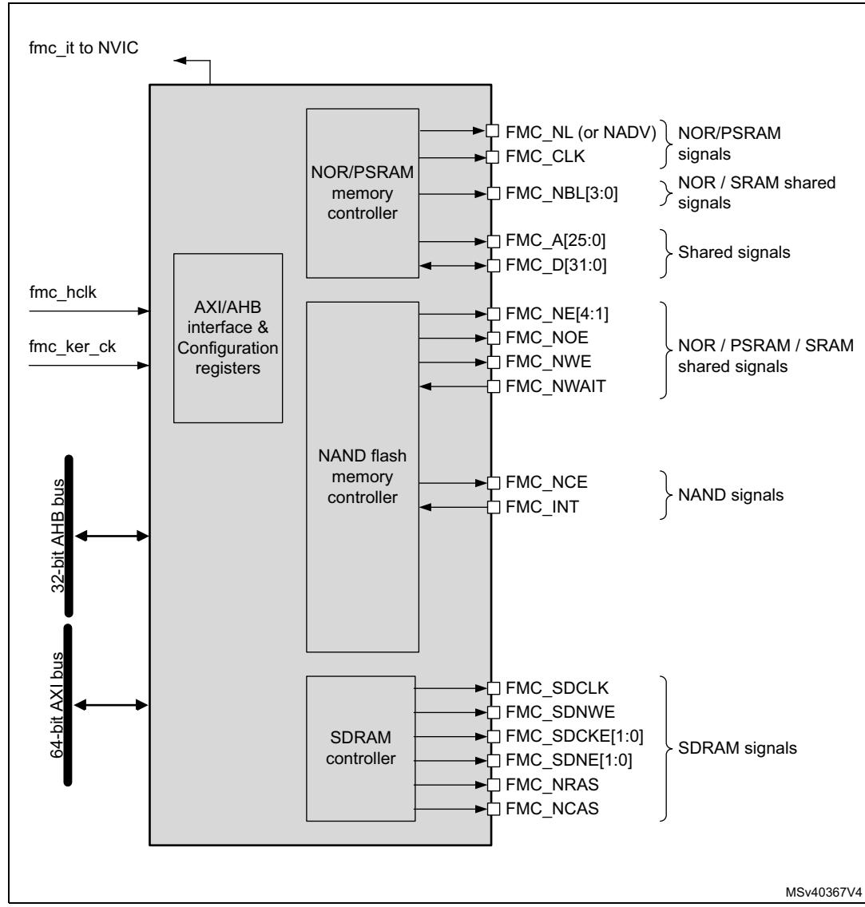

**Figure 103. FMC block diagram** 

# **23.3 FMC internal signals**

*[Table 157](#page-3-0)* gives the list of FMC internal signals. FMC pins (or external signals) are described in *[Section 23.7.1: External memory interface signals](#page-12-0)*.

**Table 157. FMC pins**

<span id="page-3-0"></span>

| Names      | Signal type    | Description         |
|------------|----------------|---------------------|
| fmc_it     | Digital output | FMC interrupt       |
| fmc_ker_ck | Digital input  | FMC kernel clock    |
| fmc_hclk   | Digital input  | FMC interface clock |

# **23.4 AHB interface**

The AHB slave interface allows internal CPUs to configure the FMC registers.

The AHB clock (fmc\_hclk) is the reference clock for the FMC register accesses.

# **23.5 AXI interface**

The AXI slave interface allows internal CPUs and other bus master peripherals to access the external memories.

AXI transactions are translated into the external device protocol. As the AXI data bus is 64 bit wide, the AXI transactions might be split into several consecutive 32-, 16- or 8-bit accesses according to data size accesses. The FMC Chip Select (FMC\_NEx) does not toggle between consecutive accesses except in case of accesses in mode D when the Extended mode is enabled.

The FMC generates an AXI slave error when one of the following conditions is met:

- Reading or writing to an FMC bank (Bank 1 to 4) which is not enabled.
- Reading or writing to the NOR flash bank while the FACCEN bit is reset in the FMC\_BCRx register.
- Writing to a write protected SDRAM bank (WP bit set in the FMC\_SDCRx register).
- Violation of the SDRAM address range (access to reserved address range)
- Attempting to read/write access from/to SDRAM bank when it is not yet initialized

The FMC generates an AXI decoder error when ADDR[31:28] address bits are not supported by the FMC bank base address following the BMAP[1:0] bits configuration.

The kernel clock for the FMC is the asynchronous fmc\_ker\_ck clock (refer to *Section 9: Reset and Clock Control (RCC)* for fmc\_ker\_ck clock source selection).


# **23.5.1 Supported memories and transactions**

### **General transaction rules**

The requested AXI transaction data size can be 8-, 16-, 32- or 64-bit wide whereas the accessed external device has a fixed data width. The best performance is always achieved with aligned AXI transactions whose size matches the external device data width.

When AXI transaction data size is different from the device data width, the result depends on the following factors:

- AXI transaction data size is greater than the device data width:
  - Read/Write transactions: the FMC splits the AXI transaction into smaller consecutive accesses matching the external device data width.
- AXI transaction data size is smaller than the external device data width and the device supports byte selection (SRAM, PSRAM, SDRAM):
  - Write transactions, the FMC manages the transaction using the byte lane signals.
  - Read transactions, the FMC returns all bytes according to the external device data width. The useless bytes are discarded by the system.
- AXI transaction data size is smaller than the external device data width and the device does not support byte selection (NOR and NAND flash memories):
  - Write transactions: the FMC writes some irrelevant bytes which may corrupt the external device
  - Read transactions: the FMC returns all bytes according to the external device data width. The useless bytes are discarded by the system.

# **Caution: Address alignment**

- Read transactions with unaligned addresses (such as half-word starting at an odd address) are not supported by the FMC.
- Write transactions with unaligned addresses

Their support depends on byte selection availability on the external device:

– If the device does not support byte selection (NOR and NAND flash memories), narrow write transactions and/or unaligned write transaction are not supported since the FMC would write irrelevant bytes and corrupt the external device.

### **Wrap support for NOR flash/PSRAM and SDRAM**

The synchronous memories must be configured in Linear burst mode of undefined length as not all masters can issue wrap transactions.

If a master generates a wrap transaction:

- The read is split into two linear burst transactions.
- The write is split into two linear burst transactions if the write FIFO is enabled and into several linear burst transactions if the write FIFO is disabled.

# **Configuration registers**

The FMC can be configured through a set of registers. Refer to *[Section 23.7.6](#page-41-0)*, for a detailed description of the NOR flash/PSRAM controller registers. Refer to *[Section 23.8.7](#page-56-0)*, for a detailed description of the NAND flash registers and to *[Section 23.9.5](#page-73-0)* for a detailed description of the SDRAM controller registers.


RM0399 Rev 4 841/3556

# **23.6 External device address mapping**

From the FMC point of view, the external memory is divided into fixed-size banks of 256 Mbytes each (see *[Figure 104](#page-5-0)*):

- Bank 1 is used to address up to 4 NOR flash memory or PSRAM devices. This bank is split into 4 NOR/PSRAM subbanks with 4 dedicated Chip Selects, as follows:
  - Bank 1 NOR/PSRAM 1
  - Bank 1 NOR/PSRAM 2
  - Bank 1 NOR/PSRAM 3
  - Bank 1 NOR/PSRAM 4
- Bank 2 is used for SDRAM device, SDRAM bank 1 or SDRAM bank 2 depending on BMAP bits configuration.
- Bank 3 is used to address NAND flash memory devices.The MPU memory attribute for this space must be reconfigured by software to Device.
- Bank 5 and 6 are used to address SDRAM devices (1 device per bank).

For each bank the type of memory to be used can be configured by the user application through the Configuration register.

<span id="page-5-0"></span>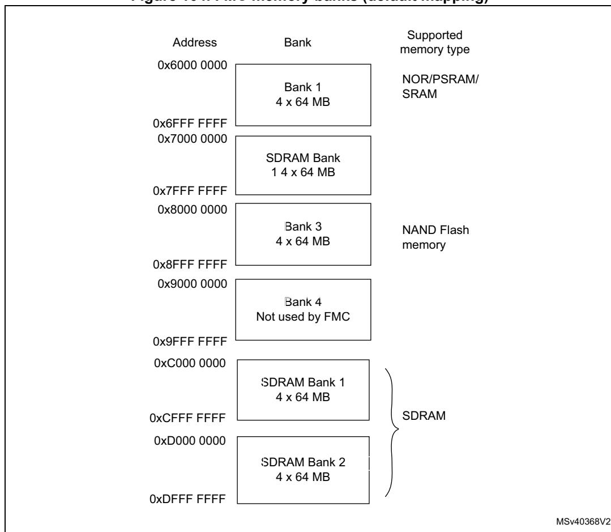

**Figure 104. FMC memory banks (default mapping)** 

The FMC bank mapping can be modified through the BMAP[1:0] bits in the FMC\_BCR1 register. *[Table 158](#page-6-0)* shows the configuration to swap the NOR/PSRAM bank with SDRAM banks or remap the SDRAM bank2, thus allowing to access the SDRAM banks at two different address mapping.

<span id="page-6-0"></span>**Start -End address BMAP[1:0]=00 (Default mapping) BMAP[1:0]=01 NOR/PSRAM and SDRAM banks swapped BMAP[1:0]=10 SDRAM bank 2 remapped** 0x6000 0000 - 0x6FFF FFFF NOR/PSRAM bank SDRAM bank1 NOR/PSRAM bank 0x7000 0000 - 0x7FFF FFFF SDRAM bank1 SDRAM bank2 SDRAM bank2 0x8000 0000 - 0x8FFF FFFF NAND bank NAND bank NAND bank 0x9000 0000 - 0x9FFF FFFF Not used by FMC 0xC000 0000 - 0xCFFF FFFF SDRAM bank1 NOR/PSRAM bank SDRAM bank1 0xD000 0000 - 0xDFFF FFFF SDRAM bank2 SDRAM bank2 SDRAM bank2

**Table 158. FMC bank mapping options**

# **23.6.1 NOR/PSRAM address mapping**

ADDR[27:26] bits are used to select one of the four memory banks as shown in *[Table 159](#page-6-1)*.

<span id="page-6-1"></span>

| ADDR[27:26](1) | Selected bank        |
|----------------|----------------------|
| 00             | Bank 1 - NOR/PSRAM 1 |
| 01             | Bank 1 - NOR/PSRAM 2 |
| 10             | Bank 1 - NOR/PSRAM 3 |
| 11             | Bank 1 - NOR/PSRAM 4 |

**Table 159. NOR/PSRAM bank selection** 

The ADDR[25:0] bits contain the external memory address. Since ADDR is a byte address whereas the memory is addressed at word level, the address actually issued to the memory varies according to the memory data width, as shown in the following table.

**Table 160. NOR/PSRAM External memory address** 

| Memory width(1) | Data address issued to the memory | Maximum memory capacity (bits) |
|-----------------|-----------------------------------|--------------------------------|
| 8-bit           | ADDR[25:0]                        | 64 Mbytes x 8 = 512 Mbit       |
| 16-bit          | ADDR[25:1] >> 1                   | 64 Mbytes/2 x 16 = 512 Mbit    |
| 32-bit          | ADDR[25:2] >> 2                   | 64 Mbytes/4 x 32 = 512 Mbit    |

<sup>1.</sup> In case of a 16-bit external memory width, the FMC will internally use ADDR[25:1] to generate the address for external memory FMC\_A[24:0]. In case of a 32-bit memory width, the FMC will internally use ADDR[25:2] to generate the external address. Whatever the external memory width, FMC\_A[0] should be connected to external memory address A[0].


<sup>1.</sup> ADDR are internal address lines that are translated to external memory.

# <span id="page-7-3"></span>**23.6.2 NAND flash memory address mapping**

The NAND bank is divided into memory areas as indicated in *[Table 161](#page-7-0)*.

**Table 161. NAND memory mapping and timing registers**

<span id="page-7-0"></span>

| Start address | End address | FMC bank            | Memory space | Timing register |
|---------------|-------------|---------------------|--------------|-----------------|
| 0x8800 0000   | 0x8BFF FFFF |                     | Attribute    | FMC_PATT (0x8C) |
| 0x8000 0000   | 0x83FF FFFF | Bank 3 - NAND flash | Common       | FMC_PMEM (0x88) |

For NAND flash memory, the common and attribute memory spaces are subdivided into three sections (see in *[Table 162](#page-7-1)* below) located in the lower 256 Kbytes:

- Data section (first 64 Kbytes in the common/attribute memory space)
- Command section (second 64 Kbytes in the common / attribute memory space)
- Address section (next 128 Kbytes in the common / attribute memory space)

**Table 162. NAND bank selection** 

<span id="page-7-1"></span>

| Section name    | ADDR[17:16] | Address range     |
|-----------------|-------------|-------------------|
| Address section | 1X          | 0x020000-0x03FFFF |
| Command section | 01          | 0x010000-0x01FFFF |
| Data section    | 00          | 0x000000-0x0FFFF  |

The application software uses the 3 sections to access the NAND flash memory:

- **To send a command to NAND flash memory**, the software must write the command value to any memory location in the command section.
- **To specify the NAND flash address that must be read or written**, the software must write the address value to any memory location in the address section. Since an address can be 4 or 5 bytes long (depending on the actual memory size), several consecutive write operations to the address section are required to specify the full address.
- **To read or write data,** the software reads or writes the data from/to any memory location in the data section.

Since the NAND flash memory automatically increments addresses, there is no need to increment the address of the data section to access consecutive memory locations.

# **23.6.3 SDRAM address mapping**

Two SDRAM banks are available as indicated in *[Table 163](#page-7-2)*.

**Table 163. SDRAM bank selection**

<span id="page-7-2"></span>

| Selected bank | Control register | Timing register |
|---------------|------------------|-----------------|
| SDRAM Bank1   | FMC_SDCR1        | FMC_SDTR1       |
| SDRAM Bank2   | FMC_SDCR2        | FMC_SDTR2       |

*[Table 164](#page-8-0)* shows SDRAM mapping for a 13-bit row and an 11-bit column configuration.


<span id="page-8-0"></span>

| Memory width(1) | Internal bank | Row address | Column<br>address(2) | Maximum<br>memory capacity<br>(Mbytes) |
|-----------------|---------------|-------------|----------------------|----------------------------------------|
| 8-bit           | ADDR[25:24]   | ADDR[23:11] | ADDR[10:0]           | 64 Mbytes:<br>4 x 8K x 2K              |
| 16-bit          | ADDR[26:25]   | ADDR[24:12] | ADDR[11:1]           | 128 Mbytes:<br>4 x 8K x 2K x 2         |
| 32-bit          | ADDR[27:26]   | ADDR[25:13] | ADDR[12:2]           | 256 Mbytes:<br>4 x 8K x 2K x 4         |

**Table 164. SDRAM address mapping** 

The ADDR[27:0] bits are translated into an external SDRAM address depending on the SDRAM controller configuration:

- Data size:8, 16 or 32 bits
- Row size:11, 12 or 13 bits
- Column size: 8, 9, 10 or 11 bits
- Number of internal banks: two or four internal banks

The following tables show the SDRAM address mapping versus the SDRAM controller configuration.

**Table 165. SDRAM address mapping with 8-bit data bus width(1)(2)**

| Row size          |                       | ADDR(Internal Address Lines) |      |      |               |    |           |               |                            |        |        |        |        |        |        |        |             |    |              |             |  |  |  |  |                  |  |  |  |
|-------------------|-----------------------|------------------------------|------|------|---------------|----|-----------|---------------|----------------------------|--------|--------|--------|--------|--------|--------|--------|-------------|----|--------------|-------------|--|--|--|--|------------------|--|--|--|
| configuratio<br>n | 27                    | 26                           | 25   | 24   | 23            | 22 | 21        | 20            | 1<br>9                     | 1<br>8 | 1<br>7 | 1<br>6 | 1<br>5 | 1<br>4 | 1<br>3 | 1<br>2 | 11          | 10 |              |             |  |  |  |  | 9 8 7 6 5 4 3210 |  |  |  |
|                   |                       |                              |      | Res. |               |    |           |               | Bank<br>Row[10:0]<br>[1:0] |        |        |        |        |        |        |        |             |    | Column[7:0]  |             |  |  |  |  |                  |  |  |  |
| 11-bit row size   |                       |                              |      | Res. |               |    |           | Bank<br>[1:0] | Row[10:0]                  |        |        |        |        |        |        |        |             |    |              | Column[8:0] |  |  |  |  |                  |  |  |  |
| configuration     |                       |                              | Res. |      | Bank<br>[1:0] |    | Row[10:0] |               |                            |        |        |        |        |        |        |        | Column[9:0] |    |              |             |  |  |  |  |                  |  |  |  |
|                   | Bank<br>Res.<br>[1:0] |                              |      |      |               |    |           | Row[10:0]     |                            |        |        |        |        |        |        |        |             |    | Column[10:0] |             |  |  |  |  |                  |  |  |  |

RM0399 Rev 4 845/3556

<sup>1.</sup> When interfacing with a 16-bit memory, the FMC internally uses the ADDR[11:1] internal address lines to generate the external address. When interfacing with a 32-bit memory, the FMC internally uses ADDR[12:2] lines to generate the external address. Whatever the memory width, FMC\_A[0] has to be connected to the external memory address A[0].

<sup>2.</sup> The AutoPrecharge is not supported. FMC\_A[10] must be connected to the external memory address A[10] but it will be always driven low.

Table 165. SDRAM address mapping with 8-bit data bus width<sup>(1)(2)</sup> (continued)

| r                  |    | too. ozia mi adamood mapping mini o an adam odo midi. (commod) |     |            |            |                      |           |            |             |        |        |        |        |        |     |             |    |             |   |              |             |     |     |             |      |    |    |   |  |
|--------------------|----|----------------------------------------------------------------|-----|------------|------------|----------------------|-----------|------------|-------------|--------|--------|--------|--------|--------|-----|-------------|----|-------------|---|--------------|-------------|-----|-----|-------------|------|----|----|---|--|
| Row size           |    | ADDR(Internal Address Lines)                                   |     |            |            |                      |           |            |             |        |        |        |        |        |     |             |    |             |   |              |             |     |     |             |      |    |    |   |  |
| configuratio<br>n  | 27 | 26                                                             | 25  | 24         | 23         | 22                   | 21        | 20         | 1<br>9      | 1<br>8 | 1<br>7 | 1<br>6 | 1<br>5 | 1<br>4 | 1 3 | 1 2         | 11 | 10          | 9 | 8            | 7           | 6   | 5   | 4           | 3    | 2  | 1  | 0 |  |
|                    |    |                                                                | R   | es.        |            |                      |           | ank<br>:0] | I ROWITI'UI |        |        |        |        |        |     |             |    |             |   | Column[7:0]  |             |     |     |             |      |    |    |   |  |
| 12-bit row<br>size |    |                                                                | Res |            |            | Ba<br>[1:            |           |            |             |        |        | R      | ow[    | 11:0   | ]   |             |    |             |   |              | Column[8:0] |     |     |             |      |    |    |   |  |
| configuration      |    | Re                                                             | es. |            | _          | Bank [1:0] Row[11:0] |           |            |             |        |        |        |        |        |     | Column[9:0] |    |             |   |              |             |     |     |             |      |    |    |   |  |
|                    | ı  | Res.                                                           |     |            | ink<br>:0] |                      |           |            |             | R      | ow[    | 11:0   | ]      |        |     |             |    |             |   | Column[10:0] |             |     |     |             |      |    |    |   |  |
|                    |    |                                                                | Res |            |            | Ba<br>[1:            |           |            |             |        |        | ı      | Row    | (12:   | 0]  |             |    |             |   |              | Column[7:0] |     |     |             |      |    | )] |   |  |
| 13-bit row<br>size |    | Re                                                             | es. |            |            | ink<br>:0]           | R0WI12:01 |            |             |        |        |        |        |        |     |             |    | Column[8:0] |   |              |             |     |     | Column[8:0] |      |    |    |   |  |
| configuration      | I  | Res.                                                           |     | _          | ink<br>:0] |                      |           |            |             |        | Rov    | w[12   | ::0]   |        |     |             |    |             |   |              | C           | Col | un  | nn          | [9:0 | )] |    |   |  |
|                    | Re | es.                                                            |     | ank<br>:0] |            |                      |           |            |             | Rov    | v[12   | :0]    |        |        |     |             |    |             |   | C            | Col         | ım  | าท[ | 10          | :0]  |    |    |   |  |

<sup>1.</sup> BANK[1:0] are the Bank Address BA[1:0]. When only 2 internal banks are used, BA1 must always be set to '0'.

Table 166. SDRAM address mapping with 16-bit data bus width<sup>(1)(2)</sup>

|                           |    | ADDR(address Lines) |     |            |            |                               |            |           |           |           |      |      |     |      |      |    |    |              |   |             |     |     |     |      |     |   |     |     |
|---------------------------|----|---------------------|-----|------------|------------|-------------------------------|------------|-----------|-----------|-----------|------|------|-----|------|------|----|----|--------------|---|-------------|-----|-----|-----|------|-----|---|-----|-----|
| Row size<br>Configuration | 27 | 26                  | 25  | 24         | 23         | 22                            | 21         | 20        | 19        | 18        | 17   | 16   | 15  | 14   | 13   | 12 | 11 | 10           | 6 | 8           | 7   | 9   | 2   | 4    | 3   | 2 | 1   | 0   |
|                           |    |                     | R   | es.        |            |                               |            | nk<br>:0] |           |           |      |      | Rov | v[10 | 0:0] |    |    | 1            |   |             | (   | Col | lur | nn[  | 7:0 | ] |     | (3) |
| 11-bit row size           |    |                     | Res |            |            | [1:                           | ink<br>:0] |           | Row[10:0] |           |      |      |     |      |      |    |    |              |   |             | ВМ0 |     |     |      |     |   |     |     |
| configuration             |    | R                   | es. |            | _          | ink<br>:0]                    |            |           |           | ı         | Rov  | /[10 | :0] |      |      |    |    |              |   | C           | Col | um  | n[  | 9:0] |     |   |     | ВМ0 |
|                           |    | Res                 |     |            | ink<br>:0] |                               |            |           | F         | Row[10:0] |      |      |     |      |      |    |    | Column[10:0] |   |             |     |     |     |      |     |   | ВМ0 |     |
|                           |    |                     | Res |            |            | _                             | ink<br>:0] |           |           | Row[11:0] |      |      |     |      |      |    |    |              |   | Column[7:0] |     |     |     |      |     |   |     | ВМ0 |
| 12-bit row size           |    | R                   | es. |            |            | ank   Row[11:0]   Column[8:0] |            |           |           |           |      |      |     | ВМ0  |      |    |    |              |   |             |     |     |     |      |     |   |     |     |
| configuration             |    | Res                 |     |            | ink<br>:0] |                               |            |           |           | Ro        | )w[1 | 1:0  | ]   |      |      |    |    |              |   | C           | Col | um  | n[  | 9:0] |     |   |     | ВМ0 |
|                           | R  | es.                 | _   | ink<br>:0] |            | Row[11:0] Column[10:0] B      |            |           |           |           |      |      |     |      | ВМ0  |    |    |              |   |             |     |     |     |      |     |   |     |     |


<sup>2.</sup> Access to Reserved (Res.) address range generates an AXI slave error.

ADDR(address Lines) Row size Configuration 27 26 25 24 23 22 19 8 16 15 4 13 12 10 7 20 6 8 9 2 4 က 0 Res. Row[12:0] Column[7:0] ВМ0 [1:0] Bank BM0 Res. Row[12:0] Column[8:0] 13-bit row size [1:0] configuration Res. Row[12:0] BM0 Column[9:0] [1:0] BM0 Row[12:0] Column[10:0] [1:0] s.

Table 166. SDRAM address mapping with 16-bit data bus width  $^{(1)(2)}$ 

- 1. BANK[1:0] are the Bank Address BA[1:0]. When only 2 internal banks are used, BA1 must always be set to '0'.
- 2. Access to Reserved space (Res.) generates an AXI Slave error.
- 3. BM0: is the byte mask for 16-bit access.

Table 167. SDRAM address mapping with 32-bit data bus width<sup>(1)(2)</sup>

|                        |           | ADDR(address Lines) |            |            |                                   |            |            |    |     |      |      |      |      |      |    |       |    |    |   |        |      |      |       |      |   |   |          |              |  |  |  |  |
|------------------------|-----------|---------------------|------------|------------|-----------------------------------|------------|------------|----|-----|------|------|------|------|------|----|-------|----|----|---|--------|------|------|-------|------|---|---|----------|--------------|--|--|--|--|
| Row size configuration | 27        | 26                  | 25         | 24         | 23                                | 22         | 21         | 20 | 19  | 18   | 17   | 16   | 15   | 14   | 13 | 12    | 11 | 10 | 6 | 8      | 7    | 9    | 2     | 4    | က | 2 | -        | 0            |  |  |  |  |
|                        |           | F                   | Res.       |            |                                   | [1         | ank<br>:0] |    |     |      |      | Rov  | w[1  | 0:0] |    |       |    |    |   |        | Сс   | olun | nn[7  | 7:0] |   |   | ](<br>BM | I[1:0<br>(3) |  |  |  |  |
| 11-bit row size        |           | Re                  | s.         |            | [1                                | ink<br>:0] |            |    |     |      | Rov  | v[10 | 0:0] |      |    |       |    |    |   | C      | Colu | ımr  | 1[8:0 | 0]   |   |   | ВМ       | 1[1:0        |  |  |  |  |
| configuration          | F         | Res.                |            | [1         | ink<br>:0]                        |            |            |    | l   | Rov  | v[1C | [0:0 |      |      |    |       |    |    |   | Со     | lun  | nn[9 | 9:0]  |      |   |   | ВМ       | 1[1:0        |  |  |  |  |
|                        | Re        | es.                 |            | ink<br>:0] |                                   |            |            |    | Rov | v[10 | [0:0 |      |      |      |    |       |    |    | С | BM[1:0 |      |      |       |      |   |   |          |              |  |  |  |  |
|                        |           | Re                  | s.         |            | [1                                | ank<br>:0] |            |    |     |      | R    | ow[  | 11:0 | 0]   |    |       |    |    |   |        | Сс   | olun | nn[ː  | 7:0] |   |   | ВМ       | 1[1:0        |  |  |  |  |
| 12-bit row size        | F         | Res.                |            | [1         | ink<br>:0]                        |            |            |    |     | R    | ]wc  | 11:C | )]   |      |    |       |    |    |   | C      | Colu | ımr  | 1[8:0 | 0]   |   |   | 1[1:0    |              |  |  |  |  |
| configuration          | Re        |                     | [1         | ank<br>:0] |                                   |            |            |    | R   | ow[  | 11:0 | )]   |      |      |    |       |    |    |   | Со     | lun  | nn[9 | 9:0]  |      |   |   | BM[1:    |              |  |  |  |  |
|                        | Res.      |                     | ink<br>:0] |            |                                   |            |            | Ro | )w[ | 11:0 | ]    |      |      |      |    |       |    |    | С | olur   | mn[  | [10: | 0]    |      |   |   | ВМ       | 1[1:0        |  |  |  |  |
|                        | F         | Res.                |            | [1         | ank   Row[12:0]   Column[7:0]   E |            |            |    |     |      |      |      |      | ВМ[  |    |       |    |    |   |        |      |      |       |      |   |   |          |              |  |  |  |  |
| 13-bit row size        | Re        |                     | [1         | ank<br>:0] |                                   |            |            |    | F   | Rov  | /[12 | 2:0] |      |      |    |       |    |    |   | C      | Colu | ımr  | 1[8:  | 0]   |   |   | BM[1:0   |              |  |  |  |  |
| configuration          | Res.      | [1                  | ink<br>:0] |            |                                   |            |            | F  | Row | /[12 | :0]  |      |      |      |    |       |    |    |   | Со     | lun  | nn[9 | 9:0]  |      |   |   | ВМ       | 1[1:0        |  |  |  |  |
|                        | Ва<br>[1: |                     |            |            | Row[12:0] Column[10:0]            |            |            |    |     |      |      |      |      |      | ВМ | 1[1:0 |    |    |   |        |      |      |       |      |   |   |          |              |  |  |  |  |

- 1. BANK[1:0] are the Bank Address BA[1:0]. When only 2 internal banks are used, BA1 must always be set to '0'.
- 2. Access to Reserved space (Res.) generates an AXI slave error.
- 3. BM[1:0]: is the byte mask for 32-bit access.


RM0399 Rev 4

# **23.7 NOR flash/PSRAM controller**

The FMC generates the appropriate signal timings to drive the following types of memories:

- Asynchronous SRAM and ROM
  - 8 bits
  - 16 bits
  - 32 bits
- PSRAM (Cellular RAM)
  - Asynchronous mode
  - Burst mode for synchronous accesses with configurable option to split burst access when crossing boundary page for CRAM 1.5.
  - Multiplexed or non-multiplexed
- NOR flash memory
  - Asynchronous mode
  - Burst mode for synchronous accesses
  - Multiplexed or non-multiplexed

The FMC outputs a unique Chip Select signal, NE[4:1], per bank. All the other signals (addresses, data and control) are shared.

The FMC supports a wide range of devices through a programmable timings among which:

- Programmable wait states (up to 15)
- Programmable bus turnaround cycles (up to 15)
- Programmable output enable and write enable delays (up to 15)
- Independent read and write timings and protocol to support the widest variety of memories and timings
- Programmable continuous clock (FMC\_CLK) output.

The FMC output Clock (FMC\_CLK) is a sub-multiple of the fmc\_ker\_ck clock. It can be delivered to the selected external device either during synchronous accesses only or during asynchronous and synchronous accesses depending on the CCKEN bit configuration in the FMC\_BCR1 register:

- If the CCLKEN bit is reset, the FMC generates the clock (FMC\_CLK) only during synchronous accesses (Read/write transactions).
- If the CCLKEN bit is set, the FMC generates a continuous clock during asynchronous and synchronous accesses. To generate the FMC\_CLK continuous clock, Bank 1 must be configured in Synchronous mode (see *[Section 23.7.6: NOR/PSRAM controller](#page-41-0)  [registers](#page-41-0)*). Since the same clock is used for all synchronous memories, when a continuous output clock is generated and synchronous accesses are performed, the AXI data size has to be the same as the memory data width (MWID) otherwise the FMC\_CLK frequency will be changed depending on AXI data transaction (refer to *[Section 23.7.5: Synchronous transactions](#page-35-0)* for FMC\_CLK divider ratio formula).

The size of each bank is fixed and equal to 64 Mbytes. Each bank is configured through dedicated registers (see *[Section 23.7.6: NOR/PSRAM controller registers](#page-41-0)*).

The programmable memory parameters include access times (see *[Table 168](#page-12-1)*) and support for wait management (for PSRAM and NOR flash memory accessed in Burst mode).


<span id="page-12-1"></span>**Parameter Function** Access mode Unit Min. Max. Duration of the address Address FMC clock cycle 0 15 Asynchronous setup setup phase (fmc ker ck) Duration of the address hold Asynchronous, FMC clock cycle Address hold 1 15 muxed I/Os (fmc ker ck) phase Duration of the data setup FMC clock cycle 1 256 Data setup Asynchronous phase (fmc\_ker\_ck) Duration of the bus Asynchronous and FMC clock cycle Bust turn 0 15 turnaround phase synchronous read (fmc\_ker\_ck) Number of FMC clock cycles Clock divide FMC clock cycle 2 16 (fmc\_ker\_ck) to build one Synchronous ratio (fmc\_ker\_ck) memory clock cycle (CLK) Number of clock cycles to Memory clock issue to the memory before 2 17 Data latency Synchronous cycle the first data of the burst (fmc\_ker\_ck)

Table 168. Programmable NOR/PSRAM access parameters

# <span id="page-12-0"></span>23.7.1 External memory interface signals

*Table 169, Table 170* and *Table 171* list the signals that are typically used to interface with NOR flash memory, SRAM and PSRAM.

Note: The prefix "N" identifies the signals which are active low.

# NOR flash memory, non-multiplexed I/Os

Table 169. Non-multiplexed I/O NOR flash memory

<span id="page-12-2"></span>

| FMC pin name | I/O | Function                                                                            |
|--------------|-----|-------------------------------------------------------------------------------------|
| CLK          | 0   | Clock (for synchronous access)                                                      |
| A[25:0]      | 0   | Address bus                                                                         |
| D[31:0]      | I/O | Bidirectional data bus                                                              |
| NE[x]        | 0   | Chip Select, x = 14                                                                 |
| NOE          | 0   | Output enable                                                                       |
| NWE          | 0   | Write enable                                                                        |
| NL(=NADV)    | 0   | Latch enable (this signal is called address valid, NADV, by some NOR flash devices) |
| NWAIT        | I   | NOR flash wait input signal to the FMC                                              |

The maximum capacity is 512 Mbits (26 address lines).


### **NOR flash memory, 16-bit multiplexed I/Os**

**Table 170. 16-bit multiplexed I/O NOR flash memory** 

<span id="page-13-0"></span>

| FMC pin name | I/O | Function                                                                                                                           |  |  |  |  |
|--------------|-----|------------------------------------------------------------------------------------------------------------------------------------|--|--|--|--|
| CLK          | O   | Clock (for synchronous access)                                                                                                     |  |  |  |  |
| A[25:16]     | O   | Address bus                                                                                                                        |  |  |  |  |
| AD[15:0]     | I/O | 16-bit multiplexed, bidirectional address/data bus (the 16-bit address<br>A[15:0] and data D[15:0] are multiplexed on the databus) |  |  |  |  |
| NE[x]        | O   | Chip Select, x = 14                                                                                                                |  |  |  |  |
| NOE          | O   | Output enable                                                                                                                      |  |  |  |  |
| NWE          | O   | Write enable                                                                                                                       |  |  |  |  |
| NL(=NADV)    | O   | Latch enable (this signal is called address valid, NADV, by some NOR<br>flash devices)                                             |  |  |  |  |
| NWAIT        | I   | NOR flash wait input signal to the FMC                                                                                             |  |  |  |  |

The maximum capacity is 512 Mbits.

# **PSRAM/SRAM, non-multiplexed I/Os**

**Table 171. Non-multiplexed I/Os PSRAM/SRAM** 

<span id="page-13-1"></span>

| FMC pin name | I/O | Function                                                                 |  |  |  |  |
|--------------|-----|--------------------------------------------------------------------------|--|--|--|--|
| CLK          | O   | Clock (only for PSRAM synchronous access)                                |  |  |  |  |
| A[25:0]      | O   | Address bus                                                              |  |  |  |  |
| D[31:0]      | I/O | Data bidirectional bus                                                   |  |  |  |  |
| NE[x]        | O   | Chip Select, x = 14 (called NCE by PSRAM (Cellular RAM i.e. CRAM))       |  |  |  |  |
| NOE          | O   | Output enable                                                            |  |  |  |  |
| NWE          | O   | Write enable                                                             |  |  |  |  |
| NL(= NADV)   | O   | Address valid only for PSRAM input (memory signal name: NADV)            |  |  |  |  |
| NWAIT        | I   | PSRAM wait input signal to the FMC                                       |  |  |  |  |
| NBL[3:0]     | O   | Byte lane output. Byte 0 to Byte 3 control (Upper and lower byte enable) |  |  |  |  |

The maximum capacity is 512 Mbits.

### **PSRAM, 16-bit multiplexed I/Os**

**Table 172. 16-Bit multiplexed I/O PSRAM** 

| FMC pin name | I/O | Function                                                                                                                           |  |  |  |
|--------------|-----|------------------------------------------------------------------------------------------------------------------------------------|--|--|--|
| CLK          | O   | Clock (for synchronous access)                                                                                                     |  |  |  |
| A[25:16]     | O   | Address bus                                                                                                                        |  |  |  |
| AD[15:0]     | I/O | 16-bit multiplexed, bidirectional address/data bus (the 16-bit address<br>A[15:0] and data D[15:0] are multiplexed on the databus) |  |  |  |


| FMC pin name | I/O | Function                                                                  |  |  |  |  |  |
|--------------|-----|---------------------------------------------------------------------------|--|--|--|--|--|
| NE[x]        | O   | Chip Select, x = 14 (called NCE by PSRAM (Cellular RAM i.e. CRAM))        |  |  |  |  |  |
| NOE          | O   | Output enable                                                             |  |  |  |  |  |
| NWE          | O   | Write enable                                                              |  |  |  |  |  |
| NL(= NADV)   | O   | Address valid PSRAM input (memory signal name: NADV)                      |  |  |  |  |  |
| NWAIT        | I   | PSRAM wait input signal to the FMC                                        |  |  |  |  |  |
| NBL[1:0]     | O   | Byte lane output. Byte 0 and Byte 1 control (upper and lower byte enable) |  |  |  |  |  |

**Table 172. 16-Bit multiplexed I/O PSRAM (continued)**

The maximum capacity is 512 Mbits (26 address lines).

# **23.7.2 Supported memories and transactions**

*[Table 173](#page-14-0)* below shows an example of the supported devices, access modes and transactions when the memory data bus is 16-bit wide for NOR flash memory, PSRAM and SRAM. The transactions not allowed (or not supported) by the FMC are shown in gray in this example.

**Table 173. NOR flash/PSRAM: Example of supported memories and transactions(1)**

<span id="page-14-0"></span>

| Device                   | Mode                 | R/W | AXI data<br>size | Memory<br>data size | Allowed/<br>not<br>allowed | Comments                  |
|--------------------------|----------------------|-----|------------------|---------------------|----------------------------|---------------------------|
|                          | Asynchronous         | R   | 8                | 16                  | Y                          |                           |
|                          | Asynchronous         | W   | 8                | 16                  | N                          |                           |
|                          | Asynchronous         | R   | 16               | 16                  | Y                          |                           |
|                          | Asynchronous         | W   | 16               | 16                  | Y                          |                           |
|                          | Asynchronous         | R   | 32               | 16                  | Y                          | Split into 2 FMC accesses |
| NOR flash<br>(muxed I/Os | Asynchronous         | W   | 32               | 16                  | Y                          | Split into 2 FMC accesses |
| and non                  | Asynchronous         | R   | 64               | 16                  | Y                          | Split into 4 FMC accesses |
| multiplexed<br>I/Os)     | Asynchronous         | W   | 64               | 16                  | Y                          | Split into 4 FMC accesses |
|                          | Asynchronous<br>page | R   | -                | 16                  | N                          | Mode is not supported     |
|                          | Synchronous          | R   | 8                | 16                  | N                          |                           |
|                          | Synchronous          | R   | 16               | 16                  | Y                          |                           |
|                          | Synchronous          | R   | 32/64            | 16                  | Y                          |                           |

**Table 173. NOR flash/PSRAM: Example of supported memories and transactions(1) (continued)**

| Device                               | Mode                 | R/W | AXI data<br>size | Memory<br>data size | Allowed/<br>not<br>allowed | Comments                                                |
|--------------------------------------|----------------------|-----|------------------|---------------------|----------------------------|---------------------------------------------------------|
|                                      | Asynchronous         | R   | 8                | 16                  | Y                          |                                                         |
|                                      | Asynchronous         | W   | 8                | 16                  | Y                          | Use of byte lanes NBL[1:0]                              |
|                                      | Asynchronous         | R   | 16               | 16                  | Y                          |                                                         |
|                                      | Asynchronous         | W   | 16               | 16                  | Y                          |                                                         |
|                                      | Asynchronous         | R   | 32               | 16                  | Y                          | Split into 2 FMC accesses                               |
|                                      | Asynchronous         | W   | 32               | 16                  | Y                          | Split into 2 FMC accesses                               |
| PSRAM<br>(multiplexed                | Asynchronous         | R   | 64               | 16                  | Y                          | Split into 4 FMC accesses                               |
| I/Os and non<br>multiplexed<br>I/Os) | Asynchronous         | W   | 64               | 16                  | Y                          | Split into 4 FMC accesses                               |
|                                      | Asynchronous<br>page | R   | -                | 16                  | N                          | Mode is not supported                                   |
|                                      | Synchronous          | R   | 8                | 16                  | N                          |                                                         |
|                                      | Synchronous          | R   | 16               | 16                  | Y                          |                                                         |
|                                      | Synchronous          | R   | 32/64            | 16                  | Y                          |                                                         |
|                                      | Synchronous          | W   | 8                | 16                  | Y                          | Use of byte lanes NBL[1:0]                              |
|                                      | Synchronous          | W   | 16/32/64         | 16                  | Y                          |                                                         |
|                                      | Asynchronous         | R   | 8/16             | 16                  | Y                          |                                                         |
| SRAM and<br>ROM                      | Asynchronous         | W   | 8/16             | 16                  | Y                          | Use of byte lanes NBL[1:0]                              |
|                                      | Asynchronous         | R   | 32               | 16                  | Y                          | Split into 2 FMC accesses                               |
|                                      | Asynchronous         | W   | 32               | 16                  | Y                          | Split into 2 FMC accesses<br>Use of byte lanes NBL[1:0] |
|                                      | Asynchronous         | R   | 64               | 16                  | Y                          | Split into 4 FMC accesses                               |
|                                      | Asynchronous         | W   | 64               | 16                  | Y                          | Split into 4 FMC accesses<br>Use of byte lanes NBL[1:0] |

<sup>1.</sup> NBL[1:0] are also driven by AXI write strobes.

# **23.7.3 General timing rules**

Signal synchronization is performed as follows:

- All controller output signals change on the rising edge of the fmc\_ker\_ck clock.
- In Synchronous read and write modes, all output signals change on the rising edge of fmc\_ker\_ck clock. Whatever the CLKDIV value, all outputs change as follows:
  - NOEL/NWEL/ NEL/NADVL/ NADVH /NBLL/ Address valid outputs change on the falling edge of FMC\_CLK clock.
  - NOEH/ NWEH / NEH/ NOEH/NBLH/ Address invalid outputs change on the rising edge of FMC\_CLK clock.


# **23.7.4 NOR flash/PSRAM controller asynchronous transactions**

Asynchronous transactions on static memories (NOR flash memory, PSRAM, SRAM) are performed as follows:

- Signals are synchronized by the internal clock. This clock is not issued to the memory.
- The FMC always samples the data before deasserting the Chip Select signal. This guarantees that the memory data hold timing constraint is met (minimum Chip Enable high to data transition is usually 0 ns)
- If the Extended mode is enabled (EXTMOD bit is set in the FMC\_BCRx register), up to four extended modes (A, B, C and D) are available. It is possible to mix A, B, C and D modes for read and write operations. For example, read operation can be performed in mode A and write in mode B.
- If the Extended mode is disabled (EXTMOD bit is reset in the FMC\_BCRx register), the FMC can operate in Mode1 or Mode2 as follows:
  - Mode 1 is the default mode when SRAM/PSRAM memory type is selected (MTYP = 0x0 or 0x01 in the FMC\_BCRx register)
  - Mode 2 is the default mode when NOR memory type is selected (MTYP = 0x10 in the FMC\_BCRx register).

## **Mode 1 - SRAM/PSRAM (CRAM)**

The next figures show the read and write transactions for the supported modes followed by the required configuration of FMC\_BCRx, and FMC\_BTRx/FMC\_BWTRx registers.

<span id="page-16-0"></span>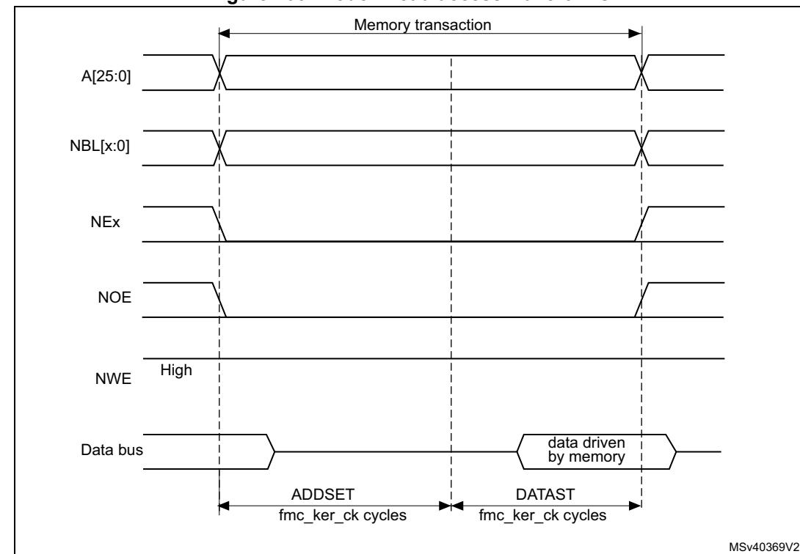

**Figure 105. Mode 1 read access waveforms**

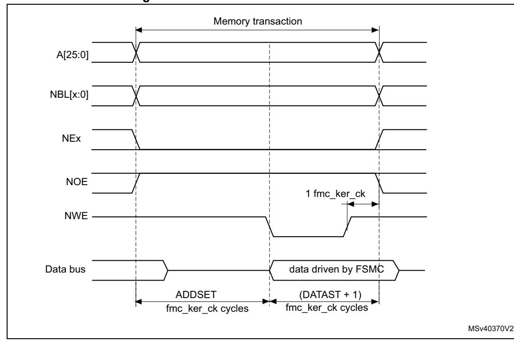

**Figure 106. Mode 1 write access waveforms**

The fmc\_ker\_ck cycle at the end of the write transaction helps guarantee the address and data hold time after the NWE rising edge. Due to the presence of this fmc\_ker\_ck cycle, the DATAST value must be greater than zero (DATAST > 0).

**Bit number Bit name Value to set** 31 FMCEN 0x1 30:26 Reserved 0x000 25:24 BMAP As needed 23:22 Reserved 0x000 21 WFDIS As needed 20 CCLKEN As needed 19 CBURSTRW 0x0 (no effect in Asynchronous mode) 18:16 CPSIZE 0x0 (no effect in Asynchronous mode) 15 ASYNCWAIT Set to 1 if the memory supports this feature. Otherwise keep at 0. 14 EXTMOD 0x0 13 WAITEN 0x0 (no effect in Asynchronous mode) 12 WREN As needed 11 WAITCFG Don't care 10 Reserved 0x0

**Table 174. FMC\_BCRx bitfields (mode 1)** 


**Table 174. FMC\_BCRx bitfields (mode 1) (continued)**

| Bit<br>number | Bit name | Value to set                              |
|---------------|----------|-------------------------------------------|
| 9             | WAITPOL  | Meaningful only if bit 15 is 1            |
| 8             | BURSTEN  | 0x0                                       |
| 7             | Reserved | 0x1                                       |
| 6             | FACCEN   | Don't care                                |
| 5:4           | MWID     | As needed                                 |
| 3:2           | MTYP     | As needed, exclude 0x2 (NOR flash memory) |
| 1             | MUXE     | 0x0                                       |
| 0             | MBKEN    | 0x1                                       |

### **Table 175. FMC\_BTRx bitfields (mode 1)**

| Bit number | Bit name | Value to set                                                                                                                        |
|------------|----------|-------------------------------------------------------------------------------------------------------------------------------------|
| 31:30      | Reserved | 0x0                                                                                                                                 |
| 29:28      | ACCMOD   | Don't care                                                                                                                          |
| 27:24      | DATLAT   | Don't care                                                                                                                          |
| 23:20      | CLKDIV   | Don't care                                                                                                                          |
| 19:16      | BUSTURN  | Time between NEx high to NEx low (BUSTURN fmc_ker_ck)                                                                               |
| 15:8       | DATAST   | Duration of the second access phase (DATAST+1 fmc_ker_ck cycles<br>for write accesses, DATAST fmc_ker_ck cycles for read accesses). |
| 7:4        | ADDHLD   | Don't care                                                                                                                          |
| 3:0        | ADDSET   | Duration of the first access phase (ADDSET fmc_ker_ck cycles).<br>Minimum value for ADDSET is 0.                                    |


### **Mode A - SRAM/PSRAM (CRAM) OE toggling**

**Figure 107. Mode A read access waveforms**

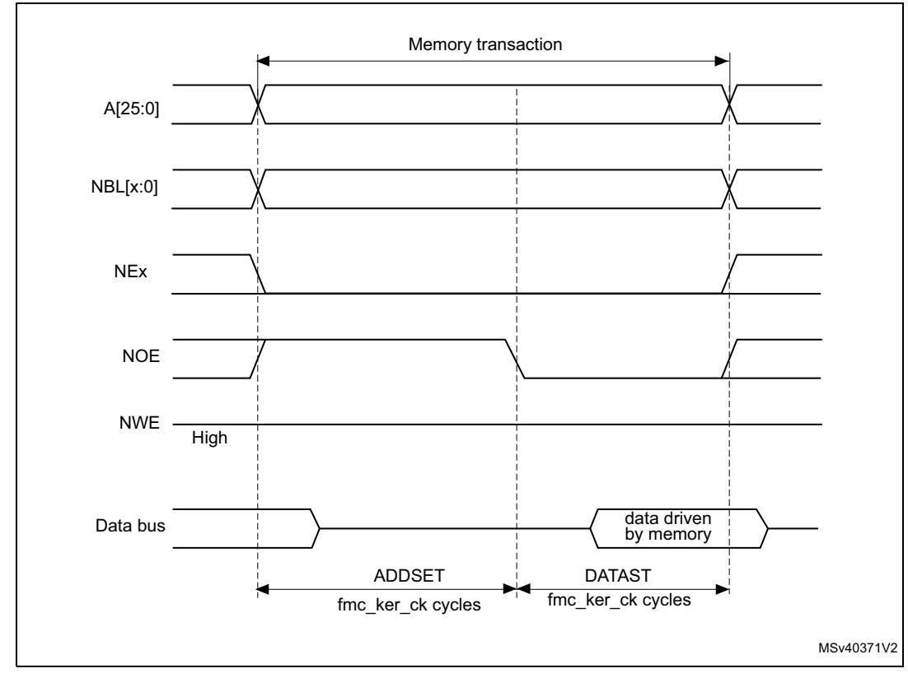

1. NBL[3:0] are driven low during the read access


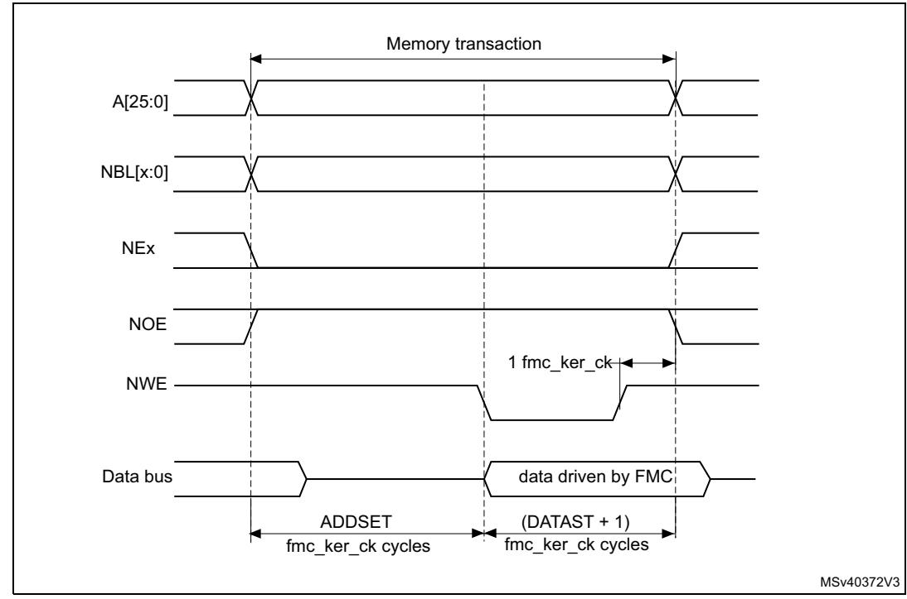

**Figure 108. Mode A write access waveforms**

The differences compared with Mode1 are the toggling of NOE and the independent read and write timings.

**Bit number Bit name Value to set** 31 FMCEN 0x1 30:26 Reserved 0x000 25:24 BMAP As needed 23:22 Reserved 0x000 21 WFDIS As needed 20 CCLKEN As needed 19 CBURSTRW 0x0 (no effect in Asynchronous mode) 18:16 CPSIZE 0x0 (no effect in Asynchronous mode) 15 ASYNCWAIT Set to 1 if the memory supports this feature. Otherwise keep at 0. 14 EXTMOD 0x1 13 WAITEN 0x0 (no effect in Asynchronous mode) 12 WREN As needed 11 WAITCFG Don't care 10 Reserved 0x0

**Table 176. FMC\_BCRx bitfields (mode A)** 

**Table 176. FMC\_BCRx bitfields (mode A) (continued)**

| Bit<br>number | Bit name | Value to set                              |
|---------------|----------|-------------------------------------------|
| 9             | WAITPOL  | Meaningful only if bit 15 is 1            |
| 8             | BURSTEN  | 0x0                                       |
| 7             | Reserved | 0x1                                       |
| 6             | FACCEN   | Don't care                                |
| 5:4           | MWID     | As needed                                 |
| 3:2           | MTYP     | As needed, exclude 0x2 (NOR flash memory) |
| 1             | MUXEN    | 0x0                                       |
| 0             | MBKEN    | 0x1                                       |

### **Table 177. FMC\_BTRx bitfields (mode A)**

| Bit number | Bit name | Value to set                                                                                                          |
|------------|----------|-----------------------------------------------------------------------------------------------------------------------|
| 31:30      | Reserved | 0x0                                                                                                                   |
| 29:28      | ACCMOD   | 0x0                                                                                                                   |
| 27:24      | DATLAT   | Don't care                                                                                                            |
| 23:20      | CLKDIV   | Don't care                                                                                                            |
| 19:16      | BUSTURN  | Time between NEx high to NEx low (BUSTURN fmc_ker_ck)                                                                 |
| 15:8       | DATAST   | Duration of the second access phase (DATAST fmc_ker_ck cycles) for<br>read accesses.                                  |
| 7:4        | ADDHLD   | Don't care                                                                                                            |
| 3:0        | ADDSET   | Duration of the first access phase (ADDSET fmc_ker_ck cycles) for<br>read accesses.<br>Minimum value for ADDSET is 0. |

### **Table 178. FMC\_BWTRx bitfields (mode A)**

| Bit number | Bit name | Value to set                                                                                                           |
|------------|----------|------------------------------------------------------------------------------------------------------------------------|
| 31:30      | Reserved | 0x0                                                                                                                    |
| 29:28      | ACCMOD   | 0x0                                                                                                                    |
| 27:24      | DATLAT   | Don't care                                                                                                             |
| 23:20      | CLKDIV   | Don't care                                                                                                             |
| 19:16      | BUSTURN  | Time between NEx high to NEx low (BUSTURN fmc_ker_ck)                                                                  |
| 15:8       | DATAST   | Duration of the second access phase (DATAST fmc_ker_ck cycles) for<br>write accesses.                                  |
| 7:4        | ADDHLD   | Don't care                                                                                                             |
| 3:0        | ADDSET   | Duration of the first access phase (ADDSET fmc_ker_ck cycles) for<br>write accesses.<br>Minimum value for ADDSET is 0. |


# **Mode 2/B - NOR flash**

**Figure 109. Mode 2 and mode B read access waveforms**

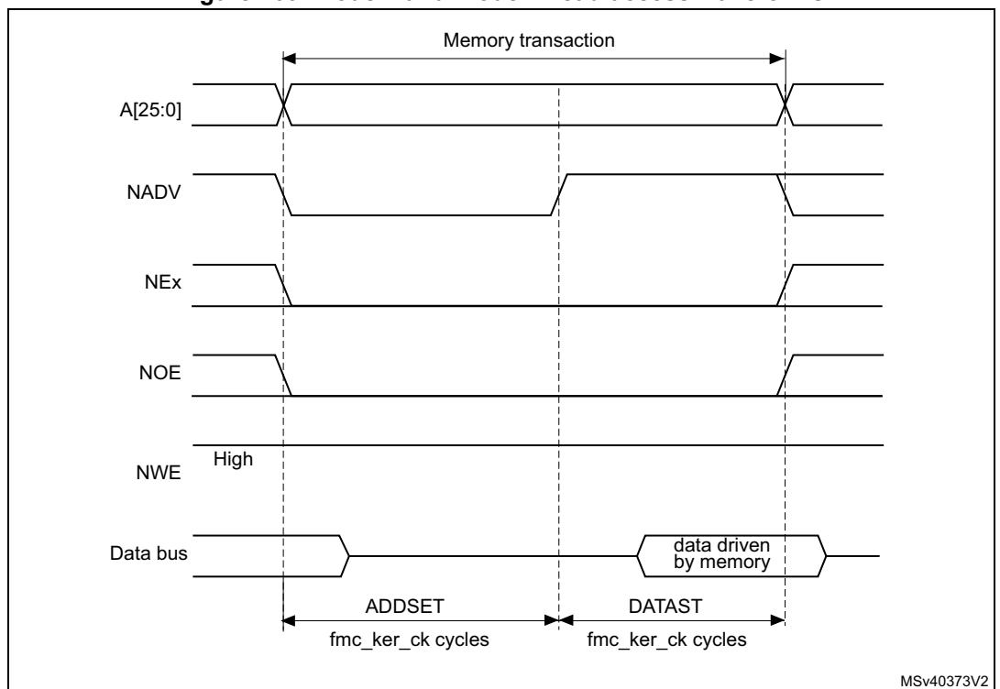

**Figure 110. Mode 2 write access waveforms**

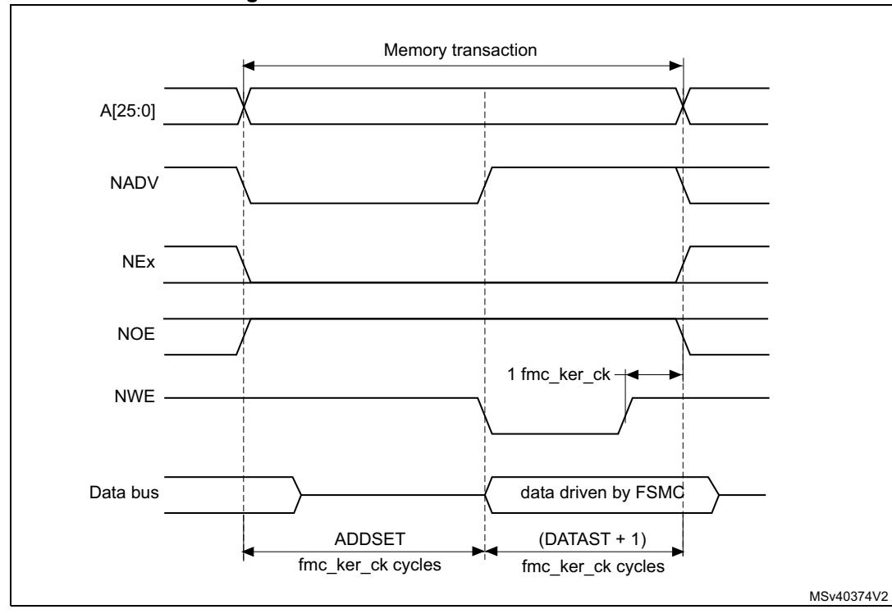

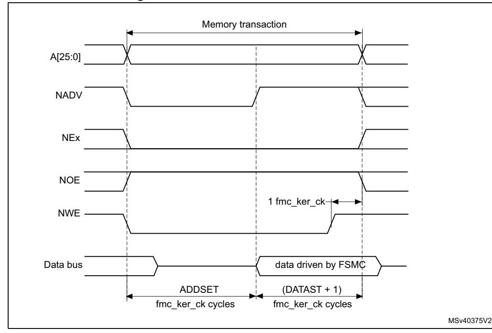

**Figure 111. Mode B write access waveforms**

The differences with Mode1 are the toggling of NWE and the independent read and write timings when extended mode is set (mode B).

| Bit<br>number | Bit name  | Value to set                                                          |
|---------------|-----------|-----------------------------------------------------------------------|
| 31            | FMCEN     | 0x1                                                                   |
| 30:26         | Reserved  | 0x000                                                                 |
| 25:24         | BMAP      | As needed                                                             |
| 23:22         | Reserved  | 0x000                                                                 |
| 21            | WFDIS     | As needed                                                             |
| 20            | CCLKEN    | As needed                                                             |
| 19            | CBURSTRW  | 0x0 (no effect in Asynchronous mode)                                  |
| 18:16         | CPSIZE    | 0x0 (no effect in Asynchronous mode)                                  |
| 15            | ASYNCWAIT | Set to 1 if the memory supports this feature. Otherwise keep at<br>0. |
| 14            | EXTMOD    | 0x1 for mode B, 0x0 for mode 2                                        |
| 13            | WAITEN    | 0x0 (no effect in Asynchronous mode)                                  |
| 12            | WREN      | As needed                                                             |
| 11            | WAITCFG   | Don't care                                                            |
| 10            | Reserved  | 0x0                                                                   |

**Table 179. FMC\_BCRx bitfields (mode 2/B)** 


**Table 179. FMC\_BCRx bitfields (mode 2/B) (continued)**

| Bit<br>number | Bit name | Value to set                   |
|---------------|----------|--------------------------------|
| 9             | WAITPOL  | Meaningful only if bit 15 is 1 |
| 8             | BURSTEN  | 0x0                            |
| 7             | Reserved | 0x1                            |
| 6             | FACCEN   | 0x1                            |
| 5:4           | MWID     | As needed                      |
| 3:2           | MTYP     | 0x2 (NOR flash memory)         |
| 1             | MUXEN    | 0x0                            |
| 0             | MBKEN    | 0x1                            |

### **Table 180. FMC\_BTRx bitfields (mode 2/B)**

| Bit number | Bit name | Value to set                                                                                                       |
|------------|----------|--------------------------------------------------------------------------------------------------------------------|
| 31:30      | Reserved | 0x0                                                                                                                |
| 29:28      | ACCMOD   | 0x1 if Extended mode is set                                                                                        |
| 27:24      | DATLAT   | Don't care                                                                                                         |
| 23:20      | CLKDIV   | Don't care                                                                                                         |
| 19:16      | BUSTURN  | Time between NEx high to NEx low (BUSTURN fmc_ker_ck)                                                              |
| 15:8       | DATAST   | Duration of the access second phase (DATAST fmc_ker_ck cycles)<br>for read accesses.                               |
| 7:4        | ADDHLD   | Don't care                                                                                                         |
| 3:0        | ADDSET   | Duration of the access first phase (ADDSET fmc_ker_ck cycles) for<br>read accesses. Minimum value for ADDSET is 0. |

### **Table 181. FMC\_BWTRx bitfields (mode 2/B)**

| Bit number | Bit name | Value to set                                                                                                        |
|------------|----------|---------------------------------------------------------------------------------------------------------------------|
| 31:30      | Reserved | 0x0                                                                                                                 |
| 29:28      | ACCMOD   | 0x1 if Extended mode is set                                                                                         |
| 27:24      | DATLAT   | Don't care                                                                                                          |
| 23:20      | CLKDIV   | Don't care                                                                                                          |
| 19:16      | BUSTURN  | Time between NEx high to NEx low (BUSTURN fmc_ker_ck)                                                               |
| 15:8       | DATAST   | Duration of the access second phase (DATAST fmc_ker_ck cycles)<br>for write accesses.                               |
| 7:4        | ADDHLD   | Don't care                                                                                                          |
| 3:0        | ADDSET   | Duration of the access first phase (ADDSET fmc_ker_ck cycles) for<br>write accesses. Minimum value for ADDSET is 0. |


RM0399 Rev 4 861/3556

*Note: The FMC\_BWTRx register is valid only if the Extended mode is set (mode B), otherwise its content is don't care.*

# **Mode C - NOR flash - OE toggling**

**Figure 112. Mode C read access waveforms**

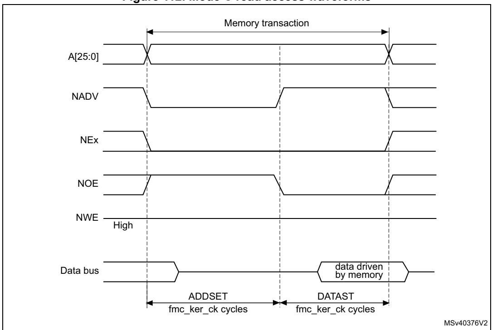

**Figure 113. Mode C write access waveforms**

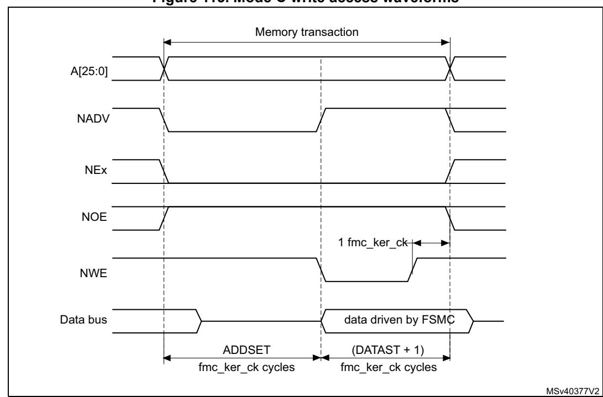

The differences compared with Mode1 are the toggling of NOE and the independent read and write timings.

**Table 182. FMC\_BCRx bitfields (mode C)** 

| Bit No. | Bit name  | Value to set                                                       |  |
|---------|-----------|--------------------------------------------------------------------|--|
| 31      | FMCEN     | 0x1                                                                |  |
| 30:26   | Reserved  | 0x000                                                              |  |
| 25:24   | BMAP      | As needed                                                          |  |
| 23:22   | Reserved  | 0x000                                                              |  |
| 21      | WFDIS     | As needed                                                          |  |
| 20      | CCLKEN    | As needed                                                          |  |
| 19      | CBURSTRW  | 0x0 (no effect in Asynchronous mode)                               |  |
| 18:16   | CPSIZE    | 0x0 (no effect in Asynchronous mode)                               |  |
| 15      | ASYNCWAIT | Set to 1 if the memory supports this feature. Otherwise keep at 0. |  |
| 14      | EXTMOD    | 0x1                                                                |  |
| 13      | WAITEN    | 0x0 (no effect in Asynchronous mode)                               |  |
| 12      | WREN      | As needed                                                          |  |
| 11      | WAITCFG   | Don't care                                                         |  |
| 10      | Reserved  | 0x0                                                                |  |
| 9       | WAITPOL   | Meaningful only if bit 15 is 1                                     |  |
| 8       | BURSTEN   | 0x0                                                                |  |
| 7       | Reserved  | 0x1                                                                |  |
| 6       | FACCEN    | 0x1                                                                |  |
| 5:4     | MWID      | As needed                                                          |  |
| 3:2     | MTYP      | 0x02 (NOR flash memory)                                            |  |
| 1       | MUXEN     | 0x0                                                                |  |
| 0       | MBKEN     | 0x1                                                                |  |

**Table 183. FMC\_BTRx bitfields (mode C)** 

| Bit number | Bit name | Value to set                                                                                                       |
|------------|----------|--------------------------------------------------------------------------------------------------------------------|
| 31:30      | Reserved | 0x0                                                                                                                |
| 29:28      | ACCMOD   | 0x2                                                                                                                |
| 27:24      | DATLAT   | 0x0                                                                                                                |
| 23:20      | CLKDIV   | 0x0                                                                                                                |
| 19:16      | BUSTURN  | Time between NEx high to NEx low (BUSTURN fmc_ker_ck)                                                              |
| 15:8       | DATAST   | Duration of the second access phase (DATAST fmc_ker_ck cycles)<br>for read accesses.                               |
| 7:4        | ADDHLD   | Don't care                                                                                                         |
| 3:0        | ADDSET   | Duration of the first access phase (ADDSET fmc_ker_ck cycles) for<br>read accesses. Minimum value for ADDSET is 0. |

**Table 184. FMC\_BWTRx bitfields (mode C)** 

| Bit number | Bit name | Value to set                                                                                                        |
|------------|----------|---------------------------------------------------------------------------------------------------------------------|
| 31:30      | Reserved | 0x0                                                                                                                 |
| 29:28      | ACCMOD   | 0x2                                                                                                                 |
| 27:24      | DATLAT   | Don't care                                                                                                          |
| 23:20      | CLKDIV   | Don't care                                                                                                          |
| 19:16      | BUSTURN  | Time between NEx high to NEx low (BUSTURN fmc_ker_ck)                                                               |
| 15:8       | DATAST   | Duration of the second access phase (DATAST fmc_ker_ck cycles)<br>for write accesses.                               |
| 7:4        | ADDHLD   | Don't care                                                                                                          |
| 3:0        | ADDSET   | Duration of the first access phase (ADDSET fmc_ker_ck cycles) for<br>write accesses. Minimum value for ADDSET is 0. |


# **Mode D - asynchronous access with extended address**

**Figure 114. Mode D read access waveforms**

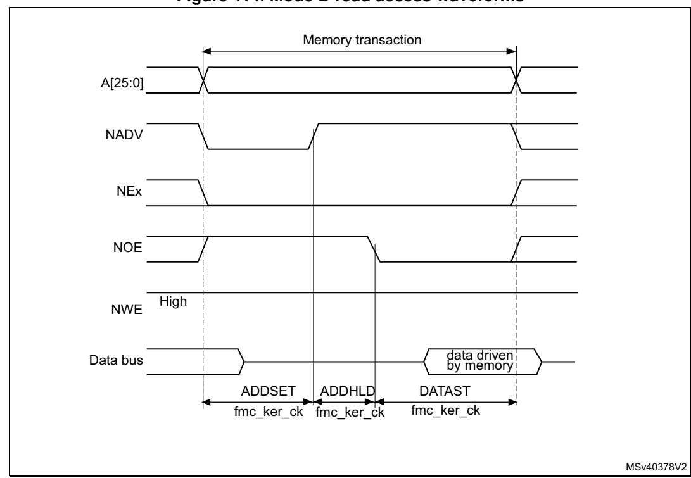

**Figure 115. Mode D write access waveforms**

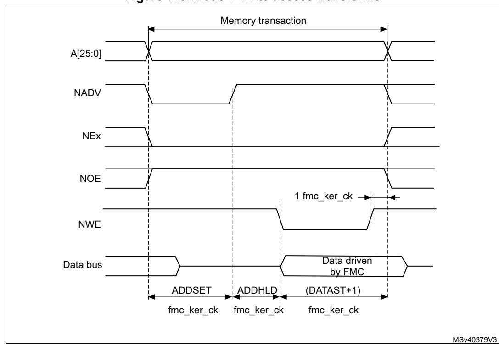

The differences with Mode1 are the toggling of NOE that goes on toggling after NADV changes and the independent read and write timings.

**Table 185. FMC\_BCRx bitfields (mode D)** 

| Bit No. | Bit name  | Value to set                                                          |
|---------|-----------|-----------------------------------------------------------------------|
| 31      | FMCEN     | 0x1                                                                   |
| 30:26   | Reserved  | 0x000                                                                 |
| 25:24   | BMAP      | As needed                                                             |
| 23:22   | Reserved  | 0x000                                                                 |
| 21      | WFDIS     | As needed                                                             |
| 20      | CCLKEN    | As needed                                                             |
| 19      | CBURSTRW  | 0x0 (no effect in Asynchronous mode)                                  |
| 18:16   | CPSIZE    | 0x0 (no effect in Asynchronous mode)                                  |
| 15      | ASYNCWAIT | Set to 1 if the memory supports this feature. Otherwise keep<br>at 0. |
| 14      | EXTMOD    | 0x1                                                                   |
| 13      | WAITEN    | 0x0 (no effect in Asynchronous mode)                                  |
| 12      | WREN      | As needed                                                             |
| 11      | WAITCFG   | Don't care                                                            |
| 10      | Reserved  | 0x0                                                                   |
| 9       | WAITPOL   | Meaningful only if bit 15 is 1                                        |
| 8       | BURSTEN   | 0x0                                                                   |
| 7       | Reserved  | 0x1                                                                   |
| 6       | FACCEN    | Set according to memory support                                       |
| 5:4     | MWID      | As needed                                                             |
| 3:2     | MTYP      | As needed                                                             |
| 1       | MUXEN     | 0x0                                                                   |
| 0       | MBKEN     | 0x1                                                                   |

**Table 186. FMC\_BTRx bitfields (mode D)** 

| Bit number | Bit name | Value to set                                                                         |
|------------|----------|--------------------------------------------------------------------------------------|
| 31:30      | Reserved | 0x0                                                                                  |
| 29:28      | ACCMOD   | 0x3                                                                                  |
| 27:24      | DATLAT   | Don't care                                                                           |
| 23:20      | CLKDIV   | Don't care                                                                           |
| 19:16      | BUSTURN  | Time between NEx high to NEx low (BUSTURN fmc_ker_ck)                                |
| 15:8       | DATAST   | Duration of the second access phase (DATAST fmc_ker_ck cycles) for<br>read accesses. |


# **Table 186. FMC\_BTRx bitfields (mode D) (continued)**

| Bit number | Bit name | Value to set                                                                                                       |
|------------|----------|--------------------------------------------------------------------------------------------------------------------|
| 7:4        | ADDHLD   | Duration of the middle phase of the read access (ADDHLD<br>fmc_ker_ck cycles)                                      |
| 3:0        | ADDSET   | Duration of the first access phase (ADDSET fmc_ker_ck cycles) for<br>read accesses. Minimum value for ADDSET is 1. |

## **Table 187. FMC\_BWTRx bitfields (mode D)**

| Bit number | Bit name | Value to set                                                                                                        |
|------------|----------|---------------------------------------------------------------------------------------------------------------------|
| 31:30      | Reserved | 0x0                                                                                                                 |
| 29:28      | ACCMOD   | 0x3                                                                                                                 |
| 27:24      | DATLAT   | Don't care                                                                                                          |
| 23:20      | CLKDIV   | Don't care                                                                                                          |
| 19:16      | BUSTURN  | Time between NEx high to NEx low (BUSTURN fmc_ker_ck)                                                               |
| 15:8       | DATAST   | Duration of the second access phase (DATAST + 1 fmc_ker_ck<br>cycles) for write accesses.                           |
| 7:4        | ADDHLD   | Duration of the middle phase of the write access (ADDHLD<br>fmc_ker_ck cycles)                                      |
| 3:0        | ADDSET   | Duration of the first access phase (ADDSET fmc_ker_ck cycles) for<br>write accesses. Minimum value for ADDSET is 1. |


# **Muxed mode - multiplexed asynchronous access to NOR flash memory**

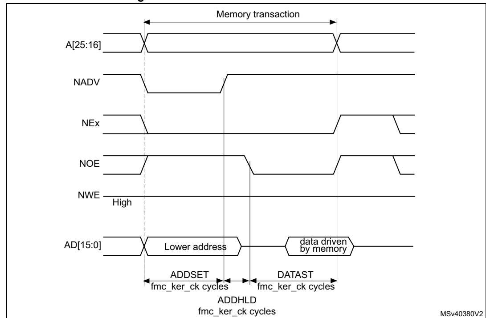

**Figure 116. Muxed read access waveforms**


<span id="page-31-0"></span>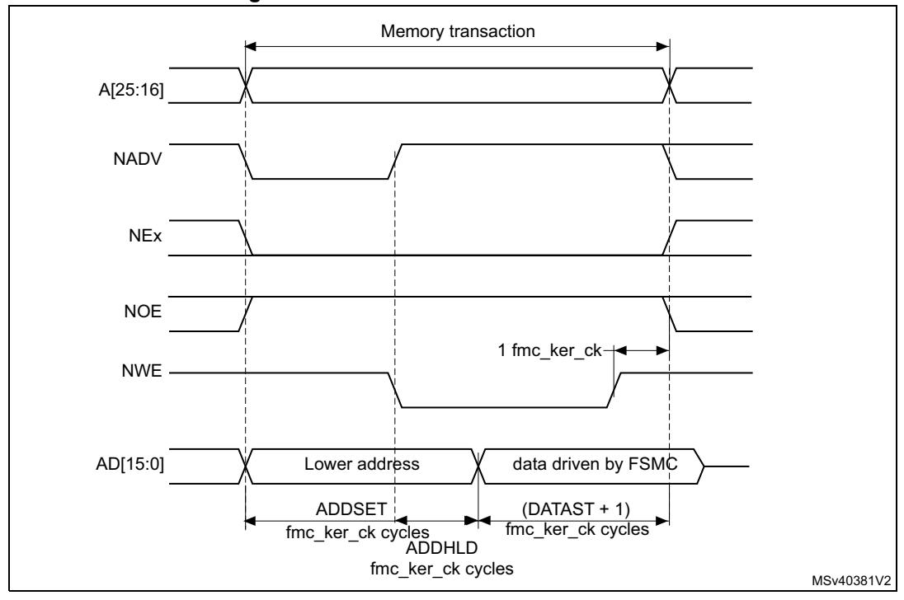

The difference with Mode D is the drive of the lower address byte(s) on the data bus.

**Table 188. FMC\_BCRx bitfields (Muxed mode)** 

| Bit No. | Bit name  | Value to set                                                          |
|---------|-----------|-----------------------------------------------------------------------|
| 31      | FMCEN     | 0x1                                                                   |
| 30:26   | Reserved  | 0x000                                                                 |
| 25:24   | BMAP      | As needed                                                             |
| 23:22   | Reserved  | 0x000                                                                 |
| 21      | WFDIS     | As needed                                                             |
| 20      | CCLKEN    | As needed                                                             |
| 19      | CBURSTRW  | 0x0 (no effect in Asynchronous mode)                                  |
| 18:16   | CPSIZE    | 0x0 (no effect in Asynchronous mode)                                  |
| 15      | ASYNCWAIT | Set to 1 if the memory supports this feature. Otherwise keep at<br>0. |
| 14      | EXTMOD    | 0x0                                                                   |
| 13      | WAITEN    | 0x0 (no effect in Asynchronous mode)                                  |
| 12      | WREN      | As needed                                                             |
| 11      | WAITCFG   | Don't care                                                            |
| 10      | Reserved  | 0x0                                                                   |
| 9       | WAITPOL   | Meaningful only if bit 15 is 1                                        |
| 8       | BURSTEN   | 0x0                                                                   |
| 7       | Reserved  | 0x1                                                                   |
| 6       | FACCEN    | 0x1                                                                   |
| 5:4     | MWID      | As needed                                                             |
| 3:2     | MTYP      | 0x2 (NOR flash memory)                                                |
| 1       | MUXEN     | 0x1                                                                   |
| 0       | MBKEN     | 0x1                                                                   |

**Table 189. FMC\_BTRx bitfields (Muxed mode)** 

| Bit number | Bit name | Value to set                                                                                                                              |
|------------|----------|-------------------------------------------------------------------------------------------------------------------------------------------|
| 31:30      | Reserved | 0x0                                                                                                                                       |
| 29:28      | ACCMOD   | 0x0                                                                                                                                       |
| 27:24      | DATLAT   | Don't care                                                                                                                                |
| 23:20      | CLKDIV   | Don't care                                                                                                                                |
| 19:16      | BUSTURN  | Time between NEx high to NEx low (BUSTURN fmc_ker_ck)                                                                                     |
| 15:8       | DATAST   | Duration of the second access phase (DATAST fmc_ker_ck cycles for<br>read accesses and DATAST+1 fmc_ker_ck cycles for write<br>accesses). |


| Bit number | Bit name | Value to set                                                                                     |  |
|------------|----------|--------------------------------------------------------------------------------------------------|--|
| 7:4        | ADDHLD   | Duration of the middle phase of the access (ADDHLD fmc_ker_ck<br>cycles).                        |  |
| 3:0        | ADDSET   | Duration of the first access phase (ADDSET fmc_ker_ck cycles).<br>Minimum value for ADDSET is 1. |  |

**Table 189. FMC\_BTRx bitfields (Muxed mode) (continued)**

# **WAIT management in asynchronous accesses**

If the asynchronous memory asserts the WAIT signal to indicate that it is not yet ready to accept or to provide data, the ASYNCWAIT bit has to be set in FMC\_BCRx register.

If the WAIT signal is active (high or low depending on the WAITPOL bit), the second access phase (Data setup phase), programmed by the DATAST bits, is extended until WAIT becomes inactive. Unlike the data setup phase, the first access phases (Address setup and Address hold phases), programmed by the ADDSET and ADDHLD bits, are not WAIT sensitive and so they are not prolonged.

The data setup phase must be programmed so that WAIT can be detected 4 fmc\_ker\_ck cycles before the end of the memory transaction. The following cases must be considered:

1. The memory asserts the WAIT signal aligned to NOE/NWE which toggles:

DATAST 
$$\geq$$
 (4 × fmc\_ker\_ck) + max\_wait\_assertion\_time

2. The memory asserts the WAIT signal aligned to NEx (or NOE/NWE not toggling): if

max\_wait\_assertion\_time address\_phase hold\_phase > +

then:

DATAST 4 fmc\_ker\_ck ≥ ( ) × + ( ) max\_wait\_assertion\_time address\_phase – – hold\_phase

otherwise

$$DATAST \ge (4 \times fmc_ker_ck)$$

where max\_wait\_assertion\_time is the maximum time taken by the memory to assert the WAIT signal once NEx/NOE/NWE is low.

*[Figure 118](#page-34-0)* and *[Figure 119](#page-34-1)* show the number of fmc\_ker\_ck clock cycles that are added to the memory access phase after WAIT is released by the asynchronous memory (independently of the above cases).

<span id="page-34-0"></span>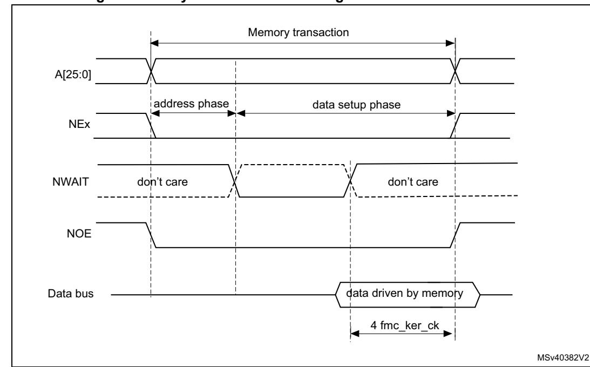

**Figure 118. Asynchronous wait during a read access waveforms**

1. NWAIT polarity depends on WAITPOL bit setting in FMC\_BCRx register.

<span id="page-34-1"></span>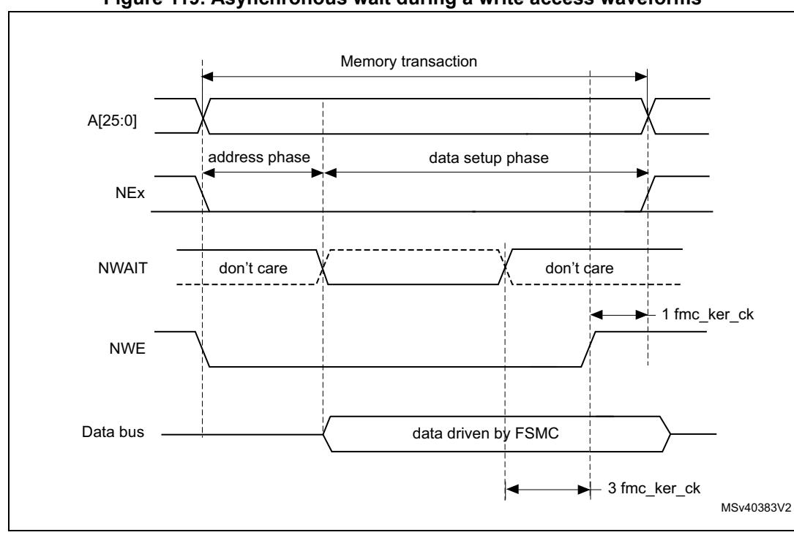

**Figure 119. Asynchronous wait during a write access waveforms**

1. NWAIT polarity depends on WAITPOL bit setting in FMC\_BCRx register.

# <span id="page-35-0"></span>**23.7.5 Synchronous transactions**

The memory clock, FMC\_CLK, is a sub-multiple of fmc\_ker\_ck. It depends on the value of CLKDIV and the MWID/ AXI data size, following the formula given below:

FMC\_CLK divider ratio max CLKDIV 1 = (, ) + MWID AXI data size ( )

If MWID is 16 or 8-bit, the FMC\_CLK divider ratio is always defined by the programmed CLKDIV value.

If MWID is 32-bit, the FMC\_CLK divider ratio depends also on AXI data size.

### Example:

- If CLKDIV=1, MWID = 32 bits, AXI data size=8 bits, FMC\_CLK=fmc\_ker\_ck/4.
- If CLKDIV=1, MWID = 16 bits, AXI data size=8 bits, FMC\_CLK=fmc\_ker\_ck/2.

NOR flash memories specify a minimum time from NADV assertion to FMC\_CLK high. To meet this constraint, the FMC does not issue the clock to the memory during the first internal clock cycle of the synchronous access (before NADV assertion). This guarantees that the rising edge of the memory clock occurs in the middle of the NADV low pulse.

For some PSRAM memories which must be configured to Synchronous mode, during the BCR register writing, the memory attribute space must be configured to device or stronglyordered. Once PSRAM BCR register is configured, the memory attribute of PSRAM address space can be programmed to cacheable.

# **Data latency versus NOR memory latency**

The data latency is the number of cycles to wait before sampling the data. The DATLAT value must be consistent with the latency value specified in the NOR flash configuration register. The FMC does not include the clock cycle when NADV is low in the data latency count.

**Caution:** Some NOR flash memories include the NADV Low cycle in the data latency count, so that the exact relation between the NOR flash latency and the FMC DATLAT parameter can be either:

- NOR flash latency = (DATLAT + 2) FMC\_CLK clock cycles
- or NOR flash latency = (DATLAT + 3) FMC\_CLK clock cycles

Some recent memories assert NWAIT during the latency phase. In such cases DATLAT can be set to its minimum value. As a result, the FMC samples the data and waits long enough to evaluate if the data are valid. Thus the FMC detects when the memory exits latency and real data are processed.

Other memories do not assert NWAIT during latency. In this case the latency must be set correctly for both the FMC and the memory, otherwise invalid data are mistaken for good data, or valid data are lost in the initial phase of the memory access.

# **Single-burst transfer**

When the selected bank is configured in Burst mode for synchronous accesses, if for example a single-burst transaction is requested on 16-bit memories, the FMC performs a burst transaction of length 1 (if the AXI transfer is 16 bits), or length 2 (if the AXI transfer is 32 bits) and deassert the Chip Select signal when the last data is strobed.

Such transfers are not the most efficient in terms of cycles compared to asynchronous read operations. Nevertheless, a random asynchronous access would first require to re-program the memory access mode, which would altogether last longer.

# **Cross boundary page for Cellular RAM 1.5**

Cellular RAM 1.5 does not allow burst access to cross the page boundary. The FMC allows to split automatically the burst access when the memory page size is reached by configuring the CPSIZE bits in the FMC\_BCR1 register following the memory page size.

# **Wait management**

For synchronous NOR flash memories, NWAIT is evaluated after the programmed latency period, which corresponds to (DATLAT+2) FMC\_CLK clock cycles.

If NWAIT is active (low level when WAITPOL = 0, high level when WAITPOL = 1), wait states are inserted until NWAIT is inactive (high level when WAITPOL = 0, low level when WAITPOL = 1).

When NWAIT is inactive, the data is considered valid either immediately (bit WAITCFG = 1) or on the next clock edge (bit WAITCFG = 0).

During wait-state insertion via the NWAIT signal, the controller continues to send clock pulses to the memory, keeping the Chip Select and output enable signals valid. It does not consider the data as valid.

In Burst mode, there are two timing configurations for the NOR flash NWAIT signal:

- The flash memory asserts the NWAIT signal one data cycle before the wait state (default after reset).
- The flash memory asserts the NWAIT signal during the wait state

The FMC supports both NOR flash wait state configurations, for each Chip Select, thanks to the WAITCFG bit in the FMC\_BCRx registers (x = 0..3).


RM0399 Rev 4 873/3556

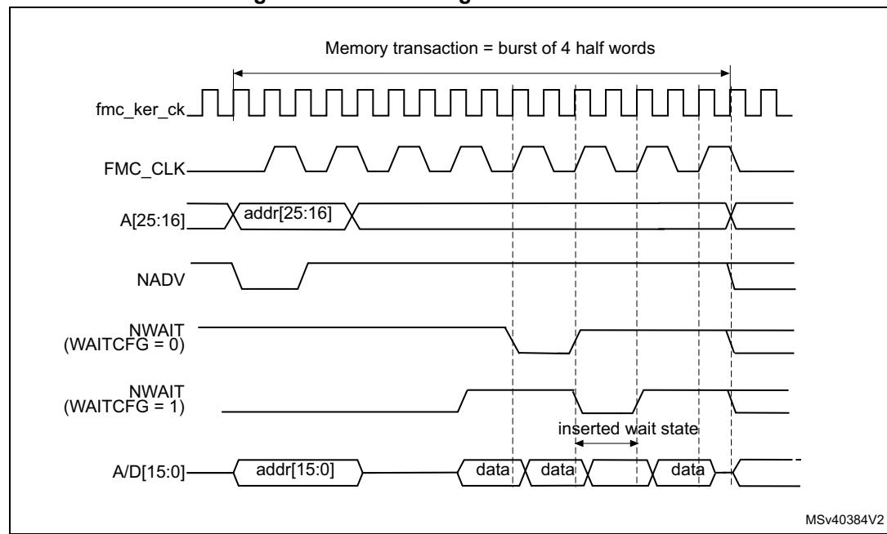

**Figure 120. Wait configuration waveforms**


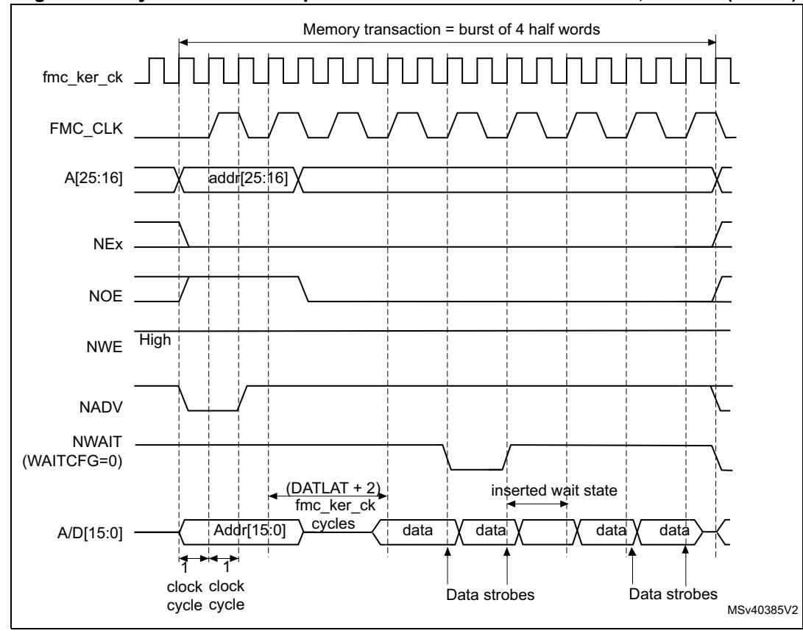

<sup>1.</sup> Byte lane outputs (NBL are not shown; for NOR access, they are held high, and, for PSRAM (CRAM) access, they are held low.

**Table 190. FMC\_BCRx bitfields (Synchronous multiplexed read mode)** 

| Bit No. | Bit name  | Value to set                                                                     |
|---------|-----------|----------------------------------------------------------------------------------|
| 31      | MC        | 0x1                                                                              |
| 30:26   | Reserved  | 0x000                                                                            |
| 25:24   | BMAP      | As needed                                                                        |
| 23:22   | Reserved  | 0x000                                                                            |
| 21      | WFDIS     | As needed                                                                        |
| 20      | CCLKEN    | As needed                                                                        |
| 19      | CBURSTRW  | No effect on synchronous read                                                    |
| 18:16   | CPSIZE    | As needed. (0x1 when using CRAM 1.5)                                             |
| 15      | ASYNCWAIT | 0x0                                                                              |
| 14      | EXTMOD    | 0x0                                                                              |
| 13      | WAITEN    | to be set to 1 if the memory supports this feature, to be kept at 0<br>otherwise |
| 12      | WREN      | no effect on synchronous read                                                    |
| 11      | WAITCFG   | to be set according to memory                                                    |
| 10      | Reserved  | 0x0                                                                              |
| 9       | WAITPOL   | to be set according to memory                                                    |
| 8       | BURSTEN   | 0x1                                                                              |
| 7       | Reserved  | 0x1                                                                              |
| 6       | FACCEN    | Set according to memory support (NOR flash memory)                               |
| 5:4     | MWID      | As needed                                                                        |
| 3:2     | MTYP      | 0x1 or 0x2                                                                       |
| 1       | MUXEN     | As needed                                                                        |
| 0       | MBKEN     | 0x1                                                                              |

**Table 191. FMC\_BTRx bitfields (Synchronous multiplexed read mode)** 

| Bit number | Bit name | Value to set                                                       |
|------------|----------|--------------------------------------------------------------------|
| 31:30      | Reserved | 0x0                                                                |
| 29:28      | ACCMOD   | 0x0                                                                |
| 27:24      | DATLAT   | Data latency                                                       |
| 27:24      | DATLAT   | Data latency                                                       |
| 23:20      | CLKDIV   | 0x0 to get CLK = fmc_ker_ck<br>0x1 to get CLK = 2 × fmc_ker_ck<br> |
| 19:16      | BUSTURN  | Time between NEx high to NEx low (BUSTURN fmc_ker_ck)              |
| 15:8       | DATAST   | Don't care                                                         |


**Table 191. FMC\_BTRx bitfields (Synchronous multiplexed read mode) (continued)**

| Bit number | Bit name | Value to set |
|------------|----------|--------------|
| 7:4        | ADDHLD   | Don't care   |
| 3:0        | ADDSET   | Don't care   |

**Figure 122. Synchronous multiplexed write mode waveforms - PSRAM (CRAM)**

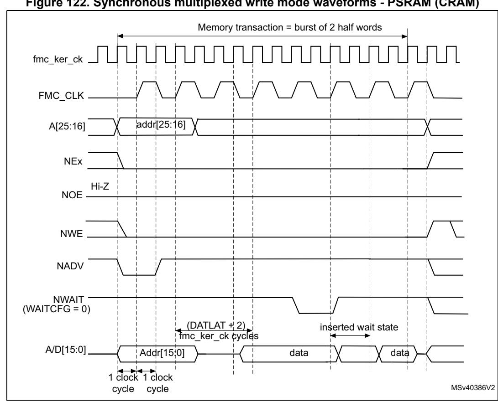

- 1. The memory must issue NWAIT signal one cycle in advance, accordingly WAITCFG must be programmed to 0.
- 2. Byte Lane (NBL) outputs are not shown, they are held low while NEx is active.

**Table 192. FMC\_BCRx bitfields (Synchronous multiplexed write mode)** 

| Bit No. | Bit name | Value to set                  |
|---------|----------|-------------------------------|
| 31      | FMCEN    | 0x1                           |
| 30:26   | Reserved | 0x000                         |
| 25:24   | BMAP     | As needed                     |
| 23:22   | Reserved | 0x000                         |
| 21      | WFDIS    | As needed                     |
| 20      | CCLKEN   | As needed                     |
| 19      | CBURSTRW | No effect on synchronous read |

**Table 192. FMC\_BCRx bitfields (Synchronous multiplexed write mode) (continued)**

| Bit No. | Bit name  | Value to set                                                                      |
|---------|-----------|-----------------------------------------------------------------------------------|
| 18:16   | CPSIZE    | As needed. (0x1 when using CRAM 1.5)                                              |
| 15      | ASYNCWAIT | 0x0                                                                               |
| 14      | EXTMOD    | 0x0                                                                               |
| 13      | WAITEN    | to be set to 1 if the memory supports this feature, to be kept at 0<br>otherwise. |
| 12      | WREN      | 0x1                                                                               |
| 11      | WAITCFG   | 0x0                                                                               |
| 10      | Reserved  | 0x0                                                                               |
| 9       | WAITPOL   | to be set according to memory                                                     |
| 8       | BURSTEN   | no effect on synchronous write                                                    |
| 7       | Reserved  | 0x1                                                                               |
| 6       | FACCEN    | Set according to memory support                                                   |
| 5:4     | MWID      | As needed                                                                         |
| 3:2     | MTYP      | 0x1                                                                               |
| 1       | MUXEN     | As needed                                                                         |
| 0       | MBKEN     | 0x1                                                                               |

**Table 193. FMC\_BTRx bitfields (Synchronous multiplexed write mode)** 

| Bit number | Bit name | Value to set                                                   |
|------------|----------|----------------------------------------------------------------|
| 31:30      | Reserved | 0x0                                                            |
| 29:28      | ACCMOD   | 0x0                                                            |
| 27:24      | DATLAT   | Data latency                                                   |
| 23:20      | CLKDIV   | 0x0 to get CLK = fmc_ker_ck<br>0x1 to get CLK = 2 × fmc_ker_ck |
| 19:16      | BUSTURN  | Time between NEx high to NEx low (BUSTURN fmc_ker_ck)          |
| 15:8       | DATAST   | Don't care                                                     |
| 7:4        | ADDHLD   | Don't care                                                     |
| 3:0        | ADDSET   | Don't care                                                     |

# <span id="page-41-0"></span>**23.7.6 NOR/PSRAM controller registers**

# **SRAM/NOR-flash chip-select control registers for bank x (FMC\_BCRx)**

Address offset: 0x00 + 8 \* (x - 1), (x = 1 to 4)

Reset value: 0x0000 30DB, 0x0000 30D2, Block 3: 0x0000 30D2, 0x0000 30D2

This register contains the control information of each memory bank, used for SRAMs, PSRAM and NOR flash memories.

| 31        | 30     | 29     | 28   | 27      | 26   | 25      | 24        | 23   | 22     | 21    | 20        | 19       | 18        | 17          | 16    |
|-----------|--------|--------|------|---------|------|---------|-----------|------|--------|-------|-----------|----------|-----------|-------------|-------|
| FMCEN     | Res.   | Res.   | Res. | Res.    | Res. |         | BMAP[1:0] | Res. | Res.   | WFDIS | CCLKEN    | CBURSTRW |           | CPSIZE[2:0] |       |
| rw        |        |        |      |         |      | rw      | rw        |      |        | rw    | rw        | rw       | rw        | rw          | rw    |
| 15        | 14     | 13     | 12   | 11      | 10   | 9       | 8         | 7    | 6      | 5     | 4         | 3        | 2         | 1           | 0     |
| ASYNCWAIT | EXTMOD | WAITEN | WREN | WAITCFG | Res. | WAITPOL | BURSTEN   | Res. | FACCEN |       | MWID[1:0] |          | MTYP[1:0] | MUXEN       | MBKEN |
| rw        | rw     | rw     | rw   | rw      |      | rw      | rw        |      | rw     | rw    | rw        | rw       | rw        | rw          | rw    |

Bit 31 **FMCEN:** FMC Enable

This bit enables/disables the FMC.

0: Disable the FMC

1: Enable the FMC

*Note: The FMCEN bit of the FMC\_BCR2..4 registers is don't care. It is only enabled through the FMC\_BCR1 register.*

Bits 30:26 Reserved, must be kept at reset value.

#### Bits 25:24 **BMAP[1:0]:** FMC bank mapping

These bits allow different remap or swap of the FMC NOR/PSRAM and SDRAM banks (refer to *[Table 158](#page-6-0)*).

00: Default mapping (refer to *[Figure 104](#page-5-0)* and *[Table 158](#page-6-0)*).

01: NOR/PSRAM bank and SDRAM bank 1/bank2 are swapped.

10: SDRAM Bank2 remapped on FMC bank2 and still accessible at default mapping

11: Reserved.

*Note: The BMAP bits of the FMC\_BCR2..4 registers are don't care. It is only enabled through the FMC\_BCR1 register.*

Bits 23:22 Reserved, must be kept at reset value.

Bit 21 **WFDIS:** Write FIFO Disable

This bit disables the Write FIFO used by the FMC.

0: Write FIFO enabled (Default after reset)

1: Write FIFO disabled

*Note: The WFDIS bit of the FMC\_BCR2..4 registers is don't care. It is only enabled through the FMC\_BCR1 register.*


### Bit 20 **CCLKEN:** Continuous Clock Enable

This bit enables the FMC\_CLK clock output to external memory devices.

0: The FMC\_CLK is only generated during the synchronous memory access (read/write transaction). The FMC\_CLK clock ratio is specified by the programmed CLKDIV value in the FMC\_BCRx register (default after reset).

1: The FMC\_CLK is generated continuously during asynchronous and synchronous access. The FMC\_CLK clock is activated when the CCLKEN is set.

*Note: The CCLKEN bit of the FMC\_BCR2..4 registers is don't care. It is only enabled through the FMC\_BCR1 register. Bank 1 must be configured in Synchronous mode to generate the FMC\_CLK continuous clock.*

*If CCLKEN bit is set, the FMC\_CLK clock ratio is specified by CLKDIV value in the FMC\_BTR1 register. CLKDIV in FMC\_BWTR1 is don't care.*

*If the Synchronous mode is used and CCLKEN bit is set, the synchronous memories connected to other banks than Bank 1 are clocked by the same clock (the CLKDIV value in the FMC\_BTR2..4 and FMC\_BWTR2..4 registers for other banks has no effect.)*

### Bit 19 **CBURSTR**W**:** Write burst enable

For PSRAM (CRAM) operating in Burst mode, the bit enables synchronous accesses during write operations. The enable bit for synchronous read accesses is the BURSTEN bit in the FMC\_BCRx register.

- 0: Write operations are always performed in Asynchronous mode
- 1: Write operations are performed in Synchronous mode.

#### Bits 18:16 **CPSIZE[2:0]**: CRAM Page Size

These are used for Cellular RAM 1.5 which does not allow burst access to cross the address boundaries between pages. When these bits are configured, the FMC splits automatically the burst access when the memory page size is reached (refer to memory datasheet for page size).

000: No burst split when crossing page boundary (default after reset).

001: 128 bytes 010: 256 bytes 100: 1024 bytes

Other configuration: reserved.

### Bit 15 **ASYNCWAIT**: Wait signal during asynchronous transfers

This bit enables/disables the FMC to use the wait signal even during an asynchronous protocol.

- 0: NWAIT signal is not taken in to account when running an asynchronous protocol (default after reset)
- 1: NWAIT signal is taken in to account when running an asynchronous protocol

### Bit 14 **EXTMOD**: Extended mode enable.

This bit enables the FMC to program the write timings for asynchronous accesses inside the FMC\_BWTR register, thus resulting in different timings for read and write operations.

0: values inside FMC\_BWTR register are not taken into account (default after reset)

1: values inside FMC\_BWTR register are taken into account

*Note: When the Extended mode is disabled, the FMC can operate in Mode1 or Mode2 as follows:*

- *Mode 1 is the default mode when the SRAM/PSRAM memory type is selected (MTYP =0x0 or 0x01)*
- *Mode 2 is the default mode when the NOR memory type is selected (MTYP = 0x10).*


RM0399 Rev 4 879/3556

### Bit 13 **WAITEN**: Wait enable bit

This bit enables/disables wait-state insertion via the NWAIT signal when accessing the memory in Synchronous mode.

- 0: NWAIT signal is disabled (its level not taken into account, no wait state inserted after the programmed flash latency period)
- 1: NWAIT signal is enabled (its level is taken into account after the programmed latency period to insert wait states if asserted) (default after reset)

### Bit 12 **WREN**: Write enable bit

This bit indicates whether write operations are enabled/disabled in the bank by the FMC:

- 0: Write operations are disabled in the bank by the FMC, an AXI slave error is reported
- 1: Write operations are enabled for the bank by the FMC (default after reset).

### Bit 11 **WAITCFG**: Wait timing configuration

The NWAIT signal indicates whether the data from the memory are valid or if a wait state must be inserted when accessing the memory in Synchronous mode. This configuration bit determines if NWAIT is asserted by the memory one clock cycle before the wait state or during the wait state:

- 0: NWAIT signal is active one data cycle before wait state (default after reset)
- 1: NWAIT signal is active during wait state (not used for PSRAM).

#### Bit 10 Reserved, must be kept at reset value.

### Bit 9 **WAITPOL**: Wait signal polarity bit

This bit defines the polarity of the wait signal from memory used for either in Synchronous or Asynchronous mode:

- 0: NWAIT active low (default after reset)
- 1: NWAIT active high.

### Bit 8 **BURSTEN**: Burst enable bit

This bit enables/disables synchronous accesses during read operations. It is valid only for synchronous memories operating in Burst mode:

- 0: Burst mode disabled (default after reset). Read accesses are performed in Asynchronous mode
- 1: Burst mode enable. Read accesses are performed in Synchronous mode.
- Bit 7 Reserved, must be kept at reset value.

### Bit 6 **FACCEN**: Flash access enable

This bit enables NOR flash memory access operations.

- 0: Corresponding NOR flash memory access is disabled
- 1: Corresponding NOR flash memory access is enabled (default after reset)

### Bits 5:4 **MWID[1:0]:** Memory data bus width

Defines the external memory device width, valid for all type of memories.

00: 8 bits

01: 16 bits (default after reset)

10: 32 bits

11: reserved


### Bits 3:2 **MTYP[1:0]:** Memory type

These bits define the type of external memory attached to the corresponding memory bank:

00: SRAM (default after reset for Bank 2...4)

01: PSRAM (CRAM)

10: NOR flash/OneNAND flash (default after reset for Bank 1)

11: reserved

### Bit 1 **MUXEN:** Address/data multiplexing enable bit

When this bit is set, the address and data values are multiplexed on the data bus, valid only with NOR and PSRAM memories:

0: Address/Data non-multiplexed

1: Address/Data multiplexed on databus (default after reset)

### Bit 0 **MBKEN:** Memory bank enable bit

This bit enables the memory bank. After reset Bank1 is enabled, all others are disabled. Accessing a disabled bank causes an ERROR on AXI bus.

0: Corresponding memory bank is disabled

1: Corresponding memory bank is enabled


RM0399 Rev 4 881/3556

### **SRAM/NOR-flash chip-select timing registers for bank x (FMC\_BTRx)**

Address offset: 0x04 + 8 \* (x - 1), (x = 1 to 4)

Reset value: 0x0FFF FFFF

This register contains the control information of each memory bank, used for SRAMs, PSRAM and NOR flash memories.If the EXTMOD bit is set in the FMC\_BCRx register, then this register is partitioned for write and read access, that is, 2 registers are available: one to configure read accesses (this register) and one to configure write accesses (FMC\_BWTRx registers).

| 31   | 30          | 29 | 28          | 27          | 26 | 25 | 24          | 23          | 22 | 21 | 20           | 19 | 18          | 17 | 16 |
|------|-------------|----|-------------|-------------|----|----|-------------|-------------|----|----|--------------|----|-------------|----|----|
| Res. | Res.        |    | ACCMOD[1:0] | DATLAT[3:0] |    |    | CLKDIV[3:0] |             |    |    | BUSTURN[3:0] |    |             |    |    |
|      |             | rw | rw          | rw          | rw | rw | rw          | rw          | rw | rw | rw           | rw | rw          | rw | rw |
| 15   | 14          | 13 | 12          | 11          | 10 | 9  | 8           | 7           | 6  | 5  | 4            | 3  | 2           | 1  | 0  |
|      | DATAST[7:0] |    |             |             |    |    |             | ADDHLD[3:0] |    |    |              |    | ADDSET[3:0] |    |    |
| rw   | rw          | rw | rw          | rw          | rw | rw | rw          | rw          | rw | rw | rw           | rw | rw          | rw | rw |

Bits 31:30 Reserved, must be kept at reset value.

### Bits 29:28 **ACCMOD[1:0]:** Access mode

These bits specify the Asynchronous access modes as shown in the timing diagrams. They are taken into account only when the EXTMOD bit in the FMC\_BCRx register is 1.

00: access mode A

01: access mode B

10: access mode C

11: access mode D

#### Bits 27:24 **DATLAT[3:0]:** (see note below bit descriptions): Data latency for synchronous memory

For synchronous access with read/write Burst mode enabled (BURSTEN / CBURSTRW bits set), these bits define the number of memory clock cycles (+2) to issue to the memory before reading/writing the first data:

This timing parameter is not expressed in fmc\_ker\_ck periods, but in FMC\_CLK periods. For asynchronous access, this value is don't care.

0000: Data latency of 2 FMC\_CLK clock cycles for first burst access

1111: Data latency of 17 FMC\_CLK clock cycles for first burst access (default value after reset)

### Bits 23:20 **CLKDIV[3:0]:** Clock divide ratio (for FMC\_CLK signal)

These bits define the period of FMC\_CLK clock output signal, expressed in number of fmc\_ker\_ck cycles:

0000: FMC\_CLK period = 1 x fmc\_ker\_ck period

0001: FMC\_CLK period = 2 × fmc\_ker\_ck periods

0010: FMC\_CLK period = 3 × fmc\_ker\_ck periods

1111: FMC\_CLK period = 16 × fmc\_ker\_ck periods (default value after reset)

In asynchronous NOR flash, SRAM or PSRAM accesses, this value is don't care.

*Note: Refer to [Section 23.7.5: Synchronous transactions](#page-35-0) for FMC\_CLK divider ratio formula)*

#### Bits 19:16 **BUSTURN[3:0]:** Bus turnaround phase duration

These bits are written by software to add a delay at the end of a write-to-read (and read-towrite) transaction. This delay allows to match the minimum time between consecutive transactions (tEHEL from NEx high to NEx low) and the maximum time needed by the memory to free the data bus after a read access (tEHQZ). The programmed bus turnaround delay is inserted between an asynchronous read (muxed or mode D) or write transaction and any other asynchronous /synchronous read or write to or from a static bank. The bank can be the same or different in case of read, in case of write the bank can be different except for muxed or mode D.

In some cases, whatever the programmed BUSTURN values, the bus turnaround delay is fixed

### as follows:

- The bus turnaround delay is not inserted between two consecutive asynchronous write transfers to the same static memory bank except for muxed and D modes.
- There is a bus turnaround delay of 1 FMC clock cycle between:
  - –Two consecutive asynchronous read transfers to the same static memory bank except for muxed and D modes.
  - –An asynchronous read to an asynchronous or synchronous write to any static bank or dynamic bank except for muxed and D modes.
  - –An asynchronous (modes 1, 2, A, B or C) read and a read from another static bank.
- There is a bus turnaround delay of 2 FMC clock cycle between:
  - –Two consecutive synchronous writes (burst or single) to the same bank.
  - –A synchronous write (burst or single) access and an asynchronous write or read transfer to or from static memory bank (the bank can be the same or different for the case of read.
  - –Two consecutive synchronous reads (burst or single) followed by any synchronous/asynchronous read or write from/to another static memory bank.
- There is a bus turnaround delay of 3 FMC clock cycle between:
  - –Two consecutive synchronous writes (burst or single) to different static bank.
  - –A synchronous write (burst or single) access and a synchronous read from the same or a different bank.

```
0000: BUSTURN phase duration = 0 fmc_ker_ck clock cycle added
...
```

1111: BUSTURN phase duration = 15 x fmc\_ker\_ck clock cycles added (default value after reset)

### Bits 15:8 **DATAST[7:0]:** Data-phase duration

These bits are written by software to define the duration of the data phase (refer to *[Figure 105](#page-16-0)* to *[Figure 117](#page-31-0)*), used in asynchronous accesses:

```
0000 0000: Reserved
```

```
0000 0001: DATAST phase duration = 1 × fmc_ker_ck clock cycles
0000 0010: DATAST phase duration = 2 × fmc_ker_ck clock cycles
...
```

1111 1111: DATAST phase duration = 255 × fmc\_ker\_ck clock cycles (default value after reset)

For each memory type and access mode data-phase duration, please refer to the respective figure (*[Figure 105](#page-16-0)* to *[Figure 117](#page-31-0)*).

Example: Mode1, write access, DATAST = 1: Data-phase duration = DATAST+1 = 1 x fmc\_ker\_ck clock cycles.

*Note: In synchronous accesses, this value is don't care.*

RM0399 Rev 4 883/3556

### Bits 7:4 **ADDHLD[3:0]:** Address-hold phase duration

These bits are written by software to define the duration of the *address hold* phase (refer to *[Figure 105](#page-16-0)* to *[Figure 117](#page-31-0)*), used in mode D or multiplexed accesses:

0000: Reserved

0001: ADDHLD phase duration =1 × fmc\_ker\_ck clock cycle

0010: ADDHLD phase duration = 2 × fmc\_ker\_ck clock cycle

...

1111: ADDHLD phase duration = 15 × fmc\_ker\_ck clock cycles (default value after reset) For each access mode address-hold phase duration, please refer to the respective figure (*[Figure 105](#page-16-0)* to *[Figure 117](#page-31-0)*).

*Note: In synchronous accesses, this value is not used, the address hold phase is always 1 memory clock period duration.*

### Bits 3:0 **ADDSET[3:0]:** Address setup phase duration

These bits are written by software to define the duration of the *address setup* phase (refer to *[Figure 105](#page-16-0)* to *[Figure 117](#page-31-0)*), used in SRAMs, ROMs and asynchronous NOR flash:

0000: ADDSET phase duration = 0 × fmc\_ker\_ck clock cycle

...

1111: ADDSET phase duration = 15 × fmc\_ker\_ck clock cycles (default value after reset) For each access mode address setup phase duration, please refer to the respective figure (refer to *[Figure 105](#page-16-0)* to *[Figure 117](#page-31-0)*).

*Note: In synchronous accesses, this value is don't care.*

*In Muxed mode or mode D, the minimum value for ADDSET is 1.*

*In mode 1 and PSRAM memory, the minimum value for ADDSET is 1.*

*Note: PSRAMs (CRAMs) have a variable latency due to internal refresh. Therefore these memories issue the NWAIT signal during the whole latency phase to extend the latency as needed.*

> *On PSRAMs (CRAMs) the filled DATLAT must be set to 0, so that the FMC exits its latency phase soon and starts sampling NWAIT from memory, then starts to read or write when the memory is ready.*

> *This method can be used also with the latest generation of synchronous flash memories that issue the NWAIT signal, unlike older flash memories (check the datasheet of the specific flash memory being used).*


# **SRAM/NOR-flash write timing registers for bank x (FMC\_BWTRx)**

Address offset: 0x104 + 8 \* (x - 1), (x = 1 to 4)

Reset value: 0x0FFF FFFF

This register contains the control information of each memory bank. It is used for SRAMs, PSRAMs and NOR flash memories. When the EXTMOD bit is set in the FMC\_BCRx register, then this register is active for write access.

| 31   | 30          | 29 | 28          | 27   | 26   | 25   | 24   | 23   | 22   | 21          | 20   | 19 | 18 | 17           | 16 |
|------|-------------|----|-------------|------|------|------|------|------|------|-------------|------|----|----|--------------|----|
| Res. | Res.        |    | ACCMOD[1:0] | Res. | Res. | Res. | Res. | Res. | Res. | Res.        | Res. |    |    | BUSTURN[3:0] |    |
|      |             | rw | rw          |      |      |      |      |      |      |             |      | rw | rw | rw           | rw |
| 15   | 14          | 13 | 12          | 11   | 10   | 9    | 8    | 7    | 6    | 5           | 4    | 3  | 2  | 1            | 0  |
|      | DATAST[7:0] |    |             |      |      |      |      |      |      | ADDHLD[3:0] |      |    |    | ADDSET[3:0]  |    |
| rw   | rw          | rw | rw          | rw   | rw   | rw   | rw   | rw   | rw   | rw          | rw   | rw | rw | rw           | rw |

Bits 31:30 Reserved, must be kept at reset value.

# Bits 29:28 **ACCMOD[1:0]:** Access mode.

These bits specify the asynchronous access modes as shown in the next timing diagrams.These bits are taken into account only when the EXTMOD bit in the FMC\_BCRx register is 1.

00: access mode A 01: access mode B 10: access mode C 11: access mode D

Bits 27:20 Reserved, must be kept at reset value.

#### Bits 19:16 **BUSTURN[3:0]**: Bus turnaround phase duration

These bits are written by software to add a delay at the end of a write transaction to match the minimum time between consecutive transactions (tEHEL from ENx high to ENx low):

(BUSTRUN + 1) fmc\_ker\_ck period ≥ tEHELmin.

The programmed bus turnaround delay is inserted between an asynchronous write transfer and any other asynchronous /synchronous read or write transfer to or from a static bank. The bank can be the same or different in case of read, in case of write the bank can be different expect for muxed or mode D.

In some cases, whatever the programmed BUSTURN values, the bus turnaround delay is fixed as follows:

- The bus turnaround delay is not inserted between two consecutive asynchronous write transfers to the same static memory bank except for muxed and D modes.
- There is a bus turnaround delay of 2 FMC clock cycle between:
  - –Two consecutive synchronous writes (burst or single) to the same bank.
  - –A synchronous write (burst or single) transfer and an asynchronous write or read transfer to or from static memory bank.
- There is a bus turnaround delay of 3 FMC clock cycle between:
  - –Two consecutive synchronous writes (burst or single) to different static bank.
  - –A synchronous write (burst or single) transfer and a synchronous read from the same or a different bank.

0000: BUSTURN phase duration = 0 fmc\_ker\_ck clock cycle added

...

1111: BUSTURN phase duration = 15 fmc\_ker\_ck clock cycles added (default value after reset)

RM0399 Rev 4 885/3556

### Bits 15:8 **DATAST[7:0]:** Data-phase duration.

These bits are written by software to define the duration of the data phase (refer to *[Figure 105](#page-16-0)* to *[Figure 117](#page-31-0)*), used in asynchronous SRAM, PSRAM and NOR flash memory accesses:

0000 0000: Reserved

0000 0001: DATAST phase duration = 1 × fmc\_ker\_ck clock cycles 0000 0010: DATAST phase duration = 2 × fmc\_ker\_ck clock cycles

... 1111 1111: DATAST phase duration = 255 × fmc\_ker\_ck clock cycles (default value after reset)

### Bits 7:4 **ADDHLD[3:0]:** Address-hold phase duration.

These bits are written by software to define the duration of the *address hold* phase (refer to *[Figure 105](#page-16-0)* to *[Figure 117](#page-31-0)*), used in asynchronous multiplexed accesses:

0000: Reserved

0001: ADDHLD phase duration = 1 × fmc\_ker\_ck clock cycle 0010: ADDHLD phase duration = 2 × fmc\_ker\_ck clock cycle

...

1111: ADDHLD phase duration = 15 × fmc\_ker\_ck clock cycles (default value after reset)

*Note: In synchronous NOR flash accesses, this value is not used, the address hold phase is always 1 flash clock period duration.*

### Bits 3:0 **ADDSET[3:0]:** Address setup phase duration.

These bits are written by software to define the duration of the *address setup* phase in fmc\_ker\_ck cycles (refer to *[Figure 105](#page-16-0)* to *[Figure 117](#page-31-0)*), used in asynchronous accesses:

0000: ADDSET phase duration = 0 × fmc\_ker\_ck clock cycle

...

1111: ADDSET phase duration = 15 × fmc\_ker\_ck clock cycles (default value after reset)

*Note: In synchronous accesses, this value is not used, the address setup phase is always 1 flash clock period duration. In muxed mode, the minimum ADDSET value is 1.*

Write AHB clock cycle

(fmc\_ker\_ck) 0 254

# **23.8 NAND flash controller**

The FMC generates the appropriate signal timings to drive 8- and 16-bit NAND flash memories.

The NAND bank is configured through dedicated registers (*[Section 23.8.7](#page-56-0)*). The programmable memory parameters include access timings (shown in *[Table 194](#page-50-0)*) and ECC configuration.

<span id="page-50-0"></span>**Parameter Function Access mode Unit Min. Max.**  Memory setup time Number of clock cycles (fmc\_ker\_ck) required to set up the address before the command assertion Read/Write AHB clock cycle (fmc\_ker\_ck) 1 255 Memory wait Minimum duration (in fmc\_ker\_ck clock cycles) of the command assertion Read/Write AHB clock cycle (fmc\_ker\_ck) 2 255 Memory hold Number of clock cycles (fmc\_ker\_ck) during which the address must be held (as well as the data if a write access is performed) after the command deassertion Read/Write AHB clock cycle (fmc\_ker\_ck) 1 254 Number of clock cycles

**Table 194. Programmable NAND flash access parameters** 

# **23.8.1 External memory interface signals**

Memory databus high-Z

The following tables list the signals that are typically used to interface NAND flash memories.

*Note: The prefix "N" identifies the signals which are active low.*

(fmc\_ker\_ck) during which the data bus is kept in high-Z state after a write access has started

### **8-bit NAND flash memory**

**Table 195. 8-bit NAND flash memory** 

| FMC pin name | I/O | Function                                             |
|--------------|-----|------------------------------------------------------|
| A[17]        | O   | NAND flash address latch enable (ALE) signal         |
| A[16]        | O   | NAND flash command latch enable (CLE) signal         |
| D[7:0]       | I/O | 8-bit multiplexed, bidirectional address/data bus    |
| NCE          | O   | Chip Select                                          |
| NOE(= NRE)   | O   | Output enable (memory signal name: read enable, NRE) |
| NWE          | O   | Write enable                                         |
| NWAIT/INT    | I   | NAND flash ready/busy input signal to the FMC        |


RM0399 Rev 4 887/3556

Theoretically, there is no capacity limitation as the FMC can manage as many address cycles as needed.

# **16-bit NAND flash memory**

**Table 196. 16-bit NAND flash memory** 

| FMC pin name | I/O | Function                                             |
|--------------|-----|------------------------------------------------------|
| A[17]        | O   | NAND flash address latch enable (ALE) signal         |
| A[16]        | O   | NAND flash command latch enable (CLE) signal         |
| D[15:0]      | I/O | 16-bit multiplexed, bidirectional address/data bus   |
| NCE          | O   | Chip Select                                          |
| NOE(= NRE)   | O   | Output enable (memory signal name: read enable, NRE) |
| NWE          | O   | Write enable                                         |
| NWAIT/INT    | I   | NAND flash ready/busy input signal to the FMC        |

*Note: Theoretically, there is no capacity limitation as the FMC can manage as many address cycles as needed.*

# **23.8.2 NAND flash supported memories and transactions**

*[Table](#page-51-0) 197 shows the supported devices, access modes and transactions. Transactions not allowed (or not supported) by the NAND flash controller are shown in gray.*

**Table 197. Supported memories and transactions** 

<span id="page-51-0"></span>

| Device     | Mode         |   | R/W AXI data<br>Memory<br>size<br>data size |   | Allowed/<br>not allowed | Comments                  |  |  |
|------------|--------------|---|---------------------------------------------|---|-------------------------|---------------------------|--|--|
|            | Asynchronous | R | 8                                           | 8 | Y                       | -                         |  |  |
|            | Asynchronous | W | 8                                           | 8 | Y                       | -                         |  |  |
|            | Asynchronous | R | 16                                          | 8 | Y                       | Split into 2 FMC accesses |  |  |
|            | Asynchronous | W | 16                                          | 8 | Y                       | Split into 2 FMC accesses |  |  |
| NAND 8-bit | Asynchronous | R | 32                                          | 8 | Y                       | Split into 4 FMC accesses |  |  |
|            | Asynchronous | W | 32                                          | 8 | Y                       | Split into 4 FMC accesses |  |  |
|            | Asynchronous | R | 32                                          | 8 | Y                       | Split into 8 FMC accesses |  |  |
|            | Asynchronous | W | 32                                          | 8 | Y                       | Split into 8 FMC accesses |  |  |


| Device      | Mode         |   | R/W AXI data<br>size | Memory<br>data size | Allowed/<br>not allowed | Comments                  |
|-------------|--------------|---|----------------------|---------------------|-------------------------|---------------------------|
|             | Asynchronous | R | 8                    | 16                  | Y                       | -                         |
|             | Asynchronous | W | 8                    | 16                  | N                       | -                         |
|             | Asynchronous | R | 16                   | 16                  | Y                       | -                         |
| NAND 16-bit | Asynchronous | W | 16                   | 16                  | Y                       | -                         |
|             | Asynchronous | R | 32                   | 16                  | Y                       | Split into 2 FMC accesses |
|             | Asynchronous | W | 32                   | 16                  | Y                       | Split into 2 FMC accesses |
|             | Asynchronous | R | 32                   | 16                  | Y                       | Split into 4 FMC accesses |
|             | Asynchronous | W | 32                   | 16                  | Y                       | Split into 4 FMC accesses |

**Table 197. Supported memories and transactions (continued)**

# **23.8.3 Timing diagrams for NAND flash memories**

The NAND flash memory bank is managed through a set of registers:

• Control register: FMC\_PCR

• Interrupt status register: FMC\_SR

• ECC register: FMC\_ECCR

• Timing register for Common memory space: FMC\_PMEM

• Timing register for Attribute memory space: FMC\_PATT

Each timing configuration register contains three parameters used to define the number of fmc\_ker\_ck cycles for the three phases of any NAND flash access, plus one parameter that defines the timing to start driving the data bus when a write access is performed. *[Figure 123](#page-53-0)* shows the timing parameter definitions for common memory accesses, knowing that Attribute memory space access timings are similar.


<span id="page-53-0"></span>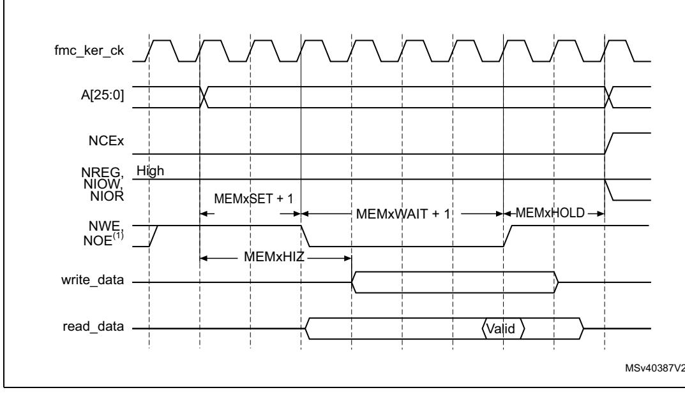

Figure 123. NAND flash controller waveforms for common memory access

- 1. NOE remains high (inactive) during write accesses. NWE remains high (inactive) during read accesses.
- For write accesses, the hold phase delay is (MEMHOLD) fmc\_ker\_ck cycles and for read access is (MEMHOLD + 1) fmc\_ker\_ck cycles.

# 23.8.4 NAND flash operations

The command latch enable (CLE) and address latch enable (ALE) signals of the NAND flash memory device are driven by address signals from the FMC. This means that to send a command or an address to the NAND flash memory, the CPU has to perform a write to a specific address in its memory space.

A typical page read operation from the NAND flash device requires the following steps:

- Program and enable the corresponding memory bank by configuring the FMC\_PCR and FMC\_PMEM (and for some devices, FMC\_PATT, see Section 23.8.5: NAND flash prewait feature) registers according to the characteristics of the NAND flash memory (PWID bits for the data bus width of the NAND flash memory, PWAITEN = 0 or 1 as needed, see Section 23.6.2: NAND flash memory address mapping for timing configuration).
- 2. The CPU performs a byte write to the common memory space, with data byte equal to one flash command byte (for example 0x00 for Samsung NAND flash devices). The LE input of the NAND flash memory is active during the write strobe (low pulse on NWE), thus the written byte is interpreted as a command by the NAND flash memory. Once the command is latched by the memory device, it does not need to be written again for the following page read operations.
- 3. The CPU can send the start address (STARTAD) for a read operation by writing four bytes (or three for smaller capacity devices), STARTAD[7:0], STARTAD[16:9], STARTAD[24:17] and finally STARTAD[25] (for 64 Mb x 8 bit NAND flash memories) in the common memory or attribute space. The ALE input of the NAND flash device is active during the write strobe (low pulse on NWE), thus the written bytes are interpreted as the start address for read operations. Using the attribute memory space makes it possible to use a different timing configuration of the FMC, which can be used


- to implement the prewait functionality needed by some NAND flash memories (see details in Section 23.8.5: NAND flash prewait feature).
- 4. The controller waits for the NAND flash memory to be ready (R/NB signal high), before starting a new access to the same or another memory bank. While waiting, the controller holds the NCE signal active (low).
- 5. The CPU can then perform byte read operations from the common memory space to read the NAND flash page (data field + Spare field) byte by byte.
- The next NAND flash page can be read without any CPU command or address write operation. This can be done in three different ways:
  - by simply performing the operation described in step 5
  - a new random address can be accessed by restarting the operation at step 3
  - a new command can be sent to the NAND flash device by restarting at step 2

#### <span id="page-54-0"></span>23.8.5 NAND flash prewait feature

Some NAND flash devices require that, after writing the last part of the address, the controller waits for the R/NB signal to go low. (see Figure 124).

<span id="page-54-1"></span>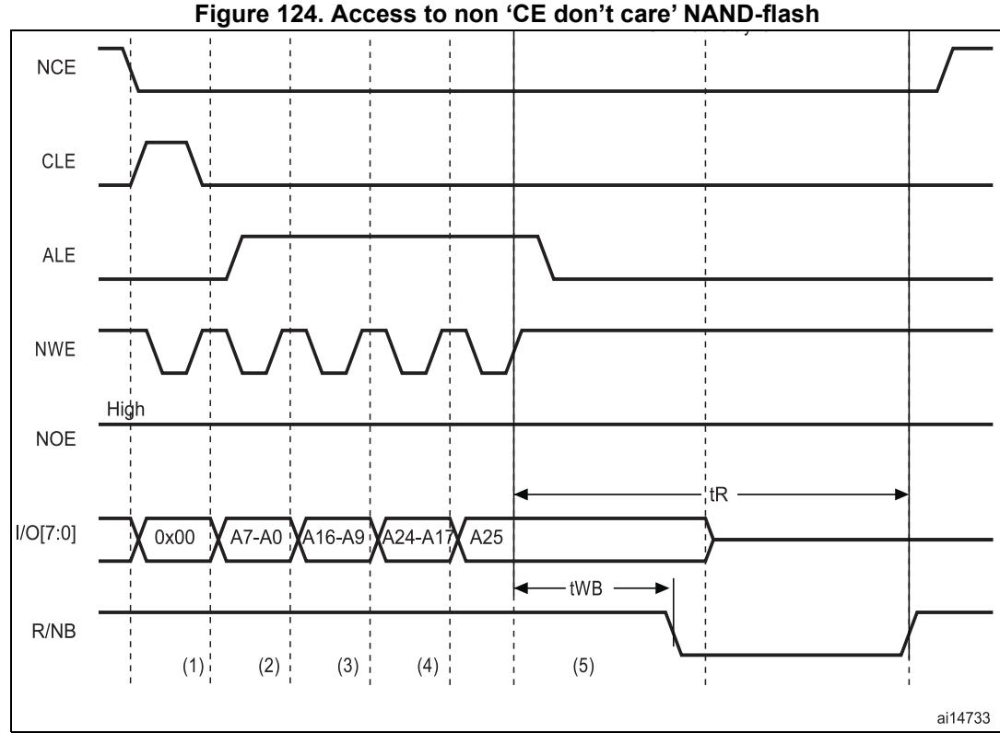

- 1. CPU wrote byte 0x00 at address 0x7001 0000.
- 2. CPU wrote byte A7~A0 at address 0x7002 0000.
- 3. CPU wrote byte A16~A9 at address 0x7002 0000.
- 4. CPU wrote byte A24~A17 at address 0x7002 0000.
- CPU wrote byte A25 at address 0x8802 0000: FMC performs a write access using FMC\_PATT2 timing definition, where ATTHOLD  $\geq$  7 (providing that (7+1) × fmc\_ker\_ck = 112 ns >  $t_{WB}$  max). This guarantees that NCE remains low until R/NB goes low and high again (only requested for NAND flash memories where NCE is not don't care).


RM0399 Rev 4 891/3556 When this function is required, it can be performed by programming the MEMHOLD value to meet the tWB timing. However, any CPU read access to NAND flash memory has a hold delay of (MEMHOLD + 1) fmc\_ker\_ck cycles, and any CPU write access has a hold delay of (MEMHOLD) fmc\_ker\_ck cycles that is inserted between the rising edge of the NWE signal and the next access.

To cope with this timing constraint, the attribute memory space can be used by programming its timing register with an ATTHOLD value that meets the tWB timing, and by keeping the MEMHOLD value at its minimum value. The CPU must then use the common memory space for all NAND flash read and write accesses, except when writing the last address byte to the NAND flash device, where the CPU must write to the attribute memory space.

# <span id="page-55-0"></span>**23.8.6 Computation of the error correction code (ECC) in NAND flash memory**

The FMC includes an error correction code computation hardware block. It reduces the host CPU workload when processing the ECC by software.The ECC block is associated with NAND bank.

The ECC algorithm implemented in the FMC can perform 1-bit error correction and 2-bit error detection per 256, 512, 1 024, 2 048, 4 096 or 8 192 bytes read or written from/to the NAND flash memory. It is based on the Hamming coding algorithm and consists in calculating the row and column parity.

The ECC modules monitor the NAND flash data bus and read/write signals (NCE and NWE) each time the NAND flash memory bank is active.

The ECC operates as follows:

- When accessing NAND flash bank, the data present on the D[15:0] bus is latched and used for ECC computation.
- When accessing any other address in NAND flash memory, the ECC logic is idle, and does not perform any operation. As a result, write operations to define commands or addresses to the NAND flash memory are not taken into account for ECC computation.

Once the desired number of bytes has been read/written from/to the NAND flash memory by the host CPU, the FMC\_ECCR registers must be read to retrieve the computed value. Once read, they should be cleared by resetting the ECCEN bit to '0'. To compute a new data block, the ECCEN bit must be set to one in the FMC\_PCR registers.

Execute below the sequence to perform an ECC computation:

- 1. Enable the ECCEN bit in the FMC\_PCR register.
- 2. Write data to the NAND flash memory page. While the NAND page is written, the ECC block computes the ECC value.
- 3. Wait until the ECC code is ready (FIFO empty).
- 4. Read the ECC value available in the FMC\_ECCR register and store it in a variable.
- 5. Clear the ECCEN bit and then enable it in the FMC\_PCR register before reading back the written data from the NAND page. While the NAND page is read, the ECC block computes the ECC value.
- 6. Read the new ECC value available in the FMC\_ECCR register.
- 7. If the two ECC values are the same, no correction is required, otherwise there is an ECC error and the software correction routine returns information on whether the error can be corrected or not.


# <span id="page-56-0"></span>**23.8.7 NAND flash controller registers**

## **NAND flash control registers (FMC\_PCR)**

Address offset: 0x80

Reset value: 0x0000 0018

| 31   | 30                    | 29   | 28   | 27   | 26   | 25   | 24    | 23   | 22        | 21   | 20    | 19      | 18         | 17 | 16   |
|------|-----------------------|------|------|------|------|------|-------|------|-----------|------|-------|---------|------------|----|------|
| Res. | Res.                  | Res. | Res. | Res. | Res. | Res. | Res.  | Res. | Res.      | Res. | Res.  |         | ECCPS[2:0] |    | TAR3 |
|      |                       |      |      |      |      |      |       |      |           |      |       | rw      | rw         | rw | rw   |
| 15   | 14                    | 13   | 12   | 11   | 10   | 9    | 8     | 7    | 6         | 5    | 4     | 3       | 2          | 1  | 0    |
|      | TAR[2:0]<br>TCLR[3:0] |      |      |      | Res. | Res. | ECCEN |      | PWID[1:0] | Res. | PBKEN | PWAITEN | Res.       |    |      |
| rw   | rw                    | rw   | rw   | rw   | rw   | rw   |       |      | rw        | rw   | rw    |         | rw         | rw |      |

Bits 31:20 Reserved, must be kept at reset value.

### Bits 19:17 **ECCPS[2:0]:** ECC page size.

These bits define the page size for the extended ECC:

000: 256 bytes 001: 512 bytes 010: 1024 bytes 011: 2048 bytes 100: 4096 bytes 101: 8192 bytes

### Bits 16:13 **TAR[3:0]:** ALE to RE delay.

These bits set time from ALE low to RE low in number of fmc\_ker\_ck clock cycles.

Time is: t\_ar = (TAR + SET + 2) × tfmc\_ker\_ck where tfmc\_ker\_ck is the FMC clock period

0000: 1 x fmc\_ker\_ck cycle (default)

1111: 16 x fmc\_ker\_ck cycles

*Note: Set is MEMSET or ATTSET according to the addressed space.*

### Bits 12:9 **TCLR[3:0]:** CLE to RE delay.

These bits set time from CLE low to RE low in number of fmc\_ker\_ck clock cycles. The time is give by the following formula:

t\_clr = (TCLR + SET + 2) × tfmc\_ker\_ck where tfmc\_ker\_ck is the fmc\_ker\_ck clock period

0000: 1 x fmc\_ker\_ck cycle (default)

1111: 16 x fmc\_ker\_ck cycles

*Note: Set is MEMSET or ATTSET according to the addressed space.*

### Bits 8:7 Reserved, must be kept at reset value.

Bit 6 **ECCEN:** ECC computation logic enable bit

0: ECC logic is disabled and reset (default after reset),

1: ECC logic is enabled.

### Bits 5:4 **PWID[1:0]:** Data bus width.

These bits define the external memory device width.

00: 8 bits

01: 16 bits (default after reset).

10: reserved. 11: reserved.

RM0399 Rev 4 893/3556

Bit 3 Reserved, must be kept at reset value.

Bit 2 **PBKEN:** NAND flash memory bank enable bit.

This bit enables the memory bank. Accessing a disabled memory bank causes an ERROR on AXI bus

- 0: Corresponding memory bank is disabled (default after reset)
- 1: Corresponding memory bank is enabled
- Bit 1 **PWAITEN:** Wait feature enable bit.

This bit enables the Wait feature for the NAND flash memory bank:

0: disabled 1: enabled

Bit 0 Reserved, must be kept at reset value.

# **FIFO status and interrupt register (FMC\_SR)**

Address offset: 0x84

Reset value: 0x0000 0040

This register contains information about the FIFO status and interrupt. The FMC features a FIFO that is used when writing to memories to transfer up to 16 words of data.

This is used to quickly write to the FIFO and free the AXI bus for transactions to peripherals other than the FMC, while the FMC is draining its FIFO into the memory. One of these register bits indicates the status of the FIFO, for ECC purposes.

The ECC is calculated while the data are written to the memory. To read the correct ECC, the software must consequently wait until the FIFO is empty.

| 31   | 30   | 29   | 28   | 27   | 26   | 25   | 24   | 23   | 22    | 21   | 20   | 19   | 18   | 17   | 16   |
|------|------|------|------|------|------|------|------|------|-------|------|------|------|------|------|------|
| Res. | Res. | Res. | Res. | Res. | Res. | Res. | Res. | Res. | Res.  | Res. | Res. | Res. | Res. | Res. | Res. |
|      |      |      |      |      |      |      |      |      |       |      |      |      |      |      |      |
| 15   | 14   | 13   | 12   | 11   | 10   | 9    | 8    | 7    | 6     | 5    | 4    | 3    | 2    | 1    | 0    |
| Res. | Res. | Res. | Res. | Res. | Res. | Res. | Res. | Res. | FEMPT | IFEN | ILEN | IREN | IFS  | ILS  | IRS  |
|      |      |      |      |      |      |      |      |      | r     | rw   | rw   | rw   | rw   | rw   | rw   |

Bits 31:7 Reserved, must be kept at reset value.

Bit 6 **FEMPT:** FIFO empty.

Read-only bit that provides the status of the FIFO

0: FIFO not empty 1: FIFO empty

Bit 5 **IFEN:** Interrupt falling edge detection enable bit

0: Interrupt falling edge detection request disabled 1: Interrupt falling edge detection request enabled

Bit 4 **ILEN:** Interrupt high-level detection enable bit

0: Interrupt high-level detection request disabled 1: Interrupt high-level detection request enabled

Bit 3 **IREN:** Interrupt rising edge detection enable bit

0: Interrupt rising edge detection request disabled 1: Interrupt rising edge detection request enabled


Bit 2 **IFS:** Interrupt falling edge status

The flag is set by hardware and reset by software.

0: No interrupt falling edge occurred

1: Interrupt falling edge occurred

*Note: If this bit is written by software to 1 it will be set.*

Bit 1 **ILS:** Interrupt high-level status

The flag is set by hardware and reset by software.

0: No Interrupt high-level occurred

1: Interrupt high-level occurred

Bit 0 **IRS:** Interrupt rising edge status

The flag is set by hardware and reset by software.

0: No interrupt rising edge occurred

1: Interrupt rising edge occurred

*Note: If this bit is written by software to 1 it will be set.*

# **Common memory space timing register (FMC\_PMEM)**

Address offset: 0x88

Reset value: 0xFCFC FCFC

The FMC\_PMEM read/write register contains the timing information for NAND flash memory bank. This information is used to access either the common memory space of the NAND flash for command, address write access and data read/write access.

| 31 | 30           | 29 | 28 | 27 | 26 | 25 | 24 | 23          | 22           | 21 | 20 | 19 | 18 | 17 | 16 |  |
|----|--------------|----|----|----|----|----|----|-------------|--------------|----|----|----|----|----|----|--|
|    | MEMHIZ[7:0]  |    |    |    |    |    |    |             | MEMHOLD[7:0] |    |    |    |    |    |    |  |
| rw | rw           | rw | rw | rw | rw | rw | rw | rw          | rw           | rw | rw | rw | rw | rw | rw |  |
| 15 | 14           | 13 | 12 | 11 | 10 | 9  | 8  | 7           | 6            | 5  | 4  | 3  | 2  | 1  | 0  |  |
|    | MEMWAIT[7:0] |    |    |    |    |    |    | MEMSET[7:0] |              |    |    |    |    |    |    |  |
| rw | rw           | rw | rw | rw | rw | rw | rw | rw          | rw           | rw | rw | rw | rw | rw | rw |  |

### Bits 31:24 **MEMHIZ[7:0]:** Common memory x data bus Hi-Z time

These bits define the number of fmc\_ker\_ck clock cycles during which the data bus is kept Hi-Z after the start of a NAND flash write access to common memory space. This is only valid for write transactions:

0000 0000: 0 x fmc\_ker\_ck cycle 1111 1110: 254 x fmc\_ker\_ck cycles

1111 1111: reserved.

### Bits 23:16 **MEMHOLD[7:0]:** Common memory hold time

These bits define the number of fmc\_ker\_ck clock cycles for write accesses and fmc\_ker\_ck+1 clock cycles for read accesses during which the address is held (and data for write accesses) after the command is deasserted (NWE, NOE), for NAND flash read or write access to common memory space:

0000 0000: reserved.

0000 0001: 1 fmc\_ker\_ck cycle for write access / 3 fmc\_ker\_ck cycle for read access 1111 1110: 254 fmc\_ker\_ck cycles for write access / 257 fmc\_ker\_ck cycles for read access 1111 1111: reserved.

RM0399 Rev 4 895/3556

### Bits 15:8 **MEMWAIT[7:0]:** Common memory wait time

These bits define the minimum number of fmc\_ker\_ck (+1) clock cycles to assert the command (NWE, NOE), for NAND flash read or write access to common memory space. The duration of command assertion is extended if the wait signal (NWAIT) is active (low) at the end of the programmed value of fmc\_ker\_ck:

0000 0000: reserved

0000 0001: x fmc\_ker\_ck cycles (+ wait cycle introduced by deasserting NWAIT) 1111 1110: 255 x fmc\_ker\_ck cycles (+ wait cycle introduced by deasserting NWAIT)

1111 1111: reserved.

### Bits 7:0 **MEMSET[7:0]:** Common memory x setup time

These bits define the number of fmc\_ker\_ck (+1) clock cycles to set up the address before the command assertion (NWE, NOE), for NAND flash read or write access to common memory space:

0000 0000: fmc\_ker\_ck cycles 1111 1110: 255 x fmc\_ker\_ck cycles

1111 1111: reserved

# **Attribute memory space timing registers (FMC\_PATT)**

Address offset: 0x8C

Reset value: 0xFCFC FCFC

The FMC\_PATT read/write register contains the timing information for NAND flash memory bank. It is used for 8-bit accesses to the attribute memory space of the NAND flash for the last address write access if the timing must differ from that of previous accesses (for Ready/Busy management, refer to *[Section 23.8.5: NAND flash prewait feature](#page-54-0)*).

| 31 | 30           | 29 | 28 | 27 | 26 | 25 | 24 | 23 | 22           | 21 | 20 | 19 | 18 | 17 | 16 |
|----|--------------|----|----|----|----|----|----|----|--------------|----|----|----|----|----|----|
|    | ATTHIZ[7:0]  |    |    |    |    |    |    |    | ATTHOLD[7:0] |    |    |    |    |    |    |
| rw | rw           | rw | rw | rw | rw | rw | rw | rw | rw           | rw | rw | rw | rw | rw | rw |
| 15 | 14           | 13 | 12 | 11 | 10 | 9  | 8  | 7  | 6            | 5  | 4  | 3  | 2  | 1  | 0  |
|    | ATTWAIT[7:0] |    |    |    |    |    |    |    | ATTSET[7:0]  |    |    |    |    |    |    |
| rw | rw           | rw | rw | rw | rw | rw | rw | rw | rw           | rw | rw | rw | rw | rw | rw |

# Bits 31:24 **ATTHIZ[7:0]:** Attribute memory data bus Hi-Z time

These bits define the number of fmc\_ker\_ck clock cycles during which the data bus is kept in Hi-Z after the start of a NAND flash write access to attribute memory space on socket. Only valid for writ transaction:

0000 0000: 0 x fmc\_ker\_ck cycle 1111 1110: 254 x fmc\_ker\_ck cycles

1111 1111: reserved.

### Bits 23:16 **ATTHOLD[7:0]:** Attribute memory hold time

These bits define the number of fmc\_ker\_ck clock cycles during which the address is held (and data for write access) after the command deassertion (NWE, NOE), for NAND flash read or write access to attribute memory space:

0000 0000: reserved

0000 0001: 1 x fmc\_ker\_ck cycle 1111 1110: 254 x fmc\_ker\_ck cycles

1111 1111: reserved.


#### Bits 15:8 **ATTWAIT[7:0]:** Attribute memory wait time

These bits define the minimum number of x fmc\_ker\_ck (+1) clock cycles to assert the command (NWE, NOE), for NAND flash read or write access to attribute memory space. The duration for command assertion is extended if the wait signal (NWAIT) is active (low) at the end of the programmed value of fmc\_ker\_ck:

0000 0000: reserved

0000 0001: 2 x fmc\_ker\_ck cycles (+ wait cycle introduced by deassertion of NWAIT) 1111 1110: 255 x fmc\_ker\_ck cycles (+ wait cycle introduced by deasserting NWAIT) 1111 1111: reserved.

### Bits 7:0 **ATTSET[7:0]:** Attribute memory setup time

These bits define the number of fmc\_ker\_ck (+1) clock cycles to set up address before the command assertion (NWE, NOE), for NAND flash read or write access to attribute memory space:

0000 0000: 1 x fmc\_ker\_ck cycle 1111 1110: 255 x fmc\_ker\_ck cycles 1111 1111: reserved.

RM0399 Rev 4 897/3556

# **ECC result registers (FMC\_ECCR)**

Address offset: 0x94

Reset value: 0x0000 0000

This register contain the current error correction code value computed by the ECC computation modules of the FMC NAND controller. When the CPU reads/writes the data from a NAND flash memory page at the correct address (refer to *[Section 23.8.6:](#page-55-0)  [Computation of the error correction code \(ECC\) in NAND flash memory](#page-55-0)*), the data read/written from/to the NAND flash memory are processed automatically by the ECC computation module. When X bytes have been read (according to the ECCPS field in the FMC\_PCR registers), the CPU must read the computed ECC value from the FMC\_ECC registers. It then verifies if these computed parity data are the same as the parity value recorded in the spare area, to determine whether a page is valid, and, to correct it otherwise. The FMC\_ECCR register should be cleared after being read by setting the ECCEN bit to '0'. To compute a new data block, the ECCEN bit must be set to '1'.

| 31 | 30         | 29 | 28 | 27 | 26 | 25 | 24 | 23 | 22 | 21 | 20 | 19 | 18 | 17 | 16 |
|----|------------|----|----|----|----|----|----|----|----|----|----|----|----|----|----|
|    | ECC[31:16] |    |    |    |    |    |    |    |    |    |    |    |    |    |    |
| r  | r          | r  | r  | r  | r  | r  | r  | r  | r  | r  | r  | r  | r  | r  | r  |
| 15 | 14         | 13 | 12 | 11 | 10 | 9  | 8  | 7  | 6  | 5  | 4  | 3  | 2  | 1  | 0  |
|    | ECC[15:0]  |    |    |    |    |    |    |    |    |    |    |    |    |    |    |
| r  | r          | r  | r  | r  | r  | r  | r  | r  | r  | r  | r  | r  | r  | r  | r  |

Bits 31:0 **ECC[31:0]:** ECC result

This field contains the value computed by the ECC computation logic. *[Table 198](#page-61-0)* describes the contents of these bitfields.

<span id="page-61-0"></span>**ECCPS[2:0] Page size in bytes ECC bits** 000 256 ECC[21:0] 001 512 ECC[23:0] 010 1024 ECC[25:0] 011 2048 ECC[27:0] 100 4096 ECC[29:0] 101 8192 ECC[31:0]

**Table 198. ECC result relevant bits** 

# **23.9 SDRAM controller**

# **23.9.1 SDRAM controller main features**

The main features of the SDRAM controller are the following:

- Two SDRAM banks with independent configuration
- 8-bit, 16-bit, 32-bit data bus width
- 13-bits Address Row, 11-bits Address Column, 4 internal banks: 4x16Mx32bit (256 MB), 4x16Mx16bit (128 MB), 4x16Mx8bit (64 MB)
- Word, half-word, byte access
- SDRAM clock can be fmc\_ker\_ck/2 or fmc\_ker\_ck/3
- Automatic row and bank boundary management
- Multibank ping-pong access
- Programmable timing parameters
- Automatic Refresh operation with programmable Refresh rate
- Self-refresh mode
- Power-down mode
- SDRAM power-up initialization by software
- CAS latency of 1,2,3
- Cacheable Read FIFO with depth of 6 lines x32-bit (6 x14-bit address tag)

# **23.9.2 SDRAM External memory interface signals**

At startup, the SDRAM I/O pins used to interface the FMC SDRAM controller with the external SDRAM devices must configured by the user application. The SDRAM controller I/O pins which are not used by the application, can be used for other purposes.

**Table 199. SDRAM signals** 

| SDRAM signal | I/O<br>type | Description                                                            | Alternate function |  |  |  |
|--------------|-------------|------------------------------------------------------------------------|--------------------|--|--|--|
| SDCLK        | O           | SDRAM clock                                                            | -                  |  |  |  |
| SDCKE[1:0]   | O           | SDCKE0: SDRAM Bank 1 Clock Enable<br>SDCKE1: SDRAM Bank 2 Clock Enable | -                  |  |  |  |
| SDNE[1:0]    | O           | SDNE0: SDRAM Bank 1 Chip Enable<br>SDNE1: SDRAM Bank 2 Chip Enable     | -                  |  |  |  |
| A[12:0]      | O           | Address                                                                | FMC_A[12:0]        |  |  |  |
| D[31:0]      | I/O         | Bidirectional data bus                                                 | FMC_D[31:0]        |  |  |  |
| BA[1:0]      | O           | Bank Address                                                           | FMC_A[15:14]       |  |  |  |
| NRAS         | O           | Row Address Strobe                                                     | -                  |  |  |  |
| NCAS         | O           | Column Address Strobe                                                  | -                  |  |  |  |
| SDNWE        | O           | Write Enable                                                           | -                  |  |  |  |
| NBL[3:0]     | O           | Output Byte Mask for write accesses<br>(memory signal name: DQM[3:0]   | FMC_NBL[3:0]       |  |  |  |

# **23.9.3 SDRAM controller functional description**

All SDRAM controller outputs (signals, address and data) change on the falling edge of the memory clock (FMC\_SDCLK).

# **SDRAM initialization**

The initialization sequence is managed by software. If the two banks are used, the initialization sequence must be generated simultaneously to Bank 1and Bank 2 by setting the Target Bank bits CTB1 and CTB2 in the FMC\_SDCMR register:

- 1. Program the memory device features into the FMC\_SDCRx register. The SDRAM clock frequency, RBURST and RPIPE must be programmed in the FMC\_SDCR1 register.
- 2. Program the memory device timing into the FMC\_SDTRx register. The TRP and TRC timings must be programmed in the FMC\_SDTR1 register.
- 3. Set MODE bits to '001' and configure the Target Bank bits (CTB1 and/or CTB2) in the FMC\_SDCMR register to start delivering the clock to the memory (SDCKE is driven high).
- 4. Wait during the prescribed delay period. Typical delay is around 100 μs (refer to the SDRAM datasheet for the required delay after power-up).
- 5. Set MODE bits to '010' and configure the Target Bank bits (CTB1 and/or CTB2) in the FMC\_SDCMR register to issue a "Precharge All" command.
- 6. Set MODE bits to '011', and configure the Target Bank bits (CTB1 and/or CTB2) as well as the number of consecutive Auto-refresh commands (NRFS) in the FMC\_SDCMR register. Refer to the SDRAM datasheet for the number of Auto-refresh commands that should be issued. Typical number is 8.
- 7. Configure the MRD field, set the MODE bits to '100', and configure the Target Bank bits (CTB1 and/or CTB2) in the FMC\_SDCMR register to issue a "Load Mode Register" command and program the SDRAM device. In particular the Burst Length (BL) has to be set to '1') and the CAS latency has to be selected. If the Mode Register is not the same for both SDRAM banks, this step has to be repeated twice, once for each bank and the Target Bank bits set accordingly. For mobile SDRAM devices, the MRD field is also used to configure the extended mode register while issuing the Load Mode Register"
- 8. Program the refresh rate in the FMC\_SDRTR register The refresh rate corresponds to the delay between refresh cycles. Its value must be adapted to SDRAM devices.

At this stage the SDRAM device is ready to accept commands. If a system reset occurs during an ongoing SDRAM access, the data bus might still be driven by the SDRAM device. Therefor the SDRAM device must be first reinitialized after reset before issuing any new access by the NOR flash/PSRAM/SRAM or NAND flash controller.

*Note: If two SDRAM devices are connected to the FMC, all the accesses performed at the same time to both devices by the Command Mode register (Load Mode Register command) are issued using the timing parameters configured for SDRAM Bank 1 (TMRD andTRAS timings) in the FMC\_SDTR1 register.*


### **SDRAM controller write cycle**

The SDRAM controller accepts single and burst write requests and translates them into single memory accesses. In both cases, the SDRAM controller keeps track of the active row for each bank to be able to perform consecutive write accesses to different banks (Multibank ping-pong access).

Before performing any write access, the SDRAM bank write protection must be disabled by clearing the WP bit in the FMC\_SDCRx register.

<span id="page-64-0"></span>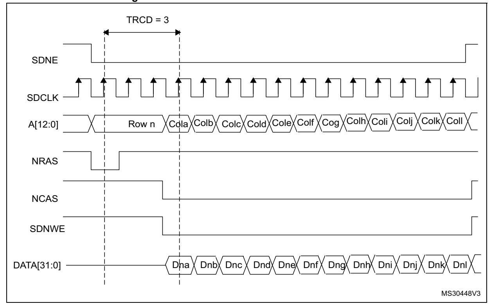

**Figure 125. Burst write SDRAM access waveforms**

The SDRAM controller always checks the next access.

- If the next access is in the same row or in another active row, the write operation is carried out,
- if the next access targets another row (not active), the SDRAM controller generates a precharge command, activates the new row and initiates a write command.

# **SDRAM controller read cycle**

The SDRAM controller accepts single and burst read requests and translates them into single memory accesses. In both cases, the SDRAM controller keeps track of the active row in each bank to be able to perform consecutive read accesses in different banks (Multibank ping-pong access).

<span id="page-65-0"></span>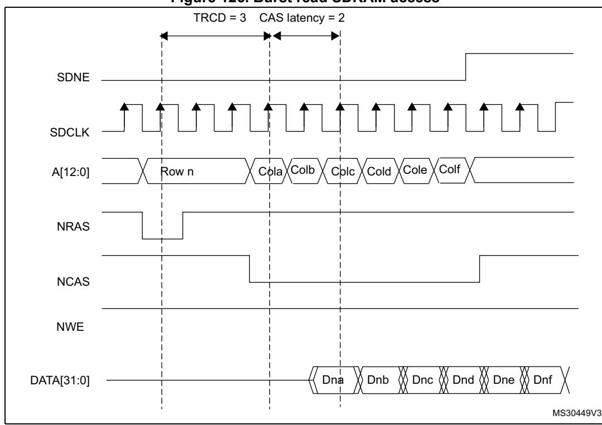

**Figure 126. Burst read SDRAM access**

The FMC SDRAM controller features a Cacheable read FIFO (6 lines x 32 bits). It is used to store data read in advance during the CAS latency period (up to 3 memory clock cycles, programmed FMC\_SDCRx) and during the RPIPE delay when set to 2xfmc\_ker\_ck clock cycles as configured in FMC\_SDCR1) following this formula: CAS Latency + 1 + (RPIPE DIV2). The RBURST bit must be set in the FMC\_SDCR1 register to anticipate the next read access.

### Examples:

- CAS=3, RPIPE= 2xfmc\_ker\_ck. In this case, 5 data (not committed) are stored in the FIFO (4 data during CAS latency and 1 data during RPIPE delay)
- CAS=3, RPIPE= 1xfmc\_ker\_ck. In this case, 4 data (not committed) are stored in the FIFO (4 data during CAS latency)

The read FIFO features a 14-bit address tag to each line to identify its content: 11 bits for the column address, 2 bits to select the internal bank and the active row, and 1 bit to select the SDRAM device

When the end of the row is reached in advance during an burst read transaction, the data read in advance (not committed) are not stored in the read FIFO. For single read access, data are correctly stored in the FIFO.


Each time a read request occurs, the SDRAM controller checks:

- If the address matches one of the address tags, data are directly read from the FIFO and the corresponding address tag/ line content is cleared and the remaining data in the FIFO are compacted to avoid empty lines.
- Otherwise, a new read command is issued to the memory and the FIFO is updated with new data. If the FIFO is full, the older data are lost.

**Figure 127. Logic diagram of Read access with RBURST bit set (CAS=2, RPIPE=0)**


During a write access or a Precharge command, the read FIFO is flushed and ready to be filled with new data.

After the first read request, if the current access was not performed to a row boundary, the SDRAM controller anticipates the next read access during the CAS latency period and the RPIPE delay (if configured). This is done by incrementing the memory address. The following condition must be met:

• RBURST control bit should be set to '1' in the FMC\_SDCR1 register.


RM0399 Rev 4 903/3556

The address management depends on the next AXI request:

- Next request is sequential (Burst access) In this case, the SDRAM controller increments the address.
- Next request is not sequential
  - If the new read request targets the same row or another active row, the new address is passed to the memory and the master is stalled for the CAS latency period, waiting for the new data from memory.
  - If the new read request does not target an active row, the SDRAM controller generates a Precharge command, activates the new row, and initiates a read command.

If the RBURST is reset, the read FIFO is not used.

# **Row and bank boundary management**

When a read or write access crosses a row boundary, if the next read or write access is sequential and the current access was performed to a row boundary, the SDRAM controller executes the following operations:

- 1. Precharge of the active row,
- 2. Activation of the new row
- 3. Start of a read/write command.

At a row boundary, the automatic activation of the next row is supported for all columns and data bus width configurations.

If necessary, the SDRAM controller inserts additional clock cycles between the following commands:

- Between Precharge and Active commands to match TRP parameter (only if the next access is in a different row in the same bank),
- Between Active and Read commands to match the TRCD parameter.

These parameters are defined into the FMC\_SDTRx register.

Refer to *[Figure 125](#page-64-0)* and *[Figure 126](#page-65-0)* for read and burst write access crossing a row boundary.


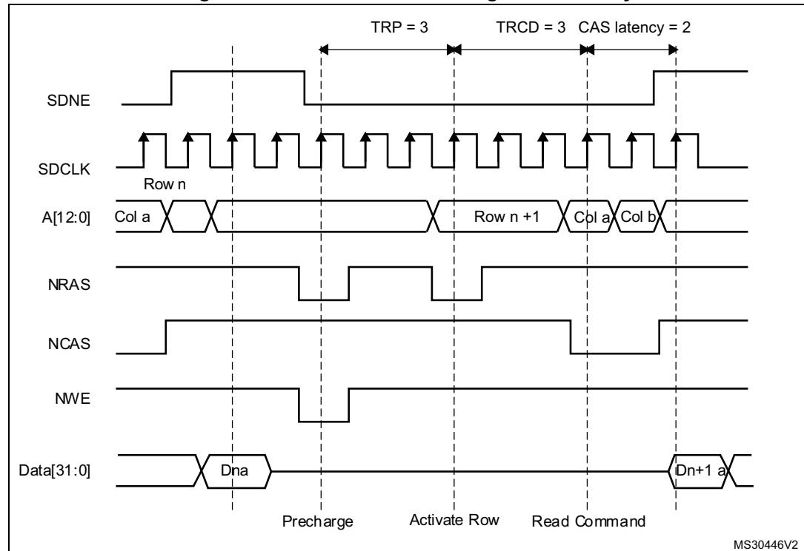

**Figure 128. Read access crossing row boundary**


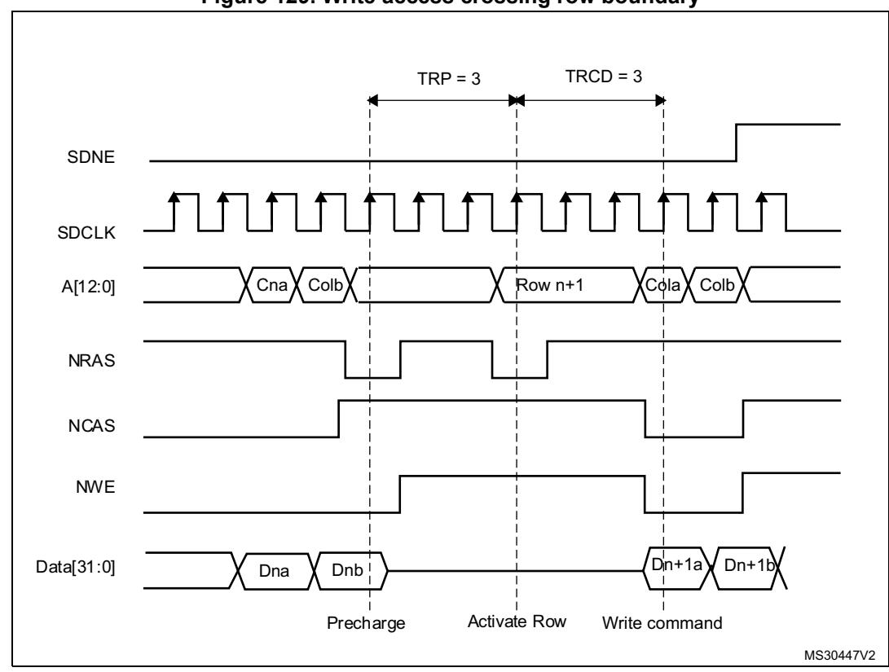

If the next access is sequential and the current access crosses a bank boundary, the SDRAM controller activates the first row in the next bank and initiates a new read/write command. Two cases are possible:

- If the current bank is not the last one, the active row in the new bank must be precharged.At a bank boundary, the automatic activation of the next row is supported for all rows/columns and data bus width configuration.
- If the current bank is the last one, the automatic activation of the next row is supported only when addressing 13-bit rows, 11-bit columns, 4 internal banks and 32-bit data bus SDRAM devices. Otherwise, the SDRAM address range is violated and an AXI slave error is generated.
- In case of 13-bit row address, 11-bit column address, 4 internal banks and bus width 32-bit SDRAM memories, at boundary bank, the SDRAM controller continues to read/write from the second SDRAM device (assuming it has been initialized):
  - a) The SDRAM controller activates the first row (after precharging the active row, if there is already an active row in the first internal bank, and initiates a new read/write command.
  - b) If the first row is already activated, the SDRAM controller just initiates a read/write command.

# **SDRAM controller refresh cycle**

The Auto-refresh command is used to refresh the SDRAM device content. The SDRAM controller periodically issues auto-refresh commands. An internal counter is loaded with the COUNT value in the register FMC\_SDRTR. This value defines the number of memory clock cycles between the refresh cycles (refresh rate). When this counter reaches zero, an internal pulse is generated.

If a memory access is ongoing, the auto-refresh request is delayed. However, if the memory access and the auto-refresh requests are generated simultaneously, the auto-refresh request takes precedence.

If the memory access occurs during an auto-refresh operation, the request is buffered and processed when the auto-refresh is complete.

If a new auto-refresh request occurs while the previous one was not served, the RE (Refresh Error) bit is set in the Status register. An Interrupt is generated if it has been enabled (REIE = '1').

If SDRAM lines are not in idle state (not all row are closed), the SDRAM controller generates a PALL (Precharge ALL) command before the auto-refresh.

If the Auto-refresh command is generated by the FMC\_SDCMR Command Mode register (Mode bits = '011'), a PALL command (Mode bits =' 010') must be issued first.


# **23.9.4 Low-power modes**

Two low-power modes are available:

• Self-refresh mode

The auto-refresh cycles are performed by the SDRAM device itself to retain data without external clocking.

• Power-down mode

The auto-refresh cycles are performed by the SDRAM controller.

# **Self-refresh mode**

This mode is selected by setting the MODE bits to '101' and by configuring the Target Bank bits (CTB1 and/or CTB2) in the FMC\_SDCMR register.

The SDRAM clock stops running after a TRAS delay and the internal refresh timer stops counting only if one of the following conditions is met:

- A Self-refresh command is issued to both devices
- One of the devices is not activated (SDRAM bank is not initialized).

Before entering Self-Refresh mode, the SDRAM controller automatically issues a PALL command.

If the Write data FIFO is not empty, all data are sent to the memory before activating the Self-refresh mode and the BUSY status flag remains set.

In Self-refresh mode, all SDRAM device inputs become don't care except for SDCKE which remains low.

The SDRAM device must remain in Self-refresh mode for a minimum period of time of TRAS and can remain in Self-refresh mode for an indefinite period beyond that. To guarantee this minimum period, the BUSY status flag remains high after the Self-refresh activation during a TRAS delay.

As soon as an SDRAM device is selected, the SDRAM controller generates a sequence of commands to exit from Self-refresh mode. After the memory access, the selected device remains in Normal mode.

To exit from Self-refresh, the MODE bits must be set to '000' (Normal mode) and the Target Bank bits (CTB1 and/or CTB2) must be configured in the FMC\_SDCMR register.


RM0399 Rev 4 907/3556

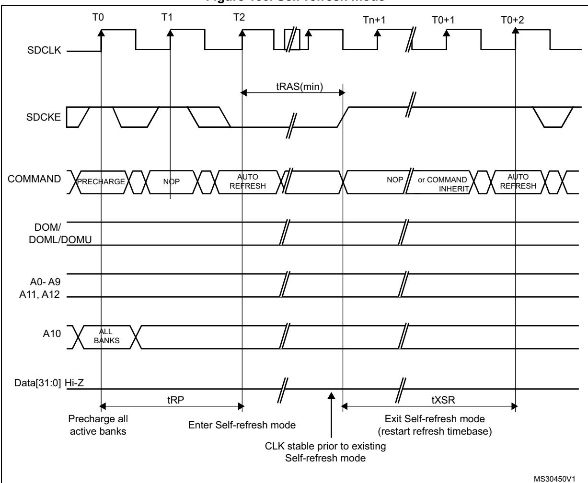

Figure 130. Self-refresh mode

# **Power-down mode**

This mode is selected by setting the MODE bits to '110' and by configuring the Target Bank bits (CTB1 and/or CTB2) in the FMC\_SDCMR register.

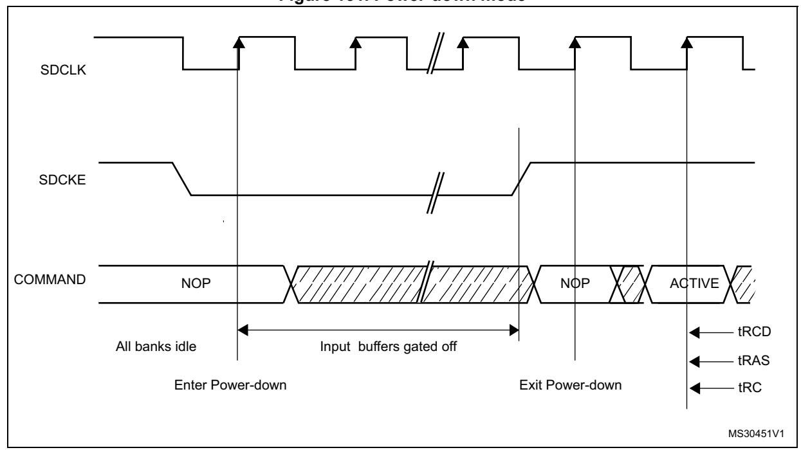

**Figure 131. Power-down mode**

If the Write data FIFO is not empty, all data are sent to the memory before activating the Power-down mode.

As soon as an SDRAM device is selected, the SDRAM controller exits from the Power-down mode. After the memory access, the selected SDRAM device remains in Normal mode.

During Power-down mode, all SDRAM device input and output buffers are deactivated except for the SDCKE which remains low.

The SDRAM device cannot remain in Power-down mode longer than the refresh period and cannot perform the Auto-refresh cycles by itself. Therefore, the SDRAM controller carries out the refresh operation by executing the operations below:

- 1. Exit from Power-down mode and drive the SDCKE high
- 2. Generate the PALL command only if a row was active during Power-down mode
- 3. Generate the auto-refresh command
- 4. Drive SDCKE low again to return to Power-down mode.

To exit from Power-down mode, the MODE bits must be set to '000' (Normal mode) and the Target Bank bits (CTB1 and/or CTB2) must be configured in the FMC\_SDCMR register.

# <span id="page-73-0"></span>**23.9.5 SDRAM controller registers**

# **SDRAM Control registers for SDRAM memory bank x (FMC\_SDCRx)**

Address offset: 0x140+ 4\* (x - 1), (x = 1 to 2)

Reset value: 0x0000 02D0

This register contains the control parameters for each SDRAM memory bank

| 31   | 30         | 29   | 28     | 27   | 26         | 25   | 24   | 23       | 22   | 21   | 20        | 19   | 18      | 17   | 16      |
|------|------------|------|--------|------|------------|------|------|----------|------|------|-----------|------|---------|------|---------|
| Res. | Res.       | Res. | Res.   | Res. | Res.       | Res. | Res. | Res.     | Res. | Res. | Res.      | Res. | Res.    | Res. | Res.    |
|      |            |      |        |      |            |      |      |          |      |      |           |      |         |      |         |
| 15   | 14         | 13   | 12     | 11   | 10         | 9    | 8    | 7        | 6    | 5    | 4         | 3    | 2       | 1    | 0       |
| Res. | RPIPE[1:0] |      | RBURST |      | SDCLK[1:0] | WP   |      | CAS[1:0] | NB   |      | MWID[1:0] |      | NR[1:0] |      | NC[1:0] |
|      | rw         | rw   | rw     | rw   | rw         | rw   | rw   | rw       | rw   | rw   | rw        | rw   | rw      | rw   | rw      |

Bits 31:15 Reserved, must be kept at reset value.

# Bits 14:13 **RPIPE[1:0]:** Read pipe

These bits define the delay, in fmc\_ker\_ck clock cycles, for reading data after CAS latency.

00: No fmc\_ker\_ck clock cycle delay

01: One fmc\_ker\_ck clock cycle delay

10: Two fmc\_ker\_ck clock cycle delay

11: reserved.

*Note: The corresponding bits in the FMC\_SDCR2 register is read only.*

### Bit 12 **RBURST:** Burst read

This bit enables Burst read mode. The SDRAM controller anticipates the next read commands during the CAS latency and stores data in the Read FIFO.

0: single read requests are not managed as bursts

1: single read requests are always managed as bursts

*Note: The corresponding bit in the FMC\_SDCR2 register is read only.*

### Bits 11:10 **SDCLK[1:0]:** SDRAM clock configuration

These bits define the SDRAM clock period for both SDRAM banks and allow disabling the clock before changing the frequency. In this case the SDRAM must be re-initialized.

00: SDCLK clock disabled

01: Reserved

10: SDCLK period = 2 x fmc\_ker\_ck periods

11: SDCLK period = 3 x fmc\_ker\_ck periods

*Note: The corresponding bits in the FMC\_SDCR2 register is read only.*

### Bit 9 **WP:** Write protection

This bit enables Write mode access to the SDRAM bank.

0: Write accesses allowed

1: Write accesses ignored


#### Bits 8:7 **CAS[1:0]:** CAS Latency

This bits sets the SDRAM CAS latency in number of memory clock cycles

00: reserved. 01: 1 cycle 10: 2 cycles

11: 3 cycles

## Bit 6 **NB:** Number of internal banks

This bit sets the number of internal banks.

0: Two internal Banks 1: Four internal Banks

### Bits 5:4 **MWID[1:0]:** Memory data bus width.

These bits define the memory device width.

00: 8 bits 01: 16 bits 10: 32 bits 11: reserved.

### Bits 3:2 **NR[1:0]:** Number of row address bits

These bits define the number of bits of a row address.

00: 11 bit 01: 12 bits 10: 13 bits 11: reserved.

#### Bits 1:0 **NC[1:0]:** Number of column address bits

These bits define the number of bits of a column address.

00: 8 bits 01: 9 bits 10: 10 bits 11: 11 bits.

*Note: Before modifying the RBURST or RPIPE settings or disabling the SDCLK clock, the user must first send a PALL command to make sure ongoing operations are complete.*

### **SDRAM Timing registers for SDRAM memory bank x (FMC\_SDTRx)**

Address offset: 0x148 + 4 \* (x - 1), (x = 1 to 2)

Reset value: 0x0FFF FFFF

This register contains the timing parameters of each SDRAM bank

| 31   | 30                    | 29   | 28   | 27 | 26 | 25        | 24 | 23        | 22 | 21        | 20 | 19       | 18 | 17 | 16 |  |
|------|-----------------------|------|------|----|----|-----------|----|-----------|----|-----------|----|----------|----|----|----|--|
| Res. | Res.                  | Res. | Res. |    |    | TRCD[3:0] |    |           |    | TRP[3:0]  |    | TWR[3:0] |    |    |    |  |
|      |                       |      |      | rw | rw | rw        | rw | rw        | rw | rw        | rw | rw       | rw | rw | rw |  |
| 15   | 14                    | 13   | 12   | 11 | 10 | 9         | 8  | 7         | 6  | 5         | 4  | 3        | 2  | 1  | 0  |  |
|      | TRC[3:0]<br>TRAS[3:0] |      |      |    |    |           |    | TXSR[3:0] |    | TMRD[3:0] |    |          |    |    |    |  |
| rw   | rw                    | rw   | rw   | rw | rw | rw        | rw | rw        | rw | rw        | rw | rw       | rw | rw | rw |  |


RM0399 Rev 4 911/3556

Bits 31:28 Reserved, must be kept at reset value.

#### Bits 27:24 **TRCD[3:0]:** Row to column delay

These bits define the delay between the Activate command and a Read/Write command in number of memory clock cycles.

0000: 1 cycle. 0001: 2 cycles ....

1111: 16 cycles

### Bits 23:20 **TRP[3:0]:** Row precharge delay

These bits define the delay between a Precharge command and another command in number of memory clock cycles. The TRP timing is only configured in the FMC\_SDTR1 register. If two SDRAM devices are used, the TRP must be programmed with the timing of the slowest device.

0000: 1 cycle 0001: 2 cycles ....

1111: 16 cycles

*Note: The corresponding bits in the FMC\_SDTR2 register are don't care.*

### Bits 19:16 **TWR[3:0]:** Recovery delay

These bits define the delay between a Write and a Precharge command in number of memory clock cycles.

0000: 1 cycle 0001: 2 cycles ....

1111: 16 cycles

*Note: TWR must be programmed to match the write recovery time (tWR) defined in the SDRAM datasheet, and to guarantee that:*

*TWR* ≥ *TRAS - TRCD and TWR* ≥ *TRC - TRCD - TRP*

*Example: TRAS= 4 cycles, TRCD= 2 cycles. So, TWR* ≥ *2 cycles. TWR must be programmed to 0x1.*

*If two SDRAM devices are used, the FMC\_SDTR1 and FMC\_SDTR2 must be programmed with the same TWR timing corresponding to the slowest SDRAM device.*

*If only one SDRAM device is used, the TWR timing must be kept at reset value (0xF) for the not used bank.*

#### Bits 15:12 **TRC[3:0]:** Row cycle delay

These bits define the delay between the Refresh command and the Activate command, as well as the delay between two consecutive Refresh commands. It is expressed in number of memory clock cycles. The TRC timing is only configured in the FMC\_SDTR1 register. If two SDRAM devices are used, the TRC must be programmed with the timings of the slowest device.

0000: 1 cycle 0001: 2 cycles .... 1111: 16 cycles

*Note: TRC must match the TRC and TRFC (Auto Refresh period) timings defined in the SDRAM device datasheet.*

*Note: The corresponding bits in the FMC\_SDTR2 register are don't care.*


### Bits 11:8 **TRAS[3:0]:** Self refresh time

These bits define the minimum Self-refresh period in number of memory clock cycles.

0000: 1 cycle 0001: 2 cycles

....

1111: 16 cycles

### Bits 7:4 **TXSR[3:0]:** Exit Self-refresh delay

These bits define the delay from releasing the Self-refresh command to issuing the Activate command in number of memory clock cycles.

0000: 1 cycle 0001: 2 cycles

....

1111: 16 cycles

*Note: If two SDRAM devices are used, the FMC\_SDTR1 and FMC\_SDTR2 must be programmed with the same TXSR timing corresponding to the slowest SDRAM device.*

#### Bits 3:0 **TMRD[3:0]:** Load Mode Register to Active

These bits define the delay between a Load Mode Register command and an Active or Refresh command in number of memory clock cycles.

0000: 1 cycle 0001: 2 cycles

....

1111: 16 cycles

*Note: If two SDRAM devices are connected, all the accesses performed simultaneously to both devices by the Command Mode register (Load Mode Register command) are issued using the timing parameters configured for Bank 1 (TMRD and TRAS timings) in the FMC\_SDTR1 register.*

> *The TRP and TRC timings are only configured in the FMC\_SDTR1 register. If two SDRAM devices are used, the TRP and TRC timings must be programmed with the timings of the slowest device.*

### **SDRAM Command mode register (FMC\_SDCMR)**

Address offset: 0x150 Reset value: 0x0000 0000

This register contains the command issued when the SDRAM device is accessed. This register is used to initialize the SDRAM device, and to activate the Self-refresh and the Power-down modes. As soon as the MODE field is written, the command will be issued only to one or to both SDRAM banks according to CTB1 and CTB2 command bits. This register is the same for both SDRAM banks.

| 31   | 30       | 29   | 28   | 27   | 26   | 25   | 24   | 23   | 22        | 21        | 20   | 19   | 18        | 17 | 16 |  |
|------|----------|------|------|------|------|------|------|------|-----------|-----------|------|------|-----------|----|----|--|
| Res. | Res.     | Res. | Res. | Res. | Res. | Res. | Res. | Res. |           | MRD[13:7] |      |      |           |    |    |  |
|      |          |      |      |      |      |      |      |      | rw        | rw        | rw   | rw   | rw        | rw | rw |  |
| 15   | 14       | 13   | 12   | 11   | 10   | 9    | 8    | 7    | 6         | 5         | 4    | 3    | 2         | 1  | 0  |  |
|      | MRD[6:0] |      |      |      |      |      |      |      | NRFS[3:0] |           | CTB1 | CTB2 | MODE[2:0] |    |    |  |
| rw   | rw       | rw   | rw   | rw   | rw   | rw   | rw   | rw   | rw        | rw        | rw   | rw   | rw        | rw | rw |  |

Bits 31:23 Reserved, must be kept at reset value.


RM0399 Rev 4 913/3556

#### Bits 22:9 **MRD[13:0]:** Mode Register definition

This 14-bit field defines the SDRAM Mode Register content. The Mode Register is programmed using the Load Mode Register command. The MRD[13:0] bits are also used to program the extended mode register for mobile SDRAM.

#### Bits 8:5 **NRFS[3:0]:** Number of Auto-refresh

These bits define the number of consecutive Auto-refresh commands issued when MODE = '011'.

0000: 1 Auto-refresh cycle 0001: 2 Auto-refresh cycles

....

1110: 15 Auto-refresh cycles 1111: 16 Auto-refresh cycles

#### Bit 4 **CTB1:** Command Target Bank 1

This bit indicates whether the command will be issued to SDRAM Bank 1 or not.

- 0: Command not issued to SDRAM Bank 1
- 1: Command issued to SDRAM Bank 1

#### Bit 3 **CTB2:** Command Target Bank 2

This bit indicates whether the command will be issued to SDRAM Bank 2 or not.

- 0: Command not issued to SDRAM Bank 2
- 1: Command issued to SDRAM Bank 2

### Bits 2:0 **MODE[2:0]:** Command mode

These bits define the command issued to the SDRAM device.

000: Normal Mode

001: Clock Configuration Enable

010: PALL ("All Bank Precharge") command

011: Auto-refresh command

100: Load Mode Register

101: Self-refresh command

110: Power-down command

111: Reserved

*Note: When a command is issued, at least one Command Target Bank bit ( CTB1 or CTB2) must be set otherwise the command will be ignored.*

*Note: If two SDRAM banks are used, the Auto-refresh and PALL command must be issued simultaneously to the two devices with CTB1 and CTB2 bits set otherwise the command will be ignored.* 

*Note: If only one SDRAM bank is used and a command is issued with it's associated CTB bit set, the other CTB bit of the unused bank must be kept to 0.*

# **SDRAM refresh timer register (FMC\_SDRTR)**

Address offset: 0x154

Reset value: 0x0000 0000

This register sets the refresh rate in number of SDCLK clock cycles between the refresh cycles by configuring the Refresh Timer Count value.

Refresh rate COUNT 1 = ( ) + × SDRAM clock frequency

COUNT SDRAM refresh period Number of rows = ( ) ⁄ – 20

Below an example of refresh rate calculation:

Refresh rate 64 ms 8196rows = = ⁄ ( ) 7.81μs

where 64 ms is the SDRAM refresh period.

$$7.81 \mu s \times 60 MHz = 468.6$$

The refresh rate must be increased by 20 SDRAM clock cycles (as in the above example) to obtain a safe margin if an internal refresh request occurs when a read request has been accepted. It corresponds to a COUNT value of '0000111000000' (448).

This 13-bit field is loaded into a timer which is decremented using the SDRAM clock. This timer generates a refresh pulse when zero is reached. The COUNT value must be set at least to 41 SDRAM clock cycles.

As soon as the FMC\_SDRTR register is programmed, the timer starts counting. If the value programmed in the register is '0', no refresh is carried out. This register must not be reprogrammed after the initialization procedure to avoid modifying the refresh rate.

Each time a refresh pulse is generated, this 13-bit COUNT field is reloaded into the counter.

If a memory access is in progress, the Auto-refresh request is delayed. However, if the memory access and Auto-refresh requests are generated simultaneously, the Auto-refresh takes precedence. If the memory access occurs during a refresh operation, the request is buffered to be processed when the refresh is complete.

This register is common to SDRAM bank 1 and bank 2.

| 31   | 30   | 29          | 28   | 27   | 26   | 25   | 24   | 23   | 22   | 21   | 20   | 19   | 18   | 17   | 16   |
|------|------|-------------|------|------|------|------|------|------|------|------|------|------|------|------|------|
| Res. | Res. | Res.        | Res. | Res. | Res. | Res. | Res. | Res. | Res. | Res. | Res. | Res. | Res. | Res. | Res. |
|      |      |             |      |      |      |      |      |      |      |      |      |      |      |      |      |
| 15   | 14   | 13          | 12   | 11   | 10   | 9    | 8    | 7    | 6    | 5    | 4    | 3    | 2    | 1    | 0    |
| Res. | REIE | COUNT[12:0] |      |      |      |      |      |      |      |      |      |      |      | CRE  |      |
|      | rw   | rw          | rw   | rw   | rw   | rw   | rw   | rw   | rw   | rw   | rw   | rw   | rw   | rw   | w    |

Bits 31:15 Reserved, must be kept at reset value.

Bit 14 **REIE:** RES Interrupt Enable

0: Interrupt is disabled

1: An Interrupt is generated if RE = 1

### Bits 13:1 **COUNT[12:0]:** Refresh Timer Count

This 13-bit field defines the refresh rate of the SDRAM device. It is expressed in number of memory clock cycles. It must be set at least to 58 SDRAM clock cycles (0x34).

Refresh rate = (COUNT + 1) x SDRAM frequency clock

COUNT = (SDRAM refresh period / Number of rows) - 20

# Bit 0 **CRE:** Clear Refresh error flag

This bit is used to clear the Refresh Error Flag (RE) in the Status Register.

0: no effect

1: Refresh Error flag is cleared

*Note: The programmed COUNT value must not be equal to the sum of the following timings: TWR+TRP+TRC+TRCD+4 memory clock cycles .* 

RM0399 Rev 4 915/3556

# **SDRAM Status register (FMC\_SDSR)**

Address offset: 0x158

Reset value: 0x0000 0000

| 31   | 30   | 29   | 28   | 27   | 26   | 25   | 24   | 23   | 22   | 21   | 20   | 19          | 18          | 17   | 16   |
|------|------|------|------|------|------|------|------|------|------|------|------|-------------|-------------|------|------|
| Res. | Res. | Res. | Res. | Res. | Res. | Res. | Res. | Res. | Res. | Res. | Res. | Res.        | Res.        | Res. | Res. |
|      |      |      |      |      |      |      |      |      |      |      |      |             |             |      |      |
| 15   | 14   | 13   | 12   | 11   | 10   | 9    | 8    | 7    | 6    | 5    | 4    | 3           | 2           | 1    | 0    |
| Res. | Res. | Res. | Res. | Res. | Res. | Res. | Res. | Res. | Res. | Res. |      | MODES2[1:0] | MODES1[1:0] | RE   |      |
|      |      |      |      |      |      |      |      |      |      |      | r    | r           | r           | r    | r    |

Bits 31:5 Reserved, must be kept at reset value.

### Bits 4:3 **MODES2[1:0]:** Status Mode for Bank 2

These bits define the Status Mode of SDRAM Bank 2.

00: Normal Mode

01: Self-refresh mode

10: Power-down mode

### Bits 2:1 **MODES1[1:0]:** Status Mode for Bank 1

These bits define the Status Mode of SDRAM Bank 1.

00: Normal Mode

01: Self-refresh mode

10: Power-down mode

### Bit 0 **RE:** Refresh error flag

0: No refresh error has been detected

1: A refresh error has been detected

An interrupt is generated if REIE = 1 and RE = 1

# **23.9.6 FMC register map**

The following table summarizes the FMC registers.

### **Table 200. FMC register map**

| Offset | Register name<br>reset value | 31    | 30   | 29   | 28   | 27   | 26   | 25        | 24   | 23   | 22   | 21    | 20     | 19       | 18 | 17              | 16 | 15        | 14     | 13     | 12   | 11      | 10   | 9       | 8       | 7    | 6      | 5    | 4             | 3    | 2             | 1     | 0     |
|--------|------------------------------|-------|------|------|------|------|------|-----------|------|------|------|-------|--------|----------|----|-----------------|----|-----------|--------|--------|------|---------|------|---------|---------|------|--------|------|---------------|------|---------------|-------|-------|
| 0x00   | FMC_BCR1                     | FMCEN | Res. | Res. | Res. | Res. | Res. | BMAP[1:0] |      | Res. | Res. | WFDIS | CCLKEN | CBURSTRW |    | CPSIZE[2:0]     |    | ASYNCWAIT | EXTMOD | WAITEN | WREN | WAITCFG | Res. | WAITPOL | BURSTEN | Res. | FACCEN | MWID |               | MTYP |               | MUXEN | MBKEN |
| 0x08   | FMC_BCR2                     | Res.  | Res. | Res. | Res. | Res. | Res. | Res.      | Res. | Res. | Res. | Res.  | Res.   | CBURSTRW |    | CPSIZE<br>[2:0] |    | ASYNCWAIT | EXTMOD | WAITEN | WREN | WAITCFG | Res. | WAITPOL | BURSTEN | Res. | FACCEN |      | MWID<br>[1:0] |      | MTYP<br>[1:0] | MUXEN | MBKEN |
|        | Reset value                  |       |      |      |      |      |      |           |      |      |      |       |        | 0        | 0  | 0               | 0  | 0         | 0      | 1      | 1    | 0       |      | 0       | 0       |      | 1      | 0    | 1             | 0    | 0             | 1     | 0     |


# Table 200. FMC register map (continued)

|        |                           | Table 200. I WC Tegister Illa |      |      |             |      |      |      |      |      |      |      | <u> </u> | ,,       | · · · ·    |              |          | ۰,        |          |             |       |         |              | _        |         |      | —,     |      |             |             |          |         |       |
|--------|---------------------------|-------------------------------|------|------|-------------|------|------|------|------|------|------|------|----------|----------|------------|--------------|----------|-----------|----------|-------------|-------|---------|--------------|----------|---------|------|--------|------|-------------|-------------|----------|---------|-------|
| Offset | Register name reset value | 31                            | 30   | 53   | 28          | 27   | 76   | 22   | 24   | 23   | 22   | 21   | 20       | 19       | 18         | 17           | 16       | 15        | 14       | 13          | 12    | 11      | 10           | 6        | œ       | 7    | 9      | 2    | 4           | က           | 2        | -       | 0     |
| 0x10   | FMC_BCR3                  | Res.                          | Res. | Res. | Res.        | Res. | Res. | Res. | Res. | Res. | Res. | Res. | Res.     | CBURSTRW | С          | PSI<br>[2:0  | ZE<br>]  | ASYNCWAIT | EXTMOD   | WAITEN      | WREN  | WAITCFG | Res.         | WAITPOL  | BURSTEN | Res. | FACCEN |      | WID<br>1:0] | MT\<br>[1:0 | /P<br>0] | MUXEN   | MBKEN |
|        | Reset value               |                               |      |      |             |      |      |      |      |      |      |      |          | 0        | 0          | 0            | 0        | 0         | 0        | 1           | 1     | 0       |              | 0        | 0       |      | 1      | 0    | 1           | 0           | 0        | 1       | 0     |
| 0x18   | FMC_BCR4                  | Res.                          | Res. | Res. | Res.        | Res. | Res. | Res. | Res. | Res. | Res. | Res. | Res.     | CBURSTRW | С          | PSI.<br>[2:0 | ZE<br>]  | ASYNCWAIT | EXTMOD   | WAITEN      | WREN  | WAITCFG | Res.         | WAITPOL  | BURSTEN | Res. | FACCEN |      | WID<br>1:0] | MT\<br>[1:0 | /P<br>0] | MUXEN   | MBKEN |
|        | Reset value               |                               |      |      |             |      |      |      |      |      |      |      |          | 0        | 0          | 0            | 0        | 0         | 0        | 1           | 1     | 0       |              | 0        | 0       |      | 1      | 0    | 1           | 0           | 0        | 1       | 0     |
| 0x04   | FMC_BTR1                  | Res.                          | Res. |      | CM<br>[1:0] | DA   | ATLA | AT[3 | 3:0] | CI   | LKD  | IV[3 | 3:0]     | BU       | STU        | JRN          | [3:0]    |           |          | DA          | ATAS  | ST[7    | ':0]         |          |         | ΑГ   | DH     | LD   | [3:0]       | ADI         | DSE      | T[3     | :0]   |
|        | Reset value               |                               |      | 0    | 0           | 1    | 1    | 1    | 1    | 1    | 1    | 1    | 1        | 1        | 1          | 1            | 1        | 1         | 1        | 1           | 1     | 1       | 1            | 1        | 1       | 1    | 1      | 1    | 1           | 1           | 1        | 1       | 1     |
| 0x0C   | FMC_BTR2                  | Res.                          | Res. | OD   | CM<br>[1:0] |      | ATLA |      |      |      |      | IV[3 | _        |          |            | JRN          |          |           |          |             | ATAS  |         | _            |          | _       |      |        |      |             | ADI         |          |         |       |
|        | Reset value               |                               |      | 0    | 0           | 1    | 1    | 1    | 1    | 1    | 1    | 1    | 1        | 1        | 1          | 1            | 1        | 1         | 1        | 1           | 1     | 1       | 1            | 1        | 1       | 1    | 1      | 1    | 1           | 1           | 1        | 1       | 1     |
| 0x14   | FMC_BTR3                  | Res.                          | Res. |      | CM<br>[1:0] | DA   | ATLA | AT[3 | 3:0] | CI   | LKD  | IV[3 | 3:0]     | BU       | STL        | JRN          | [3:0]    | l         |          | DA          | ATAS  | ST[7    | <b>'</b> :0] |          |         | ΑD   | DH     | LD   | 3:0]        | ADI         | OSE      | ΞT[3    | :0]   |
|        | Reset value               |                               |      | 0    | 0           | 1    | 1    | 1    | 1    | 1    | 1    | 1    | 1        | 1        | 1          | 1            | 1        | 1         | 1        | 1           | 1     | 1       | 1            | 1        | 1       | 1    | 1      | 1    | 1           | 1           | 1        | 1       | 1     |
| 0x1C   | FMC_BTR4                  | Res.                          | Res. |      | CM<br>[1:0] | DA   | ATLA | AT[3 | 3:0] | CI   | LKD  | IV[3 | 3:0]     | BU       | STL        | JRN          | [3:0]    |           |          | DA          | TAS   | ST[7    | <b>'</b> :0] |          |         | ΑD   | DH     | LD   | [3:0]       | ADI         | DSE      | :T[3    | :0]   |
|        | Reset value               |                               |      | 0    | 0           | 1    | 1    | 1    | 1    | 1    | 1    | 1    | 1        | 1        | 1          | 1            | 1        | 1         | 1        | 1           | 1     | 1       | 1            | 1        | 1       | 1    | 1      | 1    | 1           | 1           | 1        | 1       | 1     |
| 0x104  | FMC_BWTR1                 | Res.                          | Res. |      | CM<br>[1:0] | Res. | Res. | Res. | Res. | Res. | Res. | Res. | Res.     | BU:      | STL        | JRN          | [3:0]    | l         |          | DA          | ATAS  | ST[7    | <b>7</b> :0] |          |         | ΑC   | DH     | LD   | [3:0]       | ADI         | DSE      | ET[3    | :0]   |
|        | Reset value               |                               |      | 0    | 0           |      |      |      |      |      |      |      |          | 1        | 1          | 1            | 1        | 1         | 1        | 1           | 1     | 1       | 1            | 1        | 1       | 1    | 1      | 1    | 1           | 1           | 1        | 1       | 1     |
| 0x10C  | FMC_BWTR2                 | Res.                          | Res. |      | CM<br>[1:0] | Res. | Res. | Res. | Res. | Res. | Res. | Res. | Res.     | BU       | STL        | JRN          | [3:0]    |           |          | DA          | ATAS  | ST[7    | ':0]         |          |         | ΑD   | DH     | LD   | [3:0]       | ADI         | DSE      | :T[3    | :0]   |
|        | Reset value               |                               |      | 0    | 0           |      |      |      |      |      |      |      |          | 1        | 1          | 1            | 1        | 1         | 1        | 1           | 1     | 1       | 1            | 1        | 1       | 1    | 1      | 1    | 1           | 1           | 1        | 1       | 1     |
| 0x114  | FMC_BWTR3                 | Res.                          | Res. | OD   | CM<br>[1:0] | Res. | Res. | Res. | Res. | Res. | Res. | Res. | Res.     |          |            | JRN          |          |           |          |             | ATAS  |         | _            |          |         |      |        |      | [3:0]       |             |          |         |       |
|        | Reset value               |                               |      | 0    | 0<br>CM     |      |      |      |      |      |      |      |          | 1        | 1          | 1            | 1        | 1         | 1        | 1           | 1     | 1       | 1            | 1        | 1       | 1    | 1      | 1    | 1           | 1           | 1        | 1       | 1     |
| 0x11C  | FMC_BWTR4                 | Res.                          | Res. |      | (1:0]       | Res  | Res. | Res. | Res. | Res. | Res. | Res. | Res      | BU:      | STU        | JRN          | [3:0]    |           |          | DA          | ATAS  | ST[7    | ':0]         |          |         | AD   | )DH    | LD   | [3:0]       | ADI         | OSE      | ET[3    | :0]   |
|        | Reset value               |                               |      | 0    | 0           |      |      |      |      |      |      |      |          | 1        | 1          | 1            | 1        | 1         | 1        | 1           | 1     | 1       | 1            | 1        | 1       | 1    | 1      | 1    | 1           | 1           | 1        | 1       | 1     |
| 0x80   | FMC_PCR                   | Res.                          | Res. | Res. | Res.        | Res. | Res. | Res. | Res. | Res. | Res. | Res. | Res.     |          | CC<br>[2:0 |              |          | TAF       | R[3:0    | ]           | Т     | CLF     | ₹[3:         | 0]       | Res.    | Res. | ECCEN  |      | WID<br>1:0] | Res.        | PBKEN    | PWAITEN |       |
|        | Reset value               |                               |      |      |             |      |      |      |      |      |      |      |          | 0        | 0          | 0            | 0        | 0         | 0        | 0           | 0     | 0       | 0            | 0        |         |      | 0      | 0    | 1           | 1           | 0        | 0       |       |
| 0x84   | FMC_SR                    | Res.                          | Res. | Res. | Res.        | Res. | Res. | Res. | Res. | Res. | Res. | Res. | Res.     | Res.     | Res.       | Res.         | Res.     | Res.      | Res.     | Res.        | Res.  | Res.    | Res.         | Res.     | Res.    | Res. | FEMPT  | IFEN | ILEN        | IREN        | IFS      | ILS     | IRS   |
| Ì      | Reset value               |                               |      |      |             |      |      |      |      |      |      |      |          |          |            |              |          |           |          |             |       |         |              |          |         |      | 1      | 0    |             |             | 0        | 0       | 0     |
| 0x88   | FMC_PMEM                  |                               |      | ME   | МН          | IZx[ | 7:0] |      |      |      | _    | MEN  | ИНС      | )LD>     | κ[7:0      | 0]           |          |           |          | MEN         | ЛWA   | λITx    | [7:0         | ]        |         |      |        | ME   | MS          | ETx[7       | ':0]     |         |       |
| 0,00   | Reset value               | 1                             | 1    | 1    | 1           | 1    |      | 0    | 0    | 1    | 1    | 1    | 1        | 1        | 1          |              | 0        | 1         | 1        | 1           | 1     | 1       | 1            | 0        | 0       | 1    | 1      | 1    |             | 1           | 1        | 0       | 0     |
| 0x8C   | FMC_PATT                  |                               | 1.4  |      | ГΤН         |      |      | -    | -    |      | -    |      |          | )LD[     |            |              | Ι.       |           |          |             | TWA   |         |              |          | -       | Ļ    |        |      | _           | ET[7:       |          |         | •     |
|        | Reset value               | 1                             | 1    | 1    | 1           | 1    | 1    | 0    | 0    | 1    | 1    | 1    | 1        | 1        | 1          |              |          | 1         | 1        | 1           | 1     | 1       | 1            | 0        | 0       | 1    | 1      | 1    | 1           | 1           | 1        | 0       | 0     |
| 0x94   | FMC_ECCR Reset value      | 0                             | 0    | 0    | 0           | 0    | 0    | 0    | 0    | 0    | 0    | 0    | 0        | 0        | 0          | _            | ECC<br>0 | -         | 0        | 0           | 0     | 0       | 0            | 0        | 0       | 0    | 0      | 0    | 0           | 0           | 0        | 0       | 0     |
| 0440   | FMC_SDCR1                 | es.                           | es.  | es.  | es.         | es.  | es.  | es.  | es.  | es.  | es.  | es.  | es.      | es.      | es.        | es.          | es.      | es.       |          | IPE[<br>:0] |       | SD      |              | WP       | C       |      |        | M    | W/ID        |             |          |         |       |
| 0x140  | Reset value               | X                             | X    | X    | K           | ~    | K    | X    | X    | X    | X.   | X    | K        | 2        | R          | CC           | 2        | 2         | 0        | 0           | o RBL | 1       | .0]          | 0        | 1       | 1    | 0      | 1    | ,           |             | 0        |         | 0     |
|        | 1                         |                               |      |      |             |      |      |      |      |      |      |      |          |          |            | -1           | 1        |           | <u> </u> |             |       |         | <u> </u>     | <u> </u> |         |      |        |      |             |             |          | _       |       |


RM0399 Rev 4 917/3556

Table 200. FMC register map (continued)

|        | Pagistar name             |      |      |      |      |      |                                                   |      |      |      |      |      |      |      | т —  |       | $\Box$ |      |          |                                         |        |          |            |      |          |           |              |          |            |      |       |    |       |
|--------|---------------------------|------|------|------|------|------|---------------------------------------------------|------|------|------|------|------|------|------|------|-------|--------|------|----------|-----------------------------------------|--------|----------|------------|------|----------|-----------|--------------|----------|------------|------|-------|----|-------|
| Offset | Register name reset value | 31   | 30   | 29   | 28   | 27   | 56                                                | 22   | 24   | 23   | 22   | 21   | 20   | 19   | 18   | 11    | 16     | 15   | 14       | 13                                      | 12     | 11       | 10         | 6    | 8        | 7         | 9            | 2        | 4          | 3    | 2     | 1  | 0     |
| 0x144  | FMC_SDCR2                 | Res. | Res. | Res. | Res. | Res. | Res.                                              | Res. | Res. | Res. | Res. | Res. | Res. | Res. | Res. | Res.  | Res.   | Res. | RF<br>[1 | PIPE<br>:0]                             | RBURST | SD<br>[1 | CLK<br>:0] | WP   | C/<br>[1 | AS<br>:0] | NB           | MV<br>[1 | NID<br>:0] | NR   | [1:0] | N  | IC    |
|        | Reset value               |      |      |      |      |      |                                                   |      |      |      |      |      |      |      |      |       |        |      | 0        | 0                                       | 0      | 1        | 1          | 0    | 1        | 0         | 0            | 1        | 0          | 0    | 0     | 0  | 0     |
| 0x148  | FMC_SDTR1                 | Res. | Res. | Res. | Res. | Т    | TRCD[3:0] TRP[3:0] TWR[3:0] TRC[3:0] TRAS[3:0] TX |      |      |      |      |      |      |      |      |       | ΓXSΓ   | R[3: | 0]       | Т                                       | MRI    | D[3:     | 0]         |      |          |           |              |          |            |      |       |    |       |
| 0,11.0 | Reset value               |      |      |      |      | 1    | 1                                                 | 1    | 1    | 1    | 1    | 1    | 1    | 1    | 1    | 1     | 1      | 1    | 1        | 1                                       | 1      | 1        | 1          | 1    | 1        | 1         | 1            | 1        | 1          | 1    | 1     | 1  | 1     |
| 0x14C  | FMC_SDTR2                 | Res. | Res. | Res. | Res. | Т    | RCI                                               | D[3: | :0]  |      | TRE  | [3:0 | )]   | -    | TWI  | R[3:0 | 0]     |      | TRO      | 2[3:0                                   | 0]     | T        | RAS        | S[3: | 0]       | T         | rxsi         | R[3:     | 0]         | Т    | TMRD  |    | 0]    |
| on i o | Reset value               |      |      |      |      | 1    | 1                                                 | 1    | 1    | 1    | 1    | 1    | 1    | 1    | 1    | 1     | 1      | 1    | 1        | 1                                       | 1      | 1        | 1          | 1    | 1        | 1         | 1            | 1        | 1          | 1    | 1     | 1  | 1     |
| 0x150  | FMC_SDCMR                 | Res. | Res. | Res. | Res. | Res. | Res.                                              | Res. | Res. | Res. |      |      |      |      |      |       | MI     | RD   |          |                                         |        |          |            |      | Ν        | IRF       | S[3:         | 0]       | CTB1       | CTB2 | МО    | DE | [2:0] |
|        | Reset value               |      |      |      |      | 1    | 1                                                 |      |      |      |      | 0    | 0    | 0    | 0    | 0     | 0      | 0    | 0        | 0                                       | 0      | 0        | 0          | 0    | 0        | 0         | 0            | 0        | 0          | 0    | 0     | 0  | 0     |
| 0x154  | FMC_SDRTR                 | Res. | Res. | Res. | Res. | Res. | Res.                                              | Res. | Res. | Res. | Res. | Res. | Res. | Res. | Res. | Res.  | Res.   | Res. | REIE     |                                         |        |          |            | (    | COU      | INT       | [12:0        | )]       |            |      |       |    | CRE   |
|        | Reset value               |      |      |      |      |      |                                                   |      |      |      |      |      |      |      |      |       |        |      | 0        | 0                                       | 0      | 0        | 0          | 0    | 0        | 0         | 0            | 0        | 0          | 0    | 0     | 0  | 0     |
| 0x158  | FMC_SDSR                  | Res. | Res. | Res. | Res. | Res. | Res.                                              | Res. | Res. | Res. | Res. | Res. | Res. | Res. | Res. | Res.  | Res.   | Res. | Res.     | Res. Res. Res. Res. Res. Res. Res. Res. |        |          |            |      |          |           | MODES 111 01 | -[0:-]-  | RE         |      |       |    |       |
|        | Reset value               |      |      |      |      |      |                                                   |      |      |      |      |      |      |      |      |       |        |      |          |                                         |        |          |            |      |          |           |              |          | 0          | 0    | 0     | 0  | 0     |

Refer to Section 2.3 on page 134 for the register boundary addresses.

