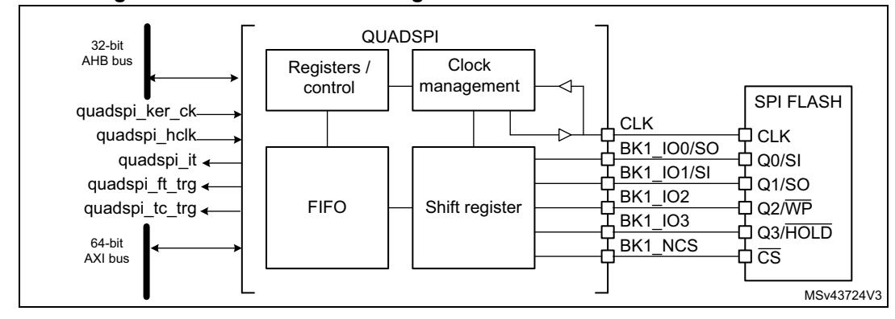
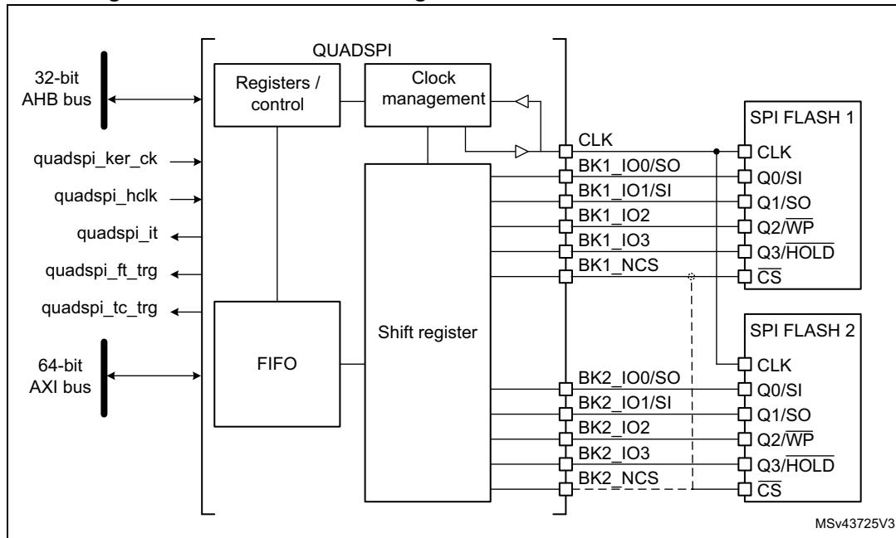
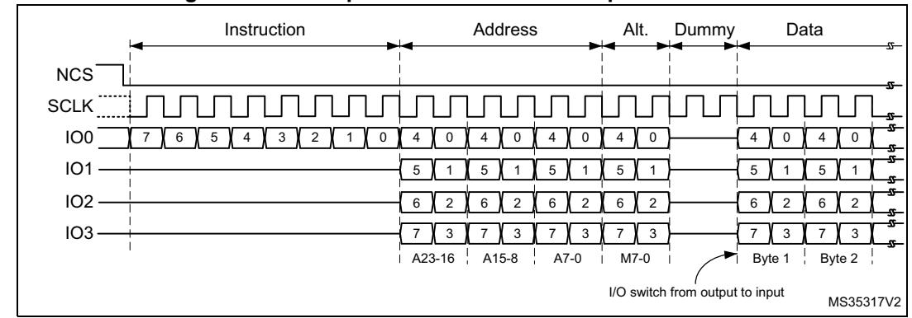
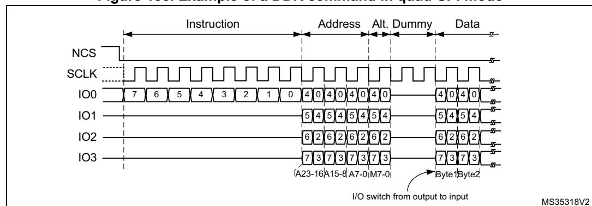
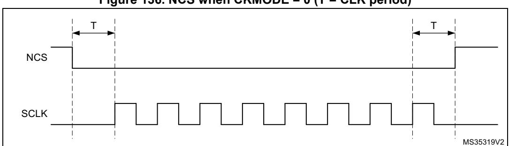
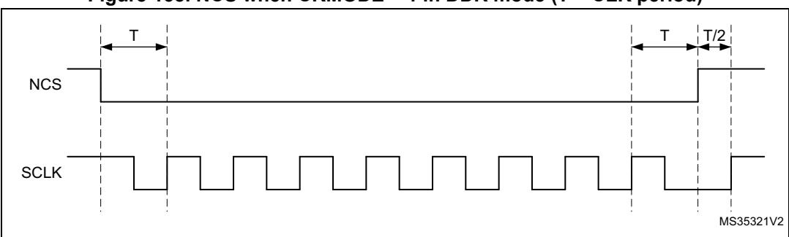
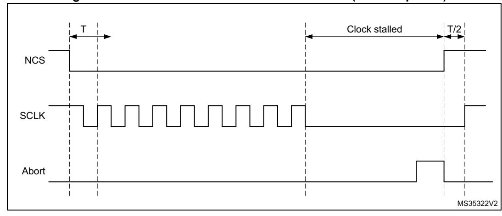

# **24 Quad-SPI interface (QUADSPI)**

# **24.1 Introduction**

The QUADSPI is a specialized communication interface targeting single, dual- or quad-SPI flash memories. It can operate in any of the three following modes:

- indirect mode: all the operations are performed using the QUADSPI registers.
- automatic status-polling mode: the external flash memory status register is periodically read and an interrupt can be generated in case of flag setting.
- memory-mapped mode: the external flash memory is mapped to the device address space and is seen by the system as if it was an internal memory.

Both throughput and capacity can be increased two-fold using dual-flash mode, where two Quad-SPI flash memories are accessed simultaneously.

# **24.2 QUADSPI main features**

- Three functional modes: indirect, automatic status-polling, and memory-mapped
- Dual-flash mode, where 8 bits can be sent/received simultaneously by accessing two flash memories in parallel
- SDR and DDR support
- Fully programmable opcode for both indirect and memory-mapped modes
- Fully programmable frame format for both indirect and memory-mapped modes
- Integrated FIFO for reception and transmission
- 8-, 16-, and 32-bit data accesses allowed
- MDMA trigger generation for FIFO threshold and transfer complete
- Interrupt generation on FIFO threshold, timeout, operation complete, and access error

# **24.3 QUADSPI functional description**

## **24.3.1 QUADSPI block diagram**

**Figure 132. QUADSPI block diagram when dual-flash mode is disabled**

**Figure 133. QUADSPI block diagram when dual-flash mode is enabled**

## **24.3.2 QUADSPI pins and internal signals**

The table below lists the QUADSPI internal signals.

**Signal name Signal type Description** quadspi\_ker\_ck Digital input QUADSPI kernel clock quadspi\_hclk Digital input QUADSPI register interface clock quadspi\_it Digital output QUADSPI global interrupt quadspi\_ft\_trg Digital output QUADSPI FIFO threshold trigger for MDMA quadspi\_tc\_trg Digital output QUADSPI transfer complete trigger for MDMA

**Table 201. QUADSPI internal signals** 

The table below lists the QUADSPI pins, six for interfacing with a single flash memory, or 10 to 11 for interfacing with two flash memories (FLASH 1 and FLASH 2) in dual-flash mode.

**Table 202. QUADSPI pins** 

| Signal name | Signal type          | Description                                                                       |
|-------------|----------------------|-----------------------------------------------------------------------------------|
| CLK         | Digital output       | Clock to FLASH 1 and FLASH 2                                                      |
| BK1_IO0/SO  | Digital input/output | Bidirectional I/O in dual/quad modes or serial output in single mode, for FLASH 1 |
| BK1_IO1/SI  | Digital input/output | Bidirectional I/O in dual/quad modes or serial input in single mode, for FLASH 1  |
| BK1_IO2     | Digital input/output | Bidirectional I/O in quad mode, for FLASH 1                                       |
| BK1_IO3     | Digital input/output | Bidirectional I/O in quad mode, for FLASH 1                                       |
| BK2_IO0/SO  | Digital input/output | Bidirectional I/O in dual/quad modes or serial output in single mode, for FLASH 2 |

| Signal name | Signal type          | Description                                                                                                         |
|-------------|----------------------|---------------------------------------------------------------------------------------------------------------------|
| BK2_IO1/SI  | Digital input/output | Bidirectional I/O in dual/quad modes or serial input in single mode, for FLASH 2                                    |
| BK2_IO2     | Digital input/output | Bidirectional I/O in quad mode, for FLASH 2                                                                         |
| BK2_IO3     | Digital input/output | Bidirectional I/O in quad mode, for FLASH 2                                                                         |
| BK1_NCS     | Digital output       | Chip select (active low) for FLASH 1. Can also be used for FLASH 2 if QUADSPI is always used in dual-flash mode. |
| BK2_NCS     | Digital output       | Chip select (active low) for FLASH 2. Can also be used for FLASH 1 if QUADSPI is always used in dual-flash mode. |

**Table 202. QUADSPI pins (continued)**

### **24.3.3 QUADSPI command sequence**

The QUADSPI communicates with the flash memory using commands. Each command can include five phases: instruction, address, alternate byte, dummy, data. Any of these phases can be configured to be skipped, but at least one of the instruction, address, alternate byte, or data phase must be present.

NCS falls before the start of each command and rises again after each command finishes.

**Figure 134. Example of read command in quad-SPI mode**

### **Instruction phase**

During this phase, an 8-bit instruction, configured in INSTRUCTION bitfield of QUADSPI\_CCR[7:0] register, is sent to the flash memory, specifying the type of operation to be performed.

Most flash memories can receive instructions only one bit at a time from the IO0/SO signal (single-SPI mode), the instruction phase can optionally send 2 bits at a time (over IO0/IO1 in dual-SPI mode), or 4 bits at a time (over IO0/IO1/IO2/IO3 in quad-SPI mode). This can be configured using the IMODE[1:0] bitfield of QUADSPI\_CCR[9:8] register.

When IMODE = 00, the instruction phase is skipped, and the command sequence starts with the address phase, if present.

### **Address phase**

In the address phase, 1-4 bytes are sent to the flash memory to indicate the address of the operation. The number of address bytes to be sent is configured in the ADSIZE[1:0] bitfield of QUADSPI\_CCR[13:12] register. In indirect and automatic status-polling modes,

RM0399 Rev 4 921/3556

address bytes to be sent are specified in the ADDRESS[31:0] bitfield of QUADSPI\_AR register, while in memory-mapped mode, the address is given directly via the AXI (from the Cortex or from a DMA).

The address phase can send 1 bit at a time (over SO in single-SPI mode), 2 bits at a time (over IO0/IO1 in dual-SPI mode), or 4 bits at a time (over IO0/IO1/IO2/IO3 in quad-SPI mode). This can be configured using the ADMODE[1:0] bitfield of QUADSPI\_CCR[11:10] register.

When ADMODE = 00, the address phase is skipped, and the command sequence proceeds directly to the next phase, if any.

### **Alternate-byte phase**

In the alternate-byte phase, 1-4 bytes are sent to the flash memory, generally to control the mode of operation. The number of alternate bytes to be sent is configured in the [1:0] bitfield of QUADSPI\_CCR[17:16] register. The bytes to be sent are specified in the QUADSPI\_ABR register.

The alternate-bytes phase can send 1 bit at a time (over SO in single-SPI mode), 2 bits at a time (over IO0/IO1 in dual-SPI mode), or 4 bits at a time (over IO0/IO1/IO2/IO3 in quad-SPI mode). This can be configured using the ABMODE[1:0] bitfield of QUADSPI\_CCR[15:14] register.

When ABMODE = 00, the alternate-byte phase is skipped, and the command sequence proceeds directly to the next phase, if any.

There may be times when only a single nibble needs to be sent during the alternate-byte phase rather than a full byte, such as when the dual-mode is used and only two cycles are used for the alternate bytes. In this case, the firmware can use quad-mode (ABMODE = 11) and send a byte with bits 7 and 3 of ALTERNATE set to 1 (keeping the IO3 line high), and bits 6 and 2 set to 0 (keeping the IO2 line low). In this case, the upper two bits of the nibble to be sent are placed in bits 4:3 of ALTERNATE, while the lower two bits are placed in bits 1 and 0. For example, if the nibble 2 (0010) is to be sent over IO0/IO1, then ALTERNATE must be set to 0x8A (1000\_1010).

### **Dummy-cycle phase**

In the dummy-cycle phase, 1-31 cycles are given without any data being sent or received, in order to give time to the flash memory to prepare for the data phase when higher clock frequencies are used. The number of cycles given during this phase is specified in the DCYC[4:0] bitfield of QUADSPI\_CCR[22:18] register. In both SDR and DDR modes, the duration is specified as a number of full CLK cycles.

When DCYC is zero, the dummy-cycles phase is skipped, and the command sequence proceeds directly to the data phase, if present.

The operating mode of the dummy-cycles phase is determined by DMODE.

In order to assure enough "turn-around" time for changing data signals from output mode to input mode, there must be at least one dummy cycle when using dual or quad mode to receive data from the flash memory.

### **Data phase**

During the data phase, any number of bytes can be sent to, or received from the flash memory.

In indirect and automatic status-polling modes, the number of bytes to be sent/received is specified in the QUADSPI\_DLR register.

In indirect-write mode the data to be sent to the flash memory must be written to the QUADSPI\_DR register. In indirect-read mode the data received from the flash memory is obtained by reading the QUADSPI\_DR register.

In memory-mapped mode, the data which is read is sent back directly over the AXI to the Cortex or to a DMA.

The data phase can send/receive 1 bit at a time (over SO/SI in single-SPI mode), 2 bits at a time (over IO0/IO1 in dual-SPI mode), or 4 bits at a time (over IO0/IO1/IO2/IO3 in quad-SPI mode). This can be configured using the ABMODE[1:0] bitfield of QUADSPI\_CCR[15:14] register.

When DMODE = 00, the data phase is skipped, and the command sequence finishes immediately by raising NCS. This configuration must only be used in only indirect write mode.

### **24.3.4 QUADSPI signal interface protocol modes**

### **Single-SPI mode**

This legacy SPI mode allows just one single bit to be sent/received serially. In this mode, data are sent to the flash memory over the SO signal (whose I/O shared with IO0). Data received from the flash memory arrive via SI (whose I/O shared with IO1).

The different phases can each be configured separately to use this mode by setting the IMODE/ADMODE/ABMODE/DMODE fields (in QUADSPI\_CCR) to 01.

In each phase which is configured in single-SPI mode:

- IO0 (SO) is in output mode.
- IO1 (SI) is in input mode (high impedance).
- IO2 is in output mode and forced to 0.
- IO3 is in output mode and forced to 1 (to deactivate the "hold" function).

This is the case even for the dummy phase if DMODE = 01.

### **Dual-SPI mode**

In dual-SPI mode, two bits are sent/received simultaneously over the IO0/IO1 signals.

The different phases can each be configured separately to use dual-SPI mode by setting the IMODE/ADMODE/ABMODE/DMODE fields of QUADSPI\_CCR register to 10.

In each phase which is configured in dual-SPI mode:

- IO0/IO1 are at high-impedance (input) during the data phase for read operations, and outputs in all other cases.
- IO2 is in output mode and forced to 0.
- IO3 is in output mode and forced to 1.

In the dummy phase when DMODE = 01, IO0/IO1 are always high-impedance.

### **Quad-SPI mode**

In quad-SPI mode, four bits are sent/received simultaneously over the IO0/IO1/IO2/IO3 signals.

RM0399 Rev 4 923/3556

The different phases can each be configured separately to use quad-SPI mode by setting the IMODE/ADMODE/ABMODE/DMODE fields of QUADSPI CCR register to 11.

In each phase which is configured in this mode, IO0/IO1/IO2/IO3 are all are at high-impedance (input) during the data phase for read operations, and outputs in all other cases.

In the dummy phase when DMODE = 11, IO0/IO1/IO2/IO3 are all high-impedance.

IO2 and IO3 are used only in quad-SPI mode. If none of the phases are configured to use quad-SPI mode, then the pins corresponding to IO2 and IO3 can be used for other functions even while the QUADSPI is active.

#### SDR mode

By default, the DDRM bit (QUADSPI\_CCR[31]) is 0 and the QUADSPI operates in single-data rate (SDR) mode.

In SDR mode, when the QUADSPI drives IO0/SO, IO1, IO2, IO3 signals, these signals transition only with the falling edge of CLK.

When receiving data in SDR mode, the QUADSPI assumes that flash memories also send the data using CLK falling edge. By default (when SSHIFT = 0), the signals are sampled using the following (rising) edge of CLK.

#### **DDR** mode

When the DDRM bit (QUADSPI\_CCR[31]) is set to 1, the QUADSPI operates in double-data rate (DDR) mode.

In DDR mode, when the QUADSPI is driving the IO0/SO, IO1, IO2, IO3 signals in the address/alternate-byte/data phases, a bit is sent on each of CLK falling and rising edges.

The instruction phase is not affected by DDRM. The instruction is always sent using CLK falling edge.

When receiving data in DDR mode, the QUADSPI assumes that flash memories also send the data using both CLK rising and falling edges. When DDRM = 1, the firmware must clear SSHIFT (bit 4 of QUADSPI\_CR). Thus, the signals are sampled one half of a CLK cycle later (on the following, opposite edge).

Figure 135. Example of a DDR command in quad-SPI mode

47/

### **Dual-flash mode**

When the DFM bit (bit 6 of QUADSPI\_CR) is 1, the QUADSPI is in dual-flash mode, where two external quad-SPI flash memories (FLASH 1 and FLASH 2) are used in order to send/receive 8 bits (or 16 bits in DDR mode) every cycle, effectively doubling the throughput as well as the capacity.

Each of the flash memories uses the same CLK and optionally the same NCS signals, but each have separate IO0, IO1, IO2, and IO3 signals.

The dual-flash mode can be used in conjunction with single-, dual-, and quad-SPI modes, as well as with either SDR or DDR mode.

The flash memory size, as specified in FSIZE[4:0] (QUADSPI\_DCR[20:16]), must reflect the total flash memory capacity, which is double the size of one individual component.

If address X is even, then the byte which the QUADSPI gives for address X is the byte at the address X/2 of FLASH 1, and the byte which the QUADSPI gives for address X+1 is the byte at the address X/2 of FLASH 2. In other words, bytes at even addresses are all stored in FLASH 1 and bytes at odd addresses are all stored in FLASH 2.

When reading the flash memories status registers in dual-flash mode, twice as many bytes must be read compared to doing the same read in single-flash mode. This means that if each flash memory gives 8 valid bits after the instruction for fetching the status register, then the QUADSPI must be configured with a data length of 2 bytes (16 bits), and the QUADSPI receives one byte from each flash memory. If each flash memory gives a status of 16 bits, then the QUADSPI must be configured to read 4 bytes to get all the status bits of both flash memories in dual-flash mode. The least-significant byte of the result (in the data register) is the least-significant byte of FLASH 1 status register, while the next byte is the leastsignificant byte of FLASH 2 status register. Then, the third byte of the data register is FLASH 1 second byte, while the forth byte is FLASH 2 second byte (in the case that the flash memories have 16-bit status registers).

An even number of bytes must always be accessed in dual-flash mode. For this reason, bit 0 of the data length bitfield (QUADSPI\_DLR[0]) is stuck at 1 when DFM = 1.

In dual-flash mode, the behavior of FLASH 1 interface signals are basically the same as in normal mode. FLASH 2 interface signals have exactly the same waveforms as FLASH 1 during the instruction, address, alternate-byte, and dummy-cycles phases. In other words, each flash memory always receives the same instruction and the same address. Then, during the data phase, the BK1\_IOx and BK2\_IOx buses are both transferring data in parallel, but the data that are sent to (or received from) FLASH 1 are distinct from those of FLASH 2.

## **24.3.5 QUADSPI indirect mode**

When in indirect mode, commands are started by writing to QUADSPI registers, and data are transferred by writing or reading the data register, in the same way as for other communication peripherals.

When FMODE = 00 (QUADSPI\_CCR[27:26]), the QUADSPI is in indirect-write mode, where bytes are sent to the flash memory during the data phase. Data are provided by writing to the data register (QUADSPI\_DR).

When FMODE = 01, the QUADSPI is in indirect-read mode, where bytes are received from the flash memory during the data phase. Data are recovered by reading QUADSPI\_DR.

RM0399 Rev 4 925/3556

The number of bytes to be read/written is specified in the data length register (QUADSPI\_DLR). If QUADSPI\_DLR = 0xFFFF\_FFFF (all 1s), then the data length is considered undefined and the QUADSPI simply continues to transfer data until the end of flash memory (as defined by FSIZE) is reached. If no bytes are to be transferred, DMODE (QUADSPI\_CCR[25:24]) must be set to 00.

If QUADSPI\_DLR = 0xFFFF\_FFFF and FSIZE = 0x1F (max value indicating a 4-Gbyte flash memory), then in this special case, transfers continue indefinitely, stopping only after an abort request or after the QUADSPI is disabled. After the last memory address is read (at address 0xFFFF\_FFFF), reading continues with address = 0x0000\_0000.

When the programmed number of bytes to be transmitted or received is reached, TCF is set and an interrupt is generated if TCIE = 1. In the case of undefined number of data, the TCF is set when the limit of the external SPI memory is reached according to the flash memory size defined in QUADSPI\_CR.

### **Triggering the start of a command**

Essentially, a command starts as soon as firmware gives the last information that is necessary for this command. Depending on the QUADSPI configuration, there are three different ways to trigger the start of a command in indirect mode. The commands starts immediately:

- after a write is performed to INSTRUCTION[7:0] (QUADSPI\_CCR), if no address is necessary (when ADMODE = 00) and if no data needs to be provided by the firmware (when FMODE = 01 or DMODE = 00)
- after a write is performed to ADDRESS[31:0] (QUADSPI\_AR), if an address is necessary (when ADMODE ≠ 00) and if no data needs to be provided by the firmware (when FMODE = 01 or DMODE = 00)
- after a write is performed to DATA[31:0] (QUADSPI\_DR), if data needs to be provided by the firmware (when FMODE = 00 and DMODE != 00)

Writes to the alternate byte register (QUADSPI\_ABR) never trigger the communication start. If alternate bytes are required, they must be programmed before.

As soon as a command is started, BUSY (bit 5 of QUADSPI\_SR) is automatically set.

## **FIFO and data management**

In indirect mode, data go through a 32-byte FIFO which is internal to the QUADSPI. FLEVEL[5:0] (QUADSPI\_SR[13:8]) indicates how many bytes are currently being held in the FIFO.

In indirect-write mode (FMODE = 00), the firmware adds data to the FIFO when it writes QUADSPI\_DR. Word writes add 4 bytes to the FIFO, halfword writes add 2 bytes, and byte writes add only 1 byte. If the firmware adds too many bytes to the FIFO (more than is indicated by DL[31:0]), the extra bytes are flushed from the FIFO at the end of the write operation (when TCF is set).

Byte/halfword accesses to QUADSPI\_DR must be done only to the least significant byte/halfword of the 32-bit register.

FTHRES[4:0] is used to define a FIFO threshold. When the threshold is reached, FTF (FIFO threshold flag) is set. In indirect-read mode, FTF is set when the number of valid bytes to be read from the FIFO is above the threshold. FTF is also set if there are data in the FIFO after the last byte is read from the flash memory, regardless of the FTHRES setting.

In indirect-write mode, FTF is set when the number of empty bytes in the FIFO is above the threshold.

If FTIE = 1, there is an interrupt when FTF is set. FTF is cleared by hardware as soon as the threshold condition is no longer true (after enough data is transferred by the CPU or DMA).

In indirect-read mode when the FIFO becomes full, the QUADSPI temporarily stops reading bytes from the flash memory to avoid an overrun. The reading of the flash memory does not restart until 4 bytes become vacant in the FIFO (when FLEVEL ≤ 11). Thus, when FTHRES ≥ 13, the application must take care to read enough bytes to assure that the QUADSPI starts retrieving data from the flash memory again. Otherwise, the FTF flag stays at 0 as long as 11 < FLEVEL < FTHRES.

## **24.3.6 QUADSPI automatic status-polling mode**

In automatic status-polling mode, the QUADSPI periodically starts a command to read a defined number of status bytes (up to 4). The received bytes can be masked to isolate some status bits and an interrupt can be generated when the selected bits have a defined value.

Accesses to the flash memory begin in the same way as in indirect-read mode: if no address is required (AMODE = 00), accesses begin as soon as the QUADSPI\_CCR is written. Otherwise, if an address is required, the first access begins when QUADSPI\_AR is written. BUSY goes high at this point and stays high even between the periodic accesses.

The contents of MASK[31:0] (QUADSPI\_PSMAR) are used to mask the data from the flash memory in automatic status-polling mode. If MASK[n] = 0, then bit n of the result is masked and not considered. If MASK[n] = 1, and the content of bit[n] is the same as MATCH[n] (QUADSPI\_PSMAR), then there is a match for bit n.

If the polling match mode bit (PMM, bit 23 of QUADSPI\_CR) is 0, then "AND" match mode is activated. This means status match flag (SMF) is set only when there is a match on all of the unmasked bits.

If PMM = 1, then "OR" match mode is activated. This means SMF is set if there is a match on any of the unmasked bits.

An interrupt is called when SMF is set if SMIE = 1.

If the automatic status-polling mode stop (APMS) bit is set, the operation stops and BUSY goes to 0 as soon as a match is detected. Otherwise, BUSY stays at 1, and the periodic accesses continue until there is an abort or the QUADSPI is disabled (EN = 0).

The data register (QUADSPI\_DR) contains the latest received status bytes (the FIFO is deactivated). The content of the data register is not affected by the masking used in the matching logic. The FTF status bit is set as soon as a new reading of the status is complete, and FTF is cleared as soon as the data is read.

## **24.3.7 QUADSPI memory-mapped mode**

When configured in memory-mapped mode, the external SPI device is seen as an internal memory.

It is forbidden to access the quad-SPI flash bank area before having properly configured and enabled the QUADSPI peripheral.

No more than 256 Mbytes can addressed even if the flash memory capacity is larger.

If an access is made to an address outside of the range defined by FSIZE but still within the 256-Mbyte range, then a bus error is given. The effect of this error depends on the bus master that attempted the access:

- If it is the Cortex CPU, bus fault exception is generated when enabled (or an HardFault exception when bus fault is disabled).
- If it is a DMA, a DMA transfer error is generated and the corresponding DMA channel is automatically disabled.

Byte, halfword, and word access types are all supported.

Support for execute in place (XIP) operation is implemented, where the QUADSPI anticipates the next access and load in advance the byte at the following address. If the subsequent access is indeed made at a continuous address, the access is completed faster since the value is already prefetched.

By default, the QUADSPI never stops its prefetch operation, keeping the previous read operation active with NCS maintained low, even if no access to the flash memory occurs for a long time. Since flash memories tend to consume more when NCS is held low, the application may want to activate the timeout counter (TCEN = 1, bit 3 of QUADSPI\_CR) so that NCS is released after a period of TIMEOUT[15:0] (QUADSPI\_LPTR) cycles have elapsed without any access since when the FIFO becomes full with prefetch data.

BUSY goes high as soon as the first memory-mapped access occurs. Because of the prefetch operations, BUSY does not fall until there is a timeout, there is an abort, or the peripheral is disabled.

## **24.3.8 QUADSPI free-running clock mode**

When configured in free-running clock mode, the QUADSPI continuously outputs the clock for test and calibration purposes.

The free-running clock mode is entered as soon as the FRCM bit is set in the QUADSPI\_CCR register. It is exited by setting the ABORT bit of the QUADSPI\_CR.

When the QUADSPI operates in free-running clock mode:

- the clock is running continuously
- NCS stays high (external device deselected)
- data lines are released (High-Z)
- the BUSY flag of QUADSPI\_SR is set

### **24.3.9 QUADSPI flash memory configuration**

The device configuration register (QUADSPI\_DCR) can be used to specify the characteristics of the external SPI flash memory.

The FSIZE[4:0] bitfield defines the size of external memory using the following formula: Number of bytes in flash memory = 2[FSIZE+1]

FSIZE+1 is effectively the number of address bits required to address the flash memory. The flash memory capacity can be up to 4 Gbytes (addressed using 32 bits) in indirect mode, but the addressable space in memory-mapped mode is limited to 256 Mbytes.

If DFM = 1, FSIZE indicates the total capacity of the two flash memories together.

When the QUADSPI executes two commands, one immediately after the other, it raises NCS high between the two commands for only one CLK cycle by default. If the flash

memory requires more time between commands, the CSHT bitfield can be used to specify the minimum number of CLK cycles (up to 8) that NCS must remain high.

The clock mode (CKMODE) bit indicates the CLK signal logic level in between commands (when NCS = 1).

### **24.3.10 QUADSPI delayed data sampling**

By default, the QUADSPI samples the data driven by the flash memory one half of a CLK cycle after the flash memory drives the signal.

In case of external signal delays, it may be beneficial to sample the data later. Using SSHIFT (bit 4 of QUADSPI\_CR), the sampling of the data can be shifted by half of a CLK cycle.

Clock shifting is not supported in DDR mode: SSHIFT must be clear when DDRM bit is set.

## **24.3.11 QUADSPI configuration**

The QUADSPI configuration is done in two phases:

- 1. QUADSPI peripheral configuration
- 2. QUADSPI flash memory configuration

Once configured and enabled, the QUADSPI can be used in one of its three operating modes: indirect, automatic status-polling, or memory-mapped mode.

### **QUADSPI configuration**

The QUADSPI is configured using QUADSPI\_CR. The user must configure the clock prescaler division factor and the sample shifting settings for the incoming data.

The DDR mode can be set through the DDRM bit. When setting the quad-SPI interface in DDR mode, the internal divider of kernel clock must be set with a division ratio of two or more. Once enabled, the address and the alternate bytes are sent on both clock edges, and the data are sent/received on both clock edges. Regardless of the DDRM bit setting, instructions are always sent in SDR mode.

The FIFO level for either MDMA trigger generation or interrupt generation is programmed in the FTHRES bits.

If a timeout counter is needed, the TCEN bit can be set and the timeout value programmed in the QUADSPI\_LPTR register.

The dual-flash mode can be activated by setting DFM to 1.

### **QUADSPI flash memory configuration**

The parameters related to the targeted external flash memory are configured through the QUADSPI\_DCR register.The user must program the flash memory size in the FSIZE bits, the chip-select minimum high time in CSHT bits, and the functional mode (Mode 0 or Mode 3) in the MODE bit.

## **24.3.12 QUADSPI use**

The operating mode is selected using FMODE[1:0] (QUADSPI\_CCR[27:26]).

### **Indirect mode**

When FMODE is programmed to 00, the indirect-write mode is selected and data can be sent to the flash memory. With FMODE = 01, the indirect-read mode is selected where data can be read from the flash memory.

When the QUADSPI is used in indirect mode, the frames are constructed in the following way:

- 1. Specify a number of data bytes to read or write in QUADSPI\_DLR.
- 2. Specify the frame format, mode and instruction code in QUADSPI\_CCR.
- 3. Specify optional alternate byte to be sent right after the address phase in QUADSPI\_ABR.
- 4. Specify the operating mode in QUADSPI\_CR.
- 5. Specify the targeted address in QUADSPI\_AR.
- 6. Read/write the data from/to the FIFO through QUADSPI\_DR.

When writing QUADSPI\_CR, the user specifies the following settings:

- enable bit (EN) set to 1
- timeout counter enable bit (TCEN)
- sample shift setting (SSHIFT)
- FIFO threshold level (FTRHES) to indicate when the FTF flag must be set
- interrupt enables
- automatic status-polling mode parameters: match mode and stop mode (valid when FMODE = 11)
- clock prescaler

When writing QUADSPI\_CCR, the user specifies the following parameters:

- instruction byte through INSTRUCTION bits
- the way the instruction has to be sent through the IMODE bits (1/2/4 lines)
- the way the address has to be sent through the ADMODE bits (None/1/2/4 lines)
- address size (8/16/24/32-bit) through ADSIZE bits
- the way the alternate bytes have to be sent through the ABMODE (None/1/2/4 lines)
- alternate bytes number (1/2/3/4) through the ABSIZE bits
- presence or not of dummy bytes through the DBMODE bit
- number of dummy bytes through the DCYC bits
- the way data have to be sent/received (none/1/2/4 lines) through DMODE bits

If neither QUADSPI\_AR nor QUADSPI\_DR need to be updated for a particular command, then the command sequence starts as soon as QUADSPI\_CCR is written. This is the case when both ADMODE and DMODE are 00, or if just ADMODE = 00 when in indirect read mode (FMODE = 01).

When an address is required (ADMODE is not 00) and the data register does not need to be written (when FMODE = 01 or DMODE = 00), the command sequence starts as soon as the address is updated with a write to QUADSPI\_AR.

In case of data transmission (FMODE = 00 and DMODE! = 00), the communication start is triggered by a write in the FIFO through QUADSPI\_DR.

### **Automatic status-polling mode**

This mode is enabled setting the FMODE bitfield (QUADSPI\_CCR[27:26]) to 10. In this mode, the programmed frame is sent and the data retrieved periodically.

The maximum amount of data read in each frame is 4 bytes. If more data is requested in QUADSPI\_DLR, it is ignored and only 4 bytes are read.

The periodicity is specified in the QUADSPI\_PISR register.

Once the status data is retrieved, it can internally be processed:

- to set the status match flag and generate an interrupt if enabled
- to stop automatically the periodic retrieving of the status bytes

The received value can be masked with the value stored in QUADSPI\_PSMKR and ORed or ANDed with the value stored in QUADSPI\_PSMAR.

In case of match, the status match flag is set and an interrupt is generated if enabled, and the QUADSPI can be automatically stopped if the AMPS bit is set.

In any case, the latest retrieved value is available in QUADSPI\_DR.

### **Memory-mapped mode**

In memory-mapped mode, the external flash memory is seen as an internal memory but with some latency during accesses. Only read operations are allowed to the external flash memory in this mode.

The memory-mapped mode is entered by setting FMODE to 11 in QUADSPI\_CCR.

The programmed instruction and frame is sent when a master is accessing the memory-mapped space.

The FIFO is used as a prefetch buffer to anticipate linear reads. Any access to QUADSPI\_DR in this mode returns zero.

QUADSPI\_DLR has no meaning in memory-mapped mode.

### **24.3.13 Sending the instruction only once**

Some flash memories (for example: Winbound) provide a mode where an instruction must be sent only with the first command sequence, while subsequent commands start directly with the address. One can take advantage of such a feature using the SIOO bit (QUADSPI\_CCR[28]).

SIOO is valid for all functional modes (indirect, automatic status-polling, and memory-mapped). If the SIOO bit is set, the instruction is sent only for the first command following a write to QUADSPI\_CCR. Subsequent command sequences skip the instruction phase, until there is a write to QUADSPI\_CCR.

SIOO has no effect when IMODE = 00 (no instruction).

## **24.3.14 QUADSPI error management**

An error can be generated in the following case:

- In indirect mode or automatic status-polling mode when a wrong address is programmed in QUADSPI\_AR (according to the flash memory size defined by FSIZE[4:0] in the QUADSPI\_DCR), TEF is set and an interrupt is generated if enabled. Also in indirect mode, if the address plus the data length exceeds the flash memory size, TEF is set as soon as the access is triggered.
- In memory-mapped mode, when an out-of-range access is done by a master or when the QUADSPI is disabled, a bus error is generated as a response to the faulty bus master request.

When a master is accessing the memory mapped space while the memory-mapped mode is disabled, a bus error is generated as a response to the faulty bus master request.

### **24.3.15 QUADSPI busy bit and abort functionality**

Once the QUADSPI starts an operation with the flash memory, the BUSY bit is automatically set in QUADSPI\_SR.

In indirect mode, BUSY is reset once the QUADSPI has completed the requested command sequence, and the FIFO is empty.

In automatic status-polling mode, BUSY goes low only after the last periodic access is complete, due to a match when APMS = 1, or due to an abort.

After the first access in memory-mapped mode, BUSY goes low only on a timeout event or on an abort.

Any operation can be aborted by setting the ABORT bit in QUADSPI\_CR. Once the abort is completed, BUSY and ABORT are automatically reset, and the FIFO is flushed.

*Note: Some flash memories may misbehave if a write operation to a status registers is aborted.*

### **24.3.16 NCS behavior**

By default, NCS is high, deselecting the external flash memory. NCS falls before an operation begins and rises as soon as it finishes.

When CKMODE = 0 ("mode0", where CLK stays low when no operation is in progress), NCS falls one CLK cycle before an operation first rising CLK edge, and NCS rises one CLK cycle after the operation final rising CLK edge, as shown in the figure below.

**Figure 136. NCS when CKMODE = 0 (T = CLK period)**

When CKMODE=1 ("mode3", where CLK goes high when no operation is in progress) and DDRM=0 (SDR mode), NCS still falls one CLK cycle before an operation first rising CLK edge, and NCS rises one CLK cycle after the operation final rising CLK edge, as shown in the figure below.

**Figure 137. NCS when CKMODE = 1 in SDR mode (T = CLK period)**

When CKMODE = 1 ("mode3") and DDRM = 1 (DDR mode), NCS falls one CLK cycle before an operation first rising CLK edge, and NCS rises one CLK cycle after the operation final active rising CLK edge, as shown in the figure below. Because DDR operations must finish with a falling edge, CLK is low when NCS rises, and CLK rises back up one half of a CLK cycle afterwards.

**Figure 138. NCS when CKMODE = 1 in DDR mode (T = CLK period)**

When the FIFO stays full in a read operation or if the FIFO stays empty in a write operation, the operation stalls and CLK stays low until firmware services the FIFO. If an abort occurs when an operation is stalled, NCS rises just after the abort is requested and then CLK rises one half of a CLK cycle later, as shown in *[Figure 139](#page-15-0)*.

**Figure 139. NCS when CKMODE = 1 with an abort (T = CLK period)**

When not in dual-flash mode (DFM = 0) and FSEL = 0 (default value), only FLASH 1 is accessed. Thus BK2\_NCS stays high, if FSEL = 1, only FLASH 2 is accessed and BK1\_NCS stays high. In dual-flash mode, BK2\_NCS behaves exactly the same as BK1\_NCS. Thus, if there is a FLASH 2 and if the application is dual-flash mode only, then BK1\_NCS signal can be used for FLASH 2 as well, and the pin devoted to BK2\_NCS can be used for other functions.

# **24.4 QUADSPI interrupts**

An interrupt can be produced on the following events:

- Timeout
- Status match
- FIFO threshold
- Transfer complete
- Transfer error

Separate interrupt enable bits are available for flexibility.

**Interrupt event Event flag Enable control bit** Timeout TOF TOIE Status match SMF SMIE FIFO threshold FTF FTIE Transfer complete TCF TCIE Transfer error TEF TEIE

**Table 203. QUADSPI interrupt requests** 

# **24.5 QUADSPI registers**

### **24.5.1 QUADSPI control register (QUADSPI\_CR)**

Address offset: 0x000

Reset value: 0x0000 0000

| 31   | 30             | 29   | 28 | 27 | 26          | 25 | 24 | 23   | 22   | 21   | 20         | 19   | 18   | 17    | 16   |
|------|----------------|------|----|----|-------------|----|----|------|------|------|------------|------|------|-------|------|
|      | PRESCALER[7:0] |      |    |    |             |    |    | PMM  | APMS | Res. | TOIE       | SMIE | FTIE | TCIE  | TEIE |
| rw   | rw             | rw   | rw | rw | rw          | rw | rw | rw   | rw   |      | rw         | rw   | rw   | rw    | rw   |
| 15   | 14             | 13   | 12 | 11 | 10          | 9  | 8  | 7    | 6    | 5    | 4          | 3    | 2    | 1     | 0    |
| Res. | Res.           | Res. |    |    | FTHRES[4:0] |    |    | FSEL | DFM  | Res. | SSHIF T | TCEN | Res. | ABORT | EN   |
|      |                |      | rw | rw | rw          | rw | rw | rw   | rw   |      | rw         | rw   |      | rw    | rw   |

#### Bits 31:24 **PRESCALER[7:0]**: Clock prescaler

This bitfield defines the scaler factor for generating CLK based on the quadspi\_ker\_ck clock (value+1).

0: FCLK = Fquadspi\_ker\_ck, quadspi\_ker\_ck clock used directly as QUADSPI CLK (prescaler bypassed)

1: FCLK = Fquadspi\_ker\_ck/2

2: FCLK = Fquadspi\_ker\_ck/3

...

255: FCLK = Fquadspi\_ker\_ck/256

For odd clock division factors, CLK duty cycle is not 50%. The clock signal remains low one cycle longer than it stays high.

When setting quad-SPI interface in DDR mode, the prescaler must be set with a division ratio of two or more.

*Note: This bitfield can be modified only when BUSY = 0.*

#### Bit 23 **PMM**: Polling match mode

This bit indicates which method must be used for determining a "match" during automatic status-polling mode.

0: AND match mode. SMF is set if all the unmasked bits received from the flash memory match the corresponding bits in the match register.

1: OR match mode. SMF is set if any one of the unmasked bits received from the flash memory matches its corresponding bit in the match register.

*Note: This bit can be modified only when BUSY = 0.*

#### Bit 22 **APMS**: Automatic status-polling mode stop

This bit determines if automatic status-polling is stopped after a match.

0: Automatic status-polling mode is stopped only by abort or by disabling the QUADSPI.

1: Automatic status-polling mode stops as soon as there is a match.

*Note: This bit can be modified only when BUSY = 0.*

#### Bit 21 Reserved, must be kept at reset value.

#### Bit 20 **TOIE**: Timeout interrupt enable

This bit enables the timeout interrupt.

0: Interrupt disabled

1: Interrupt enabled

RM0399 Rev 4 935/3556

#### Bit 19 **SMIE**: Status match interrupt enable

This bit enables the status match interrupt.

0: Interrupt disabled

1: Interrupt enabled

#### Bit 18 **FTIE**: FIFO threshold interrupt enable

This bit enables the FIFO threshold interrupt.

0: Interrupt disabled

1: Interrupt enabled

#### Bit 17 **TCIE**: Transfer complete interrupt enable

This bit enables the transfer complete interrupt.

0: Interrupt disabled

1: Interrupt enabled

#### Bit 16 **TEIE**: Transfer error interrupt enable

This bit enables the transfer error interrupt.

0: Interrupt disabled

1: Interrupt enabled

#### Bits 15:13 Reserved, must be kept at reset value.

#### Bits 12:8 **FTHRES[4:0]**: FIFO threshold level

This bitfield defines, in indirect mode, the threshold number of bytes in the FIFO that causes the FIFO threshold flag (bit FTF in register QUADSPI\_SR) to be set.

0: In indirect-write mode (FMODE = 00), FTF is set if there are one or more free bytes location left in the FIF,O or indirect-read mode (FMODE = 01), FTF is set if there are one or more valid bytes that can be read from the FIFO.

1: In indirect-write mode (FMODE = 00), FTF is set if there are two or more free bytes location left in the FIFO, or indirect-read mode (FMODE = 01), FTF is set if there are two or more valid bytes that can be read from the FIFO

...

31: In indirect-write mode (FMODE = 00), FTF is set if there are 32 free bytes location left in the FIFO, or indirect-read mode (FMODE = 01), FTF is set if there are 32 valid bytes that can be read from the FIFO.

#### Bit 7 **FSEL**: Flash memory selection

This bit selects the flash memory to be addressed in single-flash mode (when DFM = 0).

0: FLASH 1 selected

1: FLASH 2 selected

*Note: This bit can be modified only when BUSY = 0. This bit is ignored when DFM = 1.*

#### Bit 6 **DFM**: Dual-flash mode

This bit activates dual-flash mode, where two external flash memories are used simultaneously to double throughput and capacity.

0: Dual-flash mode disabled

1: Dual-flash mode enabled

*Note: This bit can be modified only when BUSY = 0.*

Bit 5 Reserved, must be kept at reset value.

#### Bit 4 **SSHIFT**: Sample shift

By default, the QUADSPI samples data 1/2 of a CLK cycle after the data is driven by the flash memory. This bit allows the data to be sampled later in order to account for external signal delays.

0: No shift

1: 1/2 cycle shift

The firmware must assure that SSHIFT = 0 when in DDR mode (when DDRM = 1).

*Note: This bitfield can be modified only when BUSY = 0.*

#### Bit 3 **TCEN**: Timeout counter enable

This bit is valid only when memory-mapped mode (FMODE = 11) is selected. Activating this bit causes the NCS to be released (and thus reduces consumption) if there has not been an access after a certain amount of time, where this time is defined by TIMEOUT[15:0] (QUADSPI\_LPTR). This bit enables the timeout counter.

By default, the QUADSPI never stops its prefetch operation, keeping the previous read operation active with NCS maintained low, even if no access to the flash memory occurs for a long time. Since flash memories tend to consume more when NCS is held low, the application may want to activate the timeout counter (TCEN = 1, bit 3 of QUADSPI\_CR) so that NCS is released after a period of TIMEOUT[15:0] (QUADSPI\_LPTR) cycles have elapsed without an access since when the FIFO becomes full with prefetch data.

- 0: Timeout counter is disabled, and thus the NCS remains active indefinitely after an access in memory-mapped mode.
- 1: Timeout counter is enabled, and thus the NCS is released in memory-mapped mode after TIMEOUT[15:0] cycles of flash memory inactivity.

*Note: This bit can be modified only when BUSY = 0.*

#### Bit 2 Reserved, must be kept at reset value.

#### Bit 1 **ABORT**: Abort request

This bit aborts the ongoing command sequence. It is automatically reset once the abort is complete. This bit stops the current transfer.

In automatic status-polling or memory-mapped mode, this bit also reset APM or DM bit.

0: No abort requested

1: Abort requested

Bit 0 **EN**: QUADSPI enable

0: QUADSPI disabled

1: QUADSPI enabled

## **24.5.2 QUADSPI device configuration register (QUADSPI\_DCR)**

Address offset: 0x004

Reset value: 0x0000 0000

| 31   | 30   | 29   | 28   | 27   | 26        | 25   | 24   | 23   | 22   | 21   | 20         | 19   | 18   | 17   | 16         |
|------|------|------|------|------|-----------|------|------|------|------|------|------------|------|------|------|------------|
| Res. | Res. | Res. | Res. | Res. | Res.      | Res. | Res. | Res. | Res. | Res. | FSIZE[4:0] |      |      |      |            |
|      |      |      |      |      |           |      |      |      |      |      | rw         | rw   | rw   | rw   | rw         |
| 15   | 14   | 13   | 12   | 11   | 10        | 9    | 8    | 7    | 6    | 5    | 4          | 3    | 2    | 1    | 0          |
| Res. | Res. | Res. | Res. | Res. | CSHT[2:0] |      |      | Res. | Res. | Res. | Res.       | Res. | Res. | Res. | CKMO DE |
|      |      |      |      |      | rw        | rw   | rw   |      |      |      |            |      |      |      | rw         |

Bits 31:21 Reserved, must be kept at reset value.

RM0399 Rev 4 937/3556

#### Bits 20:16 **FSIZE[4:0]**: Flash memory size

This bitfield defines the size of external memory using the following formula:

Number of bytes in flash memory = 2[FSIZE+1]

FSIZE+1 is effectively the number of address bits required to address the flash memory. The flash memory capacity can be up to 4 Gbytes (addressed using 32 bits) in indirect mode,

but the addressable space in memory-mapped mode is limited to 256 Mbytes.

If DFM = 1, FSIZE indicates the total capacity of the two flash memories together.

*Note: This bitfield can be modified only when BUSY = 0.*

Bits 15:11 Reserved, must be kept at reset value.

#### Bits 10:8 **CSHT[2:0]**: Chip select high time

CSHT+1 defines the minimum number of CLK cycles which the chip select (NCS) must remain high between commands issued to the flash memory.

0: NCS stays high for at least 1 cycle between flash memory commands

1: NCS stays high for at least 2 cycles between flash memory commands

...

7: NCS stays high for at least 8 cycles between flash memory commands

*Note: This bitfield can be modified only when BUSY = 0.*

#### Bits 7:1 Reserved, must be kept at reset value.

#### Bit 0 **CKMODE**: Mode 0/mode 3

This bit indicates the level that CLK takes between commands (when NCS = 1).

0: CLK must stay low while NCS is high (chip select released). This is referred to as mode 0.

1: CLK must stay high while NCS is high (chip select released). This is referred to as mode 3.

*Note: This bitfield can be modified only when BUSY = 0.*

## **24.5.3 QUADSPI status register (QUADSPI\_SR)**

Address offset: 0x008

Reset value: 0x0000 0000

| 31   | 30   | 29   | 28   | 27   | 26          | 25   | 24   | 23   | 22   | 21   | 20   | 19   | 18   | 17   | 16   |
|------|------|------|------|------|-------------|------|------|------|------|------|------|------|------|------|------|
| Res. | Res. | Res. | Res. | Res. | Res.        | Res. | Res. | Res. | Res. | Res. | Res. | Res. | Res. | Res. | Res. |
|      |      |      |      |      |             |      |      |      |      |      |      |      |      |      |      |
|      |      |      |      |      |             |      |      |      |      |      |      |      |      |      |      |
| 15   | 14   | 13   | 12   | 11   | 10          | 9    | 8    | 7    | 6    | 5    | 4    | 3    | 2    | 1    | 0    |
| Res. | Res. |      |      |      | FLEVEL[5:0] |      |      | Res. | Res. | BUSY | TOF  | SMF  | FTF  | TCF  | TEF  |

Bits 31:14 Reserved, must be kept at reset value.

#### Bits 13:8 **FLEVEL[5:0]**: FIFO level

This bitfield gives the number of valid bytes which are being held in the FIFO. FLEVEL = 0 when the FIFO is empty, and 32 when it is full. In memory-mapped mode and in automatic status-polling mode, FLEVEL is zero.

#### Bits 7:6 Reserved, must be kept at reset value.

#### Bit 5 **BUSY**: Busy

This bit is set when an operation is on going. This bit clears automatically when the operation with the flash memory is finished and the FIFO is empty.

#### Bit 4 **TOF**: Timeout flag

This bit is set when timeout occurs. It is cleared by writing 1 to CTOF.

#### Bit 3 **SMF**: Status match flag

This bit is set in automatic status-polling mode when the unmasked received data matches the corresponding bits in the match register (QUADSPI\_PSMAR). It is cleared by writing 1 to CSMF.

#### Bit 2 **FTF**: FIFO threshold flag

In indirect mode, this bit is set when the FIFO threshold is reached, or if there is any data left in the FIFO after reads from the flash memory are complete. It is cleared automatically as soon as threshold condition is no longer true.

In automatic status-polling mode this bit is set every time the status register is read, and the bit is cleared when the data register is read.

#### Bit 1 **TCF**: Transfer complete flag

This bit is set in indirect mode when the programmed number of data is transferred or in any mode when the transfer is aborted.It is cleared by writing 1 to CTCF.

### Bit 0 **TEF**: Transfer error flag

This bit is set in indirect mode when an invalid address is being accessed in indirect mode. It is cleared by writing 1 to CTEF.

## **24.5.4 QUADSPI flag clear register (QUADSPI\_FCR)**

Address offset: 0x00C Reset value: 0x0000 0000

| 31   | 30   | 29   | 28   | 27   | 26   | 25   | 24   | 23   | 22   | 21   | 20   | 19   | 18   | 17   | 16   |
|------|------|------|------|------|------|------|------|------|------|------|------|------|------|------|------|
| Res. | Res. | Res. | Res. | Res. | Res. | Res. | Res. | Res. | Res. | Res. | Res. | Res. | Res. | Res. | Res. |
|      |      |      |      |      |      |      |      |      |      |      |      |      |      |      |      |
| 15   | 14   | 13   | 12   | 11   | 10   | 9    | 8    | 7    | 6    | 5    | 4    | 3    | 2    | 1    | 0    |
| Res. | Res. | Res. | Res. | Res. | Res. | Res. | Res. | Res. | Res. | Res. | CTOF | CSMF | Res. | CTCF | CTEF |
|      |      |      |      |      |      |      |      |      |      |      | w    | w    |      | w    | w    |

Bits 31:5 Reserved, must be kept at reset value.

Bit 4 **CTOF**: Clear timeout flag

Writing 1 clears the TOF flag in QUADSPI\_SR.

Bit 3 **CSMF**: Clear status match flag

Writing 1 clears the SMF flag in QUADSPI\_SR.

- Bit 2 Reserved, must be kept at reset value.
- Bit 1 **CTCF**: Clear transfer complete flag

Writing 1 clears the TCF flag in QUADSPI\_SR.

Bit 0 **CTEF**: Clear transfer error flag

Writing 1 clears the TEF flag in QUADSPI\_SR.

## **24.5.5 QUADSPI data length register (QUADSPI\_DLR)**

Address offset: 0x010 Reset value: 0x0000 0000

| 31 | 30        | 29 | 28 | 27 | 26 | 25 | 24 | 23 | 22 | 21 | 20 | 19 | 18 | 17 | 16 |
|----|-----------|----|----|----|----|----|----|----|----|----|----|----|----|----|----|
|    | DL[31:16] |    |    |    |    |    |    |    |    |    |    |    |    |    |    |
| rw | rw        | rw | rw | rw | rw | rw | rw | rw | rw | rw | rw | rw | rw | rw | rw |
| 15 | 14        | 13 | 12 | 11 | 10 | 9  | 8  | 7  | 6  | 5  | 4  | 3  | 2  | 1  | 0  |
|    | DL[15:0]  |    |    |    |    |    |    |    |    |    |    |    |    |    |    |
| rw | rw        | rw | rw | rw | rw | rw | rw | rw | rw | rw | rw | rw | rw | rw | rw |

Bits 31:0 **DL[31:0]**: Data length

Number of data to be retrieved (value+1) in indirect and automatic status-polling modes. A value no greater than 3 (indicating 4 bytes) must be used for automatic status-polling mode.

All 1s in indirect mode means undefined length, where the QUADSPI continues until the end of memory, as defined by FSIZE.

0x0000\_0000: 1 byte is to be transferred 0x0000\_0001: 2 bytes are to be transferred 0x0000\_0002: 3 bytes are to be transferred 0x0000\_0003: 4 bytes are to be transferred

...

0xFFFF\_FFFD: 4,294,967,294 (4G-2) bytes are to be transferred 0xFFFF\_FFFE: 4,294,967,295 (4G-1) bytes are to be transferred

0xFFFF\_FFFF: undefined length -- all bytes until the end of flash memory (as defined by

FSIZE) are to be transferred. Continue reading indefinitely if FSIZE = 0x1F.

DL[0] is stuck at 1 in dual-flash mode (DFM = 1) even when 0 is written to this bit, thus assuring that each access transfers an even number of bytes.

This bitfield has no effect when in memory-mapped mode (FMODE = 10).

*Note: This bitfield can be written only when BUSY = 0.*

# **24.5.6 QUADSPI communication configuration register (QUADSPI\_CCR)**

Address offset: 0x014 Reset value: 0x0000 0000

| 31   | 30          | 29          | 28   | 27 | 26          | 25 | 24         | 23               | 22 | 21        | 20 | 19          | 18 | 17 | 16 |
|------|-------------|-------------|------|----|-------------|----|------------|------------------|----|-----------|----|-------------|----|----|----|
| DDRM | DHHC        | FRCM        | SIOO |    | FMODE[1:0]  |    | DMODE[1:0] | Res.             |    | DCYC[4:0] |    | ABSIZE[1:0] |    |    |    |
| rw   | rw          | rw          | rw   | rw | rw          | rw | rw         |                  | rw | rw        | rw | rw          | rw | rw | rw |
| 15   | 14          | 13          | 12   | 11 | 10          | 9  | 8          | 7                | 6  | 5         | 4  | 3           | 2  | 1  | 0  |
|      | ABMODE[1:0] | ADSIZE[1:0] |      |    | ADMODE[1:0] |    | IMODE[1:0] | INSTRUCTION[7:0] |    |           |    |             |    |    |    |
| rw   | rw          | rw          | rw   | rw | rw          | rw | rw         | rw               | rw | rw        | rw | rw          | rw | rw | rw |

#### Bit 31 **DDRM**: Double data rate mode

This bit sets the DDR mode for the address, alternate byte and data phase:

0: DDR mode disabled 1: DDR mode enabled

*Note: This bit can be written only when BUSY = 0.*

#### Bit 30 **DHHC**: DDR hold

This bit delays the data output by 1/4 of the QUADSPI output clock cycle in DDR mode:

0: Data output delayed using analog delay

1: Data output delayed by 1/4 of a QUADSPI output clock cycle

This feature is only active in DDR mode.

*Note: This bit can be written only when BUSY = 0. PRESCALER > 0 is mandatory when DHHC = 1.*

#### Bit 29 **FRCM:** Free-running clock mode

When this bit is set, the QUADSPI enters free-running clock mode regardless of FMODE bits.

0: Normal mode

1: Free-running clock mode

*Note: This bit can be written only when BUSY = 0.*

#### Bit 28 **SIOO**: Send instruction only once mode

This bit has no effect when IMODE = 00.See *[Section 24.3.13](#page-12-0)* for more details.

0: Instruction sent on every transaction

1: Instruction sent only for the first command

*Note: This bit can be written only when BUSY = 0.*

#### Bits 27:26 **FMODE[1:0]**: Functional mode

This bitfield defines the QUADSPI functional mode of operation.

00: Indirect-write mode

01: Indirect-read mode

10: Automatic status-polling mode

11: Memory-mapped mode

*Note: This bitfield can be written only when BUSY = 0.*

#### Bits 25:24 **DMODE[1:0]**: Data mode

This bitfield defines the data phase mode of operation:

00: No data

01: Data on a single line

10: Data on two lines

11: Data on four lines

This bitfield also determines the dummy phase mode of operation.

*Note: This bitfield can be written only when BUSY = 0.*

Bit 23 Reserved, must be kept at reset value.

#### Bits 22:18 **DCYC[4:0]**: Number of dummy cycles

This bitfield defines the duration of the dummy phase. In both SDR and DDR modes, it specifies a number of CLK cycles (0-31).

*Note: This bitfield can be written only when BUSY = 0.*

#### Bits 17:16 **ABSIZE[1:0]**: Alternate-byte size

This bit defines the size of alternate bytes.

00: 8-bit alternate byte

01: 16-bit alternate bytes

10: 24-bit alternate bytes

11: 32-bit alternate bytes

*Note: This bitfield can be written only when BUSY = 0.*

#### Bits 15:14 **ABMODE[1:0]**: Alternate byte mode

This bitfield defines the alternate-byte phase mode of operation.

00: No alternate bytes

01: Alternate bytes on a single line

10: Alternate bytes on two lines

11: Alternate bytes on four lines

*Note: This bitfield can be written only when BUSY = 0.*

#### Bits 13:12 **ADSIZE[1:0]**: Address size

This bit defines address size:

00: 8-bit address 01: 16-bit address

10: 24-bit address 11: 32-bit address

*Note: This bitfield can be written only when BUSY = 0.*

#### Bits 11:10 **ADMODE[1:0]**: Address mode

This bitfield defines the address phase mode of operation.

00: No address

01: Address on a single line

10: Address on two lines

11: Address on four lines

*Note: This bitfield can be written only when BUSY = 0.*

#### Bits 9:8 **IMODE[1:0]**: Instruction mode

This bitfield defines the instruction phase mode of operation.

00: No instruction

01: Instruction on a single line

10: Instruction on two lines

11: Instruction on four lines

*Note: This bitfield can be written only when BUSY = 0.*

### Bits 7:0 **INSTRUCTION[7:0]**: Instruction

Instruction to be sent to the external SPI device. *Note: This bitfield can be written only when BUSY = 0.*

## **24.5.7 QUADSPI address register (QUADSPI\_AR)**

Address offset: 0x018

Reset value: 0x0000 0000

| 31 | 30             | 29 | 28 | 27 | 26 | 25 | 24 | 23 | 22 | 21 | 20 | 19 | 18 | 17 | 16 |
|----|----------------|----|----|----|----|----|----|----|----|----|----|----|----|----|----|
|    | ADDRESS[31:16] |    |    |    |    |    |    |    |    |    |    |    |    |    |    |
| rw | rw             | rw | rw | rw | rw | rw | rw | rw | rw | rw | rw | rw | rw | rw | rw |
| 15 | 14             | 13 | 12 | 11 | 10 | 9  | 8  | 7  | 6  | 5  | 4  | 3  | 2  | 1  | 0  |
|    | ADDRESS[15:0]  |    |    |    |    |    |    |    |    |    |    |    |    |    |    |
| rw | rw             | rw | rw | rw | rw | rw | rw | rw | rw | rw | rw | rw | rw | rw | rw |

### Bits 31:0 **ADDRESS[31:0]**: Address

This bitfield contains the address to be sent to the external flash memory.

Writes to this bitfield are ignored when BUSY = 1 or when FMODE = 11 (memory-mapped mode).

In dual flash mode, ADDRESS[0] is automatically stuck to 0 as the address must always be even

### **24.5.8 QUADSPI alternate-byte register (QUADSPI\_ABR)**

Address offset: 0x01C

Reset value: 0x0000 0000

| 31 | 30               | 29 | 28 | 27 | 26 | 25 | 24 | 23              | 22 | 21 | 20 | 19 | 18 | 17 | 16 |
|----|------------------|----|----|----|----|----|----|-----------------|----|----|----|----|----|----|----|
|    | ALTERNATE[31:16] |    |    |    |    |    |    |                 |    |    |    |    |    |    |    |
| rw | rw               | rw | rw | rw | rw | rw | rw | rw              | rw | rw | rw | rw | rw | rw | rw |
| 15 | 14               | 13 | 12 | 11 | 10 | 9  | 8  | 7               | 6  | 5  | 4  | 3  | 2  | 1  | 0  |
|    |                  |    |    |    |    |    |    | ALTERNATE[15:0] |    |    |    |    |    |    |    |
| rw | rw               | rw | rw | rw | rw | rw | rw | rw              | rw | rw | rw | rw | rw | rw | rw |

Bits 31:0 **ALTERNATE[31:0]**: Alternate bytes

Optional data to be send to the external SPI device right after the address.

*Note: This bitfield can be written only when BUSY = 0.*

## **24.5.9 QUADSPI data register (QUADSPI\_DR)**

Address offset: 0x020

Reset value: 0x0000 0000

| 31 | 30          | 29 | 28 | 27 | 26 | 25 | 24 | 23 | 22 | 21 | 20 | 19 | 18 | 17 | 16 |
|----|-------------|----|----|----|----|----|----|----|----|----|----|----|----|----|----|
|    | DATA[31:16] |    |    |    |    |    |    |    |    |    |    |    |    |    |    |
| rw | rw          | rw | rw | rw | rw | rw | rw | rw | rw | rw | rw | rw | rw | rw | rw |
| 15 | 14          | 13 | 12 | 11 | 10 | 9  | 8  | 7  | 6  | 5  | 4  | 3  | 2  | 1  | 0  |
|    | DATA[15:0]  |    |    |    |    |    |    |    |    |    |    |    |    |    |    |
| rw | rw          | rw | rw | rw | rw | rw | rw | rw | rw | rw | rw | rw | rw | rw | rw |

#### Bits 31:0 **DATA[31:0]**: Data

Data to be sent/received to/from the external SPI device.

In indirect write mode, data written to this register is stored on the FIFO before it is sent to the flash memory during the data phase. If the FIFO is too full, a write operation is stalled until the FIFO has enough space to accept the amount of data being written.

In indirect read mode, reading this register gives (via the FIFO) the data which was received from the flash memory. If the FIFO does not have as many bytes as requested by the read operation and if BUSY=1, the read operation is stalled until enough data is present or until the transfer is complete, whichever happens first.

In automatic status-polling mode, this register contains the last data read from the flash memory (without masking).

Word, halfword, and byte accesses to this register are supported. In indirect write mode, a byte write adds 1 byte to the FIFO, a halfword write 2, and a word write 4. Similarly, in indirect read mode, a byte read removes 1 byte from the FIFO, a halfword read 2, and a word read 4. Accesses in indirect mode must be aligned to the bottom of this register: a byte read must read DATA[7:0] and a halfword read must read DATA[15:0].

## **24.5.10 QUADSPI polling status mask register (QUADSPI\_PSMKR)**

Address offset: 0x024 Reset value: 0x0000 0000

| 31 | 30          | 29 | 28 | 27 | 26 | 25 | 24 | 23 | 22 | 21 | 20 | 19 | 18 | 17 | 16 |
|----|-------------|----|----|----|----|----|----|----|----|----|----|----|----|----|----|
|    | MASK[31:16] |    |    |    |    |    |    |    |    |    |    |    |    |    |    |
| rw | rw          | rw | rw | rw | rw | rw | rw | rw | rw | rw | rw | rw | rw | rw | rw |
| 15 | 14          | 13 | 12 | 11 | 10 | 9  | 8  | 7  | 6  | 5  | 4  | 3  | 2  | 1  | 0  |
|    | MASK[15:0]  |    |    |    |    |    |    |    |    |    |    |    |    |    |    |
| rw | rw          | rw | rw | rw | rw | rw | rw | rw | rw | rw | rw | rw | rw | rw | rw |

Bits 31:0 **MASK[31:0]**: Status mask

Mask to be applied to the status bytes received in automatic status-polling mode.

For bit n:

- 0: Bit n of the data received in automatic status-polling mode is masked and its value is not considered in the matching logic
- 1: Bit n of the data received in automatic status-polling mode is unmasked and its value is considered in the matching logic

*Note: This bitfield can be written only when BUSY = 0.*

# **24.5.11 QUADSPI polling status match register (QUADSPI\_PSMAR)**

Address offset: 0x028 Reset value: 0x0000 0000

| 31 | 30           | 29 | 28 | 27 | 26 | 25 | 24 | 23          | 22 | 21 | 20 | 19 | 18 | 17 | 16 |
|----|--------------|----|----|----|----|----|----|-------------|----|----|----|----|----|----|----|
|    | MATCH[31:16] |    |    |    |    |    |    |             |    |    |    |    |    |    |    |
| rw | rw           | rw | rw | rw | rw | rw | rw | rw          | rw | rw | rw | rw | rw | rw | rw |
| 15 | 14           | 13 | 12 | 11 | 10 | 9  | 8  | 7           | 6  | 5  | 4  | 3  | 2  | 1  | 0  |
|    |              |    |    |    |    |    |    | MATCH[15:0] |    |    |    |    |    |    |    |
| rw | rw           | rw | rw | rw | rw | rw | rw | rw          | rw | rw | rw | rw | rw | rw | rw |

#### Bits 31:0 **MATCH[31:0]**: Status match

Value to be compared with the masked status register to get a match.

*Note: This bitfield can be written only when BUSY = 0.*

### **24.5.12 QUADSPI polling interval register (QUADSPI\_PIR)**

Address offset: 0x02C Reset value: 0x0000 0000

| 31   | 30   | 29   | 28   | 27   | 26   | 25   | 24   | 23             | 22   | 21   | 20   | 19   | 18   | 17   | 16   |
|------|------|------|------|------|------|------|------|----------------|------|------|------|------|------|------|------|
| Res. | Res. | Res. | Res. | Res. | Res. | Res. | Res. | Res.           | Res. | Res. | Res. | Res. | Res. | Res. | Res. |
|      |      |      |      |      |      |      |      |                |      |      |      |      |      |      |      |
|      |      |      |      |      |      |      |      |                |      |      |      |      |      |      |      |
| 15   | 14   | 13   | 12   | 11   | 10   | 9    | 8    | 7              | 6    | 5    | 4    | 3    | 2    | 1    | 0    |
|      |      |      |      |      |      |      |      | INTERVAL[15:0] |      |      |      |      |      |      |      |

Bits 31:16 Reserved, must be kept at reset value.

#### Bits 15:0 **INTERVAL[15:0]**: Polling interval

Number of CLK cycles between two read during automatic status-polling phases.

*Note: This bitfield can be written only when BUSY = 0.*

## **24.5.13 QUADSPI low-power timeout register (QUADSPI\_LPTR)**

Address offset: 0x030 Reset value: 0x0000 0000

| 31   | 30   | 29   | 28   | 27   | 26   | 25   | 24   | 23            | 22   | 21   | 20   | 19   | 18   | 17   | 16   |
|------|------|------|------|------|------|------|------|---------------|------|------|------|------|------|------|------|
| Res. | Res. | Res. | Res. | Res. | Res. | Res. | Res. | Res.          | Res. | Res. | Res. | Res. | Res. | Res. | Res. |
|      |      |      |      |      |      |      |      |               |      |      |      |      |      |      |      |
|      |      |      |      |      |      |      |      |               |      |      |      |      |      |      |      |
| 15   | 14   | 13   | 12   | 11   | 10   | 9    | 8    | 7             | 6    | 5    | 4    | 3    | 2    | 1    | 0    |
|      |      |      |      |      |      |      |      | TIMEOUT[15:0] |      |      |      |      |      |      |      |

Bits 31:16 Reserved, must be kept at reset value.

### Bits 15:0 **TIMEOUT[15:0]**: Timeout period

After each access in memory-mapped mode, the QUADSPI prefetches the subsequent bytes and holds these bytes in the FIFO. This bitfield indicates how many CLK cycles the QUADSPI waits after the FIFO becomes full until it raises NCS, putting the flash memory in a lower-consumption state.

*Note: This bitfield can be written only when BUSY = 0.*

RM0399 Rev 4 945/3556

## **24.5.14 QUADSPI register map**

**Table 204. QUADSPI register map and reset values** 

| Offset | Register name  | 31   | 30   | 29             | 28   | 27    | 26    | 25    | 24    | 23   | 22   | 21   | 20   | 19        | 18         | 17     | 16              | 15     | 14    | 13     | 12    | 11          | 10    | 9     | 8     | 7    | 6              | 5    | 4                | 3    | 2    | 1     | 0      |
|--------|-------------------|------|------|----------------|------|-------|-------|-------|-------|------|------|------|------|-----------|------------|--------|-----------------|--------|-------|--------|-------|-------------|-------|-------|-------|------|----------------|------|------------------|------|------|-------|--------|
| 0x000  | QUADSPI_CR        |      |      | PRESCALER[7:0] |      |       |       |       |       | PMM  | APMS | Res. | TOIE | SMIE      | FTIE       | TCIE   | TEIE            | Res.   | Res.  | Res.   |       | FTHRES[4:0] |       |       |       | FSEL | DFM            | Res. | SSHIFT           | TCEN | Res. | ABORT | EN     |
|        | Reset value       | 0    | 0    | 0              | 0    | 0     | 0     | 0     | 0     | 0    | 0    |      | 0    | 0         | 0          | 0      | 0               |        |       |        | 0     | 0           | 0     | 0     | 0     | 0    | 0              |      | 0                | 0    |      | 0     | 0      |
| 0x004  | QUADSPI_DCR       | Res. | Res. | Res.           | Res. | Res.  | Res.  | Res.  | Res.  | Res. | Res. | Res. |      |           | FSIZE[4:0] |        |                 | Res.   | Res.  | Res.   | Res.  | Res.        |       | CSHT  |       | Res. | Res.           | Res. | Res.             | Res. | Res. | Res.  | CKMODE |
|        | Reset value       |      |      |                |      |       |       |       |       |      |      |      | 0    | 0         | 0          | 0      | 0               |        |       |        |       |             | 0     | 0     | 0     |      |                |      |                  |      |      |       | 0      |
| 0x008  | QUADSPI_SR        | Res. | Res. | Res.           | Res. | Res.  | Res.  | Res.  | Res.  | Res. | Res. | Res. | Res. | Res.      | Res.       | Res.   | Res.            | Res.   | Res.  |        |       | FLEVEL[5:0] |       |       |       | Res. | Res.           | BUS  | TOF              | SMF  | FTF  | TCF   | TEF    |
|        | Reset value       |      |      |                |      |       |       |       |       |      |      |      |      |           |            |        |                 |        |       | 0      | 0     | 0           | 0     | 0     | 0     |      |                | 0    | 0                | 0    | 0    | 0     | 0      |
| 0x00C  | QUADSPI_FCR       | Res. | Res. | Res.           | Res. | Res.  | Res.  | Res.  | Res.  | Res. | Res. | Res. | Res. | Res.      | Res.       | Res.   | Res.            | Res.   | Res.  | Res.   | Res.  | Res.        | Res.  | Res.  | Res.  | Res. | Res.           | Res. | CTOF             | CSMF | Res. | CTCF  | CTEF   |
|        | Reset value       |      |      |                |      |       |       |       |       |      |      |      |      |           |            |        |                 |        |       |        |       |             |       |       |       |      |                |      | 0                | 0    |      | 0     | 0      |
|        | QUADSPI_DLR       |      |      |                |      |       |       |       |       |      |      |      |      |           |            |        | DL[31:0]        |        |       |        |       |             |       |       |       |      |                |      |                  |      |      |       |        |
| 0x010  | Reset value       | 0    | 0    | 0              | 0    | 0     | 0     | 0     | 0     | 0    | 0    | 0    | 0    | 0         | 0          | 0      | 0               | 0      | 0     | 0      | 0     | 0           | 0     | 0     | 0     | 0    | 0              | 0    | 0                | 0    | 0    | 0     | 0      |
| 0x014  | QUADSPI_CCR       | DDRM | DHHC | FRCM           | SIOO | FMODE | [1:0] | DMODE | [1:0] | Res. |      |      |      | DCYC[4:0] |            | ABSIZE | [1:0]           | ABMODE | [1:0] | ADSIZE | [1:0] | ADMODE      | [1:0] | IMODE | [1:0] |      |                |      | INSTRUCTION[7:0] |      |      |       |        |
|        | Reset value       | 0    | 0    | 0              | 0    | 0     | 0     | 0     | 0     |      | 0    | 0    | 0    | 0         | 0          | 0      | 0               | 0      | 0     | 0      | 0     | 0           | 0     | 0     | 0     | 0    | 0              | 0    | 0                | 0    | 0    | 0     | 0      |
|        | QUADSPI_AR        |      |      |                |      |       |       |       |       |      |      |      |      |           |            |        | ADDRESS[31:0]   |        |       |        |       |             |       |       |       |      |                |      |                  |      |      |       |        |
| 0x018  | Reset value       | 0    | 0    | 0              | 0    | 0     | 0     | 0     | 0     | 0    | 0    | 0    | 0    | 0         | 0          | 0      | 0               | 0      | 0     | 0      | 0     | 0           | 0     | 0     | 0     | 0    | 0              | 0    | 0                | 0    | 0    | 0     | 0      |
|        | QUADSPI_ABR       |      |      |                |      |       |       |       |       |      |      |      |      |           |            |        | ALTERNATE[31:0] |        |       |        |       |             |       |       |       |      |                |      |                  |      |      |       |        |
| 0x01C  | Reset value       | 0    | 0    | 0              | 0    | 0     | 0     | 0     | 0     | 0    | 0    | 0    | 0    | 0         | 0          | 0      | 0               | 0      | 0     | 0      | 0     | 0           | 0     | 0     | 0     | 0    | 0              | 0    | 0                | 0    | 0    | 0     | 0      |
|        | QUADSPI_DR        |      |      |                |      |       |       |       |       |      |      |      |      |           |            |        | DATA[31:0]      |        |       |        |       |             |       |       |       |      |                |      |                  |      |      |       |        |
| 0x020  | Reset value       | 0    | 0    | 0              | 0    | 0     | 0     | 0     | 0     | 0    | 0    | 0    | 0    | 0         | 0          | 0      | 0               | 0      | 0     | 0      | 0     | 0           | 0     | 0     | 0     | 0    | 0              | 0    | 0                | 0    | 0    | 0     | 0      |
| 0x024  | QUADSPI_ PSMKR |      |      |                |      |       |       |       |       |      |      |      |      |           |            |        | MASK[31:0]      |        |       |        |       |             |       |       |       |      |                |      |                  |      |      |       |        |
|        | Reset value       | 0    | 0    | 0              | 0    | 0     | 0     | 0     | 0     | 0    | 0    | 0    | 0    | 0         | 0          | 0      | 0               | 0      | 0     | 0      | 0     | 0           | 0     | 0     | 0     | 0    | 0              | 0    | 0                | 0    | 0    | 0     | 0      |
| 0x028  | QUADSPI_ PSMAR |      |      |                |      |       |       |       |       |      |      |      |      |           |            |        | MATCH[31:0]     |        |       |        |       |             |       |       |       |      |                |      |                  |      |      |       |        |
|        | Reset value       | 0    | 0    | 0              | 0    | 0     | 0     | 0     | 0     | 0    | 0    | 0    | 0    | 0         | 0          | 0      | 0               | 0      | 0     | 0      | 0     | 0           | 0     | 0     | 0     | 0    | 0              | 0    | 0                | 0    | 0    | 0     | 0      |
| 0x02C  | QUADSPI_PIR       | Res. | Res. | Res.           | Res. | Res.  | Res.  | Res.  | Res.  | Res. | Res. | Res. | Res. | Res.      | Res.       | Res.   | Res.            |        |       |        |       |             |       |       |       |      | INTERVAL[15:0] |      |                  |      |      |       |        |
|        | Reset value       |      |      |                |      |       |       |       |       |      |      |      |      |           |            |        |                 | 0      | 0     | 0      | 0     | 0           | 0     | 0     | 0     | 0    | 0              | 0    | 0                | 0    | 0    | 0     | 0      |
| 0x030  | QUADSPI_ LPTR  | Res. | Res. | Res.           | Res. | Res.  | Res.  | Res.  | Res.  | Res. | Res. | Res. | Res. | Res.      | Res.       | Res.   | Res.            |        |       |        |       |             |       |       |       |      | TIMEOUT[15:0]  |      |                  |      |      |       |        |
|        | Reset value       |      |      |                |      |       |       |       |       |      |      |      |      |           |            |        |                 | 0      | 0     | 0      | 0     | 0           | 0     | 0     | 0     | 0    | 0              | 0    | 0                | 0    | 0    | 0     | 0      |
|        |                   |      |      |                |      |       |       |       |       |      |      |      |      |           |            |        |                 |        |       |        |       |             |       |       |       |      |                |      |                  |      |      |       |        |

Refer to *Section 2.3* for the register boundary addresses.

