# **26 Analog-to-digital converters (ADC)**

# **26.1 Introduction**

This section describes the ADC implementation:

- ADC1 and ADC2 are tightly coupled and can operate in dual mode (ADC1 is master).
- ADC3 is instantiated separately.

Each ADC consists of a 16-bit successive approximation analog-to-digital converter.

Each ADC has up to 20 multiplexed channels. A/D conversion of the various channels can be performed in single, continuous, scan or discontinuous mode. The result of the ADC is stored in a left-aligned or right-aligned 32-bit data register.

The ADCs are mapped on the AHB bus to allow fast data handling.

The analog watchdog features allow the application to detect if the input voltage goes outside the user-defined high or low thresholds.

A built-in hardware oversampler allows to improve analog performances while off-loading the related computational burden from the CPU.

An efficient low-power mode is implemented to allow very low consumption at low frequency.

# **26.2 ADC main features**

- High-performance features
  - Up to 2x ADCs which can operate in dual mode
  - 16, 14, 12, 10 or 8-bit configurable resolution
  - ADC conversion time is independent from the AHB bus clock frequency
  - Faster conversion time by lowering resolution
  - Can manage single-ended or differential inputs (programmable per channels)
  - AHB slave bus interface to allow fast data handling
  - Self-calibration (both offset and linearity)
  - Channel-wise programmable sampling time
  - Up to four injected channels (analog inputs assignment to regular or injected channels is fully configurable)
  - Hardware assistant to prepare the context of the injected channels to allow fast context switching
  - Data alignment with in-built data coherency
  - Data can be managed by GP-DMA for regular channel conversions with FIFO
  - Data can be routed to DFSDM for post processing
  - 4 dedicated data registers for the injected channels
- Oversampler
  - 32-bit data register
  - Oversampling ratio adjustable from 2 to 1024x
  - Programmable data right and left shift
- Low-power features
  - Speed adaptive low-power mode to reduce ADC consumption when operating at low frequency
  - Allows slow bus frequency application while keeping optimum ADC performance
  - Provides automatic control to avoid ADC overrun in low AHB bus clock frequency application (auto-delayed mode)
- Each ADC features an external analog input channel
  - Up to 6 fast channels from dedicated GPIO pads
  - Up to 14 slow channels from dedicated GPIO pads
- In addition, there are 5 internal dedicated channels
  - Internal reference voltage (VREFINT)
  - Internal temperature sensor (VSENSE)
  - VBAT monitoring channel (VBAT/4)
  - Connection to DAC internal channels
- Start-of-conversion can be initiated:
  - by software for both regular and injected conversions
  - by hardware triggers with configurable polarity (internal timers events or GPIO input events) for both regular and injected conversions
- Conversion modes
  - Each ADC can convert a single channel or can scan a sequence of channels

RM0399 Rev 4 953/3556

- Single mode converts selected inputs once per trigger
- Continuous mode converts selected inputs continuously
- Discontinuous mode
- Dual ADC mode for ADC1 and 2
- Interrupt generation at ADC ready, the end of sampling, the end of conversion (regular or injected), end of sequence conversion (regular or injected), analog watchdog 1, 2 or 3 or overrun events
- 3 analog watchdogs per ADC
- ADC input range: VREF*–* ≤ VIN ≤ VREF+

*[Figure 141](#page-3-0)* shows the block diagram of one ADC.

# **26.3 ADC implementation**

**Table 208. ADC features**

| ADC modes/features                            | ADC1                 | ADC2 | ADC3 |
|-----------------------------------------------|----------------------|------|------|
| Dual mode                                     | X (coupled together) |      | -    |
| DFSDM interface                               | X                    | X    | X    |
| Extended sample time option (SMPPLUS control) | -                    | -    | -    |
| LDO voltage regulator status                  | X                    | X    | X    |

#### **ADC** functional description 26.4

#### 26.4.1 ADC block diagram

Figure 141 shows the ADC block diagram and Table 209 gives the ADC pin description.

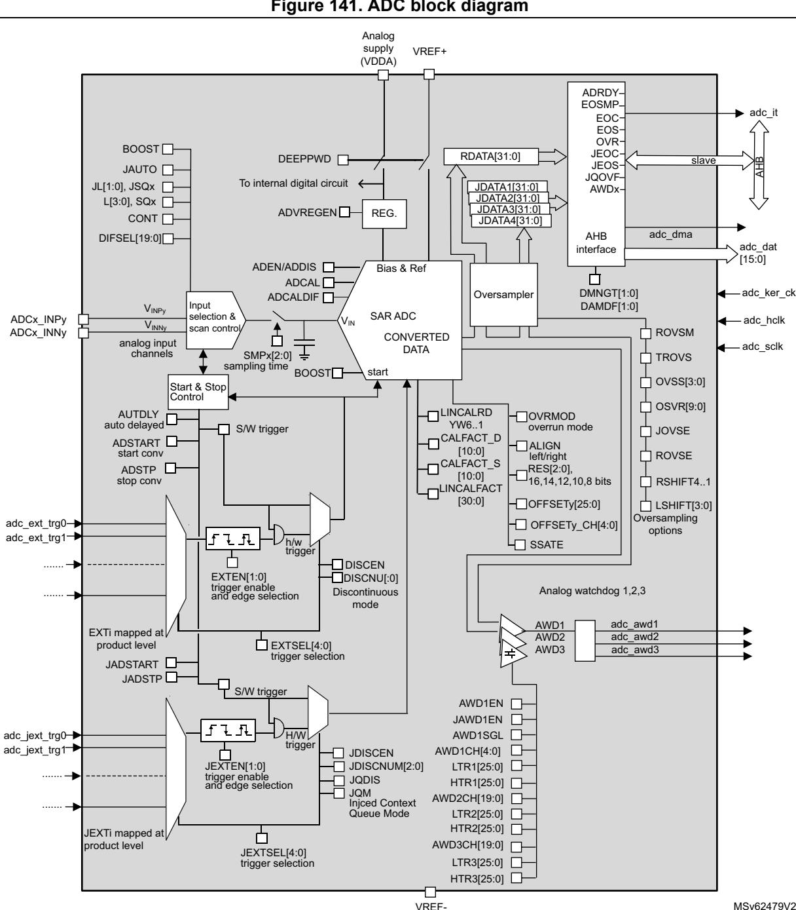

Figure 141. ADC block diagram

## **26.4.2 ADC pins and internal signals**

**Table 209. ADC input/output pins** 

| Name      | Signal type                         | Description                                                                                                                    |  |
|-----------|-------------------------------------|--------------------------------------------------------------------------------------------------------------------------------|--|
| VREF+     | Input, analog reference positive | The higher/positive reference voltage for the ADC.                                                                          |  |
| VDDA      | Input, analog supply                | Analog power supply equal VDDA                                                                                                 |  |
| VREF-     | Input, analog reference negative | The lower/negative reference voltage for the ADC.                                                                           |  |
| VSSA      | Input, analog supply ground         | Ground for analog power supply equal to VSS                                                                                    |  |
| ADCx_INPy | External analog inputs              | Up to 20 analog input channels (x = ADC number= 1 to 3): – ADCx_INP[0:5] fast channels – ADCx_INP[6:19] slow channels |  |
| ADCx_INNy |                                     | Up to 20 analog input channels (x = ADC number= 1 to 3): – ADCx_INN[0:5] fast channels – ADCx_INN[6:19] slow channels |  |

**Table 210. ADC internal input/output signals** 

| Internal signal name             | Signal type   | Description                                                                                                                                                                    |
|----------------------------------|------------------|--------------------------------------------------------------------------------------------------------------------------------------------------------------------------------|
| VINP[y]                          | Analog inputs | Positive input analog channels for each ADC, connected either to ADCx_INPi external channels or to internal channels.                                                    |
| VINN[y]                          | Analog inputs | Negative input analog channels for each ADC, connected either to VREF- or to ADCx_INNi external channels                                                                    |
| adc_ext_trgy                     | Inputs           | Up to 21 external trigger inputs for the regular conversions (can be connected to on-chip timers). These inputs are shared between the ADC master and the ADC slave.  |
| adc_jext_trgy                    | Inputs           | Up to 21 external trigger inputs for the injected conversions (can be connected to on-chip timers). These inputs are shared between the ADC master and the ADC slave. |
| adc_awd1 adc_awd2 adc_awd3 | Outputs          | Internal analog watchdog output signal connected to on chip timers. (x = Analog watchdog number 1,2,3)                                                                      |
| adc_it                           | Output           | ADC interrupt                                                                                                                                                                  |
| adc_hclk                         | Input            | AHB clock                                                                                                                                                                      |
| adc_sclk                         | Input            | ADC synchronous clock input from RCC                                                                                                                                           |
| adc_ker_ck_input                 | Input            | ADC kernel clock input from RCC                                                                                                                                                |
| adc_dma                          | Output           | ADC DMA requests                                                                                                                                                               |
| adc_dat[15:0]                    | Outputs          | ADC data outputs                                                                                                                                                               |

| Signal name   | Source/destination                                          |
|---------------|-------------------------------------------------------------|
| ADC3 VINP[18] | VSENSE (output voltage from internal temperature sensor) |
| ADC3 VINP[19] | VREFINT (output voltage from internal reference voltage) |
| ADC3 VINP[17] | VBAT/4 (external battery voltage supply voltage)            |
| ADC2 VINP[16] | dac1_out1                                                   |
| ADC2 VINP[17] | dac1_out2                                                   |
| adc_dat[15:0] | dfsdm_dat_adc[15:0]                                         |

**Table 211. ADC interconnection** 

## **26.4.3 ADC clocks**

### **Dual clock domain architecture**

The dual clock-domain architecture means that the ADC clock is independent from the AHB bus clock.

The input clock is the same for all ADCs and can be selected between two different clock sources (see *[Figure 142: ADC Clock scheme](#page-6-0)*):

- 1. The ADC clock can be a specific clock source, named adc\_ker\_ck\_input which is independent and asynchronous with the AHB clock.
  - It can be configured in the RCC (refer to RCC Section for more information on how to generate the ADC clock (adc\_ker\_ck\_input) dedicated clock).
  - To select this scheme, CKMODE[1:0] bits of the ADCx\_CCR register must be reset.
- 2. The ADC clock can be derived from the system clock or system clock divided by two (adc\_sclk). In this mode, a programmable divider factor can be selected (/1, 2 or 4 according to bits CKMODE[1:0]).
  - To select this scheme, CKMODE[1:0] bits of the ADCx\_CCR register must be different from "00". adc\_sclk is equal to sys\_ck when HPRE is set to 0, otherwise it corresponds to sys\_ck/2.

In both case, the clock divider factor of 2 is applied to the clock provided to the ADC analog block (fadc\_ker\_ck).

Option 1) has the advantage of reaching the maximum ADC clock frequency whatever the AHB clock scheme selected. The ADC clock can eventually be divided by the following ratio: 1, 2, 4, 6, 8, 10, 12, 16, 32, 64, 128, 256; using the prescaler configured with bits PRESC[3:0] in the ADCx\_CCR register.

Option 2) has the advantage of using the system without additional PLL. In addition, when adc\_sclk is twice faster than the adc\_hclk clock, the latency between the trigger and the start of conversion is fixed. This can be useful when the ADC is triggered by a timer and if the application requires that the ADC is precisely triggered without any uncertainty (otherwise, an uncertainty of the trigger instant is added by the resynchronizations between the two clock domains).

The clock configured through CKMODE[1:0] bits must be compliant with the analog ADC operating frequency specified in the product datasheet.

*Note: adc\_sclk is the system clock or system clock divided by two: when the AHB prescaler is set to 1 (HPRE[3:0] = 0XXX in RCC\_CFGR register), adc\_sclk is equal to sys\_ck, otherwise adc\_sclk corresponds to sys\_ck/2.*

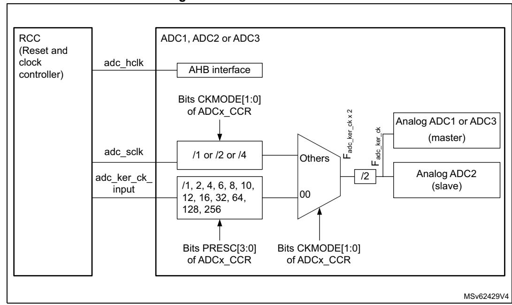

**Figure 142. ADC Clock scheme** 

1. Refer to the RCC section to see how adc\_hclk and adc\_ker\_ck\_input can be generated.

## **Clock ratio constraint between ADC clock and AHB clock**

There are generally no constraints to be respected for the ratio between the ADC clock and the AHB clock except if some injected channels are programmed. In this case, it is mandatory to respect the following ratio:

- Fadc\_hclk ≥ Fadc\_ker\_ck / 4 if the resolution of all channels are 16-bit, 14-bit,12-bit or 10 bit
- Fadc\_hclk ≥ Fadc\_ker\_ck / 3 if there are some channels with resolutions equal to 8-bit (and none with lower resolutions)

### **Constraints between ADC clocks**

When several ADC interfaces are used simultaneously, it is mandatory to use the same clock source from the RCC block without prescaler ratio, for all ADC interfaces.

## **BOOST control**

The ADC boost mode can be controlled through the BOOST bitfield in the ADC\_CR register.

This bitfield must be set according to the ADC clock setting. Refer to the ADC\_CR register description.

## 26.4.4 ADC1/2/3 connectivity

ADC1 and ADC2 are tightly coupled and share some external channels as described in the following figures.

ADC3 is instantiated separately, but some inputs are shared with ADC1 and ADC2.

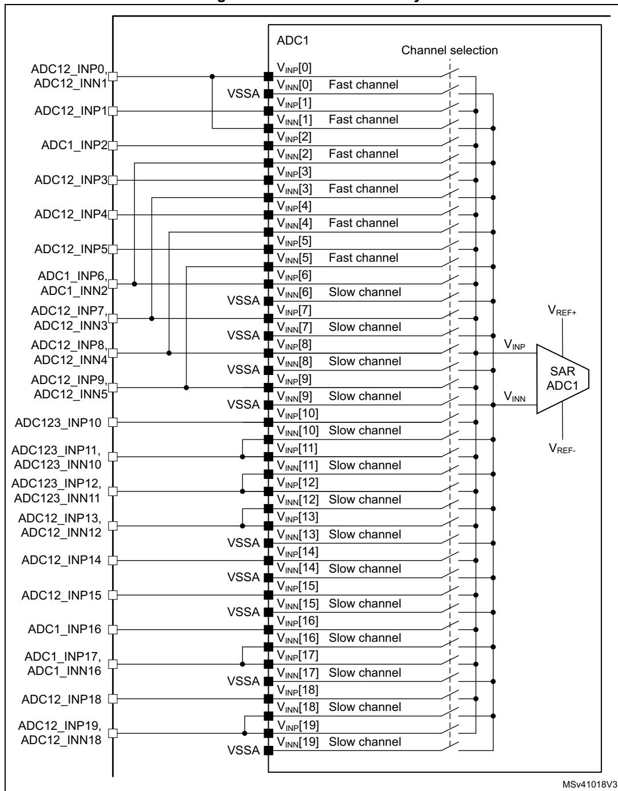

Figure 143. ADC1 connectivity

ADCx\_INNy signal can only be used when the corresponding ADC input channel is configured as
differential mode.

577

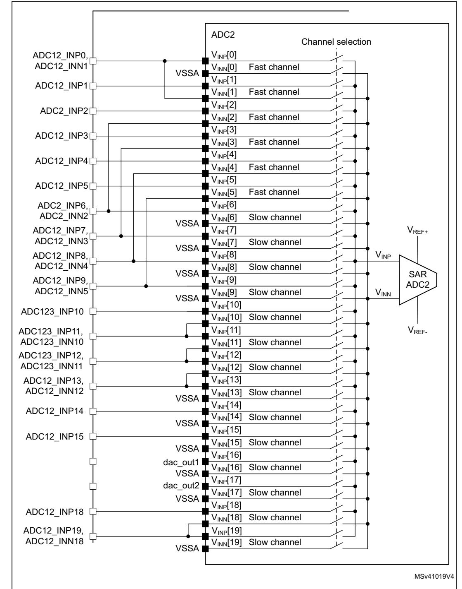

Figure 144. ADC2 connectivity

 ADCx\_INNy signal can only be used when the corresponding ADC input channel is configured as differential mode.

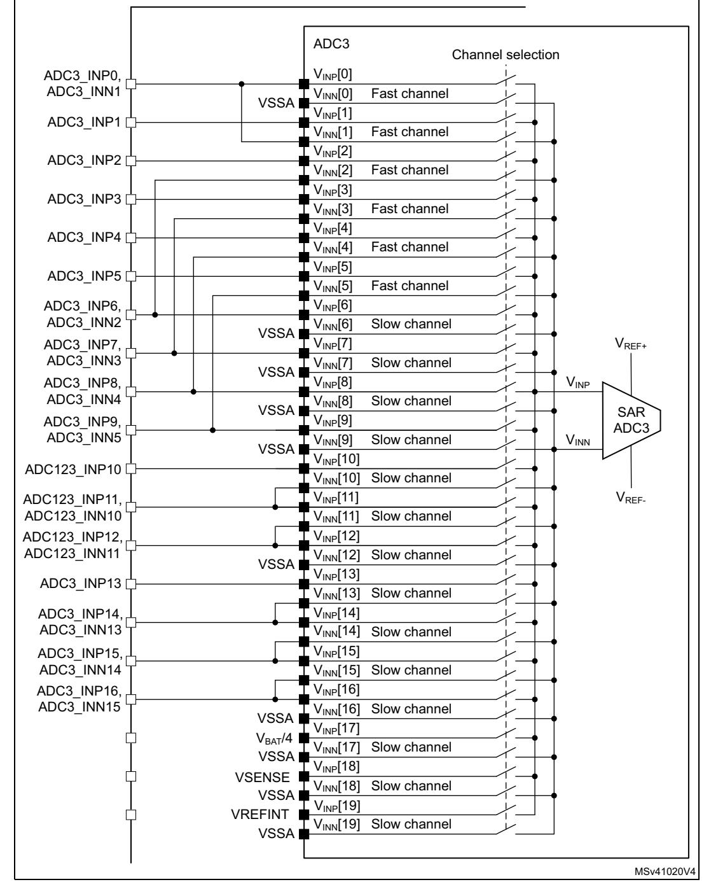

Figure 145. ADC3 connectivity

ADCx\_INNy signal can only be used when the corresponding ADC input channel is configured as differential mode.

## **26.4.5 Slave AHB interface**

The ADCs implement an AHB slave port for control/status register and data access. The features of the AHB interface are listed below:

- Word (32-bit) accesses
- Single cycle response
- Response to all read/write accesses to the registers with zero wait states.

The AHB slave interface does not support split/retry requests, and never generates AHB errors.

## **26.4.6 ADC deep-power-down mode (DEEPPWD) and ADC voltage regulator (ADVREGEN)**

By default, the ADC is in deep-power-down mode where its supply is internally switched off to reduce the leakage currents (the reset state of bit DEEPPWD is 1 in the ADC\_CR register).

To start ADC operations, it is first needed to exit deep-power-down mode by clearing bit DEEPPWD=0.

Then, it is mandatory to enable the ADC internal voltage regulator by setting the bit ADVREGEN=1 into ADC\_CR register. The software must wait for the startup time of the ADC voltage regulator (TADCVREG\_STUP) before launching a calibration or enabling the ADC. This delay must be implemented by software.

The LDO status can be verified by checking the LDORDY bit in ADC\_ISR register (refer to *[Section 26.3: ADC implementation](#page-2-0)* for the availability of the LDO regulator status).

For the startup time of the ADC voltage regulator, refer to device datasheet for TADCVREG\_STUP parameter.

After ADC operations are complete, the ADC can be disabled (ADEN=0). It is possible to save power by also disabling the ADC voltage regulator. This is done by writing bit ADVREGEN=0.

Then, to save more power by reducing the leakage currents, it is also possible to re-enter in ADC deep-power-down mode by setting bit DEEPPWD=1 into ADC\_CR register. This is particularly interesting before entering Stop mode.

*Note: Writing DEEPPWD=1 automatically disables the ADC voltage regulator and bit ADVREGEN is automatically cleared.*

*Note: When the internal voltage regulator is disabled (ADVREGEN=0), the internal analog calibration is kept.*

> In ADC deep-power-down mode (DEEPPWD=1), the internal analog calibration is lost and it is necessary to either relaunch a calibration or apply again the calibration factor which was previously saved (refer to *[Section 26.4.8: Calibration \(ADCAL, ADCALDIF, ADCALLIN,](#page-11-0)  [ADC\\_CALFACT\)](#page-11-0)*).

## 26.4.7 Single-ended and differential input channels

Channels can be configured to be either single-ended input or differential input by writing into bits DIFSEL[19:0] in the ADC\_DIFSEL register. This configuration must be written while the ADC is disabled (ADEN=0).

In single-ended input mode, the analog voltage to be converted for channel "i" is the difference between the external voltage  $V_{INP[i]}$  (positive input) and  $V_{REF}$  (negative input).

In differential input mode, the analog voltage to be converted for channel "i" is the difference between the external voltage  $V_{\text{INP[i]}}$  (positive input) and  $V_{\text{INN[i]}}$  (negative input).

The output data for the differential mode is an unsigned data. When  $V_{INP[i]}$  equals  $V_{REF-}$ ,  $V_{INN[i]}$  equals  $V_{REF+}$  and the output data is 0x0000 (16-bit resolution mode). When  $V_{INP[i]}$  equals  $V_{REF+}$ ,  $V_{INN[i]}$  equals  $V_{REF-}$  and the output data is 0xFFFF.

Converted value = 
$$\frac{ADC\_Full\_Scale}{2} \times \left[1 + \frac{V_{INP} - V_{INN}}{V_{REF+}}\right]$$

When ADC is configured as differential mode, both input should be biased at  $V_{REF+}$  / 2 voltage.

The input signal are supposed to be differential (common mode voltage should be fixed).

For a complete description of how the input channels are connected for each ADC, refer to Section 26.4.4: ADC1/2/3 connectivity.

Caution:

When configuring the channel "i" in differential input mode, its negative input voltage is connected to  $V_{INN[i]}$ . As a consequence, channel "i+n", which is connected to  $V_{INN[i]}$ , should not be converted at same time by different ADCs. Some channels are shared between ADC1/ADC2: this can make the channel on the other ADC unusable.

## 26.4.8 Calibration (ADCAL, ADCALDIF, ADCALLIN, ADC\_CALFACT)

Each ADC provides an automatic calibration procedure which drives all the calibration sequence including the power-on/off sequence of the ADC. During the procedure, the ADC calculates a calibration factor which is 11-bits of offset or 160-bits of linearity and which is applied internally to the ADC until the next ADC power-off. During the calibration procedure, the application must not use the ADC and must wait until calibration is complete.

The calibration is preliminary to any ADC operation. It removes the systematic errors which may vary from chip to chip and allows to compensate offset and linearity deviation.

The calibration factor for the offset to be applied for single-ended input conversions is different from the factor to be applied for differential input conversions:

- Write ADCALDIF = 0 before launching a calibration which is applied for single-ended input conversions.
- Write ADCALDIF = 1 before launching a calibration which is applied for differential input conversions.

The linearity correction must be done once only, regardless of single / differential configuration.

- Write ADCALLIN = 1 before launching a calibration which runs the linearity calibration same time as the offset calibration.
- Write ADCALLIN = 0 before launching a calibration which does not run the linearity calibration but only the offset calibration.

The calibration is then initiated by software by setting bit ADCAL=1. It can be initiated only when the ADC is disabled (when ADEN=0). ADCAL bit stays at 1 during all the calibration sequence. It is then cleared by hardware as soon the calibration completes. At this time, the associated calibration factor is stored internally in the analog ADC and also in the bits CALFACT\_S[10:0] or CALFACT\_D[10:0] of ADC\_CALFACT register (depending on singleended or differential input calibration). The 160-bit linearity calibration factor can be accessed using the ADC\_CALFACT2 register with ADEN set to 1.

The internal analog calibration is kept if the ADC is disabled (ADEN=0). However, if the ADC is disabled for extended periods, it is recommended that a new offset calibration cycle is run before enabling again the ADC.

The internal analog calibration is lost each time the power of the ADC is removed (example, when the product enters in STANDBY or VBAT mode). In this case, to avoid spending time recalibrating the ADC, it is possible to re-write the calibration factor into the ADC\_CALFACT and ADC\_CALFACT2 register without recalibrating, supposing that the software has previously saved the calibration factor delivered during the previous calibration.

The calibration factor can be written if the ADC is enabled but not converting (ADEN=1 and ADSTART=0 and JADSTART=0). Then, at the next start of conversion, the calibration factor is automatically injected into the analog ADC. This loading is transparent and does not add any cycle latency to the start of the conversion. It is recommended to recalibrate when VREF+ voltage changed more than 10%.

Refer to the datasheets for the clock cycle requirement for both linear and offset calibration.

### **Software procedure to calibrate the ADC**

- 1. Ensure DEEPPWD=0, ADVREGEN=1 and verify that the ADC voltage regulator startup time has elapsed by checking the LDORDY bit in ADC\_ISR (refer to *Section [26.3: ADC implementation](#page-2-0)* for the availability of the LDO regulator status).
- 2. Ensure that ADEN=0.
- 3. Select the input mode for this calibration by setting ADCALDIF=0 (single-ended input) or ADCALDIF=1 (Differential input). Select if Linearity calibration enable or not by ADCALLIN=1(enabled) or ADCALLIN=0(disabled).
- 4. Set ADCAL=1.
- 5. Wait until ADCAL=0.
- 6. The offset calibration factor can be read from ADC\_CALFACT register.
- 7. The linearity calibration factor can be read from ADC\_CALFACT2 register, following the procedure described in *Section [: Linearity calibration reading procedure](#page-15-0)* (ADEN must be set to 1 prior to accessing ADC\_CALFACT2 register).

MSv41021V1 tCAB ADCAL ADC State Calibration factor ADCALDIF 0: Single-ended input 1: Differential input OFF Startup Calibrate OFF by S/W by H/W Indicative timings ADCALLIN 0: Linear calibrarion disable 1: Linear calibration enable LINCALFACT [159:0] Calibration factor CALFACT\_x[10:0] 0x00000000000000000000 0x000

**Figure 146. ADC calibration** 

### **Software procedure to re-inject a calibration factor into the ADC**

- 1. Ensure ADEN=1 and ADSTART=0 and JADSTART=0 (ADC enabled and no conversion is ongoing).
- 2. Write CALFACT\_S and CALFACT\_D with the new offset calibration factors.
- 3. Write LINCALFACT bits with the new linearity calibration factors, following the procedure described in *Section [: Linearity calibration writing procedure](#page-16-0)*.
- 4. When a conversion is launched, the calibration factor is injected into the analog ADC only if the internal analog calibration factor differs from the one stored in bits CALFACT\_S for single-ended input channel or bits CALFACT\_D for differential input channel.

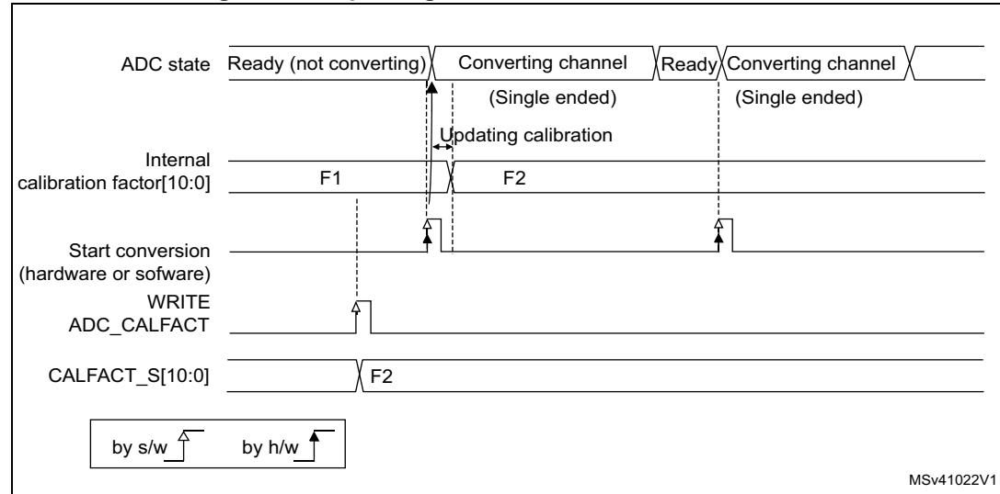

**Figure 147. Updating the ADC offset calibration factor** 

## Calibrating single-ended and differential analog inputs with a single ADC

If the ADC is supposed to convert both differential and single-ended inputs, two calibrations must be performed, one with ADCALDIF=0 and one with ADCALDIF=1. The procedure is the following:

- Disable the ADC.
- Calibrate the ADC in single-ended input mode (with ADCALDIF=0) and Linearity calibration enable (with ADCALLIN=1). This updates the registers CALFACT S[10:0] and LINCALFACT[159:0].
- Calibrate the ADC in differential input modes (with ADCALDIF=1) and Linearity 3 calibration disable (with ADCALLIN=0). This updates the register CALFACT D[10:0].
- Enable the ADC, configure the channels and launch the conversions. Each time there is a switch from a single-ended to a differential inputs channel (and vice-versa), the calibration is automatically injected into the analog ADC.

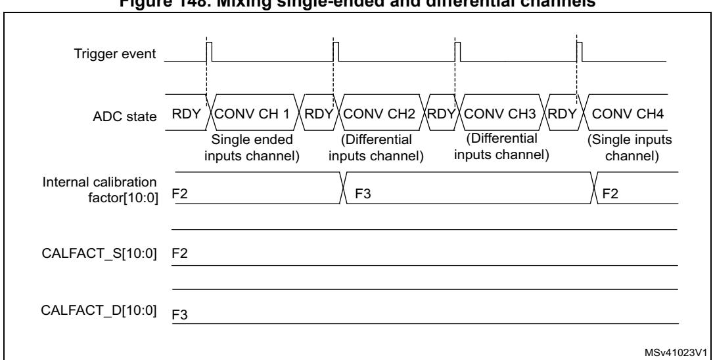

Figure 148. Mixing single-ended and differential channels

### **Linearity calibration reading procedure**

Once the calibration is done (ADCAL bit cleared by hardware) with ADCALLIN=1, the 160 bit linearity correction factor can be read using the ADC\_CALFACT2 30-bit registers (6 read accesses are necessary).

The six LINCALRDYW1..6 control/status bits in ADC\_CR are set when the calibration is complete. When ADEN is set to 1, clearing one of these bits launches the transfer of part of the linearity factor into the LINCALFACT[29:0] of the ADC\_CALFACT2 register. The bit is reset by hardware when the ADC\_CALFACT2 register can be read (software must poll the bit until it is cleared). The complete procedure is as following:

- 1. Ensure DEEPPWD=0, ADVREGEN=1 and that the ADC voltage regulator startup time has elapsed by checking the LDORDY bit in ADC\_ISR (refer to *Section [26.3: ADC](#page-2-0)  [implementation](#page-2-0)* for the availability of the LDO regulator status).
- 2. Set ADEN = 1 and wait until ADRDY=1.
- 3. Clear LINCALRDYW6 bit (Linearity calibration ready Word 6).
- 4. Poll LINCALRDYW6 bit until returned value is zero, indicating linearity correction bits[159:150] are available in ADC\_CALFACT2[29:0].
- 5. Read ADC\_CALFACT2[29:0].
- 6. Clear LINCALRDYW5 bit.
- 7. Poll LINCALRDYW5 bit until returned value is zero, indicating linearity correction bits[149:120] are available in ADC\_CALFACT2[29:0].
- 8. Read ADC\_CALFACT2[29:0].
- 9. Clear LINCALRDYW4 bit.
- 10. Poll LINCALRDYW4 bit until returned value is zero, indicating linearity correction bits[119:90] are available in ADC\_CALFACT2[29:0].
- 11. Read ADC\_CALFACT2[29:0].
- 12. Clear LINCALRDYW3 bit.
- 13. Poll LINCALRDYW3 bit until returned value is zero, indicating linearity correction bits[89:60] are available in ADC\_CALFACT2[29:0].
- 14. Read ADC\_CALFACT2[29:0].
- 15. Clear LINCALRDYW2 bit.
- 16. Poll LINCALRDYW2 bit until returned value is zero, indicating linearity correction bits[59:30] are available in ADC\_CALFACT2[29:0].
- 17. Read ADC\_CALFACT2[29:0].
- 18. Clear LINCALRDYW1 bit.
- 19. Poll LINCALRDYW1 bit until returned value is zero, indicating linearity correction bits[29:0] are available in ADC\_CALFACT2[29:0].
- 20. Read ADC\_CALFACT2[29:0].

*Note: The software is allowed to toggle a single LINCALRDYWx bit at once (other bits left unchanged), otherwise causing unexpected behavior.*

> *The software can access the linearity calibration factor by writing LINCALRDYW1..6 bits only when ADEN=1 and ADSTART=0 and JADSTART=0 (ADC enabled and no conversion is ongoing).*

RM0399 Rev 4 967/3556

## **Linearity calibration writing procedure**

The six LINCALRDYW1..6 control/status bits in ADC\_CR are reset when the calibration has not yet been done or a new linearity calibration factor have been rewritten. It is possible to force directly a linearity calibration factor or re-inject it using the following procedure:

- 1. Ensure DEEPPWD=0, ADVREGEN=1 and that ADC voltage regulator startup time has elapsed by checking the LDORDY bit in ADC\_ISR (refer to *Section [26.3: ADC](#page-2-0)  [implementation](#page-2-0)* for the availability of the LDO regulator status).
- 2. Set ADEN = 1 and wait until ADRDY=1.
- 3. Write ADC\_CALFACT2[9:0] with previously saved linearity correction factor bits[159:150].
- 4. Set LINCALRDYW6 bit.
- 5. Poll LINCALRDYW6 bit until returned value is one, indicating linearity correction bits[159:150] have been effectively written.
- 6. Write ADC\_CALFACT2[29:0] with previously saved linearity correction factor bits[149:120].
- 7. Set LINCALRDYW5 bit.
- 8. Poll LINCALRDYW5 bit until returned value is one, indicating linearity correction bits[149:120] have been effectively written.
- 9. Write ADC\_CALFACT2[29:0] with previously saved linearity correction factor bits[119:90].
- 10. Set LINCALRDYW4 bit.
- 11. Poll LINCALRDYW4 bit until returned value is one, indicating linearity correction bits[119:90] have been effectively written.
- 12. Write ADC\_CALFACT2[29:0] with previously saved linearity correction factor bits[89:60].
- 13. Set LINCALRDYW3 bit.
- 14. Poll LINCALRDYW3 bit until returned value is one, indicating linearity correction bits[89:60] have been effectively written.
- 15. Write ADC\_CALFACT2[29:0] with previously saved linearity correction factor bits[59:30].
- 16. Set LINCALRDYW2 bit.
- 17. Poll LINCALRDYW2 bit until returned value is one, indicating linearity correction bits[59:30] have been effectively written.
- 18. Write ADC\_CALFACT2[29:0] with previously saved linearity correction factor bits[29:0].
- 19. Set LINCALRDYW1 bit.
- 20. Poll LINCALRDYW1 bit until returned value is one, indicating linearity correction bits[29:0] have been effectively written.

*Note: The software is allowed to toggle a single LINCALRDYWx bit at once (other bits left unchanged), otherwise causing unexpected behavior.*

> *The software is allowed to update the linearity calibration factor by writing LINCALRDYW1..6 bits only when ADEN=1 and ADSTART=0 and JADSTART=0 (ADC enabled and no conversion is ongoing).*

# 26.4.9 ADC on-off control (ADEN, ADDIS, ADRDY)

First of all, follow the procedure explained in Section 26.4.6: ADC deep-power-down mode (DEEPPWD) and ADC voltage regulator (ADVREGEN)).

Once DEEPPWD = 0 and ADVREGEN = 1, the ADC can be enabled and the ADC needs a stabilization time of tSTAB before it starts converting accurately, as shown in *Figure 149*. Two control bits enable or disable the ADC:

- ADEN = 1 enables the ADC. The flag ADRDY is set once the ADC is ready for operation.
- ADDIS = 1 disables the ADC. ADEN and ADDIS are then automatically cleared by hardware as soon as the analog ADC is effectively disabled.

Regular conversion can then start either by setting ADSTART=1 (refer to Section 26.4.19: Conversion on external trigger and trigger polarity (EXTSEL, EXTEN, JEXTSEL, JEXTEN)) or when an external trigger event occurs, if triggers are enabled.

Injected conversions start by setting JADSTART=1 or when an external injected trigger event occurs, if injected triggers are enabled.

### Software procedure to enable the ADC

- 1. Clear the ADRDY bit in the ADC ISR register by writing '1'.
- Set ADEN=1.
- 3. Wait until ADRDY=1 (ADRDY is set after the ADC startup time). This can be done using the associated interrupt (setting ADRDYIE=1).
- 4. Clear the ADRDY bit in the ADC ISR register by writing '1' (optional).

#### Software procedure to disable the ADC

- Check that both ADSTART=0 and JADSTART=0 to ensure that no conversion is ongoing. If required, stop any regular and injected conversion ongoing by setting ADSTP=1 and JADSTP=1 and then wait until ADSTP=0 and JADSTP=0.
- 2. Set ADDIS=1.
- 3. If required by the application, wait until ADEN=0, until the analog ADC is effectively disabled (ADDIS is automatically reset once ADEN=0).

ADEN

ADRDY

ADDIS

ADC Startup RDY Converting CH RDY REQ OFF

by S/W by H/W MSv30264V2

Figure 149. Enabling / Disabling the ADC

RM0399 Rev 4

## **26.4.10 Constraints when writing the ADC control bits**

The software can write the RCC control bits to configure and enable the ADC clock (refer to RCC Section), the control bits DIFSEL in the ADC\_DIFSEL register, ADCx\_CCR register and the control bits ADCAL and ADEN in the ADC\_CR register, only if the ADC is disabled (ADEN must be equal to 0).

The software is then allowed to write the control bits ADSTART, JADSTART and ADDIS of the ADC\_CR register only if the ADC is enabled and there is no pending request to disable the ADC (ADEN must be equal to 1 and ADDIS to 0).

For all the other control bits of the ADC\_CFGR, ADC\_SMPRy, ADC\_TRy, ADC\_SQRy, ADC\_JDRy, ADC\_OFRy and ADC\_IER registers:

- For control bits related to configuration of regular conversions, the software is allowed to write them only if there is no regular conversion ongoing (ADSTART must be equal to 0).
- For control bits related to configuration of injected conversions, the software is allowed to write them only if there is no injected conversion ongoing (JADSTART must be equal to 0).

The software can write ADSTP or JADSTP control bits in the ADC\_CR register only if the ADC is enabled and eventually converting and if there is no pending request to disable the ADC (ADSTART or JADSTART must be equal to 1 and ADDIS to 0).

The software can write the register ADC\_JSQR at any time, when the ADC is enabled (ADEN=1).

The software is allowed to write the ADC\_JSQR register only when JADSTART is cleared to 0 (no injected conversion is ongoing) unless the context queue is enabled (JQDIS=0 in ADC\_CFGR register).

*Note: There is no hardware protection to prevent these forbidden write accesses and ADC behavior may become in an unknown state. To recover from this situation, the ADC must be disabled (clear ADEN=0 as well as all the bits of ADC\_CR register).*

## **26.4.11 Channel selection (SQRx, JSQRx)**

There are up to 20 multiplexed channels per ADC:

- 6 fast analog inputs coming from Analog PADs and GPIO pads (ADCx\_INP/INN[0..5])
- Up to 14 slow analog inputs coming from GPIO pads (ADCx\_INP/INN[6..19]).
- The ADCs are connected to 5 internal analog inputs:
  - the internal temperature sensor (VSENSE)
  - the internal reference voltage (VREFINT)
  - the VBAT monitoring channel (VBAT/4)
  - DAC internal channels

Refer to *Table ADC interconnection* in *[Section 26.4.2: ADC pins and internal signals](#page-4-1)* for the connection of the above internal analog inputs to external ADC pins or internal signals.

It is possible to organize the conversions in two groups: regular and injected. A group consists of a sequence of conversions that can be done on any channel and in any order. For instance, it is possible to implement the conversion sequence in the following order:

ADCx\_INP/INN3, ADCx\_INP/INN8, ADCx\_INP/INN2, ADCx\_INP/INN2, ADCx\_INP/INN0, ADCx\_INP/INN2, ADCx\_INP/INN2, ADCx\_INP/INN15.

- A regular group is composed of up to 16 conversions. The regular channels and their
  order in the conversion sequence must be selected in the ADC\_SQRy registers. The
  total number of conversions in the regular group must be written in the L[3:0] bits in the
  ADC\_SQR1 register.
- An injected group is composed of up to 4 conversions. The injected channels and their order in the conversion sequence must be selected in the ADC\_JSQR register. The total number of conversions in the injected group must be written in the L[1:0] bits in the ADC\_JSQR register.

ADC\_SQRy registers must not be modified while regular conversions can occur. For this, the ADC regular conversions must be first stopped by writing ADSTP=1 (refer to Section 26.4.18: Stopping an ongoing conversion (ADSTP, JADSTP)).

The software is allowed to modify on-the-fly the ADC\_JSQR register when JADSTART is set to 1 only when the context queue is enabled (JQDIS=0 in ADC\_CFGR register).

## Temperature sensor, VREFINT and VBAT internal channels

The internal reference voltage (VREFINT), the temperature sensor (VSENSE), and the VBAT channel are connected to ADC internal channels. Refer to *Table ADC interconnection* in *Section 26.4.2: ADC pins and internal signals* for details.

Note:

To convert one of the internal analog channels, enable the corresponding analog sources by programming VREFEN, TSEN and VBATEN bits in the ADCx\_CCR registers.

## 26.4.12 Channel preselection register (ADC\_PCSEL)

For each channel selected through SQRx or JSQRx, the corresponding ADC\_PCSEL bit must be previously configured.

This ADC\_PCSEL bit controls the analog switch integrated in the I/O level. The ADC input MUX selects the ADC input according to the SQRx and JSQRx with very high speed, the analog switch integrated in the IO cannot react as fast as ADC mux does. To avoid the delay on analog switch control on IO, it is necessary to preselect the input channels which are selected in the SQRx, JSQRx.

The selection is based on the  $V_{INP[i]}$  of each ADC input. If ADC1 converts the ADC123\_INP2( $V_{INP[2]}$ ) as differential mode, ADC123\_INP6( $V_{INP[6]}$ ) also needs to be selected in ADC\_PCSEL.

Some I/Os are connected to several VINP[i] of the ADCx. The control inputs of the analog switch are ORed with the corresponding ADC\_PCSEL register bits.

RM0399 Rev 4

971/3556

## **26.4.13 Channel-wise programmable sampling time (SMPR1, SMPR2)**

Before starting a conversion, the ADC must establish a direct connection between the voltage source under measurement and the embedded sampling capacitor of the ADC. This sampling time must be enough for the input voltage source to charge the embedded capacitor to the input voltage level.

Each channel can be sampled with a different sampling time which is programmable using the SMP[2:0] bits in the ADC\_SMPR1 and ADC\_SMPR2 registers. It is therefore possible to select among the following sampling time values:

- SMP = 000: 1.5 ADC clock cycles
- SMP = 001: 2.5 ADC clock cycles
- SMP = 010: 8.5 ADC clock cycles
- SMP = 011: 16.5 ADC clock cycles
- SMP = 100: 32.5 ADC clock cycles
- SMP = 101: 64.5 ADC clock cycles
- SMP = 110: 387.5 ADC clock cycles
- SMP = 111: 810.5 ADC clock cycles

The total conversion time is calculated as follows:

TCONV = Sampling time + 7.5 ADC clock cycles

### Example:

With Fadc\_ker\_ck = 24 MHz and a sampling time of 1.5 ADC clock cycles (14-bit mode): TCONV = (1.5 + 7.5) ADC clock cycles = 9 ADC clock cycles = 0.375 µs (14 bit mode for fast channels)

The ADC notifies the end of the sampling phase by setting the status bit EOSMP (only for regular conversion).

### **Constraints on the sampling time for fast and slow channels**

For each channel, SMP[2:0] bits must be programmed to respect a minimum sampling time as specified in the ADC characteristics section of the datasheets.

## **I/O analog switch voltage booster**

The resistance of the I/O analog switches increases when the VDDA voltage is too low. The sampling time must consequently be adapted accordingly (refer to the device datasheet for the corresponding electrical characteristics). This resistance can be minimized at low VDDA voltage by enabling an internal voltage booster through the BOOSTE bit of the SYSCFG\_PMCR register.

## **26.4.14 Single conversion mode (CONT=0)**

In single conversion mode, the ADC performs once all the conversions of the channels. This mode is started with the CONT bit at 0 by either:

- Setting the ADSTART bit in the ADC\_CR register (for a regular channel, with software trigger selected)
- Setting the JADSTART bit in the ADC\_CR register (for an injected channel, with software trigger selected)
- External hardware trigger event (for a regular or injected channel) ADSTART bit or JADSTART bit must be set before triggering an external event.

Inside the regular sequence, after each conversion is complete:

- The converted data are stored into the 32-bit ADC\_DR register
- The EOC (end of regular conversion) flag is set
- An interrupt is generated if the EOCIE bit is set

Inside the injected sequence, after each conversion is complete:

- The converted data are stored into one of the four 32-bit ADC\_JDRy registers
- The JEOC (end of injected conversion) flag is set
- An interrupt is generated if the JEOCIE bit is set

After the regular sequence is complete:

- The EOS (end of regular sequence) flag is set
- An interrupt is generated if the EOSIE bit is set

After the injected sequence is complete:

- The JEOS (end of injected sequence) flag is set
- An interrupt is generated if the JEOSIE bit is set

Then the ADC stops until a new external regular or injected trigger occurs or until bit ADSTART or JADSTART is set again.

*Note: To convert a single channel, program a sequence with a length of 1.*

## **26.4.15 Continuous conversion mode (CONT=1)**

This mode applies to regular channels only.

In continuous conversion mode, when a software or hardware regular trigger event occurs, the ADC performs once all the regular conversions of the channels and then automatically re-starts and continuously converts each conversions of the sequence. This mode is started with the CONT bit at 1 either by external trigger or by setting the ADSTART bit in the ADC\_CR register.

Inside the regular sequence, after each conversion is complete:

- The converted data are stored into the 32-bit ADC\_DR register
- The EOC (end of conversion) flag is set
- An interrupt is generated if the EOCIE bit is set

After the sequence of conversions is complete:

- The EOS (end of sequence) flag is set
- An interrupt is generated if the EOSIE bit is set

RM0399 Rev 4 973/3556

Then, a new sequence restarts immediately and the ADC continuously repeats the conversion sequence.

*Note: To convert a single channel, program a sequence with a length of 1.*

*It is not possible to have both discontinuous mode and continuous mode enabled: it is forbidden to set both DISCEN=1 and CONT=1.*

*Injected channels cannot be converted continuously. The only exception is when an injected channel is configured to be converted automatically after regular channels in continuous mode (using JAUTO bit), refer to [Auto-injection mode](#page-29-0) section)***.**

## **26.4.16 Starting conversions (ADSTART, JADSTART)**

Software starts ADC regular conversions by setting ADSTART=1.

When ADSTART is set, the conversion starts:

- Immediately: if EXTEN = 0x0 (software trigger)
- At the next active edge of the selected regular hardware trigger: if EXTEN /= 0x0

Software starts ADC injected conversions by setting JADSTART=1.

When JADSTART is set, the conversion starts:

- Immediately, if JEXTEN = 0x0 (software trigger)
- At the next active edge of the selected injected hardware trigger: if JEXTEN /= 0x0

*Note: In auto-injection mode (JAUTO=1), use ADSTART bit to start the regular conversions followed by the auto-injected conversions (JADSTART must be kept cleared).*

> ADSTART and JADSTART also provide information on whether any ADC operation is currently ongoing. It is possible to re-configure the ADC while ADSTART=0 and JADSTART=0 are both true, indicating that the ADC is idle.

ADSTART is cleared by hardware:

- In single mode with software trigger (CONT=0, EXTEN=0x0)
  - at any end of conversion sequence (EOS =1)
- In discontinuous mode with software trigger (CONT=0, DISCEN=1, EXTEN=0x0)
  - at end of conversion (EOC=1)
- In all other cases (CONT=x, EXTEN=x)
  - after execution of the ADSTP procedure asserted by the software.

*Note: In continuous mode (CONT=1), ADSTART is not cleared by hardware with the assertion of EOS because the sequence is automatically relaunched.*

> *When a hardware trigger is selected in single mode (CONT=0 and EXTEN /=0x00), ADSTART is not cleared by hardware with the assertion of EOS to help the software which does not need to reset ADSTART again for the next hardware trigger event. This ensures that no further hardware triggers are missed.*

JADSTART is cleared by hardware:

- in single mode with software injected trigger (JEXTEN=0x0)
  - at any end of injected conversion sequence (JEOS assertion) or at any end of sub-group processing if JDISCEN=1
- in all cases (JEXTEN=x)
  - after execution of the JADSTP procedure asserted by the software.

*Note: When the software trigger is selected, ADSTART bit should not be set if the EOC flag is still high.*

## **26.4.17 Timing**

The elapsed time between the start of a conversion and the end of conversion is the sum of the configured sampling time plus the successive approximation time depending on data resolution:

$$T_{CONV} = T_{SMPL} + T_{SAR} = [1.5_{|min} + 7.5_{|14bit}] \times T_{adc\_ker\_ck}$$
  
 $T_{CONV} = T_{SMPL} + T_{SAR} = 62.5 \text{ ns}_{|min} + 312.5 \text{ ns}_{|14bit} = 375.0 \text{ ns (for } F_{adc\_ker\_ck} = 24 \text{ MHz)}$ 

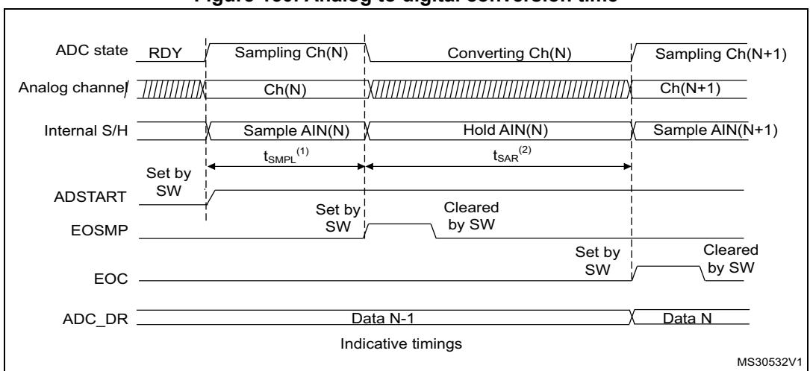

**Figure 150. Analog to digital conversion time**

- 1. TSMPL depends on SMP[2:0]
- 2. TSAR depends on RES[2:0]

# **26.4.18 Stopping an ongoing conversion (ADSTP, JADSTP)**

The software can decide to stop regular conversions ongoing by setting ADSTP=1 and injected conversions ongoing by setting JADSTP=1.

Stopping conversions resets the ongoing ADC operation. Then the ADC can be reconfigured (ex: changing the channel selection or the trigger) ready for a new operation.

Note that it is possible to stop injected conversions while regular conversions are still operating and vice-versa. This allows, for instance, re-configuration of the injected conversion sequence and triggers while regular conversions are still operating (and viceversa).

When the ADSTP bit is set by software, any ongoing regular conversion is aborted with partial result discarded (ADC\_DR register is not updated with the current conversion).

When the JADSTP bit is set by software, any ongoing injected conversion is aborted with partial result discarded (ADC\_JDRy register is not updated with the current conversion). The scan sequence is also aborted and reset (meaning that relaunching the ADC would restart a new sequence).

RM0399 Rev 4 975/3556

Once this procedure is complete, bits ADSTP/ADSTART (in case of regular conversion), or JADSTP/JADSTART (in case of injected conversion) are cleared by hardware and the software must poll ADSTART (or JADSTART) until the bit is reset before assuming the ADC is completely stopped.

Note:

In auto-injection mode (JAUTO=1), setting ADSTP bit aborts both regular and injected conversions (JADSTP must not be used).

Trigger Trigger Sample Convert Sample ADC state **RDY** RDY Ch(N-1) Ch(N-1) Ch(N) **JADSTART** Cleared Cleared by HW ADSTART by SW - REGULAR CONVERSIONS ongoing (software is not allowed to configure regular conversions selection and triggers) Cleared Cleared by HW by SW **ADSTP** ADC DR Data N-2 Data N-1 MS30533V1

Figure 151. Stopping ongoing regular conversions

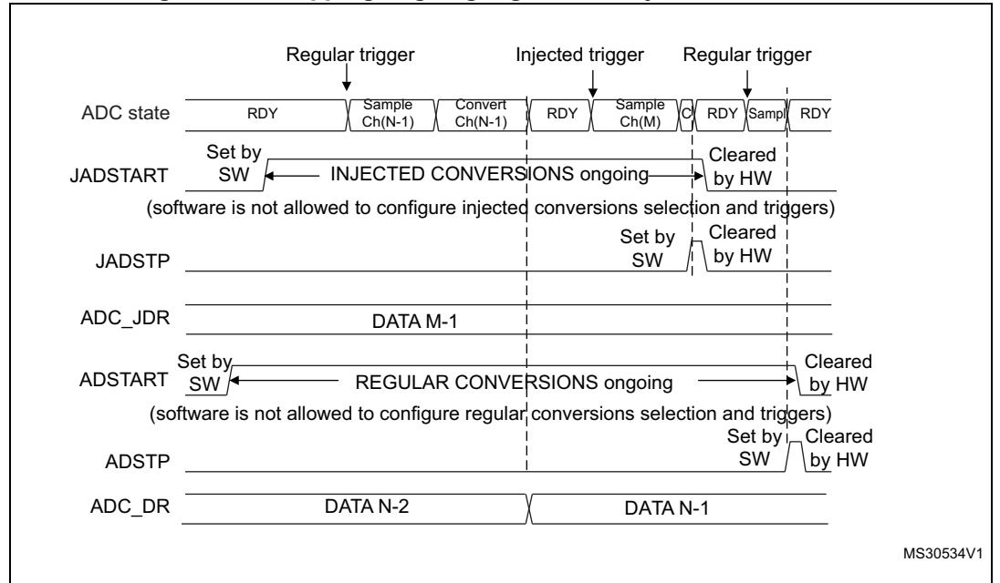

# **26.4.19 Conversion on external trigger and trigger polarity (EXTSEL, EXTEN, JEXTSEL, JEXTEN)**

A conversion or a sequence of conversions can be triggered either by software or by an external event (e.g. timer capture, input pins). If the EXTEN[1:0] control bits (for a regular conversion) or JEXTEN[1:0] bits (for an injected conversion) are different from 0b00, then external events are able to trigger a conversion with the selected polarity.

When the Injected Queue is enabled (bit JQDIS=0), injected software triggers are not possible.

The regular trigger selection is effective once software has set bit ADSTART=1 and the injected trigger selection is effective once software has set bit JADSTART=1.

Any hardware triggers which occur while a conversion is ongoing are ignored.

- If bit ADSTART=0, any regular hardware triggers which occur are ignored.
- If bit JADSTART=0, any injected hardware triggers which occur are ignored.

*[Table 212](#page-25-1)* provides the correspondence between the EXTEN[1:0] and JEXTEN[1:0] values and the trigger polarity.

**EXTEN[1:0] Source** 00 Hardware Trigger detection disabled, software trigger detection enabled 01 Hardware Trigger with detection on the rising edge 10 Hardware Trigger with detection on the falling edge 11 Hardware Trigger with detection on both the rising and falling edges

**Table 212. Configuring the trigger polarity for regular external triggers** 

*Note: The polarity of the regular trigger cannot be changed on-the-fly.*

| JEXTEN[1:0] | Source                                                                                                                                                                                      |
|-------------|---------------------------------------------------------------------------------------------------------------------------------------------------------------------------------------------|
| 00          | – If JQDIS=1 (Queue disabled): Hardware trigger detection disabled, software trigger detection enabled – If JQDIS=0 (Queue enabled), Hardware and software trigger detection disabled |
| 01          | Hardware Trigger with detection on the rising edge                                                                                                                                          |
| 10          | Hardware Trigger with detection on the falling edge                                                                                                                                         |
| 11          | Hardware Trigger with detection on both the rising and falling edges                                                                                                                        |

**Table 213. Configuring the trigger polarity for injected external triggers**

*Note: The polarity of the injected trigger can be anticipated and changed on-the-fly when the queue is enabled (JQDIS=0). Refer to Section [26.4.22: Queue of context for injected](#page-31-0)  [conversions](#page-31-0).*

> The EXTSEL[4:0] and JEXTSEL[4:0] control bits select which out of 21 possible events can trigger conversion for the regular and injected groups.

A regular group conversion can be interrupted by an injected trigger.

RM0399 Rev 4 977/3556

Note:

adc\_ext\_trg9

The regular trigger selection cannot be changed on-the-fly.

The injected trigger selection can be anticipated and changed on-the-fly. Refer to Section 26.4.22: Queue of context for injected conversions on page 983

Each ADC master shares the same input triggers with its ADC slave as described in *Figure 153*.

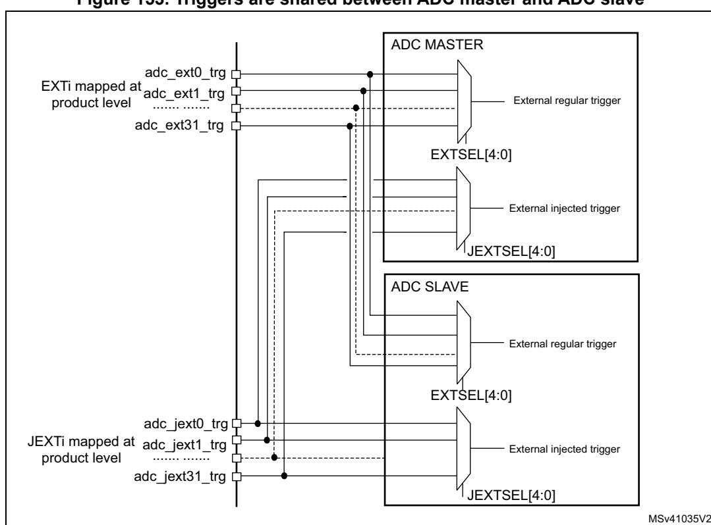

Figure 153. Triggers are shared between ADC master and ADC slave

Table 214 and Table 215 give all the possible external triggers of the three ADCs for regular and injected conversion.

Internal signal from on-chip timers

| Name         | Source     | Туре                                | EXTSEL[4:0] |
|--------------|------------|-------------------------------------|-------------|
| adc_ext_trg0 | tim1_oc1   | Internal signal from on-chip timers | 00000       |
| adc_ext_trg1 | tim1_oc2   | Internal signal from on-chip timers | 00001       |
| adc_ext_trg2 | tim1_oc3   | Internal signal from on-chip timers | 00010       |
| adc_ext_trg3 | tim2_oc2   | Internal signal from on-chip timers | 00011       |
| adc_ext_trg4 | tim3_trgo  | Internal signal from on-chip timers | 00100       |
| adc_ext_trg5 | tim4_oc4   | Internal signal from on-chip timers | 00101       |
| adc_ext_trg6 | exti11     | External pin                        | 00110       |
| adc_ext_trg7 | tim8_trgo  | Internal signal from on-chip timers | 00111       |
| adc_ext_trg8 | tim8_trgo2 | Internal signal from on-chip timers | 01000       |

Table 214. ADC1, ADC2 and ADC3 - External triggers for regular channels

978/3556 RM0399 Rev 4

tim1\_trgo

01001

**Table 214. ADC1, ADC2 and ADC3 - External triggers for regular channels (continued)**

| Name          | Source         | Type                                | EXTSEL[4:0] |
|---------------|----------------|-------------------------------------|-------------|
| adc_ext_trg10 | tim1_trgo2     | Internal signal from on-chip timers | 01010       |
| adc_ext_trg11 | tim2_trgo      | Internal signal from on-chip timers | 01011       |
| adc_ext_trg12 | tim4_trgo      | Internal signal from on-chip timers | 01100       |
| adc_ext_trg13 | tim6_trgo      | Internal signal from on-chip timers | 01101       |
| adc_ext_trg14 | tim15_trgo     | Internal signal from on-chip timers | 01110       |
| adc_ext_trg15 | tim3_oc4       | Internal signal from on-chip timers | 01111       |
| adc_ext_trg16 | hrtim1_adctrg1 | Internal signal from on-chip timers | 10000       |
| adc_ext_trg17 | hrtim1_adctrg3 | Internal signal from on-chip timers | 10001       |
| adc_ext_trg18 | lptim1_out     | Internal signal from on-chip timers | 10010       |
| adc_ext_trg19 | lptim2_out     | Internal signal from on-chip timers | 10011       |
| adc_ext_trg20 | lptim3_out     | Internal signal from on-chip timers | 10100       |
| adc_ext_trg21 | Reserved       | -                                   | 10101       |
| adc_ext_trg22 | Reserved       | -                                   | 10110       |
| adc_ext_trg23 | Reserved       | -                                   | 10111       |
| adc_ext_trg24 | Reserved       | -                                   | 11000       |
| adc_ext_trg25 | Reserved       | -                                   | 11001       |
| adc_ext_trg26 | Reserved       | -                                   | 11010       |
| adc_ext_trg27 | Reserved       | -                                   | 11011       |
| adc_ext_trg28 | Reserved       | -                                   | 11100       |
| adc_ext_trg29 | Reserved       | -                                   | 11101       |
| adc_ext_trg30 | Reserved       | -                                   | 11110       |
| adc_ext_trg31 | Reserved       | -                                   | 11111       |

**Table 215. ADC1, ADC2 and ADC3 - External triggers for injected channels** 

| Name          | Source     | Type                                | JEXTSEL[4:0] |
|---------------|------------|-------------------------------------|--------------|
| adc_jext_trg0 | tim1_trgo  | Internal signal from on-chip timers | 00000        |
| adc_jext_trg1 | tim1_oc4   | Internal signal from on-chip timers | 00001        |
| adc_jext_trg2 | tim2_trgo  | Internal signal from on-chip timers | 00010        |
| adc_jext_trg3 | tim2_oc1   | Internal signal from on-chip timers | 00011        |
| adc_jext_trg4 | tim3_oc4   | Internal signal from on-chip timers | 00100        |
| adc_jext_trg5 | tim4_trgo  | Internal signal from on-chip timers | 00101        |
| adc_jext_trg6 | exti15     | External pin                        | 00110        |
| adc_jext_trg7 | tim8_oc4   | Internal signal from on-chip timers | 00111        |
| adc_jext_trg8 | tim1_trgo2 | Internal signal from on-chip timers | 01000        |
| adc_jext_trg9 | tim8_trgo  | Internal signal from on-chip timers | 01001        |

RM0399 Rev 4 979/3556

adc\_jext\_trg10 tim8\_trgo2 Internal signal from on-chip timers 01010 adc\_jext\_trg11 tim3\_oc3 Internal signal from on-chip timers 01011 adc\_jext\_trg12 tim3\_trgo Internal signal from on-chip timers 01100 adc\_jext\_trg13 tim3\_oc1 Internal signal from on-chip timers 01101 adc\_jext\_trg14 tim6\_trgo Internal signal from on-chip timers 01110 adc\_jext\_trg15 tim15\_trgo Internal signal from on-chip timers 01111 adc\_jext\_trg16 hrtim1\_adctrg2 Internal signal from on-chip timers 10000 adc\_jext\_trg17 hrtim1\_adctrg4 Internal signal from on-chip timers 10001 adc\_jext\_trg18 lptim1\_out Internal signal from on-chip timers 10010 adc\_jext\_trg19 lptim2\_out Internal signal from on-chip timers 10011 adc\_jext\_trg20 lptim3\_out Internal signal from on-chip timers 10100 adc\_jext\_trg21 Reserved - 10101 adc\_jext\_trg22 Reserved - 10110 adc\_jext\_trg23 Reserved - 10111 adc\_jext\_trg24 Reserved - 11000 **Name Source Type JEXTSEL[4:0]**

adc\_jext\_trg25 Reserved - 11001 adc\_jext\_trg26 Reserved - 11010 adc\_jext\_trg27 Reserved - 11011 adc\_jext\_trg28 Reserved - 11100 adc\_jext\_trg29 Reserved - 11101 adc\_jext\_trg30 Reserved - 11110 adc\_jext\_trg31 Reserved - 11111

**Table 215. ADC1, ADC2 and ADC3 - External triggers for injected channels (continued)**

## **26.4.20 Injected channel management**

### **Triggered injection mode**

To use triggered injection, the JAUTO bit in the ADC\_CFGR register must be cleared.

- 1. Start the conversion of a group of regular channels either by an external trigger or by setting the ADSTART bit in the ADC\_CR register.
- 2. If an external injected trigger occurs, or if the JADSTART bit in the ADC\_CR register is set during the conversion of a regular group of channels, the current conversion is reset and the injected channel sequence switches are launched (all the injected channels are converted once).
- 3. Then, the regular conversion of the regular group of channels is resumed from the last interrupted regular conversion.
- 4. If a regular event occurs during an injected conversion, the injected conversion is not interrupted but the regular sequence is executed at the end of the injected sequence. *[Figure](#page-29-1) 154* shows the corresponding timing diagram.

*Note: When using triggered injection, one must ensure that the interval between trigger events is longer than the injection sequence. For instance, if the sequence length is 20 ADC clock cycles (that is two conversions with a sampling time of 1.5 clock periods), the minimum interval between triggers must be 21 ADC clock cycles.*

### **Auto-injection mode**

If the JAUTO bit in the ADC\_CFGR register is set, then the channels in the injected group are automatically converted after the regular group of channels. This can be used to convert a sequence of up to 20 conversions programmed in the ADC\_SQRy and ADC\_JSQR registers.

In this mode, the ADSTART bit in the ADC\_CR register must be set to start regular conversions, followed by injected conversions (JADSTART must be kept cleared). Setting the ADSTP bit aborts both regular and injected conversions (JADSTP bit must not be used).

In this mode, external trigger on injected channels must be disabled.

If the CONT bit is also set in addition to the JAUTO bit, regular channels followed by injected channels are continuously converted.

*Note: It is not possible to use both the auto-injected and discontinuous modes simultaneously.*

*When the DMA is used for exporting regular sequencer's data in JAUTO mode, it is necessary to program it in circular mode (CIRC bit set in DMA\_CCRx register). If the CIRC bit is reset (single-shot mode), the JAUTO sequence is stopped upon DMA Transfer Complete event.*

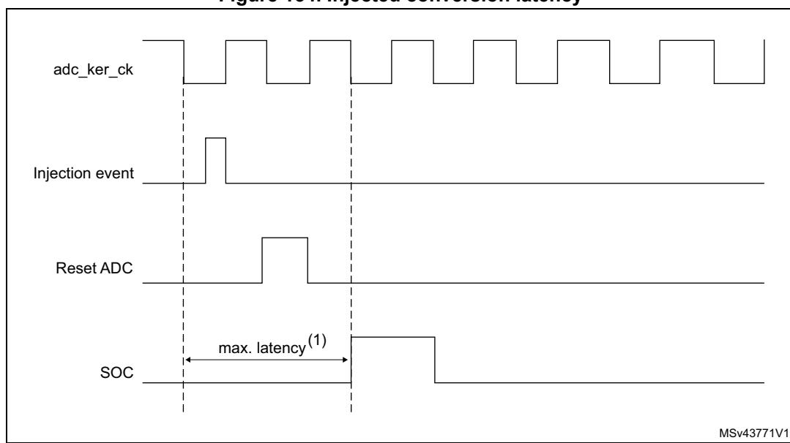

**Figure 154. Injected conversion latency**

1. The maximum latency value can be found in the electrical characteristics of the device datasheet.

## **26.4.21 Discontinuous mode (DISCEN, DISCNUM, JDISCEN)**

## **Regular group mode**

This mode is enabled by setting the DISCEN bit in the ADC\_CFGR register.

It is used to convert a short sequence (sub-group) of n conversions (n ≤ 8) that is part of the sequence of conversions selected in the ADC\_SQRy registers. The value of n is specified by writing to the DISCNUM[2:0] bits in the ADC\_CFGR register.

When an external trigger occurs, it starts the next n conversions selected in the ADC\_SQR registers until all the conversions in the sequence are done. The total sequence length is defined by the L[3:0] bits in the ADC\_SQR1 register.

### Example:

- DISCEN=1, n=3, channels to be converted = 1, 2, 3, 6, 7, 8, 9, 10, 11
  - 1st trigger: channels converted are 1, 2, 3 (an EOC event is generated at each conversion).
  - 2nd trigger: channels converted are 6, 7, 8 (an EOC event is generated at each conversion).
  - 3rd trigger: channels converted are 9, 10, 11 (an EOC event is generated at each conversion) and an EOS event is generated after the conversion of channel 11.
  - 4th trigger: channels converted are 1, 2, 3 (an EOC event is generated at each conversion).

– ...

- DISCEN=0, channels to be converted = 1, 2, 3, 6, 7, 8, 9, 10,11
  - 1st trigger: the complete sequence is converted: channel 1, then 2, 3, 6, 7, 8, 9, 10 and 11. Each conversion generates an EOC event and the last one also generates an EOS event.
  - all the next trigger events relaunch the complete sequence.

*Note: When a regular group is converted in discontinuous mode, no rollover occurs (the last subgroup of the sequence can have less than n conversions).*

> *When all subgroups are converted, the next trigger starts the conversion of the first subgroup. In the example above, the 4th trigger reconverts the channels 1, 2 and 3 in the 1st subgroup.*

> *It is not possible to have both discontinuous mode and continuous mode enabled. In this case (if DISCEN=1, CONT=1), the ADC behaves as if continuous mode was disabled.*

### **Injected group mode**

This mode is enabled by setting the JDISCEN bit in the ADC\_CFGR register. It converts the sequence selected in the ADC\_JSQR register, channel by channel, after an external injected trigger event. This is equivalent to discontinuous mode for regular channels where 'n' is fixed to 1.

When an external trigger occurs, it starts the next channel conversions selected in the ADC\_JSQR registers until all the conversions in the sequence are done. The total sequence length is defined by the JL[1:0] bits in the ADC\_JSQR register.

### Example:

- JDISCEN=1, channels to be converted = 1, 2, 3
  - 1st trigger: channel 1 converted (a JEOC event is generated)
  - 2nd trigger: channel 2 converted (a JEOC event is generated)
  - 3rd trigger: channel 3 converted and a JEOC event + a JEOS event are generated

– ...

*Note: When all injected channels have been converted, the next trigger starts the conversion of the first injected channel. In the example above, the 4th trigger reconverts the 1st injected channel 1.*

> *It is not possible to use both auto-injected mode and discontinuous mode simultaneously: the bits DISCEN and JDISCEN must be kept cleared by software when JAUTO is set.*

## **26.4.22 Queue of context for injected conversions**

A queue of context is implemented to anticipate up to 2 contexts for the next injected sequence of conversions. JQDIS bit of ADC\_CFGR register must be reset to enable this feature. Only hardware-triggered conversions are possible when the context queue is enabled.

This context consists of:

- Configuration of the injected triggers (bits JEXTEN[1:0] and JEXTSEL[4:0] in ADC\_JSQR register)
- Definition of the injected sequence (bits JSQx[4:0] and JL[1:0] in ADC\_JSQR register)

All the parameters of the context are defined into a single register ADC\_JSQR and this register implements a queue of 2 buffers, allowing the bufferization of up to 2 sets of parameters:

- The ADC\_JSQR register can be written at any moment even when injected conversions are ongoing.
- Each data written into the JSQR register is stored into the Queue of context.
- At the beginning, the Queue is empty and the first write access into the JSQR register immediately changes the context and the ADC is ready to receive injected triggers.
- Once an injected sequence is complete, the Queue is consumed and the context changes according to the next JSQR parameters stored in the Queue. This new context is applied for the next injected sequence of conversions.
- A Queue overflow occurs when writing into register JSQR while the Queue is full. This overflow is signaled by the assertion of the flag JQOVF. When an overflow occurs, the write access of JSQR register which has created the overflow is ignored and the queue of context is unchanged. An interrupt can be generated if bit JQOVFIE is set.
- Two possible behaviors are possible when the Queue becomes empty, depending on the value of the control bit JQM of register ADC\_CFGR:
  - If JQM=0, the Queue is empty just after enabling the ADC, but then it can never be empty during run operations: the Queue always maintains the last active context and any further valid start of injected sequence is served according to the last active context.
  - If JQM=1, the Queue can be empty after the end of an injected sequence or if the Queue is flushed. When this occurs, there is no more context in the queue and

RM0399 Rev 4 983/3556

hardware triggers are disabled. Therefore, any further hardware injected triggers are ignored until the software re-writes a new injected context into JSQR register.

- Reading JSQR register returns the current JSQR context which is active at that moment. When the JSQR context is empty, JSQR is read as 0x0000.
- The Queue is flushed when stopping injected conversions by setting JADSTP=1 or when disabling the ADC by setting ADDIS=1:
  - If JQM=0, the Queue is maintained with the last active context.
  - If JQM=1, the Queue becomes empty and triggers are ignored.

*Note: When configured in discontinuous mode (bit JDISCEN=1), only the last trigger of the injected sequence changes the context and consumes the Queue.The 1st trigger only consumes the queue but others are still valid triggers as shown by the discontinuous mode* 

- •*1st trigger, discontinuous. Sequence 1: context 1 consumed, 1st conversion carried out*
- •*2nd trigger, disc. Sequence 1: 2nd conversion.*

*example below (length = 3 for both contexts):*

- •*3rd trigger, discontinuous. Sequence 1: 3rd conversion.*
- •*4th trigger, discontinuous. Sequence 2: context 2 consumed, 1st conversion carried out.*
- •*5th trigger, discontinuous. Sequence 2: 2nd conversion.*
- •*6th trigger, discontinuous. Sequence 2: 3rd conversion.*

*Note: When queue of context enabled (bit JQDIS=0), only hardware trigger can be used.*

## **Behavior when changing the trigger or sequence context**

The *[Figure 155](#page-32-0)* and *[Figure 156](#page-33-0)* show the behavior of the context Queue when changing the sequence or the triggers.

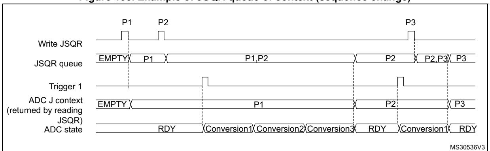

**Figure 155. Example of JSQR queue of context (sequence change)**

1. Parameters:

P1: sequence of 3 conversions, hardware trigger 1

P2: sequence of 1 conversion, hardware trigger 1

P3: sequence of 4 conversions, hardware trigger 1

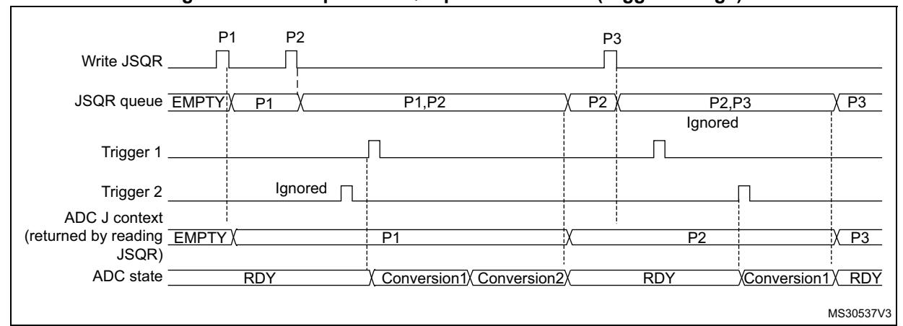

**Figure 156. Example of JSQR queue of context (trigger change)**

- 1. Parameters:
  - P1: sequence of 2 conversions, hardware trigger 1
  - P2: sequence of 1 conversion, hardware trigger 2
  - P3: sequence of 4 conversions, hardware trigger 1

## **Queue of context: Behavior when a queue overflow occurs**

The *[Figure 157](#page-33-1)* and *[Figure 158](#page-34-0)* show the behavior of the context Queue if an overflow occurs before or during a conversion.

MS30538V3 JSQR queue Write JSQR P1 P2 EMPTY Trigger 1 ADC state RDY Conversion2 RDY Conversion1 P3 JQOVF Cleared by SW P1 P1, P2 P4 P2 EMPTY P1 P2 P2, P4 => Overflow, ignored JEOS ADC J context (returned by reading JSQR) Trigger 2 Conversion1

**Figure 157. Example of JSQR queue of context with overflow before conversion** 

- 1. Parameters:
  - P1: sequence of 2 conversions, hardware trigger 1
  - P2: sequence of 1 conversion, hardware trigger 2
  - P3: sequence of 3 conversions, hardware trigger 1
  - P4: sequence of 4 conversions, hardware trigger 1

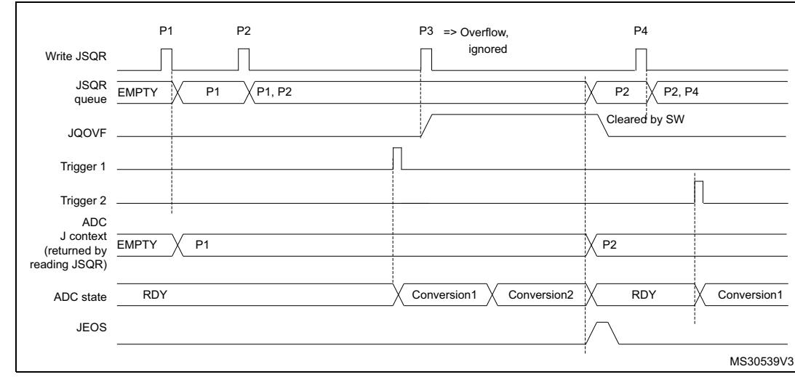

**Figure 158. Example of JSQR queue of context with overflow during conversion** 

1. Parameters:

P1: sequence of 2 conversions, hardware trigger 1

P2: sequence of 1 conversion, hardware trigger 2

P3: sequence of 3 conversions, hardware trigger 1

P4: sequence of 4 conversions, hardware trigger 1

It is recommended to manage the queue overflows as described below:

- After each P context write into JSQR register, flag JQOVF shows if the write has been ignored or not (an interrupt can be generated).
- Avoid Queue overflows by writing the third context (P3) only once the flag JEOS of the previous context P2 has been set. This ensures that the previous context has been consumed and that the queue is not full.

## **Queue of context: Behavior when the queue becomes empty**

*[Figure 159](#page-34-1)* and *[Figure 160](#page-35-0)* show the behavior of the context Queue when the Queue becomes empty in both cases JQM=0 or 1.

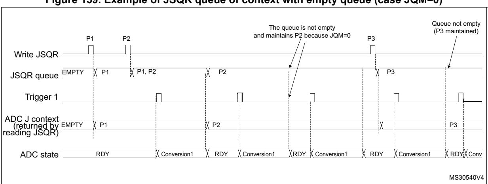

**Figure 159. Example of JSQR queue of context with empty queue (case JQM=0)**

1. Parameters:

P1: sequence of 1 conversion, hardware trigger 1

P2: sequence of 1 conversion, hardware trigger 1

P3: sequence of 1 conversion, hardware trigger 1

Note:

When writing P3, the context changes immediately. However, because of internal resynchronization, there is a latency and if a trigger occurs just after or before writing P3, it can happen that the conversion is launched considering the context P2. To avoid this situation, the user must ensure that there is no ADC trigger happening when writing a new context that applies immediately.

Figure 160. Example of JSQR queue of context with empty queue (case JQM=1)

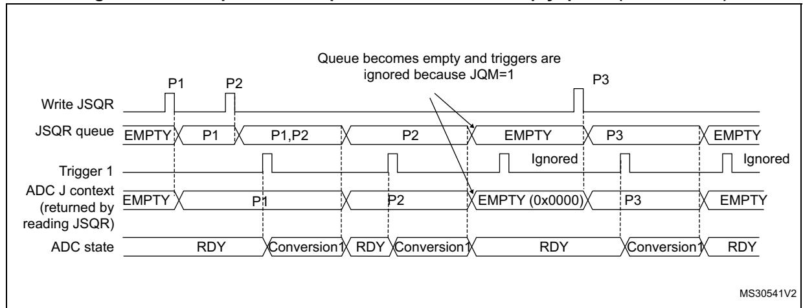

- Parameters: P1: sequence of 1 conversion, hardware trigger 1
  - P2: sequence of 1 conversion, hardware trigger 1
  - P3: sequence of 1 conversion, hardware trigger 1

### Flushing the gueue of context

The figures below show the behavior of the context Queue in various situations when the queue is flushed.

Figure 161. Flushing JSQR queue of context by setting JADSTP=1 (JQM=0). Case when JADSTP occurs during an ongoing conversion.

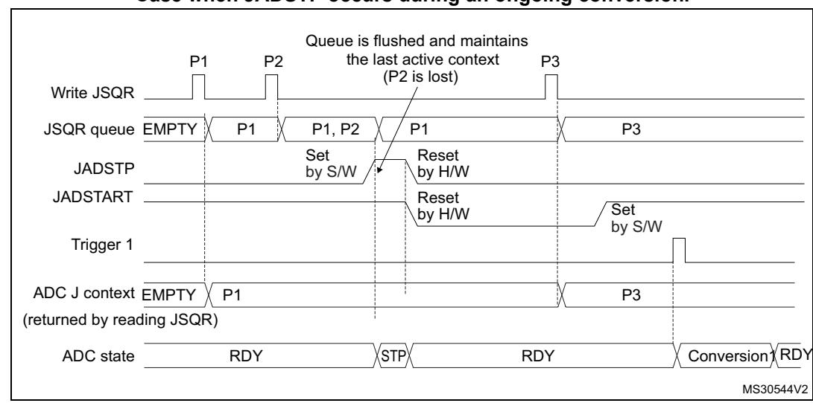

- Parameters:
  - P1: sequence of 1 conversion, hardware trigger 1 P2: sequence of 1 conversion, hardware trigger 1

  - P3: sequence of 1 conversion, hardware trigger 1

RM0399 Rev 4

987/3556

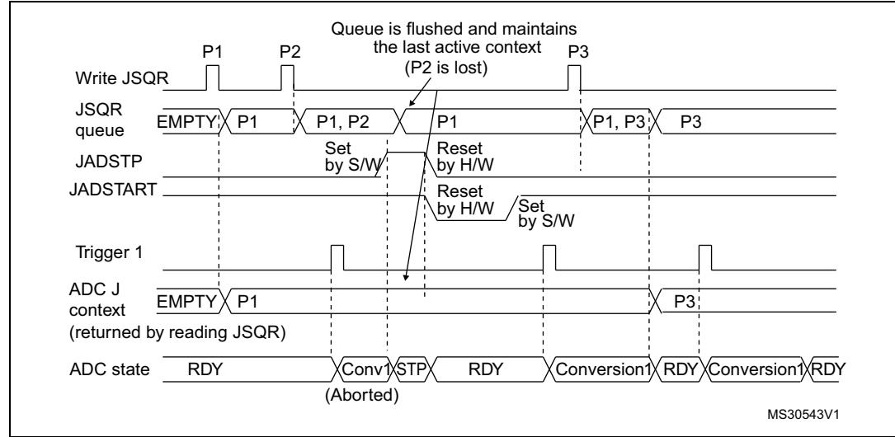

- - P1: sequence of 1 conversion, hardware trigger 1
  - P2: sequence of 1 conversion, hardware trigger 1
  - P3: sequence of 1 conversion, hardware trigger 1

Figure 163. Flushing JSQR queue of context by setting JADSTP=1 (JQM=0). Case when JADSTP occurs outside an ongoing conversion

- Parameters: P1: sequence of 1 conversion, hardware trigger 1
  - P2: sequence of 1 conversion, hardware trigger 1
  - P3: sequence of 1 conversion, hardware trigger 1

RM0399 Rev 4 988/3556

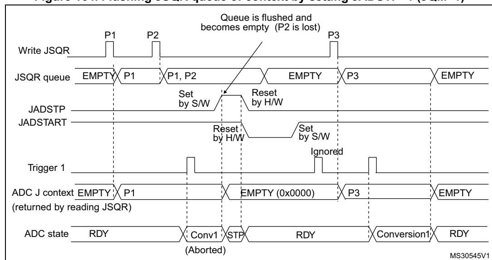

Figure 164. Flushing JSQR queue of context by setting JADSTP=1 (JQM=1)

Parameters:

P1: sequence of 1 conversion, hardware trigger 1 P2: sequence of 1 conversion, hardware trigger 1

P3: sequence of 1 conversion, hardware trigger 1

Figure 165. Flushing JSQR queue of context by setting ADDIS=1 (JQM=0)

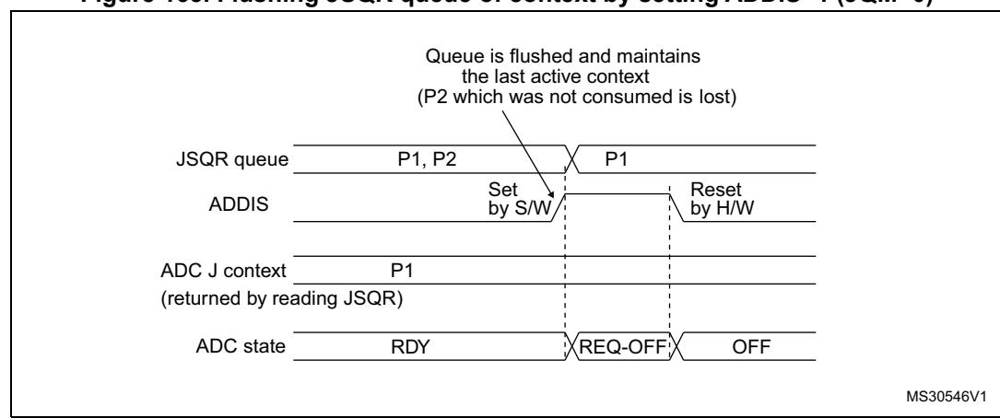

Parameters:
P1: sequence of 1 conversion, hardware trigger 1
P2: sequence of 1 conversion, hardware trigger 1
P3: sequence of 1 conversion, hardware trigger 1

RM0399 Rev 4

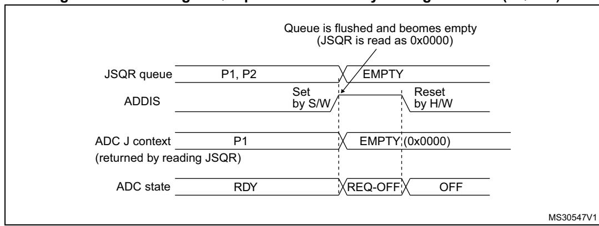

**Figure 166. Flushing JSQR queue of context by setting ADDIS=1 (JQM=1)**

1. Parameters:

P1: sequence of 1 conversion, hardware trigger 1 P2: sequence of 1 conversion, hardware trigger 1

P3: sequence of 1 conversion, hardware trigger 1

## **Queue of context: Starting the ADC with an empty queue**

The following procedure must be followed to start ADC operation with an empty queue, in case the first context is not known at the time the ADC is initialized. This procedure is only applicable when JQM bit is reset:

- 5. Write a dummy JSQR with JEXTEN not equal to 0 (otherwise triggering a software conversion)
- 6. Set JADSTART
- 7. Set JADSTP
- 8. Wait until JADSTART is reset
- 9. Set JADSTART.

### Disabling the queue

It is possible to disable the queue by setting bit JQDIS=1 into the ADC\_CFGR register.

# **Queue of context: Programming of the register ADC\_JSQR**

When the injected conversion queue of context is enabled (JQDIS=0), the ADC\_JSQR must be programmed at one register write access. As JL[1:0] register define the number of the injected sequence, corresponding JSQ1 to JSQ4 must be written at same time. If ADC\_JSQR is reprogrammed before the injected conversion start, reprogrammed data is put on the queue. When queue of context is empty, ADC\_JSQR read back as 0x0000. Register access should not use the 'read modify write' sequence.

When ADC\_JSQR is programmed when already two contexts are queued, it raises JQOVF flag and generate the interrupt.

## **26.4.23 Programmable resolution (RES) - fast conversion mode**

It is possible to perform faster conversion by reducing the ADC resolution.

The resolution can be configured to be either 16, 14, 12, 10, 8 bits by programming the control bits RES[1:0]. *[Figure 171](#page-43-0)*, *[Figure 172](#page-43-1)*, *[Figure 173](#page-44-0)* and *[Figure 174](#page-44-1)* show the conversion result format with respect to the resolution as well as to the data alignment.

Lower resolution allows faster conversion time for applications where high-data precision is not required. It reduces the conversion time spent by the successive approximation steps according to *[Table 216](#page-39-0)*.

| RES [2:0] | TSAR (ADC clock cycles) | TSAR (ns) at Fadc_ker_ck=24 MHz | Tadc_ker_ck (ADC clock cycles) (with Sampling Time= 1.5 ADC clock cycles) | Tadc_ker_ck (ns) at Fadc_ker_ck=24 MHz |
|--------------|----------------------------|---------------------------------------|------------------------------------------------------------------------------------|-------------------------------------------------|
| 16 bits      | 8.5 ADC clock cycles       | 354.2                                 | 10 ADC clock cycles                                                                | 416.7                                           |
| 14 bits      | 7.5 ADC clock cycles       | 312.5                                 | 9 ADC clock cycles                                                                 | 375                                             |
| 12 bits      | 6.5 ADC clock cycles       | 270.8                                 | 8 ADC clock cycles                                                                 | 333.3                                           |
| 10 bits      | 5.5 ADC clock cycles       | 229.2                                 | 7 ADC clock cycles                                                                 | 291.7                                           |
| 8 bits       | 4.5 ADC clock cycles       | 187.5                                 | 6 ADC clock cycles                                                                 | 250.0                                           |

**Table 216. TSAR timings depending on resolution**

# **26.4.24 End of conversion, end of sampling phase (EOC, JEOC, EOSMP)**

The ADC notifies the application for each end of regular conversion (EOC) event and each injected conversion (JEOC) event.

The ADC sets the EOC flag as soon as a new regular conversion data is available in the ADC\_DR register. An interrupt can be generated if bit EOCIE is set. EOC flag is cleared by the software either by writing 1 to it or by reading ADC\_DR.

The ADC sets the JEOC flag as soon as a new injected conversion data is available in one of the ADC\_JDRy register. An interrupt can be generated if bit JEOCIE is set. JEOC flag is cleared by the software either by writing 1 to it or by reading the corresponding ADC\_JDRy register.

The ADC also notifies the end of Sampling phase by setting the status bit EOSMP (for regular conversions only). EOSMP flag is cleared by software by writing 1 to it. An interrupt can be generated if bit EOSMPIE is set.

## **26.4.25 End of conversion sequence (EOS, JEOS)**

The ADC notifies the application for each end of regular sequence (EOS) and for each end of injected sequence (JEOS) event.

The ADC sets the EOS flag as soon as the last data of the regular conversion sequence is available in the ADC\_DR register. An interrupt can be generated if bit EOSIE is set. EOS flag is cleared by the software either by writing 1 to it.

The ADC sets the JEOS flag as soon as the last data of the injected conversion sequence is complete. An interrupt can be generated if bit JEOSIE is set. JEOS flag is cleared by the software either by writing 1 to it.

# **26.4.26 Timing diagrams example (single/continuous modes, hardware/software triggers)**

**Figure 167. Single conversions of a sequence, software trigger**

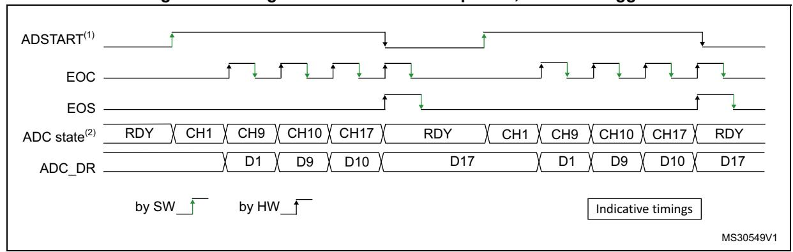

- 1. EXTEN=0x0, CONT=0
- 2. Channels selected = 1,9, 10, 17; AUTDLY=0.

**Figure 168. Continuous conversion of a sequence, software trigger**

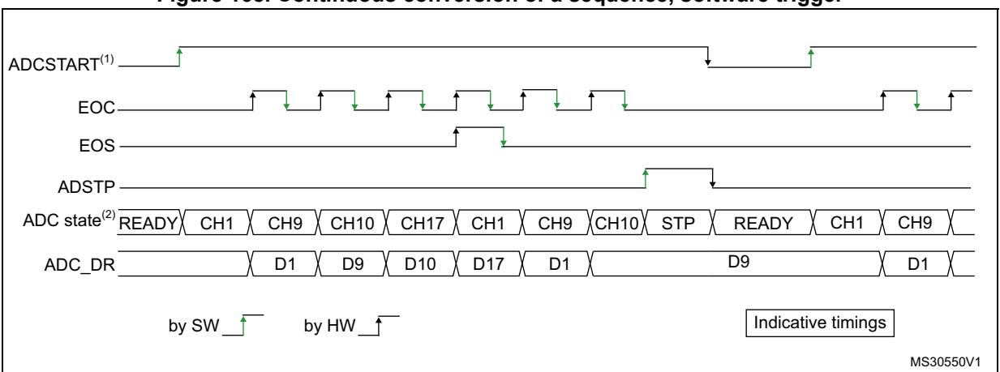

- 1. EXTEN=0x0, CONT=1
- 2. Channels selected = 1,9, 10, 17; AUTDLY=0.

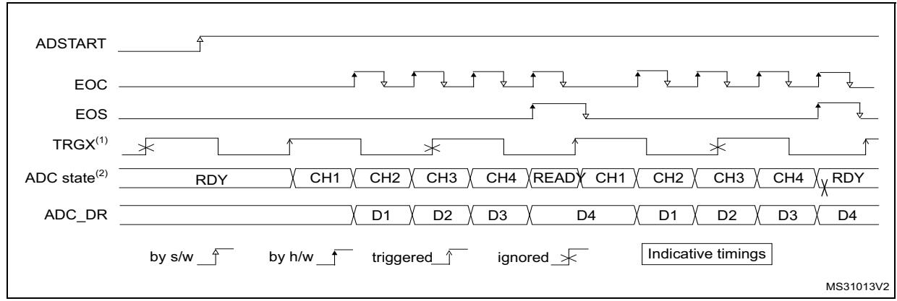

**Figure 169. Single conversions of a sequence, hardware trigger**

- 1. TRGx (over-frequency) is selected as trigger source, EXTEN = 01, CONT = 0
- 2. Channels selected = 1, 2, 3, 4; AUTDLY=0.

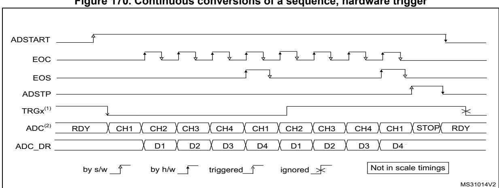

**Figure 170. Continuous conversions of a sequence, hardware trigger**

- 1. TRGx is selected as trigger source, EXTEN = 10, CONT = 1
- 2. Channels selected = 1, 2, 3, 4; AUTDLY=0.

## **26.4.27 Data management**

**Data register, data alignment and offset (ADC\_DR, ADC\_JDRy, OFFSETy, OFFSETy\_CH, OVSS, LSHIFT, RSHIFT, SSATE)**

## **Data and alignment**

At the end of each regular conversion channel (when EOC event occurs), the result of the converted data is stored into the ADC\_DR data register which is 32 bits wide.

At the end of each injected conversion channel (when JEOC event occurs), the result of the converted data is stored into the corresponding ADC\_JDRy data register which is 32 bits wide.

The OVSS[3:0] and LSHIFT[3:0] bitfields in the ADC\_CFGR2 register selects the alignment of the data stored after conversion. Data can be right- or left-aligned as shown in *[Figure 171](#page-43-0)*, *[Figure 172](#page-43-1)*, *[Figure 173](#page-44-0)* and *[Figure 174](#page-44-1)*.

*Note: The data can be re-aligned in normal and in oversampling mode.*

RM0399 Rev 4 993/3556

#### Offset

An offset y (y=1, 2, 3, 4) can be applied to a channel by programming a value different from 0 in OFFSETy[25:0] bitfield into ADC\_OFRy register. The channel to which the offset is applied is programmed into the bits OFFSETy\_CH[4:0] of ADC\_OFRy register. In this case, the converted value is decreased by the user-defined offset written in the bits OFFSETy[25:0]. The result may be a negative value so the read data is signed and the SEXT bit represents the extended sign value.

The offset value should be lower than the max conversion value (ex. 16bit mode, offset value max is 0xFFFF).

The offset correction is also supported in oversampling mode. For the oversampling mode, offset is subtracted before OVSS right shift applied.

*Table 217* describes how the comparison is performed for all the possible resolutions for analog watchdog 1, 2, 3.

| Resolution         | Subtraction between raw converted data and offset: |              |                       | Comments                                        |  |
|--------------------|----------------------------------------------------|--------------|-----------------------|-------------------------------------------------|--|
| (bits RES[2:0]) | Raw Converted Data, left aligned                   | Result       |                       |                                                 |  |
| 16 bits            | DATA[15:0]                                         | OFFSET[25:0] | signed 27-bit data | -                                               |  |
| 14 bits            | DATA[15:2],00                                      | OFFSET[25:0] | signed 27-bit data | The user must configure OFFSET[1:0] to 00       |  |
| 12 bits            | DATA[15:4],00 00                                | OFFSET[25:0] | signed 27-bit data | The user must configure OFFSET[3:0] to 0000     |  |
| 10 bits            | DATA[15:6],00 0000                              | OFFSET[25:0] | signed 27-bit data | The user must configure OFFSET[5:0] to 000000   |  |
| 8 bits             | DATA[15:8],00 0000                              | OFFSET[25:0] | signed 27-bit data | The user must configure OFFSET[7:0] to 00000000 |  |

Table 217. Offset computation versus data resolution

When reading data from ADC\_DR (regular channel) or from ADC\_JDRy (injected channel, y=1,2,3,4), the offset compensation is disabled when ADC\_OFRy [25:0] bitfield is reset. Otherwise, the offset for ADC\_OFRy[30:26] channel is enabled.

Figure 171, Figure 172, Figure 173 and Figure 174 show alignments for signed and unsigned data together with corresponding OVSS and LSHIFT values.

Figure 171. Right alignment (offset disabled, unsigned value)

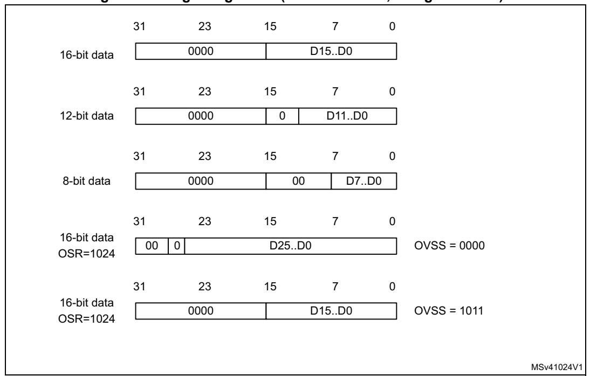

Figure 172. Right alignment (offset enabled, signed value)

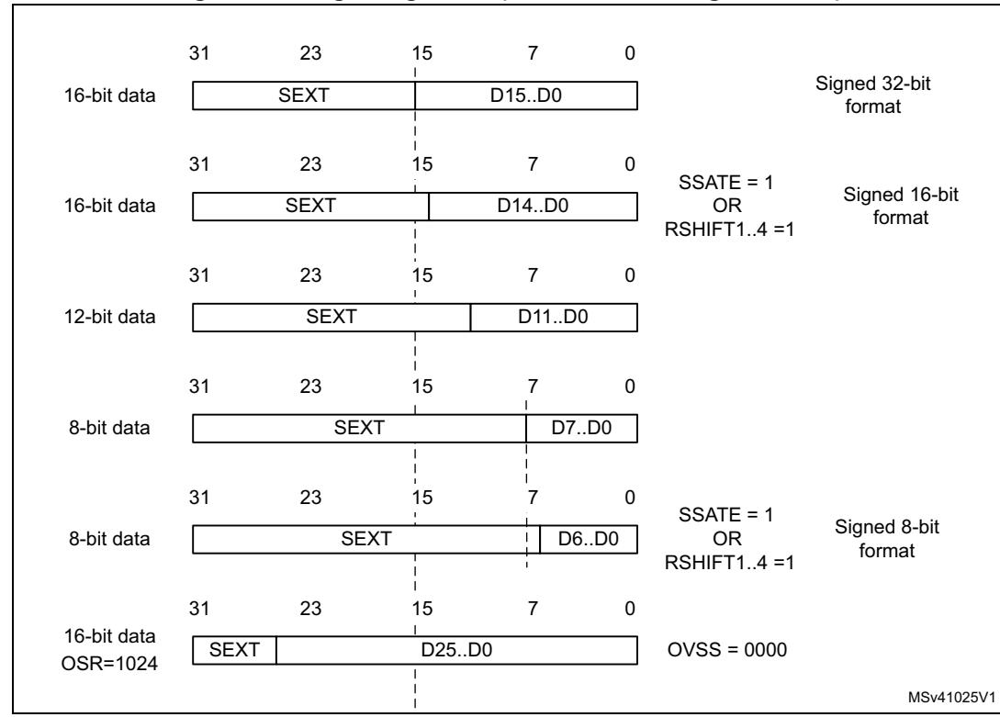

4

31 23 7 0 15 16-bit data 0000 D15..D0 LSHIFT = 0 7 31 23 15 0 12-bit data 0000 D11..D0 0 LSHIFT = 4 31 23 15 7 0 8-bit data 0000 00 D7..D0 LSHIFT = 0 31 23 15 7 0 16-bit data D25..D0 0 LSHIFT = 6 OSR=1024 MSv41026V1

Figure 173. Left alignment (offset disabled, unsigned value)

Figure 174. Left alignment (offset enabled, signed value)

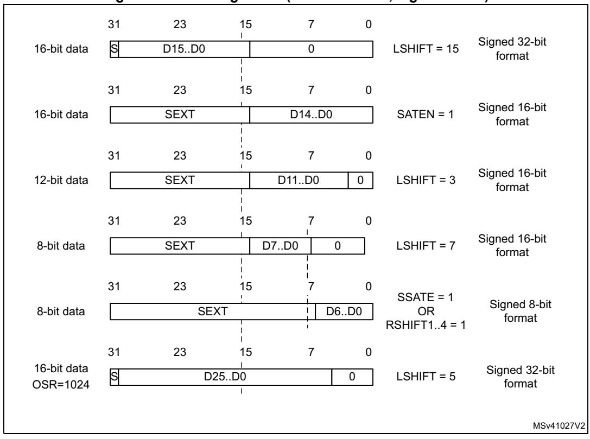

## 16-bit and 8-bit signed format management: RSHIFTx,SSATE

The offset correction sign-extends the data format, resulting in an unsigned 16-bit conversion being extended to 17-bit signed format, for instance.

Three options are offered for formatting 8-bit and 16-bit conversion results.

For each offset correction channel 1 to 4, a RSHIFT1..4 bit in the ADC\_CFGR2 register allows to have the result right-shifted 1-bit and have it fitting a standard 8 or 16-bit format.

Another option is to have the result saturated to the 16-bit and 8-bit signed formats, for the following cases only: RES[2:0] = 000 (16-bit format) and RES[2:0] = 111 (8-bit format).

This mode is enabled with the SSATE bit in the ADC\_OFRy register.

The table below summarizes the 3 available use case for 16-bit format.

**Table 218. 16-bit data formats**

| SSATE | RSHIFTx | Format                                                                           | Data range (offset = 0x8000) |
|-------|---------|----------------------------------------------------------------------------------|---------------------------------|
| 0     | 0       | Sign-extended 17-bit significant data SEXT[31:16] DATA[15:0]                  | 0x00007FFF - 0x FFFF8000        |
| 0     | 1       | Sign-extended right-shifted 16-bit significant data SEXT[31:15] DATA[14:0] | 0x3FFF - 0xC000                 |
| 1     | 0       | Sign-extended saturated 16-bit significant data SEXT[31:15] DATA[14:0]        | 7FFF - 0x8000                   |
| 1     | 1       | Reserved                                                                         | -                               |

Numerical examples are given in *[Table 219](#page-45-0)* with 3 different offset values.

**Table 219. Numerical examples for 16-bit format (bold indicates saturation)**

| Raw conversion result | Offset value | Result SSATE = 0 RSHIFT = 0 | Result SSATE = 0 RSHIFT = 1 | Result SSATE = 1 RSHIFT = 0 |
|--------------------------|--------------|-----------------------------------|-----------------------------------|-----------------------------------|
| 0xFFFF                   |              | 0x0000 7FFF                       | 3FFF                              | 7FFF                              |
| 0x8000                   | 0x8000       | 0x0000 0000                       | 0                                 | 0                                 |
| 0x0000                   |              | 0xFFFF 8000                       | C000                              | 8000                              |
| 0xFFFF                   |              | 0x0000 7FDF                       | 3FEF                              | 7FDF                              |
| 0x8000                   | 0x8020       | 0xFFFF FFE0                       | FFF0                              | FFE0                              |
| 0x0000                   |              | 0xFFFF 7FE0                       | BFF0                              | 8000                              |
| 0xFFFF                   |              | 0x0000 800F                       | 4007                              | 7FFF                              |
| 0x8000                   | 0x7FF0       | 0x0000 0010                       | 8                                 | 0010                              |
| 0x0000                   |              | 0xFFFF 8010                       | C008                              | 8010                              |

When oversampling mode is active, the SSATE and RSHIFT1..4 bits are not supported.

## **ADC overrun (OVR, OVRMOD)**

The overrun flag (OVR) notifies of a buffer overrun event when the regular converted data has not been read (by the CPU or the DMA) before ADC\_DR FIFO (eight stages) is overflowed.

The OVR flag is set when a new conversion completes while ADC\_CR register FIFO was full. An interrupt is generated if OVRIE bit is set to 1.

When an overrun condition occurs, the ADC is still operating and can continue to convert unless the software decides to stop and reset the sequence by setting ADSTP to 1.

OVR flag is cleared by software by writing 1 to it.

Data can be configured to be preserved or overwritten when an overrun event occurs by programming the OVRMOD control bit of the ADC\_CFGR register:

### • OVRMOD = 0

The overrun event preserves the data register from being overwritten: the old data is maintained up to ADC\_DR FIFO depth (8 data) and the new conversion is discarded and lost. If OVR remains at 1, any further conversion is be performed but the resulting data is also dicarded.

## • OVRMOD = 1

The data register is overwritten with the last conversion result and the previous unread data is lost. In this mode, ADC\_DR FIFO is disabled. If OVR remains at 1, any further conversion is performed normally and the ADC\_DR register always contains the latest converted data.

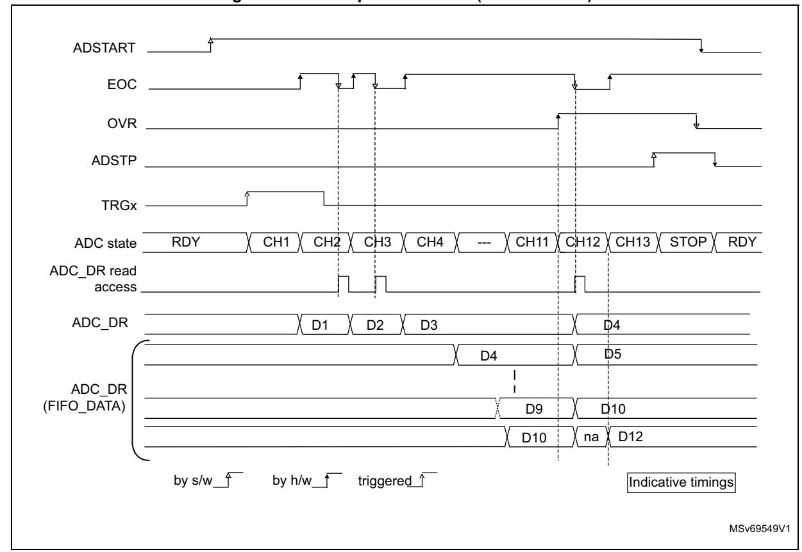

**Figure 175. Example of overrun (OVRMOD = 0)**

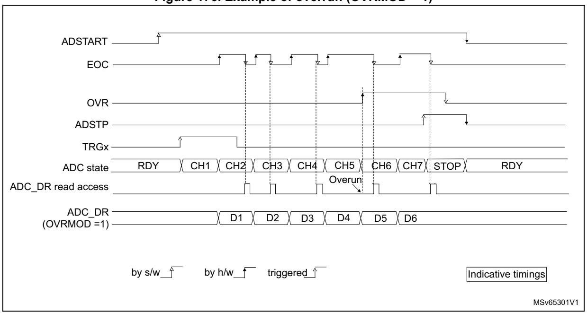

*Note: There is no overrun detection on the injected channels since there is a dedicated data register for each of the four injected channels.*

### **Managing a sequence of conversion without using the DMA**

If the conversions are slow enough, the conversion sequence can be handled by the software. In this case the software must use the EOC flag and its associated interrupt to handle each data. Each time a conversion is complete, EOC is set and the ADC\_DR register can be read. OVRMOD should be configured to 0 to manage overrun events or FIFO overflows as errors.

## **Managing conversions without using the DMA and without overrun**

It may be useful to let the ADC convert one or more channels without reading the data each time (if there is an analog watchdog for instance). In this case, the OVRMOD bit must be configured to 1 and OVR flag should be ignored by the software. An overrun event does not prevent the ADC from continuing to convert, and the ADC\_DR register always contains the latest conversion.

### **Managing conversions using the DMA**

Since converted channel values are stored into a unique data register, it is useful to use DMA for conversion of more than one channel. This avoids the loss of the data already stored in the ADC\_DR register.

When the DMA mode is enabled (DMNGT bit = 01 or 11 in the ADC\_CFGR register in single ADC mode or MDMA different from 0b00 in dual ADC mode), a DMA request is generated after each conversion of a channel. This allows the transfer of the converted data from the ADC\_DR register to the destination location selected by the software.

Despite this, if an overrun occurs (OVR=1) because the DMA could not serve the DMA transfer request in time, the ADC stops generating DMA requests and the data corresponding to the new conversion is not transferred by the DMA. Which means that all the data transferred to the RAM can be considered as valid.

Depending on the configuration of OVRMOD bit, the data is either preserved or overwritten (refer to *[Section : ADC overrun \(OVR, OVRMOD\)](#page-46-0)*).

The DMA transfer requests are blocked until the software clears the OVR bit.

Two different DMA modes are proposed depending on the application use and are configured with bit DMNGT of the ADC\_CFGR register in single ADC mode, or with bit DAMDF of the ADCx\_CCR register in dual ADC mode:

- DMA one shot mode (DMNGT bit = 01). This mode is suitable when the DMA is programmed to transfer a fixed number of data.
- DMA circular mode (DMNGT bit = 11) This mode is suitable when programming the DMA in circular mode.

## **DMA one shot mode (DMNGT=01)**

In this mode, the ADC generates a DMA transfer request each time a new conversion data is available and stops generating DMA requests once the DMA has reached the last DMA transfer (when a transfer complete interrupt occurs - refer to DMA section) even if a conversion has been started again.

When the DMA transfer is complete (all the transfers configured in the DMA controller have been done):

- The content of the ADC data register is frozen.
- Any ongoing conversion is aborted with partial result discarded.
- No new DMA request is issued to the DMA controller. This avoids generating an overrun error if there are still conversions which are started.
- Scan sequence is stopped and reset.
- The DMA is stopped.

## **DMA circular mode (DMNGT=11)**

In this mode, the ADC generates a DMA transfer request each time a new conversion data is available in the data register, even if the DMA has reached the last DMA transfer. This allows configuring the DMA in circular mode to handle a continuous analog input data stream.

### **DMA with FIFO**

The output data register has eight-stage FIFO. Two different DMA requests are generated parallel. When a data is available, "SREQ single request" generated, when 4 data are available, "BREQ burst request" generated. DMA2 can be programmed either single transfer mode or incremental burst mode(4 beats), according to this mode, correct request line is selected by the DMA2. Please refer to the DMA2 chapter for further information.

## **26.4.28 Managing conversions using the DFSDM**

The ADC conversion results can be transferred directly to the Digital Filter for Sigma Delta Modulators (DFSDM).

In this case, the DMNGT[1:0] bits must be set to 10.

The ADC transfers 16 least significant bits of the regular data register data to the DFSDM, which in turns resets the EOC flag once the transfer is effective.

The data format must be 16-bit signed:

ADC\_DR[31:16] = don't care

ADC\_DR[15] = sign

ADC\_DR[14:0] = data

Any value above 16-bit signed format is truncated.

## **26.4.29 Dynamic low-power features**

## **Auto-delayed conversion mode (AUTDLY)**

The ADC implements an auto-delayed conversion mode controlled by the AUTDLY configuration bit. Auto-delayed conversions are useful to simplify the software as well as to optimize performance of an application clocked at low frequency where there would be risk of encountering an ADC overrun.

When AUTDLY=1, a new conversion can start only if all the previous data of the same group has been treated:

- For a regular conversion: once the ADC\_DR register has been read or if the EOC bit has been cleared (see *[Figure 177](#page-51-0)*).
- For an injected conversion: when the JEOS bit has been cleared (see *[Figure 178](#page-51-1)*).

This is a way to automatically adapt the speed of the ADC to the speed of the system which reads the data.

The delay is inserted after each regular conversion (whatever DISCEN=0 or 1) and after each sequence of injected conversions (whatever JDISCEN=0 or 1).

*Note: There is no delay inserted between each conversions of the injected sequence, except after the last one.*

> During a conversion, a hardware trigger event (for the same group of conversions) occurring during this delay is ignored.

*Note: This is not true for software triggers where it remains possible during this delay to set the bits ADSTART or JADSTART to re-start a conversion: it is up to the software to read the data before launching a new conversion.*

> No delay is inserted between conversions of different groups (a regular conversion followed by an injected conversion or conversely):

- If an injected trigger occurs during the automatic delay of a regular conversion, the injected conversion starts immediately (see *[Figure 178](#page-51-1)*).
- Once the injected sequence is complete, the ADC waits for the delay (if not ended) of the previous regular conversion before launching a new regular conversion (see *[Figure 180](#page-53-0)*).

The behavior is slightly different in auto-injected mode (JAUTO=1) where a new regular conversion can start only when the automatic delay of the previous injected sequence of conversion has ended (when JEOS has been cleared). This is to ensure that the software can read all the data of a given sequence before starting a new sequence (see *[Figure 181](#page-53-1)*).

To stop a conversion in continuous auto-injection mode combined with autodelay mode (JAUTO=1, CONT=1 and AUTDLY=1), follow the following procedure:

- 1. Wait until JEOS=1 (no more conversions are restarted)
- 2. Clear JEOS,
- 3. Set ADSTP=1
- 4. Read the regular data.

If this procedure is not respected, a new regular sequence can re-start if JEOS is cleared after ADSTP has been set.

In AUTDLY mode, a hardware regular trigger event is ignored if it occurs during an already ongoing regular sequence or during the delay that follows the last regular conversion of the sequence. It is however considered pending if it occurs after this delay, even if it occurs during an injected sequence of the delay that follows it. The conversion then starts at the end of the delay of the injected sequence.

In AUTDLY mode, a hardware injected trigger event is ignored if it occurs during an already ongoing injected sequence or during the delay that follows the last injected conversion of the sequence.

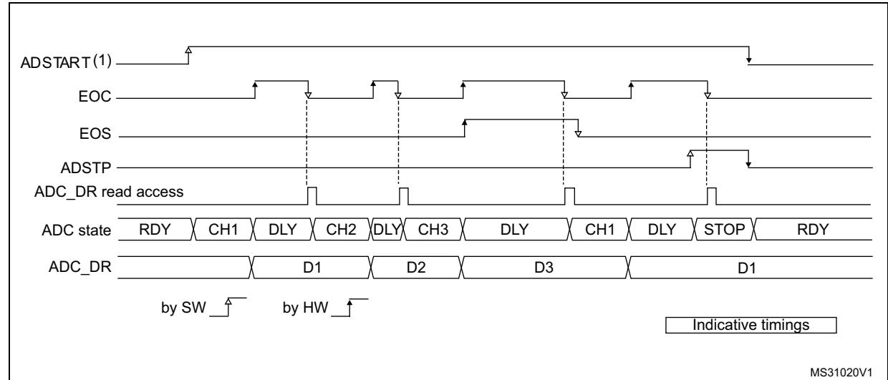

Figure 177. AUTDLY=1, regular conversion in continuous mode, software trigger

- 1. AUTDLY=1
- 2. Regular configuration: EXTEN=0x0 (SW trigger), CONT=1, CHANNELS = 1,2,3
- 3. Injected configuration DISABLED

Figure 178. AUTDLY=1, regular HW conversions interrupted by injected conversions (DISCEN=0; JDISCEN=0)

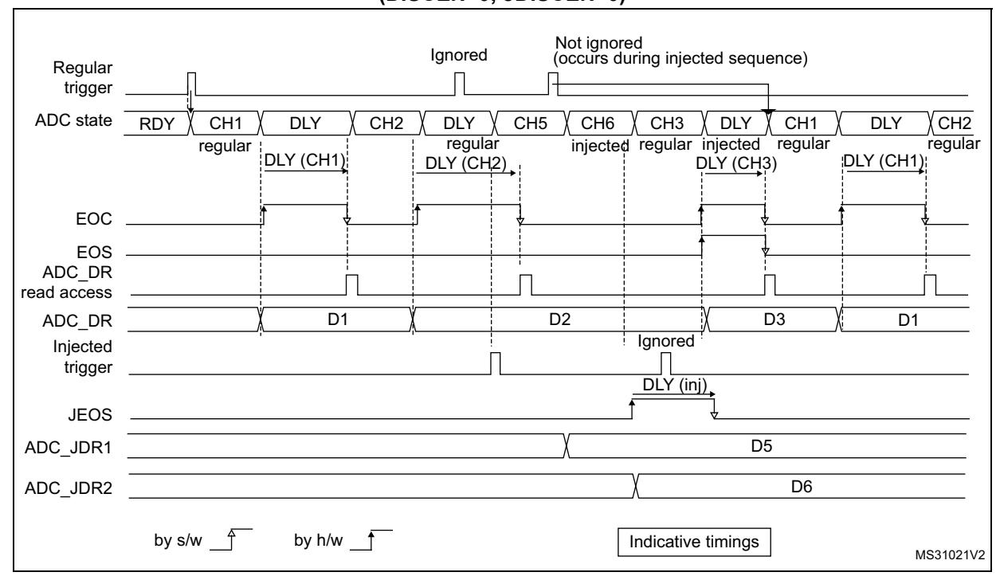

- 1. AUTDLY=1
- 2. Regular configuration: EXTEN=0x1 (HW trigger), CONT=0, DISCEN=0, CHANNELS = 1, 2, 3
- 3. Injected configuration: JEXTEN=0x1 (HW Trigger), JDISCEN=0, CHANNELS = 5,6

5

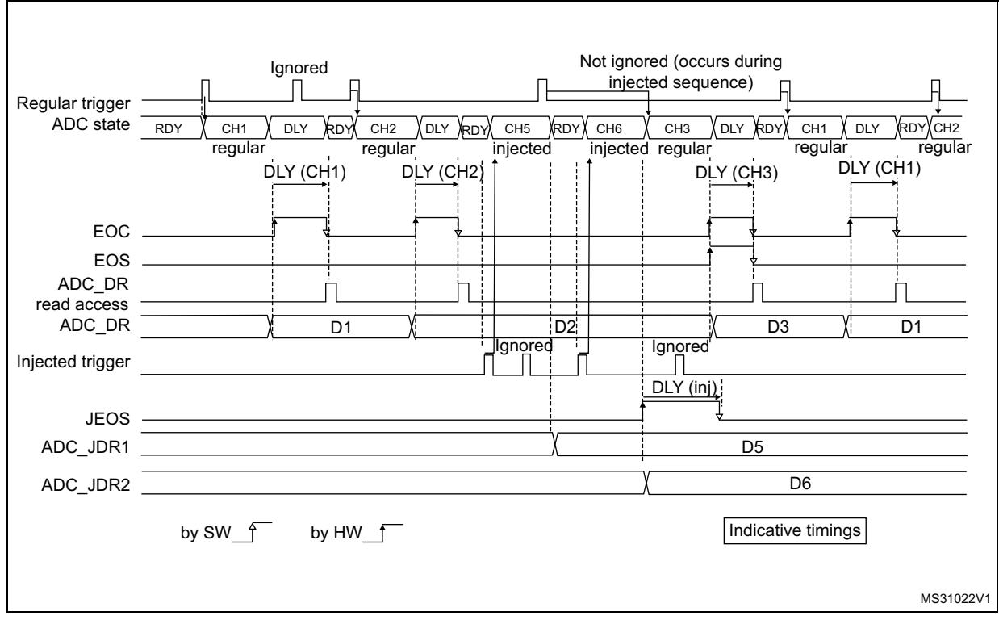

**Figure 179. AUTDLY=1, regular HW conversions interrupted by injected conversions (DISCEN=1, JDISCEN=1)**

- 1. AUTDLY=1
- 2. Regular configuration: EXTEN=0x1 (HW trigger), CONT=0, DISCEN=1, DISCNUM=1, CHANNELS = 1, 2, 3.
- 3. Injected configuration: JEXTEN=0x1 (HW Trigger), JDISCEN=1, CHANNELS = 5,6

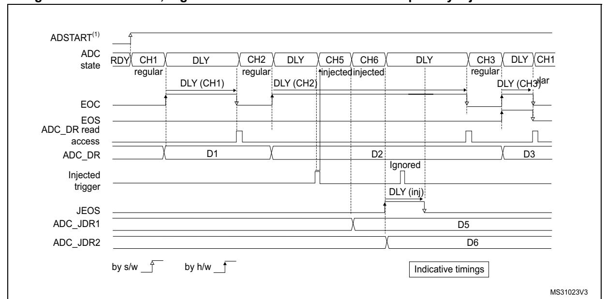

**Figure 180. AUTDLY=1, regular continuous conversions interrupted by injected conversions**

- 1. AUTDLY=1
- 2. Regular configuration: EXTEN=0x0 (SW trigger), CONT=1, DISCEN=0, CHANNELS = 1, 2, 3
- 3. Injected configuration: JEXTEN=0x1 (HW Trigger), JDISCEN=0, CHANNELS = 5,6

MS31024V4 regular JEOS ADC\_JDR1 ADC\_JDR2 injected regular DLY (CH1) DLY (inj) regular ADC\_DR EOC EOS ADC state ADC\_DR read access by s/w by h/w Indicative timings RDY CH1 CH2 CH5 CH6 CH3 DLY CH1 D1 D2 D3 D6 D5 regular injected ADSTART No delay (1)

**Figure 181. AUTDLY=1 in auto- injected mode (JAUTO=1)**

- 1. AUTDLY=1
- 2. Regular configuration: EXTEN=0x0 (SW trigger), CONT=1, DISCEN=0, CHANNELS = 1, 2
- 3. Injected configuration: JAUTO=1, CHANNELS = 5,6

# **26.4.30 Analog window watchdog (AWD1EN, JAWD1EN, AWD1SGL, AWD1CH, AWD2CH, AWD3CH, AWD\_HTRy, AWD\_LTRy, AWDy)**

The three AWD analog watchdogs monitor whether some channels remain within a configured voltage range (window).

**Figure 182. Analog watchdog guarded area**

## **AWDx flag and interrupt**

An interrupt can be enabled for each of the 3 analog watchdogs by setting AWDyIE in the ADC\_IER register (x=1,2,3).

AWDy (y=1,2,3) flag is cleared by software by writing 1 to it.

The ADC conversion result is compared to the lower and higher thresholds before alignment.

### **Description of analog watchdog 1**

The AWD analog watchdog 1 is enabled by setting the AWD1EN bit in the ADC\_CFGR register. This watchdog monitors whether either one selected channel or all enabled channels*(1)* remain within a configured voltage range (window).

*[Table 220](#page-54-1)* shows how the ADC\_CFGRy registers should be configured to enable the analog watchdog on one or more channels.

| Channels guarded by the analog watchdog | AWD1SGL bit | AWD1EN bit | JAWD1EN bit |
|--------------------------------------------|-------------|------------|-------------|
| None                                       | x           | 0          | 0           |
| All injected channels                      | 0           | 0          | 1           |
| All regular channels                       | 0           | 1          | 0           |
| All regular and injected channels          | 0           | 1          | 1           |
| Single(1) injected channel                 | 1           | 0          | 1           |
| Single(1) regular channel                  | 1           | 1          | 0           |
| Single(1) regular or injected channel      | 1           | 1          | 1           |

**Table 220. Analog watchdog channel selection**

The AWD1 analog watchdog status bit is set if the analog voltage converted by the ADC is below a lower threshold or above a higher threshold.

1. Selected by the AWDyCH[4:0] bits. The channels must also be programmed to be converted in the appropriate regular or injected sequence.

These thresholds are programmed in bits HTR1[25:0] of the ADC\_HTR1 register and LTR1[25:0] of the ADC\_LTR1 register for the analog watchdog 1.

The threshold can be up to 26-bits (16-bit resolution with oversampling, OSVR[9:0]=1024).

When converting data with a resolution of less than 16 bits (according to bits RES[2:0]), the LSBs of the programmed thresholds must be kept cleared, the internal comparison being performed on the full 16-bit converted data (left aligned to the half-word boundary).

*[Table 221](#page-55-0)* describes how the comparison is performed for all the possible resolutions for analog watchdog 1,2,3.

**Resolution (bit RES[2:0]) Analog watchdog comparison between: Comments Raw converted data, left aligned(1) Thresholds** 16 bits DATA[15:0] LTR1[25:0] and HTR1[25:0] - 14 bits DATA[15:2],00 LTR1[25:0] and HTR1[25:0] User must configure LTR1[1:0] and HTR1[1:0] to 00 12 bits DATA[15:4],0000 LTR1[25:0] and HTR1[25:0] User must configure LTR1[3:0] and HTR1[3:0] to 0000 10 bits DATA[15:6],00000 0 LTR1[25:0] and HTR1[25:0] User must configure LTR1[5:0] and HTR1[5:0] to 000000 8 bits DATA[15:8],00000 000 LTR1[25:0] and HTR1[25:0] User must configure LTR1[7:0] and HTR1[7:0] to 00000000

**Table 221. Analog watchdog 1,2,3 comparison** 

## **Description of analog watchdog 2 and 3**

The second and third analog watchdogs are more flexible and can guard several selected channels by programming the corresponding bits in AWDCHy[19:0] (y=2,3).

The corresponding watchdog is enabled when any bit of AWDCHy[19:0] (y=2,3) is set.

The threshold can be up to 26-bits (16-bit resolution with oversampling, OSVR[9:0]=1024) and are programmed with the ADC\_HTR2, ADC\_LTR2, ADC\_LTR3, and ADC\_HTR3 registers.

When converting data with a resolution of less than 16 bits (according to bits RES[2:0]), the LSBs of the programmed thresholds must be kept cleared, the internal comparison being performed on the full 16-bit converted data (left aligned to the half-word boundary).

### **ADCx\_AWDy\_OUT signal output generation**

Each analog watchdog is associated to an internal hardware signal ADCx\_AWDy\_OUT (x=ADC number, y=watchdog number) which is directly connected to the ETR input (external trigger) of some on-chip timers. Refer to the on-chip timers section to understand how to select the ADCx\_AWDy\_OUT signal as ETR.

RM0399 Rev 4 1007/3556

1. The watchdog comparison is performed on the raw converted data before any alignment calculation and before applying any offsets (the data which is compared is not signed).

ADCx\_AWDy\_OUT is activated when the associated analog watchdog is enabled:

- ADCx\_AWDy\_OUT is set when a guarded conversion is outside the programmed thresholds.
- ADCx\_AWDy\_OUT is reset after the end of the next guarded conversion which is inside the programmed thresholds (It remains at 1 if the next guarded conversions are still outside the programmed thresholds).
- ADCx\_AWDy\_OUT is also reset when disabling the ADC (when setting ADDIS=1). Note that stopping regular or injected conversions (setting ADSTP=1 or JADSTP=1) has no influence on the generation of ADCy\_AWDx\_OUT.

*Note: AWDx flag is set by hardware and reset by software: AWDy flag has no influence on the generation of ADCx\_AWDy\_OUT (ex: ADCy\_AWDy\_OUT can toggle while AWDx flag remains at 1 if the software did not clear the flag).*

**Figure 183. ADCy\_AWDx\_OUT signal generation (on all regular channels)**

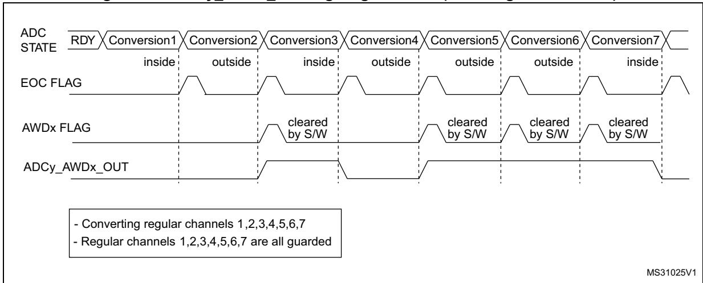

**Figure 184. ADCy\_AWDx\_OUT signal generation (AWDx flag not cleared by SW)**

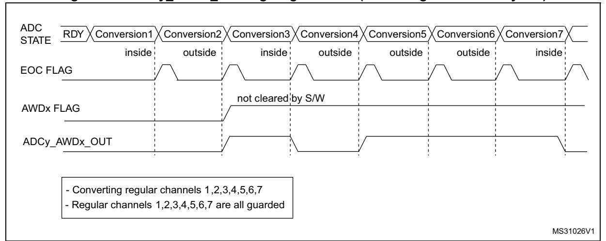

Figure 185. ADCy\_AWDx\_OUT signal generation (on a single regular channel)

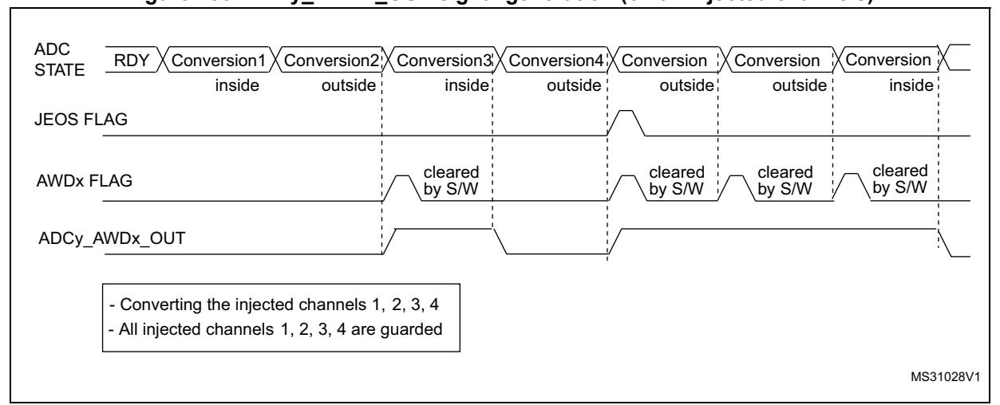

## 26.4.31 Oversampler

The oversampling unit performs data preprocessing to offload the CPU. It is able to handle multiple conversions and average them into a single data with increased data width, up to 26-bit (16-bit values and OSVR[9:0] = 1024).

It provides a result with the following form, where N and M can be adjusted:

Result = 
$$\frac{1}{M} \times \sum_{n=0}^{n=N-1} Conversion(t_n)$$

It allows to perform by hardware the following functions: averaging, data rate reduction, SNR improvement, basic filtering.

47/

The oversampling ratio N is defined using the OSVR[9:0] bits in the ADC\_CFGR2 register, and can range from 2x to 1024x. The division coefficient M consists of a right bit shift up to 10 bits, and is defined using the OVSS[3:0] bits in the ADC\_CFGR2 register.

The summation unit can yield a result up to 26 bits (1024 x 16-bit results), which can be left or right shifted. When right shifting is selected, it is rounded to the nearest value using the least significant bits left apart by the shifting, before being transferred into the ADC\_DR data register.

The *Table 187* gives a numerical example of the processing, from a raw 26-bit accumulated data to the final 16-bit result.

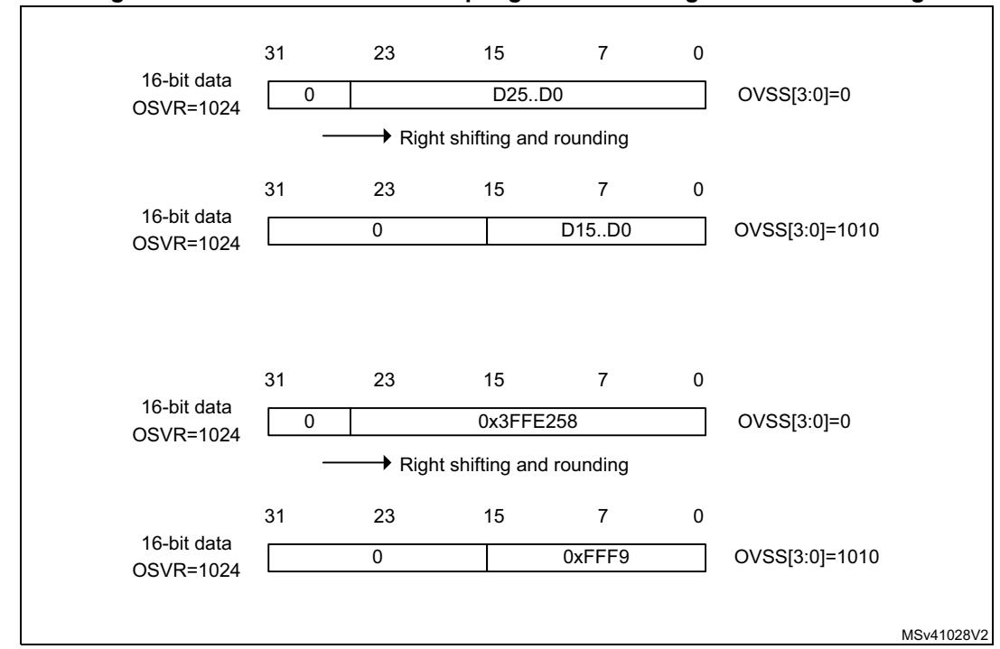

Figure 187. 16-bit result oversampling with 10-bits right shift and rouding

There are no changes for conversion timings in oversampled mode: the sample time is maintained equal during the whole oversampling sequence. A new data is provided every N conversions, with an equivalent delay equal to N x  $T_{CONV}$  = N x ( $t_{SMPL}$  +  $t_{SAR}$ ). The flags are set as follow:

- the end of the sampling phase (EOSMP) is set after each sampling phase
- the end of conversion (EOC) occurs once every N conversions, when the oversampled result is available
- the end of sequence (EOS) occurs once the sequence of oversampled data is completed (i.e. after N x sequence length conversions total)

### **Single ADC operating modes support when oversampling**

In oversampling mode, most of the ADC operating modes are maintained:

- Single or continuous mode conversions
- ADC conversions start either by software or with triggers
- ADC stop during a conversion (abort)
- Data read via CPU or DMA with overrun detection
- Low-power modes (AUTDLY)
- Programmable resolution: in this case, the reduced conversion values (as per RES[2:0] bits in ADC\_CFGR register) are accumulated, truncated, rounded and shifted in the same way as 16-bit conversions are

*Note: The alignment mode is not available when working with oversampled data. The data are always provided right-aligned.*

## **Analog watchdog**

The analog watchdog functionality is maintained (AWDSGL and AWDEN bits), with the following difference:

- the RES[2:0] bits are ignored, comparison is always done on using the full 26-bit values HTRx[25:0] and LTRx[25:0]
- •*the comparison is performed on the oversampled accumulated value before shifting*

### **Triggered mode**

The averager can also be used for basic filtering purpose. Although not a very powerful filter (slow roll-off and limited stop band attenuation), it can be used as a notch filter to reject constant parasitic frequencies (typically coming from the mains or from a switched mode power supply). For this purpose, a specific discontinuous mode can be enabled with TROVS bit in ADC\_CFGR2, to be able to have an oversampling frequency defined by a user and independent from the conversion time itself.

The *[Figure 188](#page-59-0)* below shows how conversions are started in response to triggers during discontinuous mode.

If the TROVS bit is set, the content of the DISCEN bit is ignored and considered as 1.

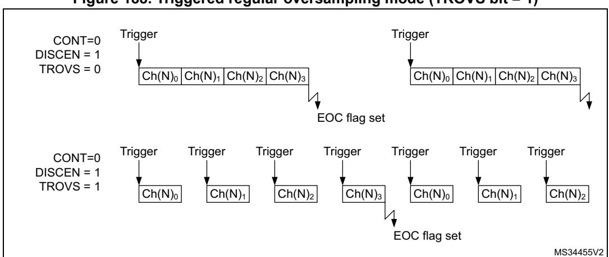

**Figure 188. Triggered regular oversampling mode (TROVS bit = 1)**

RM0399 Rev 4 1011/3556

### **Injected and regular sequencer management when oversampling**

In oversampling mode, it is possible to have differentiated behavior for injected and regular sequencers. The oversampling can be enabled for both sequencers with some limitations if they have to be used simultaneously (this is related to a unique accumulation unit).

## **Oversampling regular channels only**

The regular oversampling mode bit ROVSM defines how the regular oversampling sequence is resumed if it is interrupted by injected conversion:

- in continued mode, the accumulation re-starts from the last valid data (prior to the conversion abort request due to the injected trigger). This ensures that oversampling is complete whatever the injection frequency (providing at least one regular conversion can be completed between triggers);
- in resumed mode, the accumulation re-starts from 0 (previous conversions results are ignored). This mode allows to guarantee that all data used for oversampling were converted back-to-back within a single timeslot. Care must be taken to have a injection trigger period above the oversampling period length. If this condition is not respected, the oversampling cannot be complete and the regular sequencer is blocked.

The *[Figure 189](#page-60-0)* gives examples for a 4x oversampling ratio.

MS34456V1 Ch(O)0 Oversampling continued Regular channels Ch(N)0 Ch(N)1 Ch(N)2 Ch(N)3 Ch(M)0 Ch(M)1 Ch(M)1 Ch(M)2 Ch(M)3 Oversampling stopped Ch(J) Ch(K) Trigger Injected channels **Continued mode: ROVSE = 1, JOVSE = 0, ROVSM = 0, TROVS = X** Ch(M)3 Oversampling resumed Regular channels Ch(N)0 Ch(N)1 Ch(N)2 Ch(N)3 Ch(M)0 Ch(M)1 Ch(M)0 Ch(M)1 Ch(M)2 Oversampling aborted Ch(J) Ch(K) Trigger Injected channels **Resumed mode: ROVSE = 1, JOVSE = 0, ROVSM = 1, TROVS = X** Abort Abort JEOC JEOC

**Figure 189. Regular oversampling modes (4x ratio)**

### **Oversampling Injected channels only**

The Injected oversampling mode bit JOVSE enables oversampling solely for conversions in the injected sequencer.

### **Oversampling regular and Injected channels**

It is possible to have both ROVSE and JOVSE bits set. In this case, the regular oversampling mode is forced to resumed mode (ROVSM bit ignored), as represented on *[Figure 190](#page-61-0)* below.

MS34457V2 Oversampling resumed Regular channels Ch(N)0 Ch(N)1 Ch(N)2 Ch(N)3 Ch(M)0 Ch(M)1 Ch(M)0 Ch(M)1 Oversampling aborted Ch(J)0 Ch(J)1 Trigger Injected channels **ROVSE = 1, JOVSE = 1, ROVSM = 1, TROVS = 0** Abort JEOC Ch(J)2 Ch(J)3

**Figure 190. Regular and injected oversampling modes used simultaneously**

## **Triggered regular oversampling with injected conversions**

It is possible to have triggered regular mode with injected conversions. In this case, the injected mode oversampling mode must be disabled, and the ROVSM bit is ignored (resumed mode is forced). The JOVSE bit must be reset. The behavior is represented on *[Figure 191](#page-61-1)* below.

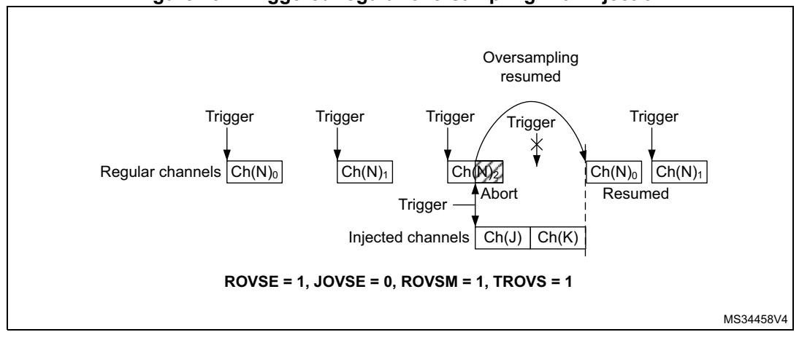

**Figure 191. Triggered regular oversampling with injection**

### **Auto-injected mode**

It is possible to oversample auto-injected sequences and have all conversions results stored in registers to save a DMA resource. This mode is available only with both regular and injected oversampling active: JAUTO = 1, ROVSE = 1 and JOVSE = 1, other combinations are not supported. The ROVSM bit is ignored in auto-injected mode. The *[Figure 192](#page-62-0)* below shows how the conversions are sequenced.

**Figure 192. Oversampling in auto-injected mode**

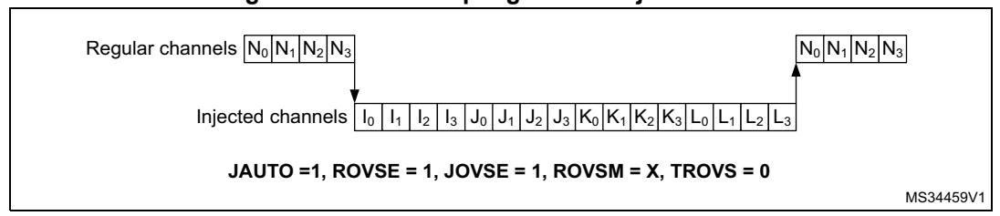

It is possible to have also the triggered mode enabled, using the TROVS bit. In this case, the ADC must be configured as following: JAUTO=1, DISCEN=0, JDISCEN=0, ROVSE=1, JOVSE=1 and TROVSE=1.

## **Dual ADC modes support when oversampling**

It is possible to have oversampling enabled when working in dual ADC configuration, for the injected simultaneous mode and regular simultaneous mode. In this case, the two ADCs must be programmed with the very same settings (including oversampling).

All other dual ADC modes are not supported when either regular or injected oversampling is enabled (ROVSE = 1 or JOVSE = 1).

## **Combined modes summary**

The *[Table](#page-62-1) 222* below summarizes all combinations, including modes not supported.

**Table 222. Oversampler operating modes summary**

| Regular Over sampling ROVSE | Injected Over sampling JOVSE | Oversampler mode ROVSM 0 = continued 1 = resumed | Triggered Regular mode TROVS | Comment                              |
|-----------------------------------|------------------------------------|--------------------------------------------------------------|------------------------------------|--------------------------------------|
| 1                                 | 0                                  | 0                                                            | 0                                  | Regular continued mode               |
| 1                                 | 0                                  | 0                                                            | 1                                  | Not supported                        |
| 1                                 | 0                                  | 1                                                            | 0                                  | Regular resumed mode                 |
| 1                                 | 0                                  | 1                                                            | 1                                  | Triggered regular resumed mode    |
| 1                                 | 1                                  | 0                                                            | X                                  | Not supported                        |
| 1                                 | 1                                  | 1                                                            | 0                                  | Injected and regular resumed mode |
| 1                                 | 1                                  | 1                                                            | 1                                  | Not supported                        |
| 0                                 | 1                                  | X                                                            | X                                  | Injected oversampling                |

## **26.4.32 Dual ADC modes**

In devices with two ADCs or more, dual ADC modes can be used (see *[Figure 193](#page-64-0)*):

• ADC1 and ADC2 can be used together in dual mode (ADC1 is master)

In dual ADC mode the start of conversion is triggered alternately or simultaneously by the ADCx master to the ADC slave, depending on the mode selected by the bits DUAL[4:0] in the ADCx\_CCR register.

Four possible modes are implemented:

- Injected simultaneous mode
- Regular simultaneous mode
- Interleaved mode
- Alternate trigger mode

It is also possible to use these modes combined in the following ways:

- Injected simultaneous mode + Regular simultaneous mode
- Regular simultaneous mode + Alternate trigger mode
- Injected simultaneous mode + Interleaved mode

In dual ADC mode (when bits DUAL[4:0] in ADCx\_CCR register are not equal to zero), the bits CONT, AUTDLY, DISCEN, DISCNUM[2:0], JDISCEN, JQM, JAUTO of the ADC\_CFGR register are shared between the master and slave ADC: the bits in the slave ADC are always equal to the corresponding bits of the master ADC.

To start a conversion in dual mode, the user must program the bits EXTEN, EXTSEL, JEXTEN, JEXTSEL of the master ADC only, to configure a software or hardware trigger, and a regular or injected trigger. (the bits EXTEN[1:0] and JEXTEN[1:0] of the slave ADC are don't care).

In regular simultaneous or interleaved modes: once the user sets bit ADSTART or bit ADSTP of the master ADC, the corresponding bit of the slave ADC is also automatically set. However, bit ADSTART or bit ADSTP of the slave ADC is not necessary cleared at the same time as the master ADC bit.

In injected simultaneous or alternate trigger modes: once the user sets bit JADSTART or bit JADSTP of the master ADC, the corresponding bit of the slave ADC is also automatically set. However, bit JADSTART or bit JADSTP of the slave ADC is not necessary cleared at the same time as the master ADC bit.

In dual ADC mode, the converted data of the master and slave ADC can be read in parallel, by reading the ADC common data register (ADCx\_CDR). The status bits can be also read in parallel by reading the dual-mode status register (ADCx\_CSR).

RM0399 Rev 4 1015/3556

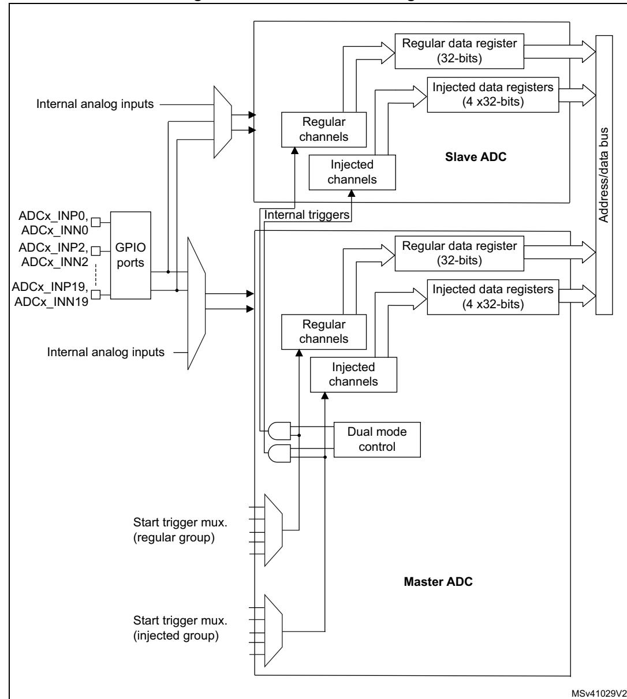

**Figure 193. Dual ADC block diagram(1)**

- 1. External triggers also exist on slave ADC but are not shown for the purposes of this diagram.
- 2. The ADC common data register (ADCx\_CDR) contains both the master and slave ADC regular converted data.

### **Injected simultaneous mode**

This mode is selected by programming bits DUAL[4:0]=00101

This mode converts an injected group of channels. The external trigger source comes from the injected group multiplexer of the master ADC (selected by the JEXTSEL[4:0] bits in the ADC\_JSQR register).

*Note: Do not convert the same channel on the two ADCs (no overlapping sampling times for the two ADCs when converting the same channel).*

> *In simultaneous mode, one must convert sequences with the same length and inside a sequence, the N-th conversion in master ans slave must be configured with the same sampling time.*

> *Regular conversions can be performed on one or all ADCs. In that case, they are independent of each other and are interrupted when an injected event occurs. They are resumed at the end of the injected conversion group.*

- At the end of injected sequence of conversion event (JEOS) on the master ADC, the converted data is stored into the master ADC\_JDRy registers and a JEOS interrupt is generated (if enabled)
- At the end of injected sequence of conversion event (JEOS) on the slave ADC, the converted data is stored into the slave ADC\_JDRy registers and a JEOS interrupt is generated (if enabled)
- If the duration of the master injected sequence is equal to the duration of the slave injected one (like in *[Figure 194](#page-65-0)*), it is possible for the software to enable only one of the two JEOS interrupt (ex: master JEOS) and read both converted data (from master ADC\_JDRy and slave ADC\_JDRy registers).

MS31900V1 MASTER ADC SLAVE ADC End of injected sequence on MASTER and SLAVE ADC Trigger CH1 CH15 CH14 CH13 CH12 CH2 CH3 CH4 Sampling Conversion

**Figure 194. Injected simultaneous mode on 4 channels: dual ADC mode**

If JDISCEN=1, each simultaneous conversion of the injected sequence requires an injected trigger event to occur.

This mode can be combined with AUTDLY mode:

- Once a simultaneous injected sequence of conversions has ended, a new injected trigger event is accepted only if both JEOS bits of the master and the slave ADC have been cleared (delay phase). Any new injected trigger events occurring during the ongoing injected sequence and the associated delay phase are ignored.
- Once a regular sequence of conversions of the master ADC has ended, a new regular trigger event of the master ADC is accepted only if the master data register (ADC\_DR) has been read. Any new regular trigger events occurring for the master ADC during the ongoing regular sequence and the associated delay phases are ignored. There is the same behavior for regular sequences occurring on the slave ADC.

RM0399 Rev 4 1017/3556

### **Regular simultaneous mode with independent injected**

This mode is selected by programming bits DUAL[4:0] = 00110.

This mode is performed on a regular group of channels. The external trigger source comes from the regular group multiplexer of the master ADC (selected by the EXTSEL[4:0] bits in the ADC\_CFGR register). A simultaneous trigger is provided to the slave ADC.

In this mode, independent injected conversions are supported. An injection request (either on master or on the slave) aborts the current simultaneous conversions, which are restarted once the injected conversion is completed.

*Note: Do not convert the same channel on the two ADCs (no overlapping sampling times for the two ADCs when converting the same channel).*

> *In regular simultaneous mode, one must convert sequences with the same length and inside a sequence, the N-th conversion in master ans slave must be configured with the same sampling time.*

Software is notified by interrupts when it can read the data:

- At the end of each conversion event (EOC) on the master ADC, a master EOC interrupt is generated (if EOCIE is enabled) and software can read the ADC\_DR of the master ADC.
- At the end of each conversion event (EOC) on the slave ADC, a slave EOC interrupt is generated (if EOCIE is enabled) and software can read the ADC\_DR of the slave ADC.
- If the duration of the master regular sequence is equal to the duration of the slave one (like in *[Figure 195](#page-67-0)*), it is possible for the software to enable only one of the two EOC interrupt (ex: master EOC) and read both converted data from the Common Data register (ADCx\_CDR).

It is also possible to read the regular data using the DMA. Two methods are possible:

- Using two DMA channels (one for the master and one for the slave). In this case bits DAMDF[1:0] must be kept cleared.
  - Configure the DMA master ADC channel to read ADC\_DR from the master. DMA requests are generated at each EOC event of the master ADC.
  - Configure the DMA slave ADC channel to read ADC\_DR from the slave. DMA requests are generated at each EOC event of the slave ADC.
- Configuring dual ADC mode data format DAMDF[1:0] bits, which leaves one DMA channel free for other uses:
  - Configure DAMDF[1:0]=0b10 or 0b11 (depending on resolution).
  - A single DMA channel is used (the one of the master). Configure the DMA master ADC channel to read the common ADC register (ADCx\_CDR)
  - A single DMA request is generated each time both master and slave EOC events have occurred. At that time, the slave ADC converted data is available in the upper half-word of the ADCx\_CDR 32-bit register and the master ADC converted data is available in the lower half-word of ADCx\_CDR register.
  - both EOC flags are cleared when the DMA reads the ADCx\_CDR register.

*Note: When DAMDF[1:0]=0b10 or 0b11, the user must program the same number of conversions in the master's sequence as in the slave's sequence. Otherwise, the remaining conversions do not generate a DMA request.*

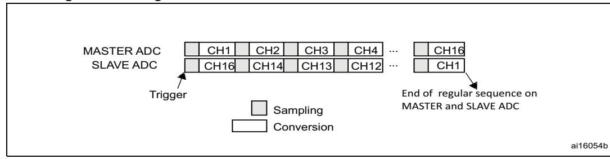

**Figure 195. Regular simultaneous mode on 16 channels: dual ADC mode**

If DISCEN=1 then each "n" simultaneous conversions of the regular sequence require a regular trigger event to occur ("n" is defined by DISCNUM).

This mode can be combined with AUTDLY mode:

- Once a simultaneous conversion of the sequence has ended, the next conversion in the sequence is started only if the common data register, ADCx\_CDR (or the regular data register of the master ADC) has been read (delay phase).
- Once a simultaneous regular sequence of conversions has ended, a new regular trigger event is accepted only if the common data register (ADCx\_CDR) has been read (delay phase). Any new regular trigger events occurring during the ongoing regular sequence and the associated delay phases are ignored.

It is possible to use the DMA to handle data in regular simultaneous mode combined with AUTDLY mode, assuming that multiple-DMA mode is used: bits DAMDF must be set to 0b10 or 0b11.

When regular simultaneous mode is combined with AUTDLY mode, it is mandatory for the user to ensure that:

- The number of conversions in the master's sequence is equal to the number of conversions in the slave's.
- For each simultaneous conversions of the sequence, the length of the conversion of the slave ADC is inferior to the length of the conversion of the master ADC. Note that the length of the sequence depends on the number of channels to convert and the sampling time and the resolution of each channels.

*Note: This combination of regular simultaneous mode and AUTDLY mode is restricted to the use case when only regular channels are programmed: it is forbidden to program injected channels in this combined mode.*

## **Interleaved mode with independent injected**

This mode is selected by programming bits DUAL[4:0] = 00111.

This mode can be started only on a regular group (usually one channel). The external trigger source comes from the regular channel multiplexer of the master ADC.

After an external trigger occurs:

- The master ADC starts immediately.
- The slave ADC starts after a delay of several ADC clock cycles after the sampling phase of the master ADC has complete.

The minimum delay which separates 2 conversions in interleaved mode is configured in the DELAY bits in the ADCx\_CCR register. This delay starts to count after the end of the sampling phase of the master conversion. This way, an ADC cannot start a conversion if the

RM0399 Rev 4 1019/3556

complementary ADC is still sampling its input (only one ADC can sample the input signal at a given time).

- The minimum possible DELAY is 1 to ensure that there is at least one cycle time between the opening of the analog switch of the master ADC sampling phase and the closing of the analog switch of the slave ADC sampling phase.
- The maximum DELAY is equal to the number of cycles corresponding to the selected resolution. However the user must properly calculate this delay to ensure that an ADC does not start a conversion while the other ADC is still sampling its input.

If the CONT bit is set on both master and slave ADCs, the selected regular channels of both ADCs are continuously converted.

The software is notified by interrupts when it can read the data at the end of each conversion event (EOC) on the slave ADC. A slave and master EOC interrupts are generated (if EOCIE is enabled) and the software can read the ADC\_DR of the slave/master ADC.

*Note: It is possible to enable only the EOC interrupt of the slave and read the common data register (ADCx\_CDR). But in this case, the user must ensure that the duration of the conversions are compatible to ensure that inside the sequence, a master conversion is always followed by a slave conversion before a new master conversion restarts. It is recommended to use the MDMA mode.*

> It is also possible to have the regular data transferred by DMA. In this case, individual DMA requests on each ADC cannot be used and it is mandatory to use the MDMA mode, as following:

- Configure DAMDF[1:0]=0b10 or 0b11 (depending on resolution).
- A single DMA channel is used (the one of the master). Configure the DMA master ADC channel to read the common ADC register (ADCx\_CDR).
- A single DMA request is generated each time both master and slave EOC events have occurred. At that time, the slave ADC converted data is available in the upper half-word of the ADCx\_CDR 32-bit register and the master ADC converted data is available in the lower half-word of ADCx\_CCR register.
- Both EOC flags are cleared when the DMA reads the ADCx\_CCR register.

**Figure 196. Interleaved mode on 1 channel in continuous conversion mode: dual ADC mode** 

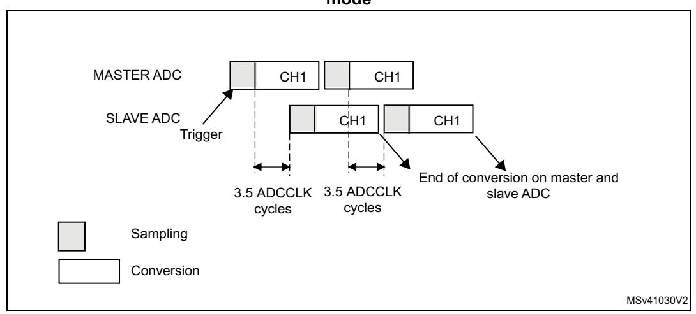

MASTER ADC CH1 CH1 SLAVE ADC CH1 CH1 Trigger End of conversion on 3.5 ADCCLK End of conversion on 3.5 ADCCLK master and slave ADC master and slave ADC cycles cycles Sampling Conversion MSv41031V2

Figure 197. Interleaved mode on 1 channel in single conversion mode: dual ADC mode

If DISCEN=1, each "n" simultaneous conversions ("n" is defined by DISCNUM) of the regular sequence require a regular trigger event to occur.

In this mode, injected conversions are supported. When injection is done (either on master or on slave), both the master and the slave regular conversions are aborted and the sequence is re-started from the master (see *Figure 198* below).

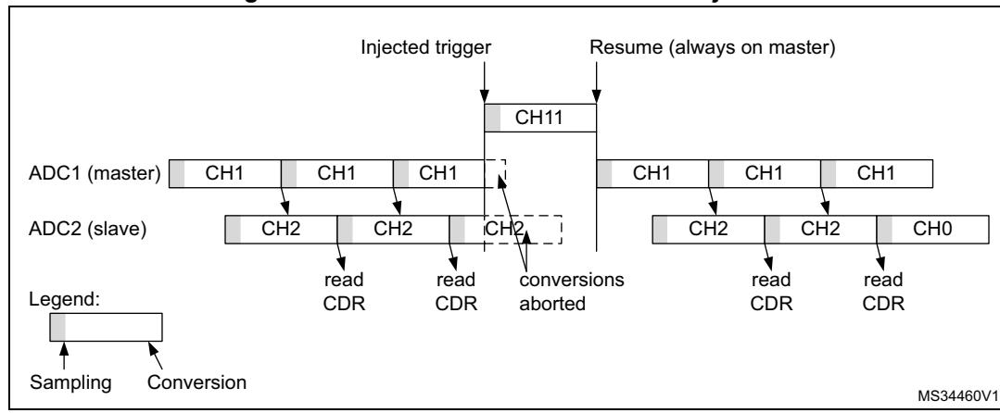

Figure 198. Interleaved conversion with injection

### Alternate trigger mode

This mode is selected by programming bits DUAL[4:0] = 01001.

This mode can be started only on an injected group. The source of external trigger comes from the injected group multiplexer of the master ADC.

This mode is only possible when selecting hardware triggers: JEXTEN must not be 0x0.

## **Injected discontinuous mode disabled (JDISCEN=0 for both ADC)**

- 1. When the 1st trigger occurs, all injected master ADC channels in the group are converted.
- 2. When the 2nd trigger occurs, all injected slave ADC channels in the group are converted.
- 3. And so on.

A JEOS interrupt, if enabled, is generated after all injected channels of the master ADC in the group have been converted.

A JEOS interrupt, if enabled, is generated after all injected channels of the slave ADC in the group have been converted.

JEOC interrupts, if enabled, can also be generated after each injected conversion.

If another external trigger occurs after all injected channels in the group have been converted then the alternate trigger process restarts by converting the injected channels of the master ADC in the group.

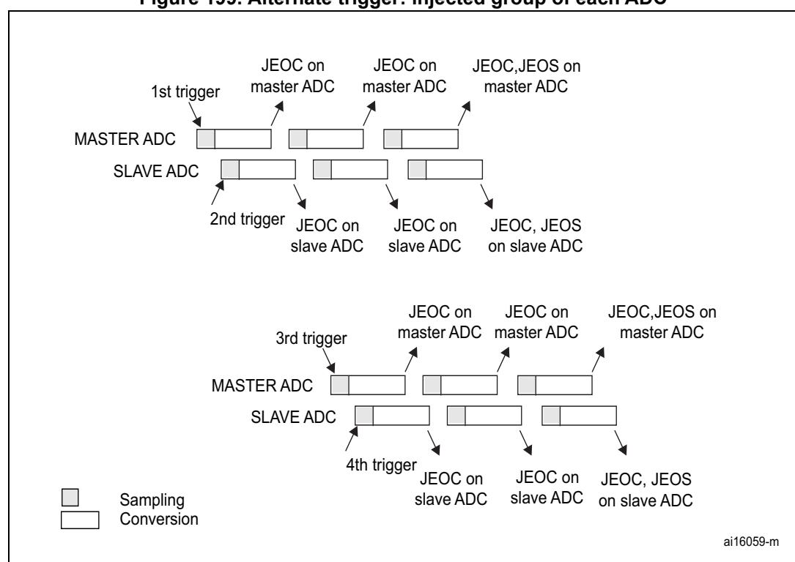

**Figure 199. Alternate trigger: injected group of each ADC**

*Note: Regular conversions can be enabled on one or all ADCs. In this case the regular conversions are independent of each other. A regular conversion is interrupted when the ADC has to perform an injected conversion. It is resumed when the injected conversion is finished.*

> *The time interval between 2 trigger events must be greater than or equal to 1 ADC clock period. The minimum time interval between 2 trigger events that start conversions on the same ADC is the same as in the single ADC mode.*

## **Injected discontinuous mode enabled (JDISCEN=1 for both ADC)**

If the injected discontinuous mode is enabled for both master and slave ADCs:

- When the 1st trigger occurs, the first injected channel of the master ADC is converted.
- When the 2nd trigger occurs, the first injected channel of the slave ADC is converted.
- And so on.

A JEOS interrupt, if enabled, is generated after all injected channels of the master ADC in the group have been converted.

A JEOS interrupt, if enabled, is generated after all injected channels of the slave ADC in the group have been converted.

JEOC interrupts, if enabled, can also be generated after each injected conversions.

If another external trigger occurs after all injected channels in the group have been converted then the alternate trigger process restarts.

**Figure 200. Alternate trigger: 4 injected channels (each ADC) in discontinuous mode**

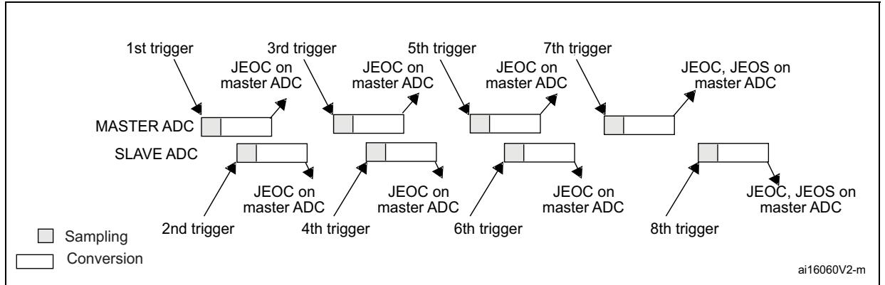

### **Combined regular/injected simultaneous mode**

This mode is selected by programming bits DUAL[4:0] = 00001.

It is possible to interrupt the simultaneous conversion of a regular group to start the simultaneous conversion of an injected group.

*Note: The sequences must be converted with the same length, the N-th conversion in master and slave mode must be configured with the same sampling time inside a given sequence, or the interval between triggers has to be longer than the long conversion time of the 2 sequences. If the above conditions are not respected, the ADC with the shortest sequence may restart while the ADC with the longest sequence is completing the previous conversions.*

## **Combined regular simultaneous + alternate trigger mode**

This mode is selected by programming bits DUAL[4:0]=00010.

It is possible to interrupt the simultaneous conversion of a regular group to start the alternate trigger conversion of an injected group. *[Figure 201](#page-72-0)* shows the behavior of an alternate trigger interrupting a simultaneous regular conversion.

The injected alternate conversion is immediately started after the injected event. If a regular conversion is already running, in order to ensure synchronization after the injected

RM0399 Rev 4 1023/3556

conversion, the regular conversion of all (master/slave) ADCs is stopped and resumed synchronously at the end of the injected conversion.

*Note: The sequences must be converted with the same length, the N-th conversion in master and slave mode must be configured with the same sampling time inside a given sequence, or the interval between triggers has to be longer than the long conversion time of the 2 sequences. If the above conditions are not respected, the ADC with the shortest sequence may restart while the ADC with the longest sequence is completing the previous conversions.*

ADC MASTER reg CH1 CH2 CH3 CH1 CH3 CH4 CH1 ADC MASTER inj ADC SLAVE reg ADC SLAVE inj 1st trigger 2nd trigger synchronization not lost CH4 CH6 CH7 CH7 CH8 CH4 CH5 CH8 CH9 ai16062V2-m

**Figure 201. Alternate + regular simultaneous**

If a trigger occurs during an injected conversion that has interrupted a regular conversion, the alternate trigger is served. *[Figure 202](#page-72-1)* shows the behavior in this case (note that the 6th trigger is ignored because the associated alternate conversion is not complete).

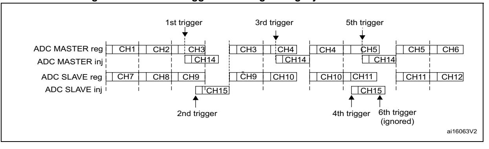

**Figure 202. Case of trigger occurring during injected conversion**

## **Combined injected simultaneous plus interleaved**

This mode is selected by programming bits DUAL[4:0]=00011.

It is possible to interrupt an interleaved conversion with a simultaneous injected event.

In this case the interleaved conversion is interrupted immediately and the simultaneous injected conversion starts. At the end of the injected sequence the interleaved conversion is resumed. When the interleaved regular conversion resumes, the first regular conversion which is performed is alway the master's one. *[Figure 203](#page-73-0)*, *[Figure 204](#page-73-1)* and *[Figure 205](#page-73-2)* show the behavior using an example.

**Caution:** In this mode, it is mandatory to use the Common Data Register to read the regular data with a single read access. On the contrary, master-slave data coherency is not guaranteed.

MS34461V1 Legend: Sampling Conversion ADC1 (master) CH0 CH0 CH0 CH11 CH0 CH0 CH0 ADC2 (slave) CH0 CH0 CH0 CH0 CH0 CH0 read CDR read CDR read CDR read CDR CH11 CH12 CH12 Injected trigger Resume (always restart with the master) Conversions aborted

**Figure 203. Interleaved single channel CH0 with injected sequence CH11, CH12**

**Figure 204. Two Interleaved channels (CH1, CH2) with injected sequence CH11, CH12 - case 1: Master interrupted first**

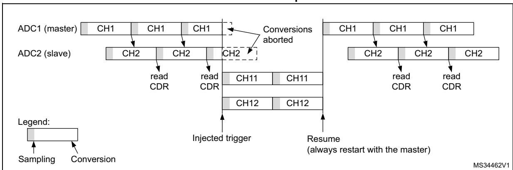

**Figure 205. Two Interleaved channels (CH1, CH2) with injected sequence CH11, CH12 - case 2: Slave interrupted first**

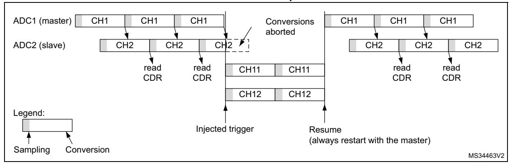

RM0399 Rev 4 1025/3556

### **DMA requests in dual ADC mode**

In all dual ADC modes, it is possible to use two DMA channels (one for the master, one for the slave) to transfer the data, like in single mode (refer to *[Figure 206: DMA Requests in](#page-74-0)  [regular simultaneous mode when DAMDF=0b00](#page-74-0)*).

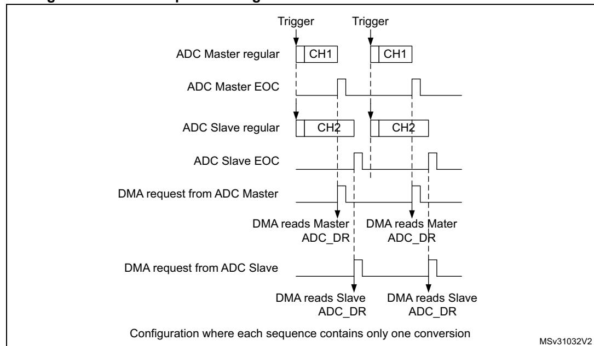

**Figure 206. DMA Requests in regular simultaneous mode when DAMDF=0b00**

In simultaneous regular and interleaved modes, it is also possible to save one DMA channel and transfer both data using a single DMA channel. For this DAMDF bits must be configured in the ADCx\_CCR register:

• **DAMDF=0b10, 32-bit format**: A single DMA request is generated alternatively when either the master or slave EOC events have occurred. At that time, the data items are alternatively available in the ADCx\_CDR2 32-bit register. This mode is used in interleaved mode and in regular simultaneous mode when resolution is above 16-bit. **Example:**

> Interleaved dual mode: a DMA request is generated each time a new 32-bit data is available:

1st DMA request: ADCx\_CDR2[31:0] = MST\_ADC\_DR[31:0] 2nd DMA request: ADCx\_CDR2[31:0] = SLV\_ADC\_DR[31:0]

• **DAMDF=0b10, 16-bit format**: A single DMA request is generated each time both master and slave EOC events have occurred. At that time, two data items are available and the 32-bit register ADCx\_CDR contains the two half-words representing two ADC-

converted data items. The slave ADC data take the upper half-word and the master ADC data take the lower half-word.

This mode is used in interleaved mode and in regular simultaneous mode when resolution is ranging from 10 to 16-bit. Any value above 16-bit in the master or the slave converter is truncated to the least 16 significant bits.

#### **Example:**

Interleaved dual mode: a DMA request is generated each time 2 data items are available:

1st DMA request: ADCx\_CDR[31:0] = SLV\_ADC\_DR[15:0] | MST\_ADC\_DR[15:0] 2nd DMA request: ADCx\_CDR[31:0] = SLV\_ADC\_DR[15:0] | MST\_ADC\_DR[15:0]

**Figure 207. DMA requests in regular simultaneous mode when DAMDF=0b10**

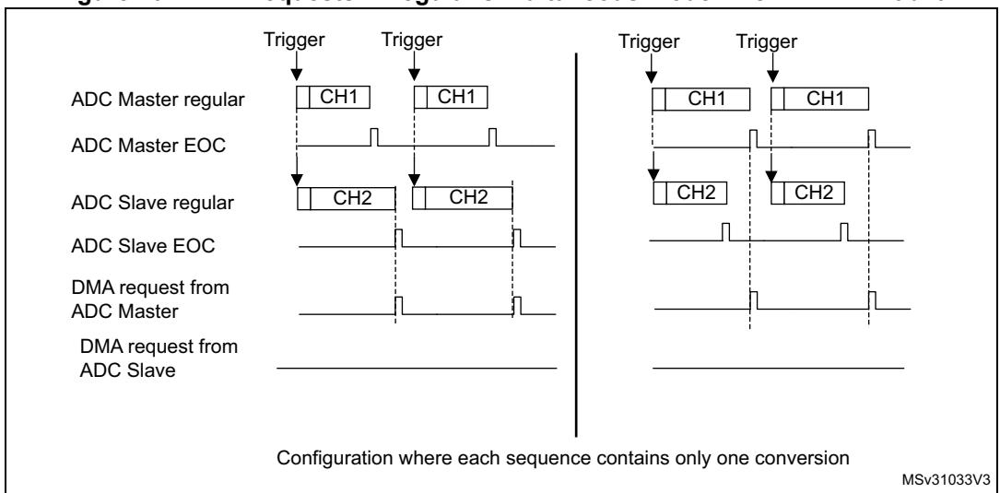

**Figure 208. DMA requests in interleaved mode when DAMDF=0b10**

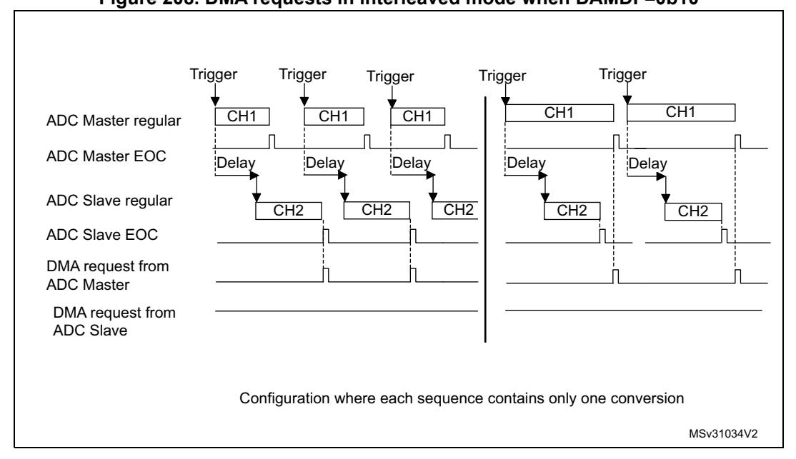

RM0399 Rev 4 1027/3556

*Note: When using multiple-ADC mode, the user must take care to configure properly the duration of the master and slave conversions so that a DMA request is generated and served for reading both data (master + slave) before a new conversion is available.*

> • **DAMDF=0b11**: This mode is similar to the DAMDF=0b10. The only differences are that on each DMA request (two data items are available), two bytes representing two ADC converted data items are transferred as a half-word.

This mode is used in interleaved and regular simultaneous mode when the result is 8 bit. A new DMA request is issued when 4 new 8-bit values are available.

### **Example:**

Interleaved dual mode: a DMA request is generated each time 4 data items are available (t0, t1,... are corresponding to the consecutive sampling instants)

1st DMA request:

ADCx\_CDR[7:0] = MST\_ADC\_DR[7:0]t0 ADCx\_CDR[15:8] = SLV\_ADC\_DR[7:0]t0 ADCx\_CDR[23:16] = MST\_ADC\_DR[7:0]t1 ADCx\_CDR[31:24] = SLV\_ADC\_DR[7:0]t1

2nd DMA request:

ADCx\_CDR[7:0] = MST\_ADC\_DR[7:0]t2 ADCx\_CDR[15:8] = SLV\_ADC\_DR[7:0]t2 ADCx\_CDR[23:16] = MST\_ADC\_DR[7:0]t3 ADCx\_CDR[31:24] = SLV\_ADC\_DR[7:0]t3

### **Overrun detection**

In dual ADC mode (when DUAL[4:0] is not equal to b00000), if an overrun is detected on one of the ADCs, the DMA requests are no longer issued to ensure that all the data transferred to the RAM are valid (this behavior occurs whatever the DAMDF configuration). It may happen that the EOC bit corresponding to one ADC remains set because the data register of this ADC contains valid data.

## **DMA one shot mode/ DMA circular mode when multiple-ADC mode is selected**

When DAMDF mode is selected (0b10 or 0b11), bit DMNGT[1:0]=0b10 in the master ADC's ADCx\_CCR register must also be configured to select between DMA one shot mode and circular mode, as explained in section *[Section : Managing conversions using the DMA](#page-48-0)*.

### **Stopping the conversions in dual ADC modes**

The user must set the control bits ADSTP/JADSTP of the master ADC to stop the conversions of both ADC in dual ADC mode. The other ADSTP control bit of the slave ADC has no effect in dual ADC mode.

Once both ADC are effectively stopped, the bits ADSTART/JADSTART of the master and slave ADCs are both cleared by hardware.

## **DFSDM mode in dual ADC mode interleaved mode**

In dual ADC interleaved modes, the ADC conversion results can be transferred directly to the Digital Filter for Sigma Delta Modulators (DFSDM).

This mode is enabled by setting the bits DMNGT[1:0] = 0b10 in the master ADC's ADC\_CFGR register.

The ADC transfers alternatively the 16 least significant bits of the regular data register from the master and the slave converter to a single channel of the DFSDM.

The data format must be 16-bit signed:

ADC\_DR[31:16] = 0x0000

ADC\_DR[15] = sign

ADC\_DR[14:0] = data

Any value above 16-bit signed format in any converter is truncated.

## **DFSDM mode in dual ADC simultaneous mode**

The dual mode is not required to use DFSDM in dual ADC simultaneous mode since conversion data are treated by each individual channel. Single mode with same trigger source results in simultaneous conversion with DFSDM interface.

## **26.4.33 Temperature sensor**

The temperature sensor can measure the junction temperature (TJ) of the device in the –40 to 125 °C temperature range.

The temperature sensor is internally connected to an ADC internal channel which is used to convert the sensor's output voltage to a digital value (refer to *Table ADC interconnection* in *[Section 26.4.2: ADC pins and internal signals](#page-4-1)*). The sampling time for the temperature sensor's analog pin must be greater than the stabilization time specified in the product datasheet.

When not in use, the sensor can be put in power-down mode.

*[Figure 209](#page-77-0)* shows the block diagram of the temperature sensor.

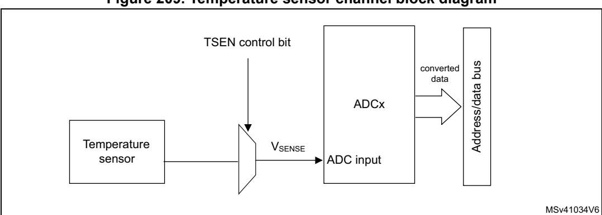

**Figure 209. Temperature sensor channel block diagram**

*Note: The TSEN bit must be set to enable the conversion of the corresponding ADC internal channel (temperature sensor, VSENSE).*

## Reading the temperature

To use the sensor:

- 1. Select the ADC input channels (with the appropriate sampling time).
- 2. Program with the appropriate sampling time (refer to electrical characteristics section of the device datasheet).
- 3. Set the TSEN bit in the ADCx\_CCR register to wake up the temperature sensor from power-down mode.
- 4. Start the ADC conversion.
- 5. Read the resulting VSENSE data in the ADC data register.
- 6. Calculate the actual temperature using the following formula:

$$\label{eq:continuous} \mbox{ `emperature (in °C)} = \frac{\mbox{TS\_CAL2\_TEMP} - \mbox{TS\_CAL1\_TEMP}}{\mbox{TS\_CAL2} - \mbox{TS\_CAL1}} \times (\mbox{TS\_DATA} - \mbox{TS\_CAL1}) + \mbox{TS\_CAL1\_TEMP}$$

## Where:

- TS\_CAL2 is the temperature sensor calibration value acquired at TS\_CAL2\_TEMP
- TS\_CAL1 is the temperature sensor calibration value acquired at TS\_CAL1\_TEMP
- TS\_DATA is the actual temperature sensor output value converted by ADC
   Refer to the device datasheet for more information about TS\_CAL1 and TS\_CAL2 calibration points.

Note:

The sensor has a startup time after waking from power-down mode before it can output  $V_{SENSE}$  at the correct level. The ADC also has a startup time after power-on, so to minimize the delay, the ADEN and SENSEEN bits should be set at the same time.

# 26.4.34 VBAT supply monitoring

The VBATEN bit of the ADCx\_CCR register is used to switch to the battery voltage. As the  $V_{BAT}$  voltage could be higher than  $V_{DDA}$ , to ensure the correct operation of the ADC, the  $V_{BAT}$  pin is internally connected to a bridge divider by 4. This bridge is automatically enabled when VBATEN is set, to connect  $V_{BAT}/4$  to an ADC input channel (refer to *Table ADC interconnection* in *Section 26.4.2: ADC pins and internal signals*).

As a consequence, the converted digital value is one fourth of the  $V_{BAT}$  voltage. To prevent any unwanted consumption on the battery, it is recommended to enable the bridge divider only when needed, for ADC conversion.

Refer to the electrical characteristics of the device datasheet for the sampling time value to be applied when converting the  $V_{BAT}/4$  voltage.

Figure 210 shows the block diagram of the VBAT sensing feature.

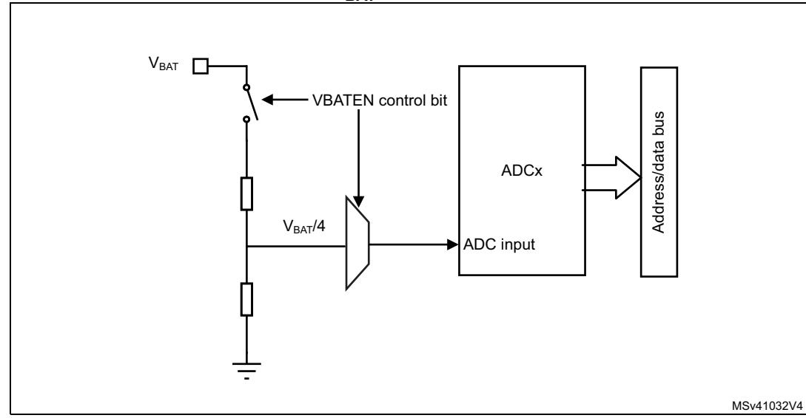

**Figure 210. VBAT channel block diagram**

*Note: The VBATEN bit in ADCx\_CCR must be configured to enable the conversion of the corresponding ADC internal channel.*

## **26.4.35 Monitoring the internal voltage reference**

The internal voltage reference can be monitored to have a reference point for evaluating the ADC VREF+ voltage level.

The internal voltage reference is internally connected to an ADC input channel (refer to *Table ADC interconnection* in *[Section 26.4.2: ADC pins and internal signals](#page-4-1)*).

The sampling time for this channel must be greater than the stabilization time specified in the product datasheet.

*[Figure 210](#page-79-0)* shows the block diagram of the VREFINT sensing feature.

MSv41033V5 VREFINT ADCx ADC input VREFEN control bit Internal power block

**Figure 211. VREFINT channel block diagram** 

*Note: The VREFEN bit of the ADCx\_CCR register must be configured to enable the conversion of the corresponding ADC internal channel (VREFINT).*

### Calculating the actual VDDA voltage using the internal reference voltage

The power supply voltage applied to the device may be subject to variations or not precisely known. When  $V_{DDA}$  is connected to  $V_{REF+}$ , it is possible to compute the actual  $V_{DDA}$  voltage using the embedded internal reference voltage ( $V_{REFINT}$ ).  $V_{REFINT}$  and its calibration data acquired by the ADC during the manufacturing process at  $V_{DDA}$  = 3.3 V can be used to evaluate the actual  $V_{DDA}$  voltage level.

The following formula gives the actual VDDA voltage supplying the device:

#### Where:

- VREFINT\_CAL is the VREFINT calibration value
- VREFINT\_DATA is the actual VREFINT output value converted by ADC

## Converting a supply-relative ADC measurement to an absolute voltage value

The ADC is designed to deliver a digital value corresponding to the ratio between VREF+ and the voltage applied on the converted channel.

For most applications  $V_{DDA}$  value is unknown and ADC converted values are right-aligned. In this case, it is necessary to convert this ratio into a voltage independent from  $V_{DDA}$ :

$$V_{CHANNELX} = \frac{V_{REF+}}{FULL\ SCALE} \times ADC_DATA$$

By replacing  $V_{\text{REF+}}$  by the formula provided above, the absolute voltage value is given by the following formula

$$V_{CHANNELx} = \frac{3.3 \text{ V} \times \text{VREFINT\_CAL} \times \text{ADC\_DATA}}{\text{VREFINT\_DATA} \times \text{FULL\_SCALE}}$$

For applications where VDDA is known and ADC converted values are right-aligned, the absolute voltage value can be obtained by using the following formula:

$$V_{CHANNELx} = \frac{V_{DDA}}{FULL\_SCALE} \times ADC\_DATA$$

#### Where:

- VREFINT CAL is the VREFINT calibration value
- ADC\_DATA is the value measured by the ADC on channel x (right-aligned)
- VREFINT DATA is the actual VREFINT output value converted by the ADC
- FULL\_SCALE is the maximum digital value of the ADC output. For example with 16-bit resolution, it is  $2^{16}$  1 = 65535 or with 8-bit resolution,  $2^8$  1 = 255.

Note:

If ADC measurements are done using an output format other than 16-bit right-aligned, all the parameters must first be converted to a compatible format before the calculation is done.

# **26.5 ADC interrupts**

For each ADC, an interrupt can be generated:

- After ADC power-up, when the ADC is ready (flag ADRDY)
- On the end of any conversion for regular groups (flag EOC)
- On the end of a sequence of conversion for regular groups (flag EOS)
- On the end of any conversion for injected groups (flag JEOC)
- On the end of a sequence of conversion for injected groups (flag JEOS)
- When an analog watchdog detection occurs (flag AWD1, AWD2 and AWD3)
- When the end of sampling phase occurs (flag EOSMP)
- When the data overrun occurs (OVR flag)
- When the injected sequence context queue overflows (flag JQOVF)

Separate interrupt enable bits are available for flexibility.

**Table 223. ADC interrupts per each ADC**

| Interrupt event                                     | Event flag | Enable control bit |
|-----------------------------------------------------|------------|--------------------|
| ADC ready                                           | ADRDY      | ADRDYIE            |
| End of conversion of a regular group                | EOC        | EOCIE              |
| End of sequence of conversions of a regular group   | EOS        | EOSIE              |
| End of conversion of a injected group               | JEOC       | JEOCIE             |
| End of sequence of conversions of an injected group | JEOS       | JEOSIE             |
| Analog watchdog 1 status bit is set                 | AWD1       | AWD1IE             |
| Analog watchdog 2 status bit is set                 | AWD2       | AWD2IE             |
| Analog watchdog 3 status bit is set                 | AWD3       | AWD3IE             |
| End of sampling phase                               | EOSMP      | EOSMPIE            |
| Overrun                                             | OVR        | OVRIE              |
| Injected context queue overflows                    | JQOVF      | JQOVFIE            |

# **26.6 ADC registers (for each ADC)**

Refer to *Section 1.2 on page 106* for a list of abbreviations used in register descriptions.

# **26.6.1 ADC interrupt and status register (ADC\_ISR)**

Address offset: 0x00

Reset value: 0x0000 0000

| 31   | 30   | 29   | 28         | 27   | 26    | 25   | 24   | 23   | 22   | 21   | 20   | 19   | 18   | 17          | 16   |
|------|------|------|------------|------|-------|------|------|------|------|------|------|------|------|-------------|------|
| Res. | Res. | Res. | Res.       | Res. | Res.  | Res. | Res. | Res. | Res. | Res. | Res. | Res. | Res. | Res.        | Res. |
|      |      |      |            |      |       |      |      |      |      |      |      |      |      |             |      |
|      |      |      |            |      |       |      |      |      |      |      |      |      |      |             |      |
| 15   | 14   | 13   | 12         | 11   | 10    | 9    | 8    | 7    | 6    | 5    | 4    | 3    | 2    | 1           | 0    |
| Res. | Res. | Res. | LDOR DY | Res. | JQOVF | AWD3 | AWD2 | AWD1 | JEOS | JEOC | OVR  | EOS  | EOC  | EOSMP ADRDY |      |

Bits 31:13 Reserved, must be kept at reset value.

#### Bit 12 **LDORDY**: ADC LDO output voltage ready bit

This bit is set and cleared by hardware. It indicates that the ADC internal LDO output is ready and that the ADC can be enabled or calibrated.

0: ADC LDO voltage regulator disabled

1: ADC LDO voltage regulator enabled

*Note: Refer to [Section 26.3: ADC implementation](#page-2-0)* for the availability of the LDO regulator.

#### Bit 11 Reserved, must be kept at reset value.

#### Bit 10 **JQOVF**: Injected context queue overflow

This bit is set by hardware when an Overflow of the Injected Queue of Context occurs. It is cleared by software writing 1 to it. Refer to *[Section 26.4.22: Queue of context for injected conversions](#page-31-0)* for more information.

- 0: No injected context queue overflow occurred (or the flag event was already acknowledged and cleared by software)
- 1: Injected context queue overflow has occurred

### Bit 9 **AWD3**: Analog watchdog 3 flag

This bit is set by hardware when the converted voltage crosses the values programmed in the fields LT3[7:0] and HT3[7:0] of ADC\_TR3 register. It is cleared by software writing 1 to it.

- 0: No analog watchdog 3 event occurred (or the flag event was already acknowledged and cleared by software)
- 1: Analog watchdog 3 event occurred

### Bit 8 **AWD2**: Analog watchdog 2 flag

This bit is set by hardware when the converted voltage crosses the values programmed in the fields LT2[7:0] and HT2[7:0] of ADC\_TR2 register. It is cleared by software writing 1 to it.

- 0: No analog watchdog 2 event occurred (or the flag event was already acknowledged and cleared by software)
- 1: Analog watchdog 2 event occurred

#### Bit 7 **AWD1**: Analog watchdog 1 flag

This bit is set by hardware when the converted voltage crosses the values programmed in the fields LT1[11:0] and HT1[11:0] of ADC\_TR1 register. It is cleared by software. writing 1 to it.

- 0: No analog watchdog 1 event occurred (or the flag event was already acknowledged and cleared by software)
- 1: Analog watchdog 1 event occurred

#### Bit 6 **JEOS:** Injected channel end of sequence flag

This bit is set by hardware at the end of the conversions of all injected channels in the group. It is cleared by software writing 1 to it.

- 0: Injected conversion sequence not complete (or the flag event was already acknowledged and cleared by software)
- 1: Injected conversions complete

#### Bit 5 **JEOC:** Injected channel end of conversion flag

This bit is set by hardware at the end of each injected conversion of a channel when a new data is available in the corresponding ADC\_JDRy register. It is cleared by software writing 1 to it or by reading the corresponding ADC\_JDRy register

- 0: Injected channel conversion not complete (or the flag event was already acknowledged and cleared by software)
- 1: Injected channel conversion complete

#### Bit 4 **OVR**: ADC overrun

This bit is set by hardware when an overrun occurs on a regular channel, meaning that a new conversion has completed while the EOC flag was already set. It is cleared by software writing 1 to it.

- 0: No overrun occurred (or the flag event was already acknowledged and cleared by software)
- 1: Overrun has occurred

#### Bit 3 **EOS**: End of regular sequence flag

This bit is set by hardware at the end of the conversions of a regular sequence of channels. It is cleared by software writing 1 to it.

- 0: Regular Conversions sequence not complete (or the flag event was already acknowledged and cleared by software)
- 1: Regular Conversions sequence complete

RM0399 Rev 4 1035/3556

#### Bit 2 **EOC**: End of conversion flag

This bit is set by hardware at the end of each regular conversion of a channel when a new data is available in the ADC\_DR register. It is cleared by software writing 1 to it or by reading the ADC\_DR register

- 0: Regular channel conversion not complete (or the flag event was already acknowledged and cleared by software)
- 1: Regular channel conversion complete

#### Bit 1 **EOSMP**: End of sampling flag

This bit is set by hardware during the conversion of any channel (only for regular channels), at the end of the sampling phase.

0: not at the end of the sampling phase (or the flag event was already acknowledged and cleared by software)

1: End of sampling phase reached

#### Bit 0 **ADRDY**: ADC ready

This bit is set by hardware after the ADC has been enabled (bit ADEN=1) and when the ADC reaches a state where it is ready to accept conversion requests.

It is cleared by software writing 1 to it.

0: ADC not yet ready to start conversion (or the flag event was already acknowledged and cleared by software)

1: ADC is ready to start conversion

## 26.6.2 ADC interrupt enable register (ADC IER)

Address offset: 0x04

Reset value: 0x0000 0000

| 31         | 30         | 29         | 28         | 27         | 26   | 25   | 24              | 23              | 22          | 21          | 20         | 19         | 18         | 17               | 16               |
|------------|------------|------------|------------|------------|------|------|-----------------|-----------------|-------------|-------------|------------|------------|------------|------------------|------------------|
| Res.       | Res.       | Res.       | Res.       | Res.       | Res. | Res. | Res.            | Res.            | Res.        | Res.        | Res.       | Res.       | Res.       | Res.             | Res.             |
|            |            |            |            |            |      |      |                 |                 |             |             |            |            |            |                  |                  |
|            |            |            |            |            |      |      |                 |                 |             |             |            |            |            |                  |                  |
| 15         | 14         | 13         | 12         | 11         | 10   | 9    | 8               | 7               | 6           | 5           | 4          | 3          | 2          | 1                | 0                |
| 15 Res. | 14 Res. | 13 Res. | 12 Res. | 11 Res. | 1    |      | 8 AWD2 IE | 7 AWD1 IE | <del></del> | 5 JEOCIE | 4 OVRIE | 3 EOSIE | 2 EOCIE | 1 EOSMP IE | 0 ADRDY IE |

Bits 31:11 Reserved, must be kept at reset value.

#### Bit 10 JQOVFIE: Injected context queue overflow interrupt enable

This bit is set and cleared by software to enable/disable the Injected Context Queue Overflow interrupt.

0: Injected Context Queue Overflow interrupt disabled

1: Injected Context Queue Overflow interrupt enabled. An interrupt is generated when the JQOVF bit is set

Note: The software is allowed to write this bit only when JADSTART=0 (which ensures that no injected conversion is ongoing).

### Bit 9 AWD3IE: Analog watchdog 3 interrupt enable

This bit is set and cleared by software to enable/disable the analog watchdog 2 interrupt.

- 0: Analog watchdog 3 interrupt disabled
- 1: Analog watchdog 3 interrupt enabled

Note: The software is allowed to write this bit only when ADSTART=0 and JADSTART=0 (which ensures that no conversion is ongoing).

### Bit 8 AWD2IE: Analog watchdog 2 interrupt enable

This bit is set and cleared by software to enable/disable the analog watchdog 2 interrupt.

- 0: Analog watchdog 2 interrupt disabled
- 1: Analog watchdog 2 interrupt enabled

Note: The software is allowed to write this bit only when ADSTART=0 and JADSTART=0 (which ensures that no conversion is ongoing).

### Bit 7 AWD1IE: Analog watchdog 1 interrupt enable

This bit is set and cleared by software to enable/disable the analog watchdog 1 interrupt.

- 0: Analog watchdog 1 interrupt disabled
- 1: Analog watchdog 1 interrupt enabled

Note: The software is allowed to write this bit only when ADSTART=0 and JADSTART=0 (which ensures that no conversion is ongoing).

#### Bit 6 **JEOSIE**: End of injected sequence of conversions interrupt enable

This bit is set and cleared by software to enable/disable the end of injected sequence of conversions interrupt.

- 0: JEOS interrupt disabled
- 1: JEOS interrupt enabled. An interrupt is generated when the JEOS bit is set.

Note: The software is allowed to write this bit only when JADSTART=0 (which ensures that no injected conversion is ongoing).

RM0399 Rev 4 1037/3556

#### Bit 5 **JEOCIE**: End of injected conversion interrupt enable

This bit is set and cleared by software to enable/disable the end of an injected conversion interrupt.

0: JEOC interrupt disabled.

1: JEOC interrupt enabled. An interrupt is generated when the JEOC bit is set.

*Note: The software is allowed to write this bit only when JADSTART is cleared to 0 (no injected conversion is ongoing).*

### Bit 4 **OVRIE**: Overrun interrupt enable

This bit is set and cleared by software to enable/disable the Overrun interrupt of a regular conversion.

0: Overrun interrupt disabled

1: Overrun interrupt enabled. An interrupt is generated when the OVR bit is set.

*Note: The software is allowed to write this bit only when ADSTART=0 (which ensures that no regular conversion is ongoing).*

#### Bit 3 **EOSIE**: End of regular sequence of conversions interrupt enable

This bit is set and cleared by software to enable/disable the end of regular sequence of conversions interrupt.

0: EOS interrupt disabled

1: EOS interrupt enabled. An interrupt is generated when the EOS bit is set.

*Note: The software is allowed to write this bit only when ADSTART=0 (which ensures that no regular conversion is ongoing).*

#### Bit 2 **EOCIE**: End of regular conversion interrupt enable

This bit is set and cleared by software to enable/disable the end of a regular conversion interrupt.

0: EOC interrupt disabled.

1: EOC interrupt enabled. An interrupt is generated when the EOC bit is set.

*Note: The software is allowed to write this bit only when ADSTART=0 (which ensures that no regular conversion is ongoing).*

### Bit 1 **EOSMPIE**: End of sampling flag interrupt enable for regular conversions

This bit is set and cleared by software to enable/disable the end of the sampling phase interrupt for regular conversions.

0: EOSMP interrupt disabled.

1: EOSMP interrupt enabled. An interrupt is generated when the EOSMP bit is set.

*Note: The software is allowed to write this bit only when ADSTART=0 (which ensures that no regular conversion is ongoing).*

### Bit 0 **ADRDYIE**: ADC ready interrupt enable

This bit is set and cleared by software to enable/disable the ADC Ready interrupt.

0: ADRDY interrupt disabled

1: ADRDY interrupt enabled. An interrupt is generated when the ADRDY bit is set.

*Note: The software is allowed to write this bit only when ADSTART=0 and JADSTART=0 (which ensures that no conversion is ongoing).*

## 26.6.3 ADC control register (ADC CR)

Address offset: 0x08

Reset value: 0x2000 0000

| 31        | 30           | 29          | 28           | 27                  | 26                  | 25                  | 24              | 23              | 22              | 21     | 20    | 19           | 18          | 17    | 16           |
|-----------|--------------|-------------|--------------|---------------------|---------------------|---------------------|-----------------|-----------------|-----------------|--------|-------|--------------|-------------|-------|--------------|
| ADCA L | ADCA LDIF | DEEP PWD | ADVREG EN | LINCA LRDY W6 | LINCA LRDY W5 | LINCA LRDY W4 | LINCAL RDYW3 | LINCAL RDYW2 | LINCAL RDYW1 | Res.   | Res.  | Res.         | Res.        | Res.  | ADCAL LIN |
| rs        | rw           | rw          | rw           | rw                  | rw                  | rw                  | rw              | rw              | rw              |        |       |              |             |       | rw           |
| 15        | 14           | 13          | 12           | 11                  | 10                  | 9                   | 8               | 7               | 6               | 5      | 4     | 3            | 2           | 1     | 0            |
| Res.      | Res.         | Res.        | Res.         | Res.                | Res.                | ВОО                 | ST[1:0]         | Res.            | Res.            | JADSTP | ADSTP | JADST ART | ADSTA RT | ADDIS | ADEN         |
|           |              |             |              |                     |                     | rw                  | rw              |                 |                 | rs     | rs    | rs           | rs          | rs    | rs           |

#### Bit 31 ADCAL: ADC calibration

This bit is set by software to start the calibration of the ADC. Program first the bit ADCALDIF to determine if this calibration applies for single-ended or differential inputs mode.

It is cleared by hardware after calibration is complete.

- 0: Calibration complete
- 1: Write 1 to calibrate the ADC. Read at 1 means that a calibration in progress.

Note: The software is allowed to launch a calibration by setting ADCAL only when ADEN=0.

The software is allowed to update the calibration factor by writing ADC\_CALFACT only when ADEN=1 and ADSTART=0 and JADSTART=0 (ADC enabled and no conversion is ongoing)

#### Bit 30 ADCALDIF: Differential mode for calibration

This bit is set and cleared by software to configure the single-ended or differential inputs mode for the calibration.

- 0: Writing ADCAL launches a calibration in single-ended inputs mode.
- 1: Writing ADCAL launches a calibration in differential inputs mode.

Note: The software is allowed to write this bit only when the ADC is disabled and is not calibrating (ADCAL=0, JADSTART=0, JADSTP=0, ADSTART=0, ADSTP=0, ADDIS=0 and ADEN=0).

#### Bit 29 **DEEPPWD**: Deep-power-down enable

This bit is set and cleared by software to put the ADC in deep-power-down mode.

- 0: ADC not in deep-power down
- 1: ADC in deep-power-down (default reset state)

Note: The software is allowed to write this bit only when the ADC is disabled (ADCAL=0, JADSTART=0, JADSTP=0, ADSTART=0, ADSTP=0, ADDIS=0 and ADEN=0).

### Bit 28 ADVREGEN: ADC voltage regulator enable

This bits is set by software to enable the ADC voltage regulator.

Before performing any operation such as launching a calibration or enabling the ADC, the ADC voltage regulator must first be enabled and the software must wait for the regulator start-up time.

- 0: ADC Voltage regulator disabled
- 1: ADC Voltage regulator enabled.

For more details about the ADC voltage regulator enable and disable sequences, refer to Section 26.4.6: ADC deep-power-down mode (DEEPPWD) and ADC voltage regulator (ADVREGEN).

The software can program this bitfield only when the ADC is disabled (ADCAL=0, JADSTART=0, ADSTART=0, ADSTP=0, ADDIS=0 and ADEN=0).

RM0399 Rev 4 1039/3556

#### Bit 27 **LINCALRDYW6**: Linearity calibration ready Word 6

This control / status bit allows to read/write the 6th linearity calibration factor.

When the linearity calibration is complete, this bit is set. A bit clear launches the transfer of the linearity factor 6 into the LINCALFACT[29:0] of the ADC\_CALFACT2 register. The bit is reset by hardware when the ADC\_CALFACT2 register can be read (software must poll the bit until it is cleared).

When the *LINCALRDYW6 bit is reset, a new linearity factor 6 value can be written into* the LINCALFACT[29:0] of the ADC\_CALFACT2 register. A bit set launches the linearity factor 6 update and the bit is effectively set by hardware once the update is done (software must poll the bit until it is set to indicate the write is effective).

*Note:* ADC\_CALFACT2[29:10] *contains 0.* ADC\_CALFACT2[9:0] *corresponds linearity correction factor bits[159:150].*

*The software is allowed to toggle this bit only if the LINCALRDYW5, LINCALRDYW4, LINCALRDYW3, LINCALRDYW2 and LINCALRDYW1 bits are left unchanged, see chapter [26.4.8: Calibration \(ADCAL, ADCALDIF, ADCALLIN, ADC\\_CALFACT\)](#page-11-0) for details.*

*The software is allowed to update the linearity calibration factor by writing LINCALRDYWx only when ADEN=1 and ADSTART=0 and JADSTART=0 (ADC enabled and no conversion is ongoing)*

### Bit 26 **LINCALRDYW5**: Linearity calibration ready Word 5

Refer to LINCALRDYW6 description.

*Note:* ADC\_CALFACT2[29:0] *corresponds linearity correction factor bits[149:120].*

*The software is allowed to toggle this bit only if the LINCALRDYW6, LINCALRDYW5, LINCALRDYW3, LINCALRDYW2 and LINCALRDYW1 bits are left unchanged.*

#### Bit 25 **LINCALRDYW4**: Linearity calibration ready Word 4

Refer to LINCALRDYW6 description.

*Note:* ADC\_CALFACT2[29:0] *correspond linearity correction factor bits[119:90]. The software is allowed to toggle this bit only if the LINCALRDYW6, LINCALRDYW5, LINCALRDYW3, LINCALRDYW2 and LINCALRDYW1 bits are left unchanged.*

## Bit 24 **LINCALRDYW3**: Linearity calibration ready Word 3

Refer to LINCALRDYW6 description.

*Note:* ADC\_CALFACT2[29:0] *corresponds linearity correction factor bits[89:60]. The software is allowed to toggle this bit only if the LINCALRDYW6, LINCALRDYW5, LINCALRDYW4, LINCALRDYW2 and LINCALRDYW1 bits are left unchanged.*

#### Bit 23 **LINCALRDYW2**: Linearity calibration ready Word 2

Refer to LINCALRDYW6 description.

*Note:* ADC\_CALFACT2[29:0] *corresponds linearity correction factor bits[59:30]. The software is allowed to toggle this bit only if the LINCALRDYW6, LINCALRDYW5, LINCALRDYW4, LINCALRDYW3 and LINCALRDYW1 bits are left unchanged.*

### Bit 22 **LINCALRDYW1**: Linearity calibration ready Word 1

Refer to LINCALRDYW6 description.

*Note: ADC\_CALFACT2[29:0] corresponds linearity correction factor bits[29:0].*

*The software is allowed to toggle this bit only if the LINCALRDYW6, LINCALRDYW5, LINCALRDYW4, LINCALRDYW3 and LINCALRDYW2 bits are left unchanged.*

Bits 21:17 Reserved, must be kept at reset value.

#### Bit 16 **ADCALLIN**: Linearity calibration

This bit is set and cleared by software to enable the Linearity calibration.

- 0: Writing ADCAL launches a calibration without the Linearity calibration.
- 1: Writing ADCAL launches a calibration with the Linearity calibration.

*Note: The software is allowed to write this bit only when the ADC is disabled and is not calibrating (ADCAL=0, JADSTART=0, JADSTP=0, ADSTART=0, ADSTP=0, ADDIS=0 and ADEN=0).*

Bits 15:10 Reserved, must be kept at reset value.

#### Bits 9:8 **BOOST[1:0]**: Boost mode control

This bitfield is set and cleared by software to enable/disable the boost mode.

00: used when ADC clock ≤ 6.25 MHz

01: used when 6.25 MHz < ADC clock frequency ≤ 12.5 MHz

10: used when 12.5 MHz < ADC clock ≤ 25.0 MHz

11: used when 25.0 MHz < ADC clock ≤ 50.0 MHz

*Note: The software is allowed to write this bit only when ADSTART=0 and JADSTART=0 (which ensures that no conversion is ongoing).*

*When dual mode is enabled (bits DAMDF of ADC*x*\_CCR register are not equal to zero), the BOOST bitfield of the slave ADC is no more writable and its content must be equal to the master ADC BOOST bitfield.* 

Bits 7:6 Reserved, must be kept at reset value.

#### Bit 5 **JADSTP**: ADC stop of injected conversion command

This bit is set by software to stop and discard an ongoing injected conversion (JADSTP Command). It is cleared by hardware when the conversion is effectively discarded and the ADC injected sequence and triggers can be re-configured. The ADC is then ready to accept a new start of injected conversions (JADSTART command).

- 0: No ADC stop injected conversion command ongoing
- 1: Write 1 to stop injected conversions ongoing. Read 1 means that an ADSTP command is in progress.

*Note: The software is allowed to set JADSTP only when JADSTART=1 and ADDIS=0 (ADC is enabled and eventually converting an injected conversion and there is no pending request to disable the ADC).*

*In auto-injection mode (JAUTO=1), setting ADSTP bit aborts both regular and injected conversions (do not use JADSTP)*

### Bit 4 **ADSTP**: ADC stop of regular conversion command

This bit is set by software to stop and discard an ongoing regular conversion (ADSTP Command). It is cleared by hardware when the conversion is effectively discarded and the ADC regular sequence and triggers can be re-configured. The ADC is then ready to accept a new start of regular conversions (ADSTART command).

- 0: No ADC stop regular conversion command ongoing
- 1: Write 1 to stop regular conversions ongoing. Read 1 means that an ADSTP command is in progress.

*Note: The software is allowed to set ADSTP only when ADSTART=1 and ADDIS=0 (ADC is enabled and eventually converting a regular conversion and there is no pending request to disable the ADC).*

*In auto-injection mode (JAUTO=1), setting ADSTP bit aborts both regular and injected conversions (do not use JADSTP).*

*In dual ADC regular simultaneous mode and interleaved mode, the bit ADSTP of the master ADC must be used to stop regular conversions. The other ADSTP bit is inactive.*

RM0399 Rev 4 1041/3556

#### Bit 3 **JADSTART**: ADC start of injected conversion

This bit is set by software to start ADC conversion of injected channels. Depending on the configuration bits JEXTEN, a conversion starts immediately (software trigger configuration) or once an injected hardware trigger event occurs (hardware trigger configuration). It is cleared by hardware:

- in single conversion mode when software trigger is selected (JEXTSEL=0x0): at the assertion of the End of Injected Conversion Sequence (JEOS) flag.
- in all cases: after the execution of the JADSTP command, at the same time that JADSTP is cleared by hardware.
- 0: No ADC injected conversion is ongoing.
- 1: Write 1 to start injected conversions. Read 1 means that the ADC is operating and eventually converting an injected channel.

*Note: The software is allowed to set JADSTART only when ADEN=1 and ADDIS=0 (ADC is enabled and there is no pending request to disable the ADC).*

*In auto-injection mode (JAUTO=1), regular and auto-injected conversions are started by setting bit ADSTART (JADSTART must be kept cleared)*

#### Bit 2 **ADSTART**: ADC start of regular conversion

It is cleared by hardware:

This bit is set by software to start ADC conversion of regular channels. Depending on the configuration bits EXTEN, a conversion starts immediately (software trigger configuration) or once a regular hardware trigger event occurs (hardware trigger configuration).

- in single conversion mode (CONT=0, DISCEN=0) when software trigger is selected (EXTEN=0x0): at the assertion of the End of Regular Conversion Sequence (EOS) flag.
- In discontinuous conversion mode (CONT=0, DISCEN=1), when the software trigger is selected (EXTEN=0x0): at the end of conversion (EOC) flag.
- in all other cases: after the execution of the ADSTP command, at the same time that ADSTP is cleared by hardware.

0: No ADC regular conversion is ongoing.

1: Write 1 to start regular conversions. Read 1 means that the ADC is operating and eventually converting a regular channel.

*Note: The software is allowed to set ADSTART only when ADEN=1 and ADDIS=0 (ADC is enabled and there is no pending request to disable the ADC)*

*In auto-injection mode (JAUTO=1), regular and auto-injected conversions are started by setting bit ADSTART (JADSTART must be kept cleared)*

#### Bit 1 **ADDIS**: ADC disable command

This bit is set by software to disable the ADC (ADDIS command) and put it into power-down state (OFF state).

It is cleared by hardware once the ADC is effectively disabled (ADEN is also cleared by hardware at this time).

0: no ADDIS command ongoing

1: Write 1 to disable the ADC. Read 1 means that an ADDIS command is in progress.

*Note: The software is allowed to set ADDIS only when ADEN=1 and both ADSTART=0 and JADSTART=0 (which ensures that no conversion is ongoing)*

### Bit 0 **ADEN**: ADC enable control

This bit is set by software to enable the ADC. The ADC is effectively ready to operate once the flag ADRDY has been set.

It is cleared by hardware when the ADC is disabled, after the execution of the ADDIS command.

0: ADC is disabled (OFF state)

1: Write 1 to enable the ADC.

*Note: The software is allowed to set ADEN only when all bits of ADC\_CR registers are 0 (ADCAL=0, JADSTART=0, ADSTART=0, ADSTP=0, ADDIS=0 and ADEN=0) except for bit ADVREGEN which must be 1 (and the software must have wait for the startup time of the voltage regulator)*

RM0399 Rev 4 1043/3556

## 26.6.4 ADC configuration register (ADC\_CFGR)

Address offset: 0x0C

Reset value: 0x8000 0000

| 31    | 30          | 29   | 28         | 27   | 26     | 25    | 24          | 23         | 22          | 21  | 20          | 19       | 18      | 17   | 16         |
|-------|-------------|------|------------|------|--------|-------|-------------|------------|-------------|-----|-------------|----------|---------|------|------------|
| JQDIS | AWD1CH[4:0] |      |            |      |        | JAUTO | JAWD1 EN | AWD1E N | AWD1S GL | JQM | JDISCE N | DI       | SCNUM[2 | ·:0] | DISCE N |
| rw    | rw          | rw   | rw         | rw   | rw     | rw    | rw          | rw         | rw          | rw  | rw          | rw       | rw      | rw   | rw         |
| 15    | 14          | 13   | 12         | 11   | 10     | 9     | 8           | 7          | 6           | 5   | 4           | 3        | 2       | 1    | 0          |
| Res.  | AUT DLY  | CONT | OVR MOD | EXTE | N[1:0] |       | E           | XTSEL[4:   | 0]          |     |             | RES[2:0] |         | DMNG | ;T[1:0]    |
|       | rw          | rw   | rw         | rw   | rw     | rw    | rw          | rw         | rw          | rw  | rw          | rw       | rw      | rw   | rw         |

#### Bit 31 JQDIS: Injected Queue disable

These bits are set and cleared by software to disable the Injected Queue mechanism:

0: Injected Queue enabled1: Injected Queue disabled

Note: The software is allowed to write this bit only when ADSTART=0 and JADSTART=0 (which ensures that no regular nor injected conversion is ongoing).

A set or reset of JQDIS bit causes the injected queue to be flushed and the JSQR register is cleared.

#### Bits 30:26 AWD1CH[4:0]: Analog watchdog 1 channel selection

These bits are set and cleared by software. They select the input channel to be guarded by the analog watchdog.

00000: ADC analog input channel-0 monitored by AWD1

00001: ADC analog input channel-1 monitored by AWD1

....

10010: ADC analog input channel-19 monitored by AWD1

others: Reserved, must not be used

Note: The channel selected by AWD1CH must be also selected into the SQRi or JSQRi registers.

The software is allowed to write these bits only when ADSTART=0 and JADSTART=0 (which ensures that no conversion is ongoing).

#### Bit 25 **JAUTO**: Automatic injected group conversion

This bit is set and cleared by software to enable/disable automatic injected group conversion after regular group conversion.

0: Automatic injected group conversion disabled

1: Automatic injected group conversion enabled

Note: The software is allowed to write this bit only when ADSTART=0 and JADSTART=0 (which ensures that no regular nor injected conversion is ongoing).

When dual mode is enabled (DAMDF bits in ADCx\_CCR register are not equal to zero), the bit JAUTO of the slave ADC is no more writable and its content is equal to the bit JAUTO of the master ADC.

### Bit 24 JAWD1EN: Analog watchdog 1 enable on injected channels

This bit is set and cleared by software

0: Analog watchdog 1 disabled on injected channels

1: Analog watchdog 1 enabled on injected channels

Note: The software is allowed to write this bit only when JADSTART=0 (which ensures that no injected conversion is ongoing).

#### Bit 23 **AWD1EN**: Analog watchdog 1 enable on regular channels

This bit is set and cleared by software

- 0: Analog watchdog 1 disabled on regular channels
- 1: Analog watchdog 1 enabled on regular channels

*Note: The software is allowed to write this bit only when ADSTART=0 (which ensures that no regular conversion is ongoing).*

### Bit 22 **AWD1SGL**: Enable the watchdog 1 on a single channel or on all channels

This bit is set and cleared by software to enable the analog watchdog on the channel identified by the AWD1CH[4:0] bits or on all the channels

- 0: Analog watchdog 1 enabled on all channels
- 1: Analog watchdog 1 enabled on a single channel

*Note: The software is allowed to write this bit only when ADSTART=0 and JADSTART=0 (which ensures that no conversion is ongoing).*

#### Bit 21 **JQM**: JSQR queue mode

This bit is set and cleared by software.

It defines how an empty Queue is managed.

- 0: JSQR Mode 0: The Queue is never empty and maintains the last written configuration into JSQR.
- 1: JSQR Mode 1: The Queue can be empty and when this occurs, the software and hardware triggers of the injected sequence are both internally disabled just after the completion of the last valid injected sequence.

Refer to *[Section 26.4.22: Queue of context for injected conversions](#page-31-0)* for more information.

*Note: The software is allowed to write this bit only when JADSTART=0 (which ensures that no injected conversion is ongoing).*

*When dual mode is enabled (DAMDF bits in ADCx\_CCR register are not equal to zero), the bit JQM of the slave ADC is no more writable and its content is equal to the bit JQM of the master ADC.*

#### Bit 20 **JDISCEN:** Discontinuous mode on injected channels

This bit is set and cleared by software to enable/disable discontinuous mode on the injected channels of a group.

- 0: Discontinuous mode on injected channels disabled
- 1: Discontinuous mode on injected channels enabled

*Note: The software is allowed to write this bit only when JADSTART=0 (which ensures that no injected conversion is ongoing).*

*It is not possible to use both auto-injected mode and discontinuous mode simultaneously: the bits DISCEN and JDISCEN must be kept cleared by software when JAUTO is set.*

*When dual mode is enabled (bits DAMDF of ADCx\_CCR register are not equal to zero), the bit JDISCEN of the slave ADC is no more writable and its content is equal to the bit JDISCEN of the master ADC.*

## Bits 19:17 **DISCNUM[2:0]:** Discontinuous mode channel count

These bits are written by software to define the number of regular channels to be converted in discontinuous mode, after receiving an external trigger.

000: 1 channel 001: 2 channels

...

111: 8 channels

*Note: The software is allowed to write these bits only when ADSTART=0 (which ensures that no regular conversion is ongoing).*

*When dual mode is enabled (DAMDF bits in ADCx\_CCR register are not equal to zero), the bits DISCNUM[2:0] of the slave ADC are no more writable and their content is equal to the bits DISCNUM[2:0] of the master ADC.*

RM0399 Rev 4 1045/3556

#### Bit 16 **DISCEN**: Discontinuous mode for regular channels

This bit is set and cleared by software to enable/disable discontinuous mode for regular channels.

- 0: Discontinuous mode for regular channels disabled
- 1: Discontinuous mode for regular channels enabled

*Note: It is not possible to have both discontinuous mode and continuous mode enabled: it is forbidden to set both DISCEN=1 and CONT=1.*

*It is not possible to use both auto-injected mode and discontinuous mode simultaneously: the bits DISCEN and JDISCEN must be kept cleared by software when JAUTO is set.* 

*The software is allowed to write this bit only when ADSTART=0 (which ensures that no regular conversion is ongoing).*

*When dual mode is enabled (DAMDF bits in ADCx\_CCR register are not equal to zero), the bit DISCEN of the slave ADC is no more writable and its content is equal to the bit DISCEN of the master ADC.*

### Bit 15 Reserved, must be kept at reset value.

### Bit 14 **AUTDLY**: Delayed conversion mode

This bit is set and cleared by software to enable/disable the Auto Delayed Conversion mode.*.*

- 0: Auto-delayed conversion mode off
- 1: Auto-delayed conversion mode on

*Note: The software is allowed to write this bit only when ADSTART=0 and JADSTART=0 (which ensures that no conversion is ongoing).*

*When dual mode is enabled (DAMDF bits in ADCx\_CCR register are not equal to zero), the bit AUTDLY of the slave ADC is no more writable and its content is equal to the bit AUTDLY of the master ADC.*

### Bit 13 **CONT**: Single / continuous conversion mode for regular conversions

This bit is set and cleared by software. If it is set, regular conversion takes place continuously until it is cleared.

- 0: Single conversion mode
- 1: Continuous conversion mode

*Note: It is not possible to have both discontinuous mode and continuous mode enabled: it is forbidden to set both DISCEN=1 and CONT=1.*

*The software is allowed to write this bit only when ADSTART=0 (which ensures that no regular conversion is ongoing).*

*When dual mode is enabled (DAMDF bits in ADCx\_CCR register are not equal to zero), the bit CONT of the slave ADC is no more writable and its content is equal to the bit CONT of the master ADC.*

### Bit 12 **OVRMOD**: Overrun Mode

This bit is set and cleared by software and configure the way data overrun is managed.

- 0: ADC\_DR register is preserved with the old data when an overrun is detected.
- 1: ADC\_DR register is overwritten with the last conversion result when an overrun is detected.

*Note: The software is allowed to write this bit only when ADSTART=0 (which ensures that no regular conversion is ongoing).*

#### Bits 11:10 **EXTEN[1:0]**: External trigger enable and polarity selection for regular channels

These bits are set and cleared by software to select the external trigger polarity and enable the trigger of a regular group.

00: Hardware trigger detection disabled (conversions can be launched by software)

- 01: Hardware trigger detection on the rising edge
- 10: Hardware trigger detection on the falling edge
- 11: Hardware trigger detection on both the rising and falling edges

*Note: The software is allowed to write these bits only when ADSTART=0 (which ensures that no regular conversion is ongoing).*

#### Bits 9:5 **EXTSEL[4:0]**: External trigger selection for regular group

These bits select the external event used to trigger the start of conversion of a regular group:

00000: Event 0 00001: Event 1 00010: Event 2 00011: Event 3 00100: Event 4 00101: Event 5 00110: Event 6 00111: Event 7 ...

11111: Event 31

*Note: The software is allowed to write these bits only when ADSTART=0 (which ensures that no regular conversion is ongoing).*

#### Bits 4:2 **RES[2:0]**: Data resolution

These bits are written by software to select the resolution of the conversion.

000: 16 bits

001: 14 bits in legacy mode (not optimized power consumption) 010: 12 bits in legacy mode (not optimized power consumption)

101: 14 bits 110: 12 bits 011: 10 bits 111: 8 bits

Others: Reserved, must not be used.

*Note: The software is allowed to write these bits only when ADSTART=0 and JADSTART=0 (which ensures that no conversion is ongoing).*

### Bits 1:0 **DMNGT[1:0]**: Data Management configuration

This bit is set and cleared by software to select how ADC interface output data are managed.

00: Regular conversion data stored in DR only

01: DMA One Shot Mode selected

10: DFSDM mode selected

11: DMA Circular Mode selected

*Note: The software is allowed to write this bit only when ADSTART=0 and JADSTART=0 (which ensures that no conversion is ongoing).*

*In dual-ADC modes, this bit is not relevant and replaced by control bit DAMDF of the ADCx\_CCR register.*

## **26.6.5 ADC configuration register 2 (ADC\_CFGR2)**

Address offset: 0x10

Reset value: 0x0000 0000

| 31   | 30          | 29          | 28          | 27          | 26          | 25 | 24 | 23 | 22        | 21 | 20        | 19   | 18   | 17 | 16          |
|------|-------------|-------------|-------------|-------------|-------------|----|----|----|-----------|----|-----------|------|------|----|-------------|
|      | LSHIFT[3:0] |             |             |             | Res.        |    |    |    |           |    | OSVR[9:0] |      |      |    |             |
| rw   | rw          | rw          | rw          |             |             | rw | rw | rw | rw        | rw | rw        | rw   | rw   | rw | rw          |
| 15   | 14          | 13          | 12          | 11          | 10          | 9  | 8  | 7  | 6         | 5  | 4         | 3    | 2    | 1  | 0           |
| Res. | RSHIF T4 | RSHIF T3 | RSHIF T2 | RSHIF T1 | ROVSM TROVS |    |    |    | OVSS[3:0] |    | Res.      | Res. | Res. |    | JOVSE ROVSE |
|      | rw          | rw          | rw          | rw          | rw          | rw | rw | rw | rw        | rw |           |      |      | rw | rw          |

### Bits 31:28 **LSHIFT[3:0]**: Left shift factor

This bitfield is set and cleared by software to define the left shifting applied to the final result with or without oversampling.

0000: No left shift

0001: Shift left 1-bit

0010: Shift left 2-bits

0011: Shift left 3-bits

0100: Shift left 4-bits

0101: Shift left 5-bits

0110: Shift left 6-bits

0111: Shift left 7-bits

1000: Shift left 8-bits

1001: Shift left 9-bits

1010: Shift left 10-bits

1011: Shift left 11-bits

1100: Shift left 12-bits

1101: Shift left 13-bits

1110: Shift left 14-bits

1111: Shift left 15-bits

*Note: The software is allowed to write this bit only when ADSTART=0 (which ensures that no conversion is ongoing).*

Bits 27:26 Reserved, must be kept at reset value.

#### Bits 25:16 **OSVR[9:0]**: Oversampling ratio

This bitfield is set and cleared by software to define the oversampling ratio.

0: 1x (no oversampling)

1: 2x

2: 3x

... 1023: 1024x

*Note: The software is allowed to write this bit only when ADSTART=0 (which ensures that no conversion is ongoing).*

Bit 15 Reserved, must be kept at reset value.

Bit 14 **RSHIFT4**: Right-shift data after Offset 4 correction

Refer to RSHIFT1 description.

Bit 13 **RSHIFT3**: Right-shift data after Offset 3 correction

Refer to RSHIFT1 description

Bit 12 **RSHIFT2**: Right-shift data after Offset 2 correction

Refer to RSHIFT1 description

#### Bit 11 **RSHIFT1**: Right-shift data after Offset 1 correction

This bitfield is set and cleared by software to right-shift 1-bit data after offset1 correction. This bit can only be used for 8-bit and 16-bit data format (see *[Section : Data register, data alignment and offset](#page-41-0)  [\(ADC\\_DR, ADC\\_JDRy, OFFSETy, OFFSETy\\_CH, OVSS, LSHIFT, RSHIFT, SSATE\)](#page-41-0)* for details).

0: Right-shifting disabled

1: Data is right-shifted 1-bit.

#### Bit 10 **ROVSM**: Regular Oversampling mode

This bit is set and cleared by software to select the regular oversampling mode.

- 0: Continued mode: When injected conversions are triggered, the oversampling is temporary stopped and continued after the injection sequence (oversampling buffer is maintained during injected sequence)
- 1: Resumed mode: When injected conversions are triggered, the current oversampling is aborted and resumed from start after the injection sequence (oversampling buffer is zeroed by injected sequence start)

*Note: The software is allowed to write this bit only when ADSTART=0 (which ensures that no conversion is ongoing).*

### Bit 9 **TROVS**: Triggered Regular Oversampling

This bit is set and cleared by software to enable triggered oversampling

- 0: All oversampled conversions for a channel are done consecutively following a trigger
- 1: Each oversampled conversion for a channel needs a new trigger

*Note: The software is allowed to write this bit only when ADSTART=0 (which ensures that no conversion is ongoing).*

#### Bits 8:5 **OVSS[3:0]**: Oversampling right shift

This bitfield is set and cleared by software to define the right shifting applied to the raw oversampling result.

0000: No right shift

0001: Shift right 1-bit

0010: Shift right 2-bits

0011: Shift right 3-bits

0100: Shift right 4-bits

0101: Shift right 5-bits

0110: Shift right 6-bits

0111: Shift right 7-bits

1000: Shift right 8-bits

1001: Shift right 9-bits

1010: Shift right 10-bits

1011: Shift right 11-bits

Others: Reserved, must not be used.

*Note: The software is allowed to write these bits only when ADSTART=0 (which ensures that no conversion is ongoing).*

#### Bits 4:2 Reserved, must be kept at reset value.

#### Bit 1 **JOVSE**: Injected Oversampling Enable

This bit is set and cleared by software to enable injected oversampling.

0: Injected Oversampling disabled

1: Injected Oversampling enabled

*Note: The software is allowed to write this bit only when ADSTART=0 and JADSTART=0 (which ensures that no conversion is ongoing)*

#### Bit 0 **ROVSE**: Regular Oversampling Enable

This bit is set and cleared by software to enable regular oversampling.

- 0: Regular Oversampling disabled
- 1: Regular Oversampling enabled

*Note: The software is allowed to write this bit only when ADSTART=0 and JADSTART=0 (which ensures that no conversion is ongoing)*

# **26.6.6 ADC sample time register 1 (ADC\_SMPR1)**

Address offset: 0x14

Reset value: 0x0000 0000

| 31      | 30   | 29        | 28 | 27 | 26        | 25 | 24 | 23        | 22 | 21 | 20        | 19        | 18        | 17        | 16 |
|---------|------|-----------|----|----|-----------|----|----|-----------|----|----|-----------|-----------|-----------|-----------|----|
| Res.    | Res. | SMP9[2:0] |    |    | SMP8[2:0] |    |    | SMP7[2:0] |    |    |           | SMP6[2:0] | SMP5[2:1] |           |    |
|         |      | rw        | rw | rw | rw        | rw | rw | rw        | rw | rw | rw        | rw        | rw        | rw        | rw |
| 15      | 14   | 13        | 12 | 11 | 10        | 9  | 8  | 7         | 6  | 5  | 4         | 3         | 2         | 1         | 0  |
| SMP5[0] |      | SMP4[2:0] |    |    | SMP3[2:0] |    |    | SMP2[2:0] |    |    | SMP1[2:0] |           |           | SMP0[2:0] |    |
| rw      | rw   | rw        | rw | rw | rw        | rw | rw | rw        | rw | rw | rw        | rw        | rw        | rw        | rw |

Bits 31:30 Reserved, must be kept at reset value.

#### Bits 29:0 **SMPx[2:0]:** Channel x sampling time selection (x = 9 to 0)

These bits are written by software to select the sampling time individually for each channel. During sample cycles, the channel selection bits must remain unchanged.

000: 1.5 ADC clock cycles 001: 2.5 ADC clock cycles 010: 8.5 ADC clock cycles 011: 16.5 ADC clock cycles 100: 32.5 ADC clock cycles 101: 64.5 ADC clock cycles 110: 387.5 ADC clock cycles

111: 810.5 ADC clock cycles

*Note: The software is allowed to write these bits only when ADSTART=0 and JADSTART=0 (which ensures that no conversion is ongoing).*

## **26.6.7 ADC sample time register 2 (ADC\_SMPR2)**

Address offset: 0x18

Reset value: 0x0000 0000

| 31       | 30   | 29         | 28 | 27 | 26         | 25 | 24 | 23         | 22 | 21 | 20         | 19         | 18 | 17         | 16         |
|----------|------|------------|----|----|------------|----|----|------------|----|----|------------|------------|----|------------|------------|
| Res.     | Res. | SMP19[2:0] |    |    | SMP18[2:0] |    |    | SMP17[2:0] |    |    |            | SMP16[2:0] |    |            | SMP15[2:1] |
|          |      | rw         | rw | rw | rw         | rw | rw | rw         | rw | rw | rw         | rw         | rw | rw         | rw         |
| 15       | 14   | 13         | 12 | 11 | 10         | 9  | 8  | 7          | 6  | 5  | 4          | 3          | 2  | 1          | 0          |
| SMP15[0] |      | SMP14[2:0] |    |    | SMP13[2:0] |    |    | SMP12[2:0] |    |    | SMP11[2:0] |            |    | SMP10[2:0] |            |
| rw       | rw   | rw         | rw | rw | rw         | rw | rw | rw         | rw | rw | rw         | rw         | rw | rw         | rw         |

Bits 31:30 Reserved, must be kept at reset value.

Bits 29:0 **SMPx[2:0]:** Channel x sampling time selection (x = 19 to 10)

These bits are written by software to select the sampling time individually for each channel. During sampling cycles, the channel selection bits must remain unchanged.

000: 1.5 ADC clock cycles 001: 2.5 ADC clock cycles 010: 8.5 ADC clock cycles 011: 16.5 ADC clock cycles 100: 32.5 ADC clock cycles 101: 64.5 ADC clock cycles 110: 387.5 ADC clock cycles 111: 810.5 ADC clock cycles

*Note: The software is allowed to write these bits only when ADSTART=0 and JADSTART=0 (which ensures that no conversion is ongoing).*

RM0399 Rev 4 1051/3556

## **26.6.8 ADC channel preselection register (ADC\_PCSEL)**

Address offset: 0x1C Reset value: 0x0000 0000

| 31          | 30          | 29          | 28          | 27          | 26          | 25         | 24         | 23         | 22         | 21         | 20         | 19          | 18          | 17                          | 16          |
|-------------|-------------|-------------|-------------|-------------|-------------|------------|------------|------------|------------|------------|------------|-------------|-------------|-----------------------------|-------------|
| Res.        | Res.        | Res.        | Res.        | Res.        | Res.        | Res.       | Res.       | Res.       | Res.       | Res.       | Res.       | PCSEL1 9 | PCSEL1 8 | PCSEL1 7                 | PCSEL1 6 |
|             |             |             |             |             |             |            |            |            |            |            |            | rw          | rw          | rw                          | rw          |
|             |             |             |             |             |             |            |            |            |            |            |            |             |             |                             |             |
| 15          | 14          | 13          | 12          | 11          | 10          | 9          | 8          | 7          | 6          | 5          | 4          | 3           | 2           | 1                           | 0           |
| PCSE L15 | PCSE L14 | PCSE L13 | PCSE L12 | PCSE L11 | PCSE L10 | PCSEL 9 | PCSEL 8 | PCSEL 7 | PCSEL 6 | PCSEL 5 | PCSEL 4 |             |             | PCSEL3 PCSEL2 PCSEL1 PCSEL0 |             |

Bits 31:20 Reserved, must be kept at reset value.

Bits 19:0 PCSEL[19:0] :Channel x (VINP[i]) pre selection (x = 0 to 19)

These bits are written by software to pre select the input channel at IO instance to be converted.

0: Input Channel x (Vinp x) is not pre selected for conversion, the ADC conversion result with this channel shows wrong result.

1: Input Channel x (Vinp x) is pre selected for conversion

*Note: The software is allowed to write these bits only when ADSTART=0 and JADSTART=0 (which ensures that no conversion is ongoing).*

# **26.6.9 ADC watchdog threshold register 1 (ADC\_LTR1)**

Address offset: 0x20

Reset value: 0x0000 0000

| 31   | 30         | 29   | 28   | 27   | 26   | 25          | 24 | 23 | 22 | 21 | 20 | 19 | 18 | 17 | 16 |  |  |
|------|------------|------|------|------|------|-------------|----|----|----|----|----|----|----|----|----|--|--|
| Res. | Res.       | Res. | Res. | Res. | Res. | LTR1[25:16] |    |    |    |    |    |    |    |    |    |  |  |
|      |            |      |      |      |      | rw          | rw | rw | rw | rw | rw | rw | rw | rw | rw |  |  |
| 15   | 14         | 13   | 12   | 11   | 10   | 9           | 8  | 7  | 6  | 5  | 4  | 3  | 2  | 1  | 0  |  |  |
|      | LTR1[15:0] |      |      |      |      |             |    |    |    |    |    |    |    |    |    |  |  |
| rw   | rw         | rw   | rw   | rw   | rw   | rw          | rw | rw | rw | rw | rw | rw | rw | rw | rw |  |  |

Bits 31:26 Reserved, must be kept at reset value.

Bits 25:0 **LTR1[25:0]**: Analog watchdog 1 lower threshold

These bits are written by software to define the lower threshold for the analog watchdog 1. Refer to *[Section 26.4.30: Analog window watchdog \(AWD1EN, JAWD1EN, AWD1SGL, AWD1CH,](#page-54-2)  [AWD2CH, AWD3CH, AWD\\_HTRy, AWD\\_LTRy, AWDy\)](#page-54-2)*

*Note: The software is allowed to write these bits only when ADSTART=0 and JADSTART=0 (which ensures that no conversion is ongoing).*

## **26.6.10 ADC watchdog threshold register 1 (ADC\_HTR1)**

Address offset: 0x24

Reset value: 0x03FF FFFF

| 31   | 30         | 29   | 28   | 27   | 26   | 25 | 24 | 23 | 22 | 21 | 20          | 19 | 18 | 17 | 16 |
|------|------------|------|------|------|------|----|----|----|----|----|-------------|----|----|----|----|
| Res. | Res.       | Res. | Res. | Res. | Res. |    |    |    |    |    | HTR1[25:16] |    |    |    |    |
|      |            |      |      |      |      | rw | rw | rw | rw | rw | rw          | rw | rw | rw | rw |
| 15   | 14         | 13   | 12   | 11   | 10   | 9  | 8  | 7  | 6  | 5  | 4           | 3  | 2  | 1  | 0  |
|      | HTR1[15:0] |      |      |      |      |    |    |    |    |    |             |    |    |    |    |
| rw   | rw         | rw   | rw   | rw   | rw   | rw | rw | rw | rw | rw | rw          | rw | rw | rw | rw |

Bits 31:26 Reserved, must be kept at reset value.

#### Bits 25:0 **HTR1[25:0]**: Analog watchdog 1 higher threshold

These bits are written by software to define the higher threshold for the analog watchdog 1. Refer to *[Section 26.4.30: Analog window watchdog \(AWD1EN, JAWD1EN, AWD1SGL, AWD1CH,](#page-54-2)  [AWD2CH, AWD3CH, AWD\\_HTRy, AWD\\_LTRy, AWDy\)](#page-54-2)*

*Note: The software is allowed to write these bits only when ADSTART=0 and JADSTART=0 (which ensures that no conversion is ongoing).*

## **26.6.11 ADC regular sequence register 1 (ADC\_SQR1)**

Address offset: 0x30

Reset value: 0x0000 0000

| 31   | 30       | 29   | 28 | 27   | 26       | 25 | 24       | 23   | 22 | 21   | 20       | 19 | 18     | 17   | 16     |
|------|----------|------|----|------|----------|----|----------|------|----|------|----------|----|--------|------|--------|
| Res. | Res.     | Res. |    |      | SQ4[4:0] |    |          | Res. |    |      | SQ3[4:0] |    |        | Res. | SQ2[4] |
|      |          |      | rw | rw   | rw       | rw | rw       |      | rw | rw   | rw       | rw | rw     |      | rw     |
| 15   | 14       | 13   | 12 | 11   | 10       | 9  | 8        | 7    | 6  | 5    | 4        | 3  | 2      | 1    | 0      |
|      | SQ2[3:0] |      |    | Res. |          |    | SQ1[4:0] |      |    | Res. | Res.     |    | L[3:0] |      |        |
| rw   | rw       | rw   | rw |      | rw       | rw | rw       | rw   | rw |      |          | rw | rw     | rw   | rw     |

Bits 31:29 Reserved, must be kept at reset value.

#### Bits 28:24 **SQ4[4:0]:** 4th conversion in regular sequence

These bits are written by software with the channel number (0..19) assigned as the 4th in the regular conversion sequence.

Bit 23 Reserved, must be kept at reset value.

#### Bits 22:18 **SQ3[4:0]:** 3rd conversion in regular sequence

These bits are written by software with the channel number (0..19) assigned as the 3rd in the regular conversion sequence.

*Note: The software is allowed to write these bits only when ADSTART=0 (which ensures that no regular conversion is ongoing).*

Bit 17 Reserved, must be kept at reset value.

#### Bits 16:12 **SQ2[4:0]:** 2nd conversion in regular sequence

These bits are written by software with the channel number (0..19) assigned as the 2nd in the regular conversion sequence.

*Note: The software is allowed to write these bits only when ADSTART=0 (which ensures that no regular conversion is ongoing).*

Bit 11 Reserved, must be kept at reset value.

#### Bits 10:6 **SQ1[4:0]:** 1st conversion in regular sequence

These bits are written by software with the channel number (0..19) assigned as the 1st in the regular conversion sequence.

*Note: The software is allowed to write these bits only when ADSTART=0 (which ensures that no regular conversion is ongoing).*

Bits 5:4 Reserved, must be kept at reset value.

#### Bits 3:0 **L[3:0]:** Regular channel sequence length

These bits are written by software to define the total number of conversions in the regular channel conversion sequence.

0000: 1 conversion 0001: 2 conversions

...

1111: 16 conversions

*Note: The software is allowed to write these bits only when ADSTART=0 (which ensures that no regular conversion is ongoing).*

## **26.6.12 ADC regular sequence register 2 (ADC\_SQR2)**

Address offset: 0x34

Reset value: 0x0000 0000

| 31   | 30       | 29   | 28 | 27   | 26       | 25 | 24       | 23   | 22 | 21   | 20       | 19 | 18       | 17   | 16     |
|------|----------|------|----|------|----------|----|----------|------|----|------|----------|----|----------|------|--------|
| Res. | Res.     | Res. |    |      | SQ9[4:0] |    |          | Res. |    |      | SQ8[4:0] |    |          | Res. | SQ7[4] |
|      |          |      | rw | rw   | rw       | rw | rw       |      | rw | rw   | rw       | rw | rw       |      | rw     |
| 15   | 14       | 13   | 12 | 11   | 10       | 9  | 8        | 7    | 6  | 5    | 4        | 3  | 2        | 1    | 0      |
|      | SQ7[3:0] |      |    | Res. |          |    | SQ6[4:0] |      |    | Res. |          |    | SQ5[4:0] |      |        |
| rw   | rw       | rw   | rw |      | rw       | rw | rw       | rw   | rw |      | rw       | rw | rw       | rw   | rw     |

Bits 31:29 Reserved, must be kept at reset value.

#### Bits 28:24 **SQ9[4:0]:** 9th conversion in regular sequence

These bits are written by software with the channel number (0..19) assigned as the 9th in the regular conversion sequence.

*Note: The software is allowed to write these bits only when ADSTART=0 (which ensures that no regular conversion is ongoing).*

Bit 23 Reserved, must be kept at reset value.

### Bits 22:18 **SQ8[4:0]:** 8th conversion in regular sequence

These bits are written by software with the channel number (0..19) assigned as the 8th in the regular conversion sequence

*Note: The software is allowed to write these bits only when ADSTART=0 (which ensures that no regular conversion is ongoing).*

Bit 17 Reserved, must be kept at reset value.

### Bits 16:12 **SQ7[4:0]:** 7th conversion in regular sequence

These bits are written by software with the channel number (0..19) assigned as the 7th in the regular conversion sequence.

*Note: The software is allowed to write these bits only when ADSTART=0 (which ensures that no regular conversion is ongoing).*

Bit 11 Reserved, must be kept at reset value.

### Bits 10:6 **SQ6[4:0]:** 6th conversion in regular sequence

These bits are written by software with the channel number (0..19) assigned as the 6th in the regular conversion sequence.

*Note: The software is allowed to write these bits only when ADSTART=0 (which ensures that no regular conversion is ongoing).*

Bit 5 Reserved, must be kept at reset value.

#### Bits 4:0 **SQ5[4:0]:** 5th conversion in regular sequence

These bits are written by software with the channel number (0..19) assigned as the 5th in the regular conversion sequence.

*Note: The software is allowed to write these bits only when ADSTART=0 (which ensures that no regular conversion is ongoing).*

## **26.6.13 ADC regular sequence register 3 (ADC\_SQR3)**

Address offset: 0x38

Reset value: 0x0000 0000

| 31   | 30        | 29   | 28 | 27   | 26        | 25 | 24        | 23   | 22 | 21   | 20        | 19 | 18 | 17   | 16      |
|------|-----------|------|----|------|-----------|----|-----------|------|----|------|-----------|----|----|------|---------|
| Res. | Res.      | Res. |    |      | SQ14[4:0] |    |           | Res. |    |      | SQ13[4:0] |    |    | Res. | SQ12[4] |
|      |           |      | rw | rw   | rw        | rw | rw        |      | rw | rw   | rw        | rw | rw |      | rw      |
| 15   | 14        | 13   | 12 | 11   | 10        | 9  | 8         | 7    | 6  | 5    | 4         | 3  | 2  | 1    | 0       |
|      | SQ12[3:0] |      |    | Res. |           |    | SQ11[4:0] |      |    | Res. | SQ10[4:0] |    |    |      |         |
| rw   | rw        | rw   | rw |      | rw        | rw | rw        | rw   | rw |      | rw        | rw | rw | rw   | rw      |

Bits 31:29 Reserved, must be kept at reset value.

#### Bits 28:24 **SQ14[4:0]:** 14th conversion in regular sequence

These bits are written by software with the channel number (0..19) assigned as the 14th in the regular conversion sequence.

*Note: The software is allowed to write these bits only when ADSTART=0 (which ensures that no regular conversion is ongoing).*

Bit 23 Reserved, must be kept at reset value.

### Bits 22:18 **SQ13[4:0]:** 13th conversion in regular sequence

These bits are written by software with the channel number (0..19) assigned as the 13th in the regular conversion sequence.

*Note: The software is allowed to write these bits only when ADSTART=0 (which ensures that no regular conversion is ongoing).*

Bit 17 Reserved, must be kept at reset value.

### Bits 16:12 **SQ12[4:0]:** 12th conversion in regular sequence

These bits are written by software with the channel number (0..19) assigned as the 12th in the regular conversion sequence.

*Note: The software is allowed to write these bits only when ADSTART=0 (which ensures that no regular conversion is ongoing).*

Bit 11 Reserved, must be kept at reset value.

### Bits 10:6 **SQ11[4:0]:** 11th conversion in regular sequence

These bits are written by software with the channel number (0..19) assigned as the 11th in the regular conversion sequence.

*Note: The software is allowed to write these bits only when ADSTART=0 (which ensures that no regular conversion is ongoing).*

Bit 5 Reserved, must be kept at reset value.

## Bits 4:0 **SQ10[4:0]:** 10th conversion in regular sequence

These bits are written by software with the channel number (0..19) assigned as the 10th in the regular conversion sequence.

*Note: The software is allowed to write these bits only when ADSTART=0 (which ensures that no regular conversion is ongoing).*

## **26.6.14 ADC regular sequence register 4 (ADC\_SQR4)**

Address offset: 0x3C

Reset value: 0x0000 0000

| 31   | 30   | 29   | 28   | 27   | 26   | 25   | 24        | 23   | 22   | 21   | 20   | 19   | 18        | 17   | 16   |
|------|------|------|------|------|------|------|-----------|------|------|------|------|------|-----------|------|------|
| Res. | Res. | Res. | Res. | Res. | Res. | Res. | Res.      | Res. | Res. | Res. | Res. | Res. | Res.      | Res. | Res. |
|      |      |      |      |      |      |      |           |      |      |      |      |      |           |      |      |
|      |      |      |      |      |      |      |           |      |      |      |      |      |           |      |      |
| 15   | 14   | 13   | 12   | 11   | 10   | 9    | 8         | 7    | 6    | 5    | 4    | 3    | 2         | 1    | 0    |
| Res. | Res. | Res. | Res. | Res. |      |      | SQ16[4:0] |      |      | Res. |      |      | SQ15[4:0] |      |      |

Bits 31:11 Reserved, must be kept at reset value.

Bits 10:6 **SQ16[4:0]:** 16th conversion in regular sequence

These bits are written by software with the channel number (0..19) assigned as the 16th in the regular conversion sequence.

*Note: The software is allowed to write these bits only when ADSTART=0 (which ensures that no regular conversion is ongoing).*

Bit 5 Reserved, must be kept at reset value.

Bits 4:0 **SQ15[4:0]:** 15th conversion in regular sequence

These bits are written by software with the channel number (0..19) assigned as the 15th in the regular conversion sequence.

*Note: The software is allowed to write these bits only when ADSTART=0 (which ensures that no regular conversion is ongoing).*

## **26.6.15 ADC regular Data Register (ADC\_DR)**

Address offset: 0x40

Reset value: 0x0000 0000

| 31 | 30           | 29 | 28 | 27 | 26 | 25 | 24 | 23          | 22 | 21 | 20 | 19 | 18 | 17 | 16 |
|----|--------------|----|----|----|----|----|----|-------------|----|----|----|----|----|----|----|
|    | RDATA[31:16] |    |    |    |    |    |    |             |    |    |    |    |    |    |    |
| r  | r            | r  | r  | r  | r  | r  | r  | r           | r  | r  | r  | r  | r  | r  | r  |
| 15 | 14           | 13 | 12 | 11 | 10 | 9  | 8  | 7           | 6  | 5  | 4  | 3  | 2  | 1  | 0  |
|    |              |    |    |    |    |    |    | RDATA[15:0] |    |    |    |    |    |    |    |
| r  | r            | r  | r  | r  | r  | r  | r  | r           | r  | r  | r  | r  | r  | r  | r  |

Bits 31:0 **RDATA[31:0]**: Regular Data converted

These bits are read-only. They contain the conversion result from the last converted regular channel. The data are left- or right-aligned as described in *[Section 26.4.27: Data management](#page-41-1)*.

## **26.6.16 ADC injected sequence register (ADC\_JSQR)**

Address offset: 0x4C

Reset value: 0x0000 0000

| 31      | 30   | 29        | 28 | 27        | 26   | 25                | 24          | 23 | 22 | 21           | 20 | 19 | 18 | 17        | 16      |  |
|---------|------|-----------|----|-----------|------|-------------------|-------------|----|----|--------------|----|----|----|-----------|---------|--|
|         |      | JSQ4[4:0] |    |           | Res. | JSQ3[4:0] Res. |             |    |    |              |    |    |    | JSQ2[4:1] |         |  |
| rw      | rw   | rw        | rw | rw        |      | rw                | rw          | rw | rw | rw           |    | rw | rw | rw        | rw      |  |
| 15      | 14   | 13        | 12 | 11        | 10   | 9                 | 8           | 7  | 6  | 5            | 4  | 3  | 2  | 1         | 0       |  |
| JSQ2[0] | Res. |           |    | JSQ1[4:0] |      |                   | JEXTEN[1:0] |    |    | JEXTSEL[4:0] |    |    |    |           | JL[1:0] |  |
| rw      |      | rw        | rw | rw        | rw   | rw                | rw          | rw | rw | rw           | rw | rw | rw | rw        | rw      |  |

### Bits 31:27 **JSQ4[4:0]:** 4th conversion in the injected sequence

These bits are written by software with the channel number (0..19) assigned as the 4th in the injected conversion sequence.

*Note: The software is allowed to write these bits only when JADSTART is cleared to 0 (no injected conversion is ongoing) unless the context queue is enabled (JQDIS=0 in ADC\_CFGR register).*

Bit 26 Reserved, must be kept at reset value.

#### Bits 25:21 **JSQ3[4:0]:** 3rd conversion in the injected sequence

These bits are written by software with the channel number (0..19) assigned as the 3rd in the injected conversion sequence.

*Note: The software is allowed to write these bits only when JADSTART is cleared to 0 (no injected conversion is ongoing) unless the context queue is enabled (JQDIS=0 in ADC\_CFGR register).*

Bit 20 Reserved, must be kept at reset value.

#### Bits 19:15 **JSQ2[4:0]:** 2nd conversion in the injected sequence

These bits are written by software with the channel number (0..19) assigned as the 2nd in the injected conversion sequence.

*Note: The software is allowed to write these bits only when JADSTART is cleared to 0 (no injected conversion is ongoing) unless the context queue is enabled (JQDIS=0 in ADC\_CFGR register).*

Bit 14 Reserved, must be kept at reset value.

#### Bits 13:9 **JSQ1[4:0]:** 1st conversion in the injected sequence

These bits are written by software with the channel number (0..19) assigned as the 1st in the injected conversion sequence.

*Note: The software is allowed to write these bits only when JADSTART is cleared to 0 (no injected conversion is ongoing) unless the context queue is enabled (JQDIS=0 in ADC\_CFGR register).*

#### Bits 8:7 **JEXTEN[1:0]**: External trigger enable and polarity selection for injected channels

These bits are set and cleared by software to select the external trigger polarity and enable the trigger of an injected group.

00: If JQDIS=0 (queue enabled), Hardware and software trigger detection disabled and If JQDIS=1 (queue disabled), Hardware trigger detection disabled (conversions can be launched by software

01: Hardware trigger detection on the rising edge

10: Hardware trigger detection on the falling edge

11: Hardware trigger detection on both the rising and falling edges

*Note: The software is allowed to write these bits only when JADSTART is cleared to 0 (no injected conversion is ongoing).*

*If JQM=1 and if the Queue of Context becomes empty, the software and hardware triggers of the injected sequence are both internally disabled (refer to [Section 26.4.22:](#page-31-0)  [Queue of context for injected conversions](#page-31-0))*

#### Bits 6:2 **JEXTSEL[**4**:0]**: External trigger selection for injected group

These bits select the external event used to trigger the start of conversion of an injected group:

00000: Event 0 00001: Event 1

00010: Event 2

00011: Event 3

00100: Event 4

00101: Event 5

00110: Event 6

00111: Event 7

...

11111: Event 31:

*Note: The software is allowed to write these bits only when JADSTART is cleared to 0 (no injected conversion is ongoing).*

#### Bits 1:0 **JL[1:0]:** Injected channel sequence length

These bits are written by software to define the total number of conversions in the injected channel conversion sequence.

00: 1 conversion

01: 2 conversions

10: 3 conversions

11: 4 conversions

*Note: The software is allowed to write these bits only when JADSTART is cleared to 0 (no injected conversion is ongoing).*

## **26.6.17 ADC injected channel y offset register (ADC\_OFRy)**

Address offset: 0x60 + 0x04 \* (y-1), (y = 1 to 4)

Reset value: 0x0000 0000

| 31    | 30             | 29 | 28 | 27 | 26 | 25 | 24 | 23            | 22 | 21 | 20 | 19 | 18 | 17 | 16 |  |  |
|-------|----------------|----|----|----|----|----|----|---------------|----|----|----|----|----|----|----|--|--|
| SSATE | OFFSET_CH[4:0] |    |    |    |    |    |    | OFFSET[25:16] |    |    |    |    |    |    |    |  |  |
| rw    | rw             | rw | rw | rw | rw | rw | rw | rw            | rw | rw | rw | rw | rw | rw | rw |  |  |
| 15    | 14             | 13 | 12 | 11 | 10 | 9  | 8  | 7             | 6  | 5  | 4  | 3  | 2  | 1  | 0  |  |  |
|       | OFFSET[15:0]   |    |    |    |    |    |    |               |    |    |    |    |    |    |    |  |  |
| rw    | rw             | rw | rw | rw | rw | rw | rw | rw            | rw | rw | rw | rw | rw | rw | rw |  |  |

### Bit 31 **SSATE:** Signed saturation Enable

This bit is written by software to enable or disable the Signed saturation feature.

This bit can be enabled only for 8-bit and 16-bit data format (see *[Section : Data register, data](#page-41-0)  [alignment and offset \(ADC\\_DR, ADC\\_JDRy, OFFSETy, OFFSETy\\_CH, OVSS, LSHIFT,](#page-41-0)  [RSHIFT, SSATE\)](#page-41-0)* for details).

- 0: Offset is subtracted maintaining data integrity and extending result size (9-bit and 17-bit signed format).
- 1: Offset is subtracted and result is saturated to maintain result size.

*Note: The software is allowed to write this bit only when ADSTART=0 and JADSTART=0 (which ensures that no conversion is ongoing).*

#### Bits 30:26 **OFFSET\_CH[4:0]:** Channel selection for the Data offset y

These bits are written by software to define the channel to which the offset programmed into bits OFFSETy[25:0] applies.

*Note: The software is allowed to write these bits only when ADSTART=0 and JADSTART=0 (which ensures that no conversion is ongoing).*

### Bits 25:0 **OFFSET[25:0]:** Data offset y for the channel programmed into bits OFFSETy\_CH[4:0]

These bits are written by software to define the offset y to be subtracted from the raw converted data when converting a channel (can be regular or injected). The channel to which applies the data offset y must be programmed in the bits OFFSETy\_CH[4:0]. The conversion result can be read from in the ADC\_DR (regular conversion) or from in the ADC\_JDRyi registers (injected conversion).

When OFFSETy[25:0] bitfield is reset, the offset compensation is disabled.

*Note: The software is allowed to write these bits only when ADSTART=0 and JADSTART=0 (which ensures that no conversion is ongoing).*

*If several offset (OFFSETy) point to the same channel, only the offset with the lowest x value is considered for the subtraction.* 

*Ex: if OFFSET1\_CH[4:0]=4 and OFFSET2\_CH[4:0]=4, this is OFFSET1[25:0] which is subtracted when converting channel 4.*

RM0399 Rev 4 1061/3556

## **26.6.18 ADC injected channel y data register (ADC\_JDRy)**

Address offset: 0x80 + 0x04 \* (y-1), (y= 1 to 4)

Reset value: 0x0000 0000

| 31 | 30           | 29 | 28 | 27 | 26 | 25 | 24 | 23 | 22 | 21 | 20 | 19 | 18 | 17 | 16 |
|----|--------------|----|----|----|----|----|----|----|----|----|----|----|----|----|----|
|    | JDATA[31:16] |    |    |    |    |    |    |    |    |    |    |    |    |    |    |
| r  | r            | r  | r  | r  | r  | r  | r  | r  | r  | r  | r  | r  | r  | r  | r  |
| 15 | 14           | 13 | 12 | 11 | 10 | 9  | 8  | 7  | 6  | 5  | 4  | 3  | 2  | 1  | 0  |
|    | JDATA[15:0]  |    |    |    |    |    |    |    |    |    |    |    |    |    |    |
| r  | r            | r  | r  | r  | r  | r  | r  | r  | r  | r  | r  | r  | r  | r  | r  |

Bits 31:0 **JDATA[31:0]:** Injected data

These bits are read-only. They contain the conversion result from injected channel y. The data are left -or right-aligned as described in *[Section 26.4.27: Data management](#page-41-1)*.

# **26.6.19 ADC analog watchdog 2 configuration register (ADC\_AWD2CR)**

Address offset: 0xA0

Reset value: 0x0000 0000

| 31   | 30           | 29   | 28   | 27   | 26   | 25   | 24   | 23   | 22   | 21   | 20   | 19            | 18 | 17 | 16 |  |  |
|------|--------------|------|------|------|------|------|------|------|------|------|------|---------------|----|----|----|--|--|
| Res. | Res.         | Res. | Res. | Res. | Res. | Res. | Res. | Res. | Res. | Res. | Res. | AWD2CH[19:16] |    |    |    |  |  |
|      |              |      |      |      |      |      |      |      |      |      |      | rw            | rw | rw | rw |  |  |
| 15   | 14           | 13   | 12   | 11   | 10   | 9    | 8    | 7    | 6    | 5    | 4    | 3             | 2  | 1  | 0  |  |  |
|      | AWD2CH[15:0] |      |      |      |      |      |      |      |      |      |      |               |    |    |    |  |  |
| rw   | rw           | rw   | rw   | rw   | rw   | rw   | rw   | rw   | rw   | rw   | rw   | rw            | rw | rw | rw |  |  |

Bits 31:20 Reserved, must be kept at reset value.

## Bits 19:0 **AWD2CH[19:0]**: Analog watchdog 2 channel selection

These bits are set and cleared by software. They enable and select the input channels to be guarded by the analog watchdog 2.

AWD2CH[i] = 0: ADC analog input channel-i is not monitored by AWD2

AWD2CH[i] = 1: ADC analog input channel-i is monitored by AWD2

When AWD2CH[19:0] = 000..0, the analog Watchdog 2 is disabled

*Note: The channels selected by AWD2CH must be also selected into the SQRi or JSQRi registers. The software is allowed to write these bits only when ADSTART=0 and JADSTART=0 (which ensures that no conversion is ongoing).*

# **26.6.20 ADC analog watchdog 3 configuration register (ADC\_AWD3CR)**

Address offset: 0xA4

Reset value: 0x0000 0000

| 31   | 30           | 29   | 28   | 27   | 26   | 25   | 24   | 23   | 22   | 21   | 20   | 19 | 18            | 17 | 16 |  |
|------|--------------|------|------|------|------|------|------|------|------|------|------|----|---------------|----|----|--|
| Res. | Res.         | Res. | Res. | Res. | Res. | Res. | Res. | Res. | Res. | Res. | Res. |    | AWD3CH[19:16] |    |    |  |
|      |              |      |      |      |      |      |      |      |      |      |      | rw | rw            | rw | rw |  |
| 15   | 14           | 13   | 12   | 11   | 10   | 9    | 8    | 7    | 6    | 5    | 4    | 3  | 2             | 1  | 0  |  |
|      | AWD3CH[15:0] |      |      |      |      |      |      |      |      |      |      |    |               |    |    |  |
| rw   | rw           | rw   | rw   | rw   | rw   | rw   | rw   | rw   | rw   | rw   | rw   | rw | rw            | rw | rw |  |

Bits 31:20 Reserved, must be kept at reset value.

### Bits 19:0 **AWD3CH[19:0]**: Analog watchdog 3 channel selection

These bits are set and cleared by software. They enable and select the input channels to be guarded by the analog watchdog 3.

AWD3CH[i] = 0: ADC analog input channel-i is not monitored by AWD3

AWD3CH[i] = 1: ADC analog input channel-i is monitored by AWD3

When AWD3CH[19:0] = 000..0, the analog Watchdog 3 is disabled

*Note: The channels selected by AWD3CH must be also selected into the SQRi or JSQRi registers. The software is allowed to write these bits only when ADSTART=0 and JADSTART=0 (which ensures that no conversion is ongoing).*

## **26.6.21 ADC watchdog lower threshold register 2 (ADC\_LTR2)**

Address offset: 0xB0

Reset value: 0x0000 0000

| 31   | 30         | 29   | 28   | 27   | 26   | 25          | 24 | 23 | 22 | 21 | 20 | 19 | 18 | 17 | 16 |  |
|------|------------|------|------|------|------|-------------|----|----|----|----|----|----|----|----|----|--|
| Res. | Res.       | Res. | Res. | Res. | Res. | LTR2[25:16] |    |    |    |    |    |    |    |    |    |  |
|      |            |      |      |      |      | rw          | rw | rw | rw | rw | rw | rw | rw | rw | rw |  |
| 15   | 14         | 13   | 12   | 11   | 10   | 9           | 8  | 7  | 6  | 5  | 4  | 3  | 2  | 1  | 0  |  |
|      | LTR2[15:0] |      |      |      |      |             |    |    |    |    |    |    |    |    |    |  |
| rw   | rw         | rw   | rw   | rw   | rw   | rw          | rw | rw | rw | rw | rw | rw | rw | rw | rw |  |

Bits 31:26 Reserved, must be kept at reset value.

## Bits 25:0 **LTR2[25:0]**: Analog watchdog 2 lower threshold

These bits are written by software to define the lower threshold for the analog watchdog 2. Refer to *[Section 26.4.30: Analog window watchdog \(AWD1EN, JAWD1EN, AWD1SGL, AWD1CH,](#page-54-2)  [AWD2CH, AWD3CH, AWD\\_HTRy, AWD\\_LTRy, AWDy\)](#page-54-2)*.

*Note: The software is allowed to write these bits only when ADSTART=0 and JADSTART=0 (which ensures that no conversion is ongoing).*

RM0399 Rev 4 1063/3556

## **26.6.22 ADC watchdog higher threshold register 2 (ADC\_HTR2)**

Address offset: 0xB4

Reset value: 0x03FF FFFF

| 31   | 30         | 29   | 28   | 27   | 26   | 25 | 24          | 23 | 22 | 21 | 20 | 19 | 18 | 17 | 16 |  |  |
|------|------------|------|------|------|------|----|-------------|----|----|----|----|----|----|----|----|--|--|
| Res. | Res.       | Res. | Res. | Res. | Res. |    | HTR2[25:16] |    |    |    |    |    |    |    |    |  |  |
|      |            |      |      |      |      | rw | rw          | rw | rw | rw | rw | rw | rw | rw | rw |  |  |
| 15   | 14         | 13   | 12   | 11   | 10   | 9  | 8           | 7  | 6  | 5  | 4  | 3  | 2  | 1  | 0  |  |  |
|      | HTR2[15:0] |      |      |      |      |    |             |    |    |    |    |    |    |    |    |  |  |
| rw   | rw         | rw   | rw   | rw   | rw   | rw | rw          | rw | rw | rw | rw | rw | rw | rw | rw |  |  |

Bits 31:26 Reserved, must be kept at reset value.

#### Bits 25:0 **HTR2[25:0]**: Analog watchdog 2 higher threshold

These bits are written by software to define the higher threshold for the analog watchdog 2. Refer to *[Section 26.4.30: Analog window watchdog \(AWD1EN, JAWD1EN, AWD1SGL, AWD1CH,](#page-54-2)  [AWD2CH, AWD3CH, AWD\\_HTRy, AWD\\_LTRy, AWDy\)](#page-54-2)*.

*Note: The software is allowed to write these bits only when ADSTART=0 and JADSTART=0 (which ensures that no conversion is ongoing).*

## **26.6.23 ADC watchdog lower threshold register 3 (ADC\_LTR3)**

Address offset: 0xB8 Reset value: 0x0000 0000

| 31   | 30         | 29   | 28   | 27   | 26   | 25          | 24 | 23 | 22 | 21 | 20 | 19 | 18 | 17 | 16 |  |
|------|------------|------|------|------|------|-------------|----|----|----|----|----|----|----|----|----|--|
| Res. | Res.       | Res. | Res. | Res. | Res. | LTR3[25:16] |    |    |    |    |    |    |    |    |    |  |
|      |            |      |      |      |      | rw          | rw | rw | rw | rw | rw | rw | rw | rw | rw |  |
| 15   | 14         | 13   | 12   | 11   | 10   | 9           | 8  | 7  | 6  | 5  | 4  | 3  | 2  | 1  | 0  |  |
|      | LTR3[15:0] |      |      |      |      |             |    |    |    |    |    |    |    |    |    |  |
| rw   | rw         | rw   | rw   | rw   | rw   | rw          | rw | rw | rw | rw | rw | rw | rw | rw | rw |  |

Bits 31:26 Reserved, must be kept at reset value.

### Bits 25:0 **LTR3[25:0]**: Analog watchdog 3 lower threshold

These bits are written by software to define the lower threshold for the analog watchdog 3. Refer to *[Section 26.4.30: Analog window watchdog \(AWD1EN, JAWD1EN, AWD1SGL, AWD1CH,](#page-54-2)  [AWD2CH, AWD3CH, AWD\\_HTRy, AWD\\_LTRy, AWDy\)](#page-54-2)*

*Note: The software is allowed to write these bits only when ADSTART=0 and JADSTART=0 (which ensures that no conversion is ongoing).*

## **26.6.24 ADC watchdog higher threshold register 3 (ADC\_HTR3)**

Address offset: 0xBC

Reset value: 0x03FF FFFF

| 31   | 30         | 29   | 28   | 27   | 26   | 25 | 24          | 23 | 22 | 21 | 20 | 19 | 18 | 17 | 16 |  |  |
|------|------------|------|------|------|------|----|-------------|----|----|----|----|----|----|----|----|--|--|
| Res. | Res.       | Res. | Res. | Res. | Res. |    | HTR3[25:16] |    |    |    |    |    |    |    |    |  |  |
|      |            |      |      |      |      | rw | rw          | rw | rw | rw | rw | rw | rw | rw | rw |  |  |
| 15   | 14         | 13   | 12   | 11   | 10   | 9  | 8           | 7  | 6  | 5  | 4  | 3  | 2  | 1  | 0  |  |  |
|      | HTR3[15:0] |      |      |      |      |    |             |    |    |    |    |    |    |    |    |  |  |
| rw   | rw         | rw   | rw   | rw   | rw   | rw | rw          | rw | rw | rw | rw | rw | rw | rw | rw |  |  |

Bits 31:26 Reserved, must be kept at reset value.

#### Bits 25:0 **HTR3[25:0]**: Analog watchdog 3 higher threshold

These bits are written by software to define the higher threshold for the analog watchdog 3. Refer to *[Section 26.4.30: Analog window watchdog \(AWD1EN, JAWD1EN, AWD1SGL, AWD1CH,](#page-54-2)  [AWD2CH, AWD3CH, AWD\\_HTRy, AWD\\_LTRy, AWDy\)](#page-54-2)*

*Note: The software is allowed to write these bits only when ADSTART=0 and JADSTART=0 (which ensures that no conversion is ongoing).*

## **26.6.25 ADC differential mode selection register (ADC\_DIFSEL)**

Address offset: 0xC0

Reset value: 0x0000 0000

| 31   | 30           | 29   | 28   | 27   | 26   | 25   | 24   | 23   | 22   | 21   | 20   | 19 | 18            | 17 | 16 |  |  |
|------|--------------|------|------|------|------|------|------|------|------|------|------|----|---------------|----|----|--|--|
| Res. | Res.         | Res. | Res. | Res. | Res. | Res. | Res. | Res. | Res. | Res. | Res. |    | DIFSEL[19:16] |    |    |  |  |
|      |              |      |      |      |      |      |      |      |      |      |      | rw | rw            | rw | rw |  |  |
| 15   | 14           | 13   | 12   | 11   | 10   | 9    | 8    | 7    | 6    | 5    | 4    | 3  | 2             | 1  | 0  |  |  |
|      | DIFSEL[15:0] |      |      |      |      |      |      |      |      |      |      |    |               |    |    |  |  |
| rw   | rw           | rw   | rw   | rw   | rw   | rw   | rw   | rw   | rw   | rw   | rw   | rw | rw            | rw | rw |  |  |

Bits 31:20 Reserved, must be kept at reset value.

### Bits 19:0 **DIFSEL[19:0]**: Differential mode for channels 19 to 0

These bits are set and cleared by software. They allow to select if a channel is configured as single ended or differential mode.

DIFSEL[i] = 0: ADC analog input channel-i is configured in single ended mode

DIFSEL[i] = 1: ADC analog input channel-i is configured in differential mode

*Note: The software is allowed to write these bits only when the ADC is disabled (ADCAL=0, JADSTART=0, JADSTP=0, ADSTART=0, ADSTP=0, ADDIS=0 and ADEN=0).*

RM0399 Rev 4 1065/3556

## **26.6.26 ADC calibration factors register (ADC\_CALFACT)**

Address offset: 0xC4

Reset value: 0x0000 0000

| 31   | 30   | 29   | 28   | 27   | 26 | 25              | 24 | 23 | 22 | 21 | 20 | 19 | 18 | 17 | 16 |  |  |
|------|------|------|------|------|----|-----------------|----|----|----|----|----|----|----|----|----|--|--|
| Res. | Res. | Res. | Res. | Res. |    | CALFACT_D[10:0] |    |    |    |    |    |    |    |    |    |  |  |
|      |      |      |      |      | rw | rw              | rw | rw | rw | rw | rw | rw | rw | rw | rw |  |  |
| 15   | 14   | 13   | 12   | 11   | 10 | 9               | 8  | 7  | 6  | 5  | 4  | 3  | 2  | 1  | 0  |  |  |
| Res. | Res. | Res. | Res. | Res. |    | CALFACT_S[10:0] |    |    |    |    |    |    |    |    |    |  |  |
|      |      |      |      |      | rw | rw              | rw | rw | rw | rw | rw | rw | rw | rw | rw |  |  |

Bits 31:27 Reserved, must be kept at reset value.

#### Bits 26:16 **CALFACT\_D[10:0]**: Calibration Factors in differential mode

These bits are written by hardware or by software.

Once a differential inputs calibration is complete, they are updated by hardware with the calibration factors.

Software can write these bits with a new calibration factor. If the new calibration factor is different from the current one stored into the analog ADC, it is then applied once a new differential conversion is launched.

*Note: The software is allowed to write these bits only when ADEN=1, ADSTART=0 and JADSTART=0 (ADC is enabled and no calibration is ongoing and no conversion is ongoing).*

Bits 15:11 Reserved, must be kept at reset value.

#### Bits 10:0 **CALFACT\_S[10:0]**: Calibration Factors In single-Ended mode

These bits are written by hardware or by software.

Once a single-ended inputs calibration is complete, they are updated by hardware with the calibration factors.

Software can write these bits with a new calibration factor. If the new calibration factor is different from the current one stored into the analog ADC, it is then applied once a new single-ended conversion is launched.

*Note: The software is allowed to write these bits only when ADEN=1, ADSTART=0 and JADSTART=0 (ADC is enabled and no calibration is ongoing and no conversion is ongoing).*

## **26.6.27 ADC calibration factor register 2 (ADC\_CALFACT2)**

Address offset: 0xC8

Reset value: 0x0000 0000

| 31   | 30               | 29                | 28 | 27 | 26 | 25 | 24 | 23 | 22 | 21 | 20 | 19 | 18 | 17 | 16 |
|------|------------------|-------------------|----|----|----|----|----|----|----|----|----|----|----|----|----|
| Res. | Res.             | LINCALFACT[29:16] |    |    |    |    |    |    |    |    |    |    |    |    |    |
|      |                  | rw                | rw | rw | rw | rw | rw | rw | rw | rw | rw | rw | rw | rw | rw |
| 15   | 14               | 13                | 12 | 11 | 10 | 9  | 8  | 7  | 6  | 5  | 4  | 3  | 2  | 1  | 0  |
|      | LINCALFACT[15:0] |                   |    |    |    |    |    |    |    |    |    |    |    |    |    |
| rw   | rw               | rw                | rw | rw | rw | rw | rw | rw | rw | rw | rw | rw | rw | rw | rw |

Bits 31:30 Reserved, must be kept at reset value.

#### Bits 29:0 **LINCALFACT[29:0]**: Linearity Calibration Factor

These bits are written by hardware or by software.

They hold 30-bit out of the 160-bit linearity calibration factor.

Once a single-ended inputs calibration is complete, they are updated by hardware with the calibration factors.

Software can write these bits with a new calibration factor. If the new calibration factor is different from the current one stored into the analog ADC, it is then applied once a new single-ended calibration is launched.

*Note: The software is allowed to write these bits only when ADEN=1, ADSTART=0 and JADSTART=0 (ADC is enabled and no calibration is ongoing and no conversion is ongoing).*

# **26.7 ADC common registers**

These registers define the control and status registers common to master and slave ADCs:

## **26.7.1 ADC x common status register (ADCx\_CSR) (x=1/2 or 3)**

Address offset: 0x00

Reset value: 0x0000 0000

The address offset is relative to the master ADC base address + 0x300.

This register provides an image of the status bits of the different ADCs. Nevertheless it is read-only and does not allow to clear the different status bits. Instead each status bit must be cleared by writing 0 to it in the corresponding ADC\_ISR register.

ADC1 and ADC2 are controlled by the same interface, while ADC3 is controlled separately.

| 31   | 30   | 29   | 28   | 27   | 26            | 25           | 24           | 23           | 22           | 21           | 20          | 19          | 18          | 17            | 16            |
|------|------|------|------|------|---------------|--------------|--------------|--------------|--------------|--------------|-------------|-------------|-------------|---------------|---------------|
| Res. | Res. | Res. | Res. | Res. | JQOVF_ SLV | AWD3_ SLV | AWD2_ SLV | AWD1_ SLV | JEOS_ SLV | JEOC_ SLV | OVR_ SLV | EOS_ SLV | EOC_ SLV | EOSMP_ SLV | ADRDY_ SLV |
|      |      |      |      |      | r             | r            | r            | r            | r            | r            | r           | r           | r           | r             | r             |
| 15   | 14   | 13   | 12   | 11   | 10            | 9            | 8            | 7            | 6            | 5            | 4           | 3           | 2           | 1             | 0             |
| Res. | Res. | Res. | Res. | Res. | JQOVF_ MST | AWD3_ MST | AWD2_ MST | AWD1_ MST | JEOS_ MST | JEOC_ MST | OVR_ MST | EOS_ MST | EOC_ MST | EOSMP_ MST | ADRDY_ MST |
|      |      |      |      |      | r             | r            | r            | r            | r            | r            | r           | r           | r           | r             | r             |

Bits 31:27 Reserved, must be kept at reset value.

Bit 26 **JQOVF\_SLV:** Injected Context Queue Overflow flag of the slave ADC This bit is a copy of the JQOVF bit in the corresponding ADCx+1\_ISR register.

Bit 25 **AWD3\_SLV:** Analog watchdog 3 flag of the slave ADC This bit is a copy of the AWD3 bit in the corresponding ADCx+1\_ISR register.

Bit 24 **AWD2\_SLV:** Analog watchdog 2 flag of the slave ADC This bit is a copy of the AWD2 bit in the corresponding ADCx+1\_ISR register.

Bit 23 **AWD1\_SLV:** Analog watchdog 1 flag of the slave ADC This bit is a copy of the AWD1 bit in the corresponding ADCx+1\_ISR register.

RM0399 Rev 4 1067/3556

- Bit 22 **JEOS\_SLV:** End of injected sequence flag of the slave ADC This bit is a copy of the JEOS bit in the corresponding ADCx+1\_ISR register.
- Bit 21 **JEOC\_SLV:** End of injected conversion flag of the slave ADC This bit is a copy of the JEOC bit in the corresponding ADCx+1\_ISR register.
- Bit 20 **OVR\_SLV:** Overrun flag of the slave ADC This bit is a copy of the OVR bit in the corresponding ADCx+1\_ISR register.
- Bit 19 **EOS\_SLV:** End of regular sequence flag of the slave ADC This bit is a copy of the EOS bit in the corresponding ADCx+1\_ISR register.
- Bit 18 **EOC\_SLV:** End of regular conversion of the slave ADC This bit is a copy of the EOC bit in the corresponding ADCx+1\_ISR register.
- Bit 17 **EOSMP\_SLV:** End of Sampling phase flag of the slave ADC This bit is a copy of the EOSMP2 bit in the corresponding ADCx+1\_ISR register.
- Bit 16 **ADRDY\_SLV:** Slave ADC ready This bit is a copy of the ADRDY bit in the corresponding ADCx+1\_ISR register.
- Bits 15:11 Reserved, must be kept at reset value.
  - Bit 10 **JQOVF\_MST:** Injected Context Queue Overflow flag of the master ADC This bit is a copy of the JQOVF bit in the corresponding ADC\_ISR register.
  - Bit 9 **AWD3\_MST:** Analog watchdog 3 flag of the master ADC This bit is a copy of the AWD3 bit in the corresponding ADC\_ISR register.
  - Bit 8 **AWD2\_MST:** Analog watchdog 2 flag of the master ADC This bit is a copy of the AWD2 bit in the corresponding ADC\_ISR register.
  - Bit 7 **AWD1\_MST:** Analog watchdog 1 flag of the master ADC This bit is a copy of the AWD1 bit in the corresponding ADC\_ISR register.
  - Bit 6 **JEOS\_MST:** End of injected sequence flag of the master ADC This bit is a copy of the JEOS bit in the corresponding ADC\_ISR register.
  - Bit 5 **JEOC\_MST:** End of injected conversion flag of the master ADC This bit is a copy of the JEOC bit in the corresponding ADC\_ISR register.
  - Bit 4 **OVR\_MST:** Overrun flag of the master ADC This bit is a copy of the OVR bit in the corresponding ADC\_ISR register.
  - Bit 3 **EOS\_MST:** End of regular sequence flag of the master ADC This bit is a copy of the EOS bit in the corresponding ADC\_ISR register.
  - Bit 2 **EOC\_MST:** End of regular conversion of the master ADC This bit is a copy of the EOC bit in the corresponding ADC\_ISR register.
  - Bit 1 **EOSMP\_MST:** End of Sampling phase flag of the master ADC This bit is a copy of the EOSMP bit in the corresponding ADC\_ISR register.
  - Bit 0 **ADRDY\_MST:** Master ADC ready This bit is a copy of the ADRDY bit in the corresponding ADC\_ISR register.

## **26.7.2 ADC x common control register (ADCx\_CCR) (x=1/2 or 3)**

Address offset: 0x08

Reset value: 0x0000 0000

The address offset is relative to the master ADC base address + 0x300.

ADC1 and ADC2 are controlled by the same interface, while ADC3 is controlled separately.

| 31   | 30         | 29   | 28   | 27   | 26   | 25         | 24     | 23   | 22     | 21   | 20 | 19         | 18        | 17 | 16          |
|------|------------|------|------|------|------|------------|--------|------|--------|------|----|------------|-----------|----|-------------|
| Res. | Res.       | Res. | Res. | Res. | Res. | Res.       | VBATEN | TSEN | VREFEN |      |    | PRESC[3:0] |           |    | CKMODE[1:0] |
|      |            |      |      |      |      |            | rw     | rw   | rw     | rw   | rw | rw         | rw        | rw | rw          |
|      |            |      |      |      |      |            |        |      |        |      |    |            |           |    |             |
| 15   | 14         | 13   | 12   | 11   | 10   | 9          | 8      | 7    | 6      | 5    | 4  | 3          | 2         | 1  | 0           |
|      | DAMDF[1:0] | Res. | Res. |      |      | DELAY[3:0] |        | Res. | Res.   | Res. |    |            | DUAL[4:0] |    |             |

Bits 31:25 Reserved, must be kept at reset value.

#### Bit 24 **VBATEN**: VBAT enable

This bit is set and cleared by software to control VBAT channel.

0: VBAT channel disabled 1: VBAT channel enabled

*Note: The software is allowed to write this bit only when the ADCs are disabled (ADCAL=0, JADSTART=0, ADSTART=0, ADSTP=0, ADDIS=0 and ADEN=0).*

#### Bit 23 **TSEN**: Temperature sensor voltage enable

This bit is set and cleared by software to control VSENSE channel.

0: Temperature sensor channel disabled

1: Temperature sensor channel enabled

*Note: The software is allowed to write this bit only when the ADCs are disabled (ADCAL=0, JADSTART=0, ADSTART=0, ADSTP=0, ADDIS=0 and ADEN=0).*

### Bit 22 **VREFEN**: VREFINT enable

This bit is set and cleared by software to enable/disable the VREFINT channel.

- 0: VREFINT channel disabled
- 1: VREFINT channel enabled

*Note: The software is allowed to write this bit only when the ADCs are disabled (ADCAL=0, JADSTART=0, ADSTART=0, ADSTP=0, ADDIS=0 and ADEN=0).*

RM0399 Rev 4 1069/3556

#### Bits 21:18 **PRESC[3:0]**: ADC prescaler

These bits are set and cleared by software to select the frequency of the clock to the ADC. The clock is common for all the ADCs.

0000: input ADC clock not divided

0001: input ADC clock divided by 2

0010: input ADC clock divided by 4

0011: input ADC clock divided by 6

0100: input ADC clock divided by 8

0101: input ADC clock divided by 10

0110: input ADC clock divided by 12

0111: input ADC clock divided by 16 1000: input ADC clock divided by 32

1001: input ADC clock divided by 64

1010: input ADC clock divided by 128

1011: input ADC clock divided by 256

Others: Reserved, must not be used

*Note: The software is allowed to write these bits only when the ADC is disabled (ADCAL=0, JADSTART=0, ADSTART=0, ADSTP=0, ADDIS=0 and ADEN=0). The ADC prescaler value is applied only when CKMODE[1:0] = 0b00.*

#### Bits 17:16 **CKMODE[1:0]:** ADC clock mode

These bits are set and cleared by software to define the ADC clock scheme (which is common to both master and slave ADCs):

00: CK\_ADCx (x=1 to 23) (Asynchronous clock mode), generated at product level (refer to *Section Reset and Clock Control (RCC)*)

01: adc\_sclk/1 (Synchronous clock mode).

10: adc\_sclk/2 (Synchronous clock mode)

11: adc\_sclk/4 (Synchronous clock mode)

Whatever CKMODE[1:0] settings, an additional divider factor of 2 is applied to the clock delivered to the analog ADC block.

In synchronous clock mode, when adc\_ker\_ck = 2 x adc\_hclk, there is no jitter in the delay from a timer trigger to the start of a conversion.

*Note: The software is allowed to write these bits only when the ADCs are disabled (ADCAL=0, JADSTART=0, ADSTART=0, ADSTP=0, ADDIS=0 and ADEN=0).*

#### Bits 15:14 **DAMDF[1:0]:** Dual ADC mode data format

This bit-field is set and cleared by software. It specifies the data format in the common data register ADCx\_CDR.

00: Dual ADC mode without data packing (ADCx\_CDR and ADCx\_CDR2 registers not used).

01: Reserved.

10: Data formatting mode for 32 down to 10-bit resolution

11: Data formatting mode for 8-bit resolution

*Note: The software is allowed to write these bits only when ADSTART=0 (which ensures that no regular conversion is ongoing).*

Bits 13:12 Reserved, must be kept at reset value.

#### Bits 11:8 **DELAY[3:0]:** Delay between 2 sampling phases

These bits are set and cleared by software. These bits are used in dual interleaved modes. Refer to *[Table 224](#page-119-0)* for the value of ADC resolution versus DELAY bits values.

*Note: The software is allowed to write these bits only when the ADCs are disabled (ADCAL=0, JADSTART=0, ADSTART=0, ADSTP=0, ADDIS=0 and ADEN=0).*

Bits 7:5 Reserved, must be kept at reset value.

#### Bits 4:0 **DUAL[4:0]:** Dual ADC mode selection

These bits are written by software to select the operating mode.

All the ADCs are independent:

00000: Independent mode

The configurations 00001 to 01001 correspond to the following operating modes: dual mode, master and slave ADCs working together:

00001: Combined regular simultaneous + injected simultaneous mode

00010: Combined regular simultaneous + alternate trigger mode

00011: Combined Interleaved mode + injected simultaneous mode

00100: Reserved.

00101: Injected simultaneous mode only

00110: Regular simultaneous mode only

00111: Interleaved mode only 01001: Alternate trigger mode only

All other combinations are reserved and must not be programmed

*Note: The software is allowed to write these bits only when the ADCs are disabled (ADCAL=0, JADSTART=0, ADSTART=0, ADSTP=0, ADDIS=0 and ADEN=0).*

**Table 224. DELAY bits versus ADC resolution** 

| DELAY bits          | 16-bit resolution | 14-bit resolution | 12-bit resolution | 10-bit resolution | 8-bit resolution |  |  |
|---------------------|----------------------|----------------------|----------------------|----------------------|---------------------|--|--|
| 0000                | 1.5 * Tadc_ker_ck    | 1.5 * Tadc_ker_ck    | 1.5 * Tadc_ker_ck    | 1.5 * Tadc_ker_ck    | 1.5 * Tadc_ker_ck   |  |  |
| 0001                | 2.5 * Tadc_ker_ck    | 2.5 * Tadc_ker_ck    | 2.5 * Tadc_ker_ck    | 2.5 * Tadc_ker_ck    | 2.5 * Tadc_ker_ck   |  |  |
| 0010                | 3.5 * Tadc_ker_ck    | 3.5 * Tadc_ker_ck    | 3.5 * Tadc_ker_ck    | 3.5 * Tadc_ker_ck    | 3.5 * Tadc_ker_ck   |  |  |
| 0011                | 4.5 * Tadc_ker_ck    | 4.5 * Tadc_ker_ck    | 4.5 * Tadc_ker_ck    | 4.5 * Tadc_ker_ck    | 4.5 * Tadc_ker_ck   |  |  |
| 0100                | 5.5 * Tadc_ker_ck    | 5.5 * Tadc_ker_ck    | 5.5 * Tadc_ker_ck    | 5.5 * Tadc_ker_ck    | 4.5 * Tadc_ker_ck   |  |  |
| 0101                | 6.5 * Tadc_ker_ck    | 6.5 * Tadc_ker_ck    | 6.5 * Tadc_ker_ck    | 5.5 * Tadc_ker_ck    | 4.5 * Tadc_ker_ck   |  |  |
| 0110                | 7.5 * Tadc_ker_ck    | 7.5 * Tadc_ker_ck    | 6.5 * Tadc_ker_c     | 5.5 * Tadc_ker_ck    | 4.5 * Tadc_ker_ck   |  |  |
| 0111                | 8.5 * Tadc_ker_ck    | 7.5 * Tadc_ker_ck    | 6.5 * Tadc_ker_ck    | 5.5 * Tadc_ker_ck    | 4.5 * Tadc_ker_ck   |  |  |
| 1000                | 8.5 * Tadc_ker_ck    | 7.5 * Tadc_ker_ck    | 6.5 * Tadc_ker_ck    | 5.5 * Tadc_ker_ck    | 4.5 * Tadc_ker_ck   |  |  |
| others: reserved | -                    | -                    | -                    | -                    | -                   |  |  |

# **26.7.3 ADC x common regular data register for dual mode (ADCx\_CDR) (x=1/2 or 3)**

Address offset: 0x0C

Reset value: 0x0000 0000

The address offset is relative to the master ADC base address + 0x300.

ADC1 and ADC2 are controlled by the same interface, while ADC3 is controlled separately.

| 31 | 30              | 29 | 28 | 27 | 26 | 25 | 24 | 23              | 22 | 21 | 20 | 19 | 18 | 17 | 16 |
|----|-----------------|----|----|----|----|----|----|-----------------|----|----|----|----|----|----|----|
|    |                 |    |    |    |    |    |    | RDATA_SLV[15:0] |    |    |    |    |    |    |    |
| r  | r               | r  | r  | r  | r  | r  | r  | r               | r  | r  | r  | r  | r  | r  | r  |
| 15 | 14              | 13 | 12 | 11 | 10 | 9  | 8  | 7               | 6  | 5  | 4  | 3  | 2  | 1  | 0  |
|    | RDATA_MST[15:0] |    |    |    |    |    |    |                 |    |    |    |    |    |    |    |
| r  | r               | r  | r  | r  | r  | r  | r  | r               | r  | r  | r  | r  | r  | r  | r  |

Bits 31:16 **RDATA\_SLV[15:0]:** Regular data of the slave ADC

In dual mode, these bits contain the regular data of the slave ADC. Refer to *[Section 26.4.32:](#page-63-0)  [Dual ADC modes](#page-63-0)*.

The data alignment is applied as described in *[Section : Data register, data alignment and](#page-41-0)  [offset \(ADC\\_DR, ADC\\_JDRy, OFFSETy, OFFSETy\\_CH, OVSS, LSHIFT, RSHIFT, SSATE\)](#page-41-0)*)

#### Bits 15:0 **RDATA\_MST[15:0]**: Regular data of the master ADC.

In dual mode, these bits contain the regular data of the master ADC. Refer to *[Section 26.4.32: Dual ADC modes](#page-63-0)*.

The data alignment is applied as described in *[Section : Data register, data alignment and](#page-41-0)  [offset \(ADC\\_DR, ADC\\_JDRy, OFFSETy, OFFSETy\\_CH, OVSS, LSHIFT, RSHIFT, SSATE\)](#page-41-0)*) In MDMA=0b11 mode, bits 15:8 contains SLV\_ADC\_DR[7:0], bits 7:0 contains MST\_ADC\_DR[7:0].

# **26.7.4 ADC x common regular data register for 32-bit dual mode (ADCx\_CDR2) (x=1/2 or 3)**

Address offset: 0x10

Reset value: 0x0000 0000

The address offset is relative to the master ADC base address + 0x300.

ADC1 and ADC2 are controlled by the same interface, while ADC3 is controlled separately.

| 31 | 30               | 29 | 28 | 27 | 26 | 25 | 24 | 23 | 22 | 21 | 20 | 19 | 18 | 17 | 16 |
|----|------------------|----|----|----|----|----|----|----|----|----|----|----|----|----|----|
|    | RDATA_ALT[31:16] |    |    |    |    |    |    |    |    |    |    |    |    |    |    |
| r  | r                | r  | r  | r  | r  | r  | r  | r  | r  | r  | r  | r  | r  | r  | r  |
| 15 | 14               | 13 | 12 | 11 | 10 | 9  | 8  | 7  | 6  | 5  | 4  | 3  | 2  | 1  | 0  |
|    | RDATA_ALT[15:0]  |    |    |    |    |    |    |    |    |    |    |    |    |    |    |
| r  | r                | r  | r  | r  | r  | r  | r  | r  | r  | r  | r  | r  | r  | r  | r  |

#### Bits 31:0 **RDATA\_ALT[31:0]**: Regular data of the master/slave alternated ADCs

In dual mode, these bits alternatively contains the regular 32-bit data of the master and the slave ADC. Refer to *[Section 26.4.32: Dual ADC modes](#page-63-0)*.

The data alignment is applied as described in *[Section : Data register, data alignment and offset](#page-41-0)  [\(ADC\\_DR, ADC\\_JDRy, OFFSETy, OFFSETy\\_CH, OVSS, LSHIFT, RSHIFT, SSATE\)](#page-41-0)*.

# **26.8 ADC register map**

The following table summarizes the ADC registers.

**Table 225. ADC global register map** 

| Offset        | Register                                               |
|---------------|--------------------------------------------------------|
| 0x000 - 0x0D0 | Master ADC1 or Master ADC3                             |
| 0x0D4 - 0x0FC | Reserved                                               |
| 0x100 - 0x1D0 | Slave ADC2                                             |
| 0x1D4 - 0x2FC | Reserved                                               |
| 0x300 - 0x310 | Master and slave ADC common registers (ADC1/2 or ADC3) |

**Table 226. ADC register map and reset values for each ADC (offset=0x000 for master ADC, 0x100 for slave ADC)** 

| Offset | Register name reset value | 31     | 30       | 29      | 28       | 27                                                                                                       | 26          | 25          | 24          | 23          | 22          | 21        | 20   | 19   | 18                       | 17   | 16       | 15   | 14      | 13      | 12      | 11      | 10         | 9      | 8          | 7               | 6         | 5      | 4     | 3            | 2       | 1       | 0                  |
|--------|------------------------------|--------|----------|---------|----------|----------------------------------------------------------------------------------------------------------|-------------|-------------|-------------|-------------|-------------|-----------|------|------|--------------------------|------|----------|------|---------|---------|---------|---------|------------|--------|------------|-----------------|-----------|--------|-------|--------------|---------|---------|--------------------|
| 0x00   | ADC_ISR                      | Res.   | Res.     | Res.    | Res.     | Res.                                                                                                     | Res.        | Res.        | Res.        | Res.        | Res.        | Res.      | Res. | Res. | Res.                     | Res. | Res.     | Res. | Res.    | Res.    | LDORDY  | Res.    | JQOVF      | AWD3   | AWD2       | AWD1            | JEOS      | JEOC   | OVR   | EOS          | EOC     | EOSMP   | ADRDY              |
|        | Reset value                  |        |          |         |          |                                                                                                          |             |             |             |             |             |           |      |      |                          |      |          |      |         |         | 0       |         | 0          | 0      | 0          | 0               | 0         | 0      | 0     | 0            | 0       | 0       | 0                  |
| 0x04   | ADC_IER                      | Res.   | Res.     | Res.    | Res.     | Res.                                                                                                     | Res.        | Res.        | Res.        | Res.        | Res.        | Res.      | Res. | Res. | Res.                     | Res. | Res.     | Res. | Res.    | Res.    | Res.    | Res.    | JQOVFIE    | AWD3IE | AWD2IE     | AWD1IE          | JEOSIE    | JEOCIE | OVRIE | EOSIE        | EOCIE   | EOSMPIE | ADRDYIE            |
|        | Reset value                  |        |          |         |          |                                                                                                          |             |             |             |             |             |           |      |      |                          |      |          |      |         |         |         |         | 0          | 0      | 0          | 0               | 0         | 0      | 0     | 0            | 0       | 0       | 0                  |
| 0x08   | ADC_CR                       | ADCAL  | ADCALDIF | DEEPPWD | ADVREGEN | LINCALRDYW6                                                                                              | LINCALRDYW5 | LINCALRDYW4 | LINCALRDYW3 | LINCALRDYW2 | LINCALRDYW1 | Res.      | Res. | Res. | Res.                     | Res. | ADCALLIN | Res. | Res.    | Res.    | Res.    | Res.    | Res.       |        | BOOST[1:0] | Res.            | Res.      | JADSTP | ADSTP | JADSTART     | ADSTART | ADDIS   | ADEN               |
|        | Reset value                  | 0      | 0        | 1       | 0        | 0                                                                                                        | 0           | 0           | 0           | 0           | 0           |           |      |      |                          |      | 0        |      |         |         |         |         |            | 0      | 0          |                 |           | 0      | 0     | 0            | 0       | 0       | 0                  |
| 0x0C   | ADC_CFGR                     | JQDIS. |          |         |          | AWD1CH[4:0]                                                                                              |             | JAUTO       | JAWD1EN     | AWD1EN      | AWD1SGL     | JQM       |      |      | JDISCEN DISCNUM [2:0] |      | DISCEN   | Res. | AUTDLY  | CONT    | OVRMOD  |         | EXTEN[1:0] |        |            | EXTSEL [4:0] |           |        |       | RES [2:0] |         |         | DMN GT [1:0] |
|        | Reset value                  | 1      | 0        | 0       | 0        | 0                                                                                                        | 0           | 0           | 0           | 0           | 0           | 0         | 0    | 0    | 0                        | 0    | 0        |      | 0       | 0       | 0       | 0       | 0          | 0      | 0          | 0               | 0         | 0      | 0     | 0            | 0       | 0       | 0                  |
| 0x10   | ADC_CFGR2                    | Res.   | Res.     | Res.    | Res.     | Res.                                                                                                     | Res.        |             |             |             |             | OSVR[9:0] |      |      |                          |      |          | Res. | RSHIFT4 | RSHIFT3 | RSHIFT2 | RSHIFT1 | ROVSM      | TROVS  |            |                 | OVSS[3:0] |        | Res.  | Res.         | Res.    | JOVSE   | ROVSE              |
|        | Reset value                  |        |          |         |          |                                                                                                          |             | 0           | 0           | 0           | 0           | 0         | 0    | 0    | 0                        | 0    | 0        |      | 0       | 0       | 0       | 0       | 0          | 0      | 0          | 0               | 0         | 0      |       |              |         | 0       | 0                  |
| 0x14   | ADC_SMPR1                    | Res.   |          |         |          | Res. SMP9[2:0] SMP8[2:0] SMP7[2:0] SMP6[2:0] SMP5[2:0] SMP4[2:0] SMP3[2:0] SMP2[2:0] SMP1[2:0] SMP0[2:0] |             |             |             |             |             |           |      |      |                          |      |          |      |         |         |         |         |            |        |            |                 |           |        |       |              |         |         |                    |
|        | Reset value                  |        |          | 0       | 0        | 0                                                                                                        | 0           | 0           | 0           | 0           | 0           | 0         | 0    | 0    | 0                        | 0    | 0        | 0    | 0       | 0       | 0       | 0       | 0          | 0      | 0          | 0               | 0         | 0      | 0     | 0            | 0       | 0       | 0                  |

RM0399 Rev 4 1073/3556

**Table 226. ADC register map and reset values for each ADC (offset=0x000 for master ADC, 0x100 for slave ADC) (continued)**

| Offset        | Register name reset value | 31    | 30   | 29        | 28              | 27   | 26        | 25    | 24   | 23        | 22    | 21   | 20        | 19      | 18      | 17        | 16          | 15      | 14        | 13            | 12      | 11        | 10      | 9      | 8         | 7           | 6      | 5      | 4            | 3      | 2         | 1       | 0      |
|---------------|------------------------------|-------|------|-----------|-----------------|------|-----------|-------|------|-----------|-------|------|-----------|---------|---------|-----------|-------------|---------|-----------|---------------|---------|-----------|---------|--------|-----------|-------------|--------|--------|--------------|--------|-----------|---------|--------|
|               | ADC_SMPR2                    | Res.  | Res. |           | SMP19           |      |           | SMP18 |      |           | SMP17 |      |           | SMP16   |         |           | SMP15       |         |           | SMP14         |         |           | SMP13   |        |           | SMP12       |        |        | SMP11        |        |           | SMP10   |        |
| 0x18          |                              |       |      |           | [2:0]           |      |           | [2:0] |      |           | [2:0] |      |           | [2:0]   |         |           | [2:0]       |         |           | [2:0]         |         |           | [2:0]   |        |           | [2:0]       |        |        | [2:0]        |        |           | [2:0]   |        |
|               | Reset value                  |       |      | 0         | 0               | 0    | 0         | 0     | 0    | 0         | 0     | 0    | 0         | 0       | 0       | 0         | 0           | 0       | 0         | 0             | 0       | 0         | 0       | 0      | 0         | 0           | 0      | 0      | 0            | 0      | 0         | 0       | 0      |
| 0x1C          | ADC_PCSEL                    | Res.  | Res. | Res.      | Res.            | Res. | Res.      | Res.  | Res. | Res.      | Res.  | Res. | Res.      | PCSEL19 | PCSEL18 | PCSEL17   | PCSEL16     | PCSEL15 | PCSEL14   | PCSEL13       | PCSEL12 | PCSEL11   | PCSEL10 | PCSEL9 | PCSEL8    | PCSEL7      | PCSEL6 | PCSEL5 | PCSEL4       | PCSEL3 | PCSEL2    | PCSEL1  | PCSEL0 |
|               | Reset value                  |       |      |           |                 |      |           |       |      |           |       |      |           | 0       | 0       | 0         | 0           | 0       | 0         | 0             | 0       | 0         | 0       | 0      | 0         | 0           | 0      | 0      | 0            | 0      | 0         | 0       | 0      |
| 0x20          | ADC_LTR1                     | Res.  | Res. | Res.      | Res.            | Res. | Res.      |       |      |           |       |      |           |         |         |           |             |         |           | LTR1[25:0]    |         |           |         |        |           |             |        |        |              |        |           |         |        |
|               | Reset value                  |       |      |           |                 |      |           | 0     | 0    | 0         | 0     | 0    | 0         | 0       | 0       | 0         | 0           | 0       | 0         | 0             | 0       | 0         | 0       | 0      | 0         | 0           | 0      | 0      | 0            | 0      | 0         | 0       | 0      |
| 0x24          | ADC_HTR1                     | Res.  | Res. | Res.      | Res.            | Res. | Res.      |       |      |           |       |      |           |         |         |           |             |         |           | HTR1[25:0]    |         |           |         |        |           |             |        |        |              |        |           |         |        |
|               | Reset value                  |       |      |           |                 |      |           | 1     | 1    | 1         | 1     | 1    | 1         | 1       | 1       | 1         | 1           | 1       | 1         | 1             | 1       | 1         | 1       | 1      | 1         | 1           | 1      | 1      | 1            | 1      | 1         | 1       | 1      |
| 0x28          | Reserved                     |       |      |           |                 |      |           |       |      |           |       |      |           |         |         |           | Res.        |         |           |               |         |           |         |        |           |             |        |        |              |        |           |         |        |
| 0x2C          | Reserved                     |       |      |           |                 |      |           |       |      |           |       |      |           |         |         |           | Res.        |         |           |               |         |           |         |        |           |             |        |        |              |        |           |         |        |
| 0x30          | ADC_SQR1                     | Res.  | Res. | Res.      |                 |      | SQ4[4:0]  |       |      | Res.      |       |      | SQ3[4:0]  |         |         | Res.      |             |         | SQ2[4:0]  |               |         | Res.      |         |        | SQ1[4:0]  |             |        | Res.   | Res.         |        | L[3:0]    |         |        |
|               | Reset value                  |       |      |           | 0               | 0    | 0         | 0     | 0    |           | 0     | 0    | 0         | 0       | 0       |           | 0           | 0       | 0         | 0             | 0       |           | 0       | 0      | 0         | 0           | 0      |        |              | 0      | 0         | 0       | 0      |
| 0x34          | ADC_SQR2                     | Res.  | Res. | Res.      |                 |      | SQ9[4:0]  |       |      | Res.      |       |      | SQ8[4:0]  |         |         | Res.      |             |         | SQ7[4:0]  |               |         | Res.      |         |        | SQ6[4:0]  |             |        | Res.   |              |        | SQ5[4:0]  |         |        |
|               | Reset value                  |       |      |           | 0               | 0    | 0         | 0     | 0    |           | 0     | 0    | 0         | 0       | 0       |           | 0           | 0       | 0         | 0             | 0       |           | 0       | 0      | 0         | 0           | 0      |        | 0            | 0      | 0         | 0       | 0      |
| 0x38          | ADC_SQR3                     | Res.  | Res. | Res.      |                 |      | SQ14[4:0] |       |      | Res.      |       |      | SQ13[4:0] |         |         | Res.      |             |         | SQ12[4:0] |               |         | Res.      |         |        | SQ11[4:0] |             |        | Res.   |              |        | SQ10[4:0] |         |        |
|               | Reset value                  |       |      |           | 0               | 0    | 0         | 0     | 0    |           | 0     | 0    | 0         | 0       | 0       |           | 0           | 0       | 0         | 0             | 0       |           | 0       | 0      | 0         | 0           | 0      |        | 0            | 0      | 0         | 0       | 0      |
| 0x3C          | ADC_SQR4                     | Res.  | Res. | Res.      | Res.            | Res. | Res.      | Res.  | Res. | Res.      | Res.  | Res. | Res.      | Res.    | Res.    | Res.      | Res.        | Res.    | Res.      | Res.          | Res.    | Res.      |         |        | SQ16[4:0] |             |        | Res.   |              |        | SQ15[4:0] |         |        |
|               | Reset value                  |       |      |           |                 |      |           |       |      |           |       |      |           |         |         |           |             |         |           |               |         |           | 0       | 0      | 0         | 0           | 0      |        | 0            | 0      | 0         | 0       | 0      |
| 0x40          | ADC_DR                       |       |      |           |                 |      |           |       |      |           |       |      |           |         |         |           | RDATA[31:0] |         |           |               |         |           |         |        |           |             |        |        |              |        |           |         |        |
|               | Reset value                  | 0     | 0    | 0         | 0               | 0    | 0         | 0     | 0    | 0         | 0     | 0    | 0         | 0       | 0       | 0         | 0           | 0       | 0         | 0             | 0       | 0         | 0       | 0      | 0         | 0           | 0      | 0      | 0            | 0      | 0         | 0       | 0      |
| 0x44- 0x48 | Reserved                     |       |      |           |                 |      |           |       |      |           |       |      |           |         |         |           | Res.        |         |           |               |         |           |         |        |           |             |        |        |              |        |           |         |        |
| 0x4C          | ADC_JSQR                     |       |      | JSQ4[4:0] |                 |      | Res.      |       |      | JSQ3[4:0] |       |      | Res.      |         |         | JSQ2[4:0] |             |         | Res.      |               |         | JSQ1[4:0] |         |        |           | JEXTEN[1:0] |        |        | JEXTSEL[4:0] |        |           | JL[1:0] |        |
|               | Reset value                  | 0     | 0    | 0         | 0               | 0    |           | 0     | 0    | 0         | 0     | 0    |           | 0       | 0       | 0         | 0           | 0       |           | 0             | 0       | 0         | 0       | 0      | 0         | 0           | 0      | 0      | 0            | 0      | 0         | 0       | 0      |
| 0x50- 0x5C | Reserved                     |       |      |           |                 |      |           |       |      |           |       |      |           |         |         |           | Res.        |         |           |               |         |           |         |        |           |             |        |        |              |        |           |         |        |
|               |                              |       |      |           |                 |      |           |       |      |           |       |      |           |         |         |           |             |         |           |               |         |           |         |        |           |             |        |        |              |        |           |         |        |
| 0x60          | ADC_OFR1                     | SSATE |      |           | OFFSET1_CH[4:0] |      |           |       |      |           |       |      |           |         |         |           |             |         |           | OFFSET1[25:0] |         |           |         |        |           |             |        |        |              |        |           |         |        |
|               | Reset value                  | 0     | 0    | 0         | 0               | 0    | 0         | 0     | 0    | 0         | 0     | 0    | 0         | 0       | 0       | 0         | 0           | 0       | 0         | 0             | 0       | 0         | 0       | 0      | 0         | 0           | 0      | 0      | 0            | 0      | 0         | 0       | 0      |
| 0x64          | ADC_OFR2                     | SSATE |      |           | OFFSET2_CH[4:0] |      |           |       |      |           |       |      |           |         |         |           |             |         |           | OFFSET2[25:0] |         |           |         |        |           |             |        |        |              |        |           |         |        |
|               | Reset value                  | 0     | 0    | 0         | 0               | 0    | 0         | 0     | 0    | 0         | 0     | 0    | 0         | 0       | 0       | 0         | 0           | 0       | 0         | 0             | 0       | 0         | 0       | 0      | 0         | 0           | 0      | 0      | 0            | 0      | 0         | 0       | 0      |
|               |                              |       |      |           |                 |      |           |       |      |           |       |      |           |         |         |           |             |         |           |               |         |           |         |        |           |             |        |        |              |        |           |         |        |

## **Table 226. ADC register map and reset values for each ADC (offset=0x000 for master ADC, 0x100 for slave ADC) (continued)**

|               |                  | 30 29 28 27 26 25 24 23 22 20 19 18 17 16 15 14 13 12 10 31 21 11 9 8 7 6 5 4 3 2 1 reset value OFFSET3_CH[4:0] OFFSET3[25:0] SSATE ADC_OFR3 Reset value 0 0 0 0 0 0 0 0 0 0 0 0 0 0 0 0 0 0 0 0 0 0 0 0 0 0 0 0 0 0 0 OFFSET4_CH[4:0] OFFSET4[25:0] SSATE ADC_OFR4 Reset value 0 0 0 0 0 0 0 0 0 0 0 0 0 0 0 0 0 0 0 0 0 0 0 0 0 0 0 0 0 0 0 Reserved Res. ADC_JDR1 JDATA1[31:0] Reset value 0 0 0 0 0 0 0 0 0 0 0 0 0 0 0 0 0 0 0 0 0 0 0 0 0 0 0 0 0 0 0 ADC_JDR2 JDATA2[31:0] Reset value 0 0 0 0 0 0 0 0 0 0 0 0 0 0 0 0 0 0 0 0 0 0 0 0 0 0 0 0 0 0 0 ADC_JDR3 JDATA3[31:0] Reset value 0 0 0 0 0 0 0 0 0 0 0 0 0 0 0 0 0 0 0 0 0 0 0 0 0 0 0 0 0 0 0 ADC_JDR4 JDATA4[31:0] Reset value 0 0 0 0 0 0 0 0 0 0 0 0 0 0 0 0 0 0 0 0 0 0 0 0 0 0 0 0 0 0 0 Reserved Res. Res. Res. Res. Res. Res. Res. Res. Res. Res. Res. Res. Res. AWD2CH[19:0] Reset value 0 0 0 0 0 0 0 0 0 0 0 0 0 0 0 0 0 0 0 Res. Res. Res. Res. Res. Res. Res. Res. Res. Res. Res. Res. AWD3CH[19:0] Reset value 0 0 0 0 0 0 0 0 0 0 0 0 0 0 0 0 0 0 0 Res. Res. Res. Res. Res. Res. Res. Res. Res. Res. Res. Res. Res. Res. Res. Res. Res. Res. Res. Res. Res. Res. Res. Res. Res. Res. Res. Res. Res. Res. Res. Reserved Res. Res. Res. Res. Res. Res. ADC_LTR2 LTR2[25:0] Reset value 0 0 0 0 0 0 0 0 0 0 0 0 0 0 0 0 0 0 0 0 0 0 0 0 0 Res. Res. Res. Res. Res. Res. ADC_HTR2 HTR2[25:0] Reset value 1 1 1 1 1 1 1 1 1 1 1 1 1 1 1 1 1 1 1 1 1 1 1 1 1 Res. Res. Res. Res. Res. Res. ADC_LTR3 LTR3[25:0] Reset value 0 0 0 0 0 0 0 0 0 0 0 0 0 0 0 0 0 0 0 0 0 0 0 0 0 Res. Res. Res. Res. Res. Res. ADC_HTR3 HTR3[25:0] Reset value 1 1 1 1 1 1 1 1 1 1 1 1 1 1 1 1 1 1 1 1 1 1 1 1 1 Res. Res. Res. Res. Res. Res. Res. Res. Res. Res. Res. Res. DIFSEL[19:0] Reset value 0 0 0 0 0 0 0 0 0 0 0 0 0 0 0 0 0 0 0 Res. Res. Res. Res. Res. Res. Res. Res. Res. Res. CALFACT_D[10:0] CALFACT_S[10:0] Reset value 0 0 0 0 0 0 0 0 0 0 0 0 0 0 0 0 0 0 0 0 0 |      |   |   |   |   |   |   |   |   |   |   |   |   |   |   |   |   |                  |   |   |   |   |   |   |   |   |   |   |   |   |      |
|---------------|------------------|----------------------------------------------------------------------------------------------------------------------------------------------------------------------------------------------------------------------------------------------------------------------------------------------------------------------------------------------------------------------------------------------------------------------------------------------------------------------------------------------------------------------------------------------------------------------------------------------------------------------------------------------------------------------------------------------------------------------------------------------------------------------------------------------------------------------------------------------------------------------------------------------------------------------------------------------------------------------------------------------------------------------------------------------------------------------------------------------------------------------------------------------------------------------------------------------------------------------------------------------------------------------------------------------------------------------------------------------------------------------------------------------------------------------------------------------------------------------------------------------------------------------------------------------------------------------------------------------------------------------------------------------------------------------------------------------------------------------------------------------------------------------------------------------------------------------------------------------------------------------------------------------------------------------------------------------------------------------------------------------------------------------------------------------------------------------------------------------------------------------------------------------------------------------------------------------------------------------------------------------------------------------------------------------------------------------------------------------------------------------------------------------------------------------------------------------------------------------------------------------------------------------------------------------------------------------------------------------------------------------------------------------------------------------------------------------------------------------------------------------------------------------------------------------------------------------------------------------------------------------------------------------------------------------------------------------------------------------------------------------------------------------------------------------------------------------------------------------------------------------------------------------------------------------------------------------------------------------------------------------------------------------------------------------------------------------------------------------------------------------------------------------------------------------------------------------------------------------------------------------------------------------------------------------------------------------------------------------------------------------------------------|------|---|---|---|---|---|---|---|---|---|---|---|---|---|---|---|---|------------------|---|---|---|---|---|---|---|---|---|---|---|---|------|
| Offset        | Register name    |                                                                                                                                                                                                                                                                                                                                                                                                                                                                                                                                                                                                                                                                                                                                                                                                                                                                                                                                                                                                                                                                                                                                                                                                                                                                                                                                                                                                                                                                                                                                                                                                                                                                                                                                                                                                                                                                                                                                                                                                                                                                                                                                                                                                                                                                                                                                                                                                                                                                                                                                                                                                                                                                                                                                                                                                                                                                                                                                                                                                                                                                                                                                                                                                                                                                                                                                                                                                                                                                                                                                                                                                                                        |      |   |   |   |   |   |   |   |   |   |   |   |   |   |   |   |   |                  |   |   |   |   |   |   |   |   |   |   |   |   | 0    |
| 0x68          |                  |                                                                                                                                                                                                                                                                                                                                                                                                                                                                                                                                                                                                                                                                                                                                                                                                                                                                                                                                                                                                                                                                                                                                                                                                                                                                                                                                                                                                                                                                                                                                                                                                                                                                                                                                                                                                                                                                                                                                                                                                                                                                                                                                                                                                                                                                                                                                                                                                                                                                                                                                                                                                                                                                                                                                                                                                                                                                                                                                                                                                                                                                                                                                                                                                                                                                                                                                                                                                                                                                                                                                                                                                                                        |      |   |   |   |   |   |   |   |   |   |   |   |   |   |   |   |   |                  |   |   |   |   |   |   |   |   |   |   |   |   |      |
|               |                  |                                                                                                                                                                                                                                                                                                                                                                                                                                                                                                                                                                                                                                                                                                                                                                                                                                                                                                                                                                                                                                                                                                                                                                                                                                                                                                                                                                                                                                                                                                                                                                                                                                                                                                                                                                                                                                                                                                                                                                                                                                                                                                                                                                                                                                                                                                                                                                                                                                                                                                                                                                                                                                                                                                                                                                                                                                                                                                                                                                                                                                                                                                                                                                                                                                                                                                                                                                                                                                                                                                                                                                                                                                        |      |   |   |   |   |   |   |   |   |   |   |   |   |   |   |   |   |                  |   |   |   |   |   |   |   |   |   |   |   |   | 0    |
| 0x6C          |                  |                                                                                                                                                                                                                                                                                                                                                                                                                                                                                                                                                                                                                                                                                                                                                                                                                                                                                                                                                                                                                                                                                                                                                                                                                                                                                                                                                                                                                                                                                                                                                                                                                                                                                                                                                                                                                                                                                                                                                                                                                                                                                                                                                                                                                                                                                                                                                                                                                                                                                                                                                                                                                                                                                                                                                                                                                                                                                                                                                                                                                                                                                                                                                                                                                                                                                                                                                                                                                                                                                                                                                                                                                                        |      |   |   |   |   |   |   |   |   |   |   |   |   |   |   |   |   |                  |   |   |   |   |   |   |   |   |   |   |   |   |      |
|               |                  |                                                                                                                                                                                                                                                                                                                                                                                                                                                                                                                                                                                                                                                                                                                                                                                                                                                                                                                                                                                                                                                                                                                                                                                                                                                                                                                                                                                                                                                                                                                                                                                                                                                                                                                                                                                                                                                                                                                                                                                                                                                                                                                                                                                                                                                                                                                                                                                                                                                                                                                                                                                                                                                                                                                                                                                                                                                                                                                                                                                                                                                                                                                                                                                                                                                                                                                                                                                                                                                                                                                                                                                                                                        |      |   |   |   |   |   |   |   |   |   |   |   |   |   |   |   |   |                  |   |   |   |   |   |   |   |   |   |   |   |   | 0    |
| 0x70- 0x7C |                  |                                                                                                                                                                                                                                                                                                                                                                                                                                                                                                                                                                                                                                                                                                                                                                                                                                                                                                                                                                                                                                                                                                                                                                                                                                                                                                                                                                                                                                                                                                                                                                                                                                                                                                                                                                                                                                                                                                                                                                                                                                                                                                                                                                                                                                                                                                                                                                                                                                                                                                                                                                                                                                                                                                                                                                                                                                                                                                                                                                                                                                                                                                                                                                                                                                                                                                                                                                                                                                                                                                                                                                                                                                        |      |   |   |   |   |   |   |   |   |   |   |   |   |   |   |   |   |                  |   |   |   |   |   |   |   |   |   |   |   |   |      |
| 0x80          |                  |                                                                                                                                                                                                                                                                                                                                                                                                                                                                                                                                                                                                                                                                                                                                                                                                                                                                                                                                                                                                                                                                                                                                                                                                                                                                                                                                                                                                                                                                                                                                                                                                                                                                                                                                                                                                                                                                                                                                                                                                                                                                                                                                                                                                                                                                                                                                                                                                                                                                                                                                                                                                                                                                                                                                                                                                                                                                                                                                                                                                                                                                                                                                                                                                                                                                                                                                                                                                                                                                                                                                                                                                                                        |      |   |   |   |   |   |   |   |   |   |   |   |   |   |   |   |   |                  |   |   |   |   |   |   |   |   |   |   |   |   |      |
|               |                  |                                                                                                                                                                                                                                                                                                                                                                                                                                                                                                                                                                                                                                                                                                                                                                                                                                                                                                                                                                                                                                                                                                                                                                                                                                                                                                                                                                                                                                                                                                                                                                                                                                                                                                                                                                                                                                                                                                                                                                                                                                                                                                                                                                                                                                                                                                                                                                                                                                                                                                                                                                                                                                                                                                                                                                                                                                                                                                                                                                                                                                                                                                                                                                                                                                                                                                                                                                                                                                                                                                                                                                                                                                        |      |   |   |   |   |   |   |   |   |   |   |   |   |   |   |   |   |                  |   |   |   |   |   |   |   |   |   |   |   |   | 0    |
| 0x84          |                  |                                                                                                                                                                                                                                                                                                                                                                                                                                                                                                                                                                                                                                                                                                                                                                                                                                                                                                                                                                                                                                                                                                                                                                                                                                                                                                                                                                                                                                                                                                                                                                                                                                                                                                                                                                                                                                                                                                                                                                                                                                                                                                                                                                                                                                                                                                                                                                                                                                                                                                                                                                                                                                                                                                                                                                                                                                                                                                                                                                                                                                                                                                                                                                                                                                                                                                                                                                                                                                                                                                                                                                                                                                        |      |   |   |   |   |   |   |   |   |   |   |   |   |   |   |   |   |                  |   |   |   |   |   |   |   |   |   |   |   |   |      |
|               |                  |                                                                                                                                                                                                                                                                                                                                                                                                                                                                                                                                                                                                                                                                                                                                                                                                                                                                                                                                                                                                                                                                                                                                                                                                                                                                                                                                                                                                                                                                                                                                                                                                                                                                                                                                                                                                                                                                                                                                                                                                                                                                                                                                                                                                                                                                                                                                                                                                                                                                                                                                                                                                                                                                                                                                                                                                                                                                                                                                                                                                                                                                                                                                                                                                                                                                                                                                                                                                                                                                                                                                                                                                                                        |      |   |   |   |   |   |   |   |   |   |   |   |   |   |   |   |   |                  |   |   |   |   |   |   |   |   |   |   |   |   | 0    |
| 0x88          |                  |                                                                                                                                                                                                                                                                                                                                                                                                                                                                                                                                                                                                                                                                                                                                                                                                                                                                                                                                                                                                                                                                                                                                                                                                                                                                                                                                                                                                                                                                                                                                                                                                                                                                                                                                                                                                                                                                                                                                                                                                                                                                                                                                                                                                                                                                                                                                                                                                                                                                                                                                                                                                                                                                                                                                                                                                                                                                                                                                                                                                                                                                                                                                                                                                                                                                                                                                                                                                                                                                                                                                                                                                                                        |      |   |   |   |   |   |   |   |   |   |   |   |   |   |   |   |   |                  |   |   |   |   |   |   |   |   |   |   |   |   | 0    |
|               |                  |                                                                                                                                                                                                                                                                                                                                                                                                                                                                                                                                                                                                                                                                                                                                                                                                                                                                                                                                                                                                                                                                                                                                                                                                                                                                                                                                                                                                                                                                                                                                                                                                                                                                                                                                                                                                                                                                                                                                                                                                                                                                                                                                                                                                                                                                                                                                                                                                                                                                                                                                                                                                                                                                                                                                                                                                                                                                                                                                                                                                                                                                                                                                                                                                                                                                                                                                                                                                                                                                                                                                                                                                                                        |      |   |   |   |   |   |   |   |   |   |   |   |   |   |   |   |   |                  |   |   |   |   |   |   |   |   |   |   |   |   |      |
| 0x8C          |                  |                                                                                                                                                                                                                                                                                                                                                                                                                                                                                                                                                                                                                                                                                                                                                                                                                                                                                                                                                                                                                                                                                                                                                                                                                                                                                                                                                                                                                                                                                                                                                                                                                                                                                                                                                                                                                                                                                                                                                                                                                                                                                                                                                                                                                                                                                                                                                                                                                                                                                                                                                                                                                                                                                                                                                                                                                                                                                                                                                                                                                                                                                                                                                                                                                                                                                                                                                                                                                                                                                                                                                                                                                                        |      |   |   |   |   |   |   |   |   |   |   |   |   |   |   |   |   |                  |   |   |   |   |   |   |   |   |   |   |   |   | 0    |
| 0x90- 0x9C |                  |                                                                                                                                                                                                                                                                                                                                                                                                                                                                                                                                                                                                                                                                                                                                                                                                                                                                                                                                                                                                                                                                                                                                                                                                                                                                                                                                                                                                                                                                                                                                                                                                                                                                                                                                                                                                                                                                                                                                                                                                                                                                                                                                                                                                                                                                                                                                                                                                                                                                                                                                                                                                                                                                                                                                                                                                                                                                                                                                                                                                                                                                                                                                                                                                                                                                                                                                                                                                                                                                                                                                                                                                                                        |      |   |   |   |   |   |   |   |   |   |   |   |   |   |   |   |   |                  |   |   |   |   |   |   |   |   |   |   |   |   |      |
| 0xA0          | ADC_AWD2CR       |                                                                                                                                                                                                                                                                                                                                                                                                                                                                                                                                                                                                                                                                                                                                                                                                                                                                                                                                                                                                                                                                                                                                                                                                                                                                                                                                                                                                                                                                                                                                                                                                                                                                                                                                                                                                                                                                                                                                                                                                                                                                                                                                                                                                                                                                                                                                                                                                                                                                                                                                                                                                                                                                                                                                                                                                                                                                                                                                                                                                                                                                                                                                                                                                                                                                                                                                                                                                                                                                                                                                                                                                                                        |      |   |   |   |   |   |   |   |   |   |   |   |   |   |   |   |   |                  |   |   |   |   |   |   |   |   |   |   |   |   |      |
|               |                  |                                                                                                                                                                                                                                                                                                                                                                                                                                                                                                                                                                                                                                                                                                                                                                                                                                                                                                                                                                                                                                                                                                                                                                                                                                                                                                                                                                                                                                                                                                                                                                                                                                                                                                                                                                                                                                                                                                                                                                                                                                                                                                                                                                                                                                                                                                                                                                                                                                                                                                                                                                                                                                                                                                                                                                                                                                                                                                                                                                                                                                                                                                                                                                                                                                                                                                                                                                                                                                                                                                                                                                                                                                        |      |   |   |   |   |   |   |   |   |   |   |   |   |   |   |   |   |                  |   |   |   |   |   |   |   |   |   |   |   |   | 0    |
| 0xA4          | ADC_AWD3CR       |                                                                                                                                                                                                                                                                                                                                                                                                                                                                                                                                                                                                                                                                                                                                                                                                                                                                                                                                                                                                                                                                                                                                                                                                                                                                                                                                                                                                                                                                                                                                                                                                                                                                                                                                                                                                                                                                                                                                                                                                                                                                                                                                                                                                                                                                                                                                                                                                                                                                                                                                                                                                                                                                                                                                                                                                                                                                                                                                                                                                                                                                                                                                                                                                                                                                                                                                                                                                                                                                                                                                                                                                                                        |      |   |   |   |   |   |   |   |   |   |   |   |   |   |   |   |   |                  |   |   |   |   |   |   |   |   |   |   |   |   |      |
|               |                  |                                                                                                                                                                                                                                                                                                                                                                                                                                                                                                                                                                                                                                                                                                                                                                                                                                                                                                                                                                                                                                                                                                                                                                                                                                                                                                                                                                                                                                                                                                                                                                                                                                                                                                                                                                                                                                                                                                                                                                                                                                                                                                                                                                                                                                                                                                                                                                                                                                                                                                                                                                                                                                                                                                                                                                                                                                                                                                                                                                                                                                                                                                                                                                                                                                                                                                                                                                                                                                                                                                                                                                                                                                        |      |   |   |   |   |   |   |   |   |   |   |   |   |   |   |   |   |                  |   |   |   |   |   |   |   |   |   |   |   |   | 0    |
| 0xA8- 0xAC |                  |                                                                                                                                                                                                                                                                                                                                                                                                                                                                                                                                                                                                                                                                                                                                                                                                                                                                                                                                                                                                                                                                                                                                                                                                                                                                                                                                                                                                                                                                                                                                                                                                                                                                                                                                                                                                                                                                                                                                                                                                                                                                                                                                                                                                                                                                                                                                                                                                                                                                                                                                                                                                                                                                                                                                                                                                                                                                                                                                                                                                                                                                                                                                                                                                                                                                                                                                                                                                                                                                                                                                                                                                                                        |      |   |   |   |   |   |   |   |   |   |   |   |   |   |   |   |   |                  |   |   |   |   |   |   |   |   |   |   |   |   | Res. |
|               |                  |                                                                                                                                                                                                                                                                                                                                                                                                                                                                                                                                                                                                                                                                                                                                                                                                                                                                                                                                                                                                                                                                                                                                                                                                                                                                                                                                                                                                                                                                                                                                                                                                                                                                                                                                                                                                                                                                                                                                                                                                                                                                                                                                                                                                                                                                                                                                                                                                                                                                                                                                                                                                                                                                                                                                                                                                                                                                                                                                                                                                                                                                                                                                                                                                                                                                                                                                                                                                                                                                                                                                                                                                                                        |      |   |   |   |   |   |   |   |   |   |   |   |   |   |   |   |   |                  |   |   |   |   |   |   |   |   |   |   |   |   |      |
| 0xB0          |                  |                                                                                                                                                                                                                                                                                                                                                                                                                                                                                                                                                                                                                                                                                                                                                                                                                                                                                                                                                                                                                                                                                                                                                                                                                                                                                                                                                                                                                                                                                                                                                                                                                                                                                                                                                                                                                                                                                                                                                                                                                                                                                                                                                                                                                                                                                                                                                                                                                                                                                                                                                                                                                                                                                                                                                                                                                                                                                                                                                                                                                                                                                                                                                                                                                                                                                                                                                                                                                                                                                                                                                                                                                                        |      |   |   |   |   |   |   |   |   |   |   |   |   |   |   |   |   |                  |   |   |   |   |   |   |   |   |   |   |   |   |      |
|               |                  |                                                                                                                                                                                                                                                                                                                                                                                                                                                                                                                                                                                                                                                                                                                                                                                                                                                                                                                                                                                                                                                                                                                                                                                                                                                                                                                                                                                                                                                                                                                                                                                                                                                                                                                                                                                                                                                                                                                                                                                                                                                                                                                                                                                                                                                                                                                                                                                                                                                                                                                                                                                                                                                                                                                                                                                                                                                                                                                                                                                                                                                                                                                                                                                                                                                                                                                                                                                                                                                                                                                                                                                                                                        |      |   |   |   |   |   |   |   |   |   |   |   |   |   |   |   |   |                  |   |   |   |   |   |   |   |   |   |   |   |   | 0    |
| 0xB4          |                  |                                                                                                                                                                                                                                                                                                                                                                                                                                                                                                                                                                                                                                                                                                                                                                                                                                                                                                                                                                                                                                                                                                                                                                                                                                                                                                                                                                                                                                                                                                                                                                                                                                                                                                                                                                                                                                                                                                                                                                                                                                                                                                                                                                                                                                                                                                                                                                                                                                                                                                                                                                                                                                                                                                                                                                                                                                                                                                                                                                                                                                                                                                                                                                                                                                                                                                                                                                                                                                                                                                                                                                                                                                        |      |   |   |   |   |   |   |   |   |   |   |   |   |   |   |   |   |                  |   |   |   |   |   |   |   |   |   |   |   |   |      |
|               |                  |                                                                                                                                                                                                                                                                                                                                                                                                                                                                                                                                                                                                                                                                                                                                                                                                                                                                                                                                                                                                                                                                                                                                                                                                                                                                                                                                                                                                                                                                                                                                                                                                                                                                                                                                                                                                                                                                                                                                                                                                                                                                                                                                                                                                                                                                                                                                                                                                                                                                                                                                                                                                                                                                                                                                                                                                                                                                                                                                                                                                                                                                                                                                                                                                                                                                                                                                                                                                                                                                                                                                                                                                                                        |      |   |   |   |   |   |   |   |   |   |   |   |   |   |   |   |   |                  |   |   |   |   |   |   |   |   |   |   |   |   | 1    |
| 0xB8          |                  |                                                                                                                                                                                                                                                                                                                                                                                                                                                                                                                                                                                                                                                                                                                                                                                                                                                                                                                                                                                                                                                                                                                                                                                                                                                                                                                                                                                                                                                                                                                                                                                                                                                                                                                                                                                                                                                                                                                                                                                                                                                                                                                                                                                                                                                                                                                                                                                                                                                                                                                                                                                                                                                                                                                                                                                                                                                                                                                                                                                                                                                                                                                                                                                                                                                                                                                                                                                                                                                                                                                                                                                                                                        |      |   |   |   |   |   |   |   |   |   |   |   |   |   |   |   |   |                  |   |   |   |   |   |   |   |   |   |   |   |   | 0    |
|               |                  |                                                                                                                                                                                                                                                                                                                                                                                                                                                                                                                                                                                                                                                                                                                                                                                                                                                                                                                                                                                                                                                                                                                                                                                                                                                                                                                                                                                                                                                                                                                                                                                                                                                                                                                                                                                                                                                                                                                                                                                                                                                                                                                                                                                                                                                                                                                                                                                                                                                                                                                                                                                                                                                                                                                                                                                                                                                                                                                                                                                                                                                                                                                                                                                                                                                                                                                                                                                                                                                                                                                                                                                                                                        |      |   |   |   |   |   |   |   |   |   |   |   |   |   |   |   |   |                  |   |   |   |   |   |   |   |   |   |   |   |   |      |
| 0xBC          |                  |                                                                                                                                                                                                                                                                                                                                                                                                                                                                                                                                                                                                                                                                                                                                                                                                                                                                                                                                                                                                                                                                                                                                                                                                                                                                                                                                                                                                                                                                                                                                                                                                                                                                                                                                                                                                                                                                                                                                                                                                                                                                                                                                                                                                                                                                                                                                                                                                                                                                                                                                                                                                                                                                                                                                                                                                                                                                                                                                                                                                                                                                                                                                                                                                                                                                                                                                                                                                                                                                                                                                                                                                                                        |      |   |   |   |   |   |   |   |   |   |   |   |   |   |   |   |   |                  |   |   |   |   |   |   |   |   |   |   |   |   | 1    |
|               | ADC_DIFSEL       |                                                                                                                                                                                                                                                                                                                                                                                                                                                                                                                                                                                                                                                                                                                                                                                                                                                                                                                                                                                                                                                                                                                                                                                                                                                                                                                                                                                                                                                                                                                                                                                                                                                                                                                                                                                                                                                                                                                                                                                                                                                                                                                                                                                                                                                                                                                                                                                                                                                                                                                                                                                                                                                                                                                                                                                                                                                                                                                                                                                                                                                                                                                                                                                                                                                                                                                                                                                                                                                                                                                                                                                                                                        |      |   |   |   |   |   |   |   |   |   |   |   |   |   |   |   |   |                  |   |   |   |   |   |   |   |   |   |   |   |   |      |
| 0xC0          |                  |                                                                                                                                                                                                                                                                                                                                                                                                                                                                                                                                                                                                                                                                                                                                                                                                                                                                                                                                                                                                                                                                                                                                                                                                                                                                                                                                                                                                                                                                                                                                                                                                                                                                                                                                                                                                                                                                                                                                                                                                                                                                                                                                                                                                                                                                                                                                                                                                                                                                                                                                                                                                                                                                                                                                                                                                                                                                                                                                                                                                                                                                                                                                                                                                                                                                                                                                                                                                                                                                                                                                                                                                                                        |      |   |   |   |   |   |   |   |   |   |   |   |   |   |   |   |   |                  |   |   |   |   |   |   |   |   |   |   |   |   | 0    |
| 0xC4          | ADC_CALFACT      |                                                                                                                                                                                                                                                                                                                                                                                                                                                                                                                                                                                                                                                                                                                                                                                                                                                                                                                                                                                                                                                                                                                                                                                                                                                                                                                                                                                                                                                                                                                                                                                                                                                                                                                                                                                                                                                                                                                                                                                                                                                                                                                                                                                                                                                                                                                                                                                                                                                                                                                                                                                                                                                                                                                                                                                                                                                                                                                                                                                                                                                                                                                                                                                                                                                                                                                                                                                                                                                                                                                                                                                                                                        |      |   |   |   |   |   |   |   |   |   |   |   |   |   |   |   |   |                  |   |   |   |   |   |   |   |   |   |   |   |   |      |
|               |                  |                                                                                                                                                                                                                                                                                                                                                                                                                                                                                                                                                                                                                                                                                                                                                                                                                                                                                                                                                                                                                                                                                                                                                                                                                                                                                                                                                                                                                                                                                                                                                                                                                                                                                                                                                                                                                                                                                                                                                                                                                                                                                                                                                                                                                                                                                                                                                                                                                                                                                                                                                                                                                                                                                                                                                                                                                                                                                                                                                                                                                                                                                                                                                                                                                                                                                                                                                                                                                                                                                                                                                                                                                                        |      |   |   |   |   |   |   |   |   |   |   |   |   |   |   |   |   |                  |   |   |   |   |   |   |   |   |   |   |   |   | 0    |
| 0xC8          | ADC_ CALFACT2 | Res.                                                                                                                                                                                                                                                                                                                                                                                                                                                                                                                                                                                                                                                                                                                                                                                                                                                                                                                                                                                                                                                                                                                                                                                                                                                                                                                                                                                                                                                                                                                                                                                                                                                                                                                                                                                                                                                                                                                                                                                                                                                                                                                                                                                                                                                                                                                                                                                                                                                                                                                                                                                                                                                                                                                                                                                                                                                                                                                                                                                                                                                                                                                                                                                                                                                                                                                                                                                                                                                                                                                                                                                                                                   | Res. |   |   |   |   |   |   |   |   |   |   |   |   |   |   |   |   | LINCALFACT[29:0] |   |   |   |   |   |   |   |   |   |   |   |   |      |
|               | Reset value      |                                                                                                                                                                                                                                                                                                                                                                                                                                                                                                                                                                                                                                                                                                                                                                                                                                                                                                                                                                                                                                                                                                                                                                                                                                                                                                                                                                                                                                                                                                                                                                                                                                                                                                                                                                                                                                                                                                                                                                                                                                                                                                                                                                                                                                                                                                                                                                                                                                                                                                                                                                                                                                                                                                                                                                                                                                                                                                                                                                                                                                                                                                                                                                                                                                                                                                                                                                                                                                                                                                                                                                                                                                        |      | 0 | 0 | 0 | 0 | 0 | 0 | 0 | 0 | 0 | 0 | 0 | 0 | 0 | 0 | 0 | 0 | 0                | 0 | 0 | 0 | 0 | 0 | 0 | 0 | 0 | 0 | 0 | 0 | 0 | 0    |

RM0399 Rev 4 1075/3556

## **Table 226. ADC register map and reset values for each ADC (offset=0x000 for master ADC, 0x100 for slave ADC) (continued)**

| Offset         | Register name reset value | 31   | 30   | 29   | 28   | 27   | 26   | 25   | 24   | 23   | 22   | 21   | 20   | 19   | 18   | 17   | 16   | 15   | 14   | 13   | 12   | 11   | 10   | 9    | 8    | 7    | 6    | 5    | 4    | 3    | 2    | 1    | 0    |
|----------------|------------------------------|------|------|------|------|------|------|------|------|------|------|------|------|------|------|------|------|------|------|------|------|------|------|------|------|------|------|------|------|------|------|------|------|
| 0xCC - 0xD0 | Reserved                     | Res. | Res. | Res. | Res. | Res. | Res. | Res. | Res. | Res. | Res. | Res. | Res. | Res. | Res. | Res. | Res. | Res. | Res. | Res. | Res. | Res. | Res. | Res. | Res. | Res. | Res. | Res. | Res. | Res. | Res. | Res. | Res. |

## **Table 227. ADC register map and reset values (master and slave ADC common registers) offset =0x300)**

| Offset | Register name reset value | 31   | 30   | 29   | 28   | 27   | 26        | 25              | 24       | 23       | 22       | 21         | 20      | 19         | 18      | 17        | 16              | 15         | 14   | 13   | 12   | 11   | 10         | 9        | 8        | 7        | 6               | 5        | 4       | 3       | 2         | 1         | 0         |
|--------|------------------------------|------|------|------|------|------|-----------|-----------------|----------|----------|----------|------------|---------|------------|---------|-----------|-----------------|------------|------|------|------|------|------------|----------|----------|----------|-----------------|----------|---------|---------|-----------|-----------|-----------|
| 0x00   | ADCx_CSR                     | Res. | Res. | Res. | Res. | Res. | JQOVF_SLV | AWD3_SLV        | AWD2_SLV | AWD1_SLV | JEOS_SLV | JEOC_SLV   | OVR_SLV | EOS_SLV    | EOC_SLV | EOSMP_SLV | ADRDY_SLV       | Res.       | Res. | Res. | Res. | Res. | JQOVF_MST  | AWD3_MST | AWD2_MST | AWD1_MST | JEOS_MST        | JEOC_MST | OVR_MST | EOS_MST | EOC_MST   | EOSMP_MST | ADRDY_MST |
|        |                              |      |      |      |      |      |           |                 |          |          |          | slave ADC2 |         |            |         |           |                 |            |      |      |      |      |            |          |          |          | master ADC1     |          |         |         |           |           |           |
|        | Reset value                  |      |      |      |      |      | 0         | 0               | 0        | 0        | 0        | 0          | 0       | 0          | 0       | 0         | 0               |            |      |      |      |      | 0          | 0        | 0        | 0        | 0               | 0        | 0       | 0       | 0         | 0         | 0         |
| 0x04   | Reserved                     | Res. |      |      |      |      |           |                 |          |          |          |            |         |            |         |           |                 |            |      |      |      |      |            |          |          |          |                 |          |         |         |           |           |           |
| 0x08   | ADCx_CCR                     | Res. | Res. | Res. | Res. | Res. | Res.      | Res.            | VBATEN   | TSEN     | VREFEN   |            |         | PRESC[3:0] |         |           | CKMODE[1:0]     | DAMDF[1:0] |      | Res. | Res. |      | DELAY[3:0] |          |          | Res.     | Res.            | Res.     |         |         | DUAL[4:0] |           |           |
|        | Reset value                  |      |      |      |      |      |           |                 | 0        | 0        | 0        | 0          | 0       | 0          | 0       | 0         | 0               | 0          | 0    |      |      | 0    | 0          | 0        | 0        |          |                 |          | 0       | 0       | 0         | 0         | 0         |
|        | ADCx_CDR                     |      |      |      |      |      |           | RDATA_SLV[15:0] |          |          |          |            |         |            |         |           |                 |            |      |      |      |      |            |          |          |          | RDATA_MST[15:0] |          |         |         |           |           |           |
| 0x0C   | Reset value                  | 0    | 0    | 0    | 0    | 0    | 0         | 0               | 0        | 0        | 0        | 0          | 0       | 0          | 0       | 0         | 0               | 0          | 0    | 0    | 0    | 0    | 0          | 0        | 0        | 0        | 0               | 0        | 0       | 0       | 0         | 0         | 0         |
|        | ADCx_CDR2                    |      |      |      |      |      |           |                 |          |          |          |            |         |            |         |           | RDATA_ALT[31:0] |            |      |      |      |      |            |          |          |          |                 |          |         |         |           |           |           |
| 0x10   | Reset value                  | 0    | 0    | 0    | 0    | 0    | 0         | 0               | 0        | 0        | 0        | 0          | 0       | 0          | 0       | 0         | 0               | 0          | 0    | 0    | 0    | 0    | 0          | 0        | 0        | 0        | 0               | 0        | 0       | 0       | 0         | 0         | 0         |

Refer to *Section 2.3 on page 134* for the register boundary addresses.