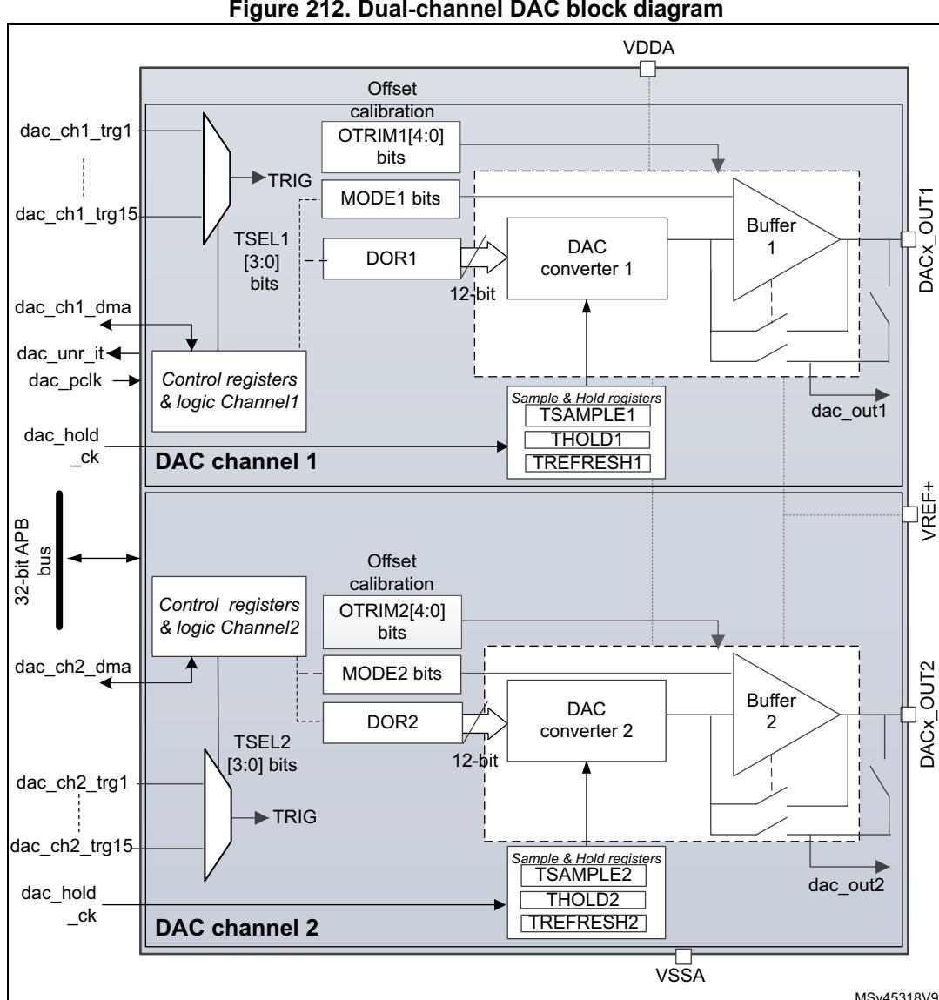
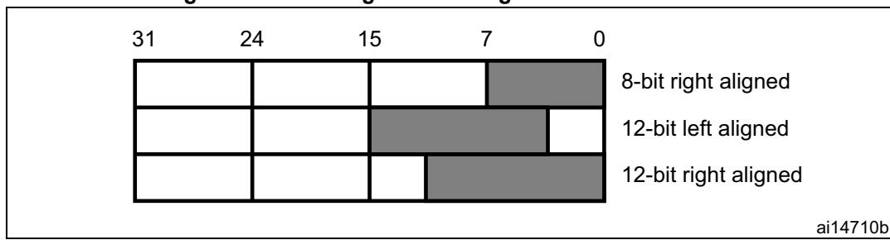
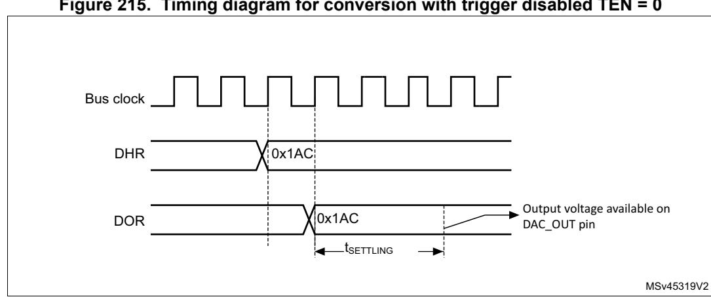
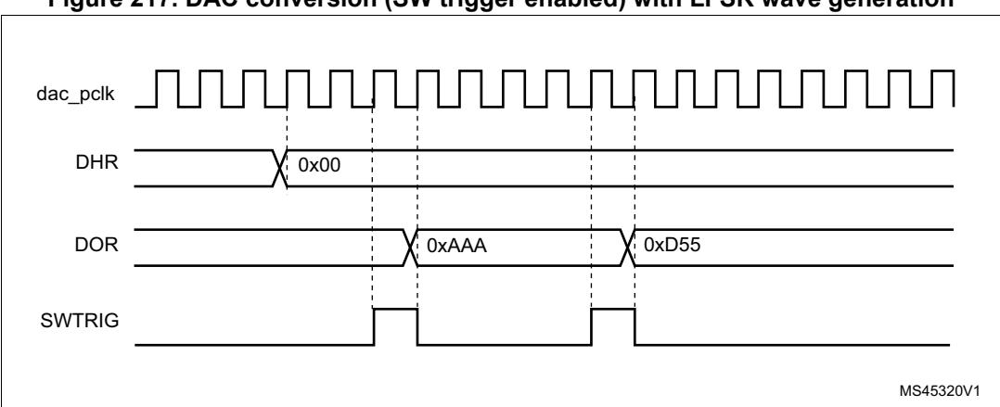
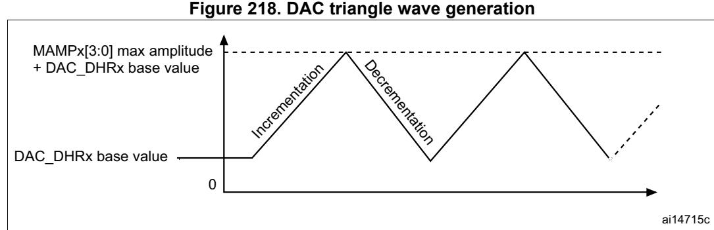
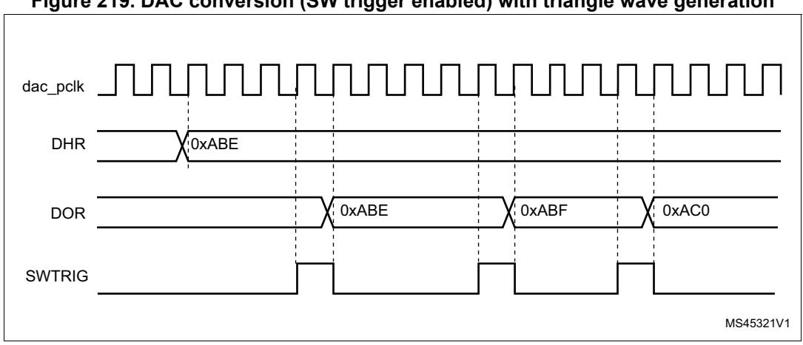
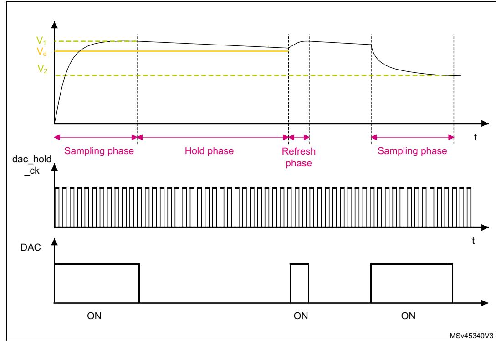

# **27 Digital-to-analog converter (DAC)**

# **27.1 Introduction**

The DAC module is a 12-bit, voltage output digital-to-analog converter. The DAC can be configured in 8- or 12-bit mode and may be used in conjunction with the DMA controller. In 12-bit mode, the data can be left- or right-aligned. The DAC features two output channels, each with its own converter. In dual DAC channel mode, conversions can be done independently or simultaneously when both channels are grouped together for synchronous update operations. An input reference pin, VREF+ (shared with others analog peripherals) is available for better resolution. An internal reference can also be set on the same input. Refer to *voltage reference buffer (VREFBUF)* section.

The DACx\_OUTy pin can be used as general purpose input/output (GPIO) when the DAC output is disconnected from output pad and connected to on chip peripheral. The DAC output buffer can be optionally enabled to obtain a high drive output current. An individual calibration can be applied on each DAC output channel. The DAC output channels support a low power mode, the Sample and hold mode.

# **27.2 DAC main features**

The DAC main features are the following (see *[Figure 212: Dual-channel DAC block](#page-2-0)  [diagram](#page-2-0)*)

- One DAC interface, maximum two output channels
- Left or right data alignment in 12-bit mode
- Synchronized update capability
- Noise-wave and Triangular-wave generation
- Dual DAC channel for independent or simultaneous conversions
- DMA capability for each channel including DMA underrun error detection
- External triggers for conversion
- DAC output channel buffered/unbuffered modes
- Buffer offset calibration
- Each DAC output can be disconnected from the DACx\_OUTy output pin
- DAC output connection to on-chip peripherals
- Sample and hold mode for low power operation in Stop mode
- Input voltage reference from VREF+ pin or internal VREFBUF reference

*[Figure 212](#page-2-0)* shows the block diagram of a DAC channel and *[Table 229](#page-3-0)* gives the pin description.

# <span id="page-1-0"></span>**27.3 DAC implementation**

**Table 228. DAC features** 

| DAC features          | DAC1                               |
|-----------------------|------------------------------------|
| Dual channel          | X                                  |
| Output buffer         | X                                  |
| I/O connection        | DAC1_OUT1 on PA4, DAC1_OUT2 on PA5 |
| Maximum sampling time | 1 Msps                             |
| Autonomous mode       | -                                  |
| VREF+ pin             | X                                  |

#### **DAC** functional description 27.4

#### 27.4.1 **DAC** block diagram

<span id="page-2-0"></span>

Figure 212. Dual-channel DAC block diagram

- MODEx bits in the DAC\_MCR control the output mode and allow switching between the Normal mode in buffer/unbuffered configuration and the Sample and hold mode.
- 2. Refer to Section 27.3: DAC implementation for channel2 availability.

# <span id="page-3-1"></span>**27.4.2 DAC pins and internal signals**

The DAC includes:

- Up to two output channels
- The DACx\_OUTy can be disconnected from the output pin and used as an ordinary GPIO
- The dac\_outx can use an internal pin connection to on-chip peripherals such as comparator, operational amplifier and ADC (if available).
- DAC output channel buffered or non buffered
- Sample and hold block and registers operational in Stop mode, using the LSI clock source (dac\_hold\_ck) for static conversion.

The DAC includes up to two separate output channels. Each output channel can be connected to on-chip peripherals such as comparator, operational amplifier and ADC (if available). In this case, the DAC output channel can be disconnected from the DACx\_OUTy output pin and the corresponding GPIO can be used for another purpose.

The DAC output can be buffered or not. The Sample and hold block and its associated registers can run in Stop mode using the LSI clock source (dac\_hold\_ck).

<span id="page-3-0"></span>

| Pin name  | Signal type                         | Remarks                                                                                       |  |
|-----------|-------------------------------------|-----------------------------------------------------------------------------------------------|--|
| VREF+     | Input, analog reference<br>positive | The higher/positive reference voltage for the DAC,<br>VREF+<br>≤ VDDAmax (refer to datasheet) |  |
| VDDA      | Input, analog supply                | Analog power supply                                                                           |  |
| VSSA      | Input, analog supply ground         | Ground for analog power supply                                                                |  |
| DACx_OUTy | Analog output signal                | DACx channely analog output                                                                   |  |

**Table 229. DAC input/output pins** 

| Table 230. DAC internal input/output signals |  |
|----------------------------------------------|--|
|----------------------------------------------|--|

| Internal signal name       | Signal type   | Description                                      |
|----------------------------|---------------|--------------------------------------------------|
| dac_ch1_dma                | Bidirectional | DAC channel1 DMA request/acknowledge             |
| dac_ch2_dma                | Bidirectional | DAC channel2 DMA request/acknowledge             |
| dac_ch1_trgx (x = 1 to 15) | Inputs        | DAC channel1 trigger inputs                      |
| dac_ch2_trgx (x = 1 to 15) | Inputs        | DAC channel2 trigger inputs                      |
| dac_unr_it                 | Output        | DAC underrun interrupt                           |
| dac_pclk                   | Input         | DAC peripheral clock                             |
| dac_hold_ck                | Input         | DAC low-power clock used in Sample and hold mode |
| dac_out1                   | Analog output | DAC channel1 output for on-chip peripherals      |
| dac_out2                   | Analog output | DAC channel2 output for on-chip peripherals      |


| Signal name              | Source                       | Source type                         |
|--------------------------|------------------------------|-------------------------------------|
| dac_hold_ck              | ck_lsi (selected in the RCC) | LSI clock selected in the RCC       |
| dac_chx_trg1 (x = 1, 2)  | tim1_trgo                    | Internal signal from on-chip timers |
| dac_chx_trg2 (x = 1, 2)  | tim2_trgo                    | Internal signal from on-chip timers |
| dac_chx_trg3 (x = 1, 2)  | tim4_trgo                    | Internal signal from on-chip timers |
| dac_chx_trg4 (x = 1, 2)  | tim5_trgo                    | Internal signal from on-chip timers |
| dac_chx_trg5 (x = 1, 2)  | tim6_trgo                    | Internal signal from on-chip timers |
| dac_chx_trg6 (x = 1, 2)  | tim7_trgo                    | Internal signal from on-chip timers |
| dac_chx_trg7 (x = 1, 2)  | tim8_trgo                    | Internal signal from on-chip timers |
| dac_chx_trg8 (x = 1, 2)  | tim15_trgo                   | Internal signal from on-chip timers |
| dac_chx_trg9 (x = 1, 2)  | hrtim1_dactrg1               | Internal signal from on-chip timers |
| dac_chx_trg10 (x = 1, 2) | hrtim1_dactrg2               | Internal signal from on-chip timers |
| dac_chx_trg11 (x = 1, 2) | lptim1_out                   | Internal signal from on-chip timers |
| dac_chx_trg12 (x = 1, 2) | lptim2_out                   | Internal signal from on-chip timers |
| dac_chx_trg13 (x = 1, 2) | exti9                        | External pin                        |

**Table 231. DAC interconnection** 

# **27.4.3 DAC channel enable**

Each DAC channel can be powered on by setting its corresponding ENx bit in the DAC\_CR register. The DAC channel is then enabled after a tWAKEUP startup time.

*Note: The ENx bit enables the analog DAC channelx only. The DAC channelx digital interface is enabled even if the ENx bit is reset.*

## **27.4.4 DAC data format**

Depending on the selected configuration mode, the data have to be written into the specified register as described below:

• Single DAC channel

There are three possibilities:

- 8-bit right alignment: the software has to load data into the DAC\_DHR8Rx[7:0] bits (stored into the DHRx[11:4] bits)
- 12-bit left alignment: the software has to load data into the DAC\_DHR12Lx [15:4] bits (stored into the DHRx[11:0] bits)
- 12-bit right alignment: the software has to load data into the DAC\_DHR12Rx [11:0] bits (stored into the DHRx[11:0] bits)

Depending on the loaded DAC\_DHRyyyx register, the data written by the user is shifted and stored into the corresponding DHRx (data holding registerx, which are internal non-memorymapped registers). The DHRx register is then loaded into the DORx register either automatically, by software trigger or by an external event trigger.


RM0399 Rev 4 1081/3556



**Figure 213. Data registers in single DAC channel mode** 

• Dual DAC channels (when available)

There are three possibilities:

- 8-bit right alignment: data for DAC channel1 to be loaded into the DAC\_DHR8RD [7:0] bits (stored into the DHR1[11:4] bits) and data for DAC channel2 to be loaded into the DAC\_DHR8RD [15:8] bits (stored into the DHR2[11:4] bits)
- 12-bit left alignment: data for DAC channel1 to be loaded into the DAC\_DHR12LD [15:4] bits (stored into the DHR1[11:0] bits) and data for DAC channel2 to be loaded into the DAC\_DHR12LD [31:20] bits (stored into the DHR2[11:0] bits)
- 12-bit right alignment: data for DAC channel1 to be loaded into the DAC\_DHR12RD [11:0] bits (stored into the DHR1[11:0] bits) and data for DAC channel2 to be loaded into the DAC\_DHR12RD [27:16] bits (stored into the DHR2[11:0] bits)

Depending on the loaded DAC\_DHRyyyD register, the data written by the user is shifted and stored into DHR1 and DHR2 (data holding registers, which are internal non-memorymapped registers). The DHR1 and DHR2 registers are then loaded into the DAC\_DOR1 and DOR2 registers, respectively, either automatically, by software trigger or by an external event trigger.

31 24 15 7 0 8-bit right aligned 12-bit left aligned 12-bit right aligned ai14709b

**Figure 214. Data registers in dual DAC channel mode**

#### 27.4.5 **DAC** conversion

The DAC DORx cannot be written directly and any data transfer to the DAC channelx must be performed by loading the DAC DHRx register (write operation to DAC DHR8Rx. DAC\_DHR12Lx, DAC\_DHR12Rx, DAC\_DHR8RD, DAC\_DHR12RD or DAC\_DHR12LD).

Data stored in the DAC\_DHRx register are automatically transferred to the DAC\_DORx register after one dac pclk clock cycle, if no hardware trigger is selected (TENx bit in DAC CR register is reset). However, when a hardware trigger is selected (TENx bit in DAC\_CR register is set) and a trigger occurs, the transfer is performed three dac\_pclk clock cycles after the trigger signal.

When DAC DORx is loaded with the DAC DHRx contents, the analog output voltage becomes available after a time t<sub>SETTLING</sub> that depends on the power supply voltage and the analog output load.



Figure 215. Timing diagram for conversion with trigger disabled TEN = 0

#### 27.4.6 **DAC** output voltage

Digital inputs are converted to output voltages on a linear conversion between 0 and V<sub>REF+</sub>.

The analog output voltages on each DAC channel pin are determined by the following equation:

DACoutput = 
$$V_{REF} \times \frac{DOR}{4096}$$

#### 27.4.7 **DAC** trigger selection

If the TENx control bit is set, the conversion can then be triggered by an external event (timer counter, external interrupt line). The TSELx[3:0] control bits determine which out of 16 possible events triggers the conversion as shown in TSELx[3:0] bits of the DAC CR register. These events can be either the software trigger or hardware triggers. Refer to the interconnection table in Section 27.4.2: DAC pins and internal signals.

Each time a DAC interface detects a rising edge on the selected trigger source (refer to the table below), the last data stored into the DAC DHRx register are transferred into the DAC DORx register. The DAC DORx register is updated three dac pclk cycles after the trigger occurs.


If the software trigger is selected, the conversion starts once the SWTRIG bit is set. SWTRIG is reset by hardware once the DAC\_DORx register has been loaded with the DAC\_DHRx register contents.

*Note: TSEL*x*[3:0] bit cannot be changed when the EN*x *bit is set.*

*When software trigger is selected, the transfer from the DAC\_DHR*x *register to the DAC\_DOR*x *register takes only one dac\_pclk clock cycle.*

## **27.4.8 DMA requests**

Each DAC channel has a DMA capability. Two DMA channels are used to service DAC channel DMA requests.

When an external trigger (but not a software trigger) occurs while the DMAENx bit is set, the value of the DAC\_DHRx register is transferred into the DAC\_DORx register when the transfer is complete, and a DMA request is generated.

In dual mode, if both DMAENx bits are set, two DMA requests are generated. If only one DMA request is needed, only the corresponding DMAENx bit must be set. In this way, the application can manage both DAC channels in dual mode by using one DMA request and a unique DMA channel.

As DAC\_DHRx to DAC\_DORx data transfer occurred before the DMA request, the very first data has to be written to the DAC\_DHRx before the first trigger event occurs.

### **DMA underrun**

The DAC DMA request is not queued so that if a second external trigger arrives before the acknowledgment for the first external trigger is received (first request), then no new request is issued and the DMA channelx underrun flag DMAUDRx in the DAC\_SR register is set, reporting the error condition. The DAC channelx continues to convert old data.

The software must clear the DMAUDRx flag by writing 1, clear the DMAEN bit of the used DMA stream and re-initialize both DMA and DAC channelx to restart the transfer correctly. The software must modify the DAC trigger conversion frequency or lighten the DMA workload to avoid a new DMA underrun. Finally, the DAC conversion can be resumed by enabling both DMA data transfer and conversion trigger.

For each DAC channelx, an interrupt is also generated if its corresponding DMAUDRIEx bit in the DAC\_CR register is enabled.

## **27.4.9 Noise generation**

In order to generate a variable-amplitude pseudonoise, an LFSR (linear feedback shift register) is available. DAC noise generation is selected by setting WAVEx[1:0] to 01. The preloaded value in LFSR is 0xAAA. This register is updated three dac\_pclk clock cycles after each trigger event, following a specific calculation algorithm.


11 10 9 8 7 6 5 4 3 2 1 0 12 NOR X<sup>12</sup> X<sup>0</sup> X X <sup>4</sup> X<sup>6</sup> XOR ai14713c

**Figure 216. DAC LFSR register calculation algorithm**

The LFSR value, that may be masked partially or totally by means of the MAMPx[3:0] bits in the DAC\_CR register, is added up to the DAC\_DHRx contents without overflow and this value is then transferred into the DAC\_DORx register.

If LFSR is 0x0000, a '1 is injected into it (antilock-up mechanism).

It is possible to reset LFSR wave generation by resetting the WAVEx[1:0] bits.



**Figure 217. DAC conversion (SW trigger enabled) with LFSR wave generation**

*Note: The DAC trigger must be enabled for noise generation by setting the TEN*x *bit in the DAC\_CR register.*

# **27.4.10 Triangle-wave generation**

It is possible to add a small-amplitude triangular waveform on a DC or slowly varying signal. DAC triangle-wave generation is selected by setting WAVEx[1:0] to 10". The amplitude is configured through the MAMPx[3:0] bits in the DAC\_CR register. An internal triangle counter is incremented three dac\_pclk clock cycles after each trigger event. The value of this counter is then added to the DAC\_DHRx register without overflow and the sum is transferred into the DAC\_DORx register. The triangle counter is incremented as long as it is less than the maximum amplitude defined by the MAMPx[3:0] bits. Once the configured amplitude is reached, the counter is decremented down to 0, then incremented again and so on.

It is possible to reset triangle wave generation by resetting the WAVEx[1:0] bits.





**Figure 219. DAC conversion (SW trigger enabled) with triangle wave generation**

*Note: The DAC trigger must be enabled for triangle wave generation by setting the TEN*x *bit in the DAC\_CR register.*

> *The MAMP*x*[3:0] bits must be configured before enabling the DAC, otherwise they cannot be changed.*

# **27.4.11 DAC channel modes**

Each DAC channel can be configured in Normal mode or Sample and hold mode. The output buffer can be enabled to obtain a high drive capability. Before enabling output buffer, the voltage offset needs to be calibrated. This calibration is performed at the factory (loaded after reset) and can be adjusted by software during application operation.

### **Normal mode**

In Normal mode, there are four combinations, by changing the buffer state and by changing the DACx\_OUTy pin interconnections.

To enable the output buffer, the MODEx[2:0] bits in DAC\_MCR register must be:

- 000: DAC is connected to the external pin
- 001: DAC is connected to external pin and to on-chip peripherals

To disable the output buffer, the MODEx[2:0] bits in DAC\_MCR register must be:

- 010: DAC is connected to the external pin
- 011: DAC is connected to on-chip peripherals

# **Sample and hold mode**

In Sample and hold mode, the DAC core converts data on a triggered conversion, and then holds the converted voltage on a capacitor. When not converting, the DAC cores and buffer are completely turned off between samples and the DAC output is tri-stated, therefore reducing the overall power consumption. A stabilization period, which value depends on the buffer state, is required before each new conversion.

In this mode, the DAC core and all corresponding logic and registers are driven by the LSI low-speed clock (dac\_hold\_ck) in addition to the dac\_pclk clock, allowing using the DAC channels in deep low power modes such as Stop mode.

The LSI low-speed clock (dac\_hold\_ck) must not be stopped when the Sample and hold mode is enabled.

The sample/hold mode operations can be divided into 3 phases:

- 1. Sample phase: the sample/hold element is charged to the desired voltage. The charging time depends on capacitor value (internal or external, selected by the user). The sampling time is configured with the TSAMPLEx[9:0] bits in DAC\_SHSRx register. During the write of the TSAMPLEx[9:0] bits, the BWSTx bit in DAC\_SR register is set to 1 to synchronize between both clocks domains (APB and low speed clock) and allowing the software to change the value of sample phase during the DAC channel operation
- 2. Hold phase: the DAC output channel is tri-stated, the DAC core and the buffer are turned off, to reduce the current consumption. The hold time is configured with the THOLDx[9:0] bits in DAC\_SHHR register
- 3. Refresh phase: the refresh time is configured with the TREFRESHx[7:0] bits in DAC\_SHRR register


The timings for the three phases above are in units of LSI clock periods. As an example, to configure a sample time of 350 µs, a hold time of 2 ms and a refresh time of 100 µs assuming LSI ~32 KHz is selected:

```
12 cycles are required for sample phase: TSAMPLEx[9:0] = 11, 
62 cycles are required for hold phase: THOLDx[9:0] = 62, 
and 4 cycles are required for refresh period: TREFRESHx[7:0] = 4.
```

In this example, the power consumption is reduced by almost a factor of 15 versus Normal modes.

The formulas to compute the right sample and refresh timings are described in the table below, the Hold time depends on the leakage current.

**Table 232. Sample and refresh timings** 

| Buffer<br>State | tSAMP(1)(2)           | tREFRESH(2)(3)                |
|-----------------|-----------------------|-------------------------------|
| Enable          | 7 μs + (10*RBON*CSH)  | 7 μs + (RBON*CSH)*ln(2*NLSB)  |
| Disable         | 3 μs + (10*RBOFF*CSH) | 3 μs + (RBOFF*CSH)*ln(2*NLSB) |

- 1. In the above formula the settling to the desired code value with ½ LSB or accuracy requires 10 constant time for 12 bits resolution. For 8 bits resolution, the settling time is 7 constant time.
- <span id="page-11-0"></span>2. CSH is the capacitor in Sample and hold mode.
- 3. The tolerated voltage drop during the hold phase "Vd" is represented by the number of LSBs after the capacitor discharging with the output leakage current. The settling back to the desired value with ½ LSB error accuracy requires ln(2\*Nlsb) constant time of the DAC.

### **Example of the sample and refresh time calculation with output buffer on**

The values used in the example below are provided as indication only. Refer to the product datasheet for product data.

```
CSH = 100 nF
VDDA = 3.0 V
Sampling phase:
```

$$t_{SAMP}$$
 = 7 µs + (10 \* 2000 \* 100 \* 10<sup>-9</sup>) = 2.007 ms (where R<sub>BON</sub> = 2 k $\Omega$ )

### Refresh phase:

```
tREFRESH = 7 μs + (2000 * 100 * 10-9) * ln(2*10) = 606.1 μs
(where NLSB = 10 (10 LSB drop during the hold phase)
```

### Hold phase:

$$D_v = i_{leak} * t_{hold} / C_{SH} = 0.0073 \text{ V} (10 \text{ LSB of 12bit at 3 V})$$
  
 $i_{leak} = 150 \text{ nA} \text{ (worst case on the IO leakage on all the temperature range)}$   
 $t_{hold} = 0.0073 * 100 * 10^{-9} / (150 * 10^{-9}) = 4.867 \text{ ms}$ 



Figure 220. DAC Sample and hold mode phase diagram

Like in Normal mode, the Sample and hold mode has different configurations.

To enable the output buffer, MODEx[2:0] bits in DAC MCR register must be set to:

- 100: DAC is connected to the external pin
- 101: DAC is connected to external pin and to on chip peripherals

To disabled the output buffer, MODEx[2:0] bits in DAC\_MCR register must be set to:

- 110: DAC is connected to external pin and to on chip peripherals
- 111: DAC is connected to on chip peripherals
   When MODEx[2:0] bits are equal to 111, an internal capacitor, C<sub>Lint</sub>, holds the voltage output of the DAC core and then drive it to on-chip peripherals.

All Sample and hold phases are interruptible, and any change in DAC\_DHRx immediately triggers a new sample phase.

Table 233. Channel output modes summary

| MC | MODEx[2:0] Mode |   | Mode        | Buffer   | Output connections                                                         |
|----|-----------------|---|-------------|----------|----------------------------------------------------------------------------|
| 0  | 0               | 0 | Normal mode |          | Connected to external pin                                                  |
| 0  | 0               | 1 |             | Enabled  | Connected to external pin and to on chip-peripherals (such as comparators) |
| 0  | 1               | 0 |             | Disabled | Connected to external pin                                                  |
| 0  | 1               | 1 |             | Disabled | Connected to on chip peripherals (such as comparators)                     |


| МО | MODEx[2:0] |   | Mode                 | Buffer   | Output connections                                                         |
|----|------------|---|----------------------|----------|----------------------------------------------------------------------------|
| 1  | 0          | 0 |                      |          | Connected to external pin                                                  |
| 1  | 0          | 1 | Sample and hold mode | Enabled  | Connected to external pin and to on chip peripherals (such as comparators) |
| 1  | 1          | 0 |                      | Disabled | Connected to external pin and to on chip peripherals (such as comparators) |
| 1  | 1          | 1 |                      |          | Connected to on chip peripherals (such as comparators)                     |

Table 233. Channel output modes summary (continued)

#### **DAC** channel buffer calibration 27.4.12

The transfer function for an N-bit digital-to-analog converter (DAC) is:

$$V_{out} = ((D/2^{N}) \times G \times V_{ref}) + V_{OS}$$

Where V<sub>OUT</sub> is the analog output, D is the digital input, G is the gain, V<sub>ref</sub> is the nominal fullscale voltage, and Vos is the offset voltage. For an ideal DAC channel, G = 1 and Vos = 0.

Due to output buffer characteristics, the voltage offset may differ from part-to-part and introduce an absolute offset error on the analog output. To compensate the Vos, a calibration is required by a trimming technique.

The calibration is only valid when the DAC channels is operating with buffer enabled (MODEx[2:0] = 0b000 or 0b001 or 0b100 or 0b101). if applied in other modes when the buffer is off, it has no effect. During the calibration:

- The buffer output is disconnected from the pin internal/external connections and put in tristate mode (HiZ).
- The buffer acts as a comparator to sense the middle-code value 0x800 and compare it to VREF+/2 signal through an internal bridge, then toggle its output signal to 0 or 1 depending on the comparison result (CAL FLAGx bit).

Two calibration techniques are provided:

- Factory trimming (default setting) The DAC buffer offset is factory trimmed. The default value of OTRIMx[4:0] bits in DAC CCR register is the factory trimming value and it is loaded once DAC digital interface is reset.
- User trimming

The user trimming can be done when the operating conditions differs from nominal factory trimming conditions and in particular when V<sub>DDA</sub> voltage, temperature, VREF+ values change and can be done at any point during application by software.

Note: Refer to the datasheet for more details of the Nominal factory trimming conditions

> In addition, when V<sub>DD</sub> is removed (example the device enters in STANDBY or VBAT modes) the calibration is required.

The steps to perform a user trimming calibration are as below:

RM0399 Rev 4 1090/3556


- 1. If the DAC channel is active, write 0 to ENx bit in DAC\_CR to disable the channel.
- 2. Select a mode where the buffer is enabled, by writing to DAC\_MCR register, MODEx[2:0] = 0b000 or 0b001 or 0b100 or 0b101.
- 3. Start the DAC channelx calibration, by setting the CENx bit in DAC\_CR register to 1.
- 4. Apply a trimming algorithm:
  - a) Write a code into OTRIMx[4:0] bits, starting by 0b00000.
  - b) Wait for tTRIM delay.
  - c) Check if CAL\_FLAGx bit in DAC\_SR is set to 1.
  - d) If CAL\_FLAGx is set to 1, the OTRIMx[4:0] trimming code is found and can be used during *device* operation to compensate the output value, else increment OTRIMx[4:0] and repeat sub-steps from (a) to (d) again.

The software algorithm may use either a successive approximation or dichotomy techniques to compute and set the content of OTRIMx[4:0] bits in a faster way.

The commutation/toggle of CAL\_FLAGx bit indicates that the offset is correctly compensated and the corresponding trim code must be kept in the OTRIMx[4:0] bits in DAC\_CCR register.

*Note: A tTRIM delay must be respected between the write to the OTRIMx[4:0] bits and the read of the CAL\_FLAG*x *bit in DAC\_SR register in order to get a correct value.This parameter is specified into datasheet electrical characteristics section.* 

> *If VDDA, VREF+ and temperature conditions do not change during device operation while it enters more often in standby and VBAT mode, the software may store the OTRIMx[4:0] bits found in the first user calibration in the flash or in back-up registers. then to load/write them directly when the device power is back again thus avoiding to wait for a new calibration time. When CEN*x *bit is set, it is not allowed to set EN*x *bit.*

# **27.4.13 Dual DAC channel conversion modes (if dual channels are available)**

To efficiently use the bus bandwidth in applications that require the two DAC channels at the same time, three dual registers are implemented: DHR8RD, DHR12RD and DHR12LD. A unique register access is then required to drive both DAC channels at the same time. For the wave generation, no accesses to DHRxxxD registers are required. As a result, two output channels can be used either independently or simultaneously.

11 conversion modes are possible using the two DAC channels and these dual registers. All the conversion modes can nevertheless be obtained using separate DHRx registers if needed.

All modes are described in the paragraphs below.

### **Independent trigger without wave generation**

To configure the DAC in this conversion mode, the following sequence is required:

- 1. Set the two DAC channel trigger enable bits TEN1 and TEN2.
- 2. Configure different trigger sources by setting different values in the TSEL1 and TSEL2 bitfields.
- 3. Load the dual DAC channel data into the desired DHR register (DAC\_DHR12RD, DAC\_DHR12LD or DAC\_DHR8RD).


RM0399 Rev 4 1091/3556

When a DAC channel1 trigger arrives, the DHR1 register is transferred into DAC\_DOR1 (three dac\_pclk clock cycles later).

When a DAC channel2 trigger arrives, the DHR2 register is transferred into DAC\_DOR2 (three dac\_pclk clock cycles later).

### **Independent trigger with single LFSR generation**

To configure the DAC in this conversion mode, the following sequence is required:

- 1. Set the two DAC channel trigger enable bits TEN1 and TEN2.
- 2. Configure different trigger sources by setting different values in the TSEL1 and TSEL2 bitfields.
- 3. Configure the two DAC channel WAVEx[1:0] bits as 01 and the same LFSR mask value in the MAMPx[3:0] bits.
- 4. Load the dual DAC channel data into the desired DHR register (DAC\_DHR12RD, DAC\_DHR12LD or DAC\_DHR8RD).

When a DAC channel1 trigger arrives, the LFSR1 counter, with the same mask, is added to the DHR1 register and the sum is transferred into DAC\_DOR1 (three dac\_pclk clock cycles later). Then the LFSR1 counter is updated.

When a DAC channel2 trigger arrives, the LFSR2 counter, with the same mask, is added to the DHR2 register and the sum is transferred into DAC\_DOR2 (three dac\_pclk clock cycles later). Then the LFSR2 counter is updated.

### **Independent trigger with different LFSR generation**

To configure the DAC in this conversion mode, the following sequence is required:

- 1. Set the two DAC channel trigger enable bits TEN1 and TEN2.
- 2. Configure different trigger sources by setting different values in the TSEL1 and TSEL2 bitfields.
- 3. Configure the two DAC channel WAVEx[1:0] bits as 01 and set different LFSR masks values in the MAMP1[3:0] and MAMP2[3:0] bits.
- 4. Load the dual DAC channel data into the desired DHR register (DAC\_DHR12RD, DAC\_DHR12LD or DAC\_DHR8RD).

When a DAC channel1 trigger arrives, the LFSR1 counter, with the mask configured by MAMP1[3:0], is added to the DHR1 register and the sum is transferred into DAC\_DOR1 (three dac\_pclk clock cycles later). Then the LFSR1 counter is updated.

When a DAC channel2 trigger arrives, the LFSR2 counter, with the mask configured by MAMP2[3:0], is added to the DHR2 register and the sum is transferred into DAC\_DOR2 (three dac\_pclk clock cycles later). Then the LFSR2 counter is updated.


# **Independent trigger with single triangle generation**

To configure the DAC in this conversion mode, the following sequence is required:

- 1. Set the two DAC channel trigger enable bits TEN1 and TEN2.
- 2. Configure different trigger sources by setting different values in the TSEL1 and TSEL2 bitfields.
- 3. Configure the two DAC channel WAVEx[1:0] bits as 1x and the same maximum amplitude value in the MAMPx[3:0] bits.
- 4. Load the dual DAC channel data into the desired DHR register (DAC\_DHR12RD, DAC\_DHR12LD or DAC\_DHR8RD).

When a DAC channel1 trigger arrives, the DAC channel1 triangle counter, with the same triangle amplitude, is added to the DHR1 register and the sum is transferred into DAC\_DOR1 (three dac\_pclk clock cycles later). The DAC channel1 triangle counter is then updated.

When a DAC channel2 trigger arrives, the DAC channel2 triangle counter, with the same triangle amplitude, is added to the DHR2 register and the sum is transferred into DAC\_DOR2 (three dac\_pclk clock cycles later). The DAC channel2 triangle counter is then updated.

### **Independent trigger with different triangle generation**

To configure the DAC in this conversion mode, the following sequence is required:

- 1. Set the two DAC channel trigger enable bits TEN1 and TEN2.
- 2. Configure different trigger sources by setting different values in the TSEL1 and TSEL2 bits.
- 3. Configure the two DAC channel WAVEx[1:0] bits as 1x and set different maximum amplitude values in the MAMP1[3:0] and MAMP2[3:0] bits.
- 4. Load the dual DAC channel data into the desired DHR register (DAC\_DHR12RD, DAC\_DHR12LD or DAC\_DHR8RD).

When a DAC channel1 trigger arrives, the DAC channel1 triangle counter, with a triangle amplitude configured by MAMP1[3:0], is added to the DHR1 register and the sum is transferred into DAC\_DOR1 (three dac\_pclk clock cycles later). The DAC channel1 triangle counter is then updated.

When a DAC channel2 trigger arrives, the DAC channel2 triangle counter, with a triangle amplitude configured by MAMP2[3:0], is added to the DHR2 register and the sum is transferred into DAC\_DOR2 (three dac\_pclk clock cycles later). The DAC channel2 triangle counter is then updated.

# **Simultaneous software start**

To configure the DAC in this conversion mode, the following sequence is required:

• Load the dual DAC channel data to the desired DHR register (DAC\_DHR12RD, DAC\_DHR12LD or DAC\_DHR8RD).

In this configuration, one dac\_pclk clock cycle later, the DHR1 and DHR2 registers are transferred into DAC\_DOR1 and DAC\_DOR2, respectively.

### **Simultaneous trigger without wave generation**

To configure the DAC in this conversion mode, the following sequence is required:


RM0399 Rev 4 1093/3556

- 1. Set the two DAC channel trigger enable bits TEN1 and TEN2.
- 2. Configure the same trigger source for both DAC channels by setting the same value in the TSEL1 and TSEL2 bitfields.
- 3. Load the dual DAC channel data to the desired DHR register (DAC\_DHR12RD, DAC\_DHR12LD or DAC\_DHR8RD).

When a trigger arrives, the DHR1 and DHR2 registers are transferred into DAC\_DOR1 and DAC\_DOR2, respectively (after three dac\_pclk clock cycles).

### **Simultaneous trigger with single LFSR generation**

- 1. To configure the DAC in this conversion mode, the following sequence is required:
- 2. Set the two DAC channel trigger enable bits TEN1 and TEN2.
- 3. Configure the same trigger source for both DAC channels by setting the same value in the TSEL1 and TSEL2 bitfields.
- 4. Configure the two DAC channel WAVEx[1:0] bits as 01 and the same LFSR mask value in the MAMPx[3:0] bits.
- 5. Load the dual DAC channel data to the desired DHR register (DHR12RD, DHR12LD or DHR8RD).

When a trigger arrives, the LFSR1 counter, with the same mask, is added to the DHR1 register and the sum is transferred into DAC\_DOR1 (three dac\_pclk clock cycles later). The LFSR1 counter is then updated. At the same time, the LFSR2 counter, with the same mask, is added to the DHR2 register and the sum is transferred into DAC\_DOR2 (three dac\_pclk clock cycles later). The LFSR2 counter is then updated.

### **Simultaneous trigger with different LFSR generation**

To configure the DAC in this conversion mode, the following sequence is required:

- 1. Set the two DAC channel trigger enable bits TEN1 and TEN2
- 2. Configure the same trigger source for both DAC channels by setting the same value in the TSEL1 and TSEL2 bitfields.
- 3. Configure the two DAC channel WAVEx[1:0] bits as 01 and set different LFSR mask values using the MAMP1[3:0] and MAMP2[3:0] bits.
- 4. Load the dual DAC channel data into the desired DHR register (DAC\_DHR12RD, DAC\_DHR12LD or DAC\_DHR8RD).

When a trigger arrives, the LFSR1 counter, with the mask configured by MAMP1[3:0], is added to the DHR1 register and the sum is transferred into DAC\_DOR1 (three dac\_pclk clock cycles later). The LFSR1 counter is then updated.

At the same time, the LFSR2 counter, with the mask configured by MAMP2[3:0], is added to the DHR2 register and the sum is transferred into DAC\_DOR2 (three dac\_pclk clock cycles later). The LFSR2 counter is then updated.

### **Simultaneous trigger with single triangle generation**

To configure the DAC in this conversion mode, the following sequence is required:


- 1. Set the two DAC channel trigger enable bits TEN1 and TEN2
- 2. Configure the same trigger source for both DAC channels by setting the same value in the TSEL1 and TSEL2 bitfields.
- 3. Configure the two DAC channel WAVEx[1:0] bits as 1x and the same maximum amplitude value using the MAMPx[3:0] bits.
- 4. Load the dual DAC channel data into the desired DHR register (DAC\_DHR12RD, DAC\_DHR12LD or DAC\_DHR8RD).

When a trigger arrives, the DAC channel1 triangle counter, with the same triangle amplitude, is added to the DHR1 register and the sum is transferred into DAC\_DOR1 (three dac\_pclk clock cycles later). The DAC channel1 triangle counter is then updated.

At the same time, the DAC channel2 triangle counter, with the same triangle amplitude, is added to the DHR2 register and the sum is transferred into DAC\_DOR2 (three dac\_pclk clock cycles later). The DAC channel2 triangle counter is then updated.

### **Simultaneous trigger with different triangle generation**

To configure the DAC in this conversion mode, the following sequence is required:

- 1. Set the two DAC channel trigger enable bits TEN1 and TEN2
- 2. Configure the same trigger source for both DAC channels by setting the same value in the TSEL1 and TSEL2 bitfields.
- 3. Configure the two DAC channel WAVEx[1:0] bits as 1x and set different maximum amplitude values in the MAMP1[3:0] and MAMP2[3:0] bits.
- 4. Load the dual DAC channel data into the desired DHR register (DAC\_DHR12RD, DAC\_DHR12LD or DAC\_DHR8RD).

When a trigger arrives, the DAC channel1 triangle counter, with a triangle amplitude configured by MAMP1[3:0], is added to the DHR1 register and the sum is transferred into DAC\_DOR1 (three APB clock cycles later). Then the DAC channel1 triangle counter is updated.

At the same time, the DAC channel2 triangle counter, with a triangle amplitude configured by MAMP2[3:0], is added to the DHR2 register and the sum is transferred into DAC\_DOR2 (three dac\_pclk clock cycles later). Then the DAC channel2 triangle counter is updated.

# **27.5 DAC in low-power modes**

**Table 234. Effect of low-power modes on DAC** 

| Mode    | Description                                                                                      |
|---------|--------------------------------------------------------------------------------------------------|
| Sleep   | No effect, DAC can be used with DMA                                                              |
| Stop    | The DAC remains active with a static output value.<br>The Sample and hold mode is not available. |
| Standby | The DAC peripheral is powered down and must be reinitialized after exiting<br>Standby mode.      |

# 27.6 DAC interrupts

# Table 235. DAC interrupts

| Interrupt<br>acronym | Interrupt<br>event | Event flag | Enable control bit | Interrupt clear<br>method | Exit Sleep<br>mode | Exit Stop<br>mode | Exit Standby mode |
|----------------------|--------------------|------------|--------------------|---------------------------|--------------------|-------------------|-------------------|
| DAC                  | DMA<br>underrun    | DMAUDRx    | DMAUDRI<br>Ex      | Write<br>DMAUDRx = 1      | Yes                | No                | No                |

# **27.7 DAC registers**

Refer to *Section 1 on page 106* for a list of abbreviations used in register descriptions.

The peripheral registers have to be accessed by words (32-bit).

# **27.7.1 DAC control register (DAC\_CR)**

Address offset: 0x00

Reset value: 0x0000 0000

| 31   | 30   | 29            | 28         | 27                   | 26 | 25         | 24 | 23 | 22         | 21 | 20 | 19                                  | 18 | 17   | 16  |
|------|------|---------------|------------|----------------------|----|------------|----|----|------------|----|----|-------------------------------------|----|------|-----|
| Res. | CEN2 | DMAU<br>DRIE2 | DMAE<br>N2 |                      |    | MAMP2[3:0] |    |    | WAVE2[1:0] |    |    | TSEL2[3] TSEL2[2] TSEL2[1] TSEL2[0] |    | TEN2 | EN2 |
|      | rw   | rw            | rw         | rw<br>rw<br>rw<br>rw |    | rw         | rw | rw | rw         | rw | rw | rw                                  | rw |      |     |
|      |      |               |            |                      |    |            |    |    |            |    |    |                                     |    |      |     |
| 15   | 14   | 13            | 12         | 11                   | 10 | 9          | 8  | 7  | 6          | 5  | 4  | 3                                   | 2  | 1    | 0   |
| Res. | CEN1 | DMAU<br>DRIE1 | DMAE<br>N1 |                      |    | MAMP1[3:0] |    |    | WAVE1[1:0] |    |    | TSEL1[3] TSEL1[2] TSEL1[1] TSEL1[0] |    | TEN1 | EN1 |

Bit 31 Reserved, must be kept at reset value.

### Bit 30 **CEN2**: DAC channel2 calibration enable

This bit is set and cleared by software to enable/disable DAC channel2 calibration, it can be written only if EN2 bit is set to 0 into DAC\_CR (the calibration mode can be entered/exit only when the DAC channel is disabled) Otherwise, the write operation is ignored.

0: DAC channel2 in Normal operating mode

1: DAC channel2 in calibration mode

*Note: This bit is available only on dual-channel DACs. Refer to [Section 27.3: DAC](#page-1-0)  [implementation.](#page-1-0)*

### Bit 29 **DMAUDRIE2**: DAC channel2 DMA underrun interrupt enable

This bit is set and cleared by software.

0: DAC channel2 DMA underrun interrupt disabled

1: DAC channel2 DMA underrun interrupt enabled

*Note: This bit is available only on dual-channel DACs. Refer to [Section 27.3: DAC](#page-1-0)  [implementation.](#page-1-0)*

#### Bit 28 **DMAEN2**: DAC channel2 DMA enable

This bit is set and cleared by software.

0: DAC channel2 DMA mode disabled

1: DAC channel2 DMA mode enabled

*Note: This bit is available only on dual-channel DACs. Refer to [Section 27.3: DAC](#page-1-0)  [implementation.](#page-1-0)*

RM0399 Rev 4 1097/3556

#### Bits 27:24 **MAMP2[3:0]**: DAC channel2 mask/amplitude selector

These bits are written by software to select mask in wave generation mode or amplitude in triangle generation mode.

0000: Unmask bit0 of LFSR/ triangle amplitude equal to 1

0001: Unmask bits[1:0] of LFSR/ triangle amplitude equal to 3

0010: Unmask bits[2:0] of LFSR/ triangle amplitude equal to 7

0011: Unmask bits[3:0] of LFSR/ triangle amplitude equal to 15

0100: Unmask bits[4:0] of LFSR/ triangle amplitude equal to 31

0101: Unmask bits[5:0] of LFSR/ triangle amplitude equal to 63

0110: Unmask bits[6:0] of LFSR/ triangle amplitude equal to 127 0111: Unmask bits[7:0] of LFSR/ triangle amplitude equal to 255

1000: Unmask bits[8:0] of LFSR/ triangle amplitude equal to 511

1001: Unmask bits[9:0] of LFSR/ triangle amplitude equal to 1023

1010: Unmask bits[10:0] of LFSR/ triangle amplitude equal to 2047

≥ 1011: Unmask bits[11:0] of LFSR/ triangle amplitude equal to 4095

*Note: These bits are available only on dual-channel DACs. Refer to [Section 27.3: DAC](#page-1-0)  [implementation.](#page-1-0)*

#### Bits 23:22 **WAVE2[1:0]**: DAC channel2 noise/triangle wave generation enable

These bits are set/reset by software.

00: wave generation disabled

01: Noise wave generation enabled

1x: Triangle wave generation enabled

*Note: Only used if bit TEN2 = 1 (DAC channel2 trigger enabled)*

*These bits are available only on dual-channel DACs. Refer to [Section 27.3: DAC](#page-1-0)  [implementation.](#page-1-0)*

### Bits 21:18 **TSEL2[3:0]**: DAC channel2 trigger selection

These bits select the external event used to trigger DAC channel2

0000: SWTRIG2 0001: dac\_ch2\_trg1 0010: dac\_ch2\_trg2

...

1111: dac\_ch2\_trg15

Refer to the trigger selection tables in *[Section 27.4.2: DAC pins and internal signals](#page-3-1)* for details on trigger configuration and mapping.

*Note: Only used if bit TEN2 = 1 (DAC channel2 trigger enabled).*

*These bits are available only on dual-channel DACs. Refer to [Section 27.3: DAC](#page-1-0)  [implementation.](#page-1-0)*

### Bit 17 **TEN2**: DAC channel2 trigger enable

This bit is set and cleared by software to enable/disable DAC channel2 trigger

0: DAC channel2 trigger disabled and data written into the DAC\_DHR2 register are transferred one dac\_pclk clock cycle later to the DAC\_DOR2 register

1: DAC channel2 trigger enabled and data from the DAC\_DHR2 register are transferred three dac\_pclk clock cycles later to the DAC\_DOR2 register

*Note:* When software trigger is selected, the transfer from the DAC\_DHR2 reg*ister to the DAC\_DOR2 register takes only one dac\_pclk clock cycle.*

*These bits are available only on dual-channel DACs. Refer to [Section 27.3: DAC](#page-1-0)  [implementation.](#page-1-0)*


#### Bit 16 **EN2**: DAC channel2 enable

This bit is set and cleared by software to enable/disable DAC channel2.

0: DAC channel2 disabled

1: DAC channel2 enabled

*Note: These bits are available only on dual-channel DACs. Refer to [Section 27.3: DAC](#page-1-0)  [implementation.](#page-1-0)*

Bit 15 Reserved, must be kept at reset value.

#### Bit 14 **CEN1**: DAC channel1 calibration enable

This bit is set and cleared by software to enable/disable DAC channel1 calibration, it can be written only if bit EN1 *=* 0 into DAC\_CR (the calibration mode can be entered/exit only when the DAC channel is disabled) Otherwise, the write operation is ignored.

0: DAC channel1 in Normal operating mode

1: DAC channel1 in calibration mode

#### Bit 13 **DMAUDRIE1**: DAC channel1 DMA Underrun Interrupt enable

This bit is set and cleared by software.

0: DAC channel1 DMA Underrun Interrupt disabled

1: DAC channel1 DMA Underrun Interrupt enabled

#### Bit 12 **DMAEN1**: DAC channel1 DMA enable

This bit is set and cleared by software.

0: DAC channel1 DMA mode disabled

1: DAC channel1 DMA mode enabled

#### Bits 11:8 **MAMP1[3:0]**: DAC channel1 mask/amplitude selector

These bits are written by software to select mask in wave generation mode or amplitude in triangle generation mode.

0000: Unmask bit0 of LFSR/ triangle amplitude equal to 1

0001: Unmask bits[1:0] of LFSR/ triangle amplitude equal to 3

0010: Unmask bits[2:0] of LFSR/ triangle amplitude equal to 7

0011: Unmask bits[3:0] of LFSR/ triangle amplitude equal to 15

0100: Unmask bits[4:0] of LFSR/ triangle amplitude equal to 31

0101: Unmask bits[5:0] of LFSR/ triangle amplitude equal to 63 0110: Unmask bits[6:0] of LFSR/ triangle amplitude equal to 127

0111: Unmask bits[7:0] of LFSR/ triangle amplitude equal to 255

1000: Unmask bits[8:0] of LFSR/ triangle amplitude equal to 511

1001: Unmask bits[9:0] of LFSR/ triangle amplitude equal to 1023

1010: Unmask bits[10:0] of LFSR/ triangle amplitude equal to 2047

≥ 1011: Unmask bits[11:0] of LFSR/ triangle amplitude equal to 4095

### Bits 7:6 **WAVE1[1:0]**: DAC channel1 noise/triangle wave generation enable

These bits are set and cleared by software.

00: wave generation disabled

01: Noise wave generation enabled

1x: Triangle wave generation enabled

Only used if bit TEN1 *=* 1 (DAC channel1 trigger enabled).


#### Bits 5:2 **TSEL1[3:0]**: DAC channel1 trigger selection

These bits select the external event used to trigger DAC channel1

0000: SWTRIG1 0001: dac\_ch1\_trg1 0010: dac\_ch1\_trg2 ...

1111: dac\_ch1\_trg15

Refer to the trigger selection tables in *[Section 27.4.2: DAC pins and internal signals](#page-3-1)* for details on trigger configuration and mapping.

*Note: Only used if bit TEN1 = 1 (DAC channel1 trigger enabled).*

#### Bit 1 **TEN1**: DAC channel1 trigger enable

This bit is set and cleared by software to enable/disable DAC channel1 trigger.

0: DAC channel1 trigger disabled and data written into the DAC\_DHR1 register are transferred one dac\_pclk clock cycle later to the DAC\_DOR1 register

1: DAC channel1 trigger enabled and data from the DAC\_DHR1 register are transferred three dac\_pclk clock cycles later to the DAC\_DOR1 register

*Note: When software trigger is selected, the transfer from the* DAC\_DHR1 *register to the DAC\_DOR1 register takes only one dac\_pclk clock cycle.*

#### Bit 0 **EN1**: DAC channel1 enable

This bit is set and cleared by software to enable/disable DAC channel1.

0: DAC channel1 disabled 1: DAC channel1 enabled

# **27.7.2 DAC software trigger register (DAC\_SWTRGR)**

Address offset: 0x04

Reset value: 0x0000 0000

| 31   | 30   | 29   | 28   | 27   | 26   | 25   | 24   | 23   | 22   | 21   | 20   | 19   | 18   | 17   | 16              |
|------|------|------|------|------|------|------|------|------|------|------|------|------|------|------|-----------------|
| Res. | Res. | Res. | Res. | Res. | Res. | Res. | Res. | Res. | Res. | Res. | Res. | Res. | Res. | Res. | Res.            |
|      |      |      |      |      |      |      |      |      |      |      |      |      |      |      |                 |
| 15   | 14   | 13   | 12   | 11   | 10   | 9    | 8    | 7    | 6    | 5    | 4    | 3    | 2    | 1    | 0               |
| Res. | Res. | Res. | Res. | Res. | Res. | Res. | Res. | Res. | Res. | Res. | Res. | Res. | Res. |      | SWTRIG2 SWTRIG1 |
|      |      |      |      |      |      |      |      |      |      |      |      |      |      | w    | w               |

Bits 31:2 Reserved, must be kept at reset value.

Bit 1 **SWTRIG2**: DAC channel2 software trigger

This bit is set by software to trigger the DAC in software trigger mode.

0: No trigger

1: Trigger

*Note: This bit is cleared by hardware (one dac\_pclk clock cycle later) once the DAC\_DHR2 register value has been loaded into the DAC\_DOR2 register.*

*This bit is available only on dual-channel DACs. Refer to [Section 27.3: DAC](#page-1-0)  [implementation](#page-1-0).*

Bit 0 **SWTRIG1**: DAC channel1 software trigger

This bit is set by software to trigger the DAC in software trigger mode.

0: No trigger

1: Trigger

*Note: This bit is cleared by hardware (one dac\_pclk clock cycle later) once the DAC\_DHR1 register value has been loaded into the DAC\_DOR1 register.*

# **27.7.3 DAC channel1 12-bit right-aligned data holding register (DAC\_DHR12R1)**

Address offset: 0x08

Reset value: 0x0000 0000

| 31   | 30   | 29   | 28   | 27   | 26   | 25   | 24   | 23   | 22             | 21   | 20   | 19   | 18   | 17   | 16   |
|------|------|------|------|------|------|------|------|------|----------------|------|------|------|------|------|------|
| Res. | Res. | Res. | Res. | Res. | Res. | Res. | Res. | Res. | Res.           | Res. | Res. | Res. | Res. | Res. | Res. |
|      |      |      |      |      |      |      |      |      |                |      |      |      |      |      |      |
|      |      |      |      |      |      |      |      |      |                |      |      |      |      |      |      |
| 15   | 14   | 13   | 12   | 11   | 10   | 9    | 8    | 7    | 6              | 5    | 4    | 3    | 2    | 1    | 0    |
| Res. | Res. | Res. | Res. |      |      |      |      |      | DACC1DHR[11:0] |      |      |      |      |      |      |

Bits 31:12 Reserved, must be kept at reset value.

Bits 11:0 **DACC1DHR[11:0]**: DAC channel1 12-bit right-aligned data

These bits are written by software. They specify 12-bit data for DAC channel1.

# **27.7.4 DAC channel1 12-bit left aligned data holding register (DAC\_DHR12L1)**

Address offset: 0x0C

Reset value: 0x0000 0000

| 31   | 30   | 29   | 28   | 27   | 26   | 25             | 24   | 23   | 22   | 21   | 20   | 19   | 18   | 17   | 16   |
|------|------|------|------|------|------|----------------|------|------|------|------|------|------|------|------|------|
| Res. | Res. | Res. | Res. | Res. | Res. | Res.           | Res. | Res. | Res. | Res. | Res. | Res. | Res. | Res. | Res. |
|      |      |      |      |      |      |                |      |      |      |      |      |      |      |      |      |
| 15   | 14   | 13   | 12   | 11   | 10   | 9              | 8    | 7    | 6    | 5    | 4    | 3    | 2    | 1    | 0    |
|      |      |      |      |      |      | DACC1DHR[11:0] |      |      |      |      |      | Res. | Res. | Res. | Res. |
| rw   | rw   | rw   | rw   | rw   | rw   | rw             | rw   | rw   | rw   | rw   | rw   |      |      |      |      |

RM0399 Rev 4 1101/3556

Bits 31:16 Reserved, must be kept at reset value.

Bits 15:4 **DACC1DHR[11:0]**: DAC channel1 12-bit left-aligned data

These bits are written by software.

They specify 12-bit data for DAC channel1.

Bits 3:0 Reserved, must be kept at reset value.

# **27.7.5 DAC channel1 8-bit right aligned data holding register (DAC\_DHR8R1)**

Address offset: 0x10

Reset value: 0x0000 0000

| 31   | 30   | 29   | 28   | 27   | 26   | 25   | 24   | 23   | 22   | 21   | 20   | 19            | 18   | 17   | 16   |
|------|------|------|------|------|------|------|------|------|------|------|------|---------------|------|------|------|
| Res. | Res. | Res. | Res. | Res. | Res. | Res. | Res. | Res. | Res. | Res. | Res. | Res.          | Res. | Res. | Res. |
|      |      |      |      |      |      |      |      |      |      |      |      |               |      |      |      |
| 15   | 14   | 13   | 12   | 11   | 10   | 9    | 8    | 7    | 6    | 5    | 4    | 3             | 2    | 1    | 0    |
| Res. | Res. | Res. | Res. | Res. | Res. | Res. | Res. |      |      |      |      | DACC1DHR[7:0] |      |      |      |
|      |      |      |      |      |      |      |      | rw   | rw   | rw   | rw   | rw            | rw   | rw   | rw   |

Bits 31:8 Reserved, must be kept at reset value.

Bits 7:0 **DACC1DHR[7:0]**: DAC channel1 8-bit right-aligned data

These bits are written by software. They specify 8-bit data for DAC channel1.

# **27.7.6 DAC channel2 12-bit right aligned data holding register (DAC\_DHR12R2)**

This register is available only on dual-channel DACs. Refer to *[Section 27.3: DAC](#page-1-0)  [implementation](#page-1-0)*.

Address offset: 0x14

Reset value: 0x0000 0000

| 31   | 30   | 29   | 28   | 27   | 26   | 25   | 24   | 23   | 22   | 21             | 20   | 19   | 18   | 17   | 16   |
|------|------|------|------|------|------|------|------|------|------|----------------|------|------|------|------|------|
| Res. | Res. | Res. | Res. | Res. | Res. | Res. | Res. | Res. | Res. | Res.           | Res. | Res. | Res. | Res. | Res. |
|      |      |      |      |      |      |      |      |      |      |                |      |      |      |      |      |
| 15   | 14   | 13   | 12   | 11   | 10   | 9    | 8    | 7    | 6    | 5              | 4    | 3    | 2    | 1    | 0    |
| Res. | Res. | Res. | Res. |      |      |      |      |      |      | DACC2DHR[11:0] |      |      |      |      |      |
|      |      |      |      | rw   | rw   | rw   | rw   | rw   | rw   | rw             | rw   | rw   | rw   | rw   | rw   |

Bits 31:12 Reserved, must be kept at reset value.

Bits 11:0 **DACC2DHR[11:0]**: DAC channel2 12-bit right-aligned data

These bits are written by software. They specify 12-bit data for DAC channel2.


# **27.7.7 DAC channel2 12-bit left aligned data holding register (DAC\_DHR12L2)**

This register is available only on dual-channel DACs. Refer to *[Section 27.3: DAC](#page-1-0)  [implementation](#page-1-0)*.

Address offset: 0x18

Reset value: 0x0000 0000

| 31   | 30   | 29   | 28   | 27   | 26   | 25             | 24   | 23   | 22   | 21   | 20   | 19   | 18   | 17   | 16   |
|------|------|------|------|------|------|----------------|------|------|------|------|------|------|------|------|------|
| Res. | Res. | Res. | Res. | Res. | Res. | Res.           | Res. | Res. | Res. | Res. | Res. | Res. | Res. | Res. | Res. |
|      |      |      |      |      |      |                |      |      |      |      |      |      |      |      |      |
| 15   | 14   | 13   | 12   | 11   | 10   | 9              | 8    | 7    | 6    | 5    | 4    | 3    | 2    | 1    | 0    |
|      |      |      |      |      |      |                |      |      |      |      |      |      |      |      |      |
|      |      |      |      |      |      | DACC2DHR[11:0] |      |      |      |      |      | Res. | Res. | Res. | Res. |

Bits 31:16 Reserved, must be kept at reset value.

Bits 15:4 **DACC2DHR[11:0]**: DAC channel2 12-bit left-aligned data

These bits are written by software which specify 12-bit data for DAC channel2.

Bits 3:0 Reserved, must be kept at reset value.

# **27.7.8 DAC channel2 8-bit right-aligned data holding register (DAC\_DHR8R2)**

This register is available only on dual-channel DACs. Refer to *[Section 27.3: DAC](#page-1-0)  [implementation](#page-1-0)*.

Address offset: 0x1C

Reset value: 0x0000 0000

| 31   | 30   | 29   | 28   | 27   | 26   | 25   | 24   | 23   | 22   | 21   | 20   | 19            | 18   | 17   | 16   |
|------|------|------|------|------|------|------|------|------|------|------|------|---------------|------|------|------|
| Res. | Res. | Res. | Res. | Res. | Res. | Res. | Res. | Res. | Res. | Res. | Res. | Res.          | Res. | Res. | Res. |
|      |      |      |      |      |      |      |      |      |      |      |      |               |      |      |      |
|      |      |      |      |      |      |      |      |      |      |      |      |               |      |      |      |
| 15   | 14   | 13   | 12   | 11   | 10   | 9    | 8    | 7    | 6    | 5    | 4    | 3             | 2    | 1    | 0    |
| Res. | Res. | Res. | Res. | Res. | Res. | Res. | Res. |      |      |      |      | DACC2DHR[7:0] |      |      |      |

Bits 31:8 Reserved, must be kept at reset value.

Bits 7:0 **DACC2DHR[7:0]**: DAC channel2 8-bit right-aligned data

These bits are written by software which specifies 8-bit data for DAC channel2.

RM0399 Rev 4 1103/3556

# **27.7.9 Dual DAC 12-bit right-aligned data holding register (DAC\_DHR12RD)**

Address offset: 0x20

Reset value: 0x0000 0000

| 31   | 30   | 29   | 28   | 27 | 26             | 25 | 24 | 23 | 22 | 21             | 20 | 19 | 18 | 17 | 16 |
|------|------|------|------|----|----------------|----|----|----|----|----------------|----|----|----|----|----|
| Res. | Res. | Res. | Res. |    | DACC2DHR[11:0] |    |    |    |    |                |    |    |    |    |    |
|      |      |      |      | rw | rw             | rw | rw | rw | rw | rw             | rw | rw | rw | rw | rw |
| 15   | 14   | 13   | 12   | 11 | 10             | 9  | 8  | 7  | 6  | 5              | 4  | 3  | 2  | 1  | 0  |
| Res. | Res. | Res. | Res. |    |                |    |    |    |    | DACC1DHR[11:0] |    |    |    |    |    |
|      |      |      |      | rw | rw             | rw | rw | rw | rw | rw             | rw | rw | rw | rw | rw |

Bits 31:28 Reserved, must be kept at reset value.

Bits 27:16 **DACC2DHR[11:0]**: DAC channel2 12-bit right-aligned data

These bits are written by software which specifies 12-bit data for DAC channel2.

Bits 15:12 Reserved, must be kept at reset value.

Bits 11:0 **DACC1DHR[11:0]**: DAC channel1 12-bit right-aligned data

These bits are written by software which specifies 12-bit data for DAC channel1.

# **27.7.10 Dual DAC 12-bit left aligned data holding register (DAC\_DHR12LD)**

Address offset: 0x24

Reset value: 0x0000 0000

| 31 | 30 | 29 | 28 | 27 | 26 | 25             | 24 | 23 | 22 | 21 | 20 | 19   | 18   | 17   | 16   |
|----|----|----|----|----|----|----------------|----|----|----|----|----|------|------|------|------|
|    |    |    |    |    |    | DACC2DHR[11:0] |    |    |    |    |    | Res. | Res. | Res. | Res. |
| rw | rw | rw | rw | rw | rw | rw             | rw | rw | rw | rw | rw |      |      |      |      |
| 15 | 14 | 13 | 12 | 11 | 10 | 9              | 8  | 7  | 6  | 5  | 4  | 3    | 2    | 1    | 0    |
|    |    |    |    |    |    | DACC1DHR[11:0] |    |    |    |    |    | Res. | Res. | Res. | Res. |
| rw | rw | rw | rw | rw | rw | rw             | rw | rw | rw | rw | rw |      |      |      |      |

Bits 31:20 **DACC2DHR[11:0]**: DAC channel2 12-bit left-aligned data

These bits are written by software which specifies 12-bit data for DAC channel2.

Bits 19:16 Reserved, must be kept at reset value.

Bits 15:4 **DACC1DHR[11:0]**: DAC channel1 12-bit left-aligned data

These bits are written by software which specifies 12-bit data for DAC channel1.

Bits 3:0 Reserved, must be kept at reset value.

# **27.7.11 Dual DAC 8-bit right aligned data holding register (DAC\_DHR8RD)**

Address offset: 0x28

Reset value: 0x0000 0000

| 31   | 30   | 29   | 28   | 27            | 26   | 25   | 24   | 23   | 22   | 21   | 20   | 19            | 18   | 17   | 16   |
|------|------|------|------|---------------|------|------|------|------|------|------|------|---------------|------|------|------|
| Res. | Res. | Res. | Res. | Res.          | Res. | Res. | Res. | Res. | Res. | Res. | Res. | Res.          | Res. | Res. | Res. |
|      |      |      |      |               |      |      |      |      |      |      |      |               |      |      |      |
|      |      |      |      |               |      |      |      |      |      |      |      |               |      |      |      |
| 15   | 14   | 13   | 12   | 11            | 10   | 9    | 8    | 7    | 6    | 5    | 4    | 3             | 2    | 1    | 0    |
|      |      |      |      | DACC2DHR[7:0] |      |      |      |      |      |      |      | DACC1DHR[7:0] |      |      |      |

Bits 31:16 Reserved, must be kept at reset value.

Bits 15:8 **DACC2DHR[7:0]**: DAC channel2 8-bit right-aligned data

These bits are written by software which specifies 8-bit data for DAC channel2.

Bits 7:0 **DACC1DHR[7:0]**: DAC channel1 8-bit right-aligned data

These bits are written by software which specifies 8-bit data for DAC channel1.

# **27.7.12 DAC channel1 data output register (DAC\_DOR1)**

Address offset: 0x2C

Reset value: 0x0000 0000

| 31   | 30   | 29   | 28   | 27   | 26   | 25   | 24   | 23   | 22             | 21   | 20   | 19   | 18   | 17   | 16   |
|------|------|------|------|------|------|------|------|------|----------------|------|------|------|------|------|------|
| Res. | Res. | Res. | Res. | Res. | Res. | Res. | Res. | Res. | Res.           | Res. | Res. | Res. | Res. | Res. | Res. |
|      |      |      |      |      |      |      |      |      |                |      |      |      |      |      |      |
|      |      |      |      |      |      |      |      |      |                |      |      |      |      |      |      |
| 15   | 14   | 13   | 12   | 11   | 10   | 9    | 8    | 7    | 6              | 5    | 4    | 3    | 2    | 1    | 0    |
| Res. | Res. | Res. | Res. |      |      |      |      |      | DACC1DOR[11:0] |      |      |      |      |      |      |

Bits 31:12 Reserved, must be kept at reset value.

Bits 11:0 **DACC1DOR[11:0]**: DAC channel1 data output

These bits are read-only, they contain data output for DAC channel1.

RM0399 Rev 4 1105/3556

# **27.7.13 DAC channel2 data output register (DAC\_DOR2)**

This register is available only on dual-channel DACs. Refer to *[Section 27.3: DAC](#page-1-0)  [implementation](#page-1-0)*.

Address offset: 0x30

Reset value: 0x0000 0000

| 31   | 30   | 29   | 28   | 27   | 26   | 25   | 24   | 23   | 22             | 21   | 20   | 19   | 18   | 17   | 16   |
|------|------|------|------|------|------|------|------|------|----------------|------|------|------|------|------|------|
| Res. | Res. | Res. | Res. | Res. | Res. | Res. | Res. | Res. | Res.           | Res. | Res. | Res. | Res. | Res. | Res. |
|      |      |      |      |      |      |      |      |      |                |      |      |      |      |      |      |
|      |      |      |      |      |      |      |      |      |                |      |      |      |      |      |      |
| 15   | 14   | 13   | 12   | 11   | 10   | 9    | 8    | 7    | 6              | 5    | 4    | 3    | 2    | 1    | 0    |
| Res. | Res. | Res. | Res. |      |      |      |      |      | DACC2DOR[11:0] |      |      |      |      |      |      |

Bits 31:12 Reserved, must be kept at reset value.

Bits 11:0 **DACC2DOR[11:0]**: DAC channel2 data output

These bits are read-only, they contain data output for DAC channel2.

## **27.7.14 DAC status register (DAC\_SR)**

Address offset: 0x34

Reset value: 0x0000 0000

| 31    | 30            | 29          | 28   | 27   | 26   | 25   | 24   | 23   | 22   | 21   | 20   | 19   | 18   | 17   | 16   |
|-------|---------------|-------------|------|------|------|------|------|------|------|------|------|------|------|------|------|
| BWST2 | CAL_<br>FLAG2 | DMAU<br>DR2 | Res. | Res. | Res. | Res. | Res. | Res. | Res. | Res. | Res. | Res. | Res. | Res. | Res. |
| r     | r             | rc_w1       |      |      |      |      |      |      |      |      |      |      |      |      |      |
| 15    | 14            | 13          | 12   | 11   | 10   | 9    | 8    | 7    | 6    | 5    | 4    | 3    | 2    | 1    | 0    |
| BWST1 | CAL_<br>FLAG1 | DMAU<br>DR1 | Res. | Res. | Res. | Res. | Res. | Res. | Res. | Res. | Res. | Res. | Res. | Res. | Res. |
| r     | r             | rc_w1       |      |      |      |      |      |      |      |      |      |      |      |      |      |

#### Bit 31 **BWST2**: DAC channel2 busy writing sample time flag

This bit is systematically set just after Sample and hold mode enable. It is set each time the software writes the register DAC\_SHSR2, It is cleared by hardware when the write operation of DAC\_SHSR2 is complete. (It takes about 3 LSI periods of synchronization).

0:There is no write operation of DAC\_SHSR2 ongoing: DAC\_SHSR2 can be written

1:There is a write operation of DAC\_SHSR2 ongoing: DAC\_SHSR2 cannot be written

*Note: This bit is available only on dual-channel DACs. Refer to [Section 27.3: DAC](#page-1-0)  [implementation](#page-1-0).*

#### Bit 30 **CAL\_FLAG2**: DAC channel2 calibration offset status

This bit is set and cleared by hardware

- 0: calibration trimming value is lower than the offset correction value
- 1: calibration trimming value is equal or greater than the offset correction value

*Note: This bit is available only on dual-channel DACs. Refer to [Section 27.3: DAC](#page-1-0)  [implementation](#page-1-0).*

#### Bit 29 **DMAUDR2**: DAC channel2 DMA underrun flag

This bit is set by hardware and cleared by software (by writing it to 1).

- 0: No DMA underrun error condition occurred for DAC channel2
- 1: DMA underrun error condition occurred for DAC channel2 (the currently selected trigger is driving DAC channel2 conversion at a frequency higher than the DMA service capability rate).

*Note: This bit is available only on dual-channel DACs. Refer to [Section 27.3: DAC](#page-1-0)  [implementation](#page-1-0).*

- Bit 28 Reserved, must be kept at reset value.
- Bit 27 Reserved, must be kept at reset value.
- Bits 26:16 Reserved, must be kept at reset value.

### Bit 15 **BWST1**: DAC channel1 busy writing sample time flag

This bit is systematically set just after Sample and hold mode enable and is set each time the software writes the register DAC\_SHSR1, It is cleared by hardware when the write operation of DAC\_SHSR1 is complete. (It takes about 3 LSI periods of synchronization).

- 0:There is no write operation of DAC\_SHSR1 ongoing: DAC\_SHSR1 can be written
- 1:There is a write operation of DAC\_SHSR1 ongoing: DAC\_SHSR1 cannot be written

# Bit 14 **CAL\_FLAG1**: DAC channel1 calibration offset status

This bit is set and cleared by hardware

- 0: calibration trimming value is lower than the offset correction value
- 1: calibration trimming value is equal or greater than the offset correction value

### Bit 13 **DMAUDR1**: DAC channel1 DMA underrun flag

This bit is set by hardware and cleared by software (by writing it to 1).

- 0: No DMA underrun error condition occurred for DAC channel1
- 1: DMA underrun error condition occurred for DAC channel1 (the currently selected trigger is driving DAC channel1 conversion at a frequency higher than the DMA service capability rate)
- Bit 12 Reserved, must be kept at reset value.
- Bit 11 Reserved, must be kept at reset value.
- Bits 10:0 Reserved, must be kept at reset value.


RM0399 Rev 4 1107/3556

# **27.7.15 DAC calibration control register (DAC\_CCR)**

Address offset: 0x38

Reset value: 0x00XX 00XX

| 31   | 30   | 29   | 28   | 27   | 26   | 25   | 24   | 23   | 22   | 21   | 20          | 19 | 18          | 17 | 16 |
|------|------|------|------|------|------|------|------|------|------|------|-------------|----|-------------|----|----|
| Res. | Res. | Res. | Res. | Res. | Res. | Res. | Res. | Res. | Res. | Res. |             |    | OTRIM2[4:0] |    |    |
|      |      |      |      |      |      |      |      |      |      |      | rw          | rw | rw          | rw | rw |
| 15   | 14   | 13   | 12   | 11   | 10   | 9    | 8    | 7    | 6    | 5    | 4           | 3  | 2           | 1  | 0  |
| Res. | Res. | Res. | Res. | Res. | Res. | Res. | Res. | Res. | Res. | Res. | OTRIM1[4:0] |    |             |    |    |
|      |      |      |      |      |      |      |      |      |      |      | rw          | rw | rw          | rw | rw |

Bits 31:21 Reserved, must be kept at reset value.

Bits 20:16 **OTRIM2[4:0]**: DAC channel2 offset trimming value

These bits are available only on dual-channel DACs. Refer to *[Section 27.3: DAC](#page-1-0)  [implementation](#page-1-0)*.

Bits 15:5 Reserved, must be kept at reset value.

Bits 4:0 **OTRIM1[4:0]**: DAC channel1 offset trimming value

# **27.7.16 DAC mode control register (DAC\_MCR)**

Address offset: 0x3C

Reset value: 0x0000 0000

| 31   | 30   | 29   | 28   | 27   | 26   | 25   | 24   | 23   | 22   | 21   | 20   | 19   | 18         | 17         | 16 |
|------|------|------|------|------|------|------|------|------|------|------|------|------|------------|------------|----|
| Res. | Res. | Res. | Res. | Res. | Res. | Res. | Res. | Res. | Res. | Res. | Res. | Res. |            | MODE2[2:0] |    |
|      |      |      |      |      |      |      |      |      |      |      |      |      | rw         | rw         | rw |
| 15   | 14   | 13   | 12   | 11   | 10   | 9    | 8    | 7    | 6    | 5    | 4    | 3    | 2          | 1          | 0  |
| Res. | Res. | Res. | Res. | Res. | Res. | Res. | Res. | Res. | Res. | Res. | Res. | Res. | MODE1[2:0] |            |    |
|      |      |      |      |      |      |      |      |      |      |      |      |      | rw         | rw<br>rw   |    |

Bits 31:26 Reserved, must be kept at reset value.

Bit 25 Reserved, must be kept at reset value.

Bit 24 Reserved, must be kept at reset value.

Bits 23:19 Reserved, must be kept at reset value.

#### Bits 18:16 **MODE2[2:0]:** DAC channel2 mode

These bits can be written only when the DAC is disabled and not in the calibration mode (when bit EN2 *=* 0 and bit CEN2 *=* 0 in the DAC\_CR register). If EN2 *=* 1 or CEN2 *=* 1 the write operation is ignored.

They can be set and cleared by software to select the DAC channel2 mode:

- DAC channel2 in Normal mode
- 000: DAC channel2 is connected to external pin with Buffer enabled
- 001: DAC channel2 is connected to external pin and to on chip peripherals with buffer enabled
- 010: DAC channel2 is connected to external pin with buffer disabled
- 011: DAC channel2 is connected to on chip peripherals with Buffer disabled
- DAC channel2 in Sample and hold mode
  - 100: DAC channel2 is connected to external pin with Buffer enabled
  - 101: DAC channel2 is connected to external pin and to on chip peripherals with Buffer enabled
  - 110: DAC channel2 is connected to external pin and to on chip peripherals with Buffer disabled
  - 111: DAC channel2 is connected to on chip peripherals with Buffer disabled

*Note: This register can be modified only when EN2 = 0.*

*Refer to [Section 27.3: DAC implementation](#page-1-0) for the availability of DAC channel2.*

- Bits 15:10 Reserved, must be kept at reset value.
  - Bit 9 Reserved, must be kept at reset value.
  - Bit 8 Reserved, must be kept at reset value.
  - Bits 7:3 Reserved, must be kept at reset value.
  - Bits 2:0 **MODE1[2:0]:** DAC channel1 mode

These bits can be written only when the DAC is disabled and not in the calibration mode (when bit EN1 *=* 0 and bit CEN1 *=* 0 in the DAC\_CR register). If EN1 *=* 1 or CEN1 *=* 1 the write operation is ignored.

They can be set and cleared by software to select the DAC channel1 mode:

- DAC channel1 in Normal mode
  - 000: DAC channel1 is connected to external pin with Buffer enabled
  - 001: DAC channel1 is connected to external pin and to on chip peripherals with Buffer enabled
  - 010: DAC channel1 is connected to external pin with Buffer disabled
  - 011: DAC channel1 is connected to on chip peripherals with Buffer disabled
- DAC channel1 in sample & hold mode
  - 100: DAC channel1 is connected to external pin with Buffer enabled
  - 101: DAC channel1 is connected to external pin and to on chip peripherals with Buffer enabled
  - 110: DAC channel1 is connected to external pin and to on chip peripherals with Buffer disabled
  - 111: DAC channel1 is connected to on chip peripherals with Buffer disabled

*Note: This register can be modified only when EN1 = 0.*


# **27.7.17 DAC channel1 sample and hold sample time register (DAC\_SHSR1)**

Address offset: 0x40

Reset value: 0x0000 0000

| 31   | 30   | 29   | 28   | 27   | 26   | 25            | 24   | 23   | 22   | 21   | 20   | 19   | 18   | 17   | 16   |  |
|------|------|------|------|------|------|---------------|------|------|------|------|------|------|------|------|------|--|
| Res. | Res. | Res. | Res. | Res. | Res. | Res.          | Res. | Res. | Res. | Res. | Res. | Res. | Res. | Res. | Res. |  |
|      |      |      |      |      |      |               |      |      |      |      |      |      |      |      |      |  |
| 15   | 14   | 13   | 12   | 11   | 10   | 9             | 8    | 7    | 6    | 5    | 4    | 3    | 2    | 1    | 0    |  |
| Res. | Res. | Res. | Res. | Res. | Res. | TSAMPLE1[9:0] |      |      |      |      |      |      |      |      |      |  |
|      |      |      |      |      |      |               |      |      |      |      |      |      |      |      |      |  |

Bits 31:10 Reserved, must be kept at reset value.

Bits 9:0 **TSAMPLE1[9:0]:** DAC channel1 sample time (only valid in Sample and hold mode)

These bits can be written when the DAC channel1 is disabled or also during normal operation. in the latter case, the write can be done only when BWST1 of DAC\_SR register is low, If BWST1 *=* 1, the write operation is ignored.

*Note: It represents the number of LSI clocks to perform a sample phase. Sampling time = (*TSAMPLE1[9:0] + 1) x *LSI clock period.*

# **27.7.18 DAC channel2 sample and hold sample time register (DAC\_SHSR2)**

This register is available only on dual-channel DACs. Refer to *[Section 27.3: DAC](#page-1-0)  [implementation](#page-1-0)*.

Address offset: 0x44

Reset value: 0x0000 0000

| 31   | 30   | 29   | 28   | 27   | 26   | 25   | 24            | 23   | 22   | 21   | 20   | 19   | 18   | 17   | 16   |  |  |
|------|------|------|------|------|------|------|---------------|------|------|------|------|------|------|------|------|--|--|
| Res. | Res. | Res. | Res. | Res. | Res. | Res. | Res.          | Res. | Res. | Res. | Res. | Res. | Res. | Res. | Res. |  |  |
|      |      |      |      |      |      |      |               |      |      |      |      |      |      |      |      |  |  |
| 15   | 14   | 13   | 12   | 11   | 10   | 9    | 8             | 7    | 6    | 5    | 4    | 3    | 2    | 1    | 0    |  |  |
| Res. | Res. | Res. | Res. | Res. | Res. |      | TSAMPLE2[9:0] |      |      |      |      |      |      |      |      |  |  |
|      |      |      |      |      |      | rw   | rw            | rw   | rw   | rw   | rw   | rw   | rw   | rw   | rw   |  |  |

Bits 31:10 Reserved, must be kept at reset value.

Bits 9:0 **TSAMPLE2[9:0]:** DAC channel2 sample time (only valid in Sample and hold mode) These bits can be written when the DAC channel2 is disabled or also during normal operation. in the latter case, the write can be done only when BWST2 of DAC\_SR register is low, if BWST2 *=* 1, the write operation is ignored.

*Note: It represents the number of LSI clocks to perform a sample phase. Sampling time = (*TSAMPLE1[9:0] + 1) x *LSI clock period.*


# **27.7.19 DAC sample and hold time register (DAC\_SHHR)**

Address offset: 0x48

Reset value: 0x0001 0001

| 31   | 30   | 29   | 28   | 27   | 26   | 25          | 24 | 23 | 22 | 21 | 20          | 19 | 18 | 17 | 16 |
|------|------|------|------|------|------|-------------|----|----|----|----|-------------|----|----|----|----|
| Res. | Res. | Res. | Res. | Res. | Res. |             |    |    |    |    | THOLD2[9:0] |    |    |    |    |
|      |      |      |      |      |      | rw          | rw | rw | rw | rw | rw          | rw | rw | rw | rw |
| 15   | 14   | 13   | 12   | 11   | 10   | 9           | 8  | 7  | 6  | 5  | 4           | 3  | 2  | 1  | 0  |
| Res. | Res. | Res. | Res. | Res. | Res. | THOLD1[9:0] |    |    |    |    |             |    |    |    |    |
|      |      |      |      |      |      | rw          | rw | rw | rw | rw | rw          | rw | rw | rw | rw |

Bits 31:26 Reserved, must be kept at reset value.

Bits 25:16 **THOLD2[9:0]:** DAC channel2 hold time (only valid in Sample and hold mode).

Hold time *=* (THOLD[9:0]) x LSI clock period

*Note: This register can be modified only when EN2 = 0.*

*These bits are available only on dual-channel DACs. Refer to [Section 27.3: DAC](#page-1-0)* 

*[implementation](#page-1-0).*

Bits 15:10 Reserved, must be kept at reset value.

Bits 9:0 **THOLD1[9:0]:** DAC channel1 hold time (only valid in Sample and hold mode)

Hold time *=* (THOLD[9:0]) x LSI clock period

*Note: This register can be modified only when EN1 = 0.*

*Note: These bits can be written only when the DAC channel is disabled and in Normal operating mode (when bit EN*x *= 0 and bit CEN*x *= 0 in the DAC\_CR register). If EN*x *= 1 or CEN*x *= 1 the write operation is ignored.*

## **27.7.20 DAC sample and hold refresh time register (DAC\_SHRR)**

Address offset: 0x4C

Reset value: 0x0001 0001

| 31   | 30   | 29   | 28   | 27   | 26   | 25   | 24   | 23             | 22 | 21 | 20 | 19             | 18 | 17 | 16 |
|------|------|------|------|------|------|------|------|----------------|----|----|----|----------------|----|----|----|
| Res. | Res. | Res. | Res. | Res. | Res. | Res. | Res. |                |    |    |    | TREFRESH2[7:0] |    |    |    |
|      |      |      |      |      |      |      |      | rw             | rw | rw | rw | rw             | rw | rw | rw |
| 15   | 14   | 13   | 12   | 11   | 10   | 9    | 8    | 7              | 6  | 5  | 4  | 3              | 2  | 1  | 0  |
| Res. | Res. | Res. | Res. | Res. | Res. | Res. | Res. | TREFRESH1[7:0] |    |    |    |                |    |    |    |
|      |      |      |      |      |      |      |      | rw             | rw | rw | rw | rw             | rw | rw | rw |

RM0399 Rev 4 1111/3556

Bits 31:24 Reserved, must be kept at reset value.

Bits 23:16 **TREFRESH2[7:0]:** DAC channel2 refresh time (only valid in Sample and hold mode)

Refresh time *=* (TREFRESH[7:0]) x LSI clock period

*Note: This register can be modified only when EN2 = 0.*

*These bits are available only on dual-channel DACs. Refer to [Section 27.3: DAC](#page-1-0)* 

*[implementation](#page-1-0).*

Bits 15:8 Reserved, must be kept at reset value.

Bits 7:0 **TREFRESH1[7:0]:** DAC channel1 refresh time (only valid in Sample and hold mode)

Refresh time *=* (TREFRESH[7:0]) x LSI clock period

*Note: This register can be modified only when EN1 = 0.*

*Note: These bits can be written only when the DAC channel is disabled and in Normal operating mode (when bit EN*x *= 0 and bit CEN*x *= 0 in the DAC\_CR register). If EN*x *= 1 or CEN*x *= 1 the write operation is ignored.*

# **27.7.21 DAC register map**

*[Table 236](#page-35-0)* summarizes the DAC registers.

**Table 236. DAC register map and reset values** 

<span id="page-35-0"></span>

| Offset | Register<br>name<br>reset value | 31   | 30   | 29        | 28     | 27   | 26   | 25         | 24   | 23   | 22         | 21   | 20         | 19   | 18       | 17   | 16   | 15   | 14                    | 13        | 12     | 11                                             | 10             | 9          | 8    | 7             | 6          | 5              | 4          | 3    | 2        | 1       | 0       |
|--------|---------------------------------|------|------|-----------|--------|------|------|------------|------|------|------------|------|------------|------|----------|------|------|------|-----------------------|-----------|--------|------------------------------------------------|----------------|------------|------|---------------|------------|----------------|------------|------|----------|---------|---------|
| 0x00   | DAC_CR                          | Res. | CEN2 | DMAUDRIE2 | DMAEN2 |      |      | MAMP2[3:0] |      |      | WAVE2[2:0] |      | TSEL2[3:1] |      | TSEL2[0] | TEN2 | EN2  | Res. | CEN1                  | DMAUDRIE1 | DMAEN1 |                                                |                | MAMP1[3:0] |      |               | WAVE1[1:0] |                | TSEL1[3:1] |      | TSEL1[0] | TEN1    | EN1     |
|        | Reset value                     |      | 0    | 0         | 0      | 0    | 0    | 0          | 0    | 0    | 0          | 0    | 0          | 0    | 0        | 0    | 0    |      | 0                     | 0         | 0      | 0                                              | 0              | 0          | 0    | 0             | 0          | 0              | 0          | 0    | 0        | 0       | 0       |
| 0x04   | DAC_<br>SWTRGR                  | Res. | Res. | Res.      | Res.   | Res. | Res. | Res.       | Res. | Res. | Res.       | Res. | Res.       | Res. | Res.     | Res. | Res. | Res. | Res.                  | Res.      | Res.   | Res.                                           | Res.           | Res.       | Res. | Res.          | Res.       | Res.           | Res.       | Res. | Res.     | SWTRIG2 | SWTRIG1 |
|        | Reset value                     |      |      |           |        |      |      |            |      |      |            |      |            |      |          |      |      |      |                       |           |        |                                                |                |            |      |               |            |                |            |      |          | 0       | 0       |
| 0x08   | DAC_<br>DHR12R1                 | Res. | Res. | Res.      | Res.   | Res. | Res. | Res.       | Res. | Res. | Res.       | Res. | Res.       | Res. | Res.     | Res. | Res. | Res. | Res.                  | Res.      | Res.   | DACC1DHR[11:0]                                 |                |            |      |               |            |                |            |      |          |         |         |
|        | Reset value                     |      |      |           |        |      |      |            |      |      |            |      |            |      |          |      |      |      |                       |           |        | 0                                              | 0              | 0          | 0    | 0             | 0          | 0              | 0          | 0    | 0        | 0       | 0       |
| 0x0C   | DAC_<br>DHR12L1                 | Res. | Res. | Res.      | Res.   | Res. | Res. | Res.       | Res. | Res. | Res.       | Res. | Res.       | Res. | Res.     | Res. | Res. |      |                       |           |        |                                                | DACC1DHR[11:0] |            |      |               | Res.       | Res.           | Res.       | Res. |          |         |         |
|        | Reset value                     |      |      |           |        |      |      |            |      |      |            |      |            |      |          |      |      | 0    | 0                     | 0         | 0      | 0                                              | 0              | 0          | 0    | 0             | 0          | 0              | 0          |      |          |         |         |
| 0x10   | DAC_<br>DHR8R1                  | Res. | Res. | Res.      | Res.   | Res. | Res. | Res.       | Res. | Res. | Res.       | Res. | Res.       | Res. | Res.     | Res. | Res. | Res. | Res.                  | Res.      | Res.   | Res.                                           | Res.           | Res.       | Res. | DACC1DHR[7:0] |            |                |            |      |          |         |         |
|        | Reset value                     |      |      |           |        |      |      |            |      |      |            |      |            |      |          |      |      |      |                       |           |        |                                                |                |            |      | 0             | 0          | 0              | 0          | 0    | 0        | 0       | 0       |
| 0x14   | DAC_<br>DHR12R2                 | Res. | Res. | Res.      | Res.   |      |      |            |      |      |            | Res. |            |      |          |      |      | Res. | Res.                  | Res.      | Res.   |                                                |                |            |      |               |            | DACC2DHR[11:0] |            |      |          |         |         |
|        | Reset value                     |      |      |           |        | 0    | 0    | 0          | 0    | 0    | 0          | 0    | 0          | 0    | 0        | 0    | 0    |      |                       |           |        | 0                                              | 0              | 0          | 0    | 0             | 0          | 0              | 0          | 0    | 0        | 0       | 0       |
| 0x18   | DAC_<br>DHR12L2                 |      |      |           |        |      |      | Res.       |      |      |            |      |            | Res. | Res.     | Res. | Res. |      |                       |           |        | Res.<br>Res.<br>Res.<br>Res.<br>DACC2DHR[11:0] |                |            |      |               |            |                |            |      |          |         |         |
|        | Reset value                     | 0    | 0    | 0         | 0      | 0    | 0    | 0          | 0    | 0    | 0          | 0    | 0          |      |          |      |      | 0    | 0                     | 0         | 0      | 0                                              | 0              | 0          | 0    | 0             | 0          | 0              | 0          |      |          |         |         |
| 0x1C   | DAC_<br>DHR8R2                  | Res. | Res. | Res.      | Res.   | Res. | Res. | Res.       | Res. | Res. | Res.       | Res. | Res.       | Res. | Res.     | Res. | Res. |      | Res.<br>DACC2DHR[7:0] |           |        |                                                |                |            |      |               |            |                |            |      |          |         |         |
|        | Reset value                     |      |      |           |        |      |      |            |      |      |            |      |            |      |          |      |      | 0    | 0                     | 0         | 0      | 0                                              | 0              | 0          | 0    | 0             | 0          | 0              | 0          | 0    | 0        | 0       | 0       |


**Table 236. DAC register map and reset values (continued)**

| Offset        | Register<br>name<br>reset value | 31    | 30                                     | 29      | 28   | 27   | 26                                     | 25             | 24   | 23   | 22   | 21   | 20          | 19        | 18        | 17             | 16        | 15                                                                             | 14        | 13                             | 12             | 11             | 10   | 9    | 8    | 7    | 6    | 5    | 4             | 3         | 2         | 1              | 0         |
|---------------|---------------------------------|-------|----------------------------------------|---------|------|------|----------------------------------------|----------------|------|------|------|------|-------------|-----------|-----------|----------------|-----------|--------------------------------------------------------------------------------|-----------|--------------------------------|----------------|----------------|------|------|------|------|------|------|---------------|-----------|-----------|----------------|-----------|
| 0x20          | DAC_<br>DHR12RD                 | Res.  | Res.                                   | Res.    | Res. |      |                                        | DACC2DHR[11:0] |      |      |      |      |             |           |           | Res.           | Res.      | Res.                                                                           | Res.      | DACC1DHR[11:0]                 |                |                |      |      |      |      |      |      |               |           |           |                |           |
|               | Reset value                     |       |                                        |         |      | 0    | 0                                      | 0              | 0    | 0    | 0    | 0    | 0           | 0         | 0         | 0              | 0         |                                                                                |           |                                |                | 0              | 0    | 0    | 0    | 0    | 0    | 0    | 0             | 0         | 0         | 0              | 0         |
| 0x24          | DAC_<br>DHR12LD                 |       | Res.<br>Res.<br>Res.<br>DACC2DHR[11:0] |         |      |      |                                        |                |      |      |      |      |             | Res.      |           |                |           |                                                                                |           |                                | DACC1DHR[11:0] |                |      |      |      |      | Res. | Res. | Res.          | Res.      |           |                |           |
|               | Reset value                     | 0     | 0                                      | 0       | 0    | 0    | 0                                      | 0              | 0    | 0    | 0    | 0    | 0           |           |           |                |           | 0                                                                              | 0         | 0                              | 0              | 0              | 0    | 0    | 0    | 0    | 0    | 0    | 0             |           |           |                |           |
| 0x28          | DAC_<br>DHR8RD                  | Res.  | Res.                                   | Res.    | Res. | Res. | Res.                                   | Res.           | Res. | Res. | Res. | Res. | Res.        | Res.      | Res.      | Res.           | Res.      |                                                                                |           | DACC2DHR[7:0]<br>DACC1DHR[7:0] |                |                |      |      |      |      |      |      |               |           |           |                |           |
|               | Reset value                     |       |                                        |         |      |      |                                        |                |      |      |      |      |             |           |           |                |           | 0                                                                              | 0         | 0                              | 0              | 0              | 0    | 0    | 0    | 0    | 0    | 0    | 0             | 0         | 0         | 0              | 0         |
| 0x2C          | DAC_<br>DOR1                    | Res.  | Res.                                   | Res.    | Res. | Res. | Res.                                   | Res.           | Res. | Res. | Res. | Res. | Res.        | Res.      | Res.      | Res.           | Res.      | Res.                                                                           | Res.      | Res.                           | Res.           | DACC1DOR[11:0] |      |      |      |      |      |      |               |           |           |                |           |
|               | Reset value                     |       |                                        |         |      |      |                                        |                |      |      |      |      |             |           |           |                |           |                                                                                |           |                                |                | 0              | 0    | 0    | 0    | 0    | 0    | 0    | 0             | 0         | 0         | 0              | 0         |
| 0x30          | DAC_<br>DOR2                    | Res.  | Res.                                   | Res.    | Res. |      |                                        |                |      |      |      | Res. |             |           |           |                |           | Res.                                                                           | Res.      | Res.                           | Res.           | DACC2DOR[11:0] |      |      |      |      |      |      |               |           |           |                |           |
|               | Reset value                     |       |                                        |         |      | 0    | 0                                      | 0              | 0    | 0    | 0    | 0    | 0           | 0         | 0         | 0              | 0         |                                                                                |           |                                |                | 0              | 0    | 0    | 0    | 0    | 0    | 0    | 0             | 0         | 0         | 0              | 0         |
| 0x34          | DAC_SR                          | BWST2 | CAL_FLAG2                              | DMAUDR2 | Res. | Res. | Res.                                   | Res.           | Res. | Res. | Res. | Res. | Res.        | Res.      | Res.      | Res.           | Res.      | BWST1                                                                          | CAL_FLAG1 | DMAUDR1                        | Res.           | Res.           | Res. | Res. | Res. | Res. | Res. | Res. | Res.          | Res.      | Res.      | Res.           | Res.      |
|               | Reset value                     | 0     | 0                                      | 0       |      |      |                                        |                |      |      |      |      |             |           |           |                |           | 0                                                                              | 0         | 0                              |                |                |      |      |      |      |      |      |               |           |           |                |           |
| 0x38          | DAC_CCR                         | Res.  | Res.                                   | Res.    | Res. | Res. | Res.                                   | Res.           | Res. | Res. | Res. | Res. | OTRIM2[4]   | OTRIM2[3] | OTRIM2[2] | OTRIM2[1]      | OTRIM2[0] | Res.                                                                           | Res.      | Res.                           | Res.           | Res.           | Res. | Res. | Res. | Res. | Res. | Res. | OTRIM1[4]     | OTRIM1[3] | OTRIM1[2] | OTRIM1[1]      | OTRIM1[0] |
|               | Reset value                     |       |                                        |         |      |      |                                        |                |      |      |      |      | X           | X         | X         | X              | X         |                                                                                |           |                                |                |                |      |      |      |      |      |      | X             | X         | X         | X              | X         |
| 0x3C          | DAC_MCR                         | Res.  | Res.                                   | Res.    | Res. | Res. | Res.                                   | Res.           | Res. | Res. | Res. | Res. | Res.        | Res.      |           | MODE2<br>[2:0] |           | Res.                                                                           | Res.      | Res.                           | Res.           | Res.           | Res. | Res. | Res. | Res. | Res. | Res. | Res.          | Res.      |           | MODE1<br>[2:0] |           |
|               | Reset value                     |       |                                        |         |      |      |                                        |                |      |      |      |      |             |           | 0         | 0              | 0         |                                                                                |           |                                |                |                |      |      |      |      |      |      |               |           | 0         | 0              | 0         |
| 0x40          | DAC_<br>SHSR1                   | Res.  | Res.                                   | Res.    | Res. | Res. | Res.                                   | Res.           | Res. | Res. | Res. | Res. | Res.        | Res.      | Res.      | Res.           | Res.      | Res.                                                                           | Res.      | Res.                           | Res.           | Res.           | Res. |      |      |      |      |      | TSAMPLE1[9:0] |           |           |                |           |
|               | Reset value                     |       |                                        |         |      |      |                                        |                |      |      |      |      |             |           |           |                |           |                                                                                |           |                                |                |                |      | 0    | 0    | 0    | 0    | 0    | 0             | 0         | 0         | 0              | 0         |
| 0x44          | DAC_<br>SHSR2                   | Res.  | Res.                                   | Res.    | Res. | Res. | Res.                                   | Res.           | Res. | Res. | Res. | Res. | Res.        | Res.      | Res.      | Res.           | Res.      | Res.                                                                           | Res.      | Res.                           | Res.           | Res.           | Res. |      |      |      |      |      | TSAMPLE2[9:0] |           |           |                |           |
|               | Reset value                     |       |                                        |         |      |      |                                        |                |      |      |      |      |             |           |           |                |           |                                                                                |           |                                |                |                |      | 0    | 0    | 0    | 0    | 0    | 0             | 0         | 0         | 0              | 0         |
| 0x48          | DAC_<br>SHHR                    | Res.  | Res.                                   | Res.    | Res. | Res. | Res.                                   |                |      |      |      |      | THOLD2[9:0] |           |           |                |           | Res.                                                                           | Res.      | Res.                           | Res.           | Res.           | Res. |      |      |      |      |      | THOLD1[9:0]   |           |           |                |           |
|               | Reset value                     |       |                                        |         |      |      |                                        | 0              | 0    | 0    | 0    | 0    | 0           | 0         | 0         | 0              | 1         |                                                                                |           |                                |                |                |      | 0    | 0    | 0    | 0    | 0    | 0             | 0         | 0         | 0              | 1         |
| 0x4C          | DAC_<br>SHRR                    | Res.  | Res.                                   | Res.    | Res. | Res. | Res.<br>Res.<br>Res.<br>TREFRESH2[7:0] |                |      |      |      |      |             |           |           |                |           | Res.<br>Res.<br>Res.<br>Res.<br>Res.<br>Res.<br>Res.<br>Res.<br>TREFRESH1[7:0] |           |                                |                |                |      |      |      |      |      |      |               |           |           |                |           |
|               | Reset value                     |       |                                        |         |      |      |                                        |                |      | 0    | 0    | 0    | 0           | 0         | 0         | 0              | 1         |                                                                                |           |                                |                |                |      |      |      | 0    | 0    | 0    | 0             | 0         | 0         | 0              | 1         |
| 0x50-<br>0x54 | Reserved                        | Res.  |                                        |         |      |      |                                        |                |      |      |      |      |             |           |           |                |           |                                                                                |           |                                |                |                |      |      |      |      |      |      |               |           |           |                |           |

Refer to *Section 2.3 on page 134* for the register boundary addresses.


RM0399 Rev 4 1113/3556