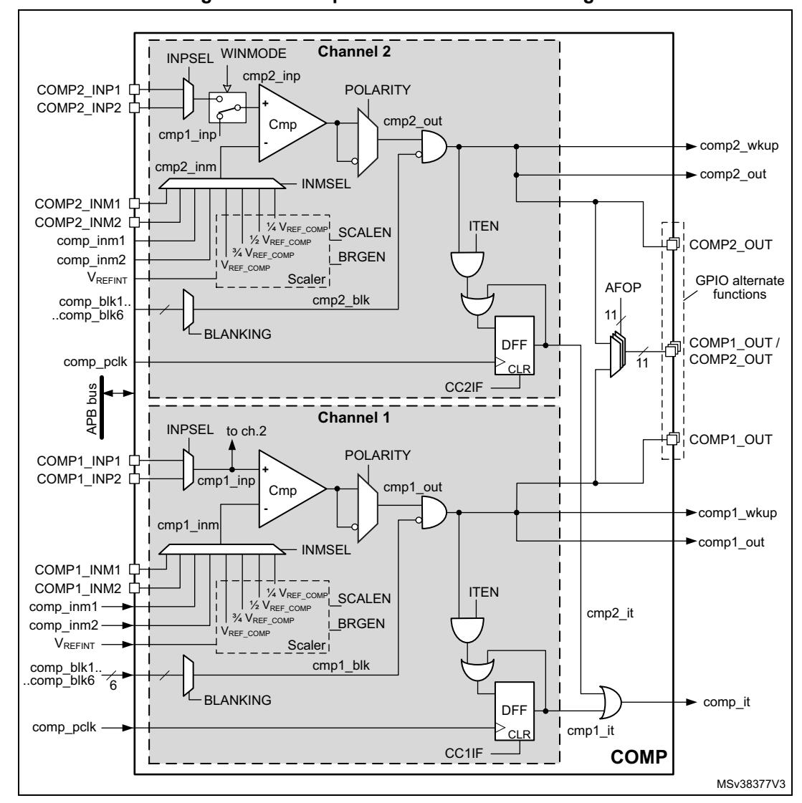
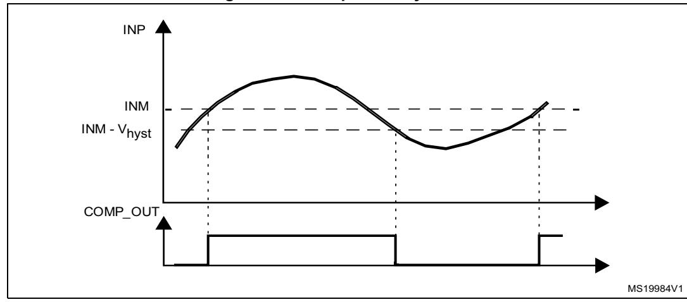
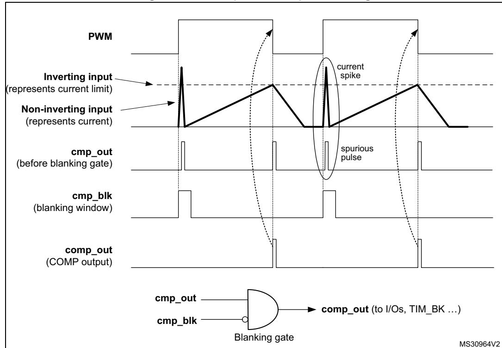
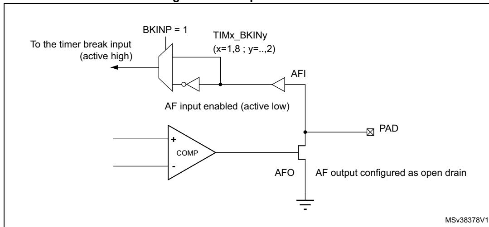
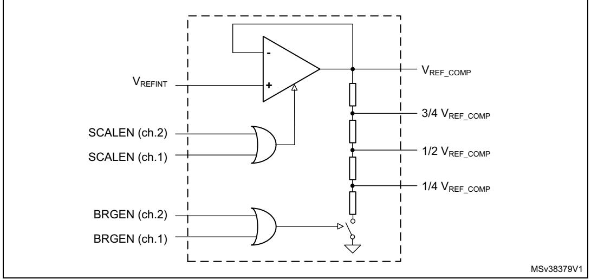

# **29 Comparator (COMP)**

# **29.1 Introduction**

The device embeds two ultra-low-power comparator channels (COMP1 and COMP2). They can be used for a variety of functions including:

- wake up from low-power mode triggered by an analog signal
- analog signal conditioning
- cycle-by-cycle current control loop when combined with a PWM output from a timer

# **29.2 COMP main features**

- Selectable inverting analog inputs:
  - I/O pins (different for either channel)
  - DAC Channel1 and Channel2 outputs
  - internal reference voltage and three sub multiple values (1/4, 1/2, 3/4) provided by scaler (buffered voltage divider)
- Two I/O pins per channel selectable as non-inverting analog inputs
- Programmable hysteresis
- Programmable speed / consumption
- Mapping of outputs to I/Os
- Redirection of outputs to timer inputs for triggering:
  - capture events
  - OCREF\_CLR events (for cycle-by-cycle current control)
  - break events for fast PWM shutdowns
- Blanking of comparator outputs
- Window comparator
- Interrupt generation capability with wake up from Sleep and Stop modes (through the EXTI controller)
- Direct interrupt output to the CPU

# 29.3 COMP functional description

# 29.3.1 COMP block diagram

The block diagram of the comparators is shown in *Figure 221: Comparator functional block diagram*.

Figure 221. Comparator functional block diagram

# 29.3.2 COMP pins and internal signals

The I/Os used as comparator inputs must be configured in analog mode in the GPIO registers.

The comparator outputs can be connected to the I/Os through their alternate functions. Refer to the product datasheet.

The outputs can also be internally redirected to a variety of timer inputs for the following purposes:

- emergency shut-down of PWM signals, using BKIN and BKIN2 inputs
- cycle-by-cycle current control, using ETR inputs of timers
- input capture for timing measurements

The comparator output can be routed simultaneously internally and to the I/O pins.

**Table 239. COMP input/output internal signals** 

| Signal name | Signal type    | Description                                             |  |  |
|-------------|----------------|---------------------------------------------------------|--|--|
| comp_inm1   | Analog input   | Inverting input source for both COMP channels: DAC ch.1 |  |  |
| comp_inm2   | Analog input   | Inverting input source for both COMP channels: DAC ch.2 |  |  |
| comp_blk1   | Digital input  | Blanking input source for both COMP channels: TIM1 OC5  |  |  |
| comp_blk2   | Digital input  | Blanking input source for both COMP channels: TIM2 OC3  |  |  |
| comp_blk3   | Digital input  | Blanking input source for both COMP channels: TIM3 OC3  |  |  |
| comp_blk4   | Digital input  | Blanking input source for both COMP channels: TIM3 OC4  |  |  |
| comp_blk5   | Digital input  | Blanking input source for both COMP channels: TIM8 OC5  |  |  |
| comp_blk6   | Digital input  | Blanking input source for both COMP channels: TIM15 OC1 |  |  |
| comp_pclk   | Digital input  | APB clock for both COMP channels                        |  |  |
| comp1_wkup  | Digital output | COMP channel 1 wakeup out                               |  |  |
| comp1_out   | Digital output | COMP channel 1 out                                      |  |  |
| comp2_wkup  | Digital output | COMP channel 2 wakeup out                               |  |  |
| comp2_out   | Digital output | COMP channel 2 out                                      |  |  |
| comp_it     | Digital output | COMP interrupt out                                      |  |  |

**Table 240. COMP input/output pins** 

| Signal name | Signal type    | Description                                                               |  |  |  |
|-------------|----------------|---------------------------------------------------------------------------|--|--|--|
| COMP1_INM1  | Analog input   | COMP channel 1 inverting input source 1 (PB1)                             |  |  |  |
| COMP1_INM2  | Analog input   | COMP channel 1 inverting input source 2 (PC4)                             |  |  |  |
| COMP1_INP1  | Analog input   | COMP channel 1 non-inverting input source 1 (PB0)                         |  |  |  |
| COMP1_INP2  | Analog input   | COMP channel 1 non-inverting input source 2 (PB2)                         |  |  |  |
| COMP2_INM1  | Analog input   | COMP channel 2 inverting input source 1 (PE10)                            |  |  |  |
| COMP2_INM2  | Analog input   | COMP channel 2 inverting input source 2 (PE7)                             |  |  |  |
| COMP2_INP1  | Analog input   | COMP channel 2 non-inverting input source 1 (PE9)                         |  |  |  |
| COMP2_INP2  | Analog input   | COMP channel 2 non-inverting input source 2 (PE11)                        |  |  |  |
| COMP1_OUT   | Digital output | COMP channel 1 output: see Section 29.3.8: Comparator output on GPIOs. |  |  |  |
| COMP2_OUT   | Digital output | COMP channel 2 output: see Section 29.3.8: Comparator output on GPIOs. |  |  |  |

RM0399 Rev 4 1119/3556

# **29.3.3 COMP reset and clocks**

The clock comp\_pclk provided by the clock controller is synchronous with the APB clock.

*Note: Important: The polarity selection logic and the output redirection to the port works independently from the APB clock. This allows the comparator to work even in Stop mode. The interrupt line, connected to the NVIC of CPU, requires the APB clock (comp\_pclk) to work. In absence of the APB clock, the interrupt signal comp\_it cannot be generated.*

# **29.3.4 Comparator LOCK mechanism**

The comparators can be used for safety purposes, such as over-current or thermal protection. For applications with specific functional safety requirements, the comparator configuration can be protected against undesired alteration that could happen, for example, at program counter corruption.

For this purpose, the comparator configuration registers can be write-protected (read-only).

Upon configuring a comparator channel, its LOCK bit is set to 1. This causes the whole register set of the comparator channel, as well as the common COMP\_OR register, to become read-only, the LOCK bit inclusive.

The write protection can only be removed through the MCU reset.

The COMP\_OR register is locked by the LOCK bit of COMP\_CFGR1 OR COMP\_CFGR2.

## **29.3.5 Window comparator**

The purpose of the window comparator is to monitor the analog voltage and check that it is comprised within the specified voltage range defined by lower and upper thresholds.

The window comparator requires both COMP channels. The monitored analog voltage is connected to their non-inverting (plus) inputs and the upper and lower threshold voltages are connected to the inverting (minus) input of either comparator, respectively. The noninverting input of the COMP channel 2 can be connected internally with the non-inverting input of the COMP channel 1 by enabling WINMODE bit. This can save the input pins of COMP channel 2 for other purposes. See *[Figure 221: Comparator functional block diagram](#page-1-0)*.

## **29.3.6 Hysteresis**

The comparator includes a programmable hysteresis to avoid spurious output transitions in case of noisy signals. The hysteresis can be disabled if it is not needed (for instance when exiting from low-power mode) to be able to force the hysteresis value using external components.

**Figure 222. Comparator hysteresis**

# **29.3.7 Comparator output blanking function**

The purpose of the blanking function is to prevent the current regulation to trip upon short current spikes at the beginning of the PWM period (typically the recovery current in power switches anti parallel diodes). It uses a blanking window defined with a timer output compare signal. Refer to the register description for selectable blanking signals. The blanking signal gates the internal comparator output such as to clean the comp\_out from spurious pulses due to current spikes, as depicted in *[Figure 223](#page-4-0)* (the COMP channel number is not represented).

**Figure 223. Comparator output blanking**

# **29.3.8 Comparator output on GPIOs**

The COMP1\_OUT and COMP2\_OUT outputs of the comparator channels are mapped to GPIOs through the AFOP field of the COMP\_OR register, bits [10:0], and through the GPIO alternate function.

**Table 241. COMP1\_OUT assignment to GPIOs** 

| COMP1_OUT | Alternate Function                         |  |  |
|-----------|--------------------------------------------|--|--|
| PC5       | AF13                                       |  |  |
| PE12      | AF13                                       |  |  |
| PA6       | AF10, AF12 (can be used as timer break in) |  |  |
| PA8       | AF12 (can be used as timer break in)       |  |  |
| PB12      | AF13 (can be used as timer break in)       |  |  |
| PE6       | AF11 (can be used as timer break in)       |  |  |
| PE15      | AF13 (can be used as timer break in)       |  |  |
| PG2       | AF11 (can be used as timer break in)       |  |  |
| PG3       | AF11 (can be used as timer break in)       |  |  |
| PG4       | AF11 (can be used as timer break in)       |  |  |
| PI1       | AF11 (can be used as timer break in)       |  |  |
| PI4       | AF11 (can be used as timer break in)       |  |  |
| PK2       | AF10, AF11 (can be used as timer break in) |  |  |

**Table 242. COMP2\_OUT assignment to GPIOs** 

| COMP2_OUT | Alternate Function                         |  |
|-----------|--------------------------------------------|--|
| PE8       | AF13                                       |  |
| PE13      | AF13                                       |  |
| PA6       | AF10, AF12 (can be used as timer break in) |  |
| PA8       | AF12 (can be used as timer break in)       |  |
| PB12      | AF13 (can be used as timer break in)       |  |
| PE6       | AF11 (can be used as timer break in)       |  |
| PE15      | AF13 (can be used as timer break in)       |  |
| PG2       | AF11 (can be used as timer break in)       |  |
| PG3       | AF11 (can be used as timer break in)       |  |
| PG4       | AF11 (can be used as timer break in)       |  |
| PI1       | AF11 (can be used as timer break in)       |  |
| PI4       | AF11 (can be used as timer break in)       |  |
| PK2       | AF10, AF11 (can be used as timer break in) |  |

The assignment to GPIOs for both comparator channel outputs must be done before locking registers of any channel, because the common COMP\_OR register is locked when locking the registers of either comparator channel.

# **29.3.9 Comparator output redirection**

The outputs of either COMP channel can be redirected to timer break inputs (TIMx\_BKIN or TIMx\_BKIN2), as shown in *[Figure 224](#page-6-0)*. For that end, the COMP channel output is connected to one of GPIOs programmable in alternate function as timer break input. See *[Table 241](#page-5-1)* and *[Table 242](#page-5-2)*. The selected GPIO(s) must be set in open drain mode. The COMP output passes through the GPIO to the timer break input. With a pull-up resistor, the selected GPIO can be used as timer break input logic OR-ed with the comparator output.

**Figure 224. Output redirection**

# **29.3.10 COMP power and speed modes**

The power consumption of the COMP channels versus propagation delay can be adjusted to have the optimum trade-off for a given application.

The bits PWRMODE[1:0] in COMP\_CFGRx registers can be programmed as follows:

00: High speed / full power

01: Medium speed / medium power

10: Medium speed / medium power

11: Very-low speed / ultra-low-power

# **29.4 COMP low-power modes**

**Table 243. Comparator behavior in the low-power modes** 

| Mode  | Description                                                                                     |  |  |
|-------|-------------------------------------------------------------------------------------------------|--|--|
| Sleep | No effect on the comparators. Comparator interrupts cause the device to exit the Sleep mode. |  |  |
| Stop  | No effect on the comparators. Comparator interrupts cause the device to exit the Stop mode.  |  |  |

*Note: The comparators cannot be used to exit the device from Sleep or Stop mode when the internal reference voltage is switched off.*

# **29.5 COMP interrupts**

There are two ways to use the comparator as interrupt source.

The comparator outputs are internally connected to the Extended interrupt and event controller. Each comparator has its own EXTI line and can generate either interrupts or events to make the device exit low-power modes.

The comparators also provide an interrupt line to the NVIC of CPU. This functionality is used when the CPU is active to handle low latency interrupt. It requires APB clock running.

# **29.5.1 Interrupt through EXTI block**

Refer to Interrupt and events section for more details.

Sequence to enable the COMPx interrupt through EXTI block:

- 1. Configure the EXTI line, receiving the comp\_wkup signal, in interrupt mode, select the rising, falling or either-edge sensitivity and enable the EXTI line.
- 2. Configure and enable the NVIC IRQ channel mapped to the corresponding EXTI lines.
- 3. Enable the COMPx.

**Table 244. Interrupt control bits** 

| Interrupt event | Event flag   | Enable control bit | Exit from Sleep mode | Exit from Stop modes | Exit from Standby mode |
|-----------------|--------------|-----------------------|-------------------------|-------------------------|---------------------------|
| comp1_wkup      | through EXTI | through EXTI          | yes                     | yes                     | N/A                       |
| comp2_whup      | through EXTI | through EXTI          | yes                     | yes                     | N/A                       |

## 29.5.2 Interrupt through NVIC of the CPU

Sequence to enable the COMPx interrupt through NVIC of the CPU:

- 1. Configure and enable the NVIC IRQ channel mapped to the comp it line.
- 2. Configure and enable the ITEN in COMP CFGRx.
- 3. Enable the COMPx.

Table 245. Interrupt control bits

| Interrupt event | Interrupt flag | Enable control bit | Interrupt clear bit | Exit from Sleep mode    | Exit from Stop modes |
|-----------------|----------------|-----------------------|------------------------|-------------------------|-------------------------|
| comp_it         | C1IF in        | ITEN in COMP_CFGR1    | CC1IF                  | yes (With APB clock) | no                      |
| comp_it         | C2IF in        | ITEN in COMP_CFGR2    | CC2IF                  | yes (With APB clock) | no                      |

Note: It is mandatory to enable APB clock to use this interrupt. If clock is not enabled, interrupt is not generated.

## 29.6 SCALER function

The scaler block is available to provide the different voltage reference levels to the comparator inputs. It is based on an amplifier driving a resistor bridge. The amplifier input is connected to the internal voltage reference.

The amplifier and the resistor bridge can be enabled separately. The amplifier is enabled by the SCALEN bits of the COMP\_CFGRx registers. The resistor bridge is enabled by the BRGEN bits of the COMP\_CFGRx registers.

When the resistor divided voltage is not used, the resistor bridge can be disconnected in order to reduce the consumption. When it is disconnected, the 1/4  $V_{REF\_COMP}$ , 1/2  $V_{REF\_COMP}$  and 3/4  $V_{REF\_COMP}$  levels are equal to  $V_{REF\_COMP}$ .

Figure 225. Scaler block diagram

# **29.7 COMP registers**

## **29.7.1 Comparator status register (COMP\_SR)**

The COMP\_SR is the comparator status register.

Address offset: 0x00

System reset value: 0x0000 0000

| 31   | 30   | 29   | 28   | 27   | 26   | 25   | 24   | 23   | 22   | 21   | 20   | 19   | 18   | 17    | 16    |
|------|------|------|------|------|------|------|------|------|------|------|------|------|------|-------|-------|
| Res. | Res. | Res. | Res. | Res. | Res. | Res. | Res. | Res. | Res. | Res. | Res. | Res. | Res. | C2IF  | C1IF  |
|      |      |      |      |      |      |      |      |      |      |      |      |      |      | r     | r     |
|      |      |      |      |      |      |      |      |      |      |      |      |      |      |       |       |
| 15   | 14   | 13   | 12   | 11   | 10   | 9    | 8    | 7    | 6    | 5    | 4    | 3    | 2    | 1     | 0     |
| Res. | Res. | Res. | Res. | Res. | Res. | Res. | Res. | Res. | Res. | Res. | Res. | Res. | Res. | C2VAL | C1VAL |

Bits 31:18 Reserved, must be kept at reset value.

Bit 17 **C2IF**: COMP channel 2 Interrupt Flag

This bit is set by hardware when the COMP channel 2 output is set

This bit is cleared by software writing 1 the CC2IF bit in the COMP\_ICFR register.

Bit 16 **C1IF**: COMP channel 1 Interrupt Flag

This bit is set by hardware when the COMP channel 1 output is set

This bit is cleared by software writing 1 the CC1IF bit in the COMP\_ICFR register.

Bits 15:2 Reserved, must be kept at reset value.

Bit 1 **C2VAL:** COMP channel 2 output status bit

This bit is read-only. It reflects the current COMP channel 2 output taking into account POLARITY and BLANKING bits effect.

Bit 0 **C1VAL:** COMP channel 1 output status bit

This bit is read-only. It reflects the current COMP channel 1 output taking into account POLARITY and BLANKING bits effect.

### **29.7.2 Comparator interrupt clear flag register (COMP\_ICFR)**

The COMP\_ICFR is the Comparator interrupt clear flag register.

Address offset: 0x04

System reset value: 0x0000 0004

| 31   | 30   | 29   | 28   | 27   | 26   | 25   | 24   | 23   | 22   | 21   | 20   | 19   | 18   | 17    | 16    |
|------|------|------|------|------|------|------|------|------|------|------|------|------|------|-------|-------|
| Res. | Res. | Res. | Res. | Res. | Res. | Res. | Res. | Res. | Res. | Res. | Res. | Res. | Res. | CC2IF | CC1IF |
|      |      |      |      |      |      |      |      |      |      |      |      |      |      | rc_w1 | rc_w1 |
| 15   | 14   | 13   | 12   | 11   | 10   | 9    | 8    | 7    | 6    | 5    | 4    | 3    | 2    | 1     | 0     |
| Res. | Res. | Res. | Res. | Res. | Res. | Res. | Res. | Res. | Res. | Res. | Res. | Res. | Res. | Res.  | Res.  |
|      |      |      |      |      |      |      |      |      |      |      |      |      |      |       |       |

Bits 31:18 Reserved, must be kept at reset value.

Bit 17 **CC2IF**: Clear COMP channel 2 Interrupt Flag

Writing 1 clears the C2IF flag in the COMP\_SR register.

Bit 16 **CC1IF**: Clear COMP channel 1 Interrupt Flag

Writing 1 clears the C1IF flag in the COMP\_SR register.

Bits 15:0 Reserved, must be kept at reset value.

## **29.7.3 Comparator option register (COMP\_OR)**

The COMP\_OR is the Comparator option register.

Address offset: 0x08

System reset value: 0x0000 0000

| 31   | 30   | 29   | 28   | 27   | 26   | 25   | 24   | 23   | 22   | 21   | 20   | 19   | 18   | 17   | 16   |  |
|------|------|------|------|------|------|------|------|------|------|------|------|------|------|------|------|--|
| Res. | Res. | Res. | Res. | Res. | Res. | Res. | Res. | Res. | Res. | Res. | Res. | Res. | Res. | Res. | Res. |  |
|      |      |      |      |      |      |      |      |      |      |      |      |      |      |      |      |  |
| 15   | 14   | 13   | 12   | 11   | 10   | 9    | 8    | 7    | 6    | 5    | 4    | 3    | 2    | 1    | 0    |  |
| Res. | Res. | Res. | Res. | Res. |      |      |      |      |      | AFOP |      |      |      |      |      |  |
|      |      |      |      |      | rw   |      |      |      |      |      |      |      |      |      |      |  |

Bits 31:11 Reserved, must be kept at reset value.

Bits 10:0 **AFOP[10:0]:** Selection of source for alternate function of output ports

Bits of this field are set end cleared by software (only if LOCK not set).

Output port (GPIO) correspondence:

bit 10 bit 9 bit 8 bit 7 bit 6 bit 5 bit 4 bit 3 bit 2 bit 1 bit 0 PK2 PI4 PI1 PG4 PG3 PG2 PE15 PE6 PB12 PA8 PA6

For each bit:

0: COMP1\_OUT is selected for the alternate function of the corresponding GPIO

1: COMP2\_OUT is selected for the alternate function of the corresponding GPIO

### **29.7.4 Comparator configuration register 1 (COMP\_CFGR1)**

The COMP\_CFGR1 is the COMP channel 1 configuration register.

Address offset: 0x0C

System reset value: 0x0000 0000

| 31   | 30   | 29   | 28           | 27   | 26            | 25 | 24                | 23 | 22   | 21   | 20     | 19           | 18           | 17 | 16 |  |
|------|------|------|--------------|------|---------------|----|-------------------|----|------|------|--------|--------------|--------------|----|----|--|
| LOCK | Res. | Res. | Res.         |      | BLANKING[3:0] |    |                   |    | Res. | Res. | INPSEL | Res.         | INMSEL[2:0]  |    |    |  |
| rw   |      |      |              |      | rw            |    |                   |    |      |      | rw     |              | rw           |    |    |  |
| 15   | 14   | 13   | 12           | 11   | 10            | 9  | 8                 | 7  | 6    | 5    | 4      | 3            | 2            | 1  | 0  |  |
| Res. | Res. |      | PWRMODE[1:0] | Res. | Res.          |    | HYST[1:0] Res. |    | ITEN | Res. | Res.   | POLARI TY | SCALEN BRGEN |    | EN |  |
|      |      |      | rw           |      |               | rw |                   |    | rw   |      |        | rw           | rw           | rw | rw |  |

#### Bit 31 **LOCK:** Lock bit

This bit is set by software and cleared by a hardware system reset. It locks the whole content of the COMP channel 1 configuration register COMP\_CFGR1[31:0], and COMP\_OR register

0: COMP\_CFGR1[31:0] register is read/write

1: COMP\_CFGR1[31:0] and COMP\_OR registers are read-only

Bits 30:28 Reserved, must be kept at reset value.

#### Bits 27:24 **BLANKING[3:0]:** COMP channel 1 blanking source selection bits

Bits of this field are set and cleared by software (only if LOCK not set).

The field selects the input source for COMP channel 1 output blanking:

0000: No blanking

0001: comp\_blk1

0010: comp\_blk2

0011: comp\_blk3

0100: comp\_blk4

0101: comp\_blk5

0110: comp\_blk6

All other values: reserved

#### Bits 23:21 Reserved, must be kept at reset value.

## Bit 20 **INPSEL**: COMP channel 1 non-inverting input selection bit

This bit is set and cleared by software (only if LOCK not set).

0: COMP1\_INP1 (PB0)

1: COMP1\_INP2 (PB2)

Bit 19 Reserved, must be kept at reset value.

### Bits 18:16 **INMSEL[2:0]**: COMP channel 1 inverting input selection field

These bits are set and cleared by software (only if LOCK not set). They select which input is connected to the input minus of COMP channel 1.

000 = 1/4 VREF\_COMP

001 = 1/2 VREF\_COMP

010 = 3/4 VREF\_COMP

011 = VREF\_COMP

100 = comp\_inm1 (DAC channel 1 output)

101 = comp\_inm2 (DAC channel 2 output)

110 = COMP1\_INM1 (PB1)

111 = COMP1\_INM2 (PC4)

#### Bits 15:14 Reserved, must be kept at reset value.

#### Bits 13:12 **PWRMODE[1:0]:** Power Mode of the COMP channel 1

These bits are set and cleared by software (only if LOCK not set). They control the power/speed of the COMP channel 1.

00: High speed / full power

01: Medium speed / medium power

10: Medium speed / medium power

11: Ultra low power / ultra-low-power

Bits 11:10 Reserved, must be kept at reset value.

#### Bits 9:8 **HYST[1:0]:** COMP channel 1 hysteresis selection bits

These bits are set and cleared by software (only if LOCK not set). They select the Hysteresis voltage of the COMP channel 1.

00: No hysteresis

01: Low hysteresis

10: Medium hysteresis

11: High hysteresis

Bit 7 Reserved, must be kept at reset value.

#### Bit 6 **ITEN:** COMP channel 1 interrupt enable

This bit is set and cleared by software (only if LOCK not set). This bit enable the interrupt generation of the COMP channel 1.

0: Interrupt generation disabled for COMP channel 1

1: Interrupt generation enabled for COMP channel 1

#### Bits 5:4 Reserved, must be kept at reset value.

#### Bit 3 **POLARITY:** COMP channel 1 polarity selection bit

This bit is set and cleared by software (only if LOCK not set). It inverts COMP channel 1 polarity.

0: COMP channel 1 output is not inverted

1: COMP channel 1output is inverted

#### Bit 2 **SCALEN**: Voltage scaler enable bit

This bit is set and cleared by software (only if LOCK not set). This bit enables the VREFINT scaler for the COMP channels.

0: VREFINT scaler disabled (if SCALEN bit of COMP\_CFGR2 register is also low)

1: VREFINT scaler enabled

#### Bit 1 **BRGEN:** Scaler bridge enable

This bit is set and cleared by software (only if LOCK not set). This bit enables the bridge of the scaler.

- 0: Scaler resistor bridge disabled (if BRGEN bit of COMP\_CFGR2 register is also low)
- 1: Scaler resistor bridge enabled

If SCALEN is set and BRGEN is reset, all four scaler outputs provide the same level VREF\_COMP (similar to VREFINT).

If SCALEN and BRGEN are set, the four scaler outputs provide VREF\_COMP, 3/4 VREF\_COMP, 1/2 VREF\_COMP and 1/4 VREF\_COMP levels, respectively.

### Bit 0 **EN:** COMP channel 1 enable bit

This bit is set and cleared by software (only if LOCK not set). It enables the COMP channel 1.

0: Disable

1: Enable

## **29.7.5 Comparator configuration register 2 (COMP\_CFGR2)**

The COMP\_CFGR2 is the COMP channel 2 configuration register.

Address offset: 0x10

System reset value: 0x0000 0000

| 31   | 30   | 29   | 28   | 27 | 26 | 25            | 24 | 23   | 22   | 21   | 20     | 19   | 18          | 17 | 16 |
|------|------|------|------|----|----|---------------|----|------|------|------|--------|------|-------------|----|----|
| LOCK | Res. | Res. | Res. |    |    | BLANKING[3:0] |    | Res. | Res. | Res. | INPSEL | Res. | INMSEL[2:0] |    |    |
| rw   |      |      |      |    | rw |               |    |      |      |      | rw     |      |             | rw |    |

RM0399 Rev 4 1129/3556

| 15   | 14   | 13           | 12 | 11   | 10   | 9         | 8 | 7    | 6    | 5    | 4           | 3            | 2            | 1  | 0  |
|------|------|--------------|----|------|------|-----------|---|------|------|------|-------------|--------------|--------------|----|----|
| Res. | Res. | PWRMODE[1:0] |    | Res. | Res. | HYST[1:0] |   | Res. | ITEN | Res. | WINMO DE | POLAR ITY | SCALEN BRGEN |    | EN |
|      |      | rw           |    |      |      | rw        |   |      | rw   |      | rw          | rw           | rw           | rw | rw |

### Bit 31 **LOCK:** Lock bit

This bit is set by software and cleared by a hardware system reset. It locks the whole content of the COMP channel 2 configuration register COMP\_CFGR2[31:0], and COMP\_OR register

0: COMP\_CFGR2[31:0] register is read/write

1: COMP\_CFGR2[31:0] and COMP\_OR registers are read-only

Bits 30:28 Reserved, must be kept at reset value.

#### Bits 27:24 **BLANKING[3:0]:** COMP channel 2 blanking source selection bits

These bits are set and cleared by software (only if LOCK not set). These bits select which timer output controls the COMP channel 2 output blanking.

0000: No blanking

0001: TIM1 OC5 selected as blanking source

0010: TIM2 OC3 selected as blanking source

0011: TIM3 OC3 selected as blanking source

0100: TIM3 OC4 selected as blanking source

0101: TIM8 OC5 selected as blanking source

0110: TIM15 OC1 selected as blanking source

All other values: reserved

Bits 23:21 Reserved, must be kept at reset value.

#### Bit 20 **INPSEL**: COMP channel 2 non-inverting input selection bit

This bit is set and cleared by software (only if LOCK not set).

0: COMP2\_INP1 (PE9)

1: COMP2\_INP2 (PE11)

Bit 19 Reserved, must be kept at reset value.

### Bits 18:16 **INMSEL[2:0]**: COMP channel 2 inverting input selection field

These bits are set and cleared by software (only if LOCK not set). They select which input is connected to the input minus of COMP channel 2.

000 = 1/4 VREF\_COMP

001 = 1/2 VREF\_COMP

010 = 3/4 VREF\_COMP

011 = VREF\_COMP

100 = comp\_inm1 (DAC channel 1 output)

101 = comp\_inm2 (DAC channel 2 output)

110 = COMP2\_INM1 (PE10)

111 = COMP2\_INM2 (PE7)

### Bits 15:14 Reserved, must be kept at reset value.

#### Bits 13:12 **PWRMODE[1:0]:** Power Mode of the COMP channel 2

These bits are set and cleared by software (only if LOCK not set). They control the power/speed of the COMP channel 2.

00: High speed / full power

01: Medium speed / medium power

10: Medium speed / medium power

11: Ultra low power / ultra-low-power

Bits 11:10 Reserved, must be kept at reset value.

#### Bits 9:8 **HYST[1:0]:** COMP channel 2 hysteresis selection bits

These bits are set and cleared by software (only if LOCK not set). They select the Hysteresis voltage of the COMP channel 2.

00: No hysteresis

01: Low hysteresis

10: Medium hysteresis

11: High hysteresis

Bit 7 Reserved, must be kept at reset value.

### Bit 6 **ITEN:** COMP channel 2 interrupt enable

This bit is set and cleared by software (only if LOCK not set). This bit enable the interrupt generation of the COMP channel 2.

0: Interrupt generation disabled for COMP channel 2

1: Interrupt generation enabled for COMP channel 2

Bit 5 Reserved, must be kept at reset value.

#### Bit 4 **WINMODE**: Window comparator mode selection bit

This bit is set and cleared by software (only if LOCK not set). This bit selects the window mode of the comparators. If set, the non-inverting input of COMP channel 2 is connected to the non-inverting input of the COMP channel 1.

Depending on the bit value, the non-inverting input of COMP channel 2 is connected to:

0: COMP2\_INP input selector

1: Non-inverting input comp1\_inp of COMP channel 1

#### Bit 3 **POLARITY:** COMP channel 2 polarity selection bit

This bit is set and cleared by software (only if LOCK not set). It inverts COMP channel 2 polarity.

0: COMP channel 2 output is not inverted

1: COMP channel 2 output is inverted

#### Bit 2 **SCALEN**: Voltage scaler enable bit

This bit is set and cleared by software (only if LOCK not set). This bit enables the VREFINT scaler for the COMP channels.

0: VREFINT scaler disabled (if SCALEN bit of COMP\_CFGR1 register is also low)

1: VREFINT scaler enabled

#### Bit 1 **BRGEN:** Scaler bridge enable

This bit is set and cleared by software (only if LOCK not set). This bit enables the bridge of the scaler.

- 0: Scaler resistor bridge disabled (if BRGEN bit of COMP\_CFGR1 register is also low)
- 1: Scaler resistor bridge enabled

If SCALEN is set and BRGEN is reset, all four scaler outputs provide the same level VREF\_COMP (similar to VREFINT).

If SCALEN and BRGEN are set, the four scaler outputs provide VREF\_COMP, 3/4 VREF\_COMP, 1/2 VREF\_COMP and 1/4 VREF\_COMP levels, respectively.

#### Bit 0 **EN:** COMP channel 2 enable bit

This bit is set and cleared by software (only if LOCK not set). It enables the COMP channel 2.

0: Disable

1: Enable

RM0399 Rev 4 1131/3556

# **29.7.6 COMP register map**

The following table summarizes the comparator registers.

**Table 246. COMP register map and reset values** 

| Offset | Register name      | 31   | 30   | 29   | 28   | 27   | 26       | 25   | 24   | 23   | 22   | 21   | 20     | 19   | 18   | 17     | 16    | 15   | 14   | 13      | 12   | 11   | 10   | 9    | 8    | 7    | 6    | 5    | 4       | 3        | 2      | 1     | 0     |
|--------|-----------------------|------|------|------|------|------|----------|------|------|------|------|------|--------|------|------|--------|-------|------|------|---------|------|------|------|------|------|------|------|------|---------|----------|--------|-------|-------|
| 0x00   | COMP_SR               | Res. | Res. | Res. | Res. | Res. | Res.     | Res. | Res. | Res. | Res. | Res. | Res.   | Res. | Res. | C2IF   | C1IF  | Res. | Res. | Res.    | Res. | Res. | Res. | Res. | Res. | Res. | Res. | Res. | Res.    | Res.     | Res.   | C2VAL | C1VAL |
|        | Reset value           |      |      |      |      |      |          |      |      |      |      |      |        |      |      | 0      | 0     |      |      |         |      |      |      |      |      |      |      |      |         |          |        | 0     | 0     |
| 0x04   | COMP_ICFR             | Res. | Res. | Res. | Res. | Res. | Res.     | Res. | Res. | Res. | Res. | Res. | Res.   | Res. | Res. | CC2IF  | CC1IF | Res. | Res. | Res.    | Res. | Res. | Res. | Res. | Res. | Res. | Res. | Res. | Res.    | Res.     | Res.   | Res.  | Res.  |
|        | Reset value           |      |      |      |      |      |          |      |      |      |      |      |        |      |      | 0      | 0     |      |      |         |      |      |      |      |      |      |      |      |         |          |        |       |       |
| 0x08   | COMP_OR (OR_CFG=0) | Res. | Res. | Res. | Res. | Res. | Res.     | Res. | Res. | Res. | Res. | Res. | Res.   | Res. | Res. | Res.   | Res.  | OR15 | OR14 | OR13    | OR12 | OR11 |      |      |      |      |      | AFOP |         |          |        |       |       |
|        | Reset value           |      |      |      |      |      |          |      |      |      |      |      |        |      |      |        |       | 0    | 0    | 0       | 0    | 0    | 0    | 0    | 0    | 0    | 0    | 0    | 0       | 0        | 0      | 0     | 0     |
| 0x08   | COMP_OR (OR_CFG=1) | OR31 | OR30 | OR29 | OR28 | OR27 | OR26     | OR25 | OR24 | OR23 | OR22 | OR21 | OR20   | OR19 | OR18 | OR17   | OR16  | OR15 | OR14 | OR13    | OR12 | OR11 | AFOP |      |      |      |      |      |         |          |        |       |       |
|        | Reset value           | 0    | 0    | 0    | 0    | 0    | 0        | 0    | 0    | 0    | 0    | 0    | 0      | 0    | 0    | 0      | 0     | 0    | 0    | 0       | 0    | 0    | 0    | 0    | 0    | 0    | 0    | 0    | 0       | 0        | 0      | 0     | 0     |
| 0x0C   | COMP_CFG R1        | LOCK | Res. | Res. | Res. |      | BLANKING |      |      | Res. | Res. | Res. | INPSEL | Res. |      | INMSEL |       | Res. | Res. | PWRMODE |      | Res. | Res. | HYST |      | Res. | ITEN | Res. | Res.    | POLARITY | SCALEN | BRGEN | EN    |
|        | Reset value           | 0    |      |      |      | 0    | 0        | 0    | 0    |      |      |      | 0      |      | 0    | 0      | 0     |      |      | 0       | 0    |      |      | 0    | 0    |      | 0    |      |         | 0        | 0      | 0     | 0     |
| 0x10   | COMP_CFG R2        | LOCK | Res. | Res. | Res. |      | BLANKING |      |      | Res. | Res. | Res. | INPSEL | Res. |      | INMSEL |       | Res. | Res. | PWRMODE |      | Res. | Res. | HYST |      | Res. | ITEN | Res. | WINMODE | POLARITY | SCALEN | BRGEN | EN    |
|        | Reset value           | 0    |      |      |      | 0    | 0        | 0    | 0    |      |      |      | 0      |      | 0    | 0      | 0     |      |      | 0       | 0    |      |      | 0    | 0    |      | 0    |      | 0       | 0        | 0      | 0     | 0     |

Refer to *Section 2.3 on page 134* for the register boundary addresses.