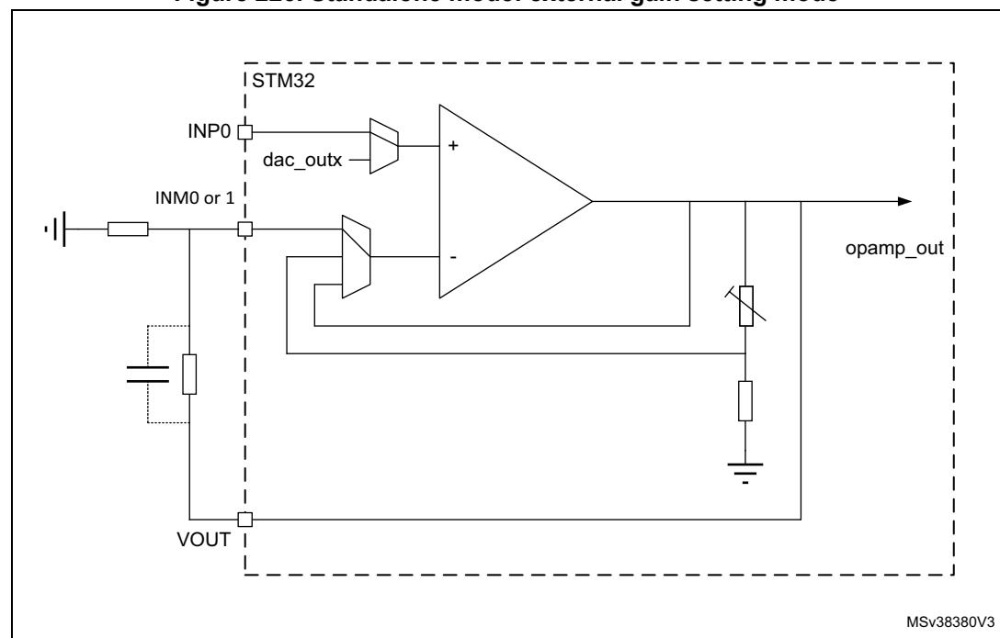
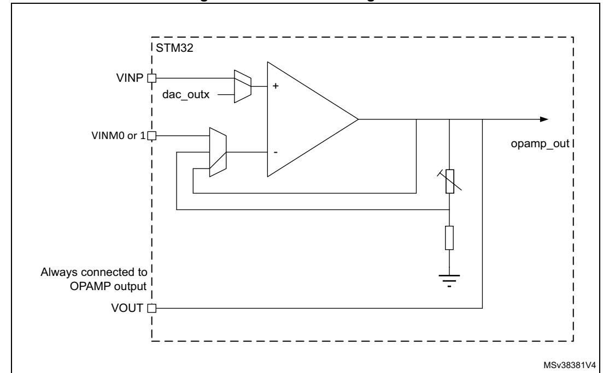
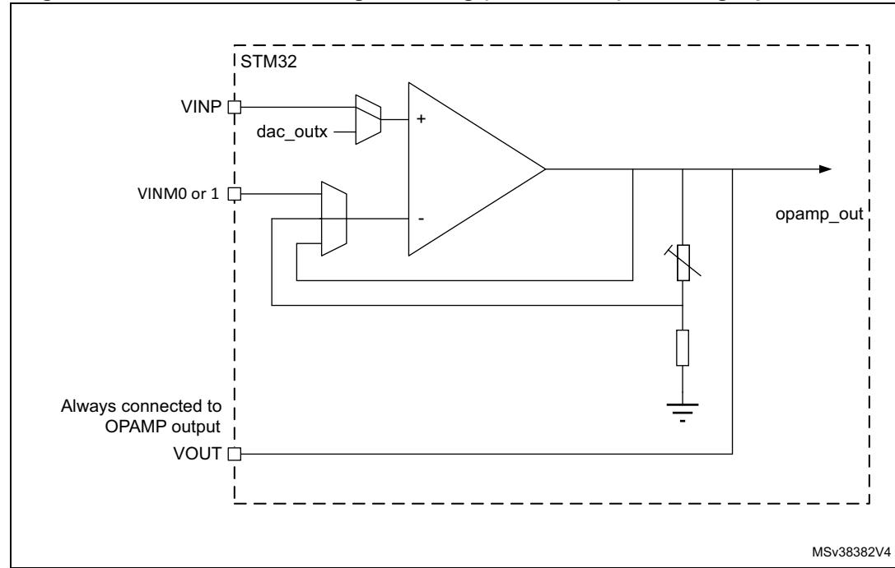
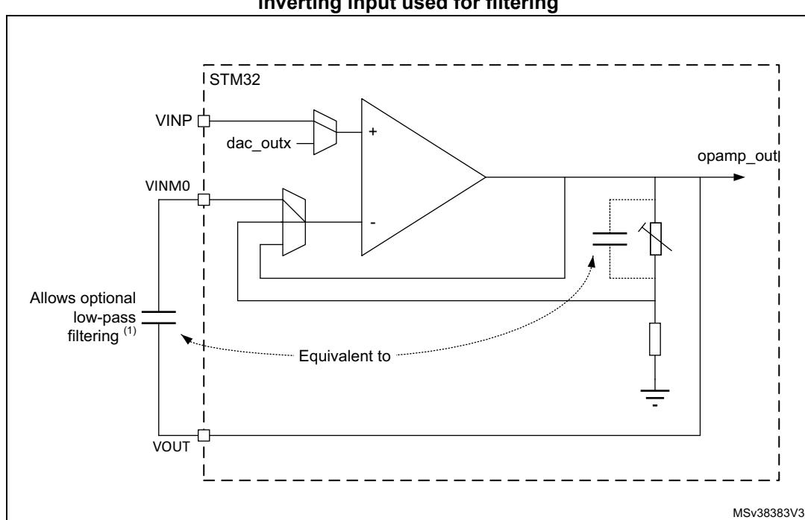
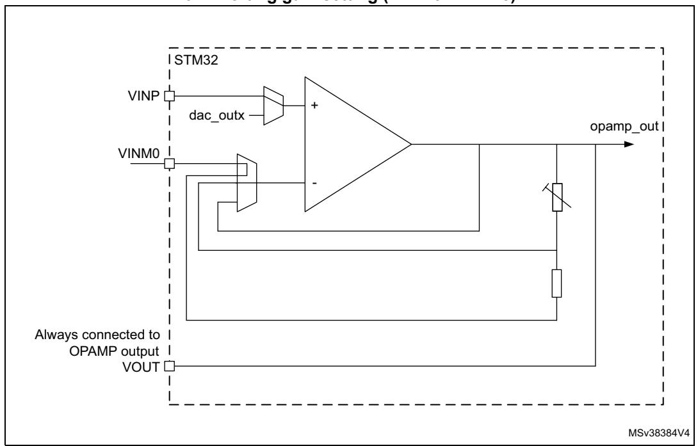
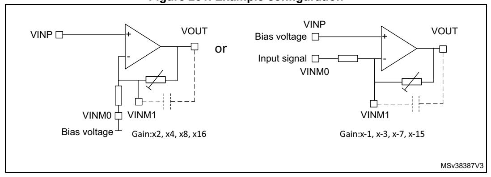
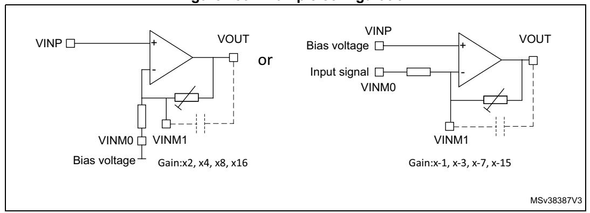

# **30 Operational amplifiers (OPAMP)**

## **30.1 Introduction**

The devices embed two operational amplifiers with two inputs and one output each. The three I/Os can be connected to the external pins, thus enabling any type of external interconnections. The operational amplifiers can be configured internally as a follower, as an amplifier with a non-inverting gain ranging from 2 to 16 or with inverting gain ranging from -1 to -15.

Refer to *[Section 30.3.3: Signal routing](#page-1-0)* for detailed information on OPAMP input and output connection to internal peripherals.

## **30.2 OPAMP main features**

- Rail-to-rail input voltage range
- Low input bias current (down to 1 nA)
- Low input offset voltage (1.5 mV after calibration, 10 mV with factory calibration)
- 7 MHz gain bandwidth
- High-speed mode to achieve a better slew rate

*Note: Refer to the product datasheet for detailed OPAMP characteristics.*

## **30.3 OPAMP functional description**

The OPAMP has several modes.

Each OPAMP can be individually enabled, when disabled the output is high-impedance.

When enabled, it can be in calibration mode, all input and output of the OPAMP are then disconnected, or in functional mode.

There are two functional modes, the high-speed mode and the normal mode. In functional mode the inputs and output of the OPAMP are connected as described in *[Section 30.3.3:](#page-1-0)  [Signal routing](#page-1-0)*.

### **30.3.1 OPAMP reset and clocks**

The operational amplifier clock is necessary for accessing the registers. When the application does not need to have read or write access to those registers, the clock can be switched off using the peripheral clock enable register (see OPAMPEN bit in *Section 9.7.45: RCC APB1 clock register (RCC\_APB1HENR)*).

The bit OPAEN enables and disables the OPAMP operation. The OPAMP registers configurations should be changed before enabling the OPAEN bit in order to avoid spurious effects on the output.

When the output of the operational amplifier is no more needed the operational amplifier can be disabled to save power. All the configurations previously set (including the calibration) are maintained while OPAMP is disabled.

RM0399 Rev 4 1133/3556

## **30.3.2 Initial configuration**

The default configuration of the operational amplifier is a functional mode where the three input/outputs are connected to external pins. In the default mode the operational amplifier uses the factory trimming values for its offset calibration. See electrical characteristics section of the datasheet for factory trimming conditions, usually the temperature is 30 °C and the voltage is 3 V. The trimming values can be adjusted, see *[Section 30.3.5: Calibration](#page-8-0)* for changing the trimming values. The default configuration uses the normal mode, which provides the standard performance. The bit OPAHSM can be set in order to switch the operational amplifier to high-speed mode for a better slew rate. Both normal and high-speed mode characteristics are defined in *Section: Electrical characteristics* of the datasheet.

As soon as the OPAEN bit in OPAMPx\_CSR register is set, the operational amplifier is functional. The two input pins and the output pin are connected as defined in *[Section 30.3.3:](#page-1-0)  [Signal routing](#page-1-0)* and the default connection settings can be changed.

*Note: The inputs and output pins must be configured in analog mode (default state) in the corresponding GPIOx\_MODER register.*

## **30.3.3 Signal routing**

The routing for the operational amplifier pins is determined by OPAMPx\_CSR register.

The connections of the two operational amplifiers (OPAMP1 and OPAMP2) are described in the table below.

| Signal         | Pin                    | Internal                                      | comment                                                                                   |  |  |  |
|----------------|------------------------|-----------------------------------------------|-------------------------------------------------------------------------------------------|--|--|--|
| OPAMP1_VINM    | PC5(INM0) PA7(INM1) | ADC1_IN8 ADC2_IN8 OPAMP1_VOUT or PGA | controlled by bits PGA_GAIN and VM_SEL.                                                |  |  |  |
| OPAMP1_VINP    | PB0                    | dac_out1 ADC1_IN9 ADC2_IN9 COMP1_INP | controlled by bit VP_SEL.                                                                 |  |  |  |
| OPAMP1_VOUT(1) | PC4                    | ADC1_IN4 ADC2_IN4 COMP1_INM7            | The pin is connected when the OPAMP is enabled. The ADC input is controlled by ADC. |  |  |  |
| OPAMP2_VINM    | PE8(INM0) PG1(INM1) | OPAMP2_VOUT or PGA                         | controlled by bits PGA_GAIN and VM_SEL.                                                |  |  |  |
| OPAMP2_VINP    | PE9                    | dac_out2 COMP2_INP                         | controlled by bit VP_SEL                                                                  |  |  |  |
| OPAMP2_VOUT(1) | PE7                    | COMP2_INM7                                    | -                                                                                         |  |  |  |

**Table 247. Operational amplifier possible connections**

1. Both OPAMP1\_VOUT and OPAMP2\_VOUT are not available on all packages. In this case, the unused I/O should not be activated since is internally set to a fixed configuration.

## **30.3.4 OPAMP modes**

The operational amplifier inputs and outputs are all accessible on terminals. The amplifiers can be used in multiple configuration environments:

- Standalone mode (external gain setting mode)
- Follower configuration mode
- PGA modes

*Note: The amplifier output pin is directly connected to the output pad to minimize the output impedance. When the amplifier is enabled, it cannot be used as a general purpose I/O, even if the amplifier is configured as a PGA and only connected to the internal channel.*

> *The impedance of the signal must be maintained below a level which avoids the input leakage to create significant artifacts (due to a resistive drop in the source). Please refer to the electrical characteristics section in the datasheet for further details.*

### **Standalone mode (external gain setting mode)**

The procedure to use the OPAMP in standalone mode is presented hereafter.

Starting from the default value of OPAMPx\_CSR, and the default state of GPIOx\_MODER, as soon as the OPAEN bit is set, the two input pins and the output pin are connected to the operational amplifier.

This default configuration uses the factory trimming values and operates in normal mode (highest performance). The behavior of the OPAMP can be changed as follows:

- OPAHSM can be set to "operational amplifier high-speed" mode in order to have high slew rate.
- USERTRIM can be set to modify the trimming values for input offsets.

**Figure 226. Standalone mode: external gain setting mode**

### **Follower configuration mode**

The procedure to use the OPAMP in follower mode is presented hereafter.

- configure VM\_SEL bits as "opamp\_out connected to OPAMPx\_VINM input", 11
- configure VP\_SEL bits as "GPIO connected to OPAMPx\_VINP", 00
- As soon as the OPAEN bit is set, the voltage on pin OPAMPx\_VINP is buffered to pin OPAMPx\_VOUT.

*Note: The pin corresponding to OPAMPx\_VINM is free for another usage.*

*The signal on the OPAMP1 output is also seen as an ADC input. As a consequence, the OPAMP configured in follower mode can be used to perform impedance adaptation on input signals before feeding them to the ADC input, assuming the input signal frequency is compatible with the operational amplifier gain bandwidth specification.*

**Figure 227. Follower configuration**

### **Programmable gain amplifier mode**

The procedure to use the OPAMP as programmable gain amplifier is presented hereafter.

- configure VM\_SEL bits as "Feedback resistor is connected to OPAMPx\_VINM input", 10
- configure PGA\_GAIN bits as "internal Gain 2, 4, 8 or 16", 0000 to 0011
- configure VP\_SEL bits as "GPIO connected to OPAMPx\_VINP", 00 As soon as the OPAEN bit is set, the voltage on pin OPAMPx\_VINP is amplified by the selected gain and visible on pin OPAMPx\_VOUT.

*Note: To avoid saturation, the input voltage should stay below VDDA divided by the selected gain.*

**Figure 228. PGA mode, internal gain setting (x2/x4/x8/x16), inverting input not used**

### **Programmable gain amplifier mode with external filtering**

The procedure to use the OPAMP to amplify the amplitude of an input signal, with an external filtering, is presented hereafter.

- configure VM\_SEL bits as "Feedback resistor is connected to OPAMPx\_VINM input", 10
- configure PGA\_GAIN bits as "internal Gain 2, 4, 8 or 16 with filtering on INM0", 0100 to 0111
- configure VP\_SEL bits as "GPIO connected to OPAMPx\_VINP". Any external connection on INM can be used in parallel with the internal PGA, for example a capacitor can be connected between opamp\_out and INM for filtering purpose (see datasheet for the value of resistors used in the PGA resistor network).

**Figure 229. PGA mode, internal gain setting (x2/x4/x8/x16), inverting input used for filtering**

1. The gain depends on the cut-off frequency.

## **Programmable gain amplifier, non-inverting with external bias or inverting mode**

The procedure to use the OPAMP to amplify the amplitude of an input signal with bias voltage for non-inverting mode or inverting mode.

- configure VM\_SEL bits as "Feedback resistor is connected to OPAMPx\_VINM input", 10
- configure PGA\_GAIN bits as "Inverting gain=-1,-3,-7,-15/ Non-inverting gain =2,4,8,16 with INM0", 1000 to 1011
- configure VP\_SEL bits as "GPIO connected to OPAMPx\_VINP".

**Figure 230. PGA mode, non-inverting gain setting (x2/x4/x8/x16) or inverting gain setting (x-1/x-3/x-7/x-15)**

**Figure 231. Example configuration**

## **Programmable gain amplifier, non-inverting with external bias or inverting mode with filtering**

The procedure to use the OPAMP to amplify the amplitude of an input signal with bias voltage for non-inverting mode or inverting mode with filtering

- configure VM\_SEL bits as "Feedback resistor is connected to OPAMPx\_VINM input", 10
- configure PGA\_GAIN bits as "Inverting gain=-1,-3,-7,-15/ Non-inverting gain =2,4,8,16 with INM0, INM1 node for filtering", 1100 to 1111
- configure VP\_SEL bits as "GPIO connected to OPAMPx\_VINP". Any external connection on VM1 can be used in parallel with the internal PGA, for example a capacitor can be connected between opamp\_out and VM1 for filtering purpose (see datasheet for the value of resistors used in the PGA resistor network).

**Figure 232. PGA mode, non-inverting gain setting (x2/x4/x8/x16) or inverting gain setting (x-1/x-3/x-7/x-15) with filtering**

**Figure 233. Example configuration**

### **30.3.5 Calibration**

The OPAMP interface continuously sends trimmed offset values to the operational amplifiers. At startup, the trimming values are initialized with the preset 'factory' trimming value.

Each operational amplifier can be trimmed by the user. Specific registers allow to have different trimming values for normal mode and for high-speed mode.

The aim of the calibration is to cancel as much as possible the OPAMP inputs offset voltage. The calibration circuitry allows to reduce the input offset voltage to less than +/-1.5 mV within stable voltage and temperature conditions.

For each operational amplifier and each mode two trimming value needs to be trimmed, one for N differential pair and one for P differential pair.

There are two registers for trimming the offsets for each operational amplifiers, one for normal mode (OPAMPx\_OTR) and one high-speed mode (OPAMPx\_HSOTR). Each register is composed of five bits for P differential pair trimming and five bits for N differential pair trimming. These are the 'user' values.

The user is able to switch from 'factory' values to 'user' trimmed values using the USERTRIM bit in the OPAMPx\_CSR register. This bit is reset at startup and so the 'factory' value are applied by default to the OPAMP option registers.

User is liable to change the trimming values in calibration or in functional mode.

The offset trimming registers are typically configured after the calibration operation is initialized by setting bit CALON to 1. When CALON = 1 the inputs of the operational amplifier are disconnected from the functional environment.

- Setting CALSEL to 01 initializes the offset calibration for the P differential pair (low voltage reference used).
- Resetting CALSEL to 11 initializes the offset calibration for the N differential pair (high voltage reference used).

When CALON = 1, the bit CALOUT will reflect the influence of the trimming value selected by CALSEL and OPAHSM. The software should increment the TRIMOFFSETN bits in the OPAMP control register from 0x00 to the first value that causes the CALOUT bit to change from 1 to 0 in the OPAMP register. If the CALOUT bit is reset, the offset is calibrated correctly and the corresponding trimming value must be stored. The CALOUT flag needs up to 1 ms after the trimming value is changed to become steady (see tOFFTRIMmax delay specification in the electrical characteristics section of the datasheet).

*Note: The closer the trimming value is to the optimum trimming value, the longer it takes to stabilize (with a maximum stabilization time remaining below 1 ms in any case).*

**Mode Control bits Output OPAEN OPAHSM CALON CALSEL VOUT CALOUT flag** Normal operating mode 1 0 0 X analog 0 High-speed mode 1 1 0 X analog 0 Power down 0 X X X Z 0

**Table 248. Operating modes and calibration** 

RM0399 Rev 4 1141/3556

Offset calibration N difference for normal mode 1 0 1 11 analog X Offset calibration P difference for normal mode 1 0 1 01 analog X Offset calibration N difference for highspeed mode 1 1 1 11 analog X Offset calibration P difference for highspeed mode 1 1 1 01 analog X **Mode Control bits Output OPAEN OPAHSM CALON CALSEL VOUT CALOUT flag**

**Table 248. Operating modes and calibration (continued)**

### **Calibration procedure**

Here are the steps to perform a full calibration of either one of the operational amplifiers:

- 1. Set the OPAEN bit in OPAMPx\_CSR to 1 to enable the operational amplifier.
- 2. Set the USERTRIM bit in the OPAMPx\_CSR register to 1.
- 3. Choose a calibration mode (refer to *Table [248: Operating modes and calibration](#page-8-1)*). The steps 3 to 4 will have to be repeated 4 times. For the first iteration select
  - Normal mode and N differential pair

The above calibration mode correspond to OPAHSM=0 and CALSEL=11 in the OPAMPx\_CSR register.

4. Increment TRIMOFFSETN[4:0] in OPAMPx\_OTR starting from 00000b until CALOUT changes to 0 in OPAMPx\_CSR.

*Note: Between the write to the OPAMPx\_OTR register and the read of the CALOUT value, make sure to wait for the tOFFTRIMmax delay specified in the electrical characteristics section of the datasheet, to get the correct CALOUT value.*

> The commutation means that the is correctly compensated and that the corresponding trim code must be saved in the OPAMPx\_OTR register.

Repeat steps 3 to 4 for:

- Normal\_mode and P differential pair, CALSEL=01
- High-speed mode and N differential pair
- High-speed mode and P differential pair

If a mode is not used, it is not necessary to perform the corresponding calibration.

All operational amplifier can be calibrated at the same time.

*Note: During the whole calibration phase the external connection of the operational amplifier output must not pull up or down currents higher than 500 µA.*

## 30.4 OPAMP low-power modes

Table 249. Effect of low-power modes on the OPAMP

| Mode    | Description                                                                            |
|---------|----------------------------------------------------------------------------------------|
| Sleep   | No effect.                                                                             |
| D2 Stop | No effect, OPAMP registers content is kept.                                            |
| Standby | The OPAMP registers are powered down and must be re-initialized after exiting Standby. |

## 30.5 OPAMP PGA gain

When OPAMP is configured as PGA mode, it can select the gain of x2,x4,x8,x16 for non-inverting mode and x-1, x-3, x-7, x-15 for inverting mode.

When OPAMP is configured as non-inverting mode, the Gain error can be refer to the product datasheet. When it is configured as inverting mode, Gain factor is defined not only the on chip feedback resistor but also the signal source output impedance. If signal source output impedance is not negligible compare to the input feedback resistance of PGA, it will create the gain error. Please refer to the PGA resistance value in the product datasheet.

## 30.6 OPAMP registers

The registers of this peripheral can only be accessed by-word (32-bit).

## 30.6.1 OPAMP1 control/status register (OPAMP1\_CSR)

Address: 0x00

Reset value: 0x0000 0000

| 31   | 30         | 29         | 28   | 27          | 26   | 25        | 24              | 23        | 22       | 21   | 20        | 19       | 18           | 17                | 16         |
|------|------------|------------|------|-------------|------|-----------|-----------------|-----------|----------|------|-----------|----------|--------------|-------------------|------------|
| Res. | CAL OUT | TST REF | Res. | Res.        | Res. | Res.      | Res.            | Res.      | Res.     | Res. | Res.      | Res.     | USER TRIM | PGA_              | _GAIN      |
|      | r          | rw         |      |             |      |           |                 |           |          |      |           |          | rw           | rw                | rw         |
|      |            |            |      |             |      |           |                 |           |          |      |           |          |              |                   |            |
| 15   | 14         | 13         | 12   | 11          | 10   | 9         | 8               | 7         | 6        | 5    | 4         | 3        | 2            | 1                 | 0          |
|      | 14 GAIN | 13 CAL  |      | 11 CALON |      | 9 Res. | 8 OPA HSM | 7 Res. | 6 VM_ |      | 4 Res. | 3 VP_ |              | 1 FORCE _VP | 0 OPAEN |

Bit 31 Reserved, must be kept at reset value.

Bit 30 CALOUT: Operational amplifier calibration output

OPAMP output status flag. During the calibration mode, OPAMP is used as comparator.

0: Non-inverting < inverting</li>1: Non-inverting > inverting

Bit 29 **TSTREF**: OPAMP calibration reference voltage output control (reserved for test)

0: INTVREF of OPAMP is not output

1: INTVREF of OPAMP is output

RM0399 Rev 4 1143/3556

Bits 28:19 Reserved, must be kept at reset value.

#### Bit 18 **USERTRIM:** User trimming enable

This bit allows to switch from 'factory' AOP offset trimmed values to 'user' AOP offset trimmed values

This bit is active for both mode normal and high-power.

0: 'factory' trim code used

1: 'user' trim code used

#### Bits 17:14 **PGA\_GAIN:** Operational amplifier Programmable amplifier gain value

0000: Non-inverting internal Gain 2, VREF- referenced

0001: Non-inverting internal Gain 4, VREF- referenced

0010: Non-inverting internal Gain 8, VREF- referenced

0011: Non-inverting internal Gain 16, VREF- referenced

0100: Non-inverting internal Gain 2 with filtering on INM0, VREF- referenced

0101: Non-inverting internal Gain 4 with filtering on INM0, VREF- referenced

0110: Non-inverting internal Gain 8 with filtering on INM0, VREF- referenced

0111: Non-inverting internal Gain 16 with filtering on INM0, VREF- referenced

1000: Inverting gain=-1/ Non-inverting gain =2 with INM0 node for input or bias

1001: Inverting gain=-3/ Non-inverting gain =4 with INM0 node for input or bias

1010: Inverting gain=-7/ Non-inverting gain =8 with INM0 node for input or bias

1011: Inverting gain=-15/ Non-inverting gain =16 with INM0 node for input or bias

1100: Inverting gain=-1/ Non-inverting gain =2 with INM0 node for input or bias, INM1 node for filtering

1101: Inverting gain=-3/ Non-inverting gain =4 with INM0 node for input or bias, INM1 node for filtering

1110: Inverting gain=-7/ Non-inverting gain =8 with INM0 node for input or bias, INM1 node for filtering

1111: Inverting gain=-15/ Non-inverting gain =16 with INM0 node for input or bias, INM1 node for filtering

#### Bits 13:12 **CALSEL:** Calibration selection

It is used to select the offset calibration bus used to generate the internal reference voltage when CALON = 1 or FORCE\_VP= 1.

00: 0.033\*VDDA applied on OPAMP inputs

01: 0.1\*VDDA applied on OPAMP inputs (for PMOS calibration)

10: 0.5\*VDDA applied on OPAMP inputs

11: 0.9\*VDDA applied on OPAMP inputs (for NMOS calibration)

### Bit 11 **CALON:** Calibration mode enabled

0: Normal mode

1: Calibration mode (all switches opened by HW)

Bits 10:9 Reserved, must be kept at reset value.

#### Bit 8 **OPAHSM:** Operational amplifier high-speed mode

The operational amplifier must be disable to change this configuration.

0: operational amplifier in normal mode

1: operational amplifier in high-speed mode

Bit 7 Reserved, must be kept at reset value.

#### Bits 6:5 **VM\_SEL:** Inverting input selection

- 00: INM0 connected to OPAMP INM input
- 01: INM1 connected to OPAMP NM input
- 10: Feedback resistor is connected to OPAMP INM input (PGA mode), Inverting input selection is depends on the PGA\_GAIN setting
- 11: opamp\_out connected to OPAMP INM input (Follower mode)
- Bit 4 Reserved, must be kept at reset value.

#### Bits 3:2 **VP\_SEL:** Non inverted input selection

- 00: GPIO connected to OPAMPx\_VINP
- 01: dac\_outx connected to OPAMPx\_VINP
- 10: Reserved
- 11: Reserved

#### Bit 1 **FORCE\_VP:** Force internal reference on VP (reserved for test)

- 0: Normal operating mode. Non-inverting input connected to inputs.
- 1: Calibration verification mode: Non-inverting input connected to calibration reference voltage.
- Bit 0 **OPAEN:** Operational amplifier Enable
  - 0: operational amplifier disabled
  - 1: operational amplifier enabled

*Note: If OPAMP1 is unconnected in a specific package, it must remain disabled (keep OPAMP1\_CSR register default value).* 

## **30.6.2 OPAMP1 trimming register in normal mode (OPAMP1\_OTR)**

Address: 0x04

Reset value: 0x0000 XXXX (factory trimmed values)

| 31   | 30   | 29   | 28   | 27   | 26          | 25   | 24   | 23   | 22   | 21   | 20          | 19   | 18   | 17   | 16   |
|------|------|------|------|------|-------------|------|------|------|------|------|-------------|------|------|------|------|
| Res. | Res. | Res. | Res. | Res. | Res.        | Res. | Res. | Res. | Res. | Res. | Res.        | Res. | Res. | Res. | Res. |
|      |      |      |      |      |             |      |      |      |      |      |             |      |      |      |      |
| 15   | 14   | 13   | 12   | 11   | 10          | 9    | 8    | 7    | 6    | 5    | 4           | 3    | 2    | 1    | 0    |
| Res. | Res. | Res. |      |      | TRIMOFFSETP |      |      | Res. | Res. | Res. | TRIMOFFSETN |      |      |      |      |
|      |      |      | rw   | rw   | rw          | rw   | rw   |      |      |      | rw          | rw   | rw   | rw   | rw   |

- Bits 31:13 Reserved, must be kept at reset value.
  - Bits 12:8 **TRIMOFFSETP[4:0]:** Trim for PMOS differential pairs
  - Bits 7:5 Reserved, must be kept at reset value.
  - Bits 4:0 **TRIMOFFSETN[4:0]:** Trim for NMOS differential pairs

RM0399 Rev 4 1145/3556

## 30.6.3 OPAMP1 trimming register in high-speed mode (OPAMP1\_HSOTR)

Address: 0x08

Reset value: 0x0000 XXXX (factory trimmed values)

| 31         | 30         | 29         | 28   | 27   | 26            | 25   | 24   | 23        | 22        | 21        | 20   | 19   | 18           | 17        | 16   |
|------------|------------|------------|------|------|---------------|------|------|-----------|-----------|-----------|------|------|--------------|-----------|------|
| Res.       | Res.       | Res.       | Res. | Res. | Res.          | Res. | Res. | Res.      | Res.      | Res.      | Res. | Res. | Res.         | Res.      | Res. |
|            |            |            |      |      |               |      |      |           |           |           |      |      |              |           |      |
|            |            |            |      |      |               |      |      |           |           |           |      |      |              |           |      |
| 15         | 14         | 13         | 12   | 11   | 10            | 9    | 8    | 7         | 6         | 5         | 4    | 3    | 2            | 1         | 0    |
| 15 Res. | 14 Res. | 13 Res. | 12   |      | 10 MHSOFFS |      | 8    | 7 Res. | 6 Res. | 5 Res. | 4    |      | 2 IHSOFFS | 1 SETN | 0    |

Bits 31:13 Reserved, must be kept at reset value.

Bits 12:8 TRIMHSOFFSETP[4:0]: High-speed mode trim for PMOS differential pairs

Bits 7:5 Reserved, must be kept at reset value.

Bits 4:0 TRIMHSOFFSETN[4:0]: High-speed mode trim for NMOS differential pairs

## 30.6.4 OPAMP option register (OPAMP\_OR)

Address: 0x0C

Reset value: 0x0000 0000

| 31   | 30   | 29   | 28   | 27   | 26   | 25   | 24   | 23   | 22   | 21   | 20   | 19   | 18   | 17   | 16   |
|------|------|------|------|------|------|------|------|------|------|------|------|------|------|------|------|
| Res. | Res. | Res. | Res. | Res. | Res. | Res. | Res. | Res. | Res. | Res. | Res. | Res. | Res. | Res. | Res. |
|      |      |      |      |      |      |      |      |      |      |      |      |      |      |      |      |
| 15   | 14   | 13   | 12   | 11   | 10   | 9    | 8    | 7    | 6    | 5    | 4    | 3    | 2    | 1    | 0    |
| Res. | Res. | Res. | Res. | Res. | Res. | Res. | Res. | Res. | Res. | Res. | Res. | Res. | Res. | Res. | Res. |
|      |      |      |      |      |      |      |      |      |      |      |      |      |      |      |      |

Bits 31:0 Reserved, must be kept at reset value.

## 30.6.5 OPAMP2 control/status register (OPAMP2\_CSR)

Address: 0x10

Reset value: 0x0000 0000

| 31   | 30         | 29         | 28   | 27    | 26   | 25   | 24         | 23   | 22       | 21   | 20   | 19   | 18           | 17           | 16         |
|------|------------|------------|------|-------|------|------|------------|------|----------|------|------|------|--------------|--------------|------------|
| Res. | CAL OUT | TST REF | Res. | Res.  | Res. | Res. | Res.       | Res. | Res.     | Res. | Res. | Res. | USER TRIM | PGA_         | GAIN       |
|      | r          | rw         |      |       |      |      |            |      |          |      |      |      | rw           | rw           | rw         |
| 15   | 14         | 13         | 40   | 4.4   |      |      |            |      |          |      |      | 3 2  |              |              |            |
|      |            | 13         | 12   | 11    | 10   | 9    | 8          | 7    | 6        | 5    | 4    | 3    | 2            | 1            | 0          |
| PGA_ |            | CAL        |      | CALON |      | Res. | OPA HSM | Res. | 6 VM_ |      | Res. | 1    |              | FORCE _VP | 0 OPAEN |

- Bit 31 Reserved, must be kept at reset value.
- Bit 30 **CALOUT:** Operational amplifier calibration output

OPAMP output status flag. During the calibration mode, OPAMP is used as comparator.

- 0: Non-inverting < inverting
- 1: Non-inverting > inverting
- Bit 29 **TSTREF:** OPAMP calibration reference voltage output control (reserved for test)
  - 0: INTVREF of OPAMP is not output
  - 1: INTVREF of OPAMP is output
- Bits 28:19 Reserved, must be kept at reset value.
  - Bit 18 **USERTRIM:** User trimming enable

This bit allows to switch from 'factory' AOP offset trimmed values to 'user' AOP offset trimmed values

This bit is active for both mode normal and high-power.

- 0: 'factory' trim code used
- 1: 'user' trim code used
- Bits 17:14 **PGA\_GAIN:** Operational amplifier Programmable amplifier gain value
  - 0000: Non-inverting internal Gain 2, VREF- referenced
  - 0001: Non-inverting internal Gain 4, VREF- referenced
  - 0010: Non-inverting internal Gain 8, VREF- referenced
  - 0011: Non-inverting internal Gain 16, VREF- referenced
  - 0100: Non-inverting internal Gain 2 with filtering on INM0, VREF- referenced
  - 0101: Non-inverting internal Gain 4 with filtering on INM0, VREF- referenced
  - 0110: Non-inverting internal Gain 8 with filtering on INMINM0, VREF- referenced
  - 0111: Non-inverting internal Gain 16 with filtering on INM0, VREF- referenced
  - 1000: Inverting gain=-1/ Non-inverting gain =2 with INM0 node for input or bias
  - 1001: Inverting gain=-3/ Non-inverting gain =4 with INM0 node for input or bias
  - 1010: Inverting gain=-7/ Non-inverting gain =8 with INM0 node for input or bias
  - 1011: Inverting gain=-15/ Non-inverting gain =16 with INM0 node for input or bias 1100: Inverting gain=-1/ Non-inverting gain =2 with INM0 node for input or bias, INM1 node for filtering
  - 1101: Inverting gain=-3/ Non-inverting gain =4 with INM0 node for input or bias, INM1 node for filtering
  - 1110: Inverting gain=-7/ Non-inverting gain =8 with INM0 node for input or bias, INM1 node for filtering
  - 1111: Inverting gain=-15/ Non-inverting gain =16 with INM0 node for input or bias, INM1 node for filtering
- Bits 13:12 **CALSEL:** Calibration selection

It is used to select the offset calibration bus used to generate the internal reference voltage when CALON = 1 or FORCE\_VP= 1.

- 00: 0.033\*VDDA applied on OPAMP inputs
- 01: 0.1\*VDDA applied on OPAMP inputs (for PMOS calibration)
- 10: 0.5\*VDDA applied on OPAMP inputs
- 11: 0.9\*VDDA applied on OPAMP inputs (for NMOS calibration)
- Bit 11 **CALON:** Calibration mode enabled
  - 0: Normal mode
  - 1: Calibration mode (all switches opened by HW)
- Bits 10:9 Reserved, must be kept at reset value.

RM0399 Rev 4 1147/3556

#### Bit 8 **OPAHSM:** Operational amplifier high-speed mode

The operational amplifier must be disable to change this configuration.

- 0: operational amplifier in normal mode
- 1: operational amplifier in high-speed mode
- Bit 7 Reserved, must be kept at reset value.
- Bits 6:5 **VM\_SEL:** Inverting input selection
  - 00: INM0 connected to OPAMP INM input
  - 01: INM1 connected to OPAMP INM input
  - 10: Feedback resistor is connected to OPAMP INM input (PGA mode), Inverting input selection is depends on the PGA\_GAIN setting
  - 11: opamp\_out connected to OPAMP INM input (Follower mode)
  - Bit 4 Reserved, must be kept at reset value.
- Bits 3:2 **VP\_SEL:** Non inverted input selection
  - 00: GPIO connected to OPAMPx\_VINP
  - 01: DAC connected to OPAMPx\_VINP
  - 10: Reserved
  - 11: Reserved
  - Bit 1 **FORCE\_VP:** Force internal reference on VP (reserved for test)
    - 0: Normal operating mode. Non-inverting input connected to inputs.
    - 1: Calibration verification mode: Non-inverting input connected to calibration reference voltage.
  - Bit 0 **OPAEN:** Operational amplifier Enable
    - 0: operational amplifier disabled
    - 1: operational amplifier enabled

*Note: If OPAMP2 is unconnected in a specific package, it must remain disabled (keep OPAMP2\_CSR register default value).* 

## **30.6.6 OPAMP2 trimming register in normal mode (OPAMP2\_OTR)**

Address: 0x14

Reset value: 0x0000 XXXX (factory trimmed values)

|      |      |      | rw   | rw   | rw          | rw   | rw   |      |      |      | rw          | rw   | rw   | rw   | rw   |  |
|------|------|------|------|------|-------------|------|------|------|------|------|-------------|------|------|------|------|--|
| Res. | Res. | Res. |      |      | TRIMOFFSETP |      |      | Res. | Res. | Res. | TRIMOFFSETN |      |      |      |      |  |
| 15   | 14   | 13   | 12   | 11   | 10          | 9    | 8    | 7    | 6    | 5    | 4           | 3    | 2    | 1    | 0    |  |
| Res. | Res. | Res. | Res. | Res. | Res.        | Res. | Res. | Res. | Res. | Res. | Res.        | Res. | Res. | Res. | Res. |  |
| 31   | 30   | 29   | 28   | 27   | 26          | 25   | 24   | 23   | 22   | 21   | 20          | 19   | 18   | 17   | 16   |  |

- Bits 31:13 Reserved, must be kept at reset value.
- Bits 12:8 **TRIMOFFSETP[4:0]:** Trim for PMOS differential pairs
  - Bits 7:5 Reserved, must be kept at reset value.
  - Bits 4:0 **TRIMOFFSETN[4:0]:** Trim for NMOS differential pairs

## **30.6.7 OPAMP2 trimming register in high-speed mode (OPAMP2\_HSOTR)**

Address: 0x18

Reset value: 0x0000 XXXX (factory trimmed values)

| 31   | 30   | 29   | 28   | 27   | 26            | 25   | 24   | 23   | 22   | 21   | 20   | 19   | 18            | 17   | 16   |
|------|------|------|------|------|---------------|------|------|------|------|------|------|------|---------------|------|------|
| Res. | Res. | Res. | Res. | Res. | Res.          | Res. | Res. | Res. | Res. | Res. | Res. | Res. | Res.          | Res. | Res. |
|      |      |      |      |      |               |      |      |      |      |      |      |      |               |      |      |
|      |      |      |      |      |               |      |      |      |      |      |      |      |               |      |      |
| 15   | 14   | 13   | 12   | 11   | 10            | 9    | 8    | 7    | 6    | 5    | 4    | 3    | 2             | 1    | 0    |
| Res. | Res. | Res. |      |      | TRIMHSOFFSETP |      |      | Res. | Res. | Res. |      |      | TRIMHSOFFSETN |      |      |

Bits 31:13 Reserved, must be kept at reset value.

Bits 12:8 **TRIMHSOFFSETP[4:0]:** High-speed mode trim for PMOS differential pairs

Bits 7:5 Reserved, must be kept at reset value.

Bits 4:0 **TRIMHSOFFSETN[4:0]:** High-speed mode trim for NMOS differential pairs

## **30.6.8 OPAMP register map**

**Table 250. OPAMP register map and reset values** 

| Offset | Register name | 31   | 30     | 29     | 28   | 27   | 26   | 25   | 24   | 23   | 22   | 21   | 20   | 19   | 18       | 17   | 16   | 15       | 14   | 13   | 12     | 11    | 10                     | 9    | 8      | 7    | 6    | 5      | 4    | 3                      | 2    | 0 1            |
|--------|------------------|------|--------|--------|------|------|------|------|------|------|------|------|------|------|----------|------|------|----------|------|------|--------|-------|------------------------|------|--------|------|------|--------|------|------------------------|------|-------------------|
| 0x00   | OPAMP1_CSR       | Res. | CALOUT | TSTREF | Res. | Res. | Res. | Res. | Res. | Res. | Res. | Res. | Res. | Res. | USERTRIM |      |      | PGA_GAIN |      |      | CALSEL | CALON | Res.                   | Res. | OPAHSM | Res. |      | VM_SEL | Res. | VP_SEL                 |      | FORCE_VP OPAEN |
|        | Reset value      |      | 0      | 0      |      |      |      |      |      |      |      |      |      |      | 0        | 0    | 0    | 0        | 0    | 0    | 0      | 0     |                        |      | 0      |      | 0    | 0      |      | 0                      | 0    | 0 0            |
| 0x04   | OPAMP1_OTR       | Res. | Res.   | Res.   | Res. | Res. | Res. | Res. | Res. | Res. | Res. | Res. | Res. | Res. | Res.     | Res. | Res. | Res.     | Res. | Res. |        |       | TRIM OFFSETP[4:0]   |      |        | Res. | Res. | Res.   |      | OFFSETN[4:0]           | TRIM |                   |
|        | Reset value      |      |        |        |      |      |      |      |      |      |      |      |      |      |          |      |      |          |      |      | (1)    |       |                        |      |        |      |      |        |      |                        | (1)  |                   |
| 0x08   | OPAMP1_ HSOTR | Res. | Res.   | Res.   | Res. | Res. | Res. | Res. | Res. | Res. | Res. | Res. | Res. | Res. | Res.     | Res. | Res. | Res.     | Res. | Res. |        |       | TRIMHS OFFSETP[4:0] |      |        | Res. | Res. | Res.   |      | TRIMHS OFFSETN[4:0] |      |                   |
|        | Reset value      |      |        |        |      |      |      |      |      |      |      |      |      |      |          |      |      |          |      |      |        | (1)   |                        |      |        |      |      |        |      | (1)                    |      |                   |
| 0x0C   | OPAMP_OR         | Res. | Res.   | Res.   | Res. | Res. | Res. | Res. | Res. | Res. | Res. | Res. | Res. | Res. | Res.     | Res. | Res. | Res.     | Res. | Res. | Res.   | Res.  | Res.                   | Res. | Res.   | Res. | Res. | Res.   | Res. | Res.                   | Res. | Res. Res.      |
|        | Reset value      |      |        |        |      |      |      |      |      |      |      |      |      |      |          |      |      |          |      |      |        |       |                        |      |        |      |      |        |      |                        |      |                   |
| 0x10   | OPAMP2_CSR       | Res. | CALOUT | TSTREF | Res. | Res. | Res. | Res. | Res. | Res. | Res. | Res. | Res. | Res. | USERTRIM |      |      | PGA_GAIN |      |      | CALSEL | CALON | Res.                   | Res. | OPAHSM | Res. |      | VM_SEL | Res. | VP_SEL                 |      | FORCE_VP OPAEN |
|        | Reset value      |      | 0      | 0      |      |      |      |      |      |      |      |      |      |      | 0        | 0    | 0    | 0        | 0    | 0    | 0      | 0     |                        |      | 0      |      | 0    | 0      |      | 0                      | 0    | 0 0            |
| 0x14   | OPAMP2_OTR       | Res. | Res.   | Res.   | Res. | Res. | Res. | Res. | Res. | Res. | Res. | Res. | Res. | Res. | Res.     | Res. | Res. | Res.     | Res. | Res. |        |       | TRIM OFFSETP[4:0]   |      |        | Res. | Res. | Res.   |      | TRIM OFFSETN[4:0]   |      |                   |
|        | Reset value      |      |        |        |      |      |      |      |      |      |      |      |      |      |          |      |      |          |      |      |        |       | (1)                    |      |        |      |      |        |      |                        | (1)  |                   |
| 0x18   | OPAMP2_ HSOTR | Res. | Res.   | Res.   | Res. | Res. | Res. | Res. | Res. | Res. | Res. | Res. | Res. | Res. | Res.     | Res. | Res. | Res.     | Res. | Res. |        |       | TRIMHS OFFSETP[4:0] |      |        | Res. | Res. | Res.   |      | TRIMHS OFFSETN[4:0] |      |                   |
|        | Reset value      |      |        |        |      |      |      |      |      |      |      |      |      |      |          |      |      |          |      |      |        |       | (1)                    |      |        |      |      |        |      |                        | (1)  |                   |

1. Factory trimmed values.

Refer to *Section 2.3 on page 134* for the register boundary addresses.

