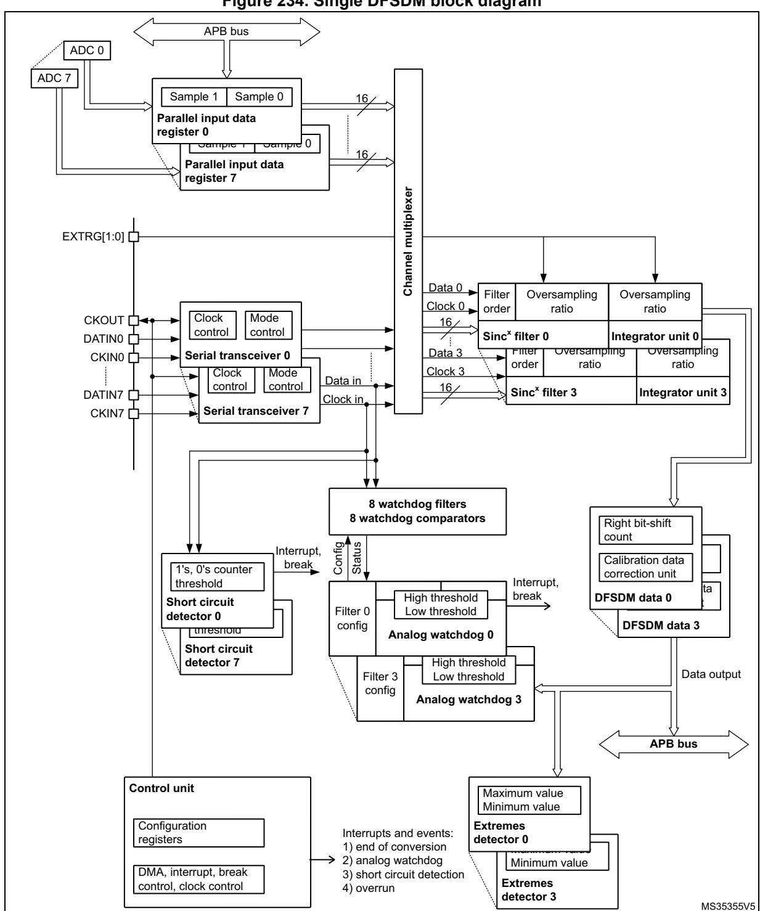
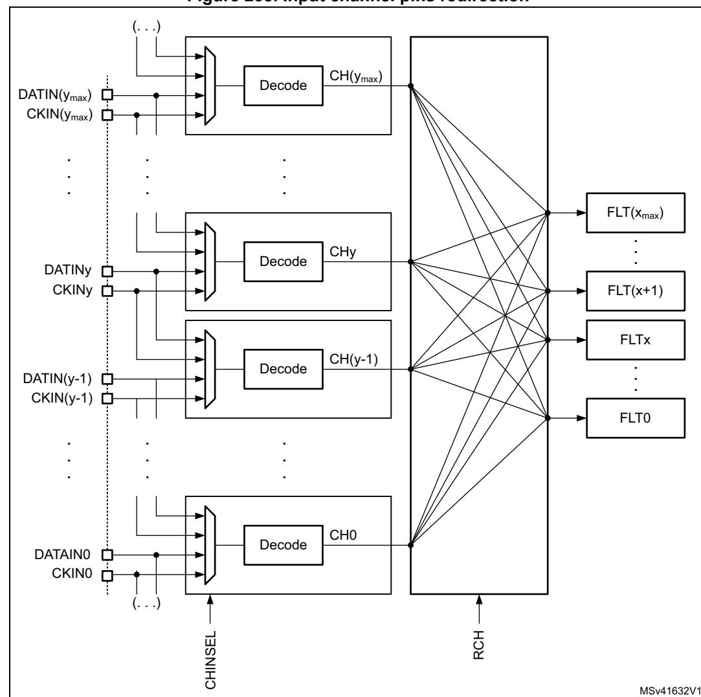
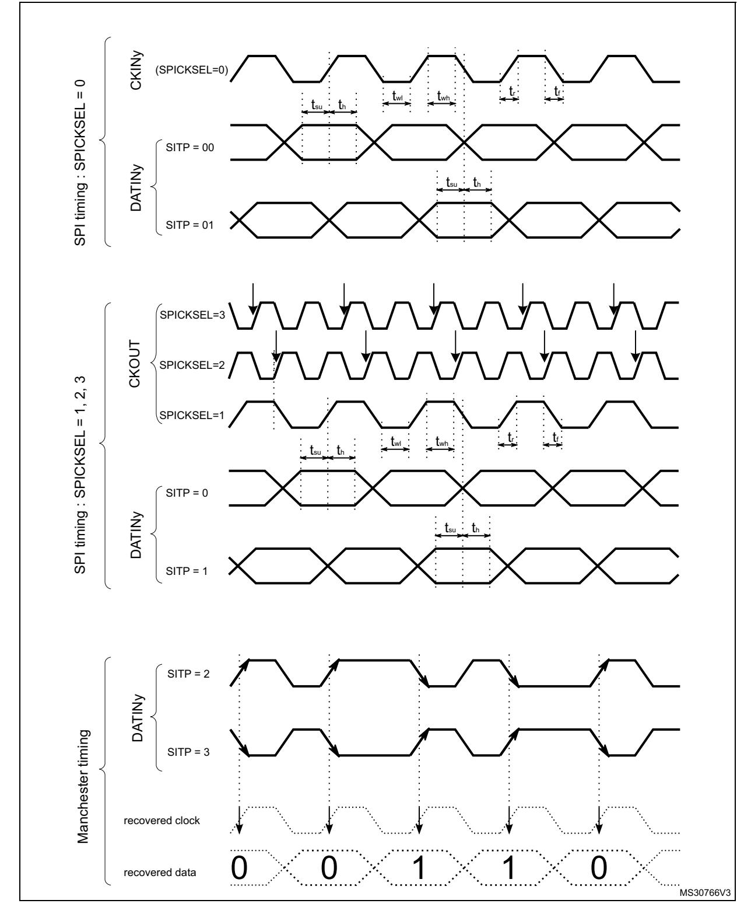
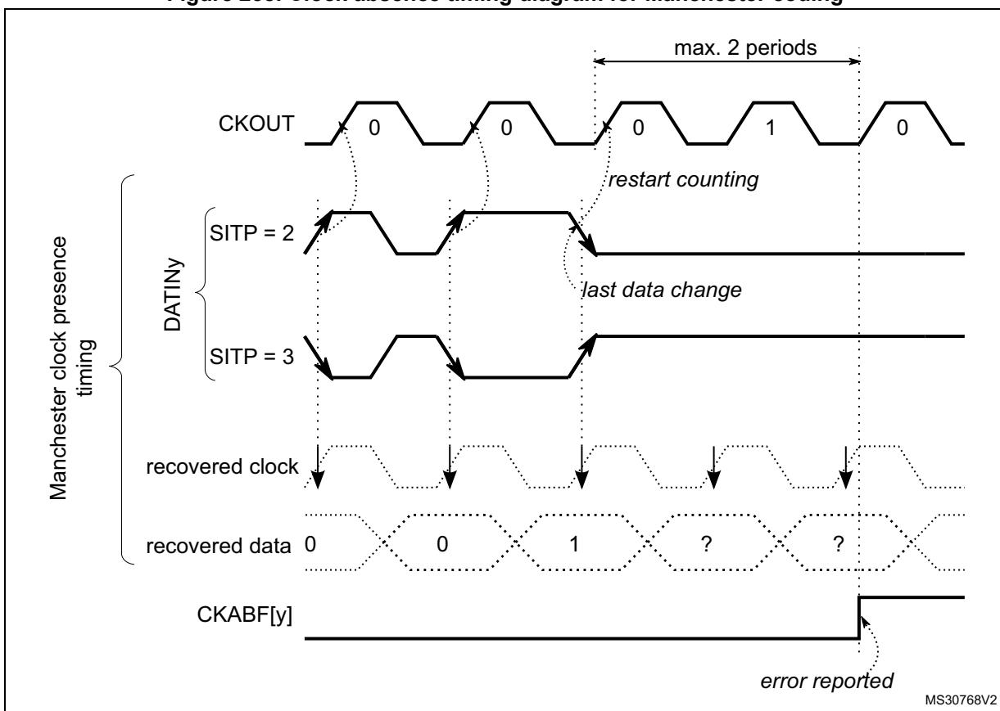
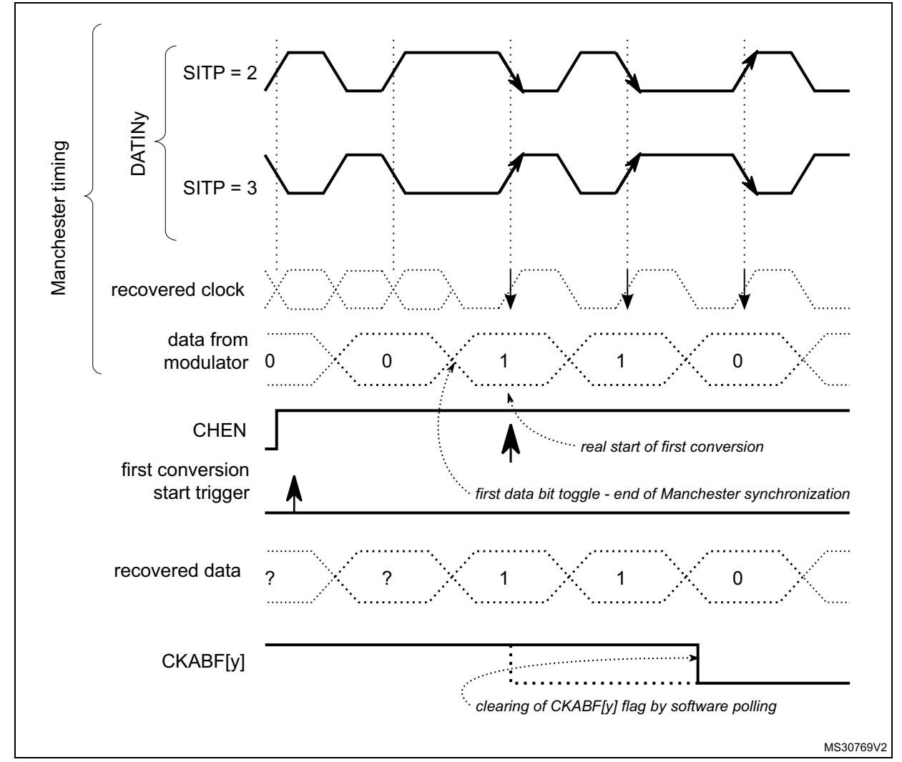
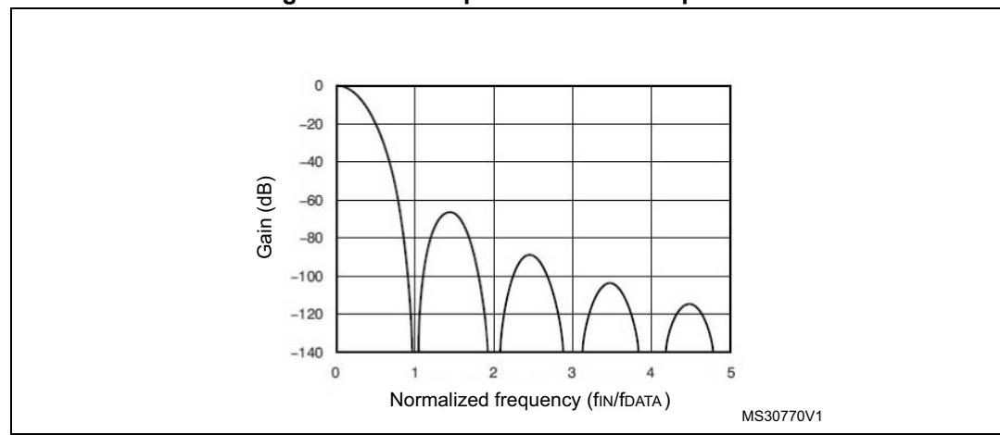
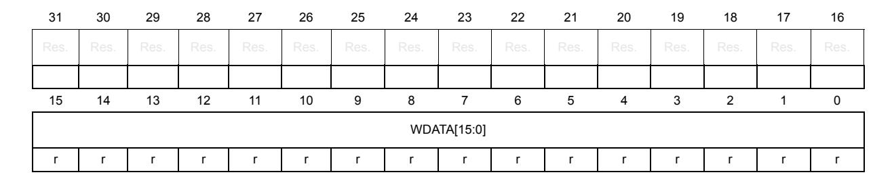
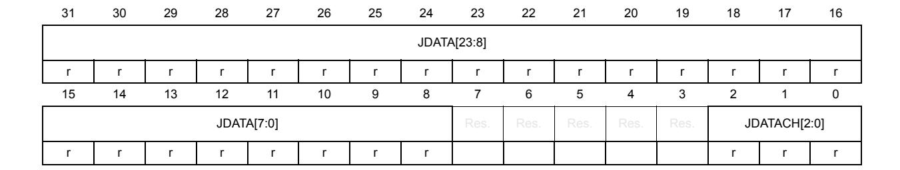

# **31 Digital filter for sigma delta modulators (DFSDM)**

# **31.1 Introduction**

Digital filter for sigma delta modulators (DFSDM) is a high-performance module dedicated to interface external Σ∆ modulators. It is featuring up to 8 external digital serial interfaces (channels) and up to 4 digital filters with flexible Sigma Delta stream digital processing options to offer up to 24-bit final ADC resolution. DFSDM also features optional parallel data stream input from internal ADC peripherals or from device memory.

An external Σ∆ modulator provides digital data stream of converted analog values from the external Σ∆ modulator analog input. This digital data stream is sent into a DFSDM input channel through a serial interface. DFSDM supports several standards to connect various Σ∆ modulator outputs: SPI interface and Manchester coded 1-wire interface (both with adjustable parameters). DFSDM module supports the connection of up to 8 multiplexed input digital serial channels which are shared with up to 4 DFSDM modules. DFSDM module also supports alternative parallel data inputs from up to 8 internal 16-bit data channels (from internal ADCs or from device memory).

DFSDM is converting an input data stream into a final digital data word which represents an analog input value on a Σ∆ modulator analog input. The conversion is based on a configurable digital process: the digital filtering and decimation of the input serial data stream.

The conversion speed and resolution are adjustable according to configurable parameters for digital processing: filter type, filter order, length of filter, integrator length. The maximum output data resolution is up to 24 bits. There are two conversion modes: single conversion mode and continuous mode. The data can be automatically stored in a system RAM buffer through DMA, thus reducing the software overhead.

A flexible timer triggering system can be used to control the start of conversion of DFSDM. This timing control is capable of triggering simultaneous conversions or inserting a programmable delay between conversions.

DFSDM features an analog watchdog function. Analog watchdog can be assigned to any of the input channel data stream or to final output data. Analog watchdog has its own digital filtering of input data stream to reach the required speed and resolution of watched data.

To detect short-circuit in control applications, there is a short-circuit detector. This block watches each input channel data stream for occurrence of stable data for a defined time duration (several 0's or 1's in an input data stream).

An extremes detector block watches final output data and stores maximum and minimum values from the output data values. The extremes values stored can be restarted by software.

Two power modes are supported: normal mode and stop mode.


RM0399 Rev 4 1151/3556

# **31.2 DFSDM main features**

- Up to 8 multiplexed input digital serial channels:
  - configurable SPI interface to connect various Σ∆ modulators
  - configurable Manchester coded 1 wire interface support
  - clock output for Σ∆ modulator(s)
- Alternative inputs from up to 8 internal digital parallel channels:
  - inputs with up to 16 bit resolution
  - internal sources: ADCs data or memory (CPU/DMA write) data streams
- Adjustable digital signal processing:
  - Sincx filter: filter order/type (1..5), oversampling ratio (up to 1..1024)
  - integrator: oversampling ratio (1..256)
- Up to 24-bit output data resolution:
  - right bit-shifter on final data (0..31 bits)
- Signed output data format
- Automatic data offset correction (offset stored in register by user)
- Continuous or single conversion
- Start-of-conversion synchronization with:
  - software trigger
  - internal timers
  - external events
  - start-of-conversion synchronously with first DFSDM filter (DFSDM\_FLT0)
- Analog watchdog feature:
  - low value and high value data threshold registers
  - own configurable Sincx digital filter (order = 1..3, oversampling ratio = 1..32)
  - input from output data register or from one or more input digital serial channels
  - continuous monitoring independently from standard conversion
- Short-circuit detector to detect saturated analog input values (bottom and top ranges):
  - up to 8-bit counter to detect 1..256 consecutive 0's or 1's on input data stream
  - monitoring continuously each channel (8 serial channel transceiver outputs)
- Break generation on analog watchdog event or short-circuit detector event
- Extremes detector:
  - store minimum and maximum values of output data values
  - refreshed by software
- DMA may be used to read the conversion data
- Interrupts: end of conversion, overrun, analog watchdog, short-circuit, channel clock absence
- "regular" or "injected" conversions:
  - "regular" conversions can be requested at any time or even in continuous mode without having any impact on the timing of "injected" conversions
  - "injected" conversions for precise timing and with high conversion priority


# **31.3 DFSDM implementation**

This section describes the configuration implemented in DFSDMx.

**Table 251. DFSDM1 implementation** 

| DFSDM features            | DFSDM1 |
|---------------------------|--------|
| Number of channels        | 8      |
| Number of filters         | 4      |
| Input from internal ADC   | X      |
| Supported trigger sources | 32(1)  |
| Pulses skipper            | -      |

<sup>1.</sup> Refer to *[Table 254: DFSDM triggers connection](#page-4-0)* for available trigger sources.

#### **DFSDM** functional description 31.4

#### 31.4.1 **DFSDM** block diagram




1. This example shows 4 DFSDM filters and 8 input channels (max. configuration).


# **31.4.2 DFSDM pins and internal signals**

**Table 252. DFSDM external pins** 

| Name       | Signal Type                | Remarks                                                                                         |
|------------|----------------------------|-------------------------------------------------------------------------------------------------|
| VDD        | Power supply               | Digital power supply.                                                                           |
| VSS        | Power supply               | Digital ground power supply.                                                                    |
| CKIN[7:0]  | Clock input                | Clock signal provided from external Σ∆ modulator. FT input.                                     |
| DATIN[7:0] | Data input                 | Data signal provided from external Σ∆ modulator. FT input.                                      |
| CKOUT      | Clock output               | Clock output to provide clock signal into external Σ∆<br>modulator.                             |
| EXTRG[1:0] | External trigger<br>signal | Input trigger from two EXTI signals to start analog<br>conversion (from GPIOs: EXTI11, EXTI15). |

**Table 253. DFSDM internal signals** 

| Name                | Signal Type                             | Remarks                                                                                                                                                                                                                                  |
|---------------------|-----------------------------------------|------------------------------------------------------------------------------------------------------------------------------------------------------------------------------------------------------------------------------------------|
| dfsdm_jtrg[31:0]    | Internal/<br>external trigger<br>signal | Input trigger from internal/external trigger sources in order<br>to start analog conversion (from internal sources:<br>synchronous input, from external sources: asynchronous<br>input with synchronization). See Table 254 for details. |
| dfsdm_break[3:0]    | break signal<br>output                  | Break signals event generation from Analog watchdog or<br>short-circuit detector                                                                                                                                                         |
| dfsdm_dma[3:0]      | DMA request<br>signal                   | DMA request signal from each DFSDM_FLTx (x=03):<br>end of injected conversion event.                                                                                                                                                     |
| dfsdm_it[3:0]       | Interrupt<br>request signal             | Interrupt signal for each DFSDM_FLTx (x=03)                                                                                                                                                                                              |
| dfsdm_dat_adc[15:0] | ADC input<br>data                       | Up to 4 internal ADC data buses as parallel inputs.                                                                                                                                                                                      |

**Table 254. DFSDM triggers connection** 

<span id="page-4-0"></span>

| Trigger name | Trigger source |
|--------------|----------------|
| dfsdm_jtrg0  | TIM1_TRGO      |
| dfsdm_jtrg1  | TIM1_TRGO2     |
| dfsdm_jtrg2  | TIM8_TRGO      |
| dfsdm_jtrg3  | TIM8_TRGO2     |
| dfsdm_jtrg4  | TIM3_TRGO      |
| dfsdm_jtrg5  | TIM4_TRGO      |
| dfsdm_jtrg6  | TIM16_OC1      |
| dfsdm_jtrg7  | TIM6_TRGO      |
| dfsdm_jtrg8  | TIM7_TRGO      |
| dfsdm_jtrg9  | HRTIM1_ADCTRG1 |


| Table 254. DFSDM triggers connection (continued) |  |
|--------------------------------------------------|--|
|--------------------------------------------------|--|

| Trigger source |
|----------------|
| HRTIM1_ADCTRG3 |
|                |
|                |
|                |
|                |
|                |
|                |
|                |
|                |

### **Table 255. DFSDM break connection**

| Break name     | Break destination         |
|----------------|---------------------------|
| dfsdm_break[0] | TIM1 break / TIM15 break  |
| dfsdm_break[1] | TIM1 break2 / TIM16 break |
| dfsdm_break[2] | TIM8 break / TIM17 break  |
| dfsdm_break[3] | TIM8 break2               |

# **31.4.3 DFSDM reset and clocks**

# **DFSDM on-off control**

The DFSDM interface is globally enabled by setting DFSDMEN=1 in the DFSDM\_CH0CFGR1 register. Once DFSDM is globally enabled, all input channels (y=0..7) and digital filters DFSDM\_FLTx (x=0..3) start to work if their enable bits are set (channel enable bit CHEN in DFSDM\_CHyCFGR1 and DFSDM\_FLTx enable bit DFEN in DFSDM\_FLTxCR1).

Digital filter x DFSDM\_FLTx (x=0..3) is enabled by setting DFEN=1 in the DFSDM\_FLTxCR1 register. Once DFSDM\_FLTx is enabled (DFEN=1), both Sinc<sup>x</sup> digital filter unit and integrator unit are reinitialized.

By clearing DFEN, any conversion which may be in progress is immediately stopped and DFSDM\_FLTx is put into stop mode. All register settings remain unchanged except DFSDM\_FLTxAWSR and DFSDM\_FLTxISR (which are reset).

Channel y (y=0..7) is enabled by setting CHEN=1 in the DFSDM\_CHyCFGR1 register. Once the channel is enabled, it receives serial data from the external Σ∆ modulator or parallel internal data sources (ADCs or CPU/DMA wire from memory).

DFSDM must be globally disabled (by DFSDMEN=0 in DFSDM\_CH0CFGR1) before stopping the system clock to enter in the STOP mode of the device.


### **DFSDM clocks**

The internal DFSDM clock fDFSDMCLK, which is used to drive the channel transceivers, digital processing blocks (digital filter, integrator) and next additional blocks (analog watchdog, short-circuit detector, extremes detector, control block) is generated by the RCC block and is derived from the system clock SYSCLK or peripheral clock PCLK2 (see *Section 9.7.19: RCC domain 2 kernel clock configuration register (RCC\_D2CCIP1R)*). The DFSDM clock is automatically stopped in stop mode (if DFEN = 0 for all DFSDM\_FLTx, x=0..3).

The DFSDM serial channel transceivers can receive an external serial clock to sample an external serial data stream. The internal DFSDM clock must be at least 4 times faster than the external serial clock if standard SPI coding is used, and 6 times faster than the external serial clock if Manchester coding is used.

DFSDM can provide one external output clock signal to drive external Σ∆ modulator(s) clock input(s). It is provided on CKOUT pin. This output clock signal must be in the range specified in given device datasheet and is derived from DFSDM clock or from audio clock (see CKOUTSRC bit in DFSDM\_CH0CFGR1 register) by programmable divider in the range 2 - 256 (CKOUTDIV in DFSDM\_CH0CFGR1 register). Audio clock source is SAI1 clock selected by SAI1SEL[1:0] field in RCC configuration (see *Section 9.7.19: RCC domain 2 kernel clock configuration register (RCC\_D2CCIP1R)*).

# <span id="page-6-0"></span>**31.4.4 Serial channel transceivers**

There are 8 multiplexed serial data channels which can be selected for conversion by each filter or Analog watchdog or Short-circuit detector. Those serial transceivers receive data stream from external Σ∆ modulator. Data stream can be sent in SPI format or Manchester coded format (see SITP[1:0] bits in DFSDM\_CHyCFGR1 register). The channel is enabled for operation by setting CHEN=1 in DFSDM\_CHyCFGR1 register.

## **Channel inputs selection**

Serial inputs (data and clock signals) from DATINy and CKINy pins can be redirected from the following channel pins. This serial input channel redirection is set by CHINSEL bit in DFSDM\_CHyCFGR1 register.

Channel redirection can be used to collect audio data from PDM (pulse density modulation) stereo microphone type. PDM stereo microphone has one data and one clock signal. Data signal provides information for both left and right audio channel (rising clock edge samples for left channel and falling clock edge samples for right channel).


RM0399 Rev 4 1157/3556

Configuration of serial channels for PDM microphone input:

- PDM microphone signals (data, clock) will be connected to DFSDM input serial channel y (DATINy, CKOUT) pins.
- Channel y will be configured: CHINSEL = 0 (input from given channel pins: DATINy, CKINy).
- Channel (y-1) (modulo 8) will be configured: CHINSEL = 1 (input from the following channel ((y-1)+1) pins: DATINy, CKINy).
- Channel y: SITP[1:0] = 0 (rising edge to strobe data) => left audio channel on channel y.
- Channel (y-1): SITP[1:0] = 1 (falling edge to strobe data) => right audio channel on channel y-1.
- Two DFSDM filters will be assigned to channel y and channel (y-1) (to filter left and right channels from PDM microphone).



Figure 235. Input channel pins redirection

**47/** 

### **Output clock generation**

A clock signal can be provided on CKOUT pin to drive external Σ∆ modulator clock inputs. The frequency of this CKOUT signal is derived from DFSDM clock or from audio clock (see CKOUTSRC bit in DFSDM\_CH0CFGR1 register) divided by a predivider (see CKOUTDIV bits in DFSDM\_CH0CFGR1 register). If the output clock is stopped, then CKOUT signal is set to low state (output clock can be stopped by CKOUTDIV=0 in DFSDM\_CHyCFGR1 register or by DFSDMEN=0 in DFSDM\_CH0CFGR1 register). The output clock stopping is performed:

- 4 system clocks after DFSDMEN is cleared (if CKOUTSRC=0)
- 1 system clock and 3 audio clocks after DFSDMEN is cleared (if CKOUTSRC=1)

Before changing CKOUTSRC the software has to wait for CKOUT being stopped to avoid glitch on CKOUT pin. The output clock signal frequency must be in the range 0 - 20 MHz.

### **SPI data input format operation**

In SPI format, the data stream is sent in serial format through data and clock signals. Data signal is always provided from DATINy pin. A clock signal can be provided externally from CKINy pin or internally from a signal derived from the CKOUT signal source.

In case of external clock source selection (SPICKSEL[1:0]=0) data signal (on DATINy pin) is sampled on rising or falling clock edge (of CKINy pin) according SITP[1:0] bits setting (in DFSDM\_CHyCFGR1 register).

Internal clock sources - see SPICKSEL[1:0] in DFSDM\_CHyCFGR1 register:

- CKOUT signal:
  - For connection to external Σ∆ modulator which uses directly its clock input (from CKOUT) to generate its output serial communication clock.
  - Sampling point: on rising/falling edge according SITP[1:0] setting.
- CKOUT/2 signal (generated on CKOUT rising edge):
  - For connection to external Σ∆ modulator which divides its clock input (from CKOUT) by 2 to generate its output serial communication clock (and this output clock change is active on each clock input rising edge).
  - Sampling point: on each second CKOUT falling edge.
- CKOUT/2 signal (generated on CKOUT falling edge):
  - For connection to external Σ∆ modulator which divides its clock input (from CKOUT) by 2 to generate its output serial communication clock (and this output clock change is active on each clock input falling edge).
  - Sampling point: on each second CKOUT rising edge.

*Note: An internal clock source can only be used when the external Σ∆ modulator uses CKOUT signal as a clock input (to have synchronous clock and data operation).*

> Internal clock source usage can save CKINy pin connection (CKINy pins can be used for other purpose).

The clock source signal frequency must be in the range 0 - 20 MHz for SPI coding and less than fDFSDMCLK/4.

### **Manchester coded data input format operation**

In Manchester coded format, the data stream is sent in serial format through DATINy pin only. Decoded data and clock signal are recovered from serial stream after Manchester


RM0399 Rev 4 1159/3556

decoding. There are two possible settings of Manchester codings (see SITP[1:0] bits in DFSDM\_CHyCFGR1 register):

- signal rising edge = log 0; signal falling edge = log 1
- signal rising edge = log 1; signal falling edge = log 0

The recovered clock signal frequency for Manchester coding must be in the range 0 - 10 MHz and less than fDFSDMCLK/6.

To correctly receive Manchester coded data, the CKOUTDIV divider (in DFSDM\_CH0CFGR1 register) must be set with respect to expected Manchester data rate according formula:

$$((CKOUTDIV + 1) \times T_{SYSCLK}) < T_{Manchester clock} < (2 \times CKOUTDIV \times T_{SYSCLK})$$




**Figure 236. Channel transceiver timing diagrams**

### <span id="page-11-0"></span>**Clock absence detection**

Channels serial clock inputs can be checked for clock absence/presence to ensure the correct operation of conversion and error reporting. Clock absence detection can be enabled or disabled on each input channel y by bit CKABEN in DFSDM\_CHyCFGR1 register. If enabled, then this clock absence detection is performed continuously on a given channel. A clock absence flag is set (CKABF[y] = 1) and an interrupt can be invoked (if CKABIE=1) in case of an input clock error (see CKABF[7:0] in DFSDM\_FLT0ISR register and CKABEN in DFSDM\_CHyCFGR1). After a clock absence flag clearing (by CLRCKABF in DFSDM\_FLT0ICR register), the clock absence flag is refreshed. Clock absence status bit CKABF[y] is set also by hardware when corresponding channel y is disabled (if CHEN[y] = 0 then CKABF[y] is held in set state).

When a clock absence event has occurred, the data conversion (and/or analog watchdog and short-circuit detector) provides incorrect data. The user should manage this event and discard given data while a clock absence is reported.

The clock absence feature is available only when the system clock is used for the CKOUT signal (CKOUTSRC=0 in DFSDM\_CH0CFGR1 register).

When the transceiver is not yet synchronized, the clock absence flag is set and cannot be cleared by CLRCKABF[y] bit (in DFSDM\_FLT0ICR register). The software sequence concerning clock absence detection feature should be:

- Enable given channel by CHEN = 1
- Try to clear the clock absence flag (by CLRCKABF = 1) until the clock absence flag is really cleared (CKABF = 0). At this time, the transceiver is synchronized (signal clock is valid) and is able to receive data.
- Enable the clock absence feature CKABEN = 1 and the associated interrupt CKABIE = 1 to detect if the SPI clock is lost or Manchester data edges are missing.

If SPI data format is used, then the clock absence detection is based on the comparison of an external input clock with an output clock generation (CKOUT signal). The external input clock signal into the input channel must be changed at least once per 8 signal periods of CKOUT signal (which is controlled by CKOUTDIV field in DFSDM\_CH0CFGR1 register).


**Figure 237. Clock absence timing diagram for SPI**

If Manchester data format is used, then the clock absence means that the clock recovery is unable to perform from Manchester coded signal. For a correct clock recovery, it is first necessary to receive data with 1 to 0 or 0 to 1 transition (see *[Figure 239](#page-14-0)* for Manchester synchronization).


The detection of a clock absence in Manchester coding (after a first successful synchronization) is based on changes comparison of coded serial data input signal with output clock generation (CKOUT signal). There must be a voltage level change on DATINy pin during 2 periods of CKOUT signal (which is controlled by CKOUTDIV bits in DFSDM\_CH0CFGR1 register). This condition also defines the minimum data rate to be able to correctly recover the Manchester coded data and clock signals.

The maximum data rate of Manchester coded data must be less than the CKOUT signal.

So to correctly receive Manchester coded data, the CKOUTDIV divider must be set according the formula:

$$((\mathsf{CKOUTDIV} + 1) \times \mathsf{T}_{\mathsf{SYSCLK}}) < \mathsf{T}_{\mathsf{Manchester\ clock}} < (2 \times \mathsf{CKOUTDIV} \times \mathsf{T}_{\mathsf{SYSCLK}})$$

A clock absence flag is set (CKABF[y] = 1) and an interrupt can be invoked (if CKABIE=1) in case of an input clock recovery error (see CKABF[7:0] in DFSDM\_FLT0ISR register and CKABEN in DFSDM\_CHyCFGR1). After a clock absence flag clearing (by CLRCKABF in DFSDM\_FLT0ICR register), the clock absence flag is refreshed.



**Figure 238. Clock absence timing diagram for Manchester coding**

### **Manchester/SPI code synchronization**

The Manchester coded stream must be synchronized the first time after enabling the channel (CHEN=1 in DFSDM\_CHyCFGR1 register). The synchronization ends when a data transition from 0 to 1 or from 1 to 0 (to be able to detect valid data edge) is received. The end of the synchronization can be checked by polling CKABF[y]=0 for a given channel after it has been cleared by CLRCKABF[y] in DFSDM\_FLT0ICR, following the software sequence detailed hereafter:

CKABF[y] flag is cleared by setting CLRCKABF[y] bit. If channel y is not yet synchronized the hardware immediately set the CKABF[y] flag. Software is then reading back the CKABF[y] flag and if it is set then perform again clearing of this flag by setting CLRCKABF[y] bit. This software sequence (polling of CKABF[y] flag) continues until CKABF[y] flag is set (signalizing that Manchester stream is synchronized). To be able to synchronize/receive Manchester coded data the CKOUTDIV divider (in DFSDM\_CH0CFGR1 register) must be set with respect to expected Manchester data rate according the formula below.

$$((\mathsf{CKOUTDIV} + 1) \times \mathsf{T}_{\mathsf{SYSCLK}}) < \mathsf{T}_{\mathsf{Manchester\ clock}} < (2 \times \mathsf{CKOUTDIV} \times \mathsf{T}_{\mathsf{SYSCLK}})$$

SPI coded stream is synchronized after first detection of clock input signal (valid rising/falling edge).

*Note: When the transceiver is not yet synchronized, the clock absence flag is set and cannot be cleared by CLRCKABF[y] bit (in DFSDM\_FLT0ICR register).*


<span id="page-14-0"></span>

**Figure 239. First conversion for Manchester coding (Manchester synchronization)**

### **External serial clock frequency measurement**

The measuring of a channel serial clock input frequency provides a real data rate from an external Σ∆ modulator, which is important for application purposes.

An external serial clock input frequency can be measured by a timer counting DFSDM clocks (fDFSDMCLK) during one conversion duration. The counting starts at the first input data clock after a conversion trigger (regular or injected) and finishes by last input data clock before conversion ends (end of conversion flag is set). Each conversion duration (time between first serial sample and last serial sample) is updated in counter CNVCNT[27:0] in register DFSDM\_FLTxCNVTIMR when the conversion finishes (JEOCF=1 or REOCF=1). The user can then compute the data rate according to the digital filter settings (FORD, FOSR, IOSR, FAST). The external serial frequency measurement is stopped only if the filter is bypassed (FOSR=0, only integrator is active, CNVCNT[27:0]=0 in DFSDM\_FLTxCNVTIMR register).

In case of parallel data input (*[Section 31.4.6: Parallel data inputs](#page-16-0)*) the measured frequency is the average input data rate during one conversion.

RM0399 Rev 4 1165/3556

*Note: When conversion is interrupted (e.g. by disabling/enabling the selected channel) the interruption time is also counted in CNVCNT[27:0]. Therefore it is recommended to not interrupt the conversion for correct conversion duration result.*

Conversion times:

### **injected conversion or regular conversion with FAST = 0 (or first conversion if FAST=1):**

```
for Sincx
         filters (x=1..5):
    t = CNVCNT/fDFSDMCLK = [FOSR * (IOSR-1 + FORD) + FORD] / fCKIN
for FastSinc filter:
    t = CNVCNT/fDFSDMCLK = [FOSR * (IOSR-1 + 4) + 2] / fCKIN
```

### **regular conversion with FAST = 1 (except first conversion):**

for Sincx and FastSinc filters:

$$t = CNVCNT/f_{DFSDMCLK} = [F_{OSR} * I_{OSR}] / f_{CKIN}$$

# **in case if FOSR = FOSR[9:0]+1 = 1 (filter bypassed, active only integrator):**

$$t = I_{OSR} / f_{CKIN}$$
 (... but CNVCNT=0)

where:

- fCKIN is the channel input clock frequency (on given channel CKINy pin) or input data rate (in case of parallel data input)
- FOSR is the filter oversampling ratio: FOSR = FOSR[9:0]+1 (see DFSDM\_FLTxFCR register)
- IOSR is the integrator oversampling ratio: IOSR = IOSR[7:0]+1 (see DFSDM\_FLTxFCR register)
- FORD is the filter order: FORD = FORD[2:0] (see DFSDM\_FLTxFCR register)

### **Channel offset setting**

Each channel has its own offset setting (in register) which is finally subtracted from each conversion result (injected or regular) from a given channel. Offset correction is performed after the data right bit shift. The offset is stored as a 24-bit signed value in OFFSET[23:0] field in DFSDM\_CHyCFGR2 register.

### **Data right bit shift**

To have the result aligned to a 24-bit value, each channel defines a number of right bit shifts which will be applied on each conversion result (injected or regular) from a given channel. The data bit shift number is stored in DTRBS[4:0] bits in DFSDM\_CHyCFGR2 register.

The right bit-shift is rounding the result to nearest integer value. The sign of shifted result is maintained, in order to have valid 24-bit signed format of result data.

# **31.4.5 Configuring the input serial interface**

The following parameters must be configured for the input serial interface:

- **Output clock predivider**. There is a programmable predivider to generate the output clock from DFSDM clock (2 - 256). It is defined by CKOUTDIV[7:0] bits in DFSDM\_CH0CFGR1 register.
- **Serial interface type and input clock phase.** Selection of SPI or Manchester coding and sampling edge of input clock. It is defined by SITP [1:0] bits in DFSDM\_CHyCFGR1 register.
- **Input clock source.** External source from CKINy pin or internal from CKOUT pin. It is defined by SPICKSEL[1:0] field in DFSDM\_CHyCFGR1 register.
- **Final data right bit-shift.** Defines the final data right bit shift to have the result aligned to a 24-bit value. It is defined by DTRBS[4:0] in DFSDM\_CHyCFGR2 register.
- **Channel offset per channel.** Defines the analog offset of a given serial channel (offset of connected external Σ∆ modulator). It is defined by OFFSET[23:0] bits in DFSDM\_CHyCFGR2 register.
- **short-circuit detector and clock absence per channel enable.** To enable or disable the short-circuit detector (by SCDEN bit) and the clock absence monitoring (by CKABEN bit) on a given serial channel in register DFSDM\_CHyCFGR1.
- **Analog watchdog filter and short-circuit detector threshold settings.** To configure channel analog watchdog filter parameters and channel short-circuit detector parameters. Configurations are defined in DFSDM\_CHyAWSCDR register.

# <span id="page-16-0"></span>**31.4.6 Parallel data inputs**

Each input channel provides a register for 16-bit parallel data input (besides serial data input). Each 16-bit parallel input can be sourced from internal data sources only:

- internal ADC results
- direct CPU/DMA writing.

The selection for using serial or parallel data input for a given channel is done by field DATMPX[1:0] of DFSDM\_CHyCFGR1 register. In DATMPX[1:0] is also defined the parallel data source: internal ADC or direct write by CPU/DMA.

Each channel contains a 32-bit data input register DFSDM\_CHyDATINR in which it can be written a 16-bit data. Data are in 16-bit signed format. Those data can be used as input to the digital filter which is accepting 16-bit parallel data.

If serial data input is selected (DATMPX[1:0] = 0), the DFSDM\_CHyDATINR register is write protected.

# **Input from internal ADC**

In case of ADC data parallel input (DATMPX[1:0]=1) the ADC[y+1] result is assigned to channel y input (ADC1 is filling DFSDM\_CHDATIN0R register, ADC2 is filling DFSDM\_CHDATIN1R register, ... , ADC8 is filling DFSDM\_CHDATIN7R register). End of conversion event from ADC[y+1] causes update of channel y data (parallel data from ADC[y+1] are put as next sample to digital filter). Data from ADC[y+1] is written into DFSDM\_CHyDATINR register (field INDAT0[15:0]) when end of conversion event occurred.

The setting of data packing mode (DATPACK[1:0] in the DFSDM\_CHyCFGR1 register) has no effect in case of ADC data input.


RM0399 Rev 4 1167/3556

*Note: Extension of ADC specification: in case the internal ADC is configured in interleaved mode (e.g. ADC1 together with ADC2 - see ADC specification) then each result from ADC1 or from ADC2 will come to the same 16-bit bus - to the bus of ADC1 - which is coming into DFSDM channel 0 (fixed connection). So there will be double input data rate into DFSDM channel 0 (even samples come from ADC1 and odd samples from ADC2). Channel 1 associated with ADC2 will be free.*

### **Input from memory (direct CPU/DMA write)**

The direct data write into DFSDM\_CHyDATINR register by CPU or DMA (DATMPX[1:0]=2) can be used as data input in order to process digital data streams from memory or peripherals.

Data can be written by CPU or DMA into DFSDM\_CHyDATINR register:

### **1. CPU data write:**

Input data are written directly by CPU into DFSDM\_CHyDATINR register.

### **2. DMA data write:**

The DMA should be configured in memory-to-memory transfer mode to transfer data from memory buffer into DFSDM\_CHyDATINR register. The destination memory address is the address of DFSDM\_CHyDATINR register. Data are transferred at DMA transfer speed from memory to DFSDM parallel input.

This DMA transfer is different from DMA used to read DFSDM conversion results. Both DMA can be used at the same time - first DMA (configured as memory-to-memory transfer) for input data writings and second DMA (configured as peripheral-to-memory transfer) for data results reading.

The accesses to DFSDM\_CHyDATINR can be either 16-bit or 32-bit wide, allowing to load respectively one or two samples in one write operation. 32-bit input data register (DFSDM\_CHyDATINR) can be filled with one or two 16-bit data samples, depending on the data packing operation mode defined in field DATPACK[1:0] of DFSDM\_CHyCFGR1 register:

### **1. Standard mode (DATPACK[1:0]=0):**

Only one sample is stored in field INDAT0[15:0] of DFSDM\_CHyDATINR register which is used as input data for channel y. The upper 16 bits (INDAT1[15:0]) are ignored and write protected. The digital filter must perform one input sampling (from INDAT0[15:0]) to empty data register after it has been filled by CPU/DMA. This mode is used together with 16-bit CPU/DMA access to DFSDM\_CHyDATINR register to load one sample per write operation.

### **2. Interleaved mode (DATPACK[1:0]=1):**

DFSDM\_CHyDATINR register is used as a two sample buffer. The first sample is stored in INDAT0[15:0] and the second sample is stored in INDAT1[15:0]. The digital filter must perform two input samplings from channel y to empty DFSDM\_CHyDATINR register. This mode is used together with 32-bit CPU/DMA access to DFSDM\_CHyDATINR register to load two samples per write operation.

### **3. Dual mode (DATPACK[1:0]=2):**

Two samples are written into DFSDM\_CHyDATINR register. The data INDAT0[15:0] is for channel y, the data in INDAT1[15:0] is for channel y+1. The data in INDAT1[15:0] is automatically copied INDAT0[15:0] of the following (y+1) channel data register DFSDM\_CH[y+1]DATINR). The digital filters must perform two samplings - one from


MS35354V3

channel y and one from channel (y+1) - in order to empty DFSDM\_CHyDATINR registers.

Dual mode setting (DATPACK[1:0]=2) is available only on even channel numbers (y = 0, 2, 4, 6). If odd channel (y = 1, 3, 5, 7) is set to Dual mode then both INDAT0[15:0] and INDAT1[15:0] parts are write protected for this channel. If even channel is set to Dual mode then the following odd channel must be set into Standard mode (DATPACK[1:0]=0) for correct cooperation with even channels.

See *[Figure 240](#page-18-0)* for DFSDM\_CHyDATINR registers data modes and assignments of data samples to channels.

<span id="page-18-0"></span>Ch1 (sample 0) Ch0 (sample 0) Unused Ch1 (sample 0) Ch3 (sample 0) Ch2 (sample 0) Unused Ch3 (sample 0) Ch5 (sample 0) Ch4 (sample 0) Unused Ch5 (sample 0) Ch7 (sample 0) Ch6 (sample 0) Unused Ch7 (sample 0) **y = 0 y = 1 y = 2 y = 3 y = 4 y = 5 y = 6 y = 7** 31 16 15 0 Ch0 (sample 1) Ch0 (sample 0) Ch1 (sample 1) Ch1 (sample 0) Ch2 (sample 1) Ch2 (sample 0) Ch3 (sample 1) Ch3 (sample 0) Ch4 (sample 1) Ch4 (sample 0) Ch5 (sample 1) Ch5 (sample 0) Ch6 (sample 1) Ch6 (sample 0) Ch7 (sample 1) Ch7 (sample 0) 31 16 15 0 Unused Ch0 (sample 0) Unused Ch1 (sample 0) Unused Ch2 (sample 0) Unused Ch3 (sample 0) Unused Ch4 (sample 0) Unused Ch5 (sample 0) Unused Ch6 (sample 0) Unused Ch7 (sample 0) 31 16 15 0 Standard mode Interleaved mode Dual mode

**Figure 240. DFSDM\_CHyDATINR registers operation modes and assignment**

The write into DFSDM\_CHyDATINR register to load one or two samples must be performed after the selected input channel (channel y) is enabled for data collection (starting conversion for channel y). Otherwise written data are lost for next processing.

For example: for single conversion and interleaved mode, do not start writing pair of data samples into DFSDM\_CHyDATINR before the single conversion is started (any data present in the DFSDM\_CHyDATINR before starting a conversion is discarded).

### **31.4.7 Channel selection**

There are 8 multiplexed channels which can be selected for conversion using the injected channel group and/or using the regular channel.

The **injected channel group** is a selection of any or all of the 8 channels. JCHG[7:0] in the DFSDM\_FLTxJCHGR register selects the channels of the injected group, where JCHG[y]=1 means that channel y is selected.

Injected conversions can operate in scan mode (JSCAN=1) or single mode (JSCAN=0). In scan mode, each of the selected channels is converted, one after another. The lowest channel (channel 0, if selected) is converted first, followed immediately by the next higher channel until all the channels selected by JCHG[7:0] have been converted. In single mode (JSCAN=0), only one channel from the selected channels is converted, and the channel selection is moved to the next channel. Writing to JCHG[7:0] if JSCAN=0 resets the channel selection to the lowest selected channel.

Injected conversions can be launched by software or by a trigger. They are never interrupted by regular conversions.


The **regular channel** is a selection of just one of the 8 channels. RCH[2:0] in the DFSDM FLTxCR1 register indicates the selected channel.

Regular conversions can be launched only by software (not by a trigger). A sequence of continuous regular conversions is temporarily interrupted when an injected conversion is requested.

Performing a conversion on a disabled channel (CHEN=0 in DFSDM\_CHyCFGR1 register) causes that the conversion will never end - because no input data is provided (with no clock signal). In this case, it is necessary to enable a given channel (CHEN=1 in DFSDM\_CHyCFGR1 register) or to stop the conversion by DFEN=0 in DFSDM\_FLTxCR1 register.

# 31.4.8 Digital filter configuration

DFSDM contains a Sinc<sup>x</sup> type digital filter implementation. This Sinc<sup>x</sup> filter performs an input digital data stream filtering, which results in decreasing the output data rate (decimation) and increasing the output data resolution. The Sinc<sup>x</sup> digital filter is configurable in order to reach the required output data rates and required output data resolution. The configurable parameters are:

- Filter order/type: (see FORD[2:0] bits in DFSDM\_FLTxFCR register):
  - FastSinc
  - Sinc<sup>1</sup>
  - Sinc<sup>2</sup>
  - Sinc<sup>3</sup>
  - Sinc<sup>4</sup>
  - Sinc<sup>5</sup>
  - 3110
- Filter oversampling/decimation ratio (see FOSR[9:0] bits in DFSDM\_FLTxFCR register):
  - FOSR = 1-1024 for FastSinc filter and Sinc<sup>x</sup> filter  $x = F_{ORD} = 1..3$
  - FOSR = 1-215 for Sinc<sup>x</sup> filter  $x = F_{ORD} = 4$
  - FOSR = 1-73 for Sinc<sup>x</sup> filter x =  $F_{ORD}$  = 5

The filter has the following transfer function (impulse response in H domain):

- Sinc<sup>x</sup> filter type:  $H(z) = \left(\frac{1 z^{-FOSR}}{1 z^{-1}}\right)^{x}$
- FastSinc filter type:  $H(z) = \left(\frac{1-z^{-FOSR}}{1-z^{-1}}\right)^2 \cdot (1+z^{-(2+FOSR)})$



**Figure 241. Example: Sinc3 filter response**

**Table 256. Filter maximum output resolution (peak data values from filter output) for some FOSR values** 

| FOSR | Sinc1    | Sinc2       | FastSinc    | Sinc3          | Sinc4         | Sinc5                             |
|------|----------|-------------|-------------|----------------|---------------|-----------------------------------|
| x    | +/- x    | +/- x2      | +/- 2x2     | +/- x3         | +/- x4        | +/- x5                            |
| 4    | +/- 4    | +/- 16      | +/- 32      | +/- 64         | +/- 256       | +/- 1024                          |
| 8    | +/- 8    | +/- 64      | +/- 128     | +/- 512        | +/- 4096      | -                                 |
| 32   | +/- 32   | +/- 1024    | +/- 2048    | +/- 32768      | +/- 1048576   | +/- 33554432                      |
| 64   | +/- 64   | +/- 4096    | +/- 8192    | +/- 262144     | +/- 16777216  | +/- 1073741824                    |
| 128  | +/- 128  | +/- 16384   | +/- 32768   | +/- 2097152    | +/- 268435456 |                                   |
| 256  | +/- 256  | +/- 65536   | +/- 131072  | +/- 16777216   |               | Result can overflow on full scale |
| 1024 | +/- 1024 | +/- 1048576 | +/- 2097152 | +/- 1073741824 |               | input (> 32-bit signed integer)   |

For more information about Sinc filter type properties and usage, it is recommended to study the theory about digital filters (more resources can be downloaded from internet).

## **31.4.9 Integrator unit**

The integrator performs additional decimation and a resolution increase of data coming from the digital filter. The integrator simply performs the sum of data from a digital filter for a given number of data samples from a filter.

The integrator oversampling ratio parameter defines how many data counts will be summed to one data output from the integrator. IOSR can be set in the range 1-256 (see IOSR[7:0] bits description in DFSDM\_FLTxFCR register).

**Table 257. Integrator maximum output resolution (peak data values from integrator output) for some IOSR values and FOSR = 256 and Sinc3 filter type (largest data)** 

| IOSR | Sinc1       | Sinc2        | FastSinc       | Sinc3                | Sinc4        | Sinc5        |
|------|-------------|--------------|----------------|----------------------|--------------|--------------|
| x    | +/- FOSR. x | +/- FOSR2. x | +/- 2.FOSR2. x | +/- FOSR3. x         | +/- FOSR4. x | +/- FOSR5. x |
| 4    | -           | -            | -              | +/- 67 108 864       | -            | -            |
| 32   | -           | -            | -              | +/- 536 870 912      | -            | -            |
| 128  | -           | -            | -              | +/- 2 147 483<br>648 | -            | -            |
| 256  | -           | -            | -              | +/- 232              | -            | -            |

# **31.4.10 Analog watchdog**

The analog watchdog purpose is to trigger an external signal (break or interrupt) when an analog signal reaches or crosses given maximum and minimum threshold values. An interrupt/event/break generation can then be invoked.

Each analog watchdog will supervise serial data receiver outputs (after the analog watchdog filter on each channel) or data output register (current injected or regular conversion result) according to AWFSEL bit setting (in DFSDM\_FLTxCR1 register). The input channels to be monitored or not by the analog watchdog x will be selected by AWDCH[7:0] in DFSDM\_FLTxCR2 register.

Analog watchdog conversions on input channels are independent from standard conversions. In this case, the analog watchdog uses its own filters and signal processing on each input channel independently from the main injected or regular conversions. Analog watchdog conversions are performed in a continuous mode on the selected input channels in order to watch channels also when main injected or regular conversions are paused (RCIP = 0, JCIP = 0).

There are high and low threshold registers which are compared with given data values (set by AWHT[23:0] bits in DFSDM\_FLTxAWHTR register and by AWLT[23:0] bits in DFSDM\_FLTxAWLTR register).

There are 2 options for comparing the threshold registers with the data values

- Option1: in this case, the input data are taken from final output data register (AWFSEL=0). This option is characterized by:
  - high input data resolution (up to 24-bits)
  - slow response time inappropriate for fast response applications like overcurrent detection
  - for the comparison the final data are taken after bit shifting and offset data correction
  - final data are available only after main regular or injected conversions are performed
  - can be used in case of parallel input data source (DATMPX[1:0] ≠ 0 in DFSDM\_CHyCFGR1 register)
- Option2: in this case, the input data are taken from any serial data receivers output (AWFSEL=1). This option is characterized by:
  - input serial data are processed by dedicated analog watchdog Sincx channel filters with configurable oversampling ratio (1..32) and filter order (1..3) (see AWFOSR[4:0] and AWFORD[1:0] bits setting in DFSDM\_CHyAWSCDR register)
  - lower resolution (up to 16-bit)
  - fast response time appropriate for applications which require a fast response like overcurrent/overvoltage detection)
  - data are available in continuous mode independently from main regular or injected conversions activity

In case of input channels monitoring (AWFSEL=1), the data for comparison to threshold is taken from channels selected by AWDCH[7:0] field (DFSDM\_FLTxCR2 register). Each of the selected channels filter result is compared to one threshold value pair (AWHT[23:0] / AWLT[23:0]). In this case, only higher 16 bits (AWHT[23:8] / AWLT[23:8]) define the 16-bit threshold compared with the analog watchdog filter output because data coming from the analog watchdog filter is up to a 16-bit resolution. Bits AWHT[7:0] / AWLT[7:0] are not taken into comparison in this case (AWFSEL=1).

Parameters of the analog watchdog filter configuration for each input channel are set in DFSDM\_CHyAWSCDR register (filter order AWFORD[1:0] and filter oversampling ratio AWFOSR[4:0]).

Each input channel has its own comparator which compares the analog watchdog data (from analog watchdog filter) with analog watchdog threshold values (AWHT/AWLT). When several channels are selected (field AWDCH[7:0] field of DFSDM\_FLTxCR2 register), several comparison requests may be received simultaneously. In this case, the channel request with the lowest number is managed first and then continuing to higher selected channels. For each channel, the result can be recorded in a separate flag (fields AWHTF[7:0], AWLTF[7:0] of DFSDM\_FLTxAWSR register). Each channel request is executed in 8 DFSDM clock cycles. So, the bandwidth from each channel is limited to 8 DFSDM clock cycles (if AWDCH[7:0] = 0xFF). Because the maximum input channel sampling clock frequency is the DFSDM clock frequency divided by 4, the configuration AWFOSR = 0 (analog watchdog filter is bypassed) cannot be used for analog watchdog feature at this input clock speed. Therefore user must properly configure the number of watched channels and analog watchdog filter parameters with respect to input sampling clock speed and DFSDM frequency.


RM0399 Rev 4 1173/3556

Analog watchdog filter data for given channel y is available for reading by firmware on field WDATA[15:0] in DFSDM\_CHyWDATR register. That analog watchdog filter data is converted continuously (if CHEN=1 in DFSDM\_CHyCFGR1 register) with the data rate given by the analog watchdog filter setting and the channel input clock frequency.

The analog watchdog filter conversion works like a regular Fast Continuous Conversion without the intergator. The number of serial samples needed for one result from analog watchdog filter output (at channel input clock frequency fCKIN):

first conversion:

```
for Sincx
         filters (x=1..5): number of samples = [FOSR * FORD + FORD + 1]
for FastSinc filter: number of samples = [FOSR * 4 + 2 + 1]
```

next conversions:

for Sincx and FastSinc filters: number of samples = [FOSR \* IOSR]

where:

FOSR ....... filter oversampling ratio: FOSR = AWFOSR[4:0]+1 (see DFSDM\_CHyAWSCDR register)

FORD ....... the filter order: FORD = AWFORD[1:0] (see DFSDM\_CHyAWSCDR register)

In case of output data register monitoring (AWFSEL=0), the comparison is done after a right bit shift and an offset correction of final data (see OFFSET[23:0] and DTRBS[4:0] fields in DFSDM\_CHyCFGR2 register). A comparison is performed after each injected or regular end of conversion for the channels selected by AWDCH[7:0] field (in DFSDM\_FLTxCR2 register).

The status of an analog watchdog event is signalized in DFSDM\_FLTxAWSR register where a given event is latched. AWHTF[y]=1 flag signalizes crossing AWHT[23:0] value on channel y. AWLTF[y]=1 flag signalizes crossing AWLT[23:0] value on channel y. Latched events in DFSDM\_FLTxAWSR register are cleared by writing '1' into the corresponding clearing bit CLRAWHTF[y] or CLRAWLTF[y] in DFSDM\_FLTxAWCFR register.

The global status of an analog watchdog is signalized by the AWDF flag bit in DFSDM\_FLTxISR register (it is used for the fast detection of an interrupt source). AWDF=1 signalizes that at least one watchdog occurred (AWHTF[y]=1 or AWLTF[y]=1 for at least one channel). AWDF bit is cleared when all AWHTF[7:0] and AWLTF[7:0] are cleared.

An analog watchdog event can be assigned to break output signal. There are four break outputs to be assigned to a high or low threshold crossing event (dfsdm\_break[3:0]). The break signal assignment to a given analog watchdog event is done by BKAWH[3:0] and BKAWL[3:0] fields in DFSDM\_FLTxAWHTR and DFSDM\_FLTxAWLTR register.

# **31.4.11 Short-circuit detector**

The purpose of a short-circuit detector is to signalize with a very fast response time if an analog signal reached saturated values (out of full scale ranges) and remained on this value given time. This behavior can detect short-circuit or open circuit errors (e.g. overcurrent or overvoltage). An interrupt/event/break generation can be invoked.

Input data into a short-circuit detector is taken from channel transceiver outputs.

There is an upcounting counter on each input channel which is counting consecutive 0's or 1's on serial data receiver outputs. A counter is restarted if there is a change in the data stream received - 1 to 0 or 0 to 1 change of data signal. If this counter reaches a short-circuit threshold register value (SCDT[7:0] bits in DFSDM\_CHyAWSCDR register), then a short-


circuit event is invoked. Each input channel has its short-circuit detector. Any channel can be selected to be continuously monitored by setting the SCDEN bit (in DFSDM\_CHyCFGR1 register) and it has its own short-circuit detector settings (threshold value in SCDT[7:0] bits, status bit SCDF[7:0], status clearing bits CLRSCDF[7:0]). Status flag SCDF[y] is cleared also by hardware when corresponding channel y is disabled (CHEN[y] = 0).

On each channel, a short-circuit detector event can be assigned to break output signal dfsdm\_break[3:0]. There are four break outputs to be assigned to a short-circuit detector event. The break signal assignment to a given channel short-circuit detector event is done by BKSCD[3:0] field in DFSDM CHyAWSCDR register.

Short circuit detector cannot be used in case of parallel input data channel selection (DATMPX[1:0]  $\neq$  0 in DFSDM\_CHyCFGR1 register).

Four break outputs are totally available (shared with the analog watchdog function).

#### 31.4.12 Extreme detector

The purpose of an extremes detector is to collect the minimum and maximum values of final output data words (peak to peak values).

If the output data word is higher than the value stored in the extremes detector maximum register (EXMAX[23:0] bits in DFSDM\_FLTxEXMAX register), then this register is updated with the current output data word value and the channel from which the data is stored is in EXMAXCH[2:0] bits (in DFSDM\_FLTxEXMAX register).

If the output data word is lower than the value stored in the extremes detector minimum register (EXMIN[23:0] bits in DFSDM\_FLTxEXMIN register), then this register is updated with the current output data word value and the channel from which the data is stored is in EXMINCH[2:0] bits (in DFSDM\_FLTxEXMIN register).

The minimum and maximum register values can be refreshed by software (by reading given DFSDM\_FLTxEXMAX or DFSDM\_FLTxEXMIN register). After refresh, the extremes detector minimum data register DFSDM\_FLTxEXMIN is filled with 0x7FFFFF (maximum positive value) and the extremes detector maximum register DFSDM\_FLTxEXMAX is filled with 0x800000 (minimum negative value).

The extremes detector performs a comparison after a right bit shift and an offset data correction. For each extremes detector, the input channels to be considered into computing the extremes value are selected in EXCH[7:0] bits (in DFSDM\_FLTxCR2 register).

### 31.4.13 Data unit block

The data unit block is the last block of the whole processing path: External  $\Sigma\Delta$  modulators - Serial transceivers - Sinc filter - Integrator - Data unit block.

The output data rate depends on the serial data stream rate, and filter and integrator settings. The maximum output data rate is:

$$\mbox{Datarate} \lceil \mbox{samples} \ / \ \mbox{s} \, \rceil = \frac{f_{\mbox{CKIN}}}{F_{\mbox{OSR}} \cdot \ (I_{\mbox{OSR}} - 1 + F_{\mbox{ORD}}) + (F_{\mbox{ORD}} + 1)} \qquad ... \mbox{FAST = 0, Sincx filter}$$

$$\label{eq:def-def-def-def} \mbox{Datarate[samples / s]} = \frac{f_{CKIN}}{F_{OSR} \cdot \ (I_{OSR} - 1 + 4) + (2 + 1)} \qquad ... \mbox{FAST = 0, FastSinc filter}$$


RM0399 Rev 4 1175/3556

or

Datarate[samples / s] = 
$$\frac{f_{CKIN}}{F_{OSR} \cdot I_{OSR}}$$
 ...FAST = 1

Maximum output data rate in case of parallel data input:

$$\mbox{Datarate} \mbox{$$

or

or

where:  $f_{DATAIN\ RATE}...$ input data rate from ADC or from CPU/DMA

The right bit-shift of final data is performed in this module because the final data width is 24-bit and data coming from the processing path can be up to 32 bits. This right bit-shift is configurable in the range 0-31 bits for each selected input channel (see DTRBS[4:0] bits in DFSDM\_CHyCFGR2 register). The right bit-shift is rounding the result to nearest integer value. The sign of shifted result is maintained - to have valid 24-bit signed format of result data

In the next step, an offset correction of the result is performed. The offset correction value (OFFSET[23:0] stored in register DFSDM\_CHyCFGR2) is subtracted from the output data for a given channel. Data in the OFFSET[23:0] field is set by software by the appropriate calibration routine.

Due to the fact that all operations in digital processing are performed on 32-bit signed registers, the following conditions must be fulfilled not to overflow the result:

FOSR FORD . IOSR 
$$\leq 2^{31}$$
 ... for Sinc<sup>x</sup> filters, x = 1..5)  
2 . FOSR  $^2$  . IOSR  $\leq 2^{31}$  ... for FastSinc filter)

Note:

In case of filter and integrator bypass (IOSR[7:0]=0, FOSR[9:0]=0), the input data rate (f<sub>DATAIN\_RATE</sub>) must be limited to be able to read all output data:

 $f_{DATAIN\_RATE} \leq f_{APB}$ 

where  $\overline{f}_{APB}$  is the bus frequency to which the DFSDM peripheral is connected.

### 31.4.14 Signed data format

Each DFSDM input serial channel can be connected to one external  $\Sigma\Delta$  modulator. An external  $\Sigma\Delta$  modulator can have 2 differential inputs (positive and negative) which can be used for a differential or single-ended signal measurement.

A  $\Sigma\Delta$  modulator output is always assumed in a signed format (a data stream of zeros and ones from a  $\Sigma\Delta$  modulator represents values -1 and +1).


**Signed data format in registers**: Data is in a signed format in registers for final output data, analog watchdog, extremes detector, offset correction. The msb of output data word represents the sign of value (two's complement format).

# **31.4.15 Launching conversions**

**Injected conversions** can be launched using the following methods:

- Software: writing '1' to JSWSTART in the DFSDM\_FLTxCR1 register.
- Trigger: JEXTSEL[4:0] selects the trigger signal while JEXTEN activates the trigger and selects the active edge at the same time (see the DFSDM\_FLTxCR1 register).
- Synchronous with DFSDM\_FLT0 if JSYNC=1: for DFSDM\_FLTx (x>0), an injected conversion is automatically launched when in DFSDM\_FLT0; the injected conversion is started by software (JSWSTART=1 in DFSDM\_FLT0CR2 register). Each injected conversion in DFSDM\_FLTx (x>0) is always executed according to its local configuration settings (JSCAN, JCHG, etc.).

If the scan conversion is enabled (bit JSCAN=1) then, each time an injected conversion is triggered, all of the selected channels in the injected group (JCHG[7:0] bits in DFSDM\_FLTxJCHGR register) are converted sequentially, starting with the lowest channel (channel 0, if selected).

If the scan conversion is disabled (bit JSCAN=0) then, each time an injected conversion is triggered, only one of the selected channels in the injected group (JCHG[7:0] bits in DFSDM\_FLTxJCHGR register) is converted and the channel selection is then moved to the next selected channel. Writing to the JCHG[7:0] bits when JSCAN=0 sets the channel selection to the lowest selected injected channel.

Only one injected conversion can be ongoing at a given time. Thus, any request to launch an injected conversion is ignored if another request for an injected conversion has already been issued but not yet completed.

**Regular conversions** can be launched using the following methods:

- Software: by writing '1' to RSWSTART in the DFSDM\_FLTxCR1 register.
- Synchronous with DFSDM\_FLT0 if RSYNC=1: for DFSDM\_FLTx (x>0), a regular conversion is automatically launched when in DFSDM\_FLT0; a regular conversion is started by software (RSWSTART=1 in DFSDM\_FLT0CR2 register). Each regular conversion in DFSDM\_FLTx (x>0) is always executed according to its local configuration settings (RCONT, RCH, etc.).

Only one regular conversion can be pending or ongoing at a given time. Thus, any request to launch a regular conversion is ignored if another request for a regular conversion has already been issued but not yet completed. A regular conversion can be pending if it was interrupted by an injected conversion or if it was started while an injected conversion was in progress. This pending regular conversion is then delayed and is performed when all injected conversion are finished. Any delayed regular conversion is signalized by RPEND bit in DFSDM\_FLTxRDATAR register.

# **31.4.16 Continuous and fast continuous modes**

Setting RCONT in the DFSDM\_FLTxCR1 register causes regular conversions to execute in continuous mode. RCONT=1 means that the channel selected by RCH[2:0] is converted repeatedly after '1' is written to RSWSTART.


RM0399 Rev 4 1177/3556

The regular conversions executing in continuous mode can be stopped by writing '0' to RCONT. After clearing RCONT, the on-going conversion is stopped immediately.

In continuous mode, the data rate can be increased by setting the FAST bit in the DFSDM\_FLTxCR1 register. In this case, the filter does not need to be refilled by new fresh data if converting continuously from one channel because data inside the filter is valid from previously sampled continuous data. The speed increase depends on the chosen filter order. The first conversion in fast mode (FAST=1) after starting a continuous conversion by RSWSTART=1 takes still full time (as when FAST=0), then each subsequent conversion is finished in shorter intervals.

Conversion time in continuous mode:

```
if FAST = 0 (or first conversion if FAST=1):
    for Sincx
              filters:
         t = CNVCNT/fDFSDMCLK = [FOSR * (IOSR-1 + FORD) + FORD] / fCKIN
    for FastSinc filter:
         t = CNVCNT/fDFSDMCLK = [FOSR * (IOSR-1 + 4) + 2] / fCKIN
if FAST = 1 (except first conversion):
    for Sincx
              and FastSinc filters:
         t = CNVCNT/fDFSDMCLK = [FOSR * IOSR] / fCKIN
in case FOSR = FOSR[9:0]+1 = 1 (filter bypassed, only integrator active):
         t = IOSR / fCKIN (... but CNVCNT=0)
```

Continuous mode is not available for injected conversions. Injected conversions can be started by timer trigger to emulate the continuous mode with precise timing.

If a regular continuous conversion is in progress (RCONT=1) and if a write access to DFSDM\_FLTxCR1 register requesting regular continuous conversion (RCONT=1) is performed, then regular continuous conversion is restarted from the next conversion cycle (like new regular continuous conversion is applied for new channel selection - even if there is no change in DFSDM\_FLTxCR1 register).

# **31.4.17 Request precedence**

An injected conversion has a higher precedence than a regular conversion. A regular conversion which is already in progress is immediately interrupted by the request of an injected conversion; this regular conversion is restarted after the injected conversion finishes.

An injected conversion cannot be launched if another injected conversion is pending or already in progress: any request to launch an injected conversion (either by JSWSTART or by a trigger) is ignored as long as bit JCIP is '1' (in the DFSDM\_FLTxISR register).

Similarly, a regular conversion cannot be launched if another regular conversion is pending or already in progress: any request to launch a regular conversion (using RSWSTART) is ignored as long as bit RCIP is '1' (in the DFSDM\_FLTxISR register).

However, if an injected conversion is requested while a regular conversion is already in progress, the regular conversion is immediately stopped and an injected conversion is launched. The regular conversion is then restarted and this delayed restart is signalized in bit RPEND.

Injected conversions have precedence over regular conversions in that a injected conversion can temporarily interrupt a sequence of continuous regular conversions. When


the sequence of injected conversions finishes, the continuous regular conversions start again if RCONT is still set (and RPEND bit will signalize the delayed start on the first regular conversion result).

Precedence also matters when actions are initiated by the same write to DFSDM, or if multiple actions are pending at the end of another action. For example, suppose that, while an injected conversion is in process (JCIP=1), a single write operation to DFSDM\_FLTxCR1 writes '1' to RSWSTART, requesting a regular conversion. When the injected sequence finishes, the precedence dictates that the regular conversion is performed next and its delayed start is signalized in RPEND bit.

# **31.4.18 Power optimization in run mode**

In order to reduce the consumption, the DFSDM filter and integrator are automatically put into idle when not used by conversions (RCIP=0, JCIP=0).

# **31.5 DFSDM interrupts**

In order to increase the CPU performance, a set of interrupts related to the CPU event occurrence has been implemented:

- End of injected conversion interrupt:
  - enabled by JEOCIE bit in DFSDM\_FLTxCR2 register
  - indicated in JEOCF bit in DFSDM\_FLTxISR register
  - cleared by reading DFSDM\_FLTxJDATAR register (injected data)
  - indication of which channel end of conversion occurred, reported in JDATACH[2:0] bits in DFSDM\_FLTxJDATAR register
- End of regular conversion interrupt:
  - enabled by REOCIE bit in DFSDM\_FLTxCR2 register
  - indicated in REOCF bit in DFSDM\_FLTxISR register
  - cleared by reading DFSDM\_FLTxRDATAR register (regular data)
  - indication of which channel end of conversion occurred, reported in RDATACH[2:0] bits in DFSDM\_FLTxRDATAR register
- Data overrun interrupt for injected conversions:
  - occurred when injected converted data were not read from DFSDM\_FLTxJDATAR register (by CPU or DMA) and were overwritten by a new injected conversion
  - enabled by JOVRIE bit in DFSDM\_FLTxCR2 register
  - indicated in JOVRF bit in DFSDM\_FLTxISR register
  - cleared by writing '1' into CLRJOVRF bit in DFSDM\_FLTxICR register
- Data overrun interrupt for regular conversions:
  - occurred when regular converted data were not read from DFSDM\_FLTxRDATAR register (by CPU or DMA) and were overwritten by a new regular conversion
  - enabled by ROVRIE bit in DFSDM\_FLTxCR2 register
  - indicated in ROVRF bit in DFSDM\_FLTxISR register
  - cleared by writing '1' into CLRROVRF bit in DFSDM\_FLTxICR register
- Analog watchdog interrupt:


- occurred when converted data (output data or data from analog watchdog filter according to AWFSEL bit setting in DFSDM\_FLTxCR1 register) crosses over/under high/low thresholds in DFSDM\_FLTxAWHTR / DFSDM\_FLTxAWLTR registers
- enabled by AWDIE bit in DFSDM\_FLTxCR2 register (on selected channels AWDCH[7:0])
- indicated in AWDF bit in DFSDM\_FLTxISR register
- separate indication of high or low analog watchdog threshold error by AWHTF[7:0] and AWLTF[7:0] fields in DFSDM\_FLTxAWSR register
- cleared by writing '1' into corresponding CLRAWHTF[7:0] or CLRAWLTF[7:0] bits in DFSDM\_FLTxAWCFR register
- Short-circuit detector interrupt:
  - occurred when the number of stable data crosses over thresholds in DFSDM\_CHyAWSCDR register
  - enabled by SCDIE bit in DFSDM\_FLTxCR2 register (on channel selected by SCDEN bi tin DFSDM\_CHyCFGR1 register)
  - indicated in SCDF[7:0] bits in DFSDM\_FLTxISR register (which also reports the channel on which the short-circuit detector event occurred)
  - cleared by writing '1' into the corresponding CLRSCDF[7:0] bit in DFSDM\_FLTxICR register
- Channel clock absence interrupt:
  - occurred when there is clock absence on CKINy pin (see *[Clock absence detection](#page-11-0)* in *[Section 31.4.4: Serial channel transceivers](#page-6-0)*)
  - enabled by CKABIE bit in DFSDM\_FLTxCR2 register (on channels selected by CKABEN bit in DFSDM\_CHyCFGR1 register)
  - indicated in CKABF[y] bit in DFSDM\_FLTxISR register
  - cleared by writing '1' into CLRCKABF[y] bit in DFSDM\_FLTxICR register

**Table 258. DFSDM interrupt requests** 

| Interrupt event            | Event flag                         | Event/Interrupt clearing<br>method                     | Interrupt enable<br>control bit |  |  |
|----------------------------|------------------------------------|--------------------------------------------------------|---------------------------------|--|--|
| End of injected conversion | JEOCF                              | reading DFSDM_FLTxJDATAR                               | JEOCIE                          |  |  |
| End of regular conversion  | REOCF                              | reading DFSDM_FLTxRDATAR                               | REOCIE                          |  |  |
| Injected data overrun      | JOVRF                              | writing CLRJOVRF = 1                                   | JOVRIE                          |  |  |
| Regular data overrun       | ROVRF                              | writing CLRROVRF = 1                                   | ROVRIE                          |  |  |
| Analog watchdog            | AWDF,<br>AWHTF[7:0],<br>AWLTF[7:0] | writing CLRAWHTF[7:0] = 1<br>writing CLRAWLTF[7:0] = 1 | AWDIE,<br>(AWDCH[7:0])          |  |  |
| short-circuit detector     | SCDF[7:0]                          | writing CLRSCDF[7:0] = 1                               | SCDIE,<br>(SCDEN)               |  |  |
| Channel clock absence      | CKABF[7:0]                         | writing CLRCKABF[7:0] = 1                              | CKABIE,<br>(CKABEN)             |  |  |


### 31.6 DFSDM DMA transfer

To decrease the CPU intervention, conversions can be transferred into memory using a DMA transfer. A DMA transfer for injected conversions is enabled by setting bit JDMAEN=1 in DFSDM\_FLTxCR1 register. A DMA transfer for regular conversions is enabled by setting bit RDMAEN=1 in DFSDM\_FLTxCR1 register.

Note:

With a DMA transfer, the interrupt flag is automatically cleared at the end of the injected or regular conversion (JEOCF or REOCF bit in DFSDM\_FLTxISR register) because DMA is reading DFSDM\_FLTxJDATAR or DFSDM\_FLTxRDATAR register.

# 31.7 DFSDM channel y registers (y=0..7)

Word access (32-bit) must be used for registers write access except DFSDM\_CHyDATINR register. Write access to DFSDM\_CHyDATINR register can be either word access (32-bit) or half-word access (16-bit).

### 31.7.1 DFSDM channel y configuration register (DFSDM CHyCFGR1)

This register specifies the parameters used by channel y.

Address offset: 0x00 + 0x20 \* y, (y = 0 to 7)

Reset value: 0x0000 0000

| 31          | 30           | 29    | 28      | 27   | 26   | 25   | 24          | 23            | 22         | 21    | 20   | 19            | 18 | 17   | 16     |
|-------------|--------------|-------|---------|------|------|------|-------------|---------------|------------|-------|------|---------------|----|------|--------|
| DFSDM<br>EN | CKOUT<br>SRC | Res.  | Res.    | Res. | Res. | Res. | Res.        | CKOUTDIV[7:0] |            |       |      |               |    |      |        |
| rw          | rw           |       |         |      |      |      |             | rw            | rw         | rw    | rw   | rw            | rw | rw   | rw     |
| 15          | 14           | 13    | 12      | 11   | 10   | 9    | 8           | 7             | 6          | 5     | 4    | 3             | 2  | 1    | 0      |
| DATPA       | CK[1:0]      | DATMI | PX[1:0] | Res. | Res. | Res. | CHIN<br>SEL | CHEN          | CKAB<br>EN | SCDEN | Res. | SPICKSEL[1:0] |    | SITP | '[1:0] |
| rw          | rw           | rw    | rw      |      |      |      | rw          | rw            | rw         | rw    |      | rw            | rw | rw   | rw     |

### Bit 31 **DFSDMEN**: Global enable for DFSDM interface

- 0: DFSDM interface disabled
- 1: DFSDM interface enabled

If DFSDM interface is enabled, then it is started to operate according to enabled y channels and enabled x filters settings (CHEN bit in DFSDM\_CHyCFGR1 and DFEN bit in DFSDM\_FLTxCR1). Data cleared by setting DFSDMEN=0:

- -all registers DFSDM\_FLTxISR are set to reset state (x = 0..3)
- -all registers DFSDM\_FLTxAWSR are set to reset state (x = 0..3)

Note: DFSDMEN is present only in DFSDM\_CH0CFGR1 register (channel y=0)

Bit 30 **CKOUTSRC**: Output serial clock source selection

- 0: Source for output clock is from system clock
- 1: Source for output clock is from audio clock

This value can be modified only when DFSDMEN=0 (in DFSDM\_CH0CFGR1 register).

Note: CKOUTSRC is present only in DFSDM\_CH0CFGR1 register (channel y=0)

Bits 29:24 Reserved, must be kept at reset value.


RM0399 Rev 4 1181/3556

#### Bits 23:16 **CKOUTDIV[7:0]**: Output serial clock divider

0: Output clock generation is disabled (CKOUT signal is set to low state)

1- 255: Defines the division of system clock for the serial clock output for CKOUT signal in range 2 - 256 (Divider = CKOUTDIV+1).

CKOUTDIV also defines the threshold for a clock absence detection.

This value can only be modified when DFSDMEN=0 (in DFSDM\_CH0CFGR1 register).

If DFSDMEN=0 (in DFSDM\_CH0CFGR1 register) then CKOUT signal is set to low state (setting is performed one DFSDM clock cycle after DFSDMEN=0).

*Note: CKOUTDIV is present only in DFSDM\_CH0CFGR1 register (channel y=0)*

### Bits 15:14 **DATPACK[1:0]**: Data packing mode in DFSDM\_CHyDATINR register.

- 0:Standard: input data in DFSDM\_CHyDATINR register are stored only in INDAT0[15:0]. To empty DFSDM\_CHyDATINR register one sample must be read by the DFSDM filter from channel y.
- 1: Interleaved: input data in DFSDM\_CHyDATINR register are stored as two samples:
  - –first sample in INDAT0[15:0] (assigned to channel y)
  - –second sample INDAT1[15:0] (assigned to channel y)

To empty DFSDM\_CHyDATINR register, two samples must be read by the digital filter from channel y (INDAT0[15:0] part is read as first sample and then INDAT1[15:0] part is read as next sample).

- 2: Dual: input data in DFSDM\_CHyDATINR register are stored as two samples:
  - –first sample INDAT0[15:0] (assigned to channel y)
  - –second sample INDAT1[15:0] (assigned to channel y+1)

To empty DFSDM\_CHyDATINR register first sample must be read by the digital filter from channel y and second sample must be read by another digital filter from channel y+1. Dual mode is available only on even channel numbers (y = 0, 2, 4, 6), for odd channel numbers (y = 1, 3, 5, 7) DFSDM\_CHyDATINR is write protected. If an even channel is set to dual mode then the following odd channel must be set into standard mode (DATPACK[1:0]=0) for correct cooperation with even channel.

3: Reserved

This value can be modified only when CHEN=0 (in DFSDM\_CHyCFGR1 register).

### Bits 13:12 **DATMPX[1:0]**: Input data multiplexer for channel y

- 0:Data to channel y are taken from external serial inputs as 1-bit values. DFSDM\_CHyDATINR register is write protected.
- 1: Data to channel y are taken from internal analog to digital converter ADCy+1 output register update as 16-bit values (if ADCy+1 is available). Data from ADCs are written into INDAT0[15:0] part of DFSDM\_CHyDATINR register.
- 2:Data to channel y are taken from internal DFSDM\_CHyDATINR register by direct CPU/DMA write. There can be written one or two 16-bit data samples according DATPACK[1:0] bit field setting.
- 3:Reserved

This value can be modified only when CHEN=0 (in DFSDM\_CHyCFGR1 register).

#### Bits 11:9 Reserved, must be kept at reset value.

- Bit 8 **CHINSEL**: Channel inputs selection
  - 0: Channel inputs are taken from pins of the same channel y.
  - 1: Channel inputs are taken from pins of the following channel (channel (y+1) modulo 8).

This value can be modified only when CHEN=0 (in DFSDM\_CHyCFGR1 register).

- Bit 7 **CHEN**: Channel y enable
  - 0: Channel y disabled
  - 1: Channel y enabled

If channel y is enabled, then serial data receiving is started according to the given channel setting.


- Bit 6 **CKABEN**: Clock absence detector enable on channel y
  - 0: Clock absence detector disabled on channel y
  - 1: Clock absence detector enabled on channel y
- Bit 5 **SCDEN**: Short-circuit detector enable on channel y
  - 0: Input channel y will not be guarded by the short-circuit detector
  - 1: Input channel y will be continuously guarded by the short-circuit detector
- Bit 4 Reserved, must be kept at reset value.

#### Bits 3:2 **SPICKSEL[1:0]**: SPI clock select for channel y

- 0:clock coming from external CKINy input sampling point according SITP[1:0]
- 1:clock coming from internal CKOUT output sampling point according SITP[1:0]
- 2:clock coming from internal CKOUT sampling point on each second CKOUT falling edge. For connection to external Σ∆ modulator which divides its clock input (from CKOUT) by 2 to generate its output serial communication clock (and this output clock change is active on each clock input rising edge).
- 3:clock coming from internal CKOUT output sampling point on each second CKOUT rising edge. For connection to external Σ∆ modulator which divides its clock input (from CKOUT) by 2 to generate its output serial communication clock (and this output clock change is active on each clock input falling edge).

This value can be modified only when CHEN=0 (in DFSDM\_CHyCFGR1 register).

#### Bits 1:0 **SITP[1:0]**: Serial interface type for channel y

- 00: SPI with rising edge to strobe data
- 01: SPI with falling edge to strobe data
- 10: Manchester coded input on DATINy pin: rising edge = logic 0, falling edge = logic 1
- 11: Manchester coded input on DATINy pin: rising edge = logic 1, falling edge = logic 0

This value can only be modified when CHEN=0 (in DFSDM\_CHyCFGR1 register).

# **31.7.2 DFSDM channel y configuration register (DFSDM\_CHyCFGR2)**

This register specifies the parameters used by channel y.

Address offset: 0x04 + 0x20 \* y, (y = 0 to 7)

Reset value: 0x0000 0000

| 31           | 30 | 29 | 28 | 27 | 26 | 25 | 24 | 23         | 22 | 21 | 20   | 19   | 18   | 17 | 16 |
|--------------|----|----|----|----|----|----|----|------------|----|----|------|------|------|----|----|
| OFFSET[23:8] |    |    |    |    |    |    |    |            |    |    |      |      |      |    |    |
| rw           | rw | rw | rw | rw | rw | rw | rw | rw         | rw | rw | rw   | rw   | rw   | rw | rw |
| 15           | 14 | 13 | 12 | 11 | 10 | 9  | 8  | 7          | 6  | 5  | 4    | 3    | 2    | 1  | 0  |
| OFFSET[7:0]  |    |    |    |    |    |    |    | DTRBS[4:0] |    |    | Res. | Res. | Res. |    |    |
| rw           | rw | rw | rw | rw | rw | rw | rw | rw         | rw | rw | rw   | rw   |      |    |    |


#### Bits 31:8 OFFSET[23:0]: 24-bit calibration offset for channel y

For channel y, OFFSET is applied to the results of each conversion from this channel. This value is set by software.

### Bits 7:3 DTRBS[4:0]: Data right bit-shift for channel y

0-31: Defines the shift of the data result coming from the integrator - how many bit shifts to the right will be performed to have final results. Bit-shift is performed before offset correction. The data shift is rounding the result to nearest integer value. The sign of shifted result is maintained (to have valid 24-bit signed format of result data).

This value can be modified only when CHEN=0 (in DFSDM CHyCFGR1 register).

Bits 2:0 Reserved, must be kept at reset value.

# 31.7.3 DFSDM channel y analog watchdog and short-circuit detector register (DFSDM\_CHyAWSCDR)

Short-circuit detector and analog watchdog settings for channel y.

Address offset: 0x08 + 0x20 \* y, (y = 0 to 7)

Reset value: 0x0000 0000

| 31   | 30   | 29      | 28   | 27   | 26   | 25   | 24   | 23        | 22      | 21   | 20          | 19 | 18 | 17 | 16 |
|------|------|---------|------|------|------|------|------|-----------|---------|------|-------------|----|----|----|----|
| Res. | Res. | Res.    | Res. | Res. | Res. | Res. | Res. | AWFO      | RD[1:0] | Res. | AWFOSR[4:0] |    |    |    |    |
|      |      |         |      |      |      |      |      | rw        | rw      |      | rw          | rw | rw | rw | rw |
| 15   | 14   | 13      | 12   | 11   | 10   | 9    | 8    | 7         | 6       | 5    | 4           | 3  | 2  | 1  | 0  |
|      | BKS0 | CD[3:0] |      | Res. | Res. | Res. | Res. | SCDT[7:0] |         |      |             |    |    |    |    |
| rw   | rw   | rw      | rw   |      |      |      |      | rw        | rw      | rw   | rw          | rw | rw | rw | rw |

Bits 31:24 Reserved, must be kept at reset value.

Bits 23:22 AWFORD[1:0]: Analog watchdog Sinc filter order on channel y

- 0: FastSinc filter type
- 1: Sinc<sup>1</sup> filter type
- 2: Sinc<sup>2</sup> filter type
- 3: Sinc<sup>3</sup> filter type

Sinc<sup>x</sup> filter type transfer function: H(z) =

$$H(z) = \left(\frac{1 - z^{-FOSR}}{1 - z^{-1}}\right)^{x}$$

FastSinc filter type transfer function:  $H(z) = \left(\frac{1-z^{-FOSR}}{1-z^{-1}}\right)^2 \cdot (1+z^{-(2+FOSR)})$ 

This bit can be modified only when CHEN=0 (in DFSDM CHyCFGR1 register).

Bit 21 Reserved, must be kept at reset value.

Bits 20:16 AWFOSR[4:0]: Analog watchdog filter oversampling ratio (decimation rate) on channel y

0 - 31: Defines the length of the Sinc type filter in the range 1 - 32 (AWFOSR + 1). This number is also the decimation ratio of the analog data rate.

This bit can be modified only when CHEN=0 (in DFSDM\_CHyCFGR1 register).

Note: If AWFOSR = 0 then the filter has no effect (filter bypass).


Bits 15:12 **BKSCD[3:0]**: Break signal assignment for short-circuit detector on channel y

BKSCD[i] = 0: Break i signal not assigned to short-circuit detector on channel y BKSCD[i] = 1: Break i signal assigned to short-circuit detector on channel y

Bits 11:8 Reserved, must be kept at reset value.

Bits 7:0 **SCDT[7:0]**: short-circuit detector threshold for channel y

These bits are written by software to define the threshold counter for the short-circuit detector. If this value is reached, then a short-circuit detector event occurs on a given channel.

# **31.7.4 DFSDM channel y watchdog filter data register (DFSDM\_CHyWDATR)**

This register contains the data resulting from the analog watchdog filter associated to the input channel y.

Address offset: 0x0C + 0x20 \* y, (y = 0 to 7)

Reset value: 0x0000 0000



Bits 31:16 Reserved, must be kept at reset value.

Bits 15:0 **WDATA[15:0]**: Input channel y watchdog data

Data converted by the analog watchdog filter for input channel y. This data is continuously converted (no trigger) for this channel, with a limited resolution (OSR=1..32/sinc order = 1..3).

# **31.7.5 DFSDM channel y data input register (DFSDM\_CHyDATINR)**

This register contains 16-bit input data to be processed by DFSDM filter module. Write access can be either word access (32-bit) or half-word access (16-bit).

Address offset: 0x10 + 0x20 \* y, (y = 0 to 7)

Reset value: 0x0000 0000

| 31 | 30           | 29 | 28 | 27 | 26 | 25 | 24 | 23           | 22 | 21 | 20 | 19 | 18 | 17 | 16 |
|----|--------------|----|----|----|----|----|----|--------------|----|----|----|----|----|----|----|
|    | INDAT1[15:0] |    |    |    |    |    |    |              |    |    |    |    |    |    |    |
| rw | rw           | rw | rw | rw | rw | rw | rw | rw           | rw | rw | rw | rw | rw | rw | rw |
| 15 | 14           | 13 | 12 | 11 | 10 | 9  | 8  | 7            | 6  | 5  | 4  | 3  | 2  | 1  | 0  |
|    |              |    |    |    |    |    |    | INDAT0[15:0] |    |    |    |    |    |    |    |
| rw | rw           | rw | rw | rw | rw | rw | rw | rw           | rw | rw | rw | rw | rw | rw | rw |


#### Bits 31:16 INDAT1[15:0]: Input data for channel y or channel y+1

Input parallel channel data to be processed by the digital filter if DATMPX[1:0]=1 or DATMPX[1:0]=2. Data can be written by CPU/DMA (if DATMPX[1:0]=2) or directly by internal ADC (if DATMPX[1:0]=1).

If DATPACK[1:0]=0 (standard mode)

INDAT0[15:0] is write protected (not used for input sample).

If DATPACK[1:0]=1 (interleaved mode)

Second channel y data sample is stored into INDAT1[15:0]. First channel y data sample is stored into INDAT0[15:0]. Both samples are read sequentially by DFSDM\_FLTx filter as two channel y data samples.

If DATPACK[1:0]=2 (dual mode).

For even y channels: sample in INDAT1[15:0] is automatically copied into INDAT0[15:0] of channel (y+1).

For odd y channels: INDAT1[15:0] is write protected.

See Section 31.4.6: Parallel data inputs for more details.

INDAT0[15:1] is in the16-bit signed format.

### Bits 15:0 INDAT0[15:0]: Input data for channel y

Input parallel channel data to be processed by the digital filter if DATMPX[1:0]=1 or DATMPX[1:0]=2. Data can be written by CPU/DMA (if DATMPX[1:0]=2) or directly by internal ADC (if DATMPX[1:0]=1).

If DATPACK[1:0]=0 (standard mode)

Channel y data sample is stored into INDAT0[15:0].

If DATPACK[1:0]=1 (interleaved mode)

First channel y data sample is stored into INDAT0[15:0]. Second channel y data sample is stored into INDAT1[15:0]. Both samples are read sequentially by DFSDM\_FLTx filter as two channel y data samples.

If DATPACK[1:0]=2 (dual mode).

For even y channels: Channel y data sample is stored into INDAT0[15:0].

For odd y channels: INDAT0[15:0] is write protected.

See Section 31.4.6: Parallel data inputs for more details.

INDAT0[15:0] is in the 16-bit signed format.

# 31.8 DFSDM filter x module registers (x=0..3)

Word access (32-bit) must be used for registers write access except DFSDM\_CHyDATINR register.

# 31.8.1 DFSDM filter x control register 1 (DFSDM\_FLTxCR1)

Address offset: 0x100 + 0x80 \* x, (x = 0 to 3)

Reset value: 0x0000 0000

| 31   | 30                       | 29   | 28   | 27   | 26 | 25       | 24 | 23   | 22   | 21         | 20    | 19    | 18        | 17           | 16   |
|------|--------------------------|------|------|------|----|----------|----|------|------|------------|-------|-------|-----------|--------------|------|
| Res. | AWF<br>SEL               | FAST | Res. | Res. |    | RCH[2:0] |    | Res. | Res. | RDMA<br>EN | Res.  | RSYNC | RCON<br>T | RSW<br>START | Res. |
|      | rw                       | rw   |      |      | rw | rw       | rw |      |      | rw         |       | rw    | rw        | rt_w1        |      |
| 15   | 14                       | 13   | 12   | 11   | 10 | 9        | 8  | 7    | 6    | 5          | 4     | 3     | 2         | 1            | 0    |
| Res. | JEXTEN[1:0] JEXTSEL[4:0] |      |      |      |    |          |    |      | Res. | JDMA<br>EN | JSCAN | JSYNC | Res.      | JSW<br>START | DFEN |
|      |                          |      |      |      |    |          |    |      |      |            |       |       |           |              |      |


- Bit 31 Reserved, must be kept at reset value.
- Bit 30 **AWFSEL**: Analog watchdog fast mode select
  - 0: Analog watchdog on data output value (after the digital filter). The comparison is done after offset correction and shift
  - 1: Analog watchdog on channel transceivers value (after watchdog filter)
- Bit 29 **FAST**: Fast conversion mode selection for regular conversions
  - 0: Fast conversion mode disabled
  - 1: Fast conversion mode enabled

When converting a regular conversion in continuous mode, having enabled the fast mode causes each conversion (except the first) to execute faster than in standard mode. This bit has no effect on conversions which are not continuous.

This bit can be modified only when DFEN=0 (DFSDM\_FLTxCR1).

if FAST=0 (or first conversion in continuous mode if FAST=1):

```
t = [FOSR * (IOSR-1 + FORD) + FORD] / fCKIN..... for Sincx
                                                              filters
```

t = [FOSR \* (IOSR-1 + 4) + 2] / fCKIN..... for FastSinc filter

if FAST=1 in continuous mode (except first conversion):

t = [FOSR \* IOSR] / fCKIN

in case if FOSR = FOSR[9:0]+1 = 1 (filter bypassed, active only integrator):

t = IOSR / fCKIN (... but CNVCNT=0)

where: fCKIN is the channel input clock frequency (on given channel CKINy pin) or input data rate in case of parallel data input.

- Bits 28:27 Reserved, must be kept at reset value.
- Bits 26:24 **RCH[2:0]**: Regular channel selection
  - 0: Channel 0 is selected as the regular channel
  - 1: Channel 1 is selected as the regular channel

...

7: Channel 7 is selected as the regular channel

Writing these bits when RCIP=1 takes effect when the next regular conversion begins. This is especially useful in continuous mode (when RCONT=1). It also affects regular conversions which are pending (due to ongoing injected conversion).

- Bits 23:22 Reserved, must be kept at reset value.
  - Bit 21 **RDMAEN**: DMA channel enabled to read data for the regular conversion
    - 0: The DMA channel is not enabled to read regular data
    - 1: The DMA channel is enabled to read regular data

This bit can be modified only when DFEN=0 (DFSDM\_FLTxCR1).

- Bit 20 Reserved, must be kept at reset value.
- Bit 19 **RSYNC**: Launch regular conversion synchronously with DFSDM\_FLT0
  - 0: Do not launch a regular conversion synchronously with DFSDM\_FLT0
  - 1: Launch a regular conversion in this DFSDM\_FLTx at the very moment when a regular conversion is launched in DFSDM\_FLT0

This bit can be modified only when DFEN=0 (DFSDM\_FLTxCR1).

- Bit 18 **RCONT**: Continuous mode selection for regular conversions
  - 0: The regular channel is converted just once for each conversion request
  - 1: The regular channel is converted repeatedly after each conversion request

Writing '0' to this bit while a continuous regular conversion is already in progress stops the continuous mode immediately.


RM0399 Rev 4 1187/3556

- Bit 17 **RSWSTART**: Software start of a conversion on the regular channel
  - 0: Writing '0' has no effect
  - 1: Writing '1' makes a request to start a conversion on the regular channel and causes RCIP to become '1'. If RCIP=1 already, writing to RSWSTART has no effect. Writing '1' has no effect if RSYNC=1.

This bit is always read as '0'.

- Bits 16:15 Reserved, must be kept at reset value.
- Bits 14:13 **JEXTEN[1:0]**: Trigger enable and trigger edge selection for injected conversions
  - 00: Trigger detection is disabled
  - 01: Each rising edge on the selected trigger makes a request to launch an injected conversion
  - 10: Each falling edge on the selected trigger makes a request to launch an injected conversion
  - 11: Both rising edges and falling edges on the selected trigger make requests to launch injected conversions

This bit can be modified only when DFEN=0 (DFSDM\_FLTxCR1).

Bits 12:8 **JEXTSEL[4:0]**: Trigger signal selection for launching injected conversions

0x0-0x1F: Trigger inputs selected by the following table (internal or external trigger).

This bit can be modified only when DFEN=0 (DFSDM\_FLTxCR1).

*Note: synchronous trigger has latency up to one fDFSDMCLK clock cycle (with deterministic jitter), asynchronous trigger has latency 2-3 fDFSDMCLK clock cycles (with jitter up to 1 cycle).*

```
DFSDM_FLTx
0x00 dfsdm_jtrg0
0x01 dfsdm_jtrg1
...
0x1E dfsdm_jtrg30
0x1F dfsdm_jtrg31
```

Refer to *[Table 254: DFSDM triggers connection](#page-4-0)*.

- Bits 7:6 Reserved, must be kept at reset value.
  - Bit 5 **JDMAEN**: DMA channel enabled to read data for the injected channel group
    - 0: The DMA channel is not enabled to read injected data
    - 1: The DMA channel is enabled to read injected data

This bit can be modified only when DFEN=0 (DFSDM\_FLTxCR1).

- Bit 4 **JSCAN**: Scanning conversion mode for injected conversions
  - 0: One channel conversion is performed from the injected channel group and next the selected channel from this group is selected.
  - 1: The series of conversions for the injected group channels is executed, starting over with the lowest selected channel.

This bit can be modified only when DFEN=0 (DFSDM\_FLTxCR1).

Writing JCHG if JSCAN=0 resets the channel selection to the lowest selected channel.

- Bit 3 **JSYNC**: Launch an injected conversion synchronously with the DFSDM\_FLT0 JSWSTART trigger
  - 0: Do not launch an injected conversion synchronously with DFSDM\_FLT0
  - 1: Launch an injected conversion in this DFSDM\_FLTx at the very moment when an injected conversion is launched in DFSDM\_FLT0 by its JSWSTART trigger

This bit can be modified only when DFEN=0 (DFSDM\_FLTxCR1).


- Bit 2 Reserved, must be kept at reset value.
- Bit 1 **JSWSTART**: Start a conversion of the injected group of channels
  - 0: Writing '0' has no effect.
  - 1: Writing '1' makes a request to convert the channels in the injected conversion group, causing JCIP to become '1' at the same time. If JCIP=1 already, then writing to JSWSTART has no effect. Writing '1' has no effect if JSYNC=1.

This bit is always read as '0'.

### Bit 0 DFEN: DFSDM FLTx enable

- 0: DFSDM\_FLTx is disabled. All conversions of given DFSDM\_FLTx are stopped immediately and all DFSDM\_FLTx functions are stopped.
- 1: DFSDM\_FLTx is enabled. If DFSDM\_FLTx is enabled, then DFSDM\_FLTx starts operating according to its setting.

Data which are cleared by setting DFEN=0:

- -register DFSDM FLTxISR is set to the reset state
- -register DFSDM\_FLTxAWSR is set to the reset state

### 31.8.2 DFSDM filter x control register 2 (DFSDM FLTxCR2)

Address offset: 0x104 + 0x80 \* x, (x = 0 to 3)

Reset value: 0x0000 0000

| 31   | 30        | 29   | 28   | 27   | 26   | 25   | 24   | 23 | 22         | 21    | 20         | 19         | 18         | 17         | 16         |  |
|------|-----------|------|------|------|------|------|------|----|------------|-------|------------|------------|------------|------------|------------|--|
| Res. | Res.      | Res. | Res. | Res. | Res. | Res. | Res. |    |            |       | AWDCH[7:0] |            |            |            |            |  |
|      |           |      |      |      |      |      |      | rw | rw         | rw    | rw         | rw         | rw         | rw         | rw         |  |
| 15   | 14        | 13   | 12   | 11   | 10   | 9    | 8    | 7  | 6          | 5     | 4          | 3          | 2          | 1          | 0          |  |
|      | EXCH[7:0] |      |      |      |      |      |      |    | CKAB<br>IE | SCDIE | AWDIE      | ROVR<br>IE | JOVRI<br>E | REOC<br>IE | JEOCI<br>E |  |
| rw   | rw        | rw   | rw   | rw   | rw   | rw   | rw   |    | rw         | rw    | rw         | rw         | rw         | rw         | rw         |  |

- Bits 31:24 Reserved, must be kept at reset value.
- Bits 23:16 AWDCH[7:0]: Analog watchdog channel selection

These bits select the input channel to be guarded continuously by the analog watchdog.

AWDCH[y] = 0: Analog watchdog is disabled on channel y

AWDCH[v] = 1: Analog watchdog is enabled on channel v

#### Bits 15:8 **EXCH[7:0]**: Extremes detector channel selection

These bits select the input channels to be taken by the Extremes detector.

EXCH[y] = 0: Extremes detector does not accept data from channel y

EXCH[v] = 1: Extremes detector accepts data from channel v

- Bit 7 Reserved, must be kept at reset value.
- Bit 6 **CKABIE**: Clock absence interrupt enable

0: Detection of channel input clock absence interrupt is disabled

1: Detection of channel input clock absence interrupt is enabled

Please see the explanation of CKABF[7:0] in DFSDM\_FLTxISR.

Note: CKABIE is present only in DFSDM\_FLT0CR2 register (filter x=0)

RM0399 Rev 4 1189/3556

#### Bit 5 **SCDIE**: Short-circuit detector interrupt enable

0: short-circuit detector interrupt is disabled

1: short-circuit detector interrupt is enabled

Please see the explanation of SCDF[7:0] in DFSDM\_FLTxISR.

*Note: SCDIE is present only in DFSDM\_FLT0CR2 register (filter x=0)*

### Bit 4 **AWDIE**: Analog watchdog interrupt enable

0: Analog watchdog interrupt is disabled

1: Analog watchdog interrupt is enabled

Please see the explanation of AWDF in DFSDM\_FLTxISR.

#### Bit 3 **ROVRIE**: Regular data overrun interrupt enable

0: Regular data overrun interrupt is disabled

1: Regular data overrun interrupt is enabled

Please see the explanation of ROVRF in DFSDM\_FLTxISR.

#### Bit 2 **JOVRIE**: Injected data overrun interrupt enable

0: Injected data overrun interrupt is disabled

1: Injected data overrun interrupt is enabled

Please see the explanation of JOVRF in DFSDM\_FLTxISR.

#### Bit 1 **REOCIE**: Regular end of conversion interrupt enable

0: Regular end of conversion interrupt is disabled

1: Regular end of conversion interrupt is enabled

Please see the explanation of REOCF in DFSDM\_FLTxISR.

### Bit 0 **JEOCIE**: Injected end of conversion interrupt enable

0: Injected end of conversion interrupt is disabled

1: Injected end of conversion interrupt is enabled

Please see the explanation of JEOCF in DFSDM\_FLTxISR.

# **31.8.3 DFSDM filter x interrupt and status register (DFSDM\_FLTxISR)**

Address offset: 0x108 + 0x80 \* x, (x = 0 to 3)

Reset value: 0x00FF 0000

| 31   | 30        | 29   | 28   | 27   | 26   | 25   | 24   | 23   | 22         | 21   | 20   | 19 | 18                      | 17 | 16 |  |  |  |
|------|-----------|------|------|------|------|------|------|------|------------|------|------|----|-------------------------|----|----|--|--|--|
|      | SCDF[7:0] |      |      |      |      |      |      |      | CKABF[7:0] |      |      |    |                         |    |    |  |  |  |
| r    | r         | r    | r    | r    | r    | r    | r    | r    | r          | r    | r    | r  | r                       | r  | r  |  |  |  |
| 15   | 14        | 13   | 12   | 11   | 10   | 9    | 8    | 7    | 6          | 5    | 4    | 3  | 2                       | 1  | 0  |  |  |  |
| Res. | RCIP      | JCIP | Res. | Res. | Res. | Res. | Res. | Res. | Res.       | Res. | AWDF |    | ROVRF JOVRF REOCF JEOCF |    |    |  |  |  |
|      | r         | r    |      |      |      |      |      |      |            |      | r    | r  | r                       | r  | r  |  |  |  |

### Bits 31:24 **SCDF[7:0]**: short-circuit detector flag

SDCF[y]=0: No short-circuit detector event occurred on channel y

SDCF[y]=1: The short-circuit detector counter reaches, on channel y, the value programmed in the DFSDM\_CHyAWSCDR registers

This bit is set by hardware. It can be cleared by software using the corresponding CLRSCDF[y] bit in the DFSDM\_FLTxICR register. SCDF[y] is cleared also by hardware when CHEN[y] = 0 (given channel is disabled).

*Note: SCDF[7:0] is present only in DFSDM\_FLT0ISR register (filter x=0)*

#### Bits 23:16 **CKABF[7:0]**: Clock absence flag

CKABF[y]=0: Clock signal on channel y is present.

CKABF[y]=1: Clock signal on channel y is not present.

Given y bit is set by hardware when clock absence is detected on channel y. It is held at CKABF[y]=1 state by hardware when CHEN=0 (see DFSDM\_CHyCFGR1 register). It is held at CKABF[y]=1 state by hardware when the transceiver is not yet synchronized.It can be cleared by software using the corresponding CLRCKABF[y] bit in the DFSDM\_FLTxICR register.

*Note: CKABF[7:0] is present only in DFSDM\_FLT0ISR register (filter x=0)*

#### Bit 15 Reserved, must be kept at reset value.

### Bit 14 **RCIP**: Regular conversion in progress status

- 0: No request to convert the regular channel has been issued
- 1: The conversion of the regular channel is in progress or a request for a regular conversion is pending

A request to start a regular conversion is ignored when RCIP=1.

### Bit 13 **JCIP**: Injected conversion in progress status

- 0: No request to convert the injected channel group (neither by software nor by trigger) has been issued
- 1: The conversion of the injected channel group is in progress or a request for a injected conversion is pending, due either to '1' being written to JSWSTART or to a trigger detection

A request to start an injected conversion is ignored when JCIP=1.

### Bits 12:5 Reserved, must be kept at reset value.

### Bit 4 **AWDF**: Analog watchdog

- 0: No Analog watchdog event occurred
- 1: The analog watchdog block detected voltage which crosses the value programmed in the DFSDM\_FLTxAWLTR or DFSDM\_FLTxAWHTR registers.

This bit is set by hardware. It is cleared by software by clearing all source flag bits AWHTF[7:0] and AWLTF[7:0] in DFSDM\_FLTxAWSR register (by writing '1' into the clear bits in DFSDM\_FLTxAWCFR register).

#### Bit 3 **ROVRF**: Regular conversion overrun flag

- 0: No regular conversion overrun has occurred
- 1: A regular conversion overrun has occurred, which means that a regular conversion finished while REOCF was already '1'. RDATAR is not affected by overruns

This bit is set by hardware. It can be cleared by software using the CLRROVRF bit in the DFSDM\_FLTxICR register.


#### Bit 2 **JOVRF**: Injected conversion overrun flag

0: No injected conversion overrun has occurred

1: An injected conversion overrun has occurred, which means that an injected conversion finished while JEOCF was already '1'. JDATAR is not affected by overruns

This bit is set by hardware. It can be cleared by software using the CLRJOVRF bit in the DFSDM\_FLTxICR register.

#### Bit 1 **REOCF**: End of regular conversion flag

0: No regular conversion has completed

1: A regular conversion has completed and its data may be read

This bit is set by hardware. It is cleared when the software or DMA reads DFSDM\_FLTxRDATAR.

#### Bit 0 **JEOCF**: End of injected conversion flag

0: No injected conversion has completed

1: An injected conversion has completed and its data may be read

This bit is set by hardware. It is cleared when the software or DMA reads DFSDM\_FLTxJDATAR.

*Note: For each of the flag bits, an interrupt can be enabled by setting the corresponding bit in DFSDM\_FLTxCR2. If an interrupt is called, the flag must be cleared before exiting the interrupt service routine.*

*All the bits of DFSDM\_FLTxISR are automatically reset when DFEN=0.*

# **31.8.4 DFSDM filter x interrupt flag clear register (DFSDM\_FLTxICR)**

Address offset: 0x10C + 0x80 \* x, (x = 0 to 3)

Reset value: 0x0000 0000

| 31    | 30           | 29    | 28    | 27    | 26    | 25    | 24    | 23    | 22            | 21    | 20    | 19           | 18           | 17    | 16    |  |  |  |
|-------|--------------|-------|-------|-------|-------|-------|-------|-------|---------------|-------|-------|--------------|--------------|-------|-------|--|--|--|
|       | CLRSCDF[7:0] |       |       |       |       |       |       |       | CLRCKABF[7:0] |       |       |              |              |       |       |  |  |  |
| rc_w1 | rc_w1        | rc_w1 | rc_w1 | rc_w1 | rc_w1 | rc_w1 | rc_w1 | rc_w1 | rc_w1         | rc_w1 | rc_w1 | rc_w1        | rc_w1        | rc_w1 | rc_w1 |  |  |  |
| 15    | 14           | 13    | 12    | 11    | 10    | 9     | 8     | 7     | 6             | 5     | 4     | 3            | 2            | 1     | 0     |  |  |  |
| Res.  | Res.         | Res.  | Res.  | Res.  | Res.  | Res.  | Res.  | Res.  | Res.          | Res.  | Res.  | CLRR<br>OVRF | CLRJ<br>OVRF | Res.  | Res.  |  |  |  |
|       |              |       |       |       |       |       |       |       |               |       |       | rc_w1        | rc_w1        |       |       |  |  |  |

#### Bits 31:24 **CLRSCDF[7:0]**: Clear the short-circuit detector flag

CLRSCDF[y]=0: Writing '0' has no effect

CLRSCDF[y]=1: Writing '1' to position y clears the corresponding SCDF[y] bit in the

DFSDM\_FLTxISR register

*Note: CLRSCDF[7:0] is present only in DFSDM\_FLT0ICR register (filter x=0)*

#### Bits 23:16 **CLRCKABF[7:0]**: Clear the clock absence flag

CLRCKABF[y]=0: Writing '0' has no effect

CLRCKABF[y]=1: Writing '1' to position y clears the corresponding CKABF[y] bit in the

DFSDM\_FLTxISR register. When the transceiver is not yet synchronized, the clock absence flag is

set and cannot be cleared by CLRCKABF[y].

*Note: CLRCKABF[7:0] is present only in DFSDM\_FLT0ICR register (filter x=0)*

Bits 15:4 Reserved, must be kept at reset value.

Bit 3 **CLRROVRF**: Clear the regular conversion overrun flag

0: Writing '0' has no effect

1: Writing '1' clears the ROVRF bit in the DFSDM\_FLTxISR register

Bit 2 **CLRJOVRF**: Clear the injected conversion overrun flag

0: Writing '0' has no effect

1: Writing '1' clears the JOVRF bit in the DFSDM\_FLTxISR register

Bits 1:0 Reserved, must be kept at reset value.

*Note: The bits of DFSDM\_FLTxICR are always read as '0'.*

# **31.8.5 DFSDM filter x injected channel group selection register (DFSDM\_FLTxJCHGR)**

Address offset: 0x110 + 0x80 \* x, (x = 0 to 3)

Reset value: 0x0000 0001

| 31   | 30   | 29   | 28   | 27   | 26   | 25   | 24   | 23        | 22   | 21   | 20   | 19   | 18   | 17   | 16   |  |
|------|------|------|------|------|------|------|------|-----------|------|------|------|------|------|------|------|--|
| Res. | Res. | Res. | Res. | Res. | Res. | Res. | Res. | Res.      | Res. | Res. | Res. | Res. | Res. | Res. | Res. |  |
|      |      |      |      |      |      |      |      |           |      |      |      |      |      |      |      |  |
| 15   | 14   | 13   | 12   | 11   | 10   | 9    | 8    | 7         | 6    | 5    | 4    | 3    | 2    | 1    | 0    |  |
| Res. | Res. | Res. | Res. | Res. | Res. | Res. | Res. | JCHG[7:0] |      |      |      |      |      |      |      |  |
|      |      |      |      |      |      |      |      | rw        | rw   | rw   | rw   | rw   | rw   | rw   | rw   |  |

Bits 31:8 Reserved, must be kept at reset value.

Bits 7:0 **JCHG[7:0]**: Injected channel group selection

JCHG[y]=0: channel y is not part of the injected group

JCHG[y]=1: channel y is part of the injected group

If JSCAN=1, each of the selected channels is converted, one after another. The lowest channel (channel 0, if selected) is converted first and the sequence ends at the highest selected channel. If JSCAN=0, then only one channel is converted from the selected channels, and the channel selection is moved to the next channel. Writing JCHG, if JSCAN=0, resets the channel selection to the lowest selected channel.

At least one channel must always be selected for the injected group. Writes causing all JCHG bits to be zero are ignored.

# **31.8.6 DFSDM filter x control register (DFSDM\_FLTxFCR)**

Address offset: 0x114 + 0x80 \* x, (x = 0 to 3)

Reset value: 0x0000 0000

| 31   | 30        | 29   | 28   | 27   | 26   | 25   | 24   | 23        | 22 | 21 | 20        | 19 | 18 | 17 | 16 |  |  |
|------|-----------|------|------|------|------|------|------|-----------|----|----|-----------|----|----|----|----|--|--|
|      | FORD[2:0] |      | Res. | Res. | Res. |      |      |           |    |    | FOSR[9:0] |    |    |    |    |  |  |
| rw   | rw        | rw   |      |      |      | rw   | rw   | rw        | rw | rw | rw        | rw | rw | rw | rw |  |  |
| 15   | 14        | 13   | 12   | 11   | 10   | 9    | 8    | 7         | 6  | 5  | 4         | 3  | 2  | 1  | 0  |  |  |
| Res. | Res.      | Res. | Res. | Res. | Res. | Res. | Res. | IOSR[7:0] |    |    |           |    |    |    |    |  |  |
|      |           |      |      |      |      |      |      | rw        | rw | rw | rw        | rw | rw | rw | rw |  |  |


RM0399 Rev 4 1193/3556

Bits 31:29 FORD[2:0]: Sinc filter order

0: FastSinc filter type

1: Sinc<sup>1</sup> filter type

2: Sinc<sup>2</sup> filter type

3: Sinc<sup>3</sup> filter type

4: Sinc<sup>4</sup> filter type

5: Sinc<sup>5</sup> filter type

6-7: Reserved

Sinc<sup>x</sup> filter type transfer function:

$$H(z) = \left(\frac{1 - z^{-FOSR}}{1 - z^{-1}}\right)^{x}$$

FastSinc filter type transfer function:  $H(z) = \left(\frac{1-z^{-FOSR}}{1-z^{-1}}\right)^2 \cdot (1+z^{-(2+FOSR)})$ 

This bit can only be modified when DFEN=0 (DFSDM\_FLTxCR1).

Bits 28:26 Reserved, must be kept at reset value.

Bits 25:16 FOSR[9:0]: Sinc filter oversampling ratio (decimation rate)

0 - 1023: Defines the length of the Sinc type filter in the range 1 - 1024 ( $F_{OSR} = FOSR[9:0] + 1$ ). This number is also the decimation ratio of the output data rate from filter.

This bit can only be modified when DFEN=0 (DFSDM\_FLTxCR1)

Note: If FOSR = 0, then the filter has no effect (filter bypass).

Bits 15:8 Reserved, must be kept at reset value.

Bits 7:0 IOSR[7:0]: Integrator oversampling ratio (averaging length)

0- 255: The length of the Integrator in the range 1 - 256 (IOSR + 1). Defines how many samples from Sinc filter will be summed into one output data sample from the integrator. The output data rate from the integrator will be decreased by this number (additional data decimation ratio).

This bit can only be modified when DFEN=0 (DFSDM FLTxCR1)

Note: If IOSR = 0, then the Integrator has no effect (Integrator bypass).

# 31.8.7 DFSDM filter x data register for injected group (DFSDM FLTxJDATAR)

Address offset: 0x118 + 0x80 \* x, (x = 0 to 3)

Reset value: 0x0000 0000



#### Bits 31:8 **JDATA[23:0]**: Injected group conversion data

When each conversion of a channel in the injected group finishes, its resulting data is stored in this field. The data is valid when JEOCF=1. Reading this register clears the corresponding JEOCF.

Bits 7:3 Reserved, must be kept at reset value.

### Bits 2:0 **JDATACH[2:0]**: Injected channel most recently converted

When each conversion of a channel in the injected group finishes, JDATACH[2:0] is updated to indicate which channel was converted. Thus, JDATA[23:0] holds the data that corresponds to the channel indicated by JDATACH[2:0].

*Note: DMA may be used to read the data from this register. Half-word accesses may be used to read only the MSBs of conversion data.*

> *Reading this register also clears JEOCF in DFSDM\_FLTxISR. Thus, the firmware must not read this register if DMA is activated to read data from this register.*

# **31.8.8 DFSDM filter x data register for the regular channel (DFSDM\_FLTxRDATAR)**

Address offset: 0x11C + 0x80 \* x, (x = 0 to 3)

Reset value: 0x0000 0000

| 31 | 30          | 29 | 28 | 27 | 26 | 25 | 24 | 23 | 22   | 21   | 20    | 19   | 18 | 17           | 16 |
|----|-------------|----|----|----|----|----|----|----|------|------|-------|------|----|--------------|----|
|    | RDATA[23:8] |    |    |    |    |    |    |    |      |      |       |      |    |              |    |
| r  | r           | r  | r  | r  | r  | r  | r  | r  | r    | r    | r     | r    | r  | r            | r  |
| 15 | 14          | 13 | 12 | 11 | 10 | 9  | 8  | 7  | 6    | 5    | 4     | 3    | 2  | 1            | 0  |
|    | RDATA[7:0]  |    |    |    |    |    |    |    | Res. | Res. | RPEND | Res. |    | RDATACH[2:0] |    |
| r  | r           | r  | r  | r  | r  | r  | r  |    |      |      | r     |      | r  | r            | r  |

#### Bits 31:8 **RDATA[23:0]**: Regular channel conversion data

When each regular conversion finishes, its data is stored in this register. The data is valid when REOCF=1. Reading this register clears the corresponding REOCF.

- Bits 7:5 Reserved, must be kept at reset value.
  - Bit 4 **RPEND**: Regular channel pending data

Regular data in RDATA[23:0] was delayed due to an injected channel trigger during the conversion

Bit 3 Reserved, must be kept at reset value.

#### Bits 2:0 **RDATACH[2:0]**: Regular channel most recently converted

When each regular conversion finishes, RDATACH[2:0] is updated to indicate which channel was converted (because regular channel selection RCH[2:0] in DFSDM\_FLTxCR1 register can be updated during regular conversion). Thus RDATA[23:0] holds the data that corresponds to the channel indicated by RDATACH[2:0].

*Note: Half-word accesses may be used to read only the MSBs of conversion data.*

*Reading this register also clears REOCF in DFSDM\_FLTxISR.*

# **31.8.9 DFSDM filter x analog watchdog high threshold register (DFSDM\_FLTxAWHTR)**

Address offset: 0x120 + 0x80 \* x, (x = 0 to 3)

Reset value: 0x0000 0000

| 31 | 30         | 29 | 28 | 27 | 26 | 25 | 24 | 23 | 22   | 21   | 20   | 19         | 18 | 17 | 16 |
|----|------------|----|----|----|----|----|----|----|------|------|------|------------|----|----|----|
|    | AWHT[23:8] |    |    |    |    |    |    |    |      |      |      |            |    |    |    |
| rw | rw         | rw | rw | rw | rw | rw | rw | rw | rw   | rw   | rw   | rw         | rw | rw | rw |
| 15 | 14         | 13 | 12 | 11 | 10 | 9  | 8  | 7  | 6    | 5    | 4    | 3          | 2  | 1  | 0  |
|    | AWHT[7:0]  |    |    |    |    |    |    |    | Res. | Res. | Res. | BKAWH[3:0] |    |    |    |
| rw | rw         | rw | rw | rw | rw | rw | rw |    |      |      |      | rw         | rw | rw | rw |

Bits 31:8 **AWHT[23:0]**: Analog watchdog high threshold

These bits are written by software to define the high threshold for the analog watchdog.

*Note: In case channel transceivers monitor (AWFSEL=1), the higher 16 bits (AWHT[23:8]) define the 16-bit threshold as compared with the analog watchdog filter output (because data coming from the analog watchdog filter are up to a 16-bit resolution). Bits AWHT[7:0] are not taken into comparison in this case.*

Bits 7:4 Reserved, must be kept at reset value.

Bits 3:0 **BKAWH[3:0]**: Break signal assignment to analog watchdog high threshold event

BKAWH[i] = 0: Break i signal is not assigned to an analog watchdog high threshold event

BKAWH[i] = 1: Break i signal is assigned to an analog watchdog high threshold event

# **31.8.10 DFSDM filter x analog watchdog low threshold register (DFSDM\_FLTxAWLTR)**

Address offset: 0x124 + 0x80 \* x, (x = 0 to 3)

Reset value: 0x0000 0000

| 31         | 30        | 29 | 28 | 27 | 26 | 25 | 24 | 23 | 22   | 21   | 20   | 19         | 18 | 17 | 16 |
|------------|-----------|----|----|----|----|----|----|----|------|------|------|------------|----|----|----|
| AWLT[23:8] |           |    |    |    |    |    |    |    |      |      |      |            |    |    |    |
| rw         | rw        | rw | rw | rw | rw | rw | rw | rw | rw   | rw   | rw   | rw         | rw | rw | rw |
| 15         | 14        | 13 | 12 | 11 | 10 | 9  | 8  | 7  | 6    | 5    | 4    | 3          | 2  | 1  | 0  |
|            | AWLT[7:0] |    |    |    |    |    |    |    | Res. | Res. | Res. | BKAWL[3:0] |    |    |    |
| rw         | rw        | rw | rw | rw | rw | rw | rw |    |      |      |      | rw         | rw | rw | rw |

#### Bits 31:8 **AWLT[23:0]**: Analog watchdog low threshold

These bits are written by software to define the low threshold for the analog watchdog.

*Note: In case channel transceivers monitor (AWFSEL=1), only the higher 16 bits (AWLT[23:8]) define the 16-bit threshold as compared with the analog watchdog filter output (because data coming from the analog watchdog filter are up to a 16-bit resolution). Bits AWLT[7:0] are not taken into comparison in this case.*

Bits 7:4 Reserved, must be kept at reset value.

Bits 3:0 **BKAWL[3:0]**: Break signal assignment to analog watchdog low threshold event

BKAWL[i] = 0: Break i signal is not assigned to an analog watchdog low threshold event BKAWL[i] = 1: Break i signal is assigned to an analog watchdog low threshold event

# **31.8.11 DFSDM filter x analog watchdog status register (DFSDM\_FLTxAWSR)**

Address offset: 0x128 + 0x80 \* x, (x = 0 to 3)

Reset value: 0x0000 0000


Bits 31:16 Reserved, must be kept at reset value.

#### Bits 15:8 **AWHTF[7:0]**: Analog watchdog high threshold flag

AWHTF[y]=1 indicates a high threshold error on channel y. It is set by hardware. It can be cleared by software using the corresponding CLRAWHTF[y] bit in the DFSDM\_FLTxAWCFR register.

### Bits 7:0 **AWLTF[7:0]**: Analog watchdog low threshold flag

AWLTF[y]=1 indicates a low threshold error on channel y. It is set by hardware. It can be cleared by software using the corresponding CLRAWLTF[y] bit in the DFSDM\_FLTxAWCFR register.

*Note: All the bits of DFSDM\_FLTxAWSR are automatically reset when DFEN=0.*


# **31.8.12 DFSDM filter x analog watchdog clear flag register (DFSDM\_FLTxAWCFR)**

Address offset: 0x12C + 0x80 \* x, (x = 0 to 3)

Reset value: 0x0000 0000

| 31    | 30            | 29    | 28    | 27    | 26    | 25    | 24    | 23    | 22    | 21    | 20    | 19            | 18    | 17    | 16    |
|-------|---------------|-------|-------|-------|-------|-------|-------|-------|-------|-------|-------|---------------|-------|-------|-------|
| Res.  | Res.          | Res.  | Res.  | Res.  | Res.  | Res.  | Res.  | Res.  | Res.  | Res.  | Res.  | Res.          | Res.  | Res.  | Res.  |
|       |               |       |       |       |       |       |       |       |       |       |       |               |       |       |       |
| 15    | 14            | 13    | 12    | 11    | 10    | 9     | 8     | 7     | 6     | 5     | 4     | 3             | 2     | 1     | 0     |
|       | CLRAWHTF[7:0] |       |       |       |       |       |       |       |       |       |       | CLRAWLTF[7:0] |       |       |       |
| rc_w1 | rc_w1         | rc_w1 | rc_w1 | rc_w1 | rc_w1 | rc_w1 | rc_w1 | rc_w1 | rc_w1 | rc_w1 | rc_w1 | rc_w1         | rc_w1 | rc_w1 | rc_w1 |

Bits 31:16 Reserved, must be kept at reset value.

Bits 15:8 **CLRAWHTF[7:0]**: Clear the analog watchdog high threshold flag

CLRAWHTF[y]=0: Writing '0' has no effect

CLRAWHTF[y]=1: Writing '1' to position y clears the corresponding AWHTF[y] bit in the

DFSDM\_FLTxAWSR register

Bits 7:0 **CLRAWLTF[7:0]**: Clear the analog watchdog low threshold flag

CLRAWLTF[y]=0: Writing '0' has no effect

CLRAWLTF[y]=1: Writing '1' to position y clears the corresponding AWLTF[y] bit in the

DFSDM\_FLTxAWSR register

# **31.8.13 DFSDM filter x extremes detector maximum register (DFSDM\_FLTxEXMAX)**

Address offset: 0x130 + 0x80 \* x, (x = 0 to 3)

Reset value: 0x8000 0000

| rc_r | rc_r | rc_r | rc_r | rc_r       | rc_r | rc_r | rc_r |      |      |      |      |      | r    | r            | r    |
|------|------|------|------|------------|------|------|------|------|------|------|------|------|------|--------------|------|
|      |      |      |      | EXMAX[7:0] |      |      |      | Res. | Res. | Res. | Res. | Res. |      | EXMAXCH[2:0] |      |
| 15   | 14   | 13   | 12   | 11         | 10   | 9    | 8    | 7    | 6    | 5    | 4    | 3    | 2    | 1            | 0    |
| rs_r | rc_r | rc_r | rc_r | rc_r       | rc_r | rc_r | rc_r | rc_r | rc_r | rc_r | rc_r | rc_r | rc_r | rc_r         | rc_r |
|      |      |      |      |            |      |      |      |      |      |      |      |      |      |              |      |
| 31   | 30   | 29   | 28   | 27         | 26   | 25   | 24   | 23   | 22   | 21   | 20   | 19   | 18   | 17           | 16   |

### Bits 31:8 **EXMAX[23:0]**: Extremes detector maximum value

These bits are set by hardware and indicate the highest value converted by DFSDM\_FLTx. EXMAX[23:0] bits are reset to value (0x800000) by reading of this register.

Bits 7:3 Reserved, must be kept at reset value.

#### Bits 2:0 **EXMAXCH[2:0]**: Extremes detector maximum data channel.

These bits contains information about the channel on which the data is stored into EXMAX[23:0]. Bits are cleared by reading of this register.


# **31.8.14 DFSDM filter x extremes detector minimum register (DFSDM\_FLTxEXMIN)**

Address offset: 0x134 + 0x80 \* x, (x = 0 to 3)

Reset value: 0x7FFF FF00

| 31   | 30   | 29   | 28   | 27         | 26           | 25           | 24   | 23          | 22   | 21   | 20   | 19   | 18   | 17           | 16   |
|------|------|------|------|------------|--------------|--------------|------|-------------|------|------|------|------|------|--------------|------|
|      |      |      |      |            |              |              |      | EXMIN[23:8] |      |      |      |      |      |              |      |
| rc_r | rs_r | rs_r | rs_r | rs_r       | rs_r         | rs_r<br>rs_r |      | rs_r        | rs_r | rs_r | rs_r | rs_r | rs_r | rs_r         | rs_r |
| 15   | 14   | 13   | 12   | 11         | 10<br>9<br>8 |              |      | 7           | 6    | 5    | 4    | 3    | 2    | 1            | 0    |
|      |      |      |      | EXMIN[7:0] |              |              |      | Res.        | Res. | Res. | Res. | Res. |      | EXMINCH[2:0] |      |
| rs_r | rs_r | rs_r | rs_r | rs_r       | rs_r         | rs_r         | rs_r |             |      |      |      |      | r    | r            | r    |

### Bits 31:8 **EXMIN[23:0]**: Extremes detector minimum value

These bits are set by hardware and indicate the lowest value converted by DFSDM\_FLTx. EXMIN[23:0] bits are reset to value (0x7FFFFF) by reading of this register.

Bits 7:3 Reserved, must be kept at reset value.

### Bits 2:0 **EXMINCH[2:0]**: Extremes detector minimum data channel

These bits contain information about the channel on which the data is stored into EXMIN[23:0]. Bits are cleared by reading of this register.

# **31.8.15 DFSDM filter x conversion timer register (DFSDM\_FLTxCNVTIMR)**

Address offset: 0x138 + 0x80 \* x, (x = 0 to 3)

Reset value: 0x0000 0000

| 31 | 30 | 29 | 28 | 27 | 26 | 25           | 24 | 23 | 22 | 21 | 20 | 19   | 18   | 17   | 16   |
|----|----|----|----|----|----|--------------|----|----|----|----|----|------|------|------|------|
|    |    |    |    |    |    |              |    |    |    |    |    |      |      |      |      |
| r  | r  | r  | r  | r  | r  | r            | r  | r  | r  | r  | r  | r    | r    | r    | r    |
| 15 | 14 | 13 | 12 | 11 | 10 | 9            | 8  | 7  | 6  | 5  | 4  | 3    | 2    | 1    | 0    |
|    |    |    |    |    |    | CNVCNT[11:0] |    |    |    |    |    | Res. | Res. | Res. | Res. |
| r  | r  | r  | r  | r  | r  | r            | r  | r  | r  | r  | r  |      |      |      |      |

RM0399 Rev 4 1199/3556

Bits 31:4 **CNVCNT[27:0]**: 28-bit timer counting conversion time t = CNVCNT[27:0] / fDFSDMCLK

The timer has an input clock from DFSDM clock (system clock fDFSDMCLK). Conversion time measurement is started on each conversion start and stopped when conversion finishes (interval between first and last serial sample). Only in case of filter bypass (FOSR[9:0] = 0) is the conversion time measurement stopped and CNVCNT[27:0] = 0. The counted time is:

if FAST=0 (or first conversion in continuous mode if FAST=1):

t = [FOSR \* (IOSR-1 + FORD) + FORD] / fCKIN..... for Sincx filters

t = [FOSR \* (IOSR-1 + 4) + 2] / fCKIN..... for FastSinc filter

if FAST=1 in continuous mode (except first conversion):

t = [FOSR \* IOSR] / fCKIN

in case if FOSR = FOSR[9:0]+1 = 1 (filter bypassed, active only integrator):

CNVCNT = 0 (counting is stopped, conversion time: t = IOSR / fCKIN)

where: fCKIN is the channel input clock frequency (on given channel CKINy pin) or input data rate in case of parallel data input (from internal ADC or from CPU/DMA write)

*Note: When conversion is interrupted (e.g. by disable/enable selected channel) the timer counts also this interruption time.*

Bits 3:0 Reserved, must be kept at reset value.

# **31.8.16 DFSDM register map**

The following table summarizes the DFSDM registers.

**Offset Register name 31 30 29 28 27 26 25 24 23 22 21 20 19 18 17 16 15 14 13 12 11 10 97654321**0x00 **DFSDM\_ CH0CFGR1** DFSDMEN CKOUTSRC CKOUTDIV[7:0] DATPACK[1:0] DATMPX[1:0] CHINSEL CHEN CKABEN SCDEN SPICKSEL [1:0] SITP[1:0] reset value 0 0 0 0 0 0 0 0 0 0 0 0 0 0 0 0 0 0 0 0 0 0 0x04 **DFSDM\_ CH0CFGR2** OFFSET[23:0] DTRBS[4:0] reset value 0 0 0x08 **DFSDM\_ CH0AWSCDR** AWFORD [1:0] AWFOSR[4:0] BKSCD[3:0] SCDT[7:0] reset value 0 0 0 0 0 0 0 0 0 0 0 0 0 0 0 0 0 0 0 0x0C **DFSDM\_ CH0WDATR** WDATA[15:0] reset value 0 0 0 0 0 0 0 0 0 0 0 0 0 0 0 0 0x10 **DFSDM\_ CH0DATINR** INDAT1[15:0] INDAT0[15:0] reset value 0 0 0 0 0 0 0 0 0 0 0 0 0 0 0 0 0 0 0 0 0 0 0 0 0 0 0 0 0 0 0 0 0x14 - 0x1C Reserved 0x20 **DFSDM\_ CH1CFGR1** DATPACK[1:0] DATMPX[1:0] CHINSEL CHEN CKABEN SCDEN SPICKSEL [1:0] SITP[1:0] reset value 0 0 0 0 0 0 0 0 0 0 0 0

**Table 259. DFSDM register map and reset values** 

| Offset         | Register            | 31   | 30           | 29   | 28   | 27   | 26   | 25   | 24   | 23           | 22   | 21   | 20   | 19   | 18           | 17   | 16   | 15           | 14           | 13         | 12          | 11   | 10   | 9    | 8            | 7    | 6      | 5     | 4          | 3             | 2    | 1         | 0    |
|----------------|---------------------|------|--------------|------|------|------|------|------|------|--------------|------|------|------|------|--------------|------|------|--------------|--------------|------------|-------------|------|------|------|--------------|------|--------|-------|------------|---------------|------|-----------|------|
|                | name                |      |              |      |      |      |      |      |      |              |      |      |      |      |              |      |      |              |              |            |             |      |      |      |              |      |        |       |            |               |      |           |      |
| 0x24           | DFSDM_<br>CH1CFGR2  |      |              |      |      |      |      |      |      |              |      |      |      |      | OFFSET[23:0] |      |      |              |              |            |             |      |      |      |              |      |        |       | DTRBS[4:0] |               | Res. | Res.      | Res. |
|                | reset value         | 0    | 0            | 0    | 0    | 0    | 0    | 0    | 0    | 0            | 0    | 0    | 0    | 0    | 0            | 0    | 0    | 0            | 0            | 0          | 0           | 0    | 0    | 0    | 0            | 0    | 0      | 0     | 0          | 0             |      |           |      |
| 0x28           | DFSDM_<br>CH1AWSCDR | Res. | Res.         | Res. | Res. | Res. | Res. | Res. | Res. | AWFORD[1:0]  |      | Res. |      |      | AWFOSR[4:0]  |      |      |              |              | BKSCD[3:0] |             | Res. | Res. | Res. | Res.         |      |        |       | SCDT[7:0]  |               |      |           |      |
|                | reset value         |      |              |      |      |      |      |      |      | 0            | 0    |      | 0    | 0    | 0            | 0    | 0    | 0            | 0            | 0          | 0           |      |      |      |              | 0    | 0      | 0     | 0          | 0             | 0    | 0         | 0    |
| 0x2C           | DFSDM_<br>CH1WDATR  | Res. | Res.         | Res. | Res. | Res. | Res. | Res. | Res. | Res.         | Res. | Res. | Res. | Res. | Res.         | Res. | Res. |              |              |            |             |      |      |      | WDATA[15:0]  |      |        |       |            |               |      |           |      |
|                | reset value         |      |              |      |      |      |      |      |      |              |      |      |      |      |              |      | 0    | 0            | 0            | 0          | 0           | 0    | 0    | 0    | 0            | 0    | 0      | 0     | 0          | 0             | 0    | 0         | 0    |
| 0x30           | DFSDM_<br>CH1DATINR |      |              |      |      |      |      |      |      | INDAT1[15:0] |      |      |      |      |              |      |      |              |              |            |             |      |      |      | INDAT0[15:0] |      |        |       |            |               |      |           |      |
|                | reset value         | 0    | 0            | 0    | 0    | 0    | 0    | 0    | 0    | 0            | 0    | 0    | 0    | 0    | 0            | 0    | 0    | 0            | 0            | 0          | 0           | 0    | 0    | 0    | 0            | 0    | 0      | 0     | 0          | 0             | 0    | 0         | 0    |
| 0x34 -<br>0x3C | Reserved            | Res. | Res.         | Res. | Res. | Res. | Res. | Res. | Res. | Res.         | Res. | Res. | Res. | Res. | Res.         | Res. | Res. | Res.         | Res.         | Res.       | Res.        | Res. | Res. | Res. | Res.         | Res. | Res.   | Res.  | Res.       | Res.          | Res. | Res.      | Res. |
| 0x40           | DFSDM_<br>CH2CFGR1  | Res. | Res.         | Res. | Res. | Res. | Res. | Res. | Res. | Res.         | Res. | Res. | Res. | Res. | Res.         | Res. | Res. | DATPACK[1:0] |              |            | DATMPX[1:0] | Res. | Res. | Res. | CHINSEL      | CHEN | CKABEN | SCDEN | Res.       | SPICKSEL[1:0] |      | SITP[1:0] |      |
|                | reset value         |      |              |      |      |      |      |      |      |              |      |      |      |      |              |      |      | 0            | 0            | 0          | 0           |      |      |      | 0            | 0    | 0      | 0     |            | 0             | 0    | 0         | 0    |
| 0x44           | DFSDM_<br>CH2CFGR2  |      |              |      |      |      |      |      |      |              |      |      |      |      | OFFSET[23:0] |      |      |              |              |            |             |      |      |      |              |      |        |       | DTRBS[4:0] |               | Res. | Res.      | Res. |
|                | reset value         | 0    | 0            | 0    | 0    | 0    | 0    | 0    | 0    | 0            | 0    | 0    | 0    | 0    | 0            | 0    | 0    | 0            | 0            | 0          | 0           | 0    | 0    | 0    | 0            | 0    | 0      | 0     | 0          | 0             |      |           |      |
| 0x48           | DFSDM_<br>CH2AWSCDR | Res. | Res.         | Res. | Res. | Res. | Res. | Res. | Res. | AWFORD[1:0]  |      | Res. |      |      | AWFOSR[4:0]  |      |      |              |              | BKSCD[3:0] |             | Res. | Res. | Res. | Res.         |      |        |       | SCDT[7:0]  |               |      |           |      |
|                | reset value         |      |              |      |      |      |      |      |      | 0            | 0    |      | 0    | 0    | 0            | 0    | 0    | 0            | 0            | 0          | 0           |      |      |      |              | 0    | 0      | 0     | 0          | 0             | 0    | 0         | 0    |
| 0x4C           | DFSDM_<br>CH2WDATR  | Res. | Res.         | Res. | Res. | Res. | Res. | Res. | Res. | Res.         | Res. | Res. | Res. | Res. | Res.         | Res. | Res. |              |              |            |             |      |      |      | WDATA[15:0]  |      |        |       |            |               |      |           |      |
|                | reset value         |      |              |      |      |      |      |      |      |              |      |      |      |      |              |      |      | 0            | 0            | 0          | 0           | 0    | 0    | 0    | 0            | 0    | 0      | 0     | 0          | 0             | 0    | 0         | 0    |
| 0x50           | DFSDM_<br>CH2DATINR |      | INDAT1[15:0] |      |      |      |      |      |      |              |      |      |      |      |              |      |      |              | INDAT0[15:0] |            |             |      |      |      |              |      |        |       |            |               |      |           |      |
|                | reset value         | 0    | 0            | 0    | 0    | 0    | 0    | 0    | 0    | 0            | 0    | 0    | 0    | 0    | 0            | 0    | 0    | 0            | 0            | 0          | 0           | 0    | 0    | 0    | 0            | 0    | 0      | 0     | 0          | 0             | 0    | 0         | 0    |
| 0x54 -<br>0x5C | Reserved            | Res. | Res.         | Res. | Res. | Res. | Res. | Res. | Res. | Res.         | Res. | Res. | Res. | Res. | Res.         | Res. | Res. | Res.         | Res.         | Res.       | Res.        | Res. | Res. | Res. | Res.         | Res. | Res.   | Res.  | Res.       | Res.          | Res. | Res.      | Res. |
| 0x60           | DFSDM_<br>CH3CFGR1  | Res. | Res.         | Res. | Res. | Res. | Res. | Res. | Res. | Res.         | Res. | Res. | Res. | Res. | Res.         | Res. | Res. | DATPACK[1:0] |              |            | DATMPX[1:0] | Res. | Res. | Res. | CHINSEL      | CHEN | CKABEN | SCDEN | Res.       | SPICKSEL[1:0] |      | SITP[1:0] |      |
|                | reset value         |      |              |      |      |      |      |      |      |              |      |      |      |      |              |      |      | 0            | 0            | 0          | 0           |      |      |      | 0            | 0    | 0      | 0     |            | 0             | 0    | 0         | 0    |
| 0x64           | DFSDM_<br>CH3CFGR2  |      |              |      |      |      |      |      |      |              |      |      |      |      | OFFSET[23:0] |      |      |              |              |            |             |      |      |      |              |      |        |       | DTRBS[4:0] |               | Res. | Res.      | Res. |
|                | reset value         | 0    | 0            | 0    | 0    | 0    | 0    | 0    | 0    | 0            | 0    | 0    | 0    | 0    | 0            | 0    | 0    | 0            | 0            | 0          | 0           | 0    | 0    | 0    | 0            | 0    | 0      | 0     | 0          | 0             |      |           |      |


RM0399 Rev 4 1201/3556

|                | Register            |      |              |      |      |      |      |      |              |             |      |      |                       |      |      |             |      |                             |            |             |      |      |      |      |         |              |        |       |            |      |               |           |      |
|----------------|---------------------|------|--------------|------|------|------|------|------|--------------|-------------|------|------|-----------------------|------|------|-------------|------|-----------------------------|------------|-------------|------|------|------|------|---------|--------------|--------|-------|------------|------|---------------|-----------|------|
| Offset         | name                | 31   | 30           | 29   | 28   | 27   | 26   | 25   | 24           | 23          | 22   | 21   | 20                    | 19   | 18   | 17          | 16   | 15                          | 14         | 13          | 12   | 11   | 10   | 9    | 8       | 7            | 6      | 5     | 4          | 3    | 2             | 1         | 0    |
| 0x68           | DFSDM_<br>CH3AWSCDR | Res. | Res.         | Res. | Res. | Res. | Res. | Res. | Res.         | AWFORD[1:0] |      | Res. |                       |      |      | AWFOSR[4:0] |      |                             |            | BKSCD[3:0]  |      | Res. | Res. | Res. | Res.    |              |        |       | SCDT[7:0]  |      |               |           |      |
|                | reset value         |      |              |      |      |      |      |      |              | 0           | 0    |      | 0                     | 0    | 0    | 0           | 0    | 0                           | 0          | 0           | 0    |      |      |      |         | 0            | 0      | 0     | 0          | 0    | 0             | 0         | 0    |
| 0x6C           | DFSDM_<br>CH3WDATR  | Res. | Res.         | Res. | Res. | Res. | Res. | Res. | Res.         | Res.        | Res. | Res. | Res.                  | Res. | Res. | Res.        | Res. |                             |            |             |      |      |      |      |         | WDATA[15:0]  |        |       |            |      |               |           |      |
|                | reset value         |      |              |      |      |      |      |      |              |             |      |      |                       |      |      |             |      | 0                           | 0          | 0           | 0    | 0    | 0    | 0    | 0       | 0            | 0      | 0     | 0          | 0    | 0             | 0         | 0    |
| 0x70           | DFSDM_<br>CH3DATINR |      |              |      |      |      |      |      | INDAT1[15:0] |             |      |      |                       |      |      |             |      |                             |            |             |      |      |      |      |         | INDAT0[15:0] |        |       |            |      |               |           |      |
|                | reset value         | 0    | 0            | 0    | 0    | 0    | 0    | 0    | 0            | 0           | 0    | 0    | 0                     | 0    | 0    | 0           | 0    | 0                           | 0          | 0           | 0    | 0    | 0    | 0    | 0       | 0            | 0      | 0     | 0          | 0    | 0             | 0         | 0    |
| 0x74 -<br>0x   | Reserved            | Res. | Res.         | Res. | Res. | Res. | Res. | Res. | Res.         | Res.        | Res. | Res. | Res.                  | Res. | Res. | Res.        | Res. | Res.                        | Res.       | Res.        | Res. | Res. | Res. | Res. | Res.    | Res.         | Res.   | Res.  | Res.       | Res. | Res.          | Res.      | Res. |
| 0x80           | DFSDM_<br>CH4CFGR1  | Res. | Res.         | Res. | Res. | Res. | Res. | Res. | Res.         | Res.        | Res. | Res. | Res.                  | Res. | Res. | Res.        | Res. | DATPACK[1:0]                |            | DATMPX[1:0] |      | Res. | Res. | Res. | CHINSEL | CHEN         | CKABEN | SCDEN | Res.       |      | SPICKSEL[1:0] | SITP[1:0] |      |
|                | reset value         |      |              |      |      |      |      |      |              |             |      |      |                       |      |      |             |      | 0                           | 0          | 0           | 0    |      |      |      | 0       | 0            | 0      | 0     |            | 0    | 0             | 0         | 0    |
| 0x84           | DFSDM_<br>CH4CFGR2  |      | OFFSET[23:0] |      |      |      |      |      |              |             |      |      |                       |      |      |             |      |                             | DTRBS[4:0] |             | Res. | Res. | Res. |      |         |              |        |       |            |      |               |           |      |
|                | reset value         | 0    | 0            | 0    | 0    | 0    | 0    | 0    | 0            | 0           | 0    | 0    | 0                     | 0    | 0    | 0           | 0    | 0                           | 0          | 0           | 0    | 0    | 0    | 0    | 0       | 0            | 0      | 0     | 0          | 0    |               |           |      |
| 0x88           | DFSDM_<br>CH4AWSCDR | Res. | Res.         | Res. | Res. | Res. | Res. | Res. | Res.         | AWFORD[1:0] |      | Res. |                       |      |      | AWFOSR[4:0] |      |                             |            | BKSCD[3:0]  |      | Res. | Res. | Res. | Res.    |              |        |       | SCDT[7:0]  |      |               |           |      |
|                | reset value         |      |              |      |      |      |      |      |              | 0           | 0    |      | 0                     | 0    | 0    | 0           | 0    | 0                           | 0          | 0           | 0    |      |      |      |         | 0            | 0      | 0     | 0          | 0    | 0             | 0         | 0    |
| 0x8C           | DFSDM_<br>CH4WDATR  | Res. | Res.         | Res. | Res. | Res. | Res. | Res. | Res.         | Res.        | Res. | Res. | Res.                  | Res. | Res. | Res.        | Res. |                             |            |             |      |      |      |      |         | WDATA[15:0]  |        |       |            |      |               |           |      |
|                | reset value         |      |              |      |      |      |      |      |              |             |      |      |                       |      |      |             |      | 0                           | 0          | 0           | 0    | 0    | 0    | 0    | 0       | 0            | 0      | 0     | 0          | 0    | 0             | 0         | 0    |
| 0x90           | DFSDM_<br>CH4DATINR |      |              |      |      |      |      |      | INDAT1[15:0] |             |      |      |                       |      |      |             |      |                             |            |             |      |      |      |      |         | INDAT0[15:0] |        |       |            |      |               |           |      |
|                | reset value         | 0    | 0            | 0    | 0    | 0    | 0    | 0    | 0            | 0           | 0    | 0    | 0                     | 0    | 0    | 0           | 0    | 0                           | 0          | 0           | 0    | 0    | 0    | 0    | 0       | 0            | 0      | 0     | 0          | 0    | 0             | 0         | 0    |
| 0x94 -<br>0x9C | Reserved            | Res. | Res.         | Res. | Res. | Res. | Res. | Res. | Res.         | Res.        | Res. | Res. | Res.                  | Res. | Res. | Res.        | Res. | Res.                        | Res.       | Res.        | Res. | Res. | Res. | Res. | Res.    | Res.         | Res.   | Res.  | Res.       | Res. | Res.          | Res.      | Res. |
| 0xA0           | DFSDM_<br>CH5CFGR1  | Res. | Res.         | Res. | Res. | Res. | Res. | Res. | Res.         | Res.        | Res. | Res. | Res.                  | Res. | Res. | Res.        | Res. | DATPACK[1:0]<br>DATMPX[1:0] |            |             |      | Res. | Res. | Res. | CHINSEL | CHEN         | CKABEN | SCDEN | Res.       |      | SPICKSEL[1:0] | SITP[1:0] |      |
|                | reset value         |      |              |      |      |      |      |      |              |             |      |      |                       |      |      |             |      | 0                           | 0          | 0           | 0    |      |      |      | 0       | 0            | 0      | 0     |            | 0    | 0             | 0         | 0    |
| 0xA4           | DFSDM_<br>CH5CFGR2  |      |              |      |      |      |      |      |              |             |      |      | OFFSET[23:0]          |      |      |             |      |                             |            |             |      |      |      |      |         |              |        |       | DTRBS[4:0] |      | Res.          | Res.      | Res. |
|                | reset value         | 0    | 0            | 0    | 0    | 0    | 0    | 0    | 0            | 0           | 0    | 0    | 0                     | 0    | 0    | 0           | 0    | 0                           | 0          | 0           | 0    | 0    | 0    | 0    | 0       | 0            | 0      | 0     | 0          | 0    |               |           |      |
| 0xA8           | DFSDM_<br>CH5AWSCDR | Res. | Res.         | Res. | Res. | Res. | Res. | Res. | Res.         | AWFORD[1:0] |      | Res. |                       |      |      | AWFOSR[4:0] |      |                             |            | BKSCD[3:0]  |      | Res. | Res. | Res. | Res.    |              |        |       | SCDT[7:0]  |      |               |           |      |
|                | reset value         |      |              |      |      |      |      |      |              | 0           | 0    |      | 0<br>0<br>0<br>0<br>0 |      |      |             |      |                             | 0          | 0           | 0    |      |      |      |         | 0            | 0      | 0     | 0          | 0    | 0             | 0         | 0    |

**Table 259. DFSDM register map and reset values (continued)**

| Offset         | Register<br>name    | 31           | 30   | 29   | 28   | 27   | 26   | 25   | 24           | 23          | 22   | 21   | 20   | 19           | 18   | 17   | 16   | 15                                         | 14   | 13          | 12   | 11   | 10   | 9    | 8       | 7            | 6      | 5     | 4          | 3    | 2             | 1         | 0    |
|----------------|---------------------|--------------|------|------|------|------|------|------|--------------|-------------|------|------|------|--------------|------|------|------|--------------------------------------------|------|-------------|------|------|------|------|---------|--------------|--------|-------|------------|------|---------------|-----------|------|
| 0xAC           | DFSDM_<br>CH5WDATR  | Res.         | Res. | Res. | Res. | Res. | Res. | Res. | Res.         |             | Res. | Res. | Res. | Res.         | Res. | Res. | Res. |                                            |      |             |      |      |      |      |         | WDATA[15:0]  |        |       |            |      |               |           |      |
|                | reset value         |              |      |      |      |      |      |      |              |             |      |      |      |              |      |      |      | 0                                          | 0    | 0           | 0    | 0    | 0    | 0    | 0       | 0            | 0      | 0     | 0          | 0    | 0             | 0         | 0    |
| 0xB0           | DFSDM_<br>CH5DATINR |              |      |      |      |      |      |      | INDAT1[15:0] |             |      |      |      |              |      |      |      |                                            |      |             |      |      |      |      |         | INDAT0[15:0] |        |       |            |      |               |           |      |
|                | reset value         | 0            | 0    | 0    | 0    | 0    | 0    | 0    | 0            | 0           | 0    | 0    | 0    | 0            | 0    | 0    | 0    | 0                                          | 0    | 0           | 0    | 0    | 0    | 0    | 0       | 0            | 0      | 0     | 0          | 0    | 0             | 0         | 0    |
| 0xB4 -<br>0xBC | Reserved            | Res.         | Res. | Res. | Res. | Res. | Res. | Res. | Res.         | Res.        | Res. | Res. | Res. | Res.         | Res. | Res. | Res. | Res.                                       | Res. | Res.        | Res. | Res. | Res. | Res. | Res.    | Res.         | Res.   | Res.  | Res.       | Res. | Res.          | Res.      | Res. |
| 0xC0           | DFSDM_<br>CH6CFGR1  | Res.         | Res. | Res. | Res. | Res. | Res. | Res. | Res.         | Res.        | Res. | Res. | Res. | Res.         | Res. | Res. | Res. | DATPACK[1:0]                               |      | DATMPX[1:0] |      | Res. | Res. | Res. | CHINSEL | CHEN         | CKABEN | SCDEN | Res.       |      | SPICKSEL[1:0] | SITP[1:0] |      |
|                | reset value         |              |      |      |      |      |      |      |              |             |      |      |      |              |      |      |      | 0                                          | 0    | 0           | 0    |      |      |      | 0       | 0            | 0      | 0     |            | 0    | 0             | 0         | 0    |
| 0xC4           | DFSDM_<br>CH6CFGR2  |              |      |      |      |      |      |      |              |             |      |      |      | OFFSET[23:0] |      |      |      |                                            |      |             |      |      |      |      |         |              |        |       | DTRBS[4:0] |      | Res.          | Res.      | Res. |
|                | reset value         | 0            | 0    | 0    | 0    | 0    | 0    | 0    | 0            | 0           | 0    | 0    | 0    | 0            | 0    | 0    | 0    | 0                                          | 0    | 0           | 0    | 0    | 0    | 0    | 0       | 0            | 0      | 0     | 0          | 0    |               |           |      |
| 0xC8           | DFSDM_<br>CH6AWSCDR | Res.         | Res. | Res. | Res. | Res. | Res. | Res. | Res.         | AWFORD[1:0] |      | Res. |      | AWFOSR[4:0]  |      |      |      | Res.<br>Res.<br>Res.<br>Res.<br>BKSCD[3:0] |      |             |      |      |      |      |         |              |        |       | SCDT[7:0]  |      |               |           |      |
|                | reset value         |              |      |      |      |      |      |      |              | 0           | 0    |      | 0    | 0            | 0    | 0    | 0    | 0                                          | 0    | 0           | 0    |      |      |      |         | 0            | 0      | 0     | 0          | 0    | 0             | 0         | 0    |
| 0xCC           | DFSDM_<br>CH6WDATR  | Res.         | Res. | Res. | Res. | Res. | Res. | Res. | Res.         | Res.        | Res. | Res. | Res. | Res.         | Res. | Res. | Res. |                                            |      |             |      |      |      |      |         | WDATA[15:0]  |        |       |            |      |               |           |      |
|                | reset value         |              |      |      |      |      |      |      |              |             |      |      |      |              |      |      |      | 0                                          | 0    | 0           | 0    | 0    | 0    | 0    | 0       | 0            | 0      | 0     | 0          | 0    | 0             | 0         | 0    |
| 0xD0           | DFSDM_<br>CH6DATINR |              |      |      |      |      |      |      | INDAT1[15:0] |             |      |      |      |              |      |      |      |                                            |      |             |      |      |      |      |         | INDAT0[15:0] |        |       |            |      |               |           |      |
|                | reset value         | 0            | 0    | 0    | 0    | 0    | 0    | 0    | 0            | 0           | 0    | 0    | 0    | 0            | 0    | 0    | 0    | 0                                          | 0    | 0           | 0    | 0    | 0    | 0    | 0       | 0            | 0      | 0     | 0          | 0    | 0             | 0         | 0    |
| 0xD4 -<br>0xDC | Reserved            | Res.         | Res. | Res. | Res. | Res. | Res. | Res. | Res.         | Res.        | Res. | Res. | Res. | Res.         | Res. | Res. | Res. | Res.                                       | Res. | Res.        | Res. | Res. | Res. | Res. | Res.    | Res.         | Res.   | Res.  | Res.       | Res. | Res.          | Res.      | Res. |
| 0xE0           | DFSDM_<br>CH7CFGR1  | Res.         | Res. | Res. | Res. | Res. | Res. | Res. | Res.         | Res.        | Res. | Res. | Res. | Res.         | Res. | Res. | Res. | DATPACK[1:0]                               |      | DATMPX[1:0] |      | Res. | Res. | Res. | CHINSEL | CHEN         | CKABEN | SCDEN | Res.       |      | SPICKSEL[1:0] | SITP[1:0] |      |
|                | reset value         |              |      |      |      |      |      |      |              |             |      |      |      |              |      |      |      | 0                                          | 0    | 0           | 0    |      |      |      | 0       | 0            | 0      | 0     |            | 0    | 0             | 0         | 0    |
| 0xE4           | DFSDM_<br>CH7CFGR2  |              |      |      |      |      |      |      |              |             |      |      |      | OFFSET[23:0] |      |      |      |                                            |      |             |      |      |      |      |         |              |        |       | DTRBS[4:0] |      | Res.          | Res.      | Res. |
|                | reset value         | 0            | 0    | 0    | 0    | 0    | 0    | 0    | 0            | 0           | 0    | 0    | 0    | 0            | 0    | 0    | 0    | 0                                          | 0    | 0           | 0    | 0    | 0    | 0    | 0       | 0            | 0      | 0     | 0          | 0    |               |           |      |
| 0xE8           | DFSDM_<br>CH7AWSCDR | Res.         | Res. | Res. | Res. | Res. | Res. | Res. | Res.         | AWFORD[1:0] |      | Res. |      | AWFOSR[4:0]  |      |      |      |                                            |      | BKSCD[3:0]  |      | Res. | Res. | Res. | Res.    |              |        |       | SCDT[7:0]  |      |               |           |      |
|                | reset value         |              |      |      |      |      |      |      |              | 0           | 0    |      | 0    | 0            | 0    | 0    | 0    | 0                                          | 0    | 0           | 0    |      |      |      |         | 0            | 0      | 0     | 0          | 0    | 0             | 0         | 0    |
| 0xEC           | DFSDM_<br>CH7WDATR  | Res.         | Res. | Res. | Res. | Res. | Res. | Res. | Res.         | Res.        | Res. | Res. | Res. | Res.         | Res. | Res. | Res. |                                            |      |             |      |      |      |      |         | WDATA[15:0]  |        |       |            |      |               |           |      |
|                | reset value         |              |      |      |      |      |      |      |              |             |      |      |      |              |      |      |      | 0                                          | 0    | 0           | 0    | 0    | 0    | 0    | 0       | 0            | 0      | 0     | 0          | 0    | 0             | 0         | 0    |
| 0xF0           | DFSDM_<br>CH7DATINR | INDAT1[15:0] |      |      |      |      |      |      |              |             |      |      |      |              |      |      |      | INDAT0[15:0]                               |      |             |      |      |      |      |         |              |        |       |            |      |               |           |      |
|                | reset value         | 0            | 0    | 0    | 0    | 0    | 0    | 0    | 0            | 0           | 0    | 0    | 0    | 0            | 0    | 0    | 0    | 0                                          | 0    | 0           | 0    | 0    | 0    | 0    | 0       | 0            | 0      | 0     | 0          | 0    | 0             | 0         | 0    |


RM0399 Rev 4 1203/3556

| Offset         | Register<br>name     | 31                                                                                                     | 30     | 29   | 28   | 27           | 26   | 25                                                                                                                                   | 24   | 23   | 22   | 21     | 20   | 19          | 18            | 17                                                            | 16   | 15   | 14          | 13   | 12         | 11   | 10            | 9            | 8         | 7    | 6      | 5      | 4             | 3         | 2         | 1                | 0      |
|----------------|----------------------|--------------------------------------------------------------------------------------------------------|--------|------|------|--------------|------|--------------------------------------------------------------------------------------------------------------------------------------|------|------|------|--------|------|-------------|---------------|---------------------------------------------------------------|------|------|-------------|------|------------|------|---------------|--------------|-----------|------|--------|--------|---------------|-----------|-----------|------------------|--------|
| 0xF4 -<br>0xFC | Reserved             | Res.                                                                                                   | Res.   | Res. | Res. | Res.         | Res. | Res.                                                                                                                                 | Res. | Res. | Res. | Res.   | Res. | Res.        | Res.          | Res.                                                          | Res. | Res. | Res.        | Res. | Res.       | Res. | Res.          | Res.         | Res.      | Res. | Res.   | Res.   | Res.          | Res.      | Res.      | Res.             | Res.   |
| 0x100          | DFSDM_<br>FLT0CR1    | Res.                                                                                                   | AWFSEL | FAST | Res. | Res.         |      | RCH[2:0]                                                                                                                             |      | Res. | Res. | RDMAEN | Res. | RSYNC       | RCONT         | RSW START                                                     | Res. | Res. | JEXTEN[1:0] |      |            |      |               | JEXTSEL[4:0] |           | Res. | Res.   | JDMAEN | JSCAN         | JSYNC     | Res.      | JSW START        | DFEN   |
|                | reset value          |                                                                                                        | 0      | 0    |      |              | 0    | 0                                                                                                                                    | 0    |      |      | 0      |      | 0           | 0             | 0                                                             |      |      | 0           | 0    | 0          | 0    | 0             | 0            | 0         |      |        | 0      | 0             | 0         |           | 0                | 0      |
| 0x104          | DFSDM_<br>FLT0CR2    | Res.                                                                                                   | Res.   | Res. | Res. | Res.         | Res. | Res.                                                                                                                                 | Res. |      |      |        |      | AWDCH[7:0]  |               |                                                               |      |      |             |      | EXCH[7:0]  |      |               |              |           | Res. | CKABIE | SCDIE  | AWDIE         | ROVRIE    | JOVRIE    | REOCIE           | JEOCIE |
|                | reset value          |                                                                                                        |        |      |      |              |      |                                                                                                                                      |      | 0    | 0    | 0      | 0    | 0           | 0             | 0                                                             | 0    | 0    | 0           | 0    | 0          | 0    | 0             | 0            | 0         |      | 0      | 0      | 0             | 0         | 0         | 0                | 0      |
| 0x108          | DFSDM_<br>FLT0ISR    |                                                                                                        |        |      |      | SCDF[7:0]    |      |                                                                                                                                      |      |      |      |        |      | CKABF[7:0]  |               |                                                               |      | Res. | RCIP        | JCIP | Res.       | Res. | Res.          | Res.         | Res.      | Res. | Res.   | Res.   | AWDF          | ROVRF     | JOVRF     | REOCF            | JEOCF  |
|                | reset value          | 0                                                                                                      | 0      | 0    | 0    | 0            | 0    | 0                                                                                                                                    | 0    | 1    | 1    | 1      | 1    | 1           | 1             | 1                                                             | 1    |      | 0           | 0    |            |      |               |              |           |      |        |        | 0             | 0         | 0         | 0                | 0      |
| 0x10C          | DFSDM_<br>FLT0ICR    |                                                                                                        |        |      |      | CLRSCDF[7:0] |      |                                                                                                                                      |      |      |      |        |      |             | CLRCKABF[7:0] |                                                               |      | Res. | Res.        | Res. | Res.       | Res. | Res.          | Res.         | Res.      | Res. | Res.   | Res.   | Res.          | CLR ROVRF | CLR JOVRF | Res.             | Res.   |
|                | reset value          | 0                                                                                                      | 0      | 0    | 0    | 0            | 0    | 0                                                                                                                                    | 0    | 0    | 0    | 0      | 0    | 0           | 0             | 0                                                             | 0    |      |             |      |            |      |               |              |           |      |        |        |               | 0         | 0         |                  |        |
| 0x110          | DFSDM_<br>FLT0JCHGR  | Res.                                                                                                   | Res.   | Res. | Res. | Res.         | Res. | Res.<br>Res.<br>Res.<br>Res.<br>Res.<br>Res.<br>Res.<br>Res.<br>Res.<br>Res.<br>Res.<br>Res.<br>Res.<br>Res.<br>Res.<br>Res.<br>Res. |      |      |      |        |      |             |               |                                                               |      |      |             |      | Res.       |      |               |              | JCHG[7:0] |      |        |        |               |           |           |                  |        |
|                | reset value          |                                                                                                        |        |      |      |              |      |                                                                                                                                      |      |      |      |        |      |             |               |                                                               |      |      |             |      |            |      |               |              |           | 0    | 0      | 0      | 0             | 0         | 0         | 0                | 1      |
| 0x114          | DFSDM_<br>FLT0FCR    | FORD[2:0]<br>Res.<br>Res.<br>Res.<br>Res.<br>Res.<br>Res.<br>Res.<br>Res.<br>Res.<br>Res.<br>FOSR[9:0] |        |      |      |              |      |                                                                                                                                      |      |      |      |        |      |             |               |                                                               | Res. |      |             |      | IOSR[7:0]  |      |               |              |           |      |        |        |               |           |           |                  |        |
|                | reset value          | 0                                                                                                      | 0      | 0    |      |              |      | 0                                                                                                                                    | 0    | 0    | 0    | 0      | 0    | 0           | 0             | 0                                                             | 0    |      |             |      |            |      |               |              |           | 0    | 0      | 0      | 0             | 0         | 0         | 0                | 0      |
| 0x118          | DFSDM_<br>FLT0JDATAR |                                                                                                        |        |      |      |              |      |                                                                                                                                      |      |      |      |        |      | JDATA[23:0] |               |                                                               |      |      |             |      |            |      |               |              |           | Res. | Res.   | Res.   | Res.          | Res.      |           | JDATACH [2:0]    |        |
|                | reset value          | 0                                                                                                      | 0      | 0    | 0    | 0            | 0    | 0                                                                                                                                    | 0    | 0    | 0    | 0      | 0    | 0           | 0             | 0                                                             | 0    | 0    | 0           | 0    | 0          | 0    | 0             | 0            | 0         |      |        |        |               |           | 0         | 0                | 0      |
| 0x11C          | DFSDM_<br>FLT0RDATAR |                                                                                                        |        |      |      |              |      |                                                                                                                                      |      |      |      |        |      | RDATA[23:0] |               |                                                               |      |      |             |      |            |      |               |              |           | Res. | Res.   | Res.   | RPEND         | Res.      |           | RDATA<br>CH[2:0] |        |
|                | reset value          | 0                                                                                                      | 0      | 0    | 0    | 0            | 0    | 0                                                                                                                                    | 0    | 0    | 0    | 0      | 0    | 0           | 0             | 0                                                             | 0    | 0    | 0           | 0    | 0          | 0    | 0             | 0            | 0         |      |        |        | 0             |           | 0         | 0                | 0      |
| 0x120          | DFSDM_<br>FLT0AWHTR  |                                                                                                        |        |      |      |              |      |                                                                                                                                      |      |      |      |        |      | AWHT[23:0]  |               |                                                               |      |      |             |      |            |      |               |              |           | Res. | Res.   | Res.   | Res.          |           |           | BKAWH[3:0]       |        |
|                | reset value          | 0                                                                                                      | 0      | 0    | 0    | 0            | 0    | 0                                                                                                                                    | 0    | 0    | 0    | 0      | 0    | 0           | 0             | 0                                                             | 0    | 0    | 0           | 0    | 0          | 0    | 0             | 0            | 0         |      |        |        |               | 0         | 0         | 0                | 0      |
| 0x124          | DFSDM_<br>FLT0AWLTR  |                                                                                                        |        |      |      |              |      |                                                                                                                                      |      |      |      |        |      | AWLT[23:0]  |               |                                                               |      |      |             |      |            |      |               |              |           | Res. | Res.   | Res.   | Res.          |           |           | BKAWL[3:0]       |        |
|                | reset value          | 0                                                                                                      | 0      | 0    | 0    | 0            | 0    | 0                                                                                                                                    | 0    | 0    | 0    | 0      | 0    | 0           | 0             | 0                                                             | 0    | 0    | 0           | 0    | 0          | 0    | 0             | 0            | 0         |      |        |        |               | 0         | 0         | 0                | 0      |
| 0x128          | DFSDM_<br>FLT0AWSR   | Res.                                                                                                   | Res.   | Res. | Res. | Res.         | Res. | Res.                                                                                                                                 | Res. | Res. | Res. | Res.   | Res. | Res.        | Res.          | Res.                                                          | Res. |      |             |      | AWHTF[7:0] |      |               |              |           |      |        |        | AWLTF[7:0]    |           |           |                  |        |
|                | reset value          |                                                                                                        |        |      |      |              |      |                                                                                                                                      |      |      |      |        |      |             |               |                                                               |      | 0    | 0           | 0    | 0          | 0    | 0             | 0            | 0         | 0    | 0      | 0      | 0             | 0         | 0         | 0                | 0      |
| 0x12C          | DFSDM_<br>FLT0AWCFR  | Res.                                                                                                   | Res.   | Res. | Res. | Res.         | Res. | Res.                                                                                                                                 | Res. | Res. | Res. | Res.   | Res. | Res.        | Res.          | Res.                                                          | Res. |      |             |      |            |      | CLRAWHTF[7:0] |              |           |      |        |        | CLRAWLTF[7:0] |           |           |                  |        |
|                | reset value          |                                                                                                        |        |      |      |              |      |                                                                                                                                      |      |      |      |        |      |             |               | 0<br>0<br>0<br>0<br>0<br>0<br>0<br>0<br>0<br>0<br>0<br>0<br>0 |      |      |             |      |            |      |               |              |           |      | 0      | 0      | 0             |           |           |                  |        |


| Offset           | Register<br>name      | 31   | 30        | 29   | 28   | 27   | 26   | 25       | 24   | 23   | 22   | 21        | 20   | 19          | 18           | 17        | 16   | 15   | 14   | 13          | 12        | 11   | 10           | 9    | 8    | 7    | 6    | 5      | 4         | 3         | 2         | 1            | 0      |
|------------------|-----------------------|------|-----------|------|------|------|------|----------|------|------|------|-----------|------|-------------|--------------|-----------|------|------|------|-------------|-----------|------|--------------|------|------|------|------|--------|-----------|-----------|-----------|--------------|--------|
| 0x130            | DFSDM_<br>FLT0EXMAX   |      |           |      |      |      |      |          |      |      |      |           |      | EXMAX[23:0] |              |           |      |      |      |             |           |      |              |      |      | Res. | Res. | Res.   | Res.      | Res.      |           | EXMAXCH[2:0] |        |
|                  | reset value           | 1    | 0         | 0    | 0    | 0    | 0    | 0        | 0    | 0    | 0    | 0         | 0    | 0           | 0            | 0         | 0    | 0    | 0    | 0           | 0         | 0    | 0            | 0    | 0    |      |      |        |           |           | 0         | 0            | 0      |
| 0x134            | DFSDM_<br>FLT0EXMIN   |      |           |      |      |      |      |          |      |      |      |           |      | EXMIN[23:0] |              |           |      |      |      |             |           |      |              |      |      | Res. | Res. | Res.   | Res.      | Res.      |           | EXMINCH[2:0] |        |
|                  | reset value           | 0    | 1         | 1    | 1    | 1    | 1    | 1        | 1    | 1    | 1    | 1         | 1    | 1           | 1            | 1         | 1    | 1    | 1    | 1           | 1         | 1    | 1            | 1    | 1    |      |      |        |           |           | 0         | 0            | 0      |
| 0x138            | DFSDM_<br>FLT0CNVTIMR |      |           |      |      |      |      |          |      |      |      |           |      |             | CNVCNT[27:0] |           |      |      |      |             |           |      |              |      |      |      |      |        |           | Res.      | Res.      | Res.         | Res.   |
|                  | reset value           | 0    | 0         | 0    | 0    | 0    | 0    | 0        | 0    | 0    | 0    | 0         | 0    | 0           | 0            | 0         | 0    | 0    | 0    | 0           | 0         | 0    | 0            | 0    | 0    | 0    | 0    | 0      | 0         |           |           |              |        |
| 0x13C -<br>0x17C | Reserved              | Res. | Res.      | Res. | Res. | Res. | Res. | Res.     | Res. | Res. | Res. | Res.      | Res. | Res.        | Res.         | Res.      | Res. | Res. | Res. | Res.        | Res.      | Res. | Res.         | Res. | Res. | Res. | Res. | Res.   | Res.      | Res.      | Res.      | Res.         | Res.   |
| 0x180            | DFSDM_<br>FLT1CR1     | Res. | AWFSEL    | FAST | Res. | Res. |      | RCH[2:0] |      | Res. | Res. | RDMAEN    | Res. | RSYNC       | RCONT        | RSW START | Res. | Res. |      | JEXTEN[1:0] |           |      | JEXTSEL[4:0] |      |      | Res. | Res. | JDMAEN | JSCAN     | JSYNC     | Res.      | JSW START    | DFEN   |
|                  | reset value           |      | 0         | 0    |      |      | 0    | 0        | 0    |      |      | 0         |      | 0           | 0            | 0         |      |      | 0    | 0           | 0         | 0    | 0            | 0    | 0    |      |      | 0      | 0         | 0         |           | 0            | 0      |
| 0x184            | DFSDM_<br>FLT1CR2     | Res. | Res.      | Res. | Res. | Res. | Res. | Res.     | Res. |      |      |           |      | AWDCH[7:0]  |              |           |      |      |      |             | EXCH[7:0] |      |              |      |      | Res. | Res. | Res.   | AWDIE     | ROVRIE    | JOVRIE    | REOCIE       | JEOCIE |
|                  | reset value           |      |           |      |      |      |      |          |      | 0    | 0    | 0         | 0    | 0           | 0            | 0         | 0    | 0    | 0    | 0           | 0         | 0    | 0            | 0    | 0    |      |      |        | 0         | 0         | 0         | 0            | 0      |
| 0x188            | DFSDM_<br>FLT1ISR     | Res. | Res.      | Res. | Res. | Res. | Res. | Res.     | Res. | Res. | Res. | Res.      | Res. | Res.        | Res.         | Res.      | Res. | Res. | RCIP | JCIP        | Res.      | Res. | Res.         | Res. | Res. | Res. | Res. | Res.   | AWDF      | ROVRF     | JOVRF     | REOCF        | JEOCF  |
|                  | reset value           |      |           |      |      |      |      |          |      |      |      |           |      |             |              |           |      |      | 0    | 0           |           |      |              |      |      |      |      |        | 0         | 0         | 0         | 0            | 0      |
| 0x18C            | DFSDM_<br>FLT1ICR     | Res. | Res.      | Res. | Res. | Res. | Res. | Res.     | Res. | Res. | Res. | Res.      | Res. | Res.        | Res.         | Res.      | Res. | Res. | Res. | Res.        | Res.      | Res. | Res.         | Res. | Res. | Res. | Res. | Res.   | Res.      | CLR ROVRF | CLR JOVRF | Res.         | Res.   |
|                  | reset value           |      |           |      |      |      |      |          |      |      |      |           |      |             |              |           |      |      |      |             |           |      |              |      |      |      |      |        |           | 0         | 0         |              |        |
| 0x190            | DFSDM_<br>FLT1JCHGR   | Res. | Res.      | Res. | Res. | Res. | Res. | Res.     | Res. | Res. | Res. | Res.      | Res. | Res.        | Res.         | Res.      | Res. | Res. | Res. | Res.        | Res.      | Res. | Res.         | Res. | Res. |      |      |        | JCHG[7:0] |           |           |              |        |
|                  | reset value           |      |           |      |      |      |      |          |      |      |      |           |      |             |              |           |      |      |      |             |           |      |              |      |      | 0    | 0    | 0      | 0         | 0         | 0         | 0            | 1      |
| 0x194            | DFSDM_<br>FLT1FCR     |      | FORD[2:0] |      | Res. | Res. | Res. |          |      |      |      | FOSR[9:0] |      |             |              |           |      | Res. | Res. | Res.        | Res.      | Res. | Res.         | Res. | Res. |      |      |        | IOSR[7:0] |           |           |              |        |
|                  | reset value           | 0    | 0         | 0    |      |      |      | 0        | 0    | 0    | 0    | 0         | 0    | 0           | 0            | 0         | 0    |      |      |             |           |      |              |      |      | 0    | 0    | 0      | 0         | 0         | 0         | 0            | 0      |
| 0x198            | DFSDM_<br>FLT1JDATAR  |      |           |      |      |      |      |          |      |      |      |           |      | JDATA[23:0] |              |           |      |      |      |             |           |      |              |      |      | Res. | Res. | Res.   | Res.      | Res.      |           | JDATACH[2:0] |        |
|                  | reset value           | 0    | 0         | 0    | 0    | 0    | 0    | 0        | 0    | 0    | 0    | 0         | 0    | 0           | 0            | 0         | 0    | 0    | 0    | 0           | 0         | 0    | 0            | 0    | 0    |      |      |        |           |           | 0         | 0            | 0      |


RM0399 Rev 4 1205/3556

| Offset           | Register              | 31   | 30     | 29   | 28   | 27   | 26   | 25       | 24   | 23   | 22   | 21     | 20   | 19          | 18           | 17        | 16   | 15   | 14   | 13          | 12            | 11   | 10   | 9            | 8    | 7    | 6    | 5             | 4          | 3         | 2         | 1                | 0      |
|------------------|-----------------------|------|--------|------|------|------|------|----------|------|------|------|--------|------|-------------|--------------|-----------|------|------|------|-------------|---------------|------|------|--------------|------|------|------|---------------|------------|-----------|-----------|------------------|--------|
|                  | name                  |      |        |      |      |      |      |          |      |      |      |        |      |             |              |           |      |      |      |             |               |      |      |              |      |      |      |               |            |           |           |                  |        |
| 0x19C            | DFSDM_<br>FLT1RDATAR  |      |        |      |      |      |      |          |      |      |      |        |      | RDATA[23:0] |              |           |      |      |      |             |               |      |      |              |      | Res. | Res. | Res.          | RPEND      | Res.      |           | RDATA<br>CH[2:0] |        |
|                  | reset value           | 0    | 0      | 0    | 0    | 0    | 0    | 0        | 0    | 0    | 0    | 0      | 0    | 0           | 0            | 0         | 0    | 0    | 0    | 0           | 0             | 0    | 0    | 0            | 0    |      |      |               | 0          |           | 0         | 0                | 0      |
| 0x1A0            | DFSDM_<br>FLT1AWHTR   |      |        |      |      |      |      |          |      |      |      |        |      | AWHT[23:0]  |              |           |      |      |      |             |               |      |      |              |      | Res. | Res. | Res.          | Res.       |           |           | BKAWH[3:0]       |        |
|                  | reset value           | 0    | 0      | 0    | 0    | 0    | 0    | 0        | 0    | 0    | 0    | 0      | 0    | 0           | 0            | 0         | 0    | 0    | 0    | 0           | 0             | 0    | 0    | 0            | 0    |      |      |               |            | 0         | 0         | 0                | 0      |
| 0x1A4            | DFSDM_<br>FLT1AWLTR   |      |        |      |      |      |      |          |      |      |      |        |      | AWLT[23:0]  |              |           |      |      |      |             |               |      |      |              |      | Res. | Res. | Res.          | Res.       |           |           | BKAWL[3:0]       |        |
|                  | reset value           | 0    | 0      | 0    | 0    | 0    | 0    | 0        | 0    | 0    | 0    | 0      | 0    | 0           | 0            | 0         | 0    | 0    | 0    | 0           | 0             | 0    | 0    | 0            | 0    |      |      |               |            | 0         | 0         | 0                | 0      |
| 0x1A8            | DFSDM_<br>FLT1AWSR    | Res. | Res.   | Res. | Res. | Res. | Res. | Res.     | Res. | Res. | Res. | Res.   | Res. | Res.        | Res.         | Res.      | Res. |      |      |             | AWHTF[7:0]    |      |      |              |      |      |      |               | AWLTF[7:0] |           |           |                  |        |
|                  | reset value           |      |        |      |      |      |      |          |      |      |      |        |      |             |              |           |      | 0    | 0    | 0           | 0             | 0    | 0    | 0            | 0    | 0    | 0    | 0             | 0          | 0         | 0         | 0                | 0      |
| 0x1AC            | DFSDM_<br>FLT1AWCFR   | Res. | Res.   | Res. | Res. | Res. | Res. | Res.     | Res. | Res. | Res. | Res.   | Res. | Res.        | Res.         | Res.      | Res. |      |      |             | CLRAWHTF[7:0] |      |      |              |      |      |      | CLRAWLTF[7:0] |            |           |           |                  |        |
|                  | reset value           |      |        |      |      |      |      |          |      |      |      |        |      |             |              |           |      | 0    | 0    | 0           | 0             | 0    | 0    | 0            | 0    | 0    | 0    | 0             | 0          | 0         | 0         | 0                | 0      |
| 0x1B0            | DFSDM_<br>FLT1EXMAX   |      |        |      |      |      |      |          |      |      |      |        |      | EXMAX[23:0] |              |           |      |      |      |             |               |      |      |              |      | Res. | Res. | Res.          | Res.       | Res.      |           | EXMAXCH[2:0]     |        |
|                  | reset value           | 1    | 0      | 0    | 0    | 0    | 0    | 0        | 0    | 0    | 0    | 0      | 0    | 0           | 0            | 0         | 0    | 0    | 0    | 0           | 0             | 0    | 0    | 0            | 0    |      |      |               |            |           | 0         | 0                | 0      |
| 0x1B4            | DFSDM_<br>FLT1EXMIN   |      |        |      |      |      |      |          |      |      |      |        |      | EXMIN[23:0] |              |           |      |      |      |             |               |      |      |              |      | Res. | Res. | Res.          | Res.       | Res.      |           | EXMINCH[2:0]     |        |
|                  | reset value           | 0    | 1      | 1    | 1    | 1    | 1    | 1        | 1    | 1    | 1    | 1      | 1    | 1           | 1            | 1         | 1    | 1    | 1    | 1           | 1             | 1    | 1    | 1            | 1    |      |      |               |            |           | 0         | 0                | 0      |
| 0x1B8            | DFSDM_<br>FLT1CNVTIMR |      |        |      |      |      |      |          |      |      |      |        |      |             | CNVCNT[27:0] |           |      |      |      |             |               |      |      |              |      |      |      |               |            | Res.      | Res.      | Res.             | Res.   |
|                  | reset value           | 0    | 0      | 0    | 0    | 0    | 0    | 0        | 0    | 0    | 0    | 0      | 0    | 0           | 0            | 0         | 0    | 0    | 0    | 0           | 0             | 0    | 0    | 0            | 0    | 0    | 0    | 0             | 0          |           |           |                  |        |
| 0x1BC -<br>0x1FC | Reserved              | Res. | Res.   | Res. | Res. | Res. | Res. | Res.     | Res. | Res. | Res. | Res.   | Res. | Res.        | Res.         | Res.      | Res. | Res. | Res. | Res.        | Res.          | Res. | Res. | Res.         | Res. | Res. | Res. | Res.          | Res.       | Res.      | Res.      | Res.             | Res.   |
| 0x200            | DFSDM_<br>FLT2CR1     | Res. | AWFSEL | FAST | Res. | Res. |      | RCH[2:0] |      | Res. | Res. | RDMAEN | Res. | RSYNC       | RCONT        | RSW START | Res. | Res. |      | JEXTEN[1:0] |               |      |      | JEXTSEL[4:0] |      | Res. | Res. | JDMAEN        | JSCAN      | JSYNC     | Res.      | JSW START        | DFEN   |
|                  | reset value           |      | 0      | 0    |      |      | 0    | 0        | 0    |      |      | 0      |      | 0           | 0            | 0         |      |      | 0    | 0           | 0             | 0    | 0    | 0            | 0    |      |      | 0             | 0          | 0         |           | 0                | 0      |
| 0x204            | DFSDM_<br>FLT2CR2     | Res. | Res.   | Res. | Res. | Res. | Res. | Res.     | Res. |      |      |        |      | AWDCH[7:0]  |              |           |      |      |      |             | EXCH[7:0]     |      |      |              |      | Res. | Res. | Res.          | AWDIE      | ROVRIE    | JOVRIE    | REOCIE           | JEOCIE |
|                  | reset value           |      |        |      |      |      |      |          |      | 0    | 0    | 0      | 0    | 0           | 0            | 0         | 0    | 0    | 0    | 0           | 0             | 0    | 0    | 0            | 0    |      |      |               | 0          | 0         | 0         | 0                | 0      |
| 0x208            | DFSDM_<br>FLT2ISR     | Res. | Res.   | Res. | Res. | Res. | Res. | Res.     | Res. | Res. | Res. | Res.   | Res. | Res.        | Res.         | Res.      | Res. | Res. | RCIP | JCIP        | Res.          | Res. | Res. | Res.         | Res. | Res. | Res. | Res.          | AWDF       | ROVRF     | JOVRF     | REOCF            | JEOCF  |
|                  | reset value           |      |        |      |      |      |      |          |      |      |      |        |      |             |              |           |      |      | 0    | 0           |               |      |      |              |      |      |      |               | 0          | 0         | 0         | 0                | 0      |
| 0x20C            | DFSDM_<br>FLT2ICR     | Res. | Res.   | Res. | Res. | Res. | Res. | Res.     | Res. | Res. | Res. | Res.   | Res. | Res.        | Res.         | Res.      | Res. | Res. | Res. | Res.        | Res.          | Res. | Res. | Res.         | Res. | Res. | Res. | Res.          | Res.       | CLR ROVRF | CLR JOVRF | Res.             | Res.   |
|                  | reset value           |      |        |      |      |      |      |          |      |      |      |        |      |             |              |           |      |      |      |             |               |      |      |              |      |      |      |               |            | 0         | 0         |                  |        |


| DFSDM_<br>Res.<br>Res.<br>Res.<br>Res.<br>Res.<br>Res.<br>Res.<br>Res.<br>Res.<br>Res.<br>Res.<br>Res.<br>Res.<br>Res.<br>Res.<br>Res.<br>Res.<br>Res.<br>Res.<br>Res.<br>Res.<br>Res.<br>Res.<br>Res.<br>JCHG[7:0]<br>FLT2JCHGR<br>0x210<br>reset value<br>0<br>0<br>0<br>0<br>0<br>0<br>0<br>1<br>FORD[2:0]<br>DFSDM_<br>Res.<br>Res.<br>Res.<br>Res.<br>Res.<br>Res.<br>Res.<br>Res.<br>Res.<br>Res.<br>Res.<br>FOSR[9:0]<br>IOSR[7:0]<br>FLT2FCR<br>0x214<br>reset value<br>0<br>0<br>0<br>0<br>0<br>0<br>0<br>0<br>0<br>0<br>0<br>0<br>0<br>0<br>0<br>0<br>0<br>0<br>0<br>0<br>0<br>JDATACH[2:0]<br>DFSDM_<br>Res.<br>Res.<br>Res.<br>Res.<br>Res.<br>JDATA[23:0]<br>FLT2JDATAR<br>0x218<br>reset value<br>0<br>0<br>0<br>0<br>0<br>0<br>0<br>0<br>0<br>0<br>0<br>0<br>0<br>0<br>0<br>0<br>0<br>0<br>0<br>0<br>0<br>0<br>0<br>0<br>0<br>0<br>0<br>RPEND<br>DFSDM_<br>RDATA<br>Res.<br>Res.<br>Res.<br>Res.<br>RDATA[23:0]<br>FLT2RDATAR<br>CH[2:0]<br>0x21C<br>reset value<br>0<br>0<br>0<br>0<br>0<br>0<br>0<br>0<br>0<br>0<br>0<br>0<br>0<br>0<br>0<br>0<br>0<br>0<br>0<br>0<br>0<br>0<br>0<br>0<br>0<br>0<br>0<br>0<br>DFSDM_<br>Res.<br>Res.<br>Res.<br>Res.<br>AWHT[23:0]<br>BKAWH[3:0]<br>FLT2AWHTR<br>0x220<br>reset value<br>0<br>0<br>0<br>0<br>0<br>0<br>0<br>0<br>0<br>0<br>0<br>0<br>0<br>0<br>0<br>0<br>0<br>0<br>0<br>0<br>0<br>0<br>0<br>0<br>0<br>0<br>0<br>0<br>DFSDM_<br>Res.<br>Res.<br>Res.<br>Res.<br>AWLT[23:0]<br>BKAWL[3:0]<br>FLT2AWLTR<br>0x224<br>reset value<br>0<br>0<br>0<br>0<br>0<br>0<br>0<br>0<br>0<br>0<br>0<br>0<br>0<br>0<br>0<br>0<br>0<br>0<br>0<br>0<br>0<br>0<br>0<br>0<br>0<br>0<br>0<br>0<br>DFSDM_<br>Res.<br>Res.<br>Res.<br>Res.<br>Res.<br>Res.<br>Res.<br>Res.<br>Res.<br>Res.<br>Res.<br>Res.<br>Res.<br>Res.<br>Res.<br>Res.<br>AWHTF[7:0]<br>AWLTF[7:0]<br>FLT2AWSR<br>0x228<br>reset value<br>0<br>0<br>0<br>0<br>0<br>0<br>0<br>0<br>0<br>0<br>0<br>0<br>0<br>0<br>0<br>0<br>DFSDM_<br>Res.<br>Res.<br>Res.<br>Res.<br>Res.<br>Res.<br>Res.<br>Res.<br>Res.<br>Res.<br>Res.<br>Res.<br>Res.<br>Res.<br>Res.<br>Res.<br>CLRAWHTF[7:0]<br>CLRAWLTF[7:0]<br>FLT2AWCFR<br>0x22C<br>reset value<br>0<br>0<br>0<br>0<br>0<br>0<br>0<br>0<br>0<br>0<br>0<br>0<br>0<br>0<br>0<br>0<br>EXMAXCH[2:0]<br>DFSDM_<br>Res.<br>Res.<br>Res.<br>Res.<br>Res.<br>EXMAX[23:0]<br>FLT2EXMAX<br>0x230<br>reset value<br>1<br>0<br>0<br>0<br>0<br>0<br>0<br>0<br>0<br>0<br>0<br>0<br>0<br>0<br>0<br>0<br>0<br>0<br>0<br>0<br>0<br>0<br>0<br>0<br>0<br>0<br>0<br>EXMINCH[2:0]<br>DFSDM_<br>Res.<br>Res.<br>Res.<br>Res.<br>Res.<br>EXMIN[23:0]<br>FLT2EXMIN<br>0x234<br>reset value<br>0<br>1<br>1<br>1<br>1<br>1<br>1<br>1<br>1<br>1<br>1<br>1<br>1<br>1<br>1<br>1<br>1<br>1<br>1<br>1<br>1<br>1<br>1<br>1<br>0<br>0<br>0<br>DFSDM_<br>Res.<br>Res.<br>Res.<br>Res.<br>CNVCNT[27:0]<br>FLT2CNVTIMR<br>0x238<br>reset value<br>0<br>0<br>0<br>0<br>0<br>0<br>0<br>0<br>0<br>0<br>0<br>0<br>0<br>0<br>0<br>0<br>0<br>0<br>0<br>0<br>0<br>0<br>0<br>0<br>0<br>0<br>0<br>0<br>0x23C -<br>Res.<br>Res.<br>Res.<br>Res.<br>Res.<br>Res.<br>Res.<br>Res.<br>Res.<br>Res.<br>Res.<br>Res.<br>Res.<br>Res.<br>Res.<br>Res.<br>Res.<br>Res.<br>Res.<br>Res.<br>Res.<br>Res.<br>Res.<br>Res.<br>Res.<br>Res.<br>Res.<br>Res.<br>Res.<br>Res.<br>Res.<br>Res.<br>Reserved<br>0x27C<br>RSW START<br>JEXTEN[1:0]<br>JSW START<br>RDMAEN<br>AWFSEL<br>JDMAEN<br>RSYNC<br>RCONT<br>JSYNC<br>JSCAN<br>FAST<br>DFEN<br>DFSDM_<br>Res.<br>Res.<br>Res.<br>Res.<br>Res.<br>Res.<br>Res.<br>Res.<br>Res.<br>Res.<br>Res.<br>RCH[2:0]<br>JEXTSEL[4:0]<br>FLT3CR1<br>0x280<br>reset value<br>0<br>0<br>0<br>0<br>0<br>0<br>0<br>0<br>0<br>0<br>0<br>0<br>0<br>0<br>0<br>0<br>0<br>0<br>0<br>0<br>0 | Offset | Register | 31 | 30 | 29 | 28 | 27 | 26 | 25 | 24 | 23 | 22 | 21 | 20 | 19 | 18 | 17 | 16 | 15 | 14 | 13 | 12 | 11 | 10 | 9 | 8 | 7 | 6 | 5 | 4 | 3 | 2 | 1 | 0 |
|------------------------------------------------------------------------------------------------------------------------------------------------------------------------------------------------------------------------------------------------------------------------------------------------------------------------------------------------------------------------------------------------------------------------------------------------------------------------------------------------------------------------------------------------------------------------------------------------------------------------------------------------------------------------------------------------------------------------------------------------------------------------------------------------------------------------------------------------------------------------------------------------------------------------------------------------------------------------------------------------------------------------------------------------------------------------------------------------------------------------------------------------------------------------------------------------------------------------------------------------------------------------------------------------------------------------------------------------------------------------------------------------------------------------------------------------------------------------------------------------------------------------------------------------------------------------------------------------------------------------------------------------------------------------------------------------------------------------------------------------------------------------------------------------------------------------------------------------------------------------------------------------------------------------------------------------------------------------------------------------------------------------------------------------------------------------------------------------------------------------------------------------------------------------------------------------------------------------------------------------------------------------------------------------------------------------------------------------------------------------------------------------------------------------------------------------------------------------------------------------------------------------------------------------------------------------------------------------------------------------------------------------------------------------------------------------------------------------------------------------------------------------------------------------------------------------------------------------------------------------------------------------------------------------------------------------------------------------------------------------------------------------------------------------------------------------------------------------------------------------------------------------------------------------------------------------------------------------------------------------------------------------------------------------------------------------------------------------------------------------------------------------------------------------------------------------------------------------------------------------------------------------------------------------------------------------------------------------------------------------------------------------------------------------------------------------------------------|--------|----------|----|----|----|----|----|----|----|----|----|----|----|----|----|----|----|----|----|----|----|----|----|----|---|---|---|---|---|---|---|---|---|---|
|                                                                                                                                                                                                                                                                                                                                                                                                                                                                                                                                                                                                                                                                                                                                                                                                                                                                                                                                                                                                                                                                                                                                                                                                                                                                                                                                                                                                                                                                                                                                                                                                                                                                                                                                                                                                                                                                                                                                                                                                                                                                                                                                                                                                                                                                                                                                                                                                                                                                                                                                                                                                                                                                                                                                                                                                                                                                                                                                                                                                                                                                                                                                                                                                                                                                                                                                                                                                                                                                                                                                                                                                                                                                                                                  |        | name     |    |    |    |    |    |    |    |    |    |    |    |    |    |    |    |    |    |    |    |    |    |    |   |   |   |   |   |   |   |   |   |   |
|                                                                                                                                                                                                                                                                                                                                                                                                                                                                                                                                                                                                                                                                                                                                                                                                                                                                                                                                                                                                                                                                                                                                                                                                                                                                                                                                                                                                                                                                                                                                                                                                                                                                                                                                                                                                                                                                                                                                                                                                                                                                                                                                                                                                                                                                                                                                                                                                                                                                                                                                                                                                                                                                                                                                                                                                                                                                                                                                                                                                                                                                                                                                                                                                                                                                                                                                                                                                                                                                                                                                                                                                                                                                                                                  |        |          |    |    |    |    |    |    |    |    |    |    |    |    |    |    |    |    |    |    |    |    |    |    |   |   |   |   |   |   |   |   |   |   |
|                                                                                                                                                                                                                                                                                                                                                                                                                                                                                                                                                                                                                                                                                                                                                                                                                                                                                                                                                                                                                                                                                                                                                                                                                                                                                                                                                                                                                                                                                                                                                                                                                                                                                                                                                                                                                                                                                                                                                                                                                                                                                                                                                                                                                                                                                                                                                                                                                                                                                                                                                                                                                                                                                                                                                                                                                                                                                                                                                                                                                                                                                                                                                                                                                                                                                                                                                                                                                                                                                                                                                                                                                                                                                                                  |        |          |    |    |    |    |    |    |    |    |    |    |    |    |    |    |    |    |    |    |    |    |    |    |   |   |   |   |   |   |   |   |   |   |
|                                                                                                                                                                                                                                                                                                                                                                                                                                                                                                                                                                                                                                                                                                                                                                                                                                                                                                                                                                                                                                                                                                                                                                                                                                                                                                                                                                                                                                                                                                                                                                                                                                                                                                                                                                                                                                                                                                                                                                                                                                                                                                                                                                                                                                                                                                                                                                                                                                                                                                                                                                                                                                                                                                                                                                                                                                                                                                                                                                                                                                                                                                                                                                                                                                                                                                                                                                                                                                                                                                                                                                                                                                                                                                                  |        |          |    |    |    |    |    |    |    |    |    |    |    |    |    |    |    |    |    |    |    |    |    |    |   |   |   |   |   |   |   |   |   |   |
|                                                                                                                                                                                                                                                                                                                                                                                                                                                                                                                                                                                                                                                                                                                                                                                                                                                                                                                                                                                                                                                                                                                                                                                                                                                                                                                                                                                                                                                                                                                                                                                                                                                                                                                                                                                                                                                                                                                                                                                                                                                                                                                                                                                                                                                                                                                                                                                                                                                                                                                                                                                                                                                                                                                                                                                                                                                                                                                                                                                                                                                                                                                                                                                                                                                                                                                                                                                                                                                                                                                                                                                                                                                                                                                  |        |          |    |    |    |    |    |    |    |    |    |    |    |    |    |    |    |    |    |    |    |    |    |    |   |   |   |   |   |   |   |   |   |   |
|                                                                                                                                                                                                                                                                                                                                                                                                                                                                                                                                                                                                                                                                                                                                                                                                                                                                                                                                                                                                                                                                                                                                                                                                                                                                                                                                                                                                                                                                                                                                                                                                                                                                                                                                                                                                                                                                                                                                                                                                                                                                                                                                                                                                                                                                                                                                                                                                                                                                                                                                                                                                                                                                                                                                                                                                                                                                                                                                                                                                                                                                                                                                                                                                                                                                                                                                                                                                                                                                                                                                                                                                                                                                                                                  |        |          |    |    |    |    |    |    |    |    |    |    |    |    |    |    |    |    |    |    |    |    |    |    |   |   |   |   |   |   |   |   |   |   |
|                                                                                                                                                                                                                                                                                                                                                                                                                                                                                                                                                                                                                                                                                                                                                                                                                                                                                                                                                                                                                                                                                                                                                                                                                                                                                                                                                                                                                                                                                                                                                                                                                                                                                                                                                                                                                                                                                                                                                                                                                                                                                                                                                                                                                                                                                                                                                                                                                                                                                                                                                                                                                                                                                                                                                                                                                                                                                                                                                                                                                                                                                                                                                                                                                                                                                                                                                                                                                                                                                                                                                                                                                                                                                                                  |        |          |    |    |    |    |    |    |    |    |    |    |    |    |    |    |    |    |    |    |    |    |    |    |   |   |   |   |   |   |   |   |   |   |
|                                                                                                                                                                                                                                                                                                                                                                                                                                                                                                                                                                                                                                                                                                                                                                                                                                                                                                                                                                                                                                                                                                                                                                                                                                                                                                                                                                                                                                                                                                                                                                                                                                                                                                                                                                                                                                                                                                                                                                                                                                                                                                                                                                                                                                                                                                                                                                                                                                                                                                                                                                                                                                                                                                                                                                                                                                                                                                                                                                                                                                                                                                                                                                                                                                                                                                                                                                                                                                                                                                                                                                                                                                                                                                                  |        |          |    |    |    |    |    |    |    |    |    |    |    |    |    |    |    |    |    |    |    |    |    |    |   |   |   |   |   |   |   |   |   |   |
|                                                                                                                                                                                                                                                                                                                                                                                                                                                                                                                                                                                                                                                                                                                                                                                                                                                                                                                                                                                                                                                                                                                                                                                                                                                                                                                                                                                                                                                                                                                                                                                                                                                                                                                                                                                                                                                                                                                                                                                                                                                                                                                                                                                                                                                                                                                                                                                                                                                                                                                                                                                                                                                                                                                                                                                                                                                                                                                                                                                                                                                                                                                                                                                                                                                                                                                                                                                                                                                                                                                                                                                                                                                                                                                  |        |          |    |    |    |    |    |    |    |    |    |    |    |    |    |    |    |    |    |    |    |    |    |    |   |   |   |   |   |   |   |   |   |   |
|                                                                                                                                                                                                                                                                                                                                                                                                                                                                                                                                                                                                                                                                                                                                                                                                                                                                                                                                                                                                                                                                                                                                                                                                                                                                                                                                                                                                                                                                                                                                                                                                                                                                                                                                                                                                                                                                                                                                                                                                                                                                                                                                                                                                                                                                                                                                                                                                                                                                                                                                                                                                                                                                                                                                                                                                                                                                                                                                                                                                                                                                                                                                                                                                                                                                                                                                                                                                                                                                                                                                                                                                                                                                                                                  |        |          |    |    |    |    |    |    |    |    |    |    |    |    |    |    |    |    |    |    |    |    |    |    |   |   |   |   |   |   |   |   |   |   |
|                                                                                                                                                                                                                                                                                                                                                                                                                                                                                                                                                                                                                                                                                                                                                                                                                                                                                                                                                                                                                                                                                                                                                                                                                                                                                                                                                                                                                                                                                                                                                                                                                                                                                                                                                                                                                                                                                                                                                                                                                                                                                                                                                                                                                                                                                                                                                                                                                                                                                                                                                                                                                                                                                                                                                                                                                                                                                                                                                                                                                                                                                                                                                                                                                                                                                                                                                                                                                                                                                                                                                                                                                                                                                                                  |        |          |    |    |    |    |    |    |    |    |    |    |    |    |    |    |    |    |    |    |    |    |    |    |   |   |   |   |   |   |   |   |   |   |
|                                                                                                                                                                                                                                                                                                                                                                                                                                                                                                                                                                                                                                                                                                                                                                                                                                                                                                                                                                                                                                                                                                                                                                                                                                                                                                                                                                                                                                                                                                                                                                                                                                                                                                                                                                                                                                                                                                                                                                                                                                                                                                                                                                                                                                                                                                                                                                                                                                                                                                                                                                                                                                                                                                                                                                                                                                                                                                                                                                                                                                                                                                                                                                                                                                                                                                                                                                                                                                                                                                                                                                                                                                                                                                                  |        |          |    |    |    |    |    |    |    |    |    |    |    |    |    |    |    |    |    |    |    |    |    |    |   |   |   |   |   |   |   |   |   |   |
|                                                                                                                                                                                                                                                                                                                                                                                                                                                                                                                                                                                                                                                                                                                                                                                                                                                                                                                                                                                                                                                                                                                                                                                                                                                                                                                                                                                                                                                                                                                                                                                                                                                                                                                                                                                                                                                                                                                                                                                                                                                                                                                                                                                                                                                                                                                                                                                                                                                                                                                                                                                                                                                                                                                                                                                                                                                                                                                                                                                                                                                                                                                                                                                                                                                                                                                                                                                                                                                                                                                                                                                                                                                                                                                  |        |          |    |    |    |    |    |    |    |    |    |    |    |    |    |    |    |    |    |    |    |    |    |    |   |   |   |   |   |   |   |   |   |   |
|                                                                                                                                                                                                                                                                                                                                                                                                                                                                                                                                                                                                                                                                                                                                                                                                                                                                                                                                                                                                                                                                                                                                                                                                                                                                                                                                                                                                                                                                                                                                                                                                                                                                                                                                                                                                                                                                                                                                                                                                                                                                                                                                                                                                                                                                                                                                                                                                                                                                                                                                                                                                                                                                                                                                                                                                                                                                                                                                                                                                                                                                                                                                                                                                                                                                                                                                                                                                                                                                                                                                                                                                                                                                                                                  |        |          |    |    |    |    |    |    |    |    |    |    |    |    |    |    |    |    |    |    |    |    |    |    |   |   |   |   |   |   |   |   |   |   |
|                                                                                                                                                                                                                                                                                                                                                                                                                                                                                                                                                                                                                                                                                                                                                                                                                                                                                                                                                                                                                                                                                                                                                                                                                                                                                                                                                                                                                                                                                                                                                                                                                                                                                                                                                                                                                                                                                                                                                                                                                                                                                                                                                                                                                                                                                                                                                                                                                                                                                                                                                                                                                                                                                                                                                                                                                                                                                                                                                                                                                                                                                                                                                                                                                                                                                                                                                                                                                                                                                                                                                                                                                                                                                                                  |        |          |    |    |    |    |    |    |    |    |    |    |    |    |    |    |    |    |    |    |    |    |    |    |   |   |   |   |   |   |   |   |   |   |
|                                                                                                                                                                                                                                                                                                                                                                                                                                                                                                                                                                                                                                                                                                                                                                                                                                                                                                                                                                                                                                                                                                                                                                                                                                                                                                                                                                                                                                                                                                                                                                                                                                                                                                                                                                                                                                                                                                                                                                                                                                                                                                                                                                                                                                                                                                                                                                                                                                                                                                                                                                                                                                                                                                                                                                                                                                                                                                                                                                                                                                                                                                                                                                                                                                                                                                                                                                                                                                                                                                                                                                                                                                                                                                                  |        |          |    |    |    |    |    |    |    |    |    |    |    |    |    |    |    |    |    |    |    |    |    |    |   |   |   |   |   |   |   |   |   |   |
|                                                                                                                                                                                                                                                                                                                                                                                                                                                                                                                                                                                                                                                                                                                                                                                                                                                                                                                                                                                                                                                                                                                                                                                                                                                                                                                                                                                                                                                                                                                                                                                                                                                                                                                                                                                                                                                                                                                                                                                                                                                                                                                                                                                                                                                                                                                                                                                                                                                                                                                                                                                                                                                                                                                                                                                                                                                                                                                                                                                                                                                                                                                                                                                                                                                                                                                                                                                                                                                                                                                                                                                                                                                                                                                  |        |          |    |    |    |    |    |    |    |    |    |    |    |    |    |    |    |    |    |    |    |    |    |    |   |   |   |   |   |   |   |   |   |   |
|                                                                                                                                                                                                                                                                                                                                                                                                                                                                                                                                                                                                                                                                                                                                                                                                                                                                                                                                                                                                                                                                                                                                                                                                                                                                                                                                                                                                                                                                                                                                                                                                                                                                                                                                                                                                                                                                                                                                                                                                                                                                                                                                                                                                                                                                                                                                                                                                                                                                                                                                                                                                                                                                                                                                                                                                                                                                                                                                                                                                                                                                                                                                                                                                                                                                                                                                                                                                                                                                                                                                                                                                                                                                                                                  |        |          |    |    |    |    |    |    |    |    |    |    |    |    |    |    |    |    |    |    |    |    |    |    |   |   |   |   |   |   |   |   |   |   |
|                                                                                                                                                                                                                                                                                                                                                                                                                                                                                                                                                                                                                                                                                                                                                                                                                                                                                                                                                                                                                                                                                                                                                                                                                                                                                                                                                                                                                                                                                                                                                                                                                                                                                                                                                                                                                                                                                                                                                                                                                                                                                                                                                                                                                                                                                                                                                                                                                                                                                                                                                                                                                                                                                                                                                                                                                                                                                                                                                                                                                                                                                                                                                                                                                                                                                                                                                                                                                                                                                                                                                                                                                                                                                                                  |        |          |    |    |    |    |    |    |    |    |    |    |    |    |    |    |    |    |    |    |    |    |    |    |   |   |   |   |   |   |   |   |   |   |
|                                                                                                                                                                                                                                                                                                                                                                                                                                                                                                                                                                                                                                                                                                                                                                                                                                                                                                                                                                                                                                                                                                                                                                                                                                                                                                                                                                                                                                                                                                                                                                                                                                                                                                                                                                                                                                                                                                                                                                                                                                                                                                                                                                                                                                                                                                                                                                                                                                                                                                                                                                                                                                                                                                                                                                                                                                                                                                                                                                                                                                                                                                                                                                                                                                                                                                                                                                                                                                                                                                                                                                                                                                                                                                                  |        |          |    |    |    |    |    |    |    |    |    |    |    |    |    |    |    |    |    |    |    |    |    |    |   |   |   |   |   |   |   |   |   |   |
|                                                                                                                                                                                                                                                                                                                                                                                                                                                                                                                                                                                                                                                                                                                                                                                                                                                                                                                                                                                                                                                                                                                                                                                                                                                                                                                                                                                                                                                                                                                                                                                                                                                                                                                                                                                                                                                                                                                                                                                                                                                                                                                                                                                                                                                                                                                                                                                                                                                                                                                                                                                                                                                                                                                                                                                                                                                                                                                                                                                                                                                                                                                                                                                                                                                                                                                                                                                                                                                                                                                                                                                                                                                                                                                  |        |          |    |    |    |    |    |    |    |    |    |    |    |    |    |    |    |    |    |    |    |    |    |    |   |   |   |   |   |   |   |   |   |   |
|                                                                                                                                                                                                                                                                                                                                                                                                                                                                                                                                                                                                                                                                                                                                                                                                                                                                                                                                                                                                                                                                                                                                                                                                                                                                                                                                                                                                                                                                                                                                                                                                                                                                                                                                                                                                                                                                                                                                                                                                                                                                                                                                                                                                                                                                                                                                                                                                                                                                                                                                                                                                                                                                                                                                                                                                                                                                                                                                                                                                                                                                                                                                                                                                                                                                                                                                                                                                                                                                                                                                                                                                                                                                                                                  |        |          |    |    |    |    |    |    |    |    |    |    |    |    |    |    |    |    |    |    |    |    |    |    |   |   |   |   |   |   |   |   |   |   |
|                                                                                                                                                                                                                                                                                                                                                                                                                                                                                                                                                                                                                                                                                                                                                                                                                                                                                                                                                                                                                                                                                                                                                                                                                                                                                                                                                                                                                                                                                                                                                                                                                                                                                                                                                                                                                                                                                                                                                                                                                                                                                                                                                                                                                                                                                                                                                                                                                                                                                                                                                                                                                                                                                                                                                                                                                                                                                                                                                                                                                                                                                                                                                                                                                                                                                                                                                                                                                                                                                                                                                                                                                                                                                                                  |        |          |    |    |    |    |    |    |    |    |    |    |    |    |    |    |    |    |    |    |    |    |    |    |   |   |   |   |   |   |   |   |   |   |
|                                                                                                                                                                                                                                                                                                                                                                                                                                                                                                                                                                                                                                                                                                                                                                                                                                                                                                                                                                                                                                                                                                                                                                                                                                                                                                                                                                                                                                                                                                                                                                                                                                                                                                                                                                                                                                                                                                                                                                                                                                                                                                                                                                                                                                                                                                                                                                                                                                                                                                                                                                                                                                                                                                                                                                                                                                                                                                                                                                                                                                                                                                                                                                                                                                                                                                                                                                                                                                                                                                                                                                                                                                                                                                                  |        |          |    |    |    |    |    |    |    |    |    |    |    |    |    |    |    |    |    |    |    |    |    |    |   |   |   |   |   |   |   |   |   |   |
|                                                                                                                                                                                                                                                                                                                                                                                                                                                                                                                                                                                                                                                                                                                                                                                                                                                                                                                                                                                                                                                                                                                                                                                                                                                                                                                                                                                                                                                                                                                                                                                                                                                                                                                                                                                                                                                                                                                                                                                                                                                                                                                                                                                                                                                                                                                                                                                                                                                                                                                                                                                                                                                                                                                                                                                                                                                                                                                                                                                                                                                                                                                                                                                                                                                                                                                                                                                                                                                                                                                                                                                                                                                                                                                  |        |          |    |    |    |    |    |    |    |    |    |    |    |    |    |    |    |    |    |    |    |    |    |    |   |   |   |   |   |   |   |   |   |   |
|                                                                                                                                                                                                                                                                                                                                                                                                                                                                                                                                                                                                                                                                                                                                                                                                                                                                                                                                                                                                                                                                                                                                                                                                                                                                                                                                                                                                                                                                                                                                                                                                                                                                                                                                                                                                                                                                                                                                                                                                                                                                                                                                                                                                                                                                                                                                                                                                                                                                                                                                                                                                                                                                                                                                                                                                                                                                                                                                                                                                                                                                                                                                                                                                                                                                                                                                                                                                                                                                                                                                                                                                                                                                                                                  |        |          |    |    |    |    |    |    |    |    |    |    |    |    |    |    |    |    |    |    |    |    |    |    |   |   |   |   |   |   |   |   |   |   |


RM0399 Rev 4 1207/3556

| Offset | Register<br>name      | 31                                                                                                                                                                      | 30   | 29   | 28   | 27   | 26   | 25   | 24   | 23   | 22   | 21   | 20          | 19   | 18   | 17   | 16   | 15   | 14   | 13            | 12              | 11   | 10   | 9    | 8    | 7    | 6    | 5    | 4             | 3         | 2          | 1                | 0      |
|--------|-----------------------|-------------------------------------------------------------------------------------------------------------------------------------------------------------------------|------|------|------|------|------|------|------|------|------|------|-------------|------|------|------|------|------|------|---------------|-----------------|------|------|------|------|------|------|------|---------------|-----------|------------|------------------|--------|
| 0x284  | DFSDM_<br>FLT3CR2     | Res.                                                                                                                                                                    | Res. | Res. | Res. | Res. | Res. | Res. | Res. |      |      |      | AWDCH[7:0]  |      |      |      |      |      |      |               | EXCH[7:0]       |      |      |      |      | Res. | Res. | Res. | AWDIE         | ROVRIE    | JOVRIE     | REOCIE           | JEOCIE |
|        | reset value           |                                                                                                                                                                         |      |      |      |      |      |      |      | 0    | 0    | 0    | 0           | 0    | 0    | 0    | 0    | 0    | 0    | 0             | 0               | 0    | 0    | 0    | 0    |      |      |      | 0             | 0         | 0          | 0                | 0      |
| 0x288  | DFSDM_<br>FLT3ISR     | Res.                                                                                                                                                                    | Res. | Res. | Res. | Res. | Res. | Res. | Res. | Res. | Res. | Res. | Res.        | Res. | Res. | Res. | Res. | Res. | RCIP | JCIP          | Res.            | Res. | Res. | Res. | Res. | Res. | Res. | Res. | AWDF          | ROVRF     | JOVRF      | REOCF            | JEOCF  |
|        | reset value           |                                                                                                                                                                         |      |      |      |      |      |      |      |      |      |      |             |      |      |      |      |      | 0    | 0             |                 |      |      |      |      |      |      |      | 0             | 0         | 0          | 0                | 0      |
| 0x28C  | DFSDM_<br>FLT3ICR     | Res.                                                                                                                                                                    | Res. | Res. | Res. | Res. | Res. | Res. | Res. | Res. | Res. | Res. | Res.        | Res. | Res. | Res. | Res. | Res. | Res. | Res.          | Res.            | Res. | Res. | Res. | Res. | Res. | Res. | Res. | Res.          | CLR ROVRF | CLR JOVRF  | Res.             | Res.   |
|        | reset value           |                                                                                                                                                                         |      |      |      |      |      |      |      |      |      |      |             |      |      |      |      |      |      |               |                 |      |      |      |      |      |      |      |               | 0         | 0          |                  |        |
| 0x290  | DFSDM_<br>FLT3JCHGR   | Res.                                                                                                                                                                    | Res. | Res. | Res. | Res. | Res. | Res. | Res. | Res. | Res. | Res. | Res.        | Res. | Res. | Res. | Res. | Res. | Res. | Res.          | Res.            | Res. | Res. | Res. | Res. |      |      |      | JCHG[7:0]     |           |            |                  |        |
|        | reset value           |                                                                                                                                                                         |      |      |      |      |      |      |      |      |      |      |             |      |      |      |      |      |      |               |                 |      |      |      |      | 0    | 0    | 0    | 0             | 0         | 0          | 0                | 1      |
| 0x294  | DFSDM_<br>FLT3FCR     | FORD[2:0]<br>Res.<br>Res.<br>Res.<br>Res.<br>Res.<br>Res.<br>Res.<br>Res.<br>Res.<br>Res.<br>FOSR[9:0]<br>0<br>0<br>0<br>0<br>0<br>0<br>0<br>0<br>0<br>0<br>0<br>0<br>0 |      |      |      |      |      |      |      |      |      |      |             |      |      | Res. |      |      |      | IOSR[7:0]     |                 |      |      |      |      |      |      |      |               |           |            |                  |        |
|        | reset value           |                                                                                                                                                                         |      |      |      |      |      |      |      |      |      |      |             |      |      |      |      |      |      |               |                 |      |      |      |      | 0    | 0    | 0    | 0             | 0         | 0          | 0                | 0      |
| 0x298  | DFSDM_<br>FLT3JDATAR  |                                                                                                                                                                         |      |      |      |      |      |      |      |      |      |      | JDATA[23:0] |      |      |      |      |      |      |               |                 |      |      |      |      | Res. | Res. | Res. | Res.          | Res.      |            | JDATACH[2:0]     |        |
|        | reset value           | 0                                                                                                                                                                       | 0    | 0    | 0    | 0    | 0    | 0    | 0    | 0    | 0    | 0    | 0           | 0    | 0    | 0    | 0    | 0    | 0    | 0             | 0               | 0    | 0    | 0    | 0    |      |      |      |               |           | 0          | 0                | 0      |
| 0x29C  | DFSDM_<br>FLT3RDATAR  |                                                                                                                                                                         |      |      |      |      |      |      |      |      |      |      | RDATA[23:0] |      |      |      |      |      |      |               |                 |      |      |      |      | Res. | Res. | Res. | RPEND         | Res.      |            | RDATA<br>CH[2:0] |        |
|        | reset value           | 0                                                                                                                                                                       | 0    | 0    | 0    | 0    | 0    | 0    | 0    | 0    | 0    | 0    | 0           | 0    | 0    | 0    | 0    | 0    | 0    | 0             | 0               | 0    | 0    | 0    | 0    |      |      |      | 0             |           | 0          | 0                | 0      |
| 0x2A0  | DFSDM_<br>FLT3AWHTR   |                                                                                                                                                                         |      |      |      |      |      |      |      |      |      |      | AWHT[23:0]  |      |      |      |      |      |      |               |                 |      |      |      |      | Res. | Res. | Res. | Res.          |           | BKAWH[3:0] |                  |        |
|        | reset value           | 0                                                                                                                                                                       | 0    | 0    | 0    | 0    | 0    | 0    | 0    | 0    | 0    | 0    | 0           | 0    | 0    | 0    | 0    | 0    | 0    | 0             | 0               | 0    | 0    | 0    | 0    |      |      |      |               | 0         | 0          | 0                | 0      |
| 0x2A4  | DFSDM_<br>FLT3AWLTR   |                                                                                                                                                                         |      |      |      |      |      |      |      |      |      |      | AWLT[23:0]  |      |      |      |      |      |      |               |                 |      |      |      |      | Res. | Res. | Res. | Res.          |           | BKAWL[3:0] |                  |        |
|        | reset value<br>DFSDM_ | 0                                                                                                                                                                       | 0    | 0    | 0    | 0    | 0    | 0    | 0    | 0    | 0    | 0    | 0           | 0    | 0    | 0    | 0    | 0    | 0    | 0             | 0<br>AWHTF[7:0] | 0    | 0    | 0    | 0    |      |      |      | AWLTF[7:0]    | 0         | 0          | 0                | 0      |
| 0x2A8  | FLT3AWSR              | Res.                                                                                                                                                                    | Res. | Res. | Res. | Res. | Res. | Res. | Res. | Res. | Res. | Res. | Res.        | Res. | Res. | Res. | Res. |      |      |               |                 |      |      |      |      |      |      |      |               |           |            |                  |        |
|        | reset value<br>DFSDM_ |                                                                                                                                                                         |      |      |      |      |      |      |      |      |      |      |             |      |      |      |      | 0    | 0    | 0             | 0               | 0    | 0    | 0    | 0    | 0    | 0    | 0    | 0             | 0         | 0          | 0                | 0      |
| 0x2AC  | FLT3AWCFR             | Res.                                                                                                                                                                    | Res. | Res. | Res. | Res. | Res. | Res. | Res. | Res. | Res. | Res. | Res.        | Res. | Res. | Res. | Res. |      |      | CLRAWHTF[7:0] |                 |      |      |      |      |      |      |      | CLRAWLTF[7:0] |           |            |                  |        |
|        | reset value           |                                                                                                                                                                         |      |      |      |      |      |      |      |      |      |      |             |      |      |      |      | 0    | 0    | 0             | 0               | 0    | 0    | 0    | 0    | 0    | 0    | 0    | 0             | 0         | 0          | 0                | 0      |
| 0x2B0  | DFSDM_<br>FLT3EXMAX   |                                                                                                                                                                         |      |      |      |      |      |      |      |      |      |      | EXMAX[23:0] |      |      |      |      |      |      |               |                 |      |      |      |      | Res. | Res. | Res. | Res.          | Res.      |            | EXMAXCH[2:0]     |        |
|        | reset value           | 1                                                                                                                                                                       | 0    | 0    | 0    | 0    | 0    | 0    | 0    | 0    | 0    | 0    | 0           | 0    | 0    | 0    | 0    | 0    | 0    | 0             | 0               | 0    | 0    | 0    | 0    |      |      |      |               |           | 0          | 0                | 0      |


**Table 259. DFSDM register map and reset values (continued)**

| Offset           | Register<br>name      | 31   | 30   | 29   | 28   | 27   | 26   | 25   | 24   | 23   | 22   | 21   | 20          | 19   | 18           | 17   | 16   | 15   | 14   | 13   | 12   | 11   | 10   | 9    | 8    | 7    | 6    | 5    | 4    | 3    | 2    | 1            | 0    |
|------------------|-----------------------|------|------|------|------|------|------|------|------|------|------|------|-------------|------|--------------|------|------|------|------|------|------|------|------|------|------|------|------|------|------|------|------|--------------|------|
| 0x2B4            | DFSDM_<br>FLT3EXMIN   |      |      |      |      |      |      |      |      |      |      |      | EXMIN[23:0] |      |              |      |      |      |      |      |      |      |      |      |      | Res. | Res. | Res. | Res. | Res. |      | EXMINCH[2:0] |      |
|                  | reset value           | 0    | 1    | 1    | 1    | 1    | 1    | 1    | 1    | 1    | 1    | 1    | 1           | 1    | 1            | 1    | 1    | 1    | 1    | 1    | 1    | 1    | 1    | 1    | 1    |      |      |      |      |      | 0    | 0            | 0    |
| 0x2B8            | DFSDM_<br>FLT3CNVTIMR |      |      |      |      |      |      |      |      |      |      |      |             |      | CNVCNT[27:0] |      |      |      |      |      |      |      |      |      |      |      |      |      |      | Res. | Res. | Res.         | Res. |
|                  | reset value           | 0    | 0    | 0    | 0    | 0    | 0    | 0    | 0    | 0    | 0    | 0    | 0           | 0    | 0            | 0    | 0    | 0    | 0    | 0    | 0    | 0    | 0    | 0    | 0    | 0    | 0    | 0    | 0    |      |      |              |      |
| 0x2BC -<br>0x3FC | Reserved              | Res. | Res. | Res. | Res. | Res. | Res. | Res. | Res. | Res. | Res. | Res. | Res.        | Res. | Res.         | Res. | Res. | Res. | Res. | Res. | Res. | Res. | Res. | Res. | Res. | Res. | Res. | Res. | Res. | Res. | Res. | Res.         | Res. |

Refer to *Section 2.3 on page 134* for the register boundary addresses.


RM0399 Rev 4 1209/3556