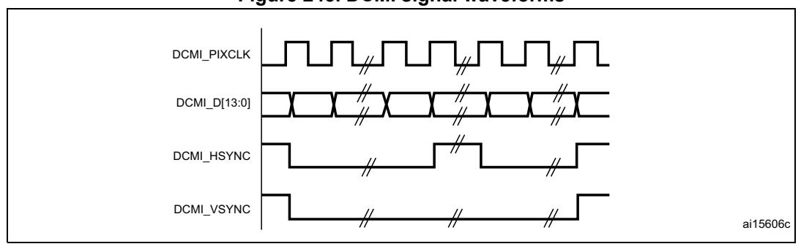
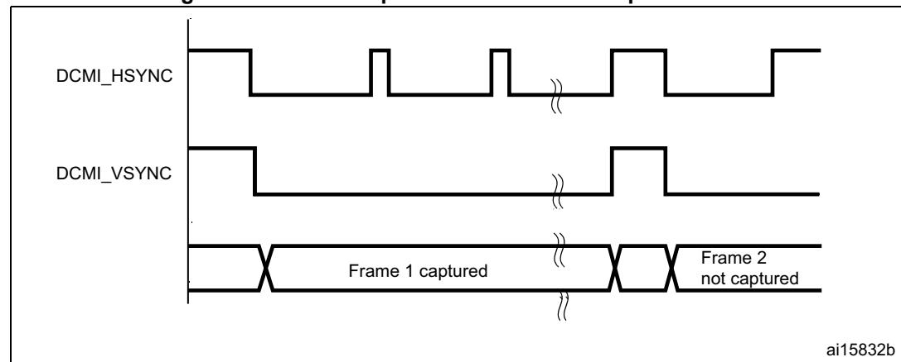
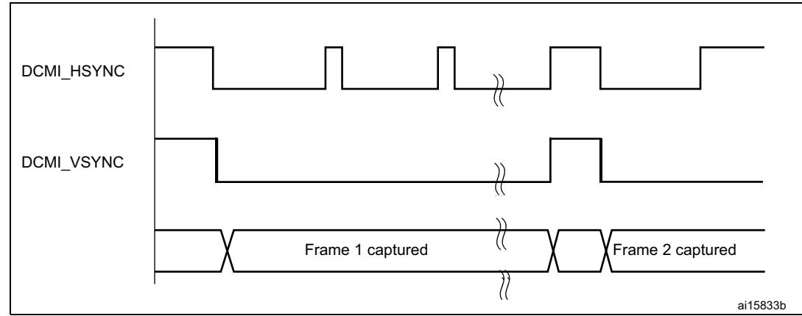
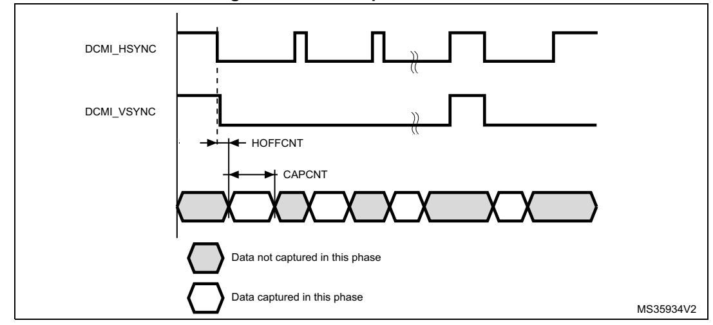
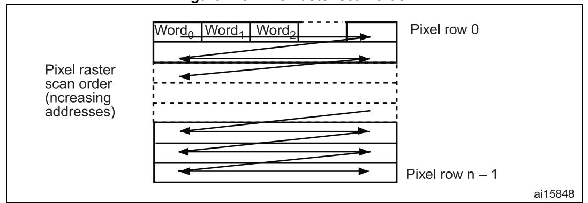

# **32 Digital camera interface (DCMI)**

# **32.1 Introduction**

The digital camera is a synchronous parallel interface able to receive a high-speed data flow from an external 8-, 10-, 12- or 14-bit CMOS camera module. It supports different data formats: YCbCr4:2:2/RGB565 progressive video and compressed data (JPEG).

# **32.2 DCMI main features**

- 8-, 10-, 12- or 14-bit parallel interface
- Embedded/external line and frame synchronization
- Continuous or snapshot mode
- Crop feature
- Supports the following data formats:
  - 8/10/12/14-bit progressive video: either monochrome or raw Bayer
  - YCbCr 4:2:2 progressive video
  - RGB 565 progressive video
  - Compressed data: JPEG

# **32.3 DCMI functional description**

The digital camera interface is a synchronous parallel interface that can receive high-speed data flows. It consists of up to 14 data lines (DCMI\_D[13:0]) and a pixel clock line (DCMI\_PIXCLK). The pixel clock has a programmable polarity, so that data can be captured on either the rising or the falling edge of the pixel clock.

The data are packed into a 32-bit data register (DCMI\_DR) and then transferred through a general-purpose DMA channel. The image buffer is managed by the DMA, not by the camera interface.

The data received from the camera can be organized in lines/frames (raw YUB/RGB/Bayer modes) or can be a sequence of JPEG images. To enable JPEG image reception, the JPEG bit (bit 3 of DCMI\_CR register) must be set.

The data flow is synchronized either by hardware using the optional DCMI\_HSYNC (horizontal synchronization) and DCMI\_VSYNC (vertical synchronization) signals or by synchronization codes embedded in the data flow.

## **32.3.1 DCMI block diagram**

*[Figure 242](#page-1-0)* shows the DCMI block diagram.

MSv43767V2 DCMI\_PIXCLK DCMI\_D[13:0] DMA interface Control/Status register FIFO/Data formatter Data extraction Synchronizer dcmi\_dma32-bit AHB Bus **DCMI** DCMI\_HSYNC DCMI\_VSYNC dcmi\_it dcmi\_hclk

**Figure 242. DCMI block diagram** 

## **32.3.2 DCMI pins and internal signals**

The following table shows DCMI pins.

**Table 260. DCMI input/output pins** 

| Mode       | Pin name     | Signal type | Description                             |  |
|------------|--------------|-------------|-----------------------------------------|--|
| 8 bits     | DCMI_D[7:0]  |             |                                         |  |
| 10 bits    | DCMI_D[9:0]  | Inputs      | DCMI data                               |  |
| 12 bits    | DCMI_D[11:0] |             |                                         |  |
| 14 bits    | DCMI_D[13:0] |             |                                         |  |
|            | DCMI_PIXCLK  | Input       | Pixel clock                             |  |
| DCMI_HSYNC |              | Input       | Horizontal synchronization / Data valid |  |
| DCMI_VSYNC |              | Input       | Vertical synchronization                |  |

The following table shows DCMI internal signals.

**Table 261. DCMI internal input/output signals** 

| Internal signal Signal type name |        | Description            |
|----------------------------------------|--------|------------------------|
| dcmi_dma                               | Output | DCMI DMA request       |
| dcmi_it                                | Output | DCMI interrupt request |
| dcmi_hclk                              | Input  | DCMI interface clock   |

## **32.3.3 DCMI clocks**

The digital camera interface uses two clock domains, DCMI\_PIXCLK and HCLK. The signals generated with DCMI\_PIXCLK are sampled on the rising edge of HCLK once they are stable. An enable signal is generated in the HCLK domain, to indicate that data coming from the camera are stable and can be sampled. The maximum DCMI\_PIXCLK period must be higher than 2.5 HCLK periods.

## **32.3.4 DCMI DMA interface**

The DMA interface is active when the CAPTURE bit of the DCMI\_CR register is set. A DMA request is generated each time the camera interface receives a complete 32-bit data block in its register.

## **32.3.5 DCMI physical interface**

The interface is composed of 11/13/15/17 inputs. Only the Slave mode is supported.

The camera interface can capture 8-bit, 10-bit, 12-bit or 14-bit data depending on the EDM[1:0] bits of the DCMI\_CR register. If less than 14 bits are used, the unused input pins must be connected to ground.

DCMI pins are shown in *[Table 260](#page-1-1)*.

The data are synchronous with DCMI\_PIXCLK and change on the rising/falling edge of the pixel clock depending on the polarity.

The DCMI\_HSYNC signal indicates the start/end of a line.

The DCMI\_VSYNC signal indicates the start/end of a frame

**Figure 243. DCMI signal waveforms**

- 1. The capture edge of DCMI\_PIXCLK is the falling edge, the active state of DCMI\_HSYNC and DCMI\_VSYNC is 1.
- 2. DCMI\_HSYNC and DCMI\_VSYNC can change states at the same time.

### **8-bit data**

When EDM[1:0] = 00 in DCMI\_CR the interface captures 8 LSBs at its input (DCMI\_D[7:0]) and stores them as 8-bit data. The DCMI\_D[13:8] inputs are ignored. In this case, to capture a 32-bit word, the camera interface takes four pixel clock cycles.

The first captured data byte is placed in the LSB position in the 32-bit word and the 4th captured data byte is placed in the MSB position in the 32-bit word. The table below gives an example of the positioning of captured data bytes in two 32-bit words.

**Byte address 31:24 23:16 15:8 7:0** 0 Dn+3[7:0] Dn+2[7:0] Dn+1[7:0] Dn[7:0] 4 Dn+7[7:0] Dn+6[7:0] Dn+5[7:0] Dn+4[7:0]

**Table 262. Positioning of captured data bytes in 32-bit words (8-bit width)** 

## **10-bit data**

When EDM[1:0] = 01 in DCMI\_CR, the camera interface captures 10-bit data at its input DCMI\_D[9:0] and stores them as the 10 least significant bits of a 16-bit word. The remaining most significant bits of the DCMI\_DR register (bits 11 to 15) are cleared to zero. So, in this case, a 32-bit data word is made up every two pixel clock cycles.

The first captured data are placed in the LSB position in the 32-bit word and the 2nd captured data are placed in the MSB position in the 32-bit word as shown in the table below.

**Table 263. Positioning of captured data bytes in 32-bit words (10-bit width)** 

| Byte address | 31:26 | 25:16     | 15:10 | 9:0       |
|--------------|-------|-----------|-------|-----------|
| 0            | 0     | Dn+1[9:0] | 0     | Dn[9:0]   |
| 4            | 0     | Dn+3[9:0] | 0     | Dn+2[9:0] |

### **12-bit data**

When EDM[1:0] = 10 in DCMI\_CR, the camera interface captures the 12-bit data at its input DCMI\_D[11:0] and stores them as the 12 least significant bits of a 16-bit word. The remaining most significant bits are cleared to zero. So, in this case a 32-bit data word is made up every two pixel clock cycles.

The first captured data are placed in the LSB position in the 32-bit word and the 2nd captured data are placed in the MSB position in the 32-bit word as shown in the table below.

**Table 264. Positioning of captured data bytes in 32-bit words (12-bit width)** 

| Byte address | 31:28 | 27:16      | 15:12 | 11:0       |
|--------------|-------|------------|-------|------------|
| 0            | 0     | Dn+1[11:0] | 0     | Dn[11:0]   |
| 4            | 0     | Dn+3[11:0] | 0     | Dn+2[11:0] |

### **14-bit data**

When EDM[1:0] = 11 in DCMI\_CR, the camera interface captures the 14-bit data at its input DCMI\_D[13:0] and stores them as the 14 least significant bits of a 16-bit word. The remaining most significant bits are cleared to zero. So, in this case a 32-bit data word is made up every two pixel clock cycles.

The first captured data are placed in the LSB position in the 32-bit word and the 2nd captured data are placed in the MSB position in the 32-bit word as shown in the table below.

RM0399 Rev 4 1213/3556

| Byte address | 31:30 | 29:16      | 15:14 | 13:0     |  |
|--------------|-------|------------|-------|----------|--|
| 0            | 0     | Dn+1[13:0] | 0     | Dn[13:0] |  |
|              |       |            |       |          |  |

4 0Dn+3[13:0] 0 Dn+2[13:0]

**Table 265. Positioning of captured data bytes in 32-bit words (14-bit width)** 

## **32.3.6 DCMI synchronization**

The digital camera interface supports embedded or hardware (DCMI\_HSYNC and DCMI\_VSYNC) synchronization. When embedded synchronization is used, it is up to the digital camera module to make sure that the 0x00 and 0xFF values are used ONLY for synchronization (not in data). Embedded synchronization codes are supported only for the 8-bit parallel data interface width (that is, in the DCMI\_CR register, the EDM[1:0] bits must be cleared).

For compressed data, the DCMI supports only the hardware synchronization mode. In this case, DCMI\_VSYNC is used as a start/end of the image, and DCMI\_HSYNC is used as a Data Valid signal. *[Figure 244](#page-4-0)* shows the corresponding timing diagram.

ai15944b Beginning of JPEG stream JPEG data DCMI\_HSYNC JPEG packet data DCMI\_VSYNC Padding data at the end of the JPEG stream Programmable JPEG packet size End of JPEG stream Packet dispatching depends on the image content. This results in a variable blanking duration.

**Figure 244. Timing diagram**

### **Hardware synchronization mode**

In hardware synchronization mode, the two synchronization signals (DCMI\_HSYNC/DCMI\_VSYNC) are used.

Depending on the camera module/mode, data may be transmitted during horizontal/vertical synchronization periods. The DCMI\_HSYNC/DCMI\_VSYNC signals act like blanking signals since all the data received during DCMI\_HSYNC/DCMI\_VSYNC active periods are ignored.

In order to correctly transfer images into the DMA/RAM buffer, data transfer is synchronized with the DCMI\_VSYNC signal. When the hardware synchronization mode is selected, and

capture is enabled (CAPTURE bit set in DCMI\_CR), data transfer is synchronized with the deactivation of the DCMI\_VSYNC signal (next start of frame).

Transfer can then be continuous, with successive frames transferred by DMA to successive buffers or the same/circular buffer. To allow the DMA management of successive frames, a VSIF (Vertical synchronization interrupt flag) is activated at the end of each frame.

## **Embedded data synchronization mode**

In this synchronization mode, the data flow is synchronized using 32-bit codes embedded in the data flow. These codes use the 0x00/0xFF values that are *not* used in data anymore. There are 4 types of codes, all with a 0xFF0000XY format. The embedded synchronization codes are supported only in 8-bit parallel data width capture (in the DCMI\_CR register, the EDM[1:0] bits must be cleared). For other data widths, this mode generates unpredictable results and must not be used.

*Note: Camera modules can have 8 such codes (in interleaved mode). For this reason, the interleaved mode is not supported by the camera interface (otherwise, every other half-frame would be discarded).*

• Mode 2

Four embedded codes signal the following events

- Frame start (FS)
- Frame end (FE)
- Line start (LS)
- Line end (LE)

The XY values in the 0xFF0000XY format of the four codes are programmable (see *[Section 32.5.7: DCMI embedded synchronization code register \(DCMI\\_ESCR\)](#page-18-0)*).

A 0xFF value programmed as a "frame end" means that all the unused codes are interpreted as valid frame end codes.

In this mode, once the camera interface has been enabled, the frame capture starts after the first occurrence of the frame end (FE) code followed by a frame start (FS) code.

• Mode 1

An alternative coding is the camera mode 1. This mode is ITU656 compatible.

The codes signal another set of events:

- SAV (active line) line start
- EAV (active line) line end
- SAV (blanking) end of line during interframe blanking period
- EAV (blanking) end of line during interframe blanking period

This mode can be supported by programming the following codes:

- FS ≤ 0xFF
- FE ≤ 0xFF
- LS ≤ SAV (active)
- LE ≤ EAV (active)

An embedded unmask code is also implemented for frame/line start and frame/line end codes. Using it, it is possible to compare only the selected unmasked bits with the programmed code. A bit can therefore be selected to compare in the embedded code and

RM0399 Rev 4 1215/3556

detect a frame/line start or frame/line end. This means that there can be different codes for the frame/line start and frame/line end with the unmasked bit position remaining the same.

### **Example**

FS = 0xA5

Unmask code for FS = 0x10

In this case the frame start code is embedded in the bit 4 of the frame start code.

## **32.3.7 DCMI capture modes**

This interface supports two types of capture: snapshot (single frame) and continuous grab.

### **Snapshot mode (single frame)**

In this mode, a single frame is captured (CM = 1 of the DCMI\_CR register). After the CAPTURE bit is set in DCMI\_CR, the interface waits for the detection of a start of frame before sampling the data. The camera interface is automatically disabled (CAPTURE bit cleared in DCMI\_CR) after receiving the first complete frame. An interrupt is generated (IT\_FRAME) if it is enabled.

In case of an overrun, the frame is lost and the CAPTURE bit is cleared.

**Figure 245. Frame capture waveforms in snapshot mode**

- 1. Here, the active state of DCMI\_HSYNC and DCMI\_VSYNC is 1.
- 2. DCMI\_HSYNC and DCMI\_VSYNC can change states at the same time.

### **Continuous grab mode**

In this mode (CM bit = 0 in DCMI\_CR), once the CAPTURE bit has been set in DCMI\_CR, the grabbing process starts on the next DCMI\_VSYNC or embedded frame start depending on the mode. The process continues until the CAPTURE bit is cleared in DCMI\_CR. Once the CAPTURE bit has been cleared, the grabbing process continues until the end of the current frame.

**Figure 246. Frame capture waveforms in continuous grab mode**

- 1. Here, the active state of DCMI\_HSYNC and DCMI\_VSYNC is 1.
- 2. DCMI\_HSYNC and DCMI\_VSYNC can change states at the same time.

In continuous grab mode, the FCRC[1:0] bits in DCMI\_CR can be configured to grab all pictures, every second picture or one out of four pictures to decrease the frame capture rate.

*Note: In the hardware synchronization mode (ESS = 0 in DCMI\_CR), the IT\_VSYNC interrupt is generated (if enabled) even when CAPTURE = 0 in DCMI\_CR so, to reduce the frame capture rate even further, the IT\_VSYNC interrupt can be used to count the number of frames between 2 captures in conjunction with the Snapshot mode. This is not allowed by embedded data synchronization mode.*

## **32.3.8 DCMI crop feature**

With the crop feature, the camera interface can select a rectangular window from the received image. The start (upper left corner) coordinates and size (horizontal dimension in number of pixel clocks and vertical dimension in number of lines) are specified using two 32-bit registers (DCMI\_CWSTRT and DCMI\_CWSIZE). The size of the window is specified in number of pixel clocks (horizontal dimension) and in number of lines (vertical dimension).

MS35933V3 CAPCNT[13:0] in DCMI\_CWSIZE HOFFCNT[13:0] in DCMI\_CWSTRT VST[12:0] in DCMI\_CWSTRT VLINE[13:0] in DCMI\_CWSIZE

**Figure 247. Coordinates and size of the window after cropping**

These registers specify the coordinates of the starting point of the capture window as a line number (in the frame, starting from 0) and a number of pixel clocks (on the line, starting from 0), and the size of the window as a line number and a number of pixel clocks. The CAPCNT value can only be a multiple of 4 (two least significant bits are forced to 0) to allow the correct transfer of data through the DMA.

RM0399 Rev 4 1217/3556

If the DCMI\_VSYNC signal goes active before the number of lines is specified in the DCMI\_CWSIZE register, then the capture stops and an IT\_FRAME interrupt is generated when enabled.

**Figure 248. Data capture waveforms**

- 1. Here, the active state of DCMI\_HSYNC and DCMI\_VSYNC is 1.
- 2. DCMI\_HSYNC and DCMI\_VSYNC can change states at the same time.

## **32.3.9 DCMI JPEG format**

To allow JPEG image reception, it is necessary to set the JPEG bit of the DCMI\_CR register. JPEG images are not stored as lines and frames, so the DCMI\_VSYNC signal is used to start the capture while DCMI\_HSYNC serves as a data enable signal. The number of bytes in a line may not be a multiple of 4. This case must be carefully handled since a DMA request is generated each time a complete 32-bit word has been constructed from the captured data. When an end of frame is detected and the 32-bit word to be transferred has not been completely received, the remaining data are padded with zeros and a DMA request is generated.

The crop feature and embedded synchronization codes cannot be used in JPEG format.

## **32.3.10 DCMI FIFO**

A 8-word FIFO is implemented to manage data rate transfers on the AHB. The DCMI features a simple FIFO controller with a read pointer incremented each time the camera interface reads from the AHB, and a write pointer incremented each time the camera interface writes to the FIFO. There is no overrun protection to prevent the data from being overwritten if the AHB interface does not sustain the data transfer rate.

In case of overrun or errors in the synchronization signals, the FIFO is reset and the DCMI interface waits for a new start of frame.

## **32.3.11 DCMI data format description**

### **Data formats**

Three types of data are supported:

- 8/10/12/14-bit progressive video: either monochrome or raw Bayer format
- YCbCr 4:2:2 progressive video
- RGB565 progressive video. A pixel coded in 16 bits (5 bits for blue, 5 bits for red, 6 bits for green) takes two clock cycles to be transferred.

Compressed data: JPEG

For B&W (black and white), YCbCr or RGB data, the maximum input size is 2048 × 2048 pixels. No limit in JPEG compressed mode.

For monochrome, RGB and YCbCr, the frame buffer is stored in raster mode. 32-bit words are used. Only the little-endian format is supported.

**Figure 249. Pixel raster scan order**

## **Monochrome format**

Characteristics:

- Raster format
- 8 bits per pixel

The table below shows how the data are stored.

**Table 266. Data storage in monochrome progressive video format** 

| Byte address | 31:24 | 23:16 | 15:8  | 7:0   |
|--------------|-------|-------|-------|-------|
| 0            | n + 3 | n + 2 | n + 1 | n     |
| 4            | n + 7 | n + 6 | n + 5 | n + 4 |

### **RGB format**

Characteristics:

- Raster format
- RGB
- Interleaved: one buffer: R, G and B interleaved (such as BRGBRGBRG)
- Optimized for display output

RM0399 Rev 4 1219/3556

The RGB planar format is compatible with standard OS frame buffer display formats.

Only 16 BPP (bits per pixel): RGB565 (2 pixels per 32-bit word) is supported.

The 24 BPP (palletized format) and gray-scale formats are not supported. Pixels are stored in a raster scan order, that is from top to bottom for pixel rows, and from left to right within a pixel row. Pixel components are R (red), G (green) and B (blue). All components have the same spatial resolution (4:4:4 format). A frame is stored in a single part, with the components interleaved on a pixel basis.

The table below shows how the data are stored.

**Table 267. Data storage in RGB progressive video format** 

| Byte address | 31:27     |             | 20:16      | 15:11     | 10:5        | 4:0        |  |
|--------------|-----------|-------------|------------|-----------|-------------|------------|--|
| 0            | Red n + 1 | Green n + 1 | Blue n + 1 | Red n     | Green n     | Blue n     |  |
| 4            | Red n + 4 | Green n + 3 | Blue n + 3 | Red n + 2 | Green n + 2 | Blue n + 2 |  |

### **YCbCr format**

Characteristics:

- Raster format
- YCbCr 4:2:2
- Interleaved: one buffer: Y, Cb and Cr interleaved (such as CbYCrYCbYCr)

Pixel components are Y (luminance or "luma"), Cb and Cr (chrominance or "chroma" blue and red). Each component is encoded in 8 bits. Luma and chroma are stored together (interleaved) as shown in the table below.

**Table 268. Data storage in YCbCr progressive video format** 

| Byte address | 31:24   |          | 15:8    | 7:0      |  |  |
|--------------|---------|----------|---------|----------|--|--|
| 0            | Y n + 1 | Cr n     | Y n     | Cb n     |  |  |
| 4            | Y n + 3 | Cr n + 2 | Y n + 2 | Cb n + 2 |  |  |

### **YCbCr format - Y only**

Characteristics:

- Raster format
- YCbCr 4:2:2
- The buffer only contains Y information monochrome image

Pixel components are Y (luminance or "luma"), Cb and Cr (chrominance or "chroma" blue and red). In this mode, the chroma information is dropped. Only the luma component of each pixel, encoded in 8 bits, is stored as shown in *[Table 269](#page-11-0)*.

The result is a monochrome image having the same resolution as the original YCbCr data.

Table 269. Data storage in YCbCr progressive video format - Y extraction mode

| Byte address | 31:24   | 23:16   | 15:8    | 7:0     |
|--------------|---------|---------|---------|---------|
| 0            | Y n + 3 | Y n + 2 | Y n + 1 | Υn      |
| 4            | Y n + 7 | Y n + 6 | Y n + 5 | Y n + 4 |

### Half resolution image extraction

This is a modification of the previous reception modes, being applicable to monochrome, RGB or Y extraction modes.

This mode is used to only store a half resolution image. It is selected through OELS and LSM control bits.

# 32.4 DCMI interrupts

Five interrupts are generated. All interrupts are maskable by software. The global interrupt (dcmi\_it) is the OR of all the individual interrupts. The table below gives the list of all interrupts.

Table 270. DCMI interrupts

| Interrupt acronym | Interrupt event Event flag                                                     |           | Enable control bit | Interrupt clear method | Exits Sleep mode | Exists Stop and Standby modes |
|----------------------|--------------------------------------------------------------------------------|-----------|-----------------------|---------------------------|------------------------|----------------------------------------|
|                      | End of line                                                                    | LINE_RIS  | LINE_IE               | Set LINE_ISC              | Yes                    | No                                     |
|                      | End of frame capture                                                           | FRAME_RIS | FRAME_IE              | Set FRAME_ISC             | Yes                    | No                                     |
|                      | Overrun of data reception                                                      | OVR_RIS   | OVR_IE                | Set OVR_ISC               | Yes                    | No                                     |
| dcmi_it              | Synchronization frame                                                          | VSYNC_RIS | VSYNC_IE              | Set VSYNC_ISC             | Yes                    | No                                     |
|                      | Detection of an error in the embedded synchronization frame detection | ERR_RIS   | ERR_IE                | Set ERR_ISC               | Yes                    | No                                     |

# 32.5 DCMI registers

Refer to Section 1.2 on page 106 for list of abbreviations used in register descriptions. All DCMI registers must be accessed as 32-bit words, otherwise a bus error occurs.

## 32.5.1 DCMI control register (DCMI CR)

Address offset: 0x00

Reset value: 0x0000 0000

| 31   | 30         | 29   | 28   | 27   | 26     | 25        | 24   | 23    | 22    | 21         | 20   | 19   | 18   | 17  | 16             |
|------|------------|------|------|------|--------|-----------|------|-------|-------|------------|------|------|------|-----|----------------|
| Res. | Res.       | Res. | Res. | Res. | Res.   | Res.      | Res. | Res.  | Res.  | Res.       | OELS | LSM  | OEBS | BSM | <b>/</b> [1:0] |
|      |            |      |      |      |        |           |      |       |       |            | rw   | rw   | rw   | rw  | rw             |
| 15   | 14         | 13   | 12   | 11   | 10     | 9         | 8    | 7     | 6     | 5          | 4    | 3    | 2    | 1   | 0              |
| Res. | ENABL E | Res. | Res. | EDM  | 1[1:0] | FCRC[1:0] |      | VSPOL | HSPOL | PCKPO L | ESS  | JPEG | CROP | СМ  | CAPTU RE    |
|      | rw         |      |      | rw   | rw     | rw        | rw   | rw    | rw    | rw         | rw   | rw   | rw   | rw  | rw             |

Bits 31:21 Reserved, must be kept at reset value.

Bit 20 OELS: Odd/Even Line Select (Line Select Start)

This bit works in conjunction with the LSM field (LSM = 1).

0: Interface captures first line after the frame start, second one being dropped.

1: Interface captures second line from the frame start, first one being dropped.

Bit 19 LSM: Line Select mode

0: Interface captures all received lines.

1: Interface captures one line out of two.

Bit 18 **OEBS:** Odd/Even Byte Select (Byte Select Start)

This bit works in conjunction with BSM field (BSM  $\neq$  00).

0: Interface captures first data (byte or double byte) from the frame/line start, second one being dropped.

1: Interface captures second data (byte or double byte) from the frame/line start, first one being dropped.

### Bits 17:16 BSM[1:0]: Byte Select mode

00: Interface captures all received data.

01: Interface captures every other byte from the received data.

10: Interface captures one byte out of four.

11: Interface captures two bytes out of four.

Note: This mode only works for EDM[1:0] = 00. For all other EDM values, this field must be programmed to the reset value.

Bit 15 Reserved, must be kept at reset value.

Bit 14 ENABLE: DCMI enable

0: DCMI disabled 1: DCMI enabled

Note: The DCMI configuration registers must be programmed correctly before enabling this

Bits 13:12 Reserved, must be kept at reset value.

#### Bits 11:10 **EDM[1:0]:** Extended data mode

- 00: Interface captures 8-bit data on every pixel clock.
- 01: Interface captures 10-bit data on every pixel clock.
- 10: Interface captures 12-bit data on every pixel clock.
- 11: Interface captures 14-bit data on every pixel clock.

### Bits 9:8 **FCRC[1:0]:** Frame capture rate control

These bits define the frequency of frame capture. They are meaningful only in Continuous grab mode. They are ignored in snapshot mode.

- 00: All frames are captured.
- 01: Every alternate frame captured (50% bandwidth reduction)
- 10: One frame out of four captured (75% bandwidth reduction)
- 11: reserved

#### Bit 7 **VSPOL:** Vertical synchronization polarity

This bit indicates the level on the DCMI\_VSYNC pin when the data are not valid on the parallel interface.

- 0: DCMI\_VSYNC active low
- 1: DCMI\_VSYNC active high

### Bit 6 **HSPOL:** Horizontal synchronization polarity

This bit indicates the level on the DCMI\_HSYNC pin when the data are not valid on the parallel interface.

- 0: DCMI\_HSYNC active low
- 1: DCMI\_HSYNC active high

#### Bit 5 **PCKPOL:** Pixel clock polarity

This bit configures the capture edge of the pixel clock.

- 0: Falling edge active
- 1: Rising edge active

#### Bit 4 **ESS:** Embedded synchronization select

- 0: Hardware synchronization data capture (frame/line start/stop) is synchronized with the DCMI\_HSYNC/DCMI\_VSYNC signals.
- 1: Embedded synchronization data capture is synchronized with synchronization codes embedded in the data flow.

*Note: Valid only for 8-bit parallel data. HSPOL/VSPOL are ignored when the ESS bit is set.* This bit is disabled in JPEG mode.

#### Bit 3 **JPEG:** JPEG format

- 0: Uncompressed video format
- 1: This bit is used for JPEG data transfers. The DCMI\_HSYNC signal is used as data enable. The crop and embedded synchronization features (ESS bit) cannot be used in this mode.

#### Bit 2 **CROP:** Crop feature

- 0: The full image is captured. In this case the total number of bytes in an image frame must be a multiple of four.
- 1: Only the data inside the window specified by the crop register is captured. If the size of the crop window exceeds the picture size, then only the picture size is captured.

#### Bit 1 **CM:** Capture mode

- 0: Continuous grab mode The received data are transferred into the destination memory through the DMA. The buffer location and mode (linear or circular buffer) is controlled through the system DMA.
- 1: Snapshot mode (single frame) Once activated, the interface waits for the start of frame and then transfers a single frame through the DMA. At the end of the frame, the CAPTURE bit is automatically reset.

RM0399 Rev 4 1223/3556

#### Bit 0 **CAPTURE:** Capture enable

0: Capture disabled

1: Capture enabled

The camera interface waits for the first start of frame, then a DMA request is generated to transfer the received data into the destination memory.

In snapshot mode, the CAPTURE bit is automatically cleared at the end of the first frame received.

In continuous grab mode, if the software clears this bit while a capture is ongoing, the bit is effectively cleared after the frame end.

*Note: The DMA controller and all DCMI configuration registers must be programmed correctly before enabling this bit.*

## **32.5.2 DCMI status register (DCMI\_SR)**

Address offset: 0x04

Reset value: 0x0000 0000

| 31   | 30   | 29   | 28   | 27   | 26   | 25   | 24   | 23   | 22   | 21   | 20   | 19   | 18   | 17   | 16          |
|------|------|------|------|------|------|------|------|------|------|------|------|------|------|------|-------------|
| Res. | Res. | Res. | Res. | Res. | Res. | Res. | Res. | Res. | Res. | Res. | Res. | Res. | Res. | Res. | Res.        |
|      |      |      |      |      |      |      |      |      |      |      |      |      |      |      |             |
| 15   | 14   | 13   | 12   | 11   | 10   | 9    | 8    | 7    | 6    | 5    | 4    | 3    | 2    | 1    | 0           |
| Res. | Res. | Res. | Res. | Res. | Res. | Res. | Res. | Res. | Res. | Res. | Res. | Res. | FNE  |      | VSYNC HSYNC |
|      |      |      |      |      |      |      |      |      |      |      |      |      | r    | r    | r           |

Bits 31:3 Reserved, must be kept at reset value.

#### Bit 2 **FNE**: FIFO not empty

This bit gives the status of the FIFO.

- 1: FIFO contains valid data.
- 0: FIFO empty

#### Bit 1 **VSYNC**: Vertical synchronization

This bit gives the state of the DCMI\_VSYNC pin with the correct programmed polarity. When embedded synchronization codes are used, the meaning of this bit is the following:

- 0: active frame
- 1: synchronization between frames

In case of embedded synchronization, this bit is meaningful only if the CAPTURE bit in DCMI\_CR is set.

#### Bit 0 **HSYNC**: Horizontal synchronization

This bit gives the state of the DCMI\_HSYNC pin with the correct programmed polarity. When embedded synchronization codes are used, the meaning of this bit is the following:

- 0: active line
- 1: synchronization between lines

In case of embedded synchronization, this bit is meaningful only if the CAPTURE bit in DCMI\_CR is set.

## **32.5.3 DCMI raw interrupt status register (DCMI\_RIS)**

DCMI\_RIS gives the raw interrupt status and is accessible in read only. When read, this register returns the status of the corresponding interrupt before masking with the DCMI\_IER register value.

Address offset: 0x08

Reset value: 0x0000 0000

| 31   | 30   | 29   | 28   | 27   | 26   | 25   | 24   | 23   | 22   | 21   | 20           | 19            | 18          | 17          | 16            |
|------|------|------|------|------|------|------|------|------|------|------|--------------|---------------|-------------|-------------|---------------|
| Res. | Res. | Res. | Res. | Res. | Res. | Res. | Res. | Res. | Res. | Res. | Res.         | Res.          | Res.        | Res.        | Res.          |
|      |      |      |      |      |      |      |      |      |      |      |              |               |             |             |               |
| 15   | 14   | 13   | 12   | 11   | 10   | 9    | 8    | 7    | 6    | 5    | 4            | 3             | 2           | 1           | 0             |
| Res. | Res. | Res. | Res. | Res. | Res. | Res. | Res. | Res. | Res. | Res. | LINE _RIS | VSYNC _RIS | ERR _RIS | OVR _RIS | FRAME _RIS |
|      |      |      |      |      |      |      |      |      |      |      | r            | r             | r           | r           | r             |

Bits 31:5 Reserved, must be kept at reset value.

#### Bit 4 **LINE\_RIS**: Line raw interrupt status

This bit gets set when the DCMI\_HSYNC signal changes from the inactive state to the active state. It goes high even if the line is not valid.

In the case of embedded synchronization, this bit is set only if the CAPTURE bit in DCMI\_CR is set.

It is cleared by setting the LINE\_ISC bit of the DCMI\_ICR register.

### Bit 3 **VSYNC\_RIS**: DCMI\_VSYNC raw interrupt status

This bit is set when the DCMI\_VSYNC signal changes from the inactive state to the active state.

In the case of embedded synchronization, this bit is set only if the CAPTURE bit is set in DCMI\_CR.

It is cleared by setting the VSYNC\_ISC bit of the DCMI\_ICR register.

#### Bit 2 **ERR\_RIS**: Synchronization error raw interrupt status

0: No synchronization error detected

1: Embedded synchronization characters are not received in the correct order.

This bit is valid only in the embedded synchronization mode. It is cleared by setting the ERR\_ISC bit of the DCMI\_ICR register.

*Note: This bit is available only in embedded synchronization mode.*

### Bit 1 **OVR\_RIS**: Overrun raw interrupt status

0: No data buffer overrun occurred

1: A data buffer overrun occurred and the data FIFO is corrupted.

The bit is cleared by setting the OVR\_ISC bit of the DCMI\_ICR register.

### Bit 0 **FRAME\_RIS**: Capture complete raw interrupt status

0: No new capture

1: A frame has been captured.

This bit is set when a frame or window has been captured.

In case of a cropped window, this bit is set at the end of line of the last line in the crop. It is set even if the captured frame is empty (for example window cropped outside the frame).

The bit is cleared by setting the FRAME\_ISC bit of the DCMI\_ICR register.

RM0399 Rev 4 1225/3556

## **32.5.4 DCMI interrupt enable register (DCMI\_IER)**

The DCMI\_IER register is used to enable interrupts. When one of the DCMI\_IER bits is set, the corresponding interrupt is enabled. This register is accessible in both read and write.

Address offset: 0x0C

Reset value: 0x0000 0000

| 31   | 30   | 29   | 28   | 27   | 26   | 25   | 24   | 23   | 22   | 21   | 20          | 19           | 18         | 17         | 16           |
|------|------|------|------|------|------|------|------|------|------|------|-------------|--------------|------------|------------|--------------|
| Res. | Res. | Res. | Res. | Res. | Res. | Res. | Res. | Res. | Res. | Res. | Res.        | Res.         | Res.       | Res.       | Res.         |
|      |      |      |      |      |      |      |      |      |      |      |             |              |            |            |              |
| 15   | 14   | 13   | 12   | 11   | 10   | 9    | 8    | 7    | 6    | 5    | 4           | 3            | 2          | 1          | 0            |
| Res. | Res. | Res. | Res. | Res. | Res. | Res. | Res. | Res. | Res. | Res. | LINE _IE | VSYNC _IE | ERR _IE | OVR _IE | FRAME _IE |
|      |      |      |      |      |      |      |      |      |      |      | rw          | rw           | rw         | rw         | rw           |

Bits 31:5 Reserved, must be kept at reset value.

#### Bit 4 **LINE\_IE**: Line interrupt enable

- 0: No interrupt generation when the line is received
- 1: An Interrupt is generated when a line has been completely received.

### Bit 3 **VSYNC\_IE**: DCMI\_VSYNC interrupt enable

- 0: No interrupt generation
- 1: An interrupt is generated on each DCMI\_VSYNC transition from the inactive to the active state.

The active state of the DCMI\_VSYNC signal is defined by the VSPOL bit.

#### Bit 2 **ERR\_IE**: Synchronization error interrupt enable

- 0: No interrupt generation
- 1: An interrupt is generated if the embedded synchronization codes are not received in the correct order.

*Note: This bit is available only in embedded synchronization mode.*

#### Bit 1 **OVR\_IE**: Overrun interrupt enable

- 0: No interrupt generation
- 1: An interrupt is generated if the DMA was not able to transfer the last data before new data (32-bit) are received.

### Bit 0 **FRAME\_IE**: Capture complete interrupt enable

- 0: No interrupt generation
- 1: An interrupt is generated at the end of each received frame/crop window (in crop mode).

## **32.5.5 DCMI masked interrupt status register (DCMI\_MIS)**

This DCMI\_MIS register is a read-only register. When read, it returns the current masked status value (depending on the value in DCMI\_IER) of the corresponding interrupt. A bit in this register is set if the corresponding enable bit in DCMI\_IER is set and the corresponding bit in DCMI\_RIS is set.

Address offset: 0x10

Reset value: 0x0000 0000

| 31   | 30   | 29   | 28   | 27   | 26   | 25   | 24   | 23   | 22   | 21   | 20           | 19            | 18          | 17          | 16            |
|------|------|------|------|------|------|------|------|------|------|------|--------------|---------------|-------------|-------------|---------------|
| Res. | Res. | Res. | Res. | Res. | Res. | Res. | Res. | Res. | Res. | Res. | Res.         | Res.          | Res.        | Res.        | Res.          |
|      |      |      |      |      |      |      |      |      |      |      |              |               |             |             |               |
| 15   | 14   | 13   | 12   | 11   | 10   | 9    | 8    | 7    | 6    | 5    | 4            | 3             | 2           | 1           | 0             |
|      |      |      |      |      |      |      |      |      |      |      |              |               |             |             |               |
| Res. | Res. | Res. | Res. | Res. | Res. | Res. | Res. | Res. | Res. | Res. | LINE _MIS | VSYNC _MIS | ERR _MIS | OVR _MIS | FRAME _MIS |

Bits 31:5 Reserved, must be kept at reset value.

#### Bit 4 **LINE\_MIS**: Line masked interrupt status

This bit gives the status of the masked line interrupt.

0: No interrupt generation when the line is received

1: An Interrupt is generated when a line has been completely received and the LINE\_IE bit is set in DCMI\_IER.

#### Bit 3 **VSYNC\_MIS**: VSYNC masked interrupt status

This bit gives the status of the masked VSYNC interrupt.

0: No interrupt is generated on DCMI\_VSYNC transitions.

1: An interrupt is generated on each DCMI\_VSYNC transition from the inactive to the active state and the VSYNC\_IE bit is set in DCMI\_IER.

The active state of the DCMI\_VSYNC signal is defined by the VSPOL bit.

#### Bit 2 **ERR\_MIS**: Synchronization error masked interrupt status

This bit gives the status of the masked synchronization error interrupt.

0: No interrupt is generated on a synchronization error.

1: An interrupt is generated if the embedded synchronization codes are not received in the correct order and the ERR\_IE bit in DCMI\_IER is set.

*Note: This bit is available only in embedded synchronization mode.*

### Bit 1 **OVR\_MIS**: Overrun masked interrupt status

This bit gives the status of the masked overflow interrupt.

0: No interrupt is generated on overrun.

1: An interrupt is generated if the DMA was not able to transfer the last data before new data (32-bit) are received and the OVR\_IE bit is set in DCMI\_IER.

#### Bit 0 **FRAME\_MIS**: Capture complete masked interrupt status

This bit gives the status of the masked capture complete interrupt

0: No interrupt is generated after a complete capture.

1: An interrupt is generated at the end of each received frame/crop window (in crop mode) and the FRAME\_IE bit is set in DCMI\_IER.

RM0399 Rev 4 1227/3556

## **32.5.6 DCMI interrupt clear register (DCMI\_ICR)**

The DCMI\_ICR register is write-only. Setting a bit of this register clears the corresponding flag in the DCMI\_RIS and DCMI\_MIS registers. Writing 0 has no effect.

Address offset: 0x14

Reset value: 0x0000 0000

| 31   | 30   | 29   | 28   | 27   | 26   | 25   | 24   | 23   | 22   | 21   | 20           | 19            | 18          | 17          | 16            |
|------|------|------|------|------|------|------|------|------|------|------|--------------|---------------|-------------|-------------|---------------|
| Res. | Res. | Res. | Res. | Res. | Res. | Res. | Res. | Res. | Res. | Res. | Res.         | Res.          | Res.        | Res.        | Res.          |
|      |      |      |      |      |      |      |      |      |      |      |              |               |             |             |               |
| 15   | 14   | 13   | 12   | 11   | 10   | 9    | 8    | 7    | 6    | 5    | 4            | 3             | 2           | 1           | 0             |
| Res. | Res. | Res. | Res. | Res. | Res. | Res. | Res. | Res. | Res. | Res. | LINE _ISC | VSYNC _ISC | ERR _ISC | OVR _ISC | FRAME _ISC |
|      |      |      |      |      |      |      |      |      |      |      | w            | w             | w           | w           | w             |

Bits 31:5 Reserved, must be kept at reset value.

Bit 4 **LINE\_ISC**: line interrupt status clear

Setting this bit clears the LINE\_RIS flag in the DCMI\_RIS register.

Bit 3 **VSYNC\_ISC**: Vertical Synchronization interrupt status clear

Setting this bit clears the VSYNC\_RIS flag in the DCMI\_RIS register.

Bit 2 **ERR\_ISC**: Synchronization error interrupt status clear

Setting this bit clears the ERR\_RIS flag in the DCMI\_RIS register.

*Note: This bit is available only in embedded synchronization mode.*

Bit 1 **OVR\_ISC**: Overrun interrupt status clear

Setting this bit clears the OVR\_RIS flag in the DCMI\_RIS register.

Bit 0 **FRAME\_ISC**: Capture complete interrupt status clear

Setting this bit clears the FRAME\_RIS flag in the DCMI\_RIS register.

# **32.5.7 DCMI embedded synchronization code register (DCMI\_ESCR)**

Address offset: 0x18

Reset value: 0x0000 0000

| 31 | 30       | 29 | 28 | 27 | 26 | 25 | 24 | 23 | 22       | 21 | 20 | 19 | 18 | 17 | 16 |  |  |
|----|----------|----|----|----|----|----|----|----|----------|----|----|----|----|----|----|--|--|
|    | FEC[7:0] |    |    |    |    |    |    |    | LEC[7:0] |    |    |    |    |    |    |  |  |
| rw | rw       | rw | rw | rw | rw | rw | rw | rw | rw       | rw | rw | rw | rw | rw | rw |  |  |
| 15 | 14       | 13 | 12 | 11 | 10 | 9  | 8  | 7  | 6        | 5  | 4  | 3  | 2  | 1  | 0  |  |  |
|    | LSC[7:0] |    |    |    |    |    |    |    | FSC[7:0] |    |    |    |    |    |    |  |  |
| rw | rw       | rw | rw | rw | rw | rw | rw | rw | rw       | rw | rw | rw | rw | rw | rw |  |  |

#### Bits 31:24 **FEC[7:0]**: Frame end delimiter code

This byte specifies the code of the frame end delimiter. The code consists of 4 bytes in the form of 0xFF, 0x00, 0x00, FEC.

If FEC is programmed to 0xFF, all the unused codes (0xFF0000XY) are interpreted as frame end delimiters.

#### Bits 23:16 **LEC[7:0]**: Line end delimiter code

This byte specifies the code of the line end delimiter. The code consists of 4 bytes in the form of 0xFF, 0x00, 0x00, LEC.

### Bits 15:8 **LSC[7:0]**: Line start delimiter code

This byte specifies the code of the line start delimiter. The code consists of 4 bytes in the form of 0xFF, 0x00, 0x00, LSC.

#### Bits 7:0 **FSC[7:0]**: Frame start delimiter code

This byte specifies the code of the frame start delimiter. The code consists of 4 bytes in the form of 0xFF, 0x00, 0x00, FSC.

If FSC is programmed to 0xFF, no frame start delimiter is detected. But, the first occurrence of LSC after an FEC code is interpreted as a start of frame delimiter.

## **32.5.8 DCMI embedded synchronization unmask register (DCMI\_ESUR)**

Address offset: 0x1C

Reset value: 0x0000 0000

| 31 | 30       | 29 | 28 | 27 | 26 | 25 | 24 | 23 | 22       | 21 | 20 | 19 | 18 | 17 | 16 |  |
|----|----------|----|----|----|----|----|----|----|----------|----|----|----|----|----|----|--|
|    | FEU[7:0] |    |    |    |    |    |    |    | LEU[7:0] |    |    |    |    |    |    |  |
| rw | rw       | rw | rw | rw | rw | rw | rw | rw | rw       | rw | rw | rw | rw | rw | rw |  |
| 15 | 14       | 13 | 12 | 11 | 10 | 9  | 8  | 7  | 6        | 5  | 4  | 3  | 2  | 1  | 0  |  |
|    | LSU[7:0] |    |    |    |    |    |    |    | FSU[7:0] |    |    |    |    |    |    |  |
| rw | rw       | rw | rw | rw | rw | rw | rw | rw | rw       | rw | rw | rw | rw | rw | rw |  |

#### Bits 31:24 **FEU[7:0]**: Frame end delimiter unmask

This byte specifies the mask to be applied to the code of the frame end delimiter.

- 0: The corresponding bit in the FEC byte in DCMI\_ESCR is masked while comparing the frame end delimiter with the received data.
- 1: The corresponding bit in the FEC byte in DCMI\_ESCR is compared while comparing the frame end delimiter with the received data.

#### Bits 23:16 **LEU[7:0]**: Line end delimiter unmask

This byte specifies the mask to be applied to the code of the line end delimiter.

- 0: The corresponding bit in the LEC byte in DCMI\_ESCR is masked while comparing the line end delimiter with the received data.
- 1: The corresponding bit in the LEC byte in DCMI\_ESCR is compared while comparing the line end delimiter with the received data.

### Bits 15:8 **LSU[7:0]**: Line start delimiter unmask

This byte specifies the mask to be applied to the code of the line start delimiter.

- 0: The corresponding bit in the LSC byte in DCMI\_ESCR is masked while comparing the line start delimiter with the received data.
- 1: The corresponding bit in the LSC byte in DCMI\_ESCR is compared while comparing the line start delimiter with the received data.

RM0399 Rev 4 1229/3556

#### Bits 7:0 **FSU[7:0]**: Frame start delimiter unmask

This byte specifies the mask to be applied to the code of the frame start delimiter.

- 0: The corresponding bit in the FSC byte in DCMI\_ESCR is masked while comparing the frame start delimiter with the received data.
- 1: The corresponding bit in the FSC byte in DCMI\_ESCR is compared while comparing the frame start delimiter with the received data.

## **32.5.9 DCMI crop window start (DCMI\_CWSTRT)**

Address offset: 0x20

Reset value: 0x0000 0000

| 31   | 30   | 29   | 28 | 27        | 26 | 25 | 24 | 23 | 22            | 21 | 20 | 19 | 18 | 17 | 16 |  |  |  |
|------|------|------|----|-----------|----|----|----|----|---------------|----|----|----|----|----|----|--|--|--|
| Res. | Res. | Res. |    | VST[12:0] |    |    |    |    |               |    |    |    |    |    |    |  |  |  |
|      |      |      | rw | rw        | rw | rw | rw | rw | rw            | rw | rw | rw | rw | rw | rw |  |  |  |
| 15   | 14   | 13   | 12 | 11        | 10 | 9  | 8  | 7  | 6             | 5  | 4  | 3  | 2  | 1  | 0  |  |  |  |
| Res. | Res. |      |    |           |    |    |    |    | HOFFCNT[13:0] |    |    |    |    |    |    |  |  |  |
|      |      | rw   | rw | rw        | rw | rw | rw | rw | rw            | rw | rw | rw | rw | rw | rw |  |  |  |

Bits 31:29 Reserved, must be kept at reset value.

Bits 28:16 **VST[12:0]**: Vertical start line count

The image capture starts with this line number. Previous line data are ignored.

0x0000: line 1 0x0001: line 2 0x0002: line 3

....

Bits 15:14 Reserved, must be kept at reset value.

Bits 13:0 **HOFFCNT[13:0]**: Horizontal offset count

This value gives the number of pixel clocks to count before starting a capture.

## **32.5.10 DCMI crop window size (DCMI\_CWSIZE)**

Address offset: 0x24

Reset value: 0x0000 0000

| 31   | 30   | 29 | 28          | 27 | 26 | 25 | 24 | 23 | 22           | 21 | 20 | 19 | 18 | 17 | 16 |  |  |
|------|------|----|-------------|----|----|----|----|----|--------------|----|----|----|----|----|----|--|--|
| Res. | Res. |    | VLINE[13:0] |    |    |    |    |    |              |    |    |    |    |    |    |  |  |
|      |      | rw | rw          | rw | rw | rw | rw | rw | rw           | rw | rw | rw | rw | rw | rw |  |  |
| 15   | 14   | 13 | 12          | 11 | 10 | 9  | 8  | 7  | 6            | 5  | 4  | 3  | 2  | 1  | 0  |  |  |
| Res. | Res. |    |             |    |    |    |    |    | CAPCNT[13:0] |    |    |    |    |    |    |  |  |
|      |      | rw | rw          | rw | rw | rw | rw | rw | rw           | rw | rw | rw | rw | rw | rw |  |  |

Bits 31:30 Reserved, must be kept at reset value.

#### Bits 29:16 **VLINE[13:0]**: Vertical line count

This value gives the number of lines to be captured from the starting point.

0x0000: 1 line 0x0001: 2 lines 0x0002: 3 lines

....

Bits 15:14 Reserved, must be kept at reset value.

#### Bits 13:0 **CAPCNT[13:0]**: Capture count

This value gives the number of pixel clocks to be captured from the starting point on the same line. It value must corresponds to word-aligned data for different widths of parallel interfaces.

0x0000: 1 pixel 0x0001: 2 pixels 0x0002: 3 pixels

....

## **32.5.11 DCMI data register (DCMI\_DR)**

Address offset: 0x28

Reset value: 0x0000 0000

The digital camera Interface packages all the received data in 32-bit format before requesting a DMA transfer. A 8-word deep FIFO is available to leave enough time for DMA transfers and avoid DMA overrun conditions.

| 31 | 30 | 29 | 28 | 27         | 26 | 25 | 24         | 23         | 22 | 21 | 20 | 19 | 18 | 17 | 16 |  |  |  |  |  |
|----|----|----|----|------------|----|----|------------|------------|----|----|----|----|----|----|----|--|--|--|--|--|
|    |    |    |    | BYTE3[7:0] |    |    | BYTE2[7:0] |            |    |    |    |    |    |    |    |  |  |  |  |  |
| r  | r  | r  | r  | r          | r  | r  | r          | r          | r  | r  | r  | r  | r  | r  | r  |  |  |  |  |  |
| 15 | 14 | 13 | 12 | 11         | 10 | 9  | 8          | 7          | 6  | 5  | 4  | 3  | 2  | 1  | 0  |  |  |  |  |  |
|    |    |    |    | BYTE1[7:0] |    |    |            | BYTE0[7:0] |    |    |    |    |    |    |    |  |  |  |  |  |
| r  | r  | r  | r  | r          | r  | r  | r          | r          | r  | r  | r  | r  | r  | r  | r  |  |  |  |  |  |

Bits 31:24 **BYTE3[7:0]**: Data byte 3

Bits 23:16 **BYTE2[7:0]**: Data byte 2

Bits 15:8 **BYTE1[7:0]**: Data byte 1

Bits 7:0 **BYTE0[7:0]**: Data byte 0

## **32.5.12 DCMI register map**

**Table 271. DCMI register map and reset values** 

| Offset | Register name | 31   | 30   | 29   | 28   | 27   | 26   | 25   | 24   | 23   | 22   | 21   | 20   | 19  | 18   | 17 | 16       | 15   | 14     | 13   | 12   | 11       | 10 | 9         | 8 | 7     | 6     | 5      | 4   | 3    | 2    | 1  | 0       |
|--------|------------------|------|------|------|------|------|------|------|------|------|------|------|------|-----|------|----|----------|------|--------|------|------|----------|----|-----------|---|-------|-------|--------|-----|------|------|----|---------|
| 0x00   | DCMI_CR          | Res. | Res. | Res. | Res. | Res. | Res. | Res. | Res. | Res. | Res. | Res. | OELS | LSM | OEBS |    | BSM[1:0] | Res. | ENABLE | Res. | Res. | EDM[1:0] |    | FCRC[1:0] |   | VSPOL | HSPOL | PCKPOL | ESS | JPEG | CROP | CM | CAPTURE |
|        | Reset value      |      |      |      |      |      |      |      |      |      |      |      | 0    | 0   | 0    | 0  | 0        |      | 0      |      |      | 0        | 0  | 0         | 0 | 0     | 0     | 0      | 0   | 0    | 0    | 0  | 0       |

**Table 271. DCMI register map and reset values (continued)**

| Offset | Register name | 31                   | 30   | 29   | 28       | 27       | 26   | 25   | 24         | 23        | 22          | 21   | 20       | 19   | 18   | 17         | 16   | 15       | 14           | 13   | 12   | 11       | 10         | 9    | 8    | 7             | 6    | 5        | 4        | 3         | 2       | 1       | 0         |
|--------|------------------|----------------------|------|------|----------|----------|------|------|------------|-----------|-------------|------|----------|------|------|------------|------|----------|--------------|------|------|----------|------------|------|------|---------------|------|----------|----------|-----------|---------|---------|-----------|
| 0x04   | DCMI_SR          | Res.                 | Res. | Res. | Res.     | Res.     | Res. | Res. | Res.       | Res.      | Res.        | Res. | Res.     | Res. | Res. | Res.       | Res. | Res.     | Res.         | Res. | Res. | Res.     | Res.       | Res. | Res. | Res.          | Res. | Res.     | Res.     | Res.      | FNE     | VSYNC   | HSYNC     |
|        | Reset value      |                      |      |      |          |          |      |      |            |           |             |      |          |      |      |            |      |          |              |      |      |          |            |      |      |               |      |          |          |           | 0       | 0       | 0         |
| 0x08   | DCMI_RIS         | Res.                 | Res. | Res. | Res.     | Res.     | Res. | Res. | Res.       | Res.      | Res.        | Res. | Res.     | Res. | Res. | Res.       | Res. | Res.     | Res.         | Res. | Res. | Res.     | Res.       | Res. | Res. | Res.          | Res. | Res.     | LINE_RIS | VSYNC_RIS | ERR_RIS | OVR_RIS | FRAME_RIS |
|        | Reset value      |                      |      |      |          |          |      |      |            |           |             |      |          |      |      |            |      |          |              |      |      |          |            |      |      |               |      |          | 0        | 0         | 0       | 0       | 0         |
| 0x0C   | DCMI_IER         | Res.                 | Res. | Res. | Res.     | Res.     | Res. | Res. | Res.       | Res.      | Res.        | Res. | Res.     | Res. | Res. | Res.       | Res. | Res.     | Res.         | Res. | Res. | Res.     | Res.       | Res. | Res. | Res.          | Res. | Res.     | LINE_IE  | VSYNC_IE  | ERR_IE  | OVR_IE  | FRAME_IE  |
|        | Reset value      |                      |      |      |          |          |      |      |            |           |             |      |          |      |      |            |      |          |              |      |      |          |            |      |      |               |      |          | 0        | 0         | 0       | 0       | 0         |
| 0x10   | DCMI_MIS         | Res.                 | Res. | Res. | Res.     | Res.     | Res. | Res. | Res.       | Res.      | Res.        | Res. | Res.     | Res. | Res. | Res.       | Res. | Res.     | Res.         | Res. | Res. | Res.     | Res.       | Res. | Res. | Res.          | Res. | Res.     | LINE_MIS | VSYNC_MIS | ERR_MIS | OVR_MIS | FRAME_MIS |
|        | Reset value      |                      |      |      |          |          |      |      |            |           |             |      |          |      |      |            |      |          |              |      |      |          |            |      |      |               |      |          | 0        | 0         | 0       | 0       | 0         |
| 0x14   | DCMI_ICR         | Res.                 | Res. | Res. | Res.     | Res.     | Res. | Res. | Res.       | Res.      | Res.        | Res. | Res.     | Res. | Res. | Res.       | Res. | Res.     | Res.         | Res. | Res. | Res.     | Res.       | Res. | Res. | Res.          | Res. | Res.     | LINE_ISC | VSYNC_ISC | ERR_ISC | OVR_ISC | FRAME_ISC |
|        | Reset value      |                      |      |      |          |          |      |      |            |           |             |      |          |      |      |            |      |          |              |      |      |          |            |      |      |               |      |          | 0        | 0         | 0       | 0       | 0         |
| 0x18   | DCMI_ESCR        |                      |      |      | FEC[7:0] |          |      |      |            |           |             |      | LEC[7:0] |      |      |            |      |          |              |      |      | LSC[7:0] |            |      |      |               |      |          |          | FSC[7:0]  |         |         |           |
|        | Reset value      | 0                    | 0    | 0    | 0        | 0        | 0    | 0    | 0          | 0         | 0           | 0    | 0        | 0    | 0    | 0          | 0    | 0        | 0            | 0    | 0    | 0        | 0          | 0    | 0    | 0             | 0    | 0        | 0        | 0         | 0       | 0       | 0         |
| 0x1C   | DCMI_ESUR        |                      |      |      |          | FEU[7:0] |      |      |            |           |             |      | LEU[7:0] |      |      |            |      | LSU[7:0] |              |      |      |          |            |      |      |               |      | FSU[7:0] |          |           |         |         |           |
|        | Reset value      | 0                    | 0    | 0    | 0        | 0        | 0    | 0    | 0          | 0         | 0           | 0    | 0        | 0    | 0    | 0          | 0    | 0        | 0            | 0    | 0    | 0        | 0          | 0    | 0    | 0             | 0    | 0        | 0        | 0         | 0       | 0       | 0         |
| 0x20   | DCMI_CWSTRT      | Res. Res. Res. |      |      |          |          |      |      |            | VST[12:0] |             |      |          |      |      |            | Res. | Res.     |              |      |      |          |            |      |      | HOFFCNT[13:0] |      |          |          |           |         |         |           |
|        | Reset value      |                      |      |      | 0        | 0        | 0    | 0    | 0          | 0         | 0           | 0    | 0        | 0    | 0    | 0          | 0    |          |              | 0    | 0    | 0        | 0          | 0    | 0    | 0             | 0    | 0        | 0        | 0         | 0       | 0       | 0         |
| 0x24   | DCMI_CWSIZE      | Res. Res.         |      |      |          |          |      |      |            |           | VLINE[13:0] |      |          |      |      |            | Res. | Res.     | CAPCNT[13:0] |      |      |          |            |      |      |               |      |          |          |           |         |         |           |
|        | Reset value      |                      |      | 0    | 0        | 0        | 0    | 0    | 0          | 0         | 0           | 0    | 0        | 0    | 0    | 0          | 0    |          |              | 0    | 0    | 0        | 0          | 0    | 0    | 0             | 0    | 0        | 0        | 0         | 0       | 0       | 0         |
| 0x28   | DCMI_DR          | BYTE3[7:0]           |      |      |          |          |      |      | BYTE2[7:0] |           |             |      |          |      |      | BYTE1[7:0] |      |          |              |      |      |          | BYTE0[7:0] |      |      |               |      |          |          |           |         |         |           |
|        | Reset value      | 0                    | 0    | 0    | 0        | 0        | 0    | 0    | 0          | 0         | 0           | 0    | 0        | 0    | 0    | 0          | 0    | 0        | 0            | 0    | 0    | 0        | 0          | 0    | 0    | 0             | 0    | 0        | 0        | 0         | 0       | 0       | 0         |

Refer to *Section 2.3* for the register boundary addresses.