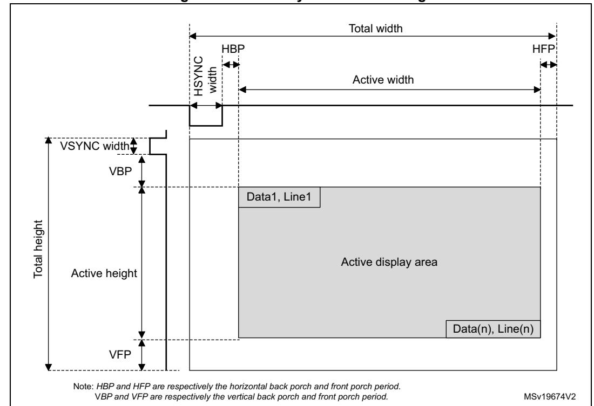
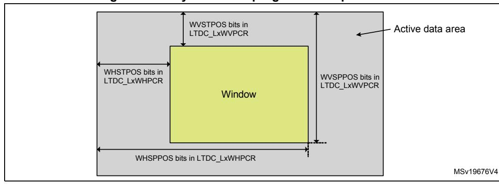
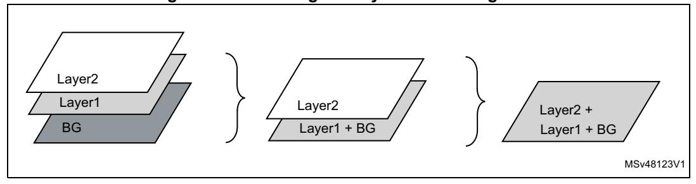

# **33 LCD-TFT display controller (LTDC)**

# **33.1 Introduction**

The LCD-TFT (liquid crystal display - thin film transistor) display controller provides a parallel digital RGB (red, green, blue) and signals for horizontal, vertical synchronization, pixel clock and data enable as output to interface directly to a variety of LCD and TFT panels.

# **33.2 LTDC main features**

- 24-bit RGB parallel pixel output; 8 bits-per-pixel (RGB888)
- 2 display layers with dedicated FIFO (64x64-bit)
- Color look-up table (CLUT) up to 256 color (256x24-bit) per layer
- Programmable timings for different display panels
- Programmable background color
- Programmable polarity for HSYNC, VSYNC and data enable
- Up to 8 input color formats selectable per layer:
  - ARGB8888
  - RGB888
  - RGB565
  - ARGB1555
  - ARGB4444
  - L8 (8-bit luminance or CLUT)
  - AL44 (4-bit alpha + 4-bit luminance)
  - AL88 (8-bit alpha + 8-bit luminance)
- Pseudo-random dithering output for low bits per channel
  - Dither width 2 bits for red, green, blue
- Flexible blending between two layers using alpha value (per pixel or constant)
- Color keying (transparency color)
- Programmable window position and size
- Supports thin film transistor (TFT) color displays
- AXI master interface with burst of 16 double-words
- Up to 4 programmable interrupt events

# **33.3 LTDC functional description**

## **33.3.1 LTDC block diagram**

**Figure 250. LTDC block diagram**  MSv66938V1 (1) PFC: pixel format converter, performing the pixel format conversion from the selected input pixel format of a layer to words. AXI clock domain Pixel clock domain 64-bit AXI bus ltdc\_aclk 32-bit APB bus ltdc\_it Layer 1 FIFO Blending unit AXI master APB slave ltdc\_err\_it PFC(1) Layer 2 FIFO PFC ltdc\_li\_it ltdc\_pclk ltdc\_ker\_ck Dithering unit Timing generator LCD\_R[7:0] LCD\_G[7:0] LCD\_B[7:0] LCD\_CLK LCD\_VSYNC LCD\_HSYNC LCD\_DE Configuration and status registers APB clock domain

## **33.3.2 LTDC pins and internal signals**

The table below summarizes the LTDC signal interface.

| LCD-TFT signals | Signal type | Description                |
|-----------------|-------------|----------------------------|
| LCD_CLK         | Output      | Clock output               |
| LCD_HSYNC       | Output      | Horizontal synchronization |
| LCD_VSYNC       | Output      | Vertical synchronization   |
| LCD_DE          | Output      | Not data enable            |
| LCD_R[7:0]      | Output      | 8-bit Red data             |
| LCD_G[7:0]      | Output      | 8-bit Green data           |
| LCD_B[7:0]      | Output      | 8-bit Blue data            |

**Table 272. LTDC external pins** 

The LTDC pins must be configured by the user application. The unused pins can be used for other purposes.

For LTDC outputs up to 24 bits (RGB888), if less than 8 bpp are used to output for example RGB565 or RGB666 to interface on 16- or 18-bit displays, the RGB display data lines must be connected to the MSB of the LTDC RGB data lines.

As an example, in the case of an LTDC interfacing with a RGB565 16-bit display, the LTDC display R[4:0], G[5:0] and B[4:0] data lines pins must be connected to the LCD\_R[7:3], LCD\_G[7:2] and LCD\_B[7:3] pins.

The internal signals of the LTDC are given in the table below.

**Table 273. LTDC internal signals** 

| Names       | Signal type | Description                                                 |  |
|-------------|-------------|-------------------------------------------------------------|--|
| ltdc_aclk   | Input       | LTDC AXI clock                                              |  |
| ltdc_pclk   | Input       | LTDC APB clock for register access                          |  |
| ltdc_ker_ck | Input       | LTDC kernel clock used for LCD_CLK (pixel clock) generation |  |
| ltdc_li_it  | Output      | LTDC line interrupt trigger for MDMA                        |  |
| ltdc_it     | Output      | LTDC global interrupt request                               |  |
| ltdc_err_it | Output      | LTDC global error interrupt request                         |  |

## **33.3.3 LTDC reset and clocks**

The LTDC controller peripheral uses the following clock domains:

- AXI clock domain (ltdc\_aclk)
  - This domain contains the LTDC AXI master interface for data transfer from the memories to the layer FIFO and the frame-buffer configuration register.
- APB clock domain (ltdc\_pclk)
  - This domain contains the global configuration registers and the interrupt register.
- Pixel clock domain (LCD\_CLK)

This domain contains the pixel data generation, the layer configuration register as well as the LTDC interface signal generator. The LCD\_CLK output must be configured following the panel requirements. The LCD\_CLK is generated from a specific PLL output (refer to the reset and clock control section).

The table below summarizes the clock domain for each register.

**Table 274. Clock domain for each register** 

| LTDC register | Clock domain |  |
|---------------|--------------|--|
| LTDC_LxCR     |              |  |
| LTDC_LxCFBAR  |              |  |
| LTDC_LxCFBLR  | ltdc_aclk    |  |
| LTDC_LxCFBLNR |              |  |
| LTDC_SRCR     |              |  |
| LTDC_IER      |              |  |
| LTDC_ISR      | ltdc_pclk    |  |
| LTDC_ICR      |              |  |

**Table 274. Clock domain for each register (continued)**

| LTDC register | Clock domain          |
|---------------|-----------------------|
| LTDC_SSCR     |                       |
| LTDC_BPCR     |                       |
| LTDC_AWCR     |                       |
| LTDC_TWCR     |                       |
| LTDC_GCR      |                       |
| LTDC_BCCR     |                       |
| LTDC_LIPCR    |                       |
| LTDC_CPSR     |                       |
| LTDC_CDSR     | Pixel clock (LCD_CLK) |
| LTDC_LxWHPCR  |                       |
| LTDC_LxWVPCR  |                       |
| LTDC_LxCKCR   |                       |
| LTDC_LxPFCR   |                       |
| LTDC_LxCACR   |                       |
| LTDC_LxDCCR   |                       |
| LTDC_LxBFCR   |                       |
| LTDC_LxCLUTWR |                       |

Care must be taken while accessing the LTDC registers, the APB bus is stalled during the access for a given time period (see the table below).

**Table 275. LTDC register access and update durations** 

|                                   | Register clock domain         |               |                                  |  |  |
|-----------------------------------|-------------------------------|---------------|----------------------------------|--|--|
|                                   | AXI domain                    | APB domain    | Pixel clock domain               |  |  |
| Register read access duration  | 7 x ltdc_pclk + 5 x ltdc_aclk | 7 x ltdc_pclk | 7 x ltdc_pclk + 5 x ltdc_ker_clk |  |  |
| Register write access duration | 6 x ltdc_pclk + 5 x ltdc_aclk | 6 x ltdc_pclk | 6 x ltdc_pclk + 5 x ltdc_ker_clk |  |  |

The LTDC controller can be reset by setting the corresponding bit in the RCC. It resets the three clock domains.

# **33.4 LTDC programmable parameters**

The LTDC controller provides flexible configurable parameters. It can be enabled or disabled through the LTDC\_GCR register.

## **33.4.1 LTDC global configuration parameters**

### **Synchronous timings**

The figure below presents the configurable timing parameters generated by the synchronous timings generator block presented in the block diagram *[Figure 250](#page-1-0)*. It generates the horizontal and vertical synchronization timings panel signals, the pixel clock and the data enable signals.

**Figure 251. LTDC synchronous timings**

The LTDC programmable synchronous timings are the following:

- HSYNC and VSYNC width: horizontal and vertical synchronization width, configured by programming a value of HSYNC width - 1 and VSYNC width - 1 in the LTDC\_SSCR register
- HBP and VBP: horizontal and vertical synchronization back porch width, configured by programming the accumulated value HSYNC width + HBP - 1 and the accumulated value VSYNC width + VBP - 1 in the LTDC\_BPCR register.
- Active width and active height: the active width and active height are configured by programming the accumulated value HSYNC width + HBP + active width - 1 and the

- accumulated value VSYNC width + VBP + active height 1 in the LTDC\_AWCR register.
- Total width: the total width is configured by programming the accumulated value HSYNC width + HBP + active width + HFP - 1 in the LTDC\_TWCR register. The HFP is the horizontal front porch period.
- Total height: the total height is configured by programming the accumulated value VSYNC height + VBP + active height + VFP - 1 in the LTDC\_TWCR register. The VFP is the vertical front porch period.

*Note: When the LTDC is enabled, the timings generated start with X/Y = 0/0 position as the first horizontal synchronization pixel in the vertical synchronization area and following the back porch, active data display area and the front porch.*

> *When the LTDC is disabled, the timing generator block is reset to X = total width - 1, Y = total height - 1 and held the last pixel before the vertical synchronization phase and the FIFO are flushed. Therefore only blanking data is output continuously.*

### **Example of synchronous timings configuration**

LTDC timings (must be extracted from panel datasheet):

- horizontal and vertical synchronization width: 0xA pixels and 0x2 lines
- horizontal and vertical back porch: 0x14 pixels and 0x2 lines
- active width and active height: 0x140 pixels, 0xF0 lines (320x240)
- horizontal front porch: 0xA pixels
- vertical front porch: 0x4 lines

The programmed values in the LTDC timings registers are:

- LTDC\_SSCR register to be programmed to 0x00090001 (HSW[11:0] is 0x9 and VSH[10:0] is 0x1)
- LTDC\_BPCR register to be programmed to 0x001D0003 (AHBP[11:0] is 0x1D (0xA+ 0x13) and AVBP[10:0]A is 0x3 (0x2 + 0x1))
- LTDC\_AWCR register to be programmed to 0x015D00F3 (AAW[11:0] is 0x15D (0xA +0x14 +0x13F) and AAH[10:0] is 0xF3 (0x2 + 0x2 + 0xEF))
- LTDC\_TWCR register to be programmed to 0x00000167 (TOTALW[11:0] is 0x167 (0xA +0x14 +0x140 + 0x9))
- LTDC\_THCR register to be programmed to 0x000000F7 (TOTALH[10:0]is 0xF7 (0x2 +0x2 + 0xF0 + 3))

### **Programmable polarity**

The horizontal and vertical synchronization, data enable and pixel clock output signals polarity can be programmed to active high or active low through the LTDC\_GCR register.

### **Background color**

A constant background color (RGB888) can programmed through the LTDC\_BCCR register. It is used for blending with the bottom layer.

### **Dithering**

The dithering pseudo-random technique using an LFSR is used to add a small random value (threshold) to each pixel color channel (R, G or B) value, thus rounding up the MSB in

some cases when displaying a 24-bit data on 18-bit display. Thus the dithering technique is used to round data which is different from one frame to the other.

The dithering pseudo-random technique is the same as comparing LSBs against a threshold value and adding a 1 to the MSB part only, if the LSB part is ≥ the threshold. The LSBs are typically dropped once dithering was applied.

The width of the added pseudo-random value is two bits for each color channel: two bits for red, two bits for green and two bits for blue.

Once the LTDC is enabled, the LFSR starts running with the first active pixel and it is kept running even during blanking periods and when dithering is switched off. If the LTDC is disabled, the LFSR is reset.

The dithering can be switched on and off on the fly through the LTDC\_GCR register.

### **Reload shadow registers**

Some configuration registers are shadowed. The shadow registers values can be reloaded immediately to the active registers when writing to these registers or at the beginning of the vertical blanking period following the configuration in the LTDC\_SRCR register. If the immediate reload configuration is selected, the reload must be activated only when all new registers have been written.

The shadow registers must not be modified again before the reload is done. Reading from the shadow registers returns the actual active value. The new written value can only be read after the reload has taken place.

A register reload interrupt can be generated if enabled in the LTDC\_IER register.

The shadowed registers are all Layer1 and Layer2 registers except LTDC\_LxCLUTWR.

### **Interrupt generation event**

Refer to *[Section 33.5: LTDC interrupts](#page-10-0)* for the interrupt configuration.

## **33.4.2 Layer programmable parameters**

Up to two layers can be enabled, disabled and configured separately. The layer display order is fixed and it is bottom up. If two layers are enabled, the layer2 is the top displayed window.

### **Windowing**

Every layer can be positioned and resized and it must be inside the active display area.

The window position and size are configured through the top-left and bottom-right X/Y positions and the internal timing generator that includes the synchronous, back porch size and the active data area. Refer to LTDC\_LxWHPCR and LTDC\_WVPCR registers.

The programmable layer position and size defines the first/last visible pixel of a line and the first/last visible line in the window. It allows to display either the full image frame or only a part of the image frame (see *[Figure 252](#page-7-0)*):

- The first and the last visible pixel in the layer are set by configuring the WHSTPOS[11:0] and WHSPPOS[11:0] in the LTDC\_LxWHPCR register.
- The first and the last visible lines in the layer are set by configuring the WVSTPOS[10:0] and WVSPPOS[10:0] in the LTDC\_LxWVPCR register.

RM0399 Rev 4 1239/3556

**Figure 252. Layer window programmable parameters**

### **Pixel input format**

The programmable pixel format is used for the data stored in the frame buffer of a layer.

Up to eight input pixel formats can be configured for every layer through the LTDC\_LxPFCR register

The pixel data is read from the frame buffer and then transformed to the internal 8888 (ARGB) format as follows: components having a width of less than 8 bits get expanded to 8 bits by bit replication. The selected bit range is concatenated multiple times until it is longer than 8 bits. Of the resulting vector, the 8 MSB bits are chosen. Example: 5 bits of an RGB565 red channel become (bit positions) 43210432 (the three LSBs are filled with the three MSBs of the five bits)

The table below describes the pixel data mapping depending on the selected format.

| ARGB8888            |                     |                        |                     |  |  |  |
|---------------------|---------------------|------------------------|---------------------|--|--|--|
| @+3                 | @+2 @+1          |                        | @                   |  |  |  |
| Ax[7:0]             | Rx[7:0]             | Gx[7:0]                | Bx[7:0]             |  |  |  |
| @+7                 | @+6                 | @+5                    | @+4                 |  |  |  |
| Ax+1[7:0]           | Rx+1[7:0]           | Gx+1[7:0] Bx+1[7:0] |                     |  |  |  |
| RGB888              |                     |                        |                     |  |  |  |
| @+3                 | @+2 @+1          |                        | @                   |  |  |  |
| Bx+1[7:0]           | Rx[7:0]             | Gx[7:0]                | Bx[7:0]             |  |  |  |
| @+7                 | @+6                 | @+5                    | @+4                 |  |  |  |
| Gx+2[7:0]           | Bx+2[7:0]           | Rx+1[7:0] Gx+1[7:0] |                     |  |  |  |
| RGB565              |                     |                        |                     |  |  |  |
| @+3                 | @+2                 | @+1                    | @                   |  |  |  |
| Rx+1[4:0] Gx+1[5:3] | Gx+1[2:0] Bx+1[4:0] | Rx[4:0] Gx[5:3]        | Gx[2:0] Bx[4:0]     |  |  |  |
| @+7                 | @+6                 | @+5                    | @+4                 |  |  |  |
| Rx+3[4:0] Gx+3[5:3] | Gx+3[2:0] Bx+3[4:0] | Rx+2[4:0] Gx+2[5:3]    | Gx+2[2:0] Bx+2[4:0] |  |  |  |
| ARGB1555            |                     |                        |                     |  |  |  |

**Table 276. Pixel data mapping versus color format** 

| @+3 Ax+1[0]Rx+1[4:0] Gx+1[4:3] | @+2 Gx+1[2:0] Bx+1[4:0] | @+1 Ax[0] Rx[4:0] Gx[4:3]         | @ Gx[2:0] Bx[4:0]       |
|--------------------------------------|----------------------------|--------------------------------------|----------------------------|
| @+7 Ax+3[0]Rx+3[4:0] Gx+3[4:3] | @+6 Gx+3[2:0] Bx+3[4:0] | @+5 Ax+2[0]Rx+2[4:0]Gx+2[4: 3] | @+4 Gx+2[2:0] Bx+2[4:0] |
|                                      |                            | ARGB4444                             |                            |
| @+3                                  | @+2                        | @+1                                  | @                          |
| Ax+1[3:0]Rx+1[3:0]                   | Gx+1[3:0] Bx+1[3:0]        | Ax[3:0] Rx[3:0]                      | Gx[3:0] Bx[3:0]            |
| @+7                                  | @+6                        | @+5                                  | @+4                        |
| Ax+3[3:0]Rx+3[3:0]                   | Gx+3[3:0] Bx+3[3:0]        | Ax+2[3:0]Rx+2[3:0]                   | Gx+2[3:0] Bx+2[3:0]        |
|                                      |                            | L8                                   |                            |
| @+3                                  | @+2                        | @+1                                  | @                          |
| Lx+3[7:0]                            | Lx+2[7:0]                  | Lx+1[7:0]                            | Lx[7:0]                    |
| @+7                                  | @+6                        | @+5                                  | @+4                        |
| Lx+7[7:0]                            | Lx+6[7:0]                  | Lx+5[7:0]                            | Lx+4[7:0]                  |
|                                      |                            | AL44                                 |                            |
| @+3                                  | @+2                        | @+1                                  | @                          |
| Ax+3[3:0] Lx+3[3:0]                  | Ax+2[3:0] Lx+2[3:0]        | Ax+1[3:0] Lx+1[3:0]                  | Ax[3:0] Lx[3:0]            |
| @+7                                  | @+6                        | @+5                                  | @+4                        |
| Ax+7[3:0] Lx+7[3:0]                  | Ax+6[3:0] Lx+6[3:0]        | Ax+5[3:0] Lx+5[3:0]                  | Ax+4[3:0] Lx+4[3:0]        |
|                                      |                            | AL88                                 |                            |
| @+3                                  | @+2                        | @+1                                  | @                          |
| Ax+1[7:0]                            | Lx+1[7:0]                  | Ax[7:0]                              | Lx[7:0]                    |
| @+7                                  | @+6                        | @+5                                  | @+4                        |
| Ax+3[7:0]                            | Lx+3[7:0]                  | Ax+2[7:0]                            | Lx+2[7:0]                  |

**Table 276. Pixel data mapping versus color format (continued)**

## **Color look-up table (CLUT)**

The CLUT can be enabled at run-time for every layer through the LTDC\_LxCR register and it is only useful in case of indexed color when using the L8, AL44 and AL88 input pixel format.

First, the CLUT must be loaded with the R, G and B values that replace the original R, G, B values of that pixel (indexed color). Each color (RGB value) has its own address that is the position within the CLUT.

The R, G and B values and their own respective address are programmed through the LTDC\_LxCLUTWR register:

• In case of L8 and AL88 input pixel format, the CLUT must be loaded by 256 colors. The address of each color is configured in the CLUTADD bits in the LTDC\_LxCLUTWR register.

RM0399 Rev 4 1241/3556

- In case of AL44 input pixel format, the CLUT must be loaded by only16 colors. The address of each color must be filled by replicating the 4-bit L channel to 8-bit as follows:
  - L0 (indexed color 0), at address 0x00
  - L1, at address 0x11
  - L2, at address 0x22
  - .....
  - L15, at address 0xFF

### **Color frame buffer address**

Every layer has a start address for the color frame buffer configured through the LTDC\_LxCFBAR register.

When a layer is enabled, the data is fetched from the color frame buffer.

### **Color frame buffer length**

Every layer has a total line length setting for the color frame buffer in bytes and a number of lines in the frame buffer configurable in the LTDC\_LxCFBLR and LTDC\_LxCFBLNR register respectively.

The line length and the number of lines settings are used to stop the prefetching of data to the layer FIFO at the end of the frame buffer:

- If it is set to less bytes than required, a FIFO underrun interrupt is generated if it has been previously enabled.
- If it is set to more bytes than actually required, the useless data read from the FIFO is discarded. The useless data is not displayed.

### **Color frame buffer pitch**

Every layer has a configurable pitch for the color frame buffer, that is the distance between the start of one line and the beginning of the next line in bytes. It is configured through the LTDC\_LxCFBLR register.

### **Layer blending**

The blending is always active and the two layers can be blended following the blending factors configured through the LTDC\_LxBFCR register.

The blending order is fixed and it is bottom up. If two layers are enabled, first the Layer1 is blended with the Background color, then the layer2 is blended with the result of blended color of layer1 and the background. Refer to the figure below.

**Figure 253. Blending two layers with background**

### **Default color**

Every layer can have a default color in the format ARGB which is used outside the defined layer window or when a layer is disabled.

The default color is configured through the LTDC\_LxDCCR register.

The blending is always performed between the two layers even when a layer is disabled. To avoid displaying the default color when a layer is disabled, keep the blending factors of this layer in the LTDC\_LxBFCR register to their reset value.

### **Color keying**

A color key (RGB) can be configured to be representative for a transparent pixel.

If the color keying is enabled, the current pixels (after format conversion and before CLUT respectively blending) are compared to the color key. If they match for the programmed RGB value, all channels (ARGB) of that pixel are set to 0.

The color key value can be configured and used at run-time to replace the pixel RGB value.

The color keying is enabled through the LTDC\_LxCKCR register.

The color keying is configured through the LTDC\_LxCKCR register. The programmed value depends on the pixel format as it is compared to current pixel after pixel format conversion to ARGB888.

Example: if the a mid-yellow color (50 % red + 50 % green) is used as the transparent color key:

- In RGB565, the mid-yellow color is 0x8400. Set the LTDC\_LxCKCR to 0x848200.
- In ARGB8888, the mid-yellow color is 0x808000. Set LTDC\_LxCKCR to 0x808000.
- In all CLUT-based color modes (L8, AL88, AL44), set one of the palette entry to the mid-yellow color 0x808000 and set the LTDC\_LxCKCR to 0x808000.

# **33.5 LTDC interrupts**

The LTDC provides four maskable interrupts logically ORed to two interrupt vectors.

The interrupt sources can be enabled or disabled separately through the LTDC\_IER register. Setting the appropriate mask bit to 1 enables the corresponding interrupt.

The two interrupts are generated on the following events:

- Line interrupt: generated when a programmed line is reached. The line interrupt position is programmed in the LTDC\_LIPCR register
- Register reload interrupt: generated when the shadow registers reload is performed during the vertical blanking period
- FIFO underrun interrupt: generated when a pixel is requested from an empty layer FIFO
- Transfer error interrupt: generated when an AXI bus error occurs during data transfer

These interrupt events are connected to the NVIC controller as described in the figure below.

**Figure 254. Interrupt events**

**Table 277. LTDC interrupt requests** 

| Interrupt event | Event flag | Enable control bit |
|-----------------|------------|--------------------|
| Line            | LIF        | LIE                |
| Register reload | RRIF       | RRIEN              |
| FIFO underrun   | FUDERRIF   | FUDERRIE           |
| Transfer error  | TERRIF     | TERRIE             |

# **33.6 LTDC programming procedure**

The steps listed below are needed to program the LTDC:

- 1. Enable the LTDC clock in the RCC register.
- 2. Configure the required pixel clock following the panel datasheet.
- 3. Configure the synchronous timings: VSYNC, HSYNC, vertical and horizontal back porch, active data area and the front porch timings following the panel datasheet as described in the *[Section](#page-4-0) 33.4.1*.
- 4. Configure the synchronous signals and clock polarity in the LTDC\_GCR register.
- 5. If needed, configure the background color in the LTDC\_BCCR register.
- 6. Configure the needed interrupts in the LTDC\_IER and LTDC\_LIPCR register.
- 7. Configure the layer1/2 parameters by:
  - programming the layer window horizontal and vertical position in the LTDC\_LxWHPCR and LTDC\_WVPCR registers. The layer window must be in the active data area.
  - programming the pixel input format in the LTDC\_LxPFCR register
  - programming the color frame buffer start address in the LTDC\_LxCFBAR register
  - programming the line length and pitch of the color frame buffer in the LTDC\_LxCFBLR register
  - programming the number of lines of the color frame buffer in the LTDC\_LxCFBLNR register
  - if needed, loading the CLUT with the RGB values and its address in the LTDC\_LxCLUTWR register
  - If needed, configuring the default color and the blending factors respectively in the LTDC\_LxDCCR and LTDC\_LxBFCR registers

- 8. Enable layer1/2 and if needed the CLUT in the LTDC\_LxCR register.
- 9. If needed, enable dithering and color keying respectively in the LTDC\_GCR and LTDC\_LxCKCR registers. They can be also enabled on the fly.
- 10. Reload the shadow registers to active register through the LTDC\_SRCR register.
- 11. Enable the LTDC controller in the LTDC\_GCR register.
- 12. All layer parameters can be modified on the fly except the CLUT. The new configuration must be either reloaded immediately or during vertical blanking period by configuring the LTDC\_SRCR register.

*Note: All layer's registers are shadowed. Once a register is written, it must not be modified again before the reload has been done. Thus, a new write to the same register overrides the previous configuration if not yet reloaded.*

# **33.7 LTDC registers**

## **33.7.1 LTDC synchronization size configuration register (LTDC\_SSCR)**

Address offset: 0x008 Reset value: 0x0000 0000

This register defines the number of horizontal synchronization pixels minus 1 and the number of vertical synchronization lines minus 1. Refer to *[Figure 251](#page-4-1)* and *[Section 33.4](#page-4-2)* for an example of configuration.

| 31   | 30   | 29   | 28   | 27   | 26 | 25 | 24 | 23 | 22 | 21        | 20 | 19 | 18 | 17 | 16 |
|------|------|------|------|------|----|----|----|----|----|-----------|----|----|----|----|----|
| Res. | Res. | Res. | Res. |      |    |    |    |    |    | HSW[11:0] |    |    |    |    |    |
|      |      |      |      | rw   | rw | rw | rw | rw | rw | rw        | rw | rw | rw | rw | rw |
|      |      |      |      |      |    |    |    |    |    |           |    |    |    |    |    |
| 15   | 14   | 13   | 12   | 11   | 10 | 9  | 8  | 7  | 6  | 5         | 4  | 3  | 2  | 1  | 0  |
| Res. | Res. | Res. | Res. | Res. |    |    |    |    |    | VSH[10:0] |    |    |    |    |    |

Bits 31:28 Reserved, must be kept at reset value.

Bits 27:16 **HSW[11:0]**: Horizontal synchronization width (in units of pixel clock period) This bitfield defines the number of Horizontal Synchronization pixel minus 1.

Bits 15:11 Reserved, must be kept at reset value.

Bits 10:0 **VSH[10:0]**: Vertical synchronization height (in units of horizontal scan line) This bitfield defines the vertical Synchronization height minus 1. It represents the number of horizontal synchronization lines.

## **33.7.2 LTDC back porch configuration register (LTDC\_BPCR)**

Address offset: 0x00C Reset value: 0x0000 0000

This register defines the accumulated number of horizontal synchronization and back porch pixels minus 1 (HSYNC width + HBP - 1) and the accumulated number of vertical

RM0399 Rev 4 1245/3556

synchronization and back porch lines minus 1 (VSYNC height + VBP - 1). Refer to *[Figure 251](#page-4-1)* and *[Section 33.4](#page-4-2)* for an example of configuration.

| 31   | 30   | 29   | 28   | 27   | 26 | 25 | 24 | 23 | 22 | 21         | 20 | 19 | 18 | 17 | 16 |
|------|------|------|------|------|----|----|----|----|----|------------|----|----|----|----|----|
| Res. | Res. | Res. | Res. |      |    |    |    |    |    | AHBP[11:0] |    |    |    |    |    |
|      |      |      |      | rw   | rw | rw | rw | rw | rw | rw         | rw | rw | rw | rw | rw |
|      |      |      |      |      |    |    |    |    |    |            |    |    |    |    |    |
| 15   | 14   | 13   | 12   | 11   | 10 | 9  | 8  | 7  | 6  | 5          | 4  | 3  | 2  | 1  | 0  |
| Res. | Res. | Res. | Res. | Res. |    |    |    |    |    | AVBP[10:0] |    |    |    |    |    |

Bits 31:28 Reserved, must be kept at reset value.

Bits 27:16 **AHBP[11:0]**: Accumulated horizontal back porch (in units of pixel clock period)

These bits defines the accumulated horizontal back porch width that includes the horizontal synchronization and horizontal back porch pixels minus 1.

The horizontal back porch is the period between horizontal synchronization going inactive and the start of the active display part of the next scan line.

Bits 15:11 Reserved, must be kept at reset value.

Bits 10:0 **AVBP[10:0]:** Accumulated Vertical back porch (in units of horizontal scan line)

These bits define the accumulated vertical back porch width that includes the vertical synchronization and vertical back porch lines minus 1.

The vertical back porch is the number of horizontal scan lines at a start of frame to the start of the first active scan line of the next frame.

## **33.7.3 LTDC active width configuration register (LTDC\_AWCR)**

Address offset: 0x010 Reset value: 0x0000 0000

This register defines the accumulated number of horizontal synchronization, back porch and active pixels minus 1 (HSYNC width + HBP + active width - 1) and the accumulated number of vertical synchronization, back porch lines and active lines minus 1

(VSYNC height + VBP + active height - 1). Refer to *[Figure 251](#page-4-1)* and *[Section 33.4](#page-4-2)* for an example of configuration.

| 31   | 30   | 29   | 28   | 27   | 26 | 25 | 24 | 23 | 22 | 21        | 20 | 19 | 18 | 17 | 16 |
|------|------|------|------|------|----|----|----|----|----|-----------|----|----|----|----|----|
| Res. | Res. | Res. | Res. |      |    |    |    |    |    | AAW[11:0] |    |    |    |    |    |
|      |      |      |      | rw   | rw | rw | rw | rw | rw | rw        | rw | rw | rw | rw | rw |
| 15   | 14   | 13   | 12   | 11   | 10 | 9  | 8  | 7  | 6  | 5         | 4  | 3  | 2  | 1  | 0  |
| Res. | Res. | Res. | Res. | Res. |    |    |    |    |    | AAH[10:0] |    |    |    |    |    |
|      |      |      |      |      | rw | rw | rw | rw | rw | rw        | rw | rw | rw | rw | rw |

Bits 31:28 Reserved, must be kept at reset value.

Bits 27:16 **AAW[11:0]**: Accumulated active width (in units of pixel clock period)

These bits define the accumulated active width which includes the horizontal synchronization, horizontal back porch and active pixels minus 1.

The active width is the number of pixels in active display area of the panel scan line. Refer to device datasheet for maximum active width supported following maximum pixel clock.

Bits 15:11 Reserved, must be kept at reset value.

Bits 10:0 **AAH[10:0]**: Accumulated active height (in units of horizontal scan line)

These bits define the accumulated height which includes the vertical synchronization, vertical back porch and the active height lines minus 1. The active height is the number of active lines in the panel.

Refer to device datasheet for maximum active height supported following maximum pixel clock.

## **33.7.4 LTDC total width configuration register (LTDC\_TWCR)**

Address offset: 0x014 Reset value: 0x0000 0000

This register defines the accumulated number of horizontal synchronization, back porch, active and front porch pixels minus 1 (HSYNC width + HBP + active width + HFP - 1) and the accumulated number of vertical synchronization, back porch lines, active and front lines minus 1 (VSYNC height + VBP + active height + VFP - 1). Refer to *[Figure 251](#page-4-1)* and *[Section 33.4](#page-4-2)* for an example of configuration.

| 31   | 30   | 29   | 28   | 27   | 26 | 25 | 24 | 23 | 22 | 21           | 20 | 19 | 18 | 17 | 16 |
|------|------|------|------|------|----|----|----|----|----|--------------|----|----|----|----|----|
| Res. | Res. | Res. | Res. |      |    |    |    |    |    | TOTALW[11:0] |    |    |    |    |    |
|      |      |      |      | rw   | rw | rw | rw | rw | rw | rw           | rw | rw | rw | rw | rw |
|      |      |      |      |      |    |    |    |    |    |              |    |    |    |    |    |
| 15   | 14   | 13   | 12   | 11   | 10 | 9  | 8  | 7  | 6  | 5            | 4  | 3  | 2  | 1  | 0  |
| Res. | Res. | Res. | Res. | Res. |    |    |    |    |    | TOTALH[10:0] |    |    |    |    |    |

Bits 31:28 Reserved, must be kept at reset value.

Bits 27:16 **TOTALW[11:0]**: Total width (in units of pixel clock period)

These bits define the accumulated total width which includes the horizontal synchronization, horizontal back porch, active width and horizontal front porch pixels minus 1.

Bits 15:11 Reserved, must be kept at reset value.

Bits 10:0 **TOTALH[10:0]**: Total height (in units of horizontal scan line)

These bits define the accumulated height which includes the vertical synchronization, vertical back porch, the active height and vertical front porch height lines minus 1.

## **33.7.5 LTDC global control register (LTDC\_GCR)**

Address offset: 0x018

Reset value: 0x0000 2220

This register defines the global configuration of the LCD-TFT controller.

| 31   | 30                      | 29 | 28 | 27   | 26   | 25       | 24   | 23   | 22   | 21       | 20   | 19   | 18   | 17   | 16         |
|------|-------------------------|----|----|------|------|----------|------|------|------|----------|------|------|------|------|------------|
|      | HSPOL VSPOL DEPOL PCPOL |    |    | Res. | Res. | Res.     | Res. | Res. | Res. | Res.     | Res. | Res. | Res. | Res. | DEN        |
| rw   | rw                      | rw | rw |      |      |          |      |      |      |          |      |      |      |      | rw         |
| 15   | 14                      | 13 | 12 | 11   | 10   | 9        | 8    | 7    | 6    | 5        | 4    | 3    | 2    | 1    | 0          |
| Res. | DRW[2:0]                |    |    | Res. |      | DGW[2:0] |      | Res. |      | DBW[2:0] |      | Res. | Res. | Res. | LTDCE N |
|      | r                       | r  | r  |      | r    | r        | r    |      | r    | r        | r    |      |      |      | rw         |

#### Bit 31 **HSPOL**: Horizontal synchronization polarity

This bit is set and cleared by software.

- 0: Horizontal synchronization polarity is active low.
- 1: Horizontal synchronization polarity is active high.

#### Bit 30 **VSPOL**: Vertical synchronization polarity

This bit is set and cleared by software.

- 0: Vertical synchronization is active low.
- 1: Vertical synchronization is active high.

#### Bit 29 **DEPOL**: Not data enable polarity

This bit is set and cleared by software.

- 0: Not data enable polarity is active low.
- 1: Not data enable polarity is active high.

#### Bit 28 **PCPOL**: Pixel clock polarity

This bit is set and cleared by software.

- 0: Pixel clock polarity is active low.
- 1: Pixel clock is active high.
- Bits 27:17 Reserved, must be kept at reset value.
  - Bit 16 **DEN**: Dither enable

This bit is set and cleared by software.

- 0: Dither disabled
- 1: Dither enabled
- Bit 15 Reserved, must be kept at reset value.
- Bits 14:12 **DRW[2:0]**: Dither red width

These bits return the dither red bits.

- Bit 11 Reserved, must be kept at reset value.
- Bits 10:8 **DGW[2:0]**: Dither green width

These bits return the dither green bits.

- Bit 7 Reserved, must be kept at reset value.
- Bits 6:4 **DBW[2:0]**: Dither blue width

These bits return the dither blue bits.

- Bits 3:1 Reserved, must be kept at reset value.
  - Bit 0 **LTDCEN**: LCD-TFT controller enable

This bit is set and cleared by software.

0: LTDC disabled

1: LTDC enabled

## **33.7.6 LTDC shadow reload configuration register (LTDC\_SRCR)**

Address offset: 0x024

Reset value: 0x0000 0000

This register allows to reload either immediately or during the vertical blanking period, the shadow registers values to the active registers. The shadow registers are all Layer1 and Layer2 registers except the LTDC\_L1CLUTWR and the LTDC\_L2CLUTWR.

The shadow registers read back the active values. Until the reload has been done, the 'old' value is read.

| 31   | 30   | 29   | 28   | 27   | 26   | 25   | 24   | 23   | 22   | 21   | 20   | 19   | 18   | 17   | 16   |
|------|------|------|------|------|------|------|------|------|------|------|------|------|------|------|------|
| Res. | Res. | Res. | Res. | Res. | Res. | Res. | Res. | Res. | Res. | Res. | Res. | Res. | Res. | Res. | Res. |
|      |      |      |      |      |      |      |      |      |      |      |      |      |      |      |      |
| 15   | 14   | 13   | 12   | 11   | 10   | 9    | 8    | 7    | 6    | 5    | 4    | 3    | 2    | 1    | 0    |
| Res. | Res. | Res. | Res. | Res. | Res. | Res. | Res. | Res. | Res. | Res. | Res. | Res. | Res. | VBR  | IMR  |
|      |      |      |      |      |      |      |      |      |      |      |      |      |      | rw   | rw   |

Bits 31:2 Reserved, must be kept at reset value.

#### Bit 1 **VBR**: Vertical blanking reload

This bit is set by software and cleared only by hardware after reload (it cannot be cleared through register write once it is set).

0: No effect

1: The shadow registers are reloaded during the vertical blanking period (at the beginning of the first line after the active display area).

### Bit 0 **IMR**: Immediate reload

This bit is set by software and cleared only by hardware after reload.

0: No effect

1: The shadow registers are reloaded immediately.

## **33.7.7 LTDC background color configuration register (LTDC\_BCCR)**

Address offset: 0x02C

Reset value: 0x0000 0000

This register defines the background color (RGB888).

| 31   | 30           | 29   | 28   | 27   | 26   | 25   | 24   | 23         | 22          | 21 | 20 | 19 | 18 | 17 | 16 |  |
|------|--------------|------|------|------|------|------|------|------------|-------------|----|----|----|----|----|----|--|
| Res. | Res.         | Res. | Res. | Res. | Res. | Res. | Res. | BCRED[7:0] |             |    |    |    |    |    |    |  |
|      |              |      |      |      |      |      |      | rw         | rw          | rw | rw | rw | rw | rw | rw |  |
| 15   | 14           | 13   | 12   | 11   | 10   | 9    | 8    | 7          | 6           | 5  | 4  | 3  | 2  | 1  | 0  |  |
|      | BCGREEN[7:0] |      |      |      |      |      |      |            | BCBLUE[7:0] |    |    |    |    |    |    |  |
| rw   | rw           | rw   | rw   | rw   | rw   | rw   | rw   | rw         | rw          | rw | rw | rw | rw | rw | rw |  |

Bits 31:24 Reserved, must be kept at reset value.

### Bits 23:16 **BCRED[7:0]**: Background color red value

These bits configure the background red value.

RM0399 Rev 4 1249/3556

Bits 15:8 **BCGREEN[7:0]**: Background color green value

These bits configure the background green value.

Bits 7:0 **BCBLUE[7:0]**: Background color blue value

These bits configure the background blue value.

## **33.7.8 LTDC interrupt enable register (LTDC\_IER)**

Address offset: 0x034

Reset value: 0x0000 0000

This register determines which status flags generate an interrupt request by setting the

corresponding bit to 1.

| 31   | 30   | 29   | 28   | 27   | 26   | 25   | 24   | 23   | 22   | 21   | 20   | 19   | 18         | 17   | 16   |
|------|------|------|------|------|------|------|------|------|------|------|------|------|------------|------|------|
| Res. | Res. | Res. | Res. | Res. | Res. | Res. | Res. | Res. | Res. | Res. | Res. | Res. | Res.       | Res. | Res. |
|      |      |      |      |      |      |      |      |      |      |      |      |      |            |      |      |
| 15   | 14   | 13   | 12   | 11   | 10   | 9    | 8    | 7    | 6    | 5    | 4    | 3    | 2          | 1    | 0    |
| Res. | Res. | Res. | Res. | Res. | Res. | Res. | Res. | Res. | Res. | Res. | Res. | RRIE | TERRI E | FUIE | LIE  |
|      |      |      |      |      |      |      |      |      |      |      |      | rw   | rw         | rw   | rw   |

Bits 31:4 Reserved, must be kept at reset value.

Bit 3 **RRIE**: Register reload interrupt enable

This bit is set and cleared by software.

0: Register reload interrupt disable

1: Register reload interrupt enable

Bit 2 **TERRIE**: Transfer error interrupt enable

This bit is set and cleared by software.

0: Transfer error interrupt disable

1: Transfer error interrupt enable

Bit 1 **FUIE**: FIFO underrun interrupt enable

This bit is set and cleared by software.

0: FIFO underrun interrupt disable

1: FIFO underrun Interrupt enable

Bit 0 **LIE**: Line interrupt enable

This bit is set and cleared by software.

0: Line interrupt disable

1: Line interrupt enable

## **33.7.9 LTDC interrupt status register (LTDC\_ISR)**

Address offset: 0x038

Reset value: 0x0000 0000

This register returns the interrupt status flag.

| 31   | 30   | 29   | 28   | 27   | 26   | 25   | 24   | 23   | 22   | 21   | 20   | 19   | 18         | 17   | 16   |
|------|------|------|------|------|------|------|------|------|------|------|------|------|------------|------|------|
| Res. | Res. | Res. | Res. | Res. | Res. | Res. | Res. | Res. | Res. | Res. | Res. | Res. | Res.       | Res. | Res. |
|      |      |      |      |      |      |      |      |      |      |      |      |      |            |      |      |
| 15   | 14   | 13   | 12   | 11   | 10   | 9    | 8    | 7    | 6    | 5    | 4    | 3    | 2          | 1    | 0    |
| Res. | Res. | Res. | Res. | Res. | Res. | Res. | Res. | Res. | Res. | Res. | Res. | RRIF | TERRI F | FUIF | LIF  |
|      |      |      |      |      |      |      |      |      |      |      |      | r    | r          | r    | r    |

Bits 31:4 Reserved, must be kept at reset value.

- Bit 3 **RRIF**: Register reload interrupt flag
  - 0: No register reload interrupt generated
  - 1: Register reload interrupt generated when a vertical blanking reload occurs (and the first line after the active area is reached)
- Bit 2 **TERRIF**: Transfer error interrupt flag
  - 0: No transfer error interrupt generated
  - 1: Transfer error interrupt generated when a bus error occurs
- Bit 1 **FUIF**: FIFO underrun interrupt flag
  - 0: No FIFO underrun interrupt generated
  - 1: FIFO underrun interrupt generated, if one of the layer FIFOs is empty and pixel data is read from the FIFO
- Bit 0 **LIF**: Line interrupt flag
  - 0: No line interrupt generated
  - 1: Line interrupt generated when a programmed line is reached

## **33.7.10 LTDC interrupt clear register (LTDC\_ICR)**

Address offset: 0x03C

Reset value: 0x0000 0000

| 31   | 30   | 29   | 28   | 27   | 26   | 25   | 24   | 23   | 22   | 21   | 20   | 19    | 18          | 17    | 16   |
|------|------|------|------|------|------|------|------|------|------|------|------|-------|-------------|-------|------|
| Res. | Res. | Res. | Res. | Res. | Res. | Res. | Res. | Res. | Res. | Res. | Res. | Res.  | Res.        | Res.  | Res. |
|      |      |      |      |      |      |      |      |      |      |      |      |       |             |       |      |
| 15   | 14   | 13   | 12   | 11   | 10   | 9    | 8    | 7    | 6    | 5    | 4    | 3     | 2           | 1     | 0    |
| Res. | Res. | Res. | Res. | Res. | Res. | Res. | Res. | Res. | Res. | Res. | Res. | CRRIF | CTERR IF | CFUIF | CLIF |
|      |      |      |      |      |      |      |      |      |      |      |      | w     | w           | w     | w    |

Bits 31:4 Reserved, must be kept at reset value.

Bit 3 **CRRIF**: Clear register reload interrupt flag

0: No effect

1: Clear the RRIF flag in the LTDC\_ISR register

RM0399 Rev 4 1251/3556

Bit 2 **CTERRIF**: Clear the transfer error interrupt flag

0: No effect

1: Clear the TERRIF flag in the LTDC\_ISR register.

Bit 1 **CFUIF**: Clear the FIFO underrun interrupt flag

0: No effect

1: Clear the FUDERRIF flag in the LTDC\_ISR register.

Bit 0 **CLIF**: Clear the line interrupt flag

0: No effect

1: Clear the LIF flag in the LTDC\_ISR register.

## **33.7.11 LTDC line interrupt position configuration register (LTDC\_LIPCR)**

Address offset: 0x040

Reset value: 0x0000 0000

This register defines the position of the line interrupt. The line value to be programmed depends on the timings parameters. Refer to *[Figure 251](#page-4-1)*.

| 31   | 30   | 29   | 28   | 27   | 26   | 25   | 24   | 23   | 22   | 21          | 20   | 19   | 18   | 17   | 16   |
|------|------|------|------|------|------|------|------|------|------|-------------|------|------|------|------|------|
| Res. | Res. | Res. | Res. | Res. | Res. | Res. | Res. | Res. | Res. | Res.        | Res. | Res. | Res. | Res. | Res. |
|      |      |      |      |      |      |      |      |      |      |             |      |      |      |      |      |
| 15   | 14   | 13   | 12   | 11   | 10   | 9    | 8    | 7    | 6    | 5           | 4    | 3    | 2    | 1    | 0    |
| Res. | Res. | Res. | Res. | Res. |      |      |      |      |      | LIPOS[10:0] |      |      |      |      |      |
|      |      |      |      |      | rw   | rw   | rw   | rw   | rw   | rw          | rw   | rw   | rw   | rw   | rw   |

Bits 31:11 Reserved, must be kept at reset value.

Bits 10:0 **LIPOS[10:0]**: Line interrupt position

These bits configure the line interrupt position.

## **33.7.12 LTDC current position status register (LTDC\_CPSR)**

Address offset: 0x044

Reset value: 0x0000 0000

| 31 | 30 | 29 | 28 | 27 | 26 | 25 | 24 | 23          | 22 | 21 | 20 | 19 | 18 | 17 | 16 |
|----|----|----|----|----|----|----|----|-------------|----|----|----|----|----|----|----|
|    |    |    |    |    |    |    |    | CXPOS[15:0] |    |    |    |    |    |    |    |
| r  | r  | r  | r  | r  | r  | r  | r  | r           | r  | r  | r  | r  | r  | r  | r  |
| 15 | 14 | 13 | 12 | 11 | 10 | 9  | 8  | 7           | 6  | 5  | 4  | 3  | 2  | 1  | 0  |
|    |    |    |    |    |    |    |    | CYPOS[15:0] |    |    |    |    |    |    |    |
| r  | r  | r  | r  | r  | r  | r  | r  | r           | r  | r  | r  | r  | r  | r  | r  |

Bits 31:16 **CXPOS[15:0]**: Current X position

These bits return the current X position.

Bits 15:0 **CYPOS[15:0]**: Current Y position

These bits return the current Y position.

## 33.7.13 LTDC current display status register (LTDC CDSR)

Address offset: 0x048 Reset value: 0x0000 000F

This register returns the status of the current display phase which is controlled by the HSYNC, VSYNC, and horizontal/vertical DE signals.

Example: if the current display phase is the vertical synchronization, the VSYNCS bit is set (active high). If the current display phase is the horizontal synchronization, the HSYNCS bit is active high.

The returned status does not depend on the configured polarity in the LTDC\_GCR register, instead it returns the current active display phase.

| 31   | 30   | 29   | 28   | 27   | 26   | 25   | 24   | 23   | 22   | 21   | 20   | 19         | 18         | 17   | 16   |
|------|------|------|------|------|------|------|------|------|------|------|------|------------|------------|------|------|
| Res. | Res. | Res. | Res. | Res. | Res. | Res. | Res. | Res. | Res. | Res. | Res. | Res.       | Res.       | Res. | Res. |
|      |      |      |      |      |      |      |      |      |      |      |      |            |            |      |      |
| 15   | 14   | 13   | 12   | 11   | 10   | 9    | 8    | 7    | 6    | 5    | 4    | 3          | 2          | 1    | 0    |
| Res. | Res. | Res. | Res. | Res. | Res. | Res. | Res. | Res. | Res. | Res. | Res. | HSYNC S | VSYNC S | HDES | VDES |
|      |      |      |      |      |      |      |      |      |      |      |      | r          | r          | r    | r    |

Bits 31:4 Reserved, must be kept at reset value.

Bit 3 HSYNCS: Horizontal synchronization display status

0: Active low 1: Active high

Bit 2 VSYNCS: Vertical synchronization display status

0: Active low 1: Active high

Bit 1 HDES: Horizontal data enable display status

0: Active low 1: Active high

Bit 0 VDES: Vertical data enable display status

0: Active low 1: Active high

## 33.7.14 LTDC layer x control register (LTDC LxCR)

Address offset: 0x084 + 0x80 \* (x - 1), (x = 1 to 2)

Reset value: 0x0000 0000

| 31   | 30   | 29   | 28   | 27   | 26   | 25   | 24   | 23   | 22   | 21   | 20         | 19   | 18   | 17         | 16   |
|------|------|------|------|------|------|------|------|------|------|------|------------|------|------|------------|------|
| Res. | Res. | Res. | Res. | Res. | Res. | Res. | Res. | Res. | Res. | Res. | Res.       | Res. | Res. | Res.       | Res. |
|      |      |      |      |      |      |      |      |      |      |      |            |      |      |            |      |
| 15   | 14   | 13   | 12   | 11   | 10   | 9    | 8    | 7    | 6    | 5    | 4          | 3    | 2    | 1          | 0    |
| Res. | Res. | Res. | Res. | Res. | Res. | Res. | Res. | Res. | Res. | Res. | CLUTE N | Res. | Res. | COLKE N | LEN  |
|      | 1    |      |      |      |      | 1    | 1    |      |      | 1    |            |      |      | 1          |      |

4

Bits 31:5 Reserved, must be kept at reset value.

Bit 4 **CLUTEN**: Color look-up table enable

This bit is set and cleared by software.

0: Color look-up table disable

1: Color look-up table enable

The CLUT is only meaningful for L8, AL44 and AL88 pixel format. Refer to *[Color look-up](#page-8-0)  [table \(CLUT\)](#page-8-0)*

Bits 3:2 Reserved, must be kept at reset value.

Bit 1 **COLKEN**: Color keying enable

This bit is set and cleared by software.

0: Color keying disable

1: Color keying enable

Bit 0 **LEN**: Layer enable

This bit is set and cleared by software.

0: Layer disabled

1: Layer enabled

## **33.7.15 LTDC layer x window horizontal position configuration register (LTDC\_LxWHPCR)**

Address offset: 0x088 + 0x80 \* (x - 1), (x = 1 to 2)

Reset value: 0x0000 0000

This register defines the horizontal position (first and last pixel) of the layer 1 or 2 window.

The first visible pixel of a line is the programmed value of AHBP[11:0] bits + 1 in the LTDC\_BPCR register.

The last visible pixel of a line is the programmed value of AAW[11:0] bits in the LTDC\_AWCR register.

Example: The LTDC\_BPCR register is configured to 0x000E0005 (AHBP[11:0] is 0xE) and the LTDC\_AWCR register is configured to 0x028E01E5 (AAW[11:0] is 0x28E). To configure the horizontal position of a window size of 630x460, with horizontal start offset of 5 pixels in the active data area:

- layer window first pixel, WHSTPOS[11:0], must be programmed to 0x14 (0xE+1+0x5).
- layer window last pixel, WHSPPOS[11:0], must be programmed to 0x28A.

| 31   | 30   | 29   | 28   | 27 | 26 | 25 | 24 | 23 | 22 | 21            | 20 | 19 | 18 | 17 | 16 |
|------|------|------|------|----|----|----|----|----|----|---------------|----|----|----|----|----|
| Res. | Res. | Res. | Res. |    |    |    |    |    |    | WHSPPOS[11:0] |    |    |    |    |    |
|      |      |      |      | rw | rw | rw | rw | rw | rw | rw            | rw | rw | rw | rw | rw |
| 15   | 14   | 13   | 12   | 11 | 10 | 9  | 8  | 7  | 6  | 5             | 4  | 3  | 2  | 1  | 0  |
| Res. | Res. | Res. | Res. |    |    |    |    |    |    | WHSTPOS[11:0] |    |    |    |    |    |
|      |      |      |      | rw | rw | rw | rw | rw | rw | rw            | rw | rw | rw | rw | rw |

Bits 31:28 Reserved, must be kept at reset value.

Bits 27:16 **WHSPPOS[11:0]**: Window horizontal stop position

These bits configure the last visible pixel of a line of the layer window. WHSPPOS[11:0] must be ≥ AHBP[11:0] bits + 1 (programmed in LTDC\_BPCR register).

Bits 15:12 Reserved, must be kept at reset value.

Bits 11:0 **WHSTPOS[11:0]**: Window horizontal start position

These bits configure the first visible pixel of a line of the layer window. WHSTPOS[11:0] must be ≤ AAW[11:0] bits (programmed in LTDC\_AWCR register).

## **33.7.16 LTDC layer x window vertical position configuration register (LTDC\_LxWVPCR)**

Address offset: 0x08C + 0x80 \* (x - 1), (x = 1 to 2)

Reset value: 0x0000 0000

This register defines the vertical position (first and last line) of the layer1 or 2 window.

The first visible line of a frame is the programmed value of AVBP[10:0] bits + 1 in the register LTDC\_BPCR register.

The last visible line of a frame is the programmed value of AAH[10:0] bits in the LTDC\_AWCR register.

#### Example:

The LTDC\_BPCR register is configured to 0x000E0005 (AVBP[10:0] is 0x5) and the LTDC\_AWCR register is configured to 0x028E01E5 (AAH[10:0] is 0x1E5).

To configure the vertical position of a window size of 630x460, with vertical start offset of eight lines in the active data area:

- layer window first line, WVSTPOS[10:0], must be programmed to 0xE (0x5 + 1 + 0x8).
- layer window last line, WVSPPOS[10:0] must be programmed to 0x1DA.

| 31   | 30   | 29   | 28   | 27   | 26 | 25 | 24 | 23 | 22 | 21            | 20 | 19 | 18 | 17 | 16 |
|------|------|------|------|------|----|----|----|----|----|---------------|----|----|----|----|----|
| Res. | Res. | Res. | Res. | Res. |    |    |    |    |    | WVSPPOS[10:0] |    |    |    |    |    |
|      |      |      |      |      | rw | rw | rw | rw | rw | rw            | rw | rw | rw | rw | rw |
|      |      |      |      |      |    |    |    |    |    |               |    |    |    |    |    |
| 15   | 14   | 13   | 12   | 11   | 10 | 9  | 8  | 7  | 6  | 5             | 4  | 3  | 2  | 1  | 0  |
| Res. | Res. | Res. | Res. | Res. |    |    |    |    |    | WVSTPOS[10:0] |    |    |    |    |    |

Bits 31:27 Reserved, must be kept at reset value.

Bits 26:16 **WVSPPOS[10:0]**: Window vertical stop position

These bits configure the last visible line of the layer window. WVSPPOS[10:0] must be ≥ AVBP[10:0] bits + 1 (programmed in LTDC\_BPCR register).

Bits 15:11 Reserved, must be kept at reset value.

Bits 10:0 **WVSTPOS[10:0]**: Window vertical start position

These bits configure the first visible line of the layer window. WVSTPOS[10:0] must be ≤ AAH[10:0] bits (programmed in LTDC\_AWCR register).

RM0399 Rev 4 1255/3556

## **33.7.17 LTDC layer x color keying configuration register (LTDC\_LxCKCR)**

Address offset: 0x090 + 0x80 \* (x - 1), (x = 1 to 2)

Reset value: 0x0000 0000

This register defines the color key value (RGB), that is used by the color keying.

| 31   | 30           | 29   | 28   | 27   | 26   | 25   | 24   | 23 | 22          | 21 | 20 | 19         | 18 | 17 | 16 |  |
|------|--------------|------|------|------|------|------|------|----|-------------|----|----|------------|----|----|----|--|
| Res. | Res.         | Res. | Res. | Res. | Res. | Res. | Res. |    |             |    |    | CKRED[7:0] |    |    |    |  |
|      |              |      |      |      |      |      |      | rw | rw          | rw | rw | rw         | rw | rw | rw |  |
| 15   | 14           | 13   | 12   | 11   | 10   | 9    | 8    | 7  | 6           | 5  | 4  | 3          | 2  | 1  | 0  |  |
|      | CKGREEN[7:0] |      |      |      |      |      |      |    | CKBLUE[7:0] |    |    |            |    |    |    |  |
| rw   | rw           | rw   | rw   | rw   | rw   | rw   | rw   | rw | rw          | rw | rw | rw         | rw | rw | rw |  |

Bits 31:24 Reserved, must be kept at reset value.

Bits 23:16 **CKRED[7:0]**: Color key red value

Bits 15:8 **CKGREEN[7:0]**: Color key green value

Bits 7:0 **CKBLUE[7:0]**: Color key blue value

## **33.7.18 LTDC layer x pixel format configuration register (LTDC\_LxPFCR)**

Address offset: 0x094 + 0x80 \* (x - 1), (x = 1 to 2)

Reset value: 0x0000 0000

This register defines the pixel format that is used for the stored data in the frame buffer of a layer. The pixel data is read from the frame buffer and then transformed to the internal format 8888 (ARGB).

| 31   | 30   | 29   | 28   | 27   | 26   | 25   | 24   | 23   | 22   | 21   | 20   | 19   | 18   | 17      | 16   |
|------|------|------|------|------|------|------|------|------|------|------|------|------|------|---------|------|
| Res. | Res. | Res. | Res. | Res. | Res. | Res. | Res. | Res. | Res. | Res. | Res. | Res. | Res. | Res.    | Res. |
|      |      |      |      |      |      |      |      |      |      |      |      |      |      |         |      |
| 15   | 14   | 13   | 12   | 11   | 10   | 9    | 8    | 7    | 6    | 5    | 4    | 3    | 2    | 1       | 0    |
| Res. | Res. | Res. | Res. | Res. | Res. | Res. | Res. | Res. | Res. | Res. | Res. | Res. |      | PF[2:0] |      |
|      |      |      |      |      |      |      |      |      |      |      |      |      | rw   | rw      | rw   |

Bits 31:3 Reserved, must be kept at reset value.

Bits 2:0 **PF[2:0]**: Pixel format

These bits configure the pixel format

000: ARGB8888 001: RGB888 010: RGB565 011: ARGB1555 100: ARGB4444

101: L8 (8-bit luminance)

110: AL44 (4-bit alpha, 4-bit luminance) 111: AL88 (8-bit alpha, 8-bit luminance)

## **33.7.19 LTDC layer x constant alpha configuration register (LTDC\_LxCACR)**

Address offset: 0x098 + 0x80 \* (x - 1), (x = 1 to 2)

Reset value: 0x0000 00FF

This register defines the constant alpha value (divided by 255 by hardware), that is used in the alpha blending. Refer to LTDC\_LxBFCR register.

| 31   | 30   | 29   | 28   | 27   | 26   | 25   | 24   | 23          | 22   | 21   | 20   | 19   | 18   | 17   | 16   |  |
|------|------|------|------|------|------|------|------|-------------|------|------|------|------|------|------|------|--|
| Res. | Res. | Res. | Res. | Res. | Res. | Res. | Res. | Res.        | Res. | Res. | Res. | Res. | Res. | Res. | Res. |  |
|      |      |      |      |      |      |      |      |             |      |      |      |      |      |      |      |  |
| 15   | 14   | 13   | 12   | 11   | 10   | 9    | 8    | 7           | 6    | 5    | 4    | 3    | 2    | 1    | 0    |  |
| Res. | Res. | Res. | Res. | Res. | Res. | Res. | Res. | CONSTA[7:0] |      |      |      |      |      |      |      |  |
|      |      |      |      |      |      |      |      | rw          | rw   | rw   | rw   | rw   | rw   | rw   | rw   |  |

Bits 31:8 Reserved, must be kept at reset value.

#### Bits 7:0 **CONSTA[7:0]**: Constant alpha

These bits configure the constant alpha used for blending. The constant alpha is divided by 255 by hardware.

Example: if the programmed constant alpha is 0xFF, the constant alpha value is 255 / 255 = 1.

## **33.7.20 LTDC layer x default color configuration register (LTDC\_LxDCCR)**

Address offset: 0x09C + 0x80 \* (x - 1), (*x* = 1 to 2)

Reset value: 0x0000 0000

This register defines the default color of a layer in the format ARGB. The default color is used outside the defined layer window or when a layer is disabled. The reset value of 0x00000000 defines a transparent black color.

| 31 | 30           | 29 | 28 | 27           | 26 | 25 | 24 | 23          | 22         | 21 | 20 | 19 | 18 | 17 | 16 |  |  |
|----|--------------|----|----|--------------|----|----|----|-------------|------------|----|----|----|----|----|----|--|--|
|    | DCALPHA[7:0] |    |    |              |    |    |    |             | DCRED[7:0] |    |    |    |    |    |    |  |  |
| rw | rw           | rw | rw | rw           | rw | rw | rw | rw          | rw         | rw | rw | rw | rw | rw | rw |  |  |
| 15 | 14           | 13 | 12 | 11           | 10 | 9  | 8  | 7           | 6          | 5  | 4  | 3  | 2  | 1  | 0  |  |  |
|    |              |    |    | DCGREEN[7:0] |    |    |    | DCBLUE[7:0] |            |    |    |    |    |    |    |  |  |
| rw | rw           | rw | rw | rw           | rw | rw | rw | rw          | rw         | rw | rw | rw | rw | rw | rw |  |  |

Bits 31:24 **DCALPHA[7:0]**: Default color alpha

These bits configure the default alpha value.

Bits 23:16 **DCRED[7:0]**: Default color red

These bits configure the default red value.

Bits 15:8 **DCGREEN[7:0]**: Default color green

These bits configure the default green value.

Bits 7:0 **DCBLUE[7:0]**: Default color blue

These bits configure the default blue value.

RM0399 Rev 4 1257/3556

## **33.7.21 LTDC layer x blending factors configuration register (LTDC\_LxBFCR)**

Address offset: 0x0A0 + 0x80 \* (x - 1), (x = 1 to 2)

Reset value: 0x0000 0607

This register defines the blending factors F1 and F2.

The general blending formula is: BC = BF1 x C + BF2 x Cs

- BC = blended color
- BF1 = blend factor 1
- C = current layer color
- BF2 = blend factor 2
- Cs = subjacent layers blended color

The constant alpha value, is the programmed value in LTDC\_LxCACR divided by 255 by hardware.

*Example: Only layer1 is enabled, BF1 configured to constant alpha. BF2 configured to*  1 - *constant alpha. The constant alpha programmed in LTDC\_LxCACR is 240 (0xF0). Thus, the constant alpha value is 240 / 255 = 0.94. C: current layer color is 128.* 

*Cs: background color is 48. Layer1 is blended with the background color.* 

*BC = constant alpha* x C + *(1 - Constant Alpha*) x Cs *= 0.94 x 128 + (1- 0.94) x 48 = 123.*

| 31   | 30   | 29   | 28   | 27   | 26   | 25       | 24   | 23   | 22   | 21   | 20   | 19   | 18   | 17       | 16   |
|------|------|------|------|------|------|----------|------|------|------|------|------|------|------|----------|------|
| Res. | Res. | Res. | Res. | Res. | Res. | Res.     | Res. | Res. | Res. | Res. | Res. | Res. | Res. | Res.     | Res. |
|      |      |      |      |      |      |          |      |      |      |      |      |      |      |          |      |
| 15   | 14   | 13   | 12   | 11   | 10   | 9        | 8    | 7    | 6    | 5    | 4    | 3    | 2    | 1        | 0    |
| Res. | Res. | Res. | Res. | Res. |      | BF1[2:0] |      |      | Res. | Res. | Res. | Res. |      | BF2[2:0] |      |
|      |      |      |      |      |      |          |      |      |      |      |      |      |      |          |      |

Bits 31:11 Reserved, must be kept at reset value.

Bits 10:8 **BF1[2:0]**: Blending factor 1

These bits select the blending factor F1.

100: constant alpha

110: pixel alpha x constant alpha

Others: Reserved

Bits 7:3 Reserved, must be kept at reset value.

Bits 2:0 **BF2[2:0]**: blending factor 2

These bits select the blending factor F2

101: 1 - constant alpha

111: 1 - (pixel alpha x constant alpha)

Others: Reserved

## **33.7.22 LTDC layer x color frame buffer address register (LTDC\_LxCFBAR)**

Address offset: 0x0AC + 0x80 \* (x - 1), (x = 1 to 2)

Reset value: 0x0000 0000

This register defines the color frame buffer start address which has to point to the address where the pixel data of the top left pixel of a layer is stored in the frame buffer.

| 31 | 30            | 29 | 28 | 27 | 26 | 25 | 24 | 23 | 22 | 21 | 20 | 19 | 18 | 17 | 16 |
|----|---------------|----|----|----|----|----|----|----|----|----|----|----|----|----|----|
|    | CFBADD[31:16] |    |    |    |    |    |    |    |    |    |    |    |    |    |    |
| rw | rw            | rw | rw | rw | rw | rw | rw | rw | rw | rw | rw | rw | rw | rw | rw |
| 15 | 14            | 13 | 12 | 11 | 10 | 9  | 8  | 7  | 6  | 5  | 4  | 3  | 2  | 1  | 0  |
|    | CFBADD[15:0]  |    |    |    |    |    |    |    |    |    |    |    |    |    |    |
| rw | rw            | rw | rw | rw | rw | rw | rw | rw | rw | rw | rw | rw | rw | rw | rw |

Bits 31:0 **CFBADD[31:0]**: Color frame buffer start address

These bits define the color frame buffer start address.

## **33.7.23 LTDC layer x color frame buffer length register (LTDC\_LxCFBLR)**

Address offset: 0x0B0 + 0x80 \* (x - 1), (x = 1 to 2)

Reset value: 0x0000 0000

This register defines the color frame buffer line length and pitch.

### Example:

- A frame buffer having the format RGB565 (2 bytes per pixel) and a width of 256 pixels (total number of bytes per line is 256 \* 2 = 512), where pitch = line length requires a value of 0x02000207 to be written into this register.
- A frame buffer having the format RGB888 (3 bytes per pixel) and a width of 320 pixels (total number of bytes per line is 320 \* 3 = 960), where pitch = line length requires a value of 0x03C003C7 to be written into this register.

| 31   | 30   | 29   | 28 | 27 | 26 | 25 | 24 | 23 | 22          | 21 | 20 | 19 | 18 | 17 | 16 |
|------|------|------|----|----|----|----|----|----|-------------|----|----|----|----|----|----|
| Res. | Res. | Res. |    |    |    |    |    |    | CFBP[12:0]  |    |    |    |    |    |    |
|      |      |      | rw | rw | rw | rw | rw | rw | rw          | rw | rw | rw | rw | rw | rw |
| 15   | 14   | 13   | 12 | 11 | 10 | 9  | 8  | 7  | 6           | 5  | 4  | 3  | 2  | 1  | 0  |
| Res. | Res. | Res. |    |    |    |    |    |    | CFBLL[12:0] |    |    |    |    |    |    |
|      |      |      | rw | rw | rw | rw | rw | rw | rw          | rw | rw | rw | rw | rw | rw |

Bits 31:29 Reserved, must be kept at reset value.

Bits 28:16 **CFBP[12:0]**: Color frame buffer pitch in bytes

These bits define the pitch that is the increment from the start of one line of pixels to the start of the next line in bytes.

Bits 15:13 Reserved, must be kept at reset value.

RM0399 Rev 4 1259/3556

Bits 12:0 **CFBLL[12:0]**: Color frame buffer line length

These bits define the length of one line of pixels in bytes + 7.

The line length is computed as follows:

active high width \* number of bytes per pixel + 7.

## **33.7.24 LTDC layer x color frame buffer line number register (LTDC\_LxCFBLNR)**

Address offset: 0x0B4 + 0x80 \* (x - 1), (x = 1 to 2)

Reset value: 0x0000 0000

This register defines the number of lines in the color frame buffer.

The number of lines and line length settings define how much data is fetched per frame for every layer. If it is configured to less bytes than required, a FIFO underrun interrupt is generated if enabled.

The start address and pitch settings on the other hand define the correct start of every line in memory.

| 31   | 30   | 29   | 28   | 27   | 26   | 25   | 24   | 23   | 22   | 21            | 20   | 19   | 18   | 17   | 16   |
|------|------|------|------|------|------|------|------|------|------|---------------|------|------|------|------|------|
| Res. | Res. | Res. | Res. | Res. | Res. | Res. | Res. | Res. | Res. | Res.          | Res. | Res. | Res. | Res. | Res. |
|      |      |      |      |      |      |      |      |      |      |               |      |      |      |      |      |
| 15   | 14   | 13   | 12   | 11   | 10   | 9    | 8    | 7    | 6    | 5             | 4    | 3    | 2    | 1    | 0    |
| Res. | Res. | Res. | Res. | Res. |      |      |      |      |      | CFBLNBR[10:0] |      |      |      |      |      |
|      |      |      |      |      | rw   | rw   | rw   | rw   | rw   | rw            | rw   | rw   | rw   | rw   | rw   |

Bits 31:11 Reserved, must be kept at reset value.

Bits 10:0 **CFBLNBR[10:0]**: Frame buffer line number

These bits define the number of lines in the frame buffer that corresponds to the active high width.

## **33.7.25 LTDC layer x CLUT write register (LTDC\_LxCLUTWR)**

Address offset: 0x0C4 + 0x80 \* (x - 1), (x = 1 to 2)

Reset value: 0x0000 0000

This register defines the CLUT address and the RGB value.

The CLUT write register must be configured only during blanking period or if the layer is disabled. The CLUT can be enabled or disabled in the LTDC\_LxCR register.

The CLUT is only meaningful for L8, AL44 and AL88 pixel format.

| 31 | 30 | 29 | 28 | 27           | 26 | 25 | 24 | 23 | 22 | 21 | 20       | 19        | 18 | 17 | 16 |
|----|----|----|----|--------------|----|----|----|----|----|----|----------|-----------|----|----|----|
|    |    |    |    | CLUTADD[7:0] |    |    |    |    |    |    | RED[7:0] |           |    |    |    |
| w  | w  | w  | w  | w            | w  | w  | w  | w  | w  | w  | w        | w         | w  | w  | w  |
| 15 | 14 | 13 | 12 | 11           | 10 | 9  | 8  | 7  | 6  | 5  | 4        | 3         | 2  | 1  | 0  |
|    |    |    |    | GREEN[7:0]   |    |    |    |    |    |    |          | BLUE[7:0] |    |    |    |
| w  | w  | w  | w  | w            | w  | w  | w  | w  | w  | w  | w        | w         | w  | w  | w  |

Bits 31:24 **CLUTADD[7:0]**: CLUT address

These bits configure the CLUT address (color position within the CLUT) of each RGB value.

Bits 23:16 **RED[7:0]**: Red value

These bits configure the red value.

Bits 15:8 **GREEN[7:0]**: Green value

These bits configure the green value.

Bits 7:0 **BLUE[7:0]**: Blue value

These bits configure the blue value.

## **33.7.26 LTDC register map**

**Table 278. LTDC register map and reset values** 

| Offset | Register name | 31    | 30    | 29    | 28    | 27   | 26           | 25   | 24   | 23   | 22         | 21   | 20   | 19         | 18   | 17   | 16       | 15   | 14   | 13           | 12   | 11   | 10   | 9        | 8    | 7    | 6            | 5        | 4           | 3    | 2      | 1    | 0      |
|--------|------------------|-------|-------|-------|-------|------|--------------|------|------|------|------------|------|------|------------|------|------|----------|------|------|--------------|------|------|------|----------|------|------|--------------|----------|-------------|------|--------|------|--------|
| 0x008  | LTDC_SSCR        | Res.  | Res.  | Res.  | Res.  |      |              |      |      |      | HSW[11:0]  |      |      |            |      |      |          | Res. | Res. | Res.         | Res. | Res. |      |          |      |      |              |          | VSH[10:0]   |      |        |      |        |
|        | Reset value      |       |       |       |       | 0    | 0            | 0    | 0    | 0    | 0          | 0    | 0    | 0          | 0    | 0    | 0        |      |      |              |      |      | 0    | 0        | 0    | 0    | 0            | 0        | 0           | 0    | 0      | 0    | 0      |
| 0x00C  | LTDC_BPCR        | Res.  | Res.  | Res.  | Res.  |      |              |      |      |      | AHBP[11:0] |      |      |            |      |      |          | Res. | Res. | Res.         | Res. | Res. |      |          |      |      |              |          | AVBP[10:0]  |      |        |      |        |
|        | Reset value      |       |       |       |       | 0    | 0            | 0    | 0    | 0    | 0          | 0    | 0    | 0          | 0    | 0    | 0        |      |      |              |      |      | 0    | 0        | 0    | 0    | 0            | 0        | 0           | 0    | 0      | 0    | 0      |
| 0x010  | LTDC_AWCR        | Res.  | Res.  | Res.  | Res.  |      |              |      |      |      | AAW[11:0]  |      |      |            |      |      |          | Res. | Res. | Res.         | Res. | Res. |      |          |      |      |              |          | AAH[10:0]   |      |        |      |        |
|        | Reset value      |       |       |       |       | 0    | 0            | 0    | 0    | 0    | 0          | 0    | 0    | 0          | 0    | 0    | 0        |      |      |              |      |      | 0    | 0        | 0    | 0    | 0            | 0        | 0           | 0    | 0      | 0    | 0      |
| 0x014  | LTDC_TWCR        | Res.  | Res.  | Res.  | Res.  |      | TOTALW[11:0] |      |      |      |            |      |      |            |      |      |          | Res. | Res. | Res.         | Res. | Res. |      |          |      |      | TOTALH[10:0] |          |             |      |        |      |        |
|        | Reset value      |       |       |       |       | 0    | 0            | 0    | 0    | 0    | 0          | 0    | 0    | 0          | 0    | 0    | 0        |      |      |              |      |      | 0    | 0        | 0    | 0    | 0            | 0        | 0           | 0    | 0      | 0    | 0      |
| 0x018  | LTDC_GCR         | HSPOL | VSPOL | DEPOL | PCPOL | Res. | Res.         | Res. | Res. | Res. | Res.       | Res. | Res. | Res.       | Res. | Res. | DEN      | Res. |      | DRW[2:0]     |      | Res. |      | DGW[2:0] |      | Res. |              | DBW[2:0] |             | Res. | Res.   | Res. | LTDCEN |
|        | Reset value      | 0     | 0     | 0     | 0     |      |              |      |      |      |            |      |      |            |      |      | 0        |      | 0    | 1            | 0    |      | 0    | 1        | 0    |      | 0            | 1        | 0           |      |        |      | 0      |
| 0x024  | LTDC_SRCR        | Res.  | Res.  | Res.  | Res.  | Res. | Res.         | Res. | Res. | Res. | Res.       | Res. | Res. | Res.       | Res. | Res. | Res.     | Res. | Res. | Res.         | Res. | Res. | Res. | Res.     | Res. | Res. | Res.         | Res.     | Res.        | Res. | Res.   | VBR  | IMR    |
|        | Reset value      |       |       |       |       |      |              |      |      |      |            |      |      |            |      |      |          |      |      |              |      |      |      |          |      |      |              |          |             |      |        | 0    | 0      |
| 0x02C  | LTDC_BCCR        | Res.  | Res.  | Res.  | Res.  | Res. | Res.         | Res. | Res. |      |            |      |      | BCRED[7:0] |      |      |          |      |      | BCGREEN[7:0] |      |      |      |          |      |      |              |          | BCBLUE[7:0] |      |        |      |        |
|        | Reset value      |       |       |       |       |      |              |      |      | 0    | 0          | 0    | 0    | 0          | 0    | 0    | 0        | 0    | 0    | 0            | 0    | 0    | 0    | 0        | 0    | 0    | 0            | 0        | 0           | 0    | 0      | 0    | 0      |
| 0x030  | Reserved         |       |       |       |       |      |              |      |      |      |            |      |      |            |      |      | Reserved |      |      |              |      |      |      |          |      |      |              |          |             |      |        |      |        |
| 0x034  | LTDC_IER         | Res.  | Res.  | Res.  | Res.  | Res. | Res.         | Res. | Res. | Res. | Res.       | Res. | Res. | Res.       | Res. | Res. | Res.     | Res. | Res. | Res.         | Res. | Res. | Res. | Res.     | Res. | Res. | Res.         | Res.     | Res.        | RRIE | TERRIE | FUIE | LIE    |
|        | Reset value      |       |       |       |       |      |              |      |      |      |            |      |      |            |      |      |          |      |      |              |      |      |      |          |      |      |              |          |             | 0    | 0      | 0    | 0      |
| 0x038  | LTDC_ISR         | Res.  | Res.  | Res.  | Res.  | Res. | Res.         | Res. | Res. | Res. | Res.       | Res. | Res. | Res.       | Res. | Res. | Res.     | Res. | Res. | Res.         | Res. | Res. | Res. | Res.     | Res. | Res. | Res.         | Res.     | Res.        | RRIF | TERRIF | FUIF | LIF    |
|        | Reset value      |       |       |       |       |      |              |      |      |      |            |      |      |            |      |      |          |      |      |              |      |      |      |          |      |      |              |          |             | 0    | 0      | 0    | 0      |

RM0399 Rev 4 1261/3556

**Table 278. LTDC register map and reset values (continued)**

| Offset          | Register name | 31   | 30   | 29   | 28   | 27           | 26   | 25   | 24          | 23   | 22         | 21       | 20            | 19   | 18   | 17   | 16           | 15   | 14   | 13   | 12   | 11   | 10           | 9        | 8    | 7           | 6           | 5    | 4             | 3      | 2       | 1        | 0    |
|-----------------|------------------|------|------|------|------|--------------|------|------|-------------|------|------------|----------|---------------|------|------|------|--------------|------|------|------|------|------|--------------|----------|------|-------------|-------------|------|---------------|--------|---------|----------|------|
| 0x03C           | LTDC_ICR         | Res. | Res. | Res. | Res. | Res.         | Res. | Res. | Res.        | Res. | Res.       | Res.     | Res.          | Res. | Res. | Res. | Res.         | Res. | Res. | Res. | Res. | Res. | Res.         | Res.     | Res. | Res.        | Res.        | Res. | Res.          | CRRIF  | CTERRIF | CFUIF    | CLIF |
|                 | Reset value      |      |      |      |      |              |      |      |             |      |            |          |               |      |      |      |              |      |      |      |      |      |              |          |      |             |             |      |               | 0      | 0       | 0        | 0    |
| 0x040           | LTDC_LIPCR       | Res. | Res. | Res. | Res. | Res.         | Res. | Res. | Res.        | Res. | Res.       | Res.     | Res.          | Res. | Res. | Res. | Res.         | Res. | Res. | Res. | Res. | Res. |              |          |      |             |             |      | LIPOS10:0]    |        |         |          |      |
|                 | Reset value      |      |      |      |      |              |      |      |             |      |            |          |               |      |      |      |              |      |      |      |      |      | 0            | 0        | 0    | 0           | 0           | 0    | 0             | 0      | 0       | 0        | 0    |
| 0x044           | LTDC_CPSR        |      |      |      |      |              |      |      | CXPOS[15:0] |      |            |          |               |      |      |      |              |      |      |      |      |      |              |          |      | CYPOS[15:0] |             |      |               |        |         |          |      |
|                 | Reset value      | 0    | 0    | 0    | 0    | 0            | 0    | 0    | 0           | 0    | 0          | 0        | 0             | 0    | 0    | 0    | 0            | 0    | 0    | 0    | 0    | 0    | 0            | 0        | 0    | 0           | 0           | 0    | 0             | 0      | 0       | 0        | 0    |
| 0x048           | LTDC_CDSR        | Res. | Res. | Res. | Res. | Res.         | Res. | Res. | Res.        | Res. | Res.       | Res.     | Res.          | Res. | Res. | Res. | Res.         | Res. | Res. | Res. | Res. | Res. | Res.         | Res.     | Res. | Res.        | Res.        | Res. | Res.          | HSYNCS | VSYNCS  | HDES     | VDES |
|                 | Reset value      |      |      |      |      |              |      |      |             |      |            |          |               |      |      |      |              |      |      |      |      |      |              |          |      |             |             |      |               | 1      | 1       | 1        | 1    |
| 0x04C 0x080  | Reserved         |      |      |      |      |              |      |      |             |      |            |          |               |      |      |      | Reserved     |      |      |      |      |      |              |          |      |             |             |      |               |        |         |          |      |
| 0x084           | LTDC_L1CR        | Res. | Res. | Res. | Res. | Res.         | Res. | Res. | Res.        | Res. | Res.       | Res.     | Res.          | Res. | Res. | Res. | Res.         | Res. | Res. | Res. | Res. | Res. | Res.         | Res.     | Res. | Res.        | Res.        | Res. | CLUTEN        | Res.   | Res.    | COLKEN   | LEN  |
|                 | Reset value      |      |      |      |      |              |      |      |             |      |            |          |               |      |      |      |              |      |      |      |      |      |              |          |      |             |             |      | 0             |        |         | 0        | 0    |
|                 | LTDC_L1WHPCR     | Res. | Res. | Res. | Res. |              |      |      |             |      |            |          | WHSPPOS[11:0] |      |      |      |              | Res. | Res. | Res. | Res. |      |              |          |      |             |             |      | WHSTPOS[11:0] |        |         |          |      |
| 0x088           | Reset value      |      |      |      |      | 0            | 0    | 0    | 0           | 0    | 0          | 0        | 0             | 0    | 0    | 0    | 0            |      |      |      |      | 0    | 0            | 0        | 0    | 0           | 0           | 0    | 0             | 0      | 0       | 0        | 0    |
|                 | LTDC_L1WVPCR     | Res. | Res. | Res. | Res. | Res.         |      |      |             |      |            |          | WVSPPOS[10:0] |      |      |      |              | Res. | Res. | Res. | Res. | Res. |              |          |      |             |             |      | WVSTPOS[10:0] |        |         |          |      |
| 0x08C           | Reset value      |      |      |      |      |              | 0    | 0    | 0           | 0    | 0          | 0        | 0             | 0    | 0    | 0    | 0            |      |      |      |      |      | 0            | 0        | 0    | 0           | 0           | 0    | 0             | 0      | 0       | 0        | 0    |
|                 | LTDC_L1CKCR      | Res. | Res. | Res. | Res. | Res.         | Res. | Res. | Res.        |      |            |          | CKRED[7:0]    |      |      |      |              |      |      |      |      |      | CKGREEN[7:0] |          |      |             |             |      | CKBLUE[7:0]   |        |         |          |      |
| 0x090           | Reset value      |      |      |      |      |              |      |      |             | 0    | 0          | 0        | 0             | 0    | 0    | 0    | 0            | 0    | 0    | 0    | 0    | 0    | 0            | 0        | 0    | 0           | 0           | 0    | 0             | 0      | 0       | 0        | 0    |
| 0x094           | LTDC_L1PFCR      | Res. | Res. | Res. | Res. | Res.         | Res. | Res. | Res.        | Res. | Res.       | Res.     | Res.          | Res. | Res. | Res. | Res.         | Res. | Res. | Res. | Res. | Res. | Res.         | Res.     | Res. | Res.        | Res.        | Res. | Res.          | Res.   |         | PF[2:0]  |      |
|                 | Reset value      |      |      |      |      |              |      |      |             |      |            |          |               |      |      |      |              |      |      |      |      |      |              |          |      |             |             |      |               |        | 0       | 0        | 0    |
| 0x098           | LTDC_L1CACR      | Res. | Res. | Res. | Res. | Res.         | Res. | Res. | Res.        | Res. | Res.       | Res.     | Res.          | Res. | Res. | Res. | Res.         | Res. | Res. | Res. | Res. | Res. | Res.         | Res.     | Res. |             |             |      | CONSTA[7:0]   |        |         |          |      |
|                 | Reset value      |      |      |      |      |              |      |      |             |      |            |          |               |      |      |      |              |      |      |      |      |      |              |          |      | 1           | 1           | 1    | 1             | 1      | 1       | 1        | 1    |
| 0x09C           | LTDC_L1DCCR      |      |      |      |      | DCALPHA[7:0] |      |      |             |      |            |          | DCRED[7:0]    |      |      |      |              |      |      |      |      |      | DCGREEN[7:0] |          |      |             |             |      | DCBLUE[7:0]   |        |         |          |      |
|                 | Reset value      | 0    | 0    | 0    | 0    | 0            | 0    | 0    | 0           | 0    | 0          | 0        | 0             | 0    | 0    | 0    | 0            | 0    | 0    | 0    | 0    | 0    | 0            | 0        | 0    | 0           | 0           | 0    | 0             | 0      | 0       | 0        | 0    |
| 0x0A0           | LTDC_L1BFCR      | Res. | Res. | Res. | Res. | Res.         | Res. | Res. | Res.        | Res. | Res.       | Res.     | Res.          | Res. | Res. | Res. | Res.         | Res. | Res. | Res. | Res. | Res. |              | BF1[2:0] |      | Res.        | Res.        | Res. | Res.          | Res.   |         | BF2[2:0] |      |
|                 | Reset value      |      |      |      |      |              |      |      |             |      |            |          |               |      |      |      |              |      |      |      |      |      | 1            | 1        | 0    |             |             |      |               |        | 1       | 1        | 1    |
| 0x0A4- 0x0A8 | Reserved         |      |      |      |      |              |      |      |             |      |            | Reserved |               |      |      |      |              |      |      |      |      |      |              |          |      |             |             |      |               |        |         |          |      |
| 0x0AC           | LTDC_L1CFBAR     |      |      |      |      |              |      |      |             |      |            |          |               |      |      |      | CFBADD[31:0] |      |      |      |      |      |              |          |      |             |             |      |               |        |         |          |      |
|                 | Reset value      | 0    | 0    | 0    | 0    | 0            | 0    | 0    | 0           | 0    | 0          | 0        | 0             | 0    | 0    | 0    | 0            | 0    | 0    | 0    | 0    | 0    | 0            | 0        | 0    | 0           | 0           | 0    | 0             | 0      | 0       | 0        | 0    |
| 0x0B0           | LTDC_L1CFBLR     | Res. | Res. | Res. |      |              |      |      |             |      | CFBP[12:0] |          |               |      |      |      |              | Res. | Res. | Res. |      |      |              |          |      |             | CFBLL[12:0] |      |               |        |         |          |      |
|                 | Reset value      |      |      |      | 0    | 0            | 0    | 0    | 0           | 0    | 0          | 0        | 0             | 0    | 0    | 0    | 0            |      |      |      | 0    | 0    | 0            | 0        | 0    | 0           | 0           | 0    | 0             | 0      | 0       | 0        | 0    |
| 0x0B4           | LTDC_L1CFBLNR    | Res. | Res. | Res. | Res. | Res.         | Res. | Res. | Res.        | Res. | Res.       | Res.     | Res.          | Res. | Res. | Res. | Res.         | Res. | Res. | Res. | Res. | Res. |              |          |      |             |             |      | CFBLNBR[10:0] |        |         |          |      |
|                 | Reset value      |      |      |      |      |              |      |      |             |      |            |          |               |      |      |      |              |      |      |      |      |      | 0            | 0        | 0    | 0           | 0           | 0    | 0             | 0      | 0       | 0        | 0    |

**Table 278. LTDC register map and reset values (continued)**

| Offset          | Register name | 31   | 30   | 29   | 28   | 27   | 26           | 25   | 24   | 23            | 22   | 21   | 20            | 19         | 18   | 17   | 16   | 15           | 14   | 13           | 12   | 11         | 10           | 9        | 8    | 7    | 6           | 5    | 4             | 3    | 2    | 1        | 0   |
|-----------------|------------------|------|------|------|------|------|--------------|------|------|---------------|------|------|---------------|------------|------|------|------|--------------|------|--------------|------|------------|--------------|----------|------|------|-------------|------|---------------|------|------|----------|-----|
| 0x0B8- 0x0C0 | Reserved         |      |      |      |      |      |              |      |      |               |      |      |               |            |      |      |      | Reserved     |      |              |      |            |              |          |      |      |             |      |               |      |      |          |     |
| 0x0C4           | LTDC_L1CLUTWR    |      |      |      |      |      | CLUTADD[7:0] |      |      |               |      |      |               | RED[7:0]   |      |      |      |              |      |              |      | GREEN[7:0] |              |          |      |      |             |      | BLUE[7:0]     |      |      |          |     |
|                 | Reset value      | 0    | 0    | 0    | 0    | 0    | 0            | 0    | 0    | 0             | 0    | 0    | 0             | 0          | 0    | 0    | 0    | 0            | 0    | 0            | 0    | 0          | 0            | 0        | 0    | 0    | 0           | 0    | 0             | 0    | 0    | 0        | 0   |
| 0x0C8- 0x100 | Reserved         |      |      |      |      |      |              |      |      |               |      |      |               |            |      |      |      | Reserved     |      |              |      |            |              |          |      |      |             |      |               |      |      |          |     |
| 0x104           | LTDC_L2CR        | Res. | Res. | Res. | Res. | Res. | Res.         | Res. | Res. | Res.          | Res. | Res. | Res.          | Res.       | Res. | Res. | Res. | Res.         | Res. | Res.         | Res. | Res.       | Res.         | Res.     | Res. | Res. | Res.        | Res. | CLUTEN        | Res. | Res. | COLKEN   | LEN |
|                 | Reset value      |      |      |      |      |      |              |      |      |               |      |      |               |            |      |      |      |              |      |              |      |            |              |          |      |      |             |      | 0             |      |      | 0        | 0   |
| 0x108           | LTDC_L2WHPCR     | Res. | Res. | Res. | Res. |      |              |      |      | WHSPPOS[11:0] |      |      |               |            |      |      |      | Res.         | Res. | Res.         | Res. |            |              |          |      |      |             |      | WHSTPOS[11:0] |      |      |          |     |
|                 | Reset value      |      |      |      |      | 0    | 0            | 0    | 0    | 0             | 0    | 0    | 0             | 0          | 0    | 0    | 0    |              |      |              |      | 0          | 0            | 0        | 0    | 0    | 0           | 0    | 0             | 0    | 0    | 0        | 0   |
| 0x10C           | LTDC_L2WVPCR     | Res. | Res. | Res. | Res. | Res. |              |      |      |               |      |      | WVSPPOS[10:0] |            |      |      |      | Res.         | Res. | Res.         | Res. | Res.       |              |          |      |      |             |      | WVSTPOS[10:0] |      |      |          |     |
|                 | Reset value      |      |      |      |      |      | 0            | 0    | 0    | 0             | 0    | 0    | 0             | 0          | 0    | 0    | 0    |              |      |              |      |            | 0            | 0        | 0    | 0    | 0           | 0    | 0             | 0    | 0    | 0        | 0   |
|                 | LTDC_L2CKCR      | Res. | Res. | Res. | Res. | Res. | Res.         | Res. | Res. |               |      |      |               | CKRED[7:0] |      |      |      |              |      |              |      |            | CKGREEN[7:0] |          |      |      |             |      | CKBLUE[7:0]   |      |      |          |     |
| 0x110           | Reset value      |      |      |      |      |      |              |      |      | 0             | 0    | 0    | 0             | 0          | 0    | 0    | 0    | 0            | 0    | 0            | 0    | 0          | 0            | 0        | 0    | 0    | 0           | 0    | 0             | 0    | 0    | 0        | 0   |
| 0x114           | LTDC_L2PFCR      | Res. | Res. | Res. | Res. | Res. | Res.         | Res. | Res. | Res.          | Res. | Res. | Res.          | Res.       | Res. | Res. | Res. | Res.         | Res. | Res.         | Res. | Res.       | Res.         | Res.     | Res. | Res. | Res.        | Res. | Res.          | Res. |      | PF[2:0]  |     |
|                 | Reset value      |      |      |      |      |      |              |      |      |               |      |      |               |            |      |      |      |              |      |              |      |            |              |          |      |      |             |      |               |      | 0    | 0        | 0   |
| 0x118           | LTDC_L2CACR      | Res. | Res. | Res. | Res. | Res. | Res.         | Res. | Res. | Res.          | Res. | Res. | Res.          | Res.       | Res. | Res. | Res. | Res.         | Res. | Res.         | Res. | Res.       | Res.         | Res.     | Res. |      |             |      | CONSTA[7:0]   |      |      |          |     |
|                 | Reset value      |      |      |      |      |      |              |      |      |               |      |      |               |            |      |      |      |              |      |              |      |            |              |          |      | 1    | 1           | 1    | 1             | 1    | 1    | 1        | 1   |
| 0x11C           | LTDC_L2DCCR      |      |      |      |      |      | DCALPHA[7:0] |      |      |               |      |      |               | DCRED[7:0] |      |      |      |              |      | DCGREEN[7:0] |      |            |              |          |      |      |             |      | DCBLUE[7:0]   |      |      |          |     |
|                 | Reset value      | 0    | 0    | 0    | 0    | 0    | 0            | 0    | 0    | 0             | 0    | 0    | 0             | 0          | 0    | 0    | 0    | 0            | 0    | 0            | 0    | 0          | 0            | 0        | 0    | 0    | 0           | 0    | 0             | 0    | 0    | 0        | 0   |
| 0x120           | LTDC_L2BFCR      | Res. | Res. | Res. | Res. | Res. | Res.         | Res. | Res. | Res.          | Res. | Res. | Res.          | Res.       | Res. | Res. | Res. | Res.         | Res. | Res.         | Res. | Res.       |              | BF1[2:0] |      | Res. | Res.        | Res. | Res.          | Res. |      | BF2[2:0] |     |
|                 | Reset value      |      |      |      |      |      |              |      |      |               |      |      |               |            |      |      |      |              |      |              |      |            | 1            | 1        | 0    |      |             |      |               |      | 1    | 1        | 1   |
| 0x124- 0x128 | Reserved         |      |      |      |      |      |              |      |      |               |      |      |               |            |      |      |      | Reserved     |      |              |      |            |              |          |      |      |             |      |               |      |      |          |     |
| 0x12C           | LTDC_L2CFBAR     |      |      |      |      |      |              |      |      |               |      |      |               |            |      |      |      | CFBADD[31:0] |      |              |      |            |              |          |      |      |             |      |               |      |      |          |     |
|                 | Reset value      | 0    | 0    | 0    | 0    | 0    | 0            | 0    | 0    | 0             | 0    | 0    | 0             | 0          | 0    | 0    | 0    | 0            | 0    | 0            | 0    | 0          | 0            | 0        | 0    | 0    | 0           | 0    | 0             | 0    | 0    | 0        | 0   |
| 0x130           | LTDC_L2CFBLR     | Res. | Res. | Res. |      |      |              |      |      | CFBP[12:0]    |      |      |               |            |      |      |      | Res.         | Res. | Res.         |      |            |              |          |      |      | CFBLL[12:0] |      |               |      |      |          |     |
|                 | Reset value      |      |      |      | 0    | 0    | 0            | 0    | 0    | 0             | 0    | 0    | 0             | 0          | 0    | 0    | 0    |              |      |              | 0    | 0          | 0            | 0        | 0    | 0    | 0           | 0    | 0             | 0    | 0    | 0        | 0   |
| 0x134           | LTDC_L2CFBLNR    | Res. | Res. | Res. | Res. | Res. | Res.         | Res. | Res. | Res.          | Res. | Res. | Res.          | Res.       | Res. | Res. | Res. | Res.         | Res. | Res.         | Res. | Res.       |              |          |      |      |             |      | CFBLNBR[10:0] |      |      |          |     |
|                 | Reset value      |      |      |      |      |      |              |      |      |               |      |      |               |            |      |      |      |              |      |              |      |            | 0            | 0        | 0    | 0    | 0           | 0    | 0             | 0    | 0    | 0        | 0   |
| 0x138- 0x140 | Reserved         |      |      |      |      |      |              |      |      |               |      |      |               |            |      |      |      | Reserved     |      |              |      |            |              |          |      |      |             |      |               |      |      |          |     |
|                 | LTDC_L2CLUTWR    |      |      |      |      |      | CLUTADD[7:0] |      |      |               |      |      |               | RED[7:0]   |      |      |      |              |      |              |      | GREEN[7:0] |              |          |      |      |             |      | BLUE[7:0]     |      |      |          |     |
| 0x144           | Reset value      | 0    | 0    | 0    | 0    | 0    | 0            | 0    | 0    | 0             | 0    | 0    | 0             | 0          | 0    | 0    | 0    | 0            | 0    | 0            | 0    | 0          | 0            | 0        | 0    | 0    | 0           | 0    | 0             | 0    | 0    | 0        | 0   |

Refer to *Section 2.3* for the register boundary addresses.

RM0399 Rev 4 1263/3556