# **34 DSI Host (DSI)**

# **34.1 Introduction**

Portions Copyright (c) Synopsys, Inc. All rights reserved. Used with permission.

The display serial interface (DSI) is part of a group of communication protocols defined by the MIPI® Alliance.

The MIPI® DSI Host controller is a digital core that implements all protocol functions defined in the MIPI® DSI specification. It provides an interface between the system and the MIPI® D-PHY, allowing the user to communicate with a DSI-compliant display.

# <span id="page-0-0"></span>**34.2 Standard and references**

- MIPI® Alliance Specification for Display Serial interface (DSI) v1.1 - 22 November 2011
- MIPI® Alliance Specification for Display Bus interface (DBI-2) v2.00 - 16 November 2005
- MIPI® Alliance Specification for Display Command set (DCS) v1.1 - 22 November 2011
- MIPI® Alliance Specification for Display Pixel interface (DPI-2) v2.00 - 15 September 2005
- MIPI® Alliance Specification for Stereoscopic Display Formats (SDF) v1.0 - 22 November 2011
- MIPI® Alliance Specification for D-PHY

v1.1 - 7 November 2011

# **34.3 DSI Host main features**

- Compliant with MIPI® Alliance standards (see *[Section 34.2: Standard and references](#page-0-0)*)
- Interface with MIPI® D-PHY
- Supports all commands defined in the MIPI® Alliance specification for DCS:
  - Transmission of all command mode packets through the APB interface
  - Transmission of commands in low-power and high-speed during video mode
- Supports up to two D-PHY data lanes
- Bidirectional communication and escape mode support through data lane 0
- Supports non continuous clock in D-PHY clock lane for additional power saving
- Supports ultra low-power mode with PLL disabled
- ECC and checksum capabilities
- Support for end of transmission packet (EoTp)
- Fault recovery schemes
- Configurable selection of system interfaces:
  - AMBA APB for control and optional support for generic and DCS commands
  - Video mode interface through LTDC
  - Adapted command mode interface through LTDC
  - Independently programmable virtual channel ID in video mode, adapted command mode, and APB slave
- Video mode interfaces features:
  - LTDC interface color coding mappings into 24-bit interface:
    - •16-bit RGB, configurations 1, 2, and 3
    - •18-bit RGB, configurations 1 and 2
    - •24-bit RGB
  - Programmable polarity of all LTDC interface signals
  - Extended resolutions beyond the DPI standard maximum resolution of 800x480 pixels
  - Maximum resolution is limited by available DSI physical link bandwidth:
    - •Number of lanes: 2
    - •Maximum speed per lane: 1 Gbit/s
    - •See examples in *[Section 34.4.3: Supported resolutions and frame rates](#page-3-0)*
- Adapted interface features:
  - Support for sending large amounts of data through the *memory\_write\_start* (WMS) and *memory\_write\_continue* (WMC) DCS commands
  - LTDC interface color coding mappings into 24-bit interface:
    - •16-bit RGB, configurations 1, 2, and 3
    - •18-bit RGB, configurations 1 and 2
    - •24-bit RGB
- Video mode pattern generator:
  - Vertical and horizontal color bar generation without LTDC stimuli
  - BER pattern without LTDC stimuli

# 34.4 DSI Host functional description

# 34.4.1 General description

The MIPI<sup>®</sup> DSI Host includes dedicated video interfaces internally connected to the LTDC and a generic APB interface that can be used to transmit information to the display. More in detail:

- LTDC interface:
  - Used to transmit information in video mode, in which the transfers from the host processor to the peripheral take the form of a real-time pixel stream (DPI).
  - Through a customized mode, this interface can be used to transmit information in full bandwidth in the adapted command mode (DBI).
- APB slave interface: allows the transmission of generic information in command mode, and follows a proprietary register interface. This interface can operate concurrently with either LTDC interface in either video mode or adapted command mode.
- Video mode pattern generator: allows the transmission of horizontal/vertical color bar and D-PHY BER testing pattern without any kind of stimuli.

The block diagram is shown in Figure 255.

<span id="page-2-0"></span>LTDC □DSI D1P Ctrl FIFO LTDC RGB [ ☐DSI D1N interface LTDC Pixel FIFO ĎDSI DOP D-PHY DSI TE L PPI Packet DSI DON D-PHY interface APB to handler Generic FIFO control 🗋 DSI CKP blclk\_ckgeneric rxclkesc\_ck 🗋 dsi ckn Video mode hse\_ck pattern dsi phy ckgenerator → dsi it **j**į snq → dsi\_wkup 32-bit APB → dsi eor trg Error management Register bank → dsi te trg

Figure 255. DSI block diagram

## 34.4.2 DSI Host pins and internal signals

1266/3556

*Table 279* and *Table 280* list, respectively, the DSI pins (alternate functions) and the internal input/output signals.

<span id="page-2-1"></span>
 Signal name
 Signal type
 Description

 DSI\_D0P/D0N
 Input/Output
 Differential Data lane 0

 DSI\_D1P/D1N
 Output
 Differential Data lane 1

RM0399 Rev 4

Table 279, DSI pins

**7**/

| Signal name        | Signal type | Description            |
|--------------------|-------------|------------------------|
| DSI_CKP<br>DSI_CKN | Output      | Differential clock     |
| DSI_TE             | Input       | DSI tearing effect pin |

**Table 280. DSI internal input/output signals** 

<span id="page-3-1"></span>

| Signal name | Signal type | Description                 |
|-------------|-------------|-----------------------------|
| dsi_it      | Output      | DSI global interrupt        |
| dsi_wkup    | Output      | DSI wakeup event            |
| dsi_te_trg  | Output      | DSI tearing effect for MDMA |
| dsi_eor_trg | Output      | DSI end-of-refresh for MDMA |
| blclk_ck    | Input       | Byte lane clock             |
| rxclkesc_ck | Input       | Escape clock                |
| hse_ck      | Input       | HSE clock used for DSI PLL  |
| dsi_phy_ck  | Input       | D-PHY clock                 |

# <span id="page-3-0"></span>**34.4.3 Supported resolutions and frame rates**

The DSI specification does not define supported standard resolutions or frame rates. Display resolution, blanking periods, synchronization events duration, frame rates, and pixel color depth play a fundamental role in the required bandwidth. In addition, other link related attributes can influence the ability of the link to support a DSI-specific device, namely display input buffering capabilities, video transmission mode (burst or non-burst), bus turn-around (BTA) time, concurrent command mode traffic in a video mode transmission, or display device specifics. All these variables make it difficult to define a standard procedure to estimate the minimum lane rate and the minimum number of lanes that support a specific display device.

The basic assumptions for estimates are:

- clock lane frequency is 500 MHz, resulting in a bandwidth of 1 Gbit/s for each data lane
- the display must be capable of buffering the pixel data at the speed at which it is delivered in the DSI link
- no significant control traffic is present on the link when the pixel data is being transmitted.

## **34.4.4 System level architecture**

*[Figure 256](#page-4-0)* shows the architecture of the DSI Host

<span id="page-4-0"></span>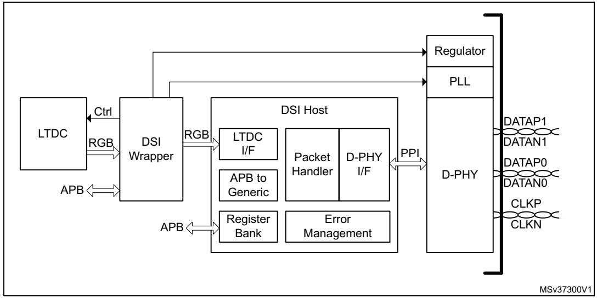

**Figure 256. DSI Host architecture**

The different parts have the following functions:

- The DSI Wrapper ensures the interfacing between the LTDC and the DSI Host kernel. It can adapt the color mode, the signal polarity and manages the tearing effect (TE) management for automatic frame buffer update in adapted command mode. The DSI Wrapper also controls the DSI regulator, the DSI PLL and specific functions of the MIPI® D-PHY.
- The LTDC interface captures the data and control signals from the LTDC and conveys them to a FIFO for video control signals and another one for the pixel data. This data is then used to build one of the following:
  - Video packets, when in video mode (see *[Section 34.5](#page-6-0)*)
  - The *memory\_write\_start* and *memory\_write\_continue* DCS commands, when in adapted command mode (see *[Section 34.6](#page-11-0)*)
- The register bank is accessible through a standard AMBA-APB slave interface, providing access to the DSI Host registers for configuration and control. There is also a fully programmable interrupt generator to inform the system about certain events.
- The PHY interface control is responsible for managing the D-PHY interface. It acknowledges the current operation and enables low-power transmission/reception or a high-speed transmission. It also performs data splitting between available D-PHY lanes for high-speed transmission.
- The packet handler schedules the activities inside the link. It performs several functions based on the interfaces that are currently operational and the video transmission mode that is used (burst mode or non-burst mode with sync pulses or sync events). It builds

long or short packet generating correspondent ECC and CRC codes. This block also performs the following functions:

- packet reception
- validation of packet header by checking the ECC
- header correction and notification for single-bit errors
- termination of reception
- multiple header error notification
- depending on the virtual channel of the incoming packet, the handler routes the output data to the respective port.
- The APB-to-generic block bridges the APB operations into FIFOs holding the generic commands. The block interfaces with the following FIFOS:
  - Command FIFO
  - Write payload FIFO
  - Read payload FIFO
- The error management notifies and monitors the error conditions on the DSI link. It controls the timers used to determine if a timeout condition occurred, performing an internal soft reset and triggering an interruption notification.

# <span id="page-6-0"></span>**34.5 Functional description: video mode on LTDC interface**

The LTDC interface captures the data and control signals and conveys them to the FIFO interfaces that transmit them to the DSI link.

Two different streams of data are present at the interface, namely video control signals and pixel data. Depending on the interface color coding, the pixel data is disposed differently throughout the LTDC bus.

Interface pixel color coding is summarized in *[Table 281](#page-6-1)*.

**Table 281. Location of color components in the LTDC interface** 

<span id="page-6-1"></span>

| Location | 16-bit   |          |          | 18-bit   |          |        |
|----------|----------|----------|----------|----------|----------|--------|
|          | Config 1 | Config 2 | Config 3 | Config 1 | Config 2 | 24-bit |
| D23      | -        | -        | -        | -        | -        | R[7]   |
| D22      | -        | -        | -        | -        | -        | R[6]   |
| D21      | -        | -        | R[4]     | -        | R[5]     | R[5]   |
| D20      | -        | R[4]     | R[3]     | -        | R[4]     | R[4]   |
| D19      | -        | R[3]     | R[2]     | -        | R[3]     | R[3]   |
| D18      | -        | R[2]     | R[1]     | -        | R[2]     | R[2]   |
| D17      | -        | R[1]     | R[0]     | R[5]     | R[1]     | R[1]   |
| D16      | -        | R[0]     | -        | R[4]     | R[0]     | R[0]   |
| D15      | R[4]     | -        | -        | R[3]     | -        | G[7]   |
| D14      | R[3]     | -        | -        | R[2]     | -        | G[6]   |
| D13      | R[2]     | G[5]     | G[5]     | R[1]     | G[5]     | G[5]   |
| D12      | R[1]     | G[4]     | G[4]     | R[0]     | G[4]     | G[4]   |
| D11      | R[0]     | G[3]     | G[3]     | G[5]     | G[3]     | G[3]   |
| D10      | G[5]     | G[2]     | G[2]     | G[4]     | G[2]     | G[2]   |
| D9       | G[4]     | G[1]     | G[1]     | G[3]     | G[1]     | G[1]   |
| D8       | G[3]     | G[0]     | G[0]     | G[2]     | G[0]     | G[0]   |
| D7       | G[2]     | -        | -        | G[1]     | -        | B[7]   |
| D6       | G[1]     | -        | -        | G[0]     | -        | B[6]   |
| D5       | G[0]     | -        | B[4]     | B[5]     | B[5]     | B[5]   |
| D4       | B[4]     | B[4]     | B[3]     | B[4]     | B[4]     | B[4]   |
| D3       | B[3]     | B[3]     | B[2]     | B[3]     | B[3]     | B[3]   |
| D2       | B[2]     | B[2]     | B[1]     | B[2]     | B[2]     | B[2]   |
| D1       | B[1]     | B[1]     | B[0]     | B[1]     | B[1]     | B[1]   |
| D0       | B[0]     | B[0]     | -        | B[0]     | B[0]     | B[0]   |

The LTDC interface can be configured to increase flexibility and promote correct use of this interface for several systems. The following configuration options are available:

- Polarity control: all the control signals are programmable to change the polarity depending on the LTDC configuration.
- After the core reset, DSI Host waits for the first VSYNC active transition to start signal sampling, including pixel data, thus avoiding starting the transmission of the image data in the middle of a frame.
- If interface pixel color coding is 18 bits and the 18-bit loosely packed stream is disabled, the number of pixels programmed in the VPSIZE field must be a multiple of four. This means that in this mode, the two LSBs in the configuration are always inferred as zero. The specification states that in this mode, the pixel line size must be a multiple of four.
- To avoid FIFO underflows and overflows, the configured number of pixels is assumed to be received from the LTDC at all times.
- To keep the memory organized with respect to the packet scheduling, the number of pixels per packet parameter is used to separate the memory space of different video packets.

For SHTDN and COLM sampling and transmission, the video streaming from the LTDC must be active. This means that if the LTDC is not actively generating the video signals like VSYNC and HSYNC, these signals are not transmitted through the DSI link. Because of such constraints and for commands to be correctly transmitted, the first VSYNC active pulse must occur for the command sampling and transmission. When shutting down the display, it is necessary for the LTDC to be kept active for one frame after the command being issued. This ensures that the commands are correctly transmitted before actually disabling the video generation at the LTDC interface.

The SHTDN and COLM values can be programmed in the DSI Wrapper control register (DSI\_WCR).

For all of the data types, one entire pixel is received per each clock cycle. The number of pixels of payload is restricted to a multiple of a value, as shown in *[Table 282](#page-7-0)*.

<span id="page-7-0"></span>

| Value | Data types                                |
|-------|-------------------------------------------|
| 1     | 16-bit<br>18-bit loosely packed<br>24-bit |
| 2     | Loosely packed pixel stream               |
| 4     | 18-bit non-loosely packed                 |

**Table 282. Multiplicity of the payload size in pixels for each data type** 

## **34.5.1 Video transmission mode**

There are different video transmission modes, namely:

- Burst mode
- Non-burst mode
  - Non-burst mode with sync pulse
  - Non-burst mode with sync event

### **Burst mode**

In this mode, the entire active pixel line is buffered into a FIFO and transmitted in a single packet with no interruptions. This transmission mode requires that the DPI pixel FIFO has the capacity to store a full line of active pixel data inside it. This mode is optimally used when the difference between the pixel required bandwidth and DSI link bandwidth is significant, it enables the DSI Host to quickly dispatch the entire active video line in a single burst of data and then return to low-power mode.

### **Non-burst mode**

In this mode, the processor uses the partitioning properties of the DSI Host to divide the video line transmission into several DSI packets. This is done to match the pixel required bandwidth with the DSI link bandwidth. With this mode, the controller configuration does not require a full line of pixel data to be stored inside the LTDC interface pixel FIFO. It requires only the content of one video packet.

### **Guidelines for selecting the burst or non-burst mode**

Selecting the burst and non-burst mode is mainly dependent on the system configuration and the device requirements. Choose the video transmission mode that suits the application scenario. The burst mode is more beneficial because it increases the probability of the link spending more time in the low-power mode, decreasing power consumption. The following conditions must be met to get the maximum benefits from the burst mode of operation:

- The DSI Host core must have sufficient pixel memory to store an entire pixel line to avoid the overflow of the internal FIFOs.
- The display device must support receiving a full pixel line in a single packet burst to avoid the overflow on the reception buffer.
- The DSI output bandwidth must be higher than the LTDC interface input bandwidth in a relation that enables the link to go to low-power once per line.

If the system cannot meet these requirements, it is likely that the pixel data is lost causing the malfunctioning of the display device while using the burst mode. These errors are related to the capabilities of the system to store the temporary pixel data.

If all the conditions for using the burst mode cannot be met, use the non-burst mode to avoid errors. The non-burst mode provides a better matching of rates for pixel transmission, enabling:

- only a certain number of pixels to be stored in the memory, and not requiring a full pixel line (lesser LTDC interface RAM requirements in the DSI Host)
- operation with devices that support only a small amount of pixel buffering (less than a full pixel line).

The DSI non-burst mode must be configured so that the DSI output pixel ratio matches with the LTDC interface input pixel ratio, reducing the memory requirements on both host and/or device side. This is achieved by dividing a pixel line into several chunks of pixels and optionally interleaving them with null packets.

The following equations show how the DSI Host core transmission parameters must be programmed in non-burst mode to match the DSI link pixel output ratio (left hand side of the "=" sign) and LTDC interface pixel input (right hand side of the "=" sign).


When the null packets are enabled:

lanebyteclkperiod \* NUMC (VPSIZE \* bytes\_per\_pixel + 12 + NPSIZE) / number\_of\_lanes = pixels\_per\_line \* LTDC\_Clock\_period

When the null packets are disabled:

lanebyteclkperiod \* NUMC (VPSIZE \* bytes\_per\_pixel + 6) / number\_of\_lanes

= pixels\_per\_line \* LTDC\_Clock\_period

## **34.5.2 Updating the LTDC interface configuration in video mode**

It is possible to update the LTDC interface configuration on the fly without impacting the current frame. It is done with the help of shadow registers. This feature is controlled by the DSI Host video shadow control register (DSI\_VSCR).

The new configuration is only used when the system requests for it. To update the video configuration during the transmission of a video frame, the configuration of that frame needs to be stored in the auxiliary registers. This way, the new frame configurations can be set through the APB interface without corrupting the current frame.

By default, this feature is disabled. To enable this feature, set the enable (EN) bit of the DSI Host video shadow control register (DSI\_VSCR) to 1.

When this feature is enabled, the system supplies the configuration stored in the auxiliary registers.

*[Figure 257](#page-9-0)* shows the necessary steps to update the LTDC interface configuration.

<span id="page-9-0"></span>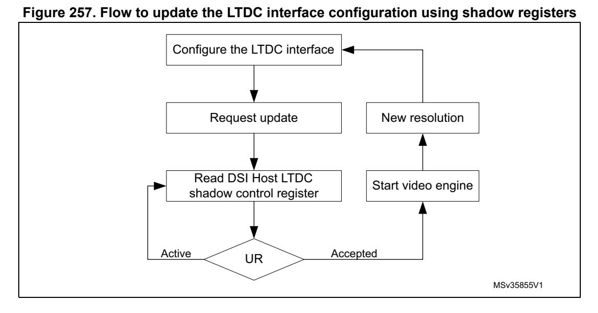

### **Immediate update**

When the shadow register feature is active, the auxiliary registers require the LTDC configuration before the video engine starts. This means that, after a reset, update register (UR) bit is immediately granted.

When it is required to immediately update the active registers without the reset (as in *[Figure 258](#page-10-0)*), ensure that the enable (EN) and update register (UR) bits of the DSI Host video shadow control register (DSI\_VSCR) are set to 0.

<span id="page-10-0"></span>**Default DPI Config** EN=0 UR=0 DSI Host **DPI Config 1** EN=1 UR=1 DSI Host DPI CONFIG 1 Video Shadow Update

MSv35856V2

**Figure 258. Immediate update procedure**

### **Updating the configuration during the transmission of a frame using APB**

To update the LTDC interface configuration, follow the steps shown in *[Figure 259](#page-10-1)*:

- 1. Ensure that the enable (EN) bit of the DSI Host video shadow control register (DSI\_VSCR) register is set to 1.
- 2. Set the update register (UR) bit of DSI Host video shadow control register (DSI\_VSCR) to 1.
- 3. Monitor the update register (UR) bit. This bit is set to 0 when the update is complete.

<span id="page-10-1"></span>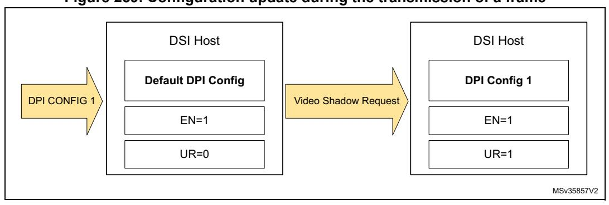

**Figure 259. Configuration update during the transmission of a frame**

### **Requesting a configuration update**

It is possible to request for the LTDC interface configuration update at any part of the frame. DSI Host waits until the end of the frame to change the configuration. However, avoid sending the update request during the first line of the frame because the data must propagate between clock domains.

# <span id="page-11-0"></span>**34.6 Functional description: adapted command mode on LTDC interface**

The adapted command mode, enables the system to input a stream of pixel from the LTDC that is conveyed by DSI Host using the command mode transmission (using the DCS packets). The adapted command mode also supports pixel input control rate signaling and tearing effect report mechanism.

The adapted command mode makes it possible to send large amounts of data through the *memory\_write\_start* (WMS) and *memory\_write\_continue* (WMC) DCS commands. It helps in delivering a wider data bandwidth for the memory write operations sent in command mode to MIPI® displays and to refresh large areas of pixels in high resolution displays. If additional commands such as display configuration commands, read back commands, and tearing effect initialization are to be transferred, then the APB slave generic interface must be used to complement the adapted command mode functionality.

Adapted command mode of operation supports 16 bpp, 18 bpp, and 24 bpp RGB.

To transmit the image data in adapted command mode:

- Set command mode (CMDM) bit of the DSI Host mode configuration register (DSI\_MCR) to 1.
- Set DSI mode (DSIM) bit in the DSI Wrapper configuration register (DSI\_WCFGR) to 1.

To transmit the image data, follow these steps:

- Define the image area to be refreshed, by using the *set\_column\_address* and *set\_page\_address* DCS commands. The image area needs to be defined only once and remains effective until different values are defined.
- Define the pixel color coding to be used by using the color coding (COLC) field in the DSI Host LTDC color coding register (DSI\_LCOLCR).
- Define the virtual channel ID of the LTDC interface generated packets using the virtual channel ID (VCID) field in the DSI Host LTDC VCID register (DSI\_LVCIDR). These also need to be defined only once.
- Start transmitting the data from the LTDC setting the LTDC enable (LTDCEN) bit of the DSI\_WCR register.

*[Figure 260](#page-12-0)* shows the adapted command mode usage flow.

RM0399 Rev 4 1275/3556

<span id="page-12-0"></span>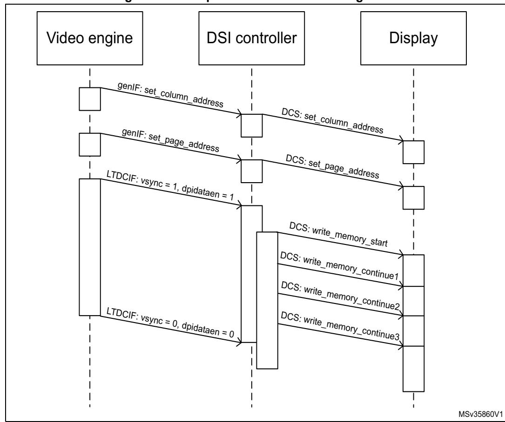

**Figure 260. Adapted command mode usage flow**

When the command mode (CMDM) bit of the DSI Host mode configuration register (DSI\_CFGR) is set to 1, the LTDC interface assumes the behavior corresponding to the adapted command mode.

In this mode, the host processor can use the LTDC interface to transmit a continuous stream of pixels to be written in the local frame buffer of the peripheral. It uses a pixel input bus to receive the pixels and controls the flow automatically to limit the stream of continuous pixels. When the first pixel is received, the current value of the command size (CMDSIZE) field of the DSI Host LTDC command configuration register (DSI\_LCCR), is shadowed to the internal interface function. The interface increments a counter on every valid pixel that is input through the interface. When this pixel counter reaches command size (CMDSIZE), a command is written into the command FIFO, and the packet can be transmitted through the DSI link.

If the last pixel arrives before the counter reaches the value of shadowed command size (CMDSIZE), a WMS command is issued to the command FIFO with word count (WC) set to the number of bytes corresponding to the counter value. If more than CMDSIZE pixels are received (shadowed value), a WMS command is sent to the command FIFO with WC set to the number of bytes corresponding to the command size (CMDSIZE) and the counter is restarted.

After the first WMS command has been written to the FIFO, the circuit behaves in a similar way, but issues WMC commands instead of WMS commands. The process is repeated until the last pixel of the image is received. The core automatically starts sending a new packet

when the last pixel of the image is received, falls, or command size (CMDSIZE) limit is reached.

### **Synchronization with the LTDC**

The DSI Wrapper performs the synchronization of the transfer process by:

- controlling the start/halt of the LTDC
- making the data flow control between LTDC and DSI Host.

The transfer to refresh the display frame buffer can be triggered

- manually, setting the LTDC enable (LTDCEN) bit of the DSI Wrapper control register (DSI\_WCR)
- automatically when a tearing effect (TEIF) event occurs, and automatic refresh (AR) is enabled.

The selection between manual and automatic mode is done through the automatic refresh (AR) bit of the DSI Wrapper configuration register (DSI\_WCFGR).

Once the transfer of one frame is done whatever in manual or automatic refresh mode, the DSI Wrapper halts the TFT display controller (LTDC), resetting the LTDC enable (LTDCEN) bit of the DSI Wrapper control register (DSI\_WCR), and setting the end of refresh interrupt flag (ERIF) flag of the DSI Wrapper status register (DSI\_WSR). If the end of refresh interrupt enable (ERIE) bit of the DSI Wrapper configuration register (DSI\_WCFGR) is set, an interrupt is generated.

The end of refresh interrupt flag (ERIF) flag of the DSI Wrapper status register (DSI\_WSR) can be reset setting the clear end of refresh interrupt flag (CERIF) bit of the DSI Wrapper clear interrupt flag register (DSI\_WCIFR).

The halting of the TFT display controller (LTDC) by the DSI Wrapper is done synchronously on a rising edge or a falling edge of VSync according to the VSync polarity (VSPOL) bit of the DSI Wrapper configuration register (DSI\_WCFGR).

### **Support of tearing effect**

The DSI specification supports tearing effect function in command mode displays. It enables the Host processor to receive timing accurate information about where the display peripheral is in the process of reading the content of its frame buffer.

The tearing effect can be managed through:

- a separate pin, which is not covered in the DSI specification
- the DSI tearing effect functionality: a *set\_tear\_on* DCS command must be issued through the APB interface using the generic interface registers.

### **Tearing effect through a GPIO**

When the tearing effect source (TESRC) bit of the DSI Wrapper configuration register (DSI\_WCFGR) is set, the tearing effect is signaled through a GPIO.

The polarity of the input signal can be configured by the tearing effect polarity (TEPOL) bit of the DSI Wrapper configuration register (DSI\_WCFGR).

When the programmed edge is detected, the tearing effect interrupt flag (TEIF) bit of the DSI Wrapper interrupt and status register (DSI\_WISR) is set.

If the tearing effect interrupt enable (TEIE) bit of the DSI Wrapper interrupt enable register (DSI\_WIER) is set, an interrupt is generated.

RM0399 Rev 4 1277/3556

### **Tearing effect through DSI link**

When the TESRC bit of the DSI Wrapper configuration register (DSI\_WCFGR) is reset, the tearing effect is managed through the DSI link:

The DSI Host performs a double bus turn-around (BTA) after sending the *set\_tear\_on* command granting the ownership of the link to the DSI display. The display holds the ownership of the bus until the tear event occurs, which is indicated to the DSI Host by a D-PHY trigger event. The DSI Host then decodes the trigger and reports the event setting the tearing effect interrupt flag (TEIF) bit of the DSI Wrapper interrupt and status register (DSI\_WISR).

If the tearing effect interrupt enable (TEIE) bit of the DSI Wrapper interrupt enable register (DSI\_WIER) is set, an interrupt is generated.

To use this function, it is necessary to issue a *set\_tear\_on* command after the update of the display using the WMS and WMC DCS commands. This procedure halts the DSI link until the display is ready to receive a new frame update.

The DSI Host does not automatically generate the tearing effect request (double BTA) after a WMS/WMC sequence for flexibility purposes, so several regions of the display can be updated improving DSI bandwidth usage. Tearing effect request must always be triggered by a *set\_tear\_on* command in the DSI Host implementation.

Configure the following registers to activate the tearing effect:

- DSI Host command mode configuration register (DSI\_CMCR): TEARE
- DSI Host protocol configuration register (DSI\_PCR): BTAE.

# **34.7 Functional description: APB slave generic interface**

The APB slave interface allows the transmission of generic information in command mode, and follows a proprietary register interface. Commands sent through this interface are not constrained to comply with the DCS specification, and can include generic commands described in the DSI specification as manufacturer-specific.

The DSI Host supports the transmission of write and read command mode packets as described in the DSI specification. These packets are built using the APB register access. The DSI Host generic payload data register (DSI\_GPDR) has two distinct functions based on the operation. Writing to this register sends the data as payload when sending a command mode packet. Reading this register returns the payload of a read back operation. The DSI Host generic header configuration register (DSI\_GHCR) contains the command mode packet header type and header data. Writing to this register triggers the transmission of the packet implying that for a long command mode packet, the packet payload needs to be written in advance in the DSI Host generic payload data register (DSI\_GPDR).

The valid packets that can be transmitted through the generic interface are the following:

- Generic write short packet 0 parameters
- Generic write short packet 1 parameters
- Generic write short packet 2 parameters
- Generic read short packet 0 parameters
- Generic read short packet 1 parameters
- Generic read short packet 2 parameters
- Maximum read packet configuration
- Generic long write packet
- DCS write short packet 0 parameters
- DCS write short packet 1 parameters
- DCS read short packet 0 parameters
- DCS write long packet.

A set of bits in the DSI Host generic packet status register (DSI\_GPSR) reports the status of the FIFO associated with APB interface support.

Generic interface packets are always transported using one of the DSI transmission modes, that is, video mode or command mode. If neither of these modes is selected, the packets are not transmitted through the link, and the related FIFO eventually becomes overflown.

## **34.7.1 Packet transmission using the generic interface**

The transfer of packets through the APB bus is based on the following conditions:

- The APB protocol defines that the write and read procedure takes two clock cycles each to be executed. This means that the maximum input data rate through the APB interface is always half the speed of the APB clock.
- The data input bus has a maximum width of 32 bits. This allows for a relation to be defined between the input APB clock frequency and the maximum bit rate achievable by the APB interface.
- The DSI link pixel bit rate when using solely APB is (APB clock frequency) \* 16 Mbit/s.
- When using only the APB interface, the theoretical DSI link maximum bit rate can be expressed as DSI link maximum bit rate = APB clock frequency (in MHz) \* 32 / 2 Mbit/s.

RM0399 Rev 4 1279/3556

In this formula, the number 32 represents the APB data bus width, and the division by two is present because each APB write procedure takes two clock cycles to be executed.

• The bandwidth is dependent on the APB clock frequency; the available bandwidth increases with the clock frequency.

To drive the APB interface to achieve high bandwidth command mode traffic transported by the DSI link, the DSI Host must operate only in the command mode, and the APB interface must be the only data source in use. Thus, the APB interface has the entire bandwidth of the DSI link and does not share it with any another input interface source.

The memory write commands require maximum throughput from the APB interface, because they contain the most amount of data conveyed by the DSI link. While writing the packet information, first write the payload of a given packet into the payload FIFO using the DSI Host generic payload data register (DSI\_GPDR). When the payload data is for the command parameters, place the first byte to be transmitted in the least significant byte position of the APB data bus.

After writing the payload, write the packet header into the command FIFO. For more information about the packet header organization on the 32-bit APB data bus, so that it is correctly stored inside the command FIFO.

When the payload data is for a memory write command, it contains pixel information and it must follow the pixel to byte conversion organization referred in the Annex A of the DCS specification.

Figures *[261](#page-16-0)* to *[265](#page-18-0)* show how the pixel data must be organized in the APB data write bus.

The memory write commands are conveyed in DCS long packets, encapsulated in a DSI packet. The DSI specifies that the DCS command must be present in the first payload byte of the packet. This is also included in the diagrams. In figures *[261](#page-16-0)* to *[265](#page-18-0)*, the *write memory*  command can be replaced by the DCS command *write memory Start* and *write memory Continue*.

<span id="page-16-0"></span>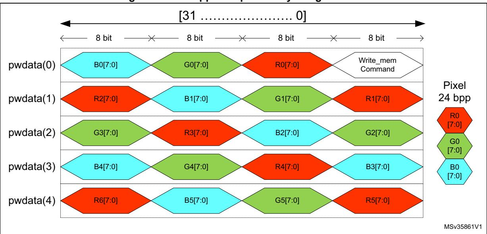

**Figure 261. 24 bpp APB pixel to byte organization**

**Figure 262. 18 bpp APB pixel to byte organization**

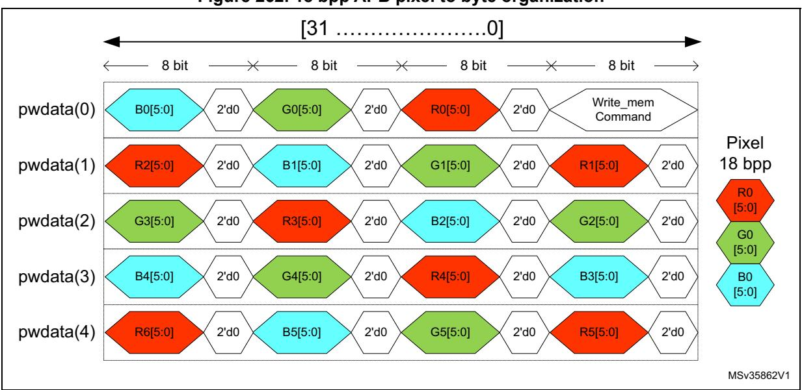

**Figure 263. 16 bpp APB pixel to byte organization**

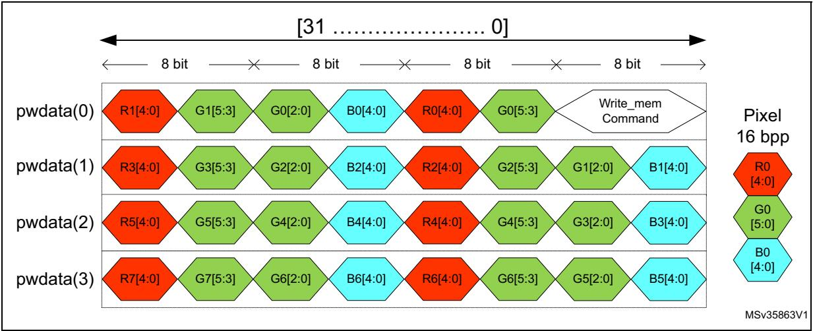

Figure 264. 12 bpp APB pixel to byte organization

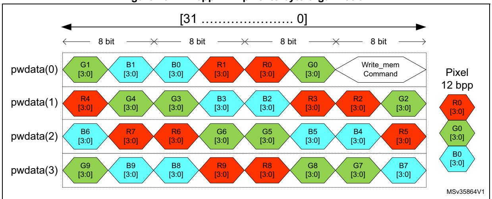

Figure 265. 8 bpp APB pixel to byte organization

<span id="page-18-0"></span>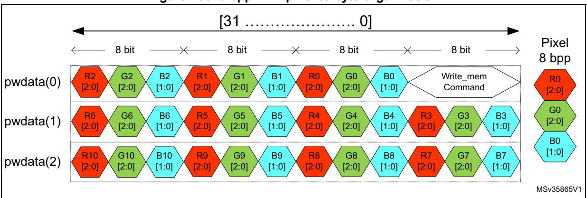

# <span id="page-19-2"></span>**34.8 Functional description: timeout counters**

The DSI Host includes counters to manage timeout during the various communication phases. The duration of each timeout can be configured by the six timeout counter configuration registers (DSI\_TCCR0...5).

There are two types of counters:

- contention error detection timeout counters (*[Section 34.8.1](#page-19-0)*)
- peripheral response timeout counters (*[Section 34.8.2](#page-20-0)*).

# <span id="page-19-0"></span>**34.8.1 Contention error detection timeout counters**

The DSI Host implements a set of counters and conditions to notify the errors. It features a set of registers to control the timers used to determine if a timeout has occurred, and also contains a set of interruption status registers that are cleared upon a read operation (detailed in *[Table 283](#page-19-1)*). Optionally, these registers also trigger an interrupt signal that can be used by the system to be activated when an error occurs within the DSI connection.

<span id="page-19-1"></span>

| Timeout counter         | Value register | Value field | Flag register | Flag field |  |
|-------------------------|----------------|-------------|---------------|------------|--|
| High-speed transmission | DSI_TCCR0      | TOHSTX      | DSI_ISR1      | TOHSTX     |  |

Low-power reception DSI\_TCCR0 TOLPRX DSI\_ISR1 TOLPRX

**Table 283. Contention detection timeout counters configuration**

Time units for these 16-bit counters are configured in cycles defined in the timeout clock division (TOCKDIV) field in the DSI Host clock control register (DSI\_CCR).

The value written to the timeout clock division (TOCKDIV) field in the DSI Host clock control register (DSI\_CCR) defines the time unit for the timeout limits using the lane byte clock as input.

This mechanism increases the range to define these limits.

### **High-speed transmission contention detection**

The timeout duration is configured in the high-speed transmission timeout count (HSTX\_TOCNT) field of the DSI Host timeout counter configuration register 1 (DSI\_TCCR0). A 16-bit counter measures the time during which the high-speed mode is active.

If that counter reaches the value defined by the high-speed transmission timeout count (HSTX\_TOCNT) field of the DSI Host timeout counter configuration register 1 (DSI\_TCCR0), the timeout high-speed transmission (TOHSTX) bit in the DSI Host interrupt and status register 1 (DSI\_ISR1) is asserted and an internal soft reset is generated to the DSI Host.

If the timeout high-speed transmission interrupt enable (TOHSTXIE) bit of the DSI Host interrupt enable register 1 (DSI\_IER1) is set, an interrupt is generated.

### **Low-power reception contention detection**

The timeout is configured in the low-power reception timeout counter (LPRX\_TOCNT) field of the DSI Host timeout counter configuration register 1 (DSI\_TCCR1). A 16-bit counter measures the time during which the low-power reception is active.


RM0399 Rev 4 1283/3556

If that counter reaches the value defined by the low-power reception timeout counter (LPRX\_TOCNT) field of the DSI Host timeout counter configuration register 1 (DSI\_TCCR0), the timeout low-power reception (TOLPRX) bit in the DSI Host interrupt and status register 1 (DSI\_ISR1) is asserted and an internal soft reset is generated to the DSI Host.

If the timeout low-power reception interrupt enable (TOLPRXIE) bit of the DSI Host interrupt enable register 1 (DSI\_IER1) is set, an interrupt is generated. Once the software gets notified by the interrupt, it must reset the D-PHY by deasserting and asserting the digital enable (DEN) bit of the DSI Host PHY control register (DSI\_PCTLR).

# <span id="page-20-0"></span>**34.8.2 Peripheral response timeout counters**

A peripheral may not immediately respond correctly to some received packets. For example, a peripheral receives a read request, but due to its architecture cannot access the RAM for a while (for example, the panel is being refreshed and takes some time to respond). In this case, set a timeout to ensure that the host waits long enough so that the device is able to process the previous data before receiving the new data or responding correctly to new requests.

*[Table 284](#page-20-1)* lists the events belonging to various categories having an associated timeout for peripheral response.

<span id="page-20-1"></span>

| Category                                                           | Event                                                                                                                                                                                                                                                                                                                                                                             |  |
|--------------------------------------------------------------------|-----------------------------------------------------------------------------------------------------------------------------------------------------------------------------------------------------------------------------------------------------------------------------------------------------------------------------------------------------------------------------------|--|
| Items implying a BTA PRESP_TO                                      | Bus-turn-around                                                                                                                                                                                                                                                                                                                                                                   |  |
| READ requests indicating a PRESP_TO<br>(replicated for HS and LP)  | (0x04) Generic read, no parameters short<br>(0x14) Generic read, 1 parameter short<br>(0x24) Generic read, 2 parameters short<br>(0x06) DCS read, no parameters short                                                                                                                                                                                                             |  |
| WRITE requests indicating a PRESP_TO<br>(replicated for HS and LP) | (0x03) Generic short write, no parameters short<br>(0x13) Generic short write, 1 parameter short<br>(0x23) Generic short write, 2 parameters short<br>(0x29) Generic long write long<br>(0x05) DCS short write, no parameters short<br>(0x15) DCS short write, 1 parameter short<br>(0x39) DCS long write/write_LUT, command packet long<br>(0x37) Set maximum return packet size |  |

**Table 284. List of events of different categories of the PRESP\_TO counter** 

The DSI Host ensures that, on sending an event that triggers a timeout, the D-PHY switches to the Stop state and a counter starts running until it reaches the value of that timeout. The link remains in the LP-11 state and unused until the timeout ends, even if there are other events ready to be transmitted.

Figures *[266](#page-21-0)* to *[268](#page-23-0)* illustrate the flow of counting in the PRESP\_TO counter for the three categories listed in *[Table 284](#page-20-1)*.


<span id="page-21-0"></span>

**Figure 266. Timing of PRESP\_TO after a bus-turn-around**

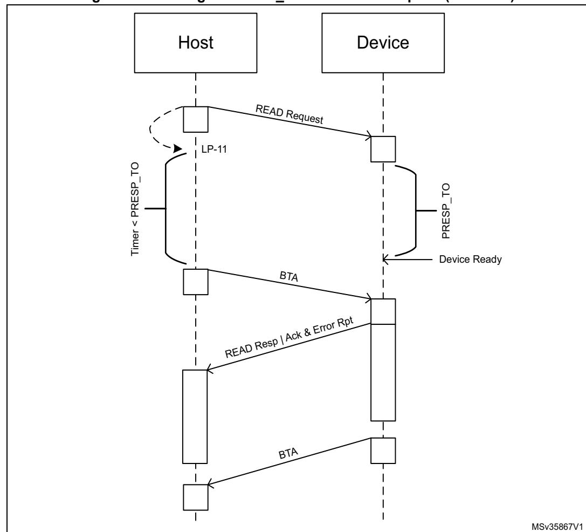

**Figure 267. Timing of PRESP\_TO after a read request (HS or LP)**

<span id="page-23-0"></span>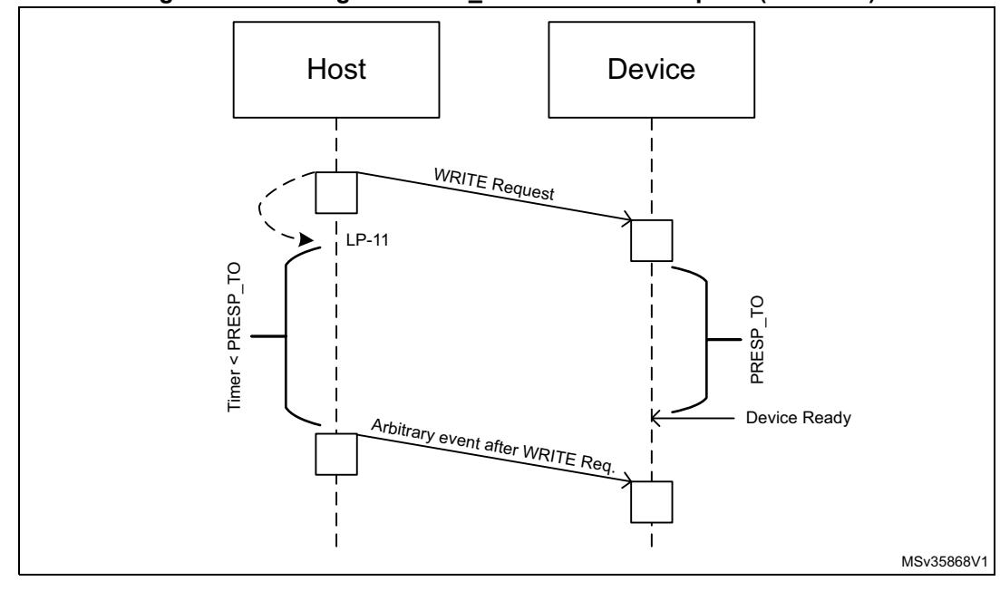

**Figure 268. Timing of PRESP\_TO after a write request (HS or LP)**

*[Table 285](#page-23-1)* describes the fields used for the configuration of the PRESP\_TO counter.

<span id="page-23-1"></span>

| Description                                           | Register                                      | Field     |            |
|-------------------------------------------------------|-----------------------------------------------|-----------|------------|
|                                                       | After sending a<br>High-speed read operation  | DSI_TCCR1 | HSRD_TOCNT |
| Period for which the DSI Host<br>keeps the link still | After sending a<br>Low-power read operation   | DSI_TCCR2 | LPRD_TOCNT |
|                                                       | After completing a<br>Bus-turn-around (BTA)   | DSI_TCCR5 | BTA_TOCNT  |
| Period for which the DSI Host                         | After sending a<br>High-speed write operation | DSI_TCCR3 | HSWR_TOCNT |
| keeps the link inactive                               | After sending a<br>Low-power write operation  | DSI_TCCR4 | LPWR_TOCNT |

**Table 285. PRESP\_TO counter configuration** 

The values in these registers are measured in number of cycles of the lane byte clock. These registers are only used in command mode because in video mode, there is a rigid timing schedule to be met to keep the display properly refreshed and it must not be broken by these or any other timeouts. Setting a given timeout to 0 disables going into LP-11 state and timeout for events of that category.

The read and the write requests in high-speed mode are distinct from those in low-power mode. For example, if HSRD\_TOCNT is set to 0 and LPRD\_TOCNT is set to a non-0 value, a generic read with no parameters does not activate the PRESP\_TO counter in high-speed, but activates the PRESP\_TO in low-power.

The DSI Host timeout counter configuration register 4 (DSI\_TCCR3) includes a special Presp mode (PM) bit to change the normal behavior of PRESP\_TO in Adaptive command

mode for high-speed write operation timeout. When set to 1, this bit allows the PRESP\_TO from HSWR\_TOCNT to be used only once, when both of the following conditions are met:

- the LTDC VSYNC signal rises and falls
- the packets originated from the LTDC interface in adapted command mode are transmitted and its FIFO is empty again.

In this scenario, non-adapted command mode requests are not sent to the D-PHY, even if there is traffic from the generic interface ready to be sent, returning them to the Stop state. When it happens, the PRESP\_TO counter is activated and only when it is completed, the DSI Host sends any other traffic that is ready, as illustrated in *[Figure 269](#page-24-0)*.

<span id="page-24-0"></span>MSv35880V1 dpivsync\_edpiwms dpidataen dpidata[29:0] edpi\_fifo\_empty gen\_wr\_en gen\_data[31:0] link\_state[1:0] link\_data[31:0] PRESP\_TO\_active A10 A20 A30 B3 LP HS LP HS LP

**Figure 269. Effect of prep mode at 1**

# **34.9 Functional description: transmission of commands**

## **34.9.1 Transmission of commands in video mode**

The DSI Host supports the transmission of commands, both in high-speed and low-power, while in video mode. The DSI Host uses blanking or low-power (BLLP) periods to transmit commands inserted through the APB generic interface. Those periods correspond to the gray areas of *[Figure 270](#page-25-0)*.

<span id="page-25-0"></span>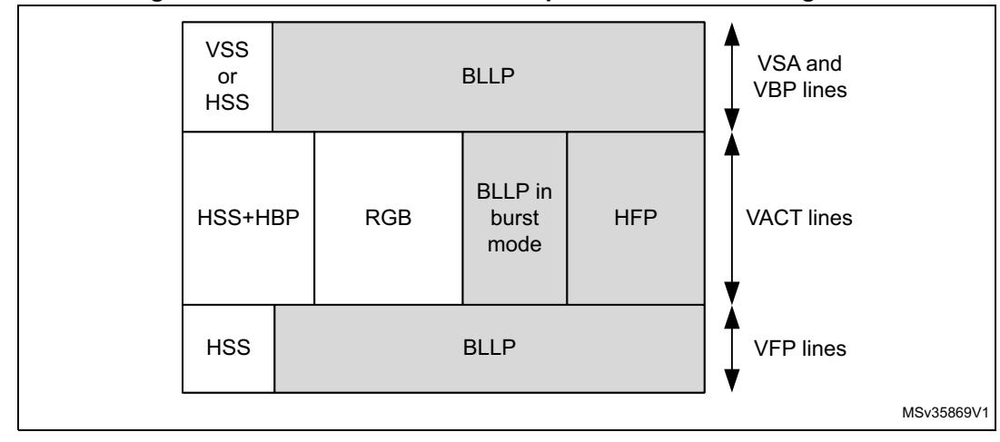

**Figure 270. Command transmission periods within the image area**

Commands are transmitted in the blanking periods after the following packets/states:

- Vertical Sync Start (VSS) packets, if the video sync pulses are not enabled
- Horizontal sync end (HSE) packets, in the VSA, VBP, and VFP regions
- Horizontal sync Start (HSS) packets, if the video sync pulses are not enabled in the VSA, VBP, and VFP regions
- Horizontal active (HACT) state

Besides the areas corresponding to BLLP, large commands can also be sent during the last line of a frame. In that case, the line time for the video mode is violated and the edpihalt signal is set to request the DPI video timing signals to remain inactive. Only if a command does not fit into any BLLP area, it is postponed to the last line, causing the violation of the line time for the video mode, as illustrated in *[Figure 271](#page-26-0)*.

<span id="page-26-0"></span>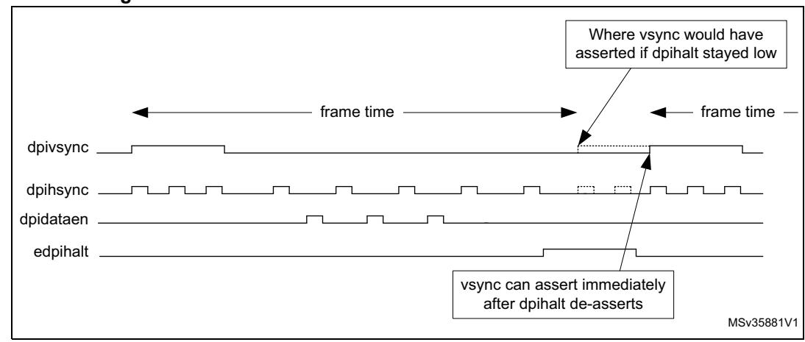

Figure 271. Transmission of commands on the last line of a frame

Only one command is transmitted per line, even in the case of the last line of a frame but one command is possible for each line.

There can be only one command sent in low-power per line. However, one low-power command is possible for each line. In high-speed, the DSI Host can send more than one command, as many as it determines to fit in the available time.

The DSI Host avoids sending commands in the last line because it is possible that the last line is shorter than the other ones. For instance, the line time ( $t_L$ ) can be half a cycle longer than the  $t_L$  on the LTDC interface, that is, each line in the frame taking half a cycle from time for the last line. This results in the last line being (½ cycle) x (number of lines -1) shorter than  $t_L$ .

The COLM and SHTDN bits of the DSI Wrapper control register (DSI\_WCR) are also able to trigger the sending of command packets. The commands are:

- Color mode ON
- Color mode OFF
- Shut down peripheral
- Turn on peripheral

These commands are not sent in the VACT region. If the low-power command enable (LPCE) bit of the DSI Host video mode configuration register (DSI\_VMCR) is set, these commands are sent in low-power mode.

In low-power mode, the largest packet size (LPSIZE) field of the DSI Host low-power mode configuration register (DSI\_LPMCR) is used to determine if these commands can be transmitted. It is assumed that largest packet size (LPSIZE) is greater than or equal to four bytes (number of bytes in a short packet), because the DSI Host does not transmit these commands on the last line.

If the frame bus-turn-around acknowledge enable (FBTAAE) bit is set in the DSI Host low-power mode configuration register (DSI\_LPMCR), a BTA is generated by DSI Host after the last line of a frame. This may coincide with a write command or a read command. In either case, the LTDC interface is halted until an acknowledge is received (control of the DSI bus is returned to the host).

## **34.9.2 Transmission of commands in low-power mode**

DSI Host can be configured to send the low-power commands during the high-speed video mode transmission.

To enable this feature, set the Low Power command enable (LPCE) bit of the DSI Host video mode configuration register (DSI\_VMCR) to 1. In this case, it is necessary to calculate the time available, in bytes, to transmit a command in low-power mode to horizontal frontporch (HFP), vertical sync active (VSA), vertical back-porch (VBP), and vertical front-porch (VFP) regions.

Bits 8 to 13 of the video mode configuration register (DSI\_VMCR) indicate if DSI Host can go to LP when idle. If the low-power command enable (LPCE) bit is set and non-video packets are in queue, DSI Host ignores the low-power configuration and transmits low-power commands, even if it is not allowed to enter low-power mode in a specific region. After the low-power commands transmission, DSI Host remains in low-power until a sync event occurs.

For example, consider that the VFP is selected as high-speed region (LPVFPE = 1'b0) with LPCE set as a command to transmit in low-power in the VPF region. This command is transmitted in low-power, and the line stays in low-power mode until a new HSS arrives.

## **Calculating the time to transmit commands in LP mode in the VSA, VBP, and VFP regions**

The largest packet size (LPSIZE) field of the DSI Host low-power mode configuration register (DSI\_LPMCR) indicates the time available (in bytes) to transmit a command in lowpower mode (based on the escape clock) on a line during the VSA, VBP, and the VFP regions.

Calculation of largest packet size (LPSIZE) depends on the used video mode.

*[Figure 272](#page-27-0)* illustrates the timing intervals for the video mode in non-burst with sync pulses, while *[Figure 273](#page-27-1)* refers to video mode in burst and non-burst with sync events.

<span id="page-27-0"></span>MSv35870V1 outvact\_lpcmd\_time tL HSS HSA HSE HSÆLP EscEntry LPDT command EscExit 2 tESCCLK LPÆHS tH1 tHS -> LP tLPDT tLPDT tLPS -> HS

**Figure 272. LPSIZE for non-burst with sync pulses**

**Figure 273. LPSIZE for burst or non-burst with sync events**

<span id="page-27-1"></span>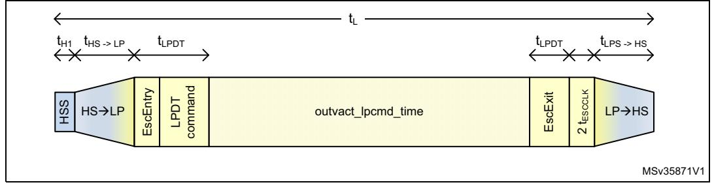

RM0399 Rev 4 1291/3556

This time is calculated as follows:

LPSIZE = (tL - (tH1 + tHS->LP + tLPHS + tLPDT + 2 tESCCLK)) / (2 × 8 × tESCCLK), where

- tL = line time
- tH1 = time of the HSA pulse for sync pulses mode (*[Figure 272](#page-27-0)*) or time to send the HSS packet, including EoTp (*[Figure 273](#page-27-1)*)
- tHS->LP = time to enter the low-power mode
- tLP->HS = time to leave the low-power mode
- tLPDT = D-PHY timing related with escape mode entry, LPDT command, and escape exit. According to the D-PHY specification, this value is always 11 bits in LP (or 22 TX escape clock cycles)
- tESCCLK = escape clock period as programmed in the TXECKDIV field of the DSI\_CCR register
- tESCCLK = delay imposed by the DSI Host implementation.

In the above equation, division by eight is done to convert the available time to bytes. Division by two is done because one bit is transmitted every two escape clock cycles. The largest packet size (LPSIZE) field can be compared directly with the size of the command to be transmitted to determine if there is enough time to transmit the command. The maximum size of a command that can be transmitted in low-power mode is limited to 255 bytes by this field. Program this register to a value greater than or equal to 4 bytes for the transmission of the DCTRL commands, such as shutdown and color in low-power mode.

Consider an example of a frame with 12.4 μs per line and assume an escape clock frequency of 20 MHz and a lane bit rate of 800 Mbit/s. In this case, it is possible to send 124 bits in escape mode (that is, 124 bit = 12.4 μs \* 20 MHz / 2). Still, you need to consider the D-PHY protocol and PHY timings.

The following assumptions are made:

- lane byte clock period is 10 ns (800 Mbit/s per lane)
- escape clock period is 50 ns (DSI\_CCR.TXECKDIV = 5)
- video is transmitted in non-burst mode with sync pulses bounded by HSS and HSE packets
- DSI is configured for two lanes
- D-PHY takes 180 ns to transit from low-power to high-speed mode (DSI\_DLTCR.LS2HS\_TIME = 18)
- D-PHY takes 200 ns to transit from high-speed to low-power mode (DSI\_DLTCR.HS2LP\_TIME = 20)
- tHSA = 420 ns.

In this example, a 13-byte command can be transmitted as follows:

LPSIZE = (12.4 μs - (420 ns + 180 ns +200 ns + (22 × 50 ns + 2 × 50 ns))) / (2 × 8 × 50 ns) = 13 bytes.

### **Calculating the time to transmit commands in low-power mode in HFP region**

The VACT largest packet size (VLPSIZE) field of the DSI Host low-power mode configuration register (DSI\_LPMCR) indicates the time available (in bytes) to transmit a command in low-power mode (based on the escape clock) in the vertical active (VACT) region.


To calculate the value of VACT largest packet size (VLPSIZE), consider the video mode being used. *[Figure 274](#page-29-0)* shows the timing intervals for video mode in non-burst with sync pulses, *[Figure 275](#page-29-1)* those for video mode in non-burst with sync events, and *[Figure 276](#page-29-2)* refers to the burst video mode.

**Figure 274. VLPSIZE for non-burst with sync pulses**

<span id="page-29-0"></span>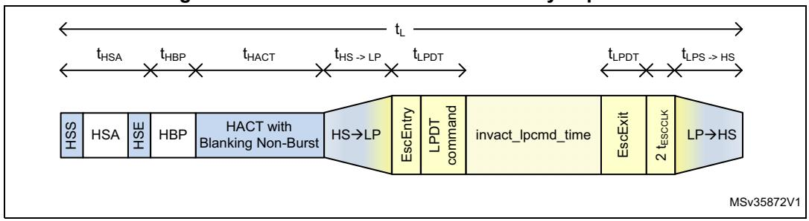

**Figure 275. VLPSIZE for non-burst with sync events**

<span id="page-29-1"></span>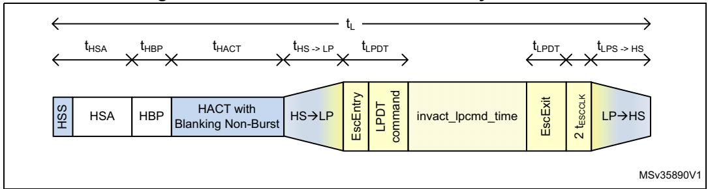

**Figure 276. VLPSIZE for burst mode**

<span id="page-29-2"></span>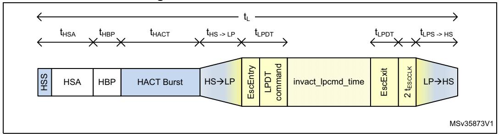

This time is calculated as follows:

$$\label{eq:VLPSIZE} $$ VLPSIZE = (t_L - (t_{HSA} + t_{HBP} + t_{HACT} + t_{HS->LP} + t_{LP->HS} + t_{LPDT} + 2 t_{ESCCLK})) / (2 \times 8 \times t_{ESCCLK}) $$$$

### where

- tL = line time
- tHSA = time of the HSA pulse (DSI\_VHSACR.HSA)
- tHBP = time of horizontal back-porch (DSI\_VHBPCR.HBP)
- tHACT = time of video active. For burst mode, the video active is time compressed and is calculated as tHACT = VPSIZE \* Bytes\_per\_Pixel /Number\_Lanes \* tLane\_byte\_clk
- tESCCLK = escape clock period as programmed in TXECKDIV field of the DSI\_CCR register.

RM0399 Rev 4 1293/3556

The VLPSIZE field can be compared directly with the size of the command to be transmitted to determine if there is time to transmit the command.

Consider an example of a frame with 16.4 μs per line and assume an escape clock frequency of 20 MHz and a lane bit rate of 800 Mbits/s. In this case, it is possible to send 420 bits in escape mode (that is, 164 bits = 16.4 μs \* 20 MHz / 2). Still, since it is the vertical active region of the frame, consider the HSA, HBP, and HACT timings apart from the D-PHY protocol and PHY timings. The following assumptions are made:

- number of active lanes is four
- Lane byte clock period (lanebyteclkperiod) is 10 ns (800 Mbit/s per lane)
- escape clock period is 50 ns (DSI\_CCR.TXECKDIV = 5)
- D-PHY takes 180 ns to pass from low-power to high-speed mode (DSI\_DLTCR.LP2HS\_TIME = 18)
- D-PHY takes 200 ns to pass from high-speed to low-power mode (DSI\_DLTCR.HS2LP\_TIME = 20)
- tHSA = 420 ns
- tHBP = 800 ns
- tHACT = 12800 ns to send 1280 pixel at 24 bpp
- video is transmitted in non-burst mode
- DSI is configured for four lanes.

In this example, consider that video is sent in non-burst mode. The VLPSIZE is calculated as follows:

```
VLPSIZE = (16.4 µs -(420 ns + 800 ns + 12.8 µs + 180 ns +200 ns +
(22 × 50 ns + 2 × 50 ns)) / (2 × 8 × 50 ns) = 1 byte
```

Only one byte can be transmitted in this period. A short packet (for example, generic short write) requires a minimum of four bytes. Therefore, in this example, commands are not sent in the VACT region.

If burst mode is enabled, more time is available to transmit the commands in the VACT region, because HACT is time compressed.

```
VLPSIZE = (16.4 µs - (420 ns + 800 ns + (1280 × 3 / 4 × 10 ns) + 180 ns + 200 ns +
(22 × 50 ns + 2 × 50 ns) / (2 × 8 × 50 ns) = 5 bytes
```

For burst mode, the VLPSIZE is 5 bytes and then a 4-byte short packet can be sent.

### **Transmission of commands in different periods**

The LPSIZE and VLPSIZE fields allow a simple comparison to determine if a command can be transmitted in any of the BLLP periods.

*[Figure 277](#page-31-0)* illustrates the meaning of VLPSIZE and LPSIZE, matching them with the shaded areas and the VACT region.

<span id="page-31-0"></span>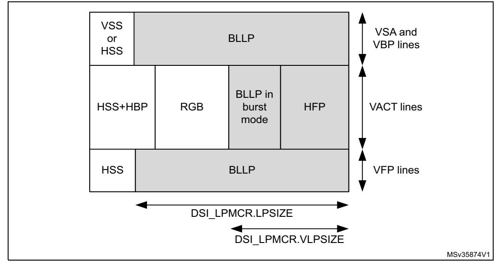

**Figure 277. Location of LPSIZE and VLPSIZE in the image area**

# **34.9.3 Transmission of commands in high-speed**

If the LPCE bit of the DSI\_VMCR register is 0, the commands are sent in high-speed in video mode. In this case, the DSI Host automatically determines the area where each command can be sent and no programming or calculation is required.

## **34.9.4 Read command transmission**

The MRD\_TIME field of the DSI\_DLTCR register configures the maximum amount of time required to perform a read command in lane byte clock cycles, it is calculated as:

MRD\_TIME = time to transmit the read command in low-power mode + time to enter and leave low-power mode + time to return the read data packet from the peripheral device.

The time to return the read data packet from the peripheral depends on the number of bytes read and the escape clock frequency of the peripheral, not the escape clock of the host. The MRD\_TIME field is used in both high-speed and low-power mode to determine if there is time to complete a read command in a BLLP period.

In high-speed mode (LPCE = 0), MRD\_TIME is calculated as follows:

MRD\_TIME = (tHS->LP + tLP->HS + tread + 2 x tBTA) / lanebyteclkperiod

In low-power mode (LPCE = 1), MRD\_TIME is calculated as follows:

MRD\_TIME = (tHS->LP + tLP->HS + tLPDT + tlprd + tread + 2 x tBTA) / lanebyteclkperiod, where:

- tHS->LP = time to enter the low-power mode
- tLP->HS = time to leave the low-power mode
- tLPDT = D-PHY timing related to escape mode entry, LPDT command, and escape mode exit (according to the D-PHY specification, this value is always 11 bits in LP, or 22 TX escape clock cycles)
- tlprd = read command time in low-power mode (64 \* TX esc clock)
- tread = time to return the read data packet from the peripheral
- tBTA = time to perform a bus-turn-around (D-PHY dependent).

RM0399 Rev 4 1295/3556

Keep the maximum number of bytes read from the peripheral to a minimum, to issue the read commands in a line time. Ensure that MRD\_TIME x lane byte clock period is less than LPSIZE x 16 x escape clock period of the host, otherwise, the read commands are dispatched on the last line of a frame. If it is necessary to read a large number of parameters (> 16), increase the MRD\_TIME while the read command is executed. When the read has completed, decrease the MRD\_TIME to a lower value.

If a read command is issued on the last line of a frame, the LTDC interface is halted and stays halted until the read command is in progress. The video transmission must be stopped during this period.

# **34.9.5 Clock lane in low-power mode**

To reduce the power consumption of the D-PHY, the DSI Host, when not transmitting in the high-speed mode, allows the clock lane to enter into the low-power mode. The controller automatically handles the transition of the clock lane from HS (clock lane active sending clock) to LP state without direct intervention by the software. This feature can be enabled by configuring the DPCC and the ACR bits of the DSI\_CLCR register.

In the command mode, the DSI Host can place the clock lane in the low-power mode when it does not have any HS packets to transmit.

In the video mode (LTDC interface), the DSI Host controller uses its internal video and PHY timing configurations to determine if there is time available for the clock line to enter the lowpower mode and not compromise the video data transmission of pixel data and sync events.

Along with a correct configuration of the video mode (see *[Section 34.5: Functional](#page-6-0)  [description: video mode on LTDC interface](#page-6-0)*), the DSI Host needs to know the time required by the clock lane to go from high-speed to low-power mode and vice-versa. The values required can be obtained from the D-PHY specification: program the DSI\_CLTCR register with the following values:

- HS2LP\_TIME = time from HS to LP in clock lane / byte clock period in HS (lanebyteclk)
- LP2HS\_TIME = time from LP to HS in clock lane / byte clock period in HS (lanebyteclk)

Based on the programmed values, the DSI Host calculates if there is enough time for the clock lane to enter the low-power mode during inactive regions of the video frame.

The DSI Host decides the best approach to follow regarding power saving out of the three possible scenarios:

- there is no enough time to go to the low-power mode. Therefore, blanking period is added as shown in *[Figure 278](#page-32-0)*
- there is enough time for the data lanes to go to the low-power mode but not enough time for the clock lane to enter the low-power mode, see *[Figure 279](#page-33-0)*.
- there is enough time for both data lanes and clock lane to go to the low-power mode, as in *[Figure 280](#page-33-1)*.

<span id="page-32-0"></span>

**Figure 278. Clock lane and data lane in HS**

<span id="page-33-0"></span>**Figure 279. Clock lane in HS and data lanes in LP**

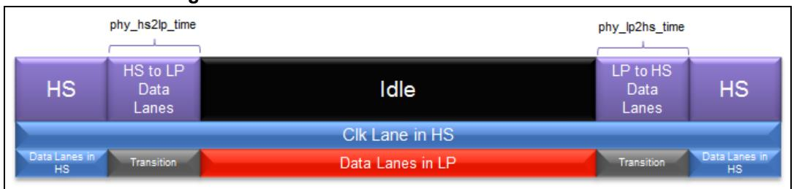

**Figure 280. Clock lane and data lane in LP**

<span id="page-33-1"></span>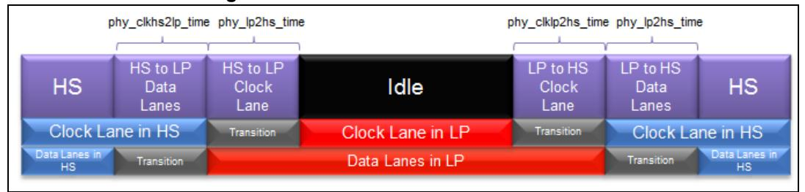

# **34.10 Functional description: virtual channels**

The DSI Host supports choosing the virtual channel (VC) for use for each interface. Using multiple virtual channels, the system can address multiples displays at the same time, when each display has a different virtual channel identifier.

When the LTDC interface is configured for a particular virtual channel, it is possible to use the APB slave generic interface to issue the commands while the video stream is being transmitted. With this, it is possible to send the commands through the ongoing video stream, addressing different virtual channels and thus enable the interface with multiple displays. During the video mode, the video stream transmission has the maximum priority. Therefore, the transmission of sideband packets such as the ones from the generic interface are only transported when there is time available within the video stream transmission. The DSI Host identifies the available time periods and uses them to transport the generic interface packets. *[Figure 281](#page-34-0)* illustrates where the DSI Host inserts the packets from the APB generic interface within the video stream transmitted by the LTDC interface.

<span id="page-34-0"></span>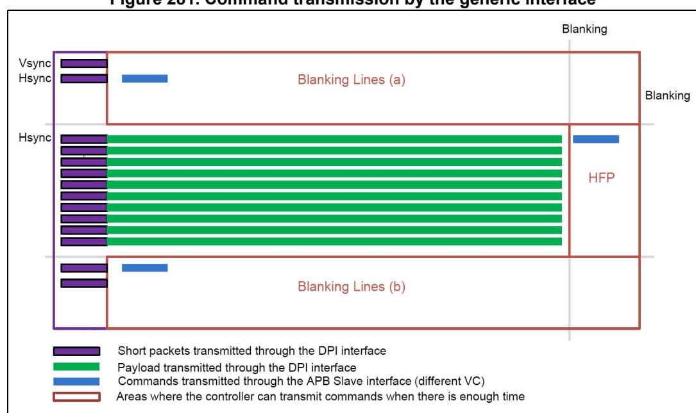

**Figure 281. Command transmission by the generic interface**

It is also possible to address the multiple displays with only the generic interface using different virtual channels. Because the generic interface is not restricted to any particular virtual channel through configuration, it is possible to issue the packets with different virtual channels. This enables the interface to time multiplex the packets to be provided to the displays with different virtual channels.

You can use the following configuration registers to select the virtual channel ID associated with transmissions over the LTDC and APB slave generic interfaces:

- DSI\_LVCIDR.VCID field configures the virtual channel ID that is indexed to the video mode packets using the LTDC interface.
- DSI\_GHCR register configures the packet header (which includes the virtual channel ID to be used) for transmissions using APB slave generic interface.
- DSI\_GVCIDR register configures the virtual channel ID of the read responses to store and return to the generic interface.

# **34.11 Functional description: video mode pattern generator**

The video mode pattern generator allows the transmission of horizontal/vertical color bar and D-PHY BER testing pattern without any stimuli.

The frame requirements must be defined in video registers that are listed in *[Table 286](#page-35-0)*.

**Table 286. Frame requirement configuration registers** 

<span id="page-35-0"></span>

| Register name                            | Description                 |  |  |  |
|------------------------------------------|-----------------------------|--|--|--|
| DSI Host video mode configuration        | Video mode configuration    |  |  |  |
| DSI Host video packet configuration      | Video packet size           |  |  |  |
| DSI Host video chunks configuration      | Number of chunks            |  |  |  |
| DSI Host video null packet configuration | Null packet size            |  |  |  |
| DSI Host video HSA configuration         | Horizontal sync active time |  |  |  |
| DSI Host video HBP configuration         | Horizontal back-porch time  |  |  |  |
| DSI Host video line configuration        | Line time                   |  |  |  |
| DSI Host video VSA configuration         | Vertical sync active period |  |  |  |
| DSI Host video VBP configuration         | Vertical back-porch period  |  |  |  |
| DSI Host video VFP configuration         | Vertical front-porch period |  |  |  |
| DSI Host video VA configuration          | Vertical resolution         |  |  |  |

## **34.11.1 Color bar pattern**

The color bar pattern comprises eight bars for white, yellow, cyan, green, magenta, red, blue, and black colors.

Each color width is calculated by dividing the line pixel size (vertical pattern) or the number of lines (horizontal pattern) by eight. In the vertical color bar mode (*[Figure 282](#page-36-0)*), each single color bar has a width of the number of pixels in a line divided by eight. In case the number of pixels in a line is not divisible by eight, the last color (black) contains the remaining.

In the horizontal color bar mode (*[Figure 283](#page-36-1)*), each color line has a color width of the number of lines in a frame divided by eight. In case the number of lines in a frame is not divisible by eight, the last color (black) contains the remaining lines.

<span id="page-36-0"></span>**Figure 282. Vertical color bar mode**


**Figure 283. Horizontal color bar mode**

<span id="page-36-1"></span>

## **34.11.2 Color coding**

*[Table 287](#page-37-0)* shows the RGB components used.

**Table 287. RGB components** 

<span id="page-37-0"></span>

|   | White | Yellow | Cyan | Green | Magenta | Red  | Blue | Black |
|---|-------|--------|------|-------|---------|------|------|-------|
| R | High  | High   | Low  | Low   | High    | High | Low  | Low   |
| G | High  | High   | High | High  | Low     | Low  | Low  | Low   |
| B | High  | Low    | High | Low   | High    | Low  | High | Low   |

## **34.11.3 BER testing pattern**

The BER testing pattern simplifies conformance testing. This pattern tests the RX D-PHY capability to receive the data correctly. The following data patterns are required:

- X bytes of 0xAA (high-frequency pattern, inverted)
- X bytes of 0x33 (mid-frequency pattern)
- X bytes of 0xF0 (low-frequency pattern, inverted)
- X bytes of 0x7F (lone 0 pattern)
- X bytes of 0x55 (high-frequency pattern)
- X bytes of 0xCC (mid-frequency pattern, inverted)
- X bytes of 0x0F (low-frequency pattern)
- Y bytes of 0x80 (lone 1 pattern).

In most cases, Y is equal to X. However, depending on line length and the color coding used, Y may be different from X. With RGB888 color coding and horizontal resolution in multiples of eight, the pattern shown in *[Figure 284](#page-37-1)* appears on the DSI display.

<span id="page-37-1"></span>

**Figure 284. RGB888 BER testing pattern**

## **34.11.4 Video mode pattern generator resolution**

Depending on the orientation, BER mode, and color coding, the smallest resolutions accepted by the video mode pattern generator are:

• BER mode: 8x8

• horizontal color bar mode: 8x8 • vertical color bar mode: 8x8.

### **Vertical pattern**

The width of each color bar is determined by the division of horizontal resolution (pixels) for eight test pattern colors. If the horizontal resolution is not divisible by eight, the last color (black) is extended to fill the resolution.

In the example in *[Figure 285](#page-38-0)*, the horizontal resolution is 103.

**Figure 285. Vertical pattern (103x15)**

<span id="page-38-0"></span>

### **Horizontal pattern**

The width of each color bar is determined by the division of the number of vertical resolution (lines) for eight test pattern colors. If the vertical resolution is not divisible by eight, the last color (black) is extended to fill the resolution, as shown in *[Figure 286](#page-38-1)*.

<span id="page-38-1"></span>

**Figure 286. Horizontal pattern (103x15)**

# **34.12 Functional description: D-PHY management**

The embedded MIPI® D-PHY is control directly by the DSI Host and is configured through the DSI Wrapper.

A dedicated PLL and a dedicated 1.2 V regulator are also embedded to supply the clock and the power supply to the DSI and D-PHY.

# **34.12.1 D-PHY configuration**

The D-PHY configuration is carried out through the DSI Wrapper thanks to the DSI\_WPCRx registers.

### **Timing definition**

The MIPI® D-PHY manages all the communication timing with dedicated timers. As all the timings are specified in nanoseconds, it is mandatory to configure the unit interval field to ensure the good duration of the timings.

Unit interval is configured through the DSI\_WPCR0.UIX4 field. This value defines the bit period in high-speed mode in units of 0.25 ns. If this period is not a multiple of 0.25 ns, the value driven must be rounded down.

As an example, for a 300 Mbit/s link, the unit interval is 3.33 ns, so UIX4 is 13.33. In this case a value of 13 (0x0D) must be written.

### **Slew-rate and delay tuning on pins**

To fine tune DSI communication, slew-rates and delay can be adjusted:

- slew-rate in high-speed transmission on data lane and clock lane
- slew-rate in low-power transmission on data lane and clock lane
- transmission delay in high-speed transmission on data land and clock lane

| Function                             | Lane(s)     | Value field in DSI_WPCR1 |
|--------------------------------------|-------------|--------------------------|
|                                      | Clock lane  | HSTXSRCCL                |
| Slew-rate in high-speed transmission | Data lanes  | HSTXSRCDL                |
|                                      | Clock lanes | LPSRCCL                  |
| Slew-rate in low-power transmission  | Data lanes  | LPSRCDL                  |
|                                      | Clock lane  | HSTXDCL                  |
| High-speed transmission delay        | Data lanes  | HSTXDDL                  |

**Table 288. Slew-rate and delay tuning** 

The default value for all these parameters is 2'h00. All these values can be programmed only when the DSI is stopped (DSI\_WCR.DSIEN = 0 and CR.EN = 0).

### **Low-power reception filter tuning**

The cut-off frequency of the low-pass on low-power receiver can be fine tuned through the LPRXFT field of the DSI\_WPCR1 register. The default values is 2'h00 and it can be programmed only when the DSI is stopped (CR.DSIEN = 0 and CR.EN = 0).


## **Special Sdd control**

An additional current path can be activated on both clock lane and data lane to meet the  $Sdd_{TX}$  parameter defined in the MIPI<sup>®</sup> D-PHY Specification.

This activation is done setting the SDDC bit of the DSI\_WPCR1 register.

### **Custom lane configuration**

To ease DSI integration, lane pins can be swapped and/or high-speed signals can be inverted on a lane as described in *Table 289*.

<span id="page-40-0"></span>

| Function                         | Lane        | Enable bit in DSI_WPCR0 |  |
|----------------------------------|-------------|-------------------------|--|
|                                  | Clock lane  | SWCL                    |  |
| Swap lane pins                   | Data lane 0 | SWDL0                   |  |
|                                  | Data lane 1 | SWDL1                   |  |
|                                  | Clock lane  | HSICL                   |  |
| Invert high-speed signal on lane | Data lane 0 | HSIDL0                  |  |
|                                  | Data lane 1 | HSIDL1                  |  |

Table 289. Custom lane configuration

## **Custom timing configuration**

Some of the MIPI<sup>®</sup> D-PHY timing can be tuned for specific purpose as described in *Table 290*.

<span id="page-40-1"></span>

| MIPI <sup>®</sup> timing      | Enable bit in DSI_WPCR0 | Configuration register | Field    | Default<br>value | Default<br>duration |
|-------------------------------|-------------------------|------------------------|----------|------------------|---------------------|
| t <sub>CLK-POST</sub>         | TCLKPOSTEN              | DSI_WPCR4              | TCLKPOST | 200              | 100 ns + 120*UI     |
| t <sub>LPX</sub> (clock lane) | TLPXCEN                 |                        | TLPXC    | 100              | 50 ns               |
| t <sub>HS_EXIT</sub>          | THSEXITEN               | DSI WPCR3              | THSEXIT  | 200              | 100 ns + 40*UI      |
| t <sub>LPX</sub> (data lane)  | TLPXDEN                 | DSI_WFCR3              | TLPXD    | 100              | 50 ns               |
| t <sub>HS-ZERO</sub>          | THSZEROEN               |                        | THSZERO  | 175              | 175 ns + 8*UI       |
| t <sub>HS-TRAIL</sub>         | THSTRAIL                |                        | THSTRAIL | 140              | 70 ns + 8*UI        |
| t <sub>HS-PREPARE</sub>       | THSPREPEN               | DEL MIDERA             | THSPREP  | 126              | 63 ns + 12*UI       |
| t <sub>CLK-ZERO</sub>         | TCLKZEROEN              | DSI_WPCR2              | TCLKZERO | 195              | 390 ns              |
| t <sub>CLK-PREPARE</sub>      | TCLKPREPEN              |                        | TCLKPREP | 120              | 60 ns + 20*UI       |

**Table 290. Custom timing parameters** 

All these values can be programmed only when the DSI is stopped (CR.DSIEN = 0 and CR.EN = 0).

# **34.12.2 D-PHY HS2LP and LP2HS durations**

The DSI system is able to switch to LP mode during blanking period if there is enough time between two HS transmission.

To be able to make the scheduling and estimate if it is possible or not to make the switch, the duration of the transitions from HS to LP and from LP to HS must be programmed in the DSI Host in the DSI\_CLTCR register for the clock lane and in the DSI\_DLTCR register for the data lanes.

*[Table 291](#page-41-0)* gives an estimation of the values to be programmed for these timings, expressed in lane byte clock cycles.

<span id="page-41-0"></span>

| Timing           | Value                      |
|------------------|----------------------------|
| Clock lane HS2LP | (272 +136 * UI) / (8 * UI) |
| Clock lane LP2HS | (512 + 40 * UI) / (8 * UI) |
| Data lane HS2LP  | (192 + 64 * UI) / (8 * UI) |
| Data lane LP2HS  | (256 + 32 * UI) / (8 * UI) |

**Table 291. HS2LP and LP2HS values** 

# **34.12.3 Special D-PHY operations**

The DSI Wrapper features some control bits to force the D-PHY in some particular state and/or behavior.

### **Forcing lane state**

It is possible to force the data lane and/or the clock lane in TX Stop mode through the bits FTXSMDL and FTXSMCL of the DSI\_WPCR0 register. Setting these bits causes the respective lane module to immediately jump in transmit control mode and to begin transmitting a stop state (LP-11).

This feature can be used to go back in TX mode after a wrong BTA sequence.

## **Forcing low-power receiver in low-power mode**

The FLPRXLPM bit of the DSI\_WPCR1 register enables the low-power mode of the low power receiver (LPRX). When set, the LPRX operates in low-power mode all the time. When not set, the LPRX operates in low-power mode during ULPS only.

### **Disabling turn of data lane**

When set, the TDDL bit of the DSI\_WPCR0 register forces the data lane to remain in reception mode even if a bus-turn-around request (BTA) is received from the other side.

## **34.12.4 Special low-power D-PHY functions**

The embedded D-PHY offers specific features to optimize consumption.

### **Pull-down on lanes**

The D-PHY embeds a pull-down on each lane to prevent floating states when the lanes are unused.

When set, the PDEN bit of the DSI WPCR0 register enables the pull-down on the lanes.

### Disabling contention detection on data lanes

The contention detector on the data lane can be turned off to lower the overall D-PHY consumption.

When set, the CDOFFDL bit of the DSI WPCR0 register disables the contention detection on data lanes.

This can be used in forward escape mode to reduce the static power consumption.

#### <span id="page-42-1"></span>34.12.5 **DSI PLL control**

The dedicated DSI PLL is controlled through the DSI Wrapper, as shown in Figure 287 (analog blocks and signals in gray, digital signals in black, digital blocks in light blue).

<span id="page-42-0"></span>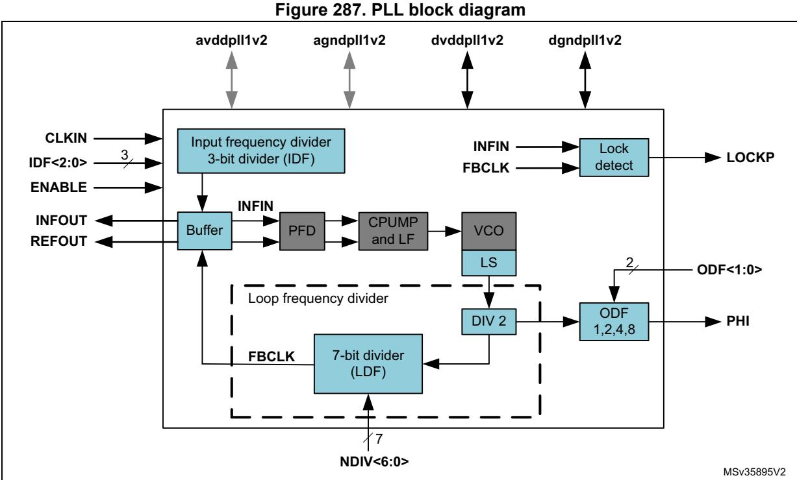

The PLL output frequency is configured through the DSI WRPCR register fields. The VCO frequency and the PLL output frequency are calculated as follows:

$$F_{VCO} = (CLK_{IN} / IDF) * 2 * NDIV,$$
  
 $PHI = F_{VCO} / (2 * ODF)$ 

### where:

- CLKIN is in the 8 to 200 MHz range
- DSI\_WRPCR.NDIV is in the 10 to 125 range
- DSI\_WRPCR.IDF is in the 1 to 7 range
- INFIN is in the 8 to 50 MHz range
- FVCO is in the 1 to 2 GHz range
- DSI\_WRPCR.ODF can be 1, 2, 4 or 8
- PHI is in the 62.5 MHz to 1 GHz range

The PLL is enabled by setting the PLLEN bit in the DSI\_WRPCR register.

Once the PLL is locked, the PLLLIF bit is set in the DSI\_WISR. If the PLLLIE bit is set in the DSI\_WIER, an interrupt is generated.

The PLL status (lock or unlock) can be monitored with the PLLLS flag in the DSI\_WISR register.

If the PLL gets unlocked, the PLLUIF bit of the DSI\_WISR is set. If the PLLUIE bit of the DSI\_WIER register is set, an interrupt is generated.

The DSI PLL settings can be changed only when the PLL is disabled.

## <span id="page-43-0"></span>**34.12.6 Regulator control**

The DSI regulator providing the 1.2 V is controlled through the DSI Wrapper.

The regulator is enabled setting the REGEN bit of the DSI\_WRPCR register.

Once the regulator is ready, the RRIF bit of the DSI\_WISR register is set. If the RRIE bit of the DSI\_WIER register is set, an interrupt is generated.

The regulator status (ready or not) can be monitored with the RRS flag in the DSI\_WISR register.

Note that the D-PHY has no separated Power ON control bit. The power ON/OFF of the D-PHY is done directly enabling the 1.2 V regulator.

When the 1.2 V regulator is disabled, the 3.3 V part of the D-PHY is automatically powered OFF.

# **34.13 Functional description: interrupts and errors**

The interrupts can be generated either by the DSI Host or by the DSI Wrapper.

All the interrupts are merged in one interrupt lane going to the interrupt controller.

## **34.13.1 DSI Wrapper interrupts**

An interrupt can be produced on the following events:

- tearing effect event
- end of refresh
- PLL locked
- PLL unlocked
- regulator ready


RM0399 Rev 4 1307/3556

Separate interrupt enable bits are available for flexibility.

**Table 292. DSI Wrapper interrupt requests** 

| Interrupt event | Event flag in DSI_WISR | Enable control bit in DSI_WIER |
|-----------------|------------------------|--------------------------------|
| Tearing effect  | TEIF                   | TEIE                           |
| End of refresh  | ERIF                   | ERIE                           |
| PLL locked      | PLLLIF                 | PLLLIE                         |
| PLL unlocked    | PLLUIF                 | PLLUIE                         |
| Regulator ready | RRIF                   | RRIE                           |

# **34.13.2 DSI Host interrupts and errors**

The DSI\_ISR0 and DSI\_ISR1 registers are associated with error condition reporting. These registers can trigger an interrupt to inform the system about the occurrence of errors.

The DSI Host has one interrupt line that is set high when an error occurs in either the DSI\_ISR0 or the DSI\_ISR1 register.

The triggering of the interrupt can be masked by programming the mask registers DSI\_IER0 and DSI\_IER1. By default all errors are masked. When any bit of these registers is set to 1, it enables the interrupt for a specific error. The error bit is always set in the respective DSI\_ISR register. The DSI\_ISR0 and DSI\_ISR1 registers are always cleared after a read operation. The interrupt line is cleared if all registers that caused the interrupt are read.

The interrupt force registers (DSI\_FIR0 and DSI\_FIR1) are used for test purposes: they allow triggering the interrupt events individually without the need to activate the conditions that trigger the interrupt sources (it is extremely complex to generate the stimuli for that purpose). This feature also facilitates the development and testing of the software associated with the interrupt events. Setting any bit of these registers to 1 triggers the corresponding interrupt.

The light yellow boxes in *Figure 288* illustrate the location of some of the errors.

<span id="page-45-0"></span>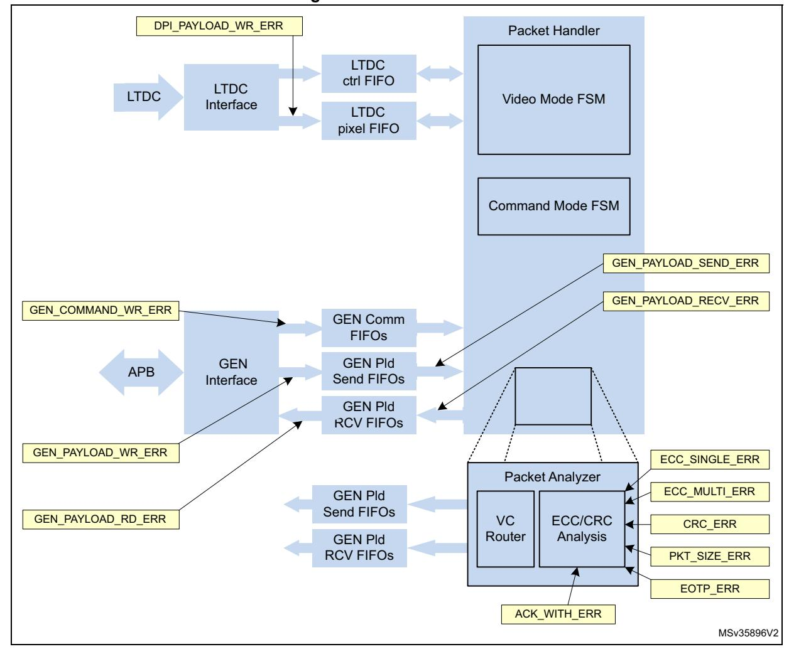

Figure 288. Error sources

*Table 293* explains the reasons that set off these interrupts and also explains how to recover from these interrupts.

<span id="page-45-1"></span>**DSI Host interrupt** Recommended method Bit Name **Error cause** and status register to handle the error The D-PHY reports the LP1 Recover the D-PHY from contention. contention error. Reset the DSI Host and transmit the 0 20 PE4 The D-PHY host detects the packets again. If this error is recurrent, contention while trying to drive carefully analyze the connectivity between the line high. the Host and the device. D-PHY reports the LP0 Recover the D-PHY from contention. contention error. Reset the DSI Host and transmit the PF3 0 19 The D-PHY Host detects the packets again. If this error is recurrent, contention while trying to drive carefully analyze the connectivity between the Host and the device. the line low.

Table 293. Error causes and recovery

Table 293. Error causes and recovery (continued)

| DSI Host interrupt and status register | Bit | Name | Error causes and recover                                                                                                                    | Recommended method to handle the error                                                                                                                                                                                                                                                                                                                                      |
|----------------------------------------|-----|------|---------------------------------------------------------------------------------------------------------------------------------------------|-----------------------------------------------------------------------------------------------------------------------------------------------------------------------------------------------------------------------------------------------------------------------------------------------------------------------------------------------------------------------------|
| 0                                      | 18  | PE2  | The D-PHY reports the false control error. The D-PHY detects an incorrect line state sequence in lane 0 lines.                              | Device does not behave as expected, communication with the device is not properly established. This is an unrecoverable error. Reset the DSI Host and the D-PHY. If this error is recurrent, analyze the behavior of the device.                                                                                                                                            |
| 0                                      | 17  | PE1  | The D-PHY reports the LPDT error. The D-PHY detects that the LDPT did not match a multiple of 8 bits.                                       | The data reception is not reliable. The D-PHY recovers but the received data from the device might not be reliable. It is recommended to reset the DSI Host and repeat the RX transmission.                                                                                                                                                                                 |
| 0                                      | 16  | PE0  | The D-PHY reports the escape entry error. The D-PHY does not recognize the received escape entry code.                                      | The D-PHY Host does not recognize the escape entry code. The transmission is ignored. The D-PHY Host recovers but the system must repeat the RX reception.                                                                                                                                                                                                                  |
| 0                                      | 15  | AE15 | This error is directly retrieved from acknowledge with error packet. The device detected a protocol violation in the reception.             | Refer to the display documentation. When this error is active, the device must have another read-back command that reports additional information about this error. Read the additional information and take appropriate actions.                                                                                                                                           |
| 0                                      | 14  | AE14 | The acknowledge with error packet contains this error. The device chooses to use this bit for error report.                                 | Refer to the device documentation regarding possible reasons for this error and take appropriate actions.                                                                                                                                                                                                                                                                   |
| 0                                      | 13  | AE13 | The acknowledge with error packet contains this error. The device reports that the transmission length does not match the packet length.    | Possible reason for this is multiple errors present in the packet header (more than 2), so the error detection fails and the device does not discard the packet. In this case, the packet header is corrupt and can cause decoding mismatches.  Transmit the packets again. If this error is recurrent, carefully analyze the connectivity between the Host and the device. |
| 0                                      | 12  | AE12 | The acknowledge with error packet contains this error. The device does not recognize the VC ID in at least one of the received packets.     | Possible reason for this is multiple errors present in the packet header (more than 2), so the error detection fails and the device does not discard the packet. In this case, the packet header is corrupt and can cause decoding mismatches.  Transmit the packets again. If this error is recurrent, carefully analyze the connectivity between the Host and the device. |
| 0                                      | 11  | AE11 | The acknowledge with error packet contains this error. The device does not recognize the data type of at least one of the received packets. | Check the device capabilities. It is possible that there are some packets not supported by the device. Repeat the transmission.                                                                                                                                                                                                                                             |

Table 293. Error causes and recovery (continued)

| DSI Host interrupt and status register | Bit | Name | Error cause                                                                                                                                         | Recommended method to handle the error                                                                                                                                                                                                                                                                                                                                                                                                        |
|----------------------------------------|-----|------|-----------------------------------------------------------------------------------------------------------------------------------------------------|-----------------------------------------------------------------------------------------------------------------------------------------------------------------------------------------------------------------------------------------------------------------------------------------------------------------------------------------------------------------------------------------------------------------------------------------------|
| 0                                      | 10  | AE10 | The acknowledge with error packet contains this error. The device detects the CRC errors in at least one of the received packets.                   | Some of the long packets, transmitted after the last acknowledge request, might contain the CRC errors in the payload. If the payload content is critical, transmit the packets again. If this error is recurrent, carefully analyze the connectivity between the Host and the device.                                                                                                                                                        |
| 0                                      | 9   | AE9  | The acknowledge with error packet contains this error. The device detects multi-bit ECC errors in at least one of the received packets.             | The device does not interpret the packets transmitted after the last acknowledge request.  If the packets are critical, transmit the packets again.  If this error is recurrent, carefully analyze the connectivity between the Host and the device.                                                                                                                                                                                          |
| 0                                      | 8   | AE8  | The acknowledge with error packet contains this error. The device detects and corrects the 1 bit ECC error in at least one of the received packets. | No action is required. The device acknowledges the packet. If this error is recurrent, analyze the signal integrity or the noise conditions of the link.                                                                                                                                                                                                                                                                                      |
| 0                                      | 7   | AE7  | The acknowledge with error packet contains this error. The device detects the line Contention through LP0/LP1 detection.                            | This error might corrupt the low-power data reception and transmission. Ignore the packets and transmit them again. The device recovers automatically. If this error is recurrent, check the device capabilities and the connectivity between the Host and device. Refer to.section 7.2.1 of the DSI Specification 1.1.                                                                                                                       |
| 0                                      | 6   | AE6  | The acknowledge with error packet contains this error. The device detects the false control error.                                                  | <ul> <li>The device detects one of the following:</li> <li>The LP-10 (LP request) is not followed by the remainder of a valid escape or turnaround sequence.</li> <li>The LP-01 (HS request) is not followed by a bridge state (LP-00).</li> <li>The D-PHY communications are corrupted. This error is unrecoverable.</li> <li>Reset the DSI Host and the D-PHY.</li> <li>Refer to the section 7.1.6 of the DSI Specification 1.1.</li> </ul> |

Table 293. Error causes and recovery (continued)

| DSI Host interrupt and status register | Bit | Name | Error cause                                                                                                                                                        | Recommended method to handle the error                                                                                                                                                                                                                                                                                                                                                                                                                                                                                                                           |
|----------------------------------------|-----|------|--------------------------------------------------------------------------------------------------------------------------------------------------------------------|------------------------------------------------------------------------------------------------------------------------------------------------------------------------------------------------------------------------------------------------------------------------------------------------------------------------------------------------------------------------------------------------------------------------------------------------------------------------------------------------------------------------------------------------------------------|
| 0                                      | 5   | AE5  | The acknowledge with error packet contains this error. The display timeout counters for a HS reception and LP transmission expire.                                 | It is possible that the Host and device timeout counters are not correctly configured. The device HS_TX timeout must be shorter than the Host HS_RX timeout. Host LP_RX timeout must be longer than the device LP_TX timeout. Check and confirm that the Host configuration is consistent with the device specifications. This error is automatically recovered, although there is no guarantee that all the packets in the transmission or reception are complete. For additional information about this error, see section 7.2.2 of the DSI Specification 1.1. |
| 0                                      | 4   | AE4  | The acknowledge with error packet contains this error. The device reports that the LPDT is not aligned in an 8-bit boundary                                        | There is no guarantee that the device properly receives the packets. Transmit the packets again. For additional information about this error, see section 7.1.5 of the DSI Specification.                                                                                                                                                                                                                                                                                                                                                                        |
| 0                                      | 3   | AE3  | The acknowledge with error packet contains this error. The device does not recognize the escape mode entry command.                                                | The device does not recognize the escape mode entry code. Check the device capability. For additional information about this error, see section 7.1.4 of the DSI Specification. Repeat the transmission to the device.                                                                                                                                                                                                                                                                                                                                           |
| 0                                      | 2   | AE2  | The acknowledge with error packet contains this error. The device detects the HS transmission did not end in an 8-bit boundary when the EoT sequence is detected.  | There is no guarantee that the device properly received the packets. Retransmission must be performed. Transmit the packets again. For additional information about this error, see section 7.1.3 of the DSI Specification 1.1.                                                                                                                                                                                                                                                                                                                                  |
| 0                                      | 1   | AE1  | The acknowledge with error packet contains this error. The device detects that the SoT leader sequence is corrupted.                                               | The device discards the incoming transmission. Re-transmission must be performed by the Host. For additional information about this error, see section 7.1.2 of the DSI Specification 1.1.                                                                                                                                                                                                                                                                                                                                                                       |
| 0                                      | 0   | AE0  | The acknowledge with error packet contains this error. The device reports that the SoT sequence is received with errors but synchronization can still be achieved. | The device is tolerant to single bit and some multi-bit errors in the SoT sequence but the packet correctness is compromised. If the packet content was important, transmit the packets again. For additional information about this error, see section 7.1.1 of the DSI Specification 1.1.                                                                                                                                                                                                                                                                      |

Table 293. Error causes and recovery (continued)

| DSI Host interrupt and status register |    |                                                   | Error cause                                                                                                                                                                                                                                                                                  | Recommended method to handle the error                                                                                                                                                                                                                                                                                       |  |  |
|----------------------------------------|----|---------------------------------------------------|----------------------------------------------------------------------------------------------------------------------------------------------------------------------------------------------------------------------------------------------------------------------------------------------|------------------------------------------------------------------------------------------------------------------------------------------------------------------------------------------------------------------------------------------------------------------------------------------------------------------------------|--|--|
| 1                                      | 12 | GPRXE                                             | An overflow occurs in the generic read FIFO.                                                                                                                                                                                                                                                 | The read FIFO size is not correctly dimensioned for the maximum read-back packet size. Configure the device to return the read data with a suitable size for the Host dimensioned FIFO. Data stored in the FIFO is corrupted. Reset the DSI Host and repeat the read procedure.                                              |  |  |
| 1                                      | 11 | GPRDE                                             | An underflow occurs in the generic read FIFO.                                                                                                                                                                                                                                                | System does not wait for the read procedure to end and starts retrieving the data from the FIFO. The read data is requested before it is fully received. Data is corrupted.  Reset the DSI Host and repeat the read procedure. Check that the read procedure is completed before reading the data through the APB interface. |  |  |
| 1                                      | 10 | GPTXE                                             | An underflow occurs in the generic write payload FIFO.                                                                                                                                                                                                                                       | The system writes the packet header before the respective packet payload is completely loaded into the payload FIFO. This error is unrecoverable, the transmitted packet is corrupted.  Reset the DSI Host and repeat the write procedure.                                                                                   |  |  |
| 1                                      | 9  | GPWRE                                             | An overflow occurs in the generic write payload FIFO.                                                                                                                                                                                                                                        | The payload FIFO size is not correctly dimensioned to store the total payload of a long packet. Data stored in the FIFO is corrupted.  Reset the DSI Host and repeat the write procedure.                                                                                                                                    |  |  |
| 1                                      | 8  | GCWRE                                             | An overflow occurs in the generic command FIFO.                                                                                                                                                                                                                                              | The command FIFO size is not correctly dimensioned to store the total headers of a burst of packets. Data stored in the FIFO is corrupted.  Reset the DSI Host and repeat the write procedure.                                                                                                                               |  |  |
| 1 7 LPWRE                              |    | An overflow occurs in the DPI pixel payload FIFO. | The controller FIFO dimensions are not correctly set up for the operating resolution. Check the video mode configuration registers. They must be consistent with the LTDC video resolution. The pixel data sequence is corrupted. Reset the DSI Host and re-initiate the Video transmission. |                                                                                                                                                                                                                                                                                                                              |  |  |
| 1                                      | 6  | EOTPE                                             | Host receives a transmission that does not end with an end of transmission packet.                                                                                                                                                                                                           | This error is not critical for the data integrity of the received packets. Check if the device supports the transmission of EoTp packets.                                                                                                                                                                                    |  |  |

Table 293. Error causes and recovery (continued)

| DSI Host interrupt and status register | Bit     | Name                                                                                          | Error cause                                                                                                                                                                                                                                                                                                                                                              | Recommended method to handle the error                                                                                                                                                                                                                                                                                                                            |  |  |  |  |
|----------------------------------------|---------|-----------------------------------------------------------------------------------------------|--------------------------------------------------------------------------------------------------------------------------------------------------------------------------------------------------------------------------------------------------------------------------------------------------------------------------------------------------------------------------|-------------------------------------------------------------------------------------------------------------------------------------------------------------------------------------------------------------------------------------------------------------------------------------------------------------------------------------------------------------------|--|--|--|--|
| 1                                      | 5       | PSE                                                                                           | Host receives a transmission that does not end in the expected by boundaries.                                                                                                                                                                                                                                                                                            | The integrity of the received data cannot be guaranteed. Reset the DSI Host and repeat the read procedure.                                                                                                                                                                                                                                                        |  |  |  |  |
| 1                                      | 4       | CRCE                                                                                          | Host reports that a received long packet has a CRC error in its payload.                                                                                                                                                                                                                                                                                                 | The received payload data is corrupted. Reset the DSI Host and repeat the read procedure. If this error is recurrent, check the DSI connectivity link for the noise levels.                                                                                                                                                                                       |  |  |  |  |
| 1                                      | 3       | ECCME                                                                                         | Host reports that a received packet contains multiple ECC errors.                                                                                                                                                                                                                                                                                                        | The received packet is corrupted. The DSI Host ignores all the following packets. The DSI Host must repeat the read procedure.                                                                                                                                                                                                                                    |  |  |  |  |
| 1                                      | 2 ECCSE |                                                                                               | Host reports that a received packet contains a single bit error.                                                                                                                                                                                                                                                                                                         | This error is not critical because the DSI Host can correct the error and properly decode the packet.  If this error is recurrent, check the DSI connectivity link for signal integrity and noise levels.                                                                                                                                                         |  |  |  |  |
| 1                                      | 1       | TOLPRX                                                                                        | Host reports that the configured timeout counter for the low-power reception has expired.                                                                                                                                                                                                                                                                                | Once the configured timeout counter ends, the DSI Host automatically resets the controller side and recovers to normal operation. Packet transmissions happening during this event are lost. If this error is recurrent, check the timer configuration for any issue. This timer must be greater than the maximum low-power transmission generated by the device. |  |  |  |  |
| 1 0 TOHSTX                             |         | Host reports that the configured timeout counter for the high-speed transmission has expired. | Once the configured timeout counter ends, the DSI Host automatically resets the controller side and recovers to normal operation. Packet transmissions happening during this event are lost.  If this error is recurrent, check the timer configuration for any issue. This timer must be greater than the maximum high-speed transmission bursts generated by the Host. |                                                                                                                                                                                                                                                                                                                                                                   |  |  |  |  |
| DSI Wrapper                            | 10      | PLLUF                                                                                         | The PLL of the D-PHY has unlocked.                                                                                                                                                                                                                                                                                                                                       | This error can be critical. The graphical subsystem must be reconfigured and restarted.                                                                                                                                                                                                                                                                           |  |  |  |  |

# **34.14 Programing procedure**

To operate the DSI Host the user must be familiar with the MIPI® DSI specification. Every software programmable register is accessible through the APB interface.

## **34.14.1 Programing procedure overview**

The procedure for video mode or adapted command mode must respect the following order:

- 1. Configure the RCC (refer to the RCC section)
  - a) Enable clock for DSI and LTDC
  - b) Configure LTDC PLL, turn it ON and wait for its lock
- 2. Optionally, configure the GPIO (if tearing effect requires GPIO usage, for example)
- 3. Optionally, validate the ISR
- 4. Configure the LTDC (refer to the LTDC section)
  - a) Program the panel timings
  - b) Enable the relevant layers
- 5. Turn on the DSI regulator and wait for the regulator to be ready, as described in *Section [34.12.6](#page-43-0)*
- 6. Configure the DSI PLL, turn it ON and wait for its lock as described in *[Section](#page-42-1) 34.12.5*
- 7. Configure the D-PHY parameters in the DSI Host and the DSI Wrapper to define D-PHY configuration and timing as detailed in *Section [34.14.2](#page-51-0)*
- 8. Configure the DSI Host timings as detailed in *[Section](#page-52-0) 34.14.3*
- 9. Configure the DSI Host flow control and DBI interface as detailed in *Section [34.14.4](#page-53-0)*
- 10. Configure the DSI Host LTDC interface as detailed in *Section [34.14.5](#page-53-1)*
- 11. Configure the DSI Host for video mode as detailed in *Section [34.14.6](#page-54-0)* or adapted command mode as detailed in *[Section](#page-58-0) 34.14.7*
- 12. Enable the D-PHY setting the DEN bit of the DSI\_PCTLR
- 13. Enable the D-PHY clock lane setting the CKEN bit of the DSI\_PCTLR
- 14. Enable the DSI Host setting the EN bit of the DSI\_CR
- 15. Enable the DSI Wrapper setting the DSIEN bit of the DSI\_WCR
- 16. Optionally, send DCS commands through the APB generic interface to configure the display
- 17. Enable the LTDC in the LTDC
- 18. Start the LTDC flow through the DSI Wrapper (DSI\_WCR.LTDCEN = 1)
  - a) In video mode, the data streaming starts as soon as the LTDC is enabled
  - b) In adapted command mode, the frame buffer update is launched as soon as bit DSI\_WCR.LTDCEN is set

## <span id="page-51-0"></span>**34.14.2 Configuring the D-PHY parameters**

The D-PHY requires a specific configuration prior starting any communications. The configuration parameters are stored either in the DSI Host or the DSI Wrapper.

### **Configuring the D-PHY parameters in the DSI Wrapper**

The DSI Wrapper can be used to fine tunes either timing or physical parameters of the D-PHY. This operation is not required for a standard usage of the D-PHY. All the fields and parameters are detailed in the register description of the DSI Wrapper.

Only one filed is mandatory to properly start the D-PHY: the unit interval multiplied by 4 (UIX4) field of the DSI Wrapper PHY configuration register 1 (DSI\_WPCR0).

This field defines the bit period in high-speed mode in unit of 0.25 ns, and is used as a timebase for all the timings managed by the D-PHY.

If the link is working at 600 Mbit/s, the unit interval shall be 1.667 ns, that becomes 6.667 ns when multiplied by four. When rounded down, a value of 6 must be written in the UIX4 field of the DSI\_WPCR0 register.

## **Configuring the D-PHY parameters in the DSI Host**

The DSI Host stores the configuration of D-PHY timing parameters and number of lanes.

The following fields must be configured prior to any startup:

- Number of data lanes in the DSI\_PCONFR register
- Automatic clock lane control (ACR) in the DSI\_CLCR register
- Clock control (DPCC) in the DSI\_CLCR register
- Time for LP/HS and HS/LP transitions for both clock lane and data lanes in DSI\_CLTCR and DSI\_DLTCR registers
- Stop wait time in the DSI\_PCONFR register

# <span id="page-52-0"></span>**34.14.3 Configuring the DSI Host timing**

All the protocol timing must be configured in the DSI Host.

### **Clock divider configuration**

Two clocks are generated internally, namely the timeout clock and the TX escape clock.

The timeout clock is used as the timing unit in the configuration of HS to LP and LP to HS transition error. Its division factor is configured by the timeout clock division (TOCKDIV) field of the DSI Host clock control register (DSI\_CCR).

The TX escape clock is used in low-power transmission. Its division factor is configured by the TX escape clock division (TXECKDIV) field of the DSI Host clock control register (DSI\_CCR) relatively to the lanebyteclock. Its typical value must be around 20 MHz.

### **Timeout configuration**

The timings for timeout management as described in *[Section 34.8](#page-19-2)* are configured in the DSI Host timeout counter configuration registers (DSI\_TCCR0 to DSI\_TCCR5).


## <span id="page-53-0"></span>**34.14.4 Configuring flow control and DBI interface**

The flow control is configured thanks to the DSI Host protocol configuration register (DSI\_PCR). The configuration parameters are the following

- CRC reception enable (CRCRXE bit)
- ECC reception enable (ECCRXE bit)
- BTA enable (BTAE bit)
- EoTp reception enable (ETRXE bit)
- EoTp transmission enable (ETTXE bit)

Their values depend upon the protocol to be used for the communication with the DSI display.

The virtual channel ID used for the generic DBI interface must be configured by the virtual channel ID (VCID) field of the DSI Host generic VCID register (DSI\_GVCIDR).

All the DCS command, depending on their type, can be transmitted or received either in high-speed or low-power. For each of them, a dedicated configuration bit must be programmed in the DSI Host command mode configuration register (DSI\_CMCR).

Acknowledge request for packet or tearing effect event must also be configured in the DSI Host command mode configuration register (DSI\_CMCR).

# <span id="page-53-1"></span>**34.14.5 Configuring the DSI Host LTDC interface**

As the DSI Host is interface to the system through the LTDC for video mode or adapted command mode, the DSI Wrapper performs a low level interfacing in between.

The parameter programmed into the DSI Wrapper must be aligned with the parameters programmed into the LTDC and the DSI Host.

The following fields must be configured:

- Virtual channel ID in the virtual channel ID (VCID) field of the DSI Host LTDC VCID register (DSI\_LVCIDR).
- Color coding (COLC) field of the DSI Host LTDC color coding register (DSI\_LCOLCR) and the color multiplexing (COLMUX) in the DSI Wrapper configuration register (DSI\_WCFGR).
- If loose packets are used for 18-bit mode, the loosely packet enable (LPE) bit of the DSI Host LTDC color coding register (DSI\_LCOLCR) must be set.
- The HSYNC polarity in the HSync polarity (HSP) bit of the DSI Host LTDC polarity configuration register (DSI\_LPCR).
- The VSYNC polarity in the VSync polarity (VSP) bit of the DSI Host LTDC polarity configuration register (DSI\_LPCR) and in the VSync polarity (VSPOL) bit of the DSI Wrapper configuration register (DSI\_WCFGR).
- The DATA ENABLE polarity data enable polarity (DEP) bit of the DSI Host LTDC polarity configuration register (DSI\_LPCR).

## <span id="page-54-0"></span>**34.14.6 Configuring the video mode**

The video mode configuration defines the behavior of the controller in low-power for command transmission, the type of video transmission (burst or non-burst mode) and the panel horizontal and vertical timing:

- Select the video transmission mode to define how the processor requires the video line to be transported through the DSI link.
  - Configure the low-power transitions in the DSI\_VMCR to define the video periods, which are permitted to go to low-power if there is time available to do so.
  - Configure if the controller must request the peripheral acknowledge message at the end of frames (DSI\_VMCR.FBTAAE).
  - Configure if commands are to be transmitted in low-power (DSI\_VMCR.LPE).
- Select the video mode type
  - Burst mode:
    - Configure the video mode type (DSI\_VMCR.VMT) with value 2'b1x. Configure the video packet size (DSI\_VPCR.VPSIZE) with the size of the active line period, measured in pixels.
    - The registers DSI\_VCCR and DSI\_VNPCR are ignored by the DSI Host.
    - Non-burst mode:

Configure the video mode type (DSI\_VMCR.VMT) with 2'b00 to enable the transmission of sync pulses or with 2'b01 to enable the transmission of sync events.

Configure the video packet size (DSI\_VPCR.VPSIZE) with the number of pixels to be transmitted in a single packet. Selecting this value depends on the available memory of the attached peripheral, if the data is first stored, or on the memory you want to select for the FIFO in DSI Host.

Configure the number of chunks (DSI\_VCCR.NUMC) with the number of packets to be transmitted per video line. The value of VPSIZE \* NUMC is the number of pixels per line of video, except if NUMC is 0, which disables the multi-packets. If you set it to 1, there is still only one packet per line, but it can be part of a chunk, followed by a null packet.

Configure the null packet size (DSI\_VNPCR.NPSIZE) with the size of null packets to be inserted as part of the chunks. Setting it to 0 disables null packets.

- Define the video horizontal timing configuration as follows:
  - Configure the horizontal line time (DSI\_VLCR.HLINE) with the time taken by an LTDC video line measured in cycles of lane byte clock (for a clock lane at 500 MHz the lane byte clock period is 8 ns). When the periods of LTDC clock and lane byte clock are not multiples, the value to program the DSI\_VLCR.HLINE needs to be rounded. A timing mismatch is introduced between the lines due to the rounding of configuration values. If the DSI Host is configured not to go to low-power, this timing divergence accumulates on every line, introducing a significant amount of mismatch towards the end of the frame. The reason for this is that the DSI Host cannot resynchronize on every new line because it transmits the blanking packets when the horizontal sync event occurs on the LTDC interface. However, the accumulated mismatch must become extinct on the last line of a frame, where, according to the DSI specification, the link must always return to low-power regaining synchronization, when a new frame starts on a vertical sync event. If the accumulated timing mismatch is greater than the time in low-power on the last


- line, a malfunction occurs. This phenomenon can be avoided by configuring the DSI Host to go to low-power once per line.
- Configure the horizontal sync duration (DSI\_VHSACR.HSA) with the time taken by an LTDC horizontal sync active period measured in cycles of lane byte clock (normally a period of 8 ns).
- Configure the horizontal back-porch duration (DSI\_VHBPCR.HBP) with the time taken by the LTDC horizontal back-porch period measured in cycles of lane byte clock (normally a period of 8 ns). Special attention must be given to the calculation of this parameter.
- Define the vertical line configuration:
  - Configure the vertical sync duration (DSI\_VVSACR.VSA) with the number of lines existing in the LTDC vertical sync active period.
  - Configure the vertical back-porch duration (DSI\_VVBPCR.VBP) with the number of lines existing in the LTDC vertical back-porch period.
  - Configure the vertical front-porch duration (DSI\_VVFPCR.VFP) with the number of lines existing in the LTDC vertical front-porch period.
  - Configure the vertical active duration (DSI\_VVACR.VA) with the number of lines existing in the LTDC vertical active period.

RM0399 Rev 4 1319/3556

*[Figure 289](#page-56-0)* illustrates the steps for configuring the DPI packet transmission.

<span id="page-56-0"></span>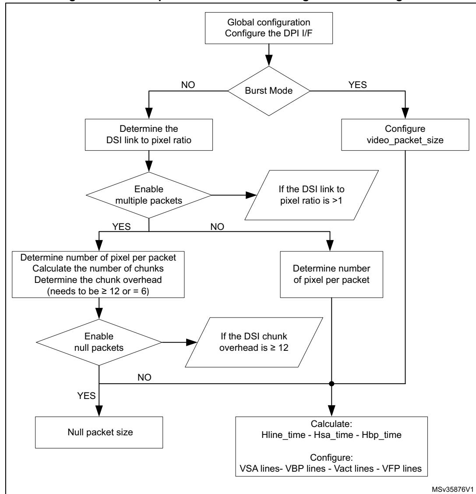

**Figure 289. Video packet transmission configuration flow diagram**

### **Example of video configuration**

The following is an example of video packet transmission configuration:

#### Video resolution:

- PCLK period = 50 ns
- HSA = 8 PCLK
- HBP = 8 PCLK
- HACT = 480 PCLK
- HFP = 24 PCLK
- VSA = 2 lines
- VBP = 2 lines
- VACT = 640 lines
- VFP = 4 lines

### Configuration steps:

- Video transmission mode configuration:
  - a) Configure the low-power transitions:

```
DSI_VMCR[13:8] = 6'b111111, to enable LP in all video period.
```

- b) DSI\_VMCR.FBTAAE = 1, for the DSI Host to request an acknowledge response message from the peripheral at the end of each frame.
- To use the burst mode, follow these steps:

```
DSI_VMCR.VMT = 2'b1x
DSI_VPCR.VPSIZE = 480
```

- Horizontal timing configuration:
  - DSI\_VLCR.HLINE = (HSA + HBP + HACT + HFP) \* (PCLK period / Clk lane byte period) = (8 + 8 + 480 + 24) \* (50 / 8) = 3250
  - DSI\_VHSACR.HSA = HSA \* (PCLK period/Clk lane byte period) = 8 \* (50 / 8) = 50
  - DSI\_VHBPCR.HBP = HBP \* (PCLK period / Clk lane byte period) = 8 \* (50 / 8) = 50
- Vertical line configuration:
  - DSI\_VVSACR.VSA = 2
  - DSI\_VVBPCR.VBP = 2
  - DSI\_VVFPCR.VFP = 4
  - DSI\_VVACR.VA = 640

## <span id="page-58-0"></span>**34.14.7 Configuring the adapted command mode**

The adapted command mode requires the following parameters to be configured:

• Command size (CMDSIZE) field of the DSI Host LTDC command configuration register (DSI\_LCCR) to define the maximum allowed size for a write memory command.

- The tearing effect source (TESRC) and optionally tearing effect polarity (TEPOL) bits of the DSI Wrapper configuration register (DSI\_WCFGR).
- The automatic refresh (AR) bit of the DSI Wrapper configuration register (DSI\_WCFGR) if the display needs to be updated automatically each time a tearing effect event is received.

## **34.14.8 Configuring the video mode pattern generator**

DSI Host can transmit a color bar pattern without horizontal/vertical color bar and D-PHY BER testing pattern without any kind of stimuli.

*[Figure 290](#page-58-1)* shows the programming sequence to send a test pattern:

- 1. Configure the DSI\_MCR register to enable video mode. Configure the video mode type using DSI\_VMCR.VMT.
- 2. Configure the DSI\_LCOLCR register.
- 3. Configure the frame using registers shown in *[Figure](#page-59-0) 291* (where the gray area indicates the transferred pixels).
- 4. Configure the pattern generation mode (DSI\_VMCR.PGM) and the pattern orientation (DSI\_VMCR.PGO), and enable them (DSI\_VMCR.PGE).

<span id="page-58-1"></span>

**Figure 290. Programming sequence to send a test pattern**

<span id="page-59-0"></span>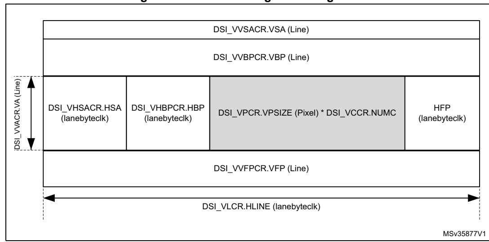

Figure 291. Frame configuration registers

Note: The number of pixels of payload is restricted to a multiple of a value provided in Table 282.

# 34.14.9 Managing ULPM

There are two ways to configure the software to enter and exit the ULPM:

- enter and exit the ULPM with the D-PHY PLL running (a faster process)
- enter and exit the ULPM with the D-PHY PLL turned off (a more efficient process in terms of power consumption).

## **Clock management for ULPM sequence**

The ULPM management state machine is working on the lanebyteclock provided by the D-PHY.

Because the D-PHY is providing the lanebyteclock only when the clock lane is not in ULPM state, it is mandatory to switch the lanebyteclock source of the DSI Host before starting the ULPM mode entry sequence.

The lanebyteclock source is controlled by the RCC. It can be

- the lanebyteclock provided by the D-PHY (for all modes except ULPM)
- a clock generated by the system PLL (for ULPM)

### **Process flow to enter the ULPM**

Implement the process described in detail in the following procedure to enter the ULPM on both clock lane and data lanes:

- 1. Verify the initial status of the DSI Host:
  - DSI\_PCTLR[2:1] = 2'h3
  - DSI\_WRPCR.PLLEN = 1'h1 and DSI\_WRPCR.REGEN = 1'h1
  - DSI\_PUCR[3:0] = 4'h0
  - DSI\_PTTCR[3:0] = 4'h0
  - Verify that all active lanes are in Stop state and the D-PHY PLL is locked: One-lane configuration: DSI\_PSR[6:4] = 3'h3 and DSI\_PSR[1] = 1'h0 and DSI\_WISR.PLLS = 1'h1

Two-lanes configuration: DSI\_PSR[8:4] = 5'h1B and DSI\_PSR[1] = 1'h0 and DSI\_WISR.PLLS = 1'h1

- 2. Switch the lanebyteclock source in the RCC from D-PHY to system PLL
- 3. Set DSI\_PUCR[3:0] = 4'h5 to enter ULPM in the data and the clock lanes.
- 4. Wait until the D-PHY active lanes enter into ULPM:
  - One-lane configuration: DSI\_PSR[6:1] = 6'h00
  - Two-lanes configuration: DSI\_PSR[8:1] = 8'h00

The DSI Host is now in ULPM.

5. Turn off the D-PHY PLL by setting DSI\_WRPCR.PLLEN = 1'b0

# **Process flow to exit the ULPM**

Implement the process flow described in the following procedure to exit the ULPM on both clock lane and data lanes:

- 1. Verify that all active lanes are in ULPM:
  - One-lane configuration: DSI\_PSR[6:1] = 6'h00
  - Two-lanes configuration: DSI\_PSR[8:1] = 8'h00
- 2. Turn on the D-PHY PLL by setting DSI\_WRPCR.PLLEN = 1'b1.
- 3. Wait until D-PHY PLL locked
  - DSI\_WISR.PLLS = 1'b1
- 4. Without de-asserting the ULPM request bits, assert the exit ULPM bits by setting DSI\_PUCR[3:0] = 4'hF.
- 5. Wait until all active lanes exit ULPM:
  - One-lane configuration:

```
DSI_PSR[5] = 1'b1
```

DSI\_PSR[3] = 1'b1

– Two-lanes configuration:

```
DSI_PSR[8] = 1'b1
```

$$DSI_PSR[5] = 1'b1$$

$$DSI_PSR[3] = 1'b1$$

- 6. Wait for 1 ms.
- 7. De-assert the ULPM requests and the ULPM exit bits by setting DSI\_PUCR [3:0] = 4'h0.
- 8. Switch the lanbyteclock source in the RCC from system PLL to D-PHY
- 9. The DSI Host is now in Stop state and the D-PHY PLL is locked:
  - One-lane configuration:

```
DSI_PSR[6:4] = 3'h3
```

$$DSI_PSR[1] = 1'h0$$

DSI\_WRPCR.PLLEN = 1'b1

– Two-lanes configuration:

$$DSI_PSR[8:4] = 5'h1B$$

DSI\_PSR[1] = 1'h0

DSI\_WRPCR.PLLEN = 1'b1

# **34.15 DSI Host registers**

## **34.15.1 DSI Host version register (DSI\_VR)**

Address offset: 0x0000 Reset value: 0x3133 302A

| 31 | 30             | 29 | 28 | 27 | 26 | 25 | 24 | 23 | 22 | 21 | 20 | 19 | 18 | 17 | 16 |
|----|----------------|----|----|----|----|----|----|----|----|----|----|----|----|----|----|
|    | VERSION[31:16] |    |    |    |    |    |    |    |    |    |    |    |    |    |    |
| r  | r              | r  | r  | r  | r  | r  | r  | r  | r  | r  | r  | r  | r  | r  | r  |
| 15 | 14             | 13 | 12 | 11 | 10 | 9  | 8  | 7  | 6  | 5  | 4  | 3  | 2  | 1  | 0  |
|    | VERSION[15:0]  |    |    |    |    |    |    |    |    |    |    |    |    |    |    |
| r  | r              | r  | r  | r  | r  | r  | r  | r  | r  | r  | r  | r  | r  | r  | r  |

Bits 31:0 **VERSION[31:0]**: Version of the DSI Host

This read-only register contains the version of the DSI Host

# **34.15.2 DSI Host control register (DSI\_CR)**

Address offset: 0x0004 Reset value: 0x0000 0000

| 31   | 30   | 29   | 28   | 27   | 26   | 25   | 24   | 23   | 22   | 21   | 20   | 19   | 18   | 17   | 16   |
|------|------|------|------|------|------|------|------|------|------|------|------|------|------|------|------|
| Res. | Res. | Res. | Res. | Res. | Res. | Res. | Res. | Res. | Res. | Res. | Res. | Res. | Res. | Res. | Res. |
|      |      |      |      |      |      |      |      |      |      |      |      |      |      |      |      |
|      |      |      |      |      |      |      |      |      |      |      |      |      |      |      |      |
| 15   | 14   | 13   | 12   | 11   | 10   | 9    | 8    | 7    | 6    | 5    | 4    | 3    | 2    | 1    | 0    |
| Res. | Res. | Res. | Res. | Res. | Res. | Res. | Res. | Res. | Res. | Res. | Res. | Res. | Res. | Res. | EN   |

Bits 31:1 Reserved, must be kept at reset value.

Bit 0 **EN**: Enable

This bit configures the DSI Host in either power-up mode or to reset.

0: DSI Host disabled (under reset)

1: DSI Host enabled

## **34.15.3 DSI Host clock control register (DSI\_CCR)**

Address offset: 0x0008 Reset value: 0x0000 0000

| 31   | 30           | 29   | 28   | 27   | 26   | 25   | 24   | 23   | 22   | 21   | 20   | 19            | 18   | 17   | 16   |
|------|--------------|------|------|------|------|------|------|------|------|------|------|---------------|------|------|------|
| Res. | Res.         | Res. | Res. | Res. | Res. | Res. | Res. | Res. | Res. | Res. | Res. | Res.          | Res. | Res. | Res. |
|      |              |      |      |      |      |      |      |      |      |      |      |               |      |      |      |
| 15   | 14           | 13   | 12   | 11   | 10   | 9    | 8    | 7    | 6    | 5    | 4    | 3             | 2    | 1    | 0    |
|      | TOCKDIV[7:0] |      |      |      |      |      |      |      |      |      |      | TXECKDIV[7:0] |      |      |      |
| rw   | rw           | rw   | rw   | rw   | rw   | rw   | rw   | rw   | rw   | rw   | rw   | rw            | rw   | rw   | rw   |

Bits 31:16 Reserved, must be kept at reset value.

Bits 15:8 **TOCKDIV[7:0]**: Timeout clock division

This field indicates the division factor for the timeout clock used as the timing unit in the configuration of HS to LP and LP to HS transition error.

Bits 7:0 **TXECKDIV[7:0]**: TX escape clock division

This field indicates the division factor for the TX escape clock source (lanebyteclk). The values 0 and 1 stop the TX\_ESC clock generation.

# **34.15.4 DSI Host LTDC VCID register (DSI\_LVCIDR)**

Address offset: 0x000C

Reset value: 0x0000 0000

| 31   | 30   | 29   | 28   | 27   | 26   | 25   | 24   | 23   | 22   | 21   | 20   | 19   | 18   | 17   | 16        |
|------|------|------|------|------|------|------|------|------|------|------|------|------|------|------|-----------|
| Res. | Res. | Res. | Res. | Res. | Res. | Res. | Res. | Res. | Res. | Res. | Res. | Res. | Res. | Res. | Res.      |
|      |      |      |      |      |      |      |      |      |      |      |      |      |      |      |           |
| 15   | 14   | 13   | 12   | 11   | 10   | 9    | 8    | 7    | 6    | 5    | 4    | 3    | 2    | 1    | 0         |
| Res. | Res. | Res. | Res. | Res. | Res. | Res. | Res. | Res. | Res. | Res. | Res. | Res. | Res. |      | VCID[1:0] |
|      |      |      |      |      |      |      |      |      |      |      |      |      |      | rw   | rw        |

Bits 31:2 Reserved, must be kept at reset value.

Bits 1:0 **VCID[1:0]**: Virtual channel ID

These bits configure the virtual channel ID for the LTDC interface traffic.

# **34.15.5 DSI Host LTDC color coding register (DSI\_LCOLCR)**

Address offset: 0x0010

Reset value: 0x0000 0000

| 31   | 30   | 29   | 28   | 27   | 26   | 25   | 24   | 23   | 22   | 21   | 20   | 19   | 18        | 17   | 16   |
|------|------|------|------|------|------|------|------|------|------|------|------|------|-----------|------|------|
| Res. | Res. | Res. | Res. | Res. | Res. | Res. | Res. | Res. | Res. | Res. | Res. | Res. | Res.      | Res. | Res. |
|      |      |      |      |      |      |      |      |      |      |      |      |      |           |      |      |
|      |      |      |      |      |      |      |      |      |      |      |      |      |           |      |      |
| 15   | 14   | 13   | 12   | 11   | 10   | 9    | 8    | 7    | 6    | 5    | 4    | 3    | 2         | 1    | 0    |
| Res. | Res. | Res. | Res. | Res. | Res. | Res. | LPE  | Res. | Res. | Res. | Res. |      | COLC[3:0] |      |      |

Bits 31:9 Reserved, must be kept at reset value.

Bit 8 **LPE**: Loosely packet enable

This bit enables the loosely packed variant to 18-bit configuration

0: Loosely packet variant disabled

1: Loosely packet variant enabled

Bits 7:4 Reserved, must be kept at reset value.

#### Bits 3:0 **COLC[3:0]**: Color coding

This field configures the DPI color coding.

0000: 16-bit configuration 1 0001: 16-bit configuration 2 0010: 16-bit configuration 3 0011: 18-bit configuration 1 0100: 18-bit configuration 2

0101: 24-bit Others: Reserved

# **34.15.6 DSI Host LTDC polarity configuration register (DSI\_LPCR)**

Address offset: 0x0014 Reset value: 0x0000 0000

| 31   | 30   | 29   | 28   | 27   | 26   | 25   | 24   | 23   | 22   | 21   | 20   | 19   | 18   | 17   | 16   |
|------|------|------|------|------|------|------|------|------|------|------|------|------|------|------|------|
| Res. | Res. | Res. | Res. | Res. | Res. | Res. | Res. | Res. | Res. | Res. | Res. | Res. | Res. | Res. | Res. |
|      |      |      |      |      |      |      |      |      |      |      |      |      |      |      |      |
| 15   | 14   | 13   | 12   | 11   | 10   | 9    | 8    | 7    | 6    | 5    | 4    | 3    | 2    | 1    | 0    |
| Res. | Res. | Res. | Res. | Res. | Res. | Res. | Res. | Res. | Res. | Res. | Res. | Res. | HSP  | VSP  | DEP  |
|      |      |      |      |      |      |      |      |      |      |      |      |      |      |      |      |

Bits 31:3 Reserved, must be kept at reset value.

#### Bit 2 **HSP**: HSYNC polarity

This bit configures the polarity of HSYNC pin.

0: HSYNC pin active high (default)

1: VSYNC pin active low

#### Bit 1 **VSP**: VSYNC polarity

This bit configures the polarity of VSYNC pin.

0: Shutdown pin active high (default)

1: Shutdown pin active low

### Bit 0 **DEP**: Data enable polarity

This bit configures the polarity of data enable pin.

0: Data enable pin active high (default)

1: Data enable pin active low

# **34.15.7 DSI Host low-power mode configuration register (DSI\_LPMCR)**

Address offset: 0x0018 Reset value: 0x0000 0000

| 31   | 30   | 29   | 28   | 27   | 26   | 25   | 24   | 23 | 22 | 21 | 20 | 19           | 18 | 17 | 16 |
|------|------|------|------|------|------|------|------|----|----|----|----|--------------|----|----|----|
| Res. | Res. | Res. | Res. | Res. | Res. | Res. | Res. |    |    |    |    | LPSIZE[7:0]  |    |    |    |
|      |      |      |      |      |      |      |      | rw | rw | rw | rw | rw           | rw | rw | rw |
| 15   | 14   | 13   | 12   | 11   | 10   | 9    | 8    | 7  | 6  | 5  | 4  | 3            | 2  | 1  | 0  |
| Res. | Res. | Res. | Res. | Res. | Res. | Res. | Res. |    |    |    |    | VLPSIZE[7:0] |    |    |    |
|      |      |      |      |      |      |      |      | rw | rw | rw | rw | rw           | rw | rw | rw |


Bits 31:24 Reserved, must be kept at reset value.

#### Bits 23:16 **LPSIZE[7:0]**: Largest packet size

This field is used for the transmission of commands in low-power mode. It defines the size, in bytes, of the largest packet that can fit in a line during VSA, VBP and VFP regions.

Bits 15:8 Reserved, must be kept at reset value.

#### Bits 7:0 **VLPSIZE[7:0]**: VACT largest packet size

This field is used for the transmission of commands in low-power mode. It defines the size, in bytes, of the largest packet that can fit in a line during VACT regions.

## **34.15.8 DSI Host protocol configuration register (DSI\_PCR)**

Address offset: 0x002C Reset value: 0x0000 0000

| 31   | 30   | 29   | 28   | 27   | 26   | 25   | 24   | 23   | 22   | 21   | 20     | 19     | 18   | 17          | 16   |
|------|------|------|------|------|------|------|------|------|------|------|--------|--------|------|-------------|------|
| Res. | Res. | Res. | Res. | Res. | Res. | Res. | Res. | Res. | Res. | Res. | Res.   | Res.   | Res. | Res.        | Res. |
|      |      |      |      |      |      |      |      |      |      |      |        |        |      |             |      |
| 15   | 14   | 13   | 12   | 11   | 10   | 9    | 8    | 7    | 6    | 5    | 4      | 3      | 2    | 1           | 0    |
|      |      |      |      |      |      |      |      |      |      |      |        |        |      |             |      |
| Res. | Res. | Res. | Res. | Res. | Res. | Res. | Res. | Res. | Res. | Res. | CRCRXE | ECCRXE | BTAE | ETRXE ETTXE |      |

Bits 31:5 Reserved, must be kept at reset value.

#### Bit 4 **CRCRXE**: CRC reception enable

This bit enables the CRC reception and error reporting.

0: CRC reception is disabled.

1: CRC reception is enabled.

#### Bit 3 **ECCRXE**: ECC reception enable

This bit enables the ECC reception, error correction and reporting.

0: ECC reception is disabled.

1: ECC reception is enabled.

### Bit 2 **BTAE**: Bus-turn-around enable

This bit enables the bus-turn-around (BTA) request.

0: Bus-turn-around request is disabled.

1: Bus-turn-around request is enabled.

#### Bit 1 **ETRXE**: EoTp reception enable

This bit enables the EoTp reception.

0: EoTp reception is disabled.

1: EoTp reception is enabled.

### Bit 0 **ETTXE**: EoTp transmission enable

This bit enables the EoTP transmission.

0: EoTp transmission is disabled.

1: EoTp transmission is enabled.

# **34.15.9 DSI Host generic VCID register (DSI\_GVCIDR)**

Address offset: 0x0030 Reset value: 0x0000 0000

| 31   | 30   | 29   | 28   | 27   | 26   | 25   | 24   | 23   | 22   | 21   | 20   | 19   | 18   | 17   | 16        |
|------|------|------|------|------|------|------|------|------|------|------|------|------|------|------|-----------|
| Res. | Res. | Res. | Res. | Res. | Res. | Res. | Res. | Res. | Res. | Res. | Res. | Res. | Res. | Res. | Res.      |
|      |      |      |      |      |      |      |      |      |      |      |      |      |      |      |           |
|      |      |      |      |      |      |      |      |      |      |      |      |      |      |      |           |
| 15   | 14   | 13   | 12   | 11   | 10   | 9    | 8    | 7    | 6    | 5    | 4    | 3    | 2    | 1    | 0         |
| Res. | Res. | Res. | Res. | Res. | Res. | Res. | Res. | Res. | Res. | Res. | Res. | Res. | Res. |      | VCID[1:0] |

Bits 31:2 Reserved, must be kept at reset value.

Bits 1:0 **VCID[1:0]**: Virtual channel ID

This field indicates the generic interface read-back virtual channel identification.

# **34.15.10 DSI Host mode configuration register (DSI\_MCR)**

Address offset: 0x0034 Reset value: 0x0000 0001

| 31   | 30   | 29   | 28   | 27   | 26   | 25   | 24   | 23   | 22   | 21   | 20   | 19   | 18   | 17   | 16   |
|------|------|------|------|------|------|------|------|------|------|------|------|------|------|------|------|
| Res. | Res. | Res. | Res. | Res. | Res. | Res. | Res. | Res. | Res. | Res. | Res. | Res. | Res. | Res. | Res. |
|      |      |      |      |      |      |      |      |      |      |      |      |      |      |      |      |
|      |      |      |      |      |      |      |      |      |      |      |      |      |      |      |      |
| 15   | 14   | 13   | 12   | 11   | 10   | 9    | 8    | 7    | 6    | 5    | 4    | 3    | 2    | 1    | 0    |
| Res. | Res. | Res. | Res. | Res. | Res. | Res. | Res. | Res. | Res. | Res. | Res. | Res. | Res. | Res. | CMDM |

Bits 31:1 Reserved, must be kept at reset value.

Bit 0 **CMDM**: Command mode

This bit configures the DSI Host in either video or command mode.

0: DSI Host is configured in video mode. 1: DSI Host is configured in command mode.

## **34.15.11 DSI Host video mode configuration register (DSI\_VMCR)**

Address offset: 0x0038 Reset value: 0x0000 0000

| 31   | 30   | 29   | 28   | 27   | 26                                              | 25   | 24  | 23   | 22   | 21   | 20   | 19   | 18   | 17   | 16       |
|------|------|------|------|------|-------------------------------------------------|------|-----|------|------|------|------|------|------|------|----------|
| Res. | Res. | Res. | Res. | Res. | Res.                                            | Res. | PGO | Res. | Res. | Res. | PGM  | Res. | Res. | Res. | PGE      |
|      |      |      |      |      |                                                 |      | rw  |      |      |      | rw   |      |      |      | rw       |
| 15   | 14   | 13   | 12   | 11   | 10                                              | 9    | 8   | 7    | 6    | 5    | 4    | 3    | 2    | 1    | 0        |
| LPCE |      |      |      |      | FBTAAE LPHFPE LPHBPE LPVAE LPVFPE LPVBPE LPVSAE |      |     | Res. | Res. | Res. | Res. | Res. | Res. |      | VMT[1:0] |
| rw   | rw   | rw   | rw   | rw   | rw                                              | rw   | rw  |      |      |      |      |      |      | rw   | rw       |

- Bits 31:25 Reserved, must be kept at reset value.
  - Bit 24 **PGO**: Pattern generator orientation

This bit configures the color bar orientation.

- 0: Vertical color bars.
- 1: Horizontal color bars.
- Bits 23:21 Reserved, must be kept at reset value.
  - Bit 20 **PGM**: Pattern generator mode

This bit configures the pattern generator mode.

- 0: Color bars (horizontal or vertical).
- 1: BER pattern (vertical only).
- Bits 19:17 Reserved, must be kept at reset value.
  - Bit 16 **PGE**: Pattern generator enable

This bit enables the video mode pattern generator.

- 0: Pattern generator is disabled.
- 1: Pattern generator is enabled.
- Bit 15 **LPCE**: Low-power command enable

This bit enables the command transmission only in low-power mode.

- 0: Command transmission in low-power mode is disabled.
- 1: Command transmission in low-power mode is enabled.
- Bit 14 **FBTAAE**: Frame bus-turn-around acknowledge enable

This bit enables the request for an acknowledge response at the end of a frame.

- 0: Acknowledge response at the end of a frame is disabled.
- 1: Acknowledge response at the end of a frame is enabled.
- Bit 13 **LPHFPE**: Low-power horizontal front-porch enable

This bit enables the return to low-power inside the horizontal front-porch (HFP) period when timing allows.

- 0: Return to low-power inside the HFP period is disabled.
- 1: Return to low-power inside the HFP period is enabled.
- Bit 12 **LPHBPE**: Low-power horizontal back-porch enable

This bit enables the return to low-power inside the horizontal back-porch (HBP) period when timing allows.

- 0: Return to low-power inside the HBP period is disabled.
- 1: Return to low-power inside the HBP period is enabled.
- Bit 11 **LPVAE**: Low-power vertical active enable

This bit enables to return to low-power inside the vertical active (VACT) period when timing allows.

- 0: Return to low-power inside the VACT is disabled.
- 1: Return to low-power inside the VACT is enabled.
- Bit 10 **LPVFPE**: Low-power vertical front-porch enable

This bit enables to return to low-power inside the vertical front-porch (VFP) period when timing allows.

- 0: Return to low-power inside the VFP is disabled.
- 1: Return to low-power inside the VFP is enabled.

RM0399 Rev 4 1331/3556

### Bit 9 **LPVBPE**: Low-power vertical back-porch enable

This bit enables to return to low-power inside the vertical back-porch (VBP) period when timing allows.

- 0: Return to low-power inside the VBP is disabled.
- 1: Return to low-power inside the VBP is enabled.

#### Bit 8 **LPVSAE**: Low-power vertical sync active enable

This bit enables to return to low-power inside the vertical sync time (VSA) period when timing allows.

- 0: Return to low-power inside the VSA is disabled.
- 1: Return to low-power inside the VSA is enabled

#### Bits 7:2 Reserved, must be kept at reset value.

#### Bits 1:0 **VMT[1:0]**: Video mode type

This field configures the video mode transmission type :

00: Non-burst with sync pulses.

01: Non-burst with sync events.

1x: Burst mode

## **34.15.12 DSI Host video packet configuration register (DSI\_VPCR)**

Address offset: 0x003C Reset value: 0x0000 0000

| 31   | 30   | 29   | 28   | 27   | 26   | 25   | 24   | 23   | 22           | 21   | 20   | 19   | 18   | 17   | 16   |
|------|------|------|------|------|------|------|------|------|--------------|------|------|------|------|------|------|
| Res. | Res. | Res. | Res. | Res. | Res. | Res. | Res. | Res. | Res.         | Res. | Res. | Res. | Res. | Res. | Res. |
|      |      |      |      |      |      |      |      |      |              |      |      |      |      |      |      |
| 15   | 14   | 13   | 12   | 11   | 10   | 9    | 8    | 7    | 6            | 5    | 4    | 3    | 2    | 1    | 0    |
| Res. | Res. |      |      |      |      |      |      |      | VPSIZE[13:0] |      |      |      |      |      |      |
|      |      | rw   | rw   | rw   | rw   | rw   | rw   | rw   | rw           | rw   | rw   | rw   | rw   | rw   | rw   |

Bits 31:14 Reserved, must be kept at reset value.

### Bits 13:0 **VPSIZE[13:0]**: Video packet size

This field configures the number of pixels in a single video packet.

For 18-bit not loosely packed data types, this number must be a multiple of 4.

For YCbCr data types, it must be a multiple of 2 as described in the DSI specification.

# **34.15.13 DSI Host video chunks configuration register (DSI\_VCCR)**

Address offset: 0x0040 Reset value: 0x0000 0000

| 31   | 30   | 29   | 28   | 27   | 26   | 25   | 24   | 23   | 22         | 21   | 20   | 19   | 18   | 17   | 16   |
|------|------|------|------|------|------|------|------|------|------------|------|------|------|------|------|------|
| Res. | Res. | Res. | Res. | Res. | Res. | Res. | Res. | Res. | Res.       | Res. | Res. | Res. | Res. | Res. | Res. |
|      |      |      |      |      |      |      |      |      |            |      |      |      |      |      |      |
| 15   | 14   | 13   | 12   | 11   | 10   | 9    | 8    | 7    | 6          | 5    | 4    | 3    | 2    | 1    | 0    |
| Res. | Res. | Res. |      |      |      |      |      |      | NUMC[12:0] |      |      |      |      |      |      |
|      |      |      | rw   | rw   | rw   | rw   | rw   | rw   | rw         | rw   | rw   | rw   | rw   | rw   | rw   |

Bits 31:13 Reserved, must be kept at reset value.

#### Bits 12:0 **NUMC[12:0]**: Number of chunks

This register configures the number of chunks to be transmitted during a line period (a chunk consists of a video packet and a null packet).

If set to 0 or 1, the video line is transmitted in a single packet.

If set to 1, the packet is part of a chunk, so a null packet follows it if NPSIZE > 0. Otherwise, multiple chunks are used to transmit each video line.

# **34.15.14 DSI Host video null packet configuration register (DSI\_VNPCR)**

Address offset: 0x0044 Reset value: 0x0000 0000

| 31   | 30   | 29   | 28   | 27   | 26   | 25   | 24   | 23   | 22           | 21   | 20   | 19   | 18   | 17   | 16   |
|------|------|------|------|------|------|------|------|------|--------------|------|------|------|------|------|------|
| Res. | Res. | Res. | Res. | Res. | Res. | Res. | Res. | Res. | Res.         | Res. | Res. | Res. | Res. | Res. | Res. |
|      |      |      |      |      |      |      |      |      |              |      |      |      |      |      |      |
| 15   | 14   | 13   | 12   | 11   | 10   | 9    | 8    | 7    | 6            | 5    | 4    | 3    | 2    | 1    | 0    |
| Res. | Res. | Res. |      |      |      |      |      |      | NPSIZE[12:0] |      |      |      |      |      |      |
|      |      |      | rw   | rw   | rw   | rw   | rw   | rw   | rw           | rw   | rw   | rw   | rw   | rw   | rw   |

Bits 31:13 Reserved, must be kept at reset value.

Bits 12:0 **NPSIZE[12:0]**: Null packet size

This field configures the number of bytes inside a null packet.

Setting to 0 disables the null packets.

# **34.15.15 DSI Host video HSA configuration register (DSI\_VHSACR)**

Address offset: 0x0048 Reset value: 0x0000 0000

| 31   | 30   | 29   | 28   | 27   | 26   | 25   | 24   | 23   | 22   | 21        | 20   | 19   | 18   | 17   | 16   |
|------|------|------|------|------|------|------|------|------|------|-----------|------|------|------|------|------|
| Res. | Res. | Res. | Res. | Res. | Res. | Res. | Res. | Res. | Res. | Res.      | Res. | Res. | Res. | Res. | Res. |
|      |      |      |      |      |      |      |      |      |      |           |      |      |      |      |      |
|      |      |      |      |      |      |      |      |      |      |           |      |      |      |      |      |
| 15   | 14   | 13   | 12   | 11   | 10   | 9    | 8    | 7    | 6    | 5         | 4    | 3    | 2    | 1    | 0    |
| Res. | Res. | Res. | Res. |      |      |      |      |      |      | HSA[11:0] |      |      |      |      |      |

Bits 31:12 Reserved, must be kept at reset value.

Bits 11:0 **HSA[11:0]**: Horizontal synchronism active duration

This fields configures the horizontal synchronism active period in lane byte clock cycles.

# **34.15.16 DSI Host video HBP configuration register (DSI\_VHBPCR)**

Address offset: 0x004C Reset value: 0x0000 0000

| 31   | 30   | 29   | 28   | 27   | 26   | 25   | 24   | 23   | 22   | 21        | 20   | 19   | 18   | 17   | 16   |
|------|------|------|------|------|------|------|------|------|------|-----------|------|------|------|------|------|
| Res. | Res. | Res. | Res. | Res. | Res. | Res. | Res. | Res. | Res. | Res.      | Res. | Res. | Res. | Res. | Res. |
|      |      |      |      |      |      |      |      |      |      |           |      |      |      |      |      |
|      |      |      |      |      |      |      |      |      |      |           |      |      |      |      |      |
| 15   | 14   | 13   | 12   | 11   | 10   | 9    | 8    | 7    | 6    | 5         | 4    | 3    | 2    | 1    | 0    |
| Res. | Res. | Res. | Res. |      |      |      |      |      |      | HBP[11:0] |      |      |      |      |      |

Bits 31:12 Reserved, must be kept at reset value.

Bits 11:0 **HBP[11:0]**: Horizontal back-porch duration

This fields configures the horizontal back-porch period in lane byte clock cycles.

# **34.15.17 DSI Host video line configuration register (DSI\_VLCR)**

Address offset: 0x0050 Reset value: 0x0000 0000

| 31   | 30   | 29   | 28   | 27   | 26   | 25   | 24   | 23          | 22   | 21   | 20   | 19   | 18   | 17   | 16   |
|------|------|------|------|------|------|------|------|-------------|------|------|------|------|------|------|------|
| Res. | Res. | Res. | Res. | Res. | Res. | Res. | Res. | Res.        | Res. | Res. | Res. | Res. | Res. | Res. | Res. |
|      |      |      |      |      |      |      |      |             |      |      |      |      |      |      |      |
| 15   | 14   | 13   | 12   | 11   | 10   | 9    | 8    | 7           | 6    | 5    | 4    | 3    | 2    | 1    | 0    |
| Res. |      |      |      |      |      |      |      | HLINE[14:0] |      |      |      |      |      |      |      |
|      | rw   | rw   | rw   | rw   | rw   | rw   | rw   | rw          | rw   | rw   | rw   | rw   | rw   | rw   | rw   |

Bits 31:15 Reserved, must be kept at reset value.

Bits 14:0 **HLINE[14:0]**: Horizontal line duration

This fields configures the total of the horizontal line period (HSA+HBP+HACT+HFP) counted in lane byte clock cycles.

## **34.15.18 DSI Host video VSA configuration register (DSI\_VVSACR)**

Address offset: 0x0054 Reset value: 0x0000 0000

| 31   | 30   | 29   | 28   | 27   | 26   | 25   | 24   | 23   | 22   | 21   | 20       | 19   | 18   | 17   | 16   |
|------|------|------|------|------|------|------|------|------|------|------|----------|------|------|------|------|
| Res. | Res. | Res. | Res. | Res. | Res. | Res. | Res. | Res. | Res. | Res. | Res.     | Res. | Res. | Res. | Res. |
|      |      |      |      |      |      |      |      |      |      |      |          |      |      |      |      |
| 15   | 14   | 13   | 12   | 11   | 10   | 9    | 8    | 7    | 6    | 5    | 4        | 3    | 2    | 1    | 0    |
| Res. | Res. | Res. | Res. | Res. | Res. |      |      |      |      |      | VSA[9:0] |      |      |      |      |
|      |      |      |      |      |      | rw   | rw   | rw   | rw   | rw   | rw       | rw   | rw   | rw   | rw   |

Bits 31:10 Reserved, must be kept at reset value.

Bits 9:0 **VSA[9:0]**: Vertical synchronism active duration

This fields configures the vertical synchronism active period measured in number of horizontal lines.

# **34.15.19 DSI Host video VBP configuration register (DSI\_VVBPCR)**

Address offset: 0x0058 Reset value: 0x0000 0000

| 31   | 30   | 29   | 28   | 27   | 26   | 25       | 24   | 23   | 22   | 21   | 20   | 19   | 18   | 17   | 16   |  |
|------|------|------|------|------|------|----------|------|------|------|------|------|------|------|------|------|--|
| Res. | Res. | Res. | Res. | Res. | Res. | Res.     | Res. | Res. | Res. | Res. | Res. | Res. | Res. | Res. | Res. |  |
|      |      |      |      |      |      |          |      |      |      |      |      |      |      |      |      |  |
| 15   | 14   | 13   | 12   | 11   | 10   | 9        | 8    | 7    | 6    | 5    | 4    | 3    | 2    | 1    | 0    |  |
|      |      |      |      |      |      | VBP[9:0] |      |      |      |      |      |      |      |      |      |  |
| Res. | Res. | Res. | Res. | Res. | Res. |          |      |      |      |      |      |      |      |      |      |  |

Bits 31:10 Reserved, must be kept at reset value.

Bits 9:0 **VBP[9:0]**: Vertical back-porch duration

This fields configures the vertical back-porch period measured in number of horizontal lines.

# **34.15.20 DSI Host video VFP configuration register (DSI\_VVFPCR)**

Address offset: 0x005C Reset value: 0x0000 0000

| 31   | 30   | 29   | 28   | 27   | 26   | 25   | 24   | 23   | 22   | 21   | 20       | 19   | 18   | 17   | 16   |
|------|------|------|------|------|------|------|------|------|------|------|----------|------|------|------|------|
| Res. | Res. | Res. | Res. | Res. | Res. | Res. | Res. | Res. | Res. | Res. | Res.     | Res. | Res. | Res. | Res. |
|      |      |      |      |      |      |      |      |      |      |      |          |      |      |      |      |
| 15   | 14   |      |      |      |      |      |      |      |      |      |          |      |      |      |      |
|      |      | 13   | 12   | 11   | 10   | 9    | 8    | 7    | 6    | 5    | 4        | 3    | 2    | 1    | 0    |
| Res. | Res. | Res. | Res. | Res. | Res. |      |      |      |      |      | VFP[9:0] |      |      |      |      |

Bits 31:10 Reserved, must be kept at reset value.

Bits 9:0 **VFP[9:0]**: Vertical front-porch duration

This fields configures the vertical front-porch period measured in number of horizontal lines.

# **34.15.21 DSI Host video VA configuration register (DSI\_VVACR)**

Address offset: 0x0060 Reset value: 0x0000 0000

| 31   | 30   | 29   | 28   | 27   | 26   | 25   | 24   | 23   | 22       | 21   | 20   | 19   | 18   | 17   | 16   |
|------|------|------|------|------|------|------|------|------|----------|------|------|------|------|------|------|
| Res. | Res. | Res. | Res. | Res. | Res. | Res. | Res. | Res. | Res.     | Res. | Res. | Res. | Res. | Res. | Res. |
|      |      |      |      |      |      |      |      |      |          |      |      |      |      |      |      |
|      |      |      |      |      |      |      |      |      |          |      |      |      |      |      |      |
| 15   | 14   | 13   | 12   | 11   | 10   | 9    | 8    | 7    | 6        | 5    | 4    | 3    | 2    | 1    | 0    |
| Res. | Res. |      |      |      |      |      |      |      | VA[13:0] |      |      |      |      |      |      |

Bits 31:14 Reserved, must be kept at reset value.

Bits 13:0 **VA[13:0]**: Vertical active duration

This fields configures the vertical active period measured in number of horizontal lines.

# **34.15.22 DSI Host LTDC command configuration register (DSI\_LCCR)**

Address offset: 0x0064 Reset value: 0x0000 0000

| 31   | 30   | 29   | 28   | 27   | 26   | 25   | 24   | 23            | 22   | 21   | 20   | 19   | 18   | 17   | 16   |
|------|------|------|------|------|------|------|------|---------------|------|------|------|------|------|------|------|
| Res. | Res. | Res. | Res. | Res. | Res. | Res. | Res. | Res.          | Res. | Res. | Res. | Res. | Res. | Res. | Res. |
|      |      |      |      |      |      |      |      |               |      |      |      |      |      |      |      |
| 15   | 14   | 13   | 12   | 11   | 10   | 9    | 8    | 7             | 6    | 5    | 4    | 3    | 2    | 1    | 0    |
|      |      |      |      |      |      |      |      | CMDSIZE[15:0] |      |      |      |      |      |      |      |
| rw   | rw   | rw   | rw   | rw   | rw   | rw   | rw   | rw            | rw   | rw   | rw   | rw   | rw   | rw   | rw   |

Bits 31:16 Reserved, must be kept at reset value.

### Bits 15:0 **CMDSIZE[15:0]**: Command size

This field configures the maximum allowed size for an LTDC write memory command, measured in pixels. Automatic partitioning of data obtained from LTDC is permanently enabled.

# **34.15.23 DSI Host command mode configuration register (DSI\_CMCR)**

Address offset: 0x0068 Reset value: 0x0000 0000

| 31   | 30    | 29         | 28         | 27         | 26         | 25         | 24         | 23   | 22   | 21   | 20   | 19   | 18                         | 17  | 16    |
|------|-------|------------|------------|------------|------------|------------|------------|------|------|------|------|------|----------------------------|-----|-------|
| Res. | Res.  | Res.       | Res.       | Res.       | Res.       | Res.       | MRDPS      | Res. | Res. | Res. | Res. |      | DLWTX DSR0TX DSW1TX DSW0TX |     |       |
|      |       |            |            |            |            |            | rw         |      |      |      |      | rw   | rw                         | rw  | rw    |
| 15   | 14    | 13         | 12         | 11         | 10         | 9          | 8          | 7    | 6    | 5    | 4    | 3    | 2                          | 1   | 0     |
| Res. | GLWTX | GSR<br>2TX | GSR<br>1TX | GSR<br>0TX | GSW<br>2TX | GSW<br>1TX | GSW<br>0TX | Res. | Res. | Res. | Res. | Res. | Res.                       | ARE | TEARE |
|      | rw    | rw         | rw         | rw         | rw         | rw         | rw         |      |      |      |      |      |                            | rw  | rw    |

Bits 31:25 Reserved, must be kept at reset value.

Bit 24 **MRDPS**: Maximum read packet size

This bit configures the maximum read packet size command transmission type:

0: High-speed 1: Low-power

Bits 23:20 Reserved, must be kept at reset value.

Bit 19 **DLWTX**: DCS long write transmission

This bit configures the DCS long write packet command transmission type:

0: High-speed 1: Low-power

#### Bit 18 **DSR0TX**: DCS short read zero parameter transmission

This bit configures the DCS short read packet with zero parameter command transmission type:

0: High-speed

1: Low-power

#### Bit 17 **DSW1TX**: DCS short read one parameter transmission

This bit configures the DCS short read packet with one parameter command transmission type:

0: High-speed

1: Low-power

#### Bit 16 **DSW0TX**: DCS short write zero parameter transmission

This bit configures the DCS short write packet with zero parameter command transmission type:

0: High-speed

1: Low-power

#### Bit 15 Reserved, must be kept at reset value.

# Bit 14 **GLWTX**: Generic long write transmission

This bit configures the generic long write packet command transmission type :

0: High-speed

1: Low-power

#### Bit 13 **GSR2TX**: Generic short read two parameters transmission

This bit configures the generic short read packet with two parameters command transmission type:

0: High-speed

1: Low-power

### Bit 12 **GSR1TX**: Generic short read one parameters transmission

This bit configures the generic short read packet with one parameters command transmission type:

0: High-speed

1: Low-power

### Bit 11 **GSR0TX**: Generic short read zero parameters transmission

This bit configures the generic short read packet with zero parameters command transmission type:

0: High-speed

1: Low-power

#### Bit 10 **GSW2TX**: Generic short write two parameters transmission

This bit configures the generic short write packet with two parameters command transmission type:

0: High-speed

1: Low-power

#### Bit 9 **GSW1TX**: Generic short write one parameters transmission

This bit configures the generic short write packet with one parameters command transmission type:

0: High-speed

1: Low-power


RM0399 Rev 4 1337/3556

### Bit 8 **GSW0TX**: Generic short write zero parameters transmission

This bit configures the generic short write packet with zero parameters command transmission type:

0: High-speed

1: Low-power

#### Bits 7:2 Reserved, must be kept at reset value.

#### Bit 1 **ARE**: Acknowledge request enable

This bit enables the acknowledge request after each packet transmission:

0: Acknowledge request is disabled.

1: Acknowledge request is enabled.

#### Bit 0 **TEARE**: Tearing effect acknowledge request enable

This bit enables the tearing effect acknowledge request:

0: Tearing effect acknowledge request is disabled.

1: Tearing effect acknowledge request is enabled.

## **34.15.24 DSI Host generic header configuration register (DSI\_GHCR)**

Address offset: 0x006C Reset value: 0x0000 0000

| 31   | 30         | 29   | 28   | 27   | 26   | 25   | 24   | 23 | 22                   | 21 | 20 | 19         | 18 | 17 | 16 |
|------|------------|------|------|------|------|------|------|----|----------------------|----|----|------------|----|----|----|
| Res. | Res.       | Res. | Res. | Res. | Res. | Res. | Res. |    |                      |    |    | WCMSB[7:0] |    |    |    |
|      |            |      |      |      |      |      |      | rw | rw                   | rw | rw | rw         | rw | rw | rw |
| 15   | 14         | 13   | 12   | 11   | 10   | 9    | 8    | 7  | 6                    | 5  | 4  | 3          | 2  | 1  | 0  |
|      | WCLSB[7:0] |      |      |      |      |      |      |    | VCID[1:0]<br>DT[5:0] |    |    |            |    |    |    |
| rw   | rw         | rw   | rw   | rw   | rw   | rw   | rw   | rw | rw                   | rw | rw | rw         | rw | rw | rw |

Bits 31:24 Reserved, must be kept at reset value.

### Bits 23:16 **WCMSB[7:0]**: WordCount MSB

This field configures the most significant byte of the header packet's word count for long packets, or data 1 for short packets.

#### Bits 15:8 **WCLSB[7:0]**: WordCount LSB

This field configures the less significant byte of the header packet word count for long packets, or data 0 for short packets.

### Bits 7:6 **VCID[1:0]**: Channel

This field configures the virtual channel ID of the header packet.

### Bits 5:0 **DT[5:0]**: Type

This field configures the packet data type of the header packet.

# **34.15.25 DSI Host generic payload data register (DSI\_GPDR)**

Address offset: 0x0070 Reset value: 0x0000 0000

| 31 | 30         | 29 | 28 | 27 | 26 | 25 | 24 | 23 | 22         | 21 | 20 | 19 | 18 | 17 | 16 |  |  |
|----|------------|----|----|----|----|----|----|----|------------|----|----|----|----|----|----|--|--|
|    | DATA4[7:0] |    |    |    |    |    |    |    | DATA3[7:0] |    |    |    |    |    |    |  |  |
| rw | rw         | rw | rw | rw | rw | rw | rw | rw | rw         | rw | rw | rw | rw | rw | rw |  |  |
| 15 | 14         | 13 | 12 | 11 | 10 | 9  | 8  | 7  | 6          | 5  | 4  | 3  | 2  | 1  | 0  |  |  |
|    | DATA2[7:0] |    |    |    |    |    |    |    | DATA1[7:0] |    |    |    |    |    |    |  |  |
| rw | rw         | rw | rw | rw | rw | rw | rw | rw | rw         | rw | rw | rw | rw | rw | rw |  |  |

Bits 31:24 **DATA4[7:0]**: Payload byte 4

This field indicates the byte 4 of the packet payload.

Bits 23:16 **DATA3[7:0]**: Payload byte 3

This field indicates the byte 3 of the packet payload.

Bits 15:8 **DATA2[7:0]**: Payload byte 2

This field indicates the byte 2 of the packet payload.

Bits 7:0 **DATA1[7:0]**: Payload byte 1

This field indicates the byte 1 of the packet payload.

# **34.15.26 DSI Host generic packet status register (DSI\_GPSR)**

Address offset: 0x0074 Reset value: 0x0000 0015

| 31   | 30   | 29   | 28   | 27   | 26   | 25   | 24   | 23   | 22   | 21    | 20   | 19                | 18   | 17   | 16          |
|------|------|------|------|------|------|------|------|------|------|-------|------|-------------------|------|------|-------------|
| Res. | Res. | Res. | Res. | Res. | Res. | Res. | Res. | Res. | Res. | Res.  | Res. | Res.              | Res. | Res. | Res.        |
|      |      |      |      |      |      |      |      |      |      |       |      |                   |      |      |             |
| 15   | 14   | 13   | 12   | 11   | 10   | 9    | 8    | 7    | 6    | 5     | 4    | 3                 | 2    | 1    | 0           |
| Res. | Res. | Res. | Res. | Res. | Res. | Res. | Res. | Res. | RCB  | PRDFF |      | PRDFE PWRFF PWRFE |      |      | CMDFF CMDFE |
|      |      |      |      |      |      |      |      |      | r    | r     | r    | r                 | r    | r    | r           |

Bits 31:7 Reserved, must be kept at reset value.

Bit 6 **RCB**: Read command busy

This bit is set when a read command is issued and cleared when the entire response is stored in the FIFO:

0: No read command on going

1: Read command on going

Bit 5 **PRDFF**: Payload read FIFO full

This bit indicates the full status of the generic read payload FIFO:

0: Read payload FIFO not full

1: Read payload FIFO ful.

Bit 4 **PRDFE**: Payload read FIFO empty

This bit indicates the empty status of the generic read payload FIFO:

0: Read payload FIFO not empty

1: Read payload FIFO empty

#### Bit 3 **PWRFF**: Payload write FIFO full

This bit indicates the full status of the generic write payload FIFO:

0: Write payload FIFO not full

1: Write payload FIFO full

### Bit 2 **PWRFE**: Payload write FIFO empty

This bit indicates the empty status of the generic write payload FIFO:

0: Write payload FIFO not empty

1: Write payload FIFO empty

#### Bit 1 **CMDFF**: Command FIFO full

This bit indicates the full status of the generic command FIFO:

0: Write payload FIFO not full

1: Write payload FIFO full

#### Bit 0 **CMDFE**: Command FIFO empty

This bit indicates the empty status of the generic command FIFO:

0: Write payload FIFO not empty

1: Write payload FIFO empty

# **34.15.27 DSI Host timeout counter configuration register 0 (DSI\_TCCR0)**

Address offset: 0x0078 Reset value: 0x0000 0000

| 31 | 30               | 29 | 28 | 27 | 26 | 25 | 24 | 23 | 22 | 21 | 20 | 19 | 18 | 17 | 16 |
|----|------------------|----|----|----|----|----|----|----|----|----|----|----|----|----|----|
|    | HSTX_TOCNT[15:0] |    |    |    |    |    |    |    |    |    |    |    |    |    |    |
| rw | rw               | rw | rw | rw | rw | rw | rw | rw | rw | rw | rw | rw | rw | rw | rw |
| 15 | 14               | 13 | 12 | 11 | 10 | 9  | 8  | 7  | 6  | 5  | 4  | 3  | 2  | 1  | 0  |
|    | LPRX_TOCNT[15:0] |    |    |    |    |    |    |    |    |    |    |    |    |    |    |
| rw | rw               | rw | rw | rw | rw | rw | rw | rw | rw | rw | rw | rw | rw | rw | rw |

### Bits 31:16 **HSTX\_TOCNT[15:0]**: High-speed transmission timeout counter

This field configures the timeout counter that triggers a high-speed transmission timeout contention detection (measured in TOCKDIV cycles).

If using the non-burst mode and there is no enough time to switch from high-speed to lowpower and back in the period from one line data finishing to the next line sync start, the DSI link returns the low-power state once per frame, then configure the TOCKDIV and HSTX\_TOCNT to be in accordance with:

HSTX\_TOCNT \* lanebyteclkperiod \* TOCKDIV ≥ the time of one FRAME data transmission \* (1 + 10%)

In burst mode, RGB pixel packets are time-compressed, leaving more time during a scan line. Therefore, if in burst mode and there is enough time to switch from high-speed to lowpower and back in the period from one line data finishing to the next line sync start, the DSI link can return low-power mode and back in this time interval to save power. For this, configure the TOCKDIV and HSTX\_TOCNT to be in accordance with:

HSTX\_TOCNT \* lanebyteclkperiod \* TOCKDIV ≥ the time of one LINE data transmission \* (1 + 10%)

### Bits 15:0 **LPRX\_TOCNT[15:0]**: Low-power reception timeout counter

This field configures the timeout counter that triggers a low-power reception timeout contention detection (measured in TOCKDIV cycles).


# **34.15.28 DSI Host timeout counter configuration register 1 (DSI\_TCCR1)**

Address offset: 0x007C Reset value: 0x0000 0000

| 31   | 30               | 29   | 28   | 27   | 26   | 25   | 24   | 23   | 22   | 21   | 20   | 19   | 18   | 17   | 16   |
|------|------------------|------|------|------|------|------|------|------|------|------|------|------|------|------|------|
| Res. | Res.             | Res. | Res. | Res. | Res. | Res. | Res. | Res. | Res. | Res. | Res. | Res. | Res. | Res. | Res. |
|      |                  |      |      |      |      |      |      |      |      |      |      |      |      |      |      |
| 15   | 14               | 13   | 12   | 11   | 10   | 9    | 8    | 7    | 6    | 5    | 4    | 3    | 2    | 1    | 0    |
|      | HSRD_TOCNT[15:0] |      |      |      |      |      |      |      |      |      |      |      |      |      |      |
| rw   | rw               | rw   | rw   | rw   | rw   | rw   | rw   | rw   | rw   | rw   | rw   | rw   | rw   | rw   | rw   |

Bits 31:16 Reserved, must be kept at reset value.

#### Bits 15:0 **HSRD\_TOCNT[15:0]**: High-speed read timeout counter

This field sets a period for which the DSI Host keeps the link still, after sending a high-speed read operation. This period is measured in cycles of lanebyteclk. The counting starts when the D-PHY enters the Stop state and causes no interrupts.

# **34.15.29 DSI Host timeout counter configuration register 2 (DSI\_TCCR2)**

Address offset: 0x0080 Reset value: 0x0000 0000

| 31   | 30   | 29   | 28   | 27   | 26   | 25   | 24               | 23   | 22   | 21   | 20   | 19   | 18   | 17   | 16   |
|------|------|------|------|------|------|------|------------------|------|------|------|------|------|------|------|------|
| Res. | Res. | Res. | Res. | Res. | Res. | Res. | Res.             | Res. | Res. | Res. | Res. | Res. | Res. | Res. | Res. |
|      |      |      |      |      |      |      |                  |      |      |      |      |      |      |      |      |
| 15   | 14   | 13   | 12   | 11   | 10   | 9    | 8                | 7    | 6    | 5    | 4    | 3    | 2    | 1    | 0    |
|      |      |      |      |      |      |      |                  |      |      |      |      |      |      |      |      |
|      |      |      |      |      |      |      | LPRD_TOCNT[15:0] |      |      |      |      |      |      |      |      |

Bits 31:16 Reserved, must be kept at reset value.

### Bits 15:0 **LPRD\_TOCNT[15:0]**: Low-power read timeout counter

This field sets a period for which the DSI Host keeps the link still, after sending a low-power read operation. This period is measured in cycles of lanebyteclk. The counting starts when the D-PHY enters the Stop state and causes no interrupts.

## **34.15.30 DSI Host timeout counter configuration register 3 (DSI\_TCCR3)**

Address offset: 0x0084 Reset value: 0x0000 0000

| 31   | 30   | 29   | 28   | 27   | 26   | 25   | 24               | 23   | 22   | 21   | 20   | 19   | 18   | 17   | 16   |
|------|------|------|------|------|------|------|------------------|------|------|------|------|------|------|------|------|
| Res. | Res. | Res. | Res. | Res. | Res. | Res. | PM               | Res. | Res. | Res. | Res. | Res. | Res. | Res. | Res. |
|      |      |      |      |      |      |      | rw               |      |      |      |      |      |      |      |      |
| 15   | 14   | 13   | 12   | 11   | 10   | 9    | 8                | 7    | 6    | 5    | 4    | 3    | 2    | 1    | 0    |
|      |      |      |      |      |      |      | HSWR_TOCNT[15:0] |      |      |      |      |      |      |      |      |
| rw   | rw   | rw   | rw   | rw   | rw   | rw   | rw               | rw   | rw   | rw   | rw   | rw   | rw   | rw   | rw   |

Bits 31:25 Reserved, must be kept at reset value.

#### Bit 24 **PM**: Presp mode

When set to 1, this bit ensures that the peripheral response timeout caused by HSWR\_TOCNT is used only once per LTDC frame in command mode, when both the following conditions are met:

- dpivsync\_edpiwms has risen and fallen.
- Packets originated from LTDC in command mode have been transmitted and its FIFO is empty again.

In this scenario no non-LTDC command requests are sent to the D-PHY, even if there is traffic from generic interface ready to be sent, making it return to stop state. When it does so, PRESP\_TO counter is activated and only when it finishes does the controller send any other traffic that is ready.

Bits 23:16 Reserved, must be kept at reset value.

### Bits 15:0 **HSWR\_TOCNT[15:0]**: High-speed write timeout counter

This field sets a period for which the DSI Host keeps the link inactive after sending a highspeed write operation. This period is measured in cycles of lanebyteclk. The counting starts when the D-PHY enters the Stop state and causes no interrupts.

## **34.15.31 DSI Host timeout counter configuration register 4 (DSI\_TCCR4)**

Address offset: 0x0088 Reset value: 0x0000 0000

| 31   | 30   | 29   | 28   | 27   | 26   | 25   | 24               | 23   | 22   | 21   | 20   | 19   | 18   | 17   | 16   |
|------|------|------|------|------|------|------|------------------|------|------|------|------|------|------|------|------|
| Res. | Res. | Res. | Res. | Res. | Res. | Res. | Res.             | Res. | Res. | Res. | Res. | Res. | Res. | Res. | Res. |
|      |      |      |      |      |      |      |                  |      |      |      |      |      |      |      |      |
| 15   | 14   | 13   | 12   | 11   | 10   | 9    | 8                | 7    | 6    | 5    | 4    | 3    | 2    | 1    | 0    |
|      |      |      |      |      |      |      | LPWR_TOCNT[15:0] |      |      |      |      |      |      |      |      |
| rw   | rw   | rw   | rw   | rw   | rw   | rw   | rw               | rw   | rw   | rw   | rw   | rw   | rw   | rw   | rw   |

Bits 31:16 Reserved, must be kept at reset value.

### Bits 15:0 **LPWR\_TOCNT[15:0]**: Low-power write timeout counter

This field sets a period for which the DSI Host keeps the link still, after sending a low-power write operation. This period is measured in cycles of lanebyteclk. The counting starts when the D-PHY enters the Stop state and causes no interrupts.

# **34.15.32 DSI Host timeout counter configuration register 5 (DSI\_TCCR5)**

Address offset: 0x008C Reset value: 0x0000 0000

| 31   | 30              | 29   | 28   | 27   | 26   | 25   | 24   | 23   | 22   | 21   | 20   | 19   | 18   | 17   | 16   |
|------|-----------------|------|------|------|------|------|------|------|------|------|------|------|------|------|------|
| Res. | Res.            | Res. | Res. | Res. | Res. | Res. | Res. | Res. | Res. | Res. | Res. | Res. | Res. | Res. | Res. |
|      |                 |      |      |      |      |      |      |      |      |      |      |      |      |      |      |
| 15   | 14              | 13   | 12   | 11   | 10   | 9    | 8    | 7    | 6    | 5    | 4    | 3    | 2    | 1    | 0    |
|      | BTA_TOCNT[15:0] |      |      |      |      |      |      |      |      |      |      |      |      |      |      |
|      |                 |      |      |      |      |      |      |      |      |      |      |      |      |      |      |

Bits 31:16 Reserved, must be kept at reset value.

Bits 15:0 **BTA\_TOCNT[15:0]**: Bus-turn-around timeout counter

This field sets a period for which the DSI Host keeps the link still, after completing a bus-turnaround. This period is measured in cycles of lanebyteclk. The counting starts when the D-PHY enters the Stop state and causes no interrupts.

# **34.15.33 DSI Host clock lane configuration register (DSI\_CLCR)**

Address offset: 0x0094 Reset value: 0x0000 0000

| 31   | 30   | 29   | 28   | 27   | 26   | 25   | 24   | 23   | 22   | 21   | 20   | 19   | 18   | 17   | 16   |
|------|------|------|------|------|------|------|------|------|------|------|------|------|------|------|------|
| Res. | Res. | Res. | Res. | Res. | Res. | Res. | Res. | Res. | Res. | Res. | Res. | Res. | Res. | Res. | Res. |
|      |      |      |      |      |      |      |      |      |      |      |      |      |      |      |      |
|      |      |      |      |      |      |      |      |      |      |      |      |      |      |      |      |
| 15   | 14   | 13   | 12   | 11   | 10   | 9    | 8    | 7    | 6    | 5    | 4    | 3    | 2    | 1    | 0    |
| Res. | Res. | Res. | Res. | Res. | Res. | Res. | Res. | Res. | Res. | Res. | Res. | Res. | Res. | ACR  | DPCC |

Bits 31:2 Reserved, must be kept at reset value.

Bit 1 **ACR**: Automatic clock lane control

This bit enables the automatic mechanism to stop providing clock in the clock lane when time allows.

0: Automatic clock lane control disabled

1: Automatic clock lane control enabled

Bit 0 **DPCC**: D-PHY clock control

This bit controls the D-PHY clock state: 0: Clock lane is in low-power mode. 1: Clock lane runs in high-speed mode.

## **34.15.34 DSI Host clock lane timer configuration register (DSI\_CLTCR)**

Address offset: 0x0098 Reset value: 0x0000 0000

| 31   | 30   | 29   | 28   | 27   | 26   | 25 | 24              | 23 | 22 | 21 | 20 | 19 | 18 | 17 | 16 |  |
|------|------|------|------|------|------|----|-----------------|----|----|----|----|----|----|----|----|--|
| Res. | Res. | Res. | Res. | Res. | Res. |    | HS2LP_TIME[9:0] |    |    |    |    |    |    |    |    |  |
|      |      |      |      |      |      | rw | rw              | rw | rw | rw | rw | rw | rw | rw | rw |  |
| 15   | 14   | 13   | 12   | 11   | 10   | 9  | 8               | 7  | 6  | 5  | 4  | 3  | 2  | 1  | 0  |  |
| Res. | Res. | Res. | Res. | Res. | Res. |    | LP2HS_TIME[9:0] |    |    |    |    |    |    |    |    |  |
|      |      |      |      |      |      | rw | rw              | rw | rw | rw | rw |    | rw | rw | rw |  |

Bits 31:26 Reserved, must be kept at reset value.

### Bits 25:16 **HS2LP\_TIME[9:0]**: High-speed to low-power time

This field configures the maximum time that the D-PHY clock lane takes to go from high-speed to low-power transmission measured in lane byte clock cycles.

Bits 15:10 Reserved, must be kept at reset value.

#### Bits 9:0 **LP2HS\_TIME[9:0]**: Low-power to high-speed time

This field configures the maximum time that the D-PHY clock lane takes to go from low-power to high-speed transmission measured in lane byte clock cycles.

## **34.15.35 DSI Host data lane timer configuration register (DSI\_DLTCR)**

Address offset: 0x009C

Reset value: 0x0000 0000

| 31   | 30              | 29 | 28 | 27 | 26 | 25 | 24 | 23 | 22 | 21              | 20 | 19 | 18 | 17 | 16 |  |  |  |
|------|-----------------|----|----|----|----|----|----|----|----|-----------------|----|----|----|----|----|--|--|--|
|      | HS2LP_TIME[7:0] |    |    |    |    |    |    |    |    | LP2HS_TIME[7:0] |    |    |    |    |    |  |  |  |
| rw   | rw              | rw | rw | rw | rw | rw | rw | rw | rw | rw              | rw | rw | rw | rw | rw |  |  |  |
| 15   | 14              | 13 | 12 | 11 | 10 | 9  | 8  | 7  | 6  | 5               | 4  | 3  | 2  | 1  | 0  |  |  |  |
| Res. | MRD_TIME[14:0]  |    |    |    |    |    |    |    |    |                 |    |    |    |    |    |  |  |  |
|      | rw              | rw | rw | rw | rw | rw | rw | rw | rw | rw              | rw | rw | rw | rw | rw |  |  |  |

### Bits 31:24 **HS2LP\_TIME[7:0]**: High-speed to low-power time

This field configures the maximum time that the D-PHY data lanes take to go from highspeed to low-power transmission measured in lane byte clock cycles.

#### Bits 23:16 **LP2HS\_TIME[7:0]**: Low-power to high-speed time

This field configures the maximum time that the D-PHY data lanes take to go from low-power to high-speed transmission measured in lane byte clock cycles.

Bit 15 Reserved, must be kept at reset value.

### Bits 14:0 **MRD\_TIME[14:0]**: Maximum read time

This field configures the maximum time required to perform a read command in lane byte clock cycles. This register can only be modified when no read command is in progress.

# **34.15.36 DSI Host PHY control register (DSI\_PCTLR)**

Address offset: 0x00A0

Reset value: 0x0000 0000

| 31   | 30   | 29   | 28   | 27   | 26   | 25   | 24   | 23   | 22   | 21   | 20   | 19   | 18   | 17   | 16   |
|------|------|------|------|------|------|------|------|------|------|------|------|------|------|------|------|
| Res. | Res. | Res. | Res. | Res. | Res. | Res. | Res. | Res. | Res. | Res. | Res. | Res. | Res. | Res. | Res. |
|      |      |      |      |      |      |      |      |      |      |      |      |      |      |      |      |
| 15   | 14   | 13   | 12   | 11   | 10   | 9    | 8    | 7    | 6    | 5    | 4    | 3    | 2    | 1    | 0    |
| Res. | Res. | Res. | Res. | Res. | Res. | Res. | Res. | Res. | Res. | Res. | Res. | Res. | CKE  | DEN  | Res. |
|      |      |      |      |      |      |      |      |      |      |      |      |      | rw   | rw   |      |

Bits 31:3 Reserved, must be kept at reset value.

Bit 2 **CKE**: Clock enable

This bit enables the D-PHY clock lane module:

0: D-PHY clock lane module is disabled.

1: D-PHY clock lane module is enabled.

Bit 1 **DEN**: Digital enable

When set to 0, this bit places the digital section of the D-PHY in the reset state

0: The digital section of the D-PHY is in the reset state.

1: The digital section of the D-PHY is enabled.

Bit 0 Reserved, must be kept at reset value.

## **34.15.37 DSI Host PHY configuration register (DSI\_PCONFR)**

Address offset: 0x00A4 Reset value: 0x0000 0001

| 31   | 30   | 29   | 28   | 27           | 26   | 25   | 24   | 23   | 22   | 21   | 20   | 19   | 18   | 17   | 16      |
|------|------|------|------|--------------|------|------|------|------|------|------|------|------|------|------|---------|
| Res. | Res. | Res. | Res. | Res.         | Res. | Res. | Res. | Res. | Res. | Res. | Res. | Res. | Res. | Res. | Res.    |
|      |      |      |      |              |      |      |      |      |      |      |      |      |      |      |         |
| 15   | 14   | 13   | 12   | 11           | 10   | 9    | 8    | 7    | 6    | 5    | 4    | 3    | 2    | 1    | 0       |
|      |      |      |      | SW_TIME[7:0] |      |      |      | Res. | Res. | Res. | Res. | Res. | Res. |      | NL[1:0] |
| rw   | rw   | rw   | rw   | rw           | rw   | rw   | rw   |      |      |      |      |      |      | rw   | rw      |

Bits 31:16 Reserved, must be kept at reset value.

### Bits 15:8 **SW\_TIME[7:0]**: Stop wait time

This field configures the minimum wait period to request a high-speed transmission after the Stop state.

Bits 7:2 Reserved, must be kept at reset value.

#### Bits 1:0 **NL[1:0]**: Number of lanes

This field configures the number of active data lanes:

00: One data lane (lane 0)

01: Two data lanes (lanes 0 and 1) - Reset value

Others: Reserved

# **34.15.38 DSI Host PHY ULPS control register (DSI\_PUCR)**

Address offset: 0x00A8 Reset value: 0x0000 0000

| 31   | 30   | 29   | 28   | 27   | 26   | 25   | 24   | 23   | 22   | 21   | 20   | 19   | 18   | 17   | 16   |
|------|------|------|------|------|------|------|------|------|------|------|------|------|------|------|------|
| Res. | Res. | Res. | Res. | Res. | Res. | Res. | Res. | Res. | Res. | Res. | Res. | Res. | Res. | Res. | Res. |
|      |      |      |      |      |      |      |      |      |      |      |      |      |      |      |      |
| 15   | 14   | 13   | 12   | 11   | 10   | 9    | 8    | 7    | 6    | 5    | 4    | 3    | 2    | 1    | 0    |
|      |      |      |      |      |      |      |      |      |      |      |      |      |      |      |      |
| Res. | Res. | Res. | Res. | Res. | Res. | Res. | Res. | Res. | Res. | Res. | Res. | UEDL | URDL | UECL | URCL |

Bits 31:4 Reserved, must be kept at reset value.

Bit 3 **UEDL**: ULPS exit on data lane

ULPS mode exit on all active data lanes.

0: No exit request

1: Exit ULPS mode on all active data lane URDL

Bit 2 **URDL**: ULPS request on data lane

ULPS mode request on all active data lanes.

0: No ULPS request

1: Request ULPS mode on all active data lane UECL

Bit 1 **UECL**: ULPS exit on clock lane

ULPS mode exit on clock lane.

0: No exit request

1: Exit ULPS mode on clock lane

Bit 0 **URCL**: ULPS request on clock lane

ULPS mode request on clock lane.

0: No ULPS request

1: Request ULPS mode on clock lane

# **34.15.39 DSI Host PHY TX triggers configuration register (DSI\_PTTCR)**

Address offset: 0x00AC Reset value: 0x0000 0000

| 31   | 30   | 29   | 28   | 27   | 26   | 25   | 24   | 23   | 22   | 21   | 20   | 19           | 18   | 17   | 16   |
|------|------|------|------|------|------|------|------|------|------|------|------|--------------|------|------|------|
| Res. | Res. | Res. | Res. | Res. | Res. | Res. | Res. | Res. | Res. | Res. | Res. | Res.         | Res. | Res. | Res. |
|      |      |      |      |      |      |      |      |      |      |      |      |              |      |      |      |
| 15   | 14   | 13   | 12   | 11   | 10   | 9    | 8    | 7    | 6    | 5    | 4    | 3            | 2    | 1    | 0    |
|      |      |      |      |      |      |      |      |      |      |      |      | TX_TRIG[3:0] |      |      |      |
| Res. | Res. | Res. | Res. | Res. | Res. | Res. | Res. | Res. | Res. | Res. | Res. |              |      |      |      |

Bits 31:4 Reserved, must be kept at reset value.

Bits 3:0 **TX\_TRIG[3:0]**: Transmission trigger

Escape mode transmit trigger 0-3.

Only one bit of TX\_TRIG is asserted at any given time.

## **34.15.40 DSI Host PHY status register (DSI\_PSR)**

Address offset: 0x00B0

Reset value: 0x0000 1528

| 31   | 30   | 29   | 28   | 27   | 26   | 25   | 24   | 23   | 22   | 21   | 20   | 19   | 18   | 17   | 16   |
|------|------|------|------|------|------|------|------|------|------|------|------|------|------|------|------|
| Res. | Res. | Res. | Res. | Res. | Res. | Res. | Res. | Res. | Res. | Res. | Res. | Res. | Res. | Res. | Res. |
|      |      |      |      |      |      |      |      |      |      |      |      |      |      |      |      |
| 15   | 14   | 13   | 12   | 11   | 10   | 9    | 8    | 7    | 6    | 5    | 4    | 3    | 2    | 1    | 0    |
| Res. | Res. | Res. | Res. | Res. | Res. | Res. | UAN1 | PSS1 | RUE0 | UAN0 | PSS0 | UANC | PSSC | PD   | Res. |
|      |      |      |      |      |      |      | r    | r    | r    | r    | r    | r    | r    | r    |      |


Bits 31:9 Reserved, must be kept at reset value.

Bit 8 **UAN1**: ULPS active not lane 1

This bit indicates the status of ulpsactivenot1lane D-PHY signal.

Bit 7 **PSS1**: PHY stop state lane 1

This bit indicates the status of phystopstate1lane D-PHY signal.

Bit 6 **RUE0**: RX ULPS escape lane 0

This bit indicates the status of rxulpsesc0lane D-PHY signal.

Bit 5 **UAN0**: ULPS active not lane 1

This bit indicates the status of ulpsactivenot0lane D-PHY signal.

Bit 4 **PSS0**: PHY stop state lane 0

This bit indicates the status of phystopstate0lane D-PHY signal.

Bit 3 **UANC**: ULPS active not clock lane

This bit indicates the status of ulpsactivenotclklane D-PHY signal.

Bit 2 **PSSC**: PHY stop state clock lane

This bit indicates the status of phystopstateclklane D-PHY signal.

Bit 1 **PD**: PHY direction

This bit indicates the status of phydirection D-PHY signal.

Bit 0 Reserved, must be kept at reset value.

## **34.15.41 DSI Host interrupt and status register 0 (DSI\_ISR0)**

Address offset: 0x00BC Reset value: 0x0000 0000

| 31   | 30   | 29   | 28   | 27   | 26   | 25   | 24   | 23   | 22   | 21   | 20  | 19  | 18  | 17  | 16  |
|------|------|------|------|------|------|------|------|------|------|------|-----|-----|-----|-----|-----|
| Res. | Res. | Res. | Res. | Res. | Res. | Res. | Res. | Res. | Res. | Res. | PE4 | PE3 | PE2 | PE1 | PE0 |
|      |      |      |      |      |      |      |      |      |      |      | r   | r   | r   | r   | r   |
| 15   | 14   | 13   | 12   | 11   | 10   | 9    | 8    | 7    | 6    | 5    | 4   | 3   | 2   | 1   | 0   |
| AE15 | AE14 | AE13 | AE12 | AE11 | AE10 | AE9  | AE8  | AE7  | AE6  | AE5  | AE4 | AE3 | AE2 | AE1 | AE0 |
| r    | r    | r    | r    | r    | r    | r    | r    | r    | r    | r    | r   | r   | r   | r   | r   |

Bits 31:21 Reserved, must be kept at reset value.

Bit 20 **PE4**: PHY error 4

This bit indicates the LP1 contention error ErrContentionLP1 from lane 0.

Bit 19 **PE3**: PHY error 3

This bit indicates the LP0 contention error ErrContentionLP0 from lane 0.

Bit 18 **PE2**: PHY error 2

This bit indicates the ErrControl error from lane 0.

Bit 17 **PE1**: PHY error 1

This bit indicates the ErrSyncEsc low-power transmission synchronization error from lane 0.

Bit 16 **PE0**: PHY error 0

This bit indicates the ErrEsc escape entry error from lane 0.

RM0399 Rev 4 1347/3556

#### Bit 15 **AE15**: Acknowledge error 15

This bit retrieves the DSI protocol violation from the acknowledge error report.

#### Bit 14 **AE14**: Acknowledge error 14

This bit retrieves the reserved (specific to the device) from the acknowledge error report.

#### Bit 13 **AE13**: Acknowledge error 13

This bit retrieves the invalid transmission length from the acknowledge error report.

#### Bit 12 **AE12**: Acknowledge error 12

This bit retrieves the DSI VC ID Invalid from the acknowledge error report.

#### Bit 11 **AE11**: Acknowledge error 11

This bit retrieves the not recognized DSI data type from the acknowledge error report.

#### Bit 10 **AE10**: Acknowledge error 10

This bit retrieves the checksum error (long packet only) from the acknowledge error report.

### Bit 9 **AE9**: Acknowledge error 9

This bit retrieves the ECC error, multi-bit (detected, not corrected) from the acknowledge error report.

#### Bit 8 **AE8**: Acknowledge error 8

This bit retrieves the ECC error, single-bit (detected and corrected) from the acknowledge error report.

#### Bit 7 **AE7**: Acknowledge error 7

This bit retrieves the reserved (specific to the device) from the acknowledge error report.

#### Bit 6 **AE6**: Acknowledge error 6

This bit retrieves the false control error from the acknowledge error report.

# Bit 5 **AE5**: Acknowledge error 5

This bit retrieves the peripheral timeout error from the acknowledge error report.

#### Bit 4 **AE4**: Acknowledge error 4

This bit retrieves the LP transmit sync error from the acknowledge error report.

# Bit 3 **AE3**: Acknowledge error 3

This bit retrieves the escape mode entry command error from the acknowledge error report.

### Bit 2 **AE2**: Acknowledge error 2

This bit retrieves the EoT sync error from the acknowledge error report.

### Bit 1 **AE1**: Acknowledge error 1

This bit retrieves the SoT sync error from the acknowledge error report.

### Bit 0 **AE0**: Acknowledge error 0

This bit retrieves the SoT error from the acknowledge error report.

# **34.15.42 DSI Host interrupt and status register 1 (DSI\_ISR1)**

Address offset: 0x00C0 Reset value: 0x0000 0000

| 31   | 30   | 29   | 28    | 27    | 26   | 25   | 24                            | 23   | 22   | 21   | 20   | 19         | 18   | 17                  | 16   |
|------|------|------|-------|-------|------|------|-------------------------------|------|------|------|------|------------|------|---------------------|------|
| Res. | Res. | Res. | Res.  | Res.  | Res. | Res. | Res.                          | Res. | Res. | Res. | Res. | Res.       | Res. | Res.                | Res. |
|      |      |      |       |       |      |      |                               |      |      |      |      |            |      |                     |      |
| 15   | 14   | 13   | 12    | 11    | 10   | 9    | 8                             | 7    | 6    | 5    | 4    | 3          | 2    | 1                   | 0    |
| Res. | Res. | Res. | GPRXE | GPRDE |      |      | GPTXE GPWRE GCWRE LPWRE EOTPE |      |      | PSE  |      | CRCE ECCME |      | ECCSE TOLPRX TOHSTX |      |
|      |      |      | r     | r     | r    | r    | r                             | r    | r    | r    | r    | r          | r    | r                   | r    |

Bits 31:13 Reserved, must be kept at reset value.

#### Bit 12 **GPRXE**: Generic payload receive error

This bit indicates that during a generic interface packet read back, the payload FIFO becomes full and the received data is corrupted.

### Bit 11 **GPRDE**: Generic payload read error

This bit indicates that during a DCS read data, the payload FIFO becomes empty and the data sent to the interface is corrupted.

#### Bit 10 **GPTXE**: Generic payload transmit error

This bit indicates that during a generic interface packet build, the payload FIFO becomes empty and corrupt data is sent.

#### Bit 9 **GPWRE**: Generic payload write error

This bit indicates that the system tried to write a payload data through the generic interface and the FIFO is full. Therefore, the payload is not written.

#### Bit 8 **GCWRE**: Generic command write error

This bit indicates that the system tried to write a command through the generic interface and the FIFO is full. Therefore, the command is not written.

### Bit 7 **LPWRE**: LTDC payload write error

This bit indicates that during a DPI pixel line storage, the payload FIFO becomes full and the data stored is corrupted.

#### Bit 6 **EOTPE**: EoTp error

This bit indicates that the EoTp packet is not received at the end of the incoming peripheral transmission.

#### Bit 5 **PSE**: Packet size error

This bit indicates that the packet size error is detected during the packet reception.

### Bit 4 **CRCE**: CRC error

This bit indicates that the CRC error is detected in the received packet payload.

### Bit 3 **ECCME**: ECC multi-bit error

This bit indicates that the ECC multiple error is detected in a received packet.

### Bit 2 **ECCSE**: ECC single-bit error

This bit indicates that the ECC single error is detected and corrected in a received packet.

#### Bit 1 **TOLPRX**: Timeout low-power reception

This bit indicates that the low-power reception timeout counter reached the end and contention is detected.

#### Bit 0 **TOHSTX**: Timeout high-speed transmission

This bit indicates that the high-speed transmission timeout counter reached the end and contention is detected.

# **34.15.43 DSI Host interrupt enable register 0 (DSI\_IER0)**

Address offset: 0x00C4 Reset value: 0x0000 0000

| 31   | 30                                        | 29   | 28   | 27   | 26   | 25    | 24    | 23    | 22    | 21    | 20    | 19    | 18    | 17    | 16    |
|------|-------------------------------------------|------|------|------|------|-------|-------|-------|-------|-------|-------|-------|-------|-------|-------|
| Res. | Res.                                      | Res. | Res. | Res. | Res. | Res.  | Res.  | Res.  | Res.  | Res.  | PE4IE | PE3IE | PE2IE | PE1IE | PE0IE |
|      |                                           |      |      |      |      |       |       |       |       |       | rw    | rw    | rw    | rw    | rw    |
|      |                                           |      |      |      |      |       |       |       |       |       |       |       |       |       |       |
| 15   | 14                                        | 13   | 12   | 11   | 10   | 9     | 8     | 7     | 6     | 5     | 4     | 3     | 2     | 1     | 0     |
|      | AE15IE AE14IE AE13IE AE12IE AE11IE AE10IE |      |      |      |      | AE9IE | AE8IE | AE7IE | AE6IE | AE5IE | AE4IE | AE3IE | AE2IE | AE1IE | AE0IE |

#### Bits 31:21 Reserved, must be kept at reset value.

#### Bit 20 **PE4IE**: PHY error 4 interrupt enable

This bit enables the interrupt generation on PHY error 4.

0: Interrupt on PHY error 4 disabled

1: Interrupt on PHY error 4 enabled

### Bit 19 **PE3IE**: PHY error 3 interrupt enable

This bit enables the interrupt generation on PHY error 4.

0: Interrupt on PHY error 3 disabled

1: Interrupt on PHY error 3 enabled

#### Bit 18 **PE2IE**: PHY error 2 interrupt enable

This bit enables the interrupt generation on PHY error 2.

0: Interrupt on PHY error 2 disabled

1: Interrupt on PHY error 2 enabled

#### Bit 17 **PE1IE**: PHY error 1 interrupt enable

This bit enables the interrupt generation on PHY error 1.

0: Interrupt on PHY error 1 disabled

1: Interrupt on PHY error 1 enabled

### Bit 16 **PE0IE**: PHY error 0 interrupt enable

This bit enables the interrupt generation on PHY error 0.

0: Interrupt on PHY error 0 disabled

1: Interrupt on PHY error 0 enabled

#### Bit 15 **AE15IE**: Acknowledge error 15 interrupt enable

This bit enables the interrupt generation on acknowledge error 15.

0: Interrupt on acknowledge error 15 disabled

1: Interrupt on acknowledge error 15 enabled

#### Bit 14 **AE14IE**: Acknowledge error 14 interrupt enable

This bit enables the interrupt generation on acknowledge error 14.

- 0: Interrupt on acknowledge error 14 disabled
- 1: Interrupt on acknowledge error 14 enabled

#### Bit 13 **AE13IE**: Acknowledge error 13 interrupt enable

This bit enables the interrupt generation on acknowledge error 13.

- 0: Interrupt on acknowledge error 13 disabled
- 1: Interrupt on acknowledge error 13 enabled

#### Bit 12 **AE12IE**: Acknowledge error 12 interrupt enable

This bit enables the interrupt generation on acknowledge error 12.

- 0: Interrupt on acknowledge error 12 disabled
- 1: Interrupt on acknowledge error 12 enabled

#### Bit 11 **AE11IE**: Acknowledge error 11 interrupt enable

This bit enables the interrupt generation on acknowledge error 11.

- 0: Interrupt on acknowledge error 11 disabled
- 1: Interrupt on acknowledge error 11 enabled

#### Bit 10 **AE10IE**: Acknowledge error 10 interrupt enable

This bit enables the interrupt generation on acknowledge error 10.

- 0: Interrupt on acknowledge error 10 disabled
- 1: Interrupt on acknowledge error 10 enable.

#### Bit 9 **AE9IE**: Acknowledge error 9 interrupt enable

This bit enables the interrupt generation on acknowledge error 9.

- 0: Interrupt on acknowledge error 9 disabled
- 1: Interrupt on acknowledge error 9 enabled

### Bit 8 **AE8IE**: Acknowledge error 8 interrupt enable

This bit enables the interrupt generation on acknowledge error 8.

- 0: Interrupt on acknowledge error 8 disabled
- 1: Interrupt on acknowledge error 8 enabled

#### Bit 7 **AE7IE**: Acknowledge error 7 interrupt enable

This bit enables the interrupt generation on acknowledge error 7.

- 0: Interrupt on acknowledge error 7 disabled
- 1: Interrupt on acknowledge error 7 enabled

#### Bit 6 **AE6IE**: Acknowledge error 6 interrupt enable

This bit enables the interrupt generation on acknowledge error 6.

- 0: Interrupt on acknowledge error 6 disabled
- 1: Interrupt on acknowledge error 6 enabled

### Bit 5 **AE5IE**: Acknowledge error 5 interrupt enable

This bit enables the interrupt generation on acknowledge error 5.

- 0: Interrupt on acknowledge error 5 disabled
- 1: Interrupt on acknowledge error 5 enabled

#### Bit 4 **AE4IE**: Acknowledge error 4 interrupt enable

This bit enables the interrupt generation on acknowledge error 4.

- 0: Interrupt on acknowledge error 4 disabled
- 1: Interrupt on acknowledge error 4 enabled


RM0399 Rev 4 1351/3556

#### Bit 3 **AE3IE**: Acknowledge error 3 interrupt enable

This bit enables the interrupt generation on acknowledge error 3.

0: Interrupt on acknowledge error 3 disabled

1: Interrupt on acknowledge error 3 enabled

### Bit 2 **AE2IE**: Acknowledge error 2 interrupt enable

This bit enables the interrupt generation on acknowledge error 2.

0: Interrupt on acknowledge error 2 disabled

1: Interrupt on acknowledge error 2 enabled

#### Bit 1 **AE1IE**: Acknowledge error 1 interrupt enable

This bit enables the interrupt generation on acknowledge error 1.

0: Interrupt on acknowledge error 1 disabled

1: Interrupt on acknowledge error 1 enabled

#### Bit 0 **AE0IE**: Acknowledge error 0 interrupt enable

This bit enables the interrupt generation on acknowledge error 0.

0: Interrupt on acknowledge error 0 disabled

1: Interrupt on acknowledge error 0 enabled

# **34.15.44 DSI Host interrupt enable register 1 (DSI\_IER1)**

Address offset: 0x00C8 Reset value: 0x0000 0000

| 31   | 30   | 29   | 28          | 27          | 26          | 25          | 24          | 23          | 22          | 21        | 20         | 19          | 18          | 17           | 16           |
|------|------|------|-------------|-------------|-------------|-------------|-------------|-------------|-------------|-----------|------------|-------------|-------------|--------------|--------------|
| Res. | Res. | Res. | Res.        | Res.        | Res.        | Res.        | Res.        | Res.        | Res.        | Res.      | Res.       | Res.        | Res.        | Res.         | Res.         |
|      |      |      |             |             |             |             |             |             |             |           |            |             |             |              |              |
| 15   | 14   | 13   | 12          | 11          | 10          | 9           | 8           | 7           | 6           | 5         | 4          | 3           | 2           | 1            | 0            |
| Res. | Res. | Res. | GPRX<br>EIE | GPRD<br>EIE | GPTX<br>EIE | GPWR<br>EIE | GCWR<br>EIE | LPWR<br>EIE | EOTP<br>EIE | PS<br>EIE | CRC<br>EIE | ECCM<br>EIE | ECCS<br>EIE | TOLPRX<br>IE | TOHSTX<br>IE |
|      |      |      | rw          | rw          | rw          | rw          | rw          | rw          | rw          | rw        | rw         | rw          | rw          | rw           | rw           |

Bits 31:13 Reserved, must be kept at reset value.

### Bit 12 **GPRXEIE**: Generic payload receive error interrupt enable

This bit enables the interrupt generation on generic payload receive error.

0: Interrupt on generic payload receive error disabled

1: Interrupt on generic payload receive error enabled

#### Bit 11 **GPRDEIE**: Generic payload read error interrupt enable

This bit enables the interrupt generation on generic payload read error.

0: Interrupt on generic payload read error disabled

1: Interrupt on generic payload read error enabled

### Bit 10 **GPTXEIE**: Generic payload transmit error interrupt enable

This bit enables the interrupt generation on generic payload transmit error.

0: Interrupt on generic payload transmit error disabled

1: Interrupt on generic payload transmit error enabled

### Bit 9 **GPWREIE**: Generic payload write error interrupt enable

This bit enables the interrupt generation on generic payload write error.

- 0: Interrupt on generic payload write error disabled
- 1: Interrupt on generic payload write error enabled

#### Bit 8 **GCWREIE**: Generic command write error interrupt enable

This bit enables the interrupt generation on generic command write error.

- 0: Interrupt on generic command write error disabled
- 1: Interrupt on generic command write error enabled

#### Bit 7 **LPWREIE**: LTDC payload write error interrupt enable

This bit enables the interrupt generation on LTDC payload write error.

- 0: Interrupt on LTDC payload write error disabled
- 1: Interrupt on LTDC payload write error enabled

#### Bit 6 **EOTPEIE**: EoTp error interrupt enable

This bit enables the interrupt generation on EoTp error.

- 0: Interrupt on EoTp error disabled
- 1: Interrupt on EoTp error enabled

#### Bit 5 **PSEIE**: Packet size error interrupt enable

This bit enables the interrupt generation on packet size error.

- 0: Interrupt on packet size error disabled
- 1: Interrupt on packet size error enabled

#### Bit 4 **CRCEIE**: CRC error interrupt enable

This bit enables the interrupt generation on CRC error.

- 0: Interrupt on CRC error disabled
- 1: Interrupt on CRC error enabled

### Bit 3 **ECCMEIE**: ECC multi-bit error interrupt enable

This bit enables the interrupt generation on ECC multi-bit error.

- 0: Interrupt on ECC multi-bit error disabled
- 1: Interrupt on ECC multi-bit error enabled

#### Bit 2 **ECCSEIE**: ECC single-bit error interrupt enable

This bit enables the interrupt generation on ECC single-bit error.

- 0: Interrupt on ECC single-bit error disabled
- 1: Interrupt on ECC single-bit error enabled

#### Bit 1 **TOLPRXIE**: Timeout low-power reception interrupt enable

This bit enables the interrupt generation on timeout low-power reception.

- 0: Interrupt on timeout low-power reception disabled
- 1: Interrupt on timeout low-power reception enabled

### Bit 0 **TOHSTXIE**: Timeout high-speed transmission interrupt enable

This bit enables the interrupt generation on timeout high-speed transmission .

- 0: Interrupt on timeout high-speed transmission disabled
- 1: Interrupt on timeout high-speed transmission enabled

RM0399 Rev 4 1353/3556

# **34.15.45 DSI Host force interrupt register 0 (DSI\_FIR0)**

Address offset: 0x00D8 Reset value: 0x0000 0000

| 31    | 30    | 29    | 28    | 27    | 26    | 25   | 24   | 23   | 22   | 21   | 20   | 19   | 18   | 17   | 16   |
|-------|-------|-------|-------|-------|-------|------|------|------|------|------|------|------|------|------|------|
| Res.  | Res.  | Res.  | Res.  | Res.  | Res.  | Res. | Res. | Res. | Res. | Res. | FPE4 | FPE3 | FPE2 | FPE1 | FPE0 |
|       |       |       |       |       |       |      |      |      |      |      | w    | w    | w    | w    | w    |
| 15    | 14    | 13    | 12    | 11    | 10    | 9    | 8    | 7    | 6    | 5    | 4    | 3    | 2    | 1    | 0    |
| FAE15 | FAE14 | FAE13 | FAE12 | FAE11 | FAE10 | FAE9 | FAE8 | FAE7 | FAE6 | FAE5 | FAE4 | FAE3 | FAE2 | FAE1 | FAE0 |
| w     | w     | w     | w     | w     | w     | w    | w    | w    | w    | w    | w    | w    | w    | w    | w    |

Bits 31:21 Reserved, must be kept at reset value.

Bit 20 **FPE4**: Force PHY error 4

Writing one to this bit forces a PHY error 4.

Bit 19 **FPE3**: Force PHY error 3

Writing one to this bit forces a PHY error 3.

Bit 18 **FPE2**: Force PHY error 2

Writing one to this bit forces a PHY error 2.

Bit 17 **FPE1**: Force PHY error 1

Writing one to this bit forces a PHY error 1.

Bit 16 **FPE0**: Force PHY error 0

Writing one to this bit forces a PHY error 0.

Bit 15 **FAE15**: Force acknowledge error 15

Writing one to this bit forces an acknowledge error 15.

Bit 14 **FAE14**: Force acknowledge error 14

Writing one to this bit forces an acknowledge error 14.

Bit 13 **FAE13**: Force acknowledge error 13

Writing one to this bit forces an acknowledge error 13.

Bit 12 **FAE12**: Force acknowledge error 12

Writing one to this bit forces an acknowledge error 12.

Bit 11 **FAE11**: Force acknowledge error 11

Writing one to this bit forces an acknowledge error 11.

Bit 10 **FAE10**: Force acknowledge error 10

Writing one to this bit forces an acknowledge error 10.

Bit 9 **FAE9**: Force acknowledge error 9

Writing one to this bit forces an acknowledge error 9.

Bit 8 **FAE8**: Force acknowledge error 8

Writing one to this bit forces an acknowledge error 8.

Bit 7 **FAE7**: Force acknowledge error 7

Writing one to this bit forces an acknowledge error 7.

Bit 6 **FAE6**: Force acknowledge error 6

Writing one to this bit forces an acknowledge error 6.

Bit 5 FAE5: Force acknowledge error 5

Writing one to this bit forces an acknowledge error 5.

Bit 4 FAE4: Force acknowledge error 4

Writing one to this bit forces an acknowledge error 4.

Bit 3 FAE3: Force acknowledge error 3

Writing one to this bit forces an acknowledge error 3.

Bit 2 FAE2: Force acknowledge error 2

Writing one to this bit forces an acknowledge error 2.

Bit 1 FAE1: Force acknowledge error 1

Writing one to this bit forces an acknowledge error 1.

Bit 0 FAE0: Force acknowledge error 0

Writing one to this bit forces an acknowledge error 0.

# 34.15.46 DSI Host force interrupt register 1 (DSI\_FIR1)

Address offset: 0x00DC Reset value: 0x0000 0000

| 31   | 30   | 29   | 28         | 27         | 26         | 25         | 24         | 23         | 22         | 21   | 20    | 19         | 18         | 17          | 16          |
|------|------|------|------------|------------|------------|------------|------------|------------|------------|------|-------|------------|------------|-------------|-------------|
| Res. | Res. | Res. | Res.       | Res.       | Res.       | Res.       | Res.       | Res.       | Res.       | Res. | Res.  | Res.       | Res.       | Res.        | Res.        |
|      |      |      |            |            |            |            |            |            |            |      |       |            |            |             |             |
| 15   | 14   | 13   | 12         | 11         | 10         | 9          | 8          | 7          | 6          | 5    | 4     | 3          | 2          | 1           | 0           |
| Res. | Res. | Res. | FGP<br>RXE | FGP<br>RDE | FGP<br>TXE | FGP<br>WRE | FGC<br>WRE | FLP<br>WRE | FE<br>OTPE | FPSE | FCRCE | FECC<br>ME | FECC<br>SE | FTOLP<br>RX | FTOHS<br>TX |
|      |      |      | W          | W          | W          | W          | W          | W          | W          | W    | W     | W          | W          | W           | w           |

Bits 31:13 Reserved, must be kept at reset value.

Bit 12 FGPRXE: Force generic payload receive error

Writing one to this bit forces a generic payload receive error.

Bit 11 FGPRDE: Force generic payload read error

Writing one to this bit forces a generic payload read error.

Bit 10 FGPTXE: Force generic payload transmit error

Writing one to this bit forces a generic payload transmit error.

Bit 9 FGPWRE: Force generic payload write error

Writing one to this bit forces a generic payload write error.

Bit 8 FGCWRE: Force generic command write error

Writing one to this bit forces a generic command write error.

Bit 7 **FLPWRE**: Force LTDC payload write error

Writing one to this bit forces a LTDC payload write error.

Bit 6 **FEOTPE**: Force EoTp error

Writing one to this bit forces a EoTp error.

Bit 5 **FPSE**: Force packet size error

Writing one to this bit forces a packet size error.

**57** 

RM0399 Rev 4 1355/3556

Bit 4 **FCRCE**: Force CRC error

Writing one to this bit forces a CRC error.

Bit 3 **FECCME**: Force ECC multi-bit error

Writing one to this bit forces a ECC multi-bit error.

Bit 2 **FECCSE**: Force ECC single-bit error

Writing one to this bit forces a ECC single-bit error.

Bit 1 **FTOLPRX**: Force timeout low-power reception

Writing one to this bit forces a timeout low-power reception.

Bit 0 **FTOHSTX**: Force timeout high-speed transmission

Writing one to this bit forces a timeout high-speed transmission.

# **34.15.47 DSI Host video shadow control register (DSI\_VSCR)**

Address offset: 0x0100 Reset value: 0x0000 0000

| 31   | 30   | 29   | 28   | 27   | 26   | 25   | 24   | 23   | 22   | 21   | 20   | 19   | 18   | 17   | 16   |
|------|------|------|------|------|------|------|------|------|------|------|------|------|------|------|------|
| Res. | Res. | Res. | Res. | Res. | Res. | Res. | Res. | Res. | Res. | Res. | Res. | Res. | Res. | Res. | Res. |
|      |      |      |      |      |      |      |      |      |      |      |      |      |      |      |      |
| 15   | 14   | 13   | 12   | 11   | 10   | 9    | 8    | 7    | 6    | 5    | 4    | 3    | 2    | 1    | 0    |
| Res. | Res. | Res. | Res. | Res. | Res. | Res. | UR   | Res. | Res. | Res. | Res. | Res. | Res. | Res. | EN   |
|      |      |      |      |      |      |      | rw   |      |      |      |      |      |      |      | rw   |

Bits 31:9 Reserved, must be kept at reset value.

Bit 8 **UR**: Update register

When set to 1, the LTDC registers are copied to the auxiliary registers. After copying, this bit is auto cleared.

0: No update requested

1: Register update requested

Bits 7:1 Reserved, must be kept at reset value.

Bit 0 **EN**: Enable

When set to 1, DSI Host LTDC interface receives the active configuration from the auxiliary registers.

When this bit is set along with the UR bit, the auxiliary registers are automatically updated.

0: Register update is disabled.

1: Register update is enabled.

# **34.15.48 DSI Host LTDC current VCID register (DSI\_LCVCIDR)**

Address offset: 0x010C Reset value: 0x0000 0000

| 31   | 30   | 29   | 28   | 27   | 26   | 25   | 24   | 23   | 22   | 21   | 20   | 19   | 18   | 17        | 16   |
|------|------|------|------|------|------|------|------|------|------|------|------|------|------|-----------|------|
| Res. | Res. | Res. | Res. | Res. | Res. | Res. | Res. | Res. | Res. | Res. | Res. | Res. | Res. | Res.      | Res. |
|      |      |      |      |      |      |      |      |      |      |      |      |      |      |           |      |
|      |      |      |      |      |      |      |      |      |      |      |      |      |      |           |      |
| 15   | 14   | 13   | 12   | 11   | 10   | 9    | 8    | 7    | 6    | 5    | 4    | 3    | 2    | 1         | 0    |
| Res. | Res. | Res. | Res. | Res. | Res. | Res. | Res. | Res. | Res. | Res. | Res. | Res. | Res. | VCID[1:0] |      |

Bits 31:2 Reserved, must be kept at reset value.

Bits 1:0 **VCID[1:0]**: Virtual channel ID

This field returns the virtual channel ID for the LTDC interface.

# **34.15.49 DSI Host LTDC current color coding register (DSI\_LCCCR)**

Address offset: 0x0110 Reset value: 0x0000 0000

| 31   | 30   | 29   | 28   | 27   | 26   | 25   | 24   | 23   | 22   | 21   | 20   | 19   | 18   | 17        | 16   |
|------|------|------|------|------|------|------|------|------|------|------|------|------|------|-----------|------|
| Res. | Res. | Res. | Res. | Res. | Res. | Res. | Res. | Res. | Res. | Res. | Res. | Res. | Res. | Res.      | Res. |
|      |      |      |      |      |      |      |      |      |      |      |      |      |      |           |      |
|      |      |      |      |      |      |      |      |      |      |      |      |      |      |           |      |
| 15   | 14   | 13   | 12   | 11   | 10   | 9    | 8    | 7    | 6    | 5    | 4    | 3    | 2    | 1         | 0    |
| Res. | Res. | Res. | Res. | Res. | Res. | Res. | LPE  | Res. | Res. | Res. | Res. |      |      | COLC[3:0] |      |

Bits 31:9 Reserved, must be kept at reset value.

Bit 8 **LPE**: Loosely packed enable

This bit returns the current state of the loosely packed variant to 18-bit configurations.

0: Loosely packed variant disabled 1: Loosely packed variant enabled

Bits 7:4 Reserved, must be kept at reset value.

Bits 3:0 **COLC[3:0]**: Color coding

This field returns the current LTDC interface color coding.

0000: 16-bit configuration 1 0001: 16-bit configuration 2 0010: 16-bit configuration 3 0011: 18-bit configuration 1 0100: 18-bit configuration 2

0101: 24-bit

0110 - 1111: reserved

If LTDC interface in command mode is chosen and currently works in the command mode

(CMDM=1), then 0110-1111: 24-bit

# **34.15.50 DSI Host low-power mode current configuration register (DSI\_LPMCCR)**

Address offset: 0x0118 Reset value: 0x0000 0000

| 31   | 30   | 29   | 28   | 27   | 26   | 25   | 24   | 23           | 22 | 21 | 20 | 19          | 18 | 17 | 16 |  |
|------|------|------|------|------|------|------|------|--------------|----|----|----|-------------|----|----|----|--|
| Res. | Res. | Res. | Res. | Res. | Res. | Res. | Res. |              |    |    |    | LPSIZE[7:0] |    |    |    |  |
|      |      |      |      |      |      |      |      | r            | r  | r  | r  | r           | r  | r  | r  |  |
| 15   | 14   | 13   | 12   | 11   | 10   | 9    | 8    | 7            | 6  | 5  | 4  | 3           | 2  | 1  | 0  |  |
| Res. | Res. | Res. | Res. | Res. | Res. | Res. | Res. | VLPSIZE[7:0] |    |    |    |             |    |    |    |  |
|      |      |      |      |      |      |      |      | r            | r  | r  | r  | r           | r  | r  | r  |  |

Bits 31:24 Reserved, must be kept at reset value.

### Bits 23:16 **LPSIZE[7:0]**: Largest packet size

This field is returns the current size, in bytes, of the largest packet that can fit in a line during VSA, VBP and VFP regions, for the transmission of commands in low-power mode.

Bits 15:8 Reserved, must be kept at reset value.

#### Bits 7:0 **VLPSIZE[7:0]**: VACT largest packet size

This field returns the current size, in bytes, of the largest packet that can fit in a line during VACT regions, for the transmission of commands in low-power mode.

# **34.15.51 DSI Host video mode current configuration register (DSI\_VMCCR)**

Address offset: 0x0138 Reset value: 0x0000 0000

| 31   | 30   | 29   | 28   | 27   | 26   | 25   | 24     | 23    | 22     | 21    | 20   | 19                   | 18   | 17   | 16       |
|------|------|------|------|------|------|------|--------|-------|--------|-------|------|----------------------|------|------|----------|
| Res. | Res. | Res. | Res. | Res. | Res. | Res. | Res.   | Res.  | Res.   | Res.  | Res. | Res.                 | Res. | Res. | Res.     |
|      |      |      |      |      |      |      |        |       |        |       |      |                      |      |      |          |
| 15   | 14   | 13   | 12   | 11   | 10   | 9    | 8      | 7     | 6      | 5     | 4    | 3                    | 2    | 1    | 0        |
| Res. | Res. | Res. | Res. | Res. | Res. | LPCE | FBTAAE | LPHFE | LPHBPE | LPVAE |      | LPVFPE LPVBPE LPVSAE |      |      | VMT[1:0] |
|      |      |      |      |      |      | r    | r      | r     | r      | r     | r    | r                    | r    | r    | r        |

Bits 31:10 Reserved, must be kept at reset value.

Bit 9 **LPCE**: Low-power command enable

This bit returns the current command transmission state in low-power mode.

- 0: Command transmission in low-power mode is disabled.
- 1: Command transmission in low-power mode is enabled.

### Bit 8 **FBTAAE**: Frame BTA acknowledge enable

This bit returns the current state of request for an acknowledge response at the end of a frame.

- 0: Acknowledge response at the end of a frame is disabled.
- 1: Acknowledge response at the end of a frame is enabled.


#### Bit 7 **LPHFE**: Low-power horizontal front-porch enable

This bit returns the current state of return to low-power inside the horizontal front-porch (HFP) period when timing allows.

0: Return to low-power inside the HFP period is disabled.

1: Return to low-power inside the HFP period is enabled.

#### Bit 6 **LPHBPE**: Low-power horizontal back-porch enable

This bit returns the current state of return to low-power inside the horizontal back-porch (HBP) period when timing allows.

0: Return to low-power inside the HBP period is disabled.

1: Return to low-power inside the HBP period is enabled.

### Bit 5 **LPVAE**: Low-power vertical active enable

This bit returns the current state of return to low-power inside the vertical active (VACT) period when timing allows.

0: Return to low-power inside the VACT is disabled.

1: Return to low-power inside the VACT is enabled.

#### Bit 4 **LPVFPE**: Low-power vertical front-porch enable

This bit returns the current state of return to low-power inside the vertical front-porch (VFP) period when timing allows.

0: Return to low-power inside the VFP is disabled.

1: Return to low-power inside the VFP is enabled.

#### Bit 3 **LPVBPE**: Low-power vertical back-porch enable

This bit returns the current state of return to low-power inside the vertical back-porch (VBP) period when timing allows.

0: Return to low-power inside the VBP is disabled.

1: Return to low-power inside the VBP is enabled.

#### Bit 2 **LPVSAE**: Low-power vertical sync time enable

This bit returns the current state of return to low-power inside the vertical sync time (VSA) period when timing allows.

0: Return to low-power inside the VSA is disabled.

1: Return to low-power inside the VSA is enabled

### Bits 1:0 **VMT[1:0]**: Video mode type

This field returns the current video mode transmission type:

00: Non-burst with sync pulses

01: Non-burst with sync events

1x: Burst mode

# **34.15.52 DSI Host video packet current configuration register (DSI\_VPCCR)**

Address offset: 0x013C Reset value: 0x0000 0000

| 31   | 30   | 29           | 28   | 27   | 26   | 25   | 24   | 23   | 22   | 21   | 20   | 19   | 18   | 17   | 16   |
|------|------|--------------|------|------|------|------|------|------|------|------|------|------|------|------|------|
| Res. | Res. | Res.         | Res. | Res. | Res. | Res. | Res. | Res. | Res. | Res. | Res. | Res. | Res. | Res. | Res. |
|      |      |              |      |      |      |      |      |      |      |      |      |      |      |      |      |
| 15   | 14   | 13           | 12   | 11   | 10   | 9    | 8    | 7    | 6    | 5    | 4    | 3    | 2    | 1    | 0    |
| Res. | Res. | VPSIZE[13:0] |      |      |      |      |      |      |      |      |      |      |      |      |      |
|      |      | r            | r    | r    | r    | r    | r    | r    | r    | r    | r    | r    | r    | r    | r    |


RM0399 Rev 4 1359/3556

Bits 31:14 Reserved, must be kept at reset value.

Bits 13:0 **VPSIZE[13:0]**: Video packet size

This field returns the number of pixels in a single video packet.

# **34.15.53 DSI Host video chunks current configuration register (DSI\_VCCCR)**

Address offset: 0x0140 Reset value: 0x0000 0000

| 31   | 30   | 29   | 28   | 27   | 26   | 25   | 24   | 23   | 22         | 21   | 20   | 19   | 18   | 17   | 16   |
|------|------|------|------|------|------|------|------|------|------------|------|------|------|------|------|------|
| Res. | Res. | Res. | Res. | Res. | Res. | Res. | Res. | Res. | Res.       | Res. | Res. | Res. | Res. | Res. | Res. |
|      |      |      |      |      |      |      |      |      |            |      |      |      |      |      |      |
|      |      |      |      |      |      |      |      |      |            |      |      |      |      |      |      |
| 15   | 14   | 13   | 12   | 11   | 10   | 9    | 8    | 7    | 6          | 5    | 4    | 3    | 2    | 1    | 0    |
| Res. | Res. | Res. |      |      |      |      |      |      | NUMC[12:0] |      |      |      |      |      |      |

Bits 31:13 Reserved, must be kept at reset value.

Bits 12:0 **NUMC[12:0]**: Number of chunks

This field returns the number of chunks being transmitted during a line period.

# **34.15.54 DSI Host video null packet current configuration register (DSI\_VNPCCR)**

Address offset: 0x0144 Reset value: 0x0000 0000

| 31   | 30   | 29   | 28   | 27           | 26   | 25   | 24   | 23   | 22   | 21   | 20   | 19   | 18   | 17   | 16   |
|------|------|------|------|--------------|------|------|------|------|------|------|------|------|------|------|------|
| Res. | Res. | Res. | Res. | Res.         | Res. | Res. | Res. | Res. | Res. | Res. | Res. | Res. | Res. | Res. | Res. |
|      |      |      |      |              |      |      |      |      |      |      |      |      |      |      |      |
| 15   | 14   | 13   | 12   | 11           | 10   | 9    | 8    | 7    | 6    | 5    | 4    | 3    | 2    | 1    | 0    |
| Res. | Res. | Res. |      | NPSIZE[12:0] |      |      |      |      |      |      |      |      |      |      |      |
|      |      |      | r    | r            | r    | r    | r    | r    | r    | r    | r    | r    | r    | r    | r    |

Bits 31:13 Reserved, must be kept at reset value.

Bits 12:0 **NPSIZE[12:0]**: Null packet size

This field returns the number of bytes inside a null packet.

# **34.15.55 DSI Host video HSA current configuration register (DSI\_VHSACCR)**

Address offset: 0x0148 Reset value: 0x0000 0000

| 31   | 30   | 29   | 28   | 27   | 26        | 25   | 24   | 23   | 22   | 21   | 20   | 19   | 18   | 17   | 16   |
|------|------|------|------|------|-----------|------|------|------|------|------|------|------|------|------|------|
| Res. | Res. | Res. | Res. | Res. | Res.      | Res. | Res. | Res. | Res. | Res. | Res. | Res. | Res. | Res. | Res. |
|      |      |      |      |      |           |      |      |      |      |      |      |      |      |      |      |
| 15   | 14   | 13   | 12   | 11   | 10        | 9    | 8    | 7    | 6    | 5    | 4    | 3    | 2    | 1    | 0    |
| Res. | Res. | Res. | Res. |      | HSA[11:0] |      |      |      |      |      |      |      |      |      |      |
|      |      |      |      | r    | r         | r    | r    | r    | r    | r    | r    | r    | r    | r    | r    |

Bits 31:12 Reserved, must be kept at reset value.

Bits 11:0 **HSA[11:0]**: Horizontal synchronism active duration

This fields returns the horizontal synchronism active period in lane byte clock cycles.

# **34.15.56 DSI Host video HBP current configuration register (DSI\_VHBPCCR)**

Address offset: 0x014C Reset value: 0x0000 0000

| 31   | 30   | 29   | 28   | 27   | 26        | 25   | 24   | 23   | 22   | 21   | 20   | 19   | 18   | 17   | 16   |
|------|------|------|------|------|-----------|------|------|------|------|------|------|------|------|------|------|
| Res. | Res. | Res. | Res. | Res. | Res.      | Res. | Res. | Res. | Res. | Res. | Res. | Res. | Res. | Res. | Res. |
|      |      |      |      |      |           |      |      |      |      |      |      |      |      |      |      |
| 15   | 14   | 13   | 12   | 11   | 10        | 9    | 8    | 7    | 6    | 5    | 4    | 3    | 2    | 1    | 0    |
| Res. | Res. | Res. | Res. |      | HBP[11:0] |      |      |      |      |      |      |      |      |      |      |
|      |      |      |      | r    | r         | r    | r    | r    | r    | r    | r    | r    | r    | r    | r    |

Bits 31:12 Reserved, must be kept at reset value.

Bits 11:0 **HBP[11:0]**: Horizontal back-porch duration

This field returns the horizontal back-porch period in lane byte clock cycles.

# **34.15.57 DSI Host video line current configuration register (DSI\_VLCCR)**

Address offset: 0x0150 Reset value: 0x0000 0000

| 31   | 30          | 29   | 28   | 27   | 26   | 25   | 24   | 23   | 22   | 21   | 20   | 19   | 18   | 17   | 16   |
|------|-------------|------|------|------|------|------|------|------|------|------|------|------|------|------|------|
| Res. | Res.        | Res. | Res. | Res. | Res. | Res. | Res. | Res. | Res. | Res. | Res. | Res. | Res. | Res. | Res. |
|      |             |      |      |      |      |      |      |      |      |      |      |      |      |      |      |
| 15   | 14          | 13   | 12   | 11   | 10   | 9    | 8    | 7    | 6    | 5    | 4    | 3    | 2    | 1    | 0    |
| Res. | HLINE[14:0] |      |      |      |      |      |      |      |      |      |      |      |      |      |      |
|      | r           | r    | r    | r    | r    | r    | r    | r    | r    | r    | r    | r    | r    | r    | r    |

Bits 31:15 Reserved, must be kept at reset value.

Bits 14:0 **HLINE[14:0]**: Horizontal line duration

This field returns the current total of the horizontal line period (HSA+HBP+HACT+HFP) counted in lane byte clock cycles.

# **34.15.58 DSI Host video VSA current configuration register (DSI\_VVSACCR)**

Address offset: 0x0154 Reset value: 0x0000 0000

| 31   | 30   | 29   | 28   | 27   | 26   | 25   | 24       | 23   | 22   | 21   | 20   | 19   | 18   | 17   | 16   |  |  |
|------|------|------|------|------|------|------|----------|------|------|------|------|------|------|------|------|--|--|
| Res. | Res. | Res. | Res. | Res. | Res. | Res. | Res.     | Res. | Res. | Res. | Res. | Res. | Res. | Res. | Res. |  |  |
|      |      |      |      |      |      |      |          |      |      |      |      |      |      |      |      |  |  |
| 15   | 14   | 13   | 12   | 11   | 10   | 9    | 8        | 7    | 6    | 5    | 4    | 3    | 2    | 1    | 0    |  |  |
| Res. | Res. | Res. | Res. | Res. | Res. |      | VSA[9:0] |      |      |      |      |      |      |      |      |  |  |
|      |      |      |      |      |      | r    | r        | r    | r    | r    | r    | r    | r    | r    | r    |  |  |

Bits 31:10 Reserved, must be kept at reset value.

Bits 9:0 **VSA[9:0]**: Vertical synchronism active duration

This field returns the current vertical synchronism active period measured in number of horizontal lines.

# **34.15.59 DSI Host video VBP current configuration register (DSI\_VVBPCCR)**

Address offset: 0x0158 Reset value: 0x0000 0000

| 31   | 30   | 29   | 28   | 27   | 26   | 25   | 24   | 23   | 22   | 21   | 20       | 19   | 18   | 17   | 16   |
|------|------|------|------|------|------|------|------|------|------|------|----------|------|------|------|------|
| Res. | Res. | Res. | Res. | Res. | Res. | Res. | Res. | Res. | Res. | Res. | Res.     | Res. | Res. | Res. | Res. |
|      |      |      |      |      |      |      |      |      |      |      |          |      |      |      |      |
| 15   | 14   | 13   | 12   | 11   | 10   | 9    | 8    | 7    | 6    | 5    | 4        | 3    | 2    | 1    | 0    |
| Res. | Res. | Res. | Res. | Res. | Res. |      |      |      |      |      | VBP[9:0] |      |      |      |      |
|      |      |      |      |      |      | r    | r    | r    | r    | r    | r        | r    | r    | r    | r    |

Bits 31:10 Reserved, must be kept at reset value.

Bits 9:0 **VBP[9:0]**: Vertical back-porch duration

This field returns the current vertical back-porch period measured in number of horizontal lines.

# **34.15.60 DSI Host video VFP current configuration register (DSI\_VVFPCCR)**

Address offset: 0x015C Reset value: 0x0000 0000

| 31   | 30   | 29   | 28   | 27   | 26   | 25   | 24   | 23   | 22   | 21   | 20       | 19   | 18   | 17   | 16   |
|------|------|------|------|------|------|------|------|------|------|------|----------|------|------|------|------|
| Res. | Res. | Res. | Res. | Res. | Res. | Res. | Res. | Res. | Res. | Res. | Res.     | Res. | Res. | Res. | Res. |
|      |      |      |      |      |      |      |      |      |      |      |          |      |      |      |      |
| 15   | 14   | 13   | 12   | 11   | 10   | 9    | 8    | 7    | 6    | 5    | 4        | 3    | 2    | 1    | 0    |
| Res. | Res. | Res. | Res. | Res. | Res. |      |      |      |      |      | VFP[9:0] |      |      |      |      |
|      |      |      |      |      |      | r    | r    | r    | r    | r    | r        | r    | r    | r    | r    |

Bits 31:10 Reserved, must be kept at reset value.

Bits 9:0 **VFP[9:0]**: Vertical front-porch duration

This field returns the current vertical front-porch period measured in number of horizontal lines.

# **34.15.61 DSI Host video VA current configuration register (DSI\_VVACCR)**

Address offset: 0x0160 Reset value: 0x0000 0000

| 31   | 30   | 29   | 28   | 27   | 26   | 25   | 24   | 23   | 22       | 21   | 20   | 19   | 18   | 17   | 16   |
|------|------|------|------|------|------|------|------|------|----------|------|------|------|------|------|------|
| Res. | Res. | Res. | Res. | Res. | Res. | Res. | Res. | Res. | Res.     | Res. | Res. | Res. | Res. | Res. | Res. |
|      |      |      |      |      |      |      |      |      |          |      |      |      |      |      |      |
|      |      |      |      |      |      |      |      |      |          |      |      |      |      |      |      |
| 15   | 14   | 13   | 12   | 11   | 10   | 9    | 8    | 7    | 6        | 5    | 4    | 3    | 2    | 1    | 0    |
| Res. | Res. |      |      |      |      |      |      |      | VA[13:0] |      |      |      |      |      |      |

Bits 31:14 Reserved, must be kept at reset value.

Bits 13:0 **VA[13:0]**: Vertical active duration

This field returns the current vertical active period measured in number of horizontal lines.

# **34.16 DSI Wrapper registers**

## **34.16.1 DSI Wrapper configuration register (DSI\_WCFGR)**

Address offset: 0x0400 Reset value: 0x0000 0000

| 31   | 30   | 29   | 28   | 27   | 26   | 25   | 24   | 23    | 22   | 21   | 20          | 19   | 18          | 17   | 16   |
|------|------|------|------|------|------|------|------|-------|------|------|-------------|------|-------------|------|------|
| Res. | Res. | Res. | Res. | Res. | Res. | Res. | Res. | Res.  | Res. | Res. | Res.        | Res. | Res.        | Res. | Res. |
|      |      |      |      |      |      |      |      |       |      |      |             |      |             |      |      |
|      |      |      |      |      |      |      |      |       |      |      |             |      |             |      |      |
| 15   | 14   | 13   | 12   | 11   | 10   | 9    | 8    | 7     | 6    | 5    | 4           | 3    | 2           | 1    | 0    |
| Res. | Res. | Res. | Res. | Res. | Res. | Res. | Res. | VSPOL | AR   |      | TEPOL TESRC |      | COLMUX[2:0] |      | DSIM |

Bits 31:8 Reserved, must be kept at reset value.

#### Bit 7 **VSPOL**: VSync polarity

This bit selects the VSync edge on which the LTDC is halted.

0: LTDC halted on a falling edge

1: LTDC halted on a rising edge

This bit must only be changed when DSI is stopped (DSI\_WCR.DSIEN = 0 and DSI\_CR.EN = 0).

### Bit 6 **AR**: Automatic refresh

This bit selects the refresh mode in DBI mode.

0: automatic refresh mode disabled

1: automatic refresh mode enabled

This bit must only be changed when DSI Host is stopped (DSI\_CR.EN = 0).

#### Bit 5 **TEPOL**: TE polarity

This bit selects the polarity of the external pin tearing effect (TE) source.

0: rising edge.

1: falling edge.

This bit must only be changed when DSI Host is stopped (DSI\_CR.EN = 0).

#### Bit 4 **TESRC**: TE source

This bit selects the tearing effect (TE) source.

0: DSI Link

1: External pin

This bit must only be changed when DSI Host is stopped (DSI\_CR.EN = 0).

### Bits 3:1 **COLMUX[2:0]**: Color multiplexing

This bit selects the color multiplexing used by DSI Host.

000: 16-bit configuration 1

001: 16-bit configuration 2

010: 16-bit configuration 3

011: 18-bit configuration 1

100: 18-bit configuration 2

101: 24-bit

This field must only be changed when DSI is stopped (DSI\_WCR.DSIEN = 0 and DSI\_CR.EN = 0).


#### Bit 0 **DSIM**: DSI mode

This bit selects the mode for the video transmission.

0: Video mode

1: Adapted command mode

This bit must only be changed when DSI Host is stopped (DSI\_CR.EN = 0).

## **34.16.2 DSI Wrapper control register (DSI\_WCR)**

Address offset: 0x0404 Reset value: 0x0000 0000

| 31   | 30   | 29   | 28   | 27   | 26   | 25   | 24   | 23   | 22   | 21   | 20   | 19    | 18           | 17   | 16   |
|------|------|------|------|------|------|------|------|------|------|------|------|-------|--------------|------|------|
| Res. | Res. | Res. | Res. | Res. | Res. | Res. | Res. | Res. | Res. | Res. | Res. | Res.  | Res.         | Res. | Res. |
|      |      |      |      |      |      |      |      |      |      |      |      |       |              |      |      |
|      |      |      |      |      |      |      |      |      |      |      |      |       |              |      |      |
| 15   | 14   | 13   | 12   | 11   | 10   | 9    | 8    | 7    | 6    | 5    | 4    | 3     | 2            | 1    | 0    |
| Res. | Res. | Res. | Res. | Res. | Res. | Res. | Res. | Res. | Res. | Res. | Res. | DSIEN | LTDCEN SHTDN |      | COLM |

Bits 31:4 Reserved, must be kept at reset value.

### Bit 3 **DSIEN**: DSI enable

This bit enables the DSI Wrapper.

0: DSI disabled 1: DSI enabled

#### Bit 2 **LTDCEN**: LTDC enable

This bit enables the LTDC for a frame transfer in adapted command mode.

0: LTDC disabled 1: LTDC enabled

#### Bit 1 **SHTDN**: Shutdown

This bit controls the display shutdown in video mode.

0: display ON 1: display OFF

#### Bit 0 **COLM**: Color mode

This bit controls the display color mode in video mode.

0: Full color mode 1: Eight color mode

# **34.16.3 DSI Wrapper interrupt enable register (DSI\_WIER)**

Address offset: 0x0408 Reset value: 0x0000 0000

| 31   | 30   | 29   | 28   | 27   | 26     | 25     | 24   | 23   | 22   | 21   | 20   | 19   | 18   | 17   | 16   |
|------|------|------|------|------|--------|--------|------|------|------|------|------|------|------|------|------|
| Res. | Res. | Res. | Res. | Res. | Res.   | Res.   | Res. | Res. | Res. | Res. | Res. | Res. | Res. | Res. | Res. |
|      |      |      |      |      |        |        |      |      |      |      |      |      |      |      |      |
|      |      |      |      |      |        |        |      |      |      |      |      |      |      |      |      |
| 15   | 14   | 13   | 12   | 11   | 10     | 9      | 8    | 7    | 6    | 5    | 4    | 3    | 2    | 1    | 0    |
| Res. | Res. | RRIE | Res. | Res. | PLLUIE | PLLLIE | Res. | Res. | Res. | Res. | Res. | Res. | Res. | ERIE | TEIE |

Bits 31:14 Reserved, must be kept at reset value.

Bit 13 **RRIE**: Regulator ready interrupt enable

This bit enables the regulator ready interrupt.

0: Regulator ready interrupt disabled

1: Regulator ready interrupt enabled

Bits 12:11 Reserved, must be kept at reset value.

Bit 10 **PLLUIE**: PLL unlock interrupt enable

This bit enables the PLL unlock interrupt.

0: PLL unlock interrupt disabled

1: PLL unlock interrupt enabled

Bit 9 **PLLLIE**: PLL lock interrupt enable

This bit enables the PLL lock interrupt.

0: PLL lock interrupt disabled

1: PLL lock interrupt enabled

Bits 8:2 Reserved, must be kept at reset value.

Bit 1 **ERIE**: End of refresh interrupt enable

This bit enables the end of refresh interrupt.

0: End of refresh interrupt disabled

1: End of refresh interrupt enabled

Bit 0 **TEIE**: Tearing effect interrupt enable

This bit enables the tearing effect interrupt.

0: Tearing effect interrupt disabled

1: Tearing effect interrupt enabled

# **34.16.4 DSI Wrapper interrupt and status register (DSI\_WISR)**

Address offset: 0x040C Reset value: 0x0000 0000

| 31   | 30   | 29   | 28   | 27   | 26   | 25            | 24    | 23   | 22   | 21   | 20   | 19   | 18   | 17   | 16   |
|------|------|------|------|------|------|---------------|-------|------|------|------|------|------|------|------|------|
| Res. | Res. | Res. | Res. | Res. | Res. | Res.          | Res.  | Res. | Res. | Res. | Res. | Res. | Res. | Res. | Res. |
|      |      |      |      |      |      |               |       |      |      |      |      |      |      |      |      |
| 15   | 14   | 13   | 12   | 11   | 10   | 9             | 8     | 7    | 6    | 5    | 4    | 3    | 2    | 1    | 0    |
| Res. | Res. | RRIF | RRS  | Res. |      | PLLUIF PLLLIF | PLLLS | Res. | Res. | Res. | Res. | Res. | BUSY | ERIF | TEIF |
|      |      | r    | r    |      | r    | r             | r     |      |      |      |      |      | r    | r    | r    |

Bits 31:14 Reserved, must be kept at reset value.

Bit 13 **RRIF**: Regulator ready interrupt flag

This bit is set when the regulator becomes ready.

0: No regulator ready event occurred

1: Regulator ready event occurred

Bit 12 **RRS**: Regulator ready status

This bit gives the status of the regulator.

0: Regulator is not ready.

1: Regulator is ready.

Bit 11 Reserved, must be kept at reset value.

Bit 10 **PLLUIF**: PLL unlock interrupt flag

This bit is set when the PLL becomes unlocked.

0: No PLL unlock event occurred 1: PLL unlock event occurred

Bit 9 **PLLLIF**: PLL lock interrupt flag

This bit is set when the PLL becomes locked.

0: No PLL lock event occurred 1: PLL lock event occurred

Bit 8 **PLLLS**: PLL lock status

This bit is set when the PLL is locked and cleared when it is unlocked.

0: PLL is unlocked. 1: PLL is locked.

Bits 7:3 Reserved, must be kept at reset value.

Bit 2 **BUSY**: Busy flag

This bit is set when the transfer of a frame in adapted command mode is ongoing.

0: No transfer on going 1: Transfer on going

Bit 1 **ERIF**: End of refresh interrupt flag

This bit is set when the transfer of a frame in adapted command mode is finished.

0: No end of refresh event occurred 1: End of refresh event occurred

Bit 0 **TEIF**: Tearing effect interrupt flag

This bit is set when a tearing effect event occurs.

0: No tearing effect event occurred 1: Tearing effect event occurred

# **34.16.5 DSI Wrapper interrupt flag clear register (DSI\_WIFCR)**

Address offset: 0x0410 Reset value: 0x0000 0000

| 31   | 30   | 29    | 28   | 27   | 26      | 25      | 24   | 23   | 22   | 21   | 20   | 19   | 18   | 17    | 16    |
|------|------|-------|------|------|---------|---------|------|------|------|------|------|------|------|-------|-------|
| Res. | Res. | Res.  | Res. | Res. | Res.    | Res.    | Res. | Res. | Res. | Res. | Res. | Res. | Res. | Res.  | Res.  |
|      |      |       |      |      |         |         |      |      |      |      |      |      |      |       |       |
| 15   | 14   | 13    | 12   | 11   | 10      | 9       | 8    | 7    | 6    | 5    | 4    | 3    | 2    | 1     | 0     |
| Res. | Res. | CRRIF | Res. | Res. | CPLLUIF | CPLLLIF | Res. | Res. | Res. | Res. | Res. | Res. | Res. | CERIF | CTEIF |
|      |      | w     |      |      | w       | w       |      |      |      |      |      |      |      | w     | w     |

Bits 31:14 Reserved, must be kept at reset value.

Bit 13 **CRRIF**: Clear regulator ready interrupt flag

Write 1 clears the RRIF flag in the DSI\_WSR register.

Bits 12:11 Reserved, must be kept at reset value.

Bit 10 **CPLLUIF**: Clear PLL unlock interrupt flag

Write 1 clears the PLLUIF flag in the DSI\_WSR register.

RM0399 Rev 4 1367/3556

Bit 9 **CPLLLIF**: Clear PLL lock interrupt flag

Write 1 clears the PLLLIF flag in the DSI\_WSR register.

Bits 8:2 Reserved, must be kept at reset value.

Bit 1 **CERIF**: Clear end of refresh interrupt flag

Write 1 clears the ERIF flag in the DSI\_WSR register.

Bit 0 **CTEIF**: Clear tearing effect interrupt flag

Write 1 clears the TEIF flag in the DSI\_WSR register.

## **34.16.6 DSI Wrapper PHY configuration register 0 (DSI\_WPCR0)**

Address offset: 0x0418 Reset value: 0x0000 0000

| 31   | 30          | 29          | 28          | 27             | 26          | 25            | 24          | 23            | 22             | 21            | 20             | 19                  | 18 | 17   | 16   |  |
|------|-------------|-------------|-------------|----------------|-------------|---------------|-------------|---------------|----------------|---------------|----------------|---------------------|----|------|------|--|
| Res. | Res.        | Res.        | Res.        | TCLK<br>POSTEN | TLPXC<br>EN | THSEXIT<br>EN | TLPXD<br>EN | THSZE<br>ROEN | THST<br>RAILEN | THSP<br>REPEN | TCLKZ<br>EROEN | TCLKP<br>REPEN PDEN |    | Res. | TDDL |  |
|      |             |             |             | rw             | rw          | rw            | rw          | rw            | rw             | rw            | rw             | rw                  | rw |      | rw   |  |
| 15   | 14          | 13          | 12          | 11             | 10          | 9             | 8           | 7             | 6              | 5             | 4              | 3                   | 2  | 1    | 0    |  |
| Res. | CDOFF<br>DL | FTXS<br>MDL | FTXS<br>MCL | HSIDL1         | HSIDL0      | HSICL         | SWDL1       | SWDL0         | SWCL           | UIX4[5:0]     |                |                     |    |      |      |  |
|      | rw          | rw          | rw          | rw             | rw          | rw            | rw          | rw            | rw             | rw            | rw             | rw                  | rw | rw   | rw   |  |

Bits 31:28 Reserved, must be kept at reset value.

### Bit 27 **TCLKPOSTEN**: Custom time for tCLK-POST enable

This bit enables the manual programming of tCLK-POST duration in the D-PHY. The desired value must be programmed in the TCLKPOST field of the DSI\_WPCR4 register.

- 0: Default value is used for tCLKPOST.
- 1: Programmable value is used for tCLKPOST.

### Bit 26 **TLPXCEN**: Custom time for tLPX for clock lane enable

This bit enables the manual programming of tLPX duration for the clock lane in the D-PHY. The desired value must be programmed in the TLPXC field of the DSI\_WPCR3 register.

- 0: Default value is used for tLPX for the clock lane.
- 1: Programmable value is used for tLPX for the clock lane.

### Bit 25 **THSEXITEN**: Custom time for tHS-EXIT enable

This bit enables the manual programming of tHS-EXIT duration in the D-PHY. The desired value must be programmed in the THSEXIT field of the DSI\_WPCR3 register.

- 0: Default value is used for tHS-EXIT.
- 1: Programmable value is used for tHS-EXIT.

### Bit 24 **TLPXDEN**: Custom time for tLPX for data lanes enable

This bit enables the manual programming of TLPX duration for the data lanes in the D-PHY. The desired value must be programmed in the TLPXD field of the DSI\_WPCR3 register.

- 0: Default value is used for TLPX for the data lanes.
- 1: Programmable value is used for TLPX for the data lanes.

### Bit 23 **THSZEROEN**: Custom time for tHS-ZERO enable

This bit enables the manual programming of tHS-ZERO duration in the D-PHY. The desired value must be programmed in the THSZERO field of the DSI\_WPCR3 register.

- 0: Default value is used for tHS-ZERO.
- 1: Programmable value is used for tHS-ZERO.

### Bit 22 **THSTRAILEN**: Custom time for tHS-TRAIL enable

This bit enables the manual programming of THS-TRAIL duration in the D-PHY. The desired value must be programmed in the THSRAIL field of the DSI\_WPCR2 register.

- 0: Default value is used for THS-TRAIL.
- 1: Programmable value is used for THS-TRAIL.

### Bit 21 **THSPREPEN**: Custom time for tHS-PREPARE enable

This bit enables the manual programming of tHS-PREPARE duration in the D-PHY. The desired value must be programmed in the THSPREP field of the DSI\_WPCR2 register.

- 0: Default value is used for tHS-PREPARE.
- 1: Programmable value is used for tHS-PREPARE.

# Bit 20 **TCLKZEROEN**: Custom time for tCLK-ZERO enable

This bit enables the manual programming of tCLK-ZERO duration in the D-PHY. The desired value must be programmed in the TCLKZERO field of the DSI\_WPCR2 register.

- 0: Default value is used for tCLK-ZERO.
- 1: Programmable value is used for tCLK-ZERO.

### Bit 19 **TCLKPREPEN**: Custom time for tCLK-PREPARE enable

This bit enables the manual programming of tCLK-PREPARE duration in the D-PHY. The desired value must be programmed in the TLKCPREP field of the DSI\_WPCR2 register.

- 0: Default value is used for tCLK-PREPARE
- 1: Programmable value is used for tCLK-PREPARE

### Bit 18 **PDEN**: Pull-down enable

This bit enables a pull-down on the lane to prevent from floating states when unused.

- 0: Pull-down on lanes disabled
- 1: Pull-down on lanes enabled
- Bit 17 Reserved, must be kept at reset value.

### Bit 16 **TDDL**: Turn disable data lanes

This bit forces the data lane to remain in RX event if it receives a bus-turn-around request from the other side.

- 0: No effect
- 1: Force data lanes in RX mode after a BTA
- Bit 15 Reserved, must be kept at reset value.

#### Bit 14 **CDOFFDL**: Contention detection OFF on data lanes

When only forward escape mode is used, this signal can be made high to switch off the contention detector and reduce static power consumption.

- 0: Contention detection on data lane ON
- 1: Contention detection on data lane OFF

#### Bit 13 **FTXSMDL**: Force in TX Stop mode the data lanes

This bit forces the data lanes in TX stop mode. It is used to initialize a lane module in transmit mode. It causes the lane module to immediately jump to transmit control mode and to begin transmitting a stop state (LP-11). It can be used to go back in TX mode after a wrong BTA sequence.

- 0: No effect
- 1: Force the data lanes in TX Stop mode


RM0399 Rev 4 1369/3556

#### Bit 12 **FTXSMCL**: Force in TX Stop mode the clock lane

This bit forces the clock lane in TX stop mode. It is used to initialize a lane module in transmit mode. It causes the lane module to immediately jump to transmit control mode and to begin transmitting a stop state (LP-11). It can be used to go back in TX mode after a wrong BTA sequence.

0: No effect

1: Force the clock lane in TX Stop mode Bit 11 **HSIDL1**: Invert the high-speed data signal on data lane 1

This bit inverts the high-speed data signal on data lane 1.

0: Normal data signal configuration

1: Inverted data signal configuration

Bit 10 **HSIDL0**: Invert the high-speed data signal on data lane 0

This bit inverts the high-speed data signal on clock lane.

0: Normal data signal configuration

1: Inverted data signal configuration

Bit 9 **HSICL**: Invert high-speed data signal on clock lane

This bit inverts the high-speed data signal on clock lane.

0: Normal data configuration

1: Inverted data configuration

Bit 8 **SWDL1**: Swap data lane 1 pins

This bit swaps the pins on clock lane.

0: Regular clock lane pin configuration

1: Swapped clock lane pin

Bit 7 **SWDL0**: Swap data lane 0 pins

This bit swaps the pins on data lane 0.

0: Regular clock lane pin configuration

1: Swapped clock lane pin

Bit 6 **SWCL**: Swap clock lane pins

This bit swaps the pins on clock lane.

0: Regular clock lane pin configuration

1: Swapped clock lane pin

Bits 5:0 **UIX4[5:0]**: Unit interval multiplied by 4

This field defines the bit period in high-speed mode in unit of 0.25 ns.

As an example, if the unit interval is 3 ns, a value of twelve (0x0C) must be driven to this input. This value is used to generate delays. If the period is not a multiple of 0.25 ns, the value driven must be rounded down. For example, a 600 Mbit/s link uses a unit interval of 1.667 ns, which, multiplied by four gives 6.667 ns. In this case a value of 6 (not 7) must be driven onto the ui\_x4 input.

## **34.16.7 DSI Wrapper PHY configuration register 1 (DSI\_WPCR1)**

Address offset: 0x041C Reset value: 0x0000 0000

*Note: This register must be programmed only when DSI is stopped (CR. DSIEN=0 and* 

*CR.EN = 0).*


| 31   | 30   | 29   | 28   | 27   | 26   | 25          | 24           | 23   | 22           | 21   | 20   | 19                            | 18           | 17 | 16           |
|------|------|------|------|------|------|-------------|--------------|------|--------------|------|------|-------------------------------|--------------|----|--------------|
| Res. | Res. | Res. | Res. | Res. |      | LPRXFT[1:0] | Res.         | Res. | FLPRXLPM     |      | Res. | HSTXSRCDL[1:0] HSTXSRCCL[1:0] |              |    |              |
|      |      |      |      |      | rw   | rw          |              |      | rw           |      |      | rw                            | rw           | rw | rw           |
|      |      |      |      |      |      |             |              |      | 7<br>6       |      |      |                               |              |    |              |
| 15   | 14   | 13   | 12   | 11   | 10   | 9           | 8            |      |              | 5    | 4    | 3                             | 2            | 1  | 0            |
| Res. | Res. | Res. | SDDC | Res. | Res. |             | LPSRCDL[1:0] |      | LPSRCCL[1:0] | Res. | Res. |                               | HSTXDDL[1:0] |    | HSTXDCL[1:0] |

- Bits 31:27 Reserved, must be kept at reset value.
- Bits 26:25 **LPRXFT[1:0]**: Low-power RX low-pass filtering tuning

This signal can be used to tune the cutoff frequency of low-pass filter at the input of LPRX.

- Bits 24:23 Reserved, must be kept at reset value.
  - Bit 22 **FLPRXLPM**: Forces LP receiver in low-power mode

This bit enables the low-power mode of LP receiver (LPRX). When set, the LPRX operates in low-power mode all the time (when this is not activated, LPRX operates in low-power mode during ULPS only).

- 0: No effect
- 1: LPRX is forced in low-power mode.
- Bits 21:20 Reserved, must be kept at reset value.
- Bits 19:18 **HSTXSRCDL[1:0]**: High-speed transmission slew-rate control on data lanes

Slew-rate control for high-speed transmitter output. It can be used to change slew-rate of data lane HS transitions.

Default value = 00.

Bits 17:16 **HSTXSRCCL[1:0]**: High-speed transmission slew-rate control on clock lane

Slew-rate control for high-speed transmitter output. It can be used to change slew-rate of clock lane HS transitions.

Default value = 00.

- Bits 15:13 Reserved, must be kept at reset value.
  - Bit 12 **SDDC**: SDD control

This bit switches on the additional current path to meet the SDDTx parameter defined by MIPI® D-PHY Specification on both clock and data lanes.

- 0: No effect
- 1: Activate additional current path on all lanes
- Bits 11:10 Reserved, must be kept at reset value.
  - Bits 9:8 **LPSRCDL[1:0]**: Low-power transmission slew-rate compensation on data lanes

Can be used to change slew-rate of data lane LP transitions.

Default value = 00.

Bits 7:6 **LPSRCCL[1:0]**: Low-power transmission slew-rate compensation on clock lane

Can be used to change slew-rate of clock lane LP transitions.

Default value = 00.

RM0399 Rev 4 1371/3556

#### Bits 5:4 Reserved, must be kept at reset value.

### Bits 3:2 **HSTXDDL[1:0]**: High-speed transmission delay on data lanes

Delay tuner control to change delay (up to DP/DN) in data path. Can be used to change data edge transition positions with respect to clock edge on DP/DN.

Default value = 00.

#### Bits 1:0 **HSTXDCL[1:0]**: High-speed transmission delay on clock lane

Delay tuner control to change delay (up to DP/DN) in clock path. Can be used to change clock edge position with respect to data bit transitions on DP/DN.

Default value = 00.

## **34.16.8 DSI Wrapper PHY configuration register 2 (DSI\_WPCR2)**

Address offset: 0x0420 Reset value: 0x0000 0000

*Note: This register must be programmed only when DSI is stopped (CR. DSIEN=0 and* 

*CR.EN = 0).*

| 31 | 30            | 29 | 28 | 27 | 26 | 25 | 24 | 23 | 22            | 21 | 20 | 19           | 18 | 17 | 16 |
|----|---------------|----|----|----|----|----|----|----|---------------|----|----|--------------|----|----|----|
|    | THSTRAIL[7:0] |    |    |    |    |    |    |    |               |    |    | THSPREP[7:0] |    |    |    |
| rw | rw            | rw | rw | rw | rw | rw | rw | rw | rw            | rw | rw | rw           | rw | rw | rw |
| 15 | 14            | 13 | 12 | 11 | 10 | 9  | 8  | 7  | 6             | 5  | 4  | 3            | 2  | 1  | 0  |
|    | TCLKZERO[7:0] |    |    |    |    |    |    |    | TCLKPREP[7:0] |    |    |              |    |    |    |
| rw | rw            | rw | rw | rw | rw | rw | rw | rw | rw            | rw | rw | rw           | rw | rw | rw |

### Bits 31:24 **THSTRAIL[7:0]**: tHSTRAIL

This field defines the tHS-TRAIL has specified in the MIPI® D-PHY specification. This value is used by the D-PHY when the THSTRAILEN bit of the DSI\_WPCR0 is set.

THSTRAIL = 2 x tHS-TRAIL expressed in ns.The default value used by the D-PHY when THSTRAILEN bit of the DSI\_WPCR0 is reset is 140 (70 ns + 8 \* UI).

### Bits 23:16 **THSPREP[7:0]**: tHS-PREPARE

This field defines the tHS-PREPARE has specified in the MIPI® D-PHY specification. This value is used by the D-PHY when the THSPREPEN bit of the DSI\_WPCR0 is set.

THSPREP = 2 x tHS-PREPARE expressed in ns.The default value used by the D-PHY when THSPREPEN bit of the DSI\_WPCR0 is reset is 126 (63 ns + 12 \* UI).

### Bits 15:8 **TCLKZERO[7:0]**: tCLK-ZERO

This field defines the tCLK-ZERO has specified in the MIPI® D-PHY specification. This value is used by the D-PHY when the TCLKZEROEN bit of the DSI\_WPCR0 is set.

TCLKZERO = tCLK-ZERO / 2 expressed in ns.The default value used by the D-PHY when TCLKZEROEN bit of the DSI\_WPCR0 is reset is 195 (390 ns).

### Bits 7:0 **TCLKPREP[7:0]**: tCLK-PREPARE

This field defines the tCLK-PREPARE has specified in the MIPI® D-PHY specification. This value is used by the D-PHY when the TCLKPREPEN bit of the DSI\_WPCR0 is set. TCLKPREP = 2 x tCLK-PREPARE expressed in ns.The default value used by the D-PHY when TCLKPREPEN bit of the DSI\_WPCR0 is reset is 120 (60 ns + 20 \* UI).


# **34.16.9 DSI Wrapper PHY configuration register 3 (DSI\_WPCR3)**

Address offset: 0x0424 Reset value: 0x0000 0000

*Note: This register shall be programmed only when DSI is stopped (CR. DSIEN=0 and* 

*DSI\_CR.EN = 0).*

| 31 | 30         | 29 | 28 | 27 | 26 | 25 | 24 | 23 | 22           | 21 | 20 | 19 | 18 | 17 | 16 |  |  |
|----|------------|----|----|----|----|----|----|----|--------------|----|----|----|----|----|----|--|--|
|    | TLPXC[7:0] |    |    |    |    |    |    |    | THSEXIT[7:0] |    |    |    |    |    |    |  |  |
| rw | rw         | rw | rw | rw | rw | rw | rw | rw | rw           | rw | rw | rw | rw | rw | rw |  |  |
| 15 | 14         | 13 | 12 | 11 | 10 | 9  | 8  | 7  | 6            | 5  | 4  | 3  | 2  | 1  | 0  |  |  |
|    | TLPXD[7:0] |    |    |    |    |    |    |    | THSZERO[7:0] |    |    |    |    |    |    |  |  |
| rw | rw         | rw | rw | rw | rw | rw | rw | rw | rw           | rw | rw | rw | rw | rw | rw |  |  |

### Bits 31:24 **TLPXC[7:0]**: tLPXC for clock lane

This field defines the tLPX has specified in the MIPI® D-PHY specification for the clock lane. This value is used by the D-PHY when the TLPXCEN bit of the DSI\_WPCR1 is set. TLPXC = 2 x tLPX expressed in ns.The default value used by the D-PHY when TLPXCEN bit of the DSI\_WPCR1 is reset is 100 (50 ns).

### Bits 23:16 **THSEXIT[7:0]**: tHSEXIT

This field defines the tHS-EXHigh-SpeedIT has specified in the MIPI® D-PHY specification. This value is used by the D-PHY when the THSEXITEN bit of the DSI\_WPCR1 is set. THSEXIT = tHS-ZERO expressed in ns.The default value used by the D-PHY when THSEXITEN bit of the DSI\_WPCR1 is reset is 100 (100 ns).

### Bits 15:8 **TLPXD[7:0]**: tLPX for data lanes

This field defines the tLPX has specified in the MIPI® D-PHY specification for the data lanes. This value is used by the D-PHY when the TLPXDEN bit of the DSI\_WPCR1 is set. TLPXD = 2 x tLPX expressed in ns.The default value used by the D-PHY when TLPXDEN bit of the DSI\_WPCR1 is reset is 100 (50 ns).

### Bits 7:0 **THSZERO[7:0]**: tHS-ZERO

This field defines the tHS-ZERO has specified in the MIPI® D-PHY specification. This value is used by the D-PHY when the THSZEROEN bit of the DSI\_WPCR1 is set. THSZERO = tHS-ZERO expressed in ns.The default value used by the D-PHY when THSZEROEN bit of the DSI\_WPCR1 is reset is 175, (175 ns).

## **34.16.10 DSI Wrapper PHY configuration register 4 (DSI\_WPCR4)**

Address offset: 0x0428 Reset value: 0x0000 0000

*Note: This register shall be programmed only when DSI is stopped (CR. DSIEN=0 and* 

*DSI\_CR.EN = 0).*

| 31   | 30   | 29   | 28   | 27   | 26   | 25   | 24   | 23   | 22   | 21   | 20   | 19            | 18   | 17   | 16   |
|------|------|------|------|------|------|------|------|------|------|------|------|---------------|------|------|------|
| Res. | Res. | Res. | Res. | Res. | Res. | Res. | Res. | Res. | Res. | Res. | Res. | Res.          | Res. | Res. | Res. |
|      |      |      |      |      |      |      |      |      |      |      |      |               |      |      |      |
| 15   | 14   | 13   | 12   | 11   | 10   | 9    | 8    | 7    | 6    | 5    | 4    | 3             | 2    | 1    | 0    |
|      |      |      |      |      |      |      |      |      |      |      |      |               |      |      |      |
| Res. | Res. | Res. | Res. | Res. | Res. | Res. | Res. |      |      |      |      | TCLKPOST[7:0] |      |      |      |


RM0399 Rev 4 1373/3556

#### Bits 31:8 Reserved, must be kept at reset value.

### Bits 7:0 **TCLKPOST[7:0]**: tCLK-POST

This field defines the tCLK-POST has specified in the MIPI® D-PHY specification. This value is used by the D-PHY when the TCLKPOSTEN bit of the DSI\_WPCR0 is set.

TCLKPOST = 2 x tCLK-POST expressed in ns.The default value used by the D-PHY when TCLKPOSTEN bit of the DSI\_WPCR0 is reset is 200 (100 ns + 120 \* UI).

# **34.16.11 DSI Wrapper regulator and PLL control register (DSI\_WRPCR)**

Address offset: 0x0430 Reset value: 0x0000 0000

| 31   | 30   | 29   | 28       | 27   | 26   | 25   | 24    | 23   | 22   | 21        | 20   | 19   | 18   | 17   | 16       |
|------|------|------|----------|------|------|------|-------|------|------|-----------|------|------|------|------|----------|
| Res. | Res. | Res. | Res.     | Res. | Res. | Res. | REGEN | Res. | Res. | Res.      | Res. | Res. | Res. |      | ODF[1:0] |
|      |      |      |          |      |      |      | rw    |      |      |           |      |      |      | rw   | rw       |
| 15   | 14   | 13   | 12       | 11   | 10   | 9    | 8     | 7    | 6    | 5         | 4    | 3    | 2    | 1    | 0        |
| Res. |      |      | IDF[3:0] |      | Res. | Res. |       |      |      | NDIV[6:0] |      |      |      | Res. | PLLEN    |
|      | rw   | rw   | rw       | rw   |      |      | rw    | rw   | rw   | rw        | rw   | rw   | rw   |      | rw       |

Bits 31:25 Reserved, must be kept at reset value.

### Bit 24 **REGEN**: Regulator enable

This bit enables the DPHY regulator.

0: regulator disabled 1: regulator enabled

Bits 23:18 Reserved, must be kept at reset value.

### Bits 17:16 **ODF[1:0]**: PLL output division factor

This field configures the PLL output division factor.

00: PLL output divided by 1 01: PLL output divided by 2 10: PLL output divided by 4 11: PLL output divided by 8

Bit 15 Reserved, must be kept at reset value.

### Bits 14:11 **IDF[3:0]**: PLL input division factor

This field configures the PLL input division factor.

000: PLL input divided by 1 001: PLL input divided by 1 010: PLL input divided by 2 011: PLL input divided by 3 100: PLL input divided by 4 101: PLL input divided by 5 110: PLL input divided by 6 111: PLL input divided by 7

Bits 10:9 Reserved, must be kept at reset value.

Bits 8:2 **NDIV[6:0]**: PLL loop division factor

This field configures the PLL loop division factor. 10 to 125: Allowed loop division factor values

Others: Reserved

Bit 1 Reserved, must be kept at reset value.

Bit 0 **PLLEN**: PLL enable

This bit enables the D-PHY PLL.

0: PLL disabled 1: PLL enabled

# **34.16.12 DSI register map**

**Table 294. DSI register map and reset values** 

| Offset           | Register                  | 31   | 30   | 29   | 28   | 27   | 26   | 25   | 24   | 23   | 22   | 21   | 20          | 19   | 18   | 17   | 16   | 15            | 14   | 13   | 12   | 11           | 10   | 9    | 8    | 7    | 6    | 5    | 4            | 3      | 2             | 1         | 0     |
|------------------|---------------------------|------|------|------|------|------|------|------|------|------|------|------|-------------|------|------|------|------|---------------|------|------|------|--------------|------|------|------|------|------|------|--------------|--------|---------------|-----------|-------|
|                  | DSI_VR                    |      |      |      |      |      |      |      |      |      |      |      |             |      |      |      |      | VERSION[31:0] |      |      |      |              |      |      |      |      |      |      |              |        |               |           |       |
| 0x0000           | Reset value               | 0    | 0    | 1    | 1    | 0    | 0    | 0    | 1    | 0    | 0    | 1    | 1           | 0    | 0    | 1    | 1    | 0             | 0    | 1    | 1    | 0            | 0    | 0    | 0    | 0    | 0    | 1    | 0            | 1      | 1             | 0         | 0     |
| 0x0004           | DSI_CR                    | Res. | Res. | Res. | Res. | Res. | Res. | Res. | Res. | Res. | Res. | Res. | Res.        | Res. | Res. | Res. | Res. | Res.          | Res. | Res. | Res. | Res.         | Res. | Res. | Res. | Res. | Res. | Res. | Res.         | Res.   | Res.          | Res.      | EN    |
|                  | Reset value               |      |      |      |      |      |      |      |      |      |      |      |             |      |      |      |      |               |      |      |      |              |      |      |      |      |      |      |              |        |               |           | 0     |
| 0x0008           | DSI_CCR                   | Res. | Res. | Res. | Res. | Res. | Res. | Res. | Res. | Res. | Res. | Res. | Res.        | Res. | Res. | Res. | Res. |               |      |      |      | TOCKDIV[7:0] |      |      |      |      |      |      |              |        | TXECKDIV[7:0] |           |       |
|                  | Reset value               |      |      |      |      |      |      |      |      |      |      |      |             |      |      |      |      | 0             | 0    | 0    | 0    | 0            | 0    | 0    | 0    | 0    | 0    | 0    | 0            | 0      | 0             | 0         | 0     |
| 0x000C           | DSI_LVCIDR                | Res. | Res. | Res. | Res. | Res. | Res. | Res. | Res. | Res. | Res. | Res. | Res.        | Res. | Res. | Res. | Res. | Res.          | Res. | Res. | Res. | Res.         | Res. | Res. | Res. | Res. | Res. | Res. | Res.         | Res.   | Res.          | VCID[1:0] |       |
|                  | Reset value<br>DSI_LCOLCR | Res. | Res. | Res. | Res. | Res. | Res. | Res. | Res. | Res. | Res. | Res. | Res.        | Res. | Res. | Res. | Res. | Res.          | Res. | Res. | Res. | Res.         | Res. | Res. | LPE  | Res. | Res. | Res. | Res.         |        | COLC[3:0]     | 0         | 0     |
| 0x0010           | Reset value               |      |      |      |      |      |      |      |      |      |      |      |             |      |      |      |      |               |      |      |      |              |      |      | 0    |      |      |      |              | 0      | 0             | 0         | 0     |
|                  | DSI_LPCR                  | Res. | Res. | Res. | Res. | Res. | Res. | Res. | Res. | Res. | Res. | Res. | Res.        | Res. | Res. | Res. | Res. | Res.          | Res. | Res. | Res. | Res.         | Res. | Res. | Res. | Res. | Res. | Res. | Res.         | Res.   | HSP           | VSP       | DEP   |
| 0x0014           | Reset value               |      |      |      |      |      |      |      |      |      |      |      |             |      |      |      |      |               |      |      |      |              |      |      |      |      |      |      |              |        | 0             | 0         | 0     |
|                  | DSI_LPMCR                 | Res. | Res. | Res. | Res. | Res. | Res. | Res. | Res. |      |      |      | LPSIZE[7:0] |      |      |      |      | Res.          | Res. | Res. | Res. | Res.         | Res. | Res. | Res. |      |      |      | VLPSIZE[7:0] |        |               |           |       |
| 0x0018           | Reset value               |      |      |      |      |      |      |      |      | 0    | 0    | 0    | 0           | 0    | 0    | 0    | 0    |               |      |      |      |              |      |      |      | 0    | 0    | 0    | 0            | 0      | 0             | 0         | 0     |
| 0x001C<br>0x0028 | Reserved                  |      |      |      |      |      |      |      |      |      |      |      |             |      |      |      |      | Reserved      |      |      |      |              |      |      |      |      |      |      |              |        |               |           |       |
| 0x002C           | DSI_PCR                   | Res. | Res. | Res. | Res. | Res. | Res. | Res. | Res. | Res. | Res. | Res. | Res.        | Res. | Res. | Res. | Res. | Res.          | Res. | Res. | Res. | Res.         | Res. | Res. | Res. | Res. | Res. | Res. | CRCRXE       | ECCRXE | BTAE          | ETRXE     | ETTXE |
|                  | Reset value               |      |      |      |      |      |      |      |      |      |      |      |             |      |      |      |      |               |      |      |      |              |      |      |      |      |      | 0    | 0            | 0      | 0             | 0         | 0     |
| 0x0030           | DSI_GVCIDR                | Res. | Res. | Res. | Res. | Res. | Res. | Res. | Res. | Res. | Res. | Res. | Res.        | Res. | Res. | Res. | Res. | Res.          | Res. | Res. | Res. | Res.         | Res. | Res. | Res. | Res. | Res. | Res. | Res.         | Res.   | Res.          | VCID[1:0] |       |
|                  | Reset value               |      |      |      |      |      |      |      |      |      |      |      |             |      |      |      |      |               |      |      |      |              |      |      |      |      |      |      |              |        |               | 0         | 0     |
| 0x0034           | DSI_MCR                   | Res. | Res. | Res. | Res. | Res. | Res. | Res. | Res. | Res. | Res. | Res. | Res.        | Res. | Res. | Res. | Res. | Res.          | Res. | Res. | Res. | Res.         | Res. | Res. | Res. | Res. | Res. | Res. | Res.         | Res.   | Res.          | Res.      | CMDM  |
|                  | Reset value               |      |      |      |      |      |      |      |      |      |      |      |             |      |      |      |      |               |      |      |      |              |      |      |      |      |      |      |              |        |               |           | 1     |

**Table 294. DSI register map and reset values (continued)**

| Res.<br>Res.<br>Res.<br>Res.<br>DSI_VMCR<br>0x0038    |      |      |                  | 24    | 23   | 22   | 21   | 20         | 19    | 18     | 17     | 16     | 15   | 14               | 13     | 12         | 11     | 10                                                               | 9      | 8      | 7    | 6                |       | 5        | 4 | 3          | 2     | 0<br>1         |  |  |
|-------------------------------------------------------|------|------|------------------|-------|------|------|------|------------|-------|--------|--------|--------|------|------------------|--------|------------|--------|------------------------------------------------------------------|--------|--------|------|------------------|-------|----------|---|------------|-------|----------------|--|--|
|                                                       | Res. | Res. | Res.             | PGO   | Res. | Res. | Res. | PGM        | Res.  | Res.   | Res.   | PGE    | LPCE | FBTAAE           | LPHFPE | LPHBPE     | LVAE   | LPVFPE                                                           | LPVBPE | LPVSAE | Res. | Res.             | Res.  | Res.     |   | Res.       | Res.  | VMT[1:0]       |  |  |
|                                                       |      |      |                  |       |      |      |      |            |       |        |        |        |      |                  |        |            |        |                                                                  |        |        |      |                  |       |          |   |            |       |                |  |  |
| Reset value                                           |      |      |                  | 0     |      |      |      | 0          |       |        |        | 0      | 0    | 0                | 0      | 0          | 0      | 0                                                                | 0      | 0      |      |                  |       |          |   |            |       | 0<br>0         |  |  |
| Res.<br>Res.<br>Res.<br>Res.<br>DSI_VPCR<br>0x003C    | Res. | Res. | Res.             | Res.  | Res. | Res. | Res. | Res.       | Res.  | Res.   | Res.   | Res.   | Res. |                  |        |            |        |                                                                  |        |        |      | VPSIZE[13:0]     |       |          |   |            |       |                |  |  |
| Reset value                                           |      |      |                  |       |      |      |      |            |       |        |        |        |      | 0                | 0      | 0          | 0      | 0                                                                | 0      | 0      | 0    | 0                |       | 0        | 0 | 0          | 0     | 0<br>0         |  |  |
| Res.<br>Res.<br>Res.<br>Res.<br>DSI_VCCR<br>0x0040    | Res. | Res. | Res.             | Res.  | Res. | Res. | Res. | Res.       | Res.  | Res.   | Res.   | Res.   | Res. | Res.             |        |            |        |                                                                  |        |        |      | NUMC[12:0]       |       |          |   |            |       |                |  |  |
| Reset value                                           |      |      |                  |       |      |      |      |            |       |        |        |        |      |                  | 0      | 0          | 0      | 0                                                                | 0      | 0      | 0    | 0                |       | 0        | 0 | 0          | 0     | 0<br>0         |  |  |
| Res.<br>Res.<br>Res.<br>Res.<br>DSI_VNPCR<br>0x0044   | Res. | Res. | Res.             | Res.  | Res. | Res. | Res. | Res.       | Res.  | Res.   | Res.   | Res.   | Res. | Res.             |        |            |        |                                                                  |        |        |      | NPSIZE[12:0]     |       |          |   |            |       |                |  |  |
| Reset value                                           |      |      |                  |       |      |      |      |            |       |        |        |        |      |                  | 0      | 0          | 0      | 0<br>0<br>0<br>0<br>0<br>0<br>0<br>0<br>0<br>0<br>0<br>HSA[11:0] |        |        |      |                  |       |          |   |            |       |                |  |  |
| Res.<br>Res.<br>Res.<br>Res.<br>DSI_VHSACR<br>0x0048  | Res. | Res. | Res.             | Res.  | Res. | Res. | Res. | Res.       | Res.  | Res.   | Res.   | Res.   | Res. | Res.             | Res.   |            |        |                                                                  |        |        |      |                  |       |          |   |            |       |                |  |  |
| Reset value                                           |      |      |                  |       |      |      |      |            |       |        |        |        |      |                  |        | 0          | 0      | 0                                                                | 0      | 0      | 0    | 0                |       | 0        | 0 | 0          | 0     | 0<br>0         |  |  |
| Res.<br>Res.<br>Res.<br>Res.<br>DSI_VHBPCR<br>0x004C  | Res. | Res. | Res.             | Res.  | Res. | Res. | Res. | Res.       | Res.  | Res.   | Res.   | Res.   | Res. | Res.             | Res.   |            |        |                                                                  |        |        |      | HBP[11:0]        |       |          |   |            |       |                |  |  |
| Reset value                                           |      |      |                  |       |      |      |      |            |       |        |        |        |      |                  |        | 0          | 0      | 0                                                                | 0      | 0      | 0    | 0                |       | 0        | 0 | 0          | 0     | 0<br>0         |  |  |
| Res.<br>Res.<br>Res.<br>Res.<br>DSI_VLCR<br>0x0050    | Res. | Res. | Res.             | Res.  | Res. | Res. | Res. | Res.       | Res.  | Res.   | Res.   | Res.   | Res. |                  |        |            |        |                                                                  |        |        |      | HLINE[14:0]      |       |          |   |            |       |                |  |  |
| Reset value                                           |      |      |                  |       |      |      |      |            |       |        |        |        |      | 0                | 0      | 0          | 0      | 0                                                                | 0      | 0      | 0    | 0                |       | 0        | 0 | 0          | 0     | 0<br>0         |  |  |
| Res.<br>Res.<br>Res.<br>Res.<br>DSI_VVSACR            | Res. | Res. | Res.             | Res.  | Res. | Res. | Res. | Res.       | Res.  | Res.   | Res.   | Res.   | Res. | Res.             | Res.   | Res.       | Res.   | Res.                                                             |        |        |      |                  |       | VSA[9:0] |   |            |       |                |  |  |
| 0x0054<br>Reset value                                 |      |      |                  |       |      |      |      |            |       |        |        |        |      |                  |        |            |        |                                                                  | 0      | 0      | 0    | 0                |       | 0        | 0 | 0          | 0     | 0<br>0         |  |  |
| Res.<br>Res.<br>Res.<br>Res.<br>DSI_VVBPCR            | Res. | Res. | Res.             | Res.  | Res. | Res. | Res. | Res.       | Res.  | Res.   | Res.   | Res.   | Res. | Res.             | Res.   | Res.       | Res.   | Res.                                                             |        |        |      |                  |       | VBP[9:0] |   |            |       |                |  |  |
| 0x0058<br>Reset value                                 |      |      |                  |       |      |      |      |            |       |        |        |        |      |                  |        |            |        |                                                                  | 0      | 0      | 0    | 0                |       | 0        | 0 | 0          | 0     | 0<br>0         |  |  |
| Res.<br>Res.<br>Res.<br>Res.<br>DSI_VVFPCR            | Res. | Res. | Res.             | Res.  | Res. | Res. | Res. | Res.       | Res.  | Res.   | Res.   | Res.   | Res. | Res.             | Res.   | Res.       | Res.   | Res.                                                             |        |        |      |                  |       | VFP[9:0] |   |            |       |                |  |  |
| 0x005C<br>Reset value                                 |      |      |                  |       |      |      |      |            |       |        |        |        |      |                  |        |            |        |                                                                  | 0      | 0      | 0    | 0                |       | 0        | 0 | 0          | 0     | 0<br>0         |  |  |
| DSI_VVACR                                             |      |      |                  |       |      |      |      |            |       |        |        |        |      |                  |        |            |        |                                                                  |        |        |      | VA[13:0]         |       |          |   |            |       |                |  |  |
| Res.<br>Res.<br>Res.<br>Res.<br>0x0060<br>Reset value | Res. | Res. | Res.             | Res.  | Res. | Res. | Res. | Res.       | Res.  | Res.   | Res.   | Res.   | Res. | Res.             | 0      | 0          | 0      |                                                                  | 0      | 0      | 0    | 0                |       | 0        | 0 | 0          | 0     | 0<br>0         |  |  |
| DSI_LCCR                                              |      |      |                  |       |      |      |      |            |       |        |        |        |      |                  |        |            |        |                                                                  |        |        |      | CMDSIZE[15:0]    |       |          |   |            |       |                |  |  |
| Res.<br>Res.<br>Res.<br>Res.<br>0x0064                | Res. | Res. | Res.             | Res.  | Res. | Res. | Res. | Res.       | Res.  | Res.   | Res.   | Res.   |      |                  |        |            |        |                                                                  |        |        |      |                  |       |          |   |            |       |                |  |  |
| Reset value                                           |      |      |                  |       |      |      |      |            |       |        |        |        | 0    | 0                | 0      |            | 0      | 0                                                                | 0      | 0      | 0    | 0                |       | 0        | 0 | 0          | 0     | 0<br>0         |  |  |
| Res.<br>Res.<br>Res.<br>Res.<br>DSI_CMCR<br>0x0068    | Res. | Res. | Res.             | MRDPS | Res. | Res. | Res. | Res.       | DLWTX | DSR0TX | DSW1TX | DSW0TX | Res. | GLWTX            | GSR2TX | GSR1TX     | GSR0TX | GSW2TX                                                           | GSW1TX | GSW0TX | Res. | Res.             | Res.  | Res.     |   | Res.       | Res.  | TEARE<br>ARE   |  |  |
| Reset value                                           |      |      |                  | 0     |      |      |      |            | 0     | 0      | 0      | 0      |      | 0                | 0      | 0          | 0      | 0                                                                | 0      | 0      |      |                  |       |          |   |            |       | 0<br>0         |  |  |
| Res.<br>Res.<br>Res.<br>Res.<br>DSI_GHCR<br>0x006C    | Res. | Res. | Res.             | Res.  |      |      |      | WCMSB[7:0] |       |        |        |        |      |                  |        | WCLSB[7:0] |        |                                                                  |        |        |      | VCID             |       |          |   | DT[5:0]    |       |                |  |  |
| Reset value                                           |      |      |                  |       | 0    | 0    | 0    | 0          | 0     | 0      | 0      | 0      | 0    | 0                | 0      | 0          | 0      | 0                                                                | 0      | 0      | 0    | 0                |       | 0        | 0 | 0          | 0     | 0<br>0         |  |  |
| DSI_GPDR<br>DATA4[7:0]<br>0x0070                      |      |      |                  |       |      |      |      | DATA3[7:0] |       |        |        |        |      |                  |        | DATA2[7:0] |        |                                                                  |        |        |      |                  |       |          |   | DATA1[7:0] |       |                |  |  |
| Reset value<br>0<br>0<br>0<br>0                       | 0    | 0    | 0                | 0     | 0    | 0    | 0    | 0          | 0     | 0      | 0      | 0      | 0    | 0                | 0      | 0          | 0      | 0                                                                | 0      | 0      | 0    | 0                |       | 0        | 0 | 0          | 0     | 0<br>0         |  |  |
| Res.<br>Res.<br>Res.<br>Res.<br>DSI_GPSR<br>0x0074    | Res. | Res. | Res.             | Res.  | Res. | Res. | Res. | Res.       | Res.  | Res.   | Res.   | Res.   | Res. | Res.             | Res.   | Res.       | Res.   | Res.                                                             | Res.   | Res.   | Res. | RCB              | PRDFF | PRDFE    |   | PWRFF      | PWRFE | CMDFF<br>CMDFE |  |  |
| Reset value                                           |      |      |                  |       |      |      |      |            |       |        |        |        |      |                  |        |            |        |                                                                  |        |        |      | 0                |       | 0        | 1 | 0          | 1     | 0<br>1         |  |  |
| DSI_TCCR0<br>0x0078                                   |      |      | HSTX_TOCNT[15:0] |       |      |      |      |            |       |        |        |        |      |                  |        |            |        |                                                                  |        |        |      | LPRX_TOCNT[15:0] |       |          |   |            |       |                |  |  |
| Reset value<br>0<br>0<br>0<br>0                       | 0    | 0    | 0                | 0     | 0    | 0    | 0    | 0          | 0     | 0      | 0      | 0      | 0    | 0                | 0      | 0          | 0      | 0                                                                | 0      | 0      | 0    | 0                |       | 0        | 0 | 0          | 0     | 0<br>0         |  |  |
| Res.<br>Res.<br>Res.<br>Res.<br>DSI_TCCR1<br>0x007C   | Res. | Res. | Res.             | Res.  | Res. | Res. | Res. | Res.       | Res.  | Res.   | Res.   | Res.   |      | HSRD_TOCNT[15:0] |        |            |        |                                                                  |        |        |      |                  |       |          |   |            |       |                |  |  |
| Reset value                                           |      |      |                  |       |      |      |      |            |       |        |        |        | 0    | 0                | 0      | 0          | 0      | 0                                                                | 0      | 0      | 0    | 0                |       | 0        | 0 | 0          | 0     | 0<br>0         |  |  |
| Res.<br>Res.<br>Res.<br>Res.<br>DSI_TCCR2             | Res. | Res. | Res.             | Res.  | Res. | Res. | Res. | Res.       | Res.  | Res.   | Res.   | Res.   |      |                  |        |            |        |                                                                  |        |        |      | LPRD_TOCNT[15:0] |       |          |   |            |       |                |  |  |
| 0x0080<br>Reset value                                 |      |      |                  |       |      |      |      |            |       |        |        |        | 0    | 0                | 0      | 0          | 0      | 0                                                                | 0      | 0      | 0    | 0                |       | 0        | 0 | 0          | 0     | 0<br>0         |  |  |

**Table 294. DSI register map and reset values (continued)**

|                  |                         |      |      |      |                 |      |      |      |      |      |      |      | Table 294. DSI register map and reset values (continued) |          |          |          |          |           |           |           |              |           |           |          |          |          |                 |                  |          |          |          |          |          |
|------------------|-------------------------|------|------|------|-----------------|------|------|------|------|------|------|------|----------------------------------------------------------|----------|----------|----------|----------|-----------|-----------|-----------|--------------|-----------|-----------|----------|----------|----------|-----------------|------------------|----------|----------|----------|----------|----------|
| Offset           | Register                | 31   | 30   | 29   | 28              | 27   | 26   | 25   | 24   | 23   | 22   | 21   | 20                                                       | 19       | 18       | 17       | 16       | 15        | 14        | 13        | 12           | 11        | 10        | 9        | 8        | 7        | 6               | 5                | 4        | 3        | 2        | 1        | 0        |
| 0x0084           | DSI_TCCR3               | Res. | Res. | Res. | Res.            | Res. | Res. | Res. | PM   | Res. | Res. | Res. | Res.                                                     | Res.     | Res.     | Res.     | Res.     |           |           |           |              |           |           |          |          |          |                 | HSWR_TOCNT[15:0] |          |          |          |          |          |
|                  | Reset value             |      |      |      |                 |      |      |      | 0    |      |      |      |                                                          |          |          |          |          | 0         | 0         | 0         | 0            | 0         | 0         | 0        | 0        | 0        | 0               | 0                | 0        | 0        | 0        | 0        | 0        |
| 0x0088           | DSI_TCCR4               | Res. | Res. | Res. | Res.            | Res. | Res. | Res. | Res. | Res. | Res. | Res. | Res.                                                     | Res.     | Res.     | Res.     | Res.     |           |           |           |              |           |           |          |          |          |                 | LSWR_TOCNT[15:0] |          |          |          |          |          |
|                  | Reset value             |      |      |      |                 |      |      |      |      |      |      |      |                                                          |          |          |          |          | 0         | 0         | 0         | 0            | 0         | 0         | 0        | 0        | 0        | 0               | 0                | 0        | 0        | 0        | 0        | 0        |
| 0x008C           | DSI_TCCR5               | Res. | Res. | Res. | Res.            | Res. | Res. | Res. | Res. | Res. | Res. | Res. | Res.                                                     | Res.     | Res.     | Res.     | Res.     |           |           |           |              |           |           |          |          |          | BTA_TOCNT[15:0] |                  |          |          |          |          |          |
|                  | Reset value             |      |      |      |                 |      |      |      |      |      |      |      |                                                          |          |          |          |          | 0         | 0         | 0         | 0            | 0         | 0         | 0        | 0        | 0        | 0               | 0                | 0        | 0        | 0        | 0        | 0        |
| 0x0090           | Reserved                |      |      |      |                 |      |      |      |      |      |      |      |                                                          |          |          |          | Reserved |           |           |           |              |           |           |          |          |          |                 |                  |          |          |          |          |          |
| 0x0094           | DSI_CLCR                | Res. | Res. | Res. | Res.            | Res. | Res. | Res. | Res. | Res. | Res. | Res. | Res.                                                     | Res.     | Res.     | Res.     | Res.     | Res.      | Res.      | Res.      | Res.         | Res.      | Res.      | Res.     | Res.     | Res.     | Res.            | Res.             | Res.     | Res.     | Res.     | ACR      | DPCC     |
|                  | Reset value             |      |      |      |                 |      |      |      |      |      |      |      |                                                          |          |          |          |          |           |           |           |              |           |           |          |          |          |                 |                  |          |          |          | 0        | 0        |
| 0x0098           | DSI_CLTCR               | Res. | Res. | Res. | Res.            | Res. | Res. |      |      |      |      |      | HS2LP_TIME[9:0]                                          |          |          |          |          | Res.      | Res.      | Res.      | Res.         | Res.      | Res.      |          |          |          |                 | LP2HS_TIME[9:0]  |          |          |          |          |          |
|                  | Reset value             |      |      |      |                 |      |      | 0    | 0    | 0    | 0    | 0    | 0                                                        | 0        | 0        | 0        | 0        |           |           |           |              |           |           | 0        | 0        | 0        | 0               | 0                | 0        | 0        | 0        | 0        | 0        |
| 0x009C           | DSI_DLTCR               |      |      |      | HS2LP_TIME[7:0] |      |      |      |      |      |      |      | LP2HS_TIME[7:0]                                          |          |          |          |          | Res.      |           |           |              |           |           |          |          |          | MRD_TIME[14:0]  |                  |          |          |          |          |          |
|                  | Reset value             | 0    | 0    | 0    | 0               | 0    | 0    | 0    | 0    | 0    | 0    | 0    | 0                                                        | 0        | 0        | 0        | 0        |           | 0         | 0         |              | 0         | 0         | 0        | 0        | 0        | 0               | 0                | 0        | 0        | 0        | 0        | 0        |
| 0x00A0           | DSI_PCTLR               | Res. | Res. | Res. | Res.            | Res. | Res. | Res. | Res. | Res. | Res. | Res. | Res.                                                     | Res.     | Res.     | Res.     | Res.     | Res.      | Res.      | Res.      | Res.         | Res.      | Res.      | Res.     | Res.     | Res.     | Res.            | Res.             | Res.     | Res.     | CKE      | DEN      | Res.     |
|                  | Reset value             |      |      |      |                 |      |      |      |      |      |      |      |                                                          |          |          |          |          |           |           |           |              |           |           |          |          |          |                 |                  |          |          | 0        | 0        |          |
| 0x00A4           | DSI_PCCONFR             | Res. | Res. | Res. | Res.            | Res. | Res. | Res. | Res. | Res. | Res. | Res. | Res.                                                     | Res.     | Res.     | Res.     | Res.     |           |           |           | SW_TIME[7:0] |           |           |          |          | Res.     | Res.            | Res.             | Res.     | Res.     | Res.     | NL[1:0]  |          |
|                  | Reset value             |      |      |      |                 |      |      |      |      |      |      |      |                                                          |          |          |          |          | 0         | 0         | 0         | 0            | 0         | 0         | 0        | 0        |          |                 |                  |          |          |          | 0        | 0        |
| 0x00A8           | DSI_PUCR                | Res. | Res. | Res. | Res.            | Res. | Res. | Res. | Res. | Res. | Res. | Res. | Res.                                                     | Res.     | Res.     | Res.     | Res.     | Res.      | Res.      | Res.      | Res.         | Res.      | Res.      | Res.     | Res.     | Res.     | Res.            | Res.             | Res.     | UEDL     | URD      | UECL     | URC      |
|                  | Reset value             |      |      |      |                 |      |      |      |      |      |      |      |                                                          |          |          |          |          |           |           |           |              |           |           |          |          |          |                 |                  |          | 0        | 0        | 0        | 0        |
| 0x00AC           | DSI_PTTCR               | Res. | Res. | Res. | Res.            | Res. | Res. | Res. | Res. | Res. | Res. | Res. | Res.                                                     | Res.     | Res.     | Res.     | Res.     | Res.      | Res.      | Res.      | Res.         | Res.      | Res.      | Res.     | Res.     | Res.     | Res.            | Res.             | Res.     |          | TX_TRIG  | [3:0]    |          |
|                  | Reset value             |      |      |      |                 |      |      |      |      |      |      |      |                                                          |          |          |          |          |           |           |           |              |           |           |          |          |          |                 |                  |          | 0        | 0        | 0        | 0        |
| 0x00B0           | DSI_PSR                 | Res. | Res. | Res. | Res.            | Res. | Res. | Res. | Res. | Res. | Res. | Res. | Res.                                                     | Res.     | Res.     | Res.     | Res.     | Res.      | Res.      | Res.      | Res.         | Res.      | Res.      | Res.     | UAN1     | PSS1     | RUE0            | UAN0             | PSS0     | UANC     | PSSC     | PD       | Res.     |
| 0x00B4-          | Reset value             |      |      |      |                 |      |      |      |      |      |      |      |                                                          |          |          |          |          |           |           |           |              |           |           |          | 1        | 0        | 0               | 1                | 0        | 1        | 0        | 0        |          |
| 0x00B8           | Reserved                |      |      |      |                 |      |      |      |      |      |      |      |                                                          |          |          |          | Reserved |           |           |           |              |           |           |          |          |          |                 |                  |          |          |          |          |          |
| 0x00BC           | DSI_ISR0<br>Reset value | Res. | Res. | Res. | Res.            | Res. | Res. | Res. | Res. | Res. | Res. | Res. | PE4<br>0                                                 | PE3<br>0 | PE2<br>0 | PE1<br>0 | PE0<br>0 | AE15<br>0 | AE14<br>0 | AE13<br>0 | AE12<br>0    | AE11<br>0 | AE10<br>0 | AE9<br>0 | AE8<br>0 | AE7<br>0 | AE6<br>0        | AE5<br>0         | AE4<br>0 | AE3<br>0 | AE2<br>0 | AE1<br>0 | AE0<br>0 |
|                  |                         |      |      |      |                 |      |      |      |      |      |      |      |                                                          |          |          |          |          |           |           |           |              |           |           |          |          |          |                 |                  |          |          |          |          |          |
| 0x00C0           | DSI_ISR1                | Res. | Res. | Res. | Res.            | Res. | Res. | Res. | Res. | Res. | Res. | Res. | Res.                                                     | Res.     | Res.     | Res.     | Res.     | Res.      | Res.      | Res.      | GPRXE        | GPRDE     | GPTXE     | GPWRE    | GCWRE    | LPWRE    | EOTPE           | PSE              | CRCE     | ECCME    | ECCSE    | TOLPRX   | TOHSTX   |
|                  | Reset value             |      |      |      |                 |      |      |      |      |      |      |      |                                                          |          |          |          |          |           |           |           | 0            | 0         | 0         | 0        | 0        | 0        | 0               | 0                | 0        | 0        | 0        | 0        | 0        |
| 0x00C4           | DSI_IER0                | Res. | Res. | Res. | Res.            | Res. | Res. | Res. | Res. | Res. | Res. | Res. | PE4IE                                                    | PE3IE    | PE2IE    | PE1IE    | PE0IE    | AE15IE    | AE14IE    | AE13IE    | AE12IE       | AE11IE    | AE10IE    | AE9IE    | AE8IE    | AE7IE    | AE6IE           | AE5IE            | AE4IE    | AE3IE    | AE2IE    | AE1IE    | AE0IE    |
|                  | Reset value             |      |      |      |                 |      |      |      |      |      |      |      | 0                                                        | 0        | 0        | 0        | 0        | 0         | 0         | 0         | 0            | 0         | 0         | 0        | 0        | 0        | 0               | 0                | 0        | 0        | 0        | 0        | 0        |
| 0x00C8           | DSI_IER1                | Res. | Res. | Res. | Res.            | Res. | Res. | Res. | Res. | Res. | Res. | Res. | Res.                                                     | Res.     | Res.     | Res.     | Res.     | Res.      | Res.      | Res.      | GPRXEIE      | GPRDEIE   | GPTXEIE   | GPWREIE  | GCWREIE  | LPWREIE  | EOTPEIE         | PSEIE            | CRCEIE   | ECCMEIE  | ECCSEIE  | TOLPRXIE | TOHSTXIE |
|                  | Reset value             |      |      |      |                 |      |      |      |      |      |      |      |                                                          |          |          |          |          |           |           |           | 0            | 0         | 0         | 0        | 0        | 0        | 0               | 0                | 0        | 0        | 0        | 0        | 0        |
| 0x00CC<br>0x00D4 | Reserved                |      |      |      |                 |      |      |      |      |      |      |      |                                                          |          |          |          | Reserved |           |           |           |              |           |           |          |          |          |                 |                  |          |          |          |          |          |


**Table 294. DSI register map and reset values (continued)**

| Offset            | Register    | 31   | 30   | 29   | 28   | 27   | 26   | 25   | 24   | 23   | 22   | 21   | 20          | 19   | 18   | 17   | 16   | 15       | 14    | 13    | 12     | 11     | 10     | 9      | 8      | 7            | 6         | 5    | 4            | 3      | 2      | 1         | 0         |
|-------------------|-------------|------|------|------|------|------|------|------|------|------|------|------|-------------|------|------|------|------|----------|-------|-------|--------|--------|--------|--------|--------|--------------|-----------|------|--------------|--------|--------|-----------|-----------|
| 0x00D8            | DSI_FIR0    | Res. | Res. | Res. | Res. | Res. | Res. | Res. | Res. | Res. | Res. | Res. | FPE4        | FPE3 | FPE2 | FPE1 | FPE0 | FAE15    | FAE14 | FAE13 | FAE12  | FAE11  | FAE10  | FAE9   | FAE8   | FAE7         | FAE6      | FAE5 | FAE4         | FAE3   | FAE2   | FAE1      | FAE0      |
|                   | Reset value |      |      |      |      |      |      |      |      |      |      |      | 0           | 0    | 0    | 0    | 0    | 0        | 0     | 0     | 0      | 0      | 0      | 0      | 0      | 0            | 0         | 0    | 0            | 0      | 0      | 0         | 0         |
| 0x00DC            | DSI_FIR1    | Res. | Res. | Res. | Res. | Res. | Res. | Res. | Res. | Res. | Res. | Res. | Res.        | Res. | Res. | Res. | Res. | Res.     | Res.  | Res.  | FGPRXE | FGPRDE | FGPTXE | FGPWRE | FGCWRE | FLPWRE       | FEOTPE    | FPSE | FCRCE        | FECCME | FECCSE | FTOLPRX   | FTOHSTX   |
|                   | Reset value |      |      |      |      |      |      |      |      |      |      |      |             |      |      |      |      |          |       |       | 0      | 0      | 0      | 0      | 0      | 0            | 0         | 0    | 0            | 0      | 0      | 0         | 0         |
| 0x00F0-<br>0x00FC | Reserved    |      |      |      |      |      |      |      |      |      |      |      |             |      |      |      |      | Reserved |       |       |        |        |        |        |        |              |           |      |              |        |        |           |           |
| 0x0100            | DSI_VSCR    | Res. | Res. | Res. | Res. | Res. | Res. | Res. | Res. | Res. | Res. | Res. | Res.        | Res. | Res. | Res. | Res. | Res.     | Res.  | Res.  | Res.   | Res.   | Res.   | Res.   | UR     | Res.         | Res.      | Res. | Res.         | Res.   | Res.   | Res.      | EN        |
|                   | Reset value |      |      |      |      |      |      |      |      |      |      |      |             |      |      |      |      |          |       |       |        |        |        |        | 0      |              |           |      |              |        |        |           | 0         |
| 0x0104-<br>0x0108 | Reserved    |      |      |      |      |      |      |      |      |      |      |      |             |      |      |      |      | Reserved |       |       |        |        |        |        |        |              |           |      |              |        |        |           |           |
| 0x010C            | DSI_LCVCIDR | Res. | Res. | Res. | Res. | Res. | Res. | Res. | Res. | Res. | Res. | Res. | Res.        | Res. | Res. | Res. | Res. | Res.     | Res.  | Res.  | Res.   | Res.   | Res.   | Res.   | Res.   | Res.         | Res.      | Res. | Res.         | Res.   | Res.   |           | VCID[1:0] |
|                   | Reset value |      |      |      |      |      |      |      |      |      |      |      |             |      |      |      |      |          |       |       |        |        |        |        |        |              |           |      |              |        |        | 0         | 0         |
| 0x0110            | DSI_LCCCR   | Res. | Res. | Res. | Res. | Res. | Res. | Res. | Res. | Res. | Res. | Res. | Res.        | Res. | Res. | Res. | Res. | Res.     | Res.  | Res.  | Res.   | Res.   | Res.   | Res.   | LPE    | Res.         | Res.      | Res. | Res.         |        |        | COLC[3:0] |           |
|                   | Reset value |      |      |      |      |      |      |      |      |      |      |      |             |      |      |      |      |          |       |       |        |        |        |        | 0      |              |           |      |              | 0      | 0      | 0         | 0         |
| 0x0114            | Reserved    | Res. | Res. | Res. | Res. | Res. | Res. | Res. | Res. | Res. | Res. | Res. | Res.        | Res. | Res. | Res. | Res. | Res.     | Res.  | Res.  | Res.   | Res.   | Res.   | Res.   | Res.   | Res.         | Res.      | Res. | Res.         | Res.   | Res.   | Res.      | Res.      |
|                   | DSI_LPMCCR  | Res. | Res. | Res. | Res. | Res. | Res. | Res. | Res. |      |      |      | LPSIZE[7:0] |      |      |      |      | Res.     | Res.  | Res.  | Res.   | Res.   | Res.   | Res.   | Res.   |              |           |      | VLPSIZE[7:0] |        |        |           |           |
| 0x0118            | Reset value |      |      |      |      |      |      |      |      | 0    | 0    | 0    | 0           | 0    | 0    | 0    | 0    |          |       |       |        |        |        |        |        | 0            | 0         | 0    | 0            | 0      | 0      | 0         | 0         |
| 0x011C<br>0x0134  | Reserved    |      |      |      |      |      |      |      |      |      |      |      |             |      |      |      |      | Reserved |       |       |        |        |        |        |        |              |           |      |              |        |        |           |           |
| 0x0138            | DSI_VMCCR   | Res. | Res. | Res. | Res. | Res. | Res. | Res. | Res. | Res. | Res. | Res. | Res.        | Res. | Res. | Res. | Res. | Res.     | Res.  | Res.  | Res.   | Res.   | Res.   | LPCE   | FBTAAE | LPHFE        | LPHBPE    | LVAE | LPVFPE       | LPVBPE | LPVSAE |           | VMT[1:0]  |
|                   | Reset value |      |      |      |      |      |      |      |      |      |      |      |             |      |      |      |      |          |       |       |        |        |        | 0      | 0      | 0            | 0         | 0    | 0            | 0      | 0      | 0         | 0         |
|                   | DSI_VPCCR   | Res. | Res. | Res. | Res. | Res. | Res. | Res. | Res. | Res. | Res. | Res. | Res.        | Res. | Res. | Res. | Res. | Res.     |       |       |        |        |        |        |        | VPSIZE[13:0] |           |      |              |        |        |           |           |
| 0x013C            | Reset value |      |      |      |      |      |      |      |      |      |      |      |             |      |      |      |      |          | 0     | 0     | 0      | 0      | 0      | 0      | 0      | 0            | 0         | 0    | 0            | 0      | 0      | 0         | 0         |
|                   | DSI_VCCCR   | Res. | Res. | Res. | Res. | Res. | Res. | Res. | Res. | Res. | Res. | Res. | Res.        | Res. | Res. | Res. | Res. | Res.     | Res.  |       |        |        |        |        |        | NUMC[12:0]   |           |      |              |        |        |           |           |
| 0x0140            | Reset value |      |      |      |      |      |      |      |      |      |      |      |             |      |      |      |      |          |       | 0     | 0      | 0      | 0      | 0      | 0      | 0            | 0         | 0    | 0            | 0      | 0      | 0         | 0         |
|                   | DSI_VNPCCR  | Res. | Res. | Res. | Res. | Res. | Res. | Res. | Res. | Res. | Res. | Res. | Res.        | Res. | Res. | Res. | Res. | Res.     | Res.  |       |        |        |        |        |        | NPSIZE[12:0] |           |      |              |        |        |           |           |
| 0x0144            | Reset value |      |      |      |      |      |      |      |      |      |      |      |             |      |      |      |      |          |       | 0     | 0      | 0      | 0      | 0      | 0      | 0            | 0         | 0    | 0            | 0      | 0      | 0         | 0         |
|                   | DSI_VHSACCR | Res. | Res. | Res. | Res. | Res. | Res. | Res. | Res. | Res. | Res. | Res. | Res.        | Res. | Res. | Res. | Res. | Res.     | Res.  | Res.  |        |        |        |        |        |              | HSA[11:0] |      |              |        |        |           |           |
| 0x0148            | Reset value |      |      |      |      |      |      |      |      |      |      |      |             |      |      |      |      |          |       |       | 0      | 0      | 0      | 0      | 0      | 0            | 0         | 0    | 0            | 0      | 0      | 0         | 0         |
|                   | DSI_VHBPCCR | Res. | Res. | Res. | Res. | Res. | Res. | Res. | Res. | Res. | Res. | Res. | Res.        | Res. | Res. | Res. | Res. | Res.     | Res.  | Res.  |        |        |        |        |        |              | HBP[11:0] |      |              |        |        |           |           |
| 0x014C            | Reset value |      |      |      |      |      |      |      |      |      |      |      |             |      |      |      |      |          |       |       | 0      | 0      | 0      | 0      | 0      | 0            | 0         | 0    | 0            | 0      | 0      | 0         | 0         |
|                   | DSI_VLCCR   | Res. | Res. | Res. | Res. | Res. | Res. | Res. | Res. | Res. | Res. | Res. | Res.        | Res. | Res. | Res. | Res. | Res.     |       |       |        |        |        |        |        | HLINE[14:0]  |           |      |              |        |        |           |           |
| 0x0150            | Reset value |      |      |      |      |      |      |      |      |      |      |      |             |      |      |      |      |          | 0     | 0     | 0      | 0      | 0      | 0      | 0      | 0            | 0         | 0    | 0            | 0      | 0      | 0         | 0         |
|                   | DSI_VVSACCR | Res. | Res. | Res. | Res. | Res. | Res. | Res. | Res. | Res. | Res. | Res. | Res.        | Res. | Res. | Res. | Res. | Res.     | Res.  | Res.  | Res.   | Res.   | Res.   |        |        |              |           |      | VSA[9:0]     |        |        |           |           |
| 0x0154            | Reset value |      |      |      |      |      |      |      |      |      |      |      |             |      |      |      |      |          |       |       |        |        |        | 0      | 0      | 0            | 0         | 0    | 0            | 0      | 0      | 0         | 0         |
|                   | DSI_VVBPCCR | Res. | Res. | Res. | Res. | Res. | Res. | Res. | Res. | Res. | Res. | Res. | Res.        | Res. | Res. | Res. | Res. | Res.     | Res.  | Res.  | Res.   | Res.   | Res.   |        |        |              |           |      | VBP[9:0]     |        |        |           |           |
| 0x0158            | Reset value |      |      |      |      |      |      |      |      |      |      |      |             |      |      |      |      |          |       |       |        |        |        | 0      | 0      | 0            | 0         | 0    | 0            | 0      | 0      | 0         | 0         |
|                   |             |      |      |      |      |      |      |      |      |      |      |      |             |      |      |      |      |          |       |       |        |        |        |        |        |              |           |      |              |        |        |           |           |

### **Table 294. DSI register map and reset values (continued)**

| Offset            | Register                 | 31   | 30   | 29   | 28   | 27                                                                                                                            | 26      | 25          | 24      | 23        | 22         | 21        | 20                | 19         | 18                         | 17             | 16   | 15       | 14      | 13      | 12      | 11              | 10      | 9       | 8           | 7     | 6           | 5     | 4        | 3                 | 2           | 1            | 0     |  |  |  |  |  |
|-------------------|--------------------------|------|------|------|------|-------------------------------------------------------------------------------------------------------------------------------|---------|-------------|---------|-----------|------------|-----------|-------------------|------------|----------------------------|----------------|------|----------|---------|---------|---------|-----------------|---------|---------|-------------|-------|-------------|-------|----------|-------------------|-------------|--------------|-------|--|--|--|--|--|
| 0x015C            | DSI_VVFPCCR              | Res. | Res. | Res. | Res. | Res.                                                                                                                          | Res.    | Res.        | Res.    | Res.      | Res.       | Res.      | Res.              | Res.       | Res.                       | Res.           | Res. | Res.     | Res.    | Res.    | Res.    | Res.            | Res.    |         |             |       |             |       | VFP[9:0] |                   |             |              |       |  |  |  |  |  |
|                   | Reset value              |      |      |      |      |                                                                                                                               |         |             |         |           |            |           |                   |            |                            |                |      |          |         |         |         |                 |         | 0       | 0           | 0     | 0           | 0     | 0        | 0                 | 0           | 0            | 0     |  |  |  |  |  |
| 0x0160            | DSI_VVACCR               | Res. | Res. | Res. | Res. | Res.                                                                                                                          | Res.    | Res.        | Res.    | Res.      | Res.       | Res.      | Res.              | Res.       | Res.                       | Res.           | Res. | Res.     | Res.    |         |         |                 |         |         |             |       | VA[13:0]    |       |          |                   |             |              |       |  |  |  |  |  |
|                   | Reset value              |      |      |      |      |                                                                                                                               |         |             |         |           |            |           |                   |            |                            |                |      |          |         | 0       | 0       | 0               | 0       | 0       | 0           | 0     | 0           | 0     | 0        | 0                 | 0           | 0            | 0     |  |  |  |  |  |
| 0x0164-<br>0x018C | Reserved                 |      |      |      |      |                                                                                                                               |         |             |         |           |            |           |                   |            |                            |                |      | Reserved |         |         |         |                 |         |         |             |       |             |       |          |                   |             |              |       |  |  |  |  |  |
| 0x0400            | DSI_WCFGR                | Res. | Res. | Res. | Res. | Res.                                                                                                                          | Res.    | Res.        | Res.    | Res.      | Res.       | Res.      | Res.              | Res.       | Res.                       | Res.           | Res. | Res.     | Res.    | Res.    | Res.    | Res.            | Res.    | Res.    | Res.        | VSPOL | AR          | TEPOL | TESRC    |                   | COLMUX[2:0] |              | DSIM  |  |  |  |  |  |
|                   | Reset value              |      |      |      |      |                                                                                                                               |         |             |         |           |            |           |                   |            |                            |                |      |          |         |         |         |                 |         |         |             | 0     | 0           | 0     | 0        | 0                 | 0           | 0            | 0     |  |  |  |  |  |
| 0x0404            | DSI_WCR                  | Res. | Res. | Res. | Res. | Res.                                                                                                                          | Res.    | Res.        | Res.    | Res.      | Res.       | Res.      | Res.              | Res.       | Res.                       | Res.           | Res. | Res.     | Res.    | Res.    | Res.    | Res.            | Res.    | Res.    | Res.        | Res.  | Res.        | Res.  | Res.     | DSIEN             | LTDCEN      | SHTDN        | COLM  |  |  |  |  |  |
|                   | Reset value              |      |      |      |      |                                                                                                                               |         |             |         |           |            |           |                   |            |                            |                |      |          |         |         |         |                 |         |         |             |       |             |       |          | 0                 | 0           | 0            | 0     |  |  |  |  |  |
| 0x0408            | DSI_WIER                 | Res. | Res. | Res. | Res. | Res.                                                                                                                          | Res.    | Res.        | Res.    | Res.      | Res.       | Res.      | Res.              | Res.       | Res.                       | Res.           | Res. | Res.     | Res.    | RRIE    | Res.    | Res.            | PLLUIE  | PLLLIE  | Res.        | Res.  | Res.        | Res.  | Res.     | Res.              | Res.        | ERIE         | TEIE  |  |  |  |  |  |
|                   | Reset value              |      |      |      |      |                                                                                                                               |         |             |         |           |            |           |                   |            |                            |                |      |          |         | 0       |         |                 | 0       | 0       |             |       |             |       |          |                   |             | 0            | 0     |  |  |  |  |  |
| 0x040C            | DSI_WISR                 | Res. | Res. | Res. | Res. | Res.                                                                                                                          | Res.    | Res.        | Res.    | Res.      | Res.       | Res.      | Res.              | Res.       | Res.                       | Res.           | Res. | Res.     | Res.    | RRIF    | RRS     | Res.            | PLLUIF  | PLLLIF  | PLLLS       | Res.  | Res.        | Res.  | Res.     | Res.              | BUSY        | ERIF         | TEIF  |  |  |  |  |  |
|                   | Reset value              |      |      |      |      |                                                                                                                               |         |             |         |           |            |           |                   |            |                            |                |      |          |         | 0       | 0       |                 | 0       | 0       | 0           |       |             |       |          |                   | 0           | 0            | 0     |  |  |  |  |  |
| 0x0410            | DSI_WIFCR                | Res. | Res. | Res. | Res. | Res.                                                                                                                          | Res.    | Res.        | Res.    | Res.      | Res.       | Res.      | Res.              | Res.       | Res.                       | Res.           | Res. | Res.     | Res.    | CRRIF   | Res.    | Res.            | CPLLUIF | CPLLLIF | Res.        | Res.  | Res.        | Res.  | Res.     | Res.              | Res.        | CERIF        | CTEIF |  |  |  |  |  |
|                   | Reset value              |      |      |      |      |                                                                                                                               |         |             |         |           |            |           |                   |            |                            |                |      |          |         | 0       |         |                 | 0       | 0       |             |       |             |       |          |                   |             | 0            | 0     |  |  |  |  |  |
| 0x0414            | Reserved                 |      |      |      |      |                                                                                                                               |         |             |         |           |            |           |                   |            |                            |                |      | Reserved |         |         |         |                 |         |         |             |       |             |       |          |                   |             |              |       |  |  |  |  |  |
| 0x0418            | DSI_WPCR0                | Res. | Res. | Res. | Res. | TCLKPOSTEN                                                                                                                    | TLPXCEN | THSEXITEN   | TLPXDEN | THSZEROEN | THSTRAILEN | THSPREPEN | TCLKZEROEN        | TCLKPREPEN | PDEN                       | Res.           | TDDL | Res.     | CDOFFDL | FTXSMDL | FTXSMCL | HSIDL1          | HSIDL0  | HSICL   | SWDL1       | SWDL0 | SWCL        |       |          | UIX4[5:0]         |             |              |       |  |  |  |  |  |
|                   | Reset value              |      |      |      |      | 0                                                                                                                             | 0       | 0           | 0       | 0         | 0          | 0         | 0                 | 0          | 0                          |                | 0    |          | 0       | 0       | 0       | 0               | 0       | 0       | 0           | 0     | 0           | 0     | 0        | 0                 | 0           | 0            | 0     |  |  |  |  |  |
| 0x041C            | DSI_WPCR1                | Res. | Res. | Res. | Res. | Res.                                                                                                                          |         | LPRXFT[1:0] | Res.    | Res.      | FLPRXLPM   | Res.      | Res.              |            | HSTXSRCDL[1:0]             | HSTXSRCCL[1:0] |      | Res.     | Res.    | Res.    | SDCC    | Res.            | Res.    |         | LPSRDL[1:0] |       | LPSRCL[1:0] | Res.  | Res.     | HSTXDLL[1:0]      |             | HSTXDCL[1:0] |       |  |  |  |  |  |
|                   | Reset value              |      |      |      |      |                                                                                                                               | 0       | 0           |         |           | 0          |           |                   | 0          | 0                          | 0              | 0    |          |         |         | 0       |                 |         | 0       | 0           | 0     | 0           |       |          | 0                 | 0           | 0            | 0     |  |  |  |  |  |
| 0x0420            | DSI_WPCR2                |      |      |      |      | THSTRAIL[7:0]                                                                                                                 |         |             |         |           |            |           | THSPREP[7:0]      |            |                            |                |      |          |         |         |         | TCLKZEO[7:0]    |         |         |             |       |             |       |          | TCLKPREP[7:0]     |             |              |       |  |  |  |  |  |
|                   | Reset value              | 0    | 0    | 0    | 0    | 0                                                                                                                             | 0       | 0           | 0       | 0         | 0          | 0         | 0                 | 0          | 0                          | 0              | 0    | 0        | 0       | 0       | 0       | 0               | 0       | 0       | 0           | 0     | 0           | 0     | 0        | 0                 | 0           | 0            | 0     |  |  |  |  |  |
| 0x0424            | DSI_WPCR3<br>Reset value | 0    | 0    | 0    | 0    | TLPXC[7:0]<br>0                                                                                                               | 0       | 0           | 0       | 0         | 0          | 0         | THSEXIT[7:0]<br>0 | 0          | 0                          | 0              | 0    | 0        | 0       | 0       | 0       | TLPXD[7:0]<br>0 | 0       | 0       | 0           | 0     | 0           | 0     | 0        | THSZERO[7:0]<br>0 | 0           | 0            | 0     |  |  |  |  |  |
| 0x0428            | DSI_WPCR4                |      |      |      |      |                                                                                                                               |         |             |         |           |            |           |                   |            |                            |                |      |          |         |         |         |                 |         |         |             |       |             |       |          | THSZERO[7:0]      |             |              |       |  |  |  |  |  |
|                   | Reset value              | Res. | Res. | Res. | Res. | Res.                                                                                                                          | Res.    | Res.        | Res.    | Res.      | Res.       | Res.      | Res.              | Res.       | Res.                       | Res.           | Res. | Res.     | Res.    | Res.    | Res.    | Res.            | Res.    | Res.    | Res.        | 0     | 0           | 0     | 0        | 0                 | 0           | 0            | 0     |  |  |  |  |  |
| 0x042C            | Reserved                 |      |      |      |      |                                                                                                                               |         |             |         |           |            |           |                   |            |                            |                |      | Reserved |         |         |         |                 |         |         |             |       |             |       |          |                   |             |              |       |  |  |  |  |  |
| 0x0430            | DSI_WRPCR                | Res. | Res. | Res. | Res. | ODF[1:0]<br>REGEN<br>Res.<br>Res.<br>Res.<br>Res.<br>Res.<br>Res.<br>Res.<br>Res.<br>Res.<br>Res.<br>Res.<br>Res.<br>IDF[3:0] |         |             |         |           |            |           |                   |            | PLLEN<br>Res.<br>NDIV[6:0] |                |      |          |         |         |         |                 |         |         |             |       |             |       |          |                   |             |              |       |  |  |  |  |  |
|                   | Reset value              |      |      |      |      |                                                                                                                               |         |             | 0       |           |            |           |                   |            |                            | 0              | 0    |          | 0       | 0       | 0       | 0               |         |         | 0           | 0     | 0           | 0     | 0        | 0                 | 0           |              | 0     |  |  |  |  |  |

Refer to *Section 2.3 on page 134* for the register boundary addresses.