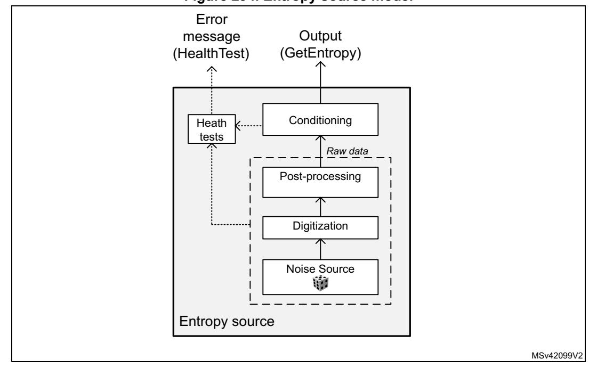
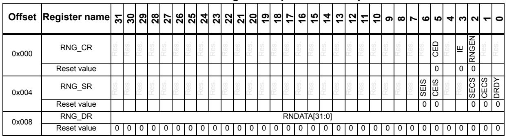

# 36 True random number generator (RNG)

# 36.1 Introduction

The RNG is a true random number generator that provides full entropy outputs to the application as 32-bit samples. It is composed of a live entropy source (analog) and an internal conditioning component.

The RNG can be used to construct a NIST compliant deterministic random bit generator (DRBG), acting as a live entropy source.

The RNG true random number generator has been tested using the German BSI statistical tests of AIS-31 (T0 to T8).

# 36.2 RNG main features

- The RNG delivers 32-bit true random numbers, produced by an analog entropy source processed by a high quality conditioning stage.
- In the NIST configuration, it produces four 32-bit random samples every 16x fRNG
   AHB clock cycles, if value is higher than 213 cycles (213 cycles otherwise).
- It allows embedded continuous basic health tests with associated error management
  - Includes too low sampling clock detection and repetition count tests.
- It can be disabled to reduce power consumption.
- It has an AMBA® AHB slave peripheral, accessible through 32-bit word single
  accesses only (else an AHB bus error is generated, and the write accesses are
  ignored).

# **36.3 RNG functional description**

### **36.3.1 RNG block diagram**

*[Figure 293](#page-1-0)* shows the RNG block diagram.

MSv42097V2 **True RNG** RNG\_CR RNG\_SR AHB interface control status data RNG\_DR Analog noise source 1 *Banked Registers* Sampling & Normalization (x 2) *Analog noise source* Fault detection Clock checker 2-bit Alarms Analog noise source 2 4x32-bit FIFO *Conditioning logic* 32-bit 128-bit data output en\_osc 32-bit AHB Bus rng\_it rng\_clk *AHB clock domain RNG clock domain* Raw data shift reg 128-bit

**Figure 293. RNG block diagram** 

# **36.3.2 RNG internal signals**

*[Table 298](#page-1-1)* describes a list of useful-to-know internal signals available at the RNG level, not at the STM32 product level (on pads).

| Signal name | Signal type    | Description                                   |
|-------------|----------------|-----------------------------------------------|
| rng_it      | Digital output | RNG global interrupt request                  |
| rng_hclk    | Digital input  | AHB clock                                     |
| rng_clk     | Digital input  | RNG dedicated clock, asynchronous to rng_hclk |

**Table 298. RNG internal input/output signals** 

# **36.3.3 Random number generation**

The true random number generator (RNG) delivers truly random data through its AHB interface at deterministic intervals. Within its boundary the RNG implements the entropy source model pictured on *[Figure 294](#page-2-0)*.

It includes an analog noise source, a digitization stage with post-processing, a conditioning algorithm, a health monitoring block and two interfaces that are used to interact with the entropy source: GetEntropy and HealthTest.

**Figure 294. Entropy source model**

The components pictured above are detailed hereafter.

#### **Noise source**

The noise source is the component that contains the non-deterministic, entropy-providing activity that is ultimately responsible for the uncertainty associated with the bitstring output by the entropy source. It is composed of:

- Two analog noise sources, each based on three XORed free-running ring oscillator outputs. It is possible to disable those analog oscillators to save power, as described in *[Section 36.3.8: RNG low-power use](#page-7-0)*.
- A sampling stage of these outputs clocked by a dedicated clock input (rng\_clk), delivering a 2-bit raw data output.

This noise source sampling is independent to the AHB interface clock frequency (rng\_hclk).

*Note: In Section [36.6: RNG entropy source validation](#page-8-0) the recommended RNG clock frequencies are given.*

#### **Post processing**

The sample values obtained from a true random noise source consist of 2-bit bitstrings. Because this noise source output is biased, the RNG implements a post-processing component that reduces that bias to a tolerable level.

More specifically, for each of the two noise source bits the RNG takes half of the bits from the sampled noise source, and half of the bits from the inverted sampled noise source. Thus, if the source generates more '1' than '0' (or the opposite), it is filtered.

#### **Conditioning**

The conditioning component in the RNG is a deterministic function that increases the entropy rate of the resulting fixed-length bitstrings output (128-bit).

Also note that post-processing computations are triggered when at least 32 bits of raw datum is received and when output FIFO needs a refill. Thus, the RNG output entropy is maximum when the RNG 128-bit FIFO is emptied by application after 64 RNG clock cycles.

The times required between two random number generations, and between the RNG initialization and availability of first sample are described in *[Section 36.5: RNG processing](#page-8-1)  [time](#page-8-1)*.

The conditioning component is clocked by the faster AHB clock.

#### **Output buffer**

A data output buffer can store up to four 32-bit words, which have been output from the conditioning component. When four words have been read from the output FIFO through the RNG\_DR register, the content of the 128-bit conditioning output register is pushed into the output FIFO, and a new conditioning round is automatically started. Four new words are added to the conditioning output register 213 AHB clock cycles later.

Whenever a random number is available through the RNG\_DR register, the DRDY flag changes from 0 to 1. This flag remains high until the output buffer becomes empty after reading four words from the RNG\_DR register.

*Note: When interrupts are enabled an interrupt is generated when this data ready flag transitions from 0 to 1. Interrupt is then cleared automatically by the RNG as explained above.*

#### **Health checks**

This component ensures that the entire entropy source (with its noise source) starts then operates as expected, obtaining assurance that failures are caught quickly and with a high probability and reliability.

The RNG implements the following health check features.

- 1. Continuous health tests, running indefinitely on the output of the noise source
  - Repetition count test, flagging an error when:
  - a) One of the noise source has provided more than 64 consecutive bits at a constant value ("0" or "1"), or more than 32 consecutive occurrence of two bits patterns ("01" or "10")
  - b) Both noise sources have delivered more than 32 consecutive bits at a constant value ("0" or "1"), or more than 16 consecutive occurrence of two bits patterns ("01" or "10")
- 2. Vendor specific continuous test
  - Real-time "too slow" sampling clock detector, flagging an error when one RNG clock cycle is smaller than AHB clock cycle divided by 32.

The CECS and SECS status bits in the RNG\_SR register indicate when an error condition is detected, as detailed in *[Section 36.3.7: Error management](#page-6-0)*.

*Note: An interrupt can be generated when an error is detected.*

# **36.3.4 RNG initialization**

The RNG simplified state machine is pictured on *[Figure 295](#page-5-0)*.

After enabling the RNG (RNGEN = 1 in RNG\_CR), the following chain of events occurs:

- 1. The analog noise source is enabled, and logic immediately starts sampling the analog output, filling the 128-bit conditioning shift register.
- 2. The conditioning logic is enabled and the post-processing context is initialized using two 128 noise source bits.
- 3. The conditioning stage internal input data buffer is filled again with 128-bit and one conditioning round is performed. The output buffer is then filled with the post processing result.
- 4. The output buffer is refilled automatically according to the RNG usage.

MSv44203V3

**Figure 295. RNG initialization overview** Noise source enable Conditioning hardware init Error state Generate samples RNGEN=0, then RNGEN=1 1 2 3 Drop samples then check again Continuous test(s) not OK 4

The associated initialization time can be found in *[Section 36.5: RNG processing time](#page-8-1)*.

# **36.3.5 RNG operation**

#### **Normal operations**

To run the RNG using interrupts, the following steps are recommended:

- 1. Enable the interrupts by setting the IE bit in the RNG\_CR register. At the same time, enable the RNG by setting the bit RNGEN=1.
- 2. An interrupt is now generated when a random number is ready or when an error occurs. Therefore, at each interrupt, check that:
  - No error occurred. The SEIS and CEIS bits must be set to 0 in the RNG\_SR register.
  - A random number is ready. The DRDY bit must be set to 1 in the RNG\_SR register.
  - If the above two conditions are true the content of the RNG\_DR register can be read up to four consecutive times. If valid data is available in the conditioning output buffer, four additional words can be read by the application (in this case the DRDY bit is still high). If one or both of the above conditions are false, the RNG\_DR register must not be read. If an error occurred, the error recovery sequence described in *[Section 36.3.7](#page-6-0)* must be used.

To run the RNG in polling mode following steps are recommended:

- 1. Enable the random number generation by setting the RNGEN bit to "1" in the RNG\_CR register.
- 2. Read the RNG\_SR register and check that:
  - No error occurred (the SEIS and CEIS bits must be set to 0)
  - A random number is ready (the DRDY bit must be set to 1)
- 3. If above conditions are true read the content of the RNG\_DR register up to four consecutive times. If valid data is available in the conditioning output buffer four additional words can be read by the application (in this case the DRDY bit is still high). If one or both of the above conditions are false, the RNG\_DR register must not be read. If an error occurred, the error recovery sequence described in *[Section](#page-6-0) 36.3.7* must be used.

*Note: When data is not ready (DRDY = 0) RNG\_DR returns zero.*

*It is recommended to always verify that RNG\_DR is different from zero. Because when it is the case a seed error occurred between RNG\_SR polling and RND\_DR output reading (rare event).*

#### **Low-power operations**

If the power consumption is a concern to the application, low-power strategies can be used, as described in *[Section 36.3.8: RNG low-power use](#page-7-0)*.

#### **Software post-processing**

If a NIST approved DRBG with 128 bits of security strength is required an approved random generator software must be built around the RNG true random number generator.

Built-in health check functions are described in *[Section 36.3.3: Random number generation](#page-2-1)*.

### **36.3.6 RNG clocking**

The RNG runs on two different clocks: the AHB bus clock and a dedicated RNG clock.

The AHB clock is used to clock the AHB banked registers and conditioning component. The RNG clock is used for noise source sampling. Recommended clock configurations are detailed in *[Section 36.6: RNG entropy source validation](#page-8-0)*.

*Note: When the CED bit in the RNG\_CR register is set to 0, the RNG clock frequency the must be higher than the AHB clock frequency divided by 32, otherwise the clock checker always flags a clock error (CECS = 1 in the RNG\_SR register).*

See *[Section 36.3.1: RNG block diagram](#page-1-2)* for details (AHB and RNG clock domains).

### **36.3.7 Error management**

In parallel to random number generation a health check block verifies the correct noise source behavior and the frequency of the RNG source clock as detailed in this section. Associated error state is also described.

#### **Clock error detection**

When the clock error detection is enabled (CED = 0) and if the RNG clock frequency is too low, the RNG sets to 1 both the CEIS and CECS bits to indicate that a clock error occurred. In this case, the application must check that the RNG clock is configured correctly (see

RM0399 Rev 4 1407/3556

*[Section 36.3.6: RNG clocking](#page-6-1)*) and then it must clear the CEIS bit interrupt flag. The CECS bit is automatically cleared when the clocking condition is normal.

*Note: The clock error has no impact on generated random numbers that is the application can still read the RNG\_DR register.*

*CEIS is set only when CECS is set to 1 by RNG.*

### **Noise source error detection**

When a noise source (or seed) error occurs, the RNG stops generating random numbers and sets to 1 both SEIS and SECS bits to indicate that a seed error occurred. If a value is available in the RNG\_DR register, it must not be used as it may not have enough entropy. If the error was detected during the initialization phase the whole initialization sequence is automatically restarted by the RNG.

The following sequence must be used to fully recover from a seed error after the RNG initialization:

- 1. Clear the SEIS bit by writing it to "0".
- 2. Read out 12 words from the RNG\_DR register, and discard each of them in order to clean the pipeline.
- 3. Confirm that SEIS is still cleared. Random number generation is back to normal.

# **36.3.8 RNG low-power use**

If power consumption is a concern, the RNG can be disabled as soon as the DRDY bit is set to 1 by setting the RNGEN bit to 0 in the RNG\_CR register. As the post-processing logic and the output buffer remain operational while RNGEN = 0 following features are available to the software:

- If there are valid words in the output buffer four random numbers can still be read from the RNG\_DR register.
- If there are valid bits in the conditioning output internal register four additional random numbers can be still be read from the RNG\_DR register. If it is not the case the RNG must be re-enabled by the application until at least 32 new bits are collected from the noise source and a complete conditioning round is done. It corresponds to 16 RNG clock cycles to sample new bits, and 216 AHB clock cycles to run a conditioning round.

When disabling the RNG the user deactivates all the analog seed generators, whose power consumption is given in the datasheet electrical characteristics section. The user also gates all the logic clocked by the RNG clock. Note that this strategy is adding latency before a random sample is available on the RNG\_DR register, because of the RNG initialization time.

If the RNG block is disabled during initialization (that is well before the DRDY bit rises for the first time), the initialization sequence resumes from where it was stopped when RNGEN bit is set to 1.

# 36.4 RNG interrupts

In the RNG an interrupt can be produced on the following events:

- Data ready flag
- Seed error, see Section 36.3.7: Error management
- Clock error, see Section 36.3.7: Error management

Dedicated interrupt enable control bits are available as shown in Table 299.

| Interrupt acronym | Interrupt event  | Event flag | Enable control bit | Interrupt clear method |  |  |
|-------------------|------------------|------------|--------------------|------------------------|--|--|
|                   | Data ready flag  | DRDY       | ΙΕ                 | None (automatic)       |  |  |
| RNG               | Seed error flag  | SEIS       | ΙE                 | Write 0 to SEIS        |  |  |
|                   | Clock error flag | CEIS       | IE                 | Write 0 to CEIS        |  |  |

Table 299. RNG interrupt requests

The user can enable or disable the above interrupt sources individually by changing the mask bits or the general interrupt control bit IE in the RNG\_CR register. The status of the individual interrupt sources can be read from the RNG\_SR register.

Note: Interrupts are generated only when RNG is enabled.

# 36.5 RNG processing time

The conditioning stage can produce four 32-bit random numbers every 16x  $\frac{f_{AHB}}{f_{RNG}}$  clock cycles, if the value is higher than 213 cycles (213 cycles otherwise). More time is needed for the first set of random numbers after the device exits reset (see Section 36.3.4: RNG initialization). Indeed, after enabling the RNG for the first time, random data is first available after either:

- 128 RNG clock cycles + 426 AHB cycles, if fAHB < fthreshold
- 192 RNG clock cycles + 213 AHB cycles, if  $f_{AHB} \ge f_{threshold}$

With  $f_{threshold} = (213 \times f_{RNG})/64$ 

# 36.6 RNG entropy source validation

#### 36.6.1 Introduction

In order to assess the amount of entropy available from the RNG, STMicroelectronics has tested the peripheral using the German BSI AIS-31 statistical tests (T0 to T8). The results can be provided on demand or the customer can reproduce the tests.

#### 36.6.2 Validation conditions

STMicroelectronics has tested the RNG true random number generator in the following conditions:

• RNG clock rng\_clk= 48 MHz (CED bit = '0' in RNG\_CR register) and rng\_clk = 400 kHz (CED bit = '1' in RNG\_CR register).

# **36.6.3 Data collection**

In order to run statistical tests, it is required to collect samples from the entropy source at the raw data level as well as at the output of the entropy source. Contact STMicroelectronics if the above samples need to be retrieved for the product.

# **36.7 RNG registers**

The RNG is associated with a control register, a data register and a status register.

# **36.7.1 RNG control register (RNG\_CR)**

Address offset: 0x000

Reset value: 0x0000 0000

| 31   | 30   | 29   | 28   | 27   | 26   | 25   | 24   | 23   | 22   | 21   | 20   | 19   | 18    | 17   | 16   |
|------|------|------|------|------|------|------|------|------|------|------|------|------|-------|------|------|
| Res. | Res. | Res. | Res. | Res. | Res. | Res. | Res. | Res. | Res. | Res. | Res. | Res. | Res.  | Res. | Res. |
|      |      |      |      |      |      |      |      |      |      |      |      |      |       |      |      |
| 15   | 14   | 13   | 12   | 11   | 10   | 9    | 8    | 7    | 6    | 5    | 4    | 3    | 2     | 1    | 0    |
| Res. | Res. | Res. | Res. | Res. | Res. | Res. | Res. | Res. | Res. | CED  | Res. | IE   | RNGEN | Res. | Res. |
|      |      |      |      |      |      |      |      |      |      | rw   |      | rw   | rw    |      |      |

Bits 31:6 Reserved, must be kept at reset value.

Bit 5 **CED:** Clock error detection

- 0: Clock error detection enabled
- 1: Clock error detection is disabled

The clock error detection cannot be enabled nor disabled on-the-fly when the RNG is enabled, that is to enable or disable CED, the RNG must be disabled.

- Bit 4 Reserved, must be kept at reset value.
- Bit 3 **IE:** Interrupt enable
  - 0: RNG interrupt is disabled
  - 1: RNG interrupt is enabled. An interrupt is pending as soon as the DRDY, SEIS, or CEIS is set in the RNG\_SR register.
- Bit 2 **RNGEN:** True random number generator enable
  - 0: True random number generator is disabled. Analog noise sources are powered off and logic clocked by the RNG clock is gated.
  - 1: True random number generator is enabled.

Bits 1:0 Reserved, must be kept at reset value.

# **36.7.2 RNG status register (RNG\_SR)**

Address offset: 0x004

Reset value: 0x0000 0000

| 31   | 30   | 29   | 28   | 27   | 26   | 25   | 24   | 23   | 22   | 21   | 20   | 19   | 18   | 17   | 16   |
|------|------|------|------|------|------|------|------|------|------|------|------|------|------|------|------|
| Res. | Res. | Res. | Res. | Res. | Res. | Res. | Res. | Res. | Res. | Res. | Res. | Res. | Res. | Res. | Res. |
|      |      |      |      |      |      |      |      |      |      |      |      |      |      |      |      |
|      |      |      |      |      |      |      |      |      |      |      |      |      |      |      |      |
| 15   | 14   | 13   | 12   | 11   | 10   | 9    | 8    | 7    | 6    | 5    | 4    | 3    | 2    | 1    | 0    |
| Res. | Res. | Res. | Res. | Res. | Res. | Res. | Res. | Res. | SEIS | CEIS | Res. | Res. | SECS | CECS | DRDY |

Bits 31:7 Reserved, must be kept at reset value.

#### Bit 6 **SEIS:** Seed error interrupt status

This bit is set at the same time as SECS. It is cleared by writing 0. Writing 1 has no effect.

0: No faulty sequence detected

1: At least one faulty sequence is detected. See SECS bit description for details.

An interrupt is pending if IE = 1 in the RNG\_CR register.

#### Bit 5 **CEIS:** Clock error interrupt status

This bit is set at the same time as CECS. It is cleared by writing 0. Writing 1 has no effect.

0: The RNG clock is correct (fRNGCLK> fHCLK/32)

1: The RNG is detected too slow (fRNGCLK< fHCLK/32)

An interrupt is pending if IE = 1 in the RNG\_CR register.

#### Bits 4:3 Reserved, must be kept at reset value.

#### Bit 2 **SECS:** Seed error current status

0: No faulty sequence has currently been detected. If the SEIS bit is set, this means that a faulty sequence was detected and the situation has been recovered.

1: At least one of the following faulty sequences has been detected:

- One of the noise sources has provided more than 64 consecutive bits at a constant value ("0" or "1"), or more than 32 consecutive occurrence of two bit patterns ("01" or "10")
- Both noise sources have delivered more than 32 consecutive bits at a constant value ("0" or "1"), or more than 16 consecutive occurrence of two bit patterns ("01" or "10")

#### Bit 1 **CECS:** Clock error current status

0: The RNG clock is correct (fRNGCLK> fHCLK/32). If the CEIS bit is set, this means that a slow clock was detected and the situation has been recovered.

1: The RNG clock is too slow (fRNGCLK< fHCLK/32).

*Note: CECS bit is valid only if the CED bit in the RNG\_CR register is set to 0.*

#### Bit 0 **DRDY:** Data ready

0: The RNG\_DR register is not yet valid, no random data is available.

1: The RNG\_DR register contains valid random data.

Once the output buffer becomes empty (after reading the RNG\_DR register), this bit returns to 0 until a new random value is generated.

*Note: The DRDY bit can rise when the peripheral is disabled (RNGEN = 0 in the RNG\_CR register).*

If IE=1 in the RNG\_CR register, an interrupt is generated when DRDY = 1.

RM0399 Rev 4 1411/3556

# **36.7.3 RNG data register (RNG\_DR)**

Address offset: 0x008

Reset value: 0x0000 0000

The RNG\_DR register is a read-only register that delivers a 32-bit random value when read. After being read, this register delivers a new random value after 216 periods of AHB clock if the output FIFO is empty.

The content of this register is valid when the DRDY = 1 and the value is not 0x0, even if RNGEN = 0.

| 31 | 30            | 29 | 28 | 27 | 26 | 25 | 24 | 23 | 22 | 21 | 20 | 19 | 18 | 17 | 16 |
|----|---------------|----|----|----|----|----|----|----|----|----|----|----|----|----|----|
|    | RNDATA[31:16] |    |    |    |    |    |    |    |    |    |    |    |    |    |    |
| r  | r             | r  | r  | r  | r  | r  | r  | r  | r  | r  | r  | r  | r  | r  | r  |
| 15 | 14            | 13 | 12 | 11 | 10 | 9  | 8  | 7  | 6  | 5  | 4  | 3  | 2  | 1  | 0  |
|    | RNDATA[15:0]  |    |    |    |    |    |    |    |    |    |    |    |    |    |    |
| r  | r             | r  | r  | r  | r  | r  | r  | r  | r  | r  | r  | r  | r  | r  | r  |

Bits 31:0 **RNDATA[31:0]:** Random data

32-bit random data, which are valid when DRDY = 1. When DRDY = 0, the RNDATA value is zero.

When DRDY is set, it is recommended to always verify that RNG\_DR is different from zero. The zero value means that a seed error occurred between RNG\_SR polling and RND\_DR output reading (a rare event).

# **36.7.4 RNG register map**

**Table 300. RNG register map and reset map** 

Refer to *Section 2.3* for the register boundary addresses.