# **37 Cryptographic processor (CRYP)**

# **37.1 Introduction**

The cryptographic processor (CRYP) can be used both to encrypt and decrypt data using the DES, Triple-DES or AES algorithms. It is a fully compliant implementation of the following standards:

- The data encryption standard (DES) and Triple-DES (TDES) as defined by Federal Information Processing Standards Publication (FIPS PUB 46-3, Oct 1999), and the American National Standards Institute (ANSI X9.52)
- The advanced encryption standard (AES) as defined by Federal Information Processing Standards Publication (FIPS PUB 197, Nov 2001)

Multiple key sizes and chaining modes are supported:

- DES/TDES chaining modes ECB and CBC, supporting standard 56-bit keys with 8-bit parity per key
- AES chaining modes ECB, CBC, CTR, GCM, GMAC, CCM for key sizes of 128, 192 or 256 bits

The CRYP processor is a 32-bit AHB peripheral. It supports DMA transfers for incoming and outgoing data (two DMA channels are required). The peripheral also includes input and output FIFOs (each 8 words deep) for better performance.

# **37.2 CRYP main features**

- Compliant implementation of the following standards:
  - NIST *FIPS publication 46-3, Data Encryption Standard (DES)*
  - ANSI *X9.52, Triple Data Encryption Algorithm Modes of Operation*
  - NIST *FIPS publication 197, Advanced Encryption Standard (AES)*
- AES symmetric block cipher implementation
  - 128-bit data block processing
  - Support for 128-, 192- and 256-bit cipher key lengths
  - Encryption and decryption with multiple chaining modes: Electronic Code Book (ECB), Cipher Block Chaining (CBC), Counter mode (CTR), Galois Counter Mode (GCM), Galois Message Authentication Code mode (GMAC) and Counter with CBC-MAC (CCM)
  - 14 (respectively 18) clock cycles for processing one 128-bit block of data with a 128-bit (respectively 256-bit) key in AES-ECB mode
  - Integrated key scheduler with its key derivation stage (ECB or CBC decryption only)
- DES/TDES encryption/decryption implementation
  - 64-bit data block processing
  - Support for 64-, 128- and 192-bit cipher key lengths (including parity)
  - Encryption and decryption with support of ECB and CBC chaining modes
  - Direct implementation of simple DES algorithms (a single key K1 is used)

RM0399 Rev 4 1413/3556

- 16 (respectively 48) clock cycles for processing one 64-bit block of data in DES (respectively TDES) ECB mode
- Software implementation of ciphertext stealing
- Features common to DES/TDES and AES
  - AMBA AHB slave peripheral, accessible through 32-bit word single accesses only (otherwise an AHB bus error is generated, and write accesses are ignored)
  - 256-bit register for storing the cryptographic key (8x 32-bit registers)
  - 128-bit registers for storing initialization vectors (4× 32-bit)
  - 1x32-bit INPUT buffer associated with an internal IN FIFO of eight 32- bit words, corresponding to four incoming DES blocks or two AES blocks
  - 1x32-bit OUTPUT buffer associated with an internal OUT FIFO of eight 32-bit words, corresponding to four processed DES blocks or two AES blocks
  - Automatic data flow control supporting direct memory access (DMA) using two channels (one for incoming data, one for processed data). The OUT FIFO supports both single and burst transfers, while the IN FIFO supports only burst transfers.
  - Data swapping logic to support 1-, 8-, 16- or 32-bit data
  - Possibility for software to suspend a message if the cryptographic processor needs to process another message with higher priority (suspend/resume operation)

# **37.3 CRYP implementation**

This device has one CRYP instance.


# **37.4 CRYP functional description**

# **37.4.1 CRYP block diagram**

The figure below shows the block diagram of the cryptographic processor.

MSv41956V3 cryp\_hclk IRQ interface *Banked Registers (main)* CRYP\_CR *key* CRYP\_Kx AES Core (AEA) + DES/ TDES Core (DEA) CRYP\_SR AHB interface *control status* Key *iv* CRYP\_IVx IV *data in* CRYP\_DIN *data out* CRYP\_DOUT Control Logic swapping *Banked Registers (IRQ & DMA)* CRYP\_RIS CRYP\_MIS CRYP\_IMSCR CRYP\_DMACR 8x32-bit IN FIFO swapping 8x32-bit OUT FIFO *Banked Registers (suspend/resume)* CSGCMCMx CRYP\_GCMx *Save/ Restore* DMA interface cryp\_in\_dma cryp\_out\_dma cryp\_it 32-bit AHB2 bus

**Figure 296. CRYP block diagram**

# **37.4.2 CRYP internal signals**

*[Table 301](#page-3-0)* provides a list of useful-to-know internal signals available at cryptographic processor level and not at STM32 product level (on pads).

<span id="page-3-0"></span>**Signal name Signal type Description** cryp\_hclk Digital input AHB bus clock cryp\_it Digital output Cryptographic processor global interrupt request cryp\_in\_dma Digital input/output IN FIFO DMA burst request/ acknowledge cryp\_out\_dma Digital input/output OUT FIFO DMA burst request/ acknowledge (with single request for DES/TDES)

**Table 301. CRYP internal input/output signals** 

# **37.4.3 CRYP DES/TDES cryptographic core**

#### **Overview**

The DES/Triple-DES cryptographic core consists of three components:

- The DES Algorithm (DEA core)
- Multiple keys (one for the DES algorithm, one to three for the TDES algorithm)
- The initialization vector, which is used only in CBC mode

The DES/Triple-DES cryptographic core provides two operating modes:

- **ALGODIR = 0**: Plaintext encryption using the key stored in the CRYP\_Kx registers.
- **ALGODIR = 1**: Ciphertext decryption using the key stored in the CRYP\_Kx registers.

The operating mode is selected by programming the ALGODIR bit in the CRYP\_CR register.

#### **Typical data processing**

Typical usage of the cryptographic processor in DES modes can be found in *[Section 37.4.10: CRYP DES/TDES basic chaining modes \(ECB, CBC\)](#page-15-0)*.

*Note: The outputs of the intermediate DEA stages are never revealed outside the cryptographic boundary, with the exclusion of the IV registers in CBC mode.*

#### **DES/TDES keying and chaining modes**

The DES/TDES allows three different keying options:

•*Three independent keys*

> The first option specifies that all the keys are independent, that is, K1, K2 and K3 are independent. FIPS PUB 46-3 – 1999 (and ANSI X9.52 – 1998) refers to this option as the Keying Option 1 and, to the TDES as 3-key TDES.

•*Two independent keys*

> The second option specifies that K1 and K2 are independent and K3 is equal to K1, that is, K1 and K2 are independent, K3 = K1. FIPS PUB 46-3 – 1999 (and ANSI X9.52


– 1998) refers to this second option as the Keying Option 2 and, to the TDES as 2-key TDES.

•*Three equal keys*

The third option specifies that K1, K2 and K3 are equal, that is:

$$K1 = K2 = K3$$

FIPS PUB 46-3 – 1999 (and ANSI X9.52 – 1998) refers to the third option as the Keying Option 3. This "1-key" TDES is equivalent to single DES.

The following chaining algorithms are supported by the DES hardware and can be selected through the ALGOMODE bits in the CRYP\_CR register:

- Electronic Code Book (ECB)
- Cipher Block Chaining (CBC)

These modes are described in details in *[Section 37.4.10: CRYP DES/TDES basic chaining](#page-15-0)  [modes \(ECB, CBC\)](#page-15-0)*.

# **37.4.4 CRYP AES cryptographic core**

#### **Overview**

The AES cryptographic core consists of the following components:

- The AES algorithm (AEA core)
- The Multiplier over a binary Galois field (GF2mul)
- The key information
- The initialization vector (IV) or Nonce information
- Chaining algorithms logic (XOR, feedback/counter, mask)

The AES core works on 128-bit data blocks of (four words) with 128-, 192- or 256-bit key lengths. Depending on the chaining mode, the peripheral requires zero or one 128-bit initialization vector (IV).

The cryptographic peripheral features two operating modes:

- **ALGODIR = 0**: Plaintext encryption using the key stored in the CRYP\_Kx registers.
- **ALGODIR = 1**: Ciphertext decryption using the key stored in the CRYP\_Kx registers. When ECB and CBC chaining modes are selected, an initial key derivation process is automatically performed by the cryptographic peripheral.

The operating mode is selected by programming the ALGODIR bit in the CRYP\_CR register.

#### **Typical data processing**

A description of cryptographic processor typical usage in AES mode can be found in *[Section 37.4.11: CRYP AES basic chaining modes \(ECB, CBC\)](#page-20-0)*.

*Note: The outputs of the intermediate AEA stages is never revealed outside the cryptographic boundary, with the exclusion of the IV registers.*


RM0399 Rev 4 1417/3556

#### **AES chaining modes**

The following chaining algorithms are supported by the cryptographic processor and can be selected through the ALGOMODE bits in the CRYP\_CR register:

- Electronic Code Book (ECB)
- Cipher Block Chaining (CBC)
- Counter Mode (CTR)
- Galois/Counter Mode (GCM)
- Galois Message Authentication Code mode (GMAC)
- Counter with CBC-MAC (CCM)

A quick introduction on these chaining modes can be found in the following subsections.

For detailed instructions, refer to *[Section 37.4.11: CRYP AES basic chaining modes \(ECB,](#page-20-0)  [CBC\)](#page-20-0)* and onward.

#### **AES Electronic CodeBook (ECB)**

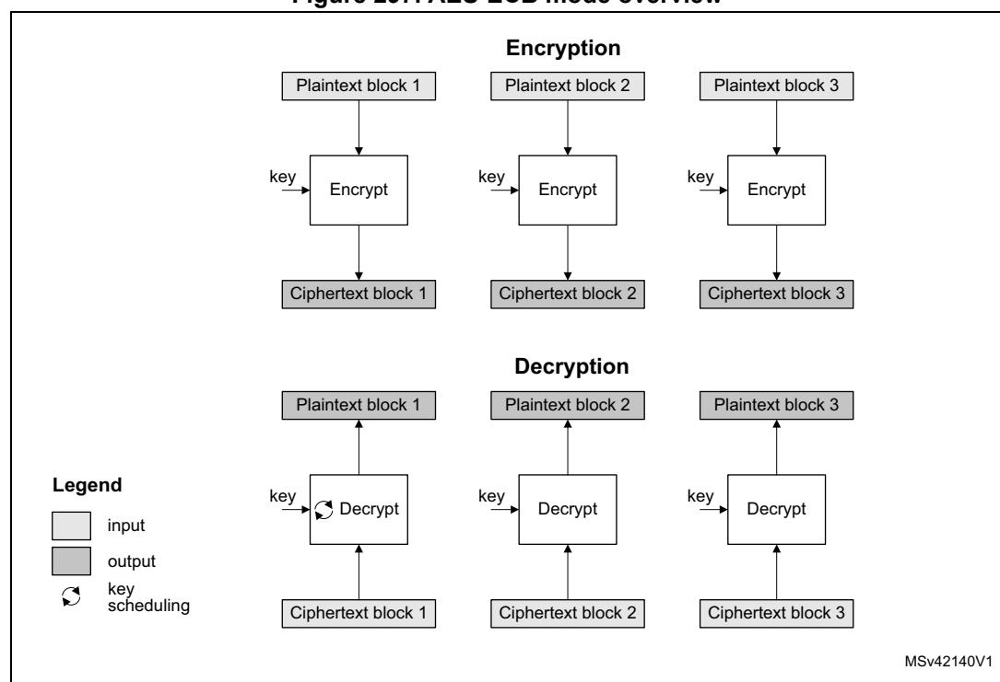

**Figure 297. AES-ECB mode overview**

ECB is the simplest operating mode. There are no chaining operations, and no special initialization stage. The message is divided into blocks and each block is encrypted or decrypted separately.

*Note: For decryption, a special key scheduling is required before processing the first block.*

# **AES Cipher block chaining (CBC)**

MSv42141V1 **Encryption** Plaintext block 1 Plaintext block 2 Plaintext block 3 Ciphertext block 1 Ciphertext block 2 Ciphertext block 3 Encrypt Encrypt Encrypt **Decryption** key key key Plaintext block 1 Plaintext block 2 Plaintext block 3 Ciphertext block 1 Ciphertext block 2 Ciphertext block 3 Decrypt Decrypt Decrypt key key key input output key scheduling **Legend** initialization vector initialization vector

**Figure 298. AES-CBC mode overview**

CBC operating mode chains the output of each block with the input of the following block. To make each message unique, an initialization vector is used during the first block processing.

*Note: For decryption, a special key scheduling is required before processing the first block.*


# **AES Counter mode (CTR)**

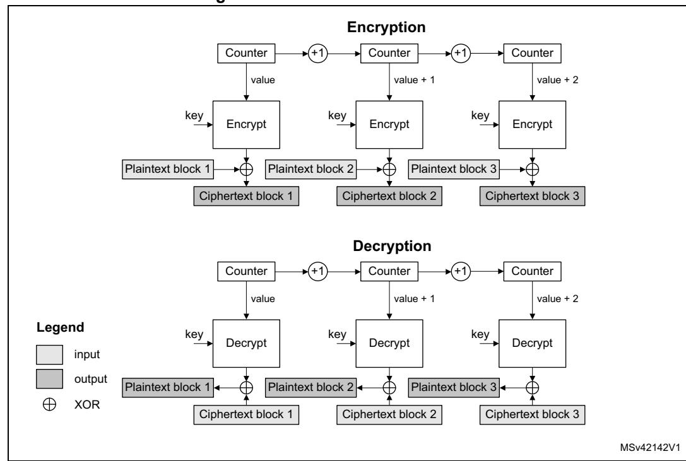

**Figure 299. AES-CTR mode overview**

The CTR mode uses the AES core to generate a key stream; these keys are then XORed with the plaintext to obtain the ciphertext as specified in NIST *Special Publication 800-38A, Recommendation for Block Cipher Modes of Operation*.

*Note: Unlike ECB and CBC modes, no key scheduling is required for the CTR decryption, since in this chaining scheme the AES core is always used in encryption mode for producing the counter blocks.*


### **AES Galois/Counter mode (GCM)**

MSv42143V1 Plaintext block 1 Ciphertext block 1 Ciphertext block 2 Ciphertext block 3 Encrypt Encrypt Encrypt key key key Plaintext block 2 Plaintext block 3 Counter +1 Counter +1 Counter GF2mul GF2mul GF2mul Final TAG Init (Encrypt) key Initialization vector H input output **Legend** XOR value value + 1 value + 2

**Figure 300. AES-GCM mode overview**

In Galois/Counter mode (GCM), the plaintext message is encrypted, while a message authentication code (MAC) is computed in parallel, thus generating the corresponding ciphertext and its MAC (also known as authentication tag). It is defined in NIST *Special Publication 800-38D, Recommendation for Block Cipher Modes of Operation - Galois/Counter Mode (GCM) and GMAC.*

GCM mode is based on AES in counter mode for confidentiality. It uses a multiplier over a fixed finite field for computing the message authentication code. It requires an initial value and a particular 128-bit block at the end of the message.

#### **AES Galois message authentication code (GMAC)**

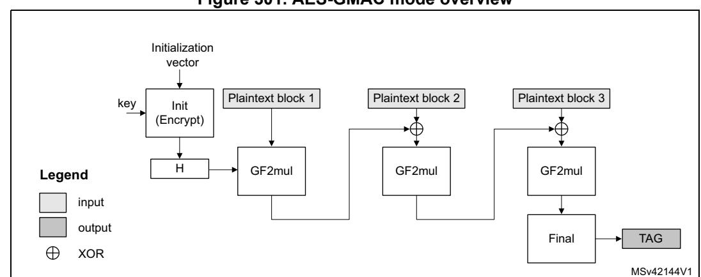

**Figure 301. AES-GMAC mode overview**

RM0399 Rev 4 1421/3556

Galois Message Authentication Code (GMAC) allows authenticating a message and generating the corresponding message authentication code (MAC). It is defined in NIST *Special Publication 800-38D, Recommendation for Block Cipher Modes of Operation - Galois/Counter Mode (GCM) and GMAC*.

GMAC is similar to Galois/Counter mode (GCM), except that it is applied on a message composed only by clear-text authenticated data (i.e. only header, no payload).

# **AES Counter with CBC-MAC (CCM)**

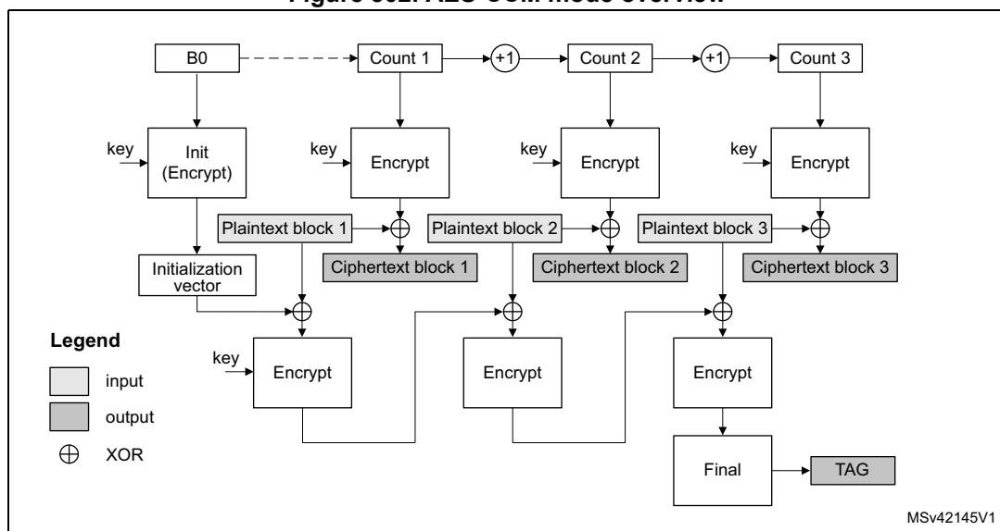

**Figure 302. AES-CCM mode overview**

In Counter with Cipher Block Chaining-Message Authentication Code (CCM), the plaintext message is encrypted while a message authentication code (MAC) is computed in parallel, thus generating the corresponding ciphertext and the corresponding MAC (also known as tag). It is described by NIST in *Special Publication 800-38C, Recommendation for Block Cipher Modes of Operation - The CCM Mode for Authentication and Confidentiality*.

CCM mode is based on AES in counter mode for confidentiality and it uses CBC for computing the message authentication code. It requires an initial value.

Like GCM CCM chaining mode, AES-CCM mode can be applied on a message composed only by cleartext authenticated data (i.e. only header, no payload). Note that this way of using CCM is not called CMAC (it is not similar to GCM/GMAC), and its usage is not recommended by NIST.


# <span id="page-10-0"></span>**37.4.5 CRYP procedure to perform a cipher operation**

### **Introduction**

To understand how the cryptographic peripheral operates, a typical cipher operation is described below. For the detailed peripheral usage according to the cipher mode, refer to the specific section, for example *[Section 37.4.11: CRYP AES basic chaining modes \(ECB,](#page-20-0)  [CBC\)](#page-20-0)*.

### **CRYP initialization**

To initialize the cryptographic processor, first disable it by clearing the CRYPEN bit in the CRYP\_CR register. Then execute the following steps:

- 1. Configure the algorithm and the chaining mode through the ALGOMODE and ALGODIR bits in the CRYP\_CR register. Configure also the key size with the KEYSIZE bits.
  - When ALGODIR is set to 1 (decryption) and the selected algorithm/chaining mode is AES-ECB or AES-CBC, an initial key derivation of the encryption key must be performed as described in *[Section 37.4.7: Preparing the CRYP AES key for](#page-13-0)  [decryption](#page-13-0)*.
- 2. When the previous step is complete, and when applicable, write the symmetric key into the CRYP\_KxL/R registers. The way to write key registers is defined in *Section [37.4.17: CRYP key registers](#page-44-0)*
- 3. Configure the data type (1, 8, 16 or 32 bits) through the DATATYPE bits of the CRYP\_CR register.
- 4. When it is required (for example for CBC or CTR chaining modes), write the initialization vectors into the CRYP\_IVx(L/R)R register.
- 5. Flush the IN and OUT FIFOs by writing the FFLUSH bit to 1 in the CRYP\_CR register.

#### **Preliminary warning for all cases**

If the ECB or CBC mode is selected and data are not a multiple of 64 bits (for DES) or 128 bits (for AES), the second and the last block management is more complex than the sequences below. Refer to *[Section 37.4.8: CRYP stealing and data padding](#page-13-1)* for more details.


RM0399 Rev 4 1423/3556

# **Appending data using the CPU in Polling mode**

- 1. Enable the cryptographic processor by setting to 1 the CRYPEN bit in the CRYP\_CR register.
- 2. Write data in the IN FIFO (one block or until the FIFO is full).
- 3. Repeat the following sequence until the second last block of data has been processed:
  - a) Wait until the not-empty-flag OFNE is set to 1, then read the OUT FIFO (one block or until the FIFO is empty).
  - b) Wait until the not-full-flag IFNF is set to 1, then write the IN FIFO (one block or until the FIFO is full) except if it is the last block.
- 4. The BUSY bit is set automatically by the cryptographic processor. At the end of the processing, the BUSY bit returns to 0 and both FIFOs are empty (IN FIFO empty flag IFEM = 1 and OUT FIFO not empty flag OFNE = 0).
- 5. If the next processing block is the last block, the CPU must pad (when applicable) the data with zeroes to obtain a complete block and specify the number of non-valid bytes using NPBLB bits in CRYP\_CR register in case of AES GCM payload encryption or AES CCM payload decryption (otherwise the tag computation will be wrong). This operation must be performed after checking that the BUSY bit in the CRYP\_CR register is set to 0.

*Note: NPBLB bits are not used in the header phase of AES GCM, GMAC and CCM modes.*

6. When the operation is complete, the cryptographic processor can be disabled by clearing the CRYPEN bit in CRYP\_CR register.

# **Appending data using the CPU in Interrupt mode**

- 1. Enable the interrupts by setting the INIM and OUTIM bits in the CRYP\_IMSCR register.
- 2. Enable the cryptographic processor by setting to 1 the CRYPEN bit in the CRYP\_CR register.
- 3. In the interrupt service routine that manages the input data:
  - a) If the last block is being loaded, the CPU must pad (when applicable) the data with zeroes to have a complete block and specify the number of non-valid bytes using NPBLB bits in CRYP\_CR register in case of AES GCM payload encryption or AES CCM payload decryption (otherwise the tag computation will be wrong). This operation must be performed after checking that the BUSY bit in the CRYP\_CR register is set to 0. Then load the block into the IN FIFO.

*Note: NPBLB bits are not used in the header phase of AES GCM, GMAC and CCM.*

- b) If it is not the last block, load the data into the IN FIFO. You can load only one block (2 words for DES, 4 words for AES), or load data until the FIFO is full.
- c) In all cases, after the last word of data has been written, disable the interrupt by clearing the INIM interrupt mask.
- 4. In the interrupt service routine that manages the input data:
  - a) Read the output data from the OUT FIFO. You can read only one block (2 words for DES, 4 words for AES), or read data until the FIFO is empty.
  - b) When the last word has been read, INIM and BUSY bits are set to 0 and both FIFOs are empty (IFEM = 1 and OFNE = 0). You can disable the interrupt by clearing the OUTIM bit, and disable the peripheral by clearing the CRYPEN bit.
  - c) If you read the last block of cleartext data (i.e. decryption), optionally discard the data that is not part of message/payload.


#### **Appending data using the DMA**

- 1. Prepare the last block of data by optionally padding it with zeroes to have a complete block.
- 2. Configure the DMA controller to transfer the input data from the memory and transfer the output data from the peripheral to the memory, as described in *Section [37.4.19:](#page-46-0)  [CRYP DMA interface](#page-46-0)*. The DMA should be configured to set an interrupt on transfer completion to indicate that the processing is complete. In case of AES GCM payload encryption or AES CCM payload decryption, DMA transfers must not include the last block. The sequence using the CPU described above must be used instead for this last block, because NPBLB bits needs to be setup before processing the block (otherwise the tag computation will be wrong).

*Note: NPBLB bits are not used in the header phase of AES GCM, GMAC and CCM.*

- 3. Enable the cryptographic processor by setting to 1 the CRYPEN bit in CRYP\_CR register, then enable the DMA IN and OUT requests by setting to 1 the DIEN and DOEN bits in the CRYP\_DMACR register.
- 4. All the transfers and processing are managed by the DMA and the cryptographic processor. The DMA interrupt indicates that the processing is complete. Both FIFOs are normally empty and BUSY flag is set 0.

**Caution:** It is important that DMA controller empties the cryptographic processor output FIFO before filling up the cryptographic processor input FIFO. To achieve this, the DMA controller should be configured so that the transfer from the cryptographic peripheral to the memory has a higher priority than the transfer from the memory to the cryptographic peripheral.

# **37.4.6 CRYP busy state**

The cryptographic processor is busy and processing data (BUSY set to 1 in CRYP\_SR register) when all the conditions below are met:

- CRYPEN = 1 in CRYP\_CR register.
- There are enough data in the input FIFO (at least two words for the DES or TDES algorithm mode, four words for the AES algorithm mode).
- There is enough free-space in the output FIFO (at least two word locations for DES, four for AES).

Write operations to the CRYP\_Kx(L/R)R key registers, to the CRYP\_IVx(L/R)R initialization registers, or to bits [9:2] of the CRYP\_CR register, are ignored when cryptographic processor is busy (i.e. the registers are not modified). It is thus not possible to modify the configuration of the cryptographic processor while it is processing a data block.

It is possible to clear the CRYPEN bit while BUSY bit is set to 1. In this case the ongoing DES/TDES or AES processing first completes (i.e. the word results are written to the output FIFO) before the BUSY bit is cleared by hardware.

*Note: If the application needs to suspend a message to process another one with a higher priority, refer to Section [37.4.9: CRYP suspend/resume operations](#page-14-0)*

> When a block is being processed in DES or TDES mode, if the output FIFO becomes full and the input FIFO contains at least one new block, then the new block is popped off the input FIFO and the BUSY bit remains high until there is enough space to store this new block into the output FIFO.


RM0399 Rev 4 1425/3556

# <span id="page-13-0"></span>**37.4.7 Preparing the CRYP AES key for decryption**

When performing an AES **ECB or CBC decryption**, the AES key has to be prepared. Indeed, in AES encryption the round 0 key is the one stored in the key registers, and AES decryption must start using the last round key. Hence, as the encryption key is stored in memory, a special key scheduling must be performed to obtain the decryption key. This preparation is not required in any other AES modes than ECB or CBC decryption.

When the cryptographic processor is disabled (CRYPEN = 0), the CRYP key preparation process is performed as follows:

- 1. Program ALGOMODE bits to 0x7 and ALGODIR to 0x0 in CRYP\_CR. In addition, configure the key length with the KEYSIZE bits.
- 2. Write the symmetric key to the CRYP\_KxL/R registers, as described in *Section [37.4.17: CRYP key registers](#page-44-0)*.
- 3. Enable the cryptographic processor by setting the CRYPEN bit in the CRYP\_CR register. It immediately starts an AES round for key preparation (BUSY = 1).
- 4. Wait until the BUSY bit is cleared in the CRYP\_SR register. Then update ALGOMODE bits in the CRYP\_CR register to select the correct chaining mode, that is 0x4 for ECB or 0x5 for CBC.
- 5. The AES key is available in the CRYP key registers, ready to use for decryption.

*Note: As the CRYPEN bitfield is reset by hardware at the end of the key preparation, the application software must set it again for the next operation.*

> *The latency of the key preparation operation is 14, 16 or 18 clock cycles depending on the key size (128, 192 or 256 bits).*

# <span id="page-13-1"></span>**37.4.8 CRYP stealing and data padding**

When using DES or AES algorithm in **ECB** or **CBC** modes to manage messages that are not multiple of the block size (64 bits for DES, 128 bits for AES), use ciphertext stealing techniques such as those described in NIST *Special Publication 800-38A, Recommendation for Block Cipher Modes of Operation: Three Variants of Ciphertext Stealing for CBC Mode*. Since the cryptographic processor does not implement such techniques, **the last two blocks** must be handled in a special way by the application.

*Note: Ciphertext stealing techniques are not documented in this reference manual.*

Similarly, when the AES algorithm is used in other modes than ECB or CBC, incomplete input data blocks (i.e. block shorter than 128 bits) have to be padded with zeroes by the application prior to encryption (i.e. extra bits should be appended to the trailing end of the data string). After decryption, the extra bits have to be discarded. The cryptographic processor does not implement automatic data padding operation to **the last block**, so the application should follow the recommendation given in *[Section 37.4.5: CRYP procedure to](#page-10-0)  [perform a cipher operation](#page-10-0)* to manage messages that are not multiple of 128 bits.

*Note: Padding data are swapped in a similar way as normal data, according to the DATATYPE field in CRYP\_CR register (see Section [37.4.16: CRYP data registers and data swapping](#page-40-0) for details).*


# <span id="page-14-0"></span>**37.4.9 CRYP suspend/resume operations**

A message can be suspended if another message with a higher priority has to be processed. When this highest priority message has been sent, the suspended message can be resumed in both encryption or decryption mode.

Suspend/resume operations do not break the chaining operation and the message processing can be resumed as soon as cryptographic processor is enabled again to receive the next data block.

*[Figure 303](#page-14-1)* gives an example of suspend.resume operation: message 1 is suspended in order to send a higher priority message (message 2), which is shorter than message 1 (AES algorithm).

<span id="page-14-1"></span>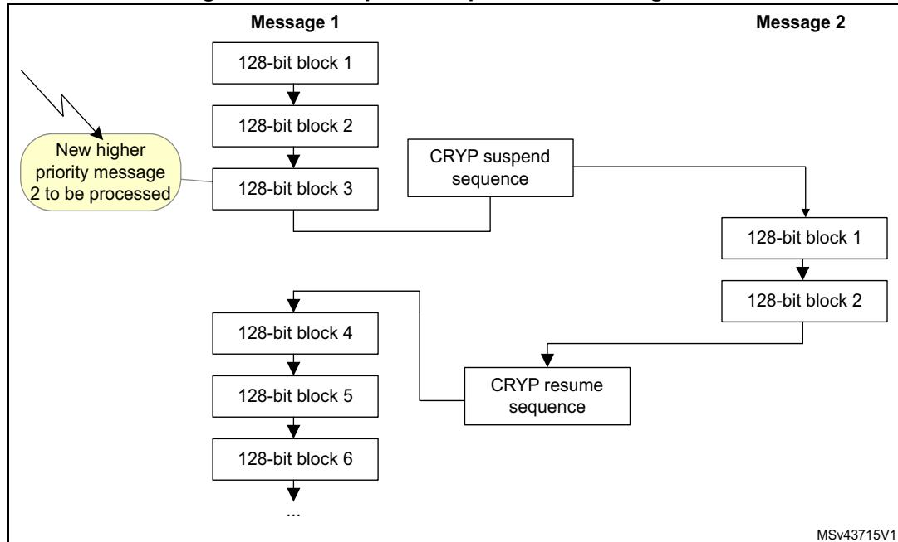

**Figure 303. Example of suspend mode management**

A detailed description of suspend/resume operations can be found in each AES mode section.


# <span id="page-15-0"></span>**37.4.10 CRYP DES/TDES basic chaining modes (ECB, CBC)**

#### **Overview**

FIPS PUB 46-3 – 1999 (and ANSI X9.52-1998) provides a thorough explanation of the processing involved in the four operation modes supplied by the DES computing core: TDES-ECB encryption, TDES-ECB decryption, TDES-CBC encryption and TDES-CBC decryption. This section only gives a brief explanation of each mode.

#### **DES/TDES-ECB encryption**

*[Figure 304](#page-15-1)* illustrates the encryption in DES and TDES Electronic CodeBook (DES/TDES-ECB) mode. This mode is selected by programming ALGOMODE 0x0 and ALGODIR to 0 in CRYP\_CR.

<span id="page-15-1"></span>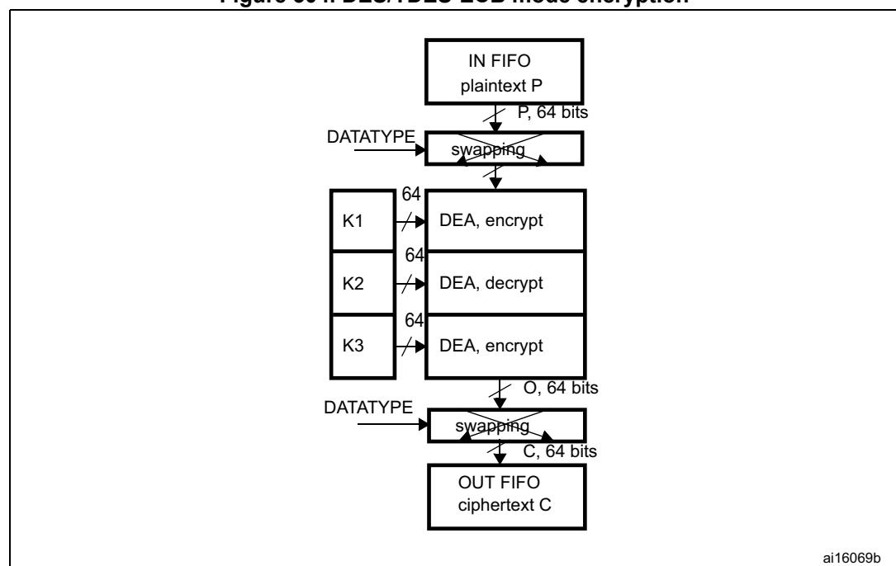

**Figure 304. DES/TDES-ECB mode encryption**

1. K: key; C: cipher text; I: input block; O: output block; P: plain text.

A 64-bit plaintext data block (P) is used after bit/byte/half-word as the input block (I). The input block is processed through the DEA in the encrypt state using K1. The output of this process is fed back directly to the input of the DEA where the DES is performed in the decrypt state using K2. The output of this process is fed back directly to the input of the DEA where the DES is performed in the encrypt state using K3. The resultant 64-bit output block (O) is used, after bit/byte/half-word swapping, as ciphertext (C) and it is pushed into the OUT FIFO.

*Note: For more information on data swapping, refer to Section [37.4.16: CRYP data registers and](#page-40-0)  [data swapping](#page-40-0).*

> *Detailed DES/TDES encryption sequence can be found in Section [37.4.5: CRYP procedure](#page-10-0)  [to perform a cipher operation](#page-10-0).*


#### **DES/TDES-ECB mode decryption**

*[Figure 305](#page-16-0)* illustrates the decryption in DES and TDES Electronic CodeBook (DES/TDES-ECB) mode. This mode is selected by programming ALGOMODE to 0x0 and ALGODIR to 1 in CRYP\_CR.

<span id="page-16-0"></span>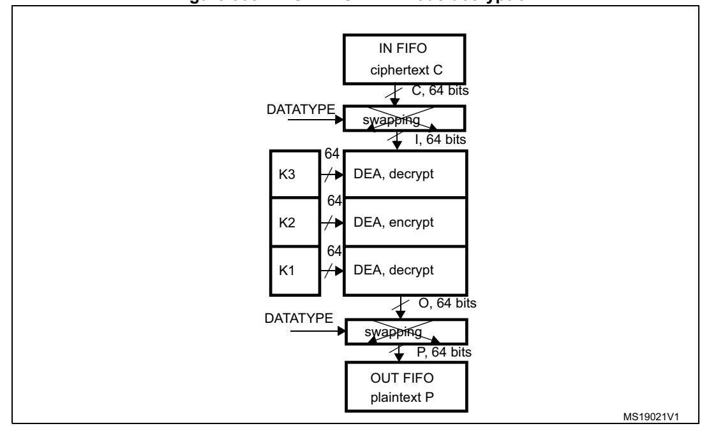

**Figure 305. DES/TDES-ECB mode decryption**

1. K: key; C: cipher text; I: input block; O: output block; P: plain text.

A 64-bit ciphertext block (C) is used, after bit/byte/half-word swapping, as the input block (I). The keying sequence is reversed compared to that used in the encryption process. The input block is processed through the DEA in the decrypt state using K3. The output of this process is fed back directly to the input of the DEA where the DES is performed in the encrypt state using K2. The new result is directly fed to the input of the DEA where the DES is performed in the decrypt state using K1. The resultant 64-bit output block (O), after bit/byte/half-word swapping, produces the plaintext (P).

*Note: For more information on data swapping refer to Section [37.4.16: CRYP data registers and](#page-40-0)  [data swapping](#page-40-0).*

> *Detailed DES/TDES encryption sequence can be found in Section [37.4.5: CRYP procedure](#page-10-0)  [to perform a cipher operation](#page-10-0).*

# **DES/TDES-CBC** encryption

*Figure 306* illustrates the encryption in DES and TDES Cipher Block Chaining (DES/TDES-ECB) mode. This mode is selected by programming ALGOMODE to 0x1 and ALGODIR to 0 in CRYP\_CR.

<span id="page-17-0"></span>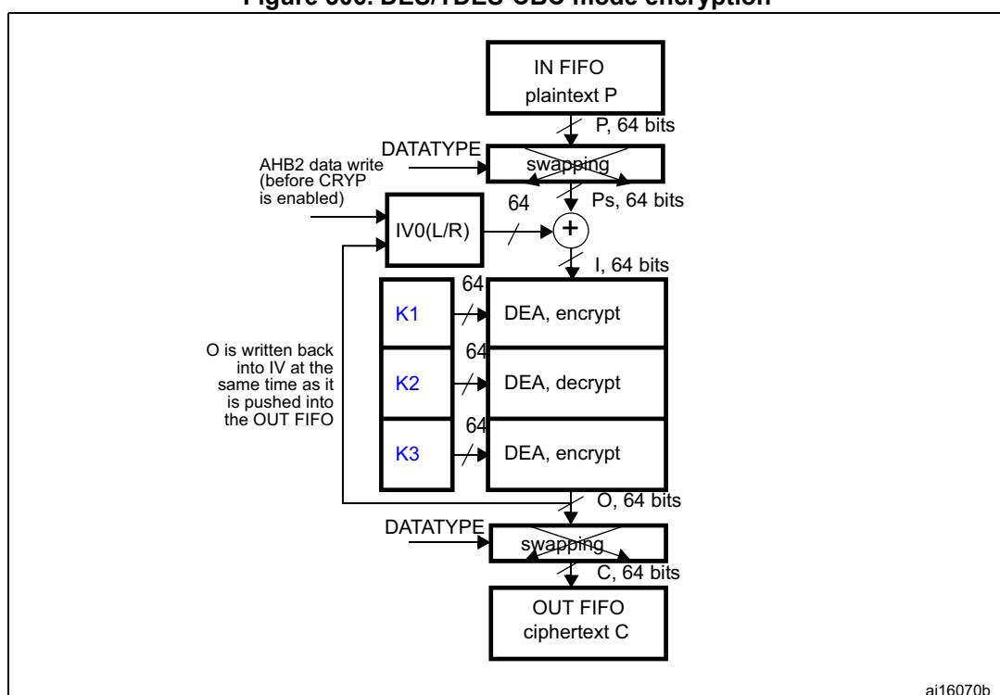

Figure 306. DES/TDES-CBC mode encryption

K: key; C: cipher text; I: input block; O: output block; Ps: plain text before swapping (when decoding) or after swapping (when encoding); P: plain text; IV: initialization vectors.

This mode begins by dividing a plaintext message into 64-bit data blocks. In TCBC encryption, the first input block (I<sub>1</sub>), obtained after bit/byte/half-word swapping, is formed by exclusive-ORing the first plaintext data block (P<sub>1</sub>) with a 64-bit initialization vector IV (I<sub>1</sub> = IV  $\oplus$  P<sub>1</sub>). The input block is processed through the DEA in the encrypt state using K1. The output of this process is fed back directly to the input of the DEA, which performs the DES in the decrypt state using K2. The output of this process is fed directly to the input of the DEA, which performs the DES in the encrypt state using K3. The resultant 64-bit output block (O<sub>1</sub>) is used directly as the ciphertext (C<sub>1</sub>), that is, C<sub>1</sub> = O<sub>1</sub>.

This first ciphertext block is then exclusive-ORed with the second plaintext data block to produce the second input block, ( $I_2$ ) = ( $C_1 \oplus P_2$ ). Note that  $I_2$  and  $P_2$  now refer to the second block. The second input block is processed through the TDEA to produce the second ciphertext block.

This encryption process continues to "chain" successive cipher and plaintext blocks together until the last plaintext block in the message is encrypted.

If the message does not consist of an integral number of data blocks, then the final partial data block should be encrypted in a manner specified for the application.


*Note: For more information on data swapping refer to Section [37.4.16: CRYP data registers and](#page-40-0)  [data swapping](#page-40-0).*

> *Detailed DES/TDES encryption sequence can be found in Section [37.4.5: CRYP procedure](#page-10-0)  [to perform a cipher operation](#page-10-0).*

#### **DES/TDES-CBC decryption**

*[Figure 306](#page-17-0)* illustrates the decryption in DES and TDES Cipher Block Chaining (DES/TDES-ECB) mode. This mode is selected by writing ALGOMODE to 0x1 and ALGODIR to 1 in CRYP\_CR.

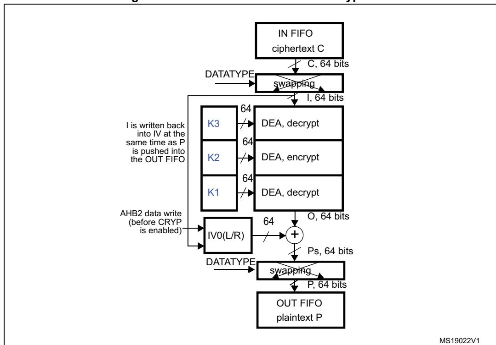

**Figure 307. DES/TDES-CBC mode decryption**

In this mode the first ciphertext block (C1) is used directly as the input block (I1). The keying sequence is reversed compared to that used for the encrypt process. The input block is processed through the DEA in the decrypt state using K3. The output of this process is fed directly to the input of the DEA where the DES is processed in the encrypt state using K2. This resulting value is directly fed to the input of the DEA where the DES is processed in the decrypt state using K1. The resulting output block is exclusive-ORed with the IV (which must be the same as that used during encryption) to produce the first plaintext block (P1 = O1 ⊕ IV).

The second ciphertext block is then used as the next input block and is processed through the TDEA. The resulting output block is exclusive-ORed with the first ciphertext block to produce the second plaintext data block (P2 = O2 ⊕ C1). Note that P2 and O2 refer to the second block of data.


RM0399 Rev 4 1431/3556

<sup>1.</sup> K: key; C: cipher text; I: input block; O: output block; Ps: plain text before swapping (when decoding) or after swapping (when encoding); P: plain text; IV: initialization vectors.

The DES/TDES-CBC decryption process continues in this manner until the last complete ciphertext block has been decrypted.

Ciphertext representing a partial data block must be decrypted in a manner specified for the application.

*Note: For more information on data swapping refer to Section [37.4.16: CRYP data registers and](#page-40-0)  [data swapping](#page-40-0).*

> *Detailed DES/TDES encryption sequence can be found in Section [37.4.5: CRYP procedure](#page-10-0)  [to perform a cipher operation](#page-10-0).*

# **DES/TDES suspend/resume operations in ECB/CBC modes**

Before interrupting the current message, the user application must respect the following steps:

- 1. If DMA is used, stop the DMA transfers to the IN FIFO by clearing to 0 the DIEN bit in the CRYP\_DMACR register.
- 2. Wait until both the IN and the OUT FIFOs are empty (IFEM = 1 and OFNE = 0 in the CRYP\_SR) and the BUSY bit is cleared. Alternatively, as the input FIFO can contain up to four unprocessed DES blocks, the application could decide for real-time reason to interrupt the cryptographic processing without waiting for the IN FIFO to be empty. In this case, the alternative is:
  - a) Wait until OUT FIFO is empty (OFNE = 0).
  - b) Read back the data loaded in the IN FIFO that have not been processed and save them in the memory until the IN FIFO is empty.
- 3. If DMA is used stop the DMA transfers from the OUT FIFO by clearing to 0 the DOEN bit in the CRYP\_DMACR register.
- 4. Disable the cryptographic processor by setting the CRYPEN bit to 0 in CRYP\_CR, then save the current configuration (bits [9:2] in the CRYP\_CR register). If CBC mode is selected, save the initialization vector registers, since CRYP\_IVx(L/R)R registers have changed from initial values during the data processing.

*Note: Key registers do not need to be saved as the original key value is known by the application.*

5. If DMA is used, save the DMA controller status (such as the pointers to IN and OUT data transfers, number of remaining bytes).

To resume message processing, the user application must respect the following sequence:

- 1. If DMA is used, reconfigure the DMA controller to complete the rest of the FIFO IN and FIFO OUT transfers.
- 2. Make sure the cryptographic processor is disabled by reading the CRYPEN bit in CRYP\_CR (it must be 0).
- 3. Configure again the cryptographic processor with the initial setting in CRYP\_CR, as well as the key registers using the saved configuration.
- 4. If the CBC mode is selected, restore CRYP\_IVx(L/R)R registers using the saved configuration.
- 5. Optionally, write the data that were saved during context saving into the IN FIFO.
- 6. Enable the cryptographic processor by setting the CRYPEN bit to 1.
- 7. If DMA is used, enable again DMA requests for the cryptographic processor, by setting to 1 the DIEN and DOEN bits in the CRYP\_DMACR register.

# <span id="page-20-0"></span>**37.4.11 CRYP AES basic chaining modes (ECB, CBC)**

#### **Overview**

FIPS PUB 197 (November 26, 2001) provides a thorough explanation of the processing involved in the four basic operation modes supplied by the AES computing core: AES-ECB encryption, AES-ECB decryption, AES-CBC encryption and AES-CBC decryption. This section only gives a brief explanation of each mode.

#### **AES ECB encryption**

*[Figure 308](#page-20-1)* illustrates the AES Electronic codebook (AES-ECB) mode encryption. This mode is selected by writing ALGOMODE to 0x4 and ALGODIR to 0 in CRYP\_CR.

<span id="page-20-1"></span>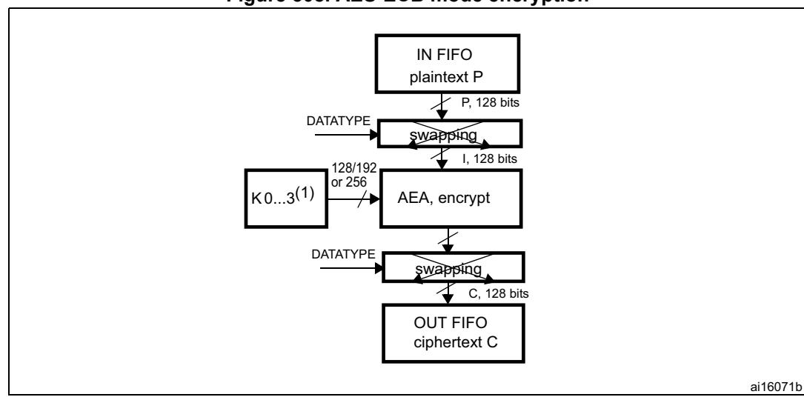

**Figure 308. AES-ECB mode encryption**

- 1. K: key; C: cipher text; I: input block; O: output block; P: plain text.
- 2. If Key size = 128: Key = [K3 K2]. If Key size = 192: Key = [K3 K2 K1] If Key size = 256: Key = [K3 K2 K1 K0].

In this mode a 128- bit plaintext data block (P) is used after bit/byte/half-word swapping as the input block (I). The input block is processed through the AEA in the encrypt state using the 128, 192 or 256-bit key. The resultant 128-bit output block (O) is used after bit/byte/halfword swapping as ciphertext (C). It is then pushed into the OUT FIFO.

For more information on data swapping refer to *[Section 37.4.16: CRYP data registers and](#page-40-0)  [data swapping](#page-40-0)*.

RM0399 Rev 4 1433/3556

# **AES ECB decryption**

*[Figure 309](#page-21-0)* illustrates the AES Electronic codebook (AES-ECB) mode decryption. This mode is selected by programming ALGOMODE to 0x4 and ALGODIR to 1 in CRYP\_CR.

<span id="page-21-0"></span>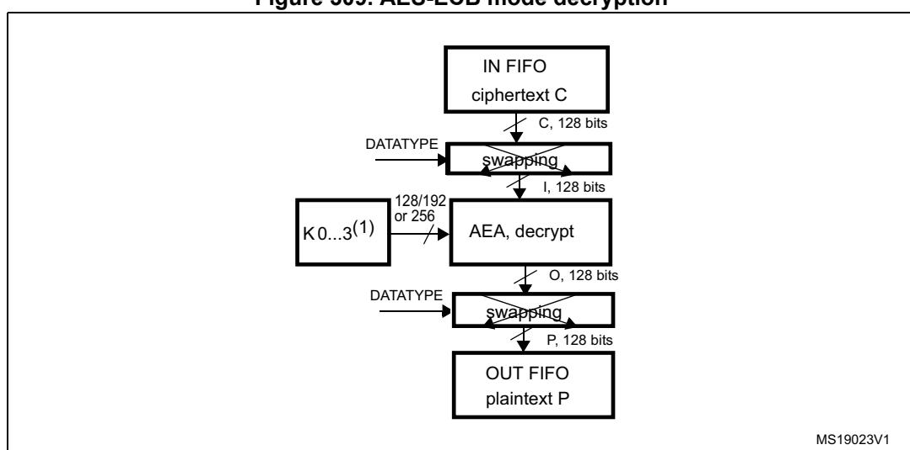

**Figure 309. AES-ECB mode decryption**

- 1. K: key; C: cipher text; I: input block; O: output block; P: plain text.
- 2. If Key size = 128 => Key = [K3 K2]. If Key size = 192 => Key = [K3 K2 K1] If Key size = 256 => Key = [K3 K2 K1 K0].

To perform an AES decryption in ECB mode, the secret key has to be prepared (it is necessary to execute the complete key schedule for encryption) by collecting the last round key, and using it as the first round key for the decryption of the ciphertext. This preparation phase is computed by the AES core. Refer to *[Section 37.4.7: Preparing the CRYP AES key](#page-13-0)  [for decryption](#page-13-0)* for more details on how to prepare the key.

When the key preparation is complete, the decryption proceed as follows: a 128-bit ciphertext block (C) is used after bit/byte/half-word swapping as the input block (I). The keying sequence is reversed compared to that of the encryption process. The resultant 128 bit output block (O), after bit/byte or half-word swapping, produces the plaintext (P). The AES-CBC decryption process continues in this manner until the last complete ciphertext block has been decrypted.

For more information on data swapping refer to *[Section 37.4.16: CRYP data registers and](#page-40-0)  [data swapping](#page-40-0)*.

# **AES CBC encryption**

*[Figure 310](#page-22-0)* illustrates the AES Cipher block chaining (AES-CBC) mode encryption. This mode is selected by writing ALGOMODE to 0x5 and ALGODIR to 0 in CRYP\_CR.

<span id="page-22-0"></span>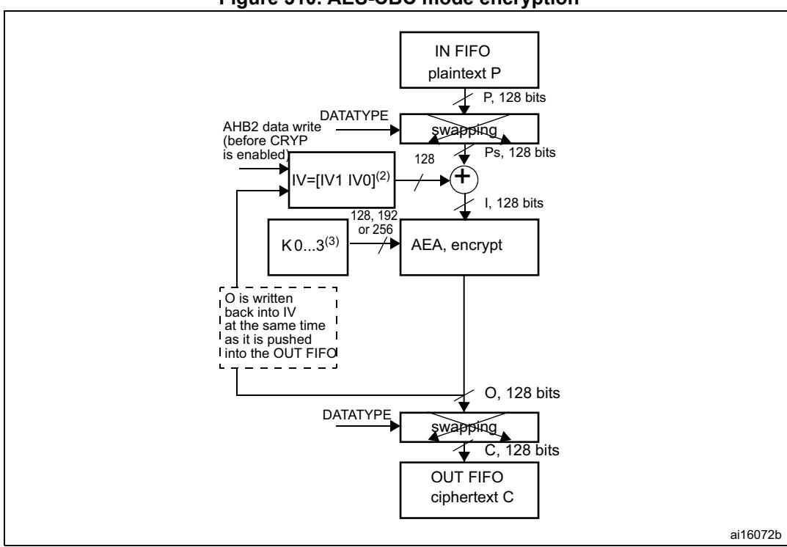

**Figure 310. AES-CBC mode encryption**

- 1. K: key; C: cipher text; I: input block; O: output block; Ps: plain text before swapping (when decoding) or after swapping (when encoding); P: plain text; IV: Initialization vectors.
- 2. IVx = [IVxR IVxL], R = right, L = left.
- 3. If Key size = 128 => Key = [K3 K2]. If Key size = 192 => Key = [K3 K2 K1] If Key size = 256 => Key = [K3 K2 K1 K0].

In this mode the first input block (I1) obtained after bit/byte/half-word swapping is formed by exclusive-ORing the first plaintext data block (P1) with a 128-bit initialization vector IV (I1 = IV ⊕ P1). The input block is processed through the AEA in the encrypt state using the 128-, 192- or 256-bit key (K0...K3). The resultant 128-bit output block (O1) is used directly as ciphertext (C1), that is, C1 = O1. This first ciphertext block is then exclusive-ORed with the second plaintext data block to produce the second input block, (I2) = (C1 ⊕ P2). Note that I2 and P2 now refer to the second block. The second input block is processed through the AEA to produce the second ciphertext block. This encryption process continues to "chain" successive cipher and plaintext blocks together until the last plaintext block in the message is encrypted.

If the message does not consist of an integral number of data blocks, then the final partial data block should be encrypted in a manner specified for the application, as explained in *[Section 37.4.8: CRYP stealing and data padding](#page-13-1)*.

For more information on data swapping, refer to *[Section 37.4.16: CRYP data registers and](#page-40-0)  [data swapping](#page-40-0)*.


RM0399 Rev 4 1435/3556

# **AES CBC decryption**

*[Figure 311](#page-23-0)* illustrates the AES Cipher block chaining (AES-CBC) mode decryption. This mode is selected by writing ALGOMODE to 0x5 and ALGODIR to 1 in CRYP\_CR.

<span id="page-23-0"></span>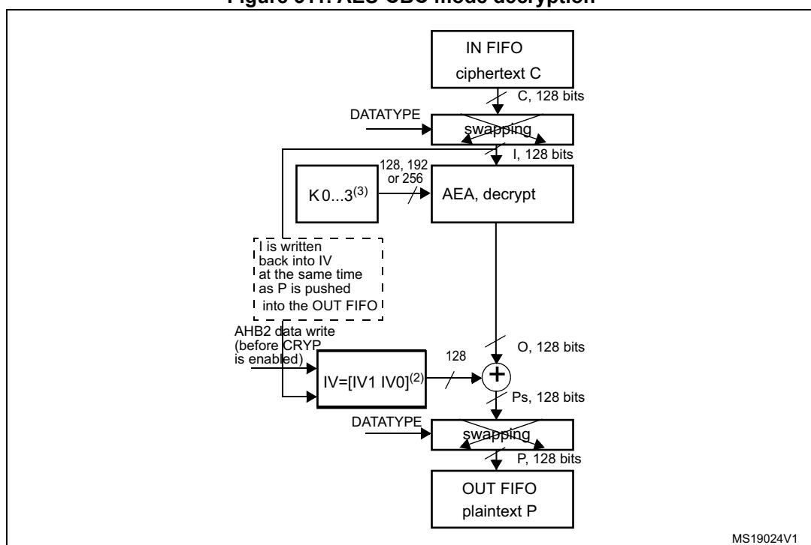

**Figure 311. AES-CBC mode decryption**

- 1. K: key; C: cipher text; I: input block; O: output block; Ps: plain text before swapping (when decoding) or after swapping (when encoding); P: plain text; IV: Initialization vectors.
- 2. IVx = [IVxR IVxL], R = right, L = left.
- 3. If Key size = 128 => Key = [K3 K2]. If Key size = 192 => Key = [K3 K2 K1] If Key size = 256 => Key = [K3 K2 K1 K0].

In CBC mode, like in ECB mode, the secret key must be prepared to perform an AES decryption. Refer to *[Section 37.4.7: Preparing the CRYP AES key for decryption](#page-13-0)* for more details on how to prepare the key.

When the key preparation process is complete, the decryption proceeds as follows: the first 128-bit ciphertext block (C1) is used directly as the input block (I1). The input block is processed through the AEA in the decrypt state using the 128-, 192- or 256-bit key. The resulting output block is exclusive-ORed with the 128-bit initialization vector IV (which must be the same as that used during encryption) to produce the first plaintext block (P1 = O1 ⊕ IV).

The second ciphertext block is then used as the next input block and is processed through the AEA. The resulting output block is exclusive-ORed with the first ciphertext block to produce the second plaintext data block (P2 = O2 ⊕ C1). Note that P2 and O2 refer to the second block of data. The AES-CBC decryption process continues in this manner until the last complete ciphertext block has been decrypted.


Ciphertext representing a partial data block must be decrypted in a manner specified for the application, as explained in *[Section 37.4.8: CRYP stealing and data padding](#page-13-1)*.

For more information on data swapping, refer to *[Section 37.4.16: CRYP data registers and](#page-40-0)  [data swapping](#page-40-0)*.

### **AES suspend/resume operations in ECB/CBC modes**

Before interrupting the current message, the user application must respect the following sequence:

- 1. If DMA is used, stop the DMA transfers to the IN FIFO by clearing to 0 the DIEN bit in the CRYP\_DMACR register.
- 2. Wait until both the IN and the OUT FIFOs are empty (IFEM = 1 and OFNE = 0 in the CRYP\_SR) and the BUSY bit is cleared.
- 3. If DMA is used, stop the DMA transfers from the OUT FIFO by clearing to 0 the DOEN bit in the CRYP\_DMACR register.
- 4. Disable the CRYP by setting the CRYPEN bit to 0 in CRYP\_CR, then save the current configuration (bits [9:2] in the CRYP\_CR register). If ECB mode is not selected, save the initialization vector registers, because CRYP\_IVx(L/R)R registers have changed from initial values during the data processing.

*Note: Key registers do not need to be saved as the original key value is known by the application.*

5. If DMA is used, save the DMA controller status (such as pointers to IN and OUT data transfers, number of remaining bytes).

To resume message processing, the user application must respect the following sequence:

- 1. If DMA is used, reconfigure the DMA controller to complete the rest of the FIFO IN and FIFO OUT transfers.
- 2. Make sure the cryptographic processor is disabled by reading the CRYPEN bit in CRYP\_CR (it must be set to 0).
- 3. Configure the cryptographic processor again with the initial setting in CRYP\_CR, as well as the key registers using the saved configuration.
- 4. For AES-ECB or AES-CBC decryption, the key must be prepared again, as described in *Section [37.4.7: Preparing the CRYP AES key for decryption](#page-13-0)*.
- 5. If ECB mode is not selected, restore CRYP\_IVx(L/R)R registers using the saved configuration.
- 6. Enable the cryptographic processor by setting the CRYPEN bit to 1.
- 7. If DMA is used, enable again the DMA requests from the cryptographic processor, by setting DIEN and DOEN bits to 1 in the CRYP\_DMACR register.


RM0399 Rev 4 1437/3556

# 37.4.12 CRYP AES counter mode (AES-CTR)

#### Overview

The AES counter mode (CTR) uses the AES block as a key stream generator. The generated keys are then XORed with the plaintext to obtain the ciphertext.

CTR chaining is defined in NIST Special Publication 800-38A, Recommendation for Block Cipher Modes of Operation. A typical message construction in CTR mode is given in Figure 312.

<span id="page-25-0"></span>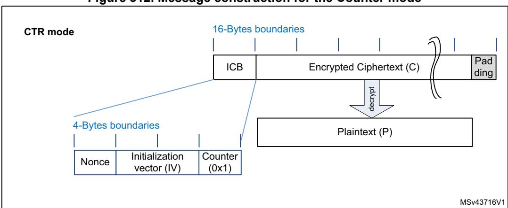

Figure 312. Message construction for the Counter mode

The structure of this message is as below:

- A 16-byte Initial Counter Block (ICB), composed of three distinct fields:
  - A nonce: a 32-bit, single-use value (i.e. a new nonce should be assigned to each new communication).
  - The initialization vector (IV): a 64-bit value that must be unique for each execution of the mode under a given key.
  - The counter: a 32-bit big-endian integer that is incremented each time a block has been processed. The initial value of the counter should be set to 1.
- The plaintext (P) is both authenticated and encrypted as ciphertext C, with a known length. This length can be non-multiple of 16 bytes, in which case a plaintext padding is required.

# **AES CTR processing**

*[Figure 313](#page-26-0)* (respectively *[Figure 314](#page-27-0)*) describes the AES-CTR encryption (respectively decryption) process implemented within this peripheral. This mode is selected by programming ALGOMODE bitfield to 0x6 in CRYP\_CR.

<span id="page-26-0"></span>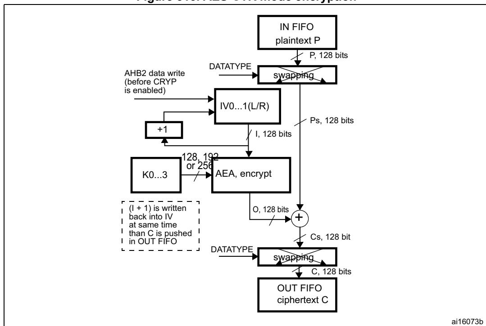

**Figure 313. AES-CTR mode encryption**

1. K: key; C: cipher text; I: input Block; o: output block; Ps: plain text before swapping (when decoding) or after swapping (when encoding); Cs: cipher text after swapping (when decoding) or before swapping (when encoding); P: plain text; IV: Initialization vectors.


<span id="page-27-0"></span>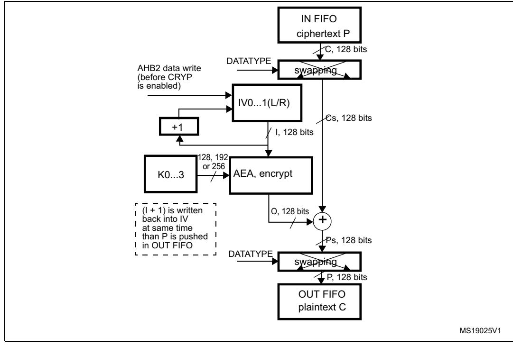

**Figure 314. AES-CTR mode decryption**

1. K: key; C: cipher text; I: input Block; o: output block; Ps: plain text before swapping (when decoding) or after swapping (when encoding); Cs: cipher text after swapping (when decoding) or before swapping (when encoding); P: plain text; IV: Initialization vectors.

In CTR mode, the output block is XORed with the subsequent input block before it is input to the algorithm. Initialization vectors in the peripheral must be initialized as shown on *[Table 302](#page-27-1)*.

<span id="page-27-1"></span>**CRYP\_IV1RR[31:0] CRYP\_IV1LR[31:0] CRYP\_IV0RR[31:0] CRYP\_IV0LR[31:0]** IVI[127:96] IVI[95:64] IVI[63:32] IVI[31:0]

**Table 302. Counter mode initialization vector** 

Unlike in CBC mode, which uses the CRYP\_IVx(L/R)R registers only once when processing the first data block, in CTR mode IV registers are used for processing each data block, and the peripheral increments the least significant 32 bits (leaving the other most significant 96 bits unchanged).

CTR decryption does not differ from CTR encryption, since the core always encrypts the current counter block to produce the key stream that will be XORed with the plaintext or cipher as input. Thus when ALGOMODE is set to 0x6, ALGODIR is don't care.

*Note: In this mode the key must NOT be prepared for decryption.*

1440/3556 RM0399 Rev 4


32-bit counter = 0x1

The following sequence must be used to perform an encryption or a decryption in CTR chaining mode:

- 1. Make sure the cryptographic processor is disabled by clearing the CRYPEN bit in the CRYP\_CR register.
- 2. Configure CRYP\_CR as follows:
  - a) Program ALGOMODE bits to 0x6 to select CTR mode. ALGODIR can be set to any value.
  - b) Configure the data type (1, 8, 16 or 32 bits) through the DATATYPE bits.
  - c) Define the key length using KEYSIZE bits.
- 3. Initialize the key registers (128,192 or 256 bits) in CRYP\_KEYRx as well as the initialization vector (IV) as described in *[Table](#page-27-1) 302*.
- 4. Flush the IN and OUT FIFOs by writing the FFLUSH bit to 1 in the CRYP\_CR register.
- 5. If it is the last block, optionally pad the data with zeros to have a complete block.
- 6. Append data in the cryptographic processor and read the result. The three possible scenarios are described in *Section [37.4.5: CRYP procedure to perform a cipher](#page-10-0)  [operation](#page-10-0)*.
- 7. Repeat the previous step until the second last block is processed. For the last block, execute the two previous steps. For this last block, the driver must discard the data that is not part of the data when the last block size is less than 16 bytes.

# **Suspend/resume operations in CTR mode**

Like for the CBC mode, it is possible to interrupt a message to send a higher priority message, and resume the message which was interrupted. Detailed CBC sequence can be found in *[Section 37.4.11: CRYP AES basic chaining modes \(ECB, CBC\)](#page-20-0)*.

*Note: Like for CBC mode, IV registers must be reloaded during the resume operation.*

RM0399 Rev 4 1441/3556

# **37.4.13 CRYP AES Galois/counter mode (GCM)**

#### **Overview**

The AES Galois/counter mode (GCM) allows encrypting and authenticating the plaintext, and generating the correspondent ciphertext and tag (also known as message authentication code). To ensure confidentiality, GCM algorithm is based on AES counter mode. It uses a multiplier over a fixed finite field to generate the tag.

GCM chaining is defined in NIST *Special Publication 800-38D, Recommendation for Block Cipher Modes of Operation - Galois/Counter Mode (GCM) and GMAC.* A typical message construction in GCM mode is given in *[Figure 315](#page-29-0)*.

<span id="page-29-0"></span>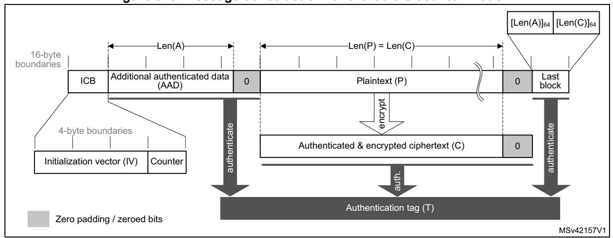

**Figure 315. Message construction for the Galois/counter mode**

The structure of this message is defined as below:

- A 16-byte Initial Counter Block (ICB), composed of two distinct fields:
  - The *initialization vector* (IV): a 96-bit value that must be unique for each execution of the mode under a given key. Note that the GCM standard supports IV that are shorter than 96-bit, but in this case strict rules apply.
  - The *counter:* a 32-bit big-endian integer that is incremented each time a block has been processed. According to NIST specification, the counter value is 0x2 when processing the first block of payload.
- The authenticated header A (also knows as Additional Authentication Data) has a known length *Len(A)* that can be non-multiple of 16 bytes and cannot exceed 264-1 bits. This part of the message is only authenticated, not encrypted.
- The plaintext message (P) is both authenticated and encrypted as ciphertext C, with a known length *Len(P)* that can be non-multiple of 16 bytes, and cannot exceed 232 -2 blocks of 128-bits.

*Note: GCM standard specifies that ciphertext C has same bit length as the plaintext P.*

- When a part of the message (AAD or P) has a length which is non-multiple of 16 bytes, a special padding scheme is required.
- The last block is composed of the length of A (on 64 bits) and the length of ciphertext C (on 64 bits) as shown in *[Table 303](#page-30-0)*.


**Table 303. GCM last block definition** 

<span id="page-30-0"></span>

| Endianness | Bit[0] | Bit[32]             | Bit[64] | Bit[96]              |
|------------|--------|---------------------|---------|----------------------|
| Input data | 0x0    | Header length[31:0] | 0x0     | Payload length[31:0] |

# **AES GCM processing**

This mode is selected by writing ALGOMODE bitfield to 0x6 in CRYP\_CR.

The mechanism for the confidentiality of the plaintext in GCM mode is a variation of the Counter mode, with a particular 32-bit incrementing function that generates the necessary sequence of counter blocks.

CRYP\_IVx(L/R)R registers are used for processing each data block. The cryptographic processor automatically increments the 32 least signification bits of the counter block. The first counter block (CB1) written by the application is equal to the Initial Counter Block incremented by one (see *[Table 304](#page-30-1)*).

**Table 304. GCM mode IV registers initialization** 

<span id="page-30-1"></span>

| Register   | CRYP_IV0LR[31:0] | CRYP_IV0RR[31:0] | CRYP_IV1LR[31:0] | CRYP_IV1RR[31:0]                  |
|------------|------------------|------------------|------------------|-----------------------------------|
| Input data | ICB[127:96]      | ICB[95:64]       | ICB[63:32]       | ICB[31:0]<br>32-bit counter = 0x2 |

*Note: In this mode the key must NOT be prepared for decryption.*

The authentication mechanism in GCM mode is based on a hash function, called *GF2mul*, that performs multiplication by a fixed parameter, called the hash subkey (H), within a binary Galois field.

To process a GCM message, the driver must go through four phases, which are described in the following subsections.

- The Init phase: the peripheral prepares the GCM hash subkey (H) and performs the IV processing
- The Header phase: the peripheral processes the Additional Authenticated Data (AAD), with hash computation only.
- The Payload phase: the peripheral processes the plaintext (P) with hash computation, keystream encryption and data XORing. It operates in a similar way for ciphertext (C).
- The Final phase: the peripheral generates the authenticated tag (T) using the data last block.


RM0399 Rev 4 1443/3556

#### **1. GCM initialization phase**

During this first step, the GCM hash subkey (H) is calculated and saved internally to be used for processing all the blocks. It is recommended to follow the sequence below:

- a) Make sure the cryptographic processor is disabled by clearing the CRYPEN bit in the CRYP\_CR register.
- b) Select the GCM chaining mode by programming ALGOMODE bits to 0x8 in CRYP\_CR. In the same register define the key length using KEYSIZE bits and the data type using DATATYPE bits.
- c) Configure GCM\_CCMPH bits to 0b00 in CRYP\_CR to indicate that the initialization phase is ongoing.
- d) Initialize the key registers (128, 192 or 256 bits) in CRYP\_KEYRx as well as the initialization vector (IV) as defined in *[Table 304](#page-30-1)*.
- e) Set CRYPEN bit to 1 to start the calculation of the hash key.
- f) Wait for the CRYPEN bit to be cleared to 0 by the cryptographic processor, before moving on to the next phase.

#### **2. GCM header phase**

The below sequence shall be performed after the GCM initialization phase. It must be complete before jumping to the payload phase. The sequence is identical for encryption and decryption.

- g) Set the GCM\_CCMPH bits to 0b01 in CRYP\_CR to indicate that the header phase is ongoing.
- h) Set the CRYPEN bit to 1 to start accepting data.
- i) If it is the last block of additional authenticated data, optionally pad the data with zeros to have a complete block.
- j) Append additional authenticated data in the cryptographic processor. The three possible scenarios are described in *[Section 37.4.5: CRYP procedure to perform a](#page-10-0)  [cipher operation](#page-10-0)*.
- k) Repeat the previous step until the second last additional authenticated data block is processed. For the last block, execute the two previous steps. Once all the additional authenticated data have been supplied, wait until the BUSY flag is cleared before moving on to the next phase.

*Note: This phase can be skipped if there is no additional authenticated data, i.e. Len(A) = 0. In header and payload phases, CRYPEN bit is not automatically cleared by the cryptographic processor.*


# **3. GCM payload phase (encryption or decryption)**

When the payload size is not null, this sequence must be executed after the GCM header phase. During this phase, the encrypted/decrypted payload is stored in the CRYP\_DOUT register.

- l) Set the CRYPEN bit to 0.
- m) Configure GCM\_CCMPH to 0b10 in the CRYP\_CR register to indicate that the payload phase is ongoing.
- n) Select the algorithm direction (0 for encryption, 1 for decryption) through the ALGODIR bit in CRYP\_CR.
- o) Set the CRYPEN bit to 1 to start accepting data.
- p) If it is the last block of cleartext or plaintext, optionally pad the data with zeros to have a complete block. For encryption, refer to *[Section 37.4.8: CRYP stealing and](#page-13-1)  [data padding](#page-13-1)* for more details.
- q) Append payload data in the cryptographic processor, and read the result. The three possible scenarios are described in *[Section 37.4.5: CRYP procedure to](#page-10-0)  [perform a cipher operation](#page-10-0)*.
- r) Repeat the previous step until the second last plaintext block is encrypted or until the last block of ciphertext is decrypted. For the last block of plaintext (encryption only), execute the two previous steps. For the last block, the driver must discard the bits that are not part of the cleartext or the ciphertext when the last block size is less than 16 bytes. Once all payload data have been supplied, wait until the BUSY flag is cleared.

*Note: This phase can be skipped if there is no payload data, i.e. Len(C) = 0 (see GMAC mode).*

#### **4. GCM final phase**

In this last step, the cryptographic processor generates the GCM authentication tag and stores it in CRYP\_DOUT register.

- s) Configure GCM\_CCMPH[1:0] to 0b11 in CRYP\_CR to indicate that the Final phase is ongoing. Set the ALGODIR bit to 0 in the same register.
- t) Write the input to the CRYP\_DIN register four times. The input must be composed of the length in bits of the additional authenticated data (coded on 64 bits) concatenated with the length in bits of the payload (coded of 64 bits), as show in *[Table 303](#page-30-0)*.

*Note: In this final phase, data have to be inserted normally (no swapping).*

- u) Wait until the OFNE flag (FIFO output not empty) is set to 1 in the CRYP\_SR register.
- v) Read the CRYP\_DOUT register four times: the output corresponds to the authentication tag.
- w) Disable the cryptographic processor (CRYPEN bit = 0 in CRYP\_CR)
- x) If an authenticated decryption is being performed, compare the generated tag with the expected tag passed with the message.

RM0399 Rev 4 1445/3556

#### **Suspend/resume operations in GCM mode**

Before interrupting the current message in header or payload phase, the user application must respect the following sequence:

- 1. If DMA is used, stop DMA transfers to the IN FIFO by clearing to 0 the DIEN bit in the CRYP\_DMACR register.
- 2. Wait until both the IN and the OUT FIFOs are empty (IFEM = 1 and OFNE = 0 in the CRYP\_SR register) and the BUSY bit is cleared.
- 3. If DMA is used, stop DMA transfers from the OUT FIFO by clearing to 0 the DOEN bit in the CRYP\_DMACR register.
- 4. Disable the cryptographic processor by setting the CRYPEN bit to 0 in CRYP\_CR, then save the current configuration (bits [9:2], bits [17:16] and bits 19 of the CRYP\_CR register). In addition, save the initialization vector registers, since CRYP\_IVx(L/R)R registers have changed from their initial values during data processing.

*Note: Key registers do not need to be saved as original their key value is known by the application.*

- 5. Save context swap registers: CRYP\_CSGCMCCM0..7R and CRYP\_CSGCM0..7R
- 6. If DMA is used, save the DMA controller status (pointers to IN and OUT data transfers, number of remaining bytes, etc.).

To resume message processing, the user must respect the following sequence:

- 1. If DMA is used, reconfigure the DMA controller to complete the rest of the FIFO IN and FIFO OUT transfers.
- 2. Make sure the cryptographic processor is disabled by reading the CRYPEN bit in CRYP\_CR (it must be 0).
- 3. Configure again the cryptographic processor with the initial setting in CRYP\_CR, as well as the key registers using the saved configuration.
- 4. Restore context swap registers: CRYP\_CSGCMCCM0..7R and CRYP\_CSGCM0..7R
- 5. Restore CRYP\_IVx(L/R)R registers using the saved configuration.
- 6. Enable the cryptographic processor by setting the CRYPEN bit to 1.
- 7. If DMA is used, enable again cryptographic processor DMA requests by setting to 1 the DIEN and DOEN bits in the CRYP\_DMACR register.

*Note: In Header phase, DMA OUT FIFO transfer is not used.*


# **37.4.14 CRYP AES Galois message authentication code (GMAC)**

#### **Overview**

The Galois message authentication code (GMAC) allows authenticating a plaintext and generating the corresponding tag information (also known as message authentication code). It is based on GCM algorithm, as defined in NIST *Special Publication 800-38D, Recommendation for Block Cipher Modes of Operation - Galois/Counter Mode (GCM) and GMAC.*

A typical message construction in GMAC mode is given in *[Figure 316](#page-34-0)*.

<span id="page-34-0"></span>**Figure 316. Message construction for the Galois Message Authentication Code mode**

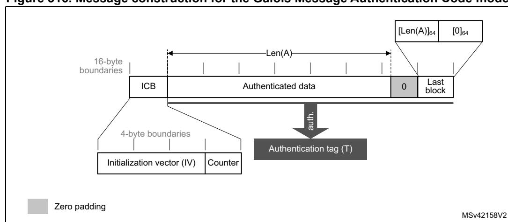

#### **AES GMAC processing**

This mode is selected by writing ALGOMODE bitfield to 0x6 in CRYP\_CR.

GMAC algorithm corresponds to the GCM algorithm applied on a message composed only of an header. As a consequence, all steps and settings are the same as in GCM mode, except that the payload phase (3) is not used.

### **Suspend/resume operations in GMAC**

GMAC is exactly the same as GCM algorithm except that only header phase (2) can be interrupted.


RM0399 Rev 4 1447/3556

# 37.4.15 CRYP AES Counter with CBC-MAC (CCM)

#### Overview

The AES Counter with Cipher Block Chaining-Message Authentication Code (CCM) algorithm allows encrypting and authenticating the plaintext, and generating the correspondent ciphertext and tag (also known as message authentication code). To ensure confidentiality, CCM algorithm is based on AES counter mode. It uses Cipher Block Chaining technique to generate the message authentication code. This is commonly called CBC-MAC

Note:

NIST does not approve this CBC-MAC as an authentication mode outside of the context of the CCM specification.

CCM chaining is specified in NIST *Special Publication 800-38C*, *Recommendation for Block Cipher Modes of Operation - The CCM Mode for Authentication and Confidentiality*. A typical message construction in CCM mode is given in *Figure 317* 

<span id="page-35-0"></span>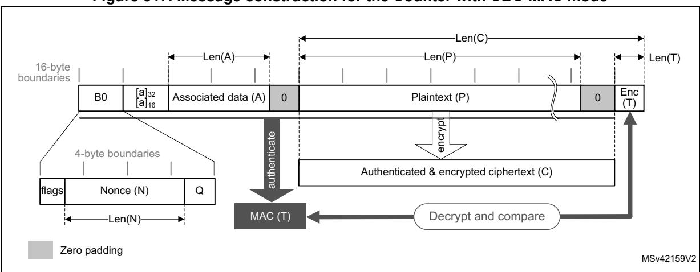

Figure 317. Message construction for the Counter with CBC-MAC mode

The structure of this message is as below:

- One 16-byte first authentication block (called B0 by the standard), composed of three distinct fields:
  - Q: a bit string representation of the byte length of P (Plen)
  - A nonce (N): single-use value (i.e. a new nonce should be assigned to each new communication). Size of nonce Nlen + size of Plen shall be equal to 15 bytes.
  - Flags: most significant byte containing four flags for control information, as specified by the standard. It contains two 3-bit strings to encode the values t (MAC length expressed in bytes) and q (plaintext length such as Plen<2<sup>8q</sup> bytes). Note that the counter blocks range associated to q is equal to 2<sup>8q-4</sup>, i.e. if q maximum value is 8, the counter blocks used in cipher shall be on 60 bits.

**47/** 

- 16-bytes blocks (B) associated to the Associated Data (A).
  - This part of the message is only authenticated, not encrypted. This section has a known length, *ALen,* that can be a non-multiple of 16 bytes (see *[Figure 317](#page-35-0)*). The standard also states that, on the MSB bits of the first message block (B1), the associated data length expressed in bytes (*a*) must be encoded as defined below:
  - If 0 < a < 216-28, then it is encoded as [a]16, i.e. two bytes.
  - If 216-28 < a < 232, then it is encoded as 0xff || 0xfe || [a]32, i.e. six bytes.
  - If 232 < a < 264, then it is encoded as 0xff || 0xff || [a]64, i.e. ten bytes.
- 16-byte blocks (B) associated to the plaintext message (P), which is both authenticated and encrypted as ciphertext C, with a known length of *Plen*. This length can be a nonmultiple of 16 bytes (see *[Figure 317](#page-35-0)*).
- The encrypted MAC (T) of length *Tlen* appended to the ciphertext C of overall length *Clen*.
- When a part of the message (A or P) has a length which is a non-multiple of 16 bytes, a special padding scheme is required.

*Note: CCM chaining mode can also be used with associated data only (i.e. no payload).*

As an example, the C.1 section in *NIST Special Publication 800-38C* gives the following:

```
N: 10111213 141516 (Nlen = 56 bits or 0x7 bytes)
A: 00010203 04050607 (Alen = 64 bits or 0x8 bytes)
P: 20212223 (Plen = 32 bits i.e. Q = 0x4 bytes)
T: 6084341b (Tlen = 32 bits or t = 4)
B0: 4f101112 13141516 00000000 00000004
B1: 00080001 02030405 06070000 00000000
B2: 20212223 00000000 00000000 00000000
CTR0: 0710111213 141516 00000000 00000000
CTR1: 0710111213 141516 00000000 00000001
```

The usage of control blocks CTRx is explained in the following section. The generation of CTR0 from the first block (B0) must be managed by software.

RM0399 Rev 4 1449/3556

Input data

bits are set to 0, except for bit 0 that is set to 1

#### **AES CCM processing**

the 5 most significant bits are set to 0 (flag bits)

This mode is selected by writing ALGOMODE bitfield to 0x9 in CRYP\_CR.

The data input to the generation-encryption process are a valid nonce, a valid payload string, and a valid associated data string, all properly formatted. The CBC chaining mechanism is applied to the formatted data to generate a MAC, whose length is known. Counter mode encryption, which requires a sufficiently long sequence of counter blocks as input, is applied to the payload string and separately to the MAC. The resulting data, called the ciphertext C, is the output of the generation-encryption process on plaintext P.

CRYP\_IVx(L/R)R registers are used for processing each data block. The cryptographic processor automatically increments the CTR counter with a bit length defined by the first block (B0). The first counter written by application, CTR1, is equal to B0 with the first 5 bits zeroed and the most significant bits containing P byte length also zeroed, then incremented by one (see *[Table 305](#page-37-0)*).

<span id="page-37-0"></span>**Register CRYP\_IV0LR[31:0] CRYP\_IV0RR[31:0] CRYP\_IV1LR[31:0] CRYP\_IV1RR[31:0]** B0[127:96], where B0[31:0], where Q length

**Table 305. CCM mode IV registers initialization** 

To process a CCM message, the driver must go through four phases, which are described below.

B0[95:64] B0[63:32]

- The **Initialization phase**: the peripheral processes the first block and prepares the first counter block.
- The **Header phase**: the peripheral processes the Associated data (A), with hash computation only.
- The **Payload phase**: the peripheral processes the plaintext (P), with hash computation, counter block encryption and data XORing. It operates in a similar way for ciphertext (C).
- The **Final phase**: the peripheral generates the message authentication code (MAC).


#### **1. CCM initialization phase**

In this first step, the first block (B0) of the CCM message is programmed into the CRYP\_DIN register. During this phase, the CRYP\_DOUT register does not contain any output data. It is recommended to follow the sequence below:

- a) Make sure that the cryptographic processor is disabled by clearing the CRYPEN bit in the CRYP\_CR register.
- b) Select the CCM chaining mode by programming the ALGOMODE bits to 0x9 in the CRYP\_CR register. In the same register define the key length using KEYSIZE bits and the data type using DATATYPE bits.
- c) Configure the GCM\_CCMPH bits to 0b00 in CRYP\_CR to indicate that we are in the initialization phase.
- d) Initialize the key registers (128, 192 or 256 bits) in CRYP\_KEYRx as well as the initialization vector (IV) with CTR1 information, as defined in *[Table 305](#page-37-0)*.
- e) Set the CRYPEN bit to 1 in CRYP\_CR to start accepting data.
- f) Write the B0 packet into CRYP\_DIN register, then wait for the CRYPEN bit to be cleared to 0 by the cryptographic processor before moving on to the next phase.

*Note: In this initialization phase, data have to be inserted normally (no swapping).*

#### **2. CCM header phase**

The below sequence shall be performed after the CCM initialization phase. It must be complete before jumping to the payload phase. The sequence is identical for encryption and decryption. During this phase, the CRYP\_DOUT register does not contain any output data.

- g) Set the GCM\_CCMPH bit to 0b01 in CRYP\_CR to indicate that the header phase is ongoing.
- h) Set the CRYPEN bit to 1 to start accepting data.
- i) If it is the last block of associated data, optionally pad the data with zeros to have a complete block.
- j) Append the associated data in the cryptographic processor. The three possible scenarios are described in *[Section 37.4.5: CRYP procedure to perform a cipher](#page-10-0)  [operation](#page-10-0)*.
- k) Repeat the previous step until the second last associated data block is processed. For the last block, execute the two previous steps. Once all the additional authenticated data have been supplied, wait until the BUSY flag is cleared.

*Note: This phase can be skipped if there is no associated data (Alen = 0).*

*The first block of the associated data B1 must be formatted with the associated data length. This task must be managed by the driver.*

RM0399 Rev 4 1451/3556

# **3. CCM payload phase (encryption or decryption)**

When the payload size is not null, this sequence must be performed after the CCM header phase. During this phase, the encrypted/decrypted payload is stored in the CRYP\_DOUT register.

- l) Set the CRYPEN bit to 0.
- m) Configure GCM\_CCMPH bits to 0b10 in CRYP\_CR to indicate that the payload phase is ongoing.
- n) Select the algorithm direction (0 for encryption, 1 for decryption) through the ALGODIR bit in CRYP\_CR.
- o) Set the CRYPEN bit to 1 to start accepting data.
- p) If it is the last block of cleartext, optionally pad the data with zeros to have a complete block (encryption only). For decryption, refer to *[Section 37.4.8: CRYP](#page-13-1)  [stealing and data padding](#page-13-1)* for more details.
- q) Append payload data in the cryptographic processor, and read the result. The three possible scenarios are described in *[Section 37.4.5: CRYP procedure to](#page-10-0)  [perform a cipher operation](#page-10-0)*.
- r) Repeat the previous step until the second last plaintext block is encrypted or until the last block of ciphertext is decrypted. For the last block of plaintext (encryption only), execute the two previous steps. For the last block of ciphertext (decryption only), the driver must discard the data that is not part of the cleartext when the last block size is less than 16 bytes. Once all payload data have been supplied, wait until the BUSY flag is cleared

*Note: This phase can be skipped if there is no payload data, i.e. Plen = 0 or Clen = Tlen*

*Note: Do not forget to remove LSBTlen(C) encrypted tag information when decrypting ciphertext C.*

#### **4. CCM final phase**

In this last step, the cryptographic processor generates the CCM authentication tag and stores it in the CRYP\_DOUT register.

- s) Configure GCM\_CCMPH[1:0] bits to 0b11 in CRYP\_CR to indicate that the final phase is ongoing and set the ALGODIR bit to 0 in the same register.
- t) Load in CRYP\_DIN, the CTR0 information which is described in *[Table 305](#page-37-0)* with bit[0] set to 0.

*Note: In this final phase, data have to be inserted normally (no swapping).*

- u) Wait until the OFNE flag (FIFO output not empty) is set to 1 in the CRYP\_SR register.
- v) Read the CRYP\_DOUT register four times: the output corresponds to the encrypted CCM tag.
- w) Disable the cryptographic processor (CRYPEN bit set to 0 in CRYP\_CR)
- x) If an authenticated decryption is being performed, compare the generated encrypted tag with the encrypted tag padded in the ciphertext, i.e. LSBTlen(C) = MSBTlen(CRYP\_DOUT data).


#### **Suspend/resume operations in CCM mode**

Before interrupting the current message in payload phase, the user application must respect the following sequence:

- 1. If DMA is used, stop the DMA transfers to the IN FIFO by clearing to 0 the DIEN bit in the CRYP\_DMACR register.
- 2. Wait until both the IN and the OUT FIFOs are empty (IFEM = 1 and OFNE = 0 in the CRYP\_SR register) and the BUSY bit is cleared.
- 3. If DMA is used, stop the DMA transfers from the OUT FIFO by clearing to 0 the DOEN bit in the CRYP\_DMACR register.
- 4. Disable the cryptographic processor by setting the CRYPEN bit to 0 in CRYP\_CR, then save the current configuration (bits [9:2], bits [17:16] and bits 19 in the CRYP\_CR register). In addition, save the initialization vector registers, since CRYP\_IVx(L/R)R registers have changed from their initial values during the data processing.

*Note: Key registers do not need to be saved as their original key value is known by the application.*

- 5. Save context swap registers: CRYP\_CSGCMCCM0..7R
- 6. If DMA is used, save the DMA controller status (pointers for IN and OUT data transfers, number of remaining bytes, etc.).

To resume message processing, the user application must respect the following sequence:

- 1. If DMA is used, reconfigure the DMA controller to complete the rest of the FIFO IN and FIFO OUT transfers.
- 2. Make sure the cryptographic processor is disabled by reading the CRYPEN bit in CRYP\_CR (must be 0).
- 3. Configure the cryptographic processor again with the initial setting in CRYP\_CR and key registers using the saved configuration.
- 4. Restore context swap registers: CRYP\_CSGCMCCM0..7R
- 5. Restore CRYP\_IVx(L/R)R registers using the saved configuration.
- 6. Enable the cryptographic processor by setting the CRYPEN bit to 1.
- 7. If DMA is used, enable again cryptographic processor DMA requests by setting to 1 the DIEN and DOEN bits in the CRYP\_DMACR register.

*Note: In Header phase DMA OUT FIFO transfer is not used.*

# <span id="page-40-0"></span>**37.4.16 CRYP data registers and data swapping**

The CRYP\_DIN register is the 32-bit wide data input register of the peripheral. It is used to enter into the input FIFO up to four 64-bit blocks (TDES) or two 128-bit blocks (AES) of plaintext (when encrypting) or ciphertext (when decrypting), one 32-bit word at a time.

The four adjacent (respectively two) words of the AES (respectively DES/TDES) data block are organized in big-endian order, with the most significant byte of a word on the lowest address.

The cryptographic accelerator can be configured to perform a bit, byte, half-word, or no swapping on the input data word in the CRYP\_DINR register, before loading it to the CRYP processing core, and on the data output from the CRYP processing core, before sending it

RM0399 Rev 4 1453/3556

to the CRYP\_DOUTR register. The choice depends on the type of data. For example, a byte swapping is used for an ASCII text stream.

The data swap type is selected through the DATATYPE[1:0] bitfield of the AES\_CR register. The selection applies both to the input and the output of the CRYP processing core.

*Note: The CRYP Key registers (CRYP\_Kx(L/R)) and initialization registers (CRYP\_IVx(L/R)) are not sensitive to the swap mode selected.*

More information on data input and data swapping can be found in the next subsections.

#### **DES/TDES data input and output**

A 64-bit data block is entered into the cryptographic processor with two successive 32-bit word write operations to the CRYP\_DINR register (DIN[31:0] bitfield), the most significant word (bits [64:33]) first, the least significant word (bits [32:1]) last.

A 64-bit data block is retrieved from the cryptographic processor with two successive 32-bit word read operations from the CRYP\_DOUTR register (DOUT[31:0] bitfield), the most significant word (bits [64:33]) first, the least significant word (bits [32:1]) last.

#### **DES/TDES data swapping feature**

The cryptographic processor data swapping feature for DES/TDES is summarized in *[Table 306](#page-41-0)* and *[Figure 318](#page-42-0)*.

<span id="page-41-0"></span>

| DATATYPE<br>in CRYP_CR | Swapping<br>performed          | Data block representation (64-bit)                                                                                 |
|------------------------|--------------------------------|--------------------------------------------------------------------------------------------------------------------|
|                        |                                | System memory data (big-endian)                                                                                    |
| 00                     | No swapping                    | Block[641]: 0xABCD7720 6973FE01                                                                                    |
|                        |                                | Address @, word[6332]: 0xABCD 7720<br>Address @+4, word[310]: 0x6973 FE01                                          |
| 01                     | Half-word (16-bit)<br>swapping | Block[641]: 0xABCD 7720 6973 FE01                                                                                  |
|                        |                                | Address @, word[6332]: 0x7720 ABCD<br>Address @+4, word[310]: 0xFE01 6973                                          |
| 10                     | Byte (8-bit)<br>swapping       | Block[641]: 0xAB CD 77 20 69 73 FE 01                                                                              |
|                        |                                | Address @, word[6332]: 0x2077 CDAB<br>Address @+4, word[310]: 0x01FE 7369                                          |
|                        |                                | Block[6433]: 0xABCD7720                                                                                            |
| 11                     | Bit swapping in<br>32-bit word | 1010 1011 1100 1101 0111 0111 0010 0000<br>Block[321]: 0x6973FE01<br>0110 1001 0111 0011 1111 1110 0000 0001       |
|                        |                                | Address @, word[6332]: 0x04EEB3D5<br>0000 0100 1110 1110 1011 0011 1101 0101<br>Address @+4, word[310]: 0x807FCE96 |

1000 0000 0111 1111 1100 1110 1001 0110

**Table 306. DES/TDES data swapping example**


<span id="page-42-0"></span>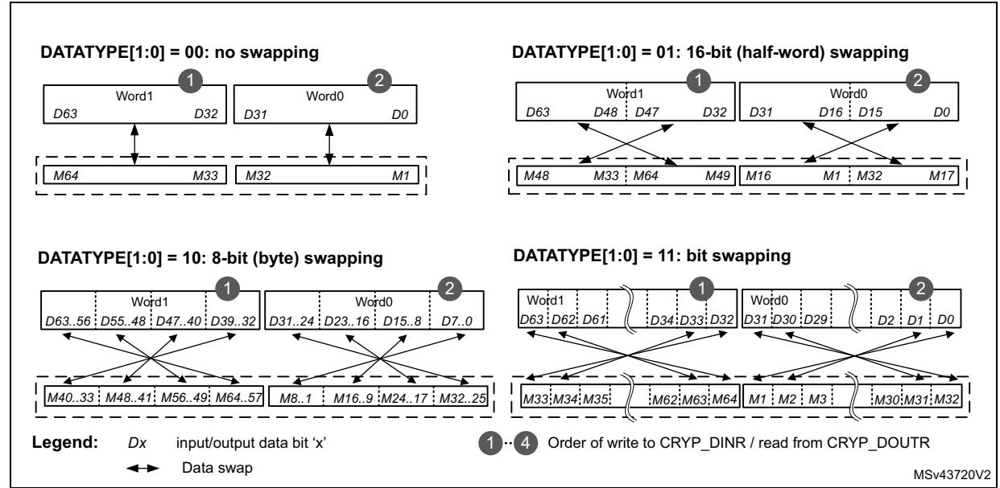

Figure 318. 64-bit block construction according to the data type (IN FIFO)

#### **AES** data input and output

A 128-bit data block is entered into the cryptographic processor with four successive 32-bit word writes into the CRYP\_DINR register (bitfield DIN[31:0]), the most significant word (bits [127:96]) first, the least significant word (bits [31:0]) last.

A 128-bit data block is retrieved from the cryptographic processor with four successive 32-bit word reads from the CRYP\_DOUTR register (bitfield DOUT[31:0]), the most significant word (bits [127:96]) first, the least significant word (bits [31:0]) last.

# **AES** data swapping feature

The cryptographic processor data swapping feature for AES is summarized in *Table 307* and *Figure 319*.

Note:

Data swapping does not apply to GCM and CCM final phases. Data can be inserted normally by the application.

Table 307. AES data swapping example

<span id="page-42-1"></span>

| DATATYPE in CRYP_CR | Swapping<br>performed          | First half data block (64-bit)                                                          |  |
|---------------------|--------------------------------|-----------------------------------------------------------------------------------------|--|
|                     |                                | System memory data (big-endian)                                                         |  |
| 00                  | No swapping                    | Block[630]: 0x4E6F7720 69732074                                                         |  |
|                     |                                | Address @, word[6332]: 0x4E6F7720<br>Address @+4, word[310]: 0x69732074                 |  |
| 01                  | Half-word (16-bit)<br>swapping | Block[630]: 0x4E6F 7720 6973 2074                                                       |  |
|                     |                                | Address @, word[6332]: 0x7720 <b>4E6F</b><br>Address @+4, word[310]: 0x2074 <b>6973</b> |  |


**Table 307. AES data swapping example (continued)**

| DATATYPE<br>in CRYP_CR | Swapping<br>performed    | First half data block (64-bit)                                                                                                                                  |  |
|------------------------|--------------------------|-----------------------------------------------------------------------------------------------------------------------------------------------------------------|--|
|                        |                          | System memory data (big-endian)                                                                                                                                 |  |
| 10                     | Byte (8-bit)<br>swapping | Block[630]: 0x4E 6F 77 20 69 73 20 74                                                                                                                           |  |
|                        |                          | Address @, word[6332]: 0x2077 6F4E<br>Address @+4, word[310]: 0x7420 7369                                                                                       |  |
| 11                     | Bit swapping             | Block[6332]: 0x4E6F7720<br>0100 1110 0110 1111 0111 0111 0010 0000<br>Block[310]: 0x69732074<br>0110 1001 0111 0011 0010 0000 0111 0100                         |  |
|                        |                          | Address @, word[6332]: 0x04EE F672<br>0000 0100 1110 1110 1111 0110 0111 0010<br>Address @+4, word[310]: 0x2E04 CE96<br>0010 1110 0000 0100 1100 1110 1001 0110 |  |

<span id="page-44-1"></span>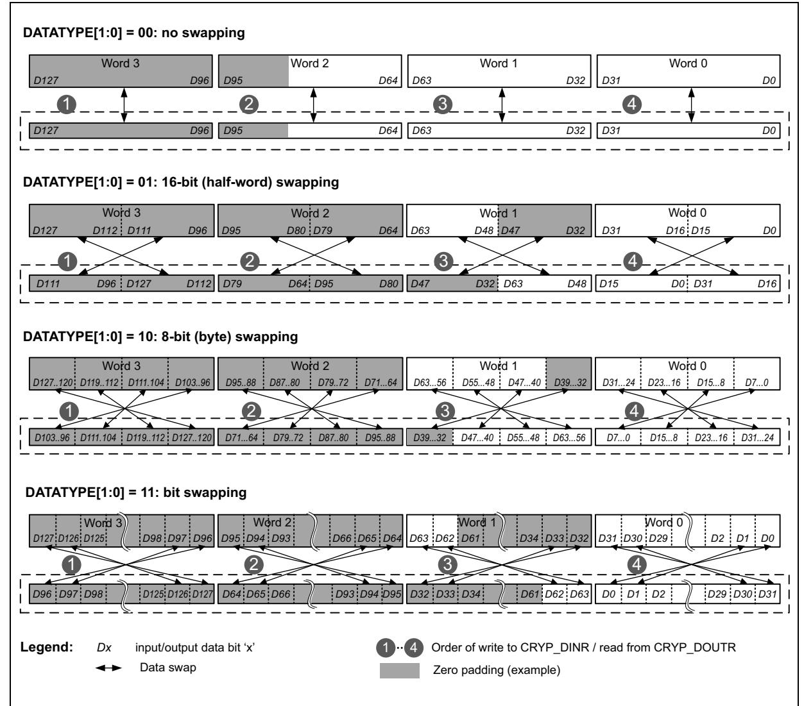

**Figure 319. 128-bit block construction according to the data type**

# <span id="page-44-0"></span>**37.4.17 CRYP key registers**

The CRYP\_Kx registers are write-only registers used to store the encryption or decryption keys. They are organized as four 64-bit registers, as shown in *[Table 308](#page-44-2)* and *[Table 309](#page-45-0)*.

*Note: In memory and in CRYP key registers, AES and DES/TDES keys are stored in big-endian format, with most significant byte on the lowest address.*

**Table 308. Key endianness in CRYP\_KxR/LR registers (AES 128/192/256-bit keys)** 

<span id="page-44-2"></span>

| K0LR[31:0] | K0RR[31:0] | K1LR[31:0] | K1RR[31:0] | K2LR[31:0] | K2RR[31:0] | K3LR[31:0] | K3RR[31:0] |
|------------|------------|------------|------------|------------|------------|------------|------------|
| -          | -          | -          | -          | k[127:96]  | k[95:64]   | k[63:32]   | k[31:0]    |
| K0LR[31:0] | K0RR[31:0] | K1LR[31:0] | K1RR[31:0] | K2LR[31:0] | K2RR[31:0] | K3LR[31:0] | K3RR[31:0] |
| -          | -          | k[191:160] | k[159:128] | k[127:96]  | k[95:64]   | k[63:32]   | k[31:0]    |


MSv43721V2

**Table 308. Key endianness in CRYP\_KxR/LR registers (AES 128/192/256-bit keys) (continued)**

| K0LR[31:0] | K0RR[31:0] | K1LR[31:0] | K1RR[31:0] | K2LR[31:0] | K2RR[31:0] | K3LR[31:0] | K3RR[31:0] |
|------------|------------|------------|------------|------------|------------|------------|------------|
| k[255:224] | k[223:192] | k[191:160] | k[159:128] | k[127:96]  | k[95:64]   | k[63:32]   | k[31:0]    |

**Table 309. Key endianness in CRYP\_KxR/LR registers (DES K1 and TDES K1/2/3)** 

<span id="page-45-0"></span>

| K0LR[31:0] | K0RR[31:0] | K1LR[31:0] | K1RR[31:0] | K2LR[31:0] | K2RR[31:0] | K3LR[31:0] | K3RR[31:0] |
|------------|------------|------------|------------|------------|------------|------------|------------|
| -          | -          | K1[64:33]  | K1[32:1]   | -          | -          | -          | -          |
| -          | -          | K1[64:33]  | K1[32:1]   | K2[64:33]  | K2[32:1]   | K3[64:33]  | K3[32:1]   |

As shown on *[Table 309](#page-45-0)*, when TDES is selected (ALGOMODE[2:0] = 000 or 001) a 3-key vector (K1, K2, and K3) is used. When DES is selected (ALGOMODE[2:0] = 010 or 011) only 1-key vector (K1) is used.

*Note: DES/TDES keys include 8-bit parity information that are not used by the cryptographic processor. In other words, bits 8, 16, 24, 32, 40, 48, 56 and 64 of each 64-bit key value Kx[1:64] are not used.*

> Write operations to the CRYP\_Kx(L/R) registers when the BUSY bit is set to 1 in the CRYP\_SR register are ignored (which means that the register content is not modified). The application must thus check that the BUSY bit is cleared to 0 before modifying key registers.

Key registers are not affected by the data swapping controlled by DATATYPE value in CRYP\_CR register.

Refer to *[Section 37.7: CRYP registers](#page-50-0)* for a detailed description of CRYP\_Kx(L/R) registers.

# <span id="page-45-3"></span>**37.4.18 CRYP initialization vector registers**

The CRYP\_IVxL/IVxR registers are used to store the initialization vector or the nonce, depending on the chaining mode selected. When used, these registers are updated by the core after each computation round of the TDES or AES core.

They are organized as four 64-bit registers, as shown in shown in *[Table 310](#page-45-1)* and *[Table 311](#page-45-2)*. In DES/TDES mode only CRYP\_IV0x are used.

*Note: In memory and in CRYP IV registers, AES and DES/TDES* initialization vectors *are stored in big-endian format, with most significant byte on the lowest address.*

**Table 310. Initialization vector endianness in CRYP\_IVx(L/R)R registers (AES)** 

<span id="page-45-1"></span>

| CRYP_IV0LR[31:0] | CRYP_IV0RR[31:0] | CRYP_IV1LR[31:0] | CRYP_IV1RR[31:0] |  |
|------------------|------------------|------------------|------------------|--|
| IVI[127:96]      | IVI[95:64]       | IVI[63:32]       | IVI[31:0]        |  |

<span id="page-45-2"></span>**Table 311. Initialization vector endianness in CRYP\_IVx(L/R)R registers (DES/TDES)** 

| CRYP_IV0LR[31:0]<br>CRYP_IV0RR[31:0] |  | CRYP_IV1LR[31:0] | CRYP_IV1RR[31:0] |  |
|--------------------------------------|--|------------------|------------------|--|
| IVI[64:32]<br>IVI[31:0]              |  | -                | -                |  |

Any write operation to the CRYP\_IV0...1(L/R)R registers when the BUSY bit is set to 1 in the CRYP\_SR register is disregarded (which means that register content not modified). The


software must thus check that the BUSY bit is cleared to 0 in the CRYP\_SR register before modifying initialization vectors.

Reading the CRYP\_IV0...1(L/R)R register returns the latest counter value (useful for managing suspend mode) except for CCM/GCM.

The initialization vector registers are not affected by the data swapping feature controlled by DATATYPE value in CRYP\_CR register.

Refer to *[Section 37.7: CRYP registers](#page-50-0)* for a detailed description of CRYP\_IVxL/IVxR registers.

# <span id="page-46-0"></span>**37.4.19 CRYP DMA interface**

The cryptographic processor provides an interface to connect to the DMA (Direct Memory Access) controller. The DMA operation is controlled through the CRYP DMA control register (CRYP\_DMACR).

#### **Data input using DMA**

DMA can be enabled for writing data into the cryptographic peripheral by setting the DIEN bit in the CRYP\_DMACR register. When this bit is set, the cryptographic processor initiates a DMA request during the INPUT phase each time it requires a word to be written to the CRYP\_DIN register.

*[Table 312](#page-46-1)* shows the recommended configuration to transfer data from memory to cryptographic processor through the DMA controller.

**Table 312. Cryptographic processor configuration for memory-to-peripheral DMA transfers** 

<span id="page-46-1"></span>

| DMA channel control<br>register field         | Programming recommendation                                                                                                                                                                                                                                                                                                                                                                                                                                           |  |  |
|-----------------------------------------------|----------------------------------------------------------------------------------------------------------------------------------------------------------------------------------------------------------------------------------------------------------------------------------------------------------------------------------------------------------------------------------------------------------------------------------------------------------------------|--|--|
| Transfer size                                 | Message length, multiple of four 32-bit words. This 128-bit granularity<br>corresponds to two blocks for DES/TDES, one block for AES.<br>According to the algorithm and the mode selected, special padding/<br>ciphertext stealing might be required. As an example, in case of AES GCM<br>encryption or AES CCM decryption, DMA transfers must not include the last<br>block. Refer to Section 37.4.5: CRYP procedure to perform a cipher<br>operation for details. |  |  |
| Source burst size<br>(memory)                 | CRYP FIFO_size /2 /transfer_width = 4                                                                                                                                                                                                                                                                                                                                                                                                                                |  |  |
| Destination burst size<br>(peripheral)        | CRYP FIFO_size /2 /transfer_width = 4<br>(FIFO_size = 8x32-bit, transfer_width = 32-bit)                                                                                                                                                                                                                                                                                                                                                                             |  |  |
| DMA FIFO size<br>CRYP FIFO_size /2 = 16 bytes |                                                                                                                                                                                                                                                                                                                                                                                                                                                                      |  |  |
| Source transfer width<br>(memory)             | 32-bit words                                                                                                                                                                                                                                                                                                                                                                                                                                                         |  |  |
| Destination transfer<br>width (peripheral)    | 32-bit words                                                                                                                                                                                                                                                                                                                                                                                                                                                         |  |  |


**Table 312. Cryptographic processor configuration for memory-to-peripheral DMA transfers (continued)**

| DMA channel control<br>register field         | Programming recommendation                              |
|-----------------------------------------------|---------------------------------------------------------|
| Source address<br>increment (memory)          | Yes, after each 32-bit transfer.                        |
| Destination address<br>increment (peripheral) | Fixed address of CRYP_DIN shall be used (no increment). |

#### **Data output using DMA**

To enable the DMA for reading data from CRYP processor, set the DOEN bit in the CRYP\_DMACR register. When this bit is set, the cryptographic processor initiates a DMA request during the OUTPUT phase each time it requires a word to be read from the CRYP\_DOUT register.

*[Table 313](#page-47-0)* shows the recommended configuration to transfer data from cryptographic processor to memory through the DMA controller.

**Table 313. Cryptographic processor configuration for peripheral-to-memory DMA transfers** 

<span id="page-47-0"></span>

| DMA channel control<br>register field     | Programming recommendation                                                                                                                                                                                         |  |  |  |  |  |
|-------------------------------------------|--------------------------------------------------------------------------------------------------------------------------------------------------------------------------------------------------------------------|--|--|--|--|--|
| Transfer size                             | Message length, multiple of four 32-bit words. This 128-bit granularity<br>corresponds to two blocks for DES/TDES, one block for AES.<br>Depending on the chaining mode selected, extra bits have to be discarded. |  |  |  |  |  |
| Source burst size<br>(peripheral)         | When DES is used:<br>Single transfer (burst size = 1)<br>When AES is used:<br>CRYP FIFO_size /2 /transfer_width = 4<br>(FIFO_size = 8x32-bit, transfer_width = 32-bit)                                             |  |  |  |  |  |
| Destination burst size<br>(memory)        | CRYP FIFO_size /2 /transfer_width = 4                                                                                                                                                                              |  |  |  |  |  |
| DMA FIFO size                             | CRYP FIFO_size /2 = 16 bytes                                                                                                                                                                                       |  |  |  |  |  |
| Source transfer width<br>(peripheral)     | 32-bit words                                                                                                                                                                                                       |  |  |  |  |  |
| memory transfer width<br>(memory)         | 32-bit words                                                                                                                                                                                                       |  |  |  |  |  |
| Source address<br>increment (peripheral)  | Fixed address of CRYP_DOUT shall be used (no increment).                                                                                                                                                           |  |  |  |  |  |
| Destination address<br>increment (memory) | Yes, after each 32-bit transfer.                                                                                                                                                                                   |  |  |  |  |  |

#### **DMA mode**

When AES is used, the cryptographic processor manages two DMA transfer requests through cryp\_in\_dma and cryp\_out\_dma internal input/output signals, which are asserted:

- for IN FIFO: every time a block has been read from FIFO by CRYP,
- for OUT FIFO: every time a block has been written into the FIFO by the cryptographic processor.

When DES/TDES is used, the cryptographic processor manages two DMA transfer requests through cryp\_in\_dma and cryp\_out\_dma internal input/output signals, which are asserted:

• for IN FIFO: every time two blocks have been read from FIFO by the cryptographic processor

for OUT FIFO: every time a word has been written into the FIFO by the cryptographic processor (single transfer). Note that a burst transfer is also triggered when two blocks have been written into the FIFO.

All request signals are deasserted if the cryptographic peripheral is disabled or the DMA enable bit is cleared (DIEN bit for the IN FIFO and DOEN bit for the OUT FIFO in the CRYP\_DMACR register).

**Caution:** It is important that DMA controller empties the cryptographic peripheral output FIFO before filling up the CRYP input FIFO. To achieve it, the DMA controller should be configured so that the transfer from the peripheral to the memory has a higher priority than the transfer from the memory to the peripheral.

> For more detailed information on DMA operations, refer to *[Section 37.4.5: CRYP procedure](#page-10-0)  [to perform a cipher operation](#page-10-0)*.

# **37.4.20 CRYP error management**

No error flags are generated by the cryptographic processor.

# **37.5 CRYP interrupts**

#### **Overview**

There are two individual maskable interrupt sources generated by the cryptographic processor to signal the following events:

- Input FIFO empty or not full
- Output FIFO full or not empty

These two sources are combined into a single interrupt signal which is the only interrupt signal from the CRYP processor that drives the Cortex® CPU interrupt controller. You can enable or disable CRYP interrupt sources individually by changing the mask bits in the CRYP\_IMSCR register. Setting the appropriate mask bit to 1 enables the interrupt.

The status of the individual maskable interrupt sources can be read either from the CRYP\_RISR register, for raw interrupt status, or from the CRYP\_MISR register for masked


RM0399 Rev 4 1461/3556

interrupt status. The status of the individual source of event flags can be read from the CRYP SR register.

Table 314 gives a summary of the available features.

Table 314. CRYP interrupt requests

<span id="page-49-1"></span>

| Interrupt | Into we cont          | Even                                   | Enable bit | Interrupt<br>clear<br>method |                                             |             |
|-----------|-----------------------|----------------------------------------|------------|------------------------------|---------------------------------------------|-------------|
| acronym   | Interrupt event       | in CRYP_xISR <sup>(1)</sup> in CRYP_SR |            |                              |                                             | Ellable bit |
| CRYP      | Output FIFO full      | OUTRIS (not masked)                    | OFFU       | OUTIM <sup>(2)</sup> and     | Read one<br>data from<br>output FIFO        |             |
|           | Output FIFO not empty | OUTMIS (masked)                        | OFNE       | CRYPEN                       | Read all data<br>from output<br>FIFO        |             |
|           | Input FIFO not full   | INRIS (not masked)                     | IFNF       | INIM <sup>(2)</sup> and      | Write data<br>until input<br>FIFO is full   |             |
|           | Input FIFO empty      | INMIS (masked)                         | IFEM       | CRYPEN                       | Write at least<br>one word in<br>input FIFO |             |

- 1. The flags belong to CRYP\_RISR registers (unmasked or raw) or CRYP\_MISR registers (masked).
- <span id="page-49-0"></span>2. The flags belong to CRYP IMSCR register.

# **Output FIFO service interrupt - OUTMIS**

The output FIFO service interrupt is asserted when there is one or more (32-bit word) data items in the output FIFO. This interrupt is cleared by reading data from the output FIFO until there is no valid (32-bit) word left (that is when the interrupt follows the state of the output FIFO not empty flag OFNE).

The output FIFO service interrupt OUTMIS is NOT enabled with the CRYP processor enable bit. Consequently, disabling the CRYP processor does not force the OUTMIS signal low if the output FIFO is not empty.

# Input FIFO service interrupt - INMIS

The input FIFO service interrupt is asserted when there are less than four words in the input FIFO. It is cleared by performing write operations to the input FIFO until it holds four or more words.

The input FIFO service interrupt INMIS is enabled with the CRYP enable bit. Consequently, when CRYP is disabled, the INMIS signal is low even if the input FIFO is empty.

# 37.6 CRYP processing time

The time required to process a block for each mode of operation is summarized below. The block size is 128 bits for AES and 64 bits for DES/TDES.


| Key size  | Operating modes                             | Chaining algorithm | Clock cycles |  |
|-----------|---------------------------------------------|--------------------|--------------|--|
| 64 bits   | 64 bits DES encryption or decryption        |                    | 16           |  |
| 3x64 bits | TDES encryption or decryption               | ECD, CBC           | 48           |  |
| 128 bits  | AES encryption or decryption <sup>(1)</sup> | ECD, CBC, CTR      | 14           |  |
|           | AES key preparation                         | -                  | 12           |  |
| 192 bits  | AES encryption or decryption <sup>(1)</sup> | ECD, CBC, CTR      | 16           |  |
|           | AES key preparation                         | -                  | 14           |  |
| 256 bits  | AES encryption or decryption <sup>(1)</sup> | ECD, CBC, CTR      | 18           |  |
|           | AES key preparation                         | -                  | 16           |  |

Table 315. Processing latency for ECB, CBC and CTR

Table 316. Processing time (in clock cycle) for GCM and CCM per 128-bit block

|          |                              |                    |                      | •               |               |              |  |
|----------|------------------------------|--------------------|----------------------|-----------------|---------------|--------------|--|
| Key size | Operating modes              | Chaining algorithm | Initialization phase | Header<br>phase | Payload phase | Tag<br>phase |  |
| 120 hita |                              | GCM                | 24                   | 10              | 14            | 14           |  |
| 128 bits |                              | CCM                | 12                   | 14              | 25            | 14           |  |
| 192 bits | AES encryption or decryption | GCM                | 28                   | 10              | 16            | 16           |  |
|          |                              | CCM                | 14                   | 16              | 29            | 16           |  |
| 256 bits |                              | GCM                | 32                   | 10              | 18            | 18           |  |
|          |                              | CCM                | 16                   | 18              | 33            | 18           |  |

# <span id="page-50-0"></span>37.7 CRYP registers

The cryptographic core is associated with several control and status registers, eight key registers and four initialization vectors registers.

# 37.7.1 CRYP control register (CRYP\_CR)

Address offset: 0x00

Reset value: 0x0000 0000

| 31     | 30     | 29   | 28   | 27   | 26   | 25    | 24                        | 23 | 22                 | 21 | 20    | 19            | 18   | 17                 | 16 |
|--------|--------|------|------|------|------|-------|---------------------------|----|--------------------|----|-------|---------------|------|--------------------|----|
| Res.   | Res.   | Res. | Res. | Res. | Res. | Res.  | Res.                      |    | NPBLB[3:0]         |    |       | ALGOM<br>ODE3 | Res. | GCM_CCMPH<br>[1:0] |    |
|        |        |      |      |      |      |       |                           | rw | rw                 | rw | rw    | rw            |      | rw                 | rw |
| 15     | 14     | 13   | 12   | 11   | 10   | 9     | 8                         | 7  | 6                  | 5  | 4     | 3             | 2    | 1                  | 0  |
| CRYPEN | FFLUSH | Res. | Res. | Res. | Res. | KEYSI | EYSIZE[1:0] DATATYPE[1:0] |    | 1:0] ALGOMODE[2:0] |    | [2:0] | ALGODIR       | Res. | Res.               |    |
| rw     | rw     |      |      | ļ    |      | rw    | rw                        | rw | rw                 | rw | rw    | rw            | rw   |                    |    |

Bits 31:24 Reserved, must be kept at reset value.


RM0399 Rev 4 1463/3556

<span id="page-50-1"></span><sup>1.</sup> Excluding key preparation time (ECB and CBC only).

#### Bits 23:20 **NPBLB[3:0]:** Number of Padding Bytes in Last Block of payload.

This padding information must be filled by software before processing the last block of GCM payload encryption or CCM payload decryption, otherwise authentication tag computation is incorrect.

0000: All bytes are valid (no padding)

0001: Padding for the last LSB byte

...

1111: Padding for the 15 LSB bytes of last block.

Writing NPBLB bits while BUSY = 1 has no effect.

#### Bit 18 Reserved, must be kept at reset value.

#### Bits 17:16 **GCM\_CCMPH[1:0]**: GCM or CCM Phase selection

This bitfield has no effect if GCM, GMAC or CCM algorithm is not selected in ALGOMODE field.

00: Initialization phase

01: Header phase

10: Payload phase

11: Final phase

Writing to GCM\_CCMPH bits while BUSY = 1 has no effect.

#### Bit 15 **CRYPEN:** CRYP processor Enable

0: Cryptographic processor peripheral is disabled

1: Cryptographic processor peripheral is enabled

This bit is automatically cleared by hardware when the key preparation process ends (ALGOMODE = 0111) or after GCM/GMAC or CCM Initialization phase.

#### Bit 14 **FFLUSH:** CRYP FIFO Flush

0: No FIFO flush

1: FIFO flush enabled

When CRYPEN = 0, writing this bit to 1 flushes the IN and OUT FIFOs (that is read and write pointers of the FIFOs are reset). Writing this bit to 0 has no effect. When CRYPEN = 1, writing this bit to 0 or 1 has no effect.

Reading this bit always returns 0.

FFLUSH bit has to be set only when BUSY = 0. If not, the FIFO is flushed, but the block being processed may be pushed into the output FIFO just after the flush operation, resulting in a non-empty FIFO condition.

#### Bits 13:10 Reserved, must be kept at reset value.

#### Bits 9:8 **KEYSIZE[1:0]**: Key size selection (AES mode only)

This bitfield defines the bit-length of the key used for the AES cryptographic core. This bitfield is 'don't care' in the DES or TDES modes.

00: 128-bit key length

01: 192-bit key length

10: 256-bit key length

11: Reserved, do not use this value

Writing KEYSIZE bits while BUSY = 1 has no effect.

#### Bits 7:6 **DATATYPE[1:0]**: Data Type selection

This bitfield defines the format of data written in CRYP\_DIN or read from CRYP\_DOUT registers. For more details refer to *[Section 37.4.16: CRYP data registers and data swapping](#page-40-0)*). 00: 32-bit data. No swapping for each word. First word pushed into the IN FIFO (or popped off the OUT FIFO) forms bits 1...32 of the data block, the second word forms bits 33...64 etc. 01: 16-bit data, or half-word. Each word pushed into the IN FIFO (or popped off the OUT FIFO) is considered as 2 half-words, which are swapped with each other.

10: 8-bit data, or bytes. Each word pushed into the IN FIFO (or popped off the OUT FIFO) is considered as 4 bytes, which are swapped with each other.

11: bit data, or bit-string. Each word pushed into the IN FIFO (or popped off the OUT FIFO) is considered as 32 bits (1st bit of the string at position 0), which are swapped with each other. Writing DATATYPE bits while BUSY = 1 has no effect.

#### Bits 19, 5:3 **ALGOMODE[3:0]:** Algorithm mode

Below definition includes the bit 19:

0000: TDES-ECB (triple-DES Electronic Codebook).

0001: TDES-CBC (triple-DES Cipher Block Chaining).

0010: DES-ECB (simple DES Electronic Codebook).

0011: DES-CBC (simple DES Cipher Block Chaining).

0100: AES-ECB (AES Electronic Codebook).

0101: AES-CBC (AES Cipher Block Chaining).

0110: AES-CTR (AES Counter mode).

0111: AES key preparation for ECB or CBC decryption.

1000: AES-GCM (Galois Counter mode) and AES-GMAC (Galois Message Authentication Code mode).

1001: AES-CCM (Counter with CBC-MAC).

Writing ALGOMODE bits while BUSY = 1 has no effect.

Others: Reserved, must no be used

#### Bit 2 **ALGODIR:** Algorithm Direction

0: Encrypt 1: Decrypt

Writing ALGODIR bit while BUSY = 1 has no effect.

Bits 1:0 Reserved, must be kept at reset value.

# **37.7.2 CRYP status register (CRYP\_SR)**

Address offset: 0x04

Reset value: 0x0000 0003

| 31   | 30   | 29   | 28   | 27   | 26   | 25   | 24   | 23   | 22   | 21   | 20   | 19   | 18   | 17   | 16   |
|------|------|------|------|------|------|------|------|------|------|------|------|------|------|------|------|
| Res. | Res. | Res. | Res. | Res. | Res. | Res. | Res. | Res. | Res. | Res. | Res. | Res. | Res. | Res. | Res. |
|      |      |      |      |      |      |      |      |      |      |      |      |      |      |      |      |
| 15   | 14   | 13   | 12   | 11   | 10   | 9    | 8    | 7    | 6    | 5    | 4    | 3    | 2    | 1    | 0    |
| Res. | Res. | Res. | Res. | Res. | Res. | Res. | Res. | Res. | Res. | Res. | BUSY | OFFU | OFNE | IFNF | IFEM |
|      |      |      |      |      |      |      |      |      |      |      | r    | r    | r    | r    | r    |

Bits 31:5 Reserved, must be kept at reset value.


RM0399 Rev 4 1465/3556

#### Bit 4 **BUSY:** Busy bit

- 0: The CRYP core is not processing any data. The reason is:
  - either that the CRYP core is disabled (CRYPEN = 0 in the CRYP\_CR register) and the last processing has completed,
  - or the CRYP core is waiting for enough data in the input FIFO or enough free space in the output FIFO (that is in each case at least 2 words in the DES, 4 words in the AES).

1: The CRYP core is currently processing a block of data or a key preparation is ongoing (AES ECB or CBC decryption only).

Bit 3 **OFFU:** Output FIFO full flag

0: Output FIFO is not full

1: Output FIFO is full

Bit 2 **OFNE:** Output FIFO not empty flag

0: Output FIFO is empty

1: Output FIFO is not empty

Bit 1 **IFNF:** Input FIFO not full flag

0: Input FIFO is full

1: Input FIFO is not full

Bit 0 **IFEM:** Input FIFO empty flag

0: Input FIFO is not empty

1: Input FIFO is empty

# **37.7.3 CRYP data input register (CRYP\_DIN)**

Address offset: 0x08

Reset value: 0x0000 0000

The CRYP\_DIN register is the data input register. It is 32-bit wide. It is used to enter into the input FIFO up to four 64-bit blocks (TDES) or two 128-bit blocks (AES) of plaintext (when encrypting) or ciphertext (when decrypting), one 32-bit word at a time.

To fit different data sizes, the data can be swapped after processing by configuring the DATATYPE bits in the CRYP\_CR register. Refer to *[Section 37.4.16: CRYP data registers](#page-40-0)  [and data swapping](#page-40-0)* for more details.

When CRYP\_DIN register is written to the data are pushed into the input FIFO.

• If CRYPEN = 1, when at least four 32-bit words in the AES mode have been pushed into the input FIFO (two words in the DES/TDES mode), and when at least four words are free in the output FIFO (two words in the DES/DTES mode), the CRYP engine starts an encrypting or decrypting process.

When CRYP\_DIN register is read:

- If CRYPEN = 0, the FIFO is popped, and then the data present in the Input FIFO are returned, from the oldest one (first reading) to the newest one (last reading). The IFEM flag must be checked before each read operation to make sure that the FIFO is not empty.
- if CRYPEN = 1, an undefined value is returned.


*Note: After the CRYP\_DIN register has been read once or several times, the FIFO must be flushed by setting the FFLUSH bit prior to processing new data.*

| 31 | 30            | 29 | 28 | 27 | 26 | 25 | 24 | 23           | 22 | 21 | 20 | 19 | 18 | 17 | 16 |
|----|---------------|----|----|----|----|----|----|--------------|----|----|----|----|----|----|----|
|    | DATAIN[31:16] |    |    |    |    |    |    |              |    |    |    |    |    |    |    |
| rw | rw            | rw | rw | rw | rw | rw | rw | rw           | rw | rw | rw | rw | rw | rw | rw |
| 15 | 14            | 13 | 12 | 11 | 10 | 9  | 8  | 7            | 6  | 5  | 4  | 3  | 2  | 1  | 0  |
|    |               |    |    |    |    |    |    | DATAIN[15:0] |    |    |    |    |    |    |    |
| rw | rw            | rw | rw | rw | rw | rw | rw | rw           | rw | rw | rw | rw | rw | rw | rw |

Bits 31:0 **DATAIN[31:0]:** Data input

On read FIFO is popped (last written value is returned), and its value is returned if CRYPEN = 0. If CRYPEN = 1 DATAIN register returns an undefined value.

On write current register content is pushed inside the FIFO.

# **37.7.4 CRYP data output register (CRYP\_DOUT)**

Address offset: 0x0C

Reset value: 0x0000 0000

The CRYP\_DOUT register is the data output register. It is read-only and 32-bit wide. It is used to retrieve from the output FIFO up to four 64-bit blocks (TDES) or two 128-bit blocks (AES) of plaintext (when encrypting) or ciphertext (when decrypting), one 32-bit word at a time.

To fit different data sizes, the data can be swapped after processing by configuring the DATATYPE bits in the CRYP\_CR register. Refer to *[Section 37.4.16: CRYP data registers](#page-40-0)  [and data swapping](#page-40-0)* for more details.

When CRYP\_DOUT register is read, the last data entered into the output FIFO (pointed to by the read pointer) is returned.

| 31 | 30             | 29 | 28 | 27 | 26 | 25 | 24 | 23            | 22 | 21 | 20 | 19 | 18 | 17 | 16 |
|----|----------------|----|----|----|----|----|----|---------------|----|----|----|----|----|----|----|
|    | DATAOUT[31:16] |    |    |    |    |    |    |               |    |    |    |    |    |    |    |
| r  | r              | r  | r  | r  | r  | r  | r  | r             | r  | r  | r  | r  | r  | r  | r  |
| 15 | 14             | 13 | 12 | 11 | 10 | 9  | 8  | 7             | 6  | 5  | 4  | 3  | 2  | 1  | 0  |
|    |                |    |    |    |    |    |    | DATAOUT[15:0] |    |    |    |    |    |    |    |
| r  | r              | r  | r  | r  | r  | r  | r  | r             | r  | r  | r  | r  | r  | r  | r  |

Bits 31:0 **DATAOUT[31:0]:** Data output

On read returns output FIFO content (pointed to by read pointer), else returns an undefined value.

On write, no effect.

RM0399 Rev 4 1467/3556

# **37.7.5 CRYP DMA control register (CRYP\_DMACR)**

Address offset: 0x10

Reset value: 0x0000 0000

| 31   | 30   | 29   | 28   | 27   | 26   | 25   | 24   | 23   | 22   | 21   | 20   | 19   | 18   | 17   | 16   |
|------|------|------|------|------|------|------|------|------|------|------|------|------|------|------|------|
| Res. | Res. | Res. | Res. | Res. | Res. | Res. | Res. | Res. | Res. | Res. | Res. | Res. | Res. | Res. | Res. |
|      |      |      |      |      |      |      |      |      |      |      |      |      |      |      |      |
|      |      |      |      |      |      |      |      |      |      |      |      |      |      |      |      |
| 15   | 14   | 13   | 12   | 11   | 10   | 9    | 8    | 7    | 6    | 5    | 4    | 3    | 2    | 1    | 0    |
| Res. | Res. | Res. | Res. | Res. | Res. | Res. | Res. | Res. | Res. | Res. | Res. | Res. | Res. | DOEN | DIEN |

Bits 31:2 Reserved, must be kept at reset value.

#### Bit 1 **DOEN:** DMA output enable

When this bit is set, DMA requests are automatically generated by the peripheral during the output data phase.

- 0: Outgoing data transfer from CRYP via DMA is disabled
- 1: Outgoing data transfer from CRYP via DMA is enabled

#### Bit 0 **DIEN:** DMA input enable

When this bit is set, DMA requests are automatically generated by the peripheral during the input data phase.

- 0: Incoming data transfer to CRYP via DMA is disabled
- 1: Incoming data transfer to CRYP via DMA is enabled

# **37.7.6 CRYP interrupt mask set/clear register (CRYP\_IMSCR)**

Address offset: 0x14

Reset value: 0x0000 0000

The CRYP\_IMSCR register is the interrupt mask set or clear register. It is a read/write register. When a read operation is performed, this register gives the current value of the mask applied to the relevant interrupt. Writing 1 to the particular bit sets the mask, thus enabling the interrupt to be read. Writing 0 to this bit clears the corresponding mask. All the bits are cleared to 0 when the peripheral is reset.

| 31   | 30   | 29   | 28   | 27   | 26   | 25   | 24   | 23   | 22   | 21   | 20   | 19   | 18   | 17    | 16   |
|------|------|------|------|------|------|------|------|------|------|------|------|------|------|-------|------|
| Res. | Res. | Res. | Res. | Res. | Res. | Res. | Res. | Res. | Res. | Res. | Res. | Res. | Res. | Res.  | Res. |
|      |      |      |      |      |      |      |      |      |      |      |      |      |      |       |      |
| 15   | 14   | 13   | 12   | 11   | 10   | 9    | 8    | 7    | 6    | 5    | 4    | 3    | 2    | 1     | 0    |
| Res. | Res. | Res. | Res. | Res. | Res. | Res. | Res. | Res. | Res. | Res. | Res. | Res. | Res. | OUTIM | INIM |
|      |      |      |      |      |      |      |      |      |      |      |      |      |      | rw    | rw   |

Bits 31:2 Reserved, must be kept at reset value.

Bit 1 **OUTIM:** Output FIFO service interrupt mask

- 0: Output FIFO service interrupt is masked
- 1: Output FIFO service interrupt is not masked

Bit 0 **INIM:** Input FIFO service interrupt mask

0: Input FIFO service interrupt is masked 1: Input FIFO service interrupt is not masked

# **37.7.7 CRYP raw interrupt status register (CRYP\_RISR)**

Address offset: 0x18

Reset value: 0x0000 0001

The CRYP\_RISR register is the raw interrupt status register. It is a read-only register. When a read operation is performed, this register gives the current raw status of the corresponding interrupt, i.e. the interrupt information without taking CRYP\_IMSCR mask into account.

Write operations have no effect.

| 31   | 30   | 29   | 28   | 27   | 26   | 25   | 24   | 23   | 22   | 21   | 20   | 19   | 18   | 17     | 16    |
|------|------|------|------|------|------|------|------|------|------|------|------|------|------|--------|-------|
| Res. | Res. | Res. | Res. | Res. | Res. | Res. | Res. | Res. | Res. | Res. | Res. | Res. | Res. | Res.   | Res.  |
|      |      |      |      |      |      |      |      |      |      |      |      |      |      |        |       |
| 15   | 14   | 13   | 12   | 11   | 10   | 9    | 8    | 7    | 6    | 5    | 4    | 3    | 2    | 1      | 0     |
| Res. | Res. | Res. | Res. | Res. | Res. | Res. | Res. | Res. | Res. | Res. | Res. | Res. | Res. | OUTRIS | INRIS |
|      |      |      |      |      |      |      |      |      |      |      |      |      |      | r      | r     |

Bits 31:2 Reserved, must be kept at reset value.

Bit 1 **OUTRIS:** Output FIFO service raw interrupt status

This bit gives the output FIFO interrupt information without taking CRYP\_IMSCR corresponding mask into account.

- 0: Raw interrupt not pending
- 1: Raw interrupt pending

Bit 0 **INRIS:** Input FIFO service raw interrupt status

This bit gives the input FIFO interrupt information without taking CRYP\_IMSCR corresponding mask into account.

- 0: Raw interrupt not pending
- 1: Raw interrupt pending

# **37.7.8 CRYP masked interrupt status register (CRYP\_MISR)**

Address offset: 0x1C

Reset value: 0x0000 0000

The CRYP\_MISR register is the masked interrupt status register. It is a read-only register. When a read operation is performed, this register gives the current masked status of the corresponding interrupt, i.e. the interrupt information taking CRYP\_IMSCR mask into

account. Write operations have no effect.

| 31   | 30   | 29   | 28   | 27   | 26   | 25   | 24   | 23   | 22   | 21   | 20   | 19   | 18   | 17     | 16    |
|------|------|------|------|------|------|------|------|------|------|------|------|------|------|--------|-------|
| Res. | Res. | Res. | Res. | Res. | Res. | Res. | Res. | Res. | Res. | Res. | Res. | Res. | Res. | Res.   | Res.  |
|      |      |      |      |      |      |      |      |      |      |      |      |      |      |        |       |
|      |      |      |      |      |      |      |      |      |      |      |      |      |      |        |       |
| 15   | 14   | 13   | 12   | 11   | 10   | 9    | 8    | 7    | 6    | 5    | 4    | 3    | 2    | 1      | 0     |
| Res. | Res. | Res. | Res. | Res. | Res. | Res. | Res. | Res. | Res. | Res. | Res. | Res. | Res. | OUTMIS | INMIS |

Bits 31:2 Reserved, must be kept at reset value.

Bit 1 **OUTMIS:** Output FIFO service masked interrupt status

This bit gives the output FIFO interrupt information taking into account the corresponding CRYP\_IMSCR mask.

- 0: Output FIFO interrupt not pending
- 1: Output FIFO interrupt pending

Bit 0 **INMIS:** Input FIFO service masked interrupt status

This bit gives the input FIFO interrupt information taking into account the corresponding CRYP\_IMSCR mask.

0: Input FIFO interrupt not pending

1: Input FIFO interrupt pending when CRYPEN = 1

# <span id="page-57-0"></span>**37.7.9 CRYP key register 0L (CRYP\_K0LR)**

Address offset: 0x20

Reset value: 0x0000 0000

CRYP key registers contain the cryptographic keys.

For more information refer to *[Section 37.4.17: CRYP key registers](#page-44-0)*.

*Note: Write accesses to these registers are disregarded when the cryptographic processor is busy* 

*(bit BUSY = 1 in the CRYP\_SR register) .*

| 31 | 30         | 29 | 28 | 27 | 26 | 25 | 24 | 23         | 22 | 21 | 20 | 19 | 18 | 17 | 16 |
|----|------------|----|----|----|----|----|----|------------|----|----|----|----|----|----|----|
|    | K[255:240] |    |    |    |    |    |    |            |    |    |    |    |    |    |    |
| w  | w          | w  | w  | w  | w  | w  | w  | w          | w  | w  | w  | w  | w  | w  | w  |
| 15 | 14         | 13 | 12 | 11 | 10 | 9  | 8  | 7          | 6  | 5  | 4  | 3  | 2  | 1  | 0  |
|    |            |    |    |    |    |    |    | K[239:224] |    |    |    |    |    |    |    |
| w  | w          | w  | w  | w  | w  | w  | w  | w          | w  | w  | w  | w  | w  | w  | w  |


Bits 31:0 **K[255:224]**: Key bit x (x = 255 to 224)

This write-only bitfield contains the bits [255:224] of the AES encryption or decryption key, depending on the operating mode. This register is not used in DES/TDES mode.

# **37.7.10 CRYP key register 0R (CRYP\_K0RR)**

Address offset: 0x24

Reset value: 0x0000 0000

Refer to *[Section 37.7.9: CRYP key register 0L \(CRYP\\_K0LR\)](#page-57-0)* for details.

| 31 | 30         | 29 | 28 | 27 | 26 | 25 | 24 | 23 | 22 | 21 | 20 | 19 | 18 | 17 | 16 |
|----|------------|----|----|----|----|----|----|----|----|----|----|----|----|----|----|
|    | K[223:208] |    |    |    |    |    |    |    |    |    |    |    |    |    |    |
| w  | w          | w  | w  | w  | w  | w  | w  | w  | w  | w  | w  | w  | w  | w  | w  |
| 15 | 14         | 13 | 12 | 11 | 10 | 9  | 8  | 7  | 6  | 5  | 4  | 3  | 2  | 1  | 0  |
|    | K[207:192] |    |    |    |    |    |    |    |    |    |    |    |    |    |    |
| w  | w          | w  | w  | w  | w  | w  | w  | w  | w  | w  | w  | w  | w  | w  | w  |

Bits 31:0 **K[223:192]**: Key bit x (x = 223 to 192)

This write-only bitfield contains the bits [223:192] of the AES encryption or decryption key, depending on the operating mode. This register is not used in DES/TDES mode.

# **37.7.11 CRYP key register 1L (CRYP\_K1LR)**

Address offset: 0x28

Reset value: 0x0000 0000

Refer to *[Section 37.7.9: CRYP key register 0L \(CRYP\\_K0LR\)](#page-57-0)* for details.

| 31 | 30         | 29 | 28 | 27 | 26 | 25 | 24 | 23         | 22 | 21 | 20 | 19 | 18 | 17 | 16 |
|----|------------|----|----|----|----|----|----|------------|----|----|----|----|----|----|----|
|    | K[191:176] |    |    |    |    |    |    |            |    |    |    |    |    |    |    |
| w  | w          | w  | w  | w  | w  | w  | w  | w          | w  | w  | w  | w  | w  | w  | w  |
| 15 | 14         | 13 | 12 | 11 | 10 | 9  | 8  | 7          | 6  | 5  | 4  | 3  | 2  | 1  | 0  |
|    |            |    |    |    |    |    |    | K[175:160] |    |    |    |    |    |    |    |
| w  | w          | w  | w  | w  | w  | w  | w  | w          | w  | w  | w  | w  | w  | w  | w  |

Bits 31:0 **K[191:160]**: Key bit x (x = 191 to 160)

This write-only bitfield contains the bits [191:160] of the AES encryption or decryption key, depending on the operating mode. In DES/TDES mode this bitfield contains the bits [64:33] of the key K1, with parity bits unused.

RM0399 Rev 4 1471/3556

# **37.7.12 CRYP key register 1R (CRYP\_K1RR)**

Address offset: 0x2C

Reset value: 0x0000 0000

Refer to *[Section 37.7.9: CRYP key register 0L \(CRYP\\_K0LR\)](#page-57-0)* for details.

| 31 | 30         | 29 | 28 | 27 | 26 | 25 | 24 | 23 | 22 | 21 | 20 | 19 | 18 | 17 | 16 |
|----|------------|----|----|----|----|----|----|----|----|----|----|----|----|----|----|
|    | K[159:144] |    |    |    |    |    |    |    |    |    |    |    |    |    |    |
| w  | w          | w  | w  | w  | w  | w  | w  | w  | w  | w  | w  | w  | w  | w  | w  |
| 15 | 14         | 13 | 12 | 11 | 10 | 9  | 8  | 7  | 6  | 5  | 4  | 3  | 2  | 1  | 0  |
|    | K[143:128] |    |    |    |    |    |    |    |    |    |    |    |    |    |    |
| w  | w          | w  | w  | w  | w  | w  | w  | w  | w  | w  | w  | w  | w  | w  | w  |

Bits 31:0 **K[159:128]**: Key bit x (x = 159 to 128)

This write-only bitfield contains the bits [159:128] of the AES encryption or decryption key, depending on the operating mode. In DES/TDES mode this bitfield contains the bits [32:1] of the key K1, with parity bits unused.

# **37.7.13 CRYP key register 2L (CRYP\_K2LR)**

Address offset: 0x30

Reset value: 0x0000 0000

Refer to *[Section 37.7.9: CRYP key register 0L \(CRYP\\_K0LR\)](#page-57-0)* for details.

| 31 | 30         | 29 | 28 | 27 | 26 | 25 | 24 | 23 | 22 | 21 | 20 | 19 | 18 | 17 | 16 |
|----|------------|----|----|----|----|----|----|----|----|----|----|----|----|----|----|
|    | K[127:112] |    |    |    |    |    |    |    |    |    |    |    |    |    |    |
| w  | w          | w  | w  | w  | w  | w  | w  | w  | w  | w  | w  | w  | w  | w  | w  |
| 15 | 14         | 13 | 12 | 11 | 10 | 9  | 8  | 7  | 6  | 5  | 4  | 3  | 2  | 1  | 0  |
|    | K[111:96]  |    |    |    |    |    |    |    |    |    |    |    |    |    |    |
| w  | w          | w  | w  | w  | w  | w  | w  | w  | w  | w  | w  | w  | w  | w  | w  |

Bits 31:0 **K[127:96]**: Key bit x (x = 127 to 96)

This write-only bitfield contains the bits [127:96] of the AES encryption or decryption key, depending on the operating mode. In DES/TDES mode this bitfield contains the bits [64:33] of the key K2, with parity bits unused.

# **37.7.14 CRYP key register 2R (CRYP\_K2RR)**

Address offset: 0x34

Reset value: 0x0000 0000

Refer to *[Section 37.7.9: CRYP key register 0L \(CRYP\\_K0LR\)](#page-57-0)* for details.

| 31 | 30       | 29 | 28 | 27 | 26 | 25 | 24 | 23 | 22 | 21 | 20 | 19 | 18 | 17 | 16 |
|----|----------|----|----|----|----|----|----|----|----|----|----|----|----|----|----|
|    | K[95:80] |    |    |    |    |    |    |    |    |    |    |    |    |    |    |
| w  | w        | w  | w  | w  | w  | w  | w  | w  | w  | w  | w  | w  | w  | w  | w  |
| 15 | 14       | 13 | 12 | 11 | 10 | 9  | 8  | 7  | 6  | 5  | 4  | 3  | 2  | 1  | 0  |
|    | K[79:64] |    |    |    |    |    |    |    |    |    |    |    |    |    |    |
| w  | w        | w  | w  | w  | w  | w  | w  | w  | w  | w  | w  | w  | w  | w  | w  |

Bits 31:0 **K[95:64]**: Key bit x (x = 95 to 64)

This write-only bitfield contains the bits [95:64] of the AES encryption or decryption key, depending on the operating mode. In DES/TDES mode this bitfield contains the bits [32:1] of the key K2, with parity bits unused.

# **37.7.15 CRYP key register 3L (CRYP\_K3LR)**

Address offset: 0x38

Reset value: 0x0000 0000

Refer to *[Section 37.7.9: CRYP key register 0L \(CRYP\\_K0LR\)](#page-57-0)* for details.

| 31 | 30       | 29 | 28 | 27 | 26 | 25 | 24 | 23 | 22 | 21 | 20 | 19 | 18 | 17 | 16 |
|----|----------|----|----|----|----|----|----|----|----|----|----|----|----|----|----|
|    | K[63:48] |    |    |    |    |    |    |    |    |    |    |    |    |    |    |
| w  | w        | w  | w  | w  | w  | w  | w  | w  | w  | w  | w  | w  | w  | w  | w  |
| 15 | 14       | 13 | 12 | 11 | 10 | 9  | 8  | 7  | 6  | 5  | 4  | 3  | 2  | 1  | 0  |
|    | K[47:32] |    |    |    |    |    |    |    |    |    |    |    |    |    |    |
| w  | w        | w  | w  | w  | w  | w  | w  | w  | w  | w  | w  | w  | w  | w  | w  |

Bits 31:0 **K[63:32]**: Key bit x (x = 63 to 32)

This write-only bitfield contains the bits [63:32] of the AES encryption or decryption key, depending on the operating mode. In DES/TDES mode this bitfield contains the bits [64:33] of the key K3, with parity bits unused.

RM0399 Rev 4 1473/3556

# **37.7.16 CRYP key register 3R (CRYP\_K3RR)**

Address offset: 0x3C

Reset value: 0x0000 0000

Refer to *[Section 37.7.9: CRYP key register 0L \(CRYP\\_K0LR\)](#page-57-0)* for details.

| 31 | 30       | 29 | 28 | 27 | 26 | 25 | 24 | 23 | 22 | 21 | 20 | 19 | 18 | 17 | 16 |
|----|----------|----|----|----|----|----|----|----|----|----|----|----|----|----|----|
|    | K[31:16] |    |    |    |    |    |    |    |    |    |    |    |    |    |    |
| w  | w        | w  | w  | w  | w  | w  | w  | w  | w  | w  | w  | w  | w  | w  | w  |
| 15 | 14       | 13 | 12 | 11 | 10 | 9  | 8  | 7  | 6  | 5  | 4  | 3  | 2  | 1  | 0  |
|    | K[15:0]  |    |    |    |    |    |    |    |    |    |    |    |    |    |    |
| w  | w        | w  | w  | w  | w  | w  | w  | w  | w  | w  | w  | w  | w  | w  | w  |

Bits 31:0 **K[31:0]**: Key bit x (x = 31 to 0)

This write-only bitfield contains the bits [31:0] of the AES encryption or decryption key, depending on the operating mode. In DES/TDES mode this bitfield contains the bits [32:1] of the key K3, with parity bits unused.

# <span id="page-61-0"></span>**37.7.17 CRYP initialization vector register 0L (CRYP\_IV0LR)**

Address offset: 0x40

Reset value: 0x0000 0000

The CRYP\_IVx(L/R)R registers store the initialization vector or the nonce, depending on the chaining mode selected. The size of the IV data is 64 bits for DES/TDES and 128 bits for AES. For more information refer to *[Section 37.4.18: CRYP initialization vector registers](#page-45-3)*.

*Note: Write accesses to these registers are disregarded when the cryptographic processor is busy (BUSY = 1 in the CRYP\_SR register).*

| 31 | 30           | 29 | 28 | 27 | 26 | 25 | 24 | 23 | 22 | 21 | 20 | 19 | 18 | 17 | 16 |
|----|--------------|----|----|----|----|----|----|----|----|----|----|----|----|----|----|
|    | IVI[127:112] |    |    |    |    |    |    |    |    |    |    |    |    |    |    |
| rw | rw           | rw | rw | rw | rw | rw | rw | rw | rw | rw | rw | rw | rw | rw | rw |
| 15 | 14           | 13 | 12 | 11 | 10 | 9  | 8  | 7  | 6  | 5  | 4  | 3  | 2  | 1  | 0  |
|    | IVI[111:96]  |    |    |    |    |    |    |    |    |    |    |    |    |    |    |
| rw | rw           | rw | rw | rw | rw | rw | rw | rw | rw | rw | rw | rw | rw | rw | rw |

Bits 31:0 **IVI[127:96]**: Initialization vector bit x (x = 127 to 96)

This bitfield stores the initialization vector bits [127:96] for AES chaining modes other than ECB. In DES/TDES mode it corresponds to IVI bits [63:32].

IV registers are updated by the core after each computation round of the DES/TDES or AES core.


# **37.7.18 CRYP initialization vector register 0R (CRYP\_IV0RR)**

Address offset: 0x44

Reset value: 0x0000 0000

Refer to *[Section 37.7.17: CRYP initialization vector register 0L \(CRYP\\_IV0LR\)](#page-61-0)* for details.

| 31 | 30         | 29 | 28 | 27 | 26 | 25 | 24 | 23 | 22 | 21 | 20 | 19 | 18 | 17 | 16 |
|----|------------|----|----|----|----|----|----|----|----|----|----|----|----|----|----|
|    | IVI[95:80] |    |    |    |    |    |    |    |    |    |    |    |    |    |    |
| rw | rw         | rw | rw | rw | rw | rw | rw | rw | rw | rw | rw | rw | rw | rw | rw |
| 15 | 14         | 13 | 12 | 11 | 10 | 9  | 8  | 7  | 6  | 5  | 4  | 3  | 2  | 1  | 0  |
|    | IVI[79:64] |    |    |    |    |    |    |    |    |    |    |    |    |    |    |
| rw | rw         | rw | rw | rw | rw | rw | rw | rw | rw | rw | rw | rw | rw | rw | rw |

Bits 31:0 **IVI[95:64]**: Initialization vector bit x (x = 95 to 64)

This bitfield stores the initialization vector bits [95:64] for AES chaining modes other than ECB. In DES/TDES mode it corresponds to IVI bits [31:0].

IV registers are updated by the core after each computation round of the DES/TDES or AES core.

# **37.7.19 CRYP initialization vector register 1L (CRYP\_IV1LR)**

Address offset: 0x48

Reset value: 0x0000 0000

Refer to *[Section 37.7.17: CRYP initialization vector register 0L \(CRYP\\_IV0LR\)](#page-61-0)* for details.

| 31 | 30         | 29 | 28 | 27 | 26 | 25 | 24 | 23 | 22 | 21 | 20 | 19 | 18 | 17 | 16 |
|----|------------|----|----|----|----|----|----|----|----|----|----|----|----|----|----|
|    | IVI[63:48] |    |    |    |    |    |    |    |    |    |    |    |    |    |    |
| rw | rw         | rw | rw | rw | rw | rw | rw | rw | rw | rw | rw | rw | rw | rw | rw |
| 15 | 14         | 13 | 12 | 11 | 10 | 9  | 8  | 7  | 6  | 5  | 4  | 3  | 2  | 1  | 0  |
|    | IVI[47:32] |    |    |    |    |    |    |    |    |    |    |    |    |    |    |
| rw | rw         | rw | rw | rw | rw | rw | rw | rw | rw | rw | rw | rw | rw | rw | rw |

Bits 31:0 **IVI[63:32]**: Initialization vector bit x (x = 63 to 32)

This bitfield stores the initialization vector bits [63:32] for AES chaining modes other than ECB. *This register is not used in DES mode*.

IV registers are updated by the core after each computation round of the AES core.

# **37.7.20 CRYP initialization vector register 1R (CRYP\_IV1RR)**

Address offset: 0x4C

Reset value: 0x0000 0000

Refer to *[Section 37.7.17: CRYP initialization vector register 0L \(CRYP\\_IV0LR\)](#page-61-0)* for details.

| 31 | 30         | 29 | 28 | 27 | 26 | 25 | 24 | 23 | 22 | 21 | 20 | 19 | 18 | 17 | 16 |
|----|------------|----|----|----|----|----|----|----|----|----|----|----|----|----|----|
|    | IVI[31:16] |    |    |    |    |    |    |    |    |    |    |    |    |    |    |
| rw | rw         | rw | rw | rw | rw | rw | rw | rw | rw | rw | rw | rw | rw | rw | rw |
| 15 | 14         | 13 | 12 | 11 | 10 | 9  | 8  | 7  | 6  | 5  | 4  | 3  | 2  | 1  | 0  |
|    | IVI[15:0]  |    |    |    |    |    |    |    |    |    |    |    |    |    |    |
| rw | rw         | rw | rw | rw | rw | rw | rw | rw | rw | rw | rw | rw | rw | rw | rw |

Bits 31:0 **IVI[31:0]**: Initialization vector bit x (x = 31 to 0)

This bitfield stores the initialization vector bits [31:0] for AES chaining modes other than ECB. *This register is not used in DES mode*.

IV registers are updated by the core after each computation round of the AES core.

# <span id="page-63-0"></span>**37.7.21 CRYP context swap GCM-CCM registers (CRYP\_CSGCMCCMxR)**

Address offset: 0x050 + x\* 0x4 (x = 0 to 7)

Reset value: 0x0000 0000

These registers contain the complete internal register states of the CRYP processor when the GCM/GMAC or CCM algorithm is selected. They are useful when a context swap has to be performed because a high-priority task needs the cryptographic processor while it is already in use by another task.

When such an event occurs, the CRYP\_CSGCMCCM0..7R and CRYP\_CSGCM0..7R (in GCM/GMAC mode) or CRYP\_CSGCMCCM0..7R (in CCM mode) registers have to be read and the values retrieved have to be saved in the system memory space. The cryptographic processor can then be used by the preemptive task. Then when the cryptographic computation is complete, the saved context can be read from memory and written back into the corresponding context swap registers.

| 31 | 30               | 29 | 28 | 27 | 26 | 25 | 24              | 23 | 22 | 21 | 20 | 19 | 18 | 17 | 16 |
|----|------------------|----|----|----|----|----|-----------------|----|----|----|----|----|----|----|----|
|    | CSGCMCCMx[31:16] |    |    |    |    |    |                 |    |    |    |    |    |    |    |    |
| rw | rw               | rw | rw | rw | rw | rw | rw              | rw | rw | rw | rw | rw | rw | rw | rw |
| 15 | 14               | 13 | 12 | 11 | 10 | 9  | 8               | 7  | 6  | 5  | 4  | 3  | 2  | 1  | 0  |
|    |                  |    |    |    |    |    | CSGCMCCMx[15:0] |    |    |    |    |    |    |    |    |
| rw | rw               | rw | rw | rw | rw | rw | rw              | rw | rw | rw | rw | rw | rw | rw | rw |

Bits 31:0 **CSGCMCCMx[31:0]**: CRYP processor internal register states for GCM, GMAC and CCM modes

*Note: This register is not used in DES/TDES or other AES modes than the ones indicated*

# **37.7.22 CRYP context swap GCM registers (CRYP\_CSGCMxR)**

Address offset: 0x070 + x\* 0x4 (x = 0 to 7)

Reset value: 0x0000 0000

Refer to *[Section 37.7.21: CRYP context swap GCM-CCM registers](#page-63-0)* 

*[\(CRYP\\_CSGCMCCMxR\)](#page-63-0)* for details.

| 31 | 30            | 29 | 28 | 27 | 26 | 25 | 24 | 23           | 22 | 21 | 20 | 19 | 18 | 17 | 16 |
|----|---------------|----|----|----|----|----|----|--------------|----|----|----|----|----|----|----|
|    | CSGCMx[31:16] |    |    |    |    |    |    |              |    |    |    |    |    |    |    |
| rw | rw            | rw | rw | rw | rw | rw | rw | rw           | rw | rw | rw | rw | rw | rw | rw |
| 15 | 14            | 13 | 12 | 11 | 10 | 9  | 8  | 7            | 6  | 5  | 4  | 3  | 2  | 1  | 0  |
|    |               |    |    |    |    |    |    | CSGCMx[15:0] |    |    |    |    |    |    |    |
| rw | rw            | rw | rw | rw | rw | rw | rw | rw           | rw | rw | rw | rw | rw | rw | rw |

Bits 31:0 **CSGCMx[31:0]**: CRYP processor internal register states for GCM and GMAC modes. *Note: This register is not used in DES/TDES or other AES modes than the ones indicated*

# **37.7.23 CRYP register map**

**Table 317. CRYP register map and reset values** 

| Offset | Register name<br>reset value | 31   | 30   | 29   | 28   | 27   | 26   | 25   | 24   | 23   | 22   | 21     | 20   | 19          | 18   | 17   | 16        | 15     | 14     | 13   | 12   | 11   | 10   | 9    | 8       | 7    | 6        | 5    | 4             | 3    | 2       | 1      | 0     |
|--------|------------------------------|------|------|------|------|------|------|------|------|------|------|--------|------|-------------|------|------|-----------|--------|--------|------|------|------|------|------|---------|------|----------|------|---------------|------|---------|--------|-------|
| 0x00   | CRYP_CR                      | Res. | Res. | Res. | Res. | Res. | Res. | Res. |      |      |      | NPBLB. |      | ALGOMODE[3] | Res. |      | GCM_CCMPH | CRYPEN | FFLUSH | Res. | Res. | Res. | Res. |      | KEYSIZE |      | DATATYPE |      | ALGOMODE[2:0] |      | ALGODIR | Res.   | Res.  |
|        | Reset value                  |      |      |      |      |      |      |      |      | 0    | 0    | 0      | 0    | 0           |      | 0    | 0         | 0      | 0      |      |      |      |      | 0    | 0       | 0    | 0        | 0    | 0             | 0    | 0       |        |       |
| 0x04   | CRYP_SR                      | Res. | Res. | Res. | Res. | Res. | Res. | Res. | Res. | Res. | Res. | Res.   | Res. | Res.        | Res. | Res. | Res.      | Res.   | Res.   | Res. | Res. | Res. | Res. | Res. | Res.    | Res. | Res.     | Res. | BUSY          | OFFU | OFNE    | IFNF   | IFEM  |
|        | Reset value                  |      |      |      |      |      |      |      |      |      |      |        |      |             |      |      |           |        |        |      |      |      |      |      |         |      |          |      | 0             | 0    | 0       | 1      | 1     |
|        | CRYP_DIN                     |      |      |      |      |      |      |      |      |      |      |        |      |             |      |      | DATAIN    |        |        |      |      |      |      |      |         |      |          |      |               |      |         |        |       |
| 0x08   | Reset value                  | 0    | 0    | 0    | 0    | 0    | 0    | 0    | 0    | 0    | 0    | 0      | 0    | 0           | 0    | 0    | 0         | 0      | 0      | 0    | 0    | 0    | 0    | 0    | 0       | 0    | 0        | 0    | 0             | 0    | 0       | 0      | 0     |
| 0x0C   | CRYP_DOUT                    |      |      |      |      |      |      |      |      |      |      |        |      |             |      |      | DATAOUT   |        |        |      |      |      |      |      |         |      |          |      |               |      |         |        |       |
|        | Reset value                  | 0    | 0    | 0    | 0    | 0    | 0    | 0    | 0    | 0    | 0    | 0      | 0    | 0           | 0    | 0    | 0         | 0      | 0      | 0    | 0    | 0    | 0    | 0    | 0       | 0    | 0        | 0    | 0             | 0    | 0       | 0      | 0     |
| 0x10   | CRYP_DMACR                   | Res. | Res. | Res. | Res. | Res. | Res. | Res. | Res. | Res. | Res. | Res.   | Res. | Res.        | Res. | Res. | Res.      | Res.   | Res.   | Res. | Res. | Res. | Res. | Res. | Res.    | Res. | Res.     | Res. | Res.          | Res. | Res.    | DOEN   | DIEN  |
|        | Reset value                  |      |      |      |      |      |      |      |      |      |      |        |      |             |      |      |           |        |        |      |      |      |      |      |         |      |          |      |               |      |         | 0      | 0     |
| 0x14   | CRYP_IMSCR                   | Res. | Res. | Res. | Res. | Res. | Res. | Res. | Res. | Res. | Res. | Res.   | Res. | Res.        | Res. | Res. | Res.      | Res.   | Res.   | Res. | Res. | Res. | Res. | Res. | Res.    | Res. | Res.     | Res. | Res.          | Res. | Res.    | OUTIM  | INIM  |
|        | Reset value                  |      |      |      |      |      |      |      |      |      |      |        |      |             |      |      |           |        |        |      |      |      |      |      |         |      |          |      |               |      |         | 0      | 0     |
| 0x18   | CRYP_RISR                    | Res. | Res. | Res. | Res. | Res. | Res. | Res. | Res. | Res. | Res. | Res.   | Res. | Res.        | Res. | Res. | Res.      | Res.   | Res.   | Res. | Res. | Res. | Res. | Res. | Res.    | Res. | Res.     | Res. | Res.          | Res. | Res.    | OUTRIS | INRIS |
|        | Reset value                  |      |      |      |      |      |      |      |      |      |      |        |      |             |      |      |           |        |        |      |      |      |      |      |         |      |          |      |               |      |         | 0      | 1     |


RM0399 Rev 4 1477/3556

**Table 317. CRYP register map and reset values (continued)**

| Offset | Register name<br>reset value | 31   | 30   | 29   | 28   | 27   | 26   | 25   | 24   | 23   | 22   | 21   | 20   | 19   | 18   | 17   | 16          | 15      | 14   | 13   | 12   | 11   | 10   | 9    | 8    | 7    | 6    | 5    | 4    | 3    | 2    | 1      | 0     |
|--------|------------------------------|------|------|------|------|------|------|------|------|------|------|------|------|------|------|------|-------------|---------|------|------|------|------|------|------|------|------|------|------|------|------|------|--------|-------|
| 0x1C   | CRYP_MISR                    | Res. | Res. | Res. | Res. | Res. | Res. | Res. | Res. | Res. | Res. | Res. | Res. | Res. | Res. | Res. | Res.        | Res.    | Res. | Res. | Res. | Res. | Res. | Res. | Res. | Res. | Res. | Res. | Res. | Res. | Res. | OUTMIS | INMIS |
|        | Reset value                  |      |      |      |      |      |      |      |      |      |      |      |      |      |      |      |             |         |      |      |      |      |      |      |      |      |      |      |      |      |      | 0      | 0     |
|        | CRYP_K0LR                    |      |      |      |      |      |      |      |      |      |      |      |      |      |      |      | K[255:224]  |         |      |      |      |      |      |      |      |      |      |      |      |      |      |        |       |
| 0x20   | Reset value                  | 0    | 0    | 0    | 0    | 0    | 0    | 0    | 0    | 0    | 0    | 0    | 0    | 0    | 0    | 0    | 0           | 0       | 0    | 0    | 0    | 0    | 0    | 0    | 0    | 0    | 0    | 0    | 0    | 0    | 0    | 0      | 0     |
|        | CRYP_K0RR                    |      |      |      |      |      |      |      |      |      |      |      |      |      |      |      | K[223:192]  |         |      |      |      |      |      |      |      |      |      |      |      |      |      |        |       |
| 0x24   | Reset value                  | 0    | 0    | 0    | 0    | 0    | 0    | 0    | 0    | 0    | 0    | 0    | 0    | 0    | 0    | 0    | 0           | 0       | 0    | 0    | 0    | 0    | 0    | 0    | 0    | 0    | 0    | 0    | 0    | 0    | 0    | 0      | 0     |
|        |                              |      |      |      |      |      |      |      |      |      |      |      | <br> |      |      |      |             |         |      |      |      |      |      |      |      |      |      |      |      |      |      |        |       |
|        | CRYP_K3LR                    |      |      |      |      |      |      |      |      |      |      |      |      |      |      |      | K[63:32]    |         |      |      |      |      |      |      |      |      |      |      |      |      |      |        |       |
| 0x38   | Reset value                  | 0    | 0    | 0    | 0    | 0    | 0    | 0    | 0    | 0    | 0    | 0    | 0    | 0    | 0    | 0    | 0           | 0       | 0    | 0    | 0    | 0    | 0    | 0    | 0    | 0    | 0    | 0    | 0    | 0    | 0    | 0      | 0     |
| 0x3C   | CRYP_K3RR                    |      |      |      |      |      |      |      |      |      |      |      |      |      |      |      |             | K[31:0] |      |      |      |      |      |      |      |      |      |      |      |      |      |        |       |
|        | Reset value                  | 0    | 0    | 0    | 0    | 0    | 0    | 0    | 0    | 0    | 0    | 0    | 0    | 0    | 0    | 0    | 0           | 0       | 0    | 0    | 0    | 0    | 0    | 0    | 0    | 0    | 0    | 0    | 0    | 0    | 0    | 0      | 0     |
| 0x40   | CRYP_IV0LR                   |      |      |      |      |      |      |      |      |      |      |      |      |      |      |      | IVI[127:96] |         |      |      |      |      |      |      |      |      |      |      |      |      |      |        |       |
|        | Reset value                  | 0    | 0    | 0    | 0    | 0    | 0    | 0    | 0    | 0    | 0    | 0    | 0    | 0    | 0    | 0    | 0           | 0       | 0    | 0    | 0    | 0    | 0    | 0    | 0    | 0    | 0    | 0    | 0    | 0    | 0    | 0      | 0     |
| 0x44   | CRYP_IV0RR                   |      |      |      |      |      |      |      |      |      |      |      |      |      |      |      | IVI[95:64]  |         |      |      |      |      |      |      |      |      |      |      |      |      |      |        |       |
|        | Reset value                  | 0    | 0    | 0    | 0    | 0    | 0    | 0    | 0    | 0    | 0    | 0    | 0    | 0    | 0    | 0    | 0           | 0       | 0    | 0    | 0    | 0    | 0    | 0    | 0    | 0    | 0    | 0    | 0    | 0    | 0    | 0      | 0     |
| 0x48   | CRYP_IV1LR                   |      |      |      |      |      |      |      |      |      |      |      |      |      |      |      | IVI[63:32]  |         |      |      |      |      |      |      |      |      |      |      |      |      |      |        |       |
|        | Reset value                  | 0    | 0    | 0    | 0    | 0    | 0    | 0    | 0    | 0    | 0    | 0    | 0    | 0    | 0    | 0    | 0           | 0       | 0    | 0    | 0    | 0    | 0    | 0    | 0    | 0    | 0    | 0    | 0    | 0    | 0    | 0      | 0     |
| 0x4C   | CRYP_IV1RR                   |      |      |      |      |      |      |      |      |      |      |      |      |      |      |      | IVI[31:0]   |         |      |      |      |      |      |      |      |      |      |      |      |      |      |        |       |
|        | Reset value                  | 0    | 0    | 0    | 0    | 0    | 0    | 0    | 0    | 0    | 0    | 0    | 0    | 0    | 0    | 0    | 0           | 0       | 0    | 0    | 0    | 0    | 0    | 0    | 0    | 0    | 0    | 0    | 0    | 0    | 0    | 0      | 0     |
| 0x50   | CRYP_<br>CSGCMCCM0R          |      |      |      |      |      |      |      |      |      |      |      |      |      |      |      | CSGCMCCM0   |         |      |      |      |      |      |      |      |      |      |      |      |      |      |        |       |
|        | Reset value                  | 0    | 0    | 0    | 0    | 0    | 0    | 0    | 0    | 0    | 0    | 0    | 0    | 0    | 0    | 0    | 0           | 0       | 0    | 0    | 0    | 0    | 0    | 0    | 0    | 0    | 0    | 0    | 0    | 0    | 0    | 0      | 0     |
| 0x54   | CRYP_<br>CSGCMCCM1R          |      |      |      |      |      |      |      |      |      |      |      |      |      |      |      | CSGCMCCM1   |         |      |      |      |      |      |      |      |      |      |      |      |      |      |        |       |
|        | Reset value                  | 0    | 0    | 0    | 0    | 0    | 0    | 0    | 0    | 0    | 0    | 0    | 0    | 0    | 0    | 0    | 0           | 0       | 0    | 0    | 0    | 0    | 0    | 0    | 0    | 0    | 0    | 0    | 0    | 0    | 0    | 0      | 0     |
| 0x58   | CRYP_<br>CSGCMCCM2R          |      |      |      |      |      |      |      |      |      |      |      |      |      |      |      | CSGCMCCM2   |         |      |      |      |      |      |      |      |      |      |      |      |      |      |        |       |
|        | Reset value                  | 0    | 0    | 0    | 0    | 0    | 0    | 0    | 0    | 0    | 0    | 0    | 0    | 0    | 0    | 0    | 0           | 0       | 0    | 0    | 0    | 0    | 0    | 0    | 0    | 0    | 0    | 0    | 0    | 0    | 0    | 0      | 0     |
| 0x5C   | CRYP_<br>CSGCMCCM3R          |      |      |      |      |      |      |      |      |      |      |      |      |      |      |      | CSGCMCCM3   |         |      |      |      |      |      |      |      |      |      |      |      |      |      |        |       |
|        | Reset value                  | 0    | 0    | 0    | 0    | 0    | 0    | 0    | 0    | 0    | 0    | 0    | 0    | 0    | 0    | 0    | 0           | 0       | 0    | 0    | 0    | 0    | 0    | 0    | 0    | 0    | 0    | 0    | 0    | 0    | 0    | 0      | 0     |
| 0x60   | CRYP_<br>CSGCMCCM4R          |      |      |      |      |      |      |      |      |      |      |      |      |      |      |      | CSGCMCCM4   |         |      |      |      |      |      |      |      |      |      |      |      |      |      |        |       |
|        | Reset value                  | 0    | 0    | 0    | 0    | 0    | 0    | 0    | 0    | 0    | 0    | 0    | 0    | 0    | 0    | 0    | 0           | 0       | 0    | 0    | 0    | 0    | 0    | 0    | 0    | 0    | 0    | 0    | 0    | 0    | 0    | 0      | 0     |
| 0x64   | CRYP_<br>CSGCMCCM5R          |      |      |      |      |      |      |      |      |      |      |      |      |      |      |      | CSGCMCCM5   |         |      |      |      |      |      |      |      |      |      |      |      |      |      |        |       |
|        | Reset value                  | 0    | 0    | 0    | 0    | 0    | 0    | 0    | 0    | 0    | 0    | 0    | 0    | 0    | 0    | 0    | 0           | 0       | 0    | 0    | 0    | 0    | 0    | 0    | 0    | 0    | 0    | 0    | 0    | 0    | 0    | 0      | 0     |
| 0x68   | CRYP_<br>CSGCMCCM6R          |      |      |      |      |      |      |      |      |      |      |      |      |      |      |      | CSGCMCCM6   |         |      |      |      |      |      |      |      |      |      |      |      |      |      |        |       |
|        | Reset value                  | 0    | 0    | 0    | 0    | 0    | 0    | 0    | 0    | 0    | 0    | 0    | 0    | 0    | 0    | 0    | 0           | 0       | 0    | 0    | 0    | 0    | 0    | 0    | 0    | 0    | 0    | 0    | 0    | 0    | 0    | 0      | 0     |
|        |                              |      |      |      |      |      |      |      |      |      |      |      |      |      |      |      |             |         |      |      |      |      |      |      |      |      |      |      |      |      |      |        |       |


**Table 317. CRYP register map and reset values (continued)**

| Offset | Register name<br>reset value | 31 | 30 | 29 | 28 | 27 | 26 | 25 | 24 | 23 | 22 | 21 | 20 | 19 | 18 | 17 | 16 | 15        | 14 | 13 | 12 | 11 | 10 | 9 | 8 | 7 | 6 | 5 | 4 | 3 | 2 | 1 | 0 |
|--------|------------------------------|----|----|----|----|----|----|----|----|----|----|----|----|----|----|----|----|-----------|----|----|----|----|----|---|---|---|---|---|---|---|---|---|---|
| 0x6C   | CRYP_<br>CSGCMCCM7R          |    |    |    |    |    |    |    |    |    |    |    |    |    |    |    |    | CSGCMCCM7 |    |    |    |    |    |   |   |   |   |   |   |   |   |   |   |
|        | Reset value                  | 0  | 0  | 0  | 0  | 0  | 0  | 0  | 0  | 0  | 0  | 0  | 0  | 0  | 0  | 0  | 0  | 0         | 0  | 0  | 0  | 0  | 0  | 0 | 0 | 0 | 0 | 0 | 0 | 0 | 0 | 0 | 0 |
| 0x70   | CRYP_CSGCM<br>0R             |    |    |    |    |    |    |    |    |    |    |    |    |    |    |    |    | CSGCM0    |    |    |    |    |    |   |   |   |   |   |   |   |   |   |   |
|        | Reset value                  | 0  | 0  | 0  | 0  | 0  | 0  | 0  | 0  | 0  | 0  | 0  | 0  | 0  | 0  | 0  | 0  | 0         | 0  | 0  | 0  | 0  | 0  | 0 | 0 | 0 | 0 | 0 | 0 | 0 | 0 | 0 | 0 |
| 0x74   | CRYP_CSGCM<br>1R             |    |    |    |    |    |    |    |    |    |    |    |    |    |    |    |    | CSGCM1    |    |    |    |    |    |   |   |   |   |   |   |   |   |   |   |
|        | Reset value                  | 0  | 0  | 0  | 0  | 0  | 0  | 0  | 0  | 0  | 0  | 0  | 0  | 0  | 0  | 0  | 0  | 0         | 0  | 0  | 0  | 0  | 0  | 0 | 0 | 0 | 0 | 0 | 0 | 0 | 0 | 0 | 0 |
| 0x78   | CRYP_CSGCM<br>2R             |    |    |    |    |    |    |    |    |    |    |    |    |    |    |    |    | CSGCM2    |    |    |    |    |    |   |   |   |   |   |   |   |   |   |   |
|        | Reset value                  | 0  | 0  | 0  | 0  | 0  | 0  | 0  | 0  | 0  | 0  | 0  | 0  | 0  | 0  | 0  | 0  | 0         | 0  | 0  | 0  | 0  | 0  | 0 | 0 | 0 | 0 | 0 | 0 | 0 | 0 | 0 | 0 |
| 0x7C   | CRYP_CSGCM<br>3R             |    |    |    |    |    |    |    |    |    |    |    |    |    |    |    |    | CSGCM3    |    |    |    |    |    |   |   |   |   |   |   |   |   |   |   |
|        | Reset value                  | 0  | 0  | 0  | 0  | 0  | 0  | 0  | 0  | 0  | 0  | 0  | 0  | 0  | 0  | 0  | 0  | 0         | 0  | 0  | 0  | 0  | 0  | 0 | 0 | 0 | 0 | 0 | 0 | 0 | 0 | 0 | 0 |
| 0x80   | CRYP_CSGCM<br>4R             |    |    |    |    |    |    |    |    |    |    |    |    |    |    |    |    | CSGCM4    |    |    |    |    |    |   |   |   |   |   |   |   |   |   |   |
|        | Reset value                  | 0  | 0  | 0  | 0  | 0  | 0  | 0  | 0  | 0  | 0  | 0  | 0  | 0  | 0  | 0  | 0  | 0         | 0  | 0  | 0  | 0  | 0  | 0 | 0 | 0 | 0 | 0 | 0 | 0 | 0 | 0 | 0 |
| 0x84   | CRYP_CSGCM<br>5R             |    |    |    |    |    |    |    |    |    |    |    |    |    |    |    |    | CSGCM5    |    |    |    |    |    |   |   |   |   |   |   |   |   |   |   |
|        | Reset value                  | 0  | 0  | 0  | 0  | 0  | 0  | 0  | 0  | 0  | 0  | 0  | 0  | 0  | 0  | 0  | 0  | 0         | 0  | 0  | 0  | 0  | 0  | 0 | 0 | 0 | 0 | 0 | 0 | 0 | 0 | 0 | 0 |
| 0x88   | CRYP_CSGCM<br>6R             |    |    |    |    |    |    |    |    |    |    |    |    |    |    |    |    | CSGCM6    |    |    |    |    |    |   |   |   |   |   |   |   |   |   |   |
|        | Reset value                  | 0  | 0  | 0  | 0  | 0  | 0  | 0  | 0  | 0  | 0  | 0  | 0  | 0  | 0  | 0  | 0  | 0         | 0  | 0  | 0  | 0  | 0  | 0 | 0 | 0 | 0 | 0 | 0 | 0 | 0 | 0 | 0 |
| 0x8C   | CRYP_CSGCM<br>7R             |    |    |    |    |    |    |    |    |    |    |    |    |    |    |    |    | CSGCM7    |    |    |    |    |    |   |   |   |   |   |   |   |   |   |   |
|        | Reset value                  | 0  | 0  | 0  | 0  | 0  | 0  | 0  | 0  | 0  | 0  | 0  | 0  | 0  | 0  | 0  | 0  | 0         | 0  | 0  | 0  | 0  | 0  | 0 | 0 | 0 | 0 | 0 | 0 | 0 | 0 | 0 | 0 |

Refer to *Section 2.3 on page 134* for the register boundary addresses.


RM0399 Rev 4 1479/3556