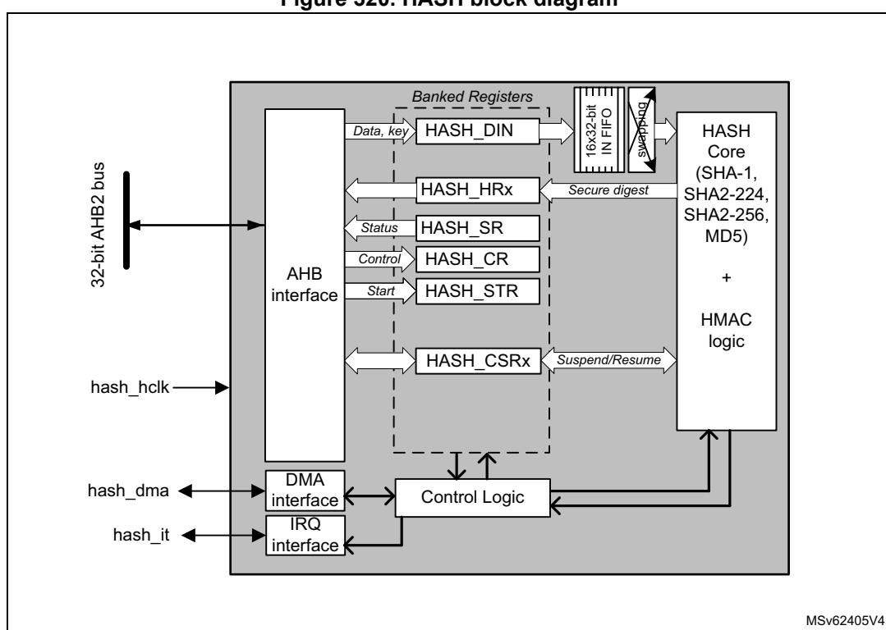
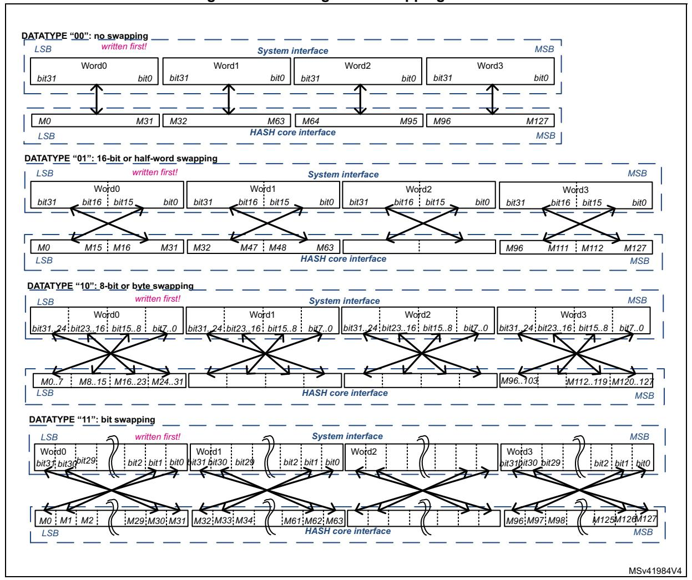
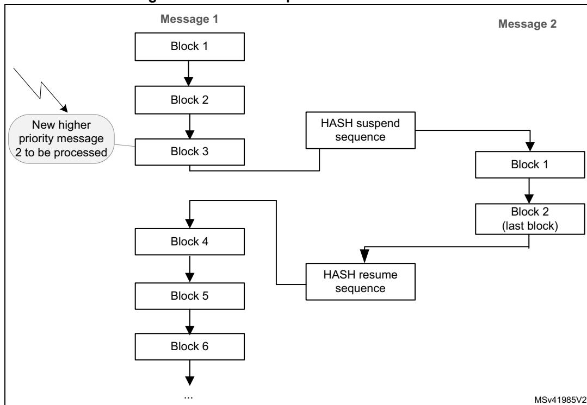

# **38 Hash processor (HASH)**

# **38.1 Introduction**

The hash processor is a fully compliant implementation of the secure hash algorithm (SHA-1, SHA2-224, SHA2-256), the MD5 (message-digest algorithm 5) hash algorithm and the HMAC (keyed-hash message authentication code) algorithm. HMAC is suitable for applications requiring message authentication.

The hash processor computes FIPS (Federal Information Processing Standards) approved digests of length of 160, 224, 256 bits, for messages of up to (264 – 1) bits. It also computes 128-bit digests for the MD5 algorithm.

# **38.2 HASH main features**

- Suitable for data authentication applications, compliant with:
  - Federal Information Processing Standards Publication FIPS PUB 180-4, *Secure Hash Standard* (SHA-1 and SHA-2 family)
  - Federal Information Processing Standards Publication FIPS PUB 186-4, *Digital Signature Standard (DSS)*
  - Internet Engineering Task Force (IETF) Request For Comments RFC 1321, *MD5 Message-Digest Algorithm*
  - Internet Engineering Task Force (IETF) Request For Comments RFC 2104, *HMAC: Keyed-Hashing for Message Authentication* and Federal Information Processing Standards Publication FIPS PUB 198-1, *The Keyed-Hash Message Authentication Code (HMAC)*
- Fast computation of SHA-1, SHA2-224, SHA2-256, and MD5
  - 82 (respectively 66) clock cycles for processing one 512-bit block of data using SHA-1 (respectively SHA2-256) algorithm
  - 66 clock cycles for processing one 512-bit block of data using MD5 algorithm
- Corresponding 32-bit words of the digest from consecutive message blocks are added to each other to form the digest of the whole message
  - Automatic 32-bit words swapping to comply with the internal little-endian representation of the input bit-string
  - Word swapping supported: bits, bytes, half-words and 32-bit words
- Automatic padding to complete the input bit string to fit digest minimum block size of 512 bits (16 × 32 bits)
- Single 32-bit input register associated to an internal input FIFO, corresponding to one block size
- AHB slave peripheral, accessible through 32-bit word accesses only (else an AHB error is generated)
- 8 × 32-bit words (H0 to H7) for output message digest
- Automatic data flow control with support of direct memory access (DMA) using one channel.
- Single or fixed DMA burst transfers of four words

- Interruptible message digest computation, on a per-block basis
  - Re-loadable digest registers
  - Hashing computation suspend/resume mechanism, including DMA

# **38.3 HASH implementation**

The devices have a single instance of HASH peripheral.

# **38.4 HASH functional description**

### **38.4.1 HASH block diagram**

*[Figure 320](#page-1-0)* shows the block diagram of the hash processor.

<span id="page-1-0"></span>

**Figure 320. HASH block diagram** 

### **38.4.2 HASH internal signals**

*[Table 318](#page-2-0)* describes a list of useful to know internal signals available at HASH level, not at product level (on pads).

<span id="page-2-0"></span>

| Signal name | Signal type          | Description                             |
|-------------|----------------------|-----------------------------------------|
| hash_hclk   | digital input        | AHB bus clock                           |
| hash_it     | digital output       | Hash processor global interrupt request |
| hash_dma    | digital input/output | DMA transfer request/ acknowledge       |

**Table 318. HASH internal input/output signals** 

### **38.4.3 About secure hash algorithms**

The hash processor is a fully compliant implementation of the secure hash algorithm defined by FIPS PUB 180-4 standard and the IETF RFC1321 publication (MD5).

With each algorithm, the HASH computes a condensed representation of a message or data file. More specifically, when a message of any length below 264 bits is provided on input, the HASH processing core produces respectively a fixed-length output string called a message digest, defined as follows:

- For MD5 digest size is 128-bit
- For SHA-1 digest size is 160-bit
- For SHA2-224 and SHA2-256, the digest size is 224 bits and 256 bits, respectively

The message digest can then be processed with a digital signature algorithm in order to generate or verify the signature for the message.

Signing the message digest rather than the message often improves the efficiency of the process because the message digest is usually much smaller in size than the message. The verifier of a digital signature has to use the same hash algorithm as the one used by the creator of the digital signature.

The SHA-2 functions supported by the hash processor are qualified as "secure" by NIST because it is computationally infeasible to find a message that corresponds to a given message digest, or to find two different messages that produce the same message digest (SHA-1 does not qualify as secure since February 2017). Any change to a message in transit, with very high probability, results in a different message digest, and the signature fails to verify.

### <span id="page-2-1"></span>**38.4.4 Message data feeding**

The message (or data file) to be processed by the HASH is considered as a bit string. Per FIPS PUB 180-4 standard this message bit string grows from left to right, with hexadecimal words expressed in "big-endian" convention, so that within each word, the most significant bit is stored in the left-most bit position. For example message string "abc" with a bit string representation of "**01100001 01100010 01100011**" is represented by a 32-bit word **0x00636261**, and 8-bit words **0x61626300**.

Data are entered into the HASH one 32-bit word at a time, by writing them into the HASH\_DIN register. The current contents of the HASH\_DIN register are transferred to the 16 words input FIFO each time the register is written with new data. Hence HASH\_DIN and the FIFO form a seventeen 32-bit words length FIFO (named the IN buffer).


In accordance to the kind of data to be processed (e.g. byte swapping when data are ASCII text stream) there must be a bit, byte, half-word or no swapping operation to be performed on data from the input FIFO before entering the little-endian hash processing core. *Figure 321* shows how the hash processing core 32-bit data block M0...31 is constructed from one 32-bit words popped into input FIFO by the driver, according to the DATATYPE bitfield in the HASH control register (HASH CR).

HASH\_DIN data endianness when bit swapping is disabled (DATATYPE = 00) can be described as following: the least significant bit of the message has to be at MSB position in the first word entered into the hash processor, the 32nd bit of the bit string has to be at MSB position in the second word entered into the hash processor and so on.

<span id="page-3-0"></span>

Figure 321. Message data swapping feature


RM0399 Rev 4 1483/3556

### <span id="page-4-0"></span>**38.4.5 Message digest computing**

The hash processor sequentially processes several blocks when computing the message digest. For MD5, SHA1 and SHA2, the block size is 512 bits.

Each time the DMA or the CPU writes a block to the hash processor, the HASH automatically starts computing the message digest. This operation is known as partial digest computation.

As described in *[Section 38.4.4: Message data feeding](#page-2-1)*, the message to be processed is entered into the HASH 32-bit word at a time, writing to the HASH\_DIN register to fill the input FIFO.

In order to perform the hash computation on this data below sequence must be used by the application:

- 1. Initialize the hash processor using the HASH\_CR register:
  - a) Select the right algorithm using the ALGO bitfield. If needed program the correct swapping operation on the message input words using DATATYPE bitfield in HASH\_CR.
  - b) When the HMAC mode is required, set the MODE bit, as well as the LKEY bit if the HMAC key size is greater than the known block size of the algorithm (else keep LKEY cleared). Refer to *[Section 38.4.7: HMAC operation](#page-7-0)* for details.
  - c) Update NBLW[4:0] to define the number of valid bits in last word of the message if it is different from 32 bits. NBLW[4:0] information are used to correctly perform the automatic message padding before the final message digest computation.
- 2. Complete the initialization by setting to 1 the INIT bit in HASH\_CR. Also set the bit DMAE to 1 if data are transferred via DMA.

**Caution:** When programming step 2, it is important to set up before or at the same time the correct configuration values (ALGO, DATATYPE, HMAC mode, key length, NBLW[4:0]).

- 3. Start filling data by writing to HASH\_DIN register, unless data are automatically: transferred via DMA. Note that the processing of a block can start only once the last value of the block has entered the input FIFO. The way the partial or final digest computation is managed depends on the way data are fed into the processor:
  - a) When data are filled by software:
  - Partial digest computation are triggered each time the application writes the first word of the next block. Once the processor is ready again (DINIS = 1 in HASH\_SR), the software can write new data to HASH\_DIN. This mechanism avoids the introduction of wait states by the HASH.
  - The final digest computation is triggered when the last block is entered and the software writes the DCAL bit to 1. If the message length is not an exact multiple of the block size, the NBLW[4:0] bitfield in HASH\_STR register must be written prior to writing DCAL bit (see *[Section 38.4.6](#page-5-0)* for details).
  - b) When data are filled by DMA as a single DMA transfer (MDMAT bit = 0):
  - Partial digest computations are triggered automatically each time the FIFO is full. The final digest computation is triggered automatically when the last block has been transferred to the HASH\_DIN register (DCAL bit is set to 1 by hardware). If the message length is not an exact multiple of the block size, the NBLW[4:0] field


- in HASH\_STR register must be written prior to enabling the DMA (see *[Section 38.4.6](#page-5-0)* for details).
- c) When data are filled by DMA using multiple DMA transfers (MDMAT bit = 1):
- Partial digest computations are triggered as for single DMA transfers. However the final digest computation is not triggered automatically when the last block has been transferred by DMA to the HASH\_DIN register (DCAL bit is not set to 1 by hardware). It allows the hash processor to receive a new DMA transfer as part of this digest computation. To launch the final digest computation, the software must set MDMAT bit to 0 before the last DMA transfer in order to trigger the final digest computation as it is done for single DMA transfers (see description before).
- 4. Once the digest computation is complete (DCIS = 1), the resulting digest can be read from the output registers as described in *[Table](#page-5-1) 319*.

<span id="page-5-1"></span>

| Algorithm | Valid output registers | Most significant bit | Digest size (in bits) |
|-----------|------------------------|----------------------|-----------------------|
| MD5       | HASH_H0 to HASH_H3     | HASH_H0[31]          | 128                   |
| SHA-1     | HASH_H0 to HASH_H4     | HASH_H0[31]          | 160                   |
| SHA2-224  | HASH_H0 to HASH_H6     |                      | 224                   |
| SHA2-256  | HASH_H0 to HASH_H7     | HASH_H0[31]          | 256                   |

**Table 319. Hash processor outputs**

For more information about HMAC detailed instructions, refer to *[Section 38.4.7: HMAC](#page-7-0)  [operation](#page-7-0)*.

# <span id="page-5-0"></span>**38.4.6 Message padding**

### **Overview**

When computing a condensed representation of a message, the process of feeding data into the hash processor (with automatic partial digest computation every block transfer) loops until the last bits of the original message are written to the HASH\_DIN register.

As the length (number of bits) of a message can be any integer value, the last word written to the hash processor may have a valid number of bits between 1 and 32. This number of valid bits in the last word, NBLW[4:0], has to be written to the HASH\_STR register, so that message padding is correctly performed before the final message digest computation.

### **Padding processing**

Detailed padding sequences with DMA enabled or disabled are described in *[Section 38.4.5:](#page-4-0)  [Message digest computing](#page-4-0)*.

### **Padding example**

As specified by Federal Information Processing Standards PUB 180-4, the message padding consists in appending a "1" followed by *k* "0"s, itself followed by a 64-bit integer that is equal to the length *L* in bits of the message. These three padding operations generate a padded message of length *L* + 1 + *k* + 64, which by construction is a multiple of 512 bits.

For the hash processor, the "1" is added to the last word written to the HASH\_DIN register at the bit position defined by the NBLW[4:0] bitfield, and the remaining upper bits are cleared ("0"s).


RM0399 Rev 4 1485/3556

#### **Example from FIPS PUB180-4**

Let us assume that the original message is the ASCII binary-coded form of "abc", of length L = 24:

```
byte 0 byte 1 byte 2 byte 3
01100001 01100010 01100011 UUUUUUUU
<-- 1st word written to HASH_DIN -->
```

NBLW[4:0] has to be loaded with the value 24: a **"1"** is appended at bit location 24 in the bit string (starting counting from left to right in the above bit string), which corresponds to bit 31 in the HASH\_DIN register (little-endian convention):

```
01100001 01100010 01100011 1UUUUUUU
```

Since L = 24, the number of bits in the above bit string is 25, and 423 "0" bits are appended, making now 448 bits.

This gives in hexadecimal (byte words in big-endian format):

```
61626380 00000000 00000000 00000000
00000000 00000000 00000000 00000000
00000000 00000000 00000000 00000000
00000000 00000000 00000000 00000018
```

The message length value, L, in two-word format (that is 00000000 00000018) is appended. Hence the final padded message in hexadecimal (byte words in big-endian format):

```
61626380 00000000 00000000 00000000
00000000 00000000 00000000 00000000
00000000 00000000 00000000 00000000
00000000 00000000 00000000 00000018
```

If the hash processor is programmed to swap byte within HASH\_DIN input register (DATATYPE = 10 in HASH\_CR), the above message has to be entered by following the below sequence:

- 1. **0xUU636261** is written to the HASH\_DIN register (where 'U' means don't care).
- 2. **0x18** is written to the HASH\_STR register (the number of valid bits in the last word written to the HASH\_DIN register is 24, as the original message length is 24 bits).
- 3. **0x10** is written to the HASH\_STR register to start the message padding (described above) and then perform the digest computation.
- 4. The hash computing is complete with the message digest available in the HASH\_HRx registers (x = 0...4) for the SHA-1 algorithm. For this FIPS example, the expected value is as follows:

```
HASH_HR0 = 0xA9993E36
HASH_HR1 = 0x4706816A
HASH_HR2 = 0xBA3E2571
HASH_HR3 = 0x7850C26C
HASH_HR4 = 0x9CD0D89D
```

### <span id="page-7-0"></span>**38.4.7 HMAC operation**

### **Overview**

As specified by Internet Engineering Task Force RFC2104 and NIST FIPS PUB 198-1*,* the HMAC algorithm is used for message authentication by irreversibly binding the message being processed to a key chosen by the user. The algorithm consists of two nested hash operations:

```
HMAC(message)= Hash((Key | pad) XOR opad | 
                Hash((Key | pad) XOR ipad | message))
```

where:

- **opad** = [0x5C]n (outer pad) and **ipad** = [0x36]n (inner pad)
- [X]n represents a repetition of X *n* times, where *n* equal to the size of the underlying hash function data block (n = 64 for 512-bit blocks).
- **pad** is a sequence of zeroes needed to extend the key to the length *n* defined above. If the key length is greater than *n,* the application must first hash the key using Hash() function and then use the resultant byte string as the actual key to HMAC.
- **|** represents the concatenation operator.

*Note: HMAC mode of the hash processor can be used with all supported algorithms.*

### **HMAC processing**

Four different steps are required to compute the HMAC:

- 1. The software writes the INIT bit to 1 with the MODE bit at 1 and the ALGO bits set to the value corresponding to the desired algorithm. The LKEY bit must also be set to 1 if the key being used is longer than 64 bytes. In this case, as required by HMAC specifications, the hash processor uses the hash of the key instead of the real key.
- 2. The software provides the key to be used for the inner hash function, using the same mechanism as the message string loading, that is writing the key data into HASH\_DIN register then completing the transfer by writing DCAL bit to 1 and the correct NBLW[4:0] to HASH\_STR register.

*Note: Endianness details can be found in Section [38.4.4: Message data feeding.](#page-2-1)*

- 3. Once the processor is ready again (DINIS = 1 in HASH\_SR), the software can write the message string to HASH\_DIN. When the last word of the last block is entered and the software writes DCAL bit to 1 in HASH\_STR register, the NBLW[4:0] bitfield must be written at the same time to a value different from zero if the message length is not an exact multiple of the block size. Note that the DMA can also be used to feed the message string, as described in *Section [38.4.4: Message data feeding](#page-2-1).*
- 4. Once the processor is ready again (DINIS = 1 in HASH\_SR), the software provides the key to be used for the outer hash function, writing the key data into HASH\_DIN register then completing the transfer by writing DCAL bit to 1 and the correct NBLW[4:0] to HASH\_STR register. The HMAC result can be found in the valid output registers (HASH\_HRx) as soon as DCIS bit is set to 1.

*Note: The computation latency of the HMAC primitive depends on the lengths of the keys and message, as described in Section [38.6: HASH processing time.](#page-12-0)*

### **HMAC example**

Below is an example of HMAC SHA-1 algorithm (ALGO = 00 and MODE = 1 in HASH\_CR) as specified by NIST.

RM0399 Rev 4 1487/3556

Let us assume that the original message is the ASCII binary-coded form of "**Sample message for keylen = blocklen**", of length L = 34 bytes. If the HASH is programmed in no swapping mode (DATATYPE = 00 in HASH\_CR), the following data must be loaded sequentially into HASH\_DIN register:

1. **Inner hash key** input (length = 64, that is no padding), specified by NIST. As key length = 64, LKEY bit is set to 0 in HASH\_CR register

```
00010203 04050607 08090A0B 0C0D0E0F 10111213 14151617
18191A1B 1C1D1E1F 20212223 24252627 28292A2B 2C2D2E2F 
30313233 34353637 38393A3B 3C3D3E3F
```

2. **Message** input (length = 34, that is padding required). HASH\_STR must be set to **0x20** to start message padding and inner hash computation (see 'U' as don't care)

```
53616D70 6C65206D 65737361 67652066 6F72206B 65796C65
6E3D626C 6F636B6C 656EUUUU
```

- 3. **Outer hash key** input (length = 64, that is no padding). A key identical to the inner hash key is entered here.
- 4. **Final outer hash computing** is then performed by the HASH. The HMAC-SHA1 digest result is available in the HASH\_HRx registers (x = 0 to 4), as shown below:

```
HASH_HR0 = 0x5FD596EE
HASH_HR1 = 0x78D5553C
HASH_HR2 = 0x8FF4E72D
HASH_HR3 = 0x266DFD19
HASH_HR4 = 0x2366DA29
```

### **38.4.8 HASH suspend/resume operations**

### **Overview**

It is possible to interrupt a hash/HMAC operation to perform another processing with a higher priority. The interrupted process completes later when the higher-priority task has been processed, as shown in *[Figure 322](#page-9-0)*.

<span id="page-9-0"></span>

**Figure 322. HASH suspend/resume mechanism**

To do so, the context of the interrupted task must be saved from the HASH registers to memory, and then be restored from memory to the HASH registers.

The procedures where the data flow is controlled by software or by DMA are described hereafter.

### **Data loaded by software**

When the DMA is not used to load the message into the hash processor, the context can be saved only when no block processing is ongoing.

**To suspend the processing of a message**, proceed as follows after writing 16 words 32 bit (plus one if it is the first block):

- 1. In Polling mode, wait for BUSY = 0, then poll if the DINIS status bit is set to 1. In Interrupt mode, implement the next step in DINIS interrupt handler (recommended).
- 2. Store the contents of the following registers into memory:
  - HASH\_IMR
  - HASH\_STR
  - HASH\_CR
  - HASH\_CSR0 to HASH\_CSR37. HASH\_CSR38 to HASH\_CSR53 registers must also be saved if an HMAC operation was ongoing.

#### **To resume the processing of a message**, proceed as follows:

- 1. Write the following registers with the values saved in memory: HASH\_IMR, HASH\_STR and HASH\_CR.
- 2. Initialize the hash processor by setting the INIT bit in the HASH\_CR register.
- 3. Write the HASH\_CSRx registers with the values saved in memory.
- 4. Restart the processing from the point where it has been interrupted.

*Note: To optimize the resume process when NBW[3:0] = 0x0, HASH\_CSR22 to HASH\_CSR37 registers do not need to be saved then restored as the FIFO is empty.*

### **Data loaded by DMA**

When the DMA is used to load the message into the hash processor, it is recommended to suspend and then restore a secure digest computing is described below.

#### **To suspend the processing of a message using DMA**, proceed as follows:

- 1. In Polling mode, wait for BUSY = 0. If DCIS is set in HASH\_SR, the hash result is available and the context swapping is useless. Else go to step 2.
- 2. In Polling mode, wait for BUSY = 1.
- 3. Disable the DMA channel. Then clear DMAE bit in HASH\_CR register.
- 4. In Polling mode, wait for BUSY = 0. If DCIS is set in HASH\_SR, the hash result is available and the context swapping is useless. Else go to step 5.
- 5. Save HASH\_IMR, HASH\_STR, HASH\_CR, and HASH\_CSR0 to HASH\_CSR37 registers. HASH\_CSR38 to HASH\_CSR53 registers must also be saved if an HMAC operation was ongoing.


**To resume the processing of a message using DMA**, proceed as follows:

- 1. Reconfigure the DMA controller so that it proceeds with the transfer of the message up to the end if it is not interrupted again. Do not forget to take into account the words that have been already pushed into the FIFO if NBW[3:0] is higher than 0x0.
- 2. Program the values saved in memory to HASH\_IMR, HASH\_STR and HASH\_CR registers.
- 3. Initialize the hash processor by setting the INIT bit in the HASH\_CR register.
- 4. Program the values saved in memory to the HASH\_CSRx registers.
- 5. Restart the processing from the point where it was interrupted by setting the DMAE bit.

*Note: To optimize the resume process when NBW[3:0] = 0x0, HASH\_CSR22 to HASH\_CSR37 registers do not need to be saved then restored as the FIFO is empty.*

### **38.4.9 HASH DMA interface**

The HASH supports both single and fixed DMA burst transfers of four words.

The hash processor provides an interface to connect to the DMA controller. This DMA can be used to write data to the HASH by setting the DMAE bit in the HASH\_CR register. When this bit is set, the HASH initiates a DMA request each time a block has to be written to the HASH\_DIN register.

Once four 32-bit words have been received, the HASH automatically triggers a new request to the DMA. For more information refer to *[Section 38.4.5: Message digest computing](#page-4-0)*.

Before starting the DMA transfer, the software must program the number of valid bits in the last word that is copied into HASH\_DIN register. This is done by writing in HASH\_STR register the following value:

**NBLW[4:0] = Len(Message)% 32** where "**x%32**" gives the remainder of x divided by 32.

The DMAS bit of the HASH\_SR register provides information on the DMA interface activity. This bit is set with DMAE and cleared when DMAE is cleared and no DMA transfer is ongoing.

*Note: No interrupt is associated to DMAS bit.*

*When MDMAT is set, the size of the transfer must be a multiple of four words.*

### **38.4.10 HASH error management**

No error flags are generated by the hash processor.

# **38.5 HASH interrupts**

Two individual maskable interrupt sources are generated by the hash processor to signal the following events:

- Digest calculation completion (DCIS)
- Data input buffer ready (DINIS)

Both interrupt sources are connected to the same global interrupt request signal (hash\_it), which is in turn connected to the NVIC (nested vectored interrupt controller). Each interrupt source can individually be enabled or disabled by changing the mask bits in the HASH\_IMR register. Setting the appropriate mask bit to 1 enables the interrupt.


RM0399 Rev 4 1491/3556

The status of each maskable interrupt source can be read from the HASH\_SR register. *Table 320* gives a summary of the available features.

Table 320. HASH interrupt requests

<span id="page-12-1"></span>

| Interrupt acronym | Interrupt event                            | Event flag | Enable control bit | Interrupt clear method              |
|-------------------|--------------------------------------------|------------|--------------------|-------------------------------------|
| HASH              | Digest computation completed               | DCIS       | DCIE               | Clear DCIS or set INIT              |
|                   | Data input buffer ready to get a new block | DINIS      | DINIE              | Clear DINIS or write to<br>HASH_DIN |

# <span id="page-12-0"></span>38.6 HASH processing time

*Table 321* summarizes the time required to process an intermediate block for each mode of operation.

Table 321. Processing time (in clock cycle)

<span id="page-12-2"></span>

| Mode of operation | FIFO load <sup>(1)</sup> | Computation phase | Total |
|-------------------|--------------------------|-------------------|-------|
| MD5               | 16                       | 50                | 66    |
| SHA-1             | 16                       | 66                | 82    |
| SHA2-224          | 16                       | 50                | 66    |
| SHA2-256          | 10                       | 50                | 00    |

<sup>1.</sup> Add the time required to load the block into the processor.

The time required to process the last block of a message (or of a key in HMAC) can be longer. This time depends on the length of the last block and the size of the key (in HMAC mode).

Compared to the processing of an intermediate block, it can be increased by the factor below:

- 1 to 2.5 for a hash message
- ~2.5 for an HMAC input-key
- 1 to 2.5 for an HMAC message
- ~2.5 for an HMAC output key in case of a short key
- 3.5 to 5 for an HMAC output key in case of a long key

# **38.7 HASH registers**

The HASH core is associated with several control and status registers and several message digest registers. All these registers are accessible through 32-bit word accesses only, else an AHB error is generated.

## **38.7.1 HASH control register (HASH\_CR)**

Address offset: 0x00

Reset value: 0x0000 0000

| 31   | 30   | 29          | 28   | 27   | 26   | 25       | 24   | 23    | 22   | 21   | 20            | 19   | 18    | 17   | 16   |
|------|------|-------------|------|------|------|----------|------|-------|------|------|---------------|------|-------|------|------|
| Res. | Res. | Res.        | Res. | Res. | Res. | Res.     | Res. | Res.  | Res. | Res. | Res.          | Res. | ALGO1 | Res. | LKEY |
|      |      |             |      |      |      |          |      |       |      |      |               |      | rw    |      | rw   |
| 15   |      |             |      |      |      |          |      |       |      |      |               |      |       |      |      |
|      | 14   | 13          | 12   | 11   | 10   | 9        | 8    | 7     | 6    | 5    | 4             | 3    | 2     | 1    | 0    |
| Res. | Res. | MDMAT DINNE |      |      |      | NBW[3:0] |      | ALGO0 | MODE |      | DATATYPE[1:0] | DMAE | INIT  | Res. | Res. |

Bits 31:19 Reserved, must be kept at reset value.

Bit 17 Reserved, must be kept at reset value.

Bit 16 **LKEY:** Long key selection

This bit selects between short key (≤ 64 bytes) or long key (> 64 bytes) in HMAC mode.

0: the HMAC key is shorter or equal to 64 bytes. The actual key value written to HASH\_DIN is used during the HMAC computation.

1: the HMAC key is longer than 64 bytes. The hash of the key is used instead of the real key during the HMAC computation.

This selection is only taken into account when the INIT and MODE bits are both set. Changing this bit during a computation has no effect.

- Bit 15 Reserved, must be kept at reset value.
- Bit 14 Reserved, must be kept at reset value.
- Bit 13 **MDMAT:** Multiple DMA transfers

This bit is set when hashing large files when multiple DMA transfers are needed.

- 0: DCAL is automatically set at the end of a DMA transfer.
- 1: DCAL is not automatically set at the end of a DMA transfer.
- Bit 12 **DINNE:** DIN not empty

This bit is set when the HASH\_DIN register holds valid data (that is after being written at least once). It is cleared when either the INIT bit (initialization) or the DCAL bit (completion of the previous message processing) is written to 1.

- 0: No data are present in the data input buffer
- 1: The input buffer contains at least one word of data

This bit is read-only.

#### Bits 11:8 **NBW[3:0]:** Number of words already pushed

This bitfield reflects the number of words in the message that have already been pushed into the IN FIFO. NBW is incremented by one when a write access to the HASH\_DIN register is performed (except if DINNE = 0 and the DMA is not used, see below description). NBW goes to zero when the INIT bit is written to 1.

This bitfield is read-only.

#### **If the DMA is not used**

0000: if DINNE = 0, no word has been pushed into the DIN buffer (both HASH\_DIN register and IN FIFO are empty), otherwise one word has been pushed into the DIN buffer (HASH\_DIN register contains one word and IN FIFO is empty)

0001: two words have been pushed into the DIN buffer (that is HASH\_DIN register and the IN FIFO contain one word each)

...

1111: 16 words have been pushed into the DIN buffer.

#### **If the DMA is used**

NBW contains the exact number of words that have been pushed into the IN FIFO by the DMA.

#### Bits 18, 7 **ALGO[1:0]**: Algorithm selection

These bits select the hash algorithm.

00: SHA-1 01: MD5 10: SHA2-224 11: SHA2-256

This selection is only taken into account when the INIT bit is set. Changing this bitfield during a computation has no effect.

#### Bit 6 **MODE:** Mode selection

This bit selects the HASH or HMAC mode for the selected algorithm:

0: Hash mode selected

1: HMAC mode selected. LKEY must be set if the key being used is longer than 64 bytes.

This selection is only taken into account when the INIT bit is set. Changing this bit during a computation has no effect.

#### Bits 5:4 **DATATYPE[1:0]:** Data type selection

Defines the format of the data entered into the HASH\_DIN register:

00: 32-bit data. The data written into HASH\_DIN are directly used by the HASH processing, without reordering.

01: 16-bit data, or half-word. The data written into HASH\_DIN are considered as two halfwords, and are swapped before being used by the HASH processing.

10: 8-bit data, or bytes. The data written into HASH\_DIN are considered as four bytes, and are swapped before being used by the HASH processing.

11: bit data, or bit-string. The data written into HASH\_DIN are considered as 32 bits (1st bit of the string at position 0), and are swapped before being used by the HASH processing (1st bit of the string at position 31).

#### Bit 3 **DMAE:** DMA enable

0: DMA transfers disabled

1: DMA transfers enabled. A DMA request is sent as soon as the HASH core is ready to receive data.

After this bit is set it is cleared by hardware while the last data of the message is written into the hash processor.

Setting this bit to 0 while a DMA transfer is ongoing is not aborting this current transfer. Instead, the DMA interface of the IP remains internally enabled until the transfer is completed or INIT is written to 1.

Setting INIT bit to 1 does not clear DMAE bit.

#### Bit 2 **INIT:** Initialize message digest calculation

Writing this bit to 1 resets the hash processor core, so that the HASH is ready to compute the message digest of a new message.

Writing this bit to 0 has no effect. Reading this bit always return 0.

Bits 1:0 Reserved, must be kept at reset value.

# **38.7.2 HASH data input register (HASH\_DIN)**

Address offset: 0x04

Reset value: 0x0000 0000

HASH\_DIN is the data input register. It is 32-bit wide. This register is used to enter the message by blocks. When the HASH\_DIN register is programmed, the value presented on the AHB databus is 'pushed' into the hash core and the register takes the new value presented on the AHB databus. To get a correct message format, the DATATYPE bits must have been previously configured in the HASH\_CR register.

When a complete block has been written to the HASH\_DIN register, an intermediate digest calculation is launched:

- by writing new data into the HASH\_DIN register (the first word of the next block) if the DMA is not used (intermediate digest calculation),
- automatically if the DMA is used.

When the last block has been written to the HASH\_DIN register, the final digest calculation (including padding) is launched by writing the DCAL bit to 1 in the HASH\_STR register (final digest calculation). This operation is automatic if the DMA is used and MDMAT bit is set to 0.

Reading the HASH\_DIN register returns the last word written to this location (zero after reset).

*Note: When the HASH is busy, a write access to the HASH\_DIN register might stall the AHB bus if the digest calculation (intermediate or final) is not complete.*

| 31 | 30            | 29 | 28 | 27 | 26 | 25 | 24 | 23 | 22 | 21 | 20 | 19 | 18 | 17 | 16 |
|----|---------------|----|----|----|----|----|----|----|----|----|----|----|----|----|----|
|    | DATAIN[31:16] |    |    |    |    |    |    |    |    |    |    |    |    |    |    |
| rw | rw            | rw | rw | rw | rw | rw | rw | rw | rw | rw | rw | rw | rw | rw | rw |
| 15 | 14            | 13 | 12 | 11 | 10 | 9  | 8  | 7  | 6  | 5  | 4  | 3  | 2  | 1  | 0  |
|    | DATAIN[15:0]  |    |    |    |    |    |    |    |    |    |    |    |    |    |    |
| rw | rw            | rw | rw | rw | rw | rw | rw | rw | rw | rw | rw | rw | rw | rw | rw |


RM0399 Rev 4 1495/3556

#### Bits 31:0 **DATAIN[31:0]:** Data input

Writing this register pushes the current register content into the IN FIFO, and the register takes the new value presented on the AHB databus.

Reading this register returns the current register content.

### **38.7.3 HASH start register (HASH\_STR)**

Address offset: 0x08

Reset value: 0x0000 0000

The HASH\_STR register has two functions:

- It is used to define the number of valid bits in the last word of the message entered in the hash processor (that is the number of valid least significant bits in the last data written to the HASH\_DIN register).
- It is used to start the processing of the last block in the message by writing the DCAL bit to 1.

| 31   | 30   | 29   | 28   | 27   | 26   | 25   | 24   | 23   | 22   | 21   | 20   | 19   | 18        | 17   | 16   |
|------|------|------|------|------|------|------|------|------|------|------|------|------|-----------|------|------|
| Res. | Res. | Res. | Res. | Res. | Res. | Res. | Res. | Res. | Res. | Res. | Res. | Res. | Res.      | Res. | Res. |
|      |      |      |      |      |      |      |      |      |      |      |      |      |           |      |      |
|      |      |      |      |      |      |      |      |      |      |      |      |      |           |      |      |
| 15   | 14   | 13   | 12   | 11   | 10   | 9    | 8    | 7    | 6    | 5    | 4    | 3    | 2         | 1    | 0    |
| Res. | Res. | Res. | Res. | Res. | Res. | Res. | DCAL | Res. | Res. | Res. |      |      | NBLW[4:0] |      |      |

Bits 31:9 Reserved, must be kept at reset value.

#### Bit 8 **DCAL:** Digest calculation

Writing this bit to 1 starts the message padding, using the previously written value of NBLW[4:0], and starts the calculation of the final message digest with all data words written to the input FIFO since the INIT bit was last written to 1.

Reading this bit returns 0.

### Bits 7:5 Reserved, must be kept at reset value.

#### Bits 4:0 **NBLW[4:0]:** Number of valid bits in the last word

When the last word of the message bit string is written in HASH\_DIN register, the hash processor takes only the valid bits specified as below, after internal data swapping:

0x00: All 32 bits of the last data written are valid message bits that is M[31:0]

0x01: Only one bit of the last data written (after swapping) is valid that is M[0]

0x02: Only two bits of the last data written (after swapping) are valid that is M[1:0]

0x03: Only three bits of the last data written (after swapping) are valid that is M[2:0]

...

0x1F: Only 31 bits of the last data written (after swapping) are valid that is M[30:0] The above mechanism is valid only if DCAL = 0. If NBLW[4:0] bitfield is written while DCAL is set to 1, the NBLW[4:0] bitfield remains unchanged. In other words it is not possible to configure NBLW[4:0] and set DCAL at the same time.

Reading NBLW[4:0] bitfield returns the last value written to NBLW[4:0].


### <span id="page-17-0"></span>**38.7.4 HASH digest registers**

These registers contain the message digest result named as follows:

- HASH\_HR0, HASH\_HR1, HASH\_HR2, HASH\_HR3 and HASH\_HR4 registers return the SHA-1 digest result
- HASH\_HR0, HASH\_HR1, HASH\_HR2 and HASH\_HR3 registers return A, B, C and D (respectively), as defined by MD5.
- HASH\_HR0 to HASH\_HR6 registers return the SHA2-224 digest result.
- HASH\_HR0 to HASH\_HR7 registers return the SHA2-256 digest result.

In all cases, the digest most significant bit is stored in HASH\_H0[31] and unused HASH\_HRx registers are read as zeros.

If a read access to one of these registers is performed while the hash core is calculating an intermediate digest or a final message digest (DCIS bit equals 0), then the read operation is stalled until the hash calculation has completed.

*Note: When starting a digest computation for a new message (by writing the INIT bit to 1), HASH\_HRx registers are forced to their reset values.*

*HASH\_HR0 to HASH\_HR4 registers can be accessed through two different addresses.*

### **HASH aliased digest register x (HASH\_HRAx)**

Address offset: 0x0C + 0x4 \* x, (x = 0 to 4)

Reset value: 0x0000 0000

The content of the HASH\_HRAx registers is identical to the one of the HASH\_HRx registers located at address offset 0x310.

| 31 | 30 | 29 | 28 | 27 | 26 | 25 | 24 | 23        | 22 | 21 | 20 | 19 | 18 | 17 | 16 |
|----|----|----|----|----|----|----|----|-----------|----|----|----|----|----|----|----|
|    |    |    |    |    |    |    |    | Hx[31:16] |    |    |    |    |    |    |    |
| r  | r  | r  | r  | r  | r  | r  | r  | r         | r  | r  | r  | r  | r  | r  | r  |
| 15 | 14 | 13 | 12 | 11 | 10 | 9  | 8  | 7         | 6  | 5  | 4  | 3  | 2  | 1  | 0  |
|    |    |    |    |    |    |    |    | Hx[15:0]  |    |    |    |    |    |    |    |
| r  | r  | r  | r  | r  | r  | r  | r  | r         | r  | r  | r  | r  | r  | r  | r  |

Bits 31:0 **Hx[31:0]**: Hash data x

Refer to *[Section 38.7.4: HASH digest registers](#page-17-0)* introduction.

### **HASH digest register x (HASH\_HRx)**

Address offset: 0x310 + 0x4 \* x, (x = 0 to 4)

Reset value: 0x0000 0000

| 31 | 30 | 29 | 28 | 27 | 26 | 25 | 24 | 23        | 22 | 21 | 20 | 19 | 18 | 17 | 16 |
|----|----|----|----|----|----|----|----|-----------|----|----|----|----|----|----|----|
|    |    |    |    |    |    |    |    | Hx[31:16] |    |    |    |    |    |    |    |
| r  | r  | r  | r  | r  | r  | r  | r  | r         | r  | r  | r  | r  | r  | r  | r  |
| 15 | 14 | 13 | 12 | 11 | 10 | 9  | 8  | 7         | 6  | 5  | 4  | 3  | 2  | 1  | 0  |
|    |    |    |    |    |    |    |    | Hx[15:0]  |    |    |    |    |    |    |    |
| r  | r  | r  | r  | r  | r  | r  | r  | r         | r  | r  | r  | r  | r  | r  | r  |


RM0399 Rev 4 1497/3556

Bits 31:0 **Hx[31:0]**: Hash data x

Refer to *[Section 38.7.4: HASH digest registers](#page-17-0)* introduction.

### **HASH supplementary digest register x (HASH\_HRx)**

Address offset: 0x310 + 0x4 \* x, (x = 5 to 7)

Reset value: 0x0000 0000

| 31 | 30 | 29 | 28 | 27 | 26 | 25 | 24 | 23        | 22 | 21 | 20 | 19 | 18 | 17 | 16 |
|----|----|----|----|----|----|----|----|-----------|----|----|----|----|----|----|----|
|    |    |    |    |    |    |    |    | Hx[31:16] |    |    |    |    |    |    |    |
| r  | r  | r  | r  | r  | r  | r  | r  | r         | r  | r  | r  | r  | r  | r  | r  |
| 15 | 14 | 13 | 12 | 11 | 10 | 9  | 8  | 7         | 6  | 5  | 4  | 3  | 2  | 1  | 0  |
|    |    |    |    |    |    |    |    | Hx[15:0]  |    |    |    |    |    |    |    |
| r  | r  | r  | r  | r  | r  | r  | r  | r         | r  | r  | r  | r  | r  | r  | r  |

Bits 31:0 **Hx[31:0]**: Hash data x

Refer to *[Section 38.7.4: HASH digest registers](#page-17-0)* introduction.

### **38.7.5 HASH interrupt enable register (HASH\_IMR)**

Address offset: 0x20

Reset value: 0x0000 0000

| 31   | 30   | 29   | 28   | 27   | 26   | 25   | 24   | 23   | 22   | 21   | 20   | 19   | 18   | 17   | 16    |
|------|------|------|------|------|------|------|------|------|------|------|------|------|------|------|-------|
| Res. | Res. | Res. | Res. | Res. | Res. | Res. | Res. | Res. | Res. | Res. | Res. | Res. | Res. | Res. | Res.  |
|      |      |      |      |      |      |      |      |      |      |      |      |      |      |      |       |
|      |      |      |      |      |      |      |      |      |      |      |      |      |      |      |       |
| 15   | 14   | 13   | 12   | 11   | 10   | 9    | 8    | 7    | 6    | 5    | 4    | 3    | 2    | 1    | 0     |
| Res. | Res. | Res. | Res. | Res. | Res. | Res. | Res. | Res. | Res. | Res. | Res. | Res. | Res. | DCIE | DINIE |

Bits 31:2 Reserved, must be kept at reset value.

Bit 1 **DCIE:** Digest calculation completion interrupt enable

0: Digest calculation completion interrupt disabled

1: Digest calculation completion interrupt enabled.

Bit 0 **DINIE:** Data input interrupt enable

0: Data input interrupt disabled

1: Data input interrupt enabled

### **38.7.6 HASH status register (HASH\_SR)**

Address offset: 0x24

Reset value: 0x0000 0001

| 31   | 30   | 29   | 28   | 27   | 26   | 25   | 24   | 23   | 22   | 21   | 20   | 19   | 18   | 17   | 16    |
|------|------|------|------|------|------|------|------|------|------|------|------|------|------|------|-------|
| Res. | Res. | Res. | Res. | Res. | Res. | Res. | Res. | Res. | Res. | Res. | Res. | Res. | Res. | Res. | Res.  |
|      |      |      |      |      |      |      |      |      |      |      |      |      |      |      |       |
|      |      |      |      |      |      |      |      |      |      |      |      |      |      |      |       |
| 15   | 14   | 13   | 12   | 11   | 10   | 9    | 8    | 7    | 6    | 5    | 4    | 3    | 2    | 1    | 0     |
| Res. | Res. | Res. | Res. | Res. | Res. | Res. | Res. | Res. | Res. | Res. | Res. | BUSY | DMAS | DCIS | DINIS |

Bits 31:4 Reserved, must be kept at reset value.

#### Bit 3 **BUSY:** Busy bit

- 0: No block is currently being processed
- 1: The hash core is processing a block of data

#### Bit 2 **DMAS:** DMA Status

This bit provides information on the DMA interface activity. It is set with DMAE and cleared when DMAE = 0 and no DMA transfer is ongoing. No interrupt is associated with this bit.

- 0: DMA interface is disabled (DMAE = 0) and no transfer is ongoing
- 1: DMA interface is enabled (DMAE = 1) or a transfer is ongoing

#### Bit 1 **DCIS:** Digest calculation completion interrupt status

This bit is set by hardware when a digest becomes ready (the whole message has been processed). It is cleared by writing it to 0 or by writing the INIT bit to 1 in the HASH\_CR register.

- 0: No digest available in the HASH\_HRx registers (zeros are returned)
- 1: Digest calculation complete, a digest is available in the HASH\_HRx registers. An interrupt is generated if the DCIE bit is set in the HASH\_IMR register.

#### Bit 0 **DINIS:** Data input interrupt status

This bit is set by hardware when the FIFO is ready to get a new block (16 locations are free). It is cleared by writing it to 0 or by writing the HASH\_DIN register.

- 0: Less than 16 locations are free in the input buffer
- 1: A new block can be entered into the input buffer. An interrupt is generated if the DINIE bit is set in the HASH\_IMR register.

When DINIS=0, HASH\_CSRx registers reads as zero.

### <span id="page-19-0"></span>**38.7.7 HASH context swap registers**

These registers contain the complete internal register states of the hash processor. They are useful when a suspend/resume operation has to be performed because a high-priority task needs to use the hash processor while it is already used by another task.

When such an event occurs, the HASH\_CSRx registers have to be read and the read values have to be saved in the system memory space. Then the hash processor can be used by the preemptive task, and when the hash computation is complete, the saved context can be read from memory and written back into the HASH\_CSRx registers.

HASH\_CSRx registers can be read only when DINIS equals to 1, otherwise zeros are returned.


RM0399 Rev 4 1499/3556

### **HASH context swap register x (HASH\_CSRx)**

Address offset: 0x0F8 + x \* 0x4, (x = 0 to 53) Reset value: 0x0000 0002 (HASH\_CSR0)

Reset value: 0x0000 0000 (HASH\_CSR1 to 53)

| 31 | 30         | 29 | 28 | 27 | 26 | 25 | 24 | 23 | 22 | 21 | 20 | 19 | 18 | 17 | 16 |
|----|------------|----|----|----|----|----|----|----|----|----|----|----|----|----|----|
|    | CSx[31:16] |    |    |    |    |    |    |    |    |    |    |    |    |    |    |
| rw | rw         | rw | rw | rw | rw | rw | rw | rw | rw | rw | rw | rw | rw | rw | rw |
| 15 | 14         | 13 | 12 | 11 | 10 | 9  | 8  | 7  | 6  | 5  | 4  | 3  | 2  | 1  | 0  |
|    | CSx[15:0]  |    |    |    |    |    |    |    |    |    |    |    |    |    |    |
| rw | rw         | rw | rw | rw | rw | rw | rw | rw | rw | rw | rw | rw | rw | rw | rw |

Bits 31:0 **CSx[31:0]**: Context swap x

Refer to *[Section 38.7.7: HASH context swap registers](#page-19-0)* introduction.

### **38.7.8 HASH register map**

*[Table 322](#page-20-0)* gives the summary HASH register map and reset values.

<span id="page-20-0"></span>**Offset Register name reset value 31 30 29 28 27 26 25 24 23 22 21 20 19 18 17 16 15 14 13 12 11 10 9754321**0x00 HASH\_CR ALGO[1] LKEY .MDMAT DINNE NBW[3:0] ALGO[0] MODE DATATYPE DMAE INIT Reset value 0 0 0 0 0 0 0 0 0 0 0 0 0 0 0x04 HASH\_DIN DATAIN[31:16] Reset value 0 0 0 0 0 0 0 0 0 0 0 0 0 0 0 0 0 0 0 0 0 0 0 0 0 0 0 0 0 0 0 0 0x08 HASH\_STR DCAL NBLW[4:0] Reset value 0 00000 0x0C HASH\_HRA0 H0[31:0] Reset value 0 0 0 0 0 0 0 0 0 0 0 0 0 0 0 0 0 0 0 0 0 0 0 0 0 0 0 0 0 0 0 0 0x10 HASH\_HRA1 H1[31:0] Reset value 0 0 0 0 0 0 0 0 0 0 0 0 0 0 0 0 0 0 0 0 0 0 0 0 0 0 0 0 0 0 0 0 0x14 HASH\_HRA2 H2[31:0] Reset value 0 0 0 0 0 0 0 0 0 0 0 0 0 0 0 0 0 0 0 0 0 0 0 0 0 0 0 0 0 0 0 0 0x18 HASH\_HRA3 H3[31:0] Reset value 0 0 0 0 0 0 0 0 0 0 0 0 0 0 0 0 0 0 0 0 0 0 0 0 0 0 0 0 0 0 0 0 0x1C HASH\_HRA4 H4[31:0] Reset value 0 0 0 0 0 0 0 0 0 0 0 0 0 0 0 0 0 0 0 0 0 0 0 0 0 0 0 0 0 0 0 0 0x20 HASH\_IMR DCIE DINIE Reset value 0 0

**Table 322. HASH register map and reset values** 

**Table 322. HASH register map and reset values (continued)**

| Offset                                            | Register name<br>reset value | 31        | 30   | 29   | 28   | 27   | 26   | 25   | 24   | 23   | 22   | 21   | 20   | 19   | 18   | 17   | 16   | 15            | 14   | 13   | 12   | 11   | 10   | 9    | 8    | 7    | 6    | 5    | 4    | 3    | 2    | 1    | 0     |
|---------------------------------------------------|------------------------------|-----------|------|------|------|------|------|------|------|------|------|------|------|------|------|------|------|---------------|------|------|------|------|------|------|------|------|------|------|------|------|------|------|-------|
| 0x24                                              | HASH_SR                      | Res.      | Res. | Res. | Res. | Res. | Res. | Res. | Res. | Res. | Res. | Res. | Res. | Res. | Res. | Res. | Res. | Res.          | Res. | Res. | Res. | Res. | Res. | Res. | Res. | Res. | Res. | Res. | Res. | BUSY | DMAS | DCIS | DINIS |
|                                                   | Reset value                  |           |      |      |      |      |      |      |      |      |      |      |      |      |      |      |      |               |      |      |      |      |      |      |      |      |      |      |      | 0    | 0    | 0    | 1     |
| 0x28- 0xF4                                        | Reserved                     | Reserved  |      |      |      |      |      |      |      |      |      |      |      |      |      |      |      |               |      |      |      |      |      |      |      |      |      |      |      |      |      |      |       |
|                                                   | HASH_CSR0                    |           |      |      |      |      |      |      |      |      |      |      |      |      |      |      |      | CS0[31:0]     |      |      |      |      |      |      |      |      |      |      |      |      |      |      |       |
| 0x0F8                                             | Reset value                  | 0         | 0    | 0    | 0    | 0    | 0    | 0    | 0    | 0    | 0    | 0    | 0    | 0    | 0    | 0    | 0    | 0             | 0    | 0    | 0    | 0    | 0    | 0    | 0    | 0    | 0    | 0    | 0    | 0    | 0    | 1    | 0     |
| 0x0F8 +                                           | HASH_CSRx                    | CSx[31:0] |      |      |      |      |      |      |      |      |      |      |      |      |      |      |      |               |      |      |      |      |      |      |      |      |      |      |      |      |      |      |       |
| 0x4 * x,<br>(x=1 to 53)<br>Last address:<br>0x1CC | Reset value                  | 0         | 0    | 0    | 0    | 0    | 0    | 0    | 0    | 0    | 0    | 0    | 0    | 0    | 0    | 0    | 0    | 0             | 0    | 0    | 0    | 0    | 0    | 0    | 0    | 0    | 0    | 0    | 0    | 0    | 0    | 0    | 0     |
|                                                   |                              |           |      |      |      |      |      |      |      |      |      |      |      |      |      |      |      |               |      |      |      |      |      |      |      |      |      |      |      |      |      |      |       |
| 0x1D0-<br>0x30C                                   | Reserved                     |           |      |      |      |      |      |      |      |      |      |      |      |      |      |      |      | Reserved      |      |      |      |      |      |      |      |      |      |      |      |      |      |      |       |
|                                                   | HASH_HR0                     |           |      |      |      |      |      |      |      |      |      |      |      |      |      |      |      | H0[31:0]      |      |      |      |      |      |      |      |      |      |      |      |      |      |      |       |
| 0x310                                             | Reset value                  | 0         | 0    | 0    | 0    | 0    | 0    | 0    | 0    | 0    | 0    | 0    | 0    | 0    | 0    | 0    | 0    | 0             | 0    | 0    | 0    | 0    | 0    | 0    | 0    | 0    | 0    | 0    | 0    | 0    | 0    | 0    | 0     |
|                                                   | HASH_HR1                     | H1[31:0]  |      |      |      |      |      |      |      |      |      |      |      |      |      |      |      |               |      |      |      |      |      |      |      |      |      |      |      |      |      |      |       |
| 0x314                                             | Reset value                  | 0         | 0    | 0    | 0    | 0    | 0    | 0    | 0    | 0    | 0    | 0    | 0    | 0    | 0    | 0    | 0    | 0             | 0    | 0    | 0    | 0    | 0    | 0    | 0    | 0    | 0    | 0    | 0    | 0    | 0    | 0    | 0     |
|                                                   | HASH_HR2                     | H2[31:0]  |      |      |      |      |      |      |      |      |      |      |      |      |      |      |      |               |      |      |      |      |      |      |      |      |      |      |      |      |      |      |       |
| 0x318                                             | Reset value                  | 0         | 0    | 0    | 0    | 0    | 0    | 0    | 0    | 0    | 0    | 0    | 0    | 0    | 0    | 0    | 0    | 0             | 0    | 0    | 0    | 0    | 0    | 0    | 0    | 0    | 0    | 0    | 0    | 0    | 0    | 0    | 0     |
|                                                   | HASH_HR3                     | H3[31:0]  |      |      |      |      |      |      |      |      |      |      |      |      |      |      |      |               |      |      |      |      |      |      |      |      |      |      |      |      |      |      |       |
| 0x31C                                             | Reset value                  | 0         | 0    | 0    | 0    | 0    | 0    | 0    | 0    | 0    | 0    | 0    | 0    | 0    | 0    | 0    | 0    | 0             | 0    | 0    | 0    | 0    | 0    | 0    | 0    | 0    | 0    | 0    | 0    | 0    | 0    | 0    | 0     |
|                                                   | HASH_HR4                     |           |      |      |      |      |      |      |      |      |      |      |      |      |      |      |      | H4[31:0]      |      |      |      |      |      |      |      |      |      |      |      |      |      |      |       |
| 0x320                                             | Reset value                  | 0         | 0    | 0    | 0    | 0    | 0    | 0    | 0    | 0    | 0    | 0    | 0    | 0    | 0    | 0    | 0    | 0             | 0    | 0    | 0    | 0    | 0    | 0    | 0    | 0    | 0    | 0    | 0    | 0    | 0    | 0    | 0     |
| 0x324                                             | HASH_HR5                     |           |      |      |      |      |      |      |      |      |      |      |      |      |      |      |      | H5[31:0]      |      |      |      |      |      |      |      |      |      |      |      |      |      |      |       |
|                                                   | Reset value                  | 0         | 0    | 0    | 0    | 0    | 0    | 0    | 0    | 0    | 0    | 0    | 0    | 0    | 0    | 0    | 0    | 0             | 0    | 0    | 0    | 0    | 0    | 0    | 0    | 0    | 0    | 0    | 0    | 0    | 0    | 0    | 0     |
| 0x328                                             | HASH_HR6                     |           |      |      |      |      |      |      |      |      |      |      |      |      |      |      |      | H6[31:0]      |      |      |      |      |      |      |      |      |      |      |      |      |      |      |       |
|                                                   | Reset value                  | 0         | 0    | 0    | 0    | 0    | 0    | 0    | 0    | 0    | 0    | 0    | 0    | 0    | 0    | 0    | 0    | 0             | 0    | 0    | 0    | 0    | 0    | 0    | 0    | 0    | 0    | 0    | 0    | 0    | 0    | 0    | 0     |
|                                                   |                              |           |      |      |      |      |      |      |      |      |      |      |      |      |      |      |      |               |      |      |      |      |      |      |      |      |      |      |      |      |      |      |       |
| 0x32C                                             | HASH_HR7<br>Reset value      | 0         | 0    | 0    | 0    | 0    | 0    | 0    | 0    | 0    | 0    | 0    | 0    | 0    | 0    | 0    | 0    | H7[31:0]<br>0 | 0    | 0    | 0    | 0    | 0    | 0    | 0    | 0    | 0    | 0    | 0    | 0    | 0    | 0    | 0     |
|                                                   |                              |           |      |      |      |      |      |      |      |      |      |      |      |      |      |      |      |               |      |      |      |      |      |      |      |      |      |      |      |      |      |      |       |

Refer to *Section 2.3 on page 134* for the register boundary addresses.


RM0399 Rev 4 1501/3556