## **39 High-resolution timer (HRTIM)**

## **39.1 Introduction**

The high-resolution timer can generate up to 10 digital signals with highly accurate timings. It is primarily intended to drive power conversion systems such as switch mode power supplies or lighting systems, but can be of general purpose usage, whenever a very fine timing resolution is expected.

Its modular architecture allows to generate either independent or coupled waveforms. The wave-shape is defined by self-contained timings (using counters and compare units) and a broad range of external events, such as analog or digital feedbacks and synchronization signals. This allows to produce a large variety of control signal (PWM, phase-shifted, constant Ton,...) and address most of conversion topologies.

For control and monitoring purposes, the timer has also timing measure capabilities and links to built-in ADC and DAC converters. Last, it features light-load management mode and is able to handle various fault schemes for safe shut-down purposes.

## **39.2 Main features**

- Multiple timing units
  - Full-resolution available on all outputs, possibility to adjust duty-cycle, frequency and pulse width in triggered one-pulse mode
  - 6 16-bit timing units (each one with an independent counter and 4 compare units)
  - 10 outputs that can be controlled by any timing unit, up to 32 set/reset sources per channel
  - Modular architecture to address either multiple independent converters with 1 or 2 switches or few large multi-switch topologies
- Up to 10 external events, available for any timing unit
  - Programmable polarity and edge sensitivity
  - 5 events with a fast asynchronous mode
  - 5 events with a programmable digital filter
  - Spurious events filtering with blanking and windowing modes
- Multiple links to built-in analog peripherals
  - 4 triggers to ADC converters
  - 3 triggers to DAC converters
  - 3 comparators for analog signal conditioning
- Versatile protection scheme
  - 5 fault inputs can be combined and associated to any timing unit
  - Programmable polarity, edge sensitivity, and programmable digital filter
  - dedicated delayed protections for resonant converters
- Multiple HRTIM instances can be synchronized with external synchronization inputs/outputs
- Versatile output stage
  - Full-resolution Deadtime insertion
  - Programmable output polarity
  - Chopper mode
- Burst mode controller to handle light-load operation synchronously on multiple converters
- 7 interrupt vectors, each one with up to 14 sources
- 6 DMA requests with up to 14 sources, with a burst mode for multiple registers update

## **39.3 Functional description**

## **39.3.1 General description**

The HRTIM can be partitioned into several sub entities:

- The master timer
- The timing units (Timer A to Timer E)
- The output stage
- The burst mode controller
- An external event and fault signal conditioning logic that is shared by all timers
- The system interface

The master timer is based on a 16-bit up counter. It can set/reset any of the 10 outputs via 4 compare units and it provides synchronization signals to the 5 timer units. Its main purpose is to have the timer units controlled by a unique source. An interleaved buck converter is a typical application example where the master timer manages the phase-shifts between the multiple units.

The timer units are working either independently or coupled with the other timers including the master timer. Each timer contains the controls for two outputs. The outputs set/reset events are triggered either by the timing units compare registers or by events coming from the master timer, from the other timers or from external events.

The output stage has several duties

- Addition of deadtime when the 2 outputs are configured in complementary PWM mode
- Addition of a carrier frequency on top of the modulating signal
- Management of fault events, by asynchronously asserting the outputs to a predefined safe level

The burst mode controller can take over the control of one or multiple timers in case of lightload operation. The burst length and period can be programmed, as well as the idle state of the outputs.

The external event and fault signal conditioning logic includes:

- The input selection MUXes (for instance for selecting a digital input or an on-chip source for a given external event channel)
- Polarity and edge-sensitivity programming
- Digital filtering (for 5 channels out of 10)

The system interface allows the HRTIM to interact with the rest of the MCU:

- Interrupt requests to the CPU
- DMA controller for automatic accesses to/from the memories, including an HRTIM specific burst mode
- Triggers for the ADC and DAC converters

The HRTIM registers are split into 7 groups:

- Master timer registers
- Timer A to Timer E registers
- Common registers for features shared by all timer units


Note:

As a writing convention, references to the 5 timing units in the text and in registers are generalized using the "x" letter, where x can be any value from A to E.

The block diagram of the timer is shown in Figure 323.

Figure 323. High-resolution timer block diagram

<span id="page-3-0"></span>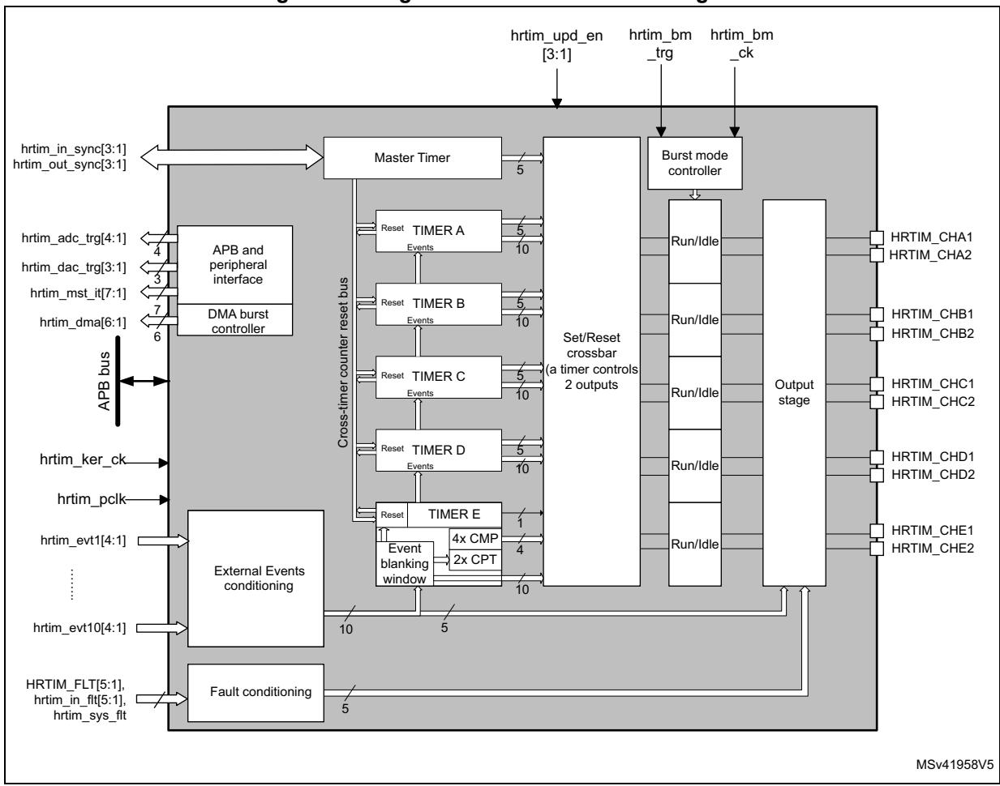

## 39.3.2 HRTIM pins and internal signals

The table here below summarizes the HRTIM inputs and outputs, both on-chip and off-chip.

Table 323. HRTIM Input/output summary

| Table 323. HRTIM Input/output summary                                                                                              |                    |                                                                                                                                                                                                                                                                                               |  |  |  |  |  |  |  |  |
|------------------------------------------------------------------------------------------------------------------------------------|--------------------|-----------------------------------------------------------------------------------------------------------------------------------------------------------------------------------------------------------------------------------------------------------------------------------------------|--|--|--|--|--|--|--|--|
| Signal name                                                                                                                        | Signal type        | Description                                                                                                                                                                                                                                                                                   |  |  |  |  |  |  |  |  |
| HRTIM_CHA1, HRTIM_CHA2, HRTIM_CHB1, HRTIM_CHB2, HRTIM_CHC1, HRTIM_CHC2, HRTIM_CHD1, HRTIM_CHD2, HRTIM_CHD2, HRTIM_CHE1, HRTIM_CHE2 | Outputs            | Main HRTIM timer outputs. They can be coupled by pairs (HRTIM_CHx1 & HRTIM_CHx2) with deadtime insertion or work independently.                                                                                                                                                               |  |  |  |  |  |  |  |  |
| HRTIM_FLT[5:1],<br>hrtim_in_flt[5:1]                                                                                               | Digital input      | Fault inputs: immediately disable the HRTIM outputs when asserted (5 on-chip inputs and 5 off-chip HRTIM_FLTx inputs).                                                                                                                                                                        |  |  |  |  |  |  |  |  |
| hrtim_sys_flt                                                                                                                      | Digital input      | System fault gathering MCU internal fault events (Clock security system, SRAM parity error, Cortex <sup>®</sup> -M7 lockup (HardFault), PVD output).                                                                                                                                          |  |  |  |  |  |  |  |  |
| hrtim_in_sync[3:1]                                                                                                                 | Digital Input      | Synchronization inputs to synchronize the whole HRTIM with other internal or external timer resources: hrtim_in_sync1: reserved hrtim_in_sync2: the source is a regular TIMx timer (via on-chip interconnect) hrtim_in_sync3: the source is an external HRTIM (via the HRTIM_SCIN input pins) |  |  |  |  |  |  |  |  |
| hrtim_out_sync[2:1]                                                                                                                | Digital<br>output  | The purpose of this output is to cascade or synchronize several HRTIM instances, either on-chip or off-chip: hrtim_out_sync1: reserved hrtim_out_sync2: the destination is an off-chip HRTIM or peripheral (via HRTIM_SCOUT output pins)                                                      |  |  |  |  |  |  |  |  |
| hrtim_evt1[4:1]                                                                                                                    |                    |                                                                                                                                                                                                                                                                                               |  |  |  |  |  |  |  |  |
| hrtim_evt2[4:1]                                                                                                                    | 1                  |                                                                                                                                                                                                                                                                                               |  |  |  |  |  |  |  |  |
| hrtim_evt3[4:1]                                                                                                                    |                    |                                                                                                                                                                                                                                                                                               |  |  |  |  |  |  |  |  |
| hrtim_evt4[4:1]                                                                                                                    |                    |                                                                                                                                                                                                                                                                                               |  |  |  |  |  |  |  |  |
| hrtim_evt5[4:1]                                                                                                                    | Digital input      | External events. Each of the 10 events can be selected among 4 sources, either on-chip (from other built-in peripherals: comparator, ADC analog                                                                                                                                               |  |  |  |  |  |  |  |  |
| hrtim_evt6[4:1]                                                                                                                    | טואונמו וווויטנן j | watchdog, TIMx timers, trigger outputs) or off-chip (HRTIM_EEVx input pins)                                                                                                                                                                                                                   |  |  |  |  |  |  |  |  |
| hrtim_evt7[4:1]                                                                                                                    |                    |                                                                                                                                                                                                                                                                                               |  |  |  |  |  |  |  |  |
| hrtim_evt8[4:1]                                                                                                                    |                    |                                                                                                                                                                                                                                                                                               |  |  |  |  |  |  |  |  |
| hrtim_evt9[4:1]                                                                                                                    |                    |                                                                                                                                                                                                                                                                                               |  |  |  |  |  |  |  |  |
| hrtim_evt10[4:1]                                                                                                                   |                    |                                                                                                                                                                                                                                                                                               |  |  |  |  |  |  |  |  |
| hrtim_upd_en[3:1]                                                                                                                  | Digital input      | HRTIM register update enable inputs (on-chip interconnect) trigger the transfer from shadow to active registers                                                                                                                                                                               |  |  |  |  |  |  |  |  |


| Signal name        | Signal type       | Description                                         |
|--------------------|-------------------|-----------------------------------------------------|
| hrtim_bm_trg       | Digital input     | Burst mode trigger event (on-chip interconnect)     |
| hrtim_bm_ck[4:1]   | Digital input     | Burst mode clock (on-chip interconnect)             |
| hrtim_adc_trg[4:1] | Digital<br>output | ADC start of conversion triggers                    |
| hrtim_dac_trg[3:1] | Digital<br>output | DAC conversion update triggers                      |
| hrtim_mst_it[7:1]  | Digital<br>output | Interrupt requests                                  |
| hrtim_dma[6:1]     | Digital<br>output | DMA requests                                        |
| hrtim_pclk         | Digital input     | APB clock                                           |
| hrtim_ker_ck       | Digital input     | HRTIM kernel clock (hereafter mentioned as fHRTIM). |

**Table 323. HRTIM Input/output summary (continued)**

## **39.3.3 Clocks**

The HRTIM must be supplied by the tHRTIM system clock to offer a full resolution. All clocks present in the HRTIM are derived from this reference clock.

## **Definition of terms**

fHRTIM: main HRTIM clock (hrtim\_ker\_ck). All subsequent clocks are derived and synchronous with this source.

fDTG: deadtime generator clock. For convenience, only the tDTG period (tDTG = 1/fDTG) is used in this document.

fCHPFRQ: chopper stage clock source.

f1STPW: clock source defining the length of the initial pulse in chopper mode. For convenience, only the t1STPW period (t1STPW = 1/f1STPW) is used in this document.

fBRST: burst mode controller counter clock.

fSAMPLING: clock needed to sample the fault or the external events inputs.

fFLTS: clock derived from fHRTIM which is used as a source for fSAMPLING to filter fault events.

fEEVS: clock derived from fHRTIM which is used as a source for fSAMPLING to filter external events.

fpclk (hrtim\_pclk): APB bus clock, needed for register read/write accesses

## **Timer clock and prescaler**

Each timer in the HRTIM has its own individual clock prescaler, which allows you to adjust the timer resolution. (See *[Table 324](#page-6-0)*).

**Table 324. Timer resolution and min. PWM frequency for f**HRTIM **= 400 MHz** 

<span id="page-6-0"></span>

| CKPSC[2:0](1) | Prescaling ratio | fCOUNTER            | Resolution | Min PWM frequency |  |  |  |
|---------------|------------------|---------------------|------------|-------------------|--|--|--|
| 101           | 1                | 400 MHz             | 2.5 ns     | 6.1 kHz           |  |  |  |
| 110           | 2                | 400/2 MHz = 200 MHz | 5 ns       | 3.05 kHz          |  |  |  |
| 111           | 4                | 400/4 MHz = 100MHz  | 10 ns      | 1.5 kHz           |  |  |  |

<sup>1.</sup> CKPSC[2:0] values from 000 to 100 are reserved.

The Full-resolution is available for edge positioning, PWM period adjustment and externally triggered pulse duration.

#### **Initialization**

At start-up, it is mandatory to initialize first the prescaler bitfields before writing the compare and period registers. Once the timer is enabled (MCEN or TxCEN bit set in the HRTIM\_MCR register), the prescaler cannot be modified.

When multiple timers are enabled, the prescalers are synchronized with the prescaler of the timer that was started first.

**Warning: It is possible to have different prescaling ratios in the master and TIMA..E timers only if the counter and output behavior does not depend on other timers' information and signals. It is mandatory to configure identical prescaling ratios in these timers when one of the following events is propagated from one timing unit (or master timer) to another: output set/reset event, counter reset event, update event, external event filter or capture triggers. Prescaler factors not equal will yield to unpredictable results.**

#### **Deadtime generator clock**

The deadtime prescaler is supplied by fHRTIM / 8 / 2(DTPRSC[2:0]), programmed with DTPRSC[2:0] bits in the HRTIM\_DTxR register.

tDTG ranges from 2.5 ns to 20 ns for fHRTIM = 400 MHz.

#### **Chopper stage clock**

The chopper stage clock source fCHPFRQ is derived from fHRTIM with a division factor ranging from 16 to 256, so that 1.56 MHz <= fCHPFRQ <= 25 MHz for fHRTIM = 400 MHz.

t1STPW is the length of the initial pulse in chopper mode, programmed with the STRPW[3:0] bits in the HRTIM\_CHPxR register, as follows:

t1STPW = (STRPW[3:0]+1) x 16 x tHRTIM.

It uses fHRTIM / 16 as clock source (25 MHz for fHRTIM= 400 MHz).

#### **Burst Mode Prescaler**

The burst mode controller counter clock fBRST can be supplied by several sources, among which one is derived from fHRTIM.

In this case, fBRST ranges from fHRTIM to fHRTIM / 32768 (12.2 kHz for fHRTIM = 400 MHz).

## **Fault input sampling clock**

The fault input noise rejection filter has a time constant defined with fSAMPLING which can be either fHRTIM or fFLTS.

fFLTS is derived from fHRTIM and ranges from 400 MHz to 50 MHz for fHRTIM = 400 MHz.

#### **External Event input sampling clock**

The fault input noise rejection filter has a time constant defined with fSAMPLING which can be either fHRTIM or fEEVS.

fEEVS is derived from fHRTIM and ranges from 400 MHz to 50 MHz for fHRTIM = 400 MHz.


## 39.3.4 Timer A..E timing units

The HRTIM embeds 5 identical timing units made of a 16-bit up-counter with an auto-reload mechanism to define the counting period, 4 compare and 2 capture units, as per *Figure 324*. Each unit includes all control features for 2 outputs, so that it can operate as a standalone timer.

<span id="page-8-0"></span>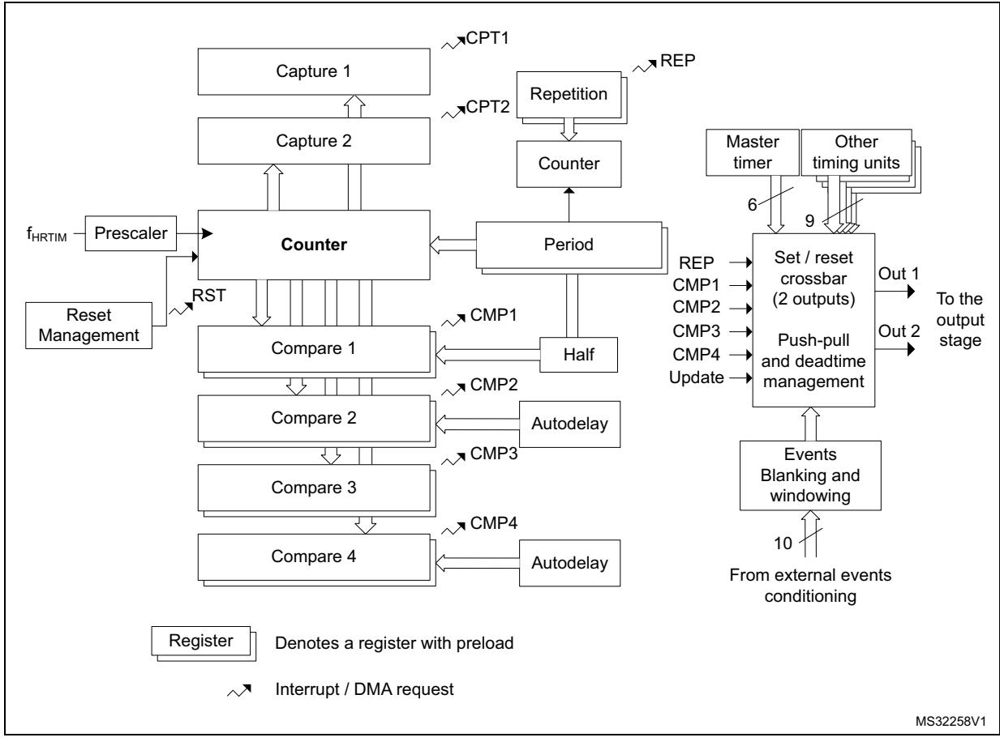

Figure 324. Timer A..E overview

The period and compare values must be within a lower and an upper limit related to the high-resolution implementation and listed in *Table 325*:

- The minimum value must be greater than or equal to 3 periods of the f<sub>HRTIM</sub> clock
- The maximum value must be less than or equal to 0xFFFF 1 periods of the f<sub>HRTIM</sub> clock

Table 325. Period and Compare registers min and max values

<span id="page-8-1"></span>

| CKPSC[2:0] value <sup>(1)</sup> | Min    | Max    |  |  |  |  |
|---------------------------------|--------|--------|--|--|--|--|
| ≥ 5                             | 0x0003 | 0xFFFD |  |  |  |  |

1. CKPSC[2:0] values < 5 are reserved.

Note: A compare value greater than the period register value will not generate a compare match event.


## **Counter operating mode**

Timer A..E can operate in continuous (free-running) mode or in single-shot manner where counting is started by a reset event, using the CONT bit in the HRTIM\_TIMxCR control register. An additional RETRIG bit allows you to select whether the single-shot operation is retriggerable or non-retriggerable. Details of operation are summarized on *[Table 326](#page-9-0)* and on *[Figure 325](#page-9-1)* and *[Figure 326](#page-10-0)*.

**Table 326. Timer operating modes** 

<span id="page-9-0"></span>

| CONT | RETRIG | Operating mode                   | Start / Stop conditions<br>Clocking and event generation                                                                                                                                                                                                                                                                                    |
|------|--------|----------------------------------|---------------------------------------------------------------------------------------------------------------------------------------------------------------------------------------------------------------------------------------------------------------------------------------------------------------------------------------------|
| 0    | 0      | Single-shot<br>Non-retriggerable | Setting the TxEN bit enables the timer but does not start the counter.<br>A first reset event starts the counting and any subsequent reset is ignored<br>until the counter reaches the PER value.<br>The PER event is then generated and the counter is stopped.<br>A reset event re-starts the counting operation from 0x0000.             |
| 0    | 1      | Single-shot<br>Retriggerable     | Setting the TxEN bit enables the timer but does not start the counter.<br>A reset event starts the counting if the counter is stopped, otherwise it<br>clears the counter. When the counter reaches the PER value, the PER<br>event is generated and the counter is stopped.<br>A reset event re-starts the counting operation from 0x0000. |
| 1    | X      | Continuous<br>mode               | Setting the TxEN bit enables the timer and starts the counter<br>simultaneously.<br>When the counter reaches the PER value, it rolls-over to 0x0000 and<br>resumes counting.<br>The counter can be reset at any time.                                                                                                                       |

The TxEN bit can be cleared at any time to disable the timer and stop the counting.

<span id="page-9-1"></span>MS32259V1 Reset Counter PER Continuous mode (CONT = 1, RETRIG = X) Enable

**Figure 325. Continuous timer operation**

<span id="page-10-0"></span>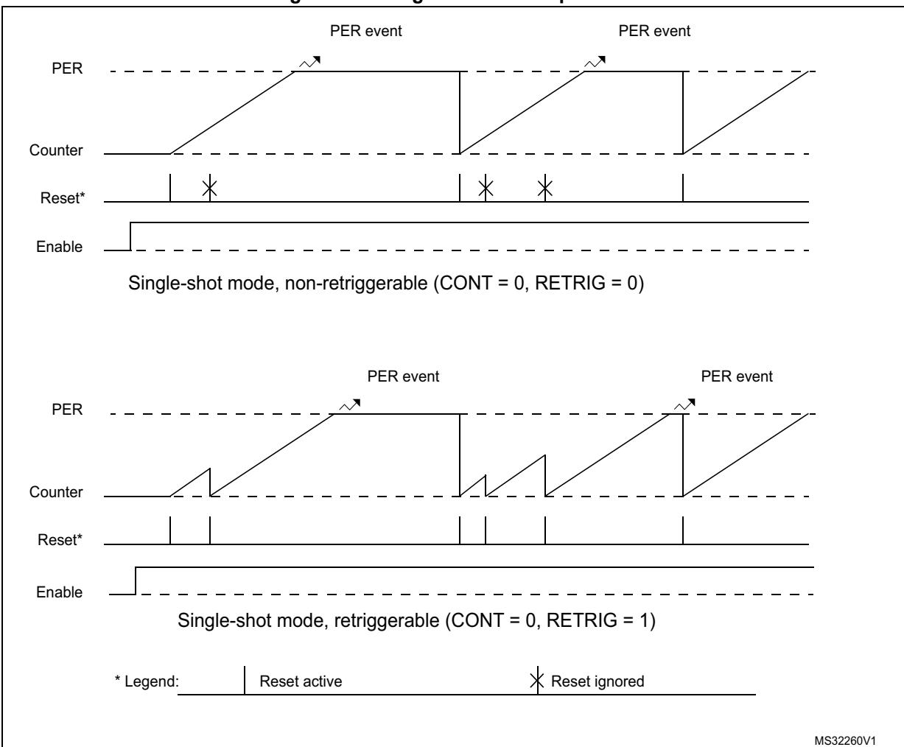

**Figure 326. Single-shot timer operation**

#### **Roll-over event**

A counter roll-over event is generated when the counter goes back to 0 after having reached the period value set in the HRTIM\_PERxR register in continuous mode.

This event is used for multiple purposes in the HRTIM:

- To set/reset the outputs
- To trigger the register content update (transfer from preload to active)
- To trigger an IRQ or a DMA request
- To serve as a burst mode clock source or a burst start trigger
- as an ADC trigger
- To decrement the repetition counter

If the initial counter value is above the period value when the timer is started, or if a new period is set while the counter is already above this value, the counter is not reset: it will overflow at the maximum period value and the repetition counter will not decrement.

## **Timer reset**

The reset of the timing unit counter can be triggered by up to 30 events that can be selected simultaneously in the HRTIM\_RSTxR register, among the following sources:

- The timing unit: Compare 2, Compare 4 and Update (3 events)
- The master timer: Reset and Compare 1..4 (5 events)
- The external events EXTEVNT1..10 (10 events)
- All other timing units (e.g. Timer B..E for timer A): Compare 1, 2 and 4 (12 events)

Several events can be selected simultaneously to handle multiple reset sources. In this case, the multiple reset requests are ORed. When 2 counter reset events are generated within the same fHRTIM clock cycle, the last counter reset is taken into account.

Additionally, it is possible to do a software reset of the counter using the TxRST bits in the HRTIM\_CR2 register. These control bits are grouped into a single register to allow the simultaneous reset of several counters.

The reset requests are taken into account only once the related counters are enabled (TxCEN bit set).

When the fHRTIM clock prescaling ratio is above 1, the counter reset event is delayed to the next active edge of the prescaled clock. This allows to maintain a jitterless waveform generation when an output transition is synchronized to the reset event (typically a constant Ton time converter).

*[Figure 327](#page-11-0)* shows how the reset is handled for a clock prescaling ratio of 4 (fHRTIM divided by 4).

<span id="page-11-0"></span>

**Figure 327. Timer reset resynchronization (prescaling ratio above 32)**

RM0399 Rev 4 1513/3556

#### **Repetition counter**

A common software practice is to have an interrupt generated when the period value is reached, so that the maximum amount of time is left for processing before the next period begins. The main purpose of the repetition counter is to adjust the period interrupt rate and off-load the CPU by decoupling the switching frequency and the interrupt frequency.

The timing units have a repetition counter. This counter cannot be read, but solely programmed with an auto-reload value in the HRTIM\_REPxR register.

The repetition counter is initialized with the content of the HRTIM\_REPxR register when the timer is enabled (TXCEN bit set). Once the timer has been enabled, any time the counter is cleared, either due to a reset event or due to a counter roll-over, the repetition counter is decreased. When it reaches zero, a REP interrupt or a DMA request is issued if enabled (REPIE and REPDE bits in the HRTIM\_DIER register).

If the HRTIM\_REPxR register is set to 0, an interrupt is generated for each and every period. For any value above 0, a REP interrupt is generated after (HRTIM\_REPxR + 1) periods. *[Figure 328](#page-12-0)* presents the repetition counter operation for various values, in continuous mode.

<span id="page-12-0"></span>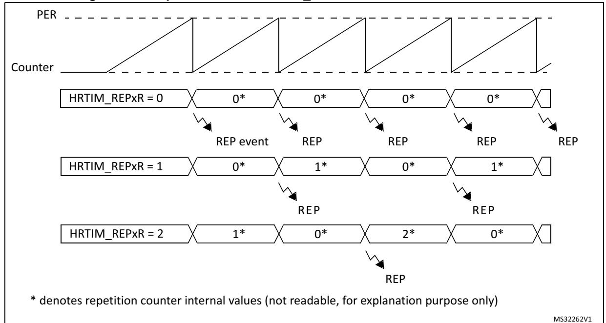

**Figure 328. Repetition rate vs HRTIM\_REPxR content in continuous mode**

The repetition counter can also be used when the counter is reset before reaching the period value (variable frequency operation) either in continuous or in single-shot mode (*[Figure 329](#page-13-0)* here-below). The reset causes the repetition counter to be decremented, at the exception of the very first start following counter enable (TxCEN bit set).

<span id="page-13-0"></span>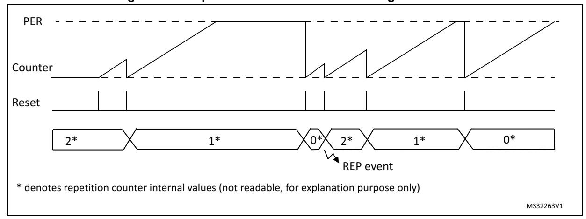

**Figure 329. Repetition counter behavior in single-shot mode**

A reset or start event from the hrtim\_in\_sync[3:1] source causes the repetition to be decremented as any other reset. However, in SYNCIN-started single-shot mode (SYNCSTRTx bit set in the HRTIM\_TIMxCR register), the repetition counter will be decremented only on the 1st reset event following the period. Any subsequent reset will not alter the repetition counter until the counter is re-started by a new request on hrtim\_in\_sync[3:1] inputs.

### **Set / reset crossbar**

A "set" event correspond to a transition to the output active state, while a "reset" event corresponds to a transition to the output inactive state.

The polarity of the waveform is defined in the output stage to accommodate positive or negative logic external components: an active level corresponds to a logic level 1 for a positive polarity (POLx = 0), and to a logic level 0 for a negative polarity (POLx = 1).

Each of the timing units handles the set/reset crossbar for two outputs. These 2 outputs can be set, reset or toggled by up to 32 events that can be selected among the following sources:

- The timing unit: Period, Compare 1..4, register update (6 events)
- The master timer: Period, Compare 1..4, HRTIM synchronization (6 events)
- All other timing units (e.g. Timer B..E for timer A): TIMEVNT1..9 (9 events described in *[Table 327](#page-14-0)*)
- The external events EXTEVNT1..10 (10 events)
- A software forcing (1 event)

The event sources are ORed and multiple events can be simultaneously selected.

Each output is controlled by two 32-bit registers, one coding for the set (HRTIM\_SETxyR) and another one for the reset (HRTIM\_RSTxyR), where x stands for the timing unit: A..E and y stands for the output 1or 2 (e.g. HRTIM\_SETA1R, HRTIM\_RSTC2R,...).

If the same event is selected for both set and reset, it will toggle the output. It is not possible to toggle the output state more than one time per tHRTIM period: in case of two consecutive toggling events within the same cycle, only the first one is considered.

The set and reset requests are taken into account only once the counter is enabled (TxCEN bit set), except if the software is forcing a request to allow the prepositioning of the outputs at timer start-up.


RM0399 Rev 4 1515/3556

*[Table 327](#page-14-0)* summarizes the events from other timing units that can be used to set and reset the outputs. The number corresponds to the timer events (such as TIMEVNTx) listed in the register, and empty locations are indicating non-available events.

For instance, Timer A outputs can be set or reset by the following events: Timer B Compare1, 2 and 4, Timer C Compare 2 and 3,... and Timer E Compare 3 will be listed as TIMEVNT8 in HRTIM\_SETA1R.

**Table 327. Events mapping across Timer A to E**

<span id="page-14-0"></span>

|             |            |      |      | Timer A |      | Timer B |      |      | Timer C |      |      |      | Timer D |      |      |      | Timer E |      |      |      |      |
|-------------|------------|------|------|---------|------|---------|------|------|---------|------|------|------|---------|------|------|------|---------|------|------|------|------|
| Source      |            | CMP1 | CMP2 | CMP3    | CMP4 | CMP1    | CMP2 | CMP3 | CMP4    | CMP1 | CMP2 | CMP3 | CMP4    | CMP1 | CMP2 | CMP3 | CMP4    | CMP1 | CMP2 | CMP3 | CMP4 |
|             | Timer<br>A | -    | -    | -       | -    | 1       | 2    | -    | 3       | -    | 4    | 5    | -       | 6    | 7    | -    | -       | -    | -    | 8    | 9    |
|             | Timer<br>B | 1    | 2    | -       | 3    | -       | -    | -    | -       | -    | -    | 4    | 5       | -    | -    | 6    | 7       | 8    | 9    | -    | -    |
| Destination | Timer<br>C | -    | 1    | 2       | -    | -       | 3    | 4    | -       | -    | -    | -    | -       | -    | 5    | -    | 6       | -    | 7    | 8    | 9    |
|             | Timer<br>D | 1    | -    | -       | 2    | -       | 3    | -    | 4       | 5    | -    | 6    | 7       | -    | -    | -    | -       | 8    | -    | -    | 9    |
|             | Timer<br>E | -    | -    | 1       | 2    | -       | -    | 3    | 4       | 5    | 6    | -    | -       | 7    | 8    | -    | 9       | -    | -    | -    | -    |

*[Figure 330](#page-14-1)* represents how a PWM signal is generated using two compare events.

<span id="page-14-1"></span>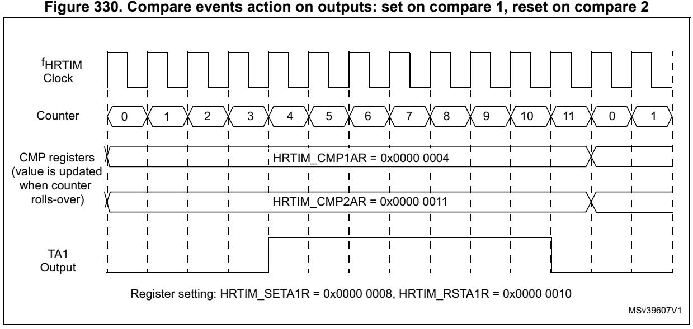


## **Set/Reset on Update events**

#### **Half mode**

This mode aims at generating square signal with fixed 50% duty cycle and variable frequency (typically for converters using resonant topologies). It allows to have the duty cycle automatically forced to half of the period value when a new period is programmed.

This mode is enabled by writing HALF bit to 1 in the HRTIM\_TIMxCR register. When the HRTIM\_PERxR register is written, it causes an automatic update of the Compare 1 value with HRTIM\_PERxR/2 value.

The output on which a square wave is generated must be programmed to have one transition on CMP1 event, and one transition on the period event, as follows:

- HRTIM\_SETxyR = 0x0000 0008, HRTIM\_RSTxyR = 0x0000 0004, or
- HRTIM\_SETxyR = 0x0000 0004, HRTIM\_RSTxyR = 0x0000 0008

The HALF mode overrides the content of the HRTIM\_CMP1xR register. The access to the HRTIM\_PERxR register only causes Compare 1 internal register to be updated. The useraccessible HRTIM\_CMP1xR register is not updated with the HRTIM\_PERxR / 2 value.

When the preload is enabled (PREEN = 1, MUDIS, TxUDIS), Compare 1 active register is refreshed on the Update event. If the preload is disabled (PREEN= 0), Compare 1 active register is updated as soon as HRTIM\_PERxR is written.

The period must be greater than or equal to 6 periods of the fHRTIM clock when the HALF mode is enabled.

#### **Capture**

The timing unit has the capability to capture the counter value, triggered by internal and external events. The purpose is to:

- measure events arrival timings or occurrence intervals
- update Compare 2 and Compare 4 values in auto-delayed mode (see *[Auto-delayed](#page-16-0)  [mode](#page-16-0)*).

The capture is done with fHRTIM resolution.

The timer has 2 capture registers: HRTIM\_CPT1xR and HRTIM\_CPT2xR. The capture triggers are programmed in the HRTIM\_CPT1xCR and HRTIM\_CPT2xCR registers.

The capture of the timing unit counter can be triggered by up to 28 events that can be selected simultaneously in the HRTIM\_CPT1xCR and HRTIM\_CPT2xCR registers, among the following sources:

- The external events, EXTEVNT1..10 (10 events)
- All other timing units (e.g. Timer B..E for timer A): Compare 1, 2 and output 1 set/reset events (16 events)
- The timing unit: Update (1 event)
- A software capture (1 event)

Several events can be selected simultaneously to handle multiple capture triggers. In this case, the concurrent trigger requests are ORed. The capture can generate an interrupt or a DMA request when CPTxIE and CPTxDE bits are set in the HRTIM\_TIMxDIER register.

Over-capture is not prevented by the circuitry: a new capture is triggered even if the previous value was not read, or if the capture flag was not cleared.


RM0399 Rev 4 1517/3556

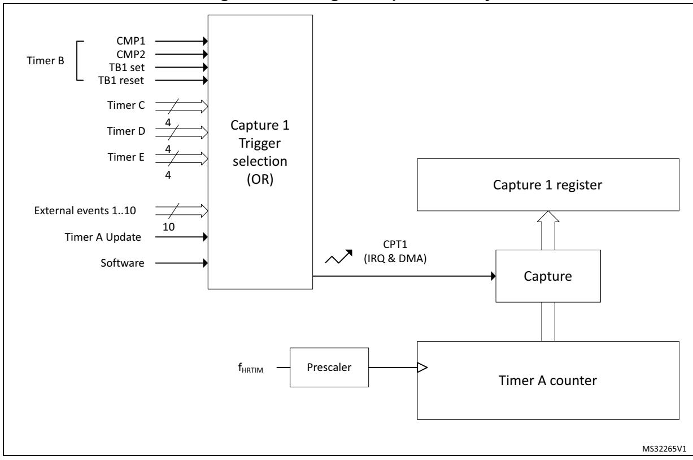

**Figure 331. Timing unit capture circuitry**

#### <span id="page-16-0"></span>**Auto-delayed mode**

This mode allows to have compare events generated relatively to capture events, so that for instance an output change can happen with a programmed timing following a capture. In this case, the compare match occurs independently from the timer counter value. It enables the generation of waveforms with timings synchronized to external events without the need of software computation and interrupt servicing.

As long as no capture is triggered, the content of the HRTIM\_CMPxR register is ignored (no compare event is generated when the counter value matches the Compare value. Once the capture is triggered, the compare value programmed in HRTIM\_CMPxR is summed with the captured counter value in HRTIM\_CPTxyR, and it updates the internal auto-delayed compare register, as seen on *[Figure 332](#page-17-0)*. The auto-delayed compare register is internal to the timing unit and cannot be read. The HRTIM\_CMPxR preload register is not modified after the calculation.

This feature is available only for Compare 2 and Compare 4 registers. Compare 2 is associated with capture 1, while Compare 4 is associated with capture 2. HRTIM\_CMP2xR and HRTIM\_CMP4xR Compares cannot be programmed with a value below 3 fHRTIM clock periods, as in the regular mode.

<span id="page-17-0"></span>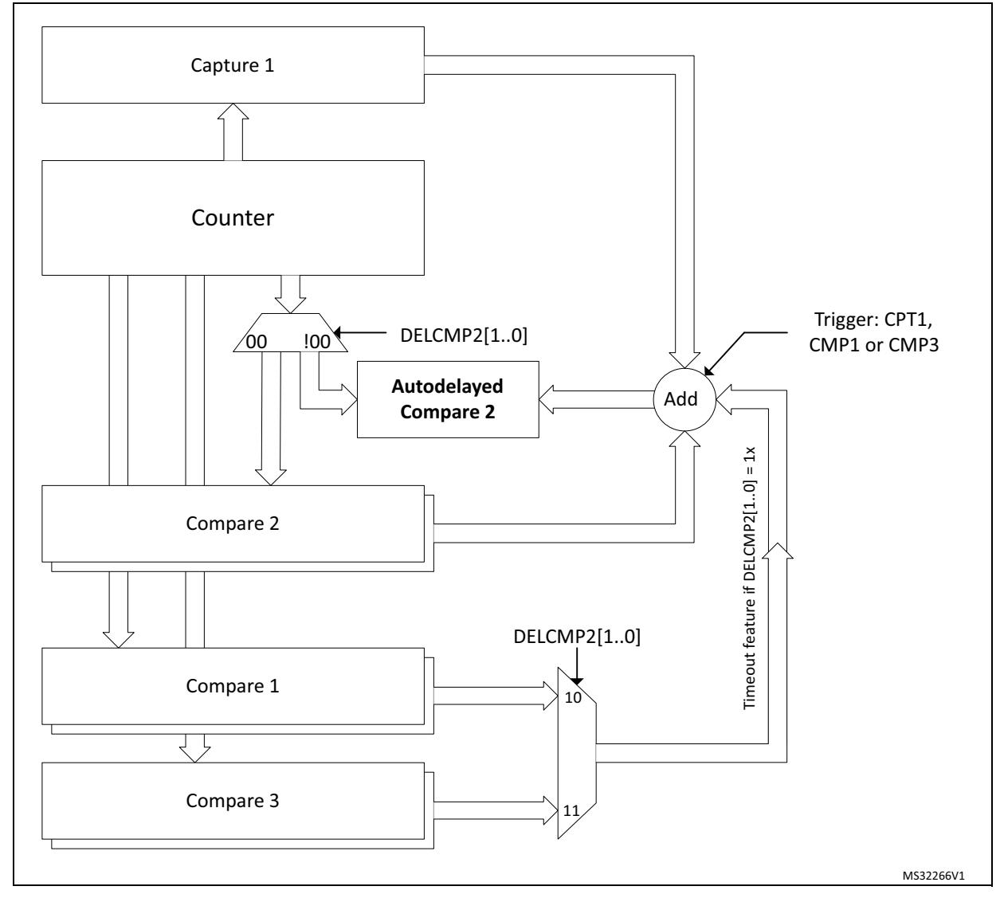

**Figure 332. Auto-delayed overview (Compare 2 only)**

The auto-delayed Compare is only valid from the capture up to the period event: once the counter has reached the period value, the system is re-armed with Compare disabled until a capture occurs.

DELCMP2[1:0] and DELCMP4[1:0] bits in HRTIM\_TIMxCR register allow to configure the auto-delayed mode as follows:

- 00 Regular compare mode: HRTIM\_CMP2xR and HRTIM\_CMP4xR register contents are directly compared with the counter value.
- 01 Auto-delayed mode: Compare 2 and Compare 4 values are recomputed and used for comparison with the counter after a capture 1/2 event.

• 1X

Auto-delayed mode with timeout: Compare 2 and Compare 4 values are recomputed and used for comparison with the counter after a capture 1/2 event or after a Compare 1 match (DELCMPx[1:0]= 10) or a Compare 3 match (DELCMPx[1:0]= 11) to have a timeout function if capture 1/2 event is missing.

When the capture occurs, the comparison is done with the (HRTIM\_CMP2/4xR + HRTIM\_CPT1/2xR) value. If no capture is triggered within the period, the behavior depends on the DELCMPx[1:0] value:

- DELCMPx[1:0] = 01: the compare event is not generated
- DELCMPx[1:0] = 10 or 11: the comparison is done with the sum of the 2 compares (for instance HRTIM\_CMP2xR + HRTIM\_CMP1xR). The captures are not taken into account if they are triggered after CMPx + CMP1 (resp. CMPx + CMP3).

The captures are enabled again at the beginning of the next PWM period.

If the result of the auto-delayed summation is above 0xFFFF (overflow), the value is ignored and no compare event will be generated until a new period is started.

*Note: DELCMPx[1:0] bitfield must be reset when reprogrammed from one value to the other to reinitialize properly the auto-delayed mechanism, for instance:*

- DELCMPx[1:0] = 10
- DELCMPx[1:0] = 00
- DELCMPx[1:0] = 11

As an example, *[Figure 333](#page-18-0)* shows how the following signal can be generated:

- Output set when the counter is equal to Compare 1 value
- Output reset 4 cycles after a falling edge on a given external event

*Note: To simplify the figure, the external event signal is shown without any resynchronization delay: practically, there is a delay of 1 to 2 fHRTIM clock periods between the falling edge and the capture event due to an internal resynchronization stage which is necessary to process external input signals.*

<span id="page-18-0"></span>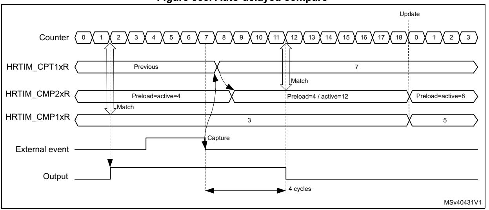

**Figure 333. Auto-delayed compare**

A regular compare channel (e.g. Compare 1) is used for the output set: as soon as the counter matches the content of the compare register, the output goes to its active state.


A delayed compare is used for the output reset: the compare event can be generated only if a capture event has occurred. No event is generated when the counter matches the delayed compare value (counter = 4). Once the capture event has been triggered by the external event, the content of the capture register is summed to the delayed compare value to have the new compare value. In the example, the auto-delayed value 4 is summed to the capture equal to 7 to give a value of 12 in the auto-delayed compare register. From this time on, the compare event can be generated and will happen when the counter is equal to 12, causing the output to be reset.

## Overcapture management in auto-delayed mode

Overcapture is prevented when the auto-delayed mode is enabled (DELCMPx[1:0] = 01, 10, 11).

When multiple capture requests occur within the same counting period, only the first capture is taken into account to compute the auto-delayed compare value. A new capture is possible only:

- Once the auto-delayed compare has matched the counter value (compare event)
- Once the counter has rolled over (period)
- Once the timer has been reset

#### Changing auto-delayed compare values

When the auto-delayed compare value is preloaded (PREEN bit set), the new compare value is taken into account on the next coming update event (for instance on the period event), regardless of when the compare register was written and if the capture occurred (see *[Figure 333](#page-18-0)*, where the delay is changed when the counter rolls over).

When the preload is disabled (PREEN bit reset), the new compare value is taken into account immediately, even if it is modified after the capture event has occurred, as per the example below:

- 1. At t1, DELCMP2 = 1.
- 2. At t2, CMP2\_act = 0x40 => comparison disabled
- 3. At t3, a capture event occurs capturing the value CPTR1 = 0x20. => comparison enabled, compare value = 0x60
- 4. At t4, CMP2\_act = 0x100 (before the counter reached value CPTR1 + 0x40) => comparison still enabled, new compare value = 0x120
- 5. At t5, the counter reaches the period value => comparison disabled, cmp2\_act = 0x100

Similarly, if the CMP1(CMP3) value changes while DELCMPx = 10 or 11, and preload is disabled:

- 1. At t1, DELCMP2 = 2.
- 2. At t2, CMP2\_act = 0x40 => comparison disabled
- 3. At t3, CMP3 event occurs CMP3\_act = 0x50 before capture 1 event occurs => comparison enabled, compare value = 0x90
- 4. At t4, CMP3\_act = 0x100 (before the counter reached value 0x90) => comparison still enabled, Compare 2 event will occur at = 0x140


RM0399 Rev 4 1521/3556

#### **Push-pull mode**

This mode primarily aims at driving converters using push-pull topologies. It also needs to be enabled when the delayed idle protection is required, typically for resonant converters (refer to *[Section 39.3.9: Delayed Protection](#page-37-0)*).

The push-pull mode is enabled by setting PSHPLL bit in the HRTIM\_TIMxCR register.

It applies the signals generated by the crossbar to output 1 and output 2 alternatively, on the period basis, maintaining the other output to its inactive state. The redirection rate (push-pull frequency) is defined by the timer's period event, as shown on *[Figure 334](#page-20-0)*. The push-pull period is twice the timer counting period.

<span id="page-20-0"></span>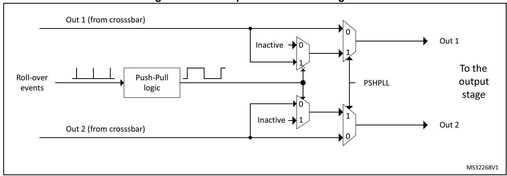

**Figure 334. Push-pull mode block diagram**

The push-pull mode is only available when the timer operates in continuous mode: the counter must not be reset once it has been enabled (TxCEN bit set). It is necessary to disable the timer to stop a push-pull operation and to reset the counter before re-enabling it.

The signal shape is defined using HRTIM\_SETxyR and HRTIM\_RSTxyR for both outputs. It is necessary to have HRTIM\_SETx1R = HRTIM\_SETx2R and HRTIM\_RSTx1R = HRTIM\_RSTx2R to have both outputs with identical waveforms and to achieve a balanced operation. Still, it is possible to have different programming on both outputs for other uses.

*Note: The push-pull operation cannot be used when a deadtime is enabled (mutually exclusive functions).*

> The CPPSAT status bit in HRTIM\_TIMxISR indicates on which output the signal is currently active. CPPSTAT is reset when the push-pull mode is disabled.

In the example given on *[Figure 335](#page-21-0)*, the timer internal waveform is defined as follows:

- Output set on period event
- Output reset on Compare 1 match event

<span id="page-21-0"></span>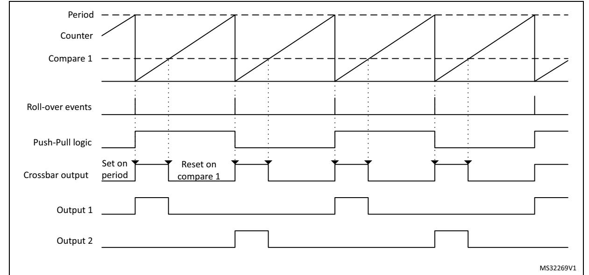

**Figure 335. Push-pull mode example**

## **Deadtime**

A deadtime insertion unit allows to generate a couple of complementary signals from a single reference waveform, with programmable delays between active state transitions. This is commonly used for topologies using half-bridges or full bridges. It simplifies the software: only 1 waveform is programmed and controlled to drive two outputs.

The Dead time insertion is enabled by setting DTEN bit in HRTIM\_OUTxR register. The complementary signals are built based on the reference waveform defined for output 1, using HRTIM\_SETx1R and HRTIM\_RSTx1R registers: HRTIM\_SETx2R and HRTIM\_RSTx2R registers are not significant when DTEN bit is set.

*Note: The deadtime cannot be used simultaneously with the push-pull mode.*

Two deadtimes can be defined in relationship with the rising edge and the falling edge of the reference waveform, as in *[Figure](#page-21-1) 336*.

<span id="page-21-1"></span>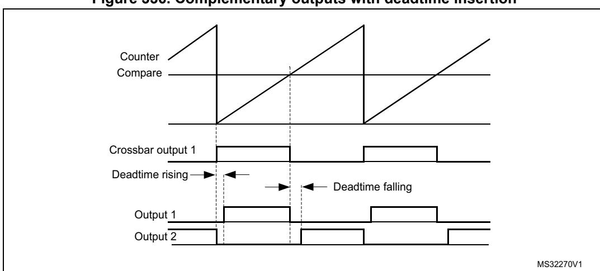

**Figure 336. Complementary outputs with deadtime insertion**

Negative deadtime values can be defined when some control overlap is required. This is done using the deadtime sign bits (SDTFx and SDTRx bits in HRTIM\_DTxR register). *[Figure 337](#page-22-0)* shows complementary signal waveforms depending on respective signs.

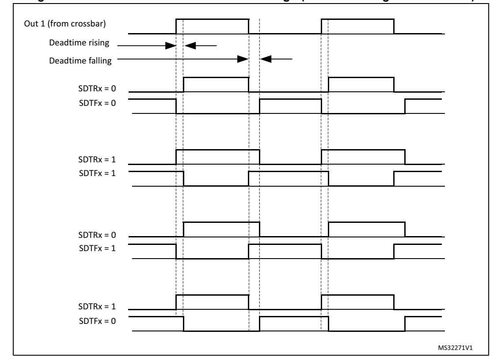

<span id="page-22-0"></span>**Figure 337. Deadtime insertion vs deadtime sign (1 indicates negative deadtime)**

The deadtime values are defined with DTFx[8:0] and DTRx[8:0] bitfields and based on a specific clock prescaled according to DTPRSC[2:0] bits, as follows:

$$t_{DTx} = +/- DTx[8:0] \times t_{DTG}$$

where x is either R or F and tDTG = (2(DTPRSC[2:0])) x tHRTIM.

*[Table 328](#page-22-1)* gives the resolution and maximum absolute values depending on the prescaler value.

<span id="page-22-1"></span>

| DTPRSC[2:0](1) | tDTG        |            | fHRTIM= 400 MHz |                |  |
|----------------|-------------|------------|-----------------|----------------|--|
|                |             | tDTx max   | tDTG (ns)       | tDTx  max (µs) |  |
| 011            | tHRTIM      |            | 2.5             | 1.28           |  |
| 100            | 2 * tHRTIM  |            | 5               | 2.56           |  |
| 101            | 4 * tHRTIM  | 511 * tDTG | 10              | 5.11           |  |
| 110            | 8 * tHRTIM  |            | 20              | 10.22          |  |
| 111            | 16 * tHRTIM |            | 40              | 20.44          |  |

**Table 328. Deadtime resolution and max absolute values** 

1. DTPRSC[2:0] values 000, 001, 010 are reserved.


*[Figure 338](#page-23-0)* to *[Figure 341](#page-24-0)* present how the deadtime generator behaves for reference waveforms with pulsewidth below the deadtime values, for all deadtime configurations.

**Figure 338. Complementary outputs for low pulse width (SDTRx = SDTFx = 0)**

<span id="page-23-0"></span>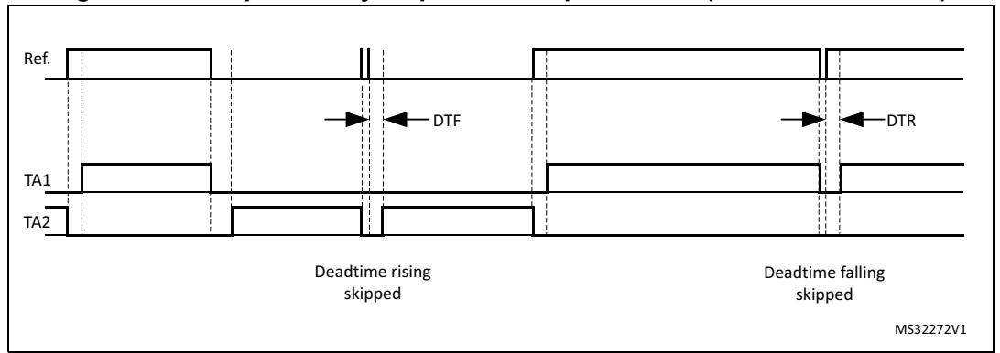

**Figure 339. Complementary outputs for low pulse width (SDTRx = SDTFx = 1)**

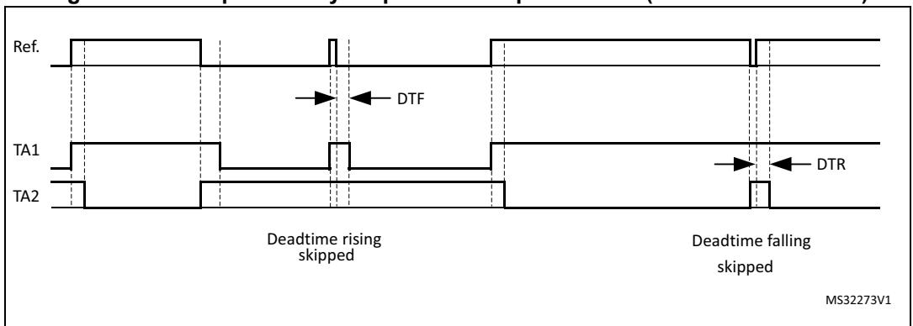

**Figure 340. Complementary outputs for low pulse width (SDTRx = 0, SDTFx = 1)**

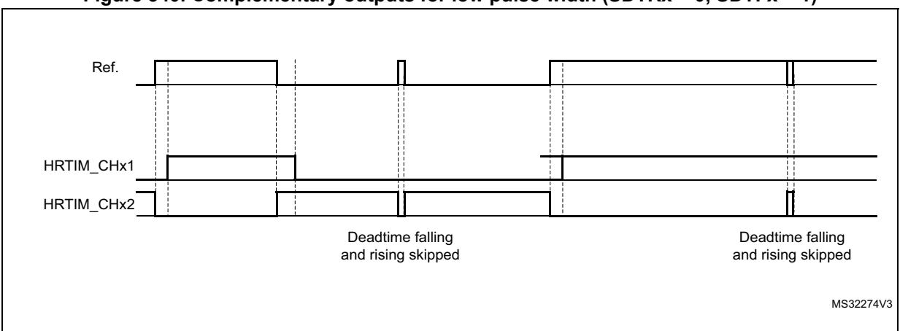

<span id="page-24-0"></span>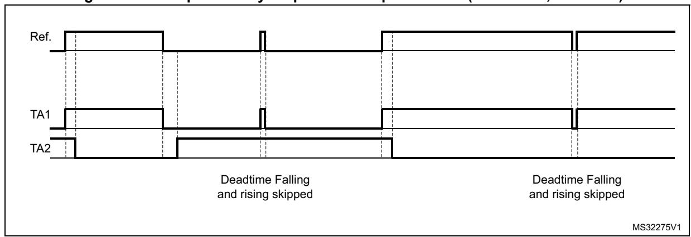

**Figure 341. Complementary outputs for low pulse width (SDTRx = 1, SDTFx=0)**

For safety purposes, it is possible to prevent any spurious write into the deadtime registers by locking the sign and/or the value of the deadtime using DTFLKx, DTRLKx, DTFSLKx and DTRSLKx. Once these bits are set, the related bits and bitfields are becoming read only until the next system reset.

**Caution:** DTEN bit must not be changed in the following cases:

- When the timer is enabled (TxEN bit set)
- When the timer outputs are set/reset by another timer (while TxEN is reset) Otherwise, an unpredictable behavior would result.

It is therefore necessary to disable the timer (TxCEN bit reset) and have the corresponding outputs disabled.

*For the particular case where DTEN must be set while the burst mode is enabled with a deadtime upon entry (BME = 1, DIDL = 1, IDLEM = 1), it is necessary to force the two outputs in their IDLES state by software commands (SST, RST bits) before setting DTEN bit. This is to avoid any side effect resulting from a burst mode entry that would happen immediately before a deadtime enable.*


## **39.3.5 Master timer**

The main purpose of the master timer is to provide common signals to the 5 timing units, either for synchronization purpose or to set/reset outputs. It does not have direct control over any outputs, but still can be used indirectly by the set/reset crossbars.

*[Figure 342](#page-25-0)* provides an overview of the master timer.

<span id="page-25-0"></span>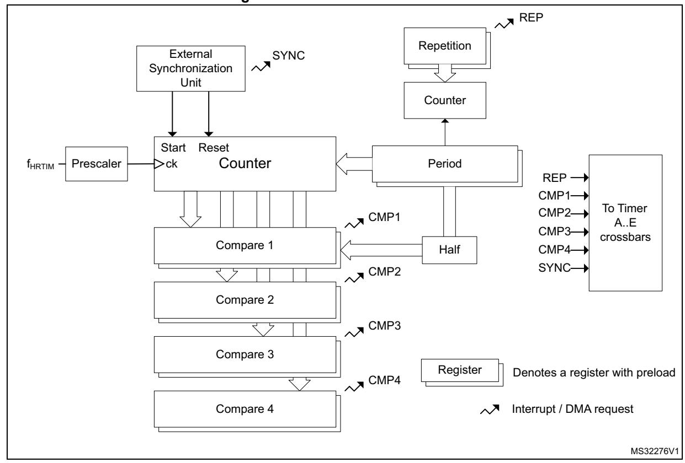

**Figure 342. Master timer overview**

The master timer is based on the very same architecture as the timing units, with the following differences:

- It does not have outputs associated with, nor output related control
- It does not have its own crossbar unit, nor push-pull or deadtime mode
- It can only be reset by the external synchronization circuitry
- It does not have a capture unit, nor the auto-delayed mode
- It does not include external event blanking and windowing circuitry
- It has a limited set of interrupt / DMA requests: Compare 1..4, repetition, register update and external synchronization event.

The master timer control register includes all the timer enable bits, for the master and Timer A..E timing units. This allows to have all timer synchronously started with a single write access.

It also handles the external synchronization for the whole HRTIM timer (see *[Section 39.3.17: Synchronizing the HRTIM with other timers or HRTIM instances](#page-68-0)*), with both MCU internal and external (inputs/outputs) resources.

RM0399 Rev 4 1527/3556

Master timer control registers are mapped with the same offset as the timing units' registers.

## <span id="page-26-1"></span>**39.3.6 Set/reset events priorities and narrow pulses management**

This section describes how the output waveform is generated when several set and/or reset requests are occurring within 3 consecutive tHRTIM periods.

An arbitration is performed during each tHRTIM period, in 2 steps:

- 1. For each active event, the desired output transition is determined (set, reset or toggle).
- 2. A predefined arbitration is performed among the active events (from highest to lowest priority CMP4 → CMP3 → CMP2 → CMP1 → PER, see *[Concurrent set request /](#page-26-0)  [Concurrent reset requests](#page-26-0)*.

When set and reset requests from two different sources are simultaneous, the reset action has the highest priority.

## <span id="page-26-0"></span>Concurrent set request / Concurrent reset requests

When multiple sources are selected for a set event, an arbitration is performed when the set requests occur within the same fHRTIM clock period.

In case of multiple requests from adjacent timers (TIMEVNT1..9), the request which occurs first is taken into account. The arbitration is done in 2 steps, depending on the source (from the highest to the lowest priority): CMP4 → CMP3 → CMP2 → CMP1.

If multiple requests from the master timer occur within the same fHRTIM clock period, a predefined arbitration is applied and a single request will be taken into account (from the highest to the lowest priority):

$$\mathsf{MSTCMP4} \to \mathsf{MSTCMP3} \to \mathsf{MSTCMP2} \to \mathsf{MSTCMP1} \to \mathsf{MSTCMPER}$$

When multiple requests internal to the timer occur within the same fHRTIM clock period, a predefined arbitration is applied and the requests are taken with the following priority, whatever the effective timing (from highest to lowest):

$$CMP4 \rightarrow CMP3 \rightarrow CMP2 \rightarrow CMP1 \rightarrow PER$$

*Note: Practically, this is of a primary importance only when using auto-delayed Compare 2 and Compare 4 simultaneously (i.e. when the effective set/reset cannot be determined a priori because it is related to an external event). In this case, the highest priority signal must be affected to the CMP4 event.*

> Last, the highest priority is given to non timing-related: EXTEVNT1..10, RESYNC (coming from SYNC event if SYNCRSTx or SYNCSTRTx is set or from a software reset), update and software set (SST).

As a summary, in case of simultaneous events, the effective set (reset) event will be arbitrated between:

- Any TIMEVNT1..9 event
- A single source from the master (as per the fixed arbitration given above)
- A single source from the timer
- The "non timing-related events".

The same arbitration principle applies for concurrent reset requests. In this case, the reset request has the highest priority.


A set or reset event occurring within the prescaler clock cycle is delayed to the next active edge of the prescaled clock (as for a counter reset), even if the arbitration is still performed every tHRTIM cycle.

If a reset event is followed by a set event within the same prescaler clock cycle, the latest event will be considered.

## **39.3.7 External events global conditioning**

The HRTIM timer can handle events not generated within the timer, referred to as "external event". These external events come from multiple sources, either on-chip or off-chip:

- built-in comparators,
- digital input pins (typically connected to off-chip comparators and zero-crossing detectors),
- on-chip events for other peripheral (ADC's analog watchdogs and general purpose timer trigger outputs).

The external events conditioning circuitry allows to select the signal source for a given channel (with a 4:1 multiplexer) and to convert it into an information that can be processed by the crossbar unit (for instance, to have an output reset triggered by a falling edge detection on an external event channel).

Up to 10 external event channels can be conditioned and are available simultaneously for any of the 5 timers. This conditioning is common to all timers, since this is usually dictated by external components (such as a zero-crossing detector) and environmental conditions (typically the filter set-up will be related to the applications noise level and signature). *[Figure 343](#page-28-0)* presents an overview of the conditioning logic for a single channel.

<span id="page-28-0"></span>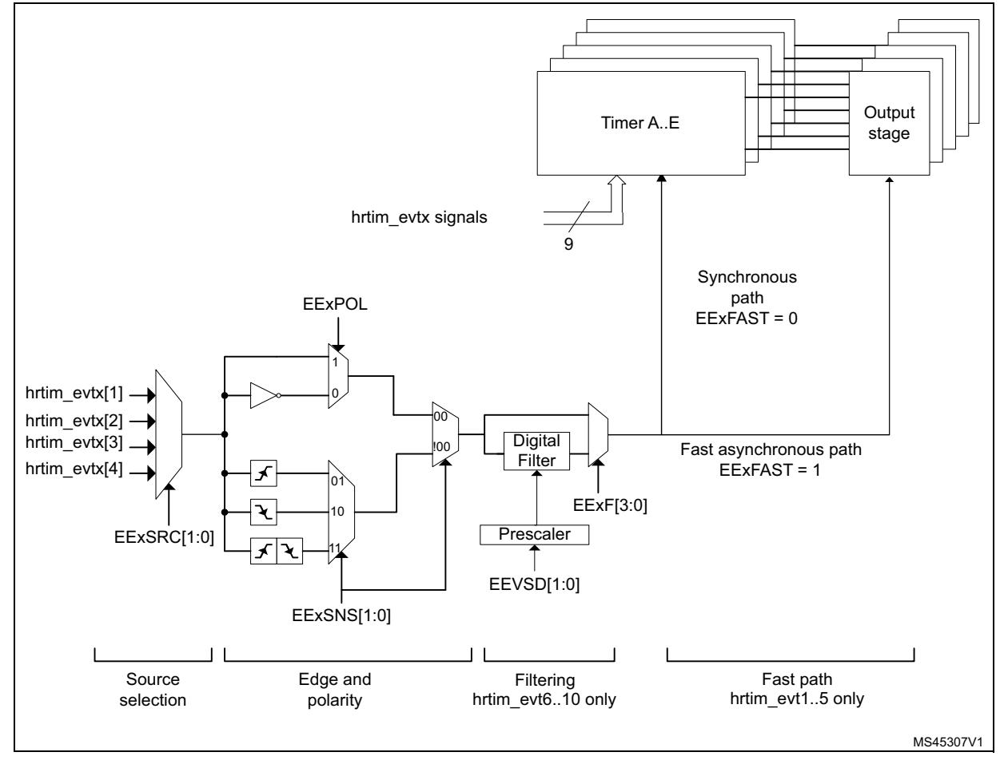

Figure 343. External event conditioning overview (1 channel represented)

The 10 external events are initialized using the HRTIM\_EECR1 and HRTIM EECR2 registers:

- to select up to 4 sources with the EExSRC[1:0] bits,
- to select the sensitivity with EExSNS[1:0] bits, to be either level-sensitive or edgesensitive (rising, falling or both),
- to select the polarity, in case of a level sensitivity, with EExPOL bit,
- to have a low latency mode, with EExFAST bits (see Latency to external events), for external events 1 to 5.

Note:

The external events used as triggers for reset, capture, burst mode, ADC triggers and delayed protection are edge-sensitive even if EESNS bit is reset (level-sensitive selection): if POL = 0 the trigger is active on external event rising edge, while if POL = 1 the trigger is active on external event falling edge.

The external events are discarded as long as the counters are disabled (TxCEN bit reset) to prevent any output state change and counter reset, except if they are used as ADC triggers.

Additionally, it is possible to enable digital noise filters, for external events 6 to 10, using EExF[3:0] bits in the HRTIM\_EECR3 register.

A digital filter is made of a counter in which a number N of valid samples is needed to validate a transition on the output. If the input value changes before the counter has


reached the value N, the counter is reset and the transition is discarded (considered as a spurious event). If the counter reaches N, the transition is considered as valid and transmitted as a correct external event. Consequently, the digital filter adds a latency to the external events being filtered, depending on the sampling clock and on the filter length (number of valid samples expected).

The sampling clock is either the fHRTIM clock or a specific prescaled clock fEEVS derived from fHRTIM, defined with EEVSD[1:0] bits in HRTIM\_EECR3 register.

*[Table 329](#page-29-2)* summarizes the available sources and features associated with each of the 10 external events channels.

<span id="page-29-2"></span>

| External<br>event<br>channel | Fast<br>mode | Digital<br>filter | Balanced<br>fault timer<br>A,B,C | Balanced<br>fault timer<br>D,E | Src1 | Src 2     | Src3       | Src4      |
|------------------------------|--------------|-------------------|----------------------------------|--------------------------------|------|-----------|------------|-----------|
| 1                            | Yes          | -                 | -                                | -                              | PC10 | COMP1     | TIM1_TRGO  | ADC1_AWD1 |
| 2                            | Yes          | -                 | -                                | -                              | PC12 | COMP2     | TIM2_TRGO  | ADC1_AWD2 |
| 3                            | Yes          | -                 | -                                | -                              | PD5  | -         | TIM3_TRGO  | ADC1_AWD3 |
| 4                            | Yes          | -                 | -                                | -                              | PG11 | OPAMP1(1) | TIM7_TRGO  | ADC2_AWD1 |
| 5                            | Yes          | -                 | -                                | -                              | PG12 | -         | LPTIM1 OUT | ADC2_AWD2 |
| 6                            | -            | Yes               | Yes                              | -                              | PB4  | COMP1     | TIM6_TRGO  | ADC2_AWD3 |
| 7                            | -            | Yes               | Yes                              | -                              | PB5  | COMP2     | TIM7_TRGO  | -         |
| 8                            | -            | Yes               | -                                | Yes                            | PB6  | -         | TIM6_TRGO  | TTCAN_TMP |
| 9                            | -            | Yes               | -                                | Yes                            | PB7  | OPAMP1(1) | TIM15_TRGO | TTCAN_RTP |
| 10                           | -            | Yes               | -                                | -                              | PG13 | -         | LPTIM2 OUT | TTCAN_SOC |

**Table 329. External events mapping and associated features** 

### <span id="page-29-0"></span>**Latency to external events**

The external event conditioning gives the possibility to adjust the external event processing time (and associated latency) depending on performance expectations:

- A regular operating mode, in which the external event is resampled with the clock before acting on the output crossbar. This adds some latency but gives access to all crossbar functionalities. It enables the generation of an externally triggered highresolution pulse.
- A fast operating mode, in which the latency between the external event and the action on the output is minimized. This mode is convenient for ultra-fast over-current protections, for instance.

EExFAST bits in the HRTIM\_EECR1 register allow to define the operating for channels 1 to 5. This influences the latency and the jitter present on the output pulses, as summarized in the table below.


RM0399 Rev 4 1531/3556

<span id="page-29-1"></span><sup>1.</sup> OPAMP1\_VOUT can be used as High-resolution timer internal event source. In this case, OPAMP1\_VOUT (PC4) pin must be configured in input mode. The data from the GPIO pin is redirect to the HRTIM external events through the pin Schmitt trigger. If OPAMP1 is disabled, PC4 pin, configured in input mode, can be used as HRTIM external events.

| in the second confidence of the second control of the second control of the second control of the second control of the second control of the second control of the second control of the second control of the second control of the second control of the second control of the second control of the second control of the second control of the second control of the second control of the second control of the second control of the second control of the second control of the second control of the second control of the second control of the second control of the second control of the second control of the second control of the second control of the second control of the second control of the second control of the second control of the second control of the second control of the second control of the second control of the second control of the second control of the second control of the second control of the second control of the second control of the second control of the second control of the second control of the second control of the second control of the second control of the second control of the second control of the second control of the second control of the second control of the second control of the second control of the second control of the second control of the second control of the second control of the second control of the second control of the second control of the second control of the second control of the second control of the second control of the second control of the second control of the second control of the second control of the second control of the second control of the second control of the second control of the second control of the second control of the second control of the second control of the second control of the second control of the second control of the second control of the second control of the second control of the second control of the second control of the second control of the second control of the second control of the second control of the second control of the second contr |                                                                                    |                                      |                                                                                              |  |  |  |
|--------------------------------------------------------------------------------------------------------------------------------------------------------------------------------------------------------------------------------------------------------------------------------------------------------------------------------------------------------------------------------------------------------------------------------------------------------------------------------------------------------------------------------------------------------------------------------------------------------------------------------------------------------------------------------------------------------------------------------------------------------------------------------------------------------------------------------------------------------------------------------------------------------------------------------------------------------------------------------------------------------------------------------------------------------------------------------------------------------------------------------------------------------------------------------------------------------------------------------------------------------------------------------------------------------------------------------------------------------------------------------------------------------------------------------------------------------------------------------------------------------------------------------------------------------------------------------------------------------------------------------------------------------------------------------------------------------------------------------------------------------------------------------------------------------------------------------------------------------------------------------------------------------------------------------------------------------------------------------------------------------------------------------------------------------------------------------------------------------------------------------|------------------------------------------------------------------------------------|--------------------------------------|----------------------------------------------------------------------------------------------|--|--|--|
| EExFAST                                                                                                                                                                                                                                                                                                                                                                                                                                                                                                                                                                                                                                                                                                                                                                                                                                                                                                                                                                                                                                                                                                                                                                                                                                                                                                                                                                                                                                                                                                                                                                                                                                                                                                                                                                                                                                                                                                                                                                                                                                                                                                                        | Response time<br>latency                                                           | Response time jitter                 | Jitter on output pulse (counter reset by ext. event)                                         |  |  |  |
| 0                                                                                                                                                                                                                                                                                                                                                                                                                                                                                                                                                                                                                                                                                                                                                                                                                                                                                                                                                                                                                                                                                                                                                                                                                                                                                                                                                                                                                                                                                                                                                                                                                                                                                                                                                                                                                                                                                                                                                                                                                                                                                                                              | 5 to 6 cycles of f <sub>HRTIM</sub> clock                                          | 1 cycles of f <sub>HRTIM</sub> clock | No jitter, pulse width maintained with high-resolution                                       |  |  |  |
| 1                                                                                                                                                                                                                                                                                                                                                                                                                                                                                                                                                                                                                                                                                                                                                                                                                                                                                                                                                                                                                                                                                                                                                                                                                                                                                                                                                                                                                                                                                                                                                                                                                                                                                                                                                                                                                                                                                                                                                                                                                                                                                                                              | Minimal latency<br>(depends whether the<br>comparator or digital<br>input is used) | Minimal jitter                       | 1 cycle of f <sub>HRTIM</sub> clock jitter pulse width resolution down to t <sub>HRTIM</sub> |  |  |  |

Table 330. Output set/reset latency and jitter vs external event operating mode

The EExFAST mode is only available with level-sensitive programming (EExSNS[1:0] = 00); the edge-sensitivity cannot be programmed.

It is possible to apply event filtering to external events (both blanking and windowing with EExFLTR[3:0] != 0000, see *Section 39.3.8*). In this case, EExLTCHx bit must be reset: the postponed mode is not supported, neither the windowing timeout feature.

Note: The external event configuration (source and polarity) must not be modified once the related EExFAST bit is set.

A fast external event cannot be used to toggle an output: if must be enabled either in HRTIM SETxyR or HRTIM RSTxyR registers, not in both.

When a set and a reset event - from 2 independent fast external events - occur simultaneously, the reset has the highest priority in the crossbar and the output becomes inactive.

When EExFAST bit is set, the output cannot be changed during the 11  $f_{HRTIM}$  clock periods following the external event.

*Figure 344* and *Figure 345* give practical examples of the reaction time to external events, for output set/reset and counter reset.


<span id="page-31-0"></span>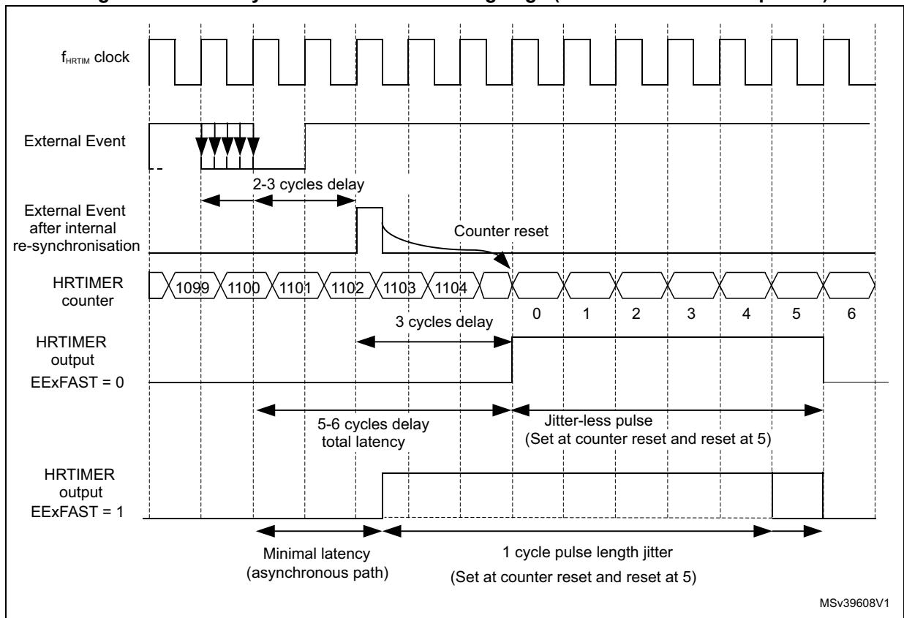

Figure 344. Latency to external events falling edge (counter reset and output set)


<span id="page-31-1"></span>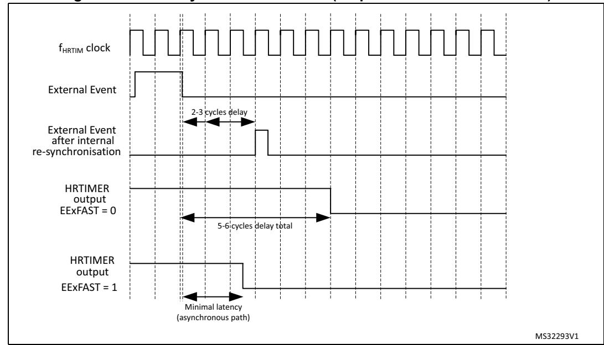

57

RM0399 Rev 4

## <span id="page-32-0"></span>**39.3.8 External event filtering in timing units**

Once conditioned, the 10 external events are available for all timing units.

They can be used directly and are active as soon as the timing unit counter is enabled (TxCEN bit set).

They can also be filtered to have an action limited in time, usually related to the counting period. Two operations can be performed:

- blanking, to mask external events during a defined time period,
- windowing, to enable external events only during a defined time period.

These modes are enabled using HRTIM\_EExFLTR[3:0] bits in the HRTIM\_EEFxR1 and HRTIM\_EEFxR2 registers. Each of the 5 TimerA..E timing units has its own programmable filter settings for the 10 external events.

#### **Blanking mode**

In event blanking mode (see *[Figure 346](#page-32-1)*), the external event is ignored if it happens during a given blanking period. This is convenient, for instance, to avoid a current limit to trip on switching noise at the beginning of a PWM period. This mode is active for EExFLTR[3:0] bitfield values ranging from 0001 to 1100.

<span id="page-32-1"></span>**Figure 346. Event blanking mode**

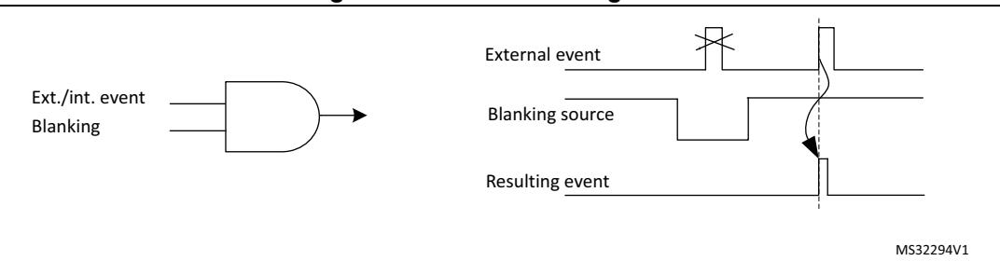

In event postpone mode, the external event is not taken into account immediately but is memorized (latched) and generated as soon as the blanking period is completed, as shown on *[Figure 347](#page-32-2)*. This mode is enabled by setting EExLTCH bit in HRTIM\_EEFxR1 and HRTIM\_EEFxR2 registers.

**Figure 347. Event postpone mode**

<span id="page-32-2"></span>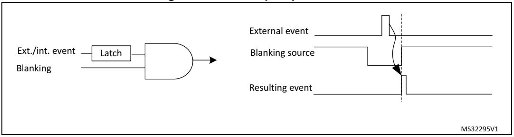

The blanking signal comes from several sources:

- the timer itself: the blanking lasts from the counter reset to the compare match (EExFLTR[3:0] = 0001 to 0100 for Compare 1 to Compare 4)
- from other timing units (EExFLTR[3:0] = 0101 to 1100): the blanking lasts from the selected timing unit counter reset to one of its compare match, or can be fully programmed as a waveform on Tx2 output. In this case, events are masked as long as the Tx2 signal is inactive (it is not necessary to have the output enabled, the signal is taken prior to the output stage).

The EEXFLTR[3:0] configurations from 0101 to 1100 are referred to as TIMFLTR1 to TIMFLTR8 in the bit description, and differ from one timing unit to the other. *Table 331* gives the 8 available options per timer: CMPx refers to blanking from counter reset to compare match, Tx2 refers to the timing unit TIMx output 2 waveform defined with HRTIM\_SETx2 and HRTIM\_RSTx2 registers. For instance, Timer B (TIMFLTR6) is Timer C output 2 waveform.

<span id="page-33-0"></span>Timer B Timer C Timer E Timer A Timer D Source СМР СМР СМР СМР СМР CMP СМР CMP СМР СМР СМР СМР CMP СМР СМР TA2 TB2 TC2 TD2 TE2 Timer 1 2 3 4 5 6 7 8 Α Timer 1 2 3 4 5 6 7 8 Destination Timer 1 2 3 4 5 6 7 8 С Timer 1 2 3 4 5 6 7 8 Timer 1 2 3 4 5 6 7 8 Ε

Table 331. Filtering signals mapping per time

*Figure 348* and *Figure 349* give an example of external event blanking for all edge and level sensitivities, in regular and postponed modes.


1535/3556

<span id="page-34-0"></span>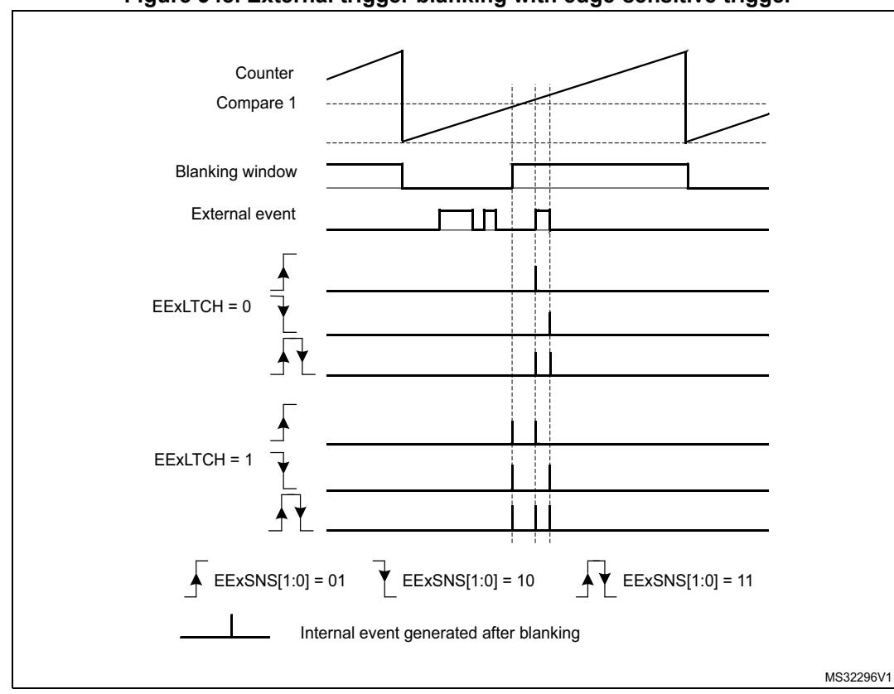

**Figure 348. External trigger blanking with edge-sensitive trigger**


<span id="page-34-1"></span>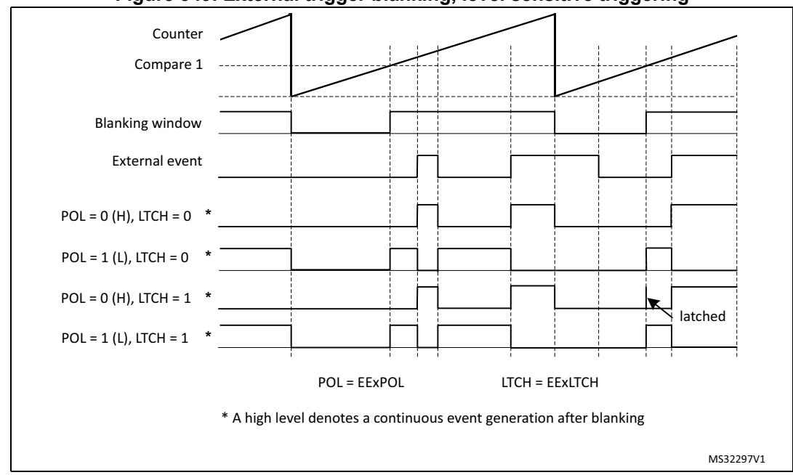

#### **Windowing mode**

In event windowing mode, the event is taken into account only if it occurs within a given time window, otherwise it is ignored. This mode is active for EExFLTR[3:0] ranging from 1101 to 1111.

**Figure 350. Event windowing mode**

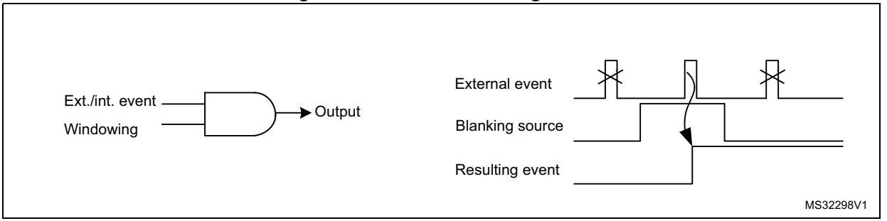

EExLTCH bit in EEFxR1 and EEFxR2 registers allows to latch the signal, if set to 1: in this case, an event is accepted if it occurs during the window but is delayed at the end of it.

- If EExLTCH bit is reset and the signal occurs during the window, it is passed through directly.
- If EExLTCH bit is reset and no signal occurs, a timeout event is generated at the end of the window.

A use case of the windowing mode is to filter synchronization signals. The timeout generation allows to force a default synchronization event, when the expected synchronization event is lacking (for instance during a converter start-up).

There are 3 sources for each external event windowing, coded as follows:

- 1101 and 1110: the windowing lasts from the counter reset to the compare match (respectively Compare 2 and Compare 3)
- 1111: the windowing is related to another timing unit and lasts from its counter reset to its Compare 2 match. The source is described as TIMWIN in the bit description and is given in *[Table 332](#page-35-0)*. As an example, the external events in timer B can be filtered by a window starting from timer A counter reset to timer A Compare 2.

**Table 332. Windowing signals mapping per timer (EEFLTR[3:0] = 1111)**

<span id="page-35-0"></span>

| Destination     | Timer A | Timer B | Timer C | Timer D | Timer E |
|-----------------|---------|---------|---------|---------|---------|
| TIMWIN (source) | Timer B | Timer A | Timer D | Timer C | Timer D |
|                 | CMP2    | CMP2    | CMP2    | CMP2    | CMP2    |

*Note: The timeout event generation is not supported if the external event is programmed in fast mode.*

> *[Figure 351](#page-36-0)* and *[Figure 352](#page-36-1)* present how the events are generated for the various edge and level sensitivities, as well as depending on EExLTCH bit setting. Timeout events are specifically mentioned for clarity reasons.

<span id="page-36-0"></span>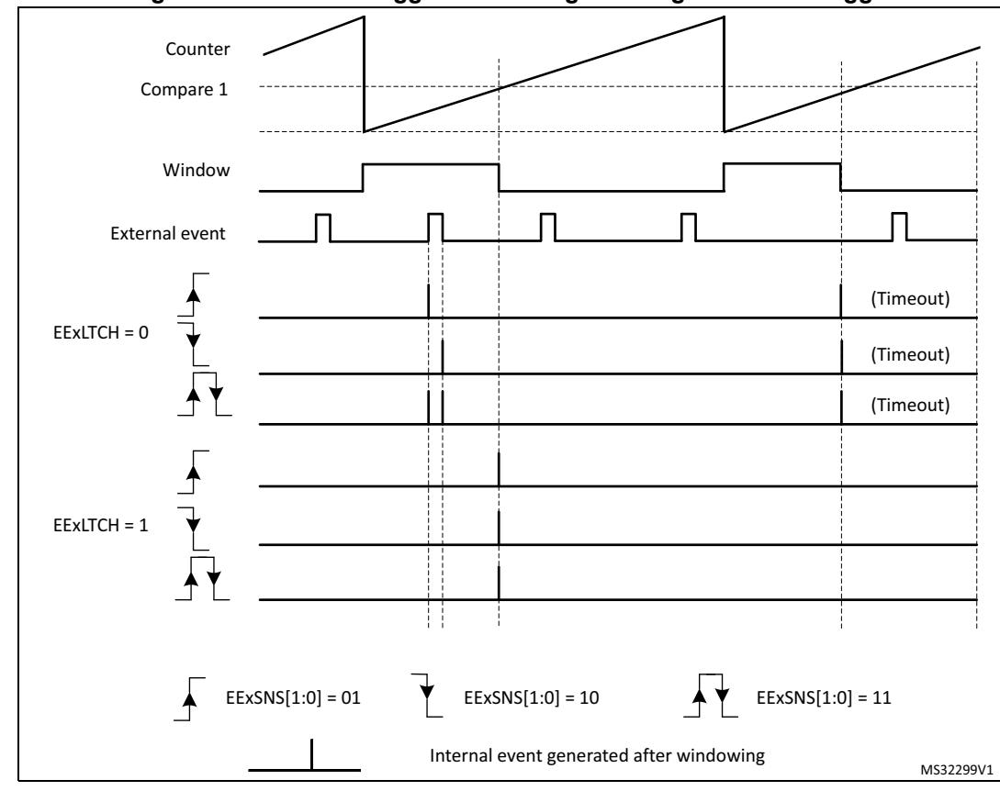

**Figure 351. External trigger windowing with edge-sensitive trigger**


<span id="page-36-1"></span>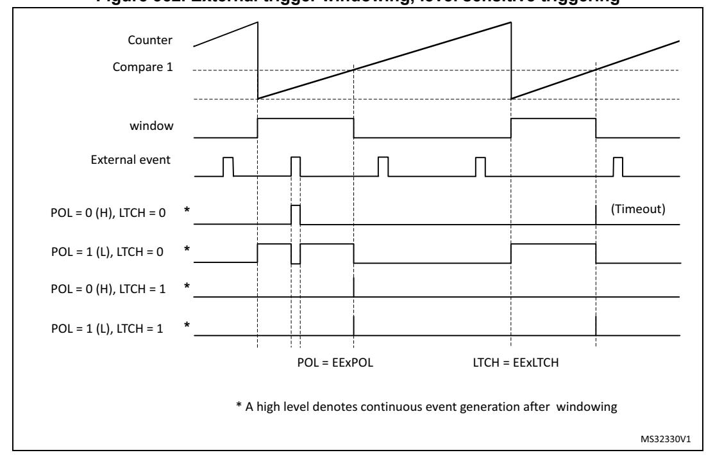

## <span id="page-37-0"></span>**39.3.9 Delayed Protection**

The HRTIM features specific protection schemes, typically for resonant converters when it is necessary to shut down the PWM outputs in a delayed manner, either once the active pulse is completed or once a push-pull period is completed. These features are enabled with DLYPRTEN bit in the HRTIM\_OUTxR register, and are using specific external event channels.

## **Delayed Idle**

In this mode, the active pulse is completed before the protection is activated. The selected external event causes the output to enter in idle mode at the end of the active pulse (defined by an output reset event in HRTIM\_RSTx1R or HRTIM\_RSTx2R).

Once the protection is triggered, the idle mode is permanently maintained but the counter continues to run, until the output is re-enabled. Tx1OEN and Tx2OEN bits are not affected by the delayed idle entry. To exit from delayed idle and resume operation, it is necessary to overwrite Tx1OEN and Tx2OEN bits to 1. The output state will change on the first transition to an active state following the output enable command.

*Note: The delayed idle mode cannot be exited immediately after having been entered, before the active pulse is completed: it is mandatory to make sure that the outputs are in idle state before resuming the run mode. This can be done by waiting up to the next period, for instance, or by polling the O1CPY and/or O2CPY status bits in the TIMxISR register.*

> The delayed idle mode can be applied to a single output (DLYPRT[2:0] = x00 or x01) or to both outputs (DLYPRT[2:0] = x10).

> An interrupt or a DMA request can be generated in response to a Delayed Idle mode entry. The DLYPRT flag in HRTIM\_TIMxISR is set as soon as the external event arrives, independently from the end of the active pulse on output.

> When the Delayed Idle mode is triggered, the output states can be determined using O1STAT and O2STAT in HRTIM\_TIMxISR. Both status bits are updated even if the delayed idle is applied to a single output. When the push-pull mode is enabled, the IPPSTAT flag in HRTIM\_TIMxISR indicates during which period the delayed protection request occurred.

> This mode is available whatever the timer operating mode (regular, push-pull, deadtime). It is available with 2 external events only:

- hrtim\_evt6 and hrtim\_evt7 for Timer A, B and C
- hrtim\_evt8 and hrtim\_evt9 for Timer D and E

The delayed protection mode can be triggered only when the counter is enabled (TxCEN bit set). It remains active even if the TxEN bit is reset, until the TxyOEN bits are set.


RM0399 Rev 4 1539/3556

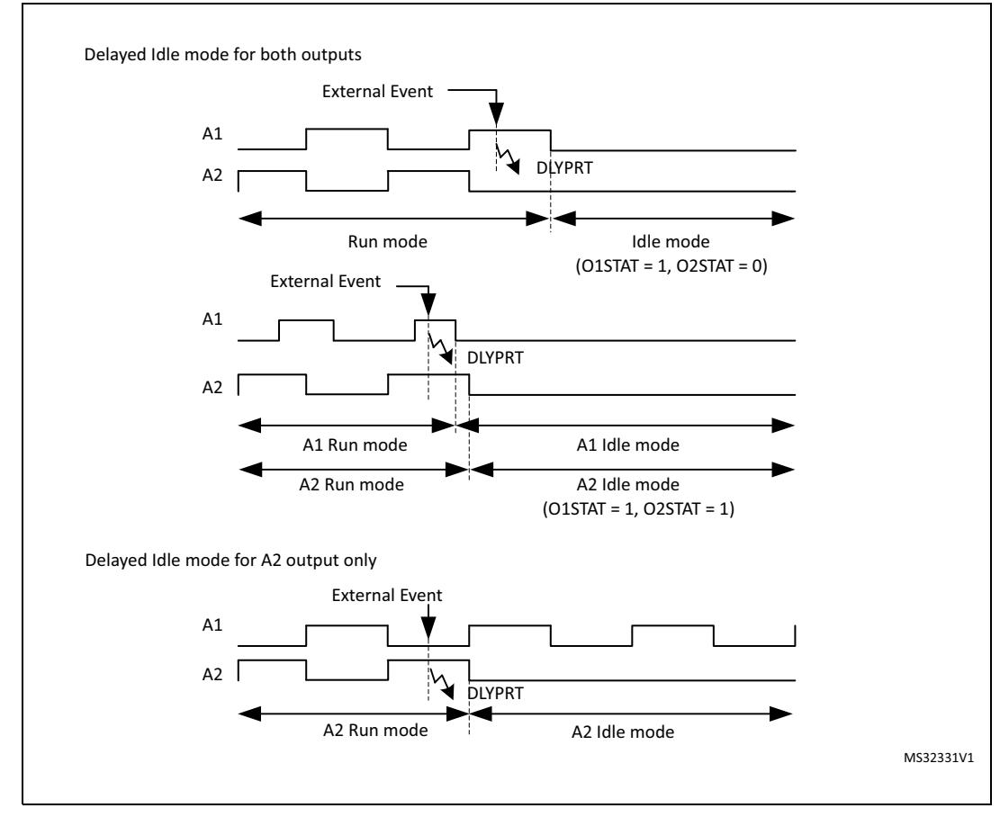

**Figure 353. Delayed Idle mode entry**

The delayed idle mode has a higher priority than the burst mode: any burst mode exit request is discarded once the delayed idle protection has been triggered. On the contrary, If the delayed protection is exited while the burst mode is active, the burst mode will be resumed normally and the output will be maintained in the idle state until the burst mode exits. *[Figure 354](#page-39-0)* gives an overview of these different scenarios.


<span id="page-39-0"></span>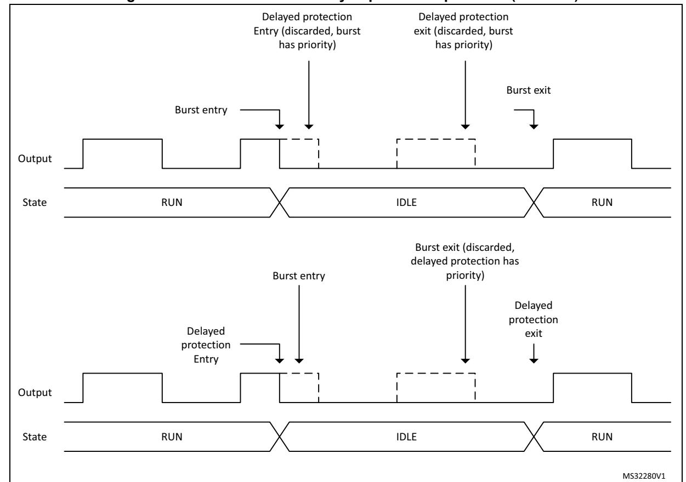

**Figure 354. Burst mode and delayed protection priorities (DIDL = 0)**

The same priorities are applied when the delayed burst mode entry is enabled (DIDL bit set), as shown on *[Figure 355](#page-40-0)* below.

<span id="page-40-0"></span>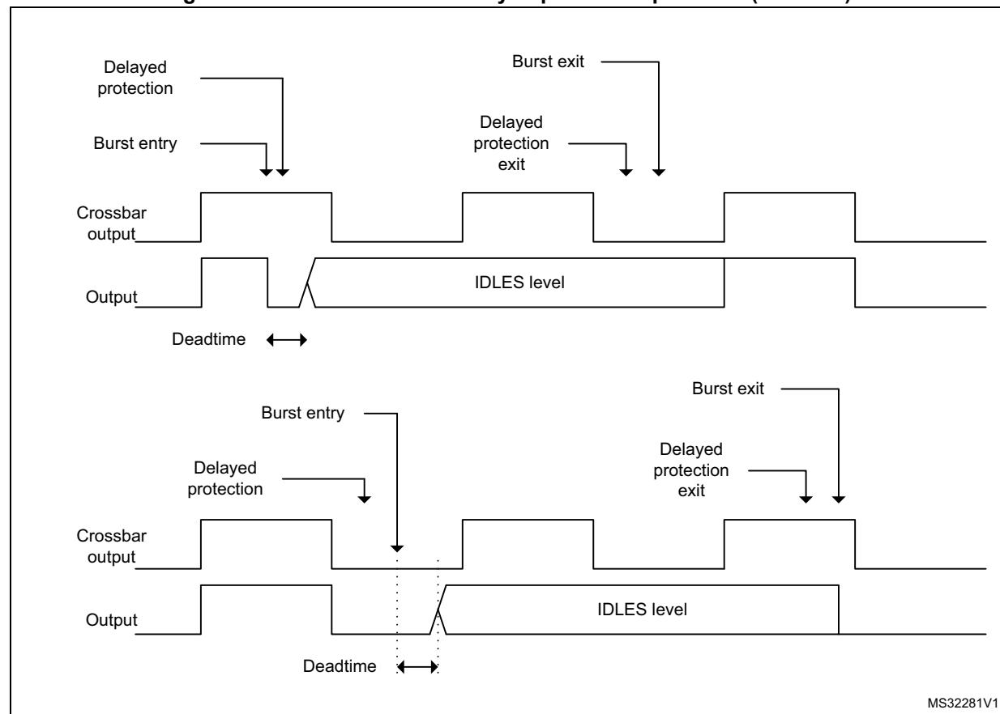

**Figure 355. Burst mode and delayed protection priorities (DIDL = 1)**

## **Balanced Idle**

Only available in push-pull mode, it allows to have balanced pulsewidth on the two outputs when one of the active pulse is shortened due to a protection. The pulsewidth, which was terminated earlier than programmed, is copied on the alternate output and the two outputs are then put in idle state, until the normal operation is resumed by software. This mode is enabled by writing x11 in DLYPRT[2:0] bitfield in HRTIM\_OUTxR.

This mode is available with 2 external events only:

- hrtim\_evt6 and hrtim\_evt7 for Timer A, B and C
- hrtim\_evt8 and hrtim\_evt9 for Timer D and E

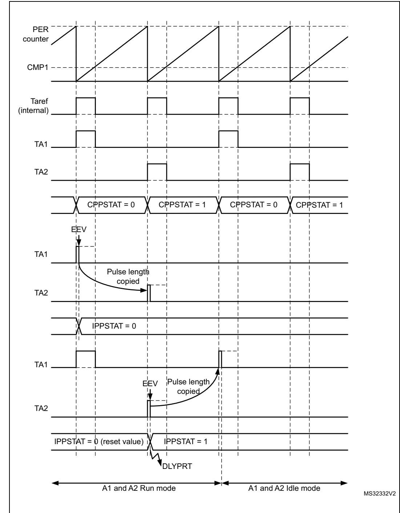

**Figure 356. Balanced Idle protection example**

When the balanced Idle mode is enabled, the selected external event triggers a capture of the counter value into the Compare 4 active register (this value is not user-accessible). The push-pull is maintained for one additional period so that the shorten pulse can be repeated: a new output reset event is generated while the regular output set event is maintained.

The Idle mode is then entered and the output takes the level defined by IDLESx bits in the HRTIM\_OUTxR register. The balanced idle mode entry is indicated by the DLYPRT flag, while the IPPSTAT flag indicates during which period the external event occurred, to determine the sequence of shorten pulses (HRTIM\_CHA1 then HRTIM\_CHA2 or vice versa).

The timer operation is not interrupted (the counter continues to run).

To enable the balanced idle mode, it is necessary to have the following initialization:

- timer operating in continuous mode (CONT = 1)
- Push-pull mode enabled
- HRTIM\_CMP4xR must be set to 0 and the content transferred into the active register (for instance by forcing a software update)
- DELCMP4[1:0] bit field must be set to 00 (auto-delayed mode disabled)
- DLYPRT[2:0] = x11 (delayed protection enable)

*Note: The HRTIM\_CMP4xR register must not be written during a balanced idle operation. The CMP4 event is reserved and cannot be used for another purpose.*

> *In balanced idle mode, it is recommended to avoid multiple external events or softwarebased reset events causing an output reset. If such an event arrives before a balanced idle request within the same period, it will cause the output pulses to be unbalanced (1st pulse length defined by the external event or software reset, while the 2nd pulse is defined by the balanced idle mode entry).*

The minimum pulsewidth that can be handled in balanced idle mode is 4 fHRTIM clock periods.

If the capture occurs before the counter has reached this minimum value, the current pulse is extended up to 4 fHRTIM clock periods before being copied into the secondary output. In any case, the pulsewidths are always balanced.

Tx1OEN and Tx2OEN bits are not affected by the balanced idle entry. To exit from balanced idle and resume the operation, it is necessary to overwrite Tx1OEN and Tx2OEN bits to 1 simultaneously. The output state will change on the first active transition following the output enable.

It is possible to resume operation similarly to the delayed idle entry. For instance, if the external event arrives while output 1 is active (delayed idle effective after output 2 pulse), the re-start sequence can be initiated for output 1 first. To do so, it is necessary to poll CPPSTAT bit in the HRTIM\_TIMxISR register. Using the above example (IPPSTAT flag equal to 0), the operation will be resumed when CPPSTAT bit is 0.

In order to have a specific re-start sequence, it is possible to poll the CPPSTAT to know which output will be active first. This allows, for instance, to re-start with the same sequence as the idle entry sequence: if EEV arrives during output 1 active, the re-start sequence will be initiated when the output 1 is active (CPPSTAT = 0).

*Note: The balanced idle mode must not be disabled while a pulse balancing sequence is ongoing. It is necessary to wait until the CMP4 flag is set, thus indicating that the sequence is completed, to reset the DLYPRTEN bit.*

> The balanced idle protection mode can be triggered only when the counter is enabled (TxCEN bit set). It remains active even if the TxCEN bit is reset, until TxyOEN bits are set.

Balanced idle can be used together with the burst mode under the following conditions:

- TxBM bit must be reset (counter clock maintained during the burst, see *[Section 39.3.13](#page-52-0)*),
- No balanced idle protection must be triggered while the outputs are in a burst idle state.

The balanced idle mode has a higher priority than the burst mode: any burst mode exit request is discarded once the balanced idle protection has been triggered. On the contrary, if the delayed protection is exited while the burst mode is active, the burst mode will be resumed normally.

*Note: Although the output state is frozen in idle mode, a number of events are still generated on the auxiliary outputs (see [Section](#page-65-0) 39.3.16) during the idle period following the delayed protection:*

- *Output set/reset interrupt or DMA requests*
- *External event filtering based on output signal*
- *Capture events triggered by set/reset*

## **39.3.10 Register preload and update management**

Most of HRTIM registers are buffered and can be preloaded if needed. Typically, this allows to prevent the waveforms from being altered by a register update not synchronized with the active events (set/reset).

When the preload mode is enabled, accessed registers are shadow registers. Their content is transferred into the active register after an update request, either software or synchronized with an event.

By default, PREEN bits in HRTIM\_MCR and HRTIM\_TIMxCR registers are reset and the registers are not preloaded: any write directly updates the active registers. If PREEN bit is reset while the timer is running and preload was enabled, the content of the preload registers is directly transferred into the active registers.

Each timing unit and the master timer have their own PREEN bit. If PRREN is set, the preload registers are enabled and transferred to the active register only upon an update event.

There are two options to initialize the timer when the preload feature is needed:

- Enable PREEN bit at the very end of the timer initialization to have the preload registers transferred into the active registers before the timer is enabled (by setting MCEN and TxCEN bits).
- enable PREEN bit at any time during the initialization and force a software update immediately before starting.

*[Table 333](#page-44-0)* lists the registers which can be preloaded, together with a summary of available update events.


RM0399 Rev 4 1545/3556

<span id="page-44-0"></span>**Timer Preloadable registers Preload enable Update sources** Master Timer HRTIM\_DIER HRTIM\_MPER HRTIM\_MREP HRTIM\_MCMP1R HRTIM\_MCMP2R HRTIM\_MCMP3R HRTIM\_MCMP4R PREEN bit in HRTIM\_MCR Software Repetition event Burst DMA event Repetition event following a burst DMA event Timer x x = A..E HRTIM\_TIMxDIER HRTIM\_TIMxPER HRTIM\_TIMxREP HRTIM\_TIMxCMP1R HRTIM\_TIMxCMP1CR HRTIM\_TIMxCMP2R HRTIM\_TIMxCMP3R HRTIM\_TIMxCMP4R HRTIM\_DTxR HRTIM\_SETx1R HRTIM\_RSTx1R HRTIM\_SETx2R HRTIM\_RSTx2R HRTIM\_RSTxR PREEN bit in HRTIM\_TIMxCR Software TIMx Repetition event TIMx Reset Event Burst DMA event Update event from other timers (TIMy, Master) Update event following a burst DMA event Update enable input 1..3 Update event following an update enable input 1..3 HRTIM Common HRTIM\_ADC1R HRTIM\_ADC2R HRTIM\_ADC3R TIMx or Master timer Update, depending on ADxUSRC[2:0] bits in HRTIM\_CR1, if PREEN = 1 in the selected timer

**Table 333. HRTIM preloadable control registers and associated update sources** 

The master timer has 4 update options:

HRTIM\_ADC4R

- 1. Software: writing 1 into MSWU bit in HRTIM\_CR2 forces an immediate update of the registers. In this case, any pending hardware update request is cancelled.
- 2. Update done when the master counter rolls over and the master repetition counter is equal to 0. This is enabled when MREPU bit is set in HRTIM\_MCR.
- 3. Update done once Burst DMA is completed (see *[Section](#page-76-0) 39.3.21* for details). This is enabled when BRSTDMA[1:0] = 01 in HRTIM\_MCR. It is possible to have both MREPU=1 and BRSTDMA=01.
  - *Note: The update can take place immediately after the end of the burst sequence if SWU bit is set (i.e. forced update mode). If SWU bit is reset, the update will be done on the next update event following the end of the burst sequence.*
- 4. Update done when the master counter rolls over following a Burst DMA completion. This is enabled when BRSTDMA[1:0] = 10 in HRTIM\_MCR.

An interrupt or a DMA request can be generated by the master update event.


Each timer (TIMA..E) can also have the update done as follows:

- By software: writing 1 into TxSWU bit in HRTIM\_CR2 forces an immediate update of the registers. In this case, any pending hardware update request is canceled.
- Update done when the counter rolls over and the repetition counter is equal to 0. This is enabled when TxREPU bit is set in HRTIM\_TIMxCR.
- Update done when the counter is reset or rolls over in continuous mode. This is enabled when TxRSTU bit is set in HRTIM\_TIMxCR. This is used for a timer operating in single-shot mode, for instance.
- Update done once a Burst DMA is completed. This is enabled when UPDGAT[3:0] = 0001 in HRTIM\_TIMxCR.
- Update done on the update event following a Burst DMA completion (the event can be enabled with TxREPU, MSTU or TxU). This is enabled when UPDGAT[3:0] = 0010 in HRTIM\_TIMxCR.
- Update done when receiving a request on the update enable input 1..3. This is enabled when UPDGAT[3:0] = 0011, 0100, 0101 in HRTIM\_TIMxCR.
- Update done on the update event following a request on the update enable input 1..3 (the event can be enabled with TxREPU, MSTU or TxU). This is enabled when UPDGAT[3:0] = 0110, 0111, 1000 in HRTIM\_TIMxCR
- Update done synchronously with any other timer or master update (for instance TIMA can be updated simultaneously with TIMB). This is used for converters requiring several timers, and is enabled by setting bits MSTU and TxU in HRTIM\_TIMxCR register.

The update enable inputs 1..3 allow to have an update event synchronized with on-chip events coming from the general-purpose timers. These inputs are rising-edge sensitive.

*[Table 334](#page-45-0)* lists the connections between update enable inputs and the on-chip sources.

<span id="page-45-0"></span>**Update enable input Update source** Update enable input 1 TIM16\_OC Update enable input 2 TIM17\_OC Update enable input 3 TIM6\_TRGO

**Table 334. Update enable inputs and sources** 

This allows to synchronize low frequency update requests with high-frequency signals (for instance an update on the counter roll-over of a 100 kHz PWM that has to be done at a 100 Hz rate).

*Note: The update events are synchronized to the prescaler clock when CKPSC[2:0] > 5.*

An interrupt or a DMA request can be generated by the Timx update event.

MUDIS and TxUDIS bits in the HRTIM\_CR1 register allow to temporarily disable the transfer from preload to active registers, whatever the selected update event. This allows to modify several registers in multiple timers. The regular update event takes place once these bits are reset.

MUDIS and TxUDIS bits are all grouped in the same register. This allows the update of multiple timers (not necessarily synchronized) to be disabled and resumed simultaneously.


RM0399 Rev 4 1547/3556

The following example is a practical use case. A first power converter is controlled with the master, TIMB and TIMC. TIMB and TIMC must be updated simultaneously with the master timer repetition event. A second converter works in parallel with TIMA, TIMD and TIME, and TIMD, TIME must be updated with TIMA repetition event.

#### First converter

In HRTIM\_MCR, MREPU bit is set: the update will occur at the end of the master timer counter repetition period. In HRTIM\_TIMBCR and HRTIM\_TIMCCR, MSTU bits are set to have TIMB and TIMC timers updated simultaneously with the master timer.

When the power converter set-point has to be adjusted by software, MUDIS, TBUDIS and TCUDIS bits of the HRTIM\_CR register must be set prior to write accessing registers to update the values (for instance the compare values). From this time on, any hardware update request is ignored and the preload registers can be accessed without any risk to have them transferred into the active registers. Once the software processing is over, MUDIS, TBUDIS and TCUDIS bits must be reset. The transfer from preload to active registers will be done as soon as the master repetition event occurs.

#### Second converter

In HRTIM\_TIMACR, TAREPU bit is set: the update will occur at the end of the Timer A counter repetition period. In HRTIM\_TIMDCR and HRTIM\_TIMECR, TAU bits are set to have TIMD and TIME timers updated simultaneously with Timer A.

When the power converter set-point has to be adjusted by software, TAUDIS, TDUDIS and TEUDIS bits of the HRTIM\_CR register must be set prior to write accessing the registers to update the values (for instance the compare values). From this time on, any hardware update request is ignored and the preload registers can be accessed without any risk to have them transferred into the active registers. Once the software processing is over, TAUDIS, TDUDIS and TEUDIS bits can be reset: the transfer from preload to active registers will be done as soon as the Timer A repetition event occurs.

## **39.3.11 Events propagation within or across multiple timers**

The HRTIM offers many possibilities for cascading events or sharing them across multiple timing units, including the master timer, to get full benefits from its modular architecture. These are key features for converters requiring multiple synchronized outputs.

This section summarizes the various options and specifies whether and how an event is propagated within the HRTIM.

#### **TIMx update triggered by the Master timer update**

The sources listed in *[Table 335](#page-47-0)* are generating a master timer update. The table indicates if the source event can be used to trigger a simultaneous update in any of TIMx timing units.

Operating condition: MSTU bit is set in HRTIM\_TIMxCR register.

<span id="page-47-0"></span>

| Table 333. Master timer update event propagation                         |                   |             |                                                                                                                  |  |
|--------------------------------------------------------------------------|-------------------|-------------|------------------------------------------------------------------------------------------------------------------|--|
| Source                                                                   | Condition         | Propagation | Comment                                                                                                          |  |
| Burst DMA end                                                            | BRSTDMA[1:0] = 01 | No          | Must be done in TIMxCR (UPDGAT[3:0] = 0001)                                                                      |  |
| Roll-over event following a Burst DMA end                                | BRSTDMA[1:0] = 10 | Yes         | -                                                                                                                |  |
| Repetition event caused by a counter roll-over                           |                   | Yes         | -                                                                                                                |  |
| Repetition event caused by a counter reset (from HRTIM_SCIN or software) | MREPU = 1         | No          | -                                                                                                                |  |
| Software update                                                          | MSWU = 1          | No          | All software update bits (TxSWU) are grouped in the HRTIM_CR2 register and can be used for a simultaneous update |  |

Table 335. Master timer update event propagation

## TIMx update triggered by the TIMy update

The sources listed in *Table 336* are generating a TIMy update. The table indicates if the given event can be used to trigger a simultaneous update in another or multiple TIMx timers.

Operating condition: TyU bit set in HRTIM\_TIMxCR register (source = TIMy and destination = TIMx).

Table 336. TIMx update event propagation

<span id="page-47-1"></span>

| Source                                         | Condition                                   | Propagation | Comment                                                               |
|------------------------------------------------|---------------------------------------------|-------------|-----------------------------------------------------------------------|
| Burst DMA end                                  | UPDGAT[3:0] = 0001                          | No          | Must be done directly in HRTIM_TIMxCR (UPDGAT[3:0] = 0001)            |
| Update caused by the update enable input       | UPDGAT[3:0] = 0011, 0100, 0101              | No          | Must be done directly in HRTIM_TIMxCR (UPDGAT[3:0] = 0011, 0100, 0101 |
| Master update                                  | MSTU = 1 in<br>HRTIM_TIMyCR                 | No          | Must be done with MSTU = 1 in HRTIM_TIMxCR                            |
| Another TIMx update (TIMz>TIMy>TIMx)           | TzU=1 in<br>HRTIM_TIMyCR<br>TyU=1 in TIMxCR | No          | Must be done with TzU=1 in HRTIM_TIMxCR TzU=1 in HRTIM_TIMyCR         |
| Repetition event caused by a counter roll-over | TyREPU = 1                                  | Yes         | -                                                                     |
| Repetition event caused by a counter reset     | TyREPU = 1                                  | -           | Refer to counter reset cases below                                    |
| Counter roll-over                              | TyRSTU = 1                                  | Yes         | -                                                                     |
| Counter software reset                         | TyRST=1 in<br>HRTIM_CR2                     | No          | Can be done simultaneously with update in HRTIM_CR2 register          |
| Counter reset caused by a TIMz compare         | TIMzCMPn in<br>HRTIM_RSTyR                  | No          | Must be done using TIMzCMPn in HRTIM_RSTxR                            |
| Counter reset caused by external events        | EXTEVNTn in HRTIM_RSTyR                     | Yes         | -                                                                     |


RM0399 Rev 4 1549/3556

Table 336. TIMx update event propagation (continued)

| Source                                                      | Condition                              | Propagation | Comment                                                                                                          |
|-------------------------------------------------------------|----------------------------------------|-------------|------------------------------------------------------------------------------------------------------------------|
| Counter reset caused by a master compare or a master period | MSTCMPn or<br>MSTPER in<br>HRTIM_RSTyR | No          | -                                                                                                                |
| Counter reset caused by a TIMy compare                      | CMPn in<br>HRTIM_RSTyR                 | Yes         | -                                                                                                                |
| Counter reset caused by an update                           | UPDT in<br>HRTIM_RSTyR                 | No          | Propagation would result in a lock-up situation (update causing reset causing update)                            |
| Counter reset caused by HRTIM_SCIN                          | SYNCRSTy in HRTIM_TIMyCR               | No          | -                                                                                                                |
| Software update                                             | TySWU = 1                              | No          | All software update bits (TxSWU) are grouped in the HRTIM_CR2 register and can be used for a simultaneous update |

## TIMx Counter reset causing a TIMx update

*Table 337* lists the counter reset sources and indicates whether they can be used to generate an update.

Operating condition: TxRSTU bit in HRTIM\_TIMxCR register.

Table 337. Reset events able to generate an update

<span id="page-48-0"></span>

| Source            | Condition                | Propagation | Comment                                                                                    |
|-------------------|--------------------------|-------------|--------------------------------------------------------------------------------------------|
| Counter roll-over |                          | Yes         |                                                                                            |
| Update event      | UPDT in<br>HRTIM_RSTxR   | No          | Propagation would result in a lock-up situation (update causing a reset causing an update) |
| External Event    | EXTEVNTn in HRTIM_RSTxR  | Yes         | -                                                                                          |
| TIMy compare      | TIMyCMPn in HRTIM_RSTxR  | Yes         | -                                                                                          |
| Master compare    | MSTCMPn in HRTIM_RSTxR   | Yes         | -                                                                                          |
| Master period     | MSTPER in HRTIM_RSTxR    | Yes         | -                                                                                          |
| Compare 2 and 4   | CMPn in<br>HRTIM_RSTxR   | Yes         | -                                                                                          |
| Software          | TxRST=1 in<br>HRTIM_CR2  | Yes         | -                                                                                          |
| HRTIM_SCIN        | SYNCRSTx in HRTIM_TIMxCR | Yes         | -                                                                                          |

## TIMx update causing a TIMx counter reset

*Table 338* lists the update event sources and indicates whether they can be used to generate a counter reset.

Operating condition: UPDT bit set in HRTIM\_RSTxR.

Table 338. Update event propagation for a timer reset

<span id="page-49-0"></span>

| Source                                                                                               | Condition                                                                             | Propagation | Comment                                                                                                          |
|------------------------------------------------------------------------------------------------------|---------------------------------------------------------------------------------------|-------------|------------------------------------------------------------------------------------------------------------------|
| Burst DMA end                                                                                        | UPDGAT[3:0] = 0001                                                                    | Yes         | -                                                                                                                |
| Update caused by the update enable input                                                             | UPDGAT[3:0] = 0011, 0100, 0101                                                        | Yes         | -                                                                                                                |
| Master update caused by a roll-over after a Burst DMA                                                | MSTU = 1 in<br>HRTIM_TIMxCR<br>BRSTDMA[1:0] = 10<br>in HRTIM_MCR                      | Yes         | -                                                                                                                |
| Master update caused by a repetition event following a roll-over                                     | MSTU = 1 in<br>HRTIM TIMxCR                                                           | Yes         | -                                                                                                                |
| Master update caused by a repetition event following a counter reset (software or due to HRTIM_SCIN) | MREPU = 1 in<br>HRTIM_MCR                                                             | No          | -                                                                                                                |
| Software triggered master timer update                                                               | MSTU = 1 in<br>HRTIM_TIMxCR<br>MSWU = 1<br>in HRTIM_CR2                               | No          | All software update bits (TxSWU) are grouped in the HRTIM_CR2 register and can be used for a simultaneous update |
| TIMy update caused by a<br>TIMy counter roll-over                                                    | TyU = 1 in HRTIM_TIMxCR TyRSTU = 1 in HRTIM_TIMyCR                                    | Yes         | -                                                                                                                |
| TIMy update caused by a TIMy repetition event                                                        | TyU = 1 in HRTIM_TIMxCR TyREPU = 1 in HRTIM_TIMyCR                                    | Yes         | -                                                                                                                |
| TIMy update caused by an external event or a TIMy compare (through a TIMy reset)                     | TyU = 1 in HRTIM_TIMxCR TyRSTU = 1 in HRTIM_TIMyCR EXTEVNTn or CMP4/2 in HRTIM_RSTyCR | Yes         | -                                                                                                                |
| TIMy update caused by sources other than those listed above                                          | TyU = 1 in<br>HRTIM_TIMxCR                                                            | No          | -                                                                                                                |


| Source                                     | Condition                     | Propagation | Comment                                                                                   |
|--------------------------------------------|-------------------------------|-------------|-------------------------------------------------------------------------------------------|
| Repetition event following a roll-over     | TxREPU = 1 in                 | Yes         | -                                                                                         |
| Repetition event following a counter reset | HRTIM_TIMxCR                  | No          | -                                                                                         |
| Timer reset                                | TxRSTU = 1 in<br>HRTIM_TIMxCR | No          | Propagation would result in a lock-up situation (reset causing an update causing a reset) |
| Software                                   | TxSWU in<br>HRTIM_CR2         | No          | -                                                                                         |

Table 338. Update event propagation for a timer reset (continued)

## <span id="page-50-1"></span>39.3.12 Output management

Each timing unit controls a pair of outputs. The outputs have three operating states:

- RUN: this is the main operating mode, where the output can take the active or inactive level as programmed in the crossbar unit.
- IDLE: this state is the default operating state after an HRTIM reset, when the outputs are disabled by software or during a burst mode operation (where outputs are temporary disabled during a normal operating mode; refer to Section 39.3.13 for more details). It is either permanently active or inactive.
- FAULT: this is the safety state, entered in case of a shut-down request on FAULTx inputs. It can be permanently active, inactive or Hi-Z.

The output status is indicated by TxyOEN bit in HRTIM\_OENR register and TxyODS bit in HRTIM\_ODSR register, as in *Table 339*.

<span id="page-50-0"></span>

| TxyOEN (control/status)<br>(set by software,<br>cleared by hardware) | TxyODS (status) | Output operating state |
|----------------------------------------------------------------------|-----------------|------------------------|
| 1                                                                    | Х               | RUN                    |
| 0                                                                    | 0               | IDLE                   |
| 0                                                                    | 1               | FAULT                  |

Table 339. Output state programming, x = A..E, y = 1 or 2

TxyOEN bit is both a control and a status bit: it must be set by software to have the output in RUN mode. It is cleared by hardware when the output goes back in IDLE or FAULT mode. When TxyOEN bit is cleared, TxyODS bit indicates whether the output is in the IDLE or FAULT state. A third bit in the HRTIM\_ODISR register allows to disable the output by software.


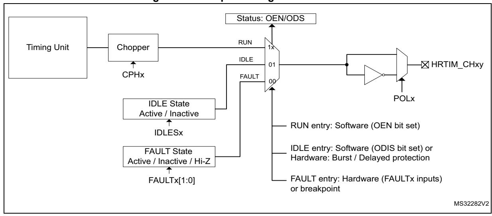

**Figure 357. Output management overview**

*[Figure 358](#page-51-0)* summarizes the bit values for the three states and how the transitions are triggered. Faults can be triggered by any external or internal fault source, as listed in *[Section 39.3.15](#page-62-0)*, while the Idle state can be entered when the burst mode or delayed protections are active.

<span id="page-51-0"></span>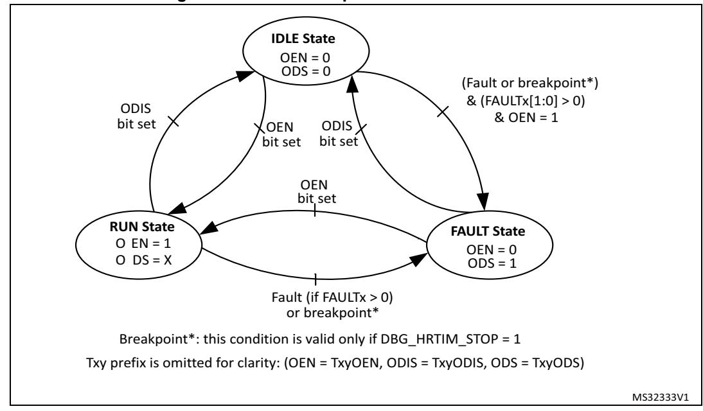

**Figure 358. HRTIM output states and transitions**

The FAULT and IDLE levels are defined as active or inactive. Active (or inactive) refers to the level on the timer output that causes a power switch to be closed (or opened for an inactive state).

The IDLE state has the highest priority: the transition FAULT → IDLE is possible even if the FAULT condition is still valid, triggered by ODIS bit set.

The FAULT state has priority over the RUN state: if TxyOEN bit is set simultaneously with a Fault event, the FAULT state will be entered. The condition is given on the transition IDLE →

FAULT, as in *[Figure 358](#page-51-0)*: fault protection needs to be enabled (FAULTx[1:0] bits = 01, 10, 11) and the Txy OEN bit set with a fault active (or during a breakpoint if DBG\_HRTIM\_STOP = 1).

The output polarity is programmed using POLx bits in HRTIM\_OUTxR. When POLx = 0, the polarity is positive (output active high), while it is active low in case of a negative polarity (POLx = 1). Practically, the polarity is defined depending on the power switch to be driven (PMOS vs. NMOS) or on a gate driver polarity.

The output level in the FAULT state is configured using FAULTx[1:0] bits in HRTIM\_OUTxR, for each output, as follows:

- 00: output never enters the fault state and stays in RUN or IDLE state
- 01: output at active level when in FAULT
- 10: output at inactive level when in FAULT
- 11: output is tri-stated when in FAULT. The safe state must be forced externally with pull-up or pull-down resistors, for instance.

*Note: FAULTx[1:0] bits must not be changed as long as the outputs are in FAULT state.*

The level of the output in IDLE state is configured using IDLESx bit in HRTIM\_OUTxR, as follows:

- 0: output at inactive level when in IDLE
- 1: output at active level when in IDLE

When TxyOEN bit is set to enter the RUN state, the output is immediately connected to the crossbar output. If the timer clock is stopped, the level will either be inactive (after an HRTIM reset) or correspond to the RUN level (when the timer was stopped and the output disabled).

During the HRTIM initialization, the output level can be prepositioned prior to have it in RUN mode, using the software forced output set and reset in the HRTIM\_SETx1R and HRTIM\_RSTx1R registers.

## <span id="page-52-0"></span>**39.3.13 Burst mode controller**

The burst mode controller allows to have the outputs alternatively in IDLE and RUN state, by hardware, so as to skip some switching periods with a programmable periodicity and duty cycle.

Burst mode operation is of common use in power converters when operating under light loads. It can significantly increase the efficiency of the converter by reducing the number of transitions on the outputs and the associated switching losses.

When operating in burst mode, one or a few pulses are outputs followed by an idle period equal to several counting periods, typically, where no output pulses are produced, as shown in the example on *[Figure 359](#page-53-0)*.

<span id="page-53-0"></span>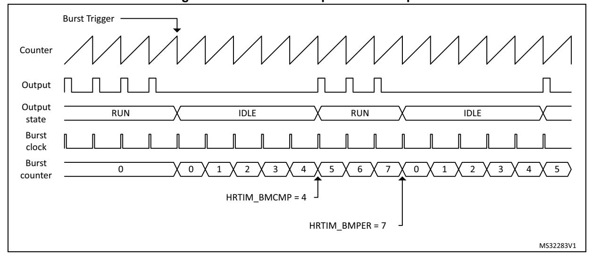

**Figure 359. Burst mode operation example**

The burst mode controller consists of:

- A counter that can be clocked by various sources, either within or outside the HRTIM (typically the end of a PWM period).
- A compare register to define the number of idle periods: HRTIM\_BMCMP.
- A period register to define the burst repetition rate (corresponding to the sum of the idle and run periods): HRTIM\_BMPER.

The burst mode controller is able to take over the control of any of the 10 PWM outputs. The state of each output during a burst mode operation is programmed using IDLESx and IDLEMx bits in the HRTIM\_OUTxR register, as in *[Table 340](#page-53-1)*.

**Table 340. Timer output programming for burst mode** 

<span id="page-53-1"></span>

| IDLEMx | IDLESx | Output state during burst mode                                     |
|--------|--------|--------------------------------------------------------------------|
| 0      | X      | No action: the output is not affected by the burst mode operation. |
| 1      | 0      | Output inactive during the burst                                   |
| 1      | 1      | Output active during the burst                                     |

*Note: IDLEMx bit must not be changed while the burst mode is active.*

The burst mode controller only acts on the output stage. A number of events are still generated during the idle period:

- Output set/reset interrupt or DMA requests
- External event filtering based on Tx2 output signal
- Capture events triggered by output set/reset

During the burst mode, neither start not reset events are generated on the HRTIM\_SCOUT output, even if TxBM bit is set.


## **Operating mode**

It is necessary to have the counter enabled (TxCEN bit set) before using the burst mode on a given timing unit.The burst mode is enabled with BME bit in the HRTIM\_BMCR register.

It can operate in continuous or single-shot mode, using BMOM bit in the HRTIM\_BMCR register. The continuous mode is enabled when BMOM = 1. The Burst operation is maintained until BMSTAT bit in HRTIM\_BMCR is reset to terminate it.

In single-shot mode (BMOM = 0), the idle sequence is executed once, following the burst mode trigger, and the normal timer operation is resumed immediately after.

The duration of the idle and run periods is defined with a burst mode counter and 2 registers. The HRTIM\_BMCMPR register defines the number of counts during which the selected timer(s) are in an idle state (idle period). HRTIM\_BMPER defines the overall burst mode period (sum of the idle and run periods). Once the initial burst mode trigger has occurred, the idle period length is HRTIM\_BMCMPR+1, the overall burst period is HRTIM\_BMPER+1.

*Note: The burst mode period must not be less than or equal to the deadtime duration defined with DTRx[8:0] and DTFx[8:0] bitfields.*

> The counters of the timing units and the master timer can be stopped and reset during the burst mode operation. HRTIM\_BMCR holds 6 control bits for this purpose: MTBM (master) and TABM..TEBM for Timer A..E.

When MTBM or TxBM bit is reset, the counter clock is maintained. This allows to keep a phase relationship with other timers in multiphase systems, for instance.

When MTBM or TxBM bit is set, the corresponding counter is stopped and maintained in reset state during the burst idle period. This allows to have the timer restarting a full period when exiting from idle. If SYNCSRC[1:0] = 00 or 10 (synchronization output on the master start or timer A start), a pulse is sent on the HRTIM\_SCOUT output when exiting the burst mode.

*Note: TxBM bit must not be set when the balanced idle mode is active (DLYPRT[1:0] = 0x11).*

## **Burst mode clock**

The burst mode controller counter can be clocked by several sources, selected with BMCLK[3:0] bits in the HRTIM\_BMCR register:

- BMCLK[3:0] = 0000 to 0101: Master timer and TIMA..E reset/roll-over events. This allows to have burst mode idle and run periods aligned with the timing unit counting period (both in free-running and counter reset mode).
- BMCLK[3:0] = 0110 to 1001: The clocking is provided by the general purpose timers, as in *[Table 341](#page-55-0)*. In this case, the burst mode idle and run periods are not necessarily aligned with timing unit counting period (a pulse on the output may be interrupted, resulting a waveform with modified duty cycle for instance.
- BMCLK[3:0] = 1010: The fHRTIM clock prescaled by a factor defined with BMPRSC[3:0] bits in HRTIM\_BMCR register. In this case, the burst mode idle and run periods are not necessarily aligned with the timing unit counting period (a pulse on the output may be interrupted, resulting in a waveform with a modified duty cycle, for instance.

<span id="page-55-0"></span>

| BMCLK[3:0] | Clock source            |
|------------|-------------------------|
| 0110       | hrtim_bm_ck1: TIM16 OC  |
| 0111       | hrtim_bm_ck2: TIM17 OC  |
| 1000       | hrtim_bm_ck3: TIM7 TRGO |
| 1001       | hrtim_bm_ck4: Reserved  |

Table 341. Burst mode clock sources from general purpose timer

The pulsewidth on TIMxx OC output must be at least N f<sub>HRTIM</sub> clock cycles long to be detected by the HRTIM burst mode controller.

#### <span id="page-55-2"></span>**Burst mode triggers**

To trigger the burst operation, 32 sources are available and are selected using the HRTIM BMTRGR register:

- Software trigger (set by software and reset by hardware)
- 6 Master timer events: repetition, reset/roll-over, Compare 1 to 4
- 5 x 4 events from timers A..E: repetition, reset/roll-over. Compare 1 and 2
- hrtim\_evt7 (including TIMA event filtering) and hrtim\_evt8 (including TIMD event filtering)
- Timer A period following hrtim evt7 (including TIMA event filtering)
- Timer D period following hrtim evt8 (including TIMD event filtering)
- On-chip events coming from other general purpose timer (hrtim\_bm\_trg output:TIM7\_TRGO output)

These sources can be combined to have multiple concurrent triggers.

Burst mode is not re-triggerable. In continuous mode, new triggers are ignored until the burst mode is terminated, while in single-shot mode, the triggers are ignored until the current burst completion including run periods (HRTIM\_BMPER+1 cycles). This is also valid for software trigger (the software bit is reset by hardware even if it is discarded).

*Figure 360* shows how the burst mode is started in response to an external event, either immediately or on the timer period following the event.

<span id="page-55-1"></span>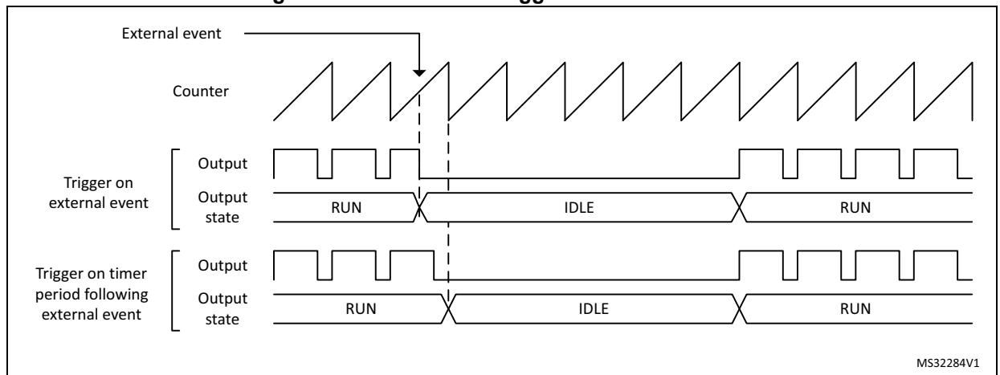

Figure 360. Burst mode trigger on external event

For TAEEV7 and TDEEV8 combined triggers (trigger on a Timer period following an external event), the external event detection is always active, regardless of the burst mode programming and the on-going burst operation:

- When the burst mode is enabled (BME=1) or the trigger is enabled (TAEEV7 or TDEEV8 bit set in the BMTRG register) in between the external event and the timer period event, the burst is triggered.
- The single-shot burst mode is re-triggered even if the external event occurs before the burst end (as long as the corresponding period happens after the burst).

*Note: TAEEV7 and TDEEV8 triggers are valid only after a period event. If the counter is reset before the period event, the pending hrtim\_evt7/8 event is discarded.*

## **Burst mode delayed entry**

By default, the outputs are taking their idle level (as per IDLES1 and IDLES2 setting) immediately after the burst mode trigger.

It is also possible to delay the burst mode entry and force the output to an inactive state during a programmable period before the output takes its idle state. This is useful when driving two complementary outputs, one of them having an active idle state, to avoid a deadtime violation as shown on *[Figure 361](#page-57-0)*. This prevents any risk of shoot through current in half-bridges, but causes a delayed response to the burst mode entry.

<span id="page-57-0"></span>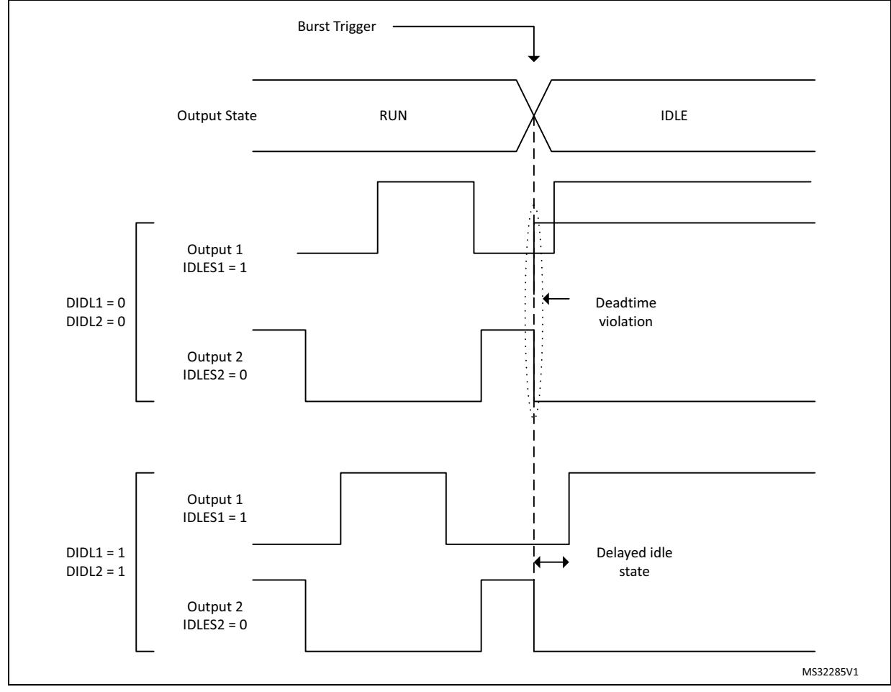

**Figure 361. Delayed burst mode entry with deadtime enabled and IDLESx = 1**

The delayed burst entry mode is enabled with DIDLx bit in the HRTIM\_OUTxR register (one enable bit per output). It forces a deadtime insertion before the output takes its idle state. Each TIMx output has its own deadtime value:

- DTRx[8:0] on output 1 when DIDL1 = 1
- DTFx[8:0] on output 2 when DIDL2 = 1

DIDLx bits can be set only if one of the outputs has an active idle level during the burst mode (IDLES = 1) and only when positive deadtimes are used (SDTR/SDTF set to 0).

*Note: The delayed burst entry mode uses deadtime generator resources. Consequently, when any of the 2 DIDLx bits is set and the corresponding timing unit uses the deadtime insertion (DTEN bit set in HRTIM\_OUTxR), it is not possible to use the timerx output 2 as a filter for external events (Tx2 filtering signal is not available).*

> When durations defined by DTRx[8:0] and DTFx[8:0] are lower than 3 fHRTIM clock cycle periods, the limitations related to the narrow pulse management listed in *[Section 39.3.6](#page-26-1)* must be applied.

When the burst mode entry arrives during the regular deadtime, it is aborted and a new deadtime is re-started corresponding to the inactive period, as on *[Figure 362](#page-58-0)*.

RM0399 Rev 4 1559/3556

<span id="page-58-0"></span>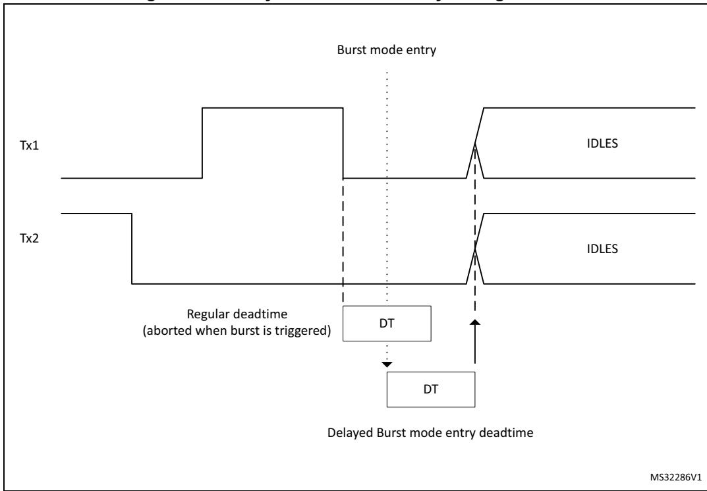

**Figure 362. Delayed Burst mode entry during deadtime**

## **Burst mode exit**

The burst mode exit is either forced by software (in continuous mode) or once the idle period is elapsed (in single-shot mode). In both cases, the counter is re-started immediately (if it was hold in a reset state with MTBM or TxBM bit = 1), but the effective output state transition from the idle to active mode only happens after the programmed set/reset event.

A burst period interrupt is generated in single-shot and continuous modes when BMPERIE enable bit is set in the HRTIM\_IER register. This interrupt can be used to synchronize the burst mode exit with a burst period in continuous burst mode.

*[Figure 363](#page-59-0)* shows how a normal operation is resumed when the deadtime is enabled. Although the burst mode exit is immediate, this is only effective on the first set event on any of the complementary outputs.

Two different cases are presented:

- 1. The burst mode ends while the signal is inactive on the crossbar output waveform. The active state is resumed on Tx1 and Tx2 on the set event for the Tx1 output, and the Tx2 output does not take the complementary level on burst exit.
- 2. The burst mode ends while the crossbar output waveform is active: the activity is resumed on the set event of Tx2 output, and Tx1 does not take the active level immediately on burst exit.

<span id="page-59-0"></span>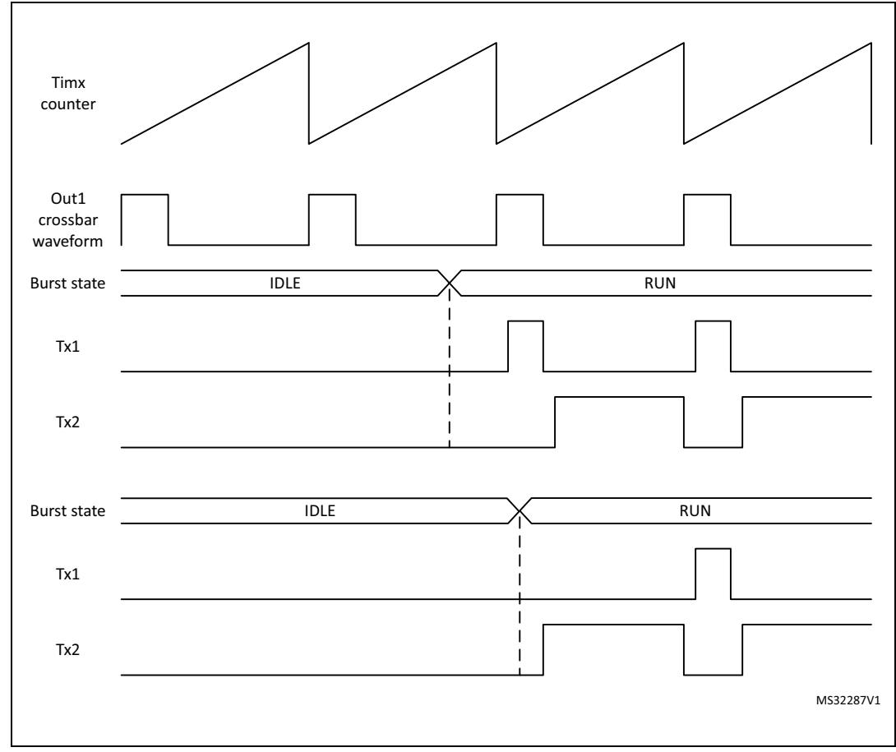

**Figure 363. Burst mode exit when the deadtime generator is enabled**

The behavior described above is slightly different when the push-pull mode is enabled. The push-pull mode forces an output reset at the beginning of the period if the output is inactive, or symmetrically forces an active level if the output was high during the preceding period.

Consequently, an output with an active idle state can be reset at the time the burst mode is exited even if no transition is explicitly programmed. For symmetrical reasons, an output can be set at the time the burst mode is exited even if no transition is explicitly programmed, in case it was active when it entered in idle state.

## **Burst mode registers preloading and update**

BMPREN bit (Burst mode Preload Enable) allows to have the burst mode compare and period registers preloaded (HRTIM\_BMCMP and HRTIM\_BMPER).

When BMPREN is set, the transfer from preload to active register happens:

- when the burst mode is enabled (BME = 1),
- at the end of the burst mode period.

A write into the HRTIM\_BMPER period register disables the update temporarily, until the HRTIM\_BMCMP compare register is written, to ensure the consistency of the two registers when they are modified.

RM0399 Rev 4 1561/3556

If the compare register only needs to be changed, a single write is necessary. If the period only needs to be changed, it is also necessary to re-write the compare to have the new values taken into account.

When BMPREN bits is reset, the write access into BMCMPR and BMPER directly updates the active register. In this case, it is necessary to consider when the update is done during the overall burst period, for the 2 cases below:

a) Compare register update

If the new compare value is above the current burst mode counter value, the new compare is taken into account in the current period.

If the new compare value is below the current burst mode counter value, the new compare is taken into account in the next burst period in continuous mode, and ignored in single-shot mode (no compare match will occur and the idle state will last until the end of the idle period).

b) Period register update

If the new period value is above the current burst mode counter value, the change is taken into account in the current period.

*Note: If the new period value is below the current burst mode counter value, the new period will not be taken into account, the burst mode counter will overflow (at 0xFFFF) and the change will be effective in the next period. In single-shot mode, the counter will roll over at 0xFFFF and the burst mode will re-start for another period up to the new programmed value.*

#### **Burst mode emulation using a compound register**

The burst mode controller only controls one or a set of timers for a single converter. When the burst mode is necessary for multiple independent timers, it is possible to emulate a simple burst mode controller using the DMA and the HRTIM\_CMP1CxR compound register, which holds aliases of both the repetition and the Compare 1 registers.

This is applicable to a converter which only requires a simple PWM (typically a buck converter), where the duty cycle only needs to be updated. In this case, the CMP1 register is used to reset the output (and define the duty cycle), while it is set on the period event.

In this case, a single 32-bit write access in CMP1CxR is sufficient to define the duty cycle (with the CMP1 value) and the number of periods during which this duty cycle is maintained (with the repetition value). To implement a burst mode, it is then only necessary to transfer by DMA (upon repetition event) two 32-bit data in continuous mode, organized as follows:

CMPC1xR = {REP\_Run; CMP1 = Duty\_Cycle}, {REP\_Idle; CMP1 = 0}

For instance, the values:

{0x0003 0000}: CMP1 = 0 for 3 periods

{0x0001 0800}: CMP1 = 0x0800 for 1 period

will provide a burst mode with 2 periods active every 6 PWM periods, as shown on *[Figure](#page-61-0) 364*.

<span id="page-61-0"></span>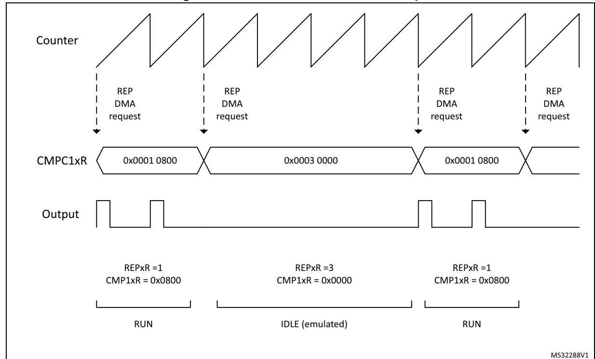

**Figure 364. Burst mode emulation example**

## **39.3.14 Chopper**

A high-frequency carrier can be added on top of the timing unit output signals to drive isolation transformers. This is done in the output stage before the polarity insertion, as shown on *[Figure 365](#page-61-1)*, using CHP1 and CHP2 bits in the HRTIM\_OUTxR register, to enable chopper on outputs 1 and 2, respectively.

<span id="page-61-1"></span>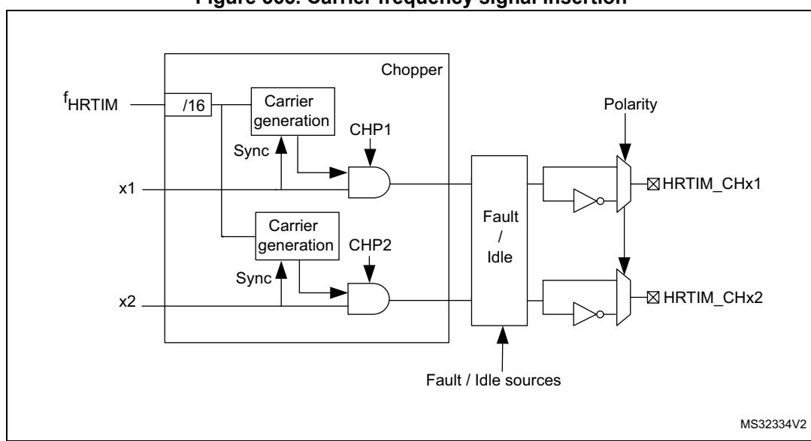

**Figure 365. Carrier frequency signal insertion**

The chopper parameters can be adjusted using the HRIM\_CHPxR register, with the possibility to define a specific pulsewidth at the beginning of the pulse, to be followed by a carrier frequency with programmable frequency and duty cycle, as in *[Figure 366](#page-62-1)*.

CARFRQ[3:0] bits define the frequency, ranging from 156 MHz to 25 MHz (for fHRTIM = 400 MHz) following the formula FCHPFRQ = fHRTIM / (16 x (CARFRQ[3:0]+1)).

The duty cycle can be adjusted by 1/8 step with CARDTY[2:0], from 0/8 up to 7/8 duty cycle. When CARDTY[2:0] = 000 (duty cycle = 0/8), the output waveform only contains the starting pulse following the rising edge of the reference waveform, without any added carrier.

The pulsewidth of the initial pulse is defined using the STRPW[3:0] bitfield as follows: t1STPW = (STRPW[3:0]+1) x 16 x tHRTIM and ranges from 40 ns to 0.63 µs (for fHRTIM=400 MHz).

The carrier frequency parameters are defined based on the fHRTIM frequency, and are not dependent from the CKPSC[2:0] setting.

In chopper mode, the carrier frequency and the initial pulsewidth are combined with the reference waveform using an AND function. A synchronization is performed at the end of the initial pulse to have a repetitive signal shape.

The chopping signal is stopped at the end of the output waveform active state, without waiting for the current carrier period to be completed. It can thus contain shorter pulses than programmed.

<span id="page-62-1"></span>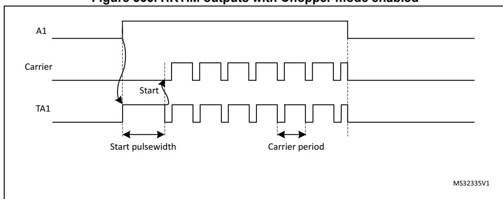

**Figure 366. HRTIM outputs with Chopper mode enabled**

*Note: CHP1 and CHP2 bits must be set prior to the output enable done with TxyOEN bits in the HRTIM\_OENR register.*

> *CARFRQ[2:0], CARDTY[2:0] and STRPW[3:0] bitfields cannot be modified while the chopper mode is active (at least one of the two CHPx bits is set).*

## <span id="page-62-0"></span>**39.3.15 Fault protection**

The HRTIMER has a versatile fault protection circuitry to disable the outputs in case of an abnormal operation. Once a fault has been triggered, the outputs take a predefined safe state. This state is maintained until the output is re-enabled by software. In case of a permanent fault request, the output will remain in its fault state, even if the software attempts to re-enable them, until the fault source disappears.

The HRTIM has 5 FAULT input channels; all of them are available and can be combined for each of the 5 timing units, as shown on *[Figure 367](#page-63-0)*.

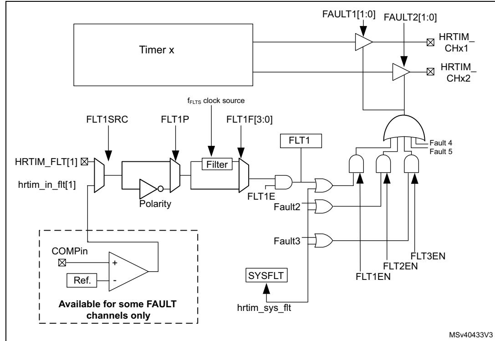

<span id="page-63-0"></span>**Figure 367. Fault protection circuitry (FAULT1 fully represented, FAULT2..5 partially)**

Each fault channel is fully configurable using HRTIM\_FLTINR1 and HRTIM\_FLTINR2 registers before being routed to the timing units. FLTxSRC bit selects the source of the Fault signal, that can be either a digital input or an internal event (built-in comparator output).

*[Table 342](#page-63-1)* summarizes the available sources for each of the 10 faults channels:

<span id="page-63-1"></span>

| Fault channel | External Input (FLTxSRC = 0) | On-chip source (FLTxSRC = 1) |
|---------------|------------------------------|------------------------------|
| FAULT 1       | PA15                         | COMP1                        |
| FAULT 2       | PC11                         | COMP2                        |
| FAULT 3       | PD4                          | NC                           |
| FAULT 4       | PB3                          | NC                           |
| FAULT 5       | PG10                         | NC                           |

**Table 342. Fault inputs** 

The polarity of the signal can be selected to define the active level, using the FLTxP polarity bit in HRTIM\_FLTINRx registers. If FLTxP = 0, the signal is active at low level; if FLTxP = 1, it is active when high.

The fault information can be filtered after the polarity setting. If FLTxF[3:0] bitfield is set to 0000, the signal is not filtered and will act asynchronously, independently from the fHRTIM clock. For all other FLTxF[3:0] bitfield values, the signal is digitally filtered. The digital filter is made of a counter in which a number N of valid samples is needed to validate a transition on the output. If the input value changes before the counter has reached the value N, the counter is reset and the transition is discarded (considered as a spurious event). If the counter reaches N, the transition is considered as valid and transmitted as a correct external


RM0399 Rev 4 1565/3556

event. Consequently, the digital filter adds a latency to the external events being filtered, depending on the sampling clock and on the filter length (number of valid samples expected). Figure 368 shows how a spurious fault signal is filtered.

<span id="page-64-0"></span>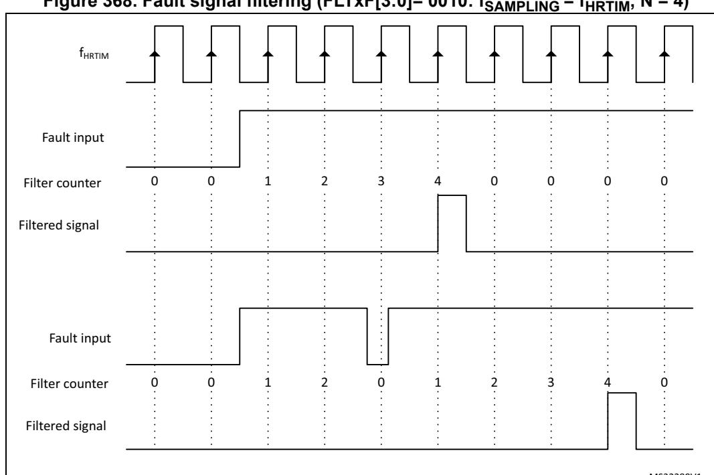

Figure 368. Fault signal filtering (FLTxF[3:0]= 0010:  $f_{SAMPLING} = f_{HRTIM}$ , N = 4)

The filtering period ranges from 2 cycles of the f<sub>HRTIM</sub> clock up to 8 cycles of the f<sub>FLTS</sub> clock divided by 32. f<sub>FLTS</sub> is defined using FLTSD[1:0] bits in the HRTIM\_FLTINR2 register. Table 343 summarizes the sampling rate and the filter length. A jitter of 1 sampling clock period must be subtracted from the filter length to take into account the uncertainty due to the sampling and have the effective filtering.

Table 343. Sampling rate and filter length vs FLTFxF[3:0] and clock setting

<span id="page-64-1"></span>

|                |                       | f <sub>FLTS</sub> vs F | LTSD[1:0]              | Filter length for f <sub>HRTIM</sub> = 400 MHz |                                        |                                          |
|----------------|-----------------------|------------------------|------------------------|------------------------------------------------|----------------------------------------|------------------------------------------|
| FLTFxF[3:0]    | 00                    | 01                     | 10                     | 11                                             | Min                                    | Max                                      |
| 0001,0010,0011 | f <sub>HRTIM</sub>    | f <sub>HRTIM</sub>     | f <sub>HRTIM</sub>     | f <sub>HRTIM</sub>                             | f <sub>HRTIM</sub> , N =2<br>5 ns      | f <sub>HRTIM</sub> , N =8<br>20 ns       |
| 0100, 0101     | f <sub>HRTIM</sub> /2 | f <sub>HRTIM</sub> /4  | f <sub>HRTIM</sub> /8  | f <sub>HRTIM</sub> /16                         | f <sub>HRTIM</sub> /2, N = 6<br>30 ns  | f <sub>HRTIM</sub> /16, N = 8<br>320 ns  |
| 0110, 0111     | f <sub>HRTIM</sub> /4 | f <sub>HRTIM</sub> /8  | f <sub>HRTIM</sub> /16 | f <sub>HRTIM</sub> /32                         | f <sub>HRTIM</sub> /4, N = 6<br>60 ns  | f <sub>HRTIM</sub> /32, N = 8<br>640 ns  |
| 1000, 1001     | f <sub>HRTIM</sub> /8 | f <sub>HRTIM</sub> /16 | f <sub>HRTIM</sub> /32 | f <sub>HRTIM</sub> /64                         | f <sub>HRTIM</sub> /8, N = 6<br>120 ns | f <sub>HRTIM</sub> /64, N = 8<br>1.28 μs |

RM0399 Rev 4 1566/3556


|                  | fFLTS vs FLTSD[1:0] |            |             |             |                             | Filter length for fHRTIM = 400 MHz |
|------------------|---------------------|------------|-------------|-------------|-----------------------------|------------------------------------|
| FLTFxF[3:0]      | 00                  | 01         | 10          | 11          | Min                         | Max                                |
| 1010, 1011, 1100 | fHRTIM /16          | fHRTIM /32 | fHRTIM /64  | fHRTIM /128 | fHRTIM /16, N = 5<br>200 ns | fHRTIM /128, N = 8<br>2.56 µs      |
| 1101, 1110, 1111 | fHRTIM /32          | fHRTIM /64 | fHRTIM /128 | fHRTIM /256 | fHRTIM /32, N = 5<br>400 ns | fHRTIM /256, N = 8<br>5.12 µs      |

**Table 343. Sampling rate and filter length vs FLTFxF[3:0] and clock setting (continued)**

## **System fault input (**hrtim\_sys\_flt**)**

This fault is provided by the MCU Class B circuitry (see the System configuration controller (SYSCFG) section for details) and corresponds to a system fault coming from:

- the Clock Security System
- the SRAM parity checker
- the Cortex®-M7-lockup signal
- the PVD detector

This input overrides the FAULT inputs and disables all outputs having FAULTy[1:0] = 01, 10, 11.

For each FAULT channel, a write-once FLTxLCK bit in the HRTIM\_FLTxR register allows to lock FLTxE, FLTxP, FLTxSRC, FLTxF[3:0] bits (it renders them read-only), for functional safety purpose. If enabled, the fault conditioning set-up is frozen until the next HRTIM or system reset.

Once the fault signal is conditioned as explained above, it is routed to the timing units. For any of them, the 5 fault channels are enabled using bits FLT1EN to FLT5EN in the HRTIM\_FLTxR register, and they can be selected simultaneously (the sysfault is automatically enabled as long as the output is protected by the fault mechanism). This allows to have, for instance:

- One fault channel simultaneously disabling several timing units
- Multiple fault channels being ORed to disable a single timing unit

A write-once FLTLCK bit in the HRTIM\_FLTxR register allows to lock FLTxEN bits (it renders them read-only) until the next reset, for functional safety purpose. If enabled, the timing unit fault-related set-up is frozen until the next HRTIM or system reset.

For each of the timers, the output state during a fault is defined with FAULT1[1:0] and FAULT2[1:0] bits in the HRTIM\_OUTxR register (see *[Section 39.3.12](#page-50-1)*).

## <span id="page-65-0"></span>**39.3.16 Auxiliary outputs**

Timer A to E have auxiliary outputs in parallel with the regular outputs going to the output stage. They provide the following internal status, events and signals:

- SETxy and RSTxy status flags, together with the corresponding interrupts and DMA requests
- Capture triggers upon output set/reset
- External event filters following a Tx2 output copy (see details in *[Section 39.3.8](#page-32-0)*)


RM0399 Rev 4 1567/3556

The auxiliary outputs are taken either before or after the burst mode controller, depending on the HRTIM operating mode. An overview is given on *[Figure 369](#page-66-0)*.

<span id="page-66-0"></span>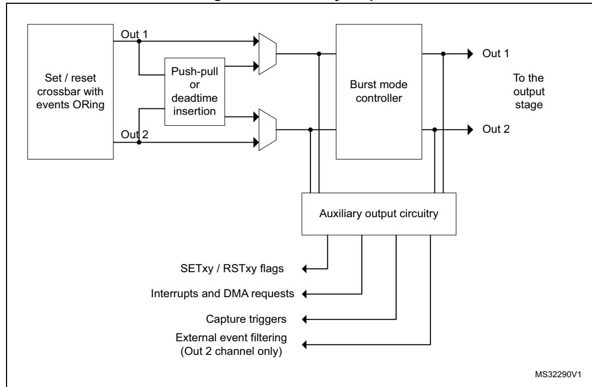

**Figure 369. Auxiliary outputs** 

By default, the auxiliary outputs are copies of outputs Tx1 and Tx2. The exceptions are:

- The delayed idle and the balanced idle protections, when the deadtime is disabled (DTEN = 0). When the protection is triggered, the auxiliary outputs are maintained and follow the signal coming out of the crossbar. On the contrary, if the deadtime is enabled (DTEN = 1), both main and auxiliary outputs are forced to an inactive level.
- The burst mode (TCEN=1, IDLEMx=1); there are 2 cases:
  - a) If DTEN=0 or DIDLx=0, the auxiliary outputs are not affected by the burst mode entry and continue to follow the reference signal coming out of the crossbar (see *[Figure 370](#page-67-0)*).
  - b) If the deadtime is enabled (DTEN=1) together with the delayed burst mode entry (DIDLx=1), the auxiliary outputs have the same behavior as the main outputs. They are forced to the IDLES level after a deadtime duration, then they keep this level during all the burst period. When the burst mode is terminated, the IDLES level is maintained until a transition occurs to the opposite level, similarly to the main output.

<span id="page-67-0"></span>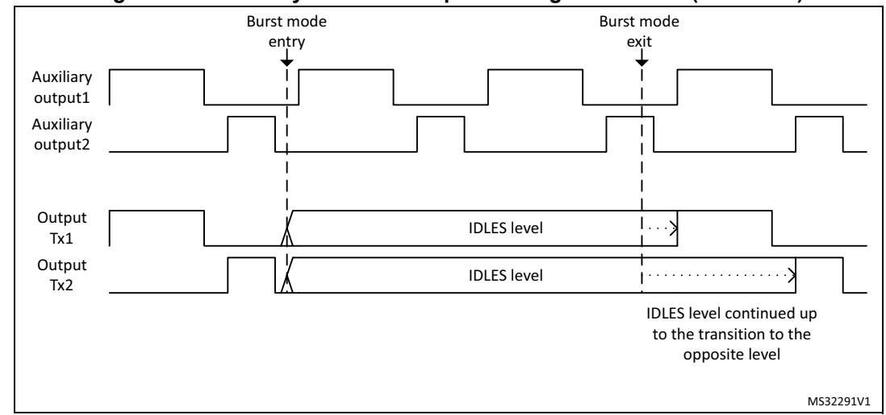

**Figure 370. Auxiliary and main outputs during burst mode (DIDLx = 0)**

The signal on the auxiliary output can be slightly distorted when exiting from the burst mode or when re-enabling the outputs after a delayed protection, if this happens during a deadtime. In this case, the deadtime applied to the auxiliary outputs is extended so that the deadtime on the main outputs is respected. *[Figure 371](#page-67-1)* gives some examples.

<span id="page-67-1"></span>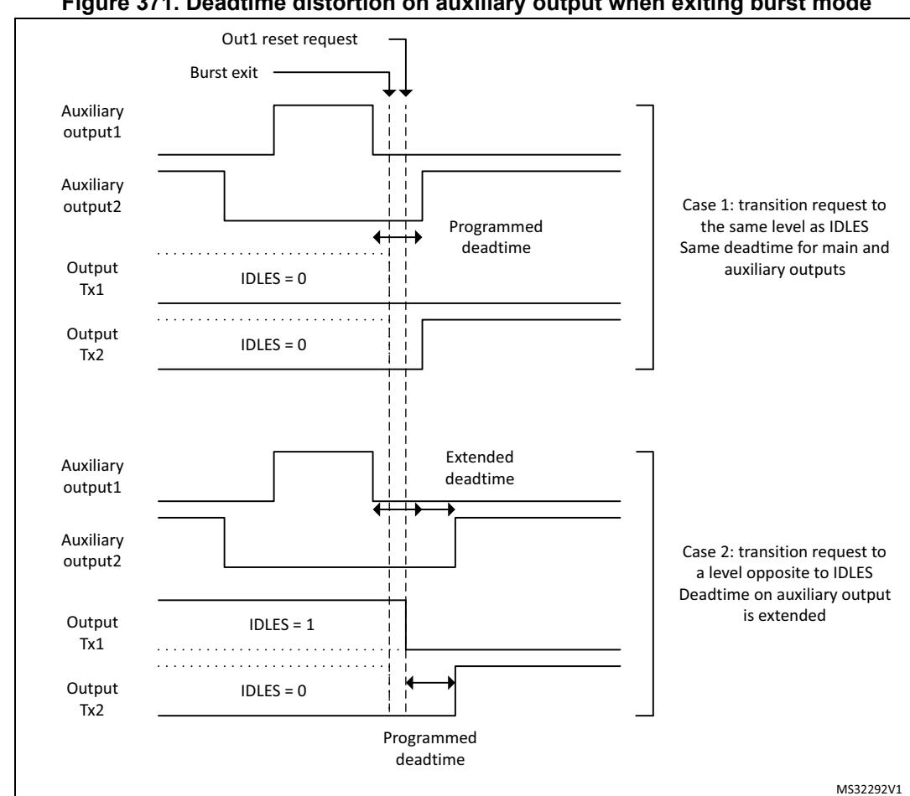

**Figure 371. Deadtime distortion on auxiliary output when exiting burst mode**

## <span id="page-68-0"></span>**39.3.17 Synchronizing the HRTIM with other timers or HRTIM instances**

The HRTIM provides options for synchronizing multiple HRTIM instances, as a master unit (generating a synchronization signal) or as a slave (waiting for a trigger to be synchronized). This feature can also be used to synchronize the HRTIM with other timers, either external or on-chip. The synchronization circuitry is controlled inside the master timer.

## **Synchronization output**

This section explains how the HRTIM must be configured to synchronize external resources and act as a master unit.

Four events can be selected as the source to be sent to the synchronization output. This is done using SYNCSRC[1:0] bits in the HRTIM\_MCR register, as follows:

- 00: Master timer Start This event is generated when MCEN bit is set or when the timer is re-started after having reached the period value in single-shot mode. It is also generated on a reset which occurs during the counting (when CONT or RETRIG bits are set).
- 01: Master timer Compare 1 event
- 10: Timer A start
  - This event is generated when TACEN bit is set or when the counter is reset and restarts counting in response to this reset. The following counter reset events are not propagated to the synchronization output: counter roll-over in continuous mode, and discarded reset request in single-shot non-retriggerable mode. The reset is only taken into account when it occurs during the counting (CONT or RETRIG bits are set).
- 11: Timer A Compare 1 event

SYNCOUT[1:0] bits in the HRTIM\_MCR register specify how the synchronization event is generated.

The synchronization pulses are generated on the HRTIM\_SCOUT output pin, with SYNCOUT[1:0] = 1x. SYNCOUT[0] bit specifies the polarity of the synchronization signal. If SYNCOUT[0] = 0, the HRTIM\_SCOUT pin has a low idle level and issues a positive pulse of 16 fHRTIM clock cycles length for the synchronization). If SYNCOUT[0] = 1, the idle level is high and a negative pulse is generated.

*Note: The synchronization pulse is followed by an idle level of 16* fHRTIM *clock cycles during which any new synchronization request is discarded. Consequently, the maximum synchronization frequency is* fHRTIM*/32.*

> The idle level on the HRTIM\_SCOUT pin is applied as soon as the SYNCOUT[1:0] bits are enabled (i.e. the bitfield value is different from 00).

> The synchronization output initialization procedure must be done prior to the configuration of the MCU outputs and counter enable, in the following order:

- 1. SYNCOUT[1:0] and SYNCSRC[1:0] bitfield configuration in HRTIM\_MCR
- 2. HRTIM\_SCOUT pin configuration (see the General-purpose I/Os section)
- 3. Master or Timer A counter enable (MCEN or TACEN bit set)

When the synchronization input mode is enabled and starts the counter (using SYNCSTRTM/SYNCSTRTx bits) simultaneously with the synchronization output mode (SYNCSRC[1:0] = 00 or 10), the output pulse is generated only when the counter is starting or is reset while running. Any reset request clearing the counter without causing it to start will not affect the synchronization output.


## <span id="page-69-1"></span>**Synchronization input**

The HRTIM can be synchronized by external sources, as per the programming of the SYNCIN[1:0] bits in the HRTIM\_MCR register:

- 00: synchronization input is disabled
- 01: reserved configuration
- 10: the on-chip TIM1 general purpose timer (TIM1 TRGO output)
- 11: a positive pulse on the HRTIM\_SCIN input pin

This bitfield cannot be changed once the destination timer (master timer or timing unit) is enabled (MCEN and/or TxCEN bit set).

The HRTIM\_SCIN input is rising-edge sensitive. The timer behavior is defined with the following bits present in HRTIM\_MCR and HRTIM\_TIMxCR registers (see *[Table 344](#page-69-0)* for details):

- Synchronous start: the incoming signal starts the timer's counter (SYNCSTRTM and/or SYNCSTRTx bits set). TxCEN (MCEN) bits must be set to have the timer enabled and the counter ready to start. In continuous mode, the counter will not start until the synchronization signal is received.
- Synchronous reset: the incoming signal resets the counter (SYNCRSTM and/or SYNCRSTx bits set). This event decrements the repetition counter as any other reset event.

The synchronization events are taken into account only once the related counters are enabled (MCEN or TxCEN bit set). A synchronization request triggers a SYNC interrupt.

*Note: A synchronized start event resets the counter if the current counter value is above the active period value.*

> The effect of the synchronization event depends on the timer operating mode, as summarized in *[Table 344](#page-69-0)*.

**Table 344. Effect of sync event vs timer operating modes** 

<span id="page-69-0"></span>

| Operating mode                   | SYNC<br>RSTx | SYNC<br>STRTx | Behavior following a SYNC reset or start event                                                                                                                                                                                                                                                                                                                                                                                                                                     |
|----------------------------------|--------------|---------------|------------------------------------------------------------------------------------------------------------------------------------------------------------------------------------------------------------------------------------------------------------------------------------------------------------------------------------------------------------------------------------------------------------------------------------------------------------------------------------|
| Single-shot<br>non-retriggerable | 0            | 1             | Start events are taken into account when the counter is stopped and:<br>– once the MCEN or TxCEN bits are set<br>– once the period has been reached.<br>A start occurring when the counter is stopped at the period value resets<br>the counter. A reset request clears the counter but does not start it (the<br>counter can solely be re-started with the synchronization). Any reset<br>occurring during the counting is ignored (as during regular non<br>retriggerable mode). |
|                                  | 1            | X             | Reset events are starting the timer counting. They are taken into account<br>only if the counter is stopped and:<br>– once the MCEN or TxCEN bits are set<br>– once the period has been reached.<br>When multiple reset requests are selected (from HRTIM_SCIN and from<br>internal events), only the first arriving request is taken into account.                                                                                                                                |


**Table 344. Effect of sync event vs timer operating modes (continued)**

| Operating mode               | SYNC<br>RSTx | SYNC<br>STRTx | Behavior following a SYNC reset or start event                                                                                                                                                                                                                                                                                                                                                                                                                                                 |
|------------------------------|--------------|---------------|------------------------------------------------------------------------------------------------------------------------------------------------------------------------------------------------------------------------------------------------------------------------------------------------------------------------------------------------------------------------------------------------------------------------------------------------------------------------------------------------|
| Single-shot<br>retriggerable | 0            | 1             | The counter start is effective only if the counter is not started or period is<br>elapsed. Any synchronization event occurring after counter start has no<br>effect.<br>A start occurring when the counter is stopped at the period value resets<br>the counter. A reset request clears the counter but does not start it (the<br>counter can solely be started by the synchronization). A reset occurring<br>during counting is taken into account (as during regular retriggerable<br>mode). |
|                              | 1            | X             | The reset from HRTIM_SCIN is taken into account as any HRTIM counter<br>reset from internal events and is starting or re-starting the timer counting.<br>When multiple reset requests are selected, the first arriving request is<br>taken into account.                                                                                                                                                                                                                                       |
| Continuous<br>mode           | 0            | 1             | The timer is enabled (MCEN or TxCEN bit set) and is waiting for the<br>synchronization event to start the counter. Any synchronization event<br>occurring after the counter start has no effect (the counter can solely be<br>started by the synchronization). A reset request clears the counter but<br>does not start it.                                                                                                                                                                    |
|                              | 1            | X             | The reset from HRTIM_SCIN is taken into account as any HRTIM counter<br>reset from internal events and is starting or re-starting the timer counting.<br>When multiple reset requests are selected, the first arriving request is<br>taken into account.                                                                                                                                                                                                                                       |

*[Figure 372](#page-71-0)* presents how the synchronized start is done in single-shot mode.


<span id="page-71-0"></span>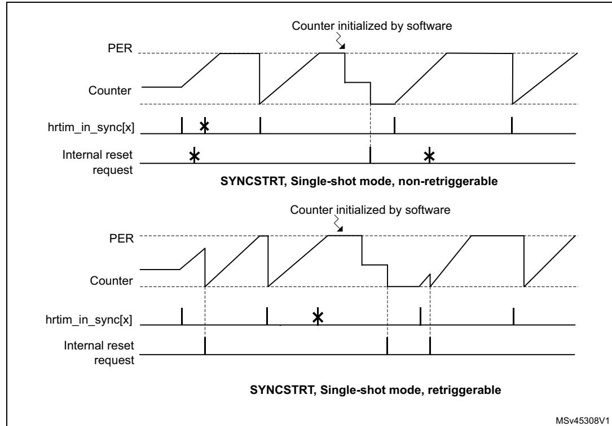

**Figure 372. Counter behavior in synchronized start mode**

## **39.3.18 ADC triggers**

The ADCs can be triggered by the master and the 5 timing units.

4 independent triggers are available to start both the regular and the injected sequencers of the 2 ADCs. Up to 32 events can be combined (ORed) for each trigger output, in registers HRTIM\_ADC1R to HRTIM\_ADC4R, as shown on *[Figure 373](#page-72-0)*. Triggers 1/3 and 2/4 are using the same source set.

The external events can be used as a trigger. They are taken right after the conditioning defined in HRTIM\_EECRx registers, and are not depending on EEFxR1 and EEFxR2 register settings.

Multiple triggering is possible within a single switching period by selecting several sources simultaneously. A typical use case is for a non-overlapping multiphase converter, where all phases can be sampled in a row using a single ADC trigger output.

<span id="page-72-0"></span>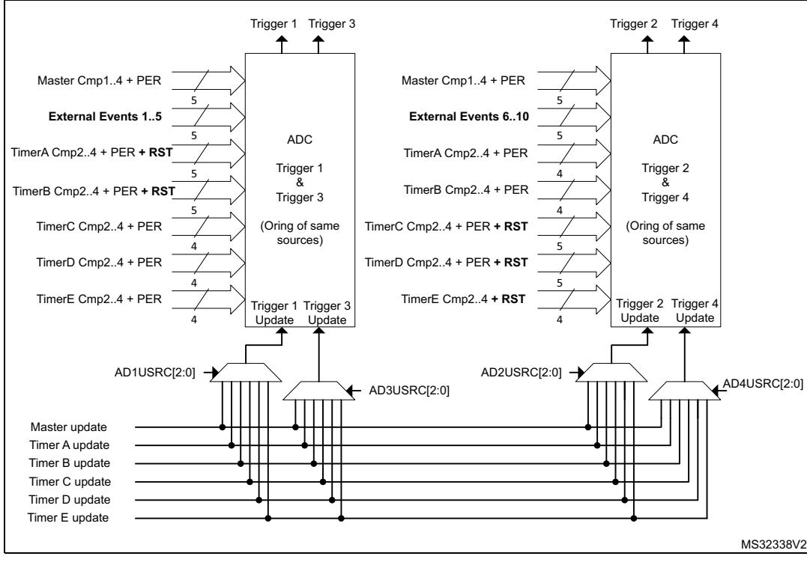

**Figure 373. ADC trigger selection overview** 

HRTIM\_ADC1R to HRTIM\_ADC4R registers are preloaded and can be updated synchronously with the timer they are related to. The update source is defined with ADxUSRC[2:0] bits in the HRTIM\_CR1 register.

For instance, if ADC trigger 1 outputs Timer A CMP2 events (HRTIM\_ADC1R = 0x0000 0400), HRTIM\_ADC1R will be typically updated simultaneously with Timer A (AD1USRC[2:0] = 001).

When the preload is disabled (PREEN bit reset) in the source timer, the HRTIM\_ADCxR registers are not preloaded either: a write access will result in an immediate update of the trigger source.

## <span id="page-72-1"></span>**39.3.19 DAC triggers**

The HRTIMER allows to have the embedded DACs updated synchronously with the timer updates.

The update events from the master timer and the timer units can generate DAC update triggers on any of the 3 hrtim\_dac\_trgx outputs.

*Note: Each timer has its own DAC-related control register.* 

DACSYNC[1:0] bits of the HRTIM\_MCR and HRTIM\_TIMxCR registers are programmed as follows:

- 00: No update generated
- 01: Update generated on hrtim\_dac\_trg1
- 10: Update generated on hrtim\_dac\_trg2
- 11: Update generated on hrtim\_dac\_trg3

An output pulse of 1 fHRTIM clock periods is generated on the hrtim\_dac\_trgx output.


When DACSYNC[1:0] bits are enabled in multiple timers, the hrtim\_dac\_trgx output will consist of an OR of all timers' update events. For instance, if DACSYNC = 1 in timer A and in timer B, the update event in timer A will be ORed with the update event in timer B to generate a DAC update trigger on the corresponding hrtim\_dac\_trgx output, as shown on *[Figure 374](#page-73-0)*.

<span id="page-73-0"></span>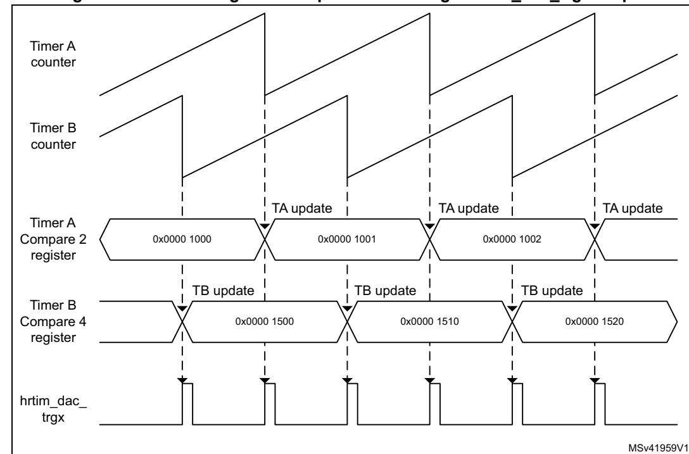

**Figure 374. Combining several updates on a single hrtim\_dac\_trgx output**

hrtim\_dac\_trgx pins are connected to the DACs as follows:

- hrtim\_dac\_trg1: DAC1\_CH1 trigger input 9 (TSEL1[2:0] = 1001 in DAC\_CR of DAC1 peripheral)
- hrtim\_dac\_trg2: DAC1\_CH2 trigger input 10 (TSEL1[2:0] = 1010 in DAC\_CR of DAC1 peripheral)
- hrtim\_dac\_trg3: not connected

## **39.3.20 HRTIM Interrupts**

7 interrupts can be generated by the master timer:

- Master timer registers update
- Synchronization event received
- Master timer repetition event
- Master Compare 1 to 4 event

14 interrupts can be generated by each timing unit:

- Delayed protection triggered
- Counter reset or roll-over event
- Output 1 and output 2 reset (transition active to inactive)
- Output 1 and output 2 set (transition inactive to active)
- Capture 1 and 2 events
- Timing unit registers update
- Repetition event
- Compare 1 to 4 event

8 global interrupts are generated for the whole HRTIM:

- System fault and Fault 1 to 5 (regardless of the timing unit attribution)
- Burst mode period completed

The interrupt requests are grouped in 7 vectors as follows:

- hrtim\_mst\_it: Master timer interrupts (Master Update, Sync Input, Repetition, MCMP1..4) and global interrupt except faults (Burst mode period)
- hrtim\_tima\_it: TIMA interrupts
- hrtim\_timb\_it: TIMB interrupts
- hrtim\_timc\_it: TIMC interrupts
- hrtim\_timd\_it: TIMD interrupts
- hrtim\_time\_it: TIME interrupts
- hrtim\_fault\_it: Dedicated vector all fault interrupts to allow high-priority interrupt handling

*[Table 345](#page-75-0)* is a summary of the interrupt requests, their mapping and associated control, and status bits.

Table 345. HRTIM interrupt summary

<span id="page-75-0"></span>

| Interrupt<br>vector            | Interrupt event                         | Event flag | Enable control<br>bit | Flag clearing<br>bit |  |
|--------------------------------|-----------------------------------------|------------|-----------------------|----------------------|--|
|                                | Burst mode period completed             | BMPER      | BMPERIE               | BMPERC               |  |
|                                | Master timer registers update           | MUPD       | MUPDIE                | MUPDC                |  |
|                                | Synchronization event received          | SYNC       | SYNCIE                | SYNCC                |  |
|                                | Master timer repetition event           | MREP       | MREPIE                | MREPC                |  |
| hrtim_mst_it                   |                                         | MCMP1      | MCMP1IE               | MCP1C                |  |
|                                | Master Compare 1 to 4 event             | MCMP2      | MCMP2IE               | MCP2C                |  |
|                                | iviaster Compare 1 to 4 event           | MCMP3      | MCMP3IE               | MCP3C                |  |
|                                |                                         | MCMP4      | MCMP4IE               | MCP4C                |  |
|                                | Delayed protection triggered            | DLYPRT     | DLYPRTIE              | DLYPRTC              |  |
|                                | Counter reset or roll-over event        | RST        | RSTIE                 | RSTC                 |  |
|                                | Output 1 and output 2 reset (transition | RSTx1      | RSTx1IE               | RSTx1C               |  |
|                                | active to inactive)                     | RSTx2      | RSTx2IE               | RSTx2C               |  |
|                                | Output 1 and output 2 set (transition   | SETx1      | SETx1IE               | SETx1C               |  |
| hrtim_tima_it                  | inactive to active)                     | SETx2      | SETx2 SETx2IE         |                      |  |
| hrtim_timb_it                  | Continue 1 and 2 quanta                 | CPT1       | CPT1IE                | CPT1C                |  |
| hrtim_timc_it<br>hrtim_timd_it | Capture 1 and 2 events                  | CPT2       | CPT2IE                | CPT2C                |  |
| hrtim_time_it                  | Timing unit registers update            | UPD        | UPDIE                 | UPDC                 |  |
|                                | Repetition event                        | REP        | REPIE                 | REPC                 |  |
|                                |                                         | CMP1       | CMP1IE                | CMP1C                |  |
|                                | Compare 1 to 4 event                    | CMP2       | CMP2IE                | CMP2C                |  |
|                                | Compare 1 to 4 event                    | CMP3       | CMP3IE                | CMP3C                |  |
|                                |                                         | CMP4       | CMP4IE                | CMP4C                |  |
|                                | System fault                            | SYSFLT     | SYSFLTIE              | SYSFLTC              |  |
|                                |                                         | FLT1       | FLT1IE                | FLT1C                |  |
| bring facile is                |                                         | FLT2       | FLT2IE                | FLT2C                |  |
| hrtim_fault_it                 | Fault 1 to 5                            | FLT3       | FLT3IE                | FLT3C                |  |
|                                |                                         | FLT4       | FLT4IE                | FLT4C                |  |
|                                |                                         | FLT5       | FLT5IE                | FLT5C                |  |


## <span id="page-76-0"></span>**39.3.21 DMA**

Most of the events able to generate an interrupt can also generate a DMA request, even both simultaneously. Each timer (master, TIMA...E) has its own DMA enable register.

The individual DMA requests are ORed into 6 channels as follows:

- 1 channel for the master timer
- 1 channel per timing unit

*Note: Before disabling a DMA channel (DMA enable bit reset in TIMxDIER), it is necessary to disable first the DMA controller.*

*[Table 346](#page-76-1)* is a summary of the events with their associated DMA enable bits.

**Table 346. HRTIM DMA request summary** 

<span id="page-76-1"></span>

| DMA Channel                                  | Event                                   | DMA<br>capable | DMA enable<br>bit |  |
|----------------------------------------------|-----------------------------------------|----------------|-------------------|--|
|                                              | Burst mode period completed             | No             | N/A               |  |
|                                              | Master timer registers update           | Yes            | MUPDDE            |  |
|                                              | Synchronization event received          | Yes            | SYNCDE            |  |
|                                              | Master timer repetition event           | Yes            | MREPDE            |  |
| hrtim_dma1<br>(Master timer)                 |                                         | Yes            | MCMP1DE           |  |
|                                              |                                         | Yes            | MCMP2DE           |  |
|                                              | Master Compare 1 to 4 event             | Yes            | MCMP3DE           |  |
|                                              |                                         | Yes            | MCMP4DE           |  |
|                                              | Delayed protection triggered            | Yes            | DLYPRTDE          |  |
|                                              | Counter reset or roll-over event        | Yes            | RSTDE             |  |
|                                              | Output 1 and output 2 reset (transition | Yes            | RSTx1DE           |  |
|                                              | active to inactive)                     | Yes            | RSTx2DE           |  |
|                                              | Output 1 and output 2 set (transition   | Yes            | SETx1DE           |  |
| hrtim_dma2 (Timer A)                         | inactive to active)                     | Yes            | SETx2DE           |  |
| hrtim_dma3 (Timer B)                         |                                         | Yes            | CPT1DE            |  |
| hrtim_dma4 (Timer C)<br>hrtim_dma5 (Timer D) | Capture 1 and 2 events                  | Yes            | CPT2DE            |  |
| hrtim_dma6 (Timer E)                         | Timing unit registers update            | Yes            | UPDDE             |  |
|                                              | Repetition event                        | Yes            | REPDE             |  |
|                                              |                                         | Yes            | CMP1DE            |  |
|                                              |                                         | Yes            | CMP2DE            |  |
|                                              | Compare 1 to 4 event                    | Yes            | CMP3DE            |  |
|                                              |                                         | Yes            | CMP4DE            |  |
|                                              | System fault                            | No             | N/A               |  |
|                                              | Fault 1 to 5                            | No             | N/A               |  |
| N/A                                          | Burst mode period completed             | No             | N/A               |  |


## **Burst DMA transfers**

In addition to the standard DMA requests, the HRTIM features a DMA burst controller to have multiple registers updated with a single DMA request. This allows to:

- update multiple data registers with one DMA channel only,
- reprogram dynamically one or several timing units, for converters using multiple timer outputs.

The burst DMA feature is only available for one DMA channel, but any of the 6 channels can be selected for burst DMA transfers.

The principle is to program which registers are to be written by DMA. The master timer and TIMA..E have the burst DMA update register, where most of their control and data registers are associated with a selection bit: HRTIM\_BDMUPR, HRTIM\_BDTAUPR to HRTIM\_BDTEUPR (this is applicable only for registers with write accesses). A redirection mechanism allows to forward the DMA write accesses to the HRTIM registers automatically, as shown on *[Figure 375](#page-77-0)*.

<span id="page-77-0"></span>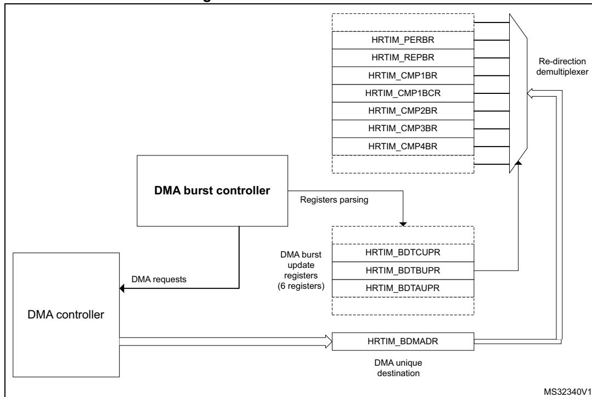

**Figure 375. DMA burst overview**

When the DMA trigger occurs, the HRTIM generates multiple 32-bit DMA requests and parses the update register. If the control bit is set, the write access is redirected to the associated register. If the bit is reset, the register update is skipped and the register parsing is resumed until a new bit set is detected, to trigger a new request. Once the 6 update registers (HRTIM\_BDMUPR, 5x HRTIM\_BDTxUPR) are parsed, the burst is completed and the system is ready for another DMA trigger (see the flowchart on *[Figure 376](#page-78-0)*).

*Note: Any trigger occurring while the burst is on-going is discarded, except if it occurs during the very last data transfer.*

> The burst DMA mode is permanently enabled (there is no enable bit). A burst DMA operation is started by the first write access into the HRTIM\_BDMADR register.

RM0399 Rev 4 1579/3556

It is only necessary to have the DMA controller pointing to the HRTIM\_BDMADR register as the destination, in the memory, to the peripheral configuration with the peripheral increment mode disabled (the HRTIM handles internally the data re-routing to the final destination register).

To re-initialize the burst DMA mode if it was interrupted during a transaction, it is necessary to write at least to one of the 6 update registers.

<span id="page-78-0"></span>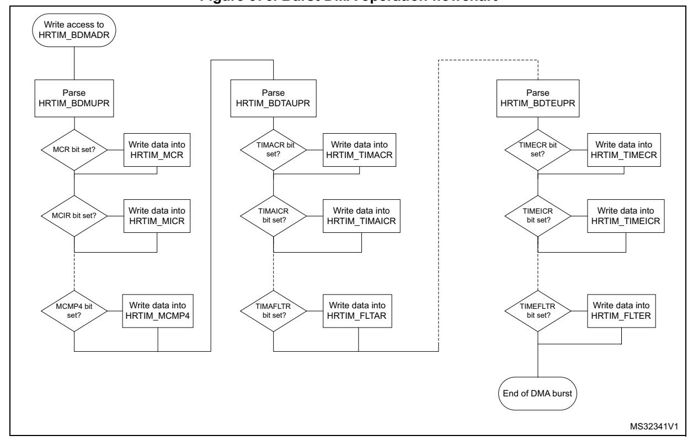

**Figure 376. Burst DMA operation flowchart**

Several options are available once the DMA burst is completed, depending on the register update strategy.

If the PREEN bit is reset (preload disabled), the value written by the DMA is immediately transferred into the active register and the registers are updated sequentially, following the DMA transaction pace.

When the preload is enabled (PREEN bit set), there are 3 use cases:

- 1. The update is done independently from DMA burst transfers (UPDGAT[3:0] = 0000 in HRTIM\_TIMxCR and BRSTDMA[1:0] = 00 in HRTIM\_MCR). In this case, and if it is necessary to have all transferred data taken into account simultaneously, the user must check that the DMA burst is completed before the update event takes place. On the contrary, if the update event happens while the DMA transfer is on-going, only part of the registers will be loaded and the complete register update will require 2 consecutive update events.
- 2. The update is done when the DMA burst transfer is completed (UPDGAT[3:0] = 0000 in HRTIM\_TIMxCR and BRSTDMA[1:0] = 01 in HRTIM\_MCR). This mode guarantees that all new register values are transferred simultaneously. This is done independently


- from the counter value and can be combined with regular update events, if necessary (for instance, an update on a counter reset when TxRSTU is set).
- 3. The update is done on the update event following the DMA burst transfer completion (UPDGAT[3:0] = 0010 in HRTIM\_TIMxCR and BRSTDMA[1:0] = 10 in HRTIM\_MCR). This mode guarantees both a coherent update of all transferred data and the synchronization with regular update events, with the timer counter. In this case, if a regular update request occurs while the transfer is on-going, it will be discarded and the effective update will happen on the next coming update request.

The chronogram on *[Figure 377](#page-79-0)* presents the active register content for 3 cases: PREEN=0, UPDGAT[3:0] = 0001 and UPDGAT[3:0] = 0001 (when PREEN = 1).

<span id="page-79-0"></span>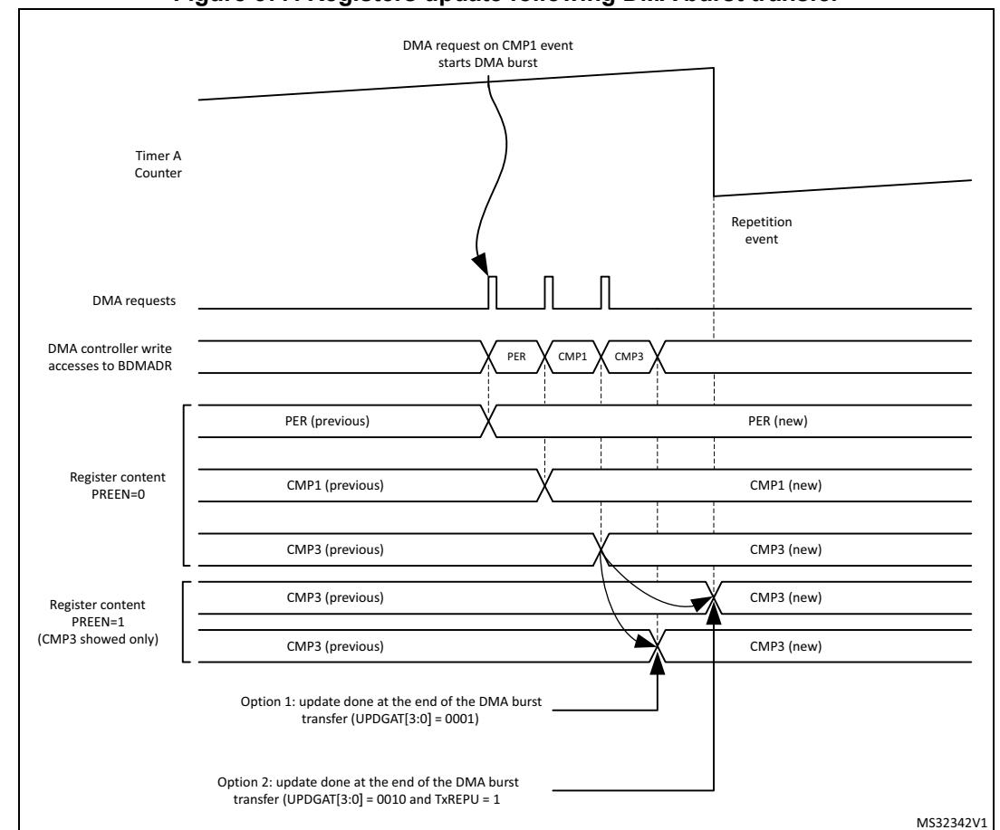

**Figure 377. Registers update following DMA burst transfer**

## **39.3.22 HRTIM initialization**

This section describes the recommended HRTIM initialization procedure, including other related MCU peripherals.

The HRTIM clock source must be enabled in the Reset and Clock control unit (RCC).

The HRTIM control registers can be initialized as per the power converter topology and the timing units use case. All inputs have to be configured (source, polarity, edge-sensitivity).


The HRTIM outputs must be set up eventually, with the following sequence:

- the polarity must be defined using POLx bits in HRTIM\_OUTxR
- the FAULT and IDLE states must be configured using FAULTx[1:0] and IDLESx bits in HRTIM\_OUTxR

The HRTIM outputs are ready to be connected to the MCU I/Os. In the GPIO controller, the selected HRTIM I/Os have to be configured as per the alternate function mapping table in the product datasheet.

From this point on, the HRTIM controls the outputs, which are in the IDLE state.

The outputs are configured in RUN mode by setting TxyOEN bits in the HRTIM\_OENR register. The 2 outputs are in the inactive state until the first valid set/reset event in RUN mode. Any output set/reset event (except software requests using SST, SRT) are ignored as long as TxCEN bit is reset, as well as burst mode requests (IDLEM bit value is ignored). Similarly, any counter reset request coming from the burst mode controller is ignored (if TxBM bit is set).

*Note: When the deadtime insertion is enabled (DTEN bit set), it is necessary to force the output state by software, using SST and RST bits, to have the outputs in a complementary state as soon as the RUN mode is entered.*

> The HRTIM operation can eventually be started by setting TxCEN or MCEN bits in HRTIM\_MCR.

If the HRTIM peripheral is reset with the Reset and Clock Controller, the HRTIM outputs are put in IDLE mode with a low level. It is recommended to first disconnect the HRTIMER from the outputs (using the GPIO controller) before performing a peripheral reset.

## **39.3.23 Debug**

When a microcontroller enters the debug mode (Cortex®-M7 core halted), the TIMx counter either continues to work normally or stops, depending on DBG\_HRTIM\_STOP configuration bit in DBG module:

- DBG\_HRTIM\_STOP = 0: no behavior change, the HRTIM continues to operate.
- DBG\_HRTIM\_STOP = 1: all HRTIM timers, including the master, are stopped. The outputs in RUN mode enter the FAULT state if FAULTx[1:0] = 01,10,11, or keep their current state if FAULTx[1:0] = 00. The outputs in idle state are maintained in this state. This is permanently maintained even if the MCU exits the halt mode. This allows to maintain a safe state during the execution stepping. The outputs can be enabled again by settings TxyOEN bit (requires the use of the debugger).

## **Timer behavior during MCU halt when DBG\_HRTIM\_STOP = 1**

The set/reset crossbar, the dead-time and push-pull unit, the idle/balanced fault detection and all the logic driving the normal output in RUN mode are not affected by debug. The output will keep on toggling internally, so as to retrieve regular signals of the outputs when TxyOEN will be set again (during or after the MCU halt). Associated triggers and filters are also following internal waveforms when the outputs are disabled.

FAULT inputs and events (any source) are enabled during the MCU halt.

Fault status bits can be set and TxyOEN bits reset during the MCU halt if a fault occurs at that time (TxyOEN and TxyODS are not affected by DBG\_HRTIM\_STOP bit state).

Synchronization, counter reset, start and reset-start events are discarded in debug mode, as well as capture events. This is to keep all related registers stable as long as the MCU is halted.

The counter stops counting when a breakpoint is reached. However, the counter enable signal is not reset; consequently no start event will be emitted when exiting from debug. All counter reset and capture triggers are disabled, as well as external events (ignored as long as the MCU is halted). The outputs SET and RST flags are frozen, except in case of forced software set/reset. A level-sensitive event is masked during the debug but will be active again as soon as the debug will be exited. For edge-sensitive events, if the signal is maintained active during the MCU halt, a new edge is not generated when exiting from debug.

The update events are discarded. This prevents any update trigger on hrtim\_upd\_en[3:1] inputs. DMA triggers are disabled. The burst mode circuit is frozen: the triggers are ignored and the burst mode counter stopped.

## **39.4 Application use cases**

## **39.4.1 Buck converter**

Buck converters are of common use as step-down converters. The HRTIM can control up to 10 buck converters with 6 independent switching frequencies.

The converter usually operates at a fixed frequency and the Vin/Vout ratio depends on the duty cycle D applied to the power switch:.

$$V_{out} = D \times V_{in}$$

The topology is given on *[Figure 378](#page-81-0)* with the connection to the ADC for voltage reading.

<span id="page-81-0"></span>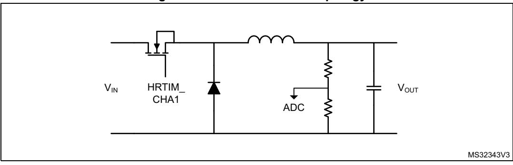

**Figure 378. Buck converter topology**

*[Figure 379](#page-82-0)* presents the management of two converters with identical frequency PWM signals. The outputs are defined as follows:

- HRTIM\_CHA1 set on period, reset on CMP1
- HRTIM\_CHA2 set on CMP3, reset on PER

The ADC is triggered twice per period, precisely in the middle of the ON time, using CMP2 and CMP4 events.

<span id="page-82-0"></span>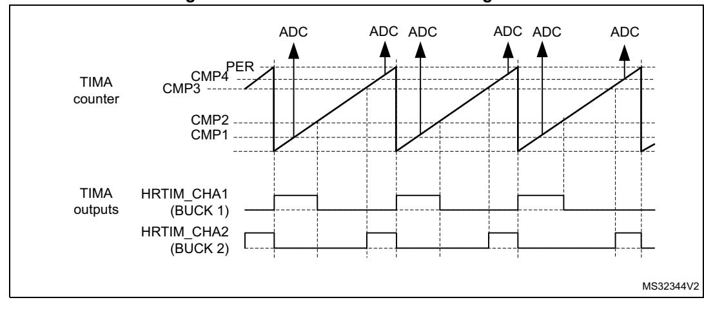

Figure 379. Dual Buck converter management

Timers A..E provide either 10 buck converters coupled by pairs (both with identical switching frequencies) or 6 completely independent converters (each of them having a different switching frequency), using the master timer as the 6<sup>th</sup> time base.

## 39.4.2 Buck converter with synchronous rectification

Synchronous rectification allows to minimize losses in buck converters, by means of a FET replacing the freewheeling diode. Synchronous rectification can be turned on or off on the fly depending on the output current level, as shown on *Figure 380*.

<span id="page-82-1"></span>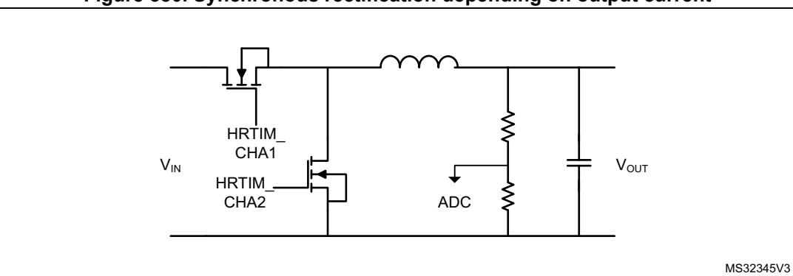

Figure 380. Synchronous rectification depending on output current

The main difference vs. a single-switch buck converter is the addition of a deadtime for an almost complementary waveform generation on HRTIM\_CHA2, based on the reference waveform on HRTIM\_CHA1 (see *Figure 381*).

<span id="page-83-0"></span>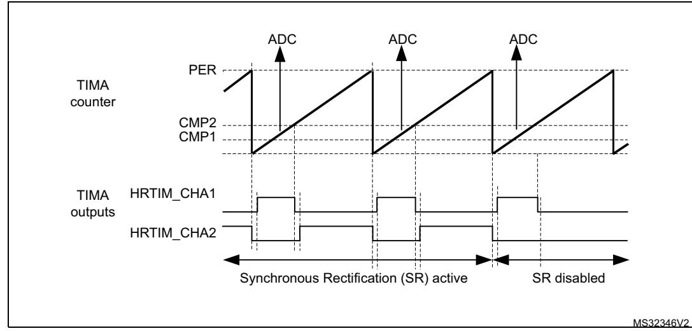

**Figure 381. Buck with synchronous rectification**

## **39.4.3 Multiphase converters**

Multiphase techniques can be applied to multiple power conversion topologies (buck, flyback). Their main benefits are:

- Reduction of the current ripple on the input and output capacitors
- Reduced EMI
- Higher efficiency at light load by dynamically changing the number of phases (phase shedding)

The HRTIM is able to manage multiple converters. The number of converters that can be controlled depends on the topologies and resources used (including the ADC triggers):

- 5 buck converters with synchronous rectification (SR), using the master timer and the 5 timers
- 4 buck converters (without SR), using the master timer and 2 timers
- ...

*[Figure 383](#page-85-0)* presents the topology of a 3-phase interleaved buck converter.


**Figure 382. 3-phase interleaved buck converter**

The master timer is responsible for the phase management: it defines the phase relationship between the converters by resetting the timers periodically. The phase-shift is 360° divided by the number of phases, 120° in the given example.

The duty cycle is then programmed into each of the timers. The outputs are defined as follows:

- HRTIM\_CHA1 set on master timer period, reset on TACMP1
- HRTIM\_CHB1 set on master timer MCMP1, reset on TBCMP1
- HRTIM\_CHC1 set on master timer MCMP2, reset on TCCMP1

The ADC trigger can be generated on TxCMP2 compare event. Since all ADC trigger sources are phase-shifted because of the converter topology, it is possible to have all of them combined into a single ADC trigger to save ADC resources (for instance 1 ADC regular channel for the full multi-phase converter).

<span id="page-85-0"></span>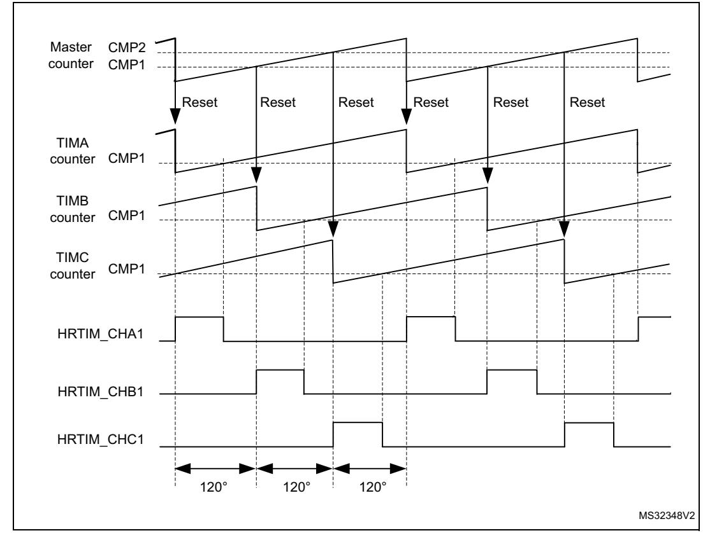

**Figure 383. 3-phase interleaved buck converter control**

## **39.4.4 Transition mode Power Factor Correction**

The basic operating principle is to build up current into an inductor during a fixed Ton time. This current will then decay during the Toff time, and the period will be re-started when it becomes null. This is detected using a Zero Crossing Detection circuitry (ZCD), as shown on *[Figure 384](#page-85-1)*. With a constant Ton time, the peak current value in the inductor is proportional to the rectified AC input voltage, which provides the power factor correction.

<span id="page-85-1"></span>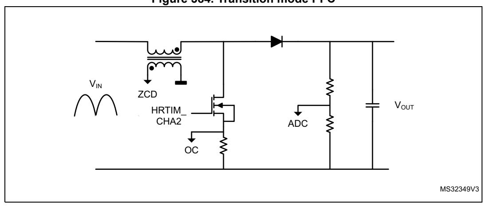

**Figure 384. Transition mode PFC**

This converter is operating with a constant Ton time and a variable frequency due the Toff time variation (depending on the input voltage). It must also include some features to operate when no zero-crossing is detected, or to limit the Ton time in case of over-current (OC). The OC feedback is usually conditioned with the built-in comparator and routed onto an external event input.

*[Figure 385](#page-86-0)* presents the waveform during the various operating modes, with the following parameters defined:

- Ton Min: masks spurious overcurrent (freewheeling diode recovery current), represented as OC blanking
- Ton Max: practically, the converter set-point. It is defined by CMP1
- Toff Min: limits the frequency when the current limit is close to zero (demagnetization is very fast). It is defined with CMP2.
- Toff Max: prevents the system to be stuck if no ZCD occurs. It is defined with CMP4 in auto-delayed mode.

Both Toff values are auto-delayed since the value must be relative to the output falling edge.

<span id="page-86-0"></span>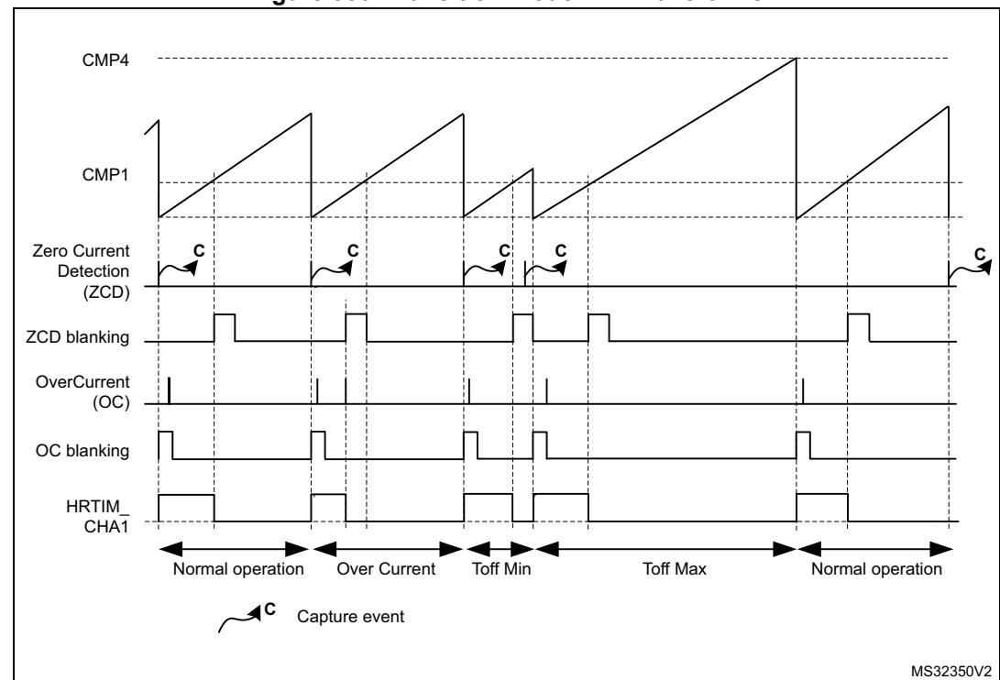

**Figure 385. Transition mode PFC waveforms**

## 39.5 HRTIM registers

## 39.5.1 HRTIM Master Timer Control Register (HRTIM\_MCR)

Address offset: 0x0000h Reset value: 0x0000 0000

| 31    | 30                                               | 29    | 28      | 27    | 26    | 25      | 24         | 23   | 22   | 21        | 20    | 19    | 18    | 17    | 16   |
|-------|--------------------------------------------------|-------|---------|-------|-------|---------|------------|------|------|-----------|-------|-------|-------|-------|------|
| BRSTD | MA[1:0]                                          | MREPU | Res.    | PREEN | DACSY | NC[1:0] | Res.       | Res. | Res. | TECEN     | TDCEN | TCCEN | TBCEN | TACEN | MCEN |
| rw    | rw                                               | rw    |         | rw    | rw    | rw      |            |      |      | rw        | rw    | rw    | rw    | rw    | rw   |
| 15    | 14                                               | 13    | 12      | 11    | 10    | 9       | 8          | 7    | 6    | 5         | 4     | 3     | 2     | 1     | 0    |
| SYNCS | RC[1:0] SYNCOUT[1:0] SYNCS SYNCR STM SYNCIN[1:0] |       | IN[1:0] | Res.  | Res.  | HALF    | RETRI<br>G | CONT | С    | CKPSC[2:0 | 0]    |       |       |       |      |
| rw    | rw                                               | rw    | rw      | rw    | rw    | rw      | rw         |      |      | rw        | rw    | rw    | rw    | rw    | rw   |

#### Bits 31:30 BRSTDMA[1:0]: Burst DMA Update

These bits define how the update occurs relatively to a burst DMA transaction.

- 00: Update done independently from the DMA burst transfer completion
- 01: Update done when the DMA burst transfer is completed
- 10: Update done on master timer roll-over following a DMA burst transfer completion. This mode only works in continuous mode.
- 11: reserved

#### Bit 29 MREPU: Master Timer Repetition update

This bit defines whether an update occurs when the master timer repetition period is completed (either due to roll-over or reset events). MREPU can be set only if BRSTDMA[1:0] = 00 or 01.

- 0: Update on repetition disabled
- 1: Update on repetition enabled
- Bit 28 Reserved, must be kept at reset value.

#### Bit 27 PREEN: Preload enable

This bit enables the registers preload mechanism and defines whether the write accesses to the memory mapped registers are done into HRTIM active or preload registers.

- 0: Preload disabled: the write access is directly done into the active register
- 1: Preload enabled: the write access is done into the preload register

## Bits 26:25 DACSYNC[1:0] DAC Synchronization

A DAC synchronization event can be enabled and generated when the master timer update occurs. These bits are defining on which output the DAC synchronization is sent (refer to *Section 39.3.19: DAC triggers* for connections details).

- 00: No DAC trigger generated
- 01: Trigger generated on hrtim\_dac\_trg1
- 10: Trigger generated on hrtim\_dac\_trg2
- 11: Trigger generated on hrtim\_dac\_trg3

#### Bits 24:22 Reserved, must be kept at reset value.

#### Bit 21 TECEN: Timer E counter enable

This bit starts the Timer E counter.

- 0: Timer E counter disabled
- 1: Timer E counter enabled

Note: This bit must not be changed within a minimum of 8 cycles of f<sub>HRTIM</sub> clock.


RM0399 Rev 4 1589/3556

#### Bit 20 **TDCEN**: *Timer D counter enable*

This bit starts the Timer D counter.

0: Timer D counter disabled

1: Timer D counter enabled

*Note: This bit must not be changed within a minimum of 8 cycles of fHRTIM clock.*

#### Bit 19 **TCCEN**: *Timer C counter enable*

This bit starts the Timer C counter.

0: Timer C counter disabled

1: Timer C counter enabled

*Note: This bit must not be changed within a minimum of 8 cycles of fHRTIM clock.*

#### Bit 18 **TBCEN**: *Timer B counter enable*

This bit starts the Timer B counter.

0: Timer B counter disabled

1: Timer B counter enabled

*Note: This bit must not be changed within a minimum of 8 cycles of fHRTIM clock.*

#### Bit 17 **TACEN**: *Timer A counter enable*

This bit starts the Timer A counter.

0: Timer A counter disabled

1: Timer A counter enabled

*Note: This bit must not be changed within a minimum of 8 cycles of fHRTIM clock.*

#### Bit 16 **MCEN**: *Master timer counter enable*

This bit starts the Master timer counter.

0: Master counter disabled

1: Master counter enabled

*Note: This bit must not be changed within a minimum of 8 cycles of fHRTIM clock.*

#### Bits 15:14 **SYNCSRC[1:0]**: *Synchronization source*

These bits define the source and event to be sent on the synchronization outputs SYNCOUT[2:1]

00: Master timer Start

01: Master timer Compare 1 event

10: Timer A start/reset

11: Timer A Compare 1 event

#### Bits 13:12 **SYNCOUT[1:0]**: *Synchronization output*

These bits define the routing and conditioning of the synchronization output event.

00: disabled

01: Reserved.

10: Positive pulse on HRTIM\_SCOUT output (16x fHRTIM clock cycles)

11: Negative pulse on HRTIM\_SCOUT output (16x fHRTIM clock cycles)

*Note: This bitfield must not be modified once the counter is enabled (TxCEN bit set)*

#### Bit 11 **SYNCSTRTM**: *Synchronization Starts Master*

This bit enables the Master timer start when receiving a synchronization input event:

0: No effect on the Master timer

1: A synchronization input event starts the Master timer

#### Bit 10 **SYNCRSTM**: *Synchronization Resets Master*

This bit enables the Master timer reset when receiving a synchronization input event:

0: No effect on the Master timer

1: A synchronization input event resets the Master timer


#### Bits 9:8 **SYNCIN[1:0]** *Synchronization input*

These bits are defining the synchronization input source.

00: disabled. HRTIM is not synchronized and runs in standalone mode.

01: Reserved.

10: Internal event: the HRTIM is synchronized with the on-chip timer (see *[Synchronization input](#page-69-1)*).

11: External event (input pin). A positive pulse on HRTIM\_SCIN input triggers the HRTIM.

*Note: This parameter cannot be changed once the impacted timers are enabled.*

#### Bits 7:6 Reserved, must be kept at reset value.

#### Bit 5 **HALF**: *Half mode*

This bit enables the half duty-cycle mode: the HRTIM\_MCMP1xR active register is automatically updated with HRTIM\_MPER/2 value when HRTIM\_MPER register is written.

0: Half mode disabled

1: Half mode enabled

#### Bit 4 **RETRIG**: *Re-triggerable mode*

This bit defines the behavior of the master timer counter in single-shot mode.

- 0: The timer is not re-triggerable: a counter reset can be done only if the counter is stopped (period elapsed)
- 1: The timer is re-triggerable: a counter reset is done whatever the counter state (running or stopped)

#### Bit 3 **CONT**: *Continuous mode*

- 0: The timer operates in single-shot mode and stops when it reaches the MPER value
- 1: The timer operates in continuous (free-running) mode and rolls over to zero when it reaches the MPER value

#### Bits 2:0 **CKPSC[2:0]**: *Clock prescaler*

These bits define the master timer clock prescaler ratio.

The counter clock equivalent frequency (fCOUNTER) is equal to fHRCK / 2(CKPSC[2:0]-5).

The prescaling ratio cannot be modified once the timer is enabled.

000: Reserved

001: Reserved

010: Reserved

011: Reserved

100: Reserved

101: fCOUNTER = fHRTIM

110: fCOUNTER = fHRTIM / 2

111: fCOUNTER = fHRTIM / 4

## **39.5.2 HRTIM Master Timer Interrupt Status Register (HRTIM\_MISR)**

Address offset: 0x0004h Reset value: 0x0000 0000

| 31   | 30   | 29   | 28   | 27   | 26   | 25   | 24   | 23   | 22   | 21   | 20   | 19   | 18   | 17                      | 16   |
|------|------|------|------|------|------|------|------|------|------|------|------|------|------|-------------------------|------|
| Res. | Res. | Res. | Res. | Res. | Res. | Res. | Res. | Res. | Res. | Res. | Res. | Res. | Res. | Res.                    | Res. |
|      |      |      |      |      |      |      |      |      |      |      |      |      |      |                         |      |
|      |      |      |      |      |      |      |      |      |      |      |      |      |      |                         |      |
| 15   | 14   | 13   | 12   | 11   | 10   | 9    | 8    | 7    | 6    | 5    | 4    | 3    | 2    | 1                       | 0    |
| Res. | Res. | Res. | Res. | Res. | Res. | Res. | Res. | Res. | MUPD | SYNC | MREP |      |      | MCMP4 MCMP3 MCMP2 MCMP1 |      |

Bits 31:7 Reserved, must be kept at reset value.

Bit 6 **MUPD**: Master Update Interrupt Flag

This bit is set by hardware when the Master timer registers are updated.

0: No Master Update interrupt occurred

1: Master Update interrupt occurred

Bit 5 **SYNC**: Sync Input Interrupt Flag

This bit is set by hardware when a synchronization input event is received.

0: No Sync input interrupt occurred

1: Sync input interrupt occurred

Bit 4 **MREP**: Master Repetition Interrupt Flag

This bit is set by hardware when the Master timer repetition period has elapsed.

0: No Master Repetition interrupt occurred

1: Master Repetition interrupt occurred

Bit 3 **MCMP4**: Master Compare 4 Interrupt Flag

Refer to MCMP1 description

Bit 2 **MCMP3**: Master Compare 3 Interrupt Flag

Refer to MCMP1 description

Bit 1 **MCMP2**: Master Compare 2 Interrupt Flag

Refer to MCMP1 description

Bit 0 **MCMP1**: Master Compare 1 Interrupt Flag

This bit is set by hardware when the Master timer counter matches the value programmed in the master Compare 1 register.

0: No Master Compare 1 interrupt occurred

1: Master Compare 1 interrupt occurred

## 39.5.3 HRTIM Master Timer Interrupt Clear Register (HRTIM\_MICR)

Address offset: 0x0008h Reset value: 0x0000 0000

| 31   | 30   | 29   | 28   | 27   | 26   | 25   | 24   | 23   | 22        | 21    | 20        | 19         | 18         | 17         | 16         |
|------|------|------|------|------|------|------|------|------|-----------|-------|-----------|------------|------------|------------|------------|
| Res. | Res. | Res. | Res. | Res. | Res. | Res. | Res. | Res. | Res.      | Res.  | Res.      | Res.       | Res.       | Res.       | Res.       |
|      |      |      |      |      |      |      |      |      |           |       |           |            |            |            |            |
| 15   | 14   | 13   | 12   | 11   | 10   | 9    | 8    | 7    | 6         | 5     | 4         | 3          | 2          | 1          | 0          |
| Res. | Res. | Res. | Res. | Res. | Res. | Res. | Res. | Res. | MUPD<br>C | SYNCC | MREP<br>C | MCMP<br>4C | MCMP<br>3C | MCMP<br>2C | MCMP<br>1C |
|      |      |      |      |      |      |      |      |      | w         | w     | w         | w          | w          | w          | w          |

Bits 31:7 Reserved, must be kept at reset value.

Bit 6 MUPDC: Master update Interrupt flag clear

Writing 1 to this bit clears the MUPDC flag in HRTIM MISR register

Bit 5 SYNCC: Sync Input Interrupt flag clear

Writing 1 to this bit clears the SYNC flag in HRTIM\_MISR register

Bit 4 MREPC: Repetition Interrupt flag clear

Writing 1 to this bit clears the MREP flag in HRTIM\_MISR register

Bit 3 MCMP4C: Master Compare 4 Interrupt flag clear

Writing 1 to this bit clears the MCMP4 flag in HRTIM\_MISR register

Bit 2 MCMP3C: Master Compare 3 Interrupt flag clear

Writing 1 to this bit clears the MCMP3 flag in HRTIM MISR register

Bit 1 MCMP2C: Master Compare 2 Interrupt flag clear

Writing 1 to this bit clears the MCMP2 flag in HRTIM MISR register

Bit 0 MCMP1C: Master Compare 1 Interrupt flag clear

Writing 1 to this bit clears the MCMP1 flag in HRTIM\_MISR register

## **39.5.4 HRTIM Master Timer DMA / Interrupt Enable Register (HRTIM\_MDIER)**

Address offset: 0x000Ch Reset value: 0x0000 0000

| 31   | 30   | 29   | 28   | 27   | 26   | 25   | 24   | 23   | 22         | 21         | 20         | 19          | 18          | 17          | 16          |
|------|------|------|------|------|------|------|------|------|------------|------------|------------|-------------|-------------|-------------|-------------|
| Res. | Res. | Res. | Res. | Res. | Res. | Res. | Res. | Res. | MUPD<br>DE | SYNCD<br>E | MREP<br>DE | MCMP<br>4DE | MCMP<br>3DE | MCMP<br>2DE | MCMP<br>1DE |
|      |      |      |      |      |      |      |      |      | rw         | rw         | rw         | rw          | rw          | rw          | rw          |
| 15   | 14   | 13   | 12   | 11   | 10   | 9    | 8    | 7    | 6          | 5          | 4          | 3           | 2           | 1           | 0           |
| Res. | Res. | Res. | Res. | Res. | Res. | Res. | Res. | Res. | MUPDI<br>E | SYNCI<br>E | MREPI<br>E | MCMP<br>4IE | MCMP<br>3IE | MCMP<br>2IE | MCMP<br>1IE |
|      |      |      |      |      |      |      |      |      | rw         | rw         | rw         | rw          | rw          | rw          | rw          |

Bits 31:23 Reserved, must be kept at reset value.

Bit 22 **MUPDDE**: Master Update DMA request Enable

This bit is set and cleared by software to enable/disable the Master update DMA requests.

0: Master update DMA request disabled

1: Master update DMA request enabled

Bit 21 **SYNCDE**: Sync Input DMA request Enable

This bit is set and cleared by software to enable/disable the Sync input DMA requests.

0: Sync input DMA request disabled

1: Sync input DMA request enabled

Bit 20 **MREPDE**: Master Repetition DMA request Enable

This bit is set and cleared by software to enable/disable the Master timer repetition DMA requests.

0: Repetition DMA request disabled

1: Repetition DMA request enabled

Bit 19 **MCMP4DE**: Master Compare 4 DMA request Enable

Refer to MCMP1DE description

Bit 18 **MCMP3DE**: Master Compare 3 DMA request Enable

Refer to MCMP1DE description

Bit 17 **MCMP2DE**: Master Compare 2 DMA request Enable

Refer to MCMP1DE description

Bit 16 **MCMP1DE**: Master Compare 1 DMA request Enable

This bit is set and cleared by software to enable/disable the Master timer Compare 1 DMA requests.

0: Compare 1 DMA request disabled

1: Compare 1 DMA request enabled

Bits 15:6 Reserved, must be kept at reset value.

Bit 6 **MUPDIE**: Master Update Interrupt Enable

This bit is set and cleared by software to enable/disable the Master timer registers update interrupts

0: Master update interrupts disabled

1: Master update interrupts enabled

Bit 5 **SYNCIE**: Sync Input Interrupt Enable

This bit is set and cleared by software to enable/disable the Sync input interrupts

- 0: Sync input interrupts disabled
- 1: Sync input interrupts enabled
- Bit 4 **MREPIE**: Master Repetition Interrupt Enable

This bit is set and cleared by software to enable/disable the Master timer repetition interrupts

- 0: Master repetition interrupt disabled
- 1: Master repetition interrupt enabled
- Bit 3 **MCMP4IE**: Master Compare 4 Interrupt Enable

Refer to MCMP1IE description

Bit 2 **MCMP3IE**: Master Compare 3 Interrupt Enable

Refer to MCMP1IE description

Bit 1 **MCMP2IE**: MAster Compare 2 Interrupt Enable

Refer to MCMP1IE description

Bit 0 **MCMP1IE**: Master Compare 1 Interrupt Enable

This bit is set and cleared by software to enable/disable the Master timer Compare 1 interrupt

- 0: Compare 1 interrupt disabled
- 1: Compare 1 interrupt enabled

## **39.5.5 HRTIM Master Timer Counter Register (HRTIM\_MCNTR)**

Address offset: 0x0010h Reset value: 0x0000 0000

| 31   | 30         | 29   | 28   | 27   | 26   | 25   | 24   | 23   | 22   | 21   | 20   | 19   | 18   | 17   | 16   |
|------|------------|------|------|------|------|------|------|------|------|------|------|------|------|------|------|
| Res. | Res.       | Res. | Res. | Res. | Res. | Res. | Res. | Res. | Res. | Res. | Res. | Res. | Res. | Res. | Res. |
|      |            |      |      |      |      |      |      |      |      |      |      |      |      |      |      |
| 15   | 14         | 13   | 12   | 11   | 10   | 9    | 8    | 7    | 6    | 5    | 4    | 3    | 2    | 1    | 0    |
|      | MCNT[15:0] |      |      |      |      |      |      |      |      |      |      |      |      |      |      |
| rw   | rw         | rw   | rw   | rw   | rw   | rw   | rw   | rw   | rw   | rw   | rw   | rw   | rw   | rw   | rw   |

Bits 31:16 Reserved, must be kept at reset value.

#### Bits 15:0 **MCNT[15:0]**: *Counter value*

Holds the master timer counter value. This register can only be written when the master timer is stopped (MCEN = 0 in HRTIM\_MCR).

*Note: The timer behavior is not guaranteed if the counter value is set above the HRTIM\_MPER register value.*

## **39.5.6 HRTIM Master Timer Period Register (HRTIM\_MPER)**

Address offset: 0x0014h Reset value: 0x0000 FFDF

| 31   |            | 29   | 28   | 27   | 26   | 25   | 24   | 23   | 22   | 21   | 20   | 19   | 18   | 17   | 16   |
|------|------------|------|------|------|------|------|------|------|------|------|------|------|------|------|------|
| Res. | Res.       | Res. | Res. | Res. | Res. | Res. | Res. | Res. | Res. | Res. | Res. | Res. | Res. | Res. | Res. |
|      |            |      |      |      |      |      |      |      |      |      |      |      |      |      |      |
| 15   | 14         | 13   | 12   | 11   | 10   | 9    | 8    | 7    | 6    | 5    | 4    | 3    | 2    | 1    | 0    |
|      | MPER[15:0] |      |      |      |      |      |      |      |      |      |      |      |      |      |      |

rw rw rw rw rw rw rw rw rw rw rw rw rw rw rw rw

Bits 31:16 Reserved, must be kept at reset value.

## Bits 15:0 **MPER[15:0]**: *Master Timer Period value*

This register defines the counter overflow value.

The period value must be above or equal to 3 periods of the fHRTIM clock.

The maximum value is 0x0000 FFDF.

## **39.5.7 HRTIM Master Timer Repetition Register (HRTIM\_MREP)**

Address offset: 0x0018h Reset value: 0x0000 0000

| 31   | 30   | 29   | 28   | 27   | 26   | 25   | 24   | 23   | 22   | 21   | 20   | 19        | 18   | 17   | 16   |
|------|------|------|------|------|------|------|------|------|------|------|------|-----------|------|------|------|
| Res. | Res. | Res. | Res. | Res. | Res. | Res. | Res. | Res. | Res. | Res. | Res. | Res.      | Res. | Res. | Res. |
|      |      |      |      |      |      |      |      |      |      |      |      |           |      |      |      |
| 15   | 14   | 13   |      |      |      |      |      |      |      |      |      |           |      |      |      |
|      |      |      | 12   | 11   | 10   | 9    | 8    | 7    | 6    | 5    | 4    | 3         | 2    | 1    | 0    |
| Res. | Res. | Res. | Res. | Res. | Res. | Res. | Res. |      |      |      |      | MREP[7:0] |      |      |      |

Bits 31:8 Reserved, must be kept at reset value.

#### Bits 7:0 **MREP[7:0]**: *Master Timer Repetition period value*

This register holds the repetition period value for the master counter. It is either the preload register or the active register if preload is disabled.

## **39.5.8 HRTIM Master Timer Compare 1 Register (HRTIM\_MCMP1R)**

Address offset: 0x001Ch Reset value: 0x0000 0000

| 31   | 30          | 29   | 28   | 27   | 26   | 25   | 24   | 23   | 22   | 21   | 20   | 19   | 18   | 17   | 16   |
|------|-------------|------|------|------|------|------|------|------|------|------|------|------|------|------|------|
| Res. | Res.        | Res. | Res. | Res. | Res. | Res. | Res. | Res. | Res. | Res. | Res. | Res. | Res. | Res. | Res. |
|      |             |      |      |      |      |      |      |      |      |      |      |      |      |      |      |
| 15   | 14          | 13   | 12   | 11   | 10   | 9    | 8    | 7    | 6    | 5    | 4    | 3    | 2    | 1    | 0    |
|      | MCMP1[15:0] |      |      |      |      |      |      |      |      |      |      |      |      |      |      |
| rw   | rw          | rw   | rw   | rw   | rw   | rw   | rw   | rw   | rw   | rw   | rw   | rw   | rw   | rw   | rw   |

Bits 31:16 Reserved, must be kept at reset value.

#### Bits 15:0 **MCMP1[15:0]**: *Master Timer Compare 1 value*

This register holds the master timer Compare 1 value. It is either the preload register or the active register if preload is disabled.

The compare value must be above or equal to 3 periods of the fHRTIM clock.

RM0399 Rev 4 1597/3556

## **39.5.9 HRTIM Master Timer Compare 2 Register (HRTIM\_MCMP2R)**

Address offset: 0x0024h Reset value: 0x0000 0000

| 31   | 30          | 29   | 28   | 27   | 26   | 25   | 24   | 23   | 22   | 21   | 20   | 19   | 18   | 17   | 16   |
|------|-------------|------|------|------|------|------|------|------|------|------|------|------|------|------|------|
| Res. | Res.        | Res. | Res. | Res. | Res. | Res. | Res. | Res. | Res. | Res. | Res. | Res. | Res. | Res. | Res. |
|      |             |      |      |      |      |      |      |      |      |      |      |      |      |      |      |
| 15   | 14          | 13   | 12   | 11   | 10   | 9    | 8    | 7    | 6    | 5    | 4    | 3    | 2    | 1    | 0    |
|      | MCMP2[15:0] |      |      |      |      |      |      |      |      |      |      |      |      |      |      |
| rw   | rw          | rw   | rw   | rw   | rw   | rw   | rw   | rw   | rw   | rw   | rw   | rw   | rw   | rw   | rw   |

Bits 31:16 Reserved, must be kept at reset value.

#### Bits 15:0 **MCMP2[15:0]**: *Master Timer Compare 2 value*

This register holds the master timer Compare 2 value. It is either the preload register or the active register if preload is disabled.

The compare value must be above or equal to 3 periods of the fHRTIM clock.

## **39.5.10 HRTIM Master Timer Compare 3 Register (HRTIM\_MCMP3R)**

Address offset: 0x0028h Reset value: 0x0000 0000

| 31   | 30          | 29   | 28   | 27   | 26   | 25   | 24   | 23   | 22   | 21   | 20   | 19   | 18   | 17   | 16   |
|------|-------------|------|------|------|------|------|------|------|------|------|------|------|------|------|------|
| Res. | Res.        | Res. | Res. | Res. | Res. | Res. | Res. | Res. | Res. | Res. | Res. | Res. | Res. | Res. | Res. |
|      |             |      |      |      |      |      |      |      |      |      |      |      |      |      |      |
| 15   | 14          | 13   | 12   | 11   | 10   | 9    | 8    | 7    | 6    | 5    | 4    | 3    | 2    | 1    | 0    |
|      | MCMP3[15:0] |      |      |      |      |      |      |      |      |      |      |      |      |      |      |
| rw   | rw          | rw   | rw   | rw   | rw   | rw   | rw   | rw   | rw   | rw   | rw   | rw   | rw   | rw   | rw   |

Bits 31:16 Reserved, must be kept at reset value.

## Bits 15:0 **MCMP3[15:0]**: *Master Timer Compare 3 value*

This register holds the master timer Compare 3 value. It is either the preload register or the active register if preload is disabled.

The compare value must be above or equal to 3 periods of the fHRTIM clock.

## **39.5.11 HRTIM Master Timer Compare 4 Register (HRTIM\_MCMP4R)**

Address offset: 0x002Ch Reset value: 0x0000 0000

| 31   | 30          | 29   | 28   | 27   | 26   | 25   | 24   | 23   | 22   | 21   | 20   | 19   | 18   | 17   | 16   |
|------|-------------|------|------|------|------|------|------|------|------|------|------|------|------|------|------|
| Res. | Res.        | Res. | Res. | Res. | Res. | Res. | Res. | Res. | Res. | Res. | Res. | Res. | Res. | Res. | Res. |
|      |             |      |      |      |      |      |      |      |      |      |      |      |      |      |      |
| 15   | 14          | 13   | 12   | 11   | 10   | 9    | 8    | 7    | 6    | 5    | 4    | 3    | 2    | 1    | 0    |
|      | MCMP4[15:0] |      |      |      |      |      |      |      |      |      |      |      |      |      |      |
| rw   | rw          | rw   | rw   | rw   | rw   | rw   | rw   | rw   | rw   | rw   | rw   | rw   | rw   | rw   | rw   |

Bits 31:16 Reserved, must be kept at reset value.

#### Bits 15:0 **MCMP4[15:0]**: *Master Timer Compare 4 value*

This register holds the master timer Compare 4 value. It is either the preload register or the active register if preload is disabled.

The compare value must be above or equal to 3 periods of the fHRTIM clock.

#### 39.5.12 HRTIM Timerx Control Register (HRTIM TIMxCR)

Address offset: 0x0000h (this offset address is relative to timer x base address)

Reset value: 0x0000 0000

| 31                        | 30       | 29      | 28       | 27    | 26           | 25      | 24   | 23   | 22         | 21   | 20         | 19   | 18         | 17         | 16   |
|---------------------------|----------|---------|----------|-------|--------------|---------|------|------|------------|------|------------|------|------------|------------|------|
|                           | UPDG.    | AT[3:0] |          | PREEN | DACSY        | NC[1:0] | MSTU | TEU  | TDU        | TCU  | TBU        | Res. | TxRST<br>U | TxREP<br>U | Res. |
| rw                        | rw       | rw      | rw       | rw    | rw           | rw      | rw   | rw   | rw         | rw   | rw         |      | rw         | rw         |      |
| 15                        | 14       | 13      | 12       | 11    | 10           | 9       | 8    | 7    |            | 5    | 4          | 2    | 2          | 1          |      |
| DELCMP4[1:0] DELCMP2[1:0] |          |         | •=       |       | 10           | 9       | 0    | 1    | 6          | 5    | 4          | 3    | 2          | ı          | 0    |
| DELCM                     | 1P4[1:0] | DELCM   | 1P2[1:0] |       | SYNCR<br>STx | -       | Res. | Res. | PSHPL<br>L | HALF | RETRI<br>G | CONT |            | KPSCx[2:   |      |

#### Bits 31:28 UPDGAT[3:0]: Update Gating

These bits define how the update occurs relatively to the burst DMA transaction and the external update request on update enable inputs 1 to 3 (see Table 334: Update enable inputs and sources) The update events, as mentioned below, can be: MSTU, TEU, TDU, TCU, TBU, TAU, TxRSTU, TxREPU.

0000: the update occurs independently from the DMA burst transfer

0001: the update occurs when the DMA burst transfer is completed

0010: the update occurs on the update event following the DMA burst transfer completion

0011: the update occurs on a rising edge of HRTIM update enable input 1 (hrtim upd en1)

0100: the update occurs on a rising edge of HRTIM update enable input 2 (hrtim upd en2)

0101: the update occurs on a rising edge of HRTIM update enable input 3 (hrtim upd en3)

0110: the update occurs on the update event following a rising edge of HRTIM update enable input 1 (hrtim upd en1)

0111: the update occurs on the update event following a rising edge of HRTIM update enable input 2 (hrtim upd en2)

1000: the update occurs on the update event following a rising edge of HRTIM update enable input 3 (hrtim upd en3)

Other codes: reserved

Note: This bitfield must be reset before programming a new value.

For UPDGATI3:01 values equal to 0001, 0011, 0100, 0101, it is possible to have multiple concurrent update source (for instance RSTU and DMA burst).

#### Bit 27 PREEN: Preload enable

This bit enables the registers preload mechanism and defines whether a write access into a preloadable register is done into the active or the preload register.

0: Preload disabled: the write access is directly done into the active register

1: Preload enabled: the write access is done into the preload register

#### Bits 26:25 DACSYNC[1:0] DAC Synchronization

A DAC synchronization event is generated when the timer update occurs. These bits are defining on which output the DAC synchronization is sent (refer to Section 39.3.19: DAC triggers for connections details).

00: No DAC trigger generated

01: Trigger generated on hrtim dac trg1

10: Trigger generated on hrtim dac trg2

11: Trigger generated on hrtim dac trg3


Bit 24 **MSTU**: *Master Timer update*

Register update is triggered by the master timer update.

0: Update by master timer disabled

1: Update by master timer enabled

Bit 23 In HRTIM\_TIMACR, HRTIM\_TIMBCR, HRTIM\_TIMCCR, HRTIM\_TIMDCR:

**TEU**: *Timer E update*

Register update is triggered by the timer E update

0: Update by timer E disabled

1: Update by timer E enabled

In HRTIM\_TIMECR:

Reserved, must be kept at reset value

Bit 22 In HRTIM\_TIMACR, HRTIM\_TIMBCR, HRTIM\_TIMCCR, HRTIM\_TIMECR:

**TDU**: *Timer D update*

Register update is triggered by the timer D update

0: Update by timer D disabled

1: Update by timer D enabled

In HRTIM\_TIMDCR:

Reserved, must be kept at reset value

Bit 21 In HRTIM\_TIMACR, HRTIM\_TIMBCR, HRTIM\_TIMDCR, HRTIM\_TIMECR:

**TCU**: *Timer C update*

Register update is triggered by the timer C update

0: Update by timer C disabled

1: Update by timer C enabled

In HRTIM\_TIMCCR:

Reserved, must be kept at reset value

Bit 20 In HRTIM\_TIMACR, HRTIM\_TIMCCR, HRTIM\_TIMDCR, HRTIM\_TIMECR:

**TBU**: *Timer B update*

Register update is triggered by the timer B update

0: Update by timer B disabled

1: Update by timer B enabled

In HRTIM\_TIMBCR:

Reserved, must be kept at reset value

Bit 19 In HRTIM\_TIMBCR, HRTIM\_TIMCCR, HRTIM\_TIMDCR, HRTIM\_TIMECR:

**TAU**: *Timer A update*

Register update is triggered by the timer A update

0: Update by timer A disabled

1: Update by timer A enabled

In HRTIM\_TIMACR:

Reserved, must be kept at reset value


#### Bit 18 **TxRSTU**: *Timerx reset update*

Register update is triggered by Timerx counter reset or roll-over to 0 after reaching the period value in continuous mode.

- 0: Update by timer x reset / roll-over disabled
- 1: Update by timer x reset / roll-over enabled

#### Bit 17 **TxREPU**: *Timer x Repetition update*

Register update is triggered when the counter rolls over and HRTIM\_REPx = 0

- 0: Update on repetition disabled
- 1: Update on repetition enabled
- Bit 16 Reserved, must be kept at reset value.

#### Bits 15:14 **DELCMP4[1:0]**: *CMP4 auto-delayed mode*

This bitfield defines whether the compare register is behaving in standard mode (compare match issued as soon as counter equal compare), or in auto-delayed mode (see *[Auto-delayed mode](#page-16-0)*).

- 00: CMP4 register is always active (standard compare mode)
- 01: CMP4 value is recomputed and is active following a capture 2 event
- 10: CMP4 value is recomputed and is active following a capture 2 event, or is recomputed and active after Compare 1 match (timeout function if capture 2 event is missing)
- 11: CMP4 value is recomputed and is active following a capture event, or is recomputed and active after Compare 3 match (timeout function if capture event is missing)

*Note: This bitfield must not be modified once the counter is enabled (TxCEN bit set)*

#### Bits 13:12 **DELCMP2[1:0]**: *CMP2 auto-delayed mode*

This bitfield defines whether the compare register is behaving in standard mode (compare match issued as soon as counter equal compare), or in auto-delayed mode (see *[Auto-delayed mode](#page-16-0)*).

- 00: CMP2 register is always active (standard compare mode)
- 01: CMP2 value is recomputed and is active following a capture 1 event
- 10: CMP2 value is recomputed and is active following a capture 1 event, or is recomputed and active after Compare 1 match (timeout function if capture event is missing)
- 11: CMP2 value is recomputed and is active following a capture 1 event, or is recomputed and active after Compare 3 match (timeout function if capture event is missing)

*Note: This bitfield must not be modified once the counter is enabled (TxCEN bit set)*

### Bit 11 **SYNCSTRTx**: *Synchronization Starts Timer x*

This bit defines the Timer x behavior following the synchronization event:

- 0: No effect on Timer x
- 1: A synchronization input event starts the Timer x

#### Bit 10 **SYNCRSTx**: *Synchronization Resets Timer x*

This bit defines the Timer x behavior following the synchronization event:

- 0: No effect on Timer x
- 1: A synchronization input event resets the Timer x

#### Bits 9:7 Reserved, must be kept at reset value.

### Bit 6 **PSHPLL**: *Push-Pull mode enable*

This bit enables the push-pull mode.

- 0: Push-Pull mode disabled
- 1: Push-Pull mode enabled

*Note: This bitfield must not be modified once the counter is enabled (TxCEN bit set)*


#### Bit 5 **HALF**: *Half mode enable*

This bit enables the half duty-cycle mode: the HRTIM\_CMP1xR active register is automatically updated with HRTIM\_PERxR/2 value when HRTIM\_PERxR register is written.

- 0: Half mode disabled
- 1: Half mode enabled

#### Bit 4 **RETRIG**: *Re-triggerable mode*

This bit defines the counter behavior in single shot mode.

- 0: The timer is not re-triggerable: a counter reset is done if the counter is stopped (period elapsed in single-shot mode or counter stopped in continuous mode)
- 1: The timer is re-triggerable: a counter reset is done whatever the counter state.

#### Bit 3 **CONT**: *Continuous mode*

This bit defines the timer operating mode.

- 0: The timer operates in single-shot mode and stops when it reaches TIMxPER value
- 1: The timer operates in continuous mode and rolls over to zero when it reaches TIMxPER value

#### Bits 2:0 **CKPSCx[2:0]**: *HRTIM Timer x Clock prescaler*

These bits define the master timer clock prescaler ratio.

The counter clock equivalent frequency (fCOUNTER) is equal to fHRCK / 2(CKPSC[2:0]-5).

The prescaling ratio cannot be modified once the timer is enabled.

000: Reserved

001: Reserved

010: Reserved

011: Reserved

100: Reserved

101: fCOUNTER = fHRTIM

110: fCOUNTER = fHRTIM / 2

111: fCOUNTER = fHRTIM / 4

## **39.5.13 HRTIM Timerx Interrupt Status Register (HRTIM\_TIMxISR)**

Address offset: 0x0004h (this offset address is relative to timer x base address)

Reset value: 0x0000 0000

| 31   | 30         | 29   | 28    | 27    | 26    | 25    | 24   | 23   | 22   | 21   | 20                | 19   | 18         | 17          | 16          |
|------|------------|------|-------|-------|-------|-------|------|------|------|------|-------------------|------|------------|-------------|-------------|
| Res. | Res.       | Res. | Res.  | Res.  | Res.  | Res.  | Res. | Res. | Res. |      | O2CPY O1CPY O2STA | T    | O1STA<br>T | IPPSTA<br>T | CPPST<br>AT |
|      |            |      |       |       |       |       |      |      |      | r    | r                 | r    | r          | r           | r           |
| 15   | 14         | 13   | 12    | 11    | 10    | 9     | 8    | 7    | 6    | 5    | 4                 | 3    | 2          | 1           | 0           |
| Res. | DLYPR<br>T | RST  | RSTx2 | SETx2 | RSTx1 | SETx1 | CPT2 | CPT1 | UPD  | Res. | REP               | CMP4 | CMP3       | CMP2        | CMP1        |
|      | r          | r    | r     | r     | r     | r     | r    | r    | r    |      | r                 | r    | r          | r           | r           |

#### Bits 31:22 Reserved, must be kept at reset value.

#### Bit 21 **O2CPY**: Output 2 Copy

This status bit is a raw copy of the output 2 state, before the output stage (chopper, polarity). It allows to check the current output state before re-enabling the output after a delayed protection.

- 0: Output 2 is inactive
- 1: Output 2 is active

#### Bit 20 **O1CPY**: Output 1 Copy

This status bit is a raw copy of the output 1 state, before the output stage (chopper, polarity). It allows to check the current output state before re-enabling the output after a delayed protection.

- 0: Output 1 is inactive
- 1: Output 1 is active

#### Bit 19 **O2STAT**: Output 2 Status

This status bit indicates the output 2 state when the delayed idle protection was triggered. This bit is updated upon any new delayed protection entry. This bit is not updated in balanced idle.

- 0: Output 2 was inactive
- 1: Output 2 was active

#### Bit 18 **O1STAT**: Output 1 Status

This status bit indicates the output 1 state when the delayed idle protection was triggered. This bit is updated upon any new delayed protection entry. This bit is not updated in balanced idle.

- 0: Output 1 was inactive
- 1: Output 1 was active

#### Bit 17 **IPPSTAT**: Idle Push Pull Status

This status bit indicates on which output the signal was applied, in push-pull mode balanced fault mode or delayed idle mode, when the protection was triggered (whatever the output state, active or inactive).

- 0: Protection occurred when the output 1 was active and output 2 forced inactive
- 1: Protection occurred when the output 2 was active and output 1 forced inactive

#### Bit 16 **CPPSTAT**: Current Push Pull Status

This status bit indicates on which output the signal is currently applied, in push-pull mode. It is only significant in this configuration.

- 0: Signal applied on output 1 and output 2 forced inactive
- 1: Signal applied on output 2 and output 1 forced inactive

#### Bit 15 Reserved

#### Bit 14 **DLYPRT**: Delayed Protection Flag

This bit indicates delayed idle or the balanced idle mode entry.


Bit 13 **RST**: Reset and/or roll-over Interrupt Flag

This bit is set by hardware when the timer x counter is reset or rolls over in continuous mode.

0: No TIMx counter reset/roll-over interrupt occurred

1: TIMX counter reset/roll-over interrupt occurred

Bit 12 **RSTx2**: Output 2 Reset Interrupt Flag

Refer to RSTx1 description

Bit 11 **SETx2**: Output 2 Set Interrupt Flag

Refer to SETx1 description

Bit 10 **RSTx1**: Output 1 Reset Interrupt Flag

This bit is set by hardware when the Tx1 output is reset (goes from active to inactive mode).

0: No Tx1 output reset interrupt occurred

1: Tx1 output reset interrupt occurred

Bit 9 **SETx1**: Output 1 Set Interrupt Flag

This bit is set by hardware when the Tx1 output is set (goes from inactive to active mode).

0: No Tx1 output set interrupt occurred

1: Tx1 output set interrupt occurred

Bit 8 **CPT2**: Capture2 Interrupt Flag

Refer to CPT1 description

Bit 7 **CPT1**: Capture1 Interrupt Flag

This bit is set by hardware when the timer x capture 1 event occurs.

0: No timer x Capture 1 reset interrupt occurred

1: Timer x output 1 reset interrupt occurred

Bit 6 **UPD**: Update Interrupt Flag

This bit is set by hardware when the timer x update event occurs.

0: No timer x update interrupt occurred

1: Timer x update interrupt occurred

Bit 5 Reserved, must be kept at reset value.

Bit 4 **REP**: Repetition Interrupt Flag

This bit is set by hardware when the timer x repetition period has elapsed.

0: No timer x repetition interrupt occurred

1: Timer x repetition interrupt occurred

Bit 3 **CMP4**: Compare 4 Interrupt Flag

Refer to CMP1 description

Bit 2 **CMP3**: Compare 3 Interrupt Flag

Refer to CMP1 description

Bit 1 **CMP2**: Compare 2 Interrupt Flag

Refer to CMP1 description

Bit 0 **CMP1**: Compare 1 Interrupt Flag

This bit is set by hardware when the timer x counter matches the value programmed in the Compare 1 register.

0: No Compare 1 interrupt occurred

1: Compare 1 interrupt occurred


## 39.5.14 HRTIM Timerx Interrupt Clear Register (HRTIM TIMxICR)

Address offset: 0x0008h (this offset address is relative to timer x base address)

Reset value: 0x0000 0000

| 31         | 30                | 29   | 28               | 27               | 26   | 25              | 24   | 23         | 22   | 21        | 20   | 19         | 18         | 17         | 16         |
|------------|-------------------|------|------------------|------------------|------|-----------------|------|------------|------|-----------|------|------------|------------|------------|------------|
| Res.       | Res.              | Res. | Res.             | Res.             | Res. | Res.            | Res. | Res.       | Res. | Res.      | Res. | Res.       | Res.       | Res.       | Res.       |
|            |                   |      |                  |                  |      |                 |      |            |      |           |      |            |            |            |            |
| •          |                   |      |                  |                  |      |                 |      |            |      |           |      |            |            |            |            |
| 15         | 14                | 13   | 12               | 11               | 10   | 9               | 8    | 7          | 6    | 5         | 4    | 3          | 2          | 1          | 0          |
| 15<br>Res. | 14<br>DLYPR<br>TC |      | 12<br>RSTx2<br>C | 11<br>SET2x<br>C | 1    | 9<br>SET1x<br>C |      | 7<br>CPT1C |      | 5<br>Res. |      | 3<br>CMP4C | 2<br>CMP3C | 1<br>CMP2C | 0<br>CMP1C |

Bits 31:15 Reserved, must be kept at reset value.

Bit 14 **DLYPRTC**: Delayed Protection Flag Clear

Writing 1 to this bit clears the DLYPRT flag in HRTIM\_TIMxISR register

Bit 13 RSTC: Reset Interrupt flag Clear

Writing 1 to this bit clears the RST flag in HRTIM TIMxISR register

Bit 12 RSTx2C: Output 2 Reset flag Clear

Writing 1 to this bit clears the RSTx2 flag in HRTIM TIMxISR register

Bit 11 SETx2C: Output 2 Set flag Clear

Writing 1 to this bit clears the SETx2 flag in HRTIM TIMxISR register

Bit 10 RSTx1C: Output 1 Reset flag Clear

Writing 1 to this bit clears the RSTx1 flag in HRTIM TIMxISR register

Bit 9 SETx1C: Output 1 Set flag Clear

Writing 1 to this bit clears the SETx1 flag in HRTIM TIMxISR register

Bit 8 CPT2C: Capture2 Interrupt flag Clear

Writing 1 to this bit clears the CPT2 flag in HRTIM TIMxISR register

Bit 7 CPT1C: Capture1 Interrupt flag Clear

Writing 1 to this bit clears the CPT1 flag in HRTIM\_TIMxISR register

Bit 6 UPDC: Update Interrupt flag Clear

Writing 1 to this bit clears the UPD flag in HRTIM TIMxISR register

Bit 5 Reserved, must be kept at reset value.

Bit 4 REPC: Repetition Interrupt flag Clear

Writing 1 to this bit clears the REP flag in HRTIM TIMxISR register

Bit 3 CMP4C: Compare 4 Interrupt flag Clear

Writing 1 to this bit clears the CMP4 flag in HRTIM\_TIMxISR register

Bit 2 CMP3C: Compare 3 Interrupt flag Clear

Writing 1 to this bit clears the CMP3 flag in HRTIM\_TIMxISR register

Bit 1 CMP2C: Compare 2 Interrupt flag Clear

Writing 1 to this bit clears the CMP2 flag in HRTIM\_TIMxISR register

Bit 0 CMP1C: Compare 1 Interrupt flag Clear

Writing 1 to this bit clears the CMP1 flag in HRTIM\_TIMxISR register


## 39.5.15 HRTIM Timerx DMA / Interrupt Enable Register (HRTIM\_TIMxDIER)

Address offset: 0x000Ch (this offset address is relative to timer x base address)

Reset value: 0x0000 0000

| 31   | 30           | 29    | 28          | 27          | 26          | 25          | 24         | 23         | 22    | 21   | 20    | 19         | 18         | 17         | 16         |
|------|--------------|-------|-------------|-------------|-------------|-------------|------------|------------|-------|------|-------|------------|------------|------------|------------|
| Res. | DLYPR<br>TDE | RSTDE | RSTx2<br>DE | SETx2<br>DE | RSTx1<br>DE | SETx1<br>DE | CPT2D<br>E | CPT1D<br>E | UPDDE | Res. | REPDE | CMP4D<br>E | CMP3D<br>E | CMP2D<br>E | CMP1D<br>E |
|      | rw           | rw    | rw          | rw          | rw          | rw          | rw         | rw         | rw    |      | rw    | rw         | rw         | rw         | rw         |
| 15   | 14           | 13    | 12          | 11          | 10          | 9           | 8          | 7          | 6     | 5    | 4     | 3          | 2          | 1          | 0          |
| Res. | DLYPR<br>TIE | RSTIE | RSTx2I<br>E | SETx2I<br>E | RSTx1I<br>E | SET1xI<br>E | CPT2IE     | CPT1IE     | UPDIE | Res. | REPIE | CMP4I<br>E | CMP3I<br>E | CMP2I<br>E | CMP1I<br>E |
|      |              |       |             |             |             |             |            |            |       |      |       |            |            |            |            |

#### Bit 31 Reserved

#### Bit 30 DLYPRTDE: Delayed Protection DMA request Enable

This bit is set and cleared by software to enable/disable DMA requests on delayed protection.

- 0: Delayed protection DMA request disabled
- 1: Delayed protection DMA request enabled

#### Bit 29 RSTDE: Reset/roll-over DMA request Enable

This bit is set and cleared by software to enable/disable DMA requests on timer x counter reset or roll-over in continuous mode.

- 0: Timer x counter reset/roll-over DMA request disabled
- 1: Timer x counter reset/roll-over DMA request enabled

#### Bit 28 RSTx2DE: Output 2 Reset DMA request Enable

Refer to RSTx1DE description

#### Bit 27 SETx2DE: Output 2 Set DMA request Enable

Refer to SETx1DE description

#### Bit 26 RSTx1DE: Output 1 Reset DMA request Enable

This bit is set and cleared by software to enable/disable Tx1 output reset DMA requests.

- 0: Tx1 output reset DMA request disabled
- 1: Tx1 output reset DMA request enabled

#### Bit 25 **SETx1DE**: Output 1 Set DMA request Enable

This bit is set and cleared by software to enable/disable Tx1 output set DMA requests.

- 0: Tx1 output set DMA request disabled
- 1: Tx1 output set DMA request enabled

#### Bit 24 CPT2DE: Capture 2 DMA request Enable

Refer to CPT1DE description

#### Bit 23 CPT1DE: Capture 1 DMA request Enable

This bit is set and cleared by software to enable/disable Capture 1 DMA requests.

- 0: Capture 1 DMA request disabled
- 1: Capture 1 DMA request enabled

#### Bit 22 UPDDE: Update DMA request Enable

This bit is set and cleared by software to enable/disable DMA requests on update event.

- 0: Update DMA request disabled
- 1: Update DMA request enabled


RM0399 Rev 4 1607/3556

- Bit 21 Reserved, must be kept at reset value.
- Bit 20 **REPDE**: Repetition DMA request Enable

This bit is set and cleared by software to enable/disable DMA requests on repetition event.

- 0: Repetition DMA request disabled
- 1: Repetition DMA request enabled
- Bit 19 **CMP4DE**: Compare 4 DMA request Enable

Refer to CMP1DE description

Bit 18 **CMP3DE**: Compare 3 DMA request Enable

Refer to CMP1DE description

Bit 17 **CMP2DE**: Compare 2 DMA request Enable

Refer to CMP1DE description

Bit 16 **CMP1DE**: Compare 1 DMA request Enable

This bit is set and cleared by software to enable/disable the Compare 1 DMA requests.

- 0: Compare 1 DMA request disabled
- 1: Compare 1 DMA request enabled
- Bit 15 Reserved
- Bit 14 **DLYPRTIE**: Delayed Protection Interrupt Enable

This bit is set and cleared by software to enable/disable interrupts on delayed protection.

- 0: Delayed protection interrupts disabled
- 1: Delayed protection interrupts enabled
- Bit 13 **RSTIE**: Reset/roll-over Interrupt Enable

This bit is set and cleared by software to enable/disable interrupts on timer x counter reset or rollover in continuous mode.

- 0: Timer x counter reset/roll-over interrupt disabled
- 1: Timer x counter reset/roll-over interrupt enabled
- Bit 12 **RSTx2IE**: Output 2 Reset Interrupt Enable

Refer to RSTx1IE description

Bit 11 **SETx2IE**: Output 2 Set Interrupt Enable

Refer to SETx1IE description

Bit 10 **RSTx1IE**: Output 1 Reset Interrupt Enable

This bit is set and cleared by software to enable/disable Tx1 output reset interrupts.

- 0: Tx1 output reset interrupts disabled
- 1: Tx1 output reset interrupts enabled
- Bit 9 **SETx1IE**: Output 1 Set Interrupt Enable

This bit is set and cleared by software to enable/disable Tx1 output set interrupts.

- 0: Tx1 output set interrupts disabled
- 1: Tx1 output set interrupts enabled
- Bit 8 **CPT2IE**: Capture Interrupt Enable

Refer to CPT1IE description

Bit 7 **CPT1IE**: Capture Interrupt Enable

This bit is set and cleared by software to enable/disable Capture 1 interrupts.

- 0: Capture 1 interrupts disabled
- 1: Capture 1 interrupts enabled


Bit 6 **UPDIE**: Update Interrupt Enable

This bit is set and cleared by software to enable/disable update event interrupts.

- 0: Update interrupts disabled
- 1: Update interrupts enabled
- Bit 5 Reserved, must be kept at reset value.
- Bit 4 **REPIE**: Repetition Interrupt Enable

This bit is set and cleared by software to enable/disable repetition event interrupts.

- 0: Repetition interrupts disabled
  - 1: Repetition interrupts enabled
- Bit 3 **CMP4IE**: Compare 4 Interrupt Enable

Refer to CMP1IE description

Bit 2 **CMP3IE**: Compare 3 Interrupt Enable

Refer to CMP1IE description

Bit 1 **CMP2IE**: Compare 2 Interrupt Enable

Refer to CMP1IE description

Bit 0 **CMP1IE**: Compare 1 Interrupt Enable

This bit is set and cleared by software to enable/disable the Compare 1 interrupts.

- 0: Compare 1 interrupt disabled
- 1: Compare 1 interrupt enabled

## **39.5.16 HRTIM Timerx Counter Register (HRTIM\_CNTxR)**

Address offset: 0x0010h (this offset address is relative to timer x base address)

Reset value: 0x0000 0000

| 31   | 30         | 29   | 28   | 27   | 26   | 25   | 24   | 23   | 22   | 21   | 20   | 19   | 18   | 17   | 16   |
|------|------------|------|------|------|------|------|------|------|------|------|------|------|------|------|------|
| Res. | Res.       | Res. | Res. | Res. | Res. | Res. | Res. | Res. | Res. | Res. | Res. | Res. | Res. | Res. | Res. |
|      |            |      |      |      |      |      |      |      |      |      |      |      |      |      |      |
| 15   | 14         | 13   | 12   | 11   | 10   | 9    | 8    | 7    | 6    | 5    | 4    | 3    | 2    | 1    | 0    |
|      | CNTx[15:0] |      |      |      |      |      |      |      |      |      |      |      |      |      |      |
| rw   | rw         | rw   | rw   | rw   | rw   | rw   | rw   | rw   | rw   | rw   | rw   | rw   | rw   | rw   | rw   |

Bits 31:16 Reserved, must be kept at reset value.

Bits 15:0 **CNTx[15:0]**: *Timerx Counter value*

This register holds the Timerx counter value. It can only be written when the timer is stopped (TxCEN = 0 in HRTIM\_TIMxCR).

*Note: The timer behavior is not guaranteed if the counter value is above the HRTIM\_PERxR register value.*

## **39.5.17 HRTIM Timerx Period Register (HRTIM\_PERxR)**

Address offset: 0x14h (this offset address is relative to timer x base address)

Reset value: 0x0000 FFDF

| 31   | 30         | 29   | 28   | 27   | 26   | 25   | 24   | 23   | 22   | 21   | 20   | 19   | 18   | 17   | 16   |
|------|------------|------|------|------|------|------|------|------|------|------|------|------|------|------|------|
| Res. | Res.       | Res. | Res. | Res. | Res. | Res. | Res. | Res. | Res. | Res. | Res. | Res. | Res. | Res. | Res. |
|      |            |      |      |      |      |      |      |      |      |      |      |      |      |      |      |
| 15   | 14         | 13   | 12   | 11   | 10   | 9    | 8    | 7    | 6    | 5    | 4    | 3    | 2    | 1    | 0    |
|      | PERx[15:0] |      |      |      |      |      |      |      |      |      |      |      |      |      |      |
| rw   | rw         | rw   | rw   | rw   | rw   | rw   | rw   | rw   | rw   | rw   | rw   | rw   | rw   | rw   | rw   |

Bits 31:16 Reserved, must be kept at reset value.

Bits 15:0 **PERx[15:0]**: *Timerx Period value*

This register holds timer x period value.

This register holds either the content of the preload register or the content of the active register if preload is disabled.

The period value must be above or equal to 3 periods of the fHRTIM clock.

The maximum value is 0x0000 FFDF.

## **39.5.18 HRTIM Timerx Repetition Register (HRTIM\_REPxR)**

Address offset: 0x18h (this offset address is relative to timer x base address)

Reset value: 0x0000 0000

| 31   | 30   | 29   | 28   | 27   | 26   | 25   | 24   | 23        | 22   | 21   | 20   | 19   | 18   | 17   | 16   |  |  |
|------|------|------|------|------|------|------|------|-----------|------|------|------|------|------|------|------|--|--|
| Res. | Res. | Res. | Res. | Res. | Res. | Res. | Res. | Res.      | Res. | Res. | Res. | Res. | Res. | Res. | Res. |  |  |
|      |      |      |      |      |      |      |      |           |      |      |      |      |      |      |      |  |  |
| 15   | 14   | 13   | 12   | 11   | 10   | 9    | 8    | 7         | 6    | 5    | 4    | 3    | 2    | 1    | 0    |  |  |
| Res. | Res. | Res. | Res. | Res. | Res. | Res. | Res. | REPx[7:0] |      |      |      |      |      |      |      |  |  |
|      |      |      |      |      |      |      |      | rw        | rw   | rw   | rw   | rw   | rw   | rw   | rw   |  |  |

Bits31:8 Reserved, must be kept at reset value.

Bits 7:0 **REPx[7:0]**: *Timerx Repetition period value*

This register holds the repetition period value.

This register holds either the content of the preload register or the content of the active register if preload is disabled.

## **39.5.19 HRTIM Timerx Compare 1 Register (HRTIM\_CMP1xR)**

Address offset: 0x1Ch (this offset address is relative to timer x base address)

Reset value: 0x0000 0000

| 31   | 30          | 29   | 28   | 27   | 26   | 25   | 24   | 23   | 22   | 21   | 20   | 19   | 18   | 17   | 16   |
|------|-------------|------|------|------|------|------|------|------|------|------|------|------|------|------|------|
| Res. | Res.        | Res. | Res. | Res. | Res. | Res. | Res. | Res. | Res. | Res. | Res. | Res. | Res. | Res. | Res. |
|      |             |      |      |      |      |      |      |      |      |      |      |      |      |      |      |
| 15   | 14          | 13   | 12   | 11   | 10   | 9    | 8    | 7    | 6    | 5    | 4    | 3    | 2    | 1    | 0    |
|      | CMP1x[15:0] |      |      |      |      |      |      |      |      |      |      |      |      |      |      |
| rw   | rw          | rw   | rw   | rw   | rw   | rw   | rw   | rw   | rw   | rw   | rw   | rw   | rw   | rw   | rw   |

Bits 31:16 Reserved, must be kept at reset value.

Bits 15:0 **CMP1x[15:0]**: *Timerx Compare 1 value*

This register holds the compare 1 value.

This register holds either the content of the preload register or the content of the active register if preload is disabled.

The compare value must be above or equal to 3 periods of the fHRTIM clock.

## **39.5.20 HRTIM Timerx Compare 1 Compound Register (HRTIM\_CMP1CxR)**

Address offset: 0x20h (this offset address is relative to timer x base address)

Reset value: 0x0000 0000

| 31   | 30          | 29   | 28   | 27   | 26   | 25   | 24   | 23                                     | 22 | 21 | 20 | 19 | 18 | 17 | 16 |  |  |
|------|-------------|------|------|------|------|------|------|----------------------------------------|----|----|----|----|----|----|----|--|--|
| Res. | Res.        | Res. | Res. | Res. | Res. | Res. | Res. | REPx[7:0]                              |    |    |    |    |    |    |    |  |  |
|      |             |      |      |      |      |      |      | rw<br>rw<br>rw<br>rw<br>rw<br>rw<br>rw |    |    |    |    |    |    |    |  |  |
| 15   | 14          | 13   | 12   | 11   | 10   | 9    | 8    | 7                                      | 6  | 5  | 4  | 3  | 2  | 1  | 0  |  |  |
|      | CMP1x[15:0] |      |      |      |      |      |      |                                        |    |    |    |    |    |    |    |  |  |
| rw   | rw          | rw   | rw   | rw   | rw   | rw   | rw   | rw                                     | rw | rw | rw | rw | rw | rw | rw |  |  |

Bits 31:24 Reserved, must be kept at reset value.

Bits 23:16 **REPx[7:0]**: *Timerx Repetition value (aliased from HRTIM\_REPx register)*

This bitfield is an alias from the REPx[7:0] bitfield in the HRTIMx\_REPxR register.

Bits 15:0 **CMP1x[15:0]**: *Timerx Compare 1 value*

This bitfield is an alias from the CMP1x[15:0] bitfield in the HRTIMx\_CMP1xR register.

## **39.5.21 HRTIM Timerx Compare 2 Register (HRTIM\_CMP2xR)**

Address offset: 0x24h (this offset address is relative to timer x base address)

Reset value: 0x0000 0000

| 31   | 30          | 29   | 28   | 27   | 26   | 25   | 24   | 23   | 22   | 21   | 20   | 19   | 18   | 17   | 16   |
|------|-------------|------|------|------|------|------|------|------|------|------|------|------|------|------|------|
| Res. | Res.        | Res. | Res. | Res. | Res. | Res. | Res. | Res. | Res. | Res. | Res. | Res. | Res. | Res. | Res. |
|      |             |      |      |      |      |      |      |      |      |      |      |      |      |      |      |
| 15   | 14          | 13   | 12   | 11   | 10   | 9    | 8    | 7    | 6    | 5    | 4    | 3    | 2    | 1    | 0    |
|      | CMP2x[15:0] |      |      |      |      |      |      |      |      |      |      |      |      |      |      |
| rw   | rw          | rw   | rw   | rw   | rw   | rw   | rw   | rw   | rw   | rw   | rw   | rw   | rw   | rw   | rw   |

Bits 31:16 Reserved, must be kept at reset value.

Bits 15:0 **CMP2x[15:0]**: *Timerx Compare 2 value*

This register holds the Compare 2 value.

This register holds either the content of the preload register or the content of the active register if preload is disabled.

The compare value must be above or equal to 3 periods of the fHRTIM clock.

This register can behave as an auto-delayed compare register, if enabled with DELCMP2[1:0] bits in HRTIM\_TIMxCR.


## **39.5.22 HRTIM Timerx Compare 3 Register (HRTIM\_CMP3xR)**

Address offset: 0x28h (this offset address is relative to timer x base address)

Reset value: 0x0000 0000

| 31   | 30          | 29   | 28   | 27   | 26   | 25   | 24   | 23   | 22   | 21   | 20   | 19   | 18   | 17   | 16   |
|------|-------------|------|------|------|------|------|------|------|------|------|------|------|------|------|------|
| Res. | Res.        | Res. | Res. | Res. | Res. | Res. | Res. | Res. | Res. | Res. | Res. | Res. | Res. | Res. | Res. |
|      |             |      |      |      |      |      |      |      |      |      |      |      |      |      |      |
| 15   | 14          | 13   | 12   | 11   | 10   | 9    | 8    | 7    | 6    | 5    | 4    | 3    | 2    | 1    | 0    |
|      | CMP3x[15:0] |      |      |      |      |      |      |      |      |      |      |      |      |      |      |
| rw   | rw          | rw   | rw   | rw   | rw   | rw   | rw   | rw   | rw   | rw   | rw   | rw   | rw   | rw   | rw   |

Bits 31:16 Reserved, must be kept at reset value.

Bits 15:0 **CMP3x[15:0]**: *Timerx Compare 3 value*

This register holds the Compare 3 value.

This register holds either the content of the preload register or the content of the active register if preload is disabled.

The compare value must be above or equal to 3 periods of the fHRTIM clock.

## **39.5.23 HRTIM Timerx Compare 4 Register (HRTIM\_CMP4xR)**

Address offset: 0x2Ch (this offset address is relative to timer x base address)

Reset value: 0x0000 0000

| 31   | 30          | 29   | 28   | 27   | 26   | 25   | 24   | 23   | 22   | 21   | 20   | 19   | 18   | 17   | 16   |
|------|-------------|------|------|------|------|------|------|------|------|------|------|------|------|------|------|
| Res. | Res.        | Res. | Res. | Res. | Res. | Res. | Res. | Res. | Res. | Res. | Res. | Res. | Res. | Res. | Res. |
|      |             |      |      |      |      |      |      |      |      |      |      |      |      |      |      |
| 15   | 14          | 13   | 12   | 11   | 10   | 9    | 8    | 7    | 6    | 5    | 4    | 3    | 2    | 1    | 0    |
|      | CMP4x[15:0] |      |      |      |      |      |      |      |      |      |      |      |      |      |      |
| rw   | rw          | rw   | rw   | rw   | rw   | rw   | rw   | rw   | rw   | rw   | rw   | rw   | rw   | rw   | rw   |

Bits 31:16 Reserved, must be kept at reset value.

Bits 15:0 **CMP4x[15:0]**: *Timerx Compare 4 value*

This register holds the Compare 4 value.

This register holds either the content of the preload register or the content of the active register if preload is disabled.

The compare value must be above or equal to 3 periods of the fHRTIM clock.

This register can behave as an auto-delayed compare register, if enabled with DELCMP4[1:0] bits in HRTIM\_TIMxCR.

RM0399 Rev 4 1613/3556

## **39.5.24 HRTIM Timerx Capture 1 Register (HRTIM\_CPT1xR)**

Address offset: 0x30h (this offset address is relative to timer x base address)

Reset value: 0x0000 0000

| 31   | 30          | 29   | 28   | 27   | 26   | 25   | 24   | 23   | 22   | 21   | 20   | 19   | 18   | 17   | 16   |
|------|-------------|------|------|------|------|------|------|------|------|------|------|------|------|------|------|
| Res. | Res.        | Res. | Res. | Res. | Res. | Res. | Res. | Res. | Res. | Res. | Res. | Res. | Res. | Res. | Res. |
|      |             |      |      |      |      |      |      |      |      |      |      |      |      |      |      |
| 15   | 14          | 13   | 12   | 11   | 10   | 9    | 8    | 7    | 6    | 5    | 4    | 3    | 2    | 1    | 0    |
|      | CPT1x[15:0] |      |      |      |      |      |      |      |      |      |      |      |      |      |      |
| r    | r           | r    | r    | r    | r    | r    | r    | r    | r    | r    | r    | r    | r    | r    | r    |

Bits 31:16 Reserved, must be kept at reset value.

Bits 15:0 **CPT1x[15:0]**: *Timerx Capture 1 value*

This register holds the counter value when the capture 1 event occurred.

## **39.5.25 HRTIM Timerx Capture 2 Register (HRTIM\_CPT2xR)**

Address offset: 0x34h (this offset address is relative to timer x base address)

Reset value: 0x0000 0000

| 31   | 30          | 29   | 28   | 27   | 26   | 25   | 24   | 23   | 22   | 21   | 20   | 19   | 18   | 17   | 16   |
|------|-------------|------|------|------|------|------|------|------|------|------|------|------|------|------|------|
| Res. | Res.        | Res. | Res. | Res. | Res. | Res. | Res. | Res. | Res. | Res. | Res. | Res. | Res. | Res. | Res. |
|      |             |      |      |      |      |      |      |      |      |      |      |      |      |      |      |
| 15   | 14          | 13   | 12   | 11   | 10   | 9    | 8    | 7    | 6    | 5    | 4    | 3    | 2    | 1    | 0    |
|      | CPT2x[15:0] |      |      |      |      |      |      |      |      |      |      |      |      |      |      |
| r    | r           | r    | r    | r    | r    | r    | r    | r    | r    | r    | r    | r    | r    | r    | r    |

Bits 31:16 Reserved, must be kept at reset value.

Bits 15:0 **CPT2x[15:0]**: *Timerx Capture 2 value*

This register holds the counter value when the capture 2 event occurred.

## **39.5.26 HRTIM Timerx Deadtime Register (HRTIM\_DTxR)**

Address offset: 0x38h (this offset address is relative to timer x base address)

Reset value: 0x0000 0000

| 31         | 30          | 29   | 28          | 27   | 26   | 25    | 24        | 23 | 22 | 21 | 20 | 19 | 18 | 17 | 16 |  |
|------------|-------------|------|-------------|------|------|-------|-----------|----|----|----|----|----|----|----|----|--|
| DTFLK<br>x | DTFSL<br>Kx | Res. | Res.        | Res. | Res. | SDTFx | DTFx[8:0] |    |    |    |    |    |    |    |    |  |
| rwo        | rwo         |      |             |      |      | rw    | rw        | rw | rw | rw | rw | rw | rw | rw | rw |  |
| 15         | 14          | 13   | 12          | 11   | 10   | 9     | 8         | 7  | 6  | 5  | 4  | 3  | 2  | 1  | 0  |  |
| DTRLK<br>x | DTRSL<br>Kx | Res. | DTPRSC[1:0] |      |      | SDTRx | DTRx[8:0] |    |    |    |    |    |    |    |    |  |
| rwo        | rwo         |      | rw          | rw   | rw   | rw    | rw        | rw | rw | rw | rw | rw | rw | rw | rw |  |

#### Bit 31 **DTFLKx**: *Deadtime Falling Lock*

This write-once bit prevents the deadtime (sign and value) to be modified, if enabled.

- 0: Deadtime falling value and sign is writable
- 1: Deadtime falling value and sign is read-only

*Note: This bit is not preloaded*

#### Bit 30 **DTFSLKx**: *Deadtime Falling Sign Lock*

This write-once bit prevents the sign of falling deadtime to be modified, if enabled.

- 0: Deadtime falling sign is writable
- 1: Deadtime falling sign is read-only

*Note: This bit is not preloaded*

#### Bits 29:26 Reserved, must be kept at reset value.

#### Bit 25 **SDTFx**: *Sign Deadtime Falling value*

This register determines whether the deadtime is positive (signals not overlapping) or negative (signals overlapping).

- 0: Positive deadtime on falling edge
- 1: Negative deadtime on falling edge

#### Bits 24:16 **DTFx[8:0]**: *Deadtime Falling value*

This register holds the value of the deadtime following a falling edge of reference PWM signal.

tDTF = DTFx[8:0] x tDTG

#### Bit 15 **DTRLKx**: *Deadtime Rising Lock*

This write-once bit prevents the deadtime (sign and value) to be modified, if enabled

- 0: Deadtime rising value and sign is writable
- 1: Deadtime rising value and sign is read-only

*Note: This bit is not preloaded*

#### Bit 14 **DTRSLKx**: *Deadtime Rising Sign Lock*

This write-once bit prevents the sign of deadtime to be modified, if enabled

- 0: Deadtime rising sign is writable
- 1: Deadtime rising sign is read-only

*Note: This bit is not preloaded*

Bit 13 Reserved, must be kept at reset value.


RM0399 Rev 4 1615/3556

#### Bits 12:10 **DTPRSC[2:0]**: *Deadtime Prescaler*

```
This register holds the value of the deadtime clock prescaler.
```

tDTG = (2(DTPRSC[2:0]-3)) x tHRTIM

000: Reserved

001: Reserved

010: Reserved

011: tDTG= tHRTIM

100: tDTG= tHRTIM x 2

101: tDTG= tHRTIM x 4

110: tDTG= tHRTIM x 8

111: tDTG= tHRTIM x 16

This bitfield is read-only as soon as any of the lock bit is enabled (DTFLKs, DTFSLKx, DTRLKx, DTRSLKx).

#### Bit 9 **SDTRx**: *Sign Deadtime Rising value*

This register determines whether the deadtime is positive or negative (overlapping signals)

0: Positive deadtime on rising edge

1: Negative deadtime on rising edge

#### Bits 8:0 **DTRx[8:0]**: *Deadtime Rising value*

This register holds the value of the deadtime following a rising edge of reference PWM signal.

tDTR = DTRx[8:0] x tDTG


## **39.5.27 HRTIM Timerx Output1 Set Register (HRTIM\_SETx1R)**

Address offset: 0x3Ch (this offset address is relative to timer x base address)

Reset value: 0x0000 0000

| 31           | 30                | 29           | 28           | 27           | 26           | 25           | 24           | 23           | 22           | 21           | 20           | 19           | 18           | 17           | 16           |
|--------------|-------------------|--------------|--------------|--------------|--------------|--------------|--------------|--------------|--------------|--------------|--------------|--------------|--------------|--------------|--------------|
| UPDAT<br>E   | EXT<br>EVNT1<br>0 | EXT<br>EVNT9 | EXT<br>EVNT8 | EXT<br>EVNT7 | EXT<br>EVNT6 | EXT<br>EVNT5 | EXT<br>EVNT4 | EXT<br>EVNT3 | EXT<br>EVNT2 | EXT<br>EVNT1 | TIM<br>EVNT9 | TIM<br>EVNT8 | TIM<br>EVNT7 | TIM<br>EVNT6 | TIM<br>EVNT5 |
| rw           | rw                | rw           | rw           | rw           | rw           | rw           | rw           | rw           | rw           | rw           | rw           | rw           | rw           | rw           | rw           |
| 15           | 14                | 13           | 12           | 11           | 10           | 9            | 8            | 7            | 6            | 5            | 4            | 3            | 2            | 1            | 0            |
| TIM<br>EVNT4 | TIM<br>EVNT3      | TIM<br>EVNT2 | TIM<br>EVNT1 | MST<br>CMP4  | MST<br>CMP3  | MST<br>CMP2  | MST<br>CMP1  | MST<br>PER   | CMP4         | CMP3         | CMP2         | CMP1         | PER          | RESYNC       | SST          |
| rw           | rw                | rw           | rw           | rw           | rw           | rw           | rw           | rw           | rw           | rw           | rw           | rw           | rw           | rw           | rw           |

Bit 31 **UPDATE**: *Registers update (transfer preload to active)*

Register update event forces the output to its active state.

Bit 30 **EXTEVNT10**: *External Event 10* Refer to EXTEVNT1 description

Bit 29 **EXTEVNT9**: *External Event 9* Refer to EXTEVNT1 description

Bit 28 **EXTEVNT8**: *External Event 8* Refer to EXTEVNT1 description

Bit 27 **EXTEVNT7**: *External Event 7* Refer to EXTEVNT1 description

Bit 26 **EXTEVNT6**: *External Event 6* Refer to EXTEVNT1 description

Bit 25 **EXTEVNT5**: *External Event 5* Refer to EXTEVNT1 description

Bit 24 **EXTEVNT4**: *External Event 4* Refer to EXTEVNT1 description

Bit 23 **EXTEVNT3**: *External Event 3* Refer to EXTEVNT1 description

Bit 22 **EXTEVNT2**: *External Event 2* Refer to EXTEVNT1 description

Bit 21 **EXTEVNT1**: *External Event 1*

External event 1 forces the output to its active state.

Bit 20 **TIMEVNT9**: *Timer Event 9* Refer to TIMEVNT1 description

Bit 19 **TIMEVNT8**: *Timer Event 8*

Refer to TIMEVNT1 description

Bit 18 **TIMEVNT7**: *Timer Event 7*

Refer to TIMEVNT1 description

Bit 17 **TIMEVNT6**: *Timer Event 6*

Refer to TIMEVNT1 description


RM0399 Rev 4 1617/3556

Bit 16 **TIMEVNT5**: *Timer Event 5*

Refer to TIMEVNT1 description

Bit 15 **TIMEVNT4**: *Timer Event 4*

Refer to TIMEVNT1 description

Bit 14 **TIMEVNT3**: *Timer Event 3*

Refer to TIMEVNT1 description

Bit 13 **TIMEVNT2**: *Timer Event 2*

Refer to TIMEVNT1 description

Bit 12 **TIMEVNT1**:*Timer Event 1*

Timers event 1 forces the output to its active state (refer to *[Table 327](#page-14-0)* for Timer Events assignments)

Bit 11 **MSTCMP4**: *Master Compare 4*

Master Timer Compare 4 event forces the output to its active state.

Bit 10 **MSTCMP3**: *Master Compare 3*

Master Timer Compare 3 event forces the output to its active state.

Bit 9 **MSTCMP2**: *Master Compare 2*

Master Timer Compare 2 event forces the output to its active state.

Bit 8 **MSTCMP1**: *Master Compare 1*

Master Timer compare 1 event forces the output to its active state.

Bit 7 **MSTPER**: *Master Period*

The master timer counter roll-over in continuous mode, or to the master timer reset in single-shot mode forces the output to its active state.

Bit 6 **CMP4**: *Timer x Compare 4*

Timer A compare 4 event forces the output to its active state.

Bit 5 **CMP3**: *Timer x Compare 3*

Timer A compare 3 event forces the output to its active state.

Bit 4 **CMP2**: *Timer x Compare 2*

Timer A compare 2 event forces the output to its active state.

Bit 3 **CMP1**: *Timer x Compare 1*

Timer A compare 1 event forces the output to its active state.

Bit 2 **PER**: *Timer x Period*

Timer A Period event forces the output to its active state.

Bit 1 **RESYNC:** *Timer A resynchronization*

Timer A reset event coming solely from software or SYNC input forces the output to its active state.

*Note: Other timer reset are not affecting the output when RESYNC=1*

Bit 0 **SST**: *Software Set trigger*

This bit forces the output to its active state. This bit can only be set by software and is reset by

hardware.

*Note: This bit is not preloaded*

## 39.5.28 HRTIM Timerx Output1 Reset Register (HRTIM\_RSTx1R)

Address offset: 0x40h (this offset address is relative to timer x base address)

Reset value: 0x0000 0000

| 31           | 30                | 29           | 28           | 27           | 26           | 25           | 24           | 23           | 22           | 21           | 20           | 19           | 18           | 17           | 16           |
|--------------|-------------------|--------------|--------------|--------------|--------------|--------------|--------------|--------------|--------------|--------------|--------------|--------------|--------------|--------------|--------------|
| UPDAT<br>E   | EXT<br>EVNT1<br>0 | EXT<br>EVNT9 | EXT<br>EVNT8 | EXT<br>EVNT7 | EXT<br>EVNT6 | EXT<br>EVNT5 | EXT<br>EVNT4 | EXT<br>EVNT3 | EXT<br>EVNT2 | EXT<br>EVNT1 | TIM<br>EVNT9 | TIM<br>EVNT8 | TIM<br>EVNT7 | TIM<br>EVNT6 | TIM<br>EVNT5 |
| rw           | rw                | rw           | rw           | rw           | rw           | rw           | rw           | rw           | rw           | rw           | rw           | rw           | rw           | rw           | rw           |
| 15           | 14                | 13           | 12           | 11           | 10           | 9            | 8            | 7            | 6            | 5            | 4            | 3            | 2            | 1            | 0            |
| TIM<br>EVNT4 | TIM<br>EVNT3      | TIM<br>EVNT2 | TIM<br>EVNT1 | MST<br>CMP4  | MST<br>CMP3  | MST<br>CMP2  | MST<br>CMP1  | MST<br>PER   | CMP4         | CMP3         | CMP2         | CMP1         | PER          | RESYN<br>C   | SRT          |
| rw           | rw                | rw           | rw           | rw           | rw           | rw           | rw           | rw           | rw           | rw           | rw           | rw           | rw           | rw           | rw           |

Bits 31:0 Refer to HRTIM SETx1R bits description.

These bits are defining the source which can force the Tx1 output to its inactive state.

## 39.5.29 HRTIM Timerx Output2 Set Register (HRTIM\_SETx2R)

Address offset: 0x44h (this offset address is relative to timer x base address)

Reset value: 0x0000 0000

| 31           | 30                | 29           | 28           | 27           | 26           | 25           | 24           | 23           | 22           | 21           | 20           | 19           | 18           | 17           | 16           |
|--------------|-------------------|--------------|--------------|--------------|--------------|--------------|--------------|--------------|--------------|--------------|--------------|--------------|--------------|--------------|--------------|
| UPDAT<br>E   | EXT<br>EVNT1<br>0 | EXT<br>EVNT9 | EXT<br>EVNT8 | EXT<br>EVNT7 | EXT<br>EVNT6 | EXT<br>EVNT5 | EXT<br>EVNT4 | EXT<br>EVNT3 | EXT<br>EVNT2 | EXT<br>EVNT1 | TIM<br>EVNT9 | TIM<br>EVNT8 | TIM<br>EVNT7 | TIM<br>EVNT6 | TIM<br>EVNT5 |
| rw           | rw                | rw           | rw           | rw           | rw           | rw           | rw           | rw           | rw           | rw           | rw           | rw           | rw           | rw           | rw           |
| 15           | 14                | 13           | 12           | 11           | 10           | 9            | 8            | 7            | 6            | 5            | 4            | 3            | 2            | 1            | 0            |
| TIM<br>EVNT4 | TIM<br>EVNT3      | TIM<br>EVNT2 | TIM<br>EVNT1 | MST<br>CMP4  | MST<br>CMP3  | MST<br>CMP2  | MST<br>CMP1  | MST<br>PER   | CMP4         | CMP3         | CMP2         | CMP1         | PER          | RESYN<br>C   | SST          |
| rw           | rw                | rw           | rw           | rw           | rw           | rw           | rw           | rw           | rw           | rw           | rw           | rw           | rw           | rw           | rw           |

Bits 31:0 Refer to HRTIM\_SETx1R bits description.

These bits are defining the source which can force the Tx2 output to its active state.

## 39.5.30 HRTIM Timerx Output2 Reset Register (HRTIM\_RSTx2R)

Address offset: 0x48h (this offset address is relative to timer x base address)

Reset value: 0x0000 0000

| 31           | 30                | 29           | 28           | 27           | 26           | 25           | 24           | 23           | 22           | 21           | 20           | 19           | 18           | 17           | 16           |
|--------------|-------------------|--------------|--------------|--------------|--------------|--------------|--------------|--------------|--------------|--------------|--------------|--------------|--------------|--------------|--------------|
| UPDAT<br>E   | EXT<br>EVNT1<br>0 | EXT<br>EVNT9 | EXT<br>EVNT8 | EXT<br>EVNT7 | EXT<br>EVNT6 | EXT<br>EVNT5 | EXT<br>EVNT4 | EXT<br>EVNT3 | EXT<br>EVNT2 | EXT<br>EVNT1 | TIM<br>EVNT9 | TIM<br>EVNT8 | TIM<br>EVNT7 | TIM<br>EVNT6 | TIM<br>EVNT5 |
| rw           | rw                | rw           | rw           | rw           | rw           | rw           | rw           | rw           | rw           | rw           | rw           | rw           | rw           | rw           | rw           |
| 15           | 14                | 13           | 12           | 11           | 10           | 9            | 8            | 7            | 6            | 5            | 4            | 3            | 2            | 1            | 0            |
| TIM<br>EVNT4 | TIM<br>EVNT3      | TIM<br>EVNT2 | TIM<br>EVNT1 | MST<br>CMP4  | MST<br>CMP3  | MST<br>CMP2  | MST<br>CMP1  | MST<br>PER   | CMP4         | CMP3         | CMP2         | CMP1         | PER          | RESYN<br>C   | SRT          |
| rw           | rw                | rw           | rw           | rw           | rw           | rw           | rw           | rw           | rw           | rw           | rw           | rw           | rw           | rw           | rw           |

Bits 31:0 Refer to HRTIM SETx1R bits description.

These bits are defining the source which can force the Tx2 output to its inactive state.

# 39.5.31 HRTIM Timerx External Event Filtering Register 1 (HRTIM\_EEFxR1)

Address offset: 0x4Ch (this offset address is relative to timer x base address)

Reset value: 0x0000 0000

| 31   | 30      | 29   | 28          | 27    | 26           | 25 | 24          | 23   | 22 | 21    | 20      | 19          | 18          | 17   | 16             |
|------|---------|------|-------------|-------|--------------|----|-------------|------|----|-------|---------|-------------|-------------|------|----------------|
| Res. | Res.    | Res. |             | EE5FL | TR[3:0]      |    | EE5LT<br>CH | Res. |    | EE4FL | TR[3:0] |             | EE4LT<br>CH | Res. | EE3FL<br>TR[3] |
|      |         |      | rw          | rw    | rw           | rw | rw          |      | rw | rw    | rw      | rw          | rw          |      | rw             |
| 15   | 14      | 13   | 12          | 11    | 10           | 9  | 8           | 7    | 6  | 5     | 4       | 3           | 2           | 1    | 0              |
| E    | 3FLTR[2 | :0]  | EE3LT<br>CH | Res.  | EE2FLTR[3:0] |    |             |      |    |       |         | EE1LT<br>CH |             |      |                |
| rw   | rw      | rw   | rw          |       | rw           | rw | rw          | rw   | rw |       | rw      | rw          | rw          | rw   | rw             |

Bits 31:29 Reserved, must be kept at reset value.

Bits 28:25 **EE5FLTR[3:0]**: External Event 5 filter
Refer to EE1FLTR[3:0] description

Bit 24 **EE5LTCH**: External Event 5 latch
Refer to EE1LTCH description

Bit 23 Reserved, must be kept at reset value.

Bits 22:19 **EE4FLTR[3:0]**: External Event 4 filter
Refer to EE1FLTR[3:0] description

Bit 18 **EE4LTCH**: External Event 4 latch
Refer to EE1LTCH description

Bit 17 Reserved, must be kept at reset value.

Bits 16:13 **EE3FLTR[3:0]**: External Event 3 filter
Refer to EE1FLTR[3:0] description

Bit 12 **EE3LTCH**: External Event 3 latch
Refer to EE1LTCH description

Bit 11 Reserved, must be kept at reset value.

Bits 10:7 **EE2FLTR[3:0]**: External Event 2 filter
Refer to EE1FLTR[3:0] description

Bit 6 **EE2LTCH**: External Event 2 latch
Refer to EE1LTCH description

Bit 5 Reserved, must be kept at reset value.

```
Bits 4:1 EE1FLTR[3:0]: External Event 1 filter
```

```
0000: No filtering
```

- 0001: Blanking from counter reset/roll-over to Compare 1
- 0010: Blanking from counter reset/roll-over to Compare 2
- 0011: Blanking from counter reset/roll-over to Compare 3
- 0100: Blanking from counter reset/roll-over to Compare 4
- 0101: Blanking from another timing unit: TIMFLTR1 source (see *[Table 331](#page-33-0)* for details)
- 0110: Blanking from another timing unit: TIMFLTR2 source (see *[Table 331](#page-33-0)* for details)
- 0111: Blanking from another timing unit: TIMFLTR3 source (see *[Table 331](#page-33-0)* for details)
- 1000: Blanking from another timing unit: TIMFLTR4 source (see *[Table 331](#page-33-0)* for details)
- 1001: Blanking from another timing unit: TIMFLTR5 source (see *[Table 331](#page-33-0)* for details)
- 1010: Blanking from another timing unit: TIMFLTR6 source (see *[Table 331](#page-33-0)* for details)
- 1011: Blanking from another timing unit: TIMFLTR7 source (see *[Table 331](#page-33-0)* for details)
- 1100: Blanking from another timing unit: TIMFLTR8 source (see *[Table 331](#page-33-0)* for details)
- 1101: Windowing from counter reset/roll-over to Compare 2
- 1110: Windowing from counter reset/roll-over to Compare 3
- 1111: Windowing from another timing unit: TIMWIN source (see *[Table 332](#page-35-0)* for details)

*Note: Whenever a compare register is used for filtering, the value must be strictly above 0. This bitfield must not be modified once the counter is enabled (TxCEN bit set)*

#### Bit 0 **EE1LTCH**: *External Event 1 latch*

- 0: Event 1 is ignored if it happens during a blank, or passed through during a window.
- 1: Event 1 is latched and delayed till the end of the blanking or windowing period.

*Note: A timeout event is generated in window mode (EE1FLTR[3:0]=1101, 1110, 1111) if EE1LTCH = 0, except if the External event is programmed in fast mode (EExFAST = 1). This bitfield must not be modified once the counter is enabled (TxCEN bit set)*

# 39.5.32 HRTIM Timerx External Event Filtering Register 2 (HRTIM\_EEFxR2)

Address offset: 0x50h (this offset address is relative to timer x base address)

Reset value: 0x0000 0000

| 31   | 30       | 29   | 28          | 27     | 26      | 25    | 24           | 23   | 22          | 21    | 20      | 19    | 18          | 17   | 16             |
|------|----------|------|-------------|--------|---------|-------|--------------|------|-------------|-------|---------|-------|-------------|------|----------------|
| Res. | Res.     | Res. |             | EE10FL | TR[3:0] |       | EE10LT<br>CH | Res. |             | EE9FL | TR[3:0] |       | EE9LT<br>CH | Res. | EE8FL<br>TR[3] |
|      |          |      | rw          | rw     | rw      | rw    | rw           |      | rw          | rw    | rw      | rw    | rw          |      | rw             |
| 15   | 14       | 13   | 12          | 11     | 10      | 9     | 8            | 7    | 6           | 5     | 4       | 3     | 2           | 1    | 0              |
| E    | E8FLTR[2 | :0]  | EE8LT<br>CH | Res.   |         | EE7FL | TR[3:0]      |      | EE7LT<br>CH | Res.  |         | EE6FL | .TR[3:0]    |      | EE6LT<br>CH    |
| rw   | rw       | rw   | rw          |        | rw      | rw    | rw           | rw   | rw          |       | rw      | rw    | rw          | rw   | rw             |

Bits 31:29 Reserved, must be kept at reset value.

Bits 28:25 **EE10FLTR[3:0]**: External Event 10 filter
Refer to EE1FLTR[3:0] description

Bit 24 **EE10LTCH**: External Event 10 latch
Refer to EE1LTCH description

Bit 23 Reserved, must be kept at reset value.

Bits 22:19 **EE9FLTR[3:0]**: External Event 9 filter
Refer to EE1FLTR[3:0] description

Bit 18 **EE9LTCH**: External Event 9 latch
Refer to EE1LTCH description

Bit 17 Reserved, must be kept at reset value.

Bits 16:13 **EE8FLTR[3:0]**: External Event 8 filter
Refer to EE1FLTR[3:0] description

Bit 12 **EE8LTCH**: External Event 8 latch
Refer to EE1LTCH description

Bit 11 Reserved, must be kept at reset value.

Bits 10:7 **EE7FLTR[3:0]**: External Event 7 filter
Refer to EE1FLTR[3:0] description

Bit 6 **EE7LTCH**: External Event 7 latch
Refer to EE1LTCH description

Bit 5 Reserved, must be kept at reset value.

Bits 4:1 **EE6FLTR[3:0]**: External Event 6 filter
Refer to EE1FLTR[3:0] description

Bit 0 **EE6LTCH**: External Event 6 latch
Refer to EE1LTCH description

77

RM0399 Rev 4

1623/3556

## **39.5.33 HRTIM Timerx Reset Register (HRTIM\_RSTxR)**

## **HRTIM TimerA Reset Register (HRTIM\_RSTAR)**

Address offset: 0xD4h Reset value: 0x0000 0000

| 31           | 30           | 29           | 28           | 27           | 26           | 25           | 24           | 23           | 22           | 21           | 20           | 19           | 18            | 17           | 16           |
|--------------|--------------|--------------|--------------|--------------|--------------|--------------|--------------|--------------|--------------|--------------|--------------|--------------|---------------|--------------|--------------|
| Res.         | TIME<br>CMP4 | TIME<br>CMP2 | TIME<br>CMP1 | TIMD<br>CMP4 | TIMD<br>CMP2 | TIMD<br>CMP1 | TIMC<br>CMP4 | TIMC<br>CMP2 | TIMC<br>CMP1 | TIMB<br>CMP4 | TIMB<br>CMP2 | TIMB<br>CMP1 | EXTEV<br>NT10 | EXTEV<br>NT9 | EXTEV<br>NT8 |
|              | rw           | rw           | rw           | rw           | rw           | rw           | rw           | rw           | rw           | rw           | rw           | rw           | rw            | rw           | rw           |
| 15           | 14           | 13           | 12           | 11           | 10           | 9            | 8            | 7            | 6            | 5            | 4            | 3            | 2             | 1            | 0            |
| EXTEV<br>NT7 | EXTEV<br>NT6 | EXTEV<br>NT5 | EXTEV<br>NT4 | EXTEV<br>NT3 | EXTEV<br>NT2 | EXTEV<br>NT1 | MSTC<br>MP4  | MSTC<br>MP3  | MSTC<br>MP2  | MSTC<br>MP1  | MSTPE<br>R   | CMP4         | CMP2          | UPDT         | Res.         |
| rw           | rw           | rw           | rw           | rw           | rw           | rw           | rw           | rw           | rw           | rw           | rw           | rw           | rw            | rw           |              |

Bit 31 Reserved, must be kept at reset value.

Bit 30 **TECPM4**: *Timer E Compare 4*

The timer A counter is reset upon timer E Compare 4 event.

Bit 29 **TECMP2**: *Timer E Compare 2*

The timer A counter is reset upon timer E Compare 2 event.

Bit 28 **TECMP1**: *Timer E Compare 1*

The timer A counter is reset upon timer E Compare 1 event.

Bit 27 **TDCMP4**: *Timer D Compare 4*

The timer A counter is reset upon timer D Compare 4 event.

Bit 26 **TDCMP2**: *Timer D Compare 2*

The timer A counter is reset upon timer D Compare 2 event.

Bit 25 **TDCMP1**: *Timer D Compare 1*

The timer A counter is reset upon timer D Compare 1 event.

Bit 24 **TCCMP4**: *Timer C Compare 4*

The timer A counter is reset upon timer C Compare 4 event.

Bit 23 **TCCMP2**: *Timer C Compare 2*

The timer A counter is reset upon timer C Compare 2 event.

Bit 22 **TCCMP1**: *Timer C Compare 1*

The timer A counter is reset upon timer C Compare 1 event.

Bit 21 **TBCMP4**: *Timer B Compare 4*

The timer A counter is reset upon timer B Compare 4 event.

Bit 20 **TBCMP2**: *Timer B Compare 2*

The timer A counter is reset upon timer B Compare 2 event.

Bit 19 **TBCMP1**: *Timer B Compare 1*

The timer A counter is reset upon timer B Compare 1 event.

Bit 18 **EXTEVNT10**: *External Event* 

The timer A counter is reset upon external event 10.

Bit 17 **EXTEVNT9**: *External Event 9*

The timer A counter is reset upon external event 9.


Bit 16 **EXTEVNT8**: *External Event 8*

The timer A counter is reset upon external event 8.

Bit 15 **EXTEVNT7**: *External Event 7*

The timer A counter is reset upon external event 7.

Bit 14 **EXTEVNT6**: *External Event 6*

The timer A counter is reset upon external event 6.

Bit 13 **EXTEVNT5**: *External Event 5*

The timer A counter is reset upon external event 5.

Bit 12 **EXTEVNT4**: *External Event 4*

The timer A counter is reset upon external event 4.

Bit 11 **EXTEVNT3**: *External Event 3*

The timer A counter is reset upon external event 3.

Bit 10 **EXTEVNT2**: *External Event 2*

The timer A counter is reset upon external event 2.

Bit 9 **EXTEVNT1**: *External Event 1*

The timer A counter is reset upon external event 1.

Bit 8 **MSTCMP4**: *Master compare 4*

The timer A counter is reset upon master timer Compare 4 event.

Bit 7 **MSTCMP3**: *Master compare 3*

The timer A counter is reset upon master timer Compare 3 event.

Bit 6 **MSTCMP2**: *Master compare 2*

The timer A counter is reset upon master timer Compare 2 event.

Bit 5 **MSTCMP1**: *Master compare 1*

The timer A counter is reset upon master timer Compare 1 event.

Bit 4 **MSTPER** *Master timer Period*

The timer A counter is reset upon master timer period event.

Bit 3 **CMP4**: *Timer A compare 4 reset*

The timer A counter is reset upon Timer A Compare 4 event.

Bit 2 **CMP2**: *Timer A compare 2 reset*

The timer A counter is reset upon Timer A Compare 2 event.

Bit 1 **UPDT**: *Timer A Update reset*

The timer A counter is reset upon update event.

Bit 0 Reserved, must be kept at reset value.


#### **HRTIM TimerB Reset Register (HRTIM\_RSTBR)**

Address offset: 0x154h Reset value: 0x0000 0000

| 31           | 30           | 29           | 28           | 27           | 26           | 25           | 24           | 23           | 22           | 21           | 20           | 19           | 18            | 17           | 16           |
|--------------|--------------|--------------|--------------|--------------|--------------|--------------|--------------|--------------|--------------|--------------|--------------|--------------|---------------|--------------|--------------|
| Res.         | TIME<br>CMP4 | TIME<br>CMP2 | TIME<br>CMP1 | TIMD<br>CMP4 | TIMD<br>CMP2 | TIMD<br>CMP1 | TIMC<br>CMP4 | TIMC<br>CMP2 | TIMC<br>CMP1 | TIMA<br>CMP4 | TIMA<br>CMP2 | TIMA<br>CMP1 | EXTEV<br>NT10 | EXTEV<br>NT9 | EXTEV<br>NT8 |
|              | rw           | rw           | rw           | rw           | rw           | rw           | rw           | rw           | rw           | rw           | rw           | rw           | rw            | rw           | rw           |
| 15           | 14           | 13           | 12           | 11           | 10           | 9            | 8            | 7            | 6            | 5            | 4            | 3            | 2             | 1            | 0            |
| EXTEV<br>NT7 | EXTEV<br>NT6 | EXTEV<br>NT5 | EXTEV<br>NT4 | EXTEV<br>NT3 | EXTEV<br>NT2 | EXTEV<br>NT1 | MSTC<br>MP4  | MSTC<br>MP3  | MSTC<br>MP2  | MSTC<br>MP1  | MSTPE<br>R   | CMP4         | CMP2          | UPDT         | Res.         |
|              |              |              |              |              |              |              |              |              |              |              |              |              |               |              |              |

Bits 30:1 Refer to HRTIM\_RSTAR bits description.

Bits 30:19 differ (reset signals come from TIMA, TIMC, TIMD and TIME)

## **HRTIM TimerC Reset Register (HRTIM\_RSTCR)**

Address offset: 0x1D4h Reset value: 0x0000 0000

| 31           | 30           | 29           | 28           | 27           | 26           | 25           | 24           | 23           | 22           | 21           | 20           | 19           | 18            | 17           | 16           |
|--------------|--------------|--------------|--------------|--------------|--------------|--------------|--------------|--------------|--------------|--------------|--------------|--------------|---------------|--------------|--------------|
| Res.         | TIME<br>CMP4 | TIME<br>CMP2 | TIME<br>CMP1 | TIMD<br>CMP4 | TIMD<br>CMP2 | TIMD<br>CMP1 | TIMB<br>CMP4 | TIMB<br>CMP2 | TIMB<br>CMP1 | TIMA<br>CMP4 | TIMA<br>CMP2 | TIMA<br>CMP1 | EXTEV<br>NT10 | EXTEV<br>NT9 | EXTEV<br>NT8 |
|              | rw           | rw           | rw           | rw           | rw           | rw           | rw           | rw           | rw           | rw           | rw           | rw           | rw            | rw           | rw           |
| 15           | 14           | 13           | 12           | 11           | 10           | 9            | 8            | 7            | 6            | 5            | 4            | 3            | 2             | 1            | 0            |
| EXTEV<br>NT7 | EXTEV<br>NT6 | EXTEV<br>NT5 | EXTEV<br>NT4 | EXTEV<br>NT3 | EXTEV<br>NT2 | EXTEV<br>NT1 | MSTC<br>MP4  | MSTC<br>MP3  | MSTC<br>MP2  | MSTC<br>MP1  | MSTPE<br>R   | CMP4         | CMP2          | UPDT         | Res.         |
| rw           | rw           | rw           | rw           | rw           | rw           | rw           | rw           | rw           | rw           | rw           | rw           | rw           | rw            | rw           |              |

Bits 30:1 Refer to HRTIM\_RSTAR bits description.

Bits 30:19 differ (reset signals come from TIMA, TIMB, TIMD and TIME)

## **HRTIM TimerD Reset Register (HRTIM\_RSTDR)**

Address offset: 0x254h

Reset value: 0x0000 0000

| 31           | 30           | 29           | 28           | 27           | 26           | 25           | 24           | 23           | 22           | 21           | 20           | 19           | 18            | 17           | 16           |
|--------------|--------------|--------------|--------------|--------------|--------------|--------------|--------------|--------------|--------------|--------------|--------------|--------------|---------------|--------------|--------------|
| Res.         | TIME<br>CMP4 | TIME<br>CMP2 | TIME<br>CMP1 | TIMC<br>CMP4 | TIMC<br>CMP2 | TIMC<br>CMP1 | TIMB<br>CMP4 | TIMB<br>CMP2 | TIMB<br>CMP1 | TIMA<br>CMP4 | TIMA<br>CMP2 | TIMA<br>CMP1 | EXTEV<br>NT10 | EXTEV<br>NT9 | EXTEV<br>NT8 |
|              | rw           | rw           | rw           | rw           | rw           | rw           | rw           | rw           | rw           | rw           | rw           | rw           | rw            | rw           | rw           |
| 15           | 14           | 13           | 12           | 11           | 10           | 9            | 8            | 7            | 6            | 5            | 4            | 3            | 2             | 1            | 0            |
| EXTEV<br>NT7 | EXTEV<br>NT6 | EXTEV<br>NT5 | EXTEV<br>NT4 | EXTEV<br>NT3 | EXTEV<br>NT2 | EXTEV<br>NT1 | MSTC<br>MP4  | MSTC<br>MP3  | MSTC<br>MP2  | MSTC<br>MP1  | MSTPE<br>R   | CMP4         | CMP2          | UPDT         | Res.         |
| rw           | rw           | rw           | rw           | rw           | rw           | rw           | rw           | rw           | rw           | rw           | rw           | rw           | rw            | rw           |              |

Bits 30:1 Refer to HRTIM\_RSTAR bits description.

Bits 30:19 differ (reset signals come from TIMA, TIMB, TIMC and TIME)

#### **HRTIM Timerx Reset Register (HRTIM\_RSTER)**

Address offset: 0x2D4h Reset value: 0x0000 0000

| 31           | 30           | 29           | 28           | 27           | 26           | 25           | 24           | 23           | 22           | 21           | 20           | 19           | 18            | 17           | 16           |
|--------------|--------------|--------------|--------------|--------------|--------------|--------------|--------------|--------------|--------------|--------------|--------------|--------------|---------------|--------------|--------------|
| Res.         | TIMD<br>CMP4 | TIMD<br>CMP2 | TIMD<br>CMP1 | TIMC<br>CMP4 | TIMC<br>CMP2 | TIMC<br>CMP1 | TIMB<br>CMP4 | TIMB<br>CMP2 | TIMB<br>CMP1 | TIMA<br>CMP4 | TIMA<br>CMP2 | TIMA<br>CMP1 | EXTEV<br>NT10 | EXTEV<br>NT9 | EXTEV<br>NT8 |
|              | rw           | rw           | rw           | rw           | rw           | rw           | rw           | rw           | rw           | rw           | rw           | rw           | rw            | rw           | rw           |
| 15           | 14           | 13           | 12           | 11           | 10           | 9            | 8            | 7            | 6            | 5            | 4            | 3            | 2             | 1            | 0            |
| EXTEV<br>NT7 | EXTEV<br>NT6 | EXTEV<br>NT5 | EXTEV<br>NT4 | EXTEV<br>NT3 | EXTEV<br>NT2 | EXTEV<br>NT1 | MSTC<br>MP4  | MSTC<br>MP3  | MSTC<br>MP2  | MSTC<br>MP1  | MSTPE<br>R   | CMP4         | CMP2          | UPDT         | Res.         |
|              |              |              |              |              |              |              |              |              |              |              |              |              |               |              |              |

Bits 30:1 Refer to HRTIM\_RSTAR bits description.

Bits 30:19 differ (reset signals come from TIMA, TIMB, TIMC and TIMD)

## **39.5.34 HRTIM Timerx Chopper Register (HRTIM\_CHPxR)**

Address offset: 0x58h (this offset address is relative to timer x base address)

Reset value: 0x0000 0000

| 31   | 30   | 29   | 28   | 27   | 26   | 25   | 24          | 23   | 22   | 21           | 20   | 19   | 18   | 17          | 16   |
|------|------|------|------|------|------|------|-------------|------|------|--------------|------|------|------|-------------|------|
| Res. | Res. | Res. | Res. | Res. | Res. | Res. | Res.        | Res. | Res. | Res.         | Res. | Res. | Res. | Res.        | Res. |
|      |      |      |      |      |      |      |             |      |      |              |      |      |      |             |      |
| 15   | 14   | 13   | 12   | 11   | 10   | 9    | 8           | 7    | 6    | 5            | 4    | 3    | 2    | 1           | 0    |
| Res. | Res. | Res. | Res. | Res. |      |      | STRTPW[3:0] |      |      | CARDTY[2:0 ) |      |      |      | CARFRQ[3:0] |      |
|      |      |      |      |      | rw   | rw   | rw          | rw   | rw   | rw           | rw   | rw   | rw   | rw          | rw   |

Bits 31:11 Reserved, must be kept at reset value.

#### Bits 10:7 **STRPW[3:0]**: *Timerx start pulsewidth*

This register defines the initial pulsewidth following a rising edge on output signal.

This bitfield cannot be modified when one of the CHPx bits is set.

t1STPW = (STRPW[3:0]+1) x 16 x tHRTIM.

0000: 40 ns (1/25 MHz)

...

1111: 640 ns (16/25 MHz)

#### Bits 6:4 **CARDTY[2:0]**: *Timerx chopper duty cycle value*

This register defines the duty cycle of the carrier signal. This bitfield cannot be modified when one of the CHPx bits is set.

000: 0/8 (i.e. only 1st pulse is present)

...

111: 7/8

#### Bits 3:0 **CARFRQ[3:0]**: *Timerx carrier frequency value*

This register defines the carrier frequency FCHPFRQ = fHRTIM / (16 x (CARFRQ[3:0]+1)).

This bitfield cannot be modified when one of the CHPx bits is set.

0000: 25 MHz (fHRTIM/ 16)

...

1111: 1.56 MHz (fHRTIM / 256)


## 39.5.35 HRTIM Timerx Capture 1 Control Register (HRTIM\_CPT1xCR)

Address offset: 0x5Ch (this offset address is relative to timer x base address)

Reset value: 0x0000 0000

| 31                       | 30         | 29         | 28         | 27         | 26         | 25         | 24         | 23         | 22         | 21         | 20         | 19                       | 18         | 17         | 16         |
|--------------------------|------------|------------|------------|------------|------------|------------|------------|------------|------------|------------|------------|--------------------------|------------|------------|------------|
| Reserved (for TIME only) |            |            |            | Res        | served (fo | or TIMD o  | nly)       | Res        | served (fo | or TIMC o  | nly)       | Reserved (for TIMB only) |            |            |            |
| TECMP 2                  | TECMP<br>1 | TE1RS<br>T | TE1SE<br>T | TDCM<br>P2 | TDCM<br>P1 | TD1RS<br>T | TD1SE<br>T | TCCM<br>P2 | TCCM<br>P1 | TC1RS<br>T | TC1SE<br>T | TBCMP 2                  | TBCMP<br>1 | TB1RS<br>T | TB1SE<br>T |
| rw                       | rw         | rw         | rw         | rw         | rw         | rw         | rw         | rw         | rw         | rw         | rw         | rw                       | rw         | rw         | rw         |
| 15                       | 14         | 13         | 12         | 11         | 10         | 9          | 8          | 7          | 6          | 5          | 4          | 3                        | 2          | 1          | 0          |
| Res                      | served (fo | or TIMA o  | nly)       | EVEVA      | EVE VO     | EVEVO      | EVEV2      | EVEV6      | EVEV.      | EVEV4      | EVEV2      | EVEV0                    | EVEV4      | LIDDOD     | OWOD       |
| TACMP<br>2               | TACMP<br>1 | TA1RS<br>T | TA1SE<br>T | 0CPT       | CPT        | CPT        | CPT        | CPT        | CPT        | CPT        | CPT        | CPT                      | CPT        | UPDCP<br>T | SWCP<br>T  |
| rw                       | rw         | rw         | rw         | rw         | rw         | rw         | rw         | rw         | rw         | rw         | rw         | rw                       | rw         | rw         | rw         |

Bits 31:0 Refer to HRTIM\_CPT2xCR bit description

## 39.5.36 HRTIM Timerx Capture 2 Control Register (HRTIM CPT2xCR)

Address offset: 0x60h (this offset address is relative to timer x base address)

Reset value: 0x0000 0000

21 20 18 16 Reserved (for TIMD only) Reserved (for TIME only) Reserved (for TIMC only) Reserved (for TIMB only) TE1RS TE1SE TD1RS TD1SE TC1RS TC1SE TB1RS TB1SE TECMP TECMP TDCM TDCM TCCM P2 TCCM **TBCMP TBCMP** Т Т Т rw rw rw rw rw rw rw rw rw rw rw 11 10 8 7 6 5 4 3 2 1 0 Reserved (for TIMA only) EXEV1 EXEV9 EXEV8 EXEV7 EXEV6 EXEV5 EXEV4 EXEV3 EXEV2 EXEV1 UPDCP SWCP TACMP TA1RS TA1SE 0CPT CPT CPT CPT CPT CPT CPT CPT CPT **TACMP** Т rw rw rw rw rw rw rw rw rw rw rw

Bit 31 **TECMP2**: Timer E Compare 2 Refer to TACMP1 description

Note: This bit is reserved for Timer E

Bit 30 **TECMP1**: Timer E Compare 1
Refer to TACMP1 description
Note: This bit is reserved for Timer E

Bit 29 **TE1RST**: Timer E output 1 Reset
Refer to TA1RST description

Note: This bit is reserved for Timer E

Bit 28 **TE1SET**: Timer E output 1 Set Refer to TA1SET description

Note: This bit is reserved for Timer E

Bit 27 **TDCMP2**: Timer D Compare 2 Refer to TACMP1 description

Note: This bit is reserved for Timer D

Bit 26 **TDCMP1**:Timer D Compare 1
Refer to TACMP1 description

Note: This bit is reserved for Timer D

Bit 25 **TD1RST**: Timer D output 1 Reset Refer to TA1RST description

Note: This bit is reserved for Timer D

Bit 24 **TD1SET**: Timer D output 1 Set Refer to TA1SET description

Note: This bit is reserved for Timer D

Bit 23 **TCCMP2**: Timer C Compare 2
Refer to TACMP1 description

Note: This bit is reserved for Timer C

Bit 22 **TCCMP1**:Timer C Compare 1

Refer to TACMP1 description

*Note: This bit is reserved for Timer C*

Bit 21 **TC1RST**: Timer C output 1 Reset

Refer to TA1RST description

*Note: This bit is reserved for Timer C*

Bit 20 **TC1SET**: Timer C output 1 Set

Refer to TA1SET description

*Note: This bit is reserved for Timer C*

Bit 19 **TBCMP2**: Timer B Compare 2

Refer to TACMP1 description

*Note: This bit is reserved for Timer B*

Bit 18 **TBCMP1**: Timer B Compare 1

Refer to TACMP1 description

*Note: This bit is reserved for Timer B*

Bit 17 **TB1RST**: Timer B output 1 Reset

Refer to TA1RST description

*Note: This bit is reserved for Timer B*

Bit 16 **TB1SET**: Timer B output 1 Set

Refer to TA1SET description

*Note: This bit is reserved for Timer B*

Bit 15 **TACMP2**: Timer A Compare 2

Timer A Compare 2 triggers Capture 2.

*Note: This bit is reserved for Timer A*

Bit 14 **TACMP1**: Timer A Compare 1

Timer A Compare 1 triggers Capture 2.

*Note: This bit is reserved for Timer A*

Bit 13 **TA1RST**: Timer B output 1 Reset

Capture 2 is triggered by HRTIM\_CHA1 output active to inactive transition.

*Note: This bit is reserved for Timer A*

Bit 12 **TA1SET**: Timer B output 1 Set

Capture 2 is triggered by HRTIM\_CHA1 output inactive to active transition.

*Note: This bit is reserved for Timer A*

Bit 11 **EXEV10CPT**: *External Event 10 Capture*

Refer to EXEV1CPT description

Bit 10 **EXEV9CPT**: *External Event 9 Capture*

Refer to EXEV1CPT description

Bit 9 **EXEV8CPT**: *External Event 8 Capture*

Refer to EXEV1CPT description

Bit 8 **EXEV7CPT**: *External Event 7 Capture*

Refer to EXEV1CPT description

Bit 7 **EXEV6CPT**: *External Event 6 Capture*

Refer to EXEV1CPT description


RM0399 Rev 4 1631/3556

- Bit 6 **EXEV5CPT**: *External Event 5 Capture* Refer to EXEV1CPT description
- Bit 5 **EXEV4CPT**: *External Event 4 Capture* Refer to EXEV1CPT description
- Bit 4 **EXEV3CPT**: *External Event 3 Capture* Refer to EXEV1CPT description
- Bit 3 **EXEV2CPT**: *External Event 2 Capture* Refer to EXEV1CPT description
- Bit 2 **EXEV1CPT**: *External Event 1 Capture* The External event 1 triggers the Capture 2.
- Bit 1 **UPDCPT**: *Update Capture*
- The update event triggers the Capture 2. Bit 0 **SWCPT**: *Software Capture*

This bit forces the Capture 2 by software. This bit is set only, reset by hardware


## 39.5.37 HRTIM Timerx Output Register (HRTIM OUTxR)

Address offset: 0x64h (this offset address is relative to timer x base address)

Reset value: 0x0000 0000

| 31         | 30         | 29         | 28   | 27             | 26   | 25                | 24   | 23         | 22        | 21         | 20       | 19          | 18              | 17        | 16        |
|------------|------------|------------|------|----------------|------|-------------------|------|------------|-----------|------------|----------|-------------|-----------------|-----------|-----------|
| Res.       | Res.       | Res.       | Res. | Res.           | Res. | Res.              | Res. | DIDL2      | CHP2      | FAULT      | Γ2[1:0 ] | IDLES2      | IDLEM<br>2      | POL2      | Res.      |
|            |            |            |      |                |      |                   |      | rw         | rw        | rw         | rw       | rw          | rw              | rw        |           |
|            |            |            |      |                |      |                   |      |            |           |            |          |             |                 |           |           |
| 15         | 14         | 13         | 12   | 11             | 10   | 9                 | 8    | 7          | 6         | 5          | 4        | 3           | 2               | 1         | 0         |
| 15<br>Res. | 14<br>Res. | 13<br>Res. |      | 11<br>LYPRT[2: |      | 9<br>DLYPR<br>TEN | _    | 7<br>DIDL1 | 6<br>CHP1 | 5<br>FAULT | •        | 3<br>IDLES1 | 2<br>IDLEM<br>1 | 1<br>POL1 | 0<br>Res. |

Bits 31:24 Reserved, must be kept at reset value.

## Bit 23 DIDL2: Output 2 Deadtime upon burst mode Idle entry

This bit can delay the idle mode entry by forcing a deadtime insertion before switching the outputs to their idle state. This setting only applies when entering in idle state during a burst mode operation.

- 0: The programmed Idle state is applied immediately to the Output 2
- 1: Deadtime (inactive level) is inserted on output 2 before entering the idle mode. The deadtime value is set by DTFx[8:0].

Note: This parameter cannot be changed once the timer x is enabled.

DIDL=1 can be set only if one of the outputs is active during the burst mode (IDLES=1), and with positive deadtimes (SDTR/SDTF set to 0).

#### Bit 22 CHP2: Output 2 Chopper enable

This bit enables the chopper on output 2

- 0: Output signal is not altered
- 1: Output signal is chopped by a carrier signal

Note: This parameter cannot be changed once the timer x is enabled.

#### Bits 21:20 FAULT2[1:0]: Output 2 Fault state

These bits select the output 2 state after a fault event

00: No action: the output is not affected by the fault input and stays in run mode.

01: Active 10: Inactive

11: High-Z

Note: This parameter cannot be changed once the timer x is enabled (TxCEN bit set), if FLTENx bit is set or if the output is in FAULT state.

#### Bit 19 IDLES2: Output 2 Idle State

This bit selects the output 2 idle state

0: Inactive

1: Active

Note: This parameter must be set prior to have the HRTIM controlling the outputs.

#### Bit 18 IDLEM2: Output 2 Idle mode

This bit selects the output 2 idle mode

- 0: No action: the output is not affected by the burst mode operation
- 1: The output is in idle state when requested by the burst mode controller.

Note: This bit is preloaded and can be changed during run-time, but must not be changed while the burst mode is active.

57

RM0399 Rev 4 1633/3556

#### Bit 17 **POL2**: *Output 2 polarity*

This bit selects the output 2 polarity

0: positive polarity (output active high)

1: negative polarity (output active low)

*Note: This parameter cannot be changed once the timer x is enabled.*

#### Bits 16:12 Reserved, must be kept at reset value.

#### Bits 12:10 **DLYPRT[2:0]**: *Delayed Protection*

These bits define the source and outputs on which the delayed protection schemes are applied.

In HRTIM\_OUTAR, HRTIM\_OUTBR, HRTIM\_OUTCR:

000: Output 1 delayed Idle on external Event 6

001: Output 2 delayed Idle on external Event 6

010: Output 1 and output 2 delayed Idle on external Event 6

011: Balanced Idle on external Event 6

100: Output 1 delayed Idle on external Event 7

101: Output 2 delayed Idle on external Event 7

110: Output 1 and output 2 delayed Idle on external Event 7

111: Balanced Idle on external Event 7

In HRTIM\_OUTDR, HRTIM\_OUTER:

000: Output 1 delayed Idle on external Event 8

001: Output 2 delayed Idle on external Event 8

010: Output 1 and output 2 delayed Idle on external Event 8

011: Balanced Idle on external Event 8

100: Output 1 delayed Idle on external Event 9

101: Output 2 delayed Idle on external Event 9

110: Output 1 and output 2 delayed Idle on external Event 9

111: Balanced Idle on external Event 9

*Note: This bitfield must not be modified once the delayed protection is enabled (DLYPRTEN bit set)*

#### Bit 9 **DLYPRTEN**: *Delayed Protection Enable*

This bit enables the delayed protection scheme

0: No action

1: Delayed protection is enabled, as per DLYPRT[2:0] bits

*Note: This parameter cannot be changed once the timer x is enabled (TxEN bit set).*

#### Bit 8 **DTEN**: *Deadtime enable*

This bit enables the deadtime insertion on output 1 and output 2

0: Output 1 and output 2 signals are independent.

1: Deadtime is inserted between output 1 and output 2 (reference signal is output 1 signal generator)

*Note: This parameter cannot be changed once the timer is operating (TxEN bit set) or if its outputs are enabled and set/reset by another timer.*

#### Bit 7 **DIDL1**: *Output 1 Deadtime upon burst mode Idle entry*

This bit can delay the idle mode entry by forcing a deadtime insertion before switching the outputs to their idle state. This setting only applies when entering the idle state during a burst mode operation.

0: The programmed Idle state is applied immediately to the Output 1

1: Deadtime (inactive level) is inserted on output 1 before entering the idle mode. The deadtime value is set by DTRx[8:0].

*Note: This parameter cannot be changed once the timer x is enabled.*

*DIDL=1 can be set only if one of the outputs is active during the burst mode (IDLES=1), and with positive deadtimes (SDTR/SDTF set to 0).*


#### Bit 6 **CHP1**: *Output 1 Chopper enable*

This bit enables the chopper on output 1

- 0: Output signal is not altered
- 1: Output signal is chopped by a carrier signal

*Note: This parameter cannot be changed once the timer x is enabled.*

#### Bits 5:4 **FAULT1[1:0]**: *Output 1 Fault state*

These bits select the output 1 state after a fault event

00: No action: the output is not affected by the fault input and stays in run mode.

01: Active 10: Inactive 11: High-Z

*Note: This parameter cannot be changed once the timer x is enabled (TxCEN bit set), if FLTENx bit is set or if the output is in FAULT state.*

#### Bit 3 **IDLES1**: *Output 1 Idle State*

This bit selects the output 1 idle state

0: Inactive 1: Active

*Note: This parameter must be set prior to HRTIM controlling the outputs.*

#### Bit 2 **IDLEM1**: *Output 1 Idle mode*

This bit selects the output 1 idle mode

- 0: No action: the output is not affected by the burst mode operation
- 1: The output is in idle state when requested by the burst mode controller.

*Note: This bit is preloaded and can be changed during runtime, but must not be changed while burst mode is active.*

#### Bit 1 **POL1**: *Output 1 polarity*

This bit selects the output 1 polarity

0: positive polarity (output active high)

1: negative polarity (output active low)

*Note: This parameter cannot be changed once the timer x is enabled.*

## Bit 0 Reserved

## **39.5.38 HRTIM Timerx Fault Register (HRTIM\_FLTxR)**

Address offset: 0x68h (this offset address is relative to timer x base address)

Reset value: 0x0000 0000

| 31         | 30   | 29   | 28   | 27   | 26   | 25   | 24   | 23   | 22   | 21   | 20         | 19         | 18         | 17         | 16         |
|------------|------|------|------|------|------|------|------|------|------|------|------------|------------|------------|------------|------------|
| FLTLC<br>K | Res. | Res. | Res. | Res. | Res. | Res. | Res. | Res. | Res. | Res. | Res.       | Res.       | Res.       | Res.       | Res.       |
| rwo        |      |      |      |      |      |      |      |      |      |      |            |            |            |            |            |
| 15         | 14   | 13   | 12   | 11   | 10   | 9    | 8    | 7    | 6    | 5    | 4          | 3          | 2          | 1          | 0          |
| Res.       | Res. | Res. | Res. | Res. | Res. | Res. | Res. | Res. | Res. | Res. | FLT5E<br>N | FLT4E<br>N | FLT3E<br>N | FLT2E<br>N | FLT1E<br>N |
|            |      |      |      |      |      |      |      |      |      |      | rw         | rw         | rw         | rw         | rw         |

#### Bit 31 **FLTLCK**: *Fault sources Lock*

0: FLT1EN..FLT5EN bits are read/write

1: FLT1EN..FLT5EN bits are read only

The FLTLCK bit is write-once. Once it has been set, it cannot be modified till the next system reset.

#### Bits 30:5 Reserved, must be kept at reset value.

#### Bit 4 **FLT5EN**: *Fault 5 enable*

0: Fault 5 input ignored

1: Fault 5 input is active and can disable HRTIM outputs.

#### Bit 3 **FLT4EN**: *Fault 4 enable*

0: Fault 4 input ignored

1: Fault 4 input is active and can disable HRTIM outputs.

#### Bit 2 **FLT3EN**: *Fault 3 enable*

0: Fault 3 input ignored

1: Fault 3 input is active and can disable HRTIM outputs.

## Bit 1 **FLT2EN**: *Fault 2 enable*

0: Fault 2 input ignored

1: Fault 2 input is active and can disable HRTIM outputs.

#### Bit 0 **FLT1EN**: *Fault 1 enable*

0: Fault 1 input ignored

1: Fault 1 input is active and can disable HRTIM outputs.

## **39.5.39 HRTIM Control Register 1 (HRTIM\_CR1)**

Address offset: 0x380h

Reset value: 0x0000 0000

| 31   | 30   | 29   | 28   | 27   | 26           | 25   | 24   | 23           | 22   | 21         | 20           | 19         | 18           | 17         | 16    |  |
|------|------|------|------|------|--------------|------|------|--------------|------|------------|--------------|------------|--------------|------------|-------|--|
| Res. | Res. | Res. | Res. |      | AD4USRC[2:0] |      |      | AD3USRC[2:0] |      |            | AD2USRC[2:0] |            | AD1USRC[2:0] |            |       |  |
|      |      |      |      | rw   | rw           | rw   | rw   | rw           | rw   | rw         | rw           | rw         | rw           | rw         | rw    |  |
| 15   | 14   | 13   | 12   | 11   | 10           | 9    | 8    | 7            | 6    | 5          | 4            | 3          | 2            | 1          | 0     |  |
| Res. | Res. | Res. | Res. | Res. | Res.         | Res. | Res. | Res.         | Res. | TEUDI<br>S | TDUDI<br>S   | TCUDI<br>S | TBUDI<br>S   | TAUDI<br>S | MUDIS |  |
|      |      |      |      |      |              |      |      |              |      | rw         | rw           | rw         | rw           | rw         | rw    |  |

Bits 31:28 Reserved, must be kept at reset value.

Bits 27:25 **AD4USRC[2:0]**: *ADC Trigger 4* Update Source Refer to AD1USRC[2:0] description

Bits 24:22 **AD3USRC[2:0]**: *ADC Trigger 3 Update Source*

Refer to AD1USRC[2:0] description Bits 21:19 **AD2USRC[2:0]**: *ADC Trigger 2 Update Source*

Refer to AD1USRC[2:0] description

Bits 18:16 **AD1USRC[2:0]**: *ADC Trigger 1 Update Source*

These bits define the source which will trigger the update of the HRTIM\_ADC1R register (transfer from preload to active register). It only defines the source timer. The precise condition is defined within the timer itself, in HRTIM\_MCR or HRTIM\_TIMxCR.

000: Master Timer 001: Timer A

010: Timer B

011: Timer C 100: Timer D

101: Timer E

110, 111: Reserved

Bits 15:6 Reserved, must be kept at reset value.

Bit 5 **TEUDIS**: *Timer E Update Disable* Refer to TAUDIS description

Bit 4 **TDUDIS**: *Timer D Update Disable*

Refer to TAUDIS description

Bit 3 **TCUDIS**: *Timer C Update Disable* Refer to TAUDIS description

RM0399 Rev 4 1637/3556

#### Bit 2 **TBUDIS**: *Timer B Update Disable*

Refer to TAUDIS description

#### Bit 1 **TAUDIS**: *Timer A Update Disable*

This bit is set and cleared by software to enable/disable an update event generation temporarily on Timer A.

0: update enabled. The update occurs upon generation of the selected source.

1: update disabled. The updates are temporarily disabled to allow the software to write multiple registers that have to be simultaneously taken into account.

#### Bit 0 **MUDIS**: Master *Update Disable*

This bit is set and cleared by software to enable/disable an update event generation temporarily. 0: update enabled.

1: update disabled. The updates are temporarily disabled to allow the software to write multiple registers that have to be simultaneously taken into account.


## **39.5.40 HRTIM Control Register 2 (HRTIM\_CR2)**

Address offset: 0x384h

Reset value: 0x0000 0000

| 31   | 30   | 29   | 28   | 27                      | 26   | 25    | 24   | 23   | 22   | 21        | 20        | 19        | 18        | 17         | 16   |
|------|------|------|------|-------------------------|------|-------|------|------|------|-----------|-----------|-----------|-----------|------------|------|
| Res. | Res. | Res. | Res. | Res.                    | Res. | Res.  | Res. | Res. | Res. | Res.      | Res.      | Res.      | Res.      | Res.       | Res. |
|      |      |      |      |                         |      |       |      |      |      |           |           |           |           |            |      |
| 15   | 14   | 13   | 12   | 11                      | 10   | 9     | 8    | 7    | 6    | 5         | 4         | 3         | 2         | 1          | 0    |
| Res. | Res. |      |      | TERST TDRST TCRST TBRST |      | TARST | MRST | Res. | Res. | TESW<br>U | TDSW<br>U | TCSW<br>U | TBSW<br>U | TASWU MSWU |      |
|      |      | rw   | rw   | rw                      | rw   | rw    | rw   |      |      | rw        | rw        | rw        | rw        | rw         | rw   |

Bits 31:14 Reserved, must be kept at reset value.

Bit 13 **TERST**: *Timer E counter software reset*

Refer to TARST description

Bit 12 **TDRST**: *Timer D counter software reset*

Refer to TARST description

Bit 11 **TCRST**: *Timer C counter software reset*

Refer to TARST description

Bit 10 **TBRST**: *Timer B counter software reset*

Refer to TARST description

Bit 9 **TARST**: *Timer A counter software reset*

Setting this bit resets the TimerA counter.

The bit is automatically reset by hardware.

Bit 8 **MRST**: Master *Counter software reset*

Setting this bit resets the Master timer counter.

The bit is automatically reset by hardware.

Bits 7:6 Reserved, must be kept at reset value.

Bit 5 **TESWU**: *Timer E Software Update*

Refer to TASWU description

Bit 4 **TDSWU**: *Timer D Software Update*

Refer to TASWU description

Bit 3 **TCSWU**: *Timer C Software Update*

Refer to TASWU description

Bit 2 **TBSWU**: *Timer B Software Update*

Refer to TASWU description

Bit 1 **TASWU**: *Timer A Software update*

This bit is set by software and automatically reset by hardware. It forces an immediate transfer from the preload to the active register and any pending update request is cancelled.

Bit 0 **MSWU**: *Master Timer Software update*

This bit is set by software and automatically reset by hardware. It forces an immediate transfer from the preload to the active register in the master timer and any pending update request is cancelled.

RM0399 Rev 4 1639/3556

## **39.5.41 HRTIM Interrupt Status Register (HRTIM\_ISR)**

Address offset: 0x388h

Reset value: 0x0000 0000

| 31   | 30   | 29   | 28   | 27   | 26   | 25   | 24   | 23   | 22   | 21     | 20   | 19   | 18   | 17    | 16   |
|------|------|------|------|------|------|------|------|------|------|--------|------|------|------|-------|------|
| Res. | Res. | Res. | Res. | Res. | Res. | Res. | Res. | Res. | Res. | Res.   | Res. | Res. | Res. | BMPER | Res. |
|      |      |      |      |      |      |      |      |      |      |        |      |      |      | r     |      |
|      |      |      |      |      |      |      |      |      |      |        |      |      |      |       |      |
| 15   | 14   | 13   | 12   | 11   | 10   | 9    | 8    | 7    | 6    | 5      | 4    | 3    | 2    | 1     | 0    |
| Res. | Res. | Res. | Res. | Res. | Res. | Res. | Res. | Res. | Res. | SYSFLT | FLT5 | FLT4 | FLT3 | FLT2  | FLT1 |

Bits 31:18 Reserved, must be kept at reset value.

Bit 17 **BMPER**: Burst mode Period Interrupt Flag

This bit is set by hardware when a single-shot burst mode operation is completed or at the end of a burst mode period in continuous mode. It is cleared by software writing it at 1.

0: No Burst mode period interrupt occurred

1: Burst mode period interrupt occurred

Bits 16:6 Reserved, must be kept at reset value.

Bit 5 **SYSFLT**: System Fault Interrupt Flag

Refer to FLT1 description

Bit 4 **FLT5**: Fault 5 Interrupt Flag

Refer to FLT1 description

Bit 3 **FLT4**: Fault 4 Interrupt Flag

Refer to FLT1 description

Bit 2 **FLT3**: Fault 3 Interrupt Flag

Refer to FLT1 description

Bit 1 **FLT2**: Fault 2 Interrupt Flag

Refer to FLT1 description

Bit 0 **FLT1**: Fault 1 Interrupt Flag

This bit is set by hardware when Fault 1 event occurs. It is cleared by software writing it at 1.

0: No Fault 1 interrupt occurred

1: Fault 1 interrupt occurred

## **39.5.42 HRTIM Interrupt Clear Register (HRTIM\_ICR)**

Address offset: 0x38Ch Reset value: 0x0000 0000

| 31   | 30   | 29   | 28   | 27   | 26   | 25   | 24   | 23   | 22   | 21      | 20    | 19    | 18    | 17     | 16    |
|------|------|------|------|------|------|------|------|------|------|---------|-------|-------|-------|--------|-------|
| Res. | Res. | Res. | Res. | Res. | Res. | Res. | Res. | Res. | Res. | Res.    | Res.  | Res.  | Res.  | BMPERC | Res.  |
|      |      |      |      |      |      |      |      |      |      |         |       |       |       | w      |       |
|      |      |      |      |      |      |      |      |      |      |         |       |       |       |        |       |
| 15   | 14   | 13   | 12   | 11   | 10   | 9    | 8    | 7    | 6    | 5       | 4     | 3     | 2     | 1      | 0     |
| Res. | Res. | Res. | Res. | Res. | Res. | Res. | Res. | Res. | Res. | SYSFLTC | FLT5C | FLT4C | FLT3C | FLT2C  | FLT1C |

Bits 31:18 Reserved, must be kept at reset value.

Bit 17 **BMPERC**: Burst mode period flag Clear

Writing 1 to this bit clears the BMPER flag in HRTIM\_ISR register.

Bits 16:6 Reserved, must be kept at reset value.

Bit 5 **SYSFLTC**: System Fault Interrupt Flag Clear

Writing 1 to this bit clears the SYSFLT flag in HRTIM\_ISR register.

Bit 4 **FLT5C**: Fault 5 Interrupt Flag Clear

Writing 1 to this bit clears the FLT5 flag in HRTIM\_ISR register.

Bit 3 **FLT4C**: Fault 4 Interrupt Flag Clear

Writing 1 to this bit clears the FLT4 flag in HRTIM\_ISR register.

Bit 2 **FLT3C**: Fault 3 Interrupt Flag Clear

Writing 1 to this bit clears the FLT3 flag in HRTIM\_ISR register.

Bit 1 **FLT2C**: Fault 2 Interrupt Flag Clear

Writing 1 to this bit clears the FLT2 flag in HRTIM\_ISR register.

Bit 0 **FLT1C**: Fault 1 Interrupt Flag Clear

Writing 1 to this bit clears the FLT1 flag in HRTIM\_ISR register.

## **39.5.43 HRTIM Interrupt Enable Register (HRTIM\_IER)**

Address offset: 0x390h Reset value: 0x0000 0000

| 31   | 30   | 29   | 28   | 27   | 26   | 25   | 24   | 23   | 22   | 21              | 20   | 19     | 18     | 17      | 16     |
|------|------|------|------|------|------|------|------|------|------|-----------------|------|--------|--------|---------|--------|
| Res. | Res. | Res. | Res. | Res. | Res. | Res. | Res. | Res. | Res. | Res.            | Res. | Res.   | Res.   | BMPERIE | Res.   |
|      |      |      |      |      |      |      |      |      |      |                 |      |        |        | rw      |        |
| 15   | 14   | 13   | 12   | 11   | 10   | 9    | 8    | 7    | 6    | 5               | 4    | 3      | 2      | 1       | 0      |
|      |      |      |      |      |      |      |      |      |      |                 |      |        |        |         |        |
| Res. | Res. | Res. | Res. | Res. | Res. | Res. | Res. | Res. | Res. | SYSFLTIE FLT5IE |      | FLT4IE | FLT3IE | FLT2IE  | FLT1IE |

Bits 31:18 Reserved, must be kept at reset value.

Bit 17 **BMPERIE**: Burst mode period Interrupt Enable

This bit is set and cleared by software to enable/disable the Burst mode period interrupt.

0: Burst mode period interrupt disabled

1: Burst mode period interrupt enabled

Bits 16:6 Reserved, must be kept at reset value.

Bit 5 **SYSFLTIE**: System Fault Interrupt Enable

Refer to FLT1IE description

Bit 4 **FLT5IE**: Fault 5 Interrupt Enable

Refer to FLT1IE description

Bit 3 **FLT4IE**: Fault 4 Interrupt Enable

Refer to FLT1IE description

Bit 2 **FLT3IE**: Fault 3 Interrupt Enable

Refer to FLT1IE description

Bit 1 **FLT2IE**: Fault 2 Interrupt Enable

Refer to FLT1IE description

Bit 0 **FLT1IE**: Fault 1 Interrupt Enable

This bit is set and cleared by software to enable/disable the Fault 1 interrupt.

0: Fault 1 interrupt disabled

1: Fault 1 interrupt enabled

## **39.5.44 HRTIM Output Enable Register (HRTIM\_OENR)**

Address offset: 0x394h Reset value: 0x0000 0000

| 31   | 30   | 29   | 28   | 27   | 26   | 25         | 24         | 23         | 22         | 21         | 20         | 19         | 18         | 17         | 16         |
|------|------|------|------|------|------|------------|------------|------------|------------|------------|------------|------------|------------|------------|------------|
| Res. | Res. | Res. | Res. | Res. | Res. | Res.       | Res.       | Res.       | Res.       | Res.       | Res.       | Res.       | Res.       | Res.       | Res.       |
|      |      |      |      |      |      |            |            |            |            |            |            |            |            |            |            |
|      |      |      |      |      |      |            |            |            |            |            |            |            |            |            |            |
| 15   | 14   | 13   | 12   | 11   | 10   | 9          | 8          | 7          | 6          | 5          | 4          | 3          | 2          | 1          | 0          |
| Res. | Res. | Res. | Res. | Res. | Res. | TE2O<br>EN | TE1O<br>EN | TD2O<br>EN | TD1O<br>EN | TC2O<br>EN | TC1O<br>EN | TB2O<br>EN | TB1O<br>EN | TA2O<br>EN | TA1O<br>EN |

Bits 31:10 Reserved, must be kept at reset value.

Bit 9 **TE2OEN**: Timer E Output 2 Enable Refer to TA1OEN description

Bit 8 **TE1OEN**: Timer E Output 1 Enable Refer to TA1OEN description

Bit 7 **TD2OEN**: Timer D Output 2 Enable Refer to TA1OEN description

Bit 6 **TD1OEN**: Timer D Output 1 Enable Refer to TA1OEN description

Bit 5 **TC2OEN**: Timer C Output 2 Enable Refer to TA1OEN description

Bit 4 **TC1OEN**: Timer C Output 1 Enable Refer to TA1OEN description

Bit 3 **TB2OEN**: Timer B Output 2 Enable Refer to TA1OEN description

Bit 2 **TB1OEN**: Timer B Output 1 Enable Refer to TA1OEN description

Bit 1 **TA2OEN**: Timer A Output 2 Enable Refer to TA1OEN description

Bit 0 **TA1OEN**: Timer A Output 1 (HRTIM\_CHA1) Enable

Setting this bit enables the Timer A output 1. Writing "0" has no effect.

Reading the bit returns the output enable/disable status.

This bit is cleared asynchronously by hardware as soon as the timer-related fault input(s) is (are) active.

0: output HRTIM\_CHA1 disabled. The output is either in Fault or Idle state.

1: output HRTIM\_CHA1 enabled

*Note: The disable status corresponds to both idle and fault states. The output disable status is given by TA1ODS bit in the HRTIM\_ODSR register.*

RM0399 Rev 4 1643/3556

## **39.5.45 HRTIM Output Disable Register (HRTIM\_ODISR)**

Address offset: 0x398h Reset value: 0x0000 0000

| 31   | 30   | 29   | 28   | 27   | 26   | 25          | 24          | 23          | 22          | 21          | 20          | 19          | 18          | 17          | 16          |
|------|------|------|------|------|------|-------------|-------------|-------------|-------------|-------------|-------------|-------------|-------------|-------------|-------------|
| Res. | Res. | Res. | Res. | Res. | Res. | Res.        | Res.        | Res.        | Res.        | Res.        | Res.        | Res.        | Res.        | Res.        | Res.        |
|      |      |      |      |      |      |             |             |             |             |             |             |             |             |             |             |
|      |      |      |      |      |      |             |             |             |             |             |             |             |             |             |             |
| 15   | 14   | 13   | 12   | 11   | 10   | 9           | 8           | 7           | 6           | 5           | 4           | 3           | 2           | 1           | 0           |
| Res. | Res. | Res. | Res. | Res. | Res. | TE2OD<br>IS | TE1OD<br>IS | TD2OD<br>IS | TD1OD<br>IS | TC2OD<br>IS | TC1OD<br>IS | TB2OD<br>IS | TB1OD<br>IS | TA2OD<br>IS | TA1OD<br>IS |

Bits 31:10 Reserved, must be kept at reset value.

Bit 9 **TE2ODIS**: Timer E Output 2 disable Refer to TA1ODIS description

Bit 8 **TE1ODIS**: Timer E Output 1 disable Refer to TA1ODIS description

Bit 7 **TD2ODIS**: Timer D Output 2 disable Refer to TA1ODIS description

Bit 6 **TD1ODIS**: Timer D Output 1 disable Refer to TA1ODIS description

Bit 5 **TC2ODIS**: Timer C Output 2 disable Refer to TA1ODIS description

Bit 4 **TC1ODIS**: Timer C Output 1 disable Refer to TA1ODIS description

Bit 3 **TB2ODIS**: Timer B Output 2 disable Refer to TA1ODIS description

Bit 2 **TB1ODIS**: Timer B Output 1 disable Refer to TA1ODIS description

Bit 1 **TA2ODIS**: Timer A Output 2 disable Refer to TA1ODIS description

Bit 0 **TA1ODIS**: Timer A Output 1 (HRTIM\_CHA1) disable

Setting this bit disables the Timer A output 1. The output enters the idle state, either from the run state or from the fault state. Writing "0" has no effect.

## **39.5.46 HRTIM Output Disable Status Register (HRTIM\_ODSR)**

Address offset: 0x39Ch Reset value: 0x0000 0000

| 31   | 30   | 29   | 28   | 27   | 26   | 25         | 24         | 23         | 22         | 21         | 20         | 19         | 18         | 17         | 16         |
|------|------|------|------|------|------|------------|------------|------------|------------|------------|------------|------------|------------|------------|------------|
| Res. | Res. | Res. | Res. | Res. | Res. | Res.       | Res.       | Res.       | Res.       | Res.       | Res.       | Res.       | Res.       | Res.       | Res.       |
|      |      |      |      |      |      |            |            |            |            |            |            |            |            |            |            |
|      |      |      |      |      |      |            |            |            |            |            |            |            |            |            |            |
| 15   | 14   | 13   | 12   | 11   | 10   | 9          | 8          | 7          | 6          | 5          | 4          | 3          | 2          | 1          | 0          |
| Res. | Res. | Res. | Res. | Res. | Res. | TE2OD<br>S | TE1OD<br>S | TD2OD<br>S | TD1OD<br>S | TC2OD<br>S | TC1OD<br>S | TB2OD<br>S | TB1OD<br>S | TA2OD<br>S | TA1OD<br>S |

Bits 31:10 Reserved, must be kept at reset value.

Bit 9 **TE2ODS**: Timer E Output 2 disable status Refer to TA1ODS description

Bit 8 **TE1ODS**: Timer E Output 1 disable status Refer to TA1ODS description

Bit 7 **TD2ODS**: Timer D Output 2 disable status

Refer to TA1ODS description

Bit 6 **TD1ODS**: Timer D Output 1 disable status Refer to TA1ODS description

Bit 5 **TC2ODS**: Timer C Output 2 disable status Refer to TA1ODS description

Bit 4 **TC1ODS**: Timer C Output 1 disable status Refer to TA1ODS description

Bit 3 **TB2ODS**: Timer B Output 2 disable status

Refer to TA1ODS description Bit 2 **TB1ODS**: Timer B Output 1 disable status Refer to TA1ODS description

Bit 1 **TA2ODS**: Timer A Output 2 disable status Refer to TA1ODS description

Bit 0 **TA1ODS**: Timer A Output 1 disable status

Reading the bit returns the output disable status. It is not significant when the output is active (Tx1OEN or Tx2OEN = 1).

0: output HRTIM\_CHA1 disabled, in Idle state. 1: output HRTIM\_CHA1 disabled, in Fault state.

## **39.5.47 HRTIM Burst Mode Control Register (HRTIM\_BMCR)**

Address offset: 0x3A0h Reset value: 0x0000 0000

| 31     | 30   | 29   | 28   | 27   | 26         | 25   | 24   | 23          | 22   | 21   | 20   | 19         | 18   | 17   | 16   |
|--------|------|------|------|------|------------|------|------|-------------|------|------|------|------------|------|------|------|
| BMSTAT | Res. | Res. | Res. | Res. | Res.       | Res. | Res. | Res.        | Res. | TEBM | TDBM | TCBM       | TBBM | TABM | MTBM |
| rc_w0  |      |      |      |      |            |      |      |             |      | rw   | rw   | rw         | rw   | rw   | rw   |
| 15     | 14   | 13   | 12   | 11   | 10         | 9    | 8    | 7           | 6    | 5    | 4    | 3          | 2    | 1    | 0    |
| Res.   | Res. | Res. | Res. | Res. | BMPR<br>EN |      |      | BMPRSC[3:0] |      |      |      | BMCLK[3:0] |      | BMOM | BME  |
|        |      |      |      |      | rw         | rw   | rw   | rw          | rw   | rw   | rw   | rw         | rw   | rw   | rw   |

#### Bit 31 **BMSTAT**: *Burst Mode Status*

This bit gives the current operating state.

- 0: Normal operation
- 1: Burst operation on-going. Writing this bit to 0 causes a burst mode early termination.
- Bits 30:22 Reserved, must be kept at reset value.
  - Bit 21 **TEBM**: *Timer E Burst Mode*

Bit 20 **TDBM**: *Timer D Burst Mode*

Refer to TABM description

Refer to TABM description

- Bit 19 **TCBM**: *Timer C Burst Mode*
  - Refer to TABM description
- Bit 18 **TBBM**: *Timer B Burst Mode* Refer to TABM description
- Bit 17 **TABM**: *Timer A Burst Mode*

This bit defines how the timer behaves during a burst mode operation. This bitfield cannot be changed while the burst mode is enabled.

- 0: Timer A counter clock is maintained and the timer operates normally
- 1: Timer A counter clock is stopped and the counter is reset

*Note: This bit must not be set when the balanced idle mode is active (DLYPRT[2:0] = 0x11)*

#### Bit 16 **MTBM**: *Master Timer Burst Mode*

This bit defines how the timer behaves during a burst mode operation. This bitfield cannot be changed while the burst mode is enabled.

- 0: Master Timer counter clock is maintained and the timer operates normally
- 1: Master Timer counter clock is stopped and the counter is reset
- Bits 15:11 Reserved, must be kept at reset value.

#### Bit 10 **BMPREN**: *Burst Mode Preload Enable*

This bit enables the registers preload mechanism and defines whether a write access into a preloadable register (HRTIM\_BMCMPR, HRTIM\_BMPER) is done into the active or the preload register.

- 0: Preload disabled: the write access is directly done into active registers
- 1: Preload enabled: the write access is done into preload registers


#### Bits 9:6 **BMPRSC[3:0]**: *Burst Mode Prescaler*

Defines the prescaling ratio of the fHRTIM clock for the burst mode controller. This bitfield cannot be changed while the burst mode is enabled.

0000: Clock not divided 0001: Division by 2 0010: Division by 4 0011: Division by 8 0100: Division by 16 0101: Division by 32 0110: Division by 64 0111: Division by 128

1000: Division by 256 1001: Division by 512

1010: Division by 1024 1011: Division by 2048 1100: Division by 4096

1101:Division by 8192 1110: Division by 16384 1111: Division by 32768

#### Bits 5:2 **BMCLK[3:0]**: *Burst Mode Clock source*

This bitfield defines the clock source for the burst mode counter. It cannot be changed while the burst mode is enabled (refer to *[Table 341](#page-55-0)* for on-chip events 1..4 connections details).

0000: Master timer counter reset/roll-over

0001: Timer A counter reset/roll-over

0010: Timer B counter reset/roll-over

0011: Timer C counter reset/roll-over

0100: Timer D counter reset/roll-over

0101: Timer E counter reset/roll-over

0110: On-chip Event 1 (hrtim\_bm\_ck1), acting as a burst mode counter clock

0111: On-chip Event 2 (hrtim\_bm\_ck2) acting as a burst mode counter clock

1000: On-chip Event 3 (hrtim\_bm\_ck3) acting as a burst mode counter clock

1001: On-chip Event 4 (hrtim\_bm\_ck4) acting as a burst mode counter clock

1010: Prescaled fHRTIM clock (as per BMPRSC[3:0] setting)

Other codes reserved

#### Bit 1 **BMOM**: *Burst Mode operating mode*

This bit defines if the burst mode is entered once or if it is continuously operating.

0: Single-shot mode

1: Continuous operation

#### Bit 0 **BME**: *Burst Mode enable*

This bit starts the burst mode controller which becomes ready to receive the start trigger. Writing this bit to 0 causes a burst mode early termination.

0: Burst mode disabled

1: Burst mode enabled

## 39.5.48 HRTIM Burst Mode Trigger Register (HRTIM BMTRGR)

Address offset: 0x3A4h
Reset value: 0x0000 0000

| 31         | 30         | 29         | 28         | 27         | 26         | 25         | 24    | 23    | 22          | 21          | 20          | 19          | 18         | 17         | 16    |
|------------|------------|------------|------------|------------|------------|------------|-------|-------|-------------|-------------|-------------|-------------|------------|------------|-------|
| OCHP<br>EV | EEV8       | EEV7       | TDEEV<br>8 | TAEEV<br>7 | TECMP<br>2 | TECMP<br>1 | TEREP | TERST | TDCM<br>P2  | TDCM<br>P1  | TDREP       | TDRST       | TCCM<br>P2 | TCCM<br>P1 | TCREP |
| rw         | rw         | rw         | rw         | rw         | rw         | rw         | rw    | rw    | rw          | rw          | rw          | rw          | rw         | rw         | rw    |
| 15         | 14         | 13         | 12         | 11         | 10         | 9          | 8     | 7     | 6           | 5           | 4           | 3           | 2          | 1          | 0     |
| TCRST      | TBCMP<br>2 | TBCMP<br>1 | TBREP      | TBRST      | TACMP<br>2 | TACMP<br>1 | TAREP | TARST | MSTC<br>MP4 | MSTC<br>MP3 | MSTC<br>MP2 | MSTC<br>MP1 | MSTRE<br>P | MSTRS<br>T | sw    |
| rw         | rw         | rw         | rw         | rw         | rw         | rw         | rw    | rw    | rw          | rw          | rw          | rw          | rw         | rw         | rw    |

Bit 31 OCHPEV: On-chip Event

A rising edge on an on-chip Event (see Section: Burst mode triggers) triggers a burst mode entry.

Bit 30 **EEV8**: External Event 8 (TIMD filters applied)

The external event 8 conditioned by TIMD filters is starting the burst mode operation.

Bit 29 EEV7: External Event 7 (TIMA filters applied)

The external event 7 conditioned by TIMA filters is starting the burst mode operation.

Bit 28 TDEEV8: Timer D period following External Event 8

The timer D period following an external event 8 (conditioned by TIMD filters) is starting the burst mode operation.

Bit 27 TAEEV7: Timer A period following External Event 7

The timer A period following an external event 7 (conditioned by TIMA filters) is starting the burst mode operation.

Bit 26 TECMP2: Timer E Compare 2 event

Refer to TACMP1 description

Bit 25 TECMP1: Timer E Compare 1 event

Refer to TACMP1 description

Bit 24 TEREP: Timer E repetition

Refer to TAREP description

Bit 23 TERST: Timer E counter reset or roll-over

Refer to TARST description

Bit 22 TDCMP2: Timer D Compare 2 event

Refer to TACMP1 description

Bit 21 TDCMP1: Timer D Compare 1 event

Refer to TACMP1 description

Bit 20 TDREP: Timer D repetition

Refer to TAREP description

Bit 19 TDRST: Timer D reset or roll-over

Refer to TARST description

Bit 18 TCCMP2: Timer C Compare 2 event

Refer to TACMP1 description

Bit 17 **TCCMP1**: *Timer C Compare 1 event*

Refer to TACMP1 description

Bit 16 **TCREP**: *Timer C repetition*

Refer to TAREP description

Bit 15 **TCRST**: *Timer C reset or roll-over*

Refer to TARST description

Bit 14 **TBCMP2**: *Timer B Compare 2 event*

Refer to TACMP1 description

Bit 13 **TBCMP1**: *Timer B Compare 1 event*

Refer to TACMP1 description

Bit 12 **TBREP**: *Timer B repetition*

Refer to TAREP description

Bit 11 **TBRST**: *Timer B reset or roll-over*

Refer to TARST description

Bit 10 **TACMP2**: *Timer A Compare 2 event*

Refer to TACMP1 description

Bit 9 **TACMP1**: *Timer A Compare 1 event*

The timer A compare 1 event is starting the burst mode operation.

Bit 8 **TAREP**: *Timer A repetition*

The Timer A repetition event is starting the burst mode operation.

Bit 7 **TARST**: *Timer A reset or roll-over*

The Timer A reset or roll-over event is starting the burst mode operation.

Bit 6 **MSTCMP4**: *Master Compare 4*

Refer to MSTCMP1 description

Bit 5 **MSTCMP3**: *Master Compare 3*

Refer to MSTCMP1 description

Bit 4 **MSTCMP2**: *Master Compare 2*

Refer to MSTCMP1 description

Bit 3 **MSTCMP1**: *Master Compare 1*

The master timer Compare 1 event is starting the burst mode operation.

Bit 2 **MSTREP**: *Master repetition*

The master timer repetition event is starting the burst mode operation.

Bit 1 **MSTRST**: *Master reset or roll-over*

The master timer reset and roll-over event is starting the burst mode operation.

Bit 0 **SW**: *Software start*

This bit is set by software and automatically reset by hardware.

When set, It starts the burst mode operation immediately.

This bit is not active if the burst mode is not enabled (BME bit is reset).


## **39.5.49 HRTIM Burst Mode Compare Register (HRTIM\_BMCMPR)**

Address offset: 0x3A8h Reset value: 0x0000 0000

| 31   | 30          | 29   | 28   | 27   | 26   | 25   | 24   | 23   | 22   | 21   | 20   | 19   | 18   | 17   | 16   |
|------|-------------|------|------|------|------|------|------|------|------|------|------|------|------|------|------|
| Res. | Res.        | Res. | Res. | Res. | Res. | Res. | Res. | Res. | Res. | Res. | Res. | Res. | Res. | Res. | Res. |
|      |             |      |      |      |      |      |      |      |      |      |      |      |      |      |      |
| 15   | 14          | 13   | 12   | 11   | 10   | 9    | 8    | 7    | 6    | 5    | 4    | 3    | 2    | 1    | 0    |
|      | BMCMP[15:0] |      |      |      |      |      |      |      |      |      |      |      |      |      |      |
| rw   | rw          | rw   | rw   | rw   | rw   | rw   | rw   | rw   | rw   | rw   | rw   | rw   | rw   | rw   | rw   |

Bits 31:16 Reserved, must be kept at reset value.

#### Bits 15:0 **BMCMP[15:0]**: *Burst mode compare value*

Defines the number of periods during which the selected timers are in idle state.

This register holds either the content of the preload register or the content of the active register if the preload is disabled.

*Note: BMCMP[15:0] cannot be set to 0x0000 when using the* fHRTIM *clock without a prescaler as the burst mode clock source (BMCLK[3:0] = 1010 and BMPRESC[3:0] = 0000).*

## **39.5.50 HRTIM Burst Mode Period Register (HRTIM\_BMPER)**

Address offset: 0x3ACh Reset value: 0x0000 0000

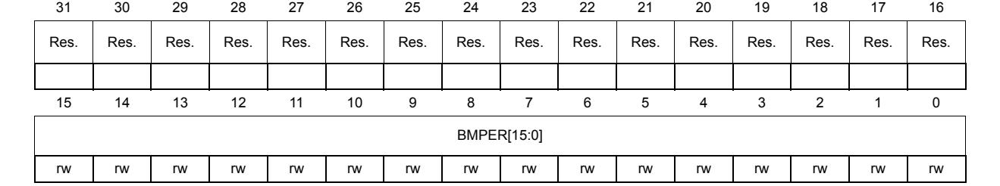

Bits 31:16 Reserved, must be kept at reset value.

#### Bits 15:0 **BMPER[15:0]**: *Burst mode Period*

Defines the burst mode repetition period.

This register holds either the content of the preload register or the content of the active register if preload is disabled.

*Note: The BMPER[15:0] must not be null when the burst mode is enabled.*

## 39.5.51 HRTIM Timer External Event Control Register 1 (HRTIM\_EECR1)

Address offset: 0x3B0h Reset value: 0x0000 0000

| 31            | 30         | 29          | 28      | 27          | 26         | 25      | 24         | 23               | 22      | 21          | 20    | 19          | 18         | 17          | 16            |
|---------------|------------|-------------|---------|-------------|------------|---------|------------|------------------|---------|-------------|-------|-------------|------------|-------------|---------------|
| Res.          | Res.       | EE5FA<br>ST | EE5SN   | NS[1:0]     | EE5PO<br>L | EE5SF   | RC[1:0]    | EE4FA<br>ST EE4S |         | EE4SNS[1:0] |       | EE4SRC[1:0] |            | EE3FA<br>ST | EE3SN<br>S[1] |
|               |            | rw          | rw      | rw          | rw         | rw      | rw         | rw               | rw      | rw          | rw    | rw          | rw         | rw          | rw            |
| 15            | 14         | 13          | 12      | 11          | 10         | 9       | 8          | 7                | 6       | 5           | 4     | 3           | 2          | 1           | 0             |
| EE3SN<br>S[0] | EE3PO<br>L | EE3SF       | RC[1:0] | EE2FA<br>ST | EE2SN      | NS[1:0] | EE2PO<br>L | EE2SF            | RC[1:0] | EE1FA<br>ST | EE1SN | NS[1:0]     | EE1PO<br>L | EE1SF       | RC[1:0]       |
| rw            | rw         | rw          | rw      | rw          | rw         | rw      | rw         | rw               | rw      | rw          | rw    | rw          | rw         | rw          | rw            |

Bits 31:30 Reserved, must be kept at reset value.

Bit 29 **EE5FAST**: External Event 5 Fast mode Refer to EE1FAST description

Bits 28:27 **EE5SNS[1:0]**: External Event 5 Sensitivity
Refer to EE1SNS[1:0] description

Bit 26 **EE5POL**: External Event 5 Polarity
Refer to EE1POL description

Bits 25:24 **EE5SRC[1:0]**: External Event 5 Source Refer to EE1SRC[1:0] description

Bit 23 **EE4FAST**: External Event 4 Fast mode Refer to EE1FAST description

Bits 22:21 **EE4SNS[1:0]**: External Event 4 Sensitivity
Refer to EE1SNS[1:0] description

Bit 20 **EE4POL**: External Event 4 Polarity
Refer to EE1POL description

Bits 19:18 **EE4SRC[1:0]**: External Event 4 Source Refer to EE1SRC[1:0] description

Bit 17 **EE3FAST**: External Event 3 Fast mode
Refer to EE1FAST description

Bits 16:15 **EE3SNS[1:0]**: External Event 3 Sensitivity
Refer to EE1SNS[1:0] description

Bit 14 **EE3POL**: External Event 3 Polarity
Refer to EE1POL description

Bits 13:12 **EE3SRC[1:0]**: External Event 3 Source Refer to EE1SRC[1:0] description

Bit 11 **EE2FAST**: External Event 2 Fast mode Refer to EE1FAST description

Bits 10:9 **EE2SNS[1:0]**: External Event 2 Sensitivity
Refer to EE1SNS[1:0] description

Bit 8 **EE2POL**: External Event 2 Polarity
Refer to EE1POL description

47/

RM0399 Rev 4 1651/3556

#### Bits 7:6 **EE2SRC[1:0]**: *External Event 2 Source*

Refer to EE1SRC[1:0] description

#### Bit 5 **EE1FAST**: *External Event 1 Fast mode*

- 0: External Event 1 is re-synchronized by the HRTIM logic before acting on outputs, which adds a fHRTIM clock-related latency
- 1: External Event 1 is acting asynchronously on outputs (low latency mode)

*Note: This bit must not be modified once the counter in which the event is used is enabled (TxCEN bit set)*

#### Bits 4:3 **EE1SNS[1:0]**: *External Event 1 Sensitivity*

- 00: On active level defined by EE1POL bit
- 01: Rising edge, whatever EE1POL bit value
- 10: Falling edge, whatever EE1POL bit value
- 11: Both edges, whatever EE1POL bit value

#### Bit 2 **EE1POL**: *External Event 1 Polarity*

This bit is only significant if EE1SNS[1:0] = 00.

- 0: External event is active high
- 1: External event is active low

*Note: This parameter cannot be changed once the timer x is enabled. It must be configured prior to setting EE1FAST bit.*

#### Bits 1:0 **EE1SRC[1:0]**: *External Event 1 Source*

00: hrtim\_evt11

01: hrtim\_evt12

10: hrtim\_evt13

11: hrtim\_evt14

*Note: This parameter cannot be changed once the timer x is enabled. It must be configured prior to setting EE1FAST bit.*

## 39.5.52 HRTIM Timer External Event Control Register 2 (HRTIM EECR2)

Address offset: 0x3B4h Reset value: 0x0000 0000

| 31            | 30         | 29    | 28           | 27 | 26          | 25           | 24         | 23    | 22      | 21      | 20         | 19      | 18         | 17    | 16            |
|---------------|------------|-------|--------------|----|-------------|--------------|------------|-------|---------|---------|------------|---------|------------|-------|---------------|
| Res.          | Res.       | Res.  | EE10SNS[1:0] |    | EE10P<br>OL | EE10SRC[1:0] |            | Res.  | EE9SI   | NS[1:0] | EE9PO<br>L | EE9SI   | RC[1:0]    | Res.  | EE8SN<br>S[1] |
|               |            |       | rw           | rw | rw          | rw           | rw         |       | rw      | rw      | rw         | rw      | rw         |       | rw            |
| 15            | 14         | 13    | 12           | 11 | 10          | 9            | 8          | 7     | 6       | 5       | 4          | 3       | 2          | 1     | 0             |
| EE8SN<br>S[0] | EE8PO<br>L | EE8SF | RC[1:0] Res. |    | EE7SN       | NS[1:0]      | EE7PO<br>L | EE7SF | RC[1:0] | Res.    | EE6SN      | NS[1:0] | EE6PO<br>L | EE6SF | RC[1:0]       |
| rw            | rw         | rw    | rw           |    | rw          | rw           | rw         | rw    | rw      |         | rw         | rw      | rw         | rw    | rw            |

Bits 31:29 Reserved, must be kept at reset value.

Bits 28:27 **EE10SNS[1:0]**: External Event 10 Sensitivity
Refer to EE1SNS[1:0] description

Bit 26 **EE10POL**: External Event 10 Polarity
Refer to EE1POL description

Bits 25:24 **EE10SRC[1:0]**: External Event 10 Source Refer to EE1SRC[1:0] description

Bit 23 Reserved, must be kept at reset value.

Bits 22:21 **EE9SNS[1:0]**: External Event 9 Sensitivity
Refer to EE1SNS[1:0] description

Bit 20 **EE9POL**: External Event 9 Polarity
Refer to EE1POL description

Bits 19:18 **EE9SRC[1:0]**: External Event 9 Source Refer to EE1SRC[1:0] description

Bit 17 Reserved, must be kept at reset value.

Bits 16:15 **EE8SNS[1:0]**: External Event 8 Sensitivity
Refer to EE1SNS[1:0] description

Bit 14 **EE8POL**: External Event 8 Polarity

Refer to EE1POL description

Bits 13:12 **EE8SRC[1:0]**: External Event 8 Source Refer to EE1SRC[1:0] description

Bit 11 Reserved, must be kept at reset value.

Bits 10:9 **EE7SNS[1:0]**: External Event 7 Sensitivity
Refer to EE1SNS[1:0] description

Bit 8 **EE7POL**: External Event 7 Polarity
Refer to EE1POL description

Bits 7:6 **EE7SRC[1:0]**: External Event 7 Source Refer to EE1SRC[1:0] description

Bit 5 Reserved, must be kept at reset value.

47/

RM0399 Rev 4

1653/3556

Bits 4:3 **EE6SNS[1:0]**: *External Event 6 Sensitivity*

Refer to EE1SNS[1:0] description

Bit 2 **EE6POL**: *External Event 6 Polarity*

Refer to EE1POL description

Bits 1:0 **EE6SRC[1:0]**: *External Event 6 Source*

Refer to EE1SRC[1:0] description

## **39.5.53 HRTIM Timer External Event Control Register 3 (HRTIM\_EECR3)**

Address offset: 0x3B8h

Reset value: 0x0000 0000

| 31 | 30                                     | 29   | 28                 | 27 | 26 | 25 | 24 | 23   | 22   | 21   | 20        | 19   | 18        | 17 | 16 |
|----|----------------------------------------|------|--------------------|----|----|----|----|------|------|------|-----------|------|-----------|----|----|
|    | EEVSD[1:0]                             | Res. | Res.<br>EE10F[3:0] |    |    |    |    | Res. | Res. |      | EE9F[3:0] | Res. | Res.      |    |    |
| rw | rw                                     |      |                    | rw | rw | rw | rw |      |      | rw   | rw        | rw   | rw        |    |    |
| 15 | 14                                     | 13   | 12                 | 11 | 10 | 9  | 8  | 7    | 6    | 5    | 4         | 3    | 2         | 1  | 0  |
|    | EE8F[3:0]<br>Res.<br>Res.<br>EE7F[3:0] |      |                    |    |    |    |    |      | Res. | Res. |           |      | EE6F[3:0] |    |    |
| rw | rw                                     | rw   | rw                 |    |    | rw | rw | rw   | rw   |      |           | rw   | rw        | rw | rw |

#### Bits 31:30 **EEVSD[1:0]**: External Event Sampling clock division

This bitfield indicates the division ratio between the timer clock frequency (fHRTIM) and the External Event signal sampling clock (fEEVS) used by the digital filters.

00: fEEVS=fHRTIM

01: fEEVS=fHRTIM / 2

10: fEEVS=fHRTIM / 4

11: fEEVS=fHRTIM / 8

Bits 29:28 Reserved, must be kept at reset value.

Bits 27:24 **EE10F[3:0]**: External Event 10 filter

Refer to EE6F[3:0] description

Bits 23:22 Reserved, must be kept at reset value.

Bits 21:18 **EE9F[3:0]**: External Event 9 filter

Refer to EE6F[3:0] description

Bits 17:16 Reserved, must be kept at reset value.

Bits 15:12 **EE8F[3:0]**: External Event 8 filter

Refer to EE6F[3:0] description

Bits 11:10 Reserved, must be kept at reset value.

Bits 9:6 **EE7F[3:0]**: External Event 7 filter

Refer to EE6F[3:0] description

Bits 4:5 Reserved, must be kept at reset value.

#### Bits 3:0 **EE6F[3:0]**: External Event 6 filter

This bitfield defines the frequency used to sample External Event 6 input and the length of the digital filter applied to hrtim\_evt6. The digital filter is made of a counter in which N valid samples are needed to validate a transition on the output.

0000: Filter disabled

0001: fSAMPLING= fHRTIM, N=2

0010: fSAMPLING= fHRTIM, N=4

0011: fSAMPLING= fHRTIM, N=8

0100: fSAMPLING= fEEVS/2, N=6

0101: fSAMPLING= fEEVS/2, N=8

0110: fSAMPLING= fEEVS/4, N=6

0111: fSAMPLING= fEEVS/4, N=8

1000: fSAMPLING= fEEVS/8, N=6

1001: fSAMPLING= fEEVS/8, N=8

1010: fSAMPLING= fEEVS/16, N=5

1011: fSAMPLING= fEEVS/16, N=6

1100: fSAMPLING= fEEVS/16, N=8

1101: fSAMPLING= fEEVS/32, N=5

1110: fSAMPLING= fEEVS/32, N=6

1111: fSAMPLING= fEEVS/32, N=8

## **39.5.54 HRTIM ADC Trigger 1 Register (HRTIM\_ADC1R)**

Address offset: 0x3BCh Reset value: 0x0000 0000

| AD1TE<br>PER | AD1TE<br>C4  | AD1TE<br>C3  | AD1TE<br>C2 | AD1TD<br>PER | AD1TD<br>C4 | AD1TD<br>C3 | AD1TD<br>C2 | AD1TC<br>PER | AD1TC<br>C4 | AD1TC<br>C3 | AD1TC<br>C2 | AD1TB<br>RST | AD1TB<br>PER | AD1TB<br>C4 | AD1TB<br>C3 |
|--------------|--------------|--------------|-------------|--------------|-------------|-------------|-------------|--------------|-------------|-------------|-------------|--------------|--------------|-------------|-------------|
| rw           | rw           | rw           | rw          | rw           | rw          | rw          | rw          | rw           | rw          | rw          | rw          | rw           | rw           | rw          | rw          |
| 15           | 14           | 13           | 12          | 11           | 10          | 9           | 8           | 7            | 6           | 5           | 4           | 3            | 2            | 1           | 0           |
| AD1TB<br>C2  | AD1TA<br>RST | AD1TA<br>PER | AD1TA<br>C4 | AD1TA<br>C3  | AD1TA<br>C2 | AD1EE<br>V5 | AD1EE<br>V4 | AD1EE<br>V3  | AD1EE<br>V2 | AD1EE<br>V1 | AD1MP<br>ER | AD1MC<br>4   | AD1MC<br>3   | AD1MC<br>2  | AD1MC<br>1  |
| rw           | rw           | rw           | rw          | rw           | rw          | rw          | rw          | rw           | rw          | rw          | rw          | rw           | rw           | rw          | rw          |

31 30 29 28 27 26 25 24 23 22 21 20 19 18 17 16

Bits 31:0 These bits select the trigger source for th ADC Trigger 1 output (hrtim\_adc\_trg1). Refer to HRTIM\_ADC3R bits description for details

## **39.5.55 HRTIM ADC Trigger 2 Register (HRTIM\_ADC2R)**

Address offset: 0x3C0h Reset value: 0x0000 0000

| 31           | 30          | 29           | 28          | 27           | 26           | 25           | 24          | 23          | 22           | 21           | 20          | 19          | 18          | 17           | 16          |
|--------------|-------------|--------------|-------------|--------------|--------------|--------------|-------------|-------------|--------------|--------------|-------------|-------------|-------------|--------------|-------------|
| AD2TE<br>RST | AD2TE<br>C4 | AD2TE<br>C3  | AD2TE<br>C2 | AD2TD<br>RST | AD2TD<br>PER | AD2TD<br>C4  | AD2TD<br>C3 | AD2TD<br>C2 | AD2TC<br>RST | AD2TC<br>PER | AD2TC<br>C4 | AD2TC<br>C3 | AD2TC<br>C2 | AD2TB<br>PER | AD2TB<br>C4 |
| rw           | rw          | rw           | rw          | rw           | rw           | rw           | rw          | rw          | rw           | rw           | rw          | rw          | rw          | rw           | rw          |
| 15           | 14          | 13           | 12          | 11           | 10           | 9            | 8           | 7           | 6            | 5            | 4           | 3           | 2           | 1            | 0           |
| AD2TB<br>C3  | AD2TB<br>C2 | AD2TA<br>PER | AD2TA<br>C4 | AD2TA<br>C3  | AD2TA<br>C2  | AD2EE<br>V10 | AD2EE<br>V9 | AD2EE<br>V8 | AD2EE<br>V7  | AD2EE<br>V6  | AD2MP<br>ER | AD2MC<br>4  | AD2MC<br>3  | AD2MC<br>2   | AD2MC<br>1  |
| rw           | rw          | rw           | rw          | rw           | rw           | rw           | rw          | rw          | rw           | rw           | rw          | rw          | rw          | rw           | rw          |

Bits 31:0 These bits select the trigger source for th ADC Trigger 2 output (hrtim\_adc\_trg2). Refer to HRTIM\_ADC4R bits description for details


## **39.5.56 HRTIM ADC Trigger 3 Register (HRTIM\_ADC3R)**

Address offset: 0x3C4h Reset value: 0x0000 0000

| 31            | 30            | 29            | 28           | 27            | 26           | 25           | 24           | 23            | 22           | 21           | 20           | 19            | 18            | 17           | 16           |
|---------------|---------------|---------------|--------------|---------------|--------------|--------------|--------------|---------------|--------------|--------------|--------------|---------------|---------------|--------------|--------------|
| ADC3<br>TEPER | ADC3T<br>EC4  | ADC3T<br>EC3  | ADC3T<br>EC2 | ADC3T<br>DPER | ADC3T<br>DC4 | ADC3T<br>DC3 | ADC3T<br>DC2 | ADC3T<br>CPER | ADC3T<br>CC4 | ADC3T<br>CC3 | ADC3T<br>CC2 | ADC3T<br>BRST | ADC3T<br>BPER | ADC3T<br>BC4 | ADC3T<br>BC3 |
| rw            | rw            | rw            | rw           | rw            | rw           | rw           | rw           | rw            | rw           | rw           | rw           | rw            | rw            | rw           | rw           |
| 15            | 14            | 13            | 12           | 11            | 10           | 9            | 8            | 7             | 6            | 5            | 4            | 3             | 2             | 1            | 0            |
| ADC3T<br>BC2  | ADC3T<br>ARST | ADC3T<br>APER | ADC3T<br>AC4 | ADC3T<br>AC3  | ADC3T<br>AC2 | ADC3E<br>EV5 | ADC3E<br>EV4 | ADC3E<br>EV3  | ADC3E<br>EV2 | ADC3E<br>EV1 | ADC3M<br>PER | ADC3M<br>C4   | ADC3M<br>C3   | ADC3M<br>C2  | ADC3M<br>C1  |
| rw            | rw            | rw            | rw           | rw            | rw           | rw           | rw           | rw            | rw           | rw           | rw           | rw            | rw            | rw           | rw           |

Bit 31 **ADC3TEPER**: *ADC trigger 3 on Timer E Period* Refer to ADC3TAPER description

Bit 30 **ADC3TEC4**: *ADC trigger 3 on Timer E Compare 4* Refer to ADC3TAC2 description

Bit 29 **ADC3TEC3**: *ADC trigger 3 on Timer E Compare 3* Refer to ADC3TAC2 description

Bit 28 **ADC3TEC2**: *ADC trigger 3 on Timer E Compare 2* Refer to ADC3TAC2 description

Bit 27 **ADC3TDPER**: *ADC trigger 3 on Timer D Period* Refer to ADC3TAPER description

Bit 26 **ADC3TDC4**: *ADC trigger 3 on Timer D Compare 4* Refer to ADC3TAC2 description

Bit 25 **ADC3TDC3**: *ADC trigger 3 on Timer D Compare 3* Refer to ADC3TAC2 description

Bit 24 **ADC3TDC2**: *ADC trigger 3 on Timer D Compare 2* Refer to ADC3TAC2 description

Bit 23 **ADC3TCPER**: *ADC trigger 3 on Timer C Period* Refer to ADC3TAPER description

Bit 22 **ADC3TCC4**: *ADC trigger 3 on Timer C Compare 4* Refer to ADC3TAC2 description

Bit 21 **ADC3TCC3**: *ADC trigger 3 on Timer C Compare 3* Refer to ADC3TAC2 description

Bit 20 **ADC3TCC2**: *ADC trigger 3 on Timer C Compare 2* Refer to ADC3TAC2 description

Bit 19 **ADC3TBRST**: *ADC trigger 3 on Timer B Reset and counter roll-over* Refer to ADC3TBRST description

Bit 18 **ADC3TBPER**: *ADC trigger 3 on Timer B Period* Refer to ADC3TAPER description

Bit 17 **ADC3TBC4**: *ADC trigger 3 on Timer B Compare 4* Refer to ADC3TAC2 description

RM0399 Rev 4 1657/3556

Bit 16 **ADC3TBC3**: *ADC trigger 3 on Timer B Compare 3*

Refer to ADC3TAC2 description

Bit 15 **ADC3TBC2**: *ADC trigger 3 on Timer B Compare 2*

Refer to ADC3TAC2 description

Bit 14 **ADC3TARST**: *ADC trigger 3 on Timer A Reset and counter roll-over*

This bit enables the generation of an ADC Trigger upon Timer A reset and roll-over event, on ADC Trigger 1 output.

Bit 13 **ADC3TAPER**: *ADC trigger 3 on Timer A Period*

This bit enables the generation of an ADC Trigger upon Timer A period event, on ADC Trigger 3 output (hrtim\_adc\_trg3).

Bit 12 **ADC3TAC4**: *ADC trigger 3 on Timer A Compare 4*

Refer to ADC3TAC2 description

Bit 11 **ADC3TAC3**: *ADC trigger 3 on Timer A Compare 3*

Refer to ADC3TAC2 description

Bit 10 **ADC3TAC2**: *ADC trigger 3 on Timer A Compare 2*

This bit enables the generation of an ADC Trigger upon Timer A Compare 2 event, on ADC Trigger 3 output (hrtim\_adc\_trg3).

Bit 9 **ADC3EEV5**: *ADC trigger 3 on External Event 5*

Refer to ADC3EEV1 description

Bit 8 **ADC3EEV4**: *ADC trigger 3 on External Event 4*

Refer to ADC3EEV1 description

Bit 7 **ADC3EEV3**: *ADC trigger 3 on External Event 3*

Refer to ADC3EEV1 description

Bit 6 **ADC3EEV2**: *ADC trigger 3 on External Event 2*

Refer to ADC3EEV1 description

Bit 5 **ADC3EEV1**: *ADC trigger 3 on External Event 1*

This bit enables the generation of an ADC Trigger upon External event 1, on ADC Trigger 3 output (hrtim\_adc\_trg3).

Bit 4 **ADC3MPER**: *ADC trigger 3 on Master Period*

This bit enables the generation of an ADC Trigger upon Master timer period event, on ADC Trigger 3 output (hrtim\_adc\_trg3).

Bit 3 **ADC3MC4**: *ADC trigger 3 on Master Compare 4*

Refer to ADC3MC1 description

Bit 2 **ADC3MC3**: *ADC trigger 3 on Master Compare 3*

Refer to ADC3MC1 description

Bit 1 **ADC3MC2**: *ADC trigger 3 on Master Compare 2*

Refer to ADC3MC1 description

Bit 0 **ADC3MC1**: *ADC trigger 3 on Master Compare 1*

This bit enables the generation of an ADC Trigger upon Master Compare 1 event, on ADC Trigger 3 output (hrtim\_adc\_trg3).


## **39.5.57 HRTIM ADC Trigger 4 Register (HRTIM\_ADC4R)**

Address offset: 0x3C8h Reset value: 0x0000 0000

| 31            | 30           | 29            | 28           | 27            | 26            | 25            | 24           | 23           | 22            | 21            | 20           | 19           | 18           | 17            | 16           |
|---------------|--------------|---------------|--------------|---------------|---------------|---------------|--------------|--------------|---------------|---------------|--------------|--------------|--------------|---------------|--------------|
| ADC4T<br>ERST | ADC4T<br>EC4 | ADC4T<br>EC3  | ADC4T<br>EC2 | ADC4T<br>DRST | ADC4T<br>DPER | ADC4T<br>DC4  | ADC4T<br>DC3 | ADC4T<br>DC2 | ADC4T<br>CRST | ADC4T<br>CPER | ADC4T<br>CC4 | ADC4T<br>CC3 | ADC4T<br>CC2 | ADC4T<br>BPER | ADC4T<br>BC4 |
| rw            | rw           | rw            | rw           | rw            | rw            | rw            | rw           | rw           | rw            | rw            | rw           | rw           | rw           | rw            | rw           |
| 15            | 14           | 13            | 12           | 11            | 10            | 9             | 8            | 7            | 6             | 5             | 4            | 3            | 2            | 1             | 0            |
| ADC4T<br>BC3  | ADC4T<br>BC2 | ADC4T<br>APER | ADC4T<br>AC4 | ADC4T<br>AC3  | ADC4T<br>AC2  | ADC4E<br>EV10 | ADC4E<br>EV9 | ADC4E<br>EV8 | ADC4E<br>EV7  | ADC4E<br>EV6  | ADC4M<br>PER | ADC4M<br>C4  | ADC4M<br>C3  | ADC4M<br>C2   | ADC4M<br>C1  |
| rw            | rw           | rw            | rw           | rw            | rw            | rw            | rw           | rw           | rw            | rw            | rw           | rw           | rw           | rw            | rw           |

Bit 31 **ADC4TERST**: *ADC trigger 4 on Timer E Reset and counter roll-over* (1) Refer to ADC4TCRST description

Bit 30 **ADC4TEC4**: *ADC trigger 4 on Timer E Compare 4* Refer to ADC4TAC2 description

Bit 29 **ADC4TEC3**: *ADC trigger 4 on Timer E Compare 3* Refer to ADC4TAC2 description

Bit 28 **ADC4TEC2**: *ADC trigger 4 on Timer E Compare 2* Refer to ADC4TAC2 description

Bit 27 **ADC4TDRST**: *ADC trigger 4 on Timer D Reset and counter roll-over [\(1\)](#page-158-0)* Refer to ADC4TCRST description

Bit 26 **ADC4TDPER**: *ADC trigger 4 on Timer D Period* Refer to ADC4TAPER description

Bit 25 **ADC4TDC4**: *ADC trigger 4 on Timer D Compare 4* Refer to ADC4TAC2 description

Bit 24 **ADC4TDC3**: *ADC trigger 4 on Timer D Compare 3* Refer to ADC4TAC2 description

Bit 23 **ADC4TDC2**: *ADC trigger 2 on Timer D Compare 2*

Refer to ADC4TAC2 description Bit 22 **ADC4TCRST**: *ADC trigger 4 on Timer C Reset and counter roll-over [\(1\)](#page-158-0)*

> This bit enables the generation of an ADC Trigger upon Timer C reset and roll-over event, on ADC Trigger 4 output (hrtim\_adc\_trg4).

Bit 21 **ADC4TCPER**: *ADC trigger 4 on Timer C Period* Refer to ADC4TAPER description

Bit 20 **ADC4TCC4**: *ADC trigger 4 on Timer C Compare 4* Refer to ADC4TAC2 description

Bit 19 **ADC4TCC3**: *ADC trigger 4 on Timer C Compare 3* Refer to ADC4TAC2 description

Bit 18 **ADC4TCC2**: *ADC trigger 4 on Timer C Compare 2* Refer to ADC4TAC2 description


RM0399 Rev 4 1659/3556

Bit 17 **ADC4TBPER**: *ADC trigger 4 on Timer B Period*

Refer to ADC4TAPER description

Bit 16 **ADC4TBC4**: *ADC trigger 4 on Timer B Compare 4*

Refer to ADC4TAC2 description

Bit 15 **ADC4TBC3**: *ADC trigger 4 on Timer B Compare 3*

Refer to ADC4TAC2 description

Bit 14 **ADC4TBC2**: *ADC trigger 4 on Timer B Compare 2*

Refer to ADC4TAC2 description

Bit 13 **ADC4TAPER**: *ADC trigger 4 on Timer A Period*

This bit enables the generation of an ADC Trigger upon Timer A event, on ADC Trigger 4 output (hrtim\_adc\_trg4).

Bit 12 **ADC4TAC4**: *ADC trigger 4 on Timer A Compare 4*

Refer to ADC4TAC2 description

Bit 11 **ADC4TAC3**: *ADC trigger 4 on Timer A Compare 3*

Refer to ADC4TAC2 description

Bit 10 **ADC4TAC2**: *ADC trigger 4 on Timer A Compare 2*

This bit enables the generation of an ADC Trigger upon Timer A Compare 2, on ADC Trigger 4 output (hrtim\_adc\_trg4).

Bit 9 **ADC4EEV10**: *ADC trigger 4 on External Event 10 [\(1\)](#page-158-0)*

Refer to ADC4EEV6 description

Bit 8 **ADC4EEV9**: *ADC trigger 4 on External Event 9 [\(1\)](#page-158-0)*

Refer to ADC4EEV6 description

Bit 7 **ADC4EEV8**: *ADC trigger 4 on External Event 8 [\(1\)](#page-158-0)*

Refer to ADC4EEV6 description

Bit 6 **ADC4EEV7**: *ADC trigger 4 on External Event 7 [\(1\)](#page-158-0)*

Refer to ADC4EEV6 description

Bit 5 **ADC4EEV6**: *ADC trigger 4 on External Event 6 [\(1\)](#page-158-0)*

This bit enables the generation of an ADC Trigger upon external event 6, on ADC Trigger 4 output (hrtim\_adc\_trg4).

Bit 4 **ADC4MPER**: *ADC trigger 4 on Master Period*

This bit enables the generation of an ADC Trigger upon Master period event, on ADC Trigger 4 output (hrtim\_adc\_trg4).

Bit 3 **ADC4MC4**: *ADC trigger 4 on Master Compare 4*

Refer to ADC4MC1 description

Bit 2 **ADC4MC3**: *ADC trigger 4 on Master Compare 3*

Refer to ADC4MC1 description

Bit 1 **ADC4MC2**: *ADC trigger 4 on Master Compare 2*

Refer to ADC4MC1 description

Bit 0 **ADC4MC1**: *ADC trigger 4 on Master Compare 1*

This bit enables the generation of an ADC Trigger upon Master Compare 1 event, on ADC Trigger 4 output (hrtim\_adc\_trg4).

<span id="page-158-0"></span>1. These triggers are differing from HRTIM\_ADC1R/HRTIM\_ADC3R to HRTIM\_ADC2R/HRTIM\_ADC4R.


## 39.5.58 HRTIM Fault Input Register 1 (HRTIM FLTINR1)

Address offset: 0x3D0h Reset value: 0x0000 0000

| 31          | 30 | 29   | 28     | 27 | 26          | 25    | 24    | 23          | 22 | 21   | 20     | 19 | 18          | 17    | 16    |
|-------------|----|------|--------|----|-------------|-------|-------|-------------|----|------|--------|----|-------------|-------|-------|
| FLT4L<br>CK |    | FLT4 | F[3:0] |    | FLT4S<br>RC | FLT4P | FLT4E | FLT3L<br>CK |    | FLT3 | F[3:0] |    | FLT3S<br>RC | FLT3P | FLT3E |
| rwo         | rw | rw   | rw     | rw | rw          | rw    | rw    | rw          | rw | rw   | rw     | rw | rw          | rw    | rw    |
| 15          | 14 | 13   | 12     | 11 | 10          | 9     | 8     | 7           | 6  | 5    | 4      | 3  | 2           | 1     | 0     |
| FLT2L<br>CK |    | FLT2 | F[3:0] |    | FLT2S<br>RC | FLT2P | FLT2E | FLT1L<br>CK |    | FLT1 | F[3:0] |    | FLT1S<br>RC | FLT1P | FLT1E |
| rwo         | rw | rw   | rw     | rw | rw          | rw    | rw    | rw          | rw | rw   | rw     | rw | rw          | rw    | rw    |

Bit 31 FLT4LCK: Fault 4 Lock

Refer to FLT5LCK description in HRTIM\_FLTINR2 register

Bits 30:27 FLT4F[3:0]: Fault 4 filter

Refer to FLT5F[3:0] description in HRTIM FLTINR2 register

Bit 26 FLT4SRC: Fault 4 source

Refer to FLT5SRC description in HRTIM FLTINR2 register

Bit 25 FLT4P: Fault 4 polarity

Refer to FLT5P description in HRTIM FLTINR2 register

Bit 24 FLT4E: Fault 4 enable

Refer to FLT5E description in HRTIM FLTINR2 register

Bit 23 FLT3LCK: Fault 3 Lock

Refer to FLT5LCK description in HRTIM FLTINR2 register

Bits 22:19 FLT3F[3:0]: Fault 3 filter

Refer to FLT5F[3:0] description in HRTIM FLTINR2 register

Bit 18 FLT3SRC: Fault 3 source

Refer to FLT5SRC description in HRTIM FLTINR2 register

Bit 17 **FLT3P**: Fault 3 polarity

Refer to FLT5P description in HRTIM\_FLTINR2 register

Bit 16 FLT3E: Fault 3 enable

Refer to FLT5E description in HRTIM\_FLTINR2 register

Bit 15 FLT2LCK: Fault 2 Lock

Refer to FLT5LCK description in HRTIM\_FLTINR2 register

Bits 14:11 FLT2F[3:0]: Fault 2 filter

Refer to FLT5F[3:0] description in HRTIM\_FLTINR2 register

Bit 10 FLT2SRC: Fault 2 source

Refer to FLT5SRC description in HRTIM\_FLTINR2 register

Bit 9 FLT2P: Fault 2 polarity

Refer to FLT2P description in HRTIM\_FLTINR2 register

Bit 8 FLT2E: Fault 2 enable

Refer to FLT5E description in HRTIM\_FLTINR2 register


RM0399 Rev 4 1661/3556

Bit 7 **FLT1LCK**: Fault 1 Lock

Refer to FLT5LCK description in HRTIM\_FLTINR2 register

Bits 6:3 **FLT1F[3:0]**: Fault 1 filter

Refer to FLT5F[3:0] description in HRTIM\_FLTINR2 register

Bit 2 **FLT1SRC**: Fault 1 source

Refer to FLT5SRC description in HRTIM\_FLTINR2 register

Bit 1 **FLT1P**: Fault 1 polarity

Refer to FLT5P description in HRTIM\_FLTINR2 register

Bit 0 **FLT1E**: Fault 1 enable

Refer to FLT5E description in HRTIM\_FLTINR2 register


## 39.5.59 HRTIM Fault Input Register 2 (HRTIM\_FLTINR2)

Address offset: 0x3D4h Reset value: 0x0000 0000

| 31   | 30   | 29   | 28   | 27   | 26   | 25   | 24     | 23          | 22   | 21   | 20   | 19   | 18          | 17    | 16    |
|------|------|------|------|------|------|------|--------|-------------|------|------|------|------|-------------|-------|-------|
| Res. | Res. | Res. | Res. | Res. | Res. | FLTS | D[1:0] | Res.        | Res. | Res. | Res. | Res. | Res.        | Res.  | Res.  |
|      |      |      |      |      |      | rw   | rw     |             |      |      |      |      |             |       |       |
| 15   | 14   | 13   | 12   | 11   | 10   | 9    | 8      | 7           | 6    | 5    | 4    | 3    | 2           | - 1   | 0     |
|      |      |      |      |      | . •  | •    | 0      | ,           | O    | 3    | 4    | 3    | 2           |       | U     |
| Res. | Res. | Res. | Res. | Res. | Res. | Res. | Res.   | FLT5L<br>CK | 0    | FLT5 |      | 3    | FLT5S<br>RC | FLT5P | FLT5E |

Bits 31:26 Reserved, must be kept at reset value.

#### Bits 25:24 FLTSD[1:0]: Fault Sampling clock division

This bitfield indicates the division ratio between the timer clock frequency ( $f_{HRTIM}$ ) and the fault signal sampling clock ( $f_{FLTS}$ ) used by the digital filters.

00: f<sub>FLTS</sub>=f<sub>HRTIM</sub> 01: f<sub>FLTS</sub>=f<sub>HRTIM</sub> / 2 10: f<sub>FLTS</sub>=f<sub>HRTIM</sub> / 4 11: f<sub>FLTS</sub>=f<sub>HRTIM</sub> / 8

Note: This bitfield must be written prior to any of the FLTxE enable bits.

Bits 23:8 Reserved, must be kept at reset value.

#### Bit 7 FLT5LCK: Fault 5 Lock

The FLT5LCK bit modifies the write attributes of the fault programming bit, so that they can be protected against spurious write accesses.

This bit is write-once. Once it has been set, it cannot be modified till the next system reset.

0: FLT5E, FLT5P, FLT5SRC, FLT5F[3:0] bits are read/write.

1: FLT5E, FLT5P, FLT5SRC, FLT5F[3:0] bits can no longer be written (read-only mode)

1663/3556

#### Bits 6:3 **FLT5F[3:0]**: Fault 5 filter

This bitfield defines the frequency used to sample FLT5 input and the length of the digital filter applied to FLT5. The digital filter is made of an event counter in which N events are needed to validate a transition on the output:

```
0000: No filter, FLT5 acts asynchronously
```

```
0001: fSAMPLING = fHRTIM, N = 2
0010: fSAMPLING = fHRTIM, N = 4
0011: fSAMPLING = fHRTIM, N = 8
0100: fSAMPLING = fFLTS/2, N = 6
0101: fSAMPLING = fFLTS/2, N = 8
0110: fSAMPLING = fFLTS/4, N = 6
0111: fSAMPLING = fFLTS/4, N = 8
1000: fSAMPLING = fFLTS/8, N = 6
1001: fSAMPLING = fFLTS/8, N = 8
1010: fSAMPLING = fFLTS/16, N = 5
1011: fSAMPLING = fFLTS/16, N = 6
1100: fSAMPLING = fFLTS/16, N = 8
1101: fSAMPLING = fFLTS/32, N = 5
```

1110: fSAMPLING = fFLTS/32, N = 6

*Note: This bitfield can be written only when FLT5E enable bit is reset. This bitfield cannot be modified when FLT5LOCK has been programmed.*

## Bit 2 **FLT5SRC**: Fault 5 source

This bit selects the FAULT5 input source (refer to *[Table 342](#page-63-1)* for connection details).

0: Fault 1 input is HRTIM\_FLT5 input pin

1: Fault 1 input is hrtim\_in\_flt5 signal

1111: fSAMPLING = fFLTS/32, N = 8

*Note: This bitfield can be written only when FLT5E enable bit is reset*

#### Bit 1 **FLT5P**: Fault 5 polarity

This bit selects the FAULT5 input polarity.

0: Fault 5 input is active low

1: Fault 5 input is active high

*Note: This bitfield can be written only when FLT5E enable bit is reset*

#### Bit 0 **FLT5E**: Fault 5 enable

This bit enables the global FAULT5 input circuitry.

0: Fault 5 input disabled

1: Fault 5 input enabled


## **39.5.60 HRTIM Burst DMA Master timer update Register (HRTIM\_BDMUPR)**

Address offset: 0x3D8h Reset value: 0x0000 0000

| 31   | 30   | 29   | 28   | 27   | 26   | 25   | 24   | 23                      | 22   | 21   | 20   | 19   | 18    | 17   | 16   |
|------|------|------|------|------|------|------|------|-------------------------|------|------|------|------|-------|------|------|
| Res. | Res. | Res. | Res. | Res. | Res. | Res. | Res. | Res.                    | Res. | Res. | Res. | Res. | Res.  | Res. | Res. |
|      |      |      |      |      |      |      |      |                         |      |      |      |      |       |      |      |
| 15   | 14   | 13   | 12   | 11   | 10   | 9    | 8    | 7                       | 6    | 5    | 4    | 3    | 2     | 1    | 0    |
| Res. | Res. | Res. | Res. | Res. | Res. |      |      | MCMP4 MCMP3 MCMP2 MCMP1 |      | MREP | MPER | MCNT | MDIER | MICR | MCR  |
|      |      |      |      |      |      |      |      |                         |      |      |      |      |       |      |      |

Bits 31:10 Reserved, must be kept at reset value.

Bit 9 **MCMP4**: *MCMP4R register update enable*

Refer to MCR description

Bit 8 **MCMP3**: *MCMP3R register update enable*

Refer to MCR description

Bit 7 **MCMP2**: *MCMP2R register update enable*

Refer to MCR description

Bit 6 **MCMP1**: *MCMP1R register update enable*

Refer to MCR description

Bit 5 **MREP**: *MREP register update enable*

Refer to MCR description

Bit 4 **MPER**: *MPER register update enable*

Refer to MCR description

Bit 3 **MCNT**: *MCNTR register update enable*

Refer to MCR description

Bit 2 **MDIER**: *MDIER register update enable*

Refer to MCR description

Bit 1 **MICR**: *MICR register update enable*

Refer to MCR description

Bit 0 **MCR**: *MCR register update enable*

This bit defines if the master timer MCR register is part of the list of registers to be updated by the Burst DMA.

0: MCR register is not updated by Burst DMA accesses

1: MCR register is updated by Burst DMA accesses


## **39.5.61 HRTIM Burst DMA Timerx update Register (HRTIM\_BDTxUPR)**

Address offset: 0x3DCh-0x3ECh

Reset value: 0x0000 0000

| 31            | 30            | 29            | 28            | 27            | 26           | 25           | 24           | 23           | 22           | 21          | 20           | 19           | 18           | 17           | 16            |
|---------------|---------------|---------------|---------------|---------------|--------------|--------------|--------------|--------------|--------------|-------------|--------------|--------------|--------------|--------------|---------------|
| Res.          | Res.          | Res.          | Res.          | Res.          | Res.         | Res.         | Res.         | Res.         | Res.         | Res.        | TIMxFL<br>TR | TIMxO<br>UTR | TIMxC<br>HPR | TIMxR<br>STR | TIMxE<br>EFR2 |
|               |               |               |               |               |              |              |              |              |              |             | rw           | rw           | rw           | rw           | rw            |
|               |               |               |               |               |              |              |              |              |              |             |              |              |              |              |               |
| 15            | 14            | 13            | 12            | 11            | 10           | 9            | 8            | 7            | 6            | 5           | 4            | 3            | 2            | 1            | 0             |
| TIMxE<br>EFR1 | TIMxR<br>ST2R | TIMxS<br>ET2R | TIMxR<br>ST1R | TIMxS<br>ET1R | TIMxD<br>TxR | TIMxC<br>MP4 | TIMxC<br>MP3 | TIMxC<br>MP2 | TIMxC<br>MP1 | TIMxR<br>EP | TIMxP<br>ER  | TIMxC<br>NT  | TIMxDI<br>ER | TIMxIC<br>R  | TIMxC<br>R    |

Bits 31:21 Reserved, must be kept at reset value.

Bit 20 **TIMxFLTR**: HRTIM\_FLTxR register update enable Refer to TIMxCR description

Bit 19 **TIMxOUTR**: HRTIM\_OUTxR register update enable Refer to TIMxCR description

Bit 18 **TIMxCHPR**: HRTIM\_CHPxR register update enable Refer to TIMxCR description

Bit 17 **TIMxRSTR**: HRTIM\_RSTxR register update enable Refer to TIMxCR description

Bit 16 **TIMxEEFR2**: HRTIM\_EEFxR2 register update enable Refer to TIMxCR description

Bit 15 **TIMxEEFR1**: HRTIM\_EEFxR1 register update enable Refer to TIMxCR description

Bit 14 **TIMxRST2R**: HRTIM\_RST2xR register update enable Refer to TIMxCR description

Bit 13 **TIMxSET2R**: HRTIM\_SET2xR register update enable Refer to TIMxCR description

Bit 12 **TIMxRST1R**: HRTIM\_RST1xR register update enable Refer to TIMxCR description

Bit 11 **TIMxSET1R**: HRTIM\_SET1xR register update enable Refer to TIMxCR description

Bit 10 **TIMxDTR**: HRTIM\_DTxR register update enable Refer to TIMxCR description

Bit 9 **TIMxCMP4**: HRTIM\_CMP4xR register update enable Refer to TIMxCR description

Bit 8 **TIMxCMP3**: HRTIM\_CMP3xR register update enable Refer to TIMxCR description

Bit 7 **TIMxCMP2**: HRTIM\_CMP2xR register update enable Refer to TIMxCR description


Bit 6 **TIMxCMP1**: HRTIM\_CMP1xR register update enable

Refer to TIMxCR description

Bit 5 **TIMxREP**: HRTIM\_REPxR register update enable

Refer to TIMxCR description

Bit 4 **TIMxPER**: HRTIM\_PERxR register update enable

Refer to TIMxCR description

Bit 3 **TIMxCNT**: HRTIM\_CNTxR register update enable

Refer to TIMxCR description

Bit 2 **TIMxDIER**: HRTIM\_TIMxDIER register update enable

Refer to TIMxCR description

Bit 1 **TIMxICR**: HRTIM\_TIMxICR register update enable

Refer to TIMxCR description

Bit 0 **TIMxCR**: HRTIM\_TIMxCR register update enable

This bit defines if the master timer MCR register is part of the list of registers to be updated by the

Burst DMA.

0: HRTIM\_TIMxCR register is not updated by Burst DMA accesses 1: HRTIM\_TIMxCR register is updated by Burst DMA accesses

## **39.5.62 HRTIM Burst DMA Data Register (HRTIM\_BDMADR)**

Address offset: 0x3F0h Reset value: 0x0000 0000

| 31 | 30            | 29 | 28 | 27 | 26 | 25 | 24 | 23           | 22 | 21 | 20 | 19 | 18 | 17 | 16 |
|----|---------------|----|----|----|----|----|----|--------------|----|----|----|----|----|----|----|
|    | BDMADR[31:16] |    |    |    |    |    |    |              |    |    |    |    |    |    |    |
| wo | wo            | wo | wo | wo | wo | wo | wo | wo           | wo | wo | wo | wo | wo | wo | wo |
| 15 | 14            | 13 | 12 | 11 | 10 | 9  | 8  | 7            | 6  | 5  | 4  | 3  | 2  | 1  | 0  |
|    |               |    |    |    |    |    |    | BDMADR[15:0] |    |    |    |    |    |    |    |
| wo | wo            | wo | wo | wo | wo | wo | wo | wo           | wo | wo | wo | wo | wo | wo | wo |

#### Bits 31:0 **BDMADR[31:0]**: Burst DMA Data register

Write accesses to this register triggers:

- the copy of the data value into the registers enabled in BDTxUPR and BDMUPR register bits
- the increment of the register pointer to the next location to be filled

## **39.5.63 HRTIM register map**

The tables below summarize the HRTIM registers mapping. The address offsets in *[Table 348](#page-166-0)* and *[Table 349](#page-168-0)* are referred to in the base address offsets given in *[Table 347](#page-166-1)*.

**Table 347. RTIM global register map**

<span id="page-166-1"></span>

| Base address offset | Register         |
|---------------------|------------------|
| 0x000 - 0x07F       | Master timer     |
| 0x080 - 0x0FF       | Timer A          |
| 0x100 - 0x17F       | Timer B          |
| 0x180 - 0x1FF       | Timer C          |
| 0x200 - 0x27F       | Timer D          |
| 0x280 - 0x2FF       | Timer E          |
| 0x300 - 0x37F       | Reserved         |
| 0x380 - 0x3FF       | Common registers |

**Table 348. HRTIM Register map and reset values: Master timer** 

<span id="page-166-0"></span>

| Offset | Register<br>name   | 31   | 30           | 29    | 28   | 27    | 26           | 25   | 24   | 23   | 22     | 21     | 20                                                 | 19      | 18      | 17      | 16      | 15   | 14           | 13   | 12           | 11        | 10       | 9    | 8           | 7    | 6      | 5      | 4      | 3       | 2       | 1          | 0       |
|--------|--------------------|------|--------------|-------|------|-------|--------------|------|------|------|--------|--------|----------------------------------------------------|---------|---------|---------|---------|------|--------------|------|--------------|-----------|----------|------|-------------|------|--------|--------|--------|---------|---------|------------|---------|
| 0x0000 | HRTIM_MCR          |      | BRSTDMA[1:0] | MREPU | Res. | PREEN | DACSYNC[1:0] |      | Res. | Res. | Res.   | TECEN  | TDCEN                                              | TCCEN   | TBCEN   | TACEN   | MCEN    |      | SYNCSRC[1:0] |      | SYNCOUT[1:0] | SYNCSTRTM | SYNCRSTM |      | SYNCIN[1:0] | Res. | Res.   | HALF   | RETRIG | CONT    |         | CKPSC[2:0] |         |
|        | Reset value        | 0    | 0            | 0     |      | 0     | 0            | 0    |      |      |        | 0      | 0                                                  | 0       | 0       | 0       | 0       | 0    | 0            | 0    | 0            | 0         | 0        | 0    | 0           |      |        | 0      | 0      | 0       | 0       | 0          | 0       |
| 0x0004 | HRTIM_MISR         | Res. | Res.         | Res.  | Res. | Res.  | Res.         | Res. | Res. | Res. | Res.   | Res.   | Res.                                               | Res.    | Res.    | Res.    | Res.    | Res. | Res.         | Res. | Res.         | Res.      | Res.     | Res. | Res.        | Res. | MUPD   | SYNC   | MREP   | MCMP4   | MCMP3   | MCMP2      | MCMP1   |
|        | Reset value        |      |              |       |      |       |              |      |      |      |        |        |                                                    |         |         |         |         |      |              |      |              |           |          |      |             |      | 0      | 0      | 0      | 0       | 0       | 0          | 0       |
| 0x0008 | HRTIM_MICR         | Res. | Res.         | Res.  | Res. | Res.  | Res.         | Res. | Res. | Res. | Res.   | Res.   | Res.                                               | Res.    | Res.    | Res.    | Res.    | Res. | Res.         | Res. | Res.         | Res.      | Res.     | Res. | Res.        | Res. | MUPDC  | SYNCC  | MREPC  | MCMP4C  | MCMP3C  | MCMP2C     | MCMP1C  |
|        | Reset value        |      |              |       |      |       |              |      |      |      |        |        |                                                    |         |         |         |         |      |              |      |              |           |          |      |             |      | 0      | 0      | 0      | 0       | 0       | 0          | 0       |
| 0x000C | HRTIM_<br>MDIER(1) | Res. | Res.         | Res.  | Res. | Res.  | Res.         | Res. | Res. | Res. | MUPDDE | SYNCDE | MREPDE                                             | MCMP4DE | MCMP3DE | MCMP2DE | MCMP1DE | Res. | Res.         | Res. | Res.         | Res.      | Res.     | Res. | Res.        | Res. | MUPDIE | SYNCIE | MREPIE | MCMP4IE | MCMP3IE | MCMP2IE    | MCMP1IE |
|        | Reset value        |      |              |       |      |       |              |      |      |      | 0      | 0      | 0                                                  | 0       | 0       | 0       | 0       |      |              |      |              |           |          |      |             |      | 0      | 0      | 0      | 0       | 0       | 0          | 0       |
| 0x0010 | HRTIM_MCNT<br>R    | Res. | Res.         | Res.  | Res. | Res.  | Res.         | Res. | Res. | Res. | Res.   | Res.   | Res.<br>Res.<br>Res.<br>Res.<br>Res.<br>MCNT[15:0] |         |         |         |         |      |              |      |              |           |          |      |             |      |        |        |        |         |         |            |         |
|        | Reset value        |      |              |       |      |       |              |      |      |      |        |        |                                                    |         |         |         |         | 0    | 0            | 0    | 0            | 0         | 0        | 0    | 0           | 0    | 0      | 0      | 0      | 0       | 0       | 0          | 0       |


**Table 348. HRTIM Register map and reset values: Master timer (continued)**

| Offset | Register<br>name    | 31   | 30   | 29   | 28   | 27   | 26   | 25   | 24   | 23   | 22   | 21   | 20   | 19   | 18   | 17                                         | 16                  | 15                                                                | 14   | 13   | 12   | 11   | 10   | 9    | 8    | 7           | 6    | 5    | 4    | 3         | 2    | 1    | 0    |
|--------|---------------------|------|------|------|------|------|------|------|------|------|------|------|------|------|------|--------------------------------------------|---------------------|-------------------------------------------------------------------|------|------|------|------|------|------|------|-------------|------|------|------|-----------|------|------|------|
| 0x0014 | HRTIM_MPER(<br>1)   | Res. | Res. | Res. | Res. | Res. | Res. | Res. | Res. | Res. | Res. | Res. | Res. | Res. | Res. | Res.                                       | Res.                |                                                                   |      |      |      |      |      |      |      | MPER[15:0]  |      |      |      |           |      |      |      |
|        | Reset value         |      |      |      |      |      |      |      |      |      |      |      |      |      |      |                                            |                     | 1                                                                 | 1    | 1    | 1    | 1    | 1    | 1    | 1    | 1           | 1    | 0    | 1    | 1         | 1    | 1    | 1    |
| 0x0018 | HRTIM_MREP(<br>1)   | Res. | Res. | Res. | Res. | Res. | Res. | Res. | Res. | Res. | Res. | Res. | Res. | Res. | Res. | Res.                                       | Res.                | Res.<br>Res.<br>Res.<br>Res.<br>Res.<br>Res.<br>Res.<br>Res.<br>0 |      |      |      |      |      |      |      |             |      |      |      | MREP[7:0] |      |      |      |
|        | Reset value         |      |      |      |      |      |      |      |      |      |      |      |      |      |      |                                            |                     |                                                                   |      |      |      |      |      |      |      |             | 0    | 0    | 0    | 0         | 0    | 0    | 0    |
| 0x001C | HRTIM_<br>MCMP1R(1) | Res. | Res. | Res. | Res. | Res. | Res. | Res. | Res. | Res. | Res. | Res. | Res. | Res. | Res. | Res.                                       | Res.<br>MCMP1[15:0] |                                                                   |      |      |      |      |      |      |      |             |      |      |      |           |      |      |      |
|        | Reset value         |      |      |      |      |      |      |      |      |      |      |      |      |      |      |                                            |                     | 0                                                                 | 0    | 0    | 0    | 0    | 0    | 0    | 0    | 0           | 0    | 0    | 0    | 0         | 0    | 0    | 0    |
| 0x0020 | Reserved            | Res. | Res. | Res. | Res. | Res. | Res. | Res. | Res. | Res. | Res. | Res. | Res. | Res. | Res. | Res.                                       | Res.                | Res.                                                              | Res. | Res. | Res. | Res. | Res. | Res. | Res. | Res.        | Res. | Res. | Res. | Res.      | Res. | Res. | Res. |
|        | Reset value         |      |      |      |      |      |      |      |      |      |      |      |      |      |      |                                            |                     |                                                                   |      |      |      |      |      |      |      |             |      |      |      |           |      |      |      |
| 0x0024 | HRTIM_<br>MCMP2R(1) | Res. | Res. | Res. | Res. | Res. | Res. | Res. | Res. | Res. | Res. | Res. | Res. | Res. | Res. | Res.                                       | Res.                |                                                                   |      |      |      |      |      |      |      | MCMP2[15:0] |      |      |      |           |      |      |      |
|        | Reset value         |      |      |      |      |      |      |      |      |      |      |      |      |      |      |                                            |                     | 0                                                                 | 0    | 0    | 0    | 0    | 0    | 0    | 0    | 0           | 0    | 0    | 0    | 0         | 0    | 0    | 0    |
| 0x0028 | HRTIM_<br>MCMP3R(1) | Res. | Res. | Res. | Res. | Res. | Res. | Res. | Res. | Res. | Res. | Res. | Res. | Res. | Res. | Res.                                       | Res.                |                                                                   |      |      |      |      |      |      |      |             |      |      |      |           |      |      |      |
|        | Reset value         |      |      |      |      |      |      |      |      |      |      |      |      |      |      |                                            |                     | 0                                                                 | 0    | 0    | 0    | 0    | 0    | 0    | 0    | 0           | 0    | 0    | 0    | 0         | 0    | 0    | 0    |
| 0x002C | HRTIM_<br>MCMP4R(1) | Res. | Res. | Res. | Res. | Res. | Res. | Res. | Res. | Res. | Res. | Res. | Res. | Res. | Res. | MCMP3[15:0]<br>Res.<br>Res.<br>MCMP4[15:0] |                     |                                                                   |      |      |      |      |      |      |      |             |      |      |      |           |      |      |      |
|        | Reset value         |      |      |      |      |      |      |      |      |      |      |      |      |      |      |                                            |                     | 0                                                                 | 0    | 0    | 0    | 0    | 0    | 0    | 0    | 0           | 0    | 0    | 0    | 0         | 0    | 0    | 0    |

<span id="page-167-0"></span><sup>1.</sup> This register can be preloaded (see *[Table 333 on page 1546](#page-44-0)*).


RM0399 Rev 4 1669/3556

**Table 349. HRTIM Register map and reset values: TIMx (x= A..E)** 

<span id="page-168-0"></span>

| Offset | Register<br>name          | 31   | 30       | 29              | 28      | 27      | 26           | 25      | 24     | 23     | 22    | 21    | 20        | 19     | 18     | 17      | 16      | 15           | 14       | 13           | 12      | 11        | 10       | 9       | 8                | 7      | 6      | 5    | 4         | 3      | 2      | 1           | 0      |
|--------|---------------------------|------|----------|-----------------|---------|---------|--------------|---------|--------|--------|-------|-------|-----------|--------|--------|---------|---------|--------------|----------|--------------|---------|-----------|----------|---------|------------------|--------|--------|------|-----------|--------|--------|-------------|--------|
| 0x0000 | HRTIM_TIMxCR              |      |          | UPDGAT<br>[3:0] |         | PREEN   | DACSYNC[1:0] |         | MSTU   | TEU    | TDU   | TCU   | TBU       | Res.   | TxRSTU | TxREPU  | Res.    | DELCMP4[1:0] |          | DELCMP2[1:0] |         | SYNCSTRTx | SYNCRSTx | Res.    | Res.             | Res.   | PSHPLL | HALF | RETRIG    | CONT   |        | CKPSCx[2:0] |        |
|        | Reset value               | 0    | 0        | 0               | 0       | 0       | 0            | 0       | 0      | 0      | 0     | 0     | 0         |        | 0      | 0       |         | 0            | 0        | 0            | 0       | 0         | 0        |         |                  |        | 0      | 0    | 0         | 0      | 0      | 0           | 0      |
| 0x0004 | HRTIM_<br>TIMxISR         | Res. | Res.     | Res.            | Res.    | Res.    | Res.         | Res.    | Res.   | Res.   | Res.  | O2CPY | O1CPY     | O2STAT | O1STAT | IPPSTAT | CPPSTAT | Res.         | DLYPRT   | RST          | RSTx2   | SETx2     | RSTx1    | SETx1   | CPT2             | CPT1   | UPD    | Res. | REP       | CMP4   | CMP3   | CMP2        | CMP1   |
|        | Reset value               |      |          |                 |         |         |              |         |        |        |       | 0     | 0         | 0      | 0      | 0       | 0       |              | 0        | 0            | 0       | 0         | 0        | 0       | 0                | 0      | 0      |      | 0         | 0      | 0      | 0           | 0      |
| 0x0008 | HRTIM_<br>TIMxICR         | Res. | Res.     | Res.            | Res.    | Res.    | Res.         | Res.    | Res.   | Res.   | Res.  | Res.  | Res.      | Res.   | Res.   | Res.    | Res.    | Res.         | DLYPRTC  | RSTC         | RSTx2C  | SET2xC    | RSTx1C   | SET1xC  | CPT2C            | CPT1C  | UPDC   | Res. | REPC      | CMP4C  | CMP3C  | CMP2C       | CMP1C  |
|        | Reset value               |      |          |                 |         |         |              |         |        |        |       |       |           |        |        |         |         | 0            | 0        | 0            | 0       | 0         | 0        | 0       | 0                | 0      | 0      |      | 0         | 0      | 0      | 0           | 0      |
| 0x000C | HRTIM_<br>TIMxDIER(1)     | Res. | DLYPRTDE | RSTDE           | RSTx2DE | SETx2DE | RSTx1DE      | SET1xDE | CPT2DE | CPT1DE | UPDDE | Res.  | REPDE     | CMP4DE | CMP3DE | CMP2DE  | CMP1DE  | Res.         | DLYPRTIE | RSTIE        | RSTx2IE | SETx2IE   | RSTx1IE  | SET1xIE | CPT2IE           | CPT1IE | UPDIE  | Res. | REPIE     | CMP4IE | CMP3IE | CMP2IE      | CMP1IE |
|        | Reset value               |      | 0        | 0               | 0       | 0       | 0            | 0       | 0      | 0      | 0     |       | 0         | 0      | 0      | 0       | 0       |              | 0        | 0            | 0       | 0         | 0        | 0       | 0                | 0      | 0      |      | 0         | 0      | 0      | 0           | 0      |
| 0x0010 | HRTIM_CNTxR               | Res. | Res.     | Res.            | Res.    | Res.    | Res.         | Res.    | Res.   | Res.   | Res.  | Res.  | Res.      | Res.   | Res.   | Res.    | Res.    |              |          |              |         |           |          |         | CNTx[15:0]       |        |        |      |           |        |        |             |        |
|        | Reset value               |      |          |                 |         |         |              |         |        |        |       |       |           |        |        |         |         | 0            | 0        | 0            | 0       | 0         | 0        | 0       | 0                | 0      | 0      | 0    | 0         | 0      | 0      | 0           | 0      |
| 0x0014 | HRTIM_<br>PERxR(1)        | Res. | Res.     | Res.            | Res.    | Res.    | Res.         | Res.    | Res.   | Res.   | Res.  | Res.  | Res.      | Res.   | Res.   | Res.    | Res.    |              |          |              |         |           |          |         | PERx[15:0]       |        |        |      |           |        |        |             |        |
|        | Reset value<br>HRTIM_     |      |          |                 |         |         |              |         |        |        |       |       |           |        |        |         |         | 1            | 1        | 1            | 1       | 1         | 1        | 1       | 1                | 1      | 1      | 0    | 1         | 1      | 1      | 1           | 1      |
| 0x0018 | REPxR(1)                  | Res. | Res.     | Res.            | Res.    | Res.    | Res.         | Res.    | Res.   | Res.   | Res.  | Res.  | Res.      | Res.   | Res.   | Res.    | Res.    | Res.         | Res.     | Res.         | Res.    | Res.      | Res.     | Res.    | Res.             |        |        |      | REPx[7:0] |        |        |             |        |
|        | Reset value               |      |          |                 |         |         |              |         |        |        |       |       |           |        |        |         |         |              |          |              |         |           |          |         |                  | 0      | 0      | 0    | 0         | 0      | 0      | 0           | 0      |
| 0x001C | HRTIM_<br>CMP1xR(1)       | Res. | Res.     | Res.            | Res.    | Res.    | Res.         | Res.    | Res.   | Res.   | Res.  | Res.  | Res.      | Res.   | Res.   | Res.    | Res.    |              |          |              |         |           |          |         | CMP1x[15:0]      |        |        |      |           |        |        |             |        |
|        | Reset value<br>HRTIM_     | Res. | Res.     | Res.            | Res.    | Res.    | Res.         | Res.    | Res.   |        |       |       | REPx[7:0] |        |        |         |         | 0            | 0        | 0            | 0       | 0         | 0        | 0       | 0<br>CMP1x[15:0] | 0      | 0      | 0    | 0         | 0      | 0      | 0           | 0      |
| 0x0020 | CMP1CxR(1)<br>Reset value |      |          |                 |         |         |              |         |        | 0      | 0     | 0     | 0         | 0      | 0      | 0       | 0       | 0            | 0        | 0            | 0       | 0         | 0        | 0       | 0                | 0      | 0      | 0    | 0         | 0      | 0      | 0           | 0      |
| 0x0024 | HRTIM_<br>CMP2xR(1)       | Res. | Res.     | Res.            | Res.    | Res.    | Res.         | Res.    | Res.   | Res.   | Res.  | Res.  | Res.      | Res.   | Res.   | Res.    | Res.    |              |          |              |         |           |          |         | CMP2x[15:0]      |        |        |      |           |        |        |             |        |
|        | Reset value               |      |          |                 |         |         |              |         |        |        |       |       |           |        |        |         |         | 0            | 0        | 0            | 0       | 0         | 0        | 0       | 0                | 0      | 0      | 0    | 0         | 0      | 0      | 0           | 0      |
| 0x0028 | HRTIM_<br>CMP3xR(1)       | Res. | Res.     | Res.            | Res.    | Res.    | Res.         | Res.    | Res.   | Res.   | Res.  | Res.  | Res.      | Res.   | Res.   | Res.    | Res.    |              |          |              |         |           |          |         | CMP3x[15:0]      |        |        |      |           |        |        |             |        |
|        | Reset value               |      |          |                 |         |         |              |         |        |        |       |       |           |        |        |         |         | 0            | 0        | 0            | 0       | 0         | 0        | 0       | 0                | 0      | 0      | 0    | 0         | 0      | 0      | 0           | 0      |
| 0x002C | HRTIM_<br>CMP4xR(1)       | Res. | Res.     | Res.            | Res.    | Res.    | Res.         | Res.    | Res.   | Res.   | Res.  | Res.  | Res.      | Res.   | Res.   | Res.    | Res.    |              |          |              |         |           |          |         | CMP4x[15:0]      |        |        |      |           |        |        |             |        |
|        | Reset value               |      |          |                 |         |         |              |         |        |        |       |       |           |        |        |         |         | 0            | 0        | 0            | 0       | 0         | 0        | 0       | 0                | 0      | 0      | 0    | 0         | 0      | 0      | 0           | 0      |
| 0x0030 | HRTIM_CPT1xR              | Res. | Res.     | Res.            | Res.    | Res.    | Res.         | Res.    | Res.   | Res.   | Res.  | Res.  | Res.      | Res.   | Res.   | Res.    | Res.    |              |          |              |         |           |          |         | CPT1x[15:0]      |        |        |      |           |        |        |             |        |
|        | Reset value               |      |          |                 |         |         |              |         |        |        |       |       |           |        |        |         |         | 0            | 0        | 0            | 0       | 0         | 0        | 0       | 0                | 0      | 0      | 0    | 0         | 0      | 0      | 0           | 0      |


**Table 349. HRTIM Register map and reset values: TIMx (x= A..E) (continued)**

| Offset | Register<br>name    | 31     | 30        | 29       | 28       | 27         | 26       | 25       | 24       | 23       | 22       | 21       | 20               | 19       | 18        | 17       | 16       | 15         | 14       | 13       | 12       | 11          | 10       | 9          | 8           | 7       | 6       | 5       | 4         | 3                | 2    | 1      | 0       |
|--------|---------------------|--------|-----------|----------|----------|------------|----------|----------|----------|----------|----------|----------|------------------|----------|-----------|----------|----------|------------|----------|----------|----------|-------------|----------|------------|-------------|---------|---------|---------|-----------|------------------|------|--------|---------|
|        | HRTIM_CPT2xR        | Res.   | Res.      | Res.     | Res.     | Res.       | Res.     | Res.     | Res.     | Res.     | Res.     | Res.     | Res.             | Res.     | Res.      | Res.     | Res.     |            |          |          |          |             |          |            | CPT2x[15:0] |         |         |         |           |                  |      |        |         |
| 0x0034 | Reset value         |        |           |          |          |            |          |          |          |          |          |          |                  |          |           |          |          | 0          | 0        | 0        | 0        | 0           | 0        | 0          | 0           | 0       | 0       | 0       | 0         | 0                | 0    | 0      | 0       |
| 0x0038 | HRTIM_DTxR(1)       | DTFLKx | DTFSLKx   | Res.     | Res.     | Res.       | Res.     | SDTFx    |          |          |          |          | DTFx[8:0]        |          |           |          |          | DTRLKx     | DTRSLKx  | Res.     |          | DTPRSC[2:0] |          | SDTRx      |             |         |         |         | DTRx[8:0] |                  |      |        |         |
|        | Reset value         | 0      | 0         |          |          |            |          | 0        | 0        | 0        | 0        | 0        | 0                | 0        | 0         | 0        | 0        | 0          | 0        |          | 0        | 0           | 0        | 0          | 0           | 0       | 0       | 0       | 0         | 0                | 0    | 0      | 0       |
| 0x003C | HRTIM_<br>SETx1R(1) | UPDATE | EXTEVNT10 | EXTEVNT9 | EXTEVNT8 | EXTEVNT7   | EXTEVNT6 | EXTEVNT5 | EXTEVNT4 | EXTEVNT3 | EXTEVNT2 | EXTEVNT1 | TIMEVNT9         | TIMEVNT8 | TIMEVNT7  | TIMEVNT6 | TIMEVNT5 | TIMEVNT4   | TIMEVNT3 | TIMEVNT2 | TIMEVNT1 | MSTCMP4     | MSTCMP3  | MSTCMP2    | MSTCMP1     | MSTPER  | CMP4    | CMP3    | CMP2      | CMP1             | PER  | RESYNC | SST     |
|        | Reset value         | 0      | 0         | 0        | 0        | 0          | 0        | 0        | 0        | 0        | 0        | 0        | 0                | 0        | 0         | 0        | 0        | 0          | 0        | 0        | 0        | 0           | 0        | 0          | 0           | 0       | 0       | 0       | 0         | 0                | 0    | 0      | 0       |
| 0x0040 | HRTIM_<br>RSTx1R(1) | UPDATE | EXTEVNT10 | EXTEVNT9 | EXTEVNT8 | EXTEVNT7   | EXTEVNT6 | EXTEVNT5 | EXTEVNT4 | EXTEVNT3 | EXTEVNT2 | EXTEVNT1 | TIMEVNT9         | TIMEVNT8 | TIMEVNT7  | TIMEVNT6 | TIMEVNT5 | TIMEVNT4   | TIMEVNT3 | TIMEVNT2 | TIMEVNT1 | MSTCMP4     | MSTCMP3  | MSTCMP2    | MSTCMP1     | MSTPER  | CMP4    | CMP3    | CMP2      | CMP1             | PER  | RESYNC | SRT     |
|        | Reset value         | 0      | 0         | 0        | 0        | 0          | 0        | 0        | 0        | 0        | 0        | 0        | 0                | 0        | 0         | 0        | 0        | 0          | 0        | 0        | 0        | 0           | 0        | 0          | 0           | 0       | 0       | 0       | 0         | 0                | 0    | 0      | 0       |
| 0x0044 | HRTIM_<br>SETx2R(1) | UPDATE | EXTEVNT10 | EXTEVNT9 | EXTEVNT8 | EXTEVNT7   | EXTEVNT6 | EXTEVNT5 | EXTEVNT4 | EXTEVNT3 | EXTEVNT2 | EXTEVNT1 | TIMEVNT9         | TIMEVNT8 | TIMEVNT7  | TIMEVNT6 | TIMEVNT5 | TIMEVNT4   | TIMEVNT3 | TIMEVNT2 | TIMEVNT1 | MSTCMP4     | MSTCMP3  | MSTCMP2    | MSTCMP1     | MSTPER  | CMP4    | CMP3    | CMP2      | CMP1             | PER  | RESYNC | SST     |
|        | Reset value         | 0      | 0         | 0        | 0        | 0          | 0        | 0        | 0        | 0        | 0        | 0        | 0                | 0        | 0         | 0        | 0        | 0          | 0        | 0        | 0        | 0           | 0        | 0          | 0           | 0       | 0       | 0       | 0         | 0                | 0    | 0      | 0       |
| 0x0048 | HRTIM_<br>RSTx2R(1) | UPDATE | EXTEVNT10 | EXTEVNT9 | EXTEVNT8 | EXTEVNT7   | EXTEVNT6 | EXTEVNT5 | EXTEVNT4 | EXTEVNT3 | EXTEVNT2 | EXTEVNT1 | TIMEVNT9         | TIMEVNT8 | TIMEVNT7  | TIMEVNT6 | TIMEVNT5 | TIMEVNT4   | TIMEVNT3 | TIMEVNT2 | TIMEVNT1 | MSTCMP4     | MSTCMP3  | MSTCMP2    | MSTCMP1     | MSTPER  | CMP4    | CMP3    | CMP2      | CMP1             | PER  | RESYNC | SRT     |
|        | Reset value         | 0      | 0         | 0        | 0        | 0          | 0        | 0        | 0        | 0        | 0        | 0        | 0                | 0        | 0         | 0        | 0        | 0          | 0        | 0        | 0        | 0           | 0        | 0          | 0           | 0       | 0       | 0       | 0         | 0                | 0    | 0      | 0       |
| 0x004C | HRTIM_EEFxR1        | Res.   | Res.      | Res.     |          | EE5FLTR[3: | 0]       |          | EE5LTCH  | Res.     |          |          | EE4FLTR[3:<br>0] |          | EE4LTCH   | Res.     |          | EE3FLTR[3: | 0]       |          | EE3LTCH  | Res.        |          | EE2FLTR[3: | 0]          |         | EE2LTCH | Res.    |           | EE1FLTR[3:<br>0] |      |        | EE1LTCH |
|        | Reset value         |        |           |          | 0        | 0          | 0        | 0        | 0        |          | 0        | 0        | 0                | 0        | 0         |          | 0        | 0          | 0        | 0        | 0        |             | 0        | 0          | 0           | 0       | 0       |         | 0         | 0                | 0    | 0      | 0       |
| 0x0050 | HRTIM_EEFxR2        | Res.   | Res.      | Res.     |          | EE10FLTR[3 | :0]      |          | EE10LTCH | Res.     |          |          | EE9FLTR[3:<br>0] |          | EE9LTCH   | Res.     |          | EE8FLTR[3: | 0]       |          | EE8LTCH  | Res.        |          | EE7FLTR[3: | 0]          |         | EE7LTCH | Res.    |           | EE6FLTR[3:<br>0] |      |        | EE6LTCH |
|        | Reset value         |        |           |          | 0        | 0          | 0        | 0        | 0        |          | 0        | 0        | 0                | 0        | 0         |          | 0        | 0          | 0        | 0        | 0        |             | 0        | 0          | 0           | 0       | 0       |         | 0         | 0                | 0    | 0      | 0       |
| 0x0054 | HRTIM_<br>RSTAR(1)  | Res.   | TIMECMP4  | TIMECMP2 | TIMECMP1 | TIMDCMP4   | TIMDCMP2 | TIMDCMP1 | TIMCCMP4 | TIMCCMP2 | TIMCCMP1 | TIMBCMP4 | TIMBCMP2         | TIMBCMP1 | EXTEVNT10 | EXTEVNT9 | EXTEVNT8 | EXTEVNT7   | EXTEVNT6 | EXTEVNT5 | EXTEVNT4 | EXTEVNT3    | EXTEVNT2 | EXTEVNT1   | MSTCMP4     | MSTCMP3 | MSTCMP2 | MSTCMP1 | MSTPER    | CMP4             | CMP2 | UPDT   | Res.    |
|        | Reset value         |        | 0         | 0        | 0        | 0          | 0        | 0        | 0        | 0        | 0        | 0        | 0                | 0        | 0         | 0        | 0        | 0          | 0        | 0        | 0        | 0           | 0        | 0          | 0           | 0       | 0       | 0       | 0         | 0                | 0    | 0      |         |


RM0399 Rev 4 1671/3556

**Table 349. HRTIM Register map and reset values: TIMx (x= A..E) (continued)**

| Offset | Register<br>name   | 31     | 30       | 29       | 28       | 27       | 26       | 25       | 24       | 23       | 22       | 21       | 20       | 19       | 18        | 17       | 16       | 15       | 14       | 13       | 12       | 11        | 10       | 9        | 8               | 7        | 6        | 5               | 4        | 3        | 2        | 1      | 0     |
|--------|--------------------|--------|----------|----------|----------|----------|----------|----------|----------|----------|----------|----------|----------|----------|-----------|----------|----------|----------|----------|----------|----------|-----------|----------|----------|-----------------|----------|----------|-----------------|----------|----------|----------|--------|-------|
| 0x0054 | HRTIM_<br>RSTBR(1) | Res.   | TIMECMP4 | TIMECMP2 | TIMECMP1 | TIMDCMP4 | TIMDCMP2 | TIMDCMP1 | TIMCCMP4 | TIMCCMP2 | TIMCCMP1 | TIMACMP4 | TIMACMP2 | TIMACMP1 | EXTEVNT10 | EXTEVNT9 | EXTEVNT8 | EXTEVNT7 | EXTEVNT6 | EXTEVNT5 | EXTEVNT4 | EXTEVNT3  | EXTEVNT2 | EXTEVNT1 | MSTCMP4         | MSTCMP3  | MSTCMP2  | MSTCMP1         | MSTPER   | CMP4     | CMP2     | UPDT   | Res.  |
|        | Reset value        |        | 0        | 0        | 0        | 0        | 0        | 0        | 0        | 0        | 0        | 0        | 0        | 0        | 0         | 0        | 0        | 0        | 0        | 0        | 0        | 0         | 0        | 0        | 0               | 0        | 0        | 0               | 0        | 0        | 0        | 0      |       |
| 0x0054 | HRTIM_<br>RSTCR(1) | Res.   | TIMECMP4 | TIMECMP2 | TIMECMP1 | TIMDCMP4 | TIMDCMP2 | TIMDCMP1 | TIMBCMP4 | TIMBCMP2 | TIMBCMP1 | TIMACMP4 | TIMACMP2 | TIMACMP1 | EXTEVNT10 | EXTEVNT9 | EXTEVNT8 | EXTEVNT7 | EXTEVNT6 | EXTEVNT5 | EXTEVNT4 | EXTEVNT3  | EXTEVNT2 | EXTEVNT1 | MSTCMP4         | MSTCMP3  | MSTCMP2  | MSTCMP1         | MSTPER   | CMP4     | CMP2     | UPDT   | Res.  |
|        | Reset value        |        | 0        | 0        | 0        | 0        | 0        | 0        | 0        | 0        | 0        | 0        | 0        | 0        | 0         | 0        | 0        | 0        | 0        | 0        | 0        | 0         | 0        | 0        | 0               | 0        | 0        | 0               | 0        | 0        | 0        | 0      |       |
| 0x0054 | HRTIM_<br>RSTDR(1) | Res.   | TIMECMP4 | TIMECMP2 | TIMECMP1 | TIMCCMP4 | TIMCCMP2 | TIMCCMP1 | TIMBCMP4 | TIMBCMP2 | TIMBCMP1 | TIMACMP4 | TIMACMP2 | TIMACMP1 | EXTEVNT10 | EXTEVNT9 | EXTEVNT8 | EXTEVNT7 | EXTEVNT6 | EXTEVNT5 | EXTEVNT4 | EXTEVNT3  | EXTEVNT2 | EXTEVNT1 | MSTCMP4         | MSTCMP3  | MSTCMP2  | MSTCMP1         | MSTPER   | CMP4     | CMP2     | UPDT   | Res.  |
|        | Reset value        |        | 0        | 0        | 0        | 0        | 0        | 0        | 0        | 0        | 0        | 0        | 0        | 0        | 0         | 0        | 0        | 0        | 0        | 0        | 0        | 0         | 0        | 0        | 0               | 0        | 0        | 0               | 0        | 0        | 0        | 0      |       |
| 0x0054 | HRTIM_<br>RSTER(1) | Res.   | TIMDCMP4 | TIMDCMP2 | TIMDCMP1 | TIMCCMP4 | TIMCCMP2 | TIMCCMP1 | TIMBCMP4 | TIMBCMP2 | TIMBCMP1 | TIMACMP4 | TIMACMP2 | TIMACMP1 | EXTEVNT10 | EXTEVNT9 | EXTEVNT8 | EXTEVNT7 | EXTEVNT6 | EXTEVNT5 | EXTEVNT4 | EXTEVNT3  | EXTEVNT2 | EXTEVNT1 | MSTCMP4         | MSTCMP3  | MSTCMP2  | MSTCMP1         | MSTPER   | CMP4     | CMP2     | UPDT   | Res.  |
|        | Reset value        |        | 0        | 0        | 0        | 0        | 0        | 0        | 0        | 0        | 0        | 0        | 0        | 0        | 0         | 0        | 0        | 0        | 0        | 0        | 0        | 0         | 0        | 0        | 0               | 0        | 0        | 0               | 0        | 0        | 0        | 0      |       |
| 0x0058 | HRTIM_CHPxR        | Res.   | Res.     | Res.     | Res.     | Res.     | Res.     | Res.     | Res.     | Res.     | Res.     | Res.     | Res.     | Res.     | Res.      | Res.     | Res.     | Res.     | Res.     | Res.     | Res.     | Res.      |          |          | STRTPW<br>[3:0] |          |          | CARDTY<br>[2:0] |          |          | CARFRQ   | [3:0]  |       |
|        | Reset value        |        |          |          |          |          |          |          |          |          |          |          |          |          |           |          |          |          |          |          |          |           | 0        | 0        | 0               | 0        | 0        | 0               | 0        | 0        | 0        | 0      | 0     |
| 0x005C | HRTIM_<br>CPT1ACR  | TECMP2 | TECMP1   | TE1RST   | TE1SET   | TDCMP2   | TDCMP1   | TD1RST   | TD1SET   | TCCMP2   | TCCMP1   | TC1RST   | TC1SET   | TBCMP2   | TBCMP1    | TB1RST   | TB1SET   | Res.     | Res.     | Res.     | Res.     | EXEV10CPT | EXEV9CPT | EXEV8CPT | EXEV7CPT        | EXEV6CPT | EXEV5CPT | EXEV4CPT        | EXEV3CPT | EXEV2CPT | EXEV1CPT | UPDCPT | SWCPT |
|        | Reset value        | 0      | 0        | 0        | 0        | 0        | 0        | 0        | 0        | 0        | 0        | 0        | 0        | 0        | 0         | 0        | 0        |          |          |          |          | 0         | 0        | 0        | 0               | 0        | 0        | 0               | 0        | 0        | 0        | 0      | 0     |
| 0x005C | HRTIM_<br>CPT1BCR  | TECMP2 | TECMP1   | TE1RST   | TE1SET   | TDCMP2   | TDCMP1   | TD1RST   | TD1SET   | TCCMP2   | TCCMP1   | TC1RST   | TC1SET   | Res.     | Res.      | Res.     | Res.     | TACMP2   | TACMP1   | TA1RST   | TA1SET   | EXEV10CPT | EXEV9CPT | EXEV8CPT | EXEV7CPT        | EXEV6CPT | EXEV5CPT | EXEV4CPT        | EXEV3CPT | EXEV2CPT | EXEV1CPT | UPDCPT | SWCPT |
|        | Reset value        | 0      | 0        | 0        | 0        | 0        | 0        | 0        | 0        | 0        | 0        | 0        | 0        |          |           |          |          | 0        | 0        | 0        | 0        | 0         | 0        | 0        | 0               | 0        | 0        | 0               | 0        | 0        | 0        | 0      | 0     |
| 0x005C | HRTIM_<br>CPT1CCR  | TECMP2 | TECMP1   | TE1RST   | TE1SET   | TDCMP2   | TDCMP1   | TD1RST   | TD1SET   | Res.     | Res.     | Res.     | Res.     | TBCMP2   | TBCMP1    | TB1RST   | TB1SET   | TACMP2   | TACMP1   | TA1RST   | TA1SET   | EXEV10CPT | EXEV9CPT | EXEV8CPT | EXEV7CPT        | EXEV6CPT | EXEV5CPT | EXEV4CPT        | EXEV3CPT | EXEV2CPT | EXEV1CPT | UPDCPT | SWCPT |
|        | Reset value        | 0      | 0        | 0        | 0        | 0        | 0        | 0        | 0        |          |          |          |          | 0        | 0         | 0        | 0        | 0        | 0        | 0        | 0        | 0         | 0        | 0        | 0               | 0        | 0        | 0               | 0        | 0        | 0        | 0      | 0     |
| 0x005C | HRTIM_<br>CPT1DCR  | TECMP2 | TECMP1   | TE1RST   | TE1SET   | Res.     | Res.     | Res.     | Res.     | TCCMP2   | TCCMP1   | TC1RST   | TC1SET   | TBCMP2   | TBCMP1    | TB1RST   | TB1SET   | TACMP2   | TACMP1   | TA1RST   | TA1SET   | EXEV10CPT | EXEV9CPT | EXEV8CPT | EXEV7CPT        | EXEV6CPT | EXEV5CPT | EXEV4CPT        | EXEV3CPT | EXEV2CPT | EXEV1CPT | UPDCPT | SWCPT |
|        | Reset value        | 0      | 0        | 0        | 0        |          |          |          |          | 0        | 0        | 0        | 0        | 0        | 0         | 0        | 0        | 0        | 0        | 0        | 0        | 0         | 0        | 0        | 0               | 0        | 0        | 0               | 0        | 0        | 0        | 0      | 0     |
|        |                    |        |          |          |          |          |          |          |          |          |          |          |          |          |           |          |          |          |          |          |          |           |          |          |                 |          |          |                 |          |          |          |        |       |


**Table 349. HRTIM Register map and reset values: TIMx (x= A..E) (continued)**

| Offset | Register<br>name  | 31     | 30     | 29     | 28     | 27     | 26     | 25     | 24     | 23     | 22     | 21           | 20     | 19     | 18     | 17     | 16     | 15     | 14     | 13     | 12     | 11          | 10       | 9        | 8        | 7        | 6        | 5        | 4            | 3        | 2        | 1      | 0      |
|--------|-------------------|--------|--------|--------|--------|--------|--------|--------|--------|--------|--------|--------------|--------|--------|--------|--------|--------|--------|--------|--------|--------|-------------|----------|----------|----------|----------|----------|----------|--------------|----------|----------|--------|--------|
| 0x005C | HRTIM_<br>CPT1ECR | Res.   | Res.   | Res.   | Res.   | TDCMP2 | TDCMP1 | TD1RST | TD1SET | TCCMP2 | TCCMP1 | TC1RST       | TC1SET | TBCMP2 | TBCMP1 | TB1RST | TB1SET | TACMP2 | TACMP1 | TA1RST | TA1SET | EXEV10CPT   | EXEV9CPT | EXEV8CPT | EXEV7CPT | EXEV6CPT | EXEV5CPT | EXEV4CPT | EXEV3CPT     | EXEV2CPT | EXEV1CPT | UPDCPT | SWCPT  |
|        | Reset value       |        |        |        |        | 0      | 0      | 0      | 0      | 0      | 0      | 0            | 0      | 0      | 0      | 0      | 0      | 0      | 0      | 0      | 0      | 0           | 0        | 0        | 0        | 0        | 0        | 0        | 0            | 0        | 0        | 0      | 0      |
| 0x0060 | HRTIM_<br>CPT2ACR | TECMP2 | TECMP1 | TE1RST | TE1SET | TDCMP2 | TDCMP1 | TD1RST | TD1SET | TCCMP2 | TCCMP1 | TC1RST       | TC1SET | TBCMP2 | TBCMP1 | TB1RST | TB1SET | Res.   | Res.   | Res.   | Res.   | EXEV10CPT   | EXEV9CPT | EXEV8CPT | EXEV7CPT | EXEV6CPT | EXEV5CPT | EXEV4CPT | EXEV3CPT     | EXEV2CPT | EXEV1CPT | UPDCPT | SWCPT  |
|        | Reset value       | 0      | 0      | 0      | 0      | 0      | 0      | 0      | 0      | 0      | 0      | 0            | 0      | 0      | 0      | 0      | 0      |        |        |        |        | 0           | 0        | 0        | 0        | 0        | 0        | 0        | 0            | 0        | 0        | 0      | 0      |
| 0x0060 | HRTIM_<br>CPT2BCR | TECMP2 | TECMP1 | TE1RST | TE1SET | TDCMP2 | TDCMP1 | TD1RST | TD1SET | TCCMP2 | TCCMP1 | TC1RST       | TC1SET | Res.   | Res.   | Res.   | Res.   | TACMP2 | TACMP1 | TA1RST | TA1SET | EXEV10CPT   | EXEV9CPT | EXEV8CPT | EXEV7CPT | EXEV6CPT | EXEV5CPT | EXEV4CPT | EXEV3CPT     | EXEV2CPT | EXEV1CPT | UPDCPT | SWCPT  |
|        | Reset value       | 0      | 0      | 0      | 0      | 0      | 0      | 0      | 0      | 0      | 0      | 0            | 0      |        |        |        |        | 0      | 0      | 0      | 0      | 0           | 0        | 0        | 0        | 0        | 0        | 0        | 0            | 0        | 0        | 0      | 0      |
| 0x0060 | HRTIM_<br>CPT2CCR | TECMP2 | TECMP1 | TE1RST | TE1SET | TDCMP2 | TDCMP1 | TD1RST | TD1SET | Res.   | Res.   | Res.         | Res.   | TBCMP2 | TBCMP1 | TB1RST | TB1SET | TACMP2 | TACMP1 | TA1RST | TA1SET | EXEV10CPT   | EXEV9CPT | EXEV8CPT | EXEV7CPT | EXEV6CPT | EXEV5CPT | EXEV4CPT | EXEV3CPT     | EXEV2CPT | EXEV1CPT | UPDCPT | SWCPT  |
|        | Reset value       | 0      | 0      | 0      | 0      | 0      | 0      | 0      | 0      |        |        |              |        | 0      | 0      | 0      | 0      | 0      | 0      | 0      | 0      | 0           | 0        | 0        | 0        | 0        | 0        | 0        | 0            | 0        | 0        | 0      | 0      |
| 0x0060 | HRTIM_<br>CPT2DCR | TECMP2 | TECMP1 | TE1RST | TE1SET | Res.   | Res.   | Res.   | Res.   | TCCMP2 | TCCMP1 | TC1RST       | TC1SET | TBCMP2 | TBCMP1 | TB1RST | TB1SET | TACMP2 | TACMP1 | TA1RST | TA1SET | EXEV10CPT   | EXEV9CPT | EXEV8CPT | EXEV7CPT | EXEV6CPT | EXEV5CPT | EXEV4CPT | EXEV3CPT     | EXEV2CPT | EXEV1CPT | UPDCPT | SWCPT  |
|        | Reset value       | 0      | 0      | 0      | 0      |        |        |        |        | 0      | 0      | 0            | 0      | 0      | 0      | 0      | 0      | 0      | 0      | 0      | 0      | 0           | 0        | 0        | 0        | 0        | 0        | 0        | 0            | 0        | 0        | 0      | 0      |
| 0x0060 | HRTIM_<br>CPT2ECR | Res.   | Res.   | Res.   | Res.   | TDCMP2 | TDCMP1 | TD1RST | TD1SET | TCCMP2 | TCCMP1 | TC1RST       | TC1SET | TBCMP2 | TBCMP1 | TB1RST | TB1SET | TACMP2 | TACMP1 | TA1RST | TA1SET | EXEV10CPT   | EXEV9CPT | EXEV8CPT | EXEV7CPT | EXEV6CPT | EXEV5CPT | EXEV4CPT | EXEV3CPT     | EXEV2CPT | EXEV1CPT | UPDCPT | SWCPT  |
|        | Reset value       |        |        |        |        | 0      | 0      | 0      | 0      | 0      | 0      | 0            | 0      | 0      | 0      | 0      | 0      | 0      | 0      | 0      | 0      | 0           | 0        | 0        | 0        | 0        | 0        | 0        | 0            | 0        | 0        | 0      | 0      |
| 0x0064 | HRTIM_OUTxR       | Res.   | Res.   | Res.   | Res.   | Res.   | Res.   | Res.   | Res.   | DIDL2  | CHP2   | FAULT2[1:0 ] |        | IDLES2 | IDLEM2 | POL2   | Res.   | Res.   | Res.   | Res.   |        | DLYPRT[2:0] |          | DLYPRTEN | DTEN     | DIDL1    | CHP1     |          | FAULT1[1:0 ] | IDLES1   | IDLEM1   | POL1   | Res.   |
|        | Reset value       |        |        |        |        |        |        |        |        | 0      | 0      | 0            | 0      | 0      | 0      | 0      |        |        |        |        |        |             |          |          | 0        | 0        | 0        | 0        | 0            | 0        | 0        | 0      |        |
| 0x0068 | HRTIM_FLTxR       | FLTLCK | Res.   | Res.   | Res.   | Res.   | Res.   | Res.   | Res.   | Res.   | Res.   | Res.         | Res.   | Res.   | Res.   | Res.   | Res.   | Res.   | Res.   | Res.   | Res.   | Res.        | Res.     | Res.     | Res.     | Res.     | Res.     | Res.     | FLT5EN       | FLT4EN   | FLT3EN   | FLT2EN | FLT1EN |
|        | Reset value       | 0      |        |        |        |        |        |        |        |        |        |              |        |        |        |        |        |        |        |        |        |             |          |          |          |          |          |          | 0            | 0        | 0        | 0      | 0      |

<span id="page-171-0"></span><sup>1.</sup> This register can be preloaded (see *[Table 333 on page 1546](#page-44-0)*).


**Table 350. HRTIM Register map and reset values: Common functions** 

| Offset | Register<br>name    | 31     | 30   | 29   | 28   | 27   | 26           | 25     | 24    | 23           | 22     | 21     | 20           | 19    | 18     | 17           | 16    | 15    | 14     | 13     | 12    | 11    | 10     | 9       | 8           | 7       | 6       | 5        | 4          | 3       | 2       | 1       | 0       |
|--------|---------------------|--------|------|------|------|------|--------------|--------|-------|--------------|--------|--------|--------------|-------|--------|--------------|-------|-------|--------|--------|-------|-------|--------|---------|-------------|---------|---------|----------|------------|---------|---------|---------|---------|
| 0x0000 | HRTIM_CR1           | Res.   | Res. | Res. | Res. |      | AD4USRC[2:0] |        |       | AD3USRC[2:0] |        |        | AD2USRC[2:0] |       |        | AD1USRC[2:0] |       | Res.  | Res.   | Res.   | Res.  | Res.  | Res.   | Res.    | Res.        | Res.    | Res.    | TEUDIS   | TDUDIS     | TCUDIS  | TBUDIS  | TAUDIS  | MUDIS   |
|        | Reset value         |        |      |      |      | 0    | 0            | 0      | 0     | 0            | 0      | 0      | 0            | 0     | 0      | 0            | 0     |       |        |        |       |       |        |         |             |         |         | 0        | 0          | 0       | 0       | 0       | 0       |
| 0x0004 | HRTIM_CR2           | Res.   | Res. | Res. | Res. | Res. | Res.         | Res.   | Res.  | Res.         | Res.   | Res.   | Res.         | Res.  | Res.   | Res.         | Res.  | Res.  | Res.   | TERST  | TDRST | TCRST | TBRST  | TARST   | MRST        | Res.    | Res.    | TESWU    | TDSWU      | TCSWU   | TBSWU   | TASWU   | MSWU    |
|        | Reset value         |        |      |      |      |      |              |        |       |              |        |        |              |       |        |              |       |       |        | 0      | 0     | 0     | 0      | 0       | 0           |         |         | 0        | 0          | 0       | 0       | 0       | 0       |
| 0x008  | HRTIM_ISR           | Res.   | Res. | Res. | Res. | Res. | Res.         | Res.   | Res.  | Res.         | Res.   | Res.   | Res.         | Res.  | Res.   | BMPER        | Res.  | Res.  | Res.   | Res.   | Res.  | Res.  | Res.   | Res.    | Res.        | Res.    | Res.    | SYSFLT   | FLT5       | FLT4    | FLT3    | FLT2    | FLT1    |
|        | Reset value         |        |      |      |      |      |              |        |       |              |        |        |              |       |        | 0            |       |       |        |        |       |       |        |         |             |         |         | 0        | 0          | 0       | 0       | 0       | 0       |
| 0x000C | HRTIM_ICR           | Res.   | Res. | Res. | Res. | Res. | Res.         | Res.   | Res.  | Res.         | Res.   | Res.   | Res.         | Res.  | Res.   | BMPERC       | Res.  | Res.  | Res.   | Res.   | Res.  | Res.  | Res.   | Res.    | Res.        | Res.    | Res.    | SYSFLTC  | FLT5C      | FLT4C   | FLT3C   | FLT2C   | FLT1C   |
|        | Reset value         |        |      |      |      |      |              |        |       |              |        |        |              |       |        | 0            |       |       |        |        |       |       |        |         |             |         |         | 0        | 0          | 0       | 0       | 0       | 0       |
| 0x0010 | HRTIM_IER           | Res.   | Res. | Res. | Res. | Res. | Res.         | Res.   | Res.  | Res.         | Res.   | Res.   | Res.         | Res.  | Res.   | BMPERIE      | Res.  | Res.  | Res.   | Res.   | Res.  | Res.  | Res.   | Res.    | Res.        | Res.    | Res.    | SYSFLTIE | FLT5IE     | FLT4IE  | FLT3IE  | FLT2IE  | FLT1IE  |
|        | Reset value         |        |      |      |      |      |              |        |       |              |        |        |              |       |        | 0            |       |       |        |        |       |       |        |         |             |         |         | 0        | 0          | 0       | 0       | 0       | 0       |
| 0x0014 | HRTIM_OENR          | Res.   | Res. | Res. | Res. | Res. | Res.         | Res.   | Res.  | Res.         | Res.   | Res.   | Res.         | Res.  | Res.   | Res.         | Res.  | Res.  | Res.   | Res.   | Res.  | Res.  | Res.   | TE2OEN  | TE1OEN      | TD2OEN  | TD1OEN  | TC2OEN   | TC1OEN     | TB2OEN  | TB1OEN  | TA2OEN  | TA1OEN  |
|        | Reset value         |        |      |      |      |      |              |        |       |              |        |        |              |       |        |              |       |       |        |        |       |       |        | 0       | 0           | 0       | 0       | 0        | 0          | 0       | 0       | 0       | 0       |
| 0x0018 | HRTIM_DISR          | Res.   | Res. | Res. | Res. | Res. | Res.         | Res.   | Res.  | Res.         | Res.   | Res.   | Res.         | Res.  | Res.   | Res.         | Res.  | Res.  | Res.   | Res.   | Res.  | Res.  | Res.   | TE2ODIS | TE1ODIS     | TD2ODIS | TD1ODIS | TC2ODIS  | TC1ODIS    | TB2ODIS | TB1ODIS | TA2ODIS | TA1ODIS |
|        | Reset value         |        |      |      |      |      |              |        |       |              |        |        |              |       |        |              |       |       |        |        |       |       |        | 0       | 0           | 0       | 0       | 0        | 0          | 0       | 0       | 0       | 0       |
| 0x001C | HRTIM_ODSR          | Res.   | Res. | Res. | Res. | Res. | Res.         | Res.   | Res.  | Res.         | Res.   | Res.   | Res.         | Res.  | Res.   | Res.         | Res.  | Res.  | Res.   | Res.   | Res.  | Res.  | Res.   | TE2ODS  | TE1ODS      | TD2ODS  | TD1ODS  | TC2ODS   | TC1ODS     | TB2ODS  | TB1ODS  | TA2ODS  | TA1ODS  |
|        | Reset value         |        |      |      |      |      |              |        |       |              |        |        |              |       |        |              |       |       |        |        |       |       |        | 0       | 0           | 0       | 0       | 0        | 0          | 0       | 0       | 0       | 0       |
| 0x0020 | HRTIM_BMCR          | BMSTAT | Res. | Res. | Res. | Res. | Res.         | Res.   | Res.  | Res.         | Res.   | TEBM   | TDBM         | TCBM  | TBBM   | TABM         | MTBM  | Res.  | Res.   | Res.   | Res.  | Res.  | BMPREN |         | BMPRSC[3:0] |         |         |          | BMCLK[3:0] |         |         | BMOM    | BME     |
|        | Reset value         | 0      |      |      |      |      |              |        |       |              |        | 0      | 0            | 0     | 0      | 0            | 0     |       |        |        |       |       | 0      | 0       | 0           | 0       | 0       | 0        | 0          | 0       | 0       | 0       | 0       |
| 0x0024 | HRTIM_BMTRG         | OCHPEV | Res. | Res. | Res. | Res. | TECMP2       | TECMP1 | TEREP | TERST        | TDCMP2 | TDCMP1 | TDREP        | TDRST | TCCMP2 | TCCMP1       | TCREP | TCRST | TBCMP2 | TBCMP1 | TBREP | TBRST | TACMP2 | TACMP1  | TAREP       | TARST   | MSTCMP4 | MSTCMP3  | MSTCMP2    | MSTCMP1 | MSTREP  | MSTRST  | SW      |
|        | Reset value         | 0      |      |      |      |      | 0            | 0      | 0     | 0            | 0      | 0      | 0            | 0     | 0      | 0            | 0     | 0     | 0      | 0      | 0     | 0     | 0      | 0       | 0           | 0       | 0       | 0        | 0          | 0       | 0       | 0       | 0       |
| 0x0028 | HRTIM_<br>BMCMPR(1) | Res.   | Res. | Res. | Res. | Res. | Res.         | Res.   | Res.  | Res.         | Res.   | Res.   | Res.         | Res.  | Res.   | Res.         | Res.  |       |        |        |       |       |        |         | BMCMP[15:0] |         |         |          |            |         |         |         |         |
|        | Reset value         |        |      |      |      |      |              |        |       |              |        |        |              |       |        |              |       | 0     | 0      | 0      | 0     | 0     | 0      | 0       | 0           | 0       | 0       | 0        | 0          | 0       | 0       | 0       | 0       |


**Table 350. HRTIM Register map and reset values: Common functions (continued)**

|        | Table 350. HRTIM Register map and reset values: Common functions (continued) |           |         |            |         |              |          |         |              |          |          |             |            |          |             |          |         |             |          |            |             |         |         |             |             |         |             |            |         |             |         |        |             |
|--------|------------------------------------------------------------------------------|-----------|---------|------------|---------|--------------|----------|---------|--------------|----------|----------|-------------|------------|----------|-------------|----------|---------|-------------|----------|------------|-------------|---------|---------|-------------|-------------|---------|-------------|------------|---------|-------------|---------|--------|-------------|
| Offset | Register<br>name                                                             | 31        | 30      | 29         | 28      | 27           | 26       | 25      | 24           | 23       | 22       | 21          | 20         | 19       | 18          | 17       | 16      | 15          | 14       | 13         | 12          | 11      | 10      | 9           | 8           | 7       | 6           | 5          | 4       | 3           | 2       | 1      | 0           |
|        | HRTIM_BMPER(1)                                                               | Res.      | Res.    | Res.       | Res.    | Res.         | Res.     | Res.    | Res.         | Res.     | Res.     | Res.        | Res.       | Res.     | Res.        | Res.     | Res.    |             |          |            |             |         |         |             | BMPER[15:0] |         |             |            |         |             |         |        |             |
| 0x002C | Reset value                                                                  |           |         |            |         |              |          |         |              |          |          |             |            |          |             |          |         | 0           | 0        | 0          | 0           | 0       | 0       | 0           | 0           | 0       | 0           | 0          | 0       | 0           | 0       | 0      | 0           |
| 0x0030 | HRTIM_EECR1                                                                  | Res.      | Res.    | EE5FAST    |         | EE5SNS[1:0]  | EE5POL   |         | EE5SRC[1:0]  | EE4FAST  |          | EE4SNS[1:0] | EE4POL     |          | EE4SRC[1:0] | EE3FAST  |         | EE3SNS[1:0] | EE3POL   |            | EE3SRC[1:0] | EE2FAST |         | EE2SNS[1:0] | EE2POL      |         | EE2SRC[1:0] | EE1FAST    |         | EE1SNS[1:0] | EE1POL  |        | EE1SRC[1:0] |
|        | Reset value                                                                  |           |         | 0          | 0       | 0            | 0        | 0       | 0            | 0        | 0        | 0           | 0          | 0        | 0           | 0        | 0       | 0           | 0        | 0          | 0           | 0       | 0       | 0           | 0           | 0       | 0           | 0          | 0       | 0           | 0       | 0      | 0           |
| 0x0034 | HRTIM_EECR2                                                                  | Res.      | Res.    | Res.       |         | EE10SNS[1:0] | EE10POL  |         | EE10SRC[1:0] | Res.     |          | EE9SNS[1:0] | EE9POL     |          | EE9SRC[1:0] | Res.     |         | EE8SNS[1:0] | EE8POL   |            | EE8SRC[1:0] | Res.    |         | EE7SNS[1:0] | EE7POL      |         | EE7SRC[1:0] | Res.       |         | EE6SNS[1:0] | EE6POL  |        | EE6SRC[1:0] |
|        | Reset value                                                                  |           |         |            | 0       | 0            | 0        | 0       | 0            |          | 0        | 0           | 0          | 0        | 0           |          | 0       | 0           | 0        | 0          | 0           |         | 0       | 0           | 0           | 0       | 0           |            | 0       | 0           | 0       | 0      | 0           |
| 0x0038 | HRTIM_EECR3                                                                  | Res.      | Res.    | Res.       |         | EE10SNS[1:0] | EE10POL  |         | EE10SRC[1:0] | Res.     | Res.     | Res.        | Res.       | Res.     | Res.        | Res.     | Res.    | Res.        | Res.     | Res.       | Res.        | Res.    | Res.    | Res.        | Res.        | Res.    | Res.        | Res.       | Res.    | Res.        | Res.    |        | EE6SRC[1:0] |
|        | Reset value                                                                  |           |         |            | 0       | 0            | 0        | 0       | 0            |          | 0        | 0           | 0          | 0        | 0           |          | 0       | 0           | 0        | 0          | 0           |         | 0       | 0           | 0           | 0       | 0           |            | 0       | 0           | 0       | 0      | 0           |
| 0x003C | HRTIM_ADC1R(1)                                                               | AD1TEPER  | AD1TEC4 | AD1TEC3    | AD1TEC2 | AD1TDPER     | AD1TDC4  | AD1TDC3 | AD1TDC2      | AD1TCPER | AD1TCC4  | AD1TCC3     | AD1TCC2    | AD1TBRST | AD1TBPER    | AD1TBC4  | AD1TBC3 | AD1TBC2     | AD1TARST | AD1TAPER   | AD1TAC4     | AD1TAC3 | AD1TAC2 | AD1EEV5     | AD1EEV4     | AD1EEV3 | AD1EEV2     | AD1EEV1    | AD1MPER | AD1MC4      | AD1MC3  | AD1MC2 | AD1MC1      |
|        | Reset value                                                                  | 0         | 0       | 0          | 0       | 0            | 0        | 0       | 0            | 0        | 0        | 0           | 0          | 0        | 0           | 0        | 0       | 0           | 0        | 0          | 0           | 0       | 0       | 0           | 0           | 0       | 0           | 0          | 0       | 0           | 0       | 0      | 0           |
| 0x0040 | HRTIM_ADC2R(1)                                                               | AD2TERST  | AD2TEC4 | AD2TEC3    | AD2TEC2 | AD2TDRST     | AD2TDPER | AD2TDC4 | AD2TDC3      | AD2TDC2  | AD2TCRST | AD2TCPER    | AD2TCC4    | AD2TCC3  | AD2TCC2     | AD2TBPER | AD2TBC4 | AD2TBC3     | AD2TBC2  | AD2TAPER   | AD2TAC4     | AD2TAC3 | AD2TAC2 | AD2EEV10    | AD2EEV9     | AD2EEV8 | AD2EEV7     | AD2EEV6    | AD2MPER | AD2MC4      | AD2MC3  | AD2MC2 | AD2MC1      |
|        | Reset value                                                                  | 0         | 0       | 0          | 0       | 0            | 0        | 0       | 0            | 0        | 0        | 0           | 0          | 0        | 0           | 0        | 0       | 0           | 0        | 0          | 0           | 0       | 0       | 0           | 0           | 0       | 0           | 0          | 0       | 0           | 0       | 0      | 0           |
| 0x0044 | HRTIM_ADC3R(1)                                                               | ADC3TEPER | AD1TEC4 | AD1TEC3    | AD1TEC2 | AD1TDPER     | AD1TDC4  | AD1TDC3 | AD1TDC2      | AD1TCPER | AD1TCC4  | AD1TCC3     | AD1TCC2    | AD1TBRST | AD1TBPER    | AD1TBC4  | AD1TBC3 | AD1TBC2     | AD1TARST | AD1TAPER   | AD1TAC4     | AD1TAC3 | AD1TAC2 | AD1EEV5     | AD1EEV4     | AD1EEV3 | AD1EEV2     | AD1EEV1    | AD1MPER | AD1MC4      | AD1MC3  | AD1MC2 | AD1MC1      |
|        | Reset value                                                                  | 0         | 0       | 0          | 0       | 0            | 0        | 0       | 0            | 0        | 0        | 0           | 0          | 0        | 0           | 0        | 0       | 0           | 0        | 0          | 0           | 0       | 0       | 0           | 0           | 0       | 0           | 0          | 0       | 0           | 0       | 0      | 0           |
| 0x0048 | HRTIM_ADC4R(1)                                                               | AD2TERST  | AD2TEC4 | AD2TEC3    | AD2TEC2 | AD2TDRST     | AD2TDPER | AD2TDC4 | AD2TDC3      | AD2TDC2  | AD2TCRST | AD2TCPER    | AD2TCC4    | AD2TCC3  | AD2TCC2     | AD2TBPER | AD2TBC4 | AD2TBC3     | AD2TBC2  | AD2TAPER   | AD2TAC4     | AD2TAC3 | AD2TAC2 | AD2EEV10    | AD2EEV9     | AD2EEV8 | AD2EEV7     | AD2EEV6    | AD2MPER | AD2MC4      | AD2MC3  | AD2MC2 | AD2MC1      |
|        | Reset value                                                                  | 0         | 0       | 0          | 0       | 0            | 0        | 0       | 0            | 0        | 0        | 0           | 0          | 0        | 0           | 0        | 0       | 0           | 0        | 0          | 0           | 0       | 0       | 0           | 0           | 0       | 0           | 0          | 0       | 0           | 0       | 0      | 0           |
| 0x004C | Reserved                                                                     | Res.      | Res.    | Res.       | Res.    | Res.         | Res.     | Res.    | Res.         | Res.     | Res.     | Res.        | Res.       | Res.     | Res.        | Res.     | Res.    | Res.        | Res.     | Res.       | Res.        | Res.    | Res.    | Res.        | Res.        | Res.    | Res.        | Res.       | Res.    | Res.        | Res.    | Res.   | Res.        |
| 0x0050 | HRTIM_FLTINxR1                                                               | FLT4LCK   |         | FLT4F[3:0] |         |              | FLT4SRC  | FLT4P   | FLT4E        | FLT3LCK  |          |             | FLT3F[3:0] |          | FLT3SRC     | FLT3P    | FLT3E   | FLT2LCK     |          | FLT2F[3:0] |             |         | FLT2SRC | FLT2P       | FLT2E       | FLT1LCK |             | FLT1F[3:0] |         |             | FLT1SRC | FLT1P  | FLT1E       |
|        | Reset value                                                                  | 0         | 0       | 0          | 0       | 0            | 0        | 0       | 0            | 0        | 0        | 0           | 0          | 0        | 0           | 0        | 0       | 0           | 0        | 0          | 0           | 0       | 0       | 0           | 0           | 0       | 0           | 0          | 0       | 0           | 0       | 0      | 0           |


RM0399 Rev 4 1675/3556

**Table 350. HRTIM Register map and reset values: Common functions (continued)**

| Offset | Register<br>name  | 31   | 30   | 29   | 28   | 27   | 26   | 25   | 24         | 23   | 22   | 21   | 20       | 19       | 18       | 17       | 16        | 15        | 14           | 13        | 12        | 11        | 10       | 9        | 8        | 7        | 6        | 5          | 4       | 3       | 2        | 1       | 0      |
|--------|-------------------|------|------|------|------|------|------|------|------------|------|------|------|----------|----------|----------|----------|-----------|-----------|--------------|-----------|-----------|-----------|----------|----------|----------|----------|----------|------------|---------|---------|----------|---------|--------|
| 0x0054 | HRTIM_FLTINxR2    | Res. | Res. | Res. | Res. | Res. | Res. |      | FLTSD[1:0] | Res. | Res. | Res. | Res.     | Res.     | Res.     | Res.     | Res.      | Res.      | Res.         | Res.      | Res.      | Res.      | Res.     | Res.     | Res.     | FLT5LCK  |          | FLT5F[3:0] |         |         | FLT5SRC  | FLT5P   | FLT5E  |
|        | Reset value       |      |      |      |      |      |      | 0    | 0          |      |      |      |          |          |          |          |           |           |              |           |           |           |          |          |          | 0        | 0        | 0          | 0       | 0       | 0        | 0       | 0      |
| 0x0058 | HRTIM_<br>BDMUPDR | Res. | Res. | Res. | Res. | Res. | Res. | Res. | Res.       | Res. | Res. | Res. | Res.     | Res.     | Res.     | Res.     | Res.      | Res.      | Res.         | Res.      | Res.      | Res.      | Res.     | MCMP4    | MCMP3    | MCMP2    | MCMP1    | MREP       | MPER    | MCNT    | MDIER    | MICR    | MCR    |
|        | Reset value       |      |      |      |      |      |      |      |            |      |      |      |          |          |          |          |           |           |              |           |           |           |          | 0        | 0        | 0        | 0        | 0          | 0       | 0       | 0        | 0       | 0      |
| 0x005C | HRTIM_BDTAUPR     | Res. | Res. | Res. | Res. | Res. | Res. | Res. | Res.       | Res. | Res. | Res. | TIMAFLTR | TIMAOUTR | TIMACHPR | TIMARSTR | TIMAEEFR2 | TIMAEEFR1 | TIMARST2R    | TIMASET2R | TIMARST1R | TIMASET1R | TIMADTxR | TIMACMP4 | TIMACMP3 | TIMACMP2 | TIMACMP1 | TIMAREP    | TIMAPER | TIMACNT | TIMADIER | TIMAICR | TIMACR |
|        | Reset value       |      |      |      |      |      |      |      |            |      |      |      | 0        | 0        | 0        | 0        | 0         | 0         | 0            | 0         | 0         | 0         | 0        | 0        | 0        | 0        | 0        | 0          | 0       | 0       | 0        | 0       | 0      |
| 0x0060 | HRTIM_<br>BDTBUPR | Res. | Res. | Res. | Res. | Res. | Res. | Res. | Res.       | Res. | Res. | Res. | TIMBFLTR | TIMBOUTR | TIMBCHPR | TIMBRSTR | TIMBEEFR2 | TIMBEEFR1 | TIMBRST2R    | TIMBSET2R | TIMBRST1R | TIMBSET1R | TIMBDTxR | TIMBCMP4 | TIMBCMP3 | TIMBCMP2 | TIMBCMP1 | TIMBREP    | TIMBPER | TIMBCNT | TIMBDIER | TIMBICR | TIMBCR |
|        | Reset value       |      |      |      |      |      |      |      |            |      |      |      | 0        | 0        | 0        | 0        | 0         | 0         | 0            | 0         | 0         | 0         | 0        | 0        | 0        | 0        | 0        | 0          | 0       | 0       | 0        | 0       | 0      |
| 0x0064 | HRTIM_<br>BDTCUPR | Res. | Res. | Res. | Res. | Res. | Res. | Res. | Res.       | Res. | Res. | Res. | TIMCFLTR | TIMCOUTR | TIMCCHPR | TIMCRSTR | TIMCEEFR2 | TIMCEEFR1 | TIMCRST2R    | TIMCSET2R | TIMCRST1R | TIMCSET1R | TIMCDTxR | TIMCCMP4 | TIMCCMP3 | TIMCCMP2 | TIMCCMP1 | TIMCREP    | TIMCPER | TIMCCNT | TIMCDIER | TIMCICR | TIMCCR |
|        | Reset value       |      |      |      |      |      |      |      |            |      |      |      | 0        | 0        | 0        | 0        | 0         | 0         | 0            | 0         | 0         | 0         | 0        | 0        | 0        | 0        | 0        | 0          | 0       | 0       | 0        | 0       | 0      |
| 0x0068 | HRTIM_<br>BDTDUPR | Res. | Res. | Res. | Res. | Res. | Res. | Res. | Res.       | Res. | Res. | Res. | TIMDFLTR | TIMDOUTR | TIMDCHPR | TIMDRSTR | TIMDEEFR2 | TIMDEEFR1 | TIMDRST2R    | TIMDSET2R | TIMDRST1R | TIMDSET1R | TIMDDTxR | TIMDCMP4 | TIMDCMP3 | TIMDCMP2 | TIMDCMP1 | TIMDREP    | TIMDPER | TIMDCNT | TIMDDIER | TIMDICR | TIMDCR |
|        | Reset value       |      |      |      |      |      |      |      |            |      |      |      | 0        | 0        | 0        | 0        | 0         | 0         | 0            | 0         | 0         | 0         | 0        | 0        | 0        | 0        | 0        | 0          | 0       | 0       | 0        | 0       | 0      |
| 0x006C | HRTIM_<br>BDTEUPR | Res. | Res. | Res. | Res. | Res. | Res. | Res. | Res.       | Res. | Res. | Res. | TIMEFLTR | TIMEOUTR | TIMECHPR | TIMERSTR | TIMEEEFR2 | TIMEEEFR1 | TIMERST2R    | TIMESET2R | TIMERST1R | TIMESET1R | TIMEDTxR | TIMECMP4 | TIMECMP3 | TIMECMP2 | TIMECMP1 | TIMEREP    | TIMEPER | TIMECNT | TIMEDIER | TIMEICR | TIMECR |
|        | Reset value       |      |      |      |      |      |      |      |            |      |      |      | 0        | 0        | 0        | 0        | 0         | 0         | 0            | 0         | 0         | 0         | 0        | 0        | 0        | 0        | 0        | 0          | 0       | 0       | 0        | 0       | 0      |
| 0x0070 | HRTIM_BDMADR      |      |      |      |      |      |      |      |            |      |      |      |          |          |          |          |           |           | BDMADR[31:0] |           |           |           |          |          |          |          |          |            |         |         |          |         |        |
|        | Reset value       | 0    | 0    | 0    | 0    | 0    | 0    | 0    | 0          | 0    | 0    | 0    | 0        | 0        | 0        | 0        | 0         | 0         | 0            | 0         | 0         | 0         | 0        | 0        | 0        | 0        | 0        | 0          | 0       | 0       | 0        | 0       | 0      |

<span id="page-174-0"></span><sup>1.</sup> This register can be preloaded (see *[Table 333 on page 1546](#page-44-0)*).

Refer to *Section 2.3 on page 134* for the register boundary addresses.

