# **40 Advanced-control timers (TIM1/TIM8)**

# **40.1 TIM1/TIM8 introduction**

The advanced-control timers (TIM1/TIM8) consist of a 16-bit auto-reload counter driven by a programmable prescaler.

It may be used for a variety of purposes, including measuring the pulse lengths of input signals (input capture) or generating output waveforms (output compare, PWM, complementary PWM with dead-time insertion).

Pulse lengths and waveform periods can be modulated from a few microseconds to several milliseconds using the timer prescaler and the RCC clock controller prescalers.

The advanced-control (TIM1/TIM8) and general-purpose (TIMy) timers are completely independent, and do not share any resources. They can be synchronized together as described in *[Section 40.3.26: Timer synchronization](#page-53-0)*.

# **40.2 TIM1/TIM8 main features**

TIM1/TIM8 timer features include:

- 16-bit up, down, up/down auto-reload counter.
- 16-bit programmable prescaler allowing dividing (also "on the fly") the counter clock frequency either by any factor between 1 and 65536.
- Up to 6 independent channels for:
  - Input Capture (but channels 5 and 6)
  - Output Compare
  - PWM generation (Edge and Center-aligned Mode)
  - One-pulse mode output
- Complementary outputs with programmable dead-time
- Synchronization circuit to control the timer with external signals and to interconnect several timers together.
- Repetition counter to update the timer registers only after a given number of cycles of the counter.
- 2 break inputs to put the timer's output signals in a safe user selectable configuration.
- Interrupt/DMA generation on the following events:
  - Update: counter overflow/underflow, counter initialization (by software or internal/external trigger)
  - Trigger event (counter start, stop, initialization or count by internal/external trigger)
  - Input capture
  - Output compare
- Supports incremental (quadrature) encoder and Hall-sensor circuitry for positioning purposes
- Trigger input for external clock or cycle-by-cycle current management

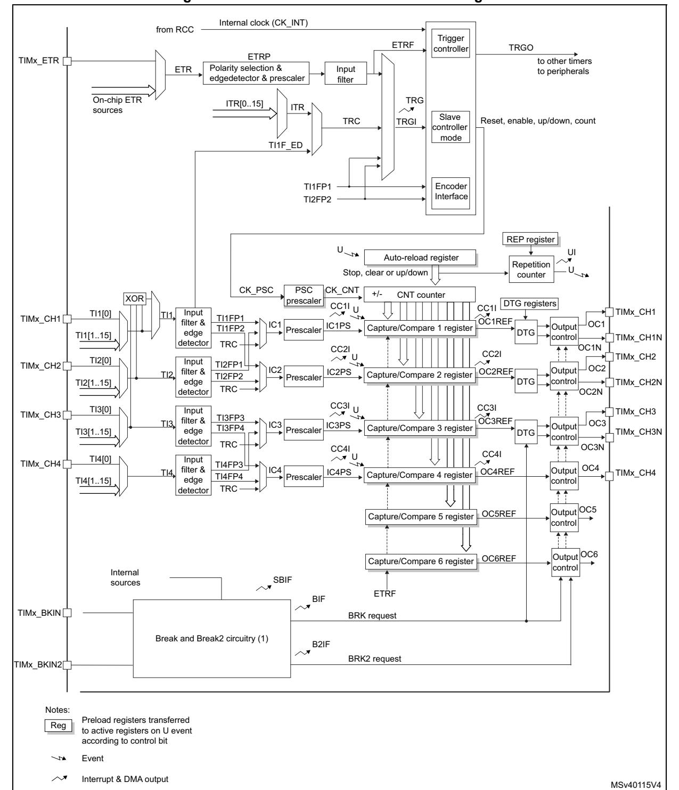

RM0399 Rev 4

Figure 386. Advanced-control timer block diagram

1. See Figure 429: Break and Break2 circuitry overview for details


# **40.3 TIM1/TIM8 functional description**

# <span id="page-2-0"></span>**40.3.1 Time-base unit**

The main block of the programmable advanced-control timer is a 16-bit counter with its related auto-reload register. The counter can count up, down or both up and down. The counter clock can be divided by a prescaler.

The counter, the auto-reload register and the prescaler register can be written or read by software. This is true even when the counter is running.

The time-base unit includes:

- Counter register (TIMx\_CNT)
- Prescaler register (TIMx\_PSC)
- Auto-reload register (TIMx\_ARR)
- Repetition counter register (TIMx\_RCR)

The auto-reload register is preloaded. Writing to or reading from the auto-reload register accesses the preload register. The content of the preload register are transferred into the shadow register permanently or at each update event (UEV), depending on the auto-reload preload enable bit (ARPE) in TIMx\_CR1 register. The update event is sent when the counter reaches the overflow (or underflow when downcounting) and if the UDIS bit equals 0 in the TIMx\_CR1 register. It can also be generated by software. The generation of the update event is described in detailed for each configuration.

The counter is clocked by the prescaler output CK\_CNT, which is enabled only when the counter enable bit (CEN) in TIMx\_CR1 register is set (refer also to the slave mode controller description to get more details on counter enabling).

Note that the counter starts counting 1 clock cycle after setting the CEN bit in the TIMx\_CR1 register.

### **Prescaler description**

The prescaler can divide the counter clock frequency by any factor between 1 and 65536. It is based on a 16-bit counter controlled through a 16-bit register (in the TIMx\_PSC register). It can be changed on the fly as this control register is buffered. The new prescaler ratio is taken into account at the next update event.

*[Figure 387](#page-3-0)* and *[Figure 388](#page-3-1)* give some examples of the counter behavior when the prescaler ratio is changed on the fly:

<span id="page-3-0"></span>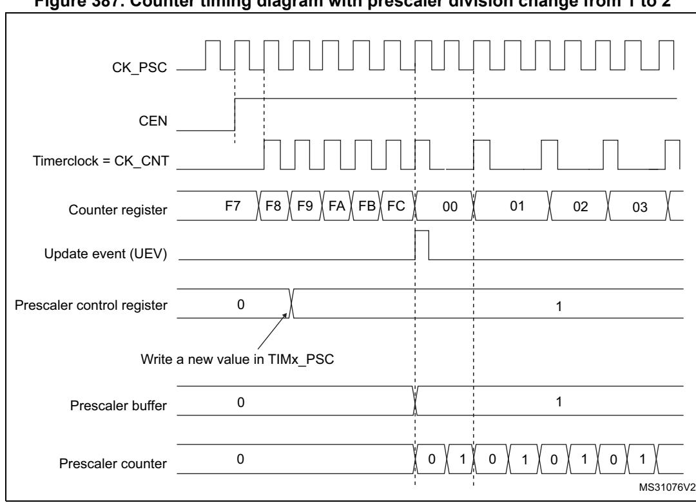

**Figure 387. Counter timing diagram with prescaler division change from 1 to 2**


<span id="page-3-1"></span>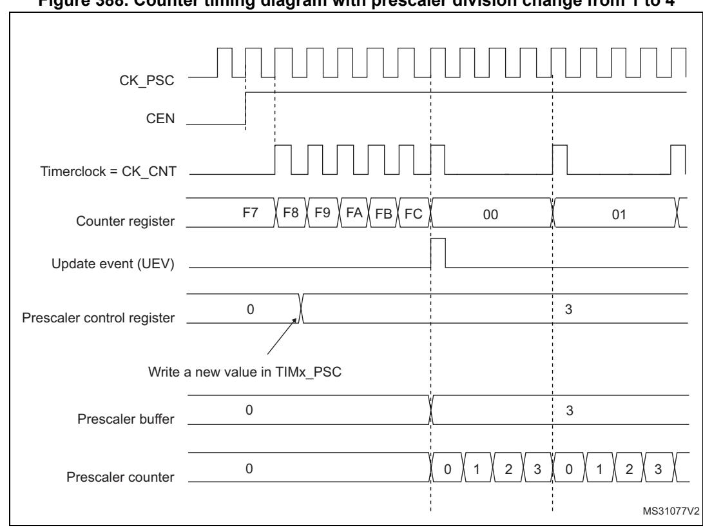

# **40.3.2 Counter modes**

### <span id="page-4-0"></span>**Upcounting mode**

In upcounting mode, the counter counts from 0 to the auto-reload value (content of the TIMx\_ARR register), then restarts from 0 and generates a counter overflow event.

If the repetition counter is used, the update event (UEV) is generated after upcounting is repeated for the number of times programmed in the repetition counter register (TIMx\_RCR) + 1. Else the update event is generated at each counter overflow.

Setting the UG bit in the TIMx\_EGR register (by software or by using the slave mode controller) also generates an update event.

The UEV event can be disabled by software by setting the UDIS bit in the TIMx\_CR1 register. This is to avoid updating the shadow registers while writing new values in the preload registers. Then no update event occurs until the UDIS bit has been written to 0. However, the counter restarts from 0, as well as the counter of the prescaler (but the prescale rate does not change). In addition, if the URS bit (update request selection) in TIMx\_CR1 register is set, setting the UG bit generates an update event UEV but without setting the UIF flag (thus no interrupt or DMA request is sent). This is to avoid generating both update and capture interrupts when clearing the counter on the capture event.

When an update event occurs, all the registers are updated and the update flag (UIF bit in TIMx\_SR register) is set (depending on the URS bit):

- The repetition counter is reloaded with the content of TIMx\_RCR register,
- The auto-reload shadow register is updated with the preload value (TIMx\_ARR),
- The buffer of the prescaler is reloaded with the preload value (content of the TIMx\_PSC register).

The following figures show some examples of the counter behavior for different clock frequencies when TIMx\_ARR=0x36.


RM0399 Rev 4 1681/3556

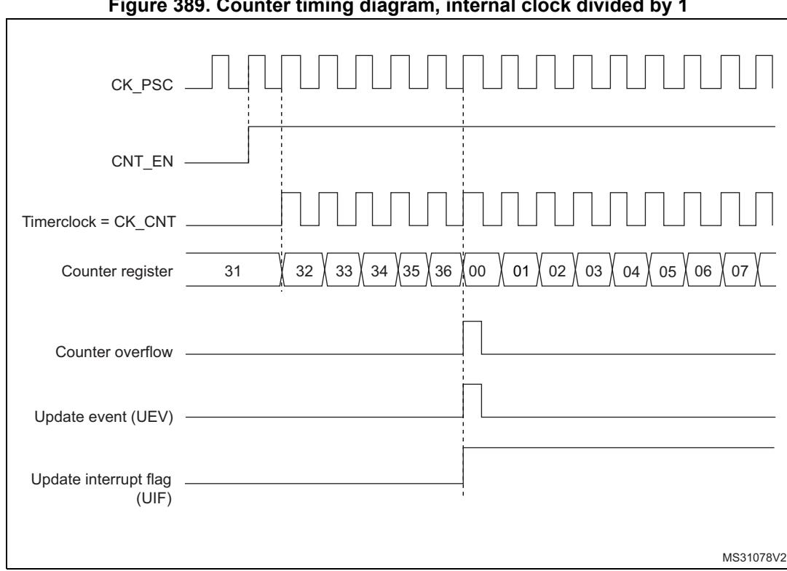

**Figure 389. Counter timing diagram, internal clock divided by 1**


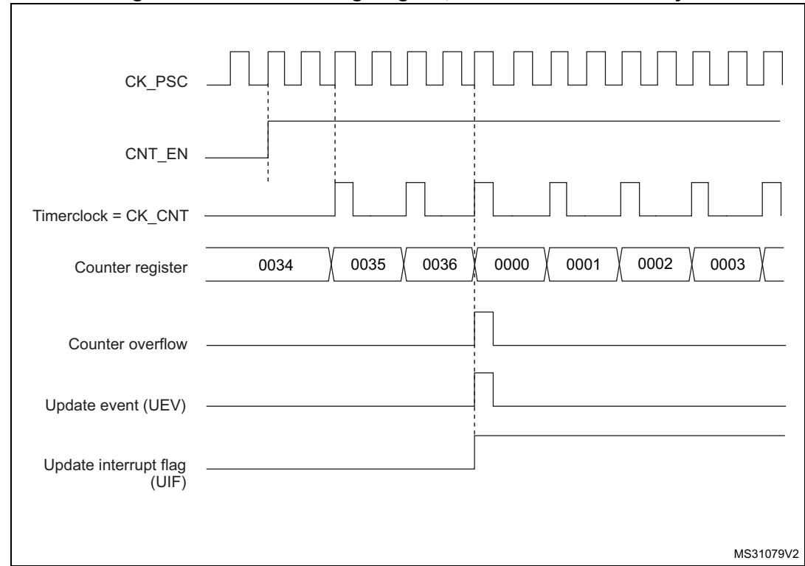

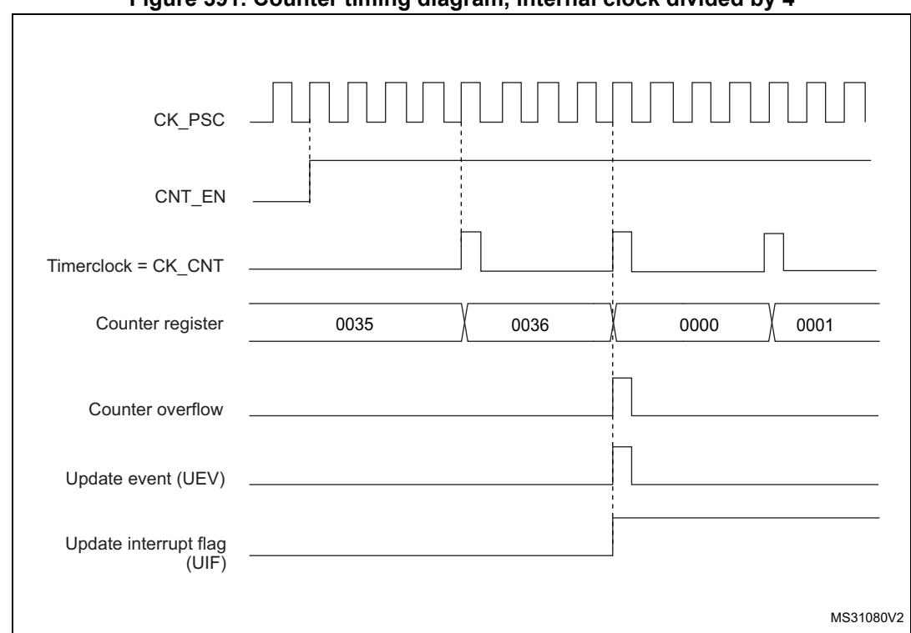

**Figure 391. Counter timing diagram, internal clock divided by 4**


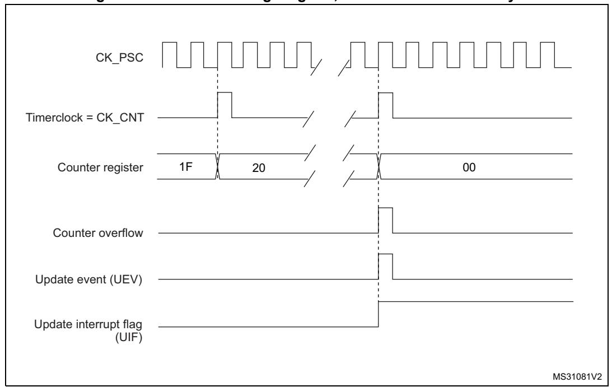

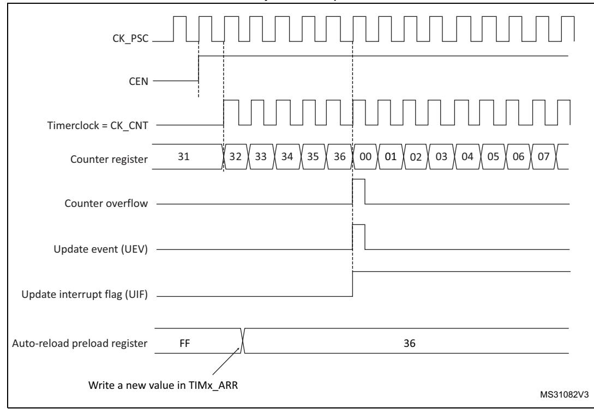

**Figure 393. Counter timing diagram, update event when ARPE=0 (TIMx\_ARR not preloaded)**


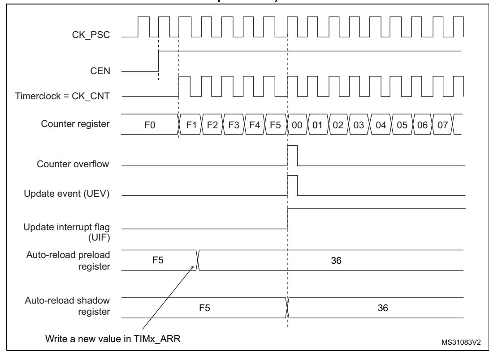

### <span id="page-8-0"></span>**Downcounting mode**

In downcounting mode, the counter counts from the auto-reload value (content of the TIMx\_ARR register) down to 0, then restarts from the auto-reload value and generates a counter underflow event.

If the repetition counter is used, the update event (UEV) is generated after downcounting is repeated for the number of times programmed in the repetition counter register (TIMx\_RCR) + 1. Else the update event is generated at each counter underflow.

Setting the UG bit in the TIMx\_EGR register (by software or by using the slave mode controller) also generates an update event.

The UEV update event can be disabled by software by setting the UDIS bit in TIMx\_CR1 register. This is to avoid updating the shadow registers while writing new values in the preload registers. Then no update event occurs until UDIS bit has been written to 0. However, the counter restarts from the current auto-reload value, whereas the counter of the prescaler restarts from 0 (but the prescale rate doesn't change).

In addition, if the URS bit (update request selection) in TIMx\_CR1 register is set, setting the UG bit generates an update event UEV but without setting the UIF flag (thus no interrupt or DMA request is sent). This is to avoid generating both update and capture interrupts when clearing the counter on the capture event.

When an update event occurs, all the registers are updated and the update flag (UIF bit in TIMx\_SR register) is set (depending on the URS bit):

- The repetition counter is reloaded with the content of TIMx\_RCR register.
- The buffer of the prescaler is reloaded with the preload value (content of the TIMx\_PSC register).
- The auto-reload active register is updated with the preload value (content of the TIMx\_ARR register). Note that the auto-reload is updated before the counter is reloaded, so that the next period is the expected one.

The following figures show some examples of the counter behavior for different clock frequencies when TIMx\_ARR=0x36.


RM0399 Rev 4 1685/3556

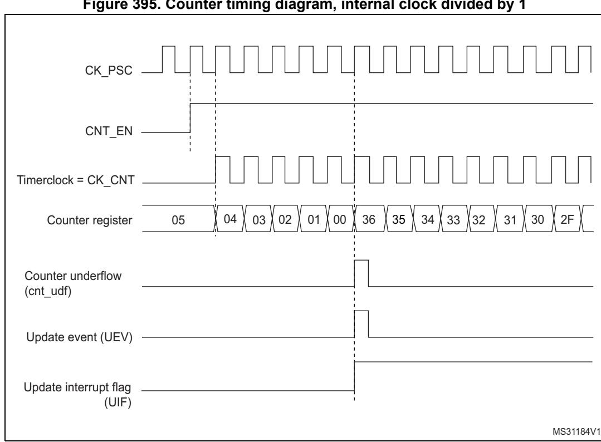

**Figure 395. Counter timing diagram, internal clock divided by 1**


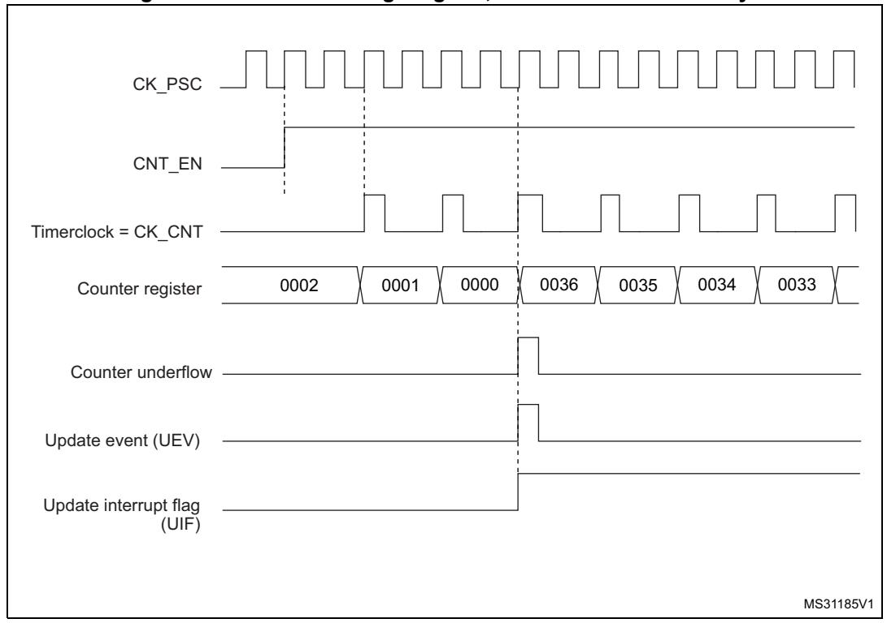

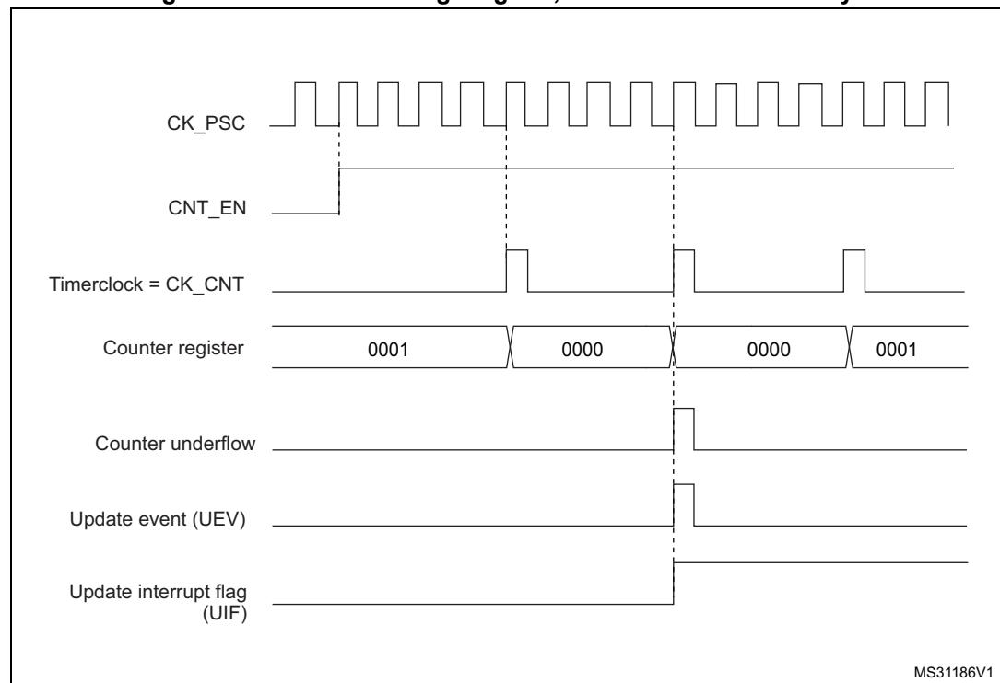

**Figure 397. Counter timing diagram, internal clock divided by 4**


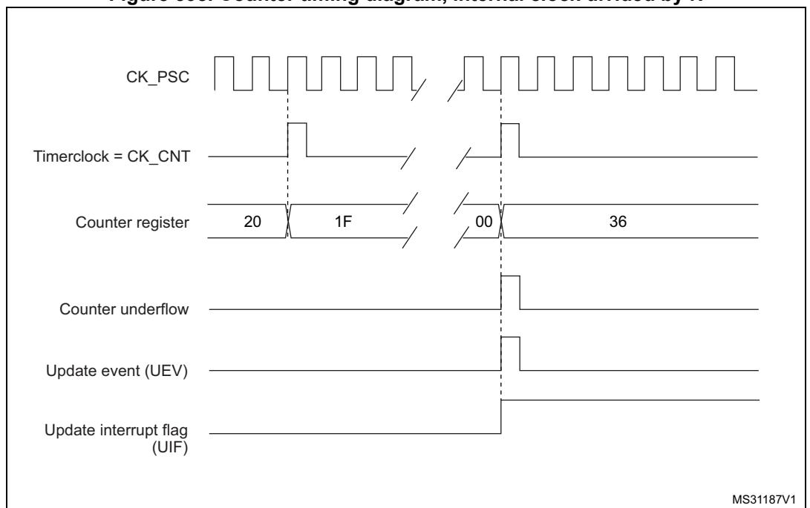

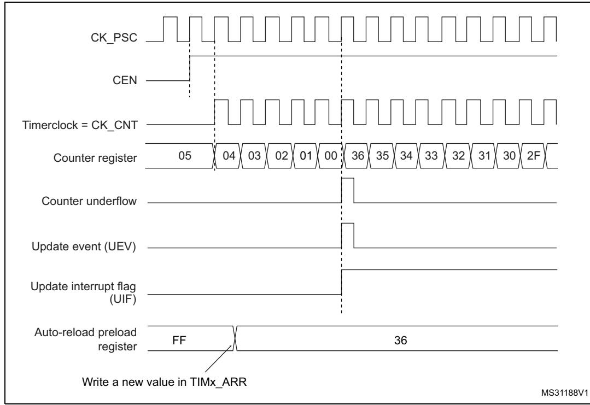

**Figure 399. Counter timing diagram, update event when repetition counter is not used**

### <span id="page-11-0"></span>**Center-aligned mode (up/down counting)**

In center-aligned mode, the counter counts from 0 to the auto-reload value (content of the TIMx\_ARR register) – 1, generates a counter overflow event, then counts from the autoreload value down to 1 and generates a counter underflow event. Then it restarts counting from 0.

Center-aligned mode is active when the CMS bits in TIMx\_CR1 register are not equal to '00'. The Output compare interrupt flag of channels configured in output is set when: the counter counts down (Center aligned mode 1, CMS = "01"), the counter counts up (Center aligned mode 2, CMS = "10") the counter counts up and down (Center aligned mode 3, CMS = "11").

In this mode, the DIR direction bit in the TIMx\_CR1 register cannot be written. It is updated by hardware and gives the current direction of the counter.

The update event can be generated at each counter overflow and at each counter underflow or by setting the UG bit in the TIMx\_EGR register (by software or by using the slave mode controller) also generates an update event. In this case, the counter restarts counting from 0, as well as the counter of the prescaler.

The UEV update event can be disabled by software by setting the UDIS bit in the TIMx\_CR1 register. This is to avoid updating the shadow registers while writing new values in the preload registers. Then no update event occurs until UDIS bit has been written to 0. However, the counter continues counting up and down, based on the current auto-reload value.

In addition, if the URS bit (update request selection) in TIMx\_CR1 register is set, setting the UG bit generates an UEV update event but without setting the UIF flag (thus no interrupt or


DMA request is sent). This is to avoid generating both update and capture interrupts when clearing the counter on the capture event.

When an update event occurs, all the registers are updated and the update flag (UIF bit in TIMx\_SR register) is set (depending on the URS bit):

- The repetition counter is reloaded with the content of TIMx\_RCR register
- The buffer of the prescaler is reloaded with the preload value (content of the TIMx\_PSC register)
- The auto-reload active register is updated with the preload value (content of the TIMx\_ARR register). Note that if the update source is a counter overflow, the autoreload is updated before the counter is reloaded, so that the next period is the expected one (the counter is loaded with the new value).

The following figures show some examples of the counter behavior for different clock frequencies.

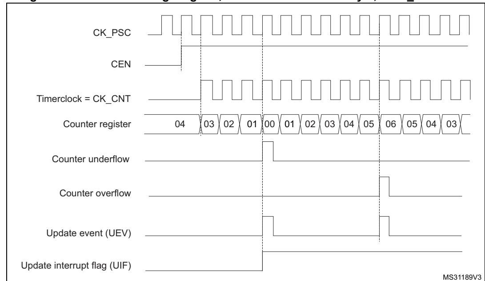

**Figure 400. Counter timing diagram, internal clock divided by 1, TIMx\_ARR = 0x6**

1. Here, center-aligned mode 1 is used (for more details refer to *[Section 40.4: TIM1/TIM8 registers](#page-59-0)*).


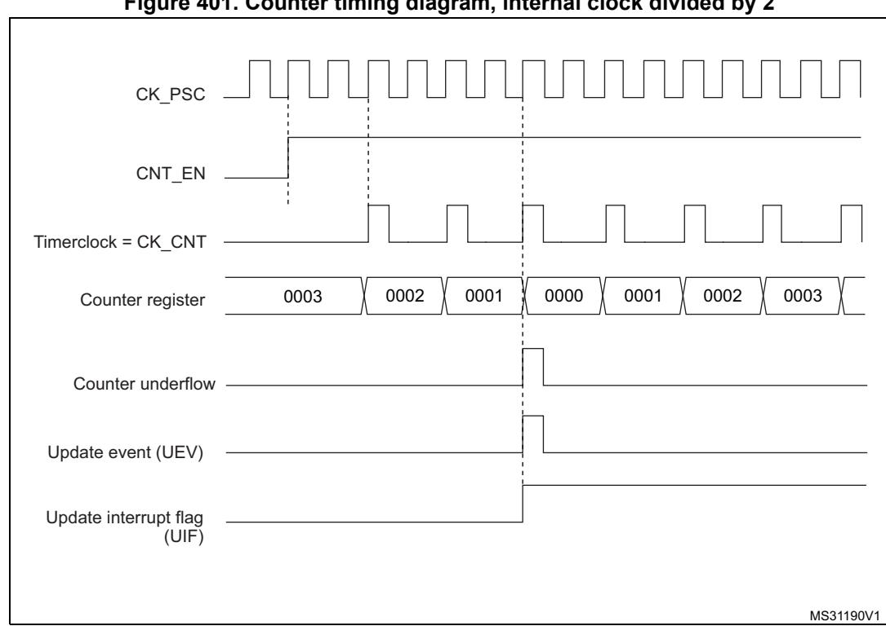

**Figure 401. Counter timing diagram, internal clock divided by 2**


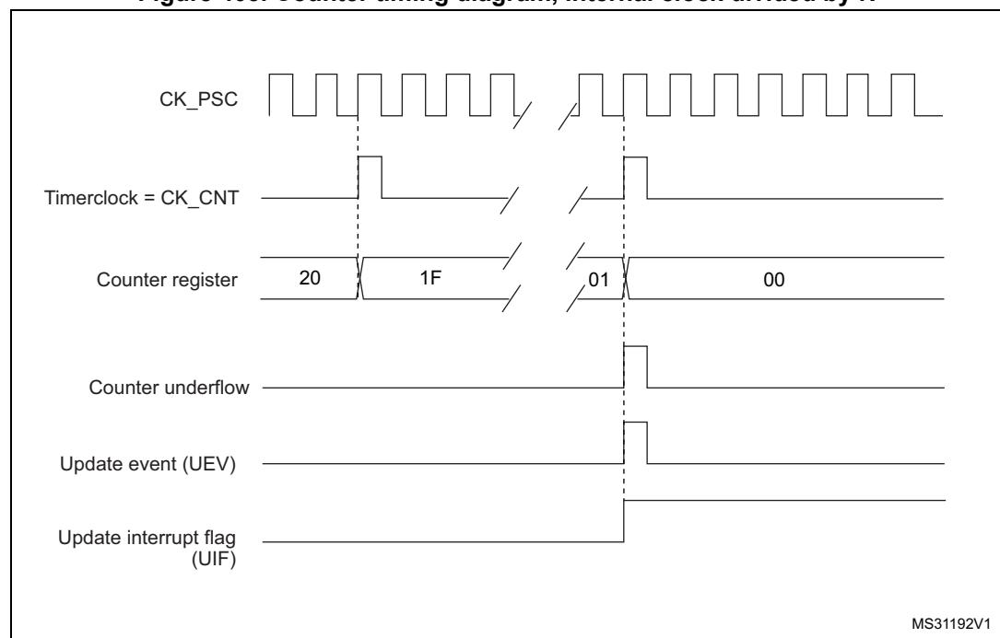

**Figure 403. Counter timing diagram, internal clock divided by N**


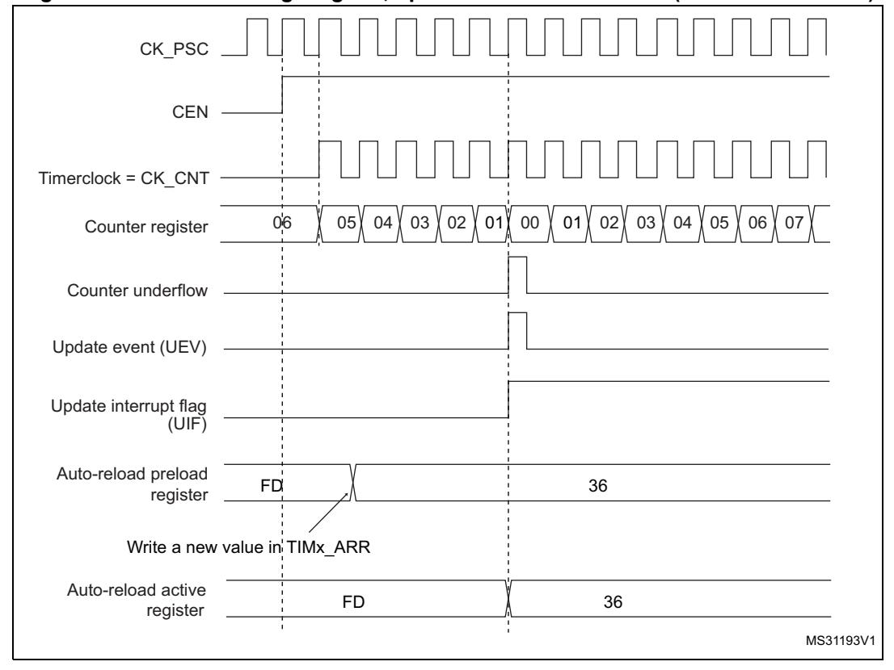

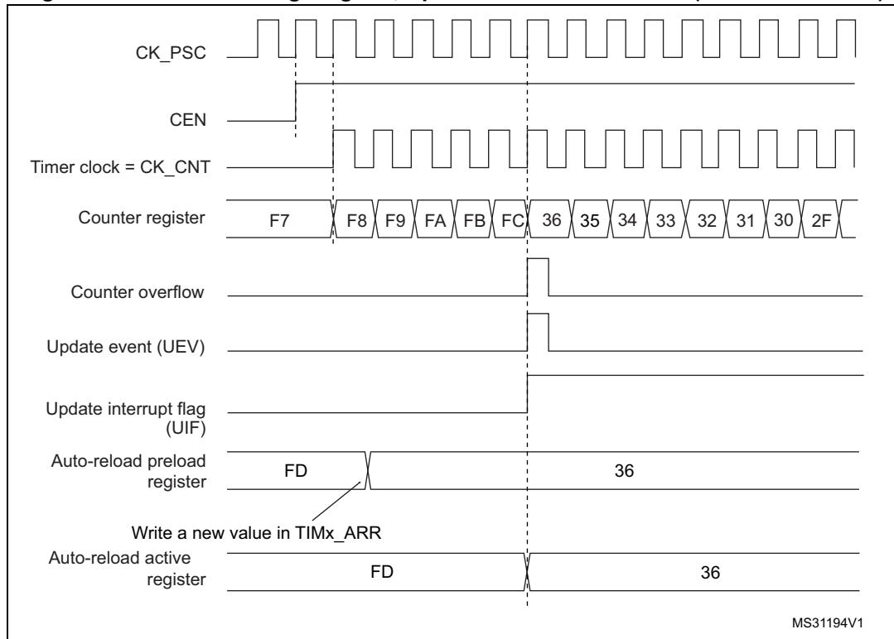

**Figure 405. Counter timing diagram, Update event with ARPE=1 (counter overflow)**

# **40.3.3 Repetition counter**

*[Section 40.3.1: Time-base unit](#page-2-0)* describes how the update event (UEV) is generated with respect to the counter overflows/underflows. It is actually generated only when the repetition counter has reached zero. This can be useful when generating PWM signals.

This means that data are transferred from the preload registers to the shadow registers (TIMx\_ARR auto-reload register, TIMx\_PSC prescaler register, but also TIMx\_CCRx capture/compare registers in compare mode) every N+1 counter overflows or underflows, where N is the value in the TIMx\_RCR repetition counter register.

The repetition counter is decremented:

- At each counter overflow in upcounting mode,
- At each counter underflow in downcounting mode,
- At each counter overflow and at each counter underflow in center-aligned mode. Although this limits the maximum number of repetition to 32768 PWM cycles, it makes it possible to update the duty cycle twice per PWM period. When refreshing compare registers only once per PWM period in center-aligned mode, maximum resolution is 2xTck, due to the symmetry of the pattern.

The repetition counter is an auto-reload type; the repetition rate is maintained as defined by the TIMx\_RCR register value (refer to *[Figure 406](#page-16-0)*). When the update event is generated by software (by setting the UG bit in TIMx\_EGR register) or by hardware through the slave mode controller, it occurs immediately whatever the value of the repetition counter is and the repetition counter is reloaded with the content of the TIMx\_RCR register.


In Center aligned mode, for odd values of RCR, the update event occurs either on the overflow or on the underflow depending on when the RCR register was written and when the counter was launched: if the RCR was written before launching the counter, the UEV occurs on the underflow. If the RCR was written after launching the counter, the UEV occurs on the overflow.

For example, for RCR = 3, the UEV is generated each 4th overflow or underflow event depending on when the RCR was written.

**Figure 406. Update rate examples depending on mode and TIMx\_RCR register settings**

<span id="page-16-0"></span>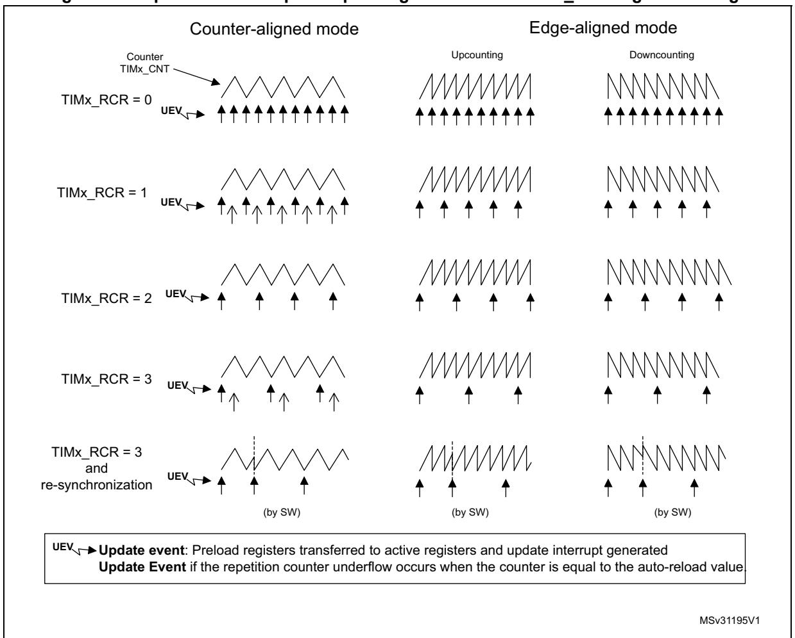

# **40.3.4 External trigger input**

The timer features an external trigger input ETR. It can be used as:

- external clock (external clock mode 2, see *[Section 40.3.5](#page-18-0)*)
- trigger for the slave mode (see *[Section 40.3.26](#page-53-0)*)
- PWM reset input for cycle-by-cycle current regulation (see *[Section 40.3.7](#page-24-0)*)

*[Figure 407](#page-17-0)* below describes the ETR input conditioning. The input polarity is defined with the ETP bit in TIMxSMCR register. The trigger can be prescaled with the divider programmed by the ETPS[1:0] bitfield and digitally filtered with the ETF[3:0] bitfield.

**Figure 407. External trigger input block**

<span id="page-17-0"></span>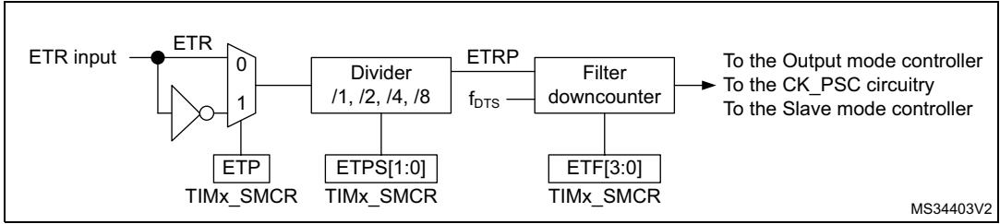

The ETR input comes from multiple sources: input pins (default configuration), comparator outputs and analog watchdogs. The selection is done with the ETRSEL[3:0] bitfield.

<span id="page-17-1"></span>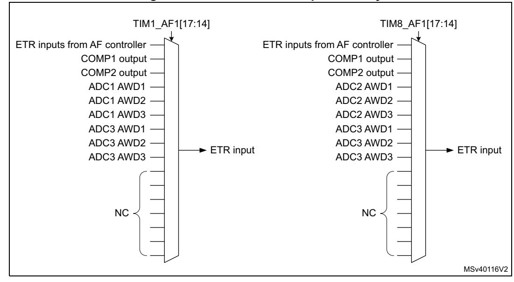

**Figure 408. TIM1/TIM8 ETR input circuitry**

# <span id="page-18-0"></span>**40.3.5 Clock selection**

The counter clock can be provided by the following clock sources:

- Internal clock (CK\_INT)
- External clock mode1: external input pin
- External clock mode2: external trigger input ETR
- Encoder mode

### **Internal clock source (CK\_INT)**

If the slave mode controller is disabled (SMS=000), then the CEN, DIR (in the TIMx\_CR1 register) and UG bits (in the TIMx\_EGR register) are actual control bits and can be changed only by software (except UG which remains cleared automatically). As soon as the CEN bit is written to 1, the prescaler is clocked by the internal clock CK\_INT.

*[Figure 409](#page-18-1)* shows the behavior of the control circuit and the upcounter in normal mode, without prescaler.

<span id="page-18-1"></span>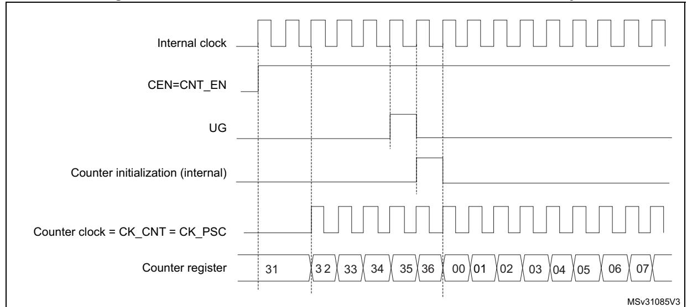

**Figure 409. Control circuit in normal mode, internal clock divided by 1**

### **External clock source mode 1**

This mode is selected when SMS=111 in the TIMx\_SMCR register. The counter can count at each rising or falling edge on a selected input.

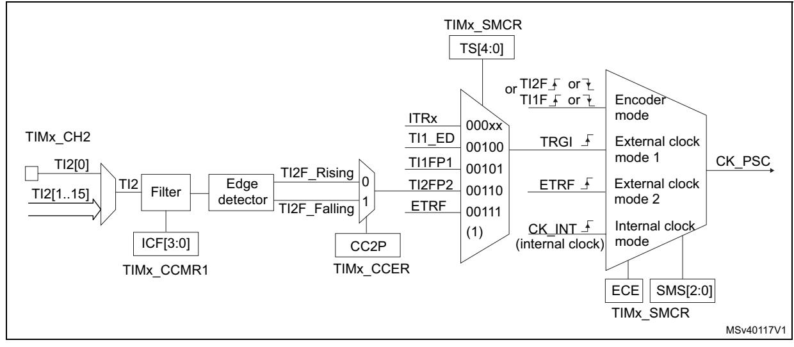

Figure 410. TI2 external clock connection example

1. Codes ranging from 01000 to 11111 are reserved

For example, to configure the upcounter to count in response to a rising edge on the TI2 input, use the following procedure:

- 1. Select the proper TI2x source (internal or external) with the TI2SEL[3:0] bits in the TIMx\_TISEL register.
- 2. Configure channel 2 to detect rising edges on the TI2 input by writing CC2S = '01' in the TIMx\_CCMR1 register.
- 3. Configure the input filter duration by writing the IC2F[3:0] bits in the TIMx\_CCMR1 register (if no filter is needed, keep IC2F=0000).
- 4. Select rising edge polarity by writing CC2P=0 and CC2NP=0 in the TIMx\_CCER register.
- 5. Configure the timer in external clock mode 1 by writing SMS=111 in the TIMx\_SMCR register.
- 6. Select TI2 as the trigger input source by writing TS=00110 in the TIMx\_SMCR register.
- 7. Enable the counter by writing CEN=1 in the TIMx CR1 register.

Note: The capture prescaler is not used for triggering, so the user does not need to configure it.

When a rising edge occurs on TI2, the counter counts once and the TIF flag is set.

The delay between the rising edge on TI2 and the actual clock of the counter is due to the resynchronization circuit on TI2 input.

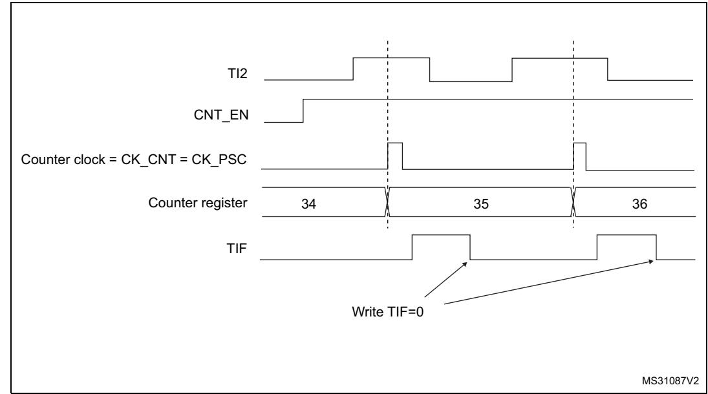

**Figure 411. Control circuit in external clock mode 1**

### **External clock source mode 2**

This mode is selected by writing ECE=1 in the TIMx\_SMCR register.

The counter can count at each rising or falling edge on the external trigger input ETR.

The *[Figure 412](#page-20-0)* gives an overview of the external trigger input block.

<span id="page-20-0"></span>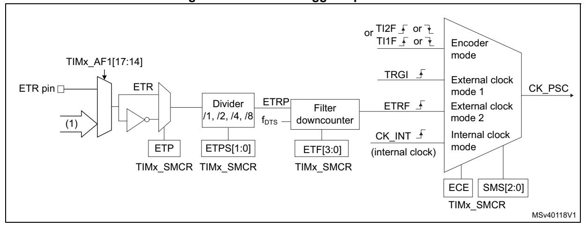

**Figure 412. External trigger input block**

1. Refer to *[Figure 408: TIM1/TIM8 ETR input circuitry](#page-17-1)*.

For example, to configure the upcounter to count each 2 rising edges on ETR, use the following procedure:

- 1. As no filter is needed in this example, write ETF[3:0]=0000 in the TIMx\_SMCR register.
- 2. Set the prescaler by writing ETPS[1:0]=01 in the TIMx\_SMCR register
- 3. Select rising edge detection on the ETR pin by writing ETP=0 in the TIMx\_SMCR register
- 4. Enable external clock mode 2 by writing ECE=1 in the TIMx\_SMCR register.
- 5. Enable the counter by writing CEN=1 in the TIMx\_CR1 register.

The counter counts once each 2 ETR rising edges.

The delay between the rising edge on ETR and the actual clock of the counter is due to the resynchronization circuit on the ETRP signal. As a consequence, the maximum frequency which can be correctly captured by the counter is at most ¼ of TIMxCLK frequency. When the ETRP signal is faster, the user should apply a division of the external signal by proper ETPS prescaler setting.

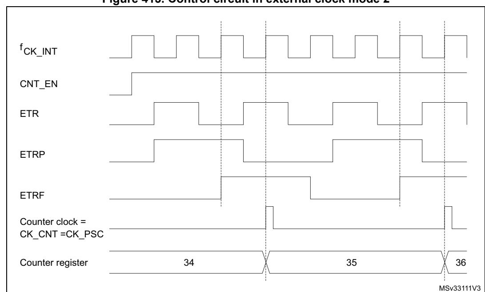

**Figure 413. Control circuit in external clock mode 2**

# 40.3.6 Capture/compare channels

Each Capture/Compare channel is built around a capture/compare register (including a shadow register), an input stage for capture (with digital filter, multiplexing, and prescaler, except for channels 5 and 6) and an output stage (with comparator and output control).

Figure 414 to Figure 417 give an overview of one Capture/Compare channel.

The input stage samples the corresponding TIx input to generate a filtered signal TIxF. Then, an edge detector with polarity selection generates a signal (TIxFPx) which can be used as trigger input by the slave mode controller or as the capture command. It is prescaled before the capture register (ICxPS).

<span id="page-22-0"></span>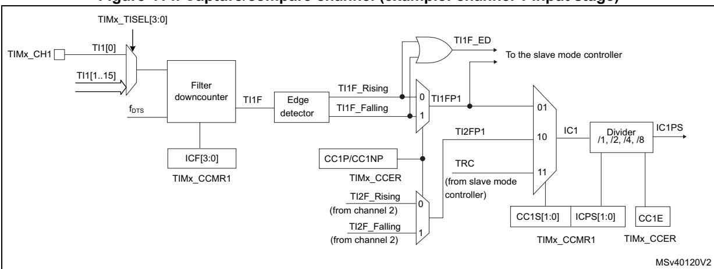

Figure 414. Capture/compare channel (example: channel 1 input stage)

The output stage generates an intermediate waveform which is then used for reference: OCxRef (active high). The polarity acts at the end of the chain.

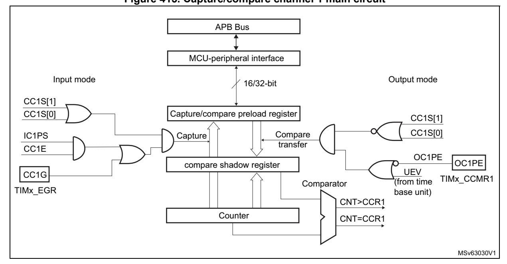

Figure 415. Capture/compare channel 1 main circuit

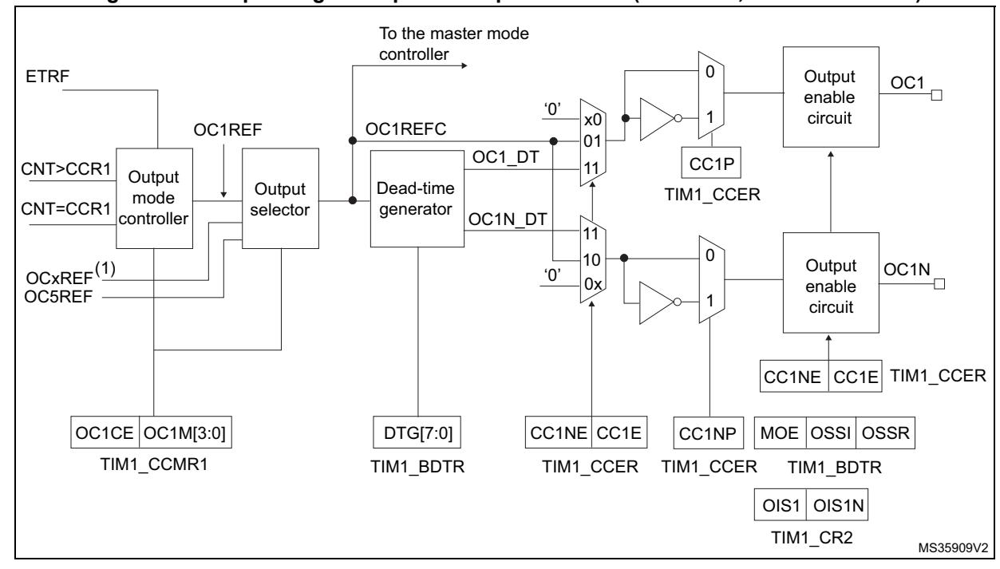

**Figure 416. Output stage of capture/compare channel (channel 1, idem ch. 2 and 3)**

1. OCxREF, where x is the rank of the complementary channel

<span id="page-23-0"></span>MS35911V2 Output mode controller CNT > CCR4 CNT = CCR4 TIM1\_CCMR2 OC4M[3:0] 0 1 CC4P TIM1\_CCER Output enable circuit OC4 CC4E TIM1\_CCER To the master mode controller OC4REF OC4CE 0 1 CC4E TIM1\_CCER '0' MOE OSSI TIM1\_BDTR OIS4 TIM1\_CR2 ETRF Output selector OC3REF OC4REFC

**Figure 417. Output stage of capture/compare channel (channel 4)**

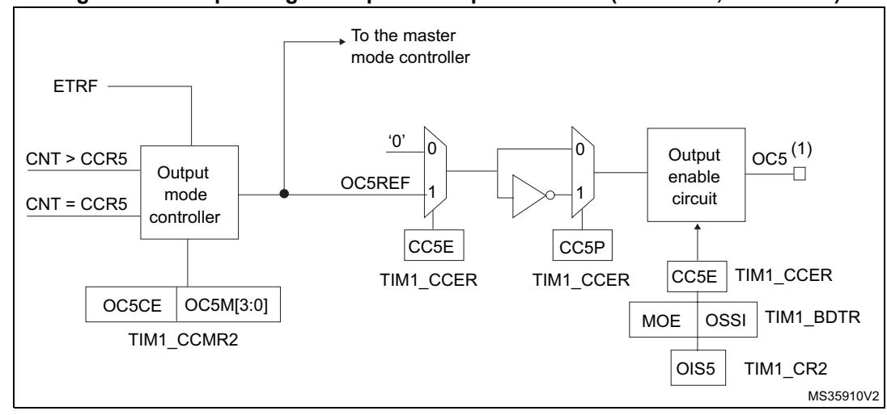

**Figure 418. Output stage of capture/compare channel (channel 5, idem ch. 6)**

1. Not available externally.

The capture/compare block is made of one preload register and one shadow register. Write and read always access the preload register.

In capture mode, captures are actually done in the shadow register, which is copied into the preload register.

In compare mode, the content of the preload register is copied into the shadow register which is compared to the counter.

# <span id="page-24-0"></span>**40.3.7 Input capture mode**

In Input capture mode, the Capture/Compare Registers (TIMx\_CCRx) are used to latch the value of the counter after a transition detected by the corresponding ICx signal. When a capture occurs, the corresponding CCXIF flag (TIMx\_SR register) is set and an interrupt or a DMA request can be sent if they are enabled. If a capture occurs while the CCxIF flag was already high, then the over-capture flag CCxOF (TIMx\_SR register) is set. CCxIF can be cleared by software by writing it to '0' or by reading the captured data stored in the TIMx\_CCRx register. CCxOF is cleared when written with '0'.

The following example shows how to capture the counter value in TIMx\_CCR1 when TI1 input rises. To do this, use the following procedure:

- 1. Select the proper TI1x source (internal or external) with the TI1SEL[3:0] bits in the TIMx\_TISEL register.
- 2. Select the active input: TIMx\_CCR1 must be linked to the TI1 input, so write the CC1S bits to 01 in the TIMx\_CCMR1 register. As soon as CC1S becomes different from 00, the channel is configured in input and the TIMx\_CCR1 register becomes read-only.
- 3. Program the appropriate input filter duration in relation with the signal connected to the timer (when the input is one of the TIx (ICxF bits in the TIMx\_CCMRx register). Let's imagine that, when toggling, the input signal is not stable during at must 5 internal clock cycles. We must program a filter duration longer than these 5 clock cycles. We can validate a transition on TI1 when 8 consecutive samples with the new level have been

RM0399 Rev 4 1701/3556

- detected (sampled at fDTS frequency). Then write IC1F bits to 0011 in the TIMx\_CCMR1 register.
- 4. Select the edge of the active transition on the TI1 channel by writing CC1P and CC1NP bits to 0 in the TIMx\_CCER register (rising edge in this case).
- 5. Program the input prescaler. In our example, we wish the capture to be performed at each valid transition, so the prescaler is disabled (write IC1PS bits to '00' in the TIMx\_CCMR1 register).
- 6. Enable capture from the counter into the capture register by setting the CC1E bit in the TIMx\_CCER register.
- 7. If needed, enable the related interrupt request by setting the CC1IE bit in the TIMx\_DIER register, and/or the DMA request by setting the CC1DE bit in the TIMx\_DIER register.

When an input capture occurs:

- The TIMx\_CCR1 register gets the value of the counter on the active transition.
- CC1IF flag is set (interrupt flag). CC1OF is also set if at least two consecutive captures occurred whereas the flag was not cleared.
- An interrupt is generated depending on the CC1IE bit.
- A DMA request is generated depending on the CC1DE bit.

In order to handle the overcapture, it is recommended to read the data before the overcapture flag. This is to avoid missing an overcapture which could happen after reading the flag and before reading the data.

*Note: IC interrupt and/or DMA requests can be generated by software by setting the corresponding CCxG bit in the TIMx\_EGR register.*

# **40.3.8 PWM input mode**

This mode is a particular case of input capture mode. The procedure is the same except:

- Two ICx signals are mapped on the same TIx input.
- These 2 ICx signals are active on edges with opposite polarity.
- One of the two TIxFP signals is selected as trigger input and the slave mode controller is configured in reset mode.

For example, the user can measure the period (in TIMx\_CCR1 register) and the duty cycle (in TIMx\_CCR2 register) of the PWM applied on TI1 using the following procedure (depending on CK\_INT frequency and prescaler value):

- 1. Select the proper TI1x source (internal or external) with the TI1SEL[3:0] bits in the TIMx\_TISEL register.
- 2. Select the active input for TIMx\_CCR1: write the CC1S bits to 01 in the TIMx\_CCMR1 register (TI1 selected).
- 3. Select the active polarity for TI1FP1 (used both for capture in TIMx\_CCR1 and counter clear): write the CC1P and CC1NP bits to '0' (active on rising edge).
- 4. Select the active input for TIMx\_CCR2: write the CC2S bits to 10 in the TIMx\_CCMR1 register (TI1 selected).
- 5. Select the active polarity for TI1FP2 (used for capture in TIMx\_CCR2): write the CC2P and CC2NP bits to CC2P/CC2NP='10' (active on falling edge).
- 6. Select the valid trigger input: write the TS bits to 00101 in the TIMx\_SMCR register (TI1FP1 selected).
- 7. Configure the slave mode controller in reset mode: write the SMS bits to 0100 in the TIMx\_SMCR register.
- 8. Enable the captures: write the CC1E and CC2E bits to '1' in the TIMx\_CCER register.

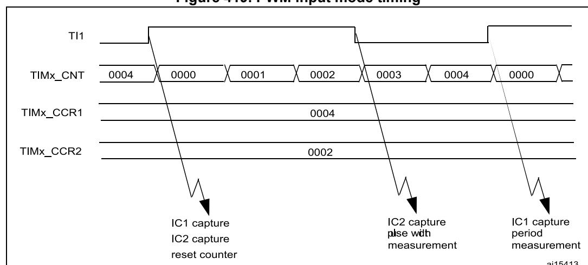

**Figure 419. PWM input mode timing**

# **40.3.9 Forced output mode**

In output mode (CCxS bits = 00 in the TIMx\_CCMRx register), each output compare signal (OCxREF and then OCx/OCxN) can be forced to active or inactive level directly by software, independently of any comparison between the output compare register and the counter.

To force an output compare signal (OCXREF/OCx) to its active level, user just needs to write 0101 in the OCxM bits in the corresponding TIMx\_CCMRx register. Thus OCXREF is forced high (OCxREF is always active high) and OCx get opposite value to CCxP polarity bit.

For example: CCxP=0 (OCx active high) => OCx is forced to high level.

The OCxREF signal can be forced low by writing the OCxM bits to 0100 in the TIMx\_CCMRx register.

Anyway, the comparison between the TIMx\_CCRx shadow register and the counter is still performed and allows the flag to be set. Interrupt and DMA requests can be sent accordingly. This is described in the output compare mode section below.

RM0399 Rev 4 1703/3556

# **40.3.10 Output compare mode**

This function is used to control an output waveform or indicate when a period of time has elapsed. Channels 1 to 4 can be output, while Channel 5 and 6 are only available inside the device (for instance, for compound waveform generation or for ADC triggering).

When a match is found between the capture/compare register and the counter, the output compare function:

- Assigns the corresponding output pin to a programmable value defined by the output compare mode (OCxM bits in the TIMx\_CCMRx register) and the output polarity (CCxP bit in the TIMx\_CCER register). The output pin can keep its level (OCXM=0000), be set active (OCxM=0001), be set inactive (OCxM=0010) or can toggle (OCxM=0011) on match.
- Sets a flag in the interrupt status register (CCxIF bit in the TIMx\_SR register).
- Generates an interrupt if the corresponding interrupt mask is set (CCXIE bit in the TIMx\_DIER register).
- Sends a DMA request if the corresponding enable bit is set (CCxDE bit in the TIMx\_DIER register, CCDS bit in the TIMx\_CR2 register for the DMA request selection).

The TIMx\_CCRx registers can be programmed with or without preload registers using the OCxPE bit in the TIMx\_CCMRx register.

In output compare mode, the update event UEV has no effect on OCxREF and OCx output. The timing resolution is one count of the counter. Output compare mode can also be used to output a single pulse (in One Pulse mode).

### **Procedure**

- 1. Select the counter clock (internal, external, prescaler).
- 2. Write the desired data in the TIMx\_ARR and TIMx\_CCRx registers.
- 3. Set the CCxIE bit if an interrupt request is to be generated.
- 4. Select the output mode. For example:
  - Write OCxM = 0011 to toggle OCx output pin when CNT matches CCRx
  - Write OCxPE = 0 to disable preload register
  - Write CCxP = 0 to select active high polarity
  - Write CCxE = 1 to enable the output
- 5. Enable the counter by setting the CEN bit in the TIMx\_CR1 register.

The TIMx\_CCRx register can be updated at any time by software to control the output waveform, provided that the preload register is not enabled (OCxPE='0', else TIMx\_CCRx shadow register is updated only at the next update event UEV). An example is given in *[Figure 420](#page-28-0)*.


<span id="page-28-0"></span>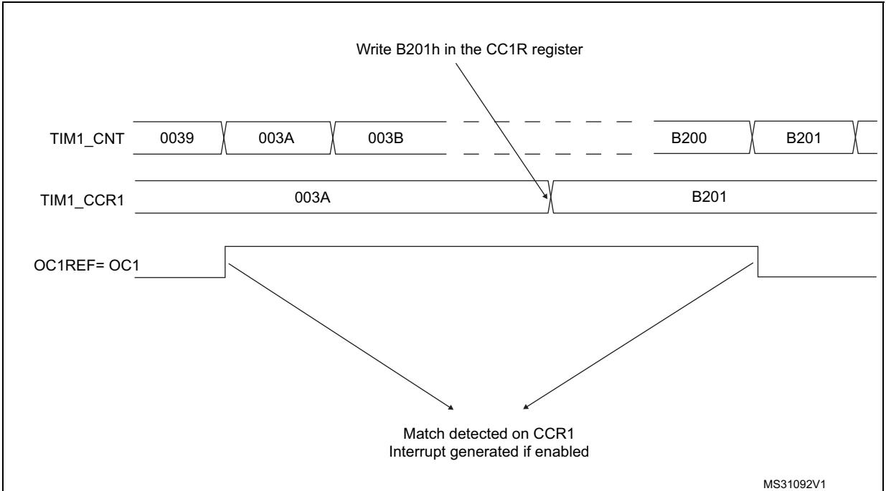

Figure 420. Output compare mode, toggle on OC1

### 40.3.11 PWM mode

Pulse Width Modulation mode allows a signal to be generated with a frequency determined by the value of the TIMx\_ARR register and a duty cycle determined by the value of the TIMx\_CCRx register.

The PWM mode can be selected independently on each channel (one PWM per OCx output) by writing '0110' (PWM mode 1) or '0111' (PWM mode 2) in the OCxM bits in the TIMx\_CCMRx register. The corresponding preload register must be enabled by setting the OCxPE bit in the TIMx\_CCMRx register, and eventually the auto-reload preload register (in upcounting or center-aligned modes) by setting the ARPE bit in the TIMx\_CR1 register.

As the preload registers are transferred to the shadow registers only when an update event occurs, before starting the counter, all registers must be initialized by setting the UG bit in the TIMx EGR register.

OCx polarity is software programmable using the CCxP bit in the TIMx\_CCER register. It can be programmed as active high or active low. OCx output is enabled by a combination of the CCxE, CCxNE, MOE, OSSI and OSSR bits (TIMx\_CCER and TIMx\_BDTR registers). Refer to the TIMx\_CCER register description for more details.

In PWM mode (1 or 2), TIMx\_CNT and TIMx\_CCRx are always compared to determine whether TIMx\_CCRx  $\leq$  TIMx\_CNT or TIMx\_CNT  $\leq$  TIMx\_CCRx (depending on the direction of the counter).

The timer is able to generate PWM in edge-aligned mode or center-aligned mode depending on the CMS bits in the TIMx CR1 register.

### **PWM edge-aligned mode**

• Upcounting configuration

Upcounting is active when the DIR bit in the TIMx\_CR1 register is low. Refer to the *[Upcounting mode on page 1681](#page-4-0)*.

In the following example, we consider PWM mode 1. The reference PWM signal OCxREF is high as long as TIMx\_CNT < TIMx\_CCRx else it becomes low. If the compare value in TIMx\_CCRx is greater than the auto-reload value (in TIMx\_ARR) then OCxREF is held at '1'. If the compare value is 0 then OCxRef is held at '0'. *[Figure 421](#page-29-0)* shows some edge-aligned PWM waveforms in an example where TIMx\_ARR=8.

<span id="page-29-0"></span>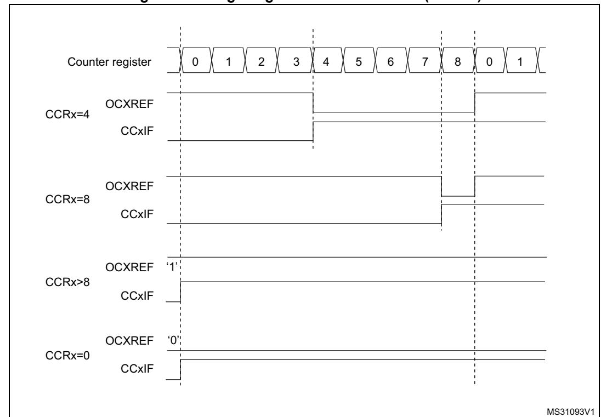

**Figure 421. Edge-aligned PWM waveforms (ARR=8)**

• Downcounting configuration

Downcounting is active when DIR bit in TIMx\_CR1 register is high. Refer to the *[Downcounting mode on page 1685](#page-8-0)*

In PWM mode 1, the reference signal OCxRef is low as long as TIMx\_CNT > TIMx\_CCRx else it becomes high. If the compare value in TIMx\_CCRx is greater than the auto-reload value in TIMx\_ARR, then OCxREF is held at '1'. 0% PWM is not possible in this mode.

### **PWM center-aligned mode**

Center-aligned mode is active when the CMS bits in TIMx\_CR1 register are different from '00' (all the remaining configurations having the same effect on the OCxRef/OCx signals). The compare flag is set when the counter counts up, when it counts down or both when it counts up and down depending on the CMS bits configuration. The direction bit (DIR) in the


TIMx\_CR1 register is updated by hardware and must not be changed by software. Refer to the *[Center-aligned mode \(up/down counting\) on page 1688](#page-11-0)*.

*[Figure 422](#page-30-0)* shows some center-aligned PWM waveforms in an example where:

- TIMx\_ARR=8,
- PWM mode is the PWM mode 1,
- The flag is set when the counter counts down corresponding to the center-aligned mode 1 selected for CMS=01 in TIMx\_CR1 register.

<span id="page-30-0"></span>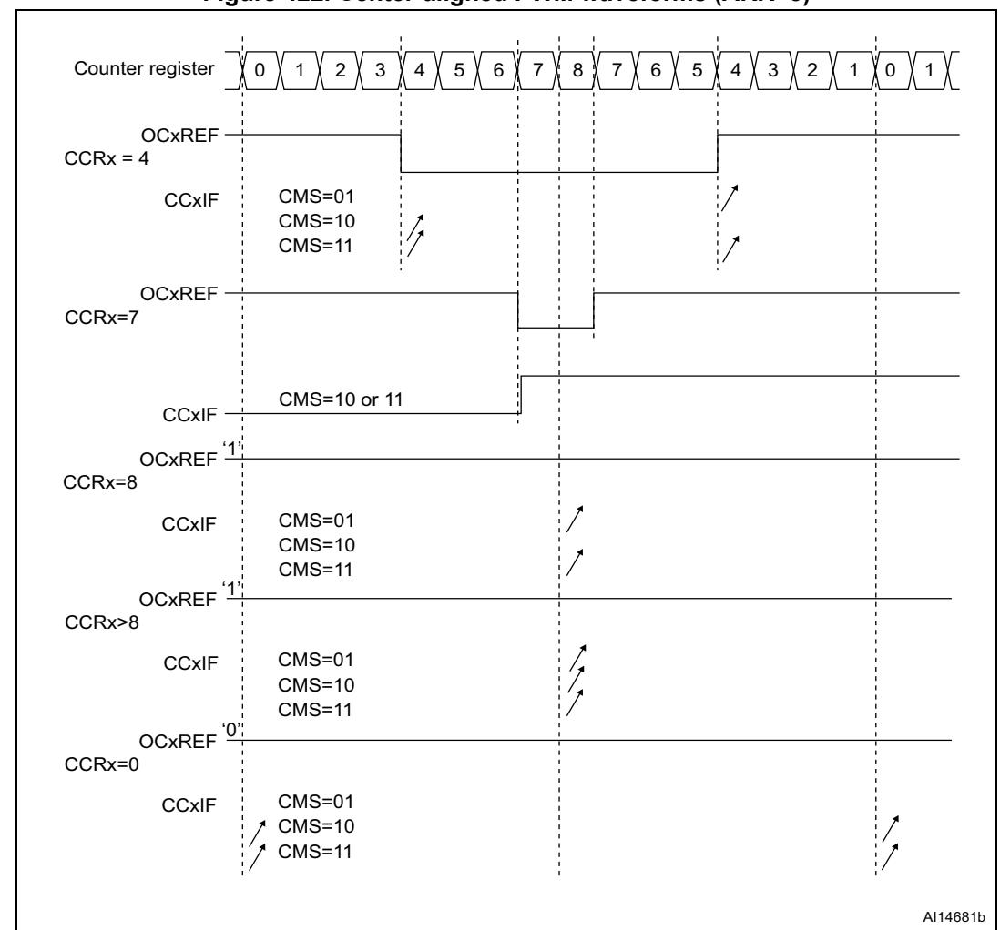

**Figure 422. Center-aligned PWM waveforms (ARR=8)**

Hints on using center-aligned mode

• When starting in center-aligned mode, the current up-down configuration is used. It means that the counter counts up or down depending on the value written in the DIR bit in the TIMx\_CR1 register. Moreover, the DIR and CMS bits must not be changed at the same time by the software.

- Writing to the counter while running in center-aligned mode is not recommended as it can lead to unexpected results. In particular:
  - The direction is not updated if a value greater than the auto-reload value is written in the counter (TIMx\_CNT>TIMx\_ARR). For example, if the counter was counting up, it continues to count up.
  - The direction is updated if 0 or the TIMx\_ARR value is written in the counter but no Update Event UEV is generated.
- The safest way to use center-aligned mode is to generate an update by software (setting the UG bit in the TIMx\_EGR register) just before starting the counter and not to write the counter while it is running.

# **40.3.12 Asymmetric PWM mode**

Asymmetric mode allows two center-aligned PWM signals to be generated with a programmable phase shift. While the frequency is determined by the value of the TIMx\_ARR register, the duty cycle and the phase-shift are determined by a pair of TIMx\_CCRx register. One register controls the PWM during up-counting, the second during down counting, so that PWM is adjusted every half PWM cycle:

- OC1REFC (or OC2REFC) is controlled by TIMx\_CCR1 and TIMx\_CCR2
- OC3REFC (or OC4REFC) is controlled by TIMx\_CCR3 and TIMx\_CCR4

Asymmetric PWM mode can be selected independently on two channel (one OCx output per pair of CCR registers) by writing '1110' (Asymmetric PWM mode 1) or '1111' (Asymmetric PWM mode 2) in the OCxM bits in the TIMx\_CCMRx register.

*Note: The OCxM[3:0] bit field is split into two parts for compatibility reasons, the most significant bit is not contiguous with the 3 least significant ones.*

> When a given channel is used as asymmetric PWM channel, its complementary channel can also be used. For instance, if an OC1REFC signal is generated on channel 1 (Asymmetric PWM mode 1), it is possible to output either the OC2REF signal on channel 2, or an OC2REFC signal resulting from asymmetric PWM mode 1.

> *[Figure 423](#page-32-0)* represents an example of signals that can be generated using Asymmetric PWM mode (channels 1 to 4 are configured in Asymmetric PWM mode 1). Together with the deadtime generator, this allows a full-bridge phase-shifted DC to DC converter to be controlled.


<span id="page-32-0"></span>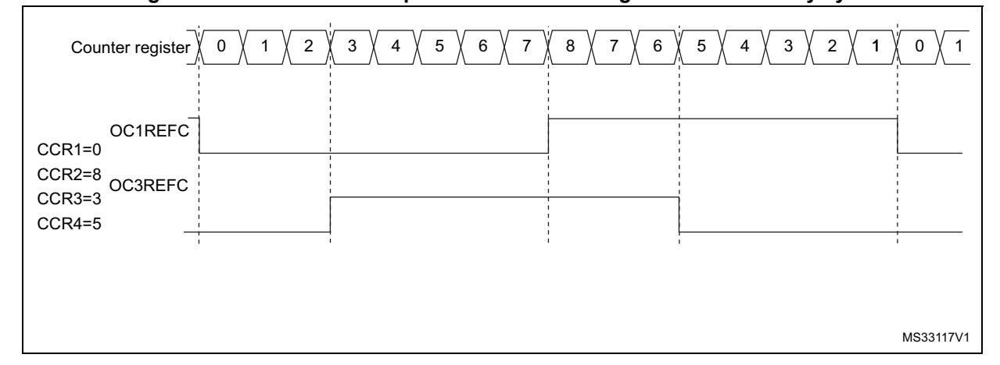

**Figure 423. Generation of 2 phase-shifted PWM signals with 50% duty cycle**

# **40.3.13 Combined PWM mode**

Combined PWM mode allows two edge or center-aligned PWM signals to be generated with programmable delay and phase shift between respective pulses. While the frequency is determined by the value of the TIMx\_ARR register, the duty cycle and delay are determined by the two TIMx\_CCRx registers. The resulting signals, OCxREFC, are made of an OR or AND logical combination of two reference PWMs:

- OC1REFC (or OC2REFC) is controlled by TIMx\_CCR1 and TIMx\_CCR2
- OC3REFC (or OC4REFC) is controlled by TIMx\_CCR3 and TIMx\_CCR4

Combined PWM mode can be selected independently on two channels (one OCx output per pair of CCR registers) by writing '1100' (Combined PWM mode 1) or '1101' (Combined PWM mode 2) in the OCxM bits in the TIMx\_CCMRx register.

When a given channel is used as combined PWM channel, its complementary channel must be configured in the opposite PWM mode (for instance, one in Combined PWM mode 1 and the other in Combined PWM mode 2).

*Note: The OCxM[3:0] bit field is split into two parts for compatibility reasons, the most significant bit is not contiguous with the 3 least significant ones.*

> *[Figure 424](#page-33-0)* represents an example of signals that can be generated using Asymmetric PWM mode, obtained with the following configuration:

- Channel 1 is configured in Combined PWM mode 2,
- Channel 2 is configured in PWM mode 1,
- Channel 3 is configured in Combined PWM mode 2,
- Channel 4 is configured in PWM mode 1.

<span id="page-33-0"></span>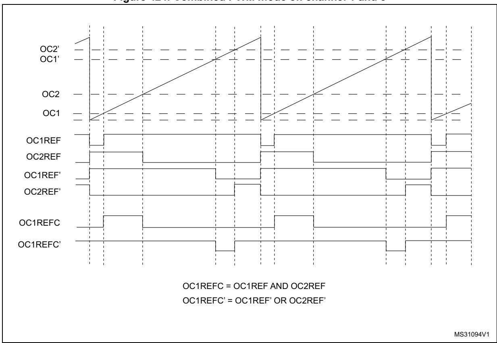

**Figure 424. Combined PWM mode on channel 1 and 3**

# **40.3.14 Combined 3-phase PWM mode**

Combined 3-phase PWM mode allows one to three center-aligned PWM signals to be generated with a single programmable signal ANDed in the middle of the pulses. The OC5REF signal is used to define the resulting combined signal. The 3-bits GC5C[3:1] in the TIMx\_CCR5 allow selection on which reference signal the OC5REF is combined. The resulting signals, OCxREFC, are made of an AND logical combination of two reference PWMs:

- If GC5C1 is set, OC1REFC is controlled by TIMx\_CCR1 and TIMx\_CCR5
- If GC5C2 is set, OC2REFC is controlled by TIMx\_CCR2 and TIMx\_CCR5
- If GC5C3 is set, OC3REFC is controlled by TIMx\_CCR3 and TIMx\_CCR5

Combined 3-phase PWM mode can be selected independently on channels 1 to 3 by setting at least one of the 3-bits GC5C[3:1].

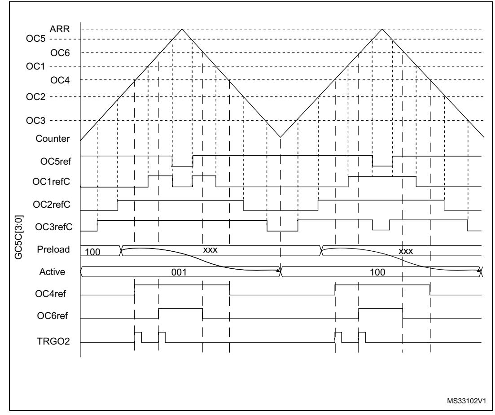

<span id="page-34-0"></span>**Figure 425. 3-phase combined PWM signals with multiple trigger pulses per period**

The TRGO2 waveform shows how the ADC can be synchronized on given 3-phase PWM signals. Refer to *[Section 40.3.27: ADC synchronization](#page-57-0)* for more details.

# **40.3.15 Complementary outputs and dead-time insertion**

The advanced-control timers (TIM1/TIM8) can output two complementary signals and manage the switching-off and the switching-on instants of the outputs.

This time is generally known as dead-time and it has to be adjusted depending on the devices that are connected to the outputs and their characteristics (intrinsic delays of levelshifters, delays due to power switches...)

The polarity of the outputs (main output OCx or complementary OCxN) can be selected independently for each output. This is done by writing to the CCxP and CCxNP bits in the TIMx\_CCER register.

The complementary signals OCx and OCxN are activated by a combination of several control bits: the CCxE and CCxNE bits in the TIMx\_CCER register and the MOE, OISx, OISxN, OSSI and OSSR bits in the TIMx\_BDTR and TIMx\_CR2 registers. Refer to *[Table 354: Output control bits for complementary OCx and OCxN channels with break](#page-79-0)  [feature on page 1756](#page-79-0)* for more details. In particular, the dead-time is activated when switching to the idle state (MOE falling down to 0).


RM0399 Rev 4 1711/3556

Dead-time insertion is enabled by setting both CCxE and CCxNE bits, and the MOE bit if the break circuit is present. There is one 10-bit dead-time generator for each channel. From a reference waveform OCxREF, it generates 2 outputs OCx and OCxN. If OCx and OCxN are active high:

- The OCx output signal is the same as the reference signal except for the rising edge, which is delayed relative to the reference rising edge.
- The OCxN output signal is the opposite of the reference signal except for the rising edge, which is delayed relative to the reference falling edge.

If the delay is greater than the width of the active output (OCx or OCxN) then the corresponding pulse is not generated.

The following figures show the relationships between the output signals of the dead-time generator and the reference signal OCxREF. (we suppose CCxP=0, CCxNP=0, MOE=1, CCxE=1 and CCxNE=1 in these examples)

delay delay OCxREF OCx OCxN MS31095V1

**Figure 426. Complementary output with dead-time insertion**


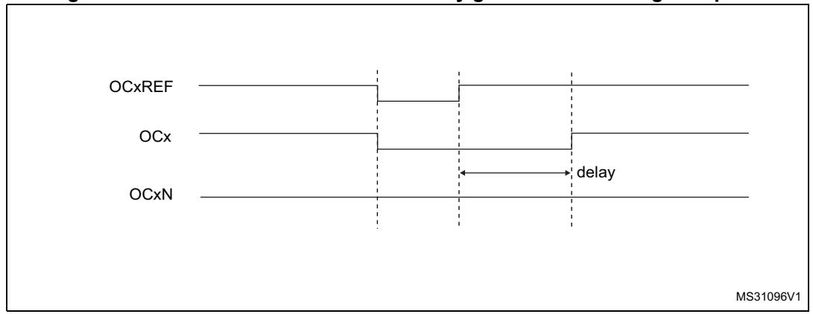


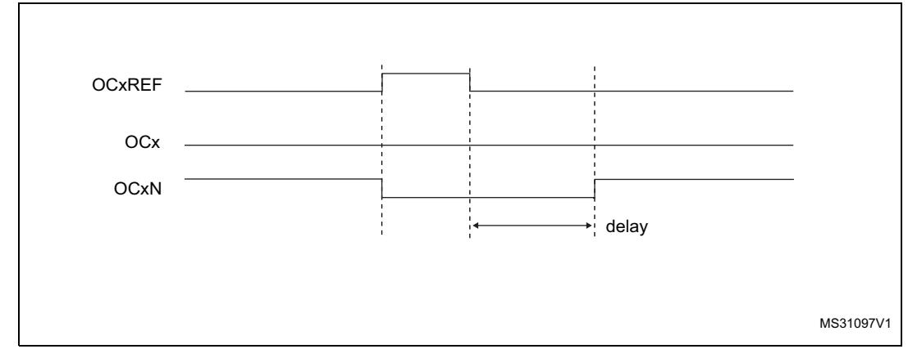

**Figure 428. Dead-time waveforms with delay greater than the positive pulse**

The dead-time delay is the same for each of the channels and is programmable with the DTG bits in the TIMx\_BDTR register. Refer to *[Section 40.4.20: TIMx break and dead-time](#page-83-0)  [register \(TIMx\\_BDTR\)\(x = 1, 8\)](#page-83-0)* for delay calculation.

### **Re-directing OCxREF to OCx or OCxN**

In output mode (forced, output compare or PWM), OCxREF can be re-directed to the OCx output or to OCxN output by configuring the CCxE and CCxNE bits in the TIMx\_CCER register.

This allows a specific waveform to be sent (such as PWM or static active level) on one output while the complementary remains at its inactive level. Other alternative possibilities are to have both outputs at inactive level or both outputs active and complementary with dead-time.

*Note: When only OCxN is enabled (CCxE=0, CCxNE=1), it is not complemented and becomes active as soon as OCxREF is high. For example, if CCxNP=0 then OCxN=OCxRef. On the other hand, when both OCx and OCxN are enabled (CCxE=CCxNE=1) OCx becomes active when OCxREF is high whereas OCxN is complemented and becomes active when OCxREF is low.*

# **40.3.16 Using the break function**

The purpose of the break function is to protect power switches driven by PWM signals generated with the TIM1 and TIM8 timers. The two break inputs are usually connected to fault outputs of power stages and 3-phase inverters. When activated, the break circuitry shuts down the PWM outputs and forces them to a predefined safe state. A number of internal MCU events can also be selected to trigger an output shut-down.

The break features two channels. A break channel which gathers both system-level fault (clock failure, parity error,...) and application fault (from input pins and built-in comparator), and can force the outputs to a predefined level (either active or inactive) after a deadtime duration. A break2 channel which only includes application faults and is able to force the outputs to an inactive state.


RM0399 Rev 4 1713/3556

The output enable signal and output levels during break are depending on several control bits:

- the MOE bit in TIMx\_BDTR register allows the outputs to be enabled/disabled by software and is reset in case of break or break2 event.
- the OSSI bit in the TIMx\_BDTR register defines whether the timer controls the output in inactive state or releases the control to the GPIO controller (typically to have it in Hi-Z mode)
- the OISx and OISxN bits in the TIMx\_CR2 register which are setting the output shut-down level, either active or inactive. The OCx and OCxN outputs cannot be set both to active level at a given time, whatever the OISx and OISxN values. Refer to *[Table 354: Output control bits for complementary OCx and OCxN](#page-79-0)  [channels with break feature on page 1756](#page-79-0)* for more details.

When exiting from reset, the break circuit is disabled and the MOE bit is low. The break functions can be enabled by setting the BKE and BK2E bits in the TIMx\_BDTR register. The break input polarities can be selected by configuring the BKP and BK2P bits in the same register. BKE/BK2E and BKP/BK2P can be modified at the same time. When the BKE/BK2E and BKP/BK2P bits are written, a delay of 1 APB clock cycle is applied before the writing is effective. Consequently, it is necessary to wait 1 APB clock period to correctly read back the bit after the write operation.

Because MOE falling edge can be asynchronous, a resynchronization circuit has been inserted between the actual signal (acting on the outputs) and the synchronous control bit (accessed in the TIMx\_BDTR register). It results in some delays between the asynchronous and the synchronous signals. In particular, if MOE is set to 1 whereas it was low, a delay must be inserted (dummy instruction) before reading it correctly. This is because the write acts on the asynchronous signal whereas the read reflects the synchronous signal.

The sources for break (BRK) channel are:

- An external source connected to one of the BKIN pin (as per selection done in the GPIO alternate function registers), with polarity selection and optional digital filtering
- An internal source:
  - the output from a comparator, with polarity selection and optional digital filtering
  - the analog watchdog output of the DFSDM1 peripheral
  - A system break:
    - the Cortex®-M7 LOCKUP output
    - the PVD output
    - all SRAM and TCM ECC dual error detections (AXI-SRAM, ITCM, DTCM, SRAM1, SRAM2, SRAM3, SRAM4, BKRAM, refer to SYSCFG\_CFGR register for details)
    - a flash memory ECC dual error detection
    - a clock failure event generated by the CSS detector

The sources for break2 (BRK2) are:

- An external source connected to one of the BKIN pin (as per selection done in the GPIO alternate function registers), with polarity selection and optional digital filtering
- An internal source coming from a comparator output.
- The analog watchdog output of the DFSDM1 peripheral


Break events can also be generated by software using BG and B2G bits in the TIMx\_EGR register. The software break generation using BG and B2G is active whatever the BKE and BK2E enable bits values.

All sources are ORed before entering the timer BRK or BRK2 inputs, as per *[Figure 429](#page-38-0)* below.

<span id="page-38-0"></span>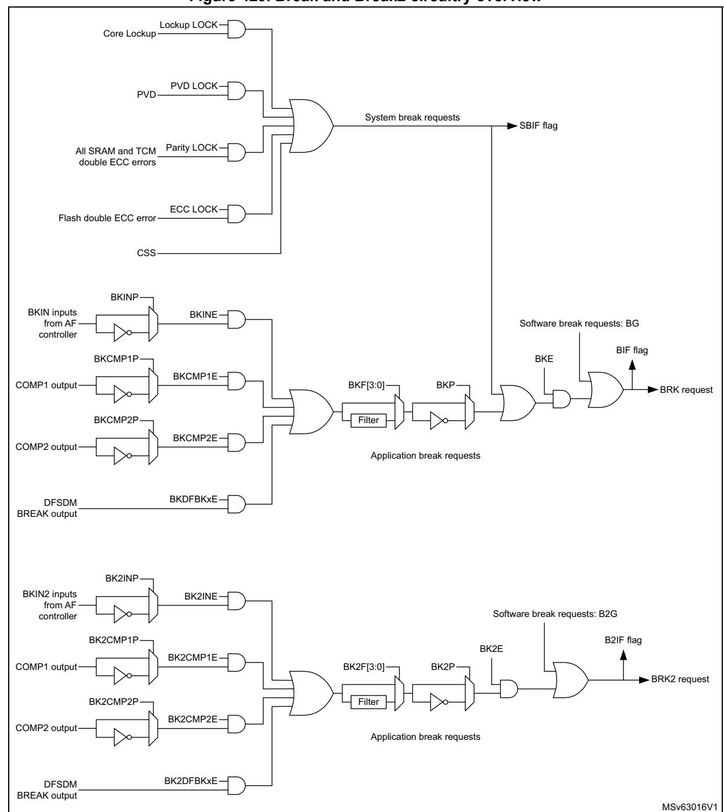

**Figure 429. Break and Break2 circuitry overview**

*Note: An asynchronous (clockless) operation is only guaranteed when the programmable filter is disabled. If it is enabled, a fail safe clock mode (for example by using the internal PLL and/or the CSS) must be used to guarantee that break events are handled.*

When one of the breaks occurs (selected level on one of the break inputs):

- The MOE bit is cleared asynchronously, putting the outputs in inactive state, idle state or even releasing the control to the GPIO controller (selected by the OSSI bit). This feature is enabled even if the MCU oscillator is off.
- Each output channel is driven with the level programmed in the OISx bit in the TIMx\_CR2 register as soon as MOE=0. If OSSI=0, the timer releases the output control (taken over by the GPIO controller), otherwise the enable output remains high.
- When complementary outputs are used:
  - The outputs are first put in inactive state (depending on the polarity). This is done asynchronously so that it works even if no clock is provided to the timer.
  - If the timer clock is still present, then the dead-time generator is reactivated in order to drive the outputs with the level programmed in the OISx and OISxN bits after a dead-time. Even in this case, OCx and OCxN cannot be driven to their active level together. Note that because of the resynchronization on MOE, the dead-time duration is slightly longer than usual (around 2 ck\_tim clock cycles).
  - If OSSI=0, the timer releases the output control (taken over by the GPIO controller which forces a Hi-Z state), otherwise the enable outputs remain or become high as soon as one of the CCxE or CCxNE bits is high.
- The break status flag (SBIF, BIF and B2IF bits in the TIMx\_SR register) is set. An interrupt is generated if the BIE bit in the TIMx\_DIER register is set.
- If the AOE bit in the TIMx\_BDTR register is set, the MOE bit is automatically set again at the next update event (UEV). As an example, this can be used to perform a regulation. Otherwise, MOE remains low until the application sets it to '1' again. In this case, it can be used for security and the break input can be connected to an alarm from power drivers, thermal sensors or any security components.

*Note: If the MOE is reset by the CPU while the AOE bit is set, the outputs are in idle state and forced to inactive level or Hi-Z depending on OSSI value. If both the MOE and AOE bits are reset by the CPU, the outputs are in disabled state and driven with the level programmed in the OISx bit in the TIMx\_CR2 register.*

*Note: The break inputs are active on level. Thus, the MOE cannot be set while the break input is active (neither automatically nor by software). In the meantime, the status flag BIF and B2IF cannot be cleared.*

> In addition to the break input and the output management, a write protection has been implemented inside the break circuit to safeguard the application. It allows the configuration of several parameters to be freezed (dead-time duration, OCx/OCxN polarities and state when disabled, OCxM configurations, break enable and polarity). The application can choose from 3 levels of protection selected by the LOCK bits in the TIMx\_BDTR register. Refer to *[Section 40.4.20: TIMx break and dead-time register \(TIMx\\_BDTR\)\(x = 1, 8\)](#page-83-0)*. The LOCK bits can be written only once after an MCU reset.

*[Figure 430](#page-40-0)* shows an example of behavior of the outputs in response to a break.

<span id="page-40-0"></span>delay delay delay delay delay delay delay delay OCxREF OCx (OCxN not implemented, CCxP=0, OISx=1) OCx (OCxN not implemented, CCxP=0, OISx=0) OCx (OCxN not implemented, CCxP=1, OISx=1) OCx (OCxN not implemented, CCxP=1, OISx=0) OCx OCxN (CCxE=1, CCxP=0, OISx=0, CCxNE=1, CCxNP=0, OISxN=1) OCx OCxN (CCxE=1, CCxP=0, OISx=1, CCxNE=1, CCxNP=1, OISxN=1) OCx OCxN (CCxE=1, CCxP=0, OISx=0, CCxNE=0, CCxNP=0, OISxN=1) OCx OCxN (CCxE=1, CCxP=0, OISx=1, CCxNE=0, CCxNP=0, OISxN=0) OCx OCxN (CCxE=1, CCxP=0, CCxNE=0, CCxNP=0, OISx=OISxN=0 or OISx=OISxN=1) BREAK (MOE )

**Figure 430. Various output behavior in response to a break event on BRK (OSSI = 1)**


MS31098V1

The two break inputs have different behaviors on timer outputs:

- The BRK input can either disable (inactive state) or force the PWM outputs to a predefined safe state.
- BRK2 can only disable (inactive state) the PWM outputs.

The BRK has a higher priority than BRK2 input, as described in *[Table 351](#page-41-0)*.

*Note: BRK2 must only be used with OSSR = OSSI = 1.*

**Table 351. Behavior of timer outputs versus BRK/BRK2 inputs** 

<span id="page-41-0"></span>

|          |        | Timer outputs                                                                                                                                    | Typical use case                   |                                    |  |  |  |
|----------|--------|--------------------------------------------------------------------------------------------------------------------------------------------------|------------------------------------|------------------------------------|--|--|--|
| BRK      | BRK2   | state                                                                                                                                            | OCxN output<br>(low side switches) | OCx output<br>(high side switches) |  |  |  |
| Active   | X      | – Inactive then<br>forced output<br>state (after a<br>deadtime)<br>– Outputs disabled<br>if OSSI = 0<br>(control taken<br>over by GPIO<br>logic) | ON after deadtime<br>insertion     | OFF                                |  |  |  |
| Inactive | Active | Inactive                                                                                                                                         | OFF                                | OFF                                |  |  |  |

*[Figure 431](#page-41-1)* gives an example of OCx and OCxN output behavior in case of active signals on BRK and BRK2 inputs. In this case, both outputs have active high polarities (CCxP = CCxNP = 0 in TIMx\_CCER register).

<span id="page-41-1"></span>MS34106V1 BRK2 BRK OCx I/O state Deadtime Deadtime Active Inactive Idle

**Figure 431. PWM output state following BRK and BRK2 pins assertion (OSSI=1)**

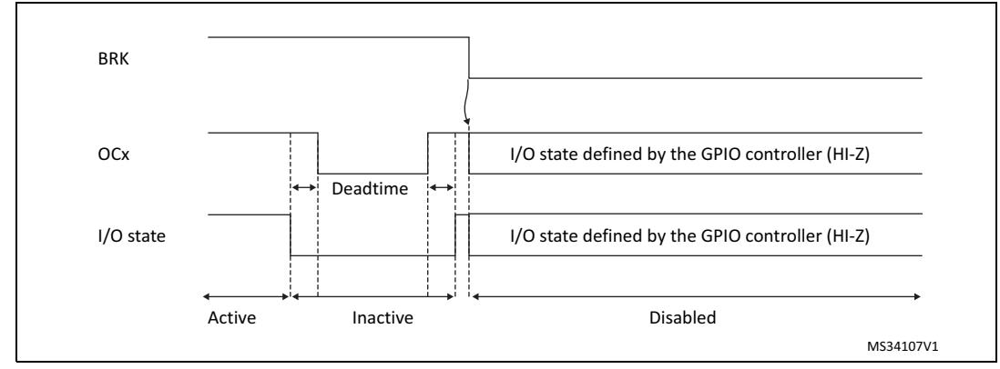

**Figure 432. PWM output state following BRK assertion (OSSI=0)**

# **40.3.17 Bidirectional break inputs**

Beside regular digital break inputs and internal break events coming from the comparators, the timer 1 and 8 are featuring bidirectional break inputs/outputs combining the two sources, as represented on *[Figure 433](#page-42-0)*.

The TIMx\_BKINy\_COMPz pins are combining the COMPz output (to be configured in open drain) and the Timerx's TIMx\_BKINy input. They allow to have:

- A global break information available for external MCUs or gate drivers shut down inputs, with a single-pin.
- An internal comparator and multiple external open drain comparators outputs ORed together and triggering a break event, when the multiple internal and external break inputs must be merged.

<span id="page-42-0"></span>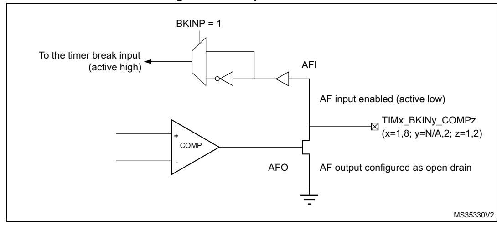

**Figure 433. Output redirection**

# **40.3.18 Clearing the OCxREF signal on an external event**

The OCxREF signal of a given channel can be cleared when a high level is applied on the ocref\_clr\_int input (OCxCE enable bit in the corresponding TIMx\_CCMRx register set to 1). OCxREF remains low until the next transition to the active state, on the following PWM


cycle. This function can only be used in Output compare and PWM modes. It does not work in Forced mode. The ocref\_clr\_int is connected to the ETRF signal (ETR after filtering).

When ETRF is chosen, ETR must be configured as follows:

- 1. The External Trigger Prescaler should be kept off: bits ETPS[1:0] of the TIMx\_SMCR register set to '00'.
- 2. The external clock mode 2 must be disabled: bit ECE of the TIMx\_SMCR register set to '0'.
- 3. The External Trigger Polarity (ETP) and the External Trigger Filter (ETF) can be configured according to the user needs.

*[Figure 434](#page-43-0)* shows the behavior of the OCxREF signal when the ETRF Input becomes High, for both values of the enable bit OCxCE. In this example, the timer TIMx is programmed in PWM mode.

<span id="page-43-0"></span>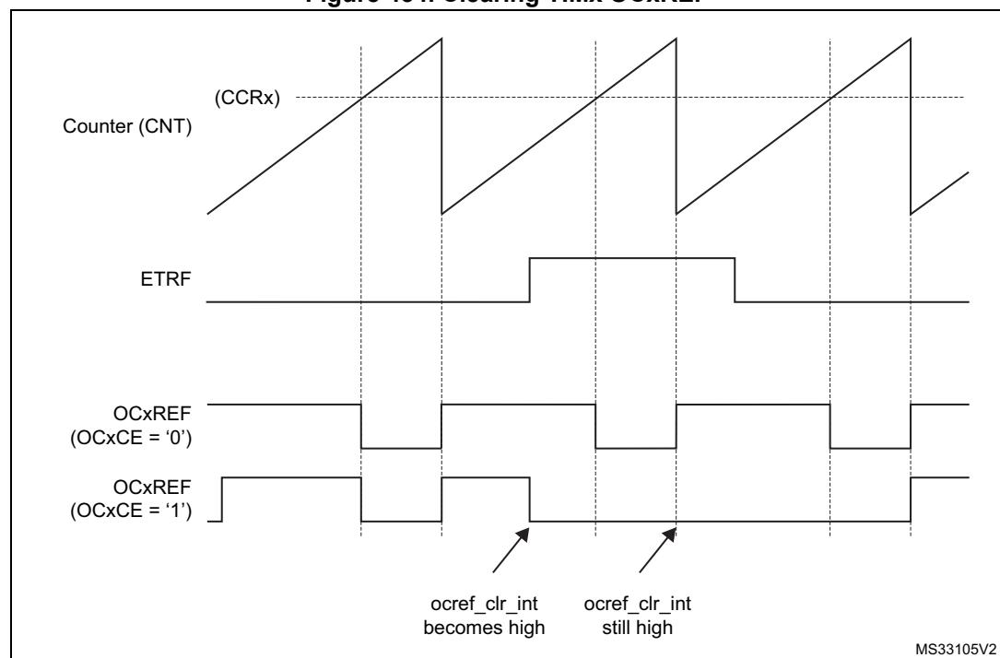

**Figure 434. Clearing TIMx OCxREF**

*Note: In case of a PWM with a 100% duty cycle (if CCRx>ARR), then OCxREF is enabled again at the next counter overflow.*


# **40.3.19 6-step PWM generation**

When complementary outputs are used on a channel, preload bits are available on the OCxM, CCxE and CCxNE bits. The preload bits are transferred to the shadow bits at the COM commutation event. Thus one can program in advance the configuration for the next step and change the configuration of all the channels at the same time. COM can be generated by software by setting the COM bit in the TIMx\_EGR register or by hardware (on TRGI rising edge).

A flag is set when the COM event occurs (COMIF bit in the TIMx\_SR register), which can generate an interrupt (if the COMIE bit is set in the TIMx\_DIER register) or a DMA request (if the COMDE bit is set in the TIMx\_DIER register).

The *[Figure 435](#page-44-0)* describes the behavior of the OCx and OCxN outputs when a COM event occurs, in 3 different examples of programmed configurations.

<span id="page-44-0"></span>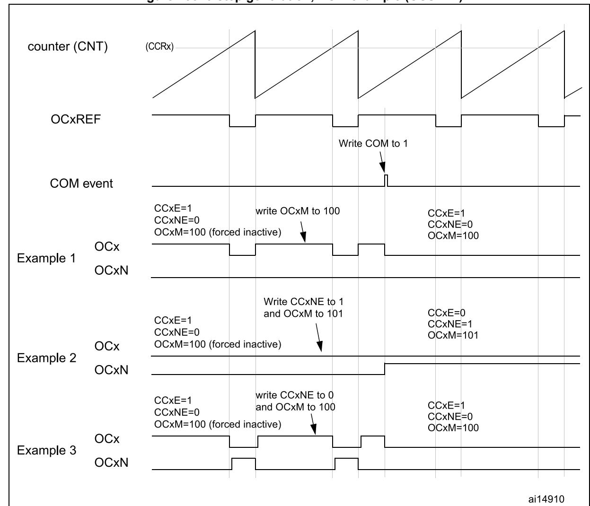

**Figure 435. 6-step generation, COM example (OSSR=1)**

# <span id="page-45-0"></span>**40.3.20 One-pulse mode**

One-pulse mode (OPM) is a particular case of the previous modes. It allows the counter to be started in response to a stimulus and to generate a pulse with a programmable length after a programmable delay.

Starting the counter can be controlled through the slave mode controller. Generating the waveform can be done in output compare mode or PWM mode. One-pulse mode is selected by setting the OPM bit in the TIMx\_CR1 register. This makes the counter stop automatically at the next update event UEV.

A pulse can be correctly generated only if the compare value is different from the counter initial value. Before starting (when the timer is waiting for the trigger), the configuration must be:

- In upcounting: CNT < CCRx ≤ ARR (in particular, 0 < CCRx)
- In downcounting: CNT > CCRx

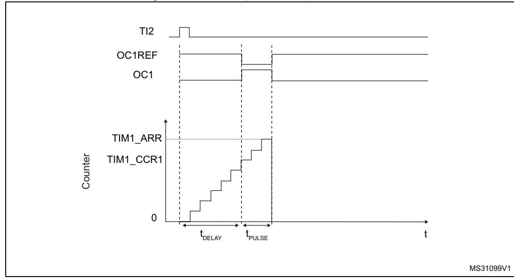

**Figure 436. Example of one pulse mode.**

For example one may want to generate a positive pulse on OC1 with a length of tPULSE and after a delay of tDELAY as soon as a positive edge is detected on the TI2 input pin.

Let's use TI2FP2 as trigger 1:

- 1. Select the proper TI2x source (internal or external) with the TI2SEL[3:0] bits in the TIMx\_TISEL register.
- 2. Map TI2FP2 to TI2 by writing CC2S='01' in the TIMx\_CCMR1 register.
- 3. TI2FP2 must detect a rising edge, write CC2P='0' and CC2NP='0' in the TIMx\_CCER register.
- 4. Configure TI2FP2 as trigger for the slave mode controller (TRGI) by writing TS=00110 in the TIMx\_SMCR register.
- 5. TI2FP2 is used to start the counter by writing SMS to '110' in the TIMx\_SMCR register (trigger mode).

The OPM waveform is defined by writing the compare registers (taking into account the clock frequency and the counter prescaler).

- The tDELAY is defined by the value written in the TIMx\_CCR1 register.
- The tPULSE is defined by the difference between the auto-reload value and the compare value (TIMx\_ARR - TIMx\_CCR1).
- Let's say one want to build a waveform with a transition from '0' to '1' when a compare match occurs and a transition from '1' to '0' when the counter reaches the auto-reload value. To do this PWM mode 2 must be enabled by writing OC1M=111 in the TIMx\_CCMR1 register. Optionally the preload registers can be enabled by writing OC1PE='1' in the TIMx\_CCMR1 register and ARPE in the TIMx\_CR1 register. In this case one has to write the compare value in the TIMx\_CCR1 register, the auto-reload value in the TIMx\_ARR register, generate an update by setting the UG bit and wait for external trigger event on TI2. CC1P is written to '0' in this example.

In our example, the DIR and CMS bits in the TIMx\_CR1 register should be low.

Since only 1 pulse (Single mode) is needed, a 1 must be written in the OPM bit in the TIMx\_CR1 register to stop the counter at the next update event (when the counter rolls over from the auto-reload value back to 0). When OPM bit in the TIMx\_CR1 register is set to '0', so the Repetitive Mode is selected.

Particular case: OCx fast enable:

In One-pulse mode, the edge detection on TIx input set the CEN bit which enables the counter. Then the comparison between the counter and the compare value makes the output toggle. But several clock cycles are needed for these operations and it limits the minimum delay tDELAY min we can get.

If one wants to output a waveform with the minimum delay, the OCxFE bit can be set in the TIMx\_CCMRx register. Then OCxRef (and OCx) are forced in response to the stimulus, without taking in account the comparison. Its new level is the same as if a compare match had occurred. OCxFE acts only if the channel is configured in PWM1 or PWM2 mode.

# **40.3.21 Retriggerable one pulse mode**

This mode allows the counter to be started in response to a stimulus and to generate a pulse with a programmable length, but with the following differences with Non-retriggerable one pulse mode described in *[Section 40.3.20](#page-45-0)*:

- The pulse starts as soon as the trigger occurs (no programmable delay)
- The pulse is extended if a new trigger occurs before the previous one is completed

The timer must be in Slave mode, with the bits SMS[3:0] = '1000' (Combined Reset + trigger mode) in the TIMx\_SMCR register, and the OCxM[3:0] bits set to '1000' or '1001' for retriggerable OPM mode 1 or 2.

If the timer is configured in Up-counting mode, the corresponding CCRx must be set to 0 (the ARR register sets the pulse length). If the timer is configured in Down-counting mode, CCRx must be above or equal to ARR.

*Note: The OCxM[3:0] and SMS[3:0] bit fields are split into two parts for compatibility reasons, the most significant bit are not contiguous with the 3 least significant ones.*

> *This mode must not be used with center-aligned PWM modes. It is mandatory to have CMS[1:0] = 00 in TIMx\_CR1.*


RM0399 Rev 4 1723/3556

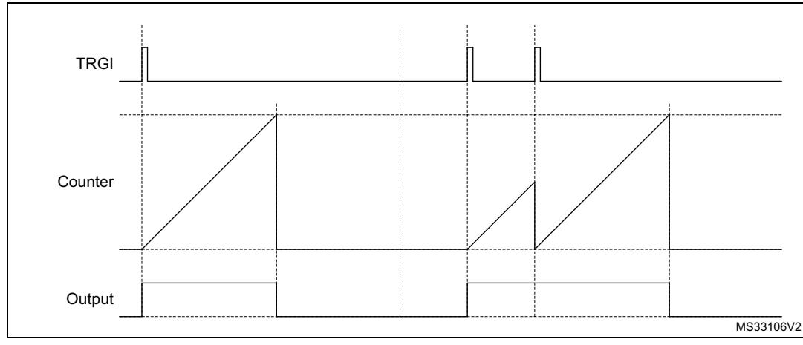

**Figure 437. Retriggerable one pulse mode**

# **40.3.22 Encoder interface mode**

To select Encoder Interface mode write SMS='001' in the TIMx\_SMCR register if the counter is counting on TI2 edges only, SMS='010' if it is counting on TI1 edges only and SMS='011' if it is counting on both TI1 and TI2 edges.

Select the TI1 and TI2 polarity by programming the CC1P and CC2P bits in the TIMx\_CCER register. When needed, the input filter can be programmed as well. CC1NP and CC2NP must be kept low.

The two inputs TI1 and TI2 are used to interface to a quadrature encoder. Refer to *[Table 352](#page-48-0)*. The counter is clocked by each valid transition on TI1FP1 or TI2FP2 (TI1 and TI2 after input filter and polarity selection, TI1FP1=TI1 if not filtered and not inverted, TI2FP2=TI2 if not filtered and not inverted) assuming that it is enabled (CEN bit in TIMx\_CR1 register written to '1'). The sequence of transitions of the two inputs is evaluated and generates count pulses as well as the direction signal. Depending on the sequence the counter counts up or down, the DIR bit in the TIMx\_CR1 register is modified by hardware accordingly. The DIR bit is calculated at each transition on any input (TI1 or TI2), whatever the counter is counting on TI1 only, TI2 only or both TI1 and TI2.

Encoder interface mode acts simply as an external clock with direction selection. This means that the counter just counts continuously between 0 and the auto-reload value in the TIMx\_ARR register (0 to ARR or ARR down to 0 depending on the direction). So the TIMx\_ARR must be configured before starting. In the same way, the capture, compare, repetition counter, trigger output features continue to work as normal. Encoder mode and External clock mode 2 are not compatible and must not be selected together.

*Note: The prescaler must be set to zero when encoder mode is enabled*

In this mode, the counter is modified automatically following the speed and the direction of the quadrature encoder and its content, therefore, always represents the encoder's position. The count direction correspond to the rotation direction of the connected sensor. The table summarizes the possible combinations, assuming TI1 and TI2 do not switch at the same time.


<span id="page-48-0"></span>

|             | Level on                                                     |          | TI1FP1 signal | TI2FP2 signal |          |  |  |
|-------------|--------------------------------------------------------------|----------|---------------|---------------|----------|--|--|
| Active edge | opposite<br>signal (TI1FP1<br>for TI2,<br>TI2FP2 for<br>TI1) | Rising   |               | Rising        | Falling  |  |  |
| Counting on | High                                                         | Down     | Up            | No Count      | No Count |  |  |
| TI1 only    | Low                                                          | Up       | Down          | No Count      | No Count |  |  |
| Counting on | High                                                         | No Count | No Count      | Up            | Down     |  |  |
| TI2 only    | Low                                                          | No Count | No Count      | Down          | Up       |  |  |
| Counting on | High                                                         | Down     | Up            | Up            | Down     |  |  |
| TI1 and TI2 | Low                                                          | Up       | Down          | Down          | Up       |  |  |

**Table 352. Counting direction versus encoder signals** 

A quadrature encoder can be connected directly to the MCU without external interface logic. However, comparators are normally be used to convert the encoder's differential outputs to digital signals. This greatly increases noise immunity. The third encoder output which indicate the mechanical zero position, may be connected to an external interrupt input and trigger a counter reset.

The *[Figure 438](#page-48-1)* gives an example of counter operation, showing count signal generation and direction control. It also shows how input jitter is compensated where both edges are selected. This might occur if the sensor is positioned near to one of the switching points. For this example we assume that the configuration is the following:

- CC1S='01' (TIMx\_CCMR1 register, TI1FP1 mapped on TI1).
- CC2S='01' (TIMx\_CCMR1 register, TI2FP2 mapped on TI2)
- CC1P='0' and CC1NP='0' (TIMx\_CCER register, TI1FP1 non-inverted, TI1FP1=TI1).
- CC2P='0' and CC2NP='0' (TIMx\_CCER register, TI1FP2 non-inverted, TI1FP2= TI2).
- SMS='011' (TIMx\_SMCR register, both inputs are active on both rising and falling edges).
- CEN='1' (TIMx\_CR1 register, Counter enabled).

<span id="page-48-1"></span>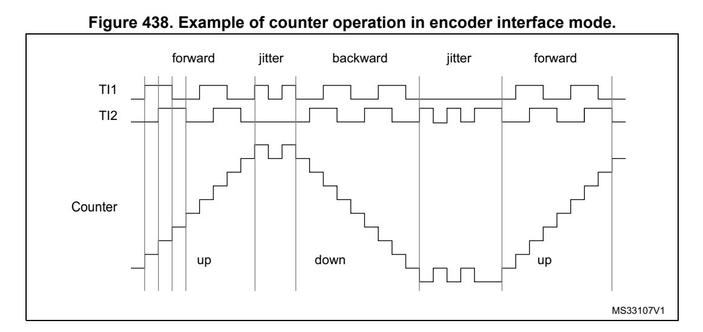

*[Figure 439](#page-49-0)* gives an example of counter behavior when TI1FP1 polarity is inverted (same configuration as above except CC1P='1').

<span id="page-49-0"></span>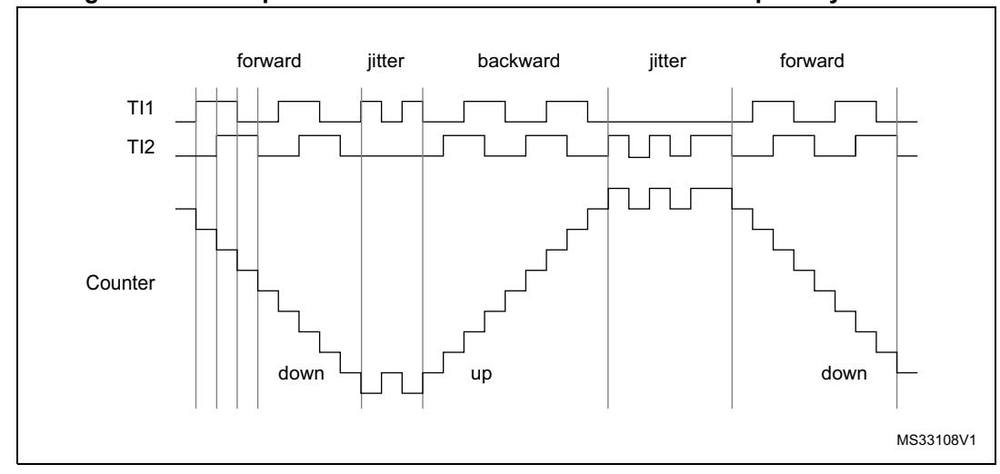

**Figure 439. Example of encoder interface mode with TI1FP1 polarity inverted.**

The timer, when configured in Encoder Interface mode provides information on the sensor's current position. Dynamic information can be obtained (speed, acceleration, deceleration) by measuring the period between two encoder events using a second timer configured in capture mode. The output of the encoder which indicates the mechanical zero can be used for this purpose. Depending on the time between two events, the counter can also be read at regular times. This can be done by latching the counter value into a third input capture register if available (then the capture signal must be periodic and can be generated by another timer). when available, it is also possible to read its value through a DMA request.

The IUFREMAP bit in the TIMx\_CR1 register forces a continuous copy of the update interrupt flag (UIF) into the timer counter register's bit 31 (TIMxCNT[31]). This allows both the counter value and a potential roll-over condition signaled by the UIFCPY flag to be read in an atomic way. It eases the calculation of angular speed by avoiding race conditions caused, for instance, by a processing shared between a background task (counter reading) and an interrupt (update interrupt).

There is no latency between the UIF and UIFCPY flag assertions.

In 32-bit timer implementations, when the IUFREMAP bit is set, bit 31 of the counter is overwritten by the UIFCPY flag upon read access (the counter's most significant bit is only accessible in write mode).

# **40.3.23 UIF bit remapping**

The IUFREMAP bit in the TIMx\_CR1 register forces a continuous copy of the Update Interrupt Flag UIF into the timer counter register's bit 31 (TIMxCNT[31]). This allows both the counter value and a potential roll-over condition signaled by the UIFCPY flag to be read in an atomic way. In particular cases, it can ease the calculations by avoiding race conditions, caused for instance by a processing shared between a background task (counter reading) and an interrupt (Update Interrupt).

There is no latency between the UIF and UIFCPY flags assertion.

# **40.3.24 Timer input XOR function**

The TI1S bit in the TIMx\_CR2 register, allows the input filter of channel 1 to be connected to the output of an XOR gate, combining the three input pins TIMx\_CH1, TIMx\_CH2 and TIMx\_CH3.

The XOR output can be used with all the timer input functions such as trigger or input capture. It is convenient to measure the interval between edges on two input signals, as per *[Figure 440](#page-50-0)* below.

<span id="page-50-0"></span>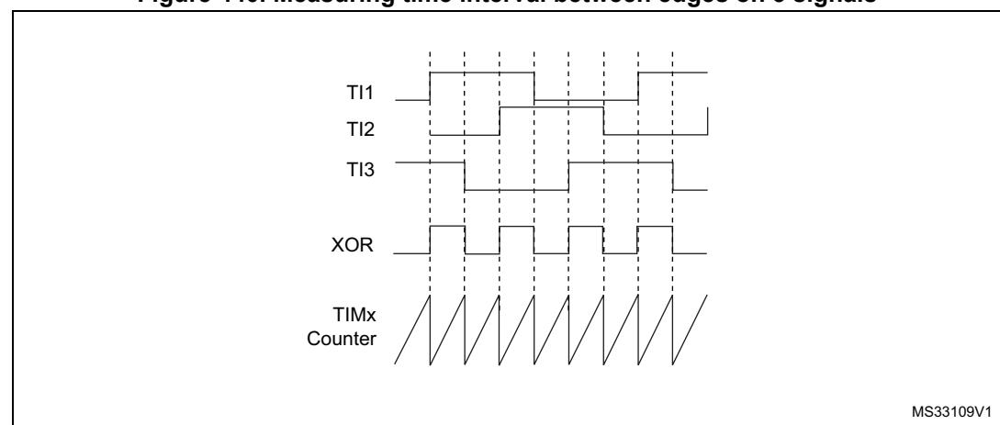

**Figure 440. Measuring time interval between edges on 3 signals**

# **40.3.25 Interfacing with Hall sensors**

This is done using the advanced-control timers (TIM1 or TIM8) to generate PWM signals to drive the motor and another timer TIMx (TIM2, TIM3, TIM4) referred to as "interfacing timer" in *[Figure 441](#page-52-0)*. The "interfacing timer" captures the 3 timer input pins (CC1, CC2, CC3) connected through a XOR to the TI1 input channel (selected by setting the TI1S bit in the TIMx\_CR2 register).

The slave mode controller is configured in reset mode; the slave input is TI1F\_ED. Thus, each time one of the 3 inputs toggles, the counter restarts counting from 0. This creates a time base triggered by any change on the Hall inputs.

On the "interfacing timer", capture/compare channel 1 is configured in capture mode, capture signal is TRC (See *[Figure 414: Capture/compare channel \(example: channel 1](#page-22-0)  [input stage\) on page 1699](#page-22-0)*). The captured value, which corresponds to the time elapsed between 2 changes on the inputs, gives information about motor speed.

The "interfacing timer" can be used in output mode to generate a pulse which changes the configuration of the channels of the advanced-control timer (TIM1 or TIM8) (by triggering a COM event). The TIM1 timer is used to generate PWM signals to drive the motor. To do this, the interfacing timer channel must be programmed so that a positive pulse is generated after a programmed delay (in output compare or PWM mode). This pulse is sent to the advanced-control timer (TIM1 or TIM8) through the TRGO output.


Example: one wants to change the PWM configuration of the advanced-control timer TIM1 after a programmed delay each time a change occurs on the Hall inputs connected to one of the TIMx timers.

- Configure 3 timer inputs ORed to the TI1 input channel by writing the TI1S bit in the TIMx\_CR2 register to '1',
- Program the time base: write the TIMx\_ARR to the max value (the counter must be cleared by the TI1 change. Set the prescaler to get a maximum counter period longer than the time between 2 changes on the sensors,
- Program the channel 1 in capture mode (TRC selected): write the CC1S bits in the TIMx\_CCMR1 register to '01'. The digital filter can also be programmed if needed,
- Program the channel 2 in PWM 2 mode with the desired delay: write the OC2M bits to '111' and the CC2S bits to '00' in the TIMx\_CCMR1 register,
- Select OC2REF as trigger output on TRGO: write the MMS bits in the TIMx\_CR2 register to '101',

In the advanced-control timer TIM1, the right ITR input must be selected as trigger input, the timer is programmed to generate PWM signals, the capture/compare control signals are preloaded (CCPC=1 in the TIMx\_CR2 register) and the COM event is controlled by the trigger input (CCUS=1 in the TIMx\_CR2 register). The PWM control bits (CCxE, OCxM) are written after a COM event for the next step (this can be done in an interrupt subroutine generated by the rising edge of OC2REF).

The *[Figure 441](#page-52-0)* describes this example.


<span id="page-52-0"></span>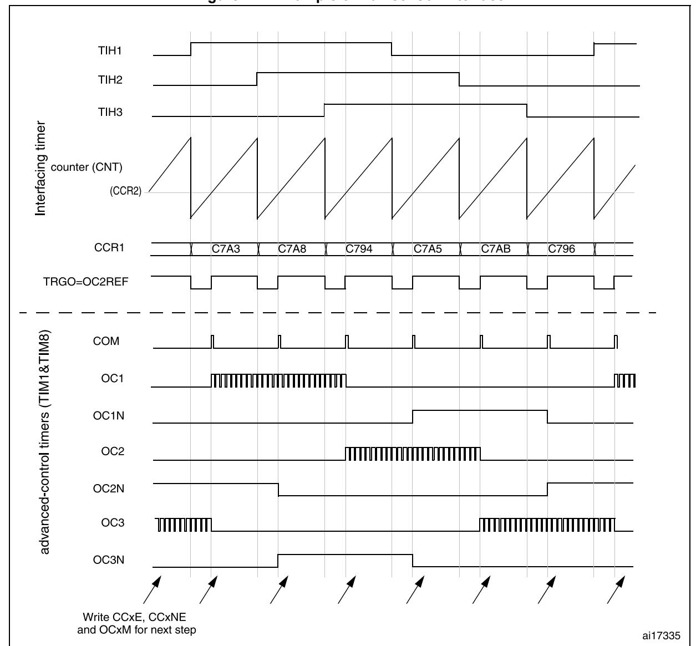

**Figure 441. Example of Hall sensor interface**

# <span id="page-53-0"></span>40.3.26 Timer synchronization

The TIMx timers are linked together internally for timer synchronization or chaining. Refer to *Section 41.3.19: Timer synchronization* for details. They can be synchronized in several modes: Reset mode, Gated mode, and Trigger mode.

#### Slave mode: Reset mode

The counter and its prescaler can be reinitialized in response to an event on a trigger input. Moreover, if the URS bit from the TIMx\_CR1 register is low, an update event UEV is generated. Then all the preloaded registers (TIMx\_ARR, TIMx\_CCRx) are updated.

In the following example, the upcounter is cleared in response to a rising edge on TI1 input:

- Configure the channel 1 to detect rising edges on TI1. Configure the input filter duration (in this example, we do not need any filter, so we keep IC1F=0000). The capture prescaler is not used for triggering, so it does not need to be configured. The CC1S bits select the input capture source only, CC1S = 01 in the TIMx\_CCMR1 register. Write CC1P=0 and CC1NP='0' in TIMx\_CCER register to validate the polarity (and detect rising edges only).
- Configure the timer in reset mode by writing SMS=100 in TIMx\_SMCR register. Select TI1 as the input source by writing TS=00101 in TIMx\_SMCR register.
- Start the counter by writing CEN=1 in the TIMx CR1 register.

The counter starts counting on the internal clock, then behaves normally until TI1 rising edge. When TI1 rises, the counter is cleared and restarts from 0. In the meantime, the trigger flag is set (TIF bit in the TIMx\_SR register) and an interrupt request, or a DMA request can be sent if enabled (depending on the TIE and TDE bits in TIMx\_DIER register).

The following figure shows this behavior when the auto-reload register TIMx\_ARR=0x36. The delay between the rising edge on TI1 and the actual reset of the counter is due to the resynchronization circuit on TI1 input.

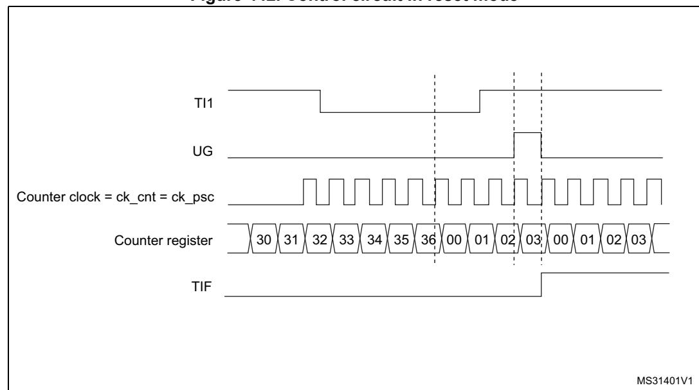

Figure 442. Control circuit in reset mode


### **Slave mode: Gated mode**

The counter can be enabled depending on the level of a selected input.

In the following example, the upcounter counts only when TI1 input is low:

- Configure the channel 1 to detect low levels on TI1. Configure the input filter duration (in this example, we do not need any filter, so we keep IC1F=0000). The capture prescaler is not used for triggering, so it does not need to be configured. The CC1S bits select the input capture source only, CC1S=01 in TIMx\_CCMR1 register. Write CC1P=1 and CC1NP='0' in TIMx\_CCER register to validate the polarity (and detect low level only).
- Configure the timer in gated mode by writing SMS=101 in TIMx\_SMCR register. Select TI1 as the input source by writing TS=00101 in TIMx\_SMCR register.
- Enable the counter by writing CEN=1 in the TIMx\_CR1 register (in gated mode, the counter doesn't start if CEN=0, whatever is the trigger input level).

The counter starts counting on the internal clock as long as TI1 is low and stops as soon as TI1 becomes high. The TIF flag in the TIMx\_SR register is set both when the counter starts or stops.

The delay between the rising edge on TI1 and the actual stop of the counter is due to the resynchronization circuit on TI1 input.

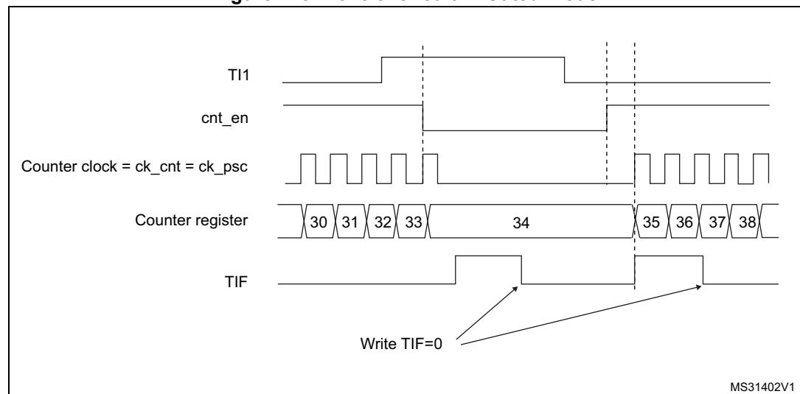

**Figure 443. Control circuit in Gated mode**

# **Slave mode: Trigger mode**

The counter can start in response to an event on a selected input.

In the following example, the upcounter starts in response to a rising edge on TI2 input:

• Configure the channel 2 to detect rising edges on TI2. Configure the input filter duration (in this example, we do not need any filter, so we keep IC2F=0000). The capture prescaler is not used for triggering, so it does not need to be configured. The CC2S bits are configured to select the input capture source only, CC2S=01 in TIMx\_CCMR1


register. Write CC2P=1 and CC2NP=0 in TIMx\_CCER register to validate the polarity (and detect low level only).

• Configure the timer in trigger mode by writing SMS=110 in TIMx\_SMCR register. Select TI2 as the input source by writing TS=00110 in TIMx\_SMCR register.

When a rising edge occurs on TI2, the counter starts counting on the internal clock and the TIF flag is set.

The delay between the rising edge on TI2 and the actual start of the counter is due to the resynchronization circuit on TI2 input.

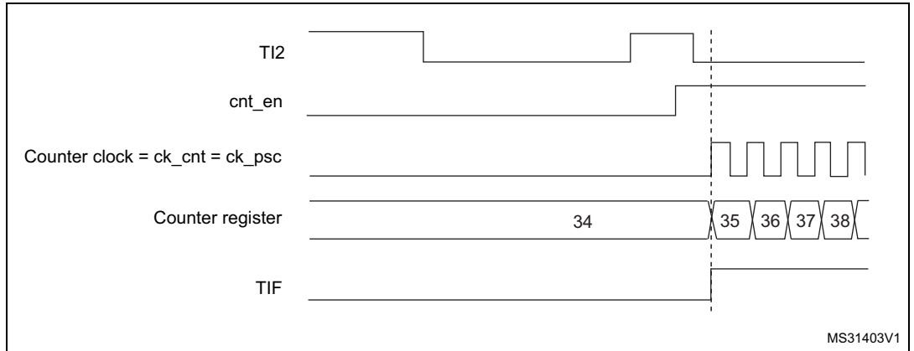

**Figure 444. Control circuit in trigger mode**

### **Slave mode: Combined reset + trigger mode**

In this case, a rising edge of the selected trigger input (TRGI) reinitializes the counter, generates an update of the registers, and starts the counter.

This mode is used for one-pulse mode.

### **Slave mode: external clock mode 2 + trigger mode**

The external clock mode 2 can be used in addition to another slave mode (except external clock mode 1 and encoder mode). In this case, the ETR signal is used as external clock input, and another input can be selected as trigger input (in reset mode, gated mode or trigger mode). It is recommended not to select ETR as TRGI through the TS bits of TIMx\_SMCR register.

In the following example, the upcounter is incremented at each rising edge of the ETR signal as soon as a rising edge of TI1 occurs:

- 1. Configure the external trigger input circuit by programming the TIMx\_SMCR register as follows:
  - ETF = 0000: no filter
  - ETPS = 00: prescaler disabled
  - ETP = 0: detection of rising edges on ETR and ECE=1 to enable the external clock mode 2.
- 2. Configure the channel 1 as follows, to detect rising edges on TI:
  - IC1F = 0000: no filter.
  - The capture prescaler is not used for triggering and does not need to be configured.
  - CC1S = 01in TIMx\_CCMR1 register to select only the input capture source
  - CC1P = 0 and CC1NP = 0 in TIMx\_CCER register to validate the polarity (and detect rising edge only).
- 3. Configure the timer in trigger mode by writing SMS=110 in TIMx\_SMCR register. Select TI1 as the input source by writing TS=00101 in TIMx\_SMCR register.

A rising edge on TI1 enables the counter and sets the TIF flag. The counter then counts on ETR rising edges.

The delay between the rising edge of the ETR signal and the actual reset of the counter is due to the resynchronization circuit on ETRP input.

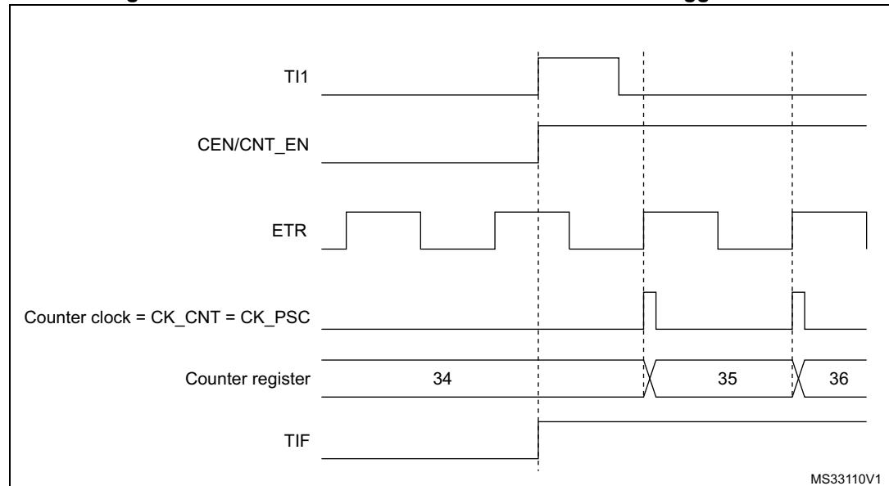

**Figure 445. Control circuit in external clock mode 2 + trigger mode**

*Note: The clock of the slave peripherals (timer, ADC, ...) receiving the TRGO or the TRGO2 signals must be enabled prior to receive events from the master timer, and the clock frequency (prescaler) must not be changed on-the-fly while triggers are received from the master timer.*

# <span id="page-57-0"></span>**40.3.27 ADC synchronization**

The timer can generate an ADC triggering event with various internal signals, such as reset, enable or compare events. It is also possible to generate a pulse issued by internal edge detectors, such as:

- Rising and falling edges of OC4ref
- Rising edge on OC5ref or falling edge on OC6ref

The triggers are issued on the TRGO2 internal line which is redirected to the ADC. There is a total of 16 possible events, which can be selected using the MMS2[3:0] bits in the TIMx\_CR2 register.

An example of an application for 3-phase motor drives is given in *[Figure 425 on page 1711](#page-34-0)*.

*Note: The clock of the slave peripherals (timer, ADC, ...) receiving the TRGO or the TRGO2 signals must be enabled prior to receive events from the master timer, and the clock frequency (prescaler) must not be changed on-the-fly while triggers are received from the master timer.*

*Note: The clock of the ADC must be enabled prior to receive events from the master timer, and must not be changed on-the-fly while triggers are received from the timer.*

# **40.3.28 DMA burst mode**

The TIMx timers have the capability to generate multiple DMA requests upon a single event. The main purpose is to be able to re-program part of the timer multiple times without software overhead, but it can also be used to read several registers in a row, at regular intervals.

The DMA controller destination is unique and must point to the virtual register TIMx\_DMAR. On a given timer event, the timer launches a sequence of DMA requests (burst). Each write into the TIMx\_DMAR register is actually redirected to one of the timer registers.

The DBL[4:0] bits in the TIMx\_DCR register set the DMA burst length. The timer recognizes a burst transfer when a read or a write access is done to the TIMx\_DMAR address), i.e. the number of transfers (either in half-words or in bytes).

The DBA[4:0] bits in the TIMx\_DCR registers define the DMA base address for DMA transfers (when read/write access are done through the TIMx\_DMAR address). DBA is defined as an offset starting from the address of the TIMx\_CR1 register:

# Example:

00000: TIMx\_CR1 00001: TIMx\_CR2 00010: TIMx\_SMCR

As an example, the timer DMA burst feature is used to update the contents of the CCRx registers (x = 2, 3, 4) upon an update event, with the DMA transferring half words into the CCRx registers.

This is done in the following steps:

- 1. Configure the corresponding DMA channel as follows:
  - DMA channel peripheral address is the DMAR register address
  - DMA channel memory address is the address of the buffer in the RAM containing the data to be transferred by DMA into CCRx registers.
  - Number of data to transfer = 3 (See note below).
  - Circular mode disabled.
- 2. Configure the DCR register by configuring the DBA and DBL bit fields as follows: DBL = 3 transfers, DBA = 0xE.
- 3. Enable the TIMx update DMA request (set the UDE bit in the DIER register).
- 4. Enable TIMx
- 5. Enable the DMA channel

This example is for the case where every CCRx register to be updated once. If every CCRx register is to be updated twice for example, the number of data to transfer should be 6. Let's take the example of a buffer in the RAM containing data1, data2, data3, data4, data5 and data6. The data is transferred to the CCRx registers as follows: on the first update DMA request, data1 is transferred to CCR2, data2 is transferred to CCR3, data3 is transferred to CCR4 and on the second update DMA request, data4 is transferred to CCR2, data5 is transferred to CCR3 and data6 is transferred to CCR4.

*Note: A null value can be written to the reserved registers.*

# **40.3.29 Debug mode**

When the microcontroller enters debug mode (Cortex®-M7 with FPU core halted), the TIMx counter either continues to work normally or stops, depending on DBG\_TIMx\_STOP configuration bit in DBG module.

For safety purposes, when the counter is stopped, the outputs are disabled (as if the MOE bit was reset). The outputs can either be forced to an inactive state (OSSI bit = 1), or have their control taken over by the GPIO controller (OSSI bit = 0), typically to force a Hi-Z.

For more details, refer to section Debug support (DBG).

# <span id="page-59-0"></span>**40.4 TIM1/TIM8 registers**

Refer to for a list of abbreviations used in register descriptions.

The peripheral registers can be accessed by half-words (16-bit) or words (32-bit).

# **40.4.1 TIMx control register 1 (TIMx\_CR1)(x = 1, 8)**

Address offset: 0x00 Reset value: 0x0000

| 15   | 14   | 13   | 12   | 11           | 10   | 9  | 8        | 7    | 6  | 5        | 4   | 3   | 2   | 1    | 0   |
|------|------|------|------|--------------|------|----|----------|------|----|----------|-----|-----|-----|------|-----|
| Res. | Res. | Res. | Res. | UIFRE<br>MAP | Res. |    | CKD[1:0] | ARPE |    | CMS[1:0] | DIR | OPM | URS | UDIS | CEN |
|      |      |      |      | rw           |      | rw | rw       | rw   | rw | rw       | rw  | rw  | rw  | rw   | rw  |

Bits 15:12 Reserved, must be kept at reset value.

### Bit 11 **UIFREMAP**: UIF status bit remapping

- 0: No remapping. UIF status bit is not copied to TIMx\_CNT register bit 31.
- 1: Remapping enabled. UIF status bit is copied to TIMx\_CNT register bit 31.
- Bit 10 Reserved, must be kept at reset value.

### Bits 9:8 **CKD[1:0]**: Clock division

This bit-field indicates the division ratio between the timer clock (CK\_INT) frequency and the dead-time and sampling clock (tDTS)used by the dead-time generators and the digital filters (ETR, TIx):

00: tDTS=tCK\_INT

01: tDTS=2\*tCK\_INT

10: tDTS=4\*tCK\_INT

11: Reserved, do not program this value

*Note: tDTS = 1/fDTS, tCK\_INT = 1/fCK\_INT.*

### Bit 7 **ARPE**: Auto-reload preload enable

0: TIMx\_ARR register is not buffered

1: TIMx\_ARR register is buffered

### Bits 6:5 **CMS[1:0]**: Center-aligned mode selection

- 00: Edge-aligned mode. The counter counts up or down depending on the direction bit (DIR).
- 01: Center-aligned mode 1. The counter counts up and down alternatively. Output compare interrupt flags of channels configured in output (CCxS=00 in TIMx\_CCMRx register) are set only when the counter is counting down.
- 10: Center-aligned mode 2. The counter counts up and down alternatively. Output compare interrupt flags of channels configured in output (CCxS=00 in TIMx\_CCMRx register) are set only when the counter is counting up.
- 11: Center-aligned mode 3. The counter counts up and down alternatively. Output compare interrupt flags of channels configured in output (CCxS=00 in TIMx\_CCMRx register) are set both when the counter is counting up or down.

*Note: Switch from edge-aligned mode to center-aligned mode as long as the counter is enabled (CEN=1) is not allowed*


### Bit 4 **DIR**: Direction

- 0: Counter used as upcounter
- 1: Counter used as downcounter

*Note: This bit is read only when the timer is configured in Center-aligned mode or Encoder mode.*

#### Bit 3 **OPM**: One pulse mode

- 0: Counter is not stopped at update event
- 1: Counter stops counting at the next update event (clearing the bit CEN)

#### Bit 2 **URS**: Update request source

This bit is set and cleared by software to select the UEV event sources.

- 0: Any of the following events generate an update interrupt or DMA request if enabled. These events can be:
  - Counter overflow/underflow
  - Setting the UG bit
  - Update generation through the slave mode controller
- 1: Only counter overflow/underflow generates an update interrupt or DMA request if enabled.

### Bit 1 **UDIS**: Update disable

This bit is set and cleared by software to enable/disable UEV event generation.

0: UEV enabled. The Update (UEV) event is generated by one of the following events:

- Counter overflow/underflow
- Setting the UG bit
- Update generation through the slave mode controller

Buffered registers are then loaded with their preload values.

1: UEV disabled. The Update event is not generated, shadow registers keep their value (ARR, PSC, CCRx). However the counter and the prescaler are reinitialized if the UG bit is set or if a hardware reset is received from the slave mode controller.

### Bit 0 **CEN**: Counter enable

- 0: Counter disabled
- 1: Counter enabled

*Note: External clock, gated mode and encoder mode can work only if the CEN bit has been previously set by software. However trigger mode can set the CEN bit automatically by hardware.*

# **40.4.2 TIMx control register 2 (TIMx\_CR2)(x = 1, 8)**

Address offset: 0x04

Reset value: 0x0000 0000

| 31   | 30   | 29    | 28   | 27    | 26   | 25    | 24   | 23   | 22 | 21        | 20 | 19   | 18   | 17   | 16   |
|------|------|-------|------|-------|------|-------|------|------|----|-----------|----|------|------|------|------|
| Res. | Res. | Res.  | Res. | Res.  | Res. | Res.  | Res. |      |    | MMS2[3:0] |    | Res. | OIS6 | Res. | OIS5 |
|      |      |       |      |       |      |       |      | rw   | rw | rw        | rw |      | rw   |      | rw   |
|      |      |       |      |       |      |       |      |      |    |           |    |      |      |      |      |
| 15   | 14   | 13    | 12   | 11    | 10   | 9     | 8    | 7    | 6  | 5         | 4  | 3    | 2    | 1    | 0    |
| Res. | OIS4 | OIS3N | OIS3 | OIS2N | OIS2 | OIS1N | OIS1 | TI1S |    | MMS[2:0]  |    | CCDS | CCUS | Res. | CCPC |

RM0399 Rev 4 1737/3556

- Bits 31:24 Reserved, must be kept at reset value.
- Bits 23:20 **MMS2[3:0]**: Master mode selection 2

These bits allow the information to be sent to ADC for synchronization (TRGO2) to be selected. The combination is as follows:

- 0000: **Reset** the UG bit from the TIMx\_EGR register is used as trigger output (TRGO2). If the reset is generated by the trigger input (slave mode controller configured in reset mode), the signal on TRGO2 is delayed compared to the actual reset.
- 0001: **Enable** the Counter Enable signal CNT\_EN is used as trigger output (TRGO2). It is useful to start several timers at the same time or to control a window in which a slave timer is enabled. The Counter Enable signal is generated by a logic AND between the CEN control bit and the trigger input when configured in Gated mode. When the Counter Enable signal is controlled by the trigger input, there is a delay on TRGO2, except if the Master/Slave mode is selected (see the MSM bit description in TIMx\_SMCR register).
- 0010: **Update** the update event is selected as trigger output (TRGO2). For instance, a master timer can then be used as a prescaler for a slave timer.
- 0011: **Compare pulse** the trigger output sends a positive pulse when the CC1IF flag is to be set (even if it was already high), as soon as a capture or compare match occurs (TRGO2).
- 0100: **Compare** OC1REFC signal is used as trigger output (TRGO2)
- 0101: **Compare** OC2REFC signal is used as trigger output (TRGO2)
- 0110: **Compare** OC3REFC signal is used as trigger output (TRGO2)
- 0111: **Compare** OC4REFC signal is used as trigger output (TRGO2)
- 1000: **Compare** OC5REFC signal is used as trigger output (TRGO2)
- 1001: **Compare** OC6REFC signal is used as trigger output (TRGO2)
- 1010: **Compare Pulse** OC4REFC rising or falling edges generate pulses on TRGO2
- 1011: **Compare Pulse** OC6REFC rising or falling edges generate pulses on TRGO2
- 1100: **Compare Pulse** OC4REFC or OC6REFC rising edges generate pulses on TRGO2
- 1101: **Compare Pulse** OC4REFC rising or OC6REFC falling edges generate pulses on TRGO2
- 1110: **Compare Pulse** OC5REFC or OC6REFC rising edges generate pulses on TRGO2
- 1111: **Compare Pulse** OC5REFC rising or OC6REFC falling edges generate pulses on TRGO2

*Note: The clock of the slave timer or ADC must be enabled prior to receive events from the master timer, and must not be changed on-the-fly while triggers are received from the master timer.*

- Bit 19 Reserved, must be kept at reset value.
- Bit 18 **OIS6**: Output Idle state 6 (OC6 output)

Refer to OIS1 bit

- Bit 17 Reserved, must be kept at reset value.
- Bit 16 **OIS5**: Output Idle state 5 (OC5 output)

Refer to OIS1 bit

- Bit 15 Reserved, must be kept at reset value.
- Bit 14 **OIS4**: Output Idle state 4 (OC4 output)

Refer to OIS1 bit

Bit 13 **OIS3N**: Output Idle state 3 (OC3N output)

Refer to OIS1N bit


Bit 12 **OIS3**: Output Idle state 3 (OC3 output)

Refer to OIS1 bit

Bit 11 **OIS2N**: Output Idle state 2 (OC2N output)

Refer to OIS1N bit

Bit 10 **OIS2**: Output Idle state 2 (OC2 output)

Refer to OIS1 bit

Bit 9 **OIS1N**: Output Idle state 1 (OC1N output)

0: OC1N=0 after a dead-time when MOE=0

1: OC1N=1 after a dead-time when MOE=0

*Note: This bit can not be modified as long as LOCK level 1, 2 or 3 has been programmed (LOCK bits in TIMx\_BDTR register).*

Bit 8 **OIS1**: Output Idle state 1 (OC1 output)

0: OC1=0 (after a dead-time if OC1N is implemented) when MOE=0

1: OC1=1 (after a dead-time if OC1N is implemented) when MOE=0

*Note: This bit can not be modified as long as LOCK level 1, 2 or 3 has been programmed (LOCK bits in TIMx\_BDTR register).*

Bit 7 **TI1S**: TI1 selection

0: The TIMx\_CH1 pin is connected to TI1 input

1: The TIMx\_CH1, CH2 and CH3 pins are connected to the TI1 input (XOR combination)

Bits 6:4 **MMS[2:0]**: Master mode selection

These bits allow selected information to be sent in master mode to slave timers for synchronization (TRGO). The combination is as follows:

- 000: **Reset** the UG bit from the TIMx\_EGR register is used as trigger output (TRGO). If the reset is generated by the trigger input (slave mode controller configured in reset mode) then the signal on TRGO is delayed compared to the actual reset.
- 001: **Enable** the Counter Enable signal CNT\_EN is used as trigger output (TRGO). It is useful to start several timers at the same time or to control a window in which a slave timer is enable. The Counter Enable signal is generated by a logic AND between CEN control bit and the trigger input when configured in gated mode. When the Counter Enable signal is controlled by the trigger input, there is a delay on TRGO, except if the master/slave mode is selected (see the MSM bit description in TIMx\_SMCR register).
- 010: **Update** The update event is selected as trigger output (TRGO). For instance a master timer can then be used as a prescaler for a slave timer.
- 011: **Compare Pulse** The trigger output send a positive pulse when the CC1IF flag is to be set (even if it was already high), as soon as a capture or a compare match occurred. (TRGO).
- 100: **Compare** OC1REFC signal is used as trigger output (TRGO)
- 101: **Compare** OC2REFC signal is used as trigger output (TRGO)
- 110: **Compare** OC3REFC signal is used as trigger output (TRGO)
- 111: **Compare** OC4REFC signal is used as trigger output (TRGO)

*Note: The clock of the slave timer or ADC must be enabled prior to receive events from the master timer, and must not be changed on-the-fly while triggers are received from the master timer.*

Bit 3 **CCDS**: Capture/compare DMA selection

0: CCx DMA request sent when CCx event occurs

1: CCx DMA requests sent when update event occurs


RM0399 Rev 4 1739/3556

- Bit 2 **CCUS**: Capture/compare control update selection
  - 0: When capture/compare control bits are preloaded (CCPC=1), they are updated by setting the COMG bit only
  - 1: When capture/compare control bits are preloaded (CCPC=1), they are updated by setting the COMG bit or when an rising edge occurs on TRGI

*Note: This bit acts only on channels that have a complementary output.*

- Bit 1 Reserved, must be kept at reset value.
- Bit 0 **CCPC**: Capture/compare preloaded control
  - 0: CCxE, CCxNE and OCxM bits are not preloaded
  - 1: CCxE, CCxNE and OCxM bits are preloaded, after having been written, they are updated only when a commutation event (COM) occurs (COMG bit set or rising edge detected on TRGI, depending on the CCUS bit).

*Note: This bit acts only on channels that have a complementary output.*

# <span id="page-63-0"></span>**40.4.3 TIMx slave mode control register (TIMx\_SMCR)(x = 1, 8)**

Address offset: 0x08

Reset value: 0x0000 0000

| 31   | 30   | 29   | 28        | 27   | 26       | 25   | 24   | 23   | 22      | 21 | 20      | 19       | 18   | 17   | 16     |
|------|------|------|-----------|------|----------|------|------|------|---------|----|---------|----------|------|------|--------|
| Res. | Res. | Res. | Res.      | Res. | Res.     | Res. | Res. | Res. | Res.    |    | TS[4:3] | Res.     | Res. | Res. | SMS[3] |
|      |      |      |           |      |          |      |      |      |         | rw | rw      |          |      |      | rw     |
| 15   | 14   | 13   | 12        | 11   | 10       | 9    | 8    | 7    | 6       | 5  | 4       | 3        | 2    | 1    | 0      |
| ETP  | ECE  |      | ETPS[1:0] |      | ETF[3:0] |      | MSM  |      | TS[2:0] |    | Res.    | SMS[2:0] |      |      |        |
| rw   | rw   | rw   | rw        | rw   | rw       | rw   | rw   | rw   | rw      | rw | rw      |          | rw   | rw   | rw     |

- Bits 31:22 Reserved, must be kept at reset value.
- Bits 19:17 Reserved, must be kept at reset value.
  - Bit 15 **ETP**: External trigger polarity

This bit selects whether ETR or ETR is used for trigger operations

- 0: ETR is non-inverted, active at high level or rising edge.
- 1: ETR is inverted, active at low level or falling edge.
- Bit 14 **ECE**: External clock enable

This bit enables External clock mode 2.

- 0: External clock mode 2 disabled
- 1: External clock mode 2 enabled. The counter is clocked by any active edge on the ETRF signal.

*Note: Setting the ECE bit has the same effect as selecting external clock mode 1 with TRGI connected to ETRF (SMS=111 and TS=00111).*

*It is possible to simultaneously use external clock mode 2 with the following slave modes: reset mode, gated mode and trigger mode. Nevertheless, TRGI must not be connected to ETRF in this case (TS bits must not be 00111).*

*If external clock mode 1 and external clock mode 2 are enabled at the same time, the external clock input is ETRF.*


### Bits 13:12 **ETPS[1:0]**: External trigger prescaler

External trigger signal ETRP frequency must be at most 1/4 of fCK\_INT frequency. A prescaler can be enabled to reduce ETRP frequency. It is useful when inputting fast external clocks.

00: Prescaler OFF

01: ETRP frequency divided by 2

10: ETRP frequency divided by 4

11: ETRP frequency divided by 8

#### Bits 11:8 **ETF[3:0]**: External trigger filter

This bit-field then defines the frequency used to sample ETRP signal and the length of the digital filter applied to ETRP. The digital filter is made of an event counter in which N consecutive events are needed to validate a transition on the output:

0000: No filter, sampling is done at fDTS

0001: fSAMPLING=fCK\_INT, N=2

0010: fSAMPLING=fCK\_INT, N=4

0011: fSAMPLING=fCK\_INT, N=8

0100: fSAMPLING=fDTS/2, N=6

0101: fSAMPLING=fDTS/2, N=8

0110: fSAMPLING=fDTS/4, N=6

0111: fSAMPLING=fDTS/4, N=8

1000: fSAMPLING=fDTS/8, N=6

1001: fSAMPLING=fDTS/8, N=8

1010: fSAMPLING=fDTS/16, N=5

1011: fSAMPLING=fDTS/16, N=6

1100: fSAMPLING=fDTS/16, N=8

1101: fSAMPLING=fDTS/32, N=5

1110: fSAMPLING=fDTS/32, N=6

1111: fSAMPLING=fDTS/32, N=8

#### Bit 7 **MSM:** Master/slave mode

0: No action

1: The effect of an event on the trigger input (TRGI) is delayed to allow a perfect synchronization between the current timer and its slaves (through TRGO). It is useful if we want to synchronize several timers on a single external event.

### Bits 21, 20, 6, 5, 4 **TS[4:0]:** Trigger selection

This bit-field selects the trigger input to be used to synchronize the counter.

00000: Internal Trigger 0 (ITR0)

00001: Internal Trigger 1 (ITR1)

00010: Internal Trigger 2 (ITR2)

00011: Internal Trigger 3 (ITR3)

00100: TI1 Edge Detector (TI1F\_ED)

00101: Filtered Timer Input 1 (TI1FP1)

00110: Filtered Timer Input 2 (TI2FP2)

00111: External Trigger input (ETRF)

Others: Reserved

See *[Table 353: TIMx internal trigger connection on page 1742](#page-65-0)* for more details on ITRx meaning for each Timer.

*Note: These bits must be changed only when they are not used (e.g. when SMS=000) to avoid wrong edge detections at the transition.*

Bit 3 Reserved, must be kept at reset value.


### Bits 16, 2, 1, 0 **SMS[3:0]:** Slave mode selection

When external signals are selected the active edge of the trigger signal (TRGI) is linked to the polarity selected on the external input (see Input Control register and Control Register description.

0000: Slave mode disabled - if CEN = '1' then the prescaler is clocked directly by the internal clock.

0001: Encoder mode 1 - Counter counts up/down on TI1FP1 edge depending on TI2FP2 level.

0010: Encoder mode 2 - Counter counts up/down on TI2FP2 edge depending on TI1FP1 level.

0011: Encoder mode 3 - Counter counts up/down on both TI1FP1 and TI2FP2 edges depending on the level of the other input.

0100: Reset Mode - Rising edge of the selected trigger input (TRGI) reinitializes the counter and generates an update of the registers.

0101: Gated Mode - The counter clock is enabled when the trigger input (TRGI) is high. The counter stops (but is not reset) as soon as the trigger becomes low. Both start and stop of the counter are controlled.

0110: Trigger Mode - The counter starts at a rising edge of the trigger TRGI (but it is not reset). Only the start of the counter is controlled.

0111: External Clock Mode 1 - Rising edges of the selected trigger (TRGI) clock the counter.

1000: Combined reset + trigger mode - Rising edge of the selected trigger input (TRGI) reinitializes the counter, generates an update of the registers and starts the counter. Codes above 1000: Reserved.

*Note: The gated mode must not be used if TI1F\_ED is selected as the trigger input (TS=00100). Indeed, TI1F\_ED outputs 1 pulse for each transition on TI1F, whereas the gated mode checks the level of the trigger signal.*

*Note: The clock of the slave peripherals (timer, ADC, ...) receiving the TRGO or the TRGO2 signals must be enabled prior to receive events from the master timer, and the clock frequency (prescaler) must not be changed on-the-fly while triggers are received from the master timer.*

**Table 353. TIMx internal trigger connection** 

<span id="page-65-0"></span>

| Slave TIM | ITR0 (TS = 00000) | ITR1 (TS = 00001) | ITR2 (TS = 00010) | ITR3 (TS = 00011) |
|-----------|-------------------|-------------------|-------------------|-------------------|
| TIM1      | TIM15             | TIM2              | TIM3              | TIM4              |
| TIM8      | TIM1              | TIM2              | TIM4              | TIM5              |

# **40.4.4 TIMx DMA/interrupt enable register (TIMx\_DIER)(x = 1, 8)**

Address offset: 0x0C Reset value: 0x0000

| 15   | 14  | 13 | 12 | 11 | 10                            | 9  | 8   | 7   | 6   | 5     | 4     | 3     | 2     | 1     | 0   |
|------|-----|----|----|----|-------------------------------|----|-----|-----|-----|-------|-------|-------|-------|-------|-----|
| Res. | TDE |    |    |    | COMDE CC4DE CC3DE CC2DE CC1DE |    | UDE | BIE | TIE | COMIE | CC4IE | CC3IE | CC2IE | CC1IE | UIE |
|      | rw  | rw | rw | rw | rw                            | rw | rw  | rw  | rw  | rw    | rw    | rw    | rw    | rw    | rw  |


- Bit 15 Reserved, must be kept at reset value.
- Bit 14 **TDE**: Trigger DMA request enable
  - 0: Trigger DMA request disabled
  - 1: Trigger DMA request enabled
- Bit 13 **COMDE**: COM DMA request enable
  - 0: COM DMA request disabled
  - 1: COM DMA request enabled
- Bit 12 **CC4DE**: Capture/Compare 4 DMA request enable
  - 0: CC4 DMA request disabled
  - 1: CC4 DMA request enabled
- Bit 11 **CC3DE**: Capture/Compare 3 DMA request enable
  - 0: CC3 DMA request disabled
  - 1: CC3 DMA request enabled
- Bit 10 **CC2DE**: Capture/Compare 2 DMA request enable
  - 0: CC2 DMA request disabled
  - 1: CC2 DMA request enabled
- Bit 9 **CC1DE**: Capture/Compare 1 DMA request enable
  - 0: CC1 DMA request disabled
  - 1: CC1 DMA request enabled
- Bit 8 **UDE**: Update DMA request enable
  - 0: Update DMA request disabled
  - 1: Update DMA request enabled
- Bit 7 **BIE**: Break interrupt enable
  - 0: Break interrupt disabled
  - 1: Break interrupt enabled
- Bit 6 **TIE**: Trigger interrupt enable
  - 0: Trigger interrupt disabled
  - 1: Trigger interrupt enabled
- Bit 5 **COMIE**: COM interrupt enable
  - 0: COM interrupt disabled
  - 1: COM interrupt enabled
- Bit 4 **CC4IE**: Capture/Compare 4 interrupt enable
  - 0: CC4 interrupt disabled
  - 1: CC4 interrupt enabled
- Bit 3 **CC3IE**: Capture/Compare 3 interrupt enable
  - 0: CC3 interrupt disabled
  - 1: CC3 interrupt enabled


Bit 2 **CC2IE**: Capture/Compare 2 interrupt enable

0: CC2 interrupt disabled 1: CC2 interrupt enabled

Bit 1 **CC1IE**: Capture/Compare 1 interrupt enable

0: CC1 interrupt disabled 1: CC1 interrupt enabled

Bit 0 **UIE**: Update interrupt enable

0: Update interrupt disabled 1: Update interrupt enabled

# **40.4.5 TIMx status register (TIMx\_SR)(x = 1, 8)**

Address offset: 0x10

Reset value: 0x0000 0000

| 31   | 30   | 29    | 28    | 27    | 26                      | 25    | 24    | 23    | 22    | 21    | 20    | 19    | 18    | 17    | 16    |
|------|------|-------|-------|-------|-------------------------|-------|-------|-------|-------|-------|-------|-------|-------|-------|-------|
| Res. | Res. | Res.  | Res.  | Res.  | Res.                    | Res.  | Res.  | Res.  | Res.  | Res.  | Res.  | Res.  | Res.  | CC6IF | CC5IF |
|      |      |       |       |       |                         |       |       |       |       |       |       |       |       | rc_w0 | rc_w0 |
| 15   | 14   | 13    | 12    | 11    | 10                      | 9     | 8     | 7     | 6     | 5     | 4     | 3     | 2     | 1     | 0     |
| Res. | Res. | SBIF  |       |       | CC4OF CC3OF CC2OF CC1OF |       | B2IF  | BIF   | TIF   | COMIF | CC4IF | CC3IF | CC2IF | CC1IF | UIF   |
|      |      | rc_w0 | rc_w0 | rc_w0 | rc_w0                   | rc_w0 | rc_w0 | rc_w0 | rc_w0 | rc_w0 | rc_w0 | rc_w0 | rc_w0 | rc_w0 | rc_w0 |

Bits 31:18 Reserved, must be kept at reset value.

Bit 17 **CC6IF**: Compare 6 interrupt flag

Refer to CC1IF description (Note: Channel 6 can only be configured as output)

Bit 16 **CC5IF**: Compare 5 interrupt flag

Refer to CC1IF description (Note: Channel 5 can only be configured as output)

Bits 15:14 Reserved, must be kept at reset value.

Bit 13 **SBIF**: System Break interrupt flag

This flag is set by hardware as soon as the system break input goes active. It can be cleared by software if the system break input is not active.

This flag must be reset to re-start PWM operation.

0: No break event occurred.

1: An active level has been detected on the system break input. An interrupt is generated if BIE=1 in the TIMx\_DIER register.

Bit 12 **CC4OF**: Capture/Compare 4 overcapture flag

Refer to CC1OF description

Bit 11 **CC3OF**: Capture/Compare 3 overcapture flag

Refer to CC1OF description

Bit 10 **CC2OF**: Capture/Compare 2 overcapture flag

Refer to CC1OF description

### Bit 9 **CC1OF**: Capture/Compare 1 overcapture flag

This flag is set by hardware only when the corresponding channel is configured in input capture mode. It is cleared by software by writing it to '0'.

- 0: No overcapture has been detected.
- 1: The counter value has been captured in TIMx\_CCR1 register while CC1IF flag was already set

#### Bit 8 **B2IF**: Break 2 interrupt flag

This flag is set by hardware as soon as the break 2 input goes active. It can be cleared by software if the break 2 input is not active.

- 0: No break event occurred.
- 1: An active level has been detected on the break 2 input. An interrupt is generated if BIE=1 in the TIMx\_DIER register.

#### Bit 7 **BIF**: Break interrupt flag

This flag is set by hardware as soon as the break input goes active. It can be cleared by software if the break input is not active.

- 0: No break event occurred.
- 1: An active level has been detected on the break input. An interrupt is generated if BIE=1 in the TIMx\_DIER register.

### Bit 6 **TIF**: Trigger interrupt flag

This flag is set by hardware on the TRG trigger event (active edge detected on TRGI input when the slave mode controller is enabled in all modes but gated mode. It is set when the counter starts or stops when gated mode is selected. It is cleared by software.

- 0: No trigger event occurred.
- 1: Trigger interrupt pending.

#### Bit 5 **COMIF**: COM interrupt flag

This flag is set by hardware on COM event (when Capture/compare Control bits - CCxE, CCxNE, OCxM - have been updated). It is cleared by software.

- 0: No COM event occurred.
- 1: COM interrupt pending.

### Bit 4 **CC4IF**: Capture/Compare 4 interrupt flag

Refer to CC1IF description

### Bit 3 **CC3IF**: Capture/Compare 3 interrupt flag

Refer to CC1IF description

### Bit 2 **CC2IF**: Capture/Compare 2 interrupt flag

Refer to CC1IF description

### Bit 1 **CC1IF**: Capture/Compare 1 interrupt flag

This flag is set by hardware. It is cleared by software (input capture or output compare mode) or by reading the TIMx\_CCR1 register (input capture mode only).

- 0: No compare match / No input capture occurred
- 1: A compare match or an input capture occurred.

**If channel CC1 is configured as output**: this flag is set when the content of the counter TIMx\_CNT matches the content of the TIMx\_CCR1 register. When the content of TIMx\_CCR1 is greater than the content of TIMx\_ARR, the CC1IF bit goes high on the counter overflow (in up-counting and up/down-counting modes) or underflow (in downcounting mode). There are 3 possible options for flag setting in center-aligned mode, refer to the CMS bits in the TIMx\_CR1 register for the full description.

**If channel CC1 is configured as input**: this bit is set when counter value has been captured in TIMx\_CCR1 register (an edge has been detected on IC1, as per the edge sensitivity defined with the CC1P and CC1NP bits setting, in TIMx\_CCER).


RM0399 Rev 4 1745/3556

#### Bit 0 **UIF**: Update interrupt flag

This bit is set by hardware on an update event. It is cleared by software.

- 0: No update occurred.
- 1: Update interrupt pending. This bit is set by hardware when the registers are updated:
- At overflow or underflow regarding the repetition counter value (update if repetition counter = 0) and if the UDIS=0 in the TIMx\_CR1 register.
- When CNT is reinitialized by software using the UG bit in TIMx\_EGR register, if URS=0 and UDIS=0 in the TIMx\_CR1 register.
- When CNT is reinitialized by a trigger event (refer to *[Section 40.4.3: TIMx slave mode](#page-63-0)  [control register \(TIMx\\_SMCR\)\(x = 1, 8\)](#page-63-0)*), if URS=0 and UDIS=0 in the TIMx\_CR1 register.

# **40.4.6 TIMx event generation register (TIMx\_EGR)(x = 1, 8)**

Address offset: 0x14 Reset value: 0x0000

| 15   | 14   | 13   | 12   | 11   | 10   | 9    | 8   | 7  | 6  | 5    | 4    | 3    | 2    | 1    | 0  |
|------|------|------|------|------|------|------|-----|----|----|------|------|------|------|------|----|
| Res. | Res. | Res. | Res. | Res. | Res. | Res. | B2G | BG | TG | COMG | CC4G | CC3G | CC2G | CC1G | UG |
|      |      |      |      |      |      |      | w   | w  | w  | w    | w    | w    | w    | w    | w  |

Bits 15:9 Reserved, must be kept at reset value.

### Bit 8 **B2G**: Break 2 generation

This bit is set by software in order to generate an event, it is automatically cleared by hardware.

- 0: No action
- 1: A break 2 event is generated. MOE bit is cleared and B2IF flag is set. Related interrupt can occur if enabled.

### Bit 7 **BG**: Break generation

This bit is set by software in order to generate an event, it is automatically cleared by hardware.

- 0: No action
- 1: A break event is generated. MOE bit is cleared and BIF flag is set. Related interrupt or DMA transfer can occur if enabled.

### Bit 6 **TG**: Trigger generation

This bit is set by software in order to generate an event, it is automatically cleared by hardware.

- 0: No action
- 1: The TIF flag is set in TIMx\_SR register. Related interrupt or DMA transfer can occur if enabled.

### Bit 5 **COMG**: Capture/Compare control update generation

This bit can be set by software, it is automatically cleared by hardware

- 0: No action
- 1: When CCPC bit is set, it allows CCxE, CCxNE and OCxM bits to be updated.

*Note: This bit acts only on channels having a complementary output.*

### Bit 4 **CC4G**: Capture/Compare 4 generation

Refer to CC1G description

### Bit 3 **CC3G**: Capture/Compare 3 generation

Refer to CC1G description


Bit 2 **CC2G**: Capture/Compare 2 generation

Refer to CC1G description

### Bit 1 **CC1G**: Capture/Compare 1 generation

This bit is set by software in order to generate an event, it is automatically cleared by hardware.

0: No action

1: A capture/compare event is generated on channel 1:

#### **If channel CC1 is configured as output:**

CC1IF flag is set, Corresponding interrupt or DMA request is sent if enabled.

### **If channel CC1 is configured as input:**

The current value of the counter is captured in TIMx\_CCR1 register. The CC1IF flag is set, the corresponding interrupt or DMA request is sent if enabled. The CC1OF flag is set if the CC1IF flag was already high.

#### Bit 0 **UG**: Update generation

This bit can be set by software, it is automatically cleared by hardware.

0: No action

1: Reinitialize the counter and generates an update of the registers. The prescaler internal counter is also cleared (the prescaler ratio is not affected). The counter is cleared if the center-aligned mode is selected or if DIR=0 (upcounting), else it takes the auto-reload value (TIMx\_ARR) if DIR=1 (downcounting).

# **40.4.7 TIMx capture/compare mode register 1(TIMx\_CCMR1)(x = 1, 8)**

Address offset: 0x18

Reset value: 0x0000 0000

The same register can be used for input capture mode (this section) or for output compare mode (next section). The direction of a channel is defined by configuring the corresponding CCxS bits. All the other bits of this register have a different function for input capture and for output compare modes. It is possible to combine both modes independently (e.g. channel 1 in input capture mode and channel 2 in output compare mode).

### **Input capture mode:**

| 31   | 30   | 29        | 28   | 27   | 26          | 25   | 24        | 23   | 22   | 21        | 20   | 19   | 18          | 17   | 16        |
|------|------|-----------|------|------|-------------|------|-----------|------|------|-----------|------|------|-------------|------|-----------|
| Res. | Res. | Res.      | Res. | Res. | Res.        | Res. | Res.      | Res. | Res. | Res.      | Res. | Res. | Res.        | Res. | Res.      |
|      |      |           |      |      |             |      |           |      |      |           |      |      |             |      |           |
|      |      |           |      |      |             |      |           |      |      |           |      |      |             |      |           |
| 15   | 14   | 13        | 12   | 11   | 10          | 9    | 8         | 7    | 6    | 5         | 4    | 3    | 2           | 1    | 0         |
|      |      | IC2F[3:0] |      |      | IC2PSC[1:0] |      | CC2S[1:0] |      |      | IC1F[3:0] |      |      | IC1PSC[1:0] |      | CC1S[1:0] |

Bits 31:16 Reserved, must be kept at reset value.

Bits 15:12 **IC2F[3:0]**: Input capture 2 filter

Refer to IC1F[3:0] description.

Bits 11:10 **IC2PSC[1:0]**: Input capture 2 prescaler Refer to IC1PSC[1:0] description.

RM0399 Rev 4 1747/3556

### Bits 9:8 **CC2S[1:0]**: Capture/Compare 2 selection

This bit-field defines the direction of the channel (input/output) as well as the used input.

00: CC2 channel is configured as output

01: CC2 channel is configured as input, IC2 is mapped on TI2

10: CC2 channel is configured as input, IC2 is mapped on TI1

11: CC2 channel is configured as input, IC2 is mapped on TRC. This mode is working only if an internal trigger input is selected through TS bit (TIMx\_SMCR register)

*Note: CC2S bits are writable only when the channel is OFF (CC2E = '0' in TIMx\_CCER).*

### Bits 7:4 **IC1F[3:0]**: Input capture 1 filter

This bit-field defines the frequency used to sample TI1 input and the length of the digital filter applied to TI1. The digital filter is made of an event counter in which N consecutive events are needed to validate a transition on the output:

```
0000: No filter, sampling is done at fDTS
```

0001: fSAMPLING=fCK\_INT, N=2

0010: fSAMPLING=fCK\_INT, N=4

0011: fSAMPLING=fCK\_INT, N=8

0100: fSAMPLING=fDTS/2, N=6

0101: fSAMPLING=fDTS/2, N=8

0110: fSAMPLING=fDTS/4, N=6

0111: fSAMPLING=fDTS/4, N=8

1000: fSAMPLING=fDTS/8, N=6

1001: fSAMPLING=fDTS/8, N=8 1010: fSAMPLING=fDTS/16, N=5

1011: fSAMPLING=fDTS/16, N=6

1100: fSAMPLING=fDTS/16, N=8

1101: fSAMPLING=fDTS/32, N=5

1110: fSAMPLING=fDTS/32, N=6 1111: fSAMPLING=fDTS/32, N=8

# Bits 3:2 **IC1PSC[1:0]**: Input capture 1 prescaler

This bit-field defines the ratio of the prescaler acting on CC1 input (IC1). The prescaler is reset as soon as CC1E='0' (TIMx\_CCER register).

00: no prescaler, capture is done each time an edge is detected on the capture input

01: capture is done once every 2 events

10: capture is done once every 4 events

11: capture is done once every 8 events

### Bits 1:0 **CC1S[1:0]**: Capture/Compare 1 Selection

This bit-field defines the direction of the channel (input/output) as well as the used input.

00: CC1 channel is configured as output

01: CC1 channel is configured as input, IC1 is mapped on TI1

10: CC1 channel is configured as input, IC1 is mapped on TI2

11: CC1 channel is configured as input, IC1 is mapped on TRC. This mode is working only if an internal trigger input is selected through TS bit (TIMx\_SMCR register)

*Note: CC1S bits are writable only when the channel is OFF (CC1E = '0' in TIMx\_CCER).*

# **40.4.8 TIMx capture/compare mode register 1 [alternate] (TIMx\_CCMR1)(x = 1, 8)**

Address offset: 0x18

Reset value: 0x0000 0000

The same register can be used for output compare mode (this section) or for input capture mode (previous section). The direction of a channel is defined by configuring the


corresponding CCxS bits. All the other bits of this register have a different function for input capture and for output compare modes. It is possible to combine both modes independently (e.g. channel 1 in input capture mode and channel 2 in output compare mode).

### Output compare mode:

| 31        | 30        | 29   | 28        | 27        | 26   | 25      | 24        | 23   | 22       | 21   | 20        | 19        | 18   | 17      | 16      |
|-----------|-----------|------|-----------|-----------|------|---------|-----------|------|----------|------|-----------|-----------|------|---------|---------|
| Res.      | Res.      | Res. | Res.      | Res.      | Res. | Res.    | OC2M[3]   | Res. | Res.     | Res. | Res.      | Res.      | Res. | Res.    | OC1M[3] |
|           |           |      |           |           |      |         | rw        |      |          |      |           |           |      |         | rw      |
| 15        | 14        | 13   | 12        | 11        | 10   | 9       | 8         | 7    | 6        | 5    | 4         | 3         | 2    | 1       | 0       |
| OC2<br>CE | OC2M[2:0] |      | OC2<br>PE | OC2<br>FE | CC2  | 2S[1:0] | OC1<br>CE | (    | OC1M[2:0 | )]   | OC1<br>PE | OC1<br>FE | CC1  | IS[1:0] |         |
| rw        | rw        | rw   | rw        | rw        | rw   | rw      | rw        | rw   | rw       | rw   | rw        | rw        | rw   | rw      | rw      |

Bits 31:25 Reserved, must be kept at reset value.

Bits 23:17 Reserved, must be kept at reset value.

Bit 15 **OC2CE:** Output Compare 2 clear enable Refer to OC1CE description.

Bits 24, 14:12 **OC2M[3:0]**: Output Compare 2 mode

Refer to OC1M[3:0] description.

Bit 11 OC2PE: Output Compare 2 preload enable

Refer to OC1PE description.

Bit 10 OC2FE: Output Compare 2 fast enable

Refer to OC1FE description.

Bits 9:8 CC2S[1:0]: Capture/Compare 2 selection

This bit-field defines the direction of the channel (input/output) as well as the used input.

00: CC2 channel is configured as output

01: CC2 channel is configured as input, IC2 is mapped on TI2

10: CC2 channel is configured as input, IC2 is mapped on TI1

11: CC2 channel is configured as input, IC2 is mapped on TRC. This mode is working only if an internal trigger input is selected through the TS bit (TIMx SMCR register)

Note: CC2S bits are writable only when the channel is OFF (CC2E = '0' in TIMx\_CCER).

Bit 7 OC1CE: Output Compare 1 clear enable

0: OC1Ref is not affected by the ETRF input

1: OC1Ref is cleared as soon as a High level is detected on ETRF input


RM0399 Rev 4 1749/3556

### Bits 16, 6:4 **OC1M[3:0]**: Output Compare 1 mode

These bits define the behavior of the output reference signal OC1REF from which OC1 and OC1N are derived. OC1REF is active high whereas OC1 and OC1N active level depends on CC1P and CC1NP bits.

- 0000: Frozen The comparison between the output compare register TIMx\_CCR1 and the counter TIMx\_CNT has no effect on the outputs.This mode can be used when the timer serves as a software timebase. When the frozen mode is enabled during timer operation, the output keeps the state (active or inactive) it had before entering the frozen state.
- 0001: Set channel 1 to active level on match. OC1REF signal is forced high when the counter TIMx\_CNT matches the capture/compare register 1 (TIMx\_CCR1).
- 0010: Set channel 1 to inactive level on match. OC1REF signal is forced low when the counter TIMx\_CNT matches the capture/compare register 1 (TIMx\_CCR1).
- 0011: Toggle OC1REF toggles when TIMx\_CNT=TIMx\_CCR1.
- 0100: Force inactive level OC1REF is forced low.
- 0101: Force active level OC1REF is forced high.
- 0110: PWM mode 1 In upcounting, channel 1 is active as long as TIMx\_CNT<TIMx\_CCR1 else inactive. In downcounting, channel 1 is inactive (OC1REF='0') as long as TIMx\_CNT>TIMx\_CCR1 else active (OC1REF='1').
- 0111: PWM mode 2 In upcounting, channel 1 is inactive as long as TIMx\_CNT<TIMx\_CCR1 else active. In downcounting, channel 1 is active as long as TIMx\_CNT>TIMx\_CCR1 else inactive.
- 1000: Retriggerable OPM mode 1 In up-counting mode, the channel is active until a trigger event is detected (on TRGI signal). Then, a comparison is performed as in PWM mode 1 and the channels becomes active again at the next update. In down-counting mode, the channel is inactive until a trigger event is detected (on TRGI signal). Then, a comparison is performed as in PWM mode 1 and the channels becomes inactive again at the next update.
- 1001: Retriggerable OPM mode 2 In up-counting mode, the channel is inactive until a trigger event is detected (on TRGI signal). Then, a comparison is performed as in PWM mode 2 and the channels becomes inactive again at the next update. In downcounting mode, the channel is active until a trigger event is detected (on TRGI signal). Then, a comparison is performed as in PWM mode 1 and the channels becomes active again at the next update.
- 1010: Reserved,
- 1011: Reserved,
- 1100: Combined PWM mode 1 OC1REF has the same behavior as in PWM mode 1. OC1REFC is the logical OR between OC1REF and OC2REF.
- 1101: Combined PWM mode 2 OC1REF has the same behavior as in PWM mode 2. OC1REFC is the logical AND between OC1REF and OC2REF.
- 1110: Asymmetric PWM mode 1 OC1REF has the same behavior as in PWM mode 1. OC1REFC outputs OC1REF when the counter is counting up, OC2REF when it is counting down.
- 1111: Asymmetric PWM mode 2 OC1REF has the same behavior as in PWM mode 2. OC1REFC outputs OC1REF when the counter is counting up, OC2REF when it is counting down.
- *Note: These bits can not be modified as long as LOCK level 3 has been programmed (LOCK bits in TIMx\_BDTR register) and CC1S='00' (the channel is configured in output).*
- *Note: In PWM mode, the OCREF level changes only when the result of the comparison changes or when the output compare mode switches from "frozen" mode to "PWM" mode.*
- *Note: On channels having a complementary output, this bit field is preloaded. If the CCPC bit is set in the TIMx\_CR2 register then the OC1M active bits take the new value from the preloaded bits only when a COM event is generated.*
- *Note: The OC1M[3] bit is not contiguous, located in bit 16.*


#### Bit 3 **OC1PE**: Output Compare 1 preload enable

- 0: Preload register on TIMx\_CCR1 disabled. TIMx\_CCR1 can be written at anytime, the new value is taken in account immediately.
- 1: Preload register on TIMx\_CCR1 enabled. Read/Write operations access the preload register. TIMx\_CCR1 preload value is loaded in the active register at each update event.

*Note: These bits can not be modified as long as LOCK level 3 has been programmed (LOCK bits in TIMx\_BDTR register) and CC1S='00' (the channel is configured in output).*

### Bit 2 **OC1FE**: Output Compare 1 fast enable

This bit decreases the latency between a trigger event and a transition on the timer output. It must be used in one-pulse mode (OPM bit set in TIMx\_CR1 register), to have the output pulse starting as soon as possible after the starting trigger.

- 0: CC1 behaves normally depending on counter and CCR1 values even when the trigger is ON. The minimum delay to activate CC1 output when an edge occurs on the trigger input is 5 clock cycles.
- 1: An active edge on the trigger input acts like a compare match on CC1 output. Then, OC is set to the compare level independently from the result of the comparison. Delay to sample the trigger input and to activate CC1 output is reduced to 3 clock cycles. OCFE acts only if the channel is configured in PWM1 or PWM2 mode.

### Bits 1:0 **CC1S[1:0]**: Capture/Compare 1 selection

This bit-field defines the direction of the channel (input/output) as well as the used input.

00: CC1 channel is configured as output

01: CC1 channel is configured as input, IC1 is mapped on TI1

10: CC1 channel is configured as input, IC1 is mapped on TI2

11: CC1 channel is configured as input, IC1 is mapped on TRC. This mode is working only if an internal trigger input is selected through TS bit (TIMx\_SMCR register)

*Note: CC1S bits are writable only when the channel is OFF (CC1E = '0' in TIMx\_CCER).*

# **40.4.9 TIMx capture/compare mode register 2 (TIMx\_CCMR2)(x = 1, 8)**

Address offset: 0x1C

Reset value: 0x0000 0000

The same register can be used for input capture mode (this section) or for output compare mode (next section). The direction of a channel is defined by configuring the corresponding CCxS bits. All the other bits of this register have a different function for input capture and for output compare modes. It is possible to combine both modes independently (e.g. channel 1 in input capture mode and channel 2 in output compare mode).

### **Input capture mode:**

| 31   | 30        | 29   | 28   | 27   | 26          | 25   | 24        | 23   | 22   | 21        | 20   | 19   | 18          | 17   | 16        |
|------|-----------|------|------|------|-------------|------|-----------|------|------|-----------|------|------|-------------|------|-----------|
| Res. | Res.      | Res. | Res. | Res. | Res.        | Res. | Res.      | Res. | Res. | Res.      | Res. | Res. | Res.        | Res. | Res.      |
|      |           |      |      |      |             |      |           |      |      |           |      |      |             |      |           |
| 15   | 14        | 13   | 12   | 11   | 10          | 9    | 8         | 7    | 6    | 5         | 4    | 3    | 2           | 1    | 0         |
|      | IC4F[3:0] |      |      |      | IC4PSC[1:0] |      | CC4S[1:0] |      |      | IC3F[3:0] |      |      | IC3PSC[1:0] |      | CC3S[1:0] |
| rw   | rw        | rw   | rw   | rw   | rw          | rw   | rw        | rw   | rw   | rw        | rw   | rw   | rw          | rw   | rw        |

RM0399 Rev 4 1751/3556

Bits 31:16 Reserved, must be kept at reset value.

Bits 15:12 IC4F[3:0]: Input capture 4 filter

Refer to IC1F[3:0] description.

Bits 11:10 IC4PSC[1:0]: Input capture 4 prescaler

Refer to IC1PSC[1:0] description.

Bits 9:8 CC4S[1:0]: Capture/Compare 4 selection

This bit-field defines the direction of the channel (input/output) as well as the used input.

00: CC4 channel is configured as output

01: CC4 channel is configured as input, IC4 is mapped on TI4

10: CC4 channel is configured as input, IC4 is mapped on TI3

11: CC4 channel is configured as input, IC4 is mapped on TRC. This mode is working only if an internal trigger input is selected through TS bit (TIMx\_SMCR register)

Note: CC4S bits are writable only when the channel is OFF (CC4E = '0' in TIMx\_CCER).

Bits 7:4 IC3F[3:0]: Input capture 3 filter

Refer to IC1F[3:0] description.

Bits 3:2 IC3PSC[1:0]: Input capture 3 prescaler

Refer to IC1PSC[1:0] description.

Bits 1:0 CC3S[1:0]: Capture/compare 3 selection

This bit-field defines the direction of the channel (input/output) as well as the used input.

00: CC3 channel is configured as output

01: CC3 channel is configured as input, IC3 is mapped on TI3

10: CC3 channel is configured as input, IC3 is mapped on TI4

11: CC3 channel is configured as input, IC3 is mapped on TRC. This mode is working only if an internal trigger input is selected through TS bit (TIMx\_SMCR register)

Note: CC3S bits are writable only when the channel is OFF (CC3E = '0' in TIMx\_CCER).

# 40.4.10 TIMx capture/compare mode register 2 [alternate] (TIMx CCMR2)(x = 1, 8)

Address offset: 0x1C

Reset value: 0x0000 0000

The same register can be used for output compare mode (this section) or for input capture mode (previous section). The direction of a channel is defined by configuring the corresponding CCxS bits. All the other bits of this register have a different function for input capture and for output compare modes. It is possible to combine both modes independently (e.g. channel 1 in input capture mode and channel 2 in output compare mode).

### **Output compare mode**

| 31        | 30   | 29   | 28        | 27        | 26        | 25   | 24        | 23        | 22   | 21   | 20        | 19        | 18        | 17   | 16      |
|-----------|------|------|-----------|-----------|-----------|------|-----------|-----------|------|------|-----------|-----------|-----------|------|---------|
| Res.      | Res. | Res. | Res.      | Res.      | Res.      | Res. | OC4M[3]   | Res.      | Res. | Res. | Res.      | Res.      | Res.      | Res. | OC3M[3] |
|           |      |      |           |           |           |      | rw        |           |      |      |           |           |           |      | rw      |
| 15        | 14   | 13   | 12        | 11        | 10        | 9    | 8         | 7         | 6    | 5    | 4         | 3         | 2         | 1    | 0       |
| OC4<br>CE |      |      | OC4<br>PE | OC4<br>FE | CC4S[1:0] |      | OC3<br>CE | OC3M[2:0] |      |      | OC3<br>PE | OC3<br>FE | CC3S[1:0] |      |         |
| rw        | rw   | rw   | rw        | rw        | rw        | rw   | rw        | rw        | rw   | rw   | rw        | rw        | rw        | rw   | rw      |


Bits 31:25 Reserved, must be kept at reset value.

Bits 23:17 Reserved, must be kept at reset value.

Bit 15 **OC4CE**: Output compare 4 clear enable

Refer to OC1CE description.

Bits 24, 14:12 **OC4M[3:0]**: Output compare 4 mode

Refer to OC3M[3:0] description.

Bit 11 **OC4PE**: Output compare 4 preload enable

Refer to OC1PE description.

Bit 10 **OC4FE**: Output compare 4 fast enable

Refer to OC1FE description.

Bits 9:8 **CC4S[1:0]**: Capture/Compare 4 selection

This bit-field defines the direction of the channel (input/output) as well as the used input.

00: CC4 channel is configured as output

01: CC4 channel is configured as input, IC4 is mapped on TI4

10: CC4 channel is configured as input, IC4 is mapped on TI3

11: CC4 channel is configured as input, IC4 is mapped on TRC. This mode is working only if an internal trigger input is selected through TS bit (TIMx\_SMCR register)

*Note: CC4S bits are writable only when the channel is OFF (CC4E = '0' in TIMx\_CCER).*

Bit 7 **OC3CE:** Output compare 3 clear enable

Refer to OC1CE description.

Bits 16, 6:4 **OC3M[3:0]**: Output compare 3 mode

Refer to OC1M[3:0] description.

Bit 3 **OC3PE**: Output compare 3 preload enable

Refer to OC1PE description.

Bit 2 **OC3FE**: Output compare 3 fast enable

Refer to OC1FE description.

Bits 1:0 **CC3S[1:0]**: Capture/Compare 3 selection

This bit-field defines the direction of the channel (input/output) as well as the used input.

00: CC3 channel is configured as output

01: CC3 channel is configured as input, IC3 is mapped on TI3

10: CC3 channel is configured as input, IC3 is mapped on TI4

11: CC3 channel is configured as input, IC3 is mapped on TRC. This mode is working only if an internal trigger input is selected through TS bit (TIMx\_SMCR register)

*Note: CC3S bits are writable only when the channel is OFF (CC3E = '0' in TIMx\_CCER).*


# <span id="page-77-0"></span>**40.4.11 TIMx capture/compare enable register (TIMx\_CCER)(x = 1, 8)**

Address offset: 0x20

Reset value: 0x0000 0000

| 31    | 30   | 29   | 28   | 27   | 26          | 25   | 24   | 23   | 22          | 21   | 20   | 19   | 18          | 17   | 16   |
|-------|------|------|------|------|-------------|------|------|------|-------------|------|------|------|-------------|------|------|
| Res.  | Res. | Res. | Res. | Res. | Res.        | Res. | Res. | Res. | Res.        | CC6P | CC6E | Res. | Res.        | CC5P | CC5E |
|       |      |      |      |      |             |      |      |      |             | rw   | rw   |      |             | rw   | rw   |
|       |      |      |      |      |             |      |      |      |             |      |      |      |             |      |      |
| 15    | 14   | 13   | 12   | 11   | 10          | 9    | 8    | 7    | 6           | 5    | 4    | 3    | 2           | 1    | 0    |
| CC4NP | Res. | CC4P | CC4E |      | CC3NP CC3NE | CC3P | CC3E |      | CC2NP CC2NE | CC2P | CC2E |      | CC1NP CC1NE | CC1P | CC1E |

Bits 31:22 Reserved, must be kept at reset value.

Bit 21 **CC6P**: Capture/Compare 6 output polarity Refer to CC1P description

Bit 20 **CC6E**: Capture/Compare 6 output enable Refer to CC1E description

Bits 19:18 Reserved, must be kept at reset value.

Bit 17 **CC5P**: Capture/Compare 5 output polarity Refer to CC1P description

Bit 16 **CC5E**: Capture/Compare 5 output enable Refer to CC1E description

Bit 15 **CC4NP**: Capture/Compare 4 complementary output polarity Refer to CC1NP description

Bit 14 Reserved, must be kept at reset value.

Bit 13 **CC4P**: Capture/Compare 4 output polarity Refer to CC1P description

Bit 12 **CC4E**: Capture/Compare 4 output enable Refer to CC1E description

Bit 11 **CC3NP**: Capture/Compare 3 complementary output polarity Refer to CC1NP description

Bit 10 **CC3NE**: Capture/Compare 3 complementary output enable Refer to CC1NE description

Bit 9 **CC3P**: Capture/Compare 3 output polarity Refer to CC1P description

Bit 8 **CC3E**: Capture/Compare 3 output enable Refer to CC1E description

Bit 7 **CC2NP**: Capture/Compare 2 complementary output polarity Refer to CC1NP description

Bit 6 **CC2NE**: Capture/Compare 2 complementary output enable Refer to CC1NE description


Bit 5 **CC2P**: Capture/Compare 2 output polarity

Refer to CC1P description

Bit 4 **CC2E**: Capture/Compare 2 output enable

Refer to CC1E description

Bit 3 **CC1NP**: Capture/Compare 1 complementary output polarity

#### **CC1 channel configured as output**:

0: OC1N active high.

1: OC1N active low.

### **CC1 channel configured as input**:

This bit is used in conjunction with CC1P to define the polarity of TI1FP1 and TI2FP1. Refer to CC1P description.

*Note: This bit is not writable as soon as LOCK level 2 or 3 has been programmed (LOCK bits in TIMx\_BDTR register) and CC1S="00" (channel configured as output).*

*On channels having a complementary output, this bit is preloaded. If the CCPC bit is set in the TIMx\_CR2 register then the CC1NP active bit takes the new value from the preloaded bit only when a Commutation event is generated.*

#### Bit 2 **CC1NE**: Capture/Compare 1 complementary output enable

- 0: Off OC1N is not active. OC1N level is then function of MOE, OSSI, OSSR, OIS1, OIS1N and CC1E bits.
- 1: On OC1N signal is output on the corresponding output pin depending on MOE, OSSI, OSSR, OIS1, OIS1N and CC1E bits.

*On channels having a complementary output, this bit is preloaded. If the CCPC bit is set in the TIMx\_CR2 register then the CC1NE active bit takes the new value from the preloaded bit only when a Commutation event is generated.*

#### Bit 1 **CC1P**: Capture/Compare 1 output polarity

- 0: OC1 active high (output mode) / Edge sensitivity selection (input mode, see below)
- 1: OC1 active low (output mode) / Edge sensitivity selection (input mode, see below)

When CC1 channel is configured as input, both CC1NP/CC1P bits select the active polarity of TI1FP1 and TI2FP1 for trigger or capture operations.

- CC1NP=0, CC1P=0: non-inverted/rising edge. The circuit is sensitive to TIxFP1 rising edge (capture or trigger operations in reset, external clock or trigger mode), TIxFP1 is not inverted (trigger operation in gated mode or encoder mode).
- CC1NP=0, CC1P=1: inverted/falling edge. The circuit is sensitive to TIxFP1 falling edge (capture or trigger operations in reset, external clock or trigger mode), TIxFP1 is inverted (trigger operation in gated mode or encoder mode).
- CC1NP=1, CC1P=1: non-inverted/both edges/ The circuit is sensitive to both TIxFP1 rising and falling edges (capture or trigger operations in reset, external clock or trigger mode), TIxFP1is not inverted (trigger operation in gated mode). This configuration must not be used in encoder mode.
- CC1NP=1, CC1P=0: The configuration is reserved, it must not be used.
- *Note: This bit is not writable as soon as LOCK level 2 or 3 has been programmed (LOCK bits in TIMx\_BDTR register).*

*On channels having a complementary output, this bit is preloaded. If the CCPC bit is set in the TIMx\_CR2 register then the CC1P active bit takes the new value from the preloaded bit only when a Commutation event is generated.*


RM0399 Rev 4 1755/3556

Bit 0 **CC1E**: Capture/Compare 1 output enable

0: Capture mode disabled / OC1 is not active (see below)

1: Capture mode enabled / OC1 signal is output on the corresponding output pin **When CC1 channel is configured as output**, the OC1 level depends on MOE, OSSI, OSSR, OIS1, OIS1N and CC1NE bits, regardless of the CC1E bits state. Refer to *[Table 354](#page-79-0)* for details.

*Note: On channels having a complementary output, this bit is preloaded. If the CCPC bit is set in the TIMx\_CR2 register then the CC1E active bit takes the new value from the preloaded bit only when a Commutation event is generated.*

<span id="page-79-0"></span>**Table 354. Output control bits for complementary OCx and OCxN channels with break feature** 

|   |   | Control bits     |   |                                              | Output states(1)                                                                                                                                                                                                                                                                                                                                      |                                                                 |  |  |  |  |  |  |  |
|---|---|------------------|---|----------------------------------------------|-------------------------------------------------------------------------------------------------------------------------------------------------------------------------------------------------------------------------------------------------------------------------------------------------------------------------------------------------------|-----------------------------------------------------------------|--|--|--|--|--|--|--|
|   |   |                  |   | MOE bit OSSI bit OSSR bit CCxE bit CCxNE bit | OCx output state                                                                                                                                                                                                                                                                                                                                      | OCxN output state                                               |  |  |  |  |  |  |  |
|   |   | X                | 0 | 0                                            | Output disabled (not driven by the timer: Hi-Z)<br>OCx=0, OCxN=0                                                                                                                                                                                                                                                                                      |                                                                 |  |  |  |  |  |  |  |
|   |   | 0                | 0 | 1                                            | Output disabled (not driven<br>by the timer: Hi-Z)<br>OCx=0                                                                                                                                                                                                                                                                                           | OCxREF + Polarity<br>OCxN = OCxREF xor CCxNP                    |  |  |  |  |  |  |  |
|   |   | 0                | 1 |                                              | OCxREF + Polarity<br>OCx=OCxREF xor CCxP                                                                                                                                                                                                                                                                                                              | Output Disabled (not driven by<br>the timer: Hi-Z)<br>OCxN=0    |  |  |  |  |  |  |  |
| 1 | X | X<br>1           |   | 1                                            | OCREF + Polarity + dead<br>time                                                                                                                                                                                                                                                                                                                       | Complementary to OCREF (not<br>OCREF) + Polarity + dead-time    |  |  |  |  |  |  |  |
|   |   | 1<br>0<br>1<br>1 |   | 1                                            | Off-State (output enabled<br>with inactive state)<br>OCx=CCxP                                                                                                                                                                                                                                                                                         | OCxREF + Polarity<br>OCxN = OCxREF x or CCxNP                   |  |  |  |  |  |  |  |
|   |   |                  |   | 0                                            | OCxREF + Polarity<br>OCx=OCxREF xor CCxP                                                                                                                                                                                                                                                                                                              | Off-State (output enabled with<br>inactive state)<br>OCxN=CCxNP |  |  |  |  |  |  |  |
|   | 0 |                  | X | X                                            |                                                                                                                                                                                                                                                                                                                                                       |                                                                 |  |  |  |  |  |  |  |
|   |   |                  | 0 | 0                                            | Output disabled (not driven by the timer: Hi-Z).                                                                                                                                                                                                                                                                                                      |                                                                 |  |  |  |  |  |  |  |
|   |   |                  | 0 | 1                                            | Off-State (output enabled with inactive state)                                                                                                                                                                                                                                                                                                        |                                                                 |  |  |  |  |  |  |  |
|   |   |                  | 1 | 0                                            | BRK2 is triggered).                                                                                                                                                                                                                                                                                                                                   | Asynchronously: OCx=CCxP, OCxN=CCxNP (if BRK or                 |  |  |  |  |  |  |  |
| 0 | 1 | X                | 1 | 1                                            | Then (this is valid only if BRK is triggered), if the clock is<br>present: OCx=OISx and OCxN=OISxN after a dead-time,<br>assuming that OISx and OISxN do not correspond to OCX<br>and OCxN both in active state (may cause a short circuit<br>when driving switches in half-bridge configuration).<br>Note: BRK2 can only be used if OSSI = OSSR = 1. |                                                                 |  |  |  |  |  |  |  |

<sup>1.</sup> When both outputs of a channel are not used (control taken over by GPIO), the OISx, OISxN, CCxP and CCxNP bits must be kept cleared.

*Note: The state of the external I/O pins connected to the complementary OCx and OCxN channels depends on the OCx and OCxN channel state and the GPIO registers.*


# **40.4.12 TIMx counter (TIMx\_CNT)(x = 1, 8)**

Address offset: 0x24

Reset value: 0x0000 0000

| 31         | 30        | 29   | 28   | 27   | 26   | 25   | 24   | 23   | 22   | 21   | 20   | 19   | 18   | 17   | 16   |
|------------|-----------|------|------|------|------|------|------|------|------|------|------|------|------|------|------|
| UIF<br>CPY | Res.      | Res. | Res. | Res. | Res. | Res. | Res. | Res. | Res. | Res. | Res. | Res. | Res. | Res. | Res. |
| r          |           |      |      |      |      |      |      |      |      |      |      |      |      |      |      |
| 15         | 14        | 13   | 12   | 11   | 10   | 9    | 8    | 7    | 6    | 5    | 4    | 3    | 2    | 1    | 0    |
|            | CNT[15:0] |      |      |      |      |      |      |      |      |      |      |      |      |      |      |
| rw         | rw        | rw   | rw   | rw   | rw   | rw   | rw   | rw   | rw   | rw   | rw   | rw   | rw   | rw   | rw   |

### Bit 31 **UIFCPY**: UIF copy

This bit is a read-only copy of the UIF bit of the TIMx\_ISR register. If the UIFREMAP bit in the TIMxCR1 is reset, bit 31 is reserved and read at 0.

Bits 30:16 Reserved, must be kept at reset value.

Bits 15:0 **CNT[15:0]**: Counter value

# **40.4.13 TIMx prescaler (TIMx\_PSC)(x = 1, 8)**

Address offset: 0x28 Reset value: 0x0000

| 15 |           | 14 | 13 | 12 | 11 | 10 | 9  | 8  | 7  | 6  | 5  | 4  | 3  | 2  | 1  | 0  |
|----|-----------|----|----|----|----|----|----|----|----|----|----|----|----|----|----|----|
|    | PSC[15:0] |    |    |    |    |    |    |    |    |    |    |    |    |    |    |    |
| rw |           | rw | rw | rw | rw | rw | rw | rw | rw | rw | rw | rw | rw | rw | rw | rw |

### Bits 15:0 **PSC[15:0]**: Prescaler value

The counter clock frequency (CK\_CNT) is equal to fCK\_PSC / (PSC[15:0] + 1).

PSC contains the value to be loaded in the active prescaler register at each update event (including when the counter is cleared through UG bit of TIMx\_EGR register or through trigger controller when configured in "reset mode").

# **40.4.14 TIMx auto-reload register (TIMx\_ARR)(x = 1, 8)**

Address offset: 0x2C Reset value: 0xFFFF

| 15 | 14        | 13 | 12 | 11 | 10 | 9  | 8  | 7  | 6  | 5  | 4  | 3  | 2  | 1  | 0  |
|----|-----------|----|----|----|----|----|----|----|----|----|----|----|----|----|----|
|    | ARR[15:0] |    |    |    |    |    |    |    |    |    |    |    |    |    |    |
| rw | rw        | rw | rw | rw | rw | rw | rw | rw | rw | rw | rw | rw | rw | rw | rw |

#### Bits 15:0 **ARR[15:0]**: Auto-reload value

ARR is the value to be loaded in the actual auto-reload register.

Refer to the *[Section 40.3.1: Time-base unit on page 1679](#page-2-0)* for more details about ARR update and behavior.

The counter is blocked while the auto-reload value is null.

RM0399 Rev 4 1757/3556

# **40.4.15 TIMx repetition counter register (TIMx\_RCR)(x = 1, 8)**

Address offset: 0x30 Reset value: 0x0000

| 15 | 14 | 13 | 12 | 11 | 10 | 9  | 8  | 7         | 6  | 5  | 4  | 3  | 2  | 1  | 0  |
|----|----|----|----|----|----|----|----|-----------|----|----|----|----|----|----|----|
|    |    |    |    |    |    |    |    | REP[15:0] |    |    |    |    |    |    |    |
| rw | rw | rw | rw | rw | rw | rw | rw | rw        | rw | rw | rw | rw | rw | rw | rw |

Bits 15:0 **REP[15:0]**: Repetition counter value

These bits allow the user to set-up the update rate of the compare registers (i.e. periodic transfers from preload to active registers) when preload registers are enable, as well as the update interrupt generation rate, if this interrupt is enable.

Each time the REP\_CNT related downcounter reaches zero, an update event is generated and it restarts counting from REP value. As REP\_CNT is reloaded with REP value only at the repetition update event U\_RC, any write to the TIMx\_RCR register is not taken in account until the next repetition update event.

It means in PWM mode (REP+1) corresponds to:

the number of PWM periods in edge-aligned mode the number of half PWM period in center-aligned mode.

# **40.4.16 TIMx capture/compare register 1 (TIMx\_CCR1)(x = 1, 8)**

Address offset: 0x34 Reset value: 0x0000

| 15 | 14 | 13 | 12 | 11 | 10 | 9  | 8  | 7          | 6  | 5  | 4  | 3  | 2  | 1  | 0  |
|----|----|----|----|----|----|----|----|------------|----|----|----|----|----|----|----|
|    |    |    |    |    |    |    |    | CCR1[15:0] |    |    |    |    |    |    |    |
| rw | rw | rw | rw | rw | rw | rw | rw | rw         | rw | rw | rw | rw | rw | rw | rw |

Bits 15:0 **CCR1[15:0]**: Capture/Compare 1 value

**If channel CC1 is configured as output**: CCR1 is the value to be loaded in the actual capture/compare 1 register (preload value).

It is loaded permanently if the preload feature is not selected in the TIMx\_CCMR1 register (bit OC1PE). Else the preload value is copied in the active capture/compare 1 register when an update event occurs.

The active capture/compare register contains the value to be compared to the counter TIMx\_CNT and signaled on OC1 output.

**If channel CC1 is configured as input**: CR1 is the counter value transferred by the last input capture 1 event (IC1). The TIMx\_CCR1 register is read-only and cannot be programmed.


# **40.4.17 TIMx capture/compare register 2 (TIMx\_CCR2)(x = 1, 8)**

Address offset: 0x38 Reset value: 0x0000

| 15 | 14 | 13 | 12 | 11 | 10 | 9  | 8  | 7          | 6  | 5  | 4  | 3  | 2  | 1  | 0  |
|----|----|----|----|----|----|----|----|------------|----|----|----|----|----|----|----|
|    |    |    |    |    |    |    |    | CCR2[15:0] |    |    |    |    |    |    |    |
| rw | rw | rw | rw | rw | rw | rw | rw | rw         | rw | rw | rw | rw | rw | rw | rw |

Bits 15:0 **CCR2[15:0]**: Capture/Compare 2 value

**If channel CC2 is configured as output**: CCR2 is the value to be loaded in the actual capture/compare 2 register (preload value).

It is loaded permanently if the preload feature is not selected in the TIMx\_CCMR1 register (bit OC2PE). Else the preload value is copied in the active capture/compare 2 register when an update event occurs.

The active capture/compare register contains the value to be compared to the counter TIMx\_CNT and signaled on OC2 output.

**If channel CC2 is configured as input**: CCR2 is the counter value transferred by the last input capture 2 event (IC2). The TIMx\_CCR2 register is read-only and cannot be programmed.

# **40.4.18 TIMx capture/compare register 3 (TIMx\_CCR3)(x = 1, 8)**

Address offset: 0x3C Reset value: 0x0000

| 15 | 14 | 13 | 12 | 11 | 10 | 9  | 8  | 7          | 6  | 5  | 4  | 3  | 2  | 1  | 0  |
|----|----|----|----|----|----|----|----|------------|----|----|----|----|----|----|----|
|    |    |    |    |    |    |    |    | CCR3[15:0] |    |    |    |    |    |    |    |
| rw | rw | rw | rw | rw | rw | rw | rw | rw         | rw | rw | rw | rw | rw | rw | rw |

Bits 15:0 **CCR3[15:0]**: Capture/Compare value

**If channel CC3 is configured as output**: CCR3 is the value to be loaded in the actual capture/compare 3 register (preload value).

It is loaded permanently if the preload feature is not selected in the TIMx\_CCMR2 register (bit OC3PE). Else the preload value is copied in the active capture/compare 3 register when an update event occurs.

The active capture/compare register contains the value to be compared to the counter TIMx\_CNT and signalled on OC3 output.

**If channel CC3 is configured as input**: CCR3 is the counter value transferred by the last input capture 3 event (IC3). The TIMx\_CCR3 register is read-only and cannot be programmed.

RM0399 Rev 4 1759/3556

# **40.4.19 TIMx capture/compare register 4 (TIMx\_CCR4)(x = 1, 8)**

Address offset: 0x40 Reset value: 0x0000

| 15 | 14 | 13 | 12 | 11 | 10 | 9  | 8  | 7          | 6  | 5  | 4  | 3  | 2  | 1  | 0  |
|----|----|----|----|----|----|----|----|------------|----|----|----|----|----|----|----|
|    |    |    |    |    |    |    |    | CCR4[15:0] |    |    |    |    |    |    |    |
| rw | rw | rw | rw | rw | rw | rw | rw | rw         | rw | rw | rw | rw | rw | rw | rw |

Bits 15:0 **CCR4[15:0]**: Capture/Compare value

**If channel CC4 is configured as output**: CCR4 is the value to be loaded in the actual capture/compare 4 register (preload value).

It is loaded permanently if the preload feature is not selected in the TIMx\_CCMR2 register (bit OC4PE). Else the preload value is copied in the active capture/compare 4 register when an update event occurs.

The active capture/compare register contains the value to be compared to the counter TIMx\_CNT and signalled on OC4 output.

**If channel CC4 is configured as input**: CCR4 is the counter value transferred by the last input capture 4 event (IC4). The TIMx\_CCR4 register is read-only and cannot be programmed.

# <span id="page-83-0"></span>**40.4.20 TIMx break and dead-time register (TIMx\_BDTR)(x = 1, 8)**

Address offset: 0x44

Reset value: 0x0000 0000

| 31   | 30   | 29   | 28   | 27   | 26   | 25   | 24        | 23 | 22 | 21        | 20 | 19       | 18 | 17       | 16 |
|------|------|------|------|------|------|------|-----------|----|----|-----------|----|----------|----|----------|----|
| Res. | Res. | Res. | Res. | Res. | Res. | BK2P | BK2E      |    |    | BK2F[3:0] |    |          |    | BKF[3:0] |    |
|      |      |      |      |      |      | rw   | rw        | rw | rw | rw        | rw | rw       | rw | rw       | rw |
| 15   | 14   | 13   | 12   | 11   | 10   | 9    | 8         | 7  | 6  | 5         | 4  | 3        | 2  | 1        | 0  |
| MOE  | AOE  | BKP  | BKE  | OSSR | OSSI |      | LOCK[1:0] |    |    |           |    | DTG[7:0] |    |          |    |
| rw   | rw   | rw   | rw   | rw   | rw   | rw   | rw        | rw | rw | rw        | rw | rw       | rw | rw       | rw |

*Note: As the bits BK2P, BK2E, BK2F[3:0], BKF[3:0], AOE, BKP, BKE, OSSI, OSSR and DTG[7:0] can be write-locked depending on the LOCK configuration, it can be necessary to configure all of them during the first write access to the TIMx\_BDTR register.*

Bits 31:26 Reserved, must be kept at reset value.

Bit 25 **BK2P**: Break 2 polarity

0: Break input BRK2 is active low

1: Break input BRK2 is active high

*Note: This bit cannot be modified as long as LOCK level 1 has been programmed (LOCK bits in TIMx\_BDTR register).*

*Note: Any write operation to this bit takes a delay of 1 APB clock cycle to become effective.*


### Bit 24 **BK2E**: Break 2 enable

This bit enables the complete break 2 protection (including all sources connected to bk\_acth and BKIN sources, as per *[Figure 429: Break and Break2 circuitry overview](#page-38-0)*).

0: Break2 function disabled

1: Break2 function enabled

*Note: The BKIN2 must only be used with OSSR = OSSI = 1.*

*Note: This bit cannot be modified when LOCK level 1 has been programmed (LOCK bits in TIMx\_BDTR register).*

*Note: Any write operation to this bit takes a delay of 1 APB clock cycle to become effective.*

### Bits 23:20 **BK2F[3:0]**: Break 2 filter

This bit-field defines the frequency used to sample BRK2 input and the length of the digital filter applied to BRK2. The digital filter is made of an event counter in which N consecutive events are needed to validate a transition on the output:

```
0000: No filter, BRK2 acts asynchronously
```

```
0001: fSAMPLING=fCK_INT, N=2
0010: fSAMPLING=fCK_INT, N=4
0011: fSAMPLING=fCK_INT, N=8
0100: fSAMPLING=fDTS/2, N=6
0101: fSAMPLING=fDTS/2, N=8
0110: fSAMPLING=fDTS/4, N=6
0111: fSAMPLING=fDTS/4, N=8
1000: fSAMPLING=fDTS/8, N=6
1001: fSAMPLING=fDTS/8, N=8
1010: fSAMPLING=fDTS/16, N=5
1011: fSAMPLING=fDTS/16, N=6
1100: fSAMPLING=fDTS/16, N=8
1101: fSAMPLING=fDTS/32, N=5
1110: fSAMPLING=fDTS/32, N=6
1111: fSAMPLING=fDTS/32, N=8
```

*Note: This bit cannot be modified when LOCK level 1 has been programmed (LOCK bits in TIMx\_BDTR register).*

### Bits 19:16 **BKF[3:0]**: Break filter

This bit-field defines the frequency used to sample BRK input and the length of the digital filter applied to BRK. The digital filter is made of an event counter in which N consecutive events are needed to validate a transition on the output:

```
0000: No filter, BRK acts asynchronously
0001: fSAMPLING=fCK_INT, N=2
0010: fSAMPLING=fCK_INT, N=4
0011: fSAMPLING=fCK_INT, N=8
0100: fSAMPLING=fDTS/2, N=6
0101: fSAMPLING=fDTS/2, N=8
0110: fSAMPLING=fDTS/4, N=6
0111: fSAMPLING=fDTS/4, N=8
1000: fSAMPLING=fDTS/8, N=6
1001: fSAMPLING=fDTS/8, N=8
1010: fSAMPLING=fDTS/16, N=5
1011: fSAMPLING=fDTS/16, N=6
1100: fSAMPLING=fDTS/16, N=8
1101: fSAMPLING=fDTS/32, N=5
1110: fSAMPLING=fDTS/32, N=6
```

1111: fSAMPLING=fDTS/32, N=8 *Note: This bit cannot be modified when LOCK level 1 has been programmed (LOCK bits in TIMx\_BDTR register).*

RM0399 Rev 4 1761/3556

### Bit 15 **MOE**: Main output enable

This bit is cleared asynchronously by hardware as soon as one of the break inputs is active (BRK or BRK2). It is set by software or automatically depending on the AOE bit. It is acting only on the channels which are configured in output.

- 0: In response to a break 2 event. OC and OCN outputs are disabled In response to a break event or if MOE is written to 0: OC and OCN outputs are disabled or forced to idle state depending on the OSSI bit.
- 1: OC and OCN outputs are enabled if their respective enable bits are set (CCxE, CCxNE in TIMx\_CCER register).

See OC/OCN enable description for more details (*[Section 40.4.11: TIMx capture/compare](#page-77-0)  [enable register \(TIMx\\_CCER\)\(x = 1, 8\)](#page-77-0)*).

#### Bit 14 **AOE**: Automatic output enable

- 0: MOE can be set only by software
- 1: MOE can be set by software or automatically at the next update event (if none of the break inputs BRK and BRK2 is active)

*Note: This bit can not be modified as long as LOCK level 1 has been programmed (LOCK bits in TIMx\_BDTR register).*

### Bit 13 **BKP**: Break polarity

- 0: Break input BRK is active low
- 1: Break input BRK is active high

*Note: This bit can not be modified as long as LOCK level 1 has been programmed (LOCK bits in TIMx\_BDTR register).*

*Note: Any write operation to this bit takes a delay of 1 APB clock cycle to become effective.*

#### Bit 12 **BKE**: Break enable

This bit enables the complete break protection (including all sources connected to bk\_acth and BRK sources, as per *[Figure 429: Break and Break2 circuitry overview](#page-38-0)*).

- 0: Break function disabled
- 1: Break function enabled

*Note: This bit cannot be modified when LOCK level 1 has been programmed (LOCK bits in TIMx\_BDTR register).*

*Note: Any write operation to this bit takes a delay of 1 APB clock cycle to become effective.*

### Bit 11 **OSSR**: Off-state selection for Run mode

This bit is used when MOE=1 on channels having a complementary output which are configured as outputs. OSSR is not implemented if no complementary output is implemented in the timer.

See OC/OCN enable description for more details (*[Section 40.4.11: TIMx capture/compare](#page-77-0)  [enable register \(TIMx\\_CCER\)\(x = 1, 8\)](#page-77-0)*).

- 0: When inactive, OC/OCN outputs are disabled (the timer releases the output control which is taken over by the GPIO logic, which forces a Hi-Z state).
- 1: When inactive, OC/OCN outputs are enabled with their inactive level as soon as CCxE=1 or CCxNE=1 (the output is still controlled by the timer).

*Note: This bit can not be modified as soon as the LOCK level 2 has been programmed (LOCK bits in TIMx\_BDTR register).*


### Bit 10 **OSSI**: Off-state selection for Idle mode

This bit is used when MOE=0 due to a break event or by a software write, on channels configured as outputs.

See OC/OCN enable description for more details (*[Section 40.4.11: TIMx capture/compare](#page-77-0)  [enable register \(TIMx\\_CCER\)\(x = 1, 8\)](#page-77-0)*).

- 0: When inactive, OC/OCN outputs are disabled (the timer releases the output control which is taken over by the GPIO logic and which imposes a Hi-Z state).
- 1: When inactive, OC/OCN outputs are first forced with their inactive level then forced to their idle level after the deadtime. The timer maintains its control over the output.

*Note: This bit can not be modified as soon as the LOCK level 2 has been programmed (LOCK bits in TIMx\_BDTR register).*

### Bits 9:8 **LOCK[1:0]**: Lock configuration

These bits offer a write protection against software errors.

00: LOCK OFF - No bit is write protected.

- 01: LOCK Level 1 = DTG bits in TIMx\_BDTR register, OISx and OISxN bits in TIMx\_CR2 register and BKE/BKP/AOE bits in TIMx\_BDTR register can no longer be written.
- 10: LOCK Level 2 = LOCK Level 1 + CC Polarity bits (CCxP/CCxNP bits in TIMx\_CCER register, as long as the related channel is configured in output through the CCxS bits) as well as OSSR and OSSI bits can no longer be written.
- 11: LOCK Level 3 = LOCK Level 2 + CC Control bits (OCxM and OCxPE bits in TIMx\_CCMRx registers, as long as the related channel is configured in output through the CCxS bits) can no longer be written.

*Note: The LOCK bits can be written only once after the reset. Once the TIMx\_BDTR register has been written, their content is frozen until the next reset.*

### Bits 7:0 **DTG[7:0]**: Dead-time generator setup

This bit-field defines the duration of the dead-time inserted between the complementary outputs. DT correspond to this duration.

DTG[7:5] = 0xx => DT = DTG[7:0] x tDTG with tDTG = tDTS.

DTG[7:5] = 10x => DT = (64 + DTG[5:0]) x tDTG with tDTG = 2 x tDTS.

DTG[7:5] = 110 => DT = (32 + DTG[4:0]) x tDTG with tDTG = 8 x tDTS.

DTG[7:5] = 111 => DT = (32 + DTG[4:0]) x tDTG with tDTG = 16 x tDTS.

Example if tDTS = 125 ns (8 MHz), dead-time possible values are:

0 to 15875 ns by 125 ns steps,

16 μs to 31750 ns by 250 ns steps,

32 μs to 63 μs by 1 μs steps,

64 μs to 126 μs by 2 μs steps

*Note: This bit-field can not be modified as long as LOCK level 1, 2 or 3 has been programmed (LOCK bits in TIMx\_BDTR register).*

# **40.4.21 TIMx DMA control register (TIMx\_DCR)(x = 1, 8)**

Address offset: 0x48 Reset value: 0x0000

| 15   | 14   | 13   | 12 | 11 | 10       | 9  | 8  | 7    | 6    | 5    | 4        | 3  | 2  | 1  | 0  |
|------|------|------|----|----|----------|----|----|------|------|------|----------|----|----|----|----|
| Res. | Res. | Res. |    |    | DBL[4:0] |    |    | Res. | Res. | Res. | DBA[4:0] |    |    |    |    |
|      |      |      | rw | rw | rw       | rw | rw |      |      |      | rw       | rw | rw | rw | rw |

Bits 15:13 Reserved, must be kept at reset value.


RM0399 Rev 4 1763/3556

### Bits 12:8 **DBL[4:0]**: DMA burst length

This 5-bit vector defines the length of DMA transfers (the timer recognizes a burst transfer when a read or a write access is done to the TIMx\_DMAR address), i.e. the number of transfers. Transfers can be in half-words or in bytes (see example below).

00000: 1 transfer 00001: 2 transfers 00010: 3 transfers

...

10001: 18 transfers

**Example:** Let us consider the following transfer: DBL = 7 bytes & DBA = TIMx\_CR1.

– If DBL = 7 bytes and DBA = TIMx\_CR1 represents the address of the byte to be transferred, the address of the transfer should be given by the following equation:

(TIMx\_CR1 address) + DBA + (DMA index), where DMA index = DBL

In this example, 7 bytes are added to (TIMx\_CR1 address) + DBA, which gives us the address from/to which the data is copied. In this case, the transfer is done to 7 registers starting from the following address: (TIMx\_CR1 address) + DBA

According to the configuration of the DMA Data Size, several cases may occur:

- If the DMA Data Size is configured in half-words, 16-bit data is transferred to each of the 7 registers.
- If the DMA Data Size is configured in bytes, the data is also transferred to 7 registers: the first register contains the first MSB byte, the second register, the first LSB byte and so on. So with the transfer Timer, one also has to specify the size of data transferred by DMA.

Bits 7:5 Reserved, must be kept at reset value.

### Bits 4:0 **DBA[4:0]**: DMA base address

This 5-bits vector defines the base-address for DMA transfers (when read/write access are done through the TIMx\_DMAR address). DBA is defined as an offset starting from the address of the TIMx\_CR1 register.

Example:

00000: TIMx\_CR1, 00001: TIMx\_CR2, 00010: TIMx\_SMCR,

...

# **40.4.22 TIMx DMA address for full transfer (TIMx\_DMAR)(x = 1, 8)**

Address offset: 0x4C

Reset value: 0x0000 0000

| 31 | 30          | 29 | 28 | 27 | 26 | 25 | 24 | 23 | 22 | 21 | 20 | 19 | 18 | 17 | 16 |
|----|-------------|----|----|----|----|----|----|----|----|----|----|----|----|----|----|
|    | DMAB[31:16] |    |    |    |    |    |    |    |    |    |    |    |    |    |    |
| rw | rw          | rw | rw | rw | rw | rw | rw | rw | rw | rw | rw | rw | rw | rw | rw |
| 15 | 14          | 13 | 12 | 11 | 10 | 9  | 8  | 7  | 6  | 5  | 4  | 3  | 2  | 1  | 0  |
|    | DMAB[15:0]  |    |    |    |    |    |    |    |    |    |    |    |    |    |    |
| rw | rw          | rw | rw | rw | rw | rw | rw | rw | rw | rw | rw | rw | rw | rw | rw |

Bits 31:0 DMAB[31:0]: DMA register for burst accesses

A read or write operation to the DMAR register accesses the register located at the address ( $TIMx\_CR1$  address) + (DBA + DMA index) x 4

where TIMx\_CR1 address is the address of the control register 1, DBA is the DMA base address configured in TIMx\_DCR register, DMA index is automatically controlled by the DMA transfer, and ranges from 0 to DBL (DBL configured in TIMx\_DCR).

# 40.4.23 TIMx capture/compare mode register 3 (TIMx CCMR3)(x = 1, 8)

Address offset: 0x54

Reset value: 0x0000 0000

The channels 5 and 6 can only be configured in output.

### Output compare mode:

| 31        | 30        | 29   | 28   | 27        | 26    | 25   | 24      | 23        | 22   | 21       | 20   | 19    | 18    | 17   | 16      |
|-----------|-----------|------|------|-----------|-------|------|---------|-----------|------|----------|------|-------|-------|------|---------|
| Res.      | Res.      | Res. | Res. | Res.      | Res.  | Res. | OC6M[3] | Res.      | Res. | Res.     | Res. | Res.  | Res.  | Res. | OC5M[3] |
|           |           |      |      |           |       |      | rw      |           |      |          |      |       |       |      | rw      |
| 15        | 14        | 13   | 12   | 11        | 10    | 9    | 8       | 7         | 6    | 5        | 4    | 3     | 2     | 1    | 0       |
| OC6<br>CE | OC6M[2:0] |      |      | OC6<br>PE | OC6FE | Res. | Res.    | OC5<br>CE | (    | OC5M[2:0 | )]   | OC5PE | OC5FE | Res. | Res.    |
| rw        | rw        | rw   | rw   | rw        | rw    |      |         | rw        | rw   | rw       | rw   | rw    | rw    |      |         |

Bits 31:25 Reserved, must be kept at reset value.

Bits 23:17 Reserved, must be kept at reset value.

Bit 15 **OC6CE**: Output compare 6 clear enable Refer to OC1CE description.

Bits 24, 14, 13, 12 **OC6M[3:0]**: Output compare 6 mode Refer to OC1M description.

Bit 11 **OC6PE**: Output compare 6 preload enable Refer to OC1PE description.

Bit 10 **OC6FE**: Output compare 6 fast enable Refer to OC1FE description.

Bits 9:8 Reserved, must be kept at reset value.

Bit 7 **OC5CE**: Output compare 5 clear enable Refer to OC1CE description.

Bits 16, 6, 5, 4 **OC5M[3:0]**: Output compare 5 mode Refer to OC1M description.

Bit 3 **OC5PE**: Output compare 5 preload enable Refer to OC1PE description.

Bit 2 **OC5FE**: Output compare 5 fast enable Refer to OC1FE description.

Bits 1:0 Reserved, must be kept at reset value.


# **40.4.24 TIMx capture/compare register 5 (TIMx\_CCR5)(x = 1, 8)**

Address offset: 0x58

Reset value: 0x0000 0000

| 31 | 30                | 29 | 28   | 27   | 26   | 25   | 24   | 23         | 22   | 21   | 20   | 19   | 18   | 17   | 16   |
|----|-------------------|----|------|------|------|------|------|------------|------|------|------|------|------|------|------|
|    | GC5C3 GC5C2 GC5C1 |    | Res. | Res. | Res. | Res. | Res. | Res.       | Res. | Res. | Res. | Res. | Res. | Res. | Res. |
| rw | rw                | rw |      |      |      |      |      |            |      |      |      |      |      |      |      |
|    |                   |    |      |      |      |      |      |            |      |      |      |      |      |      |      |
| 15 | 14                | 13 | 12   | 11   | 10   | 9    | 8    | 7          | 6    | 5    | 4    | 3    | 2    | 1    | 0    |
|    |                   |    |      |      |      |      |      | CCR5[15:0] |      |      |      |      |      |      |      |

### Bit 31 **GC5C3**: Group Channel 5 and Channel 3

Distortion on Channel 3 output:

0: No effect of OC5REF on OC3REFC

1: OC3REFC is the logical AND of OC3REFC and OC5REF

This bit can either have immediate effect or be preloaded and taken into account after an update event (if preload feature is selected in TIMxCCMR2).

*Note: it is also possible to apply this distortion on combined PWM signals.*

#### Bit 30 **GC5C2**: Group Channel 5 and Channel 2

Distortion on Channel 2 output:

0: No effect of OC5REF on OC2REFC

1: OC2REFC is the logical AND of OC2REFC and OC5REF

This bit can either have immediate effect or be preloaded and taken into account after an update event (if preload feature is selected in TIMxCCMR1).

*Note: it is also possible to apply this distortion on combined PWM signals.*

### Bit 29 **GC5C1**: Group Channel 5 and Channel 1

Distortion on Channel 1 output:

0: No effect of OC5REF on OC1REFC5

1: OC1REFC is the logical AND of OC1REFC and OC5REF

This bit can either have immediate effect or be preloaded and taken into account after an update event (if preload feature is selected in TIMxCCMR1).

*Note: it is also possible to apply this distortion on combined PWM signals.*

### Bits 28:16 Reserved, must be kept at reset value.

#### Bits 15:0 **CCR5[15:0]**: Capture/Compare 5 value

CCR5 is the value to be loaded in the actual capture/compare 5 register (preload value). It is loaded permanently if the preload feature is not selected in the TIMx\_CCMR3 register (bit OC5PE). Else the preload value is copied in the active capture/compare 5 register when an update event occurs.

The active capture/compare register contains the value to be compared to the counter TIMx\_CNT and signaled on OC5 output.


# 40.4.25 TIMx capture/compare register 6 (TIMx\_CCR6)(x = 1, 8)

Address offset: 0x5C Reset value: 0x0000

| 15 | 14         | 13 | 12 | 11 | 10 | 9  | 8  | 7  | 6  | 5  | 4  | 3  | 2  | 1  | 0  |
|----|------------|----|----|----|----|----|----|----|----|----|----|----|----|----|----|
|    | CCR6[15:0] |    |    |    |    |    |    |    |    |    |    |    |    |    |    |
| rw | rw         | rw | rw | rw | rw | rw | rw | rw | rw | rw | rw | rw | rw | rw | rw |

Bits 15:0 CCR6[15:0]: Capture/Compare 6 value

CCR6 is the value to be loaded in the actual capture/compare 6 register (preload value). It is loaded permanently if the preload feature is not selected in the TIMx\_CCMR3 register (bit OC6PE). Else the preload value is copied in the active capture/compare 6 register when an update event occurs.

The active capture/compare register contains the value to be compared to the counter TIMx\_CNT and signaled on OC6 output.

# 40.4.26 TIM1 alternate function option register 1 (TIM1\_AF1)

Address offset: 0x60

Reset value: 0x0000 0001

| 31   | 30      | 29   | 28   | 27          | 26          | 25    | 24            | 23   | 22   | 21   | 20   | 19   | 18          | 17          | 16      |
|------|---------|------|------|-------------|-------------|-------|---------------|------|------|------|------|------|-------------|-------------|---------|
| Res. | Res.    | Res. | Res. | Res.        | Res.        | Res.  | Res.          | Res. | Res. | Res. | Res. | Res. | Res.        | ETRS        | EL[3:2] |
|      |         |      |      |             |             |       |               |      |      |      |      |      |             | rw          | rw      |
| 15   | 14      | 13   | 12   | 11          | 10          | 9     | 8             | 7    | 6    | 5    | 4    | 3    | 2           | 1           | 0       |
| ETRS | EL[1:0] | Res. | Res. | BK<br>CMP2P | BK<br>CMP1P | BKINP | BKDF1<br>BK0E | Res. | Res. | Res. | Res. | Res. | BK<br>CMP2E | BK<br>CMP1E | BKINE   |
| rw   | rw      |      |      | rw          | rw          | rw    | rw            |      |      |      |      |      | rw          | rw          | rw      |

Bits 31:18 Reserved, must be kept at reset value.

Bits 17:14 ETRSEL[3:0]: ETR source selection

These bits select the ETR input source.

0000: ETR input is connected to I/O

0001: COMP1 output 0010: COMP2 output 0011: ADC1 AWD1 0100: ADC1 AWD2 0101: ADC1 AWD3 0110: ADC3 AWD1 0111: ADC3 AWD2

1000: ADC3 AWD3 Others: Reserved

Note: These bits can not be modified as long as LOCK level 1 has been programmed (LOCK bits in TIMx\_BDTR register).

Bits 13:12 Reserved, must be kept at reset value.

RM0399 Rev 4 1767/3556

#### Bit 11 **BKCMP2P**: BRK COMP2 input polarity

This bit selects the COMP2 input sensitivity. It must be programmed together with the BKP polarity bit.

- 0: COMP2 input polarity is not inverted (active low if BKP=0, active high if BKP=1)
- 1: COMP2 input polarity is inverted (active high if BKP=0, active low if BKP=1)

*Note: This bit can not be modified as long as LOCK level 1 has been programmed (LOCK bits in TIMx\_BDTR register).*

### Bit 10 **BKCMP1P**: BRK COMP1 input polarity

This bit selects the COMP1 input sensitivity. It must be programmed together with the BKP polarity bit.

- 0: COMP1 input polarity is not inverted (active low if BKP=0, active high if BKP=1)
- 1: COMP1 input polarity is inverted (active high if BKP=0, active low if BKP=1)

*Note: This bit can not be modified as long as LOCK level 1 has been programmed (LOCK bits in TIMx\_BDTR register).*

### Bit 9 **BKINP**: BRK BKIN input polarity

This bit selects the BKIN alternate function input sensitivity. It must be programmed together with the BKP polarity bit.

- 0: BKIN input polarity is not inverted (active low if BKP=0, active high if BKP=1)
- 1: BKIN input polarity is inverted (active high if BKP=0, active low if BKP=1)

*Note: This bit can not be modified as long as LOCK level 1 has been programmed (LOCK bits in TIMx\_BDTR register).*

### Bit 8 **BKDF1BK0E**: BRK dfsdm1\_break[0] enable

This bit enables the dfsdm1\_break[0] for the timer's BRK input. dfsdm1\_break[0] output is 'ORed' with the other BRK sources.

- 0: dfsdm1\_break[0] input disabled
- 1: dfsdm1\_break[0] input enabled

*Note: This bit can not be modified as long as LOCK level 1 has been programmed (LOCK bits in TIMx\_BDTR register).*

### Bits 7:3 Reserved, must be kept at reset value.

### Bit 2 **BKCMP2E**: BRK COMP2 enable

This bit enables the COMP2 for the timer's BRK input. COMP2 output is 'ORed' with the other BRK sources.

- 0: COMP2 input disabled
- 1: COMP2 input enabled

*Note: This bit can not be modified as long as LOCK level 1 has been programmed (LOCK bits in TIMx\_BDTR register).*

### Bit 1 **BKCMP1E**: BRK COMP1 enable

This bit enables the COMP1 for the timer's BRK input. COMP1 output is 'ORed' with the other BRK sources.

- 0: COMP1 input disabled
- 1: COMP1 input enabled

*Note: This bit can not be modified as long as LOCK level 1 has been programmed (LOCK bits in TIMx\_BDTR register).*


### Bit 0 BKINE: BRK BKIN input enable

This bit enables the BKIN alternate function input for the timer's BRK input. BKIN input is 'ORed' with the other BRK sources.

0: BKIN input disabled 1: BKIN input enabled

Note: This bit can not be modified as long as LOCK level 1 has been programmed (LOCK bits in TIMx BDTR register).

Note: Refer to Figure 408: TIM1/TIM8 ETR input circuitry and to Figure 429: Break and Break2

circuitry overview.

# 40.4.27 TIM1 Alternate function register 2 (TIM1 AF2)

Address offset: 0x64

Reset value: 0x0000 0001

| 31   | 30   | 29   | 28   | 27               | 26               | 25         | 24             | 23   | 22   | 21   | 20   | 19   | 18           | 17           | 16     |
|------|------|------|------|------------------|------------------|------------|----------------|------|------|------|------|------|--------------|--------------|--------|
| Res. | Res. | Res. | Res. | Res.             | Res.             | Res.       | Res.           | Res. | Res. | Res. | Res. | Res. | Res.         | Res.         | Res.   |
|      |      |      |      |                  |                  |            |                |      |      |      |      |      |              |              |        |
| 15   | 14   | 13   | 12   | 11               | 10               | 9          | 8              | 7    | 6    | 5    | 4    | 3    | 2            | 1            | 0      |
| Res. | Res. | Res. | Res. | BK2<br>CMP2<br>P | BK2<br>CMP1<br>P | BK2<br>INP | BK2DF1<br>BK1E | Res. | Res. | Res. | Res. | Res. | BK2<br>CMP2E | BK2<br>CMP1E | BK2INE |
|      |      |      |      | rw               | rw               | rw         | rw             |      |      |      |      |      | rw           | rw           | rw     |

Bits 31:12 Reserved, must be kept at reset value.

### Bit 11 BK2CMP2P: BRK2 COMP2 input polarity

This bit selects the COMP2 input sensitivity. It must be programmed together with the BK2P polarity bit.

- 0: COMP2 input polarity is not inverted (active low if BK2P=0, active high if BK2P=1)
- 1: COMP2 input polarity is inverted (active high if BK2P=0, active low if BK2P=1)

Note: This bit can not be modified as long as LOCK level 1 has been programmed (LOCK bits in TIMx BDTR register).

### Bit 10 BK2CMP1P: BRK2 COMP1 input polarity

This bit selects the COMP1 input sensitivity. It must be programmed together with the BK2P polarity bit.

- 0: COMP1 input polarity is not inverted (active low if BK2P=0, active high if BK2P=1)
- 1: COMP1 input polarity is inverted (active high if BK2P=0, active low if BK2P=1)

Note: This bit can not be modified as long as LOCK level 1 has been programmed (LOCK bits in TIMx\_BDTR register).

### Bit 9 BK2INP: BRK2 BKIN2 input polarity

This bit selects the BKIN2 alternate function input sensitivity. It must be programmed together with the BK2P polarity bit.

- 0: BKIN2 input polarity is not inverted (active low if BK2P=0, active high if BK2P=1)
- 1: BKIN2 input polarity is inverted (active high if BK2P=0, active low if BK2P=1)

Note: This bit can not be modified as long as LOCK level 1 has been programmed (LOCK bits in TIMx\_BDTR register).


RM0399 Rev 4 1769/3556

### Bit 8 BK2DF1BK1E: BRK2 dfsdm1 break[1] enable

This bit enables the dfsdm1\_break[1] for the timer's BRK2 input. dfsdm1\_break[1] output is 'ORed' with the other BRK2 sources.

0: dfsdm1\_break[1] input disabled

1: dfsdm1 break[1] input enabled

Note: This bit can not be modified as long as LOCK level 1 has been programmed (LOCK bits in TIMx BDTR register).

### Bits 7:3 Reserved, must be kept at reset value.

#### Bit 2 BK2CMP2E: BRK2 COMP2 enable

This bit enables the COMP2 for the timer's BRK2 input. COMP2 output is 'ORed' with the other BRK2 sources.

0: COMP2 input disabled

1: COMP2 input enabled

Note: This bit can not be modified as long as LOCK level 1 has been programmed (LOCK bits in TIMx BDTR register).

#### Bit 1 BK2CMP1 E: BRK2 COMP1 enable

This bit enables the COMP1 for the timer's BRK2 input. COMP1 output is 'ORed' with the other BRK2 sources.

0: COMP1 input disabled

1: COMP1 input enabled

Note: This bit can not be modified as long as LOCK level 1 has been programmed (LOCK bits in TIMx\_BDTR register).

### Bit 0 BK2INE: BRK2 BKIN input enable

This bit enables the BKIN2 alternate function input for the timer's BRK2 input. BKIN2 input is 'ORed' with the other BRK2 sources.

0: BKIN2 input disabled

1: BKIN2 input enabled

Note: This bit can not be modified as long as LOCK level 1 has been programmed (LOCK bits in TIMx\_BDTR register).

Note: Refer to Figure 429: Break and Break2 circuitry overview.

# 40.4.28 TIM8 Alternate function option register 1 (TIM8\_AF1)

Address offset: 0x60

Reset value: 0x0000 0001

| 31   | 30          | 29   | 28   | 27              | 26              | 25    | 24            | 23   | 22   | 21   | 20   | 19   | 18          | 17          | 16      |
|------|-------------|------|------|-----------------|-----------------|-------|---------------|------|------|------|------|------|-------------|-------------|---------|
| Res. | Res.        | Res. | Res. | Res.            | Res.            | Res.  | Res.          | Res. | Res. | Res. | Res. | Res. | Res.        | ETRS        | EL[3:2] |
|      |             |      |      |                 |                 |       |               |      |      |      |      |      |             | rw          | rw      |
| 15   | 14          | 13   | 12   | 11              | 10              | 9     | 8             | 7    | 6    | 5    | 4    | 3    | 2           | 1           | 0       |
| ETRS | ETRSEL[1:0] |      | Res. | BK<br>CMP2<br>P | BK<br>CMP1<br>P | BKINP | BKDF1<br>BK2E | Res. | Res. | Res. | Res. | Res. | BK<br>CMP2E | BK<br>CMP1E | BKINE   |
| rw   | rw          |      |      | rw              | rw              | rw    | rw            |      |      |      |      |      | rw          | rw          | rw      |

Bits 31:18 Reserved, must be kept at reset value.


#### Bits 17:14 **ETRSEL[3:0]**: ETR source selection

These bits select the ETR input source.

0000: ETR input is connected to I/O

0001: COMP1 output

0010: COMP2 output

0011: ADC2 AWD1

0100: ADC2 AWD2

0101: ADC2 AWD3

0110: ADC3 AWD1

0111: ADC3 AWD2

1000: ADC3 AWD3

Others: Reserved

Note: These bits can not be modified as long as LOCK level 1 has been programmed (LOCK bits in TIMx\_BDTR register).

### Bits 13:12 Reserved, must be kept at reset value.

#### Bit 11 **BKCMP2P**: BRK COMP2 input polarity

This bit selects the COMP2 input sensitivity. It must be programmed together with the BKP polarity bit.

0: COMP2 input polarity is not inverted (active low if BKP=0, active high if BKP=1)

1: COMP2 input polarity is inverted (active high if BKP=0, active low if BKP=1)

*Note: This bit can not be modified as long as LOCK level 1 has been programmed (LOCK bits in TIMx\_BDTR register).*

### Bit 10 **BKCMP1P**: BRK COMP1 input polarity

This bit selects the COMP1 input sensitivity. It must be programmed together with the BKP polarity bit.

0: COMP1 input polarity is not inverted (active low if BKP=0, active high if BKP=1)

1: COMP1 input polarity is inverted (active high if BKP=0, active low if BKP=1)

*Note: This bit can not be modified as long as LOCK level 1 has been programmed (LOCK bits in TIMx\_BDTR register).*

### Bit 9 **BKINP**: BRK BKIN input polarity

This bit selects the BKIN alternate function input sensitivity. It must be programmed together with the BKP polarity bit.

0: BKIN input polarity is not inverted (active low if BKP=0, active high if BKP=1)

1: BKIN input polarity is inverted (active high if BKP=0, active low if BKP=1)

*Note: This bit can not be modified as long as LOCK level 1 has been programmed (LOCK bits in TIMx\_BDTR register).*

### Bit 8 **BKDF1BK2E**: BRK dfsdm1\_break[2] enable

This bit enables the dfsdm1\_break[2] for the timer's BRK input. dfsdm1\_break[2] output is 'ORed' with the other BRK sources.

0: dfsdm1\_break[2] input disabled

1: dfsdm1\_break[2] input enabled

*Note: This bit can not be modified as long as LOCK level 1 has been programmed (LOCK bits in TIMx\_BDTR register).*

Bits 7:3 Reserved, must be kept at reset value.


RM0399 Rev 4 1771/3556

#### Bit 2 BKCMP2E: BRK COMP2 enable

This bit enables the COMP2 for the timer's BRK input. COMP2 output is 'ORed' with the other BRK sources.

0: COMP2 input disabled

1: COMP2 input enabled

Note: This bit can not be modified as long as LOCK level 1 has been programmed (LOCK bits in TIMx\_BDTR register).

### Bit 1 BKCMP1 E: BRK COMP1 enable

This bit enables the COMP1 for the timer's BRK input. COMP1 output is 'ORed' with the other BRK sources.

0: COMP1 input disabled

1: COMP1 input enabled

Note: This bit can not be modified as long as LOCK level 1 has been programmed (LOCK bits in TIMx\_BDTR register).

### Bit 0 BKINE: BRK BKIN input enable

This bit enables the BKIN alternate function input for the timer's BRK input. BKIN input is 'ORed' with the other BRK sources.

0: BKIN input disabled

1: BKIN input enabled

Note: This bit can not be modified as long as LOCK level 1 has been programmed (LOCK bits in TIMx\_BDTR register).

Note: Refer to Figure 408: TIM1/TIM8 ETR input circuitry and to Figure 429: Break and Break2

circuitry overview.

# 40.4.29 TIM8 Alternate function option register 2 (TIM8\_AF2)

Address offset: 0x64

Reset value: 0x0000 0001

| 31   | 30   | 29   | 28   | 27               | 26               | 25         | 24             | 23   | 22   | 21   | 20   | 19   | 18           | 17           | 16     |
|------|------|------|------|------------------|------------------|------------|----------------|------|------|------|------|------|--------------|--------------|--------|
| Res. | Res. | Res. | Res. | Res.             | Res.             | Res.       | Res.           | Res. | Res. | Res. | Res. | Res. | Res.         | Res.         | Res.   |
|      |      |      |      |                  |                  |            |                |      |      |      |      |      |              |              |        |
| 15   | 14   | 13   | 12   | 11               | 10               | 9          | 8              | 7    | 6    | 5    | 4    | 3    | 2            | 1            | 0      |
| Res. | Res. | Res. | Res. | BK2<br>CMP2<br>P | BK2<br>CMP1<br>P | BK2<br>INP | BK2DF1<br>BK3E | Res. | Res. | Res. | Res. | Res. | BK2<br>CMP2E | BK2<br>CMP1E | BK2INE |
|      |      |      |      | rw               | rw               | rw         | rw             |      |      |      |      |      | rw           | rw           | rw     |

Bits 31:12 Reserved, must be kept at reset value.

### Bit 11 BK2CMP2P: BRK2 COMP2 input polarity

This bit selects the COMP2 input sensitivity. It must be programmed together with the BK2P polarity bit.

0: COMP2 input polarity is not inverted (active low if BK2P=0, active high if BK2P=1)

1: COMP2 input polarity is inverted (active high if BK2P=0, active low if BK2P=1)

Note: This bit can not be modified as long as LOCK level 1 has been programmed (LOCK bits in TIMx\_BDTR register).

### Bit 10 **BK2CMP1P**: BRK2 COMP1 input polarity

This bit selects the COMP1 input sensitivity. It must be programmed together with the BK2P polarity bit.

- 0: COMP1 input polarity is not inverted (active low if BK2P=0, active high if BK2P=1)
- 1: COMP1 input polarity is inverted (active high if BK2P=0, active low if BK2P=1)

*Note: This bit can not be modified as long as LOCK level 1 has been programmed (LOCK bits in TIMx\_BDTR register).*

### Bit 9 **BK2INP**: BRK2 BKIN2 input polarity

This bit selects the BKIN2 alternate function input sensitivity. It must be programmed together with the BK2P polarity bit.

- 0: BKIN2 input polarity is not inverted (active low if BK2P=0, active high if BK2P=1)
- 1: BKIN2 input polarity is inverted (active high if BK2P=0, active low if BK2P=1)

*Note: This bit can not be modified as long as LOCK level 1 has been programmed (LOCK bits in TIMx\_BDTR register).*

### Bit 8 **BK2DF1BK3E**: BRK2 dfsdm1\_break[3] enable

This bit enables the dfsdm1\_break[3] for the timer's BRK2 input. dfsdm1\_break[3] output is 'ORed' with the other BRK2 sources.

- 0: dfsdm1\_break[3] input disabled
- 1: dfsdm1\_break[3] input enabled

*Note: This bit can not be modified as long as LOCK level 1 has been programmed (LOCK bits in TIMx\_BDTR register).*

#### Bits 7:3 Reserved, must be kept at reset value.

### Bit 2 **BK2CMP2E**: BRK2 COMP2 enable

This bit enables the COMP2 for the timer's BRK2 input. COMP2 output is 'ORed' with the other BRK2 sources.

- 0: COMP2 input disabled
- 1: COMP2 input enabled

*Note: This bit can not be modified as long as LOCK level 1 has been programmed (LOCK bits in TIMx\_BDTR register).*

### Bit 1 **BK2CMP1E**: BRK2 COMP1 enable

This bit enables the COMP1 for the timer's BRK2 input. COMP1 output is 'ORed' with the other BRK2 sources.

- 0: COMP1 input disabled
- 1: COMP1 input enabled

*Note: This bit can not be modified as long as LOCK level 1 has been programmed (LOCK bits in TIMx\_BDTR register).*

### Bit 0 **BK2INE**: BRK2 BKIN input enable

This bit enables the BKIN2 alternate function input for the timer's BRK2 input. BKIN2 input is 'ORed' with the other BRK2 sources.

- 0: BKIN2 input disabled
- 1: BKIN2 input enabled

*Note: This bit can not be modified as long as LOCK level 1 has been programmed (LOCK bits in TIMx\_BDTR register).*

*Note: Refer to Figure [429: Break and Break2 circuitry overview](#page-38-0).*


RM0399 Rev 4 1773/3556

# **40.4.30 TIM1 timer input selection register (TIM1\_TISEL)**

Address offset: 0x68

Reset value: 0x0000 0000

| 31   | 30   | 29   | 28   | 27 | 26 | 25          | 24 | 23   | 22   | 21   | 20   | 19 | 18          | 17          | 16 |  |  |  |  |
|------|------|------|------|----|----|-------------|----|------|------|------|------|----|-------------|-------------|----|--|--|--|--|
| Res. | Res. | Res. | Res. |    |    | TI4SEL[3:0] |    | Res. | Res. | Res. | Res. |    |             | TI3SEL[3:0] |    |  |  |  |  |
|      |      |      |      | rw | rw | rw          | rw |      |      |      |      | rw | rw          | rw          | rw |  |  |  |  |
| 15   |      |      |      |    |    |             |    |      |      |      |      |    |             | 2<br>1<br>0 |    |  |  |  |  |
|      | 14   | 13   | 12   | 11 | 10 | 9           | 8  | 7    | 6    | 5    | 4    | 3  |             |             |    |  |  |  |  |
| Res. | Res. | Res. | Res. |    |    | TI2SEL[3:0] |    | Res. | Res. | Res. | Res. |    | TI1SEL[3:0] |             |    |  |  |  |  |

Bits 31:28 Reserved, must be kept at reset value.

Bits 27:24 **TI4SEL[3:0]**: selects TI4[0] to TI4[15] input

0000: TIM1\_CH4 input Others: Reserved

Bits 23:20 Reserved, must be kept at reset value.

Bits 19:16 **TI3SEL[3:0]**: selects TI3[0] to TI3[15] input

0000: TIM1\_CH3 input Others: Reserved

Bits 15:12 Reserved, must be kept at reset value.

Bits 11:8 **TI2SEL[3:0]**: selects TI2[0] to TI2[15] input

0000: TIM1\_CH2 input Others: Reserved

Bits 7:4 Reserved, must be kept at reset value.

Bits 3:0 **TI1SEL[3:0]**: selects TI1[0] to TI1[15] input

0000: TIM1\_CH1 input 0001: COMP1 output Others: Reserved

# **40.4.31 TIM8 timer input selection register (TIM8\_TISEL)**

Address offset: 0x68

Reset value: 0x0000 0000

| 31   | 30   | 29   | 28   | 27 | 26 | 25          | 24 | 23   | 22   | 21   | 20   | 19 | 18          | 17          | 16 |  |  |  |  |
|------|------|------|------|----|----|-------------|----|------|------|------|------|----|-------------|-------------|----|--|--|--|--|
| Res. | Res. | Res. | Res. |    |    | TI4SEL[3:0] |    | Res. | Res. | Res. | Res. |    |             | TI3SEL[3:0] |    |  |  |  |  |
|      |      |      |      | rw | rw | rw          | rw |      |      |      |      | rw | rw          | rw          | rw |  |  |  |  |
|      |      |      |      |    |    |             |    |      |      |      |      |    |             |             |    |  |  |  |  |
| 15   | 14   | 13   | 12   | 11 | 10 | 9           | 8  | 7    | 6    | 5    | 4    | 3  | 2           | 1           | 0  |  |  |  |  |
| Res. | Res. | Res. | Res. |    |    | TI2SEL[3:0] |    | Res. | Res. | Res. | Res. |    | TI1SEL[3:0] |             |    |  |  |  |  |

Bits 31:28 Reserved, must be kept at reset value.

Bits 27:24 **TI4SEL[3:0]**: selects TI4[0] to TI4[15] input

0000: TIM8\_CH4 input Others: Reserved


Bits 23:20 Reserved, must be kept at reset value.

Bits 19:16 **TI3SEL[3:0]**: selects TI3[0] to TI3[15] input

0000: TIM8\_CH3 input Others: Reserved

Bits 15:12 Reserved, must be kept at reset value.

Bits 11:8 **TI2SEL[3:0]**: selects TI2[0] to TI2[15] input

0000: TIM8\_CH2 input Others: Reserved

Bits 7:4 Reserved, must be kept at reset value.

Bits 3:0 **TI1SEL[3:0]**: selects TI1[0] to TI1[15] input

0000: TIM8\_CH1 input 0001: COMP2 output Others: Reserved


# **40.4.32 TIM1 register map**

TIM1 registers are mapped as 16-bit addressable registers as described in the table below:

**Table 355. TIM1 register map and reset values** 

| 30<br>29<br>28<br>27<br>26<br>25<br>24<br>23<br>22<br>20<br>19<br>18<br>17<br>16<br>15<br>14<br>13<br>12<br>10<br>31<br>21<br>11<br>6<br>5<br>4<br>9<br>8<br>7<br>3<br>2<br>0<br>1<br>name<br>UIFREMAP<br>CKD<br>CMS<br>ARPE<br>UDIS<br>OPM<br>Res.<br>Res.<br>Res.<br>Res.<br>Res.<br>Res.<br>Res.<br>Res.<br>Res.<br>Res.<br>Res.<br>Res.<br>Res.<br>Res.<br>Res.<br>Res.<br>Res.<br>Res.<br>Res.<br>Res.<br>Res.<br>URS<br>CEN<br>TIM1_CR1<br>DIR<br>[1:0]<br>[1:0]<br>0x00<br>Reset value<br>0<br>0<br>0<br>0<br>0<br>0<br>0<br>0<br>0<br>0<br>0<br>OIS3N<br>OIS2N<br>OIS1N<br>MMS<br>CCDS<br>CCUS<br>CCPC<br>OIS6<br>OIS5<br>OIS4<br>OIS3<br>OIS2<br>TI1S<br>Res.<br>Res.<br>Res.<br>Res.<br>Res.<br>Res.<br>Res.<br>Res.<br>Res.<br>Res.<br>Res.<br>OIS1<br>Res.<br>TIM1_CR2<br>MMS2[3:0]<br>[2:0]<br>0x04<br>Reset value<br>0<br>0<br>0<br>0<br>0<br>0<br>0<br>0<br>0<br>0<br>0<br>0<br>0<br>0<br>0<br>0<br>0<br>0<br>0<br>0<br>ETP<br>SMS[3]<br>TS<br>MSM<br>ECE<br>Res.<br>Res.<br>Res.<br>Res.<br>Res.<br>Res.<br>Res.<br>Res.<br>Res.<br>Res.<br>Res.<br>Res.<br>Res.<br>ETP<br>Res.<br>TIM1_SMCR<br>S<br>ETF[3:0]<br>TS[2:0]<br>SMS[2:0]<br>[4:3]<br>[1:0]<br>0x08<br>Reset value<br>0<br>0<br>0<br>0<br>0<br>0<br>0<br>0<br>0<br>0<br>0<br>0<br>0<br>0<br>0<br>0<br>0<br>0<br>COMDE<br>CC4DE<br>CC3DE<br>CC2DE<br>CC1DE<br>COMIE<br>CC4IE<br>CC3IE<br>CC2IE<br>CC1IE<br>UDE<br>Res.<br>Res.<br>Res.<br>Res.<br>Res.<br>Res.<br>Res.<br>Res.<br>Res.<br>Res.<br>Res.<br>Res.<br>Res.<br>Res.<br>Res.<br>Res.<br>Res.<br>TDE<br>TIM1_DIER<br>BIE<br>UIE<br>TIE<br>0x0C<br>Reset value<br>0<br>0<br>0<br>0<br>0<br>0<br>0<br>0<br>0<br>0<br>0<br>0<br>0<br>0<br>0<br>CC4OF<br>CC3OF<br>CC2OF<br>CC1OF<br>COMIF<br>CC6IF<br>CC5IF<br>CC4IF<br>CC3IF<br>CC2IF<br>CC1IF<br>SBIF<br>B2IF<br>Res.<br>Res.<br>Res.<br>Res.<br>Res.<br>Res.<br>Res.<br>Res.<br>Res.<br>Res.<br>Res.<br>Res.<br>Res.<br>Res.<br>Res.<br>Res.<br>TIM1_SR<br>UIF<br>BIF<br>TIF<br>0x10<br>Reset value<br>0<br>0<br>0<br>0<br>0<br>0<br>0<br>0<br>0<br>0<br>0<br>0<br>0<br>0<br>0<br>0<br>COMG<br>CC4G<br>CC3G<br>CC2G<br>CC1G<br>Res.<br>Res.<br>Res.<br>Res.<br>Res.<br>Res.<br>Res.<br>Res.<br>Res.<br>Res.<br>Res.<br>Res.<br>Res.<br>Res.<br>Res.<br>Res.<br>Res.<br>Res.<br>Res.<br>Res.<br>Res.<br>Res.<br>Res.<br>B2G<br>TIM1_EGR<br>UG<br>BG<br>TG<br>0x14<br>Reset value<br>0<br>0<br>0<br>0<br>0<br>0<br>0<br>0<br>0<br>TIM1_CCMR1<br>OC2M[3]<br>OC1M[3]<br>CC2<br>CC1<br>OC2CE<br>OC2PE<br>OC1CE<br>OC1PE<br>OC2FE<br>OC1FE<br>OC2M<br>OC1M<br>Res.<br>Res.<br>Res.<br>Res.<br>Res.<br>Res.<br>Res.<br>Res.<br>Res.<br>Res.<br>Res.<br>Res.<br>Res.<br>Res.<br>S<br>S<br>Output<br>[2:0]<br>[2:0]<br>[1:0]<br>[1:0]<br>Compare mode<br>Reset value<br>0<br>0<br>0<br>0<br>0<br>0<br>0<br>0<br>0<br>0<br>0<br>0<br>0<br>0<br>0<br>0<br>0<br>0<br>0x18<br>TIM1_CCMR1<br>IC2<br>CC2<br>IC1<br>CC1<br>Res.<br>Res.<br>Res.<br>Res.<br>Res.<br>Res.<br>Res.<br>Res.<br>Res.<br>Res.<br>Res.<br>Res.<br>Res.<br>Res.<br>Res.<br>Res.<br>IC2F[3:0]<br>PSC<br>S<br>IC1F[3:0]<br>PSC<br>S<br>Input Capture<br>[1:0]<br>[1:0]<br>[1:0]<br>[1:0]<br>mode<br>Reset value<br>0<br>0<br>0<br>0<br>0<br>0<br>0<br>0<br>0<br>0<br>0<br>0<br>0<br>0<br>0<br>0<br>TIM1_CCMR2<br>OC4M[3]<br>OC3M[3]<br>CC4<br>CC3<br>OC4CE<br>OC4PE<br>OC3CE<br>OC3PE<br>OC4FE<br>OC3FE<br>OC4M<br>OC3M<br>Res.<br>Res.<br>Res.<br>Res.<br>Res.<br>Res.<br>Res.<br>Res.<br>Res.<br>Res.<br>Res.<br>Res.<br>Res.<br>Res.<br>S<br>S<br>Output<br>[2:0]<br>[2:0]<br>[1:0]<br>[1:0]<br>Compare mode<br>Reset value<br>0<br>0<br>0<br>0<br>0<br>0<br>0<br>0<br>0<br>0<br>0<br>0<br>0<br>0<br>0<br>0<br>0<br>0<br>0x1C<br>TIM1_CCMR2<br>IC4<br>CC4<br>IC3<br>CC3<br>Res.<br>Res.<br>Res.<br>Res.<br>Res.<br>Res.<br>Res.<br>Res.<br>Res.<br>Res.<br>Res.<br>Res.<br>Res.<br>Res.<br>Res.<br>Res.<br>IC4F[3:0]<br>PSC<br>S<br>IC3F[3:0]<br>PSC<br>S<br>Input Capture<br>[1:0]<br>[1:0]<br>[1:0]<br>[1:0]<br>mode<br>Reset value<br>0<br>0<br>0<br>0<br>0<br>0<br>0<br>0<br>0<br>0<br>0<br>0<br>0<br>0<br>0<br>0<br>CC4NP<br>CC3NP<br>CC3NE<br>CC2NP<br>CC2NE<br>CC1NP<br>CC1NE<br>CC6P<br>CC6E<br>CC5P<br>CC5E<br>CC4P<br>CC4E<br>CC3P<br>CC3E<br>CC2P<br>CC2E<br>CC1P<br>CC1E<br>Res.<br>Res.<br>Res.<br>Res.<br>Res.<br>Res.<br>Res.<br>Res.<br>Res.<br>Res.<br>Res.<br>Res.<br>Res.<br>TIM1_CCER<br>0x20<br>Reset value<br>0<br>0<br>0<br>0<br>0<br>0<br>0<br>0<br>0<br>0<br>0<br>0<br>0<br>0<br>0<br>0<br>0<br>0<br>0 |        | Register |  |  |  |  |  |  |  |  |  |  |  |  |  |  |  |  |  |
|----------------------------------------------------------------------------------------------------------------------------------------------------------------------------------------------------------------------------------------------------------------------------------------------------------------------------------------------------------------------------------------------------------------------------------------------------------------------------------------------------------------------------------------------------------------------------------------------------------------------------------------------------------------------------------------------------------------------------------------------------------------------------------------------------------------------------------------------------------------------------------------------------------------------------------------------------------------------------------------------------------------------------------------------------------------------------------------------------------------------------------------------------------------------------------------------------------------------------------------------------------------------------------------------------------------------------------------------------------------------------------------------------------------------------------------------------------------------------------------------------------------------------------------------------------------------------------------------------------------------------------------------------------------------------------------------------------------------------------------------------------------------------------------------------------------------------------------------------------------------------------------------------------------------------------------------------------------------------------------------------------------------------------------------------------------------------------------------------------------------------------------------------------------------------------------------------------------------------------------------------------------------------------------------------------------------------------------------------------------------------------------------------------------------------------------------------------------------------------------------------------------------------------------------------------------------------------------------------------------------------------------------------------------------------------------------------------------------------------------------------------------------------------------------------------------------------------------------------------------------------------------------------------------------------------------------------------------------------------------------------------------------------------------------------------------------------------------------------------------------------------------------------------------------------------------------------------------------------------------------------------------------------------------------------------------------------------------------------------------------------------------------------------------------------------------------------------------------------------------------------------------------------------------------------------------------------------------------------------------------------------------------------------------------------------------------------------------------------------------------------------------------------------------------------------------------------------------------------------------------------------------------------------------------------------------------------------------------------------------------------------------------------------------------------------------------------------------------------------------------------------------------------------------------------------------------------------------------------------------------------------------------------------------------------------------------------------------------------------------------------------------------------------------------------------------------------------------------------|--------|----------|--|--|--|--|--|--|--|--|--|--|--|--|--|--|--|--|--|
|                                                                                                                                                                                                                                                                                                                                                                                                                                                                                                                                                                                                                                                                                                                                                                                                                                                                                                                                                                                                                                                                                                                                                                                                                                                                                                                                                                                                                                                                                                                                                                                                                                                                                                                                                                                                                                                                                                                                                                                                                                                                                                                                                                                                                                                                                                                                                                                                                                                                                                                                                                                                                                                                                                                                                                                                                                                                                                                                                                                                                                                                                                                                                                                                                                                                                                                                                                                                                                                                                                                                                                                                                                                                                                                                                                                                                                                                                                                                                                                                                                                                                                                                                                                                                                                                                                                                                                                                                                                                            | Offset |          |  |  |  |  |  |  |  |  |  |  |  |  |  |  |  |  |  |
|                                                                                                                                                                                                                                                                                                                                                                                                                                                                                                                                                                                                                                                                                                                                                                                                                                                                                                                                                                                                                                                                                                                                                                                                                                                                                                                                                                                                                                                                                                                                                                                                                                                                                                                                                                                                                                                                                                                                                                                                                                                                                                                                                                                                                                                                                                                                                                                                                                                                                                                                                                                                                                                                                                                                                                                                                                                                                                                                                                                                                                                                                                                                                                                                                                                                                                                                                                                                                                                                                                                                                                                                                                                                                                                                                                                                                                                                                                                                                                                                                                                                                                                                                                                                                                                                                                                                                                                                                                                                            |        |          |  |  |  |  |  |  |  |  |  |  |  |  |  |  |  |  |  |
|                                                                                                                                                                                                                                                                                                                                                                                                                                                                                                                                                                                                                                                                                                                                                                                                                                                                                                                                                                                                                                                                                                                                                                                                                                                                                                                                                                                                                                                                                                                                                                                                                                                                                                                                                                                                                                                                                                                                                                                                                                                                                                                                                                                                                                                                                                                                                                                                                                                                                                                                                                                                                                                                                                                                                                                                                                                                                                                                                                                                                                                                                                                                                                                                                                                                                                                                                                                                                                                                                                                                                                                                                                                                                                                                                                                                                                                                                                                                                                                                                                                                                                                                                                                                                                                                                                                                                                                                                                                                            |        |          |  |  |  |  |  |  |  |  |  |  |  |  |  |  |  |  |  |
|                                                                                                                                                                                                                                                                                                                                                                                                                                                                                                                                                                                                                                                                                                                                                                                                                                                                                                                                                                                                                                                                                                                                                                                                                                                                                                                                                                                                                                                                                                                                                                                                                                                                                                                                                                                                                                                                                                                                                                                                                                                                                                                                                                                                                                                                                                                                                                                                                                                                                                                                                                                                                                                                                                                                                                                                                                                                                                                                                                                                                                                                                                                                                                                                                                                                                                                                                                                                                                                                                                                                                                                                                                                                                                                                                                                                                                                                                                                                                                                                                                                                                                                                                                                                                                                                                                                                                                                                                                                                            |        |          |  |  |  |  |  |  |  |  |  |  |  |  |  |  |  |  |  |
|                                                                                                                                                                                                                                                                                                                                                                                                                                                                                                                                                                                                                                                                                                                                                                                                                                                                                                                                                                                                                                                                                                                                                                                                                                                                                                                                                                                                                                                                                                                                                                                                                                                                                                                                                                                                                                                                                                                                                                                                                                                                                                                                                                                                                                                                                                                                                                                                                                                                                                                                                                                                                                                                                                                                                                                                                                                                                                                                                                                                                                                                                                                                                                                                                                                                                                                                                                                                                                                                                                                                                                                                                                                                                                                                                                                                                                                                                                                                                                                                                                                                                                                                                                                                                                                                                                                                                                                                                                                                            |        |          |  |  |  |  |  |  |  |  |  |  |  |  |  |  |  |  |  |
|                                                                                                                                                                                                                                                                                                                                                                                                                                                                                                                                                                                                                                                                                                                                                                                                                                                                                                                                                                                                                                                                                                                                                                                                                                                                                                                                                                                                                                                                                                                                                                                                                                                                                                                                                                                                                                                                                                                                                                                                                                                                                                                                                                                                                                                                                                                                                                                                                                                                                                                                                                                                                                                                                                                                                                                                                                                                                                                                                                                                                                                                                                                                                                                                                                                                                                                                                                                                                                                                                                                                                                                                                                                                                                                                                                                                                                                                                                                                                                                                                                                                                                                                                                                                                                                                                                                                                                                                                                                                            |        |          |  |  |  |  |  |  |  |  |  |  |  |  |  |  |  |  |  |
|                                                                                                                                                                                                                                                                                                                                                                                                                                                                                                                                                                                                                                                                                                                                                                                                                                                                                                                                                                                                                                                                                                                                                                                                                                                                                                                                                                                                                                                                                                                                                                                                                                                                                                                                                                                                                                                                                                                                                                                                                                                                                                                                                                                                                                                                                                                                                                                                                                                                                                                                                                                                                                                                                                                                                                                                                                                                                                                                                                                                                                                                                                                                                                                                                                                                                                                                                                                                                                                                                                                                                                                                                                                                                                                                                                                                                                                                                                                                                                                                                                                                                                                                                                                                                                                                                                                                                                                                                                                                            |        |          |  |  |  |  |  |  |  |  |  |  |  |  |  |  |  |  |  |
|                                                                                                                                                                                                                                                                                                                                                                                                                                                                                                                                                                                                                                                                                                                                                                                                                                                                                                                                                                                                                                                                                                                                                                                                                                                                                                                                                                                                                                                                                                                                                                                                                                                                                                                                                                                                                                                                                                                                                                                                                                                                                                                                                                                                                                                                                                                                                                                                                                                                                                                                                                                                                                                                                                                                                                                                                                                                                                                                                                                                                                                                                                                                                                                                                                                                                                                                                                                                                                                                                                                                                                                                                                                                                                                                                                                                                                                                                                                                                                                                                                                                                                                                                                                                                                                                                                                                                                                                                                                                            |        |          |  |  |  |  |  |  |  |  |  |  |  |  |  |  |  |  |  |
|                                                                                                                                                                                                                                                                                                                                                                                                                                                                                                                                                                                                                                                                                                                                                                                                                                                                                                                                                                                                                                                                                                                                                                                                                                                                                                                                                                                                                                                                                                                                                                                                                                                                                                                                                                                                                                                                                                                                                                                                                                                                                                                                                                                                                                                                                                                                                                                                                                                                                                                                                                                                                                                                                                                                                                                                                                                                                                                                                                                                                                                                                                                                                                                                                                                                                                                                                                                                                                                                                                                                                                                                                                                                                                                                                                                                                                                                                                                                                                                                                                                                                                                                                                                                                                                                                                                                                                                                                                                                            |        |          |  |  |  |  |  |  |  |  |  |  |  |  |  |  |  |  |  |
|                                                                                                                                                                                                                                                                                                                                                                                                                                                                                                                                                                                                                                                                                                                                                                                                                                                                                                                                                                                                                                                                                                                                                                                                                                                                                                                                                                                                                                                                                                                                                                                                                                                                                                                                                                                                                                                                                                                                                                                                                                                                                                                                                                                                                                                                                                                                                                                                                                                                                                                                                                                                                                                                                                                                                                                                                                                                                                                                                                                                                                                                                                                                                                                                                                                                                                                                                                                                                                                                                                                                                                                                                                                                                                                                                                                                                                                                                                                                                                                                                                                                                                                                                                                                                                                                                                                                                                                                                                                                            |        |          |  |  |  |  |  |  |  |  |  |  |  |  |  |  |  |  |  |
|                                                                                                                                                                                                                                                                                                                                                                                                                                                                                                                                                                                                                                                                                                                                                                                                                                                                                                                                                                                                                                                                                                                                                                                                                                                                                                                                                                                                                                                                                                                                                                                                                                                                                                                                                                                                                                                                                                                                                                                                                                                                                                                                                                                                                                                                                                                                                                                                                                                                                                                                                                                                                                                                                                                                                                                                                                                                                                                                                                                                                                                                                                                                                                                                                                                                                                                                                                                                                                                                                                                                                                                                                                                                                                                                                                                                                                                                                                                                                                                                                                                                                                                                                                                                                                                                                                                                                                                                                                                                            |        |          |  |  |  |  |  |  |  |  |  |  |  |  |  |  |  |  |  |
|                                                                                                                                                                                                                                                                                                                                                                                                                                                                                                                                                                                                                                                                                                                                                                                                                                                                                                                                                                                                                                                                                                                                                                                                                                                                                                                                                                                                                                                                                                                                                                                                                                                                                                                                                                                                                                                                                                                                                                                                                                                                                                                                                                                                                                                                                                                                                                                                                                                                                                                                                                                                                                                                                                                                                                                                                                                                                                                                                                                                                                                                                                                                                                                                                                                                                                                                                                                                                                                                                                                                                                                                                                                                                                                                                                                                                                                                                                                                                                                                                                                                                                                                                                                                                                                                                                                                                                                                                                                                            |        |          |  |  |  |  |  |  |  |  |  |  |  |  |  |  |  |  |  |
|                                                                                                                                                                                                                                                                                                                                                                                                                                                                                                                                                                                                                                                                                                                                                                                                                                                                                                                                                                                                                                                                                                                                                                                                                                                                                                                                                                                                                                                                                                                                                                                                                                                                                                                                                                                                                                                                                                                                                                                                                                                                                                                                                                                                                                                                                                                                                                                                                                                                                                                                                                                                                                                                                                                                                                                                                                                                                                                                                                                                                                                                                                                                                                                                                                                                                                                                                                                                                                                                                                                                                                                                                                                                                                                                                                                                                                                                                                                                                                                                                                                                                                                                                                                                                                                                                                                                                                                                                                                                            |        |          |  |  |  |  |  |  |  |  |  |  |  |  |  |  |  |  |  |
|                                                                                                                                                                                                                                                                                                                                                                                                                                                                                                                                                                                                                                                                                                                                                                                                                                                                                                                                                                                                                                                                                                                                                                                                                                                                                                                                                                                                                                                                                                                                                                                                                                                                                                                                                                                                                                                                                                                                                                                                                                                                                                                                                                                                                                                                                                                                                                                                                                                                                                                                                                                                                                                                                                                                                                                                                                                                                                                                                                                                                                                                                                                                                                                                                                                                                                                                                                                                                                                                                                                                                                                                                                                                                                                                                                                                                                                                                                                                                                                                                                                                                                                                                                                                                                                                                                                                                                                                                                                                            |        |          |  |  |  |  |  |  |  |  |  |  |  |  |  |  |  |  |  |
|                                                                                                                                                                                                                                                                                                                                                                                                                                                                                                                                                                                                                                                                                                                                                                                                                                                                                                                                                                                                                                                                                                                                                                                                                                                                                                                                                                                                                                                                                                                                                                                                                                                                                                                                                                                                                                                                                                                                                                                                                                                                                                                                                                                                                                                                                                                                                                                                                                                                                                                                                                                                                                                                                                                                                                                                                                                                                                                                                                                                                                                                                                                                                                                                                                                                                                                                                                                                                                                                                                                                                                                                                                                                                                                                                                                                                                                                                                                                                                                                                                                                                                                                                                                                                                                                                                                                                                                                                                                                            |        |          |  |  |  |  |  |  |  |  |  |  |  |  |  |  |  |  |  |
|                                                                                                                                                                                                                                                                                                                                                                                                                                                                                                                                                                                                                                                                                                                                                                                                                                                                                                                                                                                                                                                                                                                                                                                                                                                                                                                                                                                                                                                                                                                                                                                                                                                                                                                                                                                                                                                                                                                                                                                                                                                                                                                                                                                                                                                                                                                                                                                                                                                                                                                                                                                                                                                                                                                                                                                                                                                                                                                                                                                                                                                                                                                                                                                                                                                                                                                                                                                                                                                                                                                                                                                                                                                                                                                                                                                                                                                                                                                                                                                                                                                                                                                                                                                                                                                                                                                                                                                                                                                                            |        |          |  |  |  |  |  |  |  |  |  |  |  |  |  |  |  |  |  |
|                                                                                                                                                                                                                                                                                                                                                                                                                                                                                                                                                                                                                                                                                                                                                                                                                                                                                                                                                                                                                                                                                                                                                                                                                                                                                                                                                                                                                                                                                                                                                                                                                                                                                                                                                                                                                                                                                                                                                                                                                                                                                                                                                                                                                                                                                                                                                                                                                                                                                                                                                                                                                                                                                                                                                                                                                                                                                                                                                                                                                                                                                                                                                                                                                                                                                                                                                                                                                                                                                                                                                                                                                                                                                                                                                                                                                                                                                                                                                                                                                                                                                                                                                                                                                                                                                                                                                                                                                                                                            |        |          |  |  |  |  |  |  |  |  |  |  |  |  |  |  |  |  |  |
|                                                                                                                                                                                                                                                                                                                                                                                                                                                                                                                                                                                                                                                                                                                                                                                                                                                                                                                                                                                                                                                                                                                                                                                                                                                                                                                                                                                                                                                                                                                                                                                                                                                                                                                                                                                                                                                                                                                                                                                                                                                                                                                                                                                                                                                                                                                                                                                                                                                                                                                                                                                                                                                                                                                                                                                                                                                                                                                                                                                                                                                                                                                                                                                                                                                                                                                                                                                                                                                                                                                                                                                                                                                                                                                                                                                                                                                                                                                                                                                                                                                                                                                                                                                                                                                                                                                                                                                                                                                                            |        |          |  |  |  |  |  |  |  |  |  |  |  |  |  |  |  |  |  |
|                                                                                                                                                                                                                                                                                                                                                                                                                                                                                                                                                                                                                                                                                                                                                                                                                                                                                                                                                                                                                                                                                                                                                                                                                                                                                                                                                                                                                                                                                                                                                                                                                                                                                                                                                                                                                                                                                                                                                                                                                                                                                                                                                                                                                                                                                                                                                                                                                                                                                                                                                                                                                                                                                                                                                                                                                                                                                                                                                                                                                                                                                                                                                                                                                                                                                                                                                                                                                                                                                                                                                                                                                                                                                                                                                                                                                                                                                                                                                                                                                                                                                                                                                                                                                                                                                                                                                                                                                                                                            |        |          |  |  |  |  |  |  |  |  |  |  |  |  |  |  |  |  |  |
|                                                                                                                                                                                                                                                                                                                                                                                                                                                                                                                                                                                                                                                                                                                                                                                                                                                                                                                                                                                                                                                                                                                                                                                                                                                                                                                                                                                                                                                                                                                                                                                                                                                                                                                                                                                                                                                                                                                                                                                                                                                                                                                                                                                                                                                                                                                                                                                                                                                                                                                                                                                                                                                                                                                                                                                                                                                                                                                                                                                                                                                                                                                                                                                                                                                                                                                                                                                                                                                                                                                                                                                                                                                                                                                                                                                                                                                                                                                                                                                                                                                                                                                                                                                                                                                                                                                                                                                                                                                                            |        |          |  |  |  |  |  |  |  |  |  |  |  |  |  |  |  |  |  |
|                                                                                                                                                                                                                                                                                                                                                                                                                                                                                                                                                                                                                                                                                                                                                                                                                                                                                                                                                                                                                                                                                                                                                                                                                                                                                                                                                                                                                                                                                                                                                                                                                                                                                                                                                                                                                                                                                                                                                                                                                                                                                                                                                                                                                                                                                                                                                                                                                                                                                                                                                                                                                                                                                                                                                                                                                                                                                                                                                                                                                                                                                                                                                                                                                                                                                                                                                                                                                                                                                                                                                                                                                                                                                                                                                                                                                                                                                                                                                                                                                                                                                                                                                                                                                                                                                                                                                                                                                                                                            |        |          |  |  |  |  |  |  |  |  |  |  |  |  |  |  |  |  |  |
|                                                                                                                                                                                                                                                                                                                                                                                                                                                                                                                                                                                                                                                                                                                                                                                                                                                                                                                                                                                                                                                                                                                                                                                                                                                                                                                                                                                                                                                                                                                                                                                                                                                                                                                                                                                                                                                                                                                                                                                                                                                                                                                                                                                                                                                                                                                                                                                                                                                                                                                                                                                                                                                                                                                                                                                                                                                                                                                                                                                                                                                                                                                                                                                                                                                                                                                                                                                                                                                                                                                                                                                                                                                                                                                                                                                                                                                                                                                                                                                                                                                                                                                                                                                                                                                                                                                                                                                                                                                                            |        |          |  |  |  |  |  |  |  |  |  |  |  |  |  |  |  |  |  |
|                                                                                                                                                                                                                                                                                                                                                                                                                                                                                                                                                                                                                                                                                                                                                                                                                                                                                                                                                                                                                                                                                                                                                                                                                                                                                                                                                                                                                                                                                                                                                                                                                                                                                                                                                                                                                                                                                                                                                                                                                                                                                                                                                                                                                                                                                                                                                                                                                                                                                                                                                                                                                                                                                                                                                                                                                                                                                                                                                                                                                                                                                                                                                                                                                                                                                                                                                                                                                                                                                                                                                                                                                                                                                                                                                                                                                                                                                                                                                                                                                                                                                                                                                                                                                                                                                                                                                                                                                                                                            |        |          |  |  |  |  |  |  |  |  |  |  |  |  |  |  |  |  |  |


**Table 355. TIM1 register map and reset values (continued)**

| Offset | Register<br>name                     | 31    | 30    | 29    | 28   | 27   | 26   | 25   | 24      | 23   | 22   | 21        | 20   | 19   | 18       | 17   | 16         | 15    | 14   | 13                                           | 12         | 11    | 10       | 9            | 8          | 7     | 6    | 5    | 4       | 3     | 2        | 1    | 0    |
|--------|--------------------------------------|-------|-------|-------|------|------|------|------|---------|------|------|-----------|------|------|----------|------|------------|-------|------|----------------------------------------------|------------|-------|----------|--------------|------------|-------|------|------|---------|-------|----------|------|------|
| 0x24   | TIM1_CNT                             | UIFCP | Res.  | Res.  | Res. | Res. | Res. | Res. | Res.    | Res. | Res. | Res.      | Res. | Res. | Res.     | Res. | Res.       |       |      |                                              |            |       |          |              | CNT[15:0]  |       |      |      |         |       |          |      |      |
|        | Reset value                          | 0     |       |       |      |      |      |      |         |      |      |           |      |      |          |      |            | 0     | 0    | 0                                            | 0          | 0     | 0        | 0            | 0          | 0     | 0    | 0    | 0       | 0     | 0        | 0    | 0    |
| 0x28   | TIM1_PSC                             | Res.  | Res.  | Res.  | Res. | Res. | Res. | Res. | Res.    | Res. | Res. | Res.      | Res. | Res. | Res.     | Res. | Res.       |       |      |                                              |            |       |          |              | PSC[15:0]  |       |      |      |         |       |          |      |      |
|        | Reset value                          |       |       |       |      |      |      |      |         |      |      |           |      |      |          |      |            | 0     | 0    | 0                                            | 0          | 0     | 0        | 0            | 0          | 0     | 0    | 0    | 0       | 0     | 0        | 0    | 0    |
| 0x2C   | TIM1_ARR                             | Res.  | Res.  | Res.  | Res. | Res. | Res. | Res. | Res.    | Res. | Res. | Res.      | Res. | Res. | Res.     | Res. | Res.       |       |      |                                              |            |       |          |              | ARR[15:0]  |       |      |      |         |       |          |      |      |
|        | Reset value                          |       |       |       |      |      |      |      |         |      |      |           |      |      |          |      |            | 1     | 1    | 1                                            | 1          | 1     | 1        | 1            | 1          | 1     | 1    | 1    | 1       | 1     | 1        | 1    | 1    |
| 0x30   | TIM1_RCR                             | Res.  | Res.  | Res.  | Res. | Res. | Res. | Res. | Res.    | Res. | Res. | Res.      | Res. | Res. | Res.     | Res. | Res.       |       |      |                                              |            |       |          |              | REP[15:0]  |       |      |      |         |       |          |      |      |
|        | Reset value                          |       |       |       |      |      |      |      |         |      |      |           |      |      |          |      |            | 0     | 0    | 0                                            | 0          | 0     | 0        | 0            | 0          | 0     | 0    | 0    | 0       | 0     | 0        | 0    | 0    |
| 0x34   | TIM1_CCR1                            | Res.  | Res.  | Res.  | Res. | Res. | Res. | Res. | Res.    | Res. | Res. | Res.      | Res. | Res. | Res.     | Res. | Res.       |       |      |                                              |            |       |          |              | CCR1[15:0] |       |      |      |         |       |          |      |      |
|        | Reset value                          |       |       |       |      |      |      |      |         |      |      |           |      |      |          |      |            | 0     | 0    | 0                                            | 0          | 0     | 0        | 0            | 0          | 0     | 0    | 0    | 0       | 0     | 0        | 0    | 0    |
| 0x38   | TIM1_CCR2                            | Res.  | Res.  | Res.  | Res. | Res. | Res. | Res. | Res.    | Res. | Res. | Res.      | Res. | Res. | Res.     | Res. | Res.       |       |      |                                              |            |       |          |              | CCR2[15:0] |       |      |      |         |       |          |      |      |
|        | Reset value                          |       |       |       |      |      |      |      |         |      |      |           |      |      |          |      |            | 0     | 0    | 0                                            | 0          | 0     | 0        | 0            | 0          | 0     | 0    | 0    | 0       | 0     | 0        | 0    | 0    |
| 0x3C   | TIM1_CCR3                            | Res.  | Res.  | Res.  | Res. | Res. | Res. | Res. | Res.    | Res. | Res. | Res.      | Res. | Res. | Res.     | Res. | Res.       |       |      |                                              | CCR3[15:0] |       |          |              |            |       |      |      |         |       |          |      |      |
|        | Reset value                          |       |       |       |      |      |      |      |         |      |      |           |      |      |          |      |            | 0     | 0    | 0                                            | 0          | 0     | 0        | 0            | 0          | 0     | 0    | 0    | 0       | 0     | 0        | 0    | 0    |
| 0x40   | TIM1_CCR4                            | Res.  | Res.  | Res.  | Res. | Res. | Res. | Res. | Res.    | Res. | Res. | Res.      | Res. | Res. | Res.     | Res. | Res.       |       |      |                                              |            |       |          |              | CCR4[15:0] |       |      |      |         |       |          |      |      |
|        | Reset value                          |       |       |       |      |      |      |      |         |      |      |           |      |      |          |      |            | 0     | 0    | 0                                            | 0          | 0     | 0        | 0            | 0          | 0     | 0    | 0    | 0       | 0     | 0        | 0    | 0    |
| 0x44   | TIM1_BDTR                            | Res.  | Res.  | Res.  | Res. | Res. | Res. | BK2P | BK2E    |      |      | BK2F[3:0] |      |      | BKF[3:0] |      |            | MOE   | AOE  | BKP                                          | BKE        | OSSR  | OSSI     | LOC<br>[1:0] | K          |       |      |      | DT[7:0] |       |          |      |      |
|        | Reset value                          |       |       |       |      |      |      | 0    | 0       | 0    | 0    | 0         | 0    | 0    | 0        | 0    | 0          | 0     | 0    | 0                                            | 0          | 0     | 0        | 0            | 0          | 0     | 0    | 0    | 0       | 0     | 0        | 0    | 0    |
| 0x48   | TIM1_DCR                             | Res.  | Res.  | Res.  | Res. | Res. | Res. | Res. | Res.    | Res. | Res. | Res.      | Res. | Res. | Res.     | Res. | Res.       | Res.  | Res. | Res.                                         |            |       | DBL[4:0] |              |            | Res.  | Res. | Res. |         |       | DBA[4:0] |      |      |
|        | Reset value                          |       |       |       |      |      |      |      |         |      |      |           |      |      |          |      |            |       |      |                                              | 0          | 0     | 0        | 0            | 0          |       |      |      | 0       | 0     | 0        | 0    | 0    |
| 0x4C   | TIM1_DMAR                            |       |       |       |      |      |      |      |         |      |      |           |      |      |          |      | DMAB[31:0] |       |      |                                              |            |       |          |              |            |       |      |      |         |       |          |      |      |
|        | Reset value                          |       |       |       |      |      |      |      |         |      |      |           |      |      |          |      |            | 0     | 0    | 0                                            | 0          | 0     | 0        | 0            | 0          | 0     | 0    | 0    | 0       | 0     | 0        | 0    | 0    |
| 0x54   | TIM1_CCMR3<br>Output<br>Compare mode | Res.  | Res.  | Res.  | Res. | Res. | Res. | Res. | OC6M[3] | Res. | Res. | Res.      | Res. | Res. | Res.     | Res. | OC5M[3]    | OC6CE |      |                                              |            | OC6PE | OC6FE    | Res.         | Res.       | OC5CE |      |      |         | OC5PE | OC5FE    | Res. | Res. |
|        | Reset value                          |       |       |       |      |      |      |      | 0       |      |      |           |      |      |          |      | 0          | 0     | 0    | 0                                            | 0          | 0     | 0        |              |            | 0     | 0    | 0    | 0       | 0     | 0        |      |      |
| 0x58   | TIM1_CCR5                            | GC5C3 | GC5C2 | GC5C1 | Res. | Res. | Res. | Res. | Res.    | Res. | Res. | Res.      | Res. | Res. | Res.     | Res. | Res.       |       |      | OC6M<br>OC5M<br>[2:0]<br>[2:0]<br>CCR5[15:0] |            |       |          |              |            |       |      |      |         |       |          |      |      |
|        | Reset value                          | 0     | 0     | 0     |      |      |      |      |         |      |      |           |      |      |          |      |            | 0     | 0    | 0                                            | 0          | 0     | 0        | 0            | 0          | 0     | 0    | 0    | 0       | 0     | 0        | 0    | 0    |


RM0399 Rev 4 1777/3556

**Table 355. TIM1 register map and reset values (continued)**

| Offset | Register<br>name | 31   | 30   | 29   | 28   | 27   | 26   | 25          | 24   | 23   | 22   | 21   | 20   | 19   | 18          | 17   | 16     | 15           | 14   | 13   | 12   | 11       | 10          | 9      | 8          | 7          | 6    | 5    | 4    | 3    | 2        | 1           | 0      |
|--------|------------------|------|------|------|------|------|------|-------------|------|------|------|------|------|------|-------------|------|--------|--------------|------|------|------|----------|-------------|--------|------------|------------|------|------|------|------|----------|-------------|--------|
| 0x5C   | TIM1_CCR6        | Res. | Res. | Res. | Res. | Res. | Res. | Res.        | Res. | Res. | Res. | Res. | Res. | Res. | Res.        | Res. | Res.   |              |      |      |      |          |             |        |            | CCR6[15:0] |      |      |      |      |          |             |        |
|        | Reset value      |      |      |      |      |      |      |             |      |      |      |      |      |      |             |      |        | 0            | 0    | 0    | 0    | 0        | 0           | 0      | 0          | 0          | 0    | 0    | 0    | 0    | 0        | 0           | 0      |
| 0x60   | TIM1_AF1         | Res. | Res. | Res. | Res. | Res. | Res. | Res.        | Res. | Res. | Res. | Res. | Res. | Res. | Res.        |      | ETRSEL | Res<br>[3:0] |      | Res. | Res. | BKCMP2P  | BKCMP1P     | BKINP  | BKDF1BK0E  | Res.       | Res. | Res. | Res. | Res. | BKCMP2E  | BKCMP1E     | BKINE  |
|        | Reset value      |      |      |      |      |      |      |             |      |      |      |      |      |      |             | 0    | 0      | 0            | 0    |      |      | 0        | 0           | 0      | 0          |            |      |      |      |      | 0        | 0           | 1      |
| 0x64   | TIM1_AF2         | Res. | Res. | Res. | Res. | Res. | Res. | Res.        | Res. | Res. | Res. | Res. | Res. | Res. | Res.        | Res. | Res.   | Res.         | Res. | Res. | Res. | BK2CMP2P | BK2CMP1P    | BK2INP | BK2DF1BK1E | Res.       | Res. | Res. | Res. | Res. | BK2CMP2E | BK2CMP1E    | BK2INE |
|        | Reset value      |      |      |      |      |      |      |             |      |      |      |      |      |      |             |      |        |              |      |      |      | 0        | 0           | 0      | 0          |            |      |      |      |      | 0        | 0           | 1      |
| 0x68   | TIM1_TISEL       | Res. | Res. | Res. | Res. |      |      | TI4SEL[3:0] |      | Res. | Res. | Res. | Res. |      | TI3SEL[3:0] |      |        | Res.         | Res. | Res. | Res. |          | TI2SEL[3:0] |        |            | Res.       | Res. | Res. | Res. |      |          | TI1SEL[3:0] |        |
|        | Reset value      |      |      |      |      | 0    | 0    | 0           | 0    |      |      |      |      | 0    | 0           | 0    | 0      |              |      |      |      | 0        | 0           | 0      | 0          |            |      |      |      | 0    | 0        | 0           | 0      |

Refer to *Section 2.3 on page 134* for the register boundary addresses.

# **40.4.33 TIM8 register map**

TIM8 registers are mapped as 16-bit addressable registers as described in the table below:

**Table 356. TIM8 register map and reset values** 

| Offset | Register<br>name | 31   | 30   | 29   | 28   | 27   | 26   | 25   | 24   | 23   | 22        | 21   | 20          | 19   | 18   | 17    | 16     | 15   | 14   | 13    | 12                | 11      | 10       | 9     | 8            | 7    | 6   | 5            | 4     | 3     | 2     | 1        | 0    |
|--------|------------------|------|------|------|------|------|------|------|------|------|-----------|------|-------------|------|------|-------|--------|------|------|-------|-------------------|---------|----------|-------|--------------|------|-----|--------------|-------|-------|-------|----------|------|
| 0x00   | TIM8_CR1         | Res. | Res. | Res. | Res. | Res. | Res. | Res. | Res. | Res. | Res.      | Res. | Res.        | Res. | Res. | Res.  | Res.   | Res. | Res. | Res.  | Res.              | UIFREMA | Res.     |       | CKD<br>[1:0] | ARPE |     | CMS<br>[1:0] | DIR   | OPM   | URS   | UDIS     | CEN  |
|        | Reset value      |      |      |      |      |      |      |      |      |      |           |      |             |      |      |       |        |      |      |       |                   | 0       |          | 0     | 0            | 0    | 0   | 0            | 0     | 0     | 0     | 0        | 0    |
| 0x04   | TIM8_CR2         | Res. | Res. | Res. | Res. | Res. | Res. | Res. | Res. |      | MMS2[3:0] |      |             | Res. | OIS6 | Res.  | OIS5   | Res. | OIS4 | OIS3N | OIS3              | OIS2N   | OIS2     | OIS1N | OIS1         | TI1S |     | MMS<br>[2:0] |       | CCDS  | CCUS  | Res.     | CCPC |
|        | Reset value      |      |      |      |      |      |      |      |      | 0    | 0         | 0    | 0           |      | 0    |       | 0      |      | 0    | 0     | 0                 | 0       | 0        | 0     | 0            | 0    | 0   | 0            | 0     | 0     | 0     |          | 0    |
| 0x08   | TIM8_SMCR        | Res. | Res. | Res. | Res. | Res. | Res. | Res. | Res. | Res. | Res.      |      | TS<br>[4:3] | Res. | Res. | Res.  | SMS[3] | ETP  | ECE  |       | ETP<br>S<br>[1:0] |         | ETF[3:0] |       |              | MSM  |     | TS[2:0]      |       | Res.  |       | SMS[2:0] |      |
|        | Reset value      |      |      |      |      |      |      |      |      |      |           | 0    | 0           |      |      |       | 0      | 0    | 0    | 0     | 0                 | 0       | 0        | 0     | 0            | 0    | 0   | 0            | 0     |       | 0     | 0        | 0    |
| 0x0C   | TIM8_DIER        | Res. | Res. | Res. | Res. | Res. | Res. | Res. | Res. | Res. | Res.      | Res. | Res.        | Res. | Res. | Res.  | Res.   | Res. | TDE  | COMDE | CC4DE             | CC3DE   | CC2DE    | CC1DE | UDE          | BIE  | TIE | COMIE        | CC4IE | CC3IE | CC2IE | CC1IE    | UIE  |
|        | Reset value      |      |      |      |      |      |      |      |      |      |           |      |             |      |      |       |        |      | 0    | 0     | 0                 | 0       | 0        | 0     | 0            | 0    | 0   | 0            | 0     | 0     | 0     | 0        | 0    |
| 0x10   | TIM8_SR          | Res. | Res. | Res. | Res. | Res. | Res. | Res. | Res. | Res. | Res.      | Res. | Res.        | Res. | Res. | CC6IF | CC5IF  | Res. | Res. | SBIF  | CC4OF             | CC3OF   | CC2OF    | CC1OF | B2IF         | BIF  | TIF | COMIF        | CC4IF | CC3IF | CC2IF | CC1IF    | UIF  |
|        | Reset value      |      |      |      |      |      |      |      |      |      |           |      |             |      |      | 0     | 0      |      |      | 0     | 0                 | 0       | 0        | 0     | 0            | 0    | 0   | 0            | 0     | 0     | 0     | 0        | 0    |

**Table 356. TIM8 register map and reset values (continued)**

| Offset | Register<br>name                     | 31     | 30   | 29   | 28   | 27   | 26   | 25   | 24      | 23   | 22   | 21   | 20   | 19   | 18   | 17   | 16                                                                                                                                                                                                                                                                                                                                                                                                                                                                                                                                                                                                                                                                                                                                                                                                                  | 15    | 14   | 13            | 12   | 11    | 10    | 9    | 8          | 7     | 6  | 5             | 4    | 3     | 2     | 1    | 0  |
|--------|--------------------------------------|--------|------|------|------|------|------|------|---------|------|------|------|------|------|------|------|---------------------------------------------------------------------------------------------------------------------------------------------------------------------------------------------------------------------------------------------------------------------------------------------------------------------------------------------------------------------------------------------------------------------------------------------------------------------------------------------------------------------------------------------------------------------------------------------------------------------------------------------------------------------------------------------------------------------------------------------------------------------------------------------------------------------|-------|------|---------------|------|-------|-------|------|------------|-------|----|---------------|------|-------|-------|------|----|
| 0x14   | TIM8_EGR                             | Res.   | Res. | Res. | Res. | Res. | Res. | Res. | Res.    | Res. | Res. | Res. | Res. | Res. | Res. | Res. | Res.                                                                                                                                                                                                                                                                                                                                                                                                                                                                                                                                                                                                                                                                                                                                                                                                                | Res.  | Res. | Res.          | Res. | Res.  | Res.  | Res. | B2G        | BG    | TG | COMG          | CC4G | CC3G  | CC2G  | CC1G | UG |
|        | Reset value                          |        |      |      |      |      |      |      |         |      |      |      |      |      |      |      |                                                                                                                                                                                                                                                                                                                                                                                                                                                                                                                                                                                                                                                                                                                                                                                                                     |       |      |               |      |       |       |      | 0          | 0     | 0  | 0             | 0    | 0     | 0     | 0    | 0  |
|        | TIM8_CCMR1<br>Output<br>Compare mode | Res.   | Res. | Res. | Res. | Res. | Res. | Res. | OC2M[3] | Res. | Res. | Res. | Res. | Res. | Res. | Res. | OC1M[3]                                                                                                                                                                                                                                                                                                                                                                                                                                                                                                                                                                                                                                                                                                                                                                                                             | OC2CE |      | OC2M<br>[2:0] |      | OC2PE | OC2FE | CC2  | S          | OC1CE |    | OC1M<br>[2:0] |      | OC1PE | OC1FE | CC1  | S  |
| 0x18   | Reset value                          |        |      |      |      |      |      |      | 0       |      |      |      |      |      |      |      | 0                                                                                                                                                                                                                                                                                                                                                                                                                                                                                                                                                                                                                                                                                                                                                                                                                   | 0     | 0    | 0             | 0    | 0     | 0     | 0    | 0          | 0     | 0  | 0             | 0    | 0     | 0     | 0    | 0  |
|        | TIM8_CCMR1<br>Input Capture<br>mode  | Res.   | Res. | Res. | Res. | Res. | Res. | Res. | Res.    | Res. | Res. | Res. | Res. | Res. | Res. | Res. | [1:0]<br>[1:0]<br>IC2<br>CC2<br>IC1<br>CC1<br>Res.<br>IC2F[3:0]<br>PSC<br>S<br>IC1F[3:0]<br>PSC<br>S<br>[1:0]<br>[1:0]<br>[1:0]<br>[1:0]<br>0<br>0<br>0<br>0<br>0<br>0<br>0<br>0<br>0<br>0<br>0<br>0<br>0<br>0<br>0<br>0<br>OC3M[3]<br>CC4<br>CC3<br>OC4CE<br>OC4PE<br>OC3CE<br>OC3PE<br>OC4FE<br>OC3FE<br>OC4M<br>OC3M<br>S<br>S<br>[2:0]<br>[2:0]<br>[1:0]<br>[1:0]<br>0<br>0<br>0<br>0<br>0<br>0<br>0<br>0<br>0<br>0<br>0<br>0<br>0<br>0<br>0<br>0<br>0<br>IC4<br>CC4<br>IC3<br>CC3<br>Res.<br>IC4F[3:0]<br>PSC<br>S<br>IC3F[3:0]<br>PSC<br>S<br>[1:0]<br>[1:0]<br>[1:0]<br>[1:0]<br>0<br>0<br>0<br>0<br>0<br>0<br>0<br>0<br>0<br>0<br>0<br>0<br>0<br>0<br>0<br>0<br>CC4NP<br>CC3NP<br>CC2NP<br>CC1NP<br>CC3NE<br>CC2NE<br>CC1NE<br>CC5E<br>CC4P<br>CC4E<br>CC3P<br>CC3E<br>CC2P<br>CC2E<br>CC1P<br>CC1E<br>Res. |       |      |               |      |       |       |      |            |       |    |               |      |       |       |      |    |
|        | Reset value                          |        |      |      |      |      |      |      |         |      |      |      |      |      |      |      |                                                                                                                                                                                                                                                                                                                                                                                                                                                                                                                                                                                                                                                                                                                                                                                                                     |       |      |               |      |       |       |      |            |       |    |               |      |       |       |      |    |
|        | TIM8_CCMR2<br>Output<br>Compare mode | Res.   | Res. | Res. | Res. | Res. | Res. | Res. | OC4M[3] | Res. | Res. | Res. | Res. | Res. | Res. | Res. |                                                                                                                                                                                                                                                                                                                                                                                                                                                                                                                                                                                                                                                                                                                                                                                                                     |       |      |               |      |       |       |      |            |       |    |               |      |       |       |      |    |
| 0x1C   | Reset value                          |        |      |      |      |      |      |      | 0       |      |      |      |      |      |      |      |                                                                                                                                                                                                                                                                                                                                                                                                                                                                                                                                                                                                                                                                                                                                                                                                                     |       |      |               |      |       |       |      |            |       |    |               |      |       |       |      |    |
|        | TIM8_CCMR2<br>Input Capture<br>mode  | Res.   | Res. | Res. | Res. | Res. | Res. | Res. | Res.    | Res. | Res. | Res. | Res. | Res. | Res. | Res. |                                                                                                                                                                                                                                                                                                                                                                                                                                                                                                                                                                                                                                                                                                                                                                                                                     |       |      |               |      |       |       |      |            |       |    |               |      |       |       |      |    |
|        | Reset value                          |        |      |      |      |      |      |      |         |      |      |      |      |      |      |      |                                                                                                                                                                                                                                                                                                                                                                                                                                                                                                                                                                                                                                                                                                                                                                                                                     |       |      |               |      |       |       |      |            |       |    |               |      |       |       |      |    |
| 0x20   | TIM8_CCER                            | Res.   | Res. | Res. | Res. | Res. | Res. | Res. | Res.    | Res. | Res. | CC6P | CC6E | Res. | Res. | CC5P |                                                                                                                                                                                                                                                                                                                                                                                                                                                                                                                                                                                                                                                                                                                                                                                                                     |       |      |               |      |       |       |      |            |       |    |               |      |       |       |      |    |
|        | Reset value                          |        |      |      |      |      |      |      |         |      |      | 0    | 0    |      |      | 0    | 0                                                                                                                                                                                                                                                                                                                                                                                                                                                                                                                                                                                                                                                                                                                                                                                                                   | 0     |      | 0             | 0    | 0     | 0     | 0    | 0          | 0     | 0  | 0             | 0    | 0     | 0     | 0    | 0  |
| 0x24   | TIM8_CNT                             | UIFCPY | Res. | Res. | Res. | Res. | Res. | Res. | Res.    | Res. | Res. | Res. | Res. | Res. | Res. | Res. | Res.<br>CNT[15:0]<br>0<br>0<br>0<br>0<br>0<br>0<br>0<br>0<br>0<br>0<br>0<br>0<br>0<br>0<br>0<br>0                                                                                                                                                                                                                                                                                                                                                                                                                                                                                                                                                                                                                                                                                                                   |       |      |               |      |       |       |      |            |       |    |               |      |       |       |      |    |
|        | Reset value                          | 0      |      |      |      |      |      |      |         |      |      |      |      |      |      |      |                                                                                                                                                                                                                                                                                                                                                                                                                                                                                                                                                                                                                                                                                                                                                                                                                     |       |      |               |      |       |       |      |            |       |    |               |      |       |       |      |    |
| 0x28   | TIM8_PSC                             | Res.   | Res. | Res. | Res. | Res. | Res. | Res. | Res.    | Res. | Res. | Res. | Res. | Res. | Res. | Res. | Res.<br>PSC[15:0]<br>0<br>0<br>0<br>0<br>0<br>0<br>0<br>0<br>0<br>0<br>0<br>0<br>0<br>0<br>0<br>0<br>ARR[15:0]                                                                                                                                                                                                                                                                                                                                                                                                                                                                                                                                                                                                                                                                                                      |       |      |               |      |       |       |      |            |       |    |               |      |       |       |      |    |
|        | Reset value                          |        |      |      |      |      |      |      |         |      |      |      |      |      |      |      |                                                                                                                                                                                                                                                                                                                                                                                                                                                                                                                                                                                                                                                                                                                                                                                                                     |       |      |               |      |       |       |      |            |       |    |               |      |       |       |      |    |
| 0x2C   | TIM8_ARR                             | Res.   | Res. | Res. | Res. | Res. | Res. | Res. | Res.    | Res. | Res. | Res. | Res. | Res. | Res. | Res. | Res.                                                                                                                                                                                                                                                                                                                                                                                                                                                                                                                                                                                                                                                                                                                                                                                                                |       |      |               |      |       |       |      |            |       |    |               |      |       |       |      |    |
|        | Reset value                          |        |      |      |      |      |      |      |         |      |      |      |      |      |      |      |                                                                                                                                                                                                                                                                                                                                                                                                                                                                                                                                                                                                                                                                                                                                                                                                                     | 1     | 1    | 1             | 1    | 1     | 1     | 1    | 1          | 1     | 1  | 1             | 1    | 1     | 1     | 1    | 1  |
| 0x30   | TIM8_RCR                             | Res.   | Res. | Res. | Res. | Res. | Res. | Res. | Res.    | Res. | Res. | Res. | Res. | Res. | Res. | Res. | Res.                                                                                                                                                                                                                                                                                                                                                                                                                                                                                                                                                                                                                                                                                                                                                                                                                |       |      |               |      |       |       |      | REP[15:0]  |       |    |               |      |       |       |      |    |
|        | Reset value                          |        |      |      |      |      |      |      |         |      |      |      |      |      |      |      |                                                                                                                                                                                                                                                                                                                                                                                                                                                                                                                                                                                                                                                                                                                                                                                                                     | 0     | 0    | 0             | 0    | 0     | 0     | 0    | 0          | 0     | 0  | 0             | 0    | 0     | 0     | 0    | 0  |
| 0x34   | TIMx_CCR1                            | Res.   | Res. | Res. | Res. | Res. | Res. | Res. | Res.    | Res. | Res. | Res. | Res. | Res. | Res. | Res. | Res.                                                                                                                                                                                                                                                                                                                                                                                                                                                                                                                                                                                                                                                                                                                                                                                                                |       |      |               |      |       |       |      | CCR1[15:0] |       |    |               |      |       |       |      |    |
|        | Reset value                          |        |      |      |      |      |      |      |         |      |      |      |      |      |      |      |                                                                                                                                                                                                                                                                                                                                                                                                                                                                                                                                                                                                                                                                                                                                                                                                                     | 0     | 0    | 0             | 0    | 0     | 0     | 0    | 0          | 0     | 0  | 0             | 0    | 0     | 0     | 0    | 0  |
| 0x38   | TIM8_CCR2                            | Res.   | Res. | Res. | Res. | Res. | Res. | Res. | Res.    | Res. | Res. | Res. | Res. | Res. | Res. | Res. | Res.                                                                                                                                                                                                                                                                                                                                                                                                                                                                                                                                                                                                                                                                                                                                                                                                                |       |      |               |      |       |       |      | CCR2[15:0] |       |    |               |      |       |       |      |    |
|        | Reset value                          |        |      |      |      |      |      |      |         |      |      |      |      |      |      |      |                                                                                                                                                                                                                                                                                                                                                                                                                                                                                                                                                                                                                                                                                                                                                                                                                     | 0     | 0    | 0             | 0    | 0     | 0     | 0    | 0          | 0     | 0  | 0             | 0    | 0     | 0     | 0    | 0  |
| 0x3C   | TIM8_CCR3                            | Res.   | Res. | Res. | Res. | Res. | Res. | Res. | Res.    | Res. | Res. | Res. | Res. | Res. | Res. | Res. | Res.                                                                                                                                                                                                                                                                                                                                                                                                                                                                                                                                                                                                                                                                                                                                                                                                                |       |      |               |      |       |       |      | CCR3[15:0] |       |    |               |      |       |       |      |    |
|        | Reset value                          |        |      |      |      |      |      |      |         |      |      |      |      |      |      |      |                                                                                                                                                                                                                                                                                                                                                                                                                                                                                                                                                                                                                                                                                                                                                                                                                     | 0     | 0    | 0             | 0    | 0     | 0     | 0    | 0          | 0     | 0  | 0             | 0    | 0     | 0     | 0    | 0  |
| 0x40   | TIM8_CCR4                            | Res.   | Res. | Res. | Res. | Res. | Res. | Res. | Res.    | Res. | Res. | Res. | Res. | Res. | Res. | Res. | Res.                                                                                                                                                                                                                                                                                                                                                                                                                                                                                                                                                                                                                                                                                                                                                                                                                |       |      |               |      |       |       |      | CCR4[15:0] |       |    |               |      |       |       |      |    |
|        | Reset value                          |        |      |      |      |      |      |      |         |      |      |      |      |      |      |      |                                                                                                                                                                                                                                                                                                                                                                                                                                                                                                                                                                                                                                                                                                                                                                                                                     | 0     | 0    | 0             | 0    | 0     | 0     | 0    | 0          | 0     | 0  | 0             | 0    | 0     | 0     | 0    | 0  |


RM0399 Rev 4 1779/3556

**Table 356. TIM8 register map and reset values (continued)**

| Offset | Register<br>name                     | 31    | 30    | 29    | 28   | 27   | 26   | 25          | 24      | 23   | 22        | 21   | 20   | 19   | 18   | 17          | 16         | 15           | 14   | 13            | 12   | 11       | 10       | 9           | 8                 | 7     | 6    | 5             | 4    | 3       | 2           | 1        | 0      |
|--------|--------------------------------------|-------|-------|-------|------|------|------|-------------|---------|------|-----------|------|------|------|------|-------------|------------|--------------|------|---------------|------|----------|----------|-------------|-------------------|-------|------|---------------|------|---------|-------------|----------|--------|
| 0x44   | TIM8_BDTR                            | Res.  | Res.  | Res.  | Res. | Res. | Res. | BK2P        | BK2E    |      | BK2F[3:0] |      |      |      |      | BKF[3:0]    |            | MOE          | AOE  | BKP           | BKE  | OSSR     | OSSI     |             | LOC<br>K<br>[1:0] |       |      |               |      | DT[7:0] |             |          |        |
|        | Reset value                          |       |       |       |      |      |      | 0           | 0       | 0    | 0         | 0    | 0    | 0    | 0    | 0           | 0          | 0            | 0    | 0             | 0    | 0        | 0        | 0           | 0                 | 0     | 0    | 0             | 0    | 0       | 0           | 0        | 0      |
| 0x48   | TIM8_DCR                             | Res.  | Res.  | Res.  | Res. | Res. | Res. | Res.        | Res.    | Res. | Res.      | Res. | Res. | Res. | Res. | Res.        | Res.       | Res.         | Res. | Res.          |      |          | DBL[4:0] |             |                   | Res.  | Res. | Res.          |      |         | DBA[4:0]    |          |        |
|        | Reset value                          |       |       |       |      |      |      |             |         |      |           |      |      |      |      |             |            |              |      |               | 0    | 0        | 0        | 0           | 0                 |       |      |               | 0    | 0       | 0           | 0        | 0      |
| 0x4C   | TIM8_DMAR                            |       |       |       |      |      |      |             |         |      |           |      |      |      |      |             | DMAB[31:0] |              |      |               |      |          |          |             |                   |       |      |               |      |         |             |          |        |
|        | Reset value                          |       |       |       |      |      |      |             |         |      |           |      |      |      |      |             |            | 0            | 0    | 0             | 0    | 0        | 0        | 0           | 0                 | 0     | 0    | 0             | 0    | 0       | 0           | 0        | 0      |
| 0x54   | TIM8_CCMR3<br>Output<br>Compare mode | Res.  | Res.  | Res.  | Res. | Res. | Res. | Res.        | OC6M[3] | Res. | Res.      | Res. | Res. | Res. | Res. | Res.        | OC5M[3]    | OC6CE        |      | OC6M<br>[2:0] |      | OC6PE    | OC6FE    | Res.        | Res.              | OC5CE |      | OC5M<br>[2:0] |      | OC5PE   | OC5FE       | Res.     | Res.   |
|        | Reset value                          |       |       |       |      |      |      |             | 0       |      |           |      |      |      |      |             | 0          | 0            | 0    | 0             | 0    | 0        | 0        |             |                   | 0     | 0    | 0             | 0    | 0       | 0           |          |        |
| 0x58   | TIM8_CCR5                            | GC5C3 | GC5C2 | GC5C1 | Res. | Res. | Res. | Res.        | Res.    | Res. | Res.      | Res. | Res. | Res. | Res. | Res.        | Res.       |              |      |               |      |          |          |             | CCR5[15:0]        |       |      |               |      |         |             |          |        |
|        | Reset value                          | 0     | 0     | 0     |      |      |      |             |         |      |           |      |      |      |      |             |            | 0            | 0    | 0             | 0    | 0        | 0        | 0           | 0                 | 0     | 0    | 0             | 0    | 0       | 0           | 0        | 0      |
| 0x5C   | TIM8_CCR6                            | Res.  | Res.  | Res.  | Res. | Res. | Res. | Res.        | Res.    | Res. | Res.      | Res. | Res. | Res. | Res. | Res.        | Res.       |              |      |               |      |          |          |             | CCR6[15:0]        |       |      |               |      |         |             |          |        |
|        | Reset value                          |       |       |       |      |      |      |             |         |      |           |      |      |      |      |             |            | 0            | 0    | 0             | 0    | 0        | 0        | 0           | 0                 | 0     | 0    | 0             | 0    | 0       | 0           | 0        | 0      |
| 0x60   | TIM8_AF1                             | Res.  | Res.  | Res.  | Res. | Res. | Res. | Res.        | Res.    | Res. | Res.      | Res. | Res. | Res. | Res. |             | ETRSEL     | Res<br>[3:0] |      | Res.          | Res. | BKCMP2P  | BKCMP1P  | BKINP       | BKDF1BK2E         | Res.  | Res. | Res.          | Res. | Res.    | BKCMP2E     | BKCMP1E  | BKINE  |
|        | Reset value                          |       |       |       |      |      |      |             |         |      |           |      |      |      |      | 0           | 0          | 0            | 0    |               |      | 0        | 0        | 0           | 0                 |       |      |               |      |         | 0           | 0        | 1      |
| 0x64   | TIM8_AF2                             | Res.  | Res.  | Res.  | Res. | Res. | Res. | Res.        | Res.    | Res. | Res.      | Res. | Res. | Res. | Res. | Res.        | Res.       | Res.         | Res. | Res.          | Res. | BK2CMP2P | BK2CMP1P | BK2INP      | BK2DF1BK3E        | Res.  | Res. | Res.          | Res. | Res.    | BK2CMP2E    | BK2CMP1E | BK2INE |
|        | Reset value                          |       |       |       |      |      |      |             |         |      |           |      |      |      |      |             |            |              |      |               |      | 0        | 0        | 0           | 0                 |       |      |               |      |         | 0           | 0        | 1      |
| 0x68   | TIM8_TISEL                           | Res.  | Res.  | Res.  | Res. |      |      | TI4SEL[3:0] |         | Res. | Res.      | Res. | Res. |      |      | TI3SEL[3:0] |            | Res.         | Res. | Res.          | Res. |          |          | TI2SEL[3:0] |                   | Res.  | Res. | Res.          | Res. |         | TI1SEL[3:0] |          |        |
|        | Reset value                          |       |       |       |      | 0    | 0    | 0           | 0       |      |           |      |      | 0    | 0    | 0           | 0          |              |      |               |      | 0        | 0        | 0           | 0                 |       |      |               |      | 0       | 0           | 0        | 0      |

Refer to *Section 2.3 on page 134* for the register boundary addresses.

