# **41 General-purpose timers (TIM2/TIM3/TIM4/TIM5)**

# **41.1 TIM2/TIM3/TIM4/TIM5 introduction**

The general-purpose timers consist of a 16-bit/32-bit auto-reload counter driven by a programmable prescaler.

They may be used for a variety of purposes, including measuring the pulse lengths of input signals (*input capture*) or generating output waveforms (*output compare and PWM*).

Pulse lengths and waveform periods can be modulated from a few microseconds to several milliseconds using the timer prescaler and the RCC clock controller prescalers.

The timers are completely independent, and do not share any resources. They can be synchronized together as described in *[Section 41.3.19: Timer synchronization](#page-38-0)*.

# **41.2 TIM2/TIM3/TIM4/TIM5 main features**

General-purpose TIMx timer features include:

- 16-bit (TIM3, TIM4) or 32-bit (TIM2 and TIM5) up, down, up/down auto-reload counter.
- 16-bit programmable prescaler used to divide (also "on the fly") the counter clock frequency by any factor between 1 and 65535.
- Up to 4 independent channels for:
  - Input capture
  - Output compare
  - PWM generation (Edge- and Center-aligned modes)
  - One-pulse mode output
- Synchronization circuit to control the timer with external signals and to interconnect several timers.
- Interrupt/DMA generation on the following events:
  - Update: counter overflow/underflow, counter initialization (by software or internal/external trigger)
  - Trigger event (counter start, stop, initialization or count by internal/external trigger)
  - Input capture
  - Output compare
- Supports incremental (quadrature) encoder and hall-sensor circuitry for positioning purposes
- Trigger input for external clock or cycle-by-cycle current management

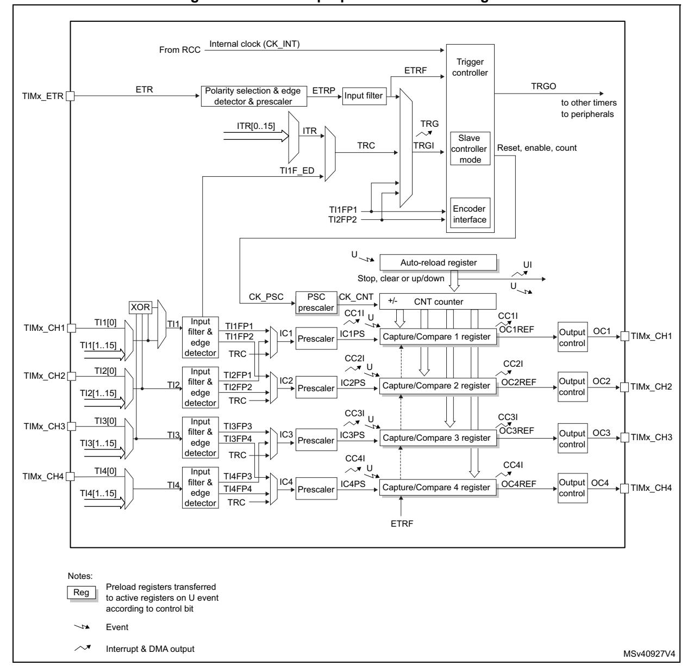

Figure 446. General-purpose timer block diagram


# **41.3 TIM2/TIM3/TIM4/TIM5 functional description**

## <span id="page-2-0"></span>**41.3.1 Time-base unit**

The main block of the programmable timer is a 16-bit/32-bit counter with its related autoreload register. The counter can count up, down or both up and down but also down or both up and down. The counter clock can be divided by a prescaler.

The counter, the auto-reload register and the prescaler register can be written or read by software. This is true even when the counter is running.

The time-base unit includes:

- Counter Register (TIMx\_CNT)
- Prescaler Register (TIMx\_PSC)
- Auto-Reload Register (TIMx\_ARR)

The auto-reload register is preloaded. Writing to or reading from the auto-reload register accesses the preload register. The content of the preload register are transferred into the shadow register permanently or at each update event (UEV), depending on the auto-reload preload enable bit (ARPE) in TIMx\_CR1 register. The update event is sent when the counter reaches the overflow (or underflow when downcounting) and if the UDIS bit equals 0 in the TIMx\_CR1 register. It can also be generated by software. The generation of the update event is described in detail for each configuration.

The counter is clocked by the prescaler output CK\_CNT, which is enabled only when the counter enable bit (CEN) in TIMx\_CR1 register is set (refer also to the slave mode controller description to get more details on counter enabling).

Note that the actual counter enable signal CNT\_EN is set 1 clock cycle after CEN.

## **Prescaler description**

The prescaler can divide the counter clock frequency by any factor between 1 and 65536. It is based on a 16-bit counter controlled through a 16-bit/32-bit register (in the TIMx\_PSC register). It can be changed on the fly as this control register is buffered. The new prescaler ratio is taken into account at the next update event.

*[Figure 447](#page-3-0)* and *[Figure 448](#page-3-1)* give some examples of the counter behavior when the prescaler ratio is changed on the fly:


RM0399 Rev 4 1783/3556

<span id="page-3-0"></span>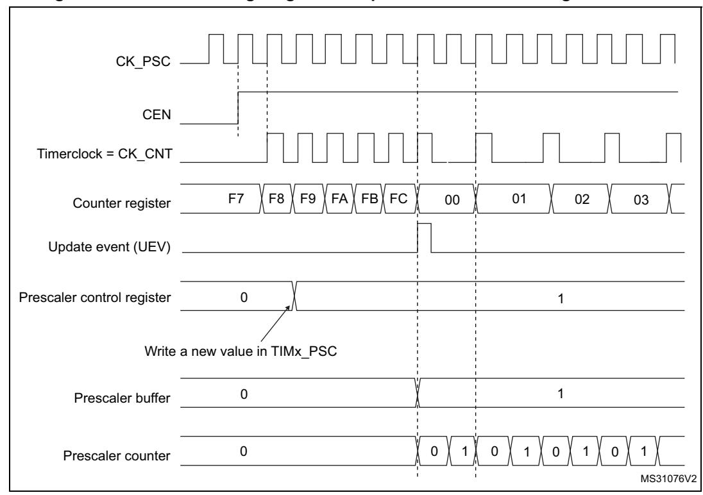

**Figure 447. Counter timing diagram with prescaler division change from 1 to 2**


<span id="page-3-1"></span>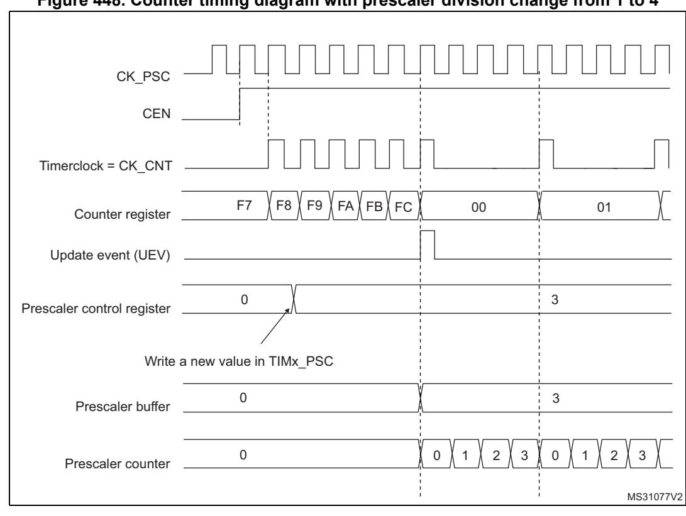

## **41.3.2 Counter modes**

## <span id="page-4-0"></span>**Upcounting mode**

In upcounting mode, the counter counts from 0 to the auto-reload value (content of the TIMx\_ARR register), then restarts from 0 and generates a counter overflow event.

An Update event can be generated at each counter overflow or by setting the UG bit in the TIMx\_EGR register (by software or by using the slave mode controller).

The UEV event can be disabled by software by setting the UDIS bit in TIMx\_CR1 register. This is to avoid updating the shadow registers while writing new values in the preload registers. Then no update event occurs until the UDIS bit has been written to 0. However, the counter restarts from 0, as well as the counter of the prescaler (but the prescale rate does not change). In addition, if the URS bit (update request selection) in TIMx\_CR1 register is set, setting the UG bit generates an update event UEV but without setting the UIF flag (thus no interrupt or DMA request is sent). This is to avoid generating both update and capture interrupts when clearing the counter on the capture event.

When an update event occurs, all the registers are updated and the update flag (UIF bit in TIMx\_SR register) is set (depending on the URS bit):

- The buffer of the prescaler is reloaded with the preload value (content of the TIMx\_PSC register)
- The auto-reload shadow register is updated with the preload value (TIMx\_ARR)

The following figures show some examples of the counter behavior for different clock frequencies when TIMx\_ARR=0x36.

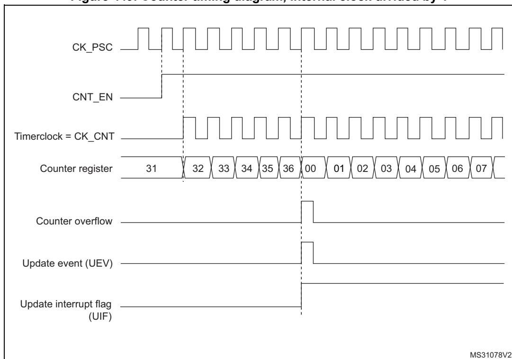

**Figure 449. Counter timing diagram, internal clock divided by 1**

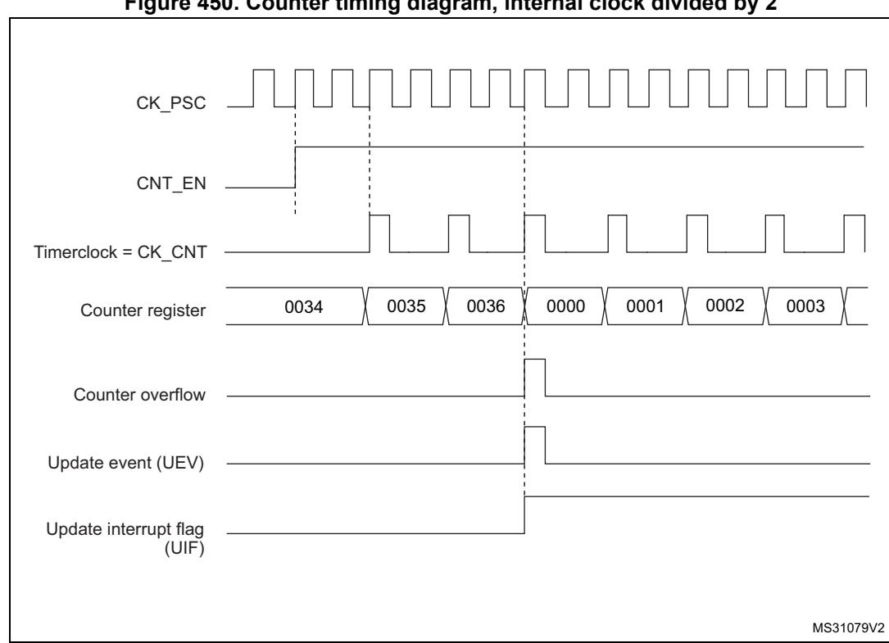

**Figure 450. Counter timing diagram, internal clock divided by 2**


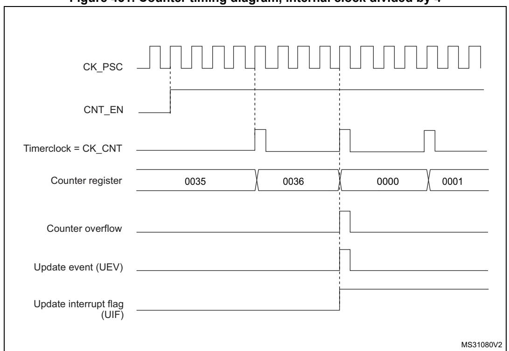

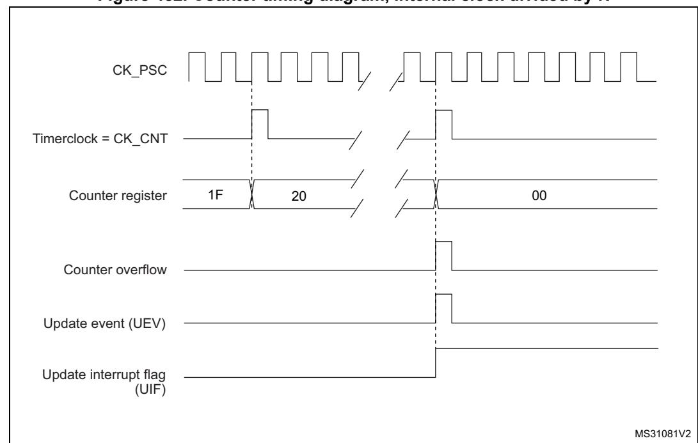

**Figure 452. Counter timing diagram, internal clock divided by N**


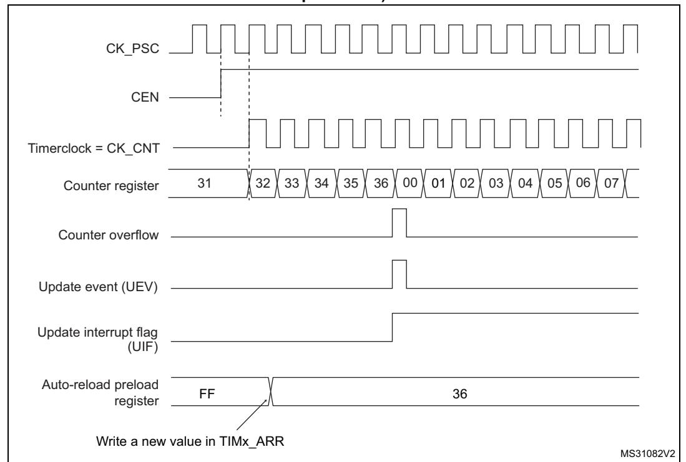

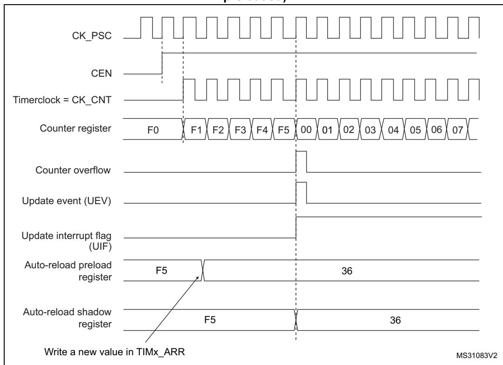

**Figure 454. Counter timing diagram, Update event when ARPE=1 (TIMx\_ARR preloaded)**

## <span id="page-7-0"></span>**Downcounting mode**

In downcounting mode, the counter counts from the auto-reload value (content of the TIMx\_ARR register) down to 0, then restarts from the auto-reload value and generates a counter underflow event.

An Update event can be generate at each counter underflow or by setting the UG bit in the TIMx\_EGR register (by software or by using the slave mode controller)

The UEV update event can be disabled by software by setting the UDIS bit in TIMx\_CR1 register. This is to avoid updating the shadow registers while writing new values in the preload registers. Then no update event occurs until UDIS bit has been written to 0. However, the counter restarts from the current auto-reload value, whereas the counter of the prescaler restarts from 0 (but the prescale rate doesn't change).

In addition, if the URS bit (update request selection) in TIMx\_CR1 register is set, setting the UG bit generates an update event UEV but without setting the UIF flag (thus no interrupt or DMA request is sent). This is to avoid generating both update and capture interrupts when clearing the counter on the capture event.

When an update event occurs, all the registers are updated and the update flag (UIF bit in TIMx\_SR register) is set (depending on the URS bit):

- The buffer of the prescaler is reloaded with the preload value (content of the TIMx\_PSC register).
- The auto-reload active register is updated with the preload value (content of the TIMx\_ARR register). Note that the auto-reload is updated before the counter is reloaded, so that the next period is the expected one.


The following figures show some examples of the counter behavior for different clock frequencies when TIMx\_ARR=0x36.

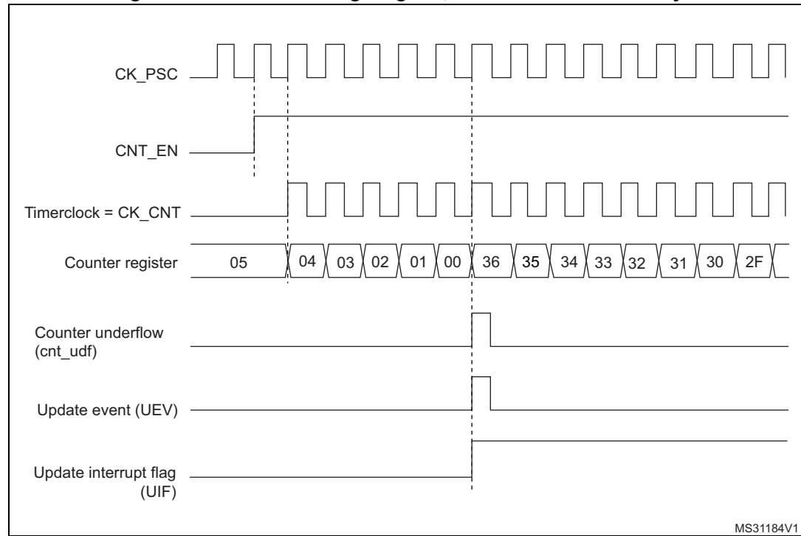

**Figure 455. Counter timing diagram, internal clock divided by 1**


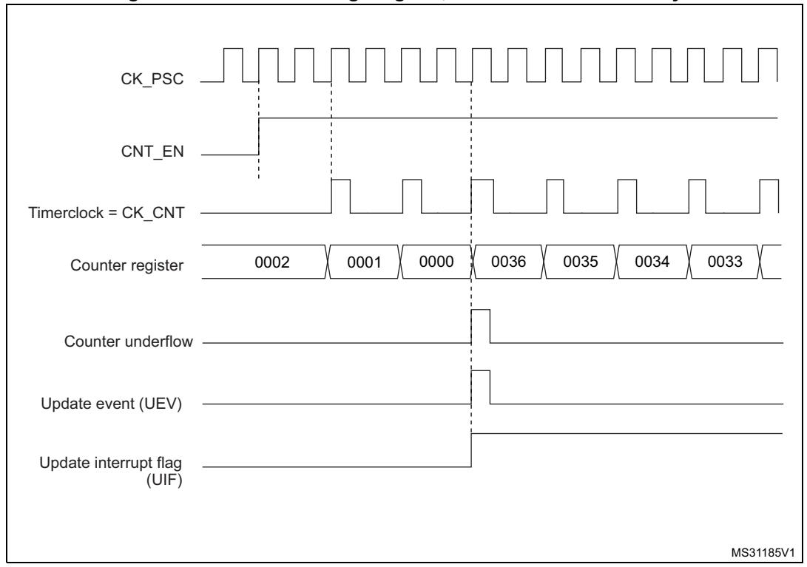

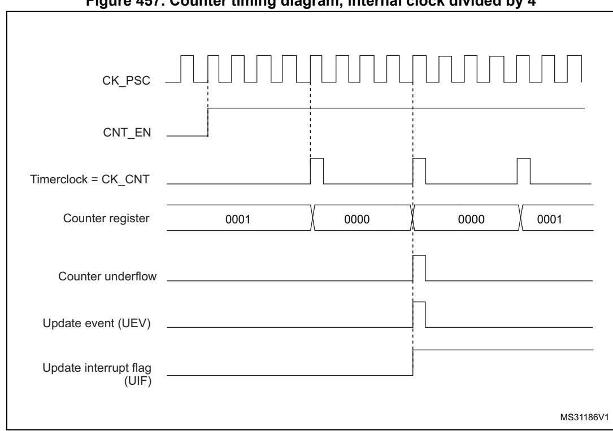

**Figure 457. Counter timing diagram, internal clock divided by 4**


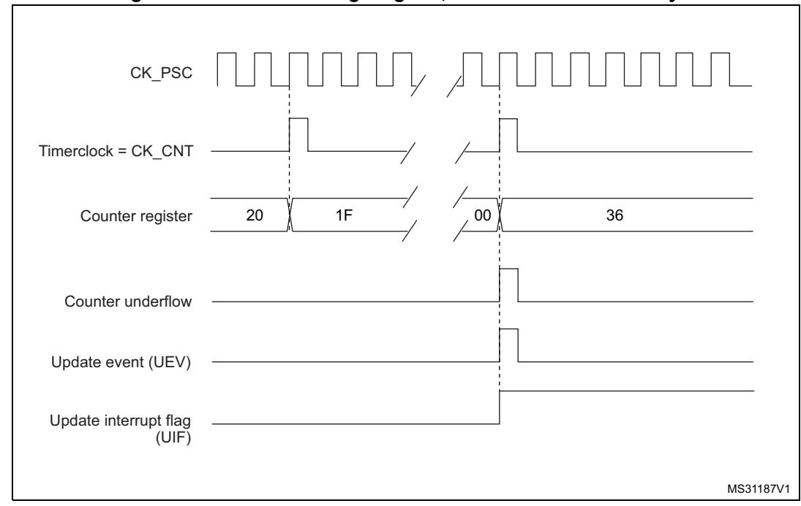

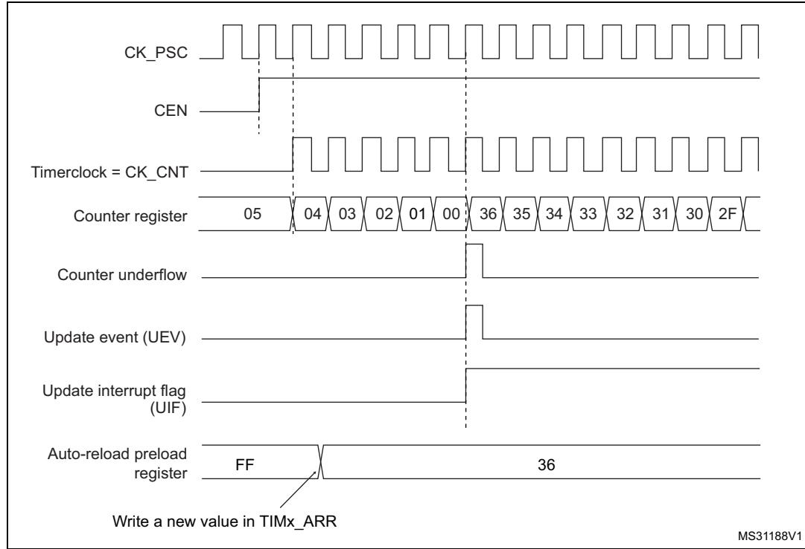

**Figure 459. Counter timing diagram, Update event**

## <span id="page-10-0"></span>**Center-aligned mode (up/down counting)**

In center-aligned mode, the counter counts from 0 to the auto-reload value (content of the TIMx\_ARR register) – 1, generates a counter overflow event, then counts from the autoreload value down to 1 and generates a counter underflow event. Then it restarts counting from 0.

Center-aligned mode is active when the CMS bits in TIMx\_CR1 register are not equal to '00'. The Output compare interrupt flag of channels configured in output is set when: the counter counts down (Center aligned mode 1, CMS = "01"), the counter counts up (Center aligned mode 2, CMS = "10") the counter counts up and down (Center aligned mode 3, CMS = "11").

In this mode, the direction bit (DIR from TIMx\_CR1 register) cannot be written. It is updated by hardware and gives the current direction of the counter.

The update event can be generated at each counter overflow and at each counter underflow or by setting the UG bit in the TIMx\_EGR register (by software or by using the slave mode controller) also generates an update event. In this case, the counter restarts counting from 0, as well as the counter of the prescaler.

The UEV update event can be disabled by software by setting the UDIS bit in TIMx\_CR1 register. This is to avoid updating the shadow registers while writing new values in the preload registers. Then no update event occurs until the UDIS bit has been written to 0. However, the counter continues counting up and down, based on the current auto-reload value.

In addition, if the URS bit (update request selection) in TIMx\_CR1 register is set, setting the UG bit generates an update event UEV but without setting the UIF flag (thus no interrupt or


RM0399 Rev 4 1791/3556

DMA request is sent). This is to avoid generating both update and capture interrupt when clearing the counter on the capture event.

When an update event occurs, all the registers are updated and the update flag (UIF bit in TIMx\_SR register) is set (depending on the URS bit):

- The buffer of the prescaler is reloaded with the preload value (content of the TIMx\_PSC register).
- The auto-reload active register is updated with the preload value (content of the TIMx\_ARR register). Note that if the update source is a counter overflow, the autoreload is updated before the counter is reloaded, so that the next period is the expected one (the counter is loaded with the new value).

The following figures show some examples of the counter behavior for different clock frequencies.

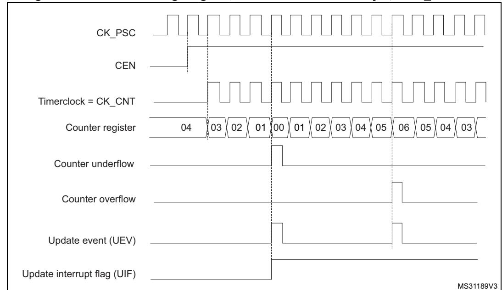

**Figure 460. Counter timing diagram, internal clock divided by 1, TIMx\_ARR=0x6**

<sup>1.</sup> Here, center-aligned mode 1 is used (for more details refer to *[Section 41.4.1: TIMx control register 1](#page-45-0)  [\(TIMx\\_CR1\)\(x = 2 to 5\) on page 1826](#page-45-0)*).

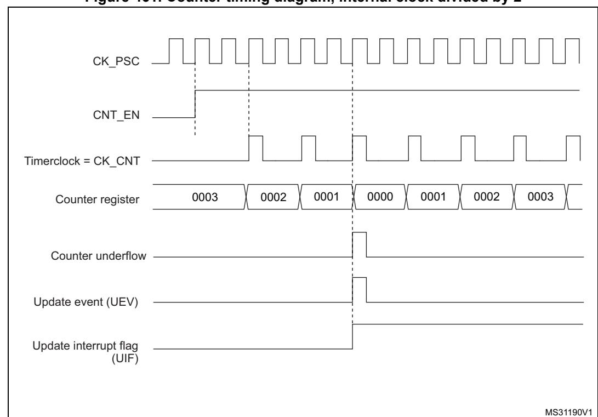

**Figure 461. Counter timing diagram, internal clock divided by 2**


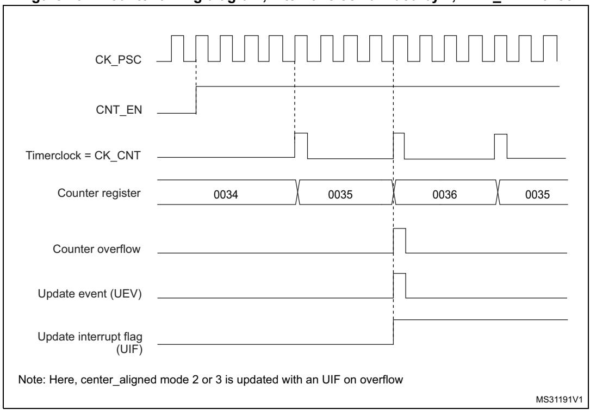

1. Center-aligned mode 2 or 3 is used with an UIF on overflow.

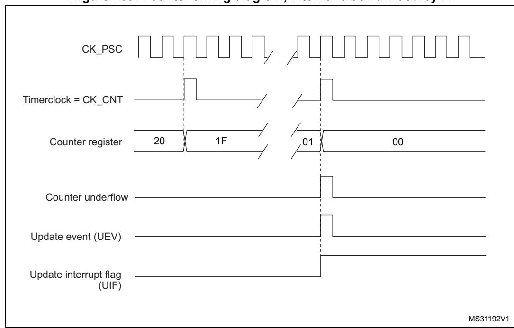

**Figure 463. Counter timing diagram, internal clock divided by N**


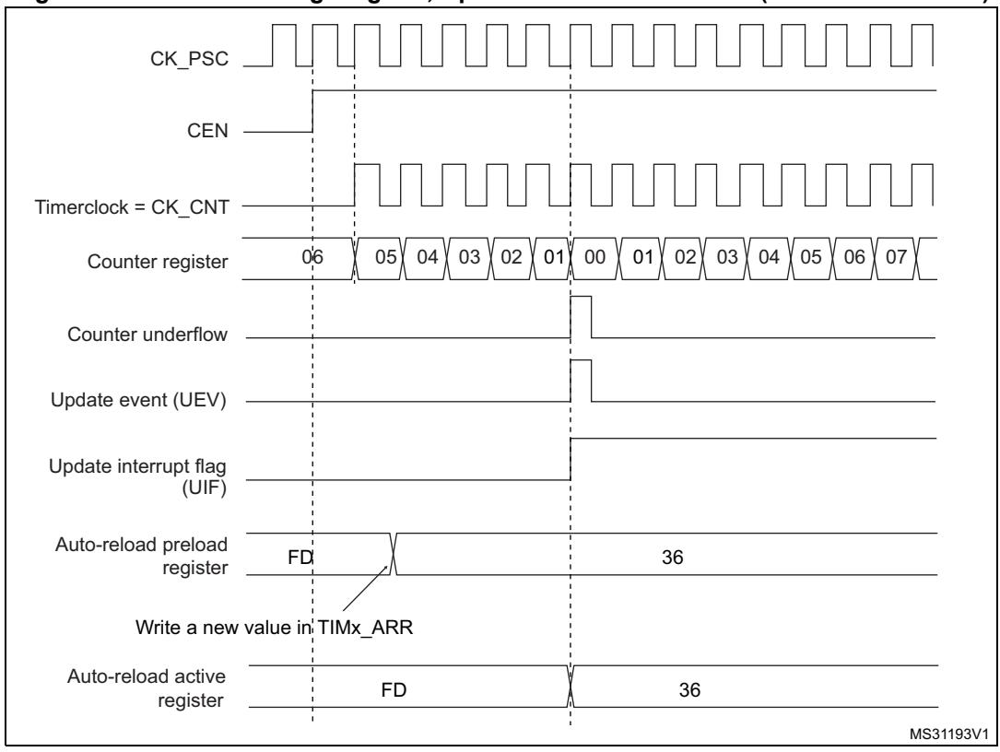

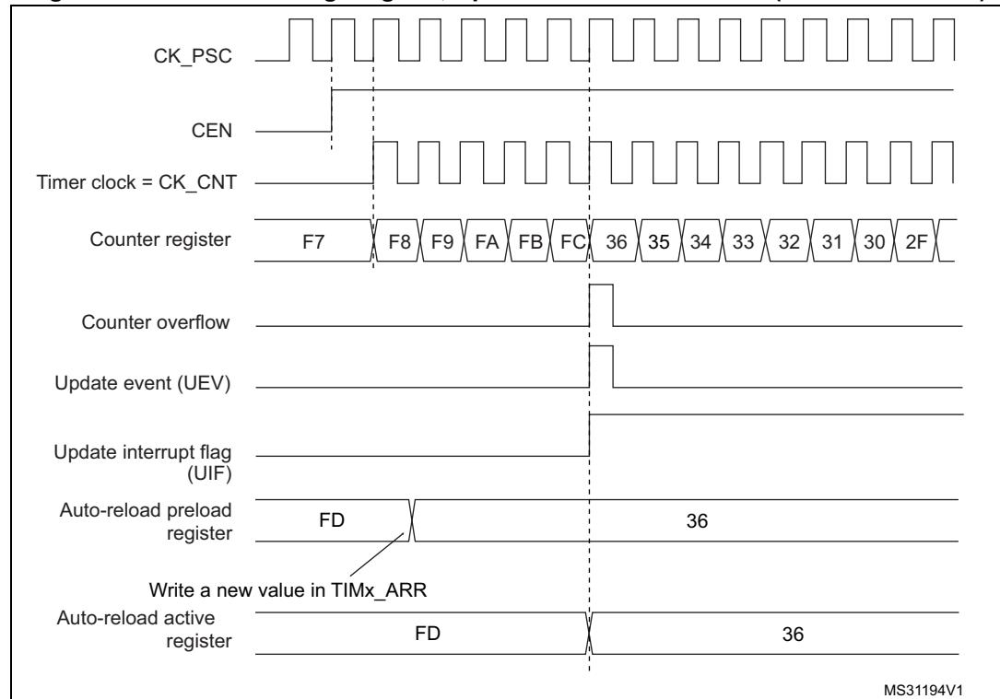

**Figure 465. Counter timing diagram, Update event with ARPE=1 (counter overflow)**

## **41.3.3 Clock selection**

The counter clock can be provided by the following clock sources:

- Internal clock (CK\_INT)
- External clock mode1: external input pin (TIx)
- External clock mode2: external trigger input (ETR)
- Internal trigger inputs (ITRx): using one timer as prescaler for another timer, for example, Timer X can be configured to act as a prescaler for Timer Y. Refer to *[: Using](#page-39-0)  [one timer as prescaler for another timer on page 1820](#page-39-0)* for more details.

## **Internal clock source (CK\_INT)**

If the slave mode controller is disabled (SMS=000 in the TIMx\_SMCR register), then the CEN, DIR (in the TIMx\_CR1 register) and UG bits (in the TIMx\_EGR register) are actual control bits and can be changed only by software (except UG which remains cleared automatically). As soon as the CEN bit is written to 1, the prescaler is clocked by the internal clock CK\_INT.

*[Figure 466](#page-15-0)* shows the behavior of the control circuit and the upcounter in normal mode, without prescaler.

RM0399 Rev 4 1795/3556

<span id="page-15-0"></span>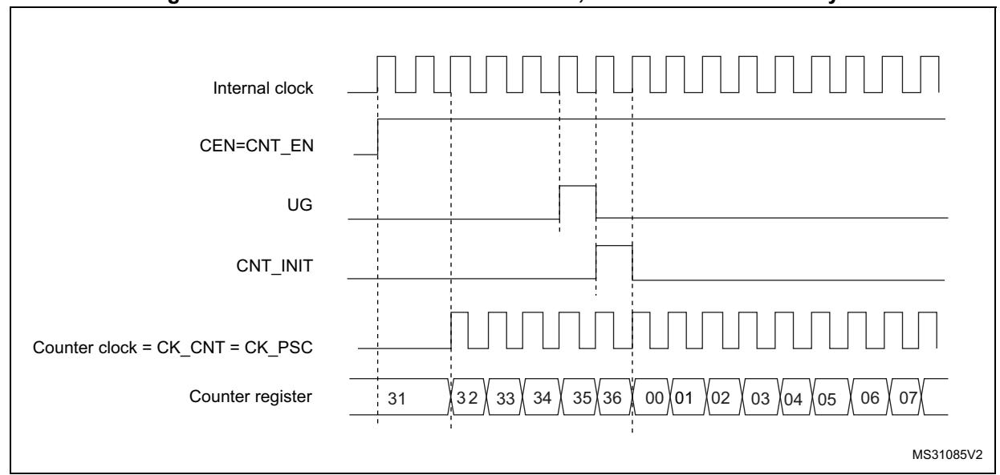

Figure 466. Control circuit in normal mode, internal clock divided by 1

#### External clock source mode 1

This mode is selected when SMS=111 in the TIMx\_SMCR register. The counter can count at each rising or falling edge on a selected input.

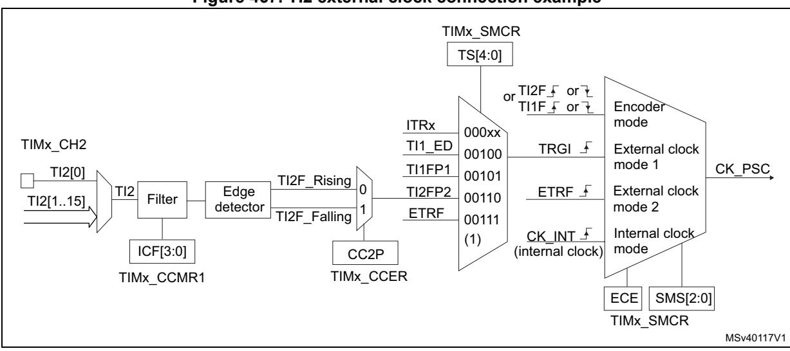

Figure 467. TI2 external clock connection example

1. Codes ranging from 01000 to 11111: ITRy.

For example, to configure the upcounter to count in response to a rising edge on the TI2 input, use the following procedure:

- 1. Select the proper Tl2x source (internal or external) with the Tl2SEL[3:0] bits in the TlMx\_TlSEL register.
- Configure channel 2 to detect rising edges on the TI2 input by writing CC2S= '01 in the TIMx\_CCMR1 register.
- 3. Configure the input filter duration by writing the IC2F[3:0] bits in the TIMx\_CCMR1 register (if no filter is needed, keep IC2F=0000).


*Note: The capture prescaler is not used for triggering, so it does not need to be configured.* 

- 4. Select rising edge polarity by writing CC2P=0 and CC2NP=0 and CC2NP=0 in the TIMx\_CCER register.
- 5. Configure the timer in external clock mode 1 by writing SMS=111 in the TIMx\_SMCR register.
- 6. Select TI2 as the input source by writing TS=00110 in the TIMx\_SMCR register.
- 7. Enable the counter by writing CEN=1 in the TIMx\_CR1 register.

When a rising edge occurs on TI2, the counter counts once and the TIF flag is set.

The delay between the rising edge on TI2 and the actual clock of the counter is due to the resynchronization circuit on TI2 input.

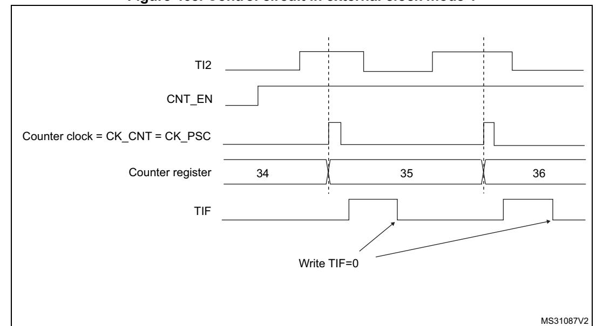

**Figure 468. Control circuit in external clock mode 1**

## **External clock source mode 2**

This mode is selected by writing ECE=1 in the TIMx\_SMCR register.

The counter can count at each rising or falling edge on the external trigger input ETR.

*[Figure 469](#page-17-0)* gives an overview of the external trigger input block.

<span id="page-17-0"></span>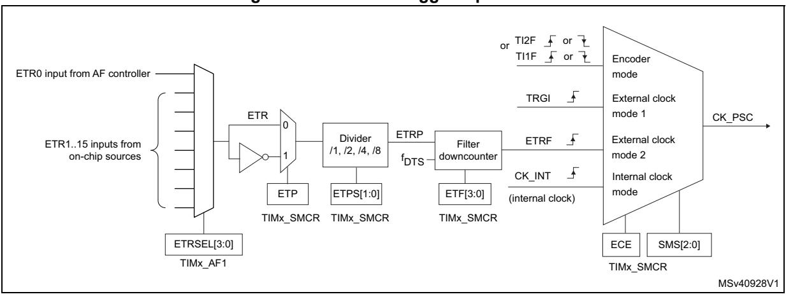

Figure 469. External trigger input block

For example, to configure the upcounter to count each 2 rising edges on ETR, use the following procedure:

- Select the proper ETR source (internal or external) with the ETRSEL[3:0] bits in the TIMx AF1 register.
- 2. As no filter is needed in this example, write ETF[3:0]=0000 in the TIMx SMCR register.
- 3. Set the prescaler by writing ETPS[1:0]=01 in the TIMx\_SMCR register
- 4. Select rising edge detection on the ETR pin by writing ETP=0 in the TIMx\_SMCR register
- 5. Enable external clock mode 2 by writing ECE=1 in the TIMx\_SMCR register.
- 6. Enable the counter by writing CEN=1 in the TIMx CR1 register.

The counter counts once each 2 ETR rising edges.

The delay between the rising edge on ETR and the actual clock of the counter is due to the resynchronization circuit on the ETRP signal. As a consequence, the maximum frequency which can be correctly captured by the counter is at most ¼ of TIMxCLK frequency. When the ETRP signal is faster, the user should apply a division of the external signal by a proper ETPS prescaler setting.

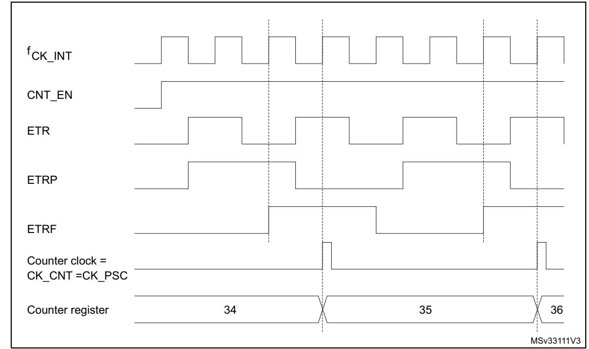

Figure 470. Control circuit in external clock mode 2

## 41.3.4 Capture/Compare channels

Each Capture/Compare channel is built around a capture/compare register (including a shadow register), a input stage for capture (with digital filter, multiplexing and prescaler) and an output stage (with comparator and output control).

The following figure gives an overview of one Capture/Compare channel.

The input stage samples the corresponding TIx input to generate a filtered signal TIxF. Then, an edge detector with polarity selection generates a signal (TIxFPx) which can be used as trigger input by the slave mode controller or as the capture command. It is prescaled before the capture register (ICxPS).

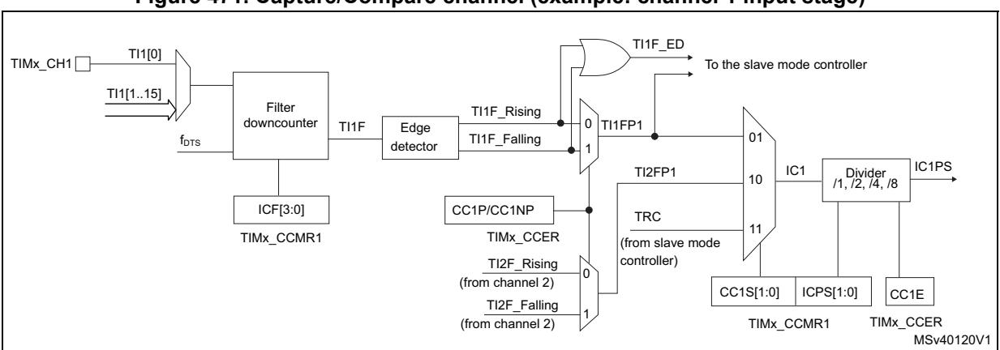

Figure 471. Capture/Compare channel (example: channel 1 input stage)

The output stage generates an intermediate waveform which is then used for reference: OCxRef (active high). The polarity acts at the end of the chain.

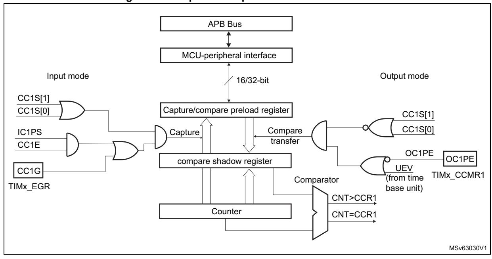

**Figure 472. Capture/Compare channel 1 main circuit**

**Figure 473. Output stage of Capture/Compare channel (channel 1)**

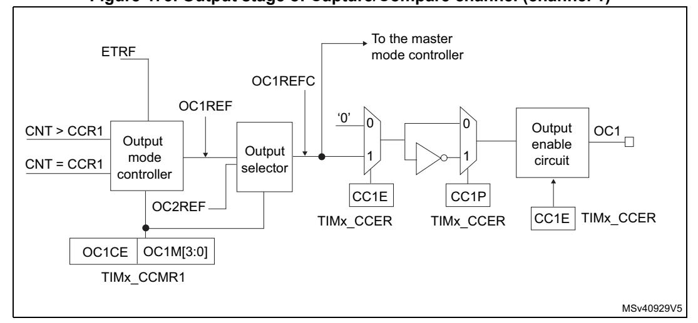

The capture/compare block is made of one preload register and one shadow register. Write and read always access the preload register.

In capture mode, captures are actually done in the shadow register, which is copied into the preload register.

In compare mode, the content of the preload register is copied into the shadow register which is compared to the counter.

## **41.3.5 Input capture mode**

In Input capture mode, the Capture/Compare Registers (TIMx\_CCRx) are used to latch the value of the counter after a transition detected by the corresponding ICx signal. When a capture occurs, the corresponding CCXIF flag (TIMx\_SR register) is set and an interrupt or


a DMA request can be sent if they are enabled. If a capture occurs while the CCxIF flag was already high, then the over-capture flag CCxOF (TIMx\_SR register) is set. CCxIF can be cleared by software by writing it to 0 or by reading the captured data stored in the TIMx\_CCRx register. CCxOF is cleared when it is written with 0.

The following example shows how to capture the counter value in TIMx\_CCR1 when TI1 input rises. To do this, use the following procedure:

- 1. Select the proper TI1x source (internal or external) with the TI1SEL[3:0] bits in the TIMx\_TISEL register.
- 2. Select the active input: TIMx\_CCR1 must be linked to the TI1 input, so write the CC1S bits to 01 in the TIMx\_CCMR1 register. As soon as CC1S becomes different from 00, the channel is configured in input and the TIMx\_CCR1 register becomes read-only.
- 3. Program the appropriate input filter duration in relation with the signal connected to the timer (when the input is one of the TIx (ICxF bits in the TIMx\_CCMRx register). Let's imagine that, when toggling, the input signal is not stable during at must 5 internal clock cycles. We must program a filter duration longer than these 5 clock cycles. We can validate a transition on TI1 when 8 consecutive samples with the new level have been detected (sampled at fDTS frequency). Then write IC1F bits to 0011 in the TIMx\_CCMR1 register.
- 4. Select the edge of the active transition on the TI1 channel by writing the CC1P and CC1NP and CC1NP bits to 000 in the TIMx\_CCER register (rising edge in this case).
- 5. Program the input prescaler. In our example, we wish the capture to be performed at each valid transition, so the prescaler is disabled (write IC1PS bits to 00 in the TIMx\_CCMR1 register).
- 6. Enable capture from the counter into the capture register by setting the CC1E bit in the TIMx\_CCER register.
- 7. If needed, enable the related interrupt request by setting the CC1IE bit in the TIMx\_DIER register, and/or the DMA request by setting the CC1DE bit in the TIMx\_DIER register.

When an input capture occurs:

- The TIMx\_CCR1 register gets the value of the counter on the active transition.
- CC1IF flag is set (interrupt flag). CC1OF is also set if at least two consecutive captures occurred whereas the flag was not cleared.
- An interrupt is generated depending on the CC1IE bit.
- A DMA request is generated depending on the CC1DE bit.

In order to handle the overcapture, it is recommended to read the data before the overcapture flag. This is to avoid missing an overcapture which could happen after reading the flag and before reading the data.

*Note: IC interrupt and/or DMA requests can be generated by software by setting the corresponding CCxG bit in the TIMx\_EGR register.*

## **41.3.6 PWM input mode**

This mode is a particular case of input capture mode. The procedure is the same except:

- Two ICx signals are mapped on the same TIx input.
- These 2 ICx signals are active on edges with opposite polarity.
- One of the two TIxFP signals is selected as trigger input and the slave mode controller is configured in reset mode.


RM0399 Rev 4 1801/3556

For example, one can measure the period (in TIMx\_CCR1 register) and the duty cycle (in TIMx\_CCR2 register) of the PWM applied on TI1 using the following procedure (depending on CK\_INT frequency and prescaler value):

- 1. Select the proper TI1x source (internal or external) with the TI1SEL[3:0] bits in the TIMx\_TISEL register.
- 2. Select the active input for TIMx\_CCR1: write the CC1S bits to 01 in the TIMx\_CCMR1 register (TI1 selected).
- 3. Select the active polarity for TI1FP1 (used both for capture in TIMx\_CCR1 and counter clear): write the CC1P to '0' and the CC1NP bit to '0' (active on rising edge).
- 4. Select the active input for TIMx\_CCR2: write the CC2S bits to 10 in the TIMx\_CCMR1 register (TI1 selected).
- 5. Select the active polarity for TI1FP2 (used for capture in TIMx\_CCR2): write the CC2P bit to '1' and the CC2NP bit to '0' (active on falling edge).
- 6. Select the valid trigger input: write the TS bits to 00101 in the TIMx\_SMCR register (TI1FP1 selected).
- 7. Configure the slave mode controller in reset mode: write the SMS bits to 100 in the TIMx\_SMCR register.
- 8. Enable the captures: write the CC1E and CC2E bits to '1 in the TIMx\_CCER register.

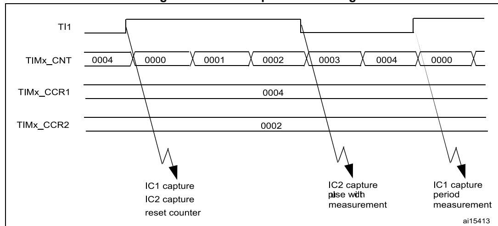

**Figure 474. PWM input mode timing**

1. The PWM input mode can be used only with the TIMx\_CH1/TIMx\_CH2 signals due to the fact that only TI1FP1 and TI2FP2 are connected to the slave mode controller.

## **41.3.7 Forced output mode**

In output mode (CCxS bits = 00 in the TIMx\_CCMRx register), each output compare signal (OCxREF and then OCx) can be forced to active or inactive level directly by software, independently of any comparison between the output compare register and the counter.

To force an output compare signal (ocxref/OCx) to its active level, one just needs to write 101 in the OCxM bits in the corresponding TIMx\_CCMRx register. Thus ocxref is forced high (OCxREF is always active high) and OCx get opposite value to CCxP polarity bit.

e.g.: CCxP=0 (OCx active high) => OCx is forced to high level.

ocxref signal can be forced low by writing the OCxM bits to 100 in the TIMx\_CCMRx register.


Anyway, the comparison between the TIMx\_CCRx shadow register and the counter is still performed and allows the flag to be set. Interrupt and DMA requests can be sent accordingly. This is described in the Output Compare Mode section.

# **41.3.8 Output compare mode**

This function is used to control an output waveform or indicating when a period of time has elapsed.

When a match is found between the capture/compare register and the counter, the output compare function:

- Assigns the corresponding output pin to a programmable value defined by the output compare mode (OCxM bits in the TIMx\_CCMRx register) and the output polarity (CCxP bit in the TIMx\_CCER register). The output pin can keep its level (OCXM=000), be set active (OCxM=001), be set inactive (OCxM=010) or can toggle (OCxM=011) on match.
- Sets a flag in the interrupt status register (CCxIF bit in the TIMx\_SR register).
- Generates an interrupt if the corresponding interrupt mask is set (CCXIE bit in the TIMx\_DIER register).
- Sends a DMA request if the corresponding enable bit is set (CCxDE bit in the TIMx\_DIER register, CCDS bit in the TIMx\_CR2 register for the DMA request selection).

The TIMx\_CCRx registers can be programmed with or without preload registers using the OCxPE bit in the TIMx\_CCMRx register.

In output compare mode, the update event UEV has no effect on ocxref and OCx output. The timing resolution is one count of the counter. Output compare mode can also be used to output a single pulse (in One-pulse mode).

## **Procedure**

- 1. Select the counter clock (internal, external, prescaler).
- 2. Write the desired data in the TIMx\_ARR and TIMx\_CCRx registers.
- 3. Set the CCxIE and/or CCxDE bits if an interrupt and/or a DMA request is to be generated.
- 4. Select the output mode. For example, one must write OCxM=011, OCxPE=0, CCxP=0 and CCxE=1 to toggle OCx output pin when CNT matches CCRx, CCRx preload is not used, OCx is enabled and active high.
- 5. Enable the counter by setting the CEN bit in the TIMx\_CR1 register.

The TIMx\_CCRx register can be updated at any time by software to control the output waveform, provided that the preload register is not enabled (OCxPE=0, else TIMx\_CCRx shadow register is updated only at the next update event UEV). An example is given in *[Figure 475](#page-23-0)*.


<span id="page-23-0"></span>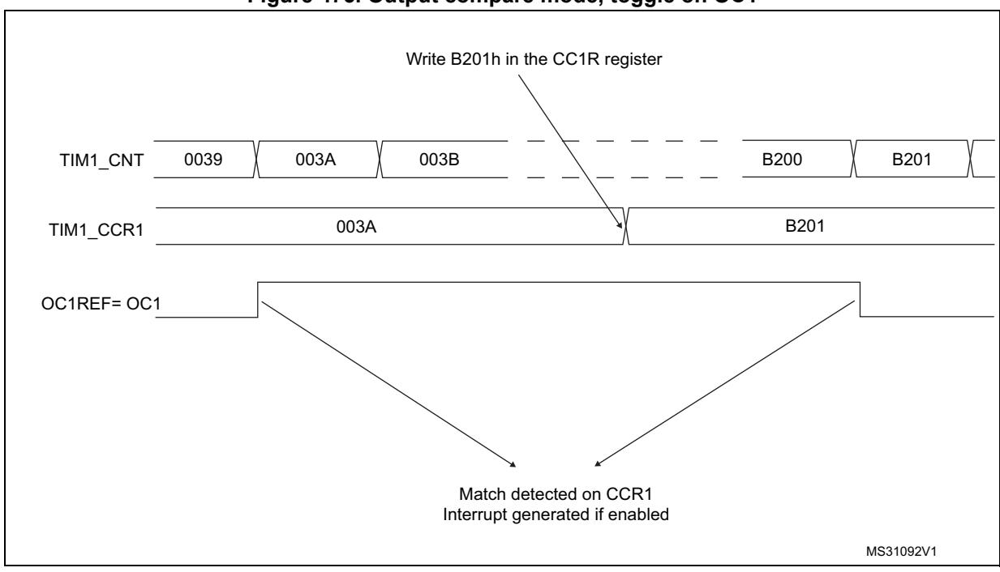

Figure 475. Output compare mode, toggle on OC1

#### 41.3.9 PWM mode

Pulse width modulation mode permits to generate a signal with a frequency determined by the value of the TIMx\_ARR register and a duty cycle determined by the value of the TIMx\_CCRx register.

The PWM mode can be selected independently on each channel (one PWM per OCx output) by writing 110 (PWM mode 1) or '111 (PWM mode 2) in the OCxM bits in the TIMx\_CCMRx register. The corresponding preload register must be enabled by setting the OCxPE bit in the TIMx\_CCMRx register, and eventually the auto-reload preload register (in upcounting or center-aligned modes) by setting the ARPE bit in the TIMx\_CR1 register.

As the preload registers are transferred to the shadow registers only when an update event occurs, before starting the counter, all registers must be initialized by setting the UG bit in the TIMx EGR register.

OCx polarity is software programmable using the CCxP bit in the TIMx\_CCER register. It can be programmed as active high or active low. OCx output is enabled by the CCxE bit in the TIMx\_CCER register. Refer to the TIMx\_CCERx register description for more details.

In PWM mode (1 or 2), TIMx\_CNT and TIMx\_CCRx are always compared to determine whether TIMx\_CCRx  $\leq$  TIMx\_CNT or TIMx\_CNT  $\leq$  TIMx\_CCRx (depending on the direction of the counter). However, to comply with the OCREF\_CLR functionality (OCREF can be cleared by an external event through the ETR signal until the next PWM period), the OCREF signal is asserted only:

- When the result of the comparison or
- When the output compare mode (OCxM bits in TIMx\_CCMRx register) switches from the "frozen" configuration (no comparison, OCxM='000) to one of the PWM modes (OCxM='110 or '111).

This forces the PWM by software while the timer is running.


The timer is able to generate PWM in edge-aligned mode or center-aligned mode depending on the CMS bits in the TIMx\_CR1 register.

## **PWM edge-aligned mode**

Upcounting configuration

Upcounting is active when the DIR bit in the TIMx\_CR1 register is low. Refer to *[Upcounting](#page-4-0)  [mode on page 1785](#page-4-0)*.

In the following example, we consider PWM mode 1. The reference PWM signal OCxREF is high as long as TIMx\_CNT <TIMx\_CCRx else it becomes low. If the compare value in TIMx\_CCRx is greater than the auto-reload value (in TIMx\_ARR) then OCxREF is held at '1. If the compare value is 0 then OCxREF is held at '0. *[Figure 476](#page-24-0)* shows some edge-aligned PWM waveforms in an example where TIMx\_ARR=8.

<span id="page-24-0"></span>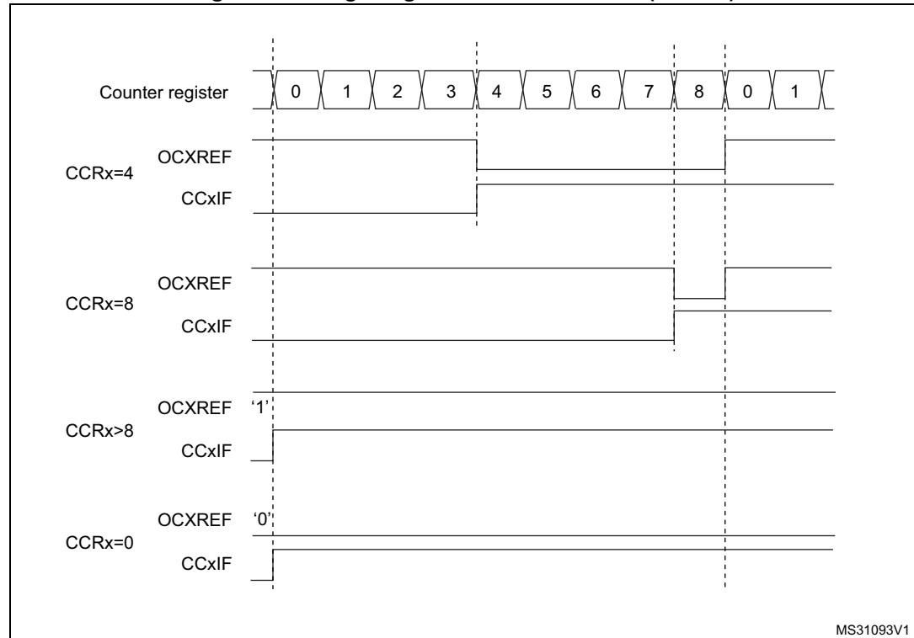

**Figure 476. Edge-aligned PWM waveforms (ARR=8)**

## **Downcounting configuration**

Downcounting is active when DIR bit in TIMx\_CR1 register is high. Refer to *[Downcounting](#page-7-0)  [mode on page 1788](#page-7-0)*.

In PWM mode 1, the reference signal ocxref is low as long as TIMx\_CNT>TIMx\_CCRx else it becomes high. If the compare value in TIMx\_CCRx is greater than the auto-reload value in TIMx\_ARR, then ocxref is held at 100%. PWM is not possible in this mode.

## **PWM center-aligned mode**

Center-aligned mode is active when the CMS bits in TIMx\_CR1 register are different from '00 (all the remaining configurations having the same effect on the ocxref/OCx signals). The


RM0399 Rev 4 1805/3556

compare flag is set when the counter counts up, when it counts down or both when it counts up and down depending on the CMS bits configuration. The direction bit (DIR) in the TIMx\_CR1 register is updated by hardware and must not be changed by software. Refer to *[Center-aligned mode \(up/down counting\) on page 1791](#page-10-0)*.

*[Figure 477](#page-25-0)* shows some center-aligned PWM waveforms in an example where:

- TIMx\_ARR=8,
- PWM mode is the PWM mode 1,
- The flag is set when the counter counts down corresponding to the center-aligned mode 1 selected for CMS=01 in TIMx\_CR1 register.

<span id="page-25-0"></span>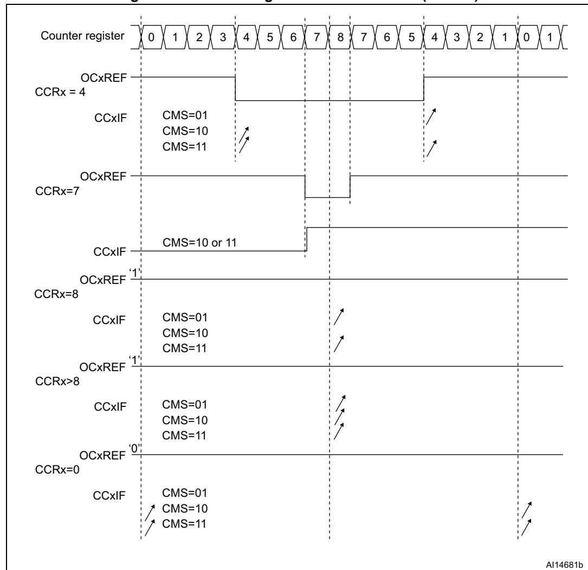

**Figure 477. Center-aligned PWM waveforms (ARR=8)**

Hints on using center-aligned mode:

• When starting in center-aligned mode, the current up-down configuration is used. It means that the counter counts up or down depending on the value written in the DIR bit

in the TIMx\_CR1 register. Moreover, the DIR and CMS bits must not be changed at the same time by the software.

- Writing to the counter while running in center-aligned mode is not recommended as it can lead to unexpected results. In particular:
  - The direction is not updated if a value greater than the auto-reload value is written in the counter (TIMx\_CNT>TIMx\_ARR). For example, if the counter was counting up, it continues to count up.
  - The direction is updated if 0 or the TIMx\_ARR value is written in the counter but no Update Event UEV is generated.
- The safest way to use center-aligned mode is to generate an update by software (setting the UG bit in the TIMx\_EGR register) just before starting the counter and not to write the counter while it is running.

## **41.3.10 Asymmetric PWM mode**

Asymmetric mode allows two center-aligned PWM signals to be generated with a programmable phase shift. While the frequency is determined by the value of the TIMx\_ARR register, the duty cycle and the phase-shift are determined by a pair of TIMx\_CCRx registers. One register controls the PWM during up-counting, the second during down counting, so that PWM is adjusted every half PWM cycle:

- OC1REFC (or OC2REFC) is controlled by TIMx\_CCR1 and TIMx\_CCR2
- OC3REFC (or OC4REFC) is controlled by TIMx\_CCR3 and TIMx\_CCR4

Asymmetric PWM mode can be selected independently on two channels (one OCx output per pair of CCR registers) by writing '1110' (Asymmetric PWM mode 1) or '1111' (Asymmetric PWM mode 2) in the OCxM bits in the TIMx\_CCMRx register.

*Note: The OCxM[3:0] bit field is split into two parts for compatibility reasons, the most significant bit is not contiguous with the 3 least significant ones.*

> When a given channel is used as asymmetric PWM channel, its secondary channel can also be used. For instance, if an OC1REFC signal is generated on channel 1 (Asymmetric PWM mode 1), it is possible to output either the OC2REF signal on channel 2, or an OC2REFC signal resulting from asymmetric PWM mode 2.

*[Figure 478](#page-26-0)* shows an example of signals that can be generated using Asymmetric PWM mode (channels 1 to 4 are configured in Asymmetric PWM mode 1).

<span id="page-26-0"></span>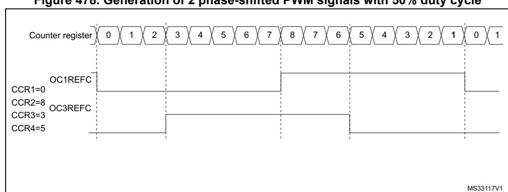

**Figure 478. Generation of 2 phase-shifted PWM signals with 50% duty cycle**

RM0399 Rev 4 1807/3556

## **41.3.11 Combined PWM mode**

Combined PWM mode allows two edge or center-aligned PWM signals to be generated with programmable delay and phase shift between respective pulses. While the frequency is determined by the value of the TIMx\_ARR register, the duty cycle and delay are determined by the two TIMx\_CCRx registers. The resulting signals, OCxREFC, are made of an OR or AND logical combination of two reference PWMs:

- OC1REFC (or OC2REFC) is controlled by TIMx\_CCR1 and TIMx\_CCR2
- OC3REFC (or OC4REFC) is controlled by TIMx\_CCR3 and TIMx\_CCR4

Combined PWM mode can be selected independently on two channels (one OCx output per pair of CCR registers) by writing '1100' (Combined PWM mode 1) or '1101' (Combined PWM mode 2) in the OCxM bits in the TIMx\_CCMRx register.

When a given channel is used as combined PWM channel, its secondary channel must be configured in the opposite PWM mode (for instance, one in Combined PWM mode 1 and the other in Combined PWM mode 2).

*Note: The OCxM[3:0] bit field is split into two parts for compatibility reasons, the most significant bit is not contiguous with the 3 least significant ones.*

> *[Figure 479](#page-28-0)* shows an example of signals that can be generated using Asymmetric PWM mode, obtained with the following configuration:

- Channel 1 is configured in Combined PWM mode 2,
- Channel 2 is configured in PWM mode 1,
- Channel 3 is configured in Combined PWM mode 2,
- Channel 4 is configured in PWM mode 1

<span id="page-28-0"></span>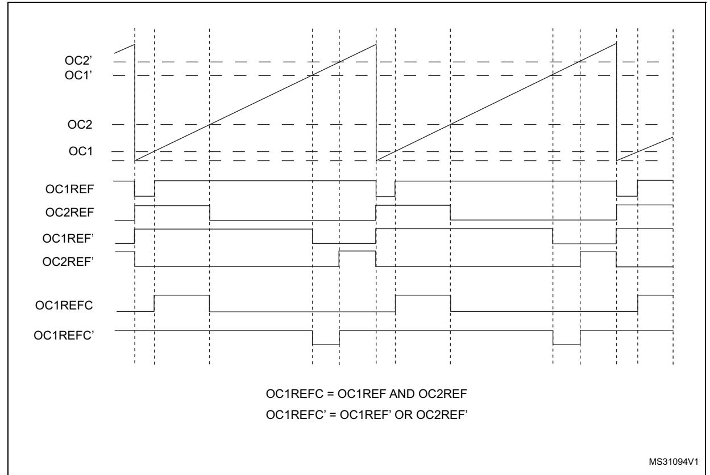

**Figure 479. Combined PWM mode on channels 1 and 3**

# **41.3.12 Clearing the OCxREF signal on an external event**

The OCxREF signal of a given channel can be cleared when a high level is applied on the ocref\_clr\_int input (OCxCE enable bit in the corresponding TIMx\_CCMRx register set to 1). OCxREF remains low until the next transition to the active state, on the following PWM cycle. This function can only be used in Output compare and PWM modes. It does not work in Forced mode.

The ocref\_clr\_int is connected to the ETRF signal (ETR after filtering).

The OCxREF signal for a given channel can be reset by applying a high level on the ETRF input (OCxCE enable bit set to 1 in the corresponding TIMx\_CCMRx register). OCxREF remains low until the next transition to the active state, on the following PWM cycle.

This function can be used only in the output compare and PWM modes. It does not work in forced mode.

For example, the OCxREF signal can be connected to the output of a comparator to be used for current handling. In this case, ETR must be configured as follows:

- 1. The external trigger prescaler should be kept off: bits ETPS[1:0] in the TIMx\_SMCR register are cleared to 00.
- 2. The external clock mode 2 must be disabled: bit ECE in the TIM1\_SMCR register is cleared to 0.
- 3. The external trigger polarity (ETP) and the external trigger filter (ETF) can be configured according to the application's needs.


*[Figure 480](#page-29-0)* shows the behavior of the OCxREF signal when the ETRF input becomes high, for both values of the OCxCE enable bit. In this example, the timer TIMx is programmed in PWM mode.

<span id="page-29-0"></span>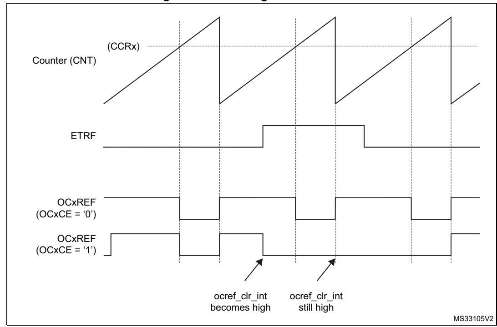

**Figure 480. Clearing TIMx OCxREF**

*Note: In case of a PWM with a 100% duty cycle (if CCRx>ARR), OCxREF is enabled again at the next counter overflow.*

## <span id="page-30-0"></span>**41.3.13 One-pulse mode**

One-pulse mode (OPM) is a particular case of the previous modes. It allows the counter to be started in response to a stimulus and to generate a pulse with a programmable length after a programmable delay.

Starting the counter can be controlled through the slave mode controller. Generating the waveform can be done in output compare mode or PWM mode. One-pulse mode is selected by setting the OPM bit in the TIMx\_CR1 register. This makes the counter stop automatically at the next update event UEV.

A pulse can be correctly generated only if the compare value is different from the counter initial value. Before starting (when the timer is waiting for the trigger), the configuration must be:

• CNT<CCRx ≤ ARR (in particular, 0<CCRx),


**Figure 481. Example of one-pulse mode.**

For example one may want to generate a positive pulse on OC1 with a length of tPULSE and after a delay of tDELAY as soon as a positive edge is detected on the TI2 input pin.

Let's use TI2FP2 as trigger 1:

- 1. Select the proper TI2x source (internal or external) with the TI2SEL[3:0] bits in the TIMx\_TISEL register.
- 2. Map TI2FP2 on TI2 by writing CC2S=01 in the TIMx\_CCMR1 register.
- 3. TI2FP2 must detect a rising edge, write CC2P=0 and CC2NP='0' in the TIMx\_CCER register.
- 4. Configure TI2FP2 as trigger for the slave mode controller (TRGI) by writing TS=00110 in the TIMx\_SMCR register.
- 5. TI2FP2 is used to start the counter by writing SMS to '110 in the TIMx\_SMCR register (trigger mode).

The OPM waveform is defined by writing the compare registers (taking into account the clock frequency and the counter prescaler).

- The tDELAY is defined by the value written in the TIMx\_CCR1 register.
- The tPULSE is defined by the difference between the auto-reload value and the compare value (TIMx\_ARR - TIMx\_CCR1).
- Let's say one want to build a waveform with a transition from '0 to '1 when a compare match occurs and a transition from '1 to '0 when the counter reaches the auto-reload value. To do this PWM mode 2 must be enabled by writing OC1M=111 in the TIMx\_CCMR1 register. Optionally the preload registers can be enabled by writing OC1PE=1 in the TIMx\_CCMR1 register and ARPE in the TIMx\_CR1 register. In this case one has to write the compare value in the TIMx\_CCR1 register, the auto-reload value in the TIMx\_ARR register, generate an update by setting the UG bit and wait for external trigger event on TI2. CC1P is written to '0 in this example.

In our example, the DIR and CMS bits in the TIMx\_CR1 register should be low.

Since only 1 pulse (Single mode) is needed, a 1 must be written in the OPM bit in the TIMx\_CR1 register to stop the counter at the next update event (when the counter rolls over from the auto-reload value back to 0). When OPM bit in the TIMx\_CR1 register is set to '0', so the Repetitive Mode is selected.

## **Particular case: OCx fast enable:**

In One-pulse mode, the edge detection on TIx input set the CEN bit which enables the counter. Then the comparison between the counter and the compare value makes the output toggle. But several clock cycles are needed for these operations and it limits the minimum delay tDELAY min we can get.

If one wants to output a waveform with the minimum delay, the OCxFE bit can be set in the TIMx\_CCMRx register. Then OCxRef (and OCx) is forced in response to the stimulus, without taking in account the comparison. Its new level is the same as if a compare match had occurred. OCxFE acts only if the channel is configured in PWM1 or PWM2 mode.

## **41.3.14 Retriggerable one pulse mode**

This mode allows the counter to be started in response to a stimulus and to generate a pulse with a programmable length, but with the following differences with Non-retriggerable one pulse mode described in *[Section 41.3.13](#page-30-0)*:

- The pulse starts as soon as the trigger occurs (no programmable delay)
- The pulse is extended if a new trigger occurs before the previous one is completed

The timer must be in Slave mode, with the bits SMS[3:0] = '1000' (Combined Reset + trigger mode) in the TIMx\_SMCR register, and the OCxM[3:0] bits set to '1000' or '1001' for Retriggerable OPM mode 1 or 2.

If the timer is configured in Up-counting mode, the corresponding CCRx must be set to 0 (the ARR register sets the pulse length). If the timer is configured in Down-counting mode CCRx must be above or equal to ARR.

*Note: In retriggerable one pulse mode, the CCxIF flag is not significant.*

*The OCxM[3:0] and SMS[3:0] bit fields are split into two parts for compatibility reasons, the most significant bit is not contiguous with the 3 least significant ones.*

*This mode must not be used with center-aligned PWM modes. It is mandatory to have CMS[1:0] = 00 in TIMx\_CR1.*


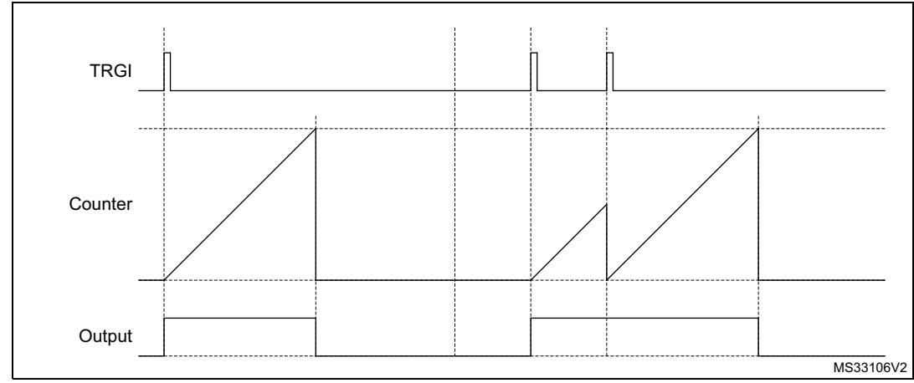

**Figure 482. Retriggerable one-pulse mode.**

# **41.3.15 Encoder interface mode**

To select Encoder Interface mode write SMS='001 in the TIMx\_SMCR register if the counter is counting on TI2 edges only, SMS=010 if it is counting on TI1 edges only and SMS=011 if it is counting on both TI1 and TI2 edges.

Select the TI1 and TI2 polarity by programming the CC1P and CC2P bits in the TIMx\_CCER register. CC1NP and CC2NP must be kept cleared. When needed, the input filter can be programmed as well. CC1NP and CC2NP must be kept low.

The two inputs TI1 and TI2 are used to interface to an incremental encoder. Refer to *[Table 357](#page-33-0)*. The counter is clocked by each valid transition on TI1FP1 or TI2FP2 (TI1 and TI2 after input filter and polarity selection, TI1FP1=TI1 if not filtered and not inverted, TI2FP2=TI2 if not filtered and not inverted) assuming that it is enabled (CEN bit in TIMx\_CR1 register written to '1). The sequence of transitions of the two inputs is evaluated and generates count pulses as well as the direction signal. Depending on the sequence the counter counts up or down, the DIR bit in the TIMx\_CR1 register is modified by hardware accordingly. The DIR bit is calculated at each transition on any input (TI1 or TI2), whatever the counter is counting on TI1 only, TI2 only or both TI1 and TI2.

Encoder interface mode acts simply as an external clock with direction selection. This means that the counter just counts continuously between 0 and the auto-reload value in the TIMx\_ARR register (0 to ARR or ARR down to 0 depending on the direction). So the TIMx\_ARR must be configured before starting. In the same way, the capture, compare, prescaler, trigger output features continue to work as normal.

In this mode, the counter is modified automatically following the speed and the direction of the quadrature encoder and its content, therefore, always represents the encoder's position. The count direction correspond to the rotation direction of the connected sensor. The table summarizes the possible combinations, assuming TI1 and TI2 do not switch at the same time.


<span id="page-33-0"></span>

|             | Level on opposite                          |          | TI1FP1 signal | TI2FP2 signal |          |  |  |
|-------------|--------------------------------------------|----------|---------------|---------------|----------|--|--|
| Active edge | signal (TI1FP1 for<br>TI2, TI2FP2 for TI1) | Rising   | Falling       | Rising        | Falling  |  |  |
| Counting on | High                                       | Down     | Up            | No Count      | No Count |  |  |
| TI1 only    | Low                                        | Up       | Down          | No Count      | No Count |  |  |
| Counting on | High                                       | No Count | No Count      | Up            | Down     |  |  |
| TI2 only    | Low                                        | No Count | No Count      | Down          | Up       |  |  |
| Counting on | High                                       | Down     | Up            | Up            | Down     |  |  |
| TI1 and TI2 | Low                                        | Up       | Down          | Down          | Up       |  |  |

**Table 357. Counting direction versus encoder signals** 

An external incremental encoder can be connected directly to the MCU without external interface logic. However, comparators are normally be used to convert the encoder's differential outputs to digital signals. This greatly increases noise immunity. The third encoder output which indicate the mechanical zero position, may be connected to an external interrupt input and trigger a counter reset.

*[Figure 483](#page-33-1)* gives an example of counter operation, showing count signal generation and direction control. It also shows how input jitter is compensated where both edges are selected. This might occur if the sensor is positioned near to one of the switching points. For this example we assume that the configuration is the following:

- CC1S= 01 (TIMx\_CCMR1 register, TI1FP1 mapped on TI1)
- CC2S= 01 (TIMx\_CCMR2 register, TI2FP2 mapped on TI2)
- CC1P and CC1NP = '0' (TIMx\_CCER register, TI1FP1 noninverted, TI1FP1=TI1)
- CC2P and CC2NP = '0' (TIMx\_CCER register, TI2FP2 noninverted, TI2FP2=TI2)
- SMS= 011 (TIMx\_SMCR register, both inputs are active on both rising and falling edges)
- CEN= 1 (TIMx\_CR1 register, Counter is enabled)

<span id="page-33-1"></span>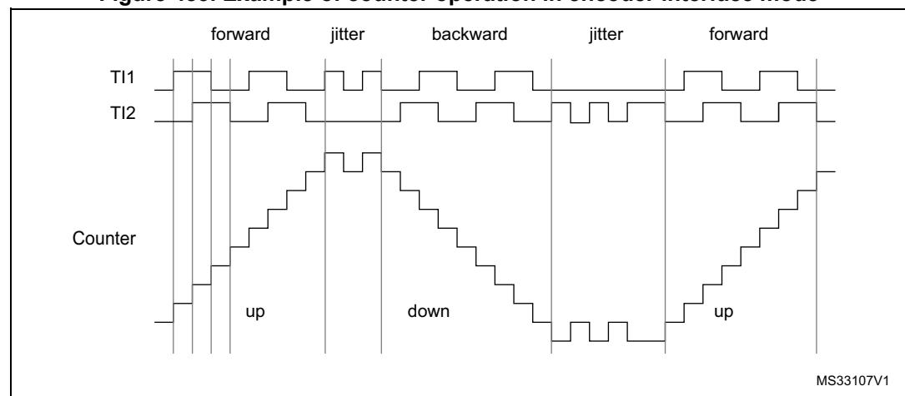

**Figure 483. Example of counter operation in encoder interface mode** 

*[Figure 484](#page-34-0)* gives an example of counter behavior when TI1FP1 polarity is inverted (same configuration as above except CC1P=1).


<span id="page-34-0"></span>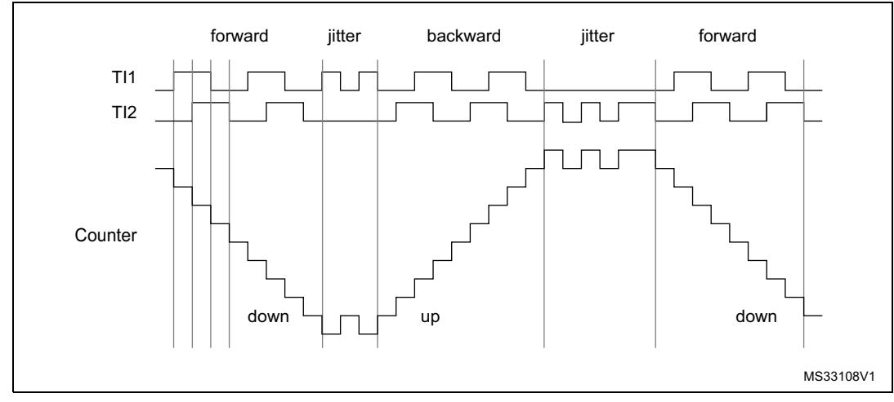

**Figure 484. Example of encoder interface mode with TI1FP1 polarity inverted** 

The timer, when configured in Encoder Interface mode provides information on the sensor's current position. Dynamic information can be obtained (speed, acceleration, deceleration) by measuring the period between two encoder events using a second timer configured in capture mode. The output of the encoder which indicates the mechanical zero can be used for this purpose. Depending on the time between two events, the counter can also be read at regular times. This can be done by latching the counter value into a third input capture register if available (then the capture signal must be periodic and can be generated by another timer). when available, it is also possible to read its value through a DMA request generated by a Real-Time clock.

## **41.3.16 UIF bit remapping**

The IUFREMAP bit in the TIMx\_CR1 register forces a continuous copy of the update interrupt flag (UIF) into bit 31 of the timer counter register's bit 31 (TIMxCNT[31]). This permits to atomically read both the counter value and a potential roll-over condition signaled by the UIFCPY flag. It eases the calculation of angular speed by avoiding race conditions caused, for instance, by a processing shared between a background task (counter reading) and an interrupt (update interrupt).

There is no latency between the UIF and UIFCPY flag assertions.

In 32-bit timer implementations, when the IUFREMAP bit is set, bit 31 of the counter is overwritten by the UIFCPY flag upon read access (the counter's most significant bit is only accessible in write mode).

## **41.3.17 Timer input XOR function**

The TI1S bit in the TIM1xx\_CR2 register, allows the input filter of channel 1 to be connected to the output of a XOR gate, combining the three input pins TIMx\_CH1 to TIMx\_CH3.

The XOR output can be used with all the timer input functions such as trigger or input capture.

An example of this feature used to interface Hall sensors is given in *Section 40.3.25: Interfacing with Hall sensors on page 1727*.


RM0399 Rev 4 1815/3556

## 41.3.18 Timers and external trigger synchronization

The TIMx Timers can be synchronized with an external trigger in several modes: Reset mode, Gated mode and Trigger mode.

#### Slave mode: Reset mode

The counter and its prescaler can be reinitialized in response to an event on a trigger input. Moreover, if the URS bit from the TIMx\_CR1 register is low, an update event UEV is generated. Then all the preloaded registers (TIMx\_ARR, TIMx\_CCRx) are updated.

In the following example, the upcounter is cleared in response to a rising edge on TI1 input:

- Configure the channel 1 to detect rising edges on TI1. Configure the input filter duration (in this example, we do not need any filter, so we keep IC1F=0000). The capture prescaler is not used for triggering, so it does not need to be configured. The CC1S bits select the input capture source only, CC1S = 01 in the TIMx\_CCMR1 register. Write CC1P=0 and CC1NP=0 in TIMx\_CCER register to validate the polarity (and detect rising edges only).
- 2. Configure the timer in reset mode by writing SMS=100 in TIMx\_SMCR register. Select TI1 as the input source by writing TS=00101 in TIMx\_SMCR register.
- 3. Start the counter by writing CEN=1 in the TIMx CR1 register.

The counter starts counting on the internal clock, then behaves normally until TI1 rising edge. When TI1 rises, the counter is cleared and restarts from 0. In the meantime, the trigger flag is set (TIF bit in the TIMx\_SR register) and an interrupt request, or a DMA request can be sent if enabled (depending on the TIE and TDE bits in TIMx\_DIER register).

The following figure shows this behavior when the auto-reload register TIMx\_ARR=0x36. The delay between the rising edge on TI1 and the actual reset of the counter is due to the resynchronization circuit on TI1 input.

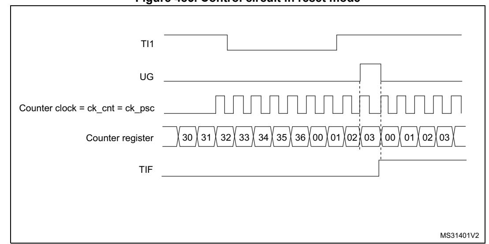

Figure 485. Control circuit in reset mode

#### Slave mode: Gated mode

1816/3556

The counter can be enabled depending on the level of a selected input.

In the following example, the upcounter counts only when TI1 input is low:

RM0399 Rev 4


- 1. Configure the channel 1 to detect low levels on TI1. Configure the input filter duration (in this example, we do not need any filter, so we keep IC1F=0000). The capture prescaler is not used for triggering, so it does not need to be configured. The CC1S bits select the input capture source only, CC1S=01 in TIMx\_CCMR1 register. Write CC1P=1 and CC1NP=0 in TIMx\_CCER register to validate the polarity (and detect low level only).
- 2. Configure the timer in gated mode by writing SMS=101 in TIMx\_SMCR register. Select TI1 as the input source by writing TS=00101 in TIMx\_SMCR register.
- 3. Enable the counter by writing CEN=1 in the TIMx\_CR1 register (in gated mode, the counter doesn't start if CEN=0, whatever is the trigger input level).

The counter starts counting on the internal clock as long as TI1 is low and stops as soon as TI1 becomes high. The TIF flag in the TIMx\_SR register is set both when the counter starts or stops.

The delay between the rising edge on TI1 and the actual stop of the counter is due to the resynchronization circuit on TI1 input.

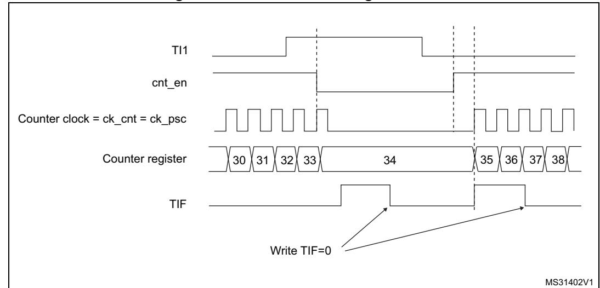

**Figure 486. Control circuit in gated mode**

*Note: The configuration "CCxP=CCxNP=1" (detection of both rising and falling edges) does not have any effect in gated mode because gated mode acts on a level and not on an edge.*

## **Slave mode: Trigger mode**

The counter can start in response to an event on a selected input.

In the following example, the upcounter starts in response to a rising edge on TI2 input:

1. Configure the channel 2 to detect rising edges on TI2. Configure the input filter duration (in this example, we do not need any filter, so we keep IC2F=0000). The capture prescaler is not used for triggering, so it does not need to be configured. CC2S bits are selecting the input capture source only, CC2S=01 in TIMx\_CCMR1 register. Write


RM0399 Rev 4 1817/3556

<sup>1.</sup> The configuration "CCxP=CCxNP=1" (detection of both rising and falling edges) does not have any effect in gated mode because gated mode acts on a level and not on an edge.

CC2P=1 and CC2NP=0 in TIMx\_CCER register to validate the polarity (and detect low level only).

2. Configure the timer in trigger mode by writing SMS=110 in TIMx\_SMCR register. Select TI2 as the input source by writing TS=00110 in TIMx\_SMCR register.

When a rising edge occurs on TI2, the counter starts counting on the internal clock and the TIF flag is set.

The delay between the rising edge on TI2 and the actual start of the counter is due to the resynchronization circuit on TI2 input.

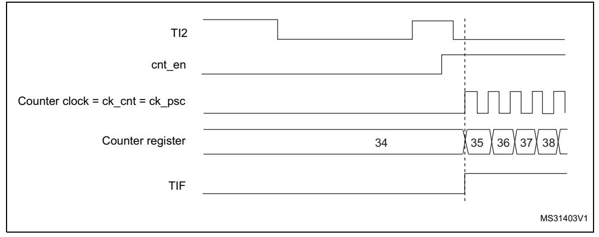

**Figure 487. Control circuit in trigger mode**

## **Slave mode: External Clock mode 2 + trigger mode**

The external clock mode 2 can be used in addition to another slave mode (except external clock mode 1 and encoder mode). In this case, the ETR signal is used as external clock input, and another input can be selected as trigger input when operating in reset mode, gated mode or trigger mode. It is recommended not to select ETR as TRGI through the TS bits of TIMx\_SMCR register.

In the following example, the upcounter is incremented at each rising edge of the ETR signal as soon as a rising edge of TI1 occurs:

- 1. Configure the external trigger input circuit by programming the TIMx\_SMCR register as follows:
  - ETF = 0000: no filter
  - ETPS=00: prescaler disabled
  - ETP=0: detection of rising edges on ETR and ECE=1 to enable the external clock mode 2.
- 2. Configure the channel 1 as follows, to detect rising edges on TI:
  - IC1F=0000: no filter.
  - The capture prescaler is not used for triggering and does not need to be configured.
  - CC1S=01in TIMx\_CCMR1 register to select only the input capture source
  - CC1P=0 and CC1NP=0 in TIMx\_CCER register to validate the polarity (and detect rising edge only).
- 3. Configure the timer in trigger mode by writing SMS=110 in TIMx\_SMCR register. Select TI1 as the input source by writing TS=00101 in TIMx\_SMCR register.


A rising edge on TI1 enables the counter and sets the TIF flag. The counter then counts on ETR rising edges.

The delay between the rising edge of the ETR signal and the actual reset of the counter is due to the resynchronization circuit on ETRP input.

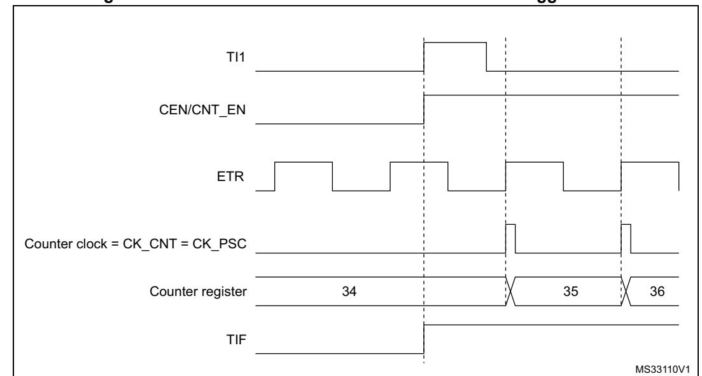

Figure 488. Control circuit in external clock mode 2 + trigger mode

# <span id="page-38-0"></span>41.3.19 Timer synchronization

The TIMx timers are linked together internally for timer synchronization or chaining. When one Timer is configured in Master Mode, it can reset, start, stop or clock the counter of another Timer configured in Slave Mode.

Figure 489: Master/Slave timer example and Figure 490: Master/slave connection example with 1 channel only timers present an overview of the trigger selection and the master mode selection blocks.

<span id="page-38-1"></span>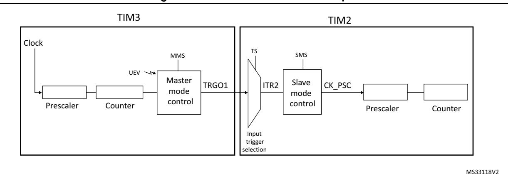

Figure 489. Master/Slave timer example

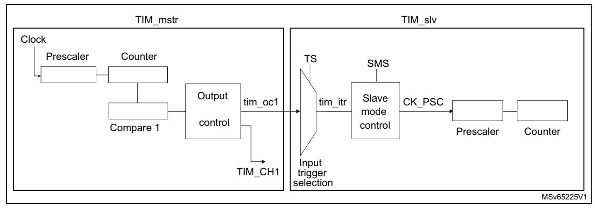

<span id="page-39-1"></span>Figure 490. Master/slave connection example with 1 channel only timers

Note:

The timers with one channel only (see Figure 490) do not feature a master mode. However, the OC1 output signal can be used to trigger some other timers (including timers described in other sections of this document). Check the "TIMx internal trigger connection" table of any TIMx\_SMCR register on the device to identify which timers can be targeted as slave. The OC1 signal pulse width must be programmed to be at least 2 clock cycles of the destination timer, to make sure the slave timer detects the trigger. For instance, if the destination's timer CK\_INT clock is 4 times slower than the source timer, the OC1 pulse width must be 8 clock cycles.

## <span id="page-39-0"></span>Using one timer as prescaler for another timer

For example, TIM3 can be configured to act as a prescaler for TIM2. Refer to *Figure 489*. To do this:

- Configure TIM3 in master mode so that it outputs a periodic trigger signal on each update event UEV. If MMS=010 is written in the TIM3\_CR2 register, a rising edge is output on TRGO each time an update event is generated.
- 2. To connect the TRGO output of TIM3 to TIM2, TIM2 must be configured in slave mode using ITR2 as internal trigger. This is selected through the TS bits in the TIM2\_SMCR register (writing TS=00010).
- 3. Then the slave mode controller must be put in external clock mode 1 (write SMS=111 in the TIM2\_SMCR register). This causes TIM2 to be clocked by the rising edge of the periodic TIM3 trigger signal (which correspond to the TIM3 counter overflow).
- 4. Finally both timers must be enabled by setting their respective CEN bits (TIMx\_CR1 register).

Note:

If OCx is selected on TIM3 as the trigger output (MMS=1xx), its rising edge is used to clock the counter of TIM2.

#### Using one timer to enable another timer

In this example, we control the enable of TIM2 with the output compare 1 of Timer 3. Refer to Figure 489 for connections. TIM2 counts on the divided internal clock only when OC1REF of TIM3 is high. Both counter clock frequencies are divided by 3 by the prescaler compared to CK\_INT ( $f_{CK}$   $_{CNT} = f_{CK}$   $_{INT}/3$ ).

- 1. Configure TIM3 master mode to send its Output Compare 1 Reference (OC1REF) signal as trigger output (MMS=100 in the TIM3\_CR2 register).
- 2. Configure the TIM3 OC1REF waveform (TIM3\_CCMR1 register).
- 3. Configure TIM2 to get the input trigger from TIM3 (TS=00010 in the TIM2\_SMCR register).
- 4. Configure TIM2 in gated mode (SMS=101 in TIM2\_SMCR register).
- 5. Enable TIM2 by writing '1 in the CEN bit (TIM2\_CR1 register).
- 6. Start TIM3 by writing '1 in the CEN bit (TIM3\_CR1 register).

*Note: The counter* 2 *clock is not synchronized with counter 1, this mode only affects the TIM*2 *counter enable signal.*

<span id="page-40-0"></span>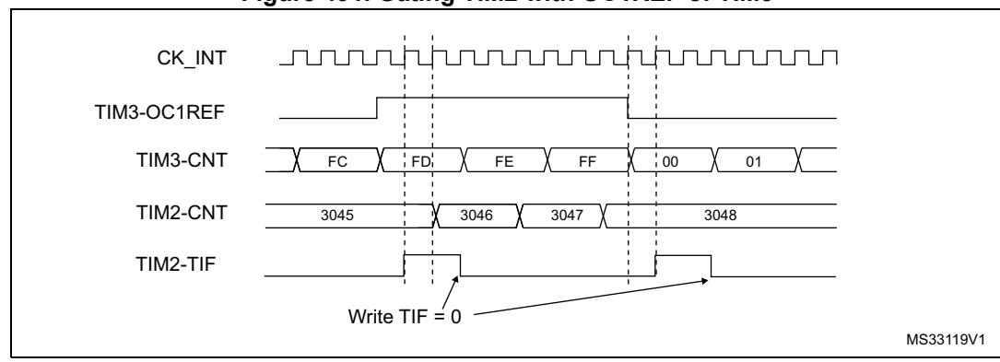

**Figure 491. Gating TIM2 with OC1REF of TIM3**

In the example in *[Figure 491](#page-40-0)*, the TIM2 counter and prescaler are not initialized before being started. So they start counting from their current value. It is possible to start from a given value by resetting both timers before starting TIM3. Then any value can be written in the timer counters. The timers can easily be reset by software using the UG bit in the TIMx\_EGR registers.

In the next example (refer to *[Figure 492](#page-41-0)*), we synchronize TIM3 and TIM2. TIM3 is the master and starts from 0. TIM2 is the slave and starts from 0xE7. The prescaler ratio is the same for both timers. TIM2 stops when TIM3 is disabled by writing '0 to the CEN bit in the TIM3\_CR1 register:

- 1. Configure TIM3 master mode to send its Output Compare 1 Reference (OC1REF) signal as trigger output (MMS=100 in the TIM3\_CR2 register).
- 2. Configure the TIM3 OC1REF waveform (TIM3\_CCMR1 register).
- 3. Configure TIM2 to get the input trigger from TIM3 (TS=00010 in the TIM2\_SMCR register).
- 4. Configure TIM2 in gated mode (SMS=101 in TIM2\_SMCR register).
- 5. Reset TIM3 by writing '1 in UG bit (TIM3\_EGR register).
- 6. Reset TIM2 by writing '1 in UG bit (TIM2\_EGR register).
- 7. Initialize TIM2 to 0xE7 by writing '0xE7' in the TIM2 counter (TIM2\_CNTL).
- 8. Enable TIM2 by writing '1 in the CEN bit (TIM2\_CR1 register).
- 9. Start TIM3 by writing '1 in the CEN bit (TIM3\_CR1 register).
- 10. Stop TIM3 by writing '0 in the CEN bit (TIM3\_CR1 register).

RM0399 Rev 4 1821/3556

<span id="page-41-0"></span>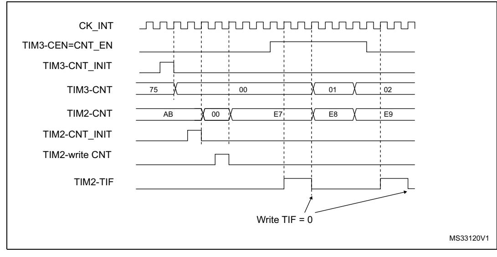

**Figure 492. Gating TIM2 with Enable of TIM3**

## **Using one timer to start another timer**

In this example, we set the enable of Timer 2 with the update event of Timer 3. Refer to *[Figure 489](#page-38-1)* for connections. Timer 2 starts counting from its current value (which can be non-zero) on the divided internal clock as soon as the update event is generated by Timer 1. When Timer 2 receives the trigger signal its CEN bit is automatically set and the counter counts until we write '0 to the CEN bit in the TIM2\_CR1 register. Both counter clock frequencies are divided by 3 by the prescaler compared to CK\_INT (fCK\_CNT = fCK\_INT/3).

- 1. Configure TIM3 master mode to send its Update Event (UEV) as trigger output (MMS=010 in the TIM3\_CR2 register).
- 2. Configure the TIM3 period (TIM3\_ARR registers).
- 3. Configure TIM2 to get the input trigger from TIM3 (TS=00010 in the TIM2\_SMCR register).
- 4. Configure TIM2 in trigger mode (SMS=110 in TIM2\_SMCR register).
- 5. Start TIM3 by writing '1 in the CEN bit (TIM3\_CR1 register).

<span id="page-41-1"></span>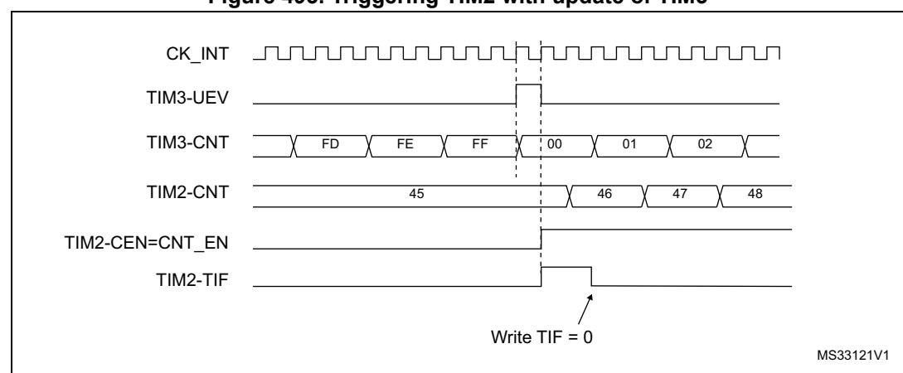

**Figure 493. Triggering TIM2 with update of TIM3**

As in the previous example, both counters can be initialized before starting counting. *Figure 494* shows the behavior with the same configuration as in *Figure 493* but in trigger mode instead of gated mode (SMS=110 in the TIM2\_SMCR register).

<span id="page-42-0"></span>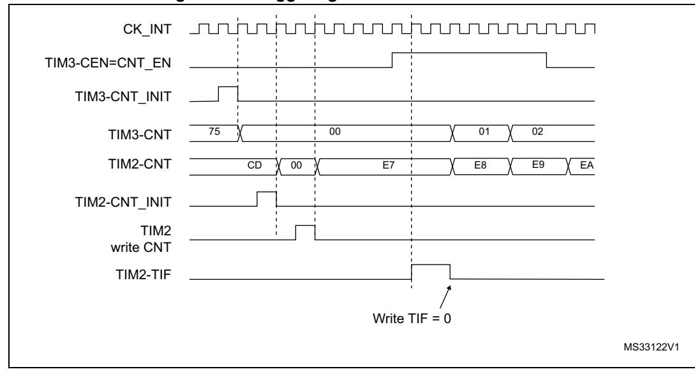

Figure 494. Triggering TIM2 with Enable of TIM3

## Starting 2 timers synchronously in response to an external trigger

In this example, we set the enable of TIM3 when its TI1 input rises, and the enable of TIM2 with the enable of TIM3. Refer to *Figure 489* for connections. To ensure the counters are aligned, TIM3 must be configured in Master/Slave mode (slave with respect to TI1, master with respect to TIM2):

- Configure TIM3 master mode to send its Enable as trigger output (MMS=001 in the TIM3\_CR2 register).
- 2. Configure TIM3 slave mode to get the input trigger from TI1 (TS=00100 in the TIM3 SMCR register).
- 3. Configure TIM3 in trigger mode (SMS=110 in the TIM3\_SMCR register).
- Configure the TIM3 in Master/Slave mode by writing MSM=1 (TIM3 SMCR register).
- 5. Configure TIM2 to get the input trigger from TIM3 (TS=00000 in the TIM2\_SMCR register).
- 6. Configure TIM2 in trigger mode (SMS=110 in the TIM2\_SMCR register).

When a rising edge occurs on TI1 (TIM3), both counters starts counting synchronously on the internal clock and both TIF flags are set.

Note:

In this example both timers are initialized before starting (by setting their respective UG bits). Both counters starts from 0, but an offset can easily be inserted between them by writing any of the counter registers (TIMx\_CNT). One can see that the master/slave mode insert a delay between CNT\_EN and CK\_PSC on TIM3.


RM0399 Rev 4

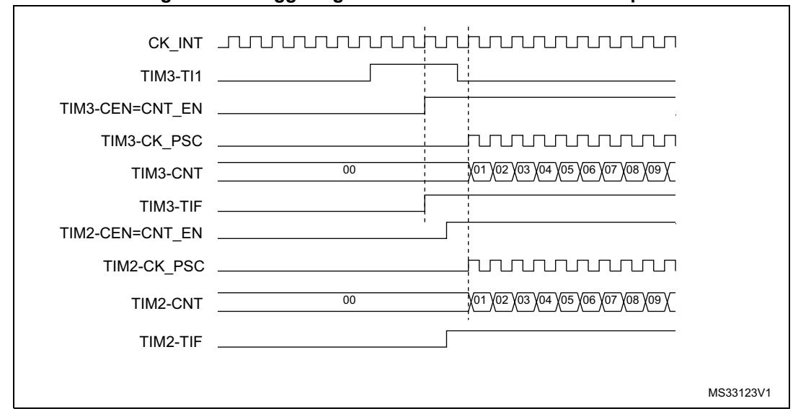

**Figure 495. Triggering TIM3 and TIM2 with TIM3 TI1 input**

*Note: The clock of the slave peripherals (timer, ADC, ...) receiving the TRGO or the TRGO2 signals must be enabled prior to receive events from the master timer, and the clock frequency (prescaler) must not be changed on-the-fly while triggers are received from the master timer.*

# **41.3.20 DMA burst mode**

The TIMx timers have the capability to generate multiple DMA requests upon a single event. The main purpose is to be able to re-program part of the timer multiple times without software overhead, but it can also be used to read several registers in a row, at regular intervals.

The DMA controller destination is unique and must point to the virtual register TIMx\_DMAR. On a given timer event, the timer launches a sequence of DMA requests (burst). Each write into the TIMx\_DMAR register is actually redirected to one of the timer registers.

The DBL[4:0] bits in the TIMx\_DCR register set the DMA burst length. The timer recognizes a burst transfer when a read or a write access is done to the TIMx\_DMAR address), i.e. the number of transfers (either in half-words or in bytes).

The DBA[4:0] bits in the TIMx\_DCR registers define the DMA base address for DMA transfers (when read/write access are done through the TIMx\_DMAR address). DBA is defined as an offset starting from the address of the TIMx\_CR1 register:

## Example:

00000: TIMx\_CR1 00001: TIMx\_CR2 00010: TIMx\_SMCR

As an example, the timer DMA burst feature is used to update the contents of the CCRx registers (x = 2, 3, 4) upon an update event, with the DMA transferring half words into the CCRx registers.

This is done in the following steps:

- 1. Configure the corresponding DMA channel as follows:
  - DMA channel peripheral address is the DMAR register address
  - DMA channel memory address is the address of the buffer in the RAM containing the data to be transferred by DMA into CCRx registers.
  - Number of data to transfer = 3 (See note below).
  - Circular mode disabled.
- 2. Configure the DCR register by configuring the DBA and DBL bit fields as follows: DBL = 3 transfers, DBA = 0xE.
- 3. Enable the TIMx update DMA request (set the UDE bit in the DIER register).
- 4. Enable TIMx
- 5. Enable the DMA channel

This example is for the case where every CCRx register has to be updated once. If every CCRx register is to be updated twice for example, the number of data to transfer should be 6. Let's take the example of a buffer in the RAM containing data1, data2, data3, data4, data5 and data6. The data is transferred to the CCRx registers as follows: on the first update DMA request, data1 is transferred to CCR2, data2 is transferred to CCR3, data3 is transferred to CCR4 and on the second update DMA request, data4 is transferred to CCR2, data5 is transferred to CCR3 and data6 is transferred to CCR4.

*Note: A null value can be written to the reserved registers.*

## **41.3.21 Debug mode**

When the microcontroller enters debug mode (Cortex®-M7 with FPU core halted), the TIMx counter either continues to work normally or stops, depending on TIMx configuration bit in DBGMCU module. For more details, refer to *Section 63.5.8: Microcontroller debug unit (DBGMCU)*.

For safety purposes, when the counter is stopped (TIMx = 1 in DBGMCU\_APB1FZ2), the outputs are disabled.


# **41.4 TIM2/TIM3/TIM4/TIM5 registers**

Refer to *Section 1.2* for a list of abbreviations used in register descriptions.

The peripheral registers can be accessed by half-words (16-bit) or words (32-bit).

# <span id="page-45-0"></span>**41.4.1 TIMx control register 1 (TIMx\_CR1)(x = 2 to 5)**

Address offset: 0x00 Reset value: 0x0000

| 15   | 14   | 13   | 12   | 11           | 10   | 9  | 8        | 7    | 6        | 5  | 4   | 3   | 2   | 1    | 0   |
|------|------|------|------|--------------|------|----|----------|------|----------|----|-----|-----|-----|------|-----|
| Res. | Res. | Res. | Res. | UIFRE<br>MAP | Res. |    | CKD[1:0] | ARPE | CMS[1:0] |    | DIR | OPM | URS | UDIS | CEN |
|      |      |      |      | rw           |      | rw | rw       | rw   | rw       | rw | rw  | rw  | rw  | rw   | rw  |

Bits 15:12 Reserved, must be kept at reset value.

#### Bit 11 **UIFREMAP**: UIF status bit remapping

- 0: No remapping. UIF status bit is not copied to TIMx\_CNT register bit 31.
- 1: Remapping enabled. UIF status bit is copied to TIMx\_CNT register bit 31.
- Bit 10 Reserved, must be kept at reset value.

## Bits 9:8 **CKD[1:0]**: Clock division

This bit-field indicates the division ratio between the timer clock (CK\_INT) frequency and sampling clock used by the digital filters (ETR, TIx),

00: tDTS = tCK\_INT 01: tDTS = 2 × tCK\_INT 10: tDTS = 4 × tCK\_INT 11: Reserved

#### Bit 7 **ARPE**: Auto-reload preload enable

- 0: TIMx\_ARR register is not buffered
- 1: TIMx\_ARR register is buffered

#### Bits 6:5 **CMS[1:0]**: Center-aligned mode selection

00: Edge-aligned mode. The counter counts up or down depending on the direction bit (DIR).

01: Center-aligned mode 1. The counter counts up and down alternatively. Output compare interrupt flags of channels configured in output (CCxS=00 in TIMx\_CCMRx register) are set only when the counter is counting down.

10: Center-aligned mode 2. The counter counts up and down alternatively. Output compare interrupt flags of channels configured in output (CCxS=00 in TIMx\_CCMRx register) are set only when the counter is counting up.

11: Center-aligned mode 3. The counter counts up and down alternatively. Output compare interrupt flags of channels configured in output (CCxS=00 in TIMx\_CCMRx register) are set both when the counter is counting up or down.

*Note: It is not allowed to switch from edge-aligned mode to center-aligned mode as long as the counter is enabled (CEN=1)*

## Bit 4 **DIR**: Direction

- 0: Counter used as upcounter
- 1: Counter used as downcounter

*Note: This bit is read only when the timer is configured in Center-aligned mode or Encoder mode.*


#### Bit 3 **OPM**: One-pulse mode

- 0: Counter is not stopped at update event
- 1: Counter stops counting at the next update event (clearing the bit CEN)

#### Bit 2 **URS**: Update request source

This bit is set and cleared by software to select the UEV event sources.

0: Any of the following events generate an update interrupt or DMA request if enabled. These events can be:

- Counter overflow/underflow
- Setting the UG bit
- Update generation through the slave mode controller
- 1: Only counter overflow/underflow generates an update interrupt or DMA request if enabled.

#### Bit 1 **UDIS**: Update disable

This bit is set and cleared by software to enable/disable UEV event generation.

- 0: UEV enabled. The Update (UEV) event is generated by one of the following events:
  - Counter overflow/underflow
  - Setting the UG bit
  - Update generation through the slave mode controller

Buffered registers are then loaded with their preload values.

1: UEV disabled. The Update event is not generated, shadow registers keep their value (ARR, PSC, CCRx). However the counter and the prescaler are reinitialized if the UG bit is set or if a hardware reset is received from the slave mode controller.

#### Bit 0 **CEN**: Counter enable

- 0: Counter disabled
- 1: Counter enabled

*Note: External clock, gated mode and encoder mode can work only if the CEN bit has been previously set by software. However trigger mode can set the CEN bit automatically by hardware.* 

CEN is cleared automatically in one-pulse mode, when an update event occurs.

## **41.4.2 TIMx control register 2 (TIMx\_CR2)(x = 2 to 5)**

Address offset: 0x04 Reset value: 0x0000

| 15   | 14   | 13   | 12   | 11   | 10   | 9    | 8    | 7    | 6  | 5        | 4  | 3    | 2    | 1    | 0    |
|------|------|------|------|------|------|------|------|------|----|----------|----|------|------|------|------|
| Res. | Res. | Res. | Res. | Res. | Res. | Res. | Res. | TI1S |    | MMS[2:0] |    | CCDS | Res. | Res. | Res. |
|      |      |      |      |      |      |      |      | rw   | rw | rw       | rw | rw   |      |      |      |

RM0399 Rev 4 1827/3556

Bits 15:8 Reserved, must be kept at reset value.

Bit 7 **TI1S**: TI1 selection

0: The TIMx\_CH1 pin is connected to TI1 input

1: The TIMx\_CH1, CH2 and CH3 pins are connected to the TI1 input (XOR combination)

See also *Section 40.3.25: Interfacing with Hall sensors on page 1727*

#### Bits 6:4 **MMS[2:0]**: Master mode selection

These bits permit to select the information to be sent in master mode to slave timers for synchronization (TRGO). The combination is as follows:

000: **Reset** - the UG bit from the TIMx\_EGR register is used as trigger output (TRGO). If the reset is generated by the trigger input (slave mode controller configured in reset mode) then the signal on TRGO is delayed compared to the actual reset.

001: **Enable** - the Counter enable signal, CNT\_EN, is used as trigger output (TRGO). It is useful to start several timers at the same time or to control a window in which a slave timer is enabled. The Counter Enable signal is generated by a logic AND between CEN control bit and the trigger input when configured in gated mode.

When the Counter Enable signal is controlled by the trigger input, there is a delay on TRGO, except if the master/slave mode is selected (see the MSM bit description in TIMx\_SMCR register).

010: **Update** - The update event is selected as trigger output (TRGO). For instance a master timer can then be used as a prescaler for a slave timer.

011: **Compare Pulse** - The trigger output send a positive pulse when the CC1IF flag is to be set (even if it was already high), as soon as a capture or a compare match occurred. (TRGO)

100: **Compare** - OC1REFC signal is used as trigger output (TRGO)

101: **Compare** - OC2REFC signal is used as trigger output (TRGO)

110: **Compare** - OC3REFC signal is used as trigger output (TRGO)

111: **Compare** - OC4REFC signal is used as trigger output (TRGO)

*Note: The clock of the slave timer or ADC must be enabled prior to receive events from the master timer, and must not be changed on-the-fly while triggers are received from the master timer.*

Bit 3 **CCDS**: Capture/compare DMA selection

0: CCx DMA request sent when CCx event occurs

1: CCx DMA requests sent when update event occurs

Bits 2:0 Reserved, must be kept at reset value.

## **41.4.3 TIMx slave mode control register (TIMx\_SMCR)(x = 2 to 5)**

Address offset: 0x08

Reset value: 0x0000 0000

| 31   | 30   | 29   | 28        | 27   | 26   | 25       | 24   | 23   | 22      | 21 | 20      | 19   | 18       | 17   | 16     |
|------|------|------|-----------|------|------|----------|------|------|---------|----|---------|------|----------|------|--------|
| Res. | Res. | Res. | Res.      | Res. | Res. | Res.     | Res. | Res. | Res.    |    | TS[4:3] | Res. | Res.     | Res. | SMS[3] |
|      |      |      |           |      |      |          |      |      |         | rw | rw      |      |          |      | rw     |
| 15   | 14   | 13   | 12        | 11   | 10   | 9        | 8    | 7    | 6       | 5  | 4       | 3    | 2        | 1    | 0      |
| ETP  | ECE  |      | ETPS[1:0] |      |      | ETF[3:0] |      | MSM  | TS[2:0] |    |         | Res. | SMS[2:0] |      |        |
| rw   | rw   | rw   | rw        | rw   | rw   | rw       | rw   | rw   | rw      | rw | rw      |      | rw       | rw   | rw     |

Bits 31:22 Reserved, must be kept at reset value.

Bits 19:17 Reserved, must be kept at reset value.

Bit 15 **ETP**: External trigger polarity

This bit selects whether ETR or ETR is used for trigger operations

0: ETR is non-inverted, active at high level or rising edge

1: ETR is inverted, active at low level or falling edge

#### Bit 14 **ECE**: External clock enable

This bit enables External clock mode 2.

0: External clock mode 2 disabled

1: External clock mode 2 enabled. The counter is clocked by any active edge on the ETRF signal.

*Note: Setting the ECE bit has the same effect as selecting external clock mode 1 with TRGI connected to ETRF (SMS=111 and TS=00111).*

*It is possible to simultaneously use external clock mode 2 with the following slave modes: reset mode, gated mode and trigger mode. Nevertheless, TRGI must not be connected to ETRF in this case (TS bits must not be 00111).*

*If external clock mode 1 and external clock mode 2 are enabled at the same time, the external clock input is ETRF.*

## Bits 13:12 **ETPS[1:0]**: External trigger prescaler

External trigger signal ETRP frequency must be at most 1/4 of CK\_INT frequency. A prescaler can be enabled to reduce ETRP frequency. It is useful when inputting fast external clocks.

00: Prescaler OFF

01: ETRP frequency divided by 2 10: ETRP frequency divided by 4

11: ETRP frequency divided by 8

RM0399 Rev 4 1829/3556

#### Bits 11:8 **ETF[3:0]**: External trigger filter

This bit-field then defines the frequency used to sample ETRP signal and the length of the digital filter applied to ETRP. The digital filter is made of an event counter in which N consecutive events are needed to validate a transition on the output:

```
0000: No filter, sampling is done at fDTS
```

```
0001: fSAMPLING=fCK_INT, N=2
0010: fSAMPLING=fCK_INT, N=4
0011: fSAMPLING=fCK_INT, N=8
0100: fSAMPLING=fDTS/2, N=6
0101: fSAMPLING=fDTS/2, N=8
0110: fSAMPLING=fDTS/4, N=6
0111: fSAMPLING=fDTS/4, N=8
1000: fSAMPLING=fDTS/8, N=6
1001: fSAMPLING=fDTS/8, N=8
1010: fSAMPLING=fDTS/16, N=5
1011: fSAMPLING=fDTS/16, N=6
1100: fSAMPLING=fDTS/16, N=8
1101: fSAMPLING=fDTS/32, N=5
1110: fSAMPLING=fDTS/32, N=6
1111: fSAMPLING=fDTS/32, N=8
```

#### Bit 7 **MSM**: Master/Slave mode

#### 0: No action

1: The effect of an event on the trigger input (TRGI) is delayed to allow a perfect synchronization between the current timer and its slaves (through TRGO). It is useful if we want to synchronize several timers on a single external event.

#### Bits 21, 20, 6, 5, 4 **TS[4:0]**: Trigger selection

This bit-field selects the trigger input to be used to synchronize the counter.

00000: Internal Trigger 0 (ITR0)

00001: Internal Trigger 1 (ITR1)

00010: Internal Trigger 2 (ITR2)

00011: Internal Trigger 3 (ITR3)

00100: TI1 Edge Detector (TI1F\_ED)

00101: Filtered Timer Input 1 (TI1FP1)

00110: Filtered Timer Input 2 (TI2FP2)

00111: External Trigger input (ETRF)

01000: Internal Trigger 4 (ITR4)

01001: Internal Trigger 5 (ITR5)

01010: Internal Trigger 6 (ITR6)

01011: Internal Trigger 7 (ITR7)

01100: Internal Trigger 8 (ITR8)

Others: Reserved

See *[Table 358: TIMx internal trigger connection on page 1832](#page-51-0)* for more details on ITRx meaning for each Timer.

*Note: These bits must be changed only when they are not used (e.g. when SMS=000) to avoid wrong edge detections at the transition.*

Bit 3 Reserved, must be kept at reset value.

## Bits 16, 2, 1, 0 **SMS[3:0]**: Slave mode selection

When external signals are selected the active edge of the trigger signal (TRGI) is linked to the polarity selected on the external input (see Input Control register and Control Register description.

0000: Slave mode disabled - if CEN = '1 then the prescaler is clocked directly by the internal clock.

0001: Encoder mode 1 - Counter counts up/down on TI1FP1 edge depending on TI2FP2 level.

0010: Encoder mode 2 - Counter counts up/down on TI2FP2 edge depending on TI1FP1 level.

0011: Encoder mode 3 - Counter counts up/down on both TI1FP1 and TI2FP2 edges depending on the level of the other input.

0100: Reset Mode - Rising edge of the selected trigger input (TRGI) reinitializes the counter and generates an update of the registers.

0101: Gated Mode - The counter clock is enabled when the trigger input (TRGI) is high. The counter stops (but is not reset) as soon as the trigger becomes low. Both start and stop of the counter are controlled.

0110: Trigger Mode - The counter starts at a rising edge of the trigger TRGI (but it is not reset). Only the start of the counter is controlled.

0111: External Clock Mode 1 - Rising edges of the selected trigger (TRGI) clock the counter.

1000: Combined reset + trigger mode - Rising edge of the selected trigger input (TRGI) reinitializes the counter, generates an update of the registers and starts the counter.

*Note: The gated mode must not be used if TI1F\_ED is selected as the trigger input (TS=00100). Indeed, TI1F\_ED outputs 1 pulse for each transition on TI1F, whereas the gated mode checks the level of the trigger signal.*

*Note: The clock of the slave peripherals (timer, ADC, ...) receiving the TRGO or the TRGO2 signals must be enabled prior to receive events from the master timer, and the clock frequency (prescaler) must not be changed on-the-fly while triggers are received from the master timer.*


<span id="page-51-0"></span>**Slave TIM ITR0 ITR1 ITR2 ITR3 ITR4 ITR5 ITR6 ITR7 ITR8** TIM2 TIM1 TIM8 TIM3 TIM4 ETH PPS USB1 OTG\_ HS\_ SOF USB2 OTG\_ FS\_ SOF - - TIM3 TIM1 TIM2 TIM15 TIM4 ETH PPS ---- TIM4 TIM1 TIM2 TIM3 TIM8 - - - - - TIM5 TIM1 TIM8 TIM3 TIM4 - - fdcan1\_ soc USB1 OTG\_ HS\_ SOF USB2 OTG\_ FS\_ SOF

**Table 358. TIMx internal trigger connection** 

## **41.4.4 TIMx DMA/Interrupt enable register (TIMx\_DIER)(x = 2 to 5)**

Address offset: 0x0C Reset value: 0x0000

| 15   | 14  | 13   | 12 | 11 | 10                      | 9  | 8   | 7    | 6   | 5    | 4     | 3     | 2     | 1     | 0   |
|------|-----|------|----|----|-------------------------|----|-----|------|-----|------|-------|-------|-------|-------|-----|
| Res. | TDE | Res. |    |    | CC4DE CC3DE CC2DE CC1DE |    | UDE | Res. | TIE | Res. | CC4IE | CC3IE | CC2IE | CC1IE | UIE |
|      | rw  |      | rw | rw | rw                      | rw | rw  |      | rw  |      | rw    | rw    | rw    | rw    | rw  |

Bit 15 Reserved, must be kept at reset value.

Bit 14 **TDE**: Trigger DMA request enable

0: Trigger DMA request disabled.

1: Trigger DMA request enabled.

Bit 13 Reserved, must be kept at reset value.

Bit 12 **CC4DE**: Capture/Compare 4 DMA request enable

0: CC4 DMA request disabled.

1: CC4 DMA request enabled.

Bit 11 **CC3DE**: Capture/Compare 3 DMA request enable

0: CC3 DMA request disabled.

1: CC3 DMA request enabled.

Bit 10 **CC2DE**: Capture/Compare 2 DMA request enable

0: CC2 DMA request disabled.

1: CC2 DMA request enabled.

Bit 9 **CC1DE**: Capture/Compare 1 DMA request enable

0: CC1 DMA request disabled.

1: CC1 DMA request enabled.

Bit 8 **UDE**: Update DMA request enable

0: Update DMA request disabled.

1: Update DMA request enabled.

Bit 7 Reserved, must be kept at reset value.


Bit 6 **TIE**: Trigger interrupt enable

0: Trigger interrupt disabled.

1: Trigger interrupt enabled.

Bit 5 Reserved, must be kept at reset value.

Bit 4 **CC4IE**: Capture/Compare 4 interrupt enable

0: CC4 interrupt disabled.

1: CC4 interrupt enabled.

Bit 3 **CC3IE**: Capture/Compare 3 interrupt enable

0: CC3 interrupt disabled.

1: CC3 interrupt enabled.

Bit 2 **CC2IE**: Capture/Compare 2 interrupt enable

0: CC2 interrupt disabled.

1: CC2 interrupt enabled.

Bit 1 **CC1IE**: Capture/Compare 1 interrupt enable

0: CC1 interrupt disabled.

1: CC1 interrupt enabled.

Bit 0 **UIE**: Update interrupt enable

0: Update interrupt disabled.

1: Update interrupt enabled.

## **41.4.5 TIMx status register (TIMx\_SR)(x = 2 to 5)**

Address offset: 0x10 Reset value: 0x0000

| 15   | 14   | 13   | 12    | 11    | 10                      | 9     | 8    | 7    | 6     | 5    | 4     | 3     | 2     | 1     | 0     |
|------|------|------|-------|-------|-------------------------|-------|------|------|-------|------|-------|-------|-------|-------|-------|
| Res. | Res. | Res. |       |       | CC4OF CC3OF CC2OF CC1OF |       | Res. | Res. | TIF   | Res. | CC4IF | CC3IF | CC2IF | CC1IF | UIF   |
|      |      |      | rc_w0 | rc_w0 | rc_w0                   | rc_w0 |      |      | rc_w0 |      | rc_w0 | rc_w0 | rc_w0 | rc_w0 | rc_w0 |

Bits 15:13 Reserved, must be kept at reset value.

Bit 12 **CC4OF**: Capture/Compare 4 overcapture flag

refer to CC1OF description

Bit 11 **CC3OF**: Capture/Compare 3 overcapture flag

refer to CC1OF description

Bit 10 **CC2OF**: Capture/compare 2 overcapture flag

refer to CC1OF description

Bit 9 **CC1OF**: Capture/Compare 1 overcapture flag

This flag is set by hardware only when the corresponding channel is configured in input capture mode. It is cleared by software by writing it to '0'.

0: No overcapture has been detected.

1: The counter value has been captured in TIMx\_CCR1 register while CC1IF flag was already set

Bits 8:7 Reserved, must be kept at reset value.

#### Bit 6 **TIF**: Trigger interrupt flag

This flag is set by hardware on the TRG trigger event (active edge detected on TRGI input when the slave mode controller is enabled in all modes but gated mode. It is set when the counter starts or stops when gated mode is selected. It is cleared by software.

0: No trigger event occurred.

1: Trigger interrupt pending.

Bit 5 Reserved, must be kept at reset value.

Bit 4 **CC4IF**: Capture/Compare 4 interrupt flag Refer to CC1IF description

Bit 3 **CC3IF**: Capture/Compare 3 interrupt flag

Refer to CC1IF description

Bit 2 **CC2IF**: Capture/Compare 2 interrupt flag

Refer to CC1IF description

#### Bit 1 **CC1IF**: Capture/compare 1 interrupt flag

This flag is set by hardware. It is cleared by software (input capture or output compare mode) or by reading the TIMx\_CCR1 register (input capture mode only).

0: No compare match / No input capture occurred

1: A compare match or an input capture occurred

**If channel CC1 is configured as output**: this flag is set when the content of the counter TIMx\_CNT matches the content of the TIMx\_CCR1 register. When the content of TIMx\_CCR1 is greater than the content of TIMx\_ARR, the CC1IF bit goes high on the counter overflow (in up-counting and up/down-counting modes) or underflow (in downcounting mode). There are 3 possible options for flag setting in center-aligned mode, refer to the CMS bits in the TIMx\_CR1 register for the full description.

**If channel CC1 is configured as input**: this bit is set when counter value has been captured in TIMx\_CCR1 register (an edge has been detected on IC1, as per the edge sensitivity defined with the CC1P and CC1NP bits setting, in TIMx\_CCER).

#### Bit 0 **UIF**: Update interrupt flag

This bit is set by hardware on an update event. It is cleared by software.

0: No update occurred

1: Update interrupt pending. This bit is set by hardware when the registers are updated:

At overflow or underflow (for TIM2 to TIM4) and if UDIS=0 in the TIMx\_CR1 register.

When CNT is reinitialized by software using the UG bit in TIMx\_EGR register, if URS=0 and UDIS=0 in the TIMx\_CR1 register.

When CNT is reinitialized by a trigger event (refer to the synchro control register description), if URS=0 and UDIS=0 in the TIMx\_CR1 register.

## **41.4.6 TIMx event generation register (TIMx\_EGR)(x = 2 to 5)**

Address offset: 0x14 Reset value: 0x0000

| 15   | 14   | 13   | 12   | 11   | 10   | 9    | 8    | 7    | 6  | 5    | 4    | 3    | 2    | 1    | 0  |
|------|------|------|------|------|------|------|------|------|----|------|------|------|------|------|----|
| Res. | Res. | Res. | Res. | Res. | Res. | Res. | Res. | Res. | TG | Res. | CC4G | CC3G | CC2G | CC1G | UG |
|      |      |      |      |      |      |      |      |      | w  |      | w    | w    | w    | w    | w  |


Bits 15:7 Reserved, must be kept at reset value.

#### Bit 6 **TG**: Trigger generation

This bit is set by software in order to generate an event, it is automatically cleared by hardware.

0: No action

1: The TIF flag is set in TIMx\_SR register. Related interrupt or DMA transfer can occur if enabled.

Bit 5 Reserved, must be kept at reset value.

Bit 4 **CC4G**: Capture/compare 4 generation

Refer to CC1G description

Bit 3 **CC3G**: Capture/compare 3 generation

Refer to CC1G description

Bit 2 **CC2G**: Capture/compare 2 generation

Refer to CC1G description

Bit 1 **CC1G**: Capture/compare 1 generation

This bit is set by software in order to generate an event, it is automatically cleared by hardware.

0: No action

1: A capture/compare event is generated on channel 1:

#### **If channel CC1 is configured as output**:

CC1IF flag is set, Corresponding interrupt or DMA request is sent if enabled.

#### **If channel CC1 is configured as input**:

The current value of the counter is captured in TIMx\_CCR1 register. The CC1IF flag is set, the corresponding interrupt or DMA request is sent if enabled. The CC1OF flag is set if the CC1IF flag was already high.

#### Bit 0 **UG**: Update generation

This bit can be set by software, it is automatically cleared by hardware.

0: No action

1: Re-initialize the counter and generates an update of the registers. Note that the prescaler counter is cleared too (anyway the prescaler ratio is not affected). The counter is cleared if the center-aligned mode is selected or if DIR=0 (upcounting), else it takes the auto-reload value (TIMx\_ARR) if DIR=1 (downcounting).


RM0399 Rev 4 1835/3556

## **41.4.7 TIMx capture/compare mode register 1 (TIMx\_CCMR1)(x = 2 to 5)**

Address offset: 0x18

Reset value: 0x0000 0000

The same register can be used for input capture mode (this section) or for output compare mode (next section). The direction of a channel is defined by configuring the corresponding CCxS bits. All the other bits of this register have a different function in input and in output mode.

## **Input capture mode:**

| 31   | 30        | 29   | 28   | 27   | 26          | 25   | 24        | 23   | 22   | 21        | 20   | 19   | 18          | 17   | 16        |
|------|-----------|------|------|------|-------------|------|-----------|------|------|-----------|------|------|-------------|------|-----------|
| Res. | Res.      | Res. | Res. | Res. | Res.        | Res. | Res.      | Res. | Res. | Res.      | Res. | Res. | Res.        | Res. | Res.      |
|      |           |      |      |      |             |      |           |      |      |           |      |      |             |      |           |
| 15   | 14        | 13   | 12   | 11   | 10          | 9    | 8         | 7    | 6    | 5         | 4    | 3    | 2           | 1    | 0         |
|      | IC2F[3:0] |      |      |      | IC2PSC[1:0] |      | CC2S[1:0] |      |      | IC1F[3:0] |      |      | IC1PSC[1:0] |      | CC1S[1:0] |
| rw   | rw        | rw   | rw   | rw   | rw          | rw   | rw        | rw   | rw   | rw        | rw   | rw   | rw          | rw   | rw        |

Bits 31:16 Reserved, must be kept at reset value.

Bits 15:12 **IC2F[3:0]**: Input capture 2 filter

Bits 11:10 **IC2PSC[1:0]**: Input capture 2 prescaler

Bits 9:8 **CC2S[1:0]**: Capture/compare 2 selection

This bit-field defines the direction of the channel (input/output) as well as the used input.

00: CC2 channel is configured as output.

01: CC2 channel is configured as input, IC2 is mapped on TI2.

10: CC2 channel is configured as input, IC2 is mapped on TI1.

11: CC2 channel is configured as input, IC2 is mapped on TRC. This mode is working only if an internal trigger input is selected through TS bit (TIMx\_SMCR register)

*Note: CC2S bits are writable only when the channel is OFF (CC2E = 0 in TIMx\_CCER).*

#### Bits 7:4 **IC1F[3:0]**: Input capture 1 filter

This bit-field defines the frequency used to sample TI1 input and the length of the digital filter applied to TI1. The digital filter is made of an event counter in which N consecutive events are needed to validate a transition on the output:

```
0000: No filter, sampling is done at fDTS
0001: fSAMPLING=fCK_INT, N=2
0010: fSAMPLING=fCK_INT, N=4
0011: fSAMPLING=fCK_INT, N=8
0100: fSAMPLING=fDTS/2, N=6
0101: fSAMPLING=fDTS/2, N=8
0110: fSAMPLING=fDTS/4, N=6
0111: fSAMPLING=fDTS/4, N=8
1000: fSAMPLING=fDTS/8, N=6
1001: fSAMPLING=fDTS/8, N=8
1010: fSAMPLING=fDTS/16, N=5
```

1011: fSAMPLING=fDTS/16, N=6

1100: fSAMPLING=fDTS/16, N=8 1101: fSAMPLING=fDTS/32, N=5

1110: fSAMPLING=fDTS/32, N=6

1111: fSAMPLING=fDTS/32, N=8

#### Bits 3:2 **IC1PSC[1:0]**: Input capture 1 prescaler

This bit-field defines the ratio of the prescaler acting on CC1 input (IC1). The prescaler is reset as soon as CC1E=0 (TIMx\_CCER register).

00: no prescaler, capture is done each time an edge is detected on the capture input

01: capture is done once every 2 events

10: capture is done once every 4 events

11: capture is done once every 8 events

#### Bits 1:0 **CC1S[1:0]**: Capture/Compare 1 selection

This bit-field defines the direction of the channel (input/output) as well as the used input.

00: CC1 channel is configured as output

01: CC1 channel is configured as input, IC1 is mapped on TI1

10: CC1 channel is configured as input, IC1 is mapped on TI2

11: CC1 channel is configured as input, IC1 is mapped on TRC. This mode is working only if an internal trigger input is selected through TS bit (TIMx\_SMCR register)

*Note: CC1S bits are writable only when the channel is OFF (CC1E = 0 in TIMx\_CCER).*


# 41.4.8 TIMx capture/compare mode register 1 [alternate] (TIMx\_CCMR1) (x = 2 to 5)

Address offset: 0x18

Reset value: 0x0000 0000

The same register can be used for output compare mode (this section) or for input capture mode (previous section). The direction of a channel is defined by configuring the corresponding CCxS bits. All the other bits of this register have a different function in input and in output mode.

#### Output compare mode:

| 31    | 30        | 29   | 28   | 27    | 26    | 25   | 24          | 23    | 22   | 21       | 20   | 19    | 18    | 17   | 16          |
|-------|-----------|------|------|-------|-------|------|-------------|-------|------|----------|------|-------|-------|------|-------------|
| Res.  | Res.      | Res. | Res. | Res.  | Res.  | Res. | OC2M<br>[3] | Res.  | Res. | Res.     | Res. | Res.  | Res.  | Res. | OC1M<br>[3] |
|       |           |      |      |       |       |      | rw          |       |      |          |      |       |       |      | rw          |
| 15    | 14        | 13   | 12   | 11    | 10    | 9    | 8           | 7     | 6    | 5        | 4    | 3     | 2     | 1    | 0           |
| OC2CE | OC2M[2:0] |      |      | OC2PE | OC2FE | CC2S | S[1:0]      | OC1CE | (    | OC1M[2:0 | )]   | OC1PE | OC1FE | CC1S | S[1:0]      |
| rw    | rw        | rw   | rw   | rw    | rw    | rw   | rw          | rw    | rw   | rw       | rw   | rw    | rw    | rw   | rw          |

Bits 31:25 Reserved, must be kept at reset value.

Bits 23:17 Reserved, must be kept at reset value.

Bit 15 OC2CE: Output compare 2 clear enable

Bits 24, 14:12 **OC2M[3:0]**: Output compare 2 mode refer to OC1M description on bits 6:4

Bit 11 OC2PE: Output compare 2 preload enable

Bit 10 OC2FE: Output compare 2 fast enable

Bits 9:8 CC2S[1:0]: Capture/Compare 2 selection

This bit-field defines the direction of the channel (input/output) as well as the used input.

00: CC2 channel is configured as output

01: CC2 channel is configured as input, IC2 is mapped on TI2

10: CC2 channel is configured as input, IC2 is mapped on TI1

11: CC2 channel is configured as input, IC2 is mapped on TRC. This mode is working only if an internal trigger input is selected through the TS bit (TIMx SMCR register)

Note: CC2S bits are writable only when the channel is OFF (CC2E = 0 in TIMx\_CCER).

Bit 7 OC1CE: Output compare 1 clear enable

0: OC1Ref is not affected by the ETRF input

1: OC1Ref is cleared as soon as a High level is detected on ETRF input

#### Bits 16, 6:4 **OC1M[3:0]**: Output compare 1 mode

These bits define the behavior of the output reference signal OC1REF from which OC1 and OC1N are derived. OC1REF is active high whereas OC1 and OC1N active level depends on CC1P and CC1NP bits.

0000: Frozen - The comparison between the output compare register TIMx\_CCR1 and the counter TIMx\_CNT has no effect on the outputs. This mode can be used when the timer serves as a software timebase. When the frozen mode is enabled during timer operation, the output keeps the state (active or inactive) it had before entering the frozen state.

0001: Set channel 1 to active level on match. OC1REF signal is forced high when the counter TIMx\_CNT matches the capture/compare register 1 (TIMx\_CCR1).

0010: Set channel 1 to inactive level on match. OC1REF signal is forced low when the counter TIMx\_CNT matches the capture/compare register 1 (TIMx\_CCR1).

0011: Toggle - OC1REF toggles when TIMx\_CNT=TIMx\_CCR1.

0100: Force inactive level - OC1REF is forced low.

0101: Force active level - OC1REF is forced high.

0110: PWM mode 1 - In upcounting, channel 1 is active as long as TIMx\_CNT<TIMx\_CCR1 else inactive. In downcounting, channel 1 is inactive (OC1REF='0) as long as TIMx\_CNT>TIMx\_CCR1 else active (OC1REF=1).

0111: PWM mode 2 - In upcounting, channel 1 is inactive as long as

TIMx\_CNT<TIMx\_CCR1 else active. In downcounting, channel 1 is active as long as TIMx\_CNT>TIMx\_CCR1 else inactive.

1000: Retriggerable OPM mode 1 - In up-counting mode, the channel is active until a trigger event is detected (on TRGI signal). Then, a comparison is performed as in PWM mode 1 and the channels becomes inactive again at the next update. In down-counting mode, the channel is inactive until a trigger event is detected (on TRGI signal). Then, a comparison is performed as in PWM mode 1 and the channels becomes inactive again at the next update.

1001: Retriggerable OPM mode 2 - In up-counting mode, the channel is inactive until a trigger event is detected (on TRGI signal). Then, a comparison is performed as in PWM mode 2 and the channels becomes inactive again at the next update. In down-counting mode, the channel is active until a trigger event is detected (on TRGI signal). Then, a comparison is performed as in PWM mode 1 and the channels becomes active again at the next update.

1010: Reserved,

1011: Reserved,

1100: Combined PWM mode 1 - OC1REF has the same behavior as in PWM mode 1. OC1REFC is the logical OR between OC1REF and OC2REF.

1101: Combined PWM mode 2 - OC1REF has the same behavior as in PWM mode 2. OC1REFC is the logical AND between OC1REF and OC2REF.

1110: Asymmetric PWM mode 1 - OC1REF has the same behavior as in PWM mode 1. OC1REFC outputs OC1REF when the counter is counting up, OC2REF when it is counting down.

1111: Asymmetric PWM mode 2 - OC1REF has the same behavior as in PWM mode 2. OC1REFC outputs OC1REF when the counter is counting up, OC2REF when it is counting down.

*Note: In PWM mode, the OCREF level changes only when the result of the comparison changes or when the output compare mode switches from "frozen" mode to "PWM" mode.*

*Note: The OC1M[3] bit is not contiguous, located in bit 16.*


RM0399 Rev 4 1839/3556

#### Bit 3 **OC1PE**: Output compare 1 preload enable

- 0: Preload register on TIMx\_CCR1 disabled. TIMx\_CCR1 can be written at anytime, the new value is taken in account immediately.
- 1: Preload register on TIMx\_CCR1 enabled. Read/Write operations access the preload register. TIMx\_CCR1 preload value is loaded in the active register at each update event.

#### Bit 2 **OC1FE**: Output compare 1 fast enable

This bit decreases the latency between a trigger event and a transition on the timer output. It must be used in one-pulse mode (OPM bit set in TIMx\_CR1 register), to have the output pulse starting as soon as possible after the starting trigger.

0: CC1 behaves normally depending on counter and CCR1 values even when the trigger is ON. The minimum delay to activate CC1 output when an edge occurs on the trigger input is 5 clock cycles.

1: An active edge on the trigger input acts like a compare match on CC1 output. Then, OC is set to the compare level independently from the result of the comparison. Delay to sample the trigger input and to activate CC1 output is reduced to 3 clock cycles. OCFE acts only if the channel is configured in PWM1 or PWM2 mode.

#### Bits 1:0 **CC1S[1:0]**: Capture/Compare 1 selection

This bit-field defines the direction of the channel (input/output) as well as the used input.

00: CC1 channel is configured as output.

01: CC1 channel is configured as input, IC1 is mapped on TI1.

10: CC1 channel is configured as input, IC1 is mapped on TI2.

11: CC1 channel is configured as input, IC1 is mapped on TRC. This mode is working only if an internal trigger input is selected through TS bit (TIMx\_SMCR register)

*Note: CC1S bits are writable only when the channel is OFF (CC1E = 0 in TIMx\_CCER).*

## **41.4.9 TIMx capture/compare mode register 2 (TIMx\_CCMR2)(x = 2 to 5)**

Address offset: 0x1C

Reset value: 0x0000 0000

The same register can be used for input capture mode (this section) or for output compare mode (next section). The direction of a channel is defined by configuring the corresponding CCxS bits. All the other bits of this register have a different function in input and in output mode.

#### **Input capture mode:**

| 31   | 30   | 29        | 28   | 27   | 26          | 25   | 24        | 23   | 22   | 21        | 20   | 19   | 18          | 17   | 16        |
|------|------|-----------|------|------|-------------|------|-----------|------|------|-----------|------|------|-------------|------|-----------|
| Res. | Res. | Res.      | Res. | Res. | Res.        | Res. | Res.      | Res. | Res. | Res.      | Res. | Res. | Res.        | Res. | Res.      |
|      |      |           |      |      |             |      |           |      |      |           |      |      |             |      |           |
|      |      |           |      |      |             |      |           |      |      |           |      |      |             |      |           |
| 15   | 14   | 13        | 12   | 11   | 10          | 9    | 8         | 7    | 6    | 5         | 4    | 3    | 2           | 1    | 0         |
|      |      | IC4F[3:0] |      |      | IC4PSC[1:0] |      | CC4S[1:0] |      |      | IC3F[3:0] |      |      | IC3PSC[1:0] |      | CC3S[1:0] |

Bits 31:16 Reserved, must be kept at reset value.

Bits 15:12 **IC4F[3:0]**: Input capture 4 filter

Bits 11:10 **IC4PSC[1:0]**: Input capture 4 prescaler

Bits 9:8 CC4S[1:0]: Capture/Compare 4 selection

This bit-field defines the direction of the channel (input/output) as well as the used input.

00: CC4 channel is configured as output

01: CC4 channel is configured as input, IC4 is mapped on TI4

10: CC4 channel is configured as input, IC4 is mapped on TI3

11: CC4 channel is configured as input, IC4 is mapped on TRC. This mode is working only if an internal trigger input is selected through TS bit (TIMx SMCR register)

Note: CC4S bits are writable only when the channel is OFF (CC4E = 0 in TIMx\_CCER).

Bits 7:4 IC3F[3:0]: Input capture 3 filter

Bits 3:2 IC3PSC[1:0]: Input capture 3 prescaler

Bits 1:0 CC3S[1:0]: Capture/Compare 3 selection

This bit-field defines the direction of the channel (input/output) as well as the used input.

00: CC3 channel is configured as output

01: CC3 channel is configured as input, IC3 is mapped on TI3

10: CC3 channel is configured as input. IC3 is mapped on TI4

11: CC3 channel is configured as input, IC3 is mapped on TRC. This mode is working only if an internal trigger input is selected through TS bit (TIMx\_SMCR register)

Note: CC3S bits are writable only when the channel is OFF (CC3E = 0 in TIMx CCER).

# 41.4.10 TIMx capture/compare mode register 2 [alternate] (TIMx\_CCMR2) (x = 2 to 5)

Address offset: 0x1C

Reset value: 0x0000 0000

The same register can be used for output compare mode (this section) or for input capture mode (previous section). The direction of a channel is defined by configuring the corresponding CCxS bits. All the other bits of this register have a different function in input and in output mode.

#### Output compare mode:

| 31    | 30        | 29   | 28   | 27    | 26    | 25   | 24          | 23    | 22   | 21       | 20   | 19    | 18    | 17   | 16          |
|-------|-----------|------|------|-------|-------|------|-------------|-------|------|----------|------|-------|-------|------|-------------|
| Res.  | Res.      | Res. | Res. | Res.  | Res.  | Res. | OC4M<br>[3] | Res.  | Res. | Res.     | Res. | Res.  | Res.  | Res. | OC3M<br>[3] |
|       |           |      |      |       |       |      | rw          |       |      |          |      |       |       |      | rw          |
| 15    | 14        | 13   | 12   | 11    | 10    | 9    | 8           | 7     | 6    | 5        | 4    | 3     | 2     | 1    | 0           |
| OC4CE | OC4M[2:0] |      |      | OC4PE | OC4FE | CC4S | S[1:0]      | OC3CE | (    | OC3M[2:0 | )]   | OC3PE | OC3FE | CC3  | S[1:0]      |
| rw    | rw        | rw   | rw   | rw    | rw    | rw   | rw          | rw    | rw   | rw       | rw   | rw    | rw    | rw   | rw          |

Bits 31:25 Reserved, must be kept at reset value.

Bits 23:17 Reserved, must be kept at reset value.

Bit 15 OC4CE: Output compare 4 clear enable

Bits 24, 14:12 **OC4M[3:0]**: Output compare 4 mode

Refer to OC1M description (bits 6:4 in TIMx\_CCMR1 register)

Bit 11 **OC4PE**: Output compare 4 preload enable

Bit 10 OC4FE: Output compare 4 fast enable


RM0399 Rev 4 1841/3556

Bits 9:8 **CC4S[1:0]**: Capture/Compare 4 selection

This bit-field defines the direction of the channel (input/output) as well as the used input.

00: CC4 channel is configured as output

01: CC4 channel is configured as input, IC4 is mapped on TI4

10: CC4 channel is configured as input, IC4 is mapped on TI3

11: CC4 channel is configured as input, IC4 is mapped on TRC. This mode is working only if an internal trigger input is selected through TS bit (TIMx\_SMCR register)

*Note: CC4S bits are writable only when the channel is OFF (CC4E = 0 in TIMx\_CCER).*

Bit 7 **OC3CE**: Output compare 3 clear enable

Bits 16, 6:4 **OC3M[3:0]**: Output compare 3 mode

Refer to OC1M description (bits 6:4 in TIMx\_CCMR1 register)

Bit 3 **OC3PE**: Output compare 3 preload enable

Bit 2 **OC3FE**: Output compare 3 fast enable

Bits 1:0 **CC3S[1:0]**: Capture/Compare 3 selection

This bit-field defines the direction of the channel (input/output) as well as the used input.

00: CC3 channel is configured as output

01: CC3 channel is configured as input, IC3 is mapped on TI3

10: CC3 channel is configured as input, IC3 is mapped on TI4

11: CC3 channel is configured as input, IC3 is mapped on TRC. This mode is working only if an internal trigger input is selected through TS bit (TIMx\_SMCR register)

*Note: CC3S bits are writable only when the channel is OFF (CC3E = 0 in TIMx\_CCER).*

# **41.4.11 TIMx capture/compare enable register (TIMx\_CCER)(x = 2 to 5)**

Address offset: 0x20 Reset value: 0x0000

| 15    | 14   | 13   | 12   | 11    | 10   | 9    | 8    | 7     | 6    | 5    | 4    | 3     | 2    | 1    | 0    |
|-------|------|------|------|-------|------|------|------|-------|------|------|------|-------|------|------|------|
| CC4NP | Res. | CC4P | CC4E | CC3NP | Res. | CC3P | CC3E | CC2NP | Res. | CC2P | CC2E | CC1NP | Res. | CC1P | CC1E |
| rw    |      | rw   | rw   | rw    |      | rw   | rw   | rw    |      | rw   | rw   | rw    |      | rw   | rw   |

Bit 15 **CC4NP**: *Capture/Compare 4 output Polarity.*

Refer to CC1NP description

Bit 14 Reserved, must be kept at reset value.

Bit 13 **CC4P**: *Capture/Compare 4 output Polarity.*

Refer to CC1P description

Bit 12 **CC4E**: *Capture/Compare 4 output enable.*

refer to CC1E description

Bit 11 **CC3NP**: *Capture/Compare 3 output Polarity.*

Refer to CC1NP description

Bit 10 Reserved, must be kept at reset value.

Bit 9 **CC3P**: *Capture/Compare 3 output Polarity.*

Refer to CC1P description

Bit 8 **CC3E**: *Capture/Compare 3 output enable.*

Refer to CC1E description


Bit 7 **CC2NP**: *Capture/Compare 2 output Polarity.* Refer to CC1NP description

Bit 6 Reserved, must be kept at reset value.

Bit 5 **CC2P**: *Capture/Compare 2 output Polarity.* refer to CC1P description

Bit 4 **CC2E**: *Capture/Compare 2 output enable.*

Refer to CC1E description

Bit 3 **CC1NP**: *Capture/Compare 1 output Polarity.*

**CC1 channel configured as output**: CC1NP must be kept cleared in this case.

**CC1 channel configured as input**: This bit is used in conjunction with CC1P to define TI1FP1/TI2FP1 polarity. refer to CC1P description.

Bit 2 Reserved, must be kept at reset value.

Bit 1 **CC1P**: *Capture/Compare 1 output Polarity.*

0: OC1 active high (output mode) / Edge sensitivity selection (input mode, see below)

1: OC1 active low (output mode) / Edge sensitivity selection (input mode, see below)

**When CC1 channel is configured as input**, both CC1NP/CC1P bits select the active polarity of TI1FP1 and TI2FP1 for trigger or capture operations.

CC1NP=0, CC1P=0: non-inverted/rising edge. The circuit is sensitive to TIxFP1 rising edge (capture or trigger operations in reset, external clock or trigger mode), TIxFP1 is not inverted (trigger operation in gated mode or encoder mode).

CC1NP=0, CC1P=1: inverted/falling edge. The circuit is sensitive to TIxFP1 falling edge (capture or trigger operations in reset, external clock or trigger mode), TIxFP1 is inverted (trigger operation in gated mode or encoder mode).

CC1NP=1, CC1P=1: non-inverted/both edges. The circuit is sensitive to both TIxFP1 rising and falling edges (capture or trigger operations in reset, external clock or trigger mode), TIxFP1is not inverted (trigger operation in gated mode). This configuration must not be used in encoder mode.

CC1NP=1, CC1P=0: This configuration is reserved, it must not be used.

Bit 0 **CC1E**: *Capture/Compare 1 output enable.*

0: Capture mode disabled / OC1 is not active

1: Capture mode enabled / OC1 signal is output on the corresponding output pin

**Table 359. Output control bit for standard OCx channels** 

| CCxE bit | OCx output state                                 |
|----------|--------------------------------------------------|
| 0        | Output disabled (not driven by the timer: Hi-Z)  |
| 1        | Output enabled (tim_ocx = tim_ocxref + Polarity) |

*Note: The state of the external IO pins connected to the standard OCx channels depends on the OCx channel state and the GPIO control and alternate function registers.*

## **41.4.12 TIMx counter (TIMx\_CNT)(x = 2 to 5)**

Bit 31 of this register has two possible definitions depending on the value of UIFREMAP in TIMx\_CR1 register:

- This section is for UIFREMAP = 0
- Next section is for UIFREMAP = 1


RM0399 Rev 4 1843/3556

Address offset: 0x24

Reset value: 0x0000 0000

| 31 | 30         | 29 | 28 | 27 | 26 | 25 | 24        | 23 | 22 | 21 | 20 | 19 | 18 | 17 | 16 |
|----|------------|----|----|----|----|----|-----------|----|----|----|----|----|----|----|----|
|    | CNT[31:16] |    |    |    |    |    |           |    |    |    |    |    |    |    |    |
| rw | rw         | rw | rw | rw | rw | rw | rw        | rw | rw | rw | rw | rw | rw | rw | rw |
| 15 | 14         | 13 | 12 | 11 | 10 | 9  | 8         | 7  | 6  | 5  | 4  | 3  | 2  | 1  | 0  |
|    |            |    |    |    |    |    | CNT[15:0] |    |    |    |    |    |    |    |    |
| rw | rw         | rw | rw | rw | rw | rw | rw        | rw | rw | rw | rw | rw | rw | rw | rw |

Bits 31:16 **CNT[31:16]**: Most significant part counter value (TIM2 and TIM5)

Bits 15:0 **CNT[15:0]**: Least significant part of counter value

## **41.4.13 TIMx counter [alternate] (TIMx\_CNT)(x = 2 to 5)**

Bit 31 of this register has two possible definitions depending on the value of UIFREMAP in TIMx\_CR1 register:

- Previous section is for UIFREMAP = 0
- This section is for UIFREMAP = 1

Address offset: 0x24

Reset value: 0x0000 0000

| 31     | 30         | 29 | 28 | 27 | 26 | 25 | 24        | 23 | 22 | 21 | 20 | 19 | 18 | 17 | 16 |
|--------|------------|----|----|----|----|----|-----------|----|----|----|----|----|----|----|----|
| UIFCPY | CNT[30:16] |    |    |    |    |    |           |    |    |    |    |    |    |    |    |
| rw     | rw         | rw | rw | rw | rw | rw | rw        | rw | rw | rw | rw | rw | rw | rw | rw |
| 15     | 14         | 13 | 12 | 11 | 10 | 9  | 8         | 7  | 6  | 5  | 4  | 3  | 2  | 1  | 0  |
|        |            |    |    |    |    |    | CNT[15:0] |    |    |    |    |    |    |    |    |
| rw     | rw         | rw | rw | rw | rw | rw | rw        | rw | rw | rw | rw | rw | rw | rw | rw |

Bit 31 **UIFCPY**: UIF Copy

This bit is a read-only copy of the UIF bit of the TIMx\_ISR register

Bits 30:16 **CNT[30:16]**: Most significant part counter value (TIM2 and TIM5)

Bits 15:0 **CNT[15:0]**: Least significant part of counter value

# **41.4.14 TIMx prescaler (TIMx\_PSC)(x = 2 to 5)**

Address offset: 0x28

Reset value: 0x0000

| 15 | 14        | 13 | 12 | 11 | 10 | 9  | 8  | 7  | 6  | 5  | 4  | 3  | 2  | 1  | 0  |
|----|-----------|----|----|----|----|----|----|----|----|----|----|----|----|----|----|
|    | PSC[15:0] |    |    |    |    |    |    |    |    |    |    |    |    |    |    |
| rw | rw        | rw | rw | rw | rw | rw | rw | rw | rw | rw | rw | rw | rw | rw | rw |

#### Bits 15:0 **PSC[15:0]**: Prescaler value

The counter clock frequency CK\_CNT is equal to fCK\_PSC / (PSC[15:0] + 1).

PSC contains the value to be loaded in the active prescaler register at each update event (including when the counter is cleared through UG bit of TIMx\_EGR register or through trigger controller when configured in "reset mode").

## **41.4.15 TIMx auto-reload register (TIMx\_ARR)(x = 2 to 5)**

Address offset: 0x2C

Reset value: 0xFFFF FFFF

| 31 | 30         | 29 | 28 | 27 | 26 | 25 | 24 | 23        | 22 | 21 | 20 | 19 | 18 | 17 | 16 |
|----|------------|----|----|----|----|----|----|-----------|----|----|----|----|----|----|----|
|    | ARR[31:16] |    |    |    |    |    |    |           |    |    |    |    |    |    |    |
| rw | rw         | rw | rw | rw | rw | rw | rw | rw        | rw | rw | rw | rw | rw | rw | rw |
| 15 | 14         | 13 | 12 | 11 | 10 | 9  | 8  | 7         | 6  | 5  | 4  | 3  | 2  | 1  | 0  |
|    |            |    |    |    |    |    |    | ARR[15:0] |    |    |    |    |    |    |    |
| rw | rw         | rw | rw | rw | rw | rw | rw | rw        | rw | rw | rw | rw | rw | rw | rw |

Bits 31:16 **ARR[31:16]**: High auto-reload value (TIM2 and TIM5)

Bits 15:0 **ARR[15:0]**: Low Auto-reload value

ARR is the value to be loaded in the actual auto-reload register.

Refer to the *[Section 41.3.1: Time-base unit on page 1783](#page-2-0)* for more details about ARR update and behavior.

The counter is blocked while the auto-reload value is null.

# **41.4.16 TIMx capture/compare register 1 (TIMx\_CCR1)(x = 2 to 5)**

Address offset: 0x34

Reset value: 0x0000 0000

| 31 | 30          | 29 | 28 | 27 | 26 | 25 | 24 | 23 | 22 | 21 | 20 | 19 | 18 | 17 | 16 |
|----|-------------|----|----|----|----|----|----|----|----|----|----|----|----|----|----|
|    | CCR1[31:16] |    |    |    |    |    |    |    |    |    |    |    |    |    |    |
| rw | rw          | rw | rw | rw | rw | rw | rw | rw | rw | rw | rw | rw | rw | rw | rw |
| 15 | 14          | 13 | 12 | 11 | 10 | 9  | 8  | 7  | 6  | 5  | 4  | 3  | 2  | 1  | 0  |
|    | CCR1[15:0]  |    |    |    |    |    |    |    |    |    |    |    |    |    |    |
| rw | rw          | rw | rw | rw | rw | rw | rw | rw | rw | rw | rw | rw | rw | rw | rw |

RM0399 Rev 4 1845/3556

#### Bits 31:16 **CCR1[31:16]**: High Capture/Compare 1 value (TIM2 and TIM5)

#### Bits 15:0 **CCR1[15:0]**: Low Capture/Compare 1 value

#### **If channel CC1 is configured as output**:

CCR1 is the value to be loaded in the actual capture/compare 1 register (preload value). It is loaded permanently if the preload feature is not selected in the TIMx\_CCMR1 register (bit OC1PE). Else the preload value is copied in the active capture/compare 1 register when an update event occurs.

The active capture/compare register contains the value to be compared to the counter TIMx\_CNT and signaled on OC1 output.

#### **If channel CC1is configured as input**:

CCR1 is the counter value transferred by the last input capture 1 event (IC1). The TIMx\_CCR1 register is read-only and cannot be programmed.

## **41.4.17 TIMx capture/compare register 2 (TIMx\_CCR2)(x = 2 to 5)**

Address offset: 0x38

Reset value: 0x0000 0000

| 31 | 30          | 29 | 28 | 27 | 26 | 25 | 24 | 23         | 22 | 21 | 20 | 19 | 18 | 17 | 16 |
|----|-------------|----|----|----|----|----|----|------------|----|----|----|----|----|----|----|
|    | CCR2[31:16] |    |    |    |    |    |    |            |    |    |    |    |    |    |    |
| rw | rw          | rw | rw | rw | rw | rw | rw | rw         | rw | rw | rw | rw | rw | rw | rw |
| 15 | 14          | 13 | 12 | 11 | 10 | 9  | 8  | 7          | 6  | 5  | 4  | 3  | 2  | 1  | 0  |
|    |             |    |    |    |    |    |    | CCR2[15:0] |    |    |    |    |    |    |    |
| rw | rw          | rw | rw | rw | rw | rw | rw | rw         | rw | rw | rw | rw | rw | rw | rw |

Bits 31:16 **CCR2[31:16]**: High Capture/Compare 2 value (TIM2 and TIM5)

## Bits 15:0 **CCR2[15:0]**: Low Capture/Compare 2 value

#### **If channel CC2 is configured as output**:

CCR2 is the value to be loaded in the actual capture/compare 2 register (preload value). It is loaded permanently if the preload feature is not selected in the TIMx\_CCMR1 register (bit OC2PE). Else the preload value is copied in the active capture/compare 2 register when an update event occurs.

The active capture/compare register contains the value to be compared to the counter TIMx\_CNT and signalled on OC2 output.

#### **If channel CC2 is configured as input**:

CCR2 is the counter value transferred by the last input capture 2 event (IC2). The TIMx\_CCR2 register is read-only and cannot be programmed.

## **41.4.18 TIMx capture/compare register 3 (TIMx\_CCR3)(x = 2 to 5)**

Address offset: 0x3C

Reset value: 0x0000 0000

| 31 | 30 | 29 | 28 | 27 | 26 | 25 | 24 | 23          | 22 | 21 | 20 | 19 | 18 | 17 | 16 |
|----|----|----|----|----|----|----|----|-------------|----|----|----|----|----|----|----|
|    |    |    |    |    |    |    |    | CCR3[31:16] |    |    |    |    |    |    |    |
| rw | rw | rw | rw | rw | rw | rw | rw | rw          | rw | rw | rw | rw | rw | rw | rw |
| 15 | 14 | 13 | 12 | 11 | 10 | 9  | 8  | 7           | 6  | 5  | 4  | 3  | 2  | 1  | 0  |
|    |    |    |    |    |    |    |    | CCR3[15:0]  |    |    |    |    |    |    |    |
| rw | rw | rw | rw | rw | rw | rw | rw | rw          | rw | rw | rw | rw | rw | rw | rw |

Bits 31:16 **CCR3[31:16]**: High Capture/Compare 3 value (TIM2 and TIM5)

#### Bits 15:0 **CCR3[15:0]**: Low Capture/Compare value

#### **If channel CC3 is configured as output**:

CCR3 is the value to be loaded in the actual capture/compare 3 register (preload value). It is loaded permanently if the preload feature is not selected in the TIMx\_CCMR2 register (bit OC3PE). Else the preload value is copied in the active capture/compare 3 register when an update event occurs.

The active capture/compare register contains the value to be compared to the counter TIMx\_CNT and signalled on OC3 output.

#### **If channel CC3is configured as input**:

CCR3 is the counter value transferred by the last input capture 3 event (IC3). The TIMx\_CCR3 register is read-only and cannot be programmed.

## **41.4.19 TIMx capture/compare register 4 (TIMx\_CCR4)(x = 2 to 5)**

Address offset: 0x40

Reset value: 0x0000 0000

| 31 | 30 | 29 | 28 | 27 | 26 | 25 | 24 | 23          | 22 | 21 | 20 | 19 | 18 | 17 | 16 |
|----|----|----|----|----|----|----|----|-------------|----|----|----|----|----|----|----|
|    |    |    |    |    |    |    |    | CCR4[31:16] |    |    |    |    |    |    |    |
| rw | rw | rw | rw | rw | rw | rw | rw | rw          | rw | rw | rw | rw | rw | rw | rw |
| 15 | 14 | 13 | 12 | 11 | 10 | 9  | 8  | 7           | 6  | 5  | 4  | 3  | 2  | 1  | 0  |
|    |    |    |    |    |    |    |    | CCR4[15:0]  |    |    |    |    |    |    |    |
| rw | rw | rw | rw | rw | rw | rw | rw | rw          | rw | rw | rw | rw | rw | rw | rw |

Bits 31:16 **CCR4[31:16]**: High Capture/Compare 4 value (TIM2 and TIM5)

#### Bits 15:0 **CCR4[15:0]**: Low Capture/Compare value

1. if CC4 channel is configured as output (CC4S bits): CCR4 is the value to be loaded in the actual capture/compare 4 register (preload value). It is loaded permanently if the preload feature is not selected in the TIMx\_CCMR2 register (bit OC4PE). Else the preload value is copied in the active capture/compare 4 register when an update event occurs.

The active capture/compare register contains the value to be compared to the counter TIMx\_CNT and signalled on OC4 output.

2. if CC4 channel is configured as input (CC4S bits in TIMx\_CCMR4 register): CCR4 is the counter value transferred by the last input capture 4 event (IC4). The TIMx\_CCR4 register is read-only and cannot be programmed.

RM0399 Rev 4 1847/3556

## **41.4.20 TIMx DMA control register (TIMx\_DCR)(x = 2 to 5)**

Address offset: 0x48 Reset value: 0x0000

| 15   | 14   | 13   | 12 | 11 | 10       | 9  | 8  | 7    | 6    | 5    | 4  | 3  | 2        | 1  | 0  |
|------|------|------|----|----|----------|----|----|------|------|------|----|----|----------|----|----|
| Res. | Res. | Res. |    |    | DBL[4:0] |    |    | Res. | Res. | Res. |    |    | DBA[4:0] |    |    |
|      |      |      | rw | rw | rw       | rw | rw |      |      |      | rw | rw | rw       | rw | rw |

Bits 15:13 Reserved, must be kept at reset value.

#### Bits 12:8 **DBL[4:0]**: DMA burst length

This 5-bit vector defines the number of DMA transfers (the timer recognizes a burst transfer when a read or a write access is done to the TIMx\_DMAR address).

00000: 1 transfer, 00001: 2 transfers, 00010: 3 transfers,

...

10001: 18 transfers.

Bits 7:5 Reserved, must be kept at reset value.

#### Bits 4:0 **DBA[4:0]**: DMA base address

This 5-bit vector defines the base-address for DMA transfers (when read/write access are done through the TIMx\_DMAR address). DBA is defined as an offset starting from the address of the TIMx\_CR1 register.

Example:

00000: TIMx\_CR1 00001: TIMx\_CR2 00010: TIMx\_SMCR

...

**Example**: Let us consider the following transfer: DBL = 7 transfers & DBA = TIMx\_CR1. In this case the transfer is done to/from 7 registers starting from the TIMx\_CR1 address.

# **41.4.21 TIMx DMA address for full transfer (TIMx\_DMAR)(x = 2 to 5)**

Address offset: 0x4C Reset value: 0x0000

| 15 | 14 | 13 | 12 | 11 | 10 | 9  | 8  | 7          | 6  | 5  | 4  | 3  | 2  | 1  | 0  |
|----|----|----|----|----|----|----|----|------------|----|----|----|----|----|----|----|
|    |    |    |    |    |    |    |    | DMAB[15:0] |    |    |    |    |    |    |    |
| rw | rw | rw | rw | rw | rw | rw | rw | rw         | rw | rw | rw | rw | rw | rw | rw |

Bits 15:0 **DMAB[15:0]**: DMA register for burst accesses

A read or write operation to the DMAR register accesses the register located at the address (TIMx\_CR1 address) + (DBA + DMA index) x 4

where TIMx\_CR1 address is the address of the control register 1, DBA is the DMA base address configured in TIMx\_DCR register, DMA index is automatically controlled by the DMA transfer, and ranges from 0 to DBL (DBL configured in TIMx\_DCR).


## **41.4.22 TIM2 alternate function option register 1 (TIM2\_AF1)**

Address offset: 0x60

Reset value: 0x0000 0000

| 31   | 30          | 29   | 28   | 27   | 26   | 25   | 24   | 23   | 22   | 21   | 20   | 19   | 18   | 17   | 16          |
|------|-------------|------|------|------|------|------|------|------|------|------|------|------|------|------|-------------|
| Res. | Res.        | Res. | Res. | Res. | Res. | Res. | Res. | Res. | Res. | Res. | Res. | Res. | Res. |      | ETRSEL[3:2] |
|      |             |      |      |      |      |      |      |      |      |      |      |      |      | rw   | rw          |
|      |             |      |      |      |      |      |      |      |      |      |      |      |      |      |             |
| 15   | 14          | 13   | 12   | 11   | 10   | 9    | 8    | 7    | 6    | 5    | 4    | 3    | 2    | 1    | 0           |
|      | ETRSEL[1:0] | Res. | Res. | Res. | Res. | Res. | Res. | Res. | Res. | Res. | Res. | Res. | Res. | Res. | Res.        |

Bits 31:18 Reserved, must be kept at reset value.

Bits 17:14 **ETRSEL[3:0]**: ETR source selection

These bits select the ETR input source. 0000: ETR input is connected to I/O

0001: COMP1 output 0010: COMP2 output

0011: LSE 0100: SAI1 FS\_A

0101: SAI1 FS\_B Others: Reserved

Bits 13:0 Reserved, must be kept at reset value.

## **41.4.23 TIM3 alternate function option register 1 (TIM3\_AF1)**

Address offset: 0x60

Reset value: 0x0000 0000

| 31   | 30          | 29   | 28   | 27   | 26   | 25   | 24   | 23   | 22   | 21   | 20   | 19   | 18   | 17   | 16          |
|------|-------------|------|------|------|------|------|------|------|------|------|------|------|------|------|-------------|
| Res. | Res.        | Res. | Res. | Res. | Res. | Res. | Res. | Res. | Res. | Res. | Res. | Res. | Res. |      | ETRSEL[3:2] |
|      |             |      |      |      |      |      |      |      |      |      |      |      |      | rw   | rw          |
|      |             |      |      |      |      |      |      |      |      |      |      |      |      |      |             |
| 15   | 14          | 13   | 12   | 11   | 10   | 9    | 8    | 7    | 6    | 5    | 4    | 3    | 2    | 1    | 0           |
|      | ETRSEL[1:0] | Res. | Res. | Res. | Res. | Res. | Res. | Res. | Res. | Res. | Res. | Res. | Res. | Res. | Res.        |

Bits 31:18 Reserved, must be kept at reset value.

Bits 17:14 **ETRSEL[3:0]**: ETR source selection

These bits select the ETR input source. 0000: ETR input is connected to I/O

0001: COMP1 output Others: Reserved

Bits 13:0 Reserved, must be kept at reset value.

RM0399 Rev 4 1849/3556

## **41.4.24 TIM4 alternate function option register 1 (TIM4\_AF1)**

Address offset: 0x60

Reset value: 0x0000 0000

| 31   | 30          | 29   | 28   | 27   | 26   | 25   | 24   | 23   | 22   | 21   | 20   | 19   | 18   | 17   | 16          |
|------|-------------|------|------|------|------|------|------|------|------|------|------|------|------|------|-------------|
| Res. | Res.        | Res. | Res. | Res. | Res. | Res. | Res. | Res. | Res. | Res. | Res. | Res. | Res. |      | ETRSEL[3:2] |
|      |             |      |      |      |      |      |      |      |      |      |      |      |      | rw   | rw          |
|      |             |      |      |      |      |      |      |      |      |      |      |      |      |      |             |
| 15   | 14          | 13   | 12   | 11   | 10   | 9    | 8    | 7    | 6    | 5    | 4    | 3    | 2    | 1    | 0           |
|      | ETRSEL[1:0] | Res. | Res. | Res. | Res. | Res. | Res. | Res. | Res. | Res. | Res. | Res. | Res. | Res. | Res.        |

Bits 31:18 Reserved, must be kept at reset value.

Bits 17:14 **ETRSEL[3:0]**: ETR source selection

These bits select the ETR input source. 0000: ETR input is connected to I/O

Others: Reserved

Bits 13:0 Reserved, must be kept at reset value.

# **41.4.25 TIM5 alternate function option register 1 (TIM5\_AF1)**

Address offset: 0x60

Reset value: 0x0000 0000

| 31   | 30          | 29   | 28   | 27   | 26   | 25   | 24   | 23   | 22   | 21   | 20   | 19   | 18   | 17   | 16          |
|------|-------------|------|------|------|------|------|------|------|------|------|------|------|------|------|-------------|
| Res. | Res.        | Res. | Res. | Res. | Res. | Res. | Res. | Res. | Res. | Res. | Res. | Res. | Res. |      | ETRSEL[3:2] |
|      |             |      |      |      |      |      |      |      |      |      |      |      |      | rw   | rw          |
| 15   | 14          | 13   | 12   | 11   | 10   | 9    | 8    | 7    | 6    | 5    | 4    | 3    | 2    | 1    | 0           |
|      | ETRSEL[1:0] | Res. | Res. | Res. | Res. | Res. | Res. | Res. | Res. | Res. | Res. | Res. | Res. | Res. | Res.        |
| rw   | rw          |      |      |      |      |      |      |      |      |      |      |      |      |      |             |

Bits 31:18 Reserved, must be kept at reset value.

Bits 17:14 **ETRSEL[3:0]**: ETR source selection

These bits select the ETR input source. 0000: ETR input is connected to I/O

0001: SAI2 FS\_A connected to ETR input 0010: SAI2 FS\_B connected to ETR input

Others: Reserved

Bits 13:0 Reserved, must be kept at reset value.

## **41.4.26 TIM2 timer input selection register (TIM2\_TISEL)**

Address offset: 0x68

Reset value: 0x0000 0000

| 31   | 30   | 29   | 28   | 27 | 26 | 25          | 24 | 23   | 22   | 21   | 20   | 19          | 18 | 17          | 16 |
|------|------|------|------|----|----|-------------|----|------|------|------|------|-------------|----|-------------|----|
| Res. | Res. | Res. | Res. |    |    | TI4SEL[3:0] |    | Res. | Res. | Res. | Res. | TI3SEL[3:0] |    |             |    |
|      |      |      |      | rw | rw | rw          | rw |      |      |      |      | rw          | rw | rw          | rw |
| 15   | 14   | 13   | 12   | 11 | 10 | 9           | 8  | 7    | 6    | 5    | 4    | 3           | 2  | 1           | 0  |
| Res. | Res. | Res. | Res. |    |    | TI2SEL[3:0] |    | Res. | Res. | Res. | Res. |             |    | TI1SEL[3:0] |    |
|      |      |      |      | rw | rw | rw          | rw |      |      |      |      | rw          | rw | rw          | rw |

Bits 31:28 Reserved, must be kept at reset value.

Bits 27:24 **TI4SEL[3:0]**: TI4[0] to TI4[15] input selection

These bits select the TI4[0] to TI4[15] input source.

0000: TIM2\_CH4 input 0001: COMP1 output 0010: COMP2 output

0011: COMP1 output OR COMP2 output

Others: Reserved

Bits 23:20 Reserved, must be kept at reset value.

Bits 19:16 **TI3SEL[3:0]**: TI3[0] to TI3[15] input selection

These bits select the TI3[0] to TI3[15] input source.

0000: TIM2\_CH3 input Others: Reserved

Bits 15:12 Reserved, must be kept at reset value.

Bits 11:8 **TI2SEL[3:0]**: TI2[0] to TI2[15] input selection

These bits select the TI2[0] to TI2[15] input source.

0000: TIM2\_CH2 input Others: Reserved

Bits 7:4 Reserved, must be kept at reset value.

Bits 3:0 **TI1SEL[3:0]**: TI1[0] to TI1[15] input selection

These bits select the TI1[0] to TI1[15] input source.

0000: TIM2\_CH1 input Others: Reserved

# **41.4.27 TIM3 timer input selection register (TIM3\_TISEL)**

Address offset: 0x68

Reset value: 0x0000 0000

| 31   | 30   | 29   | 28   | 27 | 26                                          | 25          | 24 | 23   | 22   | 21   | 20   | 19 | 18          | 17 | 16 |
|------|------|------|------|----|---------------------------------------------|-------------|----|------|------|------|------|----|-------------|----|----|
| Res. | Res. | Res. | Res. |    | TI4SEL[3:0]<br>Res.<br>Res.<br>Res.<br>Res. |             |    |      |      |      |      |    | TI3SEL[3:0] |    |    |
|      |      |      |      | rw | rw                                          | rw          | rw |      |      |      |      | rw | rw          | rw | rw |
| 15   | 14   |      |      |    |                                             |             |    |      |      |      |      |    |             |    |    |
|      |      | 13   | 12   | 11 | 10                                          | 9           | 8  | 7    | 6    | 5    | 4    | 3  | 2           | 1  | 0  |
| Res. | Res. | Res. | Res. |    |                                             | TI2SEL[3:0] |    | Res. | Res. | Res. | Res. |    | TI1SEL[3:0] |    |    |


RM0399 Rev 4 1851/3556

Bits 31:28 Reserved, must be kept at reset value.

Bits 27:24 **TI4SEL[3:0]**: TI4[0] to TI4[15] input selection

These bits select the TI4[0] to TI4[15] input source.

0000: TIM3\_CH4 input Others: Reserved

Bits 23:20 Reserved, must be kept at reset value.

Bits 19:16 **TI3SEL[3:0]**: TI3[0] to TI3[15] input selection

These bits select the TI3[0] to TI3[15] input source.

0000: TIM3\_CH3 input Others: Reserved

Bits 15:12 Reserved, must be kept at reset value.

Bits 11:8 **TI2SEL[3:0]**: TI2[0] to TI2[15] input selection

These bits select the TI2[0] to TI2[15] input source.

0000: TIM3\_CH2 input Others: Reserved

Bits 7:4 Reserved, must be kept at reset value.

Bits 3:0 **TI1SEL[3:0]**: TI1[0] to TI1[15] input selection

These bits select the TI1[0] to TI1[15] input source.

0000: TIM3\_CH1 input 0001: COMP1 output 0010: COMP2 output

0011: COMP1 output OR COMP2 output

Others: Reserved

# **41.4.28 TIM4 timer input selection register (TIM4\_TISEL)**

Address offset: 0x68

Reset value: 0x0000 0000

| 31   | 30   | 29   | 28   | 27 | 26 | 25          | 24 | 23   | 22   | 21   | 20   | 19 | 18 | 17          | 16 |
|------|------|------|------|----|----|-------------|----|------|------|------|------|----|----|-------------|----|
| Res. | Res. | Res. | Res. |    |    | TI4SEL[3:0] |    | Res. | Res. | Res. | Res. |    |    | TI3SEL[3:0] |    |
|      |      |      |      | rw | rw | rw          | rw |      |      |      |      | rw | rw | rw          | rw |
| 15   | 14   | 13   | 12   | 11 | 10 | 9           | 8  | 7    | 6    | 5    | 4    | 3  | 2  | 1           | 0  |
| Res. | Res. | Res. | Res. |    |    | TI2SEL[3:0] |    | Res. | Res. | Res. | Res. |    |    | TI1SEL[3:0] |    |
|      |      |      |      | rw | rw | rw          | rw |      |      |      |      | rw | rw | rw          | rw |

Bits 31:28 Reserved, must be kept at reset value.

Bits 27:24 **TI4SEL[3:0]**: TI4[0] to TI4[15] input selection

These bits select the TI4[0] to TI4[15] input source.

0000: TIM4\_CH4 input Others: Reserved

Bits 23:20 Reserved, must be kept at reset value.

Bits 19:16 **TI3SEL[3:0]**: TI3[0] to TI3[15] input selection

These bits select the TI3[0] to TI3[15] input source.

0000: TIM4\_CH3 input Others: Reserved

Bits 15:12 Reserved, must be kept at reset value.

Bits 11:8 **TI2SEL[3:0]**: TI2[0] to TI2[15] input selection

These bits select the TI2[0] to TI2[15] input source.

0000: TIM4\_CH2 input Others: Reserved

Bits 7:4 Reserved, must be kept at reset value.

Bits 3:0 **TI1SEL[3:0]**: TI1[0] to TI1[15] input selection

These bits select the TI1[0] to TI1[15] input source.

0000: TIM4\_CH1 input Others: Reserved

## **41.4.29 TIM5 timer input selection register (TIM5\_TISEL)**

Address offset: 0x68

Reset value: 0x0000 0000

| 31   | 30   | 29   | 28   | 27 | 26 | 25          | 24 | 23   | 22   | 21   | 20   | 19 | 18          | 17 | 16 |
|------|------|------|------|----|----|-------------|----|------|------|------|------|----|-------------|----|----|
| Res. | Res. | Res. | Res. |    |    | TI4SEL[3:0] |    | Res. | Res. | Res. | Res. |    | TI3SEL[3:0] |    |    |
|      |      |      |      | rw | rw | rw          | rw |      |      |      |      | rw | rw          | rw |    |
|      |      |      |      |    |    |             |    |      |      |      |      |    |             |    |    |
| 15   | 14   | 13   | 12   | 11 | 10 | 9           | 8  | 7    | 6    | 5    | 4    | 3  | 2           | 1  | 0  |
| Res. | Res. | Res. | Res. |    |    | TI2SEL[3:0] |    | Res. | Res. | Res. | Res. |    | TI1SEL[3:0] |    |    |

Bits 31:28 Reserved, must be kept at reset value.

Bits 27:24 **TI4SEL[3:0]**: TI4[0] to TI4[15] input selection

These bits select the TI4[0] to TI4[15] input source.

0000: TIM5\_CH4 input Others: Reserved

Bits 23:20 Reserved, must be kept at reset value.

Bits 19:16 **TI3SEL[3:0]**: TI3[0] to TI3[15] input selection

These bits select the TI3[0] to TI3[15] input source.

0000: TIM5\_CH3 input Others: Reserved

Bits 15:12 Reserved, must be kept at reset value.

Bits 11:8 **TI2SEL[3:0]**: TI2[0] to TI2[15] input selection

These bits select the TI2[0] to TI2[15] input source.

0000: TIM5\_CH2 input Others: Reserved

Bits 7:4 Reserved, must be kept at reset value.

Bits 3:0 **TI1SEL[3:0]**: TI1[0] to TI1[15] input selection

These bits select the TI1[0] to TI1[15] input source.

0000: TIM5\_CH1 input 0001: fdcan1\_tmp 0010: fdcan1\_rtp Others: Reserved

## **41.4.30 TIMx register map**

TIMx registers are mapped as described in the table below:

**Table 360. TIM2/TIM3/TIM4/TIM5 register map and reset values** 

| Offset | Register<br>name                     | 31   | 30   | 29   | 28   | 27   | 26   | 25   | 24      | 23   | 22   | 21   | 20          | 19   | 18   | 17   | 16      | 15    | 14   | 13            | 12    | 11      | 10                  | 9         | 8             | 7     | 6            | 5             | 4     | 3                   | 2                   | 1         | 0             |
|--------|--------------------------------------|------|------|------|------|------|------|------|---------|------|------|------|-------------|------|------|------|---------|-------|------|---------------|-------|---------|---------------------|-----------|---------------|-------|--------------|---------------|-------|---------------------|---------------------|-----------|---------------|
| 0x00   | TIMx_CR1                             | Res. | Res. | Res. | Res. | Res. | Res. | Res. | Res.    | Res. | Res. | Res. | Res.        | Res. | Res. | Res. | Res.    | Res.  | Res. | Res.          | Res.  | UIFREMA | Res.                |           | CKD<br>[1:0]  | ARPE  |              | CMS<br>[1:0]  | DIR   | OPM                 | URS                 | UDIS      | CEN           |
|        | Reset value                          |      |      |      |      |      |      |      |         |      |      |      |             |      |      |      |         |       |      |               |       | 0       |                     | 0         | 0             | 0     | 0            | 0             | 0     | 0                   | 0                   | 0         | 0             |
| 0x04   | TIMx_CR2                             | Res. | Res. | Res. | Res. | Res. | Res. | Res. | Res.    | Res. | Res. | Res. | Res.        | Res. | Res. | Res. | Res.    | Res.  | Res. | Res.          | Res.  | Res.    | Res.                | Res.      | Res.          |       | TI1SMMS[2:0] |               |       | CCDS                | Res.                | Res.      | Res.          |
|        | Reset value                          |      |      |      |      |      |      |      |         |      |      |      |             |      |      |      |         |       |      |               |       |         |                     |           |               | 0     | 0            | 0             | 0     | 0                   |                     |           |               |
| 0x08   | TIMx_SMCR                            | Res. | Res. | Res. | Res. | Res. | Res. | Res. | Res.    | Res. | Res. |      | TS<br>[4:3] | Res. | Res. | Res. | SMS[3]  | ETP   |      | ECEETPS       | [1:0] |         |                     | ETF[3:0]  |               | MSM   |              | TS[2:0]       |       | Res.                |                     | SMS[2:0]  |               |
|        | Reset value                          |      |      |      |      |      |      |      |         |      |      | 0    | 0           |      |      |      | 0       | 0     | 0    | 0             | 0     | 0       | 0                   | 0         | 0             | 0     | 0            | 0             | 0     |                     | 0                   | 0         | 0             |
| 0x0C   | TIMx_DIER                            | Res. | Res. | Res. | Res. | Res. | Res. | Res. | Res.    | Res. | Res. | Res. | Res.        | Res. | Res. | Res. | Res.    | Res.  | TDE  | Res.          | CC4DE | CC3DE   | CC2DE               | CC1DE     | UDE           | Res.  | TIE          | Res.          | CC4IE | CC3IE               | CC2IE               | CC1IE     | UIE           |
|        | Reset value                          |      |      |      |      |      |      |      |         |      |      |      |             |      |      |      |         |       | 0    |               | 0     | 0       | 0                   | 0         | 0             |       | 0            |               | 0     | 0                   | 0                   | 0         | 0             |
| 0x10   | TIMx_SR                              | Res. | Res. | Res. | Res. | Res. | Res. | Res. | Res.    | Res. | Res. | Res. | Res.        | Res. | Res. | Res. | Res.    | Res.  | Res. | Res.          | CC4OF | CC3OF   | CC2OF               | CC1OF     | Res.          | Res.  | TIF          | Res.          | CC4IF | CC3IF               | CC2IF               | CC1IF     | UIF           |
|        | Reset value                          |      |      |      |      |      |      |      |         |      |      |      |             |      |      |      |         |       |      |               | 0     | 0       | 0                   | 0         |               |       | 0            |               | 0     | 0                   | 0                   | 0         | 0             |
| 0x14   | TIMx_EGR                             | Res. | Res. | Res. | Res. | Res. | Res. | Res. | Res.    | Res. | Res. | Res. | Res.        | Res. | Res. | Res. | Res.    | Res.  | Res. | Res.          | Res.  | Res.    | Res.                | Res.      | Res.          | Res.  | TG           | Res.          | CC4G  | CC3G                | CC2G                | CC1G      | UG            |
|        | Reset value                          |      |      |      |      |      |      |      |         |      |      |      |             |      |      |      |         |       |      |               |       |         |                     |           |               |       | 0            |               | 0     | 0                   | 0                   | 0         | 0             |
|        | TIMx_CCMR1<br>Output<br>Compare mode | Res. | Res. | Res. | Res. | Res. | Res. | Res. | OC2M[3] | Res. | Res. | Res. | Res.        | Res. | Res. | Res. | OC1M[3] | OC2CE |      | OC2M<br>[2:0] |       | OC2PE   |                     | OC2FECC2S | [1:0]         | OC1CE |              | OC1M<br>[2:0] |       | OC1PE               |                     | OC1FECC1S | [1:0]         |
|        | Reset value                          |      |      |      |      |      |      |      | 0       |      |      |      |             |      |      |      | 0       | 0     | 0    | 0             | 0     | 0       | 0                   | 0         | 0             | 0     | 0            | 0             | 0     | 0                   | 0                   | 0         | 0             |
| 0x18   | TIMx_CCMR1<br>Input Capture<br>mode  | Res. | Res. | Res. | Res. | Res. | Res. | Res. | Res.    | Res. | Res. | Res. | Res.        | Res. | Res. | Res. | Res.    |       |      | IC2F[3:0]     |       |         | IC2<br>PSC<br>[1:0] |           | CC2S<br>[1:0] |       | IC1F[3:0]    |               |       |                     | IC1<br>PSC<br>[1:0] |           | CC1S<br>[1:0] |
|        | Reset value                          |      |      |      |      |      |      |      |         |      |      |      |             |      |      |      |         | 0     | 0    | 0             | 0     | 0       | 0                   | 0         | 0             | 0     | 0            | 0             | 0     | 0                   | 0                   | 0         | 0             |
|        | TIMx_CCMR2<br>Output<br>Compare mode | Res. | Res. | Res. | Res. | Res. | Res. | Res. | OC4M[3] | Res. | Res. | Res. | Res.        | Res. | Res. | Res. | OC3M[3] | O24CE |      | OC4M<br>[2:0] |       | OC4PE   |                     | OC4FECC4S | [1:0]         | OC3CE |              | OC3M<br>[2:0] |       | OC3PE               |                     | OC3FECC3S | [1:0]         |
|        | Reset value                          |      |      |      |      |      |      |      | 0       |      |      |      |             |      |      |      | 0       | 0     | 0    | 0             | 0     | 0       | 0                   | 0         | 0             | 0     | 0            | 0             | 0     | 0                   | 0                   | 0         | 0             |
| 0x1C   | TIMx_CCMR2<br>Input Capture<br>mode  | Res. | Res. | Res. | Res. | Res. | Res. | Res. | Res.    | Res. | Res. | Res. | Res.        | Res. | Res. | Res. | Res.    |       |      | IC4F[3:0]     |       |         | IC4<br>PSC<br>[1:0] |           | CC4S<br>[1:0] |       | IC3F[3:0]    |               |       | IC3<br>PSC<br>[1:0] |                     |           | CC3S<br>[1:0] |
|        | Reset value                          |      |      |      |      |      |      |      |         |      |      |      |             |      |      |      |         | 0     | 0    | 0             | 0     | 0       | 0                   | 0         | 0             | 0     | 0            | 0             | 0     | 0                   | 0                   | 0         | 0             |
| 0x20   | TIMx_CCER                            | Res. | Res. | Res. | Res. | Res. | Res. | Res. | Res.    | Res. | Res. | Res. | Res.        | Res. | Res. | Res. | Res.    | CC4NP | Res. | CC4P          | CC4E  | CC3NP   | Res.                | CC3P      | CC3E          | CC2NP | Res.         | CC2P          | CC2E  | CC1NP               | Res.                | CC1P      | CC1E          |
|        | Reset value                          |      |      |      |      |      |      |      |         |      |      |      |             |      |      |      |         | 0     |      | 0             | 0     | 0       |                     | 0         | 0             | 0     |              | 0             | 0     | 0                   |                     | 0         | 0             |


**Table 360. TIM2/TIM3/TIM4/TIM5 register map and reset values (continued)**

| Register<br>Offset<br>29<br>28<br>27<br>26<br>25<br>24<br>23<br>19<br>18<br>17<br>16<br>15<br>14<br>13<br>30<br>22<br>20<br>12<br>10<br>31<br>21<br>11<br>4<br>9<br>8<br>7<br>6<br>5<br>3<br>2<br>0<br>1<br>name<br>CNT[31] or UIFCPY<br>CNT[30:16]<br>TIMx_CNT<br>CNT[15:0]<br>(TIM2 and TIM5 only, reserved on the other timers)<br>0x24<br>Reset value<br>0<br>0<br>0<br>0<br>0<br>0<br>0<br>0<br>0<br>0<br>0<br>0<br>0<br>0<br>0<br>0<br>0<br>0<br>0<br>0<br>0<br>0<br>0<br>0<br>0<br>0<br>0<br>0<br>0<br>0<br>0<br>0<br>Res.<br>Res.<br>Res.<br>Res.<br>Res.<br>Res.<br>Res.<br>Res.<br>Res.<br>Res.<br>Res.<br>Res.<br>Res.<br>Res.<br>Res.<br>Res.<br>TIMx_PSC<br>PSC[15:0]<br>0x28<br>Reset value<br>0<br>0<br>0<br>0<br>0<br>0<br>0<br>0<br>0<br>0<br>0<br>0<br>0<br>0<br>0<br>0<br>ARR[31:16]<br>TIMx_ARR<br>ARR[15:0]<br>(TIM2 and TIM5 only, reserved on the other timers)<br>0x2C<br>Reset value<br>1<br>1<br>1<br>1<br>1<br>1<br>1<br>1<br>1<br>1<br>1<br>1<br>1<br>1<br>1<br>1<br>1<br>1<br>1<br>1<br>1<br>1<br>1<br>1<br>1<br>1<br>1<br>1<br>1<br>1<br>1<br>1<br>0x30<br>Reserved<br>CCR1[31:16]<br>TIMx_CCR1<br>CCR1[15:0]<br>(TIM2 and TIM5 only, reserved on the other timers)<br>0x34<br>Reset value<br>0<br>0<br>0<br>0<br>0<br>0<br>0<br>0<br>0<br>0<br>0<br>0<br>0<br>0<br>0<br>0<br>0<br>0<br>0<br>0<br>0<br>0<br>0<br>0<br>0<br>0<br>0<br>0<br>0<br>0<br>0<br>0<br>CCR2[31:16]<br>TIMx_CCR2<br>CCR2[15:0]<br>(TIM2 and TIM5 only, reserved on the other timers)<br>0x38<br>Reset value<br>0<br>0<br>0<br>0<br>0<br>0<br>0<br>0<br>0<br>0<br>0<br>0<br>0<br>0<br>0<br>0<br>0<br>0<br>0<br>0<br>0<br>0<br>0<br>0<br>0<br>0<br>0<br>0<br>0<br>0<br>0<br>0<br>CCR3[31:16]<br>TIMx_CCR3<br>CCR3[15:0]<br>(TIM2 and TIM5 only, reserved on the other timers)<br>0x3C<br>Reset value<br>0<br>0<br>0<br>0<br>0<br>0<br>0<br>0<br>0<br>0<br>0<br>0<br>0<br>0<br>0<br>0<br>0<br>0<br>0<br>0<br>0<br>0<br>0<br>0<br>0<br>0<br>0<br>0<br>0<br>0<br>0<br>0<br>CCR4[31:16]<br>TIMx_CCR4<br>CCR4[15:0]<br>(TIM2 and TIM5 only, reserved on the other timers)<br>0x40<br>Reset value<br>0<br>0<br>0<br>0<br>0<br>0<br>0<br>0<br>0<br>0<br>0<br>0<br>0<br>0<br>0<br>0<br>0<br>0<br>0<br>0<br>0<br>0<br>0<br>0<br>0<br>0<br>0<br>0<br>0<br>0<br>0<br>0<br>0x44<br>Reserved<br>Res.<br>Res.<br>Res.<br>Res.<br>Res.<br>Res.<br>Res.<br>Res.<br>Res.<br>Res.<br>Res.<br>Res.<br>Res.<br>Res.<br>Res.<br>Res.<br>Res.<br>Res.<br>Res.<br>Res.<br>Res.<br>Res.<br>TIMx_DCR<br>DBL[4:0]<br>DBA[4:0]<br>0x48<br>Reset value<br>0<br>0<br>0<br>0<br>0<br>0<br>0<br>0<br>0<br>0<br>Res.<br>Res.<br>Res.<br>Res.<br>Res.<br>Res.<br>Res.<br>Res.<br>Res.<br>Res.<br>Res.<br>Res.<br>Res.<br>Res.<br>Res.<br>Res.<br>TIMx_DMAR<br>DMAB[15:0]<br>0x4C<br>Reset value<br>0<br>0<br>0<br>0<br>0<br>0<br>0<br>0<br>0<br>0<br>0<br>0<br>0<br>0<br>0<br>0<br>ETRSEL<br>Res.<br>Res.<br>Res.<br>Res.<br>Res.<br>Res.<br>Res.<br>Res.<br>Res.<br>Res.<br>Res.<br>Res.<br>Res.<br>Res.<br>Res.<br>Res.<br>Res.<br>Res.<br>Res.<br>Res.<br>Res.<br>Res.<br>Res.<br>Res.<br>Res.<br>Res.<br>Res.<br>Res.<br>TIM2_AF1<br>[3:0]<br>0x60<br>Reset value<br>0<br>0<br>0<br>0<br>ETRSEL<br>Res.<br>Res.<br>Res.<br>Res.<br>Res.<br>Res.<br>Res.<br>Res.<br>Res.<br>Res.<br>Res.<br>Res.<br>Res.<br>Res.<br>Res.<br>Res.<br>Res.<br>Res.<br>Res.<br>Res.<br>Res.<br>Res.<br>Res.<br>Res.<br>Res.<br>Res.<br>Res.<br>Res.<br>TIM3_AF1<br>[3:0]<br>0x60 |  |  |  |  |  |  |  |  |  |  |  |  |  |  |  |  |  |  |  |  |  |  |  |  |  |  |
|-----------------------------------------------------------------------------------------------------------------------------------------------------------------------------------------------------------------------------------------------------------------------------------------------------------------------------------------------------------------------------------------------------------------------------------------------------------------------------------------------------------------------------------------------------------------------------------------------------------------------------------------------------------------------------------------------------------------------------------------------------------------------------------------------------------------------------------------------------------------------------------------------------------------------------------------------------------------------------------------------------------------------------------------------------------------------------------------------------------------------------------------------------------------------------------------------------------------------------------------------------------------------------------------------------------------------------------------------------------------------------------------------------------------------------------------------------------------------------------------------------------------------------------------------------------------------------------------------------------------------------------------------------------------------------------------------------------------------------------------------------------------------------------------------------------------------------------------------------------------------------------------------------------------------------------------------------------------------------------------------------------------------------------------------------------------------------------------------------------------------------------------------------------------------------------------------------------------------------------------------------------------------------------------------------------------------------------------------------------------------------------------------------------------------------------------------------------------------------------------------------------------------------------------------------------------------------------------------------------------------------------------------------------------------------------------------------------------------------------------------------------------------------------------------------------------------------------------------------------------------------------------------------------------------------------------------------------------------------------------------------------------------------------------------------------------------------------------------------------------------------------------------------------------------------------------------------------------------------------------------------------------------------------------------------------------------------------------------------------------------------------------------------------------------------------|--|--|--|--|--|--|--|--|--|--|--|--|--|--|--|--|--|--|--|--|--|--|--|--|--|--|
|                                                                                                                                                                                                                                                                                                                                                                                                                                                                                                                                                                                                                                                                                                                                                                                                                                                                                                                                                                                                                                                                                                                                                                                                                                                                                                                                                                                                                                                                                                                                                                                                                                                                                                                                                                                                                                                                                                                                                                                                                                                                                                                                                                                                                                                                                                                                                                                                                                                                                                                                                                                                                                                                                                                                                                                                                                                                                                                                                                                                                                                                                                                                                                                                                                                                                                                                                                                                                                   |  |  |  |  |  |  |  |  |  |  |  |  |  |  |  |  |  |  |  |  |  |  |  |  |  |  |
|                                                                                                                                                                                                                                                                                                                                                                                                                                                                                                                                                                                                                                                                                                                                                                                                                                                                                                                                                                                                                                                                                                                                                                                                                                                                                                                                                                                                                                                                                                                                                                                                                                                                                                                                                                                                                                                                                                                                                                                                                                                                                                                                                                                                                                                                                                                                                                                                                                                                                                                                                                                                                                                                                                                                                                                                                                                                                                                                                                                                                                                                                                                                                                                                                                                                                                                                                                                                                                   |  |  |  |  |  |  |  |  |  |  |  |  |  |  |  |  |  |  |  |  |  |  |  |  |  |  |
|                                                                                                                                                                                                                                                                                                                                                                                                                                                                                                                                                                                                                                                                                                                                                                                                                                                                                                                                                                                                                                                                                                                                                                                                                                                                                                                                                                                                                                                                                                                                                                                                                                                                                                                                                                                                                                                                                                                                                                                                                                                                                                                                                                                                                                                                                                                                                                                                                                                                                                                                                                                                                                                                                                                                                                                                                                                                                                                                                                                                                                                                                                                                                                                                                                                                                                                                                                                                                                   |  |  |  |  |  |  |  |  |  |  |  |  |  |  |  |  |  |  |  |  |  |  |  |  |  |  |
|                                                                                                                                                                                                                                                                                                                                                                                                                                                                                                                                                                                                                                                                                                                                                                                                                                                                                                                                                                                                                                                                                                                                                                                                                                                                                                                                                                                                                                                                                                                                                                                                                                                                                                                                                                                                                                                                                                                                                                                                                                                                                                                                                                                                                                                                                                                                                                                                                                                                                                                                                                                                                                                                                                                                                                                                                                                                                                                                                                                                                                                                                                                                                                                                                                                                                                                                                                                                                                   |  |  |  |  |  |  |  |  |  |  |  |  |  |  |  |  |  |  |  |  |  |  |  |  |  |  |
|                                                                                                                                                                                                                                                                                                                                                                                                                                                                                                                                                                                                                                                                                                                                                                                                                                                                                                                                                                                                                                                                                                                                                                                                                                                                                                                                                                                                                                                                                                                                                                                                                                                                                                                                                                                                                                                                                                                                                                                                                                                                                                                                                                                                                                                                                                                                                                                                                                                                                                                                                                                                                                                                                                                                                                                                                                                                                                                                                                                                                                                                                                                                                                                                                                                                                                                                                                                                                                   |  |  |  |  |  |  |  |  |  |  |  |  |  |  |  |  |  |  |  |  |  |  |  |  |  |  |
|                                                                                                                                                                                                                                                                                                                                                                                                                                                                                                                                                                                                                                                                                                                                                                                                                                                                                                                                                                                                                                                                                                                                                                                                                                                                                                                                                                                                                                                                                                                                                                                                                                                                                                                                                                                                                                                                                                                                                                                                                                                                                                                                                                                                                                                                                                                                                                                                                                                                                                                                                                                                                                                                                                                                                                                                                                                                                                                                                                                                                                                                                                                                                                                                                                                                                                                                                                                                                                   |  |  |  |  |  |  |  |  |  |  |  |  |  |  |  |  |  |  |  |  |  |  |  |  |  |  |
|                                                                                                                                                                                                                                                                                                                                                                                                                                                                                                                                                                                                                                                                                                                                                                                                                                                                                                                                                                                                                                                                                                                                                                                                                                                                                                                                                                                                                                                                                                                                                                                                                                                                                                                                                                                                                                                                                                                                                                                                                                                                                                                                                                                                                                                                                                                                                                                                                                                                                                                                                                                                                                                                                                                                                                                                                                                                                                                                                                                                                                                                                                                                                                                                                                                                                                                                                                                                                                   |  |  |  |  |  |  |  |  |  |  |  |  |  |  |  |  |  |  |  |  |  |  |  |  |  |  |
|                                                                                                                                                                                                                                                                                                                                                                                                                                                                                                                                                                                                                                                                                                                                                                                                                                                                                                                                                                                                                                                                                                                                                                                                                                                                                                                                                                                                                                                                                                                                                                                                                                                                                                                                                                                                                                                                                                                                                                                                                                                                                                                                                                                                                                                                                                                                                                                                                                                                                                                                                                                                                                                                                                                                                                                                                                                                                                                                                                                                                                                                                                                                                                                                                                                                                                                                                                                                                                   |  |  |  |  |  |  |  |  |  |  |  |  |  |  |  |  |  |  |  |  |  |  |  |  |  |  |
|                                                                                                                                                                                                                                                                                                                                                                                                                                                                                                                                                                                                                                                                                                                                                                                                                                                                                                                                                                                                                                                                                                                                                                                                                                                                                                                                                                                                                                                                                                                                                                                                                                                                                                                                                                                                                                                                                                                                                                                                                                                                                                                                                                                                                                                                                                                                                                                                                                                                                                                                                                                                                                                                                                                                                                                                                                                                                                                                                                                                                                                                                                                                                                                                                                                                                                                                                                                                                                   |  |  |  |  |  |  |  |  |  |  |  |  |  |  |  |  |  |  |  |  |  |  |  |  |  |  |
|                                                                                                                                                                                                                                                                                                                                                                                                                                                                                                                                                                                                                                                                                                                                                                                                                                                                                                                                                                                                                                                                                                                                                                                                                                                                                                                                                                                                                                                                                                                                                                                                                                                                                                                                                                                                                                                                                                                                                                                                                                                                                                                                                                                                                                                                                                                                                                                                                                                                                                                                                                                                                                                                                                                                                                                                                                                                                                                                                                                                                                                                                                                                                                                                                                                                                                                                                                                                                                   |  |  |  |  |  |  |  |  |  |  |  |  |  |  |  |  |  |  |  |  |  |  |  |  |  |  |
|                                                                                                                                                                                                                                                                                                                                                                                                                                                                                                                                                                                                                                                                                                                                                                                                                                                                                                                                                                                                                                                                                                                                                                                                                                                                                                                                                                                                                                                                                                                                                                                                                                                                                                                                                                                                                                                                                                                                                                                                                                                                                                                                                                                                                                                                                                                                                                                                                                                                                                                                                                                                                                                                                                                                                                                                                                                                                                                                                                                                                                                                                                                                                                                                                                                                                                                                                                                                                                   |  |  |  |  |  |  |  |  |  |  |  |  |  |  |  |  |  |  |  |  |  |  |  |  |  |  |
|                                                                                                                                                                                                                                                                                                                                                                                                                                                                                                                                                                                                                                                                                                                                                                                                                                                                                                                                                                                                                                                                                                                                                                                                                                                                                                                                                                                                                                                                                                                                                                                                                                                                                                                                                                                                                                                                                                                                                                                                                                                                                                                                                                                                                                                                                                                                                                                                                                                                                                                                                                                                                                                                                                                                                                                                                                                                                                                                                                                                                                                                                                                                                                                                                                                                                                                                                                                                                                   |  |  |  |  |  |  |  |  |  |  |  |  |  |  |  |  |  |  |  |  |  |  |  |  |  |  |
|                                                                                                                                                                                                                                                                                                                                                                                                                                                                                                                                                                                                                                                                                                                                                                                                                                                                                                                                                                                                                                                                                                                                                                                                                                                                                                                                                                                                                                                                                                                                                                                                                                                                                                                                                                                                                                                                                                                                                                                                                                                                                                                                                                                                                                                                                                                                                                                                                                                                                                                                                                                                                                                                                                                                                                                                                                                                                                                                                                                                                                                                                                                                                                                                                                                                                                                                                                                                                                   |  |  |  |  |  |  |  |  |  |  |  |  |  |  |  |  |  |  |  |  |  |  |  |  |  |  |
|                                                                                                                                                                                                                                                                                                                                                                                                                                                                                                                                                                                                                                                                                                                                                                                                                                                                                                                                                                                                                                                                                                                                                                                                                                                                                                                                                                                                                                                                                                                                                                                                                                                                                                                                                                                                                                                                                                                                                                                                                                                                                                                                                                                                                                                                                                                                                                                                                                                                                                                                                                                                                                                                                                                                                                                                                                                                                                                                                                                                                                                                                                                                                                                                                                                                                                                                                                                                                                   |  |  |  |  |  |  |  |  |  |  |  |  |  |  |  |  |  |  |  |  |  |  |  |  |  |  |
|                                                                                                                                                                                                                                                                                                                                                                                                                                                                                                                                                                                                                                                                                                                                                                                                                                                                                                                                                                                                                                                                                                                                                                                                                                                                                                                                                                                                                                                                                                                                                                                                                                                                                                                                                                                                                                                                                                                                                                                                                                                                                                                                                                                                                                                                                                                                                                                                                                                                                                                                                                                                                                                                                                                                                                                                                                                                                                                                                                                                                                                                                                                                                                                                                                                                                                                                                                                                                                   |  |  |  |  |  |  |  |  |  |  |  |  |  |  |  |  |  |  |  |  |  |  |  |  |  |  |
|                                                                                                                                                                                                                                                                                                                                                                                                                                                                                                                                                                                                                                                                                                                                                                                                                                                                                                                                                                                                                                                                                                                                                                                                                                                                                                                                                                                                                                                                                                                                                                                                                                                                                                                                                                                                                                                                                                                                                                                                                                                                                                                                                                                                                                                                                                                                                                                                                                                                                                                                                                                                                                                                                                                                                                                                                                                                                                                                                                                                                                                                                                                                                                                                                                                                                                                                                                                                                                   |  |  |  |  |  |  |  |  |  |  |  |  |  |  |  |  |  |  |  |  |  |  |  |  |  |  |
|                                                                                                                                                                                                                                                                                                                                                                                                                                                                                                                                                                                                                                                                                                                                                                                                                                                                                                                                                                                                                                                                                                                                                                                                                                                                                                                                                                                                                                                                                                                                                                                                                                                                                                                                                                                                                                                                                                                                                                                                                                                                                                                                                                                                                                                                                                                                                                                                                                                                                                                                                                                                                                                                                                                                                                                                                                                                                                                                                                                                                                                                                                                                                                                                                                                                                                                                                                                                                                   |  |  |  |  |  |  |  |  |  |  |  |  |  |  |  |  |  |  |  |  |  |  |  |  |  |  |
|                                                                                                                                                                                                                                                                                                                                                                                                                                                                                                                                                                                                                                                                                                                                                                                                                                                                                                                                                                                                                                                                                                                                                                                                                                                                                                                                                                                                                                                                                                                                                                                                                                                                                                                                                                                                                                                                                                                                                                                                                                                                                                                                                                                                                                                                                                                                                                                                                                                                                                                                                                                                                                                                                                                                                                                                                                                                                                                                                                                                                                                                                                                                                                                                                                                                                                                                                                                                                                   |  |  |  |  |  |  |  |  |  |  |  |  |  |  |  |  |  |  |  |  |  |  |  |  |  |  |
|                                                                                                                                                                                                                                                                                                                                                                                                                                                                                                                                                                                                                                                                                                                                                                                                                                                                                                                                                                                                                                                                                                                                                                                                                                                                                                                                                                                                                                                                                                                                                                                                                                                                                                                                                                                                                                                                                                                                                                                                                                                                                                                                                                                                                                                                                                                                                                                                                                                                                                                                                                                                                                                                                                                                                                                                                                                                                                                                                                                                                                                                                                                                                                                                                                                                                                                                                                                                                                   |  |  |  |  |  |  |  |  |  |  |  |  |  |  |  |  |  |  |  |  |  |  |  |  |  |  |
|                                                                                                                                                                                                                                                                                                                                                                                                                                                                                                                                                                                                                                                                                                                                                                                                                                                                                                                                                                                                                                                                                                                                                                                                                                                                                                                                                                                                                                                                                                                                                                                                                                                                                                                                                                                                                                                                                                                                                                                                                                                                                                                                                                                                                                                                                                                                                                                                                                                                                                                                                                                                                                                                                                                                                                                                                                                                                                                                                                                                                                                                                                                                                                                                                                                                                                                                                                                                                                   |  |  |  |  |  |  |  |  |  |  |  |  |  |  |  |  |  |  |  |  |  |  |  |  |  |  |
|                                                                                                                                                                                                                                                                                                                                                                                                                                                                                                                                                                                                                                                                                                                                                                                                                                                                                                                                                                                                                                                                                                                                                                                                                                                                                                                                                                                                                                                                                                                                                                                                                                                                                                                                                                                                                                                                                                                                                                                                                                                                                                                                                                                                                                                                                                                                                                                                                                                                                                                                                                                                                                                                                                                                                                                                                                                                                                                                                                                                                                                                                                                                                                                                                                                                                                                                                                                                                                   |  |  |  |  |  |  |  |  |  |  |  |  |  |  |  |  |  |  |  |  |  |  |  |  |  |  |
|                                                                                                                                                                                                                                                                                                                                                                                                                                                                                                                                                                                                                                                                                                                                                                                                                                                                                                                                                                                                                                                                                                                                                                                                                                                                                                                                                                                                                                                                                                                                                                                                                                                                                                                                                                                                                                                                                                                                                                                                                                                                                                                                                                                                                                                                                                                                                                                                                                                                                                                                                                                                                                                                                                                                                                                                                                                                                                                                                                                                                                                                                                                                                                                                                                                                                                                                                                                                                                   |  |  |  |  |  |  |  |  |  |  |  |  |  |  |  |  |  |  |  |  |  |  |  |  |  |  |
|                                                                                                                                                                                                                                                                                                                                                                                                                                                                                                                                                                                                                                                                                                                                                                                                                                                                                                                                                                                                                                                                                                                                                                                                                                                                                                                                                                                                                                                                                                                                                                                                                                                                                                                                                                                                                                                                                                                                                                                                                                                                                                                                                                                                                                                                                                                                                                                                                                                                                                                                                                                                                                                                                                                                                                                                                                                                                                                                                                                                                                                                                                                                                                                                                                                                                                                                                                                                                                   |  |  |  |  |  |  |  |  |  |  |  |  |  |  |  |  |  |  |  |  |  |  |  |  |  |  |
|                                                                                                                                                                                                                                                                                                                                                                                                                                                                                                                                                                                                                                                                                                                                                                                                                                                                                                                                                                                                                                                                                                                                                                                                                                                                                                                                                                                                                                                                                                                                                                                                                                                                                                                                                                                                                                                                                                                                                                                                                                                                                                                                                                                                                                                                                                                                                                                                                                                                                                                                                                                                                                                                                                                                                                                                                                                                                                                                                                                                                                                                                                                                                                                                                                                                                                                                                                                                                                   |  |  |  |  |  |  |  |  |  |  |  |  |  |  |  |  |  |  |  |  |  |  |  |  |  |  |
| Reset value<br>0<br>0<br>0<br>0                                                                                                                                                                                                                                                                                                                                                                                                                                                                                                                                                                                                                                                                                                                                                                                                                                                                                                                                                                                                                                                                                                                                                                                                                                                                                                                                                                                                                                                                                                                                                                                                                                                                                                                                                                                                                                                                                                                                                                                                                                                                                                                                                                                                                                                                                                                                                                                                                                                                                                                                                                                                                                                                                                                                                                                                                                                                                                                                                                                                                                                                                                                                                                                                                                                                                                                                                                                                   |  |  |  |  |  |  |  |  |  |  |  |  |  |  |  |  |  |  |  |  |  |  |  |  |  |  |


**Table 360. TIM2/TIM3/TIM4/TIM5 register map and reset values (continued)**

| Offset | Register<br>name | 31   | 30   | 29   | 28   | 27   | 26          | 25   | 24   | 23   | 22   | 21   | 20   | 19   | 18          | 17 | 16 | 15              | 14   | 13   | 12   | 11   | 10   | 9           | 8    | 7    | 6    | 5    | 4    | 3    | 2    | 1           | 0    |
|--------|------------------|------|------|------|------|------|-------------|------|------|------|------|------|------|------|-------------|----|----|-----------------|------|------|------|------|------|-------------|------|------|------|------|------|------|------|-------------|------|
| 0x60   | TIM4_AF1         | Res. | Res. | Res. | Res. | Res. | Res.        | Res. | Res. | Res. | Res. | Res. | Res. | Res. | Res.        |    |    | ETRSEL<br>[3:0] |      | Res. | Res. | Res. | Res. | Res.        | Res. | Res. | Res. | Res. | Res. | Res. | Res. | Res.        | Res. |
|        | Reset value      |      |      |      |      |      |             |      |      |      |      |      |      |      |             | 0  | 0  | 0               | 0    |      |      |      |      |             |      |      |      |      |      |      |      |             |      |
| 0x60   | TIM5_AF1         | Res. | Res. | Res. | Res. | Res. | Res.        | Res. | Res. | Res. | Res. | Res. | Res. | Res. | Res.        |    |    | ETRSEL<br>[3:0] |      | Res. | Res. | Res. | Res. | Res.        | Res. | Res. | Res. | Res. | Res. | Res. | Res. | Res.        | Res. |
|        | Reset value      |      |      |      |      |      |             |      |      |      |      |      |      |      |             | 0  | 0  | 0               | 0    |      |      |      |      |             |      |      |      |      |      |      |      |             |      |
| 0x68   | TIM2_TISEL       | Res. | Res. | Res. | Res. |      | TI4SEL[3:0] |      |      | Res. | Res. | Res. | Res. |      | TI3SEL[3:0] |    |    | Res.            | Res. | Res. | Res. |      |      | TI2SEL[3:0] |      | Res. | Res. | Res. | Res. |      |      | TI1SEL[3:0] |      |
|        | Reset value      |      |      |      |      | 0    | 0           | 0    | 0    |      |      |      |      | 0    | 0           | 0  | 0  |                 |      |      |      | 0    | 0    | 0           | 0    |      |      |      |      | 0    | 0    | 0           | 0    |
| 0x68   | TIM3_TISEL       | Res. | Res. | Res. | Res. |      | TI4SEL[3:0] |      |      | Res. | Res. | Res. | Res. |      | TI3SEL[3:0] |    |    | Res.            | Res. | Res. | Res. |      |      | TI2SEL[3:0] |      | Res. | Res. | Res. | Res. |      |      | TI1SEL[3:0] |      |
|        | Reset value      |      |      |      |      | 0    | 0           | 0    | 0    |      |      |      |      | 0    | 0           | 0  | 0  |                 |      |      |      | 0    | 0    | 0           | 0    |      |      |      |      | 0    | 0    | 0           | 0    |
| 0x68   | TIM4_TISEL       | Res. | Res. | Res. | Res. |      | TI4SEL[3:0] |      |      | Res. | Res. | Res. | Res. |      | TI3SEL[3:0] |    |    | Res.            | Res. | Res. | Res. |      |      | TI2SEL[3:0] |      | Res. | Res. | Res. | Res. |      |      | TI1SEL[3:0] |      |
|        | Reset value      |      |      |      |      | 0    | 0           | 0    | 0    |      |      |      |      | 0    | 0           | 0  | 0  |                 |      |      |      | 0    | 0    | 0           | 0    |      |      |      |      | 0    | 0    | 0           | 0    |
| 0x68   | TIM5_TISEL       | Res. | Res. | Res. | Res. |      | TI4SEL[3:0] |      |      | Res. | Res. | Res. | Res. |      | TI3SEL[3:0] |    |    | Res.            | Res. | Res. | Res. |      |      | TI2SEL[3:0] |      | Res. | Res. | Res. | Res. |      |      | TI1SEL[3:0] |      |
|        | Reset value      |      |      |      |      | 0    | 0           | 0    | 0    |      |      |      |      | 0    | 0           | 0  | 0  |                 |      |      |      | 0    | 0    | 0           | 0    |      |      |      |      | 0    | 0    | 0           | 0    |

Refer to *Section 2.3 on page 134* for the register boundary addresses.


RM0399 Rev 4 1857/3556