# **42 General-purpose timers (TIM12/TIM13/TIM14)**

# **42.1 TIM12/TIM13/TIM14 introduction**

The TIM12/TIM13/TIM14 general-purpose timers consist in a 16-bit auto-reload counter driven by a programmable prescaler.

They may be used for a variety of purposes, including measuring the pulse lengths of input signals (input capture) or generating output waveforms (output compare, PWM).

Pulse lengths and waveform periods can be modulated from a few microseconds to several milliseconds using the timer prescaler and the RCC clock controller prescalers.

The TIM12/TIM13/TIM14 timers are completely independent, and do not share any resources. They can be synchronized together as described in *[Section 42.3.17: Timer](#page-25-0)  [synchronization \(TIM12\)](#page-25-0)*.

# **42.2 TIM12/TIM13/TIM14 main features**

# **42.2.1 TIM12 main features**

The features of the TIM12 general-purpose timer include:

- 16-bit auto-reload upcounter
- 16-bit programmable prescaler used to divide the counter clock frequency by any factor between 1 and 65536 (can be changed "on the fly")
- Up to 2 independent channels for:
  - Input capture
  - Output compare
  - PWM generation (edge-aligned mode)
  - One-pulse mode output
- Synchronization circuit to control the timer with external signals and to interconnect several timers together
- Interrupt generation on the following events:
  - Update: counter overflow, counter initialization (by software or internal trigger)
  - Trigger event (counter start, stop, initialization or count by internal trigger)
  - Input capture
  - Output compare


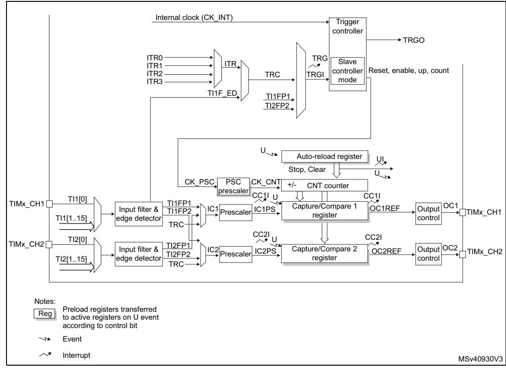

Figure 496. General-purpose timer block diagram (TIM12)

### 42.2.2 TIM13/TIM14 main features

The features of general-purpose timers TIM13/TIM14 include:

- 16-bit auto-reload upcounter
- 16-bit programmable prescaler used to divide the counter clock frequency by any factor between 1 and 65536 (can be changed "on the fly")
- independent channel for:
  - Input capture
  - Output compare
  - PWM generation (edge-aligned mode)
  - One-pulse mode output
- Interrupt generation on the following events:
  - Update: counter overflow, counter initialization (by software)
  - Input capture
  - Output compare

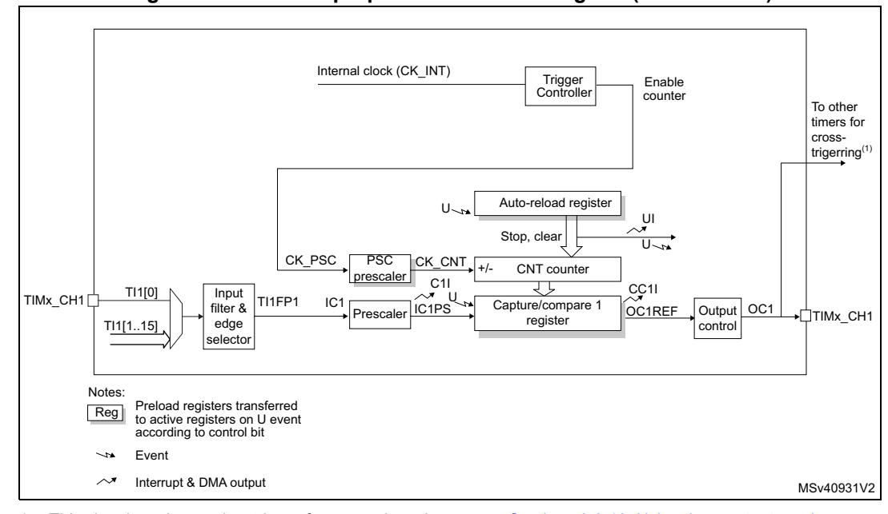

Figure 497. General-purpose timer block diagram (TIM13/TIM14)

1. This signal can be used as trigger for some slave timers, see Section 42.3.18: Using timer output as trigger for other timers (TIM13/TIM14).

# **42.3 TIM12/TIM13/TIM14 functional description**

## <span id="page-3-0"></span>**42.3.1 Time-base unit**

The main block of the timer is a 16-bit up-counter with its related auto-reload register. The counter clock can be divided by a prescaler.

The counter, the auto-reload register and the prescaler register can be written or read by software. This is true even when the counter is running.

The time-base unit includes:

- Counter register (TIMx\_CNT)
- Prescaler register (TIMx\_PSC)
- Auto-reload register (TIMx\_ARR)

The auto-reload register is preloaded. Writing to or reading from the auto-reload register accesses the preload register. The content of the preload register are transferred into the shadow register permanently or at each update event (UEV), depending on the auto-reload preload enable bit (ARPE) in TIMx\_CR1 register. The update event is sent when the counter reaches the overflow and if the UDIS bit equals 0 in the TIMx\_CR1 register. It can also be generated by software. The generation of the update event is described in details for each configuration.

The counter is clocked by the prescaler output CK\_CNT, which is enabled only when the counter enable bit (CEN) in TIMx\_CR1 register is set (refer also to the slave mode controller description to get more details on counter enabling).

Note that the counter starts counting 1 clock cycle after setting the CEN bit in the TIMx\_CR1 register.

### **Prescaler description**

The prescaler can divide the counter clock frequency by any factor between 1 and 65536. It is based on a 16-bit counter controlled through a 16-bit register (in the TIMx\_PSC register). It can be changed on the fly as this control register is buffered. The new prescaler ratio is taken into account at the next update event.

*[Figure 498](#page-4-0)* and *[Figure 499](#page-4-1)* give some examples of the counter behavior when the prescaler ratio is changed on the fly.


RM0399 Rev 4 1861/3556

<span id="page-4-0"></span>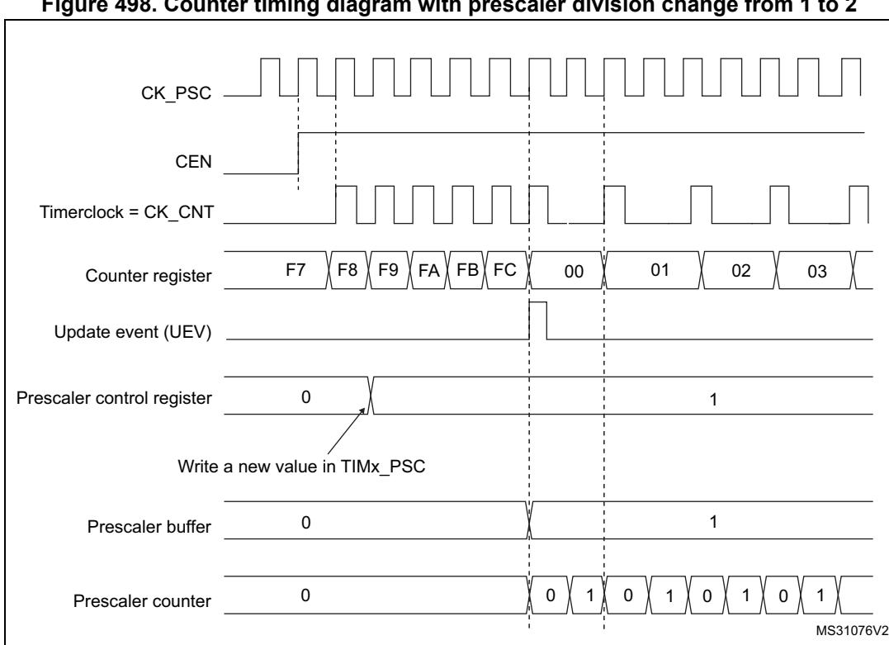

**Figure 498. Counter timing diagram with prescaler division change from 1 to 2**


<span id="page-4-1"></span>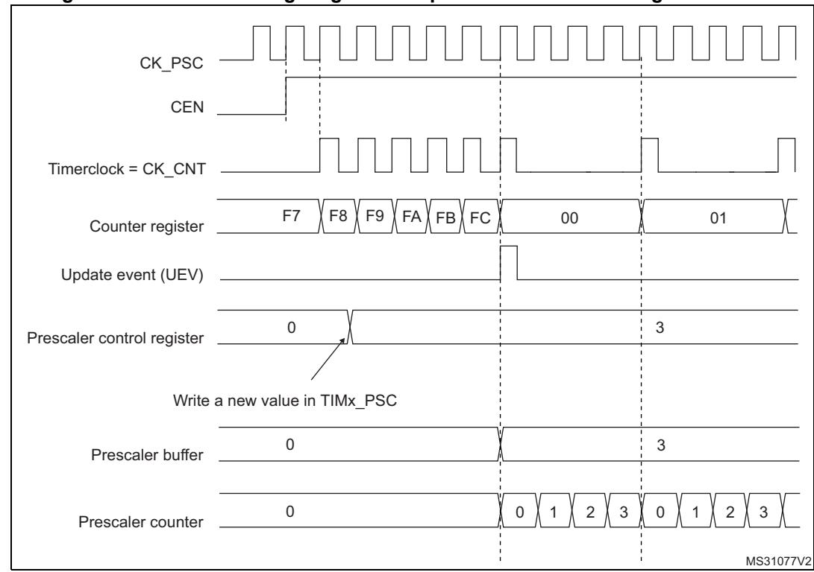

# **42.3.2 Counter modes**

### **Upcounting mode**

In upcounting mode, the counter counts from 0 to the auto-reload value (content of the TIMx\_ARR register), then restarts from 0 and generates a counter overflow event.

Setting the UG bit in the TIMx\_EGR register (by software or by using the slave mode controller on TIM12) also generates an update event.

The UEV event can be disabled by software by setting the UDIS bit in the TIMx\_CR1 register. This is to avoid updating the shadow registers while writing new values in the preload registers. Then no update event occurs until the UDIS bit has been written to 0. However, the counter restarts from 0, as well as the counter of the prescaler (but the prescale rate does not change). In addition, if the URS bit (update request selection) in TIMx\_CR1 register is set, setting the UG bit generates an update event UEV but without setting the UIF flag (thus no interrupt is sent). This is to avoid generating both update and capture interrupts when clearing the counter on the capture event.

When an update event occurs, all the registers are updated and the update flag (UIF bit in TIMx\_SR register) is set (depending on the URS bit):

- The auto-reload shadow register is updated with the preload value (TIMx\_ARR),
- The buffer of the prescaler is reloaded with the preload value (content of the TIMx\_PSC register).

The following figures show some examples of the counter behavior for different clock frequencies when TIMx\_ARR=0x36.

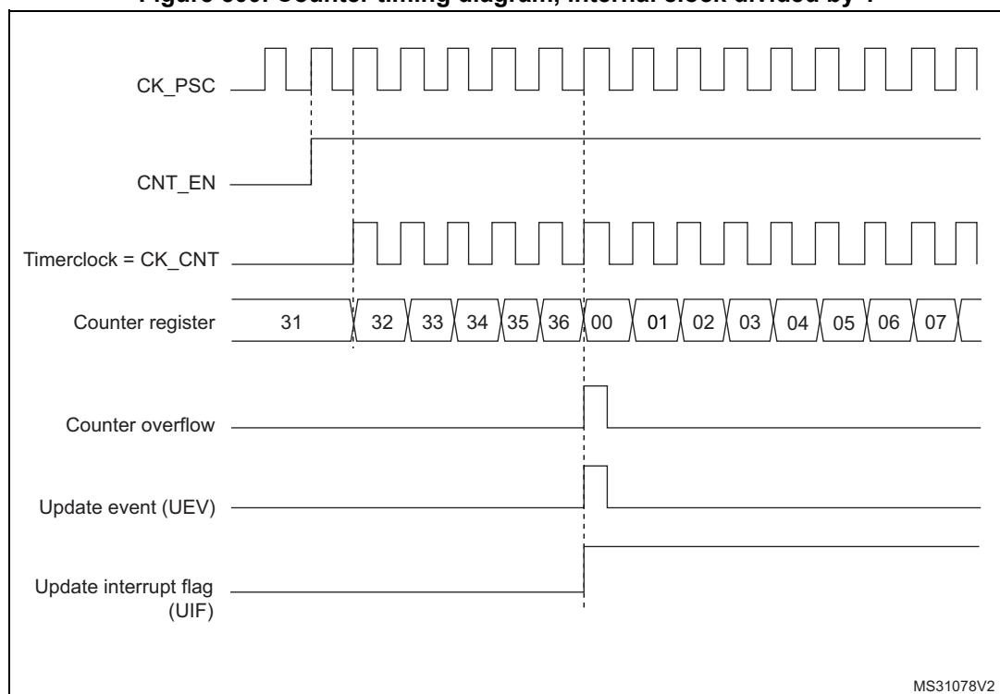

**Figure 500. Counter timing diagram, internal clock divided by 1**

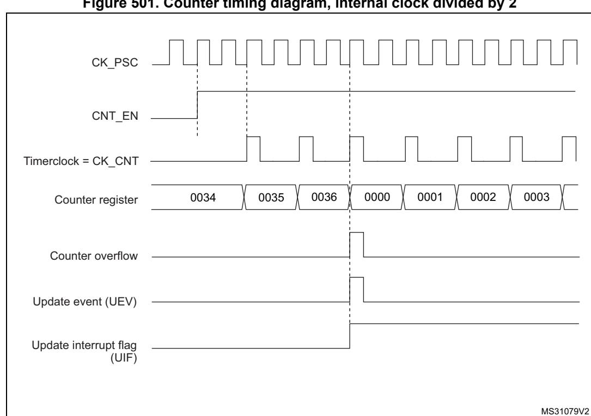

**Figure 501. Counter timing diagram, internal clock divided by 2**


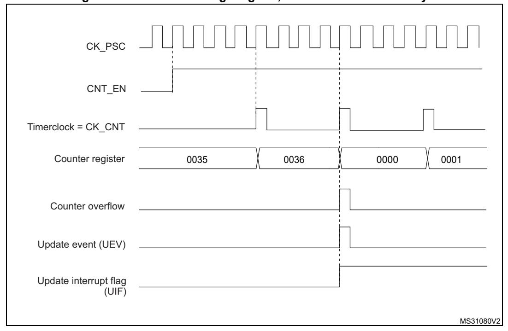

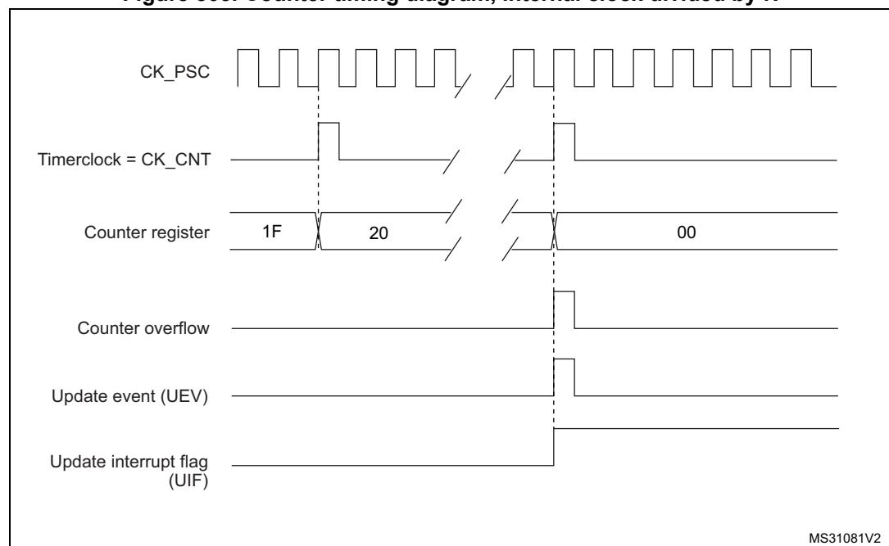

**Figure 503. Counter timing diagram, internal clock divided by N**


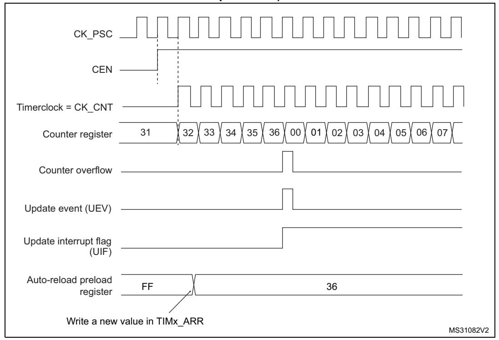

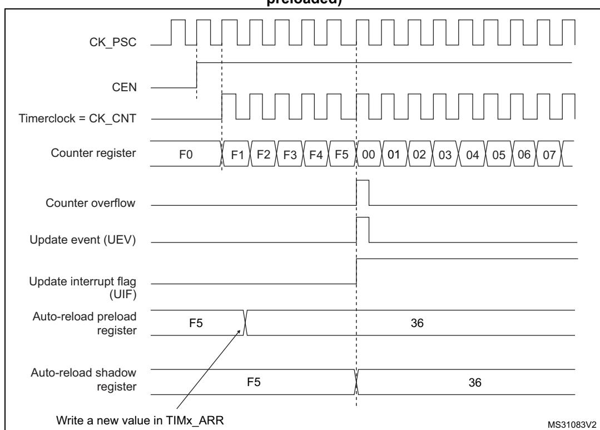

**Figure 505. Counter timing diagram, update event when ARPE=1 (TIMx\_ARR preloaded)**

# **42.3.3 Clock selection**

The counter clock can be provided by the following clock sources:

- Internal clock (CK\_INT)
- External clock mode1 (for TIM12): external input pin (TIx)
- Internal trigger inputs (ITRx) (for TIM12): connecting the trigger output from another timer. For instance, another timer can be configured as a prescaler for TIM12. Refer to *Section : Using one timer as prescaler for another timer* for more details.

### **Internal clock source (CK\_INT)**

The internal clock source is the default clock source for TIM13/TIM14.

For TIM12, the internal clock source is selected when the slave mode controller is disabled (SMS='000'). The CEN bit in the TIMx\_CR1 register and the UG bit in the TIMx\_EGR register are then used as control bits and can be changed only by software (except for UG which remains cleared). As soon as the CEN bit is programmed to 1, the prescaler is clocked by the internal clock CK\_INT.

*[Figure 506](#page-9-0)* shows the behavior of the control circuit and the upcounter in normal mode, without prescaler.

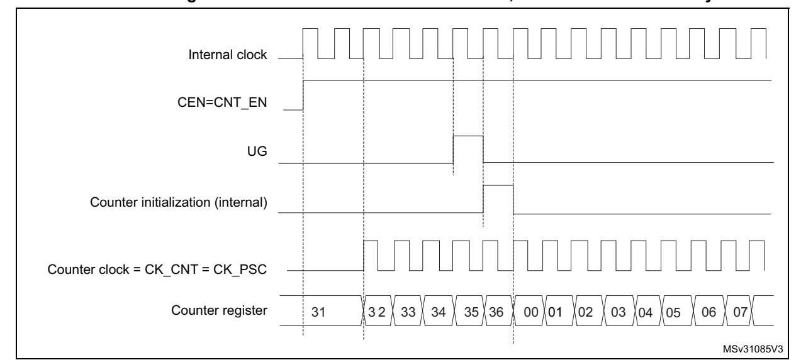

<span id="page-9-0"></span>**Figure 506. Control circuit in normal mode, internal clock divided by 1**

## **External clock source mode 1 (TIM12)**

This mode is selected when SMS='111' in the TIMx\_SMCR register. The counter can count at each rising or falling edge on a selected input.

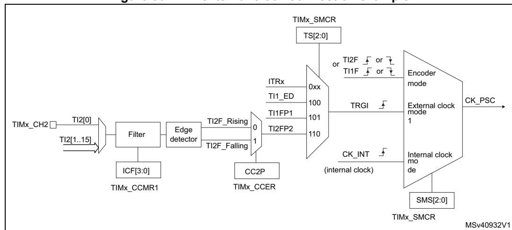

**Figure 507. TI2 external clock connection example**

For example, to configure the upcounter to count in response to a rising edge on the TI2 input, use the following procedure:

- 1. Select the proper TI2[x] source (internal or external) with the TI2SEL[3:0] bits in the TIMx\_TISEL register.
- 2. Configure channel 2 to detect rising edges on the TI2 input by writing CC2S = '01' in the TIMx\_CCMR1 register.
- 3. Configure the input filter duration by writing the IC2F[3:0] bits in the TIMx\_CCMR1 register (if no filter is needed, keep IC2F='0000').
- 4. Select the rising edge polarity by writing CC2P='0' and CC2NP='0' in the TIMx\_CCER register.
- 5. Configure the timer in external clock mode 1 by writing SMS='111' in the TIMx\_SMCR register.
- 6. Select TI2 as the trigger input source by writing TS='110' in the TIMx\_SMCR register.
- 7. Enable the counter by writing CEN='1' in the TIMx\_CR1 register.

*Note: The capture prescaler is not used for triggering, so it does not need to be configured.* 

When a rising edge occurs on TI2, the counter counts once and the TIF flag is set.

The delay between the rising edge on TI2 and the actual clock of the counter is due to the resynchronization circuit on TI2 input.

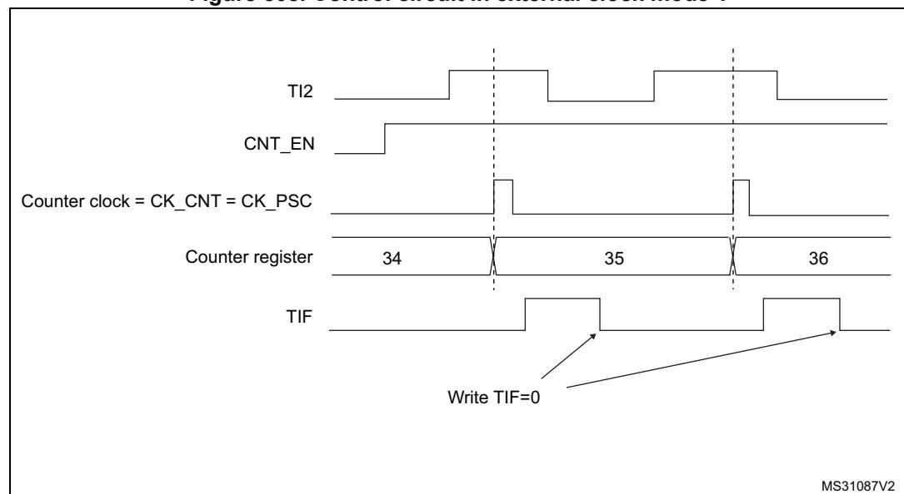

**Figure 508. Control circuit in external clock mode 1**

## **42.3.4 Capture/compare channels**

Each Capture/Compare channel is built around a capture/compare register (including a shadow register), a input stage for capture (with digital filter, multiplexing and prescaler) and an output stage (with comparator and output control).

*[Figure 509](#page-11-0)* to *[Figure 511](#page-12-0)* give an overview of one capture/compare channel.

The input stage samples the corresponding TIx input to generate a filtered signal TIxF. Then, an edge detector with polarity selection generates a signal (TIxFPx) which can be used as trigger input by the slave mode controller or as the capture command. It is prescaled before the capture register (ICxPS).


<span id="page-11-0"></span>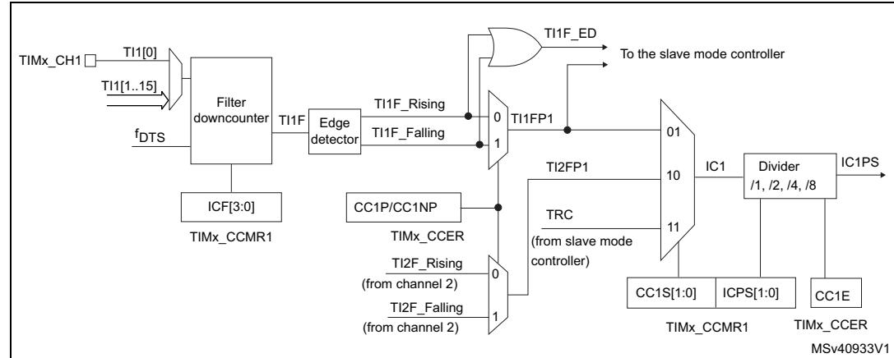

Figure 509. Capture/compare channel (example: channel 1 input stage)

The output stage generates an intermediate waveform which is then used for reference: OCxRef (active high). The polarity acts at the end of the chain.

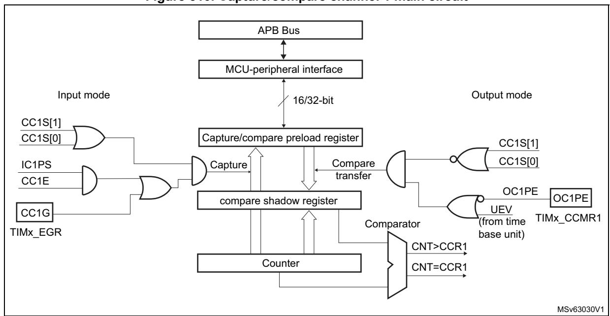

Figure 510. Capture/compare channel 1 main circuit

<span id="page-12-0"></span>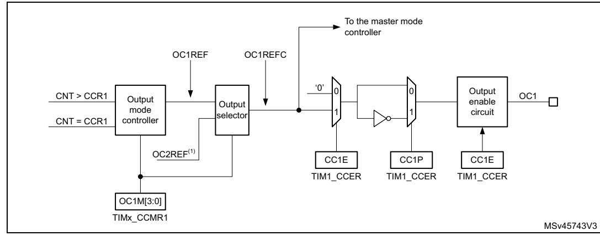

**Figure 511. Output stage of capture/compare channel (channel 1)**

1. Available on TIM12 only.

The capture/compare block is made of one preload register and one shadow register. Write and read always access the preload register.

In capture mode, captures are actually done in the shadow register, which is copied into the preload register.

In compare mode, the content of the preload register is copied into the shadow register which is compared to the counter.

## **42.3.5 Input capture mode**

In Input capture mode, the Capture/Compare Registers (TIMx\_CCRx) are used to latch the value of the counter after a transition detected by the corresponding ICx signal. When a capture occurs, the corresponding CCXIF flag (TIMx\_SR register) is set and an interrupt or a DMA request can be sent if they are enabled. If a capture occurs while the CCxIF flag was already high, then the over-capture flag CCxOF (TIMx\_SR register) is set. CCxIF can be cleared by software by writing it to '0' or by reading the captured data stored in the TIMx\_CCRx register. CCxOF is cleared when it is written with 0.

The following example shows how to capture the counter value in TIMx\_CCR1 when TI1 input rises. To do this, use the following procedure:

- 1. Select the proper TI1[x] source (internal or external) with the TI1SEL[3:0] bits in the TIMx\_TISEL register.
- 2. Select the active input: TIMx\_CCR1 must be linked to the TI1 input, so write the CC1S bits to '01' in the TIMx\_CCMR1 register. As soon as CC1S becomes different from '00', the channel is configured in input mode and the TIMx\_CCR1 register becomes readonly.
- 3. Program the appropriate input filter duration in relation with the signal connected to the timer (by programming the ICxF bits in the TIMx\_CCMRx register if the input is one of the TIx inputs). Let's imagine that, when toggling, the input signal is not stable during at must 5 internal clock cycles. We must program a filter duration longer than these 5 clock cycles. We can validate a transition on TI1 when 8 consecutive samples with the


- new level have been detected (sampled at fDTS frequency). Then write IC1F bits to '0011' in the TIMx\_CCMR1 register.
- 4. Select the edge of the active transition on the TI1 channel by programming CC1P and CC1NP bits to '00' in the TIMx\_CCER register (rising edge in this case).
- 5. Program the input prescaler. In our example, we wish the capture to be performed at each valid transition, so the prescaler is disabled (write IC1PS bits to '00' in the TIMx\_CCMR1 register).
- 6. Enable capture from the counter into the capture register by setting the CC1E bit in the TIMx\_CCER register.
- 7. If needed, enable the related interrupt request by setting the CC1IE bit in the TIMx\_DIER register.

When an input capture occurs:

- The TIMx\_CCR1 register gets the value of the counter on the active transition.
- CC1IF flag is set (interrupt flag). CC1OF is also set if at least two consecutive captures occurred whereas the flag was not cleared.
- An interrupt is generated depending on the CC1IE bit.

In order to handle the overcapture, it is recommended to read the data before the overcapture flag. This is to avoid missing an overcapture which could happen after reading the flag and before reading the data.

*Note: IC interrupt requests can be generated by software by setting the corresponding CCxG bit in the TIMx\_EGR register.*

# **42.3.6 PWM input mode (only for TIM12)**

This mode is a particular case of input capture mode. The procedure is the same except:

- Two ICx signals are mapped on the same TIx input.
- These 2 ICx signals are active on edges with opposite polarity.
- One of the two TIxFP signals is selected as trigger input and the slave mode controller is configured in reset mode.

For example, one can measure the period (in TIMx\_CCR1 register) and the duty cycle (in TIMx\_CCR2 register) of the PWM applied on TI1 using the following procedure (depending on CK\_INT frequency and prescaler value):


RM0399 Rev 4 1871/3556

- 1. Select the proper TI1[x] source (internal or external) with the TI1SEL[3:0] bits in the TIMx\_TISEL register.
- 2. Select the active input for TIMx\_CCR1: write the CC1S bits to '01' in the TIMx\_CCMR1 register (TI1 selected).
- 3. Select the active polarity for TI1FP1 (used both for capture in TIMx\_CCR1 and counter clear): program the CC1P and CC1NP bits to '00' (active on rising edge).
- 4. Select the active input for TIMx\_CCR2: write the CC2S bits to '10' in the TIMx\_CCMR1 register (TI1 selected).
- 5. Select the active polarity for TI1FP2 (used for capture in TIMx\_CCR2): program the CC2P and CC2NP bits to '10' (active on falling edge).
- 6. Select the valid trigger input: write the TS bits to '00101' in the TIMx\_SMCR register (TI1FP1 selected).
- 7. Configure the slave mode controller in reset mode: write the SMS bits to '100' in the TIMx\_SMCR register.
- 8. Enable the captures: write the CC1E and CC2E bits to '1' in the TIMx\_CCER register.

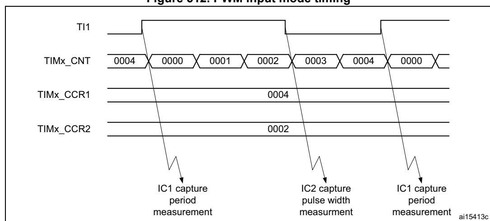

**Figure 512. PWM input mode timing**

1. The PWM input mode can be used only with the TIMx\_CH1/TIMx\_CH2 signals due to the fact that only TI1FP1 and TI2FP2 are connected to the slave mode controller.

# **42.3.7 Forced output mode**

In output mode (CCxS bits = '00' in the TIMx\_CCMRx register), each output compare signal (OCxREF and then OCx) can be forced to active or inactive level directly by software, independently of any comparison between the output compare register and the counter.

To force an output compare signal (OCXREF/OCx) to its active level, one just needs to write '0101' in the OCxM bits in the corresponding TIMx\_CCMRx register. Thus OCXREF is forced high (OCxREF is always active high) and OCx get opposite value to CCxP polarity bit.

For example: CCxP='0' (OCx active high) => OCx is forced to high level.

The OCxREF signal can be forced low by writing the OCxM bits to '0100' in the TIMx\_CCMRx register.


Anyway, the comparison between the TIMx\_CCRx shadow register and the counter is still performed and allows the flag to be set. Interrupt requests can be sent accordingly. This is described in the output compare mode section below.

# **42.3.8 Output compare mode**

This function is used to control an output waveform or indicating when a period of time has elapsed.

When a match is found between the capture/compare register and the counter, the output compare function:

- 1. Assigns the corresponding output pin to a programmable value defined by the output compare mode (OCxM bits in the TIMx\_CCMRx register) and the output polarity (CCxP bit in the TIMx\_CCER register). The output pin can keep its level (OCxM='0000'), be set active (OCxM='0001'), be set inactive (OCxM='0010') or can toggle (OCxM='0011') on match.
- 2. Sets a flag in the interrupt status register (CCxIF bit in the TIMx\_SR register).
- 3. Generates an interrupt if the corresponding interrupt mask is set (CCXIE bit in the TIMx\_DIER register).

The TIMx\_CCRx registers can be programmed with or without preload registers using the OCxPE bit in the TIMx\_CCMRx register.

In output compare mode, the update event UEV has no effect on OCxREF and OCx output. The timing resolution is one count of the counter. Output compare mode can also be used to output a single pulse (in One-pulse mode).

### Procedure:

- 1. Select the counter clock (internal, external, prescaler).
- 2. Write the desired data in the TIMx\_ARR and TIMx\_CCRx registers.
- 3. Set the CCxIE bit if an interrupt request is to be generated.
- 4. Select the output mode. For example:
  - Write OCxM = '0011' to toggle OCx output pin when CNT matches CCRx
  - Write OCxPE = '0' to disable preload register
  - Write CCxP = '0' to select active high polarity
  - Write CCxE = '1' to enable the output
- 5. Enable the counter by setting the CEN bit in the TIMx\_CR1 register.

The TIMx\_CCRx register can be updated at any time by software to control the output waveform, provided that the preload register is not enabled (OCxPE='0', else TIMx\_CCRx shadow register is updated only at the next update event UEV). An example is given in *[Figure 513](#page-16-0)*.


RM0399 Rev 4 1873/3556

<span id="page-16-0"></span>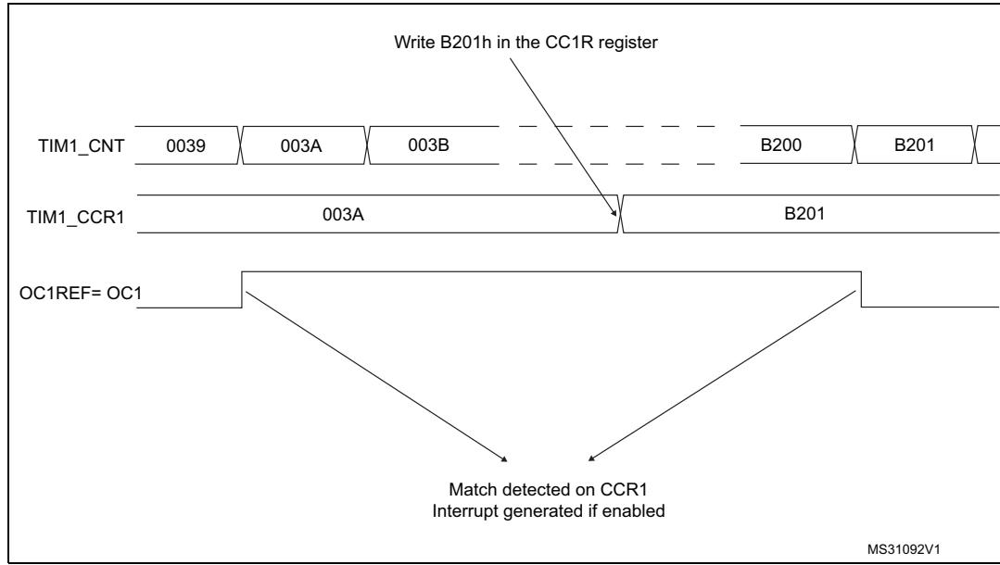

Figure 513. Output compare mode, toggle on OC1.

#### 42.3.9 PWM mode

Pulse Width Modulation mode allows to generate a signal with a frequency determined by the value of the TIMx\_ARR register and a duty cycle determined by the value of the TIMx\_CCRx register.

The PWM mode can be selected independently on each channel (one PWM per OCx output) by writing '0110' (PWM mode 1) or '0111' (PWM mode 2) in the OCxM bits in the TIMx\_CCMRx register. The corresponding preload register must be enabled by setting the OCxPE bit in the TIMx\_CCMRx register, and eventually the auto-reload preload register (in upcounting or center-aligned modes) by setting the ARPE bit in the TIMx\_CR1 register.

As the preload registers are transferred to the shadow registers only when an update event occurs, before starting the counter, all registers must be initialized by setting the UG bit in the TIMx\_EGR register.

The OCx polarity is software programmable using the CCxP bit in the TIMx\_CCER register. It can be programmed as active high or active low. The OCx output is enabled by the CCxE bit in the TIMx\_CCER register. Refer to the TIMx\_CCERx register description for more details.

In PWM mode (1 or 2), TIMx\_CNT and TIMx\_CCRx are always compared to determine whether TIMx\_CNT ≤ TIMx\_CCRx.

The timer is able to generate PWM in edge-aligned mode only since the counter is upcounting.

In the following example, we consider PWM mode 1. The reference PWM signal OCxREF is high as long as TIMx\_CNT < TIMx\_CCRx else it becomes low. If the compare value in TIMx\_CCRx is greater than the auto-reload value (in TIMx\_ARR) then OCxREF is held at '1'. If the compare value is 0 then OCxRef is held at '0'. *Figure 514* shows some edgealigned PWM waveforms in an example where TIMx\_ARR=8.


<span id="page-17-0"></span>

**Figure 514. Edge-aligned PWM waveforms (ARR=8)**

# **42.3.10 Combined PWM mode (TIM12 only)**

Combined PWM mode allows two edge or center-aligned PWM signals to be generated with programmable delay and phase shift between respective pulses. While the frequency is determined by the value of the TIMx\_ARR register, the duty cycle and delay are determined by the two TIMx\_CCRx registers. The resulting signals, OCxREFC, are made of an OR or AND logical combination of two reference PWMs:

• OC1REFC (or OC2REFC) is controlled by the TIMx\_CCR1 and TIMx\_CCR2 registers

Combined PWM mode can be selected independently on two channels (one OCx output per pair of CCR registers) by writing '1100' (Combined PWM mode 1) or '1101' (Combined PWM mode 2) in the OCxM bits in the TIMx\_CCMRx register.

When a given channel is used as a combined PWM channel, its complementary channel must be configured in the opposite PWM mode (for instance, one in Combined PWM mode 1 and the other in Combined PWM mode 2).

*Note: The OCxM[3:0] bit field is split into two parts for compatibility reasons, the most significant bit is not contiguous with the 3 least significant ones.*

> *[Figure 515](#page-18-0)* represents an example of signals that can be generated using combined PWM mode, obtained with the following configuration:

- Channel 1 is configured in Combined PWM mode 2,
- Channel 2 is configured in PWM mode 1,

<span id="page-18-0"></span>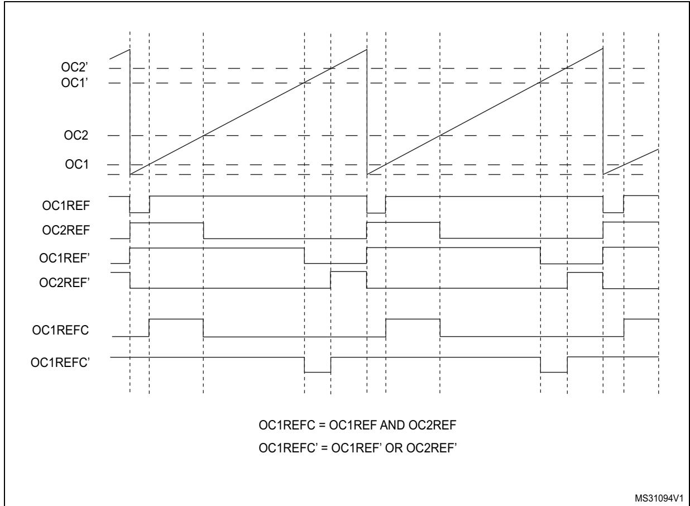

**Figure 515. Combined PWM mode on channel 1 and 2**

## <span id="page-18-1"></span>**42.3.11 One-pulse mode**

One-pulse mode (OPM) is a particular case of the previous modes. It allows the counter to be started in response to a stimulus and to generate a pulse with a programmable length after a programmable delay.

Starting the counter can be controlled through the slave mode controller. Generating the waveform can be done in output compare mode or PWM mode. One-pulse mode is selected by setting the OPM bit in the TIMx\_CR1 register. This makes the counter stop automatically at the next update event UEV.

A pulse can be correctly generated only if the compare value is different from the counter initial value. Before starting (when the timer is waiting for the trigger), the configuration must be as follows:

CNT < CCRx ≤ ARR (in particular, 0 < CCRx)

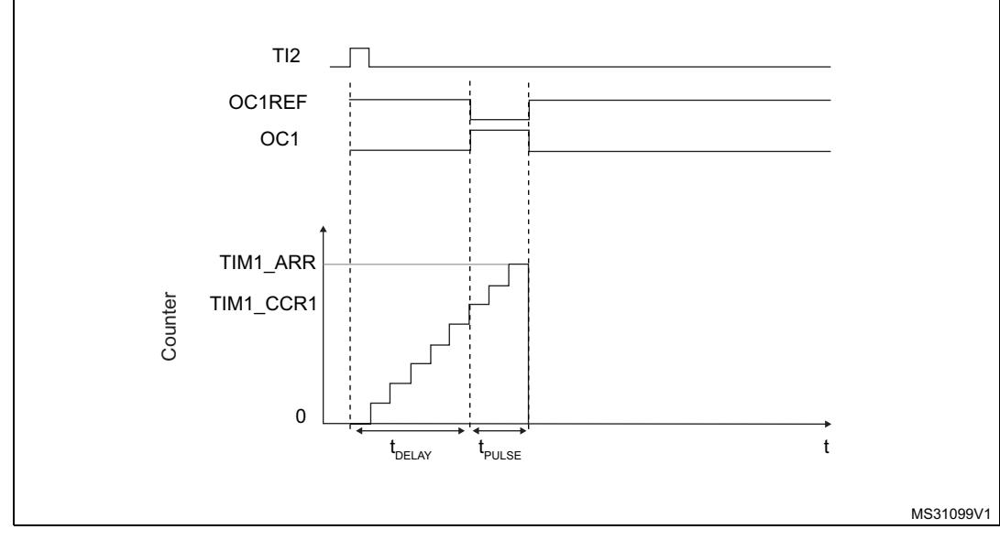

**Figure 516. Example of one pulse mode.**

For example one may want to generate a positive pulse on OC1 with a length of tPULSE and after a delay of tDELAY as soon as a positive edge is detected on the TI2 input pin.

Use TI2FP2 as trigger 1:

- 1. Select the proper TI2[x] source (internal or external) with the TI2SEL[3:0] bits in the TIMx\_TISEL register.
- 2. Map TI2FP2 to TI2 by writing CC2S='01' in the TIMx\_CCMR1 register.
- 3. TI2FP2 must detect a rising edge, write CC2P='0' and CC2NP='0' in the TIMx\_CCER register.
- 4. Configure TI2FP2 as trigger for the slave mode controller (TRGI) by writing TS='00110' in the TIMx\_SMCR register.
- 5. TI2FP2 is used to start the counter by writing SMS to '110' in the TIMx\_SMCR register (trigger mode).

The OPM waveform is defined by writing the compare registers (taking into account the clock frequency and the counter prescaler).

- The tDELAY is defined by the value written in the TIMx\_CCR1 register.
- The tPULSE is defined by the difference between the auto-reload value and the compare value (TIMx\_ARR - TIMx\_CCR1).
- Let's say one want to build a waveform with a transition from '0' to '1' when a compare match occurs and a transition from '1' to '0' when the counter reaches the auto-reload value. To do this PWM mode 2 must be enabled by writing OC1M='0111' in the TIMx\_CCMR1 register. Optionally the preload registers can be enabled by writing OC1PE='1' in the TIMx\_CCMR1 register and ARPE in the TIMx\_CR1 register. In this case one has to write the compare value in the TIMx\_CCR1 register, the auto-reload value in the TIMx\_ARR register, generate an update by setting the UG bit and wait for external trigger event on TI2. CC1P is written to '0' in this example.

Since only 1 pulse (Single mode) is needed, a 1 must be written in the OPM bit in the TIMx\_CR1 register to stop the counter at the next update event (when the counter rolls over from the auto-reload value back to 0). When OPM bit in the TIMx\_CR1 register is set to '0', so the Repetitive Mode is selected.


RM0399 Rev 4 1877/3556

### **Particular case: OCx fast enable**

In One-pulse mode, the edge detection on TIx input set the CEN bit which enables the counter. Then the comparison between the counter and the compare value makes the output toggle. But several clock cycles are needed for these operations and it limits the minimum delay tDELAY min we can get.

If one wants to output a waveform with the minimum delay, the OCxFE bit can be set in the TIMx\_CCMRx register. Then OCxRef (and OCx) are forced in response to the stimulus, without taking in account the comparison. Its new level is the same as if a compare match had occurred. OCxFE acts only if the channel is configured in PWM1 or PWM2 mode.

# **42.3.12 Retriggerable one pulse mode (TIM12 only)**

This mode allows the counter to be started in response to a stimulus and to generate a pulse with a programmable length, but with the following differences with non-retriggerable one pulse mode described in *[Section 42.3.11: One-pulse mode](#page-18-1)*:

- The pulse starts as soon as the trigger occurs (no programmable delay)
- The pulse is extended if a new trigger occurs before the previous one is completed

The timer must be in Slave mode, with the bits SMS[3:0] = '1000' (Combined Reset + trigger mode) in the TIMx\_SMCR register, and the OCxM[3:0] bits set to '1000' or '1001' for retrigerrable OPM mode 1 or 2.

If the timer is configured in up-counting mode, the corresponding CCRx must be set to 0 (the ARR register sets the pulse length). If the timer is configured in down-counting mode, CCRx must be above or equal to ARR.

*Note: The OCxM[3:0] and SMS[3:0] bit fields are split into two parts for compatibility reasons, the most significant bit are not contiguous with the 3 least significant ones.*

> *This mode must not be used with center-aligned PWM modes. It is mandatory to have CMS[1:0] = 00 in TIMx\_CR1.*

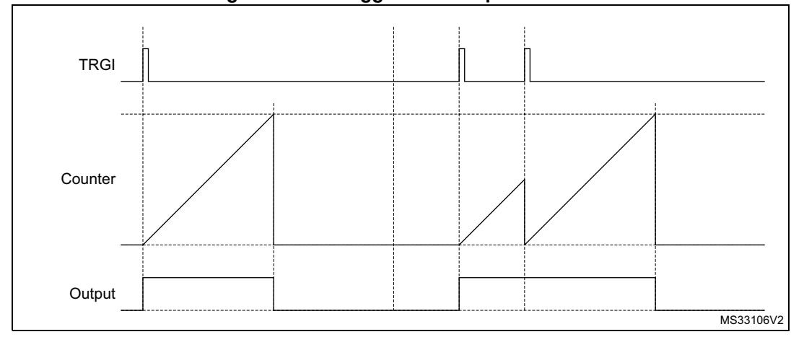

**Figure 517. Retriggerable one pulse mode**

## **42.3.13 UIF bit remapping**

The IUFREMAP bit in the TIMx\_CR1 register forces a continuous copy of the Update Interrupt Flag UIF into bit 31 of the timer counter register (TIMxCNT[31]). This allows to atomically read both the counter value and a potential roll-over condition signaled by the


UIFCPY flag. In particular cases, it can ease the calculations by avoiding race conditions caused for instance by a processing shared between a background task (counter reading) and an interrupt (Update Interrupt).

There is no latency between the assertions of the UIF and UIFCPY flags.

## **42.3.14 Timer input XOR function**

The TI1S bit in the TIMx\_CR2 register, allows the input filter of channel 1 to be connected to the output of a XOR gate, combining the two input pins TIMx\_CH1 and TIMx\_CH2.

The XOR output can be used with all the timer input functions such as trigger or input capture. It is useful for measuring the interval between the edges on two input signals, as shown in *[Figure 518](#page-21-0)*.

<span id="page-21-0"></span>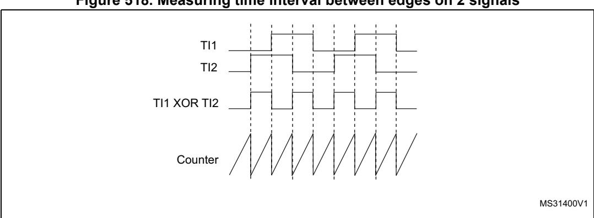

**Figure 518. Measuring time interval between edges on 2 signals**

# **42.3.15 TIM12 external trigger synchronization**

The TIM12 timer can be synchronized with an external trigger in several modes: Reset mode, Gated mode and Trigger mode.

### **Slave mode: Reset mode**

The counter and its prescaler can be reinitialized in response to an event on a trigger input. Moreover, if the URS bit from the TIMx\_CR1 register is low, an update event UEV is generated. Then all the preloaded registers (TIMx\_ARR, TIMx\_CCRx) are updated.

In the following example, the upcounter is cleared in response to a rising edge on TI1 input:

- 1. Configure the channel 1 to detect rising edges on TI1. Configure the input filter duration (in this example, we do not need any filter, so we keep IC1F='0000'). The capture prescaler is not used for triggering, so it does not need to be configured. The CC1S bits select the input capture source only, CC1S = '01' in the TIMx\_CCMR1 register. Program CC1P and CC1NP to '00' in TIMx\_CCER register to validate the polarity (and detect rising edges only).
- 2. Configure the timer in reset mode by writing SMS='100' in TIMx\_SMCR register. Select TI1 as the input source by writing TS='00101' in TIMx\_SMCR register.
- 3. Start the counter by writing CEN='1' in the TIMx\_CR1 register.

The counter starts counting on the internal clock, then behaves normally until TI1 rising edge. When TI1 rises, the counter is cleared and restarts from 0. In the meantime, the

RM0399 Rev 4 1879/3556

trigger flag is set (TIF bit in the TIMx\_SR register) and an interrupt request can be sent if enabled (depending on the TIE bit in TIMx\_DIER register).

The following figure shows this behavior when the auto-reload register TIMx\_ARR=0x36. The delay between the rising edge on TI1 and the actual reset of the counter is due to the resynchronization circuit on TI1 input.

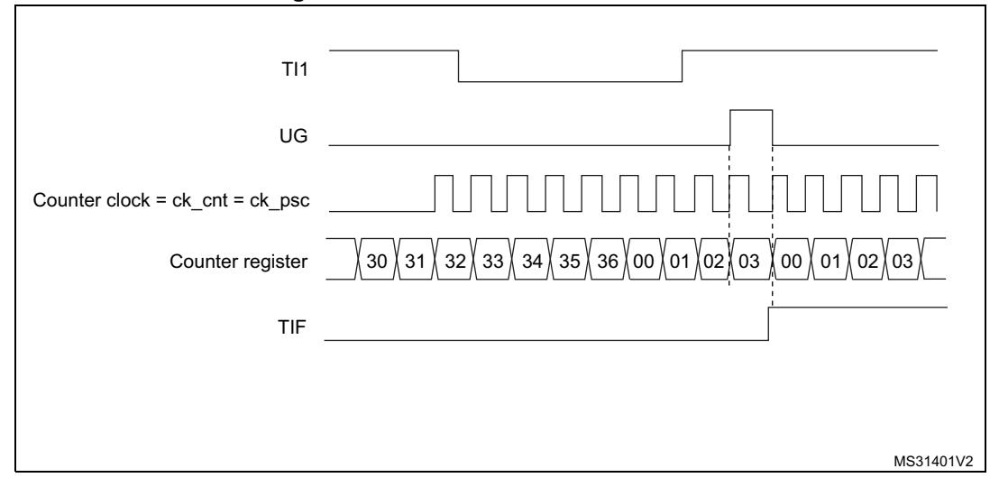

Figure 519. Control circuit in reset mode

#### Slave mode: Gated mode

The counter can be enabled depending on the level of a selected input.

In the following example, the upcounter counts only when TI1 input is low:

- Configure the channel 1 to detect low levels on TI1. Configure the input filter duration (in this example, we do not need any filter, so we keep IC1F='0000'). The capture prescaler is not used for triggering, so it does not need to be configured. The CC1S bits select the input capture source only, CC1S='01' in TIMx\_CCMR1 register. Program CC1P='1' and CC1NP='0' in TIMx\_CCER register to validate the polarity (and detect low level only).
- 2. Configure the timer in gated mode by writing SMS='101' in TIMx\_SMCR register. Select TI1 as the input source by writing TS='00101' in TIMx\_SMCR register.
- 3. Enable the counter by writing CEN='1' in the TIMx\_CR1 register (in gated mode, the counter doesn't start if CEN='0', whatever is the trigger input level).

The counter starts counting on the internal clock as long as TI1 is low and stops as soon as TI1 becomes high. The TIF flag in the TIMx\_SR register is set both when the counter starts or stops.

The delay between the rising edge on TI1 and the actual stop of the counter is due to the resynchronization circuit on TI1 input.


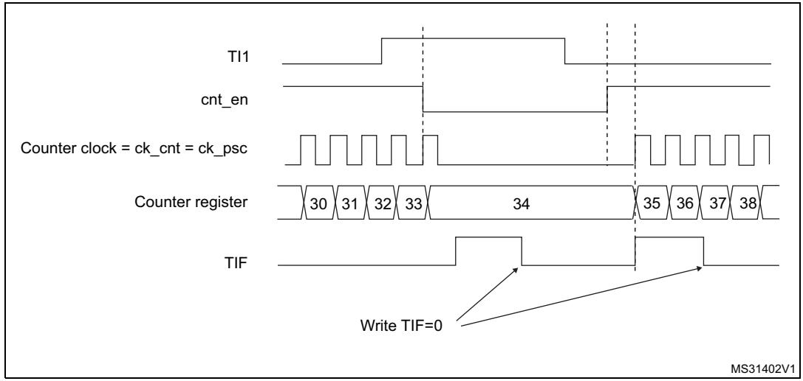

**Figure 520. Control circuit in gated mode**

### **Slave mode: Trigger mode**

The counter can start in response to an event on a selected input.

In the following example, the upcounter starts in response to a rising edge on TI2 input:

- 1. Configure the channel 2 to detect rising edges on TI2. Configure the input filter duration (in this example, we do not need any filter, so we keep IC2F='0000'). The capture prescaler is not used for triggering, so it does not need to be configured. The CC2S bits are configured to select the input capture source only, CC2S='01' in TIMx\_CCMR1 register. Program CC2P='1' and CC2NP='0' in TIMx\_CCER register to validate the polarity (and detect low level only).
- 2. Configure the timer in trigger mode by writing SMS='110' in TIMx\_SMCR register. Select TI2 as the input source by writing TS='00110' in TIMx\_SMCR register.

When a rising edge occurs on TI2, the counter starts counting on the internal clock and the TIF flag is set.

The delay between the rising edge on TI2 and the actual start of the counter is due to the resynchronization circuit on TI2 input.

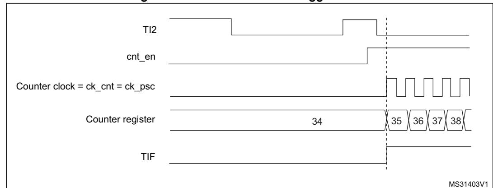

**Figure 521. Control circuit in trigger mode**

# **42.3.16 Slave mode – combined reset + trigger mode**

In this case, a rising edge of the selected trigger input (TRGI) reinitializes the counter, generates an update of the registers, and starts the counter.

This mode is used for one-pulse mode.


# <span id="page-25-0"></span>**42.3.17 Timer synchronization (TIM12)**

The TIM timers are linked together internally for timer synchronization or chaining. Refer to *Section 41.3.19: Timer synchronization* for details.

*Note: The clock of the slave timer must be enabled prior to receive events from the master timer, and must not be changed on-the-fly while triggers are received from the master timer.*

## <span id="page-25-1"></span>**42.3.18 Using timer output as trigger for other timers (TIM13/TIM14)**

The timers with one channel only do not feature a master mode. However, the OC1 output signal can be used to trigger some other timers (including timers described in other sections of this document). Check the "TIMx internal trigger connection" table of any TIMx\_SMCR register on the device to identify which timers can be targeted as slave.

The OC1 signal pulse width must be programmed to be at least 2 clock cycles of the destination timer, to make sure the slave timer will detect the trigger.

For instance, if the destination's timer CK\_INT clock is 4 times slower than the source timer, the OC1 pulse width must be 8 clock cycles.

# **42.3.19 Debug mode**

When the microcontroller enters debug mode (Cortex®-M7 with FPU core halted), the TIMx counter either continues to work normally or stops, depending on DBG\_TIMx\_STOP configuration bit in DBGMCU module. For more details, refer to *Section 63.5.8: Microcontroller debug unit (DBGMCU)*.

# **42.4 TIM12 registers**

Refer to *Section 1.2* for a list of abbreviations used in register descriptions.

The peripheral registers have to be written by half-words (16 bits) or words (32 bits). Read accesses can be done by bytes (8 bits), half-words (16 bits) or words (32 bits).

# **42.4.1 TIM12 control register 1 (TIM12\_CR1)**

Address offset: 0x00 Reset value: 0x0000

| 15   | 14   | 13   | 12   | 11           | 10   | 9        | 8  | 7    | 6    | 5    | 4    | 3   | 2   | 1    | 0   |
|------|------|------|------|--------------|------|----------|----|------|------|------|------|-----|-----|------|-----|
| Res. | Res. | Res. | Res. | UIFRE<br>MAP | Res. | CKD[1:0] |    | ARPE | Res. | Res. | Res. | OPM | URS | UDIS | CEN |
|      |      |      |      | rw           |      | rw       | rw | rw   |      |      |      | rw  | rw  | rw   | rw  |

Bits 15:12 Reserved, must be kept at reset value.

Bit 11 **UIFREMAP**: UIF status bit remapping

- 0: No remapping. UIF status bit is not copied to TIMx\_CNT register bit 31.
- 1: Remapping enabled. UIF status bit is copied to TIMx\_CNT register bit 31.

Bit 10 Reserved, must be kept at reset value.


RM0399 Rev 4 1883/3556

#### Bits 9:8 **CKD[1:0]**: Clock division

This bit-field indicates the division ratio between the timer clock (CK\_INT) frequency and sampling clock used by the digital filters (TIx),

00: tDTS = tCK\_INT 01: tDTS = 2 × tCK\_INT 10: tDTS = 4 × tCK\_INT 11: Reserved

#### Bit 7 **ARPE**: Auto-reload preload enable

- 0: TIMx\_ARR register is not buffered.
- 1: TIMx\_ARR register is buffered.

### Bits 6:4 Reserved, must be kept at reset value.

#### Bit 3 **OPM**: One-pulse mode

- 0: Counter is not stopped on the update event
- 1: Counter stops counting on the next update event (clearing the CEN bit).

#### Bit 2 **URS**: Update request source

This bit is set and cleared by software to select the UEV event sources.

- 0: Any of the following events generates an update interrupt if enabled. These events can be:
  - Counter overflow
  - Setting the UG bit
  - Update generation through the slave mode controller
- 1: Only counter overflow generates an update interrupt if enabled.

#### Bit 1 **UDIS**: Update disable

This bit is set and cleared by software to enable/disable update event (UEV) generation.

- 0: UEV enabled. An UEV is generated by one of the following events:
  - Counter overflow
  - Setting the UG bit

Buffered registers are then loaded with their preload values.

1: UEV disabled. No UEV is generated, shadow registers keep their value (ARR, PSC, CCRx). The counter and the prescaler are reinitialized if the UG bit is set.

#### Bit 0 **CEN**: Counter enable

- 0: Counter disabled
- 1: Counter enabled

CEN is cleared automatically in one-pulse mode, when an update event occurs.

*Note: External clock and gated mode can work only if the CEN bit has been previously set by* software. However trigger mode can set the CEN bit automatically by hardware.

# **42.4.2 TIM12 control register 2 (TIM12\_CR2)**

Address offset: 0x04 Reset value: 0x0000

| 15   | 14   | 13   | 12   | 11   | 10   | 9    | 8    | 7    | 6        | 5  | 4  | 3    | 2    | 1    | 0    |
|------|------|------|------|------|------|------|------|------|----------|----|----|------|------|------|------|
| Res. | Res. | Res. | Res. | Res. | Res. | Res. | Res. | TI1S | MMS[2:0] |    |    | Res. | Res. | Res. | Res. |
|      |      |      |      |      |      |      |      | rw   | rw       | rw | rw |      |      |      |      |


Bits 15:8 Reserved, must be kept at reset value.

#### Bit 7 **TI1S**: TI1 selection

0: The TIM12\_CH1 pin is connected to TI1 input

1: The TIM12\_CH1, CH2 pins are connected to the TI1 input (XOR combination)

#### Bits 6:4 **MMS[2:0]**: Master mode selection

These bits allow to select the information to be sent in master mode to slave timers for synchronization (TRGO). The combination is as follows:

- 000: Reset the UG bit from the TIMx\_EGR register is used as trigger output (TRGO). If the reset is generated by the trigger input (slave mode controller configured in reset mode) then the signal on TRGO is delayed compared to the actual reset.
- 001: Enable the Counter Enable signal CNT\_EN is used as trigger output (TRGO). It is useful to start several timers at the same time or to control a window in which a slave timer is enable. The Counter Enable signal is generated by a logic AND between CEN control bit and the trigger input when configured in gated mode. When the Counter Enable signal is controlled by the trigger input, there is a delay on TRGO, except if the master/slave mode is selected (see the MSM bit description in TIMx\_SMCR register).
- 010: Update The update event is selected as trigger output (TRGO). For instance a master timer can then be used as a prescaler for a slave timer.
- 011: Compare Pulse The trigger output send a positive pulse when the CC1IF flag is to be set (even if it was already high), as soon as a capture or a compare match occurred. (TRGO).
- 100: Compare OC1REFC signal is used as trigger output (TRGO).
- 101: Compare OC2REFC signal is used as trigger output (TRGO).

Bits 3:0 Reserved, must be kept at reset value.

# **42.4.3 TIM12 slave mode control register (TIM12\_SMCR)**

Address offset: 0x08

Reset value: 0x0000 0000

| 31   | 30   | 29   | 28   | 27   | 26   | 25   | 24   | 23   | 22      | 21      | 20   | 19       | 18   | 17   | 16     |
|------|------|------|------|------|------|------|------|------|---------|---------|------|----------|------|------|--------|
| Res. | Res. | Res. | Res. | Res. | Res. | Res. | Res. | Res. | Res.    | TS[4:3] |      | Res.     | Res. | Res. | SMS[3] |
|      |      |      |      |      |      |      |      |      |         | rw      | rw   |          |      |      | rw     |
| 15   | 14   | 13   | 12   | 11   | 10   | 9    | 8    | 7    | 6       | 5       | 4    | 3        | 2    | 1    | 0      |
| Res. | Res. | Res. | Res. | Res. | Res. | Res. | Res. | MSM  | TS[2:0] |         | Res. | SMS[2:0] |      |      |        |
|      |      |      |      |      |      |      |      | rw   | rw      | rw      | rw   |          | rw   | rw   | rw     |

- Bits 31:22 Reserved, must be kept at reset value.
- Bits 19:17 Reserved, must be kept at reset value.
- Bits 15:8 Reserved, must be kept at reset value.

### Bit 7 **MSM:** Master/Slave mode

- 0: No action
- 1: The effect of an event on the trigger input (TRGI) is delayed to allow a perfect synchronization between the current timer and its slaves (through TRGO). It is useful in order to synchronize several timers on a single external event.

RM0399 Rev 4 1885/3556

#### Bits 21, 20, 6, 5, 4 **TS[4:0]:** Trigger selection

This TS[4:0] bitfield selects the trigger input to be used to synchronize the counter.

00000: Internal Trigger 0 (ITR0)

00001: Internal Trigger 1 (ITR1)

00010: Internal Trigger 2 (ITR2)

00011: Internal Trigger 3 (ITR3)

00100: TI1 Edge Detector (TI1F\_ED)

00101: Filtered Timer Input 1 (TI1FP1)

00110: Filtered Timer Input 2 (TI2FP2)

Others: Reserved

See *[Table 361: TIMx internal trigger connection on page 1886](#page-28-0)* for more details on the meaning of ITRx for each timer.

*Note: These bits must be changed only when they are not used (e.g. when SMS='000') to avoid wrong edge detections at the transition.*

Bit 3 Reserved, must be kept at reset value.

### Bits 16, 2, 1, 0 **SMS[3:0]:** Slave mode selection

When external signals are selected the active edge of the trigger signal (TRGI) is linked to the polarity selected on the external input (see Input Control register and Control Register description.

0000: Slave mode disabled - if CEN = '1' then the prescaler is clocked directly by the internal clock.

0001: Reserved

0010: Reserved

0011: Reserved

0100: Reset Mode - Rising edge of the selected trigger input (TRGI) reinitializes the counter and generates an update of the registers.

0101: Gated Mode - The counter clock is enabled when the trigger input (TRGI) is high. The counter stops (but is not reset) as soon as the trigger becomes low. Both start and stop of the counter are controlled.

0110: Trigger Mode - The counter starts at a rising edge of the trigger TRGI (but it is not reset). Only the start of the counter is controlled.

0111: External Clock Mode 1 - Rising edges of the selected trigger (TRGI) clock the counter.

1000: Combined reset + trigger mode - Rising edge of the selected trigger input (TRGI) reinitializes the counter, generates an update of the registers and starts the counter.

Other codes: reserved.

*Note: The gated mode must not be used if TI1F\_ED is selected as the trigger input (TS='00100'). Indeed, TI1F\_ED outputs 1 pulse for each transition on TI1F, whereas the gated mode checks the level of the trigger signal.*

*Note: The clock of the slave timer must be enabled prior to receive events from the master timer, and must not be changed on-the-fly while triggers are received from the master timer.*

**Table 361. TIMx internal trigger connection** 

<span id="page-28-0"></span>

| Slave TIM | ITR0 (TS = '00000') | ITR1 (TS = '00001') | ITR2 (TS = '00010') | ITR3 (TS = '00011') |
|-----------|---------------------|---------------------|---------------------|---------------------|
| TIM12     | TIM4                | TIM5                | TIM13 OC1           | TIM14 OC1           |


# **42.4.4 TIM12 Interrupt enable register (TIM12\_DIER)**

Address offset: 0x0C Reset value: 0x0000

| 15   | 14   | 13   | 12   | 11   | 10   | 9    | 8    | 7    | 6   | 5    | 4    | 3    | 2     | 1     | 0   |
|------|------|------|------|------|------|------|------|------|-----|------|------|------|-------|-------|-----|
| Res. | Res. | Res. | Res. | Res. | Res. | Res. | Res. | Res. | TIE | Res. | Res. | Res. | CC2IE | CC1IE | UIE |
|      |      |      |      |      |      |      |      |      | rw  |      |      |      | rw    | rw    | rw  |

Bits 15:7 Reserved, must be kept at reset value.

Bit 6 **TIE**: Trigger interrupt enable

0: Trigger interrupt disabled.

1: Trigger interrupt enabled.

Bits 5:3 Reserved, must be kept at reset value.

Bit 2 **CC2IE**: Capture/Compare 2 interrupt enable

0: CC2 interrupt disabled.

1: CC2 interrupt enabled.

Bit 1 **CC1IE**: Capture/Compare 1 interrupt enable

0: CC1 interrupt disabled.

1: CC1 interrupt enabled.

Bit 0 **UIE**: Update interrupt enable

0: Update interrupt disabled.

1: Update interrupt enabled.

# **42.4.5 TIM12 status register (TIM12\_SR)**

Address offset: 0x10 Reset value: 0x0000

| 15   | 14   | 13   | 12   | 11   | 10    | 9           | 8    | 7    | 6     | 5    | 4    | 3    | 2     | 1     | 0     |
|------|------|------|------|------|-------|-------------|------|------|-------|------|------|------|-------|-------|-------|
| Res. | Res. | Res. | Res. | Res. |       | CC2OF CC1OF | Res. | Res. | TIF   | Res. | Res. | Res. | CC2IF | CC1IF | UIF   |
|      |      |      |      |      | rc_w0 | rc_w0       |      |      | rc_w0 |      |      |      | rc_w0 | rc_w0 | rc_w0 |

Bits 15:11 Reserved, must be kept at reset value.

Bit 10 **CC2OF**: Capture/compare 2 overcapture flag

refer to CC1OF description

Bit 9 **CC1OF**: Capture/Compare 1 overcapture flag

This flag is set by hardware only when the corresponding channel is configured in input capture mode. It is cleared by software by writing it to '0'.

0: No overcapture has been detected.

1: The counter value has been captured in TIMx\_CCR1 register while CC1IF flag was already set

Bits 8:7 Reserved, must be kept at reset value.

RM0399 Rev 4 1887/3556

#### Bit 6 **TIF**: Trigger interrupt flag

This flag is set by hardware on the TRG trigger event (active edge detected on TRGI input when the slave mode controller is enabled in all modes but gated mode. It is set when the counter starts or stops when gated mode is selected. It is cleared by software.

- 0: No trigger event occurred.
- 1: Trigger interrupt pending.
- Bits 5:3 Reserved, must be kept at reset value.
  - Bit 2 **CC2IF**: Capture/Compare 2 interrupt flag

refer to CC1IF description

#### Bit 1 **CC1IF**: Capture/compare 1 interrupt flag

This flag is set by hardware. It is cleared by software (input capture or output compare mode) or by reading the TIMx\_CCR1 register (input capture mode only).

- 0: No compare match / No input capture occurred
- 1: A compare match or an input capture occurred.

**If channel CC1 is configured as output**: this flag is set when the content of the counter TIMx\_CNT matches the content of the TIMx\_CCR1 register. When the content of TIMx\_CCR1 is greater than the content of TIMx\_ARR, the CC1IF bit goes high on the counter overflow (in up-counting and up/down-counting modes) or underflow (in downcounting mode). There are 3 possible options for flag setting in center-aligned mode, refer to the CMS bits in the TIMx\_CR1 register for the full description.

**If channel CC1 is configured as input**: this bit is set when counter value has been captured in TIMx\_CCR1 register (an edge has been detected on IC1, as per the edge sensitivity defined with the CC1P and CC1NP bits setting, in TIMx\_CCER).

#### Bit 0 **UIF**: Update interrupt flag

This bit is set by hardware on an update event. It is cleared by software.

- 0: No update occurred.
- 1: Update interrupt pending. This bit is set by hardware when the registers are updated:
  - At overflow and if UDIS='0' in the TIMx\_CR1 register.
  - When CNT is reinitialized by software using the UG bit in TIMx\_EGR register, if URS='0' and UDIS='0' in the TIMx\_CR1 register.
  - When CNT is reinitialized by a trigger event (refer to the synchro control register description), if URS='0' and UDIS='0' in the TIMx\_CR1 register.

## **42.4.6 TIM12 event generation register (TIM12\_EGR)**

Address offset: 0x14 Reset value: 0x0000

| 15   | 14   | 13   | 12   | 11   | 10   | 9    | 8    | 7    | 6  | 5    | 4    | 3    | 2    | 1    | 0  |
|------|------|------|------|------|------|------|------|------|----|------|------|------|------|------|----|
| Res. | Res. | Res. | Res. | Res. | Res. | Res. | Res. | Res. | TG | Res. | Res. | Res. | CC2G | CC1G | UG |
|      |      |      |      |      |      |      |      |      | w  |      |      |      | w    | w    | w  |

Bits 15:7 Reserved, must be kept at reset value.

#### Bit 6 **TG**: Trigger generation

This bit is set by software in order to generate an event, it is automatically cleared by hardware.

0: No action

1: The TIF flag is set in the TIMx\_SR register. Related interrupt can occur if enabled

Bits 5:3 Reserved, must be kept at reset value.


Bit 2 **CC2G**: Capture/compare 2 generation

refer to CC1G description

#### Bit 1 **CC1G**: Capture/compare 1 generation

This bit is set by software to generate an event, it is automatically cleared by hardware.

0: No action

1: A capture/compare event is generated on channel 1:

#### **If channel CC1 is configured as output:**

the CC1IF flag is set, the corresponding interrupt is sent if enabled.

#### **If channel CC1 is configured as input:**

The current counter value is captured in the TIMx\_CCR1 register. The CC1IF flag is set, the corresponding interrupt is sent if enabled. The CC1OF flag is set if the CC1IF flag was already high.

### Bit 0 **UG**: Update generation

This bit can be set by software, it is automatically cleared by hardware.

0: No action

1: Re-initializes the counter and generates an update of the registers. The prescaler counter is also cleared and the prescaler ratio is not affected. The counter is cleared.

# **42.4.7 TIM12 capture/compare mode register 1 (TIM12\_CCMR1)**

Address offset: 0x18

Reset value: 0x0000 0000

The same register can be used for input capture mode (this section) or for output compare mode (next section). The direction of a channel is defined by configuring the corresponding CCxS bits. All the other bits in this register have different functions in input and output modes.

### **Input capture mode:**

| 31   | 30        | 29   | 28   | 27   | 26                       | 25   | 24   | 23   | 22   | 21        | 20   | 19   | 18          | 17   | 16        |
|------|-----------|------|------|------|--------------------------|------|------|------|------|-----------|------|------|-------------|------|-----------|
| Res. | Res.      | Res. | Res. | Res. | Res.                     | Res. | Res. | Res. | Res. | Res.      | Res. | Res. | Res.        | Res. | Res.      |
|      |           |      |      |      |                          |      |      |      |      |           |      |      |             |      |           |
| 15   | 14        | 13   | 12   | 11   | 10                       | 9    | 8    | 7    | 6    | 5         | 4    | 3    | 2           | 1    | 0         |
|      | IC2F[3:0] |      |      |      | IC2PSC[1:0]<br>CC2S[1:0] |      |      |      |      | IC1F[3:0] |      |      | IC1PSC[1:0] |      | CC1S[1:0] |
| rw   | rw        | rw   | rw   | rw   | rw                       | rw   | rw   | rw   | rw   | rw        | rw   | rw   | rw          | rw   | rw        |

Bits 31:16 Reserved, must be kept at reset value.

Bits 15:12 **IC2F[3:0]**: Input capture 2 filter

Bits 11:10 **IC2PSC[1:0]**: Input capture 2 prescaler

## Bits 9:8 **CC2S[1:0]**: Capture/compare 2 selection

This bitfield defines the direction of the channel (input/output) as well as the used input.

00: CC2 channel is configured as output

01: CC2 channel is configured as input, IC2 is mapped on TI2

10: CC2 channel is configured as input, IC2 is mapped on TI1

11: CC2 channel is configured as input, IC2 is mapped on TRC. This mode works only if an internal trigger input is selected through the TS bit (TIMx\_SMCR register)

*Note: The CC2S bits are writable only when the channel is OFF (CC2E = 0 in TIMx\_CCER).*


RM0399 Rev 4 1889/3556

#### Bits 7:4 **IC1F[3:0]**: Input capture 1 filter

This bitfield defines the frequency used to sample the TI1 input and the length of the digital filter applied to TI1. The digital filter is made of an event counter in which N consecutive events are needed to validate a transition on the output:

```
0000: No filter, sampling is done at fDTS
```

```
0001: fSAMPLING=fCK_INT, N=2
0010: fSAMPLING=fCK_INT, N=4
0011: fSAMPLING=fCK_INT, N=8 
0100: fSAMPLING=fDTS/2, N=6
0101: fSAMPLING=fDTS/2, N=8
0110: fSAMPLING=fDTS/4, N=6
0111: fSAMPLING=fDTS/4, N=8
1000: fSAMPLING=fDTS/8, N=6
1001: fSAMPLING=fDTS/8, N=8
1010: fSAMPLING=fDTS/16, N=5
1011: fSAMPLING=fDTS/16, N=6
1100: fSAMPLING=fDTS/16, N=8
1101: fSAMPLING=fDTS/32, N=5
```

## 1110: fSAMPLING=fDTS/32, N=6 1111: fSAMPLING=fDTS/32, N=8

#### Bits 3:2 **IC1PSC[1:0]**: Input capture 1 prescaler

This bitfield defines the ratio of the prescaler acting on the CC1 input (IC1).

The prescaler is reset as soon as CC1E='0' (TIMx\_CCER register).

00: no prescaler, capture is done each time an edge is detected on the capture input

01: capture is done once every 2 events 10: capture is done once every 4 events

11: capture is done once every 8 events

## Bits 1:0 **CC1S[1:0]**: Capture/Compare 1 selection

This bitfield defines the direction of the channel (input/output) as well as the used input.

00: CC1 channel is configured as output

01: CC1 channel is configured as input, IC1 is mapped on TI1

10: CC1 channel is configured as input, IC1 is mapped on TI2

11: CC1 channel is configured as input, IC1 is mapped on TRC. This mode is working only if an internal trigger input is selected through TS bit (TIMx\_SMCR register)

*Note: The CC1S bits are writable only when the channel is OFF (CC1E = 0 in TIMx\_CCER).*

# **42.4.8 TIM12 capture/compare mode register 1 [alternate] (TIM12\_CCMR1)**

Address offset: 0x18

Reset value: 0x0000 0000

The same register can be used for output compare mode (this section) or for input capture mode (previous section). The direction of a channel is defined by configuring the


corresponding CCxS bits. All the other bits in this register have different functions in input and output modes.

### Output compare mode:

| 31   | 30        | 29   | 28   | 27    | 26    | 25        | 24          | 23   | 22        | 21   | 20   | 19    | 18    | 17   | 16          |
|------|-----------|------|------|-------|-------|-----------|-------------|------|-----------|------|------|-------|-------|------|-------------|
| Res. | Res.      | Res. | Res. | Res.  | Res.  | Res.      | OC2M<br>[3] | Res. | Res.      | Res. | Res. | Res.  | Res.  | Res. | OC1M<br>[3] |
|      |           |      |      |       |       |           | rw          |      |           |      |      |       |       |      | rw          |
| 15   | 14        | 13   | 12   | 11    | 10    | 9         | 8           | 7    | 6         | 5    | 4    | 3     | 2     | 1    | 0           |
| Res. | OC2M[2:0] |      |      | OC2PE | OC2FE | CC2S[1:0] |             | Res. | OC1M[2:0] |      | )]   | OC1PE | OC1FE | CC18 | S[1:0]      |
|      |           | rw   | rw   | rw    | rw    | rw        | rw          |      | rw        | rw   | rw   | rw    | rw    | rw   | rw          |

Bits 31:25 Reserved, must be kept at reset value.

Bits 23:17 Reserved, must be kept at reset value.

Bit 15 Reserved, must be kept at reset value.

Bits 24, 14:12 **OC2M[3:0]**: Output compare 2 mode Refer to OC1M[3:0] for bit description.

Bit 11 OC2PE: Output compare 2 preload enable

Bit 10 **OC2FE**: Output compare 2 fast enable

Bits 9:8 CC2S[1:0]: Capture/Compare 2 selection

This bitfield defines the direction of the channel (input/output) as well as the used input.

00: CC2 channel is configured as output

01: CC2 channel is configured as input, IC2 is mapped on TI2

10: CC2 channel is configured as input, IC2 is mapped on TI1

11: CC2 channel is configured as input, IC2 is mapped on TRC. This mode works only if an internal trigger input is selected through the TS bit (TIMx SMCR register

Note: The CC2S bits are writable only when the channel is OFF (CC2E = 0 in TIMx\_CCER).

Bit 7 Reserved, must be kept at reset value.


#### Bits 16, 6:4 **OC1M[3:0]**: Output compare 1 mode (refer to bit 16 for OC1M[3])

These bits define the behavior of the output reference signal OC1REF from which OC1 is derived. OC1REF is active high whereas the active level of OC1 depends on the CC1P.

- 0000: Frozen The comparison between the output compare register TIMx\_CCR1 and the counter TIMx\_CNT has no effect on the outputs. This mode can be used when the timer serves as a software timebase. When the frozen mode is enabled during timer operation, the output keeps the state (active or inactive) it had before entering the frozen state.
- 0001: Set channel 1 to active level on match. The OC1REF signal is forced high when the TIMx\_CNT counter matches the capture/compare register 1 (TIMx\_CCR1).
- 0010: Set channel 1 to inactive level on match. The OC1REF signal is forced low when the TIMx\_CNT counter matches the capture/compare register 1 (TIMx\_CCR1).
- 0011: Toggle OC1REF toggles when TIMx\_CNT=TIMx\_CCR1
- 0100: Force inactive level OC1REF is forced low
- 0101: Force active level OC1REF is forced high
- 0110: PWM mode 1 channel 1 is active as long as TIMx\_CNT<TIMx\_CCR1 else it is inactive
- 0111: PWM mode 2 channel 1 is inactive as long as TIMx\_CNT<TIMx\_CCR1 else it is active
- 1000: Retrigerrable OPM mode 1 The channel is active until a trigger event is detected (on TRGI signal). Then, a comparison is performed as in PWM mode 1 and the channels becomes active again at the next update.
- 1001: Retrigerrable OPM mode 2 The channel is inactive until a trigger event is detected (on TRGI signal). Then, a comparison is performed as in PWM mode 2 and the channels becomes inactive again at the next update.
- 1010: Reserved,
- 1011: Reserved,
- 1100: Combined PWM mode 1 OC1REF has the same behavior as in PWM mode 1. OC1REFC is the logical OR between OC1REF and OC2REF.
- 1101: Combined PWM mode 2 OC1REF has the same behavior as in PWM mode 2. OC1REFC is the logical AND between OC1REF and OC2REF.
- 1110: Reserved,
- 1111: Reserved

*Note: In PWM mode 1 or 2, the OCREF level changes only when the result of the comparison changes or when the output compare mode switches from "frozen" mode to "PWM" mode.*

*Note: The OC1M[3] bit is not contiguous, located in bit 16.*


#### Bit 3 **OC1PE**: Output compare 1 preload enable

- 0: Preload register on TIMx\_CCR1 disabled. TIMx\_CCR1 can be written at anytime, the new value is taken into account immediately
- 1: Preload register on TIMx\_CCR1 enabled. Read/Write operations access the preload register. TIMx\_CCR1 preload value is loaded into the active register at each update event

#### Bit 2 **OC1FE**: Output compare 1 fast enable

This bit decreases the latency between a trigger event and a transition on the timer output. It must be used in one-pulse mode (OPM bit set in TIMx\_CR1 register), to have the output pulse starting as soon as possible after the starting trigger.

- 0: CC1 behaves normally depending on the counter and CCR1 values even when the trigger is ON. The minimum delay to activate the CC1 output when an edge occurs on the trigger input is 5 clock cycles
- 1: An active edge on the trigger input acts like a compare match on the CC1 output. Then, OC is set to the compare level independently of the result of the comparison. Delay to sample the trigger input and to activate CC1 output is reduced to 3 clock cycles. OC1FE acts only if the channel is configured in PWM1 or PWM2 mode.

#### Bits 1:0 **CC1S[1:0]**: Capture/Compare 1 selection

This bitfield defines the direction of the channel (input/output) as well as the used input.

00: CC1 channel is configured as output

01: CC1 channel is configured as input, IC1 is mapped on TI1

10: CC1 channel is configured as input, IC1 is mapped on TI2

11: CC1 channel is configured as input, IC1 is mapped on TRC. This mode works only if an internal trigger input is selected through the TS bit (TIMx\_SMCR register)

*Note: The CC1S bits are writable only when the channel is OFF (CC1E = 0 in TIMx\_CCER).*

# **42.4.9 TIM12 capture/compare enable register (TIM12\_CCER)**

Address offset: 0x20 Reset value: 0x0000

| 15   | 14   | 13   | 12   | 11   | 10   | 9    | 8    | 7     | 6    | 5    | 4    | 3     | 2    | 1    | 0    |
|------|------|------|------|------|------|------|------|-------|------|------|------|-------|------|------|------|
| Res. | Res. | Res. | Res. | Res. | Res. | Res. | Res. | CC2NP | Res. | CC2P | CC2E | CC1NP | Res. | CC1P | CC1E |
|      |      |      |      |      |      |      |      | rw    |      | rw   | rw   | rw    |      | rw   | rw   |

Bits 15:8 Reserved, must be kept at reset value.

Bit 7 **CC2NP**: Capture/Compare 2 output Polarity

Refer to CC1NP description

Bit 6 Reserved, must be kept at reset value.

Bit 5 **CC2P**: Capture/Compare 2 output Polarity

Refer to CC1P description

Bit 4 **CC2E**: Capture/Compare 2 output enable

Refer to CC1E description

Bit 3 **CC1NP**: Capture/Compare 1 complementary output Polarity

CC1 channel configured as output: CC1NP must be kept cleared

CC1 channel configured as input: CC1NP is used in conjunction with CC1P to define

TI1FP1/TI2FP1 polarity (refer to CC1P description).

RM0399 Rev 4 1893/3556

Bit 2 Reserved, must be kept at reset value.

Bit 1 **CC1P**: Capture/Compare 1 output Polarity*.*

0: OC1 active high (output mode) / Edge sensitivity selection (input mode, see below)

1: OC1 active low (output mode) / Edge sensitivity selection (input mode, see below)

**When CC1 channel is configured as input**, both CC1NP/CC1P bits select the active polarity of TI1FP1 and TI2FP1 for trigger or capture operations.

CC1NP=0, CC1P=0: non-inverted/rising edge. The circuit is sensitive to TIxFP1 rising edge (capture or trigger operations in reset, external clock or trigger mode), TIxFP1 is not inverted (trigger operation in gated mode or encoder mode).

CC1NP=0, CC1P=1: inverted/falling edge. The circuit is sensitive to TIxFP1 falling edge (capture or trigger operations in reset, external clock or trigger mode), TIxFP1 is inverted (trigger operation in gated mode or encoder mode).

CC1NP=1, CC1P=1: non-inverted/both edges/ The circuit is sensitive to both TIxFP1 rising and falling edges (capture or trigger operations in reset, external clock or trigger mode), TIxFP1is not inverted (trigger operation in gated mode). This configuration must not be used in encoder mode.

CC1NP=1, CC1P=0: This configuration is reserved, it must not be used.

Bit 0 **CC1E**: Capture/Compare 1 output enable*.*

0: Capture mode disabled / OC1 is not active

1: Capture mode enabled / OC1 signal is output on the corresponding output pin

**Table 362. Output control bit for standard OCx channels** 

| CCxE bit | OCx output state                                  |
|----------|---------------------------------------------------|
| 0        | Output disabled (not driven by the timer: Hi-Z)   |
| 1        | Output enabled (tim_ocx = tim_ocxref + Polarity)' |

*Note: The states of the external I/O pins connected to the standard OCx channels depend on the state of the OCx channel and on the GPIO registers.*

## **42.4.10 TIM12 counter (TIM12\_CNT)**

Address offset: 0x24

Reset value: 0x0000 0000

| 31         | 30        | 29   | 28   | 27   | 26   | 25   | 24   | 23   | 22   | 21   | 20   | 19   | 18   | 17   | 16   |
|------------|-----------|------|------|------|------|------|------|------|------|------|------|------|------|------|------|
| UIF<br>CPY | Res.      | Res. | Res. | Res. | Res. | Res. | Res. | Res. | Res. | Res. | Res. | Res. | Res. | Res. | Res. |
| rw         |           |      |      |      |      |      |      |      |      |      |      |      |      |      |      |
| 15         | 14        | 13   | 12   | 11   | 10   | 9    | 8    | 7    | 6    | 5    | 4    | 3    | 2    | 1    | 0    |
|            | CNT[15:0] |      |      |      |      |      |      |      |      |      |      |      |      |      |      |
| rw         | rw        | rw   | rw   | rw   | rw   | rw   | rw   | rw   | rw   | rw   | rw   | rw   | rw   | rw   | rw   |

Bit 31 **UIFCPY**: UIF Copy

This bit is a read-only copy of the UIF bit in the TIMx\_ISR register.

Bits 30:16 Reserved, must be kept at reset value.

Bits 15:0 **CNT[15:0]**: Counter value

# **42.4.11 TIM12 prescaler (TIM12\_PSC)**

Address offset: 0x28 Reset value: 0x0000

| 15 | 14        | 13 | 12 | 11 | 10 | 9  | 8  | 7  | 6  | 5  | 4  | 3  | 2  | 1  | 0  |
|----|-----------|----|----|----|----|----|----|----|----|----|----|----|----|----|----|
|    | PSC[15:0] |    |    |    |    |    |    |    |    |    |    |    |    |    |    |
| rw | rw        | rw | rw | rw | rw | rw | rw | rw | rw | rw | rw | rw | rw | rw | rw |

#### Bits 15:0 **PSC[15:0]**: Prescaler value

The counter clock frequency CK\_CNT is equal to fCK\_PSC / (PSC[15:0] + 1).

PSC contains the value to be loaded into the active prescaler register at each update event. (including when the counter is cleared through UG bit of TIMx\_EGR register or through trigger controller when configured in "reset mode").

# **42.4.12 TIM12 auto-reload register (TIM12\_ARR)**

Address offset: 0x2C Reset value: 0xFFFF

| 15 | 14 | 13 | 12 | 11 | 10 | 9  | 8  | 7         | 6  | 5  | 4  | 3  | 2  | 1  | 0  |
|----|----|----|----|----|----|----|----|-----------|----|----|----|----|----|----|----|
|    |    |    |    |    |    |    |    | ARR[15:0] |    |    |    |    |    |    |    |
| rw | rw | rw | rw | rw | rw | rw | rw | rw        | rw | rw | rw | rw | rw | rw | rw |

#### Bits 15:0 **ARR[15:0]**: Auto-reload value

ARR is the value to be loaded into the actual auto-reload register.

Refer to the *[Section 42.3.1: Time-base unit on page 1861](#page-3-0)* for more details about ARR update and behavior.

The counter is blocked while the auto-reload value is null.

# **42.4.13 TIM12 capture/compare register 1 (TIM12\_CCR1)**

Address offset: 0x34 Reset value: 0x0000

| 15 | 14         | 13 | 12 | 11 | 10 | 9  | 8  | 7  | 6  | 5  | 4  | 3  | 2  | 1  | 0  |
|----|------------|----|----|----|----|----|----|----|----|----|----|----|----|----|----|
|    | CCR1[15:0] |    |    |    |    |    |    |    |    |    |    |    |    |    |    |
| rw | rw         | rw | rw | rw | rw | rw | rw | rw | rw | rw | rw | rw | rw | rw | rw |

#### Bits 15:0 **CCR1[15:0]**: Capture/Compare 1 value

#### **If channel CC1 is configured as output**:

CCR1 is the value to be loaded into the actual capture/compare 1 register (preload value). It is loaded permanently if the preload feature is not selected in the TIMx\_CCMR1 register (OC1PE bit). Else the preload value is copied into the active capture/compare 1 register when an update event occurs.

The active capture/compare register contains the value to be compared to the TIMx\_CNT counter and signaled on the OC1 output.

#### **If channel CC1is configured as input**:

CCR1 is the counter value transferred by the last input capture 1 event (IC1).

RM0399 Rev 4 1895/3556

# **42.4.14 TIM12 capture/compare register 2 (TIM12\_CCR2)**

Address offset: 0x38 Reset value: 0x0000

| 15 | 14 | 13 | 12 | 11 | 10 | 9  | 8  | 7          | 6  | 5  | 4  | 3  | 2  | 1  | 0  |
|----|----|----|----|----|----|----|----|------------|----|----|----|----|----|----|----|
|    |    |    |    |    |    |    |    | CCR2[15:0] |    |    |    |    |    |    |    |
| rw | rw | rw | rw | rw | rw | rw | rw | rw         | rw | rw | rw | rw | rw | rw | rw |

Bits 15:0 **CCR2[15:0]**: Capture/Compare 2 value

### **If channel CC2 is configured as output:**

CCR2 is the value to be loaded into the actual capture/compare 2 register (preload value). It is loaded permanently if the preload feature is not selected in the TIMx\_CCMR2 register (OC2PE bit). Else the preload value is copied into the active capture/compare 2 register when an update event occurs.

The active capture/compare register contains the value to be compared to the TIMx\_CNT counter and signalled on the OC2 output.

#### **If channel CC2 is configured as input:**

CCR2 is the counter value transferred by the last input capture 2 event (IC2).

# **42.4.15 TIM12 timer input selection register (TIM12\_TISEL)**

Address offset: 0x68 Reset value: 0x0000

| 15   | 14   | 13   | 12   | 11 | 10 | 9           | 8  | 7    | 6    | 5    | 4    | 3           | 2  | 1  | 0  |  |
|------|------|------|------|----|----|-------------|----|------|------|------|------|-------------|----|----|----|--|
| Res. | Res. | Res. | Res. |    |    | TI2SEL[3:0] |    | Res. | Res. | Res. | Res. | TI1SEL[3:0] |    |    |    |  |
|      |      |      |      | rw | rw | rw          | rw |      |      |      |      | rw          | rw | rw | rw |  |

Bits 15:12 Reserved, must be kept at reset value.

Bits 11:8 **TI2SEL[3:0]**: selects TI2[0] to TI2[15] input

0000: TIM12\_CH2 input Other: Reserved

Bits 7:4 Reserved, must be kept at reset value.

Bits 3:0 **TI1SEL[3:0]**: selects TI1[0] to TI1[15] input

0000: TIM12\_CH1 input 0001: spdifrx\_frame\_sync

Other: Reserved

# **42.4.16 TIM12 register map**

TIM12 registers are mapped as 16-bit addressable registers as described below:

**Table 363. TIM12 register map and reset values** 

| Offset | Register<br>name                     | 31     | 30   | 29   | 28   | 27   | 26   | 25   | 24      | 23   | 22   | 21   | 20                  | 19   | 18   | 17   | 16      | 15   | 14                   | 13        | 12    | 11        | 10                  | 9             | 8             | 7     | 6             | 5         | 4     | 3     | 2                   | 1                 | 0                 |
|--------|--------------------------------------|--------|------|------|------|------|------|------|---------|------|------|------|---------------------|------|------|------|---------|------|----------------------|-----------|-------|-----------|---------------------|---------------|---------------|-------|---------------|-----------|-------|-------|---------------------|-------------------|-------------------|
| 0x00   | TIMx_CR1                             | Res.   | Res. | Res. | Res. | Res. | Res. | Res. | Res.    | Res. | Res. | Res. | Res.                | Res. | Res. | Res. | Res.    | Res. | Res.                 | Res.      | Res.  | UIFREMA   | Res.                |               | CKD<br>[1:0]  | ARPE  | Res.          | Res.      | Res.  | OPM   | URS                 | UDIS              | CEN               |
|        | Reset value                          |        |      |      |      |      |      |      |         |      |      |      |                     |      |      |      |         |      |                      |           |       | 0         |                     | 0             | 0             | 0     |               |           |       | 0     | 0                   | 0                 | 0                 |
| 0x04   | TIM12_CR2                            | Res.   | Res. | Res. | Res. | Res. | Res. | Res. | Res.    | Res. | Res. | Res. | Res.                | Res. | Res. | Res. | Res.    | Res. | Res.<br>Res.<br>Res. |           | Res.  | Res.      | Res.                | Res.          | TI1S          |       | MMS[2:0]      |           | Res.  | Res.  | Res.                | Res.              |                   |
|        | Reset value                          |        |      |      |      |      |      |      |         |      |      |      |                     |      |      |      |         |      |                      |           |       |           |                     |               |               | 0     | 0             | 0         | 0     |       |                     |                   |                   |
| 0x08   | TIMx_SMCR                            | Res.   | Res. | Res. | Res. | Res. | Res. | Res. | Res.    | Res. | Res. |      | TS<br>[4:3]<br>Res. | Res. | Res. | Res. | SMS[3]  | Res. | Res.                 | Res.      | Res.  | Res.      | Res.                | Res.          | Res.          | MSM   |               | TS[2:0]   |       | Res.  |                     | SMS[2:0]          |                   |
|        | Reset value                          |        |      |      |      |      |      |      |         |      |      | 0    | 0                   |      |      |      | 0       |      |                      |           |       |           |                     |               |               | 0     | 0             | 0         | 0     |       | 0                   | 0                 | 0                 |
| 0x0C   | TIMx_DIER                            | Res.   | Res. | Res. | Res. | Res. | Res. | Res. | Res.    | Res. | Res. | Res. | Res.                | Res. | Res. | Res. | Res.    | Res. | Res.                 | Res.      | Res.  | Res.      | Res.                | Res.          | Res.          | Res.  | TIE           | Res.      | Res.  | Res.  | CC2IE               | CC1IE             | UIE               |
|        | Reset value                          |        |      |      |      |      |      |      |         |      |      |      |                     |      |      |      |         |      |                      |           |       |           |                     |               |               |       | 0             |           |       |       | 0                   | 0                 | 0                 |
| 0x10   | TIMx_SR                              | Res.   | Res. | Res. | Res. | Res. | Res. | Res. | Res.    | Res. | Res. | Res. | Res.                | Res. | Res. | Res. | Res.    | Res. | Res.                 | Res.      | Res.  | Res.      | CC2OF               | CC1OF         | Res.          | Res.  | TIF           | Res.      | Res.  | Res.  | CC2IF               | CC1IF             | UIF               |
|        | Reset value                          |        |      |      |      |      |      |      |         |      |      |      |                     |      |      |      |         |      |                      |           |       |           | 0                   | 0             |               |       | 0             |           |       |       | 0                   | 0                 | 0                 |
| 0x14   | TIMx_EGR                             | Res.   | Res. | Res. | Res. | Res. | Res. | Res. | Res.    | Res. | Res. | Res. | Res.                | Res. | Res. | Res. | Res.    | Res. | Res.                 | Res.      | Res.  | Res.      | Res.                | Res.          | Res.          | Res.  | TG            | Res.      | Res.  | Res.  | CC2G                | CC1G              | UG                |
|        | Reset value                          |        |      |      |      |      |      |      |         |      |      |      |                     |      |      |      |         |      |                      |           |       |           |                     |               |               |       | 0             |           |       |       | 0                   | 0                 | 0                 |
|        | TIMx_CCMR1<br>Output Compare<br>mode | Res.   | Res. | Res. | Res. | Res. | Res. | Res. | OC2M[3] | Res. | Res. | Res. | Res.                | Res. | Res. | Res. | OC1M[3] | Res. | OC2M<br>[2:0]        |           | OC2PE | OC2FE     |                     | CC2S<br>[1:0] | Res.          |       | OC1M<br>[2:0] |           | OC1PE | OC1FE |                     | CC1<br>S<br>[1:0] |                   |
|        | Reset value                          |        |      |      |      |      |      |      | 0       |      |      |      |                     |      |      |      | 0       |      | 0                    | 0         | 0     | 0         | 0                   | 0             | 0             |       | 0             | 0         | 0     | 0     | 0                   | 0                 | 0                 |
| 0x18   | TIMx_CCMR1<br>Input Capture<br>mode  | Res.   | Res. | Res. | Res. | Res. | Res. | Res. | Res.    | Res. | Res. | Res. | Res.                | Res. | Res. | Res. | Res.    |      |                      | IC2F[3:0] |       |           | IC2<br>PSC<br>[1:0] |               | CC2S<br>[1:0] |       |               | IC1F[3:0] |       |       | IC1<br>PSC<br>[1:0] |                   | CC1<br>S<br>[1:0] |
|        | Reset value                          |        |      |      |      |      |      |      |         |      |      |      |                     |      |      |      |         | 0    | 0                    | 0         | 0     | 0         | 0                   | 0             | 0             | 0     | 0             | 0         | 0     | 0     | 0                   | 0                 | 0                 |
| 0x1C   | Reserved                             |        |      |      |      |      |      |      |         |      |      |      |                     |      |      |      |         | Res. |                      |           |       |           |                     |               |               |       |               |           |       |       |                     |                   |                   |
| 0x20   | TIMx_CCER                            | Res.   | Res. | Res. | Res. | Res. | Res. | Res. | Res.    | Res. | Res. | Res. | Res.                | Res. | Res. | Res. | Res.    | Res. | Res.                 | Res.      | Res.  | Res.      | Res.                | Res.          | Res.          | CC2NP | Res.          | CC2P      | CC2E  | CC1NP | Res.                | CC1P              | CC1E              |
|        | Reset value                          |        |      |      |      |      |      |      |         |      |      |      |                     |      |      |      |         |      |                      |           |       |           |                     |               |               | 0     |               | 0         | 0     | 0     |                     | 0                 | 0                 |
| 0x24   | TIMx_CNT                             | UIFCPY | Res. | Res. | Res. | Res. | Res. | Res. | Res.    | Res. | Res. | Res. | Res.                | Res. | Res. | Res. | Res.    |      |                      |           |       |           |                     |               | CNT[15:0]     |       |               |           |       |       |                     |                   |                   |
|        | Reset value                          | 0      |      |      |      |      |      |      |         |      |      |      |                     |      |      |      |         | 0    | 0                    | 0         | 0     | 0         | 0                   | 0             | 0             | 0     | 0             | 0         | 0     | 0     | 0                   | 0                 | 0                 |
| 0x28   | TIMx_PSC                             | Res.   | Res. | Res. | Res. | Res. | Res. | Res. | Res.    | Res. | Res. | Res. | Res.                | Res. | Res. | Res. | Res.    |      |                      |           |       | PSC[15:0] |                     |               |               |       |               |           |       |       |                     |                   |                   |
|        | Reset value                          |        |      |      |      |      |      |      |         |      |      |      |                     |      |      |      |         | 0    | 0                    | 0         | 0     | 0         | 0                   | 0             | 0             | 0     | 0             | 0         | 0     | 0     | 0                   | 0                 | 0                 |
|        |                                      |        |      |      |      |      |      |      |         |      |      |      |                     |      |      |      |         |      |                      |           |       |           |                     |               |               |       |               |           |       |       |                     |                   |                   |


**Table 363. TIM12 register map and reset values (continued)**

| Offset          | Register<br>name | 31   | 30       | 29   | 28   | 27   | 26   | 25   | 24   | 23   | 22   | 21   | 20        | 19   | 18   | 17   | 16   | 15                                                                          | 14 | 13 | 12 | 11          | 10 | 9 | 8 | 7 | 6 | 5 | 4 | 3 | 2 | 1 | 0 |
|-----------------|------------------|------|----------|------|------|------|------|------|------|------|------|------|-----------|------|------|------|------|-----------------------------------------------------------------------------|----|----|----|-------------|----|---|---|---|---|---|---|---|---|---|---|
| 0x2C            | TIMx_ARR         |      | Reserved |      |      |      |      |      |      |      |      |      | ARR[15:0] |      |      |      |      |                                                                             |    |    |    |             |    |   |   |   |   |   |   |   |   |   |   |
|                 | Reset value      |      |          |      |      |      |      |      |      |      |      |      |           |      |      |      |      | 0                                                                           | 0  | 0  | 0  | 0           | 0  | 0 | 0 | 0 | 0 | 0 | 0 | 0 | 0 | 0 | 0 |
| 0x30            | Reserved         |      |          |      |      |      |      |      |      |      |      |      |           |      |      |      |      | Reserved                                                                    |    |    |    |             |    |   |   |   |   |   |   |   |   |   |   |
| 0x34            | TIMx_CCR1        | Res. | Res.     | Res. | Res. | Res. | Res. | Res. | Res. | Res. | Res. | Res. | Res.      | Res. | Res. | Res. | Res. | CCR1[15:0]                                                                  |    |    |    |             |    |   |   |   |   |   |   |   |   |   |   |
|                 | Reset value      |      |          |      |      |      |      |      |      |      |      |      |           |      |      |      |      | 0                                                                           | 0  | 0  | 0  | 0           | 0  | 0 | 0 | 0 | 0 | 0 | 0 | 0 | 0 | 0 | 0 |
| 0x38            | TIMx_CCR2        | Res. | Res.     | Res. | Res. | Res. | Res. | Res. | Res. | Res. | Res. | Res. | Res.      | Res. | Res. | Res. | Res. | CCR2[15:0]                                                                  |    |    |    |             |    |   |   |   |   |   |   |   |   |   |   |
|                 | Reset value      |      |          |      |      |      |      |      |      |      |      |      |           |      |      |      |      | 0                                                                           | 0  | 0  | 0  | 0           | 0  | 0 | 0 | 0 | 0 | 0 | 0 | 0 | 0 | 0 | 0 |
| 0x3C to<br>0x64 | Reserved         |      |          |      |      |      |      |      |      |      |      |      |           |      |      |      |      | Res.                                                                        |    |    |    |             |    |   |   |   |   |   |   |   |   |   |   |
| 0x68            | TIM12_TISEL      | Res. | Res.     | Res. | Res. | Res. | Res. | Res. | Res. | Res. | Res. | Res. | Res.      | Res. | Res. | Res. | Res. | Res.<br>Res.<br>Res.<br>Res.<br>Res.<br>Res.<br>Res.<br>Res.<br>TI2SEL[3:0] |    |    |    | TI1SEL[3:0] |    |   |   |   |   |   |   |   |   |   |   |
|                 | Reset value      |      |          |      |      |      |      |      |      |      |      |      |           |      |      |      |      |                                                                             |    |    |    | 0           | 0  | 0 | 0 |   |   |   |   | 0 | 0 | 0 | 0 |

Refer to *Section 2.3 on page 134* for the register boundary addresses.

# **42.5 TIM13/TIM14 registers**

The peripheral registers have to be written by half-words (16 bits) or words (32 bits). Read accesses can be done by bytes (8 bits), half-words (16 bits) or words (32 bits).

# **42.5.1 TIMx control register 1 (TIMx\_CR1)(x = 13 to 14)**

Address offset: 0x00 Reset value: 0x0000

| 15   | 14   | 13   | 12   | 11           | 10   | 9        | 8  | 7    | 6    | 5    | 4    | 3   | 2   | 1    | 0   |
|------|------|------|------|--------------|------|----------|----|------|------|------|------|-----|-----|------|-----|
| Res. | Res. | Res. | Res. | UIFRE<br>MAP | Res. | CKD[1:0] |    | ARPE | Res. | Res. | Res. | OPM | URS | UDIS | CEN |
|      |      |      |      | rw           |      | rw       | rw | rw   |      |      |      | rw  | rw  | rw   | rw  |

Bits 15:12 Reserved, must be kept at reset value.

Bit 11 **UIFREMAP**: UIF status bit remapping

0: No remapping. UIF status bit is not copied to TIMx\_CNT register bit 31.

1: Remapping enabled. UIF status bit is copied to TIMx\_CNT register bit 31.

Bit 10 Reserved, must be kept at reset value.

Bits 9:8 **CKD[1:0]**: Clock division

This bit-field indicates the division ratio between the timer clock (CK\_INT) frequency and sampling clock used by the digital filters (TIx),

00: tDTS = tCK\_INT 01: tDTS = 2 × tCK\_INT

10: tDTS = 4 × tCK\_INT 11: Reserved

Bit 7 **ARPE**: Auto-reload preload enable

0: TIMx\_ARR register is not buffered

1: TIMx\_ARR register is buffered

Bits 6:4 Reserved, must be kept at reset value.

Bit 3 **OPM**: One-pulse mode

0: Counter is not stopped on the update event

1: Counter stops counting on the next update event (clearing the CEN bit).

#### Bit 2 **URS**: Update request source

This bit is set and cleared by software to select the update interrupt (UEV) sources.

0: Any of the following events generate an UEV if enabled:

- Counter overflow
- Setting the UG bit
- 1: Only counter overflow generates an UEV if enabled.

#### Bit 1 **UDIS**: Update disable

This bit is set and cleared by software to enable/disable update interrupt (UEV) event generation.

- 0: UEV enabled. An UEV is generated by one of the following events:
  - Counter overflow
  - Setting the UG bit.

Buffered registers are then loaded with their preload values.

1: UEV disabled. No UEV is generated, shadow registers keep their value (ARR, PSC, CCRx). The counter and the prescaler are reinitialized if the UG bit is set.

#### Bit 0 **CEN**: Counter enable

- 0: Counter disabled
- 1: Counter enabled

*Note: External clock and gated mode can work only if the CEN bit has been previously set by* software. However trigger mode can set the CEN bit automatically by hardware.

# **42.5.2 TIMx Interrupt enable register (TIMx\_DIER)(x = 13 to 14)**

Address offset: 0x0C Reset value: 0x0000

| 15   | 14   | 13   | 12   | 11   | 10   | 9    | 8    | 7    | 6    | 5    | 4    | 3    | 2    | 1     | 0   |
|------|------|------|------|------|------|------|------|------|------|------|------|------|------|-------|-----|
| Res. | Res. | Res. | Res. | Res. | Res. | Res. | Res. | Res. | Res. | Res. | Res. | Res. | Res. | CC1IE | UIE |
|      |      |      |      |      |      |      |      |      |      |      |      |      |      | rw    | rw  |

#### Bits 15:2 Reserved, must be kept at reset value.

Bit 1 **CC1IE**: Capture/Compare 1 interrupt enable

0: CC1 interrupt disabled 1: CC1 interrupt enabled

Bit 0 **UIE**: Update interrupt enable

0: Update interrupt disabled

1: Update interrupt enabled

## **42.5.3 TIMx status register (TIMx\_SR)(x = 13 to 14)**

Address offset: 0x10 Reset value: 0x0000

| 15   | 14   | 13   | 12   | 11   | 10   | 9     | 8    | 7    | 6    | 5    | 4    | 3    | 2    | 1     | 0     |
|------|------|------|------|------|------|-------|------|------|------|------|------|------|------|-------|-------|
| Res. | Res. | Res. | Res. | Res. | Res. | CC1OF | Res. | Res. | Res. | Res. | Res. | Res. | Res. | CC1IF | UIF   |
|      |      |      |      |      |      | rc_w0 |      |      |      |      |      |      |      | rc_w0 | rc_w0 |


Bits 15:10 Reserved, must be kept at reset value.

#### Bit 9 **CC1OF**: Capture/Compare 1 overcapture flag

This flag is set by hardware only when the corresponding channel is configured in input capture mode. It is cleared by software by writing it to '0'.

- 0: No overcapture has been detected.
- 1: The counter value has been captured in TIMx\_CCR1 register while CC1IF flag was already set
- Bits 8:2 Reserved, must be kept at reset value.

### Bit 1 **CC1IF**: Capture/compare 1 interrupt flag

This flag is set by hardware. It is cleared by software (input capture or output compare mode) or by reading the TIMx\_CCR1 register (input capture mode only).

- 0: No compare match / No input capture occurred
- 1: A compare match or an input capture occurred.

**If channel CC1 is configured as output**: this flag is set when the content of the counter TIMx\_CNT matches the content of the TIMx\_CCR1 register. When the content of TIMx\_CCR1 is greater than the content of TIMx\_ARR, the CC1IF bit goes high on the counter overflow (in up-counting and up/down-counting modes) or underflow (in downcounting mode). There are 3 possible options for flag setting in center-aligned mode, refer to the CMS bits in the TIMx\_CR1 register for the full description.

**If channel CC1 is configured as input**: this bit is set when counter value has been captured in TIMx\_CCR1 register (an edge has been detected on IC1, as per the edge sensitivity defined with the CC1P and CC1NP bits setting, in TIMx\_CCER).

#### Bit 0 **UIF**: Update interrupt flag

This bit is set by hardware on an update event. It is cleared by software.

- 0: No update occurred.
- 1: Update interrupt pending. This bit is set by hardware when the registers are updated:
  - At overflow and if UDIS='0' in the TIMx\_CR1 register.
  - When CNT is reinitialized by software using the UG bit in TIMx\_EGR register, if URS='0' and UDIS='0' in the TIMx\_CR1 register.

## **42.5.4 TIMx event generation register (TIMx\_EGR)(x = 13 to 14)**

Address offset: 0x14 Reset value: 0x0000

| 15   | 14   | 13   | 12   | 11   | 10   | 9    | 8    | 7    | 6    | 5    | 4    | 3    | 2    | 1    | 0  |
|------|------|------|------|------|------|------|------|------|------|------|------|------|------|------|----|
| Res. | Res. | Res. | Res. | Res. | Res. | Res. | Res. | Res. | Res. | Res. | Res. | Res. | Res. | CC1G | UG |
|      |      |      |      |      |      |      |      |      |      |      |      |      |      | w    | w  |

RM0399 Rev 4 1901/3556

#### Bits 15:2 Reserved, must be kept at reset value.

#### Bit 1 **CC1G**: Capture/compare 1 generation

This bit is set by software in order to generate an event, it is automatically cleared by hardware.

0: No action

1: A capture/compare event is generated on channel 1:

#### **If channel CC1 is configured as output:**

CC1IF flag is set, Corresponding interrupt or is sent if enabled.

#### **If channel CC1 is configured as input:**

The current value of the counter is captured in TIMx\_CCR1 register. The CC1IF flag is set, the corresponding interrupt is sent if enabled. The CC1OF flag is set if the CC1IF flag was already high.

#### Bit 0 **UG**: Update generation

This bit can be set by software, it is automatically cleared by hardware.

0: No action

1: Re-initialize the counter and generates an update of the registers. Note that the prescaler counter is cleared too (anyway the prescaler ratio is not affected). The counter is cleared.

# **42.5.5 TIMx capture/compare mode register 1 (TIMx\_CCMR1)(x = 13 to 14)**

Address offset: 0x18

Reset value: 0x0000 0000

The same register can be used for input capture mode (this section) or for output compare mode (next section). The direction of a channel is defined by configuring the corresponding CCxS bits. All the other bits of this register have a different function in input and in output mode.

## **Input capture mode:**

| 31   | 30   | 29   | 28   | 27   | 26   | 25   | 24   | 23   | 22   | 21        | 20   | 19   | 18          | 17   | 16        |
|------|------|------|------|------|------|------|------|------|------|-----------|------|------|-------------|------|-----------|
| Res. | Res. | Res. | Res. | Res. | Res. | Res. | Res. | Res. | Res. | Res.      | Res. | Res. | Res.        | Res. | Res.      |
|      |      |      |      |      |      |      |      |      |      |           |      |      |             |      |           |
| 15   | 14   | 13   | 12   | 11   | 10   | 9    | 8    | 7    | 6    | 5         | 4    | 3    | 2           | 1    | 0         |
| Res. | Res. | Res. | Res. | Res. | Res. | Res. | Res. |      |      | IC1F[3:0] |      |      | IC1PSC[1:0] |      | CC1S[1:0] |
|      |      |      |      |      |      |      |      | rw   | rw   | rw        | rw   | rw   | rw          | rw   | rw        |

Bits 31:8 Reserved, must be kept at reset value.

#### Bits 7:4 **IC1F[3:0]**: Input capture 1 filter

This bit-field defines the frequency used to sample TI1 input and the length of the digital filter applied to TI1. The digital filter is made of an event counter in which N consecutive events are needed to validate a transition on the output:

```
0000: No filter, sampling is done at fDTS
```

```
0001: fSAMPLING=fCK_INT, N=2
0010: fSAMPLING=fCK_INT, N=4
0011: fSAMPLING=fCK_INT, N=8
0100: fSAMPLING=fDTS/2, N=6
0101: fSAMPLING=fDTS/2, N=8
0110: fSAMPLING=fDTS/4, N=6
0111: fSAMPLING=fDTS/4, N=8
1000: fSAMPLING=fDTS/8, N=6
1001: fSAMPLING=fDTS/8, N=8
1010: fSAMPLING=fDTS/16, N=5
1011: fSAMPLING=fDTS/16, N=6
1100: fSAMPLING=fDTS/16, N=8
1101: fSAMPLING=fDTS/32, N=5
1110: fSAMPLING=fDTS/32, N=6
```

#### Bits 3:2 **IC1PSC[1:0]**: Input capture 1 prescaler

1111: fSAMPLING=fDTS/32, N=8

This bit-field defines the ratio of the prescaler acting on CC1 input (IC1).

The prescaler is reset as soon as CC1E='0' (TIMx\_CCER register).

00: no prescaler, capture is done each time an edge is detected on the capture input

01: capture is done once every 2 events 10: capture is done once every 4 events 11: capture is done once every 8 events

#### Bits 1:0 **CC1S[1:0]**: Capture/Compare 1 selection

This bit-field defines the direction of the channel (input/output) as well as the used input.

00: CC1 channel is configured as output

01: CC1 channel is configured as input, IC1 is mapped on TI1

10: Reserved 11: Reserved

*Note: CC1S bits are writable only when the channel is OFF (CC1E = 0 in TIMx\_CCER).*

# **42.5.6 TIMx capture/compare mode register 1 [alternate] (TIMx\_CCMR1)(x = 13 to 14)**

Address offset: 0x18

Reset value: 0x0000 0000

The same register can be used for output compare mode (this section) or for input capture mode (previous section). The direction of a channel is defined by configuring the

RM0399 Rev 4 1903/3556

corresponding CCxS bits. All the other bits of this register have a different function in input and in output mode.

### **Output compare mode:**

| 31   | 30   | 29   | 28   | 27   | 26   | 25   | 24   | 23   | 22        | 21   | 20   | 19   | 18          | 17        | 16          |
|------|------|------|------|------|------|------|------|------|-----------|------|------|------|-------------|-----------|-------------|
| Res. | Res. | Res. | Res. | Res. | Res. | Res. | Res. | Res. | Res.      | Res. | Res. | Res. | Res.        | Res.      | OC1M<br>[3] |
|      |      |      |      |      |      |      |      |      |           |      |      |      |             |           | rw          |
| 15   | 14   | 13   | 12   | 11   | 10   | 9    | 8    | 7    | 6         | 5    | 4    | 3    | 2           | 1         | 0           |
| Res. | Res. | Res. | Res. | Res. | Res. | Res. | Res. | Res. | OC1M[2:0] |      |      |      | OC1PE OC1FE | CC1S[1:0] |             |
|      |      |      |      |      |      |      |      |      |           |      |      |      |             |           |             |

Bits 31:17 Reserved, must be kept at reset value.

Bits 15:7 Reserved, must be kept at reset value.

Bits 16, 6:4 **OC1M[3:0]**: Output compare 1 mode (refer to bit 16 for OC1M[3])

These bits define the behavior of the output reference signal OC1REF from which OC1 is derived. OC1REF is active high whereas OC1 active level depends on CC1P bit.

0000: Frozen. The comparison between the output compare register TIMx\_CCR1 and the counter TIMx\_CNT has no effect on the outputs. This mode can be used when the timer serves as a software timebase. When the frozen mode is enabled during timer operation, the output keeps the state (active or inactive) it had before entering the frozen state.

0001: Set channel 1 to active level on match. OC1REF signal is forced high when the counter TIMx\_CNT matches the capture/compare register 1 (TIMx\_CCR1).

0010: Set channel 1 to inactive level on match. OC1REF signal is forced low when the counter TIMx\_CNT matches the capture/compare register 1 (TIMx\_CCR1).

0011: Toggle - OC1REF toggles when TIMx\_CNT = TIMx\_CCR1.

0100: Force inactive level - OC1REF is forced low.

0101: Force active level - OC1REF is forced high.

0110: PWM mode 1 - Channel 1 is active as long as TIMx\_CNT < TIMx\_CCR1 else inactive.

0111: PWM mode 2 - Channel 1 is inactive as long as TIMx\_CNT < TIMx\_CCR1 else active Others: Reserved

*Note: In PWM mode 1 or 2, the OCREF level changes when the result of the comparison changes or when the output compare mode switches from frozen to PWM mode.*

*Note: The OC1M[3] bit is not contiguous, located in bit 16.*

#### Bit 3 **OC1PE**: Output compare 1 preload enable

- 0: Preload register on TIMx\_CCR1 disabled. TIMx\_CCR1 can be written at anytime, the new value is taken in account immediately.
- 1: Preload register on TIMx\_CCR1 enabled. Read/Write operations access the preload register. TIMx\_CCR1 preload value is loaded in the active register at each update event.

#### Bit 2 **OC1FE**: Output compare 1 fast enable

This bit decreases the latency between a trigger event and a transition on the timer output. It must be used in one-pulse mode (OPM bit set in TIMx\_CR1 register), to have the output pulse starting as soon as possible after the starting trigger.

- 0: CC1 behaves normally depending on counter and CCR1 values even when the trigger is ON. The minimum delay to activate CC1 output when an edge occurs on the trigger input is 5 clock cycles.
- 1: An active edge on the trigger input acts like a compare match on CC1 output. OC is then set to the compare level independently of the result of the comparison. Delay to sample the trigger input and to activate CC1 output is reduced to 3 clock cycles. OC1FE acts only if the channel is configured in PWM1 or PWM2 mode.

#### Bits 1:0 **CC1S[1:0]**: Capture/Compare 1 selection

This bit-field defines the direction of the channel (input/output) as well as the used input.

00: CC1 channel is configured as output.

01: CC1 channel is configured as input, IC1 is mapped on TI1.

10: Reserved.

11: Reserved.

*Note: CC1S bits are writable only when the channel is OFF (CC1E = 0 in TIMx\_CCER).*

# **42.5.7 TIMx capture/compare enable register (TIMx\_CCER)(x = 13 to 14)**

Address offset: 0x20 Reset value: 0x0000

| 15   | 14   | 13   | 12   | 11   | 10   | 9    | 8    | 7    | 6    | 5    | 4    | 3     | 2    | 1    | 0    |
|------|------|------|------|------|------|------|------|------|------|------|------|-------|------|------|------|
| Res. | Res. | Res. | Res. | Res. | Res. | Res. | Res. | Res. | Res. | Res. | Res. | CC1NP | Res. | CC1P | CC1E |
|      |      |      |      |      |      |      |      |      |      |      |      | rw    |      | rw   | rw   |

Bits 15:4 Reserved, must be kept at reset value.

Bit 3 **CC1NP**: Capture/Compare 1 complementary output Polarity.

CC1 channel configured as output: CC1NP must be kept cleared.

CC1 channel configured as input: CC1NP bit is used in conjunction with CC1P to define TI1FP1 polarity (refer to CC1P description).

RM0399 Rev 4 1905/3556

Bit 2 Reserved, must be kept at reset value.

Bit 1 **CC1P**: Capture/Compare 1 output Polarity.

0: OC1 active high (output mode) / Edge sensitivity selection (input mode, see below)

1: OC1 active low (output mode) / Edge sensitivity selection (input mode, see below)

**When CC1 channel is configured as input**, both CC1NP/CC1P bits select the active polarity of TI1FP1 and TI2FP1 for trigger or capture operations.

CC1NP=0, CC1P=0: non-inverted/rising edge. The circuit is sensitive to TIxFP1 rising edge (capture or trigger operations in reset, external clock or trigger mode), TIxFP1 is not inverted (trigger operation in gated mode or encoder mode).

CC1NP=0, CC1P=1: inverted/falling edge. The circuit is sensitive to TIxFP1 falling edge (capture or trigger operations in reset, external clock or trigger mode), TIxFP1 is inverted (trigger operation in gated mode or encoder mode).

CC1NP=1, CC1P=1: non-inverted/both edges/ The circuit is sensitive to both TIxFP1 rising and falling edges (capture or trigger operations in reset, external clock or trigger mode), TIxFP1is not inverted (trigger operation in gated mode). This configuration must not be used in encoder mode.

CC1NP=1, CC1P=0:This configuration is reserved, it must not be used.

Bit 0 **CC1E**: Capture/Compare 1 output enable.

0: Capture mode disabled / OC1 is not active

1: Capture mode enabled / OC1 signal is output on the corresponding output pin

**Table 364. Output control bit for standard OCx channels** 

| CCxE bit | OCx output state                                 |
|----------|--------------------------------------------------|
| 0        | Output disabled (not driven by the timer: Hi-Z)  |
| 1        | Output enabled (tim_ocx = tim_ocxref + Polarity) |

*Note: The state of the external I/O pins connected to the standard OCx channels depends on the OCx channel state and the GPIO registers.*

# **42.5.8 TIMx counter (TIMx\_CNT)(x = 13 to 14)**

Address offset: 0x24

Reset value: 0x0000 0000

| 31         | 30                                                                                     | 29   | 28   | 27   | 26   | 25   | 24   | 23   | 22   | 21   | 20   | 19   | 18   | 17   | 16   |
|------------|----------------------------------------------------------------------------------------|------|------|------|------|------|------|------|------|------|------|------|------|------|------|
| UIF<br>CPY | Res.                                                                                   | Res. | Res. | Res. | Res. | Res. | Res. | Res. | Res. | Res. | Res. | Res. | Res. | Res. | Res. |
| rw         |                                                                                        |      |      |      |      |      |      |      |      |      |      |      |      |      |      |
| 15         | 14                                                                                     | 13   | 12   | 11   | 10   | 9    | 8    | 7    | 6    | 5    | 4    | 3    | 2    | 1    | 0    |
|            | CNT[15:0]                                                                              |      |      |      |      |      |      |      |      |      |      |      |      |      |      |
| rw         | rw<br>rw<br>rw<br>rw<br>rw<br>rw<br>rw<br>rw<br>rw<br>rw<br>rw<br>rw<br>rw<br>rw<br>rw |      |      |      |      |      |      |      |      |      |      |      |      |      |      |

Bit 31 **UIFCPY**: UIF Copy

This bit is a read-only copy of the UIF bit in the TIMx\_ISR register.

Bits 30:16 Reserved, must be kept at reset value.

Bits 15:0 **CNT[15:0]**: Counter value

# **42.5.9 TIMx prescaler (TIMx\_PSC)(x = 13 to 14)**

Address offset: 0x28 Reset value: 0x0000

| 15        | 14 | 13 | 12 | 11 | 10 | 9  | 8  | 7  | 6  | 5  | 4  | 3  | 2  | 1  | 0  |
|-----------|----|----|----|----|----|----|----|----|----|----|----|----|----|----|----|
| PSC[15:0] |    |    |    |    |    |    |    |    |    |    |    |    |    |    |    |
| rw        | rw | rw | rw | rw | rw | rw | rw | rw | rw | rw | rw | rw | rw | rw | rw |

#### Bits 15:0 **PSC[15:0]**: Prescaler value

The counter clock frequency CK\_CNT is equal to fCK\_PSC / (PSC[15:0] + 1).

PSC contains the value to be loaded in the active prescaler register at each update event. (including when the counter is cleared through UG bit of TIMx\_EGR register or through trigger controller when configured in "reset mode").

# **42.5.10 TIMx auto-reload register (TIMx\_ARR)(x = 13 to 14)**

Address offset: 0x2C Reset value: 0xFFFF

| 15 | 14        | 13 | 12 | 11 | 10 | 9  | 8  | 7  | 6  | 5  | 4  | 3  | 2  | 1  | 0  |
|----|-----------|----|----|----|----|----|----|----|----|----|----|----|----|----|----|
|    | ARR[15:0] |    |    |    |    |    |    |    |    |    |    |    |    |    |    |
| rw | rw        | rw | rw | rw | rw | rw | rw | rw | rw | rw | rw | rw | rw | rw | rw |

### Bits 15:0 **ARR[15:0]**: Auto-reload value

ARR is the value to be loaded in the actual auto-reload register.

Refer to *[Section 42.3.1: Time-base unit on page 1861](#page-3-0)* for more details about ARR update and behavior.

The counter is blocked while the auto-reload value is null.

# **42.5.11 TIMx capture/compare register 1 (TIMx\_CCR1)(x = 13 to 14)**

Address offset: 0x34 Reset value: 0x0000

| 15 | 14 | 13 | 12 | 11 | 10 | 9  | 8  | 7          | 6  | 5  | 4  | 3  | 2  | 1  | 0  |
|----|----|----|----|----|----|----|----|------------|----|----|----|----|----|----|----|
|    |    |    |    |    |    |    |    | CCR1[15:0] |    |    |    |    |    |    |    |
| rw | rw | rw | rw | rw | rw | rw | rw | rw         | rw | rw | rw | rw | rw | rw | rw |

RM0399 Rev 4 1907/3556

#### Bits 15:0 **CCR1[15:0]**: Capture/Compare 1 value

#### **If channel CC1 is configured as output**:

CCR1 is the value to be loaded in the actual capture/compare 1 register (preload value). It is loaded permanently if the preload feature is not selected in the TIMx\_CCMR1 register (bit OC1PE). Else the preload value is copied in the active capture/compare 1 register when an update event occurs.

The active capture/compare register contains the value to be compared to the counter TIMx\_CNT and signaled on OC1 output.

### **If channel CC1is configured as input**:

CCR1 is the counter value transferred by the last input capture 1 event (IC1).

## **42.5.12 TIM13 timer input selection register (TIM13\_TISEL)**

Address offset: 0x68 Reset value: 0x0000

| 15   | 14   | 13   | 12   | 11   | 10   | 9    | 8    | 7    | 6    | 5    | 4    | 3  | 2           | 1  | 0  |
|------|------|------|------|------|------|------|------|------|------|------|------|----|-------------|----|----|
| Res. | Res. | Res. | Res. | Res. | Res. | Res. | Res. | Res. | Res. | Res. | Res. |    | TI1SEL[3:0] |    |    |
|      |      |      |      |      |      |      |      |      |      |      |      | rw | rw          | rw | rw |

Bits 15:4 Reserved, must be kept at reset value.

Bits 3:0 **TI1SEL[3:0]**: selects TI1[0] to TI1[15] input

0000: TIM13\_CH1 input Other: Reserved

# **42.5.13 TIM14 timer input selection register (TIM14\_TISEL)**

Address offset: 0x68 Reset value: 0x0000

| 15   | 14   | 13   | 12   | 11   | 10   | 9    | 8    | 7    | 6    | 5    | 4    | 3  | 2           | 1  | 0  |
|------|------|------|------|------|------|------|------|------|------|------|------|----|-------------|----|----|
| Res. | Res. | Res. | Res. | Res. | Res. | Res. | Res. | Res. | Res. | Res. | Res. |    | TI1SEL[3:0] |    |    |
|      |      |      |      |      |      |      |      |      |      |      |      | rw | rw          | rw | rw |

Bits 15:4 Reserved, must be kept at reset value.

Bits 3:0 **TI1SEL[3:0]**: selects TI1[0] to TI1[15] input

0000: TIM14\_CH1 input Other: Reserved


# **42.5.14 TIM13/TIM14 register map**

TIMx registers are mapped as 16-bit addressable registers as described in the tables below:

**Table 365. TIM13/TIM14 register map and reset values** 

| Register<br>name                     | 31     | 30   | 29   | 28   | 27   | 26   | 25   | 24   | 23   | 22   | 21   | 20   | 19   | 18   | 17   | 16   | 15        | 14   | 13   | 12   | 11      | 10   | 9     | 8    | 7            | 6    | 5    | 4    | 3             | 2     | 1                   | 0             |
|--------------------------------------|--------|------|------|------|------|------|------|------|------|------|------|------|------|------|------|------|-----------|------|------|------|---------|------|-------|------|--------------|------|------|------|---------------|-------|---------------------|---------------|
| TIMx_CR1                             | Res.   | Res. | Res. | Res. | Res. | Res. | Res. | Res. | Res. | Res. | Res. | Res. | Res. | Res. | Res. | Res. | Res.      | Res. | Res. | Res. | UIFREMA | Res. |       |      | ARPE         | Res. | Res. | Res. | OPM           | URS   | UDIS                | CEN           |
| Reset value                          |        |      |      |      |      |      |      |      |      |      |      |      |      |      |      |      |           |      |      |      | 0       |      | 0     | 0    | 0            |      |      |      | 0             | 0     | 0                   | 0             |
| Reserved                             |        |      |      |      |      |      |      |      |      |      |      |      |      |      |      | Res. |           |      |      |      |         |      |       |      |              |      |      |      |               |       |                     |               |
| TIMx_DIER                            | Res.   | Res. | Res. | Res. | Res. | Res. | Res. | Res. | Res. | Res. | Res. | Res. | Res. | Res. | Res. | Res. | Res.      | Res. | Res. | Res. | Res.    | Res. | Res.  | Res. | Res.         | Res. | Res. | Res. | Res.          | Res.  | CC1IE               | UIE           |
| Reset value                          |        |      |      |      |      |      |      |      |      |      |      |      |      |      |      |      |           |      |      |      |         |      |       |      |              |      |      |      |               |       | 0                   | 0             |
| TIMx_SR                              | Res.   | Res. | Res. | Res. | Res. | Res. | Res. | Res. | Res. | Res. | Res. | Res. | Res. | Res. | Res. | Res. | Res.      | Res. | Res. | Res. | Res.    | Res. | CC1OF | Res. | Res.         | Res. | Res. | Res. | Res.          | Res.  | CC1IF               | UIF           |
| Reset value                          |        |      |      |      |      |      |      |      |      |      |      |      |      |      |      |      |           |      |      |      |         |      | 0     |      |              |      |      |      |               |       | 0                   | 0             |
| TIMx_EGR                             | Res.   | Res. | Res. | Res. | Res. | Res. | Res. | Res. | Res. | Res. | Res. | Res. | Res. | Res. | Res. | Res. | Res.      | Res. | Res. | Res. | Res.    | Res. | Res.  | Res. | Res.         | Res. | Res. | Res. | Res.          | Res.  | CC1G                | UG            |
| Reset value                          |        |      |      |      |      |      |      |      |      |      |      |      |      |      |      |      |           |      |      |      |         |      |       |      |              |      |      |      |               |       | 0                   | 0             |
| TIMx_CCMR1<br>Output compare<br>mode | Res.   | Res. | Res. | Res. | Res. | Res. | Res. | Res. | Res. | Res. | Res. | Res. | Res. | Res. | Res. |      | Res.      | Res. | Res. | Res. | Res.    | Res. | Res.  | Res. | Res.         |      |      |      | OC1PE         | OC1FE |                     | CC1S<br>[1:0] |
| Reset value                          |        |      |      |      |      |      |      |      |      |      |      |      |      |      |      | 0    |           |      |      |      |         |      |       |      |              | 0    | 0    | 0    | 0             | 0     | 0                   | 0             |
| TIMx_CCMR1<br>Input capture<br>mode  | Res.   | Res. | Res. | Res. | Res. | Res. | Res. | Res. | Res. | Res. | Res. | Res. | Res. | Res. | Res. | Res. | Res.      | Res. | Res. | Res. | Res.    | Res. | Res.  | Res. | IC1F[3:0]    |      |      |      |               |       |                     | CC1S<br>[1:0] |
| Reset value                          |        |      |      |      |      |      |      |      |      |      |      |      |      |      |      |      |           |      |      |      |         |      |       |      | 0            | 0    | 0    | 0    | 0             | 0     | 0                   | 0             |
| Reserved                             |        |      |      |      |      |      |      |      |      |      |      |      |      |      |      |      |           |      |      |      |         |      |       |      |              |      |      |      |               |       |                     |               |
| TIMx_CCER                            | Res.   | Res. | Res. | Res. | Res. | Res. | Res. | Res. | Res. | Res. | Res. | Res. | Res. | Res. | Res. | Res. | Res.      | Res. | Res. | Res. | Res.    | Res. | Res.  | Res. | Res.         | Res. | Res. | Res. | CC1NP         | Res.  | CC1P                | CC1E          |
| Reset value                          |        |      |      |      |      |      |      |      |      |      |      |      |      |      |      |      |           |      |      |      |         |      |       |      |              |      |      |      | 0             |       | 0                   | 0             |
| TIMx_CNT                             | UIFCPY | Res. | Res. | Res. | Res. | Res. | Res. | Res. | Res. | Res. | Res. | Res. | Res. | Res. | Res. | Res. | CNT[15:0] |      |      |      |         |      |       |      |              |      |      |      |               |       |                     |               |
| Reset value                          | 0      |      |      |      |      |      |      |      |      |      |      |      |      |      |      |      | 0         | 0    | 0    | 0    | 0       | 0    | 0     | 0    | 0            | 0    | 0    | 0    | 0             | 0     | 0                   | 0             |
| TIMx_PSC                             | Res.   | Res. | Res. | Res. | Res. | Res. | Res. | Res. | Res. | Res. | Res. | Res. | Res. | Res. | Res. | Res. | PSC[15:0] |      |      |      |         |      |       |      |              |      |      |      |               |       |                     |               |
| Reset value                          |        |      |      |      |      |      |      |      |      |      |      |      |      |      |      |      | 0         | 0    | 0    | 0    | 0       | 0    | 0     | 0    | 0            | 0    | 0    | 0    | 0             | 0     | 0                   | 0             |
| TIMx_ARR                             | Res.   | Res. | Res. | Res. | Res. | Res. | Res. | Res. | Res. | Res. | Res. | Res. | Res. | Res. | Res. | Res. | ARR[15:0] |      |      |      |         |      |       |      |              |      |      |      |               |       |                     |               |
| Reset value                          |        |      |      |      |      |      |      |      |      |      |      |      |      |      |      |      | 0         | 0    | 0    | 0    | 0       | 0    | 0     | 0    | 0            | 0    | 0    | 0    | 0             | 0     | 0                   | 0             |
| Reserved                             | Res.   |      |      |      |      |      |      |      |      |      |      |      |      |      |      |      |           |      |      |      |         |      |       |      |              |      |      |      |               |       |                     |               |
|                                      |        |      |      |      |      |      |      |      |      |      |      |      |      |      |      |      | OC1M[3]   |      | Res. |      |         |      |       |      | CKD<br>[1:0] |      |      |      | OC1M<br>[2:0] |       | IC1<br>PSC<br>[1:0] |               |


RM0399 Rev 4 1909/3556

**Table 365. TIM13/TIM14 register map and reset values (continued)**

| Offset          | Register<br>name | 31   | 30   | 29   | 28   | 27   | 26   | 25   | 24   | 23   | 22   | 21   | 20   | 19   | 18   | 17   | 16   | 15   | 14   | 13   | 12   | 11   | 10   | 9    | 8          | 7    | 6    | 5    | 4    | 3           | 2 | 1           | 0 |
|-----------------|------------------|------|------|------|------|------|------|------|------|------|------|------|------|------|------|------|------|------|------|------|------|------|------|------|------------|------|------|------|------|-------------|---|-------------|---|
| 0x34            | TIMx_CCR1        | Res. | Res. | Res. | Res. | Res. | Res. | Res. | Res. | Res. | Res. | Res. | Res. | Res. | Res. | Res. | Res. |      |      |      |      |      |      |      | CCR1[15:0] |      |      |      |      |             |   |             |   |
|                 | Reset value      |      |      |      |      |      |      |      |      |      |      |      |      |      |      |      |      | 0    | 0    | 0    | 0    | 0    | 0    | 0    | 0          | 0    | 0    | 0    | 0    | 0           | 0 | 0           | 0 |
| 0x38 to<br>0x64 | Reserved         | Res. |      |      |      |      |      |      |      |      |      |      |      |      |      |      |      |      |      |      |      |      |      |      |            |      |      |      |      |             |   |             |   |
| 0x68            | TIM13_TISEL      | Res. | Res. | Res. | Res. | Res. | Res. | Res. | Res. | Res. | Res. | Res. | Res. | Res. | Res. | Res. | Res. | Res. | Res. | Res. | Res. | Res. | Res. | Res. | Res.       | Res. | Res. | Res. | Res. |             |   | TI1SEL[3:0] |   |
|                 | Reset value      |      |      |      |      |      |      |      |      |      |      |      |      |      |      |      |      |      |      |      |      |      |      |      |            |      |      |      |      | 0<br>0<br>0 |   | 0           |   |
| 0x68            | TIM14_TISEL      | Res. | Res. | Res. | Res. | Res. | Res. | Res. | Res. | Res. | Res. | Res. | Res. | Res. | Res. | Res. | Res. | Res. | Res. | Res. | Res. | Res. | Res. | Res. | Res.       | Res. | Res. | Res. | Res. | TI1SEL[3:0] |   |             |   |
|                 | Reset value      |      |      |      |      |      |      |      |      |      |      |      |      |      |      |      |      |      |      |      |      |      |      |      |            |      |      |      |      | 0           | 0 | 0           | 0 |

Refer to *Section 2.3 on page 134* for the register boundary addresses.