# **43 General-purpose timers (TIM15/TIM16/TIM17)**

# **43.1 TIM15/TIM16/TIM17 introduction**

The TIM15/TIM16/TIM17 timers consist of a 16-bit auto-reload counter driven by a programmable prescaler.

They may be used for a variety of purposes, including measuring the pulse lengths of input signals (input capture) or generating output waveforms (output compare, PWM, complementary PWM with dead-time insertion).

Pulse lengths and waveform periods can be modulated from a few microseconds to several milliseconds using the timer prescaler and the RCC clock controller prescalers.

The TIM15/TIM16/TIM17 timers are completely independent, and do not share any resources. TIM15 can be synchronized as described in *[Section 43.4.22: Timer](#page-37-0)  [synchronization \(TIM15\)](#page-37-0)*.

# **43.2 TIM15 main features**

TIM15 includes the following features:

- 16-bit auto-reload upcounter
- 16-bit programmable prescaler used to divide (also "on the fly") the counter clock frequency by any factor between 1 and 65535
- Up to 2 independent channels for:
  - Input capture
  - Output compare
  - PWM generation (edge mode)
  - One-pulse mode output
- Complementary outputs with programmable dead-time (for channel 1 only)
- Synchronization circuit to control the timer with external signals and to interconnect several timers together
- Repetition counter to update the timer registers only after a given number of cycles of the counter
- Break input to put the timer's output signals in the reset state or a known state
- Interrupt/DMA generation on the following events:
  - Update: counter overflow, counter initialization (by software or internal/external trigger)
  - Trigger event (counter start, stop, initialization or count by internal/external trigger)
  - Input capture
  - Output compare
  - Break input (interrupt request)

# **43.3 TIM16/TIM17 main features**

The TIM16/TIM17 timers include the following features:

- 16-bit auto-reload upcounter
- 16-bit programmable prescaler used to divide (also "on the fly") the counter clock frequency by any factor between 1 and 65535
- One channel for:
  - Input capture
  - Output compare
  - PWM generation (edge-aligned mode)
  - One-pulse mode output
- Complementary outputs with programmable dead-time
- Repetition counter to update the timer registers only after a given number of cycles of the counter
- Break input to put the timer's output signals in the reset state or a known state
- Interrupt/DMA generation on the following events:
  - Update: counter overflow
  - Input capture
  - Output compare
  - Break input

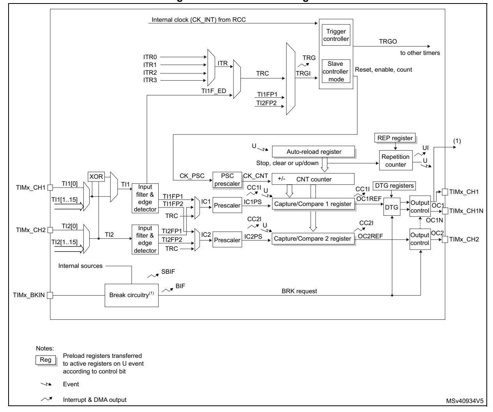

Figure 522. TIM15 block diagram

- The internal break event source can be:

   A clock failure event generated by CSS. For further information on the CSS, refer to Section 9.5.3: Clock Security System

  - A PVD output
     all SRAM and TCM double ECC errors
     Flash double ECC error
     Cortex®-M7 with FPU LOCKUP (Hardfault) output
     COMP output


RM0399 Rev 4

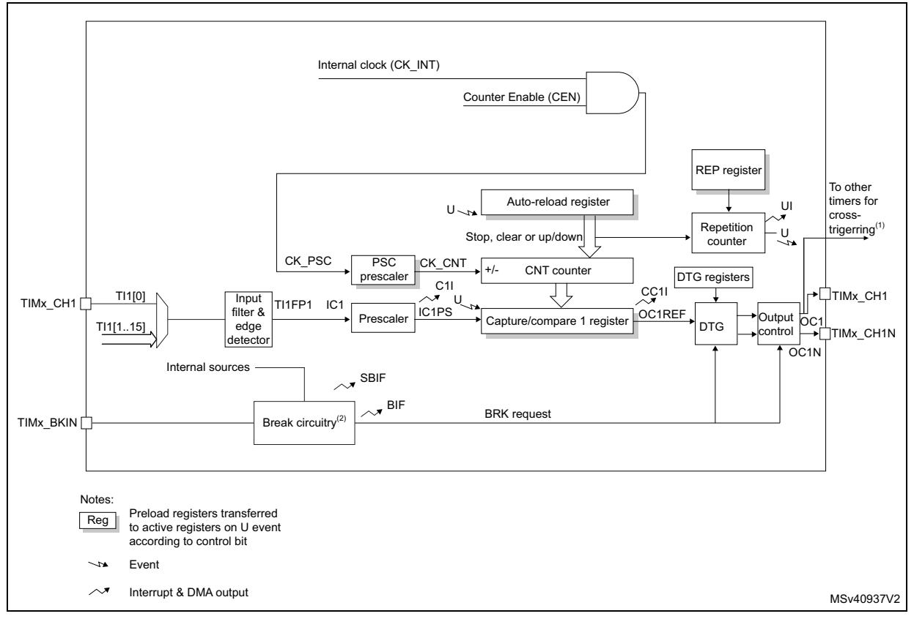

**Figure 523. TIM16/TIM17 block diagram**

- 1. This signal can be used as trigger for some slave timer, see *[Section 43.4.23: Using timer output as trigger for other timers](#page-37-1)  [\(TIM16/TIM17\)](#page-37-1)*.
- 2. The internal break event source can be:
  - A clock failure event generated by CSS. For further information on the CSS, refer to *Section 9.5.3: Clock Security System (CSS)*
  - A PVD output
  - all SRAM and TCM double ECC errors
  - Flash double ECC error
  - Cortex®-M7 with FPU LOCKUP (Hardfault) output
  - COMP output


# **43.4 TIM15/TIM16/TIM17 functional description**

## <span id="page-4-0"></span>**43.4.1 Time-base unit**

The main block of the programmable advanced-control timer is a 16-bit upcounter with its related auto-reload register. The counter clock can be divided by a prescaler.

The counter, the auto-reload register and the prescaler register can be written or read by software. This is true even when the counter is running.

The time-base unit includes:

- Counter register (TIMx\_CNT)
- Prescaler register (TIMx\_PSC)
- Auto-reload register (TIMx\_ARR)
- Repetition counter register (TIMx\_RCR)

The auto-reload register is preloaded. Writing to or reading from the auto-reload register accesses the preload register. The content of the preload register are transferred into the shadow register permanently or at each update event (UEV), depending on the auto-reload preload enable bit (ARPE) in TIMx\_CR1 register. The update event is sent when the counter reaches the overflow and if the UDIS bit equals 0 in the TIMx\_CR1 register. It can also be generated by software. The generation of the update event is described in detailed for each configuration.

The counter is clocked by the prescaler output CK\_CNT, which is enabled only when the counter enable bit (CEN) in TIMx\_CR1 register is set (refer also to the slave mode controller description to get more details on counter enabling).

Note that the counter starts counting 1 clock cycle after setting the CEN bit in the TIMx\_CR1 register.

### **Prescaler description**

The prescaler can divide the counter clock frequency by any factor between 1 and 65536. It is based on a 16-bit counter controlled through a 16-bit register (in the TIMx\_PSC register). It can be changed on the fly as this control register is buffered. The new prescaler ratio is taken into account at the next update event.

*[Figure 524](#page-5-0)* and *[Figure 525](#page-5-1)* give some examples of the counter behavior when the prescaler ratio is changed on the fly:


RM0399 Rev 4 1915/3556

<span id="page-5-0"></span>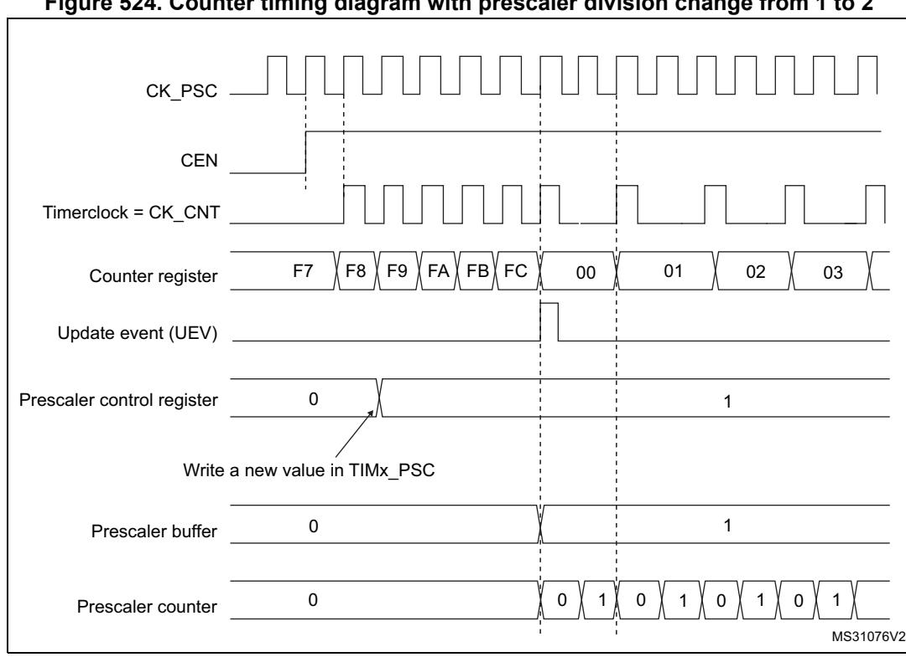

**Figure 524. Counter timing diagram with prescaler division change from 1 to 2**


<span id="page-5-1"></span>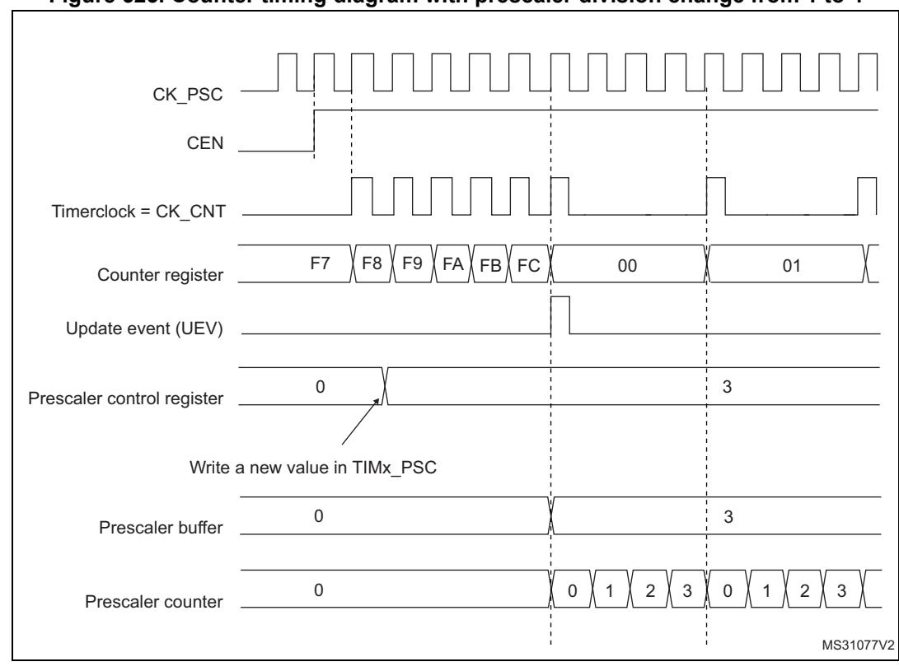

## **43.4.2 Counter modes**

## <span id="page-6-0"></span>**Upcounting mode**

In upcounting mode, the counter counts from 0 to the auto-reload value (content of the TIMx\_ARR register), then restarts from 0 and generates a counter overflow event.

If the repetition counter is used, the update event (UEV) is generated after upcounting is repeated for the number of times programmed in the repetition counter register (TIMx\_RCR). Else the update event is generated at each counter overflow.

Setting the UG bit in the TIMx\_EGR register (by software or by using the slave mode controller) also generates an update event.

The UEV event can be disabled by software by setting the UDIS bit in the TIMx\_CR1 register. This is to avoid updating the shadow registers while writing new values in the preload registers. Then no update event occurs until the UDIS bit has been written to 0. However, the counter restarts from 0, as well as the counter of the prescaler (but the prescale rate does not change). In addition, if the URS bit (update request selection) in TIMx\_CR1 register is set, setting the UG bit generates an update event UEV but without setting the UIF flag (thus no interrupt or DMA request is sent). This is to avoid generating both update and capture interrupts when clearing the counter on the capture event.

When an update event occurs, all the registers are updated and the update flag (UIF bit in TIMx\_SR register) is set (depending on the URS bit):

- The repetition counter is reloaded with the content of TIMx\_RCR register,
- The auto-reload shadow register is updated with the preload value (TIMx\_ARR),
- The buffer of the prescaler is reloaded with the preload value (content of the TIMx\_PSC register).

The following figures show some examples of the counter behavior for different clock frequencies when TIMx\_ARR=0x36.


RM0399 Rev 4 1917/3556

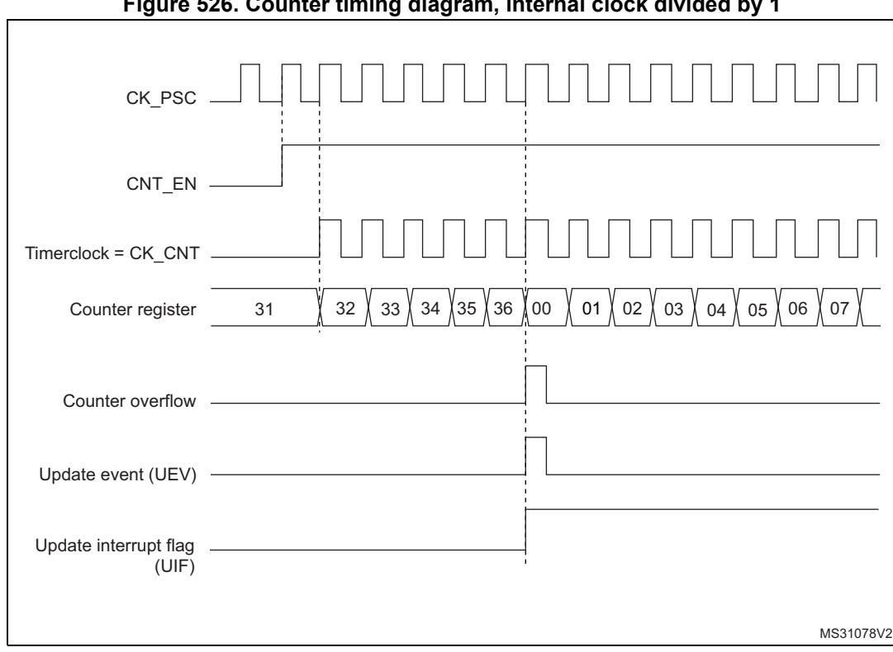

**Figure 526. Counter timing diagram, internal clock divided by 1**


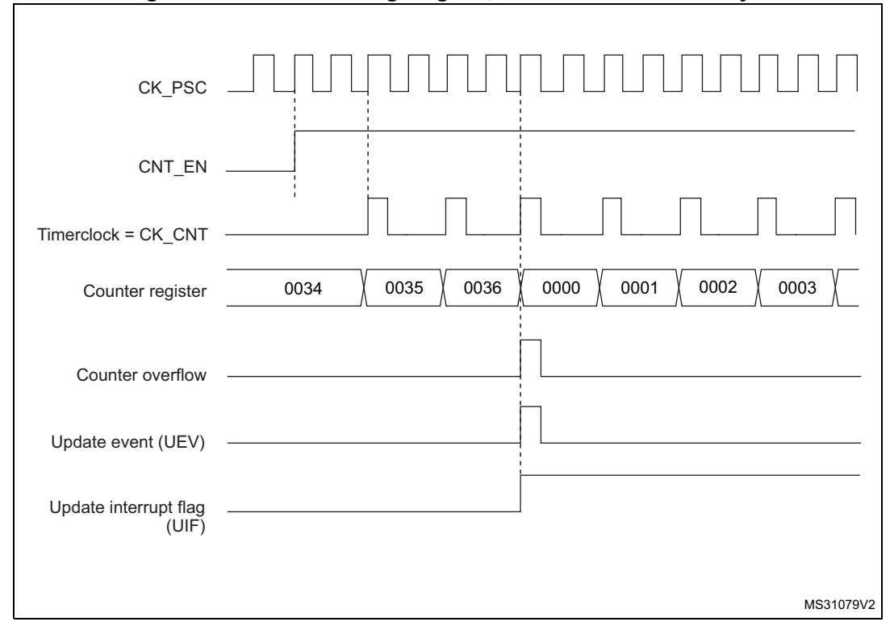

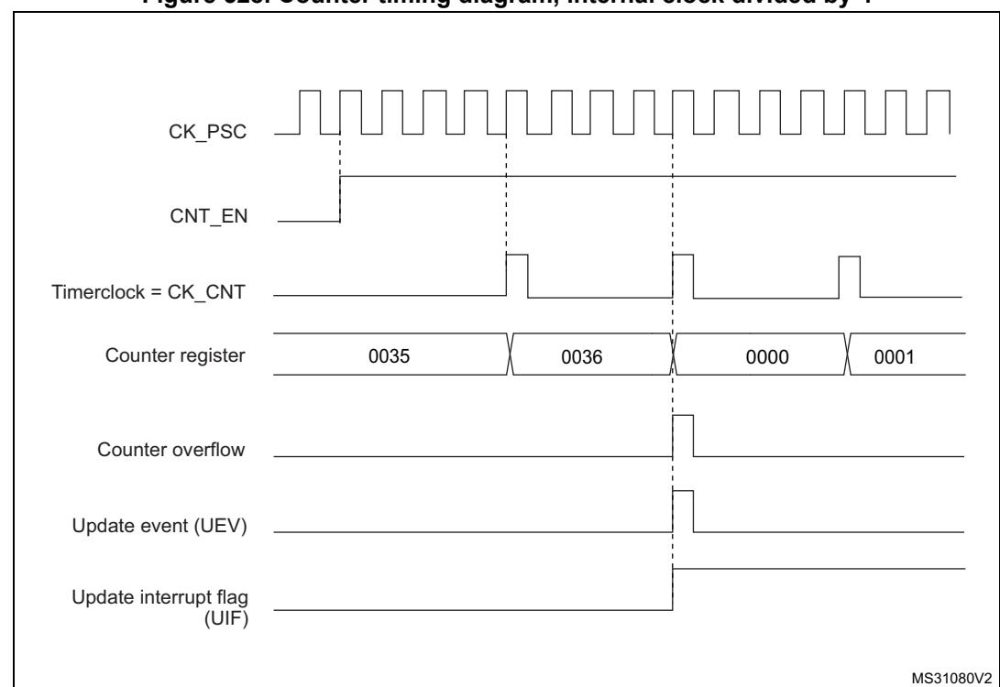

**Figure 528. Counter timing diagram, internal clock divided by 4**


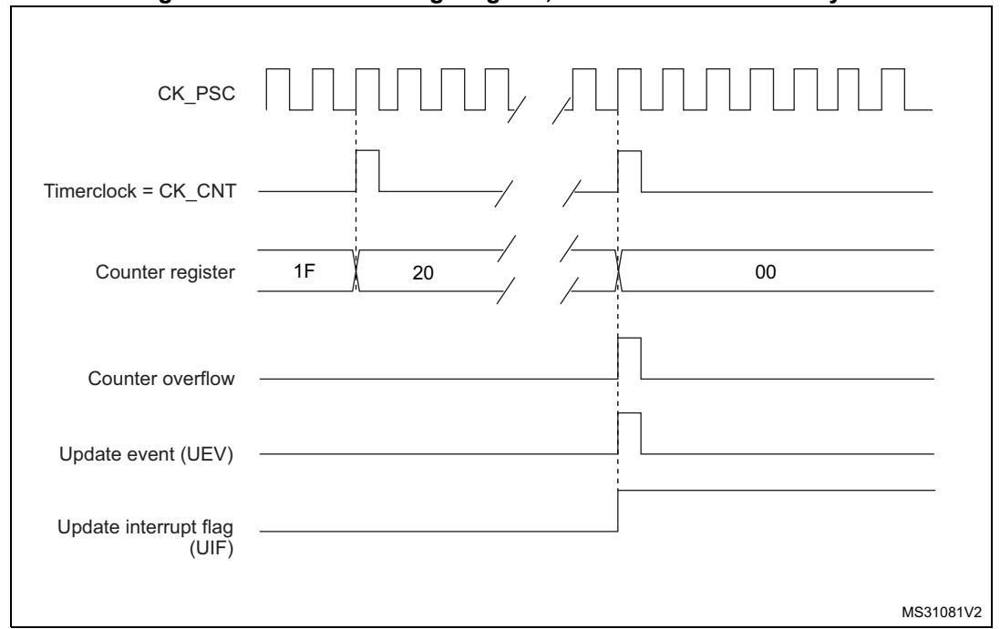

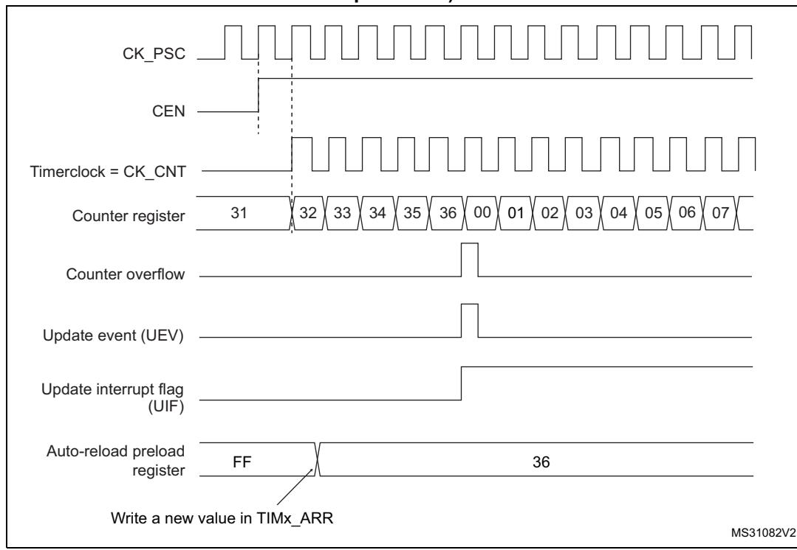

**Figure 530. Counter timing diagram, update event when ARPE=0 (TIMx\_ARR not preloaded)**


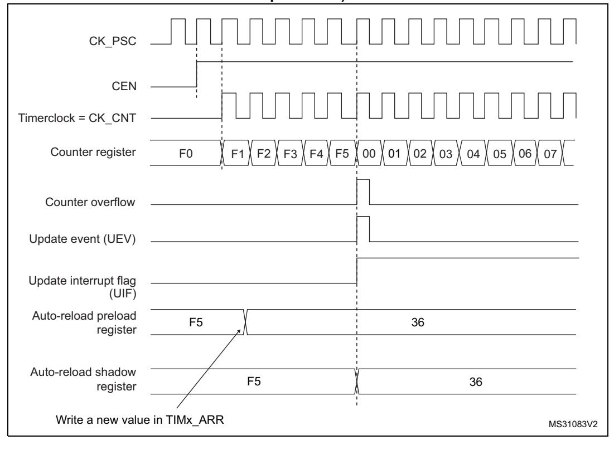

## **43.4.3 Repetition counter**

*[Section 43.4.1: Time-base unit](#page-4-0)* describes how the update event (UEV) is generated with respect to the counter overflows. It is actually generated only when the repetition counter has reached zero. This can be useful when generating PWM signals.

This means that data are transferred from the preload registers to the shadow registers (TIMx\_ARR auto-reload register, TIMx\_PSC prescaler register, but also TIMx\_CCRx capture/compare registers in compare mode) every N counter overflows, where N is the value in the TIMx\_RCR repetition counter register.

The repetition counter is decremented at each counter overflow.

The repetition counter is an auto-reload type; the repetition rate is maintained as defined by the TIMx\_RCR register value (refer to *[Figure 532](#page-11-0)*). When the update event is generated by software (by setting the UG bit in TIMx\_EGR register) or by hardware through the slave mode controller, it occurs immediately whatever the value of the repetition counter is and the repetition counter is reloaded with the content of the TIMx\_RCR register.


RM0399 Rev 4 1921/3556

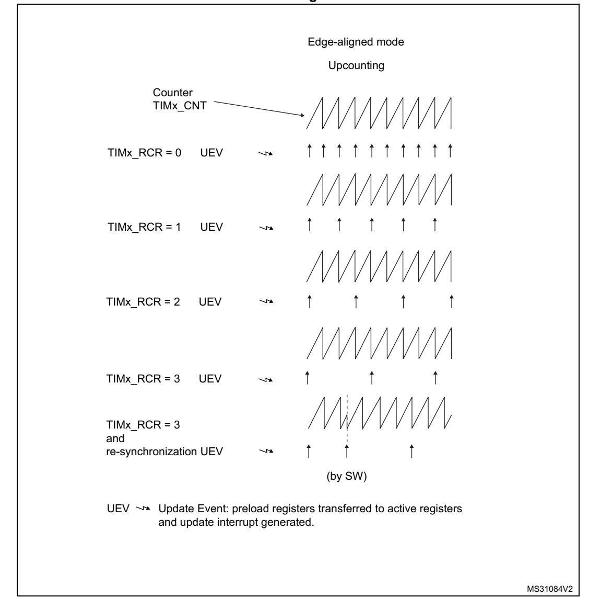

<span id="page-11-0"></span>**Figure 532. Update rate examples depending on mode and TIMx\_RCR register settings**

# **43.4.4 Clock selection**

The counter clock can be provided by the following clock sources:

- Internal clock (CK\_INT)
- External clock mode1: external input pin
- Internal trigger inputs (ITRx) (only for TIM15): using one timer as the prescaler for another timer, for example, TIM1 can be configured to act as a prescaler for TIM15. Refer to *Using one timer as prescaler for another timer on page 1820* for more details.

### **Internal clock source (CK\_INT)**

If the slave mode controller is disabled (SMS=000), then the CEN (in the TIMx\_CR1 register) and UG bits (in the TIMx\_EGR register) are actual control bits and can be changed


only by software (except UG which remains cleared automatically). As soon as the CEN bit is written to 1, the prescaler is clocked by the internal clock CK\_INT.

*[Figure 533](#page-12-0)* shows the behavior of the control circuit and the upcounter in normal mode, without prescaler.

<span id="page-12-0"></span>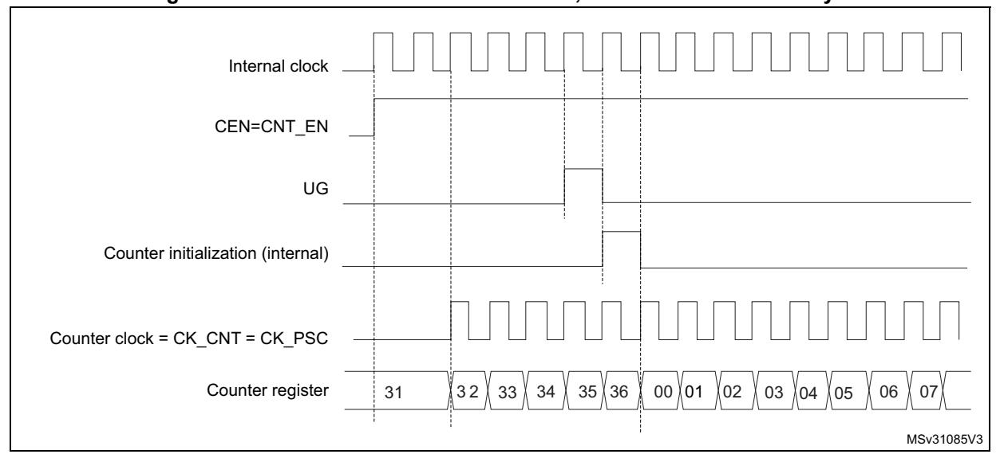

**Figure 533. Control circuit in normal mode, internal clock divided by 1**

### **External clock source mode 1**

This mode is selected when SMS=111 in the TIMx\_SMCR register. The counter can count at each rising or falling edge on a selected input.

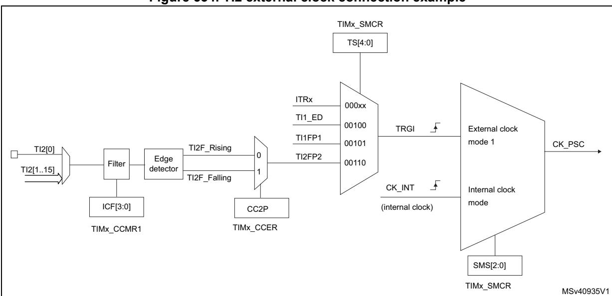

**Figure 534. TI2 external clock connection example**

For example, to configure the upcounter to count in response to a rising edge on the TI2 input, use the following procedure:

MS31087V2

- 1. Select the proper TI2[x] source (internal or external) with the TI2SEL[3:0] bits in the TIMx\_TISEL register.
- 2. Configure channel 2 to detect rising edges on the TI2 input by writing CC2S = '01' in the TIMx\_CCMR1 register.
- 3. Configure the input filter duration by writing the IC2F[3:0] bits in the TIMx\_CCMR1 register (if no filter is needed, keep IC2F=0000).
- 4. Select rising edge polarity by writing CC2P=0 in the TIMx\_CCER register.
- 5. Configure the timer in external clock mode 1 by writing SMS=111 in the TIMx\_SMCR register.
- 6. Select TI2 as the trigger input source by writing TS=00110 in the TIMx\_SMCR register.
- 7. Enable the counter by writing CEN=1 in the TIMx\_CR1 register.

*Note: The capture prescaler is not used for triggering, so it does not need to be configured.* 

When a rising edge occurs on TI2, the counter counts once and the TIF flag is set.

The delay between the rising edge on TI2 and the actual clock of the counter is due to the resynchronization circuit on TI2 input.

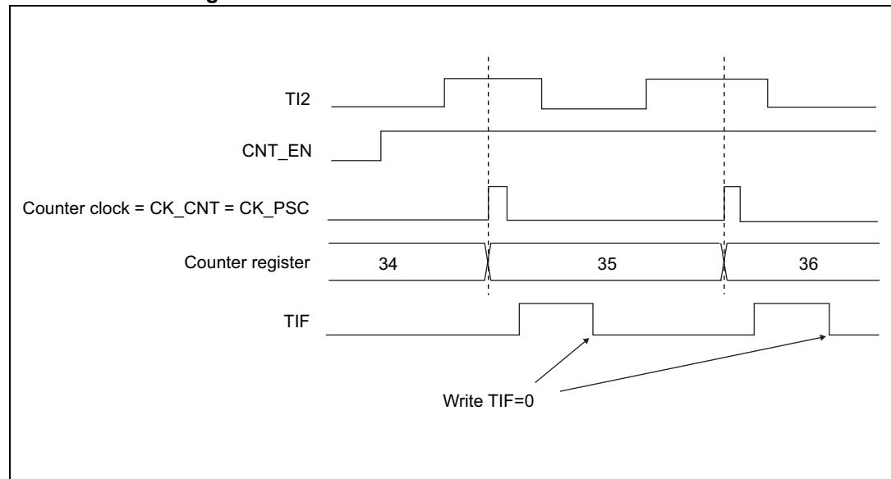

**Figure 535. Control circuit in external clock mode 1**

## **43.4.5 Capture/compare channels**

Each Capture/Compare channel is built around a capture/compare register (including a shadow register), a input stage for capture (with digital filter, multiplexing and prescaler) and an output stage (with comparator and output control).

*[Figure 536](#page-14-0)* to *[Figure 539](#page-15-0)* give an overview of one Capture/Compare channel.

The input stage samples the corresponding TIx input to generate a filtered signal TIxF. Then, an edge detector with polarity selection generates a signal (TIxFPx) which can be used as trigger input by the slave mode controller or as the capture command. It is prescaled before the capture register (ICxPS).

<span id="page-14-0"></span>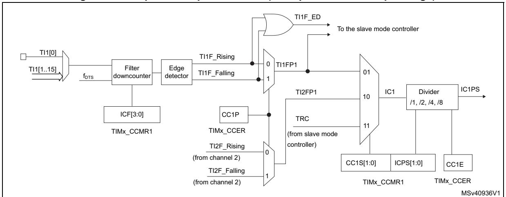

Figure 536. Capture/compare channel (example: channel 1 input stage)

The output stage generates an intermediate waveform which is then used for reference: OCxRef (active high). The polarity acts at the end of the chain.

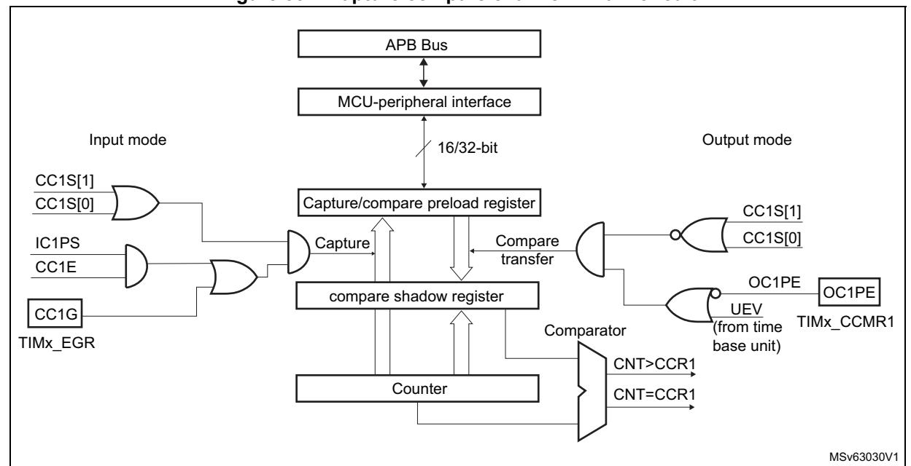

Figure 537. Capture/compare channel 1 main circuit

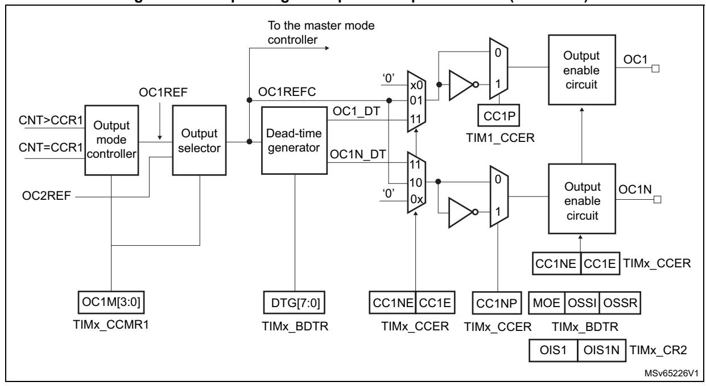

**Figure 538. Output stage of capture/compare channel (channel 1)**

**Figure 539. Output stage of capture/compare channel (channel 2 for TIM15)**

<span id="page-15-0"></span>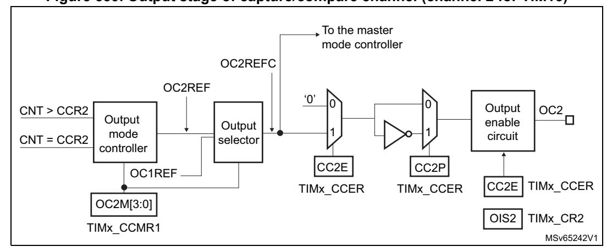

The capture/compare block is made of one preload register and one shadow register. Write and read always access the preload register.

In capture mode, captures are actually done in the shadow register, which is copied into the preload register.

In compare mode, the content of the preload register is copied into the shadow register which is compared to the counter.

## **43.4.6 Input capture mode**

In Input capture mode, the Capture/Compare registers (TIMx\_CCRx) are used to latch the value of the counter after a transition detected by the corresponding ICx signal. When a capture occurs, the corresponding CCXIF flag (TIMx\_SR register) is set and an interrupt or a DMA request can be sent if they are enabled. If a capture occurs while the CCxIF flag was


already high, then the over-capture flag CCxOF (TIMx\_SR register) is set. CCxIF can be cleared by software by writing it to '0' or by reading the captured data stored in the TIMx\_CCRx register. CCxOF is cleared when it is written with 0.

The following example shows how to capture the counter value in TIMx\_CCR1 when TI1 input rises. To do this, use the following procedure:

- 1. Select the proper TI1x source (internal or external) with the TI1SEL[3:0] bits in the TIMx\_TISEL register.
- 2. Select the active input: TIMx\_CCR1 must be linked to the TI1 input, so write the CC1S bits to 01 in the TIMx\_CCMR1 register. As soon as CC1S becomes different from 00, the channel is configured in input and the TIMx\_CCR1 register becomes read-only.
- 3. Program the appropriate input filter duration in relation with the signal connected to the timer (when the input is one of the TIx (ICxF bits in the TIMx\_CCMRx register). Let's imagine that, when toggling, the input signal is not stable during at least 5 internal clock cycles. We must program a filter duration longer than these 5 clock cycles. We can validate a transition on TI1 when 8 consecutive samples with the new level have been detected (sampled at fDTS frequency). Then write IC1F bits to 0011 in the TIMx\_CCMR1 register.
- 4. Select the edge of the active transition on the TI1 channel by writing CC1P bit to 0 in the TIMx\_CCER register (rising edge in this case).
- 5. Program the input prescaler. In our example, we wish the capture to be performed at each valid transition, so the prescaler is disabled (write IC1PS bits to '00' in the TIMx\_CCMR1 register).
- 6. Enable capture from the counter into the capture register by setting the CC1E bit in the TIMx\_CCER register.
- 7. If needed, enable the related interrupt request by setting the CC1IE bit in the TIMx\_DIER register, and/or the DMA request by setting the CC1DE bit in the TIMx\_DIER register.

When an input capture occurs:

- The TIMx\_CCR1 register gets the value of the counter on the active transition.
- CC1IF flag is set (interrupt flag). CC1OF is also set if at least two consecutive captures occurred whereas the flag was not cleared.
- An interrupt is generated depending on the CC1IE bit.
- A DMA request is generated depending on the CC1DE bit.

In order to handle the overcapture, it is recommended to read the data before the overcapture flag. This is to avoid missing an overcapture which could happen after reading the flag and before reading the data.

*Note: IC interrupt and/or DMA requests can be generated by software by setting the corresponding CCxG bit in the TIMx\_EGR register.*

## **43.4.7 PWM input mode (only for TIM15)**

This mode is a particular case of input capture mode. The procedure is the same except:

- Two ICx signals are mapped on the same TIx input.
- These 2 ICx signals are active on edges with opposite polarity.
- One of the two TIxFP signals is selected as trigger input and the slave mode controller is configured in reset mode.


RM0399 Rev 4 1927/3556

For example, one can measure the period (in TIMx\_CCR1 register) and the duty cycle (in TIMx\_CCR2 register) of the PWM applied on TI1 using the following procedure (depending on CK\_INT frequency and prescaler value):

- 1. Select the proper TI1[x] source (internal or external) with the TI1SEL[3:0] bits in the TIMx\_TISEL register.
- 2. Select the active input for TIMx\_CCR1: write the CC1S bits to 01 in the TIMx\_CCMR1 register (TI1 selected).
- 3. Select the active polarity for TI1FP1 (used both for capture in TIMx\_CCR1 and counter clear): write the CC1P and CC1NP bits to '0' (active on rising edge).
- 4. Select the active input for TIMx\_CCR2: write the CC2S bits to 10 in the TIMx\_CCMR1 register (TI1 selected).
- 5. Select the active polarity for TI1FP2 (used for capture in TIMx\_CCR2): write the CC2P and CC2NP bits to '10' (active on falling edge).
- 6. Select the valid trigger input: write the TS bits to 00101 in the TIMx\_SMCR register (TI1FP1 selected).
- 7. Configure the slave mode controller in reset mode: write the SMS bits to 100 in the TIMx\_SMCR register.
- 8. Enable the captures: write the CC1E and CC2E bits to '1' in the TIMx\_CCER register.

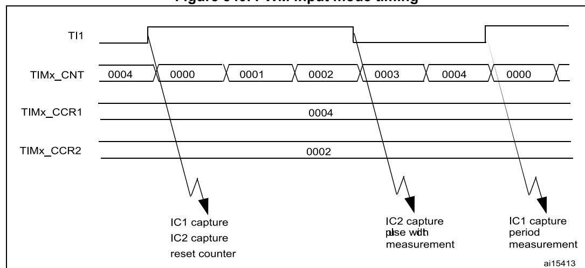

**Figure 540. PWM input mode timing**

1. The PWM input mode can be used only with the TIMx\_CH1/TIMx\_CH2 signals due to the fact that only TI1FP1 and TI2FP2 are connected to the slave mode controller.

## **43.4.8 Forced output mode**

In output mode (CCxS bits = 00 in the TIMx\_CCMRx register), each output compare signal (OCxREF and then OCx/OCxN) can be forced to active or inactive level directly by software, independently of any comparison between the output compare register and the counter.

To force an output compare signal (OCXREF/OCx) to its active level, one just needs to write 101 in the OCxM bits in the corresponding TIMx\_CCMRx register. Thus OCXREF is forced high (OCxREF is always active high) and OCx get opposite value to CCxP polarity bit.

For example: CCxP=0 (OCx active high) => OCx is forced to high level.

The OCxREF signal can be forced low by writing the OCxM bits to 100 in the TIMx\_CCMRx register.


Anyway, the comparison between the TIMx\_CCRx shadow register and the counter is still performed and allows the flag to be set. Interrupt and DMA requests can be sent accordingly. This is described in the output compare mode section below.

## **43.4.9 Output compare mode**

This function is used to control an output waveform or indicating when a period of time has elapsed.

When a match is found between the capture/compare register and the counter, the output compare function:

- Assigns the corresponding output pin to a programmable value defined by the output compare mode (OCxM bits in the TIMx\_CCMRx register) and the output polarity (CCxP bit in the TIMx\_CCER register). The output pin can keep its level (OCXM=000), be set active (OCxM=001), be set inactive (OCxM=010) or can toggle (OCxM=011) on match.
- Sets a flag in the interrupt status register (CCxIF bit in the TIMx\_SR register).
- Generates an interrupt if the corresponding interrupt mask is set (CCXIE bit in the TIMx\_DIER register).
- Sends a DMA request if the corresponding enable bit is set (CCxDE bit in the TIMx\_DIER register, CCDS bit in the TIMx\_CR2 register for the DMA request selection).

The TIMx\_CCRx registers can be programmed with or without preload registers using the OCxPE bit in the TIMx\_CCMRx register.

In output compare mode, the update event UEV has no effect on OCxREF and OCx output. The timing resolution is one count of the counter. Output compare mode can also be used to output a single pulse (in One-pulse mode).

## **Procedure**

- 1. Select the counter clock (internal, external, prescaler).
- 2. Write the desired data in the TIMx\_ARR and TIMx\_CCRx registers.
- 3. Set the CCxIE bit if an interrupt request is to be generated.
- 4. Select the output mode. For example:
  - Write OCxM = 011 to toggle OCx output pin when CNT matches CCRx
  - Write OCxPE = 0 to disable preload register
  - Write CCxP = 0 to select active high polarity
  - Write CCxE = 1 to enable the output
- 5. Enable the counter by setting the CEN bit in the TIMx\_CR1 register.

The TIMx\_CCRx register can be updated at any time by software to control the output waveform, provided that the preload register is not enabled (OCxPE='0', else TIMx\_CCRx shadow register is updated only at the next update event UEV). An example is given in *[Figure 541](#page-19-0)*.


RM0399 Rev 4 1929/3556

<span id="page-19-0"></span>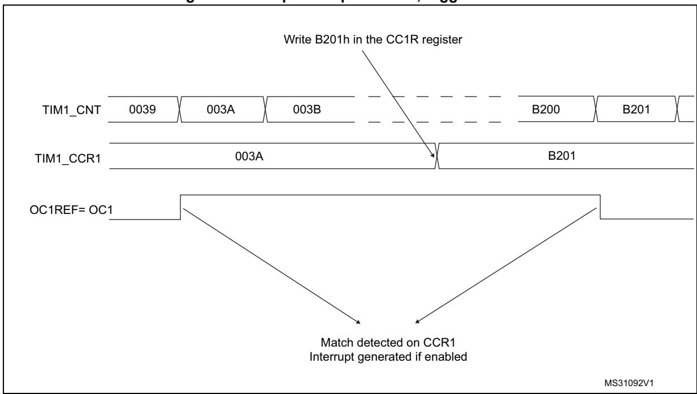

Figure 541. Output compare mode, toggle on OC1

## 43.4.10 PWM mode

Pulse Width Modulation mode allows a signal to be generated with a frequency determined by the value of the TIMx\_ARR register and a duty cycle determined by the value of the TIMx\_CCRx register.

The PWM mode can be selected independently on each channel (one PWM per OCx output) by writing '110' (PWM mode 1) or '111' (PWM mode 2) in the OCxM bits in the TIMx\_CCMRx register. The corresponding preload register must be enabled by setting the OCxPE bit in the TIMx\_CCMRx register, and eventually the auto-reload preload register (in upcounting or center-aligned modes) by setting the ARPE bit in the TIMx\_CR1 register.

As the preload registers are transferred to the shadow registers only when an update event occurs, before starting the counter, all registers must be initialized by setting the UG bit in the TIMx\_EGR register.

OCx polarity is software programmable using the CCxP bit in the TIMx\_CCER register. It can be programmed as active high or active low. OCx output is enabled by a combination of the CCxE, CCxNE, MOE, OSSI and OSSR bits (TIMx\_CCER and TIMx\_BDTR registers). Refer to the TIMx\_CCER register description for more details.

In PWM mode (1 or 2), TIMx\_CNT and TIMx\_CCRx are always compared to determine whether TIMx\_CCRx  $\leq$  TIMx\_CNT or TIMx\_CNT  $\leq$  TIMx\_CCRx (depending on the direction of the counter).

The TIM15/TIM16/TIM17 are capable of upcounting only. Refer to *Upcounting mode on page 1917*.

In the following example, we consider PWM mode 1. The reference PWM signal OCxREF is high as long as TIMx\_CNT < TIMx\_CCRx else it becomes low. If the compare value in TIMx\_CCRx is greater than the auto-reload value (in TIMx\_ARR) then OCxREF is held at


'1'. If the compare value is 0 then OCxRef is held at '0'. *[Figure 542](#page-20-0)* shows some edgealigned PWM waveforms in an example where TIMx\_ARR=8.

<span id="page-20-0"></span>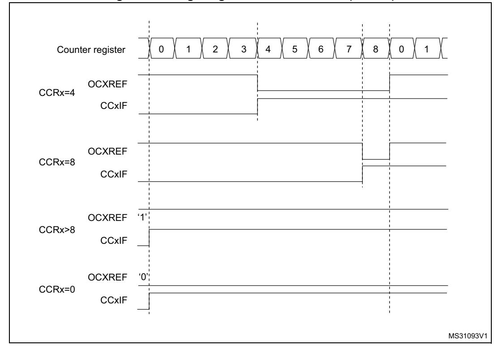

**Figure 542. Edge-aligned PWM waveforms (ARR=8)**

## **43.4.11 Combined PWM mode (TIM15 only)**

Combined PWM mode allows two edge or center-aligned PWM signals to be generated with programmable delay and phase shift between respective pulses. While the frequency is determined by the value of the TIMx\_ARR register, the duty cycle and delay are determined by the two TIMx\_CCRx registers. The resulting signals, OCxREFC, are made of an OR or AND logical combination of two reference PWMs:

• OC1REFC (or OC2REFC) is controlled by the TIMx\_CCR1 and TIMx\_CCR2 registers

Combined PWM mode can be selected independently on two channels (one OCx output per pair of CCR registers) by writing '1100' (Combined PWM mode 1) or '1101' (Combined PWM mode 2) in the OCxM bits in the TIMx\_CCMRx register.

When a given channel is used as a combined PWM channel, its complementary channel must be configured in the opposite PWM mode (for instance, one in Combined PWM mode 1 and the other in Combined PWM mode 2).

*Note: The OCxM[3:0] bit field is split into two parts for compatibility reasons, the most significant bit is not contiguous with the 3 least significant ones.*

> *[Figure 543](#page-21-0)* represents an example of signals that can be generated using Asymmetric PWM mode, obtained with the following configuration:

- Channel 1 is configured in Combined PWM mode 2,
- Channel 2 is configured in PWM mode 1,


RM0399 Rev 4 1931/3556

<span id="page-21-0"></span>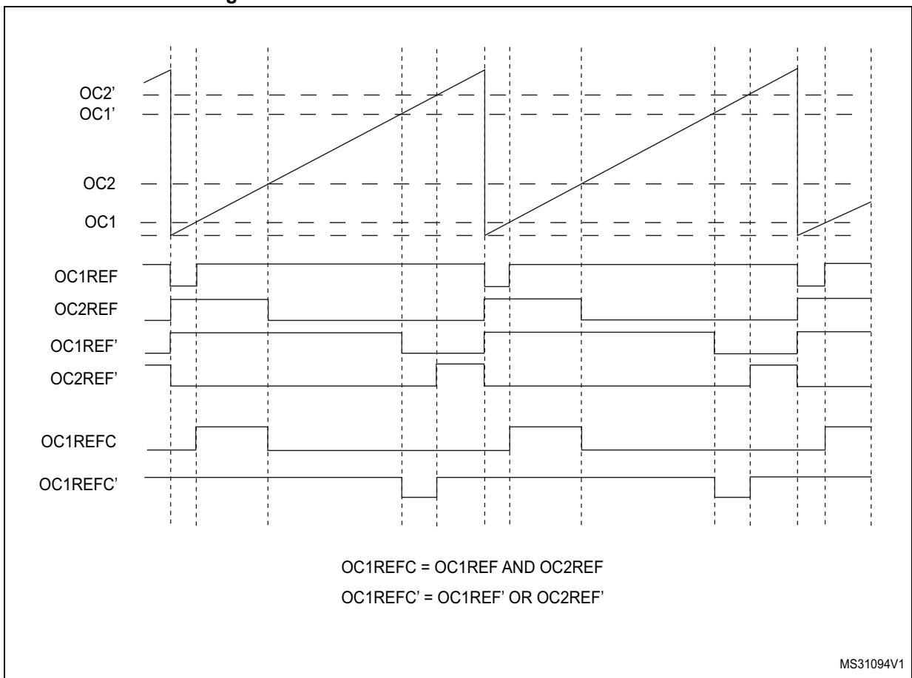

**Figure 543. Combined PWM mode on channel 1 and 2**

## **43.4.12 Complementary outputs and dead-time insertion**

The TIM15/TIM16/TIM17 general-purpose timers can output one complementary signal and manage the switching-off and switching-on of the outputs.

This time is generally known as dead-time and it has to be adjusted depending on the devices that are connected to the outputs and their characteristics (intrinsic delays of levelshifters, delays due to power switches...)

The polarity of the outputs (main output OCx or complementary OCxN) can be selected independently for each output. This is done by writing to the CCxP and CCxNP bits in the TIMx\_CCER register.

The complementary signals OCx and OCxN are activated by a combination of several control bits: the CCxE and CCxNE bits in the TIMx\_CCER register and the MOE, OISx, OISxN, OSSI and OSSR bits in the TIMx\_BDTR and TIMx\_CR2 registers. Refer to *[Table 369: Output control bits for complementary OCx and OCxN channels with break](#page-73-0)  [feature \(TIM16/17\) on page 1984](#page-73-0)* for more details. In particular, the dead-time is activated when switching to the idle state (MOE falling down to 0).

Dead-time insertion is enabled by setting both CCxE and CCxNE bits, and the MOE bit if the break circuit is present. There is one 10-bit dead-time generator for each channel. From a


reference waveform OCxREF, it generates 2 outputs OCx and OCxN. If OCx and OCxN are active high:

- The OCx output signal is the same as the reference signal except for the rising edge, which is delayed relative to the reference rising edge.
- The OCxN output signal is the opposite of the reference signal except for the rising edge, which is delayed relative to the reference falling edge.

If the delay is greater than the width of the active output (OCx or OCxN) then the corresponding pulse is not generated.

The following figures show the relationships between the output signals of the dead-time generator and the reference signal OCxREF. (we suppose CCxP=0, CCxNP=0, MOE=1, CCxE=1 and CCxNE=1 in these examples)


**Figure 544. Complementary output with dead-time insertion.**


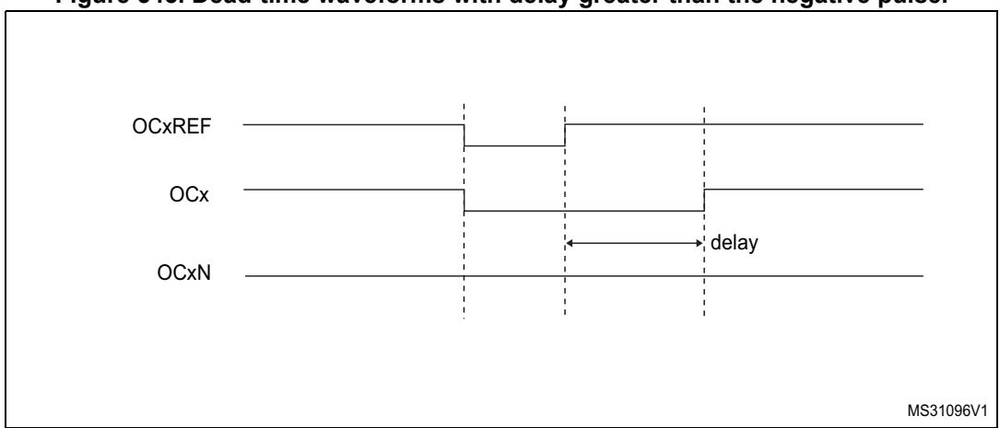

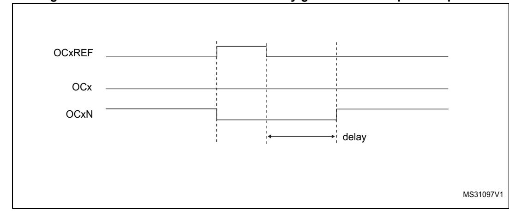

**Figure 546. Dead-time waveforms with delay greater than the positive pulse.**

The dead-time delay is the same for each of the channels and is programmable with the DTG bits in the TIMx\_BDTR register. Refer to *[Section 43.6.14: TIMx break and dead-time](#page-76-0)  [register \(TIMx\\_BDTR\)\(x = 16 to 17\) on page 1987](#page-76-0)* for delay calculation.

### **Re-directing OCxREF to OCx or OCxN**

In output mode (forced, output compare or PWM), OCxREF can be re-directed to the OCx output or to OCxN output by configuring the CCxE and CCxNE bits in the TIMx\_CCER register.

This allows a specific waveform to be sent (such as PWM or static active level) on one output while the complementary remains at its inactive level. Other alternative possibilities are to have both outputs at inactive level or both outputs active and complementary with dead-time.

*Note: When only OCxN is enabled (CCxE=0, CCxNE=1), it is not complemented and becomes active as soon as OCxREF is high. For example, if CCxNP=0 then OCxN=OCxRef. On the other hand, when both OCx and OCxN are enabled (CCxE=CCxNE=1) OCx becomes active when OCxREF is high whereas OCxN is complemented and becomes active when OCxREF is low.*

## **43.4.13 Using the break function**

The purpose of the break function is to protect power switches driven by PWM signals generated with the TIM15/TIM16/TIM17 timers. The break input is usually connected to fault outputs of power stages and 3-phase inverters. When activated, the break circuitry shuts down the PWM outputs and forces them to a predefined safe state.

The break channel gathers both system-level fault (clock failure, parity error,...) and application fault (from input pins and built-in comparator), and can force the outputs to a predefined level (either active or inactive) after a deadtime duration.

The output enable signal and output levels during break are depending on several control bits:

- the MOE bit in TIMx\_BDTR register allows to enable /disable the outputs by software and is reset in case of break or break2 event.
- the OSSI bit in the TIMx\_BDTR register defines whether the timer controls the output in inactive state or releases the control to the GPIO controller (typically to have it in Hi-Z mode)
- the OISx and OISxN bits in the TIMx\_CR2 register which are setting the output shutdown level, either active or inactive. The OCx and OCxN outputs cannot be set both to active level at a given time, whatever the OISx and OISxN values. Refer to *[Table 367:](#page-52-0)  [Output control bits for complementary OCx and OCxN channels with break feature](#page-52-0)  [\(TIM15\) on page 1963](#page-52-0)* for more details.

When exiting from reset, the break circuit is disabled and the MOE bit is low. The break function is enabled by setting the BKE bit in the TIMx\_BDTR register. The break input polarity can be selected by configuring the BKP bit in the same register. BKE and BKP can be modified at the same time. When the BKE and BKP bits are written, a delay of 1 APB clock cycle is applied before the writing is effective. Consequently, it is necessary to wait 1 APB clock period to correctly read back the bit after the write operation.

Because MOE falling edge can be asynchronous, a resynchronization circuit has been inserted between the actual signal (acting on the outputs) and the synchronous control bit (accessed in the TIMx\_BDTR register). It results in some delays between the asynchronous and the synchronous signals. In particular, if MOE is set to 1 whereas it was low, a delay must be inserted (dummy instruction) before reading it correctly. This is because the write acts on the asynchronous signal whereas the read reflects the synchronous signal.

A programmable filter (BKF[3:0] bits in the TIMx\_BDTR register allows to filter out spurious events.

The break can be generated from multiple sources which can be individually enabled and with programmable edge sensitivity, using the TIMx\_OR2 register.

The sources for break (BRK) channel are:

- An external source connected to one of the BKIN pin (as per selection done in the GPIO alternate function registers), with polarity selection and optional digital filtering
- An internal source:
  - the output from a comparator, with polarity selection and optional digital filtering
  - the analog watchdog output of the DFSDM1 peripheral
  - A system break:
    - the Cortex®-M7 with FPU LOCKUP output
    - the PVD output
    - all SRAM and TCM double ECC errors (AXI-SRAM, ITCM, DTCM, SRAM1, SRAM2, SRAM3, SRAM4, BKRAM, refer to SYSCFG\_CFGR register for details)
    - a Flash double ECC error
    - a clock failure event generated by the CSS detector


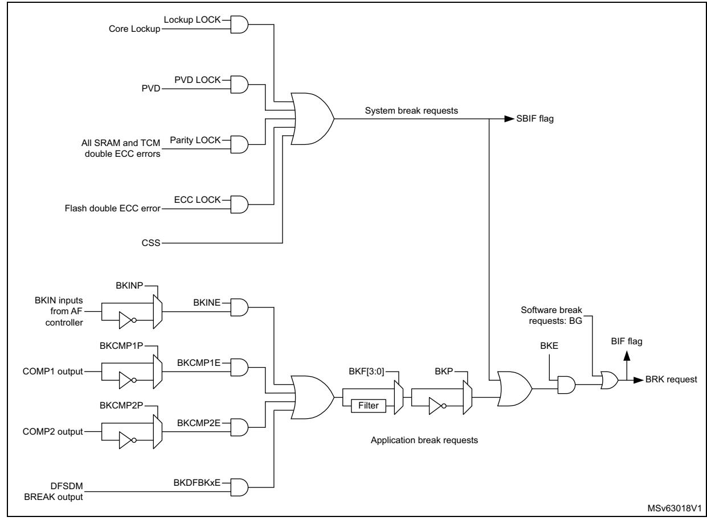

**Figure 547. Break circuitry overview**

**Caution:** An asynchronous (clockless) operation is only guaranteed when the programmable filter is disabled. If it is enabled, a fail safe clock mode (example, using the internal PLL and/or the CSS) must be used to guarantee that break events are handled.

When a break occurs (selected level on the break input):

- The MOE bit is cleared asynchronously, putting the outputs in inactive state, idle state or even releasing the control to the GPIO (selected by the OSSI bit). This feature functions even if the MCU oscillator is off.
- Each output channel is driven with the level programmed in the OISx bit in the TIMx\_CR2 register as soon as MOE=0. If OSSI=0, the timer releases the output control (taken over by the GPIO) else the enable output remains high.
- When complementary outputs are used:
  - The outputs are first put in reset state inactive state (depending on the polarity). This is done asynchronously so that it works even if no clock is provided to the timer.
  - If the timer clock is still present, then the dead-time generator is reactivated in order to drive the outputs with the level programmed in the OISx and OISxN bits after a dead-time. Even in this case, OCx and OCxN cannot be driven to their

- active level together. Note that because of the resynchronization on MOE, the dead-time duration is a bit longer than usual (around 2 ck\_tim clock cycles).
- If OSSI=0 then the timer releases the enable outputs (taken over by the GPIO which forces a Hi-Z state) else the enable outputs remain or become high as soon as one of the CCxE or CCxNE bits is high.
- The break status flag (BIF bit in the TIMx\_SR register) is set. An interrupt can be generated if the BIE bit in the TIMx\_DIER register is set.
- If the AOE bit in the TIMx\_BDTR register is set, the MOE bit is automatically set again at the next update event UEV. This can be used to perform a regulation, for instance. Else, MOE remains low until it is written with 1 again. In this case, it can be used for security and the break input can be connected to an alarm from power drivers, thermal sensors or any security components.

*Note: If the MOE is reset by the CPU while the AOE bit is set, the outputs are in idle state and forced to inactive level or Hi-Z depending on OSSI value.*

*If both the MOE and AOE bits are reset by the CPU, the outputs are in disabled state and driven with the level programmed in the OISx bit in the TIMx\_CR2 register.*

*Note: The break inputs is acting on level. Thus, the MOE cannot be set while the break input is active (neither automatically nor by software). In the meantime, the status flag BIF cannot be cleared.*

> The break can be generated by the BRK input which has a programmable polarity and an enable bit BKE in the TIMx\_BDTR register.

In addition to the break input and the output management, a write protection has been implemented inside the break circuit to safeguard the application. It allows the configuration of several parameters to be freezed (dead-time duration, OCx/OCxN polarities and state when disabled, OCxM configurations, break enable and polarity). The protection can be selected among 3 levels with the LOCK bits in the TIMx\_BDTR register. Refer to *[Section 43.6.14: TIMx break and dead-time register \(TIMx\\_BDTR\)\(x = 16 to 17\) on](#page-76-0)  [page 1987](#page-76-0)*. The LOCK bits can be written only once after an MCU reset.

The *[Figure 548](#page-27-0)* shows an example of behavior of the outputs in response to a break.


RM0399 Rev 4 1937/3556

<span id="page-27-0"></span>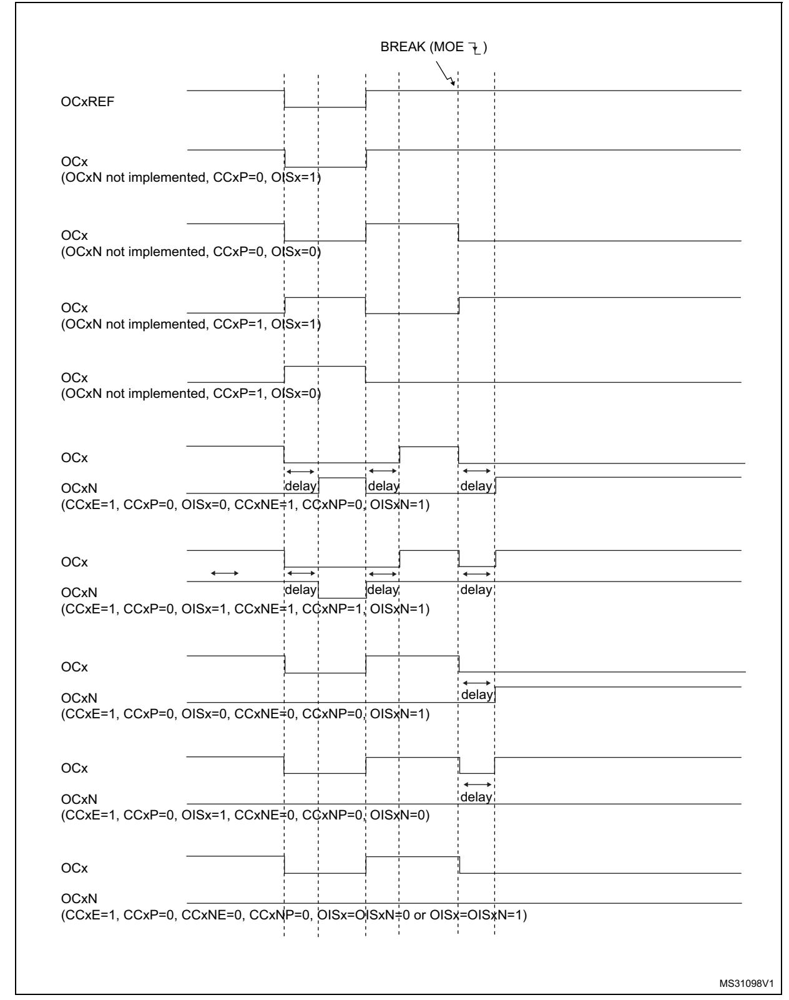

**Figure 548. Output behavior in response to a break**


## 43.4.14 6-step PWM generation

When complementary outputs are used on a channel, preload bits are available on the OCxM, CCxE and CCxNE bits. The preload bits are transferred to the shadow bits at the COM commutation event. Thus one can program in advance the configuration for the next step and change the configuration of all the channels at the same time. COM can be generated by software by setting the COM bit in the TIMx\_EGR register or by hardware (on tim\_trgi rising edge).

A flag is set when the COM event occurs (COMIF bit in the TIMx\_SR register), which can generate an interrupt (if the COMIE bit is set in the TIMx\_DIER register) or a DMA request (if the COMDE bit is set in the TIMx\_DIER register).

The *Figure 549* describes the behavior of the tim\_ocx and tim\_ocxn outputs when a COM event occurs, in 3 different examples of programmed configurations.

<span id="page-28-0"></span>

Figure 549. 6-step generation, COM example (OSSR=1)

## <span id="page-29-0"></span>**43.4.15 One-pulse mode**

One-pulse mode (OPM) is a particular case of the previous modes. It allows the counter to be started in response to a stimulus and to generate a pulse with a programmable length after a programmable delay.

Starting the counter can be controlled through the slave mode controller. Generating the waveform can be done in output compare mode or PWM mode. One-pulse mode is selected by setting the OPM bit in the TIMx\_CR1 register. This makes the counter stop automatically at the next update event UEV.

A pulse can be correctly generated only if the compare value is different from the counter initial value. Before starting (when the timer is waiting for the trigger), the configuration must be:

• CNT < CCRx ≤ ARR (in particular, 0 < CCRx)

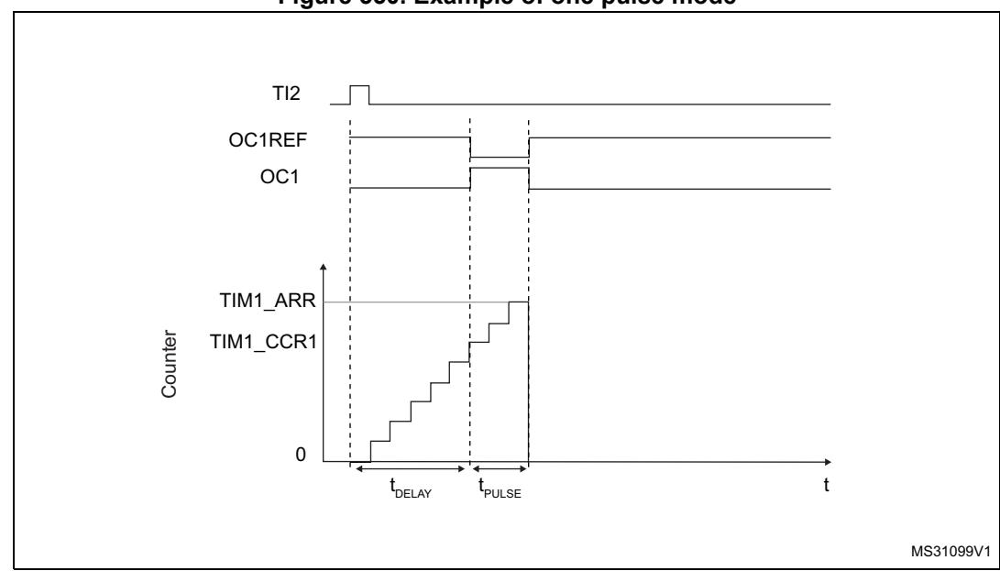

**Figure 550. Example of one pulse mode**

For example one may want to generate a positive pulse on OC1 with a length of tPULSE and after a delay of tDELAY as soon as a positive edge is detected on the TI2 input pin.

Let's use TI2FP2 as trigger 1:

- 1. Select the proper TI2[x] source (internal or external) with the TI2SEL[3:0] bits in the TIMx\_TISEL register.
- 2. Map TI2FP2 to TI2 by writing CC2S='01' in the TIMx\_CCMR1 register.
- 3. TI2FP2 must detect a rising edge, write CC2P='0' and CC2NP='0' in the TIMx\_CCER register.
- 4. Configure TI2FP2 as trigger for the slave mode controller (TRGI) by writing TS='00110' in the TIMx\_SMCR register.
- 5. TI2FP2 is used to start the counter by writing SMS to '110' in the TIMx\_SMCR register (trigger mode).

The OPM waveform is defined by writing the compare registers (taking into account the clock frequency and the counter prescaler).

- The tDELAY is defined by the value written in the TIMx\_CCR1 register.
- The tPULSE is defined by the difference between the auto-reload value and the compare value (TIMx\_ARR - TIMx\_CCR1).
- Let's say one want to build a waveform with a transition from '0' to '1' when a compare match occurs and a transition from '1' to '0' when the counter reaches the auto-reload value. To do this PWM mode 2 must be enabled by writing OC1M=111 in the TIMx\_CCMR1 register. Optionally the preload registers can be enabled by writing OC1PE='1' in the TIMx\_CCMR1 register and ARPE in the TIMx\_CR1 register. In this case one has to write the compare value in the TIMx\_CCR1 register, the auto-reload value in the TIMx\_ARR register, generate an update by setting the UG bit and wait for external trigger event on TI2. CC1P is written to '0' in this example.

Since only 1 pulse is needed, a 1 must be written in the OPM bit in the TIMx\_CR1 register to stop the counter at the next update event (when the counter rolls over from the auto-reload value back to 0).

Particular case: OCx fast enable

In One-pulse mode, the edge detection on TIx input set the CEN bit which enables the counter. Then the comparison between the counter and the compare value makes the output toggle. But several clock cycles are needed for these operations and it limits the minimum delay tDELAY min we can get.

If one wants to output a waveform with the minimum delay, the OCxFE bit can be set in the TIMx\_CCMRx register. Then OCxRef (and OCx) are forced in response to the stimulus, without taking in account the comparison. Its new level is the same as if a compare match had occurred. OCxFE acts only if the channel is configured in PWM1 or PWM2 mode.

## **43.4.16 Retriggerable one pulse mode (TIM15 only)**

This mode allows the counter to be started in response to a stimulus and to generate a pulse with a programmable length, but with the following differences with Non-retriggerable one pulse mode described in *[Section 43.4.15](#page-29-0)*:

- The pulse starts as soon as the trigger occurs (no programmable delay)
- The pulse is extended if a new trigger occurs before the previous one is completed

The timer must be in Slave mode, with the bits SMS[3:0] = '1000' (Combined Reset + trigger mode) in the TIMx\_SMCR register, and the OCxM[3:0] bits set to '1000' or '1001' for Retrigerrable OPM mode 1 or 2.

If the timer is configured in Up-counting mode, the corresponding CCRx must be set to 0 (the ARR register sets the pulse length). If the timer is configured in Down-counting mode, CCRx must be above or equal to ARR.

*Note: The OCxM[3:0] and SMS[3:0] bit fields are split into two parts for compatibility reasons, the most significant bit are not contiguous with the 3 least significant ones.*

> *This mode must not be used with center-aligned PWM modes. It is mandatory to have CMS[1:0] = 00 in TIMx\_CR1.*

RM0399 Rev 4 1941/3556

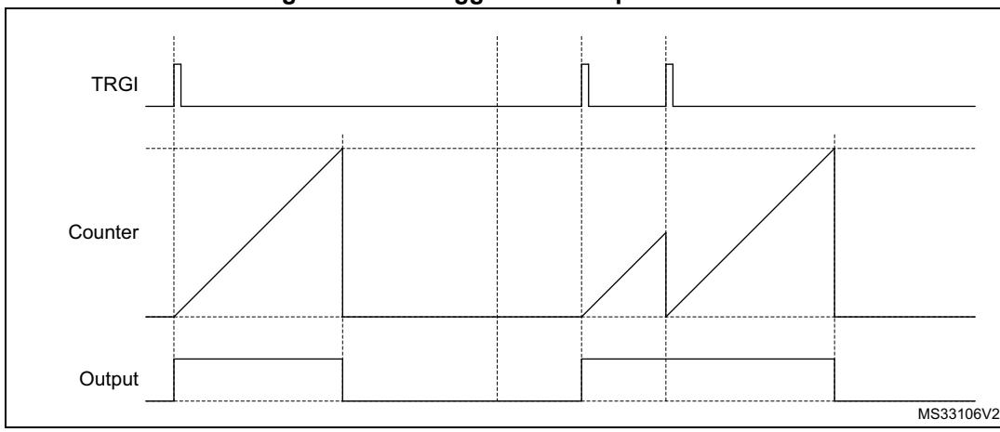

**Figure 551. Retriggerable one pulse mode**

## **43.4.17 UIF bit remapping**

The IUFREMAP bit in the TIMx\_CR1 register forces a continuous copy of the Update Interrupt Flag UIF into bit 31 of the timer counter register (TIMxCNT[31]). This allows both the counter value and a potential roll-over condition signaled by the UIFCPY flag, to be atomically read. In particular cases, it can ease the calculations by avoiding race conditions caused for instance by a processing shared between a background task (counter reading) and an interrupt (Update Interrupt).

There is no latency between the assertions of the UIF and UIFCPY flags.

## **43.4.18 Timer input XOR function (TIM15 only)**

The TI1S bit in the TIMx\_CR2 register, allows the input filter of channel 1 to be connected to the output of a XOR gate, combining the two input pins TIMx\_CH1 and TIMx\_CH2.

The XOR output can be used with all the timer input functions such as trigger or input capture. It is useful for measuring the interval between the edges on two input signals, as shown in *[Figure 552](#page-32-0)*.

<span id="page-32-0"></span>MS31400V1 TI1 TI2 TI1 XOR TI2 Counter

**Figure 552. Measuring time interval between edges on 2 signals**

## 43.4.19 External trigger synchronization (TIM15 only)

The TIM timers are linked together internally for timer synchronization or chaining.

The TIM15 timer can be synchronized with an external trigger in several modes: Reset mode, Gated mode and Trigger mode.

### Slave mode: Reset mode

The counter and its prescaler can be reinitialized in response to an event on a trigger input. Moreover, if the URS bit from the TIMx\_CR1 register is low, an update event UEV is generated. Then all the preloaded registers (TIMx\_ARR, TIMx\_CCRx) are updated.

In the following example, the upcounter is cleared in response to a rising edge on TI1 input:

- Configure the channel 1 to detect rising edges on TI1. Configure the input filter duration (in this example, we do not need any filter, so we keep IC1F=0000). The capture prescaler is not used for triggering, so it does not need to be configured. The CC1S bits select the input capture source only, CC1S = 01 in the TIMx\_CCMR1 register. Write CC1P='0' and CC1NP='0' in the TIMx\_CCER register to validate the polarity (and detect rising edges only).
- 2. Configure the timer in reset mode by writing SMS=100 in TIMx\_SMCR register. Select TI1 as the input source by writing TS=00101 in TIMx\_SMCR register.
- 3. Start the counter by writing CEN=1 in the TIMx CR1 register.

The counter starts counting on the internal clock, then behaves normally until TI1 rising edge. When TI1 rises, the counter is cleared and restarts from 0. In the meantime, the trigger flag is set (TIF bit in the TIMx\_SR register) and an interrupt request, or a DMA request can be sent if enabled (depending on the TIE and TDE bits in TIMx\_DIER register).

The following figure shows this behavior when the auto-reload register TIMx\_ARR=0x36. The delay between the rising edge on TI1 and the actual reset of the counter is due to the resynchronization circuit on TI1 input.

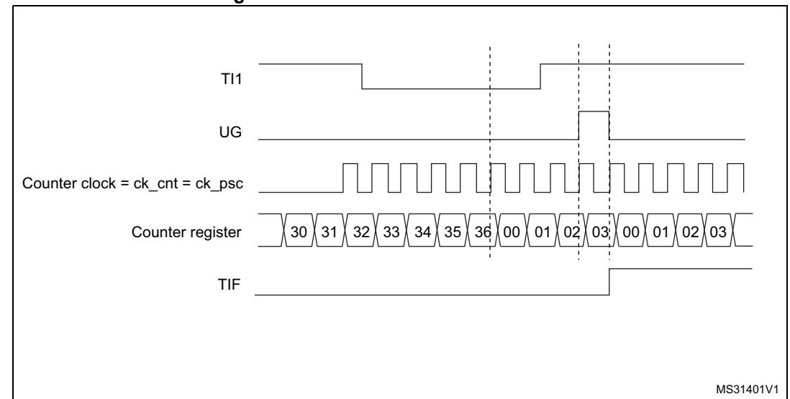

Figure 553. Control circuit in reset mode

## **Slave mode: Gated mode**

The counter can be enabled depending on the level of a selected input.

In the following example, the upcounter counts only when TI1 input is low:

- 1. Configure the channel 1 to detect low levels on TI1. Configure the input filter duration (in this example, we do not need any filter, so we keep IC1F=0000). The capture prescaler is not used for triggering, so it does not need to be configured. The CC1S bits select the input capture source only, CC1S=01 in TIMx\_CCMR1 register. Write CC1P=1 and CC1NP = '0' in the TIMx\_CCER register to validate the polarity (and detect low level only).
- 2. Configure the timer in gated mode by writing SMS=101 in TIMx\_SMCR register. Select TI1 as the input source by writing TS=00101 in TIMx\_SMCR register.
- 3. Enable the counter by writing CEN=1 in the TIMx\_CR1 register (in gated mode, the counter doesn't start if CEN=0, whatever is the trigger input level).

The counter starts counting on the internal clock as long as TI1 is low and stops as soon as TI1 becomes high. The TIF flag in the TIMx\_SR register is set both when the counter starts or stops.

The delay between the rising edge on TI1 and the actual stop of the counter is due to the resynchronization circuit on TI1 input.

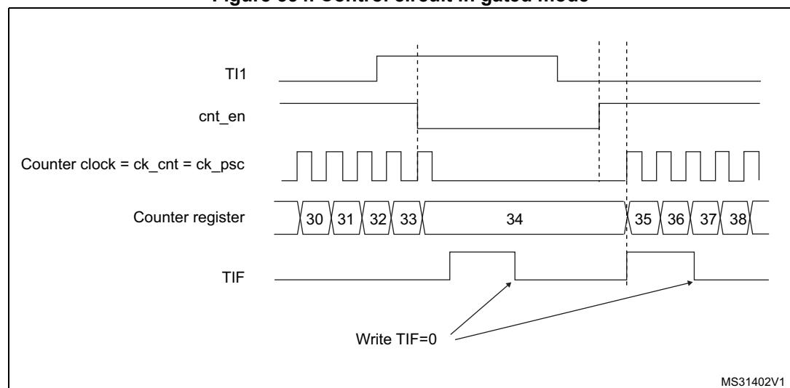

**Figure 554. Control circuit in gated mode**

## **Slave mode: Trigger mode**

The counter can start in response to an event on a selected input.

In the following example, the upcounter starts in response to a rising edge on TI2 input:

- 1. Configure the channel 2 to detect rising edges on TI2. Configure the input filter duration (in this example, we do not need any filter, so we keep IC2F=0000). The capture prescaler is not used for triggering, so it does not need to be configured. The CC2S bits are configured to select the input capture source only, CC2S=01 in TIMx\_CCMR1 register. Write CC2P='1' and CC2NP='0' in the TIMx\_CCER register to validate the polarity (and detect low level only).
- 2. Configure the timer in trigger mode by writing SMS=110 in the TIMx\_SMCR register. Select TI2 as the input source by writing TS=00110 in the TIMx\_SMCR register.

When a rising edge occurs on TI2, the counter starts counting on the internal clock and the TIF flag is set.

The delay between the rising edge on TI2 and the actual start of the counter is due to the resynchronization circuit on TI2 input.

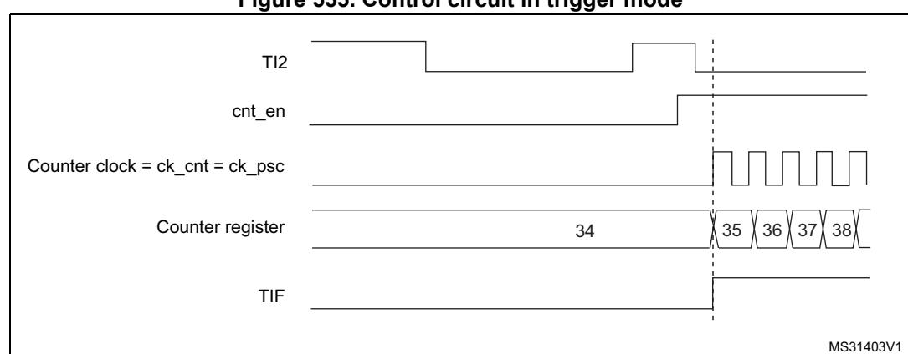

**Figure 555. Control circuit in trigger mode**

## **43.4.20 Slave mode – combined reset + trigger mode**

In this case, a rising edge of the selected trigger input (TRGI) reinitializes the counter, generates an update of the registers, and starts the counter.

This mode is used for one-pulse mode.

# **43.4.21 DMA burst mode**

The TIMx timers have the capability to generate multiple DMA requests on a single event. The main purpose is to be able to re-program several timer registers multiple times without software overhead, but it can also be used to read several registers in a row, at regular intervals.

The DMA controller destination is unique and must point to the virtual register TIMx\_DMAR. On a given timer event, the timer launches a sequence of DMA requests (burst). Each write into the TIMx\_DMAR register is actually redirected to one of the timer registers.


The DBL[4:0] bits in the TIMx\_DCR register set the DMA burst length. The timer recognizes a burst transfer when a read or a write access is done to the TIMx\_DMAR address), i.e. the number of transfers (either in half-words or in bytes).

The DBA[4:0] bits in the TIMx\_DCR registers define the DMA base address for DMA transfers (when read/write access are done through the TIMx\_DMAR address). DBA is defined as an offset starting from the address of the TIMx\_CR1 register.

## Example:

00000: TIMx\_CR1, 00001: TIMx\_CR2, 00010: TIMx\_SMCR,

For example, the timer DMA burst feature could be used to update the contents of the CCRx registers (x = 2, 3, 4) on an update event, with the DMA transferring half words into the CCRx registers.

This is done in the following steps:

- 1. Configure the corresponding DMA channel as follows:
  - DMA channel peripheral address is the DMAR register address
  - DMA channel memory address is the address of the buffer in the RAM containing the data to be transferred by DMA into the CCRx registers.
  - Number of data to transfer = 3 (See note below).
  - Circular mode disabled.
- 2. Configure the DCR register by configuring the DBA and DBL bit fields as follows: DBL = 3 transfers, DBA = 0xE.
- 3. Enable the TIMx update DMA request (set the UDE bit in the DIER register).
- 4. Enable TIMx
- 5. Enable the DMA channel

This example is for the case where every CCRx register is to be updated once. If every CCRx register is to be updated twice for example, the number of data to transfer should be 6. Let's take the example of a buffer in the RAM containing data1, data2, data3, data4, data5 and data6. The data is transferred to the CCRx registers as follows: on the first update DMA request, data1 is transferred to CCR2, data2 is transferred to CCR3, data3 is transferred to CCR4 and on the second update DMA request, data4 is transferred to CCR2, data5 is transferred to CCR3 and data6 is transferred to CCR4.

*Note: A null value can be written to the reserved registers.*


RM0399 Rev 4 1947/3556

## <span id="page-37-0"></span>**43.4.22 Timer synchronization (TIM15)**

The TIMx timers are linked together internally for timer synchronization or chaining. Refer to *Section 41.3.19: Timer synchronization* for details.

*Note: The clock of the slave peripherals (timer, ADC, ...) receiving the TRGO or the TRGO2 signals must be enabled prior to receive events from the master timer, and the clock frequency (prescaler) must not be changed on-the-fly while triggers are received from the master timer.*

## <span id="page-37-1"></span>**43.4.23 Using timer output as trigger for other timers (TIM16/TIM17)**

The timers with one channel only do not feature a master mode. However, the OC1 output signal can be used to trigger some other timers (including timers described in other sections of this document). Check the "TIMx internal trigger connection" table of any TIMx\_SMCR register on the device to identify which timers can be targeted as slave.

The OC1 signal pulse width must be programmed to be at least 2 clock cycles of the destination timer, to make sure the slave timer detects the trigger.

For instance, if the destination's timer CK\_INT clock is 4 times slower than the source timer, the OC1 pulse width must be 8 clock cycles.

## **43.4.24 Debug mode**

When the microcontroller enters debug mode (Cortex®-M7 with FPU core halted), the TIMx counter either continues to work normally or stops, depending on TIMx bit in DBGMCU module. For more details, refer to *Section 63.5.8: Microcontroller debug unit (DBGMCU)*.

For safety purposes, when the counter is stopped (TIMx = 1 in DBGMCU\_APB2FZ1), the outputs are disabled (as if the MOE bit was reset). The outputs can either be forced to an inactive state (OSSI bit = 1), or have their control taken over by the GPIO controller (OSSI bit = 0) to force them to Hi-Z.

# **43.5 TIM15 registers**

Refer to *Section 1.2* for a list of abbreviations used in register descriptions.

The peripheral registers can be accessed by half-words (16-bit) or words (32-bit).

## **43.5.1 TIM15 control register 1 (TIM15\_CR1)**

Address offset: 0x00 Reset value: 0x0000

| 15   | 14   | 13   | 12   | 11           | 10   | 9        | 8  | 7    | 6    | 5    | 4    | 3   | 2   | 1    | 0   |
|------|------|------|------|--------------|------|----------|----|------|------|------|------|-----|-----|------|-----|
| Res. | Res. | Res. | Res. | UIFRE<br>MAP | Res. | CKD[1:0] |    | ARPE | Res. | Res. | Res. | OPM | URS | UDIS | CEN |
|      |      |      |      | rw           |      | rw       | rw | rw   |      |      |      | rw  | rw  | rw   | rw  |

Bits 15:12 Reserved, must be kept at reset value.

Bit 11 **UIFREMAP**: UIF status bit remapping

0: No remapping. UIF status bit is not copied to TIMx\_CNT register bit 31.

1: Remapping enabled. UIF status bit is copied to TIMx\_CNT register bit 31.

Bit 10 Reserved, must be kept at reset value.

Bits 9:8 **CKD[1:0]**: Clock division

This bitfield indicates the division ratio between the timer clock (CK\_INT) frequency and the dead-time and sampling clock (tDTS) used by the dead-time generators and the digital filters (TIx)

00: tDTS = tCK\_INT 01: tDTS = 2 \* tCK\_INT 10: tDTS = 4 \* tCK\_INT

11: Reserved, do not program this value

Bit 7 **ARPE**: Auto-reload preload enable

0: TIMx\_ARR register is not buffered

1: TIMx\_ARR register is buffered

Bits 6:4 Reserved, must be kept at reset value.

Bit 3 **OPM**: One-pulse mode

0: Counter is not stopped at update event

1: Counter stops counting at the next update event (clearing the bit CEN)

RM0399 Rev 4 1949/3556

### Bit 2 **URS**: Update request source

This bit is set and cleared by software to select the UEV event sources.

0: Any of the following events generate an update interrupt if enabled. These events can be:

- Counter overflow/underflow
- Setting the UG bit
- Update generation through the slave mode controller
- 1: Only counter overflow/underflow generates an update interrupt if enabled

#### Bit 1 **UDIS**: Update disable

This bit is set and cleared by software to enable/disable UEV event generation.

- 0: UEV enabled. The Update (UEV) event is generated by one of the following events:
  - Counter overflow/underflow
  - Setting the UG bit
  - Update generation through the slave mode controller

Buffered registers are then loaded with their preload values.

1: UEV disabled. The Update event is not generated, shadow registers keep their value (ARR, PSC, CCRx). However the counter and the prescaler are reinitialized if the UG bit is set or if a hardware reset is received from the slave mode controller.

Bit 0 **CEN**: Counter enable

- 0: Counter disabled
- 1: Counter enabled

*Note: External clock and gated mode can work only if the CEN bit has been previously set by software. However trigger mode can set the CEN bit automatically by hardware.*

## **43.5.2 TIM15 control register 2 (TIM15\_CR2)**

Address offset: 0x04 Reset value: 0x0000

| 15   | 14   | 13   | 12   | 11   | 10   | 9     | 8    | 7    | 6        | 5  | 4  | 3    | 2    | 1    | 0    |
|------|------|------|------|------|------|-------|------|------|----------|----|----|------|------|------|------|
| Res. | Res. | Res. | Res. | Res. | OIS2 | OIS1N | OIS1 | TI1S | MMS[2:0] |    |    | CCDS | CCUS | Res. | CCPC |
|      |      |      |      |      | rw   | rw    | rw   | rw   | rw       | rw | rw | rw   | rw   |      | rw   |

Bits 15:11 Reserved, must be kept at reset value.

Bit 10 **OIS2:** Output idle state 2 (OC2 output)

- 0: OC2=0 when MOE=0
- 1: OC2=1 when MOE=0

*Note: This bit cannot be modified as long as LOCK level 1, 2 or 3 has been programmed (LOCK bits in the TIM15\_BDTR register).*

Bit 9 **OIS1N**: Output Idle state 1 (OC1N output)

- 0: OC1N=0 after a dead-time when MOE=0
- 1: OC1N=1 after a dead-time when MOE=0

*Note: This bit can not be modified as long as LOCK level 1, 2 or 3 has been programmed (LOCK bits in TIM15\_BDTR register).*

Bit 8 **OIS1**: Output Idle state 1 (OC1 output)

- 0: OC1=0 (after a dead-time if OC1N is implemented) when MOE=0
- 1: OC1=1 (after a dead-time if OC1N is implemented) when MOE=0

*Note: This bit can not be modified as long as LOCK level 1, 2 or 3 has been programmed (LOCK bits in TIM15\_BDTR register).*


- Bit 7 **TI1S**: TI1 selection
  - 0: The TIMx\_CH1 pin is connected to TI1 input
  - 1: The TIMx\_CH1, CH2 pins are connected to the TI1 input (XOR combination)
- Bits 6:4 **MMS[2:0]**: Master mode selection

These bits allow to select the information to be sent in master mode to slave timers for synchronization (TRGO). The combination is as follows:

- 000: **Reset** the UG bit from the TIMx\_EGR register is used as trigger output (TRGO). If the reset is generated by the trigger input (slave mode controller configured in reset mode) then the signal on TRGO is delayed compared to the actual reset.
- 001: **Enable** the Counter Enable signal CNT\_EN is used as trigger output (TRGO). It is useful to start several timers at the same time or to control a window in which a slave timer is enable. The Counter Enable signal is generated by a logic AND between CEN control bit and the trigger input when configured in gated mode. When the Counter Enable signal is controlled by the trigger input, there is a delay on TRGO, except if the master/slave mode is selected (see the MSM bit description in TIMx\_SMCR register).
- 010: **Update** The update event is selected as trigger output (TRGO). For instance a master timer can then be used as a prescaler for a slave timer.
- 011: **Compare Pulse** The trigger output send a positive pulse when the CC1IF flag is to be set (even if it was already high), as soon as a capture or a compare match occurred. (TRGO).
- 100: **Compare** OC1REFC signal is used as trigger output (TRGO).
- 101: **Compare** OC2REFC signal is used as trigger output (TRGO).
- Bit 3 **CCDS**: Capture/compare DMA selection
  - 0: CCx DMA request sent when CCx event occurs
  - 1: CCx DMA requests sent when update event occurs
- Bit 2 **CCUS**: Capture/compare control update selection
  - 0: When capture/compare control bits are preloaded (CCPC=1), they are updated by setting the COMG bit only.
  - 1: When capture/compare control bits are preloaded (CCPC=1), they are updated by setting the COMG bit or when an rising edge occurs on TRGI.

*Note: This bit acts only on channels that have a complementary output.*

- Bit 1 Reserved, must be kept at reset value.
- Bit 0 **CCPC**: Capture/compare preloaded control
  - 0: CCxE, CCxNE and OCxM bits are not preloaded
  - 1: CCxE, CCxNE and OCxM bits are preloaded, after having been written, they are updated only when a commutation event (COM) occurs (COMG bit set or rising edge detected on TRGI, depending on the CCUS bit).

*Note: This bit acts only on channels that have a complementary output.*


RM0399 Rev 4 1951/3556

## <span id="page-41-0"></span>**43.5.3 TIM15 slave mode control register (TIM15\_SMCR)**

Address offset: 0x08

Reset value: 0x0000 0000

| 31   | 30   | 29   | 28   | 27   | 26   | 25   | 24   | 23   | 22   | 21      | 20 | 19   | 18   | 17       | 16     |
|------|------|------|------|------|------|------|------|------|------|---------|----|------|------|----------|--------|
| Res. | Res. | Res. | Res. | Res. | Res. | Res. | Res. | Res. | Res. | TS[4:3] |    | Res. | Res. | Res.     | SMS[3] |
|      |      |      |      |      |      |      |      |      |      | rw      | rw |      |      |          | rw     |
|      |      |      |      |      |      |      |      |      |      |         |    |      |      |          |        |
| 15   | 14   | 13   | 12   | 11   | 10   | 9    | 8    | 7    | 6    | 5       | 4  | 3    | 2    | 1        | 0      |
| Res. | Res. | Res. | Res. | Res. | Res. | Res. | Res. | MSM  |      | TS[2:0] |    | Res. |      | SMS[2:0] |        |

Bits 31:22 Reserved, must be kept at reset value.

Bits 19:17 Reserved, must be kept at reset value.

Bits 15:8 Reserved, must be kept at reset value.

Bit 7 **MSM:** Master/slave mode

0: No action

1: The effect of an event on the trigger input (TRGI) is delayed to allow a perfect synchronization between the current timer and its slaves (through TRGO). It is useful if we want to synchronize several timers on a single external event.

#### Bits 21, 20, 6, 5, 4 **TS[4:0]:** Trigger selection

This bit field selects the trigger input to be used to synchronize the counter.

00000: Internal Trigger 0 (ITR0)

00001: Internal Trigger 1 (ITR1)

00010: Internal Trigger 2 (ITR2)

00011: Internal Trigger 3 (ITR3)

00100: TI1 Edge Detector (TI1F\_ED)

00101: Filtered Timer Input 1 (TI1FP1)

00110: Filtered Timer Input 2 (TI2FP2)

Other: Reserved

See *[Table 366: TIMx Internal trigger connection on page 1953](#page-42-0)* for more details on ITRx meaning for each Timer.

*Note: These bits must be changed only when they are not used (e.g. when SMS=000) to avoid wrong edge detections at the transition.*

Bit 3 Reserved, must be kept at reset value.

#### Bits 16, 2, 1, 0 **SMS[3:0]:** Slave mode selection

When external signals are selected the active edge of the trigger signal (TRGI) is linked to the polarity selected on the external input (see Input Control register and Control register description.

0000: Slave mode disabled - if CEN = '1' then the prescaler is clocked directly by the internal clock.

0001: Reserved 0010: Reserved 0011: Reserved

0100: Reset Mode - Rising edge of the selected trigger input (TRGI) reinitializes the counter and generates an update of the registers.

0101: Gated Mode - The counter clock is enabled when the trigger input (TRGI) is high. The counter stops (but is not reset) as soon as the trigger becomes low. Both start and stop of the counter are controlled.

0110: Trigger Mode - The counter starts at a rising edge of the trigger TRGI (but it is not reset). Only the start of the counter is controlled.

0111: External Clock Mode 1 - Rising edges of the selected trigger (TRGI) clock the counter.

1000: Combined reset + trigger mode - Rising edge of the selected trigger input (TRGI) reinitializes the counter, generates an update of the registers and starts the counter.

Other codes: reserved.

*Note: The gated mode must not be used if TI1F\_ED is selected as the trigger input (TS='00100'). Indeed, TI1F\_ED outputs 1 pulse for each transition on TI1F, whereas the gated mode checks the level of the trigger signal.*

*Note: The clock of the slave peripherals (timer, ADC, ...) receiving the TRGO or the TRGO2 signals must be enabled prior to receive events from the master timer, and the clock frequency (prescaler) must not be changed on-the-fly while triggers are received from the master timer.*

**Table 366. TIMx Internal trigger connection**

<span id="page-42-0"></span>

| Slave TIM | ITR0 (TS = 00000) | ITR1 (TS = 00001) | ITR2 (TS = 00010) | ITR3 (TS = 00011) |
|-----------|-------------------|-------------------|-------------------|-------------------|
| TIM15     | TIM1              | TIM3              | TIM16 OC1         | TIM17 OC1         |

## **43.5.4 TIM15 DMA/interrupt enable register (TIM15\_DIER)**

Address offset: 0x0C Reset value: 0x0000

| 15   | 14  | 13        | 12   | 11   | 10   | 9     | 8   | 7   | 6   | 5     | 4    | 3    | 2     | 1     | 0   |
|------|-----|-----------|------|------|------|-------|-----|-----|-----|-------|------|------|-------|-------|-----|
| Res. | TDE | COMD<br>E | Res. | Res. | Res. | CC1DE | UDE | BIE | TIE | COMIE | Res. | Res. | CC2IE | CC1IE | UIE |
|      | rw  | rw        |      |      |      | rw    | rw  | rw  | rw  | rw    |      |      | rw    | rw    | rw  |

Bit 15 Reserved, must be kept at reset value.

Bit 14 **TDE**: Trigger DMA request enable

0: Trigger DMA request disabled 1: Trigger DMA request enabled

Bit 13 **COMDE**: COM DMA request enable

0: COM DMA request disabled 1: COM DMA request enabled

RM0399 Rev 4 1953/3556

Bits 12:10 Reserved, must be kept at reset value.

Bit 9 **CC1DE**: Capture/Compare 1 DMA request enable

0: CC1 DMA request disabled

1: CC1 DMA request enabled

Bit 8 **UDE**: Update DMA request enable

0: Update DMA request disabled

1: Update DMA request enabled

Bit 7 **BIE**: Break interrupt enable

0: Break interrupt disabled

1: Break interrupt enabled

Bit 6 **TIE**: Trigger interrupt enable

0: Trigger interrupt disabled

1: Trigger interrupt enabled

Bit 5 **COMIE:** COM interrupt enable

0: COM interrupt disabled

1: COM interrupt enabled

Bits 4:3 Reserved, must be kept at reset value.

Bit 2 **CC2IE**: Capture/Compare 2 interrupt enable

0: CC2 interrupt disabled

1: CC2 interrupt enabled

Bit 1 **CC1IE**: Capture/Compare 1 interrupt enable

0: CC1 interrupt disabled 1: CC1 interrupt enabled

Bit 0 **UIE**: Update interrupt enable

0: Update interrupt disabled

1: Update interrupt enabled

# **43.5.5 TIM15 status register (TIM15\_SR)**

Address offset: 0x10 Reset value: 0x0000

| 15   | 14   | 13   | 12   | 11   | 10    | 9           | 8    | 7     | 6     | 5     | 4    | 3    | 2     | 1     | 0     |
|------|------|------|------|------|-------|-------------|------|-------|-------|-------|------|------|-------|-------|-------|
| Res. | Res. | Res. | Res. | Res. |       | CC2OF CC1OF | Res. | BIF   | TIF   | COMIF | Res. | Res. | CC2IF | CC1IF | UIF   |
|      |      |      |      |      | rc_w0 | rc_w0       |      | rc_w0 | rc_w0 | rc_w0 |      |      | rc_w0 | rc_w0 | rc_w0 |

Bits 15:11 Reserved, must be kept at reset value.

Bit 10 **CC2OF**: Capture/Compare 2 overcapture flag

Refer to CC1OF description

Bit 9 **CC1OF**: Capture/Compare 1 overcapture flag

This flag is set by hardware only when the corresponding channel is configured in input capture mode. It is cleared by software by writing it to '0'.

0: No overcapture has been detected

1: The counter value has been captured in TIMx\_CCR1 register while CC1IF flag was already set

Bit 8 Reserved, must be kept at reset value.


#### Bit 7 **BIF**: Break interrupt flag

This flag is set by hardware as soon as the break input goes active. It can be cleared by software if the break input is not active.

- 0: No break event occurred
- 1: An active level has been detected on the break input

#### Bit 6 **TIF**: Trigger interrupt flag

This flag is set by hardware on the TRG trigger event (active edge detected on TRGI input when the slave mode controller is enabled in all modes but gated mode, both edges in case gated mode is selected). It is set when the counter starts or stops when gated mode is selected. It is cleared by software.

- 0: No trigger event occurred
- 1: Trigger interrupt pending

#### Bit 5 **COMIF:** COM interrupt flag

This flag is set by hardware on a COM event (once the capture/compare control bits –CCxE, CCxNE, OCxM– have been updated). It is cleared by software.

- 0: No COM event occurred
- 1: COM interrupt pending

#### Bits 4:3 Reserved, must be kept at reset value.

Bit 2 **CC2IF**: Capture/Compare 2 interrupt flag

refer to CC1IF description

#### Bit 1 **CC1IF**: Capture/Compare 1 interrupt flag

This flag is set by hardware. It is cleared by software (input capture or output compare mode) or by reading the TIMx\_CCR1 register (input capture mode only).

- 0: No compare match / No input capture occurred
- 1: A compare match or an input capture occurred

**If channel CC1 is configured as output**: this flag is set when the content of the counter TIMx\_CNT matches the content of the TIMx\_CCR1 register. When the content of TIMx\_CCR1 is greater than the content of TIMx\_ARR, the CC1IF bit goes high on the counter overflow (in up-counting and up/down-counting modes) or underflow (in downcounting mode). There are 3 possible options for flag setting in center-aligned mode, refer to the CMS bits in the TIMx\_CR1 register for the full description.

**If channel CC1 is configured as input**: this bit is set when counter value has been captured in TIMx\_CCR1 register (an edge has been detected on IC1, as per the edge sensitivity defined with the CC1P and CC1NP bits setting, in TIMx\_CCER).

### Bit 0 **UIF**: Update interrupt flag

This bit is set by hardware on an update event. It is cleared by software.

- 0: No update occurred.
- 1: Update interrupt pending. This bit is set by hardware when the registers are updated:
- At overflow regarding the repetition counter value (update if repetition counter = 0) and if the UDIS=0 in the TIMx\_CR1 register.
- When CNT is reinitialized by software using the UG bit in TIMx\_EGR register, if URS=0 and UDIS=0 in the TIMx\_CR1 register.
- When CNT is reinitialized by a trigger event (refer to *[Section 43.5.3: TIM15 slave mode](#page-41-0)  [control register \(TIM15\\_SMCR\)](#page-41-0)*), if URS=0 and UDIS=0 in the TIMx\_CR1 register.


## **43.5.6 TIM15 event generation register (TIM15\_EGR)**

Address offset: 0x14 Reset value: 0x0000

| 15   | 14   | 13   | 12   | 11   | 10   | 9    | 8    | 7  | 6  | 5    | 4    | 3    | 2    | 1    | 0  |
|------|------|------|------|------|------|------|------|----|----|------|------|------|------|------|----|
| Res. | Res. | Res. | Res. | Res. | Res. | Res. | Res. | BG | TG | COMG | Res. | Res. | CC2G | CC1G | UG |
|      |      |      |      |      |      |      |      | w  | w  | rw   |      |      | w    | w    | w  |

Bits 15:8 Reserved, must be kept at reset value.

### Bit 7 **BG**: Break generation

This bit is set by software in order to generate an event, it is automatically cleared by hardware.

- 0: No action
- 1: A break event is generated. MOE bit is cleared and BIF flag is set. Related interrupt or DMA transfer can occur if enabled.

### Bit 6 **TG**: Trigger generation

This bit is set by software in order to generate an event, it is automatically cleared by hardware.

- 0: No action
- 1: The TIF flag is set in TIMx\_SR register. Related interrupt or DMA transfer can occur if enabled

### Bit 5 **COMG:** Capture/Compare control update generation

This bit can be set by software, it is automatically cleared by hardware.

- 0: No action
- 1: When the CCPC bit is set, it is possible to update the CCxE, CCxNE and OCxM bits

*Note: This bit acts only on channels that have a complementary output.*

### Bits 4:3 Reserved, must be kept at reset value.

## Bit 2 **CC2G**: Capture/Compare 2 generation

Refer to CC1G description

## Bit 1 **CC1G**: Capture/Compare 1 generation

This bit is set by software in order to generate an event, it is automatically cleared by hardware.

- 0: No action
- 1: A capture/compare event is generated on channel 1:

## **If channel CC1 is configured as output:**

CC1IF flag is set, Corresponding interrupt or DMA request is sent if enabled.

#### **If channel CC1 is configured as input:**

The current value of the counter is captured in TIMx\_CCR1 register. The CC1IF flag is set, the corresponding interrupt or DMA request is sent if enabled. The CC1OF flag is set if the CC1IF flag was already high.

### Bit 0 **UG**: Update generation

This bit can be set by software, it is automatically cleared by hardware.

- 0: No action
- 1: Reinitialize the counter and generates an update of the registers. Note that the prescaler counter is cleared too (anyway the prescaler ratio is not affected).


## **43.5.7 TIM15 capture/compare mode register 1 (TIM15\_CCMR1)**

Address offset: 0x18

Reset value: 0x0000 0000

The same register can be used for input capture mode (this section) or for output compare mode (next section). The direction of a channel is defined by configuring the corresponding CCxS bits. All the other bits of this register have a different function in input and in output mode.

### **Input capture mode:**

| 31   | 30        | 29   | 28   | 27   | 26          | 25   | 24        | 23   | 22   | 21        | 20   | 19   | 18          | 17   | 16        |
|------|-----------|------|------|------|-------------|------|-----------|------|------|-----------|------|------|-------------|------|-----------|
| Res. | Res.      | Res. | Res. | Res. | Res.        | Res. | Res.      | Res. | Res. | Res.      | Res. | Res. | Res.        | Res. | Res.      |
|      |           |      |      |      |             |      |           |      |      |           |      |      |             |      |           |
| 15   | 14        | 13   | 12   | 11   | 10          | 9    | 8         | 7    | 6    | 5         | 4    | 3    | 2           | 1    | 0         |
|      | IC2F[3:0] |      |      |      | IC2PSC[1:0] |      | CC2S[1:0] |      |      | IC1F[3:0] |      |      | IC1PSC[1:0] |      | CC1S[1:0] |
| rw   | rw        | rw   | rw   | rw   | rw          | rw   | rw        | rw   | rw   | rw        | rw   | rw   | rw          | rw   | rw        |

Bits 31:16 Reserved, must be kept at reset value.

Bits 15:12 **IC2F[3:0]**: Input capture 2 filter

Bits 11:10 **IC2PSC[1:0]**: Input capture 2 prescaler

Bits 9:8 **CC2S[1:0]**: Capture/Compare 2 selection

This bit-field defines the direction of the channel (input/output) as well as the used input.

00: CC2 channel is configured as output

01: CC2 channel is configured as input, IC2 is mapped on TI2

10: CC2 channel is configured as input, IC2 is mapped on TI1

11: CC2 channel is configured as input, IC2 is mapped on TRC. This mode is working only if an internal trigger input is selected through TS bit (TIMx\_SMCR register)

*Note: CC2S bits are writable only when the channel is OFF (CC2E = '0' in TIMx\_CCER).*


### Bits 7:4 **IC1F[3:0]**: Input capture 1 filter

This bit-field defines the frequency used to sample TI1 input and the length of the digital filter applied to TI1. The digital filter is made of an event counter in which N consecutive events are needed to validate a transition on the output:

```
0000: No filter, sampling is done at fDTS
```

```
0001: fSAMPLING=fCK_INT, N=2
0010: fSAMPLING=fCK_INT, N=4
0011: fSAMPLING=fCK_INT, N=8
0100: fSAMPLING=fDTS/2, N=6
0101: fSAMPLING=fDTS/2, N=8
0110: fSAMPLING=fDTS/4, N=6
0111: fSAMPLING=fDTS/4, N=8
1000: fSAMPLING=fDTS/8, N=6
1001: fSAMPLING=fDTS/8, N=8
1010: fSAMPLING=fDTS/16, N=5
1011: fSAMPLING=fDTS/16, N=6
1100: fSAMPLING=fDTS/16, N=8
```

### 1101: fSAMPLING=fDTS/32, N=5 1110: fSAMPLING=fDTS/32, N=6

1111: fSAMPLING=fDTS/32, N=8

### Bits 3:2 **IC1PSC[1:0]**: Input capture 1 prescaler

This bit-field defines the ratio of the prescaler acting on CC1 input (IC1). The prescaler is reset as soon as CC1E='0' (TIMx\_CCER register).

00: no prescaler, capture is done each time an edge is detected on the capture input

01: capture is done once every 2 events

10: capture is done once every 4 events

11: capture is done once every 8 events

### Bits 1:0 **CC1S[1:0]**: Capture/Compare 1 Selection

This bit-field defines the direction of the channel (input/output) as well as the used input.

00: CC1 channel is configured as output

01: CC1 channel is configured as input, IC1 is mapped on TI1

10: CC1 channel is configured as input, IC1 is mapped on TI2

11: CC1 channel is configured as input, IC1 is mapped on TRC. This mode is working only if an internal trigger input is selected through TS bit (TIMx\_SMCR register)

*Note: CC1S bits are writable only when the channel is OFF (CC1E = '0' in TIMx\_CCER).*

# **43.5.8 TIM15 capture/compare mode register 1 [alternate] (TIM15\_CCMR1)**

Address offset: 0x18

Reset value: 0x0000 0000

The same register can be used for output compare mode (this section) or for input capture mode (previous section). The direction of a channel is defined by configuring the corresponding CCxS bits. All the other bits of this register have a different function in input and in output mode.

### **Output compare mode:**


| 31   | 30        | 29       | 28   | 27        | 26        | 25   | 24          | 23   | 22   | 21       | 20   | 19        | 18        | 17   | 16          |
|------|-----------|----------|------|-----------|-----------|------|-------------|------|------|----------|------|-----------|-----------|------|-------------|
| Res. | Res.      | Res.     | Res. | Res.      | Res.      | Res. | OC2M<br>[3] | Res. | Res. | Res.     | Res. | Res.      | Res.      | Res. | OC1M<br>[3] |
|      |           |          |      |           |           |      | rw          |      |      |          |      |           |           |      | rw          |
| 15   | 14        | 13       | 12   | 11        | 10        | 9    | 8           | 7    | 6    | 5        | 4    | 3         | 2         | 1    | 0           |
|      | OC2M[2:0] |          |      |           |           | -    | •           | •    | •    | Ū        | •    | ·         | _         | •    | •           |
| Res. | (         | OC2M[2:0 | )]   | OC2<br>PE | OC2<br>FE |      | S[1:0]      | Res. |      | OC1M[2:0 |      | OC1<br>PE | OC1<br>FE | CC1  | S[1:0]      |

Bits 31:25 Reserved, must be kept at reset value.

Bits 23:17 Reserved, must be kept at reset value.

Bit 15 Reserved, must be kept at reset value.

Bits 24, 14:12 OC2M[3:0]: Output Compare 2 mode

Bit 11 OC2PE: Output Compare 2 preload enable

Bit 10 OC2FE: Output Compare 2 fast enable

Bits 9:8 CC2S[1:0]: Capture/Compare 2 selection

This bit-field defines the direction of the channel (input/output) as well as the used input.

00: CC2 channel is configured as output.

01: CC2 channel is configured as input, IC2 is mapped on TI2.

10: CC2 channel is configured as input, IC2 is mapped on TI1.

11: CC2 channel is configured as input, IC2 is mapped on TRC. This mode is working only if an internal trigger input is selected through the TS bit (TIMx\_SMCR register)

Note: CC2S bits are writable only when the channel is OFF (CC2E = '0' in TIMx\_CCER).

Bit 7 Reserved, must be kept at reset value.


### Bits 16, 6:4 **OC1M[3:0]**: Output Compare 1 mode

These bits define the behavior of the output reference signal OC1REF from which OC1 and OC1N are derived. OC1REF is active high whereas OC1 and OC1N active level depends on CC1P and CC1NP bits.

- 0000: Frozen The comparison between the output compare register TIMx\_CCR1 and the counter TIMx\_CNT has no effect on the outputs.
- 0001: Set channel 1 to active level on match. OC1REF signal is forced high when the counter TIMx\_CNT matches the capture/compare register 1 (TIMx\_CCR1).
- 0010: Set channel 1 to inactive level on match. OC1REF signal is forced low when the counter TIMx\_CNT matches the capture/compare register 1 (TIMx\_CCR1).
- 0011: Toggle OC1REF toggles when TIMx\_CNT=TIMx\_CCR1.
- 0100: Force inactive level OC1REF is forced low.
- 0101: Force active level OC1REF is forced high.
- 0110: PWM mode 1 Channel 1 is active as long as TIMx\_CNT<TIMx\_CCR1 else inactive.
- 0111: PWM mode 2 Channel 1 is inactive as long as TIMx\_CNT<TIMx\_CCR1 else active.
- 1000: Retrigerrable OPM mode 1 In up-counting mode, the channel is active until a trigger event is detected (on TRGI signal). Then, a comparison is performed as in PWM mode 1 and the channels becomes active again at the next update. In down-counting mode, the channel is inactive until a trigger event is detected (on TRGI signal). Then, a comparison is performed as in PWM mode 1 and the channels becomes inactive again at the next update.
- 1001: Retrigerrable OPM mode 2 In up-counting mode, the channel is inactive until a trigger event is detected (on TRGI signal). Then, a comparison is performed as in PWM mode 2 and the channels becomes inactive again at the next update. In downcounting mode, the channel is active until a trigger event is detected (on TRGI signal). Then, a comparison is performed as in PWM mode 1 and the channels becomes active again at the next update.
- 1010: Reserved
- 1011: Reserved
- 1100: Combined PWM mode 1 OC1REF has the same behavior as in PWM mode 1. OC1REFC is the logical OR between OC1REF and OC2REF.
- 1101: Combined PWM mode 2 OC1REF has the same behavior as in PWM mode 2. OC1REFC is the logical AND between OC1REF and OC2REF.
- 1110: Reserved,
- 1111: Reserved,

*Note: These bits can not be modified as long as LOCK level 3 has been programmed (LOCK bits in TIMx\_BDTR register) and CC1S='00' (the channel is configured in output). In PWM mode, the OCREF level changes only when the result of the comparison changes or when the output compare mode switches from "frozen" mode to "PWM" mode.*

*On channels that have a complementary output, this bit field is preloaded. If the CCPC bit is set in the TIMx\_CR2 register then the OC1M active bits take the new value from the preloaded bits only when a COM event is generated.*

*The OC1M[3] bit is not contiguous, located in bit 16.*


#### Bit 3 **OC1PE**: Output Compare 1 preload enable

- 0: Preload register on TIMx\_CCR1 disabled. TIMx\_CCR1 can be written at anytime, the new value is taken in account immediately.
- 1: Preload register on TIMx\_CCR1 enabled. Read/Write operations access the preload register. TIMx\_CCR1 preload value is loaded in the active register at each update event.

*Note: These bits can not be modified as long as LOCK level 3 has been programmed (LOCK bits in TIMx\_BDTR register) and CC1S='00' (the channel is configured in output).*

#### Bit 2 **OC1FE**: Output Compare 1 fast enable

This bit decreases the latency between a trigger event and a transition on the timer output. It must be used in one-pulse mode (OPM bit set in TIMx\_CR1 register), to have the output pulse starting as soon as possible after the starting trigger.

- 0: CC1 behaves normally depending on counter and CCR1 values even when the trigger is ON. The minimum delay to activate CC1 output when an edge occurs on the trigger input is 5 clock cycles.
- 1: An active edge on the trigger input acts like a compare match on CC1 output. Then, OC is set to the compare level independently of the result of the comparison. Delay to sample the trigger input and to activate CC1 output is reduced to 3 clock cycles. OCFE acts only if the channel is configured in PWM1 or PWM2 mode.

### Bits 1:0 **CC1S[1:0]**: Capture/Compare 1 selection

This bit-field defines the direction of the channel (input/output) as well as the used input.

00: CC1 channel is configured as output.

01: CC1 channel is configured as input, IC1 is mapped on TI1.

10: CC1 channel is configured as input, IC1 is mapped on TI2.

11: CC1 channel is configured as input, IC1 is mapped on TRC. This mode is working only if an internal trigger input is selected through TS bit (TIMx\_SMCR register)

*Note: CC1S bits are writable only when the channel is OFF (CC1E = '0' in TIMx\_CCER).*

# <span id="page-50-0"></span>**43.5.9 TIM15 capture/compare enable register (TIM15\_CCER)**

Address offset: 0x20 Reset value: 0x0000

| 15   | 14   | 13   | 12   | 11   | 10   | 9    | 8    | 7     | 6    | 5    | 4    | 3           | 2  | 1    | 0    |
|------|------|------|------|------|------|------|------|-------|------|------|------|-------------|----|------|------|
| Res. | Res. | Res. | Res. | Res. | Res. | Res. | Res. | CC2NP | Res. | CC2P | CC2E | CC1NP CC1NE |    | CC1P | CC1E |
|      |      |      |      |      |      |      |      | rw    |      | rw   | rw   | rw          | rw | rw   | rw   |

Bits 15:8 Reserved, must be kept at reset value.

Bit 7 **CC2NP**: Capture/Compare 2 complementary output polarity Refer to CC1NP description

Bit 6 Reserved, must be kept at reset value.

Bit 5 **CC2P**: Capture/Compare 2 output polarity

Refer to CC1P description

Bit 4 **CC2E**: Capture/Compare 2 output enable

Refer to CC1E description

RM0399 Rev 4 1961/3556

Bit 3 **CC1NP**: Capture/Compare 1 complementary output polarity

CC1 channel configured as output:

0: OC1N active high

1: OC1N active low

CC1 channel configured as input:

This bit is used in conjunction with CC1P to define the polarity of TI1FP1 and TI2FP1. Refer to CC1P description.

*Note: This bit is not writable as soon as LOCK level 2 or 3 has been programmed (LOCK bits in TIMx\_BDTR register) and CC1S="00" (the channel is configured in output).*

*On channels that have a complementary output, this bit is preloaded. If the CCPC bit is set in the TIMx\_CR2 register then the CC1NP active bit takes the new value from the preloaded bit only when a Commutation event is generated.*

### Bit 2 **CC1NE**: Capture/Compare 1 complementary output enable

- 0: Off OC1N is not active. OC1N level is then function of MOE, OSSI, OSSR, OIS1, OIS1N and CC1E bits.
- 1: On OC1N signal is output on the corresponding output pin depending on MOE, OSSI, OSSR, OIS1, OIS1N and CC1E bits.

### Bit 1 **CC1P**: Capture/Compare 1 output polarity

0: OC1 active high (output mode) / Edge sensitivity selection (input mode, see below)

1: OC1 active low (output mode) / Edge sensitivity selection (input mode, see below)

**When CC1 channel is configured as input**, both CC1NP/CC1P bits select the active polarity of TI1FP1 and TI2FP1 for trigger or capture operations.

CC1NP=0, CC1P=0: non-inverted/rising edge. The circuit is sensitive to TIxFP1 rising edge (capture or trigger operations in reset, external clock or trigger mode), TIxFP1 is not inverted (trigger operation in gated mode or encoder mode).

CC1NP=0, CC1P=1: inverted/falling edge. The circuit is sensitive to TIxFP1 falling edge (capture or trigger operations in reset, external clock or trigger mode), TIxFP1 is inverted (trigger operation in gated mode or encoder mode).

CC1NP=1, CC1P=1: non-inverted/both edges/ The circuit is sensitive to both TIxFP1 rising and falling edges (capture or trigger operations in reset, external clock or trigger mode), TIxFP1is not inverted (trigger operation in gated mode). This configuration must not be used in encoder mode.

CC1NP=1, CC1P=0: this configuration is reserved, it must not be used.

*Note: This bit is not writable as soon as LOCK level 2 or 3 has been programmed (LOCK bits in TIMx\_BDTR register).*

*On channels that have a complementary output, this bit is preloaded. If the CCPC bit is set in the TIMx\_CR2 register then the CC1P active bit takes the new value from the preloaded bit only when a Commutation event is generated.*

### Bit 0 **CC1E**: Capture/Compare 1 output enable

0: Capture mode disabled / OC1 is not active (see below)

1: Capture mode enabled / OC1 signal is output on the corresponding output pin

**When CC1 channel is configured as output,** the OC1 level depends on MOE, OSSI, OSSR, OIS1, OIS1N and CC1NE bits, regardless of the CC1E bits state. Refer to *[Table 367](#page-52-0)* for details.


<span id="page-52-0"></span>**Table 367. Output control bits for complementary OCx and OCxN channels with break feature (TIM15)** 

|         |   | Control bits               |   |   | Output states(1)                                                                                                                                                   |                                                                            |  |  |  |  |  |  |
|---------|---|----------------------------|---|---|--------------------------------------------------------------------------------------------------------------------------------------------------------------------|----------------------------------------------------------------------------|--|--|--|--|--|--|
| MOE bit |   | OSSI bit OSSR bit CCxE bit |   |   | CCxNE bit OCx output state                                                                                                                                         | OCxN output state                                                          |  |  |  |  |  |  |
|         |   | X                          | 0 | 0 | Output Disabled (not driven by the timer: Hi-Z)<br>OCx=0<br>OCxN=0, OCxN_EN=0                                                                                      |                                                                            |  |  |  |  |  |  |
|         |   | 0                          | 0 | 1 | Output Disabled (not driven<br>by the timer: Hi-Z)<br>OCx=0                                                                                                        | OCxREF + Polarity<br>OCxN=OCxREF XOR CCxNP                                 |  |  |  |  |  |  |
| 1       | X | 0                          | 1 | 0 | OCxREF + Polarity<br>OCx=OCxREF XOR CCxP                                                                                                                           | Output Disabled (not driven by<br>the timer: Hi-Z)<br>OCxN=0               |  |  |  |  |  |  |
|         |   | X                          | 1 | 1 | OCREF + Polarity + dead<br>time                                                                                                                                    | Complementary to OCREF (not<br>OCREF) + Polarity + dead-time               |  |  |  |  |  |  |
|         |   | 1                          | 0 | 1 | Off-State (output enabled<br>with inactive state)<br>OCx=CCxP                                                                                                      | OCxREF + Polarity<br>OCxN=OCxREF XOR CCxNP                                 |  |  |  |  |  |  |
|         |   | 1                          | 1 | 0 | OCxREF + Polarity<br>OCx=OCxREF xor CCxP,<br>OCx_EN=1                                                                                                              | Off-State (output enabled with<br>inactive state)<br>OCxN=CCxNP, OCxN_EN=1 |  |  |  |  |  |  |
|         | 0 |                            | X | X |                                                                                                                                                                    |                                                                            |  |  |  |  |  |  |
|         |   |                            | 0 | 0 | Output disabled (not driven by the timer: Hi-Z)                                                                                                                    |                                                                            |  |  |  |  |  |  |
| 0       |   | X                          | 0 | 1 | Off-State (output enabled with inactive state)                                                                                                                     |                                                                            |  |  |  |  |  |  |
|         | 1 |                            | 1 | 0 | Asynchronously: OCx=CCxP, OCxN=CCxNP                                                                                                                               |                                                                            |  |  |  |  |  |  |
|         |   |                            | 1 | 1 | Then if the clock is present: OCx=OISx and OCxN=OISxN<br>after a dead-time, assuming that OISx and OISxN do not<br>correspond to OCX and OCxN both in active state |                                                                            |  |  |  |  |  |  |

<sup>1.</sup> When both outputs of a channel are not used (control taken over by GPIO controller), the OISx, OISxN, CCxP and CCxNP bits must be kept cleared.

*Note: The state of the external I/O pins connected to the complementary OCx and OCxN channels depends on the OCx and OCxN channel state and GPIO control and alternate function registers.*

## **43.5.10 TIM15 counter (TIM15\_CNT)**

Address offset: 0x24

Reset value: 0x0000 0000

| 31         | 30   | 29   | 28   | 27   | 26   | 25   | 24   | 23        | 22   | 21   | 20   | 19   | 18   | 17   | 16   |
|------------|------|------|------|------|------|------|------|-----------|------|------|------|------|------|------|------|
| UIF<br>CPY | Res. | Res. | Res. | Res. | Res. | Res. | Res. | Res.      | Res. | Res. | Res. | Res. | Res. | Res. | Res. |
| r          |      |      |      |      |      |      |      |           |      |      |      |      |      |      |      |
| 15         | 14   | 13   | 12   | 11   | 10   | 9    | 8    | 7         | 6    | 5    | 4    | 3    | 2    | 1    | 0    |
|            |      |      |      |      |      |      |      | CNT[15:0] |      |      |      |      |      |      |      |
| rw         | rw   | rw   | rw   | rw   | rw   | rw   | rw   | rw        | rw   | rw   | rw   | rw   | rw   | rw   | rw   |

Bit 31 **UIFCPY**: UIF Copy

This bit is a read-only copy of the UIF bit in the TIMx\_ISR register.

Bits 30:16 Reserved, must be kept at reset value.

Bits 15:0 **CNT[15:0]**: Counter value

## **43.5.11 TIM15 prescaler (TIM15\_PSC)**

Address offset: 0x28 Reset value: 0x0000

| 15 | 14        | 13 | 12 | 11 | 10 | 9  | 8  | 7  | 6  | 5  | 4  | 3  | 2  | 1  | 0  |
|----|-----------|----|----|----|----|----|----|----|----|----|----|----|----|----|----|
|    | PSC[15:0] |    |    |    |    |    |    |    |    |    |    |    |    |    |    |
| rw | rw        | rw | rw | rw | rw | rw | rw | rw | rw | rw | rw | rw | rw | rw | rw |

Bits 15:0 **PSC[15:0]**: Prescaler value

The counter clock frequency (CK\_CNT) is equal to fCK\_PSC / (PSC[15:0] + 1).

PSC contains the value to be loaded in the active prescaler register at each update event (including when the counter is cleared through UG bit of TIMx\_EGR register or through trigger controller when configured in "reset mode").

## **43.5.12 TIM15 auto-reload register (TIM15\_ARR)**

Address offset: 0x2C Reset value: 0xFFFF

| 15 | 14        | 13 | 12 | 11 | 10 | 9  | 8  | 7  | 6  | 5  | 4  | 3  | 2  | 1  | 0  |
|----|-----------|----|----|----|----|----|----|----|----|----|----|----|----|----|----|
|    | ARR[15:0] |    |    |    |    |    |    |    |    |    |    |    |    |    |    |
| rw | rw        | rw | rw | rw | rw | rw | rw | rw | rw | rw | rw | rw | rw | rw | rw |

Bits 15:0 **ARR[15:0]**: Auto-reload value

ARR is the value to be loaded in the actual auto-reload register.

Refer to the *[Section 43.4.1: Time-base unit on page 1915](#page-4-0)* for more details about ARR update and behavior.

The counter is blocked while the auto-reload value is null.

## **43.5.13 TIM15 repetition counter register (TIM15\_RCR)**

Address offset: 0x30 Reset value: 0x0000

| 15   | 14   | 13   | 12   | 11   | 10   | 9    | 8    | 7  | 6  | 5  | 4  | 3        | 2  | 1  | 0  |
|------|------|------|------|------|------|------|------|----|----|----|----|----------|----|----|----|
| Res. | Res. | Res. | Res. | Res. | Res. | Res. | Res. |    |    |    |    | REP[7:0] |    |    |    |
|      |      |      |      |      |      |      |      | rw | rw | rw | rw | rw       | rw | rw | rw |

Bits 15:8 Reserved, must be kept at reset value.

#### Bits 7:0 **REP[7:0]**: Repetition counter value

These bits allow the user to set-up the update rate of the compare registers (i.e. periodic transfers from preload to active registers) when preload registers are enable, as well as the update interrupt generation rate, if this interrupt is enable.

Each time the REP\_CNT related downcounter reaches zero, an update event is generated and it restarts counting from REP value. As REP\_CNT is reloaded with REP value only at the repetition update event U\_RC, any write to the TIMx\_RCR register is not taken in account until the next repetition update event.

It means in PWM mode (REP+1) corresponds to the number of PWM periods in edgealigned mode.

## **43.5.14 TIM15 capture/compare register 1 (TIM15\_CCR1)**

Address offset: 0x34 Reset value: 0x0000

| 15 | 14         | 13 | 12 | 11 | 10 | 9  | 8  | 7  | 6  | 5  | 4  | 3  | 2  | 1  | 0  |
|----|------------|----|----|----|----|----|----|----|----|----|----|----|----|----|----|
|    | CCR1[15:0] |    |    |    |    |    |    |    |    |    |    |    |    |    |    |
| rw | rw         | rw | rw | rw | rw | rw | rw | rw | rw | rw | rw | rw | rw | rw | rw |

Bits 15:0 **CCR1[15:0]**: Capture/Compare 1 value

## **If channel CC1 is configured as output**:

CCR1 is the value to be loaded in the actual capture/compare 1 register (preload value). It is loaded permanently if the preload feature is not selected in the TIMx\_CCMR1 register (bit OC1PE). Else the preload value is copied in the active capture/compare 1 register when an update event occurs.

The active capture/compare register contains the value to be compared to the counter TIMx\_CNT and signaled on OC1 output.

### **If channel CC1 is configured as input**:

CCR1 is the counter value transferred by the last input capture 1 event (IC1).

RM0399 Rev 4 1965/3556

## **43.5.15 TIM15 capture/compare register 2 (TIM15\_CCR2)**

Address offset: 0x38 Reset value: 0x0000

| 15 | 14         | 13 | 12 | 11 | 10 | 9  | 8  | 7  | 6  | 5  | 4  | 3  | 2  | 1  | 0  |
|----|------------|----|----|----|----|----|----|----|----|----|----|----|----|----|----|
|    | CCR2[15:0] |    |    |    |    |    |    |    |    |    |    |    |    |    |    |
| rw | rw         | rw | rw | rw | rw | rw | rw | rw | rw | rw | rw | rw | rw | rw | rw |

Bits 15:0 **CCR2[15:0]**: Capture/Compare 2 value

### **If channel CC2 is configured as output**:

CCR2 is the value to be loaded in the actual capture/compare 2 register (preload value). It is loaded permanently if the preload feature is not selected in the TIMx\_CCMR2 register (bit OC2PE). Else the preload value is copied in the active capture/compare 2 register when an update event occurs.

The active capture/compare register contains the value to be compared to the counter TIMx\_CNT and signalled on OC2 output.

### **If channel CC2 is configured as input**:

CCR2 is the counter value transferred by the last input capture 2 event (IC2).

## **43.5.16 TIM15 break and dead-time register (TIM15\_BDTR)**

Address offset: 0x44

Reset value: 0x0000 0000

| 31   | 30   | 29   | 28   | 27   | 26   | 25   | 24        | 23   | 22   | 21   | 20   | 19       | 18 | 17       | 16 |
|------|------|------|------|------|------|------|-----------|------|------|------|------|----------|----|----------|----|
| Res. | Res. | Res. | Res. | Res. | Res. | Res. | Res.      | Res. | Res. | Res. | Res. |          |    | BKF[3:0] |    |
|      |      |      |      |      |      |      |           |      |      |      |      | rw       | rw | rw       | rw |
| 15   | 14   | 13   | 12   | 11   | 10   | 9    | 8         | 7    | 6    | 5    | 4    | 3        | 2  | 1        | 0  |
| MOE  | AOE  | BKP  | BKE  | OSSR | OSSI |      | LOCK[1:0] |      |      |      |      | DTG[7:0] |    |          |    |
| rw   | rw   | rw   | rw   | rw   | rw   | rw   | rw        | rw   | rw   | rw   | rw   | rw       | rw | rw       | rw |

*Note: As the BKF[3:0], AOE, BKP, BKE, OSSI, OSSR and DTG[7:0] bits may be write-locked depending on the LOCK configuration, it may be necessary to configure all of them during the first write access to the TIMx\_BDTR register.*

Bits 31:20 Reserved, must be kept at reset value.

### Bits 19:16 **BKF[3:0]**: Break filter

This bit-field defines the frequency used to sample the BRK input signal and the length of the digital filter applied to BRK. The digital filter is made of an event counter in which N events are needed to validate a transition on the output:

```
0000: No filter, BRK acts asynchronously
```

```
0001: fSAMPLING=fCK_INT, N=2
0010: fSAMPLING=fCK_INT, N=4
0011: fSAMPLING=fCK_INT, N=8
0100: fSAMPLING=fDTS/2, N=6
0101: fSAMPLING=fDTS/2, N=8
0110: fSAMPLING=fDTS/4, N=6
0111: fSAMPLING=fDTS/4, N=8
1000: fSAMPLING=fDTS/8, N=6
1001: fSAMPLING=fDTS/8, N=8
1010: fSAMPLING=fDTS/16, N=5
1011: fSAMPLING=fDTS/16, N=6
1100: fSAMPLING=fDTS/16, N=8
1101: fSAMPLING=fDTS/32, N=5
```

1110: fSAMPLING=fDTS/32, N=6 1111: fSAMPLING=fDTS/32, N=8

*Note: This bit cannot be modified when LOCK level 1 has been programmed (LOCK bits in TIMx\_BDTR register).*

#### Bit 15 **MOE**: Main output enable

This bit is cleared asynchronously by hardware as soon as the break input is active. It is set by software or automatically depending on the AOE bit. It is acting only on the channels which are configured in output.

- 0: OC and OCN outputs are disabled or forced to idle state depending on the OSSI bit.
- 1: OC and OCN outputs are enabled if their respective enable bits are set (CCxE, CCxNE in TIMx\_CCER register)

See OC/OCN enable description for more details (*[Section 43.5.9: TIM15 capture/compare](#page-50-0)  [enable register \(TIM15\\_CCER\) on page 1961](#page-50-0)*).

#### Bit 14 **AOE**: Automatic output enable

- 0: MOE can be set only by software
- 1: MOE can be set by software or automatically at the next update event (if the break input is not be active)

*Note: This bit can not be modified as long as LOCK level 1 has been programmed (LOCK bits in TIMx\_BDTR register).*

### Bit 13 **BKP**: Break polarity

- 0: Break input BRK is active low
- 1: Break input BRK is active high

*Note: This bit can not be modified as long as LOCK level 1 has been programmed (LOCK bits in TIMx\_BDTR register).*

*Any write operation to this bit takes a delay of 1 APB clock cycle to become effective.*

### Bit 12 **BKE**: Break enable

- 0: Break inputs (BRK and CCS clock failure event) disabled
- 1; Break inputs (BRK and CCS clock failure event) enabled

This bit cannot be modified when LOCK level 1 has been programmed (LOCK bits in TIMx\_BDTR register).

*Note: Any write operation to this bit takes a delay of 1 APB clock cycle to become effective.*


RM0399 Rev 4 1967/3556

### Bit 11 **OSSR**: Off-state selection for Run mode

This bit is used when MOE=1 on channels that have a complementary output which are configured as outputs. OSSR is not implemented if no complementary output is implemented in the timer.

See OC/OCN enable description for more details (*[Section 43.5.9: TIM15 capture/compare](#page-50-0)  [enable register \(TIM15\\_CCER\) on page 1961](#page-50-0)*).

- 0: When inactive, OC/OCN outputs are disabled (the timer releases the output control which is taken over by the GPIO, which forces a Hi-Z state)
- 1: When inactive, OC/OCN outputs are enabled with their inactive level as soon as CCxE=1 or CCxNE=1 (the output is still controlled by the timer).

*Note: This bit can not be modified as soon as the LOCK level 2 has been programmed (LOCK bits in TIMx\_BDTR register).*

### Bit 10 **OSSI**: Off-state selection for Idle mode

This bit is used when MOE=0 on channels configured as outputs.

See OC/OCN enable description for more details (*[Section 43.5.9: TIM15 capture/compare](#page-50-0)  [enable register \(TIM15\\_CCER\) on page 1961](#page-50-0)*).

- 0: When inactive, OC/OCN outputs are disabled (OC/OCN enable output signal=0)
- 1: When inactive, OC/OCN outputs are forced first with their idle level as soon as CCxE=1 or CCxNE=1. OC/OCN enable output signal=1)

*Note: This bit can not be modified as soon as the LOCK level 2 has been programmed (LOCK bits in TIMx\_BDTR register).*

### Bits 9:8 **LOCK[1:0]**: Lock configuration

These bits offer a write protection against software errors.

- 00: LOCK OFF No bit is write protected
- 01: LOCK Level 1 = DTG bits in TIMx\_BDTR register, OISx and OISxN bits in TIMx\_CR2 register and BKE/BKP/AOE bits in TIMx\_BDTR register can no longer be written
- 10: LOCK Level 2 = LOCK Level 1 + CC Polarity bits (CCxP/CCxNP bits in TIMx\_CCER register, as long as the related channel is configured in output through the CCxS bits) as well as OSSR and OSSI bits can no longer be written.
- 11: LOCK Level 3 = LOCK Level 2 + CC Control bits (OCxM and OCxPE bits in TIMx\_CCMRx registers, as long as the related channel is configured in output through the CCxS bits) can no longer be written.

*Note: The LOCK bits can be written only once after the reset. Once the TIMx\_BDTR register has been written, their content is frozen until the next reset.*

### Bits 7:0 **DTG[7:0]**: Dead-time generator setup

This bit-field defines the duration of the dead-time inserted between the complementary outputs. DT correspond to this duration.

```
DTG[7:5] = 0xx => DT = DTG[7:0] x tdtg with tdtg = tDTS
```

DTG[7:5] = 10x => DT = (64+DTG[5:0]) x tdtg with tdtg = 2 x tDTS

DTG[7:5] = 110 => DT = (32+DTG[4:0]) x tdtg with tdtg = 8 x tDTS

DTG[7:5] = 111 => DT = (32+DTG[4:0]) x tdtg with tdtg = 16 x tDTS

Example if tDTS = 125 ns (8 MHz), dead-time possible values are:

0 to 15875 ns by 125 ns steps,

16 µs to 31750 ns by 250 ns steps,

32 µs to 63 µs by 1 µs steps,

64 µs to 126 µs by 2 µs steps

*Note: This bit-field can not be modified as long as LOCK level 1, 2 or 3 has been programmed (LOCK bits in TIMx\_BDTR register).*


## **43.5.17 TIM15 DMA control register (TIM15\_DCR)**

Address offset: 0x48 Reset value: 0x0000

| 15   | 14   | 13   | 12 | 11 | 10       | 9  | 8  | 7    | 6    | 5    | 4  | 3  | 2        | 1  | 0  |
|------|------|------|----|----|----------|----|----|------|------|------|----|----|----------|----|----|
| Res. | Res. | Res. |    |    | DBL[4:0] |    |    | Res. | Res. | Res. |    |    | DBA[4:0] |    |    |
|      |      |      | rw | rw | rw       | rw | rw |      |      |      | rw | rw | rw       | rw | rw |

Bits 15:13 Reserved, must be kept at reset value.

#### Bits 12:8 **DBL[4:0]**: DMA burst length

This 5-bit field defines the length of DMA transfers (the timer recognizes a burst transfer when a read or a write access is done to the TIMx\_DMAR address).

00000: 1 transfer, 00001: 2 transfers, 00010: 3 transfers,

...

10001: 18 transfers.

Bits 7:5 Reserved, must be kept at reset value.

### Bits 4:0 **DBA[4:0]**: DMA base address

This 5-bit field defines the base-address for DMA transfers (when read/write access are done through the TIMx\_DMAR address). DBA is defined as an offset starting from the address of the TIMx\_CR1 register.

Example:

00000: TIMx\_CR1, 00001: TIMx\_CR2, 00010: TIMx\_SMCR,

...

## **43.5.18 TIM15 DMA address for full transfer (TIM15\_DMAR)**

Address offset: 0x4C Reset value: 0x0000

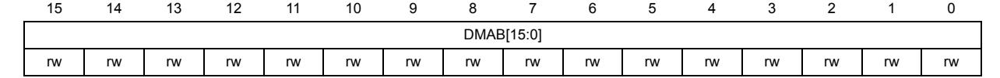

Bits 15:0 **DMAB[15:0]**: DMA register for burst accesses

A read or write operation to the DMAR register accesses the register located at the address (TIMx\_CR1 address) + (DBA + DMA index) x 4

where TIMx\_CR1 address is the address of the control register 1, DBA is the DMA base address configured in TIMx\_DCR register, DMA index is automatically controlled by the DMA transfer, and ranges from 0 to DBL (DBL configured in TIMx\_DCR).

RM0399 Rev 4 1969/3556

## 43.5.19 TIM15 alternate register 1 (TIM15 AF1)

Address offset: 0x60

Reset value: 0x0000 0001

| 31   | 30   | 29   | 28   | 27          | 26          | 25    | 24            | 23   | 22   | 21   | 20   | 19   | 18          | 17          | 16    |
|------|------|------|------|-------------|-------------|-------|---------------|------|------|------|------|------|-------------|-------------|-------|
| Res. | Res. | Res. | Res. | Res.        | Res.        | Res.  | Res.          | Res. | Res. | Res. | Res. | Res. | Res.        | Res.        | Res.  |
|      |      |      |      |             |             |       |               |      |      |      |      |      |             |             |       |
| 15   | 14   | 13   | 12   | 11          | 10          | 9     | 8             | 7    | 6    | 5    | 4    | 3    | 2           | 1           | 0     |
| Res. | Res. | Res. | Res. | BKCM<br>P2P | BKCM<br>P1P | BKINP | BKDF1<br>BK0E | Res. | Res. | Res. | Res. | Res. | BKCM<br>P2E | BKCM<br>P1E | BKINE |
|      |      |      |      | rw          | rw          | rw    | rw            |      |      |      |      |      | rw          | rw          | rw    |

Bits 31:12 Reserved, must be kept at reset value.

### Bit 11 BKCMP2P: BRK COMP2 input polarity

This bit selects the COMP2 input sensitivity. It must be programmed together with the BKP polarity bit.

- 0: COMP2 input is active low
- 1: COMP2 input is active high

Note: This bit can not be modified as long as LOCK level 1 has been programmed (LOCK bits in TIMx BDTR register).

### Bit 10 BKCMP1P: BRK COMP1 input polarity

This bit selects the COMP1 input sensitivity. It must be programmed together with the BKP polarity bit.

- 0: COMP1 input is active low
- 1: COMP1 input is active high

Note: This bit can not be modified as long as LOCK level 1 has been programmed (LOCK bits in TIMx\_BDTR register).

### Bit 9 BKINP: BRK BKIN input polarity

This bit selects the BKIN alternate function input sensitivity. It must be programmed together with the BKP polarity bit.

- 0: BKIN input is active low
- 1: BKIN input is active high

Note: This bit can not be modified as long as LOCK level 1 has been programmed (LOCK bits in TIMx\_BDTR register).

### Bit 8 BKDF1BK0E: BRK dfsdm1 break[0] enable

This bit enables the dfsdm1\_break[0] for the timer's BRK input. dfsdm1\_break[0] output is 'ORed' with the other BRK sources.

- 0: dfsdm1\_break[0]input disabled
- 1: dfsdm1 break[0]input enabled

Note: This bit can not be modified as long as LOCK level 1 has been programmed (LOCK bits in TIMx\_BDTR register).

## Bits 7:3 Reserved, must be kept at reset value.

### Bit 2 BKCMP2E: BRK COMP2 enable

This bit enables the COMP2 for the timer's BRK input. COMP2 output is 'ORed' with the other BRK sources.

- 0: COMP2 input disabled
- 1: COMP2 input enabled

Note: This bit can not be modified as long as LOCK level 1 has been programmed (LOCK bits in TIMx BDTR register).


#### Bit 1 **BKCMP1E**: BRK COMP1 enable

This bit enables the COMP1 for the timer's BRK input. COMP1 output is 'ORed' with the other BRK sources.

0: COMP1 input disabled

1: COMP1 input enabled

*Note: This bit can not be modified as long as LOCK level 1 has been programmed (LOCK bits in TIMx\_BDTR register).*

### Bit 0 **BKINE**: BRK BKIN input enable

This bit enables the BKIN alternate function input for the timer's BRK input. BKIN input is 'ORed' with the other BRK sources.

0: BKIN input disabled 1: BKIN input enabled

*Note: This bit can not be modified as long as LOCK level 1 has been programmed (LOCK bits in TIMx\_BDTR register).*

## **43.5.20 TIM15 input selection register (TIM15\_TISEL)**

Address offset: 0x68

Reset value: 0x0000 0000

| 31   | 30   | 29   | 28   | 27   | 26   | 25          | 24   | 23   | 22   | 21   | 20   | 19   | 18          | 17   | 16   |
|------|------|------|------|------|------|-------------|------|------|------|------|------|------|-------------|------|------|
| Res. | Res. | Res. | Res. | Res. | Res. | Res.        | Res. | Res. | Res. | Res. | Res. | Res. | Res.        | Res. | Res. |
|      |      |      |      |      |      |             |      |      |      |      |      |      |             |      |      |
| 15   | 14   | 13   | 12   | 11   | 10   | 9           | 8    | 7    | 6    | 5    | 4    | 3    | 2           | 1    | 0    |
|      |      |      |      |      |      |             |      |      |      |      |      |      |             |      |      |
| Res. | Res. | Res. | Res. |      |      | TI2SEL[3:0] |      | Res. | Res. | Res. | Res. |      | TI1SEL[3:0] |      |      |

Bits 31:12 Reserved, must be kept at reset value.

Bits 11:8 **TI2SEL[3:0]**: selects TI2[0] to TI2[15] input

0000: TIM15\_CH2 input 0001: TIM2\_CH2 input 0010: TIM3\_CH2 input 0011: TIM4\_CH2 input Others: Reserved

Bits 7:4 Reserved, must be kept at reset value.

Bits 3:0 **TI1SEL[3:0]**: selects TI1[0] to TI1[15] input

0000: TIM15\_CH1 input 0001: TIM2\_CH1 input 0010: TIM3\_CH1 input 0011: TIM4\_CH1 input

0100: LSE 0101: CSI 0110: MCO2 Other: Reserved

RM0399 Rev 4 1971/3556

## **43.5.21 TIM15 register map**

TIM15 registers are mapped as 16-bit addressable registers as described in the table below:

**Table 368. TIM15 register map and reset values** 

| Offset | Register<br>name                      | 31   | 30   | 29   | 28   | 27   | 26   | 25   | 24      | 23   | 22   | 21   | 20          | 19   | 18   | 17   | 16      | 15   | 14   | 13            | 12   | 11                  | 10    | 9         | 8             | 7     | 6    | 5             | 4    | 3                   | 2     | 1         | 0             |
|--------|---------------------------------------|------|------|------|------|------|------|------|---------|------|------|------|-------------|------|------|------|---------|------|------|---------------|------|---------------------|-------|-----------|---------------|-------|------|---------------|------|---------------------|-------|-----------|---------------|
| 0x00   | TIM15_CR1                             | Res. | Res. | Res. | Res. | Res. | Res. | Res. | Res.    | Res. | Res. | Res. | Res.        | Res. | Res. | Res. | Res.    | Res. | Res. | Res.          | Res. | UIFREMA             | Res.  |           | CKD<br>[1:0]  | ARPE  | Res. | Res.          | Res. | OPM                 | URS   | UDIS      | CEN           |
|        | Reset value                           |      |      |      |      |      |      |      |         |      |      |      |             |      |      |      |         |      |      |               |      | 0                   |       | 0         | 0             | 0     |      |               |      | 0                   | 0     | 0         | 0             |
| 0x04   | TIM15_CR2                             | Res. | Res. | Res. | Res. | Res. | Res. | Res. | Res.    | Res. | Res. | Res. | Res.        | Res. | Res. | Res. | Res.    | Res. | Res. | Res.          | Res. | Res.                | OIS2  | OIS1N     | OIS1          | TI1S  |      | MMS[2:0]      |      | CCDS                | CCUS  | Res.      | CCPC          |
|        | Reset value                           |      |      |      |      |      |      |      |         |      |      |      |             |      |      |      |         |      |      |               |      |                     | 0     | 0         | 0             | 0     | 0    | 0             | 0    | 0                   | 0     |           | 0             |
| 0x08   | TIM15_SMCR                            | Res. | Res. | Res. | Res. | Res. | Res. | Res. | Res.    | Res. | Res. |      | TS<br>[4:3] | Res. | Res. | Res. | SMS[3]  | Res. | Res. | Res.          | Res. | Res.                | Res.  | Res.      | Res.          | MSM   |      | TS[2:0]       |      | Res.                |       | SMS[2:0]  |               |
|        | Reset value                           |      |      |      |      |      |      |      |         |      |      | 0    | 0           |      |      |      | 0       |      |      |               |      |                     |       |           |               | 0     | 0    | 0             | 0    |                     | 0     | 0         | 0             |
| 0x0C   | TIM15_DIER                            | Res. | Res. | Res. | Res. | Res. | Res. | Res. | Res.    | Res. | Res. | Res. | Res.        | Res. | Res. | Res. | Res.    | Res. | TDE  | COMDE         | Res. | Res.                | Res.  | CC1DE     | UDE           | BIE   | TIE  | COMIE         | Res. | Res.                | CC2IE | CC1IE     | UIE           |
|        | Reset value                           |      |      |      |      |      |      |      |         |      |      |      |             |      |      |      |         |      | 0    | 0             |      |                     |       | 0         | 0             | 0     | 0    | 0             |      |                     | 0     | 0         | 0             |
| 0x10   | TIM15_SR                              | Res. | Res. | Res. | Res. | Res. | Res. | Res. | Res.    | Res. | Res. | Res. | Res.        | Res. | Res. | Res. | Res.    | Res. | Res. | Res.          | Res. | Res.                | CC2OF | CC1OF     | Res.          | BIF   | TIF  | COMIF         | Res. | Res.                | CC2IF | CC1IF     | UIF           |
|        | Reset value                           |      |      |      |      |      |      |      |         |      |      |      |             |      |      |      |         |      |      |               |      |                     | 0     | 0         |               | 0     | 0    | 0             |      |                     | 0     | 0         | 0             |
| 0x14   | TIM15_EGR                             | Res. | Res. | Res. | Res. | Res. | Res. | Res. | Res.    | Res. | Res. | Res. | Res.        | Res. | Res. | Res. | Res.    | Res. | Res. | Res.          | Res. | Res.                | Res.  | Res.      | Res.          | BG    | TG   | COMG          | Res. | Res.                | CC2G  | CC1G      | UG            |
|        | Reset value                           |      |      |      |      |      |      |      |         |      |      |      |             |      |      |      |         |      |      |               |      |                     |       |           |               | 0     | 0    | 0             |      |                     | 0     | 0         | 0             |
|        | TIM15_CCMR1<br>Output<br>Compare mode | Res. | Res. | Res. | Res. | Res. | Res. | Res. | OC2M[3] | Res. | Res. | Res. | Res.        | Res. | Res. | Res. | OC1M[3] | Res. |      | OC2M<br>[2:0] |      | OC2PE               |       | OC2FECC2S | [1:0]         | Res.  |      | OC1M<br>[2:0] |      | OC1PE               |       | OC1FECC1S | [1:0]         |
| 0x18   | Reset value                           |      |      |      |      |      |      |      | 0       |      |      |      |             |      |      |      | 0       |      | 0    | 0             | 0    | 0                   | 0     | 0         | 0             |       | 0    | 0             | 0    | 0                   | 0     | 0         | 0             |
|        | TIM15_CCMR1<br>Input Capture<br>mode  | Res. | Res. | Res. | Res. | Res. | Res. | Res. | Res.    | Res. | Res. | Res. | Res.        | Res. | Res. | Res. | Res.    |      |      | IC2F[3:0]     |      | IC2<br>PSC<br>[1:0] |       |           | CC2S<br>[1:0] |       |      | IC1F[3:0]     |      | IC1<br>PSC<br>[1:0] |       |           | CC1S<br>[1:0] |
|        | Reset value                           |      |      |      |      |      |      |      |         |      |      |      |             |      |      |      |         | 0    | 0    | 0             | 0    | 0                   | 0     | 0         | 0             | 0     | 0    | 0             | 0    | 0                   | 0     | 0         | 0             |
| 0x20   | TIM15_CCER                            | Res. | Res. | Res. | Res. | Res. | Res. | Res. | Res.    | Res. | Res. | Res. | Res.        | Res. | Res. | Res. | Res.    | Res. | Res. | Res.          | Res. | Res.                | Res.  | Res.      | Res.          | CC2NP | Res. | CC2P          | CC2E | CC1NP               | CC1NE | CC1P      | CC1E          |
|        | Reset value                           |      |      |      |      |      |      |      |         |      |      |      |             |      |      |      |         |      |      |               |      |                     |       |           |               | 0     |      | 0             | 0    | 0                   | 0     | 0         | 0             |


**Table 368. TIM15 register map and reset values (continued)**

| Offset | Register<br>name | 31             | 30   | 29   | 28   | 27   | 26   | 25   | 24   | 23   | 22   | 21   | 20   | 19   | 18   | 17       | 16   | 15   | 14   | 13   | 12   | 11      | 10       | 9                  | 8          | 7    | 6    | 5    | 4        | 3    | 2        | 1           | 0     |
|--------|------------------|----------------|------|------|------|------|------|------|------|------|------|------|------|------|------|----------|------|------|------|------|------|---------|----------|--------------------|------------|------|------|------|----------|------|----------|-------------|-------|
| 0x24   | TIM15_CNT        | UIFCPY or Res. | Res. | Res. | Res. | Res. | Res. | Res. | Res. | Res. | Res. | Res. | Res. | Res. | Res. | Res.     | Res. |      |      |      |      |         |          |                    | CNT[15:0]  |      |      |      |          |      |          |             |       |
|        | Reset value      | 0              |      |      |      |      |      |      |      |      |      |      |      |      |      |          |      | 0    | 0    | 0    | 0    | 0       | 0        | 0                  | 0          | 0    | 0    | 0    | 0        | 0    | 0        | 0           | 0     |
| 0x28   | TIM15_PSC        | Res.           | Res. | Res. | Res. | Res. | Res. | Res. | Res. | Res. | Res. | Res. | Res. | Res. | Res. | Res.     | Res. |      |      |      |      |         |          |                    | PSC[15:0]  |      |      |      |          |      |          |             |       |
|        | Reset value      |                |      |      |      |      |      |      |      |      |      |      |      |      |      |          |      | 0    | 0    | 0    | 0    | 0       | 0        | 0                  | 0          | 0    | 0    | 0    | 0        | 0    | 0        | 0           | 0     |
| 0x2C   | TIM15_ARR        | Res.           | Res. | Res. | Res. | Res. | Res. | Res. | Res. | Res. | Res. | Res. | Res. | Res. | Res. | Res.     | Res. |      |      |      |      |         |          |                    | ARR[15:0]  |      |      |      |          |      |          |             |       |
|        | Reset value      |                |      |      |      |      |      |      |      |      |      |      |      |      |      |          |      | 1    | 1    | 1    | 1    | 1       | 1        | 1                  | 1          | 1    | 1    | 1    | 1        | 1    | 1        | 1           | 1     |
| 0x30   | TIM15_RCR        | Res.           | Res. | Res. | Res. | Res. | Res. | Res. | Res. | Res. | Res. | Res. | Res. | Res. | Res. | Res.     | Res. | Res. | Res. | Res. | Res. | Res.    | Res.     | Res.               | Res.       |      |      |      | REP[7:0] |      |          |             |       |
|        | Reset value      |                |      |      |      |      |      |      |      |      |      |      |      |      |      |          |      |      |      |      |      |         |          |                    |            | 0    | 0    | 0    | 0        | 0    | 0        | 0           | 0     |
| 0x34   | TIM15_CCR1       | Res.           | Res. | Res. | Res. | Res. | Res. | Res. | Res. | Res. | Res. | Res. | Res. | Res. | Res. | Res.     | Res. |      |      |      |      |         |          |                    | CCR1[15:0] |      |      |      |          |      |          |             |       |
|        | Reset value      |                |      |      |      |      |      |      |      |      |      |      |      |      |      |          |      | 0    | 0    | 0    | 0    | 0       | 0        | 0                  | 0          | 0    | 0    | 0    | 0        | 0    | 0        | 0           | 0     |
| 0x38   | TIM15_CCR2       | Res.           | Res. | Res. | Res. | Res. | Res. | Res. | Res. | Res. | Res. | Res. | Res. | Res. | Res. | Res.     | Res. |      |      |      |      |         |          |                    | CCR2[15:0] |      |      |      |          |      |          |             |       |
|        | Reset value      |                |      |      |      |      |      |      |      |      |      |      |      |      |      |          |      | 0    | 0    | 0    | 0    | 0       | 0        | 0                  | 0          | 0    | 0    | 0    | 0        | 0    | 0        | 0           | 0     |
| 0x44   | TIM15_BDTR       | Res.           | Res. | Res. | Res. | Res. | Res. | Res. | Res. | Res. | Res. | Res. | Res. |      |      | BKF[3:0] |      | MOE  | AOE  | BKP  | BKE  | OSSR    |          | OSSI LOCK<br>[1:0] |            |      |      |      | DTG[7:0] |      |          |             |       |
|        | Reset value      |                |      |      |      |      |      |      |      |      |      |      |      | 0    | 0    | 0        | 0    | 0    | 0    | 0    | 0    | 0       | 0        | 0                  | 0          | 0    | 0    | 0    | 0        | 0    | 0        | 0           | 0     |
| 0x48   | TIM15_DCR        | Res.           | Res. | Res. | Res. | Res. | Res. | Res. | Res. | Res. | Res. | Res. | Res. | Res. | Res. | Res.     | Res. | Res. | Res. | Res. |      |         | DBL[4:0] |                    |            | Res. | Res. | Res. |          |      | DBA[4:0] |             |       |
|        | Reset value      |                |      |      |      |      |      |      |      |      |      |      |      |      |      |          |      |      |      |      | 0    | 0       | 0        | 0                  | 0          |      |      |      | 0        | 0    | 0        | 0           | 0     |
| 0x4C   | TIM15_DMAR       | Res.           | Res. | Res. | Res. | Res. | Res. | Res. | Res. | Res. | Res. | Res. | Res. | Res. | Res. | Res.     | Res. |      |      |      |      |         |          |                    | DMAB[15:0] |      |      |      |          |      |          |             |       |
|        | Reset value      |                |      |      |      |      |      |      |      |      |      |      |      |      |      |          |      | 0    | 0    | 0    | 0    | 0       | 0        | 0                  | 0          | 0    | 0    | 0    | 0        | 0    | 0        | 0           | 0     |
| 0x60   | TIM15_AF1        | Res.           | Res. | Res. | Res. | Res. | Res. | Res. | Res. | Res. | Res. | Res. | Res. | Res. | Res. | Res.     | Res. | Res. | Res. | Res. | Res. | BKCMP2P | BKCMP1P  | BKINP              | BKDF1BK0E  | Res. | Res. | Res. | Res.     | Res. | BKCMP2E  | BKCMP1E     | BKINE |
|        | Reset value      |                |      |      |      |      |      |      |      |      |      |      |      |      |      |          |      |      |      |      |      | 0       | 0        | 0                  | 0          |      |      |      |          |      | 0        | 0           | 1     |
| 0x68   | TIM15_TISEL      | Res.           | Res. | Res. | Res. | Res. | Res. | Res. | Res. | Res. | Res. | Res. | Res. | Res. | Res. | Res.     | Res. | Res. | Res. | Res. | Res. |         |          | TI2SEL[3:0]        |            | Res. | Res. | Res. | Res.     |      |          | TI1SEL[3:0] |       |
|        | Reset value      |                |      |      |      |      |      |      |      |      |      |      |      |      |      |          |      |      |      |      |      | 0       | 0        | 0                  | 0          |      |      |      |          | 0    | 0        | 0           | 0     |

Refer to *Section 2.3 on page 134* for the register boundary addresses.


RM0399 Rev 4 1973/3556

# **43.6 TIM16/TIM17 registers**

Refer to *Section 1.2* for a list of abbreviations used in register descriptions.

The peripheral registers can be accessed by half-words (16-bit) or words (32-bit).

## **43.6.1 TIMx control register 1 (TIMx\_CR1)(x = 16 to 17)**

Address offset: 0x00 Reset value: 0x0000

| 15   | 14   | 13   | 12   | 11           | 10   | 9  | 8        | 7  | 6    | 5    | 4    | 3   | 2   | 1    | 0   |
|------|------|------|------|--------------|------|----|----------|----|------|------|------|-----|-----|------|-----|
| Res. | Res. | Res. | Res. | UIFRE<br>MAP | Res. |    | CKD[1:0] |    | Res. | Res. | Res. | OPM | URS | UDIS | CEN |
|      |      |      |      | rw           |      | rw | rw       | rw |      |      |      | rw  | rw  | rw   | rw  |

Bits 15:12 Reserved, must be kept at reset value.

### Bit 11 **UIFREMAP**: UIF status bit remapping

- 0: No remapping. UIF status bit is not copied to TIMx\_CNT register bit 31.
- 1: Remapping enabled. UIF status bit is copied to TIMx\_CNT register bit 31.
- Bit 10 Reserved, must be kept at reset value.

### Bits 9:8 **CKD[1:0]**: Clock division

This bit-field indicates the division ratio between the timer clock (CK\_INT) frequency and the dead-time and sampling clock (tDTS)used by the dead-time generators and the digital filters (TIx),

00: tDTS = tCK\_INT 01: tDTS = 2 \* tCK\_INT 10: tDTS = 4 \* tCK\_INT

11: Reserved, do not program this value

#### Bit 7 **ARPE**: Auto-reload preload enable

0: TIMx\_ARR register is not buffered

1: TIMx\_ARR register is buffered

Bits 6:4 Reserved, must be kept at reset value.

## Bit 3 **OPM**: One pulse mode

- 0: Counter is not stopped at update event
- 1: Counter stops counting at the next update event (clearing the bit CEN)

#### Bit 2 **URS**: Update request source

This bit is set and cleared by software to select the UEV event sources.

- 0: Any of the following events generate an update interrupt or DMA request if enabled. These events can be:
  - Counter overflow/underflow
  - Setting the UG bit
  - Update generation through the slave mode controller
- 1: Only counter overflow/underflow generates an update interrupt or DMA request if enabled.


### Bit 1 **UDIS**: Update disable

This bit is set and cleared by software to enable/disable UEV event generation.

- 0: UEV enabled. The Update (UEV) event is generated by one of the following events:
  - Counter overflow/underflow
  - Setting the UG bit
  - Update generation through the slave mode controller

Buffered registers are then loaded with their preload values.

1: UEV disabled. The Update event is not generated, shadow registers keep their value (ARR, PSC, CCRx). However the counter and the prescaler are reinitialized if the UG bit is set or if a hardware reset is received from the slave mode controller.

Bit 0 **CEN**: Counter enable

- 0: Counter disabled
- 1: Counter enabled

*Note: External clock and gated mode can work only if the CEN bit has been previously set by software. However trigger mode can set the CEN bit automatically by hardware.*

## **43.6.2 TIMx control register 2 (TIMx\_CR2)(x = 16 to 17)**

Address offset: 0x04 Reset value: 0x0000

| 15   | 14   | 13   | 12   | 11   | 10   | 9     | 8    | 7    | 6    | 5    | 4    | 3    | 2    | 1    | 0    |
|------|------|------|------|------|------|-------|------|------|------|------|------|------|------|------|------|
| Res. | Res. | Res. | Res. | Res. | Res. | OIS1N | OIS1 | Res. | Res. | Res. | Res. | CCDS | CCUS | Res. | CCPC |
|      |      |      |      |      |      | rw    | rw   |      |      |      |      | rw   | rw   |      | rw   |

Bits 15:10 Reserved, must be kept at reset value.

Bit 9 **OIS1N**: Output Idle state 1 (OC1N output)

0: OC1N=0 after a dead-time when MOE=0

1: OC1N=1 after a dead-time when MOE=0

*Note: This bit can not be modified as long as LOCK level 1, 2 or 3 has been programmed (LOCK bits in TIMx\_BDTR register).*

Bit 8 **OIS1**: Output Idle state 1 (OC1 output)

0: OC1=0 (after a dead-time if OC1N is implemented) when MOE=0

1: OC1=1 (after a dead-time if OC1N is implemented) when MOE=0

*Note: This bit can not be modified as long as LOCK level 1, 2 or 3 has been programmed (LOCK bits in TIMx\_BDTR register).*

Bits 7:4 Reserved, must be kept at reset value.

Bit 3 **CCDS**: Capture/compare DMA selection

0: CCx DMA request sent when CCx event occurs

1: CCx DMA requests sent when update event occurs

Bit 2 **CCUS**: Capture/compare control update selection

- 0: When capture/compare control bits are preloaded (CCPC=1), they are updated by setting the COMG bit only.
- 1: When capture/compare control bits are preloaded (CCPC=1), they are updated by setting the COMG bit or when an rising edge occurs on TRGI.

*Note: This bit acts only on channels that have a complementary output.*

Bit 1 Reserved, must be kept at reset value.


Bit 0 **CCPC**: Capture/compare preloaded control

0: CCxE, CCxNE and OCxM bits are not preloaded

1: CCxE, CCxNE and OCxM bits are preloaded, after having been written, they are updated only when COM bit is set.

*Note: This bit acts only on channels that have a complementary output.*

## **43.6.3 TIMx DMA/interrupt enable register (TIMx\_DIER)(x = 16 to 17)**

Address offset: 0x0C Reset value: 0x0000

| 15   | 14   | 13   | 12   | 11   | 10   | 9     | 8   | 7   | 6    | 5     | 4    | 3    | 2    | 1     | 0   |
|------|------|------|------|------|------|-------|-----|-----|------|-------|------|------|------|-------|-----|
| Res. | Res. | Res. | Res. | Res. | Res. | CC1DE | UDE | BIE | Res. | COMIE | Res. | Res. | Res. | CC1IE | UIE |
|      |      |      |      |      |      | rw    | rw  | rw  |      | rw    |      |      |      | rw    | rw  |

Bits 15:10 Reserved, must be kept at reset value.

Bit 9 **CC1DE**: Capture/Compare 1 DMA request enable

0: CC1 DMA request disabled 1: CC1 DMA request enabled

Bit 8 **UDE**: Update DMA request enable

0: Update DMA request disabled

1: Update DMA request enabled

Bit 7 **BIE**: Break interrupt enable

0: Break interrupt disabled

1: Break interrupt enabled

Bit 6 Reserved, must be kept at reset value.

Bit 5 **COMIE:** COM interrupt enable

0: COM interrupt disabled

1: COM interrupt enabled

Bits 4:2 Reserved, must be kept at reset value.

Bit 1 **CC1IE**: Capture/Compare 1 interrupt enable

0: CC1 interrupt disabled

1: CC1 interrupt enabled

Bit 0 **UIE**: Update interrupt enable

0: Update interrupt disabled

1: Update interrupt enabled


## **43.6.4 TIMx status register (TIMx\_SR)(x = 16 to 17)**

Address offset: 0x10 Reset value: 0x0000

| 15   | 14   | 13   | 12   | 11   | 10   | 9     | 8    | 7     | 6    | 5     | 4    | 3    | 2    | 1     | 0     |
|------|------|------|------|------|------|-------|------|-------|------|-------|------|------|------|-------|-------|
| Res. | Res. | Res. | Res. | Res. | Res. | CC1OF | Res. | BIF   | Res. | COMIF | Res. | Res. | Res. | CC1IF | UIF   |
|      |      |      |      |      |      | rc_w0 |      | rc_w0 |      | rc_w0 |      |      |      | rc_w0 | rc_w0 |

Bits 15:10 Reserved, must be kept at reset value.

#### Bit 9 **CC1OF**: Capture/Compare 1 overcapture flag

This flag is set by hardware only when the corresponding channel is configured in input capture mode. It is cleared by software by writing it to '0'.

- 0: No overcapture has been detected
- 1: The counter value has been captured in TIMx\_CCR1 register while CC1IF flag was already set
- Bit 8 Reserved, must be kept at reset value.

### Bit 7 **BIF**: Break interrupt flag

This flag is set by hardware as soon as the break input goes active. It can be cleared by software if the break input is not active.

- 0: No break event occurred
- 1: An active level has been detected on the break input
- Bit 6 Reserved, must be kept at reset value.

### Bit 5 **COMIF:** COM interrupt flag

This flag is set by hardware on a COM event (once the capture/compare control bits –CCxE, CCxNE, OCxM– have been updated). It is cleared by software.

- 0: No COM event occurred
- 1: COM interrupt pending

### Bits 4:2 Reserved, must be kept at reset value.

Bit 1 **CC1IF**: Capture/Compare 1 interrupt flag

This flag is set by hardware. It is cleared by software (input capture or output compare mode) or by reading the TIMx\_CCR1 register (input capture mode only).

- 0: No compare match / No input capture occurred
- 1: A compare match or an input capture occurred

**If channel CC1 is configured as output**: this flag is set when the content of the counter TIMx\_CNT matches the content of the TIMx\_CCR1 register. When the content of TIMx\_CCR1 is greater than the content of TIMx\_ARR, the CC1IF bit goes high on the counter overflow (in up-counting and up/down-counting modes) or underflow (in downcounting mode). There are 3 possible options for flag setting in center-aligned mode, refer to the CMS bits in the TIMx\_CR1 register for the full description.

**If channel CC1 is configured as input**: this bit is set when counter value has been captured in TIMx\_CCR1 register (an edge has been detected on IC1, as per the edge sensitivity defined with the CC1P and CC1NP bits setting, in TIMx\_CCER).


#### Bit 0 **UIF**: Update interrupt flag

This bit is set by hardware on an update event. It is cleared by software.

0: No update occurred.

- 1: Update interrupt pending. This bit is set by hardware when the registers are updated:
  - At overflow regarding the repetition counter value (update if repetition counter = 0) and if the UDIS=0 in the TIMx\_CR1 register.
  - When CNT is reinitialized by software using the UG bit in TIMx\_EGR register, if URS=0 and UDIS=0 in the TIMx\_CR1 register.

## **43.6.5 TIMx event generation register (TIMx\_EGR)(x = 16 to 17)**

Address offset: 0x14 Reset value: 0x0000

| 15   | 14   | 13   | 12   | 11   | 10   | 9    | 8    | 7  | 6    | 5    | 4    | 3    | 2    | 1    | 0  |
|------|------|------|------|------|------|------|------|----|------|------|------|------|------|------|----|
| Res. | Res. | Res. | Res. | Res. | Res. | Res. | Res. | BG | Res. | COMG | Res. | Res. | Res. | CC1G | UG |
|      |      |      |      |      |      |      |      | w  |      | w    |      |      |      | w    | w  |

Bits 15:8 Reserved, must be kept at reset value.

### Bit 7 **BG**: Break generation

This bit is set by software in order to generate an event, it is automatically cleared by hardware.

0: No action.

1: A break event is generated. MOE bit is cleared and BIF flag is set. Related interrupt or DMA transfer can occur if enabled.

Bit 6 Reserved, must be kept at reset value.

### Bit 5 **COMG:** Capture/Compare control update generation

This bit can be set by software, it is automatically cleared by hardware.

0: No action

1: When the CCPC bit is set, it is possible to update the CCxE, CCxNE and OCxM bits

*Note: This bit acts only on channels that have a complementary output.*

### Bits 4:2 Reserved, must be kept at reset value.

## Bit 1 **CC1G**: Capture/Compare 1 generation

This bit is set by software in order to generate an event, it is automatically cleared by hardware.

0: No action.

1: A capture/compare event is generated on channel 1:

#### **If channel CC1 is configured as output:**

CC1IF flag is set, Corresponding interrupt or DMA request is sent if enabled.

### **If channel CC1 is configured as input:**

The current value of the counter is captured in TIMx\_CCR1 register. The CC1IF flag is set, the corresponding interrupt or DMA request is sent if enabled. The CC1OF flag is set if the CC1IF flag was already high.

#### Bit 0 **UG**: Update generation

This bit can be set by software, it is automatically cleared by hardware.

0: No action.

1: Reinitialize the counter and generates an update of the registers. Note that the prescaler counter is cleared too (anyway the prescaler ratio is not affected).


## **43.6.6 TIMx capture/compare mode register 1 (TIMx\_CCMR1)(x = 16 to 17)**

Address offset: 0x18

Reset value: 0x0000 0000

The same register can be used for input capture mode (this section) or for output compare mode (next section). The direction of a channel is defined by configuring the corresponding CCxS bits. All the other bits of this register have a different function in input and in output mode.

### **Input capture mode:**

| 31   | 30   | 29   | 28   | 27   | 26   | 25   | 24   | 23                   | 22   | 21        | 20   | 19   | 18          | 17   | 16        |
|------|------|------|------|------|------|------|------|----------------------|------|-----------|------|------|-------------|------|-----------|
| Res. | Res. | Res. | Res. | Res. | Res. | Res. | Res. | Res.                 | Res. | Res.      | Res. | Res. | Res.        | Res. | Res.      |
|      |      |      |      |      |      |      |      |                      |      |           |      |      |             |      |           |
| 15   | 14   | 13   | 12   | 11   | 10   | 9    | 8    | 7                    | 6    | 5         | 4    | 3    | 2           | 1    | 0         |
| Res. | Res. | Res. | Res. | Res. | Res. | Res. | Res. |                      |      | IC1F[3:0] |      |      | IC1PSC[1:0] |      | CC1S[1:0] |
|      |      |      |      |      |      |      |      | rw<br>rw<br>rw<br>rw |      |           |      | rw   | rw          | rw   | rw        |

Bits 31:8 Reserved, must be kept at reset value.

### Bits 7:4 **IC1F[3:0]**: Input capture 1 filter

This bit-field defines the frequency used to sample TI1 input and the length of the digital filter applied to TI1. The digital filter is made of an event counter in which N consecutive events are needed to validate a transition on the output:

0000: No filter, sampling is done at fDTS

0001: fSAMPLING=fCK\_INT, N=2

0010: fSAMPLING=fCK\_INT, N=4

0011: fSAMPLING=fCK\_INT, N=8

0100: fSAMPLING=fDTS/2, N=

0101: fSAMPLING=fDTS/2, N=8

0110: fSAMPLING=fDTS/4, N=6

0111: fSAMPLING=fDTS/4, N=8

1000: fSAMPLING=fDTS/8, N=6

1001: fSAMPLING=fDTS/8, N=8

1010: fSAMPLING=fDTS/16, N=5

1011: fSAMPLING=fDTS/16, N=6

1100: fSAMPLING=fDTS/16, N=8

1101: fSAMPLING=fDTS/32, N=5

1110: fSAMPLING=fDTS/32, N=6

1111: fSAMPLING=fDTS/32, N=8

### Bits 3:2 **IC1PSC[1:0]**: Input capture 1 prescaler

This bit-field defines the ratio of the prescaler acting on CC1 input (IC1).

The prescaler is reset as soon as CC1E='0' (TIMx\_CCER register).

00: no prescaler, capture is done each time an edge is detected on the capture input.

01: capture is done once every 2 events

10: capture is done once every 4 events

11: capture is done once every 8 events


Bits 1:0 **CC1S[1:0]**: Capture/Compare 1 Selection

This bit-field defines the direction of the channel (input/output) as well as the used input.

00: CC1 channel is configured as output

01: CC1 channel is configured as input, IC1 is mapped on TI1

Others: Reserved

*Note: CC1S bits are writable only when the channel is OFF (CC1E = '0' in TIMx\_CCER).*

## **43.6.7 TIMx capture/compare mode register 1 [alternate] (TIMx\_CCMR1)(x = 16 to 17)**

Address offset: 0x18

Reset value: 0x0000 0000

The same register can be used for output compare mode (this section) or for input capture mode (previous section). The direction of a channel is defined by configuring the corresponding CCxS bits. All the other bits of this register have a different function in input and in output mode.

### **Output compare mode:**

| 31   | 30   | 29   | 28   | 27   | 26   | 25   | 24   | 23   | 22   | 21        | 20   | 19   | 18          | 17   | 16          |
|------|------|------|------|------|------|------|------|------|------|-----------|------|------|-------------|------|-------------|
| Res. | Res. | Res. | Res. | Res. | Res. | Res. | Res. | Res. | Res. | Res.      | Res. | Res. | Res.        | Res. | OC1M<br>[3] |
|      |      |      |      |      |      |      |      |      |      |           |      |      |             |      | rw          |
|      |      |      |      |      |      |      |      |      |      |           |      |      |             |      |             |
| 15   | 14   | 13   | 12   | 11   | 10   | 9    | 8    | 7    | 6    | 5         | 4    | 3    | 2           | 1    | 0           |
| Res. | Res. | Res. | Res. | Res. | Res. | Res. | Res. | Res. |      | OC1M[2:0] |      |      | OC1PE OC1FE |      | CC1S[1:0]   |

Bits 31:17 Reserved, must be kept at reset value.

Bits 15:7 Reserved, must be kept at reset value.

### Bits 16, 6:4 **OC1M[3:0]**: Output Compare 1 mode

These bits define the behavior of the output reference signal OC1REF from which OC1 and OC1N are derived. OC1REF is active high whereas OC1 and OC1N active level depends on CC1P and CC1NP bits.

- 0000: Frozen The comparison between the output compare register TIMx\_CCR1 and the counter TIMx\_CNT has no effect on the outputs. This mode can be used when the timer serves as a software timebase. When the frozen mode is enabled during timer operation, the output keeps the state (active or inactive) it had before entering the frozen state.
- 0001: Set channel 1 to active level on match. OC1REF signal is forced high when the counter TIMx\_CNT matches the capture/compare register 1 (TIMx\_CCR1).
- 0010: Set channel 1 to inactive level on match. OC1REF signal is forced low when the counter TIMx\_CNT matches the capture/compare register 1 (TIMx\_CCR1).
- 0011: Toggle OC1REF toggles when TIMx\_CNT=TIMx\_CCR1.
- 0100: Force inactive level OC1REF is forced low.
- 0101: Force active level OC1REF is forced high.
- 0110: PWM mode 1 Channel 1 is active as long as TIMx\_CNT<TIMx\_CCR1 else inactive.
- 0111: PWM mode 2 Channel 1 is inactive as long as TIMx\_CNT<TIMx\_CCR1 else active.

All other values: Reserved

*Note: These bits can not be modified as long as LOCK level 3 has been programmed (LOCK bits in TIMx\_BDTR register) and CC1S='00' (the channel is configured in output). In PWM mode 1 or 2, the OCREF level changes only when the result of the comparison changes or when the output compare mode switches from "frozen" mode to "PWM" mode.*

*The OC1M[3] bit is not contiguous, located in bit 16.*

#### Bit 3 **OC1PE**: Output Compare 1 preload enable

- 0: Preload register on TIMx\_CCR1 disabled. TIMx\_CCR1 can be written at anytime, the new value is taken in account immediately.
- 1: Preload register on TIMx\_CCR1 enabled. Read/Write operations access the preload register. TIMx\_CCR1 preload value is loaded in the active register at each update event.

*Note: These bits can not be modified as long as LOCK level 3 has been programmed (LOCK bits in TIMx\_BDTR register) and CC1S='00' (the channel is configured in output).*

### Bit 2 **OC1FE**: Output Compare 1 fast enable

This bit decreases the latency between a trigger event and a transition on the timer output. It must be used in one-pulse mode (OPM bit set in TIMx\_CR1 register), to have the output pulse starting as soon as possible after the starting trigger.

- 0: CC1 behaves normally depending on counter and CCR1 values even when the trigger is ON. The minimum delay to activate CC1 output when an edge occurs on the trigger input is 5 clock cycles.
- 1: An active edge on the trigger input acts like a compare match on CC1 output. Then, OC is set to the compare level independently of the result of the comparison. Delay to sample the trigger input and to activate CC1 output is reduced to 3 clock cycles. OC1FE acts only if the channel is configured in PWM1 or PWM2 mode.

#### Bits 1:0 **CC1S[1:0]**: Capture/Compare 1 selection

This bit-field defines the direction of the channel (input/output) as well as the used input.

00: CC1 channel is configured as output

01: CC1 channel is configured as input, IC1 is mapped on TI1

Others: Reserved

*Note: CC1S bits are writable only when the channel is OFF (CC1E = '0' in TIMx\_CCER).*


RM0399 Rev 4 1981/3556

# <span id="page-71-0"></span>**43.6.8 TIMx capture/compare enable register (TIMx\_CCER)(x = 16 to 17)**

Address offset: 0x20 Reset value: 0x0000

| 15   | 14   | 13   | 12   | 11   | 10   | 9    | 8    | 7    | 6    | 5    | 4    | 3  | 2           | 1    | 0    |
|------|------|------|------|------|------|------|------|------|------|------|------|----|-------------|------|------|
| Res. | Res. | Res. | Res. | Res. | Res. | Res. | Res. | Res. | Res. | Res. | Res. |    | CC1NP CC1NE | CC1P | CC1E |
|      |      |      |      |      |      |      |      |      |      |      |      | rw | rw          | rw   | rw   |

Bits 15:4 Reserved, must be kept at reset value.

Bit 3 **CC1NP**: Capture/Compare 1 complementary output polarity

CC1 channel configured as output:

0: OC1N active high

1: OC1N active low

CC1 channel configured as input:

This bit is used in conjunction with CC1P to define the polarity of TI1FP1 and TI2FP1. Refer to the description of CC1P.

*Note: This bit is not writable as soon as LOCK level 2 or 3 has been programmed (LOCK bits in TIMx\_BDTR register) and CC1S="00" (the channel is configured in output).*

*On channels that have a complementary output, this bit is preloaded. If the CCPC bit is set in the TIMx\_CR2 register then the CC1NP active bit takes the new value from the preloaded bit only when a commutation event is generated.*

- Bit 2 **CC1NE**: Capture/Compare 1 complementary output enable
  - 0: Off OC1N is not active. OC1N level is then function of MOE, OSSI, OSSR, OIS1, OIS1N and CC1E bits.
  - 1: On OC1N signal is output on the corresponding output pin depending on MOE, OSSI, OSSR, OIS1, OIS1N and CC1E bits.
- Bit 1 **CC1P**: Capture/Compare 1 output polarity
  - 0: OC1 active high (output mode) / Edge sensitivity selection (input mode, see below)
  - 1: OC1 active low (output mode) / Edge sensitivity selection (input mode, see below)

**When CC1 channel is configured as input**, both CC1NP/CC1P bits select the active polarity of TI1FP1 and TI2FP1 for trigger or capture operations.

- CC1NP=0, CC1P=0: non-inverted/rising edge. The circuit is sensitive to TIxFP1 rising edge (capture or trigger operations in reset, external clock or trigger mode), TIxFP1 is not inverted (trigger operation in gated mode or encoder mode).
- CC1NP=0, CC1P=1: inverted/falling edge. The circuit is sensitive to TIxFP1 falling edge (capture or trigger operations in reset, external clock or trigger mode), TIxFP1 is inverted (trigger operation in gated mode or encoder mode).
- CC1NP=1, CC1P=1: non-inverted/both edges/ The circuit is sensitive to both TIxFP1 rising and falling edges (capture or trigger operations in reset, external clock or trigger mode), TIxFP1is not inverted (trigger operation in gated mode). This configuration must not be used in encoder mode.
- CC1NP=1, CC1P=0: this configuration is reserved, it must not be used.
- *Note: This bit is not writable as soon as LOCK level 2 or 3 has been programmed (LOCK bits in TIMx\_BDTR register).*

*On channels that have a complementary output, this bit is preloaded. If the CCPC bit is set in the TIMx\_CR2 register then the CC1P active bit takes the new value from the preloaded bit only when a Commutation event is generated.*

- Bit 0 **CC1E**: Capture/Compare 1 output enable
  - 0: Capture mode disabled / OC1 is not active (see below)
  - 1: Capture mode enabled / OC1 signal is output on the corresponding output pin **When CC1 channel is configured as output**, the OC1 level depends on MOE, OSSI, OSSR, OIS1, OIS1N and CC1NE bits, regardless of the CC1E bits state. Refer to *[Table 369](#page-73-0)* for details.


RM0399 Rev 4 1983/3556

<span id="page-73-0"></span>**Table 369. Output control bits for complementary OCx and OCxN channels with break feature (TIM16/17)** 

|   |   | Control bits               |        |                                              | Output states(1)                                                                                                                                                   |                                                                            |  |  |  |  |  |  |  |
|---|---|----------------------------|--------|----------------------------------------------|--------------------------------------------------------------------------------------------------------------------------------------------------------------------|----------------------------------------------------------------------------|--|--|--|--|--|--|--|
|   |   |                            |        | MOE bit OSSI bit OSSR bit CCxE bit CCxNE bit | OCx output state                                                                                                                                                   | OCxN output state                                                          |  |  |  |  |  |  |  |
|   |   | X                          | 0      | 0                                            | Output Disabled (not driven by the timer: Hi-Z)<br>OCx=0<br>OCxN=0, OCxN_EN=0                                                                                      |                                                                            |  |  |  |  |  |  |  |
|   |   | 0                          | 0      | 1                                            | Output Disabled (not driven<br>by the timer: Hi-Z)<br>OCx=0                                                                                                        | OCxREF + Polarity<br>OCxN=OCxREF XOR CCxNP                                 |  |  |  |  |  |  |  |
| 1 | X | 0                          | 1      | 0                                            | OCxREF + Polarity<br>OCx=OCxREF XOR CCxP                                                                                                                           | Output Disabled (not driven by<br>the timer: Hi-Z)<br>OCxN=0               |  |  |  |  |  |  |  |
|   |   | X<br>1<br>1<br>0<br>1<br>1 |        | 1                                            | OCREF + Polarity + dead<br>time                                                                                                                                    | Complementary to OCREF (not<br>OCREF) + Polarity + dead-time               |  |  |  |  |  |  |  |
|   |   |                            |        | 1                                            | Off-State (output enabled<br>with inactive state)<br>OCx=CCxP                                                                                                      | OCxREF + Polarity<br>OCxN=OCxREF XOR CCxNP                                 |  |  |  |  |  |  |  |
|   |   |                            |        | 0                                            | OCxREF + Polarity<br>OCx=OCxREF XOR CCxP,<br>OCx_EN=1                                                                                                              | Off-State (output enabled with<br>inactive state)<br>OCxN=CCxNP, OCxN_EN=1 |  |  |  |  |  |  |  |
|   | 0 |                            | X      | X                                            |                                                                                                                                                                    |                                                                            |  |  |  |  |  |  |  |
|   |   |                            | 0      | 0                                            | Output disabled (not driven by the timer: Hi-Z).                                                                                                                   |                                                                            |  |  |  |  |  |  |  |
| 0 |   | X                          | 0      | 1                                            | Off-State (output enabled with inactive state)                                                                                                                     |                                                                            |  |  |  |  |  |  |  |
|   | 1 |                            | 1      | 0                                            | Asynchronously: OCx=CCxP, OCxN=CCxNP                                                                                                                               |                                                                            |  |  |  |  |  |  |  |
|   |   |                            | 1<br>1 |                                              | Then if the clock is present: OCx=OISx and OCxN=OISxN<br>after a dead-time, assuming that OISx and OISxN do not<br>correspond to OCX and OCxN both in active state |                                                                            |  |  |  |  |  |  |  |

<sup>1.</sup> When both outputs of a channel are not used (control taken over by GPIO controller), the OISx, OISxN, CCxP and CCxNP bits must be kept cleared.

*Note: The state of the external I/O pins connected to the complementary OCx and OCxN channels depends on the OCx and OCxN channel state and GPIO control and alternate function registers.*

## **43.6.9 TIMx counter (TIMx\_CNT)(x = 16 to 17)**

Address offset: 0x24


Reset value: 0x0000 0000

| 31         | 30        | 29   | 28   | 27   | 26   | 25   | 24   | 23   | 22   | 21   | 20   | 19   | 18   | 17   | 16   |
|------------|-----------|------|------|------|------|------|------|------|------|------|------|------|------|------|------|
| UIF<br>CPY | Res.      | Res. | Res. | Res. | Res. | Res. | Res. | Res. | Res. | Res. | Res. | Res. | Res. | Res. | Res. |
| r          |           |      |      |      |      |      |      |      |      |      |      |      |      |      |      |
| 15         | 14        | 13   | 12   | 11   | 10   | 9    | 8    | 7    | 6    | 5    | 4    | 3    | 2    | 1    | 0    |
|            | CNT[15:0] |      |      |      |      |      |      |      |      |      |      |      |      |      |      |
| rw         | rw        | rw   | rw   | rw   | rw   | rw   | rw   | rw   | rw   | rw   | rw   | rw   | rw   | rw   | rw   |

### Bit 31 **UIFCPY**: UIF Copy

This bit is a read-only copy of the UIF bit of the TIMx\_ISR register. If the UIFREMAP bit in TIMx\_CR1 is reset, bit 31 is reserved and read as 0.

Bits 30:16 Reserved, must be kept at reset value.

Bits 15:0 **CNT[15:0]**: Counter value

## **43.6.10 TIMx prescaler (TIMx\_PSC)(x = 16 to 17)**

Address offset: 0x28 Reset value: 0x0000

| 15 | 14 | 13 | 12 | 11 | 10 | 9  | 8  | 7         | 6  | 5  | 4  | 3  | 2  | 1  | 0  |
|----|----|----|----|----|----|----|----|-----------|----|----|----|----|----|----|----|
|    |    |    |    |    |    |    |    | PSC[15:0] |    |    |    |    |    |    |    |
| rw | rw | rw | rw | rw | rw | rw | rw | rw        | rw | rw | rw | rw | rw | rw | rw |

### Bits 15:0 **PSC[15:0]**: Prescaler value

The counter clock frequency (CK\_CNT) is equal to fCK\_PSC / (PSC[15:0] + 1).

PSC contains the value to be loaded in the active prescaler register at each update event (including when the counter is cleared through UG bit of TIMx\_EGR register or through trigger controller when configured in "reset mode").

## **43.6.11 TIMx auto-reload register (TIMx\_ARR)(x = 16 to 17)**

Address offset: 0x2C Reset value: 0xFFFF

| 15 | 14        | 13 | 12 | 11 | 10 | 9  | 8  | 7  | 6  | 5  | 4  | 3  | 2  | 1  | 0  |
|----|-----------|----|----|----|----|----|----|----|----|----|----|----|----|----|----|
|    | ARR[15:0] |    |    |    |    |    |    |    |    |    |    |    |    |    |    |
| rw | rw        | rw | rw | rw | rw | rw | rw | rw | rw | rw | rw | rw | rw | rw | rw |

### Bits 15:0 **ARR[15:0]**: Auto-reload value

ARR is the value to be loaded in the actual auto-reload register.

Refer to the *[Section 43.4.1: Time-base unit on page 1915](#page-4-0)* for more details about ARR update and behavior.

The counter is blocked while the auto-reload value is null.

RM0399 Rev 4 1985/3556

## **43.6.12 TIMx repetition counter register (TIMx\_RCR)(x = 16 to 17)**

Address offset: 0x30 Reset value: 0x0000

| 15   | 14   | 13   | 12   | 11   | 10   | 9    | 8    | 7        | 6  | 5  | 4  | 3  | 2  | 1  | 0  |
|------|------|------|------|------|------|------|------|----------|----|----|----|----|----|----|----|
| Res. | Res. | Res. | Res. | Res. | Res. | Res. | Res. | REP[7:0] |    |    |    |    |    |    |    |
|      |      |      |      |      |      |      |      | rw       | rw | rw | rw | rw | rw | rw | rw |

Bits 15:8 Reserved, must be kept at reset value.

#### Bits 7:0 **REP[7:0]**: Repetition counter value

These bits allow the user to set-up the update rate of the compare registers (i.e. periodic transfers from preload to active registers) when preload registers are enable, as well as the update interrupt generation rate, if this interrupt is enable.

Each time the REP\_CNT related downcounter reaches zero, an update event is generated and it restarts counting from REP value. As REP\_CNT is reloaded with REP value only at the repetition update event U\_RC, any write to the TIMx\_RCR register is not taken in account until the next repetition update event.

It means in PWM mode (REP+1) corresponds to the number of PWM periods in edgealigned mode.

## **43.6.13 TIMx capture/compare register 1 (TIMx\_CCR1)(x = 16 to 17)**

Address offset: 0x34 Reset value: 0x0000

| 15 | 14 | 13 | 12 | 11 | 10 | 9  | 8  | 7          | 6  | 5  | 4  | 3  | 2  | 1  | 0  |
|----|----|----|----|----|----|----|----|------------|----|----|----|----|----|----|----|
|    |    |    |    |    |    |    |    | CCR1[15:0] |    |    |    |    |    |    |    |
| rw | rw | rw | rw | rw | rw | rw | rw | rw         | rw | rw | rw | rw | rw | rw | rw |

Bits 15:0 **CCR1[15:0]**: Capture/Compare 1 value

## **If channel CC1 is configured as output**:

CCR1 is the value to be loaded in the actual capture/compare 1 register (preload value). It is loaded permanently if the preload feature is not selected in the TIMx\_CCMR1 register (bit OC1PE). Else the preload value is copied in the active capture/compare 1 register when an update event occurs.

The active capture/compare register contains the value to be compared to the counter TIMx\_CNT and signaled on OC1 output.

### **If channel CC1 is configured as input**:

CCR1 is the counter value transferred by the last input capture 1 event (IC1).


## <span id="page-76-0"></span>**43.6.14 TIMx break and dead-time register (TIMx\_BDTR)(x = 16 to 17)**

Address offset: 0x44

Reset value: 0x0000 0000

| 31   | 30   | 29   | 28   | 27   | 26   | 25   | 24        | 23   | 22   | 21   | 20   | 19       | 18 | 17       | 16 |
|------|------|------|------|------|------|------|-----------|------|------|------|------|----------|----|----------|----|
| Res. | Res. | Res. | Res. | Res. | Res. | Res. | Res.      | Res. | Res. | Res. | Res. |          |    | BKF[3:0] |    |
|      |      |      |      |      |      |      |           |      |      |      |      | rw       | rw | rw       | rw |
| 15   | 14   | 13   | 12   | 11   | 10   | 9    | 8         | 7    | 6    | 5    | 4    | 3        | 2  | 1        | 0  |
| MOE  | AOE  | BKP  | BKE  | OSSR | OSSI |      | LOCK[1:0] |      |      |      |      | DTG[7:0] |    |          |    |
| rw   | rw   | rw   | rw   | rw   | rw   | rw   | rw        | rw   | rw   | rw   | rw   | rw       | rw | rw       | rw |

*Note: As the BKF[3:0], AOE, BKP, BKE, OSSI, OSSR and DTG[7:0] bits may be write-locked depending on the LOCK configuration, it may be necessary to configure all of them during the first write access to the TIMx\_BDTR register.*

Bits 31:20 Reserved, must be kept at reset value.

## Bits 19:16 **BKF[3:0]**: Break filter

This bit-field defines the frequency used to sample BRK input and the length of the digital filter applied to BRK. The digital filter is made of an event counter in which N events are needed to validate a transition on the output:

0000: No filter, BRK acts asynchronously

0001: fSAMPLING=fCK\_INT, N=2

0010: fSAMPLING=fCK\_INT, N=4

0011: fSAMPLING=fCK\_INT, N=8

0100: fSAMPLING=fDTS/2, N=6

0101: fSAMPLING=fDTS/2, N=8

0110: fSAMPLING=fDTS/4, N=6

0111: fSAMPLING=fDTS/4, N=8

1000: fSAMPLING=fDTS/8, N=6

1001: fSAMPLING=fDTS/8, N=8

1010: fSAMPLING=fDTS/16, N=5

1011: fSAMPLING=fDTS/16, N=6

1100: fSAMPLING=fDTS/16, N=8 1101: fSAMPLING=fDTS/32, N=5

1110: fSAMPLING=fDTS/32, N=6

1111: fSAMPLING=fDTS/32, N=8

This bit cannot be modified when LOCK level 1 has been programmed (LOCK bits in TIMx\_BDTR register).

### Bit 15 **MOE**: Main output enable

This bit is cleared asynchronously by hardware as soon as the break input is active. It is set by software or automatically depending on the AOE bit. It is acting only on the channels which are configured in output.

0: OC and OCN outputs are disabled or forced to idle state depending on the OSSI bit.

1: OC and OCN outputs are enabled if their respective enable bits are set (CCxE, CCxNE in TIMx\_CCER register)

See OC/OCN enable description for more details (*[Section 43.6.8: TIMx capture/compare](#page-71-0)  [enable register \(TIMx\\_CCER\)\(x = 16 to 17\) on page 1982](#page-71-0)*).


RM0399 Rev 4 1987/3556

#### Bit 14 **AOE**: Automatic output enable

- 0: MOE can be set only by software
- 1: MOE can be set by software or automatically at the next update event (if the break input is not be active)

*Note: This bit can not be modified as long as LOCK level 1 has been programmed (LOCK bits in TIMx\_BDTR register).*

### Bit 13 **BKP**: Break polarity

- 0: Break input BRK is active low
- 1: Break input BRK is active high

*Note: This bit can not be modified as long as LOCK level 1 has been programmed (LOCK bits in TIMx\_BDTR register).*

*Any write operation to this bit takes a delay of 1 APB clock cycle to become effective.*

### Bit 12 **BKE**: Break enable

- 0: Break inputs (BRK and CCS clock failure event) disabled
- 1; Break inputs (BRK and CCS clock failure event) enabled

*Note: This bit cannot be modified when LOCK level 1 has been programmed (LOCK bits in TIMx\_BDTR register).*

*Any write operation to this bit takes a delay of 1 APB clock cycle to become effective.*

#### Bit 11 **OSSR**: Off-state selection for Run mode

This bit is used when MOE=1 on channels that have a complementary output which are configured as outputs. OSSR is not implemented if no complementary output is implemented in the timer.

See OC/OCN enable description for more details (*[Section 43.6.8: TIMx capture/compare](#page-71-0)  [enable register \(TIMx\\_CCER\)\(x = 16 to 17\) on page 1982](#page-71-0)*).

- 0: When inactive, OC/OCN outputs are disabled (the timer releases the output control which is taken over by the GPIO, which forces a Hi-Z state)
- 1: When inactive, OC/OCN outputs are enabled with their inactive level as soon as CCxE=1 or CCxNE=1 (the output is still controlled by the timer).

*Note: This bit can not be modified as soon as the LOCK level 2 has been programmed (LOCK bits in TIMx\_BDTR register).*

### Bit 10 **OSSI**: Off-state selection for Idle mode

This bit is used when MOE=0 on channels configured as outputs.

See OC/OCN enable description for more details (*[Section 43.6.8: TIMx capture/compare](#page-71-0)  [enable register \(TIMx\\_CCER\)\(x = 16 to 17\) on page 1982](#page-71-0)*).

0: When inactive, OC/OCN outputs are disabled (OC/OCN enable output signal=0)

1: When inactive, OC/OCN outputs are forced first with their idle level as soon as CCxE=1 or CCxNE=1. OC/OCN enable output signal=1)

*Note: This bit can not be modified as soon as the LOCK level 2 has been programmed (LOCK bits in TIMx\_BDTR register).*

### Bits 9:8 **LOCK[1:0]**: Lock configuration

These bits offer a write protection against software errors.

00: LOCK OFF - No bit is write protected

01: LOCK Level 1 = DTG bits in TIMx\_BDTR register, OISx and OISxN bits in TIMx\_CR2 register and BKE/BKP/AOE bits in TIMx\_BDTR register can no longer be written.

10: LOCK Level 2 = LOCK Level 1 + CC Polarity bits (CCxP/CCxNP bits in TIMx\_CCER register, as long as the related channel is configured in output through the CCxS bits) as well as OSSR and OSSI bits can no longer be written.

11: LOCK Level 3 = LOCK Level 2 + CC Control bits (OCxM and OCxPE bits in TIMx\_CCMRx registers, as long as the related channel is configured in output through the CCxS bits) can no longer be written.

*Note: The LOCK bits can be written only once after the reset. Once the TIMx\_BDTR register has been written, their content is frozen until the next reset.*

#### Bits 7:0 **DTG[7:0]**: Dead-time generator setup

This bit-field defines the duration of the dead-time inserted between the complementary outputs. DT correspond to this duration.

DTG[7:5] = 0xx => DT = DTG[7:0] x tdtg with tdtg = tDTS

DTG[7:5] = 10x => DT = (64 + DTG[5:0]) x tdtg with tdtg = 2 x tDTS

DTG[7:5] = 110 => DT = (32 + DTG[4:0]) x tdtg with tdtg = 8 x tDTS

DTG[7:5] = 111 => DT = (32 + DTG[4:0]) x tdtg with tdtg = 16 x tDTS

Example if tDTS = 125 ns (8 MHz), dead-time possible values are:

0 to 15875 ns by 125 ns steps,

16 µs to 31750 ns by 250 ns steps,

32 µs to 63 µs by 1 µs steps,

64 µs to 126 µs by 2 µs steps

*Note: This bit-field can not be modified as long as LOCK level 1, 2 or 3 has been programmed (LOCK bits in TIMx\_BDTR register).*

## **43.6.15 TIMx DMA control register (TIMx\_DCR)(x = 16 to 17)**

Address offset: 0x48 Reset value: 0x0000

| 15   | 14   | 13   | 12 | 11 | 10       | 9  | 8  | 7    | 6    | 5    | 4  | 3  | 2        | 1  | 0  |
|------|------|------|----|----|----------|----|----|------|------|------|----|----|----------|----|----|
| Res. | Res. | Res. |    |    | DBL[4:0] |    |    | Res. | Res. | Res. |    |    | DBA[4:0] |    |    |
|      |      |      | rw | rw | rw       | rw | rw |      |      |      | rw | rw | rw       | rw | rw |

RM0399 Rev 4 1989/3556

#### Bits 15:13 Reserved, must be kept at reset value.

#### Bits 12:8 **DBL[4:0]**: DMA burst length

This 5-bit field defines the length of DMA transfers (the timer recognizes a burst transfer when a read or a write access is done to the TIMx\_DMAR address), i.e. the number of transfers. Transfers can be in half-words or in bytes (see example below).

00000: 1 transfer, 00001: 2 transfers, 00010: 3 transfers, ...

10001: 18 transfers.

### Bits 7:5 Reserved, must be kept at reset value.

### Bits 4:0 **DBA[4:0]**: DMA base address

This 5-bit field defines the base-address for DMA transfers (when read/write access are done through the TIMx\_DMAR address). DBA is defined as an offset starting from the address of the TIMx\_CR1 register.

Example:

00000: TIMx\_CR1, 00001: TIMx\_CR2, 00010: TIMx\_SMCR,

...

**Example:** Let us consider the following transfer: DBL = 7 transfers and DBA = TIMx\_CR1. In this case the transfer is done to/from 7 registers starting from the TIMx\_CR1 address.

## **43.6.16 TIMx DMA address for full transfer (TIMx\_DMAR)(x = 16 to 17)**

Address offset: 0x4C Reset value: 0x0000

| 15 | 14         | 13 | 12 | 11 | 10 | 9  | 8  | 7  | 6  | 5  | 4  | 3  | 2  | 1  | 0  |
|----|------------|----|----|----|----|----|----|----|----|----|----|----|----|----|----|
|    | DMAB[15:0] |    |    |    |    |    |    |    |    |    |    |    |    |    |    |
| rw | rw         | rw | rw | rw | rw | rw | rw | rw | rw | rw | rw | rw | rw | rw | rw |

#### Bits 15:0 **DMAB[15:0]**: DMA register for burst accesses

A read or write operation to the DMAR register accesses the register located at the address (TIMx\_CR1 address) + (DBA + DMA index) x 4

where TIMx\_CR1 address is the address of the control register 1, DBA is the DMA base address configured in TIMx\_DCR register, DMA index is automatically controlled by the DMA transfer, and ranges from 0 to DBL (DBL configured in TIMx\_DCR).

## 43.6.17 TIM16 alternate function register 1 (TIM16 AF1)

Address offset: 0x60

Reset value: 0x0000 0001

| 31   | 30   | 29   | 28   | 27          | 26          | 25    | 24            | 23   | 22   | 21   | 20   | 19   | 18          | 17          | 16    |
|------|------|------|------|-------------|-------------|-------|---------------|------|------|------|------|------|-------------|-------------|-------|
| Res. | Res. | Res. | Res. | Res.        | Res.        | Res.  | Res.          | Res. | Res. | Res. | Res. | Res. | Res.        | Res.        | Res.  |
|      |      |      |      |             |             |       |               |      |      |      |      |      |             |             |       |
| 15   | 14   | 13   | 12   | 11          | 10          | 9     | 8             | 7    | 6    | 5    | 4    | 3    | 2           | 1           | 0     |
| Res. | Res. | Res. | Res. | BKCM<br>P2P | BKCM<br>P1P | BKINP | BKDF1<br>BK1E | Res. | Res. | Res. | Res. | Res. | BKCM<br>P2E | BKCM<br>P1E | BKINE |
|      |      |      |      | rw          | rw          | rw    | rw            |      |      |      |      |      | rw          | rw          | rw    |

Bits 31:12 Reserved, must be kept at reset value.

### Bit 11 BKCMP2P: BRK COMP2 input polarity

This bit selects the COMP2 input sensitivity. It must be programmed together with the BKP polarity bit.

- 0: COMP2 input is active low
- 1: COMP2 input is active high

Note: This bit can not be modified as long as LOCK level 1 has been programmed (LOCK bits in TIMx\_BDTR register).

#### Bit 10 BKCMP1P: BRK COMP1 input polarity

This bit selects the COMP1 input sensitivity. It must be programmed together with the BKP polarity bit.

- 0: COMP1 input is active low
- 1: COMP1 input is active high

Note: This bit can not be modified as long as LOCK level 1 has been programmed (LOCK bits in TIMx\_BDTR register).

## Bit 9 BKINP: BRK BKIN input polarity

This bit selects the BKIN alternate function input sensitivity. It must be programmed together with the BKP polarity bit.

- 0: BKIN input is active low
- 1: BKIN input is active high

Note: This bit can not be modified as long as LOCK level 1 has been programmed (LOCK bits in TIMx\_BDTR register).

### Bit 8 BKDFBK1E: BRK dfsdm1 break[1] enable

This bit enables the dfsdm1\_break[1] for the timer's BRK input. dfsdm1\_break[1] output is 'ORed' with the other BRK sources.

- 0: dfsdm1 break[1] input disabled
- 1: dfsdm1 break[1] input enabled

Note: This bit can not be modified as long as LOCK level 1 has been programmed (LOCK bits in TIMx\_BDTR register).

Bits 7:3 Reserved, must be kept at reset value.


RM0399 Rev 4 1991/3556

### Bit 2 **BKCMP2E**: BRK COMP2 enable

This bit enables the COMP2 for the timer's BRK input. COMP2 output is 'ORed' with the other BRK sources.

0: COMP2 input disabled

1: COMP2 input enabled

*Note: This bit can not be modified as long as LOCK level 1 has been programmed (LOCK bits in TIMx\_BDTR register).*

#### Bit 1 **BKCMP1E**: BRK COMP1 enable

This bit enables the COMP1 for the timer's BRK input. COMP1 output is 'ORed' with the other BRK sources.

0: COMP1 input disabled 1: COMP1 input enabled

*Note: This bit can not be modified as long as LOCK level 1 has been programmed (LOCK bits in TIMx\_BDTR register).*

### Bit 0 **BKINE**: BRK BKIN input enable

This bit enables the BKIN alternate function input for the timer's BRK input. BKIN input is 'ORed' with the other BRK sources.

0: BKIN input disabled

1: BKIN input enabled

*Note: This bit can not be modified as long as LOCK level 1 has been programmed (LOCK bits in TIMx\_BDTR register).*

## **43.6.18 TIM16 input selection register (TIM16\_TISEL)**

Address offset: 0x68

Reset value: 0x0000 0000

| 31   | 30   | 29   | 28   | 27   | 26   | 25   | 24   | 23   | 22   | 21   | 20   | 19   | 18   | 17          | 16   |
|------|------|------|------|------|------|------|------|------|------|------|------|------|------|-------------|------|
| Res. | Res. | Res. | Res. | Res. | Res. | Res. | Res. | Res. | Res. | Res. | Res. | Res. | Res. | Res.        | Res. |
|      |      |      |      |      |      |      |      |      |      |      |      |      |      |             |      |
| 15   | 14   | 13   | 12   | 11   | 10   | 9    | 8    | 7    | 6    | 5    | 4    | 3    | 2    | 1           | 0    |
| Res. | Res. | Res. | Res. | Res. | Res. | Res. | Res. | Res. | Res. | Res. | Res. |      |      | TI1SEL[3:0] |      |
|      |      |      |      |      |      |      |      |      |      |      |      | rw   | rw   | rw          | rw   |

Bits 31:4 Reserved, must be kept at reset value.

Bits 3:0 **TI1SEL[3:0]**: selects TI1[0] to TI1[15] input

0000: TIM16\_CH1 input

0001: LSI 0010: LSE 0011: WKUP\_IT Other: Reserved

## 43.6.19 TIM17 alternate function register 1 (TIM17 AF1)

Address offset: 0x60

Reset value: 0x0000 0001

| 31   | 30   | 29   | 28   | 27          | 26          | 25    | 24            | 23   | 22   | 21   | 20   | 19   | 18          | 17          | 16    |
|------|------|------|------|-------------|-------------|-------|---------------|------|------|------|------|------|-------------|-------------|-------|
| Res. | Res. | Res. | Res. | Res.        | Res.        | Res.  | Res.          | Res. | Res. | Res. | Res. | Res. | Res.        | Res.        | Res.  |
|      |      |      |      |             |             |       |               |      |      |      |      |      |             |             |       |
| 15   | 14   | 13   | 12   | 11          | 10          | 9     | 8             | 7    | 6    | 5    | 4    | 3    | 2           | 1           | 0     |
| Res. | Res. | Res. | Res. | BKCM<br>P2P | BKCM<br>P1P | BKINP | BKDF1<br>BK2E | Res. | Res. | Res. | Res. | Res. | BKCM<br>P2E | BKCM<br>P1E | BKINE |
|      | 1    |      |      | rw          | rw          | rw    | rw            |      |      |      |      |      | rw          | rw          | rw    |

Bits 31:12 Reserved, must be kept at reset value.

### Bit 11 BKCMP2P: BRK COMP2 input polarity

This bit selects the COMP2 input sensitivity. It must be programmed together with the BKP polarity bit.

- 0: COMP2 input is active low
- 1: COMP2 input is active high

Note: This bit can not be modified as long as LOCK level 1 has been programmed (LOCK bits in TIMx\_BDTR register).

#### Bit 10 BKCMP1P: BRK COMP1 input polarity

This bit selects the COMP1 input sensitivity. It must be programmed together with the BKP polarity bit.

- 0: COMP1 input is active low
- 1: COMP1 input is active high

Note: This bit can not be modified as long as LOCK level 1 has been programmed (LOCK bits in TIMx\_BDTR register).

## Bit 9 BKINP: BRK BKIN input polarity

This bit selects the BKIN alternate function input sensitivity. It must be programmed together with the BKP polarity bit.

- 0: BKIN input is active low
- 1: BKIN input is active high

Note: This bit can not be modified as long as LOCK level 1 has been programmed (LOCK bits in TIMx\_BDTR register).

### Bit 8 BKDF1BK2E: BRK dfsdm1 break[2] enable

This bit enables the dfsdm1\_break[2] for the timer's BRK input. dfsdm1\_break[2] output is 'ORed' with the other BRK sources.

- 0: dfsdm1 break[2] input disabled
- 1: dfsdm1\_break[2] input enabled

Note: This bit can not be modified as long as LOCK level 1 has been programmed (LOCK bits in TIMx\_BDTR register).

Bits 7:3 Reserved, must be kept at reset value.


RM0399 Rev 4

1993/3556

### Bit 2 **BKCMP2E**: BRK COMP2 enable

This bit enables the COMP2 for the timer's BRK input. COMP2 output is 'ORed' with the other BRK sources.

0: COMP2 input disabled

1: COMP2 input enabled

*Note: This bit can not be modified as long as LOCK level 1 has been programmed (LOCK bits in TIMx\_BDTR register).*

#### Bit 1 **BKCMP1E**: BRK COMP1 enable

This bit enables the COMP1 for the timer's BRK input. COMP1 output is 'ORed' with the other BRK sources.

0: COMP1 input disabled 1: COMP1 input enabled

*Note: This bit can not be modified as long as LOCK level 1 has been programmed (LOCK bits in TIMx\_BDTR register).*

### Bit 0 **BKINE**: BRK BKIN input enable

This bit enables the BKIN alternate function input for the timer's BRK input. BKIN input is 'ORed' with the other BRK sources.

0: BKIN input disabled

1: BKIN input enabled

*Note: This bit can not be modified as long as LOCK level 1 has been programmed (LOCK bits in TIMx\_BDTR register).*

## **43.6.20 TIM17 input selection register (TIM17\_TISEL)**

Address offset: 0x68

Reset value: 0x0000 0000

| 31   | 30   | 29   | 28   | 27   | 26   | 25   | 24   | 23   | 22   | 21   | 20   | 19   | 18          | 17   | 16   |
|------|------|------|------|------|------|------|------|------|------|------|------|------|-------------|------|------|
| Res. | Res. | Res. | Res. | Res. | Res. | Res. | Res. | Res. | Res. | Res. | Res. | Res. | Res.        | Res. | Res. |
|      |      |      |      |      |      |      |      |      |      |      |      |      |             |      |      |
| 15   | 14   | 13   | 12   | 11   | 10   | 9    | 8    | 7    | 6    | 5    | 4    | 3    | 2           | 1    | 0    |
| Res. | Res. | Res. | Res. | Res. | Res. | Res. | Res. | Res. | Res. | Res. | Res. |      | TI1SEL[3:0] |      |      |
|      |      |      |      |      |      |      |      |      |      |      |      | rw   | rw          | rw   | rw   |

Bits 31:4 Reserved, must be kept at reset value.

Bits 3:0 **TI1SEL[3:0]**: selects TI1[0] to TI1[15] input

0000: TIM17\_CH1 input 0010: HSE\_1MHz 0011: MCO1 Others: Reserved

# 43.6.21 TIM16/TIM17 register map

TIM16/TIM17 registers are mapped as 16-bit addressable registers as described in the table below:

Table 370. TIM16/TIM17 register map and reset values

| 1      | Table 370. TIM16/TIM17 register map a |                |      |      |      |      |      |      |      |      |      |      |      | <u> </u> | <u>.~</u> |      |         |      | _         |      |      |         |      | _         |           | _    |                     | _             |           |                |       |         |      |
|--------|---------------------------------------|----------------|------|------|------|------|------|------|------|------|------|------|------|----------|-----------|------|---------|------|-----------|------|------|---------|------|-----------|-----------|------|---------------------|---------------|-----------|----------------|-------|---------|------|
| Offset | Register<br>name                      | 31             | 30   | 29   | 28   | 27   | 26   | 22   | 24   | 23   | 22   | 21   | 20   | 19       | 18        | 17   | 16      | 15   | 14        | 13   | 12   | 1       | 10   | 6         | 8         | 2    | 9                   | 2             | 4         | ဗ              | 2     | 1       | 0    |
| 0x00   | TIMx_CR1                              | Res.           | Res. | Res. | Res. | Res. | Res. | Res. | Res. | Res. | Res. | Res. | Res. | Res.     | Res.      | Res. | Res.    | Res. | Res.      | Res. | Res. | UIFREMA | Res. | Ch<br>[1: | (D<br>:0] | ARPE | Res.                | Res.          | Res.      | OPM            | URS   | SIGN    | CEN  |
|        | Reset value                           |                |      |      |      |      |      |      |      |      |      |      |      |          |           |      |         |      |           |      |      | 0       |      | 0         | 0         | 0    |                     |               |           | 0              | 0     | 0       | 0    |
| 0x04   | TIMx_CR2                              | Res.           | Res. | Res. | Res. | Res. | Res. | Res. | Res. | Res. | Res. | Res. | Res. | Res.     | Res.      | Res. | Res.    | Res. | Res.      | Res. | Res. | Res.    | Res. | OIS1N     | OIS1      | Res. | Res.                | Res.          | Res.      | CCDS           | ccus  | Res.    | CCPC |
|        | Reset value                           |                |      |      |      |      |      |      |      |      |      |      |      |          |           |      |         |      |           |      |      |         |      | 0         | 0         |      |                     |               |           | 0              | 0     |         | 0    |
| 0x0C   | TIMx_DIER                             | Res.           | Res. | Res. | Res. | Res. | Res. | Res. | Res. | Res. | Res. | Res. | Res. | Res.     | Res.      | Res. | Res.    | Res. | Res.      | Res. | Res. | Res.    | Res. | CC1DE     | UDE       | BIE  | Res.                | COMIE         | Res.      | Res.           | Res.  | CC11E   | UIE  |
|        | Reset value                           |                |      |      |      |      |      |      |      |      |      |      |      |          |           |      |         |      |           |      |      |         |      | 0         | 0         | 0    |                     | 0             |           |                |       | 0       | 0    |
| 0x10   | TIMx_SR                               | Res.           | Res. | Res. | Res. | Res. | Res. | Res. | Res. | Res. | Res. | Res. | Res. | Res.     | Res.      | Res. | Res.    | Res. | Res.      | Res. | Res. | Res.    | Res. | CC10F     | Res.      | BIF  | Res.                | COMIF         | Res.      | Res.           | Res.  | CC11F   | UIF  |
|        | Reset value                           |                |      |      |      |      |      |      |      |      |      |      |      |          |           |      |         |      |           |      |      |         |      | 0         |           | 0    |                     | 0             |           |                |       | 0       | 0    |
| 0x14   | TIMx_EGR                              | Res.           | Res. | Res. | Res. | Res. | Res. | Res. | Res. | Res. | Res. | Res. | Res. | Res.     | Res.      | Res. | Res.    | Res. | Res.      | Res. | Res. | Res.    | Res. | Res.      | Res.      | BG   | Res.                | COMG          | Res.      | Res.           | Res.  | CC1G    | ne   |
|        | Reset value                           |                |      |      |      |      |      |      |      |      |      |      |      |          |           |      |         |      |           |      |      |         |      |           |           | 0    |                     | 0             |           |                |       | 0       | 0    |
|        | TIMx_CCMR1 Output Compare mode        | Res.           | Res. | Res. | Res. | Res. | Res. | Res. | Res. | Res. | Res. | Res. | Res. | Res.     | Res.      | Res. | OC1M[3] | Res. | Res.      | Res. | Res. | Res.    | Res. | Res.      | Res.      | Res. |                     | OC1I<br>[2:0] | C1M [2:0] |                | OC1FE | C(<br>5 | S    |
| 0x18   | Reset value                           |                |      |      |      |      |      |      |      |      |      |      |      |          |           |      | 0       |      |           |      |      |         |      |           |           |      | 0                   | 0             | 0         | 0              | 0     | 0       | 0    |
| UX16   | TIMx_CCMR1<br>Input Capture<br>mode   | Res.           | Res. | Res. | Res. | Res. | Res. | Res. | Res. | Res. | Res. | Res. | Res. | Res.     | Res.      | Res. | Res.    |      |           |      |      | Res.    | I    | C1F       | [3:0      | )]   | IC1<br>PSC<br>[1:0] |               |           | C1<br>S<br>:0] |       |         |      |
|        | Reset value                           |                |      |      |      |      |      |      |      |      |      |      |      |          | П         |      |         |      |           |      |      |         | П    |           |           | 0    | 0                   | 0             | 0         | 0              | 0     | 0       | 0    |
| 0x20   | TIMx_CCER                             | Res.           | Res. | Res. | Res. | Res. | Res. | Res. | Res. | Res. | Res. | Res. | Res. | Res.     | Res.      | Res. | Res.    | Res. | Res.      | Res. | Res. | Res.    | Res. | Res.      | Res.      | Res. | Res.                | Res.          | Res.      | CC1NP          | CC1NE | CC1P    | CC1E |
|        | Reset value                           |                |      |      |      |      |      |      |      |      |      |      |      |          |           |      |         |      |           |      |      |         |      |           |           |      |                     |               |           | 0              | 0     | 0       | 0    |
| 0x24   | TIMx_CNT                              | UIFCPY or Res. | Res. | Res. | Res. | Res. | Res. | Res. | Res. | Res. | Res. | Res. | Res. | Res.     | Res.      | Res. | Res.    |      |           |      |      |         |      | C         | :NT[      | 15:0 | 0]                  |               |           |                |       |         |      |
|        | Reset value                           | 0              |      |      |      |      |      |      |      |      |      |      |      |          |           |      |         | 0    | 0         | 0    | 0    | 0       | 0    | 0         | 0         | 0    | 0                   | 0             | 0         | 0              | 0     | 0       | 0    |
| 0x28   | TIMx_PSC                              | Res.           | Res. | Res. | Res. | Res. | Res. | Res. | Res. | Res. | Res. | Res. | Res. | Res.     | Res.      | Res. | Res.    |      | PSC[15:0] |      |      |         |      |           |           |      |                     |               |           |                |       |         |      |
|        | Reset value                           |                |      |      |      |      |      |      |      |      |      |      |      |          |           |      |         | 0    | 0         | 0    | 0    | 0       | 0    | 0         | 0         | 0    | 0                   | 0             | 0         | 0              | 0     | 0       | 0    |
| 0x2C   | TIMx_ARR                              | Res.           | Res. | Res. | Res. | Res. | Res. | Res. | Res. | Res. | Res. | Res. | Res. | Res.     | Res.      | Res. | Res.    |      |           |      |      |         |      | Α         | .RR[      | 15:0 | 0]                  |               |           |                |       |         |      |
| 0,20   | Reset value                           |                |      |      |      |      |      |      |      |      |      |      |      |          |           |      |         | 1    | 1         | 1    | 1    | 1       | 1    | 1         | 1         | 1    | 1                   | 1             | 1         | 1              | 1     | 1       | 1    |


Table 370. TIM16/TIM17 register map and reset values (continued)

| Offset | Register<br>name | 31   | 30   | 29   | 28   | 27   | 26   | 25   | 24   | 23   | 22   | 21   | 20   | 19   | 18   | 17   | 16           | 15   | 14   | 13   | 12   | 11             | 10      | 6              | 8              | 7    | 9    | 2    | 4    | ဗ     | 2              | 1              | 0     |
|--------|------------------|------|------|------|------|------|------|------|------|------|------|------|------|------|------|------|--------------|------|------|------|------|----------------|---------|----------------|----------------|------|------|------|------|-------|----------------|----------------|-------|
| 0x30   | TIMx_RCR         | Res. | Res. | Res. | Res. | Res. | Res. | Res. | Res. | Res. | Res. | Res. | Res. | Res. | Res. | Res. | Res.         | Res. | Res. | Res. | Res. | Res.           | Res.    | Res.           | Res.           |      |      | F    | REP  | 7:7:0 | )]             |                |       |
|        | Reset value      |      |      |      |      |      |      |      |      |      |      |      |      |      |      |      |              |      |      |      |      |                |         |                |                | 0    | 0    | 0    | 0    | 0     | 0              | 0              | 0     |
| 0x34   | TIMx_CCR1        | Res. | Res. | Res. | Res. | Res. | Res. | Res. | Res. | Res. | Res. | Res. | Res. | Res. | Res. | Res. | © CCR1[15:0] |      |      |      |      |                |         |                |                |      |      |      |      |       |                |                |       |
|        | Reset value      |      |      |      |      |      |      |      |      |      |      |      |      |      |      |      |              | 0    | 0    | 0    | 0    | 0              | 0       | 0              | 0              | 0    | 0    | 0    | 0    | 0     | 0              | 0              | 0     |
| 0x44   | TIMx_BDTR        | Res. | Res. | Res. | Res. | Res. | Res. | Res. | Res. | Res. | Res. | Res. | Res. |      | BKF  | [3:0 | )]           | MOE  | AOE  | BKP  | BKE  | OSSR           | ISSO    | LC<br> -<br> 1 | OC<br>K<br>:0] |      |      | [    | OTG  | 6[7:0 | )]             |                |       |
|        | Reset value      |      |      |      |      |      |      |      |      |      |      |      |      | 0    | 0    | 0    | 0            | 0    | 0    | 0    | 0    | 0              | 0       | 0              | 0              | 0    | 0    | 0    | 0    | 0     | 0              | 0              | 0     |
| 0x48   | TIMx_DCR         | Res. | Res. | Res. | Res. | Res. | Res. | Res. | Res. | Res. | Res. | Res. | Res. | Res. | Res. | Res. | Res.         | Res. | Res. | Res. |      | DE             | 3L[4    | :0]            |                | Res. | Res. | Res. |      | DE    | 3A[4           | 1:0]           |       |
|        | Reset value      |      |      |      |      |      |      |      |      |      |      |      |      |      |      |      |              |      |      |      | 0    | 0              | 0       | 0              | 0              |      |      |      | 0    | 0     | 0              | 0              | 0     |
| 0x4C   | TIMx_DMAR        | Res. | Res. | Res. | Res. | Res. | Res. | Res. | Res. | Res. | Res. | Res. | Res. | Res. | Res. | Res. | DMAB[15:0]   |      |      |      |      |                |         |                |                |      |      |      |      | •     |                |                |       |
|        | Reset value      |      |      |      |      |      |      |      |      |      |      |      |      |      |      |      |              | 0    | 0    | 0    | 0    | 0              | 0       | 0              | 0              | 0    | 0    | 0    | 0    | 0     | 0              | 0              | 0     |
| 0x60   | TIM16_AF1        | Res. | Res. | Res. | Res. | Res. | Res. | Res. | Res. | Res. | Res. | Res. | Res. | Res. | Res. | Res. | Res.         | Res. | Res. | Res. | Res. | BKCMP2P        | BKCMP1P | BKINP          | BKDF1BK1E      | Res. | Res. | Res. | Res. | Res.  | <b>BKCMP2E</b> | BKCMP1E        | BKINE |
|        | Reset value      |      |      |      |      |      |      |      |      |      |      |      |      |      |      |      |              |      |      |      |      | 0              | 0       | 0              | 0              |      |      |      |      |       | 0              | 0              | 1     |
| 0x60   | TIM17_AF1        | Res. | Res. | Res. | Res. | Res. | Res. | Res. | Res. | Res. | Res. | Res. | Res. | Res. | Res. | Res. | Res.         | Res. | Res. | Res. | Res. | <b>BKCMP2P</b> | BKCMP1P | BKINP          | BKDF1BK2E      | Res. | Res. | Res. | Res. | Res.  | <b>BKCMP2E</b> | <b>BKCMP1E</b> | BKINE |
|        | Reset value      |      |      |      |      |      |      |      |      |      |      |      |      |      |      |      |              |      |      |      |      | 0              | 0       | 0              | 0              |      |      |      |      |       | 0              | 0              | 1     |
| 0x68   | TIM16_TISEL      | Res. | Res. | Res. | Res. | Res. | Res. | Res. | Res. | Res. | Res. | Res. | Res. | Res. | Res. | Res. | Res.         | Res. | Res. | Res. | Res. | Res.           | Res.    | Res.           | Res.           | Res. | Res. | Res. | Res. | TI    | 1SE            | EL[3           | :0]   |
|        | Reset value      |      |      |      |      |      |      |      |      |      |      |      |      |      |      |      |              |      |      |      |      |                |         |                |                |      |      |      |      | 0     | 0              | 0              | 0     |
| 0x68   | TIM17_TISEL      | Res. | Res. | Res. | Res. | Res. | Res. | Res. | Res. | Res. | Res. | Res. | Res. | Res. | Res. | Res. | Res.         | Res. | Res. | Res. | Res. | Res.           | Res.    | Res.           | Res.           | Res. | Res. | Res. | Res. | TI    | 1SE            | EL[3           | :0]   |
|        | Reset value      |      |      |      |      |      |      |      |      |      |      |      |      |      |      |      |              |      |      |      |      |                |         |                |                |      |      |      |      | 0     | 0              | 0              | 0     |

Refer to Section 2.3 on page 134 for the register boundary addresses.

