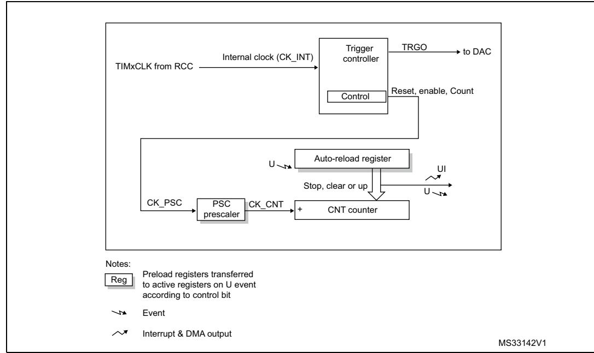
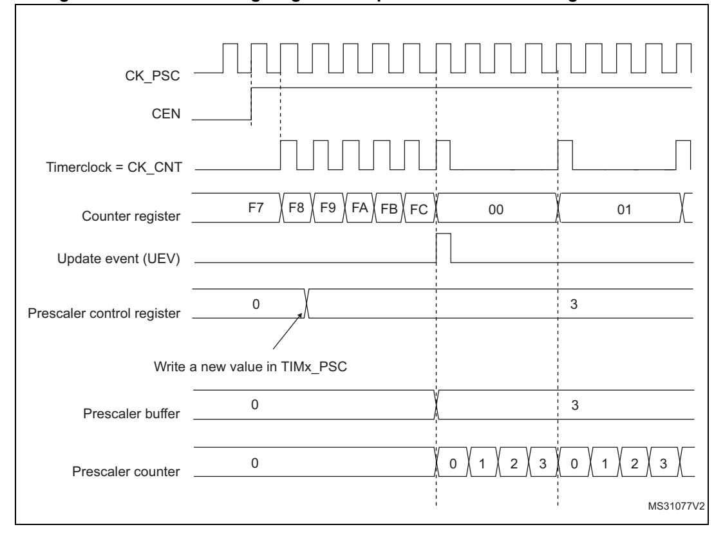
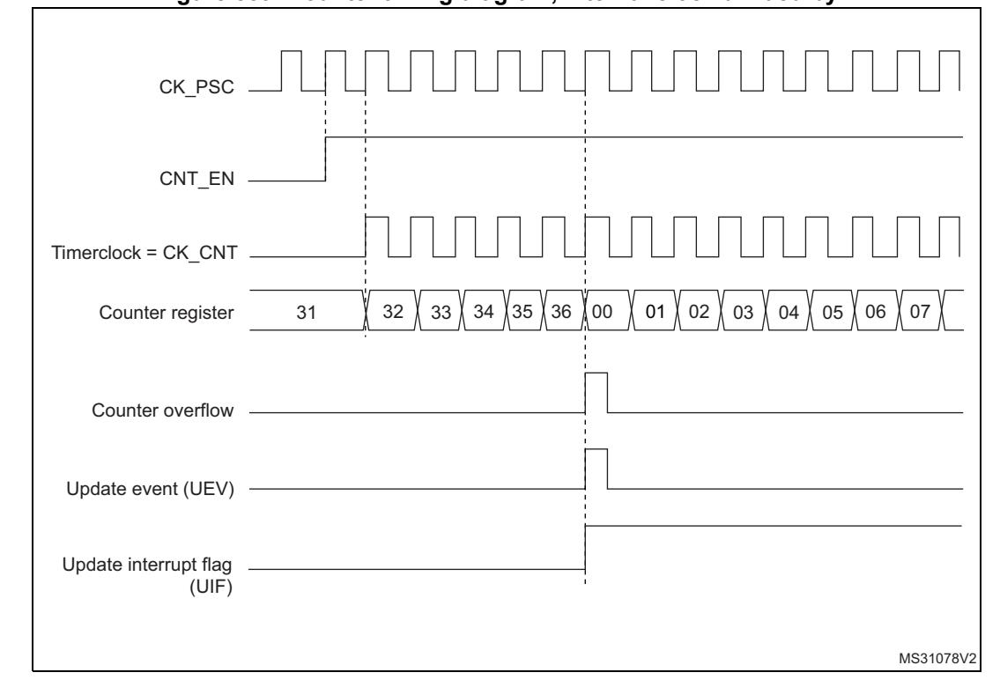
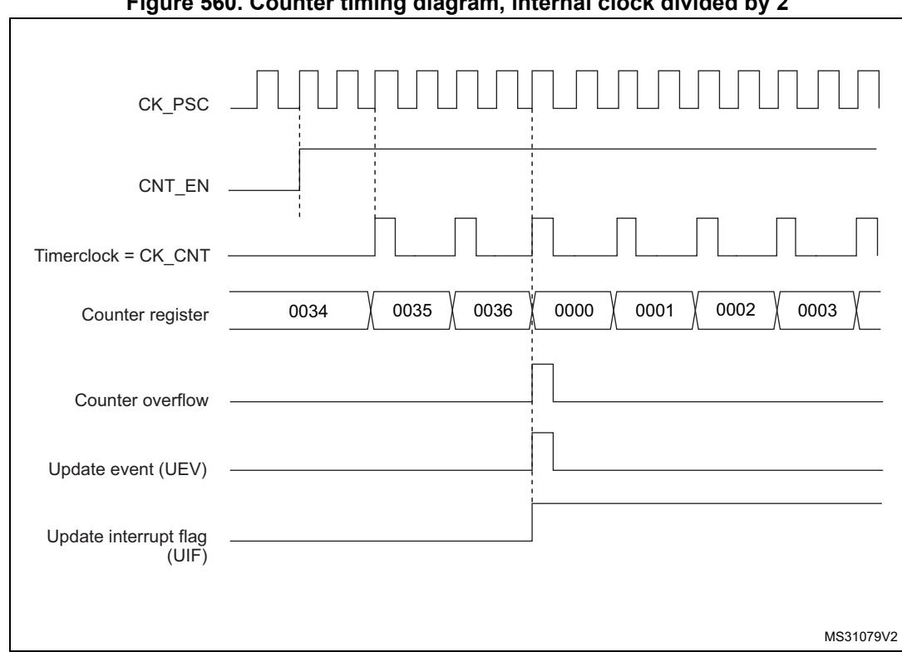
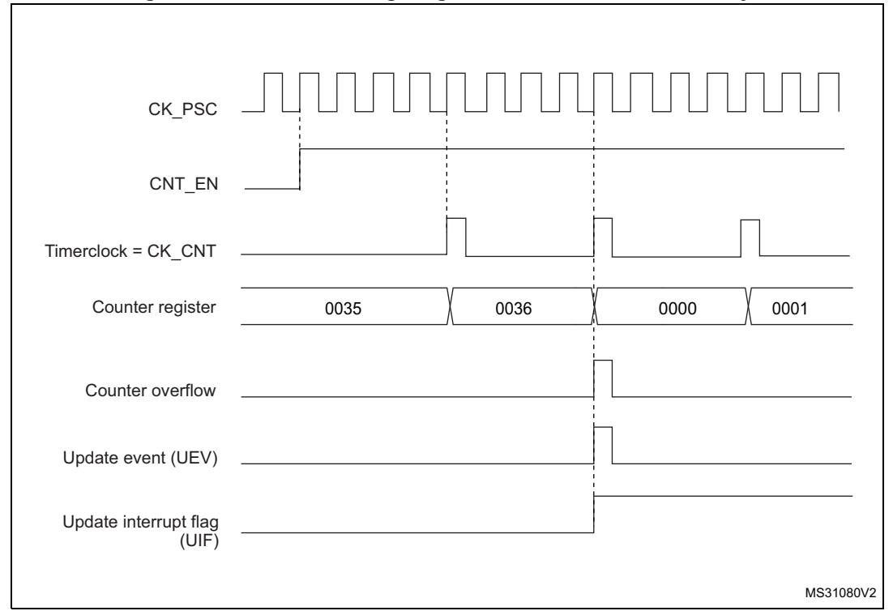
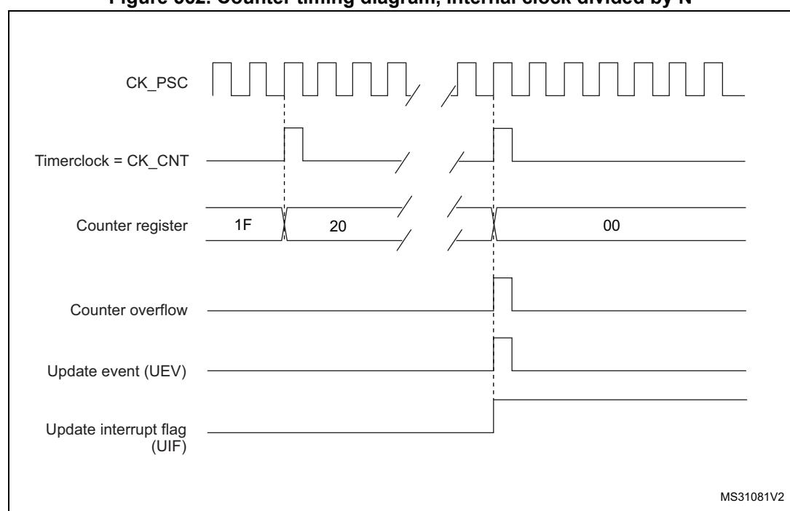
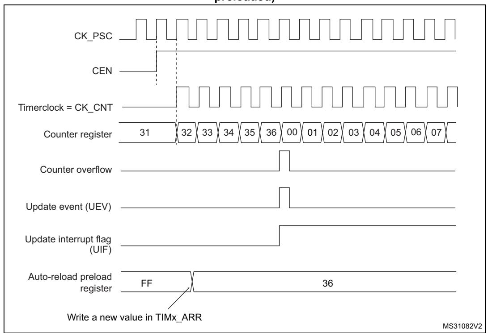
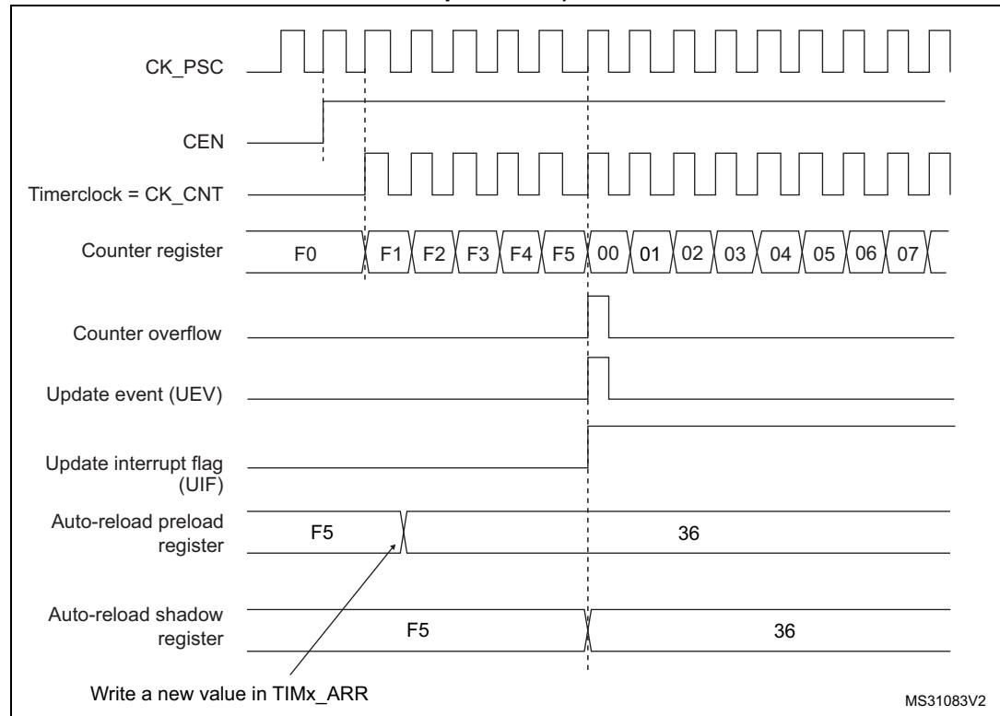
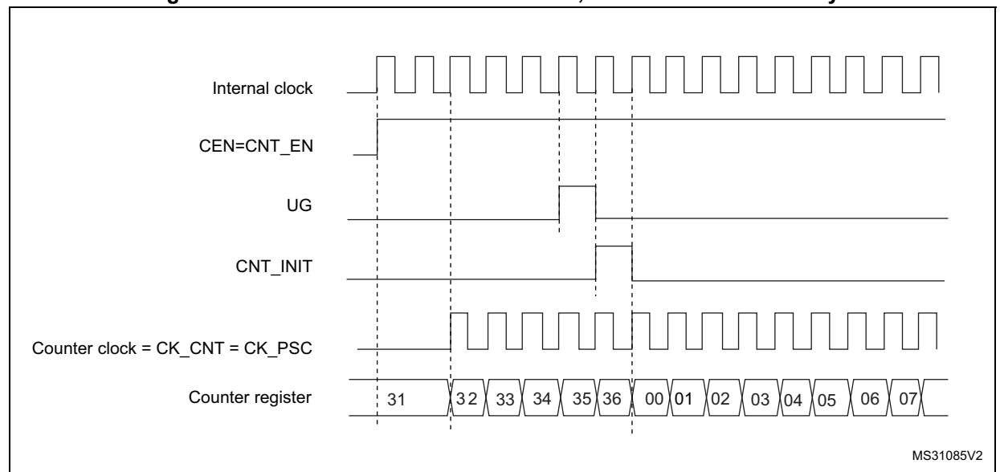
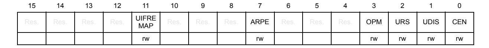

# 44 Basic timers (TIM6/TIM7)

### 44.1 TIM6/TIM7 introduction

The basic timers TIM6 and TIM7 consist of a 16-bit auto-reload counter driven by a programmable prescaler.

They may be used as generic timers for time base generation but they are also specifically used to drive the digital-to-analog converter (DAC). In fact, the timers are internally connected to the DAC and are able to drive it through their trigger outputs.

The timers are completely independent, and do not share any resources.

### 44.2 TIM6/TIM7 main features

Basic timer (TIM6/TIM7) features include:

- 16-bit auto-reload upcounter
- 16-bit programmable prescaler used to divide (also "on the fly") the counter clock frequency by any factor between 1 and 65535
- Synchronization circuit to trigger the DAC
- Interrupt/DMA generation on the update event: counter overflow

Figure 556. Basic timer block diagram

# **44.3 TIM6/TIM7 functional description**

### **44.3.1 Time-base unit**

The main block of the programmable timer is a 16-bit upcounter with its related auto-reload register. The counter clock can be divided by a prescaler.

The counter, the auto-reload register and the prescaler register can be written or read by software. This is true even when the counter is running.

The time-base unit includes:

- Counter Register (TIMx\_CNT)
- Prescaler Register (TIMx\_PSC)
- Auto-Reload Register (TIMx\_ARR)

The auto-reload register is preloaded. The preload register is accessed each time an attempt is made to write or read the auto-reload register. The contents of the preload register are transferred into the shadow register permanently or at each update event UEV, depending on the auto-reload preload enable bit (ARPE) in the TIMx\_CR1 register. The update event is sent when the counter reaches the overflow value and if the UDIS bit equals 0 in the TIMx\_CR1 register. It can also be generated by software. The generation of the update event is described in detail for each configuration.

The counter is clocked by the prescaler output CK\_CNT, which is enabled only when the counter enable bit (CEN) in the TIMx\_CR1 register is set.

Note that the actual counter enable signal CNT\_EN is set 1 clock cycle after CEN.

### **Prescaler description**

The prescaler can divide the counter clock frequency by any factor between 1 and 65536. It is based on a 16-bit counter controlled through a 16-bit register (in the TIMx\_PSC register). It can be changed on the fly as the TIMx\_PSC control register is buffered. The new prescaler ratio is taken into account at the next update event.

*[Figure 557](#page-2-0)* and *[Figure 558](#page-2-1)* give some examples of the counter behavior when the prescaler ratio is changed on the fly.

CK\_PSC 00 CEN Timerclock = CK\_CNT Counter register Update event (UEV) 0 Prescaler control register 0 1 Write a new value in TIMx\_PSC Prescaler buffer 0 1 Prescaler counter 0 1 0 1 0 1 0 1 F7 F8 F9 FC FA FB 01 02 03 MS31076V2

**Figure 557. Counter timing diagram with prescaler division change from 1 to 2**

# **44.3.2 Counting mode**

The counter counts from 0 to the auto-reload value (contents of the TIMx\_ARR register), then restarts from 0 and generates a counter overflow event.

An update event can be generate at each counter overflow or by setting the UG bit in the TIMx\_EGR register (by software or by using the slave mode controller).

The UEV event can be disabled by software by setting the UDIS bit in the TIMx\_CR1 register. This avoids updating the shadow registers while writing new values into the preload registers. In this way, no update event occurs until the UDIS bit has been cleared, however, the counter and the prescaler counter both restart from 0 (but the prescale rate does not change). In addition, if the URS (update request selection) bit in the TIMx\_CR1 register is set, setting the UG bit generates an update event UEV, but the UIF flag is not set (so no interrupt or DMA request is sent).

When an update event occurs, all the registers are updated and the update flag (UIF bit in the TIMx\_SR register) is set (depending on the URS bit):

- The buffer of the prescaler is reloaded with the preload value (contents of the TIMx\_PSC register)
- The auto-reload shadow register is updated with the preload value (TIMx\_ARR)

The following figures show some examples of the counter behavior for different clock frequencies when TIMx\_ARR = 0x36.

**Figure 559. Counter timing diagram, internal clock divided by 1**

**Figure 560. Counter timing diagram, internal clock divided by 2**

RM0399 Rev 4 2001/3556

**Figure 562. Counter timing diagram, internal clock divided by N**

**Figure 564. Counter timing diagram, update event when ARPE=1 (TIMx\_ARR preloaded)**

# **44.3.3 UIF bit remapping**

The IUFREMAP bit in the TIMx\_CR1 register forces a continuous copy of the Update Interrupt Flag UIF into the timer counter register's bit 31 (TIMxCNT[31]). This allows to atomically read both the counter value and a potential roll-over condition signaled by the UIFCPY flag. In particular cases, it can ease the calculations by avoiding race conditions caused for instance by a processing shared between a background task (counter reading) and an interrupt (Update Interrupt).

There is no latency between the assertions of the UIF and UIFCPY flags.

# **44.3.4 Clock source**

The counter clock is provided by the Internal clock (CK\_INT) source.

The CEN (in the TIMx\_CR1 register) and UG bits (in the TIMx\_EGR register) are actual control bits and can be changed only by software (except for UG that remains cleared automatically). As soon as the CEN bit is written to 1, the prescaler is clocked by the internal clock CK\_INT.

*[Figure 565](#page-7-0)* shows the behavior of the control circuit and the upcounter in normal mode, without prescaler.

**Figure 565. Control circuit in normal mode, internal clock divided by 1**

# **44.3.5 Debug mode**

When the microcontroller enters the debug mode (Cortex®-M7 with FPU core - halted), the TIMx counter either continues to work normally or stops, depending on the DBG\_TIMx\_STOP configuration bit in the DBGMCU module. For more details, refer to *Section 63.5.8: Microcontroller debug unit (DBGMCU)*.

# **44.4 TIM6/TIM7 registers**

Refer to *Section 1.2 on page 106* for a list of abbreviations used in register descriptions.

The peripheral registers can be accessed by half-words (16-bit) or words (32-bit).

# **44.4.1 TIMx control register 1 (TIMx\_CR1)(x = 6 to 7)**

Address offset: 0x00 Reset value: 0x0000

Bits 15:12 Reserved, must be kept at reset value.

Bit 11 **UIFREMAP**: UIF status bit remapping

0: No remapping. UIF status bit is not copied to TIMx\_CNT register bit 31.

1: Remapping enabled. UIF status bit is copied to TIMx\_CNT register bit 31.

Bits 10:8 Reserved, must be kept at reset value.

#### Bit 7 **ARPE**: Auto-reload preload enable

- 0: TIMx\_ARR register is not buffered.
- 1: TIMx\_ARR register is buffered.

#### Bits 6:4 Reserved, must be kept at reset value.

#### Bit 3 **OPM**: One-pulse mode

- 0: Counter is not stopped at update event
- 1: Counter stops counting at the next update event (clearing the CEN bit).

#### Bit 2 **URS**: Update request source

This bit is set and cleared by software to select the UEV event sources.

0: Any of the following events generates an update interrupt or DMA request if enabled.

These events can be:

- Counter overflow/underflow
- Setting the UG bit
- Update generation through the slave mode controller
- 1: Only counter overflow/underflow generates an update interrupt or DMA request if enabled.

#### Bit 1 **UDIS**: Update disable

This bit is set and cleared by software to enable/disable UEV event generation.

- 0: UEV enabled. The Update (UEV) event is generated by one of the following events:
  - Counter overflow/underflow
  - Setting the UG bit
  - Update generation through the slave mode controller

Buffered registers are then loaded with their preload values.

1: UEV disabled. The Update event is not generated, shadow registers keep their value (ARR, PSC). However the counter and the prescaler are reinitialized if the UG bit is set or if a hardware reset is received from the slave mode controller.

#### Bit 0 **CEN**: Counter enable

- 0: Counter disabled
- 1: Counter enabled

*Note: Gated mode can work only if the CEN bit has been previously set by software. However trigger mode can set the CEN bit automatically by hardware.* 

CEN is cleared automatically in one-pulse mode, when an update event occurs.

# **44.4.2 TIMx control register 2 (TIMx\_CR2)(x = 6 to 7)**

Address offset: 0x04 Reset value: 0x0000

| 15   | 14   | 13   | 12   | 11   | 10   | 9    | 8    | 7    | 6  | 5        | 4  | 3    | 2    | 1    | 0    |
|------|------|------|------|------|------|------|------|------|----|----------|----|------|------|------|------|
| Res. | Res. | Res. | Res. | Res. | Res. | Res. | Res. | Res. |    | MMS[2:0] |    | Res. | Res. | Res. | Res. |
|      |      |      |      |      |      |      |      |      | rw | rw       | rw |      |      |      |      |

Bits 15:7 Reserved, must be kept at reset value.

#### Bits 6:4 **MMS[2:0]**: Master mode selection

These bits are used to select the information to be sent in master mode to slave timers for synchronization (TRGO). The combination is as follows:

000: **Reset** - the UG bit from the TIMx\_EGR register is used as a trigger output (TRGO). If reset is generated by the trigger input (slave mode controller configured in reset mode) then the signal on TRGO is delayed compared to the actual reset.

001: **Enable** - the Counter enable signal, CNT\_EN, is used as a trigger output (TRGO). It is useful to start several timers at the same time or to control a window in which a slave timer is enabled. The Counter Enable signal is generated by a logic OR between CEN control bit and the trigger input when configured in gated mode.

When the Counter Enable signal is controlled by the trigger input, there is a delay on TRGO, except if the master/slave mode is selected (see the MSM bit description in the TIMx\_SMCR register).

010: **Update** - The update event is selected as a trigger output (TRGO). For instance a master timer can then be used as a prescaler for a slave timer.

*Note: The clock of the slave timer or ADC must be enabled prior to receive events from the master timer, and must not be changed on-the-fly while triggers are received from the master timer.*

Bits 3:0 Reserved, must be kept at reset value.

# **44.4.3 TIMx DMA/Interrupt enable register (TIMx\_DIER)(x = 6 to 7)**

Address offset: 0x0C Reset value: 0x0000

| 15   | 14   | 13   | 12   | 11   | 10   | 9    | 8   | 7    | 6    | 5    | 4    | 3    | 2    | 1    | 0   |
|------|------|------|------|------|------|------|-----|------|------|------|------|------|------|------|-----|
| Res. | Res. | Res. | Res. | Res. | Res. | Res. | UDE | Res. | Res. | Res. | Res. | Res. | Res. | Res. | UIE |
|      |      |      |      |      |      |      | rw  |      |      |      |      |      |      |      | rw  |

Bits 15:9 Reserved, must be kept at reset value.

Bit 8 **UDE**: Update DMA request enable

0: Update DMA request disabled.

1: Update DMA request enabled.

Bits 7:1 Reserved, must be kept at reset value.

Bit 0 **UIE**: Update interrupt enable

0: Update interrupt disabled.

1: Update interrupt enabled.

# **44.4.4 TIMx status register (TIMx\_SR)(x = 6 to 7)**

Address offset: 0x10 Reset value: 0x0000

| 15   | 14   | 13   | 12   | 11   | 10   | 9    | 8    | 7    | 6    | 5    | 4    | 3    | 2    | 1    | 0     |
|------|------|------|------|------|------|------|------|------|------|------|------|------|------|------|-------|
| Res. | Res. | Res. | Res. | Res. | Res. | Res. | Res. | Res. | Res. | Res. | Res. | Res. | Res. | Res. | UIF   |
|      |      |      |      |      |      |      |      |      |      |      |      |      |      |      | rc_w0 |

Bits 15:1 Reserved, must be kept at reset value.

Bit 0 **UIF**: Update interrupt flag

This bit is set by hardware on an update event. It is cleared by software.

- 0: No update occurred.
- 1: Update interrupt pending. This bit is set by hardware when the registers are updated:
- At overflow or underflow regarding the repetition counter value and if UDIS = 0 in the TIMx\_CR1 register.
- When CNT is reinitialized by software using the UG bit in the TIMx\_EGR register, if URS = 0 and UDIS = 0 in the TIMx\_CR1 register.

# **44.4.5 TIMx event generation register (TIMx\_EGR)(x = 6 to 7)**

Address offset: 0x14 Reset value: 0x0000

| 15   | 14   | 13   | 12   | 11   | 10   | 9    | 8    | 7    | 6    | 5    | 4    | 3    | 2    | 1    | 0  |
|------|------|------|------|------|------|------|------|------|------|------|------|------|------|------|----|
| Res. | Res. | Res. | Res. | Res. | Res. | Res. | Res. | Res. | Res. | Res. | Res. | Res. | Res. | Res. | UG |
|      |      |      |      |      |      |      |      |      |      |      |      |      |      |      | w  |

Bits 15:1 Reserved, must be kept at reset value.

Bit 0 **UG**: Update generation

This bit can be set by software, it is automatically cleared by hardware.

- 0: No action.
- 1: Re-initializes the timer counter and generates an update of the registers. Note that the prescaler counter is cleared too (but the prescaler ratio is not affected).

# **44.4.6 TIMx counter (TIMx\_CNT)(x = 6 to 7)**

Address offset: 0x24

Reset value: 0x0000 0000

| 31         | 30   | 29   | 28   | 27   | 26   | 25   | 24   | 23   | 22   | 21   | 20   | 19   | 18   | 17   | 16   |
|------------|------|------|------|------|------|------|------|------|------|------|------|------|------|------|------|
| UIF CPY | Res. | Res. | Res. | Res. | Res. | Res. | Res. | Res. | Res. | Res. | Res. | Res. | Res. | Res. | Res. |
| r          |      |      |      |      |      |      |      |      |      |      |      |      |      |      |      |
| 15         | 14   | 13   | 12   | 11   | 10   | 9    | 8    | 7    | 6    | 5    | 4    | 3    | 2    | 1    | 0    |
| CNT[15:0]  |      |      |      |      |      |      |      |      |      |      |      |      |      |      |      |
| rw         | rw   | rw   | rw   | rw   | rw   | rw   | rw   | rw   | rw   | rw   | rw   | rw   | rw   | rw   | rw   |

RM0399 Rev 4 2007/3556

#### Bit 31 **UIFCPY**: UIF Copy

This bit is a read-only copy of the UIF bit of the TIMx\_ISR register. If the UIFREMAP bit in TIMx\_CR1 is reset, bit 31 is reserved and read as 0.

Bits 30:16 Reserved, must be kept at reset value.

Bits 15:0 **CNT[15:0]**: Counter value

# **44.4.7 TIMx prescaler (TIMx\_PSC)(x = 6 to 7)**

Address offset: 0x28 Reset value: 0x0000

| 15        | 14 | 13 | 12 | 11 | 10 | 9  | 8  | 7  | 6  | 5  | 4  | 3  | 2  | 1  | 0  |
|-----------|----|----|----|----|----|----|----|----|----|----|----|----|----|----|----|
| PSC[15:0] |    |    |    |    |    |    |    |    |    |    |    |    |    |    |    |
| rw        | rw | rw | rw | rw | rw | rw | rw | rw | rw | rw | rw | rw | rw | rw | rw |

### Bits 15:0 **PSC[15:0]**: Prescaler value

The counter clock frequency CK\_CNT is equal to fCK\_PSC / (PSC[15:0] + 1).

PSC contains the value to be loaded into the active prescaler register at each update event. (including when the counter is cleared through UG bit of TIMx\_EGR register or through trigger controller when configured in "reset mode").

# **44.4.8 TIMx auto-reload register (TIMx\_ARR)(x = 6 to 7)**

Address offset: 0x2C Reset value: 0xFFFF

| 15                                                                                           | 14 | 13 | 12 | 11 | 10 | 9 | 8 | 7         | 6 | 5 | 4 | 3 | 2 | 1 | 0 |
|----------------------------------------------------------------------------------------------|----|----|----|----|----|---|---|-----------|---|---|---|---|---|---|---|
|                                                                                              |    |    |    |    |    |   |   | ARR[15:0] |   |   |   |   |   |   |   |
| rw rw rw rw rw rw rw rw rw rw rw rw rw rw rw rw |    |    |    |    |    |   |   |           |   |   |   |   |   |   |   |

#### Bits 15:0 **ARR[15:0]**: Prescaler value

ARR is the value to be loaded into the actual auto-reload register.

Refer to *[Section 44.3.1: Time-base unit on page 1998](#page-1-0)* for more details about ARR update and behavior.

The counter is blocked while the auto-reload value is null.

# **44.4.9 TIMx register map**

TIMx registers are mapped as 16-bit addressable registers as described in the table below:

**Table 371. TIMx register map and reset values** 

| Offset        | Register name                                                                                                                                      | 31       | 30   | 29   | 28   | 27   | 26   | 25   | 24   | 23   | 22        | 21   | 20   | 19   | 18   | 17   | 16   | 15   | 14   | 13   | 12   | 11      | 10   | 9    | 8         | 7    | 6    | 5            | 4    | 3    | 2    | 1    | 0    |
|---------------|-------------------------------------------------------------------------------------------------------------------------------------------------------|----------|------|------|------|------|------|------|------|------|-----------|------|------|------|------|------|------|------|------|------|------|---------|------|------|-----------|------|------|--------------|------|------|------|------|------|
| 0x00          | TIMx_CR1                                                                                                                                              | Res.     | Res. | Res. | Res. | Res. | Res. | Res. | Res. | Res. | Res.      | Res. | Res. | Res. | Res. | Res. | Res. | Res. | Res. | Res. | Res. | UIFREMA | Res. | Res. | Res.      | ARPE | Res. | Res.         | Res. | OPM  | URS  | UDIS | CEN  |
|               | Reset value                                                                                                                                           |          |      |      |      |      |      |      |      |      |           |      |      |      |      |      |      |      |      |      |      | 0       |      |      |           | 0    |      |              |      | 0    | 0    | 0    | 0    |
| 0x04          | TIMx_CR2                                                                                                                                              | Res.     | Res. | Res. | Res. | Res. | Res. | Res. | Res. | Res. | Res.      | Res. | Res. | Res. | Res. | Res. | Res. | Res. | Res. | Res. | Res. | Res.    | Res. | Res. | Res.      | Res. |      | MMS [2:0] |      | Res. | Res. | Res. | Res. |
|               | Reset value                                                                                                                                           |          |      |      |      |      |      |      |      |      |           |      |      |      |      |      |      |      |      |      |      |         |      |      |           |      | 0    | 0            | 0    |      |      |      |      |
| 0x08          | Reserved                                                                                                                                              |          |      |      |      |      |      |      |      |      |           |      |      |      |      |      |      |      |      |      |      |         |      |      |           |      |      |              |      |      |      |      |      |
| 0x0C          | TIMx_DIER                                                                                                                                             | Res.     | Res. | Res. | Res. | Res. | Res. | Res. | Res. | Res. | Res.      | Res. | Res. | Res. | Res. | Res. | Res. | Res. | Res. | Res. | Res. | Res.    | Res. | Res. | UDE       | Res. | Res. | Res.         | Res. | Res. | Res. | Res. | UIE  |
|               | Reset value                                                                                                                                           |          |      |      |      |      |      |      |      |      |           |      |      |      |      |      |      |      |      |      |      |         |      |      | 0         |      |      |              |      |      |      |      | 0    |
| 0x10          | TIMx_SR                                                                                                                                               | Res.     | Res. | Res. | Res. | Res. | Res. | Res. | Res. | Res. | Res.      | Res. | Res. | Res. | Res. | Res. | Res. | Res. | Res. | Res. | Res. | Res.    | Res. | Res. | Res.      | Res. | Res. | Res.         | Res. | Res. | Res. | Res. | UIF  |
|               | Reset value                                                                                                                                           |          |      |      |      |      |      |      |      |      |           |      |      |      |      |      |      |      |      |      |      |         |      |      |           |      |      |              |      |      |      |      | 0    |
| 0x14          | TIMx_EGR                                                                                                                                              | Res.     | Res. | Res. | Res. | Res. | Res. | Res. | Res. | Res. | Res.      | Res. | Res. | Res. | Res. | Res. | Res. | Res. | Res. | Res. | Res. | Res.    | Res. | Res. | Res.      | Res. | Res. | Res.         | Res. | Res. | Res. | Res. | UG   |
|               | Reset value                                                                                                                                           |          |      |      |      |      |      |      |      |      |           |      |      |      |      |      |      |      |      |      |      |         |      |      |           |      |      |              |      |      |      |      | 0    |
| 0x18- 0x20 |                                                                                                                                                       | Reserved |      |      |      |      |      |      |      |      |           |      |      |      |      |      |      |      |      |      |      |         |      |      |           |      |      |              |      |      |      |      |      |
| 0x24          | UIFCPY or Res. Res. Res. Res. Res. Res. Res. Res. Res. Res. Res. Res. Res. Res. Res. Res. TIMx_CNT    |          |      |      |      |      |      |      |      |      | CNT[15:0] |      |      |      |      |      |      |      |      |      |      |         |      |      |           |      |      |              |      |      |      |      |      |
|               | Reset value                                                                                                                                           | 0        |      |      |      |      |      |      |      |      |           |      |      |      |      |      |      | 0    | 0    | 0    | 0    | 0       | 0    | 0    | 0         | 0    | 0    | 0            | 0    | 0    | 0    | 0    | 0    |
| 0x28          | TIMx_PSC                                                                                                                                              | Res.     | Res. | Res. | Res. | Res. | Res. | Res. | Res. | Res. | Res.      | Res. | Res. | Res. | Res. | Res. | Res. |      |      |      |      |         |      |      | PSC[15:0] |      |      |              |      |      |      |      |      |
|               | Reset value                                                                                                                                           |          |      |      |      |      |      |      |      |      |           |      |      |      |      |      |      | 0    | 0    | 0    | 0    | 0       | 0    | 0    | 0         | 0    | 0    | 0            | 0    | 0    | 0    | 0    | 0    |
| 0x2C          | Res. Res. Res. Res. Res. Res. Res. Res. Res. Res. Res. Res. Res. Res. Res. Res. TIMx_ARR ARR[15:0] |          |      |      |      |      |      |      |      |      |           |      |      |      |      |      |      |      |      |      |      |         |      |      |           |      |      |              |      |      |      |      |      |
|               | Reset value                                                                                                                                           |          |      |      |      |      |      |      |      |      |           |      |      |      |      |      |      | 1    | 1    | 1    | 1    | 1       | 1    | 1    | 1         | 1    | 1    | 1            | 1    | 1    | 1    | 1    | 1    |

Refer to *Section 2.3 on page 134* for the register boundary addresses.