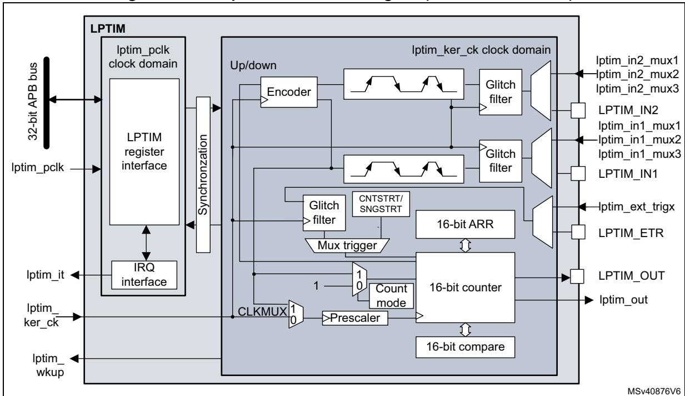
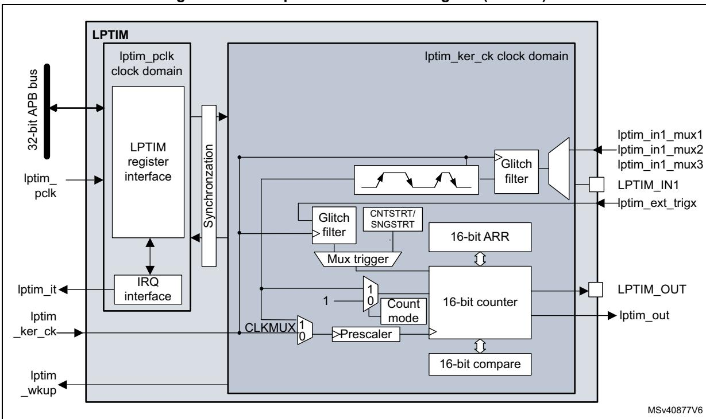
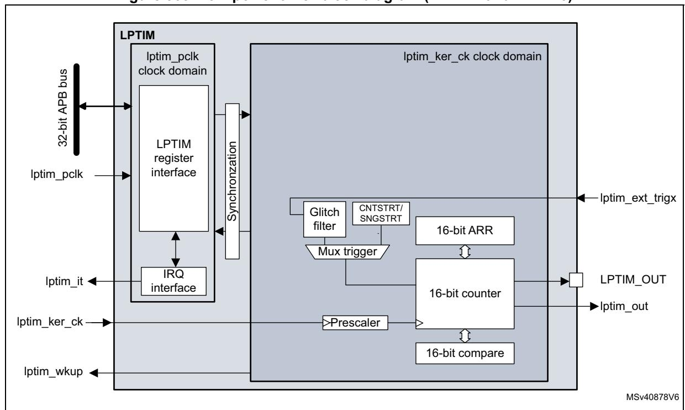
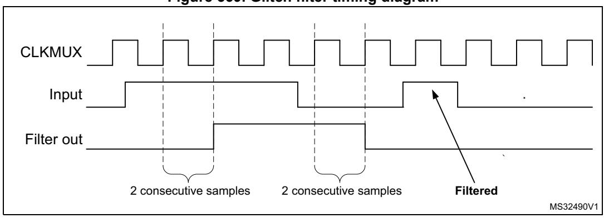
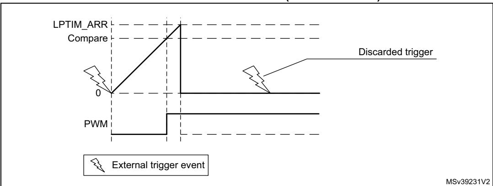
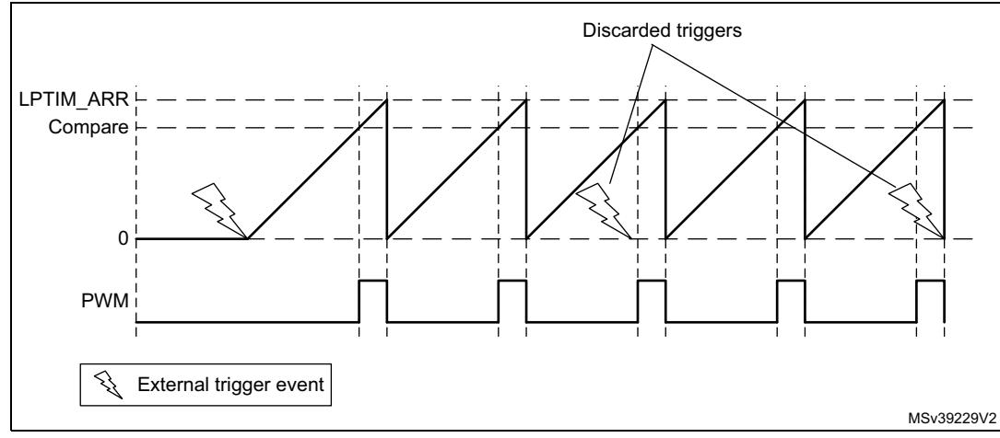
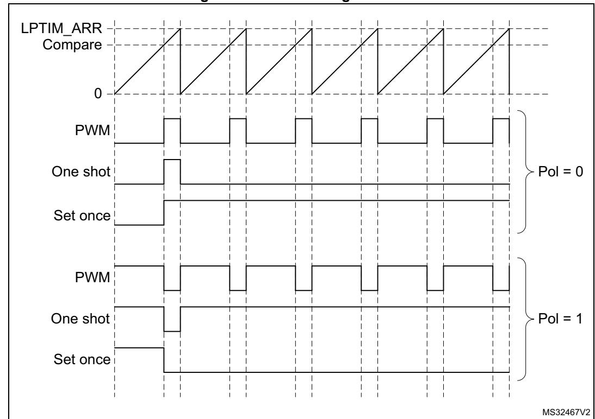
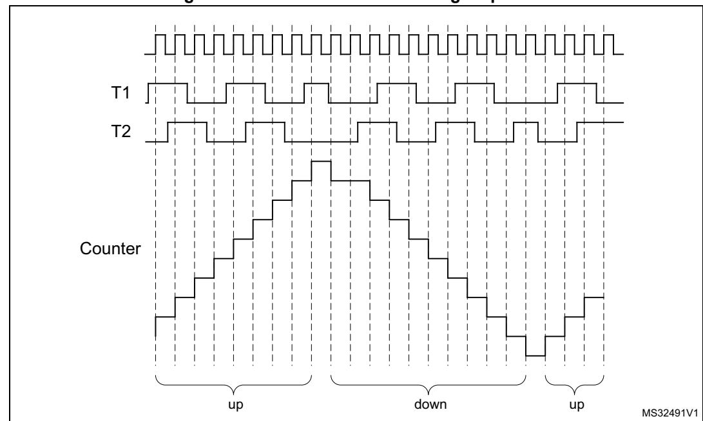

# **45 Low-power timer (LPTIM)**

# **45.1 Introduction**

The LPTIM is a 16-bit timer that benefits from the ultimate developments in power consumption reduction. Thanks to its diversity of clock sources, the LPTIM is able to keep running in all power modes except for Standby mode. Given its capability to run even with no internal clock source, the LPTIM can be used as a "Pulse Counter" which can be useful in some applications. Also, the LPTIM capability to wake up the system from low-power modes, makes it suitable to realize "Timeout functions" with extremely low power consumption.

The LPTIM introduces a flexible clock scheme that provides the needed functionalities and performance, while minimizing the power consumption.

# **45.2 LPTIM main features**

- 16 bit upcounter
- 3-bit prescaler with 8 possible dividing factors (1,2,4,8,16,32,64,128)
- Selectable clock
  - Internal clock sources: configurable internal clock source (see RCC section)
  - External clock source over LPTIM input (working with no embedded oscillator running, used by Pulse Counter application)
- 16 bit ARR autoreload register
- 16 bit compare register
- Continuous/One-shot mode
- Selectable software/hardware input trigger
- Programmable Digital Glitch filter
- Configurable output: Pulse, PWM
- Configurable I/O polarity
- Encoder mode

# <span id="page-1-1"></span>**45.3 LPTIM implementation**

*[Table 372](#page-1-0)* describes LPTIM implementation on STM32H745/755 and STM32H747/757 devices.

**Table 372. STM32H745/755 and STM32H747/757 LPTIM features** 

<span id="page-1-0"></span>

| LPTIM<br>modes/features(1) | LPTIM1 | LPTIM2 | LPTIM3 | LPTIM4 | LPTIM5 |
|----------------------------|--------|--------|--------|--------|--------|
| Encoder mode               | X      | X      | -      | -      | -      |

<sup>1.</sup> X = supported.

# **45.4 LPTIM functional description**

### **45.4.1 LPTIM block diagram**

**Figure 566. Low-power timer block diagram (LPTIM1 and LPTIM2)**





**Figure 567. Low-power timer block diagram (LPTIM3)**




### **45.4.2 LPTIM pins and internal signals**

The following tables provide the list of LPTIM pins and internal signals, respectively.

**Table 373. LPTIM input/output pins** 

| Names     | Signal type    | Description                                |
|-----------|----------------|--------------------------------------------|
| LPTIM_IN1 | Digital input  | LPTIM Input 1 from GPIO pin on mux input 0 |
| LPTIM_IN2 | Digital input  | LPTIM Input 2 from GPIO pin on mux input 0 |
| LPTIM_ETR | Digital input  | LPTIM external trigger GPIO pin            |
| LPTIM_OUT | Digital output | LPTIM Output GPIO pin                      |

**Table 374. LPTIM internal signals** 

| Names           | Signal type    | Description                                     |
|-----------------|----------------|-------------------------------------------------|
| lptim_pclk      | Digital input  | LPTIM APB clock domain                          |
| lptim_ker_ck    | Digital input  | LPTIM kernel clock                              |
| lptim_in1_mux1  | Digital input  | Internal LPTIM input 1 connected to mux input 1 |
| lptim_in1_mux2  | Digital input  | Internal LPTIM input 1 connected to mux input 2 |
| lptim_in1_mux3  | Digital input  | Internal LPTIM input 1 connected to mux input 3 |
| lptim_in2_mux1  | Digital input  | Internal LPTIM input 2 connected to mux input 1 |
| lptim_in2_mux2  | Digital input  | Internal LPTIM input 2 connected to mux input 2 |
| lptim_in2_mux3  | Digital input  | Internal LPTIM input 2 connected to mux input 3 |
| lptim_ext_trigx | Digital input  | LPTIM external trigger input x                  |
| lptim_out       | Digital output | LPTIM counter output                            |
| lptim_it        | Digital output | LPTIM global interrupt                          |
| lptim_wakeup    | Digital output | LPTIM wake-up event                             |

## <span id="page-3-0"></span>**45.4.3 LPTIM input and trigger mapping**

The LPTIM external trigger and input connections are detailed hereafter:

**Table 375. LPTIM1 external trigger connection** 

| TRIGSEL         | External trigger                          |  |
|-----------------|-------------------------------------------|--|
| lptim_ext_trig0 | GPIO pin as LPTIM1_ETR alternate function |  |
| lptim_ext_trig1 | RTC_ALARMA                                |  |
| lptim_ext_trig2 | RTC_ALARMB                                |  |
| lptim_ext_trig3 | RTC_TAMP1_OUT                             |  |
| lptim_ext_trig4 | RTC_TAMP2_OUT                             |  |
| lptim_ext_trig5 | RTC_TAMP3_OUT                             |  |

**Table 375. LPTIM1 external trigger connection (continued)**

| TRIGSEL         | External trigger |
|-----------------|------------------|
| lptim_ext_trig6 | COMP1_OUT        |
| lptim_ext_trig7 | COMP2_OUT        |

**Table 376. LPTIM2 external trigger connection** 

| TRIGSEL         | External trigger                          |
|-----------------|-------------------------------------------|
| lptim_ext_trig0 | GPIO pin as LPTIM2_ETR alternate function |
| lptim_ext_trig1 | RTC_ALARMA                                |
| lptim_ext_trig2 | RTC_ALARMB                                |
| lptim_ext_trig3 | RTC_TAMP1_OUT                             |
| lptim_ext_trig4 | RTC_TAMP2_OUT                             |
| lptim_ext_trig5 | RTC_TAMP3_OUT                             |
| lptim_ext_trig6 | COMP1_OUT                                 |
| lptim_ext_trig7 | COMP2_OUT                                 |

**Table 377. LPTIM3 external trigger connection** 

| TRIGSEL         | External trigger |
|-----------------|------------------|
| lptim_ext_trig0 | LPTIM2_OUT       |
| lptim_ext_trig1 | Not connected    |
| lptim_ext_trig2 | LPTIM4_OUT       |
| lptim_ext_trig3 | LPTIM5_OUT       |
| lptim_ext_trig4 | SAI1_FS_A        |
| lptim_ext_trig5 | SAI1_FS_B        |
| lptim_ext_trig6 | Not connected    |
| lptim_ext_trig7 | Not connected    |

**Table 378. LPTIM4 external trigger connection** 

| TRIGSEL         | External trigger |
|-----------------|------------------|
| lptim_ext_trig0 | LPTIM2_OUT       |
| lptim_ext_trig1 | LPTIM3_OUT       |
| lptim_ext_trig2 | Not connected    |
| lptim_ext_trig3 | LPTIM5_OUT       |
| lptim_ext_trig4 | SAI2_FS_A        |
| lptim_ext_trig5 | SAI2_FS_B        |


### **Table 378. LPTIM4 external trigger connection (continued)**

| TRIGSEL         | External trigger |
|-----------------|------------------|
| lptim_ext_trig6 | Not connected    |
| lptim_ext_trig7 | Not connected    |

#### **Table 379. LPTIM5 external trigger connection**

| TRIGSEL         | External trigger |
|-----------------|------------------|
| lptim_ext_trig0 | LPTIM2_OUT       |
| lptim_ext_trig1 | LPTIM3_OUT       |
| lptim_ext_trig2 | LPTIM4_OUT       |
| lptim_ext_trig3 | SAI4_FS_A        |
| lptim_ext_trig4 | SAI4_FS_B        |
| lptim_ext_trig5 | Not connected    |
| lptim_ext_trig6 | Not connected    |
| lptim_ext_trig7 | Not connected    |

#### **Table 380. LPTIM1 input 1 connection**

| lptim_in1_mux  | LPTIM1 input 1 connected to               |
|----------------|-------------------------------------------|
| lptim_in1_mux0 | GPIO pin as LPTIM1_IN1 alternate function |
| lptim_in1_mux1 | COMP1_OUT                                 |
| lptim_in1_mux2 | Not connected                             |
| lptim_in1_mux3 | Not connected                             |

### **Table 381. LPTIM1 input 2 connection**

| lptim_in2_mux   | LPTIM1 input 2 connected to               |
|-----------------|-------------------------------------------|
| lptim_int2_mux0 | GPIO pin as LPTIM1_IN2 alternate function |
| lptim_in2_mux1  | COMP2_OUT                                 |
| lptim_in2_mux2  | Not connected                             |
| lptim_in2_mux3  | Not connected                             |

#### **Table 382. LPTIM2 input 1 connection**

| lptim_in1_mux  | LPTIM2 input 1 connected to               |
|----------------|-------------------------------------------|
| lptim_in1_mux0 | GPIO pin as LPTIM2_IN1 alternate function |
| lptim_in1_mux1 | COMP1_OUT                                 |
| lptim_in1_mux2 | COMP2_OUT                                 |
| lptim_in1_mux3 | COMP1_OUT OR COMP2_OUT                    |


| lptim_in2_mux   | LPTIM2 input 2 connected to               |  |
|-----------------|-------------------------------------------|--|
| lptim_int2_mux0 | GPIO pin as LPTIM2_IN2 alternate function |  |
| lptim_in2_mux1  | COMP2_OUT                                 |  |
| lptim_in2_mux2  | Not connected                             |  |
| lptim_in2_mux3  | Not connected                             |  |

**Table 383. LPTIM2 input 2 connection** 

**Table 384. LPTIM3 input 1 connection** 

<span id="page-6-0"></span>

| lptim_in1_mux  | LPTIM3 Input 1 connected to |
|----------------|-----------------------------|
| lptim_in1_mux0 | Not connected               |
| lptim_in1_mux1 | SAI4_FS_A                   |
| lptim_in1_mux2 | SAI4_FS_B                   |
| lptim_in1_mux3 | Not connected               |

### **45.4.4 LPTIM reset and clocks**

The LPTIM can be clocked using several clock sources. It can be clocked using an internal clock signal which can be any configurable internal clock source selectable through the RCC (see RCC section for more details). Also, the LPTIM can be clocked using an external clock signal injected on its external Input1. When clocked with an external clock source, the LPTIM may run in one of these two possible configurations:

- The first configuration is when the LPTIM is clocked by an external signal but in the same time an internal clock signal is provided to the LPTIM from configurable internal clock source (see RCC section).
- The second configuration is when the LPTIM is solely clocked by an external clock source through its external Input1. This configuration is the one used to realize Timeout function or Pulse counter function when all the embedded oscillators are turned off after entering a low-power mode.

Programming the CKSEL and COUNTMODE bits allows controlling whether the LPTIM will use an external clock source or an internal one.

When configured to use an external clock source, the CKPOL bits are used to select the external clock signal active edge. If both edges are configured to be active ones, an internal clock signal should also be provided (first configuration). In this case, the internal clock signal frequency should be at least four times higher than the external clock signal frequency.

### **45.4.5 Glitch filter**

The LPTIM inputs, either external (mapped to GPIOs) or internal (mapped on the chip-level to other embedded peripherals), are protected with digital filters that prevent any glitches and noise perturbations to propagate inside the LPTIM. This is in order to prevent spurious counts or triggers.

Before activating the digital filters, an internal clock source should first be provided to the LPTIM. This is necessary to guarantee the proper operation of the filters.


The digital filters are divided into two groups:

- The first group of digital filters protects the LPTIM external inputs. The digital filters sensitivity is controlled by the CKFLT bits
- The second group of digital filters protects the LPTIM internal trigger inputs. The digital filters sensitivity is controlled by the TRGFLT bits.

*Note: The digital filters sensitivity is controlled by groups. It is not possible to configure each digital filter sensitivity separately inside the same group.*

> The filter sensitivity acts on the number of consecutive equal samples that should be detected on one of the LPTIM inputs to consider a signal level change as a valid transition. *[Figure 569](#page-7-0)* shows an example of glitch filter behavior in case of a 2 consecutive samples programmed.

<span id="page-7-0"></span>

**Figure 569. Glitch filter timing diagram**

*Note: In case no internal clock signal is provided, the digital filter must be deactivated by setting the CKFLT and TRGFLT bits to '0'. In that case, an external analog filter may be used to protect the LPTIM external inputs against glitches.*

### **45.4.6 Prescaler**

The LPTIM 16-bit counter is preceded by a configurable power-of-2 prescaler. The prescaler division ratio is controlled by the PRESC[2:0] 3-bit field. The table below lists all the possible division ratios:

| programming | dividing factor |
|-------------|-----------------|
| 000         | /1              |
| 001         | /2              |
| 010         | /4              |
| 011         | /8              |
| 100         | /16             |
| 101         | /32             |
| 110         | /64             |
| 111         | /128            |

**Table 385. Prescaler division ratios** 

### **45.4.7 Trigger multiplexer**

The LPTIM counter may be started either by software or after the detection of an active edge on one of the 8 trigger inputs.

TRIGEN[1:0] is used to determine the LPTIM trigger source:

- When TRIGEN[1:0] equals '00', The LPTIM counter is started as soon as one of the CNTSTRT or the SNGSTRT bits is set by software. The three remaining possible values for the TRIGEN[1:0] are used to configure the active edge used by the trigger inputs. The LPTIM counter starts as soon as an active edge is detected.
- When TRIGEN[1:0] is different than '00', TRIGSEL[2:0] is used to select which of the 8 trigger inputs is used to start the counter.

The external triggers are considered asynchronous signals for the LPTIM. So after a trigger detection, a two-counter-clock period latency is needed before the timer starts running due to the synchronization.

If a new trigger event occurs when the timer is already started it will be ignored (unless timeout function is enabled).

*Note: The timer must be enabled before setting the SNGSTRT/CNTSTRT bits. Any write on these bits when the timer is disabled will be discarded by hardware.*

*Note: When starting the counter by software (TRIGEN[1:0] = 00), there is a delay of 3 kernel clock cycles between the LPTIM\_CR register update (set one of SNGSTRT or CNTSTRT bits) and the effective start of the counter.*

### **45.4.8 Operating mode**

The LPTIM features two operating modes:

- The Continuous mode: the timer is free running, the timer is started from a trigger event and never stops until the timer is disabled
- One-shot mode: the timer is started from a trigger event and stops when reaching the ARR value.

### **One-shot mode**

To enable the one-shot counting, the SNGSTRT bit must be set.

A new trigger event will re-start the timer. Any trigger event occurring after the counter starts and before the counter reaches ARR will be discarded.

In case an external trigger is selected, each external trigger event arriving after the SNGSTRT bit is set, and after the counter register has stopped (contains zero value), will start the counter for a new one-shot counting cycle as shown in *[Figure 570](#page-9-0)*.

<span id="page-9-0"></span>MSv39230V2 PWM 0 Compare LPTIM\_ARR External trigger event

**Figure 570. LPTIM output waveform, single counting mode configuration**

Set-once mode activated:

It should be noted that when the WAVE bit-field in the LPTIM\_CFGR register is set, the Setonce mode is activated. In this case, the counter is only started once following the first trigger, and any subsequent trigger event is discarded as shown in *[Figure 571](#page-9-1)*.

<span id="page-9-1"></span>**Figure 571. LPTIM output waveform, Single counting mode configuration and Set-once mode activated (WAVE bit is set)**



In case of software start (TRIGEN[1:0] = '00'), the SNGSTRT setting will start the counter for one-shot counting.

### **Continous mode**

To enable the continuous counting, the CNTSTRT bit must be set.

In case an external trigger is selected, an external trigger event arriving after CNTSTRT is set will start the counter for continuous counting. Any subsequent external trigger event will be discarded as shown in *[Figure 572](#page-10-0)*.

In case of software start (TRIGEN[1:0] = '00'), setting CNTSTRT will start the counter for continuous counting.

<span id="page-10-0"></span>

**Figure 572. LPTIM output waveform, Continuous counting mode configuration**

SNGSTRT and CNTSTRT bits can only be set when the timer is enabled (The ENABLE bit is set to '1'). It is possible to change "on the fly" from One-shot mode to Continuous mode.

If the Continuous mode was previously selected, setting SNGSTRT will switch the LPTIM to the One-shot mode. The counter (if active) will stop as soon as it reaches ARR.

If the One-shot mode was previously selected, setting CNTSTRT will switch the LPTIM to the Continuous mode. The counter (if active) will restart as soon as it reaches ARR.

### **45.4.9 Timeout function**

The detection of an active edge on one selected trigger input can be used to reset the LPTIM counter. This feature is controlled through the TIMOUT bit.

The first trigger event will start the timer, any successive trigger event will reset the counter and the timer will restart.

A low-power timeout function can be realized. The timeout value corresponds to the compare value; if no trigger occurs within the expected time frame, the MCU is waked-up by the compare match event.

### **45.4.10 Waveform generation**

Two 16-bit registers, the LPTIM\_ARR (autoreload register) and LPTIM\_CMP (compare register), are used to generate several different waveforms on LPTIM output

The timer can generate the following waveforms:

- The PWM mode: the LPTIM output is set as soon as the counter value in LPTIM\_CNT exceeds the compare value in LPTIM\_CMP. The LPTIM output is reset as soon as a match occurs between the LPTIM\_ARR and the LPTIM\_CNT registers.
- The One-pulse mode: the output waveform is similar to the one of the PWM mode for the first pulse, then the output is permanently reset
- The Set-once mode: the output waveform is similar to the One-pulse mode except that the output is kept to the last signal level (depends on the output configured polarity).

The above described modes require that the LPTIM\_ARR register value be strictly greater than the LPTIM\_CMP register value.

The LPTIM output waveform can be configured through the WAVE bit as follow:

- Resetting the WAVE bit to '0' forces the LPTIM to generate either a PWM waveform or a One pulse waveform depending on which bit is set: CNTSTRT or SNGSTRT.
- Setting the WAVE bit to '1' forces the LPTIM to generate a Set-once mode waveform.

The WAVPOL bit controls the LPTIM output polarity. The change takes effect immediately, so the output default value will change immediately after the polarity is re-configured, even before the timer is enabled.

Signals with frequencies up to the LPTIM clock frequency divided by 2 can be generated. *[Figure 573](#page-11-0)* below shows the three possible waveforms that can be generated on the LPTIM output. Also, it shows the effect of the polarity change using the WAVPOL bit.

<span id="page-11-0"></span>

**Figure 573. Waveform generation**

### **45.4.11 Register update**

The LPTIM\_ARR register and LPTIM\_CMP register are updated immediately after the APB bus write operation, or at the end of the current period if the timer is already started.

The PRELOAD bit controls how the LPTIM\_ARR and the LPTIM\_CMP registers are updated:

- When the PRELOAD bit is reset to '0', the LPTIM\_ARR and the LPTIM\_CMP registers are immediately updated after any write access.
- When the PRELOAD bit is set to '1', the LPTIM\_ARR and the LPTIM\_CMP registers are updated at the end of the current period, if the timer has been already started.

The LPTIM APB interface and the LPTIM kernel logic use different clocks, so there is some latency between the APB write and the moment when these values are available to the


RM0399 Rev 4 2021/3556

counter comparator. Within this latency period, any additional write into these registers must be avoided.

The ARROK flag and the CMPOK flag in the LPTIM\_ISR register indicate when the write operation is completed to respectively the LPTIM\_ARR register and the LPTIM\_CMP register.

After a write to the LPTIM\_ARR register or the LPTIM\_CMP register, a new write operation to the same register can only be performed when the previous write operation is completed. Any successive write before respectively the ARROK flag or the CMPOK flag be set, will lead to unpredictable results.

### **45.4.12 Counter mode**

The LPTIM counter can be used to count external events on the LPTIM Input1 or it can be used to count internal clock cycles. The CKSEL and COUNTMODE bits control which source will be used for updating the counter.

In case the LPTIM is configured to count external events on Input1, the counter can be updated following a rising edge, falling edge or both edges depending on the value written to the CKPOL[1:0] bits.

The count modes below can be selected, depending on CKSEL and COUNTMODE values:

- CKSEL = 0: the LPTIM is clocked by an internal clock source
  - COUNTMODE = 0

The LPTIM is configured to be clocked by an internal clock source and the LPTIM counter is configured to be updated following each internal clock pulse.

– COUNTMODE = 1

The LPTIM external Input1 is sampled with the internal clock provided to the LPTIM.

Consequently, in order not to miss any event, the frequency of the changes on the external Input1 signal should never exceed the frequency of the internal clock provided to the LPTIM. Also, the internal clock provided to the LPTIM must not be prescaled (PRESC[2:0] = 000).

• CKSEL = 1: the LPTIM is clocked by an external clock source

COUNTMODE value is don't care.

In this configuration, the LPTIM has no need for an internal clock source (except if the glitch filters are enabled). The signal injected on the LPTIM external Input1 is used as system clock for the LPTIM. This configuration is suitable for operation modes where no embedded oscillator is enabled.

For this configuration, the LPTIM counter can be updated either on rising edges or falling edges of the input1 clock signal but not on both rising and falling edges.

Since the signal injected on the LPTIM external Input1 is also used to clock the LPTIM kernel logic, there is some initial latency (after the LPTIM is enabled) before the counter is incremented. More precisely, the first five active edges on the LPTIM external Input1 (after LPTIM is enable) are lost.

### **45.4.13 Timer enable**

The ENABLE bit located in the LPTIM\_CR register is used to enable/disable the LPTIM kernel logic. After setting the ENABLE bit, a delay of two counter clock is needed before the LPTIM is actually enabled.


The LPTIM\_CFGR and LPTIM\_IER registers must be modified only when the LPTIM is disabled.

### **45.4.14 Timer counter reset**

In order to reset the content of LPTIM\_CNT register to zero, two reset mechanisms are implemented:

- The synchronous reset mechanism: the synchronous reset is controlled by the COUNTRST bit in the LPTIM\_CR register. After setting the COUNTRST bit-field to '1', the reset signal is propagated in the LPTIM kernel clock domain. So it is important to note that a few clock pulses of the LPTIM kernel logic will elapse before the reset is taken into account. This will make the LPTIM counter count few extra pluses between the time when the reset is trigger and it become effective. Since the COUNTRST bit is located in the APB clock domain and the LPTIM counter is located in the LPTIM kernel clock domain, a delay of 3 clock cycles of the kernel clock is needed to synchronize the reset signal issued by the APB clock domain when writing '1' to the COUNTRST bit.
- The asynchronous reset mechanism: the asynchronous reset is controlled by the RSTARE bit located in the LPTIM\_CR register. When this bit is set to '1', any read access to the LPTIM\_CNT register will reset its content to zero. Asynchronous reset should be triggered within a timeframe in which no LPTIM core clock is provided. For example when LPTIM Input1 is used as external clock source, the asynchronous reset should be applied only when there is enough insurance that no toggle will occur on the LPTIM Input1.

It should be noted that to read reliably the content of the LPTIM\_CNT register two successive read accesses must be performed and compared. A read access can be considered reliable when the value of the two read accesses is equal. Unfortunately when asynchronous reset is enabled there is no possibility to read twice the LPTIM\_CNT register.

**Warning: There is no mechanism inside the LPTIM that prevents the two reset mechanisms from being used simultaneously. So developer should make sure that these two mechanisms are used exclusively.**

# <span id="page-13-0"></span>**45.4.15 Encoder mode**

This mode allows handling signals from quadrature encoders used to detect angular position of rotary elements. Encoder interface mode acts simply as an external clock with direction selection. This means that the counter just counts continuously between 0 and the auto-reload value programmed into the LPTIM\_ARR register (0 up to ARR or ARR down to 0 depending on the direction). Therefore LPTIM\_ARR must be configured before starting the counter. From the two external input signals, Input1 and Input2, a clock signal is generated to clock the LPTIM counter. The phase between those two signals determines the counting direction.

The Encoder mode is only available when the LPTIM is clocked by an internal clock source. The signals frequency on both Input1 and Input2 inputs must not exceed the LPTIM internal clock frequency divided by 4. This is mandatory in order to guarantee a proper operation of the LPTIM.


RM0399 Rev 4 2023/3556

Direction change is signalized by the two Down and Up flags in the LPTIM\_ISR register. Also, an interrupt can be generated for both direction change events if enabled through the DOWNIE bit.

To activate the Encoder mode the ENC bit has to be set to '1'. The LPTIM must first be configured in Continuous mode.

When Encoder mode is active, the LPTIM counter is modified automatically following the speed and the direction of the incremental encoder. Therefore, its content always represents the encoder's position. The count direction, signaled by the Up and Down flags, correspond to the rotation direction of the encoder rotor.

According to the edge sensitivity configured using the CKPOL[1:0] bits, different counting scenarios are possible. The following table summarizes the possible combinations, assuming that Input1 and Input2 do not switch at the same time.

|                        | Level on opposite                        |          | Input1 signal |          | Input2 signal |  |
|------------------------|------------------------------------------|----------|---------------|----------|---------------|--|
| Active edge<br>Input1) | signal (Input1 for<br>Input2, Input2 for | Rising   | Falling       | Rising   | Falling       |  |
| Rising Edge            | High                                     | Down     | No count      | Up       | No count      |  |
|                        | Low                                      | Up       | No count      | Down     | No count      |  |
|                        | High                                     | No count | Up            | No count | Down          |  |
| Falling Edge           | Low                                      | No count | Down          | No count | Up            |  |
| Both Edges             | High                                     | Down     | Up            | Up       | Down          |  |
|                        | Low                                      | Up       | Down          | Down     | Up            |  |

**Table 386. Encoder counting scenarios** 

The following figure shows a counting sequence for Encoder mode where both-edge sensitivity is configured.

**Caution:** In this mode the LPTIM must be clocked by an internal clock source, so the CKSEL bit must be maintained to its reset value which is equal to '0'. Also, the prescaler division ratio must be equal to its reset value which is 1 (PRESC[2:0] bits must be '000').




**Figure 574. Encoder mode counting sequence**

# **45.4.16 Debug mode**

When the microcontroller enters debug mode (core halted), the LPTIM counter either continues to work normally or stops, depending on the DBG\_LPTIM\_STOP configuration bit in the DBG module.

# **45.5 LPTIM low-power modes**

**Table 387. Effect of low-power modes on the LPTIM** 

| Mode    | Description                                                                                                             |
|---------|-------------------------------------------------------------------------------------------------------------------------|
| Sleep   | No effect. LPTIM interrupts cause the device to exit Sleep mode.                                                        |
| Stop    | The LPTIM peripheral is active when it is clocked by LSE or LSI. LPTIM<br>interrupts cause the device to exit Stop mode |
| Standby | The LPTIM peripheral is powered down and must be reinitialized after<br>exiting Standby mode.                           |

# **45.6 LPTIM interrupts**

The following events generate an interrupt/wake-up event, if they are enabled through the LPTIM\_IER register:

- Compare match
- Auto-reload match (whatever the direction if encoder mode)
- External trigger event
- Autoreload register write completed
- Compare register write completed
- Direction change (encoder mode), programmable (up / down / both).

*Note: If any bit in the LPTIM\_IER register (Interrupt Enable Register) is set after that its corresponding flag in the LPTIM\_ISR register (Status Register) is set, the interrupt is not asserted.*

**Table 388. Interrupt events** 

**Interrupt event Description** Interrupt flag is raised when the content of the Counter register (LPTIM\_CNT) matches the content of the Auto-reload register (LPTIM\_ARR).

Compare match Interrupt flag is raised when the content of the Counter register (LPTIM\_CNT) matches the content of the compare register (LPTIM\_CMP). Auto-reload match External trigger event Interrupt flag is raised when an external trigger event is detected Auto-reload register update OK Interrupt flag is raised when the write operation to the LPTIM\_ARR register is complete. Compare register update OK Interrupt flag is raised when the write operation to the LPTIM\_CMP register is complete. Used in Encoder mode. Two interrupt flags are embedded to signal direction change:

# **45.7 LPTIM registers**

Direction change

Refer to *Section 1.2: List of abbreviations for registers* for a list of abbreviations used in register descriptions.

– UP flag signals up-counting direction change – DOWN flag signals down-counting direction change.

The peripheral registers can only be accessed by words (32-bit).

### **45.7.1 LPTIM interrupt and status register (LPTIM\_ISR)**

Address offset: 0x000 Reset value: 0x0000 0000

| 31   | 30   | 29   | 28   | 27   | 26   | 25   | 24   | 23   | 22   | 21   | 20        | 19        | 18          | 17   | 16   |
|------|------|------|------|------|------|------|------|------|------|------|-----------|-----------|-------------|------|------|
| Res. | Res. | Res. | Res. | Res. | Res. | Res. | Res. | Res. | Res. | Res. | Res.      | Res.      | Res.        | Res. | Res. |
|      |      |      |      |      |      |      |      |      |      |      |           |           |             |      |      |
| 15   | 14   | 13   | 12   | 11   | 10   | 9    | 8    | 7    | 6    | 5    | 4         | 3         | 2           | 1    | 0    |
| Res. | Res. | Res. | Res. | Res. | Res. | Res. | Res. | Res. | DOWN | UP   | ARR<br>OK | CMP<br>OK | EXT<br>TRIG | ARRM | CMPM |
|      |      |      |      |      |      |      |      |      | r    | r    | r         | r         | r           | r    | r    |

Bits 31:7 Reserved, must be kept at reset value.

#### Bit 6 **DOWN**: Counter direction change up to down

In Encoder mode, DOWN bit is set by hardware to inform application that the counter direction has changed from up to down. DOWN flag can be cleared by writing 1 to the DOWNCF bit in the LPTIM\_ICR register.

*Note: If the LPTIM does not support encoder mode feature, this bit is reserved. Please refer to [Section 45.3: LPTIM implementation](#page-1-1).*

#### Bit 5 **UP**: Counter direction change down to up

In Encoder mode, UP bit is set by hardware to inform application that the counter direction has changed from down to up. UP flag can be cleared by writing 1 to the UPCF bit in the LPTIM\_ICR register.

*Note: If the LPTIM does not support encoder mode feature, this bit is reserved. Please refer to [Section 45.3: LPTIM implementation](#page-1-1).*

#### Bit 4 **ARROK**: Autoreload register update OK

ARROK is set by hardware to inform application that the APB bus write operation to the LPTIM\_ARR register has been successfully completed. ARROK flag can be cleared by writing 1 to the ARROKCF bit in the LPTIM\_ICR register.

#### Bit 3 **CMPOK**: Compare register update OK

CMPOK is set by hardware to inform application that the APB bus write operation to the LPTIM\_CMP register has been successfully completed. CMPOK flag can be cleared by writing 1 to the CMPOKCF bit in the LPTIM\_ICR register.

#### Bit 2 **EXTTRIG**: External trigger edge event

EXTTRIG is set by hardware to inform application that a valid edge on the selected external trigger input has occurred. If the trigger is ignored because the timer has already started, then this flag is not set. EXTTRIG flag can be cleared by writing 1 to the EXTTRIGCF bit in the LPTIM\_ICR register.

### Bit 1 **ARRM**: Autoreload match

ARRM is set by hardware to inform application that LPTIM\_CNT register's value reached the LPTIM\_ARR register's value. ARRM flag can be cleared by writing 1 to the ARRMCF bit in the LPTIM\_ICR register.

#### Bit 0 **CMPM**: Compare match

The CMPM bit is set by hardware to inform application that LPTIM\_CNT register value reached the LPTIM\_CMP register's value. CMPM flag can be cleared by writing 1 to the CMPMCF bit in the LPTIM\_ICR register.


RM0399 Rev 4 2027/3556

### 45.7.2 LPTIM interrupt clear register (LPTIM\_ICR)

Address offset: 0x004

Reset value: 0x0000 0000

| 31   | 30   | 29   | 28   | 27   | 26   | 25   | 24   | 23   | 22         | 21   | 20          | 19          | 18            | 17         | 16         |
|------|------|------|------|------|------|------|------|------|------------|------|-------------|-------------|---------------|------------|------------|
| Res. | Res. | Res. | Res. | Res. | Res. | Res. | Res. | Res. | Res.       | Res. | Res.        | Res.        | Res.          | Res.       | Res.       |
|      |      |      |      |      |      |      |      |      |            |      |             |             |               | •          |            |
| 15   | 14   | 13   | 12   | 11   | 10   | 9    | 8    | 7    | 6          | 5    | 4           | 3           | 2             | 1          | 0          |
| Res. | Res. | Res. | Res. | Res. | Res. | Res. | Res. | Res. | DOWN<br>CF | UPCF | ARRO<br>KCF | CMPO<br>KCF | EXTTR<br>IGCF | ARRM<br>CF | CMPM<br>CF |
|      |      |      |      |      |      |      |      |      | w          | w    | w           | w           | w             | W          | w          |

Bits 31:7 Reserved, must be kept at reset value.

Bit 6 DOWNCF: Direction change to down clear flag

Writing 1 to this bit clear the DOWN flag in the LPTIM ISR register.

Note: If the LPTIM does not support encoder mode feature, this bit is reserved. Please refer to Section 45.3: LPTIM implementation.

Bit 5 UPCF: Direction change to UP clear flag

Writing 1 to this bit clear the UP flag in the LPTIM ISR register.

Note: If the LPTIM does not support encoder mode feature, this bit is reserved. Please refer to Section 45.3: LPTIM implementation.

Bit 4 ARROKCF: Autoreload register update OK clear flag

Writing 1 to this bit clears the ARROK flag in the LPTIM ISR register

Bit 3 CMPOKCF: Compare register update OK clear flag

Writing 1 to this bit clears the CMPOK flag in the LPTIM\_ISR register

Bit 2 **EXTTRIGCF**: External trigger valid edge clear flag

Writing 1 to this bit clears the EXTTRIG flag in the LPTIM\_ISR register

Bit 1 ARRMCF: Autoreload match clear flag

Writing 1 to this bit clears the ARRM flag in the LPTIM ISR register

Bit 0 CMPMCF: Compare match clear flag

Writing 1 to this bit clears the CMPM flag in the LPTIM ISR register

### 45.7.3 LPTIM interrupt enable register (LPTIM IER)

Address offset: 0x008

Reset value: 0x0000 0000

| 31   | 30   | 29   | 28   | 27   | 26   | 25   | 24   | 23   | 22         | 21   | 20          | 19          | 18            | 17         | 16         |
|------|------|------|------|------|------|------|------|------|------------|------|-------------|-------------|---------------|------------|------------|
| Res. | Res. | Res. | Res. | Res. | Res. | Res. | Res. | Res. | Res.       | Res. | Res.        | Res.        | Res.          | Res.       | Res.       |
|      |      |      |      |      |      |      |      |      |            |      |             |             |               |            |            |
| 15   | 14   | 13   | 12   | 11   | 10   | 9    | 8    | 7    | 6          | 5    | 4           | 3           | 2             | 1          | 0          |
| Res. | Res. | Res. | Res. | Res. | Res. | Res. | Res. | Res. | DOWNI<br>E | UPIE | ARRO<br>KIE | CMPO<br>KIE | EXT<br>TRIGIE | ARRM<br>IE | CMPM<br>IE |
|      |      |      |      |      |      |      |      |      | rw         | rw   | rw          | rw          | rw            | rw         | rw         |


Bits 31:7 Reserved, must be kept at reset value.

Bit 6 **DOWNIE**: Direction change to down Interrupt Enable

0: DOWN interrupt disabled 1: DOWN interrupt enabled

*Note: If the LPTIM does not support encoder mode feature, this bit is reserved. Please refer to [Section 45.3: LPTIM implementation](#page-1-1).*

Bit 5 **UPIE**: Direction change to UP Interrupt Enable

0: UP interrupt disabled 1: UP interrupt enabled

*Note: If the LPTIM does not support encoder mode feature, this bit is reserved. Please refer to [Section 45.3: LPTIM implementation](#page-1-1).*

Bit 4 **ARROKIE**: Autoreload register update OK Interrupt Enable

0: ARROK interrupt disabled 1: ARROK interrupt enabled

Bit 3 **CMPOKIE**: Compare register update OK Interrupt Enable

0: CMPOK interrupt disabled 1: CMPOK interrupt enabled

Bit 2 **EXTTRIGIE**: External trigger valid edge Interrupt Enable

0: EXTTRIG interrupt disabled 1: EXTTRIG interrupt enabled

Bit 1 **ARRMIE**: Autoreload match Interrupt Enable

0: ARRM interrupt disabled 1: ARRM interrupt enabled

Bit 0 **CMPMIE**: Compare match Interrupt Enable

0: CMPM interrupt disabled 1: CMPM interrupt enabled

**Caution:** The LPTIM\_IER register must only be modified when the LPTIM is disabled (ENABLE bit reset to '0')

### **45.7.4 LPTIM configuration register (LPTIM\_CFGR)**

Address offset: 0x00C Reset value: 0x0000 0000

| 31   | 30           | 29   | 28   | 27   | 26         | 25   | 24   | 23            | 22             | 21   | 20   | 19         | 18 | 17          | 16    |
|------|--------------|------|------|------|------------|------|------|---------------|----------------|------|------|------------|----|-------------|-------|
| Res. | Res.         | Res. | Res. | Res. | Res.       | Res. | ENC  | COUNT<br>MODE | PRELOAD WAVPOL |      | WAVE | TIMOUT     |    | TRIGEN[1:0] | Res.  |
|      |              |      |      |      |            |      | rw   | rw            | rw             | rw   | rw   | rw         | rw | rw          |       |
| 15   | 14           | 13   | 12   | 11   | 10         | 9    | 8    | 7             | 6              | 5    | 4    | 3          | 2  | 1           | 0     |
|      | TRIGSEL[2:0] |      | Res. |      | PRESC[2:0] |      | Res. |               | TRGFLT[1:0]    | Res. |      | CKFLT[1:0] |    | CKPOL[1:0]  | CKSEL |
| rw   | rw           | rw   |      | rw   | rw         | rw   |      | rw            | rw             |      | rw   | rw         | rw | rw          | rw    |

Bits 31:30 Reserved, must be kept at reset value.

Bit 29 Reserved, must be kept at reset value.

Bits 28:25 Reserved, must be kept at reset value.

RM0399 Rev 4 2029/3556

#### Bit 24 **ENC**: Encoder mode enable

The ENC bit controls the Encoder mode

- 0: Encoder mode disabled
- 1: Encoder mode enabled

*Note: If the LPTIM does not support encoder mode feature, this bit is reserved. Please refer to [Section 45.3: LPTIM implementation.](#page-1-1)*

#### Bit 23 **COUNTMODE**: counter mode enabled

The COUNTMODE bit selects which clock source is used by the LPTIM to clock the counter:

- 0: the counter is incremented following each internal clock pulse
- 1: the counter is incremented following each valid clock pulse on the LPTIM external Input1

#### Bit 22 **PRELOAD**: Registers update mode

The PRELOAD bit controls the LPTIM\_ARR and the LPTIM\_CMP registers update modality

- 0: Registers are updated after each APB bus write access
- 1: Registers are updated at the end of the current LPTIM period

#### Bit 21 **WAVPOL**: Waveform shape polarity

The WAVEPOL bit controls the output polarity

- 0: The LPTIM output reflects the compare results between LPTIM\_CNT and LPTIM\_CMP registers
- 1: The LPTIM output reflects the inverse of the compare results between LPTIM\_CNT and LPTIM\_CMP registers

#### Bit 20 **WAVE**: Waveform shape

The WAVE bit controls the output shape

- 0: Deactivate Set-once mode
- 1: Activate the Set-once mode

### Bit 19 **TIMOUT**: Timeout enable

The TIMOUT bit controls the Timeout feature

- 0: A trigger event arriving when the timer is already started will be ignored
- 1: A trigger event arriving when the timer is already started will reset and restart the counter

#### Bits 18:17 **TRIGEN[1:0]**: Trigger enable and polarity

The TRIGEN bits controls whether the LPTIM counter is started by an external trigger or not. If the external trigger option is selected, three configurations are possible for the trigger active edge:

- 00: software trigger (counting start is initiated by software)
- 01: rising edge is the active edge
- 10: falling edge is the active edge
- 11: both edges are active edges
- Bit 16 Reserved, must be kept at reset value.

#### Bits 15:13 **TRIGSEL[2:0]**: Trigger selector

The TRIGSEL bits select the trigger source that will serve as a trigger event for the LPTIM among the below 8 available sources:

```
000: lptim_ext_trig0
001: lptim_ext_trig1
010: lptim_ext_trig2
011: lptim_ext_trig3
100: lptim_ext_trig4
101: lptim_ext_trig5
110: lptim_ext_trig6
111: lptim_ext_trig7
```

See *[Section 45.4.3: LPTIM input and trigger mapping](#page-3-0)* for details.

#### Bit 12 Reserved, must be kept at reset value.

#### Bits 11:9 **PRESC[2:0]:** Clock prescaler

The PRESC bits configure the prescaler division factor. It can be one among the following division factors:

000: /1 001: /2 010: /4 011: /8 100: /16 101: /32 110: /64 111: /128

Bit 8 Reserved, must be kept at reset value.

#### Bits 7:6 **TRGFLT[1:0]:** Configurable digital filter for trigger

The TRGFLT value sets the number of consecutive equal samples that should be detected when a level change occurs on an internal trigger before it is considered as a valid level transition. An internal clock source must be present to use this feature

- 00: any trigger active level change is considered as a valid trigger
- 01: trigger active level change must be stable for at least 2 clock periods before it is considered as valid trigger.
- 10: trigger active level change must be stable for at least 4 clock periods before it is considered as valid trigger.
- 11: trigger active level change must be stable for at least 8 clock periods before it is considered as valid trigger.
- Bit 5 Reserved, must be kept at reset value.

#### Bits 4:3 **CKFLT[1:0]:** Configurable digital filter for external clock

The CKFLT value sets the number of consecutive equal samples that should be detected when a level change occurs on an external clock signal before it is considered as a valid level transition. An internal clock source must be present to use this feature

- 00: any external clock signal level change is considered as a valid transition
- 01: external clock signal level change must be stable for at least 2 clock periods before it is considered as valid transition.
- 10: external clock signal level change must be stable for at least 4 clock periods before it is considered as valid transition.
- 11: external clock signal level change must be stable for at least 8 clock periods before it is considered as valid transition.

#### Bits 2:1 **CKPOL[1:0]:** Clock polarity

If LPTIM is clocked by an external clock source:

When the LPTIM is clocked by an external clock source, CKPOL bits is used to configure the active edge or edges used by the counter:

00:the rising edge is the active edge used for counting.

If the LPTIM is configured in Encoder mode (ENC bit is set), the encoder sub-mode 1 is active.

01:the falling edge is the active edge used for counting

If the LPTIM is configured in Encoder mode (ENC bit is set), the encoder sub-mode 2 is active.

10:both edges are active edges. When both external clock signal edges are considered active ones, the LPTIM must also be clocked by an internal clock source with a frequency equal to at least four times the external clock frequency.

If the LPTIM is configured in Encoder mode (ENC bit is set), the encoder sub-mode 3 is active.

11:not allowed

Refer to *[Section 45.4.15: Encoder mode](#page-13-0)* for more details about Encoder mode sub-modes.

#### Bit 0 **CKSEL:** Clock selector

The CKSEL bit selects which clock source the LPTIM will use:

- 0: LPTIM is clocked by internal clock source (APB clock or any of the embedded oscillators)
- 1: LPTIM is clocked by an external clock source through the LPTIM external Input1

#### **Caution:** The LPTIM\_CFGR register must only be modified when the LPTIM is disabled (ENABLE bit reset to '0').

### **45.7.5 LPTIM control register (LPTIM\_CR)**

Address offset: 0x010 Reset value: 0x0000 0000

| 31   | 30   | 29   | 28   | 27   | 26   | 25   | 24   | 23   | 22   | 21   | 20         | 19           | 18          | 17          | 16         |
|------|------|------|------|------|------|------|------|------|------|------|------------|--------------|-------------|-------------|------------|
| Res. | Res. | Res. | Res. | Res. | Res. | Res. | Res. | Res. | Res. | Res. | Res.       | Res.         | Res.        | Res.        | Res.       |
|      |      |      |      |      |      |      |      |      |      |      |            |              |             |             |            |
| 15   | 14   | 13   | 12   | 11   | 10   | 9    | 8    | 7    | 6    | 5    | 4          | 3            | 2           | 1           | 0          |
| Res. | Res. | Res. | Res. | Res. | Res. | Res. | Res. | Res. | Res. | Res. | RST<br>ARE | COUN<br>TRST | CNT<br>STRT | SNG<br>STRT | ENA<br>BLE |
|      |      |      |      |      |      |      |      |      |      |      | w          | rs           | rw          | rw          | rw         |


#### Bits 31:5 Reserved, must be kept at reset value.

#### Bit 4 **RSTARE:** Reset after read enable

This bit is set and cleared by software. When RSTARE is set to '1', any read access to LPTIM\_CNT register will asynchronously reset LPTIM\_CNT register content.

This bit can be set only when the LPTIM is enabled.

**Caution:** This bitfield is write-only. This means that the bit cannot be read back to verify the value which has been written. As an example, if this bit is set to 1, attempting to read it back will return 0 even if the "Reset after read" function is enabled (due to the fact that this bitfield has previously been written to 1). To turn off the "Reset after read" or to make sure that it has already been turned off, this bit should be reset (by programming it to 0) even if it already contains 0.

#### Bit 3 **COUNTRST:** Counter reset

This bit is set by software and cleared by hardware. When set to '1' this bit will trigger a synchronous reset of the LPTIM\_CNT counter register. Due to the synchronous nature of this reset, it only takes place after a synchronization delay of 3 LPTimer core clock cycles (LPTimer core clock may be different from APB clock).

This bit can be set only when the LPTIM is enabled. It is automatically reset by hardware.

**Caution:** COUNTRST must never be set to '1' by software before it is already cleared to '0' by hardware. Software should consequently check that COUNTRST bit is already cleared to '0' before attempting to set it to '1'.

#### Bit 2 **CNTSTRT:** Timer start in Continuous mode

This bit is set by software and cleared by hardware.

In case of software start (TRIGEN[1:0] = '00'), setting this bit starts the LPTIM in Continuous mode. If the software start is disabled (TRIGEN[1:0] different than '00'), setting this bit starts the timer in Continuous mode as soon as an external trigger is detected.

If this bit is set when a single pulse mode counting is ongoing, then the timer will not stop at the next match between the LPTIM\_ARR and LPTIM\_CNT registers and the LPTIM counter keeps counting in Continuous mode.

This bit can be set only when the LPTIM is enabled. It will be automatically reset by hardware.

#### Bit 1 **SNGSTRT:** LPTIM start in Single mode

This bit is set by software and cleared by hardware.

In case of software start (TRIGEN[1:0] = '00'), setting this bit starts the LPTIM in single pulse mode. If the software start is disabled (TRIGEN[1:0] different than '00'), setting this bit starts the LPTIM in single pulse mode as soon as an external trigger is detected.

If this bit is set when the LPTIM is in continuous counting mode, then the LPTIM will stop at the following match between LPTIM\_ARR and LPTIM\_CNT registers.

This bit can only be set when the LPTIM is enabled. It will be automatically reset by hardware.

### Bit 0 **ENABLE:** LPTIM enable

The ENABLE bit is set and cleared by software.

0:LPTIM is disabled

1:LPTIM is enabled


### **45.7.6 LPTIM compare register (LPTIM\_CMP)**

Address offset: 0x014

Reset value: 0x0000 0000

| 31   | 30        | 29   | 28   | 27   | 26   | 25   | 24   | 23   | 22   | 21   | 20   | 19   | 18   | 17   | 16   |
|------|-----------|------|------|------|------|------|------|------|------|------|------|------|------|------|------|
| Res. | Res.      | Res. | Res. | Res. | Res. | Res. | Res. | Res. | Res. | Res. | Res. | Res. | Res. | Res. | Res. |
|      |           |      |      |      |      |      |      |      |      |      |      |      |      |      |      |
| 15   | 14        | 13   | 12   | 11   | 10   | 9    | 8    | 7    | 6    | 5    | 4    | 3    | 2    | 1    | 0    |
|      | CMP[15:0] |      |      |      |      |      |      |      |      |      |      |      |      |      |      |
| rw   | rw        | rw   | rw   | rw   | rw   | rw   | rw   | rw   | rw   | rw   | rw   | rw   | rw   | rw   | rw   |

Bits 31:16 Reserved, must be kept at reset value.

Bits 15:0 **CMP[15:0]:** Compare value

CMP is the compare value used by the LPTIM.

**Caution:** The LPTIM\_CMP register must only be modified when the LPTIM is enabled (ENABLE bit

set to '1').

### **45.7.7 LPTIM autoreload register (LPTIM\_ARR)**

Address offset: 0x018

Reset value: 0x0000 0001

| 31   | 30        | 29   | 28   | 27   | 26   | 25   | 24   | 23   | 22   | 21   | 20   | 19   | 18   | 17   | 16   |
|------|-----------|------|------|------|------|------|------|------|------|------|------|------|------|------|------|
| Res. | Res.      | Res. | Res. | Res. | Res. | Res. | Res. | Res. | Res. | Res. | Res. | Res. | Res. | Res. | Res. |
|      |           |      |      |      |      |      |      |      |      |      |      |      |      |      |      |
| 15   | 14        | 13   | 12   | 11   | 10   | 9    | 8    | 7    | 6    | 5    | 4    | 3    | 2    | 1    | 0    |
|      | ARR[15:0] |      |      |      |      |      |      |      |      |      |      |      |      |      |      |
| rw   | rw        | rw   | rw   | rw   | rw   | rw   | rw   | rw   | rw   | rw   | rw   | rw   | rw   | rw   | rw   |

Bits 31:16 Reserved, must be kept at reset value.

Bits 15:0 **ARR[15:0]:** Auto reload value

ARR is the autoreload value for the LPTIM.

This value must be strictly greater than the CMP[15:0] value.

**Caution:** The LPTIM\_ARR register must only be modified when the LPTIM is enabled (ENABLE bit

set to '1').

### **45.7.8 LPTIM counter register (LPTIM\_CNT)**

Address offset: 0x01C

Reset value: 0x0000 0000

| 31   | 30   | 29   | 28   | 27   | 26   | 25   | 24   | 23        | 22   | 21   | 20   | 19   | 18   | 17   | 16   |
|------|------|------|------|------|------|------|------|-----------|------|------|------|------|------|------|------|
| Res. | Res. | Res. | Res. | Res. | Res. | Res. | Res. | Res.      | Res. | Res. | Res. | Res. | Res. | Res. | Res. |
|      |      |      |      |      |      |      |      |           |      |      |      |      |      |      |      |
| 15   |      |      |      |      |      |      |      |           |      |      |      |      |      |      |      |
|      | 14   | 13   | 12   | 11   | 10   | 9    | 8    | 7         | 6    | 5    | 4    | 3    | 2    | 1    | 0    |
|      |      |      |      |      |      |      |      | CNT[15:0] |      |      |      |      |      |      |      |

Bits 31:16 Reserved, must be kept at reset value.

#### Bits 15:0 **CNT[15:0]:** Counter value

When the LPTIM is running with an asynchronous clock, reading the LPTIM\_CNT register may return unreliable values. So in this case it is necessary to perform two consecutive read accesses and verify that the two returned values are identical.

It should be noted that for a reliable LPTIM\_CNT register read access, two consecutive read accesses must be performed and compared. A read access can be considered reliable when the values of the two consecutive read accesses are equal.

## **45.7.9 LPTIM configuration register 2 (LPTIM\_CFGR2)**

Address offset: 0x024

Reset value: 0x0000 0000

| 31   | 30   | 29   | 28   | 27   | 26   | 25   | 24   | 23   | 22   | 21   | 20          | 19   | 18   | 17   | 16          |
|------|------|------|------|------|------|------|------|------|------|------|-------------|------|------|------|-------------|
| Res. | Res. | Res. | Res. | Res. | Res. | Res. | Res. | Res. | Res. | Res. | Res.        | Res. | Res. | Res. | Res.        |
|      |      |      |      |      |      |      |      |      |      |      |             |      |      |      |             |
| 15   | 14   | 13   | 12   | 11   | 10   | 9    | 8    | 7    | 6    | 5    | 4           | 3    | 2    | 1    | 0           |
| Res. | Res. | Res. | Res. | Res. | Res. | Res. | Res. | Res. | Res. |      | IN2SEL[1:0] | Res. | Res. |      | IN1SEL[1:0] |
|      |      |      |      |      |      |      |      |      |      | rw   | rw          |      |      | rw   | rw          |

Bits 31:6 Reserved, must be kept at reset value.

#### Bits 5:4 **IN2SEL[1:0]:** LPTIM input 2 selection

The IN2SEL bits control the LPTIM Input 2 multiplexer, which connect LPTIM Input 2 to one of the available inputs.

00: lptim\_in2\_mux0

01: lptim\_in2\_mux1

10: lptim\_in2\_mux2

11: lptim\_in2\_mux3

For connection details refer to *[Section 45.4.3: LPTIM input and trigger mapping](#page-3-0)*.

*Note: If the LPTIM does not support encoder mode feature, these bits are reserved. Please refer to [Section 45.3: LPTIM implementation](#page-1-1).*

Bits 3:2 Reserved, must be kept at reset value.


#### Bits 1:0 **IN1SEL[1:0]:** LPTIM input 1 selection

The IN1SEL bits control the LPTIM Input 1 multiplexer, which connects LPTIM Input 1 to one of the available inputs.

00: lptim\_in1\_mux0 01: lptim\_in1\_mux1 10: lptim\_in1\_mux2

11: lptim\_in1\_mux3

For connection details refer to *[Section 45.4.3: LPTIM input and trigger mapping](#page-3-0)*.

**Caution:** The LPTIM\_CFGR2 register must only be modified when the LPTIM is disabled (ENABLE

bit reset to '0').

### **45.7.10 LPTIM3 configuration register 2 (LPTIM3\_CFGR2)**

Address offset: 0x024 Reset value: 0x0000 0000

| 31   | 30   | 29   | 28   | 27   | 26   | 25   | 24   | 23   | 22   | 21   | 20   | 19   | 18   | 17   | 16          |
|------|------|------|------|------|------|------|------|------|------|------|------|------|------|------|-------------|
| Res. | Res. | Res. | Res. | Res. | Res. | Res. | Res. | Res. | Res. | Res. | Res. | Res. | Res. | Res. | Res.        |
|      |      |      |      |      |      |      |      |      |      |      |      |      |      |      |             |
|      |      |      |      |      |      |      |      |      |      |      |      |      |      |      |             |
| 15   | 14   | 13   | 12   | 11   | 10   | 9    | 8    | 7    | 6    | 5    | 4    | 3    | 2    | 1    | 0           |
| Res. | Res. | Res. | Res. | Res. | Res. | Res. | Res. | Res. | Res. | Res. | Res. | Res. | Res. |      | IN1SEL[1:0] |

Bits 31:2 Reserved, must be kept at reset value.

#### Bits 1:0 **IN1SEL[1:0]**: LPTIM3 Input1 selection

The IN1SEL bits control the LPTIM3 Input 1 multiplexer, which connects LPTIM3 Input 1 to one of the available inputs.

00: lptim\_in1\_mux0 01: lptim\_in1\_mux1 10: lptim\_in1\_mux2 11: lptim\_in1\_mux3

For connection details refer to *[Table 384: LPTIM3 input 1 connection](#page-6-0)*.

**Caution:** The LPTIM3\_CFGR2 registers must only be modified when the LPTIM is disabled (ENABLE

bit reset to '0').

### **45.7.11 LPTIM register map**

The following table summarizes the LPTIM registers.

**Table 389. LPTIM register map and reset values** 

| Offset | Register name    | 31   | 30   | 29   | 28   | 27   | 26   | 25   | 24     | 23        | 22      | 21      | 20   | 19     | 18     | 17   | 16   | 15   | 14           | 13   | 12   | 11   | 10    | 9    | 8    | 7         | 6         | 5       | 4           | 3        | 2         | 0<br>1            |
|--------|------------------|------|------|------|------|------|------|------|--------|-----------|---------|---------|------|--------|--------|------|------|------|--------------|------|------|------|-------|------|------|-----------|-----------|---------|-------------|----------|-----------|-------------------|
| 0x000  | LPTIM_ISR        | Res. | Res. | Res. | Res. | Res. | Res. | Res. | Res.   | Res.      | Res.    | Res.    | Res. | Res.   | Res.   | Res. | Res. | Res. | Res.         | Res. | Res. | Res. | Res.  | Res. | Res. | Res.      | DOWN(1)   | UP(1)   | ARROK       | CMPOK    | EXTTRIG   | CMPM<br>ARRM      |
|        | Reset value      |      |      |      |      |      |      |      |        |           |         |         |      |        |        |      |      |      |              |      |      |      |       |      |      |           | 0         | 0       | 0           | 0        | 0         | 0<br>0            |
| 0x004  | LPTIM_ICR        | Res. | Res. | Res. | Res. | Res. | Res. | Res. | Res.   | Res.      | Res.    | Res.    | Res. | Res.   | Res.   | Res. | Res. | Res. | Res.         | Res. | Res. | Res. | Res.  | Res. | Res. | Res.      | DOWNCF(1) | UPCF(1) | ARROKCF     | CMPOKCF  | EXTTRIGCF | ARRMCF<br>CMPMCF  |
|        | Reset value      |      |      |      |      |      |      |      |        |           |         |         |      |        |        |      |      |      |              |      |      |      |       |      |      |           | 0         | 0       | 0           | 0        | 0         | 0<br>0            |
| 0x008  | LPTIM_IER        | Res. | Res. | Res. | Res. | Res. | Res. | Res. | Res.   | Res.      | Res.    | Res.    | Res. | Res.   | Res.   | Res. | Res. | Res. | Res.         | Res. | Res. | Res. | Res.  | Res. | Res. | Res.      | DOWNIE(1) | UPIE(1) | ARROKIE     | CMPOKIE  | EXTTRIGIE | CMPMIE<br>ARRMIE  |
|        | Reset value      |      |      |      |      |      |      |      |        |           |         |         |      |        |        |      |      |      |              |      |      |      |       |      |      |           | 0         | 0       | 0           | 0        | 0         | 0<br>0            |
| 0x00C  | LPTIM_CFGR       | Res. | Res. | Res. | Res. | Res. | Res. | Res. | ENC(1) | COUNTMODE | PRELOAD | WAVEPOL | WAVE | TIMOUT | TRIGEN |      | Res. |      | TRIGSEL[2:0] |      | Res. |      | PRESC |      | Res. | TRGFLT    |           | Res.    | CKFLT       |          | CKPOL     | CKSEL             |
|        | Reset value      |      |      |      |      |      |      |      | 0      | 0         | 0       | 0       | 0    | 0      | 0      | 0    |      | 0    | 0            | 0    |      | 0    | 0     | 0    |      | 0         | 0         |         | 0           | 0        | 0         | 0<br>0            |
| 0x010  | LPTIM_CR         | Res. | Res. | Res. | Res. | Res. | Res. | Res. | Res.   | Res.      | Res.    | Res.    | Res. | Res.   | Res.   | Res. | Res. | Res. | Res.         | Res. | Res. | Res. | Res.  | Res. | Res. | Res.      | Res.      | Res.    | RSTARE      | COUNTRST | CNTSTRT   | SNGSTRT<br>ENABLE |
|        | Reset value      |      |      |      |      |      |      |      |        |           |         |         |      |        |        |      |      |      |              |      |      |      |       |      |      |           |           |         | 0           | 0        | 0         | 0<br>0            |
|        | LPTIM_CMP        | Res. | Res. | Res. | Res. | Res. | Res. | Res. | Res.   | Res.      | Res.    | Res.    | Res. | Res.   | Res.   | Res. | Res. |      |              |      |      |      |       |      |      | CMP[15:0] |           |         |             |          |           |                   |
| 0x014  | Reset value      |      |      |      |      |      |      |      |        |           |         |         |      |        |        |      |      | 0    | 0            | 0    | 0    | 0    | 0     | 0    | 0    | 0         | 0         | 0       | 0           | 0        | 0         | 0<br>0            |
|        | LPTIM_ARR        | Res. | Res. | Res. | Res. | Res. | Res. | Res. | Res.   | Res.      | Res.    | Res.    | Res. | Res.   | Res.   | Res. | Res. |      |              |      |      |      |       |      |      | ARR[15:0] |           |         |             |          |           |                   |
| 0x018  | Reset value      |      |      |      |      |      |      |      |        |           |         |         |      |        |        |      |      | 0    | 0            | 0    | 0    | 0    | 0     | 0    | 0    | 0         | 0         | 0       | 0           | 0        | 0         | 0<br>1            |
| 0x01C  | LPTIM_CNT        | Res. | Res. | Res. | Res. | Res. | Res. | Res. | Res.   | Res.      | Res.    | Res.    | Res. | Res.   | Res.   | Res. | Res. |      |              |      |      |      |       |      |      | CNT[15:0] |           |         |             |          |           |                   |
|        | Reset value      |      |      |      |      |      |      |      |        |           |         |         |      |        |        |      |      | 0    | 0            | 0    | 0    | 0    | 0     | 0    | 0    | 0         | 0         | 0       | 0           | 0        | 0         | 0<br>0            |
| 0x024  | LPTIM_CFGR2      | Res. | Res. | Res. | Res. | Res. | Res. | Res. | Res.   | Res.      | Res.    | Res.    | Res. | Res.   | Res.   | Res. | Res. | Res. | Res.         | Res. | Res. | Res. | Res.  | Res. | Res. | Res.      | Res.      |         | IN2SEL[1:0] | Res.     | Res.      | IN1SEL[1:0]       |
|        | Reset value      |      |      |      |      |      |      |      |        |           |         |         |      |        |        |      |      |      |              |      |      |      |       |      |      |           |           | 0       | 0           |          |           | 0<br>0            |
| 0x024  | LPTIM3_<br>CFGR2 | Res. | Res. | Res. | Res. | Res. | Res. | Res. | Res.   | Res.      | Res.    | Res.    | Res. | Res.   | Res.   | Res. | Res. | Res. | Res.         | Res. | Res. | Res. | Res.  | Res. | Res. | Res.      | Res.      | Res.    | Res.        | Res.     | Res.      | IN1SE<br>L        |
|        | Reset value      |      |      |      |      |      |      |      |        |           |         |         |      |        |        |      |      |      |              |      |      |      |       |      |      |           |           |         |             |          |           | 0<br>0            |

<span id="page-27-0"></span><sup>1.</sup> If LPTIM does not support encoder mode feature, this bit is reserved. Please refer to *[Section 45.3: LPTIM implementation](#page-1-1)*.

Refer to *Section 2.3 on page 134* for the register boundary addresses.

