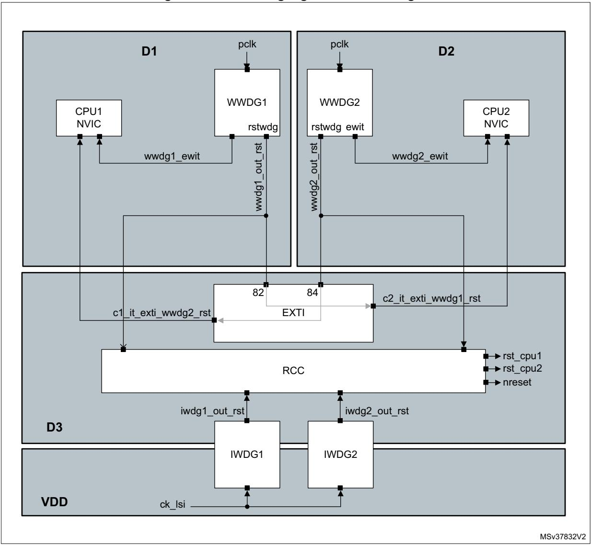

**Watchdog overview RM0399**

# **46 Watchdog overview**

The devices feature four embedded watchdog blocks which offer a combination of high safety, timing accuracy and flexibility. Option bytes allow adapting the behavior of the watchdogs to the user application.

# **46.1 Watchdog main features**

- Two independent watchdogs (IWDG1/2), each dedicated to a CPU
- Two window watchdogs (WWDG1/2), each dedicated to a CPU
- Each CPU can receive an interrupt if the other CPU has been reset due to a window watchdog timeout.
- Each CPU can receive the early interrupt of its dedicated window watchdog.
- Watchdog functions can be configured through option bytes.

## **46.2 Watchdog brief functional description**

IWDG1 and WWDG1 are dedicated to CPU1, while IWDG2 and WWDG2 are dedicated to CPU2.

Both watchdog peripherals (Independent and Window) allow detecting and resolving malfunctions due to software or hardware failures.

The window watchdogs (WWDG1/2) clocks are derived from the APB clocks and have a configurable time window that can be programmed to detect abnormally late or early application behavior. The WWDGs are best suited for monitoring software execution.

Each WWDG provides a reset and an early interrupt signal.

As shown in *[Figure 575](#page-1-0)*, the early wakeup interrupt output (wwdg1\_ewit) of WWDG1 is connected to CPU1 interrupt controller.

The WWDG1 reset signal output (wwdg1\_out\_rst) is input to the reset and clock controller (RCC), and generates either a CPU1 reset or a system reset according to the value of WW1RSC bit in RCC\_GRC register. In both cases, the wwdg1\_out\_rst also resets the WWDG1 block.

In addition, the wwdg1\_out\_rst signal is connected to CPU2 interrupt controller via the EXTI block. This function allows each core to be interrupted when the other core has a failure due to a window watchdog reset.

WWDG2 connection is completely symmetrical compared to WWDG1 connection.

*Note: The WWDG1 and WWDG2 are hard-wired to be used by CPU1 and CPU2, respectively. There is no register protection. As a result it is not recommended that CPU1 uses WWDG2, and CPU2, WWDG1.*

> *Refer to Section 47: System window watchdog (WWDG) for a detailed description of WWDG blocks.*

The independent watchdogs (IWDG1/2) are clocked by the low-speed clock (LSI) and thus stay active even if the main clock fails. They are consequently best suited for applications

2038/3556 RM0399 Rev 4

RM0399 Watchdog overview

which require the watchdog to run totally independently of the main application. The IWDGs are ideal solutions to recover from unexpected software or hardware failures.

Refer to Section 48: Independent watchdog (IWDG) for a detailed description of IWDG blocks.

Note: Like WWDG blocks, IWDG1 block is designed to work with CPU1, and IWDG2 with CPU2.

Figure 575. Watchdog high-level block diagram

**Watchdog overview RM0399**

### **46.2.1 Enabling the watchdog clock**

#### **Enabling WWDG1/2 clock**

Each core can enable the window watchdog clocks via the RCC block. Setting the WWDG1EN bit in RCC\_C1\_D1APB1ENR register enables WWDG1 block clock, while setting WWDG2EN bit in RCC\_C2\_D2APB1LENR register enables WWDG2 block clock.

The software cannot stop WWDG1 and WWDG2 down-counting by setting WWDG1EN and WWDG2EN bit to '0', respectively.

CPU1 can also enable the WWDG1 block via the RCC\_D1APB1ENR register, while CPU2 cannot program the WWDG1EN bit through this register.

Similarly, CPU2 can also enable the WWDG2 block via the RCC\_D2APB1LENR register, while CPU1 cannot program the WWDG2EN bit through this register.

#### **Enabling IWDG1/2 clock**

The independent watchdogs do not need their clock to be enabled by the RCC block. IWDG1 is implicitly allocated to CPU1, and IWDG2 to CPU2. An option byte allows IWDG1 and IWDG2 to be automatically enabled after a system reset. Refer to *Section 48.3: IWDG functional description* for additional information.

#### **46.2.2 Window watchdog reset scope**

The reset scope of the window watchdogs can be controlled via WW1RSC and WW2RSC bits in the RCC\_GRC register (see *Section 9.7.36: RCC global control register (RCC\_GCR)*).

After a system reset, WW[2:1]RSC bits are set to '0', meaning that the reset scope of the WWDG1/2 is by default limited to CPU1 and CPU2.

When the WW1RSC bit is set to '1', the WWDG1 will generate a system reset if a timeout occurs. The software cannot set the WW1RSC bit back to '0' once it has been set to '1'. A similar description applies to WW2RSC bit with respect to WWDG2 block.

### **46.2.3 Watchdog behavior versus CPU state**

A WWDG block is frozen when the corresponding CPU enters CSTOP mode. When the domain goes in DSTANDBY, the WWDG block located into this domain is reset.

IWDG blocks remain always enabled once enabled. Two option bytes allow freezing IWDG down-counting:

- IWDG\_FZ\_STOP option byte allows freezing WWDG1/2 down-counting when the CPU1/CPU2 is entering CSTOP mode or deeper low-power mode (DxSTOP, DxSTANDBY or product Standby mode).
- IWDG\_FZ\_STANDBY option byte allows freezing WWDG1/2 down-counting only when the product enters Standby mode.

Refer to *Section 4.4: FLASH option bytes* for a detailed description of the option bytes.

2040/3556 RM0399 Rev 4