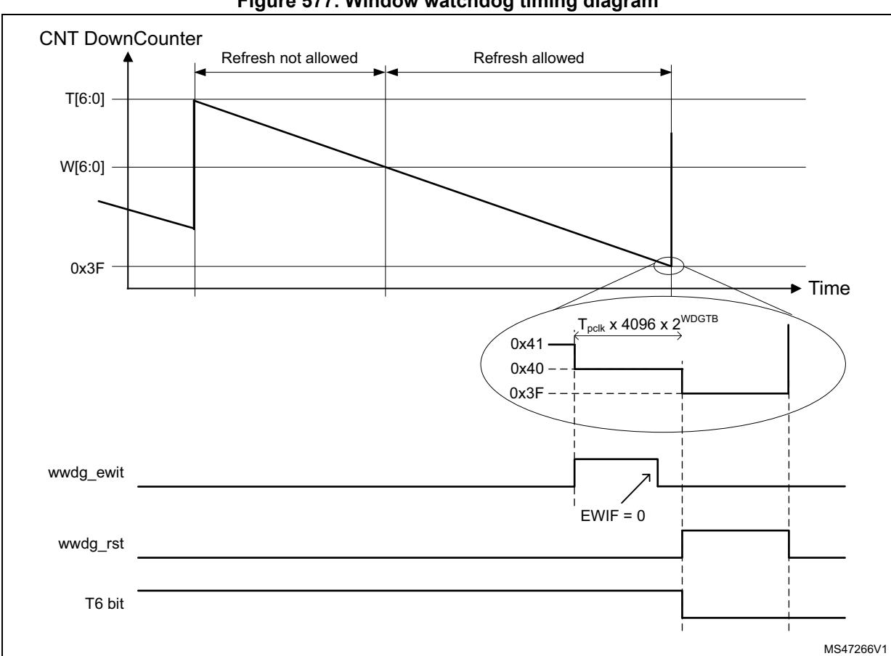

# **47 System window watchdog (WWDG)**

# **47.1 Introduction**

The system window watchdog (WWDG) is used to detect the occurrence of a software fault, usually generated by external interference or by unforeseen logical conditions, which causes the application program to abandon its normal sequence.

The watchdog circuit generates a reset on expiry of a programmed time period, unless the program refreshes the contents of the down-counter before the T6 bit is cleared. A reset is also generated if the 7-bit down-counter value (in the control register) is refreshed before the down-counter reaches the window register value. This implies that the counter must be refreshed in a limited window.

The WWDG clock is prescaled from the APB clock and has a configurable time-window that can be programmed to detect abnormally late or early application behavior.

The WWDG is best suited for applications requiring the watchdog to react within an accurate timing window.

# **47.2 WWDG main features**

- Programmable free-running down-counter
- Conditional reset
  - Reset (if watchdog activated) when the down-counter value becomes lower than 0x40
  - Reset (if watchdog activated) if the down-counter is reloaded outside the window (see *[Figure 577](#page-2-0)*)
- Early wake-up interrupt (EWI): triggered (if enabled and the watchdog activated) when the down-counter is equal to 0x40

# **47.3 WWDG functional description**

If the watchdog is activated (the WDGA bit is set in the WWDG\_CR register), and when the 7-bit down-counter (T[6:0] bits) is decremented from 0x40 to 0x3F (T6 becomes cleared), it initiates a reset. If the software reloads the counter while the counter is greater than the value stored in the window register, then a reset is generated.

The application program must write in the WWDG\_CR register at regular intervals during normal operation to prevent a reset. This operation can take place only when the counter value is lower than or equal to the window register value, and higher than 0x3F. The value to be stored in the WWDG\_CR register must be between 0xFF and 0xC0.

Refer to *[Figure 576](#page-1-0)* and to *[Section 47.3.2: WWDG internal signals](#page-1-1)* for the WWDG block diagram.

### **47.3.1 WWDG block diagram**

WWDG 7-bit downcounter (CNT) pclkAPB bus ÷ 4096 ÷ 2WDGTB Write to WWDG\_CR CMP = 1 when T[6:0] > W[6:0] CMP preload WWDG\_CR wwdg\_out\_rst wwdg\_it = 0x40 ? *readback* WWDG\_CFR W[6:0] cnt\_out Register interface WWDG\_SR T6 T[6:0] WDGA EWI Logic EWIF

**Figure 576. Watchdog block diagram** 

## **47.3.2 WWDG internal signals**

*[Table 390](#page-1-2)* gives the list of WWDG internal signals.

**Signal name Signal type Description** pclk Digital input APB bus clock wwdg\_out\_rst Digital output WWDG reset signal output wwdg\_it Digital output WWDG early interrupt output

**Table 390. WWDG internal input/output signals** 

# **47.3.3 Enabling the watchdog**

The watchdog is always disabled after a reset. It is enabled by setting the WDGA bit in the WWDG\_CR register, then it cannot be disabled again except by a reset.

### **47.3.4 Controlling the down-counter**

This down-counter is free-running, counting down even if the watchdog is disabled. When the watchdog is enabled, the T6 bit must be set to prevent generating an immediate reset.

The T[5:0] bits contain the number of increments that represent the time delay before the watchdog produces a reset. The timing varies between a minimum and a maximum value, due to the unknown status of the prescaler when writing to the WWDG\_CR register (see *[Figure 577](#page-2-0)*). The *[WWDG configuration register \(WWDG\\_CFR\)](#page-4-0)* contains the high limit of the window: to prevent a reset, the down-counter must be reloaded when its value is lower than or equal to the window register value, and greater than 0x3F. *[Figure 577](#page-2-0)* describes the window watchdog process.

*Note: The T6 bit can be used to generate a software reset (the WDGA bit is set and the T6 bit is cleared).*

2042/3556 RM0399 Rev 4

### **47.3.5 How to program the watchdog timeout**

Use the formula in *[Figure 577](#page-2-0)* to calculate the WWDG timeout.

**Warning: When writing to the WWDG\_CR register, always write 1 in the T6 bit to avoid generating an immediate reset.**

**Figure 577. Window watchdog timing diagram** 

The formula to calculate the timeout value is given by:

$$t_{WWDG} = t_{PCLK} \times 4096 \times 2^{WDGTB[2:0]} \times (T[5:0] + 1)$$
 (ms)

where:

tWWDG: WWDG timeout

tPCLK: APB clock period measured in ms 4096: value corresponding to internal divider As an example, if APB frequency is 48 MHz, WDGTB[2:0] is set to 3, and T[5:0] is set to 63:

$$t_{WWDG} = (1/48000) \times 4096 \times 2^{3} \times (63+1) = 43.69 \text{ms}$$

Refer to the datasheet for the minimum and maximum values of tWWDG.

## **47.3.6 Debug mode**

When the CPU1/2 enter debug mode, WWDG1 and WWDG2 counters either continue to work normally or stop, depending on DBGMCU\_APB3LFZ1/2 and DBGMCU\_APB1LFZ1/2, respectively. For more details, refer to *Section 63: Debug infrastructure*.

# **47.4 WWDG interrupts**

The early wake-up interrupt (EWI) can be used if specific safety operations or data logging must be performed before the reset is generated. To enable the early wake-up interrupt, the application must:

- Write EWIF bit of WWDG\_SR register to 0, to clear unwanted pending interrupt
- Write EWI bit of WWDG\_CFR register to 1, to enable interrupt

When the down-counter reaches the value 0x40, a watchdog interrupt is generated, and the corresponding interrupt service routine (ISR) can be used to trigger specific actions (such as communications or data logging), before resetting the device.

In some applications, the EWI interrupt can be used to manage a software system check and/or system recovery/graceful degradation, without generating a WWDG reset. In this case the corresponding ISR must reload the WWDG counter to avoid the WWDG reset, then trigger the required actions.

The watchdog interrupt is cleared by writing '0' to the EWIF bit in the WWDG\_SR register.

*Note: When the watchdog interrupt cannot be served (for example due to a system lock in a higher priority task), the WWDG reset is eventually generated.*

# **47.5 WWDG registers**

Refer to *Section 1.2 on page 106* for a list of abbreviations used in register descriptions.

The peripheral registers can be accessed by halfwords (16-bit) or words (32-bit).

### **47.5.1 WWDG control register (WWDG\_CR)**

Address offset: 0x000 Reset value: 0x0000 007F

| 31   | 30   | 29   | 28   | 27   | 26   | 25   | 24   | 23   | 22   | 21   | 20   | 19     | 18   | 17   | 16   |
|------|------|------|------|------|------|------|------|------|------|------|------|--------|------|------|------|
| Res. | Res. | Res. | Res. | Res. | Res. | Res. | Res. | Res. | Res. | Res. | Res. | Res.   | Res. | Res. | Res. |
|      |      |      |      |      |      |      |      |      |      |      |      |        |      |      |      |
|      |      |      |      |      |      |      |      |      |      |      |      |        |      |      |      |
| 15   | 14   | 13   | 12   | 11   | 10   | 9    | 8    | 7    | 6    | 5    | 4    | 3      | 2    | 1    | 0    |
| Res. | Res. | Res. | Res. | Res. | Res. | Res. | Res. | WDGA |      |      |      | T[6:0] |      |      |      |

Bits 31:8 Reserved, must be kept at reset value.

#### Bit 7 **WDGA:** Activation bit

This bit is set by software and only cleared by hardware after a reset. When WDGA = 1, the watchdog can generate a reset.

0: Watchdog disabled 1: Watchdog enabled

#### Bits 6:0 **T[6:0]:** 7-bit counter (MSB to LSB)

These bits contain the value of the watchdog counter, decremented every (4096 x 2WDGTB[2:0]) PCLK cycles. A reset is produced when it is decremented from 0x40 to 0x3F (T6 becomes cleared).

## **47.5.2 WWDG configuration register (WWDG\_CFR)**

Address offset: 0x004 Reset value: 0x0000 007F

| 31   | 30   | 29             | 28   | 27   | 26   | 25   | 24   | 23   | 22   | 21   | 20   | 19   | 18   | 17   | 16   |
|------|------|----------------|------|------|------|------|------|------|------|------|------|------|------|------|------|
| Res. | Res. | Res.           | Res. | Res. | Res. | Res. | Res. | Res. | Res. | Res. | Res. | Res. | Res. | Res. | Res. |
|      |      |                |      |      |      |      |      |      |      |      |      |      |      |      |      |
| 15   | 14   | 13             | 12   | 11   | 10   | 9    | 8    | 7    | 6    | 5    | 4    | 3    | 2    | 1    | 0    |
| Res. | Res. | WDGTB[2:0]     |      |      | Res. | EWI  | Res. | Res. |      |      |      |      |      |      |      |
|      |      | rw rw rw |      |      | rs   |      |      | rw   | rw   | rw   | rw   | rw   | rw   | rw   |      |

Bits 31:14 Reserved, must be kept at reset value.

#### Bits 13:11 **WDGTB[2:0]:** Timer base

The timebase of the prescaler can be modified as follows:

000: CK counter clock (PCLK div 4096) div 1

001: CK counter clock (PCLK div 4096) div 2

010: CK counter clock (PCLK div 4096) div 4

011: CK counter clock (PCLK div 4096) div 8

100: CK counter clock (PCLK div 4096) div 16

101: CK counter clock (PCLK div 4096) div 32

110: CK counter clock (PCLK div 4096) div 64

111: CK counter clock (PCLK div 4096) div 128

Bit 10 Reserved, must be kept at reset value.

RM0399 Rev 4 2045/3556

#### Bit 9 **EWI:** Early wake-up interrupt enable

Set by software and cleared by hardware after a reset. When set, an interrupt occurs whenever the counter reaches the value 0x40.

Bits 8:7 Reserved, must be kept at reset value.

Bits 6:0 **W[6:0]:** 7-bit window value

These bits contain the window value to be compared with the down-counter.

### **47.5.3 WWDG status register (WWDG\_SR)**

Address offset: 0x008

Reset value: 0x0000 0000

| 31   | 30   | 29   | 28   | 27   | 26   | 25   | 24   | 23   | 22   | 21   | 20   | 19   | 18   | 17   | 16   |
|------|------|------|------|------|------|------|------|------|------|------|------|------|------|------|------|
| Res. | Res. | Res. | Res. | Res. | Res. | Res. | Res. | Res. | Res. | Res. | Res. | Res. | Res. | Res. | Res. |
|      |      |      |      |      |      |      |      |      |      |      |      |      |      |      |      |
| 15   | 14   | 13   | 12   | 11   | 10   | 9    | 8    | 7    | 6    | 5    | 4    | 3    | 2    | 1    | 0    |
| Res. | Res. | Res. | Res. | Res. | Res. | Res. | Res. | Res. | Res. | Res. | Res. | Res. | Res. | Res. | EWIF |
|      |      |      |      |      |      |      |      |      |      |      |      |      |      |      |      |

Bits 31:1 Reserved, must be kept at reset value.

Bit 0 **EWIF:** Early wake-up interrupt flag

This bit is set by hardware when the counter has reached the value 0x40. It must be cleared by software by writing 0. Writing 1 has no effect. This bit is also set if the interrupt is not enabled.

#### **47.5.4 WWDG register map**

The following table gives the WWDG register map and reset values.

**Table 391. WWDG register map and reset values** 

| Offset | Register name                                                                                                                                | 31   | 30   | 29   | 28   | 27   | 26   | 25   | 24                                                           | 23   | 22   | 21   | 20   | 19   | 18   | 17     | 16   | 15   | 14   | 13   | 12             | 11   | 10   | 9    | 8    | 7    | 6    | 5    | 4    | 3      | 2    | 1    | 0    |
|--------|-------------------------------------------------------------------------------------------------------------------------------------------------|------|------|------|------|------|------|------|--------------------------------------------------------------|------|------|------|------|------|------|--------|------|------|------|------|----------------|------|------|------|------|------|------|------|------|--------|------|------|------|
| 0x000  | Res. Res. Res. Res. Res. Res. Res. Res. Res. Res. Res. Res. Res. Res. Res. Res. Res. WWDG_CR |      |      |      |      |      |      |      | WDGA Res. Res. Res. Res. Res. Res. Res. |      |      |      |      |      |      | T[6:0] |      |      |      |      |                |      |      |      |      |      |      |      |      |        |      |      |      |
|        | Reset value                                                                                                                                     |      |      |      |      |      |      |      |                                                              |      |      |      |      |      |      |        |      |      |      |      |                |      |      |      |      | 0    | 1    | 1    | 1    | 1      | 1    | 1    | 1    |
| 0x004  | WWDG_CFR                                                                                                                                        | Res. | Res. | Res. | Res. | Res. | Res. | Res. | Res.                                                         | Res. | Res. | Res. | Res. | Res. | Res. | Res.   | Res. | Res. | Res. |      | WDGTB [2:0] |      | Res. | EWI  | Res. | Res. |      |      |      | W[6:0] |      |      |      |
|        | Reset value                                                                                                                                     |      |      |      |      |      |      |      |                                                              |      |      |      |      |      |      |        |      |      |      | 0    | 0              | 0    |      | 0    |      |      | 1    | 1    | 1    | 1      | 1    | 1    | 1    |
| 0x008  | WWDG_SR                                                                                                                                         | Res. | Res. | Res. | Res. | Res. | Res. | Res. | Res.                                                         | Res. | Res. | Res. | Res. | Res. | Res. | Res.   | Res. | Res. | Res. | Res. | Res.           | Res. | Res. | Res. | Res. | Res. | Res. | Res. | Res. | Res.   | Res. | Res. | EWIF |
|        | Reset value                                                                                                                                     |      |      |      |      |      |      |      |                                                              |      |      |      |      |      |      |        |      |      |      |      |                |      |      |      |      |      |      |      |      |        |      |      | 0    |

Refer to *Section 2.3 on page 134* for the register boundary addresses.

2046/3556 RM0399 Rev 4