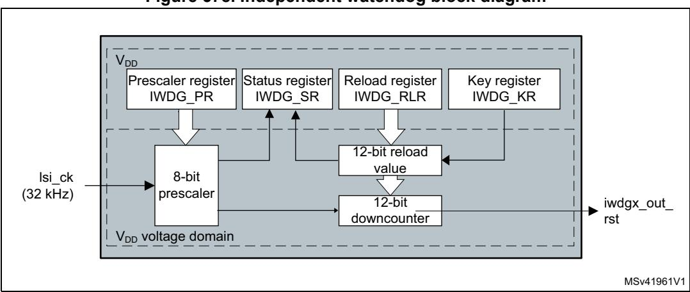

# **48 Independent watchdog (IWDG)**

# **48.1 Introduction**

The devices feature an embedded watchdog peripheral that offers a combination of high safety level, timing accuracy and flexibility of use. The Independent watchdog peripheral detects and solves malfunctions due to software failure, and triggers system reset when the counter reaches a given timeout value.

The independent watchdog (IWDG) is clocked by its own dedicated low-speed clock (LSI) and thus stays active even if the main clock fails.

The IWDG is best suited for applications that require the watchdog to run as a totally independent process outside the main application, but have lower timing accuracy constraints. For further information on the window watchdog, refer to *Section 47: System window watchdog (WWDG)*.

# **48.2 IWDG main features**

- Free-running downcounter
- Clocked from an independent RC oscillator (can operate in Standby and Stop modes)
- Conditional reset
  - Reset (if watchdog activated) when the downcounter value becomes lower than 0x000
  - Reset (if watchdog activated) if the downcounter is reloaded outside the window

# **48.3 IWDG functional description**

## **48.3.1 IWDG block diagram**

*[Figure 578](#page-0-0)* shows the functional blocks of the independent watchdog module.

**Figure 578. Independent watchdog block diagram** 

1. The register interface is located in the VDD voltage domain. The watchdog function is located in the VDD voltage domain, still functional in Stop and Standby modes.

RM0399 Rev 4 2047/3556

When the independent watchdog is started by writing the value 0x0000 CCCC in the *[IWDG](#page-3-0)  [key register \(IWDG\\_KR\)](#page-3-0)*, the counter starts counting down from the reset value of 0xFFF. When it reaches the end of count value (0x000) a reset signal is generated (IWDG reset).

Whenever the key value 0x0000 AAAA is written in the *[IWDG key register \(IWDG\\_KR\)](#page-3-0)*, the IWDG\_RLR value is reloaded in the counter and the watchdog reset is prevented.

Once running, the IWDG cannot be stopped.

# **48.3.2 IWDG internal signals**

*[Table 392](#page-1-0)* gives the list of IWDG internal signals.

**Signal name Signal type Description** lsi\_ck Digital input LSI clock iwdg1\_out\_rst, iwdg2\_out\_rst Digital output IWDG1 and IWDG2 reset signal outputs

**Table 392. IWDG internal input/output signals** 

# **48.3.3 Window option**

The IWDG can also work as a window watchdog by setting the appropriate window in the *[IWDG window register \(IWDG\\_WINR\)](#page-7-0)*.

If the reload operation is performed while the counter is greater than the value stored in the *[IWDG window register \(IWDG\\_WINR\)](#page-7-0)*, then a reset is provided.

The default value of the *[IWDG window register \(IWDG\\_WINR\)](#page-7-0)* is 0x0000 0FFF, so if it is not updated, the window option is disabled.

As soon as the window value is changed, a reload operation is performed in order to reset the downcounter to the *[IWDG reload register \(IWDG\\_RLR\)](#page-5-0)* value and ease the cycle number calculation to generate the next reload.

### **Configuring the IWDG when the window option is enabled**

- 1. Enable the IWDG by writing 0x0000 CCCC in the *[IWDG key register \(IWDG\\_KR\)](#page-3-0)*.
- 2. Enable register access by writing 0x0000 5555 in the *[IWDG key register \(IWDG\\_KR\)](#page-3-0)*.
- 3. Write the IWDG prescaler by programming *[IWDG prescaler register \(IWDG\\_PR\)](#page-4-0)* from 0 to 7.
- 4. Write the *[IWDG reload register \(IWDG\\_RLR\)](#page-5-0)*.
- 5. Wait for the registers to be updated (IWDG\_SR = 0x0000 0000).
- 6. Write to the *[IWDG window register \(IWDG\\_WINR\)](#page-7-0)*. This automatically refreshes the counter value in the *[IWDG reload register \(IWDG\\_RLR\)](#page-5-0)*.

*Note: Writing the window value allows the counter value to be refreshed by the RLR when [IWDG](#page-6-0)  [status register \(IWDG\\_SR\)](#page-6-0) is set to 0x0000 0000.*

### **Configuring the IWDG when the window option is disabled**

When the window option it is not used, the IWDG can be configured as follows:

2048/3556 RM0399 Rev 4

- 1. Enable the IWDG by writing 0x0000 CCCC in the *[IWDG key register \(IWDG\\_KR\)](#page-3-0)*.
- 2. Enable register access by writing 0x0000 5555 in the *[IWDG key register \(IWDG\\_KR\)](#page-3-0)*.
- 3. Write the prescaler by programming the *[IWDG prescaler register \(IWDG\\_PR\)](#page-4-0)* from 0 to 7.
- 4. Write the *[IWDG reload register \(IWDG\\_RLR\)](#page-5-0)*.
- 5. Wait for the registers to be updated (IWDG\_SR = 0x0000 0000).
- 6. Refresh the counter value with IWDG\_RLR (IWDG\_KR = 0x0000 AAAA).

# **48.3.4 Hardware watchdog**

If the "Hardware watchdog" feature is enabled through the device option bits, the watchdog is automatically enabled at power-on, and generates a reset unless the *[IWDG key register](#page-3-0)  [\(IWDG\\_KR\)](#page-3-0)* is written by the software before the counter reaches end of count or if the downcounter is reloaded inside the window.

## **48.3.5 Low-power freeze**

Depending on the IWDG\_FZ\_STOP and IWDG\_FZ\_STBY options configuration, the IWDG can continue counting or not during the Stop mode and the Standby mode, respectively. If the IWDG is kept running during Stop or Standby modes, it can wake up the device from this mode. Refer to *Section 4.4.5: Description of user and system option bytes* for more details.

## **48.3.6 Register access protection**

Write access to *[IWDG prescaler register \(IWDG\\_PR\)](#page-4-0)*, *[IWDG reload register \(IWDG\\_RLR\)](#page-5-0)* and *[IWDG window register \(IWDG\\_WINR\)](#page-7-0)* is protected. To modify them, the user must first write the code 0x0000 5555 in the *[IWDG key register \(IWDG\\_KR\)](#page-3-0)*. A write access to this register with a different value breaks the sequence and register access is protected again. This is the case of the reload operation (writing 0x0000 AAAA).

A status register is available to indicate that an update of the prescaler or of the downcounter reload value or of the window value is ongoing.

## **48.3.7 Debug mode**

When the device enters Debug mode (core halted), the IWDG counter either continues to work normally or stops, depending on the configuration of the corresponding bit in DBGMCU freeze register.

# **48.4 IWDG registers**

Refer to *Section 1.2 on page 106* for a list of abbreviations used in register descriptions.

The peripheral registers can be accessed by half-words (16-bit) or words (32-bit).

# **48.4.1 IWDG key register (IWDG\_KR)**

Address offset: 0x00

Reset value: 0x0000 0000 (reset by Standby mode)

| 31   | 30   | 29   | 28   | 27   | 26   | 25   | 24   | 23        | 22   | 21   | 20   | 19   | 18   | 17   | 16   |
|------|------|------|------|------|------|------|------|-----------|------|------|------|------|------|------|------|
| Res. | Res. | Res. | Res. | Res. | Res. | Res. | Res. | Res.      | Res. | Res. | Res. | Res. | Res. | Res. | Res. |
|      |      |      |      |      |      |      |      |           |      |      |      |      |      |      |      |
| 15   | 14   | 13   | 12   | 11   | 10   | 9    | 8    | 7         | 6    | 5    | 4    | 3    | 2    | 1    | 0    |
|      |      |      |      |      |      |      |      | KEY[15:0] |      |      |      |      |      |      |      |
| w    | w    | w    | w    | w    | w    | w    | w    | w         | w    | w    | w    | w    | w    | w    | w    |

Bits 31:16 Reserved, must be kept at reset value.

Bits 15:0 **KEY[15:0]:** Key value (write only, read 0x0000)

These bits must be written by software at regular intervals with the key value 0xAAAA, otherwise the watchdog generates a reset when the counter reaches 0.

Writing the key value 0x5555 to enable access to the IWDG\_PR, IWDG\_RLR and IWDG\_WINR registers (see *[Section 48.3.6: Register access protection](#page-2-0)*)

Writing the key value 0xCCCC starts the watchdog (except if the hardware watchdog option is selected)

# **48.4.2 IWDG prescaler register (IWDG\_PR)**

Address offset: 0x04

Reset value: 0x0000 0000

| 31   | 30   | 29   | 28   | 27   | 26   | 25   | 24   | 23   | 22   | 21   | 20   | 19   | 18   | 17      | 16   |
|------|------|------|------|------|------|------|------|------|------|------|------|------|------|---------|------|
| Res. | Res. | Res. | Res. | Res. | Res. | Res. | Res. | Res. | Res. | Res. | Res. | Res. | Res. | Res.    | Res. |
|      |      |      |      |      |      |      |      |      |      |      |      |      |      |         |      |
|      |      |      |      |      |      |      |      |      |      |      |      |      |      |         |      |
| 15   | 14   | 13   | 12   | 11   | 10   | 9    | 8    | 7    | 6    | 5    | 4    | 3    | 2    | 1       | 0    |
| Res. | Res. | Res. | Res. | Res. | Res. | Res. | Res. | Res. | Res. | Res. | Res. | Res. |      | PR[2:0] |      |

Bits 31:3 Reserved, must be kept at reset value.

### Bits 2:0 **PR[2:0]:** Prescaler divider

These bits are write access protected see *[Section 48.3.6: Register access protection](#page-2-0)*. They are written by software to select the prescaler divider feeding the counter clock. PVU bit of the *[IWDG status register \(IWDG\\_SR\)](#page-6-0)* must be reset in order to be able to change the prescaler divider.

000: divider /4 001: divider /8 010: divider /16 011: divider /32 100: divider /64 101: divider /128 110: divider /256 111: divider /256

*Note: Reading this register returns the prescaler value from the VDD voltage domain. This value may not be up to date/valid if a write operation to this register is ongoing. For this reason the value read from this register is valid only when the PVU bit in the [IWDG](#page-6-0)  [status register \(IWDG\\_SR\)](#page-6-0) is reset.*

RM0399 Rev 4 2051/3556

# **48.4.3 IWDG reload register (IWDG\_RLR)**

Address offset: 0x08

Reset value: 0x0000 0FFF (reset by Standby mode)

| 31   | 30   | 29   | 28   | 27   | 26   | 25   | 24   | 23   | 22   | 21       | 20   | 19   | 18   | 17   | 16   |
|------|------|------|------|------|------|------|------|------|------|----------|------|------|------|------|------|
| Res. | Res. | Res. | Res. | Res. | Res. | Res. | Res. | Res. | Res. | Res.     | Res. | Res. | Res. | Res. | Res. |
|      |      |      |      |      |      |      |      |      |      |          |      |      |      |      |      |
| 15   | 14   |      |      |      |      |      |      |      |      |          |      |      |      |      |      |
|      |      | 13   | 12   | 11   | 10   | 9    | 8    | 7    | 6    | 5        | 4    | 3    | 2    | 1    | 0    |
| Res. | Res. | Res. | Res. |      |      |      |      |      |      | RL[11:0] |      |      |      |      |      |

Bits 31:12 Reserved, must be kept at reset value.

### Bits 11:0 **RL[11:0]:** Watchdog counter reload value

These bits are write access protected see *[Register access protection](#page-2-0)*. They are written by software to define the value to be loaded in the watchdog counter each time the value 0xAAAA is written in the *[IWDG key register \(IWDG\\_KR\)](#page-3-0)*. The watchdog counter counts down from this value. The timeout period is a function of this value and the clock prescaler. Refer to the datasheet for the timeout information.

The RVU bit in the *[IWDG status register \(IWDG\\_SR\)](#page-6-0)* must be reset to be able to change the reload value.

*Note: Reading this register returns the reload value from the VDD voltage domain. This value may not be up to date/valid if a write operation to this register is ongoing on it. For this reason the value read from this register is valid only when the RVU bit in the [IWDG](#page-6-0)  [status register \(IWDG\\_SR\)](#page-6-0) is reset.*

2052/3556 RM0399 Rev 4

# **48.4.4 IWDG status register (IWDG\_SR)**

Address offset: 0x0C

Reset value: 0x0000 0000 (not reset by Standby mode)

| 31   | 30   | 29   | 28   | 27   | 26   | 25   | 24   | 23   | 22   | 21   | 20   | 19   | 18   | 17   | 16   |
|------|------|------|------|------|------|------|------|------|------|------|------|------|------|------|------|
| Res. | Res. | Res. | Res. | Res. | Res. | Res. | Res. | Res. | Res. | Res. | Res. | Res. | Res. | Res. | Res. |
|      |      |      |      |      |      |      |      |      |      |      |      |      |      |      |      |
|      |      |      |      |      |      |      |      |      |      |      |      |      |      |      |      |
| 15   | 14   | 13   | 12   | 11   | 10   | 9    | 8    | 7    | 6    | 5    | 4    | 3    | 2    | 1    | 0    |
| Res. | Res. | Res. | Res. | Res. | Res. | Res. | Res. | Res. | Res. | Res. | Res. | Res. | WVU  | RVU  | PVU  |

Bits 31:3 Reserved, must be kept at reset value.

#### Bit 2 **WVU:** Watchdog counter window value update

This bit is set by hardware to indicate that an update of the window value is ongoing. It is reset by hardware when the reload value update operation is completed in the VDD voltage domain (takes up to five RC 40 kHz cycles).

Window value can be updated only when WVU bit is reset.

#### Bit 1 **RVU:** Watchdog counter reload value update

This bit is set by hardware to indicate that an update of the reload value is ongoing. It is reset by hardware when the reload value update operation is completed in the VDD voltage domain (takes up to five RC 40 kHz cycles).

Reload value can be updated only when RVU bit is reset.

#### Bit 0 **PVU:** Watchdog prescaler value update

This bit is set by hardware to indicate that an update of the prescaler value is ongoing. It is reset by hardware when the prescaler update operation is completed in the VDD voltage domain (takes up to five RC 40 kHz cycles).

Prescaler value can be updated only when PVU bit is reset.

*Note: If several reload, prescaler, or window values are used by the application, it is mandatory to wait until RVU bit is reset before changing the reload value, to wait until PVU bit is reset before changing the prescaler value, and to wait until WVU bit is reset before changing the window value. However, after updating the prescaler and/or the reload/window value it is not necessary to wait until RVU or PVU or WVU is reset before continuing code execution except in case of low-power mode entry.*

# **48.4.5 IWDG window register (IWDG\_WINR)**

Address offset: 0x10

Reset value: 0x0000 0FFF (reset by Standby mode)

| 31   | 30   | 29   | 28   | 27   | 26   | 25   | 24   | 23   | 22   | 21        | 20   | 19   | 18   | 17   | 16   |
|------|------|------|------|------|------|------|------|------|------|-----------|------|------|------|------|------|
| Res. | Res. | Res. | Res. | Res. | Res. | Res. | Res. | Res. | Res. | Res.      | Res. | Res. | Res. | Res. | Res. |
|      |      |      |      |      |      |      |      |      |      |           |      |      |      |      |      |
| 15   | 14   | 13   | 12   | 11   | 10   | 9    | 8    | 7    | 6    | 5         | 4    | 3    | 2    | 1    | 0    |
| Res. | Res. | Res. | Res. |      |      |      |      |      |      | WIN[11:0] |      |      |      |      |      |
|      |      |      |      | rw   | rw   | rw   | rw   | rw   | rw   | rw        | rw   | rw   | rw   | rw   | rw   |

Bits 31:12 Reserved, must be kept at reset value.

### Bits 11:0 **WIN[11:0]:** Watchdog counter window value

These bits are write access protected, see *[Section 48.3.6](#page-2-0)*, they contain the high limit of the window value to be compared with the downcounter.

To prevent a reset, the downcounter must be reloaded when its value is lower than the window register value and greater than 0x0

The WVU bit in the *[IWDG status register \(IWDG\\_SR\)](#page-6-0)* must be reset in order to be able to change the reload value.

*Note: Reading this register returns the reload value from the VDD voltage domain. This value may not be valid if a write operation to this register is ongoing. For this reason the value read from this register is valid only when the WVU bit in the [IWDG status register](#page-6-0)  [\(IWDG\\_SR\)](#page-6-0) is reset.*

2054/3556 RM0399 Rev 4

# **48.4.6 IWDG register map**

The following table gives the IWDG register map and reset values.

**Table 393. IWDG register map and reset values** 

| Offset                                                                                                                                          | Register name | 31   | 30   | 29   | 28   | 27   | 26   | 25   | 24   | 23   | 22   | 21   | 20        | 19   | 18   | 17   | 16   | 15   | 14   | 13   | 12   | 11        | 10   | 9    | 8    | 7    | 6    | 5        | 4    | 3    | 2   | 1       | 0   |
|-------------------------------------------------------------------------------------------------------------------------------------------------|------------------|------|------|------|------|------|------|------|------|------|------|------|-----------|------|------|------|------|------|------|------|------|-----------|------|------|------|------|------|----------|------|------|-----|---------|-----|
| Res. Res. Res. Res. Res. Res. Res. Res. Res. Res. Res. Res. Res. Res. Res. Res. IWDG_KR 0x00 |                  |      |      |      |      |      |      |      |      |      |      |      | KEY[15:0] |      |      |      |      |      |      |      |      |           |      |      |      |      |      |          |      |      |     |         |     |
|                                                                                                                                                 | Reset value      |      |      |      |      |      |      |      |      |      |      |      |           |      |      |      |      | 0    | 0    | 0    | 0    | 0         | 0    | 0    | 0    | 0    | 0    | 0        | 0    | 0    | 0   | 0       | 0   |
| 0x04                                                                                                                                            | IWDG_PR          | Res. | Res. | Res. | Res. | Res. | Res. | Res. | Res. | Res. | Res. | Res. | Res.      | Res. | Res. | Res. | Res. | Res. | Res. | Res. | Res. | Res.      | Res. | Res. | Res. | Res. | Res. | Res.     | Res. | Res. |     | PR[2:0] |     |
|                                                                                                                                                 | Reset value      |      |      |      |      |      |      |      |      |      |      |      |           |      |      |      |      |      |      |      |      |           |      |      |      |      |      |          |      |      | 0   | 0       | 0   |
| 0x08                                                                                                                                            | IWDG_RLR         | Res. | Res. | Res. | Res. | Res. | Res. | Res. | Res. | Res. | Res. | Res. | Res.      | Res. | Res. | Res. | Res. | Res. | Res. | Res. | Res. |           |      |      |      |      |      | RL[11:0] |      |      |     |         |     |
|                                                                                                                                                 | Reset value      |      |      |      |      |      |      |      |      |      |      |      |           |      |      |      |      |      |      |      |      | 1         | 1    | 1    | 1    | 1    | 1    | 1        | 1    | 1    | 1   | 1       | 1   |
| 0x0C                                                                                                                                            | IWDG_SR          | Res. | Res. | Res. | Res. | Res. | Res. | Res. | Res. | Res. | Res. | Res. | Res.      | Res. | Res. | Res. | Res. | Res. | Res. | Res. | Res. | Res.      | Res. | Res. | Res. | Res. | Res. | Res.     | Res. | Res. | WVU | RVU     | PVU |
|                                                                                                                                                 | Reset value      |      |      |      |      |      |      |      |      |      |      |      |           |      |      |      |      |      |      |      |      |           |      |      |      |      |      |          |      |      | 0   | 0       | 0   |
| 0x10                                                                                                                                            | IWDG_WINR        | Res. | Res. | Res. | Res. | Res. | Res. | Res. | Res. | Res. | Res. | Res. | Res.      | Res. | Res. | Res. | Res. | Res. | Res. | Res. | Res. | WIN[11:0] |      |      |      |      |      |          |      |      |     |         |     |
|                                                                                                                                                 | Reset value      |      |      |      |      |      |      |      |      |      |      |      |           |      |      |      |      |      |      |      |      | 1         | 1    | 1    | 1    | 1    | 1    | 1        | 1    | 1    | 1   | 1       | 1   |

Refer to *Section 2.3 on page 134* for the register boundary addresses.