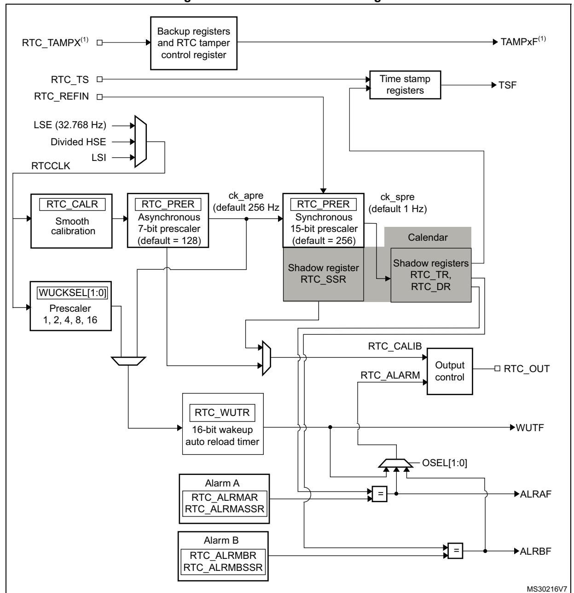

# **49 Real-time clock (RTC)**

# **49.1 Introduction**

The RTC provides an automatic wake-up to manage all low-power modes.

The real-time clock (RTC) is an independent BCD timer/counter. The RTC provides a timeof-day clock/calendar with programmable alarm interrupts.

The RTC includes also a periodic programmable wake-up flag with interrupt capability.

Two 32-bit registers contain the seconds, minutes, hours (12- or 24-hour format), day (day of week), date (day of month), month, and year, expressed in binary coded decimal format (BCD). The sub-seconds value is also available in binary format.

Compensations for 28-, 29- (leap year), 30-, and 31-day months are performed automatically. Daylight saving time compensation can also be performed.

Additional 32-bit registers contain the programmable alarm subseconds, seconds, minutes, hours, day, and date.

A digital calibration feature is available to compensate for any deviation in crystal oscillator accuracy.

After Backup domain reset, all RTC registers are protected against possible parasitic write accesses.

As long as the supply voltage remains in the operating range, the RTC never stops, regardless of the device status (Run mode, low-power mode or under reset).

# **49.2 RTC main features**

The RTC unit main features are the following (see *[Figure 580: Detailed RTC block diagram](#page-2-0)*):

- Calendar with subseconds, seconds, minutes, hours (12 or 24 format), day (day of week), date (day of month), month, and year.
- Daylight saving compensation programmable by software.
- Programmable alarm with interrupt function. The alarm can be triggered by any combination of the calendar fields.
- Automatic wake-up unit generating a periodic flag that triggers an automatic wake-up interrupt.
- Reference clock detection: a more precise second source clock (50 or 60 Hz) can be used to enhance the calendar precision.
- Accurate synchronization with an external clock using the subsecond shift feature.
- Digital calibration circuit (periodic counter correction): 0.95 ppm accuracy, obtained in a calibration window of several seconds
- Time-stamp function for event saving
- Tamper detection event with configurable filter and internal pull-up
- Maskable interrupts/events:
  - Alarm A
  - Alarm B
  - Wake-up interrupt
  - Time-stamp
  - Tamper detection
- 32 backup registers.

# **49.3 RTC functional description**

# **49.3.1 RTC block diagram**

**Figure 579. RTC block overview**

1. x is an integer index starting from 1, the number of tampers depends on devices.

**Figure 580. Detailed RTC block diagram**

1. x is an integer index starting from 1, the number of tampers depends on devices.

RTC TAMP1(1) □-RTC TAMP2(1) □ RTC tamper Tamper-out and backup RTC TAMP3(1) □registers Voltage clear PWR CR2 monitor 4 KB backup SRAM Temperature monitor MSv40952V2

Figure 581. Tamper detection

1. Refer to device datasheet for RTC\_TAMPx availability.

#### The RTC includes:

- Two alarms
- Three tamper events from I/Os
  - Tamper detection erases the backup registers and the backup RAM.
  - In addition, the tamper detection forbids software access to the backup SRAM until its erase operation is finished. Refer to Section 49.3.15: Tamper detection
  - The tamper3 event detection is generated either by an event on I/O, or by an over or under voltage of the RTC power supply domain, or by an over or under temperature detection. These voltage and temperature monitor detections are enabled in the PWR control register 2 (PWR\_CR2).
- One timestamp event from I/O
- Tamper event detection can generate a timestamp event
- Timestamp can be generated when a switch to VBAT occurs
- 32 x 32-bit backup registers
  - The backup registers (RTC\_BKPxR) are implemented in the RTC domain that remains powered-on by VBAT when the VDD power is switched off.
- Output functions: RTC\_OUT which selects one of the following two outputs:
  - RTC\_CALIB: 512 Hz or 1Hz clock output (with an LSE frequency of 32.768 kHz).
    This output is enabled by setting the COE bit in the RTC\_CR register.
  - RTC\_ALARM: This output is enabled by configuring the OSEL[1:0] bits in the RTC\_CR register which select the Alarm A, Alarm B or Wakeup outputs.
- Input functions:
  - RTC\_TS: timestamp event
  - RTC\_TAMP1: tamper1 event detection
  - RTC TAMP2: tamper2 event detection
  - RTC\_TAMP3: tamper3 event detection
  - RTC REFIN: 50 or 60 Hz reference clock input

# **49.3.2 RTC pins and internal signals**

**Table 394. RTC pins and internal signals** 

| Signal name         | Signal type     | Description                                           |
|---------------------|-----------------|-------------------------------------------------------|
| RTC_TS              | Input           | Timestamp input                                       |
| RTC_TAMPx (x = 1,)  | Input           | Tamper input                                          |
| RTC_REFIN           | Input           | Reference clock input                                 |
| RTC_OUT             | Output          | RTC output                                            |
| rtc_ker_ck (RTCCLK) | Internal input  | RTC clock source (LSE clock, LSI clock and HSE clock) |
| rtc_pclk            | Internal input  | RTC APB interface clock                               |
| rtc_wut             | Internal output | RTC wakeup event output for on chip peripherals       |
| rtc_alra            | Internal output | RTC Alarm A event output for on chip peripherals      |
| rtc_alrb            | Internal output | RTC Alarm B event output for on chip peripherals      |
| rtc_tampx           | Internal output | RTC Tamper x event output for on chip peripherals     |
| rtc_ts              | Internal output | RTC Timestamp event output for on chip peripherals    |

# **49.3.3 GPIOs controlled by the RTC**

RTC\_OUT, RTC\_TS and RTC\_TAMP1 are mapped on the same pin (PC13). PC13 pin configuration is controlled by the RTC, whatever the PC13 GPIO configuration, except for the RTC\_ALARM output open-drain mode. The RTC functions mapped on PC13 are available in all low-power modes and in VBAT mode.

The output mechanism follows the priority order shown in *[Table 395](#page-4-0)*.

**Table 395. RTC pin PC13 configuration(1)**

| PC13 Pin configuration and function | OSEL[1:0] bits (RTC_ALARM output enable) | COE bit (RTC_CALIB output enable) | RTC_OUT _RMP bit | RTC_ALARM _TYPE bit | TAMP1E bit (RTC_TAMP1 input enable) | TSE bit (RTC_TS input enable) |
|-------------------------------------------|------------------------------------------------------|--------------------------------------------|------------------------|---------------------------|----------------------------------------------|----------------------------------------|
| RTC_ALARM                                 | 0 01 or 10 or 11                                  |                                            | Don't care             | Don't care                |                                              |                                        |
| output OD                                 |                                                      | Don't care                                 | 1                      | 0                         |                                              |                                        |
| RTC_ALARM output PP                    | 01 or 10 or 11                                       | Don't care                                 | 0                      | 1                         | Don't care                                   | Don't care                             |
|                                           |                                                      |                                            | 1                      |                           |                                              |                                        |
| RTC_CALIB output PP                    | 00                                                   | 1                                          | 0                      | Don't care                | Don't care                                   | Don't care                             |
| RTC_TAMP1 input floating               | 00                                                   | 0                                          | Don't care             |                           | 1                                            | 0                                      |
|                                           | 00                                                   | 1                                          |                        | Don't care                |                                              |                                        |
|                                           | 01 or 10 or 11                                       | 0                                          | 1                      |                           |                                              |                                        |

| Table | 395. | RTC pin | PC13 | configu | ration (1) | (conti | nued) |
|-------|------|---------|------|---------|-----------------------|--------|-------|
|       |      |         |      |         |                       |        |       |

| PC13 Pin configuration and function | OSEL[1:0] bits (RTC_ALARM output enable) | COE bit (RTC_CALIB output enable) | RTC_OUT _RMP bit | RTC_ALARM _TYPE bit | TAMP1E bit (RTC_TAMP1 input enable) | TSE bit (RTC_TS input enable) |
|-------------------------------------------|------------------------------------------------------|--------------------------------------------|------------------------|---------------------------|----------------------------------------------|----------------------------------------|
| RTC_TS and RTC_TAMP1 input floating | 00                                                   | 0                                          | Don't care             |                           | 1                                            | 1                                      |
|                                           | 00                                                   | 1                                          | 1                      | Don't care                |                                              |                                        |
|                                           | 01 or 10 or 11                                       | 0                                          | ı                      |                           |                                              |                                        |
| RTC_TS input floating                     | 00                                                   | 0                                          | Don't care             | Don't care                | 0                                            | 1                                      |
|                                           | 00                                                   | 1                                          | 1                      |                           |                                              |                                        |
|                                           | 01 or 10 or 11                                       | 0                                          | ı                      |                           |                                              |                                        |
| Wakeup pin or Standard GPIO         | 00                                                   | 0                                          | Don't care             |                           |                                              |                                        |
|                                           | 00                                                   | 1                                          | 1                      | Don't care                | 0                                            | 0                                      |
|                                           | 01 or 10 or 11                                       | 0                                          | I                      |                           |                                              |                                        |

1. OD: open drain; PP: push-pull.

In addition, it is possible to remap RTC\_OUT on PB2 pin thanks to RTC\_OUT\_RMP bit. In this case it is mandatory to configure PB2 GPIO registers as alternate function with the correct type. The remap functions are shown in *Table 396*.

Table 396. RTC\_OUT mapping

| OSEL[1:0] bits (RTC_ALARM output enable) | COE bit (RTC_CALIB output enable) | RTC_OUT_RMP bit | RTC_OUT on PC13 | RTC_OUT on PB2 |
|------------------------------------------------|-----------------------------------------|--------------------|--------------------|-------------------|
| 00                                             | 0                                       |                    | -                  | -                 |
| 00                                             | 1                                       | 0                  | RTC_CALIB          | -                 |
| 01 or 10 or 11                                 | Don't care                              |                    | RTC_ALARM          | -                 |
| 00                                             | 0                                       |                    | -                  | -                 |
| 00                                             | 1                                       | 4                  | -                  | RTC_CALIB         |
| 01 or 10 or 11                                 | 0                                       |                    | -                  | RTC_ALARM         |
| 01 or 10 or 11                                 | 1                                       |                    | RTC_ALARM          | RTC_CALIB         |

The table below summarizes the RTC pins and functions capability in all modes.

| Pin  | RTC functions                  | Functional in all low- power modes except Standby modes | Functional in Standby mode | Functional in VBAT mode |
|------|--------------------------------|---------------------------------------------------------------|-------------------------------|----------------------------|
| PC13 | RTC_TAMP1 RTC_TS RTC_OUT | YES                                                           | YES                           | YES                        |
| PI8  | RTC_TAMP2                      | YES                                                           | YES                           | YES                        |
| PC1  | RTC_TAMP3                      | YES                                                           | YES                           | YES                        |
| PB2  | RTC_OUT                        | YES                                                           | NO                            | NO                         |
| PB15 | RTC_REFIN                      | YES                                                           | NO                            | NO                         |

Table 397. RTC functions over modes

### 49.3.4 Clock and prescalers

The RTC clock source (RTCCLK) is selected through the clock controller among the LSE clock, the LSI oscillator clock, and the HSE clock. For more information on the RTC clock source configuration, refer to Section 9: Reset and Clock Control (RCC).

A programmable prescaler stage generates a 1 Hz clock which is used to update the calendar. To minimize power consumption, the prescaler is split into 2 programmable prescalers (see *Figure 580: Detailed RTC block diagram*):

- A 7-bit asynchronous prescaler configured through the PREDIV\_A bits of the RTC\_PRER register.
- A 15-bit synchronous prescaler configured through the PREDIV\_S bits of the RTC\_PRER register.

Note: When both prescalers are used, it is recommended to configure the asynchronous prescaler to a high value to minimize consumption.

The asynchronous prescaler division factor is set to 128, and the synchronous division factor to 256, to obtain an internal clock frequency of 1 Hz (ck\_spre) with an LSE frequency of 32.768 kHz.

The minimum division factor is 1 and the maximum division factor is  $2^{22}$ .

This corresponds to a maximum input frequency of around 4 MHz.

fck apre is given by the following formula:

$$f_{CK\_APRE} = \frac{f_{RTCCLK}}{PREDIV\_A + 1}$$

The ck\_apre clock is used to clock the binary RTC\_SSR subseconds downcounter. When it reaches 0, RTC\_SSR is reloaded with the content of PREDIV\_S.

fck spre is given by the following formula:

$$f_{CK\_SPRE} = \frac{f_{RTCCLK}}{(PREDIV\_S + 1) \times (PREDIV\_A + 1)}$$

The ck\_spre clock can be used either to update the calendar or as timebase for the 16-bit wake-up auto-reload timer. To obtain short timeout periods, the 16-bit wake-up auto-reload timer can also run with the RTCCLK divided by the programmable 4-bit asynchronous prescaler (see *[Section 49.3.7: Periodic auto-wake-up](#page-7-0)* for details).

# **49.3.5 Real-time clock and calendar**

The RTC calendar time and date registers are accessed through shadow registers which are synchronized with PCLK (APB clock). They can also be accessed directly in order to avoid waiting for the synchronization duration.

- RTC\_SSR for the subseconds
- RTC\_TR for the time
- RTC\_DR for the date

Every RTCCLK period, the current calendar value is copied into the shadow registers, and the RSF bit of RTC\_ISR register is set (see *[Section 49.6.4: RTC initialization and status](#page-25-0)  [register \(RTC\\_ISR\)](#page-25-0)*). The copy is not performed in Stop and Standby mode. When exiting these modes, the shadow registers are updated after up to 1 RTCCLK period.

When the application reads the calendar registers, it accesses the content of the shadow registers. It is possible to make a direct access to the calendar registers by setting the BYPSHAD control bit in the RTC\_CR register. By default, this bit is cleared, and the user accesses the shadow registers.

When reading the RTC\_SSR, RTC\_TR or RTC\_DR registers in BYPSHAD=0 mode, the frequency of the APB clock (fAPB) must be at least 7 times the frequency of the RTC clock (fRTCCLK).

The shadow registers are reset by system reset.

# **49.3.6 Programmable alarms**

The RTC unit provides programmable alarm: Alarm A and Alarm B. The description below is given for Alarm A, but can be translated in the same way for Alarm B.

The programmable alarm function is enabled through the ALRAE bit in the RTC\_CR register. The ALRAF is set to 1 if the calendar subseconds, seconds, minutes, hours, date or day match the values programmed in the alarm registers RTC\_ALRMASSR and RTC\_ALRMAR. Each calendar field can be independently selected through the MSKx bits of the RTC\_ALRMAR register, and through the MASKSSx bits of the RTC\_ALRMASSR register. The alarm interrupt is enabled through the ALRAIE bit in the RTC\_CR register.

**Caution:** If the seconds field is selected (MSK1 bit reset in RTC\_ALRMAR), the synchronous prescaler division factor set in the RTC\_PRER register must be at least 3 to ensure correct behavior.

> Alarm A and Alarm B (if enabled by bits OSEL[1:0] in RTC\_CR register) can be routed to the RTC\_ALARM output. RTC\_ALARM output polarity can be configured through bit POL the RTC\_CR register.

# **49.3.7 Periodic auto-wake-up**

The periodic wake-up flag is generated by a 16-bit programmable auto-reload downcounter. The wake-up timer range can be extended to 17 bits.

The wake-up function is enabled through the WUTE bit in the RTC\_CR register.

RM0399 Rev 4 2063/3556

The wake-up timer clock input can be:

• RTC clock (RTCCLK) divided by 2, 4, 8, or 16. When RTCCLK is LSE(32.768 kHz), this allows to configure the wake-up interrupt period from 122 µs to 32 s, with a resolution down to 61 µs.

• ck\_spre (usually 1 Hz internal clock)

When ck\_spre frequency is 1Hz, this allows to achieve a wake-up time from 1 s to around 36 hours with one-second resolution. This large programmable time range is divided in 2 parts:

- from 1s to 18 hours when WUCKSEL [2:1] = 10
- and from around 18h to 36h when WUCKSEL[2:1] = 11. In this last case 216 is added to the 16-bit counter current value.When the initialization sequence is complete (see *[Programming the wake-up timer on page 2065](#page-9-0)*), the timer starts counting down.When the wake-up function is enabled, the down-counting remains active in low-power modes. In addition, when it reaches 0, the WUTF flag is set in the RTC\_ISR register, and the wake-up counter is automatically reloaded with its reload value (RTC\_WUTR register value).

The WUTF flag must then be cleared by software.

When the periodic wake-up interrupt is enabled by setting the WUTIE bit in the RTC\_CR register, it can exit the device from low-power modes.

The periodic wake-up flag can be routed to the RTC\_ALARM output provided it has been enabled through bits OSEL[1:0] of RTC\_CR register. RTC\_ALARM output polarity can be configured through the POL bit in the RTC\_CR register.

System reset, as well as low-power modes (Sleep, Stop and Standby) have no influence on the wake-up timer.

# **49.3.8 RTC initialization and configuration**

## **RTC register access**

The RTC registers are 32-bit registers. The APB interface introduces 2 wait-states in RTC register accesses except on read accesses to calendar shadow registers when BYPSHAD=0.

## **RTC register write protection**

After system reset, the RTC registers are protected against parasitic write access by clearing the DBP bit in the PWR\_CR1 register (refer to the power control section). DBP bit must be set in order to enable RTC registers write access.

After Backup domain reset, all the RTC registers are write-protected. Writing to the RTC registers is enabled by writing a key into the Write Protection register, RTC\_WPR.

The following steps are required to unlock the write protection on all the RTC registers except for RTC\_TAMPCR, RTC\_BKPxR, RTC\_OR and RTC\_ISR[13:8].

- 1. Write '0xCA' into the RTC\_WPR register.
- 2. Write '0x53' into the RTC\_WPR register.

Writing a wrong key reactivates the write protection.

The protection mechanism is not affected by system reset.

## **Calendar initialization and configuration**

To program the initial time and date calendar values, including the time format and the prescaler configuration, the following sequence is required:

- 1. Set INIT bit to 1 in the RTC\_ISR register to enter initialization mode. In this mode, the calendar counter is stopped and its value can be updated.
- 2. Poll INITF bit of in the RTC\_ISR register. The initialization phase mode is entered when INITF is set to 1. It takes around 2 RTCCLK clock cycles (due to clock synchronization).
- 3. To generate a 1 Hz clock for the calendar counter, program both the prescaler factors in RTC\_PRER register.
- 4. Load the initial time and date values in the shadow registers (RTC\_TR and RTC\_DR), and configure the time format (12 or 24 hours) through the FMT bit in the RTC\_CR register.
- 5. Exit the initialization mode by clearing the INIT bit. The actual calendar counter value is then automatically loaded and the counting restarts after 4 RTCCLK clock cycles.

When the initialization sequence is complete, the calendar starts counting.

*Note: After a system reset, the application can read the INITS flag in the RTC\_ISR register to check if the calendar has been initialized or not. If this flag equals 0, the calendar has not been initialized since the year field is set at its Backup domain reset default value (0x00).*

> *To read the calendar after initialization, the software must first check that the RSF flag is set in the RTC\_ISR register.*

# **Daylight saving time**

The daylight saving time management is performed through bits SUB1H, ADD1H, and BKP of the RTC\_CR register.

Using SUB1H or ADD1H, the software can subtract or add one hour to the calendar in one single operation without going through the initialization procedure.

In addition, the software can use the BKP bit to memorize this operation.

# **Programming the alarm**

A similar procedure must be followed to program or update the programmable alarms. The procedure below is given for Alarm A but can be translated in the same way for Alarm B.

- 1. Clear ALRAE in RTC\_CR to disable Alarm A.
- 2. Program the Alarm A registers (RTC\_ALRMASSR/RTC\_ALRMAR).
- 3. Set ALRAE in the RTC\_CR register to enable Alarm A again.

*Note: Each change of the RTC\_CR register is taken into account after around 2 RTCCLK clock cycles due to clock synchronization.*

## **Programming the wake-up timer**

The following sequence is required to configure or change the wake-up timer auto-reload value (WUT[15:0] in RTC\_WUTR):

RM0399 Rev 4 2065/3556

- 1. Clear WUTE in RTC\_CR to disable the wake-up timer.
- 2. Poll WUTWF until it is set in RTC\_ISR to make sure the access to wake-up auto-reload counter and to WUCKSEL[2:0] bits is allowed. It takes around 2 RTCCLK clock cycles (due to clock synchronization).
- 3. Program the wake-up auto-reload value WUT[15:0], and the wake-up clock selection (WUCKSEL[2:0] bits in RTC\_CR). Set WUTE in RTC\_CR to enable the timer again. The wake-up timer restarts down-counting. The WUTWF bit is cleared up to 2 RTCCLK clock cycles after WUTE is cleared, due to clock synchronization.

# **49.3.9 Reading the calendar**

# **When BYPSHAD control bit is cleared in the RTC\_CR register**

To read the RTC calendar registers (RTC\_SSR, RTC\_TR and RTC\_DR) properly, the APB clock frequency (fPCLK) must be equal to or greater than seven times the RTC clock frequency (fRTCCLK). This ensures a secure behavior of the synchronization mechanism.

If the APB clock frequency is less than seven times the RTC clock frequency, the software must read the calendar time and date registers twice. If the second read of the RTC\_TR gives the same result as the first read, this ensures that the data is correct. Otherwise a third read access must be done. In any case the APB clock frequency must never be lower than the RTC clock frequency.

The RSF bit is set in RTC\_ISR register each time the calendar registers are copied into the RTC\_SSR, RTC\_TR and RTC\_DR shadow registers. The copy is performed every RTCCLK cycle. To ensure consistency between the 3 values, reading either RTC\_SSR or RTC\_TR locks the values in the higher-order calendar shadow registers until RTC\_DR is read. In case the software makes read accesses to the calendar in a time interval smaller than 1 RTCCLK period: RSF must be cleared by software after the first calendar read, and then the software must wait until RSF is set before reading again the RTC\_SSR, RTC\_TR and RTC\_DR registers.

After waking up from low-power mode (Stop or Standby), RSF must be cleared by software. The software must then wait until it is set again before reading the RTC\_SSR, RTC\_TR and RTC\_DR registers.

The RSF bit must be cleared after wake-up and not before entering low-power mode.

After a system reset, the software must wait until RSF is set before reading the RTC\_SSR, RTC\_TR and RTC\_DR registers. Indeed, a system reset resets the shadow registers to their default values.

After an initialization (refer to *[Calendar initialization and configuration on page 2065](#page-9-1)*): the software must wait until RSF is set before reading the RTC\_SSR, RTC\_TR and RTC\_DR registers.

After synchronization (refer to *[Section 49.3.11: RTC synchronization](#page-11-0)*): the software must wait until RSF is set before reading the RTC\_SSR, RTC\_TR and RTC\_DR registers.

# **When the BYPSHAD control bit is set in the RTC\_CR register (bypass shadow registers)**

Reading the calendar registers gives the values from the calendar counters directly, thus eliminating the need to wait for the RSF bit to be set. This is especially useful after exiting from low-power modes (STOP or Standby), since the shadow registers are not updated during these modes.

When the BYPSHAD bit is set to 1, the results of the different registers might not be coherent with each other if an RTCCLK edge occurs between two read accesses to the registers. Additionally, the value of one of the registers may be incorrect if an RTCCLK edge occurs during the read operation. The software must read all the registers twice, and then compare the results to confirm that the data is coherent and correct. Alternatively, the software can just compare the two results of the least-significant calendar register.

*Note: While BYPSHAD=1, instructions which read the calendar registers require one extra APB cycle to complete.*

# **49.3.10 Resetting the RTC**

The calendar shadow registers (RTC\_SSR, RTC\_TR and RTC\_DR) and some bits of the RTC status register (RTC\_ISR) are reset to their default values by all available system reset sources.

On the contrary, the following registers are reset to their default values by a Backup domain reset and are not affected by a system reset: the RTC current calendar registers, the RTC control register (RTC\_CR), the prescaler register (RTC\_PRER), the RTC calibration register (RTC\_CALR), the RTC shift register (RTC\_SHIFTR), the RTC timestamp registers (RTC\_TSSSR, RTC\_TSTR and RTC\_TSDR), the RTC tamper configuration register (RTC\_TAMPCR), the RTC backup registers (RTC\_BKPxR), the wake-up timer register (RTC\_WUTR), the Alarm A and Alarm B registers (RTC\_ALRMASSR/RTC\_ALRMAR and RTC\_ALRMBSSR/RTC\_ALRMBR), and the Option register (RTC\_OR).

In addition, when it is clocked by the LSE, the RTC keeps on running under system reset if the reset source is different from the Backup domain reset one (refer to the RTC clock section of the Reset and clock controller for details on the list of RTC clock sources not affected by system reset). When a Backup domain reset occurs, the RTC is stopped and all the RTC registers are set to their reset values.

# **49.3.11 RTC synchronization**

The RTC can be synchronized to a remote clock with a high degree of precision. After reading the sub-second field (RTC\_SSR or RTC\_TSSSR), a calculation can be made of the precise offset between the times being maintained by the remote clock and the RTC. The RTC can then be adjusted to eliminate this offset by "shifting" its clock by a fraction of a second using RTC\_SHIFTR.

RTC\_SSR contains the value of the synchronous prescaler counter. This allows one to calculate the exact time being maintained by the RTC down to a resolution of 1 / (PREDIV\_S + 1) seconds. As a consequence, the resolution can be improved by increasing the synchronous prescaler value (PREDIV\_S[14:0]. The maximum resolution allowed (30.52 μs with a 32768 Hz clock) is obtained with PREDIV\_S set to 0x7FFF.

However, increasing PREDIV\_S means that PREDIV\_A must be decreased in order to maintain the synchronous prescaler output at 1 Hz. In this way, the frequency of the asynchronous prescaler output increases, which may increase the RTC dynamic consumption.

The RTC can be finely adjusted using the RTC shift control register (RTC\_SHIFTR). Writing to RTC\_SHIFTR can shift (either delay or advance) the clock by up to a second with a resolution of 1 / (PREDIV\_S + 1) seconds. The shift operation consists of adding the SUBFS[14:0] value to the synchronous prescaler counter SS[15:0]: this will delay the clock.

RM0399 Rev 4 2067/3556

If at the same time the ADD1S bit is set, this results in adding one second and at the same time subtracting a fraction of second, so this will advance the clock.

**Caution:** Before initiating a shift operation, the user must check that SS[15] = 0 in order to ensure that

no overflow will occur. As soon as a shift operation is initiated by a write to the RTC\_SHIFTR register, the SHPF

flag is set by hardware to indicate that a shift operation is pending. This bit is cleared by hardware as soon as the shift operation has completed.

**Caution:** This synchronization feature is not compatible with the reference clock detection feature: firmware must not write to RTC\_SHIFTR when REFCKON=1.

# **49.3.12 RTC reference clock detection**

The update of the RTC calendar can be synchronized to a reference clock, RTC\_REFIN, which is usually the mains frequency (50 or 60 Hz). The precision of the RTC\_REFIN reference clock should be higher than the 32.768 kHz LSE clock. When the RTC\_REFIN detection is enabled (REFCKON bit of RTC\_CR set to 1), the calendar is still clocked by the LSE, and RTC\_REFIN is used to compensate for the imprecision of the calendar update frequency (1 Hz).

Each 1 Hz clock edge is compared to the nearest RTC\_REFIN clock edge (if one is found within a given time window). In most cases, the two clock edges are properly aligned. When the 1 Hz clock becomes misaligned due to the imprecision of the LSE clock, the RTC shifts the 1 Hz clock a bit so that future 1 Hz clock edges are aligned. Thanks to this mechanism, the calendar becomes as precise as the reference clock.

The RTC detects if the reference clock source is present by using the 256 Hz clock (ck\_apre) generated from the 32.768 kHz quartz. The detection is performed during a time window around each of the calendar updates (every 1 s). The window equals 7 ck\_apre periods when detecting the first reference clock edge. A smaller window of 3 ck\_apre periods is used for subsequent calendar updates.

Each time the reference clock is detected in the window, the synchronous prescaler which outputs the ck\_spre clock is forced to reload. This has no effect when the reference clock and the 1 Hz clock are aligned because the prescaler is being reloaded at the same moment. When the clocks are not aligned, the reload shifts future 1 Hz clock edges a little for them to be aligned with the reference clock.

If the reference clock halts (no reference clock edge occurred during the 3 ck\_apre window), the calendar is updated continuously based solely on the LSE clock. The RTC then waits for the reference clock using a large 7 ck\_apre period detection window centered on the ck\_spre edge.

When the RTC\_REFIN detection is enabled, PREDIV\_A and PREDIV\_S must be set to their default values:

- PREDIV\_A = 0x007F
- PREVID\_S = 0x00FF

*Note: RTC\_REFIN clock detection is not available in Standby mode.*

# **49.3.13 RTC smooth digital calibration**

The RTC frequency can be digitally calibrated with a resolution of about 0.954 ppm with a range from -487.1 ppm to +488.5 ppm. The correction of the frequency is performed using

series of small adjustments (adding and/or subtracting individual RTCCLK pulses). These adjustments are fairly well distributed so that the RTC is well calibrated even when observed over short durations of time.

The smooth digital calibration is performed during a cycle of about 220 RTCCLK pulses, or 32 seconds when the input frequency is 32768 Hz. This cycle is maintained by a 20-bit counter, cal\_cnt[19:0], clocked by RTCCLK.

The smooth calibration register (RTC\_CALR) specifies the number of RTCCLK clock cycles to be masked during the 32-second cycle:

- Setting the bit CALM[0] to 1 causes exactly one pulse to be masked during the 32 second cycle.
- Setting CALM[1] to 1 causes two additional cycles to be masked
- Setting CALM[2] to 1 causes four additional cycles to be masked
- and so on up to CALM[8] set to 1 which causes 256 clocks to be masked.

*Note: CALM[8:0] (RTC\_CALR) specifies the number of RTCCLK pulses to be masked during the 32-second cycle. Setting the bit CALM[0] to '1' causes exactly one pulse to be masked during the 32-second cycle at the moment when cal\_cnt[19:0] is 0x80000; CALM[1]=1 causes two other cycles to be masked (when cal\_cnt is 0x40000 and 0xC0000); CALM[2]=1 causes four other cycles to be masked (cal\_cnt = 0x20000/0x60000/0xA0000/ 0xE0000); and so on up to CALM[8]=1 which causes 256 clocks to be masked (cal\_cnt = 0xXX800).*

> While CALM allows the RTC frequency to be reduced by up to 487.1 ppm with fine resolution, the bit CALP can be used to increase the frequency by 488.5 ppm. Setting CALP to '1' effectively inserts an extra RTCCLK pulse every 211 RTCCLK cycles, which means that 512 clocks are added during every 32-second cycle.

> Using CALM together with CALP, an offset ranging from -511 to +512 RTCCLK cycles can be added during the 32-second cycle, which translates to a calibration range of -487.1 ppm to +488.5 ppm with a resolution of about 0.954 ppm.

> The formula to calculate the effective calibrated frequency (FCAL) given the input frequency (FRTCCLK) is as follows:

$$F_{CAL} = F_{RTCCLK} \times [1 + (CALP \times 512 - CALM) / (2^{20} + CALM - CALP \times 512)]$$

# **Calibration when PREDIV\_A<3**

The CALP bit can not be set to 1 when the asynchronous prescaler value (PREDIV\_A bits in RTC\_PRER register) is less than 3. If CALP was already set to 1 and PREDIV\_A bits are set to a value less than 3, CALP is ignored and the calibration operates as if CALP was equal to 0.

To perform a calibration with PREDIV\_A less than 3, the synchronous prescaler value (PREDIV\_S) should be reduced so that each second is accelerated by 8 RTCCLK clock cycles, which is equivalent to adding 256 clock cycles every 32 seconds. As a result, between 255 and 256 clock pulses (corresponding to a calibration range from 243.3 to 244.1 ppm) can effectively be added during each 32-second cycle using only the CALM bits.

With a nominal RTCCLK frequency of 32768 Hz, when PREDIV\_A equals 1 (division factor of 2), PREDIV\_S should be set to 16379 rather than 16383 (4 less). The only other interesting case is when PREDIV\_A equals 0, PREDIV\_S should be set to 32759 rather than 32767 (8 less).

If PREDIV\_S is reduced in this way, the formula given the effective frequency of the

RM0399 Rev 4 2069/3556

calibrated input clock is as follows:

FCAL = FRTCCLK x [1 + (256 - CALM) / (220 + CALM - 256)]

In this case, CALM[7:0] equals 0x100 (the midpoint of the CALM range) is the correct setting if RTCCLK is exactly 32768.00 Hz.

# **Verifying the RTC calibration**

RTC precision is ensured by measuring the precise frequency of RTCCLK and calculating the correct CALM value and CALP values. An optional 1 Hz output is provided to allow applications to measure and verify the RTC precision.

Measuring the precise frequency of the RTC over a limited interval can result in a measurement error of up to 2 RTCCLK clock cycles over the measurement period, depending on how the digital calibration cycle is aligned with the measurement period.

However, this measurement error can be eliminated if the measurement period is the same length as the calibration cycle period. In this case, the only error observed is the error due to the resolution of the digital calibration.

• By default, the calibration cycle period is 32 seconds.

Using this mode and measuring the accuracy of the 1 Hz output over exactly 32 seconds guarantees that the measure is within 0.477 ppm (0.5 RTCCLK cycles over 32 seconds, due to the limitation of the calibration resolution).

• CALW16 bit of the RTC\_CALR register can be set to 1 to force a 16- second calibration cycle period.

In this case, the RTC precision can be measured during 16 seconds with a maximum error of 0.954 ppm (0.5 RTCCLK cycles over 16 seconds). However, since the calibration resolution is reduced, the long term RTC precision is also reduced to 0.954 ppm: CALM[0] bit is stuck at 0 when CALW16 is set to 1.

• CALW8 bit of the RTC\_CALR register can be set to 1 to force a 8- second calibration cycle period.

In this case, the RTC precision can be measured during 8 seconds with a maximum error of 1.907 ppm (0.5 RTCCLK cycles over 8s). The long term RTC precision is also reduced to 1.907 ppm: CALM[1:0] bits are stuck at 00 when CALW8 is set to 1.

## **Re-calibration on-the-fly**

The calibration register (RTC\_CALR) can be updated on-the-fly while RTC\_ISR/INITF=0, by using the follow process:

- 1. Poll the RTC\_ISR/RECALPF (re-calibration pending flag).
- 2. If it is set to 0, write a new value to RTC\_CALR, if necessary. RECALPF is then automatically set to 1
- 3. Within three ck\_apre cycles after the write operation to RTC\_CALR, the new calibration settings take effect.

# **49.3.14 Time-stamp function**

When TSE is set:

Time-stamp is enabled by setting the TSE or ITSE bits of RTC\_CR register to 1.

The calendar is saved in the time-stamp registers (RTC\_TSSSR, RTC\_TSTR, RTC\_TSDR) when a time-stamp event is detected on the RTC\_TS pin.

When ITSE is set:

The calendar is saved in the time-stamp registers (RTC\_TSSSR, RTC\_TSTR, RTC\_TSDR) when an internal time-stamp event is detected. The internal timestamp event is generated by the switch to the VBAT supply.

When a time-stamp event occurs, due to internal or external event, the time-stamp flag bit (TSF) in RTC\_ISR register is set. In case the event is internal, the ITSF flag is also set in RTC\_ISR register.

By setting the TSIE bit in the RTC\_CR register, an interrupt is generated when a time-stamp event occurs.

If a new time-stamp event is detected while the time-stamp flag (TSF) is already set, the time-stamp overflow flag (TSOVF) flag is set and the time-stamp registers (RTC\_TSTR and RTC\_TSDR) maintain the results of the previous event.

*Note: TSF is set 2 ck\_apre cycles after the time-stamp event occurs due to synchronization process.*

> *There is no delay in the setting of TSOVF. This means that if two time-stamp events are close together, TSOVF can be seen as '1' while TSF is still '0'. As a consequence, it is recommended to poll TSOVF only after TSF has been set.*

**Caution:** If a time-stamp event occurs immediately after the TSF bit is supposed to be cleared, then both TSF and TSOVF bits are set.To avoid masking a time-stamp event occurring at the same moment, the application must not write '0' into TSF bit unless it has already read it to '1'.

> Optionally, a tamper event can cause a time-stamp to be recorded. See the description of the TAMPTS control bit in *[Section 49.6.16: RTC tamper configuration register](#page-38-0)  [\(RTC\\_TAMPCR\)](#page-38-0)*.

# **49.3.15 Tamper detection**

The RTC\_TAMPx input events can be configured either for edge detection, or for level detection with filtering.

The tamper detection can be configured for the following purposes:

- erase the RTC backup registers and backup SRAM (default configuration)
- generate an interrupt, capable to wake-up from Stop and Standby modes
- generate a hardware trigger for the low-power timers

## **RTC backup registers**

The backup registers (RTC\_BKPxR) are not reset by system reset or when the device wakes up from Standby mode.

The backup registers are reset when a tamper detection event occurs (see *[Section 49.6.20:](#page-43-0)  [RTC backup registers \(RTC\\_BKPxR\)](#page-43-0)* and *[Tamper detection initialization on page 2072](#page-16-0)*) except if the TAMPxNOERASE bit is set, or if TAMPxMF is set in the RTC\_TAMPCR register.

RM0399 Rev 4 2071/3556

## **Tamper detection initialization**

Each input can be enabled by setting the corresponding TAMPxE bits to 1 in the RTC\_TAMPCR register.

Each RTC\_TAMPx tamper detection input is associated with a flag TAMPxF in the RTC\_ISR register.

When TAMPxMF is cleared:

The TAMPxF flag is asserted after the tamper event on the pin, with the latency provided below:

- 3 ck\_apre cycles when TAMPFLT differs from 0x0 (Level detection with filtering)
- 3 ck\_apre cycles when TAMPTS=1 (Timestamp on tamper event)
- No latency when TAMPFLT=0x0 (Edge detection) and TAMPTS=0

A new tamper occurring on the same pin during this period and as long as TAMPxF is set cannot be detected.

When TAMPxMF is set:

A new tamper occurring on the same pin cannot be detected during the latency described above and 2.5 ck\_rtc additional cycles.

By setting the TAMPIE bit in the RTC\_TAMPCR register, an interrupt is generated when a tamper detection event occurs (when TAMPxF is set). Setting TAMPIE is not allowed when one or more TAMPxMF is set.

When TAMPIE is cleared, each tamper pin event interrupt can be individually enabled by setting the corresponding TAMPxIE bit in the RTC\_TAMPCR register. Setting TAMPxIE is not allowed when the corresponding TAMPxMF is set.

# **Trigger output generation on tamper event**

The tamper event detection can be used as trigger input by the low-power timers.

When TAMPxMF bit in cleared in RTC\_TAMPCR register, the TAMPxF flag must be cleared by software in order to allow a new tamper detection on the same pin.

When TAMPxMF bit is set, the TAMPxF flag is masked, and kept cleared in RTC\_ISR register. This configuration allows to trig automatically the low-power timers in Stop mode, without requiring the system wakeup to perform the TAMPxF clearing. In this case, the backup registers are not cleared.

# **Timestamp on tamper event**

With TAMPTS set to '1', any tamper event causes a timestamp to occur. In this case, either the TSF bit or the TSOVF bit are set in RTC\_ISR, in the same manner as if a normal timestamp event occurs. The affected tamper flag register TAMPxF is set at the same time that TSF or TSOVF is set.

# **Edge detection on tamper inputs**

If the TAMPFLT bits are "00", the RTC\_TAMPx pins generate tamper detection events when either a rising edge or a falling edge is observed depending on the corresponding TAMPxTRG bit. The internal pull-up resistors on the RTC\_TAMPx inputs are deactivated when edge detection is selected.

**Caution:** When using the edge detection, it is recommended to check by software the tamper pin level just after enabling the tamper detection (by reading the GPIO registers), and before writing sensitive values in the backup registers, to ensure that an active edge did not occur before enabling the tamper event detection.

> When TAMPFLT="00" and TAMPxTRG = 0 (rising edge detection), a tamper event may be detected by hardware if the tamper input is already at high level before enabling the tamper detection.

> After a tamper event has been detected and cleared, the RTC\_TAMPx should be disabled and then re-enabled (TAMPxE set to 1) before re-programming the backup registers (RTC\_BKPxR). This prevents the application from writing to the backup registers while the RTC\_TAMPx input value still indicates a tamper detection. This is equivalent to a level detection on the RTC\_TAMPx input.

*Note: Tamper detection is still active when VDD power is switched off. To avoid unwanted resetting of the backup registers, the pin to which the RTC\_TAMPx is mapped should be externally tied to the correct level.*

# **Level detection with filtering on RTC\_TAMPx inputs**

Level detection with filtering is performed by setting TAMPFLT to a non-zero value. A tamper detection event is generated when either 2, 4, or 8 (depending on TAMPFLT) consecutive samples are observed at the level designated by the TAMPxTRG bits.

The RTC\_TAMPx inputs are precharged through the I/O internal pull-up resistance before its state is sampled, unless disabled by setting TAMPPUDIS to 1,The duration of the precharge is determined by the TAMPPRCH bits, allowing for larger capacitances on the RTC\_TAMPx inputs.

The trade-off between tamper detection latency and power consumption through the pull-up can be optimized by using TAMPFREQ to determine the frequency of the sampling for level detection.

*Note: Refer to the datasheets for the electrical characteristics of the pull-up resistors.*

# **49.3.16 Calibration clock output**

When the COE bit is set to 1 in the RTC\_CR register, a reference clock is provided on the RTC\_CALIB device output.

If the COSEL bit in the RTC\_CR register is reset and PREDIV\_A = 0x7F, the RTC\_CALIB frequency is fRTCCLK/64. This corresponds to a calibration output at 512 Hz for an RTCCLK frequency at 32.768 kHz. The RTC\_CALIB duty cycle is irregular: there is a light jitter on falling edges. It is therefore recommended to use rising edges.

When COSEL is set and "PREDIV\_S+1" is a non-zero multiple of 256 (i.e: PREDIV\_S[7:0] = 0xFF), the RTC\_CALIB frequency is fRTCCLK/(256 \* (PREDIV\_A+1)). This corresponds to a calibration output at 1 Hz for prescaler default values (PREDIV\_A = Ox7F, PREDIV\_S = 0xFF), with an RTCCLK frequency at 32.768 kHz. The 1 Hz output is affected when a shift operation is on going and may toggle during the shift operation (SHPF=1).

*Note: When COSEL bit is cleared, the RTC\_CALIB output is the output of the 6th stage of the asynchronous prescaler.*

> *When COSEL bit is set, the RTC\_CALIB output is the output of the 8th stage of the synchronous prescaler.*

RM0399 Rev 4 2073/3556

# **49.3.17 Alarm output**

The OSEL[1:0] control bits in the RTC\_CR register are used to activate the alarm output RTC\_ALARM, and to select the function which is output. These functions reflect the contents of the corresponding flags in the RTC\_ISR register.

The polarity of the output is determined by the POL control bit in RTC\_CR so that the opposite of the selected flag bit is output when POL is set to 1.

# **Alarm output**

The RTC\_ALARM pin can be configured in output open drain or output push-pull using RTC\_OR register.

*Note: Once the RTC\_ALARM output is enabled, it has priority over RTC\_CALIB (COE bit is don't care and must be kept cleared).*

# **49.4 RTC low-power modes**

**Mode Description**  Stop The RTC remains active when the RTC clock source is LSE or LSI. RTC alarm, RTC tamper event, RTC timestamp event, and RTC Wakeup cause the device to exit the Stop mode. Standby The RTC remains active when the RTC clock source is LSE or LSI. RTC alarm, RTC tamper event, RTC timestamp event, and RTC Wakeup cause the device to exit the Standby mode.

**Table 398. Effect of low-power modes on RTC** 

# **49.5 RTC interrupts**

All RTC interrupts are connected to the EXTI controller. Refer to *Section 21: Extended interrupt and event controller (EXTI).*

To enable the RTC Alarm interrupt, the following sequence is required:

- 1. Configure and enable the EXTI line corresponding to the RTC Alarm event in interrupt mode and select the rising edge sensitivity.
- 2. Configure and enable the RTC\_ALARM IRQ channel in the NVIC.
- 3. Configure the RTC to generate RTC alarms.

To enable the RTC Tamper interrupt, the following sequence is required:

- 1. Configure and enable the EXTI line corresponding to the RTC Tamper event in interrupt mode and select the rising edge sensitivity.
- 2. Configure and Enable the RTC\_TAMP\_STAMP IRQ channel in the NVIC.
- 3. Configure the RTC to detect the RTC tamper event.

To enable the RTC TimeStamp interrupt, the following sequence is required:

- 1. Configure and enable the EXTI line corresponding to the RTC TimeStamp event in interrupt mode and select the rising edge sensitivity.
- 2. Configure and Enable the RTC\_TAMP\_STAMP IRQ channel in the NVIC.
- 3. Configure the RTC to detect the RTC time-stamp event.

To enable the Wakeup timer interrupt, the following sequence is required:

- 1. Configure and enable the EXTI line corresponding to the Wakeup timer even in interrupt mode and select the rising edge sensitivity.
- 2. Configure and Enable the RTC\_WKUP IRQ channel in the NVIC.
- 3. Configure the RTC to detect the RTC Wakeup timer event.

**Table 399. Interrupt control bits** 

| Interrupt event           | Event flag | Enable control bit | Exit from Sleep mode | Exit from Stop mode | Exit from Standby mode |
|---------------------------|------------|--------------------------|----------------------------|---------------------------|------------------------------|
| Alarm A                   | ALRAF      | ALRAIE                   | Yes                        | Yes(1)                    | Yes(1)                       |
| Alarm B                   | ALRBF      | ALRBIE                   | Yes                        | Yes(1)                    | Yes(1)                       |
| RTC_TS input (timestamp)  | TSF        | TSIE                     | Yes                        | Yes(1)                    | Yes(1)                       |
| RTC_TAMP1 input detection | TAMP1F     | TAMPIE                   | Yes                        | Yes(1)                    | Yes(1)                       |
| RTC_TAMP2 input detection | TAMP2F     | TAMPIE                   | Yes                        | Yes(1)                    | Yes(1)                       |
| RTC_TAMP3 input detection | TAMP3F     | TAMPIE                   | Yes                        | Yes(1)                    | Yes(1)                       |
| Wakeup timer interrupt    | WUTF       | WUTIE                    | Yes                        | Yes(1)                    | Yes(1)                       |

1. Wakeup from STOP and Standby modes is possible only when the RTC clock source is LSE or LSI.

# **49.6 RTC registers**

Refer to *Section 1.2 on page 106* of the reference manual for a list of abbreviations used in register descriptions.

The peripheral registers can be accessed by words (32-bit).

# **49.6.1 RTC time register (RTC\_TR)**

The RTC\_TR is the calendar time shadow register. This register must be written in initialization mode only. Refer to *[Calendar initialization and configuration on page 2065](#page-9-1)* and *[Reading the calendar on page 2066](#page-10-0)*.

This register is write protected. The write access procedure is described in *[RTC register](#page-8-0)  [write protection on page 2064](#page-8-0)*.

Address offset: 0x00

Backup domain reset value: 0x0000 0000

System reset: 0x0000 0000 when BYPSHAD = 0. Not affected when BYPSHAD = 1.

| 31   | 30   | 29       | 28   | 27   | 26   | 25       | 24   | 23   | 22 | 21      | 20      | 19 | 18 | 17      | 16 |  |
|------|------|----------|------|------|------|----------|------|------|----|---------|---------|----|----|---------|----|--|
| Res. | Res. | Res.     | Res. | Res. | Res. | Res.     | Res. | Res. | PM |         | HT[1:0] |    |    |         |    |  |
|      |      |          |      |      |      |          |      |      | rw | rw      | rw      | rw | rw | rw      | rw |  |
| 15   | 14   | 13       | 12   | 11   | 10   | 9        | 8    | 7    | 6  | 5       | 4       | 3  | 2  | 1       | 0  |  |
| Res. |      | MNT[2:0] |      |      |      | MNU[3:0] |      | Res. |    | ST[2:0] |         |    |    | SU[3:0] |    |  |
|      | rw   | rw       | rw   | rw   | rw   | rw       | rw   |      | rw | rw      | rw      | rw | rw | rw      | rw |  |

Bits 31:23 Reserved, must be kept at reset value.

Bit 22 **PM**: AM/PM notation

0: AM or 24-hour format

1: PM

Bits 21:20 **HT[1:0]**: Hour tens in BCD format

Bits 19:16 **HU[3:0]**: Hour units in BCD format

Bit 15 Reserved, must be kept at reset value.

Bits 14:12 **MNT[2:0]**: Minute tens in BCD format

Bits 11:8 **MNU[3:0]**: Minute units in BCD format

Bit 7 Reserved, must be kept at reset value.

Bits 6:4 **ST[2:0]**: Second tens in BCD format

Bits 3:0 **SU[3:0]**: Second units in BCD format

# **49.6.2 RTC date register (RTC\_DR)**

The RTC\_DR is the calendar date shadow register. This register must be written in initialization mode only. Refer to *[Calendar initialization and configuration on page 2065](#page-9-1)* and *[Reading the calendar on page 2066](#page-10-0)*.

This register is write protected. The write access procedure is described in *[RTC register](#page-8-0)  [write protection on page 2064](#page-8-0)*.

Address offset: 0x04

Backup domain reset value: 0x0000 2101

System reset: 0x0000 2101 when BYPSHAD = 0. Not affected when BYPSHAD = 1.

| 31   | 30       | 29   | 28   | 27   | 26   | 25      | 24   | 23      | 22   | 21 | 20      | 19      | 18 | 17      | 16 |  |  |
|------|----------|------|------|------|------|---------|------|---------|------|----|---------|---------|----|---------|----|--|--|
| Res. | Res.     | Res. | Res. | Res. | Res. | Res.    | Res. | YT[3:0] |      |    |         |         |    | YU[3:0] |    |  |  |
|      |          |      |      |      |      |         |      | rw      | rw   | rw | rw      | rw      | rw | rw      | rw |  |  |
| 15   | 14       | 13   | 12   | 11   | 10   | 9       | 8    | 7       | 6    | 5  | 4       | 3       | 2  | 1       | 0  |  |  |
|      | WDU[2:0] |      | MT   |      |      | MU[3:0] |      | Res.    | Res. |    | DT[1:0] | DU[3:0] |    |         |    |  |  |
| rw   | rw       | rw   | rw   | rw   | rw   | rw      | rw   |         |      | rw | rw      | rw      | rw | rw      | rw |  |  |

Bits 31:24 Reserved, must be kept at reset value.

Bits 23:20 **YT[3:0]**: Year tens in BCD format

Bits 19:16 **YU[3:0]**: Year units in BCD format

Bits 15:13 **WDU[2:0]**: Week day units

000: forbidden 001: Monday ...

111: Sunday

Bit 12 **MT**: Month tens in BCD format

Bits 11:8 **MU[3:0]**: Month units in BCD format

Bits 7:6 Reserved, must be kept at reset value.

Bits 5:4 **DT[1:0]**: Date tens in BCD format

Bits 3:0 **DU[3:0]**: Date units in BCD format

# **49.6.3 RTC control register (RTC\_CR)**

Address offset: 0x08

Backup domain reset value: 0x0000 0000

System reset: not affected

| 31   | 30   | 29                  | 28   | 27   | 26   | 25   | 24          | 23   | 22  | 21          | 20             | 19    | 18           | 17 | 16          |
|------|------|---------------------|------|------|------|------|-------------|------|-----|-------------|----------------|-------|--------------|----|-------------|
| Res. | Res. | Res.                | Res. | Res. | Res. | Res. | ITSE        | COE  |     | OSEL[1:0]   | POL            | COSEL | BKP          |    | SUB1H ADD1H |
|      |      |                     |      |      |      |      | rw          | rw   | rw  | rw          | rw             | rw    | rw           | w  | w           |
| 15   | 14   | 13                  | 12   | 11   | 10   | 9    | 8           | 7    | 6   | 5           | 4              | 3     | 2            | 1  | 0           |
| TSIE |      | WUTIE ALRBIE ALRAIE |      | TSE  | WUTE |      | ALRBE ALRAE | Res. | FMT | BYPS HAD | REFCKON TSEDGE |       | WUCKSEL[2:0] |    |             |
| rw   | rw   | rw                  | rw   | rw   | rw   | rw   | rw          |      | rw  | rw          | rw             | rw    | rw           | rw | rw          |

Bits 31:25 Reserved, must be kept at reset value.

Bit 24 **ITSE**: timestamp on internal event enable

0: internal event timestamp disabled

1: internal event timestamp enabled

Bit 23 **COE**: Calibration output enable

This bit enables the RTC\_CALIB output

0: Calibration output disabled

1: Calibration output enabled

Bits 22:21 **OSEL[1:0]**: Output selection

These bits are used to select the flag to be routed to RTC\_ALARM output

00: Output disabled

01: Alarm A output enabled

10: Alarm B output enabled

11: Wake-up output enabled

Bit 20 **POL**: Output polarity

This bit is used to configure the polarity of RTC\_ALARM output

0: The pin is high when ALRAF/ALRBF/WUTF is asserted (depending on OSEL[1:0])

1: The pin is low when ALRAF/ALRBF/WUTF is asserted (depending on OSEL[1:0]).

Bit 19 **COSEL**: Calibration output selection

When COE=1, this bit selects which signal is output on RTC\_CALIB.

0: Calibration output is 512 Hz (with default prescaler setting)

1: Calibration output is 1 Hz (with default prescaler setting)

These frequencies are valid for RTCCLK at 32.768 kHz and prescalers at their default values (PREDIV\_A=127 and PREDIV\_S=255). Refer to *[Section 49.3.16: Calibration clock output](#page-17-0)*

Bit 18 **BKP**: Backup

This bit can be written by the user to memorize whether the daylight saving time change has been performed or not.

#### Bit 17 **SUB1H**: *S*ubtract 1 hour (winter time change)

When this bit is set, 1 hour is subtracted to the calendar time if the current hour is not 0. This bit is always read as 0.

Setting this bit has no effect when current hour is 0.

- 0: No effect
- 1: Subtracts 1 hour to the current time. This can be used for winter time change outside initialization mode.

#### Bit 16 **ADD1H**: Add 1 hour (summer time change)

When this bit is set, 1 hour is added to the calendar time. This bit is always read as 0.

- 0: No effect
- 1: Adds 1 hour to the current time. This can be used for summer time change outside initialization mode.
- Bit 15 **TSIE**: Time-stamp interrupt enable
  - 0: Time-stamp Interrupt disable
  - 1: Time-stamp Interrupt enable
- Bit 14 **WUTIE**: Wake-up timer interrupt enable
  - 0: Wake-up timer interrupt disabled
  - 1: Wake-up timer interrupt enabled

#### Bit 13 **ALRBIE**: *Alarm B interrupt enable*

- 0: Alarm B Interrupt disable
- 1: Alarm B Interrupt enable

#### Bit 12 **ALRAIE**: Alarm A interrupt enable

- 0: Alarm A interrupt disabled
- 1: Alarm A interrupt enabled
- Bit 11 **TSE**: timestamp enable
  - 0: timestamp disable
  - 1: timestamp enable

#### Bit 10 **WUTE**: Wake-up timer enable

- 0: Wake-up timer disabled
- 1: Wake-up timer enabled

*Note: When the wake-up timer is disabled, wait for WUTWF=1 before enabling it again.*

- Bit 9 **ALRBE**: *Alarm B enable*
  - 0: Alarm B disabled
  - 1: Alarm B enabled

#### Bit 8 **ALRAE:** Alarm A enable

- 0: Alarm A disabled
- 1: Alarm A enabled
- Bit 7 Reserved, must be kept at reset value.
- Bit 6 **FMT**: Hour format
  - 0: 24 hour/day format
  - 1: AM/PM hour format

#### Bit 5 **BYPSHAD**: Bypass the shadow registers

0: Calendar values (when reading from RTC\_SSR, RTC\_TR, and RTC\_DR) are taken from the shadow registers, which are updated once every two RTCCLK cycles.

1: Calendar values (when reading from RTC\_SSR, RTC\_TR, and RTC\_DR) are taken directly from the calendar counters.

*Note: If the frequency of the APB clock is less than seven times the frequency of RTCCLK, BYPSHAD must be set to '1'.*

#### Bit 4 **REFCKON**: RTC\_REFIN reference clock detection enable (50 or 60 Hz)

0: RTC\_REFIN detection disabled

1: RTC\_REFIN detection enabled

*Note: PREDIV\_S must be 0x00FF.*

#### Bit 3 **TSEDGE**: Time-stamp event active edge

0: RTC\_TS input rising edge generates a time-stamp event

1: RTC\_TS input falling edge generates a time-stamp event

TSE must be reset when TSEDGE is changed to avoid unwanted TSF setting.

#### Bits 2:0 **WUCKSEL[2:0]**: Wake-up clock selection

000: RTC/16 clock is selected

001: RTC/8 clock is selected

010: RTC/4 clock is selected

011: RTC/2 clock is selected

10x: ck\_spre (usually 1 Hz) clock is selected

11x: ck\_spre (usually 1 Hz) clock is selected and 216 is added to the WUT counter value (see note below)

*Note: Bits 7, 6 and 4 of this register can be written in initialization mode only (RTC\_ISR/INITF = 1).*

*WUT = Wake-up unit counter value. WUT = (0x0000 to 0xFFFF) + 0x10000 added when WUCKSEL[2:1 = 11].* 

*Bits 2 to 0 of this register can be written only when RTC\_CR WUTE bit = 0 and RTC\_ISR WUTWF bit = 1.*

*It is recommended not to change the hour during the calendar hour increment as it could mask the incrementation of the calendar hour.*

*ADD1H and SUB1H changes are effective in the next second.*

*This register is write protected. The write access procedure is described in [RTC register](#page-8-0)  [write protection on page](#page-8-0) 2064.*

**Caution:** TSE must be reset when TSEDGE is changed to avoid spuriously setting of TSF.

# **49.6.4 RTC initialization and status register (RTC\_ISR)**

This register is write protected (except for RTC\_ISR[13:8] bits). The write access procedure is described in *[RTC register write protection on page 2064](#page-8-0)*.

Address offset: 0x0C

Backup domain reset value: 0x0000 0007

System reset: not affected except INIT, INITF, and RSF bits which are cleared to '0'

| 31    | 30    | 29                         | 28    | 27    | 26    | 25               | 24    | 23   | 22    | 21    | 20    | 19   | 18         | 17    | 16      |
|-------|-------|----------------------------|-------|-------|-------|------------------|-------|------|-------|-------|-------|------|------------|-------|---------|
| Res.  | Res.  | Res.                       | Res.  | Res.  | Res.  | Res.             | Res.  | Res. | Res.  | Res.  | Res.  | Res. | Res.       | ITSF  | RECALPF |
|       |       |                            |       |       |       |                  |       |      |       |       |       |      |            | rc_w0 | r       |
| 15    | 14    | 13                         | 12    | 11    | 10    | 9                | 8     | 7    | 6     | 5     | 4     | 3    | 2          | 1     | 0       |
|       |       | TAMP3F TAMP2F TAMP1F TSOVF |       | TSF   |       | WUTF ALRBF ALRAF |       | INIT | INITF | RSF   | INITS | SHPF | WUTWF ALRB | WF    | ALRAWF  |
| rc_w0 | rc_w0 | rc_w0                      | rc_w0 | rc_w0 | rc_w0 | rc_w0            | rc_w0 | rw   | r     | rc_w0 | r     | r    | r          | r     | r       |

Bits 31:18 Reserved, must be kept at reset value.

#### Bit 17 **ITSF**: Internal tTime-stamp flag

This flag is set by hardware when a time-stamp on the internal event occurs.

This flag is cleared by software by writing 0, and must be cleared together with TSF bit by writing 0 in both bits.

#### Bit 16 **RECALPF**: Recalibration pending Flag

The RECALPF status flag is automatically set to '1' when software writes to the RTC\_CALR register, indicating that the RTC\_CALR register is blocked. When the new calibration settings are taken into account, this bit returns to '0'. Refer to *[Re-calibration on-the-fly](#page-14-0)*.

#### Bit 15 **TAMP3F**: RTC\_TAMP3 detection flag

This flag is set by hardware when a tamper detection event is detected on the RTC\_TAMP3 input.

It is cleared by software writing 0

#### Bit 14 **TAMP2F**: RTC\_TAMP2 detection flag

This flag is set by hardware when a tamper detection event is detected on the RTC\_TAMP2 input.

It is cleared by software writing 0

### Bit 13 **TAMP1F**: RTC\_TAMP1 detection flag

This flag is set by hardware when a tamper detection event is detected on the RTC\_TAMP1 input.

It is cleared by software writing 0

#### Bit 12 **TSOVF**: Time-stamp overflow flag

This flag is set by hardware when a time-stamp event occurs while TSF is already set.

This flag is cleared by software by writing 0. It is recommended to check and then clear TSOVF only after clearing the TSF bit. Otherwise, an overflow might not be noticed if a timestamp event occurs immediately before the TSF bit is cleared.

#### Bit 11 **TSF**: Time-stamp flag

This flag is set by hardware when a time-stamp event occurs.

This flag is cleared by software by writing 0. If ITSF flag is set, TSF must be cleared together with ITSF by writing 0 in both bits.

#### Bit 10 **WUTF**: Wake-up timer flag

This flag is set by hardware when the wake-up auto-reload counter reaches 0.

This flag is cleared by software by writing 0.

This flag must be cleared by software at least 1.5 RTCCLK periods before WUTF is set to 1 again.

#### Bit 9 **ALRBF**: Alarm B flag

This flag is set by hardware when the time/date registers (RTC\_TR and RTC\_DR) match the Alarm B register (RTC\_ALRMBR).

This flag is cleared by software by writing 0.

#### Bit 8 **ALRAF**: Alarm A flag

This flag is set by hardware when the time/date registers (RTC\_TR and RTC\_DR) match the Alarm A register (RTC\_ALRMAR).

This flag is cleared by software by writing 0.

#### Bit 7 **INIT**: Initialization mode

0: Free running mode

1: Initialization mode used to program time and date register (RTC\_TR and RTC\_DR), and prescaler register (RTC\_PRER). Counters are stopped and start counting from the new value when INIT is reset.

#### Bit 6 **INITF**: Initialization flag

When this bit is set to 1, the RTC is in initialization state, and the time, date and prescaler registers can be updated.

- 0: Calendar registers update is not allowed
- 1: Calendar registers update is allowed

#### Bit 5 **RSF**: Registers synchronization flag

This bit is set by hardware each time the calendar registers are copied into the shadow registers (RTC\_SSR, RTC\_TR and RTC\_DR). This bit is cleared by hardware in initialization mode, while a shift operation is pending (SHPF=1), or when in bypass shadow register mode (BYPSHAD=1). This bit can also be cleared by software.

It is cleared either by software or by hardware in initialization mode.

- 0: Calendar shadow registers not yet synchronized
- 1: Calendar shadow registers synchronized

### Bit 4 **INITS**: Initialization status flag

This bit is set by hardware when the calendar year field is different from 0 (Backup domain reset state).

- 0: Calendar has not been initialized
- 1: Calendar has been initialized

#### Bit 3 **SHPF**: Shift operation pending

- 0: No shift operation is pending
- 1: A shift operation is pending

This flag is set by hardware as soon as a shift operation is initiated by a write to the RTC\_SHIFTR register. It is cleared by hardware when the corresponding shift operation has been executed. Writing to the SHPF bit has no effect.

#### Bit 2 **WUTWF**: Wake-up timer write flag

This bit is set by hardware up to 2 RTCCLK cycles after the WUTE bit has been set to 0 in RTC\_CR, and is cleared up to 2 RTCCLK cycles after the WUTE bit has been set to 1. The wake-up timer values can be changed when WUTE bit is cleared and WUTWF is set.

- 0: Wake-up timer configuration update not allowed
- 1: Wake-up timer configuration update allowed

#### Bit 1 **ALRBWF**: Alarm B write flag

This bit is set by hardware when Alarm B values can be changed, after the ALRBE bit has been set to 0 in RTC\_CR.

It is cleared by hardware in initialization mode.

- 0: Alarm B update not allowed
- 1: Alarm B update allowed

#### Bit 0 **ALRAWF**: Alarm A write flag

This bit is set by hardware when Alarm A values can be changed, after the ALRAE bit has been set to 0 in RTC\_CR.

It is cleared by hardware in initialization mode.

- 0: Alarm A update not allowed
- 1: Alarm A update allowed

*Note: The bits ALRAF, ALRBF, WUTF and TSF are cleared 2 APB clock cycles after programming them to 0.*

# **49.6.5 RTC prescaler register (RTC\_PRER)**

This register must be written in initialization mode only. The initialization must be performed in two separate write accesses. Refer to *[Calendar initialization and configuration on](#page-9-1)  [page 2065](#page-9-1)*.

This register is write protected. The write access procedure is described in *[RTC register](#page-8-0)  [write protection on page 2064](#page-8-0)*.

Address offset: 0x10

Backup domain reset value: 0x007F 00FF

System reset: not affected

| 31   | 30             | 29   | 28   | 27   | 26   | 25   | 24   | 23   | 22            | 21 | 20 | 19 | 18 | 17 | 16 |
|------|----------------|------|------|------|------|------|------|------|---------------|----|----|----|----|----|----|
| Res. | Res.           | Res. | Res. | Res. | Res. | Res. | Res. | Res. | PREDIV_A[6:0] |    |    |    |    |    |    |
|      |                |      |      |      |      |      |      |      | rw            | rw | rw | rw | rw | rw | rw |
| 15   | 14             | 13   | 12   | 11   | 10   | 9    | 8    | 7    | 6             | 5  | 4  | 3  | 2  | 1  | 0  |
|      | PREDIV_S[14:0] |      |      |      |      |      |      |      |               |    |    |    |    |    |    |
| Res. |                |      |      |      |      |      |      |      |               |    |    |    |    |    |    |

Bits 31:23 Reserved, must be kept at reset value.

Bits 22:16 **PREDIV\_A[6:0]**: Asynchronous prescaler factor

This is the asynchronous division factor: ck\_apre frequency = RTCCLK frequency/(PREDIV\_A+1)

Bit 15 Reserved, must be kept at reset value.

Bits 14:0 **PREDIV\_S[14:0]**: Synchronous prescaler factor

This is the synchronous division factor:

ck\_spre frequency = ck\_apre frequency/(PREDIV\_S+1)

# **49.6.6 RTC wake-up timer register (RTC\_WUTR)**

This register can be written only when WUTWF is set to 1 in RTC\_ISR.

This register is write protected. The write access procedure is described in *[RTC register](#page-8-0)  [write protection on page 2064](#page-8-0)*.

Address offset: 0x14

Backup domain reset value: 0x0000 FFFF

System reset: not affected

| 31   | 30        | 29   | 28   | 27   | 26   | 25   | 24   | 23   | 22   | 21   | 20   | 19   | 18   | 17   | 16   |
|------|-----------|------|------|------|------|------|------|------|------|------|------|------|------|------|------|
| Res. | Res.      | Res. | Res. | Res. | Res. | Res. | Res. | Res. | Res. | Res. | Res. | Res. | Res. | Res. | Res. |
|      |           |      |      |      |      |      |      |      |      |      |      |      |      |      |      |
| 15   | 14        | 13   | 12   | 11   | 10   | 9    | 8    | 7    | 6    | 5    | 4    | 3    | 2    | 1    | 0    |
|      | WUT[15:0] |      |      |      |      |      |      |      |      |      |      |      |      |      |      |
| rw   | rw        | rw   | rw   | rw   | rw   | rw   | rw   | rw   | rw   | rw   | rw   | rw   | rw   | rw   | rw   |

Bits 31:16 Reserved, must be kept at reset value.

Bits 15:0 **WUT[15:0]**: Wake-up auto-reload value bits

When the wake-up timer is enabled (WUTE set to 1), the WUTF flag is set every (WUT[15:0] + 1) ck\_wut cycles. The ck\_wut period is selected through WUCKSEL[2:0] bits of the RTC\_CR register

When WUCKSEL[2] = 1, the wake-up timer becomes 17-bits and WUCKSEL[1] effectively becomes WUT[16] the most-significant bit to be reloaded into the timer.

The first assertion of WUTF occurs (WUT+1) ck\_wut cycles after WUTE is set. Setting WUT[15:0] to 0x0000 with WUCKSEL[2:0] =011 (RTCCLK/2) is forbidden.

# **49.6.7 RTC alarm A register (RTC\_ALRMAR)**

This register can be written only when ALRAWF is set to 1 in RTC\_ISR, or in initialization mode.

This register is write protected. The write access procedure is described in *[RTC register](#page-8-0)  [write protection on page 2064](#page-8-0)*.

Address offset: 0x1C

Backup domain reset value: 0x0000 0000

System reset: not affected

| 31   | 30                   | 29 | 28      | 27 | 26 | 25      | 24   | 23      | 22 | 21 | 20      | 19      | 18 | 17 | 16 |  |
|------|----------------------|----|---------|----|----|---------|------|---------|----|----|---------|---------|----|----|----|--|
| MSK4 | WDSEL                |    | DT[1:0] |    |    | DU[3:0] |      | MSK3    | PM |    | HT[1:0] | HU[3:0] |    |    |    |  |
| rw   | rw                   | rw | rw      | rw | rw | rw      | rw   | rw      | rw | rw | rw      | rw      | rw | rw | rw |  |
| 15   | 14                   | 13 | 12      | 11 | 10 | 9       | 8    | 7       | 6  | 5  | 4       | 3       | 2  | 1  | 0  |  |
| MSK2 | MNT[2:0] MNU[3:0] |    |         |    |    |         | MSK1 | ST[2:0] |    |    | SU[3:0] |         |    |    |    |  |
| rw   | rw                   | rw | rw      | rw | rw | rw      | rw   | rw      | rw | rw | rw      | rw      | rw | rw | rw |  |

Bit 31 **MSK4**: Alarm A date mask

0: Alarm A set if the date/day match

1: Date/day don't care in Alarm A comparison

Bit 30 **WDSEL**: Week day selection

0: DU[3:0] represents the date units

1: DU[3:0] represents the week day. DT[1:0] is don't care.

Bits 29:28 **DT[1:0]**: Date tens in BCD format.

Bits 27:24 **DU[3:0]**: Date units or day in BCD format.

Bit 23 **MSK3**: Alarm A hours mask

0: Alarm A set if the hours match

1: Hours don't care in Alarm A comparison

Bit 22 **PM:** AM/PM notation

0: AM or 24-hour format

1: PM

Bits 21:20 **HT[1:0]**: Hour tens in BCD format.

Bits 19:16 **HU[3:0]**: Hour units in BCD format.

Bit 15 **MSK2**: Alarm A minutes mask

0: Alarm A set if the minutes match

1: Minutes don't care in Alarm A comparison

Bits 14:12 **MNT[2:0]**: Minute tens in BCD format.

Bits 11:8 **MNU[3:0]**: Minute units in BCD format.

Bit 7 **MSK1**: Alarm A seconds mask

0: Alarm A set if the seconds match

1: Seconds don't care in Alarm A comparison

Bits 6:4 **ST[2:0]**: Second tens in BCD format.

Bits 3:0 **SU[3:0]**: Second units in BCD format.

# **49.6.8 RTC alarm B register (RTC\_ALRMBR)**

This register can be written only when ALRBWF is set to 1 in RTC\_ISR, or in initialization mode.

This register is write protected. The write access procedure is described in *[RTC register](#page-8-0)  [write protection on page 2064](#page-8-0)*.

Address offset: 0x20

Backup domain reset value: 0x0000 0000

System reset: not affected

| 31   | 30                   | 29 | 28      | 27 | 26 | 25      | 24   | 23      | 22 | 21 | 20      | 19      | 18 | 17 | 16 |  |
|------|----------------------|----|---------|----|----|---------|------|---------|----|----|---------|---------|----|----|----|--|
| MSK4 | WDSEL                |    | DT[1:0] |    |    | DU[3:0] |      | MSK3    | PM |    | HT[1:0] | HU[3:0] |    |    |    |  |
| rw   | rw                   | rw | rw      | rw | rw | rw      | rw   | rw      | rw | rw | rw      | rw      | rw | rw | rw |  |
| 15   | 14                   | 13 | 12      | 11 | 10 | 9       | 8    | 7       | 6  | 5  | 4       | 3       | 2  | 1  | 0  |  |
| MSK2 | MNT[2:0] MNU[3:0] |    |         |    |    |         | MSK1 | ST[2:0] |    |    | SU[3:0] |         |    |    |    |  |
| rw   | rw                   | rw | rw      | rw | rw | rw      | rw   | rw      | rw | rw | rw      | rw      | rw | rw | rw |  |

Bit 31 **MSK4**: Alarm B date mask

0: Alarm B set if the date and day match

1: Date and day don't care in Alarm B comparison

Bit 30 **WDSEL**: Week day selection

0: DU[3:0] represents the date units

1: DU[3:0] represents the week day. DT[1:0] is don't care.

Bits 29:28 **DT[1:0]**: Date tens in BCD format

Bits 27:24 **DU[3:0]**: Date units or day in BCD format

Bit 23 **MSK3**: Alarm B hours mask

0: Alarm B set if the hours match

1: Hours don't care in Alarm B comparison

Bit 22 **PM:** AM/PM notation

0: AM or 24-hour format

1: PM

Bits 21:20 **HT[1:0]**: Hour tens in BCD format

Bits 19:16 **HU[3:0]**: Hour units in BCD format

Bit 15 **MSK2**: Alarm B minutes mask

0: Alarm B set if the minutes match

1: Minutes don't care in Alarm B comparison

Bits 14:12 **MNT[2:0]**: Minute tens in BCD format

Bits 11:8 **MNU[3:0]**: Minute units in BCD format

Bit 7 **MSK1**: Alarm B seconds mask

0: Alarm B set if the seconds match

1: Seconds don't care in Alarm B comparison

Bits 6:4 **ST[2:0]**: Second tens in BCD format

Bits 3:0 **SU[3:0]**: Second units in BCD format

# **49.6.9 RTC write protection register (RTC\_WPR)**

Address offset: 0x24

Reset value: 0x0000 0000

| 31   | 30   | 29   | 28   | 27   | 26   | 25   | 24   | 23   | 22   | 21   | 20   | 19       | 18   | 17   | 16   |
|------|------|------|------|------|------|------|------|------|------|------|------|----------|------|------|------|
| Res. | Res. | Res. | Res. | Res. | Res. | Res. | Res. | Res. | Res. | Res. | Res. | Res.     | Res. | Res. | Res. |
|      |      |      |      |      |      |      |      |      |      |      |      |          |      |      |      |
|      |      |      |      |      |      |      |      |      |      |      |      |          |      |      |      |
| 15   | 14   | 13   | 12   | 11   | 10   | 9    | 8    | 7    | 6    | 5    | 4    | 3        | 2    | 1    | 0    |
| Res. | Res. | Res. | Res. | Res. | Res. | Res. | Res. |      |      |      |      | KEY[7:0] |      |      |      |

Bits 31:8 Reserved, must be kept at reset value.

Bits 7:0 **KEY[7:0]**: Write protection key

This byte is written by software.

Reading this byte always returns 0x00.

Refer to *[RTC register write protection](#page-8-0)* for a description of how to unlock RTC register write protection.

# **49.6.10 RTC sub second register (RTC\_SSR)**

Address offset: 0x28

Backup domain reset value: 0x0000 0000

System reset: 0x0000 0000 when BYPSHAD = 0. Not affected when BYPSHAD = 1.

| 31   | 30   | 29   | 28   | 27   | 26   | 25   | 24   | 23       | 22   | 21   | 20   | 19   | 18   | 17   | 16   |
|------|------|------|------|------|------|------|------|----------|------|------|------|------|------|------|------|
| Res. | Res. | Res. | Res. | Res. | Res. | Res. | Res. | Res.     | Res. | Res. | Res. | Res. | Res. | Res. | Res. |
|      |      |      |      |      |      |      |      |          |      |      |      |      |      |      |      |
| 15   | 14   | 13   | 12   | 11   | 10   | 9    | 8    | 7        | 6    | 5    | 4    | 3    | 2    | 1    | 0    |
|      |      |      |      |      |      |      |      | SS[15:0] |      |      |      |      |      |      |      |
| r    | r    | r    | r    | r    | r    | r    | r    | r        | r    | r    | r    | r    | r    | r    | r    |

Bits 31:16 Reserved, must be kept at reset value.

Bits 15:0 **SS[15:0]**: Sub second value

SS[15:0] is the value in the synchronous prescaler counter. The fraction of a second is given by the formula below:

Second fraction = (PREDIV\_S - SS) / (PREDIV\_S + 1)

*Note: SS can be larger than PREDIV\_S only after a shift operation. In that case, the correct time/date is one second less than as indicated by RTC\_TR/RTC\_DR.*

# **49.6.11 RTC shift control register (RTC\_SHIFTR)**

This register is write protected. The write access procedure is described in *[RTC register](#page-8-0)  [write protection on page 2064](#page-8-0)*.

Address offset: 0x2C

Backup domain reset value: 0x0000 0000

System reset: not affected

| 31    | 30          | 29   | 28   | 27   | 26   | 25   | 24   | 23   | 22   | 21   | 20   | 19   | 18   | 17   | 16   |
|-------|-------------|------|------|------|------|------|------|------|------|------|------|------|------|------|------|
| ADD1S | Res.        | Res. | Res. | Res. | Res. | Res. | Res. | Res. | Res. | Res. | Res. | Res. | Res. | Res. | Res. |
| w     |             |      |      |      |      |      |      |      |      |      |      |      |      |      |      |
| 15    | 14          | 13   | 12   | 11   | 10   | 9    | 8    | 7    | 6    | 5    | 4    | 3    | 2    | 1    | 0    |
| Res.  | SUBFS[14:0] |      |      |      |      |      |      |      |      |      |      |      |      |      |      |
|       | w           | w    | w    | w    | w    | w    | w    | w    | w    | w    | w    | w    | w    | w    | w    |

#### Bit 31 **ADD1S**: Add one second

0: No effect

1: Add one second to the clock/calendar

This bit is write only and is always read as zero. Writing to this bit has no effect when a shift operation is pending (when SHPF=1, in RTC\_ISR).

This function is intended to be used with SUBFS (see description below) in order to effectively add a fraction of a second to the clock in an atomic operation.

Bits 30:15 Reserved, must be kept at reset value.

#### Bits 14:0 **SUBFS[14:0]**: Subtract a fraction of a second

These bits are write only and is always read as zero. Writing to this bit has no effect when a shift operation is pending (when SHPF=1, in RTC\_ISR).

The value which is written to SUBFS is added to the synchronous prescaler counter. Since this counter counts down, this operation effectively subtracts from (delays) the clock by:

Delay (seconds) = SUBFS / (PREDIV\_S + 1)

A fraction of a second can effectively be added to the clock (advancing the clock) when the ADD1S function is used in conjunction with SUBFS, effectively advancing the clock by:

Advance (seconds) = (1 - (SUBFS / (PREDIV\_S + 1))).

*Note: Writing to SUBFS causes RSF to be cleared. Software can then wait until RSF=1 to be sure that the shadow registers have been updated with the shifted time.*

# **49.6.12 RTC timestamp time register (RTC\_TSTR)**

The content of this register is valid only when TSF is set to 1 in RTC\_ISR. It is cleared when TSF bit is reset.

Address offset: 0x30

Backup domain reset value: 0x0000 0000

System reset: not affected

| 31   | 30   | 29       | 28   | 27   | 26   | 25       | 24   | 23   | 22 | 21      | 20      | 19 | 18 | 17      | 16 |
|------|------|----------|------|------|------|----------|------|------|----|---------|---------|----|----|---------|----|
| Res. | Res. | Res.     | Res. | Res. | Res. | Res.     | Res. | Res. | PM |         | HT[1:0] |    |    | HU[3:0] |    |
|      |      |          |      |      |      |          |      |      | r  | r       | r       | r  | r  | r       | r  |
| 15   | 14   | 13       | 12   | 11   | 10   | 9        | 8    | 7    | 6  | 5       | 4       | 3  | 2  | 1       | 0  |
| Res. |      | MNT[2:0] |      |      |      | MNU[3:0] |      | Res. |    | ST[2:0] |         |    |    | SU[3:0] |    |
|      | r    | r        | r    | r    | r    | r        | r    |      | r  | r       | r       | r  | r  | r       | r  |

Bits 31:23 Reserved, must be kept at reset value.

Bit 22 **PM:** AM/PM notation

0: AM or 24-hour format

1: PM

Bits 21:20 **HT[1:0]**: Hour tens in BCD format.

Bits 19:16 **HU[3:0]**: Hour units in BCD format.

Bit 15 Reserved, must be kept at reset value.

Bits 14:12 **MNT[2:0]**: Minute tens in BCD format.

Bits 11:8 **MNU[3:0]**: Minute units in BCD format.

Bit 7 Reserved, must be kept at reset value.

Bits 6:4 **ST[2:0]**: Second tens in BCD format. Bits 3:0 **SU[3:0]**: Second units in BCD format.

# **49.6.13 RTC timestamp date register (RTC\_TSDR)**

The content of this register is valid only when TSF is set to 1 in RTC\_ISR. It is cleared when TSF bit is reset.

Address offset: 0x34

Backup domain reset value: 0x0000 0000

System reset: not affected

| 31   | 30       | 29   | 28   | 27   | 26   | 25      | 24   | 23   | 22   | 21   | 20      | 19   | 18      | 17   | 16   |
|------|----------|------|------|------|------|---------|------|------|------|------|---------|------|---------|------|------|
| Res. | Res.     | Res. | Res. | Res. | Res. | Res.    | Res. | Res. | Res. | Res. | Res.    | Res. | Res.    | Res. | Res. |
|      |          |      |      |      |      |         |      |      |      |      |         |      |         |      |      |
| 15   | 14       | 13   | 12   | 11   | 10   | 9       | 8    | 7    | 6    | 5    | 4       | 3    | 2       | 1    | 0    |
|      | WDU[2:0] |      | MT   |      |      | MU[3:0] |      | Res. | Res. |      | DT[1:0] |      | DU[3:0] |      |      |
| r    | r        | r    | r    | r    | r    | r       | r    |      |      | r    | r       | r    | r       | r    | r    |

Bits 31:16 Reserved, must be kept at reset value.

Bits 15:13 **WDU[2:0]**: Week day units

Bit 12 **MT**: Month tens in BCD format

Bits 11:8 **MU[3:0]**: Month units in BCD format

Bits 7:6 Reserved, must be kept at reset value.

Bits 5:4 **DT[1:0]**: Date tens in BCD format

Bits 3:0 **DU[3:0]**: Date units in BCD format

# **49.6.14 RTC time-stamp sub second register (RTC\_TSSSR)**

The content of this register is valid only when RTC\_ISR/TSF is set. It is cleared when the RTC\_ISR/TSF bit is reset.

Address offset: 0x38

Backup domain reset value: 0x0000 0000

System reset: not affected

| 31   | 30   | 29   | 28   | 27   | 26   | 25   | 24   | 23       | 22   | 21   | 20   | 19   | 18   | 17   | 16   |
|------|------|------|------|------|------|------|------|----------|------|------|------|------|------|------|------|
| Res. | Res. | Res. | Res. | Res. | Res. | Res. | Res. | Res.     | Res. | Res. | Res. | Res. | Res. | Res. | Res. |
|      |      |      |      |      |      |      |      |          |      |      |      |      |      |      |      |
| 15   | 14   | 13   | 12   | 11   | 10   | 9    | 8    | 7        | 6    | 5    | 4    | 3    | 2    | 1    | 0    |
|      |      |      |      |      |      |      |      | SS[15:0] |      |      |      |      |      |      |      |
| r    | r    | r    | r    | r    | r    | r    | r    | r        | r    | r    | r    | r    | r    | r    | r    |

Bits 31:16 Reserved, must be kept at reset value.

Bits 15:0 **SS[15:0]**: Sub second value

SS[15:0] is the value of the synchronous prescaler counter when the timestamp event occurred.

# **49.6.15 RTC calibration register (RTC\_CALR)**

This register is write protected. The write access procedure is described in *[RTC register](#page-8-0)  [write protection on page 2064](#page-8-0)*.

Address offset: 0x3C

Backup domain reset value: 0x0000 0000

System reset: not affected

| 31   | 30    | 29         | 28   | 27   | 26   | 25   | 24   | 23        | 22   | 21   | 20   | 19   | 18   | 17   | 16   |  |
|------|-------|------------|------|------|------|------|------|-----------|------|------|------|------|------|------|------|--|
| Res. | Res.  | Res.       | Res. | Res. | Res. | Res. | Res. | Res.      | Res. | Res. | Res. | Res. | Res. | Res. | Res. |  |
|      |       |            |      |      |      |      |      |           |      |      |      |      |      |      |      |  |
| 15   | 14    | 13         | 12   | 11   | 10   | 9    | 8    | 7         | 6    | 5    | 4    | 3    | 2    | 1    | 0    |  |
| CALP | CALW8 | CALW 16 | Res. | Res. | Res. | Res. |      | CALM[8:0] |      |      |      |      |      |      |      |  |
| rw   | rw    | rw         |      |      |      |      | rw   | rw        | rw   | rw   | rw   | rw   | rw   | rw   | rw   |  |

Bits 31:16 Reserved, must be kept at reset value.

Bit 15 **CALP**: Increase frequency of RTC by 488.5 ppm

0: No RTCCLK pulses are added.

1: One RTCCLK pulse is effectively inserted every 211 pulses (frequency increased by 488.5 ppm).

This feature is intended to be used in conjunction with CALM, which lowers the frequency of the calendar with a fine resolution. if the input frequency is 32768 Hz, the number of RTCCLK pulses added during a 32-second window is calculated as follows: (512 \* CALP) - CALM.

Refer to *[Section 49.3.13: RTC smooth digital calibration](#page-12-0)*.

Bit 14 **CALW8:** Use an 8-second calibration cycle period

When CALW8 is set to '1', the 8-second calibration cycle period is selected.

*Note: CALM[1:0] are stuck at "00" when CALW8='1'. Refer to [Section 49.3.13: RTC smooth](#page-12-0)  [digital calibration](#page-12-0).*

Bit 13 **CALW16:** Use a 16-second calibration cycle period

When CALW16 is set to '1', the 16-second calibration cycle period is selected.This bit must not be set to '1' if CALW8=1.

*Note: CALM[0] is stuck at '0' when CALW16='1'. Refer to [Section 49.3.13: RTC smooth](#page-12-0)  [digital calibration](#page-12-0).*

Bits 12:9 Reserved, must be kept at reset value.

Bits 8:0 **CALM[8:0]**: Calibration minus

The frequency of the calendar is reduced by masking CALM out of 220 RTCCLK pulses (32 seconds if the input frequency is 32768 Hz). This decreases the frequency of the calendar with a resolution of 0.9537 ppm.

To increase the frequency of the calendar, this feature should be used in conjunction with CALP. See *[Section 49.3.13: RTC smooth digital calibration on page 2068](#page-12-0)*.

# 49.6.16 RTC tamper configuration register (RTC\_TAMPCR)

Address offset: 0x40

Backup domain reset value: 0x0000 0000

System reset: not affected

| 31            | 30   | 29          | 28    | 27      | 26   | 25       | 24          | 23                   | 22           | 21          | 20                   | 19          | 18          | 17                   | 16          |
|---------------|------|-------------|-------|---------|------|----------|-------------|----------------------|--------------|-------------|----------------------|-------------|-------------|----------------------|-------------|
| Res.          | Res. | Res.        | Res.  | Res.    | Res. | Res.     | TAMP3 MF | TAMP3 NO ERASE | TAMP3 IE  | TAMP2 MF | TAMP2 NO ERASE | TAMP2 IE | TAMP1 MF | TAMP1 NO ERASE | TAMP1 IE |
|               |      |             |       |         |      |          | rw          | rw                   | rw           | rw          | rw                   | rw          | rw          | rw                   | rw          |
| 15            | 14   | 13          | 12    | 11      | 10   | 9        | 8           | 7                    | 6            | 5           | 4                    | 3           | 2           | 1                    | 0           |
| TAMP PUDIS |      | PRCH :0] | TAMPF | LT[1:0] | TAN  | /IPFREQ[ | [2:0]       | TAMP TS           | TAMP3 TRG | TAMP3 E  | TAMP2 TRG         | TAMP2 E  | TAMPI E  | TAMP1 TRG         | TAMP1 E  |
| rw            | rw   | rw          | rw    | rw      | rw   | rw       | rw          | rw                   | rw           | rw          | rw                   | rw          | rw          | rw                   | rw          |

Bits 31:25 Reserved, must be kept at reset value.

#### Bit 24 TAMP3MF: Tamper 3 mask flag

- 0: Tamper 3 event generates a trigger event and TAMP3F must be cleared by software to allow next tamper event detection.
- 1: Tamper 3 event generates a trigger event. TAMP3F is masked and internally cleared by hardware. The backup registers and the backup SRAM are not erased.

Note: The Tamper 3 interrupt must not be enabled when TAMP3MF is set.

#### Bit 23 TAMP3NOERASE: Tamper 3 no erase

- 0: Tamper 3 event erases the backup registers and the backup SRAM.
- 1: Tamper 3 event does not erase the backup registers and the backup SRAM.

#### Bit 22 TAMP3IE: Tamper 3 interrupt enable

- 0: Tamper 3 interrupt is disabled if TAMPIE = 0.
- 1: Tamper 3 interrupt enabled.

### Bit 21 TAMP2MF: Tamper 2 mask flag

- 0: Tamper 2 event generates a trigger event and TAMP2F must be cleared by software to allow next tamper event detection.
- 1: Tamper 2 event generates a trigger event. TAMP2F is masked and internally cleared by hardware. The backup registers and the backup SRAM are not erased.

Note: The Tamper 2 interrupt must not be enabled when TAMP2MF is set.

#### Bit 20 TAMP2NOERASE: Tamper 2 no erase

- 0: Tamper 2 event erases the backup registers and the backup SRAM.
- 1: Tamper 2 event does not erase the backup registers and the backup SRAM.

#### Bit 19 TAMP2IE: Tamper 2 interrupt enable

- 0: Tamper 2 interrupt is disabled if TAMPIE = 0.
- 1: Tamper 2 interrupt enabled.

### Bit 18 TAMP1MF: Tamper 1 mask flag

- 0: Tamper 1 event generates a trigger event and TAMP1F must be cleared by software to allow next tamper event detection.
- 1: Tamper 1 event generates a trigger event. TAMP1F is masked and internally cleared by hardware. The backup registers and the backup SRAM are not erased.

Note: The Tamper 1 interrupt must not be enabled when TAMP1MF is set.

#### Bit 17 **TAMP1NOERASE**: Tamper 1 no erase

- 0: Tamper 1 event erases the backup registers and the backup SRAM.
- 1: Tamper 1 event does not erase the backup registers and the backup SRAM.

#### Bit 16 **TAMP1IE**: Tamper 1 interrupt enable

- 0: Tamper 1 interrupt is disabled if TAMPIE = 0.
- 1: Tamper 1 interrupt enabled.

### Bit 15 **TAMPPUDIS**: RTC\_TAMPx pull-up disable

This bit determines if each of the RTC\_TAMPx pins are precharged before each sample.

- 0: Precharge RTC\_TAMPx pins before sampling (enable internal pull-up)
- 1: Disable precharge of RTC\_TAMPx pins.

#### Bits 14:13 **TAMPPRCH[1:0]**: RTC\_TAMPx precharge duration

These bit determines the duration of time during which the pull-up/is activated before each sample. TAMPPRCH is valid for each of the RTC\_TAMPx inputs.

0x0: 1 RTCCLK cycle

0x1: 2 RTCCLK cycles

0x2: 4 RTCCLK cycles

0x3: 8 RTCCLK cycles

#### Bits 12:11 **TAMPFLT[1:0]**: RTC\_TAMPx filter count

These bits determines the number of consecutive samples at the specified level (TAMP\*TRG) needed to activate a Tamper event. TAMPFLT is valid for each of the RTC\_TAMPx inputs.

0x0: Tamper event is activated on edge of RTC\_TAMPx input transitions to the active level (no internal pull-up on RTC\_TAMPx input).

- 0x1: Tamper event is activated after 2 consecutive samples at the active level.
- 0x2: Tamper event is activated after 4 consecutive samples at the active level.
- 0x3: Tamper event is activated after 8 consecutive samples at the active level.

### Bits 10:8 **TAMPFREQ[2:0]**: Tamper sampling frequency

Determines the frequency at which each of the RTC\_TAMPx inputs are sampled.

0x0: RTCCLK / 32768 (1 Hz when RTCCLK = 32768 Hz)

0x1: RTCCLK / 16384 (2 Hz when RTCCLK = 32768 Hz)

0x2: RTCCLK / 8192 (4 Hz when RTCCLK = 32768 Hz)

0x3: RTCCLK / 4096 (8 Hz when RTCCLK = 32768 Hz)

0x4: RTCCLK / 2048 (16 Hz when RTCCLK = 32768 Hz)

0x5: RTCCLK / 1024 (32 Hz when RTCCLK = 32768 Hz)

0x6: RTCCLK / 512 (64 Hz when RTCCLK = 32768 Hz) 0x7: RTCCLK / 256 (128 Hz when RTCCLK = 32768 Hz)

# Bit 7 **TAMPTS**: Activate timestamp on tamper detection event

- 0: Tamper detection event does not cause a timestamp to be saved
- 1: Save timestamp on tamper detection event

TAMPTS is valid even if TSE=0 in the RTC\_CR register.

#### Bit 6 **TAMP3TRG:** Active level for RTC\_TAMP3 input

if TAMPFLT ≠ 00:

- 0: RTC\_TAMP3 input staying low triggers a tamper detection event.
- 1: RTC\_TAMP3 input staying high triggers a tamper detection event.

if TAMPFLT = 00:

- 0: RTC\_TAMP3 input rising edge triggers a tamper detection event.
- 1: RTC\_TAMP3 input falling edge triggers a tamper detection event.

- Bit 5 **TAMP3E**: RTC\_TAMP3 detection enable
  - 0: RTC\_TAMP3 input detection disabled
  - 1: RTC\_TAMP3 input detection enabled
- Bit 4 **TAMP2TRG**: Active level for RTC\_TAMP2 input
  - if TAMPFLT != 00:
  - 0: RTC\_TAMP2 input staying low triggers a tamper detection event.
  - 1: RTC\_TAMP2 input staying high triggers a tamper detection event.
  - if TAMPFLT = 00:
  - 0: RTC\_TAMP2 input rising edge triggers a tamper detection event.
  - 1: RTC\_TAMP2 input falling edge triggers a tamper detection event.
- Bit 3 **TAMP2E**: RTC\_TAMP2 input detection enable
  - 0: RTC\_TAMP2 detection disabled
  - 1: RTC\_TAMP2 detection enabled
- Bit 2 **TAMPIE**: Tamper interrupt enable
  - 0: Tamper interrupt disabled
  - 1: Tamper interrupt enabled.
  - *Note: This bit enables the interrupt for all tamper pins events, whatever TAMPxIE level. If this bit is cleared, each tamper event interrupt can be individually enabled by setting TAMPxIE.*
- Bit 1 **TAMP1TRG**: Active level for RTC\_TAMP1 input
  - If TAMPFLT != 00
    - 0: RTC\_TAMP1 input staying low triggers a tamper detection event.
    - 1: RTC\_TAMP1 input staying high triggers a tamper detection event.
  - if TAMPFLT = 00:
    - 0: RTC\_TAMP1 input rising edge triggers a tamper detection event.
    - 1: RTC\_TAMP1 input falling edge triggers a tamper detection event.
- Bit 0 **TAMP1E**: RTC\_TAMP1 input detection enable
  - 0: RTC\_TAMP1 detection disabled
  - 1: RTC\_TAMP1 detection enabled
- **Caution:** When TAMPFLT = 0, TAMPxE must be reset when TAMPxTRG is changed to avoid spuriously setting TAMPxF.

# **49.6.17 RTC alarm A sub second register (RTC\_ALRMASSR)**

This register can be written only when ALRAE is reset in RTC\_CR register, or in initialization mode.

This register is write protected. The write access procedure is described in *[RTC register](#page-8-0)  [write protection on page 2064](#page-8-0)*

Address offset: 0x44

Backup domain reset value: 0x0000 0000

System reset: not affected

| 31   | 30   | 29   | 28   | 27 | 26 | 25          | 24 | 23       | 22   | 21   | 20   | 19   | 18   | 17   | 16   |
|------|------|------|------|----|----|-------------|----|----------|------|------|------|------|------|------|------|
| Res. | Res. | Res. | Res. |    |    | MASKSS[3:0] |    | Res.     | Res. | Res. | Res. | Res. | Res. | Res. | Res. |
|      |      |      |      | rw | rw | rw          | rw |          |      |      |      |      |      |      |      |
| 15   | 14   | 13   | 12   | 11 | 10 | 9           | 8  | 7        | 6    | 5    | 4    | 3    | 2    | 1    | 0    |
| Res. |      |      |      |    |    |             |    | SS[14:0] |      |      |      |      |      |      |      |
|      |      |      |      |    |    |             |    |          |      |      |      |      |      |      |      |

Bits 31:28 Reserved, must be kept at reset value.

Bits 27:24 MASKSS[3:0]: Mask the most-significant bits starting at this bit

0: No comparison on sub seconds for Alarm A. The alarm is set when the seconds unit is incremented (assuming that the rest of the fields match).

- 1: SS[14:1] are don't care in Alarm A comparison. Only SS[0] is compared.
- 2: SS[14:2] are don't care in Alarm A comparison. Only SS[1:0] are compared.
- 3: SS[14:3] are don't care in Alarm A comparison. Only SS[2:0] are compared.

...

- 12: SS[14:12] are don't care in Alarm A comparison. SS[11:0] are compared.
- 13: SS[14:13] are don't care in Alarm A comparison. SS[12:0] are compared.
- 14: SS[14] is don't care in Alarm A comparison. SS[13:0] are compared.
- 15: All 15 SS bits are compared and must match to activate alarm.

The overflow bits of the synchronous counter (bits 15) is never compared. This bit can be different from 0 only after a shift operation.

Bits 23:15 Reserved, must be kept at reset value.

Bits 14:0 SS[14:0]: Sub seconds value

This value is compared with the contents of the synchronous prescaler counter to determine if Alarm A is to be activated. Only bits 0 up MASKSS-1 are compared.

# **49.6.18 RTC alarm B sub second register (RTC\_ALRMBSSR)**

This register can be written only when ALRBE is reset in RTC\_CR register, or in initialization mode.

This register is write protected.The write access procedure is described in *[Section : RTC](#page-8-0)  [register write protection](#page-8-0)*.

Address offset: 0x48

Backup domain reset value: 0x0000 0000

System reset: not affected

| 31   | 30       | 29   | 28   | 27 | 26 | 25          | 24 | 23   | 22   | 21   | 20   | 19   | 18   | 17   | 16   |
|------|----------|------|------|----|----|-------------|----|------|------|------|------|------|------|------|------|
| Res. | Res.     | Res. | Res. |    |    | MASKSS[3:0] |    | Res. | Res. | Res. | Res. | Res. | Res. | Res. | Res. |
|      |          |      |      | rw | rw | rw          | rw |      |      |      |      |      |      |      |      |
| 15   | 14       | 13   | 12   | 11 | 10 | 9           | 8  | 7    | 6    | 5    | 4    | 3    | 2    | 1    | 0    |
| Res. | SS[14:0] |      |      |    |    |             |    |      |      |      |      |      |      |      |      |
|      |          |      |      |    |    |             |    |      |      |      |      |      |      |      |      |

Bits 31:28 Reserved, must be kept at reset value.

Bits 27:24 **MASKSS[3:0]**: Mask the most-significant bits starting at this bit

0x0: No comparison on sub seconds for Alarm B. The alarm is set when the seconds unit is incremented (assuming that the rest of the fields match).

0x1: SS[14:1] are don't care in Alarm B comparison. Only SS[0] is compared.

0x2: SS[14:2] are don't care in Alarm B comparison. Only SS[1:0] are compared.

0x3: SS[14:3] are don't care in Alarm B comparison. Only SS[2:0] are compared.

...

0xC: SS[14:12] are don't care in Alarm B comparison. SS[11:0] are compared.

0xD: SS[14:13] are don't care in Alarm B comparison. SS[12:0] are compared.

0xE: SS[14] is don't care in Alarm B comparison. SS[13:0] are compared.

0xF: All 15 SS bits are compared and must match to activate alarm.

The overflow bits of the synchronous counter (bits 15) is never compared. This bit can be different from 0 only after a shift operation.

Bits 23:15 Reserved, must be kept at reset value.

Bits 14:0 **SS[14:0]**: Sub seconds value

This value is compared with the contents of the synchronous prescaler counter to determine if Alarm B is to be activated. Only bits 0 up to MASKSS-1 are compared.

# **49.6.19 RTC option register (RTC\_OR)**

Address offset: 0x4C

Backup domain reset value: 0x0000 0000

System reset: not affected

| 31   | 30   | 29   | 28   | 27   | 26   | 25   | 24   | 23   | 22   | 21   | 20   | 19   | 18   | 17                  | 16                     |
|------|------|------|------|------|------|------|------|------|------|------|------|------|------|---------------------|------------------------|
| Res. | Res. | Res. | Res. | Res. | Res. | Res. | Res. | Res. | Res. | Res. | Res. | Res. | Res. | Res.                | Res.                   |
|      |      |      |      |      |      |      |      |      |      |      |      |      |      |                     |                        |
| 15   | 14   | 13   | 12   | 11   | 10   | 9    | 8    | 7    | 6    | 5    | 4    | 3    | 2    | 1                   | 0                      |
| Res. | Res. | Res. | Res. | Res. | Res. | Res. | Res. | Res. | Res. | Res. | Res. | Res. | Res. | RTC_ OUT_ RMP | RTC_ ALARM _TYPE |
|      |      |      |      |      |      |      |      |      |      |      |      |      |      | rw                  | rw                     |

Bits 31:2 Reserved, must be kept at reset value.

### Bit 1 **RTC\_OUT\_RMP**: RTC\_OUT remap

Setting this bit allows to remap the RTC outputs on PB2 as follows:

**RTC\_OUT\_RMP = '0':**

If OSEL/= '00': RTC\_ALARM is output on PC13

If OSEL= '00' and COE = '1': RTC\_CALIB is output on PC13

**RTC\_OUT\_RMP = '1':**

If OSEL /= '00' and COE = '0': RTC\_ALARM is output on PB2

If OSEL = '00' and COE = '1': RTC\_CALIB is output on PB2

If OSEL /= '00' and COE = '1': RTC\_CALIB is output on PB2 and RTC\_ALARM is output on PC13.

#### Bit 0 **RTC\_ALARM\_TYPE**: RTC\_ALARM output type on PC13

This bit is set and cleared by software

0: RTC\_ALARM, when mapped on PC13, is open-drain output 1: RTC\_ALARM, when mapped on PC13, is push-pull output

# **49.6.20 RTC backup registers (RTC\_BKPxR)**

Address offset: 0x50 to 0xCC

Backup domain reset value: 0x0000 0000

System reset: not affected

| 31 | 30         | 29 | 28 | 27 | 26 | 25 | 24 | 23        | 22 | 21 | 20 | 19 | 18 | 17 | 16 |
|----|------------|----|----|----|----|----|----|-----------|----|----|----|----|----|----|----|
|    | BKP[31:16] |    |    |    |    |    |    |           |    |    |    |    |    |    |    |
| rw | rw         | rw | rw | rw | rw | rw | rw | rw        | rw | rw | rw | rw | rw | rw | rw |
| 15 | 14         | 13 | 12 | 11 | 10 | 9  | 8  | 7         | 6  | 5  | 4  | 3  | 2  | 1  | 0  |
|    |            |    |    |    |    |    |    | BKP[15:0] |    |    |    |    |    |    |    |
| rw | rw         | rw | rw | rw | rw | rw | rw | rw        | rw | rw | rw | rw | w  | rw | rw |

#### Bits 31:0 BKP[31:0]

The application can write or read data to and from these registers.

They are powered-on by VBAT when VDD is switched off, so that they are not reset by System reset, and their contents remain valid when the device operates in low-power mode.

This register is reset on a tamper detection event, as long as TAMPxF=1.

RM0399 Rev 4 2099/3556

# **49.6.21 RTC register map**

**Table 400. RTC register map and reset values** 

| Offset | Register    | 31    | 30    | 29   | 28      | 27   | 26   | 25      | 24   | 23   | 22                 | 21        | 20      | 19      | 18            | 17                        | 16       | 15                  | 14                                      | 13       | 12     | 11       | 10   | 9        | 8         | 7       | 6              | 5       | 4       | 3       | 2      | 1            | 0      |
|--------|-------------|-------|-------|------|---------|------|------|---------|------|------|--------------------|-----------|---------|---------|---------------|---------------------------|----------|---------------------|-----------------------------------------|----------|--------|----------|------|----------|-----------|---------|----------------|---------|---------|---------|--------|--------------|--------|
|        | name        |       |       |      |         |      |      |         |      |      |                    |           |         |         |               |                           |          |                     |                                         |          |        |          |      |          |           |         |                |         |         |         |        |              |        |
| 0x00   | RTC_TR      | Res.  | Res.  | Res. | Res.    | Res. | Res. | Res.    | Res. | Res. | PM                 |           | HT[1:0] | HU[3:0] |               | Res.                      | MNT[2:0] |                     |                                         |          |        | MNU[3:0] |      | Res.     |           | ST[2:0] |                |         |         | SU[3:0] |        |              |        |
|        | Reset value |       |       |      |         |      |      |         |      |      | 0                  | 0         | 0       | 0       | 0             | 0                         | 0        |                     | 0                                       | 0        | 0      | 0        | 0    | 0        | 0         |         | 0              | 0       | 0       | 0       | 0      | 0            | 0      |
| 0x04   | RTC_DR      | Res.  | Res.  | Res. | Res.    | Res. | Res. | Res.    | Res. |      | YT[3:0] YU[3:0] |           |         |         |               | MT WDU[2:0] MU[3:0] |          |                     |                                         |          |        | Res.     | Res. |          | DT[1:0]   | DU[3:0] |                |         |         |         |        |              |        |
|        | Reset value |       |       |      |         |      |      |         |      | 0    | 0                  | 0         | 0       | 0       | 0             | 0                         | 0        | 0                   | 0                                       | 1        | 0      | 0        | 0    | 0        | 1         |         |                | 0       | 0       | 0       | 0      | 0            | 1      |
| 0x08   | RTC_CR      | Res.  | Res.  | Res. | Res.    | Res. | Res. | Res.    | ITSE | COE  |                    | OSEL[1:0] | POL     | COSEL   | BKP           | SUB1H                     | ADD1H    | TSIE                | WUTIE                                   | ALRBIE   | ALRAIE | TSE      | WUTE | ALRBE    | ALRAE     | Res.    | FMT            | BYPSHAD | REFCKON | TSEDGE  |        | WUCKSEL[2:0] |        |
|        | Reset value |       |       |      |         |      |      |         | 0    | 0    | 0                  | 0         | 0       |         | 0             | 0                         | 0        | 0                   | 0                                       | 0        | 0      | 0        | 0    | 0        | 0         |         | 0              | 0       | 0       | 0       | 0      | 0            | 0      |
| 0x0C   | RTC_ISR     | Res.  | Res.  | Res. | Res.    | Res. | Res. | Res.    | Res. | Res. | Res.               | Res.      | Res.    | Res.    | Res.          | ITSF                      | RECALPF  | TAMP3F              | .TAMP2F                                 | TAMP1F   | TSOVF  | TSF      | WUTF | ALRBF    | ALRAF     | INIT    | INITF          | RSF     | INITS   | SHPF    | WUT WF | ALRBWF       | ALRAWF |
|        | Reset value |       |       |      |         |      |      |         |      |      |                    |           |         |         |               | 0                         | 0        | 0                   | 0                                       | 0        | 0      | 0        | 0    | 0        | 0         | 0       | 0              | 0       | 0       | 0       | 1      | 1            | 1      |
| 0x10   | RTC_PRER    | Res.  | Res.  | Res. | Res.    | Res. | Res. | Res.    | Res. | Res. |                    |           |         |         | PREDIV_A[6:0] |                           |          |                     |                                         |          |        |          |      |          |           |         | PREDIV_S[14:0] |         |         |         |        |              |        |
|        | Reset value |       |       |      |         |      |      |         |      |      | 1                  | 1         | 1       | 1       | 1             | 1                         | 1        | 0                   | 0                                       | 0        | 0      | 0        | 0    | 0        | 0         | 1       | 1              | 1       | 1       | 1       | 1      | 1            | 1      |
| 0x14   | RTC_WUTR    | Res.  | Res.  | Res. | Res.    | Res. | Res. | Res.    | Res. | Res. | Res.               | Res.      | Res.    | Res.    | Res.          | Res.                      | Res.     |                     |                                         |          |        |          |      |          | WUT[15:0] |         |                |         |         |         |        |              |        |
|        | Reset value |       |       |      |         |      |      |         |      |      |                    |           |         |         |               |                           |          | 1                   | 1                                       | 1        | 1      | 1        | 1    | 1        | 1         | 1       | 1              | 1       | 1       | 1       | 1      | 1            | 1      |
| 0x1C   | RTC_ALRMAR  | MSK4  | WDSEL |      | DT[1:0] |      |      | DU[3:0] |      | MSK3 | PM                 |           | HT[1:0] |         | HU[3:0]       |                           |          | MSK2                | MSK1 MNT[2:0] MNU[3:0] ST[2:0] |          |        |          |      |          |           | SU[3:0] |                |         |         |         |        |              |        |
|        | Reset value | 0     | 0     | 0    | 0       | 0    | 0    | 0       | 0    | 0    | 0                  | 0         | 0       | 0       | 0             | 0                         | 0        | 0                   | 0                                       | 0        | 0      | 0        | 0    | 0        | 0         | 0       | 0              | 0       | 0       | 0       | 0      | 0            | 0      |
| 0x20   | RTC_ALRMBR  | MSK4  | WDSEL |      | DT[1:0] |      |      | DU[3:0] |      | MSK3 | PM                 |           | HT[1:0] |         | HU[3:0]       |                           |          | MSK2                |                                         | MNT[2:0] |        | MNU[3:0] |      |          |           | MSK2    | ST[2:0]        |         |         |         |        | SU[3:0]      |        |
|        | Reset value | 0     | 0     | 0    | 0       | 0    | 0    | 0       | 0    | 0    | 0                  | 0         | 0       | 0       | 0             | 0                         | 0        | 0                   | 0                                       | 0        | 0      | 0        | 0    | 0        | 0         | 0       | 0              | 0       | 0       | 0       | 0      | 0            | 0      |
| 0x24   | RTC_WPR     | Res.  | Res.  | Res. | Res.    | Res. | Res. | Res.    | Res. | Res. | Res.               | Res.      | Res.    | Res.    | Res.          | Res.                      | Res.     | Res.                | Res.                                    | Res.     | Res.   | Res.     | Res. | Res.     | Res.      |         |                |         |         | KEY     |        |              |        |
|        | Reset value |       |       |      |         |      |      |         |      |      |                    |           |         |         |               |                           |          |                     |                                         |          |        |          |      |          |           | 0       | 0              | 0       | 0       | 0       | 0      | 0            | 0      |
| 0x28   | RTC_SSR     | Res.  | Res.  | Res. | Res.    | Res. | Res. | Res.    | Res. | Res. | Res.               | Res.      | Res.    | Res.    | Res.          | Res.                      | Res.     | SS[15:0]            |                                         |          |        |          |      |          |           |         |                |         |         |         |        |              |        |
|        | Reset value |       |       |      |         |      |      |         |      |      |                    |           |         |         |               |                           |          | 0                   | 0                                       | 0        | 0      | 0        | 0    | 0        | 0         | 0       | 0              | 0       | 0       | 0       | 0      | 0            | 0      |
| 0x2C   | RTC_SHIFTR  | ADD1S | Res.  | Res. | Res.    | Res. | Res. | Res.    | Res. | Res. | Res.               | Res.      | Res.    | Res.    | Res.          | Res.                      | Res.     | Res. SUBFS[14:0] |                                         |          |        |          |      |          |           |         |                |         |         |         |        |              |        |
|        | Reset value | 0     |       |      |         |      |      |         |      |      |                    |           |         |         |               |                           |          |                     | 0                                       | 0        | 0      | 0        | 0    | 0        | 0         | 0       | 0              | 0       | 0       | 0       | 0      | 0            | 0      |
| 0x30   | RTC_TSTR    | Res.  | Res.  | Res. | Res.    | Res. | Res. | Res.    | Res. | Res. | PM                 |           | HT[1:0] |         | HU[3:0]       |                           |          | Res.                |                                         | MNT[2:0] |        |          |      | MNU[3:0] |           | Res.    |                | ST[2:0] |         | SU[3:0] |        |              |        |
|        |             |       |       |      |         |      |      |         |      |      | 0                  | 0         | 0       | 0       | 0             | 0                         | 0        |                     | 0                                       | 0        | 0      | 0        | 0    | 0        | 0         |         | 0              | 0       | 0       | 0       | 0      | 0            | 0      |

**Table 400. RTC register map and reset values (continued)**

| Offset  | Register name | 31        | 30                                                                                                                               | 29   | 28   | 27   | 26   | 25              | 24      | 23           | 22      | 21      | 20           | 19      | 18      | 17           | 16      | 15               | 14       | 13            | 12   | 11                                                            | 10   | 9       | 8    | 7        | 6    | 5    | 4         | 3       | 2       | 1           | 0              |
|---------|------------------|-----------|----------------------------------------------------------------------------------------------------------------------------------|------|------|------|------|-----------------|---------|--------------|---------|---------|--------------|---------|---------|--------------|---------|------------------|----------|---------------|------|---------------------------------------------------------------|------|---------|------|----------|------|------|-----------|---------|---------|-------------|----------------|
| 0x34    | RTC_TSDR         | Res.      | Res.                                                                                                                             | Res. | Res. | Res. | Res. | Res.            | Res.    | Res.         | Res.    | Res.    | Res.         | Res.    | Res.    | Res.         | Res.    |                  | WDU[1:0] |               | MT   |                                                               |      | MU[3:0] |      | Res.     | Res. |      | DT[1:0]   |         |         | DU[3:0]     |                |
|         | Reset value      |           |                                                                                                                                  |      |      |      |      |                 |         |              |         |         |              |         |         |              |         | 0                | 0        | 0             | 0    | 0                                                             | 0    | 0       | 0    |          |      | 0    | 0         | 0       | 0       | 0           | 0              |
| 0x38    | RTC_TSSSR        | Res.      | Res. Res. Res. Res. Res. Res. Res. Res. Res. Res. Res. Res. Res. Res. Res. SS[15:0] |      |      |      |      |                 |         |              |         |         |              |         |         |              |         |                  |          |               |      |                                                               |      |         |      |          |      |      |           |         |         |             |                |
|         | Reset value      |           |                                                                                                                                  |      |      |      |      |                 |         |              |         |         |              |         |         |              |         | 0                | 0        | 0             | 0    | 0                                                             | 0    | 0       | 0    | 0        | 0    | 0    | 0         | 0       | 0       | 0           | 0              |
| 0x3C    | RTC_ CALR        | Res.      | Res.                                                                                                                             | Res. | Res. | Res. | Res. | Res.            | Res.    | Res.         | Res.    | Res.    | Res.         | Res.    | Res.    | Res.         | Res.    | CALP             | CALW8    | CALW16        | Res. | Res.                                                          | Res. | Res.    |      |          |      |      | CALM[8:0] |         |         |             |                |
|         | Reset value      |           |                                                                                                                                  |      |      |      |      |                 |         |              |         |         |              |         |         |              |         | 0                | 0        | 0             |      |                                                               |      |         | 0    | 0        | 0    | 0    | 0         | 0       | 0       | 0           | 0              |
| 0x40    | RTC_TAMPCR       | Res.      | Res.                                                                                                                             | Res. | Res. | Res. | Res. | Res.            | TAMP3MF | TAMP3NOERASE | TAMP3IE | TAMP2MF | TAMP2NOERASE | TAMP2IE | TAMP1MF | TAMP1NOERASE | TAMP1IE | TAMPPUDIS        |          | TAMPPRCH[1:0] |      | TAMPFREQ[2:0] TAMPFLT[1:0] TAMP3TRG TAMPTS TAMP3E |      |         |      |          |      |      | TAMP2TRG  | .TAMP2E | .TAMPIE | TAMP1TRG    | TAMP1E         |
|         | Reset value      |           |                                                                                                                                  |      |      |      |      |                 | 0       | 0            | 0       | 0       | 0            | 0       | 0       | 0            | 0       | 0                | 0        | 0             | 0    | 0                                                             | 0    | 0       | 0    | 0        | 0    | 0    | 0         | 0       | 0       | 0           | 0              |
| 0x44    | RTC_ ALRMASSR | Res.      | Res.                                                                                                                             | Res. | Res. |      |      | MASKSS [3:0] |         | Res.         | Res.    | Res.    | Res.         | Res.    | Res.    | Res.         | Res.    | Res. SS[14:0] |          |               |      |                                                               |      |         |      |          |      |      |           |         |         |             |                |
|         | Reset value      |           |                                                                                                                                  |      |      | 0    | 0    | 0               | 0       |              |         |         |              |         |         |              |         |                  | 0        | 0             | 0    | 0                                                             | 0    | 0       | 0    | 0        | 0    | 0    | 0         | 0       | 0       | 0           | 0              |
| 0x48    | RTC_ ALRMBSSR | Res.      | Res.                                                                                                                             | Res. | Res. |      |      | MASKSS [3:0] |         | Res.         | Res.    | Res.    | Res.         | Res.    | Res.    | Res.         | Res.    | Res.             |          |               |      |                                                               |      |         |      | SS[14:0] |      |      |           |         |         |             |                |
|         | Reset value      |           |                                                                                                                                  |      |      | 0    | 0    | 0               | 0       |              |         |         |              |         |         |              |         |                  | 0        | 0             | 0    | 0                                                             | 0    | 0       | 0    | 0        | 0    | 0    | 0         | 0       | 0       | 0           | 0              |
| 0x4C    | RTC_ OR          | Res.      | Res.                                                                                                                             | Res. | Res. | Res. | Res. | Res.            | Res.    | Res.         | Res.    | Res.    | Res.         | Res.    | Res.    | Res.         | Res.    | Res.             | Res.     | Res.          | Res. | Res.                                                          | Res. | Res.    | Res. | Res.     | Res. | Res. | Res.      | Res.    | Res.    | RTC_OUT_RMP | RTC_ALARM_TYPE |
|         | Reset value      |           |                                                                                                                                  |      |      |      |      |                 |         |              |         |         |              |         |         |              |         |                  |          |               |      |                                                               |      |         |      |          |      |      |           |         |         | 0           | 0              |
|         | RTC_BKP0R        |           |                                                                                                                                  |      |      |      |      |                 |         |              |         |         |              |         |         |              |         | BKP[31:0]        |          |               |      |                                                               |      |         |      |          |      |      |           |         |         |             |                |
| 0x50    | Reset value      | 0         | 0                                                                                                                                | 0    | 0    | 0    | 0    | 0               | 0       | 0            | 0       | 0       | 0            | 0       | 0       | 0            | 0       | 0                | 0        | 0             | 0    | 0                                                             | 0    | 0       | 0    | 0        | 0    | 0    | 0         | 0       | 0       | 0           | 0              |
| to 0xCC | to RTC_BKP31R | BKP[31:0] |                                                                                                                                  |      |      |      |      |                 |         |              |         |         |              |         |         |              |         |                  |          |               |      |                                                               |      |         |      |          |      |      |           |         |         |             |                |
|         | Reset value      | 0         | 0                                                                                                                                | 0    | 0    | 0    | 0    | 0               | 0       | 0            | 0       | 0       | 0            | 0       | 0       | 0            | 0       | 0                | 0        | 0             | 0    | 0                                                             | 0    | 0       | 0    | 0        | 0    | 0    | 0         | 0       | 0       | 0           | 0              |

Refer to *Section 2.3 on page 134* for the register boundary addresses.