# **50 Inter-integrated circuit (I2C) interface**

# **50.1 Introduction**

The I2C (inter-integrated circuit) bus interface handles communications between the microcontroller and the serial I2C bus. It provides multimaster capability, and controls all I2C bus-specific sequencing, protocol, arbitration and timing. It supports Standard-mode (Sm), Fast-mode (Fm) and Fast-mode Plus (Fm+).

The I2C bus interface is also SMBus (system management bus) and PMBus® (power management bus) compatible.

DMA can be used to reduce CPU overload.

# **50.2 I2C main features**

- I 2C bus specification rev03 compatibility:
  - Slave and master modes
  - Multimaster capability
  - Standard-mode (up to 100 kHz)
  - Fast-mode (up to 400 kHz)
  - Fast-mode Plus (up to 1 MHz)
  - 7-bit and 10-bit addressing mode
  - Multiple 7-bit slave addresses (2 addresses, 1 with configurable mask)
  - All 7-bit addresses acknowledge mode
  - General call
  - Programmable setup and hold times
  - Easy to use event management
  - Optional clock stretching
  - Software reset
- 1-byte buffer with DMA capability
- Programmable analog and digital noise filters

The following features are also available, depending upon product implementation (see *[Section 50.3](#page-1-0)*):

- SMBus specification rev 3.0 compatibility:
  - Hardware PEC (packet error checking) generation and verification with ACK control
  - Command and data acknowledge control
  - Address resolution protocol (ARP) support
  - Host and device support
  - SMBus alert
  - Timeouts and idle condition detection
- PMBus rev 1.3 standard compatibility
- Independent clock: a choice of independent clock sources allowing the I2C communication speed to be independent from the i2c\_pclk reprogramming

• Wake-up from Stop mode on address match

# **50.3 I2C implementation**

This manual describes the full set of features implemented in I2C peripheral. In the STM32H7xxx devices I2C1, I2C2, I2C3 and I2C4 implement the full set of features as shown in the following table.

**Table 401. STM32H745/755 and STM32H747/757 I2C implementation** 

| I2C features(1)                                              | I2C1 | I2C2 | I2C3 | I2C4 |
|--------------------------------------------------------------|------|------|------|------|
| 7-bit addressing mode                                        | X    | X    | X    | X    |
| 10-bit addressing mode                                       | X    | X    | X    | X    |
| Standard-mode (up to 100 Kbit/s)                             | X    | X    | X    | X    |
| Fast-mode (up to 400 Kbit/s)                                 | X    | X    | X    | X    |
| Fast-mode Plus with 20 mA output drive I/Os (up to 1 Mbit/s) | X    | X    | X    | X    |
| Independent clock                                            | X    | X    | X    | X    |
| Wake-up from Stop mode                                       | X    | X    | X    | X    |
| SMBus/PMBus                                                  | X    | X    | X    | X    |

1. X = supported.

# **50.4 I2C functional description**

In addition to receiving and transmitting data, this interface converts them from serial to parallel format and vice versa. The interrupts are enabled or disabled by software. The interface is connected to the I2C bus by a data pin (SDA) and by a clock pin (SCL). It can be connected with a standard (up to 100 kHz), Fast-mode (up to 400 kHz) or Fast-mode Plus (up to 1 MHz) I2C bus.

This interface can also be connected to an SMBus with data (SDA) and clock (SCL) pins.

If the SMBus feature is supported, the optional SMBus Alert pin (SMBA) is also available.

# 50.4.1 I2C block diagram

The block diagram of the I2C interface is shown in Figure 582.

**I2CCLK** i2c ker ck Data control Digital Analog Shift register noise noise **GPIO** - I2C\_SDA filter filter logic **SMBUS** PEC generation/ check Wake-up on address Clock control match Master clock Digital generation Analog noise noise GPIO -□ I2C SCL Slave clock filter filter logic stretching SMBus timeout check SMRus alert →□ I2C SMBA control/status **PCLK** i2c\_pclk Registers APB bus MSv46198V2

Figure 582. I2C block diagram

The I2C is clocked by an independent clock source, which allows the I2C to operate independently from the i2c\_pclk frequency.

For I2C I/Os supporting 20 mA output current drive for Fast-mode Plus operation, the driving capability is enabled through control bits in the system configuration controller (SYSCFG). *Refer to Section 50.3: I2C implementation.* 

# **50.4.2 I2C pins and internal signals**

# **Table 402. I2C input/output pins**

| Pin name | Signal type   | Description |
|----------|---------------|-------------|
| I2C_SDA  | Bidirectional | I2C data    |
| I2C_SCL  | Bidirectional | I2C clock   |
| I2C_SMBA | Bidirectional | SMBus alert |

**Table 403. I2C internal input/output signals** 

| Internal signal name | Signal type | Description                                                          |
|----------------------|-------------|----------------------------------------------------------------------|
| i2c_ker_ck           | Input       | I2C kernel clock, also named I2CCLK in this document                 |
| i2c_pclk             | Input       | I2C APB clock                                                        |
| i2c_it               | Output      | I2C interrupts, refer to Table 417 for the list of interrupt sources |
| i2c_rx_dma           | Output      | I2C receive data DMA request (I2C_RX)                                |
| i2c_tx_dma           | Output      | I2C transmit data DMA request (I2C_TX)                               |

# **50.4.3 I2C clock requirements**

The I2C kernel is clocked by i2c\_ker\_ck.

The i2c\_ker\_ck period tI2CCLK must respect the following conditions:

- tI2CCLK < (tLOW tfilters) / 4
- tI2CCLK < tHIGH

with:

tLOW: SCL low time and tHIGH: SCL high time

tfilters: when enabled, sum of the delays brought by the analog and by the digital filters.

The digital filter delay is DNF x tI2CCLK.

The i2c\_pclk clock period tPCLK must respect the condition:

• tPCLK < 4 / 3 tSCL (tSCL: SCL period)

**Caution:** When the I2C kernel is clocked by i2c\_pclk, this clock must respect the conditions for tI2CCLK.

# **50.4.4 Mode selection**

The interface can operate in one of the four following modes:

- Slave transmitter
- Slave receiver
- Master transmitter
- Master receiver

By default, it operates in slave mode. The interface automatically switches from slave to master when it generates a START condition, and from master to slave if an arbitration loss or a STOP generation occurs, allowing multimaster capability.

# **Communication flow**

In master mode, the I2C interface initiates a data transfer and generates the clock signal. A serial data transfer always begins with a START condition, and ends with a STOP condition. Both START and STOP conditions are generated in master mode by software.

In slave mode, the interface is capable of recognizing its own addresses (7- or 10-bit), and the general call address. The general call address detection can be enabled or disabled by software. The reserved SMBus addresses can be enabled also by software.

Data and addresses are transferred as 8-bit bytes, MSB first. The first byte(s) following the START condition contains the address (one in 7-bit mode, two in 10-bit mode). The address is always transmitted in master mode.

A ninth clock pulse follows the eight clock cycles of a byte transfer, during which the receiver must send an acknowledge bit to the transmitter (see *[Figure 583](#page-4-0)*).

**Figure 583. I2C bus protocol**

Acknowledge can be enabled or disabled by software. The I2C interface addresses can be selected by software.

# **50.4.5 I2C initialization**

### **Enabling and disabling the peripheral**

The I2C peripheral clock must be configured and enabled in the clock controller, then the I2C can be enabled by setting the PE bit in the I2C\_CR1 register.

When the I2C is disabled (PE = 0), the I2C performs a software reset. Refer to *[Section 50.4.6](#page-9-0)* for more details.

# **Noise filters**

Before enabling the I2C peripheral by setting the PE bit in I2C\_CR1 register, the user must configure the noise filters, if needed. By default, an analog noise filter is present on the SDA and SCL inputs. This filter is compliant with the I2C specification, which requires the suppression of spikes with pulse width up to 50 ns in Fast-mode and Fast-mode Plus. The

user can disable this analog filter by setting the ANFOFF bit, and/or select a digital filter by configuring the DNF[3:0] bit in the I2C CR1 register.

When the digital filter is enabled, the level of the SCL or the SDA line is internally changed only if it remains stable for more than DNF x i2c\_ker\_ck periods. This allows to suppress spikes with a programmable length of one to fifteen i2c ker ck periods.

Table 404. Comparison of analog vs. digital filters

| -                                | Analog filter                               | Digital filter                                                                                                       |  |  |  |  |  |
|----------------------------------|---------------------------------------------|----------------------------------------------------------------------------------------------------------------------|--|--|--|--|--|
| Pulse width of suppressed spikes | ≥ 50 ns                                     | Programmable length, from one to fifteen I2C peripheral clocks                                                       |  |  |  |  |  |
| Benefits                         | Available in Stop mode                      | <ul><li>Programmable length: extra filtering capability versus standard requirements</li><li>Stable length</li></ul> |  |  |  |  |  |
| Drawbacks                        | Variation vs. temperature, voltage, process | Wake-up from Stop mode on address match is not available when the digital filter is enabled                          |  |  |  |  |  |

**Caution:** The filter configuration cannot be changed when the I2C is enabled.

# **I2C timings**

The timings must be configured to guarantee correct data hold and setup times, in master and slave modes. This is done by programming the PRESC[3:0], SCLDEL[3:0] and SDADEL[3:0] bits in the I2C\_TIMINGR register.

The STM32CubeMX tool calculates and provides the I2C\_TIMINGR content in the I2C configuration window.

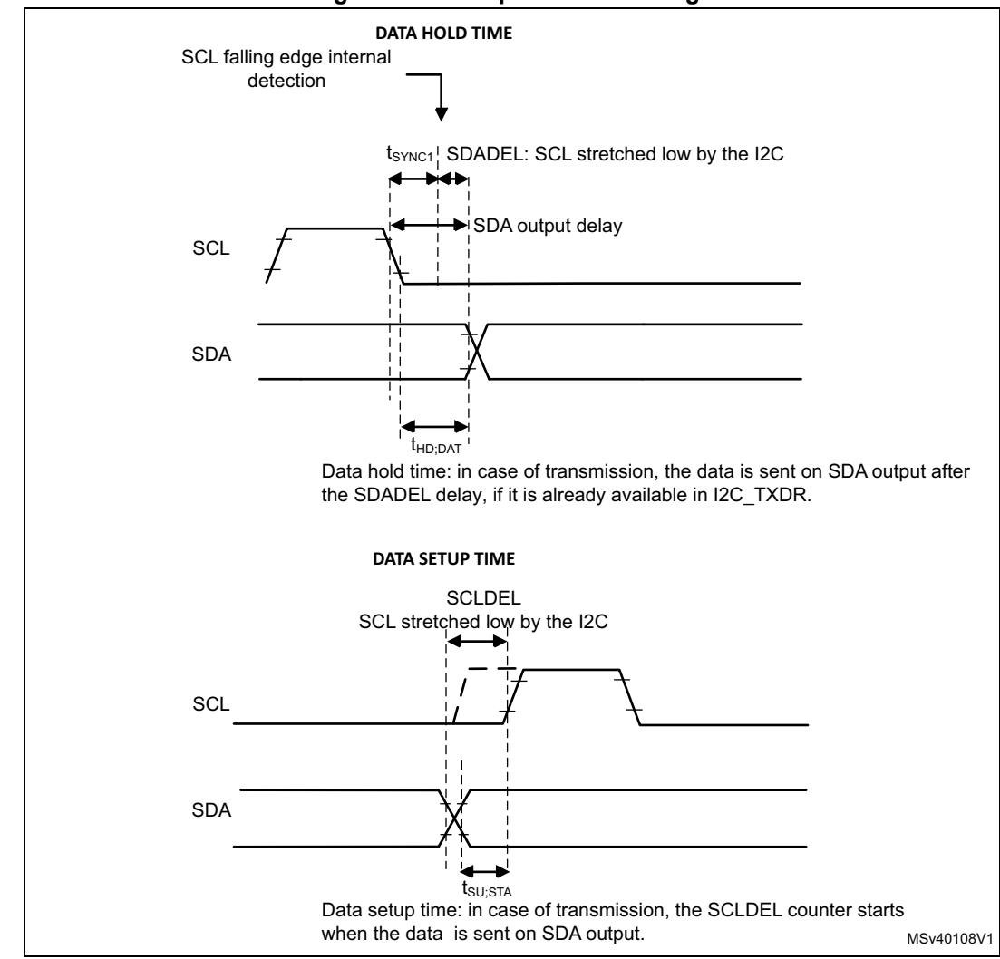

**Figure 584. Setup and hold timings**

When the SCL falling edge is internally detected, a delay (tSDADEL, impacting the hold time tHD;DAT) is inserted before sending SDA output: tSDADEL = SDADEL x tPRESC + tI2CCLK, where tPRESC = (PRESC + 1) x tI2CCLK.

The total SDA output delay is:

tSYNC1 + {[SDADEL x (PRESC + 1) + 1] x tI2CCLK}

tSYNC1 duration depends upon:

- SCL falling slope
- When enabled, input delay brought by the analog filter: tAF(min) < tAF < tAF(max)
- When enabled, input delay brought by the digital filter: tDNF = DNF x tI2CCLK
- Delay due to SCL synchronization to i2c\_ker\_ck clock (two to three i2c\_ker\_ck periods)

To bridge the undefined region of the SCL falling edge, the user must program SDADEL in such a way that:

{tf (max) + tHD;DAT (min) - tAF(min) - [(DNF + 3) x tI2CCLK]} / {(PRESC + 1) x tI2CCLK} ≤ SDADEL

 $SDADEL \le \{t_{HD:DAT (max)} - t_{AF(max)} - [(DNF + 4) x t_{I2CCI K}]\} / \{(PRESC + 1) x t_{I2CCI K}\}$ 

Note:

 $t_{AF(min)}$  /  $t_{AF(max)}$  are part of the equation only when the analog filter is enabled. Refer to the device datasheet for  $t_{AF}$  values.

The maximum  $t_{HD;DAT}$  can be 3.45 µs for Standard-mode, 0.9 µs for Fast-mode, 0.45 µs for Fast-mode Plus. It must be lower than the maximum of  $t_{VD;DAT}$  by a transition time. This maximum must only be met if the device does not stretch the LOW period ( $t_{LOW}$ ) of the SCL signal. If the clock stretches the SCL, the data must be valid by the set-up time before it releases the clock.

The SDA rising edge is usually the worst case. In this case the previous equation becomes:

$$SDADEL \leq \{t_{VD;DAT\;(max)} - t_{r\;(max)} - t_{AF\;(max)} - [(DNF + 4) \ x \ t_{l2CCLK}]\} \ / \ \{(PRESC + 1) \ x \ t_{l2CCLK}\}.$$

Note:

This condition can be violated when NOSTRETCH = 0, because the device stretches SCL low to guarantee the set-up time, according to the SCLDEL value.

Refer to *Table 405* for tf, tr, tHD:DAT, and tVD:DAT standard values.

 After tSDADEL, or after sending SDA output when the slave had to stretch the clock because the data was not yet written in I2C\_TXDR register, SCL line is kept at low level during the setup time. This setup time is tSCLDEL = (SCLDEL + 1) x tPRESC, where tPRESC = (PRESC + 1) x tI2CCLK. tSCLDEL impacts the setup time tSU:DAT.

To bridge the undefined region of the SDA transition (rising edge usually worst case), the user must program SCLDEL in such a way that:

$$\{[t_{r\,(max)} + t_{SU;DAT\,(min)}] \, / \, [(PRESC + 1)] \, x \, t_{l2CCLK}]\} \, - \, 1 \leq SCLDEL$$

Refer to *Table 405* for tr and tSU:DAT standard values.

The SDA and SCL transition time values to use are the ones in the application. Using the maximum values from the standard increases the constraints for the SDADEL and SCLDEL calculation, but ensures the feature, whatever the application.

Note:

At every clock pulse, after SCL falling edge detection, the I2C master or slave stretches SCL low during at least [(SDADEL + SCLDEL + 1)  $\times$  (PRESC + 1) + 1]  $\times$   $t_{I2CCLK}$ , in both transmission and reception modes. In transmission mode, if the data is not yet written in I2C\_TXDR when SDADEL counter is finished, the I2C keeps on stretching SCL low until the next data is written. Then new data MSB is sent on SDA output, and SCLDEL counter starts, continuing stretching SCL low to guarantee the data setup time.

If NOSTRETCH = 1 in slave mode, the SCL is not stretched, hence the SDADEL must be programmed so that it guarantees a sufficient setup time.

Table 405, I2C-SMBus specification data setup and hold times

| Symbol              | Parameter       | Standard-mode (Sm) |      | Fast-mode (Fm) |     | Fast-mode Plus (Fm+) |      | SMBus |     | Unit |
|---------------------|-----------------|-----------------------|------|-------------------|-----|-------------------------|------|-------|-----|------|
|                     |                 | Min                   | Max  | Min               | Max | Min                     | Max  | Min   | Max |      |
| t HD;DAT | Data hold time  | 0                     | -    | 0                 | -   | 0                       | -    | 0.3   | -   | ше   |
| t VD;DAT | Data valid time | -                     | 3.45 | -                 | 0.9 | -                       | 0.45 | ı     | ı   | μs   |

RM0399 Rev 4

**Table 405. I2C-SMBus specification data setup and hold times (continued)**

| Symbol  | Parameter                                | Standard-mode (Sm) |      | Fast-mode (Fm) |     | Fast-mode Plus (Fm+) |     | SMBus |      | Unit |
|---------|------------------------------------------|-----------------------|------|-------------------|-----|-------------------------|-----|-------|------|------|
|         |                                          | Min                   | Max  | Min               | Max | Min                     | Max | Min   | Max  |      |
| tSU;DAT | Data setup time                          | 250                   | -    | 100               | -   | 50                      | -   | 250   | -    |      |
| tr      | Rise time of both SDA and SCL signals | -                     | 1000 | -                 | 300 | -                       | 120 | -     | 1000 | ns   |
| tf      | Fall time of both SDA and SCL signals | -                     | 300  | -                 | 300 | -                       | 120 | -     | 300  |      |

Additionally, in master mode, the SCL clock high and low levels must be configured by programming the PRESC[3:0], SCLH[7:0] and SCLL[7:0] bit fields in the I2C\_TIMINGR register.

• When the SCL falling edge is internally detected, a delay is inserted before releasing the SCL output.

This delay is tSCLL = (SCLL + 1) x tPRESC where tPRESC = (PRESC + 1) x tI2CCLK. tSCLL impacts the SCL low time tLOW.

• When the SCL rising edge is internally detected, a delay is inserted before forcing the SCL output to low level. This delay is tSCLH = (SCLH + 1) x tPRESC, where tPRESC = (PRESC+ 1) x tI2CCLK. tSCLH impacts the SCL high time tHIGH.

Refer to *[I2C master initialization](#page-21-0)* for more details.

**Caution:** Changing the timing configuration is not allowed when the I2C is enabled.

The I2C slave NOSTRETCH mode must also be configured before enabling the peripheral. Refer to *[I2C slave initialization](#page-12-0)* for more details.

**Caution:** Changing the NOSTRETCH configuration is not allowed when the I2C is enabled.

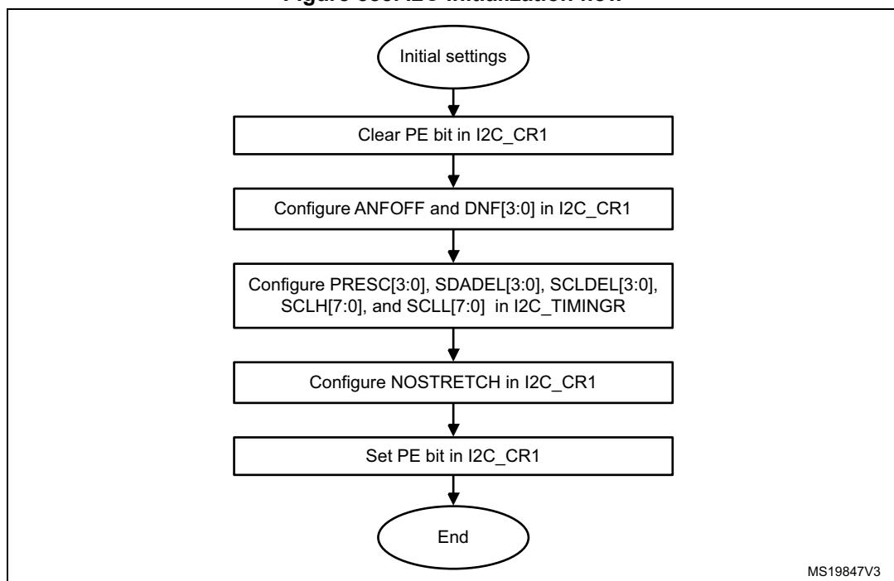

**Figure 585. I2C initialization flow** 

# **50.4.6 Software reset**

A software reset can be performed by clearing the PE bit in the I2C\_CR1 register. In that case I2C lines SCL and SDA are released. Internal states machines are reset and communication control bits, as well as status bits, come back to their reset value. The configuration registers are not impacted.

Impacted register bits:

- 1. I2C\_CR2 register: START, STOP, NACK
- 2. I2C\_ISR register: BUSY, TXE, TXIS, RXNE, ADDR, NACKF, TCR, TC, STOPF, BERR, ARLO, OVR

In addition when the SMBus feature is supported:

- 1. I2C\_CR2 register: PECBYTE
- 2. I2C\_ISR register: PECERR, TIMEOUT, ALERT

PE must be kept low during at least three APB clock cycles to perform the software reset. This is ensured by the following software sequence:

- 1. Write PE = 0
- 2. Check PE = 0
- 3. Write PE = 1

# **50.4.7 Data transfer**

The data transfer is managed through transmit and receive data registers and a shift register.

# **Reception**

The SDA input fills the shift register. After the eighth SCL pulse (when the complete data byte is received), the shift register is copied into I2C\_RXDR register if it is empty (RXNE = 0). If RXNE = 1, meaning that the previous received data byte has not yet been read, the SCL line is stretched low until I2C\_RXDR is read. The stretch is inserted between the eighth and ninth SCL pulse (before the acknowledge pulse).

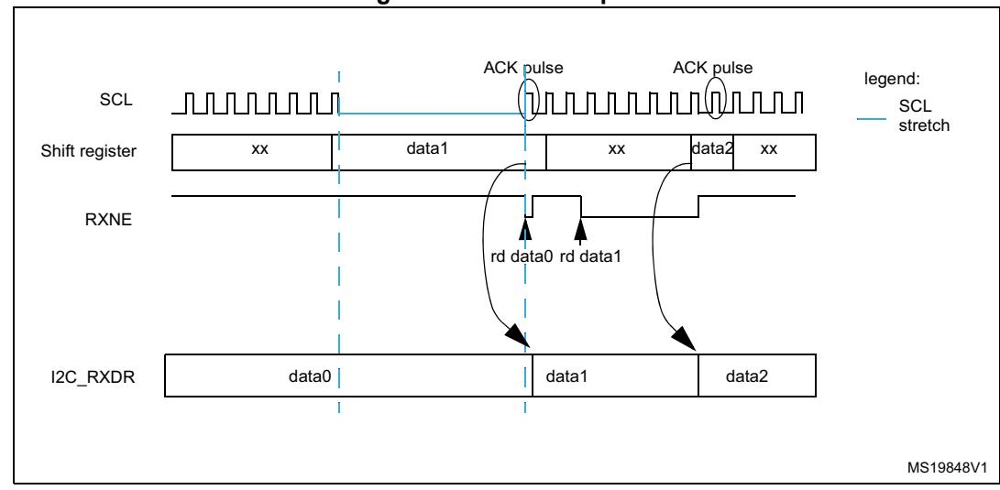

**Figure 586. Data reception**

# **Transmission**

If the I2C\_TXDR register is not empty (TXE = 0), its content is copied into the shift register after the ninth SCL pulse (the acknowledge pulse). Then the shift register content is shifted out on SDA line. If TXE = 1, meaning that no data is written yet in I2C\_TXDR, SCL line is stretched low until I2C\_TXDR is written. The stretch is done after the ninth SCL pulse.

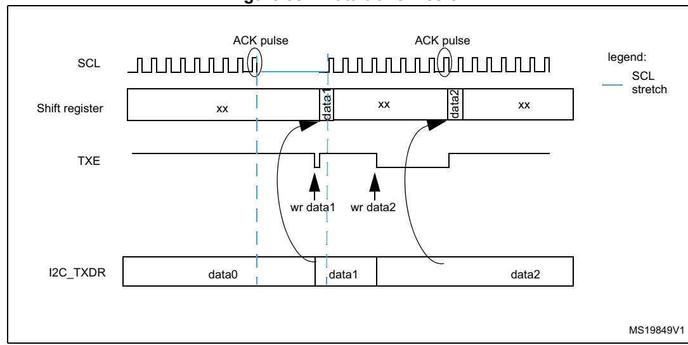

**Figure 587. Data transmission** 

# **Hardware transfer management**

The I2C features an embedded byte counter to manage byte transfer and to close the communication in various modes, such as:

- NACK, STOP and ReSTART generation in master mode
- ACK control in slave receiver mode
- PEC generation/checking when SMBus feature is supported

The byte counter is always used in master mode. By default, it is disabled in slave mode.It can be enabled by software by setting the SBC (slave byte control) bit in the I2C\_CR1 register.

The number of bytes to be transferred is programmed in the NBYTES[7:0] bit field in the I2C\_CR2 register. If the number of bytes to be transferred (NBYTES) is greater than 255, or if a receiver wants to control the acknowledge value of a received data byte, the reload mode must be selected by setting the RELOAD bit in the I2C\_CR2 register. In this mode, the TCR flag is set when the number of bytes programmed in NBYTES is transferred, and an interrupt is generated if TCIE is set. SCL is stretched as long as TCR flag is set. TCR is cleared by software when NBYTES is written to a non-zero value.

When the NBYTES counter is reloaded with the last number of bytes, RELOAD bit must be cleared.

When RELOAD = 0 in master mode, the counter can be used in two modes:

- **Automatic end** (AUTOEND = 1 in the I2C\_CR2 register). In this mode, the master automatically sends a STOP condition once the number of bytes programmed in the NBYTES[7:0] bit field is transferred.
- **Software end** (AUTOEND = 0 in the I2C\_CR2 register). In this mode, software action is expected once the number of bytes programmed in the NBYTES[7:0] bit field is transferred; the TC flag is set and an interrupt is generated if the TCIE bit is set. The SCL signal is stretched as long as the TC flag is set. The TC flag is cleared by software when the START or STOP bit is set in the I2C\_CR2 register. This mode must be used when the master wants to send a RESTART condition.

**Caution:** The AUTOEND bit has no effect when the RELOAD bit is set.

| Function                              | SBC bit | RELOAD bit | AUTOEND bit |
|---------------------------------------|---------|------------|-------------|
| Master Tx/Rx NBYTES + STOP            | x       | 0          | 1           |
| Master Tx/Rx + NBYTES + RESTART       | x       | 0          | 0           |
| Slave Tx/Rx, all received bytes ACKed | 0       | x          | x           |
| Slave Rx with ACK control             | 1       | 1          | x           |

**Table 406. I2C configuration** 

# **50.4.8 I2C slave mode**

# **I2C slave initialization**

To work in slave mode, the user must enable at least one slave address. Registers I2C\_OAR1 and I2C\_OAR2 are available to program the slave own addresses OA1 and OA2.

- OA1 can be configured either in 7-bit mode (by default), or in 10-bit addressing mode by setting the OA1MODE bit in the I2C\_OAR1 register. OA1 is enabled by setting the OA1EN bit in the I2C\_OAR1 register.
- If additional slave addresses are required, the second slave address OA2 can be configured. Up to seven OA2 LSB can be masked by configuring the OA2MSK[2:0] bits in the I2C\_OAR2 register. Therefore for OA2MSK configured from 1 to 6, only OA2[7:2], OA2[7:3], OA2[7:4], OA2[7:5], OA2[7:6] or OA2[7] are compared with the received address. As soon as OA2MSK is not equal to 0, the address comparator for OA2 excludes the I2C reserved addresses (0000 XXX and 1111 XXX), which are not acknowledged. If OA2MSK = 7, all received 7-bit addresses are acknowledged (except reserved addresses). OA2 is always a 7-bit address.

These reserved addresses can be acknowledged if they are enabled by the specific enable bit, if they are programmed in the I2C\_OAR1 or I2C\_OAR2 register with OA2MSK = 0.

- OA2 is enabled by setting the OA2EN bit in the I2C\_OAR2 register.
- The general call address is enabled by setting the GCEN bit in the I2C\_CR1 register.

When the I2C is selected by one of its enabled addresses, the ADDR interrupt status flag is set, and an interrupt is generated if the ADDRIE bit is set.

By default, the slave uses its clock stretching capability, which means that it stretches the SCL signal at low level when needed, to perform software actions. If the master does not

support clock stretching, the I2C must be configured with NOSTRETCH = 1 in the I2C\_CR1 register.

After receiving an ADDR interrupt, if several addresses are enabled, the user must read the ADDCODE[6:0] bits in the I2C\_ISR register to check which address matched. DIR flag must also be checked to know the transfer direction.

# **Slave clock stretching (NOSTRETCH = 0)**

In default mode, the I2C slave stretches the SCL clock in the following situations:

- When the ADDR flag is set: the received address matches with one of the enabled slave addresses. This stretch is released when the ADDR flag is cleared by software setting the ADDRCF bit.
- In transmission, if the previous data transmission is completed and no new data is written in I2C\_TXDR register, or if the first data byte is not written when the ADDR flag is cleared (TXE = 1). This stretch is released when the data is written to the I2C\_TXDR register.
- In reception when the I2C\_RXDR register is not read yet and a new data reception is completed. This stretch is released when I2C\_RXDR is read.
- When TCR = 1 in Slave byte control mode, reload mode (SBC = 1 and RELOAD = 1), meaning that the last data byte has been transferred. This stretch is released when then TCR is cleared by writing a non-zero value in the NBYTES[7:0] field.
- After SCL falling edge detection, the I2C stretches SCL low during [(SDADEL + SCLDEL + 1) x (PRESC+ 1) + 1] x tI2CCLK.

# **Slave without clock stretching (NOSTRETCH = 1)**

When NOSTRETCH = 1 in the I2C\_CR1 register, the I2C slave does not stretch the SCL signal.

- The SCL clock is not stretched while the ADDR flag is set.
- In transmission, the data must be written in the I2C\_TXDR register before the first SCL pulse corresponding to its transfer occurs. If not, an underrun occurs, the OVR flag is set in the I2C\_ISR register and an interrupt is generated if the ERRIE bit is set in the I2C\_CR1 register. The OVR flag is also set when the first data transmission starts and the STOPF bit is still set (has not been cleared). Therefore, if the user clears the STOPF flag of the previous transfer only after writing the first data to be transmitted in the next transfer, it ensures that the OVR status is provided, even for the first data to be transmitted.
- In reception, the data must be read from the I2C\_RXDR register before the ninth SCL pulse (ACK pulse) of the next data byte occurs. If not, an overrun occurs, the OVR flag is set in the I2C\_ISR register, and an interrupt is generated if the ERRIE bit is set in the I2C\_CR1 register.

RM0399 Rev 4 2115/3556

# **Slave byte control mode**

To allow byte ACK control in slave reception mode, the Slave byte control mode must be enabled by setting the SBC bit in the I2C\_CR1 register. This is required to be compliant with SMBus standards.

The Reload mode must be selected to allow byte ACK control in slave reception mode (RELOAD = 1). To get control of each byte, NBYTES must be initialized to 0x1 in the ADDR interrupt subroutine, and reloaded to 0x1 after each received byte. When the byte is received, the TCR bit is set, stretching the SCL signal low between the eighth and ninth SCL pulses. The user can read the data from the I2C\_RXDR register, and then decide to acknowledge it or not by configuring the ACK bit in the I2C\_CR2 register. The SCL stretch is released by programming NBYTES to a non-zero value: the acknowledge or notacknowledge is sent, and the next byte can be received.

NBYTES can be loaded with a value greater than 0x1, and in this case, the reception flow is continuous during NBYTES data reception.

*Note: The SBC bit must be configured when the I2C is disabled, or when the slave is not addressed, or when ADDR = 1.*

*The RELOAD bit value can be changed when ADDR = 1, or when TCR = 1.*

**Caution:** The Slave byte control mode is not compatible with NOSTRETCH mode. Setting SBC when NOSTRETCH = 1 is not allowed.

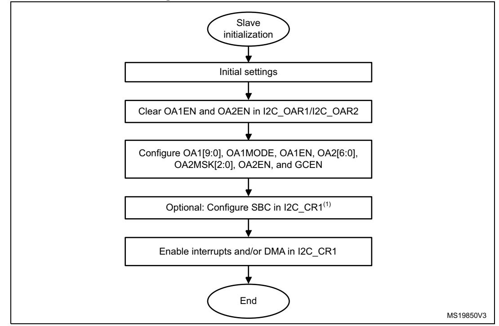

**Figure 588. Slave initialization flow** 

1. SBC must be set to support SMBus features.

# **Slave transmitter**

A transmit interrupt status (TXIS) is generated when the I2C\_TXDR register becomes empty. An interrupt is generated if the TXIE bit is set in the I2C\_CR1 register.

The TXIS bit is cleared when the I2C\_TXDR register is written with the next data byte to be transmitted.

When a NACK is received, the NACKF bit is set in the I2C\_ISR register, and an interrupt is generated if the NACKIE bit is set in the I2C\_CR1 register. The slave automatically releases the SCL and SDA lines to let the master perform a STOP or a RESTART condition. The TXIS bit is not set when a NACK is received.

When a STOP is received and the STOPIE bit is set in the I2C\_CR1 register, the STOPF flag is set in the I2C\_ISR register and an interrupt is generated. In most applications, the SBC bit is usually programmed to 0. In this case, If TXE = 0 when the slave address is received (ADDR = 1), the user can choose either to send the content of the I2C\_TXDR register as the first data byte, or to flush the I2C\_TXDR register by setting the TXE bit in order to program a new data byte.

In Slave byte control mode (SBC = 1), the number of bytes to be transmitted must be programmed in NBYTES in the address match interrupt subroutine (ADDR = 1). In this case, the number of TXIS events during the transfer corresponds to the value programmed in NBYTES.

**Caution:** When NOSTRETCH = 1, the SCL clock is not stretched while the ADDR flag is set, so the user cannot flush the I2C\_TXDR register content in the ADDR subroutine, to program the first data byte. The first data byte to be sent must be previously programmed in the I2C\_TXDR register:

- This data can be the one written in the last TXIS event of the previous transmission message.
- If this data byte is not the one to be sent, the I2C\_TXDR register can be flushed by setting the TXE bit in order to program a new data byte. The STOPF bit must be cleared only after these actions, in order to guarantee that they are executed before the first data transmission starts, following the address acknowledge.

If STOPF is still set when the first data transmission starts, an underrun error is generated (the OVR flag is set).

If a TXIS event (transmit interrupt or transmit DMA request) is needed, the user must set the TXIS bit in addition to the TXE bit, to generate the event.

RM0399 Rev 4 2117/3556

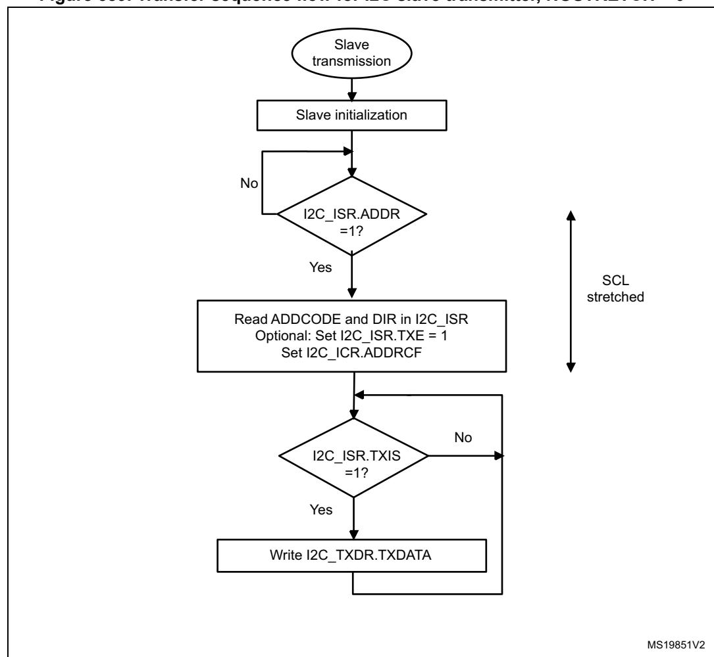

**Figure 589. Transfer sequence flow for I2C slave transmitter, NOSTRETCH = 0**

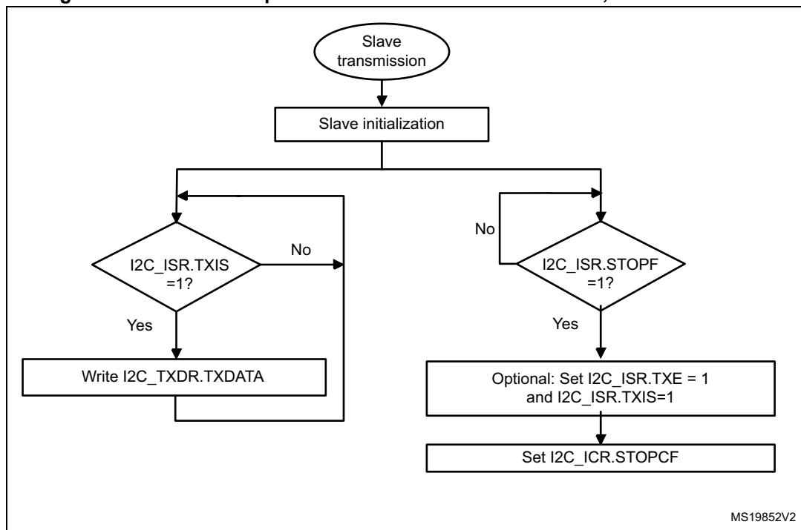

**Figure 590. Transfer sequence flow for I2C slave transmitter, NOSTRETCH = 1**

Figure 591. Transfer bus diagrams for I2C slave transmitter (mandatory events only) legend: Example I2C slave transmitter 3 bytes with 1st data flushed, NOSTRETCH=0: transmission ADDR TXIS TXIS TXIS TXIS reception SCL stretch data3 NA P data2 EV4 EV5 FV2 U EV1: ADDR ISR: check ADDCODE and DIR, set TXE, set ADDRCF EV2: TXIS ISR: wr data1 EV3: TXIS ISR: wr data2 EV4: TXIS ISR: wr data3 EV5: TXIS ISR: wr data4 (not sent) legend: Example I2C slave transmitter 3 bytes without 1st data flush, NOSTRETCH=0: transmission ADDR TXIS TXIS TXIS reception SCL stretch NA **▲** EV4 EV2 EV1 EV3 TXE EV1: ADDR ISR: check ADDCODE and DIR, set ADDRCF EV2: TXIS ISR: wr data2 EV3: TXIS ISR: wr data3 EV4: TXIS ISR: wr data4 (not sent) Example I2C slave transmitter 3 bytes, NOSTRETCH=1: legend: transmission STOPF TXIS TXIS **TXIS** reception S Address NA P SCL stretch data1 data2 data3 EV3 **▲** EV2 EV4 TXE EV1: wr data1 EV2: TXIS ISR: wr data2 EV3: TXIS ISR: wr data3 EV4: TXIS ISR: wr data4 (not sent) EV5: STOPF ISR: (optional: set TXE and TXIS), set STOPCF

MS19853V2

# **Slave receiver**

RXNE is set in I2C\_ISR when the I2C\_RXDR is full, and generates an interrupt if RXIE is set in I2C\_CR1. RXNE is cleared when I2C\_RXDR is read.

When a STOP is received and STOPIE is set in I2C\_CR1, STOPF is set in I2C\_ISR and an interrupt is generated.

**Figure 592. Transfer sequence flow for slave receiver with NOSTRETCH = 0**  Slave initialization Slave reception Read ADDCODE and DIR in I2C\_ISR Set I2C\_ICR.ADDRCF Write I2C\_RXDR.RXDATA I2C\_ISR.ADDR =1? No Yes I2C\_ISR.RXNE =1? Yes No SCL stretched

MS19855V2

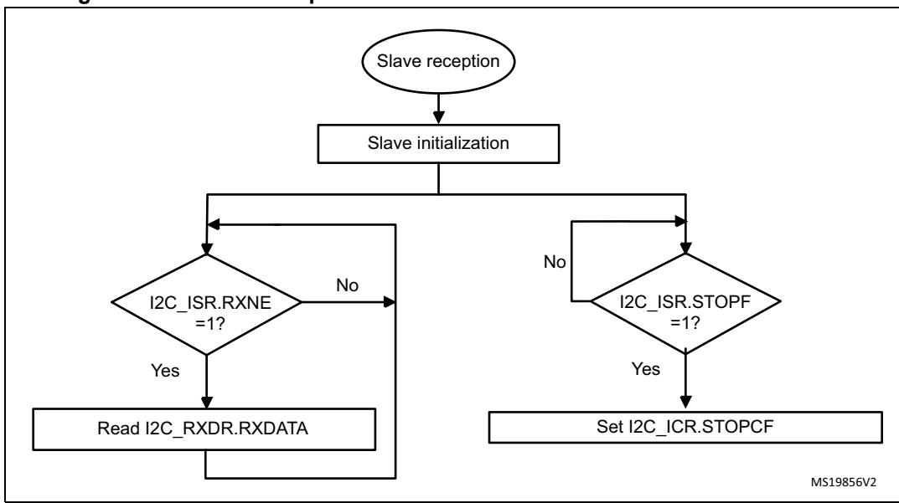

Figure 593. Transfer sequence flow for slave receiver with NOSTRETCH = 1

Figure 594. Transfer bus diagrams for I2C slave receiver (mandatory events only)

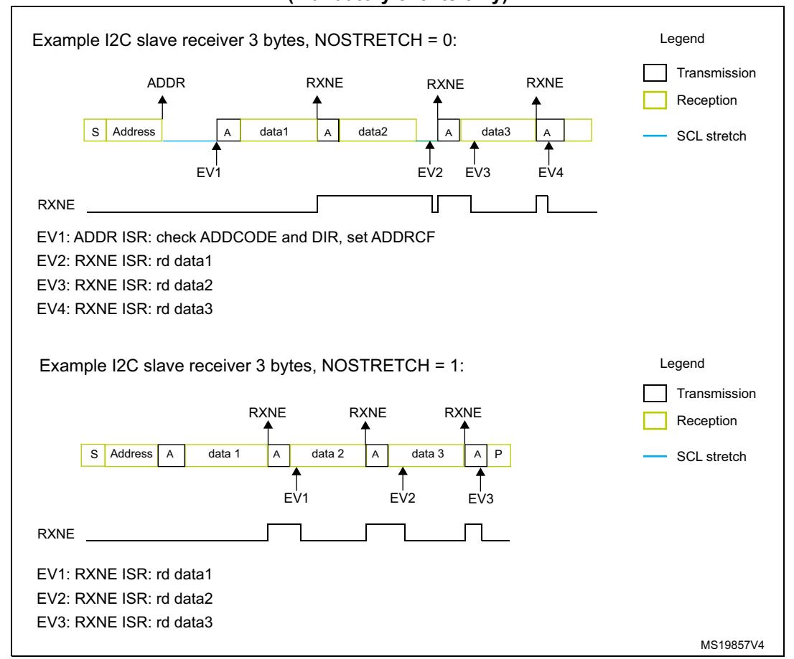

# **50.4.9 I2C master mode**

### **I2C master initialization**

Before enabling the peripheral, the I2C master clock must be configured by setting the SCLH and SCLL bits in the I2C\_TIMINGR register.

The STM32CubeMX tool calculates and provides the I2C\_TIMINGR content in the I2C Configuration window.

A clock synchronization mechanism is implemented in order to support multi-master environment and slave clock stretching.

In order to allow clock synchronization:

- The low level of the clock is counted using the SCLL counter, starting from the SCL low level internal detection.
- The high level of the clock is counted using the SCLH counter, starting from the SCL high level internal detection.

The I2C detects its own SCL low level after a tSYNC1 delay depending on the SCL falling edge, SCL input noise filters (analog and digital), and SCL synchronization to the I2CxCLK clock. The I2C releases SCL to high level once the SCLL counter reaches the value programmed in the SCLL[7:0] bits in the I2C\_TIMINGR register.

The I2C detects its own SCL high level after a tSYNC2 delay depending on the SCL rising edge, SCL input noise filters (analog + digital) and SCL synchronization to I2CxCLK clock. The I2C ties SCL to low level once the SCLH counter reaches the value programmed in the SCLH[7:0] bits in the I2C\_TIMINGR register.

Consequently the master clock period is:

tSCL = tSYNC1 + tSYNC2 + {[(SCLH+ 1) + (SCLL+ 1)] x (PRESC+ 1) x tI2CCLK}

The duration of tSYNC1 depends upon:

- SCL falling slope
- When enabled, input delay induced by the analog filter
- When enabled, input delay induced by the digital filter: DNF x tI2CCLK
- Delay due to SCL synchronization with i2c\_ker\_ck clock (two to three i2c\_ker\_ck periods)

The duration of tSYNC2 depends upon:

- SCL rising slope
- When enabled, input delay induced by the analog filter
- When enabled, input delay induced by the digital filter: DNF x tI2CCLK
- Delay due to SCL synchronization with i2c\_ker\_ck clock (two to three i2c\_ker\_ck periods)

SCL master clock generation SCL high level detected SCLH counter starts SCLH SCLL SCL SCL low level detected SCLL counter starts SCL released SCL driven low SCL master clock synchronization SCL high level detected SCLH counter starts SCL high level detected SCLH counter starts SCL high level detected SCLH counter starts SCLH SCL driven low by SCL driven low by another device SCL low level detected SCLL counter starts SCL low level detected SCLL counter starts SCL released MS19858V1

Figure 595. Master clock generation

**Caution:** To be I2C or SMBus compliant, the master clock must respect the timings given in the following table.

**Table 407. I**2**C-SMBus specification clock timings** 

| Symbol  | Parameter                                           | Standard mode (Sm) |      | Fast-mode (Fm) |     | Fast-mode Plus (Fm+) |      | SMBus |      | Unit |
|---------|-----------------------------------------------------|-----------------------|------|-------------------|-----|-------------------------|------|-------|------|------|
|         |                                                     |                       | Max  | Min               | Max | Min                     | Max  | Min   | Max  |      |
| fSCL    | SCL clock frequency                                 | -                     | 100  | -                 | 400 | -                       | 1000 | -     | 100  | kHz  |
| tHD:STA | Hold time (repeated) START condition                | 4.0                   | -    | 0.6               | -   | 0.26                    | -    | 4.0   | -    |      |
| tSU:STA | Set-up time for a repeated START condition       | 4.7                   | -    | 0.6               | -   | 0.26                    | -    | 4.7   | -    |      |
| tSU:STO | Set-up time for STOP condition                      | 4.0                   | -    | 0.6               | -   | 0.26                    | -    | 4.0   | -    |      |
| tBUF    | Bus free time between a STOP and START condition | 4.7                   | -    | 1.3               | -   | 0.5                     | -    | 4.7   | -    | µs   |
| tLOW    | Low period of the SCL clock                         | 4.7                   | -    | 1.3               | -   | 0.5                     | -    | 4.7   | -    |      |
| tHIGH   | Period of the SCL clock                             | 4.0                   | -    | 0.6               | -   | 0.26                    | -    | 4.0   | 50   |      |
| tr      | Rise time of both SDA and SCL signals               | -                     | 1000 | -                 | 300 | -                       | 120  | -     | 1000 | ns   |
| tf      | Fall time of both SDA and SCL signals               | -                     | 300  | -                 | 300 | -                       | 120  | -     | 300  |      |

*Note: SCLL and SCLH are also used to generate, respectively, the tBUF / tSU:STA and the tHD:STA / tSU:STO timings.*

Refer to *[Section 50.4.10](#page-32-0)* for examples of I2C\_TIMINGR settings vs. i2c\_ker\_ck frequency.

### **Master communication initialization (address phase)**

To initiate the communication, program the following parameters for the addressed slave in the I2C\_CR2 register:

- Addressing mode (7-bit or 10-bit): ADD10
- Slave address to be sent: SADD[9:0]
- Transfer direction: RD\_WRN
- In case of 10-bit address read: HEAD10R bit. HEAD10R must be configure to indicate if the complete address sequence must be sent, or only the header in case of a direction change.
- The number of bytes to be transferred: NBYTES[7:0]. If this number is equal to or greater than 255 bytes, NBYTES[7:0] must initially be filled with 0xFF.

The user must then set the START bit in I2C\_CR2 register. Changing all the above bits is not allowed when START bit is set.

Then the master automatically sends the START condition followed by the slave address as soon as it detects that the bus is free (BUSY = 0) and after a tBUF delay.

In case of an arbitration loss, the master automatically switches back to slave mode and can acknowledge its own address if it is addressed as a slave.

Note:

The START bit is reset by hardware when the slave address is sent on the bus, whatever the received acknowledge value. The START bit is also reset by hardware if an arbitration loss occurs.

In 10-bit addressing mode, when the slave address first seven bits are NACKed by the slave, the master relaunches automatically the slave address transmission until ACK is received. In this case ADDRCF must be set if a NACK is received from the slave, to stop sending the slave address.

If the I2C is addressed as a slave (ADDR = 1) while the START bit is set, the I2C switches to slave mode, and the START bit is cleared, when the ADDRCF bit is set.

Note:

The same procedure is applied for a repeated start condition. In this case BUSY = 1.

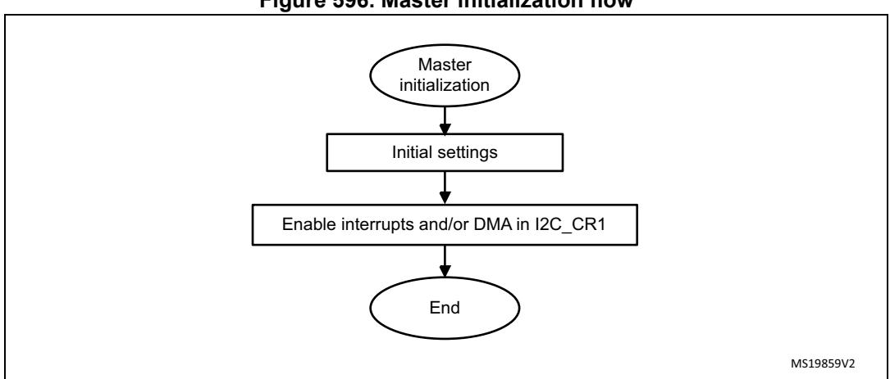

Figure 596. Master initialization flow

# Initialization of a master receiver addressing a 10-bit address slave

If the slave address is in 10-bit format, the user can choose to send the complete read sequence by clearing the HEAD10R bit in the I2C\_CR2 register. In this case the master automatically sends the following complete sequence after the START bit is set:
 (Re)Start + Slave address 10-bit header Write + Slave address second byte + (Re)Start + Slave address 10-bit header Read

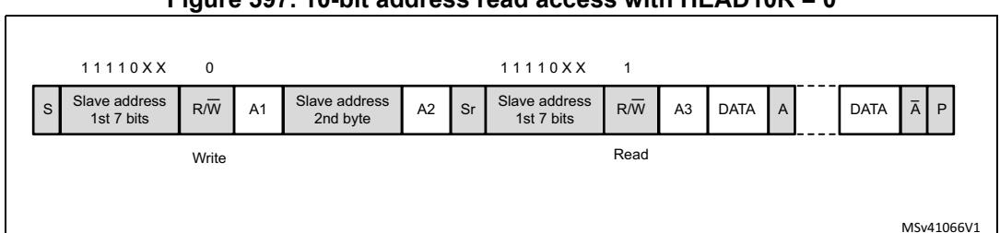

Figure 597. 10-bit address read access with HEAD10R = 0

4

• If the master addresses a 10-bit address slave, transmits data to this slave and then reads data from the same slave, a master transmission flow must be done first. Then a repeated start is set with the 10-bit slave address configured with HEAD10R = 1. In this case the master sends this sequence: ReStart + Slave address 10-bit header Read.

11110XX Slave address Slave address R/W A/A DATA DATA 1st 7 hits 2nd byte Write 11110XX Slave address R/M ΠΔΤΔ ΠΔΤΔ 1st 7 bits Read MS19823V1

Figure 598. 10-bit address read access with HEAD10R = 1

#### Master transmitter

In the case of a write transfer, the TXIS flag is set after each byte transmission, after the ninth SCL pulse when an ACK is received.

A TXIS event generates an interrupt if the TXIE bit is set in the I2C\_CR1 register. The flag is cleared when the I2C\_TXDR register is written with the next data byte to be transmitted.

The number of TXIS events during the transfer corresponds to the value programmed in NBYTES[7:0]. If the total number of data bytes to be sent is greater than 255, reload mode must be selected by setting the RELOAD bit in the I2C\_CR2 register. In this case, when NBYTES data have been transferred, the TCR flag is set and the SCL line is stretched low until NBYTES[7:0] is written to a non-zero value.

The TXIS flag is not set when a NACK is received.

- When RELOAD = 0 and NBYTES data have been transferred:
  - In automatic end mode (AUTOEND = 1), a STOP is automatically sent.
  - In software end mode (AUTOEND = 0), the TC flag is set and the SCL line is stretched low, to perform software actions:

A RESTART condition can be requested by setting the START bit in the I2C\_CR2 register with the proper slave address configuration, and number of bytes to be transferred. Setting the START bit clears the TC flag and the START condition is sent on the bus.

A STOP condition can be requested by setting the STOP bit in the I2C\_CR2 register. Setting the STOP bit clears the TC flag and the STOP condition is sent on the bus.

 If a NACK is received: the TXIS flag is not set, and a STOP condition is automatically sent after the NACK reception. the NACKF flag is set in the I2C\_ISR register, and an interrupt is generated if the NACKIE bit is set.

4

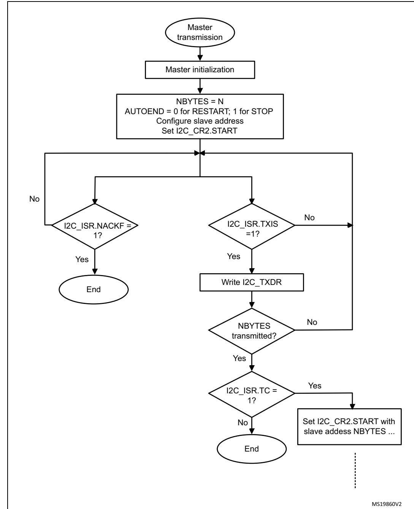

**Figure 599. Transfer sequence flow for I2C master transmitter for N ≤ 255 bytes**

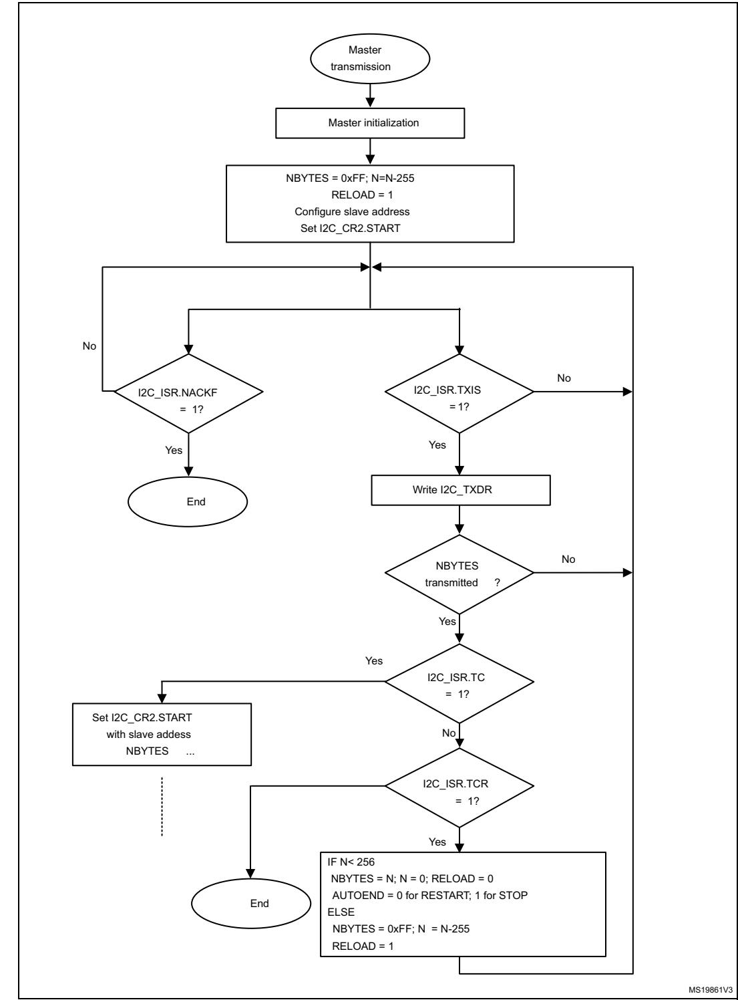

**Figure 600. Transfer sequence flow for I2C master transmitter for N > 255 bytes**

MS19862V2 Example I2C master transmitter 2 bytes, automatic end mode (STOP) INIT: program Slave address, program NBYTES = 2, AUTOEND=1, set START EV1: TXIS ISR: wr data1 EV2: TXIS ISR: wr data2 TXIS TXIS legend: transmission reception SCL stretch EV1 EV2 xx 2 INIT Example I2C master transmitter 2 bytes, software end mode (RESTART) INIT: program Slave address, program NBYTES = 2, AUTOEND=0, set START EV1: TXIS ISR: wr data1 EV2: TXIS ISR: wr data2 EV3: TC ISR: program Slave address, program NBYTES = N, set START TXIS TXIS legend: transmission reception INIT EV1 EV2 SCL stretch TC TXE TXE EV3 NBYTES NBYTES xx 2 S Address A data1 A data2 ReS Address A S Address A data1 A data2 A P

**Figure 601. Transfer bus diagrams for I2C master transmitter (mandatory events only)**

# **Master receiver**

In the case of a read transfer, the RXNE flag is set after each byte reception, after the eighth SCL pulse. An RXNE event generates an interrupt if the RXIE bit is set in the I2C\_CR1 register. The flag is cleared when I2C\_RXDR is read.

If the total number of data bytes to be received is greater than 255, reload mode must be selected by setting the RELOAD bit in the I2C\_CR2 register. In this case, when NBYTES[7:0] data have been transferred, the TCR flag is set and the SCL line is stretched low until NBYTES[7:0] is written to a non-zero value.

- When RELOAD = 0 and NBYTES[7:0] data have been transferred:
  - In automatic end mode (AUTOEND = 1), a NACK and a STOP are automatically sent after the last received byte.
  - In software end mode (AUTOEND = 0), a NACK is automatically sent after the last received byte, the TC flag is set and the SCL line is stretched low in order to allow software actions:

A RESTART condition can be requested by setting the START bit in the I2C\_CR2 register with the proper slave address configuration, and number of bytes to be transferred. Setting the START bit clears the TC flag and the START condition, followed by slave address, are sent on the bus.

A STOP condition can be requested by setting the STOP bit in the I2C\_CR2 register. Setting the STOP bit clears the TC flag and the STOP condition is sent on the bus.

RM0399 Rev 4 2131/3556

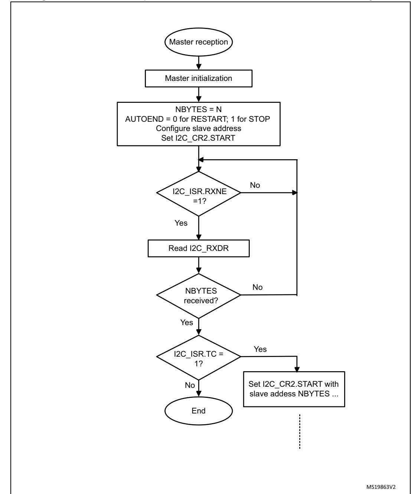

**Figure 602. Transfer sequence flow for I2C master receiver for N ≤ 255 bytes** 

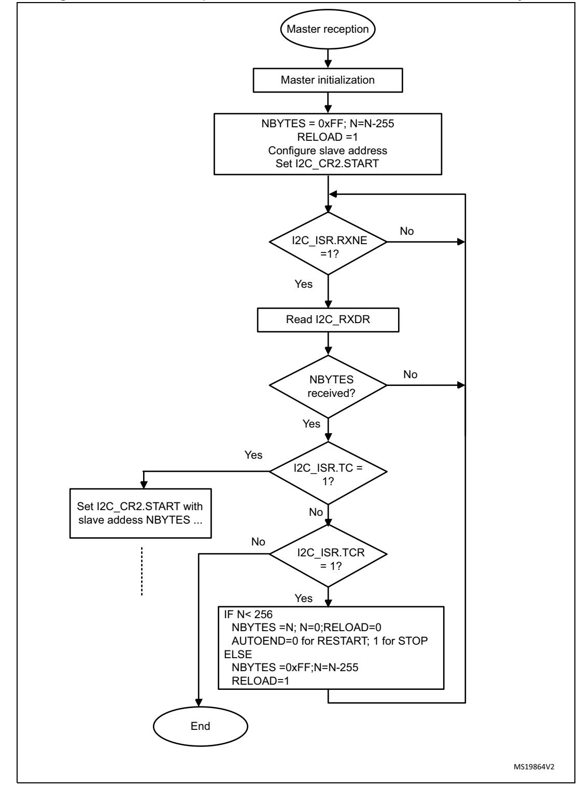

**Figure 603. Transfer sequence flow for I2C master receiver for N > 255 bytes**

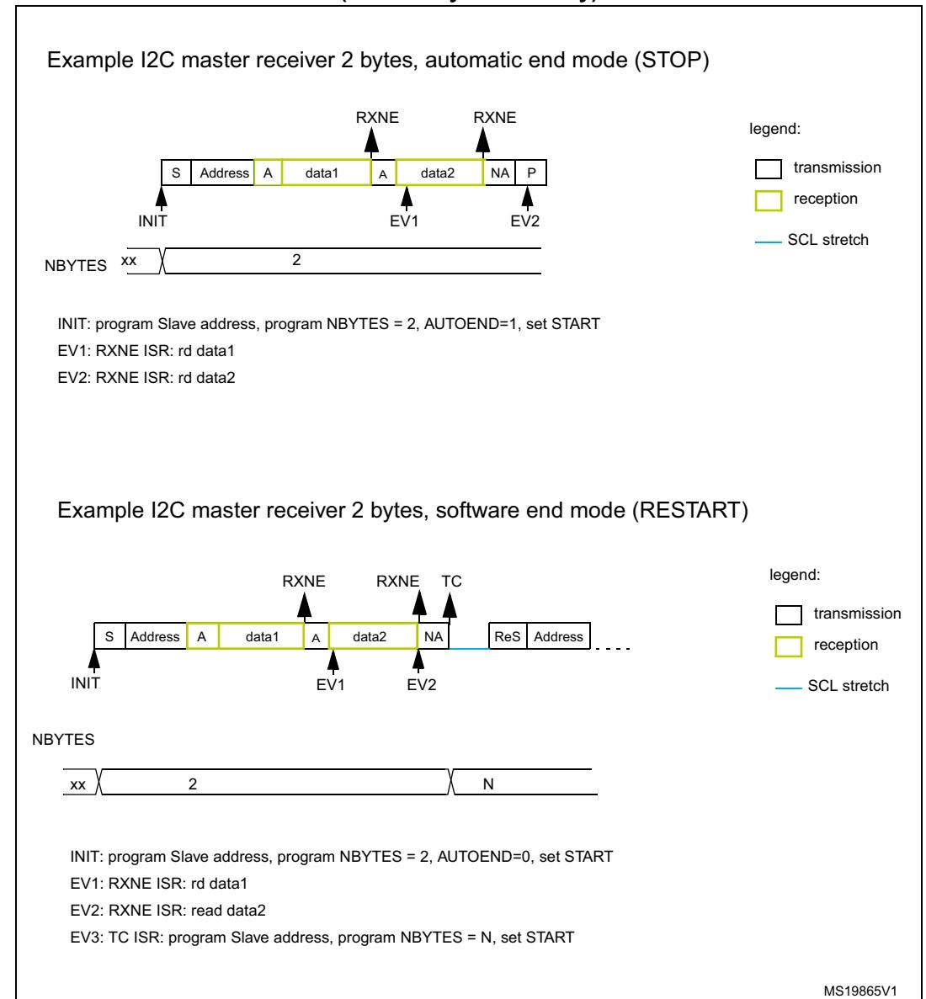

**Figure 604. Transfer bus diagrams for I2C master receiver (mandatory events only)**

# **50.4.10 I2C\_TIMINGR register configuration examples**

The following tables provide examples of how to program the I2C\_TIMINGR to obtain timings compliant with the I2C specification. To get more accurate configuration values, use the STM32CubeMX tool (I2C Configuration window).

| Parameter | Standard-mode (Sm)   |                      | Fast-mode (Fm)        | Fast-mode Plus (Fm+) |  |  |
|-----------|----------------------|----------------------|-----------------------|----------------------|--|--|
|           | 10 kHz               | 100 kHz              | 400 kHz               | 500 kHz              |  |  |
| PRESC     | 0x1                  | 0x1                  | 0x0                   | 0x0                  |  |  |
| SCLL      | 0xC7                 | 0x13                 | 0x9                   | 0x6                  |  |  |
| tSCLL     | 200 x 250 ns = 50 µs | 20 x 250 ns = 5.0 µs | 10 x 125 ns = 1250 ns | 7 x 125 ns = 875 ns  |  |  |
| SCLH      | 0xC3                 | 0xF                  | 0x3                   | 0x3                  |  |  |
| tSCLH     | 196 x 250 ns = 49 µs | 16 x 250 ns = 4.0 µs | 4 x 125 ns = 500 ns   | 4 x 125 ns = 500 ns  |  |  |
| tSCL(1)   | ~100 µs(2)           | ~10 µs(2)            | ~2.5 µs(3)            | ~2.0 µs(4)           |  |  |
| SDADEL    | 0x2                  | 0x2                  | 0x1                   | 0x0                  |  |  |
| tSDADEL   | 2 x 250 ns = 500 ns  | 2 x 250 ns = 500 ns  | 1 x 125 ns = 125 ns   | 0 ns                 |  |  |
| SCLDEL    | 0x4                  | 0x4                  | 0x3                   | 0x1                  |  |  |
| tSCLDEL   | 5 x 250 ns = 1250 ns | 5 x 250 ns = 1250 ns | 4 x 125 ns = 500 ns   | 2 x 125 ns = 250 ns  |  |  |

**Table 408. Examples of timing settings for fI2CCLK = 8 MHz** 

- 1. tSCL is greater than tSCLL + tSCLH due to SCL internal detection delay. Values provided for tSCL are examples only.
- 2. tSYNC1 + tSYNC2 minimum value is 4 x tI2CCLK = 500 ns. Example with tSYNC1 + tSYNC2 = 1000 ns.
- 3. tSYNC1 + tSYNC2 minimum value is 4 x tI2CCLK = 500 ns. Example with tSYNC1 + tSYNC2 = 750 ns.
- 4. tSYNC1 + tSYNC2 minimum value is 4 x tI2CCLK = 500 ns. Example with tSYNC1 + tSYNC2 = 655 ns.

**Table 409. Examples of timing settings for fI2CCLK = 16 MHz** 

|           | Standard-mode (Sm)   |                      | Fast-mode (Fm)        | Fast-mode Plus (Fm+)   |  |
|-----------|----------------------|----------------------|-----------------------|------------------------|--|
| Parameter | 10 kHz               | 100 kHz              | 400 kHz               | 1000 kHz               |  |
| PRESC     | 0x3                  | 0x3                  | 0x1                   | 0x0                    |  |
| SCLL      | 0xC7                 | 0x13                 | 0x9                   | 0x4                    |  |
| tSCLL     | 200 x 250 ns = 50 µs | 20 x 250 ns = 5.0 µs | 10 x 125 ns = 1250 ns | 5 x 62.5 ns = 312.5 ns |  |
| SCLH      | 0xC3                 | 0xF                  | 0x3                   | 0x2                    |  |
| tSCLH     | 196 x 250 ns = 49 µs | 16 x 250 ns = 4.0 µs | 4 x 125 ns = 500 ns   | 3 x 62.5 ns = 187.5 ns |  |
| tSCL(1)   | ~100 µs(2)           | ~10 µs(2)            | ~2.5 µs(3)            | ~1.0 µs(4)             |  |
| SDADEL    | 0x2                  | 0x2                  | 0x2                   | 0x0                    |  |
| tSDADEL   | 2 x 250 ns = 500 ns  | 2 x 250 ns = 500 ns  | 2 x 125 ns = 250 ns   | 0 ns                   |  |
| SCLDEL    | 0x4                  | 0x4                  | 0x3                   | 0x2                    |  |
| tSCLDEL   | 5 x 250 ns = 1250 ns | 5 x 250 ns = 1250 ns | 4 x 125 ns = 500 ns   | 3 x 62.5 ns = 187.5 ns |  |

- 1. tSCL is greater than tSCLL + tSCLH due to SCL internal detection delay. Values provided for tSCL are examples only.
- 2. tSYNC1 + tSYNC2 minimum value is 4 x tI2CCLK = 250 ns. Example with tSYNC1 + tSYNC2 = 1000 ns.
- 3. tSYNC1 + tSYNC2 minimum value is 4 x tI2CCLK = 250 ns. Example with tSYNC1 + tSYNC2 = 750 ns.
- 4. tSYNC1 + tSYNC2 minimum value is 4 x tI2CCLK = 250 ns. Example with tSYNC1 + tSYNC2 = 500 ns.

RM0399 Rev 4 2135/3556

|           | Standard-mode (Sm)   |                      | Fast-mode (Fm)        | Fast-mode Plus (Fm+) |  |
|-----------|----------------------|----------------------|-----------------------|----------------------|--|
| Parameter | 10 kHz               | 100 kHz              | 400 kHz               | 1000 kHz             |  |
| PRESC     | 0xB                  | 0xB                  | 0x5                   | 0x5                  |  |
| SCLL      | 0xC7                 | 0x13                 | 0x9                   | 0x3                  |  |
| tSCLL     | 200 x 250 ns = 50 µs | 20 x 250 ns = 5.0 µs | 10 x 125 ns = 1250 ns | 4 x 125 ns = 500 ns  |  |
| SCLH      | 0xC3                 | 0xF                  | 0x3                   | 0x1                  |  |
| tSCLH     | 196 x 250 ns = 49 µs | 16 x 250 ns = 4.0 µs | 4 x 125 ns = 500 ns   | 2 x 125 ns = 250 ns  |  |
| tSCL(1)   | ~100 µs(2)           | ~10 µs(2)            | ~2.5 µs(3)            | ~875 ns(4)           |  |
| SDADEL    | 0x2                  | 0x2                  | 0x3                   | 0x0                  |  |
| tSDADEL   | 2 x 250 ns = 500 ns  | 2 x 250 ns = 500 ns  | 3 x 125 ns = 375 ns   | 0 ns                 |  |
| SCLDEL    | 0x4                  | 0x4                  | 0x3                   | 0x1                  |  |
| tSCLDEL   | 5 x 250 ns = 1250 ns | 5 x 250 ns = 1250 ns | 4 x 125 ns = 500 ns   | 2 x 125 ns = 250 ns  |  |

**Table 410. Examples of timing settings for fI2CCLK = 48 MHz** 

# **50.4.11 SMBus specific features**

This section is relevant only when the SMBus feature is supported (refer to *[Section 50.3](#page-1-0)*).

# **Introduction**

The system management bus (SMBus) is a two-wire interface through which various devices can communicate with each other and with the rest of the system. It is based on I2C principles of operation. The SMBus provides a control bus for system and power management related tasks.

This peripheral is compatible with the SMBus specification (http://smbus.org).

The system management bus specification refers to three types of devices

- A slave is a device that receives or responds to a command.
- A master is a device that issues commands, generates the clocks, and terminates the transfer.
- A host is a specialized master that provides the main interface to the system's CPU. A host must be a master-slave and must support the SMBus host notify protocol. Only one host is allowed in a system.

This peripheral can be configured as master or slave device, and also as a host.

### **Bus protocols**

There are eleven possible command protocols for any given device. A device can use any or all of them to communicate. The protocols are Quick Command, Send Byte, Receive Byte, Write Byte, Write Word, Read Byte, Read Word, Process Call, Block Read, Block

1. tSCL is greater than tSCLL + tSCLH due to the SCL internal detection delay. Values provided for tSCL are only examples.

2. tSYNC1 + tSYNC2 minimum value is 4x tI2CCLK = 83.3 ns. Example with tSYNC1 + tSYNC2 = 1000 ns

3. tSYNC1 + tSYNC2 minimum value is 4x tI2CCLK = 83.3 ns. Example with tSYNC1 + tSYNC2 = 750 ns

4. tSYNC1 + tSYNC2 minimum value is 4x tI2CCLK = 83.3 ns. Example with tSYNC1 + tSYNC2 = 250 ns

Write, and Block Write-Block Read Process Call. These protocols must be implemented by the user software.

For more details on these protocols, refer to SMBus specification (http://smbus.org).

# **Address resolution protocol (ARP)**

SMBus slave address conflicts can be resolved by dynamically assigning a new unique address to each slave device. To provide a mechanism to isolate each device for the purpose of address assignment, each device must implement a unique device identifier (UDID). This 128-bit number is implemented by software.

This peripheral supports the Address Resolution Protocol (ARP). The SMBus Device Default Address (0b1100 001) is enabled by setting SMBDEN bit in I2C\_CR1 register. The ARP commands must be implemented by the user software.

Arbitration is also performed in slave mode for ARP support.

For more details of the SMBus address resolution protocol, refer to SMBus specification (http://smbus.org).

# **Received command and data acknowledge control**

A SMBus receiver must be able to NACK each received command or data. In order to allow the ACK control in slave mode, the Slave byte control mode must be enabled by setting SBC bit in I2C\_CR1 register. Refer to *[Slave byte control mode](#page-14-0)* for more details.

# **Host notify protocol**

This peripheral supports the host notify protocol by setting the SMBHEN bit in the I2C\_CR1 register. In this case the host acknowledges the SMBus host address (0b0001 000).

When this protocol is used, the device acts as a master and the host as a slave.

### **SMBus alert**

The SMBus ALERT optional signal is supported. A slave-only device can signal the host through the SMBALERT# pin that it wants to talk. The host processes the interrupt and simultaneously accesses all SMBALERT# devices through the alert response address (0b0001 100). Only the device(s) which pulled SMBALERT# low acknowledges the alert response address.

When configured as a slave device(SMBHEN = 0), the SMBA pin is pulled low by setting the ALERTEN bit in the I2C\_CR1 register. The Alert Response Address is enabled at the same time.

When configured as a host (SMBHEN = 1), the ALERT flag is set in the I2C\_ISR register when a falling edge is detected on the SMBA pin and ALERTEN = 1. An interrupt is generated if the ERRIE bit is set in the I2C\_CR1 register. When ALERTEN = 0, the ALERT line is considered high even if the external SMBA pin is low.

*If the SMBus ALERT pin is not needed, the SMBA pin can be used as a standard GPIO if*  ALERTEN = 0*.*

### **Packet error checking**

A packet error checking mechanism has been introduced in the SMBus specification to improve reliability and communication robustness. The packet error checking is implemented by appending a packet error code (PEC) at the end of each message transfer.

RM0399 Rev 4 2137/3556

The PEC is calculated by using the C(x) = x8 + x2 + x + 1 CRC-8 polynomial on all the message bytes (including addresses and read/write bits).

The peripheral embeds a hardware PEC calculator and allows a not acknowledge to be sent automatically when the received byte does not match with the hardware calculated PEC.

# **Timeouts**

This peripheral embeds hardware timers to be compliant with the three timeouts defined in the SMBus specification.

| Symbol           |                                                  | Limits |     |      |
|------------------|--------------------------------------------------|--------|-----|------|
|                  | Parameter                                        | Min    | Max | Unit |
| tTIMEOUT         | Detect clock low timeout                         | 25     | 35  |      |
| (1) tLOW:SEXT | Cumulative clock low extend time (slave device)  | -      | 25  | ms   |
| tLOW:MEXT(2)     | Cumulative clock low extend time (master device) | -      | 10  |      |

**Table 411. SMBus timeout specifications** 

- 1. tLOW:SEXT is the cumulative time a given slave device is allowed to extend the clock cycles in one message from the initial START to the STOP. It is possible that another slave device or the master also extends the clock causing the combined clock low extend time to be greater than tLOW:SEXT. Therefore, this parameter is measured with the slave device as the sole target of a full-speed master.
- 2. tLOW:MEXT is the cumulative time a master device is allowed to extend its clock cycles within each byte of a message as defined from START-to-ACK, ACK-to-ACK, or ACK-to-STOP. It is possible that a slave device or another master also extends the clock, causing the combined clock low time to be greater than tLOW:MEXT on a given byte. Therefore, this parameter is measured with a full speed slave device as the sole target of the master.

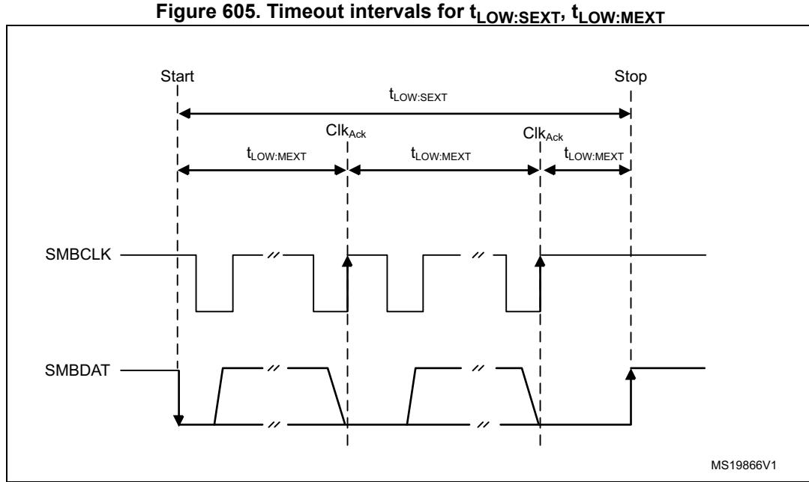

# **Bus idle detection**

A master can assume that the bus is free if it detects that the clock and data signals have been high for tIDLE > tHIGH,MAX (refer to *[I2C timings](#page-5-0)*).

This timing parameter covers the condition where a master has been dynamically added to the bus, and may not have detected a state transition on the SMBCLK or SMBDAT lines. In this case, the master must wait long enough to ensure that a transfer is not currently in progress. The peripheral supports a hardware bus idle detection.

# **50.4.12 SMBus initialization**

This section is relevant only when SMBus feature is supported (see *[Section 50.3](#page-1-0)*).

In addition to I2C initialization, some other specific initialization must be done to perform SMBus communication.

# **Received command and data acknowledge control (slave mode)**

A SMBus receiver must be able to NACK each received command or data. To allow ACK control in slave mode, the Slave byte control mode must be enabled by setting the SBC bit in the I2C\_CR1 register. Refer to *[Slave byte control mode](#page-14-0)* for more details.

# **Specific address (slave mode)**

The specific SMBus addresses must be enabled if needed. Refer to *[Bus idle detection](#page-37-0)* for more details.

- The SMBus device default address (0b1100 001) is enabled by setting the SMBDEN bit in the I2C\_CR1 register.
- The SMBus host address (0b0001 000) is enabled by setting the SMBHEN bit in the I2C\_CR1 register.
- The alert response address (0b0001100) is enabled by setting the ALERTEN bit in the I2C\_CR1 register.

# **Packet error checking**

PEC calculation is enabled by setting the PECEN bit in the I2C\_CR1 register. Then the PEC transfer is managed with the help of the hardware byte counter NBYTES[7:0] in the I2C\_CR2 register. The PECEN bit must be configured before enabling the I2C.

The PEC transfer is managed with the hardware byte counter, so the SBC bit must be set when interfacing the SMBus in slave mode. The PEC is transferred after NBYTES - 1 data have been transferred when the PECBYTE bit is set and the RELOAD bit is cleared. If RELOAD is set, PECBYTE has no effect.

**Caution:** Changing the PECEN configuration is not allowed when the I2C is enabled.

**Table 412. SMBus with PEC configuration** 

| Mode                                | SBC bit | RELOAD bit | AUTOEND bit | PECBYTE bit |
|-------------------------------------|---------|------------|-------------|-------------|
| Master Tx/Rx NBYTES + PEC+ STOP     | x       | 0          | 1           | 1           |
| Master Tx/Rx NBYTES + PEC + ReSTART | x       | 0          | 0           | 1           |
| Slave Tx/Rx with PEC                | 1       | 0          | x           | 1           |

RM0399 Rev 4 2139/3556

# **Timeout detection**

The timeout detection is enabled by setting the TIMOUTEN and TEXTEN bits in the I2C\_TIMEOUTR register. The timers must be programmed in such a way that they detect a timeout before the maximum time given in the SMBus specification.

• tTIMEOUT check

To enable the tTIMEOUT check, the 12-bit TIMEOUTA[11:0] bits must be programmed with the timer reload value, to check the tTIMEOUT parameter. The TIDLE bit must be configured to 0 to detect the SCL low level timeout.

Then the timer is enabled by setting the TIMOUTEN in the I2C\_TIMEOUTR register. If SCL is tied low for a time greater than (TIMEOUTA + 1) x 2048 x tI2CCLK, the TIMEOUT flag is set in the I2C\_ISR register.

Refer to *[Table 413](#page-39-0)*.

**Caution:** Changing the TIMEOUTA[11:0] bits and TIDLE bit configuration is not allowed when the TIMEOUTEN bit is set.

• tLOW:SEXT and tLOW:MEXT check

Depending on if the peripheral is configured as a master or as a slave, the 12-bit TIMEOUTB timer must be configured to check tLOW:SEXT for a slave, and tLOW:MEXT for a master. As the standard specifies only a maximum, the user can choose the same value for both. The timer is then enabled by setting the TEXTEN bit in the I2C\_TIMEOUTR register.

If the SMBus peripheral performs a cumulative SCL stretch for a time greater than (TIMEOUTB + 1) x 2048 x tI2CCLK, and in the timeout interval described in *[Bus idle](#page-37-0)  [detection](#page-37-0)* section, the TIMEOUT flag is set in the I2C\_ISR register.

Refer to *[Table 414](#page-39-1)*

**Caution:** Changing the TIMEOUTB configuration is not allowed when the TEXTEN bit is set.

# **Bus idle detection**

To enable the tIDLE check, the 12-bit TIMEOUTA[11:0] field must be programmed with the timer reload value, to obtain the tIDLE parameter. The TIDLE bit must be configured to '1 to detect both SCL and SDA high level timeout. The timer is then enabled by setting the TIMOUTEN bit in the I2C\_TIMEOUTR register.

If both the SCL and SDA lines remain high for a time greater than (TIMEOUTA + 1) x 4 x tI2CCLK, the TIMEOUT flag is set in the I2C\_ISR register.

Refer to *[Table 415](#page-39-2)*.

**Caution:** Changing TIMEOUTA and TIDLE configuration is not allowed when TIMEOUTEN is set.

# **50.4.13 SMBus: I2C\_TIMEOUTR register configuration examples**

This section is relevant only when SMBus feature is supported. Refer to *[Section 50.3](#page-1-0)*.

• Configuring the maximum duration of tTIMEOUT to 25 ms:

**Table 413. Examples of TIMEOUTA settings (max tTIMEOUT = 25 ms)** 

|  | fI2CCLK | TIMEOUTA[11:0] bits | TIDLE bit | TIMEOUTEN bit | tTIMEOUT                      |  |
|--|---------|---------------------|-----------|---------------|-------------------------------|--|
|  | 8 MHz   | 0x61                | 0         | 1             | 98 x 2048 x 125 ns = 25 ms    |  |
|  | 16 MHz  | 0xC3                | 0         | 1             | 196 x 2048 x 62.5 ns = 25 ms  |  |
|  | 48 MHz  | 0x249               | 0         | 1             | 586 x 2048 x 20.08 ns = 25 ms |  |

• Configuring the maximum duration of tLOW:SEXT and tLOW:MEXT to 8 ms:

**Table 414. Examples of TIMEOUTB settings** 

| fI2CCLK | TIMEOUTB[11:0] bits | tLOW:EXT TEXTEN bit |                              |
|---------|---------------------|------------------------|------------------------------|
| 8 MHz   | 0x1F                | 1                      | 32 x 2048 x 125 ns = 8 ms    |
| 16 MHz  | 0x3F                | 1                      | 64 x 2048 x 62.5 ns = 8 ms   |
| 48 MHz  | 0xBB                | 1                      | 188 x 2048 x 20.08 ns = 8 ms |

• Configuring the maximum duration of tIDLE to 50 µs

**Table 415. Examples of TIMEOUTA settings (max tIDLE = 50 µs)** 

| fI2CCLK | TIMEOUTA[11:0] bits | TIDLE bit | TIMEOUTEN bit | tTIDLE                     |
|---------|---------------------|-----------|---------------|----------------------------|
| 8 MHz   | 0x63                | 1         | 1             | 100 x 4 x 125 ns = 50 µs   |
| 16 MHz  | 0xC7                | 1         | 1             | 200 x 4 x 62.5 ns = 50 µs  |
| 48 MHz  | 0x257               | 1         | 1             | 600 x 4 x 20.08 ns = 50 µs |

# **50.4.14 SMBus slave mode**

This section is relevant only when the SMBus feature is supported (refer to *[Section 50.3](#page-1-0)*).

In addition to I2C slave transfer management (refer to *[Section 50.4.8](#page-12-1)*), additional software flows are provided to support the SMBus.

# **SMBus slave transmitter**

When the IP is used in SMBus, SBC must be programmed to 1 to enable the PEC transmission at the end of the programmed number of data bytes. When the PECBYTE bit is set, the number of bytes programmed in NBYTES[7:0] includes the PEC transmission. In that case the total number of TXIS interrupts is NBYTES - 1, and the content of the I2C\_PECR register is automatically transmitted if the master requests an extra byte after the NBYTES - 1 data transfer.

**Caution:** The PECBYTE bit has no effect when the RELOAD bit is set.

RM0399 Rev 4 2141/3556

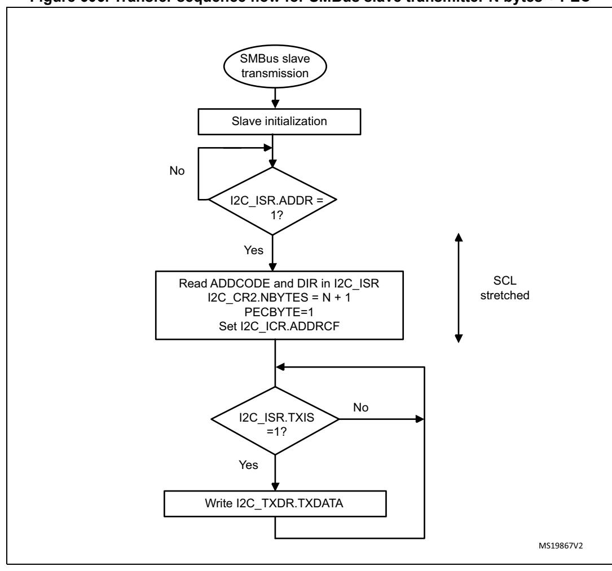

**Figure 606. Transfer sequence flow for SMBus slave transmitter N bytes + PEC**

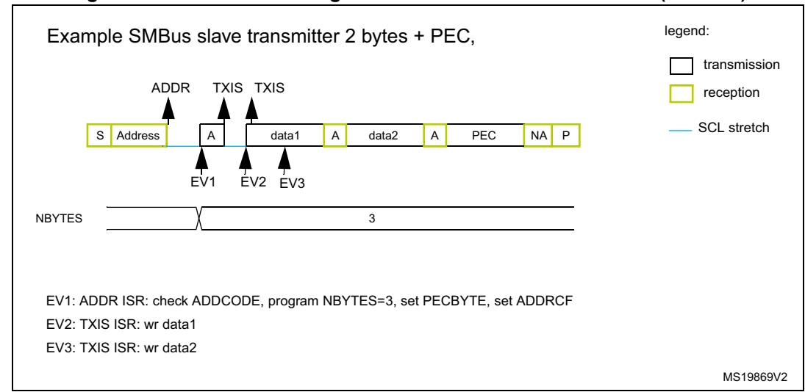

# **SMBus slave receiver**

When the I2C is used in SMBus mode, SBC must be programmed to 1 to allow the PEC checking at the end of the programmed number of data bytes. To allow the ACK control of each byte, the reload mode must be selected (RELOAD = 1). Refer to *[Slave byte control](#page-14-0)  [mode](#page-14-0)* for more details.

To check the PEC byte, the RELOAD bit must be cleared and the PECBYTE bit must be set. In this case, after NBYTES - 1 data have been received, the next received byte is compared with the internal I2C\_PECR register content. A NACK is automatically generated if the comparison does not match, and an ACK is automatically generated if the comparison matches, whatever the ACK bit value. Once the PEC byte is received, it is copied into the I2C\_RXDR register like any other data, and the RXNE flag is set.

In the case of a PEC mismatch, the PECERR flag is set and an interrupt is generated if the ERRIE bit is set in the I2C\_CR1 register.

If no ACK software control is needed, the user can program PECBYTE = 1 and, in the same write operation, program NBYTES with the number of bytes to be received in a continuous flow. After NBYTES - 1 are received, the next received byte is checked as being the PEC.

**Caution:** The PECBYTE bit has no effect when the RELOAD bit is set.

RM0399 Rev 4 2143/3556

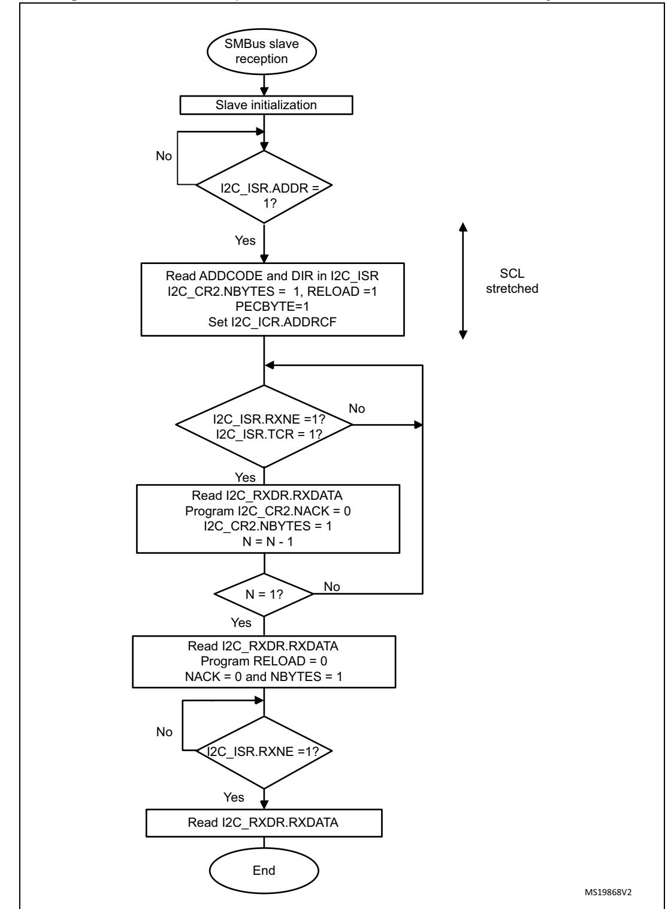

**Figure 608. Transfer sequence flow for SMBus slave receiver N bytes + PEC**

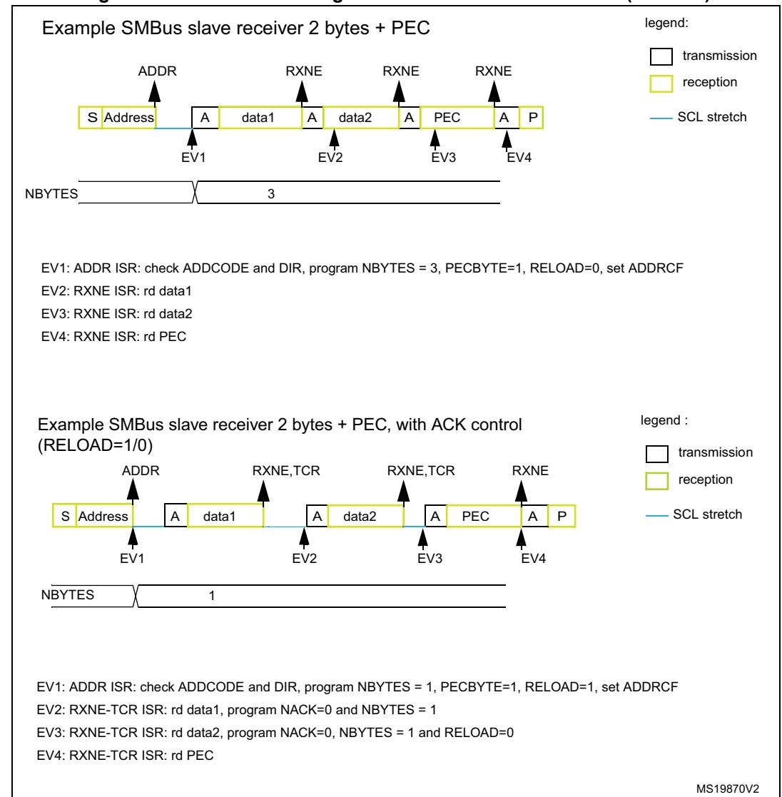

Figure 609. Bus transfer diagrams for SMBus slave receiver (SBC = 1)

This section is relevant only when the SMBus feature is supported (refer to Section 50.3).

In addition to I2C master transfer management (refer to Section 50.4.9), additional software flows are provided to support the SMBus.

#### SMBus master transmitter

When the SMBus master wants to transmit the PEC, the PECBYTE bit must be set and the number of bytes must be programmed in the NBYTES[7:0] field, before setting the START bit. In this case the total number of TXIS interrupts is NBYTES - 1. So if the PECBYTE bit is set when NBYTES = 0x1, the content of the I2C\_PECR register is automatically transmitted.

If the SMBus master wants to send a STOP condition after the PEC, automatic end mode must be selected (AUTOEND = 1). In this case, the STOP condition automatically follows the PEC transmission.

When the SMBus master wants to send a RESTART condition after the PEC, software mode must be selected (AUTOEND = 0). In this case, once NBYTES - 1 have been

RM0399 Rev 4 2145/3556

transmitted, the I2C\_PECR register content is transmitted and the TC flag is set after the PEC transmission, stretching the SCL line low. The RESTART condition must be programmed in the TC interrupt subroutine.

**Caution:** The PECBYTE bit has no effect when the RELOAD bit is set.

**Figure 610. Bus transfer diagrams for SMBus master transmitter**

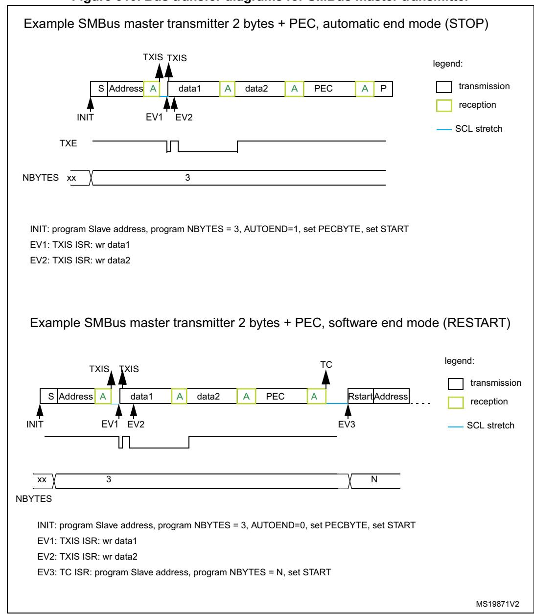

# **SMBus master receiver**

When the SMBus master wants to receive the PEC followed by a STOP at the end of the transfer, automatic end mode can be selected (AUTOEND = 1). The PECBYTE bit must be set and the slave address must be programmed, before setting the START bit. In this case, after NBYTES - 1 data have been received, the next received byte is automatically checked versus the I2C\_PECR register content. A NACK response is given to the PEC byte, followed by a STOP condition.

When the SMBus master receiver wants to receive the PEC byte followed by a RESTART condition at the end of the transfer, software mode must be selected (AUTOEND = 0). The PECBYTE bit must be set and the slave address must be programmed, before setting the START bit. In this case, after NBYTES - 1 data have been received, the next received byte is automatically checked versus the I2C\_PECR register content. The TC flag is set after the PEC byte reception, stretching the SCL line low. The RESTART condition can be programmed in the TC interrupt subroutine.

**Caution:** The PECBYTE bit has no effect when the RELOAD bit is set.

RM0399 Rev 4 2147/3556

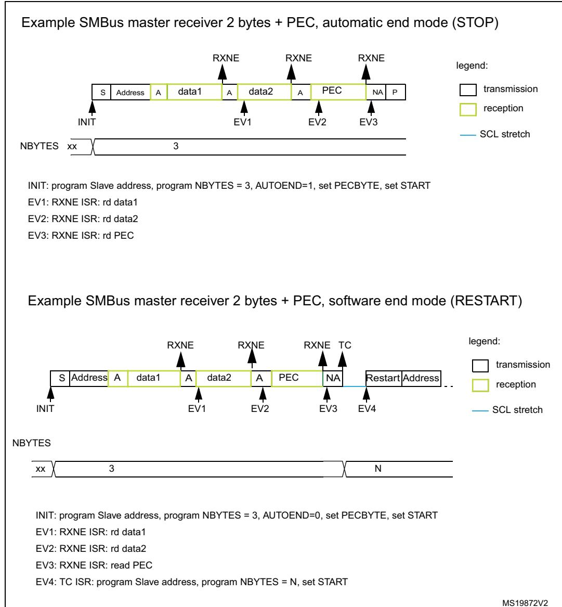

Figure 611. Bus transfer diagrams for SMBus master receiver

# 50.4.15 Wake-up from Stop mode on address match

This section is relevant only when wake-up from Stop mode feature is supported (refer to Section 50.3).

The I2C is able to wake-up the MCU from Stop mode (APB clock is off), when it is addressed. All addressing modes are supported.

Wake-up from Stop mode is enabled by setting the WUPEN bit in the I2C\_CR1 register. The HSI or CSI oscillator must be selected as the clock source for I2CCLK in order to allow wake-up from Stop mode.

During Stop mode, the HSI or CSI is switched off. When a START is detected, the I2C interface switches the HSI or CSI on, and stretches SCL low until HSI or CSI is woken up.

HSI or CSI is then used for the address reception.

In case of an address match, the I2C stretches SCL low during MCU wake-up time. The stretch is released when ADDR flag is cleared by software, and the transfer goes on normally.

If the address does not match, the HSI or CSI is switched off again and the MCU is not woken up.

*Note: If the I2C clock is the system clock, or if WUPEN = 0, the* HSI or CSI *is not switched on after a START is received.*

> *Only an ADDR interrupt can wake up the MCU. Therefore do not enter Stop mode when the I2C is performing a transfer as a master, or as an addressed slave after the ADDR flag is set. This can be managed by clearing SLEEPDEEP bit in the ADDR interrupt routine and setting it again only after the STOPF flag is set.*

**Caution:** The digital filter is not compatible with the wake-up from Stop mode feature. If the DNF bit is not equal to 0, setting the WUPEN bit has no effect.

**Caution:** This feature is available only when the I2C clock source is the HSI or CSI oscillator.

**Caution:** Clock stretching must be enabled (NOSTRETCH = 0) to ensure proper operation of the wake-up from Stop mode feature.

**Caution:** If wake up from Stop mode is disabled (WUPEN = 0), the I2C peripheral must be disabled before entering Stop mode (PE = 0).

# **50.4.16 Error conditions**

The following errors are the conditions that can cause a communication fail.

### **Bus error (BERR)**

A bus error is detected when a START or a STOP condition is detected and is not located after a multiple of nine SCL clock pulses. A START or a STOP condition is detected when an SDA edge occurs while SCL is high.

The bus error flag is set only if the I2C is involved in the transfer as master or addressed slave (i.e not during the address phase in slave mode).

In case of a misplaced START or RESTART detection in slave mode, the I2C enters address recognition state like for a correct START condition.

When a bus error is detected, the BERR flag is set in the I2C\_ISR register, and an interrupt is generated if the ERRIE bit is set in the I2C\_CR1 register.

### **Arbitration lost (ARLO)**

An arbitration loss is detected when a high level is sent on the SDA line, but a low level is sampled on the SCL rising edge.

- In master mode, arbitration loss is detected during the address phase, data phase and data acknowledge phase. In this case, the SDA and SCL lines are released, the START control bit is cleared by hardware and the master switches automatically to slave mode.
- In slave mode, arbitration loss is detected during data phase and data acknowledge phase. In this case, the transfer is stopped, and the SCL and SDA lines are released.

When an arbitration loss is detected, the ARLO flag is set in the I2C\_ISR register, and an interrupt is generated if the ERRIE bit is set in the I2C\_CR1 register.

RM0399 Rev 4 2149/3556

# **Overrun/underrun error (OVR)**

An overrun or underrun error is detected in slave mode when NOSTRETCH = 1 and:

- In reception when a new byte is received and the RXDR register has not been read yet. The new received byte is lost, and a NACK is automatically sent as a response to the new byte.
- In transmission:
  - When STOPF = 1 and the first data byte must be sent. The content of the I2C\_TXDR register is sent if TXE = 0, 0xFF if not.
  - When a new byte must be sent and the I2C\_TXDR register has not been written yet, 0xFF is sent.

When an overrun or underrun error is detected, the OVR flag is set in the I2C\_ISR register, and an interrupt is generated if the ERRIE bit is set in the I2C\_CR1 register.

### **Packet error checking error (PECERR)**

This section is relevant only when the SMBus feature is supported (refer to *[Section 50.3](#page-1-0))*.

A PEC error is detected when the received PEC byte does not match with the I2C\_PECR register content. A NACK is automatically sent after the wrong PEC reception.

When a PEC error is detected, the PECERR flag is set in the I2C\_ISR register, and an interrupt is generated if the ERRIE bit is set in the I2C\_CR1 register.

### **Timeout error (TIMEOUT)**

This section is relevant only when the SMBus feature is supported (refer to *[Section 50.3](#page-1-0))*.

A timeout error occurs for any of these conditions:

- TIDLE = 0 and SCL remained low for the time defined in the TIMEOUTA[11:0] bits: this is used to detect an SMBus timeout.
- TIDLE = 1 and both SDA and SCL remained high for the time defined in the TIMEOUTA [11:0] bits: this is used to detect a bus idle condition.
- Master cumulative clock low extend time reached the time defined in the TIMEOUTB[11:0] bits (SMBus tLOW:MEXT parameter).
- Slave cumulative clock low extend time reached the time defined in TIMEOUTB[11:0] bits (SMBus tLOW:SEXT parameter).

When a timeout violation is detected in master mode, a STOP condition is automatically sent.

When a timeout violation is detected in slave mode, SDA and SCL lines are automatically released.

When a timeout error is detected, the TIMEOUT flag is set in the I2C\_ISR register, and an interrupt is generated if the ERRIE bit is set in the I2C\_CR1 register.

# **Alert (ALERT)**

This section is relevant only when the SMBus feature is supported (refer to *[Section 50.3](#page-1-0)*).

The ALERT flag is set when the I2C interface is configured as a Host (SMBHEN = 1), the alert pin detection is enabled (ALERTEN = 1) and a falling edge is detected on the SMBA pin. An interrupt is generated if the ERRIE bit is set in the I2C\_CR1 register.

# **50.4.17 DMA requests**

### **Transmission using DMA**

DMA (direct memory access) can be enabled for transmission by setting the TXDMAEN bit in the I2C\_CR1 register. Data is loaded from an SRAM area configured using the DMA peripheral (see *Section 16: Direct memory access controller (DMA) on page 674*) to the I2C\_TXDR register whenever the TXIS bit is set.

Only the data are transferred with DMA.

- In master mode: the initialization, the slave address, direction, number of bytes and START bit are programmed by software (the transmitted slave address cannot be transferred with DMA). When all data are transferred using DMA, the DMA must be initialized before setting the START bit. The end of transfer is managed with the NBYTES counter. Refer to *[Master transmitter](#page-25-0)*.
- In slave mode:
  - With NOSTRETCH = 0, when all data are transferred using DMA, the DMA must be initialized before the address match event, or in ADDR interrupt subroutine, before clearing ADDR.
  - With NOSTRETCH = 1, the DMA must be initialized before the address match event.
- For instances supporting SMBus: the PEC transfer is managed with NBYTES counter. Refer to *[SMBus slave transmitter](#page-39-3)* and *[SMBus master transmitter](#page-43-0)*.

*Note: If DMA is used for transmission, the TXIE bit does not need to be enabled.*

# **Reception using DMA**

DMA (direct memory access) can be enabled for reception by setting the RXDMAEN bit in the I2C\_CR1 register. Data is loaded from the I2C\_RXDR register to an SRAM area configured using the DMA peripheral (refer to *Section 16: Direct memory access controller (DMA) on page 674*) whenever the RXNE bit is set. Only the data (including PEC) are transferred with DMA.

- In master mode, the initialization, the slave address, direction, number of bytes and START bit are programmed by software. When all data are transferred using DMA, the DMA must be initialized before setting the START bit. The end of transfer is managed with the NBYTES counter.
- In slave mode with NOSTRETCH = 0, when all data are transferred using DMA, the DMA must be initialized before the address match event, or in the ADDR interrupt subroutine, before clearing the ADDR flag.
- If SMBus is supported (see *[Section 50.3](#page-1-0)*) the PEC transfer is managed with the NBYTES counter. Refer to *[SMBus slave receiver](#page-41-0)* and *[SMBus master receiver](#page-45-0)*.

*Note: If DMA is used for reception, the RXIE bit does not need to be enabled.*

# **50.4.18 Debug mode**

When the microcontroller enters debug mode (core halted), the SMBus timeout either continues to work normally or stops, depending on the DBG\_I2Cx\_ configuration bits in the DBG module.

RM0399 Rev 4 2151/3556

# **50.5 I2C low-power modes**

**Table 416. Effect of low-power modes on the I2C** 

| Mode    | Description                                                                                                                                                                                                                                                                                            |
|---------|--------------------------------------------------------------------------------------------------------------------------------------------------------------------------------------------------------------------------------------------------------------------------------------------------------|
| Sleep   | No effect. I2C interrupts cause the device to exit the Sleep mode.                                                                                                                                                                                                                                     |
| Stop(1) | The I2C registers content is kept. – WUPEN = 1 and I2C is clocked by an internal oscillator (HSI or CSI): the address recognition is functional. The I2C address match condition causes the device to exit the Stop mode. – WUPEN = 0: the I2C must be disabled before entering Stop mode. |
| Standby | The I2C peripheral is powered down and must be reinitialized after exiting Standby mode.                                                                                                                                                                                                               |

1. Refer to *[Section 50.3](#page-1-0)* for information about the Stop modes supported by each instance. If wake-up from a specific Stop mode is not supported, the instance must be disabled before entering this Stop mode.

# 50.6 I2C interrupts

The following table gives the list of I2C interrupt requests.

Table 417. I2C interrupt requests

| Interment event                  | Event flag/interrupt |                                    | Interrupt enable control | Interrupt/wake-up activated |              |                    |
|----------------------------------|----------------------|------------------------------------|-----------------------------|-----------------------------|--------------|--------------------|
| Interrupt event                  | Event flag           | clearing method                    | bit                         | i2c_event_it                | i2c_error_it | i2c_wkup           |
| Receive buffer not empty         | RXNE                 | Read I2C_RXDR register             | RXIE                        |                             |              |                    |
| Transmit buffer interrupt status | TXIS                 | Write I2C_TXDR register            | TXIE                        |                             | No           | No                 |
| Stop detection interrupt flag    | STOPF                | Write STOPCF=1                     | STOPIE                      | -                           |              |                    |
| Transfer Complete Reload      | TCR                  | Write I2C_CR2 with NBYTES[7:0] ≠ 0 | TCIE                        | Yes                         |              |                    |
| Transfer complete                | TC                   | Write START=1 or STOP=1         | TOIE                        |                             |              |                    |
| Address matched                  | ADDR                 | Write ADDRCF=1                     | ADDRIE                      | ADDRIE                      |              | Yes (1) |
| NACK reception                   | NACKF                | Write NACKCF=1                     | NACKIE                      |                             |              |                    |
| Bus error                        | BERR                 | Write BERRCF=1                     |                             |                             |              |                    |
| Arbitration loss                 | ARLO                 | Write ARLOCF=1                     | ERRIE                       | N0 Yes                      |              |                    |
| Overrun/underrun                 | OVR                  | Write OVRCF=1                      |                             |                             | Yes          | No                 |
| PEC error                        | PECERR               | Write PECERRCF=1                   | ERRIE                       |                             |              |                    |
| Timeout/t LOW error   | TIMEOUT              | Write TIMEOUTCF=1                  |                             |                             |              |                    |
| SMBus Alert                      | ALERT                | Write ALERTCF=1                    |                             |                             |              |                    |

1. If WUPEN is set.

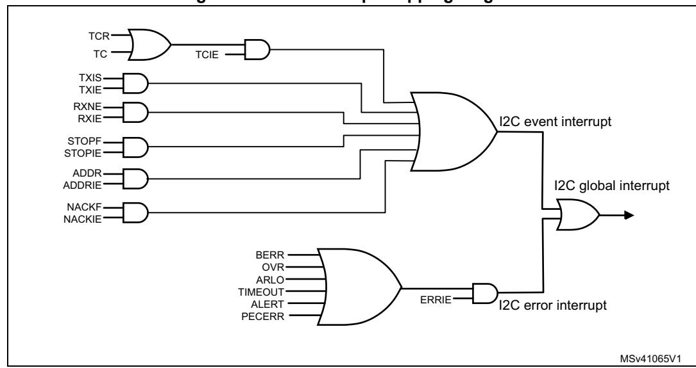

**Figure 612. I2C interrupt mapping diagram**

# 50.7 I2C registers

Refer to Section 1.2 on page 106 for the list of abbreviations used in register descriptions.

The registers are accessed by words (32-bit).

# 50.7.1 I2C control register 1 (I2C CR1)

Address offset: 0x00

Reset value: 0x0000 0000

Access: no wait states, except if a write access occurs while a write access is ongoing. In this case, wait states are inserted in the second write access, until the previous one is completed. The latency of the second write access can be up to

2 x i2c\_pclk + 6 x i2c\_ker\_ck.

| 31          | 30          | 29   | 28         | 27   | 26     | 25    | 24   | 23        | 22          | 21         | 20         | 19         | 18        | 17            | 16  |
|-------------|-------------|------|------------|------|--------|-------|------|-----------|-------------|------------|------------|------------|-----------|---------------|-----|
| Res.        | Res.        | Res. | Res.       | Res. | Res.   | Res.  | Res. | PEC EN | ALERT EN | SMBD EN | SMBH EN | GC EN   | WUP EN | NO STRETCH | SBC |
|             |             |      |            |      |        |       |      | rw        | rw          | rw         | rw         | rw         | rw        | rw            | rw  |
| 15          | 14          | 13   | 12         | 11   | 10 9 8 |       | 8    | 7         | 6           | 5          | 4          | 3          | 2         | 1             | 0   |
| RXDMA EN | TXDMA EN | Res. | ANF OFF |      | DNF    | [3:0] |      | ERRIE     | TCIE        | STOP IE | NACK IE | ADDR IE | RXIE      | TXIE          | PE  |
| rw          | rw          |      | rw         | rw   | rw     | rw    | rw   | rw        | rw          | rw         | rw         | rw         | rw        | rw            | rw  |

Bits 31:24 Reserved, must be kept at reset value.

Bit 23 PECEN: PEC enable

0: PEC calculation disabled
1: PEC calculation enabled

Note: If the SMBus feature is not supported, this bit is reserved and forced by hardware to 0. Refer to Section 50.3.

### Bit 22 ALERTEN: SMBus alert enable

0: The SMBus alert pin (SMBA) is not supported in host mode (SMBHEN = 1). In device mode (SMBHEN = 0), the SMBA pin is released and the Alert Response Address header is disabled (0001100x followed by NACK).

1: The SMBus alert pin is supported in host mode (SMBHEN = 1). In device mode (SMBHEN = 0), the SMBA pin is driven low and the Alert Response Address header is enabled (0001100x followed by ACK).

Note: When ALERTEN = 0, the SMBA pin can be used as a standard GPIO.

If the SMBus feature is not supported, this bit is reserved and forced by hardware to 0. Refer to Section 50.3.

#### Bit 21 SMBDEN: SMBus device default address enable

- 0: Device default address disabled. Address 0b1100001x is NACKed.
- 1: Device default address enabled. Address 0b1100001x is ACKed.

Note: If the SMBus feature is not supported, this bit is reserved and forced by hardware to 0. Refer to Section 50.3.

### Bit 20 SMBHEN: SMBus host address enable

- 0: Host address disabled. Address 0b0001000x is NACKed.
- 1: Host address enabled. Address 0b0001000x is ACKed.

Note: If the SMBus feature is not supported, this bit is reserved and forced by hardware to 0. Refer to Section 50.3.

RM0399 Rev 4 2155/3556

#### Bit 19 **GCEN**: General call enable

- 0: General call disabled. Address 0b00000000 is NACKed.
- 1: General call enabled. Address 0b00000000 is ACKed.

#### Bit 18 **WUPEN**: Wake-up from Stop mode enable

- 0: Wake-up from Stop mode disabled.
- 1: Wake-up from Stop mode enabled.

*Note: If the wake-up from Stop mode feature is not supported, this bit is reserved and forced by hardware to 0. Refer to [Section 50.3](#page-1-0)*.

*Note: WUPEN can be set only when DNF = 0000.*

### Bit 17 **NOSTRETCH**: Clock stretching disable

This bit is used to disable clock stretching in slave mode. It must be kept cleared in master mode.

- 0: Clock stretching enabled
- 1: Clock stretching disabled

*Note: This bit can be programmed only when the I2C is disabled (PE = 0).*

#### Bit 16 **SBC**: Slave byte control

This bit is used to enable hardware byte control in slave mode.

- 0: Slave byte control disabled
- 1: Slave byte control enabled

### Bit 15 **RXDMAEN**: DMA reception requests enable

- 0: DMA mode disabled for reception
- 1: DMA mode enabled for reception

#### Bit 14 **TXDMAEN**: DMA transmission requests enable

- 0: DMA mode disabled for transmission
- 1: DMA mode enabled for transmission

#### Bit 13 Reserved, must be kept at reset value.

- Bit 12 **ANFOFF:** Analog noise filter OFF
  - 0: Analog noise filter enabled 1: Analog noise filter disabled

*Note: This bit can be programmed only when the I2C is disabled (PE = 0).*

#### Bits 11:8 **DNF[3:0]**: Digital noise filter

These bits are used to configure the digital noise filter on SDA and SCL input. The digital filter, filters spikes with a length of up to DNF[3:0] **\*** tI2CCLK

0000: Digital filter disabled

0001: Digital filter enabled and filtering capability up to one tI2CCLK

...

1111: digital filter enabled and filtering capability up to fifteen tI2CCLK

*Note: If the analog filter is enabled, the digital filter is added to it. This filter can be programmed only when the I2C is disabled (PE = 0).*

#### Bit 7 **ERRIE**: Error interrupts enable

0: Error detection interrupts disabled 1: Error detection interrupts enabled

*Note: Any of these errors generates an interrupt:*

*Arbitration loss (ARLO) Bus error detection (BERR) Overrun/underrun (OVR) Timeout detection (TIMEOUT) PEC error detection (PECERR) Alert pin event detection (ALERT)*

#### Bit 6 **TCIE**: Transfer complete interrupt enable

0: Transfer complete interrupt disabled

1: Transfer complete interrupt enabled

*Note: Any of these events generates an interrupt:*

*Transfer complete (TC)*

*Transfer complete reload (TCR)*

#### Bit 5 **STOPIE**: Stop detection interrupt enable

0: Stop detection (STOPF) interrupt disabled

1: Stop detection (STOPF) interrupt enabled

#### Bit 4 **NACKIE**: Not acknowledge received interrupt enable

0: Not acknowledge (NACKF) received interrupts disabled

1: Not acknowledge (NACKF) received interrupts enabled

#### Bit 3 **ADDRIE**: Address match interrupt enable (slave only)

0: Address match (ADDR) interrupts disabled

1: Address match (ADDR) interrupts enabled

#### Bit 2 **RXIE**: RX interrupt enable

0: Receive (RXNE) interrupt disabled

1: Receive (RXNE) interrupt enabled

#### Bit 1 **TXIE**: TX interrupt enable

0: Transmit (TXIS) interrupt disabled

1: Transmit (TXIS) interrupt enabled

# Bit 0 **PE**: Peripheral enable

0: Peripheral disabled

1: Peripheral enabled

*Note: When PE = 0, the I2C SCL and SDA lines are released. Internal state machines and status bits are put back to their reset value. When cleared, PE must be kept low for at least three APB clock cycles.*

# **50.7.2 I2C control register 2 (I2C\_CR2)**

Address offset: 0x04

Reset value: 0x0000 0000

Access: no wait states, except if a write access occurs while a write access is ongoing. In this case, wait states are inserted in the second write access until the previous one is completed. The latency of the second write access can be up to 2 x i2c\_pclk + 6 x i2c\_ker\_ck.

RM0399 Rev 4 2157/3556

| 31   | 30   | 29    | 28          | 27    | 26          | 25          | 24         | 23          | 22 | 21 | 20 | 19 | 18 | 17 | 16 |  |  |
|------|------|-------|-------------|-------|-------------|-------------|------------|-------------|----|----|----|----|----|----|----|--|--|
| Res. | Res. | Res.  | Res.        | Res.  | PEC BYTE | AUTO END | RE LOAD | NBYTES[7:0] |    |    |    |    |    |    |    |  |  |
|      |      |       |             |       | rs          | rw          | rw         | rw          | rw | rw | rw | rw | rw | rw | rw |  |  |
| 15   | 14   | 13    | 12          | 11    | 10          | 9           | 8          | 7           | 6  | 5  | 4  | 3  | 2  | 1  | 0  |  |  |
| NACK | STOP | START | HEAD 10R | ADD10 | RD_ WRN  | SADD[9:0]   |            |             |    |    |    |    |    |    |    |  |  |
| rs   | rs   | rs    | rw          | rw    | rw          | rw          | rw         | rw          | rw | rw | rw | rw | rw | rw | rw |  |  |

Bits 31:27 Reserved, must be kept at reset value.

#### Bit 26 PECBYTE: Packet error checking byte

This bit is set by software, and cleared by hardware when the PEC is transferred, or when a STOP condition or an Address matched is received, also when PE = 0.

0: No PEC transfer

1: PEC transmission/reception is requested

Note: Writing 0 to this bit has no effect.

This bit has no effect when RELOAD is set, and in slave mode when SBC = 0.

Note: If the SMBus feature is not supported, this bit is reserved and forced by hardware to 0. Refer to Section 50.3.

#### Bit 25 AUTOEND: Automatic end mode (master mode)

This bit is set and cleared by software.

0: software end mode: TC flag is set when NBYTES data are transferred, stretching SCL low.

1: Automatic end mode: a STOP condition is automatically sent when NBYTES data are transferred.

Note: This bit has no effect in slave mode or when the RELOAD bit is set.

#### Bit 24 RELOAD: NBYTES reload mode

This bit is set and cleared by software.

0: The transfer is completed after the NBYTES data transfer (STOP or RESTART follows).

1: The transfer is not completed after the NBYTES data transfer (NBYTES is reloaded). TCR flag is set when NBYTES data are transferred, stretching SCL low.

#### Bits 23:16 NBYTES[7:0]: Number of bytes

The number of bytes to be transmitted/received is programmed there. This field is don't care in slave mode with SBC = 0.

Note: Changing these bits when the START bit is set is not allowed.

#### Bit 15 NACK: NACK generation (slave mode)

The bit is set by software, cleared by hardware when the NACK is sent, or when a STOP condition or an Address matched is received, or when PE = 0.

0: an ACK is sent after current received byte.

1: a NACK is sent after current received byte.

Note: Writing 0 to this bit has no effect.

This bit is used only in slave mode: in master receiver mode, NACK is automatically generated after last byte preceding STOP or RESTART condition, whatever the NACK bit value.

When an overrun occurs in slave receiver NOSTRETCH mode, a NACK is automatically generated, whatever the NACK bit value.

When hardware PEC checking is enabled (PECBYTE = 1), the PEC acknowledge value does not depend on the NACK value.

RM0399 Rev 4 2158/3556

#### Bit 14 **STOP**: Stop generation (master mode)

The bit is set by software, cleared by hardware when a STOP condition is detected, or when PE = 0.

#### **In master mode:**

- 0: No Stop generation
- 1: Stop generation after current byte transfer

*Note: Writing 0 to this bit has no effect.*

#### Bit 13 **START**: Start generation

This bit is set by software, and cleared by hardware after the Start followed by the address sequence is sent, by an arbitration loss, by a timeout error detection, or when PE = 0. It can also be cleared by software by writing 1 to the ADDRCF bit in the I2C\_ICR register.

0: No Start generation

1: Restart/Start generation:

If the I2C is already in master mode with AUTOEND = 0, setting this bit generates a Repeated start condition when RELOAD = 0, after the end of the NBYTES transfer.

Otherwise, setting this bit generates a START condition once the bus is free.

*Note: Writing 0 to this bit has no effect.*

*The START bit can be set even if the bus is BUSY or I2C is in slave mode.*

*This bit has no effect when RELOAD is set.* 

#### Bit 12 **HEAD10R**: 10-bit address header only read direction (master receiver mode)

- 0: The master sends the complete 10-bit slave address read sequence: Start + 2 bytes 10-bit address in write direction + restart + first seven bits of the 10-bit address in read direction.
- 1: The master sends only the first seven bits of the 10-bit address, followed by read direction.

*Note: Changing this bit when the START bit is set is not allowed.*

#### Bit 11 **ADD10**: 10-bit addressing mode (master mode)

- 0: The master operates in 7-bit addressing mode
- 1: The master operates in 10-bit addressing mode

*Note: Changing this bit when the START bit is set is not allowed.*

#### Bit 10 **RD\_WRN**: Transfer direction (master mode)

- 0: Master requests a write transfer
- 1: Master requests a read transfer

*Note: Changing this bit when the START bit is set is not allowed.*

#### Bits 9:0 **SADD[9:0]**: Slave address (master mode)

#### **In 7-bit addressing mode (ADD10 = 0)**:

SADD[7:1] must be written with the 7-bit slave address to be sent. Bits SADD[9], SADD[8] and SADD[0] are don't care.

#### **In 10-bit addressing mode (ADD10 = 1)**:

SADD[9:0] must be written with the 10-bit slave address to be sent.

*Note: Changing these bits when the START bit is set is not allowed.*

# **50.7.3 I2C own address 1 register (I2C\_OAR1)**

Address offset: 0x08

Reset value: 0x0000 0000

Access: no wait states, except if a write access occurs while a write access is ongoing. In this case, wait states are inserted in the second write access until the previous one is completed. The latency of the second write access can be up to 2 x i2c\_pclk + 6 x i2c\_ker\_ck.

RM0399 Rev 4 2159/3556

| 31    | 30   | 29   | 28   | 27   | 26          | 25       | 24   | 23   | 22   | 21   | 20   | 19   | 18   | 17   | 16   |  |
|-------|------|------|------|------|-------------|----------|------|------|------|------|------|------|------|------|------|--|
| Res.  | Res. | Res. | Res. | Res. | Res.        | Res.     | Res. | Res. | Res. | Res. | Res. | Res. | Res. | Res. | Res. |  |
|       |      |      |      |      |             |          |      |      |      |      |      |      |      |      |      |  |
| 15    | 14   | 13   | 12   | 11   | 10          | 9        | 8    | 7    | 6    | 5    | 4    | 3    | 2    | 1    | 0    |  |
| OA1EN | Res. | Res. | Res. | Res. | OA1 MODE | OA1[9:0] |      |      |      |      |      |      |      |      |      |  |
|       |      |      |      |      |             |          |      |      |      |      |      |      |      |      |      |  |

Bits 31:16 Reserved, must be kept at reset value.

Bit 15 **OA1EN**: Own address 1 enable

- 0: Own address 1 disabled. The received slave address OA1 is NACKed.
- 1: Own address 1 enabled. The received slave address OA1 is ACKed.

Bits 14:11 Reserved, must be kept at reset value.

Bit 10 **OA1MODE**: Own address 1 10-bit mode

0: Own address 1 is a 7-bit address.

1: Own address 1 is a 10-bit address.

*Note: This bit can be written only when OA1EN = 0.*

Bits 9:0 **OA1[9:0]**: Interface own slave address

7-bit addressing mode: OA1[7:1] contains the 7-bit own slave address. Bits OA1[9], OA1[8]

and OA1[0] are don't care.

10-bit addressing mode: OA1[9:0] contains the 10-bit own slave address.

*Note: These bits can be written only when OA1EN = 0.*

# **50.7.4 I2C own address 2 register (I2C\_OAR2)**

Address offset: 0x0C

Reset value: 0x0000 0000

Access: no wait states, except if a write access occurs while a write access is ongoing. In this case, wait states are inserted in the second write access, until the previous one is completed. The latency of the second write access can be up to 2x i2c\_pclk + 6 x i2c\_ker\_ck.

| 31    | 30   | 29   | 28   | 27   | 26   | 25          | 24   | 23       | 22   | 21   | 20   | 19   | 18   | 17   | 16   |
|-------|------|------|------|------|------|-------------|------|----------|------|------|------|------|------|------|------|
| Res.  | Res. | Res. | Res. | Res. | Res. | Res.        | Res. | Res.     | Res. | Res. | Res. | Res. | Res. | Res. | Res. |
|       |      |      |      |      |      |             |      |          |      |      |      |      |      |      |      |
| 15    | 14   | 13   | 12   | 11   | 10   | 9           | 8    | 7        | 6    | 5    | 4    | 3    | 2    | 1    | 0    |
| OA2EN | Res. | Res. | Res. | Res. |      | OA2MSK[2:0] |      | OA2[7:1] |      |      |      |      |      |      | Res. |
| rw    |      |      |      |      | rw   | rw          | rw   | rw       | rw   | rw   | rw   | rw   | rw   | rw   |      |

Bits 31:16 Reserved, must be kept at reset value.

Bit 15 **OA2EN**: Own address 2 enable

- 0: Own address 2 disabled. The received slave address OA2 is NACKed.
- 1: Own address 2 enabled. The received slave address OA2 is ACKed.

Bits 14:11 Reserved, must be kept at reset value.

#### Bits 10:8 **OA2MSK[2:0]**: Own address 2 masks

000: No mask

001: OA2[1] is masked and don't care. Only OA2[7:2] are compared.

010: OA2[2:1] are masked and don't care. Only OA2[7:3] are compared.

011: OA2[3:1] are masked and don't care. Only OA2[7:4] are compared.

100: OA2[4:1] are masked and don't care. Only OA2[7:5] are compared.

101: OA2[5:1] are masked and don't care. Only OA2[7:6] are compared.

110: OA2[6:1] are masked and don't care. Only OA2[7] is compared.

111: OA2[7:1] are masked and don't care. No comparison is done, and all (except reserved)

7-bit received addresses are acknowledged.

*Note: These bits can be written only when OA2EN = 0.*

*As soon as OA2MSK ≠ 0, the reserved I2C addresses (0b0000xxx and 0b1111xxx) are not acknowledged, even if the comparison matches.*

#### Bits 7:1 **OA2[7:1]**: Interface address

7-bit addressing mode: 7-bit address

*Note: These bits can be written only when OA2EN = 0.*

Bit 0 Reserved, must be kept at reset value.

# **50.7.5 I2C timing register (I2C\_TIMINGR)**

Address offset: 0x10

Reset value: 0x0000 0000

Access: no wait states

| 31 | 30                                         | 29 | 28        | 27 | 26 | 25 | 24 | 23                         | 22 | 21 | 20 | 19 | 18 | 17 | 16 |
|----|--------------------------------------------|----|-----------|----|----|----|----|----------------------------|----|----|----|----|----|----|----|
|    | PRESC[3:0] Res. Res. Res. Res. |    |           |    |    |    |    | SCLDEL[3:0] SDADEL[3:0] |    |    |    |    |    |    |    |
| rw | rw                                         | rw | rw        |    |    |    |    | rw                         | rw | rw | rw | rw | rw | rw | rw |
| 15 | 14                                         | 13 | 12        | 11 | 10 | 9  | 8  | 7                          | 6  | 5  | 4  | 3  | 2  | 1  | 0  |
|    |                                            |    | SCLH[7:0] |    |    |    |    | SCLL[7:0]                  |    |    |    |    |    |    |    |
| rw | rw                                         | rw | rw        | rw | rw | rw | rw | rw                         | rw | rw | rw | rw | rw | rw | rw |

### Bits 31:28 **PRESC[3:0]**: Timing prescaler

This field is used to prescale i2c\_ker\_ck to generate the clock period tPRESC used for data setup and hold counters (refer to *[I2C timings](#page-5-0)*), and for SCL high and low level counters (refer to *[I2C master initialization](#page-21-0)*).

tPRESC = (PRESC + 1) x tI2CCLK

Bits 27:24 Reserved, must be kept at reset value.

#### Bits 23:20 **SCLDEL[3:0]**: Data setup time

This field is used to generate a delay tSCLDEL = (SCLDEL + 1) x tPRESC between SDA edge and SCL rising edge. In master and in slave modes with NOSTRETCH = 0, the SCL line is stretched low during tSCLDEL.

*Note: tSCLDEL is used to generate tSU:DAT timing.*

#### Bits 19:16 **SDADEL[3:0]**: Data hold time

This field is used to generate the delay tSDADEL between SCL falling edge and SDA edge. In master and in slave modes with NOSTRETCH = 0, the SCL line is stretched low during

tSDADEL.

tSDADEL= SDADEL x tPRESC

*Note: SDADEL is used to generate tHD:DAT timing.*

#### Bits 15:8 **SCLH[7:0]**: SCL high period (master mode)

This field is used to generate the SCL high period in master mode.

tSCLH = (SCLH + 1) x tPRESC

*Note: SCLH is also used to generate tSU:STO and tHD:STA timing.*

#### Bits 7:0 **SCLL[7:0]**: SCL low period (master mode)

This field is used to generate the SCL low period in master mode.

tSCLL = (SCLL + 1) x tPRESC

*Note: SCLL is also used to generate tBUF and tSU:STA timings.*

*Note: This register must be configured when the I2C is disabled (PE = 0).*

*Note: The STM32CubeMX tool calculates and provides the I2C\_TIMINGR content in the I2C* 

*Configuration window.*

# **50.7.6 I2C timeout register (I2C\_TIMEOUTR)**

Address offset: 0x14

Reset value: 0x0000 0000

Access: no wait states, except if a write access occurs while a write access is ongoing. In this case, wait states are inserted in the second write access until the previous one is completed. The latency of the second write access can be up to 2 x i2c\_pclk + 6 x i2c\_ker\_ck.

If the SMBus feature is not supported, this register is reserved, and its bits are forced by hardware to 0. Refer to *[Section 50.3](#page-1-0)*.

| 31       | 30   | 29   | 28    | 27             | 26             | 25 | 24 | 23 | 22 | 21 | 20 | 19 | 18 | 17 | 16 |
|----------|------|------|-------|----------------|----------------|----|----|----|----|----|----|----|----|----|----|
| TEXTEN   | Res. | Res. | Res.  |                | TIMEOUTB[11:0] |    |    |    |    |    |    |    |    |    |    |
| rw       |      |      |       | rw             | rw             | rw | rw | rw | rw | rw | rw | rw | rw | rw | rw |
| 15       | 14   | 13   | 12    | 11             | 10             | 9  | 8  | 7  | 6  | 5  | 4  | 3  | 2  | 1  | 0  |
| TIMOUTEN | Res. | Res. | TIDLE | TIMEOUTA[11:0] |                |    |    |    |    |    |    |    |    |    |    |
| rw       |      |      | rw    | rw             | rw             | rw | rw | rw | rw | rw | rw | rw | rw | rw | rw |

### Bit 31 **TEXTEN**: Extended clock timeout enable

0: Extended clock timeout detection is disabled

1: Extended clock timeout detection is enabled. When a cumulative SCL stretch for more than tLOW:EXT is done by the I2C interface, a timeout error is detected (TIMEOUT = 1).

Bits 30:28 Reserved, must be kept at reset value.

#### Bits 27:16 **TIMEOUTB[11:0]**: Bus timeout B

This field is used to configure the cumulative clock extension timeout:

- Master mode: the master cumulative clock low extend time (tLOW:MEXT) is detected
- Slave mode: the slave cumulative clock low extend time (tLOW:SEXT) is detected

tLOW:EXT = (TIMEOUTB + TIDLE = 01) x 2048 x tI2CCLK

*Note: These bits can be written only when TEXTEN = 0.*

#### Bit 15 **TIMOUTEN**: Clock timeout enable

0: SCL timeout detection is disabled

1: SCL timeout detection is enabled. hen SCL is low for more than tTIMEOUT (TIDLE = 0) or high for more than tIDLE (TIDLE = 1), a timeout error is detected (TIMEOUT = 1).

#### Bits 14:13 Reserved, must be kept at reset value.

#### Bit 12 **TIDLE**: Idle clock timeout detection

0: TIMEOUTA is used to detect SCL low timeout

1: TIMEOUTA is used to detect both SCL and SDA high timeout (bus idle condition)

*Note: This bit can be written only when TIMOUTEN = 0.*

#### Bits 11:0 **TIMEOUTA[11:0]**: Bus timeout A

This field is used to configure:

The SCL low timeout condition tTIMEOUT when TIDLE = 0

tTIMEOUT= (TIMEOUTA + 1) x 2048 x tI2CCLK

The bus idle condition (both SCL and SDA high) when TIDLE = 1

tIDLE= (TIMEOUTA + 1) x 4 x tI2CCLK

*Note: These bits can be written only when TIMOUTEN = 0.*

# **50.7.7 I2C interrupt and status register (I2C\_ISR)**

Address offset: 0x18

Reset value: 0x0000 0001

Access: no wait states

| 31   | 30   | 29    | 28          | 27         | 26   | 25   | 24   | 23  | 22 | 21           | 20          | 19   | 18   | 17   | 16  |
|------|------|-------|-------------|------------|------|------|------|-----|----|--------------|-------------|------|------|------|-----|
| Res. | Res. | Res.  | Res.        | Res.       | Res. | Res. | Res. |     |    | ADDCODE[6:0] | DIR         |      |      |      |     |
|      |      |       |             |            |      |      |      | r   | r  | r            | r           | r    | r    | r    | r   |
| 15   | 14   | 13    | 12          | 11         | 10   | 9    | 8    | 7   | 6  | 5            | 4           | 3    | 2    | 1    | 0   |
| BUSY | Res. | ALERT | TIME OUT | PEC ERR | OVR  | ARLO | BERR | TCR | TC |              | STOPF NACKF | ADDR | RXNE | TXIS | TXE |
| r    |      | r     | r           | r          | r    | r    | r    | r   | r  | r            | r           | r    | r    | rs   | rs  |

Bits 31:24 Reserved, must be kept at reset value.

### Bits 23:17 **ADDCODE[6:0]**: Address match code (slave mode)

These bits are updated with the received address when an address match event occurs (ADDR = 1). In the case of a 10-bit address, ADDCODE provides the 10-bit header followed by the two MSBs of the address.

#### Bit 16 **DIR**: Transfer direction (slave mode)

This flag is updated when an address match event occurs (ADDR = 1).

0: Write transfer, slave enters receiver mode.

1: Read transfer, slave enters transmitter mode.

RM0399 Rev 4 2163/3556

#### Bit 15 **BUSY**: Bus busy

This flag indicates that a communication is in progress on the bus. It is set by hardware when a START condition is detected, and cleared by hardware when a STOP condition is detected, or when PE = 0.

#### Bit 14 Reserved, must be kept at reset value.

#### Bit 13 **ALERT**: SMBus alert

This flag is set by hardware when SMBHEN = 1 (SMBus host configuration), ALERTEN = 1 and an SMBALERT event (falling edge) is detected on SMBA pin. It is cleared by software by setting the ALERTCF bit.

*Note: This bit is cleared by hardware when PE = 0.*

*Note: If the SMBus feature is not supported, this bit is reserved and forced by hardware to 0. Refer to [Section 50.3](#page-1-0)*.

# Bit 12 **TIMEOUT**: Timeout or tLOW detection flag

This flag is set by hardware when a timeout or extended clock timeout occurred. It is cleared by software by setting the TIMEOUTCF bit.

*Note: This bit is cleared by hardware when PE = 0.*

*Note: If the SMBus feature is not supported, this bit is reserved and forced by hardware to 0. Refer to [Section 50.3](#page-1-0)*.

### Bit 11 **PECERR**: PEC error in reception

This flag is set by hardware when the received PEC does not match with the PEC register content. A NACK is automatically sent after the wrong PEC reception. It is cleared by software by setting the PECCF bit.

*Note: This bit is cleared by hardware when PE = 0.*

*Note: If the SMBus feature is not supported, this bit is reserved and forced by hardware to 0. Refer to [Section 50.3](#page-1-0)*.

#### Bit 10 **OVR**: Overrun/underrun (slave mode)

This flag is set by hardware in slave mode with NOSTRETCH = 1, when an overrun/underrun error occurs. It is cleared by software by setting the OVRCF bit*.*

*Note: This bit is cleared by hardware when PE = 0.*

#### Bit 9 **ARLO**: Arbitration lost

This flag is set by hardware in case of arbitration loss. It is cleared by software by setting the ARLOCF bit.

*Note: This bit is cleared by hardware when PE = 0.*

### Bit 8 **BERR**: Bus error

This flag is set by hardware when a misplaced Start or STOP condition is detected whereas the peripheral is involved in the transfer. The flag is not set during the address phase in slave mode. It is cleared by software by setting the BERRCF bit.

*Note: This bit is cleared by hardware when PE = 0.* 

#### Bit 7 **TCR**: Transfer complete reload

This flag is set by hardware when RELOAD = 1 and NBYTES data have been transferred. It is cleared by software when NBYTES is written to a non-zero value*.*

*Note: This bit is cleared by hardware when PE = 0.*

*This flag is only for master mode, or for slave mode when the SBC bit is set.*

#### Bit 6 **TC**: Transfer complete (master mode)

This flag is set by hardware when RELOAD = 0, AUTOEND = 0 and NBYTES data have been transferred. It is cleared by software when START bit or STOP bit is set*.*

*Note: This bit is cleared by hardware when PE = 0.*

#### Bit 5 STOPF: Stop detection flag

This flag is set by hardware when a STOP condition is detected on the bus and the peripheral is involved in this transfer:

- as a master, provided that the STOP condition is generated by the peripheral.
- as a slave, provided that the peripheral has been addressed previously during this transfer.

It is cleared by software by setting the STOPCF bit.

Note: This bit is cleared by hardware when PE = 0.

#### Bit 4 NACKF: Not acknowledge received flag

This flag is set by hardware when a NACK is received after a byte transmission. It is cleared by software by setting the NACKCF bit.

Note: This bit is cleared by hardware when PE = 0.

#### Bit 3 ADDR: Address matched (slave mode)

This bit is set by hardware as soon as the received slave address matched with one of the enabled slave addresses. It is cleared by software by setting *ADDRCF bit*.

Note: This bit is cleared by hardware when PE = 0.

#### Bit 2 **RXNE**: Receive data register not empty (receivers)

This bit is set by hardware when the received data is copied into the I2C\_RXDR register, and is ready to be read. It is cleared when I2C\_RXDR is read.

Note: This bit is cleared by hardware when PE = 0.

#### Bit 1 TXIS: Transmit interrupt status (transmitters)

This bit is set by hardware when the I2C\_TXDR register is empty and the data to be transmitted must be written in the I2C\_TXDR register. It is cleared when the next data to be sent is written in the I2C\_TXDR register.

This bit can be written to 1 by software only when NOSTRETCH = 1, to generate a TXIS event (interrupt if TXIE = 1 or DMA request if TXDMAEN = 1).

Note: This bit is cleared by hardware when PE = 0.

#### Bit 0 **TXE**: Transmit data register empty (transmitters)

This bit is set by hardware when the I2C\_TXDR register is empty. It is cleared when the next data to be sent is written in the I2C\_TXDR register.

This bit can be written to 1 by software in order to flush the transmit data register I2C\_TXDR.

Note: This bit is set by hardware when PE = 0.

# 50.7.8 I2C interrupt clear register (I2C ICR)

Address offset: 0x1C

Reset value: 0x0000 0000

Access: no wait states

| 31   | 30   | 29          | 28           | 27        | 26        | 25         | 24         | 23   | 22   | 21         | 20         | 19         | 18   | 17   | 16   |
|------|------|-------------|--------------|-----------|-----------|------------|------------|------|------|------------|------------|------------|------|------|------|
| Res. | Res. | Res.        | Res.         | Res.      | Res.      | Res.       | Res.       | Res. | Res. | Res.       | Res.       | Res.       | Res. | Res. | Res. |
|      |      |             |              |           |           |            |            |      |      |            |            |            |      |      |      |
| 15   | 14   | 13          | 12           | 11        | 10        | 9          | 8          | 7    | 6    | 5          | 4          | 3          | 2    | 1    | 0    |
| Res. | Res. | ALERT CF | TIMOUT CF | PEC CF | OVR CF | ARLO CF | BERR CF | Res. | Res. | STOP CF | NACK CF | ADDR CF | Res. | Res. | Res. |
|      |      | w           | w            | w         | w         | w          | w          |      |      | w          | w          | w          |      |      |      |

RM0399 Rev 4 2165/3556

Bits 31:14 Reserved, must be kept at reset value.

Bit 13 **ALERTCF**: Alert flag clear

Note: Writing 1 to this bit clears the ALERT flag in the I2C\_ISR register.

*Note: If the SMBus feature is not supported, this bit is reserved and forced by hardware to 0.* 

*Refer to [Section 50.3](#page-1-0)*.

Bit 12 **TIMOUTCF**: Timeout detection flag clear

Writing 1 to this bit clears the TIMEOUT flag in the I2C\_ISR register.

*Note: If the SMBus feature is not supported, this bit is reserved and forced by hardware to 0.* 

*Refer to [Section 50.3](#page-1-0)*.

Bit 11 **PECCF**: PEC error flag clear

Writing 1 to this bit clears the PECERR flag in the I2C\_ISR register.

*Note: If the SMBus feature is not supported, this bit is reserved and forced by hardware to 0.* 

*Refer to [Section 50.3](#page-1-0)*.

Bit 10 **OVRCF**: Overrun/underrun flag clear

Writing 1 to this bit clears the OVR flag in the I2C\_ISR register.

Bit 9 **ARLOCF**: Arbitration lost flag clear

Writing 1 to this bit clears the ARLO flag in the I2C\_ISR register.

Bit 8 **BERRCF**: Bus error flag clear

Writing 1 to this bit clears the BERRF flag in the I2C\_ISR register.

Bits 7:6 Reserved, must be kept at reset value.

Bit 5 **STOPCF**: STOP detection flag clear

Writing 1 to this bit clears the STOPF flag in the I2C\_ISR register.

Bit 4 **NACKCF**: Not acknowledge flag clear

Writing 1 to this bit clears the NACKF flag in I2C\_ISR register.

Bit 3 **ADDRCF**: Address matched flag clear

Writing 1 to this bit clears the ADDR flag in the I2C\_ISR register. Writing 1 to this bit also clears the START bit in the I2C\_CR2 register.

Bits 2:0 Reserved, must be kept at reset value.

# **50.7.9 I2C PEC register (I2C\_PECR)**

Address offset: 0x20

Reset value: 0x0000 0000

Access: no wait states

If the SMBus feature is not supported, this register is reserved, and its bits are forced by hardware to 0. Refer to *[Section 50.3](#page-1-0)*.

| 31   | 30   | 29   | 28   | 27   | 26   | 25   | 24   | 23       | 22   | 21   | 20   | 19   | 18   | 17   | 16   |  |  |  |  |  |
|------|------|------|------|------|------|------|------|----------|------|------|------|------|------|------|------|--|--|--|--|--|
| Res. | Res. | Res. | Res. | Res. | Res. | Res. | Res. | Res.     | Res. | Res. | Res. | Res. | Res. | Res. | Res. |  |  |  |  |  |
|      |      |      |      |      |      |      |      |          |      |      |      |      |      |      |      |  |  |  |  |  |
| 15   | 14   | 13   | 12   | 11   | 10   | 9    | 8    | 7        | 6    | 5    | 4    | 3    | 2    | 1    | 0    |  |  |  |  |  |
| Res. | Res. | Res. | Res. | Res. | Res. | Res. | Res. | PEC[7:0] |      |      |      |      |      |      |      |  |  |  |  |  |
|      |      |      |      |      |      |      |      | r        | r    | r    | r    | r    | r    | r    | r    |  |  |  |  |  |

Bits 31:8 Reserved, must be kept at reset value.

Bits 7:0 **PEC[7:0]:** Packet error checking register

This field contains the internal PEC when PECEN=1. The PEC is cleared by hardware when PE = 0.

# **50.7.10 I2C receive data register (I2C\_RXDR)**

Address offset: 0x24

Reset value: 0x0000 0000

Access: no wait states

| 31   | 30   | 29   | 28   | 27   | 26   | 25   | 24   | 23   | 22          | 21   | 20   | 19   | 18   | 17   | 16   |  |  |  |
|------|------|------|------|------|------|------|------|------|-------------|------|------|------|------|------|------|--|--|--|
| Res. | Res. | Res. | Res. | Res. | Res. | Res. | Res. | Res. | Res.        | Res. | Res. | Res. | Res. | Res. | Res. |  |  |  |
|      |      |      |      |      |      |      |      |      |             |      |      |      |      |      |      |  |  |  |
| 15   | 14   | 13   | 12   | 11   | 10   | 9    | 8    | 7    | 6           | 5    | 4    | 3    | 2    | 1    | 0    |  |  |  |
| Res. | Res. | Res. | Res. | Res. | Res. | Res. | Res. |      | RXDATA[7:0] |      |      |      |      |      |      |  |  |  |
|      |      |      |      |      |      |      |      | r    | r           | r    | r    | r    | r    | r    | r    |  |  |  |

Bits 31:8 Reserved, must be kept at reset value.

Bits 7:0 **RXDATA[7:0]:** 8-bit receive data Data byte received from the I2C bus

# **50.7.11 I2C transmit data register (I2C\_TXDR)**

Address offset: 0x28

Reset value: 0x0000 0000

Access: no wait states

| 31   | 30   | 29   | 28   | 27   | 26   | 25   | 24   | 23   | 22          | 21   | 20   | 19   | 18   | 17   | 16   |  |  |  |  |
|------|------|------|------|------|------|------|------|------|-------------|------|------|------|------|------|------|--|--|--|--|
| Res. | Res. | Res. | Res. | Res. | Res. | Res. | Res. | Res. | Res.        | Res. | Res. | Res. | Res. | Res. | Res. |  |  |  |  |
|      |      |      |      |      |      |      |      |      |             |      |      |      |      |      |      |  |  |  |  |
| 15   | 14   | 13   | 12   | 11   | 10   | 9    | 8    | 7    | 6           | 5    | 4    | 3    | 2    | 1    | 0    |  |  |  |  |
| Res. | Res. | Res. | Res. | Res. | Res. | Res. | Res. |      | TXDATA[7:0] |      |      |      |      |      |      |  |  |  |  |
|      |      |      |      |      |      |      |      | rw   | rw          | rw   | rw   | rw   | rw   | rw   | rw   |  |  |  |  |

Bits 31:8 Reserved, must be kept at reset value.

Bits 7:0 **TXDATA[7:0]:** 8-bit transmit data

Data byte to be transmitted to the I2C bus

*Note: These bits can be written only when TXE = 1.*

RM0399 Rev 4 2167/3556

# **50.7.12 I2C register map**

The table below provides the I2C register map and the reset values.

**Table 418. I2C register map and reset values** 

| Offset | Register name | 31     | 30                                                                                                                                 | 29   | 28   | 27   | 26   | 25   | 24                                 | 23    | 22              | 21     | 20           | 19   | 18        | 17        | 16   | 15      | 14      | 13      | 12        | 11     | 10         | 9       | 8      | 7              | 6    | 5      | 4           | 3      | 2    | 1    | 0    |
|--------|------------------|--------|------------------------------------------------------------------------------------------------------------------------------------|------|------|------|------|------|------------------------------------|-------|-----------------|--------|--------------|------|-----------|-----------|------|---------|---------|---------|-----------|--------|------------|---------|--------|----------------|------|--------|-------------|--------|------|------|------|
| 0x00   | I2C_CR1          | Res.   | Res.                                                                                                                               | Res. | Res. | Res. | Res. | Res. | Res.                               | PECEN | ALERTEN         | SMBDEN | SMBHEN       | GCEN | WUPEN     | NOSTRETCH | SBC  | RXDMAEN | TXDMAEN | Res.    | ANFOFF    |        | DNF[3:0]   |         |        | ERRIE          | TCIE | STOPIE | NACKIE      | ADDRIE | RXIE | TXIE | PE   |
|        | Reset value      |        |                                                                                                                                    |      |      |      |      |      |                                    | 0     | 0               | 0      | 0            | 0    | 0         | 0         | 0    | 0       | 0       |         | 0         | 0      | 0          | 0       | 0      | 0              | 0    | 0      | 0           | 0      | 0    | 0    | 0    |
| 0x04   | I2C_CR2          | Res.   | AUTOEND PECBYTE HEAD10R RD_WRN RELOAD START ADD10 NACK STOP Res. Res. Res. Res. NBYTES[7:0] |      |      |      |      |      |                                    |       |                 |        |              |      | SADD[9:0] |           |      |         |         |         |           |        |            |         |        |                |      |        |             |        |      |      |      |
|        | Reset value      |        |                                                                                                                                    |      |      |      | 0    | 0    | 0                                  | 0     | 0               | 0      | 0            | 0    | 0         | 0         | 0    | 0       | 0       | 0       | 0         | 0      | 0          | 0       | 0      | 0              | 0    | 0      | 0           | 0      | 0    | 0    | 0    |
| 0x08   | I2C_OAR1         | Res.   | Res.                                                                                                                               | Res. | Res. | Res. | Res. | Res. | Res.                               | Res.  | Res.            | Res.   | Res.         | Res. | Res.      | Res.      | Res. | OA1EN   | Res.    | Res.    | Res.      | Res.   | OA1MODE    |         |        |                |      |        | OA1[9:0]    |        |      |      |      |
|        | Reset value      |        |                                                                                                                                    |      |      |      |      |      |                                    |       |                 |        |              |      |           |           |      | 0       |         |         |           |        | 0          | 0       | 0      | 0              | 0    | 0      | 0           | 0      | 0    | 0    | 0    |
| 0x0C   | I2C_OAR2         | Res.   | Res.                                                                                                                               | Res. | Res. | Res. | Res. | Res. | Res.                               | Res.  | Res.            | Res.   | Res.         | Res. | Res.      | Res.      | Res. | OA2EN   | Res.    | Res.    | Res.      |        | Res. OA2MS | K [2:0] |        |                |      |        | OA2[7:1]    |        |      |      | Res. |
|        | Reset value      |        |                                                                                                                                    |      |      |      |      |      |                                    |       |                 |        |              |      |           |           |      | 0       |         |         |           |        | 0          | 0       | 0      | 0              | 0    | 0      | 0           | 0      | 0    | 0    |      |
| 0x10   | I2C_ TIMINGR  |        | PRESC[3:0]                                                                                                                         |      |      | Res. | Res. | Res. | Res.                               |       | SCLDEL [3:0] |        |              |      | SDADEL    | [3:0]     |      |         |         |         | SCLH[7:0] |        |            |         |        |                |      |        | SCLL[7:0]   |        |      |      |      |
|        | Reset value      | 0      | 0                                                                                                                                  | 0    | 0    |      |      |      |                                    | 0     | 0               | 0      | 0            | 0    | 0         | 0         | 0    | 0       | 0       | 0       | 0         | 0      | 0          | 0       | 0      | 0              | 0    | 0      | 0           | 0      | 0    | 0    | 0    |
| 0x14   | I2C_ TIMEOUTR | TEXTEN | Res.                                                                                                                               | Res. | Res. |      |      |      | TIMOUTEN Res. TIMEOUTB[11:0] |       |                 |        |              |      |           |           | Res. | TIDLE   |         |         |           |        |            |         |        | TIMEOUTA[11:0] |      |        |             |        |      |      |      |
|        | Reset value      | 0      |                                                                                                                                    |      |      | 0    | 0    | 0    | 0                                  | 0     | 0               | 0      | 0            | 0    | 0         | 0         | 0    | 0       |         |         | 0         | 0      | 0          | 0       | 0      | 0              | 0    | 0      | 0           | 0      | 0    | 0    | 0    |
| 0x18   | I2C_ISR          | Res.   | Res.                                                                                                                               | Res. | Res. | Res. | Res. | Res. | Res.                               |       |                 |        | ADDCODE[6:0] |      |           |           | DIR  | BUSY    | Res.    | ALERT   | TIMEOUT   | PECERR | OVR        | ARLO    | BERR   | TCR            | TC   | STOPF  | NACKF       | ADDR   | RXNE | TXIS | TXE  |
|        | Reset value      |        |                                                                                                                                    |      |      |      |      |      |                                    | 0     | 0               | 0      | 0            | 0    | 0         | 0         | 0    | 0       |         | 0       | 0         | 0      | 0          | 0       | 0      | 0              | 0    | 0      | 0           | 0      | 0    | 0    | 1    |
| 0x1C   | I2C_ICR          | Res.   | Res.                                                                                                                               | Res. | Res. | Res. | Res. | Res. | Res.                               | Res.  | Res.            | Res.   | Res.         | Res. | Res.      | Res.      | Res. | Res.    | Res.    | ALERTCF | TIMOUTCF  | PECCF  | OVRCF      | ARLOCF  | BERRCF | Res.           | Res. | STOPCF | NACKCF      | ADDRCF | Res. | Res. | Res. |
|        | Reset value      |        |                                                                                                                                    |      |      |      |      |      |                                    |       |                 |        |              |      |           |           |      |         |         | 0       | 0         | 0      | 0          | 0       | 0      |                |      | 0      | 0           | 0      |      |      |      |
| 0x20   | I2C_PECR         | Res.   | Res.                                                                                                                               | Res. | Res. | Res. | Res. | Res. | Res.                               | Res.  | Res.            | Res.   | Res.         | Res. | Res.      | Res.      | Res. | Res.    | Res.    | Res.    | Res.      | Res.   | Res.       | Res.    | Res.   |                |      |        | PEC[7:0]    |        |      |      |      |
|        | Reset value      |        |                                                                                                                                    |      |      |      |      |      |                                    |       |                 |        |              |      |           |           |      |         |         |         |           |        |            |         |        | 0              | 0    | 0      | 0           | 0      | 0    | 0    | 0    |
| 0x24   | I2C_RXDR         | Res.   | Res.                                                                                                                               | Res. | Res. | Res. | Res. | Res. | Res.                               | Res.  | Res.            | Res.   | Res.         | Res. | Res.      | Res.      | Res. | Res.    | Res.    | Res.    | Res.      | Res.   | Res.       | Res.    | Res.   |                |      |        | RXDATA[7:0] |        |      |      |      |
|        | Reset value      |        |                                                                                                                                    |      |      |      |      |      |                                    |       |                 |        |              |      |           |           |      |         |         |         |           |        |            |         |        | 0              | 0    | 0      | 0           | 0      | 0    | 0    | 0    |
| 0x28   | I2C_TXDR         | Res.   | Res.                                                                                                                               | Res. | Res. | Res. | Res. | Res. | Res.                               | Res.  | Res.            | Res.   | Res.         | Res. | Res.      | Res.      | Res. | Res.    | Res.    | Res.    | Res.      | Res.   | Res.       | Res.    | Res.   |                |      |        | TXDATA[7:0] |        |      |      |      |
|        | Reset value      |        |                                                                                                                                    |      |      |      |      |      |                                    |       |                 |        |              |      |           |           |      |         |         |         |           |        |            |         |        | 0              | 0    | 0      | 0           | 0      | 0    | 0    | 0    |

Refer to *Section 2.3 on page 134* for the register boundary addresses.