# **51 Universal synchronous/asynchronous receiver transmitter (USART/UART)**

This section describes the universal synchronous asynchronous receiver transmitter (USART).

# **51.1 USART introduction**

The USART offers a flexible means to perform Full-duplex data exchange with external equipments requiring an industry standard NRZ asynchronous serial data format. A very wide range of baud rates can be achieved through a fractional baud rate generator.

The USART supports both synchronous one-way and Half-duplex Single-wire communications, as well as LIN (local interconnection network), Smartcard protocol, IrDA (infrared data association) SIR ENDEC specifications, and Modem operations (CTS/RTS). Multiprocessor communications are also supported.

High-speed data communications are possible by using the DMA (direct memory access) for multibuffer configuration.

# **51.2 USART main features**

- Full-duplex asynchronous communication
- NRZ standard format (mark/space)
- Configurable oversampling method by 16 or 8 to achieve the best compromise between speed and clock tolerance
- Baud rate generator systems
- Two internal FIFOs for transmit and receive data Each FIFO can be enabled/disabled by software and come with a status flag.
- A common programmable transmit and receive baud rate
- Dual clock domain with dedicated kernel clock for peripherals independent from PCLK
- Auto baud rate detection
- Programmable data word length (7, 8 or 9 bits)
- Programmable data order with MSB-first or LSB-first shifting
- Configurable stop bits (1 or 2 stop bits)
- Synchronous master/slave mode and clock output/input for synchronous communications
- SPI slave transmission underrun error flag
- Single-wire Half-duplex communications
- Continuous communications using DMA
- Received/transmitted bytes are buffered in reserved SRAM using centralized DMA.
- Separate enable bits for transmitter and receiver
- Separate signal polarity control for transmission and reception
- Swappable Tx/Rx pin configuration
- Hardware flow control for modem and RS-485 transceiver
- Communication control/error detection flags
- Parity control:
  - Transmits parity bit
  - Checks parity of received data byte
- Interrupt sources with flags
- Multiprocessor communications: wake-up from Mute mode by idle line detection or address mark detection
- Wake-up from Stop mode

# **51.3 USART extended features**

- LIN master synchronous break send capability and LIN slave break detection capability
  - 13-bit break generation and 10/11 bit break detection when USART is hardware configured for LIN
- IrDA SIR encoder decoder supporting 3/16 bit duration for normal mode
- Smartcard mode
  - Supports the T = 0 and T = 1 asynchronous protocols for smartcards as defined in the ISO/IEC 7816-3 standard
  - 0.5 and 1.5 stop bits for Smartcard operation
- Support for Modbus communication
  - Timeout feature
  - CR/LF character recognition

# **51.4 USART implementation**

The table(s) below describe(s) USART implementation. It(they) also include(s) LPUART for comparison.

**Table 419. USART / LPUART features** 

| USART / LPUART modes/features(1)                  | USART1/2/3/6 | UART4/5/7/8     | LPUART1 |  |
|---------------------------------------------------|--------------|-----------------|---------|--|
| Hardware flow control for modem                   | X            | X               | X       |  |
| Continuous communication using DMA                | X            | X               | X       |  |
| Multiprocessor communication                      | X            | X               | X       |  |
| Synchronous mode (Master/Slave)                   | X            | -               | -       |  |
| Smartcard mode                                    | X            | -               | -       |  |
| Single-wire Half-duplex communication             | X            | X               | X       |  |
| IrDA SIR ENDEC block                              | X            | X               | -       |  |
| LIN mode                                          | X            | X               | -       |  |
| Dual clock domain and wake-up from low-power mode | X            | X               | X       |  |
| Receiver timeout interrupt                        | X            | X               | -       |  |
| Modbus communication                              | X            | X               | -       |  |
| Auto baud rate detection                          | X            | X               | -       |  |
| Driver Enable                                     | X            | X               | X       |  |
| USART data length                                 |              | 7, 8 and 9 bits |         |  |
| Tx/Rx FIFO                                        | X            | X               | X       |  |
| Tx/Rx FIFO size                                   |              | 16              |         |  |

1. X = supported.

# **51.5 USART functional description**

## **51.5.1 USART block diagram**

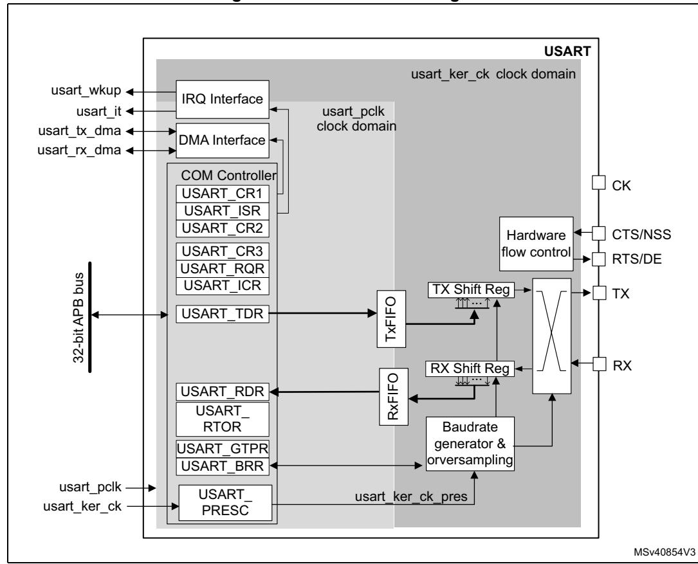

**Figure 613. USART block diagram**

The simplified block diagram given in *[Figure 613](#page-3-0)* shows two fully-independent clock domains:

- The **usart\_pclk** clock domain
  - The **usart\_pclk** clock signal feeds the peripheral bus interface. It must be active when accesses to the USART registers are required.
- The **usart\_ker\_ck** kernel clock domain.
  - The **usart\_ker\_ck** is the USART clock source. It is independent from **usart\_pclk** and delivered by the RCC. The USART registers can consequently be written/read even when the **usart\_ker\_ck** clock is stopped.
  - When the dual clock domain feature is disabled, the **usart\_ker\_ck** clock is the same as the **usart\_pclk** clock.

There is no constraint between **usart\_pclk** and **usart\_ker\_ck**: **usart\_ker\_ck** can be faster or slower than **usart\_pclk**. The only limitation is the software ability to manage the communication fast enough.

When the USART operates in SPI slave mode, it handles data flow using the serial interface clock derived from the external CK signal provided by the external master SPI device. The **usart\_ker\_ck** clock must be at least 3 times faster than the clock on the CK input.

RM0399 Rev 4 2173/3556

## **51.5.2 USART signals**

## **USART bidirectional communications**

USART bidirectional communications require a minimum of two pins: Receive Data In (RX) and Transmit Data Out (TX):

• **RX** (Receive Data Input)

RX is the serial data input. Oversampling techniques are used for data recovery. They discriminate between valid incoming data and noise.

• **TX** (Transmit Data Output)

When the transmitter is disabled, the output pin returns to its I/O port configuration. When the transmitter is enabled and no data needs to be transmitted, the TX pin is High. In Single-wire and Smartcard modes, this I/O is used to transmit and receive data.

## **RS232 Hardware flow control mode**

The following pins are required in RS232 Hardware flow control mode:

• **CTS** (Clear To Send)

When driven high, this signal blocks the data transmission at the end of the current transfer.

• **RTS** (Request To Send)

When it is low, this signal indicates that the USART is ready to receive data.

## **RS485 Hardware control mode**

The following pin is required in RS485 Hardware control mode:

• **DE** (Driver Enable)

This signal activates the transmission mode of the external transceiver.

*Note: DE and RTS share the same pin.*

## **Synchronous master/slave mode and Smartcard mode**

The following pin is required in synchronous master/slave mode and Smartcard mode:

• CK

This pin acts as Clock output in Synchronous master and Smartcard modes.

It acts as Clock input is Synchronous slave mode.

In Synchronous Master mode, this pin outputs the transmitter data clock for synchronous transmission corresponding to SPI master mode (no clock pulses on start bit and stop bit, and a software option to send a clock pulse on the last data bit). In parallel, data can be received synchronously on RX pin. This mechanism can be used to control peripherals featuring shift registers (e.g. LCD drivers). The clock phase and polarity are software programmable.

In Smartcard mode, CK output provides the clock to the smartcard.

• NSS

This pin acts as Slave Select input in Synchronous slave mode.

*Note: NSS and CTS share the same pin.*

## **51.5.3 USART character description**

The word length can be set to 7, 8 or 9 bits, by programming the M bits (M0: bit 12 and M1: bit 28) in the USART\_CR1 register (see *[Figure 614](#page-6-0)*):

- 7-bit character length: M[1:0] = '10'
- 8-bit character length: M[1:0] = '00'
- 9-bit character length: M[1:0] = '01'

*Note: In 7-bit data length mode, the Smartcard mode, LIN master mode and auto baud rate (0x7F and 0x55 frames detection) are not supported.*

> By default, the signal (TX or RX) is in low state during the start bit. It is in high state during the stop bit.

These values can be inverted, separately for each signal, through polarity configuration control.

An *Idle character* is interpreted as an entire frame of "1"s (the number of "1"s includes the number of stop bits).

A *Break character* is interpreted on receiving "0"s for a frame period. At the end of the break frame, the transmitter inserts 2 stop bits.

Transmission and reception are driven by a common baud rate generator. The transmission and reception clock are generated when the enable bit is set for the transmitter and receiver, respectively.

A detailed description of each block is given below.

**Figure 614. Word length programming**

## **51.5.4 USART FIFOs and thresholds**

The USART can operate in FIFO mode.

The USART comes with a Transmit FIFO (TXFIFO) and a Receive FIFO (RXFIFO). The FIFO mode is enabled by setting FIFOEN in USART\_CR1 register (bit 29). This mode is supported only in UART, SPI and Smartcard modes.

Since the maximum data word length is 9 bits, the TXFIFO is 9-bit wide. However the RXFIFO default width is 12 bits. This is due to the fact that the receiver does not only store the data in the FIFO, but also the error flags associated to each character (Parity error, Noise error and Framing error flags).

*Note: The received data is stored in the RXFIFO together with the corresponding flags. However, only the data are read when reading the RDR.*

*The status flags are available in the USART\_ISR register.*

It is possible to configure the TXFIFO and RXFIFO levels at which the Tx and RX interrupts are triggered. These thresholds are programmed through RXFTCFG and TXFTCFG bitfields in USART\_CR3 control register.

In this case:

- The RXFT flag is set in the USART\_ISR register and the corresponding interrupt (if enabled) is generated, when the number of received data in the RXFIFO reaches the threshold programmed in the RXFTCFG bits fields.
  - This means that the RXFIFO is filled until the number of data in the RXFIFO is equal to the programmed threshold.
  - RXFTCFG data have been received: one data in USART\_RDR and (RXFTCFG 1) data in the RXFIFO. As an example, when the RXFTCFG is programmed to '101', the RXFT flag is set when a number of data corresponding to the FIFO size has been received (FIFO size -1 data in the RXFIFO and 1 data in the USART\_RDR). As a result, the next received data is not set the overrun flag.
- The TXFT flag is set in the USART\_ISR register and the corresponding interrupt (if enabled) is generated when the number of empty locations in the TXFIFO reaches the threshold programmed in the TXFTCFG bits fields.
  - This means that the TXFIFO is emptied until the number of empty locations in the TXFIFO is equal to the programmed threshold.

## **51.5.5 USART transmitter**

The transmitter can send data words of either 7 or 8 or 9 bits, depending on the M bit status. The Transmit Enable bit (TE) must be set in order to activate the transmitter function. The data in the transmit shift register is output on the TX pin while the corresponding clock pulses are output on the CK pin.

## **Character transmission**

During an USART transmission, data shifts out the least significant bit first (default configuration) on the TX pin. In this mode, the USART\_TDR register consists of a buffer (TDR) between the internal bus and the transmit shift register.

When FIFO mode is enabled, the data written to the transmit data register (USART\_TDR) are queued in the TXFIFO.

RM0399 Rev 4 2177/3556

Every character is preceded by a start bit which corresponds to a low logic level for one bit period. The character is terminated by a configurable number of stop bits.

The number of stop bits can be configured to 0.5, 1, 1.5 or 2.

Note: The TE bit must be set before writing the data to be transmitted to the USART\_TDR.

The TE bit should not be reset during data transmission. Resetting the TE bit during the transmission corrupts the data on the TX pin as the baud rate counters get frozen. The current data being transmitted are then lost.

An idle frame is sent when the TE bit is enabled.

### Configurable stop bits

The number of stop bits to be transmitted with every character can be programmed in USART\_CR2, bits 13,12.

- 1 stop bit: This is the default value of number of stop bits.
- 2 stop bits: This is supported by normal USART, Single-wire and Modem modes.
- 1.5 stop bits: To be used in Smartcard mode.

An idle frame transmission includes the stop bits.

A break transmission features 10 low bits (when M[1:0] = '00') or 11 low bits (when M[1:0] = '01') or 9 low bits (when M[1:0] = '10') followed by 2 stop bits (see *Figure 615*). It is not possible to transmit long breaks (break of length greater than 9/10/11 low bits).

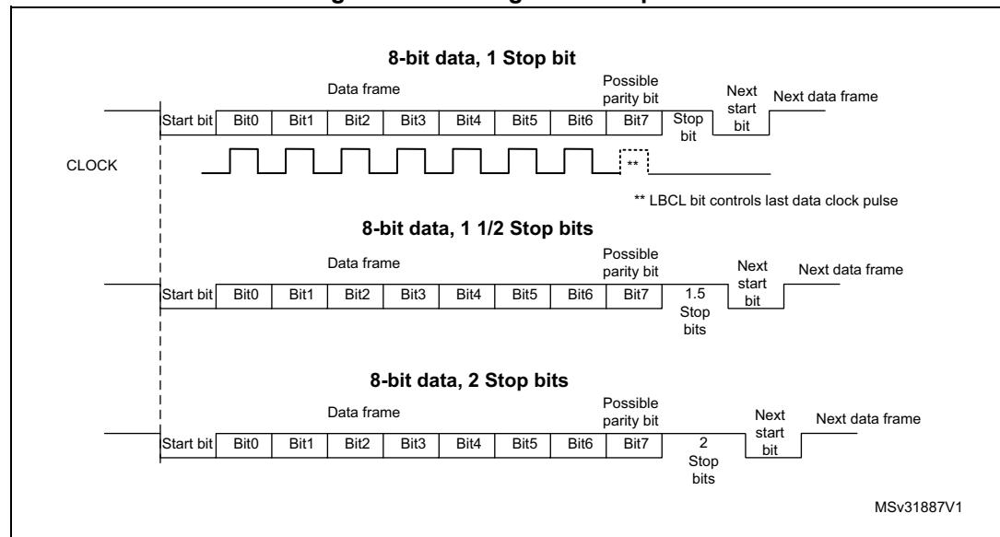

Figure 615. Configurable stop bits

## **Character transmission procedure**

To transmit a character, follow the sequence below:

- 1. Program the M bits in USART\_CR1 to define the word length.
- 2. Select the desired baud rate using the USART\_BRR register.
- 3. Program the number of stop bits in USART\_CR2.
- 4. Enable the USART by writing the UE bit in USART\_CR1 register to 1.
- 5. Select DMA enable (DMAT) in USART\_CR3 if multibuffer communication must take place. Configure the DMA register as explained in *Section [51.5.19: Continuous](#page-41-0)  [communication using USART and DMA](#page-41-0)*.
- 6. Set the TE bit in USART\_CR1 to send an idle frame as first transmission.
- 7. Write the data to send in the USART\_TDR register. Repeat this for each data to be transmitted in case of single buffer.
  - When FIFO mode is disabled, writing a data to the USART\_TDR clears the TXE flag.
  - When FIFO mode is enabled, writing a data to the USART\_TDR adds one data to the TXFIFO. Write operations to the USART\_TDR are performed when TXFNF flag is set. This flag remains set until the TXFIFO is full.
- 8. When the last data is written to the USART\_TDR register, wait until TC = 1.
  - When FIFO mode is disabled, this indicates that the transmission of the last frame is complete.
  - When FIFO mode is enabled, this indicates that both TXFIFO and shift register are empty.

This check is required to avoid corrupting the last transmission when the USART is disabled or enters Halt mode.

## **Single byte communication**

• When FIFO mode is disabled

Writing to the transmit data register always clears the TXE bit. The TXE flag is set by hardware. It indicates that:

- the data have been moved from the USART\_TDR register to the shift register and the data transmission has started;
- the USART\_TDR register is empty;
- the next data can be written to the USART\_TDR register without overwriting the previous data.

This flag generates an interrupt if the TXEIE bit is set.

When a transmission is ongoing, a write instruction to the USART\_TDR register stores the data in the TDR buffer. It is then copied in the shift register at the end of the current transmission.

When no transmission is ongoing, a write instruction to the USART\_TDR register places the data in the shift register, the data transmission starts, and the TXE bit is set.

- When FIFO mode is enabled, the TXFNF (TXFIFO not full) flag is set by hardware to indicate that:
  - the TXFIFO is not full;
  - the USART\_TDR register is empty;
  - the next data can be written to the USART\_TDR register without overwriting the previous data. When a transmission is ongoing, a write operation to the USART\_TDR register stores the data in the TXFIFO. Data are copied from the TXFIFO to the shift register at the end of the current transmission.

When the TXFIFO is not full, the TXFNF flag stays at '1' even after a write operation to USART\_TDR register. It is cleared when the TXFIFO is full. This flag generates an interrupt if the TXFNFIE bit is set.

Alternatively, interrupts can be generated and data can be written to the FIFO when the TXFIFO threshold is reached. In this case, the CPU can write a block of data defined by the programmed trigger level.

If a frame is transmitted (after the stop bit) and the TXE flag (TXFE in case of FIFO mode) is set, the TC flag goes high. An interrupt is generated if the TCIE bit is set in the USART\_CR1 register.

After writing the last data to the USART\_TDR register, it is mandatory to wait until TC is set before disabling the USART or causing the device to enter the low-power mode (see *[Figure 616: TC/TXE behavior when transmitting](#page-11-0)*).

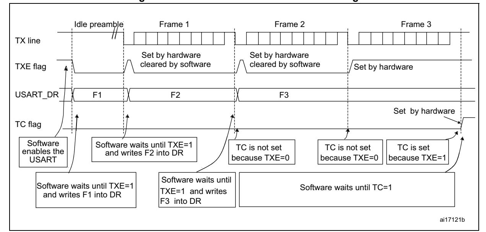

Figure 616. TC/TXE behavior when transmitting

Note: When FIFO management is enabled, the TXFNF flag is used for data transmission.

## **Break characters**

Setting the SBKRQ bit transmits a break character. The break frame length depends on the M bit (see *Figure 614*).

If a '1' is written to the SBKRQ bit, a break character is sent on the TX line after completing the current character transmission. The SBKF bit is set by the write operation and it is reset by hardware when the break character is completed (during the stop bits after the break character). The USART inserts a logic 1 signal (stop) for the duration of 2 bits at the end of the break frame to guarantee the recognition of the start bit of the next frame.

When the SBKRQ bit is set, the break character is sent at the end of the current transmission.

When FIFO mode is enabled, sending the break character has priority on sending data even if the TXFIFO is full.

### Idle characters

Setting the TE bit drives the USART to send an idle frame before the first data frame.

### 51.5.6 USART receiver

The USART can receive data words of either 7 or 8 or 9 bits depending on the M bits in the USART CR1 register.

## Start bit detection

The start bit detection sequence is the same when oversampling by 16 or by 8.

In the USART, the start bit is detected when a specific sequence of samples is recognized. This sequence is: 1 1 1 0 X 0 X 0X 0X 0 X 0X 0.

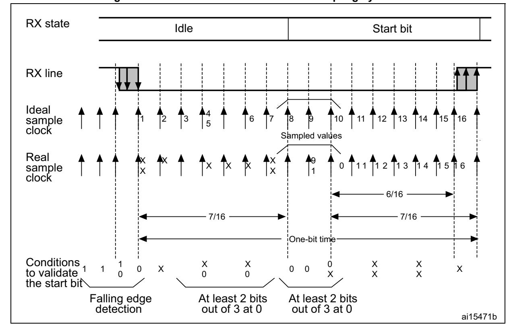

Figure 617. Start bit detection when oversampling by 16 or 8

Note: If the sequence is not complete, the start bit detection aborts and the receiver returns to the idle state (no flag is set), where it waits for a falling edge.

The start bit is confirmed (RXNE flag set and interrupt generated if RXNEIE = 1, or RXFNE flag set and interrupt generated if RXFNEIE = 1 if FIFO mode enabled) if the 3 sampled bits are at '0' (first sampling on the 3rd, 5th and 7th bits finds the 3 bits at '0' and second sampling on the 8th, 9th and 10th bits also finds the 3 bits at '0').

The start bit is validated but the NE noise flag is set if,

a) for both samplings, 2 out of the 3 sampled bits are at '0' (sampling on the 3rd, 5th and 7th bits and sampling on the 8th, 9th and 10th bits)

or

b) for one of the samplings (sampling on the 3rd, 5th and 7th bits or sampling on the 8th, 9th and 10th bits), 2 out of the 3 bits are found at '0'.

If neither of the above conditions are met, the start detection aborts and the receiver returns to the idle state (no flag is set).

**LY/** 

## **Character reception**

During an USART reception, data are shifted out least significant bit first (default configuration) through the RX pin.

## **Character reception procedure**

To receive a character, follow the sequence below:

- 1. Program the M bits in USART\_CR1 to define the word length.
- 2. Select the desired baud rate using the baud rate register USART\_BRR
- 3. Program the number of stop bits in USART\_CR2.
- 4. Enable the USART by writing the UE bit in USART\_CR1 register to '1'.
- 5. Select DMA enable (DMAR) in USART\_CR3 if multibuffer communication is to take place. Configure the DMA register as explained in *Section [51.5.19: Continuous](#page-41-0)  [communication using USART and DMA](#page-41-0)*.
- 6. Set the RE bit USART\_CR1. This enables the receiver which begins searching for a start bit.

## When a character is received:

- When FIFO mode is disabled, the RXNE bit is set to indicate that the content of the shift register is transferred to the RDR. In other words, data have been received and can be read (as well as their associated error flags).
- When FIFO mode is enabled, the RXFNE bit is set to indicate that the RXFIFO is not empty. Reading the USART\_RDR returns the oldest data entered in the RXFIFO. When a data is received, it is stored in the RXFIFO together with the corresponding error bits.
- An interrupt is generated if the RXNEIE (RXFNEIE when FIFO mode is enabled) bit is set.
- The error flags can be set if a frame error, noise, parity or an overrun error was detected during reception.
- In multibuffer communication mode:
  - When FIFO mode is disabled, the RXNE flag is set after every byte reception. It is cleared when the DMA reads the Receive data Register.
  - When FIFO mode is enabled, the RXFNE flag is set when the RXFIFO is not empty. After every DMA request, a data is retrieved from the RXFIFO. A DMA request is triggered when the RXFIFO is not empty i.e. when there are data to be read from the RXFIFO.
- In single buffer mode:
  - When FIFO mode is disabled, clearing the RXNE flag is done by performing a software read from the USART\_RDR register. The RXNE flag can also be cleared by programming RXFRQ bit to '1' in the USART\_RQR register. The RXNE flag must be cleared before the end of the reception of the next character to avoid an overrun error.
  - When FIFO mode is enabled, the RXFNE is set when the RXFIFO is not empty. After every read operation from USART\_RDR, a data is retrieved from the RXFIFO. When the RXFIFO is empty, the RXFNE flag is cleared. The RXFNE flag can also be cleared by programming RXFRQ bit to '1' in USART\_RQR. When the RXFIFO is full, the first entry in the RXFIFO must be read before the end of the reception of the next character, to avoid an overrun error. The RXFNE flag generates an interrupt if the RXFNEIE bit is set. Alternatively, interrupts can be

RM0399 Rev 4 2183/3556

generated and data can be read from RXFIFO when the RXFIFO threshold is reached. In this case, the CPU can read a block of data defined by the programmed threshold.

## **Break character**

When a break character is received, the USART handles it as a framing error.

## **Idle character**

When an idle frame is detected, it is handled in the same way as a data character reception except that an interrupt is generated if the IDLEIE bit is set.

## **Overrun error**

• FIFO mode disabled

An overrun error occurs if a character is received and RXNE has not been reset. Data can not be transferred from the shift register to the RDR register until the RXNE bit is cleared. The RXN E flag is set after every byte reception.

An overrun error occurs if RXNE flag is set when the next data is received or the previous DMA request has not been serviced. When an overrun error occurs:

- the ORE bit is set;
- the RDR content is not lost. The previous data is available by reading the USART\_RDR register.
- the shift register is overwritten. After that, any data received during overrun is lost.
- an interrupt is generated if either the RXNEIE or the EIE bit is set.
- FIFO mode enabled

An overrun error occurs when the shift register is ready to be transferred and the receive FIFO is full.

Data can not be transferred from the shift register to the USART\_RDR register until there is one free location in the RXFIFO. The RXFNE flag is set when the RXFIFO is not empty.

An overrun error occurs if the RXFIFO is full and the shift register is ready to be transferred. When an overrun error occurs:

- The ORE bit is set.
- The first entry in the RXFIFO is not lost. It is available by reading the USART\_RDR register.
- The shift register is overwritten. After that point, any data received during overrun is lost.
- An interrupt is generated if either the RXFNEIE or EIE bit is set.

The ORE bit is reset by setting the ORECF bit in the USART\_ICR register.

*Note: The ORE bit, when set, indicates that at least 1 data has been lost.* 

*When the FIFO mode is disabled, there are two possibilities*

- • *if RXNE = 1, then the last valid data is stored in the receive register (RDR) and can be read,*
- • *if RXNE = 0, the last valid data has already been read and there is nothing left to be read in the RDR register. This case can occur when the last valid data is read in the RDR register at the same time as the new (and lost) data is received.*

## Selecting the clock source and the appropriate oversampling method

The choice of the clock source is done through the Clock Control system (see Section *Reset and clock control (RCC)*). The clock source must be selected through the UE bit before enabling the USART.

The clock source must be selected according to two criteria:

- Possible use of the USART in low-power mode
- Communication speed.

The clock source frequency is usart ker ck.

When the dual clock domain and the wake-up from low-power mode features are supported, the usart\_ker\_ck clock source can be configurable in the RCC (see Section *Reset and clock control (RCC)*). Otherwise the usart ker ck clock is the same as usart pclk.

The usart\_ker\_ck clock can be divided by a programmable factor, defined in the USART PRESC register.

Figure 618. usart\_ker\_ck clock divider block diagram

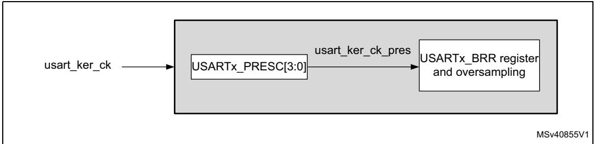

Some usart\_ker\_ck sources enable the USART to receive data while the MCU is in low-power mode. Depending on the received data and wake-up mode selected, the USART wakes up the MCU, when needed, in order to transfer the received data, by performing a software read to the USART RDR register or by DMA.

For the other clock sources, the system must be active to enable USART communications.

The communication speed range (specially the maximum communication speed) is also determined by the clock source.

The receiver implements different user-configurable oversampling techniques (except in synchronous mode) for data recovery by discriminating between valid incoming data and noise. This enables obtaining the best a trade-off between the maximum communication speed and noise/clock inaccuracy immunity.

The oversampling method can be selected by programming the OVER8 bit in the USART\_CR1 register either to 16 or 8 times the baud rate clock (see *Figure 619* and *Figure 620*).

Depending on your application:

- select oversampling by 8 (OVER8 = 1) to achieve higher speed (up to usart\_ker\_ck\_pres/8). In this case the maximum receiver tolerance to clock deviation is reduced (refer to Section 51.5.8: Tolerance of the USART receiver to clock deviation on page 2189)
- select oversampling by 16 (OVER8 = 0) to increase the tolerance of the receiver to clock deviations. In this case, the maximum speed is limited to maximum

RM0399 Rev 4 2185/3556

usart\_ker\_ck\_pres/16 (where usart\_ker\_ck\_pres is the USART input clock divided by a prescaler).

Programming the ONEBIT bit in the USART\_CR3 register selects the method used to evaluate the logic level. Two options are available:

- The majority vote of the three samples in the center of the received bit. In this case, when the 3 samples used for the majority vote are not equal, the NE bit is set.
- A single sample in the center of the received bit Depending on your application:
  - select the three sample majority vote method (ONEBIT *=* 0) when operating in a noisy environment and reject the data when a noise is detected (refer to *[Figure 420](#page-17-1)*) because this indicates that a glitch occurred during the sampling.
  - select the single sample method (ONEBIT *=* 1) when the line is noise-free to increase the receiver tolerance to clock deviations (see *[Section 51.5.8: Tolerance](#page-19-0)  [of the USART receiver to clock deviation on page 2189](#page-19-0)*). In this case the NE bit is never set.

When noise is detected in a frame:

- The NE bit is set at the rising edge of the RXNE bit (RXFNE in case of FIFO mode enabled).
- The invalid data is transferred from the Shift register to the USART\_RDR register.
- No interrupt is generated in case of single byte communication. However this bit rises at the same time as the RXNE bit (RXFNE in case of FIFO mode enabled) which itself generates an interrupt. In case of multibuffer communication an interrupt is issued if the EIE bit is set in the USART\_CR3 register.

The NE bit is reset by setting NECF bit in USART\_ICR register.

*Note: Noise error is not supported in SPI mode.*

*Oversampling by 8 is not available in the Smartcard, IrDA and LIN modes. In those modes, the OVER8 bit is forced to '0 ' by hardware.*

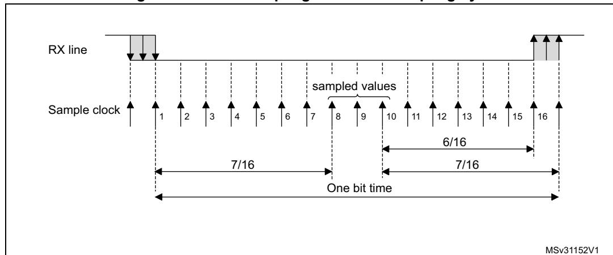

**Figure 619. Data sampling when oversampling by 16**

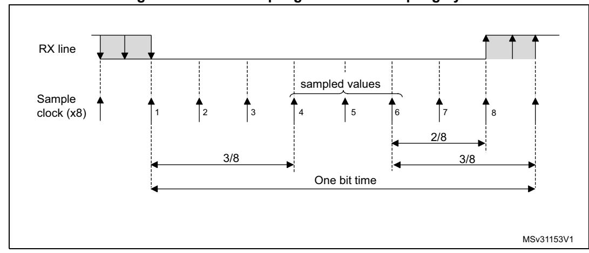

**Figure 620. Data sampling when oversampling by 8**

**Table 420. Noise detection from sampled data** 

| Sampled value | NE status | Received bit value |
|---------------|-----------|--------------------|
| 000           | 0         | 0                  |
| 001           | 1         | 0                  |
| 010           | 1         | 0                  |
| 011           | 1         | 1                  |
| 100           | 1         | 0                  |
| 101           | 1         | 1                  |
| 110           | 1         | 1                  |
| 111           | 0         | 1                  |

## **Framing error**

A framing error is detected when the stop bit is not recognized on reception at the expected time, following either a de-synchronization or excessive noise.

When the framing error is detected:

- the FE bit is set by hardware;
- the invalid data is transferred from the Shift register to the USART\_RDR register (RXFIFO in case FIFO mode is enabled).
- no interrupt is generated in case of single byte communication. However this bit rises at the same time as the RXNE bit (RXFNE in case FIFO mode is enabled) which itself generates an interrupt. In case of multibuffer communication an interrupt is issued if the EIE bit is set in the USART\_CR3 register.

The FE bit is reset by writing '1' to the FECF in the USART\_ICR register.

*Note: Framing error is not supported in SPI mode.*

## **Configurable stop bits during reception**

The number of stop bits to be received can be configured through the control bits of USART\_CR: it can be either 1 or 2 in normal mode and 0.5 or 1.5 in Smartcard mode.

- **0.5 stop bit (reception in Smartcard mode)**: no sampling is done for 0.5 stop bit. As a consequence, no framing error and no break frame can be detected when 0.5 stop bit is selected.
- **1 stop bit**: sampling for 1 stop bit is done on the 8th, 9th and 10th samples.
- 1.5 stop bits (Smartcard mode)

When transmitting in Smartcard mode, the device must check that the data are correctly sent. The receiver block must consequently be enabled (RE = 1 in USART\_CR1) and the stop bit is checked to test if the Smartcard has detected a parity error.

In the event of a parity error, the Smartcard forces the data signal low during the sampling (NACK signal), which is flagged as a framing error. The FE flag is then set through RXNE flag (RXFNE if the FIFO mode is enabled) at the end of the 1.5 stop bit. Sampling for 1.5 stop bits is done on the 16th, 17th and 18th samples (1 baud clock period after the beginning of the stop bit). The 1.5 stop bit can be broken into 2 parts: one 0.5 baud clock period during which nothing happens, followed by 1 normal stop bit period during which sampling occurs halfway through (refer to *[Section 51.5.16: USART](#page-33-0)  [receiver timeout on page 2203](#page-33-0)* for more details).

• 2 stop bits

Sampling for 2 stop bits is done on the 8th, 9th and 10th samples of the first stop bit. The framing error flag is set if a framing error is detected during the first stop bit. The second stop bit is not checked for framing error. The RXNE flag (RXFNE if the FIFO mode is enabled) is set at the end of the first stop bit.

## **51.5.7 USART baud rate generation**

The baud rate for the receiver and transmitter (Rx and Tx) are both set to the value programmed in the USART\_BRR register.

**Equation 1: baud rate for standard USART (SPI mode included) (OVER8 = '0' or '1')**

In case of oversampling by 16, the baud rate is given by the following formula:

$$Tx/Rx baud = \frac{usart\_ker\_ckpres}{USARTDIV}$$

In case of oversampling by 8, the baud rate is given by the following formula:

$$Tx/Rx baud = \frac{2 \times usart\_ker\_ckpres}{USARTDIV}$$

**Equation 2: baud rate in Smartcard, LIN and IrDA modes (OVER8 = 0)**

The baud rate is given by the following formula:

$$Tx/Rx baud = \frac{usart\_ker\_ckpres}{USARTDIV}$$

USARTDIV is an unsigned fixed point number that is coded on the USART\_BRR register.

- When OVER8 = 0, BRR = USARTDIV.
- When OVER8 = 1
  - BRR[2:0] = USARTDIV[3:0] shifted 1 bit to the right.
  - BRR[3] must be kept cleared.
  - BRR[15:4] = USARTDIV[15:4]

*Note: The baud counters are updated to the new value in the baud registers after a write operation to USART\_BRR. Hence the baud rate register value should not be changed during communication.*

*In case of oversampling by 16 and 8, USARTDIV must be greater than or equal to 16.* 

## **How to derive USARTDIV from USART\_BRR register values**

## **Example 1**

To obtain 9600 baud with usart\_ker\_ck\_pres = 8 MHz:

• In case of oversampling by 16:

USARTDIV = 8 000 000/9600

BRR = USARTDIV = 0d833 = 0x0341

• In case of oversampling by 8:

USARTDIV = 2 \* 8 000 000/9600

USARTDIV = 1666,66 (0d1667 = 0x683)

BRR[3:0] = 0x3 >> 1 = 0x1

BRR = 0x681

## **Example 2**

To obtain 921.6 Kbaud with usart\_ker\_ck\_pres = 48 MHz:

• In case of oversampling by 16:

USARTDIV = 48 000 000/921 600

BRR = USARTDIV = 0d52 = 0x34

• In case of oversampling by 8:

USARTDIV = 2 \* 48 000 000/921 600

USARTDIV = 104 (0d104 = 0x68)

BRR[3:0] = USARTDIV[3:0] >> 1 = 0x8 >> 1 = 0x4

BRR = 0x64

# **51.5.8 Tolerance of the USART receiver to clock deviation**

The USART asynchronous receiver operates correctly only if the total clock system deviation is less than the tolerance of the USART receiver.

The causes which contribute to the total deviation are:

- DTRA: deviation due to the transmitter error (which also includes the deviation of the transmitter's local oscillator)
- DQUANT: error due to the baud rate quantization of the receiver
- DREC: deviation of the receiver local oscillator
- DTCL: deviation due to the transmission line (generally due to the transceivers which can introduce an asymmetry between the low-to-high transition timing and the high-tolow transition timing)

#### where

DWU is the error due to sampling point deviation when the wake-up from low-power mode is used.

when M[1:0] = 01:

$$DWU = \frac{t_{WUUSART}}{11 \times Tbit}$$

when M[1:0] = 00:

$$DWU = \frac{t_{WUUSART}}{10 \times Tbit}$$

when M[1:0] = 10:

$$DWU = \frac{t_{WUUSART}}{9 \times Tbit}$$

tWUUSART is the time between the detection of the start bit falling edge and the instant when the clock (requested by the peripheral) is ready and reaching the peripheral, and the regulator is ready.

The USART receiver can receive data correctly at up to the maximum tolerated deviation specified in *Table 421*, *Table 422*, depending on the following settings:

- 9-, 10- or 11-bit character length defined by the M bits in the USART\_CR1 register
- Oversampling by 8 or 16 defined by the OVER8 bit in the USART\_CR1 register
- Bits BRR[3:0] of USART BRR register are equal to or different from 0000.
- Use of 1 bit or 3 bits to sample the data, depending on the value of the ONEBIT bit in the USART\_CR3 register.

Table 421. Tolerance of the USART receiver when BRR [3:0] = 0000

| M bits   | OVER8 bit = 0 |            | OVER8 bit = 1 |            |  |
|----------|---------------|------------|---------------|------------|--|
| IVI DILS | ONEBIT = 0    | ONEBIT = 1 | ONEBIT = 0    | ONEBIT = 1 |  |
| 00       | 3.75%         | 4.375%     | 2.50%         | 3.75%      |  |
| 01       | 3.41%         | 3.97%      | 2.27%         | 3.41%      |  |
| 10       | 4.16%         | 4.86%      | 2.77%         | 4.16%      |  |

**M bits OVER8 bit = 0 OVER8 bit = 1 ONEBIT = 0 ONEBIT = 1 ONEBIT = 0 ONEBIT = 1** 00 3.33% 3.88% 2% 3% 01 3.03% 3.53% 1.82% 2.73% 10 3.7% 4.31% 2.22% 3.33%

**Table 422. Tolerance of the USART receiver when BRR[3:0] is different from 0000**

*Note: The data specified in [Table](#page-20-0) 421* and *[Table](#page-21-0) 422 may slightly differ in the special case when the received frames contain some Idle frames of exactly 10-bit times when M bits = 00 (11 bit times when M = 01 or 9- bit times when M = 10).*

## **51.5.9 USART auto baud rate detection**

The USART can detect and automatically set the USART\_BRR register value based on the reception of one character. Automatic baud rate detection is useful under two circumstances:

- The communication speed of the system is not known in advance.
- The system is using a relatively low accuracy clock source and this mechanism enables the correct baud rate to be obtained without measuring the clock deviation.

The clock source frequency must be compatible with the expected communication speed.

- When oversampling by 16, the baud rate ranges from usart\_ker\_ck\_pres/65535 and usart\_ker\_ck\_pres/16.
- When oversampling by 8, the baud rate ranges from usart\_ker\_ck\_pres/65535 and usart\_ker\_ck\_pres/8.

Before activating the auto baud rate detection, the auto baud rate detection mode must be selected through the ABRMOD[1:0] field in the USART\_CR2 register. There are four modes based on different character patterns. In these auto baud rate modes, the baud rate is measured several times during the synchronization data reception and each measurement is compared to the previous one.

These modes are the following:

- **Mode 0**: Any character starting with a bit at '1'. In this case the USART measures the duration of the start bit (falling edge to rising edge).
- **Mode 1:** Any character starting with a 10xx bit pattern. In this case, the USART measures the duration of the Start and of the 1st data bit. The measurement is done falling edge to falling edge, to ensure a better accuracy in the case of slow signal slopes.
- **Mode 2**: A 0x7F character frame (it may be a 0x7F character in LSB first mode or a 0xFE in MSB first mode).

In this case, the baud rate is updated first at the end of the start bit (BRs), then at the end of bit 6 (based on the measurement done from falling edge to falling edge: BR6). Bit0 to bit6 are sampled at BRs while further bits of the character are sampled at BR6.

• **Mode 3**: A 0x55 character frame.

In this case, the baud rate is updated first at the end of the start bit (BRs), then at the end of bit0 (based on the measurement done from falling edge to falling edge: BR0), and finally at the end of bit6 (BR6). Bit 0 is sampled at BRs, bit 1 to bit 6 are sampled at BR0, and further bits of the character are sampled at BR6. In parallel, another check is performed for each intermediate RX line transition. An error is generated if the transitions on RX are not sufficiently synchronized with the receiver (the receiver being based on the baud rate calculated on bit 0).

Prior to activating the auto baud rate detection, the USART\_BRR register must be initialized by writing a non-zero baud rate value.

The automatic baud rate detection is activated by setting the ABREN bit in the USART\_CR2 register. The USART then waits for the first character on the RX line. The auto baud rate operation completion is indicated by the setting of the ABRF flag in the USART\_ISR register. If the line is noisy, the correct baud rate detection cannot be guaranteed. In this case the BRR value may be corrupted and the ABRE error flag is set. This also happens if the communication speed is not compatible with the automatic baud rate detection range (bit duration not between 16 and 65536 clock periods (oversampling by 16) and not between 8 and 65536 clock periods (oversampling by 8)).

The auto baud rate detection can be re-launched later by resetting the ABRF flag (by writing a '0').

When FIFO management is disabled and an auto baud rate error occurs, the ABRE flag is set through RXNE and FE bits.

When FIFO management is enabled and an auto baud rate error occurs, the ABRE flag is set through RXFNE and FE bits.

If the FIFO mode is enabled, the auto baud rate detection should be made using the data on the first RXFIFO location. So, prior to launching the auto baud rate detection, make sure that the RXFIFO is empty by checking the RXFNE flag in USART\_ISR register.

*Note: The BRR value might be corrupted if the USART is disabled (UE = 0) during an auto baud rate operation.*

## **51.5.10 USART multiprocessor communication**

It is possible to perform USART multiprocessor communications (with several USARTs connected in a network). For instance one of the USARTs can be the master with its TX output connected to the RX inputs of the other USARTs, while the others are slaves with their respective TX outputs logically ANDed together and connected to the RX input of the master.

In multiprocessor configurations, it is often desirable that only the intended message recipient actively receives the full message contents, thus reducing redundant USART service overhead for all non addressed receivers.

The non-addressed devices can be placed in Mute mode by means of the muting function. To use the Mute mode feature, the MME bit must be set in the USART\_CR1 register.

*Note: When FIFO management is enabled and MME is already set, MME bit must not be cleared and then set again quickly (within two usart\_ker\_ck cycles), otherwise Mute mode might remain active.*

When the Mute mode is enabled:

- none of the reception status bits can be set;
- all the receive interrupts are inhibited;
- the RWU bit in USART\_ISR register is set to '1'. RWU can be controlled automatically by hardware or by software, through the MMRQ bit in the USART\_RQR register, under certain conditions.

The USART can enter or exit from Mute mode using one of two methods, depending on the WAKE bit in the USART\_CR1 register:

- Idle Line detection if the WAKE bit is reset,
- Address Mark detection if the WAKE bit is set.

## **Idle line detection (WAKE = 0)**

The USART enters Mute mode when the MMRQ bit is written to '1' and the RWU is automatically set.

The USART wakes up when an Idle frame is detected. The RWU bit is then cleared by hardware but the IDLE bit is not set in the USART\_ISR register. An example of Mute mode behavior using Idle line detection is given in *[Figure 621](#page-24-0)*.

RM0399 Rev 4 2193/3556

**Figure 621. Mute mode using Idle line detection**

*Note: If the MMRQ is set while the IDLE character has already elapsed, Mute mode is not entered (RWU is not set).*

> *If the USART is activated while the line is IDLE, the idle state is detected after the duration of one IDLE frame (not only after the reception of one character frame).*

## **4-bit/7-bit address mark detection (WAKE = 1)**

In this mode, bytes are recognized as addresses if their MSB is a '1', otherwise they are considered as data. In an address byte, the address of the targeted receiver is put in the 4 or 7 LSBs. The choice of 7 or 4 bit address detection is done using the ADDM7 bit. This 4 bit/7-bit word is compared by the receiver with its own address which is programmed in the ADD bits in the USART\_CR2 register.

*Note: In 7-bit and 9-bit data modes, address detection is done on 6-bit and 8-bit addresses (ADD[5:0] and ADD[7:0]) respectively.*

> The USART enters Mute mode when an address character is received which does not match its programmed address. In this case, the RWU bit is set by hardware. The RXNE flag is not set for this address byte and no interrupt or DMA request is issued when the USART enters Mute mode. When FIFO management is enabled, the software should ensure that there is at least one empty location in the RXFIFO before entering Mute mode.

The USART also enters Mute mode when the MMRQ bit is written to 1. The RWU bit is also automatically set in this case.

The USART exits from Mute mode when an address character is received which matches the programmed address. Then the RWU bit is cleared and subsequent bytes are received normally. The RXNE/RXFNE bit is set for the address character since the RWU bit has been cleared.

*Note: When FIFO management is enabled, when MMRQ is set while the receiver is sampling last bit of a data, this data may be received before effectively entering in Mute mode* 

An example of Mute mode behavior using address mark detection is given in *[Figure 622](#page-25-0)*.

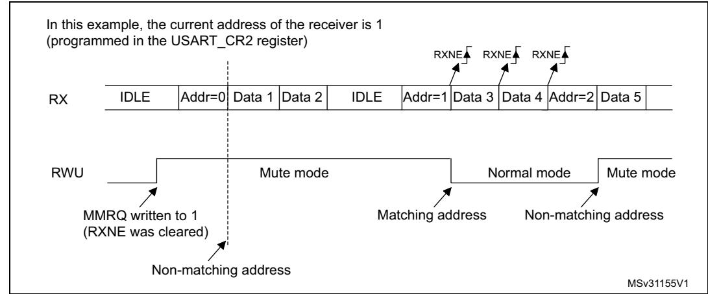

**Figure 622. Mute mode using address mark detection**

## **51.5.11 USART Modbus communication**

The USART offers basic support for the implementation of Modbus/RTU and Modbus/ASCII protocols. Modbus/RTU is a Half-duplex, block-transfer protocol. The control part of the protocol (address recognition, block integrity control and command interpretation) must be implemented in software.

The USART offers basic support for the end of the block detection, without software overhead or other resources.

## **Modbus/RTU**

In this mode, the end of one block is recognized by a "silence" (idle line) for more than 2 character times. This function is implemented through the programmable timeout function.

The timeout function and interrupt must be activated, through the RTOEN bit in the USART\_CR2 register and the RTOIE in the USART\_CR1 register. The value corresponding to a timeout of 2 character times (for example 22 x bit time) must be programmed in the RTO register. When the receive line is idle for this duration, after the last stop bit is received, an interrupt is generated, informing the software that the current block reception is completed.

# **Modbus/ASCII**

In this mode, the end of a block is recognized by a specific (CR/LF) character sequence. The USART manages this mechanism using the character match function.

By programming the LF ASCII code in the ADD[7:0] field and by activating the character match interrupt (CMIE *=* 1), the software is informed when a LF has been received and can check the CR/LF in the DMA buffer.

## **51.5.12 USART parity control**

Parity control (generation of parity bit in transmission and parity checking in reception) can be enabled by setting the PCE bit in the USART\_CR1 register. Depending on the frame length defined by the M bits, the possible USART frame formats are as listed in *[Table 423](#page-26-0)*.

| M bits | PCE bit | USART frame(1)             |  |
|--------|---------|----------------------------|--|
| 00     | 0       | SB   8 bit data   STB      |  |
| 00     | 1       | SB   7-bit data   PB   STB |  |
| 01     | 0       | SB   9-bit data   STB      |  |
| 01     | 1       | SB   8-bit data PB   STB   |  |
| 10     | 0       | SB   7bit data   STB       |  |
| 10     | 1       | SB   6-bit data   PB   STB |  |

**Table 423. USART frame formats**

## **Even parity**

The parity bit is calculated to obtain an even number of "1s" inside the frame of the 6, 7 or 8 LSB bits (depending on M bit values) and the parity bit.

As an example, if data *=* 00110101 and 4 bits are set, the parity bit is equal to 0 if even parity is selected (PS bit in USART\_CR1 = 0).

## **Odd parity**

The parity bit is calculated to obtain an odd number of "1s" inside the frame made of the 6, 7 or 8 LSB bits (depending on M bit values) and the parity bit.

As an example, if data *=* 00110101 and 4 bits set, then the parity bit is equal to 1 if odd parity is selected (PS bit in USART\_CR1 = 1).

## **Parity checking in reception**

If the parity check fails, the PE flag is set in the USART\_ISR register and an interrupt is generated if PEIE is set in the USART\_CR1 register. The PE flag is cleared by software writing 1 to the PECF in the USART\_ICR register.

## **Parity generation in transmission**

If the PCE bit is set in USART\_CR1, then the MSB bit of the data written in the data register is transmitted but is changed by the parity bit (even number of "1s" if even parity is selected (PS *=* 0) or an odd number of "1s" if odd parity is selected (PS=1).

1. Legends: SB: start bit, STB: stop bit, PB: parity bit. In the data register, the PB is always taking the MSB position (8th or 7th, depending on the M bit value).

## **51.5.13 USART LIN (local interconnection network) mode**

This section is relevant only when LIN mode is supported. Refer to *[Section 51.4: USART](#page-2-0)  [implementation on page 2172](#page-2-0)*.

The LIN mode is selected by setting the LINEN bit in the USART\_CR2 register. In LIN mode, the following bits must be kept cleared:

- CLKEN in the USART\_CR2 register,
- STOP[1:0], SCEN, HDSEL and IREN in the USART\_CR3 register.

## **LIN transmission**

The procedure described in *[Section 51.5.4](#page-7-0)* has to be applied for LIN Master transmission. It must be the same as for normal USART transmission with the following differences:

- Clear the M bit to configure 8-bit word length.
- Set the LINEN bit to enter LIN mode. In this case, setting the SBKRQ bit sends 13 '0 bits as a break character. Then two bits of value '1 are sent to enable the next start detection.

## **LIN reception**

When LIN mode is enabled, the break detection circuit is activated. The detection is totally independent from the normal USART receiver. A break can be detected whenever it occurs, during Idle state or during a frame.

When the receiver is enabled (RE *=* 1 in USART\_CR1), the circuit looks at the RX input for a start signal. The method for detecting start bits is the same when searching break characters or data. After a start bit has been detected, the circuit samples the next bits exactly like for the data (on the 8th, 9th and 10th samples). If 10 (when the LBDL = 0 in USART\_CR2) or 11 (when LBDL *=* 1 in USART\_CR2) consecutive bits are detected as '0, and are followed by a delimiter character, the LBDF flag is set in USART\_ISR. If the LBDIE bit *=* 1, an interrupt is generated. Before validating the break, the delimiter is checked for as it signifies that the RX line has returned to a high level.

If a '1 is sampled before the 10 or 11 have occurred, the break detection circuit cancels the current detection and searches for a start bit again.

If the LIN mode is disabled (LINEN *=* 0), the receiver continues working as normal USART, without taking into account the break detection.

If the LIN mode is enabled (LINEN *=* 1), as soon as a framing error occurs (i.e. stop bit detected at '0, which is the case for any break frame), the receiver stops until the break detection circuit receives either a '1, if the break word was not complete, or a delimiter character if a break has been detected.

The behavior of the break detector state machine and the break flag is shown on the *[Figure 623: Break detection in LIN mode \(11-bit break length - LBDL bit is set\) on](#page-28-0)  [page 2198](#page-28-0)*.

Examples of break frames are given on *[Figure 624: Break detection in LIN mode vs.](#page-29-0)  [Framing error detection on page 2199](#page-29-0)*.

RM0399 Rev 4 2197/3556

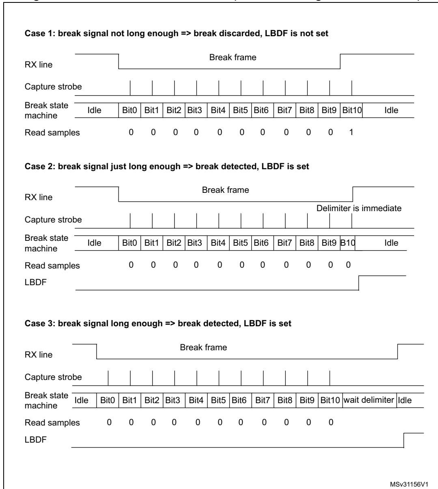

**Figure 623. Break detection in LIN mode (11-bit break length - LBDL bit is set)**

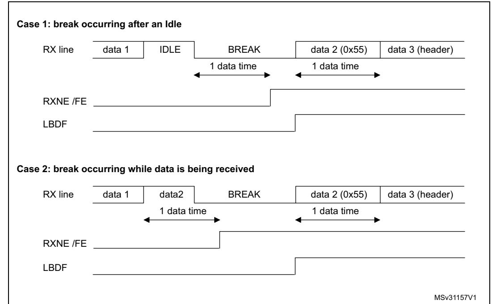

**Figure 624. Break detection in LIN mode vs. Framing error detection**

## **51.5.14 USART synchronous mode**

## **Master mode**

The synchronous master mode is selected by programming the CLKEN bit in the USART\_CR2 register to '1'. In synchronous mode, the following bits must be kept cleared:

- LINEN bit in the USART\_CR2 register,
- SCEN, HDSEL and IREN bits in the USART\_CR3 register.

In this mode, the USART can be used to control bidirectional synchronous serial communications in master mode. The CK pin is the output of the USART transmitter clock. No clock pulses are sent to the CK pin during start bit and stop bit. Depending on the state of the LBCL bit in the USART\_CR2 register, clock pulses are, or are not, generated during the last valid data bit (address mark). The CPOL bit in the USART\_CR2 register is used to select the clock polarity, and the CPHA bit in the USART\_CR2 register is used to select the phase of the external clock (see *[Figure 625](#page-30-0)*, *[Figure 626](#page-30-1)* and *[Figure 627](#page-31-0)*).

During the Idle state, preamble and send break, the external CK clock is not activated.

In synchronous master mode, the USART transmitter operates exactly like in asynchronous mode. However, since CK is synchronized with TX (according to CPOL and CPHA), the data on TX is synchronous.

In synchronous master mode, the USART receiver operates in a different way compared to asynchronous mode. If RE is set to 1, the data are sampled on CK (rising or falling edge, depending on CPOL and CPHA), without any oversampling. A given setup and a hold time must be respected (which depends on the baud rate: 1/16 bit time).

*Note: In master mode, the CK pin operates in conjunction with the TX pin. Thus, the clock is provided only if the transmitter is enabled (TE = 1) and data are being transmitted (USART\_TDR data register written). This means that it is not possible to receive synchronous data without transmitting data.*

MSv31158V2 **USART Synchronous device (slave SPI)** RX TX Data out Data in CK Clock

**Figure 625. USART example of synchronous master transmission**

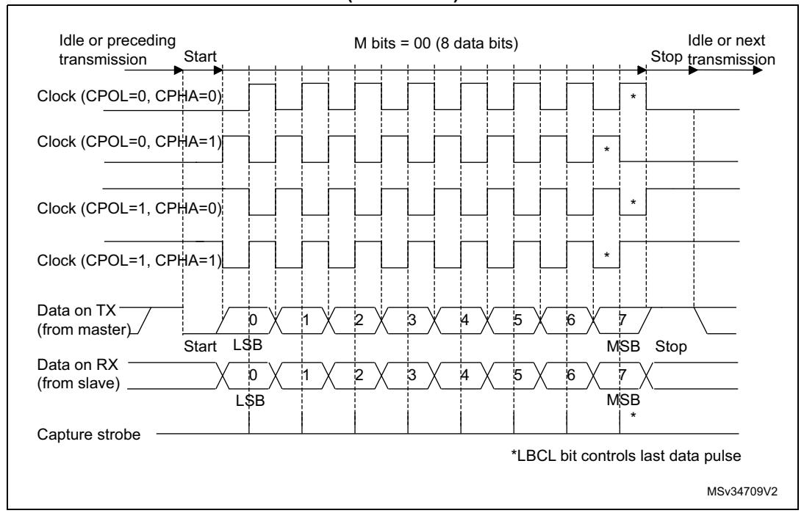

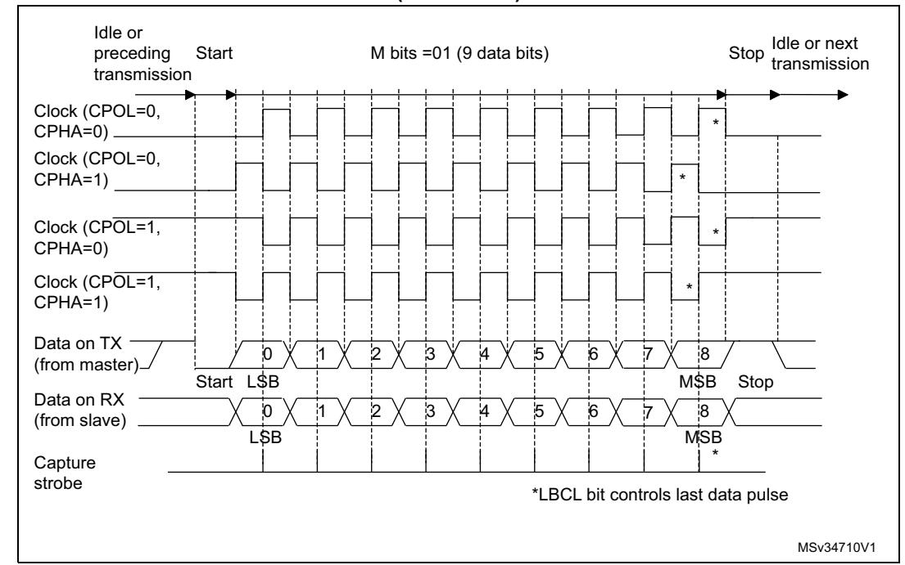

**Figure 627. USART data clock timing diagram in synchronous master mode (M bits = 01)**

## **Slave mode**

The synchronous slave mode is selected by programming the SLVEN bit in the USART\_CR2 register to '1'. In synchronous slave mode, the following bits must be kept cleared:

- LINEN and CLKEN bits in the USART\_CR2 register,
- SCEN, HDSEL and IREN bits in the USART\_CR3 register.

In this mode, the USART can be used to control bidirectional synchronous serial communications in slave mode. The CK pin is the input of the USART in slave mode.

*Note: When the peripheral is used in SPI slave mode, the frequency of peripheral clock source (*usart\_ker\_ck\_pres*) must be greater than 3 times the CK input frequency.*

> The CPOL bit and the CPHA bit in the USART\_CR2 register are used to select the clock polarity and the phase of the external clock, respectively (see *[Figure 628](#page-32-0)*).

An underrun error flag is available in slave transmission mode. This flag is set when the first clock pulse for data transmission appears while the software has not yet loaded any value to USART\_TDR.

The slave supports the hardware and software NSS management.

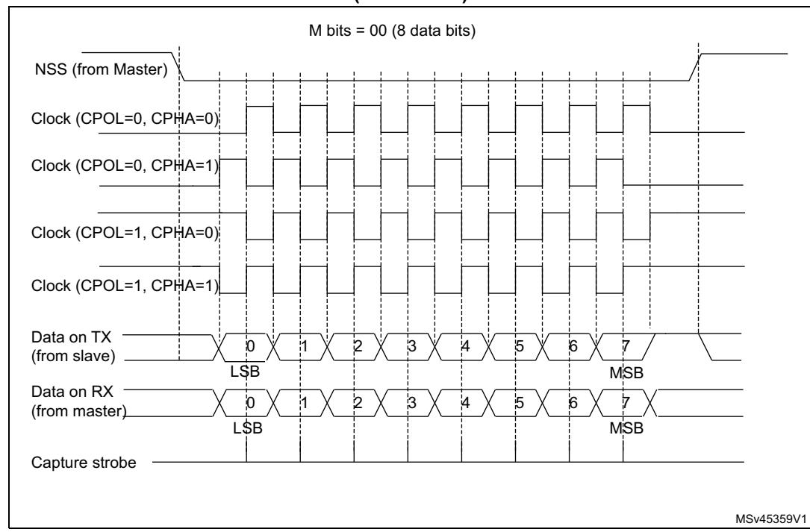

**Figure 628. USART data clock timing diagram in synchronous slave mode (M bits = 00)**

## **Slave Select (NSS) pin management**

The hardware or software slave select management can be set through the DIS\_NSS bit in the USART\_CR2 register:

- Software NSS management (DIS\_NSS = 1)
  - The SPI slave is always selected and NSS input pin is ignored.
    - The external NSS pin remains free for other application uses.
- Hardware NSS management (DIS\_NSS = 0)
  - The SPI slave selection depends on NSS input pin. The slave is selected when NSS is low and deselected when NSS is high.

*Note: The LBCL (used only on SPI master mode), CPOL and CPHA bits have to be selected when the USART is disabled (UE = 0) to ensure that the clock pulses function correctly.*

> *In SPI slave mode, the USART must be enabled before starting the master communications (or between frames while the clock is stable). Otherwise, if the USART slave is enabled while the master is in the middle of a frame, it becomes desynchronized with the master. The data register of the slave needs to be ready before the first edge of the communication clock or before the end of the ongoing communication, otherwise the SPI slave transmits zeros.*

## **SPI Slave underrun error**

When an underrun error occurs, the UDR flag is set in the USART\_ISR register, and the SPI slave goes on sending the last data until the underrrun error flag is cleared by software.

The underrun flag is set at the beginning of the frame. An underrun error interrupt is triggered if EIE bit is set in the USART\_CR3 register.

The underrun error flag is cleared by setting bit UDRCF in the USART\_ICR register.

In case of underrun error, it is still possible to write to the TDR register. Clearing the underrun error enables sending new data.

If an underrun error occurred and there is no new data written in TDR, then the TC flag is set at the end of the frame.

*Note: An underrun error may occur if the moment the data is written to the USART\_TDR is too close to the first CK transmission edge. To avoid this underrun error, the USART\_TDR should be written 3* usart\_ker\_ck *cycles before the first CK edge.*

## **51.5.15 USART single-wire Half-duplex communication**

Single-wire Half-duplex mode is selected by setting the HDSEL bit in the USART\_CR3 register. In this mode, the following bits must be kept cleared:

- LINEN and CLKEN bits in the USART\_CR2 register,
- SCEN and IREN bits in the USART\_CR3 register.

The USART can be configured to follow a Single-wire Half-duplex protocol where the TX and RX lines are internally connected. The selection between half- and Full-duplex communication is made with a control bit HDSEL in USART\_CR3.

As soon as HDSEL is written to '1':

- The TX and RX lines are internally connected.
- The RX pin is no longer used.
- The TX pin is always released when no data is transmitted. Thus, it acts as a standard I/O in idle or in reception. It means that the I/O must be configured so that TX is configured as alternate function open-drain with an external pull-up.

Apart from this, the communication protocol is similar to normal USART mode. Any conflict on the line must be managed by software (for instance by using a centralized arbiter). In particular, the transmission is never blocked by hardware and continues as soon as data are written in the data register while the TE bit is set.

## **51.5.16 USART receiver timeout**

The receiver timeout feature is enabled by setting the RTOEN bit in the USART\_CR2 control register.

The timeout duration is programmed using the RTO bitfields in the USART\_RTOR register.

The receiver timeout counter starts counting:

- from the end of the stop bit if STOP = '00' or STOP = '11'
- from the end of the second stop bit if STOP = '10'.
- from the beginning of the stop bit if STOP = '01'.

When the timeout duration has elapsed, the RTOF flag in the USART\_ISR register is set. A timeout is generated if RTOIE bit in USART\_CR1 register is set.

## **51.5.17 USART Smartcard mode**

This section is relevant only when Smartcard mode is supported. Refer to *[Section 51.4:](#page-2-0)  [USART implementation on page 2172](#page-2-0)*.

Smartcard mode is selected by setting the SCEN bit in the USART\_CR3 register. In Smartcard mode, the following bits must be kept cleared:

- LINEN bit in the USART\_CR2 register,
- HDSEL and IREN bits in the USART\_CR3 register.

The CLKEN bit can also be set to provide a clock to the Smartcard.

The Smartcard interface is designed to support asynchronous Smartcard protocol as defined in the ISO 7816-3 standard. Both T *=* 0 (character mode) and T *=* 1 (block mode) are supported.

The USART should be configured as:

- 8 bits plus parity: M *=* 1 and PCE *=* 1 in the USART\_CR1 register
- 1.5 stop bits when transmitting and receiving data: STOP *=* '11' in the USART\_CR2 register. It is also possible to choose 0.5 stop bit for reception.

In T *=* 0 (character) mode, the parity error is indicated at the end of each character during the guard time period.

*[Figure 629](#page-34-0)* shows examples of what can be seen on the data line with and without parity error.

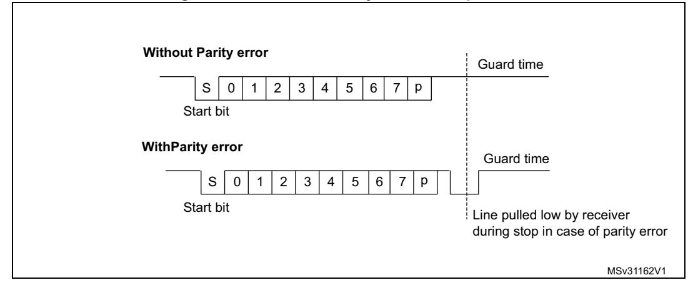

**Figure 629. ISO 7816-3 asynchronous protocol**

When connected to a Smartcard, the TX output of the USART drives a bidirectional line that is also driven by the Smartcard. The TX pin must be configured as open drain.

Smartcard mode implements a single wire half duplex communication protocol.

- Transmission of data from the transmit shift register is guaranteed to be delayed by a minimum of 1/2 baud clock. In normal operation a full transmit shift register starts shifting on the next baud clock edge. In Smartcard mode this transmission is further delayed by a guaranteed 1/2 baud clock.
- In transmission, if the Smartcard detects a parity error, it signals this condition to the USART by driving the line low (NACK). This NACK signal (pulling transmit line low for 1 baud clock) causes a framing error on the transmitter side (configured with 1.5 stop bits). The USART can handle automatic re-sending of data according to the protocol.

The number of retries is programmed in the SCARCNT bitfield. If the USART continues receiving the NACK after the programmed number of retries, it stops transmitting and signals the error as a framing error. The TXE bit (TXFNF bit in case FIFO mode is enabled) may be set using the TXFRQ bit in the USART\_RQR register.

- Smartcard auto-retry in transmission: A delay of 2.5 baud periods is inserted between the NACK detection by the USART and the start bit of the repeated character. The TC bit is set immediately at the end of reception of the last repeated character (no guardtime). If the software wants to repeat it again, it must insure the minimum 2 baud periods required by the standard.
- If a parity error is detected during reception of a frame programmed with a 1.5 stop bit period, the transmit line is pulled low for a baud clock period after the completion of the receive frame. This is to indicate to the Smartcard that the data transmitted to the USART has not been correctly received. A parity error is NACKed by the receiver if the NACK control bit is set, otherwise a NACK is not transmitted (to be used in T *=* 1 mode). If the received character is erroneous, the RXNE (RXFNE in case FIFO mode is enabled)/receive DMA request is not activated. According to the protocol specification, the Smartcard must resend the same character. If the received character is still erroneous after the maximum number of retries specified in the SCARCNT bitfield, the USART stops transmitting the NACK and signals the error as a parity error.
- Smartcard auto-retry in reception: the BUSY flag remains set if the USART NACKs the card but the card doesn't repeat the character.
- In transmission, the USART inserts the Guard Time (as programmed in the Guard Time register) between two successive characters. As the Guard Time is measured after the stop bit of the previous character, the GT[7:0] register must be programmed to the desired CGT (Character Guard Time, as defined by the 7816-3 specification) minus 12 (the duration of one character).
- The assertion of the TC flag can be delayed by programming the Guard Time register. In normal operation, TC is asserted when the transmit shift register is empty and no further transmit requests are outstanding. In Smartcard mode an empty transmit shift register triggers the Guard Time counter to count up to the programmed value in the Guard Time register. TC is forced low during this time. When the Guard Time counter reaches the programmed value TC is asserted high. The TCBGT flag can be used to detect the end of data transfer without waiting for guard time completion. This flag is set just after the end of frame transmission and if no NACK has been received from the card.
- The deassertion of TC flag is unaffected by Smartcard mode.
- If a framing error is detected on the transmitter end (due to a NACK from the receiver), the NACK is not detected as a start bit by the receive block of the transmitter. According to the ISO protocol, the duration of the received NACK can be 1 or 2 baud clock periods.
- On the receiver side, if a parity error is detected and a NACK is transmitted the receiver does not detect the NACK as a start bit.

*Note: Break characters are not significant in Smartcard mode. A 0x00 data with a framing error is treated as data and not as a break.* 

> *No Idle frame is transmitted when toggling the TE bit. The Idle frame (as defined for the other configurations) is not defined by the ISO protocol.*

> *[Figure 630](#page-36-0)* shows how the NACK signal is sampled by the USART. In this example the USART is transmitting data and is configured with 1.5 stop bits. The receiver part of the USART is enabled in order to check the integrity of the data and the NACK signal.

RM0399 Rev 4 2205/3556

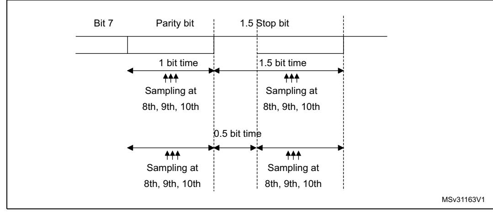

**Figure 630. Parity error detection using the 1.5 stop bits**

The USART can provide a clock to the Smartcard through the CK output. In Smartcard mode, CK is not associated to the communication but is simply derived from the internal peripheral input clock through a 5-bit prescaler. The division ratio is configured in the USART\_GTPR register. CK frequency can be programmed from usart\_ker\_ck\_pres/2 to usart\_ker\_ck\_pres/62, where usart\_ker\_ck\_pres is the peripheral input clock divided by a programmed prescaler.

## **Block mode (T = 1)**

In T *=* 1 (block) mode, the parity error transmission can be deactivated by clearing the NACK bit in the USART\_CR3 register.

When requesting a read from the Smartcard, in block mode, the software must program the RTOR register to the BWT (block wait time) - 11 value. If no answer is received from the card before the expiration of this period, a timeout interrupt is generated. If the first character is received before the expiration of the period, it is signaled by the RXNE/RXFNE interrupt.

*Note: The RXNE/RXFNE interrupt must be enabled even when using the USART in DMA mode to read from the Smartcard in block mode. In parallel, the DMA must be enabled only after the first received byte.*

> After the reception of the first character (RXNE/RXFNE interrupt), the RTO register must be programmed to the CWT (character wait time -11 value), in order to enable the automatic check of the maximum wait time between two consecutive characters. This time is expressed in baud time units. If the Smartcard does not send a new character in less than the CWT period after the end of the previous character, the USART signals it to the software through the RTOF flag and interrupt (when RTOIE bit is set).

*Note: As in the Smartcard protocol definition, the BWT/CWT values should be defined from the beginning (start bit) of the last character. The RTO register must be programmed to BWT - 11 or CWT -11, respectively, taking into account the length of the last character itself.* 

> A block length counter is used to count all the characters received by the USART. This counter is reset when the USART is transmitting. The length of the block is communicated by the Smartcard in the third byte of the block (prologue field). This value must be programmed to the BLEN field in the USART\_RTOR register. When using DMA mode, before the start of the block, this register field must be programmed to the minimum value

(0x0). With this value, an interrupt is generated after the 4th received character. The software must read the LEN field (third byte), its value must be read from the receive buffer.

In interrupt driven receive mode, the length of the block may be checked by software or by programming the BLEN value. However, before the start of the block, the maximum value of BLEN (0xFF) may be programmed. The real value is programmed after the reception of the third character.

If the block is using the LRC longitudinal redundancy check (1 epilogue byte), the BLEN *=* LEN. If the block is using the CRC mechanism (2 epilog bytes), BLEN *=* LEN+1 must be programmed. The total block length (including prologue, epilogue and information fields) equals BLEN+4. The end of the block is signaled to the software through the EOBF flag and interrupt (when EOBIE bit is set).

In case of an error in the block length, the end of the block is signaled by the RTO interrupt (Character Wait Time overflow).

*Note: The error checking code (LRC/CRC) must be computed/verified by software.*

## **Direct and inverse convention**

The Smartcard protocol defines two conventions: direct and inverse.

The direct convention is defined as: LSB first, logical bit value of 1 corresponds to a H state of the line and parity is even. In order to use this convention, the following control bits must be programmed: MSBFIRST *=* 0, DATAINV *=* 0 (default values).

The inverse convention is defined as: MSB first, logical bit value 1 corresponds to an L state on the signal line and parity is even. In order to use this convention, the following control bits must be programmed: MSBFIRST *=* 1, DATAINV *=* 1.

*Note: When logical data values are inverted (0 = H, 1 = L), the parity bit is also inverted in the same way.*

> In order to recognize the card convention, the card sends the initial character, TS, as the first character of the ATR (Answer To Reset) frame. The two possible patterns for the TS are: LHHL LLL LLH and LHHL HHH LLH.

- (H) LHHL LLL LLH sets up the inverse convention: state L encodes value 1 and moment 2 conveys the most significant bit (MSB first). When decoded by inverse convention, the conveyed byte is equal to '3F'.
- (H) LHHL HHH LLH sets up the direct convention: state H encodes value 1 and moment 2 conveys the least significant bit (LSB first). When decoded by direct convention, the conveyed byte is equal to '3B'.

Character parity is correct when there is an even number of bits set to 1 in the nine moments 2 to 10.

As the USART does not know which convention is used by the card, it needs to be able to recognize either pattern and act accordingly. The pattern recognition is not done in hardware, but through a software sequence. Moreover, assuming that the USART is configured in direct convention (default) and the card answers with the inverse convention, TS = LHHL LLL LLH results in a USART received character of 03 and an odd parity.

RM0399 Rev 4 2207/3556

Therefore, two methods are available for TS pattern recognition:

## **Method 1**

The USART is programmed in standard Smartcard mode/direct convention. In this case, the TS pattern reception generates a parity error interrupt and error signal to the card.

- The parity error interrupt informs the software that the card did not answer correctly in direct convention. Software then reprograms the USART for inverse convention
- In response to the error signal, the card retries the same TS character, and it is correctly received this time, by the reprogrammed USART.

Alternatively, in answer to the parity error interrupt, the software may decide to reprogram the USART and to also generate a new reset command to the card, then wait again for the TS.

## **Method 2**

The USART is programmed in 9-bit/no-parity mode, no bit inversion. In this mode it receives any of the two TS patterns as:

- (H) LHHL LLL LLH = 0x103: inverse convention to be chosen
- (H) LHHL HHH LLH = 0x13B: direct convention to be chosen

The software checks the received character against these two patterns and, if any of them match, then programs the USART accordingly for the next character reception.

If none of the two is recognized, a card reset may be generated in order to restart the negotiation.

## **51.5.18 USART IrDA SIR ENDEC block**

This section is relevant only when IrDA mode is supported. Refer to *[Section 51.4: USART](#page-2-0)  [implementation on page 2172](#page-2-0)*.

IrDA mode is selected by setting the IREN bit in the USART\_CR3 register. In IrDA mode, the following bits must be kept cleared:

- LINEN, STOP and CLKEN bits in the USART\_CR2 register,
- SCEN and HDSEL bits in the USART\_CR3 register.

The IrDA SIR physical layer specifies use of a Return to Zero, Inverted (RZI) modulation scheme that represents logic 0 as an infrared light pulse (see *[Figure 631](#page-40-0)*).

The SIR Transmit encoder modulates the Non Return to Zero (NRZ) transmit bit stream output from USART. The output pulse stream is transmitted to an external output driver and infrared LED. USART supports only bit rates up to 115.2 kbaud for the SIR ENDEC. In normal mode the transmitted pulse width is specified as 3/16 of a bit period.

The SIR receive decoder demodulates the return-to-zero bit stream from the infrared detector and outputs the received NRZ serial bit stream to the USART. The decoder input is normally high (marking state) in the Idle state. The transmit encoder output has the opposite polarity to the decoder input. A start bit is detected when the decoder input is low.

• IrDA is a half duplex communication protocol. If the Transmitter is busy (when the USART is sending data to the IrDA encoder), any data on the IrDA receive line is ignored by the IrDA decoder and if the Receiver is busy (when the USART is receiving decoded data from the USART), data on the TX from the USART to IrDA is not

encoded. While receiving data, transmission should be avoided as the data to be transmitted could be corrupted.

- A '0' is transmitted as a high pulse and a '1' is transmitted as a '0'. The width of the pulse is specified as 3/16th of the selected bit period in normal mode (see *[Figure 632](#page-40-1)*).
- The SIR decoder converts the IrDA compliant receive signal into a bit stream for USART.
- The SIR receive logic interprets a high state as a logic one and low pulses as logic zeros.
- The transmit encoder output has the opposite polarity to the decoder input. The SIR output is in low state when Idle.
- The IrDA specification requires the acceptance of pulses greater than 1.41 µs. The acceptable pulse width is programmable. Glitch detection logic on the receiver end filters out pulses of width less than 2 PSC periods (PSC is the prescaler value programmed in the USART\_GTPR). Pulses of width less than 1 PSC period are always rejected, but those of width greater than one and less than two periods may be accepted or rejected, those greater than two periods are accepted as a pulse. The IrDA encoder/decoder doesn't work when PSC *=* 0.
- The receiver can communicate with a low-power transmitter.
- In IrDA mode, the stop bits in the USART\_CR2 register must be configured to '1 stop bit'.

## **IrDA low-power mode**

• Transmitter

In low-power mode, the pulse width is not maintained at 3/16 of the bit period. Instead, the width of the pulse is 3 times the low-power baud rate which can be a minimum of 1.42 MHz. Generally, this value is 1.8432 MHz (1.42 MHz < PSC < 2.12 MHz). A lowpower mode programmable divisor divides the system clock to achieve this value.

• Receiver

Receiving in low-power mode is similar to receiving in normal mode. For glitch detection the USART should discard pulses of duration shorter than 1/PSC. A valid low is accepted only if its duration is greater than 2 periods of the IrDA low-power Baud clock (PSC value in the USART\_GTPR).

*Note: A pulse of width less than two and greater than one PSC period(s) may or may not be rejected.*

> *The receiver set up time should be managed by software. The IrDA physical layer specification specifies a minimum of 10 ms delay between transmission and reception (IrDA is a half duplex protocol).*

MSv31164V1 USART OR SIR Transmit Encoder SIR Receive DEcoder TX SIREN RX USART\_RX IrDA\_IN IrDA\_OUT USART\_TX

**Figure 631. IrDA SIR ENDEC block diagram**

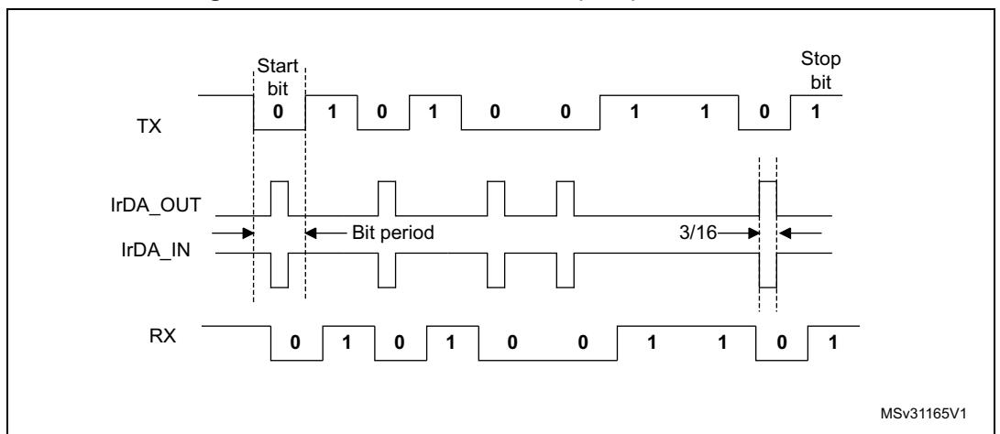

## **51.5.19 Continuous communication using USART and DMA**

The USART is capable of performing continuous communications using the DMA. The DMA requests for Rx buffer and Tx buffer are generated independently.

*Note: Refer to Section [51.4: USART implementation on page](#page-2-0) 2172 to determine if the DMA mode is supported. If DMA is not supported, use the USART as explained in [Section](#page-11-1) 51.5.6. To perform continuous communications when the FIFO is disabled, clear the TXE/ RXNE flags in the USART\_ISR register.* 

## **Transmission using DMA**

DMA mode can be enabled for transmission by setting DMAT bit in the USART\_CR3 register. Data are loaded from an SRAM area configured using the DMA peripheral (refer to the corresponding *Direct memory access controller* section) to the USART\_TDR register whenever the TXE flag (TXFNF flag if FIFO mode is enabled) is set. To map a DMA channel for USART transmission, use the following procedure (x denotes the channel number):

- 1. Write the USART\_TDR register address in the DMA control register to configure it as the destination of the transfer. The data is moved to this address from memory after each TXE (or TXFNF if FIFO mode is enabled) event.
- 2. Write the memory address in the DMA control register to configure it as the source of the transfer. The data is loaded into the USART\_TDR register from this memory area after each TXE (or TXFNF if FIFO mode is enabled) event.
- 3. Configure the total number of bytes to be transferred to the DMA control register.
- 4. Configure the channel priority in the DMA register
- 5. Configure DMA interrupt generation after half/ full transfer as required by the application.
- 6. Clear the TC flag in the USART\_ISR register by setting the TCCF bit in the USART\_ICR register.
- 7. Activate the channel in the DMA register.

When the number of data transfers programmed in the DMA Controller is reached, the DMA controller generates an interrupt on the DMA channel interrupt vector.

In transmission mode, once the DMA has written all the data to be transmitted (the TCIF flag is set in the DMA\_ISR register), the TC flag can be monitored to make sure that the USART communication is complete. This is required to avoid corrupting the last transmission before disabling the USART or before the system enters a low-power mode when the peripheral clock is disabled. Software must wait until TC *=* 1. The TC flag remains cleared during all data transfers and it is set by hardware at the end of transmission of the last frame.

RM0399 Rev 4 2211/3556

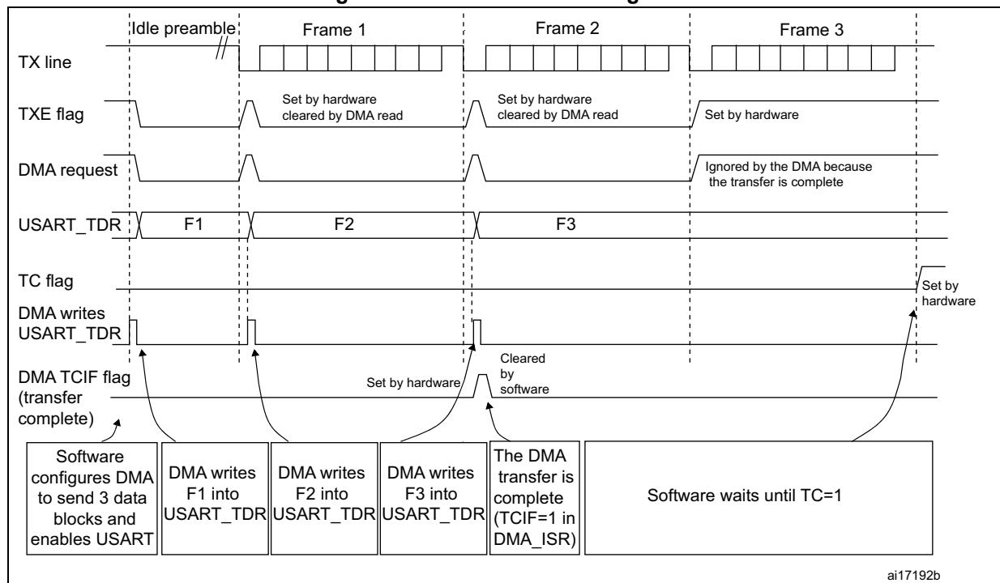

**Figure 633. Transmission using DMA**

*Note: When FIFO management is enabled, the DMA request is triggered by Transmit FIFO not full (i.e. TXFNF = 1).*

## **Reception using DMA**

DMA mode can be enabled for reception by setting the DMAR bit in USART\_CR3 register. Data are loaded from the USART\_RDR register to an SRAM area configured using the DMA peripheral (refer to the corresponding *Direct memory access controller* section) whenever a data byte is received. To map a DMA channel for USART reception, use the following procedure:

- 1. Write the USART\_RDR register address in the DMA control register to configure it as the source of the transfer. The data is moved from this address to the memory after each RXNE (RXFNE in case FIFO mode is enabled) event.
- 2. Write the memory address in the DMA control register to configure it as the destination of the transfer. The data is loaded from USART\_RDR to this memory area after each RXNE (RXFNE in case FIFO mode is enabled) event.
- 3. Configure the total number of bytes to be transferred to the DMA control register.
- 4. Configure the channel priority in the DMA control register
- 5. Configure interrupt generation after half/ full transfer as required by the application.
- 6. Activate the channel in the DMA control register.

When the number of data transfers programmed in the DMA Controller is reached, the DMA controller generates an interrupt on the DMA channel interrupt vector.

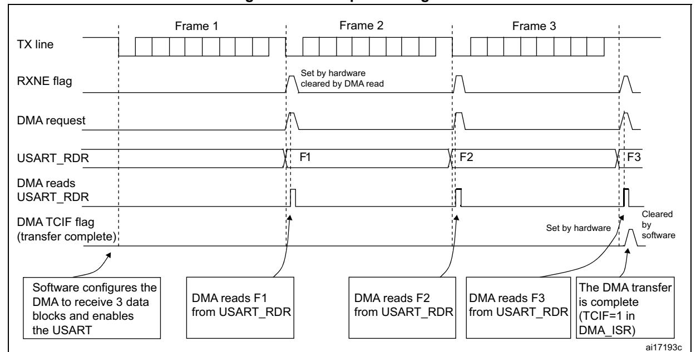

**Figure 634. Reception using DMA**

*Note: When FIFO management is enabled, the DMA request is triggered by Receive FIFO not empty (i.e. RXFNE = 1).*

## **Error flagging and interrupt generation in multibuffer communication**

If any error occurs during a transaction in multibuffer communication mode, the error flag is asserted after the current byte. An interrupt is generated if the interrupt enable flag is set. For framing error, overrun error and noise flag which are asserted with RXNE (RXFNE in case FIFO mode is enabled) in single byte reception, there is a separate error flag interrupt enable bit (EIE bit in the USART\_CR3 register), which, if set, enables an interrupt after the current byte if any of these errors occur.

## **51.5.20 RS232 Hardware flow control and RS485 Driver Enable**

It is possible to control the serial data flow between 2 devices by using the CTS input and the RTS output. The *[Figure 635](#page-43-0)* shows how to connect 2 devices in this mode:

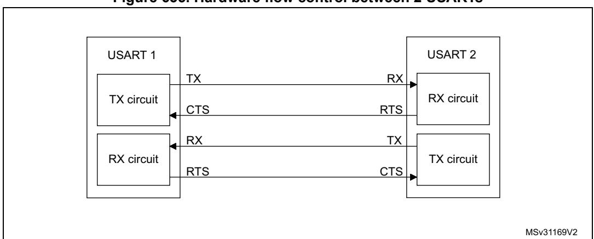

**Figure 635. Hardware flow control between 2 USARTs**

RS232 RTS and CTS flow control can be enabled independently by writing the RTSE and CTSE bits to '1' in the USART\_CR3 register.

### **RS232 RTS flow control**

If the RTS flow control is enabled (RTSE = 1), then RTS is deasserted (tied low) as long as the USART receiver is ready to receive a new data. When the receive register is full, RTS is asserted, indicating that the transmission is expected to stop at the end of the current frame. *Figure 636* shows an example of communication with RTS flow control enabled.

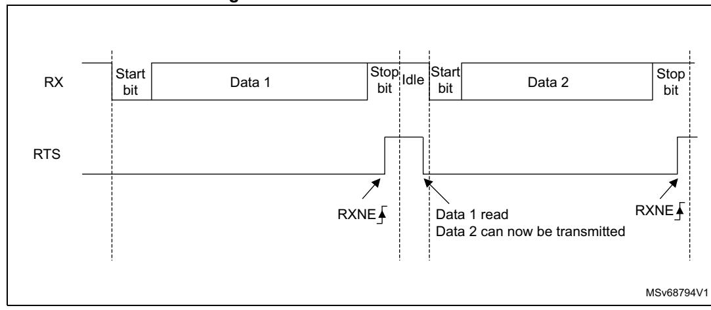

Figure 636. RS232 RTS flow control

Note: When FIF

When FIFO mode is enabled, RTS is asserted only when RXFIFO is full.

## **RS232 CTS flow control**

If the CTS flow control is enabled (CTSE = 1), then the transmitter checks the CTS input before transmitting the next frame. If CTS is deasserted (tied low), then the next data is transmitted (assuming that data is to be transmitted, in other words, if TXE/TXFE = 0), else the transmission does not occur. When CTS is asserted during a transmission, the current transmission is completed before the transmitter stops.

When CTSE = 1, the CTSIF status bit is automatically set by hardware as soon as the CTS input toggles. It indicates when the receiver becomes ready or not ready for communication. An interrupt is generated if the CTSIE bit in the USART\_CR3 register is set. *Figure 637* shows an example of communication with CTS flow control enabled.

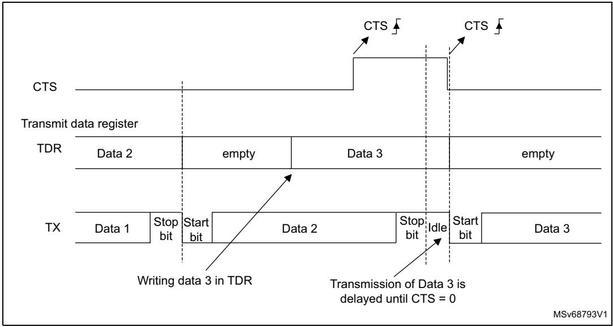

Figure 637. RS232 CTS flow control

Note:

For correct behavior, CTS must be deasserted at least 3 USART clock source periods before the end of the current character. In addition it should be noted that the CTSCF flag may not be set for pulses shorter than  $2 \times PCLK$  periods.

## RS485 driver enable

The driver enable feature is enabled by setting bit DEM in the USART\_CR3 control register. This enables the user to activate the external transceiver control, through the DE (Driver Enable) signal. The assertion time is the time between the activation of the DE signal and the beginning of the start bit. It is programmed using the DEAT [4:0] bitfields in the USART\_CR1 control register. The deassertion time is the time between the end of the last stop bit, in a transmitted message, and the de-activation of the DE signal. It is programmed using the DEDT [4:0] bitfields in the USART\_CR1 control register. The polarity of the DE signal can be configured using the DEP bit in the USART\_CR3 control register.

In USART, the DEAT and DEDT are expressed in sample time units (1/8 or 1/16 bit time, depending on the oversampling rate).

## **51.5.21 USART low-power management**

The USART has advanced low-power mode functions, that enables transferring properly data even when the usart\_pclk clock is disabled.

The USART is able to wake up the MCU from low-power mode when the UESM bit is set.

When the usart\_pclk is gated, the USART provides a wake-up interrupt (**usart\_wkup**) if a specific action requiring the activation of the **usart\_pclk** clock is needed:

- If FIFO mode is disabled
  - usart\_pclk clock has to be activated to empty the USART data register.
  - In this case, the usart\_wkup interrupt source is RXNE set to '1'. The RXNEIE bit must be set before entering low-power mode.
- If FIFO mode is enabled

usart\_pclk clock has to be activated to:

- to fill the TXFIFO
- or to empty the RXFIFO

In this case, the usart\_wkup interrupt source can be:

- RXFIFO not empty. In this case, the RXFNEIE bit must be set before entering lowpower mode.
- RXFIFO full. In this case, the RXFFIE bit must be set before entering low-power mode, the number of received data corresponds to the RXFIFO size, and the RXFF flag is not set.
- TXFIFO empty. In this case, the TXFEIE bit must be set before entering low-power mode.

This enables sending/receiving the data in the TXFIFO/RXFIFO during low-power mode.

To avoid overrun/underrun errors and transmit/receive data in low-power mode, the usart\_wkup interrupt source can be one of the following events:

- TXFIFO threshold reached. In this case, the TXFTIE bit must be set before entering low-power mode.
- RXFIFO threshold reached. In this case, the RXFTIE bit must be set before entering low-power mode.

For example, the application can set the threshold to the maximum RXFIFO size if the wake-up time is less than the time required to receive a single byte across the line.

Using the RXFIFO full, TXFIFO empty, RXFIFO not empty and RXFIFO/TXFIFO threshold interrupts to wake up the MCU from low-power mode enables doing as many USART transfers as possible during low-power mode with the benefit of optimizing consumption.

Alternatively, a specific **usart\_wkup** interrupt can be selected through the WUS bitfields.

When the wake-up event is detected, the WUF flag is set by hardware and a **usart\_wkup** interrupt is generated if the WUFIE bit is set.

*Note: Before entering low-power mode, make sure that no USART transfers are ongoing. Checking the BUSY flag cannot ensure that low-power mode is never entered when data reception is ongoing.*

> *The WUF flag is set when a wake-up event is detected, independently of whether the MCU is in low-power or active mode.*

*When entering low-power mode just after having initialized and enabled the receiver, the REACK bit must be checked to make sure the USART is enabled.*

*When DMA is used for reception, it must be disabled before entering low-power mode and re-enabled when exiting from low-power mode.*

*When the FIFO is enabled, waking up from low-power mode on address match is only possible when Mute mode is enabled.*

## **Using Mute mode with low-power mode**

If the USART is put into Mute mode before entering low-power mode:

- Wake-up from Mute mode on idle detection must not be used, because idle detection cannot work in low-power mode.
- If the wake-up from Mute mode on address match is used, then the low-power mode wake-up source must also be the address match. If the RXNE flag was set when entering the low-power mode, the interface remains in Mute mode upon address match and wake up from low-power mode.

*Note: When FIFO management is enabled, Mute mode can be used with wake-up from low-power mode without any constraints (i.e.the two points mentioned above about Mute and lowpower mode are valid only when FIFO management is disabled).*

## **Wake-up from low-power mode when USART kernel clock (usart\_ker\_ck) is OFF in low-power mode**

If during low-power mode, the usart\_ker\_ck clock is switched OFF when a falling edge on the USART receive line is detected, the USART interface requests the usart\_ker\_ck clock to be switched ON thanks to the usart\_ker\_ck\_req signal. usart\_ker\_ck is then used for the frame reception.

If the wake-up event is verified, the MCU wakes up from low-power mode and data reception goes on normally.

If the wake-up event is not verified, usart\_ker\_ck is switched OFF again, the MCU is not woken up and remains in low-power mode, and the kernel clock request is released.

The example below shows the case of a wake-up event programmed to "address match detection" and FIFO management disabled.

RM0399 Rev 4 2217/3556

*[Figure 638](#page-48-0)* shows the USART behavior when the wake-up event is verified.

**Figure 638. Wake-up event verified (wake-up event = address match, FIFO disabled)**

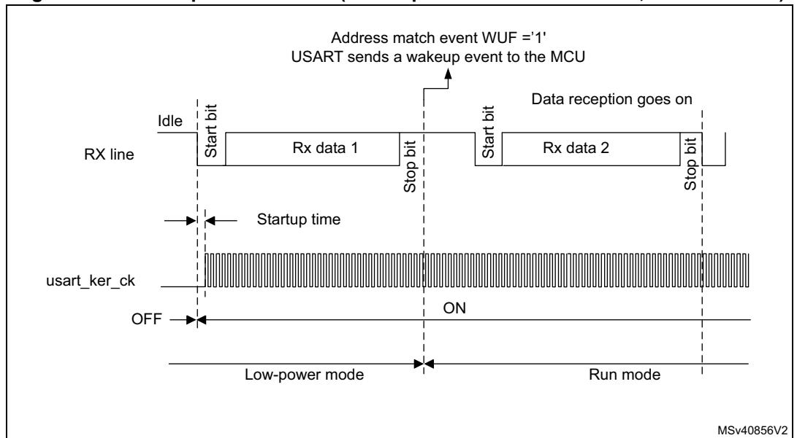

*[Figure 639](#page-48-1)* shows the USART behavior when the wake-up event is not verified.

**Figure 639. Wake-up event not verified (wake-up event = address match, FIFO disabled)**

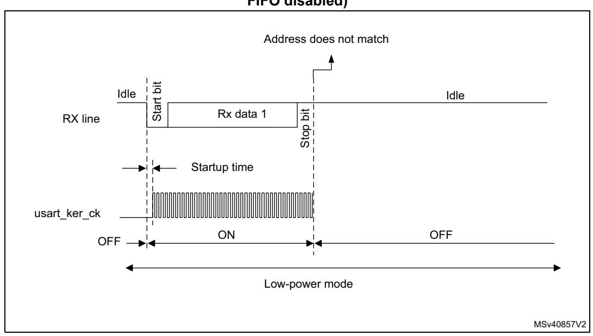

*Note: The figures above are valid when address match or any received frame is used as wake-up event. If the wake-up event is the start bit detection, the USART sends the wake-up event to the MCU at the end of the start bit.* 

## **Determining the maximum USART baud rate that enables to correctly wake up the device from low-power mode**

The maximum baud rate that enables to correctly wake up the device from low-power mode depends on the wake-up time parameter (refer to the device datasheet) and on the USART receiver tolerance (see *[Section 51.5.8: Tolerance of the USART receiver to clock deviation](#page-19-0)*).

Let us take the example of OVER8 = 0, M bits = '01', ONEBIT = 0 and BRR [3:0] = 0000.

In these conditions, according to *[Table 421: Tolerance of the USART receiver when BRR](#page-20-0)  [\[3:0\] = 0000](#page-20-0)*, the USART receiver tolerance equals 3.41%.

DTRA + DQUANT + DREC + DTCL + DWU < USART receiver tolerance

DWUmax = tWUUSART/ (11 x Tbit Min)

Tbit Min = tWUUSART/ (11 x DWUmax)

where tWUUSART is the wake-up time from low-power mode.

If we consider the ideal case where DTRA, DQUANT, DREC and DTCL parameters are at 0%, the maximum value of DWU is 3.41%. In reality, we need to consider at least the usart\_ker\_ck inaccuracy.

For example, if HSI is used as usart\_ker\_ck, and the HSI inaccuracy is of 1%, then we obtain:

tWUUSART = 3 µs (values provided only as examples; for correct values, refer to the device datasheet).

DWUmax = 3.41% - 1% = 2.41%

Tbit min = 3 µs/ (11 x 2.41%) = 11.32 µs.

As a result, the maximum baud rate that enables to wake up correctly from low-power mode is: 1/11.32 µs = 88.36 Kbaud.

# **51.6 USART in low-power modes**

**Table 424. Effect of low-power modes on the USART**

| Mode    | Description                                                                                                                                                                          |
|---------|--------------------------------------------------------------------------------------------------------------------------------------------------------------------------------------|
| Sleep   | No effect. USART interrupts cause the device to exit Sleep mode.                                                                                                                     |
| Stop(1) | The content of the USART registers is kept. The USART is able to wake up the microcontroller from Stop mode when the USART is clocked by an oscillator available in Stop mode. |
| Standby | The USART peripheral is powered down and must be reinitialized after exiting Standby mode.                                                                                        |

1. Refer to *[Section 51.4: USART implementation](#page-2-0)* to know if the wake-up from Stop mode is supported for a given peripheral instance. If an instance is not functional in a given Stop mode, it must be disabled before entering this Stop mode.

# 51.7 USART interrupts

Refer to *Table 425* for a detailed description of all USART interrupt requests.

Table 425. USART interrupt requests

| Interrupt vector | Interrupt event                                         | Event flag       | Enable Control bit | Interrupt clear method                             | Exit from Sleep mode | Exit from Stop (1) modes | Exit from Standby mode |
|---------------------|---------------------------------------------------------|---------------------|-----------------------|-------------------------------------------------------|----------------------------|-------------------------------------------|------------------------------|
| USART or UART    | Transmit data register empty                            | TXE                 | TXEIE                 | Write TDR                                             | Yes                        | No                                        | No                           |
|                     | Transmit FIFO not Full                                  | TXFNF               | TXFNFIE               | TXFIFO full                                           |                            | No                                        |                              |
|                     | Transmit FIFO Empty                                     | TXFE                | TXFEIE                | Write TDR or write 1 in TXFRQ                         |                            | Yes                                       |                              |
|                     | Transmit FIFO threshold reached                         | TXFT                | TXFTIE                | Write TDR                                             |                            | Yes                                       |                              |
|                     | CTS interrupt                                           | CTSIF               | CTSIE                 | Write 1 in CTSCF                                      |                            | No                                        |                              |
|                     | Transmission Complete                                   | TC                  | TCIE                  | Write TDR or write 1 in TCCF                          | -                          | No                                        |                              |
|                     | Transmission Complete Before Guard Time                 | TCBGT               | TCBGTIE               | Write TDR or write 1 in TCBGT                         |                            | No                                        |                              |
|                     | Receive data register not empty (data ready to be read) | RXNE                | RXNEIE                | Read RDR or write 1 in RXFRQ                          | Yes                        | Yes                                       | No                           |
|                     | Receive FIFO Not Empty                                  | RXFNE               | RXFNEIE               | Read RDR until RXFIFO empty or write 1 in RXFRQ |                            | Yes                                       |                              |
|                     | Receive FIFO Full                                       | RXFF (2) | RXFFIE                | Read RDR                                              |                            | Yes                                       |                              |
|                     | Receive FIFO threshold reached                          | RXFT                | RXFTIE                | Read RDR                                              |                            | Yes                                       |                              |
|                     | Overrun error detected                                  | ORE                 | RXNEIE/ RXFNEIE    | Write 1 in ORECF                                      |                            | No                                        |                              |
|                     | Idle line detected                                      | IDLE                | IDLEIE                | Write 1 in IDLECF                                     |                            | No                                        |                              |
|                     | Parity error                                            | PE                  | PEIE                  | Write 1 in PECF                                       |                            | No                                        |                              |
| USART               | LIN break                                               | LBDF                | LBDIE                 | Write 1 in LBDCF                                      |                            | No                                        |                              |
| or UART             | Noise error in multibuffer communication                | NE                  | EIE                   | Write 1 in NFCF                                       |                            | No                                        |                              |
|                     | Overrun error in multibuffer communication              | ORE (3)  |                       | Write 1 in ORECF                                      |                            | No                                        |                              |
|                     | Framing Error in multibuffer communication              | FE                  |                       | Write 1 in FECF                                       |                            | No                                        |                              |
|                     | Character match                                         | CMF                 | CMIE                  | Write 1 in CMCF                                       |                            | No                                        |                              |
|                     | Receiver timeout                                        | RTOF                | RTOFIE                | Write 1 in RTOCCF                                     |                            | No                                        |                              |
|                     | End of Block                                            | EOBF                | EOBIE                 | Write 1 in EOBCF                                      |                            | No                                        |                              |
|                     | Wake-up from low-power mode                             | WUF                 | WUFIE                 | Write 1 in WUC                                        |                            | Yes                                       |                              |
|                     | SPI slave underrun error                                | UDR                 | EIE                   | Write 1 in UDRCF                                      |                            | No                                        |                              |

The USART can wake up the device from Stop mode only if the peripheral instance supports the wake-up from Stop mode feature. Refer to Section 51.4: USART implementation for the list of supported Stop modes.

- 2. RXFF flag is asserted if the USART receives n+1 data (n being the RXFIFO size): n data in the RXFIFO and 1 data in USART\_RDR. In Stop mode, USART\_RDR is not clocked. As a result, this register is not written and once n data are received and written in the RXFIFO, the RXFF interrupt is asserted (RXFF flag is not set).
- 3. When OVRDIS = 0.

# 51.8 USART registers

Refer to Section 1.2 on page 106 for a list of abbreviations used in register descriptions.

The peripheral registers have to be accessed by words (32 bits).

## 51.8.1 USART control register 1 (USART CR1)

Address offset: 0x00

Reset value: 0x0000 0000

The same register can be used in FIFO mode enabled (this section) and FIFO mode

disabled (next section).

## FIFO mode enabled

| 31         | 30     | 29         | 28 | 27    | 26    | 25 | 24   | 23          | 22   | 21          | 20        | 19 | 18 | 17   | 16 |  |
|------------|--------|------------|----|-------|-------|----|------|-------------|------|-------------|-----------|----|----|------|----|--|
| RXF FIE | TXFEIE | FIFO EN | M1 | EOBIE | RTOIE |    |      | DEAT[4:0]   | ]    |             | DEDT[4:0] |    |    |      |    |  |
| rw         | rw     | rw         | rw | rw    | rw    | rw | rw   | rw          | rw   | rw          | rw        | rw | rw | rw   | rw |  |
| 15         | 14     | 13         | 12 | 11    | 10    | 9  | 8    | 7           | 6    | 5           | 4         | 3  | 2  | 1    | 0  |  |
| OVER8      | CMIE   | MME        | M0 | WAKE  | PCE   | PS | PEIE | TXFNFI E | TCIE | RXFNE IE | IDLEIE    | TE | RE | UESM | UE |  |
| rw         | rw     | rw         | rw | rw    | rw    | rw | rw   | rw          | rw   | rw          | rw        | rw | rw | rw   | rw |  |

## Bit 31 RXFFIE: RXFIFO full interrupt enable

This bit is set and cleared by software.

0: Interrupt inhibited

1: USART interrupt generated when RXFF = 1 in the USART\_ISR register

### Bit 30 **TXFEIE**: TXFIFO empty interrupt enable

This bit is set and cleared by software.

0: Interrupt inhibited

1: USART interrupt generated when TXFE = 1 in the USART ISR register

## Bit 29 FIFOEN: FIFO mode enable

This bit is set and cleared by software.

0: FIFO mode is disabled.

1: FIFO mode is enabled.

This bitfield can only be written when the USART is disabled (UE = 0).

Note: FIFO mode can be used on standard UART communication, in SPI master/slave mode and in Smartcard modes only. It must not be enabled in IrDA and LIN modes.

#### Bit 28 **M1**: Word length

This bit must be used in conjunction with bit 12 (M0) to determine the word length. It is set or cleared by software.

M[1:0] = '00': 1 start bit, 8 Data bits, n Stop bit

M[1:0] = '01': 1 start bit, 9 Data bits, n Stop bit

M[1:0] = '10': 1 start bit, 7 Data bits, n Stop bit

This bit can only be written when the USART is disabled (UE = 0).

*Note: In 7-bits data length mode, the Smartcard mode, LIN master mode and auto baud rate (0x7F and 0x55 frames detection) are not supported.*

## Bit 27 **EOBIE**: End-of-block interrupt enable

This bit is set and cleared by software.

0: Interrupt inhibited

1: USART interrupt generated when the EOBF flag is set in the USART\_ISR register

*Note: If the USART does not support Smartcard mode, this bit is reserved and must be kept at reset value. Refer to [Section 51.4: USART implementation on page 2172.](#page-2-0)*

#### Bit 26 **RTOIE**: Receiver timeout interrupt enable

This bit is set and cleared by software.

0: Interrupt inhibited

1: USART interrupt generated when the RTOF bit is set in the USART\_ISR register.

*Note: If the USART does not support the Receiver timeout feature, this bit is reserved and must be kept at reset value. [Section 51.4: USART implementation on page 2172](#page-2-0).*

#### Bits 25:21 **DEAT[4:0]**: Driver enable assertion time

This 5-bit value defines the time between the activation of the DE (Driver Enable) signal and the beginning of the start bit. It is expressed in sample time units (1/8 or 1/16 bit time, depending on the oversampling rate).

This bitfield can only be written when the USART is disabled (UE = 0).

*Note: If the Driver Enable feature is not supported, this bit is reserved and must be kept at reset value. Refer to [Section 51.4: USART implementation on page 2172.](#page-2-0)*

## Bits 20:16 **DEDT[4:0]**: Driver enable deassertion time

This 5-bit value defines the time between the end of the last stop bit, in a transmitted message, and the de-activation of the DE (Driver Enable) signal. It is expressed in sample time units (1/8 or 1/16 bit time, depending on the oversampling rate).

If the USART\_TDR register is written during the DEDT time, the new data is transmitted only when the DEDT and DEAT times have both elapsed.

This bitfield can only be written when the USART is disabled (UE = 0).

*Note: If the Driver Enable feature is not supported, this bit is reserved and must be kept at reset value. Refer to [Section 51.4: USART implementation on page 2172.](#page-2-0)*

### Bit 15 **OVER8**: Oversampling mode

0: Oversampling by 16

1: Oversampling by 8

This bit can only be written when the USART is disabled (UE = 0).

*Note: In LIN, IrDA and Smartcard modes, this bit must be kept cleared.*

## Bit 14 **CMIE**: Character match interrupt enable

This bit is set and cleared by software.

0: Interrupt inhibited

1: USART interrupt generated when the CMF bit is set in the USART\_ISR register.

### Bit 13 **MME**: Mute mode enable

This bit enables the USART Mute mode function. When set, the USART can switch between active and Mute mode, as defined by the WAKE bit. It is set and cleared by software.

- 0: Receiver in active mode permanently
- 1: Receiver can switch between Mute mode and active mode.

#### Bit 12 **M0**: Word length

This bit is used in conjunction with bit 28 (M1) to determine the word length. It is set or cleared by software (refer to bit 28 (M1)description).

This bit can only be written when the USART is disabled (UE = 0).

### Bit 11 **WAKE**: Receiver wake-up method

This bit determines the USART wake-up method from Mute mode. It is set or cleared by software.

- 0: Idle line
- 1: Address mark

This bitfield can only be written when the USART is disabled (UE = 0).

## Bit 10 **PCE**: Parity control enable

This bit selects the hardware parity control (generation and detection). When the parity control is enabled, the computed parity is inserted at the MSB position (9th bit if M = 1; 8th bit if M = 0) and the parity is checked on the received data. This bit is set and cleared by software. Once it is set, PCE is active after the current byte (in reception and in transmission).

- 0: Parity control disabled
- 1: Parity control enabled

This bitfield can only be written when the USART is disabled (UE = 0).

#### Bit 9 **PS**: Parity selection

This bit selects the odd or even parity when the parity generation/detection is enabled (PCE bit set). It is set and cleared by software. The parity is selected after the current byte.

- 0: Even parity
- 1: Odd parity

This bitfield can only be written when the USART is disabled (UE = 0).

#### Bit 8 **PEIE**: PE interrupt enable

This bit is set and cleared by software.

- 0: Interrupt inhibited
- 1: USART interrupt generated whenever PE = 1 in the USART\_ISR register

## Bit 7 **TXFNFIE**: TXFIFO not-full interrupt enable

This bit is set and cleared by software.

- 0: Interrupt inhibited
- 1: USART interrupt generated whenever TXFNF =1 in the USART\_ISR register

#### Bit 6 **TCIE**: Transmission complete interrupt enable

This bit is set and cleared by software.

- 0: Interrupt inhibited
- 1: USART interrupt generated whenever TC = 1 in the USART\_ISR register

## Bit 5 **RXFNEIE**: RXFIFO not empty interrupt enable

This bit is set and cleared by software.

- 0: Interrupt inhibited
- 1: USART interrupt generated whenever ORE = 1 or RXFNE = 1 in the USART\_ISR register

RM0399 Rev 4 2223/3556

## Bit 4 **IDLEIE**: IDLE interrupt enable

This bit is set and cleared by software.

- 0: Interrupt inhibited
- 1: USART interrupt generated whenever IDLE = 1 in the USART\_ISR register

#### Bit 3 **TE**: Transmitter enable

This bit enables the transmitter. It is set and cleared by software.

- 0: Transmitter is disabled
- 1: Transmitter is enabled

*Note: During transmission, a low pulse on the TE bit ('0' followed by '1') sends a preamble (idle line) after the current word, except in Smartcard mode. In order to generate an idle character, the TE must not be immediately written to '1'. To ensure the required duration, the software can poll the TEACK bit in the USART\_ISR register.*

*In Smartcard mode, when TE is set, there is a 1 bit-time delay before the transmission starts.*

#### Bit 2 **RE**: Receiver enable

This bit enables the receiver. It is set and cleared by software.

- 0: Receiver is disabled
- 1: Receiver is enabled and begins searching for a start bit

#### Bit 1 **UESM**: USART enable in low-power mode

When this bit is cleared, the USART cannot wake up the MCU from low-power mode.

When this bit is set, the USART can wake up the MCU from low-power mode.

This bit is set and cleared by software.

- 0: USART not able to wake up the MCU from low-power mode.
- 1: USART able to wake up the MCU from low-power mode.

*Note: It is recommended to set the UESM bit just before entering low-power mode and clear it when exit from low-power mode.* 

*If the USART does not support the wake-up from Stop feature, this bit is reserved and must be kept at reset value. Refer to [Section 51.4: USART implementation on](#page-2-0)  [page 2172.](#page-2-0)*

#### Bit 0 **UE**: USART enable

When this bit is cleared, the USART prescalers and outputs are stopped immediately, and all current operations are discarded. The USART configuration is kept, but all the USART\_ISR status flags are reset. This bit is set and cleared by software.

- 0: USART prescaler and outputs disabled, low-power mode
- 1: USART enabled

*Note: To enter low-power mode without generating errors on the line, the TE bit must be previously reset and the software must wait for the TC bit in the USART\_ISR to be set before resetting the UE bit.* 

*The DMA requests are also reset when UE = 0 so the DMA channel must be disabled before resetting the UE bit.*

*In Smartcard mode, (SCEN = 1), the CK is always available when CLKEN = 1, regardless of the UE bit value.*

## **51.8.2 USART control register 1 [alternate] (USART\_CR1)**

Address offset: 0x00

Reset value: 0x0000 0000

The same register can be used in FIFO mode enabled (previous section) and FIFO mode

disabled (this section).

## **FIFO mode disabled**

| 31    | 30   | 29         | 28 | 27    | 26    | 25 | 24   | 23        | 22   | 21         | 20        | 19 | 18 | 17   | 16 |  |
|-------|------|------------|----|-------|-------|----|------|-----------|------|------------|-----------|----|----|------|----|--|
| Res.  | Res. | FIFO EN | M1 | EOBIE | RTOIE |    |      | DEAT[4:0] |      |            | DEDT[4:0] |    |    |      |    |  |
|       |      | rw         | rw | rw    | rw    | rw | rw   | rw        | rw   | rw         | rw        | rw | rw | rw   | rw |  |
| 15    | 14   | 13         | 12 | 11    | 10    | 9  | 8    | 7         | 6    | 5          | 4         | 3  | 2  | 1    | 0  |  |
| OVER8 | CMIE | MME        | M0 | WAKE  | PCE   | PS | PEIE | TXEIE     | TCIE | RXNEI E | IDLEIE    | TE | RE | UESM | UE |  |
| rw    | rw   | rw         | rw | rw    | rw    | rw | rw   | rw        | rw   | rw         | rw        | rw | rw | rw   | rw |  |

Bits 31:30 Reserved, must be kept at reset value.

## Bit 29 **FIFOEN**: FIFO mode enable

This bit is set and cleared by software.

0: FIFO mode is disabled.

1: FIFO mode is enabled.

This bitfield can only be written when the USART is disabled (UE = 0).

*Note: FIFO mode can be used on standard UART communication, in SPI master/slave mode and in Smartcard modes only. It must not be enabled in IrDA and LIN modes.*

## Bit 28 **M1**: Word length

This bit must be used in conjunction with bit 12 (M0) to determine the word length. It is set or cleared by software.

M[1:0] = '00': 1 start bit, 8 Data bits, n Stop bit M[1:0] = '01': 1 start bit, 9 Data bits, n Stop bit M[1:0] = '10': 1 start bit, 7 Data bits, n Stop bit

This bit can only be written when the USART is disabled (UE = 0).

*Note: In 7-bits data length mode, the Smartcard mode, LIN master mode and auto baud rate (0x7F and 0x55 frames detection) are not supported.*

### Bit 27 **EOBIE**: End of Bbock interrupt enable

This bit is set and cleared by software.

0: Interrupt inhibited

1: USART interrupt generated when the EOBF flag is set in the USART\_ISR register

*Note: If the USART does not support Smartcard mode, this bit is reserved and must be kept at reset value. Refer to [Section 51.4: USART implementation on page 2172.](#page-2-0)*

## Bit 26 **RTOIE**: Receiver timeout interrupt enable

This bit is set and cleared by software.

0: Interrupt inhibited

1: USART interrupt generated when the RTOF bit is set in the USART\_ISR register.

*Note: If the USART does not support the Receiver timeout feature, this bit is reserved and must be kept at reset value. [Section 51.4: USART implementation on page 2172](#page-2-0).*

RM0399 Rev 4 2225/3556

#### Bits 25:21 **DEAT[4:0]**: Driver enable assertion time

This 5-bit value defines the time between the activation of the DE (Driver Enable) signal and the beginning of the start bit. It is expressed in sample time units (1/8 or 1/16 bit time, depending on the oversampling rate).

This bitfield can only be written when the USART is disabled (UE = 0).

*Note: If the Driver Enable feature is not supported, this bit is reserved and must be kept at reset value. Refer to [Section 51.4: USART implementation on page 2172.](#page-2-0)*

## Bits 20:16 **DEDT[4:0]**: Driver enable deassertion time

This 5-bit value defines the time between the end of the last stop bit, in a transmitted message, and the de-activation of the DE (Driver Enable) signal. It is expressed in sample time units (1/8 or 1/16 bit time, depending on the oversampling rate).

If the USART\_TDR register is written during the DEDT time, the new data is transmitted only when the DEDT and DEAT times have both elapsed.

This bitfield can only be written when the USART is disabled (UE = 0).

*Note: If the Driver Enable feature is not supported, this bit is reserved and must be kept at reset value. Refer to [Section 51.4: USART implementation on page 2172.](#page-2-0)*

#### Bit 15 **OVER8**: Oversampling mode

- 0: Oversampling by 16
- 1: Oversampling by 8

This bit can only be written when the USART is disabled (UE = 0).

*Note: In LIN, IrDA and Smartcard modes, this bit must be kept cleared.*

### Bit 14 **CMIE**: Character match interrupt enable

This bit is set and cleared by software.

- 0: Interrupt inhibited
- 1: USART interrupt generated when the CMF bit is set in the USART\_ISR register.

### Bit 13 **MME**: Mute mode enable

This bit enables the USART Mute mode function. When set, the USART can switch between active and Mute mode, as defined by the WAKE bit. It is set and cleared by software.

- 0: Receiver in active mode permanently
- 1: Receiver can switch between Mute mode and active mode.

#### Bit 12 **M0**: Word length

This bit is used in conjunction with bit 28 (M1) to determine the word length. It is set or cleared by software (refer to bit 28 (M1)description).

This bit can only be written when the USART is disabled (UE = 0).

#### Bit 11 **WAKE**: Receiver wake-up method

This bit determines the USART wake-up method from Mute mode. It is set or cleared by software.

- 0: Idle line
- 1: Address mark

This bitfield can only be written when the USART is disabled (UE = 0).

## Bit 10 **PCE**: Parity control enable

This bit selects the hardware parity control (generation and detection). When the parity control is enabled, the computed parity is inserted at the MSB position (9th bit if M = 1; 8th bit if M = 0) and the parity is checked on the received data. This bit is set and cleared by software. Once it is set, PCE is active after the current byte (in reception and in transmission).

- 0: Parity control disabled
- 1: Parity control enabled

This bitfield can only be written when the USART is disabled (UE = 0).

## Bit 9 **PS**: Parity selection

This bit selects the odd or even parity when the parity generation/detection is enabled (PCE bit set). It is set and cleared by software. The parity is selected after the current byte.

0: Even parity

1: Odd parity

This bitfield can only be written when the USART is disabled (UE = 0).

### Bit 8 **PEIE**: PE interrupt enable

This bit is set and cleared by software.

0: Interrupt inhibited

1: USART interrupt generated whenever PE = 1 in the USART\_ISR register

### Bit 7 **TXEIE**: Transmit data register empty

This bit is set and cleared by software.

0: Interrupt inhibited

1: USART interrupt generated whenever TXE =1 in the USART\_ISR register

#### Bit 6 **TCIE**: Transmission complete interrupt enable

This bit is set and cleared by software.

0: Interrupt inhibited

1: USART interrupt generated whenever TC = 1 in the USART\_ISR register

#### Bit 5 **RXNEIE**: Receive data register not empty

This bit is set and cleared by software.

0: Interrupt inhibited

1: USART interrupt generated whenever ORE = 1 or RXNE = 1 in the USART\_ISR register

#### Bit 4 **IDLEIE**: IDLE interrupt enable

This bit is set and cleared by software.

0: Interrupt inhibited

1: USART interrupt generated whenever IDLE = 1 in the USART\_ISR register

## Bit 3 **TE**: Transmitter enable

This bit enables the transmitter. It is set and cleared by software.

0: Transmitter is disabled

1: Transmitter is enabled

*Note: During transmission, a low pulse on the TE bit ('0' followed by '1') sends a preamble (idle line) after the current word, except in Smartcard mode. In order to generate an idle character, the TE must not be immediately written to '1'. To ensure the required duration, the software can poll the TEACK bit in the USART\_ISR register.*

*In Smartcard mode, when TE is set, there is a 1 bit-time delay before the transmission starts.*

RM0399 Rev 4 2227/3556

### Bit 2 **RE**: Receiver enable

This bit enables the receiver. It is set and cleared by software.

- 0: Receiver is disabled
- 1: Receiver is enabled and begins searching for a start bit

### Bit 1 **UESM**: USART enable in low-power mode

When this bit is cleared, the USART cannot wake up the MCU from low-power mode.

When this bit is set, the USART can wake up the MCU from low-power mode.

This bit is set and cleared by software.

- 0: USART not able to wake up the MCU from low-power mode.
- 1: USART able to wake up the MCU from low-power mode.

*Note: It is recommended to set the UESM bit just before entering low-power mode and clear it when exit from low-power mode.* 

*If the USART does not support the wake-up from Stop feature, this bit is reserved and must be kept at reset value. Refer to [Section 51.4: USART implementation on](#page-2-0)  [page 2172.](#page-2-0)*

#### Bit 0 **UE**: USART enable

When this bit is cleared, the USART prescalers and outputs are stopped immediately, and all current operations are discarded. The USART configuration is kept, but all the USART\_ISR status flags are reset. This bit is set and cleared by software.

- 0: USART prescaler and outputs disabled, low-power mode
- 1: USART enabled

*Note: To enter low-power mode without generating errors on the line, the TE bit must be previously reset and the software must wait for the TC bit in the USART\_ISR to be set before resetting the UE bit.* 

*The DMA requests are also reset when UE = 0 so the DMA channel must be disabled before resetting the UE bit.*

*In Smartcard mode, (SCEN = 1), the CK pin is always available when CLKEN = 1, regardless of the UE bit value.*

## **51.8.3 USART control register 2 (USART\_CR2)**

Address offset: 0x04

Reset value: 0x0000 0000

| 31   | 30       | 29        | 28 | 27    | 26   | 25   | 24   | 23   | 22    | 21          | 20    | 19           | 18          | 17    | 16    |
|------|----------|-----------|----|-------|------|------|------|------|-------|-------------|-------|--------------|-------------|-------|-------|
|      | ADD[7:0] |           |    |       |      |      |      |      |       | ABRMOD[1:0] | ABREN | MSBFI RST | DATAIN V | TXINV | RXINV |
| rw   | rw       | rw        | rw | rw    | rw   | rw   | rw   | rw   | rw    | rw          | rw    | rw           | rw          | rw    | rw    |
| 15   | 14       | 13        | 12 | 11    | 10   | 9    | 8    | 7    | 6     | 5           | 4     | 3            | 2           | 1     | 0     |
| SWAP | LINEN    | STOP[1:0] |    | CLKEN | CPOL | CPHA | LBCL | Res. | LBDIE | LBDL        | ADDM7 | DIS_ NSS  | Res.        | Res.  | SLVEN |
| rw   | rw       | rw        | rw | rw    | rw   | rw   | rw   |      | rw    | rw          | rw    | rw           |             |       | rw    |

## Bits 31:24 **ADD[7:0]**: Address of the USART node

These bits give the address of the USART node in Mute mode or a character code to be recognized in low-power or Run mode:

- In Mute mode: they are used in multiprocessor communication to wake up from Mute mode with 4-bit/7-bit address mark detection. The MSB of the character sent by the transmitter should be equal to 1. In 4-bit address mark detection, only ADD[3:0] bits are used.
- In low-power mode: they are used for wake up from low-power mode on character match. When WUS[1:0] is programmed to 0b00 (WUF active on address match), the wake-up from low-power mode is performed when the received character corresponds to the character programmed through ADD[6:0] or ADD[3:0] bitfield (depending on ADDM7 bit), and WUF interrupt is enabled by setting WUFIE bit. The MSB of the character sent by transmitter should be equal to 1.
- In Run mode with Mute mode inactive (for example, end-of-block detection in ModBus protocol): the whole received character (8 bits) is compared to ADD[7:0] value and CMF flag is set on match. An interrupt is generated if the CMIE bit is set.

These bits can only be written when the reception is disabled (RE = 0) or when the USART is disabled (UE = 0).

## Bit 23 **RTOEN**: Receiver timeout enable

This bit is set and cleared by software.

- 0: Receiver timeout feature disabled.
- 1: Receiver timeout feature enabled.

When this feature is enabled, the RTOF flag in the USART\_ISR register is set if the RX line is idle (no reception) for the duration programmed in the RTOR (receiver timeout register).

*Note: If the USART does not support the Receiver timeout feature, this bit is reserved and must be kept at reset value. Refer to [Section 51.4: USART implementation on page 2172.](#page-2-0)*

#### Bits 22:21 **ABRMOD[1:0]**: Auto baud rate mode

These bits are set and cleared by software.

- 00: Measurement of the start bit is used to detect the baud rate.
- 01: Falling edge to falling edge measurement (the received frame must start with a single bit = 1 and Frame = Start10xxxxxx)
- 10: 0x7F frame detection.
- 11: 0x55 frame detection

This bitfield can only be written when ABREN = 0 or the USART is disabled (UE = 0).

*Note: If DATAINV* = *1 and/or MSBFIRST* = *1 the patterns must be the same on the line, for example 0xAA for MSBFIRST)*

*If the USART does not support the auto baud rate feature, this bit is reserved and must be kept at reset value. Refer to [Section 51.4: USART implementation on page 2172](#page-2-0).*

#### Bit 20 **ABREN**: Auto baud rate enable

This bit is set and cleared by software.

- 0: Auto baud rate detection is disabled.
- 1: Auto baud rate detection is enabled.

*Note: If the USART does not support the auto baud rate feature, this bit is reserved and must be kept at reset value. Refer to [Section 51.4: USART implementation on page 2172](#page-2-0).*

## Bit 19 **MSBFIRST**: Most significant bit first

This bit is set and cleared by software.

- 0: data is transmitted/received with data bit 0 first, following the start bit.
- 1: data is transmitted/received with the MSB (bit 7/8) first, following the start bit.

This bitfield can only be written when the USART is disabled (UE = 0).

RM0399 Rev 4 2229/3556

## Bit 18 **DATAINV:** Binary data inversion

This bit is set and cleared by software.

0: Logical data from the data register are send/received in positive/direct logic. (1 = H, 0 = L)

1: Logical data from the data register are send/received in negative/inverse logic. (1 = L, 0 = H).

The parity bit is also inverted.

This bitfield can only be written when the USART is disabled (UE = 0).

### Bit 17 **TXINV:** TX pin active level inversion

This bit is set and cleared by software.

0: TX pin signal works using the standard logic levels (VDD =1/idle, Gnd = 0/mark)

1: TX pin signal values are inverted (VDD =0/mark, Gnd = 1/idle).

This enables the use of an external inverter on the TX line.

This bitfield can only be written when the USART is disabled (UE = 0).

## Bit 16 **RXINV:** RX pin active level inversion

This bit is set and cleared by software.

0: RX pin signal works using the standard logic levels (VDD =1/idle, Gnd = 0/mark)

1: RX pin signal values are inverted (VDD =0/mark, Gnd = 1/idle).

This enables the use of an external inverter on the RX line.

This bitfield can only be written when the USART is disabled (UE = 0).

#### Bit 15 **SWAP:** Swap TX/RX pins

This bit is set and cleared by software.

0: TX/RX pins are used as defined in standard pinout

1: The TX and RX pins functions are swapped. This enables to work in the case of a cross-wired connection to another UART.

This bitfield can only be written when the USART is disabled (UE = 0).

### Bit 14 **LINEN**: LIN mode enable

This bit is set and cleared by software.

0: LIN mode disabled

1: LIN mode enabled

The LIN mode enables the capability to send LIN synchronous breaks (13 low bits) using the SBKRQ bit in the USART\_CR1 register, and to detect LIN Sync breaks.

This bitfield can only be written when the USART is disabled (UE = 0).

*Note: If the USART does not support LIN mode, this bit is reserved and must be kept at reset value. Refer to [Section 51.4: USART implementation on page 2172](#page-2-0).*

## Bits 13:12 **STOP[1:0]**: Stop bits

These bits are used for programming the stop bits.

00: 1 stop bit

01: 0.5 stop bit.

10: 2 stop bits

11: 1.5 stop bits

This bitfield can only be written when the USART is disabled (UE = 0).

### Bit 11 **CLKEN**: Clock enable

This bit enables the user to enable the CK pin.

0: CK pin disabled

1: CK pin enabled

This bit can only be written when the USART is disabled (UE = 0).

*Note: If neither synchronous mode nor Smartcard mode is supported, this bit is reserved and must be kept at reset value. Refer to [Section 51.4: USART implementation on page 2172](#page-2-0).*

*In Smartcard mode, in order to provide correctly the CK clock to the smartcard, the steps below must be respected:*

*UE = 0 SCEN = 1 GTPR configuration CLKEN= 1 UE = 1*

#### Bit 10 **CPOL**: Clock polarity

This bit enables the user to select the polarity of the clock output on the CK pin in synchronous mode. It works in conjunction with the CPHA bit to produce the desired clock/data relationship

0: Steady low value on CK pin outside transmission window

1: Steady high value on CK pin outside transmission window

This bit can only be written when the USART is disabled (UE = 0).

*Note: If synchronous mode is not supported, this bit is reserved and must be kept at reset value. Refer to [Section 51.4: USART implementation on page 2172](#page-2-0).*

## Bit 9 **CPHA**: Clock phase

This bit is used to select the phase of the clock output on the CK pin in synchronous mode. It works in conjunction with the CPOL bit to produce the desired clock/data relationship (see *[Figure 619](#page-16-0)* and *[Figure 620](#page-17-0)*)

0: The first clock transition is the first data capture edge

1: The second clock transition is the first data capture edge

This bit can only be written when the USART is disabled (UE = 0).

*Note: If synchronous mode is not supported, this bit is reserved and must be kept at reset value. Refer to [Section 51.4: USART implementation on page 2172](#page-2-0).*

#### Bit 8 **LBCL**: Last bit clock pulse

This bit is used to select whether the clock pulse associated with the last data bit transmitted (MSB) has to be output on the CK pin in synchronous mode.

0: The clock pulse of the last data bit is not output to the CK pin

1: The clock pulse of the last data bit is output to the CK pin

**Caution:** The last bit is the 7th or 8th or 9th data bit transmitted depending on the 7 or 8 or 9 bit format selected by the M bit in the USART\_CR1 register.

This bit can only be written when the USART is disabled (UE = 0).

*Note: If synchronous mode is not supported, this bit is reserved and must be kept at reset value. Refer to [Section 51.4: USART implementation on page 2172](#page-2-0).*

Bit 7 Reserved, must be kept at reset value.

### Bit 6 **LBDIE**: LIN break detection interrupt enable

Break interrupt mask (break detection using break delimiter).

0: Interrupt is inhibited

1: An interrupt is generated whenever LBDF = 1 in the USART\_ISR register

*Note: If LIN mode is not supported, this bit is reserved and must be kept at reset value. Refer to [Section 51.4: USART implementation on page 2172.](#page-2-0)*

RM0399 Rev 4 2231/3556

#### Bit 5 LBDL: LIN break detection length

This bit is for selection between 11 bit or 10 bit break detection.

0: 10-bit break detection

1: 11-bit break detection

This bit can only be written when the USART is disabled (UE = 0).

Note: If LIN mode is not supported, this bit is reserved and must be kept at reset value. Refer to Section 51.4: USART implementation on page 2172.

### Bit 4 ADDM7: 7-bit address detection/4-bit address detection

This bit is for selection between 4-bit address detection or 7-bit address detection.

0: 4-bit address detection

1: 7-bit address detection (in 8-bit data mode)

This bit can only be written when the USART is disabled (UE = 0)

Note: In 7-bit and 9-bit data modes, the address detection is done on 6-bit and 8-bit address (ADD[5:0] and ADD[7:0]) respectively.

## Bit 3 DIS NSS: NSS pin enable

When the DIS NSS bit is set, the NSS pin input is ignored.

0: SPI slave selection depends on NSS input pin.

1: SPI slave is always selected and NSS input pin is ignored.

Note: When SPI slave mode is not supported, this bit is reserved and must be kept at reset value. Refer to Section 51.4: USART implementation on page 2172.

#### Bits 2:1 Reserved, must be kept at reset value.

### Bit 0 SLVEN: Synchronous Slave mode enable

When the SLVEN bit is set, the synchronous slave mode is enabled.

0: Slave mode disabled.

1: Slave mode enabled.

Note: When SPI slave mode is not supported, this bit is reserved and must be kept at reset value. Refer to Section 51.4: USART implementation on page 2172.

Note: The CPOL. CPHA and LBCL bits should not be written while the transmitter is enabled.

#### 51.8.4 **USART control register 3 (USART CR3)**

Address offset: 0x08

Reset value: 0x0000 0000

| 31  | 30                      | 29   | 28          | 27         | 26          | 25     | 24    | 23   | 22     | 21   | 20      | 19        | 18   | 17   | 16  |
|-----|-------------------------|------|-------------|------------|-------------|--------|-------|------|--------|------|---------|-----------|------|------|-----|
| TX  | TXFTCFG[2:0] RXF TIE RX |      | KFTCFG[2:0] |            | TCBG TIE | TXFTIE | WUFIE | WUS  | 6[1:0] | SC   | ARCNT[2 | 2:0]      | Res. |      |     |
| rw  | rw                      | rw   | rw          | rw         | rw          | rw     | rw    | rw   | rw     | rw   | rw      | rw        | rw   | rw   |     |
| 15  | 14                      | 13   | 12          | 11         | 10          | 9      | 8     | 7    | 6      | 5    | 4       | 3         | 2    | 1    | 0   |
| DEP | DEM                     | DDRE | OVR DIS  | ONE BIT | CTSIE       | CTSE   | RTSE  | DMAT | DMAR   | SCEN | NACK    | HD SEL | IRLP | IREN | EIE |
| rw  | rw                      | rw   | rw          | rw         | rw          | rw     | rw    | rw   | rw     | rw   | rw      | rw        | rw   | rw   | rw  |

## Bits 31:29 **TXFTCFG[2:0]:** TXFIFO threshold configuration

000:TXFIFO reaches 1/8 of its depth

001:TXFIFO reaches 1/4 of its depth

010:TXFIFO reaches 1/2 of its depth

011:TXFIFO reaches 3/4 of its depth

100:TXFIFO reaches 7/8 of its depth

101:TXFIFO becomes empty

Remaining combinations: Reserved

## Bit 28 **RXFTIE**: RXFIFO threshold interrupt enable

This bit is set and cleared by software.

0: Interrupt inhibited

1: USART interrupt generated when Receive FIFO reaches the threshold programmed in RXFTCFG.

### Bits 27:25 **RXFTCFG[2:0]:** Receive FIFO threshold configuration

000:Receive FIFO reaches 1/8 of its depth

001:Receive FIFO reaches 1/4 of its depth

010:Receive FIFO reaches 1/2 of its depth

011:Receive FIFO reaches 3/4 of its depth

100:Receive FIFO reaches 7/8 of its depth

101:Receive FIFO becomes full

Remaining combinations: Reserved

### Bit 24 **TCBGTIE**: Transmission complete before guard time, interrupt enable

This bit is set and cleared by software.

0: Interrupt inhibited

1: USART interrupt generated whenever TCBGT=1 in the USART\_ISR register

*Note: If the USART does not support the Smartcard mode, this bit is reserved and must be kept at reset value. Refer to [Section 51.4: USART implementation on page 2172.](#page-2-0)*

#### Bit 23 **TXFTIE**: TXFIFO threshold interrupt enable

This bit is set and cleared by software.

0: Interrupt inhibited

1: USART interrupt generated when TXFIFO reaches the threshold programmed in TXFTCFG.

### Bit 22 **WUFIE**: Wake-up from low-power mode interrupt enable

This bit is set and cleared by software.

0: Interrupt inhibited

1: USART interrupt generated whenever WUF = 1 in the USART\_ISR register

*Note: WUFIE must be set before entering in low-power mode.*

*The WUF interrupt is active only in low-power mode.*

*If the USART does not support the wake-up from Stop feature, this bit is reserved and must be kept at reset value. Refer to [Section 51.4: USART implementation on](#page-2-0)  [page 2172](#page-2-0).*

RM0399 Rev 4 2233/3556

#### Bits 21:20 **WUS[1:0]**: Wake-up from low-power mode interrupt flag selection

This bitfield specifies the event which activates the WUF (wake-up from low-power mode flag).

00: WUF active on address match (as defined by ADD[7:0] and ADDM7)

01: Reserved.

10: WUF active on start bit detection

11: WUF active on RXNE/RXFNE.

This bitfield can only be written when the USART is disabled (UE = 0).

*If the USART does not support the wake-up from Stop feature, this bit is reserved and must be kept at reset value. Refer to [Section 51.4: USART implementation on](#page-2-0)  [page 2172](#page-2-0).*

### Bits 19:17 **SCARCNT[2:0]**: Smartcard auto-retry count

This bitfield specifies the number of retries for transmission and reception in Smartcard mode.

In transmission mode, it specifies the number of automatic retransmission retries, before generating a transmission error (FE bit set).

In reception mode, it specifies the number or erroneous reception trials, before generating a reception error (RXNE/RXFNE and PE bits set).

This bitfield must be programmed only when the USART is disabled (UE = 0).

When the USART is enabled (UE = 1), this bitfield may only be written to 0x0, in order to stop retransmission.

0x0: retransmission disabled - No automatic retransmission in transmit mode.

0x1 to 0x7: number of automatic retransmission attempts (before signaling error)

*Note: If Smartcard mode is not supported, this bit is reserved and must be kept at reset value. Refer to [Section 51.4: USART implementation on page 2172](#page-2-0).*

Bit 16 Reserved, must be kept at reset value.

Bit 15 **DEP**: Driver enable polarity selection

0: DE signal is active high.

1: DE signal is active low.

This bit can only be written when the USART is disabled (UE = 0).

*Note: If the Driver Enable feature is not supported, this bit is reserved and must be kept at reset value. Refer to [Section 51.4: USART implementation on page 2172](#page-2-0).*

## Bit 14 **DEM**: Driver enable mode

This bit enables the user to activate the external transceiver control, through the DE signal.

0: DE function is disabled.

1: DE function is enabled. The DE signal is output on the RTS pin.

This bit can only be written when the USART is disabled (UE = 0).

*Note: If the Driver Enable feature is not supported, this bit is reserved and must be kept at reset value. [Section 51.4: USART implementation on page 2172](#page-2-0).*

### Bit 13 **DDRE**: DMA Disable on reception error

0: DMA is not disabled in case of reception error. The corresponding error flag is set but RXNE is kept 0 preventing from overrun. As a consequence, the DMA request is not asserted, so the erroneous data is not transferred (no DMA request), but next correct received data is transferred (used for Smartcard mode).

1: DMA is disabled following a reception error. The corresponding error flag is set, as well as RXNE. The DMA request is masked until the error flag is cleared. This means that the software must first disable the DMA request (DMAR = 0) or clear RXNE/RXFNE is case FIFO mode is enabled) before clearing the error flag.

This bit can only be written when the USART is disabled (UE=0).

*Note: The reception errors are: parity error, framing error or noise error.*

### Bit 12 **OVRDIS**: Overrun disable

This bit is used to disable the receive overrun detection.

0: Overrun Error Flag, ORE, is set when received data is not read before receiving new data.

1: Overrun functionality is disabled. If new data is received while the RXNE flag is still set the ORE flag is not set and the new received data overwrites the previous content of the USART\_RDR register. When FIFO mode is enabled, the RXFIFO is bypassed and data is written directly in USART\_RDR register. Even when FIFO management is enabled, the RXNE flag is to be used.

This bit can only be written when the USART is disabled (UE = 0).

*Note: This control bit enables checking the communication flow w/o reading the data*

## Bit 11 **ONEBIT**: One sample bit method enable

This bit enables the user to select the sample method. When the one sample bit method is selected the noise detection flag (NE) is disabled.

0: Three sample bit method

1: One sample bit method

This bit can only be written when the USART is disabled (UE = 0).

### Bit 10 **CTSIE**: CTS interrupt enable

0: Interrupt is inhibited

1: An interrupt is generated whenever CTSIF = 1 in the USART\_ISR register

*Note: If the hardware flow control feature is not supported, this bit is reserved and must be kept at reset value. Refer to [Section 51.4: USART implementation on page 2172.](#page-2-0)*

## Bit 9 **CTSE**: CTS enable

0: CTS hardware flow control disabled

1: CTS mode enabled, data is only transmitted when the CTS input is deasserted (tied to 0). If the CTS input is asserted while data is being transmitted, then the transmission is completed before stopping. If data is written into the data register while CTS is asserted, the transmission is postponed until CTS is deasserted.

This bit can only be written when the USART is disabled (UE = 0)

*Note: If the hardware flow control feature is not supported, this bit is reserved and must be kept at reset value. Refer to [Section 51.4: USART implementation on page 2172.](#page-2-0)*

#### Bit 8 **RTSE**: RTS enable

0: RTS hardware flow control disabled

1: RTS output enabled, data is only requested when there is space in the receive buffer. The transmission of data is expected to cease after the current character has been transmitted. The RTS output is deasserted (pulled to 0) when data can be received.

This bit can only be written when the USART is disabled (UE = 0).

*Note: If the hardware flow control feature is not supported, this bit is reserved and must be kept at reset value. Refer to [Section 51.4: USART implementation on page 2172.](#page-2-0)*

## Bit 7 **DMAT**: DMA enable transmitter

This bit is set/reset by software

1: DMA mode is enabled for transmission

0: DMA mode is disabled for transmission

## Bit 6 **DMAR**: DMA enable receiver

This bit is set/reset by software

1: DMA mode is enabled for reception

0: DMA mode is disabled for reception

RM0399 Rev 4 2235/3556

### Bit 5 **SCEN**: Smartcard mode enable

This bit is used for enabling Smartcard mode.

- 0: Smartcard Mode disabled
- 1: Smartcard Mode enabled

This bitfield can only be written when the USART is disabled (UE = 0).

*Note: If the USART does not support Smartcard mode, this bit is reserved and must be kept at reset value. Refer to [Section 51.4: USART implementation on page 2172](#page-2-0).*

## Bit 4 **NACK**: Smartcard NACK enable

- 0: NACK transmission in case of parity error is disabled
- 1: NACK transmission during parity error is enabled

This bitfield can only be written when the USART is disabled (UE = 0).

*Note: If the USART does not support Smartcard mode, this bit is reserved and must be kept at reset value. Refer to [Section 51.4: USART implementation on page 2172](#page-2-0).*

## Bit 3 **HDSEL**: Half-duplex selection

Selection of Single-wire Half-duplex mode

- 0: Half duplex mode is not selected
- 1: Half duplex mode is selected

This bit can only be written when the USART is disabled (UE = 0).

## Bit 2 **IRLP**: IrDA low-power

This bit is used for selecting between normal and low-power IrDA modes

- 0: Normal mode
- 1: Low-power mode

This bit can only be written when the USART is disabled (UE = 0).

*Note: If IrDA mode is not supported, this bit is reserved and must be kept at reset value. Refer to [Section 51.4: USART implementation on page 2172.](#page-2-0)*

## Bit 1 **IREN**: IrDA mode enable

This bit is set and cleared by software.

- 0: IrDA disabled
- 1: IrDA enabled

This bit can only be written when the USART is disabled (UE = 0).

*Note: If IrDA mode is not supported, this bit is reserved and must be kept at reset value. Refer to [Section 51.4: USART implementation on page 2172.](#page-2-0)*

## Bit 0 **EIE**: Error interrupt enable

Error Interrupt Enable Bit is required to enable interrupt generation in case of a framing error, overrun error noise flag or SPI slave underrun error (FE = 1 or ORE = 1 or NE = 1 or UDR = 1 in the USART\_ISR register).

0: Interrupt inhibited

1: interrupt generated when FE = 1 or ORE = 1 or NE = 1 or UDR = 1 (in SPI slave mode) in the USART\_ISR register.

## **51.8.5 USART baud rate register (USART\_BRR)**

This register can only be written when the USART is disabled (UE = 0). It may be automatically updated by hardware in auto baud rate detection mode.

Address offset: 0x0C

Reset value: 0x0000 0000

| 31   | 30   | 29   | 28   | 27   | 26   | 25   | 24   | 23        | 22   | 21   | 20   | 19   | 18   | 17   | 16   |
|------|------|------|------|------|------|------|------|-----------|------|------|------|------|------|------|------|
| Res. | Res. | Res. | Res. | Res. | Res. | Res. | Res. | Res.      | Res. | Res. | Res. | Res. | Res. | Res. | Res. |
|      |      |      |      |      |      |      |      |           |      |      |      |      |      |      |      |
|      |      |      |      |      |      |      |      |           |      |      |      |      |      |      |      |
| 15   | 14   | 13   | 12   | 11   | 10   | 9    | 8    | 7         | 6    | 5    | 4    | 3    | 2    | 1    | 0    |
|      |      |      |      |      |      |      |      | BRR[15:0] |      |      |      |      |      |      |      |

Bits 31:16 Reserved, must be kept at reset value.

Bits 15:0 **BRR[15:0]**: USART baud rate

**BRR[15:4]**

BRR[15:4] = USARTDIV[15:4]

**BRR[3:0]**

When OVER8 = 0, BRR[3:0] = USARTDIV[3:0].

When OVER8 = 1:

BRR[2:0] = USARTDIV[3:0] shifted 1 bit to the right.

BRR[3] must be kept cleared.

# **51.8.6 USART guard time and prescaler register (USART\_GTPR)**

Address offset: 0x10

Reset value: 0x0000 0000

| 31   | 30      | 29   | 28   | 27   | 26   | 25   | 24   | 23   | 22       | 21   | 20   | 19   | 18   | 17   | 16   |  |
|------|---------|------|------|------|------|------|------|------|----------|------|------|------|------|------|------|--|
| Res. | Res.    | Res. | Res. | Res. | Res. | Res. | Res. | Res. | Res.     | Res. | Res. | Res. | Res. | Res. | Res. |  |
|      |         |      |      |      |      |      |      |      |          |      |      |      |      |      |      |  |
| 15   | 14      | 13   | 12   | 11   | 10   | 9    | 8    | 7    | 6        | 5    | 4    | 3    | 2    | 1    | 0    |  |
|      | GT[7:0] |      |      |      |      |      |      |      | PSC[7:0] |      |      |      |      |      |      |  |
| rw   | rw      | rw   | rw   | rw   | rw   | rw   | rw   | rw   | rw       | rw   | rw   | rw   | rw   | rw   | rw   |  |

RM0399 Rev 4 2237/3556

Bits 31:16 Reserved, must be kept at reset value.

#### Bits 15:8 **GT[7:0]**: Guard time value

This bitfield is used to program the Guard time value in terms of number of baud clock periods.

This is used in Smartcard mode. The Transmission Complete flag is set after this guard time value.

This bitfield can only be written when the USART is disabled (UE = 0).

*Note: If Smartcard mode is not supported, this bit is reserved and must be kept at reset value. Refer to [Section 51.4: USART implementation on page 2172](#page-2-0).*

#### Bits 7:0 **PSC[7:0]**: Prescaler value

## **In IrDA low-power and normal IrDA mode:**

PSC[7:0] = IrDA Normal and Low-Power baud rate

PSC[7:0] is used to program the prescaler for dividing the USART source clock to achieve the low-power frequency: the source clock is divided by the value given in the register (8 significant bits):

#### **In Smartcard mode:**

PSC[4:0] = Prescaler value

PSC[4:0] is used to program the prescaler for dividing the USART source clock to provide the Smartcard clock. The value given in the register (5 significant bits) is multiplied by 2 to give the division factor of the source clock frequency:

00000: Reserved - do not program this value

00001: Divides the source clock by 1 (IrDA mode) / by 2 (Smarcard mode)

00010: Divides the source clock by 2 (IrDA mode) / by 4 (Smartcard mode)

00011: Divides the source clock by 3 (IrDA mode) / by 6 (Smartcard mode)

...

11111: Divides the source clock by 31 (IrDA mode) / by 62 (Smartcard mode)

0010 0000: Divides the source clock by 32 (IrDA mode)

...

1111 1111: Divides the source clock by 255 (IrDA mode)

This bitfield can only be written when the USART is disabled (UE = 0).

*Note: Bits [7:5] must be kept cleared if Smartcard mode is used.*

*This bitfield is reserved and forced by hardware to '0' when the Smartcard and IrDA modes are not supported. Refer to [Section 51.4: USART implementation on page 2172.](#page-2-0)*

# **51.8.7 USART receiver timeout register (USART\_RTOR)**

Address offset: 0x14

Reset value: 0x0000 0000

| 31 | 30        | 29 | 28 | 27 | 26 | 25 | 24 | 23         | 22 | 21 | 20 | 19 | 18 | 17 | 16 |  |  |
|----|-----------|----|----|----|----|----|----|------------|----|----|----|----|----|----|----|--|--|
|    | BLEN[7:0] |    |    |    |    |    |    | RTO[23:16] |    |    |    |    |    |    |    |  |  |
| rw | rw        | rw | rw | rw | rw | rw | rw | rw         | rw | rw | rw | rw | rw | rw | rw |  |  |
| 15 | 14        | 13 | 12 | 11 | 10 | 9  | 8  | 7          | 6  | 5  | 4  | 3  | 2  | 1  | 0  |  |  |
|    |           |    |    |    |    |    |    | RTO[15:0]  |    |    |    |    |    |    |    |  |  |
| rw | rw        | rw | rw | rw | rw | rw | rw | rw         | rw | rw | rw | rw | rw | rw | rw |  |  |

## Bits 31:24 **BLEN[7:0]**: Block length

This bitfield gives the Block length in Smartcard T = 1 Reception. Its value equals the number of information characters + the length of the Epilogue Field (1-LEC/2-CRC) - 1. Examples:

BLEN = 0: 0 information characters + LEC

BLEN = 1: 0 information characters + CRC

BLEN = 255: 254 information characters + CRC (total 256 characters))

In Smartcard mode, the Block length counter is reset when TXE = 0 (TXFE = 0 in case FIFO mode is enabled).

This bitfield can be used also in other modes. In this case, the Block length counter is reset when RE = 0 (receiver disabled) and/or when the EOBCF bit is written to 1.

*Note: This value can be programmed after the start of the block reception (using the data from the LEN character in the Prologue Field). It must be programmed only once per received block.* 

### Bits 23:0 **RTO[23:0]**: Receiver timeout value

This bitfield gives the Receiver timeout value in terms of number of bits during which there is no activity on the RX line.

In standard mode, the RTOF flag is set if, after the last received character, no new start bit is detected for more than the RTO value.

In Smartcard mode, this value is used to implement the CWT and BWT. See Smartcard chapter for more details. In the standard, the CWT/BWT measurement is done starting from the start bit of the last received character.

*Note: This value must only be programmed once per received character.* 

*Note: RTOR can be written on-the-fly. If the new value is lower than or equal to the counter, the RTOF flag is set.*

> *This register is reserved and forced by hardware to "0x00000000" when the Receiver timeout feature is not supported. Refer to Section [51.4: USART implementation on page](#page-2-0) 2172.*

## **51.8.8 USART request register (USART\_RQR)**

Address offset: 0x18

Reset value: 0x0000 0000

| 31   | 30   | 29   | 28   | 27   | 26   | 25   | 24   | 23   | 22   | 21   | 20   | 19                     | 18   | 17   | 16        |
|------|------|------|------|------|------|------|------|------|------|------|------|------------------------|------|------|-----------|
| Res. | Res. | Res. | Res. | Res. | Res. | Res. | Res. | Res. | Res. | Res. | Res. | Res.                   | Res. | Res. | Res.      |
|      |      |      |      |      |      |      |      |      |      |      |      |                        |      |      |           |
| 15   | 14   | 13   | 12   | 11   | 10   | 9    | 8    | 7    | 6    | 5    | 4    | 3                      | 2    | 1    | 0         |
| Res. | Res. | Res. | Res. | Res. | Res. | Res. | Res. | Res. | Res. | Res. |      | TXFRQ RXFRQ MMRQ SBKRQ |      |      | ABRR Q |
|      |      |      |      |      |      |      |      |      |      |      | w    | w                      | w    | w    | w         |

#### Bits 31:5 Reserved, must be kept at reset value.

### Bit 4 **TXFRQ**: Transmit data flush request

When FIFO mode is disabled, writing '1' to this bit sets the TXE flag. This enables to discard the transmit data. This bit must be used only in Smartcard mode, when data have not been sent due to errors (NACK) and the FE flag is active in the USART\_ISR register. If the USART does not support Smartcard mode, this bit is reserved and must be kept at reset value.

When FIFO is enabled, TXFRQ bit is set to flush the whole FIFO. This sets the TXFE flag (Transmit FIFO empty, bit 23 in the USART\_ISR register). Flushing the Transmit FIFO is supported in both UART and Smartcard modes.

*Note: In FIFO mode, the TXFNF flag is reset during the flush request until TxFIFO is empty in order to ensure that no data are written in the data register.*

#### Bit 3 **RXFRQ**: Receive data flush request

Writing 1 to this bit empties the entire receive FIFO i.e. clears the bit RXFNE. This enables to discard the received data without reading them, and avoid an overrun condition.

## Bit 2 **MMRQ**: Mute mode request

Writing 1 to this bit puts the USART in Mute mode and resets the RWU flag.

#### Bit 1 **SBKRQ**: Send break request

Writing 1 to this bit sets the SBKF flag and request to send a BREAK on the line, as soon as the transmit machine is available.

*Note: When the application needs to send the break character following all previously inserted data, including the ones not yet transmitted, the software should wait for the TXE flag assertion before setting the SBKRQ bit.*

#### Bit 0 **ABRRQ**: Auto baud rate request

Writing 1 to this bit resets the ABRF and ABRE flags in the USART\_ISR and requests an automatic baud rate measurement on the next received data frame.

*Note: If the USART does not support the auto baud rate feature, this bit is reserved and must be kept at reset value. Refer to [Section 51.4: USART implementation on page 2172.](#page-2-0)*

## **51.8.9 USART interrupt and status register (USART\_ISR)**

Address offset: 0x1C

Reset value: 0x0X80 00C0

X = 2 if FIFO/Smartcard mode is enabled

X = 0 if FIFO is enabled and Smartcard mode is disabled

The same register can be used in FIFO mode enabled (this section) and FIFO mode disabled (next section).

## **FIFO mode enabled**

| 31   | 30   | 29   | 28   | 27   | 26   | 25    | 24   | 23    | 22        | 21        | 20   | 19  | 18   | 17  | 16   |
|------|------|------|------|------|------|-------|------|-------|-----------|-----------|------|-----|------|-----|------|
| Res. | Res. | Res. | Res. | TXFT | RXFT | TCBGT | RXFF | TXFE  | RE ACK | TE ACK | WUF  | RWU | SBKF | CMF | BUSY |
|      |      |      |      | r    | r    | r     | r    | r     | r         | r         | r    | r   | r    | r   | r    |
| 15   | 14   | 13   | 12   | 11   | 10   | 9     | 8    | 7     | 6         | 5         | 4    | 3   | 2    | 1   | 0    |
| ABRF | ABRE | UDR  | EOBF | RTOF | CTS  | CTSIF | LBDF | TXFNF | TC        | RXFNE     | IDLE | ORE | NE   | FE  | PE   |
| r    | r    | r    | r    | r    | r    | r     | r    | r     | r         | r         | r    | r   | r    | r   | r    |

Bits 31:28 Reserved, must be kept at reset value.

#### Bit 27 **TXFT**: TXFIFO threshold flag

This bit is set by hardware when the TXFIFO reaches the threshold programmed in TXFTCFG of USART\_CR3 register i.e. the TXFIFO contains TXFTCFG empty locations. An interrupt is generated if the TXFTIE bit = 1 (bit 31) in the USART\_CR3 register.

0: TXFIFO does not reach the programmed threshold.

1: TXFIFO reached the programmed threshold.

#### Bit 26 **RXFT**: RXFIFO threshold flag

This bit is set by hardware when the threshold programmed in RXFTCFG in USART\_CR3 register is reached. This means that there are (RXFTCFG - 1) data in the Receive FIFO and one data in the USART\_RDR register. An interrupt is generated if the RXFTIE bit = 1 (bit 27) in the USART\_CR3 register.

0: Receive FIFO does not reach the programmed threshold.

1: Receive FIFO reached the programmed threshold.

*Note: When the RXFTCFG threshold is configured to '101', RXFT flag is set if 16 data are available i.e. 15 data in the RXFIFO and 1 data in the USART\_RDR. Consequently, the 17th received data does not cause an overrun error. The overrun error occurs after receiving the 18th data.*

## Bit 25 **TCBGT:** Transmission complete before guard time flag

This bit is set when the last data written in the USART\_TDR has been transmitted correctly out of the shift register.

It is set by hardware in Smartcard mode, if the transmission of a frame containing data is complete and if the smartcard did not send back any NACK. An interrupt is generated if TCBGTIE = 1 in the USART\_CR3 register.

This bit is cleared by software, by writing 1 to the TCBGTCF in the USART\_ICR register or by a write to the USART\_TDR register.

- 0: Transmission is not complete or transmission is complete unsuccessfully (i.e. a NACK is received from the card)
- 1: Transmission is complete successfully (before Guard time completion and there is no NACK from the smart card).

*Note: If the USART does not support the Smartcard mode, this bit is reserved and kept at reset value. If the USART supports the Smartcard mode and the Smartcard mode is enabled, the TCBGT reset value is '1'. Refer to [Section 51.4: USART implementation](#page-2-0)  [on page 2172](#page-2-0).*

#### Bit 24 **RXFF**: RXFIFO full

This bit is set by hardware when the number of received data corresponds to RXFIFO size + 1 (RXFIFO full + 1 data in the USART\_RDR register.

An interrupt is generated if the RXFFIE bit = 1 in the USART\_CR1 register.

0: RXFIFO not full.

1: RXFIFO Full.

## Bit 23 **TXFE**: TXFIFO empty

This bit is set by hardware when TXFIFO is empty. When the TXFIFO contains at least one data, this flag is cleared. The TXFE flag can also be set by writing 1 to the bit TXFRQ (bit 4) in the USART\_RQR register.

An interrupt is generated if the TXFEIE bit = 1 (bit 30) in the USART\_CR1 register.

0: TXFIFO not empty.

1: TXFIFO empty.

RM0399 Rev 4 2241/3556

## Bit 22 **REACK**: Receive enable acknowledge flag

This bit is set/reset by hardware, when the Receive Enable value is taken into account by the USART.

It can be used to verify that the USART is ready for reception before entering low-power mode.

*Note: If the USART does not support the wake-up from Stop feature, this bit is reserved and kept at reset value. Refer to [Section 51.4: USART implementation on page 2172](#page-2-0).*

## Bit 21 **TEACK**: Transmit enable acknowledge flag

This bit is set/reset by hardware, when the Transmit Enable value is taken into account by the USART.

It can be used when an idle frame request is generated by writing TE = 0, followed by TE = 1 in the USART\_CR1 register, in order to respect the TE = 0 minimum period.

#### Bit 20 **WUF**: Wake-up from low-power mode flag

This bit is set by hardware, when a wake-up event is detected. The event is defined by the WUS bitfield. It is cleared by software, writing a 1 to the WUCF in the USART\_ICR register. An interrupt is generated if WUFIE = 1 in the USART\_CR3 register.

*Note: When UESM is cleared, WUF flag is also cleared.*

*The WUF interrupt is active only in low-power mode.*

*If the USART does not support the wake-up from Stop feature, this bit is reserved and kept at reset value. Refer to [Section 51.4: USART implementation on page 2172](#page-2-0).*

## Bit 19 **RWU**: Receiver wake-up from Mute mode

This bit indicates if the USART is in Mute mode. It is cleared/set by hardware when a wakeup/mute sequence is recognized. The Mute mode control sequence (address or IDLE) is selected by the WAKE bit in the USART\_CR1 register.

When wake-up on IDLE mode is selected, this bit can only be set by software, writing 1 to the MMRQ bit in the USART\_RQR register.

- 0: Receiver in active mode
- 1: Receiver in Mute mode

*Note: If the USART does not support the wake-up from Stop feature, this bit is reserved and kept at reset value. Refer to [Section 51.4: USART implementation on page 2172](#page-2-0).*

### Bit 18 **SBKF**: Send break flag

This bit indicates that a send break character was requested. It is set by software, by writing 1 to the SBKRQ bit in the USART\_CR3 register. It is automatically reset by hardware during the stop bit of break transmission.

- 0: Break character transmitted
- 1: Break character requested by setting SBKRQ bit in USART\_RQR register

#### Bit 17 **CMF**: Character match flag

This bit is set by hardware, when a the character defined by ADD[7:0] is received. It is cleared by software, writing 1 to the CMCF in the USART\_ICR register.

An interrupt is generated if CMIE = 1in the USART\_CR1 register.

- 0: No Character match detected
- 1: Character Match detected

## Bit 16 **BUSY**: Busy flag

This bit is set and reset by hardware. It is active when a communication is ongoing on the RX line (successful start bit detected). It is reset at the end of the reception (successful or not).

- 0: USART is idle (no reception)
- 1: Reception on going

#### Bit 15 **ABRF:** Auto baud rate flag

This bit is set by hardware when the automatic baud rate has been set (RXFNE is also set, generating an interrupt if RXFNEIE = 1) or when the auto baud rate operation was completed without success (ABRE = 1) (ABRE, RXFNE and FE are also set in this case) It is cleared by software, in order to request a new auto baud rate detection, by writing 1 to the ABRRQ in the USART\_RQR register.

*Note: If the USART does not support the auto baud rate feature, this bit is reserved and kept at reset value.*

## Bit 14 **ABRE**: Auto baud rate error

This bit is set by hardware if the baud rate measurement failed (baud rate out of range or character comparison failed)

It is cleared by software, by writing 1 to the ABRRQ bit in the USART\_RQR register.

*Note: If the USART does not support the auto baud rate feature, this bit is reserved and kept at reset value.*

## Bit 13 **UDR**: SPI slave underrun error flag

In slave transmission mode, this flag is set when the first clock pulse for data transmission appears while the software has not yet loaded any value into USART\_TDR. This flag is reset by setting UDRCF bit in the USART\_ICR register.

0: No underrun error

1: underrun error

*Note: If the USART does not support the SPI slave mode, this bit is reserved and kept at reset value. Refer to [Section 51.4: USART implementation on page 2172.](#page-2-0)*

#### Bit 12 **EOBF**: End of block flag

This bit is set by hardware when a complete block has been received (for example T = 1 Smartcard mode). The detection is done when the number of received bytes (from the start of the block, including the prologue) is equal or greater than BLEN + 4.

An interrupt is generated if the EOBIE = 1 in the USART\_CR1 register.

It is cleared by software, writing 1 to the EOBCF in the USART\_ICR register.

0: End of Block not reached

1: End of Block (number of characters) reached

*Note: If Smartcard mode is not supported, this bit is reserved and kept at reset value. Refer to [Section 51.4: USART implementation on page 2172](#page-2-0).*

## Bit 11 **RTOF**: Receiver timeout

This bit is set by hardware when the timeout value, programmed in the RTOR register has lapsed, without any communication. It is cleared by software, writing 1 to the RTOCF bit in the USART\_ICR register.

An interrupt is generated if RTOIE = 1 in the USART\_CR2 register.

In Smartcard mode, the timeout corresponds to the CWT or BWT timings.

0: Timeout value not reached

1: Timeout value reached without any data reception

*Note: If a time equal to the value programmed in RTOR register separates 2 characters, RTOF is not set. If this time exceeds this value + 2 sample times (2/16 or 2/8, depending on the oversampling method), RTOF flag is set.*

*The counter counts even if RE = 0 but RTOF is set only when RE = 1. If the timeout has already elapsed when RE is set, then RTOF is set.*

*If the USART does not support the Receiver timeout feature, this bit is reserved and kept at reset value.*

RM0399 Rev 4 2243/3556

## Bit 10 **CTS**: CTS flag

This bit is set/reset by hardware. It is an inverted copy of the status of the CTS input pin.

0: CTS line set

1: CTS line reset

*Note: If the hardware flow control feature is not supported, this bit is reserved and kept at reset value.*

#### Bit 9 **CTSIF**: CTS interrupt flag

This bit is set by hardware when the CTS input toggles, if the CTSE bit is set. It is cleared by software, by writing 1 to the CTSCF bit in the USART\_ICR register.

An interrupt is generated if CTSIE = 1 in the USART\_CR3 register.

0: No change occurred on the CTS status line

1: A change occurred on the CTS status line

*Note: If the hardware flow control feature is not supported, this bit is reserved and kept at reset value.*

### Bit 8 **LBDF**: LIN break detection flag

This bit is set by hardware when the LIN break is detected. It is cleared by software, by writing 1 to the LBDCF in the USART\_ICR.

An interrupt is generated if LBDIE = 1 in the USART\_CR2 register.

0: LIN Break not detected

1: LIN break detected

*Note: If the USART does not support LIN mode, this bit is reserved and kept at reset value. Refer to [Section 51.4: USART implementation on page 2172.](#page-2-0)*

## Bit 7 **TXFNF:** TXFIFO not full

TXFNF is set by hardware when TXFIFO is not full meaning that data can be written in the USART\_TDR. Every write operation to the USART\_TDR places the data in the TXFIFO. This flag remains set until the TXFIFO is full. When the TXFIFO is full, this flag is cleared indicating that data can not be written into the USART\_TDR.

An interrupt is generated if the TXFNFIE bit =1 in the USART\_CR1 register.

0: Transmit FIFO is full

1: Transmit FIFO is not full

*Note: The TXFNF is kept reset during the flush request until TXFIFO is empty. After sending the flush request (by setting TXFRQ bit), the flag TXFNF should be checked prior to writing in TXFIFO (TXFNF and TXFE are set at the same time).*

*This bit is used during single buffer transmission.*

## Bit 6 **TC**: Transmission complete

This bit indicates that the last data written in the USART\_TDR has been transmitted out of the shift register.

It is set by hardware when the transmission of a frame containing data is complete and when TXFE is set.

An interrupt is generated if TCIE = 1 in the USART\_CR1 register.

TC bit is is cleared by software, by writing 1 to the TCCF in the USART\_ICR register or by a write to the USART\_TDR register.

0: Transmission is not complete

1: Transmission is complete

*Note: If TE bit is reset and no transmission is on going, the TC bit is immediately set.*

#### Bit 5 **RXFNE**: RXFIFO not empty

RXFNE bit is set by hardware when the RXFIFO is not empty, meaning that data can be read from the USART\_RDR register. Every read operation from the USART\_RDR frees a location in the RXFIFO.

RXFNE is cleared when the RXFIFO is empty. The RXFNE flag can also be cleared by writing 1 to the RXFRQ in the USART\_RQR register.

An interrupt is generated if RXFNEIE = 1 in the USART\_CR1 register.

0: Data is not received

1: Received data is ready to be read.

## Bit 4 **IDLE**: Idle line detected

This bit is set by hardware when an Idle Line is detected. An interrupt is generated if IDLEIE = 1 in the USART\_CR1 register. It is cleared by software, writing 1 to the IDLECF in the USART\_ICR register.

0: No Idle line is detected

1: Idle line is detected

*Note: The IDLE bit is not set again until the RXFNE bit has been set (i.e. a new idle line occurs).*

*If Mute mode is enabled (MME* = *1), IDLE is set if the USART is not mute (RWU* = *0), whatever the Mute mode selected by the WAKE bit. If RWU* = *1, IDLE is not set.*

#### Bit 3 **ORE**: Overrun error

This bit is set by hardware when the data currently being received in the shift register is ready to be transferred into the USART\_RDR register while RXFF = 1. It is cleared by a software, writing 1 to the ORECF, in the USART\_ICR register.

An interrupt is generated if RXFNEIE = 1 in the USART\_CR1 register, or EIE = 1 in the USART\_CR3 register.

0: No overrun error

1: Overrun error is detected

*Note: When this bit is set, the USART\_RDR register content is not lost but the shift register is overwritten. An interrupt is generated if the ORE flag is set during multi buffer communication if the EIE bit is set.*

*This bit is permanently forced to 0 (no overrun detection) when the bit OVRDIS is set in the USART\_CR3 register.*

RM0399 Rev 4 2245/3556

#### Bit 2 **NE**: Noise detection flag

This bit is set by hardware when noise is detected on a received frame. It is cleared by software, writing 1 to the NECF bit in the USART\_ICR register.

0: No noise is detected

1: Noise is detected

*Note: This bit does not generate an interrupt as it appears at the same time as the RXFNE bit which itself generates an interrupt. An interrupt is generated when the NE flag is set during multi buffer communication if the EIE bit is set.*

*When the line is noise-free, the NE flag can be disabled by programming the ONEBIT bit to 1 to increase the USART tolerance to deviations (Refer to [Section 51.5.8:](#page-19-0)  [Tolerance of the USART receiver to clock deviation on page 2189\)](#page-19-0).*

*This error is associated with the character in the USART\_RDR.*

#### Bit 1 **FE**: Framing error

This bit is set by hardware when a de-synchronization, excessive noise or a break character is detected. It is cleared by software, writing 1 to the FECF bit in the USART\_ICR register. When transmitting data in Smartcard mode, this bit is set when the maximum number of transmit attempts is reached without success (the card NACKs the data frame).

An interrupt is generated if EIE = 1 in the USART\_CR3 register.

0: No Framing error is detected

1: Framing error or break character is detected

*Note: This error is associated with the character in the USART\_RDR.*

### Bit 0 **PE**: Parity error

This bit is set by hardware when a parity error occurs in receiver mode. It is cleared by software, writing 1 to the PECF in the USART\_ICR register.

An interrupt is generated if PEIE = 1 in the USART\_CR1 register.

0: No parity error

1: Parity error

*Note: This error is associated with the character in the USART\_RDR.*

## **51.8.10 USART interrupt and status register [alternate] (USART\_ISR)**

Address offset: 0x1C

Reset value: 0x0000 00C0

The same register can be used in FIFO mode enabled (previous section) and FIFO mode disabled (this section).

## **FIFO mode disabled**

| 31   | 30   | 29   | 28   | 27   | 26   | 25    | 24   | 23   | 22        | 21        | 20   | 19  | 18   | 17  | 16   |
|------|------|------|------|------|------|-------|------|------|-----------|-----------|------|-----|------|-----|------|
| Res. | Res. | Res. | Res. | Res. | Res. | TCBGT | Res. | Res. | RE ACK | TE ACK | WUF  | RWU | SBKF | CMF | BUSY |
|      |      |      |      |      |      | r     |      |      | r         | r         | r    | r   | r    | r   | r    |
| 15   | 14   | 13   | 12   | 11   | 10   | 9     | 8    | 7    | 6         | 5         | 4    | 3   | 2    | 1   | 0    |
| ABRF | ABRE | UDR  | EOBF | RTOF | CTS  | CTSIF | LBDF | TXE  | TC        | RXNE      | IDLE | ORE | NE   | FE  | PE   |
| r    | r    | r    | r    | r    | r    | r     | r    | r    | r         | r         | r    | r   | r    | r   | r    |

Bits 31:26 Reserved, must be kept at reset value.

#### Bit 25 **TCBGT:** Transmission complete before guard time flag

This bit is set when the last data written in the USART\_TDR has been transmitted correctly out of the shift register.

It is set by hardware in Smartcard mode, if the transmission of a frame containing data is complete and if the smartcard did not send back any NACK. An interrupt is generated if TCBGTIE = 1 in the USART\_CR3 register.

This bit is cleared by software, by writing 1 to the TCBGTCF in the USART\_ICR register or by a write to the USART\_TDR register.

- 0: Transmission is not complete or transmission is complete unsuccessfully (i.e. a NACK is received from the card)
- 1: Transmission is complete successfully (before Guard time completion and there is no NACK from the smart card).

*Note: If the USART does not support the Smartcard mode, this bit is reserved and kept at reset value. If the USART supports the Smartcard mode and the Smartcard mode is enabled, the TCBGT reset value is '1'. Refer to [Section 51.4: USART implementation](#page-2-0)  [on page 2172](#page-2-0).*

Bits 24:23 Reserved, must be kept at reset value.

#### Bit 22 **REACK**: Receive enable acknowledge flag

This bit is set/reset by hardware, when the Receive Enable value is taken into account by the USART.

It can be used to verify that the USART is ready for reception before entering low-power mode.

*Note: If the USART does not support the wake-up from Stop feature, this bit is reserved and kept at reset value. Refer to [Section 51.4: USART implementation on page 2172](#page-2-0).*

## Bit 21 **TEACK**: Transmit enable acknowledge flag

This bit is set/reset by hardware, when the Transmit Enable value is taken into account by the USART.

It can be used when an idle frame request is generated by writing TE = 0, followed by TE = 1 in the USART\_CR1 register, in order to respect the TE = 0 minimum period.

### Bit 20 **WUF**: Wake-up from low-power mode flag

This bit is set by hardware, when a wake-up event is detected. The event is defined by the WUS bitfield. It is cleared by software, writing a 1 to the WUCF in the USART\_ICR register. An interrupt is generated if WUFIE = 1 in the USART\_CR3 register.

*Note: When UESM is cleared, WUF flag is also cleared.*

*The WUF interrupt is active only in low-power mode.*

*If the USART does not support the wake-up from Stop feature, this bit is reserved and kept at reset value. Refer to [Section 51.4: USART implementation on page 2172](#page-2-0).*

### Bit 19 **RWU**: *Receiver wake-up from Mute mode*

This bit indicates if the USART is in Mute mode. It is cleared/set by hardware when a wakeup/mute sequence is recognized. The Mute mode control sequence (address or IDLE) is selected by the WAKE bit in the USART\_CR1 register.

When wake-up on IDLE mode is selected, this bit can only be set by software, writing 1 to the MMRQ bit in the USART\_RQR register.

- 0: Receiver in active mode
- 1: Receiver in Mute mode

*Note: If the USART does not support the wake-up from Stop feature, this bit is reserved and kept at reset value. Refer to [Section 51.4: USART implementation on page 2172](#page-2-0).*

RM0399 Rev 4 2247/3556

## Bit 18 **SBKF**: Send break flag

This bit indicates that a send break character was requested. It is set by software, by writing 1 to the SBKRQ bit in the USART\_CR3 register. It is automatically reset by hardware during the stop bit of break transmission.

- 0: Break character transmitted
- 1: Break character requested by setting SBKRQ bit in USART\_RQR register

#### Bit 17 **CMF**: Character match flag

This bit is set by hardware, when a the character defined by ADD[7:0] is received. It is cleared by software, writing 1 to the CMCF in the USART\_ICR register.

An interrupt is generated if CMIE = 1in the USART\_CR1 register.

- 0: No Character match detected
- 1: Character Match detected

## Bit 16 **BUSY**: Busy flag

This bit is set and reset by hardware. It is active when a communication is ongoing on the RX line (successful start bit detected). It is reset at the end of the reception (successful or not).

- 0: USART is idle (no reception)
- 1: Reception on going

## Bit 15 **ABRF:** Auto baud rate flag

This bit is set by hardware when the automatic baud rate has been set (RXNE is also set, generating an interrupt if RXNEIE = 1) or when the auto baud rate operation was completed without success (ABRE = 1) (ABRE, RXNE and FE are also set in this case)

It is cleared by software, in order to request a new auto baud rate detection, by writing 1 to the ABRRQ in the USART\_RQR register.

*Note: If the USART does not support the auto baud rate feature, this bit is reserved and kept at reset value.*

## Bit 14 **ABRE**: Auto baud rate error

This bit is set by hardware if the baud rate measurement failed (baud rate out of range or character comparison failed)

It is cleared by software, by writing 1 to the ABRRQ bit in the USART\_RQR register.

*Note: If the USART does not support the auto baud rate feature, this bit is reserved and kept at reset value.*

#### Bit 13 **UDR**: SPI slave underrun error flag

In slave transmission mode, this flag is set when the first clock pulse for data transmission appears while the software has not yet loaded any value into USART\_TDR. This flag is reset by setting UDRCF bit in the USART\_ICR register.

- 0: No underrun error
- 1: underrun error

*Note: If the USART does not support the SPI slave mode, this bit is reserved and kept at reset value. Refer to [Section 51.4: USART implementation on page 2172.](#page-2-0)*

## Bit 12 **EOBF**: End of block flag

This bit is set by hardware when a complete block has been received (for example T = 1 Smartcard mode). The detection is done when the number of received bytes (from the start of the block, including the prologue) is equal or greater than BLEN + 4.

An interrupt is generated if the EOBIE = 1 in the USART\_CR1 register.

It is cleared by software, writing 1 to the EOBCF in the USART\_ICR register.

- 0: End of Block not reached
- 1: End of Block (number of characters) reached

*Note: If Smartcard mode is not supported, this bit is reserved and kept at reset value. Refer to [Section 51.4: USART implementation on page 2172](#page-2-0).*

### Bit 11 **RTOF**: Receiver timeout

This bit is set by hardware when the timeout value, programmed in the RTOR register has lapsed, without any communication. It is cleared by software, writing 1 to the RTOCF bit in the USART\_ICR register.

An interrupt is generated if RTOIE = 1 in the USART\_CR2 register.

In Smartcard mode, the timeout corresponds to the CWT or BWT timings.

- 0: Timeout value not reached
- 1: Timeout value reached without any data reception

*Note: If a time equal to the value programmed in RTOR register separates 2 characters, RTOF is not set. If this time exceeds this value + 2 sample times (2/16 or 2/8, depending on the oversampling method), RTOF flag is set.*

*The counter counts even if RE = 0 but RTOF is set only when RE = 1. If the timeout has already elapsed when RE is set, then RTOF is set.*

*If the USART does not support the Receiver timeout feature, this bit is reserved and kept at reset value.*

#### Bit 10 **CTS**: CTS flag

This bit is set/reset by hardware. It is an inverted copy of the status of the CTS input pin.

0: CTS line set

1: CTS line reset

*Note: If the hardware flow control feature is not supported, this bit is reserved and kept at reset value.*

#### Bit 9 **CTSIF**: CTS interrupt flag

This bit is set by hardware when the CTS input toggles, if the CTSE bit is set. It is cleared by software, by writing 1 to the CTSCF bit in the USART\_ICR register.

An interrupt is generated if CTSIE = 1 in the USART\_CR3 register.

- 0: No change occurred on the CTS status line
- 1: A change occurred on the CTS status line

*Note: If the hardware flow control feature is not supported, this bit is reserved and kept at reset value.*

## Bit 8 **LBDF**: LIN break detection flag

This bit is set by hardware when the LIN break is detected. It is cleared by software, by writing 1 to the LBDCF in the USART\_ICR.

An interrupt is generated if LBDIE = 1 in the USART\_CR2 register.

- 0: LIN Break not detected
- 1: LIN break detected

*Note: If the USART does not support LIN mode, this bit is reserved and kept at reset value. Refer to [Section 51.4: USART implementation on page 2172.](#page-2-0)*

#### Bit 7 **TXE:** Transmit data register empty

TXE is set by hardware when the content of the USART\_TDR register has been transferred into the shift register. It is cleared by writing to the USART\_TDR register. The TXE flag can also be set by writing 1 to the TXFRQ in the USART\_RQR register, in order to discard the data (only in Smartcard T = 0 mode, in case of transmission failure).

An interrupt is generated if the TXEIE bit = 1 in the USART\_CR1 register.

- 0: Data register full
- 1: Data register not full

RM0399 Rev 4 2249/3556

#### Bit 6 **TC**: Transmission complete

This bit indicates that the last data written in the USART\_TDR has been transmitted out of the shift register.

It is set by hardware when the transmission of a frame containing data is complete and when TXE is set.

An interrupt is generated if TCIE = 1 in the USART\_CR1 register.

TC bit is is cleared by software, by writing 1 to the TCCF in the USART\_ICR register or by a write to the USART\_TDR register.

- 0: Transmission is not complete
- 1: Transmission is complete

*Note: If TE bit is reset and no transmission is on going, the TC bit is set immediately.*

#### Bit 5 **RXNE**: Read data register not empty

RXNE bit is set by hardware when the content of the USART\_RDR shift register has been transferred to the USART\_RDR register. It is cleared by reading from the USART\_RDR register. The RXNE flag can also be cleared by writing 1 to the RXFRQ in the USART\_RQR register.

An interrupt is generated if RXNEIE = 1 in the USART\_CR1 register.

- 0: Data is not received
- 1: Received data is ready to be read.

#### Bit 4 **IDLE**: Idle line detected

This bit is set by hardware when an Idle Line is detected. An interrupt is generated if IDLEIE = 1 in the USART\_CR1 register. It is cleared by software, writing 1 to the IDLECF in the USART\_ICR register.

- 0: No Idle line is detected
- 1: Idle line is detected

*Note: The IDLE bit is not set again until the RXNE bit has been set (i.e. a new idle line occurs).*

*If Mute mode is enabled (MME* = *1), IDLE is set if the USART is not mute (RWU* = *0), whatever the Mute mode selected by the WAKE bit. If RWU* = *1, IDLE is not set.*

#### Bit 3 **ORE**: Overrun error

This bit is set by hardware when the data currently being received in the shift register is ready to be transferred into the USART\_RDR register while RXNE = 1. It is cleared by a software, writing 1 to the ORECF, in the USART\_ICR register.

An interrupt is generated if RXNEIE = 1 or EIE = 1 in the LPUART\_CR1 register, or EIE = 1 in the USART\_CR3 register.

- 0: No overrun error
- 1: Overrun error is detected

*Note: When this bit is set, the USART\_RDR register content is not lost but the shift register is overwritten. An interrupt is generated if the ORE flag is set during multi buffer communication if the EIE bit is set.*

*This bit is permanently forced to 0 (no overrun detection) when the bit OVRDIS is set in the USART\_CR3 register.*

#### Bit 2 NE: Noise detection flag

This bit is set by hardware when noise is detected on a received frame. It is cleared by software, writing 1 to the NECF bit in the USART ICR register.

0: No noise is detected

1: Noise is detected

Note: This bit does not generate an interrupt as it appears at the same time as the RXNE bit which itself generates an interrupt. An interrupt is generated when the NE flag is set during multi buffer communication if the EIE bit is set.

When the line is noise-free, the NE flag can be disabled by programming the ONEBIT bit to 1 to increase the USART tolerance to deviations (Refer to Section 51.5.8: Tolerance of the USART receiver to clock deviation on page 2189).

### Bit 1 FE: Framing error

This bit is set by hardware when a de-synchronization, excessive noise or a break character is detected. It is cleared by software, writing 1 to the FECF bit in the USART\_ICR register. When transmitting data in Smartcard mode, this bit is set when the maximum number of

transmit attempts is reached without success (the card NACKs the data frame).

An interrupt is generated if EIE = 1 in the USART CR3 register.

0: No Framing error is detected

1: Framing error or break character is detected

#### Bit 0 PE: Parity error

This bit is set by hardware when a parity error occurs in receiver mode. It is cleared by software, writing 1 to the PECF in the USART\_ICR register.

An interrupt is generated if PEIE = 1 in the USART\_CR1 register.

0: No parity error

1: Parity error

## 51.8.11 USART interrupt flag clear register (USART\_ICR)

Address offset: 0x20

Reset value: 0x0000 0000

| 31   | 30   | 29    | 28    | 27    | 26   | 25    | 24    | 23          | 22   | 21         | 20         | 19    | 18   | 17   | 16   |
|------|------|-------|-------|-------|------|-------|-------|-------------|------|------------|------------|-------|------|------|------|
| Res. | Res. | Res.  | Res.  | Res.  | Res. | Res.  | Res.  | Res.        | Res. | Res.       | WUCF       | Res.  | Res. | CMCF | Res. |
|      |      |       |       |       |      |       |       |             |      |            | w          |       |      | w    |      |
| 15   | 14   | 13    | 12    | 11    | 10   | 9     | 8     | 7           | 6    | 5          | 4          | 3     | 2    | 1    | 0    |
| Res. | Res. | UDRCF | EOBCF | RTOCF | Res. | CTSCF | LBDCF | TCBGT CF | TCCF | TXFEC F | IDLEC F | ORECF | NECF | FECF | PECF |
|      |      | w     | W     | W     |      | w     | W     | W           | w    | W          | W          | w     | W    | w    | w    |

Bits 31:21 Reserved, must be kept at reset value.

Bit 20 WUCF: Wake-up from low-power mode clear flag

Writing 1 to this bit clears the WUF flag in the USART\_ISR register.

Note: If the USART does not support the wake-up from Stop feature, this bit is reserved and must be kept at reset value. Refer to Section 51.4: USART implementation on page 2172.

Bits 19:18 Reserved, must be kept at reset value.

Bit 17 CMCF: Character match clear flag

Writing 1 to this bit clears the CMF flag in the USART\_ISR register.

77

RM0399 Rev 4 2251/3556

Bits 16:14 Reserved, must be kept at reset value.

Bit 13 **UDRCF**:SPI slave underrun clear flag

Writing 1 to this bit clears the UDRF flag in the USART\_ISR register.

*Note: If the USART does not support SPI slave mode, this bit is reserved and must be kept at reset value. Refer to [Section 51.4: USART implementation on page 2172](#page-2-0)*

Bit 12 **EOBCF**: End of block clear flag

Writing 1 to this bit clears the EOBF flag in the USART\_ISR register.

*Note: If the USART does not support Smartcard mode, this bit is reserved and must be kept at reset value. Refer to [Section 51.4: USART implementation on page 2172.](#page-2-0)*

Bit 11 **RTOCF**: Receiver timeout clear flag

Writing 1 to this bit clears the RTOF flag in the USART\_ISR register.

*Note: If the USART does not support the Receiver timeout feature, this bit is reserved and must be kept at reset value. Refer to [Section 51.4: USART implementation on](#page-2-0)  [page 2172.](#page-2-0)*

Bit 10 Reserved, must be kept at reset value.

Bit 9 **CTSCF**: CTS clear flag

Writing 1 to this bit clears the CTSIF flag in the USART\_ISR register.

*Note: If the hardware flow control feature is not supported, this bit is reserved and must be kept at reset value. Refer to [Section 51.4: USART implementation on page 2172](#page-2-0).*

Bit 8 **LBDCF**: LIN break detection clear flag

Writing 1 to this bit clears the LBDF flag in the USART\_ISR register.

*Note: If LIN mode is not supported, this bit is reserved and must be kept at reset value. Refer to [Section 51.4: USART implementation on page 2172](#page-2-0).*

Bit 7 **TCBGTCF**: Transmission complete before Guard time clear flag

Writing 1 to this bit clears the TCBGT flag in the USART\_ISR register.

Bit 6 **TCCF**: Transmission complete clear flag

Writing 1 to this bit clears the TC flag in the USART\_ISR register.

Bit 5 **TXFECF**: TXFIFO empty clear flag

Writing 1 to this bit clears the TXFE flag in the USART\_ISR register.

Bit 4 **IDLECF**: Idle line detected clear flag

Writing 1 to this bit clears the IDLE flag in the USART\_ISR register.

Bit 3 **ORECF**: Overrun error clear flag

Writing 1 to this bit clears the ORE flag in the USART\_ISR register.

Bit 2 **NECF**: Noise detected clear flag

Writing 1 to this bit clears the NE flag in the USART\_ISR register.

Bit 1 **FECF**: Framing error clear flag

Writing 1 to this bit clears the FE flag in the USART\_ISR register.

Bit 0 **PECF**: Parity error clear flag

Writing 1 to this bit clears the PE flag in the USART\_ISR register.

## **51.8.12 USART receive data register (USART\_RDR)**

Address offset: 0x24

Reset value: 0x0000 0000

| 31   | 30   | 29   | 28   | 27   | 26   | 25   | 24   | 23   | 22   | 21   | 20       | 19   | 18   | 17   | 16   |
|------|------|------|------|------|------|------|------|------|------|------|----------|------|------|------|------|
| Res. | Res. | Res. | Res. | Res. | Res. | Res. | Res. | Res. | Res. | Res. | Res.     | Res. | Res. | Res. | Res. |
|      |      |      |      |      |      |      |      |      |      |      |          |      |      |      |      |
|      |      |      |      |      |      |      |      |      |      |      |          |      |      |      |      |
| 15   | 14   | 13   | 12   | 11   | 10   | 9    | 8    | 7    | 6    | 5    | 4        | 3    | 2    | 1    | 0    |
| Res. | Res. | Res. | Res. | Res. | Res. | Res. |      |      |      |      | RDR[8:0] |      |      |      |      |

Bits 31:9 Reserved, must be kept at reset value.

Bits 8:0 **RDR[8:0]**: Receive data value

Contains the received data character.

The RDR register provides the parallel interface between the input shift register and the internal bus (see *[Figure 613](#page-3-0)*).

When receiving with the parity enabled, the value read in the MSB bit is the received parity bit.

## **51.8.13 USART transmit data register (USART\_TDR)**

Address offset: 0x28

Reset value: 0x0000 0000

| 31   | 30   | 29   | 28   | 27   | 26   | 25   | 24   | 23   | 22   | 21   | 20       | 19   | 18   | 17   | 16   |
|------|------|------|------|------|------|------|------|------|------|------|----------|------|------|------|------|
| Res. | Res. | Res. | Res. | Res. | Res. | Res. | Res. | Res. | Res. | Res. | Res.     | Res. | Res. | Res. | Res. |
|      |      |      |      |      |      |      |      |      |      |      |          |      |      |      |      |
|      |      |      |      |      |      |      |      |      |      |      |          |      |      |      |      |
| 15   | 14   | 13   | 12   | 11   | 10   | 9    | 8    | 7    | 6    | 5    | 4        | 3    | 2    | 1    | 0    |
| Res. | Res. | Res. | Res. | Res. | Res. | Res. |      |      |      |      | TDR[8:0] |      |      |      |      |

Bits 31:9 Reserved, must be kept at reset value.

Bits 8:0 **TDR[8:0]**: Transmit data value

Contains the data character to be transmitted.

The USART\_TDR register provides the parallel interface between the internal bus and the output shift register (see *[Figure 613](#page-3-0)*).

When transmitting with the parity enabled (PCE bit set to 1 in the USART\_CR1 register), the value written in the MSB (bit 7 or bit 8 depending on the data length) has no effect because it is replaced by the parity.

*Note: This register must be written only when TXE/TXFNF* = *1.*

RM0399 Rev 4 2253/3556

## **51.8.14 USART prescaler register (USART\_PRESC)**

This register can only be written when the USART is disabled (UE = 0).

Address offset: 0x2C

Reset value: 0x0000 0000

| 31   | 30   | 29   | 28   | 27   | 26   | 25   | 24   | 23   | 22   | 21   | 20   | 19   | 18   | 17             | 16   |
|------|------|------|------|------|------|------|------|------|------|------|------|------|------|----------------|------|
| Res. | Res. | Res. | Res. | Res. | Res. | Res. | Res. | Res. | Res. | Res. | Res. | Res. | Res. | Res.           | Res. |
|      |      |      |      |      |      |      |      |      |      |      |      |      |      |                |      |
| 15   | 14   | 13   | 12   | 11   | 10   | 9    | 8    | 7    | 6    | 5    | 4    | 3    | 2    | 1              | 0    |
| Res. | Res. | Res. | Res. | Res. | Res. | Res. | Res. | Res. | Res. | Res. | Res. |      |      | PRESCALER[3:0] |      |
|      |      |      |      |      |      |      |      |      |      |      |      | rw   | rw   | rw             | rw   |

Bits 31:4 Reserved, must be kept at reset value.

## Bits 3:0 **PRESCALER[3:0]**: Clock prescaler

The USART input clock can be divided by a prescaler factor:

0000: input clock not divided 0001: input clock divided by 2 0010: input clock divided by 4 0011: input clock divided by 6 0100: input clock divided by 8 0101: input clock divided by 10 0110: input clock divided by 12 0111: input clock divided by 16 1000: input clock divided by 32

1001: input clock divided by 64 1010: input clock divided by 128 1011: input clock divided by 256 Remaining combinations: Reserved

*Note: When PRESCALER is programmed with a value different of the allowed ones, programmed prescaler value is 1011 i.e. input clock divided by 256.*

## **51.8.15 USART register map**

The table below gives the USART register map and reset values.

**Table 426. USART register map and reset values** 

| Offset | Register name reset value    | 31     | 30           | 29     | 28        | 27    | 26           | 25    | 24      | 23        | 22          | 21    | 20           | 19       | 18              | 17        | 16    | 15    | 14    | 13    | 12            | 11     | 10    | 9     | 8     | 7         | 6     | 5       | 4        | 3       | 2    | 1     | 0     |
|--------|------------------------------------|--------|--------------|--------|-----------|-------|--------------|-------|---------|-----------|-------------|-------|--------------|----------|-----------------|-----------|-------|-------|-------|-------|---------------|--------|-------|-------|-------|-----------|-------|---------|----------|---------|------|-------|-------|
| 0x00   | USART_CR1 FIFO enabled          | RXFFIE | TXFEIE       | FIFOEN | M1        | EOBIE | RTOIE        |       |         | DEAT[4:0] |             |       |              |          |                 | DEDT[4:0] |       | OVER8 | CMIE  | MME   | M0            | WAKE   | PCE   | PS    | PEIE  | TXFNFIE   | TCIE  | RXFNEIE | IDLEIE   | TE      | RE   | UESM  | UE    |
|        | Reset value                        | 0      | 0            | 0      | 0         | 0     | 0            | 0     | 0       | 0         | 0           | 0     | 0            | 0        | 0               | 0         | 0     | 0     | 0     | 0     | 0             | 0      | 0     | 0     | 0     | 0         | 0     | 0       | 0        | 0       | 0    | 0     | 0     |
| 0x00   | USART_CR1 FIFO disabled         | Res.   | Res.         | FIFOEN | M1        | EOBIE | RTOIE        |       |         | DEAT[4:0] |             |       |              |          |                 | DEDT[4:0] |       | OVER8 | CMIE  | MME   | M0            | WAKE   | PCE   | PS    | PEIE  | TXEIE     | TCIE  | RXNEIE  | IDLEIE   | TE      | RE   | UESM  | UE    |
|        | Reset value                        |        |              | 0      | 0         | 0     | 0            | 0     | 0       | 0         | 0           | 0     | 0            | 0        | 0               | 0         | 0     | 0     | 0     | 0     | 0             | 0      | 0     | 0     | 0     | 0         | 0     | 0       | 0        | 0       | 0    | 0     | 0     |
| 0x04   | USART_CR2                          |        |              |        | ADD[7:0]  |       |              |       |         | RTOEN     | ABRMOD[1:0] |       | ABREN        | MSBFIRST | DATAINV         | TXINV     | RXINV | SWAP  | LINEN |       | STOP [1:0] | CLKEN  | CPOL  | CPHA  | LBCL  | Res.      | LBDIE | LBDL    | ADDM7    | DIS_NSS | Res. | Res.  | SLVEN |
|        | Reset value                        | 0      | 0            | 0      | 0         | 0     | 0            | 0     | 0       | 0         | 0           | 0     | 0            | 0        | 0               | 0         | 0     | 0     | 0     | 0     | 0             | 0      | 0     | 0     | 0     |           | 0     | 0       | 0        | 0       |      |       | 0     |
| 0x08   | USART_CR3                          |        | TXFTCFG[2:0] |        | RXFTIE    |       | RXFTCFG[2:0] |       | TCBGTIE | TXFTIE    | WUFIE       |       | WUS [1:0] |          | SCAR CNT2:0] |           | Res.  | DEP   | DEM   | DDRE  | OVRDIS        | ONEBIT | CTSIE | CTSE  | RTSE  | DMAT      | DMAR  | SCEN    | NACK     | HDSEL   | IRLP | IREN  | EIE   |
|        | Reset value                        | 0      | 0            | 0      | 0         | 0     | 0            | 0     | 0       | 0         | 0           | 0     | 0            | 0        | 0               | 0         |       | 0     | 0     | 0     | 0             | 0      | 0     | 0     | 0     | 0         | 0     | 0       | 0        | 0       | 0    | 0     | 0     |
| 0x0C   | USART_BRR                          | Res.   | Res.         | Res.   | Res.      | Res.  | Res.         | Res.  | Res.    | Res.      | Res.        | Res.  | Res.         | Res.     | Res.            | Res.      | Res.  |       |       |       |               |        |       |       |       | BRR[15:0] |       |         |          |         |      |       |       |
|        | Reset value                        |        |              |        |           |       |              |       |         |           |             |       |              |          |                 |           |       | 0     | 0     | 0     | 0             | 0      | 0     | 0     | 0     | 0         | 0     | 0       | 0        | 0       | 0    | 0     | 0     |
| 0x10   | USART_GTPR                         | Res.   | Res.         | Res.   | Res.      | Res.  | Res.         | Res.  | Res.    | Res.      | Res.        | Res.  | Res.         | Res.     | Res.            | Res.      | Res.  |       |       |       | GT[7:0]       |        |       |       |       |           |       |         | PSC[7:0] |         |      |       |       |
|        | Reset value                        |        |              |        |           |       |              |       |         |           |             |       |              |          |                 |           |       | 0     | 0     | 0     | 0             | 0      | 0     | 0     | 0     | 0         | 0     | 0       | 0        | 0       | 0    | 0     | 0     |
| 0x14   | USART_RTOR                         |        |              |        | BLEN[7:0] |       |              |       |         |           |             |       |              |          |                 |           |       |       |       |       | RTO[23:0]     |        |       |       |       |           |       |         |          |         |      |       |       |
|        | Reset value                        | 0      | 0            | 0      | 0         | 0     | 0            | 0     | 0       | 0         | 0           | 0     | 0            | 0        | 0               | 0         | 0     | 0     | 0     | 0     | 0             | 0      | 0     | 0     | 0     | 0         | 0     | 0       | 0        | 0       | 0    | 0     | 0     |
| 0x18   | USART_RQR                          | Res.   | Res.         | Res.   | Res.      | Res.  | Res.         | Res.  | Res.    | Res.      | Res.        | Res.  | Res.         | Res.     | Res.            | Res.      | Res.  | Res.  | Res.  | Res.  | Res.          | Res.   | Res.  | Res.  | Res.  | Res.      | Res.  | Res.    | TXFRQ    | RXFRQ   | MMRQ | SBKRQ | ABRRQ |
|        | Reset value                        |        |              |        |           |       |              |       |         |           |             |       |              |          |                 |           |       |       |       |       |               |        |       |       |       |           |       |         | 0        | 0       | 0    | 0     | 0     |
| 0x1C   | USART_ISR FIFO mode enabled  | Res.   | Res.         | Res.   | Res.      | TXFT  | RXFT         | TCBGT | RXFF    | TXFE      | REACK       | TEACK | WUF          | RWU      | SBKF            | CMF       | BUSY  | ABRF  | ABRE  | UDR   | EOBF          | RTOF   | CTS   | CTSIF | LBDF  | TXFNF     | TC    | RXFNE   | IDLE     | ORE     | NE   | FE    | PE    |
|        | Reset value                        |        |              |        |           | X     | X            | X     | X       | 1         | 0           | 0     | 0            | 0        | 0               | 0         | 0     | 0     | 0     | 0     | 0             | 0      | 0     | 0     | 0     | 1         | 1     | 0       | 0        | 0       | 0    | 0     | 0     |
| 0x1C   | USART_ISR FIFO mode disabled | Res.   | Res.         | Res.   | Res.      | Res.  | Res.         | TCBGT | Res.    | Res.      | REACK       | TEACK | WUF          | RWU      | SBKF            | CMF       | BUSY  | ABRF  | ABRE  | UDR   | EOBF          | RTOF   | CTS   | CTSIF | LBDF  | TXE       | TC    | RXNE    | IDLE     | ORE     | NE   | FE    | PE    |
|        | Reset value                        |        |              |        |           |       |              | 0     |         |           | 0           | 0     | 0            | 0        | 0               | 0         | 0     | 0     | 0     | 0     | 0             | 0      | 0     | 0     | 0     | 1         | 1     | 0       | 0        | 0       | 0    | 0     | 0     |
| 0x20   | USART_ICR                          | Res.   | Res.         | Res.   | Res.      | Res.  | Res.         | Res.  | Res.    | Res.      | Res.        | Res.  | WUCF         | Res.     | Res.            | CMCF      | Res.  | Res.  | Res.  | UDRCF | EOBCF         | RTOCF  | Res.  | CTSCF | LBDCF | TCBGTCF   | TCCF  | TXFECF  | IDLECF   | ORECF   | NECF | FECF  | PECF  |
|        | Reset value                        |        |              |        |           |       |              |       |         |           |             |       | 0            |          |                 | 0         |       |       |       | 0     | 0             | 0      |       | 0     | 0     | 0         | 0     | 0       | 0        | 0       | 0    | 0     | 0     |
| 0x24   | USART_RDR                          | Res.   | Res.         | Res.   | Res.      | Res.  | Res.         | Res.  | Res.    | Res.      | Res.        | Res.  | Res.         | Res.     | Res.            | Res.      | Res.  | Res.  | Res.  | Res.  | Res.          | Res.   | Res.  | Res.  |       |           |       |         | RDR[8:0] |         |      |       |       |
|        | Reset value                        |        |              |        |           |       |              |       |         |           |             |       |              |          |                 |           |       |       |       |       |               |        |       |       | 0     | 0         | 0     | 0       | 0        | 0       | 0    | 0     | 0     |

**Table 426. USART register map and reset values (continued)**

| Offset | Register name reset value | 31   | 30   | 29   | 28   | 27   | 26   | 25   | 24   | 23   | 22   | 21   | 20   | 19   | 18   | 17   | 16   | 15   | 14   | 13   | 12   | 11   | 10   | 9    | 8    | 7    | 6    | 5    | 4        | 3 | 2                  | 1 | 0 |
|--------|---------------------------------|------|------|------|------|------|------|------|------|------|------|------|------|------|------|------|------|------|------|------|------|------|------|------|------|------|------|------|----------|---|--------------------|---|---|
| 0x28   | USART_TDR                       | Res. | Res. | Res. | Res. | Res. | Res. | Res. | Res. | Res. | Res. | Res. | Res. | Res. | Res. | Res. | Res. | Res. | Res. | Res. | Res. | Res. | Res. | Res. |      |      |      |      | TDR[8:0] |   |                    |   |   |
|        | Reset value                     |      |      |      |      |      |      |      |      |      |      |      |      |      |      |      |      |      |      |      |      |      |      |      | 0    | 0    | 0    | 0    | 0        | 0 | 0                  | 0 | 0 |
| 0x2C   | USART_ PRESC                 | Res. | Res. | Res. | Res. | Res. | Res. | Res. | Res. | Res. | Res. | Res. | Res. | Res. | Res. | Res. | Res. | Res. | Res. | Res. | Res. | Res. | Res. | Res. | Res. | Res. | Res. | Res. | Res.     |   | PRESCALE R[3:0] |   |   |
|        | Reset value                     |      |      |      |      |      |      |      |      |      |      |      |      |      |      |      |      |      |      |      |      |      |      |      |      |      |      |      |          | 0 | 0                  | 0 | 0 |

Refer to *Section 2.3: Memory organization* for the register boundary addresses.

