# **53 Serial peripheral interface (SPI)**

# **53.1 Introduction**

The serial peripheral interface (SPI) can be used to communicate with external devices while using the specific synchronous protocol. The (SPI) interface supports a half-duplex, full-duplex and simplex synchronous, serial communication with external devices. The interface can be configured as master or slave and is capable of operating in multi slave or multi master configurations. In case of master configuration it provides the communication clock (SCK) to the external slave device. The slave select signal can be provided by the master and accepted by the slave optionally, too. The Motorola data format is used by default, but some other specific modes are supported as well.

# **53.2 SPI main features**

- Full-duplex synchronous transfers on three lines
- Half-duplex synchronous transfer on two lines (with bidirectional data line)
- Simplex synchronous transfers on two lines (with unidirectional data line)
- From 4-bit up to 32-bit data size selection(a)
- Multi master or multi slave mode capability
- Dual clock domain, separated clock for the peripheral kernel which can be independent of APB bus clock
- 8 master mode baud rate prescalers up to kernel frequency/2
- Protection of configuration and setting
- Hardware or software management of SS for both master and slave
- Adjustable minimum delays between data and between SS and data flow
- Configurable SS signal polarity and timing, MISO x MOSI swap capability
- Programmable clock polarity and phase
- Programmable data order with MSB-first or LSB-first shifting
- Programmable number of data within a transaction to control SS and CRC
- Dedicated transmission and reception flags with interrupt capability
- Slave transmission and/or reception capability in Stop mode (no clock provided to the peripheral) with wake up
- SPI Motorola and TI formats support
- Hardware CRC feature can verify integrity of the communication at the end of transaction by:
  - Adding CRC value at Tx mode
  - Automatic CRC error checking for Rx mode
- Error detection with interrupt capability in case of data overrun, CRC error, data underrun, the mode fault and the frame error at dependency on the operating mode
- Two 8-bit width embedded Rx and Tx FIFOs (FIFO size depends on instance)
- Configurable FIFO thresholds (data packing)
- Capability to handle data streams by system DMA controller
- Configurable behavior at slave underrun condition (support of cascaded circular buffers)

# <span id="page-1-0"></span>**53.3 SPI implementation**

**Table 435. STM32H745/55/47/57xx SPI features** 

| SPI modes/features          | SPI2S1 | SPI2S2 | SPI2S3 | SPI4 | SPI5 | SPI6 |
|-----------------------------|--------|--------|--------|------|------|------|
| Rx & Tx FIFO size [x 8-bit] | 16     | 16     | 16     | 8    | 8    | 8    |

a. 24- and 32-bit data width are not always available. Refer to *[Section 53.3: SPI implementation](#page-1-0)*.


RM0399 Rev 4 2311/3556

Maximum configurable data and CRC size [bits] 32 32 32 16 16 16 I2S feature Yes Yes Yes No No No **SPI modes/features SPI2S1 SPI2S2 SPI2S3 SPI4 SPI5 SPI6**

**Table 435. STM32H745/55/47/57xx SPI features (continued)**

# **53.4 SPI functional description**

# **53.4.1 SPI block diagram**

The SPI allows a synchronous, serial communication between the MCU and external devices. The application software can manage the communication by polling the status flag or using a dedicated SPI interrupt. The main elements of SPI and their interactions are shown in the following block diagram at *[Figure 654](#page-2-0)*.

<span id="page-2-0"></span>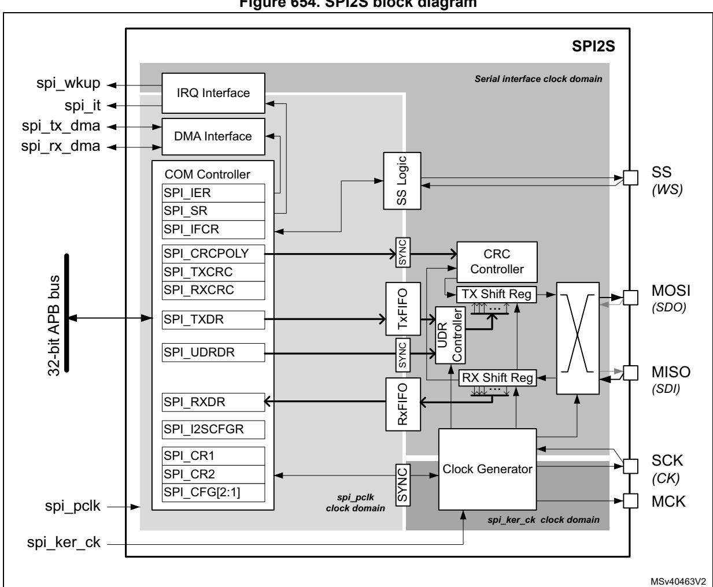

**Figure 654. SPI2S block diagram**

The simplified scheme of *[Figure 654](#page-2-0)* shows three fully independent clock domains:

- The **spi\_pclk** clock domain,
- The **spi\_ker\_ck** kernel clock domain,
- The serial interface clock domain,

All the control and status signals between these domains are strictly synchronized. There is no specific constraint concerning the frequency ratio between these clock signals. The user has to consider a ratio compatible with the data flow speed in order to avoid any data underrun or overrun events only.

The **spi\_pclk** clock signal feeds the peripheral bus interface. It has to be active when it accesses to the SPI registers are required.

The SPI master needs the **spi\_ker\_ck** kernel clock coming from RCC active during communication to feed the serial interface SCK clock via the clock generator divider.

The SPI working in slave mode handles data flow using the serial interface clock derived from the external SCK signal provided by external master SPI device. That is why the SPI slave is able to receive and send data even when the **spi\_pclk** and **spi\_ker\_ck** clock signals are inactive.

As a consequence, a specific slave logic working within the serial interface clock domain needs some additional traffic to be setup correctly (e.g. when underrun or overrun is evaluated see *[Section 53.5.2: SPI error flags](#page-25-0)* for details). This cannot be done when the bus becomes into idle. At specific case the slave even requires the clock generator working (see *[Section 53.5.1: TI mode](#page-25-1)*).

# **53.4.2 SPI signals**

Four I/O pins are dedicated to SPI communication with external devices.

- **MISO:** Master In / Slave Out data. In the general case, this pin is used to transmit data in slave mode and receive data in master mode.
- **MOSI:** Master Out / Slave In data. In the general case, this pin is used to transmit data in master mode and receive data in slave mode.
- **SCK:** Serial Clock output pin for SPI masters and input pin for SPI slaves.
- **SS:** Slave select pin. Depending on the SPI and SS settings, this pin can be used to either:
  - Select an individual slave device for communication
  - Synchronize the data frame or
  - Detect a conflict between multiple masters

See *[Section 53.4.7: Slave select \(SS\) pin management](#page-9-0)* for details.

The SPI bus allows the communication between one master device and one or more slave devices. The bus consists of at least two wires: one for the clock signal and the other for synchronous data transfer. Other signals can be added depending on the data exchange between SPI nodes and their slave select signal management. the functionality between MOSI and MISO pins can be inverted in any SPI mode (see the IOSWP bit at SPI\_CFG2 register).

All these pins are shared with I2S if this mode is implemented at the instance. See *[Section 53.9.2: Pin sharing with SPI function](#page-35-0)*.


RM0399 Rev 4 2313/3556

# 53.4.3 SPI communication general aspects

The SPI allows the MCU to communicate using different configurations, depending on the device targeted and the application requirements. These configurations use 2 or 3 wires (with software SS management) or 3/4 wires (with hardware SS management). The communication is always initiated and controlled by the master. The master provides a clock signal on the SCK line and selects or synchronizes slave(s) for communication by SS line when it is managed by HW. The data between the master and the slave flow on the MOSI and/or MISO lines. The direction of data flow is highlighted by black arrows at the following topology figures.

### 53.4.4 Communications between one master and one slave

The communication flow may use one of 3 possible modes: full-duplex (3 wires), half-duplex (2 wires) or simplex (2 wires). The SS signal is optional in single master-slave configuration and is often not connected between the two communication nodes. Nevertheless, the SS signal can be helpful at this configuration to synchronize the data flow and it is used by default at some specific SPI modes (e.g. TI mode).

### **Full-duplex communication**

By default, the SPI is configured for full-duplex communication (bits COMM[1:0]=00 in the SPI\_CFG2 register). In this configuration, the shift registers of the master and slave are linked using two unidirectional lines between the MOSI and the MISO pins. During the SPI communication, the data are shifted synchronously on the SCK clock edges provided by the master. The master transmits the data to be sent to the slave via the MOSI line and receives data from the slave via the MISO line simultaneously. When the data frame transfer is complete (all the bits are shifted) the information between the master and slave is exchanged.

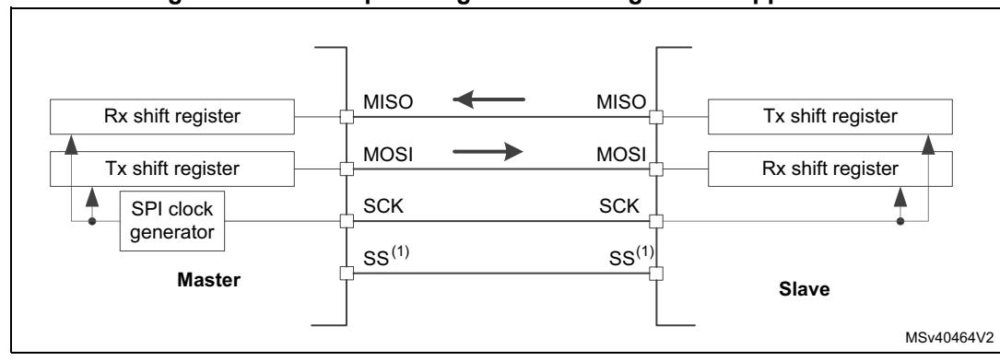

Figure 655. Full-duplex single master/ single slave application

1. To apply SS pins interconnection is not mandatory to make the SPI interface working (see Section 53.4.7: Slave select (SS) pin management for details).

# Half-duplex communication

The SPI can communicate in half-duplex mode by setting COMM[1:0]=11 in the SPI\_CFG2 register. In this configuration, one single cross connection line is used to link the shift registers of the master and slave together. During this communication, the data are synchronously shifted between the shift registers on the SCK clock edge in the transfer direction selected reciprocally by both master and slave with the HDDIR bit in their SPI\_CR1 registers. Note that the SPI has to be disabled when changing direction of the


communication. In this configuration, the MISO pin at master and the MOSI pin at slave are free for other application uses and act as GPIOs.

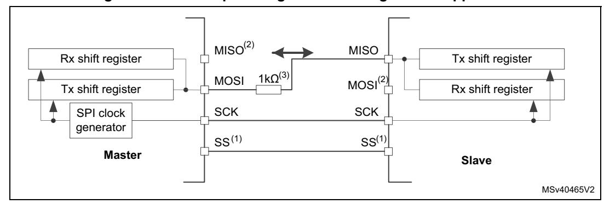

Figure 656. Half-duplex single master/ single slave application

- To apply SS pins interconnection is not mandatory to make the SPI interface working (see Section 53.4.7: Slave select (SS) pin management for details).
- 2. In this configuration, the MISO pin at master and MOSI pin at slave can be used as GPIOs
- 3. A critical situation can happen when communication direction is changed not synchronously between two nodes working at bidirectional mode and new transmitter accesses the common data line while former transmitter still keeps an opposite value on the line (the value depends on SPI configuration and communicated data). Both nodes can fight with opposite outputs levels on the line temporary till next node change its direction setting correspondingly, too. It is suggested to insert serial resistance between MISO and MOSI pins at this mode to protect the outputs and limit the current blowing between them at this situation.

# Simplex communications

The SPI can communicate in simplex mode by setting the SPI in transmit-only or in receive-only using the COMM[1:0] field in the SPI\_CFG2 register. In this configuration, only one line is used for the transfer between the shift registers of the master and slave. The remaining MISO or MOSI pins pair is not used for communication and can be used as standard GPIOs.

Transmit-only mode: COMM[1:0]=01

The master in transmit-only mode generates the clock as long as there are data available in the TxFIFO and the master transfer is on-going.

The slave in transmit only mode sends data as long as it receives a clock on the SCK pin and the SS pin (or SW managed internal signal) is active (see Section 53.4.7: Slave select (SS) pin management).

Receive-only mode: COMM[1:0]=10

In master mode, the MOSI output is disabled and may be used as GPIO. The clock signal is generated continuously as long as the SPI is enabled and the CSTART bit in the SPI\_CR1 register is set. The clock is stopped either by SW explicitly requesting this by setting the CSUSP bit in the SPI\_CR1 register or automatically when the RxFIFO is full, when the MASRX bit in the SPI\_CR1 is set.

In slave configuration, the MISO output is disabled and the pin can be used as a GPIO. The slave continues to receive data from the MOSI pin while its slave select signal is active (see Section 53.4.7: Slave select (SS) pin management).

Note:

At whatever master and slave modes, the data pin dedicated for transmission can be replaced by the data pin dedicated for reception and vice versa by changing the IOSWP bit value in the SPI\_CFG2 register. (This bit may only be modified when the SPI is disabled). Any simplex communication can be replaced by a variant of the half duplex communication


RM0399 Rev 4 2315/3556

with a constant setting of the transaction direction (bidirectional mode is enabled, while the HDDIR bit is never changed).

Figure 657. Simplex single master/single slave application (master in transmit-only/slave in receive-only mode)

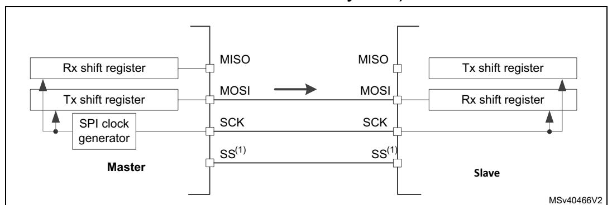

- To apply SS pins interconnection is not mandatory to make the SPI interface working (see Section 53.4.7: Slave select (SS) pin management for details).
- 2. In this configuration, both the MISO pins can be used as GPIOs.

### 53.4.5 Standard multislave communication

In a configuration with two or more independent slaves, the master uses a star topology with dedicated GPIO pins to manage the chip select lines for each slave separately (see *Figure 658*.). The master must select one of the slaves individually by pulling low the GPIO connected to the slave SS input (only one slave can control data on common MISO line at time). When this is done, a communication between the master and the selected slave is established. Except the simplicity, the advantage of this topology is that a specific SPI configuration can be applied for each slave as all the communication sessions are performed separately just within single master-slave pair. Optionally, when there is no need to read any information from slaves, the master can transmit the same information to the multiple slaves.


<span id="page-7-0"></span>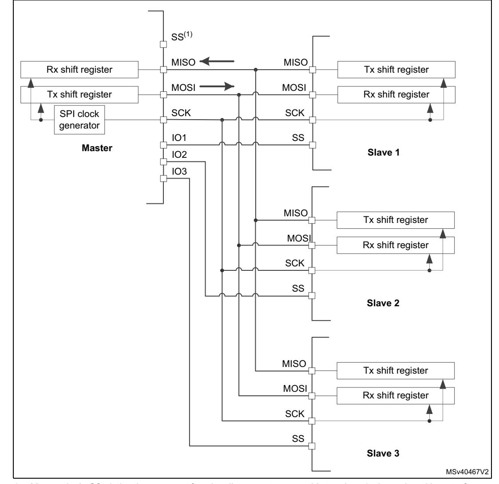

Figure 658. Master and three independent slaves at star topology

- Master single SS pin hardware output functionality cannot support this topology (to be replaced by set of GPIOs under SW control) and user should avoid SPI AF setting at the pin (see Section 53.4.7: Slave select (SS) pin management for details).
- 2. If the application cannot ensure that no more than a single SS active signal is provided by the master at time, it is better to configure the MISO pins into open drain configuration with an external pull-up at MISO line to prevent any conflict between interconnected outputs of the slaves on the line. Else the push-pull configuration can be applied without an extra resistor for the slaves. (see Section 12.3.7: I/O alternate function input/output on page 573.)

The master can handle the SPI communication with all the slaves in time when a circular topology is applied (see *Figure 659*). All the slaves behave like simple shift registers applied at serial chain under common slave select and clock control. All the information is shifted simultaneously around the circle while returning back to the master. Sessions have fixed the length where the number of data frames transacted by the master is equal to the number of slaves. Then when a first data frame is transacted in the chain, the master just sends information dedicated for the last slave node in the chain via the first slave node input while the first information received by the master comes from the last node output at this time. Correspondingly, the lastly transacted data finishing the session is dedicated for the first slave node while its firstly outgoing data just reaches the master input after its circling around the chain passing through all the other slaves during the session. The data format

57

RM0399 Rev 4 2317/3556

configuration and clock setting has to be the same for all the nodes in the chain at this topology. As the receive and transmit shift registers are separated internally, a trick with intentional underrun has to be applied at the TxFIFO slaves when information is transacted between the receiver and the transmitter by hardware. In this case, the transmission underrun feature is configured at a mode repeating lastly received data frame (UDRCFG[1:0]=01). A session can start optionally with a single data pattern written into the TxFIFO by each slave (usually slave status information is applied) before the session starts. In this case the underrun happens in fact after this first data frame is transacted (underrun detection has to be set at end of data transaction at slaves UDRDET[1:0]=01). To be able to clear the internal underrun condition immediately and restart the session by the TxFIFO content again, the user has to disable and enable the SPI between sessions and fill the TxFIFO by a new single data pattern.

<span id="page-8-0"></span>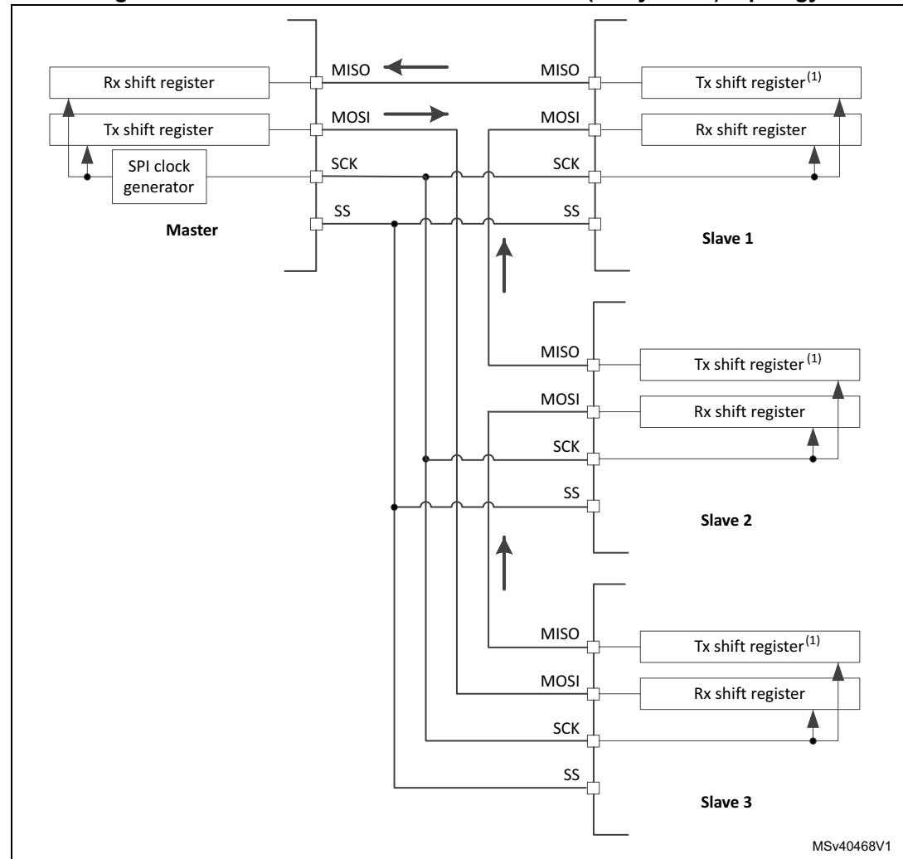

Figure 659. Master and three slaves at circular (daisy chain) topology

Underrun feature is used at slaves at this configuration when slaves are able to transmit data received
previously into the Rx shift register once their TxFIFOs become empty.


### 53.4.6 Multimaster communication

Unless the SPI bus is not designed for a multimaster capability primarily, the user can use build in feature which detects a potential conflict between two nodes trying to master the bus at the same time. For this detection, the SS pin is used configured at hardware input mode. The connection of more than two SPI nodes working at this mode is impossible as only one node can apply its output on a common data line at time.

When nodes are non active, both stay at slave mode by default. Once one node wants to overtake control on the bus, it switches itself into master mode and applies active level on the slave select input of the other node via the dedicated GPIO pin. After the session is completed, the active slave select signal is released and the node mastering the bus temporary returns back to passive slave mode waiting for next session start.

If potentially both nodes raised their mastering request at the same time a bus conflict event appears (see mode fault MODF event). Then the user can apply some simple arbitration process (e.g. to postpone next attempt by predefined different time-outs applied at both nodes).

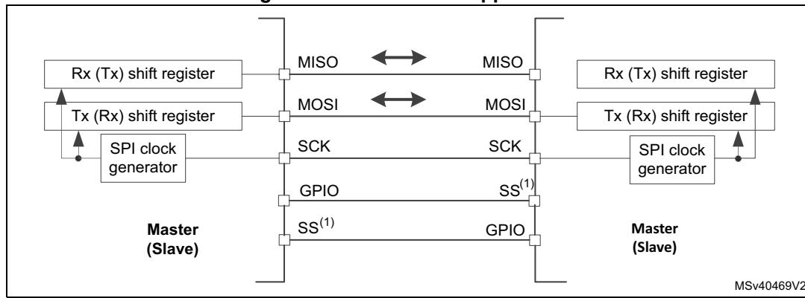

Figure 660. Multimaster application

 The SS pin is configured at hardware input mode at both nodes. Its active level enable the MISO line output control as passive node is configured as a slave.

# <span id="page-9-0"></span>53.4.7 Slave select (SS) pin management

In slave mode, the SS works as a standard 'chip select' input and lets the slave communicate with the master. In master mode, the SS can be used either as an output or an input. As an input it can prevent a multi master bus collision, and as an output it can drive a slave select signal of a single slave. The SS signal can be managed internally (software management of the SS input) or externally when both the SS input and output are associated with the SS pin (hardware SS management). The user can configure which level of this input/output external signal (present on the SS pin) is considered as active one by the SSIOP bit setting. The SS level is considered as active if it is equal to SSIOP.

The hardware or software slave select management can be set using the SSM bit in the SPI\_CFG2 register:

- **Software SS management (SSM = 1)**: in this configuration, slave select information is driven internally by the SSI bit value in the register SPI\_CR1. The external SS pin is free for other application uses (as GPIO or other alternate function).
- **Hardware SS management (SSM = 0)**: in this case, there are two possible configurations. The configuration used depends on the SS output configuration (SSOE bit in register SPI\_CFG2).
  - **SS output enable (SSOE = 1)**: this configuration is only used when the MCU is set as master. The SS pin is managed by the hardware. The functionality is tied to CSTART and EOT control. As a consequence, the master must apply proper TSIZE>0 setting to control the SS output correctly. Even if SPI AF is not applied at the SS pin (it can be used as a standard GPIO then), SSOE=1 setting should be kept anyway to assure default SS input level and prevent any mode fault evaluation at input of the master SS internal logic applicable at a multimaster topology exclusively.
  - a) When SSOM = 0 and SP = 000, the SS signal is driven to the active level as soon as the master transfer starts (CSTART=1) and it is kept active until its EOT flag is set or the transmission is suspended.
  - b) When SP = 001, a pulse is generated as defined by the TI mode.
  - c) When SSOM=1, SP=000 and MIDI>1 the SS is pulsed inactive between data frames, and kept inactive for a number of SPI clock periods defined by the MIDI value decremented by one (1 to 14).
  - **SS output disable (SSM=0, SSOE = 0)**:
  - a) if the microcontroller is acting as the master on the bus, this configuration allows multi master capability. If the SS pin is pulled into an active level in this mode, the SPI enters master mode fault state and the SPI device is automatically reconfigured in slave mode (MASTER=0).
  - b) In slave mode, the SS pin works as a standard 'chip select' input and the slave is selected while the SS line is at its active level.

*Note: The purpose of automatic switching into Slave mode at mode fault condition is to avoid the possible conflicts on data and clock line. As the SPE is automatically reset at this condition, both Rx and Tx FIFOs are flushed and current data is lost.*

*Note: When the SPI slave is enabled at the hardware SS management mode, all the traffics are ignored even in case of the SS is found at active level till the slave detects a start of the SS signal (its transition from non-active to active level) just synchronizing the slave with the master. That is why the hardware management mode cannot be used when the external SS pin is fixed. There is no such protection at the SS software management. Then the SSI bit must be changed when there is no traffic on the bus and the SCK signal is at idle state level between transfers exclusively in this case.* 

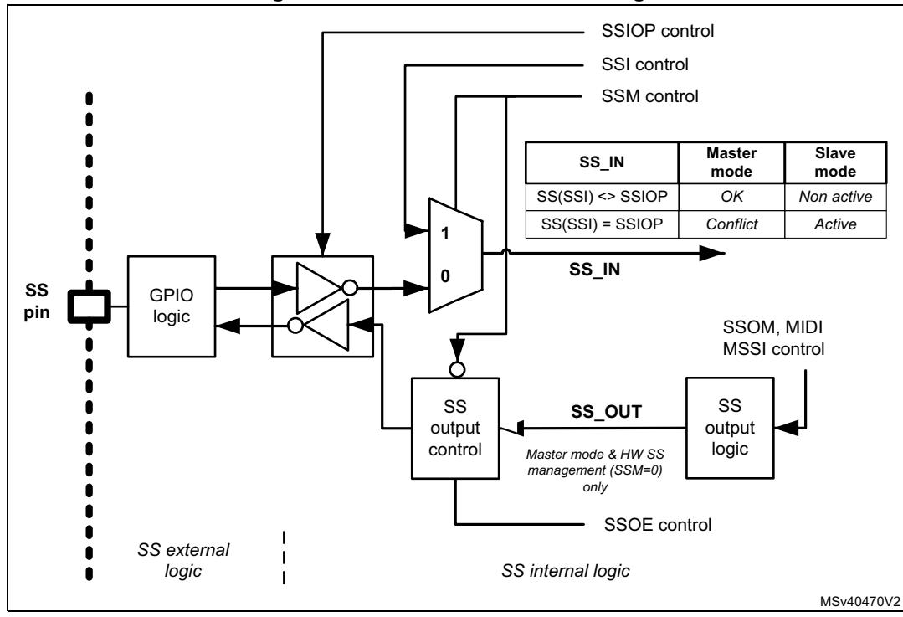

**Figure 661. Scheme of SS control logic**

When a hardware output SS control is applied (SSM=0, SSOE=1), by configuration of MIDI[3:0] and MSSI[3:0] bitfields the user can control timing of the SS signal between data frames and insert an extra delay at begin of every transaction (to separate the SS and clock starts). This can be useful when the slave needs to slow down the flow to obtain sufficient room for correct data handling (see *Figure [662: Data flow timing control \(SSOE=1,](#page-11-0)  [SSOM=0, SSM=0\)](#page-11-0)*

<span id="page-11-0"></span>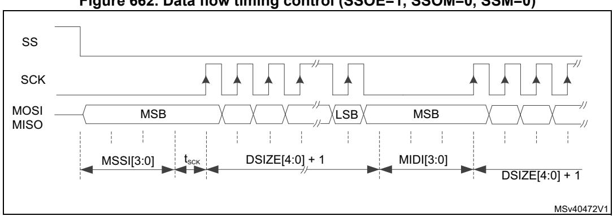

**Figure 662. Data flow timing control (SSOE=1, SSOM=0, SSM=0)**

- 1. MSSI[3:0]=0011, MIDI[3:0]=0011 (SCK flow is continuous when MIDI[3;0]=0).
- 2. CPHA=0, CPOL=0, SSOP=0, LSBFRST=0.

Additionally, bit SSOM=1 setting invokes specific mode which interleaves pulses between data frames if there is a sufficient space to provide them (MIDI[3:0] has to be set greater then one SPI period). Some configuration examples are shown at *Figure [663: SS](#page-12-0)  [interleaving pulses between data \(SSOE=1, SSOM=1,SSM=0\)](#page-12-0)*.


RM0399 Rev 4 2321/3556

<span id="page-12-0"></span>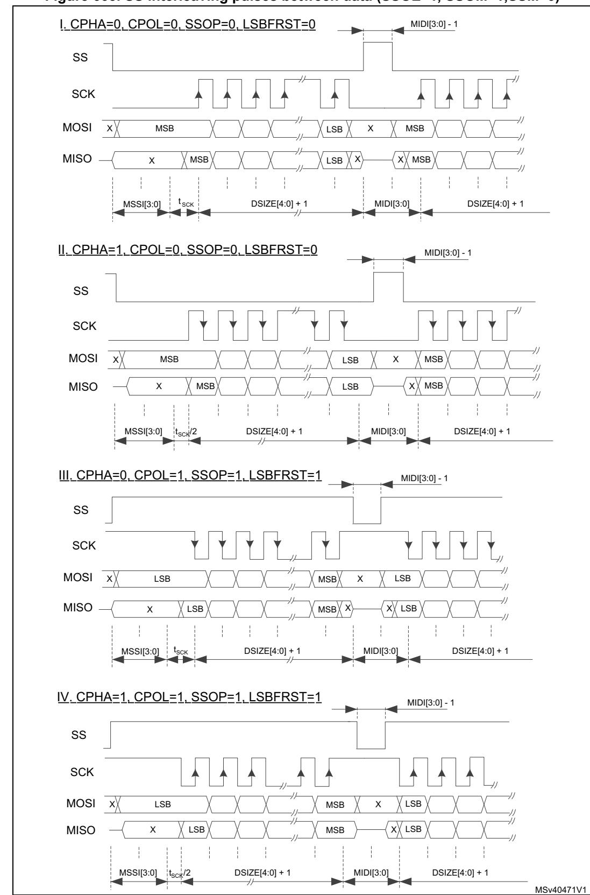

Figure 663. SS interleaving pulses between data (SSOE=1, SSOM=1,SSM=0)


- 1. MSSI[3:0]=0010, MIDI[3:0]=0010.
- 2. SS interleaves between data when MIDI[3:0]>1.

# **53.4.8 Communication formats**

During SPI communication, receive and transmit operations are performed simultaneously. The serial clock (SCK) synchronizes the shifting and sampling of the information on the data lines. The communication format depends on the clock phase, the clock polarity and the data frame format. To be able to communicate together, the master and slave devices must follow the same communication format and be synchronized correctly.

### **Clock phase and polarity controls**

Four possible timing relationships may be chosen by software, using the CPOL and CPHA bits in the SPI\_CFG2 register. The CPOL (clock polarity) bit controls the idle state value of the clock when no data are being transferred. This bit affects both master and slave modes. If CPOL is reset, the SCK pin has a low-level idle state. If CPOL is set, the SCK pin has a high-level idle state.

If the CPHA bit is set, the second edge on the SCK pin captures the first data bit transacted (falling edge if the CPOL bit is reset, rising edge if the CPOL bit is set). Data are latched on each occurrence of this clock transition type. If the CPHA bit is reset, the first edge on the SCK pin captures the first data bit transacted (falling edge if the CPOL bit is set, rising edge if the CPOL bit is reset). Data are latched on each occurrence of this clock transition type.

The combination of the CPOL (clock polarity) and CPHA (clock phase) bits selects the data capture clock edges (dotted lines at *[Figure 664: Data clock timing diagram](#page-14-0)*).

*[Figure 664](#page-14-0)*, shows an SPI full-duplex transfer with the four combinations of the CPHA and CPOL bits.

*Note: Prior to changing the CPOL/CPHA bits the SPI must be disabled by resetting the SPE bit. The idle state of SCK must correspond to the polarity selected in the SPI\_CFG2 register (by pulling the SCK pin up if CPOL=1 or pulling it down if CPOL=0).*


<span id="page-14-0"></span>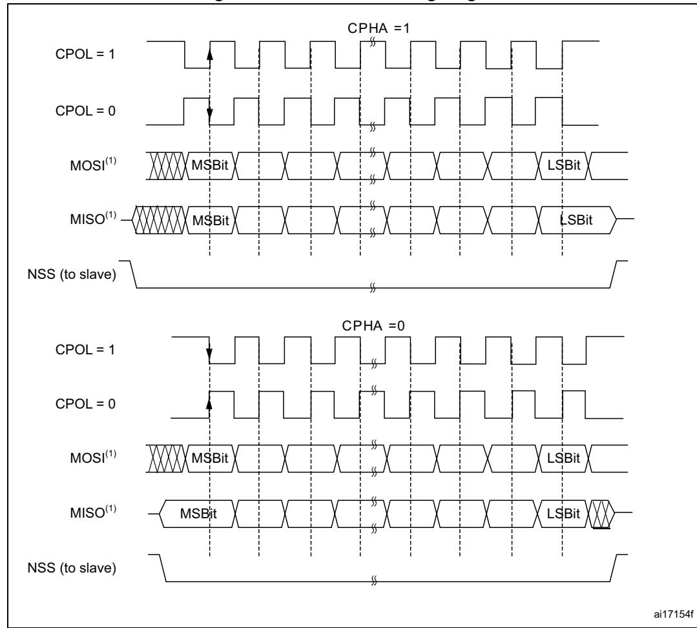

**Figure 664. Data clock timing diagram**

1. The order of data bits depends on LSBFRST bit setting.

### **Data frame format**

The SPI shift register can be set up to shift out MSB-first or LSB-first, depending on the value of the LSBFRST bit in SPI\_CFG2 register. The data frame size is chosen by using the DSIZE[4:0] bits. It can be set from 4-bit up to 32-bit length and the setting applies for both transmission and reception. When the SPI\_TXDR/SPI\_RXDR registers are accessed, data frames are always right-aligned into either a byte (if the data fit into a byte), a half-word or a word (see *[Figure 665](#page-15-0)*).

If the access is a multiple of the configured data size, data packing is applied automatically. During communication, only bits within the data frame are clocked and transferred.

<span id="page-15-0"></span>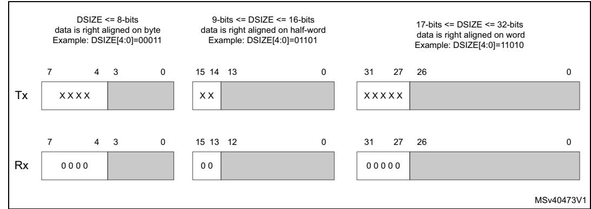

**Figure 665. Data alignment when data size is not equal to 8-bit, 16-bit or 32-bit**

*Note: The minimum data length is 4 bits. If a data length of less than 4 bits is selected, it is forced to an 4-bit data frame size.*

# **53.4.9 Configuration of SPI**

The configuration procedure is almost the same for the master and the slave. For specific mode setups, follow the dedicated chapters. When a standard communication has to be initialized, perform these steps prior SPI is enabled:

- 1. Write the proper GPIO registers: Configure GPIO alternate functions at MOSI, MISO, SCK and SS pins if applied.
- 2. Write to the SPI\_CFG1 and SPI\_CFG2 registers to set up proper values of all not reserved bits and bitfields included there with next exceptions:
  - a) SSOM, SSOE, MBR[2:0], MIDI[3:0] and MSSI[3:0] are required and taken into account at master mode exclusively.
  - b) UDRDET[1:0] and UDRCFG[1:0] are required and taken into account at slave mode only. The MBR[2:0] setting is taken into account only when slave is configured at TI mode.
  - c) CRCSIZE[4:0] is required if CRCEN is set,
  - d) CPOL, CPHA, LSBFRST, SSOM, SSOE, SSIOP, MSSI, MIDI and SSM are not required at TI mode.
  - e) Once the AFCNTR bit is set at SPI\_CFG2 register, all the SPI outputs start to be propagated onto the associated GPIO pins regardless the peripheral enable so any later configurations changes of the SPI\_CFG1 and SPI\_CFG2 registers can affect level of signals at these pins.
  - f) The I2SMOD bit at SPI\_I2SCFGR register has to be kept cleared to prevent any unexpected influence of occasional I2S configuration.
- 3. Write to the SPI\_CR2 register to select length of the transfer, if it is not known TSIZE has to be programmed to zero.
- 4. Write to SPI\_CRCPOLY and into TCRCINI, RCRCINI and CRC33\_17 bits at SPI\_CR1 register to configure the CRC polynomial and CRC calculation if needed.
- 5. Configure DMA streams dedicated for the SPI Tx and Rx in DMA registers if the DMA streams are used (see chapter Communication using DMA).
- 6. Configure SSI, HDDIR and MASRX at SPI\_CR1 register if required.
- 7. Program the IOLOCK bit in the SPI\_CFG1 register if the configuration protection is required (for safety).

RM0399 Rev 4 2325/3556

# **53.4.10 Procedure for enabling SPI**

It is recommended to configure and enable the SPI slave before the master sends the clock but there is no impact if the configuration and enabling procedure is done while a traffic is ongoing on the bus suppose SS signal is managed by hardware at slave or kept inactive by slave software when software management of the SS signal is applied (see *[Section 53.4.7:](#page-9-0)  [Slave select \(SS\) pin management](#page-9-0)*). The data register of the slave transmitter must contain data to be sent before the master starts its clocking.The SCK signal must be settled to idle state level corresponding to the selected polarity before the SPI slave is selected by SS else following transaction may be desynchronized.

When the SPI slave is enabled at the hardware SS management mode all the traffics are ignored even in case of the SS is found at active level till the slave detects a start of the SS signal (its transition from non-active to active level) just synchronizing the slave with the master. That is why the hardware management mode cannot be used when external SS pin is fixed. There is no such protection at the SS software management. In this case the SSI bit must be changed when there is no traffic on the bus and the SCK signal is at idle state level between transfers exclusively in this case.

The master at full duplex (or in any transmit-only mode) starts to communicate when the SPI is enabled, the CSTART bit is set and the TxFIFO is not empty, or with the next write to TxFIFO.

In any master receive only mode, the master starts to communicate and the clock starts running after the SPI is enabled and the CSTART bit is set.

For handling DMA, see *[Section 53.4.14: Communication using DMA \(direct memory](#page-23-0)  [addressing\)](#page-23-0)*.

# **53.4.11 SPI data transmission and reception procedures**

The setting of data communication format follows the basic principle that sure number of data with a flexible size must be transferred within a session (transaction) while, optionally, the data handling can be cumulated effectively into a single access of the SPI data registers (data packing) or even grouped into a sequence of such services if data is collected at consistent bigger data packets. The data handling services are based upon FIFO packet occupancy events. That is why the complete data packet must be serviced exclusively upon a dedicated packet flag.

To understand better the next detailed content of this section, the user should capture the configuration impact and meaning of the following items at first:

**Data size (DSIZE)**- defines data frame (sets the number of bits at single data frame).

**FIFO threshold (FTHLV)** - defines data packet, sets the number of data frames at single data packet and so the occurrence of the packet occupancy events to handle SPI data registers either by software or by DMA.

**Data access** – a way how to handle the SPI data register content when the transfer data between the application and the SPI FIFOs upon a packet event. It depends on the packet size configuration. Optionally, multiply data can be handled effectively by a single access of the register (by data packing) or by sequence of such accesses (when servicing a bigger data packet).

**FIFO size** – capacity or space to absorb available data. It depends on the data size and the internal hardware efficiency how the data is compressed and organized within this space. The FTHLV setting must respect the FIFO capacity to store two data packets at least.


**Transaction size (TSIZE)** – defines total number of data frames involved at a transaction session overall possibly covered by several data packet services. There is no need to align this number with the packet size (handling of a last not aligned data packet is supported if TSIZE is programmed properly).

# **Data handling via RxFIFO and TxFIFO**

All SPI data transitions pass through the embedded FIFOs organized by bytes (N x 8-bit). The size of the FIFOs (N) is product and the peripheral instance dependent. This enables the SPI to work in a continuous flow, and prevents overruns when the data frame size is short or the interrupt/DMA latency is too long. Each direction has its own FIFO called TxFIFO and RxFIFO, respectively.

The handling of the FIFOs content is based on servicing data packet events exclusively raised by dedicated FIFO packet occupancy flags (TXP, RXP or DXP). The flags occurrence depends on the data exchange mode (duplex, simplex), the data frame size (number of bits in the frame) and how data are organized at data packets. The frequency of the packet events can be decreased significantly when data are organized into packets via defining the FIFOs threshold. Several data frames grouped at packet can be then handled effectively based on a single FIFO occupancy packet event either by a single SPI data register access or their sequence what consumes less system performance. The user can control the access type by casting the data register address to force a concrete CPU instruction applied for the register read or write. The access then can be 8-bit, 16-bit or 32-bit but single data frame must be always accessed at least. It is crucial to keep the setting of the packet size (FTHLVL) and the data size (DSIZE) always balanced with the applied data registers access (no matter if a single access or their sequence is applied) just to apply and complete service of a single data packet upon its event. This principle, occurrence and clearing capabilities of the FIFO occupancy flags are common no matter if DMA, interrupt, or polling is applied.

A read access to the SPI\_RXDR register returns the oldest value stored in the RxFIFO that has not been read yet. A write access to the SPI\_TXDR stores the written data in the TxFIFO at the end of a send queue.

A read access to the SPI\_RXDR register must be managed by the RXP event. This flag is set by hardware when at least one complete data packet (defined as receiver threshold by FTHLV[3:0] bits at the SPI\_CFG1 register) is available at the reception FIFO while reception is active. The RXP is cleared as soon as less data than a complete single packet is available in the RxFIFO, when reading SPI\_RXDR by software or by DMA.

The RXP triggers an interrupt if the RXPIE bit is set.

Upon setting of the RXP flag, the application performs the due number of SPI data register reads to download the content of one data packet. Once a complete data packet is downloaded, the application software or DMA checks the RXP value to see if other packets are pending into the receive FIFO and, if so, downloads them packet by packet until the RXP reads 0. RxFIFO can store up to N data frames (for frame size =< 8-bit), N/2 data frames (for 8-bit < frame =< 16-bit), N/3 data frames (for 16-bit < frame =< 24-bit) or N/4 data frames (if data frame >24-bit) where N is the size of the FIFO in bytes.

At the end of a reception, it may happen that some data may still be available in the RxFIFO, without reaching the FTHLV level, thus the RXP is not set. In this case, the number of remaining RX data frames in the FIFO is indicated by RXWNE and RXPLVL fields in the SPI\_SR register. It happens when number of the last data received in a transfer cannot fully accomplish the configured packet size in the case transfer size and packet size are not aligned. Nevertheless the application software can still perform the standard number of reads from the RxFIFO used for the previous complete data packets without drawbacks:


RM0399 Rev 4 2327/3556

only the consistent data (completed data frames) are popped from the RxFIFO while redundant reads (or any uncompleted data) are reading 0. Thanks to that, the application software can treat all the data in a transfer in the same way and is off-loaded to foresee the reception of the last data in a transfer and from calculating the due number of reads to be popped from RxFIFO.

In a similar way, write access of a data frame to be transmitted is managed by the TXP event. This flag is set by hardware when there is enough space for the application to push at least one complete data packet (defined at FTHLV[3:0] bits at SPI\_CFG1 register) into the transmission FIFO while transmission is active. The TXP is cleared as soon as the TxFIFO is filled by software a/o by DMA and space currently available for any next complete data packet is lost. This can lead to oscillations of the TXP signal when data are released out from the TxFIFO while a new packet is stored frame by frame. Any write to the TxFIFO is ignored when there is no sufficient room to store at least a single data frame (TXP event is not respected), when TXTF is set or when the SPI is disabled.

The TXP triggers an interrupt if the TXPIE bit is set or a/o a DMA request if TXDMAEN is set. The TXPIE mask is cleared by hardware when the TXTF flag is set.

Upon setting of the TXP flag application software performs the due number of SPI data register writes to upload the content of one entire data packet. Once new complete data packet is uploaded, the application software or DMA checks the TXP value to see if other packets can be pushed into the TxFIFO and, if so, uploads them packet by packet until TXP reads 0 at the end of any packet load.

The number of last data in a transfer can be shorter than the configured packet size in the case when the transfer size and the packet size are not aligned. Nevertheless the application can still perform the standard number of data register writes used for the previous packets without drawbacks: only the consistent data are pushed into the TxFIFO while redundant writes are discarded. Thanks to that, the application software can treat all the data in a transfer in the same way and is off-loaded to foresee the transmission of the last data in a transfer and from calculating the due number of writes to push the last data into TxFIFO. Just for the last data case, the TXP event is asserted by SPI once there is enough space into TxFIFO to store remaining data to complete current transfer.

Both TXP and RXP events can be polled or handled by interrupts. The DXP bit can be monitored as a common TXP and RXP event at full duplex mode.

Upon setting of the DXP flag the application software performs the due number of writes to the SPI data register to upload the content of one entire data packet for transmission, followed by the same number of reads from the SPI data register to download the content of one data packet. Once one data packet is uploaded and one is downloaded, the application software or DMA checks the DXP value to see if other packets can be pushed and popped in sequence and, if so, uploads/downloads them packet by packet until DXP reads 0.

The DXP triggers an interrupt if the DXPIE bit is set. The DXPIE mask is cleared by hardware when the TXTF flag is set.

The DXP is useful in Full-Duplex communication in order to optimize performance in data uploading/downloading, and reducing the number of interrupts or DMA sequences required to support an SPI transfer thus minimizing the request for CPU bandwidth and system power especially when SPI is operated in Stop mode.

When relay on the DXP interrupt exclusively, the user must consider the drawback of such a simplification when TXP and RXP events are serviced by common procedures because the TXP services are delayed by purpose in this case. This is due to fact that the TXP events precedes the reception RXP ones normally to allow the TXP servicing prior transaction of


the last frame fully emptying the TxFIFO else master cannot provide a continuous SCK clock flow and the slave can even face an underrun condition. The possible solution is to prefill the TxFIFO by few data packets ahead prior the session starts and to handle all the data received after the TXTF event by EOT exclusively at the end of the transaction (as TXTF suppresses the DXP interrupts at the end of the transaction). In case of CRC computation is enabled, the user must calculate with additional space to accommodate the CRC frame at RxFIFO when relying on EOT exclusively at the end of transaction.

Another way to manage the data exchange is to use DMA (see *[Communication using DMA](#page-23-0)  [\(direct memory addressing\)](#page-23-0)*).

If the next data is received when the RxFIFO is full, an overrun event occurs (see description of OVR flag at *[Section 53.5.2: SPI error flags](#page-25-0)*). An overrun event can be polled or handled by an interrupt.

This may happen in slave mode or master mode (full duplex or receive only with MASRX = 0). In master receive only mode, with MASRX = 1, the generated clock stops automatically when the RxFIFO is full, therefore overrun is prevented.

Both RxFIFO and TxFIFO content is kept flushed when SPI is disabled (SPE=0).

### **Transaction handling**

A few data frames can be passed at single transaction to complete a message. The user can handle number of data within a message thanks to values stored into TSIZE and TSER fields. In principle, the transaction of a message starts when the SPI is enabled by setting CSTART bit and finishes when the total number of required data is transacted. The end of transaction controls the CRC and the hardware SS management when applied. To restart the internal state machine properly, SPI is strongly suggested to be disabled and re-enabled before next transaction starts despite its setting is not changed. If TSIZE is kept at zero while CSTART is set, an endless transaction is initialized (no control of transfer size is applied). During an endless transaction, the number of transacted data aligned with FIFOs threshold is supported exclusively. If the number of data (or its grouping into packets) is unpredictable, the user must keep the FIFO threshold setting (packet size) at single data (FTHLV=0) to assure that each data frame raises its own packet event to be serviced by the application or DMA.

The transaction can be suspended at any time thanks to CSUSP which clears the CSTART bit. SPI must be always disabled after such software suspension and re-enabled before the next transaction starts.

In master mode, the user can extend the number of data within the current session. When the number of data programmed into TSIZE is transacted and if TSER contains a non-zero value, the content of TSER is copied into TSIZE, and TSER value is cleared automatically. The transaction is then extended by a number of data corresponding to the value reloaded into TSIZE. The EOT event is not raised in this case as the transaction continues. After the reload operation, the TSERF flag is set and an interrupt is raised if TSERFIE is set. The user can write the next non-zero value into TSER after the TSER is cleared by hardware but still before the next reload occurs, so an unlimited number of data can be transacted while repeating this process.

When any data extension is applied, it always starts by aligned data packet. That is why it is suggested to keep number of data to be extended always aligned with packet size else the last data packet just before the extension is applied has to be handled as an incomplete one (see data packing chapter). If overall number of data is not aligned, the user must implement


RM0399 Rev 4 2329/3556

the rest not aligned number of data into TSER just at the last extension cycle and then handle the last incomplete packet of data standardly within EOT event handler.

For example, if the user wants to transfer 23 bytes while applies data number extension at configuration of 8-bit data size, data packet set to 4 data and 32-bit access to FIFO is used then whatever next sequence is correct

- TSIZE=16 TSER=7;
- TSIZE=12 TSER=8; last extensionTSER=3;

As the last not aligned MSB byte is ignored just within the last (6th) access of the FIFO.

When a not aligned sequence is applied for data to be extended like at the following cases

- TSIZE=15 TSER=8 or
- TSIZE=8 TSER=7; last extension TSER=8;

The MSB byte is ignored within the 4th access of the FIFO while the other accesses handle always 4 data at the FIFO.

When the transmission is enabled, a sequence begins and continues while any data is present in the TxFIFO of the master. The clock signal is provided permanently by the master until TxFIFO becomes empty, then it stops, waiting for additional data.

In receive-only modes, half duplex (COMM[1:0]=11, HDDIR=0) or simplex (COMM[1:0]=10) the master starts the sequence when SPI is enabled and transaction is released by setting the CSTART bit. The clock signal is provided by the master and it does not stop until either SPI or receive-only mode is disabled/suspended by the master. The master receives data frames permanently up to this moment. The reception can be suspended either by SW control, writing 1 to the CSUSP bit in the SPI\_CR1 register, or automatically when MASRX=1 and RxFIFO becomes full. The reception is automatically stopped also when the number of frames programmed in TSIZE and TSER fields of the SPI\_CR2 register has been completed.

In order to disable the master receive only mode, the SPI must be suspended at first. When the SPI is suspended, the current frame is completed, before changing the configuration.

**Caution:** If SPE is written to 0 at master, while reception is ongoing without any suspending, the clock is stopped without completing the current frame, and the RxFIFO is flushed.

> While the master can provide all the transactions in continuous mode (SCK signal is continuous) it has to respect slave capability to handle data flow and its content at anytime. When necessary, the master must slow down the communication and provide either a slower clock or separate frames or data sessions with sufficient delays by MIDI[3:0] bits setting or provide an initial delay by setting MSSI[1:0] which postpones any transaction start to give slave sufficient room for preparing data. Be aware data from the slave are always transacted and processed by the master even if the slave could not prepare it correctly in time. It is preferable for the slave to use DMA, especially when data frames are short, FIFO is accessed by bytes and the SPI bus rate is high.

> In order to add some SW control on the SPI communication flow from a slave transmitter node, a specific value written in the SPI\_UDRDR (SPI Underrun Data Register) may be used. On slave side, when TxFIFO becomes empty, this value is sent out automatically as next data and may be interpreted by SW on the master receiver side (either simply dropped or interpreted as a XOFF like command, in order to suspend the master receiver by SW).

> At multislave star topology, a single slave can be only enabled for the output data at a time. The slave just selected for the communication with the master needs to detect a change of its SS input into active level before the communication with the master starts. In a single


slave system it is not necessary to control the slave with SS, but it is often better to provide the pulse here too, to synchronize the slave with the beginning of each data sequence. The SS can be managed by both software and hardware (*[Section 53.4.7: Slave select \(SS\) pin](#page-9-0)  [management](#page-9-0)*).

# **53.4.12 Procedure for disabling the SPI**

When SPI is disabled, it is mandatory to follow the disable procedures described in this paragraph.

At the master mode, it is important to do this before the system enters a low-power mode when the peripheral clock is stopped. Otherwise, ongoing transactions may be corrupted in this case.

In slave mode, the SPI communication can continue when the **spi\_pclk** and **spi\_ker\_ck** clocks are stopped, without interruption, until any end of communication or data service request condition is reached. The **spi\_pclk** can generally be stopped by setting the system into STOP mode. Refer to the RCC section for further information.

The master in full duplex or transmit only mode can finish any transaction when it stops providing data for transmission. In this case, the clock stops after the last data transaction. TXC flag can be polled (or interrupt enabled with EOTIE=1) in order to wait for the last data frame to be sent.

When the master is in any receive only mode, in order to stop the peripheral, the SPI communication must be first suspended, by setting CSUSP to 1.

The data received but not read remain stored in RxFIFO when the SPI is suspended.

When SPI is disabled, RxFIFO is flushed. To prevent losing unread data, the user has to ensure that RxFIFO is empty when disabling the SPI, by reading all remaining data (as indicated by the RXP, RXWNE and RXPLVL fields in the SPI\_SR register).

The standard disable procedure is based on polling EOT and/or TXC status to check if a transmission session is (fully) completed. This check can be done in specific cases, too, when it is necessary to identify the end of ongoing transactions, for example:

- When the master handles SS signal by a GPIO not related to SPI (for example at case of multislave star topology) and it has to provide proper end of SS pulse for slave, or
- When transaction streams from DMA or FIFO are completed while the last data frame or CRC frame transaction is still ongoing in the peripheral bus.

When TSIZE>0, EOT and TXC signals are equal so the polling of EOT is reliable at whatever SPI communication mode to check end of the bus activity. When TSIZE=0, the user has to check TXC, SUSP or FIFO occupancy flags in according with the applied SPI mode and way of the data flow termination.

The correct disable procedure in master mode, except when receive only mode is used, is:

- 1. Wait until TXC=1 and/or EOT=1 (no more data to transmit and last data frame sent). When CRC is used, it is sent automatically after the last data in the block is processed. TXC/EOT is set when CRC frame is completed in this case. When a transmission is suspended the software has to wait till CSTART bit is cleared.
- 2. Read all RxFIFO data (until RXWNE=0 and RXPLVL=00)
- 3. Disable the SPI (SPE=0).

The correct disable procedure for master receive only modes is:


RM0399 Rev 4 2331/3556

- 1. Wait on EOT or break the receive flow by suspending SPI (CSUSP=1)
- 2. Wait until SUSP=1 (the last data frame is processed) if receive flow is suspended.
- 3. Read all RxFIFO data (until RXWNE=0 and RXPLVL=00)
- 4. Disable the SPI (SPE=0).

In slave mode, any on going data are lost when disabling the SPI.

# **53.4.13 Data packing**

From user point of view there are two ways of data packing which can overlay each other:

- Type of access when data are written to TxFIFO or read from RxFIFO *Multiple data can be pushed or fetched effectively by single access if data size is multiplied less than access performed upon SPI\_TXDR or SPI\_RXDR registers.*
- Number of data to be handled during the single software service *It is convenient to group data into packets and cumulate the FIFO services overall the data packet content exclusively instead of handling data frame by frame separately. The user can define packets by FIFO threshold settings. Then all the FIFO occupancy events are related to that threshold level while required services are signalized by proper flags with interrupt and/or wake up capabilities.*

When the data frame size fits into one byte (less than or equal to 8 bits), the data packing is used automatically when any read or write 16-bit or 32-bit access is performed on the SPI\_RXDR/SPI\_TXDR register. The multiple data frame pattern is handled in parallel in this case. At first, the SPI operates using the pattern stored in the LSB of the accessed word, then with the other data stored in the MSB. *[Figure 666](#page-23-1)* provides an example of data packing mode sequence handling. While DSIZE[3:0] is configured to 4-bit there, two or four data frames are written in the TxFIFO after the single 16-bit or 32-bit access the SPI\_TXDR register of the transmitter.

When the data frame size is between 9-bit and 16-bit, data packing is used automatically when a 32-bit access is done. the least significant half-word is used first. (regardless of the LSBFRST value)

This sequence can generate two or four RXP events in the receiver if the RxFIFO threshold is set to 1 frame (and data is read on a frame basis, unpacked), or it can generate a single RXP event if the FTHLV[3:0] field in the SPI\_CFG1 register is programmed to a multiple of the frames to be read in a packed mode (16-bit or 32-bit read access).

The data are aligned in accordance with *[Figure 665: Data alignment when data size is not](#page-15-0)  [equal to 8-bit, 16-bit or 32-bit](#page-15-0)*. The valid bits are performed on the bus exclusively. Unused bits are not cared at transmitter while padded by zeros at receiver.

When short data frames (<8-bit or < 16-bit) are used together with a larger data access mode (16-bit or 32-bit), the FTHLV value must be programmed as a multiple of the number of frames/data access (i.e. multiple of 4 if 32-bit access is used to up to 8-bit frames or multiple of 2 if 16-bit access is used to up to 8-bit frames or 32-bit access to up to 16-bit frames.).

The RxFIFO threshold setting must always be higher than the following read access size, as spurious extra data would be read otherwise.

The FIFO data access less than the configured data size is forbidden. One complete data frame has to be always accessed at minimum.

A specific problem appears if an incomplete data packet is available at FIFO: less than 4x8 bit frames or one single 16-bit frame is available.


There are two ways of dealing with this problem:

### A. without using TSIZE field

On transmitter side, writing the last data frame of any odd sequence with an 8-bit/16-bit access to SPI TXDR is enough.

On receiver side, the remaining data may be read by any access. Any extra data read are padded with zeros. Polling the RXWNE and RXPLVL may be used to detect when the RX data are available in the RxFIFO. (a time out may be used at system level in order to detect the polling)

#### B. using the TSIZE field

On transmitter side, the transaction is stopped by the master when it faces EOT event. In reception, the RXP flag is not set when EOT is set. In the case when the number of data to be received (TSIZE) is not a multiple of packet size, the number of remaining data is indicated by the RXWNE and RXPLVL fields in the SPI SR register. The remaining data can be read by any access. Any extra read is padded by zeros.

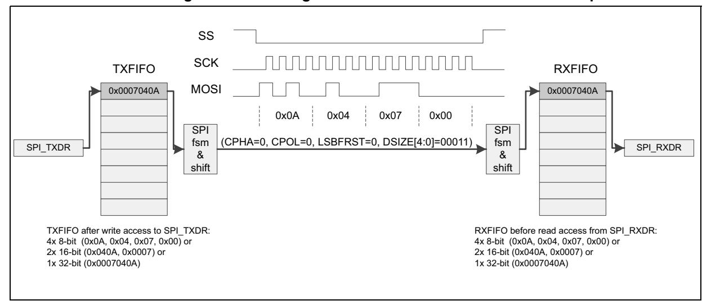

<span id="page-23-1"></span>Figure 666. Packing data in FIFO for transmission and reception

DSIZE[3:0] is configured to 4-bit, data is right aligned, valid bits are performed only on the bus, their order depends on LSBFRST, if it is set, the order is reversed at all the data frames.

#### <span id="page-23-0"></span>53.4.14 Communication using DMA (direct memory addressing)

To operate at its maximum speed and to facilitate the data register read/write process required to avoid overrun, the SPI features a DMA capability, which implements a simple request/acknowledge protocol.

A DMA access is requested when the TXDMAEN or RXDMAEN enable bits in the SPI CFG1 register are set. Separate requests must be issued to the Tx and Rx buffers to fulfill the service of the defined packet.

- In transmission, a series of DMA requests is triggered each time TXP is set to 1. The DMA then performs series of writes to the SPI TXDR register.
- In reception, a series of DMA requests is triggered each time RXP is set to 1. The DMA then performs series of reads from the SPI RXDR register. When EOT is set at the end of transaction and last data packet is incomplete then DMA request is activated automatically in according with RXWNE and RXPLVL[1:0] setting to read rest of data.


RM0399 Rev 4 2333/3556 If the SPI is programmed in receive only mode, UDR is never set.

If the SPI is programmed in a transmit mode, TXP and UDR can be eventually set at slave side, because transmit data may not be available. In this case, some data are sent on the TX line according with the UDR management selection.

When the SPI is used at a simplex mode, the user must enable the adequate DMA channel only while keeping the complementary unused channel and disabled.

If the SPI is programmed in transmit only mode, RXP and OVR are never set.

If the SPI is programmed in full-duplex mode, RXP and OVR are eventually set, because received data are not read.

In transmission mode, when the DMA or the user has written all the data to be transmitted (the TXTF flag is set at SPI\_SR register), the EOT (or TXC at case TISEZE=0) flag can be monitored to ensure that the SPI communication is complete. This is required to avoid corrupting the last transmission before disabling the SPI or before disabling the **spi\_pclk** in master mode. The software must first wait until EOT=1 and/or TXC=1.

When starting communication using DMA, to prevent DMA channel management raising error events, these steps must be followed in order:

- 1. Enable DMA Rx buffer in the RXDMAEN bit in the SPI\_CFG1 register, if DMA Rx is used.
- 2. Enable DMA requests for Tx and Rx in DMA registers, if the DMA is used.
- 3. Enable DMA Tx buffer in the TXDMAEN bit in the SPI\_CFG1 register, if DMA Tx is used.
- 4. Enable the SPI by setting the SPE bit.

To close communication it is mandatory to follow these steps in order:

- 1. Disable DMA request for Tx and Rx in the DMA registers, if the DMA issued.
- 2. Disable the SPI by following the SPI disable procedure.
- 3. Disable DMA Tx and Rx buffers by clearing the TXDMAEN and RXDMAEN bits in the SPI\_CFG1 register, if DMA Tx and/or DMA Rx are used.

### **Data packing with DMA**

If the transfers are managed by DMA (TXDMAEN and RXDMAEN set in the SPI\_CFG1 register) the packing mode is enabled/disabled automatically depending on the PSIZE value configured for SPI TX and the SPI RX DMA channel.

If the DMA channel PSIZE value is equal to 16-bit or 32-bit and SPI data size is less than or equal to 8-bit, then packing mode is enabled. Similarly, If the DMA channel PSIZE value is equal to 32-bit and SPI data size is less than or equal to 16-bit, then packing mode is enabled.The DMA then automatically manages the write operations to the SPI\_TXDR register.

Regardless data packing mode is used and the number of data to transfer is not a multiple of the DMA data size (16-bit or 32-bit) while the frame size is smaller, DMA completes the transfer automatically in according with the TSIZE field setting.

Alternatively, last data frames may be written by software, in the single/unpacked mode.

To configure any DMA data access less than the configured data size is forbidden. One complete data frame has to be always accessed at minimum.


# 53.5 SPI specific modes and control

### <span id="page-25-1"></span>53.5.1 TI mode

By specific setting of the SP[2:0] bit field at the SPI\_CFG2 register the SPI can be configured to be compliant with TI protocol. The SCK and SS signals polarity, phase and flow as well as the bits order are fixed so the setting of CPOL, CPHA, LSBFRST, SSOM, SSOE, SSIOP and SSM is not required when the SPI is at TI mode configuration. The SS signal synchronizes the protocol by pulses over the LSB data bit as it is shown at the *Figure 667: TI mode transfer*.

<span id="page-25-2"></span>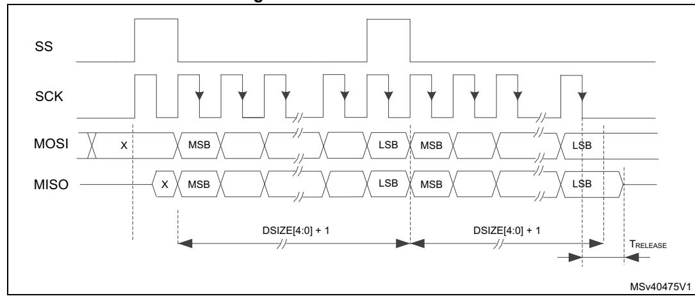

Figure 667. TI mode transfer

In slave mode, the clock generator is used to define time when the slave output at MISO pin becomes to HiZ when the current transaction finishes. The master baud rate setting (MBR[2:0] at SPI\_CFG1) is applied and any baud rate can be used to determine this moment with optimal flexibility. The delay for the MISO signal to become HiZ (TRELEASE) depends on internal re-synchronization, too, which takes next additional 2-4 periods of the clock signal feeding the generator. It is given by formula:

$$\frac{\text{Tbaud}}{2} + 2 \text{ x Tspi\_ker\_ck} \leq \text{Trelease} \leq \frac{\text{Tbaud}}{2} + 4 \text{ x Tspi\_ker\_ck}$$

If the slave detects misplaced SS pulse during data transaction the TIFRE flag is set.

# <span id="page-25-0"></span>53.5.2 SPI error flags

An SPI interrupt is generated if one of the following error flags is set and interrupt is enabled by setting the corresponding Interrupt Enable bit.

### Overrun flag (OVR)

An overrun condition occurs when data are received by a master or slave and the RxFIFO has not enough space to store these received data. This can happen if the software or the DMA did not have enough time to read the previously received data (stored in the RxFIFO).

When an overrun condition occurs, the OVR flag is set and the newly received value does not overwrite the previous one in the RxFIFO. The newly received value is discarded and all

4

RM0399 Rev 4 2335/3556

data transmitted subsequently are lost. OVR flag triggers an interrupt if OVRIE bit is set. Clearing the OVR bit is done by a writing 1 to the OVRC bit in the SPI\_IFCR. To prevent any next overrun event the clearing must be done after RxFIFO is emptied by software reads. It is suggested to release the RxFIFO space as much as possible, this means to read out all the available data packets based on the RXP flag indication. At master mode, the user can prevent the RxFIFO overrun by automatic communication suspend (MASRX bit).

# **Underrun flag (UDR)**

At a slave-transmitting mode, the underrun condition is captured internally by hardware if no data is available for transmission in the slave TxFIFO at the moment specified by UDRDET bits. The UDR flag setting is then propagated into the status register by hardware (see note below). UDR triggers an interrupt if the UDRIE bit is set.

Once the underrun is captured next provided data for transmission depends on the UDRCFG bits. The slave can provide out either data stored lastly to its TxFIFO or the data received previously from the master or a constant pattern stored by the user at the UDRDR register. The second configuration can be used at circular topography structure (see *[Figure 659](#page-8-0)*). Standard transmission is re-enabled once the software clears the UDR flag and this clearing is propagated into SPI Iogic by hardware. The user must write some data into TxFIFO prior clearing UDR flag to prevent any next underrun condition occurrence capture.

When the configuration UDRDET[1:0]=00 is applied, the underrun condition is evaluated whenever master starts to communicate a new data frame while TxFIFO is empty. Then single additional dummy (accidental) data is always inserted between last valid data and proper underrun pattern defined by UDRCFG[1:0]. This does not happen when any other UDRDET[1:0] configuration is applied suppose the slave's TxFIFO is not empty when underrun condition is checked (see *[Figure 668: Optional configurations of slave behavior at](#page-27-0)  [detection of underrun condition](#page-27-0)*).

The data transacted by slave is unpredictable especially when the transaction starts or continues while TxFIFO is empty and underrun condition is either not yet captured or just cleared. Typically, this is the case when UDRDET[1:0]=00 or SPI is just enabled or when a transaction with a defined size just starts. First bits can be corrupted in this case, as well, when slave software writes first data into the empty TxFIFO too close prior the data transaction starts (propagation of the data into TxFIFO takes few APB clock cycles). If the user cannot ensure to write data into the empty TxFIFO in time the UDRDET[1:0]=00 setting must be avoided.

To handle the underrun control feature correctly the user must avoid next critical encroachments especially

- Any fill of empty TxFIFO when master starts clocking (at UDRDET[1:0]=00 especially)
- Any clear of UDR flag while TxFIFO is empty
- Any setting of UDRDET[1:0]=00 together with UDRCFG[1:0]=10 (to avoid repetition of undefined dummy data)
- Any setting of UDRDET[1:0]=10 when underrun must be detected after each data frame while SS signal does not toggle between the frames
- Any setting of UDRDET[1:0]=10 while SS is managed by software

SCK MOSI DI1 MISO DO1 TxFIFO occupancy 1 0 Dummy DI2 DI3 UDR SCK MOSI DI1 MISO TxFIFO occupancy 1 0 DI2 DI3 UDR UDRDET[1:0]= 00 UDR propagation latency (see note) DO1 UDRDET[1:0]= 01 SCK MOSI DI1 MISO TxFIFO occupancy Dummy DI2 DI3 UDR UDRDET[1:0]= 01 0 UDR propagation latency at SCK domain (see note) SCK MOSI DI1 MISO TxFIFO occupancy DI2 DI3 UDR UDRDET[1:0]= 10 0 SS Underrun pattern\* Underrun pattern\* Underrun pattern\* *\*) Depends on UDRCFG[1:0] setting* Underrun pattern\* Underrun pattern\* Underrun pattern\* Underrun pattern\* UDR propagation latency at SCK domain (see note) UDR propagation latency at SCK domain (see note) Underrun pattern\*

<span id="page-27-0"></span>**Figure 668. Optional configurations of slave behavior at detection of underrun condition**

*Note: The hardware propagation of an UDR event needs additional traffic on the bus. It always takes few extra SPI clock cycles after the event happens (both underrun captured by hardware and cleared by software). If clearing of the UDR flag by software is applied close to the end of data frame transaction or when the SCK line is at idle in between the frames, the next extra underrun pattern is sent initially by slave prior the valid data from TxFIFO becomes transacted again. The user can prevent this by SPI disable/enable action between sessions to restart the underrun logic and so initiate the next session by the valid data.* 

### **Mode fault (MODF)**

Mode fault occurs when the master device has its internal SS signal (SS pin in SS hardware mode, or SSI bit in SS software mode) pulled low. This automatically affects the SPI interface in the following ways:

- The MODF bit is set and the interrupt request is triggered if the MODFIE bit is set.
- The SPE bit is forced to zero while MODF bit is set. This blocks all the peripheral outputs and disables the SPI interface.
- The MASTER bit is cleared, thus forcing the device into slave mode.

MODF is cleared by writing 1 to the MODFC bit in the SPI\_IFCR.

To avoid any multiple slave conflicts in a system comprising several MCUs, the SS pin must be pulled to its non-active level before re-enabling the SPI, by setting the SPE bit.

As a security, hardware does not allow the SPE bit to be set while the MODF bit is set. In a slave device the MODF bit cannot be set except as the result of a previous multi master conflict.

A correct SW procedure when master overtakes the bus at multi master system must be the following one:

- Switch into master mode while SSOE=0 (potential conflict can appear when another master occupies the bus. MODF is raised in this case which prevents any next node switching into master mode)
- Put GPIO pin dedicated for another master SS control into active level
- Perform data transaction
- Put GPIO pin dedicated for another master SS control into non active level
- Switch back to slave mode

### **CRC error (CRCE)**

This flag is used to verify the validity of the value received when the CRCEN bit in the SPI\_CFG1 register is set. The CRCE flag in the SPI\_SR register is set if the value received in the shift register does not match the receiver SPI\_RXCRC value, after the last data is received (as defined by TSIZE). The CRCE flag triggers an interrupt if RCEIE bit is set. Clearing the bit CRCE is done by a writing 1 to the CRCEC bit in the SPI\_IFCR.

### **TI mode frame format error (TIFRE)**

A TI mode frame format error is detected when an SS pulse occurs during an ongoing communication when the SPI is operating in slave mode and configured to conform to the TI mode protocol. When this error occurs, the TIFRE flag is set in the SPI\_SR register. The SPI is not disabled when an error occurs, the SS pulse is ignored, and the SPI waits for the next SS pulse before starting a new transfer. The data may be corrupted since the error detection may result in the loss of few data bytes.


The TIFRE flag is cleared by writing 1 to the TIFREC bit in the SPI\_IFCR. If the TIFREIE bit is set, an interrupt is generated on the SS error detection. As data consistency is no longer guaranteed, communication must be re-initiated by software between master and slave.

# **53.5.3 CRC computation**

Two separate 33-bit or two separate 17-bit CRC calculators are implemented in order to check the reliability of transmitted and received data. The SPI offers any CRC polynomial length (*number of bits involved in the CRC computation)* from 5 to 33 bits when maximum data size is 32-bit and from 5 to 17 bits for the peripheral instances where maximum data size is limited to 16-bit.

The length of the polynomial is defined by the most significant bit of the value stored in the SPI\_CRCPOLY register. It must be greater than the data frame size (in bits) defined in the DSIZE[4:0] bitfield of the SPI\_CFG1 register. To obtain a full-size polynomial, the polynomial length must exceed the maximum data size of the peripheral instance, and the CRC33\_17 bit of the SPI\_CR1 register must be set to select the most significant bit of the polynomial string. For example, to select the standard CRC16-CCITT (XMODEM) polynomial x^16 + x^12 + x^5 + 1, write 0x11021 to the SPI\_CRCPOLY register for a 32-bit instance, whereas to obtain the full size for a 16-bit instance, write 0x1021 with the CRC33\_17 bit set.

The CRCSIZE field in the SPI\_CFG1 then defines how many the most significant bits from CRC calculation registers are transacted and compared as CRC frame. It is defined independently from the data frame length, but it must be either equal or an integer multiple of the data frame size while its size cannot exceed the maximum data size of the instance.

To fully benefit from the CRC calculation capability, the polynomial length setting must correspond to the CRC pattern size, else the bits unused at the calculation are transacted and expected all zero at the end of the CRC pattern if its size is set greater than the polynomial length.

### **CRC principle**

The CRC calculation is enabled by setting the CRCEN bit in the SPI\_CFG1 register before the SPI is enabled (SPE = 1). The CRC value is then calculated using the CRC polynomial defined by the CRCPOLY register and CRC33\_17 bit. When SPI is enabled, the CRC polynomial can be changed but only in case when there is no traffic on the bus.

The CRC computation is done, bit by bit, on the sampling clock edge defined by the CPHA and CPOL bits in the SPI\_CR1 register. The calculated CRC value is checked automatically at the end of the data block defined by the SPI\_CR2 register exclusively.

When a mismatch is detected between the CRC calculated internally on the received data and the CRC received from the transmitter, a CRCERR flag is set to indicate a data corruption error. The right procedure for handling the CRC depends on the SPI configuration and the chosen transfer management.

### **CRC transfer management**

Communication starts and continues normally until the last data frame has to be sent or received in the SPI\_DR register.

The length of the transfer has to be defined by TSIZE and TSER. When the desired number of data is transacted, the TXCRC is transmitted and the data received on the line are compared to the RXCRC value.


RM0399 Rev 4 2339/3556

TSIZE cannot be set to 0xFFFF value if CRC is enabled. A correct way of sending e.g. 65535 data with CRC is to set:

- TSIZE= 0xFFFE and TSER=1 when data packet is configured to keep one data respective
- TSIZE= 0xFFFC and TSER=3 when data packet keeps 4 data (to ensure the TSIZE value aligned with packet size when its extension is applied).

In transmission, the CRC computation is frozen during CRC transaction and the TXCRC is transmitted, in a frame of length equal to the CRCSIZE field value.

In reception, the RXCRC is also frozen when desired number of data is transacted. Information to be compared with the RXCRC register content is then received in a frame of length equal to the CRCSIZE value.

Once the CRC frame is completed, an automatic check is performed comparing the received CRC value and the value calculated in the SPI\_RXCRC register. Software has to check the CRCERR flag in the SPI\_SR register to determine if the data transfers were corrupted or not. Software clears the CRCERR flag by writing 1 to the CRCERRC.

The user takes no care about any flushing redundant CRC information, it is done automatically.

### **Resetting the SPI\_TXCRC and SPI\_RXCRC values**

The SPI\_TXCRC and SPI\_RXCRC values are initialized automatically when new data is sampled after a CRC phase. This allows the use of DMA circular mode in order to transfer data without any interruption (several data blocks covered by intermediate CRC checking phases). Initialization patterns for receiver and transmitter can be configured either to zero or to all ones in dependency on setting bits TCRCINI and RCRCINI at SPI\_CR1 register.

The CRC values are reset when the SPI is disabled.

# <span id="page-30-0"></span>**53.6 Low-power mode management**

The SPI has advanced low-power mode functions allowing it to transfer properly data between the FIFOs and the serial interface even when the **spi\_pclk** clock is disabled.

In master mode the **spi\_ker\_ck** kernel clock is needed in order to provide the timings of the serial interface.

In slave mode, the **spi\_ker\_ck** clock can be removed as well during the transfer of data between the FIFOs and the serial interface. In this mode the clock is provided by the external SPI device.

When the **spi\_pclk** clock is gated, (and the **spi\_ker\_ck** clock as well if the SPI is in slave), the SPI provides a wakeup event signal (**spi\_wkup**) if a specific action requiring the activation of the **spi\_pclk** clock is needed, such as:

- To fill-up the TxFIFO,
- To empty the RxFIFO,
- Other signaling: end of transfer, errors...

The generation of **spi\_ker\_ck** and **spi\_pclk** clock are controlled by the RCC block according to register settings and the processors modes. Refer to the RCC section for details.


The **spi\_pclk** clock request stays pending till a flag with enabled interrupt is set. That is why it is important to service these pending requests and clear their flag as soon as possible at system sensitive to the low power consumption especially and the application must acknowledge all pending interrupts events before switching the SPI to low-power mode (i.e. removing **spi\_pclk**).

The *[Figure 669](#page-31-0)* shows an example of the clock handling when the SPI2S is working in lowpower mode. The example is given for a transmit mode.

In master mode the **spi\_ker\_ck** clock is required for the timing generation.

The *[Figure 669](#page-31-0)* shows two kinds of supported scenarios for the handling of the **spi\_ker\_ck** kernel clock in slave mode:

- In most of the slave modes, the **spi\_ker\_ck** kernel clock can be disabled,
- In some products, the **spi\_ker\_ck** kernel clock activation may follow the system state.

<span id="page-31-0"></span>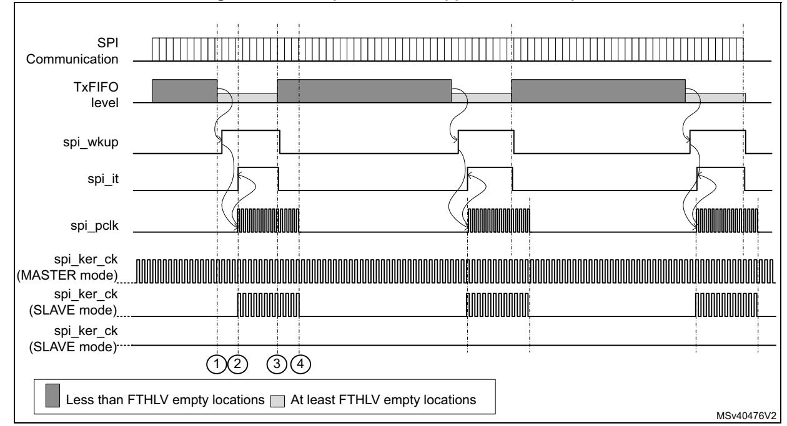

**Figure 669. Low-power mode application example**

The figure clearly shows that the **spi\_pclk** must be provided to the SPI2S, when data need to be transferred from the memory to the SPI2S TxFIFO. Here is the description of the most important steps:

### • **Step 1**

The TxFIFO level goes below the programmed threshold, this event (TXP) activates the **spi\_wkup** signal. This signal is generally used to wake-up the system from lowpower mode, and thus to activate the bus clock (**spi\_pclk**).

#### • **Step 2**

When **spi\_pclk** is activated, the **spi\_it** is also activated, and the product is ready to fillup the TxFIFO either by DMA or by software. Note as well that for some product the system wake-up automatically enables the **spi\_ker\_ck** kernel clock as well.

# • **Step 3**

When the amount of empty locations in the TxFIFO is less than FTHLV, then the **spi\_wkup** and **spi\_it** signals are deactivated, but the fill-up of the TxFIFO may

RM0399 Rev 4 2341/3556

continue. Note that **spi\_wkup** falling edge is aligned with the serial interface clock domain, and the falling edge of the **spi\_it** is aligned with the **spi\_pclk** clock domain.

#### • **Step 4**

The fill-up of the TxFIFO is completed; the software can switch the system back to lowpower mode until the next **spi\_wkup** occurs.


# **53.7 SPI wakeup and interrupts**

*[Table 436](#page-33-0)* gives an overview of the SPI events capable to generate interrupt events (**spi\_it**). Some of them feature wake-up from low-power mode capability additionally (**spi\_wkup**).

Most of them can be enabled and disabled independently while using specific interrupt enable control bits.

The flags associated with the events are cleared by specific methods. Refer to the description of SPI registers for more details about the event flags. All the pending interrupt requests stay active if the SPI is disabled. A not cleared request with an enabled interrupt generates a spi\_pclk clock request and so increases the overall consumption.

**Table 436. SPI wakeup and interrupt requests** 

<span id="page-33-0"></span>

| Interrupt event                                                                        | Event<br>flag(1) | Enable<br>Control | Event clear method                                                                 | Interrupt/Wakeup<br>activated |          |
|----------------------------------------------------------------------------------------|------------------|-------------------|------------------------------------------------------------------------------------|-------------------------------|----------|
|                                                                                        |                  | bit               |                                                                                    | spi_it                        | spi_wkup |
| TxFIFO ready to be loaded (space<br>available for one data packet - FIFO<br>threshold) | TXP              | TXPIE             | TXP cleared by hardware<br>when TxFIFO contains less<br>than FTHLV empty locations |                               | YES      |
| Data received in RxFIFO (one data<br>packet available - FIFO threshold)                | RXP              | RXPIE             | RXP cleared by hardware<br>when RxFIFO contains less<br>than FTHLV samples         |                               | YES      |
| Both TXP and RXP active                                                                | DXP              | DXPIE             | When TXP or RXP are<br>cleared                                                     |                               | YES      |
| Transmission Transfer Filled                                                           | TXTF             | TXTFIE            | Writing TXTFC to 1                                                                 |                               | NO       |
| Underrun                                                                               | UDR              | UDRIE             | Writing UDRC to 1                                                                  |                               | YES      |
| Overrun                                                                                | OVR              | OVRIE             | Writing OVRC to 1                                                                  |                               | YES      |
| CRC Error                                                                              | CRCE             | CRCEIE            | Writing CRCEC to 1                                                                 | YES                           | YES      |
| TI Frame Format Error                                                                  | TIFRE            | TIFREIE           | Writing TIFREC to 1                                                                |                               | NO       |
| Mode Fault                                                                             | MODF             | MODFIE            | Writing MODFC to 1                                                                 |                               | NO       |
| End Of Transfer (full transfer<br>sequence completed - based on<br>TSIZE value)        | EOT              |                   | Writing EOTC to 1                                                                  |                               | YES      |
| Master mode suspended                                                                  | SUSP             | EOTIE             | Writing SUSPC to 1                                                                 |                               | YES      |
| TxFIFO transmission complete<br>(TxFIFO empty)                                         | TXC(2)           |                   | TXC cleared by HW when a<br>transmission activity starts<br>on the bus             |                               | NO       |
| TSER value transferred to TSIZE<br>(new value may be loaded to TSER)                   | TSERF            | TSERFIE           | Writing TSERFC to 1                                                                |                               | NO       |

<sup>1.</sup> Refer to SPI2S register description for more details about the event flags.


<sup>2.</sup> The TXC flag behavior depends on the TSIZE setting. When TSIZE>0, the flag fully follows the EOT one including its clearing by EOTC.

# **53.8 I2S main features**

- Full duplex communication
- Half-duplex communication (only transmitter or receiver)
- Master or slave operations
- 8-bit programmable linear prescaler
- Data length may be 16, 24 or 32 bits(a)
- Channel length can be 16 or 32 in master, any value in slave
- Programmable clock polarity
- Error flags signaling for improved reliability: Underrun, Overrun and Frame Error
- Embedded Rx and TxFIFOs
- Supported I2S protocols:
  - I2S Philips standard
  - MSB-Justified standard (Left-Justified)
  - LSB-Justified standard (Right-Justified)
  - PCM standard (with short and long frame synchronization)
- Data ordering programmable (LSb or MSb first)
- DMA capability for transmission and reception
- Master clock can be output to drive an external audio component:
  - FMCK = 256 x F*WS* for all I2S modes
  - FMCK = 128 x F*WS* for all PCM modes

*Note: F*MCK *is the master clock frequency and FWS is the audio sampling frequency.*

a. 24- and 32-bit data width are not always available. Refer to *[Section 53.3: SPI implementation](#page-1-0)*.

# <span id="page-35-1"></span>**53.9 I2S functional description**

# **53.9.1 I2S general description**

The block diagram shown on *[Figure 654](#page-2-0)* also applies for I2S mode.

The SPI/I2S block can work on I2S/PCM mode, when the bit I2SMOD is set to 1. A dedicated register (SPI\_I2SCFGR) is available for configuring the dedicated I2S parameters, which include the clock generator, and the serial link interface.

The I2S/PCM function uses the clock generator to produce the communication clock when the SPI/I2S is set in master mode. This clock generator is also the source of the master clock output (MCK).

Resources such as RxFIFO, TxFIFO, DMA and parts of interrupt signaling are shared with SPI function. The low-power mode function is also available in I2S mode, refer to *[Section 53.6: Low-power mode management](#page-30-0)* and *[Section 53.10: I2S wakeup and](#page-58-0)  [interrupts](#page-58-0)*.

# <span id="page-35-0"></span>**53.9.2 Pin sharing with SPI function**

The I2S shares four common pins with the SPI:

- SDO: Serial Data Output (mapped on the MOSI pin) to transmit the audio samples in master, and to receive the audio sample in slave. Refer to *[Section : Serial Data Line](#page-44-0)  [swapping on page 2354](#page-44-0)*.
- SDI: Serial Data Input (mapped on the MISO pin) to receive the audio samples in master, and to transmit the audio sample in slave. Refer to *[Section : Serial Data Line](#page-44-0)  [swapping on page 2354](#page-44-0)*.
- WS: Word Select (mapped on the SS pin) is the frame synchronization. It is configured as output in master mode, and as input for slave mode.
- CK: Serial Clock (mapped on the SCK pin) is the serial bit clock. It is configured as output in master mode, and as input for slave mode.

An additional pin can be used when a master clock output is needed for some external audio devices:

• MCK: the Master Clock (mapped separately) is used when the I2S is configured in master mode.


# **53.9.3 Bitfields usable in I2S/PCM mode**

When the I2S/PCM mode is selected (I2SMOD = '1'), some bitfields are no longer relevant, and must be forced to a specific value in order to guarantee the behavior of the I2S/PCM function. *[Table 437](#page-36-0)* shows the list of bits and fields available in the I2S/PCM mode, and indicates which must be forced to a specific value.

**Table 437. Bitfields usable in PCM/I2S mode** 

<span id="page-36-0"></span>

| Register name                                               | Bitfields usable in PCM/I2S<br>Mode    | Constraints on other bitfields         |  |
|-------------------------------------------------------------|----------------------------------------|----------------------------------------|--|
| SPI/I2S control register 1 (SPI_CR1)                        | IOLOCK, CSUSP, CSTART,<br>SPE          | Other fields set to their reset values |  |
| SPI control register 2 (SPI_CR2)                            | -                                      | Set to reset value                     |  |
| SPI configuration register 1 (SPI_CFG1)                     | TXDMAEN, RXDMAEN,<br>FTHLV             | Other fields set to their reset values |  |
| SPI configuration register 2 (SPI_CFG2)                     | AFCNTR, LSBFRST,<br>IOSWP              |                                        |  |
| SPI/I2S interrupt enable register (SPI_IER)                 | TIFREIE, OVRIE, UDRIE,<br>TXPIE, RXPIE | Other fields set to their reset values |  |
| SPI/I2S status register (SPI_SR)                            | SUSP, TIFRE, OVR, UDR,<br>TXP, RXP     | Other flags not relevant               |  |
| SPI/I2S interrupt/status flags clear register<br>(SPI_IFCR) | SUSPC, TIFREC, OVRC,<br>UDRC           | Other fields set to their reset values |  |
| SPI/I2S transmit data register (SPI_TXDR)                   | The complete register                  | -                                      |  |
| SPI/I2S receive data register (SPI_RXDR)                    | The complete register                  | -                                      |  |
| SPI polynomial register (SPI_CRCPOLY)                       | -                                      |                                        |  |
| SPI transmitter CRC register (SPI_TXCRC)                    | -                                      |                                        |  |
| SPI receiver CRC register (SPI_RXCRC)                       | -                                      | Set to reset value                     |  |
| SPI underrun data register (SPI_UDRDR)                      | -                                      |                                        |  |
| SPI/I2S configuration register (SPI_I2SCFGR)                | The complete register                  | -                                      |  |

# **53.9.4 Slave and master modes**

The SPI/I2S block supports master and slave mode for both I2S and PCM protocols.

In master mode, both CK, WS and MCK signals are set to output.

In slave mode, both CK and WS signals are set to input. The signal MCK cannot be used in slave mode.

In order to improve the robustness of the SPI/I2S block in slave mode, the peripheral resynchronizes each reception and transmission on WS signal. This means that:

- In I2S Philips standard, the shift-in or shift-out of each data is triggered one bit clock after each transition of WS.
- In I2S MSB justified standard, the shift-in or shift-out of each data is triggered as soon as a transition of WS is detected.
- In PCM standard, the shift-in or shift-out of each data is triggered one bit clock after the active edge of WS.

*Note: This re-synchronization mechanism is not available for the I2S LSB justified standard.* 

*Note: Note as well that there is no need to provide a kernel clock when the SPI/I2S is configured in slave mode.*

# <span id="page-37-1"></span>**53.9.5 Supported audio protocols**

The I2S/PCM interface supports four audio standards, configurable using the I2SSTD[1:0] and PCMSYNC bits in the SPI\_I2SCFGR register.

In the I2S protocol, the audio data are time-multiplexed on two channels: the left channel and the right channel. The WS signal is used to indicate which channel shall be considered as the left, and which one is the right.

In I2S master mode, four frames formats are supported:

- 16-bit data packed in a 16-bit channel
- 16-bit data packed in a 32-bit channel
- 24-bit data packed in a 32-bit channel(a)
- 32-bit data packed in a 32-bit channel[\(a\)](#page-37-0)

In PCM master mode, three frames formats are supported:

- 16-bit data packed in a 16-bit channel
- 16-bit data packed in a 32-bit channel
- 24-bit data packed in a 32-bit channel[\(a\)](#page-37-0)

<span id="page-37-0"></span>a. 24- and 32-bit data width are not always available. Refer to *[Section 53.3: SPI implementation](#page-1-0)*.


RM0399 Rev 4 2347/3556

The figure hereafter shows the main definition used in this section: data length, channel length and frame length.

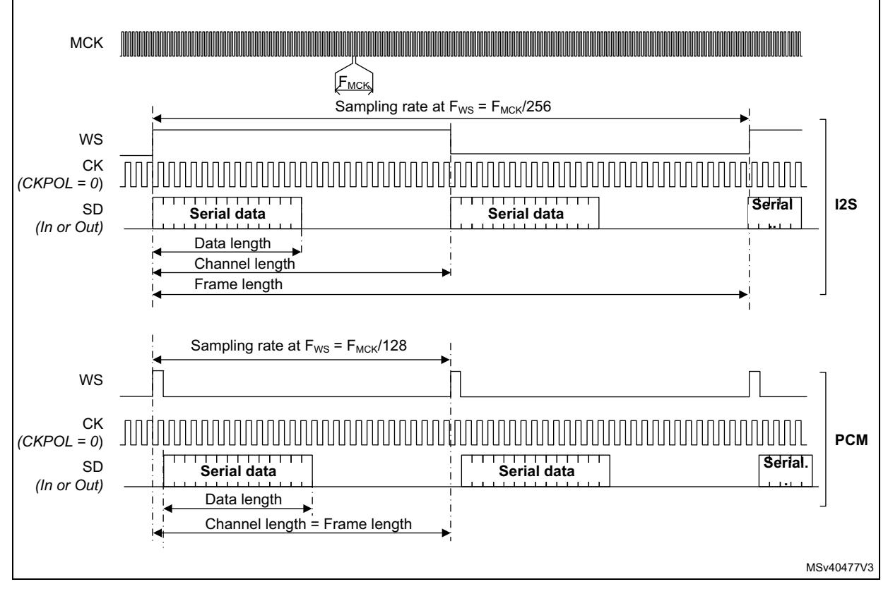

**Figure 670. Waveform examples**

1. The channel length (CHLEN) must always be higher or equal to the data length (DATLEN).


#### **I 2S Philips standard**

The I2S Philips standard is selected by setting I2SSTD to 0b00. This standard is supported in master and slave mode.

In this standard, the WS signal toggles one CK clock cycle before the first bit (MSb in I2S Philips standard) is available. A falling edge transition of WS indicates that the next data transfered is the left channel, and a rising edge transition indicates that the next data transfered is the right channel.

<span id="page-39-0"></span>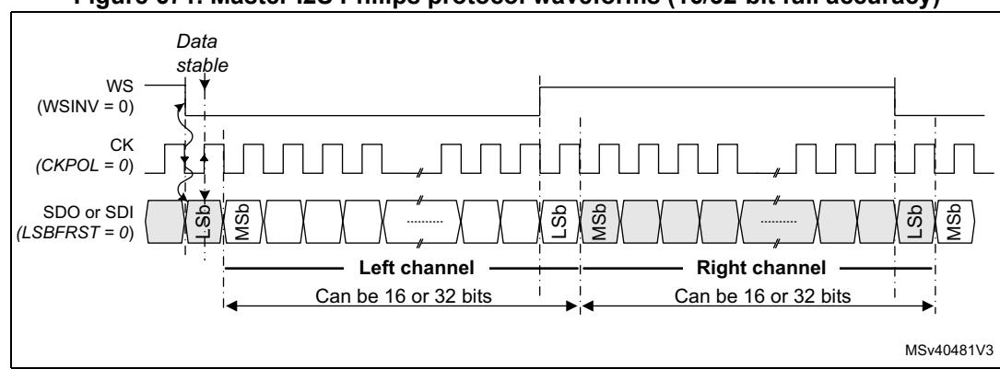

**Figure 671. Master I2S Philips protocol waveforms (16/32-bit full accuracy)**

CKPOL is set to 0 in order to match the I2S Philips protocol. See *[Selection of the CK](#page-43-0)  [sampling edge](#page-43-0)* for information concerning the handling of WS signal.

*[Figure 671](#page-39-0)* shows an example of waveform generated by the SPI/I2S in the case where the channel length is equal to the data length. More precisely, this is true when CHLEN = 0 and DATLEN = 0b00 or when CHLEN = 1 and DATLEN = 0b10.

See *[Control of the WS Inversion](#page-43-1)* for information concerning the handling of WS signal.

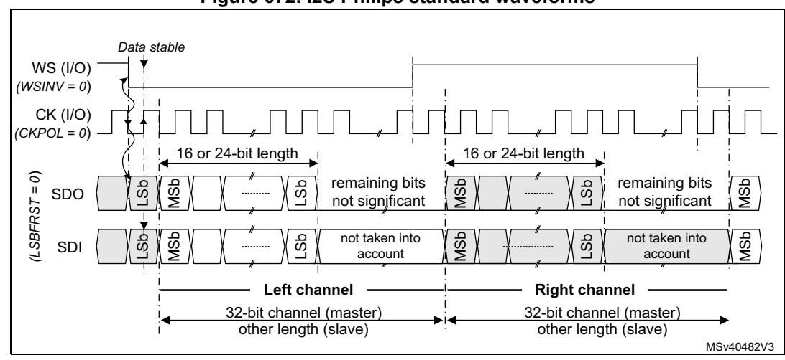

**Figure 672. I2S Philips standard waveforms**

1. 24- and 32-bit data width are not always supported (DATLEN = 01 or 10). Refer to *[Section 53.3: SPI](#page-1-0)  [implementation](#page-1-0)* for the supported data sizes.

RM0399 Rev 4 2349/3556

<sup>1. 24-</sup> and 32-bit data width are not always supported (DATLEN = 01 or 10). Refer to *[Section 53.3: SPI](#page-1-0)  [implementation](#page-1-0)* for the supported data sizes.

In the case where the channel length is bigger than the data length, the remaining bits are forced to zero when the SPI/I2S is configured in transmit mode. This is applicable for both master and slave mode.

### **MSB justified standard**

For this standard, the WS signal toggles when the first data bit, is provided. The data transfered represents the left channel if WS is high, and the right channel if WS is low.

<span id="page-40-0"></span>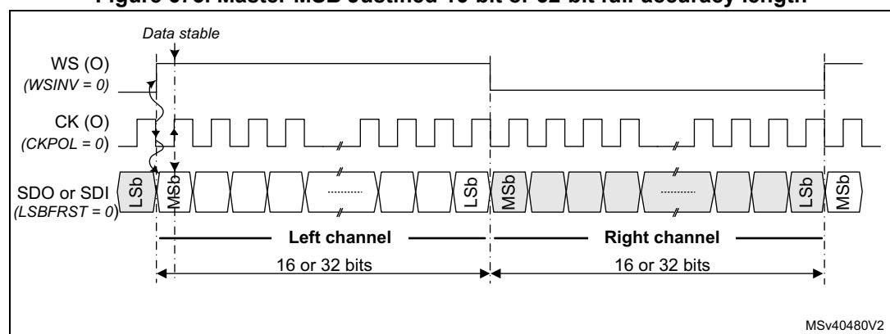

**Figure 673. Master MSB Justified 16-bit or 32-bit full-accuracy length**

1. 24- and 32-bit data width are not always supported (DATLEN = 01 or 10). Refer to *[Section 53.3: SPI](#page-1-0)  [implementation](#page-1-0)* for the supported data sizes.

CKPOL is set to 0 in order to match the I2S MSB justified protocol. See *[Selection of the CK](#page-43-0)  [sampling edge](#page-43-0)* for information concerning the handling of WS signal.

See *[Control of the WS Inversion](#page-43-1)* for information concerning the handling of WS signal.

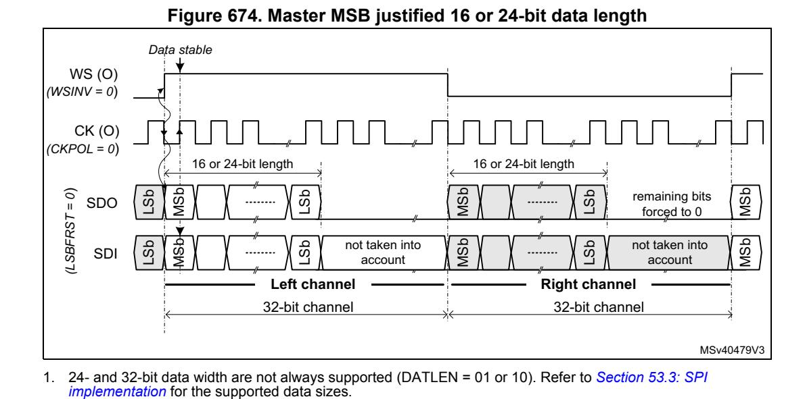

In the case where the channel length is bigger than the data length, the remaining bits are forced to zero when the SPI/I2S is configured in master transmit mode. In slave transmit the remaining bits are forced to the value of the first bit of the next data to be generated in order to avoid timing issues (see *[Figure 675](#page-41-0)*).


<span id="page-41-0"></span>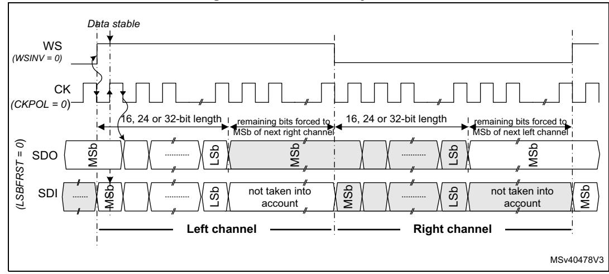

**Figure 675. Slave MSB justified**

1. 24- and 32-bit data width are not always supported (DATLEN = 01 or 10). Refer to *[Section 53.3: SPI](#page-1-0)  [implementation](#page-1-0)* for the supported data sizes.

# **LSB justified standard**

This standard is similar to the MSB justified standard in master mode (no difference for the 16 and 32-bit full-accuracy frame formats). The LSB justified 16 or 32-bit full-accuracy format give similar waveforms than MSB justified mode (see *[Figure 673](#page-40-0)*) because the channel and data have the same length.

*Note: In the LSB justified format, only 16 and 32-bit channel length are supported in master and slave mode. This is due to the fact that it is not possible to transfer properly the data if the channel length is not known by transmitter and receiver side.*

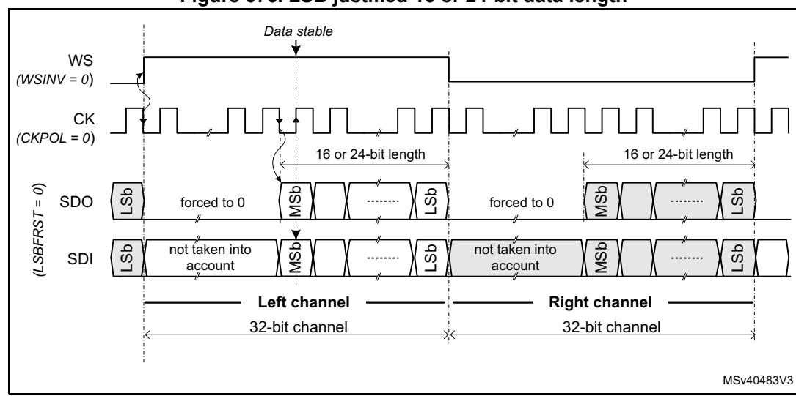

**Figure 676. LSB justified 16 or 24-bit data length**

CKPOL is set to 0 in order to match the I2S LSB justified protocol. See *[Selection of the CK](#page-43-0)  [sampling edge](#page-43-0)* for information concerning the handling of WS signal.

See *[Control of the WS Inversion](#page-43-1)* for information concerning the handling of WS signal.

RM0399 Rev 4 2351/3556

<sup>1. 24-</sup> and 32-bit data width are not always supported (DATLEN = 01 or 10). Refer to *[Section 53.3: SPI](#page-1-0)  [implementation](#page-1-0)* for the supported data sizes.

#### **PCM** standard

For the PCM standard, there is no need to use channel-side information. The two PCM modes (short and long frame) are available and configurable using the PCMSYNC bit in SPI I2SCFGR register.

Note:

The difference between the PCM long and short frame, is just the width of the frame synchronization: for both protocols, the active edge of the frame is generated (or is expected for the Slave mode) one CK clock cycle before the first bit.

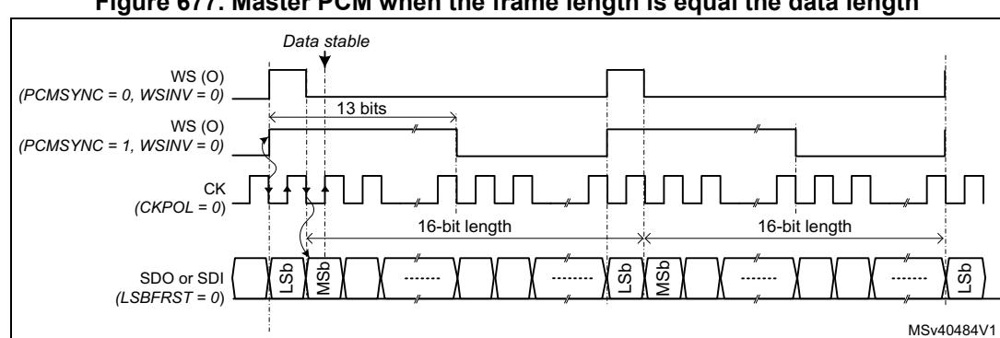

Figure 677. Master PCM when the frame length is equal the data length

For long frame synchronization, the WS signal assertion time is fixed to 13 bits in master mode.

A data size of 16 or 24 bits can be used when the channel length is set to 32 bits.

For short frame synchronization, the WS synchronization signal is only one cycle long.

See Control of the WS Inversion for information concerning the handling of WS signal.

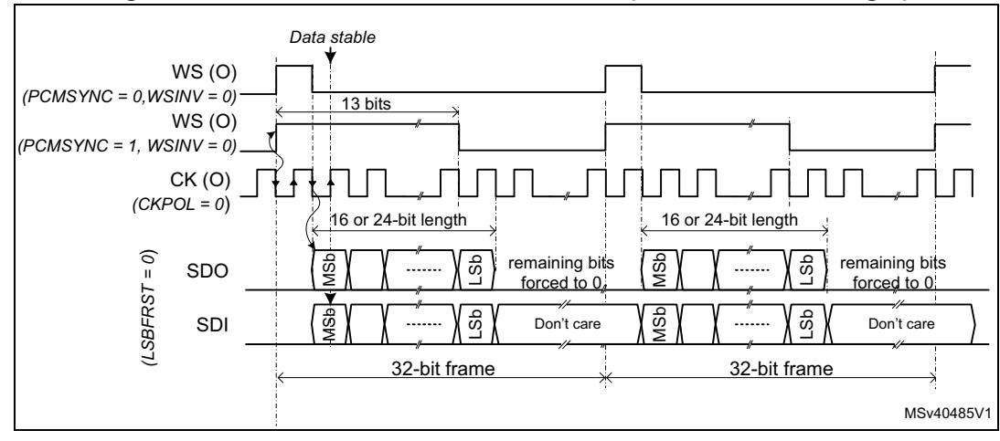

Figure 678. Master PCM standard waveforms (16 or 24-bit data length)

If the PCM protocol is used in slave mode, frame lengths can be different from 16 or 32 bits. As shown in Figure 679, in slave mode various pulse widths of WS can be accepted as the start of frame is detected by a rising edge of WS. The only constraint is that the WS must go back to its inactive state for at least one CK cycle.

<sup>24-</sup> and 32-bit data width are not always supported (DATLEN = 01 or 10). Refer to Section 53.3: SPI implementation for the supported data sizes

<span id="page-43-2"></span>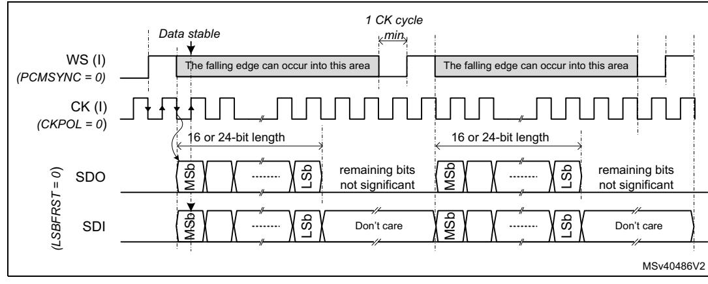

Figure 679. Slave PCM waveforms

24- and 32-bit data width are not always supported (DATLEN = 01 or 10). Refer to Section 53.3: SPI implementation for the supported data sizes.

CKPOL is set to 0 in order to match the PCM protocol. See *Selection of the CK sampling edge* for information concerning the handling of WS signal.

# 53.9.6 Additional Serial Interface Flexibility

### Variable frame length in slave

In slave mode, channel lengths different from 16 or 32 bits can be accepted, as long as the channel length is bigger than the data length. This is true for all protocols except for I2S LSB justified protocol.

### **Data ordering**

For all data formats and communication standards, it is possible to select the data ordering (MSb or LSb first) thanks to the bit LSBFRST located into *SPI configuration register 2* (*SPI CFG2*).

#### <span id="page-43-0"></span>Selection of the CK sampling edge

The CKPOL bit located into *SPI/I2S configuration register (SPI\_I2SCFGR)* allows the user to choose the sampling edge polarity of the CK for slave and master modes, for all protocols.

- When CKPOL = 0, serial data SDO and WS (when master) are changed on the falling edge of CK and the serial data SDI and WS (when slave) are read on the rising edge.
- When CKPOL = 1, serial data SDO and WS (when master) are changed on the rising edge of CK and the serial data SDI and WS (when slave) are read on the falling edge.

#### <span id="page-43-1"></span>Control of the WS Inversion

It is possible to invert the default WS signal polarity for master and slave modes, for all protocols, by setting WSINV to 1. By default the WS polarity is the following:

- In I2S Philips Standard, WS is low for left channel, and high for right channel
- In MSB/LSB justified mode, WS is high for left channel, and low for right channel
- In PCM mode, the start of frame is indicated by a rising edge of WS.


RM0399 Rev 4 2353/3556

When WSINV is set to 1, the WS polarity is inverted, then:

- In I2S Philips Standard, WS is high for left channel, and low for right channel
- In MSB/LSB justified mode, WS is low for left channel, and high for right channel
- In PCM mode, the start of frame is indicated by a falling edge of WS.

WSINV is located into SPI/I2S configuration register (SPI\_I2SCFGR).

#### Control of the I/Os

The SPI/I2S block allows the settling of the WS and CK signals to their inactive state before enabling the SPI/I2S thanks to the AFCNTR bit of SPI configuration register 2 (SPI\_CFG2).

This can be done by programming CKPOL and WSINV using the following sequence:

Assuming that AFCNTR is initially set to 0

- Set I2SMOD = 1, (In order to inform the hardware that the CK and WS polarity is controlled via CKPOL and WSINV).
- Set bits CKPOL and WSINV to the wanted value.
- Set AFCNTR = 1.
  - Then the inactive level of CK and WS I/Os is set according to CKPOL and WSINV values, even if the SPI/I2S is not yet enabled.
- Then performs the activation sequence of the I2S/PCM

*Table 438* shows the level of WS and CK signals, when the AFCNTR bit is set to 1, and before the SPI/I2S block is enabled (i.e. inactive level). Note that the level of WS depends also on the protocol selected.

Table 438. WS and CK level before SPI/I2S is enabled when AFCNTR = 1

<span id="page-44-1"></span>

| WSINV | I2SSTD       |               | WS level before SPI/I2S is enabled |
|-------|--------------|---------------|------------------------------------|
| 0     | I2S Std (00) | $\rightarrow$ | High                               |
| U     | Others       | $\rightarrow$ | Low                                |
| 1     | I2S Std (00) | $\rightarrow$ | Low                                |
| 1     | Others       | $\rightarrow$ | High                               |

| CKPOL |               | CK level before<br>SPI/I2S is enabled |
|-------|---------------|---------------------------------------|
| 0     | $\rightarrow$ | Low                                   |
| 1     | $\rightarrow$ | High                                  |

To avoid electrical conflicts on WS and CK, the AFCNTR bit must not be set to 1 when the SPI2S is in slave mode.

### <span id="page-44-0"></span>Serial Data Line swapping

Note:

The SPI/I2S offers the possibility to swap the function of SDI and SDO lines thanks to IOSWP bit located into *SPI configuration register 2 (SPI\_CFG2)*. *Table 439* gives details on this feature.

Table 439. Serial data line swapping

<span id="page-44-2"></span>

| Configuration     | IOSWP SDI direction |    | SDO direction |  |
|-------------------|---------------------|----|---------------|--|
| Master/slave RX   | 0                   | IN | -             |  |
| Iviasiei/slave NA | 1                   | -  | IN            |  |


| Configuration            | IOSWP | SDO direction |     |  |  |  |  |  |  |  |
|--------------------------|-------|---------------|-----|--|--|--|--|--|--|--|
| Master/slave TX          | 0     | -             | OUT |  |  |  |  |  |  |  |
|                          | 1     | OUT           | -   |  |  |  |  |  |  |  |
|                          | 0     | IN            | OUT |  |  |  |  |  |  |  |
| Master/slave Full-duplex | 1     | OUT           | IN  |  |  |  |  |  |  |  |

**Table 439. Serial data line swapping (continued)**

For simplification, the waveforms shown in the *[I2S functional description](#page-35-1)* section have been done with IOSWP = 0.

# **53.9.7 Startup sequence**

When the bit SPE is set to 0, the user is not allowed to read and write into the SPI\_RXDR and SPI\_TXDR registers, but the access to other registers is allowed.

When the application wants to use the SPI/I2S block the user has to proceed as follow:

- 1. Ensure that the SPE is set to 0, otherwise write SPE to 0.
- 2. Program all the configuration and control registers according to the wanted configuration. Refer to *Section [53.9.16](#page-56-0)* for detailed programming examples.
- 3. Clear all the status flags by setting the SUSPC, TIFREC, OVRC and UDRC bits of SPI\_IFCR register. Note that if the flag SUSP is not cleared (via SUSPC bit) the CSTART control bit has no effect.
- 4. Set the SPE bit to 1, in order to activate the SPI/I2S block. When this bit is set, the serial interface is still disabled, but the DMA and interrupt services are working, allowing for example, the data transfer into the TxFIFO.
- 5. Set bit CSTART to 1, in order to activate the serial interface.

As shown in *[Figure 680](#page-46-0)*, in I2S Philips standard master TX, the generation of the WS and CK signals starts after a resynchronization delay (SYNC\_DLY2) when CSTART goes to 1 and the TxFIFO is not empty. Note that the bit clock CK is activated 4 rising edges before the falling edge of WS in order to ensure that the external slave device can detect properly WS transition. Other standards behave similarly.


<span id="page-46-0"></span>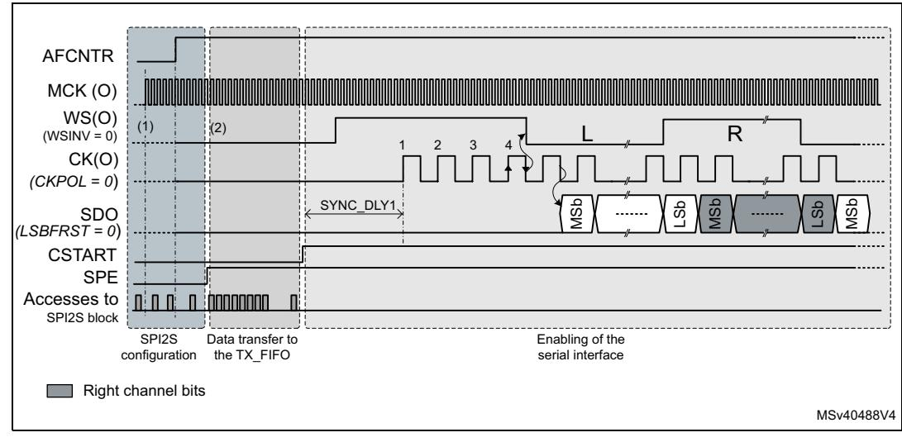

**Figure 680. Startup sequence, I2S Philips standard, master**

- 1. In this figure, the MCK is enabled before setting the bit SPE to 1. See *[MCK generation](#page-49-0)* for more information.
- 2. Note that the level of WS and CK signals are controlled by the SPI/I2S block during the configuration phase as soon as the AFCNTR bit is set to 1

*Note: Due to clock domain resynchronization, the CSTART bit is taken into account by the hardware after about 3 periods of CK clock (SYNC\_DLY1).*

> In slave mode, once the bit CSTART is set to 1, the data transfer starts when the start-offrame condition is met:

- For I2S Philips standard, the start-of-frame condition is a falling edge of WS signal. The transmission/reception starts one bit clock later. If WSINV = 1, then the start-of-frame condition is a rising edge.
- For other protocols, the start-of-frame condition is a rising edge of WS signal. The transmission/reception starts at rising edge of WS for MSB aligned protocol.The transmission/reception starts one bit clock later for PCM protocol. If WSINV = 1, then the start-of-frame condition is a falling edge.

*[Figure 681](#page-46-1)* shows an example of startup sequence in I2S Philips standard, slave mode.

<span id="page-46-1"></span>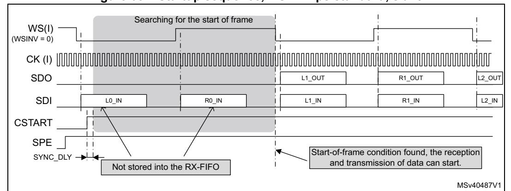

**Figure 681. Startup sequence, I2S Philips standard, slave**

*Note: Due to clock domain resynchronization, the CSTART bit is taken into account by the hardware after 2 periods of CK clock (SYNC\_DLY).*


# **53.9.8 Stop sequence**

The application can stop the I2S/PCM transfers by setting the SPE bit to 0. In that case the communication is stopped immediately, without waiting for the end of the current frame.

In master mode it is also possible to stop the I2S/PCM transfers at the end of the current frame. For that purpose, the user has to set the bit CSUSP to 1, and polls the CSTART bit until it goes to 0. The CSTART bit goes to 0 when the current stereo (if an I2S mode was selected) or mono sample are completely shifted in or out. Then the SPE bit can be set to 0.

The *[Figure 682](#page-47-0)* shows an example of stop sequence in the case of master mode. The CSUSP bit is set to 1, during the transmission of left sample, the transfer continue until the last bit of the right sample is transferred. Then CSTART and CSUSP go back to 0, CK and WS signals go back to their inactive state, and the user can set SPE to 0.

<span id="page-47-0"></span>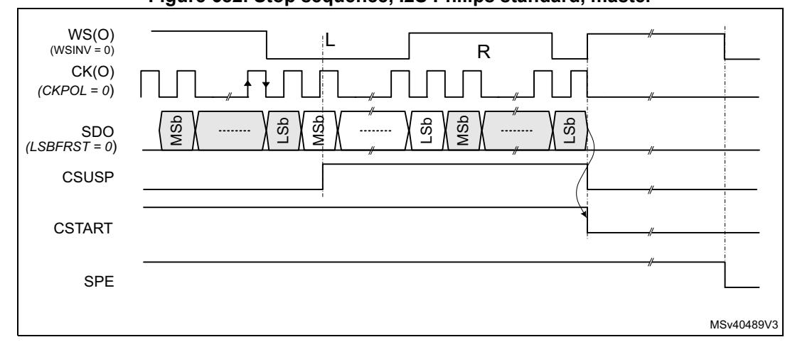

**Figure 682. Stop sequence, I2S Philips standard, master**

*Note: In slave mode, the stop sequence is only controlled by the SPE bit.*

# <span id="page-47-1"></span>**53.9.9 Clock generator**

When the I2S or PCM is configured in master mode, the user needs to program the clock generator in order to produce the Frame Synchronization (WS), the bit clock (CK) and the master clock (MCK) at the desired frequency.

If the I2S or PCM is used in slave mode, there is no need to configure the clock generator.

MSv40490V2 ÷ 4 ÷ 2 8-bit linear divider + reshaping stage CK MCK spi\_ker\_ck I2SDIV[7:0] ODD CHLEN MCKOE 0 1 I2SMOD CLKGEN 0 1 MCKOE

**Figure 683. I2S clock generator architecture**

The frequency generated on MCK, CK and WS depends mainly on I2SDIV, ODD, CHLEN and MCKOE. The bit MCKOE indicates if a master clock need to be generated or not. The master clock has a frequency 128 or 256 times higher than the frame synchronization. This master clock is often required to provide a reference clock to external audio codecs.

*Note: In master mode, there is no specific constraints on the ratio between the bus clock rate (Fpclk) and the bit clock (FCK). The bus clock frequency must be high enough in order to support the data throughput.*

> When the master clock is generated (MCKOE = 1), the frequency of the frame synchronization is given by the following formula in I2S mode:

$$\mathsf{F}_{\mathsf{WS}} = \frac{\mathsf{F}_{\mathsf{i2s\_clk}}}{\mathsf{256} \times \{(2 \times \mathsf{12SDIV}) + \mathsf{ODD}\}}$$

and by this formula in PCM mode:

$$\mathsf{F}_{\mathsf{WS}} = \frac{\mathsf{F}_{\mathsf{i2s\_clk}}}{\mathsf{128} \times \{(2 \times \mathsf{I2SDIV}) + \mathsf{ODD}\}}$$

In addition, the frequency of the MCK (FMCK) is given by the formula:

$$\mathsf{F}_{\mathsf{MCK}} = \frac{\mathsf{F}_{\mathsf{i2s\_clk}}}{\{\!(2\!\times\mathsf{I2SDIV})\!+\!\mathsf{ODD}\}\!}$$

When the master clock is disabled (MCKOE = 0), the frequency of the frame synchronization is given by the following formula in I2S mode:

$$\mathsf{F}_{\mathsf{WS}} = \frac{\mathsf{F}_{\mathsf{i2s\_clk}}}{32 \times (\mathsf{CHLEN} + 1) \times \{(2 \times \mathsf{I2SDIV}) + \mathsf{ODD}\}}$$

And by this formula in PCM mode:

$$\mathsf{F}_{\mathsf{WS}} = \frac{\mathsf{F}_{\mathsf{i2s\_clk}}}{\mathsf{16} \times (\mathsf{CHLEN} + \mathsf{1}) \times \{(2 \times \mathsf{I2SDIV}) + \mathsf{ODD}\}}$$

Note:

Where  $F_{WS}$  is the frequency of the frame synchronization, and  $F_{i2s\_clk}$  is the frequency of the kernel clock provided to the SPI/I2S block.

Note: CHLEN and ODD can be either 0 or 1.

I2SDIV can take any values from 0 to 255 when ODD = 0, but when ODD = 1, the value

I2SDIV = 1 is not allowed.

When I2SDIV = 0, then  $\{(2 \times I2SDIV) + ODD\}$  is forced to 1.

When {(2 x I2SDIV) + ODD} is odd, the duty cycle of MCK or the CK signals is not 50%.

Care must be taken when odd ratio is used: it can impact margin on setup and hold time. For example if  $\{(2 \times I2SDIV) + ODD\} = 5$ , then the duty cycle can be 40%.

Table 440 provides examples of clock generator programming for I2S modes.

# <span id="page-49-0"></span>MCK generation

The master clock MCK can be generated regardless to the SPE bit. The MCK generating is controlled by the following bits:

- I2SMOD must equal to 1,
- I2SCFG must select a master mode,
- MCKOE must be set to 1

Table 440. CLKGEN programming examples for usual I2S frequencies

<span id="page-49-1"></span>

| i2s_clk<br>(MHz) | Channel length (bits) | I2SDIV | ODD | мск | Sampling rate: F <sub>WS</sub><br>(kHz) |
|------------------|-----------------------|--------|-----|-----|-----------------------------------------|
| 12.288           | 16                    | 12     | 0   |     | 16                                      |
| 12.288           | 32                    | 6      | 0   |     | 16                                      |
| 12.288           | 16                    | 6      | 0   |     | 32                                      |
| 12.288           | 32                    | 3      | 0   |     | 32                                      |
| 49.152           | 16                    | 16     | 0   | No  | 48                                      |
| 49.152           | 32                    | 8      | 0   | No  | 48                                      |
| 49.152           | 16                    | 8      | 0   |     | 96                                      |
| 49.152           | 32                    | 4      | 0   |     | 96                                      |
| 49.152           | 16                    | 4      | 0   |     | 192                                     |
| 49.152           | 32                    | 2      | 0   |     | 192                                     |
| 4.096            | 16 or 32              | 0      | -   |     | 40                                      |
| 24.576           | 16 or 32              | 3      | 0   |     | 16                                      |
| 49.152           | 16 or 32              | 3      | 0   |     | 32                                      |
| 12.288           | 16 or 32              | 0      | -   | Vas |                                         |
| 49.152           | 16 or 32              | 2      | 0   | Yes | 48                                      |
| 61.44            | 16 or 32              | 2      | 1   |     |                                         |
| 98.304           | 16 or 32              | 2      | 0   |     | 96                                      |
| 196.608          | 16 or 32              | 2      | 0   |     | 192                                     |


RM0399 Rev 4

2359/3556

#### 53.9.10 Internal FIFOs

The I2S interface can use a dedicated FIFO for the RX and the TX path. The samples to transmit can be written into the TxFIFO via the SPI\_TXDR register. The reading of RxFIFO is performed via the SPI\_RXDR register.

### Data alignment and ordering

It is possible to select the data alignment into the SPI\_RXDR and SPI\_TXDR registers thanks to the DATFMT bit.

Note as well that the format of the data located into the SPI\_RXDR or SPI\_TXDR depends as well on the way those registers are accessed via the APB bus.

Figure 684 shows the allowed settings between APB access sizes, DATFMT and DATLEN.

Note:

Caution shall be taken when the APB access size is 32 bits, and DATLEN = 0. For read operation the RxFIFO must contain at least two data, otherwise the read data are invalid. In the same way, for write operation, the TxFIFO must have at least two empty locations, otherwise a data can be lost.

<span id="page-50-0"></span>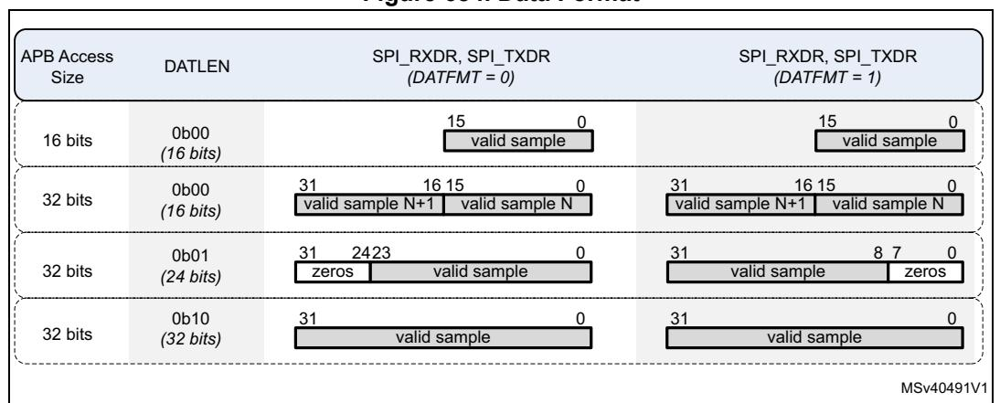

Figure 684. Data Format

- 1. In I2S mode, the sample N represents the left sample, and the sample N+1 is the right sample.
- 24- and 32-bit data width are not always supported (DATLEN = 01 or 10). Refer to Section 53.3: SPI implementation for the supported data sizes.

It is possible to generate an interrupt or a DMA request according to a programmable FIFO threshold levels. The FIFO threshold is common to RX and TxFIFOs can be adjusted via FTHLV.

In I2S mode, the left and right audio samples are interleaved into the FIFOs. It means that for transmit operations, the user has to start to fill-up the TxFIFO with a left sample, followed by a right sample, and so on. For receive mode, the first data read from the RxFIFO is supposed to represent a left channel, the next one is a right channel, and so on.

Note that the read and write pointers of the FIFOs are reset when the bit SPE is set to 0.

Refer to Section 53.9.11 and Section 53.9.15 for additional information.


### **FIFO size optimization**

The basic element of the FIFO is the byte. This allows an optimization of the FIFO locations. For example when the data size is fixed to 24 bits, each audio sample takes 3 basic FIFO elements.

For example, a FIFO with 16 basic elements can have a depth of:

- 8 samples, if the DATLEN = 0 (16 bits),
- 5 samples, if the DATLEN = 1 (24 bits)(a),
- 4 samples, if the DATLEN = 2 (32 bits)[\(a\)](#page-51-1).

# <span id="page-51-0"></span>**53.9.11 FIFOs status flags**

Two status flags are provided for the application to fully monitor the state of the I2S interface. Both flags can generate an interrupt request. The receive interrupt is generated if RXPIE bit is enabled, the transmit interrupt is generated if TXPIE bit is enabled. Those bits are located into the SPI\_IER register.

# **TxFIFO threshold reached (TXP)**

When set, this flag indicates that the TxFIFO contains at least FTHLV empty locations. thus FTHLV new data to be transmitted can be written into SPI\_TXDR. The TXP flag is reset when the amount of empty locations is lower than FTHLV. Note that TXP = 1, when the I2S is disabled (SPE bit is reset).

### **RxFIFO threshold reached (RXP)**

When set, this flag indicates that there is at least FTHLV valid data into the RxFIFO, thus the user can read those data via SPI\_RXDR. It is reset when the RxFIFO contains less than FTHLV data.

See *[Section 53.10](#page-58-0)* for additional information on interrupt function in I2S mode.

# **53.9.12 Handling of underrun situation**

In transmit mode, the UDR flag is set when a new data needs to be loaded into the shift register while the TxFIFO is already empty. In such a situation at least a data is lost.

In I2S mode, there is a hardware mechanism in order to prevent misalignment situation (left and right channel swapped). As shown in the following figure, when an underrun occurs, the peripheral re-plays the last valid data on left and right channels as long as conditions of restart are not met. The transmission restarts:

- When there is enough data into the TxFIFO, and
- When the UDR flag is cleared by the software, and
- When the restart condition is met:
  - if the underrun occurs when a right channel data needs to be transmitted, the transmission restarts when a right channel needs to be transmitted, or
  - if the underrun occurs when a left channel data needs to be transmitted, the transmission restarts when a left channel needs to be transmitted.

<span id="page-51-1"></span>a. 24- and 32-bit data width are not always supported (DATLEN = 01 or 10). Refer to *[Section 53.3: SPI](#page-1-0)  [implementation](#page-1-0)* for the supported data sizes.


RM0399 Rev 4 2361/3556

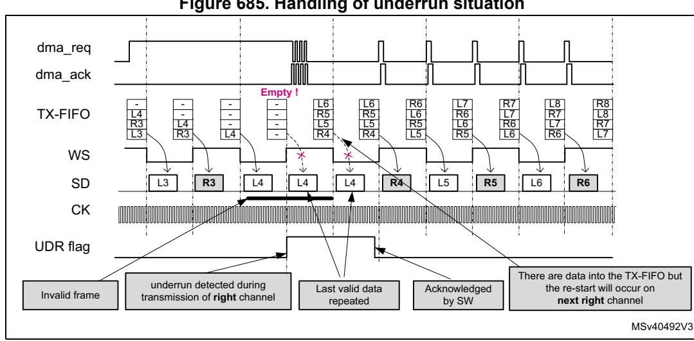

Figure 685. Handling of underrun situation

The UDR flag can trigger an interrupt if the UDRIE bit in the SPI IER register is set. The UDR bit is cleared by writing UDRC bit of SPI\_IFCR register to 1.

When the block is configured in PCM mode, the transmission restarts at the start of the next frame when there is enough data into the TxFIFO, and the UDR flag is cleared by software.

Note:

An underrun situation can occur in master or slave mode. In master mode, when an underrun occurs, the WS, CK and MCK signal are not gated.

Due to resynchronization, any change on the UDR flag is taken into account by the hardware after at least 2 periods of CK clock.

#### 53.9.13 Handling of overrun situation

The OVR flag is set when received data need to written into the RxFIFO, while the RxFIFO is already full. As a result, some incoming data are lost.

In I2S mode, there is a hardware mechanism in order to prevent misalignment situation (left and right channel swapped). As shown in the following figure, when an overrun occurs, the peripheral stops writing data into the RxFIFO as long as conditions of restart are not met. When there is enough room into the RxFIFO, and the OVR flag is cleared, the block starts by writing next the right channel into the RxFIFO if the overrun occurred when a right channel data was received or by writing the next left channel if the overrun occurred when a left channel data was received.


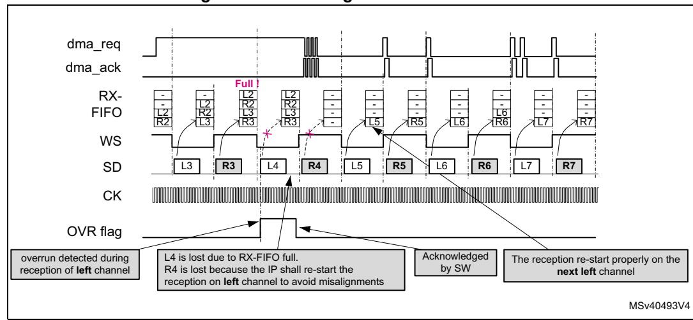

Figure 686. Handling of overrun situation

An interrupt may be generated if the OVRIE bit is set in the SPI\_IER register. The OVR bit is cleared by writing OVRC bit of SPI\_IFCR register to 1.

When the block is configured in PCM mode, after an overrun error, the peripheral stops writing data into the RxFIFO as long as restart conditions are not met. When there is enough room in the RxFIFO, and the OVR flag is cleared, the next received data are written into the RxFIFO.

Note:

An overrun situation can occur in master or slave mode. In master mode, when an overrun occurs, the WS, CK and MCK signal are not gated.

### 53.9.14 Frame error detection

When configured in slave mode, the SPI/I2S block detects two kinds of frame errors:

- A frame synchronization received while the shift-in or shift-out of the previous data is not completed (early frame error). This mode is selected with FIXCH = 0.
- A frame synchronization occurring at an unexpected position. This mode is selected with FIXCH = 1.

In slave mode, if the frame length provided by the external master device is different from 32 or 64 bits, the user has to set FIXCH to 0. As the SPI/I2S synchronize each transfer with the WS there is no misalignment risk, but in a noisy environment, if a glitch occurs in the CK signal, a sample may be affected and the application is not aware of this.

If the frame length provided by the external master device is equal to 32 or 64 bits, then the user can set FIXCH to 1 and adjust accordingly CHLEN. As the SPI/I2S synchronize each transfer with the WS there is still no misalignment risk, and if the amount of bit clock between each channel boundary is different from CHLEN, the frame error flag (TIFRE) is set to 1.

Figure 687 shows an example of frame error detection. The SPI/I2S block is in slave mode and the amount of bit clock periods for left channel are not enough to shift-in or shift-out the data. The figure shows that the on-going transfer is interrupted and the next one is started in order to remain aligned to the WS signal.


RM0399 Rev 4

2363/3556

<span id="page-54-1"></span>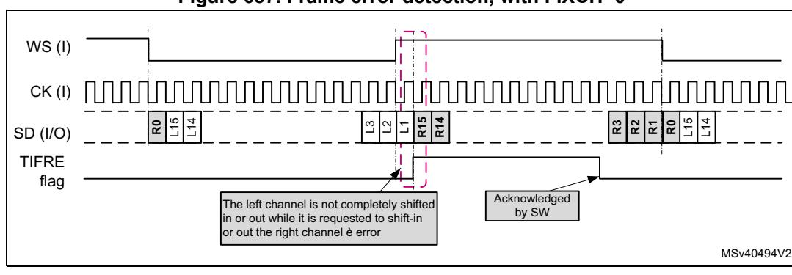

Figure 687. Frame error detection, with FIXCH=0

An interrupt can be generated if the TIFREIE bit is set. The frame error flag (TIFRE) is cleared by writing the TIFREC bit of the SPI\_IFCR register to 1.

It is possible to extend the coverage of the frame error flag by setting the bit FIXCH to 1. When this bit is set to 1, then the SPI/I2S is expecting fixed channel lengths in slave mode. This means that the expected channel length can be 16 or 32 bits, according to CHLEN. As shown in *Figure 688*, in this mode the SPI/I2S block is able to detect if the WS signal is changing at the expected moment (too early or too late).

Note: Figure 687 and Figure 688 show the mechanism for the slave transmit mode, but this is also true for slave receive and slave full-duplex.

<span id="page-54-2"></span>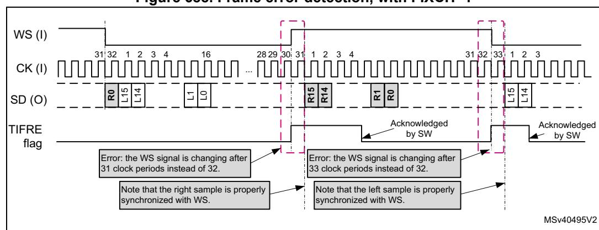

Figure 688. Frame error detection, with FIXCH=1

The frame error detection can be generally due to noisy environment disturbing the good reception of WS or CK signals.

Note: The SPI/I2S is not able to recover properly if an overrun and an early frame occur within the same frame. In this case the user has to disable and re-enable the SPI/I2S.

### <span id="page-54-0"></span>53.9.15 DMA Interface

The I2S/PCM mode shares the same DMA requests lines than the SPI function. There is a separated DMA channel for TX and RX paths. Each DMA channel can be enabled via RXDMAEN and TXDMAEN bits of SPI\_CFG1 register.

In receive mode, the DMA interface is working as follow:

4

- 1. The hardware evaluates the RxFIFO level,
- 2. If the RxFIFO contains at least FTHLV samples, then FTHLV DMA requests are generated,
  - When the FTHLV DMA requests are completed, the hardware loops to step 1
- 3. If the RxFIFO contains less than FTHLV samples, no DMA request is generated, and the hardware loop to step 1

In transmit mode, the DMA interface is working as follow:

- 1. The hardware evaluates the TxFIFO level,
- 2. If the TxFIFO contains at least FTHLV empty locations, then FTHLV DMA requests are generated,
  - When the FTHLV DMA requests are completed, the hardware loops to step 1
- 3. If the TxFIFO contains less than FTHLV empty locations, no DMA request is generated, and the hardware loop to step 1


# <span id="page-56-0"></span>**53.9.16 Programing examples**

### **Master I2S Philips standard, transmit**

This example shows how to program the interface for supporting the Philips I2S standard in master transmit mode, with a sampling rate of 48 kHz, using the master clock. The assumption taken is that SPI/I2S is receiving a kernel clock (i2s\_clk) of 61.44 MHz from the clock controller of the circuit.

# **Start Procedure**

- 1. Enable the bus interface clock (pclk or hclk), release the reset signal if needed in order to be able to program the SPI/I2S block.
- 2. Ensure that the SPI/I2S block receives properly a kernel frequency (at 61.44 MHz in this example).
- 3. Ensure that SPE is set to 0.
- 4. Program the clock generator in order to provide the MCK clock and to have a frame synchronization rate at exactly 48 kHz. So I2SDIV = 2, ODD = 1, and MCKOE = 1.
- 5. Program the serial interface protocol: CKPOL = 0, WSINV = 0, LSBFRST = 0, CHLEN = 1 (32 bits per channel) DATLEN = 1 (24 bits), I2SSTD = 0 (Philips Standard), I2SCFG = 2 (master transmit), I2SMOD = 1, for I2S/PCM mode. The register SPI\_I2SCFGR must be updated before going to next steps.
- 6. Adjust the FIFO threshold, by setting the wanted value into FTHLV. For example if a threshold of 2 audio samples is required, FTHLV = 1.
- 7. Clear all status flag registers.
- 8. Enable the flags who shall generate an interrupt such as UDRIE. Note that TIFRE is not meaningful in master mode.
- 9. If the data transfer uses DMA:
  - a) Program the DMA peripheral,
  - b) Initialize the memory buffer with valid audio samples,
  - c) Enable the DMA channel,
- 10. If the data transfer is done via interrupt, then the user has to enable the interrupt by setting the TXPIE bit to 1.
- 11. Set SPE to 1, as soon as this bit is set to one the following actions may happen:
  - If the interrupt generation is enabled, the SPI/I2S generates an interrupt request allowing the interrupt handler to fill-up the TxFIFO.
  - If the DMA transfer are enabled (TXDMAEN = 1), the SPI/I2S generates DMA requests in order to fill-up the TxFIFO
- 12. Finally, the user has to ensure that the TxFIFO is not empty before enabling the serial interface. This is important in order to avoid an underrun condition when the interface is enabled. Then the SPI/I2S block can be enabled by setting the bit CSTART to 1. CSTART bit is located into SPI\_CR1 register.

### **Stop Procedure in master mode**

- 1. Set the bit CSUSP to 1, in order to stop on-going transfers
- 2. Check the value of CSTART bit until it goes to 0
- 3. Stop DMA peripheral, bus clock...
- 4. Set bit SPE to 0 in order to disable the SPI/I2S block


### **Slave I2S Philips standard, receive**

This example shows how to program the interface for supporting the I2S Philips standard protocol in slave receiver mode, with a sampling rate of 48 kHz. Note that in slave mode the SPI/I2S block cannot control the sample rate of the received samples. In this example we took the assumption that the external master device is delivering an I2S frame structure with a channel length of 24 bits. So we cannot use the capability offered for frame error detection when FIXCH is set to 1.

# **Procedure**

- 1. Via the RCC block, enable the bus interface and the kernel clocks, assert and release the reset signal if needed.
- 2. Program the AFMUX in order to select the wanted I/Os. In the current example CK, WS, SDI.
- 3. Program the serial interface protocol: CKPOL = 0, WSINV = 0, LSBFRST = 0, FIXCH = 0 (because channel length is different from 16 and 32 bits), DATLExN = 0 (16 bits), I2SSTD = 0 (Philips protocol), I2SCFG = 1 (slave RX), I2SMOD = 1, for I2S mode.
- 4. Adjust the FIFO threshold, by setting the wanted value into FTHLV. For example if a threshold of 2 audio samples is required, FTHLV = 1.
- 5. Clear all status flag registers.
- 6. Enable the flags who shall generate an interrupt such as UDRIE and TIFRE.
- 7. If the data transfer uses DMA:
  - Program the DMA peripheral: one RX channel
    - Enable the DMA channel,
    - In the SPI/I2S block, enable the DMA by setting the RXDMAEN bit to 1.
- 8. If the data transfer is done via interrupt, then the user has to enable the interrupt by setting the RXPIE bit to 1.
- 9. Set SPE to 1.
- 10. Finally the user can set the bit CSTART to 1 in order to enable the serial interface. The SPI/I2S starts to store data into the RxFIFO on the next occurrence of left data transmitted by the external master device.

### **Stop Procedure in slave mode**

- 1. Set bit SPE to 0 in order to disable the SPI/I2S block
- 2. Stop DMA peripheral, bus clock...

# <span id="page-58-0"></span>**53.10 I2S wakeup and interrupts**

In PCM/I2S mode an interrupt (**spi\_it**) or a wakeup event signal (**spi\_wkup**) can be generated according to the events described in the *[Table 441](#page-58-1)*.

Interrupt events can be enabled and disabled separately.

**Table 441. I2S interrupt requests** 

<span id="page-58-1"></span>

| Interrupt event          | Event flag | Enable      | Event clear method                                                                 | Interrupt/Wakeup<br>activated |          |  |  |
|--------------------------|------------|-------------|------------------------------------------------------------------------------------|-------------------------------|----------|--|--|
|                          |            | control bit |                                                                                    | spi_it                        | spi_wkup |  |  |
| TxFIFO threshold reached | TXP        | TXPIE       | TXP flag is cleared when the<br>TxFIFO contains less than<br>FTHLV empty locations |                               |          |  |  |
| RxFIFO threshold reached | RXP        | RXPIE       | RXP flag is cleared when the<br>RxFIFO contains less than<br>FTHLV samples         |                               | YES      |  |  |
| Overrun error            | OVR        | OVRIE       | OVR is cleared by writing<br>OVRC to 1                                             | YES                           |          |  |  |
| Underrun error           | UDR        | UDRIE       | UDR is cleared by writing<br>UDRC to 1                                             |                               |          |  |  |
| Frame error flag         | TIFRE      | TIFREIE     | TIFRE is cleared by writing<br>TIFREC to 1                                         |                               | NO       |  |  |

2369/3556

# 53.11 SPI/I2S registers

# <span id="page-59-0"></span>53.11.1 SPI/I2S control register 1 (SPI\_CR1)

Address offset: 0x00

Reset value: 0x0000 0000

| 31          | 30                | 29   | 28   | 27          | 26          | 25   | 24             | 23   | 22   | 21   | 20   | 19   | 18   | 17        | 16         |
|-------------|-------------------|------|------|-------------|-------------|------|----------------|------|------|------|------|------|------|-----------|------------|
| Res.        | Res.              | Res. | Res. | Res.        | Res.        | Res. | Res.           | Res. | Res. | Res. | Res. | Res. | Res. | Res.      | IO<br>LOCK |
|             |                   |      |      |             |             |      |                |      |      |      |      |      |      |           | rs         |
|             |                   | •    |      |             |             |      |                |      |      |      |      |      |      |           |            |
| 15          | 14                | 13   | 12   | 11          | 10          | 9    | 8              | 7    | 6    | 5    | 4    | 3    | 2    | 1         | 0          |
| TCRC<br>INI | 14<br>RCRC<br>INI |      |      | 11<br>HDDIR | 10<br>CSUSP | C    | 8<br>MAS<br>RX | Res. | Res. | Res. | Res. | Res. | Res. | 1<br>Res. | 0<br>SPE   |

Bits 31:17 Reserved, must be kept at reset value.

Bit 16 IOLOCK: locking the AF configuration of associated I/Os

This bit is set by software and cleared by hardware whenever SPE bit is changed from 1 to 0.

0: AF configuration is not locked

1: AF configuration is locked

When this bit is set, the SPI\_CFG2 register content cannot be modified. This bit can be set when SPI is disabled only else it is write protected. It is cleared and cannot be set when the MODF bit is set.

Bit 15 TCRCINI: CRC calculation initialization pattern control for transmitter

0: All zero pattern is applied

1: All ones pattern is applied

Bit 14 RCRCINI: CRC calculation initialization pattern control for receiver

0: all zero pattern is applied

1: all ones pattern is applied

Bit 13 CRC33\_17: 32-bit CRC polynomial configuration

0: full size (33-bit or 17-bit) CRC polynomial is not used

1: full size (33-bit or 17-bit) CRC polynomial is used

Bit 12 SSI: internal SS signal input level

This bit has an effect only when the SSM bit is set. The value of this bit is forced onto the peripheral SS input and the I/O value of the SS pin is ignored.

Bit 11 HDDIR: Rx/Tx direction at Half-duplex mode

In Half-Duplex configuration the HDDIR bit establishes the Rx/Tx direction of the data transfer. This bit is ignored in Full-Duplex or any Simplex configuration.

0: SPI is Receiver

1: SPI is transmitter

#### Bit 10 **CSUSP:** master suspend request

This bit reads as zero.

In master mode, when this bit is set by software, CSTART bit is reset at the end of the current frame and communication is suspended. The user has to check SUSP flag to check end of the frame transaction.

The master mode communication must be suspended (using this bit or keeping TXDR empty) before disabling the SPI or going to low-power mode. This bit can be used in SPI or I2S mode.

After software suspension, the SUSP flag has to be cleared and the SPI disabled and reenabled before any next transaction starts.

#### Bit 9 **CSTART:** master transfer start

This bit is set by software to start an SPI or I2S/PCM communication. In SPI mode, it is cleared by hardware when End Of Transfer (EOT) flag is set or when a transaction suspend request is accepted. In I2S/PCM mode, it is also cleared by hardware as described in the section stop sequence.

0: master transfer is at idle

1: master transfer is on-going or temporary suspended by automatic suspend In SPI mode, the bit is taken into account at master mode only. If transmission is enabled, communication starts or continues only if any data is available in the transmission FIFO.

#### Bit 8 **MASRX:** master automatic SUSP in Receive mode

This bit is set and cleared by software to control continuous SPI transfer in master receiver mode and automatic management in order to avoid overrun condition.

0: SPI flow/clock generation is continuous, regardless of overrun condition. (data are lost)

1: SPI flow is suspended temporary on RxFIFO full condition, before reaching overrun condition. The SUSP flag is set when SPI communication is suspended.

When SPI communication is suspended by hardware automatically, it could happen that few bits of next frame are already clocked out due to internal synchronization delay.

That is why the automatic suspension is not quite reliable when size of data drops below 8 bits. In this case, a safe suspension can be achieved by combination with delay inserted between data frames applied when MIDI parameter keeps a non zero value; sum of data size and the interleaved SPI cycles must always produce interval at length of 8 SPI clock periods at minimum. After software clearing of the SUSP bit, the communication resumes and continues by subsequent bits transaction without any next constraint. Prior the SUSP bit is cleared, the user must release the RxFIFO space as much as possible by reading out all the data packets available at RxFIFO based on the RXP flag indication to prevent any subsequent suspension.

#### Bits 7:1 Reserved, must be kept at reset value.

### Bit 0 **SPE:** serial peripheral enable

This bit is set by and cleared by software.

0: serial peripheral disabled.

1: serial peripheral enabled

When SPE=1, the SPI data transfer is enabled, the configuration registers SPI\_CFG1, SPI\_CFG2, CRCPOLY and UDRDR and the IOLOCK bit in SPI\_CR1 are write protected. They can be changed only when SPE=0.

When SPE=0 any SPI operation is stopped and disabled, all the not cleared requests with enabled interrupt stay pending and propagates the spi\_plck clock request, the SS output is deactivated at master, internal state machine is reseted, all the FIFOs content is flushed, CRC calculation initialized, receive data register is read zero.

SPE is cleared and cannot be set when MODF error flag is active.


# <span id="page-61-0"></span>**53.11.2 SPI control register 2 (SPI\_CR2)**

Address offset: 0x04

Reset value: 0x0000 0000

| 31 | 30          | 29 | 28 | 27 | 26 | 25 | 24 | 23 | 22 | 21 | 20 | 19 | 18 | 17 | 16 |
|----|-------------|----|----|----|----|----|----|----|----|----|----|----|----|----|----|
|    | TSER[15:0]  |    |    |    |    |    |    |    |    |    |    |    |    |    |    |
| rs | rs          | rs | rs | rs | rs | rs | rs | rs | rs | rs | rs | rs | rs | rs | rs |
| 15 | 14          | 13 | 12 | 11 | 10 | 9  | 8  | 7  | 6  | 5  | 4  | 3  | 2  | 1  | 0  |
|    | TSIZE[15:0] |    |    |    |    |    |    |    |    |    |    |    |    |    |    |
| rw | rw          | rw | rw | rw | rw | rw | rw | rw | rw | rw | rw | rw | rw | rw | rw |

Bits 31:16 **TSER[15:0]**: number of data transfer extension to be reload into TSIZE just when a previous number of data stored at TSIZE is transacted

This register can be set by software when its content is cleared only. It is cleared by hardware once TSIZE reload is done. The TSER value must be programmed in advance before CTSIZE counter reaches zero otherwise the reload is not taken into account and traffic terminates with normal EOT event.

#### Bits 15:0 **TSIZE[15:0]**: number of data at current transfer

When these bits are changed by software, the SPI must be disabled. The field can be updated by hardware optionally, too, to be reloaded by the TSER value if applicable. Endless transaction is initialized when CSTART is set while zero value is stored at TSIZE. TSIZE cannot be set to 0xFFFF value when CRC is enabled.

# <span id="page-61-1"></span>**53.11.3 SPI configuration register 1 (SPI\_CFG1)**

Address offset: 0x08

Reset value: 0x0007 0007

*Content of this register is write protected when SPI is enabled, except TXDMAEN and RXDMAEN bits.*

| 31              | 30              | 29   | 28 | 27          | 26   | 25          | 24         | 23   | 22        | 21         | 20 | 19 | 18           | 17 | 16 |
|-----------------|-----------------|------|----|-------------|------|-------------|------------|------|-----------|------------|----|----|--------------|----|----|
| Res.            | MBR[2:0]        |      |    | Res.        | Res. | Res.        | Res.       | Res. | CRC<br>EN | Res.       |    |    | CRCSIZE[4:0] |    |    |
|                 | rw              | rw   | rw |             |      |             |            |      | rw        |            | rw | rw | rw           | rw | rw |
| 15              | 14              | 13   | 12 | 11          | 10   | 9           | 8          | 7    | 6         | 5          | 4  | 3  | 2            | 1  | 0  |
| TX<br>DMA<br>EN | RX<br>DMA<br>EN | Res. |    | UDRDET[1:0] |      | UDRCFG[1:0] | FTHLV[3:0] |      |           | DSIZE[4:0] |    |    |              |    |    |
| rw              | rw              |      | rw | rw          | rw   | rw          | rw         | rw   | rw        | rw         | rw | rw | rw           | rw | rw |

Bit 31 Reserved, must be kept at reset value.

RM0399 Rev 4 2371/3556

```
Bits 30:28 MBR[2:0]: master baud rate
```

000: SPI master clock/2

001: SPI master clock/4

010: SPI master clock/8

011: SPI master clock/16

100: SPI master clock/32

101: SPI master clock/64

110: SPI master clock/128

111: SPI master clock/256

*Note: MBR setting is considered at slave working at TI mode, too (see [Section 53.5.1: TI](#page-25-1)  [mode\)](#page-25-1).*

Bits 27:23 Reserved, must be kept at reset value.

Bit 22 **CRCEN:** hardware CRC computation enable

0: CRC calculation disabled

1: CRC calculation Enabled

Bit 21 Reserved, must be kept at reset value.

### Bits 20:16 **CRCSIZE[4:0]:** length of CRC frame to be transacted and compared

Most significant bits are taken into account from polynomial calculation when CRC result is transacted or compared. The length of the polynomial is not affected by this setting.

00000: reserved

00001: reserved

00010: reserved

00011: 4-bits

00100: 5-bits

00101: 6-bits

00110: 7-bits

00111: 8-bits

.....

11101: 30-bits

11110: 31-bits

11111: 32-bits

The value must be set equal or multiply of data size (DSIZE[4:0]). Its maximum size cannot exceed the DSIZE maximum at the instance.

*Note: If CRC calculation is disabled by CRCEN=0, the CRCSIZE field must be kept at its default setting.*

*Note: The most significant bit at CRCSIZE bit field is reserved at the peripheral instances where the data size is limited to 16-bit.*

# Bit 15 **TXDMAEN:** Tx DMA stream enable

0: Tx DMA disabled

1: Tx DMA enabled

#### Bit 14 **RXDMAEN:** Rx DMA stream enable

0: Rx-DMA disabled

1: Rx-DMA enabled

Bit 13 Reserved, must be kept at reset value.

#### Bits 12:11 **UDRDET[1:0]:** detection of underrun condition at slave transmitter

00: underrun is detected at begin of data frame (no protection of 1-st bit)

01: underrun is detected at end of last data frame

10: underrun is detected by begin of active SS signal

11: reserved

For more details see *[Figure 668: Optional configurations of slave behavior at detection of](#page-27-0)  [underrun condition](#page-27-0)*.

#### Bits 10:9 **UDRCFG[1:0]:** behavior of slave transmitter at underrun condition

00: slave sends a constant pattern defined by the user at SPI\_UDRDR register

01: slave repeats lastly received data frame from master

10: slave repeats its lastly transmitted data frame

11: reserved

When slave is configured at transmit only mode (COMM[1:0]=01), slave repeats all zeros pattern at UDRCFG[1:0]=01 setting.

For more details see *[Figure 668: Optional configurations of slave behavior at detection of](#page-27-0)  [underrun condition](#page-27-0)*.

#### Bits 8:5 **FTHLV[3:0]:** FIFO threshold level

Defines number of data frames at single data packet. The size of the packet must not exceed 1/2 of FIFO space.

0000: 1-data

0001: 2-data

0010: 3-data

0011: 4-data

0100: 5-data

0101: 6-data

0110: 7-data

0111: 8-data

1000: 9-data

1001: 10-data 1010: 11-data

1011: 12-data

1100: 13-data

1101: 14-data

1110: 15-data

1111: 16-data

SPI interface is more efficient if configured packet sizes are aligned with data register access parallelism:

- If SPI data register is accessed as a 16-bit register and DSIZE ≤ 8 bits, better to select FTHLV=2, 4, 6 ..,
- If SPI data register is accessed as a 32-bit register and DSIZE>8bit, better to select FTHLV=2, 4, 6 .., while if DSIZE ≤ 8 bits, better to select FTHLV = 4, 8, 12 ..


Bits 4:0 DSIZE[4:0]: number of bits in at single SPI data frame

00000: not used 00001: not used 00010: not used 00011: 4-bits 00100: 5-bits 00101: 6-bits 00110: 7-bits 00111: 8-bits

11101: 30-bits 11110: 31-bits

11110: 31-bits

Note: The most significant bit at DSIZE bit field is reserved at the peripheral instances where data size is limited to 16-bit

# <span id="page-64-0"></span>53.11.4 SPI configuration register 2 (SPI\_CFG2)

Address offset: 0x0C

Reset value: 0x0000 0000

The content of this register is write protected when SPI is enabled or IOLOCK bit is set at SPI CR1 register.

| 31         | 30   | 29   | 28    | 27   | 26   | 25   | 24   | 23          | 22         | 21      | 20 | 19 | 18   | 17     | 16   |
|------------|------|------|-------|------|------|------|------|-------------|------------|---------|----|----|------|--------|------|
| AF<br>CNTR | SSOM | SSOE | SSIOP | Res. | SSM  | CPOL | СРНА | LSB<br>FRST | MAS<br>TER | SP[2:0] |    |    | COMI | M[1:0] | Res. |
| rw         | rw   | rw   | rw    |      | rw   | rw   | rw   | rw          | rw         | rw      | rw | rw | rw   | rw     |      |
| 15         | 14   | 13   | 12    | 11   | 10   | 9    | 8    | 7           | 6          | 5       | 4  | 3  | 2    | 1      | 0    |
| IOSWP      | Res. | Res. | Res.  | Res. | Res. | Res. | Res. |             | MIDI       | [3:0]   |    |    | MSS  | I[3:0] |      |
| rw         |      |      |       |      |      |      |      | rw          | rw         | rw      | rw | rw | rw   | rw     | rw   |

### Bit 31 AFCNTR: alternate function GPIOs control

This bit is taken into account when SPE=0 only

- 0: the peripheral takes no control of GPIOs while it is disabled
- 1: the peripheral keeps always control of all associated GPIOs

When SPI master has to be disabled temporary for a specific configuration reason (e.g. CRC reset, CPHA or HDDIR change) setting this bit prevents any glitches on the associated outputs configured at alternate function mode by keeping them forced at state corresponding the current SPI configuration. This bit must be never used at slave mode as any slave transmitter must not force its MISO output once the SPI is disabled.

Note: This bit can be also used in PCM and I2S modes.

#### Bit 30 SSOM: SS output management in master mode

This bit is taken into account in master mode when SSOE is enabled. It allows to configure SS output between two consecutive data transfers.

- 0: SS is kept at active level till data transfer is completed, it becomes inactive with EOT flag
- 1: SPI data frames are interleaved with SS non active pulses when MIDI[3:0]>1


#### Bit 29 **SSOE:** SS output enable

This bit is taken into account at master mode only

- 0: SS output is disabled and the SPI can work in multimaster configuration
- 1: SS output is enabled. The SPI cannot work in a multimaster environment. It forces the SS pin at inactive level after the transfer is completed or SPI is disabled with respect to SSOM, MIDI, MSSI, SSIOP bits setting

Bit 28 **SSIOP:** SS input/output polarity

- 0: low level is active for SS signal
- 1: high level is active for SS signal
- Bit 27 Reserved, must be kept at reset value.
- Bit 26 **SSM:** software management of SS signal input
  - 0: SS input value is determined by the SS PAD
    - 1: SS input value is determined by the SSI bit

When master uses hardware SS output (SSM=0 and SSOE=1), the SS signal input is forced to non active state internally to prevent master mode fault error.

- Bit 25 **CPOL:** clock polarity
  - 0: SCK signal is at 0 when idle
  - 1: SCK signal is at 1 when idle
- Bit 24 **CPHA:** clock phase
  - 0: the first clock transition is the first data capture edge
  - 1: the second clock transition is the first data capture edge
- Bit 23 **LSBFRST:** data frame format
  - 0: MSB transmitted first
  - 1: LSB transmitted first

*Note: This bit can be also used in PCM and I2S modes.*

- Bit 22 **MASTER:** SPI master
  - 0: SPI Slave
  - 1: SPI Master
- Bits 21:19 **SP[2:0]:** Serial protocol

000: SPI Motorola

001: SPI TI

others: Reserved, must not be used

- Bits 18:17 **COMM[1:0]:** SPI communication mode
  - 00: full-duplex
  - 01: simplex transmitter
  - 10: simplex receiver
  - 11: half-duplex
  - Bit 16 Reserved, must be kept at reset value.
  - Bit 15 **IOSWP:** swap functionality of MISO and MOSI pins
    - 0: no swap
    - 1: MOSI and MISO are swapped

When this bit is set, the function of MISO and MOSI pins alternate functions are inverted.

Original MISO pin becomes MOSI and original MOSI pin becomes MISO.

*Note: This bit can be also used in PCM and I2S modes.*

Bits 14:8 Reserved, must be kept at reset value.


RM0399 Rev 4 2375/3556

#### Bits 7:4 **MIDI[3:0]**: master Inter-Data Idleness

Specifies minimum time delay (expressed in SPI clock cycles periods) inserted between two consecutive data frames in master mode.

0000: no delay

0001: 1 clock cycle period delay

...

1111: 15 clock cycle periods delay

*Note: This feature is not supported in TI mode.*

#### Bits 3:0 **MSSI[3:0]**: master SS idleness

Specifies an extra delay, expressed in number of SPI clock cycle periods, inserted additionally between active edge of SS and first data of a session start in master mode when SSOE is enabled.

0000: no extra delay

0001: 1 clock cycle period delay added

...

1111: 15 clock cycle periods delay added *Note: This feature is not supported in TI mode.*

# <span id="page-66-0"></span>**53.11.5 SPI/I2S interrupt enable register (SPI\_IER)**

Address offset: 0x10

Reset value: 0x0000 0000

| 31   | 30   | 29   | 28   | 27   | 26          | 25         | 24          | 23         | 22    | 21   | 20           | 19    | 18    | 17    | 16    |
|------|------|------|------|------|-------------|------------|-------------|------------|-------|------|--------------|-------|-------|-------|-------|
| Res. | Res. | Res. | Res. | Res. | Res.        | Res.       | Res.        | Res.       | Res.  | Res. | Res.         | Res.  | Res.  | Res.  | Res.  |
|      |      |      |      |      |             |            |             |            |       |      |              |       |       |       |       |
| 15   | 14   | 13   | 12   | 11   | 10          | 9          | 8           | 7          | 6     | 5    | 4            | 3     | 2     | 1     | 0     |
| Res. | Res. | Res. | Res. | Res. | TSERF<br>IE | MODF<br>IE | TIFRE<br>IE | CRCE<br>IE | OVRIE |      | UDRIE TXTFIE | EOTIE | DXPIE | TXPIE | RXPIE |
|      |      |      |      |      | rw          | rw         | rw          | rw         | rw    | rw   | rw           | rw    | rs    | rs    | rw    |

Bits 31:11 Reserved, must be kept at reset value.

Bit 10 **TSERFIE**: additional number of transactions reload interrupt enable

0: TSERF interrupt disabled 1: TSERF interrupt enabled

Bit 9 **MODFIE**: mode fault interrupt enable

0: MODF interrupt disabled 1: MODF interrupt enabled

Bit 8 **TIFREIE**: TIFRE interrupt enable

0: TIFRE interrupt disabled 1: TIFRE interrupt enabled

Bit 7 **CRCEIE:** CRC error interrupt enable

0: CRC interrupt disabled 1: CRC interrupt enabled

Bit 6 **OVRIE:** OVR interrupt enable 0: OVR interrupt disabled

1: OVR interrupt enabled


Bit 5 **UDRIE:** UDR interrupt enable

0: UDR interrupt disabled 1: UDR interrupt enabled

Bit 4 **TXTFIE:** TXTFIE interrupt enable

0: TXTF interrupt disabled 1: TXTF interrupt enabled

Bit 3 **EOTIE:** EOT, SUSP and TXC interrupt enable

0: EOT/SUSP/TXC interrupt disabled 1: EOT/SUSP/TXC interrupt enabled

Bit 2 **DXPIE**: DXP interrupt enabled

DXPIE is set by software and cleared by TXTF flag set event.

0: DXP interrupt disabled 1: DXP interrupt enabled

Bit 1 **TXPIE:** TXP interrupt enable

TXPIE is set by software and cleared by TXTF flag set event.

0: TXP interrupt disabled 1: TXP interrupt enabled

Bit 0 **RXPIE:** RXP Interrupt Enable 0: RXP interrupt disabled 1: RXP interrupt enabled

# <span id="page-67-0"></span>**53.11.6 SPI/I2S status register (SPI\_SR)**

Address offset: 0x14

Reset value: 0x0000 1002

| 31        | 30           | 29          | 28  | 27   | 26    | 25   | 24    | 23   | 22  | 21  | 20   | 19  | 18  | 17  | 16  |
|-----------|--------------|-------------|-----|------|-------|------|-------|------|-----|-----|------|-----|-----|-----|-----|
|           | CTSIZE[15:0] |             |     |      |       |      |       |      |     |     |      |     |     |     |     |
| r         | r            | r           | r   | r    | r     | r    | r     | r    | r   | r   | r    | r   | r   | r   | r   |
| 15        | 14           | 13          | 12  | 11   | 10    | 9    | 8     | 7    | 6   | 5   | 4    | 3   | 2   | 1   | 0   |
| RXW<br>NE |              | RXPLVL[1:0] | TXC | SUSP | TSERF | MODF | TIFRE | CRCE | OVR | UDR | TXTF | EOT | DXP | TXP | RXP |
| r         | r            | r           | r   | r    | r     | r    | r     | r    | r   | r   | r    | r   | r   | r   | r   |

Bits 31:16 **CTSIZE[15:0]**: number of data frames remaining in current TSIZE session

The value is not quite reliable when traffic is ongoing on bus and at LP mode too.

Bit 15 **RXWNE:** RxFIFO word not empty

0: less than four bytes of RxFIFO space is occupied by data

1: at least four bytes of RxFIFO space is occupied by data

*Note: This bit value does not depend on DSIZE setting and keeps together with RXPLVL[1:0] information about RxFIFO occupancy by residual data.*

#### Bits 14:13 **RXPLVL[1:0]:** RxFIFO packing level

When RXWNE=0 and data size is set up to 16-bit, the value gives number of remaining data frames persisting at RxFIFO.

00: no next frame is available at RxFIFO

01: 1 frame is available

10: 2 frames are available\*

11: 3 frames are available\*

(\*) optional count when the data size is set up to 8-bit.

When the frame size is greater than 16-bit, these bits read as 00. In consequence, the single data frame received at the FIFO cannot be detected neither by RWNE nor by RXPLVL bits if data size is set from 17 to 24 bits. The user then must apply other methods like TSIZE>0 or FTHLV=0.

#### Bit 12 **TXC:** TxFIFO transmission complete

The flag behavior depends on TSIZE setting.

When TSIZE=0 the TXC is changed by hardware exclusively and it raises each time the TxFIFO becomes empty and there is no activity on the bus.

If TSIZE <>0 there is no specific reason to monitor TXC as it just copies the EOT flag value including its software clearing. The TXC generates an interrupt when EOTIE is set.

0: Current data transaction is still ongoing, data is available in TxFIFO or last frame transmission is on going.

1: Last TxFIFO frame transmission completed

#### Bit 11 **SUSP:** suspension status

In Master mode, SUSP is set by hardware when a CSUSP request is done, either as soon as the current frame is completed after CSUSP request is done or at master automatic suspend receive mode (MASRX bit is set at SPI\_CR1 register) on RxFIFO full condition.

SUSP generates an interrupt when EOTIE is set.

This bit has to be cleared prior SPI is disabled by write 1 to SUSPC bit at SPI\_IFCR

0: SPI not suspended (master mode active or other mode).

1: Master mode is suspended (current frame completed)

### Bit 10 **TSERF**: additional number of SPI data to be transacted was reload

This bit is cleared by write 1 to TSERFC bit at SPI\_IFCR or by writing the TSER[15:0] (SPI\_CR2) register

0: no acceptation

1: additional number of data accepted, current transaction continues

#### Bit 9 **MODF**: mode fault

0: no mode fault

1: mode fault detected

This bit is cleared by write 1 to MODFC bit at SPI\_IFCR. When MODF is set, the SPE and IOLOCK bits at the SPI\_CR1 register are reset and their setting is blocked.

#### Bit 8 **TIFRE**: TI frame format error

0: no TI Frame Error

1: TI Frame Error detected

This bit is cleared by write 1 to TIFREC bit at SPI\_IFCR

#### Bit 7 **CRCE:** CRC error

0: no CRC error

1: CRC error detected

This bit is cleared by write 1 to CRCEC bit at SPI\_IFCR

#### Bit 6 **OVR:** overrun

0: no overrun

1: overrun detected

This bit is cleared by write 1 to OVRC bit at SPI\_IFCR

#### Bit 5 **UDR:** underrun

0: no underrun

1: underrun detected

This bit is cleared by write 1 to UDRC bit at SPI\_IFCR

*Note: In SPI mode, the UDR flag applies to Slave mode only. In I2S/PCM mode, (when available) this flag applies to Master and Slave mode.*

#### Bit 4 **TXTF:** transmission transfer filled

0: upload of TxFIFO is on-going or not started

1: TxFIFO upload is finished

TXTF is set by hardware as soon as all of the data packets in a transfer have been submitted for transmission by application software or DMA, that is when TSIZE number of data have been pushed into the TxFIFO.

This bit is cleared by software write 1 to TXTFC bit at SPI\_IFCR

TXTF flag triggers an interrupt if TXTFIE bit is set.

TXTF setting clears the TXIE and DXPIE masks so to off-load application software from calculating when to disable TXP and DXP interrupts.

#### Bit 3 **EOT:** end of transfer

EOT is set by hardware as soon as a full transfer is complete, that is when TSIZE number of data have been transmitted and/or received on the SPI. EOT is cleared by software write 1 to EOTC bit at SPI\_IFCR.

EOT flag triggers an interrupt if EOTIE bit is set.

If DXP flag is used until TXTF flag is set and DXPIE is cleared, EOT can be used to download the last packets contained into RxFIFO in one-shot.

0: transfer is on-going or not started

1: transfer complete

In master, EOT event terminates the data transaction and handles SS output optionally. When CRC is applied, the EOT event is extended over the CRC frame transaction.

### Bit 2 **DXP**: duplex packet

0: TxFIFO is Full and/or RxFIFO is Empty

1: Both TxFIFO has space for write and RxFIFO contains for read a single packet at least The DXP flag is set whenever both TXP and RXP flags are set regardless the SPI mode.

#### Bit 1 **TXP:** Tx-packet space available

0: there is not enough space to locate next data packet at TxFIFO

1: TxFIFO has enough free location to host 1 data packet

TXP flag is changed by hardware. It monitors overall space currently available at TxFIFO if SPI is enabled. It has to be checked once a complete data packet is stored at TxFIFO.

#### Bit 0 **RXP:** Rx-packet available

0: RxFIFO is empty or a not complete data packet is received

1: RxFIFO contains at least 1 data packet

RXP flag is changed by hardware. It monitors number of overall data currently available at RxFIFO if SPI is enabled. It has to be checked once a data packet is completely read out from RxFIFO.


RM0399 Rev 4 2379/3556

# <span id="page-70-0"></span>**53.11.7 SPI/I2S interrupt/status flags clear register (SPI\_IFCR)**

Address offset: 0x18

Reset value: 0x0000 0000

| 31   | 30   | 29   | 28   | 27        | 26         | 25        | 24         | 23        | 22       | 21       | 20        | 19       | 18   | 17   | 16   |
|------|------|------|------|-----------|------------|-----------|------------|-----------|----------|----------|-----------|----------|------|------|------|
| Res. | Res. | Res. | Res. | Res.      | Res.       | Res.      | Res.       | Res.      | Res.     | Res.     | Res.      | Res.     | Res. | Res. | Res. |
|      |      |      |      |           |            |           |            |           |          |          |           |          |      |      |      |
| 15   | 14   | 13   | 12   | 11        | 10         | 9         | 8          | 7         | 6        | 5        | 4         | 3        | 2    | 1    | 0    |
| Res. | Res. | Res. | Res. | SUSP<br>C | TSERF<br>C | MODF<br>C | TIFRE<br>C | CRCE<br>C | OVR<br>C | UDR<br>C | TXTF<br>C | EOT<br>C | Res. | Res. | Res. |
|      |      |      |      | w         | w          | w         | w          | w         | w        | w        | w         | w        |      |      |      |

Bits 31:12 Reserved, must be kept at reset value.

Bit 11 **SUSPC:** SUSPend flag clear

Writing a 1 into this bit clears SUSP flag in the SPI\_SR register

Bit 10 **TSERFC**: TSERFC flag clear

Writing a 1 into this bit clears TSERF flag in the SPI\_SR register

Note: *TSERF is also reset by writing the TSER[15:0] (SPI\_CR2) register*

Bit 9 **MODFC**: mode fault flag clear

Writing a 1 into this bit clears MODF flag in the SPI\_SR register

Bit 8 **TIFREC**: TI frame format error flag clear

Writing a 1 into this bit clears TIFRE flag in the SPI\_SR register

Bit 7 **CRCEC:** CRC error flag clear

Writing a 1 into this bit clears CRCE flag in the SPI\_SR register

Bit 6 **OVRC:** overrun flag clear

Writing a 1 into this bit clears OVR flag in the SPI\_SR register

Bit 5 **UDRC:** underrun flag clear

Writing a 1 into this bit clears UDR flag in the SPI\_SR register

Bit 4 **TXTFC:** transmission Transfer Filled flag clear

Writing a 1 into this bit clears TXTF flag in the SPI\_SR register

Bit 3 **EOTC:** end of transfer flag clear

Writing a 1 into this bit clears EOT flag in the SPI\_SR register

Bits 2:0 Reserved, must be kept at reset value.

# <span id="page-71-0"></span>**53.11.8 SPI/I2S transmit data register (SPI\_TXDR)**

Address offset: 0x20

Reset value: 0x0000 0000

| 31 | 30          | 29 | 28 | 27 | 26 | 25 | 24 | 23 | 22 | 21 | 20 | 19 | 18 | 17 | 16 |
|----|-------------|----|----|----|----|----|----|----|----|----|----|----|----|----|----|
|    | TXDR[31:16] |    |    |    |    |    |    |    |    |    |    |    |    |    |    |
| w  | w           | w  | w  | w  | w  | w  | w  | w  | w  | w  | w  | w  | w  | w  | w  |
| 15 | 14          | 13 | 12 | 11 | 10 | 9  | 8  | 7  | 6  | 5  | 4  | 3  | 2  | 1  | 0  |
|    | TXDR[15:0]  |    |    |    |    |    |    |    |    |    |    |    |    |    |    |
| w  | w           | w  | w  | w  | w  | w  | w  | w  | w  | w  | w  | w  | w  | w  | w  |

Bits 31:0 **TXDR[31:0]:** transmit data register

The register serves as an interface with TxFIFO. A write to it accesses TxFIFO.

*Note: data is always right-aligned. Unused bits are ignored when writing to the register, and read as zero when the register is read.*

*Note: DR can be accessed byte-wise (8-bit access): in this case only one data-byte is written by single access.*

*halfword-wise (16 bit access) in this case 2 data-bytes or 1 halfword-data can be written by single access.*

*word-wise (32 bit access). In this case 4 data-bytes or 2 halfword-data or word-data can be written by single access.*

*Write access of this register less than the configured data size is forbidden.*

# <span id="page-71-1"></span>**53.11.9 SPI/I2S receive data register (SPI\_RXDR)**

Address offset: 0x30

Reset value: 0x0000 0000

| 31 | 30          | 29 | 28 | 27 | 26 | 25 | 24 | 23         | 22 | 21 | 20 | 19 | 18 | 17 | 16 |
|----|-------------|----|----|----|----|----|----|------------|----|----|----|----|----|----|----|
|    | RXDR[31:16] |    |    |    |    |    |    |            |    |    |    |    |    |    |    |
| r  | r           | r  | r  | r  | r  | r  | r  | r          | r  | r  | r  | r  | r  | r  | r  |
| 15 | 14          | 13 | 12 | 11 | 10 | 9  | 8  | 7          | 6  | 5  | 4  | 3  | 2  | 1  | 0  |
|    |             |    |    |    |    |    |    | RXDR[15:0] |    |    |    |    |    |    |    |
| r  | r           | r  | r  | r  | r  | r  | r  | r          | r  | r  | r  | r  | r  | r  | r  |

Bits 31:0 **RXDR[31:0]:** receive data register

The register serves as an interface with RxFIFO. When it is read, RxFIFO is accessed.

*Note: Data is always right-aligned. Unused bits are read as zero when the register is read. Writing to the register is ignored.*

*Note: DR can be accessed byte-wise (8-bit access): in this case only one data-byte is read by single access.*

*halfword-wise (16 bit access) in this case 2 data-bytes or 1 halfword-data can be read by single access*

*word-wise (32 bit access). In this case 4 data-bytes or 2 halfword-data or word-data can be read by single access.*

*Read access of this register less than the configured data size is forbidden.*

RM0399 Rev 4 2381/3556

# <span id="page-72-0"></span>**53.11.10 SPI polynomial register (SPI\_CRCPOLY)**

Address offset: 0x40

Reset value: 0x0000 0107

The content of this register is write protected when SPI is enabled.

| 31 | 30             | 29 | 28 | 27 | 26 | 25     |    | 23            | 22 | 21 | 20 | 19 | 18 | 17 | 16 |
|----|----------------|----|----|----|----|--------|----|---------------|----|----|----|----|----|----|----|
|    | CRCPOLY[31:16] |    |    |    |    |        |    |               |    |    |    |    |    |    |    |
| rw | rw             | rw | rw | rw | rw | rw     | rw | rw            | rw | rw | rw | rw | rw | rw | rw |
| 15 | 14             | 13 | 12 | 11 | 10 | 9<br>8 |    | 7             | 6  | 5  | 4  | 3  | 2  | 1  | 0  |
|    |                |    |    |    |    |        |    | CRCPOLY[15:0] |    |    |    |    |    |    |    |
| rw | rw             | rw | rw | rw | rw | rw     | rw | rw            | rw | rw | rw | rw | rw | rw | rw |

Bits 31:0 **CRCPOLY[31:0]:** CRC polynomial register

This register contains the polynomial for the CRC calculation.

The default 9-bit polynomial setting 0x107 corresponds to default 8-bit setting of DSIZE. It is compatible with setting 0x07 used at some other ST products with fixed length of the polynomial string where the most significant bit of the string is always kept hidden.

The length of the polynomial is given by the most significant bit of the value stored at this register. It has to be set greater than DSIZE. CRC33\_17 bit has to be set additionally with CRCPOLY register when DSIZE is configured to maximum 32-bit or 16-bit size and CRC is enabled (to keep polynomial length greater than data size).

Bits 31-16 are reserved at the peripheral instances with data size limited to 16-bit. There is no constrain when 32-bit access is applied at these addresses. Reserved bits 31-16 are always read zero while any write to them is ignored.

# <span id="page-72-1"></span>**53.11.11 SPI transmitter CRC register (SPI\_TXCRC)**

Address offset: 0x44

Reset value: 0x0000 0000

| 31           | 30 | 29 | 28 | 27 | 26 | 25 | 24 |             | 22 | 21 | 20 | 19 | 18 | 17 | 16 |
|--------------|----|----|----|----|----|----|----|-------------|----|----|----|----|----|----|----|
| TXCRC[31:16] |    |    |    |    |    |    |    |             |    |    |    |    |    |    |    |
| r            | r  | r  | r  | r  | r  | r  | r  | r           | r  | r  | r  | r  | r  | r  | r  |
| 15           | 14 | 13 | 12 | 11 | 10 | 9  |    | 7           | 6  | 5  | 4  | 3  | 2  | 1  | 0  |
|              |    |    |    |    |    |    |    | TXCRC[15:0] |    |    |    |    |    |    |    |
| r            | r  | r  | r  | r  | r  | r  | r  | r           | r  | r  | r  | r  | r  | r  | r  |

#### Bits 31:0 **TXCRC[31:0]:** CRC register for transmitter

When CRC calculation is enabled, the TXCRC[31:0] bits contain the computed CRC value of the subsequently transmitted bytes. CRC calculation is initialized when the CRCEN bit of SPI\_CR1 is written to 1 or when a data block is transacted completely. The CRC is calculated serially using the polynomial programmed in the SPI\_CRCPOLY register. The number of bits considered at calculation depends on SPI\_CRCPOLY register and CRCSIZE bits settings at SPI\_CFG1 register.

*Note: A read to this register when the communication is ongoing could return an incorrect value.*

*Not used for the I2S mode.*

*Bits 31-16 are reserved at the peripheral instances with data size limited to 16-bit. There is no constrain when 32-bit access is applied at these addresses. Reserved bits 31-16 are always read zero while any write to them is ignored.*

*Note: The configuration of CRCSIZE bit field is not taken into account when the content of this register is read by software. No masking is applied for unused bits at this case.*

# <span id="page-73-0"></span>**53.11.12 SPI receiver CRC register (SPI\_RXCRC)**

Address offset: 0x48

Reset value: 0x0000 0000

| 31 | 30           | 29 | 28 | 27 | 26 | 25 |   | 24<br>23<br>22 |   | 21 | 20 | 19 | 18 | 17 | 16 |
|----|--------------|----|----|----|----|----|---|----------------|---|----|----|----|----|----|----|
|    | RXCRC[31:16] |    |    |    |    |    |   |                |   |    |    |    |    |    |    |
| r  | r            | r  | r  | r  | r  | r  | r | r              | r | r  | r  | r  | r  | r  | r  |
| 15 | 14           | 13 | 12 | 11 | 10 | 9  | 8 | 7              | 6 | 5  | 4  | 3  | 2  | 1  | 0  |
|    |              |    |    |    |    |    |   | RXCRC[15:0]    |   |    |    |    |    |    |    |
| r  | r            | r  | r  | r  | r  | r  | r | r              | r | r  | r  | r  | r  | r  | r  |

Bits 31:0 **RXCRC[31:0]:** CRC register for receiver

When CRC calculation is enabled, the RXCRC[31:0] bits contain the computed CRC value of the subsequently received bytes. CRC calculation is initialized when the CRCEN bit of SPI\_CR1 is written to 1 or when a data block is transacted completely. The CRC is calculated serially using the polynomial programmed in the SPI\_CRCPOLY register. The number of bits considered at calculation depends on SPI\_CRCPOLY register and CRCSIZE bits settings at SPI\_CFG1 register.

*Note: A read to this register when the communication is ongoing could return an incorrect value.*

*Not used for the I2S mode.*

*Bits 31-16 are reserved at the peripheral instances with data size limited to 16-bit. There is no constrain when 32-bit access is applied at these addresses. Reserved bits 31-16 are always read zero while any write to them is ignored.*

*Note: The configuration of CRCSIZE bit field is not taken into account when the content of this register is read by software. No masking is applied for unused bits at this case.*

RM0399 Rev 4 2383/3556

# <span id="page-74-0"></span>53.11.13 SPI underrun data register (SPI\_UDRDR)

Address offset: 0x4C

Reset value: 0x0000 0000

The content of this register is write protected when SPI is enabled.

| 31 | 30           | 29 | 28 | 27 | 26 | 26 25 |      | 24 23   |    | 21 | 20 | 19 | 18 | 17 | 16 |
|----|--------------|----|----|----|----|-------|------|---------|----|----|----|----|----|----|----|
|    | UDRDR[31:16] |    |    |    |    |       |      |         |    |    |    |    |    |    |    |
| rw | rw           | rw | rw | rw | rw | rw    | rw   | rw      | rw | rw | rw | rw | rw | rw | rw |
| 15 | 14           | 13 | 12 | 11 | 10 | 10 9  |      | 7       | 6  | 5  | 4  | 3  | 2  | 1  | 0  |
|    |              | •  | •  |    |    | •     | UDRD | R[15:0] |    |    |    |    |    |    |    |
| rw | rw           | rw | rw | rw | rw | rw    | rw   | rw      | rw | rw | rw | rw | rw | rw | rw |

Bits 31:0 UDRDR[31:0]: data at slave underrun condition

The register is taken into account at slave mode and at underrun condition only. The number of bits considered depends on DSIZE bit settings at SPI\_CFG1 register. Underrun condition handling depends on setting if UDRDET and UDRCFG bits at SPI\_CFG1 register. Bits 31-16 are reserved at the peripheral instances with data size limited to 16-bit. There is no constrain when 32-bit access is applied at these addresses. Reserved bits 31-16 are always read zero while any write to them is ignored.

# <span id="page-74-1"></span>53.11.14 SPI/I2S configuration register (SPI I2SCFGR)

Address offset: 0x50

Reset value: 0x0000 0000

Note:

All documented bits in this register must be configured when the I2S is disabled (SPE = 0). These bits are not used in SPI mode except for I2SMOD which needs to be kept at 0 in SPI mode.

| 31   | 30         | 29    | 28    | 27    | 26    | 25        | 24      | 23          | 22   | 21          | 20     | 19 | 18         | 17 | 16         |  |  |  |
|------|------------|-------|-------|-------|-------|-----------|---------|-------------|------|-------------|--------|----|------------|----|------------|--|--|--|
| Res. | Res.       | Res.  | Res.  | Res.  | Res.  | MCK<br>OE | ODD     |             |      | I2SDIV[7:0] |        |    |            |    |            |  |  |  |
|      |            |       |       |       |       | rw        | rw      | rw          | rw   | rw          | rw rw  |    | rw         | rw | rw         |  |  |  |
| 15   | 14         | 13    | 12    | 11    | 10    | 9         | 9 8     |             | 6    | 5           | 4      | 3  | 2          | 1  | 0          |  |  |  |
| Res. | DAT<br>FMT | WSINV | FIXCH | CKPOL | CHLEN | DATLE     | EN[1:0] | PCM<br>SYNC | Res. | I2SST       | D[1:0] | 12 | 12SCFG[2:0 |    | I2S<br>MOD |  |  |  |
|      | rw         | rw    | rw    | rw    | rw    | rw        | rw rw   |             |      | rw          | rw     | rw | rw         | rw | rw         |  |  |  |

Bits 31:26 Reserved, must be kept at reset value.

Bit 25 MCKOE: master clock output enable

0: Master clock output is disabled

1: Master clock output is enabled

Bit 24 ODD: odd factor for the prescaler

0: Real divider value is = I2SDIV \*2

1: Real divider value is = (I2SDIV \* 2) + 1

Refer to Section 53.9.9: Clock generator for details

### Bits 23:16 **I2SDIV[7:0]**: I2S linear prescaler

I2SDIV can take any values except the value 1, when ODD is also equal to 1.

Refer to *[Section 53.9.9: Clock generator](#page-47-1)* for details

Bit 15 Reserved, must be kept at reset value.

#### Bit 14 **DATFMT**: data format

0: the data inside the SPI\_RXDR or SPI\_TXDR are right aligned

1: the data inside the SPI\_RXDR or SPI\_TXDR are left aligned.

#### Bit 13 **WSINV**: Word select inversion

This bit is used to invert the default polarity of WS signal.

0: In I2S Philips standard, the left channel transfer starts one CK cycle after the WS falling edge, and the right channel one CK cycle after the WS rising edge.

In MSB or LSB justified mode, the left channel is transferred when WS is HIGH, and the right channel when WS is LOW.

In PCM mode, the data transfer starts one CK cycle after the rising edge of WS.

1: In I2S Philips standard, the left channel transfer starts one CK cycle after the WS rising edge, and the right channel one CK cycle after the WS falling edge.

In MSB or LSB justified mode, the left channel is transfered when WS is LOW, and right channel when WS is HIGH.

In PCM mode, the data transfer starts one CK cycle after the rising edge of WS.

### Bit 12 **FIXCH**: fixed channel length in slave

0: the channel length in slave mode is different from 16 or 32 bits (CHLEN not taken into account)

1: the channel length in slave mode is supposed to be 16 or 32 bits (according to CHLEN)

#### Bit 11 **CKPOL**: serial audio clock polarity

0: the signals generated by the SPI/I2S (i.e. SDO and WS) are changed on the falling edge of CK and the signals received by the SPI/I2S (i.e. SDI and WS) are read of the rising edge of CK.

1: the signals generated by the SPI/I2S (i.e. SDO and WS) are changed on the rising edge of CK and the signals received by the SPI/I2S (i.e. SDI and WS) are read of the falling edge of CK.

#### Bit 10 **CHLEN**: channel length (number of bits per audio channel)

0: 16-bit wide

1: 32-bit wide

The selected channel length must always be higher or equal to the data length (DATLEN).

### Bits 9:8 **DATLEN[1:0]**: data length to be transferred

00: 16-bit data length

01: 24-bit data length

10: 32-bit data length

11: not allowed

The selected data length must never be higher than the channel length (CHLEN).

*Note: Data width of 24 and 32 bits are not always supported, (DATLEN = 01 or 10), refer to [Section 53.3: SPI implementation](#page-1-0) to check the supported data size.*

### Bit 7 **PCMSYNC**: PCM frame synchronization

0: short frame synchronization

1: long frame synchronization

Bit 6 Reserved, must be kept at reset value.


### Bits 5:4 **I2SSTD[1:0]**: I2S standard selection

00: I2S Philips standard.

01: MSB justified standard (left justified)

10: LSB justified standard (right justified)

11: PCM standard

For more details on I2S standards, refer to *[Section 53.9.5: Supported audio protocols](#page-37-1)*

#### Bits 3:1 **I2SCFG[2:0]**: I2S configuration mode

000: slave - transmit 001: slave - receive 010: master - transmit 011: master - receive 100: slave - full duplex 101: master - full duplex

#### Bit 0 **I2SMOD**: I2S mode selection

others, not used

0: SPI mode is selected

1: I2S/PCM mode is selected

# **53.12 SPI register map and reset values**

**Table 442. SPI register map and reset values** 

| Offset         | Register name<br>reset value | 31        | 30        | 29           | 28           | 27        | 26        | 25        | 24        | 23          | 22                | 21        | 20        | 19           | 18        | 17        | 16        | 15        | 14        | 13        | 12        | 11        | 10        | 9          | 8         | 7             | 6         | 5         | 4          | 3         | 2         | 1         | 0         |
|----------------|------------------------------|-----------|-----------|--------------|--------------|-----------|-----------|-----------|-----------|-------------|-------------------|-----------|-----------|--------------|-----------|-----------|-----------|-----------|-----------|-----------|-----------|-----------|-----------|------------|-----------|---------------|-----------|-----------|------------|-----------|-----------|-----------|-----------|
| 0x00           | SPI_CR1                      | Res.      | Res.      | Res.         | Res.         | Res.      | Res.      | Res.      | Res.      | Res.        | Res.              | Res.      | Res.      | Res.         | Res.      | Res.      | IOLOCK    | TCRCINI   | RCRCINI   | CRC33_17  | SSI       | HDDIR     | CSUSP     | CSTART     | MASRX     | Res.          | Res.      | Res.      | Res.       | Res.      | Res.      | Res.      | SPE       |
|                | Reset value                  |           |           |              |              |           |           |           |           |             |                   |           |           |              |           |           | 0         | 0         | 0         | 0         | 0         | 0         | 0         | 0          | 0         |               |           |           |            |           |           |           | 0         |
|                | SPI_CR2                      |           |           |              |              |           |           |           |           | TSER[15:0]  |                   |           |           |              |           |           |           |           |           |           |           |           |           |            |           | TSIZE[15:0]   |           |           |            |           |           |           |           |
| 0x04           | Reset value                  |           | 0         | 0            | 0            | 0         | 0         | 0         | 0         | 0           | 0                 | 0         | 0         | 0            | 0         | 0         | 0         | 0         | 0         | 0         | 0         | 0         | 0         | 0          | 0         | 0             | 0         | 0         | 0          | 0         | 0         | 0         | 0         |
| 0x08           | SPI_CFG1                     | 0<br>Res. |           | MBR[2:0<br>] |              | Res.      | Res.      | Res.      | Res.      | Res.        | CRCEN             | Res.      |           | CRCSIZE[4:0] |           | TXDMAEN   | RXDMAEN   | Res.      | UDRDET    | [1:0]     | UDRCFG    | [1:0]     |           | FTHLV[3:0] |           |               |           |           | DSIZE[4:0] |           |           |           |           |
|                | Reset value                  |           | 0         | 0            | 0            |           |           |           |           |             | 0                 |           | 1         | 1            | 1         | 1         | 1         | 0         | 0         |           | 0         | 0         | 0         | 0          | 0         | 0             | 0         | 0         | 0          | 0         | 1         | 1         | 1         |
| 0x0C           | SPI_CFG2                     | AFCNTR    | SSOM      | SSOE         | SSIOP        | Res.      | SSM       | CPOL      | CPHA      | LSBFRST     | MASTER            |           | SP[2:0]   |              | COMM      | [1:0]     | Res.      | IOSWP     | Res.      | Res.      | Res.      | Res.      | Res.      | Res.       | Res.      |               |           | MIDI[3:0] |            |           | MSSI[3:0] |           |           |
|                | Reset value                  | 0         | 0         | 0            | 0            |           | 0         | 0         | 0         | 0           | 0                 | 0         | 0         | 0            | 0         | 0         |           | 0         |           |           |           |           |           |            |           | 0             | 0         | 0         | 0          | 0         | 0         | 0         | 0         |
| 0x10           | SPI_IER                      | Res.      | Res.      | Res.         | Res.         | Res.      | Res.      | Res.      | Res.      | Res.        | Res.              | Res.      | Res.      | Res.         | Res.      | Res.      | Res.      | Res.      | Res.      | Res.      | Res.      | Res.      | TSERFIE   | MODFIE     | TIFREIE   | CRCEIE        | OVRIE     | UDRIE     | TXTFIE     | EOTIE     | DXPIE     | TXPIE     | RXPIE     |
|                | Reset value                  |           |           |              |              |           |           |           |           |             |                   |           |           |              |           |           |           |           |           |           |           |           | 0         | 0          | 0         | 0             | 0         | 0         | 0          | 0         | 0         | 0         | 0         |
| 0x14           | SPI_SR                       |           |           |              | CTSIZE[15:0] |           |           |           |           |             |                   |           |           |              |           |           |           | RXWNE     | RXPLVL    | [1:0]     | TXC       | SUSP      | TSERF     | MODF       | TIFRE     | CRCE          | OVR       | UDR       | TXTF       | EOT       | DPXP      | TXP       | RXP       |
|                | Reset value                  | 0         | 0         | 0            | 0            | 0         | 0         | 0         | 0         | 0           | 0                 | 0         | 0         | 0            | 0         | 0         | 0         | 0         | 0         | 0         | 1         | 0         | 0         | 0          | 0         | 0             | 0         | 0         | 0          | 0         | 0         | 1         | 0         |
| 0x18           | SPI_IFCR                     | Res.      | Res.      | Res.         | Res.         | Res.      | Res.      | Res.      | Res.      | Res.        | Res.              | Res.      | Res.      | Res.         | Res.      | Res.      | Res.      | Res.      | Res.      | Res.      | Res.      | SUSPC     | TSERFC    | MODFC      | TIFREC    | CRCEC         | OVRC      | UDRC      | TXTFC      | EOTC      | Res.      | Res.      | Res.      |
|                | Reset value                  |           |           |              |              |           |           |           |           |             |                   |           |           |              |           |           |           |           |           |           |           | 0         | 0         | 0          | 0         | 0             | 0         | 0         | 0          | 0         |           |           |           |
| 0x20           | SPI_TXDR                     |           |           |              |              |           |           |           |           | TXDR[31:16] |                   |           |           |              |           |           |           |           |           |           |           |           |           |            |           | TXDR[15:0]    |           |           |            |           |           |           |           |
|                | Reset value                  | 0         | 0         | 0            | 0            | 0         | 0         | 0         | 0         | 0           | 0                 | 0         | 0         | 0            | 0         | 0         | 0         | 0         | 0         | 0         | 0         | 0         | 0         | 0          | 0         | 0             | 0         | 0         | 0          | 0         | 0         | 0         | 0         |
| 0x24 -<br>0x2C | Reserved                     | Res.      | Res.      | Res.         | Res.         | Res.      | Res.      | Res.      | Res.      | Res.        | Res.              | Res.      | Res.      | Res.         | Res.      | Res.      | Res.      | Res.      | Res.      | Res.      | Res.      | Res.      | Res.      | Res.       | Res.      | Res.          | Res.      | Res.      | Res.       | Res.      | Res.      | Res.      | Res.      |
|                | Reset value                  |           |           |              |              |           |           |           |           |             |                   |           |           |              |           |           |           |           |           |           |           |           |           |            |           |               |           |           |            |           |           |           |           |
| 0x30           | SPI_RXDR                     |           |           |              |              |           |           |           |           | RXDR[31:16] |                   |           |           |              |           |           |           |           |           |           |           |           |           |            |           | RXDR[15:0]    |           |           |            |           |           |           |           |
| 0x34 -         | Reset value<br>Reserved      | 0<br>Res. | 0<br>Res. | 0<br>Res.    | 0<br>Res.    | 0<br>Res. | 0<br>Res. | 0<br>Res. | 0<br>Res. | 0<br>Res.   | 0<br>Res.         | 0<br>Res. | 0<br>Res. | 0<br>Res.    | 0<br>Res. | 0<br>Res. | 0<br>Res. | 0<br>Res. | 0<br>Res. | 0<br>Res. | 0<br>Res. | 0<br>Res. | 0<br>Res. | 0<br>Res.  | 0<br>Res. | 0<br>Res.     | 0<br>Res. | 0<br>Res. | 0<br>Res.  | 0<br>Res. | 0<br>Res. | 0<br>Res. | 0<br>Res. |
| 0x3C           |                              |           |           |              |              |           |           |           |           |             |                   |           |           |              |           |           |           |           |           |           |           |           |           |            |           |               |           |           |            |           |           |           |           |
|                | Reset value                  |           |           |              |              |           |           |           |           |             |                   |           |           |              |           |           |           |           |           |           |           |           |           |            |           |               |           |           |            |           |           |           |           |
| 0x40           | SPI_CRCPOLY                  |           |           |              |              |           |           |           |           |             | CRCPOLY[31:16](1) |           |           |              |           |           |           |           |           |           |           |           |           |            |           | CRCPOLY[15:0] |           |           |            |           |           |           |           |
|                | Reset value                  | 0         | 0         | 0            | 0            | 0         | 0         | 0         | 0         | 0           | 0                 | 0         | 0         | 0            | 0         | 0         | 0         | 0         | 0         | 0         | 0         | 0         | 0         | 0          | 1         | 0             | 0         | 0         | 0          | 0         | 1         | 1         | 1         |
| 0x44           | SPI_TXCRC                    |           |           |              |              |           |           |           |           |             | TXCRC[31:16](1)   |           |           |              |           |           |           |           |           |           |           |           |           |            |           | TXCRC[15:0]   |           |           |            |           |           |           |           |
|                | Reset value                  | 0         | 0         | 0            | 0            | 0         | 0         | 0         | 0         | 0           | 0                 | 0         | 0         | 0            | 0         | 0         | 0         | 0         | 0         | 0         | 0         | 0         | 0         | 0          | 0         | 0             | 0         | 0         | 0          | 0         | 0         | 0         | 0         |
| 0x48           | SPI_RXCRC                    |           |           |              |              |           |           |           |           |             | RXCRC[31:16](1)   |           |           |              |           |           |           |           |           |           |           |           |           |            |           | RXCRC[15:0]   |           |           |            |           |           |           |           |
|                | Reset value                  | 0         | 0         | 0            | 0            | 0         | 0         | 0         | 0         | 0           | 0                 | 0         | 0         | 0            | 0         | 0         | 0         | 0         | 0         | 0         | 0         | 0         | 0         | 0          | 0         | 0             | 0         | 0         | 0          | 0         | 0         | 0         | 0         |
| 0x4C           | SPI_UDRDR                    |           |           |              |              |           |           |           |           |             | UDRDR[31:16](1)   |           |           |              |           |           |           |           |           |           |           |           |           |            |           | UDRDR[15:0]   |           |           |            |           |           |           |           |
|                | Reset value                  | 0         | 0         | 0            | 0            | 0         | 0         | 0         | 0         | 0           | 0                 | 0         | 0         | 0            | 0         | 0         | 0         | 0         | 0         | 0         | 0         | 0         | 0         | 0          | 0         | 0             | 0         | 0         | 0          | 0         | 0         | 0         | 0         |


RM0399 Rev 4 2387/3556

**Table 442. SPI register map and reset values (continued)**

| Offset | Register name<br>reset value | 31   | 30   | 29   | 28   | 27   | 26   | 25    | 24  | 23          | 22 | 21 | 20 | 19 | 18 | 17 | 16   | 15     | 14    | 13    | 12    | 11    | 10 | 9           | 8       | 7    | 6           | 5 | 4 | 3           | 2 | 1      | 0 |
|--------|------------------------------|------|------|------|------|------|------|-------|-----|-------------|----|----|----|----|----|----|------|--------|-------|-------|-------|-------|----|-------------|---------|------|-------------|---|---|-------------|---|--------|---|
| 0x50   | SPI_I2SCFGR                  | Res. | Res. | Res. | Res. | Res. | Res. | MCKOE | ODD | I2SDIV[7:0] |    |    |    |    |    |    | Res. | DATFMT | WSINV | FIXCH | CKPOL | CHLEN |    | DATLEN[1:0] | PCMSYNC | Res. | I2SSTD[1:0] |   |   | I2SCFG[2:0] |   | I2SMOD |   |
|        | Reset value                  |      |      |      |      |      |      | 0     | 0   | 0           | 0  | 0  | 0  | 0  | 0  | 0  | 0    |        | 0     | 0     | 0     | 0     | 0  | 0           | 0       | 0    |             | 0 | 0 | 0           | 0 | 0      | 0 |

<span id="page-78-0"></span><sup>1.</sup> Bits 31-16 are reserved at the peripheral instances with data size limited to 16-bit. There is no constrain when 32-bit access is applied at these addresses. Reserved bits 31-16 are always read zero while any write to them is ignored. *Refer to Table register boundary addresses.*

Refer to *Section 2.3 on page 134* for the register boundary addresses.

