# **54 Serial audio interface (SAI)**

# **54.1 Introduction**

The SAI interface (serial audio interface) offers a wide set of audio protocols due to its flexibility and wide range of configurations. Many stereo or mono audio applications may be targeted. I2S standards, LSB or MSB-justified, PCM/DSP, TDM, and AC'97 protocols may be addressed for example. SPDIF output is offered when the audio block is configured as a transmitter.

To bring this level of flexibility and reconfigurability, the SAI contains two independent audio subblocks. Each block has it own clock generator and I/O line controller.

The SAI works in master or slave configuration. The audio subblocks are either receiver or transmitter and work synchronously or not (with respect to the other one).

The SAI can be connected with other SAIs to work synchronously.

# **54.2 SAI main features**

- Two independent audio subblocks which can be transmitters or receivers with their respective FIFO.
- 8-word integrated FIFOs for each audio subblock.
- Synchronous or asynchronous mode between the audio subblocks.
- Possible synchronization between multiple SAIs.
- Master or slave configuration independent for both audio subblocks.
- Clock generator for each audio block to target independent audio frequency sampling when both audio subblocks are configured in master mode.
- Data size configurable: 8-, 10-, 16-, 20-, 24-, 32-bit.
- Audio protocol: I2S, LSB or MSB-justified, PCM/DSP, TDM, AC'97
- PDM interface, supporting up to 4 microphone pairs
- SPDIF output available if required.
- Up to 16 slots available with configurable size.
- Number of bits by frame can be configurable.
- Frame synchronization active level configurable (offset, bit length, level).
- First active bit position in the slot is configurable.
- LSB first or MSB first for data transfer.
- Mute mode.
- Stereo/Mono audio frame capability.
- Communication clock strobing edge configurable (SCK).
- Error flags with associated interrupts if enabled respectively.
  - Overrun and underrun detection,
  - Anticipated frame synchronization signal detection in slave mode,
  - Late frame synchronization signal detection in slave mode,
  - Codec not ready for the AC'97 mode in reception.

- Interrupt sources when enabled:
  - Errors,
  - FIFO requests.
- 2-channel DMA interface.

# **54.3 SAI implementation**

**Table 443. STM32H743/753/745/755/747/757 SAI features (1)**

| SAI features                                   | SAI1    | SAI2    | SAI3    | SAI4    |
|------------------------------------------------|---------|---------|---------|---------|
| I2S, LSB or MSB-justified, PCM/DSP, TDM, AC'97 | X       | X       | X       | X       |
| FIFO size                                      | 8 words | 8 words | 8 words | 8 words |
| SPDIF                                          | X       | X       | X       | X       |
| PDM                                            | X(2)    | -       | -       | X(2)    |

1. &#x27;X' = supported, '-' = not supported.

# **54.4 SAI functional description**

# **54.4.1 SAI block diagram**

*[Figure 689](#page-2-0)* shows the SAI block diagram while *[Table 444](#page-3-0)* and *[Table 445](#page-3-1)* list SAI internal and external signals.

2. Only signals D[3:1], and CK[2:1] are available.

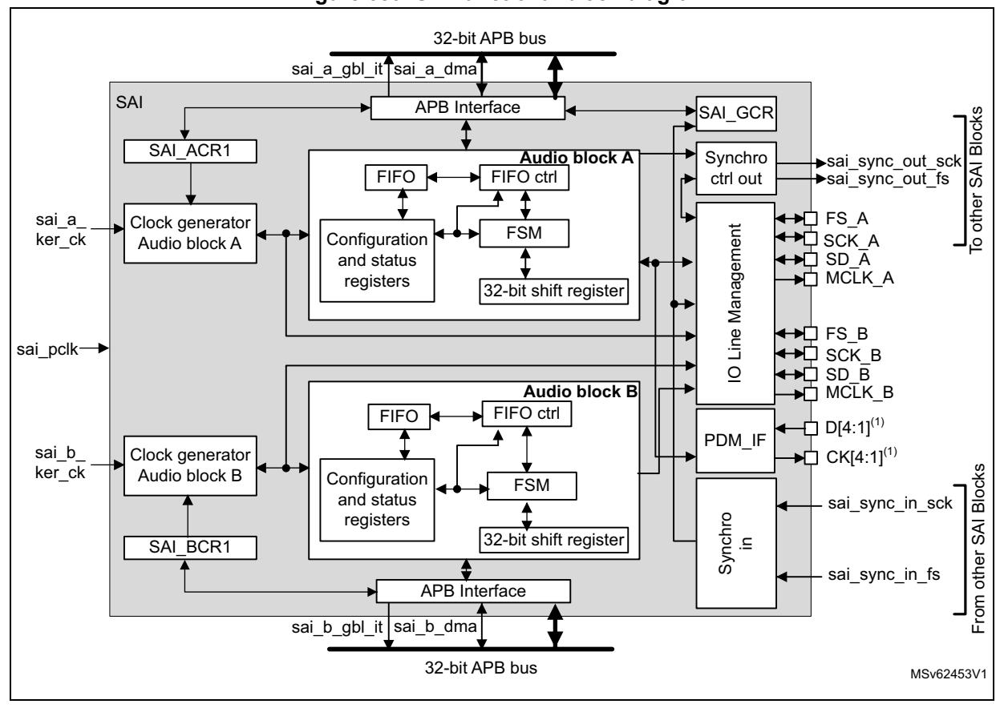

**Figure 689. SAI functional block diagram**

1. These signals might not be available for all SAI instances. Refer to *[Section 54.3: SAI implementation](#page-1-1)* for details.

The SAI is mainly composed of two audio subblocks with their own clock generator. Each audio block integrates a 32-bit shift register controlled by their own functional state machine. Data are stored or read from the dedicated FIFO. FIFO may be accessed by the CPU, or by DMA in order to leave the CPU free during the communication. Each audio block is independent. They can be synchronous with each other.

An I/O line controller manages a set of 4 dedicated pins (SD, SCK, FS, MCLK) for a given audio block in the SAI. Some of these pins can be shared if the two subblocks are declared as synchronous to leave some free to be used as general purpose I/Os. The MCLK pin can be output, or not, depending on the application, the decoder requirement and whether the audio block is configured as the master.

If one SAI is configured to operate synchronously with another one, even more I/Os can be freed (except for pins SD\_x).

The functional state machine can be configured to address a wide range of audio protocols. Some registers are present to set-up the desired protocols (audio frame waveform generator).

The audio subblock can be a transmitter or receiver, in master or slave mode. The master mode means the SCK\_x bit clock and the frame synchronization signal are generated from the SAI, whereas in slave mode, they come from another external or internal master. There is a particular case for which the FS signal direction is not directly linked to the master or slave mode definition. In AC'97 protocol, it is an SAI output even if the SAI (link controller) is set-up to consume the SCK clock (and so to be in Slave mode).

RM0399 Rev 4 2391/3556

Note:

For ease of reading of this section, the notation SAI\_x refers to SAI\_A or SAI\_B, where 'x' represents the SAI A or B subblock.

# 54.4.2 SAI pins and internal signals

Table 444. SAI internal input/output signals

| Internal signal name                 | Signal type  | Description                                                                              |
|--------------------------------------|--------------|------------------------------------------------------------------------------------------|
| sai_a_gbl_it/ sai_b_gbl_it        | Output       | Audio block A and B global interrupts.                                                   |
| sai_a_dma, sai_b_dma              | Input/output | Audio block A and B DMA acknowledges and requests.                                       |
| sai_sync_out_sck, sai_sync_out_fs | Output       | Internal clock and frame synchronization output signals exchanged with other SAI blocks. |
| sai_sync_in_sck, sai_sync_in_fs   | Input        | Internal clock and frame synchronization input signals exchanged with other SAI blocks.  |
| sai_a_ker_ck/ sai_b_ker_ck        | Input        | Audio block A/B kernel clock.                                                            |
| sai_pclk                             | Input        | APB clock.                                                                               |

Table 445. SAI input/output pins

| Name         | Signal type  | Comments                                        |
|--------------|--------------|-------------------------------------------------|
| SAI_SCK_A/B  | Input/output | Audio block A/B bit clock.                      |
| SAI_MCLK_A/B | Output       | Audio block A/B master clock.                   |
| SAI_SD_A/B   | Input/output | Data line for block A/B.                        |
| SAI_FS_A/B   | Input/output | Frame synchronization line for audio block A/B. |
| SAI_CK[4:1]  | Output       | PDM bitstream clock (1) .            |
| SAI_D[4:1]   | Input        | PDM bitstream data (1) .             |

1. These signals might not be available in all SAI instances. Refer to Section 54.3: SAI implementation for details.

### 54.4.3 Main SAI modes

Each audio subblock of the SAI can be configured to be master or slave via MODE bits in the SAI\_xCR1 register of the selected audio block.

### Master mode

In master mode, the SAI delivers the timing signals to the external connected device:

- The bit clock and the frame synchronization are output on pin SCK\_x and FS\_x, respectively.
- If needed, the SAI can also generate a master clock on MCLK\_x pin.

Both SCK\_x, FS\_x and MCLK\_x are configured as outputs.

### **Slave mode**

The SAI expects to receive timing signals from an external device.

- If the SAI subblock is configured in asynchronous mode, then SCK\_x and FS\_x pins are configured as inputs.
- If the SAI subblock is configured to operate synchronously with another SAI interface or with the second audio subblock, the corresponding SCK\_x and FS\_x pins are left free to be used as general purpose I/Os.

In slave mode, MCLK\_x pin is not used and can be assigned to another function.

It is recommended to enable the slave device before enabling the master.

### **Configuring and enabling SAI modes**

Each audio subblock can be independently defined as a transmitter or receiver through the MODE bit in the SAI\_xCR1 register of the corresponding audio block. As a result, SAI\_SD\_x pin is respectively configured as an output or an input.

Two master audio blocks in the same SAI can be configured with two different MCLK and SCK clock frequencies. In this case they have to be configured in asynchronous mode.

Each of the audio blocks in the SAI are enabled by SAIEN bit in the SAI\_xCR1 register. As soon as this bit is active, the transmitter or the receiver is sensitive to the activity on the clock line, data line and synchronization line in slave mode.

In master TX mode, enabling the audio block immediately generates the bit clock for the external slaves even if there is no data in the FIFO, However FS signal generation is conditioned by the presence of data in the FIFO. After the FIFO receives the first data to transmit, this data is output to external slaves. If there is no data to transmit in the FIFO, 0 values are then sent in the audio frame with an underrun flag generation.

In slave mode, the audio frame starts when the audio block is enabled and when a start of frame is detected.

In Slave TX mode, no underrun event is possible on the first frame after the audio block is enabled, because the mandatory operating sequence in this case is:

- 1. Write into the SAI\_xDR (by software or by DMA).
- 2. Wait until the FIFO threshold *(*FLH) flag is different from 0b000 (FIFO empty).
- 3. Enable the audio block in slave transmitter mode.

# **54.4.4 SAI synchronization mode**

There are two levels of synchronization, either at audio subblock level or at SAI level.

# **Internal synchronization**

An audio subblock can be configured to operate synchronously with the second audio subblock in the same SAI. In this case, the bit clock and the frame synchronization signals are shared to reduce the number of external pins used for the communication. The audio block configured in synchronous mode sees its own SCK\_x, FS\_x, and MCLK\_x pins released back as GPIOs while the audio block configured in asynchronous mode is the one for which FS\_x and SCK\_x ad MCLK\_x I/O pins are relevant (if the audio block is considered as master).

RM0399 Rev 4 2393/3556

Typically, the audio block in synchronous mode can be used to configure the SAI in full duplex mode. One of the two audio blocks can be configured as a master and the other as slave, or both as slaves with one asynchronous block (corresponding SYNCEN[1:0] bits set to 00 in SAI\_xCR1) and one synchronous block (corresponding SYNCEN[1:0] bits set to 01 in the SAI\_xCR1).

*Note: Due to internal resynchronization stages, PCLK APB frequency must be higher than twice the bit rate clock frequency.*

## **External synchronization**

The audio subblocks can also be configured to operate synchronously with another SAI. This can be done as follow:

- 1. The SAI, which is configured as the source from which the other SAI is synchronized, has to define which of its audio subblock is supposed to provide the FS and SCK signals to other SAI. This is done by programming SYNCOUT[1:0] bits.
- 2. The SAI which receives the synchronization signals, has to select which SAI provides the synchronization by setting the proper value on SYNCIN[1:0] bits. For each of the two SAI audio subblocks, the user must then specify if it operates synchronously with the other SAI via the SYNCEN bit.

*Note: SYNCIN[1:0] and SYNCOUT[1:0] bits are located into the SAI\_GCR register, and SYNCEN bits into SAI\_xCR1 register.*

> If both audio subblocks in a given SAI need to be synchronized with another SAI, it is possible to choose one of the following configurations:

- Configure each audio block to be synchronous with another SAI block through the SYNCEN[1:0] bits.
- Configure one audio block to be synchronous with another SAI through the SYNCEN[1:0] bits. The other audio block is then configured as synchronous with the second SAI audio block through SYNCEN[1:0] bits.

The following table shows how to select the proper synchronization signal depending on the SAI block used. For example SAI2 can select the synchronization from SAI1 by setting SAI2 SYNCIN to 0. If SAI1 wants to select the synchronization coming from SAI2, SAI1 SYNCIN must be set to 1. Positions noted as 'Reserved' must not be used.

| Block instance | SYNCIN= 3 | SYNCIN= 2 | SYNCIN= 1 | SYNCIN= 0 |
|----------------|-----------|-----------|-----------|-----------|
| SAI1           | SAI4      | SAI3      | SAI2      | Reserved  |
| SAI2           | SAI4      | SAI3      | Reserved  | SAI1      |
| SAI3           | SAI4      | Reserved  | SAI2      | SAI1      |
| SAI4           | Reserved  | SAI3      | SAI2      | SAI1      |

**Table 446. External synchronization selection** 

# **54.4.5 Audio data size**

The audio frame can target different data sizes by configuring bit DS[2:0] in the SAI\_xCR1 register. The data sizes may be 8, 10, 16, 20, 24 or 32 bits. During the transfer, either the MSB or the LSB of the data are sent first, depending on the configuration of bit LSBFIRST in the SAI\_xCR1 register.

# **54.4.6 Frame synchronization**

The FS signal acts as the Frame synchronization signal in the audio frame (start of frame). The shape of this signal is completely configurable in order to target the different audio protocols with their own specificities concerning this Frame synchronization behavior. This reconfigurability is done using register SAI\_xFRCR. *[Figure 690](#page-6-0)* illustrates this flexibility.

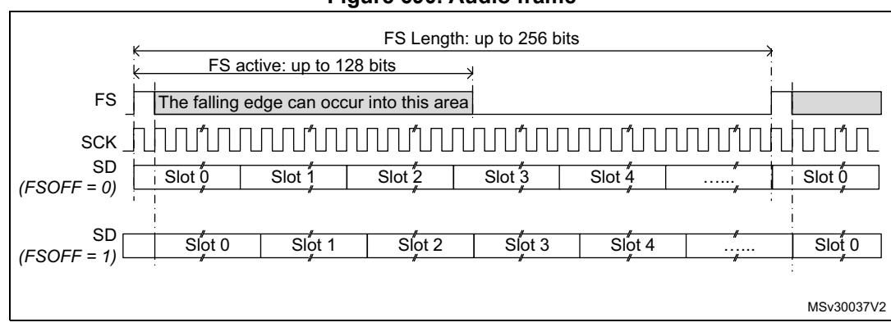

**Figure 690. Audio frame**

In AC'97 mode or in SPDIF mode (bit PRTCFG[1:0] = 10 or PRTCFG[1:0] = 01 in the SAI\_xCR1 register), the frame synchronization shape is forced to match the AC'97 protocol. The SAI\_xFRCR register value is ignored.

Each audio block is independent and consequently each one requires a specific configuration.

### **Frame length**

• Master mode

The audio frame length can be configured to up to 256 bit clock cycles, by setting FRL[7:0] field in the SAI\_xFRCR register.

If the frame length is greater than the number of declared slots for the frame, the remaining bits to transmit is extended to 0 or the SD line is released to HI-z depending the state of bit TRIS in the SAI\_xCR2 register (refer to *[FS signal role](#page-7-0)*). In reception mode, the remaining bit is ignored.

If bit NODIV is cleared, (FRL+1) must be equal to a power of 2, from 8 to 256, to ensure that an audio frame contains an integer number of MCLK pulses per bit clock cycle. If bit NODIV is set, the (FRL+1) field can take any value from 8 to 256. Refer to *[Section 54.4.8: SAI clock generator](#page-11-0)*".

• Slave mode

The audio frame length is mainly used to specify to the slave the number of bit clock cycles per audio frame sent by the external master. It is used mainly to detect from the master any anticipated or late occurrence of the Frame synchronization signal during an ongoing audio frame. In this case an error is generated. For more details refer to *[Section 54.4.14: Error flags](#page-33-0)*.

In slave mode, there are no constraints on the FRL[7:0] configuration in the SAI\_xFRCR register.

The number of bits in the frame is equal to FRL[7:0] + 1.

The minimum number of bits to transfer in an audio frame is 8.

RM0399 Rev 4 2395/3556

### **Frame synchronization polarity**

FSPOL bit in the SAI\_xFRCR register sets the active polarity of the FS pin from which a frame is started. The start of frame is edge sensitive.

In slave mode, the audio block waits for a valid frame to start transmitting or receiving. Start of frame is synchronized to this signal. It is effective only if the start of frame is not detected during an ongoing communication and assimilated to an anticipated start of frame (refer to *[Section 54.4.14: Error flags](#page-33-0)*).

In master mode, the frame synchronization is sent continuously each time an audio frame is complete until the SAIEN bit in the SAI\_xCR1 register is cleared. If no data are present in the FIFO at the end of the previous audio frame, an underrun condition is managed as described in *[Section 54.4.14: Error flags](#page-33-0)*), but the audio communication flow is not interrupted.

## **Frame synchronization active level length**

The FSALL[6:0] bits of the SAI\_xFRCR register enable the configuration of the length of the active level of the Frame synchronization signal. The length can be set from 1 to 128 bit clock cycles.

As an example, the active length can be half of the frame length in I2S, LSB or MSB-justified modes, or one-bit wide for PCM/DSP or TDM.

# **Frame synchronization offset**

Depending on the audio protocol targeted in the application, the Frame synchronization signal can be asserted when transmitting the last bit or the first bit of the audio frame (this is the case in I2S standard protocol and in MSB-justified protocol, respectively). FSOFF bit in the SAI\_xFRCR register enables to choose one of the two configurations.

### **FS signal role**

The FS signal can have a different meaning depending on the FS function. FSDEF bit in the SAI\_xFRCR register selects which meaning it has:

- 0: start of frame, like for instance the PCM/DSP, TDM, AC'97, audio protocols,
- 1: start of frame and channel side identification within the audio frame like for the I2S, the MSB or LSB-justified protocols.

When the FS signal is considered as a start of frame and channel side identification within the frame, the number of declared slots must be considered to be half the number for the left channel and half the number for the right channel. If the number of bit clock cycles on half audio frame is greater than the number of slots dedicated to a channel side, and TRIS = 0, 0 is sent for transmission for the remaining bit clock cycles in the SAI\_xCR2 register. Otherwise if TRIS = 1, the SD line is released to HI-Z. In reception mode, the remaining bit clock cycles are not considered until the channel side changes.

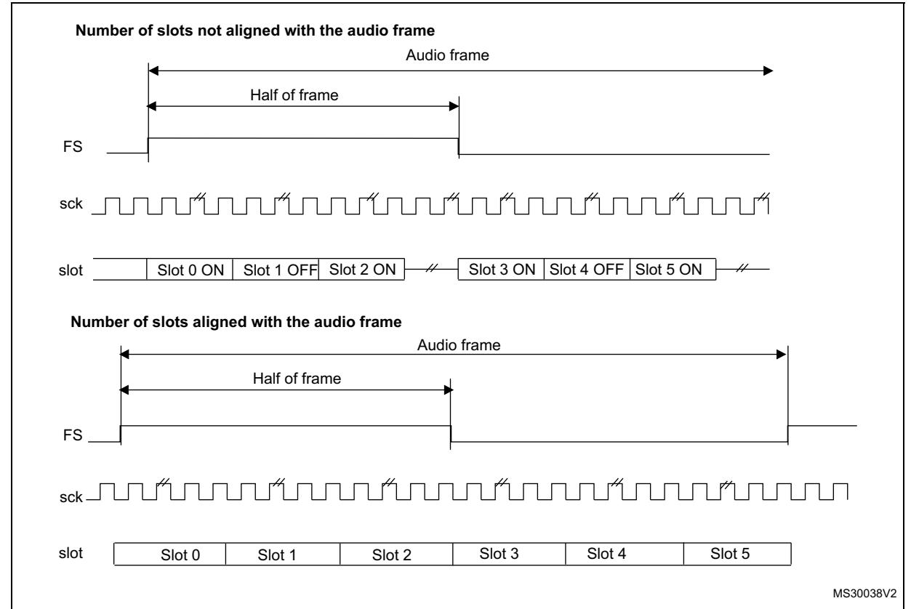

**Figure 691. FS role is start of frame + channel side identification (FSDEF = TRIS = 1)**

1. The frame length must be even.

If FSDEF bit in SAI\_xFRCR is kept clear, so FS signal is equivalent to a start of frame, and if the number of slots defined in NBSLOT[3:0] in SAI\_xSLOTR multiplied by the number of bits by slot configured in SLOTSZ[1:0] in SAI\_xSLOTR is less than the frame size (bit FRL[7:0] in the SAI\_xFRCR register), then:

- if TRIS = 0 in the SAI\_xCR2 register, the remaining bit after the last slot is forced to 0 until the end of frame in case of transmitter,
- if TRIS = 1, the line is released to HI-Z during the transfer of these remaining bits. In reception mode, these bits are discarded.

RM0399 Rev 4 2397/3556

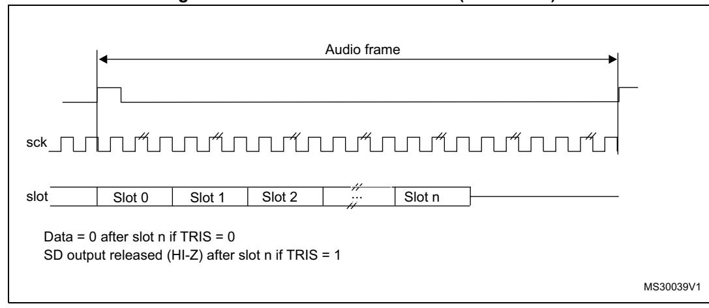

**Figure 692. FS role is start of frame (FSDEF = 0)**

The FS signal is not used when the audio block in transmitter mode is configured to get the SPDIF output on the SD line. The corresponding FS I/O is released and left free for other purposes.

# **54.4.7 Slot configuration**

The slot is the basic element in the audio frame. The number of slots in the audio frame is equal to NBSLOT[3:0] + 1.

The maximum number of slots per audio frame is fixed at 16.

For AC'97 protocol or SPDIF (when bit PRTCFG[1:0] = 10 or PRTCFG[1:0] = 01), the number of slots is automatically set to target the protocol specification, and the value of NBSLOT[3:0] is ignored.

Each slot can be defined as a valid slot, or not, by setting SLOTEN[15:0] bits of the SAI\_xSLOTR register.

When a invalid slot is transferred, the SD data line is either forced to 0 or released to HI-z depending on TRIS bit configuration (refer to *[Output data line management on an inactive](#page-31-0)  [slot](#page-31-0)*) in transmitter mode. In receiver mode, the received value from the end of this slot is ignored. Consequently, there is no FIFO access and so no request to read or write the FIFO linked to this inactive slot status.

The slot size is also configurable as shown in *[Figure 693.](#page-10-0)* The size of the slots is selected by setting SLOTSZ[1:0] bits in the SAI\_xSLOTR register. The size is applied identically for each slot in an audio frame.

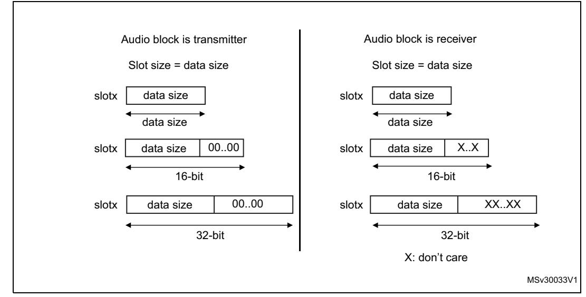

**Figure 693. Slot size configuration with FBOFF = 0 in SAI\_xSLOTR**

It is possible to choose the position of the first data bit to transfer within the slots. This offset is configured by FBOFF[4:0] bits in the SAI\_xSLOTR register. 0 values are injected in transmitter mode from the beginning of the slot until this offset position is reached. In reception, the bit in the offset phase is ignored. This feature targets the LSB justified protocol (if the offset is equal to the slot size minus the data size).

MS30034V1 XX .. XX 00 00..00 X: don't care Audio block is transmitter Slot size = data size data size data size data size data size slotx slotx slotx 16-bit 32-bit Audio block is receiver 00 FBOFF FBOFF = SLOT SZ -DS XX Slot size = data size data size data size data size data size slotx slotx slotx 16-bit 32-bit XX FBOFF FBOFF = SLOT SZ -DS

**Figure 694. First bit offset**

It is mandatory to respect the following conditions to avoid bad SAI behavior:

FBOFF ≤(SLOTSZ - DS),

DS ≤SLOTSZ,

NBSLOT x SLOTSZ ≤FRL (frame length),

The number of slots must be even when bit FSDEF in the SAI\_xFRCR register is set.

In AC'97 and SPDIF protocol (bit PRTCFG[1:0] = 10 or PRTCFG[1:0] = 01), the slot size is automatically set as defined in *[Section 54.4.11: AC'97 link controller](#page-24-0)*.

RM0399 Rev 4 2399/3556

# 54.4.8 SAI clock generator

Each audio block has its own clock generator. The clock generator builds the master clock (MCLK\_x) and bit clock (SCK\_x) signals from the sai\_x\_ker\_ck. The sai\_x\_ker\_ck clock is delivered by the clock controller of the product (RCC).

### Generation of the master clock (MCLK x)

The clock generator provides the master clock (MCLK\_x) when the audio block is defined as Master or Slave. The master clock is generated as soon as the MCKEN bit is set to 1 even if the SAIEN bit for the corresponding block is set to 0. This feature can be useful if the MCLK\_x clock is used as system clock for an external audio device, since it enables the generation of the MCLK\_x before activating the audio stream.

To generate a master clock on MCLK\_x output before transferring the audio samples, the user application has to follow the sequence below:

- Check that SAIEN = 0.
- 2. Program the MCKDIV[5:0] divider to the required value.
- 3. Set the MCKEN bit to 1.
- 4. Later, the application can configure other parts of the SAI, and sets the SAIEN bit to 1 to start the transfer of audio samples.

To avoid disturbances on the clock generated on MCLK\_x output, the following operations are not recommended:

- Changing MCKDIV when MCKEN = 1
- Setting MCKEN to 0 if the SAIEN = 1

The SAI guarantees that there is no spurs on MCLK\_x output when the MCLK\_x is switched ON and OFF via MCKEN bit (with SAIEN = 0).

Table 447 shows MCLK x activation conditions.

NODIV **MCLKEN** SAIEN for block x MCLK x 0 Disabled Χ 0 1 **Enabled** 0 Disabled 1 1 1 Enabled Х 0 Enabled

Table 447. MCLK\_x activation conditions

Note: MCLK\_x can also be generated in AC'97 mode, when MCLKEN is set to 1.

## Generation of the bit clock (SCK\_x)

The clock generator provides the bit clock (SCK\_x) when the audio block is defined as Master. The frame synchronization (FS\_x) is also derived from the signals provided by the clock generator.

In Slave mode, the value of NODIV and OSR fields are ignored, and the SCK\_x clock is not generated.

The bit clock strobing edge of SCK\_x can be configured through the CKSTR fields, which is functional both in master and slave mode.

Figure 695 illustrates the architecture of the audio block clock generator.

Figure 695. Audio block clock generator overview

The NODIV bit must be used to force the ratio between the master clock (MCLK\_x) and the frame synchronization (FS x) frequency to 256 or 512.

- If NODIV is set to 0, the frequency ratio between the frame synchronization and the master clock is fixed to 512 or 256, according to OSR value, but the frame length must be a power of 2. More details are given hereafter.
- If NODIV is set to 1, the application can adjust the frequency of the bit clock (SCK\_x) via MCKDIV. In addition there is no restriction on the frame length value as long as the frame length is bigger or equal to 8 (i.e. FRL[7:0] > 6). The frame synchronization frequency depends on MCKDIV and frame length (FRL[7:0]). In that case, the frequency of the MCLK\_x is equal to the SCK\_x.

The NODIV, MCKEN, SAIEN, OVR, CKSTR and MCKDIV[5:0] bits belong to the SAI\_xCR1 register, while FRL[7:0] belongs to SAI\_xFRCR.

57

RM0399 Rev 4 2401/3556

### Clock generator programming when NODIV = 0

In that case, MCLK\_x frequency is:

- FMCLK x = 256 x FFS x if OSR = 0
- $F_{MCLK x} = 512 x F_{FS x} \text{ if OSR} = 1$

When MCKDIV is different from 0, MCLK x frequency is given by the formula below:

$$\mathsf{F}_{\mathsf{MCLK}\_x} = \frac{\mathsf{F}_{\mathsf{sai}\_x\_\mathsf{ker}\_\mathsf{ck}}}{\mathsf{MCKDIV}}$$

The frame synchronization frequency is given by:

$$F_{FS\_x} = \frac{F_{sai\_x\_ker\_ck}}{MCKDIV \times (OSR + 1) \times 256}$$

The bit clock frequency (SCK\_x) is given by the following formula:

$$F_{SCK\_x} = \frac{F_{sai\_x\_ker\_ck} \times (FRL + 1)}{MCKDIV \times (OSR + 1) \times 256}$$

Note:

When NODIV is equal to 0, (FRL+1) must be a power of two. In addition (FRL+1) must range between 8 and 256. (FRL +1) represents the number of bit clock in the audio frame.

When MCKDIV division ratio is odd, the MCLK duty cycle is not 50%. The bit clock signal  $(SCK_x)$  can also have a duty cycle different from 50% if MCKDIV is odd, if OSR is equal to 0, and if  $(FRL+1) = 2^8$ .

It is recommended, to program MCKDIV to an even value or to big values (higher than 10). Note that MCKDIV = 0 gives the same result as MCKDIV = 1.

### Clock generator programming when NODIV = 1

When MCKDIV is different from 0, the frequency of the bit clock (SCK\_x) is given in the formula below:

$$F_{SCK\_x} = F_{MCLK\_x} = \frac{F_{sai\_x\_ker\_ck}}{MCKDIV}$$

The frequency of the frame synchronization (FS\_x) in given by the following formula:

$$F_{FS\_x} = \frac{F_{sai\_x\_ker\_ck}}{(FRL+1) \times MCKDIV}$$

Note:

When NODIV is set to 1, (FRL+1) can take any values from 8 to 256.

Note that MCKDIV = 0 gives the same result as MCKDIV = 1.

### **Clock generator programming examples**

*[Table 448](#page-14-0)* gives programming examples for 48, 96 and 192 kHz.

**Input sai\_x\_ker\_ck clock frequency MCLK FMCLK/ FFS FRL (1) OSR NODIV MCKEN MCKDIV[5:0] Audio Sampling frequency (**F**FS)** 98.304 MHz Y 512 2N-1 1 0 1 0 or 1 192 kHz 512 2N-1 1 0 1 2 96 kHz 512 2N-1 1 0 1 4 48 kHz 256 2N-1 0 0 1 2 192 kHz 256 2N-1 0 0 1 4 96 kHz 256 2N-1 0 0 1 8 48 kHz N - 63 - 1 0 8 192 kHz - 63 - 1 0 16 96 kHz - 63 - 1 0 32 48 kHz

**Table 448. Clock generator programming examples** 

# **54.4.9 Internal FIFOs**

Each audio block in the SAI has its own FIFO. Depending if the block is defined to be a transmitter or a receiver, the FIFO can be written or read, respectively. There is therefore only one FIFO request linked to FREQ bit in the SAI\_xSR register.

An interrupt is generated if FREQIE bit is enabled in the SAI\_xIM register. This depends on:

- FIFO threshold setting (FLVL bits in SAI\_xCR2)
- Communication direction (transmitter or receiver). Refer to *[Interrupt generation in](#page-14-1)  [transmitter mode](#page-14-1)* and *[Interrupt generation in reception mode](#page-15-0)*.

## **Interrupt generation in transmitter mode**

The interrupt generation depends on the FIFO configuration in transmitter mode:

- When the FIFO threshold bits in SAI\_xCR2 register are configured as FIFO empty (FTH[2:0] set to 0b000), an interrupt is generated (FREQ bit set by hardware to 1 in SAI\_xSR register) if no data are available in SAI\_xDR register (FLVL[2:0] bits in SAI\_xSR is less than 001b). This Interrupt (FREQ bit in SAI\_xSR register) is cleared by hardware when the FIFO is no more empty (FLVL[2:0] bits in SAI\_xSR are different from 0b000) i.e one or more data are stored in the FIFO.
- When the FIFO threshold bits in SAI\_xCR2 register are configured as FIFO quarter full (FTH[2:0] set to 001b), an interrupt is generated (FREQ bit set by hardware to 1 in SAI\_xSR register) if less than a quarter of the FIFO contains data (FLVL[2:0] bits in SAI\_xSR are less than 0b010). This Interrupt (FREQ bit in SAI\_xSR register) is cleared by hardware when at least a quarter of the FIFO contains data (FLVL[2:0] bits in SAI\_xSR are higher or equal to 0b010).
- When the FIFO threshold bits in SAI\_xCR2 register are configured as FIFO half full (FTH[2:0] set to 0b010), an interrupt is generated (FREQ bit set by hardware to 1 in

RM0399 Rev 4 2403/3556

1. N is an integer value between 3 and 8.

- SAI\_xSR register) if less than half of the FIFO contains data (FLVL[2:0] bits in SAI\_xSR are less than 011b). This Interrupt (FREQ bit in SAI\_xSR register) is cleared by hardware when at least half of the FIFO contains data (FLVL[2:0] bits in SAI\_xSR are higher or equal to 011b).
- When the FIFO threshold bits in SAI\_xCR2 register are configured as FIFO three quarter (FTH[2:0] set to 011b), an interrupt is generated (FREQ bit is set by hardware to 1 in SAI\_xSR register) if less than three quarters of the FIFO contain data (FLVL[2:0] bits in SAI\_xSR are less than 0b100). This Interrupt (FREQ bit in SAI\_xSR register) is cleared by hardware when at least three quarters of the FIFO contain data (FLVL[2:0] bits in SAI\_xSR are higher or equal to 0b100).
- When the FIFO threshold bits in SAI\_xCR2 register are configured as FIFO full (FTH[2:0] set to 0b100), an interrupt is generated (FREQ bit is set by hardware to 1 in SAI\_xSR register) if the FIFO is not full (FLVL[2:0] bits in SAI\_xSR is less than 101b). This Interrupt (FREQ bit in SAI\_xSR register) is cleared by hardware when the FIFO is full (FLVL[2:0] bits in SAI\_xSR is equal to 101b value).

### **Interrupt generation in reception mode**

The interrupt generation depends on the FIFO configuration in reception mode:

- When the FIFO threshold bits in SAI\_xCR2 register are configured as FIFO empty (FTH[2:0] set to 0b000), an interrupt is generated (FREQ bit is set by hardware to 1 in SAI\_xSR register) if at least one data is available in SAI\_xDR register(FLVL[2:0] bits in SAI\_xSR is higher or equal to 001b). This Interrupt (FREQ bit in SAI\_xSR register) is cleared by hardware when the FIFO becomes empty (FLVL[2:0] bits in SAI\_xSR is equal to 0b000) i.e no data are stored in FIFO.
- When the FIFO threshold bits in SAI\_xCR2 register are configured as FIFO quarter fully (FTH[2:0] set to 001b), an interrupt is generated (FREQ bit is set by hardware to 1 in SAI\_xSR register) if at least one quarter of the FIFO data locations are available (FLVL[2:0] bits in SAI\_xSR is higher or equal to 0b010). This Interrupt (FREQ bit in SAI\_xSR register) is cleared by hardware when less than a quarter of the FIFO data locations become available (FLVL[2:0] bits in SAI\_xSR is less than 0b010).
- When the FIFO threshold bits in SAI\_xCR2 register are configured as FIFO half fully (FTH[2:0] set to 0b010 value), an interrupt is generated (FREQ bit is set by hardware to 1 in SAI\_xSR register) if at least half of the FIFO data locations are available (FLVL[2:0] bits in SAI\_xSR is higher or equal to 011b). This Interrupt (FREQ bit in SAI\_xSR register) is cleared by hardware when less than half of the FIFO data locations become available (FLVL[2:0] bits in SAI\_xSR is less than 011b).
- When the FIFO threshold bits in SAI\_xCR2 register are configured as FIFO three quarter full(FTH[2:0] set to 011b value), an interrupt is generated (FREQ bit is set by hardware to 1 in SAI\_xSR register) if at least three quarters of the FIFO data locations are available (FLVL[2:0] bits in SAI\_xSR is higher or equal to 0b100). This Interrupt (FREQ bit in SAI\_xSR register) is cleared by hardware when the FIFO has less than three quarters of the FIFO data locations avalable(FLVL[2:0] bits in SAI\_xSR is less than 0b100).
- When the FIFO threshold bits in SAI\_xCR2 register are configured as FIFO full(FTH[2:0] set to 0b100), an interrupt is generated (FREQ bit is set by hardware to 1 in SAI\_xSR register) if the FIFO is full (FLVL[2:0] bits in SAI\_xSR is equal to 101b). This Interrupt (FREQ bit in SAI\_xSR register) is cleared by hardware when the FIFO is not full (FLVL[2:0] bits in SAI\_xSR is less than 101b).

Like interrupt generation, the SAI can use the DMA if DMAEN bit in the SAI\_xCR1 register is set. The FREQ bit assertion mechanism is the same as the interrupt generation mechanism described above for FREQIE.

Each FIFO is an 8-word FIFO. Each read or write operation from/to the FIFO targets one word FIFO location whatever the access size. Each FIFO word contains one audio slot. FIFO pointers are incremented by one word after each access to the SAI\_xDR register.

Data must be right aligned when it is written in the SAI\_xDR.

Data received are right aligned in the SAI\_xDR.

The FIFO pointers can be reinitialized when the SAI is disabled by setting bit FFLUSH in the SAI\_xCR2 register. If FFLUSH is set when the SAI is enabled the data present in the FIFO are lost automatically.

# **54.4.10 PDM interface**

The PDM (Pulse Density Modulation) interface is provided in order to support digital microphones. Up to 4 digital microphone pairs can be connected in parallel. Depending on product implementation, less microphones can be supported (refer to *[Section 54.3: SAI](#page-1-1)  [implementation](#page-1-1)*).

*[Figure 696](#page-16-0)* shows a typical connection of a digital microphone pair via a PDM interface. Both microphones share the same bitstream clock and data line. Thanks to a configuration pin (LR), a microphone can provide valid data on SAI\_CK[m] rising edge while the other provides valid data on SAI\_CK[m] falling edge (m being the number of clock lines).

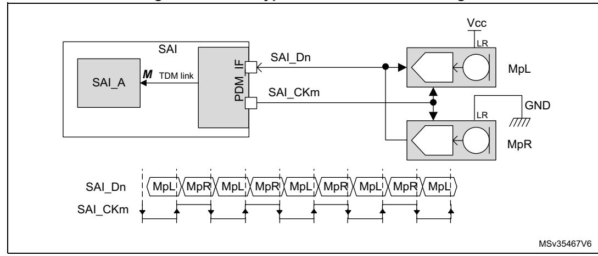

**Figure 696. PDM typical connection and timing**

1. **n** refers to the number of data lines and **p** to the number of microphone pairs.

The PDM function is intended to be used in conjunction with SAI\_A subblock configured in TDM master mode. It cannot be used with SAI\_B subblock. The PDM interface uses the timing signals provided by the TDM interface of SAI\_A and adapts them to generate a bitstream clock (SAI\_CK[m]).

The data processing sequence into the PDM is the following:

- 1. The PDM interface builds the bitstream clock from the bit clock received from the TDM interface of SAI\_A.
- 2. The bitstream data received from the microphones (SAI\_D[n]) are de-interleaved and go through a 7-bit delay line in order to fine-tune the delay of each microphone with the accuracy of the bitstream clock.
- 3. The shift registers translate each serial bitstream into bytes.
- 4. The last operation consists in shifting-out the resulting bytes to SAI\_A via the serial data line of the TDM interface.

*[Figure 697](#page-17-0)* hereafter shows the block diagram of PDM interface, with a detailed view of a de-interleaver.

*Note: The PDM* interface *does not embed the decimation filter required to build-up the PCM audio samples from the bitstream. It is up to the application software to perform this operation.*

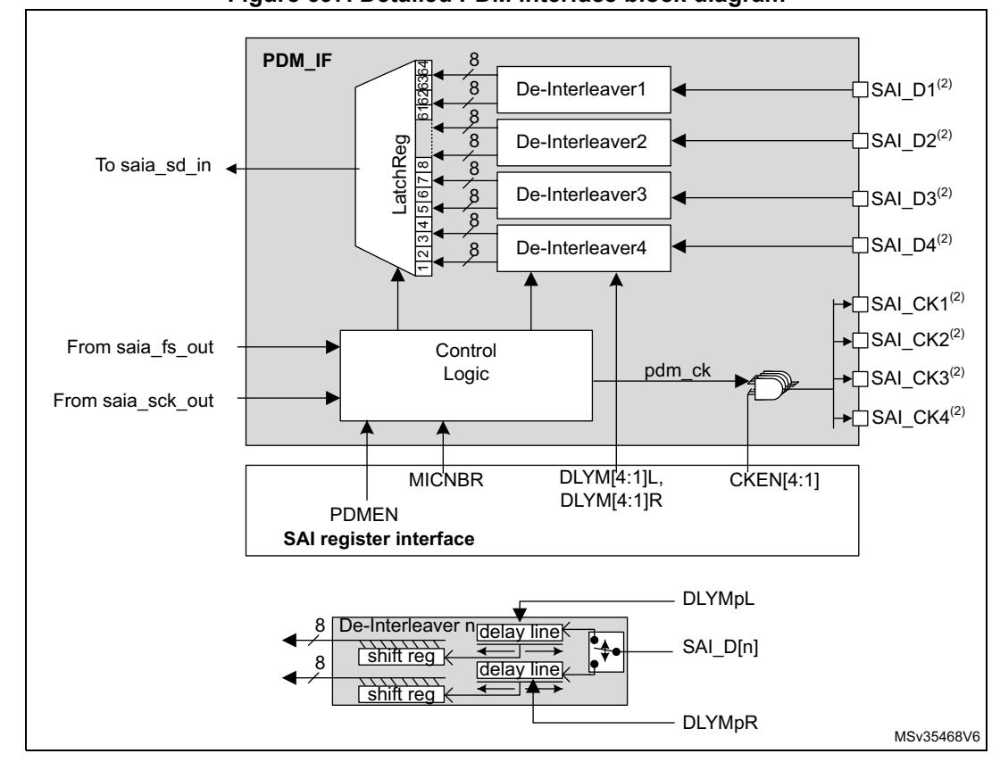

**Figure 697. Detailed PDM interface block diagram**

- 1. **n** refers to the number of data lines and **p** to the number of microphone pairs.
- 2. These signals might not be available in all SAI instances. Refer to *[Section 54.3: SAI implementation](#page-1-1)* for details.

The PDM interface can be enabled through the PDMEN bit in SAI\_PDMCR register. However the PDM interface must be enabled prior to enabling SAI\_A block.

To reduce the memory footprint, the user can select the amount of microphones the application needs. This can be done through MICNBR[1:0] bits. It is possible to select

between 2,4,6 or 8 microphones. For example, if the application is using 3 microphones, the user has to select 4.

# **Enabling the PDM interface**

To enable the PDM interface, follow the sequence below:

- 1. Configure SAI\_A in TDM master mode (see *[Table](#page-21-0) 449*).
- 2. Configure the PDM interface as follows:
  - a) Define the number of digital microphones via MICNBR.
  - b) Enable the bitstream clock needed in the application by setting the corresponding bits on CKEN to 1.
- 3. Enable the PDM interface, via PDMEN bit.
- 4. Enable the SAI\_A.

*Note: Once the PDM interface and SAI\_A are enabled, the first 2 TDMA frames received on SAI\_ADR are invalid and must be dropped.*

### **Start-up sequence**

*[Figure 698](#page-18-0)* shows the start-up sequence: Once the PDM interface is enabled, it waits for the frame synchronization event prior to starting the acquisition of the microphone samples. After 8 SAI\_CK clock periods, a data byte coming from each microphone is available, and transferred to the SAI, via the TDM interface.

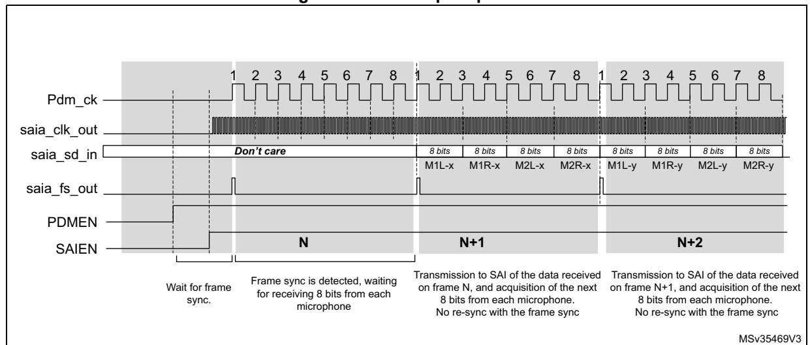

**Figure 698. Start-up sequence**

# **SAI\_ADR data format**

The arrangement of the data coming from the microphone into the SAI\_ADR register depends on the following parameters:

- The amount of microphones
- The slot width selected
- LSBFIRST bit.

The slot width defines the amount of significant bits into each word available into the SAI\_ADR.

RM0399 Rev 4 2407/3556

When a slot width of 32 bits is selected, each data available into the SAI\_ADR contains 32 useful bits. This reduces the amount of words stored into the memory. However the counterpart is that the software has to perform some operations to de-interleave the data of each microphone.

In the other hand, when the slot width is set to 8 bits, each data available into the SAI\_ADR contain 8 useful bits. This increases the amount of words stored into the memory. However, it offers the advantage to avoid extra processing since each word contains information from one microphone.

### **SAI\_ADR data format example**

• **32-bit slot width** (DS = 0b111 and SLOTSZ = 0). Refer to *[Figure 699](#page-19-0)*.

For an 8 microphone configuration, two consecutive words read from the SAI\_ADR register contain a data byte from each microphone.

For a 4 microphones configuration, each word read from the SAI\_ADR register contains a data byte from each microphone.

**Figure 699. SAI\_ADR format in TDM, 32-bit slot width**

• **16-bit slot width** (DS = 0b100 and SLOTSZ = 0). Refer to *[Figure 700](#page-20-0)*.

For an 8 microphone configuration, four consecutive words read from the SAI\_ADR register contain a data byte from each microphone. Note that the 16-bit data of SAI\_ADR are right aligned.

For 4 or 2 microphone configuration, the SAI behavior is similar to 8-microphone configurations. Up to 2 words of 16 bits are required to acquire a byte from 4 microphones and a single word for 2 microphones.

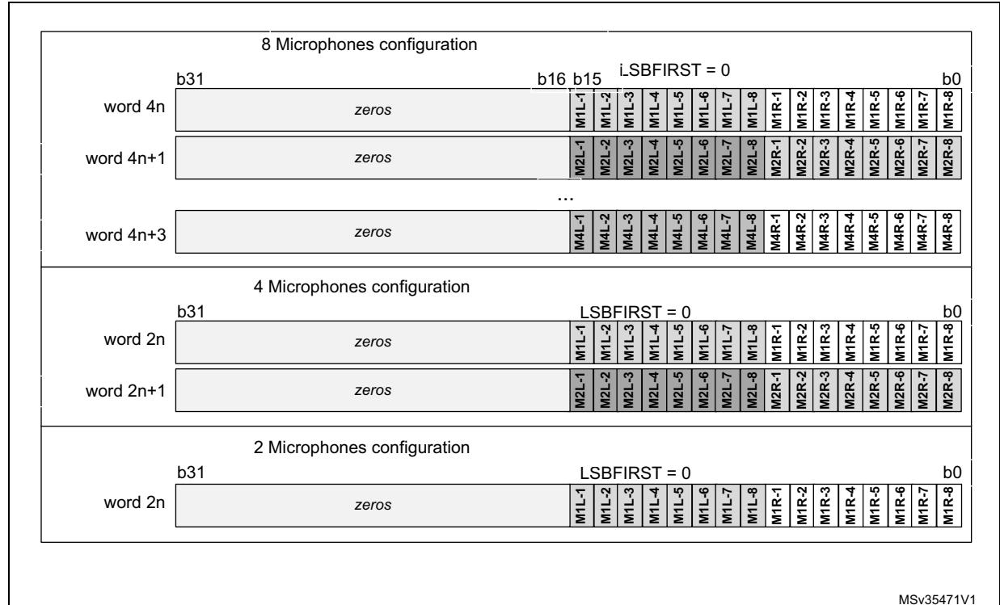

Figure 700. SAI\_ADR format in TDM, 16-bit slot width

Using a 8-bit slot width (DS = 0b010 and SLOTSZ = 0). Refer to Figure 701.

For an 8 microphone configuration, 8 consecutive words read from the SAI\_ADR register contain a byte of data from each microphone. Note that the 8-bit data of SAI\_ADR are right aligned.

For 4 or 2 microphone configuration, the SAI behavior is similar to 8 microphone configurations. Up to 4 words of 8 bits are required to acquire a byte from 4 microphones and 2 words from 2 microphones.

4

RM0399 Rev 4

2409/3556

8 Microphones configuration LSBFIRST = 0 word 8n zeros word 8n+1 zeros ... zeros word 8n+7 4 Microphones configuration LSBFIRST = 0 word 4n zeros word 4n+1 zeros word 4n+3 zeros 2 Microphones configuration b31 LSBFIRST = 0 word 2n zeros word 2n+1 MSv35472V1

Figure 701. SAI\_ADR format in TDM, 8-bit slot width

# **TDM configuration for PDM interface**

SAI\_A TDM interface is internally connected to the PDM interface to get the microphone samples. The user application must configure the PDM interface as shown in *Table 449* to ensure a good connection with the PDM interface.

Table 449. TDM settings

| Bit Fields | Values | Comments                                                                                                                                                 |
|------------|--------|----------------------------------------------------------------------------------------------------------------------------------------------------------|
| MODE       | 0b01   | Mode must be MASTER receiver                                                                                                                             |
| PRTCFG     | 0b00   | Free protocol for TDM                                                                                                                                    |
| DS         | Х      | To be adjusted according to the required data format, in accordance to the frame length and the number of slots (FRL and NBSLOT). See <i>Table 450</i> . |
| LSBFIRST   | Х      | This parameter can be used according to the wanted data format                                                                                           |
| CKSTR      | 0      | Signal transitions occur on the rising edge of the SCK_A bit clock. Signals are stable on the falling edge of the bit clock.                             |
| MONO       | 0      | Stereo mode                                                                                                                                              |
| FRL        | Х      | To be adjusted according to the number of microphones (MICNBR). See <i>Table 450</i> .                                                                   |
| FSALL      | 0      | Pulse width is one bit clock cycle                                                                                                                       |
| FSDEF      | 0      | FS signal is a start of frame                                                                                                                            |

| Bit Fields | Values | Comments                                                                                                                                                        |
|------------|--------|-----------------------------------------------------------------------------------------------------------------------------------------------------------------|
| FSPOL      | 1      | FS is active High                                                                                                                                               |
| FSOFF      | 0      | FS is asserted on the first bit of slot 0                                                                                                                       |
| FBOFF      | 0      | No offset on slot                                                                                                                                               |
| SLOTSZ     | 0      | Slot size = data size                                                                                                                                           |
| NBSLOT     | X      | To be adjusted according to the required data format, in accordance to the slot size, and the frame length (FRL and DS). See Table 450.                      |
| SLOTEN     | X      | To be adjusted according to NBSLOT                                                                                                                              |
| NODIV      | 1      | No need to generate a master clock MCLK                                                                                                                         |
| MCKDIV     | X      | Depends on the frequency provided to sai_a_ker_ck input. This parameter must be adjusted to generate the proper bitstream clock frequency. See Table 450. |

**Table 449. TDM settings (continued)**

### **Adjusting the bitstream clock rate**

To properly program the SAI TDM interface, the user application must take into account the settings given in *[Table 449](#page-21-0)*, and follow the below sequence:

1. Adjust the bit clock frequency (FSCK\_A) according to the required frequency for the PDM bitstream clock, using the following formula:

$$F_{SCK\_A} = F_{PDM\_CK} \times (MICNBR + 1) \times 2$$

MICNBR can be 0,1,2 or 3 (0 = 2 microphones., see *Section [54.6.18\)](#page-63-0)*

2. Set the frame length (FRL) using the following formula

$$FRL = (16 \times (MICNBR + 1)) - 1$$

3. Configure the slot size (DS) to a multiple of (FRL+1).

| Microphone sampling rate | Nber of microphones | Wanted SAI_CKn frequency | bit clock (SCK_A) frequency | Frame sync. (FS_A) frequency | FRL | DS    | NBSLOT | Comments                     |
|--------------------------------|------------------------|--------------------------------|-----------------------------------|------------------------------------|-----|-------|--------|------------------------------|
|                                |                        | 3.072 MHz                      | 24.576 MHz                        | 384 kHz                            | 63  | 0b111 | 1      | 2 slots of 32 bits per frame |
|                                | up to 8                | 3.072 MHz                      | 24.576 MHz                        | 384 kHz                            | 63  | 0b100 | 3      | 4 slots of 16 bits per frame |
|                                |                        | 3.072 MHz                      | 24.576 MHz                        | 384 kHz                            | 63  | 0b010 | 7      | 8 slots of 8 bits per frame  |
|                                |                        | 3.072 MHz                      | 18.432 MHz                        | 384 kHz                            | 47  | 0b110 | 1      | 2 slots of 24 bits per frame |
|                                | up to 6                | 3.072 MHz                      | 18.432 MHz                        | 384 kHz                            | 47  | 0b100 | 2      | 3 slots of 16 bits per frame |
| 48 kHz                         |                        | 3.072 MHz                      | 18.432 MHz                        | 384 kHz                            | 47  | 0b010 | 5      | 6 slots of 8 bits per frame  |
|                                |                        | 3.072 MHz                      | 12.288 MHz                        | 384 kHz                            | 31  | 0b111 | 0      | 1 slot of 32 bits per frame  |
|                                | up to 4                | 3.072 MHz                      | 12.288 MHz                        | 384 kHz                            | 31  | 0b100 | 1      | 2 slots of 16 bits per frame |
|                                |                        | 3.072 MHz                      | 12.288 MHz                        | 384 kHz                            | 31  | 0b010 | 3      | 4 slots of 8 bits per frame  |
|                                |                        | 3.072 MHz                      | 6.144 MHz                         | 384 kHz                            | 15  | 0b100 | 0      | 1 slots of 16 bits per frame |
|                                | up to 2                | 3.072 MHz                      | 6.144 MHz                         | 384 kHz                            | 15  | 0b010 | 1      | 2 slots of 8 bits per frame  |
|                                |                        | 1.024 MHz                      | 8.192 MHz                         | 128 kHz                            | 63  | 0b111 | 1      | 2 slots of 32 bits per frame |
|                                | up to 8                | 1.024 MHz                      | 8.192 MHz                         | 128 kHz                            | 63  | 0b100 | 3      | 4 slots of 16 bits per frame |
|                                |                        | 1.024 MHz                      | 8.192 MHz                         | 128 kHz                            | 63  | 0b010 | 7      | 8 slots of 8 bits per frame  |
|                                |                        | 1.024 MHz                      | 6.144 MHz                         | 128 kHz                            | 47  | 0b110 | 1      | 2 slots of 24 bits per frame |
|                                | up to 6                | 1.024 MHz                      | 6.144 MHz                         | 128 kHz                            | 47  | 0b010 | 5      | 6 slots of 8 bits per frame  |
| 16 kHz                         |                        | 1.024 MHz                      | 4.096 MHz                         | 128 kHz                            | 31  | 0b111 | 0      | 1 slot of 32 bits per frame  |
|                                | up to 4                | 1.024 MHz                      | 4.096 MHz                         | 128 kHz                            | 31  | 0b100 | 1      | 2 slots of 16 bits per frame |
|                                |                        | 1.024 MHz                      | 4.096 MHz                         | 128 kHz                            | 31  | 0b010 | 3      | 4 slots of 8 bits per frame  |
|                                |                        | 1.024 MHz                      | 2.048 MHz                         | 128 kHz                            | 15  | 0b100 | 0      | 1 slot of 16 bits per frame  |
|                                | up to 2                | 1.024 MHz                      | 2.048 MHz                         | 128 kHz                            | 15  | 0b010 | 1      | 2 slots of 8 bits per frame  |

**Table 450. TDM frame configuration examples(1)(2)**

### **Adjusting the delay lines**

When the PDM interface is enabled, the application can adjust on-the-fly the delay cells of each microphone input via SAI\_PDMDLY register.

The new delays values become effective after two TDM frames.

1. Refer to *[Table 449: TDM settings](#page-21-0)* for additional information on TDM configuration. The sai\_a\_ker\_ck clock frequency provided to the SAI must be a multiple of the SCK\_A frequency, and MCKDIV must be programmed accordingly.

2. The above sai\_a\_ker\_ck frequencies are given as examples only. Refer to section *Reset and clock controller (RCC) to check if they can be generated on the device.* 

3. The table above gives allowed settings for a decimation ratio of 64.

### 54.4.11 AC'97 link controller

The SAI is able to work as an AC'97 link controller. In this protocol:

- The slot number and the slot size are fixed.
- The frame synchronization signal is perfectly defined and has a fixed shape.

To select this protocol, set PRTCFG[1:0] bits in the SAI\_xCR1 register to 10. When AC'97 mode is selected, only data sizes of 16 or 20 bits can be used, otherwise the SAI behavior is not guaranteed.

- NBSLOT[3:0] and SLOTSZ[1:0] bits are consequently ignored.
- The number of slots is fixed to 13 slots. The first one is 16-bit wide and all the others are 20-bit wide (data slots).
- FBOFF[4:0] bits in the SAI xSLOTR register are ignored.
- The SAI xFRCR register is ignored.
- The MCLK is not used.

The FS signal from the block defined as asynchronous is configured automatically as an output, since the AC'97 controller link drives the FS signal whatever the master or slave configuration.

Figure 702 shows an AC'97 audio frame structure.

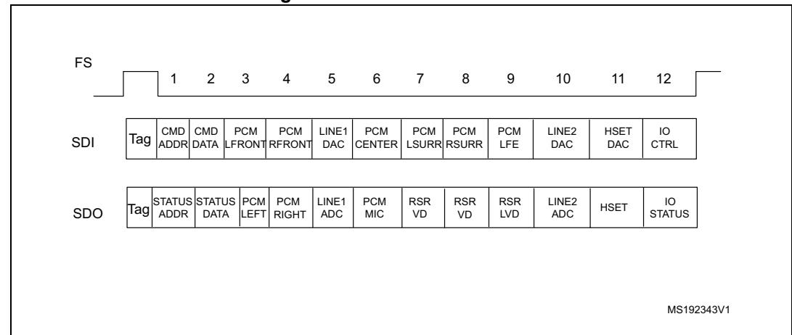

Figure 702. AC'97 audio frame

Note:

In AC'97 protocol, bit 2 of the tag is reserved (always 0), so bit 2 of the TAG is forced to 0 level whatever the value written in the SAI FIFO.

For more details about tag representation, refer to the AC'97 protocol standard.

One SAI can be used to target an AC'97 point-to-point communication.

Using two SAIs (for devices featuring two embedded SAIs) enables the control of three external AC'97 decoders as illustrated in *Figure 703*.

In SAI1, the audio block A must be declared as asynchronous master transmitter whereas the audio block B is defined to be slave receiver and internally synchronous to the audio block A.

The SAI2 is configured for audio block A and B both synchronous with the external SAI1 in slave receiver mode.

 $\overline{\Box}$ 

RM0399 Rev 4 2413/3556

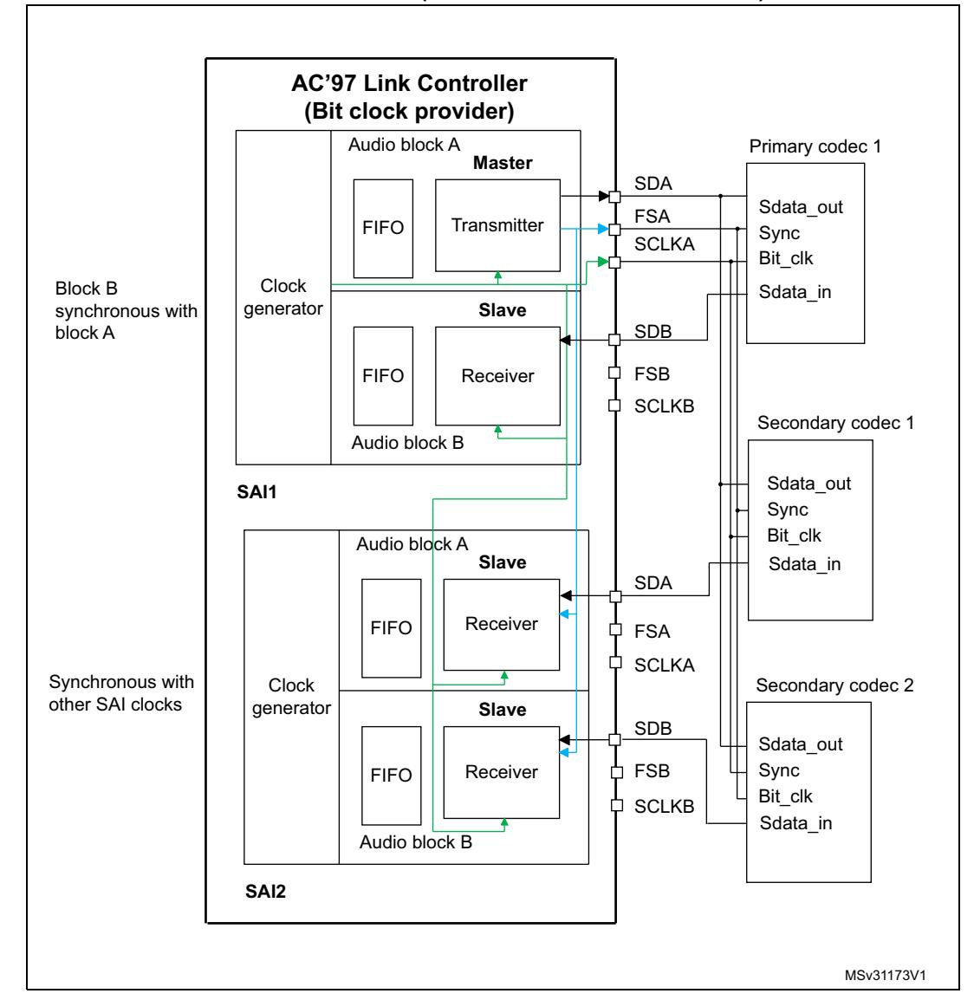

**Figure 703. Example of typical AC'97 configuration on devices featuring at least 2 embedded SAIs (three external AC'97 decoders)**

In receiver mode, the SAI acting as an AC'97 link controller requires no FIFO request and so no data storage in the FIFO when the Codec ready bit in the slot 0 is decoded low. If bit CNRDYIE is enabled in the SAI\_xIM register, flag CNRDY is set in the SAI\_xSR register and an interrupt is generated. This flag is dedicated to the AC'97 protocol.

### **Clock generator programming in AC'97 mode**

In AC'97 mode, the frame length is fixed at 256 bits, and its frequency must be set to 48 kHz. The formulas given in *[Section 54.4.8: SAI clock generator](#page-11-0)* must be used with FRL = 255, in order to generate the proper frame rate (FFS\_x).

# **54.4.12 SPDIF output**

The SPDIF interface is available in transmitter mode only. It supports the audio IEC60958.

To select SPDIF mode, set PRTCFG[1:0] bit to 01 in the SAI\_xCR1 register.

For SPDIF protocol:

- Only SD data line is enabled.
- FS, SCK, MCLK I/Os pins are left free.
- MODE[1] bit is forced to 0 to select the master mode in order to enable the clock generator of the SAI and manage the data rate on the SD line.
- The data size is forced to 24 bits. The value set in DS[2:0] bits in the SAI\_xCR1 register is ignored.
- The clock generator must be configured to define the symbol-rate, knowing that the bit clock must be twice the symbol-rate. The data is coded in Manchester protocol.
- The SAI\_xFRCR and SAI\_xSLOTR registers are ignored. The SAI is configured internally to match the SPDIF protocol requirements as shown in *[Figure 704](#page-26-0)*.

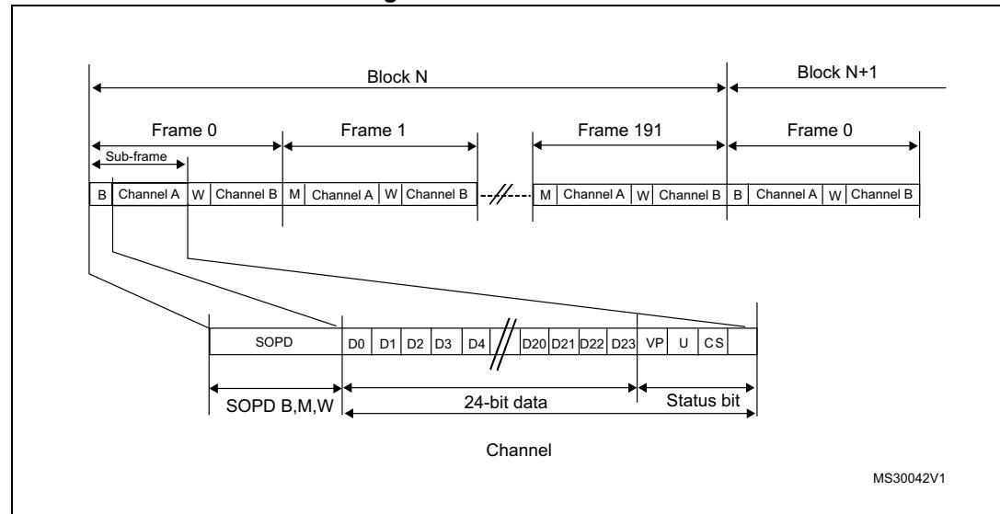

**Figure 704. SPDIF format**

A SPDIF block contains 192 frames. Each frame is composed of two 32-bit sub-frames, generally one for the left channel and one for the right channel. Each sub-frame is composed of a SOPD pattern (4-bit) to specify if the sub-frame is the start of a block (and so is identifying a channel A) or if it is identifying a channel A somewhere in the block, or if it is referring to channel B (see *[Table 451](#page-27-0)*). The next 28 bits of channel information are composed of 24 bits data + 4 status bits.

|      |                      | Preamble coding |                                       |
|------|----------------------|-----------------|---------------------------------------|
| SOPD | last bit is 0        | last bit is 1   | Description                           |
| B    | 11101000 00010111 |                 | Channel A data at the start of block  |
| W    | 11100100 00011011 |                 | Channel B data somewhere in the block |
| M    | 11100010             | 00011101        | Channel A data                        |

**Table 451. SOPD pattern** 

The data stored in SAI\_xDR has to be filled as follows:

- SAI\_xDR[26:24] contain the Channel status, User and Validity bits.
- SAI\_xDR[23:0] contain the 24-bit data for the considered channel.

If the data size is 20 bits, then data must be mapped on SAI\_xDR[23:4]. If the data size is 16 bits, then data must be mapped on SAI\_xDR[23:8]. SAI\_xDR[23] always represents the MSB.

MSv31174V1 SAI\_xDR[26:0] CS U V D23 D22 D21 D20 D19 D18 D17 D16 D15 D14 D13 D12 D11 D10 D9 D8 D7 Status Data[23:0] bits 26 0 D6 D5 D4 D3 D2 D1 D0

**Figure 705. SAI\_xDR register ordering**

*Note: The transfer is performed always with LSB first.*

The SAI first sends the adequate preamble for each sub-frame in a block. The SAI\_xDR is then sent on the SD line (manchester coded). The SAI ends the sub-frame by transferring the Parity bit calculated as described in *[Table 452](#page-27-1)*.

**SAI\_xDR[26:0] Parity bit P value transferred** odd number of 0 0

odd number of 1 1

**Table 452. Parity bit calculation** 

The underrun is the only error flag available in the SAI\_xSR register for SPDIF mode since the SAI can only operate in transmitter mode. As a result, the following sequence must be

executed to recover from an underrun error detected via the underrun interrupt or the underrun status bit:

- 1. Disable the DMA stream (via the DMA peripheral) if the DMA is used.
- 2. Disable the SAI and check that the peripheral is physically disabled by polling the SAIEN bit in SAI\_xCR1 register.
- 3. Clear the COVRUNDR flag in the SAI\_xCLRFR register.
- 4. Flush the FIFO by setting the FFLUSH bit in SAI\_xCR2. The software needs to point to the address of the future data corresponding to a start of

new block (data for preamble B). If the DMA is used, the DMA source base address pointer must be updated accordingly.

- 5. Enable again the DMA stream (DMA peripheral) if the DMA used to manage data transfers according to the new source base address.
- 6. Enable again the SAI by setting SAIEN bit in SAI\_xCR1 register.

### **Clock generator programming in SPDIF generator mode**

For the SPDIF generator, the SAI provides a bit clock twice faster as the symbol-rate. The table hereafter shows usual examples of symbol rates with respect to the audio sampling rate.

**Table 453. Audio sampling frequency versus symbol rates** 

| Audio sampling frequencies (FS) | Symbol-rate |
|---------------------------------|-------------|
| 44.1 kHz                        | 2.8224 MHz  |
| 48 kHz                          | 3.072 MHz   |
| 96 kHz                          | 6.144 MHz   |
| 192 kHz                         | 12.288 MHz  |

More generally, the relationship between the audio sampling frequency (FS) and the bit clock rate (FSCK\_X) is given by the formula:

$$F_{S} = \frac{F_{SCK} x}{128}$$

The bit clock rate is obtained as follows:

$$F_{SCK\_x} = \frac{F_{sai\_x\_ker\_ck}}{MCKDIV}$$

*Note: The above formulas are valid only if NODIV is set to 1 in SAI\_ACR1 register.* 

# **54.4.13 Specific features**

The SAI interface embeds specific features which can be useful depending on the audio protocol selected. These functions are accessible through specific bits of the SAI\_xCR2 register.

### **Mute mode**

The mute mode can be used when the audio subblock is a transmitter or a receiver.

### **Audio subblock in transmission mode**

In transmitter mode, the mute mode can be selected at anytime. The mute mode is active for entire audio frames. The MUTE bit in the SAI\_xCR2 register enables the mute mode when it is set during an ongoing frame.

The mute mode bit is strobed only at the end of the frame. If it is set at this time, the mute mode is active at the beginning of the new audio frame and for a complete frame, until the next end of frame. The bit is then strobed to determine if the next frame is still a mute frame.

If the number of slots set through NBSLOT[3:0] bits in the SAI\_xSLOTR register is lower than or equal to 2, it is possible to specify if the value sent in mute mode is 0 or if it is the last value of each slot. The selection is done via MUTEVAL bit in the SAI\_xCR2 register.

If the number of slots set in NBSLOT[3:0] bits in the SAI\_xSLOTR register is greater than 2, MUTEVAL bit in the SAI\_xCR2 is meaningless as 0 values are sent on each bit on each slot.

The FIFO pointers are still incremented in mute mode. This means that data present in the FIFO and for which the mute mode is requested are discarded.

### **Audio subblock in reception mode**

In reception mode, it is possible to detect a mute mode sent from the external transmitter when all the declared and valid slots of the audio frame receive 0 for a given consecutive number of audio frames (MUTECNT[5:0] bits in the SAI\_xCR2 register).

When the number of MUTE frames is detected, the MUTEDET flag in the SAI\_xSR register is set and an interrupt can be generated if MUTEDETIE bit is set in SAI\_xCR2.

The mute frame counter is cleared when the audio subblock is disabled or when a valid slot receives at least one data in an audio frame. The interrupt is generated just once, when the counter reaches the value specified in MUTECNT[5:0] bits. The interrupt event is then reinitialized when the counter is cleared.

*Note: The mute mode is not available for SPDIF audio blocks.*

### **Mono/stereo mode**

In transmitter mode, the mono mode can be addressed, without any data preprocessing in memory, assuming the number of slots is equal to 2 (NBSLOT[3:0] = 0001 in SAI\_xSLOTR). In this case, the access time to and from the FIFO is reduced by 2 since the data for slot 0 is duplicated into data slot 1.

To enable the mono mode,

- 1. Set MONO bit to 1 in the SAI\_xCR1 register.
- 2. Set NBSLOT to 1 and SLOTEN to 3 in SAI\_xSLOTR.

In reception mode, the MONO bit can be set and is meaningful only if the number of slots is equal to 2 as in transmitter mode. When it is set, only slot 0 data are stored in the FIFO. The data belonging to slot 1 are discarded since, in this case, it is supposed to be the same as the previous slot. If the data flow in reception mode is a real stereo audio flow with a distinct and different left and right data, the MONO bit is meaningless. The conversion from the output stereo file to the equivalent mono file is done by software.

## **Companding mode**

Telecommunication applications can require to process the data to be transmitted or received using a data companding algorithm.

Depending on the COMP[1:0] bits in the SAI\_xCR2 register (used only when Free protocol mode is selected), the application software can choose to process or not the data before sending it on SD serial output line (compression) or to expand the data after the reception on SD serial input line (expansion) as illustrated in *[Figure 706](#page-31-1)*. The two companding modes supported are the µ-Law and the A-Law log which are a part of the CCITT G.711 recommendation.

The companding standard used in the United States and Japan is the µ-Law. It supports 14 bits of dynamic range (COMP[1:0] = 10 in the SAI\_xCR2 register).

The European companding standard is A-Law and supports 13 bits of dynamic range (COMP[1:0] = 11 in the SAI\_xCR2 register).

Both µ-Law or A-Law companding standard can be computed based on 1's complement or 2's complement representation depending on the CPL bit setting in the SAI\_xCR2 register.

In µ-Law and A-Law standards, data are coded as 8 bits with MSB alignment. Companded data are always 8-bit wide. For this reason, DS[2:0] bits in the SAI\_xCR1 register are forced to 010 when the SAI audio block is enabled (SAIEN bit = 1 in the SAI\_xCR1 register) and when one of these two companding modes selected through the COMP[1:0] bits.

If no companding processing is required, COMP[1:0] bits must be kept clear.

RM0399 Rev 4 2419/3556

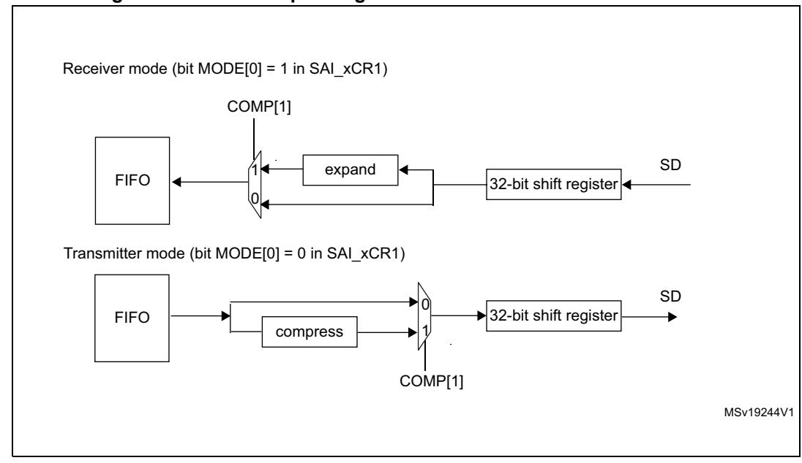

**Figure 706. Data companding hardware in an audio block in the SAI**

1. Not applicable when AC'97 or SPDIF are selected.

Expansion and compression mode are automatically selected through the SAI\_xCR2:

- If the SAI audio block is configured to be a transmitter, and if the COMP[1] bit is set in the SAI\_xCR2 register, the compression mode is applied.
- If the SAI audio block is declared as a receiver, the expansion algorithm is applied.

### **Output data line management on an inactive slot**

In transmitter mode, it is possible to choose the behavior of the SD line output when an inactive slot is sent on the data line (via TRIS bit).

- Either the SAI forces 0 on the SD output line when an inactive slot is transmitted, or
- The line is released in HI-z state at the end of the last bit of data transferred, to release the line for other transmitters connected to this node.

It is important to note that the two transmitters cannot attempt to drive the same SD output pin simultaneously, which may result in a short circuit. To ensure a gap between transmissions, if the data is lower than 32-bit, the data can be extended to 32-bit by setting bit SLOTSZ[1:0] = 10 in the SAI\_xSLOTR register. The SD output pin is then tri-stated at the end of the LSB of the active slot (during the padding to 0 phase to extend the data to 32-bit) if the following slot is declared inactive.

In addition, if the number of slots multiplied by the slot size is lower than the frame length, the SD output line is tri-stated when the padding to 0 is done to complete the audio frame.

*[Figure 707](#page-32-0)* illustrates these behaviors.

**Figure 707. Tristate strategy on SD output line on an inactive slot**

When the selected audio protocol uses the FS signal as a start of frame and a channel side identification (bit FSDEF = 1 in the SAI\_xFRCR register), the tristate mode is managed according to *[Figure 708](#page-33-1)* (where bit TRIS in the SAI\_xCR1 register = 1, and FSDEF=1, and half frame length is higher than number of slots/2, and NBSLOT=6).

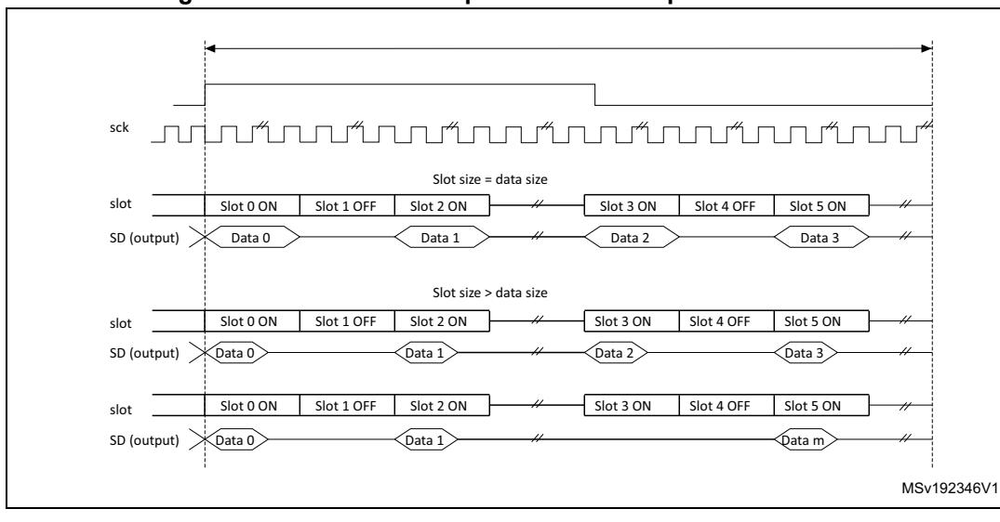

**Figure 708. Tristate on output data line in a protocol like I2S**

If the TRIS bit in the SAI\_xCR2 register is cleared, all the High impedance states on the SD output line on *[Figure 707](#page-32-0)* and *[Figure 708](#page-33-1)* are replaced by a drive with a value of 0.

# **54.4.14 Error flags**

The SAI implements the following error flags:

- FIFO overrun/underrun
- Anticipated frame synchronization detection
- Late frame synchronization detection
- Codec not ready (AC'97 exclusively)
- Wrong clock configuration in master mode.

# **FIFO overrun/underrun (OVRUDR)**

The FIFO overrun/underrun bit is called OVRUDR in the SAI\_xSR register.

The overrun or underrun errors share the same bit since an audio block can be either receiver or transmitter and each audio block in a given SAI has its own SAI\_xSR register.

### **Overrun**

When the audio block is configured as receiver, an overrun condition may appear if data are received in an audio frame when the FIFO is full and not able to store the received data. In this case, the received data are lost, the flag OVRUDR in the SAI\_xSR register is set and an interrupt is generated if OVRUDRIE bit is set in the SAI\_xIM register. The slot number, from which the overrun occurs, is stored internally. No more data are stored into the FIFO until it becomes free to store new data. When the FIFO has at least one data free, the SAI audio block receiver stores new data (from new audio frame) from the slot number which was stored internally when the overrun condition was detected. This avoids data slot dealignment in the destination memory (refer to *[Figure 709](#page-34-0)*).

The OVRUDR flag is cleared when COVRUDR bit is set in the SAI\_xCLRFR register.

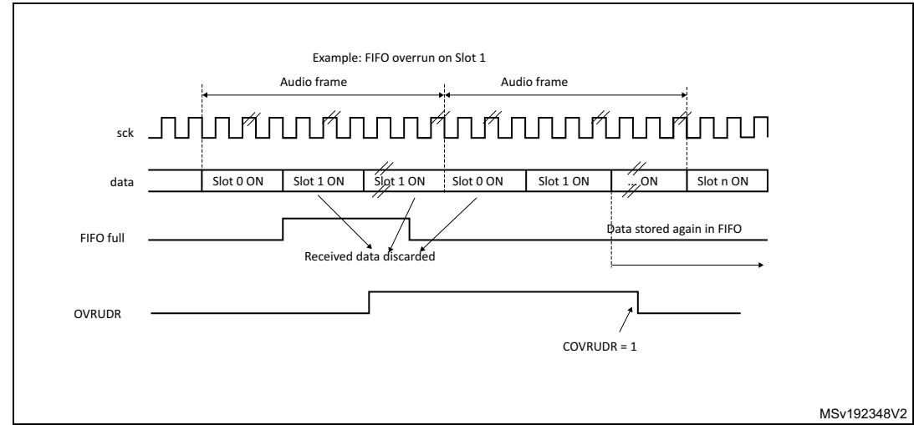

**Figure 709. Overrun detection error**

#### **Underrun**

An underrun may occur when the audio block in the SAI is a transmitter and the FIFO is empty when data need to be transmitted. If an underrun is detected, the slot number for which the event occurs is stored and MUTE value (00) is sent until the FIFO is ready to transmit the data corresponding to the slot for which the underrun was detected (refer to *[Figure 710](#page-34-1)*). This avoids desynchronization between the memory pointer and the slot in the audio frame.

The underrun event sets the OVRUDR flag in the SAI\_xSR register and an interrupt is generated if the OVRUDRIE bit is set in the SAI\_xIM register. To clear this flag, set COVRUDR bit in the SAI\_xCLRFR register.

The underrun event can occur when the audio subblock is configured as master or slave.

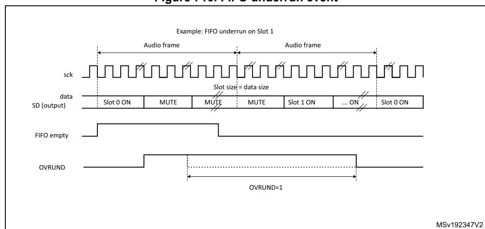

**Figure 710. FIFO underrun event**

RM0399 Rev 4 2423/3556

### **Anticipated frame synchronization detection (AFSDET)**

The AFSDET flag is used only in slave mode. It is never asserted in master mode. It indicates that a frame synchronization (FS) has been detected earlier than expected since the frame length, the frame polarity, the frame offset are defined and known.

Anticipated frame detection sets the AFSDET flag in the SAI\_xSR register.

This detection has no effect on the current audio frame which is not sensitive to the anticipated FS. This means that "parasitic" events on signal FS are flagged without any perturbation of the current audio frame.

An interrupt is generated if the AFSDETIE bit is set in the SAI\_xIM register. To clear the AFSDET flag, CAFSDET bit must be set in the SAI\_xCLRFR register.

To resynchronize with the master after an anticipated frame detection error, four steps are required:

- 1. Disable the SAI block by resetting SAIEN bit in SAI\_xCR1 register. To make sure the SAI is disabled, read back the SAIEN bit and check it is set to 0.
- 2. Flush the FIFO via FFLUS bit in SAI\_xCR2 register.
- 3. Enable again the SAI peripheral (SAIEN bit set to 1).
- 4. The SAI block waits for the assertion on FS to restart the synchronization with master.

*Note: The AFSDET flag is not asserted in AC'97 mode since the SAI audio block acts as a link controller and generates the FS signal even when declared as slave.It has no meaning in SPDIF mode since the FS signal is not used.*

### **Late frame synchronization detection**

The LFSDET flag in the SAI\_xSR register can be set only when the SAI audio block operates as a slave. The frame length, the frame polarity and the frame offset configuration are known in register SAI\_xFRCR.

If the external master does not send the FS signal at the expecting time thus generating the signal too late, the LFSDET flag is set and an interrupt is generated if LFSDETIE bit is set in the SAI\_xIM register.

The LFSDET flag is cleared when CLFSDET bit is set in the SAI\_xCLRFR register.

The late frame synchronization detection flag is set when the corresponding error is detected. The SAI needs to be resynchronized with the master (see sequence described in *[Anticipated frame synchronization detection \(AFSDET\)](#page-35-0)*).

In a noisy environment, glitches on the SCK clock may be wrongly detected by the audio block state machine and shift the SAI data at a wrong frame position. This event can be detected by the SAI and reported as a late frame synchronization detection error.

There is no corruption if the external master is not managing the audio data frame transfer in continuous mode, which must not be the case in most applications. In this case, the LFSDET flag is set.

*Note: The LFSDET flag is not asserted in AC'97 mode since the SAI audio block acts as a link controller and generates the FS signal even when declared as slave.It has no meaning in SPDIF mode since the signal FS is not used by the protocol.*

### **Codec not ready (CNRDY AC'97)**

The CNRDY flag in the SAI\_xSR register is relevant only if the SAI audio block is configured to operate in AC'97 mode (PRTCFG[1:0] = 10 in the SAI\_xCR1 register). If CNRDYIE bit is set in the SAI\_xIM register, an interrupt is generated when the CNRDY flag is set.

CNRDY is asserted when the Codec is not ready to communicate during the reception of the TAG 0 (slot0) of the AC'97 audio frame. In this case, no data are automatically stored into the FIFO since the Codec is not ready, until the TAG 0 indicates that the Codec is ready. All the active slots defined in the SAI\_xSLOTR register are captured when the Codec is ready.

To clear CNRDY flag, CCNRDY bit must be set in the SAI\_xCLRFR register.

### **Wrong clock configuration in master mode (with NODIV = 0)**

When the audio block operates as a master (MODE[1] = 0) and NODIV bit is equal to 0, the WCKCFG flag is set as soon as the SAI is enabled if the following conditions are met:

- (FRL+1) is not a power of 2, and
- (FRL+1) is not between 8 and 256.

MODE, NODIV, and SAIEN bits belong to SAI\_xCR1 register and FRL to SAI\_xFRCR register.

If WCKCFGIE bit is set, an interrupt is generated when WCKCFG flag is set in the SAI\_xSR register. To clear this flag, set CWCKCFG bit in the SAI\_xCLRFR register.

When WCKCFG bit is set, the audio block is automatically disabled, thus performing a hardware clear of SAIEN bit.

# **54.4.15 Disabling the SAI**

The SAI audio block can be disabled at any moment by clearing SAIEN bit in the SAI\_xCR1 register. All the already started frames are automatically completed before the SAI is stops working. SAIEN bit remains High until the SAI is completely switched-off at the end of the current audio frame transfer.

If an audio block in the SAI operates synchronously with the other one, the one which is the master must be disabled first.

# **54.4.16 SAI DMA interface**

To free the CPU and to optimize bus bandwidth, each SAI audio block has an independent DMA interface to read/write from/to the SAI\_xDR register (to access the internal FIFO). There is one DMA channel per audio subblock supporting basic DMA request/acknowledge protocol.

To configure the audio subblock for DMA transfer, set DMAEN bit in the SAI\_xCR1 register. The DMA request is managed directly by the FIFO controller depending on the FIFO threshold level (for more details refer to *[Section 54.4.9: Internal FIFOs](#page-14-2)*). DMA transfer direction is linked to the SAI audio subblock configuration:

- If the audio block operates as a transmitter, the audio block FIFO controller outputs a DMA request to load the FIFO with data written in the SAI\_xDR register.
- If the audio block is operates as a receiver, the DMA request is related to read operations from the SAI\_xDR register.

RM0399 Rev 4 2425/3556

Follow the sequence below to configure the SAI interface in DMA mode:

- 1. Configure SAI and FIFO threshold levels to specify when the DMA request is launched.
- 2. Configure SAI DMA channel.
- 3. Enable the DMA.
- 4. Enable the SAI interface.

*Note: Before configuring the SAI block, the SAI DMA channel must be disabled.* 

# **54.5 SAI interrupts**

The SAI supports 7 interrupt sources as shown in *[Table 454](#page-37-0)*.

**Table 454. SAI interrupt sources** 

| Interrupt acronym | Interrupt source | Interrupt group | Audio block mode                                       | Interrupt enable                 | Interrupt clear                                                                                                                                                                             |  |  |  |
|----------------------|---------------------|--------------------|--------------------------------------------------------|-------------------------------------|---------------------------------------------------------------------------------------------------------------------------------------------------------------------------------------------|--|--|--|
|                      | FREQ                | FREQ               | Master or slave Receiver or transmitter          | FREQIE in SAI_xIM register    | Depends on: – FIFO threshold setting (FLVL bits in SAI_xCR2) – Communication direction (transmitter or receiver) For more details refer to Section 54.4.9: Internal FIFOs |  |  |  |
|                      | OVRUDR              | ERROR              | Master or slave Receiver or transmitter          | OVRUDRIE in SAI_xIM register  | COVRUDR = 1 in SAI_xCLRFR register                                                                                                                                                       |  |  |  |
| SAI                  | AFSDET              | ERROR              | Slave (not used in AC'97 mode and SPDIF mode) | AFSDETIE in SAI_xIM register  | CAFSDET = 1 in SAI_xCLRFR register                                                                                                                                                       |  |  |  |
|                      | LFSDET              | ERROR              | Slave (not used in AC'97 mode and SPDIF mode) | LFSDETIE in SAI_xIM register  | CLFSDET = 1 in SAI_xCLRFR register                                                                                                                                                       |  |  |  |
|                      | CNRDY               | ERROR              | Slave (only in AC'97 mode)                          | CNRDYIE in SAI_xIM register   | CCNRDY = 1 in SAI_xCLRFR register                                                                                                                                                        |  |  |  |
|                      | MUTEDET             | MUTE               | Master or slave Receiver mode only                  | MUTEDETIE in SAI_xIM register | CMUTEDET = 1 in SAI_xCLRFR register                                                                                                                                                      |  |  |  |
|                      | WCKCFG              | ERROR              | Master with NODIV = 0 in SAI_xCR1 register       | WCKCFGIE in SAI_xIM register  | CWCKCFG = 1 in SAI_xCLRFR register                                                                                                                                                       |  |  |  |

Follow the sequence below to enable an interrupt:

- 1. Disable SAI interrupt.
- 2. Configure SAI.
- 3. Configure SAI interrupt source.
- 4. Enable SAI.

# **54.6 SAI registers**

The peripheral registers have to be accessed by words (32 bits).

# **54.6.1 SAI global configuration register (SAI\_GCR)**

Address offset: 0x00

Reset value: 0x0000 0000

| 31   | 30   | 29   | 28   | 27   | 26   | 25   | 24   | 23   | 22   | 21           | 20   | 19   | 18   | 17   | 16          |
|------|------|------|------|------|------|------|------|------|------|--------------|------|------|------|------|-------------|
| Res. | Res. | Res. | Res. | Res. | Res. | Res. | Res. | Res. | Res. | Res.         | Res. | Res. | Res. | Res. | Res.        |
|      |      |      |      |      |      |      |      |      |      |              |      |      |      |      |             |
|      |      |      |      |      |      |      |      |      |      |              |      |      |      |      |             |
| 15   | 14   | 13   | 12   | 11   | 10   | 9    | 8    | 7    | 6    | 5            | 4    | 3    | 2    | 1    | 0           |
| Res. | Res. | Res. | Res. | Res. | Res. | Res. | Res. | Res. | Res. | SYNCOUT[1:0] |      | Res. | Res. |      | SYNCIN[1:0] |

Bits 31:6 Reserved, must be kept at reset value.

#### Bits 5:4 **SYNCOUT[1:0]**: Synchronization outputs

These bits are set and cleared by software.

00: No synchronization output signals. SYNCOUT[1:0] must be configured as "No synchronization output signals" when audio block is configured as SPDIF

01: Block A used for further synchronization for others SAI

10: Block B used for further synchronization for others SAI

11: Reserved. These bits must be set when both audio block (A and B) are disabled.

Bits 3:2 Reserved, must be kept at reset value.

#### Bits 1:0 **SYNCIN[1:0]**: Synchronization inputs

These bits are set and cleared by software.

Refer to for information on how to program this field.

These bits must be set when both audio blocks (A and B) are disabled.

They are meaningful if one of the two audio blocks is defined to operate in synchronous mode with an external SAI (SYNCEN[1:0] = 10 in SAI\_ACR1 or in SAI\_BCR1 registers).

RM0399 Rev 4 2427/3556

# **54.6.2 SAI configuration register 1 (SAI\_ACR1)**

Address offset: 0x004

Reset value: 0x0000 0040

| 31   | 30   | 29          | 28   | 27        | 26          | 25 | 24             | 23          | 22 | 21    | 20   | 19          | 18        | 17 | 16 |
|------|------|-------------|------|-----------|-------------|----|----------------|-------------|----|-------|------|-------------|-----------|----|----|
| Res. | Res. | Res.        | Res. | MCK EN | OSR         |    |                | MCKDIV[5:0] |    | NODIV | Res. | DMAEN       | SAIEN     |    |    |
|      |      |             |      | rw        | rw          | rw | rw             | rw          | rw | rw    | rw   | rw          |           | rw | rw |
| 15   | 14   | 13          | 12   | 11        | 10          | 9  | 8              | 7           | 6  | 5     | 4    | 3           | 2         | 1  | 0  |
| Res. | Res. | OUTD RIV | MONO |           | SYNCEN[1:0] |    | CKSTR LSBFIRST | DS[2:0]     |    | Res.  |      | PRTCFG[1:0] | MODE[1:0] |    |    |
|      |      | rw          | rw   | rw        | rw          | rw | rw             | rw          | rw | rw    |      | rw          | rw        | rw | rw |

Bits 31:28 Reserved, must be kept at reset value.

Bit 27 **MCKEN:** Master clock generation enable

0: The master clock is not generated

1: The master clock is generated independently of SAIEN bit

Bit 26 **OSR:** Oversampling ratio for master clock

This bit is meaningful only when NODIV bit is set to 0.

0: Master clock frequency = FFS x 256

1: Master clock frequency = FFS x 512

Bits 25:20 **MCKDIV[5:0]**: Master clock divider

These bits are set and cleared by software.

000000: Divides by 1 the kernel clock input (sai\_x\_ker\_ck).

Otherwise, The master clock frequency is calculated according to the formula given in

*[Section 54.4.8: SAI clock generator](#page-11-0)*.

These bits have no meaning when the audio block is slave.

They have to be configured when the audio block is disabled.

Bit 19 **NODIV:** No divider

This bit is set and cleared by software.

0: the ratio between the Master clock generator and frame synchronization is fixed to 256 or 512

1: the ratio between the Master clock generator and frame synchronization depends on FRL[7:0]

Bit 18 Reserved, must be kept at reset value.

Bit 17 **DMAEN**: DMA enable

This bit is set and cleared by software.

0: DMA disabled

1: DMA enabled

*Note: Since the audio block defaults to operate as a transmitter after reset, the MODE[1:0] bits must be configured before setting DMAEN to avoid a DMA request in receiver mode.*

### Bit 16 **SAIEN**: Audio block enable

This bit is set by software.

To switch off the audio block, the application software must program this bit to 0 and poll the bit till it reads back 0, meaning that the block is completely disabled. Before setting this bit to 1, check that it is set to 0, otherwise the enable command is not taken into account.

This bit enables to control the state of the SAI audio block. If it is disabled when an audio frame transfer is ongoing, the ongoing transfer completes and the cell is fully disabled at the end of this audio frame transfer.

- 0: SAI audio block disabled
- 1: SAI audio block enabled.

*Note: When the SAI block (A or B) is configured in master mode, the clock must be present on the SAI block input before setting SAIEN bit.*

#### Bits 15:14 Reserved, must be kept at reset value.

### Bit 13 **OUTDRIV**: Output drive

This bit is set and cleared by software.

- 0: Audio block output driven when SAIEN is set
- 1: Audio block output driven immediately after the setting of this bit.

*Note: This bit has to be set before enabling the audio block and after the audio block configuration.* 

### Bit 12 **MONO**: Mono mode

This bit is set and cleared by software. It is meaningful only when the number of slots is equal to 2. When the mono mode is selected, slot 0 data are duplicated on slot 1 when the audio block operates as a transmitter. In reception mode, the slot1 is discarded and only the data received from slot 0 are stored. Refer to *[Section : Mono/stereo mode](#page-29-0)* for more details.

- 0: Stereo mode
- 1: Mono mode.

#### Bits 11:10 **SYNCEN[1:0]:** Synchronization enable

These bits are set and cleared by software. They must be configured when the audio subblock is disabled.

- 00: audio subblock in asynchronous mode.
- 01: audio subblock is synchronous with the other internal audio subblock. In this case, the audio subblock must be configured in slave mode
- 10: audio subblock is synchronous with an external SAI embedded peripheral. In this case the audio subblock must be configured in Slave mode.
- 11: Reserved

*Note: The audio subblock must be configured as asynchronous when SPDIF mode is enabled.*

#### Bit 9 **CKSTR:** Clock strobing edge

This bit is set and cleared by software. It must be configured when the audio block is disabled. This bit has no meaning in SPDIF audio protocol.

- 0: Signals generated by the SAI change on SCK rising edge, while signals received by the SAI are sampled on the SCK falling edge.
- 1: Signals generated by the SAI change on SCK falling edge, while signals received by the SAI are sampled on the SCK rising edge.

### Bit 8 **LSBFIRST:** Least significant bit first

This bit is set and cleared by software. It must be configured when the audio block is disabled. This bit has no meaning in AC'97 audio protocol since AC'97 data are always transferred with the MSB first. This bit has no meaning in SPDIF audio protocol since in SPDIF data are always transferred with LSB first.

- 0: Data are transferred with MSB first
- 1: Data are transferred with LSB first

RM0399 Rev 4 2429/3556

### Bits 7:5 **DS[2:0]:** Data size

These bits are set and cleared by software. These bits are ignored when the SPDIF protocols are selected (bit PRTCFG[1:0]), because the frame and the data size are fixed in such case. When the companding mode is selected through COMP[1:0] bits, DS[1:0] are ignored since the data size is fixed to 8 bits by the algorithm.

These bits must be configured when the audio block is disabled.

000: Reserved 001: Reserved 010: 8 bits 011: 10 bits 100: 16 bits 101: 20 bits 110: 24 bits 111: 32 bits

Bit 4 Reserved, must be kept at reset value.

#### Bits 3:2 **PRTCFG[1:0]:** Protocol configuration

These bits are set and cleared by software. These bits have to be configured when the audio block is disabled.

00: Free protocol. Free protocol enables to use the powerful configuration of the audio block to address a specific audio protocol (such as I2S, LSB/MSB justified, TDM, PCM/DSP...) by setting most of the configuration register bits as well as frame configuration register.

01: SPDIF protocol 10: AC'97 protocol 11: Reserved

#### Bits 1:0 **MODE[1:0]:** SAIx audio block mode

These bits are set and cleared by software. They must be configured when SAIx audio block is disabled.

00: Master transmitter 01: Master receiver 10: Slave transmitter 11: Slave receiver

*Note: When the audio block is configured in SPDIF mode, the master transmitter mode is forced (MODE[1:0] = 00).*

# **54.6.3 SAI configuration register 1 (SAI\_BCR1)**

Address offset: 0x024 Reset value: 0x0000 0040

| 31   | 30   | 29          | 28   | 27        | 26          | 25       | 24             | 23          | 22 | 21 | 20   | 19    | 18          | 17        | 16    |
|------|------|-------------|------|-----------|-------------|----------|----------------|-------------|----|----|------|-------|-------------|-----------|-------|
| Res. | Res. | Res.        | Res. | MCK EN | OSR         |          |                | MCKDIV[5:0] |    |    |      | NODIV | Res.        | DMAEN     | SAIEN |
|      |      |             |      | rw        | rw          | rw rw |                | rw          | rw | rw | rw   | rw    |             | rw        | rw    |
| 15   | 14   | 13          | 12   | 11        | 10          | 9        | 8              | 7           | 6  | 5  | 4    | 3     | 2           | 1         | 0     |
| Res. | Res. | OUTD RIV | MONO |           | SYNCEN[1:0] |          | CKSTR LSBFIRST | DS[2:0]     |    |    | Res. |       | PRTCFG[1:0] | MODE[1:0] |       |
|      |      | rw          | rw   | rw        | rw          | rw       | rw             | rw          | rw | rw |      | rw    | rw          | rw        | rw    |

#### Bits 31:28 Reserved, must be kept at reset value.

#### Bit 27 **MCKEN:** Master clock generation enable

- 0: The master clock is not generated
- 1: The master clock is generated independently of SAIEN bit

#### Bit 26 **OSR:** Oversampling ratio for master clock

This bit is meaningful only when NODIV bit is set to 0.

- 0: Master clock frequency = FFS x 256
- 1: Master clock frequency = FFS x 512

### Bits 25:20 **MCKDIV[5:0]**: Master clock divider

These bits are set and cleared by software.

000000: Divides by 1 the kernel clock input (sai\_x\_ker\_ck).

Otherwise, The master clock frequency is calculated according to the formula given in *[Section 54.4.8: SAI clock generator](#page-11-0)*.

These bits have no meaning when the audio block is slave.

They have to be configured when the audio block is disabled.

#### Bit 19 **NODIV:** No divider

This bit is set and cleared by software.

- 0: the ratio between the Master clock generator and frame synchronization is fixed to 256 or 512
- 1: the ratio between the Master clock generator and frame synchronization depends on FRL[7:0]

#### Bit 18 Reserved, must be kept at reset value.

#### Bit 17 **DMAEN**: DMA enable

This bit is set and cleared by software.

- 0: DMA disabled
- 1: DMA enabled

*Note: Since the audio block defaults to operate as a transmitter after reset, the MODE[1:0] bits must be configured before setting DMAEN to avoid a DMA request in receiver mode.*

#### Bit 16 **SAIEN**: Audio block enable

This bit is set by software.

To switch off the audio block, the application software must program this bit to 0 and poll the bit till it reads back 0, meaning that the block is completely disabled. Before setting this bit to 1, check that it is set to 0, otherwise the enable command is not taken into account.

This bit enables to control the state of the SAI audio block. If it is disabled when an audio frame transfer is ongoing, the ongoing transfer completes and the cell is fully disabled at the end of this audio frame transfer.

- 0: SAI audio block disabled
- 1: SAI audio block enabled.

*Note: When the SAI block (A or B) is configured in master mode, the clock must be present on the SAI block input before setting SAIEN bit.*

### Bits 15:14 Reserved, must be kept at reset value.

#### Bit 13 **OUTDRIV**: Output drive

This bit is set and cleared by software.

- 0: Audio block output driven when SAIEN is set
- 1: Audio block output driven immediately after the setting of this bit.

*Note: This bit has to be set before enabling the audio block and after the audio block configuration.* 

RM0399 Rev 4 2431/3556

#### Bit 12 **MONO**: Mono mode

This bit is set and cleared by software. It is meaningful only when the number of slots is equal to 2. When the mono mode is selected, slot 0 data are duplicated on slot 1 when the audio block operates as a transmitter. In reception mode, the slot1 is discarded and only the data received from slot 0 are stored. Refer to *[Section : Mono/stereo mode](#page-29-0)* for more details.

0: Stereo mode

1: Mono mode.

#### Bits 11:10 **SYNCEN[1:0]:** Synchronization enable

These bits are set and cleared by software. They must be configured when the audio subblock is disabled.

00: audio subblock in asynchronous mode.

01: audio subblock is synchronous with the other internal audio subblock. In this case, the audio subblock must be configured in slave mode

10: audio subblock is synchronous with an external SAI embedded peripheral. In this case the audio subblock must be configured in Slave mode.

11: Reserved

*Note: The audio subblock must be configured as asynchronous when SPDIF mode is enabled.*

#### Bit 9 **CKSTR:** Clock strobing edge

This bit is set and cleared by software. It must be configured when the audio block is disabled. This bit has no meaning in SPDIF audio protocol.

- 0: Signals generated by the SAI change on SCK rising edge, while signals received by the SAI are sampled on the SCK falling edge.
- 1: Signals generated by the SAI change on SCK falling edge, while signals received by the SAI are sampled on the SCK rising edge.

#### Bit 8 **LSBFIRST:** Least significant bit first

This bit is set and cleared by software. It must be configured when the audio block is disabled. This bit has no meaning in AC'97 audio protocol since AC'97 data are always transferred with the MSB first. This bit has no meaning in SPDIF audio protocol since in SPDIF data are always transferred with LSB first.

- 0: Data are transferred with MSB first
- 1: Data are transferred with LSB first

#### Bits 7:5 **DS[2:0]:** Data size

These bits are set and cleared by software. These bits are ignored when the SPDIF protocols are selected (bit PRTCFG[1:0]), because the frame and the data size are fixed in such case. When the companding mode is selected through COMP[1:0] bits, DS[1:0] are ignored since the data size is fixed to 8 bits by the algorithm.

These bits must be configured when the audio block is disabled.

000: Reserved

001: Reserved

010: 8 bits

011: 10 bits

100: 16 bits

101: 20 bits

110: 24 bits

111: 32 bits

Bit 4 Reserved, must be kept at reset value.

### Bits 3:2 PRTCFG[1:0]: Protocol configuration

These bits are set and cleared by software. These bits have to be configured when the audio block is disabled.

00: Free protocol. Free protocol enables to use the powerful config uration of the audio block to address a specific audio protocol (such as I2S, LSB/MSB justified, TDM, PCM/DSP...) by setting most of the configuration register bits as well as frame configuration register.

01: SPDIF protocol 10: AC'97 protocol

11: Reserved

#### Bits 1:0 MODE[1:0]: SAlx audio block mode

These bits are set and cleared by software. They must be configured when SAIx audio block is disabled.

00: Master transmitter01: Master receiver10: Slave transmitter

11: Slave receiver

Note: When the audio block is configured in SPDIF mode, the master transmitter mode is forced (MODE[1:0] = 00). In Master transmitter mode, the audio block starts generating the FS and the clocks immediately.

# 54.6.4 SAI configuration register 2 (SAI\_ACR2)

Address offset: 0x008
Reset value: 0x0000 0000

| 31   | 30                         | 29   | 28   | 27   | 26   | 25   | 24   | 23   | 22          | 21   | 20   | 19         | 18   | 17       | 16   |
|------|----------------------------|------|------|------|------|------|------|------|-------------|------|------|------------|------|----------|------|
| Res. | Res.                       | Res. | Res. | Res. | Res. | Res. | Res. | Res. | Res.        | Res. | Res. | Res.       | Res. | Res.     | Res. |
| 15   | 14                         | 13   | 12   | 11   | 10   | 9    | 8    | 7    | 6           | 5    | 4    | 3          | 2    | 1        | 0    |
| COMP | COMP[1:0] CPL MUTECNT[5:0] |      |      |      |      |      |      |      | MUTE VAL | MUTE | TRIS | F FLUSH |      | FTH[2:0] |      |
| rw   | rw                         | rw   | rw   | rw   | rw   | rw   | rw   | rw   | rw          | rw   | rw   | W          | rw   | rw       | rw   |

RM0399 Rev 4 2433/3556

#### Bits 31:16 Reserved, must be kept at reset value.

#### Bits 15:14 **COMP[1:0]**: Companding mode.

These bits are set and cleared by software. The µ-Law and the A-Law log are a part of the CCITT G.711 recommendation, the type of complement that is used depends on *CPL bit*.

The data expansion or data compression are determined by the state of bit MODE[0].

The data compression is applied if the audio block is configured as a transmitter.

The data expansion is automatically applied when the audio block is configured as a receiver.

Refer to *[Section : Companding mode](#page-30-0)* for more details.

00: No companding algorithm

01: Reserved.

10: µ-Law algorithm

11: A-Law algorithm

*Note: Companding mode is applicable only when Free protocol mode is selected.*

#### Bit 13 **CPL**: Complement bit.

This bit is set and cleared by software.

It defines the type of complement to be used for companding mode

0: 1's complement representation.

1: 2's complement representation.

*Note: This bit has effect only when the companding mode is µ-Law algorithm or A-Law algorithm.*

### Bits 12:7 **MUTECNT[5:0]**: Mute counter*.*

These bits are set and cleared by software. They are used only in reception mode.

The value set in these bits is compared to the number of consecutive mute frames detected in reception. When the number of mute frames is equal to this value, the flag MUTEDET is set and an interrupt is generated if bit MUTEDETIE is set.

Refer to *[Section : Mute mode](#page-29-1)* for more details.

### Bit 6 **MUTEVAL**: Mute value.

This bit is set and cleared by software.It must be written before enabling the audio block: SAIEN. This bit is meaningful only when the audio block operates as a transmitter, the number of slots is lower or equal to 2 and the MUTE bit is set.

If more slots are declared, the bit value sent during the transmission in mute mode is equal to 0, whatever the value of MUTEVAL.

if the number of slot is lower or equal to 2 and MUTEVAL = 1, the MUTE value transmitted for each slot is the one sent during the previous frame.

Refer to *[Section : Mute mode](#page-29-1)* for more details.

0: Bit value 0 is sent during the mute mode.

1: Last values are sent during the mute mode.

*Note: This bit is meaningless and must not be used for SPDIF audio blocks.*

#### Bit 5 **MUTE:** Mute.

This bit is set and cleared by software. It is meaningful only when the audio block operates as a transmitter. The MUTE value is linked to value of MUTEVAL if the number of slots is lower or equal to 2, or equal to 0 if it is greater than 2.

Refer to *[Section : Mute mode](#page-29-1)* for more details.

0: No mute mode.

1: Mute mode enabled.

*Note: This bit is meaningless and must not be used for SPDIF audio blocks.*

### Bit 4 TRIS: Tristate management on data line.

This bit is set and cleared by software. It is meaningful only if the audio block is configured as a transmitter. This bit is not used when the audio block is configured in SPDIF mode. It must be configured when SAI is disabled.

Refer to Section: Output data line management on an inactive slot for more details.

- 0: SD output line is still driven by the SAI when a slot is inactive.
- 1: SD output line is released (HI-Z) at the end of the last data bit of the last active slot if the next one is inactive.

#### Bit 3 FFLUSH: FIFO flush.

This bit is set by software. It is always read as 0. This bit must be configured when the SAI is disabled.

0: No FIFO flush.

1: FIFO flush. Programming this bit to 1 triggers the FIFO Flush. All the internal FIFO pointers (read and write) are cleared. In this case data still present in the FIFO are lost (no more transmission or received data lost). Before flushing, SAI DMA stream/interrupt must be disabled

### Bits 2:0 FTH[2:0]: FIFO threshold.

This bit is set and cleared by software.

000: FIFO empty 001: ¼ FIFO 010: ½ FIFO 011: ¾ FIFO 100: FIFO full 101: Reserved 110: Reserved

# 54.6.5 SAI configuration register 2 (SAI BCR2)

Address offset: 0x028

Reset value: 0x0000 0000

| - 51 | 50                         | 23   | 20   | 21   | 20   | 20   | 24   | 20   | 22          | 21   | 20   | 19         | 10   | 17       | 10   |
|------|----------------------------|------|------|------|------|------|------|------|-------------|------|------|------------|------|----------|------|
| Res. | Res.                       | Res. | Res. | Res. | Res. | Res. | Res. | Res. | Res.        | Res. | Res. | Res.       | Res. | Res.     | Res. |
|      |                            |      |      |      |      |      |      |      |             |      |      |            |      |          |      |
| 15   | 14                         | 13   | 12   | 11   | 10   | 9    | 8    | 7    | 6           | 5    | 4    | 3          | 2    | 1        | 0    |
| COMP | COMP[1:0] CPL MUTECNT[5:0] |      |      |      |      |      |      |      | MUTE VAL | MUTE | TRIS | F FLUSH |      | FTH[2:0] |      |
| rw   | rw                         | rw   | rw   | rw   | rw   | rw   | rw   | rw   | rw          | rw   | rw   | W          | rw   | rw       | rw   |

RM0399 Rev 4 2435/3556

#### Bits 31:16 Reserved, must be kept at reset value.

#### Bits 15:14 **COMP[1:0]**: Companding mode.

These bits are set and cleared by software. The µ-Law and the A-Law log are a part of the CCITT G.711 recommendation, the type of complement that is used depends on *CPL bit*.

The data expansion or data compression are determined by the state of bit MODE[0].

The data compression is applied if the audio block is configured as a transmitter.

The data expansion is automatically applied when the audio block is configured as a receiver.

Refer to *[Section : Companding mode](#page-30-0)* for more details.

00: No companding algorithm

01: Reserved.

10: µ-Law algorithm

11: A-Law algorithm

*Note: Companding mode is applicable only when Free protocol mode is selected.*

#### Bit 13 **CPL**: Complement bit.

This bit is set and cleared by software.

It defines the type of complement to be used for companding mode

0: 1's complement representation.

1: 2's complement representation.

*Note: This bit has effect only when the companding mode is µ-Law algorithm or A-Law algorithm.*

### Bits 12:7 **MUTECNT[5:0]**: Mute counter*.*

These bits are set and cleared by software. They are used only in reception mode.

The value set in these bits is compared to the number of consecutive mute frames detected in reception. When the number of mute frames is equal to this value, the flag MUTEDET is set and an interrupt is generated if bit MUTEDETIE is set.

Refer to *[Section : Mute mode](#page-29-1)* for more details.

### Bit 6 **MUTEVAL**: Mute value.

This bit is set and cleared by software.It must be written before enabling the audio block: SAIEN. This bit is meaningful only when the audio block operates as a transmitter, the number of slots is lower or equal to 2 and the MUTE bit is set.

If more slots are declared, the bit value sent during the transmission in mute mode is equal to 0, whatever the value of MUTEVAL.

if the number of slot is lower or equal to 2 and MUTEVAL = 1, the MUTE value transmitted for each slot is the one sent during the previous frame.

Refer to *[Section : Mute mode](#page-29-1)* for more details.

0: Bit value 0 is sent during the mute mode.

1: Last values are sent during the mute mode.

*Note: This bit is meaningless and must not be used for SPDIF audio blocks.*

#### Bit 5 **MUTE:** Mute.

This bit is set and cleared by software. It is meaningful only when the audio block operates as a transmitter. The MUTE value is linked to value of MUTEVAL if the number of slots is lower or equal to 2, or equal to 0 if it is greater than 2.

Refer to *[Section : Mute mode](#page-29-1)* for more details.

0: No mute mode.

1: Mute mode enabled.

*Note: This bit is meaningless and must not be used for SPDIF audio blocks.*

#### Bit 4 **TRIS**: Tristate management on data line.

This bit is set and cleared by software. It is meaningful only if the audio block is configured as a transmitter. This bit is not used when the audio block is configured in SPDIF mode. It must be configured when SAI is disabled.

Refer to *[Section : Output data line management on an inactive slot](#page-31-0)* for more details.

- 0: SD output line is still driven by the SAI when a slot is inactive.
- 1: SD output line is released (HI-Z) at the end of the last data bit of the last active slot if the next one is inactive.

#### Bit 3 **FFLUSH:** FIFO flush.

This bit is set by software. It is always read as 0. This bit must be configured when the SAI is disabled.

0: No FIFO flush.

1: FIFO flush. Programming this bit to 1 triggers the FIFO Flush. All the internal FIFO pointers (read and write) are cleared. In this case data still present in the FIFO are lost (no more transmission or received data lost). Before flushing, SAI DMA stream/interrupt must be disabled

### Bits 2:0 **FTH[2:0]:** FIFO threshold.

This bit is set and cleared by software.

000: FIFO empty 001: ¼ FIFO 010: ½ FIFO 011: ¾ FIFO 100: FIFO full 101: Reserved 110: Reserved 111: Reserved

# **54.6.6 SAI frame configuration register (SAI\_AFRCR)**

Address offset: 0x00C

Reset value: 0x0000 0007

*Note: This register has no meaning in AC'97 and SPDIF audio protocol.*

| Res. | Res. | Res. | Res. | Res.       | Res. | Res. | Res. | Res.     | Res. | Res. | Res. | Res. |    | FSOFF FSPOL FSDEF |    |
|------|------|------|------|------------|------|------|------|----------|------|------|------|------|----|-------------------|----|
|      |      |      |      |            |      |      |      |          |      |      |      |      | rw | rw                | r  |
| 15   | 14   | 13   | 12   | 11         | 10   | 9    | 8    | 7        | 6    | 5    | 4    | 3    | 2  | 1                 | 0  |
| Res. |      |      |      | FSALL[6:0] |      |      |      | FRL[7:0] |      |      |      |      |    |                   |    |
|      | rw   | rw   | rw   | rw         | rw   | rw   | rw   | rw       | rw   | rw   | rw   | rw   | rw | rw                | rw |

31 30 29 28 27 26 25 24 23 22 21 20 19 18 17 16

#### Bits 31:19 Reserved, must be kept at reset value.

#### Bit 18 **FSOFF**: Frame synchronization offset.

This bit is set and cleared by software. It is meaningless and is not used in AC'97 or SPDIF audio block configuration. This bit must be configured when the audio block is disabled.

- 0: FS is asserted on the first bit of the slot 0.
- 1: FS is asserted one bit before the first bit of the slot 0.

### Bit 17 **FSPOL**: Frame synchronization polarity.

This bit is set and cleared by software. It is used to configure the level of the start of frame on the FS signal. It is meaningless and is not used in AC'97 or SPDIF audio block configuration.

This bit must be configured when the audio block is disabled.

- 0: FS is active low (falling edge)
- 1: FS is active high (rising edge)

#### Bit 16 **FSDEF**: Frame synchronization definition.

This bit is set and cleared by software.

- 0: FS signal is a start frame signal
- 1: FS signal is a start of frame signal + channel side identification

When the bit is set, the number of slots defined in the SAI\_xSLOTR register has to be even. It means that half of this number of slots are dedicated to the left channel and the other slots for the right channel (e.g: this bit has to be set for I2S or MSB/LSB-justified protocols...).

This bit is meaningless and is not used in AC'97 or SPDIF audio block configuration. It must be configured when the audio block is disabled.

#### Bit 15 Reserved, must be kept at reset value.

#### Bits 14:8 **FSALL[6:0]**: Frame synchronization active level length.

These bits are set and cleared by software. They specify the length in number of bit clock (SCK) + 1 (FSALL[6:0] + 1) of the active level of the FS signal in the audio frame

These bits are meaningless and are not used in AC'97 or SPDIF audio block configuration.

They must be configured when the audio block is disabled.

#### Bits 7:0 **FRL[7:0]**: Frame length.

These bits are set and cleared by software. They define the audio frame length expressed in number of SCK clock cycles: the number of bits in the frame is equal to FRL[7:0] + 1.

The minimum number of bits to transfer in an audio frame must be equal to 8, otherwise the audio block behaves in an unexpected way. This is the case when the data size is 8 bits and only one slot 0 is defined in NBSLOT[4:0] of SAI\_xSLOTR register (NBSLOT[3:0] = 0000).

In master mode, if the master clock (available on MCLK\_x pin) is used, the frame length must be aligned with a number equal to a power of 2, ranging from 8 to 256. When the master clock is not used (NODIV = 1), it is recommended to program the frame length to an value ranging from 8 to 256.

These bits are meaningless and are not used in AC'97 or SPDIF audio block configuration. They must be configured when the audio block is disabled.

# **54.6.7 SAI frame configuration register (SAI\_BFRCR)**

Address offset: 0x02C

Reset value: 0x0000 0007

*Note: This register has no meaning in AC'97 and SPDIF audio protocol*

| 31   | 30   | 29   | 28   | 27         | 26   | 25   | 24   | 23   | 22   | 21   | 20       | 19   | 18    | 17    | 16    |
|------|------|------|------|------------|------|------|------|------|------|------|----------|------|-------|-------|-------|
| Res. | Res. | Res. | Res. | Res.       | Res. | Res. | Res. | Res. | Res. | Res. | Res.     | Res. | FSOFF | FSPOL | FSDEF |
|      |      |      |      |            |      |      |      |      |      |      |          |      | rw    | rw    | r     |
| 15   | 14   | 13   | 12   | 11         | 10   | 9    | 8    | 7    | 6    | 5    | 4        | 3    | 2     | 1     | 0     |
| Res. |      |      |      | FSALL[6:0] |      |      |      |      |      |      | FRL[7:0] |      |       |       |       |
|      |      |      |      |            |      |      |      |      |      |      |          |      |       |       |       |

Bits 31:19 Reserved, must be kept at reset value.

#### Bit 18 **FSOFF**: Frame synchronization offset.

This bit is set and cleared by software. It is meaningless and is not used in AC'97 or SPDIF audio block configuration. This bit must be configured when the audio block is disabled.

- 0: FS is asserted on the first bit of the slot 0.
- 1: FS is asserted one bit before the first bit of the slot 0.

#### Bit 17 **FSPOL**: Frame synchronization polarity.

This bit is set and cleared by software. It is used to configure the level of the start of frame on the FS signal. It is meaningless and is not used in AC'97 or SPDIF audio block configuration.

This bit must be configured when the audio block is disabled.

- 0: FS is active low (falling edge)
- 1: FS is active high (rising edge)

### Bit 16 **FSDEF**: Frame synchronization definition.

This bit is set and cleared by software.

- 0: FS signal is a start frame signal
- 1: FS signal is a start of frame signal + channel side identification

When the bit is set, the number of slots defined in the SAI\_xSLOTR register has to be even. It means that half of this number of slots is dedicated to the left channel and the other slots for the right channel (e.g: this bit has to be set for I2S or MSB/LSB-justified protocols...).

This bit is meaningless and is not used in AC'97 or SPDIF audio block configuration. It must be configured when the audio block is disabled.

Bit 15 Reserved, must be kept at reset value.

### Bits 14:8 **FSALL[6:0]**: Frame synchronization active level length.

These bits are set and cleared by software. They specify the length in number of bit clock (SCK) + 1 (FSALL[6:0] + 1) of the active level of the FS signal in the audio frame

These bits are meaningless and are not used in AC'97 or SPDIF audio block configuration.

They must be configured when the audio block is disabled.

#### Bits 7:0 **FRL[7:0]**: Frame length.

These bits are set and cleared by software. They define the audio frame length expressed in number of SCK clock cycles: the number of bits in the frame is equal to FRL[7:0] + 1.

The minimum number of bits to transfer in an audio frame must be equal to 8, otherwise the audio block behaves in an unexpected way. This is the case when the data size is 8 bits and only one slot 0 is defined in NBSLOT[4:0] of SAI\_xSLOTR register (NBSLOT[3:0] = 0000).

In master mode, if the master clock (available on MCLK\_x pin) is used, the frame length must be aligned with a number equal to a power of 2, ranging from 8 to 256. When the master clock is not used (NODIV = 1), it is recommended to program the frame length to an value ranging from 8 to 256. These bits are meaningless and are not used in AC'97 or SPDIF audio block configuration.

# **54.6.8 SAI slot register (SAI\_ASLOTR)**

Address offset: 0x010

Reset value: 0x0000 0000

*Note: This register has no meaning in AC'97 and SPDIF audio protocol.*

| 31           | 30   | 29   | 28   | 27                   | 26             | 25          | 24 | 23                  | 22 | 21 | 20         | 19 | 18 | 17 | 16 |  |
|--------------|------|------|------|----------------------|----------------|-------------|----|---------------------|----|----|------------|----|----|----|----|--|
| SLOTEN[15:0] |      |      |      |                      |                |             |    |                     |    |    |            |    |    |    |    |  |
| rw           | rw   | rw   | rw   | rw                   | rw rw rw |             |    |                     | rw | rw | rw         | rw | rw | rw | rw |  |
| 15           | 14   | 13   | 12   | 11                   | 10             | 9           | 8  | 7                   | 6  | 5  | 4          | 3  | 2  | 1  | 0  |  |
| Res.         | Res. | Res. | Res. |                      |                | NBSLOT[3:0] |    | SLOTSZ[1:0] Res. |    |    | FBOFF[4:0] |    |    |    |    |  |
|              |      |      |      | rw rw rw rw |                |             |    | rw                  | rw |    | rw         | rw | rw | rw | rw |  |

#### Bits 31:16 **SLOTEN[15:0]**: Slot enable.

These bits are set and cleared by software.

Each SLOTEN bit corresponds to a slot position from 0 to 15 (maximum 16 slots).

0: Inactive slot.

1: Active slot.

The slot must be enabled when the audio block is disabled.

They are ignored in AC'97 or SPDIF mode.

### Bits 15:12 Reserved, must be kept at reset value.

### Bits 11:8 **NBSLOT[3:0]**: Number of slots in an audio frame.

These bits are set and cleared by software.

The value set in this bitfield represents the number of slots + 1 in the audio frame (including the number of inactive slots). The maximum number of slots is 16.

The number of slots must be even if FSDEF bit in the SAI\_xFRCR register is set.

The number of slots must be configured when the audio block is disabled.

They are ignored in AC'97 or SPDIF mode.

#### Bits 7:6 **SLOTSZ[1:0]**: Slot size

This bits is set and cleared by software.

The slot size must be higher or equal to the data size. If this condition is not respected, the behavior of the SAI is undetermined.

Refer to *[Output data line management on an inactive slot](#page-31-0)* for information on how to drive SD line.

These bits must be set when the audio block is disabled.

They are ignored in AC'97 or SPDIF mode.

00: The slot size is equivalent to the data size (specified in DS[3:0] in the SAI\_xCR1 register).

01: 16-bit 10: 32-bit 11: Reserved

Bit 5 Reserved, must be kept at reset value.

#### Bits 4:0 **FBOFF[4:0]**: First bit offset

These bits are set and cleared by software.

The value set in this bitfield defines the position of the first data transfer bit in the slot. It represents an offset value. In transmission mode, the bits outside the data field are forced to 0. In reception mode, the extra received bits are discarded.

These bits must be set when the audio block is disabled.

They are ignored in AC'97 or SPDIF mode.

# **54.6.9 SAI slot register (SAI\_BSLOTR)**

Address offset: 0x030

Reset value: 0x0000 0000

*Note: This register has no meaning in AC'97 and SPDIF audio protocol.*

| 31   | 30           | 29   | 28   | 27 | 26 | 25          | 24 | 23 | 22          | 21   | 20 | 19 | 18         | 17 | 16 |
|------|--------------|------|------|----|----|-------------|----|----|-------------|------|----|----|------------|----|----|
|      | SLOTEN[15:0] |      |      |    |    |             |    |    |             |      |    |    |            |    |    |
| rw   | rw           | rw   | rw   | rw | rw | rw          | rw | rw | rw          | rw   | rw | rw | rw         | rw | rw |
| 15   | 14           | 13   | 12   | 11 | 10 | 9           | 8  | 7  | 6           | 5    | 4  | 3  | 2          | 1  | 0  |
| Res. | Res.         | Res. | Res. |    |    | NBSLOT[3:0] |    |    | SLOTSZ[1:0] | Res. |    |    | FBOFF[4:0] |    |    |
|      |              |      |      | rw | rw | rw          | rw | rw | rw          |      | rw | rw | rw         | rw | rw |

RM0399 Rev 4 2441/3556

#### Bits 31:16 **SLOTEN[15:0]**: Slot enable.

These bits are set and cleared by software.

Each SLOTEN bit corresponds to a slot position from 0 to 15 (maximum 16 slots).

0: Inactive slot.

1: Active slot.

The slot must be enabled when the audio block is disabled.

They are ignored in AC'97 or SPDIF mode.

#### Bits 15:12 Reserved, must be kept at reset value.

#### Bits 11:8 **NBSLOT[3:0]**: Number of slots in an audio frame.

These bits are set and cleared by software.

The value set in this bitfield represents the number of slots + 1 in the audio frame (including the number of inactive slots). The maximum number of slots is 16.

The number of slots must be even if FSDEF bit in the SAI\_xFRCR register is set.

The number of slots must be configured when the audio block is disabled.

They are ignored in AC'97 or SPDIF mode.

### Bits 7:6 **SLOTSZ[1:0]**: Slot size

This bits is set and cleared by software.

The slot size must be higher or equal to the data size. If this condition is not respected, the behavior of the SAI is undetermined.

Refer to *[Output data line management on an inactive slot](#page-31-0)* for information on how to drive SD line.

These bits must be set when the audio block is disabled.

They are ignored in AC'97 or SPDIF mode.

00: The slot size is equivalent to the data size (specified in DS[3:0] in the SAI\_xCR1 register).

01: 16-bit 10: 32-bit 11: Reserved

Bit 5 Reserved, must be kept at reset value.

# Bits 4:0 **FBOFF[4:0]**: First bit offset

These bits are set and cleared by software.

The value set in this bitfield defines the position of the first data transfer bit in the slot. It represents an offset value. In transmission mode, the bits outside the data field are forced to 0. In reception mode, the extra received bits are discarded.

These bits must be set when the audio block is disabled.

They are ignored in AC'97 or SPDIF mode.

# **54.6.10 SAI interrupt mask register (SAI\_AIM)**

Address offset: 0x014

Reset value: 0x0000 0000

| 31   | 30   | 29   | 28   | 27   | 26   | 25   | 24   | 23   | 22           | 21           | 20          | 19         | 18           | 17            | 16           |
|------|------|------|------|------|------|------|------|------|--------------|--------------|-------------|------------|--------------|---------------|--------------|
| Res. | Res. | Res. | Res. | Res. | Res. | Res. | Res. | Res. | Res.         | Res.         | Res.        | Res.       | Res.         | Res.          | Res.         |
| 15   | 14   | 13   | 12   | 11   | 10   | 9    | 8    | 7    | 6            | 5            | 4           | 3          | 2            | 1             | 0            |
| Res. | Res. | Res. | Res. | Res. | Res. | Res. | Res. | Res. | LFSDET IE | AFSDETI E | CNRDY IE | FREQ IE | WCKCFG IE | MUTEDET IE | OVRUDR IE |
|      |      |      |      |      |      |      |      |      | rw           | rw           | rw          | rw         | rw           | rw            | rw           |

#### Bits 31:7 Reserved, must be kept at reset value.

Bit 6 **LFSDETIE**: Late frame synchronization detection interrupt enable*.*

This bit is set and cleared by software.

0: Interrupt is disabled

1: Interrupt is enabled

When this bit is set, an interrupt is generated if the LFSDET bit is set in the SAI\_xSR register. This bit is meaningless in AC'97, SPDIF mode or when the audio block operates as a master.

#### Bit 5 **AFSDETIE**: Anticipated frame synchronization detection interrupt enable*.*

This bit is set and cleared by software.

0: Interrupt is disabled

1: Interrupt is enabled

When this bit is set, an interrupt is generated if the AFSDET bit in the SAI\_xSR register is set. This bit is meaningless in AC'97, SPDIF mode or when the audio block operates as a master.

#### Bit 4 **CNRDYIE**: Codec not ready interrupt enable (AC'97).

This bit is set and cleared by software.

0: Interrupt is disabled

1: Interrupt is enabled

When the interrupt is enabled, the audio block detects in the slot 0 (tag0) of the AC'97 frame if the Codec connected to this line is ready or not. If it is not ready, the CNRDY flag in the SAI\_xSR register is set and an interrupt is generated.

This bit has a meaning only if the AC'97 mode is selected through PRTCFG[1:0] bits and the audio block is operates as a receiver.

#### Bit 3 **FREQIE**: FIFO request interrupt enable*.*

This bit is set and cleared by software.

0: Interrupt is disabled

1: Interrupt is enabled

When this bit is set, an interrupt is generated if the FREQ bit in the SAI\_xSR register is set. Since the audio block defaults to operate as a transmitter after reset, the MODE bit must be configured before setting FREQIE to avoid a parasitic interrupt in receiver mode,

#### Bit 2 **WCKCFGIE**: Wrong clock configuration interrupt enable.

This bit is set and cleared by software.

0: Interrupt is disabled

1: Interrupt is enabled

This bit is taken into account only if the audio block is configured as a master (MODE[1] = 0) and NODIV = 0.

It generates an interrupt if the WCKCFG flag in the SAI\_xSR register is set.

*Note: This bit is used only in* Free protocol mode *and is meaningless in other modes.*

#### Bit 1 **MUTEDETIE**: Mute detection interrupt enable*.*

This bit is set and cleared by software.

0: Interrupt is disabled

1: Interrupt is enabled

When this bit is set, an interrupt is generated if the MUTEDET bit in the SAI\_xSR register is set.

This bit has a meaning only if the audio block is configured in receiver mode.

### Bit 0 **OVRUDRIE**: Overrun/underrun interrupt enable*.*

This bit is set and cleared by software.

0: Interrupt is disabled

1: Interrupt is enabled

When this bit is set, an interrupt is generated if the OVRUDR bit in the SAI\_xSR register is set.

RM0399 Rev 4 2443/3556

# **54.6.11 SAI interrupt mask register (SAI\_BIM)**

Address offset: 0x034

Reset value: 0x0000 0000

| 31   | 30   | 29   | 28   | 27   | 26   | 25   | 24   | 23   | 22           | 21           | 20          | 19         | 18           | 17            | 16           |
|------|------|------|------|------|------|------|------|------|--------------|--------------|-------------|------------|--------------|---------------|--------------|
| Res. | Res. | Res. | Res. | Res. | Res. | Res. | Res. | Res. | Res.         | Res.         | Res.        | Res.       | Res.         | Res.          | Res.         |
|      |      |      |      |      |      |      |      |      |              |              |             |            |              |               |              |
|      |      |      |      |      |      |      |      |      |              |              |             |            |              |               |              |
| 15   | 14   | 13   | 12   | 11   | 10   | 9    | 8    | 7    | 6            | 5            | 4           | 3          | 2            | 1             | 0            |
| Res. | Res. | Res. | Res. | Res. | Res. | Res. | Res. | Res. | LFSDET IE | AFSDETI E | CNRDY IE | FREQ IE | WCKCFG IE | MUTEDET IE | OVRUDR IE |

Bits 31:7 Reserved, must be kept at reset value.

Bit 6 **LFSDETIE**: Late frame synchronization detection interrupt enable*.*

This bit is set and cleared by software.

0: Interrupt is disabled

1: Interrupt is enabled

When this bit is set, an interrupt is generated if the LFSDET bit is set in the SAI\_xSR register. This bit is meaningless in AC'97, SPDIF mode or when the audio block operates as a master.

### Bit 5 **AFSDETIE**: Anticipated frame synchronization detection interrupt enable*.*

This bit is set and cleared by software.

0: Interrupt is disabled

1: Interrupt is enabled

When this bit is set, an interrupt is generated if the AFSDET bit in the SAI\_xSR register is set. This bit is meaningless in AC'97, SPDIF mode or when the audio block operates as a master.

### Bit 4 **CNRDYIE**: Codec not ready interrupt enable (AC'97).

This bit is set and cleared by software.

0: Interrupt is disabled

1: Interrupt is enabled

When the interrupt is enabled, the audio block detects in the slot 0 (tag0) of the AC'97 frame if the Codec connected to this line is ready or not. If it is not ready, the CNRDY flag in the SAI\_xSR register is set and an interrupt is generated.

This bit has a meaning only if the AC'97 mode is selected through PRTCFG[1:0] bits and the audio block is operates as a receiver.

#### Bit 3 **FREQIE**: FIFO request interrupt enable*.*

This bit is set and cleared by software.

0: Interrupt is disabled

1: Interrupt is enabled

When this bit is set, an interrupt is generated if the FREQ bit in the SAI\_xSR register is set. Since the audio block defaults to operate as a transmitter after reset, the MODE bit must be configured before setting FREQIE to avoid a parasitic interrupt in receiver mode,

#### Bit 2 **WCKCFGIE**: Wrong clock configuration interrupt enable.

This bit is set and cleared by software.

0: Interrupt is disabled

1: Interrupt is enabled

This bit is taken into account only if the audio block is configured as a master (MODE[1] = 0) and NODIV = 0.

It generates an interrupt if the WCKCFG flag in the SAI\_xSR register is set.

*Note: This bit is used only in Free protocol mode and is meaningless in other modes.*

#### Bit 1 **MUTEDETIE**: Mute detection interrupt enable*.*

This bit is set and cleared by software.

0: Interrupt is disabled

1: Interrupt is enabled

When this bit is set, an interrupt is generated if the MUTEDET bit in the SAI\_xSR register is set.

This bit has a meaning only if the audio block is configured in receiver mode.

### Bit 0 **OVRUDRIE**: Overrun/underrun interrupt enable*.*

This bit is set and cleared by software.

0: Interrupt is disabled

1: Interrupt is enabled

When this bit is set, an interrupt is generated if the OVRUDR bit in the SAI\_xSR register is set.

# **54.6.12 SAI status register (SAI\_ASR)**

Address offset: 0x018

Reset value: 0x0000 0008

| 31   | 30   | 29   | 28   | 27   | 26   | 25   | 24   | 23   | 22         | 21     | 20    | 19   | 18        | 17             | 16 |
|------|------|------|------|------|------|------|------|------|------------|--------|-------|------|-----------|----------------|----|
| Res. | Res. | Res. | Res. | Res. | Res. | Res. | Res. | Res. | Res.       | Res.   | Res.  | Res. | FLVL[2:0] |                |    |
|      |      |      |      |      |      |      |      |      |            |        |       |      | r         | r              | r  |
| 15   | 14   | 13   | 12   | 11   | 10   | 9    | 8    | 7    | 6          | 5      | 4     | 3    | 2         | 1              | 0  |
| Res. | Res. | Res. | Res. | Res. | Res. | Res. | Res. | Res. | LFSDE T | AFSDET | CNRDY | FREQ | WCKCFG    | MUTEDET OVRUDR |    |
|      |      |      |      |      |      |      |      |      | r          | r      | r     | r    | r         | r              | r  |

Bits 31:19 Reserved, must be kept at reset value.

#### Bits 18:16 **FLVL[2:0]**: FIFO level threshold.

This bit is read only. The FIFO level threshold flag is managed only by hardware and its setting depends on SAI block configuration (transmitter or receiver mode).

000: FIFO empty (transmitter and receiver modes)

001: FIFO ≤ ¼ but not empty (transmitter mode), FIFO < ¼ but not empty (receiver mode)

010: ¼ < FIFO ≤ ½ (transmitter mode), ¼ ≤ FIFO < ½ (receiver mode)

011: ½ < FIFO ≤ ¾ (transmitter mode), ½ ≤ FIFO < ¾ (receiver mode)

100: ¾ < FIFO but not full (transmitter mode), ¾ ≤ FIFO but not full (receiver mode)

101: FIFO full (transmitter and receiver modes)

Others: Reserved

Bits 15:7 Reserved, must be kept at reset value.

RM0399 Rev 4 2445/3556

#### Bit 6 **LFSDET**: Late frame synchronization detection.

This bit is read only.

0: No error.

1: Frame synchronization signal is not present at the right time.

This flag can be set only if the audio block is configured in slave mode.

It is not used in AC'97 or SPDIF mode.

It can generate an interrupt if LFSDETIE bit is set in the SAI\_xIM register.

This flag is cleared when the software sets bit CLFSDET in SAI\_xCLRFR register

#### Bit 5 **AFSDET**: Anticipated frame synchronization detection.

This bit is read only.

0: No error.

1: Frame synchronization signal is detected earlier than expected.

This flag can be set only if the audio block is configured in slave mode.

It is not used in AC'97 or SPDIF mode.

It can generate an interrupt if AFSDETIE bit is set in SAI\_xIM register.

This flag is cleared when the software sets CAFSDET bit in SAI\_xCLRFR register.

### Bit 4 **CNRDY**: Codec not ready.

This bit is read only.

0: External AC'97 Codec is ready

1: External AC'97 Codec is not ready

This bit is used only when the AC'97 audio protocol is selected in the SAI\_xCR1 register and configured in receiver mode.

It can generate an interrupt if CNRDYIE bit is set in SAI\_xIM register.

This flag is cleared when the software sets CCNRDY bit in SAI\_xCLRFR register.

#### Bit 3 **FREQ**: FIFO request.

This bit is read only.

0: No FIFO request.

1: FIFO request to read or to write the SAI\_xDR.

The request depends on the audio block configuration:

- If the block is configured in transmission mode, the FIFO request is related to a write request operation in the SAI\_xDR.
- If the block configured in reception, the FIFO request related to a read request operation from the SAI\_xDR.

This flag can generate an interrupt if FREQIE bit is set in SAI\_xIM register.

#### Bit 2 **WCKCFG**: Wrong clock configuration flag.

This bit is read only.

0: Clock configuration is correct

1: Clock configuration does not respect the rule concerning the frame length specification defined in *[Section 54.4.6: Frame synchronization](#page-6-1)* (configuration of FRL[7:0] bit in the SAI\_xFRCR register)

This bit is used only when the audio block operates in master mode (MODE[1] = 0) and NODIV = 0.

It can generate an interrupt if WCKCFGIE bit is set in SAI\_xIM register.

This flag is cleared when the software sets CWCKCFG bit in SAI\_xCLRFR register.

#### Bit 1 **MUTEDET**: Mute detection.

This bit is read only.

0: No MUTE detection on the SD input line

1: MUTE value detected on the SD input line (0 value) for a specified number of consecutive audio frame

This flag is set if consecutive 0 values are received in each slot of a given audio frame and for a consecutive number of audio frames (set in the MUTECNT bit in the SAI\_xCR2 register).

It can generate an interrupt if MUTEDETIE bit is set in SAI\_xIM register.

This flag is cleared when the software sets bit CMUTEDET in the SAI\_xCLRFR register.

### Bit 0 **OVRUDR**: Overrun / underrun.

This bit is read only.

0: No overrun/underrun error.

1: Overrun/underrun error detection.

The overrun and underrun conditions can occur only when the audio block is configured as a receiver and a transmitter, respectively.

It can generate an interrupt if OVRUDRIE bit is set in SAI\_xIM register.

This flag is cleared when the software sets COVRUDR bit in SAI\_xCLRFR register.

# **54.6.13 SAI status register (SAI\_BSR)**

Address offset: 0x038

Reset value: 0x0000 0008

| 31   | 30   | 29   | 28   | 27   | 26   | 25   | 24   | 23   | 22         | 21     | 20    | 19   | 18        | 17             | 16 |  |  |
|------|------|------|------|------|------|------|------|------|------------|--------|-------|------|-----------|----------------|----|--|--|
| Res. | Res. | Res. | Res. | Res. | Res. | Res. | Res. | Res. | Res.       | Res.   | Res.  | Res. | FLVL[2:0] |                |    |  |  |
|      |      |      |      |      |      |      |      |      |            |        |       |      | r         | r              | r  |  |  |
| 15   | 14   | 13   | 12   | 11   | 10   | 9    | 8    | 7    | 6          | 5      | 4     | 3    | 2         | 1              | 0  |  |  |
| Res. | Res. | Res. | Res. | Res. | Res. | Res. | Res. | Res. | LFSDE T | AFSDET | CNRDY | FREQ | WCKCFG    | MUTEDET OVRUDR |    |  |  |
|      |      |      |      |      |      |      |      |      | r          | r      | r     | r    | r         | r              | r  |  |  |

RM0399 Rev 4 2447/3556

Bits 31:19 Reserved, must be kept at reset value.

#### Bits 18:16 **FLVL[2:0]**: FIFO level threshold.

This bit is read only. The FIFO level threshold flag is managed only by hardware and its setting depends on SAI block configuration (transmitter or receiver mode).

000: FIFO empty (transmitter and receiver modes)

001: FIFO ≤ ¼ but not empty (transmitter mode), FIFO < ¼ but not empty (receiver mode)

010: ¼ < FIFO ≤ ½ (transmitter mode), ¼ ≤ FIFO < ½ (receiver mode)

011: ½ < FIFO ≤ ¾ (transmitter mode), ½ ≤ FIFO < ¾ (receiver mode)

100: ¾ < FIFO but not full (transmitter mode), ¾ ≤ FIFO but not full (receiver mode)

101: FIFO full (transmitter and receiver modes)

Others: Reserved

#### Bits 15:7 Reserved, must be kept at reset value.

# Bit 6 **LFSDET**: Late frame synchronization detection.

This bit is read only.

0: No error.

1: Frame synchronization signal is not present at the right time.

This flag can be set only if the audio block is configured in slave mode.

It is not used in AC'97 or SPDIF mode.

It can generate an interrupt if LFSDETIE bit is set in the SAI\_xIM register.

This flag is cleared when the software sets bit CLFSDET in SAI\_xCLRFR register

### Bit 5 **AFSDET**: Anticipated frame synchronization detection.

This bit is read only.

0: No error.

1: Frame synchronization signal is detected earlier than expected.

This flag can be set only if the audio block is configured in slave mode.

It is not used in AC'97or SPDIF mode.

It can generate an interrupt if AFSDETIE bit is set in SAI\_xIM register.

This flag is cleared when the software sets CAFSDET bit in SAI\_xCLRFR register.

#### Bit 4 **CNRDY**: Codec not ready.

This bit is read only.

0: External AC'97 Codec is ready

1: External AC'97 Codec is not ready

This bit is used only when the AC'97 audio protocol is selected in the SAI\_xCR1 register and configured in receiver mode.

It can generate an interrupt if CNRDYIE bit is set in SAI\_xIM register.

This flag is cleared when the software sets CCNRDY bit in SAI\_xCLRFR register.

### Bit 3 **FREQ**: FIFO request.

This bit is read only.

0: No FIFO request.

1: FIFO request to read or to write the SAI\_xDR.

The request depends on the audio block configuration:

- If the block is configured in transmission mode, the FIFO request is related to a write request operation in the SAI\_xDR.
- If the block configured in reception, the FIFO request related to a read request operation from the SAI\_xDR.

This flag can generate an interrupt if FREQIE bit is set in SAI\_xIM register.

#### Bit 2 **WCKCFG**: Wrong clock configuration flag.

This bit is read only.

0: Clock configuration is correct

1: Clock configuration does not respect the rule concerning the frame length specification defined in *[Section 54.4.6: Frame synchronization](#page-6-1)* (configuration of FRL[7:0] bit in the SAI\_xFRCR register)

This bit is used only when the audio block operates in master mode (MODE[1] = 0) and NODIV = 0.

It can generate an interrupt if WCKCFGIE bit is set in SAI\_xIM register.

This flag is cleared when the software sets CWCKCFG bit in SAI\_xCLRFR register.

#### Bit 1 **MUTEDET**: Mute detection.

This bit is read only.

0: No MUTE detection on the SD input line

1: MUTE value detected on the SD input line (0 value) for a specified number of consecutive audio frame

This flag is set if consecutive 0 values are received in each slot of a given audio frame and for a consecutive number of audio frames (set in the MUTECNT bit in the SAI\_xCR2 register).

It can generate an interrupt if MUTEDETIE bit is set in SAI\_xIM register.

This flag is cleared when the software sets bit CMUTEDET in the SAI\_xCLRFR register.

### Bit 0 **OVRUDR**: Overrun / underrun.

This bit is read only.

0: No overrun/underrun error.

1: Overrun/underrun error detection.

The overrun and underrun conditions can occur only when the audio block is configured as a receiver and a transmitter, respectively.

It can generate an interrupt if OVRUDRIE bit is set in SAI\_xIM register.

This flag is cleared when the software sets COVRUDR bit in SAI\_xCLRFR register.

# **54.6.14 SAI clear flag register (SAI\_ACLRFR)**

Address offset: 0x01C

Reset value: 0x0000 0000

| 31   | 30 | 29 | 28                  | 27 | 26   | 25   | 24   | 23   | 22   | 21              | 20     | 19   | 18          | 17           | 16          |
|------|----|----|---------------------|----|------|------|------|------|------|-----------------|--------|------|-------------|--------------|-------------|
| Res. |    |    | Res. Res. Res. Res. |    | Res. | Res. | Res. | Res. | Res. | Res.            | Res.   | Res. | Res.        | Res.         | Res.        |
| 15   | 14 | 13 | 12                  | 11 | 10   | 9    | 8    | 7    | 6    | 5               | 4      | 3    | 2           | 1            | 0           |
| Res. |    |    | Res. Res. Res. Res. |    | Res. | Res. | Res. | Res. |      | CLFSDET CAFSDET | CCNRDY | Res. | CWCKCF G | CMUTE DET | COVRUD R |
|      |    |    |                     |    |      |      |      |      | w    | w               | w      |      | w           | w            | w           |

RM0399 Rev 4 2449/3556

#### Bits 31:7 Reserved, must be kept at reset value.

#### Bit 6 **CLFSDET**: Clear late frame synchronization detection flag.

This bit is write only.

Programming this bit to 1 clears the LFSDET flag in the SAI\_xSR register.

This bit is not used in AC'97 or SPDIF mode

Reading this bit always returns the value 0.

#### Bit 5 **CAFSDET**: Clear anticipated frame synchronization detection flag.

This bit is write only.

Programming this bit to 1 clears the AFSDET flag in the SAI\_xSR register.

It is not used in AC'97 or SPDIF mode.

Reading this bit always returns the value 0.

### Bit 4 **CCNRDY**: Clear Codec not ready flag.

This bit is write only.

Programming this bit to 1 clears the CNRDY flag in the SAI\_xSR register.

This bit is used only when the AC'97 audio protocol is selected in the SAI\_xCR1 register.

Reading this bit always returns the value 0.

#### Bit 3 Reserved, must be kept at reset value.

### Bit 2 **CWCKCFG**: Clear wrong clock configuration flag.

This bit is write only.

Programming this bit to 1 clears the WCKCFG flag in the SAI\_xSR register.

This bit is used only when the audio block is set as master (MODE[1] = 0) and NODIV = 0 in the SAI\_xCR1 register.

Reading this bit always returns the value 0.

### Bit 1 **CMUTEDET**: Mute detection flag.

This bit is write only.

Programming this bit to 1 clears the MUTEDET flag in the SAI\_xSR register.

Reading this bit always returns the value 0.

# Bit 0 **COVRUDR**: Clear overrun / underrun.

This bit is write only.

Programming this bit to 1 clears the OVRUDR flag in the SAI\_xSR register.

Reading this bit always returns the value 0.

# **54.6.15 SAI clear flag register (SAI\_BCLRFR)**

Address offset: 0x03C

Reset value: 0x0000 0000

| 31   | 30 | 29 | 28                  | 27 | 26   | 25   | 24   | 23   | 22   | 21              | 20     | 19   | 18          | 17           | 16          |
|------|----|----|---------------------|----|------|------|------|------|------|-----------------|--------|------|-------------|--------------|-------------|
| Res. |    |    | Res. Res. Res. Res. |    | Res. | Res. | Res. | Res. | Res. | Res.            | Res.   | Res. | Res.        | Res.         | Res.        |
| 15   | 14 | 13 | 12                  | 11 | 10   | 9    | 8    | 7    | 6    | 5               | 4      | 3    | 2           | 1            | 0           |
| Res. |    |    | Res. Res. Res. Res. |    | Res. | Res. | Res. | Res. |      | CLFSDET CAFSDET | CCNRDY | Res. | CWCKCF G | CMUTE DET | COVRUD R |
|      |    |    |                     |    |      |      |      |      | w    | w               | w      |      | w           | w            | w           |

#### Bits 31:7 Reserved, must be kept at reset value.

#### Bit 6 **CLFSDET**: Clear late frame synchronization detection flag.

This bit is write only.

Programming this bit to 1 clears the LFSDET flag in the SAI\_xSR register.

This bit is not used in AC'97or SPDIF mode

Reading this bit always returns the value 0.

#### Bit 5 **CAFSDET**: Clear anticipated frame synchronization detection flag.

This bit is write only.

Programming this bit to 1 clears the AFSDET flag in the SAI\_xSR register.

It is not used in AC'97or SPDIF mode.

Reading this bit always returns the value 0.

#### Bit 4 **CCNRDY**: Clear Codec not ready flag.

This bit is write only.

Programming this bit to 1 clears the CNRDY flag in the SAI\_xSR register.

This bit is used only when the AC'97 audio protocol is selected in the SAI\_xCR1 register.

Reading this bit always returns the value 0.

#### Bit 3 Reserved, must be kept at reset value.

# Bit 2 **CWCKCFG**: Clear wrong clock configuration flag.

This bit is write only.

Programming this bit to 1 clears the WCKCFG flag in the SAI\_xSR register.

This bit is used only when the audio block is set as master (MODE[1] = 0) and NODIV = 0 in the SAI\_xCR1 register.

Reading this bit always returns the value 0.

#### Bit 1 **CMUTEDET**: Mute detection flag.

This bit is write only.

Programming this bit to 1 clears the MUTEDET flag in the SAI\_xSR register.

Reading this bit always returns the value 0.

# Bit 0 **COVRUDR**: Clear overrun / underrun.

This bit is write only.

Programming this bit to 1 clears the OVRUDR flag in the SAI\_xSR register.

Reading this bit always returns the value 0.

# **54.6.16 SAI data register (SAI\_ADR)**

Address offset: 0x020

Reset value: 0x0000 0000

| 31 | 30          | 29 | 28 | 27 | 26 | 25 | 24 | 23         | 22 | 21 | 20       | 19 | 18 | 17 | 16 |
|----|-------------|----|----|----|----|----|----|------------|----|----|----------|----|----|----|----|
|    | DATA[31:16] |    |    |    |    |    |    |            |    |    |          |    |    |    |    |
| rw | rw          | rw | rw | rw | rw | rw | rw | rw rw   |    | rw | rw       | rw | rw | rw | rw |
| 15 | 14          | 13 | 12 | 11 | 10 | 9  | 8  | 7          | 6  | 5  | 4        | 3  | 2  | 1  | 0  |
|    |             |    |    |    |    |    |    | DATA[15:0] |    |    |          |    |    |    |    |
| rw | rw          | rw | rw | rw | rw | rw | rw | rw         | rw | rw | rw rw |    | rw | rw | rw |

#### Bits 31:0 **DATA[31:0]**: Data

A write to this register loads the FIFO provided the FIFO is not full. A read from this register empties the FIFO if the FIFO is not empty.

# **54.6.17 SAI data register (SAI\_BDR)**

Address offset: 0x040 Reset value: 0x0000 0000

| 31 | 30          | 29 | 28 | 27 | 26 | 25 | 24 | 23         | 22 | 21 | 20 | 19 | 18 | 17 | 16 |
|----|-------------|----|----|----|----|----|----|------------|----|----|----|----|----|----|----|
|    | DATA[31:16] |    |    |    |    |    |    |            |    |    |    |    |    |    |    |
| rw | rw          | rw | rw | rw | rw | rw | rw | rw         | rw | rw | rw | rw | rw | rw | rw |
| 15 | 14          | 13 | 12 | 11 | 10 | 9  | 8  | 7          | 6  | 5  | 4  | 3  | 2  | 1  | 0  |
|    |             |    |    |    |    |    |    | DATA[15:0] |    |    |    |    |    |    |    |
| rw | rw          | rw | rw | rw | rw | rw | rw | rw         | rw | rw | rw | rw | rw | rw | rw |

Bits 31:0 **DATA[31:0]**: Data

A write to this register loads the FIFO provided the FIFO is not full. A read from this register empties the FIFO if the FIFO is not empty.

# **54.6.18 SAI PDM control register (SAI\_PDMCR)**

Address offset: 0x0044 Reset value: 0x0000 0000

| 31   | 30   | 29   | 28   | 27   | 26   | 25 24                |      | 23   | 22   | 21     | 20          | 19   | 18   | 17   | 16    |
|------|------|------|------|------|------|-------------------------|------|------|------|--------|-------------|------|------|------|-------|
| Res. | Res. | Res. | Res. | Res. | Res. | Res.                    | Res. | Res. | Res. | Res.   | Res.        | Res. | Res. | Res. | Res.  |
|      |      |      |      |      |      |                         |      |      |      |        |             |      |      |      |       |
|      |      |      |      |      |      |                         |      |      |      | 5 4 |             |      |      |      |       |
| 15   | 14   | 13   | 12   | 11   | 10   | 9                       | 8    | 7    | 6    |        |             | 3    | 2    | 1    | 0     |
| Res. | Res. | Res. | Res. |      |      | CKEN4 CKEN3 CKEN2 CKEN1 |      | Res. | Res. |        | MICNBR[1:0] | Res. | Res. | Res. | PDMEN |

Bits 31:16 Reserved, must be kept at reset value.

Bits 15:12 Reserved, must be kept at reset value.

Bit 11 **CKEN4**: Clock enable of bitstream clock number 4

This bit is set and cleared by software.

0: SAI\_CK4 clock disabled

1: SAI\_CK4 clock enabled

*Note: It is not recommended to configure this bit when PDMEN = 1.*

*SAI\_CK4 might not be available for all SAI instances. Refer to [Section 54.3: SAI](#page-1-1)  [implementation](#page-1-1) for details.*

#### Bit 10 **CKEN3**: Clock enable of bitstream clock number 3

This bit is set and cleared by software.

0: SAI\_CK3 clock disabled

1: SAI\_CK3 clock enabled

*Note: It is not recommended to configure this bit when PDMEN = 1.*

*SAI\_CK3 might not be available for all SAI instances. Refer to [Section 54.3: SAI](#page-1-1)  [implementation](#page-1-1) for details.*

Bit 9 **CKEN2**: Clock enable of bitstream clock number 2

This bit is set and cleared by software.

0: SAI\_CK2 clock disabled

1: SAI\_CK2 clock enabled

*Note: It is not recommended to configure this bit when PDMEN = 1.*

*SAI\_CK2 might not be available for all SAI instances. Refer to [Section 54.3: SAI](#page-1-1)  [implementation](#page-1-1) for details.*

Bit 8 **CKEN1**: Clock enable of bitstream clock number 1

This bit is set and cleared by software.

0: SAI\_CK1 clock disabled

1: SAI\_CK1 clock enabled

*Note: It is not recommended to configure this bit when PDMEN = 1.*

*SAI\_CK1 might not be available for all SAI instances. Refer to [Section 54.3: SAI](#page-1-1)  [implementation](#page-1-1) for details.*

Bits 7:6 Reserved, must be kept at reset value.

#### Bits 5:4 **MICNBR[1:0]**: Number of microphones

This bit is set and cleared by software.

00: Configuration with 2 microphones

01: Configuration with 4 microphones

10: Configuration with 6 microphones

11: Configuration with 8 microphones

*Note: It is not recommended to configure this field when PDMEN = 1.\**

*The complete set of data lines might not be available for all SAI instances. Refer to [Section 54.3: SAI implementation](#page-1-1) for details.*

Bits 3:1 Reserved, must be kept at reset value.

#### Bit 0 **PDMEN**: PDM enable

This bit is set and cleared by software. This bit enables to control the state of the PDM interface block.

Make sure that the SAI in already operating in TDM master mode before enabling the PDM interface.

0: PDM interface disabled

1: PDM interface enabled

# **54.6.19 SAI PDM delay register (SAI\_PDMDLY)**

Address offset: 0x0048 Reset value: 0x0000 0000

| 31   | 30          | 29          | 28 | 27   | 26 | 25          | 24 | 23   | 22 | 21          | 20 | 19   | 18          | 17          | 16 |  |  |
|------|-------------|-------------|----|------|----|-------------|----|------|----|-------------|----|------|-------------|-------------|----|--|--|
| Res. |             | DLYM4R[2:0] |    | Res. |    | DLYM4L[2:0] |    | Res. |    | DLYM3R[2:0] |    | Res. |             | DLYM3L[2:0] |    |  |  |
|      | rw          | rw          | rw |      | rw | rw          | rw |      | rw | rw          | rw |      | rw          | rw          | rw |  |  |
| 15   | 14          | 13          | 12 | 11   | 10 | 9           | 8  | 7    | 6  | 5 4      |    | 3    | 2           | 1           | 0  |  |  |
| Res. | DLYM2R[2:0] |             |    | Res. |    | DLYM2L[2:0] |    | Res. |    | DLYM1R[2:0] |    | Res. | DLYM1L[2:0] |             |    |  |  |
|      | rw          | rw          | rw |      | rw | rw          | rw |      | rw | rw          | rw |      | rw          | rw          | rw |  |  |

Bit 31 Reserved, must be kept at reset value.

Bits 30:28 **DLYM4R[2:0]**: Delay line for second microphone of **pair 4**

This bit is set and cleared by software.

000: No delay

001: Delay of 1 TSAI\_CK period 010: Delay of 2 TSAI\_CK periods

...

111: Delay of 7 TSAI\_CK periods

This field can be changed on-the-fly.

*Note: This field can be used only if D4 line is available.Refer to [Section 54.3: SAI implementation](#page-1-1) to check if it is available.*

Bit 27 Reserved, must be kept at reset value.

Bits 26:24 **DLYM4L[2:0]**: Delay line for first microphone of pair 4

This bit is set and cleared by software.

000: No delay

001: Delay of 1 TSAI\_CK period

010: Delay of 2 TSAI\_CK periods

...

111: Delay of 7 of TSAI\_CK periods

This field can be changed on-the-fly.

*Note: This field can be used only if D4 line is available.Refer to [Section 54.3: SAI implementation](#page-1-1) to check if it is available.*

Bit 23 Reserved, must be kept at reset value.

Bits 22:20 **DLYM3R[2:0]**: Delay line for second microphone of pair 3

This bit is set and cleared by software.

000: No delay

001: Delay of 1 TSAI\_CK period

010: Delay of 2 TSAI\_CK periods

...

111: Delay of 7 TSAI\_CK periods

This field can be changed on-the-fly.

*Note: This field can be used only if D3 line is available.Refer to [Section 54.3: SAI implementation](#page-1-1) to check if it is available.*

Bit 19 Reserved, must be kept at reset value.

Bits 18:16 **DLYM3L[2:0]**: Delay line for first microphone of pair 3

This bit is set and cleared by software.

000: No delay

001: Delay of 1 TSAI\_CK period

010: Delay of 2 TSAI\_CK periods

...

111: Delay of 7 TSAI\_CK periods

This field can be changed on-the-fly.

*Note: This field can be used only if D3 line is available.Refer to [Section 54.3: SAI implementation](#page-1-1) to check if it is available.*

Bit 15 Reserved, must be kept at reset value.

Bits 14:12 **DLYM2R[2:0]**: Delay line for second microphone of pair 2

This bit is set and cleared by software.

000: No delay

001: Delay of 1 TSAI\_CK period

010: Delay of 2 TSAI\_CK periods

...

111: Delay of 7 TSAI\_CK periods

This field can be changed on-the-fly.

*Note: This field can be used only if D2 line is available.Refer to [Section 54.3: SAI implementation](#page-1-1) to check if it is available.*

Bit 11 Reserved, must be kept at reset value.

Bits 10:8 **DLYM2L[2:0]**: Delay line for first microphone of pair 2

This bit is set and cleared by software.

000: No delay

001: Delay of 1 TSAI\_CK period

010: Delay of 2 TSAI\_CK periods

...

111: Delay of 7 TSAI\_CK periods

This field can be changed on-the-fly.

*Note: This field can be used only if D2 line is available.Refer to [Section 54.3: SAI implementation](#page-1-1) to check if it is available.*

Bit 7 Reserved, must be kept at reset value.

RM0399 Rev 4 2455/3556

Bits 6:4 **DLYM1R[2:0]**: Delay line adjust for second microphone of pair 1

This bit is set and cleared by software.

000: No delay

001: Delay of 1 TSAI\_CK period 010: Delay of 2 TSAI\_CK periods

...

111: Delay of 7 TSAI\_CK periods

This field can be changed on-the-fly.

*Note: This field can be used only if D1 line is available.Refer to [Section 54.3: SAI implementation](#page-1-1) to check if it is available.*

Bit 3 Reserved, must be kept at reset value.

Bits 2:0 **DLYM1L[2:0]**: Delay line adjust for first microphone of pair 1

This bit is set and cleared by software.

000: No delay

001: Delay of 1 TSAI\_CK period 010: Delay of 2 TSAI\_CK periods

...

111: Delay of 7 TSAI\_CK periods

This field can be changed on-the-fly.

*Note: This field can be used only if D1 line is available.Refer to [Section 54.3: SAI implementation](#page-1-1) to check if it is available.*

# **54.6.20 SAI register map**

**Table 455. SAI register map and reset values** 

| Offset              | Register name rest value                                                                                                         | 31   | 30   | 29   | 28   | 27    | 26   | 25   | 24    | 23          | 22   | 21   | 20         | 19    | 18   | 17    | 16    | 15   | 14        | 13      | 12       | 11          | 10   | 9           | 8        | 7    | 6        | 5    | 4            | 3           | 2    | 1           | 0 |
|---------------------|-------------------------------------------------------------------------------------------------------------------------------------|------|------|------|------|-------|------|------|-------|-------------|------|------|------------|-------|------|-------|-------|------|-----------|---------|----------|-------------|------|-------------|----------|------|----------|------|--------------|-------------|------|-------------|---|
| 0x0000              | SAI_GCR                                                                                                                             | Res. | Res. | Res. | Res. | Res.  | Res. | Res. | Res.  | Res.        | Res. | Res. | Res.       | Res.  | Res. | Res.  | Res.  | Res. | Res.      | Res.    | Res.     | Res.        | Res. | Res.        | Res.     | Res. | Res.     |      | SYNCOUT[1:0] | Res         | Res. | SYNCIN[1:0] |   |
|                     | Reset value                                                                                                                         |      |      |      |      |       |      |      |       |             |      |      |            |       |      |       |       |      |           |         |          |             |      |             |          |      |          | 0    | 0            |             |      | 0           | 0 |
| 0x0004 or 0x0024 | SAI_xCR1                                                                                                                            | Res. | Res. | Res. | Res. | MCKEN | OSR  |      |       | MCKDIV[5:0] |      |      |            | NODIV | Res. | DMAEN | SAIEN | Res. | Res.      | OUTDRIV | MONO     | SYNCEN[1:0] |      | CKSTR       | LSBFIRST |      | DS[2:0]  |      | Res.         | PRTCFG[1:0] |      | MODE[1:0]   |   |
|                     | Reset value                                                                                                                         |      |      |      |      | 0     | 0    | 0    | 0     | 0           | 0    | 0    | 0          | 0     |      | 0     | 0     |      |           | 0       | 0        | 0           | 0    | 0           | 0        | 0    | 1        | 0    |              | 0           | 0    | 0           | 0 |
| 0x0008 or 0x0028 | SAI_xCR2                                                                                                                            | Res. | Res. | Res. | Res. | Res.  | Res. | Res. | Res.  | Res.        | Res. | Res. | Res.       | Res.  | Res. | Res.  | Res.  |      | COMP[1:0] | CPL     |          |             |      | MUTECN[5:0] |          |      | MUTE VAL | MUTE | TRIS         | FFLUS       |      | FTH[2:0]    |   |
|                     | Reset value                                                                                                                         |      |      |      |      |       |      |      |       |             |      |      |            |       |      |       |       | 0    | 0         | 0       | 0        | 0           | 0    | 0           | 0        | 0    | 0        | 0    | 0            | 0           | 0    | 0           | 0 |
| 0x000C or 0x002C | FSOFF FSPOL Res. Res. Res. Res. Res. Res. Res. Res. Res. Res. Res. Res. Res. SAI_xFRCR |      |      |      |      |       |      |      | FSDEF | Res.        |      |      | FSALL[6:0] |       |      |       |       |      |           |         | FRL[7:0] |             |      |             |          |      |          |      |              |             |      |             |   |
|                     | Reset value                                                                                                                         |      |      |      |      |       |      |      |       |             |      |      |            |       | 0    | 0     | 0     |      | 0         | 0       | 0        | 0           | 0    | 0           | 0        | 0    | 0        | 0    | 0            | 0           | 1    | 1           | 1 |

**Table 455. SAI register map and reset values (continued)**

| Offset              | Register name rest value | 31                          | 30           | 29   | 28   | 27   | 26          | 25   | 24   | 23          | 22   | 21   | 20   | 19   | 18          | 17        | 16   | 15   | 14          | 13   | 12                         | 11          | 10    | 9     | 8     | 7    | 6           | 5           | 4          | 3           | 2        | 1         | 0        |
|---------------------|-----------------------------|-----------------------------|--------------|------|------|------|-------------|------|------|-------------|------|------|------|------|-------------|-----------|------|------|-------------|------|----------------------------|-------------|-------|-------|-------|------|-------------|-------------|------------|-------------|----------|-----------|----------|
| 0x0010 or 0x0030 | SAI_xSLOTR                  |                             | SLOTEN[15:0] |      |      |      |             |      |      |             |      |      |      |      |             |           | Res. | Res. | Res.        | Res. | NBSLOT[3:0] SLOTSZ[1:0] |             |       |       |       | Res. |             |             | FBOFF[4:0] |             |          |           |          |
|                     | Reset value                 | 0                           | 0            | 0    | 0    | 0    | 0           | 0    | 0    | 0           | 0    | 0    | 0    | 0    | 0           | 0         | 0    |      |             |      |                            | 0           | 0     | 0     | 0     | 0    | 0           |             | 0          | 0           | 0        | 0         | 0        |
| 0x0014 or 0x0034 | SAI_xIM                     | Res.                        | Res.         | Res. | Res. | Res. | Res.        | Res. | Res. | Res.        | Res. | Res. | Res. | Res. | Res.        | Res.      | Res. | Res. | Res.        | Res. | Res.                       | Res.        | Res.  | Res.  | Res.  | Res. | LFSDETIE    | AFSDETIE    | CNRDYIE    | FREQIE      | WCKCFGIE | MUTEDETIE | OVRUDRIE |
|                     | Reset value                 |                             |              |      |      |      |             |      |      |             |      |      |      |      |             |           |      |      |             |      |                            |             |       |       |       |      | 0           | 0           | 0          | 0           | 0        | 0         | 0        |
| 0x0018 or 0x0038 | SAI_xSR                     | Res.                        | Res.         | Res. | Res. | Res. | Res.        | Res. | Res. | Res.        | Res. | Res. | Res. | Res. |             | FLVL[2:0] |      | Res. | Res.        | Res. | Res.                       | Res.        | Res.  | Res.  | Res.  | Res. | LFSDET      | AFSDET      | CNRDY      | FREQ        | WCKCFG   | MUTEDET   | OVRUDR   |
|                     | Reset value                 |                             |              |      |      |      |             |      |      |             |      |      |      |      | 0           | 0         | 0    |      |             |      |                            |             |       |       |       |      | 0           | 0           | 0          | 0           | 1        | 0         | 0        |
| 0x001C or 0x003C | SAI_xCLRFR                  | Res.                        | Res.         | Res. | Res. | Res. | Res.        | Res. | Res. | Res.        | Res. | Res. | Res. | Res. | Res.        | Res.      | Res. | Res. | Res.        | Res. | Res.                       | Res.        | Res.  | Res.  | Res.  | Res. | CLFSDET     | CAFSDET     | CCNRDY     | Res.        | CWCKCFG  | CMUTEDET  | COVRUDR  |
|                     | Reset value                 |                             |              |      |      |      |             |      |      |             |      |      |      |      |             |           |      |      |             |      |                            |             |       |       |       |      | 0           | 0           | 0          |             | 0        | 0         | 0        |
| 0x0020 or           | SAI_xDR                     |                             | DATA[31:0]   |      |      |      |             |      |      |             |      |      |      |      |             |           |      |      |             |      |                            |             |       |       |       |      |             |             |            |             |          |           |          |
| 0x0040              | Reset value                 | 0                           | 0            | 0    | 0    | 0    | 0           | 0    | 0    | 0           | 0    | 0    | 0    | 0    | 0           | 0         | 0    | 0    | 0           | 0    | 0                          | 0           | 0     | 0     | 0     | 0    | 0           | 0           | 0          | 0           | 0        | 0         | 0        |
| 0x0044              | SAI_PDMCR                   | Res.                        | Res.         | Res. | Res. | Res. | Res.        | Res. | Res. | Res.        | Res. | Res. | Res. | Res. | Res.        | Res.      | Res. | Res. | Res.        | Res. | Res.                       | CKEN4       | CKEN3 | CKEN2 | CKEN1 | Res. | Res.        | MICNBR[1:0] |            | Res.        | Res.     | Res.      | PDMEN    |
|                     | Reset value                 |                             |              |      |      |      |             |      |      |             |      |      |      |      |             |           |      |      |             |      |                            | 0           | 0     | 0     | 0     |      |             | 0           | 0          |             |          |           | 0        |
| 0x0048              | SAI_PDMDLY                  | DLYM4R[2:0] Res. Res. |              |      |      |      | DLYM4L[2:0] |      | Res. | DLYM3R[2:0] |      |      | Res. |      | DLYM3L[2:0] |           | Res. |      | DLYM2R[2:0] |      | Res.                       | DLYM2L[2:0] |       | Res.  |       |      | DLYM1R[2:0] |             | Res.       | DLYM1L[2:0] |          |           |          |
|                     | Reset value                 |                             | 0            | 0    | 0    |      | 0           | 0    | 0    |             | 0    | 0    | 0    |      | 0           | 0         | 0    |      | 0           | 0    | 0                          |             | 0     | 0     | 0     |      | 0           | 0           | 0          |             | 0        | 0         | 0        |

Refer to *Section 2.3* for the register boundary addresses.

RM0399 Rev 4 2457/3556