# **55 SPDIF receiver interface (SPDIFRX)**

# **55.1 SPDIFRX interface introduction**

The SPDIFRX interface handles S/PDIF audio protocol.

# **55.2 SPDIFRX main features**

- Up to 4 inputs available
- Automatic symbol rate detection
- Maximum symbol rate: 12.288 MHz
- Stereo stream from 8 to 192 kHz(a) supported
- Supports audio IEC-60958 and IEC-61937, consumer applications
- Parity bit management
- Communication using DMA for audio samples
- Communication using DMA for control and user channel information
- Interrupt capabilities

# **55.3 SPDIFRX functional description**

The SPDIFRX peripheral, is designed to receive an S/PDIF flow compliant with IEC-60958 and IEC-61937. These standards support simple stereo streams up to high sample rate, and compressed multi-channel surround sound, such as those defined by Dolby or DTS.

The receiver provides all the necessary features to detect the symbol rate, and decode the incoming data. It is possible to use a dedicated path for the user and channel information in order to ease the interface handling. *[Figure 711](#page-1-0)* shows a simplified block diagram.

The SPDIFRX\_DC block is responsible of the decoding of the S/PDIF stream received from SPDIFRX\_IN[4:1] inputs. This block re-sample the incoming signal, decode the manchester stream, recognize frames, sub-frames and blocks elements. It delivers to the REG\_IF part, decoded data, and associated status flags.

This peripheral can be fully controlled via the APB bus, and can handle two DMA channels:

- A DMA channel dedicated to the transfer of audio samples
- A DMA channel dedicated to the transfer of IEC60958 channel status and user information

Interrupt services are also available either as an alternative function to the DMA, or for signaling error or key status of the peripheral.

The SPDIFRX also offers a signal named spdifrx\_frame\_sync, which toggles every time that a sub-frame's preamble is detected. So the duty cycle is 50%, and the frequency equal to the frame rate.

This signal can be connected to timer events, in order to compute frequency drift.

a. Check the RCC capabilities in order to verify which sampling rates can be supported.

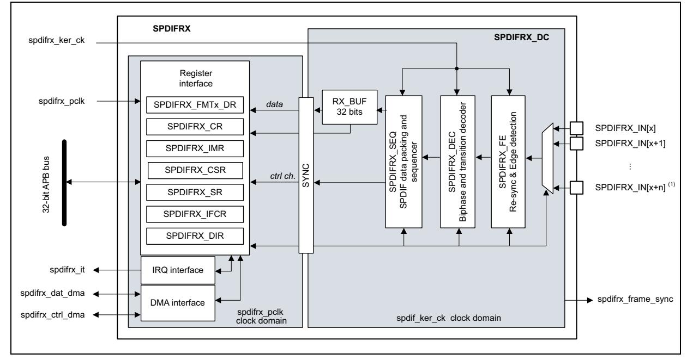

**Figure 711. SPDIFRX block diagram** 

1. 'n' is fixed to 4, and 'x' is set to 1.

# **55.3.1 SPDIFRX pins and internal signals**

*[Table 456](#page-1-1)* lists the SPDIFRX internal input/output signals, *[Table 457](#page-1-2)* the SPDIFRX pins (alternate functions).

**Signal name Signal type Description** spdifrx\_ker\_ck Digital input SPDIFRX kernel clock spdifrx\_pclk Digital input SPDIFRX register interface clock spdifrx\_it Digital output SPDIFRX global interrupt spdifrx\_dat\_dma Digital input/output SPDIFRX DMA request (and acknowledge) for data transfer spdifrx\_ctrl\_dma Digital input/output SPDIFRX DMA request (and acknowledge) for channel status and user information transfer spdifrx\_frame\_sync Digital output SPDIFRX frame rate synchronization signal

**Table 456. SPDIFRX internal input/output signals** 

**Table 457. SPDIFRX pins** 

| Signal name | Signal type   | Description               |
|-------------|---------------|---------------------------|
| SPDIFRX_IN1 | Digital input | Input 1 for S/PDIF signal |
| SPDIFRX_IN2 | Digital input | Input 2 for S/PDIF signal |
| SPDIFRX_IN3 | Digital input | Input 3 for S/PDIF signal |
| SPDIFRX_IN4 | Digital input | Input 4 for S/PDIF signal |

# **55.3.2 S/PDIF protocol (IEC-60958)**

## **S/PDIF block**

A S/PDIF frame is composed of two sub-frames (see *[Figure 712](#page-2-0)*). Each sub-frame contains 32 bits (or time slots):

- Bits 0 to 3 carry one of the synchronization preambles
- Bits 4 to 27 carry the audio sample word in linear 2's complement representation. The most significant bit (MSB) is carried by bit 27. When a 20-bit coding range is used, bits 8 to 27 carry the audio sample word with the LSB in bit 8.
- Bit 28 (validity bit "V") indicates if the data is valid (for converting it to analog for example)
- Bit 29 (user data bit "U") carries the user data information like the number of tracks of a Compact Disk.
- Bit 30 (channel status bit "C") carries the channel status information like sample rate and protection against copy.
- Bit 31 (parity bit "P") carries a parity bit such that bits 4 to 31 inclusive carry an even number of ones and an even number of zeroes (even parity).

Sync Preamble D0 D1 D2 D3 D21 D22 D23 **V U C P** 0 3 4 5 6 7 27 25 28 29 30 31 26 LSb MSb Synchronization *(type B,M or W)* Audio sample, up to 24 bits Status bits 28 information bits MSv35981V1

**Figure 712. S/PDIF sub-frame format**

For linear coded audio applications, the first sub-frame (left or "A" channel in stereophonic operation and primary channel in monophonic operation) normally starts with preamble "M". However, the preamble changes to preamble "B" once every 192 frames to identify the start of the block structure used to organize the channel status and user information. The second sub-frame (right or "B" channel in stereophonic operation and secondary channel in monophonic operation) always starts with preamble "W".

A S/PDIF block contains 192 pairs of sub-frames of 32 bits.

**M** Ch A **W** Ch B **B** Ch A **W** Ch B **M** Ch A **W** Ch B **M** Ch A **W** Ch B **B** Ch A **W** Ch B X Y ZY X Y X YZY Sub-frame Sub-frame Frame 191 Frame 0 Frame 1 Frame 191 Frame 0 **Start of block Start of block** NOTE For historical reasons preambles "B", "M" and "W" are, for use in professional applications, referred to as "Z", "X" and "Y", respectively. MSv35923V1

**Figure 713. S/PDIF block format**

# **Synchronization preambles**

The preambles patterns are inverted or not according to the previous half-bit value. This previous half-bit value is the level of the line before enabling a transfer for the first "B" preamble of the first frame. For the others preambles, this previous half-bit value is the second half-bit of the parity bit of the previous sub-frame. The preambles patterns B, M and W are described in the *[Figure 714](#page-3-0)*.

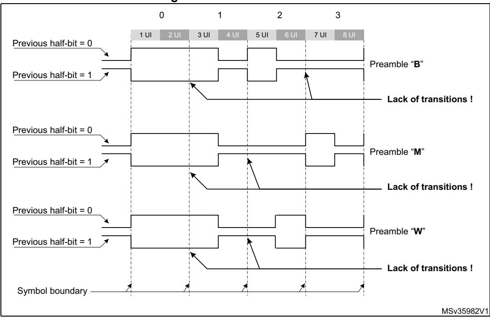

**Figure 714. S/PDIF Preambles**

## **Coding of information bits**

In order to minimize the DC component value on the transmission line, and to facilitate clock recovery from the data stream, bits 4 to 31 are encoded in biphase-mark.

Each bit to be transmitted is represented by a symbol comprising two consecutive binary states. The first state of a symbol is always different from the second state of the previous symbol. The second state of the symbol is identical to the first if the bit to be transmitted is logical 0. However, it is different if the bit is logical 1. These states are named "UI" (unit interval) in the IEC-60958 specification.

The 24 data bits are transferred LSB first.

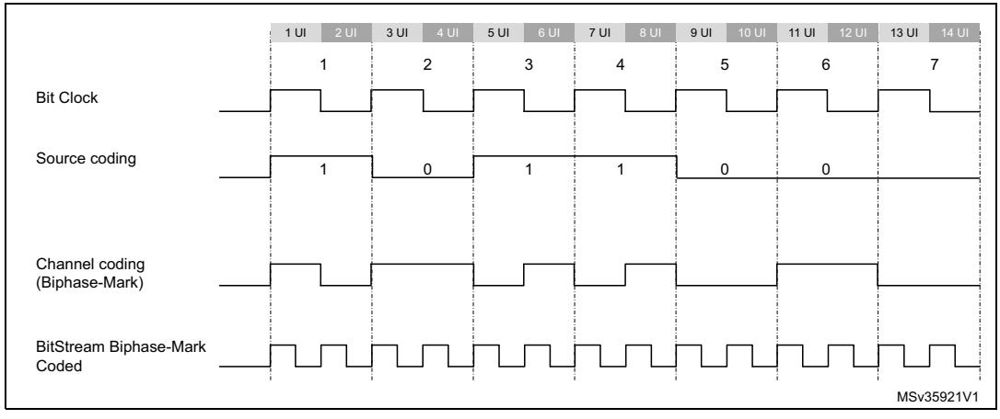

**Figure 715. Channel coding example**

# **55.3.3 SPDIFRX decoder (SPDIFRX\_DC)**

### **Main principle**

The technique used by the SPDIFRX in order to decode the S/PDIF stream is based on the measurement of the time interval between two consecutive edges. Three kinds of time intervals may be found into an S/PDIF stream:

- The long time interval, having a duration of 3 x UI, noted TL. It appears only during preambles.
- The medium time interval, having a duration of 2 x UI, noted TM. It appears both in some preambles or into the information field.
- The short time interval, having a duration of 1 x UI, noted TS. It appears both in some preambles or into the information field.

The SPDIFRX\_DC block is responsible of the decoding of the received S/PDIF stream. It takes care of the following functions:

- Resampling and filtering of the incoming signal
- Estimation of the time-intervals
- Estimation of the symbol rate and synchronization
- Decoding of the serial data, and check of integrity
- Detection of the block, and sub-frame preambles
- Continuous tracking of the symbol rate

Figure 716. SPDIFRX decoder SPDIFRX DC SPDIFRX SEQ transition\_pulse spdifrx\_ker\_ck TRCNT transition\_width\_count (13 bits) SPDIFRX\_FE Transition Longest RX BUF data coder SPDIFRX\_IN[x] (1) Data & shortest Biphase & MIN Packing data SPDIFRX\_IN[x+n] Edge detection detector ctrl ch WIDTH24 WIDTH40 SPDIFRX DEC FINE transition pulse

Figure 716 gives a detailed view of the SPDIFRX decoder.

1. 'n' is fixed to 4, and 'x' is set to 1.

## Noise filtering and rising/falling edge detection

The S/PDIF signal received on the selected SPDIFRX\_IN is re-sampled using the spdifrx\_ker\_ck clock (acquisition clock). A simple filtering is applied in order cancel spurs. This is performed by the stage detecting the edge transitions. The edge transitions are detected as follow:

- A rising edge is detected when the sequence 0 followed by two 1 is sampled.
- A falling edge is detected when the sequence 1 followed by two 0 is sampled.
- After a rising edge, a falling edge sequence is expected.
- After a falling edge, a rising edge sequence is expected.

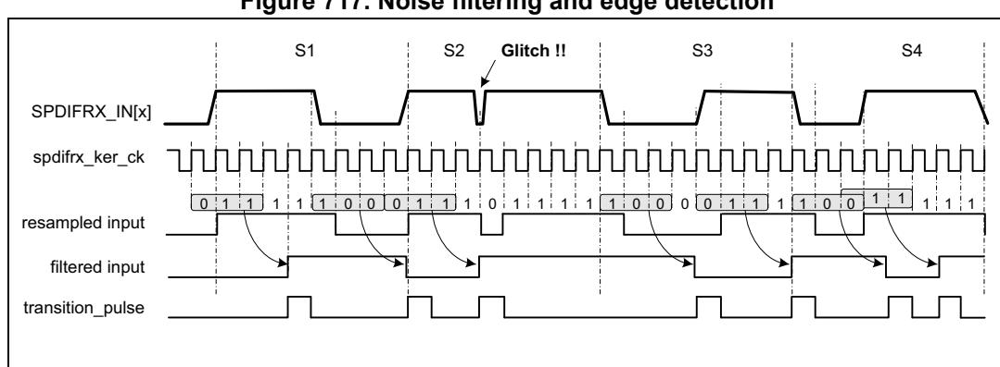

Figure 717. Noise filtering and edge detection

#### Longest and shortest transition detector

The **longest and shortest transition detector** block detects the maximum (MAX\_CNT) and minimum (MIN\_CNT) duration between two transitions. The TRCNT counter is used to measure the time interval duration. It is clocked by the spdifrx\_ker\_ck signal. On every transition pulse, the counter value is stored and the counter is reset to start counting again.

5

RM0399 Rev 4 2463/3556

The maximum duration is normally found during the preamble period. This maximum duration is sent out as MAX\_CNT. The minimum duration is sent out as MIN\_CNT.

The search of the longest and shortest transition is stopped when the transition timer expires. The transition timer is like a watchdog timer that generates a trigger after 70 transitions of the incoming signal. Note that counting 70 transitions insures a delay a bit longer than a sub-frame.

Note that when the TRCNT overflows due to a too long time interval between two pulses, the SPDIFRX is stopped and the flag TERR of SPDIFRX\_SR register is set to 1.

## **Transition coder and preamble detector**

The **transition coder and preamble detector** block receives the MAX\_CNT and MIN\_CNT. It also receives the current transition width from the TRCNT counter (see *[Figure 716](#page-5-0)*). This block encodes the current transition width by comparing the current transition width with two different thresholds, names THHI and THLO.

- If the current transition width is less than (THLO 1), then the data received is half part of data bit '1', and is coded as TS.
- If the current transition width is greater than (THLO 1), and less than THHI, then the data received is data bit '0', and is coded as TM.
- If the current transition width is greater than THHI, then the data received is the long pulse of preambles, and is coded as TL.
- Else an error code is generated (FERR flag is set).

The thresholds THHI and THLO are elaborated using two different methods.

If the peripheral is doing its initial synchronization ('coarse synchronization'), then the thresholds are computed as follow:

- THLO = MAX\_CNT / 2.
- THHI = MIN\_CNT + MAX\_CNT / 2.

Once the 'coarse synchronization' is completed, then the SPDIFRX uses a more accurate reference in order to elaborate the thresholds. The SPDIFRX measures the length of 24 symbols (WIDTH24) for defining THLO and the length of 40 symbols (WIDTH40) for THHI. THHI and THLO are computed as follow:

- THLO = (WIDTH24) / 32
- THHI = (WIDTH40) / 32

This second synchronization phase is called the 'fine synchronization'. Refer to *[Figure 720](#page-10-0)* for additional information.

MSv35931V2

**Figure 718. Thresholds** MAX\_CNT SPDIFRX Signal 1 UI 2 UI 3 UI 1.5 UI 2.5 UI MIN\_CNT Detection of Short Transition Detection of Medium Transition Detection of Long Transition

As shown in the figure hereafter, THLO is ideally equal to 1.5 UI, and to THHI 2.5 UI.

The preamble detector checks four consecutive transitions of a specific sequence to determine if they form the part of preamble. Let us say TRANS0, TRANS1, TRANS2 and TRANS3 represent four consecutive transitions encoded as mentioned above. *[Table 458](#page-7-0)* shows the values of these four transitions to form a preamble. Absence of this pattern indicates that these transitions form part of the data in the sub frame and bi-phase decoder decode them.

THLO THHI

| Preamble type | Biphase data pattern | TRANS3 | TRANS2 | TRANS1 | TRANS0 |  |  |  |  |  |  |  |
|---------------|-------------------------|--------|--------|--------|--------|--|--|--|--|--|--|--|
| Preamble B    | 11101000                | TL     | TS     | TS     | TL     |  |  |  |  |  |  |  |
| Preamble M    | 11100010                | TL     | TL     | TS     | TS     |  |  |  |  |  |  |  |
| Preamble W    | 11100100                | TL     | TM     | TS     | TM     |  |  |  |  |  |  |  |

**Table 458. Transition sequence for preamble** 

## **Bi-phase decoder**

The Bi-phase decoder decodes the input bi-phase marked data stream using the transition information provided by the **transition coder and preamble detector** block. It first waits for the preamble detection information. After the preamble detection, it decodes the following transition information:

- If the incoming transition information is TM then it is decoded as a '0'.
- Two consecutive TS are decoded as a '1'.
- Any other transition sequence generates an error signal (FERR set to 1).

After decoding 28 data bits this way, this module looks for the following preamble data. If the new preamble is not what is expected, then this block generates an error signal (FERR set to 1). Refer to *[Section 55.3.9: Reception errors](#page-15-0)*, for additional information on error flags.

### **Data packing**

This block is responsible of the decoding of the IEC-60958 frames and blocks. It also handles the writing into the RX\_BUF or into SPDIFRX\_CSR register.

RM0399 Rev 4 2465/3556

# **55.3.4 SPDIFRX tolerance to clock deviation**

The SPDIFRX tolerance to clock deviation depends on the number of sample clock cycles in one bit slot. The fastest spdifrx\_ker\_ck is, the more robust the reception is. The ratio between spdifrx\_ker\_ck frequency and the symbol rate must be at least 11.

Two kinds of phenomenon (at least) can degrade the reception quality:

- The cycle-to-cycle jitter which reflects the difference of transition length between two consecutive transitions.
- The long term jitter which reflects a cumulative effect of the cycle-to-cycle jitter. It can be seen as a low-frequency symbol modulation.

# **55.3.5 SPDIFRX synchronization**

The synchronization phase starts when setting SPDIFRXEN to 01 or 11. *[Figure 719](#page-9-0)* shows the synchronization process.

If the bit WFA of SPDIFRX\_CR register is set to 1, then the peripheral must first detect activity on the selected SPDIFRX\_IN line before starting the synchronization process. The activity detection is performed by detecting four transitions on the selected SPDIFRX\_IN. The peripheral remains in this state until transitions are not detected. This function can be particularly helpful because the SPDIFRX switches in COARSE SYNC mode only if activity is present on the selected SPDIFRX\_IN input, avoiding synchronization errors. See *[Section 55.4: Programming procedures](#page-20-0)* for additional information.

The user can still set the SPDIFRX into STATE\_IDLE by setting SPDIFRXEN to 0. If the WFA is set to 0, the peripheral starts the coarse synchronization without checking activity.

The next step consists on doing a first estimate of the thresholds (COARSE SYNC), in order to perform the fine synchronization (FINE SYNC). Due to disturbances of the SPDIFRX line, it can happen that the process is not executed first time right. For this purpose, the user can program the number of allowed re-tries (NBTR) before setting SERR error flag. When the SPDIFRX is able to measure properly the duration of 24 and 40 consecutive symbols then the FINE SYNC is completed, the threshold values are updated, and the flag SYNCD is set to 1. Refer to *[Section : Transition coder and preamble detector](#page-6-0)* for additional information.

Two kinds of errors are detected:

- An overflow of the TRCNT, which generally means that there is no valid S/PDIF stream in the input line. This overflow is indicated by TERR flag.
- The number of retries reached the programmed value. This means that strong jitter is present on the S/PDIF signal. This error is indicated by SERR flag.

When the first FINE SYNC is completed, the reception of channel status (C) and user data (U) starts when the next "B" preamble is detected (see *[Figure 723](#page-14-0)*).Then the user can read IEC-60958 C and U bits through SPDIFRX\_CSR register. According to this information the user can then select the proper settings for DRFMT and RXSTEO. For example if the user detects that the current audio stream transports encoded data, then he can put RXSTEO to 0, and DRFMT to 10 prior to start data reception. Note that DRFMT and RXSTEO cannot be modified when SPDIFRXEN = 11. Writes to these fields are ignored if SPDIFRXEN is already 11, though these field can be changed with the same write instruction that causes SPDIFRXEN to become 11.

Then the SPDIFRX waits for SPDIFRXEN = 11 and the "B" preamble before starting saving audio samples.

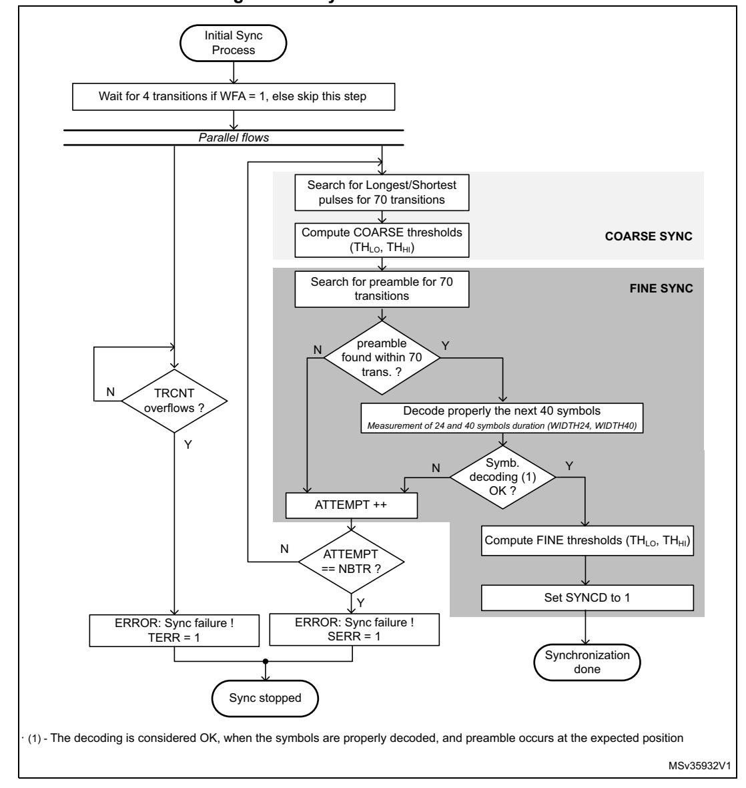

**Figure 719. Synchronization flowchart**

Refer to *[Frame structure and synchronization error](#page-15-1)* for additional information concerning TRCNT overflow.

The FINE SYNC process is re-triggered every frame in order to update thresholds as shown in *[Figure 720](#page-10-0)* in order to continuously track S/PDIF synchronization.

RM0399 Rev 4 2467/3556

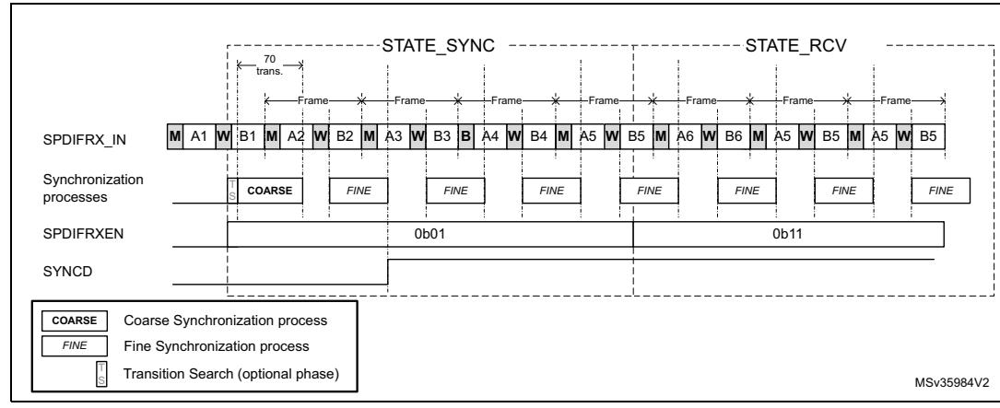

Figure 720. Synchronization process scheduling

## 55.3.6 SPDIFRX handling

The software can control the state of the SPDIFRX through SPDIFRXEN field. The SPDIFRX can be into one of the following states:

- STATE\_IDLE:
  - The peripheral is disabled, the spdifrx\_ker\_ck domain is reset. The spdifrx\_pclk domain is functional.
- STATE\_SYNC:
  - The peripheral is synchronized to the stream, thresholds are updated regularly, user and channel status can be read via interrupt of DMA. The audio samples are not provided to receive buffer.
- STATE\_RCV:
  - The peripheral is synchronized to the stream, thresholds are updated regularly, user, channel status and audio samples can be read via interrupt or DMA channels. When SPDIFRXEN goes to 11, the SPDIFRX waits for "B" preamble before starting saving audio samples.
- STOP\_STATE:
  - The peripheral is no longer synchronized, the reception of the user, channel status and audio samples are stopped. It is expected that the software re-starts the SPDIFRX.

*Figure 721* shows the possible states of the SPDIFRX, and how to transition from one state to the other. The bits under software control are followed by the mention "(SW)", the bits under SPDIFRX control are followed by the mention "(HW)".

**Figure 721. SPDIFRX States**

#### When SPDIFRX is in STATE\_IDLE:

- The software can transition to STATE\_SYNC by setting SPDIFRXEN to 01 or 11 When SPDIFRX is in STATE\_SYNC:
- If the synchronization fails or if the received data are not properly decoded with no chance of recovery without a re-synchronization (FERR or SERR or TERR = 1), the SPDIFRX goes to STATE\_STOP, and waits for software acknowledge.
- When the synchronization phase is completed, if SPDIFRXEN = 01 the peripheral remains in this state.
- At any time the software can set SPDIFRXEN to 0, then SPDIFRX returns immediately to STATE\_IDLE. If a DMA transfer is on-going, it is properly completed.
- The SPDIFRX goes to STATE\_RCV if SPDIFRXEN = 11 and if the SYNCD = 1

#### When SPDIFRX is in STATE\_RCV:

- If the received data are not properly decoded with no chance of recovery without a resynchronization (FERR or SERR or TERR = 1), the SPDIFRX goes to STATE\_STOP, and waits for software acknowledge.
- At any time the software can set SPDIFRXEN to 0, then SPDIFRX returns immediately to STATE\_IDLE. If a DMA transfer is on-going, it is properly completed.

#### When SPDIFRX is in STATE\_STOP:

• The SPDIFRX stops reception and synchronization, and waits for the software to set the bit SPDIFRXEN to 0, in order to clear the error flags.

RM0399 Rev 4 2469/3556

When SPDIFRXEN is set to 0, the SPDIFRX is disabled, meaning that all the state machines are reset, and RX\_BUF is flushed. Note as well that flags FERR, SERR and TERR are reset.

# **55.3.7 Data reception management**

The SPDIFRX offers a double buffer for the audio sample reception. A 32-bit buffer located into the spdifrx\_ker\_ck clock domain (RX\_BUF), and the SPDIFRX\_FMTx\_DR register. The valid data contained into the RX\_BUF are immediately transferred into SPDIFRX\_FMTx\_DR if SPDIFRX\_FMTx\_DR is empty.

The valid data contained into the RX\_BUF are transferred into SPDIFRX\_FMTx\_DR when the two following conditions are reached:

- The transition between the parity bit (P) and the next preamble is detected (this indicated that the word is completely received).
- The SPDIFRX\_FMTx\_DR is empty.

Having a 2-word buffer gives more flexibility for the latency constraint.

The maximum latency allowed is TSAMPLE - 2TPCLK - 2Tspdifrx\_ker\_ck

Where TSAMPLE is the audio sampling rate of the received stereo audio samples, TPCLK is the period of spdifrx\_pclk clock, and Tspdifrx\_ker\_ck is the period of spdifrx\_ker\_ck clock.

The SPDIFRX offers the possibility to use either DMA (spdifrx\_dat\_dma and spdifrx\_ctrl\_dma) or interrupts for transferring the audio samples into the memory. The recommended option is DMA, refer to *[Section 55.3.11: DMA interface](#page-17-0)* for additional information.

The SPDIFRX offers several way on handling the received data. The user can either have a separate flow for control information and audio samples, or get them all together.

For each sub-frame, the data reception register SPDIFRX\_FMTx\_DR contains the 24 data bits, and optionally the V, U, C, PE status bits, and the PT (see *[Mixing data and control](#page-13-0)  [flow](#page-13-0)*).

Note that PE bit stands for parity rrror bit, and is set to 1 when a parity error is detected in the decoded sub-frame.

The PT field carries the preamble type (B, M or W).

V, U and C are a direct copy of the value received from the S/PDIF interface.

The bit DRFMT allows the selection between 3 audio formats as shown in *[Figure 722](#page-13-1)*.

This document describes 3 data registers: SPDIFRX\_FMTx[2:0] (x = 2 to 0), but in reality there is only one physical data register, having 3 possible formats:

- When DRFMT = 0, the format of the data register is the one described by SPDIFRX\_FMT0\_DR
- When DRFMT = 1, the format of the data register is the one described by SPDIFRX\_FMT1\_DR
- When DRFMT = 2, the format of the data register is the one described by SPDIFRX\_FMT2\_DR"

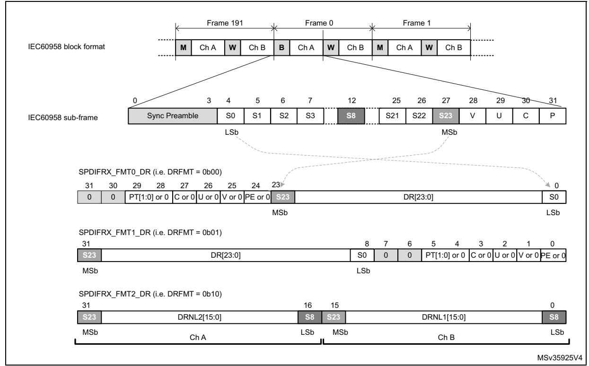

Figure 722. SPDIFRX\_FMTx\_DR register format

Setting DRFMT to 00 or 01, offers the possibility to have the data either right or left aligned into the SPDIFRX\_FMTx\_DR register. The status information can be enabled or forced to zero according to the way the software wants to handle them.

The format given by DRFMT= 10 is interesting in non-linear mode, as only 16 bits per subframe are used. By using this format, the data of two consecutive sub-frames are stored into SPDIFRX\_FMTx\_DR, dividing by two the amount of memory footprint. Note that when RXSTEO = 1, there is no misalignment risks (i.e. data from ChA are always stored into SPDIFRX\_FMTx\_DR[31:16]). If RXSTEO = 0, then there is a misalignment risk is case of overrun situation. In that case SPDIFRX\_FMTx\_DR[31:16] always contain the oldest value and SPDIFRX\_FMTx\_DR[15:0] the more recent value (see *Figure 724*).

In this format the status information cannot be mixed with data, but the user can still get them through SPDIFRX\_CSR register, and use a dedicated DMA channel or interrupt to transfer them to memory (see Section 55.3.8: Dedicated control flow)

#### Mixing data and control flow

The user can choose to use this mode in order to get the full flexibility of the handling of the control flow. The user can select which field must be kept into the data register (SPDIFRX\_FMTx\_DR).

- When bit PMSK = 1, the parity error information is masked (set to 0), otherwise it is copied into SPDIFRX FMTx DR.
- When bit VMSK = 1, the validity information is masked (set to 0), otherwise it is copied into SPDIFRX\_FMTx\_DR.

RM0399 Rev 4 2471/3556

- When bit CUMSK = 1, the channel status, and used data information are masked (set to 0), otherwise they are copied into SPDIFRX\_FMTx\_DR.
- When bit PTMSK = 1, the preamble type is masked (set to 0), otherwise it is copied into SPDIFRX FMTx DR.

#### 55.3.8 Dedicated control flow

The SPDIFRX offers the possibility to catch both user data and channel status information via a dedicated DMA channel. This feature allows the SPDIFRX to acquire continuously the channel status and user information. The acquisition starts at the beginning of a IEC 60958 block. Two fields are available to control this path: CBDMAEN and SPDIFRXEN. When SPDIFRXEN is set to 01 or 0x11, the acquisition is started, after completion of the synchronization phase. When 8 channel status and 16 user data bits are received, they are packed and stored into SPDIFRX\_CSR register. A DMA request is triggered if the bit CBDMAEN is set to 1 (see *Figure 723*).

If CS[0] corresponds to the first bit of a new block, the bit SOB is set to 1. Refer to Section 55.5.8: SPDIFRX channel status register (SPDIFRX\_CSR). A bit is available (CHSEL) in order to select if the user wants to select channel status information (C) from the channel A or B.

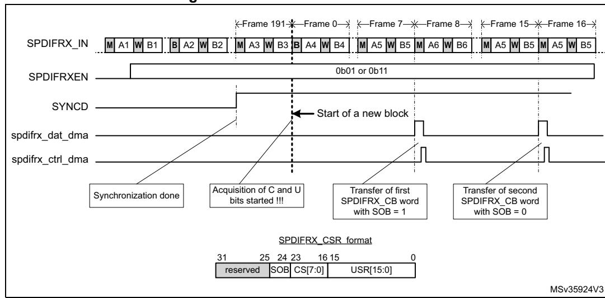

Figure 723. Channel/user data format

Note:

Once the first start of block is detected (B preamble), the SPDIFRX is checking the preamble type every 8 frames.

Note:

Overrun error on SPDIFRX\_FMTx\_DR register does not affect this path.

## **55.3.9 Reception errors**

## **Frame structure and synchronization error**

The SPDIFRX, detects errors, when one of the following condition occurs:

- The FERR bit is set to 1 on the following conditions:
  - For each of the 28 information bits, if one symbol transition sequence is not correct: for example if short pulses are not grouped by pairs.
  - If preambles occur to an unexpected place, or an expected preamble is not received.
- The SERR bit is set when the synchronization fails, because the number of re-tries exceeded the programmed value.
- The TERR bit is set when the counter used to estimate the width between two transitions overflows (TRCNT).
  - The overflow occurs when no transition is detected during 8192 periods of spdifrx\_ker\_ck clock. It represents at most a time interval of 11.6 frames.

When one of those flags goes to 1, the traffic on selected SPDIFRX\_IN is then ignored, an interrupt is generated if the IFEIE bit of the SPDIFRX\_CR register is set.

The normal procedure when one of those errors occur is:

- Set SPDIFRXEN to 0 in order to clear the error flags
- Set SPDIFRXEN to 01 or 11 in order to restart the SPDIFRX

Refer to *[Figure 721](#page-11-0)* for additional information.

## **Parity error**

For each sub-frame, an even number of zeros and ones is expected inside the 28 information bits. If not, the parity error bit PERR is set in the SPDIFRX\_SR register and an interrupt is generated if the parity interrupt enable PERRIE bit is set in the SPDIFRX\_CR register. The reception of the incoming data is not paused, and the SPDIFRX continue to deliver data to SPDIFRX\_FMTx\_DR even if the interrupt is still pending.

The interrupt is acknowledged by clearing the PERR flag through PERRCF bit.

If the software wants to guarantee the coherency between the data read in the SPDIFRX\_FMTx\_DR register and the value of the bit PERR, the bit PMSK must be set to 0.

#### **Overrun error**

If both SPDIFRX\_FMTx\_DR and RX\_BUF are full, while the SPDIFRX\_DC needs to write a new sample in RX\_BUF, this new sample is dropped, and an overrun condition is triggered. The overrun error flag OVR is set in the SPDIFRX\_SR register and an interrupt is generated if the OVRIE bit of the SPDIFRX\_CR register is set.

If the RXSTEO bit is set to 0, then as soon as the RX\_BUF is empty, the SPDIFRX stores the next incoming data, even if the OVR flag is still pending. The main purpose is to reduce as much as possible the amount of lost samples. Note that the behavior is similar independently of DRFMT value. See *[Figure 724](#page-16-0)*.

RM0399 Rev 4 2473/3556

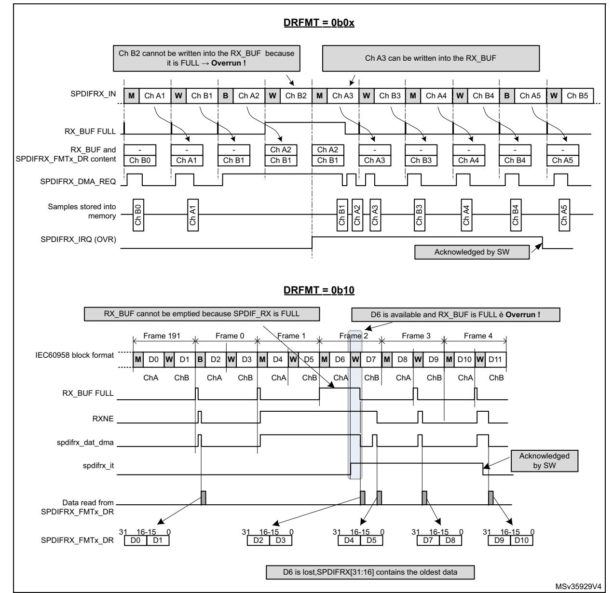

**Figure 724. S/PDIF overrun error when RXSTEO = 0**

If the RXSTEO bit is set to 1, it means that stereo data are transported, then the SPDIFRX has to avoid misalignment between left and right channels. So the peripheral has to drop a second sample even if there is room inside the RX\_BUF in order to avoid misalignment. Then the incoming samples can be written normally into the RX\_BUF even if the OVR flag is still pending. Refer to *[Figure 725](#page-17-1)*.

The OVR flag is cleared by software, by setting the OVRCF bit to 1.

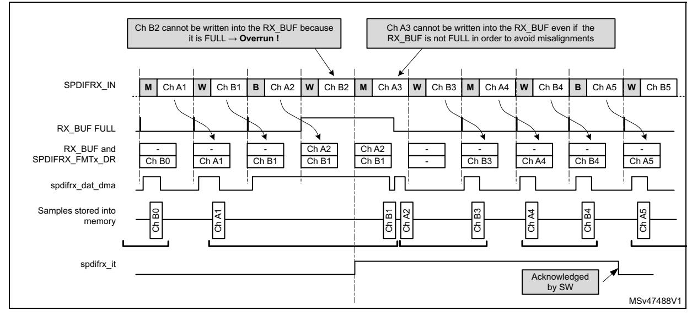

**Figure 725. S/PDIF overrun error when RXSTEO = 1**

# **55.3.10 Clocking strategy**

The SPDIFRX block needs two different clocks:

- The APB clock (spdifrx\_pclk), which is used for the register interface,
- The spdifrx\_ker\_ck which is mainly used by the SPDIFRX\_DC part. Those clocks are not supposed to be phase locked, so all signals crossing those clock domains are resynchronized (SYNC block on *[Figure 711](#page-1-0)*).

In order to decode properly the incoming S/PDIF stream the SPDIFRX\_DC must re-sample the received data with a clock at least 11 times higher than the maximum symbol rate, or 704 times higher than the audio sample rate. For example if the user expects to receive a symbol rate to up to 12.288 MHz, the sample rate must be at least 135.2 MHz. The clock used by the SPDIFRX\_DC is the spdifrx\_ker\_ck.

The frequency of the spdifrx\_pclk must be at least equal to the symbol rate.

**Table 459. Minimum spdifrx\_ker\_ck frequency versus audio sampling rate(1)**

| Symbol rate | Minimum spdifrx_ker_ck frequency | Comments           |
|-------------|----------------------------------|--------------------|
| 3.072 MHz   | 33.8 MHz                         | For 48 kHz stream  |
| 6.144 MHz   | 67.6 MHz                         | For 96 kHz stream  |
| 12.288 MHz  | 135.2 MHz                        | For 192 kHz stream |

1. Check the RCC capabilities in order to verify which sampling rates can be supported.

# **55.3.11 DMA interface**

The SPDIFRX interface is able to perform communication using the DMA.

*Note: The user must refer to product specifications for availability of the DMA controller.* 

The SPDIFRX offers two independent DMA channels:

- A DMA channel dedicated to the data transfer
- A DMA channel dedicated to the channel status and user data transfer

RM0399 Rev 4 2475/3556

The DMA mode for the data can be enabled for reception by setting the RXDMAEN bit in the SPDIFRX\_CR register. In this case, as soon as the SPDIFRX\_FMTx\_DR is not empty, the SPDIFRX interface sends a transfer request to the DMA. The DMA reads the data received through the SPDIFRX\_FMTx\_DR register without CPU intervention.

For the use of DMA for the control data refer to *[Section 55.3.8: Dedicated control flow](#page-14-1)*.

# **55.3.12 Interrupt generation**

An interrupt line is shared between:

- Reception events for data flow (RXNE)
- Reception event for control flow (CSRNE)
- Data corruption detection (PERR)
- Transfer flow interruption (OVR)
- Frame structure and synchronization errors (SERR, TERR and FERR)
- Start of new block interrupt (SBD)
- Synchronization done (SYNCD)

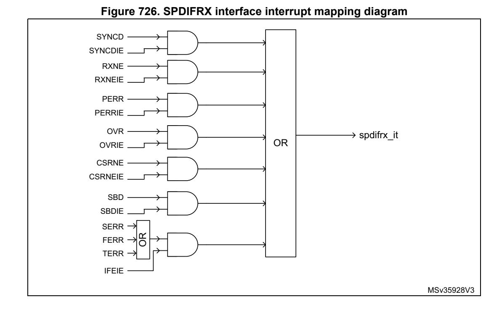

2476/3556 RM0399 Rev 4

# **Clearing interrupt source**

- RXNE is cleared when SPDIFRX\_FMTx\_DR register is read
- CSRNE is cleared when SPDIFRX\_CSR register is read
- FERR is cleared when SPDIFRXEN is set to 0
- SERR is cleared when SPDIFRXEN is set to 0
- TERR is cleared when SPDIFRXEN is set to 0
- Others are cleared through SPDIFRX\_IFCR register

*Note: The SBD event can only occur when the SPDIFRX is synchronized to the input stream (SYNCD = 1).*

> *The SBD flag behavior is not guaranteed when the sub-frame which contains the B preamble is lost due to an overrun.*

# **55.3.13 Register protection**

The SPDIFRX block embeds some hardware protection avoid erroneous use of control registers. The table hereafter shows the bit field properties according to the SPDIFRX state.

**Registers Field SPDIFRXEN 00 (STATE\_IDLE) 01 (STATE\_SYNC) 11 (STATE\_RCV)** SPDIFRX\_CR INSEL rw r r WFA rw r r NBTR rw r r CHSEL rw r r CBDMAEN rw rw rw PTMSK rw rw rw CUMSK rw rw rw VMSK rw rw rw PMSK rw rw rw DRFMT rw rw r RXSTEO rw rw r RXDMAEN rw rw rw SPDIFRX\_IMR All fields rw rw rw

**Table 460. Bit field property versus SPDIFRX state** 

The table clearly shows that fields such as INSEL must be programmed when the SPDIFRX is in STATE\_IDLE. In the others SPDIFRX states, the hardware prevents writing to this field.

*Note: Even if the hardware allows the writing of CBDMAEN and RXDMAEN "on-the-fly", it is not recommended to enable the DMA when the SPDIFRX already receives data.*

> *Each of the mask bits (such as PMSK, VMSK) can be changed "on-the-fly" at any SPDIFRX state, but any change does not affect data which are already hold in SPDIFRX\_FMTx\_DR.*

RM0399 Rev 4 2477/3556

# **55.4 Programming procedures**

The following example illustrates a complete activation sequence of the SPDIFRX block. The data path and channel status and user information both use a dedicated DMA channel. The activation sequence is then split into the following steps:

- Wait for valid data on the selected SPDIFRX\_IN input
- Synchronize to the S/PDIF stream
- Read the channel status and user information in order to setup the complete audio path
- Start data acquisition

A simple way to check if valid data are available into the SPDIFRX\_IN line is to switch the SPDIFRX into the STATE\_SYNC, with bit WFA set to 1. The description hereafter focuses on detection. It is also possible to implement this function as follows:

- The software has to check from time to time (i.e. every 100 ms for example) if the SPDIFRX can find synchronization. This can be done by checking if the bit TERR is set. When it is set it indicates that no activity as been found.
- Connect the SPDIFRX\_IN input to an external interrupt event block in order to detect transitions of SPDIFRX\_IN line. When activity is detected, then SPDIFRXEN can be set to 01 or 11.

For those two implementations, the bit WFA is set to 0.

# **55.4.1 Initialization phase**

- The initialization function looks like this:
- Configure the DMA transfer for both audio samples and IEC60958 channel status and user information (DMA channel selection and activation, priority, number of data to transfer, circular/no circular mode, DMA interrupts)
- Configure the destination address:
  - Configure the address of the SPDIFRX\_CSR register as source address for IEC60958 channel status and user information
  - Configure the address of the SPDIFRX\_FMTx\_DR register as source address for audio samples
  - Enable the generation of the spdifrx\_ker\_ck. Refer to *[Table 459](#page-17-2)* in order to define the minimum clock frequency versus supported audio sampling rate. Note that the audio sampling rate of the received stream is not known in advance. This means that the user has to select a spdifrx\_ker\_ck frequency at least 704 times higher than the maximum audio sampling rate the application is supposed to handle: for example if the application is able to handle streams to up to 96 kHz, then Fspdifrx\_ker\_ck must be at least 704 x 96 kHz = 67.6 MHz
- Enable interrupt for errors and event signaling (IFEIE = SYNCDIE = OVRIE, PERRIE = 1, others set to 0). Note that SYNCDIE can be set to 0.

- Configure the SPDIFRX\_CR register:
  - INSEL must select the wanted input
  - NBTR = 2, WFA = 1 (16 re-tries allowed, wait for activity before going to synchronization phase),
  - PTMSK = CUMSK = 1 (Preamble, C and U bits are not mixed with data)
  - VMSK = PMSK = 0 (Parity error and validity bit mixed with data)
  - CHSEL = 0 (channels status are read from sub-frame A)
  - DRFMT = 01 (data aligned to the left)
  - RXSTEO = 1 (expected stereo mode linear)
  - CBDMAEN = RXDMAEN = 1 (enable DMA channels)
  - SPDIFRXEN = 01 (switch SPDIFRX to STATE\_SYNC)
- The CPU can enter in WFI mode

Then the CPU receives interrupts coming either from DMA or SPDIFRX.

## **55.4.2 Handling of interrupts coming from SPDIFRX**

When an interrupt from the SPDIFRX is received, then the software has to check what is the source of the interrupt by reading the SPDIFRX\_SR register.

- If SYNCD is set to 1, then it means that the synchronization is properly completed. No action has to be performed in our case as the DMA is already programmed. The software just needs to wait for DMA interrupt in order to read channel status information.
  - The SYNCD flag must be cleared by setting SYNCDCF bit of SPDIFRX\_IFCR register to 1.
- If TERR or SERR or FERR are set to 1, the software has to set SPDIFRXEN to 0, and re-start from the initialization phase.
  - TERR indicates that a time-out occurs either during synchronization phase or after.
  - SERR indicates that the synchronization fails because the maximum allowed retries are reached.
  - FERR indicates that the reading of information after synchronization fails (such as unexpected preamble, bad data decoding).
- If PERR is set to 1, it means that a parity error is detected, so one of the received audio sample or the channel status or user data bits are corrupted. The action taken here depends on the application: one action can be to drop the current channel status block as it is not reliable. There is no need to re-start from the initialization phase, as the synchronization is not lost.
  - The PERR flag must be cleared by setting PERRCF bit of SPDIFRX\_IFCR register to 1.

## **55.4.3 Handling of interrupts coming from DMA**

If an interrupt comes from the DMA channel used of the channel status (SPDIFRX\_CSR):

If no error occurred (that is PERR), the CPU can start the decoding of channel information. For example bit 1 of the channel status informs the user if the current stream is linear or not. This information is very important in order to set-up the proper

RM0399 Rev 4 2479/3556

processing chain. In the same way, bits 24 to 27 of the channel status give the sampling frequency of the stream incoming stream.

Thanks to that information, the user can then configure the RXSTEO bit and DRFMT field prior to start the data reception. For example if the current stream is non linear PCM then RXSTEO is set to 0, and DRFMT is set to 10. Then the user can enable the data reception by setting SPDIFRXEN to 11.

The SOB bit, when set to 1 indicates the start of a new block. This information helps the software to identify the bit 0 of the channel status. Note that if the DMA generates an interrupt every time 24 values are transferred into the memory, then the first word always corresponds to the start of a new block.

If an interrupt comes from the DMA channel used of the audio samples (SPDIFRX\_FMTx\_DR):

The process performed here depends of the data type (linear or non-linear), and on the data format selected.

For example in linear mode, if PE or V bit is set a special processing can be performed locally in order to avoid spurs on output. In non-linear mode those bits are not important as data frame have their own checksum.

# **55.5 SPDIFRX interface registers**

# **55.5.1 SPDIFRX control register (SPDIFRX\_CR)**

Only 32-bit accesses are allowed in this register.

Address offset: 0x00

Reset value: 0x0000 0000

| 31   | 30   | 29   | 28        | 27    | 26      | 25    | 24    | 23   | 22   | 21   | 20         | 19     | 18      | 17         | 16             |  |
|------|------|------|-----------|-------|---------|-------|-------|------|------|------|------------|--------|---------|------------|----------------|--|
| Res. | Res. | Res. | Res.      | Res.  | Res.    | Res.  | Res.  | Res. | Res. | Res. | Res.       | Res.   |         | INSEL[2:0] |                |  |
|      |      |      |           |       |         |       |       |      |      |      |            |        | rw      | rw         | rw             |  |
| 15   | 14   | 13   | 12        | 11    | 10      | 9     | 8     | 7    | 6    | 5    | 4          | 3      | 2       | 1          | 0              |  |
| Res. | WFA  |      | NBTR[1:0] | CHSEL | CBDMAEN | PTMSK | CUMSK | VMSK | PMSK |      | DRFMT[1:0] | RXSTEO | RXDMAEN |            | SPDIFRXEN[1:0] |  |
|      | rw   | rw   | rw        | rw    | rw      | rw    | rw    | rw   | rw   | rw   | rw         | rw     | rw      | rw         | rw             |  |

Bits 31:19 Reserved, must be kept at reset value.

Bits 18:16 **INSEL[2:0]**: SPDIFRX input selection(1)

000: SPDIFRX\_IN1 selected 001: SPDIFRX\_IN2 selected 010: SPDIFRX\_IN3 selected 011: SPDIFRX\_IN4 selected

other: reserved

Bit 15 Reserved, must be kept at reset value.

### Bit 14 **WFA**: Wait for activit[y\(1\)](#page-24-0)

This bit is set/reset by software.

- 1: The SPDIFRX waits for activity on SPDIFRX\_IN line (4 transitions) before performing the synchronization.
- 0: The SPDIFRX does not wait for activity on SPDIFRX\_IN line before performing the synchronization.

## Bits 13:12 **NBTR[1:0]**: Maximum allowed re-tries during synchronization phase[\(1\)](#page-24-0)

- 00: No re-try is allowed (only one attempt)
- 01: 3 re-tries allowed
- 10: 15 re-tries allowed
- 11: 63 re-tries allowed

### Bit 11 **CHSEL**: Channel selectio[n\(1\)](#page-24-0)

This bit is set/reset by software.

- 1: The control flow takes the channel status from channel B.
- 0: The control flow takes the channel status from channel A.

### Bit 10 **CBDMAEN**: Control buffer DMA enable for control flow[\(1\)](#page-24-0)

This bit is set/reset by software.

- 1: DMA mode is enabled for reception of channel status and used data information.
- 0: DMA mode is disabled for reception of channel status and used data information.

*Note: When this bit is set, the DMA request is made whenever the CSRNE flag is set.*

### Bit 9 **PTMSK**: Mask of preamble type bit[s\(1\)](#page-24-0)

This bit is set/reset by software.

- 1: The preamble type bits are not copied into the SPDIFRX\_FMTx\_DR, zeros are written instead.
- 0: The preamble type bits are copied into the SPDIFRX\_FMTx\_DR.

## Bit 8 **CUMSK**: Mask of channel status and user bit[s\(1\)](#page-24-0)

This bit is set/reset by software.

- 1: The channel status and user bits are not copied into the SPDIFRX\_FMTx\_DR, zeros are written instead.
- 0: The channel status and user bits are copied into the SPDIFRX\_FMTx\_DR.

### Bit 7 **VMSK**: Mask of validity bit[\(1\)](#page-24-0)

This bit is set/reset by software.

- 1: The validity bit is not copied into the SPDIFRX\_FMTx\_DR, a zero is written instead.
- 0: The validity bit is copied into the SPDIFRX\_FMTx\_DR.

### Bit 6 **PMSK**: Mask parity error bit[\(1\)](#page-24-0)

This bit is set/reset by software.

- 1: The parity error bit is not copied into the SPDIFRX\_FMTx\_DR, a zero is written instead.
- 0: The parity error bit is copied into the SPDIFRX\_FMTx\_DR.

## Bits 5:4 **DRFMT[1:0]**: RX data format[\(1\)](#page-24-0)

This bit is set/reset by software.

- 11: reserved
- 10: Data sample are packed by setting two 16-bit sample into a 32-bit word.
- 01: Data samples are aligned in the left (MSB)
- 00: Data samples are aligned in the right (LSB).

## Bit 3 **RXSTEO**: Stereo mode[\(1\)](#page-24-0)

This bit is set/reset by software.

- 1: The peripheral is in stereo mode.
- 0: The peripheral is in mono mode.

*Note: This bit is used in case of overrun situation in order to handle misalignment.*

### Bit 2 **RXDMAEN**: Receiver DMA enable for data flo[w\(1\)](#page-24-0)

This bit is set/reset by software.

- 1: DMA mode is enabled for reception.
- 0: DMA mode is disabled for reception.

*Note: When this bit is set, the DMA request is made whenever the RXNE flag is set.*

## Bits 1:0 **SPDIFRXEN[1:0]**: Peripheral block enable[\(1\)](#page-24-0)

This field is modified by software.

It must be used to change the peripheral phase among the three possible states: STATE\_IDLE, STATE\_SYNC and STATE\_RCV.

- 00: Disable SPDIFRX (STATE\_IDLE).
- 01: Enable SPDIFRX synchronization only.
- 10: Reserved
- 11: Enable SPDIF receiver.

*Note: It is not possible to transition from STATE\_RCV to STATE\_SYNC, the user must first go the STATE\_IDLE.*

*it is possible to transition from STATE\_IDLE to STATE\_RCV: in that case the peripheral transitions from STATE\_IDLE to STATE\_SYNC and as soon as the synchronization is performed goes to STATE\_RCV.*

# **55.5.2 SPDIFRX interrupt mask register (SPDIFRX\_IMR)**

Address offset: 0x04

Reset value: 0x0000 0000

| 31   | 30   | 29   | 28   | 27   | 26   | 25   | 24   | 23   | 22        | 21          | 20         | 19        | 18         | 17          | 16         |
|------|------|------|------|------|------|------|------|------|-----------|-------------|------------|-----------|------------|-------------|------------|
| Res. | Res. | Res. | Res. | Res. | Res. | Res. | Res. | Res. | Res.      | Res.        | Res.       | Res.      | Res.       | Res.        | Res.       |
|      |      |      |      |      |      |      |      |      |           |             |            |           |            |             |            |
| 15   | 14   | 13   | 12   | 11   | 10   | 9    | 8    | 7    | 6         | 5           | 4          | 3         | 2          | 1           | 0          |
| Res. | Res. | Res. | Res. | Res. | Res. | Res. | Res. | Res. | IFE IE | SYNCD IE | SBLK IE | OVR IE | PERR IE | CSRNE IE | RXNE IE |
|      |      |      |      |      |      |      |      |      | rw        | rw          | rw         | rw        | rw         | rw          | rw         |

Bits 31:7 Reserved, must be kept at reset value.

# Bit 6 **IFEIE**: Serial interface error interrupt enable

This bit is set and cleared by software.

- 0: Interrupt is inhibited.
- 1: A SPDIFRX interface interrupt is generated whenever SERR = 1, TERR = 1, or FERR = 1 in the SPDIFRX\_SR register.

## Bit 5 **SYNCDIE**: Synchronization done

This bit is set and cleared by software.

- 0: Interrupt is inhibited.
- 1: A SPDIFRX interface interrupt is generated whenever SYNCD = 1 in the SPDIFRX\_SR register.

1. Refer to *[Section 55.3.13: Register protection](#page-19-0)* for additional information on fields properties.

#### Bit 4 **SBLKIE**: Synchronization block detected interrupt enable

This bit is set and cleared by software.

- 0: Interrupt is inhibited.
- 1: A SPDIFRX interface interrupt is generated whenever SBD = 1 in the SPDIFRX\_SR register.

#### Bit 3 **OVRIE**: Overrun error interrupt enable

This bit is set and cleared by software.

- 0: Interrupt is inhibited.
- 1: A SPDIFRX interface interrupt is generated whenever OVR=1 in the SPDIFRX\_SR register.

### Bit 2 **PERRIE**: Parity error interrupt enable

This bit is set and cleared by software.

- 0: Interrupt is inhibited.
- 1: A SPDIFRX interface interrupt is generated whenever PERR=1 in the SPDIFRX\_SR register.

#### Bit 1 **CSRNEIE:** Control buffer ready interrupt enable

This bit is set and cleared by software.

- 0: Interrupt is inhibited.
- 1: A SPDIFRX interface interrupt is generated whenever CSRNE = 1 in the SPDIFRX\_SR register.

#### Bit 0 **RXNEIE**: RXNE interrupt enable

This bit is set and cleared by software.

- 0: Interrupt is inhibited.
- 1: A SPDIFRX interface interrupt is generated whenever RXNE=1 in the SPDIFRX\_SR register.

# **55.5.3 SPDIFRX status register (SPDIFRX\_SR)**

Address offset: 0x08

Reset value: 0x0000 0000

| 31   | 30           | 29   | 28   | 27   | 26   | 25   | 24   | 23   | 22   | 21    | 20  | 19  | 18   | 17    | 16   |
|------|--------------|------|------|------|------|------|------|------|------|-------|-----|-----|------|-------|------|
| Res. | WIDTH5[14:0] |      |      |      |      |      |      |      |      |       |     |     |      |       |      |
|      | r            | r    | r    | r    | r    | r    | r    | r    | r    | r     | r   | r   | r    | r     | r    |
| 15   | 14           | 13   | 12   | 11   | 10   | 9    | 8    | 7    | 6    | 5     | 4   | 3   | 2    | 1     | 0    |
| Res. | Res.         | Res. | Res. | Res. | Res. | Res. | TERR | SERR | FERR | SYNCD | SBD | OVR | PERR | CSRNE | RXNE |
|      |              |      |      |      |      |      | r    | r    | r    | r     | r   | r   | r    | r     | r    |

Bit 31 Reserved, must be kept at reset value.

#### Bits 30:16 **WIDTH5[14:0]**: duration of 5 symbols counted with spdifrx\_ker\_ck

This value represents the amount of spdifrx\_ker\_ck clock periods contained on a length of 5 consecutive symbols. This value can be used to estimate the S/PDIF symbol rate. Its accuracy is limited by the frequency of spdifrx\_ker\_ck.

For example if the spdifrx\_ker\_ck is fixed to 84 MHz, and WIDTH5 = 147d. The estimated sampling rate of the S/PDIF stream is:

Fs = 5 x Fspdifrx\_ker\_ck / (WIDTH5 x 64) ~ 44.6 kHz, so the closest standard sampling rate is 44.1 kHz.

Note that WIDTH5 is updated by the hardware when SYNCD goes high, and then every frame.

Bits 15:9 Reserved, must be kept at reset value.

RM0399 Rev 4 2483/3556

#### Bit 8 **TERR**: Time-out error

This bit is set by hardware when the counter TRCNT reaches its max value. It indicates that the time interval between two transitions is too long. It generally indicates that there is no valid signal on SPDIFRX\_IN input.

This flag is cleared by writing SPDIFRXEN to 0.

An interrupt is generated if IFEIE=1 in the SPDIFRX\_IMR register.

- 0: No sequence error is detected.
- 1: Sequence error is detected.

#### Bit 7 **SERR**: Synchronization error

This bit is set by hardware when the synchronization fails due to amount of re-tries for NBTR.

This flag is cleared by writing SPDIFRXEN to 0.

An interrupt is generated if IFEIE = 1 in the SPDIFRX\_IMR register.

- 0: No synchronization error is detected.
- 1: Synchronization error is detected.

#### Bit 6 **FERR**: Framing error

This bit is set by hardware when an error occurs during data reception: such as preamble not at the expected place, short transition not grouped by pairs.

This is set by the hardware only if the synchronization is completed (SYNCD = 1).

This flag is cleared by writing SPDIFRXEN to 0.

An interrupt is generated if IFEIE=1 in the SPDIFRX\_IMR register.

- 0: No Manchester violation detected
- 1: Manchester violation detected

## Bit 5 **SYNCD**: Synchronization done

This bit is set by hardware when the initial synchronization phase is properly completed.

This flag is cleared by writing a 1 to its corresponding bit on SPDIFRX\_IFCR register.

An interrupt is generated if SYNCDIE = 1 in the SPDIFRX\_IMR register.

- 0: Synchronization is pending.
- 1: Synchronization is completed.

#### Bit 4 **SBD**: Synchronization block detected

This bit is set by hardware when a "B" preamble is detected.

This flag is cleared by writing a 1 to its corresponding bit on SPDIFRX\_IFCR register.

An interrupt is generated if SBLKIE = 1 in the SPDIFRX\_IMR register.

- 0: No "B" preamble is detected.
- 1: "B" preamble is detected.

#### Bit 3 **OVR**: Overrun error

This bit is set by hardware when a received data is ready to be transferred in the SPDIFRX\_FMTx\_DR register while RXNE = 1 and both SPDIFRX\_FMTx\_DR and RX\_BUF are full.

This flag is cleared by writing a 1 to its corresponding bit on SPDIFRX\_IFCR register.

An interrupt is generated if OVRIE=1 in the SPDIFRX\_IMR register.

- 0: No overrun error
- 1: Overrun error is detected.

*Note: When this bit is set, the SPDIFRX\_FMTx\_DR register content is not lost but the last data received are.*

#### Bit 2 **PERR**: Parity error

This bit is set by hardware when the data and status bits of the sub-frame received contain an odd number of 0 and 1.

This flag is cleared by writing a 1 to its corresponding bit on SPDIFRX\_IFCR register.

An interrupt is generated if PIE = 1 in the SPDIFRX\_IMR register.

0: No parity error

1: Parity error

#### Bit 1 **CSRNE**: Control buffer register not empty

This bit is set by hardware when a valid control information is ready.

This flag is cleared when reading SPDIFRX\_CSR register.

An interrupt is generated if CBRDYIE = 1 in the SPDIFRX\_IMR register.

0: No control word available on SPDIFRX\_CSR register

1: A control word is available on SPDIFRX\_CSR register.

#### Bit 0 **RXNE**: Read data register not empty

This bit is set by hardware when a valid data is available into SPDIFRX\_FMTx\_DR register.

This flag is cleared by reading the SPDIFRX\_FMTx\_DR register.

An interrupt is generated if RXNEIE=1 in the SPDIFRX\_IMR register.

0: Data is not received.

1: Received data is ready to be read.

# **55.5.4 SPDIFRX interrupt flag clear register (SPDIFRX\_IFCR)**

Address offset: 0x0C

Reset value: 0x0000 0000

| 31   | 30   | 29   | 28   | 27   | 26   | 25   | 24   | 23   | 22   | 21          | 20        | 19        | 18         | 17   | 16   |
|------|------|------|------|------|------|------|------|------|------|-------------|-----------|-----------|------------|------|------|
| Res. | Res. | Res. | Res. | Res. | Res. | Res. | Res. | Res. | Res. | Res.        | Res.      | Res.      | Res.       | Res. | Res. |
| 15   | 14   | 13   | 12   | 11   | 10   | 9    | 8    | 7    | 6    | 5           | 4         | 3         | 2          | 1    | 0    |
| Res. | Res. | Res. | Res. | Res. | Res. | Res. | Res. | Res. | Res. | SYNCD CF | SBD CF | OVR CF | PERR CF | Res. | Res. |
|      |      |      |      |      |      |      |      |      |      |             |           |           |            |      |      |

#### Bits 31:6 Reserved, must be kept at reset value.

#### Bit 5 **SYNCDCF**: clears the synchronization done flag

Writing 1 in this bit clears the flag SYNCD in the SPDIFRX\_SR register.

Reading this bit always returns the value 0.

#### Bit 4 **SBDCF**: clears the synchronization block detected flag

Writing 1 in this bit clears the flag SBD in the SPDIFRX\_SR register.

Reading this bit always returns the value 0.

#### Bit 3 **OVRCF**: clears the overrun error flag

Writing 1 in this bit clears the flag OVR in the SPDIFRX\_SR register.

Reading this bit always returns the value 0.

#### Bit 2 **PERRCF**: clears the parity error flag

Writing 1 in this bit clears the flag PERR in the SPDIFRX\_SR register.

Reading this bit always returns the value 0.

Bits 1:0 Reserved, must be kept at reset value.

RM0399 Rev 4 2485/3556

# **55.5.5 SPDIFRX data input register (SPDIFRX\_FMT0\_DR)**

Address offset: 0x10

Reset value: 0x0000 0000

This register can take three different formats according to DRFMT. Here is the format when

DRFMT = 00:

| 31   | 30       | 29                           | 28 | 27 | 26 | 25 | 24        | 23 | 22 | 21 | 20 | 19 | 18 | 17 | 16 |
|------|----------|------------------------------|----|----|----|----|-----------|----|----|----|----|----|----|----|----|
| Res. | Res.     | PT[1:0] C U V PE |    |    |    |    | DR[23:16] |    |    |    |    |    |    |    |    |
|      |          | r                            | r  | r  | r  | r  | r         | r  | r  | r  | r  | r  | r  | r  | r  |
| 15   | 14       | 13                           | 12 | 11 | 10 | 9  | 8         | 7  | 6  | 5  | 4  | 3  | 2  | 1  | 0  |
|      | DR[15:0] |                              |    |    |    |    |           |    |    |    |    |    |    |    |    |
| r    | r        | r                            | r  | r  | r  | r  | r         | r  | r  | r  | r  | r  | r  | r  | r  |

Bits 31:30 Reserved, must be kept at reset value.

Bits 29:28 **PT[1:0]:** preamble type

These bits indicate the preamble received.

00: not used

01: Preamble B received 10: Preamble M received

11: Preamble W received

Note that if PTMSK = 1, this field is forced to zero

Bit 27 **C**: channel status bit

Contains the received channel status bit, if CUMSK = 0, otherwise it is forced to 0

Bit 26 **U**: user bit

Contains the received user bit, if CUMSK = 0, otherwise it is forced to 0

Bit 25 **V**: validity bit

Contains the received validity bit if VMSK = 0, otherwise it is forced to 0

Bit 24 **PE**: parity error bit

Contains a copy of PERR bit if PMSK = 0, otherwise it is forced to 0

Bits 23:0 **DR[23:0]**: data value

Contains the 24 received data bits, aligned on D[23]

# **55.5.6 SPDIFRX data input register (SPDIFRX\_FMT1\_DR)**

Address offset: 0x10

Reset value: 0x0000 0000

This register can take three different formats according to DRFMT. Here is the format when

DRFMT = 01:

| 31 | 30       | 29 | 28 | 27 | 26 | 25 | 24 | 23 | 22   | 21 | 20      | 19 | 18 | 17 | 16 |
|----|----------|----|----|----|----|----|----|----|------|----|---------|----|----|----|----|
|    | DR[23:8] |    |    |    |    |    |    |    |      |    |         |    |    |    |    |
| r  | r        | r  | r  | r  | r  | r  | r  | r  | r    | r  | r       | r  | r  | r  | r  |
| 15 | 14       | 13 | 12 | 11 | 10 | 9  | 8  | 7  | 6    | 5  | 4       | 3  | 2  | 1  | 0  |
|    | DR[7:0]  |    |    |    |    |    |    |    | Res. |    | PT[1:0] | C  | U  | V  | PE |
| r  | r        | r  | r  | r  | r  | r  | r  |    |      | r  | r       | r  | r  | r  | r  |

Bits 31:8 **DR[23:0]**: data value

Contains the 24 received data bits, aligned on D[23]

Bits 7:6 Reserved, must be kept at reset value.

Bits 5:4 **PT[1:0]:** preamble type

These bits indicate the preamble received.

00: not used

01: preamble B received 10: preamble M received 11: preamble W received

Note that if PTMSK = 1, this field is forced to zero

Bit 3 **C**: channel Status bit

Contains the received channel status bit, if CUMSK = 0, otherwise it is forced to 0

Bit 2 **U**: user bit

Contains the received user bit, if CUMSK = 0, otherwise it is forced to 0

Bit 1 **V**: validity bit

Contains the received validity bit if VMSK = 0, otherwise it is forced to 0

Bit 0 **PE**: parity error bit

Contains a copy of PERR bit if PMSK = 0, otherwise it is forced to 0

# **55.5.7 SPDIFRX data input register (SPDIFRX\_FMT2\_DR)**

Address offset: 0x10

Reset value: 0x0000 0000

This register can take 3 different formats according to DRFMT.

The data format proposed when DRFMT = 10, is dedicated to non-linear mode, as only 16 bits are used (bits 23 to 8 from S/PDIF sub-frame).

| 31 | 30          | 29 | 28 | 27 | 26 | 25 | 24 | 23          | 22 | 21 | 20 | 19 | 18 | 17 | 16 |
|----|-------------|----|----|----|----|----|----|-------------|----|----|----|----|----|----|----|
|    |             |    |    |    |    |    |    | DRNL2[15:0] |    |    |    |    |    |    |    |
| r  | r           | r  | r  | r  | r  | r  | r  | r           | r  | r  | r  | r  | r  | r  | r  |
| 15 | 14          | 13 | 12 | 11 | 10 | 9  | 8  | 7           | 6  | 5  | 4  | 3  | 2  | 1  | 0  |
|    | DRNL1[15:0] |    |    |    |    |    |    |             |    |    |    |    |    |    |    |
| r  | r           | r  | r  | r  | r  | r  | r  | r           | r  | r  | r  | r  | r  | r  | r  |

Bits 31:16 **DRNL2[15:0]**: data value

This field contains the channel A

Bits 15:0 **DRNL1[15:0]**: data value

This field contains the channel B

RM0399 Rev 4 2487/3556

# **55.5.8 SPDIFRX channel status register (SPDIFRX\_CSR)**

Address offset: 0x14

Reset value: 0x0000 0000

| 31   | 30        | 29   | 28   | 27   | 26   | 25   | 24  | 23 | 22      | 21 | 20 | 19 | 18 | 17 | 16 |
|------|-----------|------|------|------|------|------|-----|----|---------|----|----|----|----|----|----|
| Res. | Res.      | Res. | Res. | Res. | Res. | Res. | SOB |    | CS[7:0] |    |    |    |    |    |    |
|      |           |      |      |      |      |      | r   | r  | r       | r  | r  | r  | r  | r  | r  |
| 15   | 14        | 13   | 12   | 11   | 10   | 9    | 8   | 7  | 6       | 5  | 4  | 3  | 2  | 1  | 0  |
|      | USR[15:0] |      |      |      |      |      |     |    |         |    |    |    |    |    |    |
| r    | r         | r    | r    | r    | r    | r    | r   | r  | r       | r  | r  | r  | r  | r  | r  |

Bits 31:25 Reserved, must be kept at reset value.

#### Bit 24 **SOB**: start of block

This bit indicates if the bit CS[0] corresponds to the first bit of a new block

0: CS[0] is not the first bit of a new block

1: CS[0] is the first bit of a new block

#### Bits 23:16 **CS[7:0]**: channel A status information

Bit CS[0] is the oldest value

#### Bits 15:0 **USR[15:0]**: user data information

Bit USR[0] is the oldest value, and comes from channel A, USR[1] comes channel B. So USR[n] bits come from channel A is n is even, otherwise they come from channel B.

# **55.5.9 SPDIFRX debug information register (SPDIFRX\_DIR)**

Address offset: 0x18

Reset value: 0x0000 0000

| 31   | 30   | 29   | 28 | 27        | 26 | 25 | 24 | 23 | 22        | 21 | 20 | 19 | 18 | 17 | 16 |
|------|------|------|----|-----------|----|----|----|----|-----------|----|----|----|----|----|----|
| Res. | Res. | Res. |    | TLO[12:0] |    |    |    |    |           |    |    |    |    |    |    |
|      |      |      | r  | r         | r  | r  | r  | r  | r         | r  | r  | r  | r  | r  | r  |
|      |      |      |    |           |    |    |    |    |           |    |    |    |    |    |    |
| 15   | 14   | 13   | 12 | 11        | 10 | 9  | 8  | 7  | 6         | 5  | 4  | 3  | 2  | 1  | 0  |
| Res. | Res. | Res. |    |           |    |    |    |    | THI[12:0] |    |    |    |    |    |    |

Bits 31:29 Reserved, must be kept at reset value.

# Bits 28:16 **TLO[12:0]**: threshold LOW (TLO = 1.5 x UI / Tspdifrx\_ker\_ck)

This field contains the current threshold LOW estimation. This value can be used to estimate the sampling rate of the received stream. The accuracy of TLO is limited to a period of the spdifrx\_ker\_ck. The sampling rate can be estimated as follow:

Sampling Rate = [2 x TLO x Tspdifrx\_ker\_ck +/- Tspdifrx\_ker\_ck] x 2/3

Note that TLO is updated by the hardware when SYNCD goes high, and then every frame.

Bits 15:13 Reserved, must be kept at reset value.

Bits 12:0 **THI[12:0]**: threshold HIGH (THI = 2.5 x UI / Tspdifrx\_ker\_ck)

This field contains the current threshold HIGH estimation. This value can be used to estimate the sampling rate of the received stream. The accuracy of THI is limited to a period of the spdifrx\_ker\_ck. The sampling rate can be estimated as follow:

Sampling Rate = [2 x THI x Tspdifrx\_ker\_ck +/- Tspdifrx\_ker\_ck] x 2/5

Note that THI is updated by the hardware when SYNCD goes high, and then every frame.

## **55.5.10 SPDIFRX interface register map**

**Table 461. SPDIFRX interface register map and reset values** 

| Offset | Register name    | 31   | 30                                                             | 29                                                                                   | 28                                             | 27   | 26   | 25   | 24   | 23   | 22   | 21   | 20   | 19   | 18   | 17         | 16          | 15                                       | 14    | 13   | 12        | 11    | 10      | 9     | 8     | 7    | 6     | 5       | 4          | 3      | 2       | 1              | 0      |
|--------|---------------------|------|----------------------------------------------------------------|--------------------------------------------------------------------------------------|------------------------------------------------|------|------|------|------|------|------|------|------|------|------|------------|-------------|------------------------------------------|-------|------|-----------|-------|---------|-------|-------|------|-------|---------|------------|--------|---------|----------------|--------|
| 0x00   | SPDIFRX_CR          | Res. | Res.                                                           | Res.                                                                                 | Res.                                           | Res. | Res. | Res. | Res. | Res. | Res. | Res. | Res. | Res. |      | INSEL[2:0] |             | Res.                                     | WFA   |      | NBTR[1:0] | CHSEL | CBDMAEN | PTMSK | CUMSK | VMSK | PMSK  |         | DRFMT[1:0] | RXSTEO | RXDMAEN | SPDIFRXEN[1:0] |        |
|        | Reset value         |      |                                                                |                                                                                      |                                                |      |      |      |      |      |      |      |      |      | 0    | 0          | 0           |                                          | 0     | 0    | 0         | 0     | 0       | 0     | 0     | 0    | 0     | 0       | 0          | 0      | 0       | 0              | 0      |
| 0x04   | SPDIFRX_IMR         | Res. | Res.                                                           | Res.                                                                                 | Res.                                           | Res. | Res. | Res. | Res. | Res. | Res. | Res. | Res. | Res. | Res. | Res.       | Res.        | Res.                                     | Res.  | Res. | Res.      | Res.  | Res.    | Res.  | Res.  | Res. | IFEIE | SYNCDIE | SBLKIE     | OVRIE  | PERRIE  | CSRNEIE        | RXNEIE |
|        | Reset value         |      |                                                                |                                                                                      |                                                |      |      |      |      |      |      |      |      |      |      |            |             |                                          |       |      |           |       |         |       |       |      | 0     | 0       | 0          | 0      | 0       | 0              | 0      |
| 0x08   | SPDIFRX_SR          | Res. |                                                                | TERR SERR Res. Res. Res. Res. Res. Res. Res. WIDTH5[14:0] |                                                |      |      |      |      |      |      |      |      |      |      |            |             | FERR                                     | SYNCD | SBD  | OVR       | PERR  | CSRNE   | RXNE  |       |      |       |         |            |        |         |                |        |
|        | Reset value         |      | 0                                                              | 0                                                                                    | 0                                              | 0    | 0    | 0    | 0    | 0    | 0    | 0    | 0    | 0    | 0    | 0          | 0           |                                          |       |      |           |       |         |       | 0     | 0    | 0     | 0       | 0          | 0      | 0       | 0              | 0      |
| 0x0C   | SPDIFRX_ IFCR    | Res. | Res.                                                           | Res.                                                                                 | Res.                                           | Res. | Res. | Res. | Res. | Res. | Res. | Res. | Res. | Res. | Res. | Res.       | Res.        | Res.                                     | Res.  | Res. | Res.      | Res.  | Res.    | Res.  | Res.  | Res. | Res.  | SYNCDCF | SBDCF      | OVRCF  | PERRCF  | Res.           | Res.   |
|        | Reset value         |      |                                                                |                                                                                      |                                                |      |      |      |      |      |      |      |      |      |      |            |             |                                          |       |      |           |       |         |       |       |      |       | 0       | 0          | 0      | 0       |                |        |
| 0x10   | SPDIFRX_ FMT0_DR | Res. | Res.                                                           | PT[1:0] P C U V E                                                     |                                                |      |      |      |      |      |      |      |      |      |      | DR[23:0]   |             |                                          |       |      |           |       |         |       |       |      |       |         |            |        |         |                |        |
|        | Reset value         | 0    | 0                                                              | 0                                                                                    | 0                                              | 0    | 0    | 0    | 0    | 0    | 0    | 0    | 0    | 0    | 0    | 0          | 0           | 0                                        | 0     | 0    | 0         | 0     | 0       | 0     | 0     | 0    | 0     | 0       | 0          | 0      | 0       | 0              | 0      |
| 0x10   | SPDIFRX_ FMT1_DR |      | DR[23:0]                                                       |                                                                                      |                                                |      |      |      |      |      |      |      |      |      |      |            |             | PT[1:0] P Res. C U V E |       |      |           |       |         |       |       |      |       |         |            |        |         |                |        |
|        | Reset value         | 0    | 0                                                              | 0                                                                                    | 0                                              | 0    | 0    | 0    | 0    | 0    | 0    | 0    | 0    | 0    | 0    | 0          | 0           | 0                                        | 0     | 0    | 0         | 0     | 0       | 0     | 0     | 0    | 0     | 0       | 0          | 0      | 0       | 0              | 0      |
| 0x10   | SPDIFRX_ FMT2_DR |      | DRNL2[15:0]                                                    |                                                                                      |                                                |      |      |      |      |      |      |      |      |      |      |            | DRNL1[15:0] |                                          |       |      |           |       |         |       |       |      |       |         |            |        |         |                |        |
|        | Reset value         | 0    | 0                                                              | 0                                                                                    | 0                                              | 0    | 0    | 0    | 0    | 0    | 0    | 0    | 0    | 0    | 0    | 0          | 0           | 0                                        | 0     | 0    | 0         | 0     | 0       | 0     | 0     | 0    | 0     | 0       | 0          | 0      | 0       | 0              | 0      |
| 0x14   | SPDIFRX_ CSR     | Res. | Res.                                                           | Res.                                                                                 | SOB Res. Res. Res. Res. CS[7:0] |      |      |      |      |      |      |      |      |      |      |            | USR[15:0]   |                                          |       |      |           |       |         |       |       |      |       |         |            |        |         |                |        |
|        | Reset value         |      |                                                                |                                                                                      |                                                |      |      |      | 0    | 0    | 0    | 0    | 0    | 0    | 0    | 0          | 0           | 0                                        | 0     | 0    | 0         | 0     | 0       | 0     | 0     | 0    | 0     | 0       | 0          | 0      | 0       | 0              | 0      |
| 0x18   | SPDIFRX_DIR         | Res. | Res. Res. Res. Res. Res. TLO[12:0] THI[12:0] |                                                                                      |                                                |      |      |      |      |      |      |      |      |      |      |            |             |                                          |       |      |           |       |         |       |       |      |       |         |            |        |         |                |        |
|        | Reset value         |      |                                                                |                                                                                      | 0                                              | 0    | 0    | 0    | 0    | 0    | 0    | 0    | 0    | 0    | 0    | 0          | 0           |                                          |       |      | 0         | 0     | 0       | 0     | 0     | 0    | 0     | 0       | 0          | 0      | 0       | 0              | 0      |

Refer to *Section 2.3* for the register boundary addresses.

RM0399 Rev 4 2489/3556