# **56 Single wire protocol master interface (SWPMI)**

## **56.1 Introduction**

The single wire protocol master interface (SWPMI) is the master interface corresponding to the contactless front-end (CLF) defined in the ETSI TS 102 613 technical specification.

The principle of the Single wire protocol (SWP) is based on the transmission of digital information in full duplex mode:

- S1 signal (from Master to Slave) is transmitted by a digital modulation (L or H) in the voltage domain (refer to *[Figure 727: S1 signal coding](#page-0-0)*),
- S2 signal (from Slave to Master) is transmitted by a digital modulation (L or H) in the current domain (refer to *[Figure 728: S2 signal coding](#page-0-1)*).

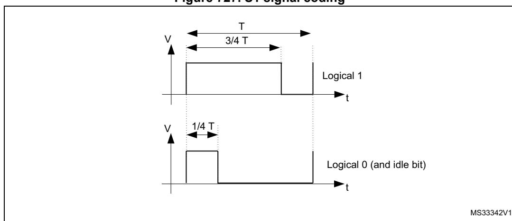

**Figure 727. S1 signal coding**

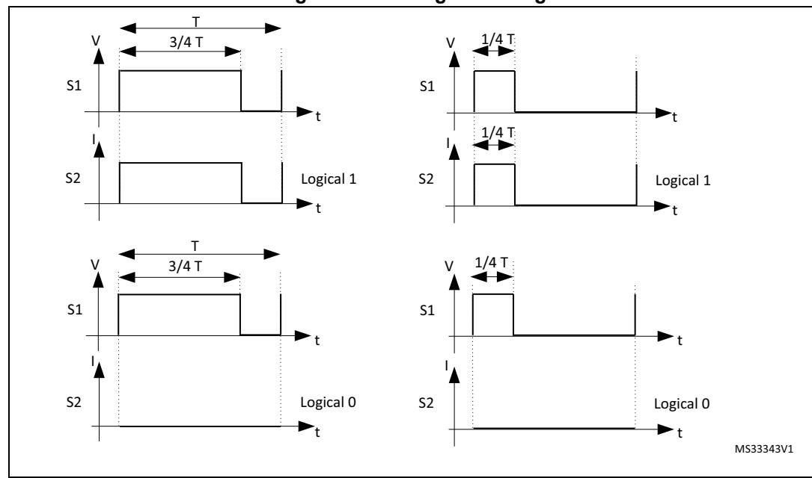

## **56.2 SWPMI main features**

The SWPMI module main features are the following (see *[Figure 56.3.4: SWP bus states](#page-4-0)*):

- Full-duplex communication mode
- Automatic SWP bus state management
- Automatic handling of Start of frame (SOF)
- Automatic handling of End of frame (EOF)
- Automatic handling of stuffing bits
- Automatic CRC-16 calculation and generation in transmission
- Automatic CRC-16 calculation and checking in reception
- 32-bit Transmit data register
- 32-bit Receive data register
- Multi software buffer mode for efficient DMA implementation and multi frame buffering
- Configurable bit-rate up to 2 Mbit/s
- Configurable interrupts
- CRC error, underrun, overrun flags
- Frame reception and transmission complete flags
- Slave resume detection flag
- Loopback mode for test purpose
- Embedded SWPMI\_IO transceiver compliant with ETSI TS 102 613 technical specification
- Dedicated mode to output SWPMI\_RX, SWPMI\_TX and SWPMI\_SUSPEND signals on GPIOs, in case of external transceiver connection

## **56.3 SWPMI functional description**

## **56.3.1 SWPMI block diagram**

MSv41963V1 **SWPMI** SWPMI\_IO swpmi\_pclk swpmi\_tx\_dma swpmi\_rx\_dma SWP bus swpmi\_gbl\_it 32-bit APB bus SWPMI\_RDR SWPMI\_TDR swpmi\_ker\_ck SWPMI\_SUSPEND Control / Status registers SWPMI core SWPMI\_RX SWPMI\_TX swpmi\_wkup

**Figure 729. SWPMI block diagram** 

Refer to the bit SWPSRC in *Section 9.7.19: RCC domain 2 kernel clock configuration register (RCC\_D2CCIP1R)* to select the swpmi\_ker\_ck (SWPMI core clock source).

*Note: In order to support the exit from Stop mode by a RESUME by slave, it is mandatory to select HSI for swpmi\_ker\_ck. If this feature is not required, swpmi\_pclk can be selected, and SWPMI must be disabled before entering the Stop mode.*

## **56.3.2 SWPMI pins and internal signals**

*[Table 462](#page-2-0)* lists the SWPMI slave inputs and output signals connected to package pins or balls, while *[Table 463](#page-3-0)* shows the internal SWPMI signals.

**Table 462. SWPMI input/output signals connected to package pins or balls** 

| Signal name                   | Signal type    | Description           |
|-------------------------------|-------------------|-----------------------|
| SWPMI_SUSPEND                 | Digital output | SWPMI suspend signal  |
| Digital SWPMI_TX output |                   | SWPMI transmit signal |

**Table 462. SWPMI input/output signals connected to package pins or balls** 

| Signal name                     | Signal type   | Description                 |  |  |  |  |
|---------------------------------|------------------|-----------------------------|--|--|--|--|
| SWPMI_RX                        | Digital input | SWPMI receive signal        |  |  |  |  |
| Input and SWPMI_IO output |                  | Internal SWPMI transceiver. |  |  |  |  |

**Table 463. SWPMI internal input/output signals** 

| Signal name                       | Signal type    | Description                |  |  |  |  |  |
|-----------------------------------|-------------------|----------------------------|--|--|--|--|--|
| swpmi_pclk                        | Digital input  | APB clock                  |  |  |  |  |  |
| swpmi_ker_ck                      | Digital input  | SWPMI kernel clock         |  |  |  |  |  |
| swpmi_wkup                        | Digital output | SWPMI wakeup signal        |  |  |  |  |  |
| swpmi_gbl_it                      | Digital output | SWPMI interrupt signal     |  |  |  |  |  |
| Digital swpmi_tx_dma output |                   | SWPMI DMA transmit request |  |  |  |  |  |
| swpmi_rx_dma                      | Digital output | SWPMI DMA receive request  |  |  |  |  |  |

## **56.3.3 SWP initialization and activation**

The initialization and activation will set the SWPMI\_IO state from low to high.

When using the internal transceiver, the procedure is the following:

- 1. Configure the SWP\_CLASS bit in SWPMI\_OR register according to the VDD voltage (3 V or 1.8 V),
- 2. Set SWPTEN in SWPMI\_CR register to enable the SWPMI\_IO transceiver and set the SWPMI\_IO to low level (SWP bus DEACTIVATED)
- 3. Wait for the RDYF flag in SWPMI\_SR register to be set (polling the flag or enabling the interrupt with RDYIE bit in SWPMI\_IER register),
- 4. Set SWPACT bit in SWPMI\_CR register to ACTIVATE the SWP i.e. to move from DEACTIVATED to SUSPENDED.

## **56.3.4 SWP bus states**

The SWP bus can have the following states: DEACTIVATED, SUSPENDED, ACTIVATED.

Several transitions are possible:

- ACTIVATE: transition from DEACTIVATED to SUSPENDED state,
- SUSPEND: transition from ACTIVATED to SUSPENDED state,
- RESUME by master: transition from SUSPENDED to ACTIVATED state initiated by the master,
- RESUME by slave: transition from SUSPENDED to ACTIVATED state initiated by the slave,
- DEACTIVATE: transition from SUSPENDED to DEACTIVATED state.

### **ACTIVATE**

During and just after reset, the SWPMI\_IO is configured in analog mode. Refer to *[Section 56.3.3: SWP initialization and activation](#page-3-1)* to activate the SWP bus.

### **SUSPEND**

The SWP bus stays in the ACTIVATED state as long as there is a communication with the slave, either in transmission or in reception. The SWP bus switches back to the SUSPENDED state as soon as there is no more transmission or reception activity, after 7 idle bits.

### **RESUME by master**

Once the SWPMI is enabled, the user can request a SWPMI frame transmission. The SWPMI first sends a transition sequence and 8 idle bits (RESUME by master) before starting the frame transmission. The SWP moves from the SUSPENDED to ACTIVATED state after the RESUME by master (refer to *[Figure 730: SWP bus states](#page-5-0)*).

### **RESUME by slave**

Once the SWPMI is enabled, the SWP can also move from the SUSPENDED to ACTIVATED state if the SWPMI receives a RESUME from the slave. The RESUME by slave sets the SRF flag in the SWPMI\_ISR register.

## **DEACTIVATE**

### **Deactivate request**

If no more communication is required, and if SWP is in the SUSPENDED mode, the user can request to switch the SWP to the DEACTIVATED mode by disabling the SWPMI peripheral. The software must set DEACT bit in the SWPMI\_CR register in order to request the DEACTIVATED mode. If no RESUME by slave is detected by SWPMI, the DEACTF flag is set in the SWPMI\_ISR register and the SWPACT bit is cleared in the SWPMI\_ICR register. In case a RESUME by slave is detected by the SWPMI while the software is setting DEACT bit, the SRF flag is set in the SWPMI\_ISR register, DEACTF is kept cleared, SWPACT is kept set and DEACT bit is cleared.

In order to activate SWP again, the software must clear DEACT bit in the SWPMI\_CR register before setting SWPACT bit.

### **Deactivate mode**

In order to switch the SWP to the DEACTIVATED mode immediately, ignoring any possible incoming RESUME by slave, the user must clear SWPACT bit in the SWPMI\_CR register.

*Note: In order to further reduce current consumption, configure the SWPMI\_IO port as output push pull low in GPIO controller and then clear the SWPTEN bit in SWPMI\_CR register (refer to Section 12: General-purpose I/Os (GPIO)).*

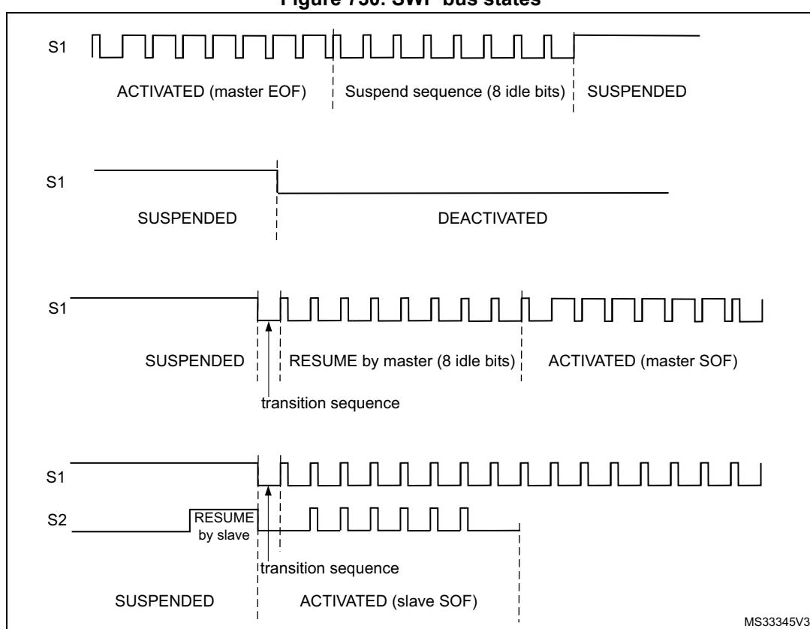

**Figure 730. SWP bus states**

## **56.3.5 SWPMI\_IO (internal transceiver) bypass**

A SWPMI\_IO (transceiver), compliant with ETSI TS 102 613 technical specification, is embedded in the microcontroller. Nevertheless, this is possible to bypass it by setting SWP\_TBYP bit in SWPMI\_OR register. In this case, the SWPMI\_IO is disabled and the SWPMI\_RX, SWPMI\_TX and SWPMI\_SUSPEND signals are available as alternate functions on three GPIOs (refer to "Pinouts and pin description" in product datasheet). This configuration is selected to connect an external transceiver.

*Note: In SWPMI\_IO bypass mode, SWPTEN bit in SWPMI\_CR register must be kept cleared.*

## **56.3.6 SWPMI bit rate**

The bit rate must be set in the SWPMI\_BRR register, according to the following formula:

FSWP = Fswpmi\_ker\_ck / ((BR[7:0]+1)x4)

*Note: The maximum bitrate is 2 Mbit/s.*

RM0399 Rev 4 2495/3556

## **56.3.7 SWPMI frame handling**

The SWP frame is composed of a Start of frame (SOF), a Payload from 1 to 30 bytes, a 16 bit CRC and an End of frame (EOF) (Refer to *[Figure 731: SWP frame structure](#page-6-0)*).

**Figure 731. SWP frame structure**

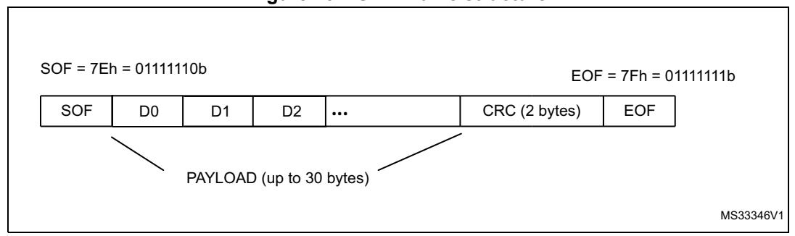

The SWPMI embeds one 32-bit data register for transmission (SWPMI\_TDR), and one 32 bit data register for reception (SWPMI\_RDR).

In transmission, the SOF insertion, the CRC calculation and insertion, and the EOF insertion are managed automatically by the SWPMI. The user only has to provide the Payload content and size. A frame transmission starts as soon as data is written into the SWPMI\_TDR register. Dedicated flags indicate an empty transmit data register and a complete frame transmission event.

In reception, the SOF deletion, the CRC calculation and checking, and the EOF deletion are managed automatically by the SWPMI. The user only has to read the Payload content and size. Dedicated flags indicate a full receive data register, a complete frame reception and possibly CRC error events.

The stuffing bits insertion (in transmission) and stuffing bits deletion (in reception) are managed automatically by the SWPMI core. These operations are transparent for the user.

## **56.3.8 Transmission procedure**

Before starting any frame transmission, the user must activate the SWP. Refer to *[Section 56.3.3: SWP initialization and activation](#page-3-1)*.

There are several possible software implementations for a frame transmission: No software buffer mode, Single software buffer mode, and Multi software buffer mode.

The software buffer usage requires the use of a DMA channel to transfer data from the software buffer in the RAM memory to the transmit data register in the SWPMI peripheral.

## **No software buffer mode**

This mode does not require the use of DMA. The SWP frame transmission handling is done by polling status flags in the main loop or inside the SWPMI interrupt routine. There is a 32 bit transmit data register (SWPMI\_TDR) in the SWPMI, thus writing to this register will trigger the transmission of up to 4 bytes.

The No software buffer mode is selected by clearing TXDMA bit in the SWPMI\_CR register.

The frame transmission is started by the first write to the SWPMI\_TDR register. The low significant byte of the first 32-bit word (bits [7:0]) written into the SWPMI\_TDR register) indicates the number of data bytes in the payload, and the 3 other bytes of this word must

contain the first 3 bytes of the payload (bits [15:8] contain the first byte of the payload, bits [23:16] the second byte and bits [31:24] the third byte). Then, the following writes to the SWPMI\_TDR register will only contain the following payload data bytes, up to 4 for each write.

*Note: The low significant byte of the first 32-bit word written into the SWPMI\_TDR register is coding the number of data bytes in the payload. This number could be from 1 to 30. Any other value in the low significant byte will be ignored and the transmission will not start.*

Writing to the SWPMI\_TDR register will induce the following actions:

- Send the transition sequence and 8 idle bits (RESUME by master) if the SWP bus state is SUPENDED (this will not happen if the SWP bus state is already ACTIVATED),
- Send a Start of frame (SOF),
- Send the payload according to the SWPMI\_TRD register content. If the number of bytes in the payload is greater than 3, the SWPMI\_TDR needs to be refilled by software, each time the TXE flag in the SWPMI\_ISR register is set, and as long as the TXBEF flag is not set in the SWPMI\_ISR register,
- Send the 16-bit CRC, automatically calculated by the SWPMI core,
- Send an End of frame (EOF).

The TXE flag is cleared automatically when the software is writing to the SWPMI\_TDR register.

Once the complete frame is sent, provided that no other frame transmission has been requested (i.e. SWPMI\_TDR has not been written again after the TXBEF flag setting), TCF and SUSP flags are set in the SWPMI\_ISR register 7 idle bits after the EOF transmission, and an interrupt is generated if TCIE bit is set in the SWPMI\_IER register (refer to *[Figure 732: SWPMI No software buffer mode transmission](#page-7-0)*).

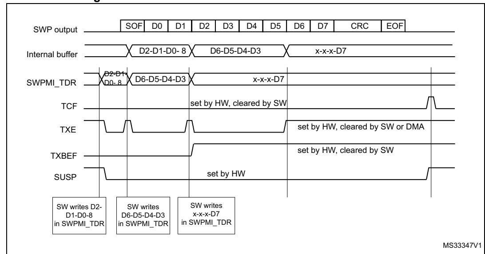

**Figure 732. SWPMI No software buffer mode transmission**

If another frame transmission is requested before the end of the EOF transmission, the TCF flag is not set and the frame will be consecutive to the previous one, with only one idle bit in between (refer to *[Figure 733: SWPMI No software buffer mode transmission, consecutive](#page-8-0)  [frames](#page-8-0)*).

RM0399 Rev 4 2497/3556

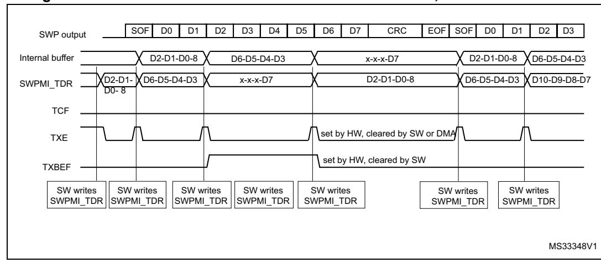

**Figure 733. SWPMI No software buffer mode transmission, consecutive frames**

## **Single software buffer mode**

This mode allows to transmit a complete SWP frame without a CPU intervention, using the DMA. The DMA will refill the 32-bit SWPMI\_TDR register, and the software can poll the end of the frame transmission using the SWPMI\_TXBEF flag.

The Single software buffer mode is selected by setting TXDMA bit and clearing TXMODE bit in the SWPMI\_CR register.

The DMA channel or stream must be configured in following mode (refer to DMA section):

- memory to memory mode disabled,
- memory increment mode enabled,
- memory size set to 32-bit,
- peripheral size set to 32-bit,
- peripheral increment mode disabled,
- circular mode disabled,
- data transfer direction set to read from memory.
- the number of words to be transfered must be set according to the SWP frame length,
- the source address is the SWP frame buffer in RAM,
- the destination address is the SWPMI\_TDR register.

## Then the user must:

- 1. Set TXDMA bit in the SWPMI\_CR register,
- 2. Set TXBEIE bit in the SWPMI\_IER register,
- 3. Fill the buffer in the RAM memory (with the number of data bytes in the payload on the least significant byte of the first word),
- 4. Enable stream or channel in DMA module to start DMA transfer and frame transmission.

A DMA request is issued by SWPMI when TXE flag in SWPMI\_ISR is set. The TXE flag is cleared automatically when the DMA is writing to the SWPMI\_TDR register.

In the SWPMI interrupt routine, the user must check TXBEF bit in the SWPMI\_ISR register. If it is set, and if another frame needs to be transmitted, the user must:

- 1. Disable stream or channel in DMA module
- 2. Update the buffer in the RAM memory with the content of the next frame to be sent
- 3. Configure the total number of words to be transferred in DMA module
- 4. Enable stream or channel in DMA module to start next frame transmission
- 5. Set CTXBEF bit in the SWPMI\_ICR register to clear the TXBEF flag

## **Multi software buffer mode**

This mode allows to work with several frame buffers in the RAM memory, in order to ensure a continuous transmission, keeping a very low CPU load, and allowing more latency for buffer update by software thanks to the DMA. The software can check the DMA counters at any time and update SWP frames accordingly in the RAM memory.

The Multi software buffer mode must be used in combination with DMA in circular mode.

Each transmission buffer in the RAM memory must have a fixed length of eight 32-bit words, whatever the number of bytes in the SWP frame payload. The transmission buffers in the RAM memory must be filled by the software, keeping an offset of 8 between two consecutive ones. The first data byte of the buffer is the number of bytes of the frame payload. See the buffer example in *[Figure 734: SWPMI Multi software buffer mode](#page-10-0)  [transmission](#page-10-0)*

The Multi software buffer mode is selected by setting both TXDMA and TXMODE bits in SWPMI\_CR register.

For example, in order to work with 4 transmission buffers, the user must configure the DMA as follows:

The DMA channel or stream must be configured in following mode (refer to DMA section):

- memory to memory mode disabled,
- memory increment mode enabled,
- memory size set to 32-bit,
- peripheral size set to 32-bit,
- peripheral increment mode disabled,
- circular mode enabled,
- data transfer direction set to read from memory,
- the number of words to be transfered must be set to 32 (8 words per buffer),
- the source address is the buffer1 in RAM,
- the destination address is the SWPMI\_TDR register.

Then, the user must:

- 1. Set TXDMA in the SWPMI\_CR register
- 2. Set TXBEIE in the SWPMI\_IER register
- 3. Fill buffer1, buffer2, buffer3 and buffer4 in the RAM memory (with the number of data bytes in the payload on the least significant byte of the first word)
- 4. Enable stream or channel in DMA module to start DMA.

In the SWPMI interrupt routine, the user must check TXBEF bit in the SWPMI\_ISR register. If it is set, the user must set CTXBEF bit in SWPMI\_ICR register to clear TXBEF flag and the user can update buffer1 in the RAM memory.

In the next SWPMI interrupt routine occurrence, the user will update buffer2, and so on.

The Software can also read the DMA counter (number of data to transfer) in the DMA registers in order to retrieve the frame which has already been transferred from the RAM memory and transmitted. For example, if the software works with 4 transmission buffers, and if the DMA counter equals 17, it means that two buffers are ready for updating in the RAM area. This is useful in case several frames are sent before the software can handle the SWPMI interrupt. If this happens, the software will have to update several buffers.

When there are no more frames to transmit, the user must disable the circular mode in the DMA module. The transmission will stop at the end of the buffer4 transmission.

If the transmission needs to stop before (for example at the end of buffer2), the user must set the low significant byte of the first word to 0 in buffer3 and buffer4.

TXDMA bit in the SWPMI\_CR register will be cleared by hardware as soon as the number of data bytes in the payload is read as 0 in the least significant byte of the first word.

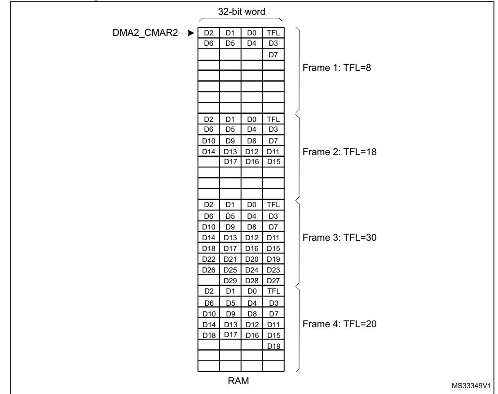

**Figure 734. SWPMI Multi software buffer mode transmission**

## **56.3.9 Reception procedure**

Before starting any frame reception, the user must activate the SWP (refer to *[Section 56.3.3: SWP initialization and activation](#page-3-1)*.

Once SWPACT bit is set in the SWPMI\_CR register, a RESUME from slave state sets the SRF flag in the SWPMI\_ISR register and automatically enables the SWPMI for the frame reception.

If the SWP bus is already in the ACTIVATED state (for example because a frame transmission is ongoing), the SWPMI core does not need any RESUME by slave state, and the reception can take place immediately.

There are several possible software implementations for a frame reception:

- No software buffer mode,
- Single software buffer mode,
- Multi software buffer mode.

The software buffer usage requires the use of a DMA channel to transfer data from the receive data register in the SWPMI peripheral to the software buffer in the RAM memory.

### **No software buffer mode**

This mode does not require the use of DMA. The SWP frame reception handling is done by polling status flags in the main loop or inside the SWPMI interrupt routine. There is a 32-bit receive data register (SWPMI\_RDR) in the SWPMI, allowing to receive up to 4 bytes before reading this register.

The No software buffer mode is selected by resetting RXDMA bit in the SWPMI\_CR register.

Once a Start of frame (SOF) is received, the following bytes (payload) are stored in the SWPMI\_RDR register. Once the SWPMI\_RDR is full, the RXNE flag is set in SWPMI\_ISR and an interrupt is generated if RIE bit is set in SWPMI\_IER register. The user can read the SWPMI\_RDR register and the RXNE flag is cleared automatically when the software is reading the SWPMI\_RDR register.

Once the complete frame has been received, including the CRC and the End of frame (EOF), both RXNE and RXBFF flags are set in the SWPMI\_ISR register. The user must read the last byte(s) of the payload in the SWPMI\_RDR register and set CRXBFF flag in SWPMI\_ICR in order to clear the RXBFF flag. The number of data bytes in the payload is available in the SWPMI\_RFL register. Again, the RXNE flag is reset automatically when the software is reading the SWPMI\_RDR register (refer to *[Figure 735: SWPMI No software](#page-12-0)  [buffer mode reception](#page-12-0)*).

Reading the SWPMI\_RDR register while RXNE is cleared will return 0.

RM0399 Rev 4 2501/3556

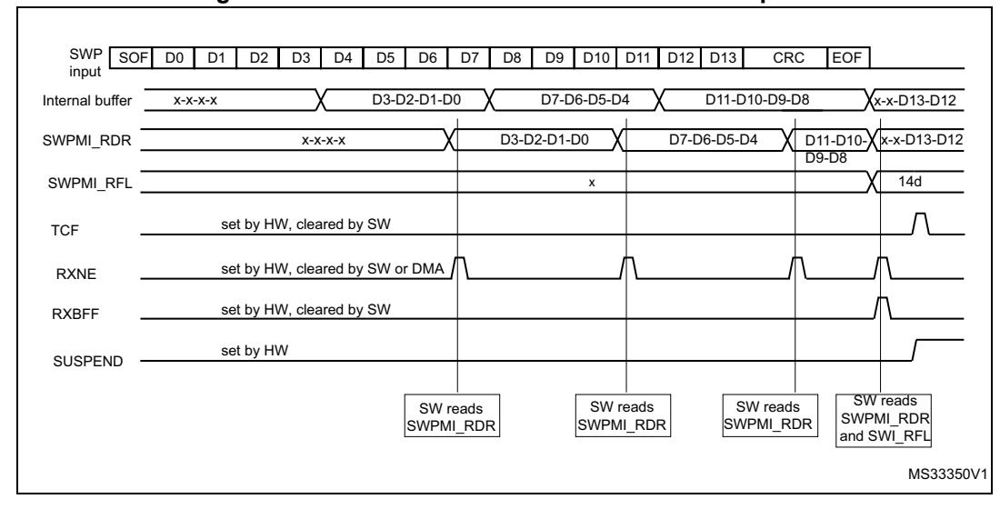

**Figure 735. SWPMI No software buffer mode reception**

### **Single software buffer mode**

This mode allows to receive a complete SWP frame without any CPU intervention using the DMA. The DMA transfers received data from the 32-bit SWPMI\_RDR register to the RAM memory, and the software can poll the end of the frame reception using the SWPMI\_RBFF flag.

The Single software buffer mode is selected by setting RXDMA bit and clearing RXMODE bit in the SWPMI\_CR register.

The DMA must be configured as follows:

The DMA channel or stream must be configured in following mode (refer to DMA section):

- memory to memory mode disabled,
- memory increment mode enabled,
- memory size set to 32-bit,
- peripheral size set to 32-bit,
- peripheral increment mode disabled,
- circular mode disabled,
- data transfer direction set to read from peripheral,
- the number of words to be transfered must be set to 8,
- the source address is the SWPMI\_RDR register,
- the destination address is the SWP frame buffer in RAM.

### Then the user must:

- 1. Set RXDMA bit in the SWPMI\_CR register
- 2. Set RXBFIE bit in the SWPMI\_IER register
- 3. Enable stream or channel in DMA module.

A DMA request is issued by SWPMI when RXNE flag is set in SWPMI\_ISR. The RXNE flag is cleared automatically when the DMA is reading the SWPMI\_RDR register.

In the SWPMI interrupt routine, the user must check RXBFF bit in the SWPMI\_ISR register. If it is set, the user must:

- 1. Disable stream or channel in DMA module
- 2. Read the number of bytes in the received frame payload in the SWPMI\_RFL register
- 3. Read the frame payload in the RAM buffer
- 4. Enable stream or channel in DMA module
- 5. Set CRXBFF bit in the SWPMI\_ICR register to clear RXBFF flag (refer to *Figure 736:* SWPMI single software buffer mode reception).

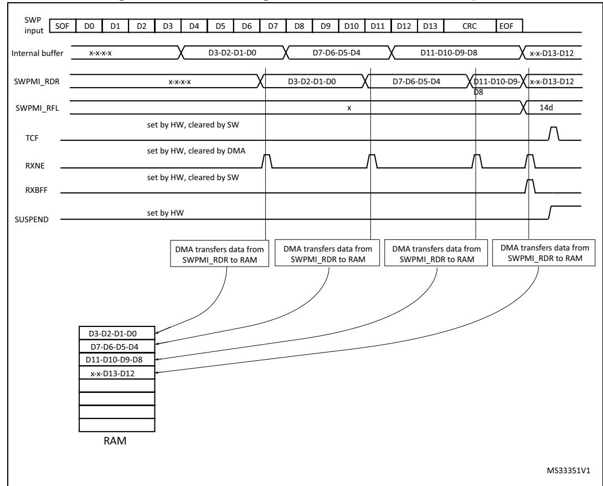

Figure 736. SWPMI single software buffer mode reception

### Multi software buffer mode

This mode allows to work with several frame buffers in the RAM memory, in order to ensure a continuous reception, keeping a very low CPU load, using the DMA. The frame payloads are stored in the RAM memory, together with the frame status flags. The software can check the DMA counters and status flags at any time to handle the received SWP frames in the RAM memory.

The Multi software buffer mode must be used in combination with the DMA in circular mode.

The Multi software buffer mode is selected by setting both RXDMA and RXMODE bits in SWPMI\_CR register.

RM0399 Rev 4 2503/3556

In order to work with n reception buffers in RAM, the DMA channel or stream must be configured in following mode (refer to DMA section):

- memory to memory mode disabled,
- memory increment mode enabled,
- memory size set to 32-bit,
- peripheral size set to 32-bit,
- peripheral increment mode disabled,
- circular mode enabled,
- data transfer direction set to read from peripheral,
- the number of words to be transfered must be set to 8 x n (8 words per buffer),
- the source address is the SWPMI\_TDR register,
- the destination address is the buffer1 address in RAM

### Then the user must:

- 1. Set RXDMA in the SWPMI\_CR register
- 2. Set RXBFIE in the SWPMI\_IER register
- 3. Enable stream or channel in the DMA module.

In the SWPMI interrupt routine, the user must check RXBFF in the SWPMI\_ISR register. If it is set, the user must set CRXBFF bit in the SWPMI\_ICR register to clear RXBFF flag and the user can read the first frame payload received in the first buffer (at the RAM address set in DMA2\_CMAR1).

The number of data bytes in the payload is available in bits [23:16] of the last 8th word.

In the next SWPMI interrupt routine occurrence, the user will read the second frame received in the second buffer (address set in DMA2\_CMAR1 + 8), and so on (refer to *[Figure 737: SWPMI Multi software buffer mode reception](#page-15-0)*).

In case the application software cannot ensure to handle the SMPMI interrupt before the next frame reception, each buffer status is available in the most significant byte of the 8th buffer word:

- The CRC error flag (equivalent to RXBERF flag in the SWPMI\_ISR register) is available in bit 24 of the 8th word. Refer to *[Section 56.3.10: Error management](#page-15-1)* for an CRC error description.
- The receive overrun flag (equivalent to RXOVRF flag in the SWPMI\_ISR register) is available in bit 25 of the 8th word. Refer to *[Section 56.3.10: Error management](#page-15-1)* for an overrun error description.
- The receive buffer full flag (equivalent to RXBFF flag in the SWPMI\_ISR register) is available in bit 26 of the 8th word.

In case of a CRC error, both RXBFF and RXBERF flags are set, thus bit 24 and bit 26 are set.

In case of an overrun, an overrun flag is set, thus bit 25 is set. The receive buffer full flag is set only in case of an overrun during the last word reception; then, both bit 25 and bit 26 are set for the current and the next frame reception.

The software can also read the DMA counter (number of data to transfer) in the DMA registers in order to retrieve the frame which has already been received and transferred into the RAM memory through DMA. For example, if the software works with 4 reception buffers,

and if the DMA counter equals 17, it means that two buffers are ready for reading in the RAM area.

In Multi software buffer reception mode, if the software is reading bits 24, 25 and 26 of the 8th word, it does not need to clear RXBERF, RXOVRF and RXBFF flags after each frame reception.

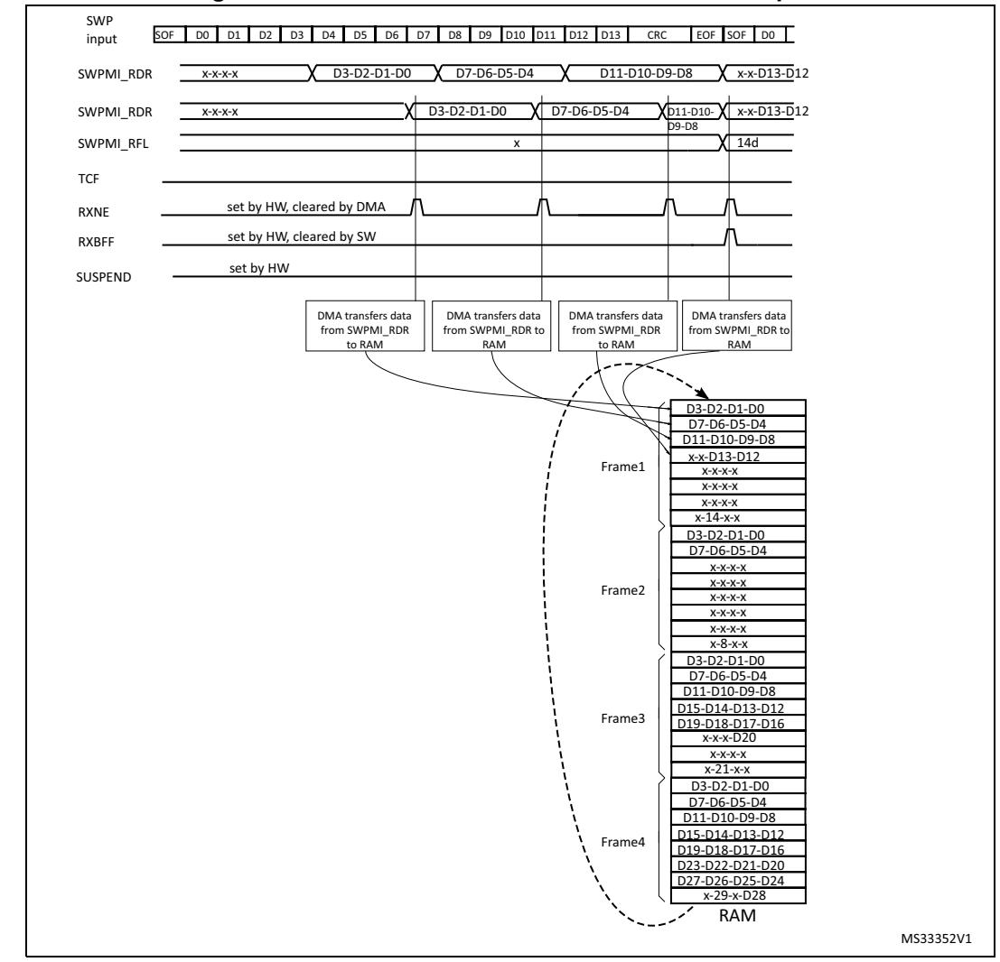

Figure 737. SWPMI Multi software buffer mode reception

## 56.3.10 Error management

## Underrun during payload transmission

During the transmission of the frame payload, a transmit underrun is indicated by the TXUNRF flag in the SWPMI\_ISR register. An interrupt is generated if TXBUNREIE bit is set in the SWPMI\_IER register.

If a transmit underrun occurs, the SWPMI stops the payload transmission and sends a corrupted CRC (the first bit of the first CRC byte sent is inverted), followed by an EOF. If DMA is used, TXDMA bit in the SWPMI CR register is automatically cleared.

Any further write to the SWPMI\_TDR register while TXUNRF is set will be ignored. The user must set CTXUNRF bit in the SWPMI\_ICR register to clear TXUNRF flag.

### Overrun during payload reception

During the reception of the frame payload, a receive overrun is indicated by RXOVRF flag in the SWPMI\_ISR register. If a receive overrun occurs, the SWPMI does not update SWPMI\_RDR with the incoming data. The incoming data will be lost.

The reception carries on up to the EOF and, if the overrun condition disappears, the RXBFF flag is set. When RXBFF flag is set, the user can check the RXOVRF flag. The user must set CRXOVRF bit in the SWPMI\_ICR register to clear RXBOVRF flag.

If the user wants to detect the overrun immediately, RXBOVREIE bit in the SWPMI\_IER register can be set in order to generate an interrupt as soon as the overrun occurs.

The RXOVRF flag is set at the same time as the RXNE flag, two SWPMI\_RDR reads after the overrun event occurred. It indicates that at least one received byte was lost, and the loaded word in SWPMI\_RDR contains the bytes received just before the overrun.

In Multi software buffer mode, if RXOVRF flag is set for the last word of the received frame, then the overrun bit (bit 25 of the 8th word) is set for both the current and the next frame.

### CRC error during payload reception

Once the two CRC bytes have been received, if the CRC is wrong, the RXBERF flag in the SWPMI\_ISR register is set after the EOF reception. An interrupt is generated if RXBEIE bit in the SWPMI\_IER register is set (refer to Figure 738: SWPMI single buffer mode reception with CRC error). The user must set CRXBERF bit in SWPMI\_ICR to clear RXBERF flag.

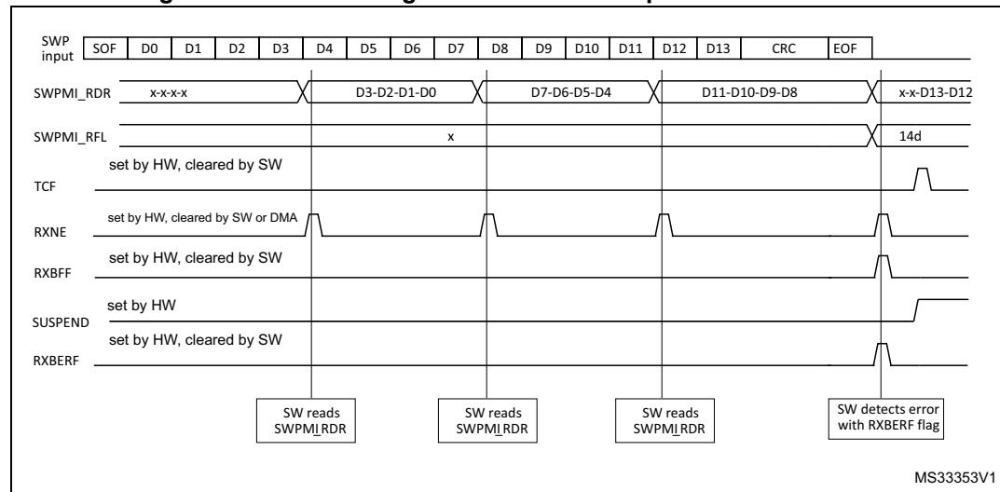

Figure 738. SWPMI single buffer mode reception with CRC error

### Missing or corrupted stuffing bit during payload reception

When a stuffing bit is missing or is corrupted in the payload, RXBERF and RXBFF flags are set in SWPMI\_ISR after the EOF reception.

## **Corrupted EOF reception**

Once an SOF has been received, the SWPMI accumulates the received bytes until the reception of an EOF (ignoring any possible SOF). Once an EOF has been received, the SWPMI is ready to start a new frame reception and waits for an SOF.

In case of a corrupted EOF, RXBERF and RXBFF flags will bet set in the SWPMI\_ISR register after the next EOF reception.

*Note: In case of a corrupted EOF reception, the payload reception carries on, thus the number of bytes in the payload might get the value 31 if the number of received bytes is greater than 30. The number of bytes in the payload is read in the SWPMI\_RFL register or in bits [23:16] of the 8th word of the buffer in the RAM memory, depending on the operating mode.*

## **56.3.11 Loopback mode**

The loopback mode can be used for test purposes. The user must set LPBK bit in the SWPMI\_CR register in order to enable the loopback mode.

When the loopback mode is enabled, SWPMI\_TX and SWPMI\_RX signals are connected together. As a consequence, all frames sent by the SWPMI will be received back.

## **56.4 SWPMI low-power modes**

**Table 464. Effect of low-power modes on SWPMI**

| Mode    | Description                                                                                                                                                             |  |  |  |  |  |  |  |
|---------|-------------------------------------------------------------------------------------------------------------------------------------------------------------------------|--|--|--|--|--|--|--|
| Sleep   | No effect. SWPMI interrupts cause the device to exit the Sleep mode.                                                                                                    |  |  |  |  |  |  |  |
| Stop    | A RESUME from SUSPENDED mode issued by the slave can wake up the device from Stop mode if the swpmi_ker_ck is HSI (refer to Section 56.3.1: SWPMI block diagram). |  |  |  |  |  |  |  |
| Standby | The SWPMI is stopped.                                                                                                                                                   |  |  |  |  |  |  |  |

## **56.5 SWPMI interrupts**

All SWPMI interrupts are connected to the NVIC.

To enable the SWPMI interrupt, the following sequence is required:

- 1. Configure and enable the SWPMI interrupt channel in the NVIC
- 2. Configure the SWPMI to generate SWPMI interrupts (refer to the SWPMI\_IER register).

**Table 465. Interrupt control bits** 

| Interrupt event                  | Event flag      | Enable control bit | Exit the Sleep mode | Exit the Stop mode | Exit the Standby mode |  |
|----------------------------------|-----------------|-----------------------|---------------------------|--------------------------|-----------------------------|--|
| Receive buffer full              | RXBFF RXBFIE |                       | yes                       | no                       | no                          |  |
| Transmit buffer empty            | TXBEF           | TXBEIE                | yes                       | no                       | no                          |  |
| Receive buffer error (CRC error) | RXBERF          | RXBEIE                | yes no                 |                          | no                          |  |
| Receive buffer overrun           | RXOVRF          | RXBOVEREIE            | yes                       | no                       | no                          |  |
| Transmit buffer underrun         | TXUNRF          | TXBUNREIE             | yes                       | no                       | no                          |  |
| Receive data register not empty  | RXNE            | RIE                   | yes                       | no                       | no                          |  |
| Transmit data register full      | TXE             | TIE                   | yes                       | no                       | no                          |  |
| Transfer complete flag           | TCF             | TCIE                  | yes                       | no                       | no                          |  |
| Slave resume flag                | SRF             | SRIE                  | yes                       | yes (1)                  | no                          |  |
| Transceiver ready flag           | RDYF            | RDYIE                 | yes                       | no                       | no                          |  |

1. If HSI is selected for swpmi\_ker\_ck.

## 56.6 SWPMI registers

Refer to *Section 1.2* of the reference manual for a list of abbreviations used in register descriptions.

The peripheral registers can only be accessed by words (32-bit).

## 56.6.1 SWPMI configuration/control register (SWPMI CR)

Address offset: 0x00

Reset value: 0x0000 0000

| 31   | 30   | 29   | 28   | 27         | 26    | 25   | 24   | 23   | 22   | 21         | 20   | 19         | 18         | 17    | 16    |
|------|------|------|------|------------|-------|------|------|------|------|------------|------|------------|------------|-------|-------|
| Res. | Res. | Res. | Res. | Res.       | Res.  | Res. | Res. | Res. | Res. | Res.       | Res. | Res.       | Res.       | Res.  | Res.  |
|      |      |      |      |            |       |      |      |      |      |            |      |            |            |       |       |
| 15   | 14   | 13   | 12   | 11         | 10    | 9    | 8    | 7    | 6    | 5          | 4    | 3          | 2          | 1     | 0     |
| Res. | Res. | Res. | Res. | SWPT EN | DEACT | Res. | Res. | Res. | Res. | SWP ACT | LPBK | TXMOD E | RXMO DE | TXDMA | RXDMA |
|      |      |      |      | rw         | rw    |      |      |      |      | rw         | rw   | rw         | rw         | rw    | rw    |

Bits 31:12 Reserved, must be kept at reset value.

Bit 11 **SWPTEN**: Single wire protocol master transceiver enable

This bit is used to enable the transceiver and control the SWPMI\_IO with SWPMI (refer to Section 56.3.3: SWP initialization and activation).

- 0: SPWMI\_IO pin is controlled by GPIO controller
- 1: SWPMI\_IO transceiver is controlled by SWPMI

Bit 10 **DEACT**: Single wire protocol master interface deactivate

This bit is used to request the SWP DEACTIVATED state. Setting this bit has the same effect as clearing the SWPACT, except that a possible incoming RESUME by slave will keep the SWP in the ACTIVATED state.

- Bits 9:6 Reserved, must be kept at reset value.
  - Bit 5 SWPACT: Single wire protocol master interface activate

This bit is used to activate the SWP bus (refer to Section 56.3.3: SWP initialization and activation).

- 0: SWPMI\_IO is pulled down to ground, SWP bus is switched to DEACTIVATED state
- 1: SWPMI IO is released, SWP bus is switched to SUSPENDED state

To be able to set SWPACT bit, DEACT bit must be have been cleared previously.

Bit 4 LPBK: Loopback mode enable

This bit is used to enable the loopback mode

- 0: Loopback mode is disabled
- 1: Loopback mode is enabled

Note: This bit cannot be written while SWPACT bit is set.

Bit 3 TXMODE: Transmission buffering mode

This bit is used to choose the transmission buffering mode. This bit is relevant only when TXDMA bit is set (refer to *Table 466: Buffer modes selection for transmission/reception*).

- 0: SWPMI is configured in Single software buffer mode for transmission
- 1: SWPMI is configured in Multi software buffer mode for transmission.

Note: This bit cannot be written while SWPACT bit is set.

RM0399 Rev 4 2509/3556

#### Bit 2 **RXMODE**: Reception buffering mode

This bit is used to choose the reception buffering mode. This bit is relevant only when TXDMA bit is set (refer to *[Table 466: Buffer modes selection for transmission/reception](#page-20-0)*).

0: SWPMI is configured in Single software buffer mode for reception

1: SWPMI is configured in Multi software buffer mode for reception.

*Note: This bit cannot be written while SWPACT bit is set.*

#### Bit 1 **TXDMA**: Transmission DMA enable

This bit is used to enable the DMA mode in transmission

0: DMA is disabled for transmission

1: DMA is enabled for transmission

*Note: TXDMA is automatically cleared if the payload size of the transmitted frame is given as 0x00 (in the least significant byte of TDR for the first word of a frame). TXDMA is also automatically cleared on underrun events (when TXUNRF flag is set in the SWP\_ISR register)*

### Bit 0 **RXDMA**: Reception DMA enable

This bit is used to enable the DMA mode in reception

0: DMA is disabled for reception

1: DMA is enabled for reception

**Table 466. Buffer modes selection for transmission/reception** 

| Buffer mode   | No software buffer | Single software buffer | Multi software buffer |
|---------------|--------------------|------------------------|-----------------------|
| RXMODE/TXMODE | x                  | 0                      | 1                     |
| RXDMA/TXDMA   | 0                  | 1                      | 1                     |

## **56.6.2 SWPMI Bitrate register (SWPMI\_BRR)**

Address offset: 0x04

Reset value: 0x0000 0001

| 31   | 30   | 29   | 28   | 27   | 26   | 25   | 24   | 23      | 22   | 21   | 20   | 19   | 18   | 17   | 16   |
|------|------|------|------|------|------|------|------|---------|------|------|------|------|------|------|------|
| Res. | Res. | Res. | Res. | Res. | Res. | Res. | Res. | Res.    | Res. | Res. | Res. | Res. | Res. | Res. | Res. |
|      |      |      |      |      |      |      |      |         |      |      |      |      |      |      |      |
| 15   | 14   | 13   | 12   | 11   | 10   | 9    | 8    | 7       | 6    | 5    | 4    | 3    | 2    | 1    | 0    |
| Res. | Res. | Res. | Res. | Res. | Res. | Res. | Res. | BR[7:0] |      |      |      |      |      |      |      |
|      |      |      |      |      |      |      |      | rw      | rw   | rw   | rw   | rw   | rw   | rw   | rw   |

Bits 31:8 Reserved, must be kept at reset value.

#### Bits 7:0 **BR[7:0]**: Bitrate prescaler

This field must be programmed to set SWP bus bitrate, taking into account the Fswpmi\_ker\_ck programmed in the RCC (Reset and Clock Control), according to the following formula:

FSWP= Fswpmi\_ker\_ck / ((BR[7:0]+1)x4)

*Note: The programmed bitrate must stay within the following range: from 100 kbit/s up to 2 Mbit/s.*

*BR[7:0] cannot be written while SWPACT bit is set in the SWPMI\_CR register.*

## 56.6.3 SWPMI Interrupt and Status register (SWPMI\_ISR)

Address offset: 0x0C

Reset value: 0x0000 02C2

| 31   | 30   | 29   | 28   | 27   | 26         | 25   | 24   | 23   | 22   | 21   | 20         | 19         | 18         | 17    | 16    |
|------|------|------|------|------|------------|------|------|------|------|------|------------|------------|------------|-------|-------|
| Res. | Res. | Res. | Res. | Res. | Res.       | Res. | Res. | Res. | Res. | Res. | Res.       | Res.       | Res.       | Res.  | Res.  |
|      |      |      |      |      |            |      |      |      |      |      |            |            |            |       |       |
| 15   | 14   | 13   | 12   | 11   | 10         | 9    | 8    | 7    | 6    | 5    | 4          | 3          | 2          | 1     | 0     |
| Res. | Res. | Res. | Res. | RDYF | DEACT F | SUSP | SRF  | TCF  | TXE  | RXNE | TXUNR F | RXOVR F | RXBER F | TXBEF | RXBFF |
|      |      |      |      |      |            |      |      |      |      |      |            |            |            |       |       |

Bits 31:12 Reserved, must be kept at reset value.

### Bit 11 RDYF: transceiver ready flag

This bit is set by hardware as soon as transceiver is ready. After setting the SWPTEN bit in SWPMI\_CR register to enable the SWPMI\_IO transceiver, software must wait for this flag to be set before setting the SWPACT bit to activate the SWP bus.

0: transceiver not ready
1: transceiver ready

### Bit 10 **DEACTF**: DEACTIVATED flag

This bit is a status flag, acknowledging the request to enter the DEACTIVATED mode.

0: SWP bus is in ACTIVATED or SUSPENDED state

1: SWP bus is in DEACTIVATED state

If a RESUME by slave state is detected by the SWPMI while DEACT bit is set by software, the SRF flag will be set, DEACTF will not be set and SWP will move in ACTIVATED state.

### Bit 9 SUSP: SUSPEND flag

This bit is a status flag, reporting the SWP bus state

0: SWP bus is in ACTIVATED state

1: SWP bus is in SUSPENDED or DEACTIVATED state

#### Bit 8 SRF: Slave resume flag

This bit is set by hardware to indicate a RESUME by slave detection. It is cleared by software, writing 1 to CSRF bit in the SWPMI\_ICR register.

0: No Resume by slave state detected

1: A Resume by slave state has been detected during the SWP bus SUSPENDED state

### Bit 7 **TCF**: Transfer complete flag

This flag is set by hardware as soon as both transmission and reception are completed and SWP is switched to the SUSPENDED state. It is cleared by software, writing 1 to CTCF bit in the SWPMI\_ICR register.

0: Transmission or reception is not completed

1: Both transmission and reception are completed and SWP is switched to the SUSPENDED state

### Bit 6 TXE: Transmit data register empty

This flag indicates the transmit data register status

0: Data written in transmit data register SWPMI\_TDR is not transmitted yet

1: Data written in transmit data register SWPMI\_TDR has been transmitted and SWPMI\_TDR can be written to again

RM0399 Rev 4 2511/3556

#### Bit 5 RXNE: Receive data register not empty

This flag indicates the receive data register status

- 0: Data is not received in the SWPMI RDR register
- 1: Received data is ready to be read in the SWPMI RDR register

#### Bit 4 TXUNRF: Transmit underrun error flag

This flag is set by hardware to indicate an underrun during the payload transmission i.e. SWPMI\_TDR has not been written in time by the software or the DMA. It is cleared by software, writing 1 to the CTXUNRF bit in the SWPMI\_ICR register.

- 0: No underrun error in transmission
- 1: Underrun error in transmission detected

#### Bit 3 RXOVRF: Receive overrun error flag

This flag is set by hardware to indicate an overrun during the payload reception, i.e. SWPMI\_RDR has not be read in time by the software or the DMA. It is cleared by software, writing 1 to CRXOVRF bit in the SWPMI ICR register.

- 0: No overrun in reception
- 1: Overrun in reception detected

### Bit 2 RXBERF: Receive CRC error flag

This flag is set by hardware to indicate a CRC error in the received frame. It is set synchronously with RXBFF flag. It is cleared by software, writing 1 to CRXBERF bit in the SWPMI ICR register.

- 0: No CRC error in reception
- 1: CRC error in reception detected

### Bit 1 TXBEF: Transmit buffer empty flag

This flag is set by hardware to indicate that no more SWPMI TDR update is required to complete the current frame transmission. It is cleared by software, writing 1 to CTXBEF bit in the SWPMI ICR register.

- 0: Frame transmission buffer no yet emptied
- 1: Frame transmission buffer has been emptied

### Bit 0 RXBFF: Receive buffer full flag

This flag is set by hardware when the final word for the frame under reception is available in SWPMI RDR. It is cleared by software, writing 1 to CRXBFF bit in the SWPMI ICR register.

- 0: The last word of the frame under reception has not vet arrived in SWPMI\_RDR
- 1: The last word of the frame under reception has arrived in SWPMI RDR

#### 56.6.4 SWPMI Interrupt Flag Clear register (SWPMI\_ICR)

Address offset: 0x10

Reset value: 0x0000 0000

| 31   | 30   | 29   | 28   | 27        | 26   | 25   | 24    | 23    | 22   | 21   | 20          | 19          | 18          | 1/         | 16         |
|------|------|------|------|-----------|------|------|-------|-------|------|------|-------------|-------------|-------------|------------|------------|
| Res. | Res. | Res. | Res. | Res.      | Res. | Res. | Res.  | Res.  | Res. | Res. | Res.        | Res.        | Res.        | Res.       | Res.       |
|      |      |      |      |           |      |      |       |       |      |      |             |             |             |            |            |
| 15   | 14   | 13   | 12   | 11        | 10   | 9    | 8     | 7     | 6    | 5    | 4           | 3           | 2           | 1          | 0          |
| Res. | Res. | Res. | Res. | CRDY F | Res. | Res. | CSRF  | CTCF  | Res. | Res. | CTXUN RF | CRXOV RF | CRXBE RF | CTXBE F | CRXBF F |
|      |      |      |      | rc_w1     |      |      | rc_w1 | rc_w1 |      |      | rc_w1       | rc_w1       | rc_w1       | rc_w1      | rc_w1      |

Bits 31:12 Reserved, must be kept at reset value.

Bit 11 **CRDYF**: Clear transceiver ready flag

Writing 1 to this bit clears the RDYF flag in the SWPMI\_ISR register Writing 0 to this bit does not have any effect

Bits 10:9 Reserved, must be kept at reset value.

Bit 8 **CSRF**: Clear slave resume flag

Writing 1 to this bit clears the SRF flag in the SWPMI\_ISR register Writing 0 to this bit does not have any effect

Bit 7 **CTCF**: Clear transfer complete flag

Writing 1 to this bit clears the TCF flag in the SWPMI\_ISR register Writing 0 to this bit does not have any effect

Bits 6:5 Reserved, must be kept at reset value.

Bit 4 **CTXUNRF**: Clear transmit underrun error flag

Writing 1 to this bit clears the TXUNRF flag in the SWPMI\_ISR register

Writing 0 to this bit does not have any effect

Bit 3 **CRXOVRF**: Clear receive overrun error flag

Writing 1 to this bit clears the RXBOCREF flag in the SWPMI\_ISR register

Writing 0 to this bit does not have any effect

Bit 2 **CRXBERF**: Clear receive CRC error flag

Writing 1 to this bit clears the RXBERF flag in the SWPMI\_ISR register

Writing 0 to this bit does not have any effect

Bit 1 **CTXBEF**: Clear transmit buffer empty flag

Writing 1 to this bit clears the TXBEF flag in the SWPMI\_ISR register

Writing 0 to this bit does not have any effect

Bit 0 **CRXBFF**: Clear receive buffer full flag

Writing 1 to this bit clears the RXBFF flag in the SWPMI\_ISR register

Writing 0 to this bit does not have any effect

## **56.6.5 SWPMI Interrupt Enable register (SMPMI\_IER)**

Address offset: 0x14

Reset value: 0x0000 0000

| 31   | 30   | 29   | 28   | 27    | 26   | 25   | 24   | 23   | 22   | 21   | 20           | 19           | 18         | 17         | 16     |
|------|------|------|------|-------|------|------|------|------|------|------|--------------|--------------|------------|------------|--------|
| Res. | Res. | Res. | Res. | Res.  | Res. | Res. | Res. | Res. | Res. | Res. | Res.         | Res.         | Res.       | Res.       | Res.   |
|      |      |      |      |       |      |      |      |      |      |      |              |              |            |            |        |
| 15   | 14   | 13   | 12   | 11    | 10   | 9    | 8    | 7    | 6    | 5    | 4            | 3            | 2          | 1          | 0      |
| Res. | Res. | Res. | Res. | RDYIE | Res. | Res. | SRIE | TCIE | TIE  | RIE  | TXUNR EIE | RXOVR EIE | RXBE IE | TXBE IE | RXBFIE |
|      |      |      |      | rw    |      |      | rw   | rw   | rw   | rw   | rw           | rw           | rw         | rw         | rw     |

- Bits 31:12 Reserved, must be kept at reset value.
  - Bit 11 **RDYIE**: Transceiver ready interrupt enable
    - 0: Interrupt is inhibited
    - 1: A SWPMI interrupt is generated whenever RDYF flag is set in the SWPMI\_ISR register
- Bits 10:9 Reserved, must be kept at reset value.
  - Bit 8 **SRIE**: Slave resume interrupt enable
    - 0: Interrupt is inhibited
    - 1: An SWPMI interrupt is generated whenever SRF flag is set in the SWPMI\_ISR register
  - Bit 7 **TCIE**: Transmit complete interrupt enable
    - 0: Interrupt is inhibited
    - 1: An SWPMI interrupt is generated whenever TCF flag is set in the SWPMI\_ISR register
  - Bit 6 **TIE**: Transmit interrupt enable
    - 0: Interrupt is inhibited
    - 1: An SWPMI interrupt is generated whenever TXE flag is set in the SWPMI\_ISR register
  - Bit 5 **RIE**: Receive interrupt enable
    - 0: Interrupt is inhibited
    - 1: An SWPMI interrupt is generated whenever RXNE flag is set in the SWPMI\_ISR register
  - Bit 4 **TXUNREIE**: Transmit underrun error interrupt enable
    - 0: Interrupt is inhibited
    - 1: An SWPMI interrupt is generated whenever TXBUNRF flag is set in the SWPMI\_ISR register
  - Bit 3 **RXOVREIE**: Receive overrun error interrupt enable
    - 0: Interrupt is inhibited
    - 1: An SWPMI interrupt is generated whenever RXBOVRF flag is set in the SWPMI\_ISR register
  - Bit 2 **RXBEIE**: Receive CRC error interrupt enable
    - 0: Interrupt is inhibited
    - 1: An SWPMI interrupt is generated whenever RXBERF flag is set in the SWPMI\_ISR register
  - Bit 1 **TXBEIE**: Transmit buffer empty interrupt enable
    - 0: Interrupt is inhibited
    - 1: An SWPMI interrupt is generated whenever TXBEF flag is set in the SWPMI\_ISR register
  - Bit 0 **RXBFIE**: Receive buffer full interrupt enable
    - 0: Interrupt is inhibited
    - 1: An SWPMI interrupt is generated whenever RXBFF flag is set in the SWPMI\_ISR register

## **56.6.6 SWPMI Receive Frame Length register (SWPMI\_RFL)**

Address offset: 0x18

Reset value: 0x0000 0000

| 31   | 30   | 29   | 28   | 27   | 26   | 25   | 24   | 23   | 22   | 21   | 20   | 19   | 18       | 17   | 16   |
|------|------|------|------|------|------|------|------|------|------|------|------|------|----------|------|------|
| Res. | Res. | Res. | Res. | Res. | Res. | Res. | Res. | Res. | Res. | Res. | Res. | Res. | Res.     | Res. | Res. |
|      |      |      |      |      |      |      |      |      |      |      |      |      |          |      |      |
|      |      |      |      |      |      |      |      |      |      |      |      |      |          |      |      |
| 15   | 14   | 13   | 12   | 11   | 10   | 9    | 8    | 7    | 6    | 5    | 4    | 3    | 2        | 1    | 0    |
| Res. | Res. | Res. | Res. | Res. | Res. | Res. | Res. | Res. | Res. | Res. |      |      | RFL[4:0] |      |      |

Bits 31:5 Reserved, must be kept at reset value.

### Bits 4:0 **RFL[4:0]**: Receive frame length

RFL[4:0] is the number of data bytes in the payload of the received frame. The two least significant bits RFL[1:0] give the number of relevant bytes for the last SWPMI\_RDR register read.

## **56.6.7 SWPMI Transmit data register (SWPMI\_TDR)**

Address offset: 0x1C

Reset value: 0x0000 0000

| 31 | 30        | 29 | 28 | 27 | 26 | 25 | 24 | 23       | 22 | 21 | 20 | 19 | 18 | 17 | 16 |
|----|-----------|----|----|----|----|----|----|----------|----|----|----|----|----|----|----|
|    | TD[31:16] |    |    |    |    |    |    |          |    |    |    |    |    |    |    |
| w  | w         | w  | w  | w  | w  | w  | w  | w        | w  | w  | w  | w  | w  | w  | w  |
| 15 | 14        | 13 | 12 | 11 | 10 | 9  | 8  | 7        | 6  | 5  | 4  | 3  | 2  | 1  | 0  |
|    |           |    |    |    |    |    |    | TD[15:0] |    |    |    |    |    |    |    |
| w  | w         | w  | w  | w  | w  | w  | w  | w        | w  | w  | w  | w  | w  | w  | w  |

Bits 31:0 **TD[31:0]**: Transmit data

Contains the data to be transmitted.

Writing to this register triggers the SOF transmission or the next payload data transmission, and clears the TXE flag.

## **56.6.8 SWPMI Receive data register (SWPMI\_RDR)**

Address offset: 0x20

Reset value: 0x0000 0000

| 31 | 30        | 29 | 28 | 27 | 26 | 25 | 24 | 23       | 22 | 21 | 20 | 19 | 18 | 17 | 16 |
|----|-----------|----|----|----|----|----|----|----------|----|----|----|----|----|----|----|
|    | RD[31:16] |    |    |    |    |    |    |          |    |    |    |    |    |    |    |
| r  | r         | r  | r  | r  | r  | r  | r  | r        | r  | r  | r  | r  | r  | r  | r  |
| 15 | 14        | 13 | 12 | 11 | 10 | 9  | 8  | 7        | 6  | 5  | 4  | 3  | 2  | 1  | 0  |
|    |           |    |    |    |    |    |    | RD[15:0] |    |    |    |    |    |    |    |
| r  | r         | r  | r  | r  | r  | r  | r  | r        | r  | r  | r  | r  | r  | r  | r  |

RM0399 Rev 4 2515/3556

Bits 31:0 **RD[31:0]**: received data

Contains the received data

Reading this register is clearing the RXNE flag.

## **56.6.9 SWPMI Option register (SWPMI\_OR)**

Address offset: 0x24

Reset value: 0x0000 0000

| 31   | 30   | 29   | 28   | 27   | 26   | 25   | 24   | 23   | 22   | 21   | 20   | 19   | 18   | 17            | 16           |
|------|------|------|------|------|------|------|------|------|------|------|------|------|------|---------------|--------------|
| Res. | Res. | Res. | Res. | Res. | Res. | Res. | Res. | Res. | Res. | Res. | Res. | Res. | Res. | Res.          | Res.         |
|      |      |      |      |      |      |      |      |      |      |      |      |      |      |               |              |
| 15   | 14   | 13   | 12   | 11   | 10   | 9    | 8    | 7    | 6    | 5    | 4    | 3    | 2    | 1             | 0            |
| Res. | Res. | Res. | Res. | Res. | Res. | Res. | Res. | Res. | Res. | Res. | Res. | Res. | Res. | SWP_ CLASS | SWP_ TBYP |
|      |      |      |      |      |      |      |      |      |      |      |      |      |      | rw            | rw           |

Bits 31:2 Reserved, must be kept at reset value.

### Bit 1 **SWP\_CLASS**: SWP class selection

This bit is used to select the SWP class (refer to *[Section 56.3.3: SWP initialization and](#page-3-1)  [activation](#page-3-1)*).

0: Class C: SWPMI\_IO uses directly VDD voltage to operate in class C.

This configuration must be selected when VDD is in the range [1.62 V to 1.98 V]

1: Class B: SWPMI\_IO uses an internal voltage regulator to operate in class B.

This configuration must be selected when VDD is in the range [2.70 V to 3.30 V]

### Bit 0 **SWP\_TBYP**: SWP transceiver bypass

This bit is used to bypass the internal transceiver (SWPMI\_IO), and connect an external transceiver.

0: Internal transceiver is enabled. The external interface for SWPMI is SWPMI\_IO (SWPMI\_RX, SWPMI\_TX and SWPMI\_SUSPEND signals are not available on GPIOs)

1: Internal transceiver is disabled. SWPMI\_RX, SWPMI\_TX and SWPMI\_SUSPEND signals are available as alternate function on GPIOs. This configuration is selected to connect an external transceiver

## **56.6.10 SWPMI register map and reset value table**

**Table 467. SWPMI register map and reset values** 

|      | Offset Register name | 31   | 30   | 29   | 28   | 27   | 26   | 25   | 24   | 23   | 22   | 21   | 20   | 19   | 18   | 17   | 16   | 15       | 14   | 13   | 12   | 11     | 10     | 9     | 8    | 7    | 6    | 5      | 4       | 3        | 2        | 1          | 0         |  |  |  |
|------|----------------------|------|------|------|------|------|------|------|------|------|------|------|------|------|------|------|------|----------|------|------|------|--------|--------|-------|------|------|------|--------|---------|----------|----------|------------|-----------|--|--|--|
| 0x00 | SWPMI_CR             | Res. | Res. | Res. | Res. | Res. | Res. | Res. | Res. | Res. | Res. | Res. | Res. | Res. | Res. | Res. | Res. | Res.     | Res. | Res. | Res. | SWPTEN | DEACT  | Res.  | Res. | Res. | Res. | SWPACT | LPBK    | TXMODE   | RXMODE   | TXDMA      | RXDMA     |  |  |  |
|      | Reset value          |      |      |      |      |      |      |      |      |      |      |      |      |      |      |      |      |          |      |      |      | 0      | 0      |       |      |      |      | 0      | 0       | 0        | 0        | 0          | 0         |  |  |  |
| 0x04 | SWPMI_BRR            | Res. | Res. | Res. | Res. | Res. | Res. | Res. | Res. | Res. | Res. | Res. | Res. | Res. | Res. | Res. | Res. | Res.     | Res. | Res. | Res. | Res.   | Res.   | Res.  | Res. |      |      |        |         | BRR[7:0] |          |            |           |  |  |  |
|      | Reset value          |      |      |      |      |      |      |      |      |      |      |      |      |      |      |      |      |          |      |      |      |        |        |       |      | 0    | 0    | 0      | 0       | 0        | 0        | 0          | 1         |  |  |  |
| 0x08 | RESERVED             | Res. | Res. | Res. | Res. | Res. | Res. | Res. | Res. | Res. | Res. | Res. | Res. | Res. | Res. | Res. | Res. | Res.     | Res. | Res. | Res. | Res.   | Res.   | Res.  | Res. | Res. | Res. | Res.   | Res.    | Res.     | Res.     | Res.       | Res.      |  |  |  |
|      | Reset value          |      |      |      |      |      |      |      |      |      |      |      |      |      |      |      |      |          |      |      |      |        |        |       |      |      |      |        |         |          |          |            |           |  |  |  |
| 0x0C | SWPMI_ISR            | Res. | Res. | Res. | Res. | Res. | Res. | Res. | Res. | Res. | Res. | Res. | Res. | Res. | Res. | Res. | Res. | Res.     | Res. | Res. | Res. | RDYF   | DEACTF | SUSP. | SRF  | TCF  | TXE. | RXNE.  | TXUNRF  | RXOVRF   | RXBERF   | TXBEF      | RXBFF     |  |  |  |
|      | Reset value          |      |      |      |      |      |      |      |      |      |      |      |      |      |      |      |      |          |      |      |      | 0      | 0      | 1     | 0    | 1    | 1    | 0      | 0       | 0        | 0        | 1          | 0         |  |  |  |
| 0x10 | SWPMI_ICR            | Res. | Res. | Res. | Res. | Res. | Res. | Res. | Res. | Res. | Res. | Res. | Res. | Res. | Res. | Res. | Res. | Res.     | Res. | Res. | Res. | CRDYF  | Res.   | Res.  | CSRF | CTCF | Res. | Res.   | CTXUNRF | CRXOVRF  | CRXBERF  | CTXBEF     | CRXBFF    |  |  |  |
|      | Reset value          |      |      |      |      |      |      |      |      |      |      |      |      |      |      |      |      |          |      |      |      | 0      |        |       | 0    | 0    |      |        | 0       | 0        | 0        | 0          | 0         |  |  |  |
| 0x14 | SWPMI_IER            | Res. | Res. | Res. | Res. | Res. | Res. | Res. | Res. | Res. | Res. | Res. | Res. | Res. | Res. | Res. | Res. | Res.     | Res. | Res. | Res. | RDYIE  | Res.   | Res.  | SRIE | TCIE | TIE  | RIE    | TXUNRIE | RXOVRIE  | RXBERIE  | TXBEIE     | RXBFIE    |  |  |  |
|      | Reset value          |      |      |      |      |      |      |      |      |      |      |      |      |      |      |      |      |          |      |      |      | 0      |        |       | 0    | 0    | 0    | 0      | 0       | 0        | 0        | 0          | 0         |  |  |  |
| 0x18 | SWPMI_RFL            | Res. | Res. | Res. | Res. | Res. | Res. | Res. | Res. | Res. | Res. | Res. | Res. | Res. | Res. | Res. | Res. | Res.     | Res. | Res. | Res. | Res.   | Res.   | Res.  | Res. | Res. | Res. | Res.   |         |          | RFL[4:0] |            |           |  |  |  |
|      | Reset value          |      |      |      |      |      |      |      |      |      |      |      |      |      |      |      |      |          |      |      |      |        |        |       |      |      |      |        | 0       | 0        | 0        | 0          | 0         |  |  |  |
|      | SWPMI_TDR            |      |      |      |      |      |      |      |      |      |      |      |      |      |      |      |      | TD[31:0] |      |      |      |        |        |       |      |      |      |        |         |          |          |            |           |  |  |  |
| 0x1C | Reset value          | 0    | 0    | 0    | 0    | 0    | 0    | 0    | 0    | 0    | 0    | 0    | 0    | 0    | 0    | 0    | 0    | 0        | 0    | 0    | 0    | 0      | 0      | 0     | 0    | 0    | 0    | 0      | 0       | 0        | 0        | 0          | 0         |  |  |  |
| 0x20 | SWPMI_RDR            |      |      |      |      |      |      |      |      |      |      |      |      |      |      |      |      | RD[31:0] |      |      |      |        |        |       |      |      |      |        |         |          |          |            |           |  |  |  |
|      | Reset value          | 0    | 0    | 0    | 0    | 0    | 0    | 0    | 0    | 0    | 0    | 0    | 0    | 0    | 0    | 0    | 0    | 0        | 0    | 0    | 0    | 0      | 0      | 0     | 0    | 0    | 0    | 0      | 0       | 0        | 0        | 0          | 0         |  |  |  |
| 0x24 | SWPMI_OR             | Res. | Res. | Res. | Res. | Res. | Res. | Res. | Res. | Res. | Res. | Res. | Res. | Res. | Res. | Res. | Res. | Res.     | Res. | Res. | Res. | Res.   | Res.   | Res.  | Res. | Res. | Res. | Res.   | Res.    | Res.     | Res.     | SWP_ CLASS | SWP_ TBYP |  |  |  |
|      | Reset value          |      |      |      |      |      |      |      |      |      |      |      |      |      |      |      |      |          |      |      |      |        |        |       |      |      |      |        |         |          |          | 0          | 0         |  |  |  |

Refer to *Section 2.3 on page 134* for the register boundary addresses.

