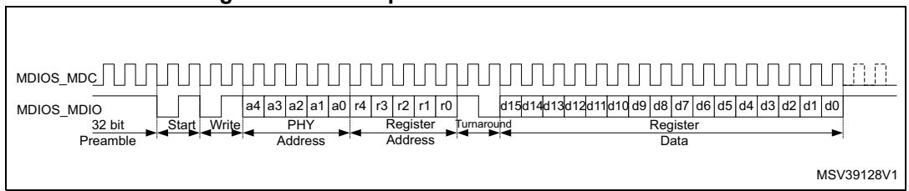
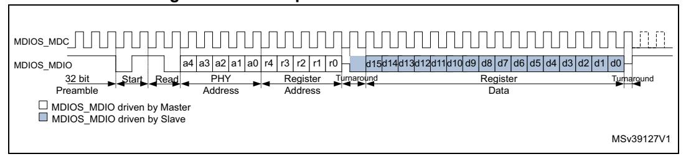

# **57 Management data input/output (MDIOS)**

# **57.1 MDIOS introduction**

An MDIO bus can be useful in systems where a master chip needs to manage (configure and get status data from) one or multiple slave chips. The bus protocol uses only two signals:

- MDC: the management data clock
- MDIO: the data line carrying the opcode (write or read), the slave (port) address, the MDIOS register address, and the data

In each transaction, the master either reads the contents of an MDIOS register in one of its slaves, or it writes data to an MDIOS register in one of its slaves.

The MDIOS peripheral serves as a slave interface to a MDIO bus. A MDIO master can use the MDC/MDIO lines to write and read 32 16-bit MDIOS registers, which are held in the MDIOS. These MDIOS registers are managed by the firmware. This allows the MDIO master to configure the application running on the STM32 and get status information from it.

The MDIOS can operate in Stop mode, optionally waking up the STM32 if the MDIO master performs a read or a write to one of its MDIOS registers.

# **57.2 MDIOS main features**

The MDIOS includes the following features:

- 32 MDIOS register addresses, each of which is managed using separate input and output data registers:
  - 32 x 16-bit firmware read/write, MDIOS read-only output data registers
  - 32 x 16-bit firmware read-only, MDIOS write-only input data registers
- Configurable slave (port) address
- Independently maskable interrupts/events:
  - MDIOS register write
  - MDIOS register read
  - MDIOS protocol error
- Able to operate in and wake up from Stop mode

# **57.3 MDIOS functional description**

## **57.3.1 MDIOS block diagram**

MSv41964V1 MDIOS APB\_INTERFACE MDIOS\_ADAPTER mdios\_wkup mdios\_pclk MDIOS\_MDC MDIOS\_MDIO Control registers DIN registers Data receive Data transmit DOUT registers Frame decoder APB bus mdios\_it

**Figure 739. MDIOS block diagram** 

## **57.3.2 MDIOS pins and internal signals**

*[Table 468](#page-1-0)* lists the MDIOS inputs and output signals connected to package pins or balls, while *[Table 469](#page-1-1)* shows the internal PWR signals.

| Signal name | Signal type          | Description                                      |
|-------------|----------------------|--------------------------------------------------|
| MDIOS_MDC   | Digital input        | MDIO master clock                                |
| MDIOS_MDIO  | Digital input/output | MDIO signal (opcode, address, input/output data) |

**Table 468. MDIOS input/output signals connected to package pins or balls** 

**Table 469. MDIOS internal input/output signals** 

| Signal name | Signal type    | Description            |
|-------------|----------------|------------------------|
| mdios_wkup  |                | MDIOS wake-up signal   |
| mdios_it    | Digital output | MDIOS interrupt signal |
| mdios_pclk  | Digital input  | APB clock              |

## **57.3.3 MDIOS protocol**

The MDIOS protocol uses two signals:

- MDIOS\_MDC: the clock, always driven by the master
- MDIOS\_MDIO: signal carrying the opcode, address, and bidirectional data

Each transaction is performed using a frame, which contains 32 bits (each passed serially):

- 14 control bits, driven by the master
  - 2 start bits: always 01
  - 2 opcode bits: read = 10, write = 01
  - 5 port address bits, indicating which slave device is being addressed
  - 5 MDIOS register address bits, up to 32 MDIOS registers can be addressed in each slave
- 2 turnaround state bits
  - On write operations, the master drives 10
  - On read operations, the first bit is high-impedance, and the second bit is driven by the slave to 0
- 16 data bits
  - On write operations, data written to slave MDIOS register is driven by the master
  - On read operations, data read from slave MDIOS register is driven by the slave

Each frame is usually preceded by a preamble, where the MDIO stays at one for 32 MDC clocks. The master can continue to keep MDIO at one, indicating the idle condition, when it has no frame to send.

When MDIO signal is driven by the master, MDIOS samples it using the rising edge of MDC. When MDIOS drives MDIO, the output changes on the rising edge of MDC.

**Figure 740. MDIO protocol write frame waveform**

**Figure 741. MDIO protocol read frame waveform**

## **57.3.4 MDIOS enabling and disabling**

The MDIOS is enabled by setting the EN bit in MDIOS\_CR. When EN = 1, the MDIOS monitors the MDIO bus and service frames addressed to one of its MDIOS registers.

When the MDIOS is enabled (setting EN to one), the same write operation to MDIOS\_CR must properly set the PORT\_ADDRESS[4:0] field to indicate the slave port address. A frame is ignored by the MDIOS if its port address is not the same as PORT\_ADDRESS[4:0] (presumably intended for another slave).

When EN = 0, the MDIOS ignores the frames being transmitted on the MDC/MDIO lines, and the IP is in a reduced consumption mode. Clearing EN also clears all of the DIN registers. If EN is cleared while the MDIOS is driving read data, it immediately releases the bus and does not drive the rest of the data. If EN is cleared while the MDIOS is receiving a frame, the frame is aborted and the data is lost.

When the MDIOS is enabled, disabled and reenabled, the status flags are not cleared. For a correct operation, the firmware must clear the status flag before reenabling the MDIOS.

## **57.3.5 MDIOS data**

From the point of view of the MDIO master, there are 32 16-bit MDIOS registers in the MDIOS, which can be written and read. In reality, for each MDIOS register 'x' there are two sets of registers: MDIOS\_DINRx and MDIOS\_DOUTRx.

## **Input data**

When the MDIO master transmits a frame, which writes to MDIOS register 'x' in the MDIOS, it is MDIOS\_DINRx, which is updated with the incoming data. The registers MDIOS\_DINR0 to MDIOS\_DINR31 can be read by the firmware, but they can be written only by the MDIO master via the MDIO bus.

The contents of MDIOS\_DINRx change immediately after the MDC rising edge when the last data bit is sampled.

If the firmware happens to read the contents of MDIOS\_DINRx at the moment that it is being updated, there is a possibility that the value read is corrupted (a bit-by-bit cross between the old value and the new value). For this reason, **the firmware must assure that two subsequent reads from the same MDIOS\_DINRx give the same value and assure that the data is stable when it is read**. In the very worst case, the firmware needs to read four times MDIOS\_DINRx to:

- 1. Get the old value
- 2. Get an incoherent value (when reading at the moment the register changes)
- 3. Get the new value
- 4. Confirm the new value

If the firmware uses the WRF interrupt and can guarantee that it reads the MDIOS\_DINRx register before any new MDIOS write frame completes, the firmware can perform a single read.

If the MDIO master performs a write operation with a register address, which is greater than 31, the MDIOS ignores the frame (the data is not saved and no flag is set).

### **Output data**

When the MDIOS receives a frame, which requests to read register 'x', it returns the value found in MDIOS\_DOUTRx. Thus, if the MDIO master expects to read the same value, which it previously wrote to MDIOS register 'x', the firmware must copy the data from MDIOS\_DINRx to MDIOS\_DOUTRx each time new data is written to MDIOS\_DINRx. For correct operation, the firmware must copy the data to the MDIOS\_DOUTRx register within a preamble (if the master sends preambles before each frame) plus 15 cycles time.

When an MDIOS register is read via the MDIO bus, the MDIOS passes the 16-bit value (from the corresponding MDIOS\_DOUTRx) to the MDIOS clock domain during the 15th cycle of the read frame. If the firmware attempts to write MDIOS\_DOUTRx while the MDIO

RM0399 Rev 4 2521/3556

master is currently reading MDIOS register 'x', the firmware write operation is ignored if it occurs during the 15th cycle of the frame (during a one-MDC-cycle window). Therefore, **after writing MDIOS\_DOUTRx, the firmware must read back the same MDIOS\_DOUTRx and confirm that the value was actually written**. If MDIOS\_DOUTRx does not contain the value, which was written, the firmware can simply try writing and rereading again.

If the MDIOS frequency is very slow compared to the mdios\_pclk frequency, it is better not to tie up the CPU by continuously writing and rereading MDIOS\_DOUTRx.

Note: The read flag (RDFx) is set as soon as the MDIOS\_DOUTRx DOUT[15:0] value is passed to the MDIOS clock domain. Thus, when a write to MDIOS\_DOUTRx is ignored (when the value read back is not the value, which was just written), the firmware can use a read interrupt to know when it is able to write MDIOS\_DOUTRx.

Respect the following procedure if the MDC clock is very slow:

- 1. Write MDIOS\_DOUTRx.
- 2. Assure that all of the read flags are zero (MDIOS\_RDFR = 0x0000). Clear the flags if necessary using MDIOS\_CRDFR.
- 3. Read back the same MDIOS\_DOUTRx and compare the value with the value, which was written in step 1.
- 4. If the values are the same, the procedure is done. Otherwise, continue to step 5.
- 5. Enable read interrupts by setting the RDIE bit in MDIOS\_CR1.
- 6. In the interrupt routine, assure that RDFx is set (no other read flags are set before bit x).
- 7. There is a 31 cycle + preamble time window (if the master sends a preamble before each frame) to write MDIOS\_DOUTRx safely without doing a read-back and compare. If this maximum delay cannot be guaranteed, go back to step 1.

If the MDIO master performs a read operation with a register address, which is greater than 31, the MDIOS returns a data value of all zeros.

## **57.3.6 MDIOS APB frequency**

Whenever the firmware reads from MDIOS\_DINRx or writes to MDIOS\_DOUTRx, the frequency of the APB bus must be at least 1.5 times the MDC frequency. For example, if MDC is at 20 MHz, the APB must be at 30 MHz or faster.

## **57.3.7 Write/read flags and interrupts**

When MDIOS register 'x' is written via the MDIO bus, the WRFx bit in MDIOS\_WRFR is set. WRFx becomes one at the moment that MDIOS\_DINRx is updated, which is when the last data bit is sampled on a write frame. An interrupt is generated if WRIEN = 1 (in MDIOS\_CR). WRFx is cleared by software by writing 1 to CWRFx (in MDIOS\_CWRFR).

When MDIOS register 'x' is read via the MDIO bus, the RDFx bit in MDIOS\_RDFR is set. RDFx becomes one at the moment that MDIOS\_DOUTRx is copied to the MDC clock domain, which is on the 15th cycle of a read frame. An interrupt is generated if RDIEN = 1 (in MDIOS\_CR). RDFx is cleared by software by writing 1 to CRDFx (in MDIOS\_CRDFR).

## **57.3.8 MDIOS error management**

There are three types of errors with their corresponding error flags:

- Preamble error: PERF (bit 0 of MDIOS\_SR)
- Start error: SERF (bit 1 of MDIOS\_SR)
- Turnaround error: TERF (bit 2 of MDIOS\_SR)

Each error flag is set by hardware when the corresponding error condition occurs. Each flag can be cleared by writing '1' to the corresponding bit in the clear flag register (MDIOS\_CLRFR).

An interrupt occurs if any of the three error flags is set while EIE = 1 (MDIOS\_CR).

Besides, setting an error flag, the MDIOS performs no action for a frame in which an error is detected: MDIOS\_DINRx are not updated and the MDIO line is not forced during the data phase.

For a given frame, errors do not accumulate. For example, if a preamble error is detected, no check is done for a start error or a turnaround error for the rest of the current frame.

When DPC = 0, following a detected error, all new frames, and errors are ignored until a complete full preamble has been detected.

When DPC = 1 (disable preamble check, MDIOS\_CR[7]), all frames and new errors are ignored as long as one of the error flags is set. As soon as the error bit is cleared, the MDIOS starts looking for a start sequence. Thus, the application must clear the error flag only when it is sure that no frame is currently in progress. Otherwise, the MDIOS likely misinterprets the bits being sent and becomes desynchronized with the master.

### **Preamble errors**

A preamble error occurs when a start sequence begins (with MDIO sampled at 0) without being immediately preceded by a preamble (MDIO sampled at 1 for at least 32 consecutive clocks).

Preamble errors are not reported after the MDIOS is first enabled (EN = 1 in MDIOS\_CR) until after a full preamble is received. This is to avoid an error condition when the peripheral frame detection is enabled while a preamble or frame is already in progress. In this case, the MDIOS ignores the first frame (since it did not first detect a full preamble), but does not set PERF.

If the DPC bit (disable preamble check, MDIOS\_CR[7]) is set, the MDIO master can send frames without preceding preambles and no preamble error is signaled. When DPC = 1, the application must assure that the master is not in the process of sending a frame at the moment that the MDIOS is enabled (EN is set). Otherwise, the slave might become desynchronized with the master.

## **Start errors**

A start error occurs when an illegal start sequence occurs or if an illegal command is given. The start sequence must always be 01, and the command must be either 01 (write) or 10 (read).

As with preamble errors, start errors are not reported until after a full preamble is received.

RM0399 Rev 4 2523/3556

## **Turnaround errors**

A turnaround error occurs when an error is detected in the turnaround bits of write frames. The 15th bit of the write frame must be 1 and the 16th bit must be 0.

Turnaround errors are only reported after a full preamble is received, there is no start error, the port address in the current frame matches, and the register address is in the supported range 0 to 31.

## **57.3.9 MDIOS in Stop mode**

The MDIOS can operate in Stop mode, responding to all reads, performing all writes, and causing the STM32 to wake up from Stop mode on MDIOS interrupts.

## **57.3.10 MDIOS interrupts**

There is a single interrupt vector for the three types of interrupts (write, read, and error). Any of these interrupt sources can wake the STM32 up from Stop mode. All interrupt flags need to be cleared in order to clear the interrupt line.

**Interrupt event Event flag Enable control bit** Write interrupt WRF[31:0] WRIE Read interrupt RDF[31:0] RDIE Error interrupt PERF (preamble), SERF (start), TERF (turnaround) EIE

**Table 470. Interrupt control bits** 

# **57.4 MDIOS registers**

## **57.4.1 MDIOS configuration register (MDIOS\_CR)**

Address offset: 0x000

Reset value: 0x0000 0000

| 31   | 30   | 29   | 28   | 27   | 26                | 25   | 24   | 23   | 22   | 21   | 20   | 19   | 18   | 17   | 16   |
|------|------|------|------|------|-------------------|------|------|------|------|------|------|------|------|------|------|
| Res. | Res. | Res. | Res. | Res. | Res.              | Res. | Res. | Res. | Res. | Res. | Res. | Res. | Res. | Res. | Res. |
|      |      |      |      |      |                   |      |      |      |      |      |      |      |      |      |      |
|      |      |      |      |      |                   |      |      |      |      |      |      |      |      |      |      |
| 15   | 14   | 13   | 12   | 11   | 10                | 9    | 8    | 7    | 6    | 5    | 4    | 3    | 2    | 1    | 0    |
| Res. | Res. | Res. |      |      | PORT_ADDRESS[4:0] |      |      | DPC  | Res. | Res. | Res. | EIE  | RDIE | WRIE | EN   |

Bits 31:13 Reserved, must be kept at reset value.

### Bits 12:8 **PORT\_ADDRESS[4:0]**: slave address

Can be written only when the peripheral is disabled (EN = 0). If the address given by the MDIO master matches PORT\_ADRESS[4:0], the MDIOS services the frame. Otherwise, the frame is ignored.

#### Bit 7 **DPC**: disable preamble check

- 0: MDIO master must give preamble before each frame.
- 1: MDIO master can send each frame without a preceding preamble, and the MDIOS does not signal a preamble error.

*Note: When this bit is set, the application must be sure that no frame is currently in progress when the MDIOS is enabled. Otherwise, the MDIOS can become desynchronized with the master.*

*This bit cannot be changed unless EN = 0 (though it can be changed at the same time that EN is being set).*

#### Bits 6:4 Reserved, must be kept at reset value.

Bit 3 **EIE**: error interrupt enable

0: Interrupt is disabled.

1: Interrupt is enabled.

*Note: When this bit is set, an interrupt is generated if any of the error flags (PERF, SERF, or TERF in the MDIOS\_SR register) is set.*

#### Bit 2 **RDIE**: register read interrupt enable

0: Interrupt is disabled.

1: Interrupt is enabled.

*Note: When this bit is set, an interrupt is generated if any of the read flags (RDF[31:0] in the MDIOS\_RDFR register) is set.*

### Bit 1 **WRIE**: register write interrupt enable

0: Interrupt is disabled.

1: Interrupt is enabled.

*Note: When this bit is set, an interrupt is generated if any of the read flags (WRF[31:0] in the MDIOS\_WRFR register) is set.*

### Bit 0 **EN**: peripheral enable

0: MDIOS is disabled.

1: MDIOS is enabled and monitoring the MDIO bus (MDC/MDIO).

## **57.4.2 MDIOS write flag register (MDIOS\_WRFR)**

Address offset: 0x004

Power-on reset value: 0x0000 0000

| 31 | 30         | 29 | 28 | 27 | 26 | 25 | 24 | 23 | 22 | 21 | 20 | 19 | 18 | 17 | 16 |
|----|------------|----|----|----|----|----|----|----|----|----|----|----|----|----|----|
|    | WRF[31:16] |    |    |    |    |    |    |    |    |    |    |    |    |    |    |
| r  | r          | r  | r  | r  | r  | r  | r  | r  | r  | r  | r  | r  | r  | r  | r  |
| 15 | 14         | 13 | 12 | 11 | 10 | 9  | 8  | 7  | 6  | 5  | 4  | 3  | 2  | 1  | 0  |
|    | WRF[15:0]  |    |    |    |    |    |    |    |    |    |    |    |    |    |    |
| r  | r          | r  | r  | r  | r  | r  | r  | r  | r  | r  | r  | r  | r  | r  | r  |

RM0399 Rev 4 2525/3556

Bits 31:0 **WRF[31:0]**: write flags for MDIOS registers 0 to 31.

Each bit is set by hardware when the MDIO master performs a write to the corresponding MDIOS register. An interrupt is generated if WRIE (in MDIOS\_CR) is set.

Each bit is cleared by software by writing '1' to the corresponding CWRF bit in the MDIOS\_CWRFR register.

For WRFx:

0: MDIOS register x is not written by the MDIO master.

1: MDIOS register x is written by the MDIO master and the data is available in DIN[15:0] in the MDIOS\_DINRx register.

# **57.4.3 MDIOS clear write flag register (MDIOS\_CWRFR)**

Address offset: 0x008

Power-on reset value: 0x0000 0000

| 31    | 30          | 29    | 28    | 27    | 26    | 25    | 24    | 23    | 22    | 21    | 20    | 19    | 18    | 17    | 16    |
|-------|-------------|-------|-------|-------|-------|-------|-------|-------|-------|-------|-------|-------|-------|-------|-------|
|       | CWRF[31:16] |       |       |       |       |       |       |       |       |       |       |       |       |       |       |
| rc_w1 | rc_w1       | rc_w1 | rc_w1 | rc_w1 | rc_w1 | rc_w1 | rc_w1 | rc_w1 | rc_w1 | rc_w1 | rc_w1 | rc_w1 | rc_w1 | rc_w1 | rc_w1 |
| 15    | 14          | 13    | 12    | 11    | 10    | 9     | 8     | 7     | 6     | 5     | 4     | 3     | 2     | 1     | 0     |
|       | CWRF[15:0]  |       |       |       |       |       |       |       |       |       |       |       |       |       |       |
| rc_w1 | rc_w1       | rc_w1 | rc_w1 | rc_w1 | rc_w1 | rc_w1 | rc_w1 | rc_w1 | rc_w1 | rc_w1 | rc_w1 | rc_w1 | rc_w1 | rc_w1 | rc_w1 |

Bits 31:0 **CWRF[31:0]**: clear the write flag

Writing 1 to CWRFx clears the WRFx bit in the MDIOS\_WRF register.

## **57.4.4 MDIOS read flag register (MDIOS\_RDFR)**

Address offset: 0x00C

Power-on reset value: 0x0000 0000

| 31 | 30         | 29 | 28 | 27 | 26 | 25 | 24 | 23 | 22 | 21 | 20 | 19 | 18 | 17 | 16 |
|----|------------|----|----|----|----|----|----|----|----|----|----|----|----|----|----|
|    | RDF[31:16] |    |    |    |    |    |    |    |    |    |    |    |    |    |    |
| r  | r          | r  | r  | r  | r  | r  | r  | r  | r  | r  | r  | r  | r  | r  | r  |
| 15 | 14         | 13 | 12 | 11 | 10 | 9  | 8  | 7  | 6  | 5  | 4  | 3  | 2  | 1  | 0  |
|    | RDF[15:0]  |    |    |    |    |    |    |    |    |    |    |    |    |    |    |
| r  | r          | r  | r  | r  | r  | r  | r  | r  | r  | r  | r  | r  | r  | r  | r  |

Bits 31:0 **RDF[31:0]**: read flags for MDIOS registers 0 to 31.

Each bit is set by hardware when the MDIO master performs a read from the corresponding MDIOS register. An interrupt is generated if RDIE (in MDIOS\_CR) is set.

Each bit is cleared by software by writing one to the corresponding CRDF bit in the MDIOS\_CRDFR register.

For RDFx:

0: MDIOS register x is not read by the MDIO master.

1: MDIOS register x is read by the MDIO master.

## **57.4.5 MDIOS clear read flag register (MDIOS\_CRDFR)**

Address offset: 0x010

Power-on reset value: 0x0000 0000

| 31    | 30          | 29    | 28    | 27    | 26    | 25    | 24    | 23         | 22    | 21    | 20    | 19    | 18    | 17    | 16    |
|-------|-------------|-------|-------|-------|-------|-------|-------|------------|-------|-------|-------|-------|-------|-------|-------|
|       | CRDF[31:16] |       |       |       |       |       |       |            |       |       |       |       |       |       |       |
| rc_w1 | rc_w1       | rc_w1 | rc_w1 | rc_w1 | rc_w1 | rc_w1 | rc_w1 | rc_w1      | rc_w1 | rc_w1 | rc_w1 | rc_w1 | rc_w1 | rc_w1 | rc_w1 |
| 15    | 14          | 13    | 12    | 11    | 10    | 9     | 8     | 7          | 6     | 5     | 4     | 3     | 2     | 1     | 0     |
|       |             |       |       |       |       |       |       | CRDF[15:0] |       |       |       |       |       |       |       |
| rc_w1 | rc_w1       | rc_w1 | rc_w1 | rc_w1 | rc_w1 | rc_w1 | rc_w1 | rc_w1      | rc_w1 | rc_w1 | rc_w1 | rc_w1 | rc_w1 | rc_w1 | rc_w1 |

Bits 31:0 **CRDF[31:0]**: clear the read flag

Writing 1 to CRDFx clears the RDFx bit in the MDIOS\_RDF register.

## **57.4.6 MDIOS status register (MDIOS\_SR)**

Address offset: 0x014

Power-on reset value: 0x0000 0000 Writes to this register have no effect.

| 31   | 30   | 29   | 28   | 27   | 26   | 25   | 24   | 23   | 22   | 21   | 20   | 19   | 18   | 17   | 16   |
|------|------|------|------|------|------|------|------|------|------|------|------|------|------|------|------|
| Res. | Res. | Res. | Res. | Res. | Res. | Res. | Res. | Res. | Res. | Res. | Res. | Res. | Res. | Res. | Res. |
|      |      |      |      |      |      |      |      |      |      |      |      |      |      |      |      |
|      |      |      |      |      |      |      |      |      |      |      |      |      |      |      |      |
| 15   | 14   | 13   | 12   | 11   | 10   | 9    | 8    | 7    | 6    | 5    | 4    | 3    | 2    | 1    | 0    |
| Res. | Res. | Res. | Res. | Res. | Res. | Res. | Res. | Res. | Res. | Res. | Res. | Res. | TERF | SERF | PERF |

Bits 31:3 Reserved, must be kept at reset value.

Bit 2 **TERF**: turnaround error flag

0: No turnaround error has occurred. 1: A turnaround error has occurred.

*Note: Writing 1 to CTERF (MDIOS\_CLRFR) clears this bit.*

Bit 1 **SERF**: start error flag

0: No start error has occurred. 1: A start error has occurred.

*Note: Writing 1 to CSERF (MDIOS\_CLRFR) clears this bit.*

Bit 0 **PERF**: preamble error flag

0: No preamble error has occurred. 1: A preamble error has occurred.

*Note: Writing 1 to CPERF (MDIOS\_CLRFR) clears this bit.*

*This bit is not set if DPC (disable preamble check, MDIOS\_CR[7]) is set.*

RM0399 Rev 4 2527/3556

## **57.4.7 MDIOS clear flag register (MDIOS\_CLRFR)**

Address offset: 0x018

Power-on reset value: 0x0000 0000 Reads on this register returns all zeros.

| 31   | 30   | 29   | 28   | 27   | 26   | 25   | 24   | 23   | 22   | 21   | 20   | 19   | 18   | 17                | 16   |
|------|------|------|------|------|------|------|------|------|------|------|------|------|------|-------------------|------|
| Res. | Res. | Res. | Res. | Res. | Res. | Res. | Res. | Res. | Res. | Res. | Res. | Res. | Res. | Res.              | Res. |
|      |      |      |      |      |      |      |      |      |      |      |      |      |      |                   |      |
|      |      |      |      |      |      |      |      |      |      |      |      |      |      |                   |      |
| 15   | 14   | 13   | 12   | 11   | 10   | 9    | 8    | 7    | 6    | 5    | 4    | 3    | 2    | 1                 | 0    |
| Res. | Res. | Res. | Res. | Res. | Res. | Res. | Res. | Res. | Res. | Res. | Res. | Res. |      | CTERF CSERF CPERF |      |

Bits 31:3 Reserved, must be kept at reset value.

Bit 2 **CTERF**: clear the turnaround error flag

Writing 1 to this bit clears the TERF flag (in MDIOS\_SR).

When DPC = 1 (MDIOS\_CR[7]), the TERF flag must be cleared only when there is not a frame already in progress.

Bit 1 **CSERF**: clear the start error flag

Writing 1 to this bit clears the SERF flag (in MDIOS\_SR).

When DPC = 1 (MDIOS\_CR[7]), the SERF flag must be cleared only when there is not a frame already in progress.

Bit 0 **CPERF**: clear the preamble error flag

Writing 1 to this bit clears the PERF flag (in MDIOS\_SR).

## **57.4.8 MDIOS input data register x (MDIOS\_DINRx)**

Address offset: 0x100 + 0x4 \* x, (x = 0 to 31)

Reset value: 0x0000 0000

| 31   | 30   | 29   | 28   | 27   | 26   | 25   | 24   | 23        | 22   | 21   | 20   | 19   | 18   | 17   | 16   |
|------|------|------|------|------|------|------|------|-----------|------|------|------|------|------|------|------|
| Res. | Res. | Res. | Res. | Res. | Res. | Res. | Res. | Res.      | Res. | Res. | Res. | Res. | Res. | Res. | Res. |
|      |      |      |      |      |      |      |      |           |      |      |      |      |      |      |      |
| 15   | 14   | 13   | 12   | 11   | 10   | 9    | 8    | 7         | 6    | 5    | 4    | 3    | 2    | 1    | 0    |
|      |      |      |      |      |      |      |      | DIN[15:0] |      |      |      |      |      |      |      |
| r    | r    | r    | r    | r    | r    | r    | r    | r         | r    | r    | r    | r    | r    | r    | r    |

Bits 31:16 Reserved, must be kept at reset value.

Bits 15:0 **DIN[15:0]**: input data received from MDIO master during write frames

This field is written by hardware with the 16-bit data received in a write frame, which is addressed to MDIOS register x.

## **57.4.9 MDIOS output data register x (MDIOS\_DOUTRx)**

Address offset: 0x180 + 0x4 \* x, (x = 0 to 31)

Reset value: 0x0000 0000

| 31   | 30   | 29   | 28   | 27   | 26   | 25   | 24   | 23         | 22   | 21   | 20   | 19   | 18   | 17   | 16   |
|------|------|------|------|------|------|------|------|------------|------|------|------|------|------|------|------|
| Res. | Res. | Res. | Res. | Res. | Res. | Res. | Res. | Res.       | Res. | Res. | Res. | Res. | Res. | Res. | Res. |
|      |      |      |      |      |      |      |      |            |      |      |      |      |      |      |      |
|      |      |      |      |      |      |      |      |            |      |      |      |      |      |      |      |
| 15   | 14   | 13   | 12   | 11   | 10   | 9    | 8    | 7          | 6    | 5    | 4    | 3    | 2    | 1    | 0    |
|      |      |      |      |      |      |      |      | DOUT[15:0] |      |      |      |      |      |      |      |

Bits 31:16 Reserved, must be kept at reset value.

Bits 15:0 **DOUT[15:0]**: output data sent to MDIO master during read frames This field is written by software. These 16 bits are serially output on the MDIO bus during read frames, which address the MDIOS register x.

## **57.4.10 MDIOS register map**

**Table 471. MDIOS register map and reset values** 

| Offset                             | Register name | 31   | 30   | 29   | 28   | 27   | 26   | 25   | 24   | 23   | 22   | 21   | 20   | 19   | 18   | 17   | 16         | 15   | 14   | 13   | 12   | 11   | 10                    | 9    | 8         | 7    | 6    | 5    | 4    | 3    | 2     | 1     | 0     |
|------------------------------------|------------------|------|------|------|------|------|------|------|------|------|------|------|------|------|------|------|------------|------|------|------|------|------|-----------------------|------|-----------|------|------|------|------|------|-------|-------|-------|
| 0x000                              | MDIOS_CR         | Res. | Res. | Res. | Res. | Res. | Res. | Res. | Res. | Res. | Res. | Res. | Res. | Res. | Res. | Res. | Res.       | Res. | Res. | Res. |      |      | PORT_ ADDRESS[4:0] |      |           | DPC  | Res. | Res. | Res. | EIE  | RDIE  | WRIE  | EN    |
|                                    | Reset value      |      |      |      |      |      |      |      |      |      |      |      |      |      |      |      |            |      |      |      | 0    | 0    | 0                     | 0    | 0         | 0    |      |      |      | 0    | 0     | 0     | 0     |
| 0x004                              | MDIOS_WRFR       |      |      |      |      |      |      |      |      |      |      |      |      |      |      |      | WRF[31:0]  |      |      |      |      |      |                       |      |           |      |      |      |      |      |       |       |       |
|                                    | Reset value      | 0    | 0    | 0    | 0    | 0    | 0    | 0    | 0    | 0    | 0    | 0    | 0    | 0    | 0    | 0    | 0          | 0    | 0    | 0    | 0    | 0    | 0                     | 0    | 0         | 0    | 0    | 0    | 0    | 0    | 0     | 0     | 0     |
| 0x008                              | MDIOS_CWRFR      |      |      |      |      |      |      |      |      |      |      |      |      |      |      |      | CWRF[31:0] |      |      |      |      |      |                       |      |           |      |      |      |      |      |       |       |       |
|                                    | Reset value      | 0    | 0    | 0    | 0    | 0    | 0    | 0    | 0    | 0    | 0    | 0    | 0    | 0    | 0    | 0    | 0          | 0    | 0    | 0    | 0    | 0    | 0                     | 0    | 0         | 0    | 0    | 0    | 0    | 0    | 0     | 0     | 0     |
| 0x00C                              | MDIOS_RDFR       |      |      |      |      |      |      |      |      |      |      |      |      |      |      |      | RDF[31:0]  |      |      |      |      |      |                       |      |           |      |      |      |      |      |       |       |       |
|                                    | Reset value      | 0    | 0    | 0    | 0    | 0    | 0    | 0    | 0    | 0    | 0    | 0    | 0    | 0    | 0    | 0    | 0          | 0    | 0    | 0    | 0    | 0    | 0                     | 0    | 0         | 0    | 0    | 0    | 0    | 0    | 0     | 0     | 0     |
| 0x010                              | MDIOS_CRDFR      |      |      |      |      |      |      |      |      |      |      |      |      |      |      |      | CRDF[31:0] |      |      |      |      |      |                       |      |           |      |      |      |      |      |       |       |       |
|                                    | Reset value      | 0    | 0    | 0    | 0    | 0    | 0    | 0    | 0    | 0    | 0    | 0    | 0    | 0    | 0    | 0    | 0          | 0    | 0    | 0    | 0    | 0    | 0                     | 0    | 0         | 0    | 0    | 0    | 0    | 0    | 0     | 0     | 0     |
| 0x014                              | MDIOS_SR         | Res. | Res. | Res. | Res. | Res. | Res. | Res. | Res. | Res. | Res. | Res. | Res. | Res. | Res. | Res. | Res.       | Res. | Res. | Res. | Res. | Res. | Res.                  | Res. | Res.      | Res. | Res. | Res. | Res. | Res. | TERF  | SERF  | PERF  |
|                                    | Reset value      |      |      |      |      |      |      |      |      |      |      |      |      |      |      |      |            |      |      |      |      |      |                       |      |           |      |      |      |      |      | 0     | 0     | 0     |
| 0x018                              | MDIOS_CLRFR      | Res. | Res. | Res. | Res. | Res. | Res. | Res. | Res. | Res. | Res. | Res. | Res. | Res. | Res. | Res. | Res.       | Res. | Res. | Res. | Res. | Res. | Res.                  | Res. | Res.      | Res. | Res. | Res. | Res. | Res. | CTERF | CSERF | CPERF |
|                                    | Reset value      |      |      |      |      |      |      |      |      |      |      |      |      |      |      |      |            |      |      |      |      |      |                       |      |           |      |      |      |      |      | 0     | 0     | 0     |
| 0x01C 0x0FC                     | Reserved         |      |      |      |      |      |      |      |      |      |      |      |      |      |      |      | Reserved   |      |      |      |      |      |                       |      |           |      |      |      |      |      |       |       |       |
| 0x100 + 0x04 * x (x=0 to 31) | MDIOS_DINRx      | Res. | Res. | Res. | Res. | Res. | Res. | Res. | Res. | Res. | Res. | Res. | Res. | Res. | Res. | Res. | Res.       |      |      |      |      |      |                       |      | DIN[15:0] |      |      |      |      |      |       |       |       |
| Last address: 0x17C          | Reset value      |      |      |      |      |      |      |      |      |      |      |      |      |      |      |      |            | 0    | 0    | 0    | 0    | 0    | 0                     | 0    | 0         | 0    | 0    | 0    | 0    | 0    | 0     | 0     | 0     |

RM0399 Rev 4 2529/3556

**Table 471. MDIOS register map and reset values (continued)**

| Offset                            | Register name | 31   | 30   | 29   | 28   | 27   | 26   | 25   | 24   | 23   | 22   | 21   | 20   | 19   | 18   | 17   | 16   | 15         | 14 | 13 | 12 | 11 | 10 | 9 | 8 | 7 | 6 | 5 | 4 | 3 | 2 | 1 | 0 |
|-----------------------------------|------------------|------|------|------|------|------|------|------|------|------|------|------|------|------|------|------|------|------------|----|----|----|----|----|---|---|---|---|---|---|---|---|---|---|
| 0x180 + 0x4 * x (x=0 to 31) | MDIOS_DOUTRx     | Res. | Res. | Res. | Res. | Res. | Res. | Res. | Res. | Res. | Res. | Res. | Res. | Res. | Res. | Res. | Res. | DOUT[15:0] |    |    |    |    |    |   |   |   |   |   |   |   |   |   |   |
| Last address: 0x1FC         | Reset value      |      |      |      |      |      |      |      |      |      |      |      |      |      |      |      |      | 0          | 0  | 0  | 0  | 0  | 0  | 0 | 0 | 0 | 0 | 0 | 0 | 0 | 0 | 0 | 0 |

Refer to *Section 2.3* for the register boundary addresses.